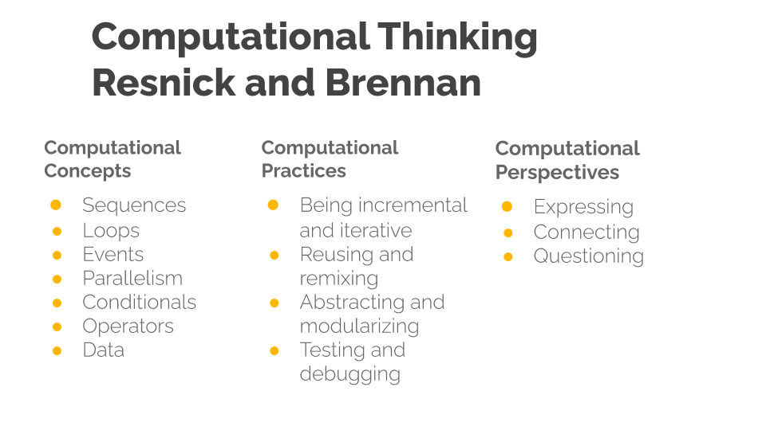
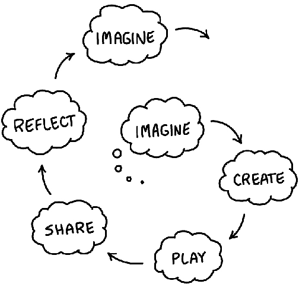
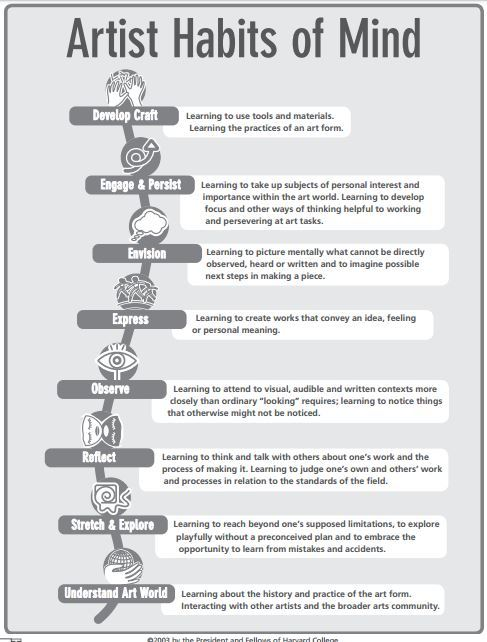

activated---
zotero:
  scannable-cite: false # only relevant when your compiling to scannable-cite .odt
  client: zotero # defaults to zotero
  author-in-text: false # when true, enabled fake author-name-only cites by replacing it with the text of the last names of the authors
  csl-style: harvard # pre-fill the style
...

# Keeping it Real -- Inclusive frameworks to support computing projects

## Outline

### Part one - Intro, context and terms
- Introduction & Context
  -   Inclusion - define and how relevant to abstract / Concrete
  <!-- - Context, coding not ICT, new curriculum - quick sketch of CT,    -->
- A note on making computing engaging
- Concrete and Abstract terms defined in relation to learning
### Part two - Computational Thinking, the Abstract and Concrete
- Concrete and Abstract learning approaches
- The Issue of Transfer
- CT explored - Wing and Resnick - wider - narrower - abstract / concrete
- Coding is not CT - but a good medium

### Part Three - Tactics for teaching Computing in the Classroom
- gcse exam context
- tactics for teaching Coding
- expansive framing
- semantic wave - presented and applied as concepts first often - can be either but danger of flatlining - how to avoid that in tinkering projects?
- peer programming
- limitations of concepts first approach as a link to the next section

### Part Four - Alternative, Authentic Approaches
- Intro to alternative models suiting bottom up  / concrete approaches
- UDL universal design for learning.
- Design approaches -
  - creative spiral / iterative
  - studio thinking
  - using design patterns
- PBL as an inclusive models  - - Value of PBL - personal summary - diversity of projects possible- cf the uncertainty of pedagogy, given freedom

### notes / ideas
- order of the concrete / abstract and inclusion section - prehaps swap?
- in PRIMM quick read - they draw on SCT socio cultural theory - add this to the chapter and link to game making
-  downplay PBL - up play design approaches (and patterns)
- include associated challenges in part two

### Additions -

- Kolb as PBL friendly - no starting point - suited to ongoing reflective cycle approach
- But need help to navigate the process - think of design Patterns
- Invite question - what exactly is abstract?
- Then on to Papert - pluralism - they get there if you let them experiment or the design of the tools / experience leads them there.   
- some kind of resolution of concrete and abstract concepts
- there is abstraction at every level , young kids grouping red toys, abstract, analyse and sythesise by grouping - this doesn't have to be taught explicitly
- the essential tension of teachers trying to be inclusive but having to respond to a curriculum.

## Introduction

Computing as a subject lends itself to being taught in a multitude of ways. That's one of the things that makes it fascinating. Many sources of inspiration exist for computing teachers promoting diverse approaches to covering the computing curriculum, building skills in programming and developing wider computer science knowledge. This chapter highlights the value of some of the more hands-on teaching approaches and will put this into an academic context in an accessible way by drawing on influential and inspirational research and projects in the field of creative computing.

<!-- not sure about hands on here
no-one really wants to teach in a hands off way
this is part of the 12 principles
-->

<!-- ### Context of Teaching Computing in the UK -->
The promotion of Computational Thinking has been a key factor in the presentation of the UK's current computing curriculum. Computational Thinking started to gain wider attention when the academic and computer scientist Jeanette Wing began to promote it as a concept and approach that could be useful beyond the field of computing. Wing's perspective is that "everyone... can benefit from thinking like a computer scientist" -@wing_computational_2008. Computational Thinking is the ability to express and solve problems in the same kind of way a computer would.

<!-- I do not suggest the concepts of Computational Thinking and Creativity are in opposition to each other. However, for the first part of this chapter I am going to explore both concepts from an academic perspective as a way of finding useful tensions and variety in the way computing teaching is being approached and promoted.

I will use the lens of projects to examine creativity in computing.   -->

The start of this chapter outlines some of the theory and practice of applying an inclusive approach to computing projects, specifically the benefits of a project based approach. I then look at different interpretations of Computational Thinking from a critical perspective to contrast the concepts-first approach to other more concrete approaches like project-based learning.
(not sure about the terms or even the whole approach of the last sentence)

<!-- In the second half of the chapter we will look at some of the learning supports available to educators who want, help their learners jump right into coding, sustain interest and reflect on the progress they have made. -->

<!-- To address wider challenges of implementing PBL approaches we look at what is available to help teachers balancing the requirements of the curriculum and doing hands-on work. To address questions equality I explore how can young people from a wide variety of backgrounds benefit from this approach. -->

Whereas the diversity of materials and end goals of computing projects are readily visible for teachers and family members enthusiastic to help, the best way to help learners learn, or effective pedagogies to support the coding and computing process are less visible and less exchanged.

<!-- Give an example to support the above  -->

<!-- DO Other chapters in this book deal with the strategies like PRIMM and Unplugged computing to communicate the more abstract concepts of computational thinking suited to classroom teaching.?  -->

<!-- ## Coding well is well hard - hard to learn- hard to teach. Choosing suitable coding projects for novices is hard to get right. They may be too hard or too boring. [removed extra]  -->

#### Inclusion and Participation

Later in this chapter I will outline several approaches to support inclusive pedagogy but before doing that it is important to have a quick look at the term inclusion. Inclusion in education is used in many ways but is seen generally as ‘increasing the participation of students in, and reducing their exclusion from, the cultures, curricula and communities of local schools’ [@booth2002index]. More recent educational research in this area has widened from having a chief focus on SEN issues to including barriers of culture and other exclusionary elements of school discourse [@black-hawkins_achievement_2008].

The issue of alienation from the culture of computing in schools can be an issue especially for girls and some ethnic minorities. As such, a social and cultural approach to understanding and incorporating the learning experience of pupils in a wider ecosystem beyond school is vital.

<!-- Socio cultural here? or drop? -->

<!-- The next section deals with inclusive pedagogy but Florian and BH make a distinction with other similar terms does this need to be explored?  -->

An important guiding principle of inclusive pedagogy is to move away from a view that most students learn well and other need particular support particular, adapted approaches. Indeed if you include wider understandings of neurodiversity and cultural and language diversity then planning alternative activities or learning pathways for all learners with particular needs could quickly become so time-consuming and complex that it would be unsustainable.

Instead, inclusive pedagogy promotes the design of learning experiences so that all learners start to develop abstract concepts from concrete examples, can choose their own learning tasks (and thus levels of challenge), are supported to reflect via self-assessment  and bring their own experience and cultural understandings into their work.
(Good citation needed?)

<!-- Concrete fading here?  -->

These design choice among others are presented in a framework called Universal Design for Learning which embodies this inclusive approach. UDL, design-based approaches and the value of projects and are explored further in the latter part of this chapter. In the next section we look at one of the ways educators have tried to make computing engaging to a diverse set of learners.

#### A Note on Making Computing Engaging

Embracing the challenge of making computing projects broadly accessible and engaging and has something that many individuals and organisations both funded and enthusiast have engaged with. University and industry partner programs have created a diversity of computing materials and computing environments designed to aid novice programmers. Teachers themselves have been a tremendous source in the sharing of knowledge, materials and approaches to respond to the challenge.

A quick search the web for creative computing shows a tremendous diversity of activities and mediums designed to engage the home and hobby interests of young people. Physical examples include fashion and textiles based computing, robotics, colourful lighting displays and programming lego constructions. Beyond the value of working with home interests as a way of increasing participation and inclusion there is also outreach value is in the visual, tangible and touchable nature of the materials. They look and feel like fun and exciting objects to engage with.

Other web-based or software activities include game making, meme creation, hobby website creation or making storytelling adventures. Adapting other narrative forms like books, films, games and social media content increases the ability for learners to bring their own interests into the mix.  

However while the range of materials and possible creative projects is exciting and full for promise for computing teachers, it is not always clear how to get best approach these opportunities from an educational point of view.

<!-- SIGNPOSTING (but not too much)?
To help address this chapter will cover some design and project based approaches to help.  Before doing that we will look at some foundational terms that you will meet and explore this subject from the perspective of   -->

### Computational Thinking, the Abstract and Concrete

#### Concrete and Abstract learning approaches

When reading about different approaches to teaching computing you are likely to meet the terms concrete and abstract. As these are such foundational terms, and because they are often used without introduction, lets define them quickly. In an everyday sense concrete objects are ones you can get hold of and abstract objects exist only as concepts. A pound coin is concrete but the idea of profit is abstract.

There is another everyday usage which hints that abstract knowledge are harder to get to grips with than more concrete understandings. We might ask for a concrete example if we don't understand a more abstract definition. It is the use of something in context that makes something concrete.
In everyday language to grok something is a concrete understanding. In traditional conceptions of education  abstract knowledge is of greater value. If you can understand a concept as it applies in different situations then this ability to transfer it and have a more global understanding is held as a higher form of knowledge.

However there are also dangers of adopting teaching in a abstract way. For example, learners may not make a connection to a real situation and then can only recall rather than apply the knowledge. This is termed inert knowledge. For example in computing terms you may be able to give a definition of what a function is in a coding language but not be able to write one.

There are also dangers associated with learning things in a concrete way as well. If you learned you coding by teaching yourself or just picking it up for other people then you may be able to complete tasks but not be able to explain what you have done to other people, or may really struggle to recognise similar patterns in other computing contexts. This kind of knowledge is sometimes called embodied skills.

Interestingly, one critical voice challenging the idea that abstract approaches were a higher form of knowledge was Seymour Papert whose work on creative computing at MIT created a legacy that includes the work on the Scratch programming tool. Papert and Turkle [-@papert_epistemological_1990] talk about revaluing concrete approaches to computing and coding. While they do not discard the technical value of abstract approaches, they draw on feminist theory to make a convincing case that some of the hard approaches and formal language can be off putting to certain learners and especially girls.

In this light, the process of finding solutions to coding issues for novice coders should be a matter of personal preference. As well as abstract and concrete - they use a top down and bottom up analogy. In a bottom up approach problems are tackled piece by piece, experimentally. Desmond Tutu once said that "there is only one way to eat an elephant: a bite at a time." Bottom up (concrete) coders take this approach.

<!-- MORE ON BRICOLAGE AT THIS POINT? -->

To clarify this Papert and Turkle give the example of a young coder Lisa, who is aware of a more formal way to approach the kinds of programming tasks she is undertaking, but maintains that way doesn't work for her. As she continues her journey as a coder this frequent message that she is doing things the wrong way demotivates her enthusiasm around coding. The more abstract concepts are thinking tools that are only useful to the learner if they match with her experiences. Forcing the learner towards them in this example is counter productive as it invalidates her experience and progress.

The authors outline that the danger of leading with the abstract is to devalue this bottom up approach to coding. This way of coding has also been called a craft approach, getting close to the materials. It is an way of doing things that has been shown to have a lot of value in many professions. It has been behind many scientific break-throughs (LATOUR CITATIONS?). For someone like myself, who taught themselves how to code in this concrete ways, it is really encouraging to know about this perspective.

The debate of the desirability of testing using more formal abstract measures of success has been going on for many years. The IQ test is a good example which has been criticised for being culturally biased in favour of more Western understandings of intelligence which favour formal logical and abstract elements and ignore other measures of emotional, cultural and practical intelligence.

However, while this valuing of concrete approaches is important, it is potentially unhelpful to express concrete and abstract as two paths that never meet. Abstract concepts are useful after all. The danger is when the abstract concepts chosen by educators or included in the curriculum are don't seem relevant to learners, leading to their disengagement.  

Many educational approaches value both abstract and concrete knowledge and experience as parts of an ongoing process which alternates between the two poles to help organise and make connections with wider bodies on knowledge. For example the theory of experiential learning which was make popular by Kolb and socio cultural approaches based on the ideas of Vygotsky. Kolb's model is expressed as a cycle as kind of learning experience here is circular in nature. When this comes to coding and computing this rings true as your knowledge of a coding concept may deepen a little bit each time you apply it in practice. The socio-cultural school holds that rather than being a separate thinking machine, the mind is dependent on the social and cultural webs of meaning that surrounds it. We think socially.

<!-- Perhaps add to this element to the start of part four about project based approaches
or revise to be practical to the teacher -->

<!-- This forms a fundamental challenge to the usefulness of teaching cognitive processes for transfer, one that challenges so many of schools normal ways of doing things that it is difficult to know where to begin reform. -->

<!-- Image done in a way that works on github pages  -->

#### The Issue of Transfer

The implications of thinking socially are that our mind is motivated and activated by the context of the problems that we meet. While it would be great if we could transfer the knowledge we gain in one area to another or to be able to apply an abstract idea to a more specific problem, researchers from the socio-cultural perspective are very critical of this idea.

This problem of transfer creates a problem for Computing teachers. If they are aiming for good exam results of their students. If students are unlikely to be able to transfer the computing skills they have picked up from undertaking creative projects, then it is logical to teach to the test as this will be the cultural context that they need to perform in. Of course this may have long term detrimental effects, as then students will not be able to transfer the exam knowledge into practical experience after school.     

The difference between exam-focused computing and real life coding and computing is ....
 (find citations / example )

As with many other subjects, teachers are being asked to both teach to the particular requirements of exams and to build more transferrable skills. In this case this process of being pulled in different directions seems particularly noticeable.

<!-- Sign posting - tactics -   semantic wave theory
and more out of school tatctics.  -->

<!-- #### CT and transfer

Mark Guzdial was an early advocate of Computational Thinking and wrote about the possibility of this kind of cross over enthusiastically - find and contextualise - However his enthusiasm has changed in focus he has moved towards a more concrete idea of what Computational Thinking . Has he lost the faith - what's happening here?

The key to this idea is transfer which is a tricky concept to prove when it comes to situations like this. As Mark says, you can't prove a negative, but the evidence for CT being transferred to other areas is weak.

There is a school of thinking in educational research which argues that learning how to do something like coding is entangled up in particular situations. So even though CT processes may be at work they are tacit and would be of little use in other situations. -->

#### Definitions of Computational Thinking

We can use this distinction between concrete and abstract to examine the differences between two popular interpretations of Computational Thinking  One is Jeanette Wing's original take. "The most important and high-level thought process in computational thinking is the abstraction process. Abstraction is used in defining patterns, generalizing from instances, and parameterization" [@wing_computational_nodate]. The essence is abstract away concepts and principles from the context. This approach suits a formal exam approach. Many learning resources designed to support the computing curriculum present this principle as for key pillars; decomposition, pattern recognition, abstraction algorithmic thinking[@bbc_bitesize_introduction_nodate].

Another widely used definition of CT by Brennan and Resnick [-@brennan_new_2012] was developed in response to the question ""How do we describe what Tim, Shannon, and Renita are learning as they participate as designers of interactive media with Scratch?". They take a situated approach to mapping the potential learning dimensions of working with others creating computing projects. The resulting map they create includes computational concepts, computational practices and computational perspectives. This framework based on observation of learners in action is more concrete and more accessible to teachers and learners as they can more easily recognise their own practice.

Computational Thinking model by Resnick and Brennan - Diagram created by Mick Chesterman

This wider and process driven definition of CT has been used and adapted by many organisations seeking to support the new computing curriculum. As such it may be familiar from websites, posters and other supporting material created by groups like Barefoot computing. A review of teaching Computational Thinking [@lye_review_2014] used this second definition as the basis for their review, which point to the widespread use of Brennan and Resnick's more applied approach.

<!-- (The review finds that) this is a really useful document to help teachers and researchers understand what to look for and what they can design their programming sessions to facilitate. If you look at the breakdown, then you can see that a lot of practices and perspectives are very general to a process of creating something with peers rather than being unique to computing. This map of the concepts and skills that learners can develop while doing computing projects may certainly be useful but you can't argue that this definition Computational Thinking is unique. Certainly from an academic perspective we need to ask what is special about Computational Thinking. -->

Much analysis has been done about the relative merits of different definitions of CT. From my perspective I feel that from an academic perspective Wing's definition does a good job of describing what is most unique about Computational Thinking compared to other frameworks. The way it looks at the special ways abstraction is done in computer science is convincing. The concept of Computational Thinking as more abstract, transferable knowledge became significant aspect of the 2015 Computing curriculum. It suited the conservatives government's back to educational basics agenda based, a perceived move away a progressive skills based approach to a knowledge-based curriculum.

This agenda has been championed by education ministers Nick Gibbs and Michael Gove. A good example can be found in a speech by Nick Gibb at a launch of a collection of essays _The Question of Knowledge_ (http://tiny.cc/gibbsknowledge). I suspect most educators would find this oppositional setting of knowledge against skills unconvincing. If we return to Kobl's experiential cycle, it is through application of knowledge in concrete contexts that skills develop and understandings of knowledge deepen. Ironically in the foreword of the publication in question, references the importance of Young's concept of powerful knowledge which is knowledge put into practice in a concrete context, and putting the knowledge into practice will involve developing practical skills.

SINGPOSTING - Given this, educational practices and frameworks which support learners and teachers to help reflect on and develop skills are clearly helpful. Also, from the perspective inclusive teaching practice there are many benefits to more concrete approaches. The wider definition of CT here assumes the collaborative coding of a computing project.  This chapter will explore some of the benefits in context and highlight other frameworks and approaches that can help teachers deliver in this way.  

<!-- If we return to our general understanding of what abstract and concrete mean, we can see that the CT concepts can be formulated in a spectrum of relatively abstract to relatively concrete. While the computing concepts, practices and perspectives are all abstract concepts they are relatively more concrete than the concepts in Wing's definition. -->

<!-- The process CT has been taught - which is covered in another chapter - there are some really innovative and accessible ways that are proposed. Unplugged, concept mapping and others.... -->

<!-- Another take on CT critiques Wing from the other angle. According to Denner and Tendre -@tedre_long_2016, Wing's view of CT over eggs the possibility of transfer to other areas beyond what is shown in the research and has a too narrow view of CT. -->

### Coding is not Computational Thinking

<!--  is this section really needed?
Refer back to transfer?
Integrate into another? -->

We have explored that Computational Thinking is a contested term. While there is a general agreement that computational thinking is not just computer coding, most applied definitions include algorithmic thinking, and thus the more concrete aspects of coding structures.

<!-- I as I became I learned how to become a proficient coder without explicitly being taught the more abstract CT concepts.  -->

Coding may not be the same as computational thinking but it is part of the computing curriculum and a useful skill in itself. It is the water in which learners swim when creating engaging computing projects where such wider computing concepts are developed.

There is a tension between the skills required of Real Life coding and the time it takes to learn via real projects and the more abstract knowledge needed to answer more formal exam questions. In GCSE exams include a paper which tests application of coding concepts in a paper based format. Which aims to strike a balance.

This would then justify devoting more time to applied coding projects especially if they can be done collaboratively to take advantage of the benefits of social learning.

<!-- Refer back to transfer? -->

### Part Three - Tactics for teaching Computing in the Classroom

<!-- SOME MORE THE CHARACTERISTICS OF THE QUESTIONS AND THE KNOWLEDGE needed
AN EXAMPLE ?-->
This section gives tips and examples pitched at a typical classrooom computing environment. The following section examines wider project based approaches which are more challenging to integrate but which provide particular benefits to the learner.

#### GCSE exam context

In a very real sense the contents of GCSE exams determine a lot of what happens in the computing classroom in the preceding years. In practical terms, as abstract concepts are a part of our computing curriculum as educators we need to share tactics to help our learners develop them.

The removal of course work from exams due to widespread sharing of worked examples on line created a real challenge for those setting exams. How to test the practical programming experience and ability of students in a written exam setting.

In practical terms at GCSE level most exam questions test the more applied definitions of CT. Particularly the process of reproducing algorithms on paper exam answers. This process is both applied and artificial.  

The questions which address CT and programming are in the format of small coding challenges carried out on paper. Questions in a this  written exam format have to be atomised to test a particular part of the curriculum. They have very little in the way of context and the ability for students to apply design and debugging skills or follow their own interests.

This passes another challenge on to teachers, how to prepare students for these more kinds of questions which require coding in a non coding environment. It is a hard challenge as there is a diversity of material to cover which in an exam setting takes both good degree of understanding and memorisation of detail.

<!-- Move this part later -->

As an example we can examine the kinds of questions make up the computational thinking, algorithms and programming exam papers. The written and timed format make it necessary for students to demonstrate and explain fundamental building blocks and approaches from first principles.

<!-- SOME MORE ON THE GENERAL CONDITIONS IN THE CLASSROOM NEEDED TO MAKE THIS HAPPEN? -->

Drill and test - analysing code - predictions - then go on to other tactics.

<!--
Sign posting - do this elsewhere
In the final section I take a more idealistic pedagogical approach - imagining what a learning landscape without these restrictions would look like - in line with Papert and Turkle to explore alternative concrete approaches and frameworks in more detail. -->

In this section we look at some of the practical tactics for teaching some of the more abstract CT concepts in a class room setting.  

This includes  conditions / tactics  - concepts first - unpack and repack within the confines of the duration of your lesson.

To do this we can look to relevant research to provide us with some tactics to structure the process of learning how to use coding structures fluently and to onboard that tricky process.

#### Making Abstract Ideas more Concrete and Transferable

To counter act this danger there has been good recent work by NCCE. Educators need to balance the promise of transfer with the difficulties associated with the more abstract nature of the concepts. For example, among their [*12principles for teachingcomputing*](https://blog.teachcomputing.org/how-we-teach-computing/)aimed at teachers from the National Centre for Computing Education are ways to counter these difficulties.

<!-- Diverse and contradictory? projects, concrete but also concepts first? -->

What these theories have in common is an attempt to address the tricky issue of understanding complex and abstract concepts.

What the next section asks is do we need to know about transfer to learn to code?

**Unplugged activities**
Unplugged are activities carried out away from the computer that aim to illustrate computing concepts.

Unplugged activities often use very familiar non-school examples and draw on learners' understanding of their own concrete experiences. However the danger is that meeting the concepts outside of an authentic context where they are put into practice leads to inert knowledge.

**Semantic Waves and Leading with Concepts**
Two concepts in the teach computing principles are lead with concepts and Unplug, Unpack and Repack  
recently these ideas have been supported with the theory of semantic waves.

https://www.sciencedirect.com/science/article/pii/S0898589812000678?casa_token=RuwU1cIzhKsAAAAA:jrF4jxMX_fdKu4wN2npJfslXsqpgkzWpKlGat0Tp4Syn4EoukLA2ZGvLUINOOx2TUXhPrQu7

SEMANTIC WAVE approach - leading with concepts.
The process of working to integrate
the approach has the advantage of

How different from experiential learning - more general? see paper above

**Expansive Framing**
Another similar approach to the semantic wave is that of expansive framing. The core idea of this approach is to meet similar abstract concepts in different contexts.

A particular example of this technique has been used to increase the effectiveness of unplugged approach by Lee and Vincent using an context of weaving as well as physical activities before exploring such ideas in a context of coding. The idea be

**PRIMM**

PRIMM stands for Predict, Run, Investigate, Modify and Make. This learning model has been gained popularity in resources aimed at UK teachers. PRIMM helps learners adopt coding practices and computational concepts by starting them with a concrete code example that they run after predicting what it does. They then dig deeper and make changes to the existing code.  

It is a modification of Use Modify Create which is well suited to the classroom as the process of leading with prediction narrows the focus of the class, thus allowing a larger set of learners to unpack and repack the same set of concepts in a restricted time scale.

- For a more detailed summary of this approach see quick read pedagogy article. http://tiny.cc/primmqr
- To find out more about Use Modify Create - see chapter x on game making.

**Peer Programming**

Peer programming is one aspect of social learning but there are others
associated with being part of a wider community of learners.

An of peer programming is as an aid to learning coding is outlined in Kafai and ? - fractions - FIND CASE STUDY -

Not all young people have access to that kind of motivation and community but there are educational projects which are designed to replicate this kind of project based approach to learning coding and computing. This is visible in maker fairs, online videos and communities and initiatives like the Coolest Project where .....

http://tiny.cc/pairprogramming

**Summary / Transition**

This section has draw on resources provided by NCCE on the website teach computing. They often have a focus on techniques that work well in a classroom settings and help prepare for exam like questions.

As discussed, there is an ongoing tension for teachers between giving learners the freedom to pursue their own concrete coding goals, and the need to bring their attention back to the learning goals and target knowledge of the curriculum.

Before we move on to the final section, there are other techniques outlined in these quick reads which support learner-led learning approaches.

This tension could potentially be addressed by a technique promoted by NCCE - that of using observational techniques in the classroom to assess user progress.

http://tiny.cc/observingstudents

In fact many studies that look at how coders learn focus not on overarching computational ideas but how they pick up the nuts and bolts of how computing projects are put together from a community they are a part of. Some researchers call this a craft approach to coding and it has strong links with another line of research on Studio ways of learning called Studio thinking.

<!-- When I learned coding it was to create websites for community music events and environmental and social justice campaigns. In learning how to code websites, I also had to learn to use other tools to upload files to a web server and then about server file permissions (a useful gateway to linux computing). Having these projects as my base for learning helped in a few crucial ways. Firstly the real life application was great motivation for me to push past technical barriers, there were also similar projects that I could use as inspiration and copy and modify their code solutions and finally if I got stuck there was a friendly community of web site creators working on similar non-profit projects who were willing to share their skills and resources. -->

<!-- Find a place for this -->

I argue that mixing up the already abstract / technical terminology of coding with the even more abstract computational thinking concepts increases the difficulty for learners to keep a track of their learning.

<!--In short I advocate leading with project goals first approach rather than computational thinking concepts AND focusing on coding and design concepts as the framework for learners to help navigate the learning that happens in these projects.   -->

## Part Four - Alternative, Authentic Approaches

You could argue that the skills required to answer the GCSE questions outlined in the previous section are quite different from coding in a real life setting. For example in a real setting coders will often be working within existing projects, patching and  remixing existing code, including external libraries and adapted to existing practices and patterns used by their colleagues and code communities.

As discussed teachers must resolve the trade off between leading concepts tested in exams and the engagement potential of student working on their own projects.

The 12 principles promote both abstract and concrete approaches. These include of them are _Make concrete_ and _Get hands-on_. While it is not contradictory to encourage both abstract and concrete approaches, given the tactic moving between the two perspectives via _semantic waves_ , the resources provided, perhaps because they are targeted at school, supporting more formal learning approaches.   

There is also danger that this abstract approach to algorithms, while containing the promise of transfer to other domains, has the danger of distracting teachers from other creative ways of representing the learning outcomes of more concrete approaches.
<!-- is this about observation? -->

Less explored in the UK research context, are pedagogies and frameworks that support the creative processes involved in undertaking computing projects in an educational setting.

### UDL revisited

In a previous section we looked at the foundations of inclusive pedagogies and UDL as an application of these principles. UDL is useful as a set of principles however there is less research available of application in specific settings.

<!-- So an alternative is available in the form of designing the learning experience in a way that allows learners to choose the level that is most appropriate for them. Dom says... student often choose the level that is appropriate for them. -->

REWRITE THIS
The perhaps the most challenging and fundamental is the guideline to provide options for individual choice and autonomy. We explore this in more depth in the next section.

Another is authenticity and personal relevance and value. This could be one of the biggest challenges to a concepts first approach.

There are however other areas that are very similar to UDL that are have more research linked to computing education.

In the next section let's look at two promising areas that of design approaches and project-based learning.

### Design Approaches

Design approaches have been adopted widely in software production, creative industries and wider business contexts. These principles and practices have also influenced areas of education and research.

In the following section I explore certain design approaches including - iterative design, studio thinking and the use of design patterns.

<!-- In another chapter in this book I look at how to apply a project and inclusive approach to game making as a coding and computing project. -->

<!--
### UDL as Learning Framework -->

<!-- Misconception of many new teachers that to address the learning needs of SEND pupils they will need to create an alternative lesson plan. However, new understandings represented in concepts of neurodiversity indicate that everyone has limitations and strengths in different areas, so everyone has special or particular needs. Does this mean a teacher would need 30 lesson plans. Clearly this is impossible. -->

<!-- MOVE TO PBL?
This sounds chaotic and at times that is an experience that observers comment on when observing a learning community in full swing. However the process of designing for learners to allow this has guidance in place in UDL guidelines. -->

<!-- This seems complicated and for many of us used to a three part lesson plan with set learning outcomes it certainly requires a shift in approach. -->

#### Iterative Design Approaches

Iterative design involves coming back to reflect on the outcomes of creative goals and revising them based on results.

A full review is beyond what we have time for here but in simple terms the process involves; goal setting, creating quick prototypes, user testing and evaluation, revision and reflection.

Like reflective cycles the process is iterative in that testing and revision of the  prototype design can be repeated until the result is suitable.  

Brennan and Resnick's broader definition of CT includes design processes.

<!-- Michel Resnick was instrumental in the Scratch development team and a pioneer of constructivist learning approaches. -->
<!-- Those principles are drawn from work creating and observing the use of Scratch as a program for novice coders. -->

<!-- Tools too?  -->

One of the principles behind the design of Scratch are to make more concrete some of the more abstract principles of coding through design decisions about the program's interface.

<!-- There are many languages and interfaces which have been created with similar principles, Agent Sheets, Alice and various implementations MakeCode to support physical computing and game making etc. -->

In more recent works he has been promoting [*a five stage creative cycle http://tiny.cc/creativespiral*](http://tiny.cc/creativespiralv) with tips for both parents and teachers to create a fertile environment for creativity. It explictly values the process over any particular content.

Imagine - Create - Play - Share - Reflect - Imagine

There are some parallels and some differences between the framework above and another called Use Modify Create. This pattern is becoming increasingly popular in the computing education sector in the UK. I cover this in context of game making in another chapter in this book.

<!-- Use Modify Create framework - covered in another one.

In the **Use** stage, coders build a familiarity with coding interfaces and the some of the through scaffolded approaches. It is not specific how much is taught in terms of the concepts here.

In **Modify** learners progress to working on real projects but one created by others.

Progressing to the **Create** stage - is not an immediate process. As novices pick up patterns of code design in use in the modify section, they are in a good place to replicate such patterns in other code that they create from scratch. -->

#### Studio Thinking

Research of on the design approaches in artistic archetecture studios has described them as Studio Thinking and described as 8 studio habits of mind.
A framework was arrived at though ethnographic observation, and each of these habits was supported by teachers through stages of lecture/demonstration, hands on making, and critique/reflection.

Too large to describe in detail but it is useful to look at some of the key aspects. These include the importance of craft approaches, the process of learning to use the production tools, familiarising yourself with the materials and hands on reality of creating something.

Other STEM focused researchers have drawn on the process that emerged from art education community of practice in a studio and have proposed it as a good learning process for STEM. Sawyer argues for a reduced formulation of studio practice in STEM outlining the following aspects.

-   Complex, authentic, real-world projects
-   Guided problem solving
-   Curriculum design
-   Externalization and reflection

He argues this approach is more suited to the learning sciences than the instruction based or apprentice oriented ones often in place. He cites these approaches as two sides of a spectrum. Studio practice is a third approach, open but guided. Sawyer also makes a link with PBL, an approach that is explored later in this chapter.

#### Design Patterns as an educational tool

My own journey in computing has very much been as a modifier of code. In the early days of the web I was able code many database driven websites with code that were very far from elegant representation of CT concepts but very functional for the communities they served. Like concrete coders that Papert and Turkle celebrated, I revelled in this hands-on approach and found tutorial resources dealing with first principles extremely confusing.

When I trained in computing at Master level, to upgrade my craft,
one the most instructive and relatable pieces of coding tuition came in the form of studying design patterns to help an object oriented approach.

Design patterns are solutions to problems or common scenarios in design areas. They have a origin architecture but are perhaps most commonly used in object oriented software design.

The advantage of DP as a way of teaching and learning coding is that they are often rooted in real life examples of problems that are often solved in a particular way. This can be described as a concrete implementation of object oriented principles.

As Educators DPs provide certain advantages.
As a bridge between abstract concept and concrete implementations
As a way to join and navigate participation in a community of coders.

#### Case Study - Computational Patterns

Look at Scalable Game Design - and the use of computational patterns.

The rational is a limitation of the utility of more abstract concepts of CT, but a desire to leverage the power of the coding environment for other transferrable concepts.

In the case of SGD these patterns were and those present in games which could also be applied to science simulation.

This brings up a question of what patterns to choose. Many are present in coding communities, in response to similar needs especially in multimedia applications.
Patterns as a concept can be used flexibly - so I need to be careful with claims of the utility of it.
RE-READ SGD work

#### Similarities of design approaches

We can start to see large similarities between different strands of design approaches.

The craft approach and design patterns approach will be familiar to most professional and hobbyist coders.

It is rare in today's coding environment to approach a coding project using a top down / abstract approach and then code everything from scratch. Instead for most coders the first stage will be to mess around with the tools, and then to research what code frameworks will help your job and what already written modules can be incorporated. Once you have worked out where the gaps are then you start coding to start plumbing the pieces together and to patch any of the gaps that appear.

This links back to PRIMM and the underlying approach of Use Modify Create, which is explored in more detail in a case study involving game making in another chapter in this collection.

The limits of time prevent me from describing the use of design patterns in great detail but this is explored in more depth in another chapter in this collection.

What they have in common - that is distinct from more traditional classroom approaches - is a focus on devoting time to hands on making, structured support to aid inspire learners and facilitate observation of practice of others and a great choice in what goals learners set.

### Projects and Project Based Learning

- Engagement
- Hands on use of tools
  - Maker fairs and movement
  - tools that are pitched to learners interests
- Studio approaches

One of the 12 teach computing principles in projects.

In the next section I'll cover the potential of project-based learning (PBL) and how this can create inclusive educational approaches. I propose that PBL has strong parallels with UDL especially in promoting choice and authenticity in projects.

Project-based learning is a wide set of approaches and put simply can be seen as the value of learning via students undertaking practical projects rather than more traditional approaches designed to help the absorption and recall of more book based knowledge.

As PBL has been adopted by higher education and become the focus of academic study then frameworks have emerged as a way of helping practitioners to help students squeeze as much learning as they can from the process and to recognise the complexity of some of the learning happening. This is important as sometimes some of the learning is tacit/hidden learning which is hard to assess in traditional ways.

As a way of quickly communicating the kind of learning that PBL promotes we can represent them in a visual form followed by a table to break down what the categories mean.

**PBL Terms**

Challenging Problem
Authenticity
Real Life Relevance
Student Voice and Choice
Public Project
Critique and Revision
Reflection
Sustained Inquiry

Computing education is an excellent vehicle for a project-based approach to learning. As we explored in the introduction, the nature of digital making and the many flavours that are available provides a wide-range of choices of outputs. Projects that create real outcomes that the learner has a choice over are a great way to motivational factor (Blumenfeld).

#### More about challenges and benefits of PBL

But a bit more about project based learning - and how to design it in a computing situation.

## Creatively Overcoming Limitations In Context

All of the approaches above have research to support the benefits of the approach and in a context of inclusive pedagogies we can make a strong case for teachers to adopt them in computing education as a suitable candidate for project based, inclusive approaches.

But there are challenges of exam focus, time poverty, and lack of PBL delivery skills that are among factors hindering take up. This section looks at tips and strategies that have been used by other educators and researchers to overcome these barriers.

### Time factors - sustaining the effort

Central to both iterative design approaches and PBL is the idea of coming back to failed experiments, learning from revising them, and reflecting on that process. This takes time. In research surrounding barriers to PBL in schools, teacher commonly cite time restrictions due to curriculum pressures.  

I can only advocate to try to free up the time as it can be frustrating to teachers and learners alike to cover potentially interesting projects only fleetingly. I have witnessed this frustration first hand when personally meaningfully projects are side-lined to cover compulsory curriculum material that have less personal relevance to the learners.  

Resnick advises double lessons and whole terms devoted to projects. This may not be possible in exam focused classes but may be possible in some situations especially in KS2.

For example, cross-curricular projects may free up more time by linking. As explored above Kafai was successful in gaining more time linking computing project with maths as a subject by asking students to create a game that taught maths concepts. Thus deepening their learning of a particular area of the maths curriculum. Science is a common way to explore cross over. As we saw the successful Scalable Game Design project used computational patterns and their overlap with science simulations as a base.

<!-- I am lucky  to have been able to experiment with this as part of EdLab project - I have worked with drama practitioners to explore issues of computing ethics through coding and writing in role. -->

Many teachers will add in projects to the end of a series of work to reinforce concept in a practical context and that is certainly better than nothing, but it is likely to reduce effectiveness.

### Meeting in the Middle - A learner choice approach to semantic density

I explore my own experiences teaching coding practice and concepts through coding games together in  another chapter in this collection. My own approach is very much led by the interests and preferences of learners. I initially struggled to resolve the dilemma of learners sticking with certain areas of concrete practice without exploring some of the rich. They might  

The student that favour a concept first approach are able to choose that path from the start building up coding knowledge and foundational concepts in a structured way. Other student may favour more concrete approaches and jump right in, the learning design then allows teachers to guide their reflection on completed activities that allows connection to the underlying concepts that are a required part of the curriculum.

PBL and UDL would promote not Concepts First, but Choice First. The choice of the student maybe to understand underlying theory before engaging in hands-on coding or perhaps the opposite, a concrete exploration, which allows students to meet the concepts in a practical setting first.

A tactic to bridge this potential disconnect is have two tracks of learning - one concepts first - and one choice first and to plan for learners that to 'meet in the middle' where their abstract teacher teacher-led learning connects with their project-based concrete explorations. The role of the teacher to help the learners make those connections.

In the classroom there is an additional challenge for teachers to observe and measure learner progress. How can this be done without it being overwhelming? In the last section we looked at different observations techniques outlined in the NCCE quick read. In PBL the more closely aligned technique is that of supporting learners to monitor and document their own progress. Teachers can support that proces by helping learners to map their activities and  

I explore this strategy that allows students to experience both the more abstract concepts entangled in the process of planning and coding a project in the context of game making in another chapter in this collection.

### Conclusion - Supporting the Development of Learning Communities

In much of the research surrounding motivation, participation and peer learning we see that the learning of complex processes doesn't happen in a vacuum. There is a clear value of creating a learning community of coders to support creative projects. We can draw on some of the rich research that is available from different streams of practice including project based learning, Universal Design for Learning and design-based approaches.

We have explored that while there are challenges to balancing the more open-ended goals and the degree of learner choice needed by these approaches, there are new resources from NCCE that draw on socio-cultural research on PBL, observation, pair programming AND ??. These resources and supporting articles from teachers and other practitioners in blogs and publications like Hello World have a focus on the reality of mainstream school environment.

If you are like me and are a supporter of the more authentic coding practices in schools then we can only hope that some of the more flexible techniques for observing and assessing learner progress can be brought into exam practice to reduce the gap between exam and real life coding practices.

<!-- Where possible t We can draw on socio cultural approaches to research to do this. Rather than controlled, formal tests which -->
