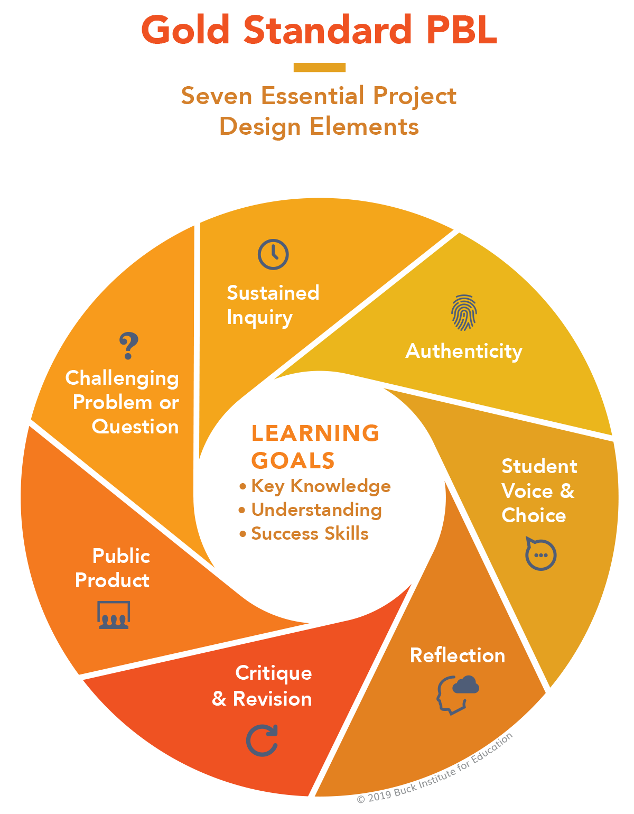

---
zotero:
  scannable-cite: false # only relevant when your compiling to scannable-cite .odt
  client: zotero # defaults to zotero
  author-in-text: false # when true, enabled fake author-name-only cites by replacing it with the text of the last names of the authors
  csl-style: harvard # pre-fill the style
layout: post
categories: misc
title: Project and Design Approaches in Computing
---

# Project and Design Approaches in Computing

## Outline

- Intro to chapter - alternative models suiting bottom up  / concrete approaches
- power of communities - value of community participation - socio cultural approaches to education
- craft approaches -
- Design approaches -
  - creative spiral / iterative
  <!-- - studio thinking -->
  - using design patterns
  - case study on design patterns  - Scalable Game design
- PBL as an inclusive models  - - Value of PBL - personal summary - diversity of projects possible- cf the uncertainty of pedagogy, given freedom
<!-- - Return to UDL universal design for learning - point out similarities - and recap on signifiance for inclusion -->

## Introduction

In a previous chapter we looked at concrete and abstract approaches to computing educations and learning to code. We looked at challenges imposed by exam format, lack of time and a limited participation on real communities of computing and coding. We have looked at some of the 12 principles and quick reads promoted by the NCCE both abstract and concrete approaches. These include of them are _Make concrete_ and _Get hands-on_. While it is not contradictory to encourage both abstract and concrete approaches, given the tactic moving between the two perspectives via _semantic waves_, the resources provided, perhaps because they are targeted at the classroom, often lead with more formal learning approaches.

In a real setting coders will often be working within existing projects, patching and remixing existing code, including external libraries and adapted to existing practices and patterns used by their colleagues and code communities.

While GCSE questions outlined in the previous chapter attempt to include some elements of peer practices by including tests of code reading and analysis, preparing for these exam questions develops skills and practices that are quite different from coding in a real life setting. Because of this computing teachers face a significant challenge to both teach concepts to be reproduced in exam contexts and to unleash the potential of student working on their own projects.    

<!-- There is also danger that this abstract approach to algorithms, while containing the promise of transfer to other domains, has the danger of distracting teachers from other creative ways of representing the learning outcomes of more concrete approaches. -->

The pedagogies and frameworks that support the creative processes involved in undertaking computing projects in an educational setting are less explored in the UK teaching context. This is partly due to difficulties in implementing them in a school setting which we explore later in this section. However despite the challenges, these creative and authentic approaches have a such tremendous potential to transformative learning experiences. Perhaps most significant is the potential for project and design based approaches to engage and sustain a diversity of learners in computing.

<!-- To address wider challenges of implementing PBL approaches we look at what is available to help teachers balancing the requirements of the curriculum and doing hands-on work. To address questions equality I explore how can young people from a wide variety of backgrounds benefit from this approach. -->

In this chapter we explore some of the strategies that can be used to support the delivery of design and project based approaches. Before we do this I want to describe one aspect that is important to these approaches, that of community.

## The Power of Communities

A project based approach to learning coding and computing is often something that is supported by families and emerges from the home environment. For example enthusiastic family members taking young people to maker fairs, community coding activities. They may buy creative computing kits or access resources such as YouTube videos or via specialist online forums. This kind of hobbyist forums and communication have been documented as being significant in the evolution of the home computer and Silicon Valley culture.
https://en.wikipedia.org/wiki/Homebrew_Computer_Club

However, this kind of computer enthusiast community is not the most accessible to a wide variety of audience. As educators striving for more inclusive and equal approaches, we should ask how then to widen out this experience?  

Code Clubs on a small scale allow you to create an after school community. MORE
Resources are supplies. Originally independent but now part of Raspberry Pi Foundation.

To address this, these approaches are also promoted by government and corporate sponsored programmes like the Coolest Project and Coder Dojo and Code Clubs.
Coder Dojos are monthly events run by volunteers often at the weekend. They often focus on creative, engaging computing. I have volunteered at some events and interviewed other volunteers. I have been impressed at the dedication and inventiveness of volunteers. While some tables will use existing resources to support Scratch, others will try out new and experimental work around hacking Minecraft, creating games with code engines and new technologies of physical computing. Often volunteers will bring their own children, and use them as guides to help them evaluate their project ideas to make sure they are engaging and achievable for the target audience.

The Coolest Project is a project the Raspberry Pi Foundation which also runs Code Clubs in Schools and Coder Dojos which are often weekend family focused events.

It addresses one issue with monthly Coder Dojos. My observations and interviews with volunteers at Dojos showed that there is a difficulty in maintaining project interest from one month to the next.

These projects allow students to approach computing with a different attitude and tackle problems in a radically different way to much of classroom teaching. Apart from the greater amount of time dedicated to hands-on coding and related physical computing challenges, the opportunities for authentic practices. These include; designing for real users, collaboration with other students, project planning, debugging faulty code and repeated revisions to work to fine tune the desired result.

While the RPI foundation have created and collected an impressive collection of resources - we should really appreciate the work of volunteers and teachers volunteering out of class time to create the opportunities to code creatively. This is more than about the creation of stand alone resources, it is about creating authentic goals for learners and setting up systems involving adults, teen helpers and sometimes in the case of Coder Dojo young family members to support the skills and sustain the interest of learners.

This is in line with socio-cultural understandings of how learning happening. Community in this context not only provides support in creative process but also motivates participation in the first place. Barbara Rogoff, a key researcher in the socio-cultural approaches to education describes _communities of learners_ - see http://tiny.cc/communityoflearners. Rogoff sees this approach as radically different from both instruction based models of learning and pure discovery learning. Instead participants have different levels of expertise and varied roles in a learning system working towards an authentic goal. Rogoff notes that this can be confusing to adults used to more instruction-based learning and that such a community in full swing can seem chaotic but that this is because complex and productive learning is happening in ways that we may be unused to. This chapter aims to help decode some of these practices and explore ways that educators have structured their learning environments to take advantage of this powerful approach.

<!--
And SINGPOSTING to the rest of the chapter
 -->

 <!-- In another chapter in this book I look at how to apply a project and inclusive approach to game making as a coding and computing project. -->
 <!-- ### UDL as Learning Framework -->

### My Introduction to Craft & Studio Approaches

We have already looked at pair programming which can build confidence and support to girls in the learning coding process. The value of Pair programming can also be compared to that of peer programming. Peer programming looks at - among other things - how coders learn partly by pick up the nuts and bolts computing projects from a community they are a part of. This process comes in many flavours and goes by many names. Some researchers into professional coding communities and even the programmers themselves call this a craft approach to coding.

When I learned coding it was to create websites for community music events and environmental and social justice campaigns. In learning how to code websites, I also had to learn to use other tools to upload files to a web server and then about server file permissions (a useful gateway to linux computing). Having these projects as my base for learning helped in a few crucial ways. Firstly the real life application was great motivation for me to push past technical barriers, there were also similar projects that I could use as inspiration and copy and modify their code solutions and finally if I got stuck there was a friendly community of web site creators working on similar non-profit projects who were willing to share their skills and resources.

The process was sometimes slow involving a lot of trial and error. At times it felt like I was spending a long time getting to know the tools and processes rather than do any complex coding. However every time I got something wrong and had to either get help from others or work it out myself I was learning something. Later I was able to pass on that knowledge to others perhaps struggling in similar ways.

Arts and crafts studios value and support this way of learning. For example Studio Thinking and Methods have been well researched and the process of doing a foundation arts year explicitly allows a long period of experimentation and building familiarity with tools of the trade. This process of a kind of messy and unstructured apprenticeship as a way of building digital skills is not unusual in professional practice. According to a recent Stack Overflow survey most industry developers are either fully are partly self-taught with only about half having undertaking formal computing training.

Clearly there are challenges in replicating this kinds of learning within the practical limitations of a school and its culture. However, educators can replicate some of the benefits of professional and craft approaches within more formal settings using design and project-based learning. Both of these approaches have been applied extensively for computing both inside and outside of schools. In this chapter I focus on the positive opportunities provided by these approaches rather than the practical challenges.

If this approach resonates with you and you want to read more about Studio Thinking and how it can be applied in schools there are excellent resources here -  https://www.studiothinking.org

### Design Approaches

#### Designing for Others

Design approaches have been adopted widely in software production, creative industries and wider business contexts. These principles and practices have also influenced areas of education and research. If you are an educator the experience of seeing students motivated by producing something for a real audience may be familiar. If you are an educator the experience of seeing students motivated by producing something for a real or even imagined audience may be familiar. If students are able to share their created digital work with peers then the process of revising based on feedback from others can be extremely valuable to sustain interest.  

The area of design studies is wide and there is a long history in involving users and young people in the design of computer products. The process of understanding the audience for the digital product can be extremely time consuming process. In many cases, while students are in theory designing in something for others, be it a game or a website etc, they are making it primarily as a learning experience. In this case technical skills of design may take priority over serious investigation into the requirements of the end user.

However other studies or projects have taken the opposite approach, taking care to give time to explore the cultures, needs and expectations of the target audience. In this case ethical and entrepreneurial aspects of design are highlighted. While these kinds of projects allow students to develop important 21st Century Skills of problem solving and appropriately responding to real life contexts, often the time constraints prevent a more in-depth approach to the design process. There are rich resources teachers can draw on from the field of participatory design and co-design which with some adaptation can work well in a school setting. These range from exploring cultural contexts to role playing scenarios.
For some suitable resources see http://tiny.cc/design_resources

<!-- For some suitable resources see INSERT SHORT LINK  
https://www.stem.org.uk/resources/community/collection/449826/design-challenges  
https://www.edutopia.org/topic/design-thinking
https://www.mantleoftheexpert.com/resources/reading/
https://www.mantleoftheexpert.com/resources/contexts/

-->

When applying this approach Teachers can choose how much to focus on the more technical or user-focused elements of design depending on the priorities of their curriculum and personal preferences and aptitudes.

[Insert a personal example - can be in depth with drama practitioners or just superficial??]

In the following sections I explore certain design approaches including - iterative design and the use of design patterns.

#### Iterative Design Approaches

Iterative design involves coming back to reflect on the outcomes of creative goals and revising them based on results. In simple terms the process involves; goal setting, creating quick prototypes, user testing and evaluation, revision and reflection. Like reflective cycles the process is iterative in that testing and revision of the prototype design can be repeated until the desired result is achieved.  

Michel Resnick was instrumental in the Scratch development team and a pioneer of constructivist learning approaches. We have already seen his work in the development of his take on Computational Thinking. That interpretation is drawn from work creating and observing the use of Scratch and similar tools as a programs suitable for novices to use code to create design projects. One of the principles behind the design of Scratch are to make more concrete some of the more abstract principles of coding through design decisions about the program's interface.

<!-- Tools too - Design processes need appropriate tools  -->
<!-- There are many languages and interfaces which have been created with similar principles, Agent Sheets, Alice and various implementations MakeCode to support physical computing and game making etc. -->

In more recent works Resnick has been promoting a five stage creative cycle with tips for both parents and teachers to create a fertile environment for creativity. See http://tiny.cc/creativespiral.

_Diagram of five circular stages; Imagine - Create - Play - Share - Reflect - Imagine_

The model, based on design approaches, applies not just for computing or robotics but it did emerge from this area of education by Resnick, Natalie Rusk and other researchers at an after school project called the Computer Clubhouse. The idea of a spiral which deepens understanding and improves the end results is popular both in education in the form of Bruner's spiral curriculum and in the software and other design industries, most notably in the guise of Design Thinking. Rusk and others see the foundation for the design-based approach in education as; engaging in design activities, exploring personally meaningful topics, collaborating with others, and  deepening understanding through reflection -@rusk_new_2008. The key reason to adopt these principles is to increase engagement with sustained participation in computing projects from a broad range of learners.

As mentioned, the creative spiral model is an accessible way to communicate tips and techniques to teachers and parents to support this process. In line with the social theme of this chapter, many of these tips require participation in some kind of community be it in real life or online. Indeed, where Scratch as a project excels is in the user community. There are over 75 million users of the site who have created 80 million projects. Activity has only increased over lockdown in 2020 and 2021 with over 20 million user comments in March 2021.

As educators using Scratch and similar tools in the classroom it is easy to overlook this aspect in favour of a more individual progress understanding computing concepts. However, if but we do so at the potential detriment to our students. When you are learning to code or create digital work, the challenge of maintaining and sustaining interest and the creative process is huge. It's one thing to be inspired by your interests to start a project, but such projects are often tricky. It's easy to get stuck. If young creators can connect with others to share and get feedback on their work it can really help to sustain the kind of repeated effort and revisions to existing work that build mastery.

There is a great variety of forms of engagement with this kind of online community. You may just play others games, or just comment. You may use it to create your own projects but not engage in the more social elements of the creative process. You may like a smaller section of the community become extremely active in creating and collaborating with others on many projects.

For a good summary of some of the potential and depth of collaboration of this community the researchers Resnick, Roque and Rusk have described this in detail see - http://tiny.cc/scratch-community. In this deep dive analysis of the community and of particular is the process if of individuals finding each other on the community, grouping together by forming a group called a _studio_ and then recruiting other members to work on joint projects. This is very sophisticated behaviour mimicing real production procesess carried out by young people with a high degree of independence, although they are only a very small proportion of the online Scratch creators. One of the challenges identified by the researchers was how to replicate this in the wider community of Scratch users and beyond that young people who had not yet engaged with design-based computing. One of the researchers Ricarosa Roque went on to develop other programmes which involved online exhibitions and competitions and off-line family-based programme to engage under-represented groups.
http://familycreativelearning.org/

The process of keeping the community up and running and safe for young people is significant and requires a lot of resources. The benefits are worth it. This really is an educational community and a success to be celebrated. One of the benefits of the success of the community is that it has become an extremely rich source of inspiration for young creators. A simple search of the site for projects like games, creative greeting cards, storytelling projects and pretty much any digital product you can imagine will yield multitude of results.

What these projects and features have in common is that they create communities which support the different stages creative spiral. The importance of creating and facilitating different forms of participation in communities and for that community to function a motivating factor and reflective tool for young producers is key to the socio-cultural and constructionist schools of educational research. This line of thinking can be traced back to to Papert's early focus on objects to think with and creating shareable concrete artefacts.

In the Scratch community, by default there is a remix button on every project allowing views to alter it and make it their own. The process of being not only inspired by but given access to the mechanics of others creations helps support craft and community approaches to learning code in a child-friendly environment. The ability to view peer's coding and to remix it in this way supports a very interesting pedagogical approach called Use-Modify-Create.

#### Use Modify Create

There are some parallels and some differences between Use Modify Create and the PRIMM framework described in a previous chapter (http://tiny.cc/usemodifycreate) [@lee_computational_2011]. Both have become increasingly popular in the computing education sector in the UK.

THIS WOULD BE THE POINT TO INTRODUCE PHIL BAGGE'S CASE STUDY

This model is designed both to limit learner anxiety as they potentially meet code and a coding interface for the first time and to scaffold the acquisition of coding and computational thinking concepts. I will explain the three stage model with reference to my own design.

In the **Use** stage learners engage with a starting template of a few games playing them and then opening the code to see if they could guess what any of the code did. This use stage allows learners to gain some familiarity with the coding environment and to recognise some features of the language being used.

Then we quickly asked learners to **Modify** a broken game with very simple changes which they could choose from a set of printed cards. These small changes to variables or swapping out media assets with their own builds confidence, gives a greater sense of ownership over the project and is a fun and challenging experience.

In my **Create** stage learners we asked to choose from a menu of different game design patterns to add to the game. In early stages learners patch or copy code examples into their existing code. As they do this gain familiarity with a wider variety of coding constructs and concepts. Later makers can take up extra challenges which involve them making additions to the code with no direct support from the materials.

<!-- Use Modify Create framework - covered in another one.
In the **Use** stage, coders build a familiarity with coding interfaces and the some of the through scaffolded approaches. It is not specific how much is taught in terms of the concepts here.
In **Modify** learners progress to working on real projects but one created by others.
Progressing to the **Create** stage - is not an immediate process. As novices pick up patterns of code design in use in the modify section, they are in a good place to replicate such patterns in other code that they create from scratch. -->
<!--
#### Studio Thinking PERHAPS DROP? TOO SIMILAR TO PBL AND UDL

Research of on the design approaches in artistic architecture studios has described them as Studio Thinking and described as 8 studio habits of mind. A framework was arrived at though ethnographic observation, and each of these habits was supported by teachers through stages of lecture/demonstration, hands on making, and critique/reflection.

Too large to describe in detail (see illustration / table for details) but it is useful to look at some of the key aspects. These include the importance of craft approaches, the process of learning to use the production tools, familiarising yourself with the materials and hands on reality of creating something.

<!-- Image from below

and good summary of use in schools below.

Narey, M. (Ed.), 2009. Making meaning: constructing multimodal perspectives of language, literacy, and learning through arts-based early childhood education, Educating the Young Child. Springer, New York, NY.
chapter 4
Sheridan, K., 2009. Studio thinking in early childhood, in: Making Meaning. Springer, pp. 71–88.

Below is Sawyer, R., 2012. Learning how to create: Toward a learning sciences of art and design [WWW Document]. undefined. URL /paper/Learning-how-to-create%3A-Toward-a-learning-sciences-Sawyer/1bbb67c532198cd6e664e848926e44fe44f1f1bb (accessed 12.28.20).

Other STEM focused researchers have drawn on the process that emerged from art education community of practice in a studio and have proposed it as a good learning process for STEM. Sawyer argues for a reduced formulation of studio practice in STEM outlining the following aspects.

-   Complex, authentic, real-world projects
-   Guided problem solving
-   Curriculum design
-   Externalization and reflection

He argues this approach is more suited to the learning sciences than the instruction based or apprentice oriented ones often in place. He cites these approaches as two sides of a spectrum. Studio practice is a third approach, open but guided. Sawyer also makes a link with PBL, an approach that is explored later in this chapter. -->

#### Design Patterns as an educational tool

When I retrained in computing at Master level one the most instructive and relatable pieces of coding tuition came in the form of studying design patterns to support an object oriented approach. Design patterns are solutions to problems or common scenarios in design areas. They have a origin architecture but are perhaps most commonly used in object oriented software design.

The advantage of DP as a way of teaching and learning coding is that they are often rooted in real life examples of problems that are often solved in a particular way. This can be described as a concrete implementation of object oriented principles.

<!-- My own journey in computing has very much been as a modifier of code. In the early days of the web I was able code many database driven websites with code that were very far from elegant representation of CT concepts but very functional for the communities they served. Like concrete coders that Papert and Turkle celebrated, I revelled in this hands-on approach and found tutorial resources dealing with first principles extremely confusing. -->

For educators the use of Design Patterns to support learners develop coding proficiency provides certain advantages. As a bridge between abstract concept and concrete implementations
As a way to join and navigate participation in a community of coders.

A similar principle to Design Patterns is presented for the classroom in the form of the concept of worked examples. A quick read is available here -
http://tiny.cc/worked-examples

#### Case Study - Computational Patterns

There is one stand out study that uses design patterns extensively to support young people's computing in schools. The project name is Scalable Game Design undertaken by the University of X. In this study over x students made games.

The project was developed in partnership with teachers and modified an original goal of teaching a more traditional view of transferable Computational Thinking to one of Computational Patterns. This move was in response to a key piece of feedback from teachers who were slightly mystified by the abstract definitions of CT but felt that they understood their expectation of the underlying usefulness. One expressed that they would like to be able to have the following expectation of students. "Now that you can make Space Invaders, can you also make a science simulation." [@repenning_scalable_2010, p. 4]

INSERT Details of the programme - SIZE ETC

In the case of SGD these patterns were and those present in games which could also be applied to science simulation. Examples include hill climbing, collision and transportation. Without going into details about the technical elements of the patterns they could be expressed in code but also as a concept that could be applied in other settings.

This brings up a question of what patterns to choose. This study pragmatically chose to work in a cross curricular way linking computing and science. The questionable promise of transfer drove the patterns chosen. However, in coding communities, other design patterns emerge. For example in website or the design of multimedia applications a particular set of problems with tried and tested solutions will exist.
In a review of research to go with the report After the Reboot, Waite proposed that other studies which explore the utility and promise of patterns to learn coding are needed. CITATIION.

In my case study on a 3M game making framework, I argue that this element of transfer is not essential, that learning to code via applying and analysing game specific design patterns that have little application outside of game is still a useful process in developing authentic coding practices.

<!-- Patterns as a concept can be used flexibly - so I need to be careful with claims of the utility of it.
RE-READ SGD work -->

### Projects and Project Based Learning

In the previous chapter we looked at the  12 teach computing principles. Project-based learning  (PBL) is of the.

In the next section I'll cover the potential of project-based learning (PBL) and how this can create inclusive educational approaches. I propose that PBL has strong parallels with UDL especially in promoting choice and authenticity in projects.

Project-based learning is a wide set of approaches and put simply can be seen as the value of learning via students undertaking practical projects rather than more traditional approaches designed to help the absorption and recall of more book based knowledge.

### Where Project Based Learning Happens

We have already covered some of the most likely locations for PBL to happen at the start of this chapter.  

As PBL has been adopted by higher education and become the focus of academic study then frameworks have emerged as a way of helping practitioners to help students squeeze as much learning as they can from the process and to recognise the complexity of some of the learning happening. This is important as sometimes some of the learning is tacit/hidden learning which is hard to assess in traditional ways.

### A summary of the elements of Project Based Learning  

As a way of quickly communicating the kind of learning that PBL promotes we can represent them in a visual form followed by a table to briefly describe these elements.

_Buck Institute; Gold Standard PBL elements - available under CC-BY-NC-ND licence_

PBL is in line with some of the other socio-cultural approaches to learning that have been outlined in this chapter and others in this book. Because of this many of the concepts will be familiar from our exploration of UDL and design-based approaches.

- Challenging Problem - the focus of the project should be a relatable problem statement
- Sustained Inquiry - adequate time must be allocated and the ability the come back to projects to revise them is important
- Student Voice and Choice - giving students choice over the contents of their project increases their engagement and participation in open discussions about project direction builds student autonomy
- Authenticity -  Real life Relevance helps get student engagement and buy in
- Reflection - this refers to self-reflection which may be informal at times but guided by class processes, learning journals
- Public Project - the creation of a shareable object or even that helps learners focus and to design for others and act as a focus for discussion as a learning community
- Critique and Revision - ideally this can involve outside experts or input beyond the class teacher, it brings a new refreshing perspective.

This break down is part of a summary of design elements of effective PBL by the pblworks.org website - http://tiny.cc/pblworks-gold

To deepen our understanding, this section will select some of these elements for closer evaluation in a computing context.

It is noticeable that while there are chances for student experimentation, this process is very far from what some people would call pure discovery learning. Building the ability as a teacher to switch between students operating freely and being guided in revision and critique is often unfamiliar to teachers. Having resources to help this process is vital.

### Computing and PBL

Computing education is an excellent vehicle for a project-based approach to learning. As we explored in the introduction, the nature of digital making and the many flavours that are available provides a wide-range of choices of outputs. Projects that create real outcomes that the learner has a choice over are a great way to motivational factor (Blumenfeld).

#### More about challenges and benefits of PBL

But a bit more about project based learning - and how to design it in a computing situation.

### Further Resources on PBL
For a really accessible and convincing summary of project based approaches and their adoption in a classroom setting see this review by Barron and Darling Hammond - http://tiny  .cc/pbl-summary

For broader web based resources and case studies in blog post and video form, the Edutopia website is a good source - https://www.edutopia.org/project-based-learning

##  Summary of Design, Project, Authentic Approaches

<!-- This should probably be merged / dropped given the short length of section -->

We can start to see large similarities between different strands of design and project approaches. The craft approach and design patterns approach will be familiar to most professional and hobbyist coders.

It is rare in today's coding environment to approach a coding project using a top down / abstract approach and then code everything from scratch. Instead for most coders the first stage will be to mess around with the tools, and then to research what code frameworks will help your job and what already written modules can be incorporated. Once you have worked out where the gaps are then you start coding to start plumbing the pieces together and to patch any of the gaps that appear.

This links back to PRIMM and the underlying approach of Use Modify Create, which is explored in more detail in a case study involving game making in another chapter in this collection.

<!-- The limits of time prevent me from describing the use of design patterns in great detail but this is explored in more depth in another chapter in this collection. -->

What they have in common - that is distinct from more traditional classroom approaches - is a focus on devoting time to hands on making, structured support to aid inspire learners and facilitate observation of practice of others and a great choice in what goals learners set.

## Creatively Overcoming Limitations In Context

All of the approaches above have research to support the benefits of the approach and in a context of inclusive pedagogies we can make a strong case for teachers to adopt them in computing education as a suitable candidate for project based, inclusive approaches.

But there are challenges of exam focus, time poverty, and lack of PBL delivery skills that are among factors hindering take up. This section looks at tips and strategies that have been used by other educators and researchers to overcome these barriers.

### Time factors - sustaining the effort

Central to both iterative design approaches and PBL is the idea of coming back to failed experiments, learning from revising them, and reflecting on that process. This takes time. In research surrounding barriers to PBL in schools, teacher commonly cite time restrictions due to curriculum pressures.  

I can only advocate to try to free up the time as it can be frustrating to teachers and learners alike to cover potentially interesting projects only fleetingly. I have witnessed this frustration first hand when personally meaningfully projects are side-lined to cover compulsory curriculum material that have less personal relevance to the learners.  

Resnick suggests that were possible double lessons are helpful for hands on work and to allow the design process some time to unfold. He also advocates for whole terms devoted to undertaking a project, thus letting pupils return to tweak and improve trickier coding and design challenges. While this may not be possible in year groups more focused on upcoming exams, it but may be possible in some situations especially in KS2.

For example, cross-curricular projects may free up more time by linking. As explored above Kafai was successful in gaining more time linking computing project with maths as a subject by asking students to create a game that taught maths concepts. Thus deepening their learning of a particular area of the maths curriculum. Science is a common way to explore cross over. As we saw the successful Scalable Game Design project used computational patterns and their overlap with science simulations as a base.

<!-- I am lucky  to have been able to experiment with this as part of EdLab project - I have worked with drama practitioners to explore issues of computing ethics through coding and writing in role. -->

Many teachers will add in projects to the end of a series of work to reinforce concept in a practical context and that is certainly better than nothing, but it is likely to reduce effectiveness.

### Meeting in the Middle - A learner choice approach to semantic density

I explore my own experiences teaching coding practice and concepts through coding games together in  another chapter in this collection. My own approach is very much led by the interests and preferences of learners. Some students stuck with certain areas of concrete practice. They were happy to tinker away, adding features, and changing certain parts without fully knowing what the code did. I would highlight some of the underlying coding concepts for the code then were working on as they met it.
Others wanted to know what they were dealing with from the start.

To start with I struggled being pulled in different directions. To resolve this, I created activities and resources to support these different kinds of approaches.  

The students that favour a concept first approach are able to choose that path from the start building up coding knowledge and foundational concepts in a structured way. In short, following a step-by-step tutorial. Other student who favoured more concrete approaches and jumping right in, the learning design then allows teachers to guide their reflection on completed activities that allows connection to the underlying concepts that are a required part of the curriculum.

PBL and UDL would promote not Concepts First, but Choice First. The choice of the student maybe to understand underlying theory before engaging in hands-on coding or perhaps the opposite, a concrete exploration, which allows students to meet the concepts in a practical setting first.

A tactic to bridge this potential disconnect is have two tracks of learning - one concepts first - and one choice first and to plan for learners that to 'meet in the middle' where their abstract teacher teacher-led learning connects with their project-based concrete explorations. The role of the teacher to help the learners make those connections.

In the classroom there is an additional challenge for teachers to observe and measure learner progress. How can this be done without it being overwhelming? In the last section we looked at different observations techniques outlined in the NCCE quick read. In PBL the more closely aligned technique is that of supporting learners to monitor and document their own progress. Teachers can support that process by helping learners to map their activities and  

The process of planning a course of learning in this way may seem daunting. It is certainly a very different approach. It is worth restating that the advantages are not only in the engagement of students but also that the process is in line with the principles of Universal Design for Learning. By providing a variety of possible activities and choice, a tangible, sharable outcome

I explore this strategy that allows students to experience both the more abstract concepts entangled in the process of planning and coding a project in the context of game making in another chapter in this collection.

### Significance of Project and Design approaches for Inclusion

In a previous chapter we covered the fundamentals of UDL (Universal Design for Learning). There are clear similarities between the concrete / hands on approach of project based work and the UDL framework. Share tactics that teachers can draw on to make their approach more inclusive are;

While this chapter recognises the
At this point recap on significance for inclusion

### Conclusion - Supporting the Development of Learning Communities

In much of the research surrounding motivation, participation and peer learning we see that the learning of complex processes doesn't happen in a vacuum. There is a clear value of creating a learning community of coders working on project that are as authentic and linked to their own interests. To help this to happen we can draw on some of the rich research and resources that are available from different streams of practice including project based learning, Universal Design for Learning and design-based approaches.

We have explored that while there are challenges to balancing the more open-ended goals and the degree of learner choice needed by these approaches and the more prescriptive requirements of the computing curriculum. To help bridge this gap there are new resources from NCCE that draw on socio-cultural research to offer guidance on on PBL, observation and pair programming. These resources and supporting articles from teachers and other practitioners in blogs and publications like Hello World have a focus on the reality of mainstream school environment. This tension between the more rote-learning elements of the curriculum and the need for more fluid programming experiences raises an important question for the future. How can some of the more flexible techniques for observing and assessing learner progress can be brought into exam practice to reduce the gap between exam and real life coding practices.

We are still in the early days of sharing our practices and resources as a community of computing educators. I hope that this chapter has encouraged keep exploring more authentic coding practices in schools and to share your experiences with others.  

WHERE TO DO THIS? A final note on how teachers share practice. CAS forums, blogs, twitter etc.
