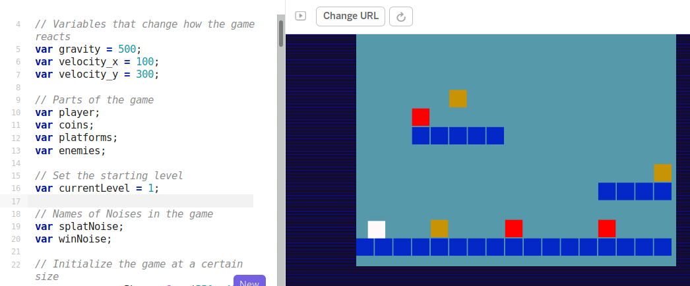
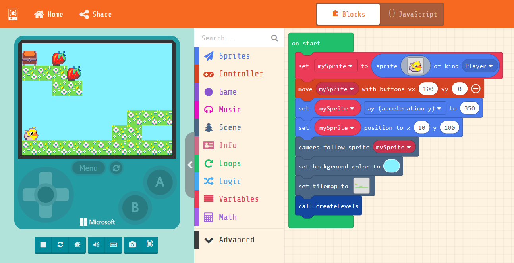
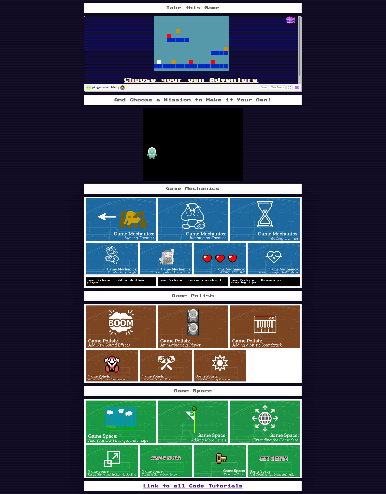
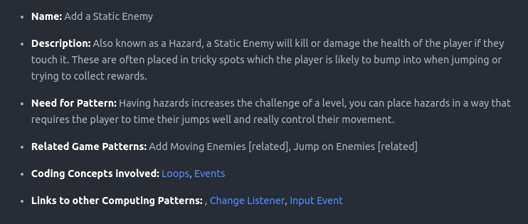
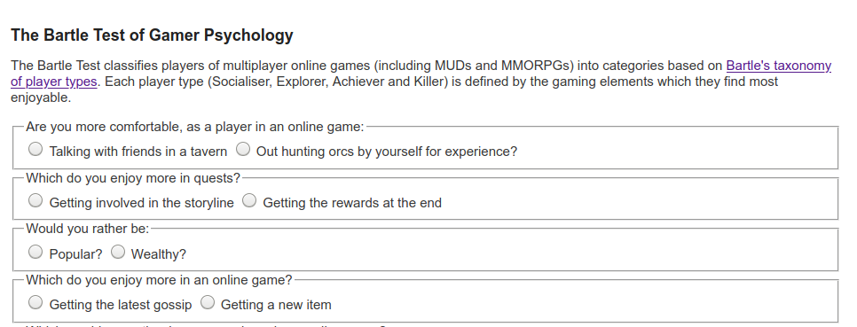
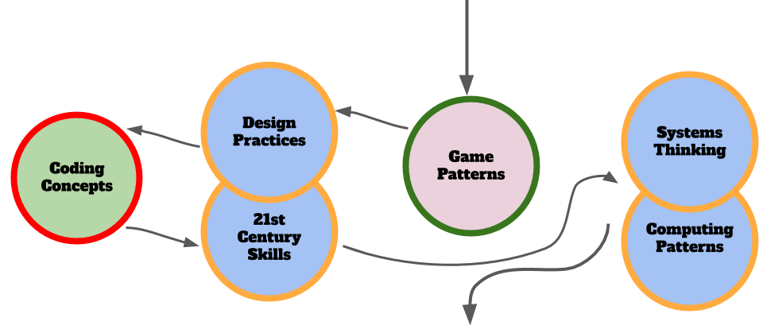

---
# all the regular stuff you have here
zotero:
  scannable-cite: false # only relevant when your compiling to scannable-cite .odt
  client: zotero # defaults to zotero
  author-in-text: false # when true, enabled fake author-name-only cites by replacing it with the text of the last names of the authors
  csl-style: harvard # pre-fill the style
layout: post
categories: misc
title: Game Making Pedagogy using a Three M Framework
---

# Game Making Pedagogy using a Three M Framework

<!-- ## Notes

Section on tensions is too long - instead perhaps a summary of tools choice tensions, limits of the classroom and new opportunities. - so move some to 3m as justification and some to limits / tensions -->

## Summary

PLEASE NOTE THIS IS IN DRAFT FORMAT ONLY - NOT READY FOR DETAILED FEEDBACK
BUT HAPPY TO CHAT ABOUT BIG PICTURE.

- Introduction / Context

- Main Sections
  - Intro
    - signposting
    - context in UK
      - (add in livingstone, pipeline to games industry of report)
  - (main features?)Benefits of game making & what's unique about gaming
    -
  - Game Making Tools Summary
  - 3M Framework in relation to the above
- Overcoming Challenges of classroom application

## Concepts Summary

pedagogy / concepts in this chapter

 - funds of knowledge
 - socio cultural approaches
 - systems thinking
 - game player types - from Richard Bartle

## Intro

In a previous chapter in this collection I outlined the opportunities of a project based approach to learning computing and in particular the craft of coding. In this chapter I explore the potential of Computer Game Making as a way of undertaking computing projects in line with the principles of project based approaches. I'll make a summary of research around project approaches to game making and draw out some of the benefits and some elements that are special about making games. My aim is to engage with research on game making but also to keep the subject connected to learning experiences in a school or after-school context. To do this I look at tensions to game making approaches especially those that impact the use of game making in the classroom. Finally from my own research with families making games together, I share a learning design incorporate some of the techniques explored in this chapter.

<!-- In this chapter I use the example of game making to as a way to examine these issues in more depth. I explore a concrete example of how this more chaotic learning can be brought into formal environments with appropriate scaffolding. In main section of this chapter explores a game making pedagogy that is a result of my own research. From now on I will use the term _learning design_ instead of _pedagogy_ to refer to this specific implementation of several underlying pedagogic principles. -->

### Context Background (UK)

Research on computer games has often focused on game playing either of commercial (off the shelf) games or specialist educational game software. However, for many researchers a far more promising area that of making computer games. The RSA reports Reboot or Shutdown and After the Reboot [-@the_royal_society_shut_2012; -@the_royal_society_after_2017] have shaped UK computing education ethos practice around the introduction of a new Computing curriculum. Some of the key recommendations of these reports were first proposed in another influential report  called "Next Gen: Transforming the UK into the world’s leading talent hub for the video games and visual effects industries" @livingstone_next_2011. Its focus was on providing the UK games and animation industry with the talent needed to succeed. The three top recommendations school level were to include computer science in core curriculum, introduce a new computing GCSE, bursaries for computing teachers and extensive and well supported use of games and visual animation in the school curriculum as a way to attract more young people to the subject.

In 2017 the After the Reboot report examined changes in the area of computing education. The new curriculum and exams were introduced in 2014. This had been launched together with an extensive bursary program and even award level bursaries run in partnership with computing industry. Thus, the first two of the Next Gen recommendations were in place. However the use of games and making as a way to encourage wider participation in computing has not been realised. The report returned to the subject of game making as a way of increasing engagement in the process of coding. The review highlighted several area of promise but which needed more research, namely; using games for engagement, use of game patterns and involvement in girls in coding and social and cultural aspects of coding [@waite_pedagogy_2017].

<!-- The Next Gen report acknowledges issues around perceptions of computing and ICT as geeky and suggests that the engaging nature of computing activities based around video games. -->

<!-- ADD IN MORE DETAILS FROM REPORT AND OTHER SOURCES
HERE ABOUT THE GAP AND NEED TO ADDRESS IT.  -->

The After the Reboot report also had concerning observations. The report found that girls, ethnic minorities and students of lower socio-economic status were all less likely to take computing as a subject at GCSE level. Given this concern it is important that as educators we explore promising tactics for inclusion including the use of games and game making.

<!-- While the focus of this research was to support the delivery of the computing curriculum in schools, it is worth mentioning that there is a rich stream of computing projects and associated research that happen outside of the classroom. In a previous chapter I outlined the advantages and challenge of bringing a project-based approach into the classroom.  -->

## Significant Features of Game Making for Education

<!-- change section title - as not really  -->
<!-- (merge with above?) -->

<!-- Game making is closely related to a multi-media coding approach. Some research has taken a wide view of the potential of game making [@peppler_what_2007] including many advantages that are common to other creative computing projects. In this section, I'll make a summary of some of the wider claims and then take a more focused approach highlighting areas that are unique or particularly applicable to game making. -->

In the following section we draw from educational research to explore what is already known to be beneficial in terms of game making. Researchers Kafai and Burke have undertaken one or the most extensive reviews of the educational potential of game making. This is available in the form of a book called Connected Gaming but a there is also a shorter version freely available - see  [http://tiny.cc/2tzutz](http://tiny.cc/2tzutz). What follows is a summary of some of the key areas of potential for learners.

**Coding and Computing Practices**

The main learning objective of making games in educational setting is to develop coding and computing skills. While some game making tools use a specialised graphical interface, many game making tools involve working with code directly. These new tools have allowed students to practice the mechanics and core structures of coding and a more applied definition of computational thinking. A study by Adams and Webster [-@adams_what_2012] indicated that games rather than media or storytelling computing projects were more likely to use logic and variables extensively.

Design patterns are an important factor in learning to code in a professional community. The use of games to explore computational patterns is explored as a case study in another chapter. In their analysis of computational thinking in relation to game making, Werner and colleagues [-@denner_using_2014] examined design patterns and game mechanics as well as more straight forward coding constructs.
The researchers suggest that the use of Design Patterns outside of professional communities has a great deal of promise to increase accessibility for learners into coding due to its more concrete and relatable approach.

 <!-- Werner, L., Denner, J., Campe, S., 2014. Children Programming Games: A Strategy for Measuring Computational Learning. ACM Transactions on Computing Education 14, 1–22. https://doi.org/10.1145/2677091 --> -->

**Games to study other subjects**

There are extensive studies on game making to learn other subjects which are covered in the review. A key one carried out the Kafai one of the authors. Cross-curricular projects are a potential way to overcome limits in time devoted to computing. Many teachers will attest that to truly understand a subject you can should try to teach it. Tasking students with making games that teach a key piece of the curriculum is one way of encouraging deepen understanding of subject matter.

**Developing Social and 21st Century Skills**

Games are perfect projects. Thus game making suits project-based learning. We can draw on research that outlines the benefits of that approach. In previous chapter the inclusive possibilities of design and project-focused computing were summarised. These include; more learner choice in projects increases motivation, authentic and shareable project outcomes encourage peer feedback and reflection project iterative support and a mastery approach, supporting challenging goals encouraging self regulation and structured guidance for goal setting.

These potential benefits align closely with a concept called 21st Century Skills. The term 21st Century Skills is used quite flexibly in educational research but there is broad understanding that they cover skills like social skills, self reflection, cultural awareness and a range of technical abilities that allow participation in information society. Skill which are suited to be developed via collaborative environment.  

More tightly focused research on game making and collaboration is needed but the potential to develop such skills is exciting. One Study by Baytak [-@baytak_case_2010] focused on the potential of making games to create a collaborative classroom community . Learners are often keen to share their games for others to play and play those of others. This motivation can be leveraged to provide detailed feedback.

**Authentic projects creating real results**

An important concept in both project and inclusive approaches to education is to make projects as authentic as possible to increase learner motivation. For game making this authenticity or realness applies both to the tangible, shareable nature of resulting game created and to the domain of professional game design. When learners are designing with someone else in mind, this guides them to shaping their game design effectively. The process of projecting beyond your own experience to an imagined user is a vital design skill that is potentially well developed by making games. As game making is a huge well known industry, learners understand that the resulting knowledge and skills is not inert but authentic thus and can be applied outside of the classroom.

The Buck Institute offer help in increasing authenticity in project-based education based around the following guidance; projects should meet a real need, be relevant to student experience, should be realistic even if using a fictitious scenario and involve processes and tools used by adults. http://tiny.cc/authenticity

<!-- https://www.pblworks.org/blog/four-ways-think-about-authenticity-through-lens-gold-standard-pbl-videos -->
<!-- more on authenticity if not covered in previous chapter
https://www.edutopia.org/blog/authentic-project-based-learning-john-larmer
 -->
<!-- Perhaps move this tension later? -->

Young people may not be able to create a technically commercial advanced game but other audiences exist. For example, so-called Indy Games or Games for Change are made by enthusiasts and often released at low cost or for free on the internet. They often appeal to a retro game aesthetic and are thus easier and quicker to make. Highlighting this movement can reduce student dissatisfaction at not being able to code something like a 3D racing or shooting game.

As another way to increase authenticity schools sometimes enter online game making competitions or wider creative competitions like the Coolest Project. You may be able to add authenticity in a similar way by providing a low pressure competition or another frame for your game making.

**Games to explore systems and systems thinking**

One of the more specialist 21st Century Skills is systems thinking. As the economic and environmental systems around us become more complex, it is vital that we teach young people how to analyse and alter them. Games are in essence rule-based systems. Katie Salen-Tekinbas is an academic specialising in game studies. She was also a lead in the design of software called Game Star Mechanic and a New York high school - Quest to Learn - which incorporates game design into it's curriculum and whose guiding educational principle is game-based learning. https://www.q2l.org/about/

_Games for change_ is a concept that invites game makers to make games to explore social and environmental issues. Such issues often involve a systems based understanding of then world, and as games are themselves interactive systems themselves, they are a powerful vehicle for exploring a complex problems involving race, sex, social issues. The Game for Change network has a main audience of commercial game makers however they also run a game making challenge for young people and support for teachers.   

One of the recommended strategies is a Game Jam which focuses on real life issues.

Resources from the Games for Change network and from the Institute of Play which are aimed at supporting systems thinking through game making SEE THE FOLLOWING LINK - https://gamesforchange.org/studentchallenge/student-resources/
https://gamesforchange.org/studentchallenge/teachers-resources/
https://www.gamesforchange.org/blog/2017/08/02/get-your-copy-of-the-the-game-jam-guide/
https://clalliance.org/institute-of-play/

**Family Game Experience as an inclusive Fund of Knowledge**

Knowledge of a games and gaming culture is sometimes drawn upon by teachers as a concrete example of a coding concepts. A very common examples is that of explaining if-then code constructs. For example, if Pac-Man touches a ghost then a player life is lost.  We have already explored the importance of using concrete examples to illustrate concepts in other parts of this book and there is something special about drawing on home or out-of-school experience of young people.

The term Funds of Knowledge came out of research within US Latino communities. Researcher found that Latino home cultures, skills and traditions were hardly visible in mainstream school cultures, resulting in a form of deficit thinking about the performance of these communities [@moll_funds_1992].

More research is needed on ways to draw out attitudes and knowledge of game cultures and bring them into the learning environment in an inclusive way. My own research into strategies to do this is explored in the second half of this chapter. To allow students to bring their own home funds on knowledge into their work we can structure our sessions to help the following:

-   Students draw on their knowledge of game conventions to inform the structure of their game coding projects.
-   Students draw on their interests of diverse media and interests to choice over the narrative, characters and aesthetic of their game design.
 - Students adopt a more playful and collaborative way of working familiar to them from role play experiences.

It can be seen then that even if student don't consider video game _playing_ to be their thing, that there are other ways for them to bring their interests into game making.

**Games and Inclusion**

Recent studies study the use of games and playful techniques to overcome exclusion from the culture of computing [@kafai_diversifying_2017; @kafai_beyond_2014]. As explored elsewhere contemporary understandings of inclusion go beyond SEN issues to include cultural exclusion. If students feel excluded from the school cultures then making bridges to home cultures is vital. One way to make those connections to home cultures is to allow for more choice of what can be incorporated into computing projects.

Research by the UK National Literacy Trust [-@picton_video_2020] of 11-16 year olds found that 96% percent of boys and 65.2% of girls play video games (http://tiny.cc/videogstats). This study shows that while there is a disparity between genders, game playing is extremely common and you are unlikely to be part of a household where no games are played. Even if not all young people play games they will have knowledge of the conventions and culture of video games allowing educators to draw on these interests and experiences.

<!-- We previous saw that Waite's review for RSA also highlighted the importance of social and cultural approaches to game making including the roles of gender.
ADD LINKS HERE -  OR MOVE TO ANOTHER SECTION -->

However, the research surrounding differences in participation and attitudes to game playing and video game cultures is complex. We should be cautious when working with video games. It is important to be sensitive to learners attitudes that video games are just "not my thing".

## An Overview of some Game Coding Tools

In this section I outline the key features of selected game making tools. Some game making tools for beginners use a GUI to abstract away the detail of the underlying code complexity. While those may be useful to learn game design without coding, in this section I only include tools that allow users to code the game directly.  

### Pygame - a python based library for 2D Games

**Pygame** is an add on (code library) for Python that makes game making a bit easier. Python is a good choice for a class that has had experience of coding in that language of for teachers that want to encourage fluency in this language. There are good resources aimed at beginner coders available too. There are some interesting resources and books to support game making with Pygame on the website of the Raspberry Pi foundation. https://www.raspberrypi.org/blog/tag/pygame/
There are also good tutorials available on the home page of the project - https://www.pygame.org/wiki/resources

Where is less strong is the ease of setting up your code and game environment. It can be tricky to get started compared to some of the other tools here. There is also less of an active community of game makers sharing their games online.

Normally you would set up a python environment on your desktop, however you can use replit.com or a premium subscription to the educational online code playground trinket - you can code pygames online - https://trinket.io/features/pygame
https://replit.com/talk/learn/A-Starter-Guide-to-Pygame/11741

### Scratch - a familiar and flexible tool

**Scratch** was one of the first block based programming environment to really catch on in schools. Scratch was designed for more general multi-media projects rather than to make games. However, given free reign games are often what young people try to create first. The ability to create your own graphical and audio assets is a real advantage. However, from my experience, while it is quick to get started, the lack of program common game patterns like gravity and collisions means that complexity of the code you need quickly mounts. Even then, for the most part the actual game play of the learner created games is often a bit unsatisfactory.

Where Scratch does stand out is the community element of the website where learners can get inspired by the extremely diverse creations of other young coders. The ability to remix the work of others is a great way start to get used to the tools and the way of working.

### Phaser.js in a Code Playground - an authentic web game making framework

**Phaser** is my own tool of choice when it comes to authentic javascript game-making.  To teach it I ask learners to code games an online coding environment called a code playground. Code playgrounds are a tool used by both expert and novice coders to share examples of code that can be edited and preview online. The killer feature is the ability to make changes and quickly see the new results appear. The concept is also very useful for learners and exists for block coding in tools like Scratch and for text coding in Trinket. Many text based code playgrounds exist and I tried a few and settled on Glitch.com - although the process also works well in Trinket. I love this approach due to the authenticity of the tools. Phaser is used by professional game makers and Glitch is the test bed of choice of many code developers. If learners do take to this way of working they can be creating genuine indy-games, dynamic websites and flexible web applications.

_Screenshot of Phaser in Glitch.com playground with code and game side by side_

The drawbacks of this approach is the potential complexity of using real web technology. While it is possible to hide the elements of html and css away from the user, many mistakes are possible which break the game completely. Luckily Glitch has the ability rewind and undo your changes via a easy to use timeline of your project.

<!-- - simplicity of tools with future potential - low floor high ceiling wide walls
- tensions around starting code from scratch or from a template -->

### P5.play - an arts inspired coding environment

**P5.play** is a an add on to the p5.js javascript framework. P5 is a fun javascript library that is quick to learn and get creative results. Sample projects often involve moving interactive, coloured shapes around and generating patterns. P5 project has become popular not only with artists and designers but increasingly with educators. This is partly due to the ability to use it in code playgrounds with all of the advantages previously discussed in the section Phaser and Glitch.

While the P5.play project is limited to 2D games, it add some useful design patterns like animation support, basic collision detection and help for mouse and keyboard interactions and has some great accessible tutorials. https://molleindustria.github.io/p5.play/

### MakeCode Arcade - specialised block based programming

**MakeCode Arcade** is a block based programming environment similar to Scratch but with some interesting features which are tailored to game making like gravity, lives and a game over block. In addition, the multi-media making abilities are very stripped down, you can download the games to hand held devices or run them easily.  

Another advantage is that the MakeCode system is also used to code the popular Microbit micro controller. So this may be familiar to you as a teacher or to your students.

_Screenshot of MakeCode Arcade with code and game side by side_

There some fantastic example games and tutorials at
https://arcade.makecode.com/

### Tensions around Game Making Tools

This section explores tensions that have emerged for myself and learners when  using game making tools. It is included as some of the issues that emerged may be useful to you when making decisions about appropriate tools to use in your game making.

**Asset Creation vs Hands-on Coding**

With both Scratch and Phaser/Glitch there was a clear tension between time spent creating graphical and sounds assets verses time working on code related to game play and mechanics. Scratch has extensive built in tools to create graphics and sound. With Phaser, in addition to the code playground we used a separate web tool to create art called Piskel and others to create sound effects. Both allow a large amount of choice and a very rich creative landscape. At times it felt students were stuck in asset creation.

When using the code playground, the process downloading assets files from one online space and then re-uploading to the code playground served well to build digital literacy skills. However the diversity of activities at times reduced group communication and peer learning surrounding the hands on coding and experimentation with game mechanics.

The MakeCode Arcade interface, like scratch has the ability to edit sprite characters. Unlike Scratch it is very limited in terms of what can be created. To This is one way to resolve the issue of the complexity of asset creation.

**Tensions related to Community and Choice**

Phaser is a framework used by professional web game creators. Using this authentic tool was potentially motivating. The online forums are supportive. However, it may not be realistic for young learners to be part of a community of professional game makers. In contrast, research on the value of scratch community to seed ideas, provide inspiration and direct peer support is convincing. The ability for students to choose from different kinds of games that appeal to them, to remix projects and to reuse community assets increases the personal connection students feel to their creations.  

However, much of this research as been from self-directed home learners who are able to dedicate a lot of their free time unlike classroom learners. Time factors may impact your choice of tool and how much you encourage your students to engage with a wider community.

How much choice over you give students about type of game they create and how they design it is also an important learning design factor. You may prioritise engagement over peer learning over specific targets. Alternatively you may wish to maximise the time your students spend on certain learning outcomes, e.g. coding and system design. To do this you it may be effective to then creating your own resources which

If students are working on similar projects. This may also have the effect of increasing possibilities for peer support and to reducing teacher stress in a classroom setting. It is very tricky to support students to introduce unknown or untested features.

**Tensions around Technical Scope of Projects**

Tools like MakeCode Arcade intentionally limit the toolset provided to its graphical interface and this simplicity can be an asset to support our students to build familiarity and fluency of use of code constructs.

Some hobbyist or professional game making tools like GameMaker Studio, Construct or Unity abstract away the hands-on coding of games with graphical interfaces and include structures to help organise game design as it becomes more complex. The scope of choices may be overwhelming. Also, while code can often be accessed behind these menus, the focus is on getting the game done rather than on learning how to code per se.

Thus there is a tension in tool choice balancing the directness of code editing and of the code constructs available with the scope and flexibility of the game that can be created.

### About the 3M Game Making Model

<!-- You would think from the glowing potential of game making from the reviews of the literature that this would be a normal part of computing education, and well supported in terms of how to teach it.

Of course, real life is more complicated than that. Rather than there being one pedagogy that maximises the potential of using game making in the classroom, it is important to recognise the diversity of objectives of both teachers and learners in the process of making games.

In the last section we look out one learning design and how that aimed to overcome those tensions. But in this section rather than trying to solve problems -- I am highlighting them and you can draw your own conclusions. -->

<!-- My work is inspired in part by the pioneering computing education project called the 5th Dimension project which involved undergraduate students in an after school. It has also been made possible by the similar EdLab programme at Manchester Met University, which also involves students in service learning projects. The mix of student helpers, local young people and in this case their parents gives a rich mix of perspectives which may not be possible for your setting but which has helped evolve a learning design. Weaknesses in the approach were made visible in the responses by young people and adults, and then addressed in the next session or next iteration of the program. -->

In this section I look at a design that aims to address some of key challenges and tensions to the use of game making with young people. This _3M game making model_ - (made up of Missions, Maps and Methods) - is the result of several years of exploratory, collaborative game making with home educating families and a local Primary School. This learning design could can be applied using any of the tools above.

The 3M process has evolved with the aim that it is accessible and inclusive for parents, teachers and young learners. Part of that accessibility is a playful, game-like approach to it. In a nutshell, learners start by playing and remixing a broken and incomplete game of a particular genre, for example platform, maze or shoot-em-up. They are given and/or choose certain missions to improve their game or to make it in a certain way. They use maps to help navigate their next choices and what they have learned. Finally, facilitators use particular methods in line with project-based and inclusive approaches to motivate and support learners engagement and learning.

<!-- You may have particular curriculum or other learning goals. This iteration of the 3M design focuses on making games to learning the craft of coding, to build meta-cognitive skills (goal setting and reflection) and systems concepts. It could be adapted to highlight other key learning goals. -->

<!-- In my description of the 3M model below, I draw on project based learning and design based terms and principles that are explored in another chapter. Later in the chapter I share ideas on how to adapt this version of the 3M framework to suit your own needs. -->
<!-- CHECK THIS LATER TO MAKE SURE I DO -->

### Missions (using Game Patterns and secret side-missions)

Many open world games have a concept of a main mission and then optional side missions. The guiding challenge or main mission of this design was to create a playable game around a theme (environmental in my case) for a real or imagined audience. The 3M Missions existed on different levels. Some concerned game mechanics and other patterns. Some dealt with systems thinking and others with engagement, social learning and reflection.

**Main Mission - Fix a Half-Baked game**

Learners start by playing a familiar but incomplete template of a 2D game. For my study we used a platform game. Learners then fix, adapted and extend the game template in an increasingly sophisticated way.

Instinctively I gravitated towards a technique that I would later find to be documented as the Use-Modify-Create model.

This is line with a lot of the research indicated that at good way of starting is by remixing and altering the code of others.

Rather than remixing from an existing community of games however I wanted to try another approach - that of using a Half Baked game. A concept was introduced to the field by Kynigos who describes the process of starting with a deliberately incomplete or inappropriate game to provoke students to change it.

<!-- The main mission supported by a narrative device of Aliens coming to earth to judge our games.  -->

Due to the challenging nature of coding a game from first principles, I have adopted a common approach of starting with a templated game to remix. This choice leads to a tension in design; given this templated starting point, how much freedom of choice do learners have over the game they create. A tension being, if you provide too much choice then you may struggle to support learners as they get stuck with a huge variety of diverse problems.

<!-- Should I make this above bit into a story - learners getting stuck - an evolution -->

To help resolve this tension we can look at the concept of open world games for inspiration. Open world games provide the player with a series of choices but also to have restrictions to the wide extent of the world/choices. The feeling is of freedom, but there is an acceptance of bounds for example player accept that they don't have choice over their starting point.

Getting participants up and running from ideas, to a design to then starting to code too a long time when starting from first principles. In order to reduce the test of their patience I adopted the use of a template to help them to get to grips with coding.

The framework provided the following advantages, a working example of code syntax, and a structure of variables and functions already working together. For participants, the combination of altering key properties and then cutting an pasting additional code on to it, built code familiarity. After a few weeks we played a matching game which helped to analyse the template code line by line.

One participant wrote "that was a great moment - when after struggling to add text on to the code, after several sessions, we looked again and we realised how much we had actually picked up that process".

Adding onto the template had helped the participant to read and understand code.

**Design Patterns as Missions to Support Learner Choice**

<!-- INSERT IMAGE of incomplete platformer with annotations -->

Learners started with an incomplete platform game. I asked my family learners what they would like to add to this game. They came up with a list of features that we can describe as game design patterns. By game design patterns here I mean common features that game players would commonly expect from a game. For example moving around the screen, avoiding hazards, collecting coins, jumping on enemies, finding a door or flag to progress to the next level.

Game designs patterns have an important role in the way that professional coders learn their trade. They are part of the craft approach to coding. The craft in this case involves building a knowledge of patterns that occur in a particular genre.  

Supporting learner choice is in line with some of the concepts of inclusive and project based education. The core of my learning design is the use of game design patterns as a relatable way for student to choose their paths and to structure the support through coding concepts linked to these patterns.

_Diagram of Possible Missions on a Web Page Menu_

I found that result of this approach is a kind of creative chaos.

It partly resolved tensions around groups getting stuck if they didn't have facilitator support to advance their coding goals. But provided another tension around how much guidance to give learners in the code examples provided.

For my group of novice coders I chose to provide almost complete code help. This was because I was looking to follow the Use Modify and Create pattern. This design helps build familiarity with code and the code environment.

 
 
 _Sample Game Design Pattern_

 Students can also make the project their own in terms of the narrative and character choices of their game. In terms of game design, design and game feel creativity will still be flexible within your frame.

**Game Maker Types and Missions**

As digital and online games became more complicated Richard Bartle proposed that players to get different things out of them. He created a test to finds out what kind of game player you are. https://matthewbarr.co.uk/bartle/

This model holds that there are four different kinds of player styles: Griefers, Achievers, Explorers, and Socializers. Achievers get satisfaction by progressing by playing by the rules of the game's missions. Explorers discover the systems governing the operation of the game world. Socializers form relationships with other players by telling stories within the game world. Griefers (or Killers) interfere with the functioning of the game world or the play experience of other players. Open world games that allow you to choose how you play the game. If you want to stick to the main missions you can follow guidance to do that but if you just want to explore or be social or mess around you have the chance to do that too.

 
 
 _Bartle Game Player Type Test_

One of my favourite warm up activities is to get game making participants to take the Bartle test as a group. I convert the quiz in to an interactive physical game. Personal and ethical choices are explored in real time. It's a lot of fun.

I propose that as well as different Game Player types there are also different styles of Game Maker.  Planners like to study to get a full knowledge of the tools and what is possible before they build up their game step-by-step. Social makers form relationships with other game makers and players by finding out more about their work and telling stories in their game. Magpie makers like trying out lots of different things and happy to borrow code, images and sound from anywhere for quick results. Glitchers mess around with the code trying to see if they can break it interesting ways and cause a bit of havoc.

I don't propose that people fall neatly into any one category. Instead these categories are mostly aimed at educators to help them plan their game making sessions. After some of my own sessions I wondered if some of the frustration and confusion surrounding learners on-going participation was due to the diversity of the different approaches.

For example, I noticed that sometimes parents would get frustrated at their kids messing around and creating tricky or impossible games. I could hear them struggling to bring their kids back into line with what they thought was the right way to go about making games. At the same time when I reviewed the tapes of what they were doing these young people were often exploring the code, making many changes, and inviting others to play their game for feedback very activity - which are excellent coding practices.

To address this issue I created some extra missions to suit these Glitcher game makers who enjoyed playing against the game. While I guessed planners wouldn't need them, for magpie makers, and social makers I created other extra missions that might encourage or legitimise their favoured activity. Thus some of the missions were social in nature (Find out who plays the most computer games per week in your group), others were more anti-social in nature (add an usual sound to someone else’s project) and some exploratory missions that encourage feature sharing ()

These extra missions are available here - https://mickfuzz.github.io/makecode-platformer-101/missions

Also while many learners appreciated the quick progress and immediate feedback of patching code to add game design features, other learners wanted to know the full detail of the underlying template code. These planners appreciated having step by step tutorials that explained the code piece by piece.

 <!-- The process of having this feedback from users was good to get over my initial bias towards chaotic learning -->

One of the things all game maker types can benefit from are resources to help support learner navigation, this brings us to the next M - **Maps**.

### Maps

I kept a journal and recorded sessions to identify learning tensions that blocked progress.  Some of these tensions can be summarised as learner confusion about what they should do next or at the other extreme being overwhelmed at choices available, getting stuck or being unsure of what coding progress was being made. To try to resolve some of these tension I drew on the use of another technique from open world adventure games that of Maps.

In more traditional project based learning the kinks of support would involve learning journals, structured student reports or templated check in points. I wanted to avoid this kind of more formal approach for a couple of reasons. Firstly, it felt like a huge shift moving from the mechanics of coding to then writing up the report and one that was hard to fit into the end of busy sessions. Secondly, my study involved a lot of students from whom writing was not a strong point so I wanted to explore other methods.

#### Physical Maps of Missions

The first step was to try to address issues of being unsure what to do next or jumping around from one thing to another without completing them. I printed out a large scale map of the different kinds of game pattern missions represented as different islands. When learners selected their next mission, they moved their counter onto that spot. Thus learners had to be intentional about their next steps. They also kept a track of the missions that they had completed by tracing a trail as they progressed. Having a physical map in my family setting this process was particularly useful to help the parents encourage goal setting and progressing from one task to another rather than getting stuck in a loop of asset design.

<!--  -->

_Missions as Islands_

In addition this chaotic, colourful and visual representation served to encourage peer knowledge of what other people were up to, build a sense of community and to encourage reflection as each design patter was completed.  

<!-- Working with learner stress and confusion was something that I struggled with for some time. One source of frustration started from giving learners clear pathway. The freedom to choose what game to create was liberating but then conversations about what was possible with the time and technical ability we had were hard and we did lose some families in this process. Starting with a template and creating resources to help common patterns helped resolve this tension. However having this menu of choices also created another issue. Having them all mapped out meant. -->
<!-- Is this better in Missions?   -->

Maps can also be used retrospectively to help learners to reflect on their progress. I asked student to create a physical character that could move around the large scale print out of the islands. When they chose a new pattern to work on they moved their counter and drew a trail of where they had been.

When moving the counter on the map they can be prompted to look at the coding concepts or other learning dimensions that they have been working with when implementing their game patterns.

#### Learning Dimensions Map

The has been a growing tendency in socio-cultural research to look at the learning that is happening in any given activity from an observational perspective. That is to say that rather than deciding what you want to teach and planning around that, you choose an existing authentic activity and map the learning that actually happens in reality.

This is the approach adopted in an interesting research program which looked at hands on tinkering with Science exhibits in a museum setting. In an article called -- It looks like fun but what are they learning --Bevan and Petrich worked with educators to examine video footage of families interacting with exhibits. The resulting map of learning dimensions is notable as not only are the underlying science concepts explored but, more general skills and attributes and helping behaviour common to an exploratory process is also present.

While this is an informal way of using maps the are other approaches that are more formal including one called a concept map which is a visual representation of target specialised knowledge. There is a section on concept maps as part of the teach computing website here. https://blog.teachcomputing.org/how-we-teach-computing/

I created an online map of the different learning dimensions that learners were most likely to pick up through game making.

#### Navigating Learning Dimensions

This process also helped me to understand the kind of learning experience I was hoping the game makers would be having.

_Navigate Dimensions_

The journey that the learners started to have is reminiscent of the semantic waves with ocillations between more concrete and more abstract learning dimensions.

### Methods (Inclusive)

The third M in this 3M framework stand for methods, these are broadly speaking educational, design and drama methods to support an inclusive process. These may help with participation and to maximise some of the potential benefits of game making explored in the first part of this chapter.

<!-- Methods Using Missions

- Player and Maker types & Specialised missions
- Limits to the Mission based approach - meeting your self in the middle

Methods Using the Learning Map / Design Process

  - Circle / Physical Reflection Games:
  -  Guidance on Running Creative Design Sessions: imagined audience,

Other Methods
    Using Hardware and Playtesting to focus on Imagined Audience
    Predicting Code Outcomes via Games
    Coding Concepts via step by step tutorials - moved (MEETING IN THE MIDDLE )
    Supporting Debugging -->

**Playful Starter Games and physical activities** - You may love or hate the kind of warm-up games that are common in drama circles. Either way they are good ways to help focus learner's attention and get them ready for new experiences. Making games lends itself well to creating a fun and welcoming classroom environment with links to the learning happening later in the session. In a family learning setting I was able to make the most of this by playing physical warm up games, playing video games on arrival leading to then analysing what made them challenging.

Most computing teachers will be familiar with some of the positive impacts of Unplugged activities.

**Physical Computing and Game Making**

The use of physical computing to create concrete and tangible activities has been show to increase engagement of diverse groups of learners. Making the digital physical has been a guiding principle for inclusive learning designs for some time. To support my game making projects, I made some very simple arcade cabinets out of wood with simple arcade buttons. Connecting arcade buttons to the computer via a Makey Makey or similar break out USB joystick adaptor is a relatively simple electronics project which can be completed quickly. The process of building their own arcade cabinets was a very engaging activity and a fantastic target to work towards as they made their games. Some families did this at home in very low tech ways with cardboard materials.

While it can be time consuming I highly recommend, this method of involving some kind of physical making or tangible product if at all possible. The results in terms of learner engagement can be transformational. For more information on the value of physical computing to increase inclusion you can read this article (RUSK?)

**Drama Framework** One methods I use to increase learner and parent engagement is the concept of using a fictional scenario or simulation to increase the perceived authenticity of a project. A fictional community which while less authentic than a professional community, can still provide some of the benefits.

I have worked with practitioners of Drama Education department at Manchester Met to work on a several process dramas with families, students and staff. But you don't have to be a trained drama practitioner draw on key techniques to increase learner engagement. I asked trainee teachers to devise a scenario to support a series of sessions. In brief, we used a fiction of making games for a alien race coming to destroy the earth. This helped us;

- explore issues of gaming cultures, and hostility to them from a naive alien view point
- asking learners to step into a role. "As game designers, we will do Y"
- create a sense of 'jeopardy' increasing their commitment to the process
- encourage reflection in learners - as they shared their games with the alien audience, they talked through their design decisions and challenges.

## Challenges - and how they may link to a classroom setting

MOVE SOME TO THE TENSIONS MIDDLE SECTION - AS THEN IT IS RESOLVED
MOVE OTHERS TO THE CONCLUSION

<!-- As such this section uses data drawn from the wider research -- I also cross reference this with my own observations from my game making studies. -->
<!--
We also look at the resulting understanding of the emerging tensions. This is a good place to start as you may find similar tensions in your teaching environments (be they formal classroom settings or more informal club or out of school projects). -->

#### Prioritising Learning Dimensions

The potential dimensions of learning in Kafai and Burke's review of research is very diverse including; 21st Century Skills, developing coding and information technology skills and teaching other subjects through cross curriculum projects. This potential put a responsibility on teachers to prioritise and promote certain learning outcomes over others.

Teaching in more formal environments
For my study, I ended up de-prioritising more general communications skills (21st C skills) and highlighting coding concepts and systems concepts.

<!-- If you are promoting teamwork, then coding concepts may have to be de-prioritised -- if you choose to deepen subject knowledge of maths by making a fractions game then something else may need to go.

This is borne out by Kafai and Peppler - can't find this - who say ""the diversity of learning and that there is more than one learning outcome is something teachers need to be aware of. -->

### Time considerations and classroom culture

Project-based approaches are often explored in after-school clubs or other informal settings, as the time needed to run authentic projects is often scarce due to competing curriculum demands. However they are successfully integrated into core school activities by many educators. Some of the ways to overcome this are explore in previous chapter.
CROSS REFERENCE OTHER CHAPTERS

### Starting a community from scratch

Finally, one of the most challenging but rewarding aspects of making games together was the building of a community of learners. As explored previously the benefits of sharing code, playtesting games and the value of the encouragement of peer learners are significant.

In all the programs I ran only one parent and one student had experience of coding. This process of starting up such a community from scratch is challenging. In the previous sections I have shared my tips to help build a small game making community. These include encouraging peer sharing with diversity of learner paths, narratives and activities to encourage group reflection, starting activities which build a team spirit.

At times I felt these community building activities took away from coding and problem solving. A frustration, it felt as if we were just getting going and time was up. However I leave this to you as educators to resolve. And don't forget one last ingredients raw enthusiasm.

## Conclusion

<!-- Move some of the above section here
Upbeat elements -
Also words of caution
Acceptance of tensions - hopeful but realistic -->

In this chapter we have looked at game making as one example of the kind of design and project focused approach explored in other chapters. It is important to acknowledges the complexity and diversity of classroom situations and the challenges of project-based game making within the constraints of the curriculum. We have uncovered particular tensions involved in undertaking project-based, educational game making with young people. I hope that the detailed case study of the use of the 3M model to try to resolve some of these tensions may be helpful to adapt game making to your classroom.
