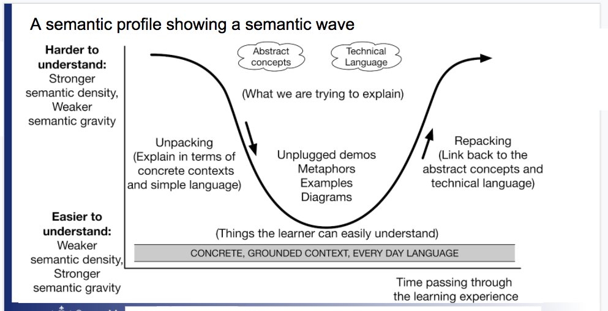

---
zotero:
  scannable-cite: false # only relevant when your compiling to scannable-cite .odt
  client: zotero # defaults to zotero
  author-in-text: false # when true, enabled fake author-name-only cites by replacing it with the text of the last names of the authors
  csl-style: harvard # pre-fill the style
layout: post
categories: misc
title: Abstract and Concrete Approaches to Computing
---

<!--
### notes / ideas
- order of the concrete / abstract and inclusion section - prehaps swap?
- in PRIMM quick read - they draw on SCT socio cultural theory - add this to the chapter and link to game making
-  downplay PBL - up play design approaches (and patterns)
- include associated challenges in part two

### Additions -

- Kolb as PBL friendly - no starting point - suited to ongoing reflective cycle approach
- But need help to navigate the process - think of design Patterns
- Invite question - what exactly is abstract?
- Then on to Papert - pluralism - they get there if you let them experiment or the design of the tools / experience leads them there.   
- some kind of resolution of concrete and abstract concepts
- there is abstraction at every level , young kids grouping red toys, abstract, analyse and sythesise by grouping - this doesn't have to be taught explicitly
- the essential tension of teachers trying to be inclusive but having to respond to a curriculum. -->

## Introduction

In the UK, computing and computational devices are all around us. Young people interact with them in many ways including, general communication, games, social media and many creative fun apps. Computing as a subject can draw on this diverse engagement. Many computing teachers share their creative approaches to covering the computing curriculum, building fluency in programming and developing wider computer science knowledge. When we can connect computing to young people's genuine interests then magic happens. This chapter champions the value of hands-on teaching approaches. It does this by highlighting on-going tensions in the world of educational between abstract and concrete approaches, looks at definitions and role of Computational Thinking in an accessible way, examines inspirational and inclusive approaches to computing education.

It is a good idea to explore some of the terms that we will use in this and other chapters. Particularly the terms inclusion and engagement.

<!-- Recent years have brought a new diversity of software tools and engaging materials  of computing projects. While these tools are perhaps the most visible signs of progress in this field, effective pedagogies to support the coding and computing process have also received attention. In the second half of the chapter we will look at some of the learning supports available to educators who want, help their learners jump right into coding, sustain interest and reflect on the progress they have made. -->

<!-- ### Context of Teaching Computing in the UK -->
<!-- The promotion of Computational Thinking has been a key factor in the presentation of the UK's current computing curriculum. Computational Thinking started to gain wider attention when the academic and computer scientist Jeanette Wing began to promote it as a concept and approach that could be useful beyond the field of computing. Wing's perspective is that "everyone... can benefit from thinking like a computer scientist" -@wing_computational_2008. Computational Thinking is the ability to express and solve problems in the same kind of way a computer would.

This chapter looks at different definitions of Computational Thinking and their implications for teaching computing in inclusive ways. In particular we took at the concepts of abstract and concrete approaches to computing and how they inform recent advice to engage students. To do this I will be summarising some of the theory and practice of applying inclusive approaches to computing projects. -->

<!-- I do not suggest the concepts of Computational Thinking and Creativity are in opposition to each other. However, for the first part of this chapter I am going to explore both concepts from an academic perspective as a way of finding useful tensions and variety in the way computing teaching is being approached and promoted.
I will use the lens of projects to examine creativity in computing.   -->

<!-- (not sure about the terms or even the whole approach of the last sentence) -->

<!-- Give an example to support the above  -->
<!-- DO Other chapters in this book deal with the strategies like PRIMM and Unplugged computing to communicate the more abstract concepts of computational thinking suited to classroom teaching.?  -->

<!-- ## Coding well is well hard - hard to learn- hard to teach. Choosing suitable coding projects for novices is hard to get right. They may be too hard or too boring. [removed extra]  -->

**On Inclusion**

Later in this chapter I will outline several approaches to support inclusive pedagogy but before doing that it is important to have a quick look at the term inclusion. Inclusion in education is used in many ways but is seen generally as ‘increasing the participation of students in, and reducing their exclusion from, the cultures, curricula and communities of local schools’ [@booth2002index]. More recent educational research in this area has widened from having a chief focus on SEN and disability issues to including barriers of culture and other exclusionary elements of school discourse [@black-hawkins_achievement_2008]. The issue of alienation from the culture of computing in schools can be an issue especially for girls and some ethnic minorities. As such bringing the out of school interests and experiences of pupils into the classroom is vital. More broadly, more recent definitions of inclusive education include a social justice element. To be inclusive schools and teachers must identify barriers to progression and work to help student overcome them.

<!-- Make the above paragraph less wordy -->

<!-- The next section deals with inclusive pedagogy but Florian and BH make a distinction with other similar terms does this need to be explored?  -->

One emerging principle of inclusive pedagogy is to move away from a view that most students learn well and that others need particular support particular, adapted approaches. Indeed if you include wider understandings of neurodiversity and cultural and language diversity then planning alternative activities or learning pathways for all learners with particular needs could quickly become so time-consuming and complex that it would be unsustainable. Instead, we should design learning experiences so that all learners can choose their own learning tasks (and thus levels of challenge), are supported to reflect via self-assessment and bring their own experience and cultural understandings into their work. These principles - among others - are presented in a framework called Universal Design for Learning (UDL) which is covered in the final section of this chapter.

<!-- Make the above paragraph clearer - perhaps find citation -->

<!-- (Good citation or example needed?)
- first part of inclusion is here
However, many of the principles of the UDL framework will be  ones that experienced teachers have already adopted based on their intuition and experience. One key approach is that of introducing concepts by starting with examples that are physical and familiar and then drawing out the more abstract ideas that can be applied in other areas.
- then a section on UDL Later
- finally Conclusion makes claims to favour leading without concepts - concrete fading
 -->
<!-- Concrete fading here?  -->

One aspect of inclusion is to engage the interests of learners. In the next section we briefly examine some of the techniques educators are using to make computing engaging to a diverse set of learners.

**On Making Computing Engaging**

<!-- Increase this section with a case study
link to game making - hello world magasine - maker spaces -
examples on walls of classrooms -->

In general terms student engagement refers to the level of interest, involvement and participation of learners. We certainly notice when it is absent as bored learners are hard to motive. Embracing the challenge of making computing projects engaging and has something that many individuals and organisations have engaged with. University and industry partner programs have created a diversity of computing materials and computing environments designed to aid novice programmers. Teachers themselves have been a tremendous source in the sharing of knowledge, materials and approaches to respond to the challenge.

A quick search the web for creative computing or tech for kids yields countless activities, tools and materials designed to engage the home and hobby interests of young people. Physical examples include fashion and textiles based computing, robotics, colourful lighting displays and programming lego constructions. Beyond the value of working with home interests as a way of increasing participation and inclusion there is also outreach value is in the visual, tangible and touchable nature of the materials. They look and feel like fun and exciting objects to engage with. Other web-based or software activities include game making, meme creation, hobby website creation or making storytelling adventures. Adapting other narrative forms like books, films, games and social media content increases the ability for learners to bring their own interests into the mix.  

However while the range of materials and possible creative projects is exciting and full for promise for computing teachers, it is not always clear how to get best approach these opportunities from an educational point of view. This chapter will explore teaching and learning approaches to increase learner engagement, firstly by defining and exploring concrete approaches, and then by sharing useful classroom tactics.

<!-- Break out box on creative computing examples?
- Scratch
- Game Making
- Physical computing
-->

<!-- SIGNPOSTING (but not too much)?
To help address this chapter will cover some design and project based approaches to help.  Before doing that we will look at some foundational terms that you will meet and explore this subject from the perspective of   -->

## Computational Thinking, the Abstract and Concrete

### Concrete and Abstract learning approaches
When reading about different approaches to teaching computing you are likely to meet the terms concrete and abstract. In an everyday sense concrete objects are ones you can get hold of and abstract objects exist only as concepts. A pound coin is concrete but the idea of profit is abstract. There is another everyday usage which hints that abstract knowledge are harder to get to grips with than more concrete understandings. We might ask for a concrete example if we don't understand a more abstract definition. It is the use of something in context that makes something concrete. In traditional conceptions of education abstract knowledge is of greater value. If you can understand a concept as it applies in different situations then this ability to transfer it and have a more global understanding is held as a higher form of knowledge. This concept exists in Piaget's influential model of ages and stages, a progression to more abstract thinking between the concrete and formal stages.  

There are drawbacks of adopting teaching in either solely abstract or concrete ways. For example, learners may not make a connection of abstract material to real-life situations. They can then only recall rather than apply the knowledge. A term for this is _inert knowledge_. In computing, you may be able to give a definition of what a function is in a coding language but not be able to write one. There are also downsides to learning only in a concrete way. If you learned coding by teaching yourself or just picking it up for other people then you may be able to complete tasks but not be able to explain what you have done to other people, or may really struggle to recognise similar patterns in other computing contexts. This kind of knowledge is sometimes called implicit, tacit or embodied skills and knowledge. Unlike explicit knowledge, it is tricky for to explain or communicate this knowledge in a written or even spoken format. They just "know how to do it".

Ideas around abstract and concrete knowledge have been key in shaping how we teach coding today in schools. A key critical voice challenging the idea that abstract approaches were superior was Seymour Papert. Papert's work on creative computing at MIT created a legacy that includes the development of the Scratch programming tool and the use of physical computing in education. Papert and Turkle [-@papert_epistemological_1990] thought it was vital that we value and recognise concrete approaches to computing and coding. While they do not discard the technical value of abstract approaches, they draw on feminist theory to make a convincing case that approaches like abstract planning and formal language can be off putting to certain learners and especially girls. They argue that the process of finding solutions to coding issues for novice coders should be a matter of personal preference. As well as abstract and concrete - they use a top down and bottom up analogy. In a bottom up approach problems are tackled piece by piece, experimentally. Desmond Tutu once said that "there is only one way to eat an elephant: a bite at a time." Bottom-up (concrete) coders take this approach.

<!-- MORE ON BRICOLAGE AT THIS POINT? -->
To clarify this Papert and Turkle give the example of a young coder Lisa, who is aware of a more formal way to approach the kinds of programming tasks she is undertaking, but maintains that way doesn't work for her. As she continues her journey as a coder this frequent message that she is doing things the wrong way demotivates her enthusiasm around coding. Abstract coding concepts are tools for thinking. But they are only useful to the learner if they match with her experiences. Forcing the learner towards them in this example is counter productive as it undermines her experience and progress. The authors outline that the danger of leading with the abstract is to devalue this bottom up approach to coding. This way of coding has also been called a craft approach, getting close to the materials. It is an way of doing things that has been shown to have a lot of value in many professions.

<!-- The debate of the desirability of testing using more formal abstract measures of success has been going on for many years. The IQ test is a good example which has been criticised for being culturally biased in favour of more Western understandings of intelligence which favour formal logical and abstract elements and ignore other measures of emotional, cultural and practical intelligence. -->

<!-- However, while this valuing of concrete approaches is important, it is potentially unhelpful to express concrete and abstract as two paths that never meet. Abstract concepts are useful after all. The danger is when the abstract concepts chosen by educators or included in the curriculum are don't seem relevant to learners, leading to their disengagement.   -->

Many theories of learning explore the value of both concrete and abstract phases. The theory of experiential learning from Kolb is expressed often expressed as a cycle of concrete experience, reflection, abstract conceptualisation, experimentation and then repeats. When this comes to coding and computing, a student's knowledge of a coding concept may deepen a little bit each time you apply it in practice.

### ACTIVITY - RECOGNISING THE CONCRETE AND ABSTRACT IN YOUR TEACHING

To help your learners to embed the knowledge of your lessons, it is helpful to identify what parts of your sessions address more abstract conceptions of knowledge and those that are more concrete. To do this ask you can yourself the following questions about your sessions.

- What are the core skills and concepts I want to communicate in my session? How many of them are more abstract knowledge and how many more concrete applications? Do I have a good balance?  
- How do learners first meet core concepts? How are they re-enforced? Is it through an abstract definition, in the course of a more concrete explained example, or via hands on work they are engaged in?

<!-- The socio-cultural school holds that rather than being a separate thinking machine, the mind is dependent on the social and cultural webs of meaning that surrounds it. We think socially. -->

<!-- Perhaps add to this element to the start of part four about project based approaches
or revise to be practical to the teacher -->

<!-- This forms a fundamental challenge to the usefulness of teaching cognitive processes for transfer, one that challenges so many of schools normal ways of doing things that it is difficult to know where to begin reform. -->

<!-- Image done in a way that works on github pages AND in word docs -->
<!-- 
 -->

<!-- ### The Issue of Transfer

The implications of thinking socially are that our mind is motivated and activated by the context of the problems that we meet. While it would be great if we could transfer the knowledge we gain in one area to another or to be able to apply an abstract idea to a more specific problem, researchers from the socio-cultural perspective are very critical of this idea.

This problem of transfer creates a problem for Computing teachers. If they are aiming for good exam results of their students. If students are unlikely to be able to transfer the computing skills they have picked up from undertaking creative projects, then it is logical to teach to the test as this will be the cultural context that they need to perform in. Of course this may have long term detrimental effects, as then students will not be able to transfer the exam knowledge into practical experience after school.     

The difference between exam-focused computing and real life coding and computing is ....
 (find citations / example )

As with many other subjects, teachers are being asked to both teach to the particular requirements of exams and to build more transferrable skills. In this case this process of being pulled in different directions seems particularly noticeable. -->

<!-- Sign posting - tactics -   semantic wave theory
and more out of school tatctics.  -->

<!--
Mark Guzdial was an early advocate of Computational Thinking and wrote about the possibility of this kind of cross over enthusiastically - find and contextualise - However his enthusiasm has changed in focus he has moved towards a more concrete idea of what Computational Thinking . Has he lost the faith - what's happening here?

The key to this idea is transfer which is a tricky concept to prove when it comes to situations like this. As Mark says, you can't prove a negative, but the evidence for CT being transferred to other areas is weak.

There is a school of thinking in educational research which argues that learning how to do something like coding is entangled up in particular situations. So even though CT processes may be at work they are tacit and would be of little use in other situations. -->

### Definitions of Computational Thinking

The promotion of Computational Thinking has been a key factor in the presentation of the UK's current computing curriculum. Computational Thinking started to gain wider attention when the academic and computer scientist Jeanette Wing began to promote it as a concept and approach that could be useful beyond the field of computing as a way to express and solve problems in the same kind of way a computer would.

We can use the distinction between concrete and abstract to examine the differences between two popular interpretations of Computational Thinking. The first is an influential take from Jeanette Wing. "The most important and high-level thought process in computational thinking is the abstraction process. Abstraction is used in defining patterns, generalizing from instances, and parameterization" [@wing_computational_nodate]. Many learning resources designed to support the computing curriculum present this principle as four key pillars; decomposition, pattern recognition, abstraction algorithmic thinking[@bbc_bitesize_introduction_nodate]. The essence here is to abstract away concepts and principles from the context. This approach suits assessing knowledge via formal written exams and tests.

Another widely used definition of CT by Brennan and Resnick [-@brennan_new_2012] was developed in response to a thought experiment "How do we describe what Tim, Shannon, and Renita are learning as they participate as designers of interactive media with Scratch?". The researchers took a grounded / situated approach to mapping the potential learning dimensions of working with others creating computing projects. The resulting map they created includes computational concepts, computational practices and computational perspectives. This framework based on observation of learners in action is more concrete and more accessible to teachers and learners as they can more easily recognise their own practice.

Computational Thinking model by Resnick and Brennan - Diagram created by Mick Chesterman

This wider and process driven definition of CT has been used and adapted by many organisations seeking to support the new computing curriculum. As such it may be familiar from websites, posters and other supporting material created by groups like Barefoot computing. A review of teaching Computational Thinking [@lye_review_2014] used this second definition as the basis for their review, which point to the widespread use of Brennan and Resnick's more applied approach. The review highlight the usefulness of this framework to help teachers and researchers design their programming sessions and observe details of practice.

<!-- If you look at the breakdown, then you can see that a lot of practices and perspectives are very general to a process of creating something with peers rather than being unique to computing. This framework may be useful but this definition Computational Thinking can not be said to apply only to Computing.  -->

The wider definition of CT here assumes and environment where learners are engaged in  the collaborative coding of a computing project. Coding may not be the same as computational thinking but it is part of the computing curriculum and a useful skill in itself. Also, if you look at their breakdown of CT, then you can see that a lot of practices and perspectives are very general to a process of creating something with peers rather than being unique to computing. From the perspective inclusive teaching practice there are many benefits to more collaborative approaches which are explored in a later section of this chapter on UDL and in another chapter of this book on design and project based approaches.

<!--
 Certainly from an academic perspective we need to ask what is special about Computational Thinking. -->

<!-- Much analysis has been done about the relative merits of different definitions of CT. From my perspective I feel that from an academic perspective Wing's definition does a good job of describing what is most unique about Computational Thinking compared to other frameworks. The way it looks at the special ways abstraction is done in computer science is convincing. The concept of Computational Thinking as more abstract, transferable knowledge became significant aspect of the 2015 Computing curriculum. It suited the conservatives government's back to educational basics agenda based, a perceived move away a progressive skills based approach to a knowledge-based curriculum. -->

<!-- This agenda has been championed by education ministers Nick Gibbs and Michael Gove. A good example can be found in a speech by Nick Gibb at a launch of a collection of essays _The Question of Knowledge_ (http://tiny.cc/gibbsknowledge). I suspect most educators would find this oppositional setting of knowledge against skills unconvincing. If we return to Kobl's experiential cycle, it is through application of knowledge in concrete contexts that skills develop and understandings of knowledge deepen. Ironically in the foreword of the publication in question, references the importance of Young's concept of powerful knowledge which is knowledge put into practice in a concrete context, and putting the knowledge into practice will involve developing practical skills. -->

<!-- SINGPOSTING - Given this, educational practices and frameworks which support learners and teachers to help reflect on and develop skills are clearly helpful. -->

<!-- If we return to our general understanding of what abstract and concrete mean, we can see that the CT concepts can be formulated in a spectrum of relatively abstract to relatively concrete. While the computing concepts, practices and perspectives are all abstract concepts they are relatively more concrete than the concepts in Wing's definition. -->

<!-- The process CT has been taught - which is covered in another chapter - there are some really innovative and accessible ways that are proposed. Unplugged, concept mapping and others.... -->

<!-- Another take on CT critiques Wing from the other angle. According to Denner and Tendre -@tedre_long_2016, Wing's view of CT over eggs the possibility of transfer to other areas beyond what is shown in the research and has a too narrow view of CT. -->

<!-- ### Coding is not Computational Thinking -->

<!--  is this section really needed?
Refer back to transfer?
Integrate into another? -->
<!--
We have explored that Computational Thinking is a contested term. While there is a general agreement that computational thinking is not just computer coding, most applied definitions include algorithmic thinking, and thus the more concrete aspects of coding structures. -->

<!-- I as I became I learned how to become a proficient coder without explicitly being taught the more abstract CT concepts.  -->

<!-- of more abstract concepts
There is a tension between the skills required of Real Life coding and the time it takes to learn via real projects and the more abstract knowledge needed to answer more formal exam questions. In GCSE exams include a paper which tests application of coding concepts in a paper based format. Which aims to strike a balance. This would then justify devoting more time to applied coding projects especially if they can be done collaboratively to take advantage of the benefits of social learning. -->

<!-- Refer back to transfer? -->

<!-- Make link to Project based approaches ? -->
<!--  -->

## Tactics for teaching Computing in the Classroom

<!-- SOME MORE THE CHARACTERISTICS OF THE QUESTIONS AND THE KNOWLEDGE needed
AN EXAMPLE ?-->
<!-- In another chapter I examine wider project based approaches which are more challenging to integrate into a classroom environment but which provide particular benefits to the learner. -->
<!-- First of all we look at the impact of GCSE exams and the computing curriculum on how teachers approach the subject. -->
<!-- ### The context of GCSE exams papers -->

This section gives tips and examples pitched at a typical classrooom computing environment by drawing on resources provided by NCCE on the website Teach Computing. Classroom practice is strongly influenced by curriculum content and more specifically the format of exam questions. The removal of course work from exams due to widespread sharing of worked examples on line created a real challenge for those setting exams. How to test the practical programming experience and ability of students in a written exam setting. At GCSE level most exam questions test the more applied definitions of Computational Thinking, particularly the process of writing, analysing and revising algorithms in the form of written code examples. Students are required to demonstrate and explain fundamental code building blocks and approaches from first principles. However exam questions on coding are by nature fragmented and decontextualised compared to project coding experience. The questions in the format of small coding challenges must be fragmented to be able test a particular part of the curriculum. Thus, there is little potential for students to show design or authentic debugging skills.

How can teachers best prepare students for questions which require good degree of understanding concepts and memorisation of coding detail. Teaching to the test implies a passive learning on the part of the pupils. Spending a lot of time solving decontextualised exam questions has potentially negative impacts on inclusion and student engagement. Such a focus also reduces time to explore more authentic projects where students follow their own interests and develop design and troubleshooting practices.  

NCCE has produced a series of resources based on research on computing practices to help teachers. As a way of summarising some of the diverse and sometimes seemingly contradictory opportunities and requirements, they have provided a set [*12 principles for teaching computing*](https://blog.teachcomputing.org/how-we-teach-computing/) aimed at mainstream teachers. What these approaches have in common is an attempt to address the tricky issue of understanding complex and abstract concepts. In the following section we look at some of principles and other tactics for classroom teaching that aim teachers to answer this challenge. The aim to explore more abstract computing concepts and integrate them with concrete examples and practices.

<!-- https://www-tandfonline-com.mmu.idm.oclc.org/doi/full/10.1080/14703297.2018.1564882?casa_token=5gdmHSGX8BwAAAAA%3ANAyJjDXRrGZPqN2yJzqp_0zw_-U1hpZejAu3j8zBM1Gw6AvybVyroc7m_LUDzuaz-h6w6w6tzII -->

<!-- SOME MORE ON THE GENERAL CONDITIONS IN THE CLASSROOM NEEDED TO MAKE THIS HAPPEN? -->
<!-- Let's examine some of the needs of the Computing classroom to best prepare students for the kinds of questions they are likely to meet in GCSE papers.
Drill and test - analysing code - predictions - then go on to other tactics.
 -->
<!--
Sign posting - do this elsewhere
In the final section I take a more idealistic pedagogical approach - imagining what a learning landscape without these restrictions would look like - in line with Papert and Turkle to explore alternative concrete approaches and frameworks in more detail. -->
<!--
To do this we can look to relevant research to provide us with some tactics to structure the process of learning how to use coding structures fluently and to onboard that tricky process. -->

<!-- Diverse and contradictory? projects, concrete but also concepts first? -->

#### Unplugged activities

Unplugged are activities carried out away from the computer that aim to illustrate computing concepts. They are explored in more detail in another chapter in this collection. Unplugged activities often use very familiar non-school examples and draw on learners' understanding of their own concrete experiences. However the danger is that meeting the concepts outside of an authentic context where they are put into practice leads to inert knowledge.

<!-- A bit more on this from Lee and Vincent
unplugged is not enough?
-->

#### Expansive Framing

Researchers Lee and Vincent were concerned about the CT practices being unable to be transferred to other areas. They applied an approach of expansive framing to develop students Computational Thinking. Expansive Framing is about students meeting similar abstract concepts in different contexts (or frames). In this way, when the link is reinforced student's understanding is deepened.

Thus to increase the effectiveness of Unplugged activities students also used an context of loom based weaving. Students analysed weave patterns, created a graphical representation of the pattern on grid paper, and then used this to codify the pattern and represent it on a computer screen using Scratch.

Their research includes a practical approach to help overcome some of the difficulties of transfer of knowledge between contexts. http://tiny.cc/expansive-framing

#### PRIMM

PRIMM stands for Predict, Run, Investigate, Modify and Make. This learning model has been gained popularity in resources aimed at UK teachers. PRIMM helps learners adopt coding practices and computational concepts by starting them with a concrete code example that they run after predicting what it does. They then dig deeper and make changes to the existing code. PRIMM's starting point is students reading and predicting code results. It aligns with the NCCE principle of _concepts first_. This engagement with the motivation of the code allows teachers to focus on the target computing concept of the lesson. It allows them to highlight key computational thinking process or algorithmic details. Thus PRIMM is well suited to the classroom as the process of leading with prediction narrows the focus of the class, thus allowing a larger set of learners to unpack and repack the same set of concepts in a restricted time scale. It is a process well aligned with some of the more formal problems solving, paper-based questions of the GCSE exams.
For a more detailed summary of the PRIMM approach see this quick read pedagogy article. http://tiny.cc/primmqr

PRIMM is a modification of Use Modify Create framework which was developed to represent the learning process of learners engaging with extensive computing projects like game design, designing simulations and robotics projects. I write in more detail about the Use Modify Create framework in another chapter in this collection.

#### Semantic Waves and Leading with Concepts
Two concepts in the teach computing principles are _lead with concepts_ and _Unplug, Unpack and Repack_. These principles have been explored with the theory of semantic waves.
http://tiny.cc/semantic-waves

The Semantic Wave approach is usually presented as leading with concepts, unpacking them, then giving concrete examples or applying the concepts in a practical example, and then returning to the re-examine the concept from a more abstract perspective once again - hopefully with a richer understanding informed by the concrete experience. The terms semantic density and gravity can be substituted for abstract and concrete. In some ways the concept can be seen as simplification of Kolb's experiential learning cycle. Instead of cycling through four dimensions - learners oscillate between the two.

This concept of semantic waves can help us map a process of students working to integrate abstract concepts into practice or working knowledge. It can also act as an aid to teachers wanting to plan their lessons in a way that communicates the key abstract curriculum knowledge that students will need for exams, and to allow them to put the concepts into practice to build real coding skills and to make valuable connections to personal experience.

Diagrams or examples explaining semantic waves usually start with the process beginning with the abstract or with high semantic density. This suggest that this is the optimal. However the underlying research does not say that it is important where you start.

<!-- Challenge by Papert - valuing the concrete - how much is this in opposition - and what is the practical resolution by teachers needing to teach to the test? -->

Leading with concepts has the advantage of being specific about the target subject matter being taught. As this is process familiar to classroom practice and preparing for testing. However, there are disadvantages as it is out of step with project based approaches as we will explore in a later section of this chapter.

#### Pair Programming

Peer programming is one aspect of social learning but there are others associated with being part of a wider community of learners. One of the key values of pair programming is to start to develop different roles involved in coding. A summary of these roles and tips on how teachers can help learners to adopt them in present in this Quick Read from NCCE - http://tiny.cc/pairprogramming

The process of modelling and breaking down a process that is often difficult to understand is helpful not only to aid a deeper understanding of the process but also to build the identity of learners as being strong in a particular element of coding. This process of using building an identity of coding with the help of peers is key to a socio-cultural understanding of how learners pick up coding in a classroom (or other settings).

## Universal Design for Learning

Universal Design for Learning (UDL) is a set of principles which are in-line with our earlier exploration of inclusive practices. UDL encourages teachers to create diverse ways to engage pupils, to represent the ideas being communicated and for students to express their own ideas.   According to the USA Center on Universal Design for Learning, "UDL provides a blueprint for creating instructional goals, methods, materials, and assessments that work for everyone—not a single, one-size-fits-all solution, but rather flexible approaches that can be customized and adjusted for individual needs."

UDL provides guidelines for three key areas of representation, expression and engagement. Rather than designing separate activities and support for learners with different educational needs in the classroom - often labelled accommodations for disability - UDL facilitates learners to choose a learning pathway that suits their individual abilities and learning strategies.

These strategies are sometimes presented in a way that highlights the technical elements of accessibility and assistive learning technologies, for example text in different sizes, the presentation of materials in accessible ways online and in the classroom. However, beyond representation, approaches for engagement and expression lend themselves to more radical learning techniques.

<!--
In terms of choice of student activity teachers will be familiar with the practice of differentiation. UDL practice is similar but places more power in the hands of learners to choose the path that is most appropriate for them. -->

UDL places great value on the authenticity and personal relevance and value of learning experiences. In exploring the tension between abstract concepts and concrete activities, UDL prioritises engagement, encouraging the teacher to start by setting concrete class goals that are relevant to the learners. Students are then supported in the discovery and recording of the underlying concepts after undertaking activities.

<!-- Dom says...
student often choose the level that is appropriate for them.
FIND SOURCE FOR THIS -->
<!-- UDL is similar in many ways to project based approaches and in another chapter we look at tactics to resolve some of the practical difficulties of adopting these techniques in schools. -->

<!-- 
 -->
<!-- Some say similar to Freire / Bruner
https://accessibility.uncg.edu/wp-content/uploads/2019/02/UDL-Engagment_For-Website.pdf -->

<!-- examples of strategies - perhaps in clude as short link?
https://goalbookapp.com/toolkit/v/strategies  -->

ACTIVITY - APPLYING UDL IN THE CLASSROOM

Many of the principles of the UDL framework will be  ones that experienced teachers have already adopted based on their intuition and experience.

- To what extent can students choose their own way to apply the target knowledge or skills? Can work outcomes be driven on their interests or at least adapted to add their one interests as content materials within it?  
- Are learners able to see and explain the real life application of the concepts and skills you are introducing? How motivating do they find that link?
- How are you helping learners to make connections between the concepts and skills they are picking up through hands on work and the more abstract representations that may occur in test or exam situations?

One key approach is that of introducing concepts by starting with examples that are physical and familiar and then drawing out the more abstract ideas that can be applied in other areas. Thus if we return to the semantic wave representation, this suggests teachers should start on the more concrete (high semantic gravity) and then highlight concepts and patterns as they emerge in authentic situations. This approach may be unfamiliar or seem to go against the traditional format of a lesson plan. How able are you to try this out in your own lessons? Is there an upcoming situation where you could try a different approach and evaluate how students respond?

### Observing and Assessing Authentic Practices

There is an ongoing tension for teachers between giving learners the freedom to pursue their own concrete coding goals, and the need to bring their attention back to the learning goals and target knowledge of the curriculum. In the current educational climate teachers have to be able to show how classroom work applies to the curriculum and exam goals. This tension can be helped using a technique promoted by NCCE (at teachcomputing.org) - that of using observational techniques in the classroom to assess user progress. Techniques to help teacher observation and assessment of what student are completing are vital if we are be able to keep a track of some of the ways they solve problems as they apply knowledge in the concrete stage of their learning. The NCCE have created this quick read on observation - http://tiny.cc/observingstudents

In an ideal situation teachers are able to introduce concepts and then give student suitable tools, inspiration and to sustain their motivation as they solve real computing tasks. However this sets the bar high for many classrooms. While not all schools can provide this kind of motivation and support within an everyday computing classroom environment, many of them find ways of bringing the value project and design approaches to their students. I explore some of these tactics and associated benefits of design and project approaches in more depth in another chapter of this book.    

#### ACTIVITY - What do you think about transfer? (perhaps earlier)

Much of what this chapter has looked at stems from a core concept of education that we don't have time to fully explore but which has shaped educational policy significantly. The idea of transfer. Rather than trying to lay out the debate at this stage I think it is still helpful to ask yourself the following questions about your learners and learning environment.

- What do you feel are the most valuable potentially transferable skills your students meet in your sessions?
- How realistic is it learners transfer some of the skills and knowledge they have picked up in your teaching sessions to another subject area or to another area of their life?

### Conclusion

This chapter has explored the alignment of between inclusive approaches and concrete ways of approaching computing education. It has looked at the challenges and dangers of leading with abstract ideas.  

Resnick cautions against some of the dangers of adopting a too formal approach including; too much memorisation of computational terms rather than application, devaluing hands on coding compared abstract concepts, not enough time devoted to complete projects and finally learners not given enough choice in their creations. His concern is that the potential for computing to build creative and design thinking competencies is being undermined.  http://tiny.cc/codingcrossroads

We have also explored the value of UDL principles for teachers looking to inclusive practice. We have also covered some of the well established and newly emerging pedagogical approaches to resolve some of these contradictions.
MORE ON STUDENT CHOICE HERE  -

In another chapter I explore design and project based approaches as other techniques to help teachers balancing the requirements of the curriculum and doing hands-on work.

<!--In short I advocate leading with project goals first approach rather than computational thinking concepts AND focusing on coding and design concepts as the framework for learners to help navigate the learning that happens in these projects. -->
