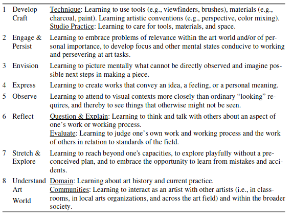

---
zotero:
  scannable-cite: false # only relevant when your compiling to scannable-cite .odt
  client: zotero # defaults to zotero
  author-in-text: false # when true, enabled fake author-name-only cites by replacing it with the text of the last names of the authors
  csl-style: harvard # pre-fill the style
layout: post
categories: misc
title: Project and Design Approaches in Computing
---

# Project and Design Approaches in Computing

## Introduction

<!-- Take this out perhaps -->

In a previous chapter we looked at concrete and abstract approaches to computing educations and learning to code. One of the tactics to make learning concrete is to get your learners to design and complete computing projects. The pedagogies and frameworks that support the creative processes involved in undertaking computing projects in an educational setting have a tremendous potential to deliver transformative learning experiences.

In this chapter we explore some of the strategies that can be used to support the delivery of design and project based approaches. To start with I focus on the value of creative communities before tackling the areas of design-based approaches to computing project and a broad look at some of the benefits and processes of project-based learning. This chapter then turns to look at some tactics for overcoming limitations in what you can achieve in the classroom.

In a professional setting coders will often be working within existing projects that they have not started themselves. They may be patching and remixing existing code and including and adapting external code libraries. All the time they will be adapting to existing practices and patterns used by their colleagues and code communities. GCSE questions attempt to include some elements of peer practices by including tests of code reading and analysis. However preparing students for these exam questions requires skills and practices that are quite different from coding in a real life setting. Because of this computing teachers face a significant challenge to both teach concepts to be reproduced in exam contexts and to unleash the potential of student working on their own projects.

The scope of this chapter is large so I have concentrated on picking out details that may help teachers make their classrooms into learning environments that can support students to pick up coding and computing skills useful if they progress into that profession, as well as gaining useful project skills which are potentially useful in many areas of their future professional and personal lives.

<!-- We have looked at some of the 12 principles and quick reads promoted by the NCCE both abstract and concrete approaches. The 12 principles include _Make concrete_ and _Get hands-on_. While it is not contradictory to encourage both abstract and concrete approaches, given the tactic moving between the two perspectives via _semantic waves_, the resources provided, perhaps because they are targeted at the classroom, often lead with more formal learning approaches. -->

<!-- There is also danger that this abstract approach to algorithms, while containing the promise of transfer to other domains, has the danger of distracting teachers from other creative ways of representing the learning outcomes of more concrete approaches. -->

<!-- To address wider challenges of implementing PBL approaches we look at what is available to help teachers balancing the requirements of the curriculum and doing hands-on work. To address questions equality I explore how can young people from a wide variety of backgrounds benefit from this approach. -->

## The Power of Communities

A project based approach to learning coding and computing is often something that is supported by families and emerges from the home environment. For example enthusiastic family members taking young people to Maker Fairs or engage in other community coding activities. They may buy creative computing kits or access resources such as YouTube videos or via specialist online forums. This kind of hobbyist forums and communication have been documented as being significant in the evolution of the home computer and Silicon Valley culture. If you put the name "Homebrew Computing Club" into a search engine you will find an interesting history.

However, this kind of computer enthusiast community is not the most accessible to a wide variety of audience. As educators striving for more inclusive and equal approaches, we should ask how then to widen out this experience? One way that this gap is being filled is by funded projects are programmes like the Coolest Project and Coder Dojo and Code Clubs.

**Code Clubs** are designed for out of hours school clubs run by teachers and provide inspiration and resources to help build a lunch-time or after school community. A large number of high quality, colourful and attractive resources are supplied free of charge on their website. [Add website] It was originally an independent organisation which is now part of Raspberry Pi Foundation. https://projects.raspberrypi.org/en/codeclub

**Coder Dojos** are monthly events run by volunteers often at the weekend. They often focus on creative, engaging computing. I have volunteered at some events and interviewed other volunteers. I have been impressed at the dedication and inventiveness of volunteers. While some tables will use existing resources to support Scratch, others will try out new and experimental work around hacking Minecraft, creating games with code engines and new technologies of physical computing. Often volunteers will bring their own children, and use them as guides to help them evaluate their project ideas to make sure they are engaging and achievable for the target audience.

**The Coolest Project** is a project the Raspberry Pi Foundation which also runs Code Clubs in Schools and Coder Dojos which are often weekend family focused events. It addresses one issue with monthly Coder Dojos. My observations and interviews with volunteers at Dojos showed that there is a difficulty in maintaining project interest from one month to the next.

These projects allow students to approach computing with a different attitude and tackle problems in a radically different way to much of classroom teaching. Apart from the greater amount of time dedicated to hands-on coding and related physical computing challenges, the opportunities for authentic practices. These include: designing for real users, collaboration with other students, project planning, debugging faulty code and repeated revisions to fine tune the desired result.

While the Raspberry Pi Foundation have created and collected an impressive collection of resources - it is vital to also appreciate the work of volunteers and teachers volunteering out of class time to create the opportunities to code creatively. This is more than about the creation of stand alone resources, it is about creating authentic goals for learners and setting up systems involving adults, teen helpers and in the case of Coder Dojo other family members to support the skills and sustain the interest of learners.

<!-- Explain this more?  
how to bring this into the classroom
most pedagogies are still around behaviourist approaches.
-->

### Communities in Educational Theory

The power of communities has been highlighted by educational researchers for some time as part of what is know as the "social turn". This is a turn away from more individualised ways of learning concentrating of efficient transfer of knowledge from the teacher to the pupil. Instead the focus is on how learning happens through participation in a community and culture. Researchers involved in this area are broadly referred to as being part of a socio-cultural school of educational research.

Community in this educational context not only provides support in creative process but also motivates participation in the first place. Barbara Rogoff [-@rogoff_developing_1994], a key researcher in the socio-cultural approaches to education describes an educational processes she called _communities of learners_ - http://tiny.cc/communityoflearners. Rogoff sees this approach as radically different from both instruction based models of learning and pure discovery learning. Instead participants have different levels of expertise and varied roles in a learning system working towards an authentic goal. Rogoff notes that this can be confusing to adults used to more instruction-based learning and that such a community in full swing can seem chaotic. This seems like chaos because complex and productive learning is happening in ways that we may be unused to. This chapter helps decode some of these practices and explore ways that educators have structured their learning environments to take advantage of this powerful approach.

### ACTIVITY - APPLYING A COMMUNITY APPROACH IN THE CLASSROOM

Are you making the most of the power of communities in your classroom. Before you start your next unit of work you can ask you self some of the following questions.

- At what stages in your learners able to work together during your unit of work? Are there chances for peer feedback?
- Are there examples of the work of students or others available for your students to examine, to use and to inspire them?
- Can you draw on the roles or identities that students have adopted in other work? Are they able to reflect on the specifics on those roles to contribute to the effectiveness of their teamwork?
- Can you help your learners make a connection between the work they are doing and other professional or enthusiast communities outside of the classroom?

<!--
And SINGPOSTING to the rest of the chapter
 -->

 <!-- In another chapter in this book I look at how to apply a project and inclusive approach to game making as a coding and computing project. -->
 <!-- ### UDL as Learning Framework -->

## Design Approaches

One technique which involves both a community of producers and users is design-based learning. Design approaches have been adopted widely in software production, creative industries and wider business contexts. These principles and practices have also influenced areas of education and research. If you are an educator the experience of seeing students motivated by producing something for a real audience may be familiar. If students are able to share their created digital work with peers then the process of revising based on feedback from others can be extremely valuable to sustain interest.  

<!-- Make the above clearer -->

Design projects allow students to develop important 21st Century Skills like problem solving, communication and creatively responding to real life contexts. When applying this approach Teachers can choose how much to focus on the more technical or user-focused elements of design depending on the priorities of their curriculum and personal preferences and aptitudes. There are rich resources teachers can draw on from the field of participatory design and co-design which with some adaptation can work well in a school setting. In the following sections I focus more on underlying principles than particular resources or case studies. To do this I will explore the use-modify-create model, design patterns, worked examples and iterative design approaches.

<!-- These range from exploring cultural contexts to role playing scenarios. For some suitable resources see http://tiny.cc/design_resources -->
<!-- For some suitable resources see INSERT  
https://www.stem.org.uk/resources/community/collection/449826/design-challenges  
https://www.edutopia.org/topic/design-thinking
https://www.mantleoftheexpert.com/resources/reading/
https://www.mantleoftheexpert.com/resources/contexts/
-->

### The Use Modify Create model
<!-- THIS WOULD BE THE POINT TO INTRODUCE PHIL BAGGE'S CASE STUDY -->

There are some parallels and some differences between Use Modify Create and the PRIMM framework described in a previous chapter [@lee_computational_2011] - http://tiny.cc/usemodifycreate. Both have become increasingly popular in the computing education sector in the UK. In particular the UMC model is designed both to limit learner anxiety as they potentially meet code and a coding interface for the first time and to scaffold the acquisition of coding and computational thinking concepts.

In the **Use** stage, coders build a familiarity with coding interfaces and the some of the through scaffolded approaches. It is not specific how much is taught in terms of the concepts at this stage.
In **Modify** learners progress to working on real projects but one created by others.
Progressing to the **Create** stage - is not an immediate process. As novices pick up patterns of code design in use in the modify section, they are in a good place to replicate such patterns in other code that they create from scratch.

Research has supported the benefits of the UMC approach. A study on 500 9 to 14 year olds highlighted the effectiveness to balance a structured approach concentrating on computing concepts with more student-led exploration [@franklin_analysis_2020]. They also found that the students enjoyed the process as they had more choice and agency in the process. This is supported by research which compared a from scratch and UMC approach suggested higher student engagement for those in the UMC group [@lytle_use_2019]. Researchers suggest that this is because, students had more time to play around with code, they were able to add their own personal touches and that that ownership over the code sustained engagement.  

Kafai and Burke [-@kafai_social_2013] argue that a shift from writing programs from scratch to modifying and remixing them is inline with socio-cultural teaching approaches. They coin the term computational participation to reflect this change of focus. They also note that such remixing is helped by online coding communities that may be either semi-professional or come from more of a DIY / youth culture perspective. They encourage educators not to just focus on the technical possibilities of coding environments but the potential of associated communities.

<!-- social turn Kafai-
https://dl.acm.org/doi/pdf/10.1145/2445196.2445373?casa_token=cvROG9VFSQkAAAAA:l8ze0hPFQq5zAVlacNuNq9bx3in2XzH26lXsiHSjPvAWgVXoGCy2IuHrKHZU9KA1hZlSZd4rB4c -->
<!--
An Analysis of Use-Modify-Create Pedagogical Approach’s
Success in Balancing Structure and Student Agency
https://dl.acm.org/doi/pdf/10.1145/3372782.3406256?casa_token=cBoF48cWKN0AAAAA:R2ZKcg52OtgVx4D8k545hLnviFgHvjgJg5-DQUP3cfTux1BDj0dDB7lXuC5M3RZfmjXqNUkoD1Y
 -->
<!-- Could ask Phil Bagge or use this case study on Scratch Encore.
https://dl.acm.org/doi/pdf/10.1145/3372782.3406256?casa_token=cBoF48cWKN0AAAAA:R2ZKcg52OtgVx4D8k545hLnviFgHvjgJg5-DQUP3cfTux1BDj0dDB7lXuC5M3RZfmjXqNUkoD1Y -->

<!--
#### Studio Thinking PERHAPS DROP? TOO SIMILAR TO PBL AND UDL

Research of on the design approaches in artistic architecture studios has described them as Studio Thinking and described as 8 studio habits of mind. A framework was arrived at though ethnographic observation, and each of these habits was supported by teachers through stages of lecture/demonstration, hands on making, and critique/reflection.

Too large to describe in detail (see illustration / table for details) but it is useful to look at some of the key aspects. These include the importance of craft approaches, the process of learning to use the production tools, familiarising yourself with the materials and hands on reality of creating something.

<!-- Image from below

and good summary of use in schools below.

Narey, M. (Ed.), 2009. Making meaning: constructing multimodal perspectives of language, literacy, and learning through arts-based early childhood education, Educating the Young Child. Springer, New York, NY.
chapter 4
Sheridan, K., 2009. Studio thinking in early childhood, in: Making Meaning. Springer, pp. 71–88.

Below is Sawyer, R., 2012. Learning how to create: Toward a learning sciences of art and design [WWW Document]. undefined. URL /paper/Learning-how-to-create%3A-Toward-a-learning-sciences-Sawyer/1bbb67c532198cd6e664e848926e44fe44f1f1bb (accessed 12.28.20).

 researchers have drawn on the process that emerged from art education community of practice in a studio and have proposed it as a good learning process for STEM. Sawyer argues for a reduced formulation of studio practice in STEM outlining the following aspects.

-   Complex, authentic, real-world projects
-   Guided problem solving
-   Curriculum design
-   Externalization and reflection

He argues this approach is more suited to the learning sciences than the instruction based or apprentice oriented ones often in place. He cites these approaches as two sides of a spectrum. Studio practice is a third approach, open but guided. Sawyer also makes a link with PBL, an approach that is explored later in this chapter. -->

### Worked Examples and Design Patterns as an educational tool

For computing student at higher education a key technique is to learn an object oriented approach is via design patterns. Design patterns are solutions to problems or common scenarios in design areas. They have a origin architecture but are perhaps most commonly used in object oriented software design. The advantage of design patterns as a way of teaching and learning coding is that they are often rooted in real life incidences of problems that are often solved in a particular way. This can be described as a concrete implementation of coding principles.

The term design pattern is used in slightly different ways depending on the context. Normally when students meet them it will be as part of a set of patterns which include the following elements, the name and description of the pattern, the need for the pattern, related patterns and one or two examples of the pattern in code or psuedo-code format.

There are some broad similarities between design patterns and a technique called _worked examples_. NCCE promote worked examples as a classroom activity. They have created a Quick Read document on them - http://tiny.cc/worked-examples.  Worked examples and design patterns both act as a way to demonstrate underlying principles in practice. For both approaches showing working code used in a particular context helps students to analyse what makes it work and why it is a suitable solution. Repeated examples allow teachers and students to identify similar patterns that emerge.

Where design patterns are slightly different is perhaps the way they can function as a way to join and navigate participation in a community of coders.

For educators the use of design patterns and worked examples can help support learners develop coding proficiency by providing scaffolding and modelling good design decisions. However, one of the challenges for teachers of using worked examples and design patterns is how to integrate them into student-led design challenges. If students choose their own projects then it is not clear that any particular worked example or design pattern with be relevant to their work.

You may be able to create a menu of printed or online patterns or examples that students can draw on as needed. Perhaps particularly common examples can be modelled to the whole class when it is clear that many student will benefit from that approach. You may also find other ways of

<!-- Sign post to following chapter on Game Making using design patterns. -->
<!-- My own journey in computing has very much been as a modifier of code. In the early days of the web I was able code many database driven websites with code that were very far from elegant representation of CT concepts but very functional for the communities they served. Like concrete coders that Papert and Turkle celebrated, I revelled in this hands-on approach and found tutorial resources dealing with first principles extremely confusing. -->

### Iterative Design Techniques
<!-- In the Scratch community, by default there is a remix button on every project allowing views to alter it and make it their own. The process of being not only inspired by but given access to the mechanics of others creations helps support craft and community approaches to learning code in a child-friendly environment. The ability to view peer's coding and to remix it in this way supports a very interesting pedagogical approach called Use-Modify-Create. -->

Link  - compare with UMC?

Iterative design involves coming back to reflect on the outcomes of creative goals and revising them based on results. In simple terms the process involves; goal setting, creating quick prototypes, user testing and evaluation, revision and reflection. Like reflective cycles the process is iterative in that testing and revision of the prototype design can be repeated until the desired result is achieved. Iteration is also a key part of a more general scientific method of testing an idea and revising that idea and tests based on your analysis of results. The idea of an repeated (iterative) spiral approach which both deepens understanding and improves the end results is popular both in education and industry. In education Bruner describes it at a spiral curriculum. In software and design industries it is referred to as Design Thinking and Agile approaches.   

<!-- Michel Resnick was instrumental in the Scratch development team and a pioneer of constructivist learning approaches. We have already seen his work in the development of his take on Computational Thinking. That interpretation is drawn from work creating and observing the use of Scratch and similar tools as a programs suitable for novices to use code to create design projects. One of the principles behind the design of Scratch are to make more concrete some of the more abstract principles of coding through design decisions about the program's interface. -->

<!-- Tools too - Design processes need appropriate tools  -->
<!-- There are many languages and interfaces which have been created with similar principles, Agent Sheets, Alice and various implementations MakeCode to support physical computing and game making etc. -->

Mitchel Resnick, a researcher involved in the Scratch project, promotes a five stage creative cycle with tips for both parents and teachers to create a fertile environment for creativity. See http://tiny.cc/creativespiral.

_Diagram of five circular stages; Imagine - Create - Play - Share - Reflect - Imagine_

Rusk and colleagues described the foundations of the design-based approach in education as; engaging in design activities, exploring personally meaningful topics, collaborating with others, and deepening understanding through reflection -@rusk_new_2008. The key reason to adopt these principles is to increase engagement with sustained participation in computing projects from a broad range of learners. One of the sources for sustained engagement is when, as part of the iterative process,  learners are able to test and then revise their creation or experiment based on their own evaluation.

Another factor is the importance of a community in the design process, as a real audience for creations, as a source of inspiration and as peer evaluators in the testing process.

The following section describes some of the features of the online Scratch community as a way of exploring the benefits and motivations of the creators. The purpose here is not just to advertise that community as a resource, but also to draw out factors that you can try to use when creating or using communities when you engage your learners in design activities.

### CASE STUDY - How the online Scratch community supports design-based learning

<!-- As mentioned, the creative spiral model is an accessible way to communicate tips and techniques to teachers and parents to support this process. In line with the social theme of this chapter, many of these tips require participation in some kind of community be it in real life or online. Indeed, where  -->
Scratch as a project excels is in the user community. There are over 75 million users of the site who have created 80 million projects. Activity has only increased over lockdown in 2020 and 2021 with over 20 million user comments in the month of March 2021 alone. As educators using Scratch and similar tools in the classroom it is easy to overlook this aspect in favour of a more individual progress understanding computing concepts. However, if but we do so at the potential detriment to our students. When you are learning to code or create digital work, the challenge of maintaining and sustaining interest and the creative process is huge. It's one thing to be inspired by your interests to start a project, but such projects are often tricky. It's easy to get stuck. If young creators can connect with others to share and get feedback on their work it can really help to sustain the kind of repeated effort and revisions to existing work that build mastery.

Here are some of they key features and design choices of the online community.

- high diversity of creations  
- diverse means to participate
- encouraging iteration - remixing and easy of self remixing - encourages sharing drafts for feedback
- supportive and authentic audience of fellow creators - due to high numbers likely to find peers interested in subject matter and proficient in coding techniques
- ability to network and create joint projects - studios

High diversity of creations: The process of keeping the community up and running and safe for young people is significant and requires a lot of resources. The benefits are worth it. This really is an educational community and a success to be celebrated. One of the benefits of the success of the community is that it has become an extremely rich source of inspiration for young creators. A simple search of the site for projects like games, creative greeting cards, storytelling projects and pretty much any digital product you can imagine will yield multitude of results.

There is a great variety of forms of engagement with this kind of online community. You may just play others games, or just comment. You may use it to create your own projects but not engage in the more social elements of the creative process. You may like a smaller section of the community become extremely active in creating and collaborating with others on many projects.

For a good summary of some of the potential and depth of collaboration of this community the researchers Resnick, Roque and Rusk have described this in detail see - http://tiny.cc/scratch-community. In this deep dive analysis of the community and of particular is the process if of individuals finding each other on the community, grouping together by forming a group called a _studio_ and then recruiting other members to work on joint projects. This is very sophisticated behaviour mimicking real production processes carried out by young people with a high degree of independence, although they are only a very small proportion of the online Scratch creators. One of the challenges identified by the researchers was how to replicate this in the wider community of Scratch users and beyond that young people who had not yet engaged with design-based computing. One of the researchers Ricarosa Roque went on to develop other programmes which involved online exhibitions and competitions and off-line family-based programme to engage under-represented groups.
http://familycreativelearning.org/

<!--
What these projects and features have in common is that they create communities which support the different stages creative spiral. The importance of creating and facilitating different forms of participation in communities and for that community to function a motivating factor and reflective tool for young producers is key to the socio-cultural and constructionist schools of educational research. This line of thinking can be traced back to to Papert's early focus on objects to think with and creating shareable concrete artefacts. -->

### ACTIVITY - USING DESIGN APPROACHES IN THE CLASSROOM

You can ask you self the following questions to try to check if you can use some of the beneficial aspects of design-based approaches in your classroom.

- Are learners able to see explore exemplar materials to inspire and shape their creative expectations?
- Are learners able to think and articulate the perspective of users of projects as they start to consider the design for what they are creating?
- Are learners helped to come up with ideas with ideation techniques that scaffold the creative process?

**Follow-up Resources**
As part of the Rise Programme at the MMU I've created or helped to create three online courses which explore hands on ways to use design thinking in education and community work. https://rise.mmu.ac.uk/category/enterprise/design-thinking/ - At the time of publishing resources are open to all you just need to log in to access the courses.

## Projects and Project Based Learning

Project-based learning (PBL) is of the 12 teach computing principles advocated by NCCE. In the next section I'll cover the potential of project-based learning (PBL) and how this can create inclusive educational approaches. We will see that PBL has strong parallels with design based approaches and UDL (Universal Design for Learning explored in another chapter) particularly in the promotion of student choice and authenticity in projects. Project-based learning is a wide set of approaches and put simply can be seen as the value of learning via students undertaking practical projects rather than more traditional approaches designed to help the absorption and recall of more book based knowledge.

Computing education is an excellent vehicle for a project-based approach to learning. As we explored in the introduction, the nature of digital making and the many flavours that are available provides a wide-range of choices of outputs. Projects that create real outcomes that the learner has a choice over are a great way to motivational factor (Blumenfeld).

As PBL has been adopted by higher education and become the focus of academic study then frameworks have emerged as a way of helping practitioners to help students squeeze as much learning as they can from the process and to recognise the complexity of some of the learning happening. This is important as sometimes some of the learning is tacit/hidden learning which is hard to assess in traditional ways. As a way of quickly communicating the kind of learning that PBL promotes we can represent them in a visual form followed by a table to briefly describe these elements.

_Buck Institute; Gold Standard PBL elements - available under CC-BY-NC-ND licence_

PBL is in line with some of the other socio-cultural approaches to learning that have been outlined in this chapter and others in this book. Because of this many of the concepts will be familiar from our exploration of UDL and design-based approaches.

- Challenging Problem - the focus of the project should be a relatable problem statement
- Sustained Inquiry - adequate time must be allocated and the ability the come back to projects to revise them is important
- Student Voice and Choice - giving students choice over the contents of their project increases their engagement and participation in open discussions about project direction builds student autonomy
- Authenticity -  Real life Relevance helps get student engagement and buy in
- Reflection - this refers to self-reflection which may be informal at times but guided by class processes, learning journals
- Public Project - the creation of a shareable object or even that helps learners focus and to design for others and act as a focus for discussion as a learning community
- Critique and Revision - ideally this can involve outside experts or input beyond the class teacher, it brings a new refreshing perspective.

This break down is part of a summary of design elements of effective PBL by the pblworks.org website - http://tiny.cc/pblworks-gold

###  PBL Stages and Support Resources

It is worth noting that while there are chances for student experimentation, PBL is very far from what some people would call pure discovery learning where learners are given access to resources and left to their own devices. This section outlines the typical stages of PBL and how to adapt it to a computing context.

<!-- Based on this break down
https://www.edutopia.org/project-based-learning-guide-implementation -->

- **Start with a driving question or mission:** The project goal is often in the form of a question or challenge which has a specific audience in mind. Add in detail and sense of linking to real world problems at this stage to maximise learner engagement.   
- **Designing a plan and resources for the project:** You should have resources in place to support the learners as they undertake the project. Not everything needs to be explicitly taught if you can signpost your learners to them.
- **Have a project timetable and monitor pupil's progress:** Projects can drift easily so you can help your students keep on track by having a realistic schedule for the different stages of their project.
- **Assess emerging outcomes:** this should not just be in the final stages, building in opportunities for reflection, peer feedback and revision is a vital part of the process
- **Evaluation:** you may need innovative ways to evaluate both the end piece of work created by the student but also the way they have worked together and the skills used to undertake different stages of the project.  

Building the ability as a teacher to switch between students operating freely and being guided in the process of revision and critique is often unfamiliar to teachers. Having resources to help this process is vital.

## Authentic Approaches to Projects

It is rare in today's coding environment to approach a coding project using a top down / abstract approach and then code everything from scratch. Instead for many coders the first stage will be to mess around with the tools, and then to research what code frameworks will help your job and what already written modules can be incorporated. Teachers can support students to develop this kind of pragmatic, authentic approach. For example the PRIMM approach which is explored in another chapter is very helpful to build students ability to read other people's code. Also the Use-Modify-Create model, explored in the chapter on game making in another chapter, is valuable to build familiarity with code environments through small changes that get progressively more ambitious.   

In summary, what many design and project approaches have in common, and what makes them different from more traditional classroom approaches is their a focus on devoting time to hands on making, structured support to aid inspire learners and facilitate observation of practice of others and a great choice in what goals learners set. For a really accessible and convincing summary of project based approaches and their adoption in a classroom setting see this review by Barron and Darling Hammond - http://tiny.cc/pbl-summary. For broader web based resources and case studies in blog post and video form, the Edutopia website is a good source - https://www.edutopia.org/project-based-learning

## Creatively Overcoming Limitations

All of the approaches above have research to support the benefits of the approach and in a context of inclusive pedagogies we can make a strong case for teachers to adopt them in computing education as a suitable candidate for project based, inclusive approaches.

But there are challenges of exam focus, lack of adequate time, teachers not having PBL delivery skills that are among factors hindering take up. This section looks at tips and strategies that have been used by other educators and researchers to overcome these barriers.

other limitations
Based on this blog post.
https://www.ictineducation.org/home-page/2013/10/9/9-challenges-of-project-based-learning.html

### Time factors - sustaining the effort

Central to both iterative design approaches and PBL is the idea of coming back to failed experiments, learning from revising them, and reflecting on that process. This takes time. In research surrounding barriers to PBL in schools, teacher commonly cite time restrictions due to curriculum pressures. Resnick suggests that were possible double lessons are helpful for hands on work and to allow the design process some time to unfold. He also advocates for whole terms devoted to undertaking a project, thus letting pupils return to tweak and improve trickier coding and design challenges. While this may not be possible in year groups more focused on upcoming exams, it but may be possible in some situations especially in KS2.

For example, cross-curricular projects may free up more time by linking. For example linking computing project with maths as a subject by asking students to create a game that taught maths concepts. Thus deepening their learning of a particular area of the maths curriculum.

### Significance of Project and Design approaches for Inclusion

In a previous chapter we covered the fundamentals of UDL (Universal Design for Learning). There are clear similarities between the concrete, hands-on approach of project based work and elements of the UDL framework. Some tactics that computing teachers can draw on to make their approach more inclusive via project are already used intuitively by teachers. It is reassuring that research supports some of the following popular areas;

- Physical Computing - makes the computing experience tangible and shareable
- Game Making - can build on existing knowledge of game structure
- Media Projects in Scratch - draws on home interests and importance of designing for an audience

<!-- More explicitly make the link -->

While teachers are often drawn to these engaging and inclusive mediums but lack training and supporting resources to maximise the potential of a project based approach. As teachers we can highlight importance of creating inclusive classroom environments as a way to advocate for allocating time, training and resources for project-based learning.

## Conclusion - Supporting the Development of Learning Communities

In much of the research surrounding motivation, participation and peer learning we see that the learning of complex processes doesn't happen in a vacuum. There is a clear value of creating a learning community of coders working on project that are as authentic and linked to their own interests. To help this to happen we can draw on some of the rich research and resources that are available from different streams of practice including project based learning, Universal Design for Learning and design-based approaches.

We have explored that while there are challenges to balancing the more open-ended goals and the degree of learner choice needed by these approaches and the more prescriptive requirements of the computing curriculum. To help bridge this gap there are new resources from NCCE that draw on socio-cultural research to offer guidance on on PBL, observation and pair programming. These resources and supporting articles from teachers and other practitioners in blogs and publications like Hello World have a focus on the reality of mainstream school environment. This tension between the more rote-learning elements of the curriculum and the need for more fluid programming experiences raises an important question for the future. How can some of the more flexible techniques for observing and assessing learner progress can be brought into exam practice to reduce the gap between exam and real life coding practices. For example, NCCE's work to promote artefact-based questions (ABQs) to assess project work is very promising.

We are still in the early days of sharing our practices and resources as a community of computing educators. I hope that this chapter has encouraged keep exploring more authentic coding practices in schools and to share your experiences with others. To continue this journey there are many forums where teachers share practice; these include CAS forums, blogs, twitter posts and so on. To fully explore the potential of projects let's share and encourage others to share how we have used design and PBL approaches in our work. Let's also look for other community-building opportunities like Cooler Project and perhaps build new regional ways of allowing our learners to share and showcase the fruits of their projects.
