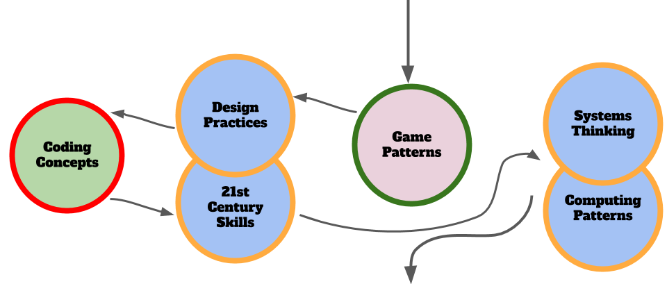

---
# all the regular stuff you have here
zotero:
  scannable-cite: false # only relevant when your compiling to scannable-cite .odt
  client: zotero # defaults to zotero
  author-in-text: false # when true, enabled fake author-name-only cites by replacing it with the text of the last names of the authors
  csl-style: harvard # pre-fill the style
layout: post
categories: misc
title: MATERIAL CULLED FROM Game Making and Coding Fluency KEEP AS REFERENCE
---

In this chapter I use the example of game making to as a way to examine these issues in more depth. I explore a concrete example of how this more chaotic learning can be brought into formal environments with appropriate scaffolding. In main section of this chapter explores a game making pedagogy that is a result of my own research. From now on I will use the term _learning design_ instead of _pedagogy_ to refer to this specific implementation of several underlying pedagogic principles.

Game making is closely related to a multi-media coding approach. Some research has taken a wide view of the potential of game making [@peppler_what_2007] including many advantages that are common to other creative computing projects. In this section, I'll make a summary of some of the wider claims and then take a more focused approach highlighting areas that are unique or particularly applicable to game making.

### Tensions around Game Making Tools

This section explores tensions that have emerged for myself and learners when  using game making tools. It is included as some of the issues that emerged may be useful to you when making decisions about appropriate tools to use in your game making.

THE BELOW MOVED IN PART TO 3M GAME MAKING - BUT COULD BE USEFUL IN OTHER AREAS TOO

**Asset Creation vs Hands-on Coding**

With both Scratch and Phaser/Glitch there was a clear tension between time spent creating graphical and sounds assets verses time working on code related to game play and mechanics. Scratch has extensive built in tools to create graphics and sound. With Phaser, in addition to the code playground we used a separate web tool to create art called Piskel and others to create sound effects. Both allow a large amount of choice and a very rich creative landscape. At times it felt students were stuck in asset creation.

When using the code playground, the process downloading assets files from one online space and then re-uploading to the code playground served well to build digital literacy skills. However the diversity of activities at times reduced group communication and peer learning surrounding the hands on coding and experimentation with game mechanics.

The MakeCode Arcade interface, like scratch has the ability to edit sprite characters. Unlike Scratch it is very limited in terms of what can be created. To This is one way to resolve the issue of the complexity of asset creation.

**Tensions related to Community and Choice**

Phaser is a framework used by professional web game creators. Using this authentic tool was potentially motivating. The online forums are supportive. However, it may not be realistic for young learners to be part of a community of professional game makers. In contrast, research on the value of scratch community to seed ideas, provide inspiration and direct peer support is convincing. The ability for students to choose from different kinds of games that appeal to them, to remix projects and to reuse community assets increases the personal connection students feel to their creations.  

However, much of this research as been from self-directed home learners who are able to dedicate a lot of their free time unlike classroom learners. Time factors may impact your choice of tool and how much you encourage your students to engage with a wider community.

How much choice over you give students about type of game they create and how they design it is also an important learning design factor. You may prioritise engagement over peer learning over specific targets. Alternatively you may wish to maximise the time your students spend on certain learning outcomes, e.g. coding and system design. To do this you it may be effective to then creating your own resources which

If students are working on similar projects. This may also have the effect of increasing possibilities for peer support and to reducing teacher stress in a classroom setting. It is very tricky to support students to introduce unknown or untested features.

**Tensions around Technical Scope of Projects**

Tools like MakeCode Arcade intentionally limit the toolset provided to its graphical interface and this simplicity can be an asset to support our students to build familiarity and fluency of use of code constructs.

Some hobbyist or professional game making tools like GameMaker Studio, Construct or Unity abstract away the hands-on coding of games with graphical interfaces and include structures to help organise game design as it becomes more complex. The scope of choices may be overwhelming. Also, while code can often be accessed behind these menus, the focus is on getting the game done rather than on learning how to code per se.

Thus there is a tension in tool choice balancing the directness of code editing and of the code constructs available with the scope and flexibility of the game that can be created.

## Game Making Methods

You would think from the glowing potential of game making from the reviews of the literature that this would be a normal part of computing education, and well supported in terms of how to teach it.

Of course, real life is more complicated than that. Rather than there being one pedagogy that maximises the potential of using game making in the classroom, it is important to recognise the diversity of objectives of both teachers and learners in the process of making games.

In the last section we look out one learning design and how that aimed to overcome those tensions. But in this section rather than trying to solve problems -- I am highlighting them and you can draw your own conclusions.

In this section I look at a design that aims to address some of key challenges and tensions to the use of game making with young people. This _3M game making model_ - (made up of Missions, Maps and Methods) - is the result of several years of exploratory, collaborative game making with home educating families and a local Primary School. This learning design could can be applied using any of the tools above.

The 3M process has evolved with the aim that it is accessible and inclusive for parents, teachers and young learners. Part of that accessibility is a playful, game-like approach to it. In a nutshell, learners start by playing and remixing a broken and incomplete game of a particular genre, for example platform, maze or shoot-em-up. They are given and/or choose certain missions to improve their game or to make it in a certain way. They use maps to help navigate their next choices and what they have learned. Finally, facilitators use particular methods in line with project-based and inclusive approaches to motivate and support learners engagement and learning.

You may have particular curriculum or other learning goals. This iteration of the 3M design focuses on making games to learning the craft of coding, to build meta-cognitive skills (goal setting and reflection) and systems concepts. It could be adapted to highlight other key learning goals.

In my description of the 3M model below, I draw on project based learning and design based terms and principles that are explored in another chapter. Later in the chapter I share ideas on how to adapt this version of the 3M framework to suit your own needs.
<!-- CHECK THIS LATER TO MAKE SURE I DO -->

In the **Use** stage learners engage with a starting template of a few games playing them and then opening the code to see if they could guess what any of the code did. This use stage allows learners to gain some familiarity with the coding environment and to recognise some features of the language being used.

Then we quickly asked learners to **Modify** a broken game with very simple changes which they could choose from a set of printed cards. These small changes to variables or swapping out media assets with their own builds confidence, gives a greater sense of ownership over the project and is a fun and challenging experience.

In my **Create** stage learners we asked to choose from a menu of different game design patterns to add to the game. In early stages learners patch or copy code examples into their existing code. As they do this gain familiarity with a wider variety of coding constructs and concepts. Later makers can take up extra challenges which involve them making additions to the code with no direct support from the materials.

**Main Mission - Fix a Half-Baked game**

In the 3M model participant code as part of a role play story. They are given a scenario where have to complete a mission. Making a game for a real or imagined audience is a part of that mission. You can choose your own real or imagined situations. It could be an external game making competition, or a fiction. In one version we made games for a group of Aliens coming to earth to help us save the planet, in another it was a dystopian, hunger games like future where we had to make a game to save our lives. The purpose here is to increase engagement, motivation and the sense of designing for another audience.

In 3M, learners start by playing a familiar but incomplete template of a 2D game. For my study we used a platform game. The overall mission is to fix the broken game and then to make it your own. Learners then fix, adapted and extend the game template in an increasingly sophisticated way. Learners start with a deliberately incomplete or inappropriate game to provoke students to change it.

In early stages, learners alter key variables, change level designs and add in new graphical and audio assets. Simple changes that are relatively easy and build familiarity with the code. For example I often start with a handful of printed card missions. Each suggests a small changes to the code that results in big impact on the game being played.

MORE ON THIS - Bullet points?

### Maps

I kept a journal and recorded sessions to identify learning tensions that blocked progress.  Some of these tensions can be summarised as learner confusion about what they should do next or at the other extreme being overwhelmed at choices available, getting stuck or being unsure of what coding progress was being made. To try to resolve some of these tension I drew on the use of another technique from open world adventure games that of Maps.

In more traditional project based learning the kinks of support would involve learning journals, structured student reports or templated check in points. I wanted to avoid this kind of more formal approach for a couple of reasons. Firstly, it felt like a huge shift moving from the mechanics of coding to then writing up the report and one that was hard to fit into the end of busy sessions. Secondly, my study involved a lot of students from whom writing was not a strong point so I wanted to explore other methods.

#### Navigating Learning Dimensions

This process also helped me to understand the kind of learning experience I was hoping the game makers would be having.

_Navigate Dimensions_

The journey that the learners started to have is reminiscent of the semantic waves with ocillations between more concrete and more abstract learning dimensions.

### Learning Dimensions Map

This is the approach adopted in an interesting research program which looked at hands on tinkering with Science exhibits in a museum setting. In an article called -- It looks like fun but what are they learning --Bevan and Petrich worked with educators to examine video footage of families interacting with exhibits. The resulting map of learning dimensions is notable as not only are the underlying science concepts explored but, more general skills and attributes and helping behaviour common to an exploratory process is also present.

### Methods (Inclusive)

The third M in this 3M framework stand for methods, these are broadly speaking educational, design and drama methods to support an inclusive process. These may help with participation and to maximise some of the potential benefits of game making explored in the first part of this chapter.

Methods Using Missions

- Player and Maker types & Specialised missions
- Limits to the Mission based approach - meeting your self in the middle

Methods Using the Learning Map / Design Process

  - Circle / Physical Reflection Games:
  -  Guidance on Running Creative Design Sessions: imagined audience,

Other Methods
    Using Hardware and Playtesting to focus on Imagined Audience
    Predicting Code Outcomes via Games
    Coding Concepts via step by step tutorials - moved (MEETING IN THE MIDDLE )
    Supporting Debugging

**Playful Starter Games and physical activities** - You may love or hate the kind of warm-up games that are common in drama circles. Either way they are good ways to help focus learner's attention and get them ready for new experiences. Making games lends itself well to creating a fun and welcoming classroom environment with links to the learning happening later in the session. In a family learning setting I was able to make the most of this by playing physical warm up games, playing video games on arrival leading to then analysing what made them challenging.

Most computing teachers will be familiar with some of the positive impacts of Unplugged activities.

**Drama Framework** One methods I use to increase learner and parent engagement is the concept of using a fictional scenario or simulation to increase the perceived authenticity of a project. A fictional community which while less authentic than a professional community, can still provide some of the benefits.

I have worked with practitioners of Drama Education department at Manchester Met to work on a several process dramas with families, students and staff. But you don't have to be a trained drama practitioner draw on key techniques to increase learner engagement. I asked trainee teachers to devise a scenario to support a series of sessions. In brief, we used a fiction of making games for a alien race coming to destroy the earth. This helped us;

- explore issues of gaming cultures, and hostility to them from a naive alien view point
- asking learners to step into a role. "As game designers, we will do Y"
- create a sense of 'jeopardy' increasing their commitment to the process
- encourage reflection in learners - as they shared their games with the alien audience, they talked through their design decisions and challenges.

## Challenges - and how they may link to a classroom setting

MOVE SOME TO THE TENSIONS MIDDLE SECTION - AS THEN IT IS RESOLVED
MOVE OTHERS TO THE CONCLUSION

As such this section uses data drawn from the wider research -- I also cross reference this with my own observations from my game making studies.

We also look at the resulting understanding of the emerging tensions. This is a good place to start as you may find similar tensions in your teaching environments (be they formal classroom settings or more informal club or out of school projects).

#### Prioritising Learning Dimensions

The potential dimensions of learning in Kafai and Burke's review of research is very diverse including; 21st Century Skills, developing coding and information technology skills and teaching other subjects through cross curriculum projects. This potential put a responsibility on teachers to prioritise and promote certain learning outcomes over others.

Teaching in more formal environments
For my study, I ended up de-prioritising more general communications skills (21st C skills) and highlighting coding concepts and systems concepts.

If you are promoting teamwork, then coding concepts may have to be de-prioritised -- if you choose to deepen subject knowledge of maths by making a fractions game then something else may need to go.

This is borne out by Kafai and Peppler - can't find this - who say ""the diversity of learning and that there is more than one learning outcome is something teachers need to be aware of.

### Time considerations and classroom culture

Project-based approaches are often explored in after-school clubs or other informal settings, as the time needed to run authentic projects is often scarce due to competing curriculum demands. However they are successfully integrated into core school activities by many educators. Some of the ways to overcome this are explore in previous chapter.
CROSS REFERENCE OTHER CHAPTERS

### Starting a community from scratch

Finally, one of the most challenging but rewarding aspects of making games together was the building of a community of learners. As explored previously the benefits of sharing code, playtesting games and the value of the encouragement of peer learners are significant.

In all the programs I ran only one parent and one student had experience of coding. This process of starting up such a community from scratch is challenging. In the previous sections I have shared my tips to help build a small game making community. These include encouraging peer sharing with diversity of learner paths, narratives and activities to encourage group reflection, starting activities which build a team spirit.

At times I felt these community building activities took away from coding and problem solving. A frustration, it felt as if we were just getting going and time was up. However I leave this to you as educators to resolve. And don't forget one last ingredients raw enthusiasm.
