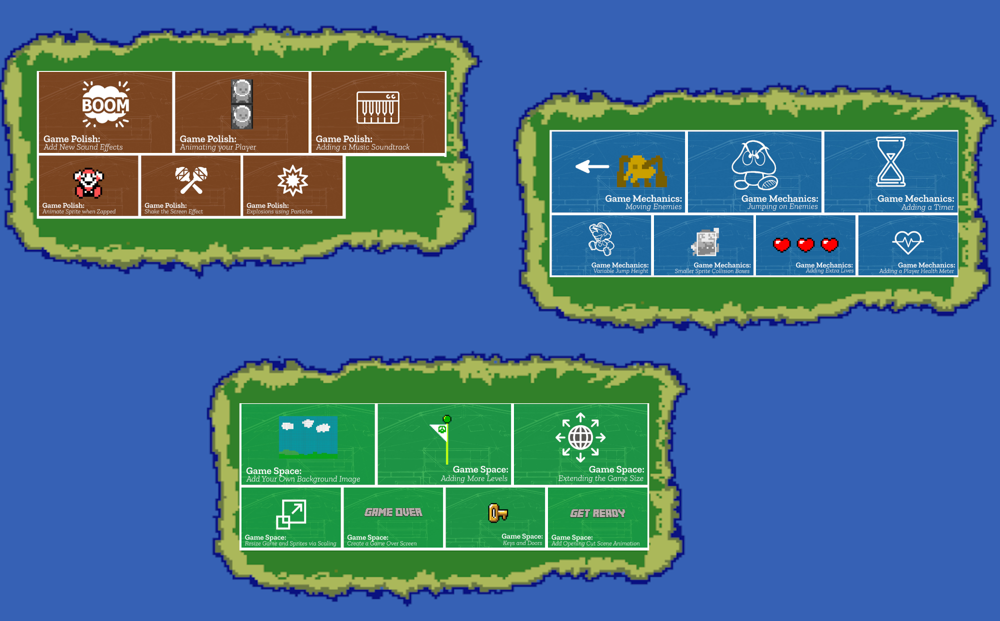

---
# all the regular stuff you have here
zotero:
  scannable-cite: false # only relevant when your compiling to scannable-cite .odt
  client: zotero # defaults to zotero
  author-in-text: false # when true, enabled fake author-name-only cites by replacing it with the text of the last names of the authors
  csl-style: harvard # pre-fill the style
layout: post
categories: misc
title: Game Making and Coding Fluency
---

# Introduction

In this chapter I explore the potential of digital game making as a way of developing coding concepts and fluency. I'll make a summary of research around project-based approaches to game making and draw out some of the benefits and some elements that are special about making games. To do this this chapter explores research on game making relevant to a school or after-school context. In the final section I outline tactics to resolve common tensions when working with learners to undertake game-making projects.

Research on the educational value of computer games has often focused on game playing either of commercial (off the shelf) games or specialist educational game software. However, for many researchers a far more promising area that of making computer games. An influential report in the introduction of a new Computing curriculum was "Next Gen: Transforming the UK into the world’s leading talent hub for the video games and visual effects industries" @livingstone2010next. Its focus was on providing the UK games and animation industry with the talent needed to succeed. The three top recommendations school level were to include computer science in core curriculum, introduce a new computing GCSE, bursaries for computing teachers and extensive, well supported use of games and visual animation in the school curriculum as a way to attract more young people to the subject. A new curriculum and exams were introduced in 2014 together with an extensive bursary program and even award level bursaries run in partnership with computing industry. Thus, while the first two of the Next Gen recommendations have been adopted, the use of games and making as a way to encourage wider participation in computing has not been realised.

A later report After the Reboot [@waite_pedagogy_2017], returned to the subject of game making as a way of increasing engagement in the process of coding. The review highlighted several area of promise but which needed more research, namely; using games for engagement, use of game patterns and involvement in girls in coding and social and cultural aspects of coding. The After the Reboot report also had concerning observations. The report found that girls, ethnic minorities and students of lower socio-economic status were all less likely to take computing as a subject at GCSE level. Given this concern it is important that as educators we explore promising tactics for inclusion including the use of games and game making.

<!-- The Next Gen report acknowledges issues around perceptions of computing and ICT as geeky and suggests that the engaging nature of computing activities based around video games. -->

<!-- ADD IN MORE DETAILS FROM REPORT AND OTHER SOURCES
HERE ABOUT THE GAP AND NEED TO ADDRESS IT.  -->

## Significant Features of Game Making for Education

The following sections the benefits of game making in education. Researchers Kafai and Burke -@kafai_constructionist_2015 have undertaken one or the most extensive reviews of the educational potential of game making. This is available in the form of a book called Connected Gaming but a there is also a shorter version freely available - see  [http://tiny.cc/2tzutz](http://tiny.cc/2tzutz). The following sections are based on this research with some additional material.

**Coding and Computing Practices**

The main learning objective of making games in educational settings is to develop coding and computing skills. While some game making tools use a specialised graphical interface, many others involve working with code directly. These new tools have allowed students to practice the mechanics and core structures of coding and a more applied definition of computational thinking. A study by Adams and Webster [-@adams_what_2012] indicated that games rather than media or storytelling computing projects were more likely to use logic and variables extensively.

Design patterns are an important factor in learning to code in a professional community. The use of games to explore computational patterns is explored as a case study in another chapter. In their analysis of computational thinking in relation to game making, Werner and colleagues [-@denner_using_2014] examined design patterns and game mechanics as well as more straight forward coding constructs.
The researchers suggest that the use of Design Patterns outside of professional communities has a great deal of promise to increase accessibility for learners into coding due to its more concrete and relatable approach.

**Games to study other subjects**

There are extensive studies on game making to learn other subjects which are covered in the review. A key one carried out the Kafai one of the authors. Cross-curricular projects are a potential way to overcome limits in time devoted to computing. Many teachers will attest that to truly understand a subject you can should try to teach it. Tasking students with making games that teach a key piece of the curriculum is one way of encouraging deepen understanding of subject matter.

**Developing Social and 21st Century Skills**

Games are perfect projects. Thus game making suits project-based learning. We can draw on research that outlines the benefits of that approach. In previous chapter the inclusive possibilities of design and project-focused computing were summarised. These include; more learner choice in projects increases motivation, authentic and shareable project outcomes encourage peer feedback and reflection project iterative support and a mastery approach, supporting challenging goals encouraging self regulation and structured guidance for goal setting.

These potential benefits align closely with a concept called 21st Century Skills. The term 21st Century Skills is used quite flexibly in educational research but there is broad understanding that they cover skills like social skills, self reflection, cultural awareness and a range of technical abilities that allow participation in information society. Skill which are suited to be developed via collaborative environment.  

More tightly focused research on game making and collaboration is needed but the potential to develop such skills is exciting. One Study by Baytak [-@baytak_case_2010] focused on the potential of making games to create a collaborative classroom community. Learners are often keen to share their games for others to play and play those of others. This motivation can be leveraged to provide detailed feedback.

**Authentic projects creating real results**

An important concept in both project and inclusive approaches to education is to make projects as authentic as possible to increase learner motivation. For game making this authenticity or realness applies both to the tangible, shareable nature of resulting game created and to the domain of professional game design. When learners are designing with someone else in mind, this guides them to shaping their game design effectively. The process of projecting beyond your own experience to an imagined user is a vital design skill that is potentially well developed by making games. As game making is a huge well known industry, learners understand that the resulting knowledge and skills is not inert but authentic thus and can be applied outside of the classroom.

The Buck Institute offer help in increasing authenticity in project-based education based around the following guidance; projects should meet a real need, be relevant to student experience, should be realistic even if using a fictitious scenario and involve processes and tools used by adults. http://tiny.cc/authenticity

<!-- https://www.pblworks.org/blog/four-ways-think-about-authenticity-through-lens-gold-standard-pbl-videos -->
<!-- more on authenticity if not covered in previous chapter
https://www.edutopia.org/blog/authentic-project-based-learning-john-larmer
 -->
<!-- Perhaps move this tension later? -->

Young people may not be able to create a technically commercial advanced game but other audiences exist. For example, so-called Indy Games or Games for Change are made by enthusiasts and often released at low cost or for free on the internet. They often appeal to a retro game aesthetic and are thus easier and quicker to make. Highlighting this movement can reduce student dissatisfaction at not being able to code something like a 3D racing or shooting game.

As another way to increase authenticity schools sometimes enter online game making competitions or wider creative competitions like the Coolest Project. You may be able to add authenticity in a similar way by providing a low pressure competition or another frame for your game making.

**Games to explore systems and systems thinking**

One of the more specialist 21st Century Skills is systems thinking. As the economic and environmental systems around us become more complex, it is vital that we teach young people how to analyse and alter them. Games are in essence rule-based systems. Katie Salen-Tekinbas is an academic specialising in game studies. She was also a lead in the design of software called Game Star Mechanic and a New York high school - Quest to Learn - which incorporates game design into it's curriculum and whose guiding educational principle is game-based learning. https://www.q2l.org/about/

_Games for change_ is a concept that invites game makers to make games to explore social and environmental issues. Such issues often involve a systems based understanding of then world, and as games are themselves interactive systems themselves, they are a powerful vehicle for exploring a complex problems involving race, sex, social issues. The Game for Change network has a main audience of commercial game makers however they also run a game making challenge for young people and support for teachers.   

<!-- One of the recommended strategies is a Game Jam which focuses on real life issues.
https://www.gamesforchange.org/blog/2017/08/02/get-your-copy-of-the-the-game-jam-guide/
-->

Resources from the Games for Change network and from the Institute of Play which are aimed at supporting systems thinking through game making are available at the following links.
https://gamesforchange.org/studentchallenge/teachers-resources/
https://clalliance.org/institute-of-play/

**Family Game Experience as an inclusive Fund of Knowledge**

Knowledge of a games and gaming culture is sometimes drawn upon by teachers as a concrete example of a coding concepts. A very common examples is that of explaining if-then code constructs. For example, if Pac-Man touches a ghost then a player life is lost.  We have already explored the importance of using concrete examples to illustrate concepts in other parts of this book and there is something special about drawing on home or out-of-school experience of young people.

The term Funds of Knowledge came out of research within US Latino communities. Researcher found that Latino home cultures, skills and traditions were hardly visible in mainstream school cultures, resulting in a form of deficit thinking about the performance of these communities [@moll_funds_1992].

More research is needed on ways to draw out attitudes and knowledge of game cultures and bring them into the learning environment in an inclusive way. My own research into strategies to do this is explored in the second half of this chapter. To allow students to bring their own home funds on knowledge into their work we can structure our sessions to help the following:

-   Students draw on their knowledge of game conventions to inform the structure of their game coding projects.
-   Students draw on their interests of diverse media and interests to choice over the narrative, characters and aesthetic of their game design.
 - Students adopt a more playful and collaborative way of working familiar to them from role play experiences.

It can be seen then that even if student don't consider video game _playing_ to be their thing, that there are other ways for them to bring their interests into game making.

**Games and Inclusion**

Recent studies study the use of games and playful techniques to overcome exclusion from the culture of computing [@kafai_diversifying_2017; @kafai_beyond_2014]. As explored elsewhere contemporary understandings of inclusion go beyond SEN issues to include cultural exclusion. If students feel excluded from the school cultures then making bridges to home cultures is vital. One way to make those connections to home cultures is to allow for more choice of what can be incorporated into computing projects.

Research by the UK National Literacy Trust [-@picton_video_2020] of 11-16 year olds found that 96% percent of boys and 65.2% of girls play video games (http://tiny.cc/videogstats). This study shows that while there is a disparity between genders, game playing is extremely common and you are unlikely to be part of a household where no games are played. Even if not all young people play games they will have knowledge of the conventions and culture of video games allowing educators to draw on these interests and experiences.

<!-- We previous saw that Waite's review for RSA also highlighted the importance of social and cultural approaches to game making including the roles of gender.
ADD LINKS HERE -  OR MOVE TO ANOTHER SECTION -->

However, the research surrounding differences in participation and attitudes to game playing and video game cultures is complex. We should be cautious when working with video games. It is important to be sensitive to learners attitudes that video games are just "not my thing".

## An Overview of Game Coding Tools

In this section I outline the key features of selected game making tools. Some game making tools for beginners use a GUI to abstract away the detail of the underlying code complexity. While those may be useful to learn game design without coding, in this section I only include tools that allow users to code the game directly.  

### Pygame - a python based library for 2D Games

**Pygame** is an add on (code library) for Python that makes game making a bit easier. Python is a good choice for a class that has had experience of coding in that language of for teachers that want to encourage fluency in this language. There are good resources aimed at beginner coders available too. There are some interesting resources and books to support game making with Pygame on the website of the Raspberry Pi foundation. https://www.raspberrypi.org/blog/tag/pygame/
There are also good tutorials available on the home page of the project - https://www.pygame.org/wiki/resources

Where is less strong is the ease of setting up your code and game environment. It can be tricky to get started compared to some of the other tools here. There is also less of an active community of game makers sharing their games online.

Normally you would set up a python environment on your desktop, however you can use replit.com or a premium subscription to the educational online code playground trinket - you can code pygames online - https://trinket.io/features/pygame
https://replit.com/talk/learn/A-Starter-Guide-to-Pygame/11741

### Scratch - a familiar and flexible tool

**Scratch** was one of the first block based programming environment to really catch on in schools. Scratch was designed for more general multi-media projects rather than to make games. However, given free reign games are often what young people try to create first. The ability to create your own graphical and audio assets is a real advantage. However, from my experience, while it is quick to get started, the lack of program common game patterns like gravity and collisions means that complexity of the code you need quickly mounts. Even then, for the most part the actual game play of the learner created games is often a bit unsatisfactory.

Where Scratch does stand out is the community element of the website where learners can get inspired by the extremely diverse creations of other young coders. The ability to remix the work of others is a great way start to get used to the tools and the way of working.

### Phaser.js in a Code Playground - an authentic web game making framework

EDIT THIS LESS CONVERSATIONAL

**Phaser** is my own tool of choice when it comes to authentic javascript game-making.  To teach it I ask learners to code games an online coding environment called a code playground. Code playgrounds are a tool used by both expert and novice coders to share examples of code that can be edited and preview online. The killer feature is the ability to make changes and quickly see the new results appear. The concept is also very useful for learners and exists for block coding in tools like Scratch and for text coding in Trinket. Many text based code playgrounds exist and I tried a few and settled on Glitch.com - although the process also works well in Trinket. I love this approach due to the authenticity of the tools. Phaser is used by professional game makers and Glitch is the test bed of choice of many code developers. If learners do take to this way of working they can be creating genuine indy-games, dynamic websites and flexible web applications.

_Screenshot of Phaser in Glitch.com playground with code and game side by side_

The drawbacks of this approach is the potential complexity of using real web technology. While it is possible to hide the elements of html and css away from the user, many mistakes are possible which break the game completely. Luckily Glitch has the ability rewind and undo your changes via a easy to use timeline of your project.

<!-- - simplicity of tools with future potential - low floor high ceiling wide walls
- tensions around starting code from scratch or from a template -->

### P5.play - an arts inspired coding environment

**P5.play** is a an add on to the p5.js javascript framework. P5 is a fun javascript library that is quick to learn and get creative results. Sample projects often involve moving interactive, coloured shapes around and generating patterns. P5 project has become popular not only with artists and designers but increasingly with educators. This is partly due to the ability to use it in code playgrounds with all of the advantages previously discussed in the section Phaser and Glitch.

While the P5.play project is limited to 2D games, it add some useful design patterns like animation support, basic collision detection and help for mouse and keyboard interactions and has some great accessible tutorials. https://molleindustria.github.io/p5.play/

### MakeCode Arcade - specialised block based programming

**MakeCode Arcade** is a block based programming environment similar to Scratch but with some interesting features which are tailored to game making like gravity, lives and a game over block. In addition, the multi-media making abilities are very stripped down, you can download the games to hand held devices or run them easily.  

Another advantage is that the MakeCode system is also used to code the popular Microbit micro controller. So this may be familiar to you as a teacher or to your students.

_Screenshot of MakeCode Arcade with code and game side by side_

There some fantastic example games and tutorials at
https://arcade.makecode.com/

## Game Making Methods

My work is inspired in part by the pioneering computing education project called the 5th Dimension project which involved undergraduate students in an after school. It has also been made possible by the similar EdLab programme at Manchester Met University, which also involves students in service learning projects. The mix of student helpers, local young people and in this case their parents gives a rich mix of perspectives which may not be possible for your setting but which has helped evolve a learning design. Weaknesses in the approach were made visible in the responses by young people and adults, and then addressed in the next session or next iteration of the program.

What follows is a distillation of some of the main features of a _3M game making model_ - (made up of Missions, Maps and Methods) - is the result of several years of exploratory, collaborative game making with home educating families and a local Primary School. This learning design could can be applied using any of the tools above.

### Missions

Many open world games have a concept of a main mission and then optional side missions. The guiding challenge or main mission of this design was to create a playable game around a theme (environmental in my case) for a real or imagined audience. Missions can exist on different levels. Examples include game mechanics and game design patters, systems thinking. Alternatively missions may be more social in nature to encourage engagement, social learning and reflection. The missions can be designed to fit into the Use-Modify-Created model which is explored in another chapter in this collection.

### Design Patterns as Missions

<!-- INSERT IMAGE of incomplete platformer with annotations -->
<!-- After making quick alterations to an incomplete platform game.  -->

A standard way to progress from an incomplete game would be to follow a step-by-step tutorial which covered adding new game features in a pre-set order. In the 3M model learners choose the order then implement new features. I asked my family learners what they would like to add to this project.  They came up with a list of features including; moving hazards, jumping on enemies, finding a door or flag to progress to the next level. We can describe these features as game design patterns. Design patterns have an important role in the way that professional coders learn their trade. They are part of the craft approach to coding. The craft in this case involves building a knowledge of patterns that occur in a particular genre.

Game design patterns come in different forms but at the most user-oriented level as illustrated in the examples above they have the advantage of being immediate and concrete to learners. Game design patterns are used as a relatable way for student to choose their paths and to structure support via coding concepts linked to these patterns. An example of a game mechanic design pattern follows.

<!-- DO I NEED TO GO INTO THE FORMAT OF A DESIGN PATTERN HERE?
NOT REALLY IN DETAIL - JUST LIST AN EXAMPLE-->

* **Name:** Jumping on Enemies to Zap them

* **Description:** In many games players shoot enemies. In some platformers they get rid of them by jumping on them instead. If the player is descending from a jump when they touch the enemy the player is zapped and in this case disappears.

* **Need for Pattern:** Being able to jump on an enemy is a good way of clearing the area you want to explore. You may need to have a clear space to be able to jump up to a high platform for example. Some platformers do have a shooting mechanic as well but using this pattern and sticking with jumping also keeps the game simple (in a good way).

* **Coding Concepts involved:** [Data](codingConcepts#data), [Change Listener](widerPatterns#change-listener)

* **Links to other Computing Patterns:** [Systems Dynamics](widerPatterns#systems-dynamics),

* **Related Game Patterns:** You'll need to have added the **Add Enemies** pattern to your game before you can add this one.

As I developed resources to support students to implement the kinds of patterns they wanted to add to their game, categories of patterns emerged. I noted these and organised the patterns accordingly to help student to navigate them.

- [Game Mechanics:](#game-mechanics)  things to do with the actions of the game
- [Game Space:](#game-space) things to do with the layout of the game
- [Game Polish:](#game-polish) music, backgrounds, graphics and story elements
- [Challenge and Systems:](#challenge-and-systems) how different elements interact to create challenge

When learners choose the pattern they want to work on they can take a physical card on-line help to support them implement the code needed to add the pattern to the game. I originally started off with printed supporting documents but then help learners to transition to online resources. The digital format is particularly useful if learners are copying and pasting code. Having supporting resources can help resolve tensions around groups getting stuck and needing facilitator. But creates another tension around how much guidance to give learners in the code examples provided. How much support you give to this process is up to you. I work with relatively young coders, thus  I chose to provide almost complete code help. This design helps build familiarity with code and the code environment.

<!--

_Diagram of Possible Missions on a Web Page Menu_

CHANGE THIS TO MORE TEXT ORIENTED BREAK DOWN. -->

In my research providing these limited options but allowing student to choose their own pathway had a immediate positive effect on the motivation and general energy level of the coding classroom. I would describe result of this approach is a kind of creative, productive chaos.

As mentioned the break down involves creating help resources to support a menu of game design patterns. This work is significant but manageable especially if community collaboration between teachers and other educators is involved. I invite other educators to adopt this approach and share resources for Pygame, p5.play and other suitable platforms. The resources I have created for MakeCode and Phaser are free and open source and available online and available at the following URLs.
Phaser & Glitch- https://glitch-game-makers-manual.glitch.me/  
MakeCode - https://mickfuzz.github.io/makecode-platformer-101/

#### Physical Maps of Missions

_3M game making model_ - (made up of Missions, Maps and Methods) - is the result of several years of exploratory, collaborative game making with home educating families and a local Primary School. This learning design could can be applied using any of the tools above.
The first step was to try to address issues of being unsure what to do next or jumping around from one thing to another without completing them. I printed out a large scale map of the different kinds of game pattern missions represented as different islands. When learners selected their next mission, they moved their counter onto that spot. Thus learners had to be intentional about their next steps. They also kept a track of the missions that they had completed by tracing a trail as they progressed. Having a physical map in my family setting this process was particularly useful to help the parents encourage goal setting and progressing from one task to another rather than getting stuck in a loop of asset design.

<!--  -->

<!-- 

_Missions as Islands_ -->

In addition this chaotic, colourful and visual representation served to encourage peer knowledge of what other people were up to, build a sense of community and to encourage reflection as each design pattern was completed.  

<!-- Working with learner stress and confusion was something that I struggled with for some time. One source of frustration started from giving learners clear pathway. The freedom to choose what game to create was liberating but then conversations about what was possible with the time and technical ability we had were hard and we did lose some families in this process. Starting with a template and creating resources to help common patterns helped resolve this tension. However having this menu of choices also created another issue. Having them all mapped out meant. -->
<!-- Is this better in Missions?   -->

Maps can also be used retrospectively to help learners to reflect on their progress. I asked student to create a physical character that could move around the large scale print out of the islands. When they chose a new pattern to work on they moved their counter and drew a trail of where they had been. When moving the counter on the map they can be prompted to look at the coding concepts or other learning dimensions that they have been working with when implementing their game patterns.

The process can be linked back to Artefact-based questions and assessment and a guided.
DEVELOP THIS THOUGHT.

### Learning Dimensions Map

The has been a growing tendency in socio-cultural research to look at the learning that is happening in any given activity from an observational perspective. That is to say that rather than deciding what you want to teach and planning around that, you choose an existing authentic activity and map the learning that actually happens in reality.

<!-- This is the approach adopted in an interesting research program which looked at hands on tinkering with Science exhibits in a museum setting. In an article called -- It looks like fun but what are they learning --Bevan and Petrich worked with educators to examine video footage of families interacting with exhibits. The resulting map of learning dimensions is notable as not only are the underlying science concepts explored but, more general skills and attributes and helping behaviour common to an exploratory process is also present. -->

While this is an informal way of using maps the are other approaches that are more formal including one called a concept map which is a visual representation of target specialised knowledge. There is a section on concept maps as part of the teach computing website here. https://blog.teachcomputing.org/how-we-teach-computing/.

I created an online map of the different learning dimensions that learners were most likely to pick up through game making.

### Physical Computing and Game Making

The use of physical computing to create concrete and tangible activities has been show to increase engagement of diverse groups of learners. Making the digital physical has been a guiding principle for inclusive learning designs for some time. To support my game making projects, I made some very simple arcade cabinets out of wood with simple arcade buttons. Connecting arcade buttons to the computer via a Makey Makey or similar break out USB joystick adaptor is a relatively simple electronics project which can be completed quickly. The process of building their own arcade cabinets was a very engaging activity and a fantastic target to work towards as they made their games. Some families did this at home in very low tech ways with cardboard materials.

While it can be time consuming I highly recommend, this method of involving some kind of physical making or tangible product if at all possible. The results in terms of learner engagement can be transformational.

<!-- For more information on the value of physical computing to increase inclusion you can read this article (RUSK?) -->

## Conclusion

<!-- Move some of the above section here
Upbeat elements -
Also words of caution
Acceptance of tensions - hopeful but realistic -->

In this chapter we have looked at game making as one example of the kind of design and project focused approach explored in other chapters. It is important to acknowledges the complexity and diversity of classroom situations and the challenges of project-based game making within the constraints of the curriculum. We have uncovered particular tensions involved in undertaking project-based, educational game making with young people. I hope that the detailed case study of the use of the 3M model to try to resolve some of these tensions may be helpful to adapt game making to your classroom.
