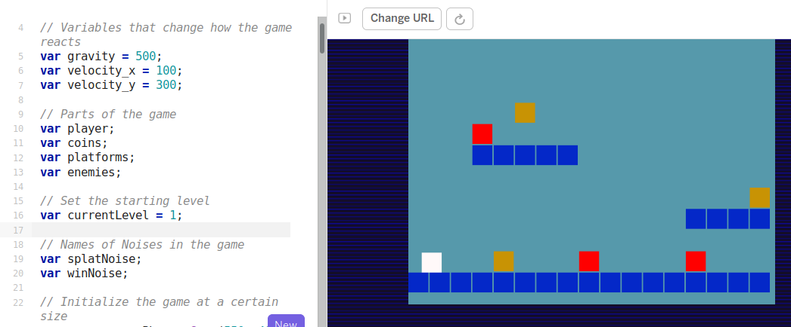
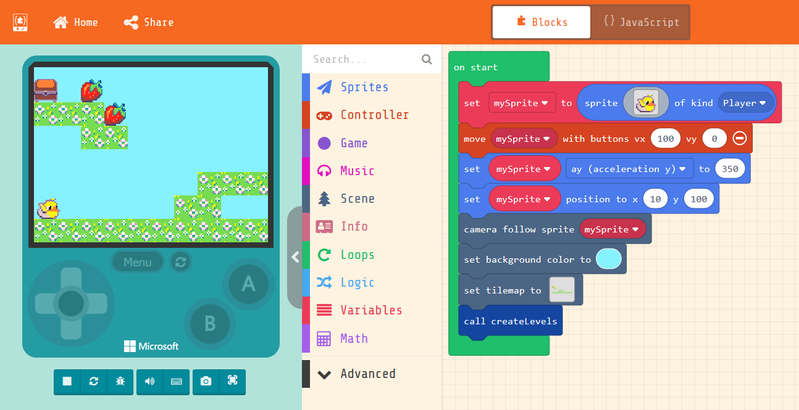

---
# all the regular stuff you have here
zotero:
  scannable-cite: false # only relevant when your compiling to scannable-cite .odt
  client: zotero # defaults to zotero
  author-in-text: false # when true, enabled fake author-name-only cites by replacing it with the text of the last names of the authors
  csl-style: harvard # pre-fill the style
layout: post
categories: misc
title: Game Making Projects in Practice
---

# Introduction

In this chapter I explore the potential of digital game making as a way of developing coding concepts and fluency. I'll make a summary of research around project-based approaches to game making and draw out some of the benefits and some elements that are special about making games. To do this this chapter explores research on game making relevant to a school or after-school context. In the final section I outline tactics to resolve common tensions when working with learners to undertake game-making projects.

## Context

The Next Gen report [@livingstone2010next] was influential in the introduction of a new Computing curriculum in the UK. It addressed providing the UK games and animation industry with the talent needed to succeed. The report recommended the well supported use of games and visual animation in the school curriculum as a way to attract at greater diversity of young people to the subject. However, while a new curriculum and exam structure of 2014, support available for teachers the use of game making in computing is sparse. The After the Reboot report [@waite_pedagogy_2017], returned to the subject of game making as a way of increasing engagement in the process of coding. The review highlighted several area of promise but which needed more research, namely; using games for engagement, use of game patterns and involvement of girls in coding and social and cultural aspects of coding. The After the Reboot report also had concerning observations. The report found that girls, ethnic minorities and students of lower socio-economic status were all less likely to take computing as a subject at GCSE level. Given this concern it is important that as educators we explore promising tactics for inclusion including the use of games and game making.

Thus, if well-structured, game making aligns well with inclusive practices and project-based learning (PBL). In other chapters of this collection we have looked at the inclusive approaches and in particular PBL. Some of these principles include; more learner choice in projects increases motivation, authentic and shareable project outcomes encourage peer feedback and reflection project iterative support and a mastery approach, supporting challenging goals encouraging self regulation and structured guidance for goal setting.

To focus on the element of learner choice and voice, research has studied the use of games and playful techniques to overcome exclusion from the culture of computing [@kafai_diversifying_2017; @kafai_beyond_2014]. As explored elsewhere contemporary understandings of inclusion go beyond SEND issues to include cultural exclusion. If students feel excluded from the school cultures then making bridges to home cultures is vital. One way to make those connections to home cultures is to allow for more choice of what can be incorporated into computing projects. Games may allow this in various ways, perhaps in the choice of the kind of game that is to be made, in the setting or subject matter or the style and aesthetics of audio and visual elements of the game.

Research by the UK National Literacy Trust [-@picton_video_2020] of 11-16 year olds found that 96% percent of boys and 65.2% of girls play video games (http://tiny.cc/videogstats). This study shows that while there is a disparity between genders, game playing is extremely common and you are unlikely to be part of a household where no games are played. Even if not all young people play games they will have knowledge of the conventions and culture of video games allowing educators to draw on these interests and experiences. However, the research surrounding differences in participation and attitudes to game playing and video game cultures is complex. We should be cautious when working with video games. It is important to be sensitive to learners attitudes and that for some learners video games are not part of their cultural identity.

## Motivations for Game Making in Education

The following sections the benefits of game making in education. Researchers Kafai and Burke -@kafai_constructionist_2015 have undertaken one or the most extensive reviews of the educational potential of game making. The following sections are based on this research with some additional material.

**Coding and Computing Practices:** The main learning objective of making games in educational settings is to develop coding and computing skills. While some game making tools use a specialised graphical interface, many others involve working with code directly. These new tools have allowed students to practice the mechanics and core structures of coding and a more applied definition of computational thinking. A study by Adams and Webster [-@adams_what_2012] indicated that games rather than media or storytelling computing projects were more likely to use logic and variables extensively.

**Games to study other subjects:** When students are tasked with making games that teach a key concepts of another subject it requires them to gain a deep understanding of that area. Kafai's review covered studies on game making to aid maths, biology, chemistry and language development. Cross-curricular projects are also a potential way to overcome limits in time devoted to computing.  

**Developing Social and 21st Century Skills:** These potential benefits align closely with a concept called 21st Century Skills. The term 21st Century Skills is used quite flexibly in educational research but there is broad understanding that they cover skills like social skills, self reflection, cultural awareness and a range of technical abilities that allow participation in information society. Skill which are suited to be developed via collaborative environment. More tightly focused research on game making and collaboration is needed but the potential to develop such skills is exciting. One Study by Baytak [-@baytak_case_2010] focused on the potential of making games to create a collaborative classroom community. Learners are often keen to share their games for others to play and play those of others. This motivation can be leveraged to provide detailed feedback.

**Games to explore systems and systems thinking:** One of the more specialist 21st Century Skills is systems thinking. As the economic and environmental systems around us become more complex, it is vital that we teach young people how to analyse and alter them. Games are in essence rule-based systems. Katie Salen-Tekinbas is an academic specialising in game studies. She was also a lead in the design of software called Game Star Mechanic and a New York high school - Quest to Learn  (https://www.q2l.org/about/) - which incorporates game design into it's curriculum and whose guiding educational principle is game-based learning. _Games for change_ is a concept that invites game makers to make games to explore social and environmental issues. Such issues often involve a systems based understanding of then world, and as games are themselves interactive systems themselves, they are a powerful vehicle for exploring a complex problems involving race, sex, social issues. The Game for Change network has a main audience of commercial game makers however they also run a game making challenge for young people and support for teachers. Resources from the Games for Change network and from the Institute of Play which are aimed at supporting systems thinking through game making are available at the following links.
https://gamesforchange.org/
https://clalliance.org/institute-of-play/

<!-- One of the recommended strategies is a Game Jam which focuses on real life issues.
https://www.gamesforchange.org/blog/2017/08/02/get-your-copy-of-the-the-game-jam-guide/
-->

## Key Concepts in Game Making

There are certain factors that are unique or particular suited to game making as an educational activity. In the previous section for example, the use of games to teach systems concepts is aligned with the internal rules and structure of games themselves in a way which particularly suits exploring that topic. Other similarly special elements of are explored in the following sections in the form of key concepts and checklists.

### Key Concept - Family Game Experience as an inclusive Fund of Knowledge

The concept of Funds of Knowledge emerged from research within US Latino communities. The term addresses the use of knowledge and skills from participation in activities outside of the classroom that teachers can build on to help classroom work and to support the motivation of learners. Researchers found that Latino home cultures, skills and traditions were hardly visible in mainstream school cultures, resulting in a form of deficit thinking about the performance of these communities [@moll_funds_1992]. Teachers can draw out attitudes and knowledge of game cultures and bring them into the learning environment in an inclusive way. For example, knowledge of a games and gaming culture is sometimes drawn upon by teachers as a concrete example of a coding concepts. A very common examples is that of explaining if-then code constructs. For example, if Pac-Man touches a ghost then a player life is lost. We can describe this kinds of pattern as a game design pattern. Werner and colleagues [-@denner_using_2014] found that the use of design patterns and game mechanics when teaching novice coders can increase accessibility for learners due the concrete and relatable approach.

### Checklist: Drawing on Home cultures

To allow students to bring their own home funds on knowledge into their work we can structure our sessions carefully. Even if student don't consider video game _playing_ to be of particular interested to them, that there are other ways for them to bring their interests into game making. To help this process, the following questions may be a useful check list:

- Are you letting students use their knowledge of game conventions to inform the structure of their game coding projects?
- Can students draw on their interests of diverse media and interests to choice over the narrative, characters and aesthetic of their game design?
- Have you planned ways for students to adopt playful and collaborative way of working?.

<!-- We previous saw that Waite's review for RSA also highlighted the importance of social and cultural approaches to game making including the roles of gender.
ADD LINKS HERE -  OR MOVE TO ANOTHER SECTION -->

### Key Concept - Game Making as an Authentic Activity

Another important concept in both project and inclusive approaches to education is to make projects as authentic as possible to increase learner motivation. For game making this authenticity or realness can be seen in both to the tangible, shareable nature of resulting game created and in clear links to the domain of professional game design. When learners are designing with someone else in mind, this guides them to shaping their game design effectively. The process of projecting beyond your own experience to an imagined user is a vital design skill that can be developed when making games. As game making is a large and well-known industry, learners understand that the resulting knowledge and skills is authentic and can be applied outside of the classroom.

Young people may not be able to create a technically commercial advanced game but other genuine audiences exist. For example, so-called Indy Games or Games for Change are made by enthusiasts and often released at low cost or for free on the internet. They often appeal to a retro-game aesthetic and are thus easier and quicker to make. Highlighting these communities and outlet may reduce student dissatisfaction at not being able to code something like a 3D racing or first-person shooting game. As another way to increase authenticity schools sometimes enter online game making competitions or wider creative competitions like the Coolest Project. You may be able to add authenticity in a similar way by providing a low pressure competition or another frame for your game making. The Buck Institute offer help in increasing authenticity in project-based education based around the following guidance; projects should meet a real need, be relevant to student experience, should be realistic even if using a fictitious scenario and involve processes and tools used by adults. http://tiny.cc/authenticity

<!-- https://www.pblworks.org/blog/four-ways-think-about-authenticity-through-lens-gold-standard-pbl-videos -->
<!-- more on authenticity if not covered in previous chapter
https://www.edutopia.org/blog/authentic-project-based-learning-john-larmer
 -->
<!-- Perhaps move this tension later? -->
<!-- The Next Gen report acknowledges issues around perceptions of computing and ICT as geeky and suggests that the engaging nature of computing activities based around video games. -->

<!-- ADD IN MORE DETAILS FROM REPORT AND OTHER SOURCES
HERE ABOUT THE GAP AND NEED TO ADDRESS IT.  -->

## An Overview of Game Coding Tools

In this section I outline the key features of selected game making tools. Some game making tools for beginners, for example Kodu or the Game Maker series, use a Graphical User Interface (GUI) to abstract away the detail of the underlying code complexity. While those may be useful to learn game design without coding, in this section I only include tools that allow users to code the game directly.  

**Pygame - a python based library for 2D Games:** Pygame is an add-on (code library) for Python to make game making a bit easier. Pygame is a good choice for students that have had experience of coding in Python of for teachers that want to encourage fluency in this particular language. The Pygame community has produced good resources aimed at beginner coders (https://www.pygame.org/wiki/resources
). There are also interesting resources and books to support game making with Pygame on the website of the Raspberry Pi foundation (https://www.raspberrypi.org/blog/tag/pygame/). It is harder to set up a game-coding environment using Pygame compared to some of the other tools here. There is also less of an active community of game makers sharing their games online. You can set up a python environment on your desktop, however you can use replit.com (https://replit.com/talk/learn/A-Starter-Guide-to-Pygame/11741
) or as a paying user of the online code playground trinket to code games online.

**Scratch - a familiar and flexible tool:** Scratch was one of the first block based programming environment to really catch on in schools. Scratch was designed for more general multi-media projects rather than to make games. However, given free reign games are often what young people try to create first. The ability to create your own graphical and audio assets is a real advantage. However, from my experience, while it is quick to get started, the lack of program common game patterns like gravity and collisions means that complexity of the code you need quickly mounts. Even then, for the most part the actual game play of the learner created games is often a bit unsatisfactory. Where Scratch does stand out is the community element of the website where learners can get inspired by the extremely diverse creations of other young coders. The ability to remix the work of others is a great way start to get used to the tools and the way of working.

**Phaser.js in a Code Playground - an authentic web game making framework:** Phaser is a javascript game making library. It is my own tool of choice when it comes to game-making using text code.  To teach it I ask learners to code games an online coding environment called a code playground. Code playgrounds are a tool used by both expert and novice coders to share examples of code that can be edited and preview online. A key feature is the ability to make changes in code and quickly see the new results appear in the live game. The concept is particularly useful for novice coders. Many text-based code playgrounds exist online. I chose Glitch.com although the process also works well in Trinket which is promoted by Code Club resources. Using this kind of web playground is a particularly authentic choice of the tools. Phaser is used by professional game makers and Glitch is the test bed of choice of many code developers. If learners do take to this way of working they can easily progress to creating genuine indy games, dynamic websites and flexible web applications.

_Screenshot of Phaser in Glitch.com playground with code and game side by side_

The drawbacks of this approach is the potential complexity of using real web technology. While it is possible to hide the elements of html and css away from the user, many mistakes are possible which break the game completely. Luckily Glitch has the ability rewind and undo your changes via an easy to use timeline of your project.

<!-- - simplicity of tools with future potential - low floor high ceiling wide walls
- tensions around starting code from scratch or from a template -->

**P5.play - an arts inspired coding environment:** P5.play is an add-on to the p5.js javascript framework. P5 is a fun javascript library that is quick to learn and get creative results. Sample projects often involve moving interactive, coloured shapes around and generating patterns. P5 project has become popular not only with artists and designers but increasingly with educators. This is partly due to the ability to use it in code playgrounds with all of the advantages previously discussed in the section Phaser and Glitch. While the P5.play project is limited to 2D games, it add some useful design patterns like animation support, basic collision detection and help for mouse and keyboard interactions and has some great accessible tutorials. https://molleindustria.github.io/p5.play/

**MakeCode Arcade - specialised block based programming:** MakeCode Arcade is a block based programming environment similar to Scratch but with some interesting features which are tailored to game making like gravity, lives and a game over block. In addition, the multi-media making abilities are very stripped down, you can download the games to hand held devices or run them easily. Another advantage is that the MakeCode system is also used to code the popular Microbit micro controller. So this may be familiar to you as a teacher or to your students.

_Screenshot of MakeCode Arcade with code and game side by side_

The MakeCode Arcade interface, like scratch has the ability to edit sprite characters. However, compared to scratch it is more limited in terms of what can be created. The simplicity of a tool like MakeCode Arcade can help address issues around learners trying to attempt projects that are too ambitious in scope. The designers have intentionally limited the tools provided to work on audio and graphical assets and the screen size of the game. This simplicity reduces the amount of time learners spend creating assets and thus support students to spend time build familiarity and fluency with coding constructs.  There some engaging, diverse and comprehensive example games and tutorials at https://arcade.makecode.com/

## The 3M Game Making Learning Design

My own research in game making is an experimental approach to create a new learning design. I have worked with young learners, local families and undergraduate student helpers to evolve the 3M game making design I call the 3M model. The section outlines the main features of the 3M model which comprises of Missions, Maps and Motivational Methods. This learning design could can be applied using any of the software tools above. The resources I have created for MakeCode (https://mickfuzz.github.io/makecode-platformer-101/) and Phaser (https://glitch-game-makers-manual.glitch.me/) are free and open source and available online. I invite other educators to adopt this approach and share resources for Pygame, p5.play and other suitable platforms. I will explain how the methods involved in the model are informed by from inclusive pedagogy principles contained in Universal Design for Learning (UDL) and project-based learning (PBL).

### Missions

Many commercial open world games offer a central challenge consisting of small incremental missions and then optional side missions. The goal as a way of increasing user choice and giving players more agency. I have adopted this approach in this model. The main challenge of the 3M model is to create a playable game around a theme (environmental in my case) for a real or imagined audience. The incremental missions in this case involve adding different elements to the game. The process of adding these elements as missions involve developing various concepts and skills from the wide range explore above from those suited to game making. The following examples of missions explore  how the 3M model steers students towards learning coding structures, debugging practices, systems concepts, and social learning and reflection.

**Design Patterns as Missions:** A standard way to learn how to make a game would be to follow a step-by-step tutorial to add new game features in a pre-set order. In the 3M model learners start with a very simple and incomplete game template and then which new features or game design patterns they want to add in their own order. Each new pattern they add into their game is described to them as completing as a mission. This mission based approach follows the Use-Modify-Create model which is explored in another chapter in this collection. Let's explore this in a game making context.

DESIGN PATTERNS INCLUDE 

If starting with a simple 2D platform game, typical game design patterns include: moving hazards, jumping on enemies, finding a door or flag to progress to the next level. We can describe these features as game design patterns.

Design patterns are part of the craft approach to coding. The craft in this case involves building a knowledge of patterns that occur in a particular genre. Game design patterns come in different forms but at their most user-oriented level, as illustrated in the examples above, they have the advantage of being immediate and concrete to learners. As I developed resources to support students make a 2D game categories of patterns emerged. I organised the patterns accordingly to help student to navigate them. Thus game design patterns can be used both as a relatable way for student to choose a path through the creation of their projects and to structure support via coding concepts linked to particular patterns. This approach aligns with inclusive education principles in that it increases student choice, scaffolds the way they can access resources when needed and allows them to keep a track of their own progress.

- [Game Mechanics:](#game-mechanics)  things to do with the actions of the game
- [Game Space:](#game-space) things to do with the layout of the game
- [Game Polish:](#game-polish) music, backgrounds, graphics and story elements
- [Challenge and Systems:](#challenge-and-systems) how different elements interact to create challenge

An example of a game mechanic design pattern follows.

<!-- DO I NEED TO GO INTO THE FORMAT OF A DESIGN PATTERN HERE?
NOT REALLY IN DETAIL - JUST LIST AN EXAMPLE
Also should this be a graphic?
-->

* **Name:** Jumping on Enemies to Zap them

* **Description:** In many games players shoot enemies. In some platformers they get rid of them by jumping on them instead. If the player is descending from a jump when they touch the enemy the player is zapped and in this case disappears.

* **Need for Pattern:** Being able to jump on an enemy is a good way of clearing the area you want to explore. You may need to have a clear space to be able to jump up to a high platform for example. Some platformers do have a shooting mechanic as well but using this pattern and sticking with jumping also keeps the game simple (in a good way).

* **Coding Concepts involved:** [Data](codingConcepts#data), [Change Listener](widerPatterns#change-listener)

* **Links to other Computing Patterns:** [Systems Dynamics](widerPatterns#systems-dynamics),

* **Related Game Patterns:** You'll need to have added the **Add Enemies** pattern to your game before you can add this one.

When learners take a printed card or access on-line help to support them implement the code needed to add their chosen game design pattern to the game. The online or digital help can be useful if you want learners to be able to copying and paste code. Having supporting resources can help resolve tensions around groups getting stuck and needing facilitator. I work with relatively young coders, thus I normally provide significant coding scaffolding. Once learners have built familiarity with code structures, processes and the coding environment then I provide less complete code examples. In my research I found that providing limited options but allowing student to choose their own pathway had a immediate positive effect on the motivation and general energy level of learners

 <!--
 As mentioned the break down involves creating help resources to support a menu of game design patterns. If teachers want to take on doing this work themselves then the amount work is significant but manageable especially if collaboration with other educators is involved. I found the process of creating the resources invaluable in helping students solve their coding problems. -->

<!--

_Diagram of Possible Missions on a Web Page Menu_

CHANGE THIS TO MORE TEXT ORIENTED BREAK DOWN. -->

**Side Missions:** As digital and online games became more complicated Richard Bartle proposed that players to get different things out of them. He created a test to finds out what kind of game player you are. https://matthewbarr.co.uk/bartle/. I propose that as well as different Game Player types there are also different styles of Game Maker.  Planners like to study to get a full knowledge of the tools and what is possible before they build up their game step-by-step. Social makers form relationships with other game makers and players by finding out more about their work and telling stories in their game. Magpie makers like trying out lots of different things and happy to borrow code, images and sound from anywhere for quick results. Glitchers mess around with the code trying to see if they can break it interesting ways and cause a bit of havoc.

<!-- I don't propose that people fall neatly into any one category. Instead these categories are mostly aimed at educators to help them plan their game making sessions. After some of my own sessions I wondered if some of the frustration and confusion surrounding learners on-going participation was due to the diversity of the different approaches. -->

I noticed that when facilitating game making I would sometimes be frustrated learners messing around and creating tricky or impossible games. I would try to bring learners back to a more structured games making approach. However during research I reviewed the recordings and young people were often exploring the code, making many changes, and inviting others to play their game for feedback. These are all valuable excellent coding practices that should be encouraged. To address this issue I created some extra missions to suit different kinds of game makers to encourage and legitimise their different approaches. Some of the missions were social in nature (e.g. find out who plays the most computer games per week in your group), others were more anti-social in nature (add an usual sound to someone else’s project) and some exploratory missions that encourage knowledge exchange. These extra missions are available here - https://mickfuzz.github.io/makecode-platformer-101/missions

### Maps

<!--  -->

<!-- 

_Missions as Islands_ -->
<!-- Working with learner stress and confusion was something that I struggled with for some time. One source of frustration started from giving learners clear pathway. The freedom to choose what game to create was liberating but then conversations about what was possible with the time and technical ability we had were hard and we did lose some families in this process. Starting with a template and creating resources to help common patterns helped resolve this tension. However having this menu of choices also created another issue. Having them all mapped out meant. -->
<!-- Is this better in Missions?   -->

**Learning Dimensions Map:** The has been a growing tendency in socio-cultural research to look at the learning that is happening in any given activity from an observational perspective. That is to say that rather than deciding what you want to teach and planning around that, you choose an existing authentic activity and map the learning that actually happens in reality. For example, when researching hands-on tinkering in Science museums Bevan and Petrich -@petrich_it_2013 worked with educators to examine video footage of families interacting with exhibits. The resulting map of learning dimensions included underlying science concepts but also contained more general skills and helping behaviours involved in the exploratory learning processes. In a previous chapter on design and project based approaches we looked at Concept Maps and observation as a way for teachers and researchers to identify key learning suited to particular computing projects. One of the outcomes of my research was to extract from hours of recorded material some of the concepts and practices that learners engaged with when making games. While some are common to existing Computational Thinking frameworks others, including systems thinking concepts, are more unique to game making. The diagram (OR TABLE?) below shows my resulting map on Learning Dimensions for the 3M game making model.

<!--
While this is an informal way of using maps the are other approaches that are more formal including one called a concept map which is a visual representation of target specialised knowledge. There is a section on concept maps as part of the teach computing website here. https://blog.teachcomputing.org/how-we-teach-computing/. -->

_Map of Learning Dimensions of the 3M Game Making Approach_

**Physical Maps of Missions:** A key challenge was to try to address issues of being unsure what to do next or jumping around from one thing to another without completing them. I printed out a large scale map of the different kinds of game pattern missions represented as different islands. When learners selected their next mission, they moved their counter onto that spot. Thus learners had to be intentional about their next steps. They also kept a track of the missions that they had completed by tracing a trail as they progressed. Having a physical map in my family setting this process was particularly useful to help the parents encourage goal setting and progressing from one task to another rather than getting stuck in a loop of asset design. In addition this chaotic, colourful and visual representation served to encourage peer knowledge of what other people were up to, build a sense of community and to encourage reflection as each design pattern was completed. Maps can also be used retrospectively to help learners to reflect on their progress. I asked students to create a physical character that could move around the large scale print out of the islands. When they chose a new pattern to work on they moved their counter and drew a trail of where they had been. When moving the counter on the map they can be prompted to look at the coding concepts or other learning dimensions that they have been working with when implementing their game patterns.

### Motivational Methods

**Physical Computing and Game Making:** The use of physical computing to create concrete and tangible activities has been show to increase engagement of diverse groups of learners. Making the digital physical has been a guiding principle for inclusive learning designs for some time. To support my game making projects, I made some very simple arcade cabinets out of wood with simple arcade buttons. Connecting arcade buttons to the computer via a Makey Makey or similar break out USB joystick adaptor is a relatively simple electronics project which can be completed quickly. The process of building their own arcade cabinets was a very engaging activity and a fantastic target to work towards as they made their games. Some families did this at home in very low tech ways with cardboard materials. While it can be time consuming I highly recommend, this method of involving some kind of physical making or tangible product if at all possible. The results in terms of learner engagement can be transformational.

<!-- For more information on the value of physical computing to increase inclusion you can read this article (RUSK?) -->

**Drama / Fictional Frameworks:** One methods I use to increase learner and parent engagement is the concept of using a fictional scenario or simulation to increase the perceived authenticity of a project. A fictional community which while less authentic than a professional community, can still provide some of the benefits. I have worked with practitioners of Drama Education department at Manchester Met to work on a several process dramas with families, students and staff. But you don't have to be a trained drama practitioner draw on key techniques to increase learner engagement. I asked trainee teachers to devise a scenario to support a series of sessions. In brief, we used a fiction of making games for a alien race coming to destroy the earth. The process of using a fictional situation can help with the motivation and reflection of learners in the following ways;

- Asking learners to step into a role can increase a sense of authenticity of the project. For example you may say "As game designers, we will make this game for a particular audience".
- Fictional situations can help create a sense of 'jeopardy' which can help learners stay on track with their creative timescale and may increase their commitment to the process.
-  When learners shared their games with the real or imagined audience, they can talk through their design decisions and challenges thus creating an opportunity for reflection.
- Drama processes can help explore issues of gaming cultures, and hostility to them which may be an important step for your learners.

## Conclusion

<!-- Move some of the above section here
Upbeat elements -
Also words of caution
Acceptance of tensions - hopeful but realistic -->

In this chapter we have looked how game making and how it fits an inclusive and project-based approach to computing. I outlined some of the potential that make game making provides in to be an authentic activity which allows students to incorporate their own interests and home experience into an educational projects. The chapter then listed the diverse motivations and benefits of undertaking game making projects in education. Finally, to explore dress some of the particular tensions involved in undertaking project-based, educational game making with young people I used a detailed case study of the develop of the 3M model. Each of the methods helps to align game making project work with inclusive pedagogical approaches like UDL. For example, the use of game design patterns as missions helps scaffold the process of goal setting and project navigation. The use of maps can also help learners to navigate their progress and help teachers to facilitate a learner-led processes thus increasing student autonomy. Finally the motivational methods of using a fictional frame and the incorporation on physical computing techniques can help engage learners and to sustain their continued investment in the project work.  
