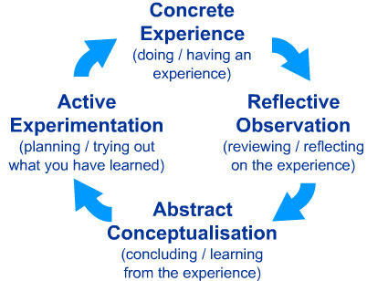

---
zotero:
  scannable-cite: false # only relevant when your compiling to scannable-cite .odt
  client: zotero # defaults to zotero
  author-in-text: false # when true, enabled fake author-name-only cites by replacing it with the text of the last names of the authors
  csl-style: harvard # pre-fill the style
layout: post
categories: misc
title: Keeping it Real - Helping Learners Navigate the Concrete and Abstract
---

Mick Chesterman

https://orcid.org/0000-0002-8005-2390

## Abstract

This chapter highlights the value and challenges of implementing hands-on teaching approaches in a UK schooling context. It begins by looking at interpretations of inclusion and inclusive pedagogy and specifically the framework Universal Design for Learning (UDL). The terms concrete and abstract and their relevance to coding and definitions of Computational Thinking. The second half of the chapter chapter then turns to practical ways teachers can help learners navigate abstract concepts and benefit from hands-on experience of coding. To do this it outlines some techniques promoted by the National Centre for Computing Education (NCCE). Throughout this part of the chapter there is a focus on linking these educational practices with inclusive approaches and learner engagement.

## Introduction

In the UK, computing and computational devices are all around us. Young people interact with them in many ways including, general communication, games, social media and creative apps. Computing as a subject, and coding as an activity can draw on the diverse ways that computing touches people's concrete lives. A quick search the web for creative computing or tech for kids yields a multitude of activities, devices and materials designed to engage hobby interests of young people. Physical examples include fashion and textiles based computing, robotics, colourful lighting displays and programming lego constructions. This chapter celebrates the value and fun involved in coding in these contexts.  However, while the range of materials and possible creative projects is promising, aligning creative opportunities with an exam-assessed curriculum is challenging.

This chapter highlights the value and challenges of implementing hands-on teaching approaches in a UK schooling context. It begins by looking at interpretations of inclusion and inclusive pedagogy and specifically the framework Universal Design for Learning (UDL). The terms concrete and abstract and their relevance to coding and definitions of Computational Thinking. The second half of the chapter chapter then turns to practical ways teachers can help learners navigate abstract concepts and benefit from hands-on experience of coding. To do this it outlines some techniques promoted by the National Centre for Computing Education (NCCE). Throughout this part of the chapter there is a focus on linking these educational practices with inclusive approaches and learner engagement.

<!-- This chapter starts by exploring the terms inclusion and engagement as they are used frequently in this and other chapters. -->

<!--  NO Increase this section with a case study
link to game making - hello world magasine - maker spaces -
examples on walls of classrooms -->

<!-- Embracing the challenge of making computing projects engaging and is something that many individuals and organisations have engaged with. University and industry partner programs have created a wide range of computing materials and computing environments designed to aid novice programmers. Teachers themselves have been a tremendous source in the sharing of knowledge, materials and approaches to make the subject matter engaging in diverse ways. -->

<!-- As we will explore later in this chapter, one aspect of inclusive education is to engage the interests of learners.   -->

<!-- In general terms, student engagement refers to the level of interest, involvement and participation of learners.

Educators motivate learners and computing engaging using diverse tactics and materials.  -->

<!-- Working with home interests and using visual, tangible and touchable materials is a way of increasing the participation and inclusion of learners. They look and feel like fun and exciting objects to engage with. Web-based or software activities include game making, meme creation, hobby website creation or making storytelling adventures. Incorporating materials from narrative forms like books, films, games and social media content into computing projects increases the ability for learners to bring their own interests into the mix. -->

<!-- CL
Can you give a specific example or include a photograph? One you have taken yourself would be best to avoid permissions issues.
Makey Makey ? Not obvious
-->

<!-- Recent years have brought a new diversity of software tools and engaging materials  of computing projects. While these tools are perhaps the most visible signs of progress in this field, effective pedagogies to support the coding and computing process have also received attention. In the second half of the chapter we will look at some of the learning supports available to educators who want, help their learners jump right into coding, sustain interest and reflect on the progress they have made. -->

<!-- ### Context of Teaching Computing in the UK -->
<!-- The promotion of Computational Thinking has been a key factor in the presentation of the UK's current computing curriculum. Computational Thinking started to gain wider attention when the academic and computer scientist Jeanette Wing began to promote it as a concept and approach that could be useful beyond the field of computing. Wing's perspective is that "everyone... can benefit from thinking like a computer scientist" -@wing_computational_2008. Computational Thinking is the ability to express and solve problems in the same kind of way a computer would.

This chapter looks at different definitions of Computational Thinking and their implications for teaching computing in inclusive ways. In particular we took at the concepts of abstract and concrete approaches to computing and how they inform recent advice to engage students. To do this I will be summarising some of the theory and practice of applying inclusive approaches to computing projects. -->

<!-- I do not suggest the concepts of Computational Thinking and Creativity are in opposition to each other. However, for the first part of this chapter I am going to explore both concepts from an academic perspective as a way of finding useful tensions and variety in the way computing teaching is being approached and promoted.
I will use the lens of projects to examine creativity in computing.   -->

<!-- (not sure about the terms or even the whole approach of the last sentence) -->

<!-- Give an example to support the above  -->
<!-- DO Other chapters in this book deal with the strategies like PRIMM and Unplugged computing to communicate the more abstract concepts of computational thinking suited to classroom teaching.?  -->

<!-- ## Coding well is well hard - hard to learn- hard to teach. Choosing suitable coding projects for novices is hard to get right. They may be too hard or too boring. [removed extra]  -->

## Inclusion and Inclusive Pedagogies

The term inclusion no longer address solely children with special educational needs and disabilities (SEND) but also examines barriers of culture and other exclusionary elements of the school environment and discourse [@black-hawkins_achievement_2008]. The issue of alienation from the culture of computing in schools has been identified as an issue of concern especially for girls and some ethnic minorities [@the_royal_society_after_2017]. To be inclusive schools and teachers must identify both traditional SEND issues and wider cultural barriers to participation in computing classrooms and help student overcome them. Beyond the important technical accessibility tools and assistive learning technologies - for example text in different sizes, screen reader, etc. - a diversity for inclusive teaching strategies are also needed.

<!-- The next section deals with inclusive
Web-based or software activities include game making, meme creation, hobby website creation or making storytelling adventures. Incorporating materials from narrative forms like books, films, games and social media content into computing projects increases the ability for learners to bring their own interests into the mix. However, while the range of materials and possible creative projects is exciting and full for promise for computing teachers, it is not always clear how to best approach these opportunities from an educational point of view. This chapter will explore teaching and learning approaches to increase learner engagement with computing, firstly by defining and exploring concrete approaches, and then by sharing useful classroom tactics.
 pedagogy but Florian and BH make a distinction with other similar terms does this need to be explored?  -->

<!-- Researchers Black-Hawkins and Florian [-@black-hawkins_classroom_2012] note that many teachers report lacking the knowledge to effectively teach children with SEND issues.  -->

Until recently, to address SEND issues in teachers may use differentiation to adapt a the standard lesson plan for learners needing special support. However this view of a standard, optimal learner pathway is not supported by recent research in neurodiversity, which suggests there is not an optimal way for students to learn. Thus, inclusive pedagogies take a different approach to differentiation which places more power in the hands of learners to choose the path that is most appropriate for them. All students are given a greater choice of materials and activities from the start suiting the varied needs of all students. This has the benefit of removing stigmatisation of some learners having to undertake work that seen to be created for _low-achieving_ students. These principles - among others - are presented in a framework called Universal Design for Learning (UDL).

 <!-- easily be time-consuming, and overwhelming.

Modern inclusive pedagogies advocate design learning experiences to benefit the participation and achievement of all students.

This approach is inline with recent understandings of neurodiversity. One instruction method is unlikely to work for all learners.  -->

<!-- Make the above paragraph clearer - perhaps find citation -->
<!-- (Good citation or example needed?)
- first part of inclusion is here
However, many of the principles of the UDL framework will be  ones that experienced teachers have already adopted based on their intuition and experience. One key approach is that of introducing concepts by starting with examples that are physical and familiar and then drawing out the more abstract ideas that can be applied in other areas.
- then a section on UDL Later
- finally Conclusion makes claims to favour leading without concepts - concrete fading
 -->
<!-- Concrete fading here?  -->

### Key Concept - Universal Design for Learning (UDL)

UDL is a set of design principles aimed at teachers to help them design learning experiences that incorporate diverse ways to engage pupils, to represent the ideas being communicated and for students to express their own ideas. The UDL framework  provides guidelines for three key areas of representation, expression and engagement and action [@cast_about_nodate]. You can use the following summary as a checklist to help you to plan inclusive teaching activities. A more comprehensive outline is provided by CAST organisation here https://udlguidelines.cast.org/.

**Multiple means of representation:** Are you presenting material and concepts in multiple formats? For example, spoken presentations, written documents, graphics, hands on activities, audio material. Are you clarifying new language and symbols in diverse ways? Are you providing important background knowledge and highlighting important patterns and relationships in the knowledge you explore?

**Multiple means of engagement:** Have you been able to increase student choice and the relevance of your material to spark learners excitement? Are you using a variety of ways to keep your learners focus on their goals, maintain self-belief and sustain their effort as individuals and in group work?

**Multiple means of expression /action:**  No particular action or way to express yourself will be best for all students. Are you able to offer a choice in how you students interact with materials and tools (particularly assistive technologies), allow students choice in the media they use for communication, and construction? How much are student able to set their own learning goals and monitor their own progress?

<!-- Rather than designing separate activities and support for learners with different educational needs in the classroom - often labelled accommodations for disability - UDL facilitates learners to choose a learning pathway that suits their individual abilities and learning strategies. -->

UDL places great value on the personal relevance, choice and authenticity of learning experiences. As a way to encourage engagement UDL suggests setting choices of concrete learning goals that are relevant to the learners. This learner-led approach is very different to a traditional instruction based, directive approach to teaching. The diverse learning pathways offered can be unfamiliar for both teachers and for students. The UDL guidelines recognise this and provide information to support teachers to implement them. As educators we may need to build our own abilities and familiarity with learner-led approaches as well as building the autonomy of our students.  

<!-- Students can then be supported in the discovery and recording of the underlying concepts after undertaking activities. -->
<!-- ### Case Study - Exploring Universal Design for Learning in Context -->
One area of UDL that teachers can implement straightforwardly is to represent concepts in the classroom in a diversity of ways. In a related study, researchers Cook and colleagues [@cook_using_2016] explored the alignment of UDL with another framework CRA, which consists of a three stage model to support learners to develop concepts [@fyfe_concreteness_2014]. The researchers outline how the three stages of CRA (Concrete, Representational and Abstract) align with key UDL principles, most specifically multiple ways to represent knowledge to aid learner perception and comprehension. In short, first teachers introduce a physical, concrete model of the concept, then progress to iconic forms, for example graphics or pictures; finally learners work with more abstract models of the concept. The CRA framework is an example of concept popular in Mathematics research and practice called Concreteness Fading where concepts are introduced in concrete examples and then learners are supported to understand and represent them in more abstract ways.

When reading about different approaches to teaching computing the terms concrete and abstract are used commonly. For example the concrete practice of coding is a good way for learners to work with more abstract computing concepts. The following section explores the utility of these terms to explore inclusive approaches to teaching especially in relation to an understanding of Computational Thinking.

<!-- in Fyfe's 2015 review  -->

## Computational Thinking, the Abstract and Concrete
<!-- Remove this heading perhaps?  -->

### Concrete and Abstract Learning Approaches

In an everyday sense concrete objects are ones you can get hold of and abstract objects exist only as concepts. A pound coin is concrete but the idea of profit is abstract. In everyday usage abstract knowledge may be harder to grasp with than more concrete understandings. For example, we might ask for a concrete example if we don't understand a more abstract definition. Here, it is the use of something in context that makes something concrete. In traditional conceptions of education abstract knowledge is often perceived to be of greater value. If you can understand a concept as it applies in different situations then this ability to transfer it and have a more global understanding is held as a higher form of knowledge. This concept is popular in education in many forms, for example, Piaget's influential model of developmental stages, specifically in the progression to more abstract thinking in the transition from the concrete (operational) to formal (abstract) stages [@burman_genetic_2021].

Not all educators agree with the supremacy of more abstract ideas of knowledge and are keen to celebrate the value of concrete exploration by learners. Seymour Papert and Sherry Turke's work on creative computing at MIT created a legacy that includes the development of the Scratch programming tool and the use of physical computing in education. Papert and Turkle [-@papert_epistemological_1990] thought it was vital that we value and recognise concrete approaches to computing and coding. While they do not discard the technical value of abstract approaches, they draw on feminist theory to make a convincing case that approaches like abstract planning and formal language can be off-putting to certain learners and especially girls. They argue that the process of finding solutions to coding issues for novice coders should be a matter of personal preference. As well as the terms abstract and concrete - they use the terms top-down and bottom-up approaches to learning. In a bottom up approach problems are tackled piece by piece, experimentally. Desmond Tutu once said that "there is only one way to eat an elephant: a bite at a time." Bottom-up (concrete) coders take this approach.

<!-- MORE ON BRICOLAGE AT THIS POINT? -->
To clarify this Papert and Turkle give the example of a young coder Lisa, who is aware of a more formal way to approach the kinds of programming tasks she is undertaking, but maintains that way doesn't work for her. As she continues her journey as a coder this frequent message that she is doing things the wrong way demotivates her enthusiasm around coding. Abstract coding concepts are tools for thinking. But they are only useful to the learner if they match with her experiences. Forcing the learner to adopt an abstract approach in this example is counter productive as it undermines her experience and progress. The authors outline that the danger of prioritising teaching and testing of abstract concepts is to devalue this bottom up approach to coding. This way of coding has also been called a craft approach. It is an way of doing things that has been shown to have a lot of value in many professions.

<!-- The debate of the desirability of testing using more formal abstract measures of success has been going on for many years. The IQ test is a good example which has been criticised for being culturally biased in favour of more Western understandings of intelligence which favour formal logical and abstract elements and ignore other measures of emotional, cultural and practical intelligence. -->

<!-- However, while this valuing of concrete approaches is important, it is potentially unhelpful to express concrete and abstract as two paths that never meet. Abstract concepts are useful after all. The danger is when the abstract concepts chosen by educators or included in the curriculum are don't seem relevant to learners, leading to their disengagement.   -->

Thus as inclusive educator, we have a duty to allow learners to follow a learning path that suits them as much as practical within the constraints of the curriculum. A conceptual tool that may help teachers to help learners to navigating between the abstract is called semantic profiles.

<!-- When applied to coding and computing, a student's knowledge of a coding concept may deepen a little bit each time you apply it in practice.
 -->

### Key Concept - Semantic Profiles

Semantic profiles chart the use of more concrete (high semantic gravity) language and more abstract (high semantic density) concepts and patterns as they emerge in classroom situations [@macnaught_jointly_2013]. Exploring semantic profiles is being promoted by NCCE  an aid to teachers wanting to plan their lessons in a way that communicates the key abstract curriculum knowledge that students will need for exams, and to allow them to put the concepts into practice to build real coding skills and to make valuable connections to personal experience. A Quick Read on Semantic Profiles is available here - http://tiny.cc/semantic-waves.

<!-- start with activities that allow the use of more concrete (high semantic gravity) language and then explore more abstract (high semantic density) concepts and patterns as they emerge in these authentic situations. -->

<Concrete_Figure1.1.png>
Figure 1.1 A Semantic Profile with Semantic Waves

Research carried out by Curzon and colleagues [@curzon_using_2020] in a computing education context outlines the value of semantic profiles in wave shape as opposed to a flatline which remains too much in concrete examples or more abstract concepts. This research suggests the value of unpacking, exploring and then repacking ideas during the course of a lesson. A student's understanding of a concept may deepen a little bit each time it is applied in practice and reconnected with the abstract. Examples showing semantic wave profiles usually start with the process beginning with the abstract or with high semantic density in line with more traditional teaching approaches. The advice of starting with more abstract terminology and concepts may seem to be in opposition to the approach of Concreteness Fading as explained with the CRA method outlined above. However, on examination of the a research example carried out in the research above, the process of starting with concepts may only involve giving a short outline of the concept that is being explored and saying that this will be illustrated in a following concrete activity. Thus concrete activities and easily explainable real world examples can increase student engagement and can allow more hands on time for different approaches to coding and creating.

THIS LINK WITH CRA - CAN IT ALL BE REDUCED DOWN - IT'S A BIT MUCH

<!--
Leading with concepts has the advantage of being specific about the target subject matter being taught, as this is process familiar to classroom practice and preparing for testing.
However, there are advantages of starting with concrete experience and meeting abstract concepts in context. For example starting with activities can increase student engagement and can allow more hands on time for different approaches to coding and creating. -->

### Activity - Recognising and Exploring the Concrete and Abstract in your Teaching

<!-- FIND A PLACE FOR THE BELOW? -->
<!-- There are drawbacks of adopting teaching in either solely abstract or concrete ways. For example, learners may not make a connection between abstract material and real-life situations. They can then only recall rather than apply the knowledge. A term for this is _inert knowledge_. For example, in computing, you may be able to give a definition of what a function is in a coding language but not be able to write one. There are also downsides to learning only in a concrete way. If you learned coding by teaching yourself or just picking it up from other people then you may be able to complete tasks but not be able to explain what you have done to others, or may really struggle to recognise similar patterns in other computing contexts.  -->

To help you balance your lessons, is helpful to identify what parts of your sessions address more abstract conceptions of computing knowledge and those that are more concrete. To do this ask you can yourself the following questions about your sessions.

- What are the core skills and concepts I want to communicate in my session? How many of them are more abstract and how many are more concrete? Do I have a good balance?  
- How do learners first meet core concepts? How are they re-enforced? Is it through an abstract definition, supported by a more concrete explained example, or via hands on work that they are engaged in?
- What kind of semantic profile do your lessons follow? Are you able to avoid 'flatlining', where students explore only abstract or concrete language?
- Are you alternating between concrete and abstract poles in a way that helps deepen the understandings of students as they link curriculum concepts to practical experience by helping them link curriculum concepts to practical experience and back again?

<!-- The socio-cultural school holds that rather than being a separate thinking machine, the mind is dependent on the social and cultural webs of meaning that surrounds it. We think socially. -->

<!-- Perhaps add to this element to the start of part four about project based approaches
or revise to be practical to the teacher -->

<!-- This forms a fundamental challenge to the usefulness of teaching cognitive processes for transfer, one that challenges so many of schools normal ways of doing things that it is difficult to know where to begin reform. -->

<!-- Image done in a way that works on github pages AND in word docs -->
<!-- 
 -->

<!-- ### The Issue of Transfer

The implications of thinking socially are that our mind is motivated and activated by the context of the problems that we meet. While it would be great if we could transfer the knowledge we gain in one area to another or to be able to apply an abstract idea to a more specific problem, researchers from the socio-cultural perspective are very critical of this idea.

This problem of transfer creates a problem for Computing teachers. If they are aiming for good exam results of their students. If students are unlikely to be able to transfer the computing skills they have picked up from undertaking creative projects, then it is logical to teach to the test as this will be the cultural context that they need to perform in. Of course this may have long term detrimental effects, as then students will not be able to transfer the exam knowledge into practical experience after school.     

The difference between exam-focused computing and real life coding and computing is ....
 (find citations / example )

As with many other subjects, teachers are being asked to both teach to the particular requirements of exams and to build more transferrable skills. In this case this process of being pulled in different directions seems particularly noticeable. -->

<!-- Sign posting - tactics -   semantic wave theory
and more out of school tatctics.  -->

<!--
Mark Guzdial was an early advocate of Computational Thinking and wrote about the possibility of this kind of cross over enthusiastically - find and contextualise - However his enthusiasm has changed in focus he has moved towards a more concrete idea of what Computational Thinking . Has he lost the faith - what's happening here?

The key to this idea is transfer which is a tricky concept to prove when it comes to situations like this. As Mark says, you can't prove a negative, but the evidence for CT being transferred to other areas is weak.

There is a school of thinking in educational research which argues that learning how to do something like coding is entangled up in particular situations. So even though CT processes may be at work they are tacit and would be of little use in other situations. -->

### Definitions of Computational Thinking

The promotion of Computational Thinking (CT) has been a key factor in the development of the UK's computing curriculum. However, the claims of early advocates that CT skills could be applied widely in subjects beyond computing are now advanced more cautiously to avoid the danger of over-promising [@tedre_long_2016]. We can use the distinction between concrete and abstract to examine the differences between two popular interpretations of Computational Thinking (CT). The first is an influential take from Jeanette Wing. "The most important and high-level thought process in computational thinking is the abstraction process. Abstraction is used in defining patterns, generalizing from instances, and parameterization" [@wing_computational_nodate]. Many learning resources designed to support the computing curriculum present this principle as four key pillars: decomposition, pattern recognition, abstraction and algorithmic thinking[@bbc_bitesize_introduction_nodate]. The essence here is to deal with concepts and principles as abstract and separate from the context.

Another widely used definition of CT by Brennan and Resnick [-@brennan_new_2012] was developed in response to a thought experiment "How do we describe what Tim, Shannon, and Renita are learning as they participate as designers of interactive media with Scratch?". The researchers took a grounded / situated approach to mapping the potential learning dimensions of student undertaking collaborative, creative computing projects. The resulting map they created includes computational concepts, computational practices and computational perspectives.

- _Computational concepts_ include sequences,
loops, parallelism, events, conditionals, operators, and data; thus representing the mechanics of coding structures.
- _Computational practices_ include debugging, an iterative approach, reuse and remixing, and abstracting and taking a modular approach.
- _Computational perspectives_ such as expressing, questioning connecting were observed in the behaviour of learners completing their coding designs.

This interpretation of CT which is based on observation of learners in action and is more accessible to teachers and learners as they can more easily recognise their own practice that the more abstract versions such as the one outlined above from BBC bitesize. To give a specific example, rather than decomposition, the applied framework outlines taking an iterative, incremental approach to problem solving and arranging code in modules.

This wider and process driven definition of CT has been used and adapted by many organisations seeking to support the new computing curriculum. As such it may be familiar from websites, posters and other supporting material created by groups like Barefoot computing. Lye's extensive review of teaching Computational Thinking [@lye_review_2014] used Resnick and Brennan's definition as the basis for the review, which points to the widespread use of this more applied approach. The wider definition of CT here assumes an environment where learners are engaged in the collaborative coding of a computing project. The review above and the influential framework used by Computing at School [@csizmadia_computational_2015-1]  have included elements of this applied framework as well as other more abstract CT concepts.

The popularity of the CT frameworks describing concrete and collaborative learning help encourage with inclusive teaching approaches. However the tension between abstract and thus potentially transferable knowledge and context-bound concrete knowledge exists not only in definitions of CT and but also in approaches to teaching and testing. In the next section we explore this tension and look at recent responses in the field of UK computing education.

<!--
 Certainly from an academic perspective we need to ask what is special about Computational Thinking. -->

<!-- Much analysis has been done about the relative merits of different definitions of CT. From my perspective I feel that from an academic perspective Wing's definition does a good job of describing what is most unique about Computational Thinking compared to other frameworks. The way it looks at the special ways abstraction is done in computer science is convincing. The concept of Computational Thinking as more abstract, transferable knowledge became significant aspect of the 2015 Computing curriculum. It suited the conservatives government's back to educational basics agenda based, a perceived move away a progressive skills based approach to a knowledge-based curriculum. -->

<!-- This agenda has been championed by education ministers Nick Gibbs and Michael Gove. A good example can be found in a speech by Nick Gibb at a launch of a collection of essays _The Question of Knowledge_ (http://tiny.cc/gibbsknowledge). I suspect most educators would find this oppositional setting of knowledge against skills unconvincing. If we return to Kobl's experiential cycle, it is through application of knowledge in concrete contexts that skills develop and understandings of knowledge deepen. Ironically in the foreword of the publication in question, references the importance of Young's concept of powerful knowledge which is knowledge put into practice in a concrete context, and putting the knowledge into practice will involve developing practical skills. -->

<!-- SINGPOSTING - Given this, educational practices and frameworks which support learners and teachers to help reflect on and develop skills are clearly helpful. -->

<!-- If we return to our general understanding of what abstract and concrete mean, we can see that the CT concepts can be formulated in a spectrum of relatively abstract to relatively concrete. While the computing concepts, practices and perspectives are all abstract concepts they are relatively more concrete than the concepts in Wing's definition. -->

<!-- The process CT has been taught - which is covered in another chapter - there are some really innovative and accessible ways that are proposed. Unplugged, concept mapping and others.... -->

<!-- Another take on CT critiques Wing from the other angle. According to Denner and Tendre -@tedre_long_2016, Wing's view of CT over eggs the possibility of transfer to other areas beyond what is shown in the research and has a too narrow view of CT. -->

<!-- ### Coding is not Computational Thinking -->

<!--  is this section really needed?
Refer back to transfer?
Integrate into another? -->
<!--
We have explored that Computational Thinking is a contested term. While there is a general agreement that computational thinking is not just computer coding, most applied definitions include algorithmic thinking, and thus the more concrete aspects of coding structures. -->

<!-- I as I became I learned how to become a proficient coder without explicitly being taught the more abstract CT concepts.  -->

<!-- of more abstract concepts
There is a tension between the skills required of Real Life coding and the time it takes to learn via real projects and the more abstract knowledge needed to answer more formal exam questions. In GCSE exams include a paper which tests application of coding concepts in a paper based format. Which aims to strike a balance. This would then justify devoting more time to applied coding projects especially if they can be done collaboratively to take advantage of the benefits of social learning. -->

<!-- Refer back to transfer? -->

<!-- Make link to Project based approaches ? -->
<!--  -->

## Tactics for teaching Computing in the Classroom

<!-- In another chapter I examine wider project based approaches which are more challenging to integrate into a classroom environment but which provide particular benefits to the learner. -->
<!-- This section starts with tips to teach more abstract concepts - but then widens focus to more inclusive practices which question traditional concepts of learner achievement and success. -->

Classroom practice is strongly influenced by curriculum content and more specifically the format of exam questions. The removal of course work from GCSE exams due to the widespread sharing of worked examples on-line created a real challenge for those setting exams. Exam boards had to rethink how to test the practical programming experience and abihighlights lity of students in a written exam setting. At GCSE level most exam questions test the more applied definitions of Computational Thinking, particularly the process of writing, analysing and revising algorithms in the form of written code examples. Students are required to demonstrate and explain fundamental code building blocks and approaches from first principles. However exam questions on coding are by nature fragmented and decontextualised compared to project coding experience. The questions in the format of small coding challenges must be fragmented to be able test a particular part of the curriculum. A focus on written exam approaches can reduce time to explore more authentic projects where students follow their own interests and develop design, debugging and other troubleshooting practices.

<!-- Teachers need to understand how best to prepare students for questions which require good degree of understanding concepts and memorisation of coding detail. Teaching to the test implies passive learning on the part of the pupils.  -->

Spending a lot of time in lessons addressing decontextualised exam questions has potentially negative impacts on student engagement and such disengagement is a serious barrier to inclusion [@kanevsky_produce_2003]. In an ideal situation practical work can deepen and broaden more abstract knowledge. However given the reality of schools' focus on exam results, teacher must balance the development of students' hands-on coding practices with the ability to recognise and respond to more abstract written questions. Having proficiency in a variety of relevant teaching approaches can be helpful to resolve this tension. The NCCE has produced a series of resources based on research on computing practices to help teachers. They have provided a set of 12 principles for teaching computing (http://tiny.cc/12-principles-computing) and supporting Quick Read documents aimed at mainstream teachers to explain and promote key research-informed teaching techniques. The following sections summarise some of these principles. We start with tactics start to help teachers to explain and direct the learning of students in a way suited to traditional class instruction. As the examples progress, the tactics change in focus to cover techniques that suit a learner-led approach to learning coding.

<!-- https://www-tandfonline-com.mmu.idm.oclc.org/doi/full/10.1080/14703297.2018.1564882?casa_token=5gdmHSGX8BwAAAAA%3ANAyJjDXRrGZPqN2yJzqp_0zw_-U1hpZejAu3j8zBM1Gw6AvybVyroc7m_LUDzuaz-h6w6w6tzII -->

<!-- SOME MORE ON THE GENERAL CONDITIONS IN THE CLASSROOM NEEDED TO MAKE THIS HAPPEN? -->
<!-- Let's examine some of the needs of the Computing classroom to best prepare students for the kinds of questions they are likely to meet in GCSE papers.
Drill and test - analysing code - predictions - then go on to other tactics.
 -->
<!--
Sign posting - do this elsewhere
In the final section I take a more idealistic pedagogical approach - imagining what a learning landscape without these restrictions would look like - in line with Papert and Turkle to explore alternative concrete approaches and frameworks in more detail. -->
<!--
To do this we can look to relevant research to provide us with some tactics to structure the process of learning how to use coding structures fluently and to onboard that tricky process. -->

<!-- Diverse and contradictory? projects, concrete but also concepts first? -->

<!-- ## Inclusive, Concrete and  Student-led Approaches vs Classroom Approaches

Classroom tactics above are useful - but they assume a set status quo or lessons following a certain format. We should advocate for something better. We have a duty given increased needs for inclusion.

Inclusive / student-led approaches can take many forms, but they are are different from the tactics above in the following ways.

This has the following benefits for inclusion.
Laser in - more details on inclusion.
Sign post to other chapters - but state essence of value on the concrete.highlights

Perhaps contrast - Semantic Wave profiles - and the lead with concepts advice with the idea of "concreteness fading".
s. -->

<!-- Develop this more or drop -->

**PRIMM:** PRIMM stands for Predict, Run, Investigate, Modify and Make. This learning model helps learners adopt coding practices and computational concepts through providing them with a concrete code example that they run after predicting what it does. Learners then dig deeper and make changes to the existing code before finally making theirn own code. PRIMM's starting point is students predicting existing code results. Asking students to identify target computing concepts in code examples allows teachers to guide students towards key computational thinking process or algorithmic details. Thus, PRIMM is well suited to the classroom as starting with prediction of a code allows a whole class learners to unpack and repack the same set of concepts in a restricted time scale. It is a process well aligned with some of the more formal problems solving, paper-based questions of the GCSE exams. The use of code examples and a structured set of differing activities aligns well to UDL principle of representing knowledge in a variety of means. For a more detailed summary of the PRIMM approach see this quick read pedagogy article. http://tiny.cc/primmqr

**Unplugged activities:** Unplugged activities are carried out away from the computer and aim to illustrate computing concepts. They are explored in more detail in another chapter in this collection. Unplugged activities often use very familiar non-school examples and draw on learners' understanding of their own concrete experiences. As an example teachers may use the cooking recipes as a way to illustrate the importance of correct sequencing in a code context. Unplugged activities are also often embodied activities. Embodied ways of learning involve moving beyond a computational view of cognition to recognise the importance of physical experience and emotions in the learning process [@settoducato_pedagogy_2017]. Thus, the practice is very much in line with the UDL principle of allowing multiple forms of expression and action for learners and highlighting patterns of knowledge representation. To help learner integrate abstract concepts teachers should link unplugged activities with concrete coding activities. A semantic wave approach as outlined above can help teachers explore this process.   

**Pair Programming:**  Pair Programming divide coding into roles. One student undertakes hands-on coding while the other is free to think about more the abstract design of the overall programme. A benefit of pair programming is to increase coding confidence as students build their experience of the different roles involved in coding. To help novice coders teachers should model and break down the processes involved. As learners become more familiar with the roles they build their identities  as being proficient in different elements of coding. Pair programming involves social learning elements and can model a greater choices for students in they way they solve problems. The process of building an identity in a community with the help of peers is key to a socio-cultural understanding of how learners pick up coding in a classroom (or other settings). The importance of a coding community is explored in another chapter in this collection on design and project approaches. A summary of pair programming roles and tips on how teachers can help learners to adopt them in present in this Quick Read document from NCCE - http://tiny.cc/pairprogramming

<!--
**Leading with Concepts and Unplug, Unpack and Repack:** Two concepts in the NCCE's principles are _Lead with Concepts_ and _Unplug, Unpack and Repack_. These principles are commonly explored using the theory of semantic waves.

The Semantic Wave approach is usually presented as leading with concepts, unpacking them, then giving concrete examples or applying the concepts in a practical example, and then returning to the re-examine the concept from a more abstract perspective once again - hopefully with a richer understanding informed by the concrete experience. The terms semantic density and gravity can be substituted for abstract and concrete. -->

<!-- A bit more on this from Lee and Vincent
unplugged is not enough?
-->
<!-- Can you be more explicit about these?
Or add ‘rather than ….’
D
-->

<!-- This section has looked at tactics to address the realities that teachers face preparing students for Computing exams. The next section focuses on inclusive approaches which involves providing students with multiple ways of engaging with the computing subject materials and practice of coding. While it is in line with research on inclusive practices it may be challenging to implement in many classrooms.
WHY?
<< MORE SIGNPOSTING -->

<!-- Challenge by Papert - valuing the concrete - how much is this in opposition - and what is the practical resolution by teachers needing to teach to the test? -->

<!-- ## Inclusive, Concrete and  Student-led Approaches vs Classroom Approaches

Classroom tactics above are useful - but they assume a set status quo or lessons following a certain format. We should advocate for something better. We have a duty given increased needs for inclusion.

Inclusive / student-led approaches can take many forms, but they are are different from the tactics above in the following ways.

This has the following benefits for inclusion.
Laser in - more details on inclusion.
Sign post to other chapters - but state essence of value on the concrete.

Perhaps contrast - Semantic Wave profiles - and the lead with concepts advice with the idea of "concreteness fading". -->

<!--
https://d1wqtxts1xzle7.cloudfront.net/39338896/2015_FyfeMcNeilBorjas_LI-with-cover-page-v2.pdf?Expires=1643555872&Signature=QPEOo0kHWTG-e0-4Nvbd-U2md4Ny2FQGMWbCBb6IjcgoqbZik9X-vGD-pmka0uchC4RFdsoIJ3gHNdnHVELA-3ZvNyUuAqxEZWDfIWqIB~-BGaUnBswW6A09syhXmEfSW8JGsupCmivZYskY9m4f5H2VuXVh7RE6GCbYcxyvDfxCFnVDPpxEOlwOV04v0G9-EIierQiiYOEFTVfaq1hZk4pu2YIDI9xbWwSeOMhZ0Wm5PtW1lDCyONXRMeFLltVzNWS7V0-WYHIaZSVNtlwzTQx~pmw~MDzz8qaP3zbjxFtiZKyIOMCV5QJDgNffs~ytmBY8Xbz5uzACPpjsLiOV-w__&Key-Pair-Id=APKAJLOHF5GGSLRBV4ZA
 -->
<!-- A section here would help the headings - but is it too complicated?
Also links to other chapter
-->

<!-- Many of the key guidelines of UDL focus on the importance of learner choice of activity, goal setting and on-going self-assessment. UDL is in essence a learner-led approach. In computing it suits learners meeting concepts through hands-on activities and then drawing out the more abstract ideas that can be applied to other areas. In contrast semantic waves theory is a way to help teachers plan lessons which focuses on teacher led activity of explaining abstract concepts and linking them to more familiar ones via examples and teacher-led activities.    -->

<!-- ### Expansive Framing
<!-- Develop this in relation to the above
Perhaps drop this.
-->
<!-- Researchers Lee and Vincent [-@lee_expansively-framed_2019] were concerned that CT practices are not easily transferable to other areas. They applied an approach of expansive framing to develop students Computational Thinking. Expansive Framing is about students meeting similar abstract concepts in different contexts (or frames). This makes the abstract more concrete by experiencing lots of examples in different situations. -->
<!-- More hand-holding for the reader to connect this section to the previous section -->
<!-- Thus to increase the effectiveness of Unplugged activities the researchers also introduced an additional context. For their study they used loom based weaving. Students analysed weave patterns, created a graphical representation of the pattern on grid paper, and then used this to codify the pattern and represent it on a computer screen using Scratch.

Lee and Vincent's research provides a practical approach to help overcome some of the difficulties of transferring knowledge between contexts. See http://tiny.cc/expansive-framing -->

**Observing and Assessing Hands-On Practices:** One way to address the tension between giving learners the freedom to pursue their own concrete coding goals, and is the use of observational techniques in the classroom to assess user progress. Techniques to help teacher observation and assessment help monitor students as they solve problems and apply knowledge in the concrete stage of their learning. Skilled observation allows teachers to catch learners when they are engaged with their own personally meaningful project and their motivation to solve problems is high. The NCCE have created this quick read on observation - http://tiny.cc/observingstudents. A summary of that document follows:

- _Structured observations:_ Before lessons, teachers create a framework of the behaviour or use of concepts you want to observe and observe them as you interact with students, via recordings or their created work.   

- _Unstructured observations:_ Teachers record or reflect on some of the more unexpected turns that happen during the lesson, often after the event from memory or recordings.  

- _Verbal protocols:_ Teachers assess the learning and understandings of students by asking them to talk aloud the way they are solving problems and undertaking tasks.

While this kind of observation is time consuming, and benefits from extra classroom support, this effort can be justified as inclusive measure to support a diversity of learner expression and assessment recommended by the UDL guidelines.

<!-- There is repetition with conclusion here -->
<!--
Outline the types of observation from
 -->
<!-- Link to Bevan / Learning Dimensions -->

<!-- UDL is similar in many ways to project based approaches and in another chapter we look at tactics to resolve some of the practical difficulties of adopting these techniques in schools. -->

<!-- 
 -->
<!-- Some say similar to Freire / Bruner
https://accessibility.uncg.edu/wp-content/uploads/2019/02/UDL-Engagment_For-Website.pdf -->

<!-- examples of strategies - perhaps in clude as short link?
https://goalbookapp.com/toolkit/v/strategies  -->

<!-- #### ACTIVITY - What do you think about transfer? (perhaps earlier)

Much of what this chapter has looked at stems from a core concept of education that we don't have time to fully explore but which has shaped educational policy significantly. The idea of transfer. Rather than trying to lay out the debate at this stage I think it is still helpful to ask yourself the following questions about your learners and learning environment.

- What do you feel are the most valuable potentially transferable skills your students meet in your sessions?
- How realistic is it learners transfer some of the skills and knowledge they have picked up in your teaching sessions to another subject area or to another area of their life? -->

**The Use of Concept Maps and Learning Frameworks:** To facilitate structured observation a predetermined framework of the kind of behaviours, practices and concepts that align with the project work being undertaken is extremely useful. One way that teachers can develop such frameworks is via a technique called Concept Maps. The NCCE have created a Quick Read guide for teachers to create concept maps which focuses on more technical knowledge (http://tiny.cc/concept-map). In this document Concept Maps are presented as a way for teachers to model or for students to explore connections between concepts, however they can also be used as a map or a matrix to help observation.  It is also a good idea to provide students with this framework to help them navigate their learning journey. Having potential learning clearly mapped out and involving students in self-monitoring increases the efficiency of the observation process. The visual nature of the maps also align with UDL guidelines on presenting concepts via multiple means. When using maps used for observation and self-monitoring you may wish to extent beyond abstract concepts to coding practices that are included in more concrete definitions of Computational Thinking. The ability for students to monitor and assess their own work and progress is in line with both inclusive education and project-based approaches. I explore project approaches in another chapter of this book. I also outline the use of maps as a way to help manage a learner-led approach to game making in a further chapter in this collection. The final part of this chapter explores the use of Universal Design for Learning (UDL) in your classroom.

## Activity - Applying UDL in the Classroom

We have explored some of the elements of UDL in the context of computing via the above teaching techniques. The following questions can help as a checklist when planning your teaching.

- What choices do students have to apply the target knowledge or skills? Can activities and learning be related to student's interests?  
- Are learners able to connect to real-life application of the concepts and skills you are introducing? How motivating do they find that link?
- How are you helping learners to make connections between the concepts and skills they are learning through hands-on activities and the more abstract representations that may occur in test or exam situations?

<!--
THIS IS REALLY EXPLORED IN THE PROJECTS CHAPTER.
Aligning computing teaching with UDL principles involves teachers set learners meaningful projects, giving students access to suitable tools, inspiration and to sustain their motivation. Assessment would then follow the activities that students undertook using a mixture of the observation techniques listed above. -->

## Conclusion

The purpose of this chapter has been to celebrate the educational value of hands-on, concrete coding as an inclusive way to explore the computing curriculum. As computing educators we are lucky to have such rich and engaging resources at our disposal which invite tinkering and learning through trial and error experimentation. This chapter has explored the value of UDL principles for teachers looking to inclusive practice and the possibility to assess content knowledge through observing students during hands-on work.  We have seen the researchers Papert and Turkle celebrate the value of the concrete at a very early stage of computing education. More recently, Resnick and Rusk [-@resnick_coding_2020] from the Scratch research community caution against some of recent tendencies to adopt predominately formal approaches to computing including: too much memorisation of computational terms rather than application, devaluing hands-on coding compared to abstract concepts, not enough time devoted to complete projects and, finally, learners not given enough choice in their coding projects. I share the concern of these researchers that the potential for computing to build creative and design thinking competencies is not being optimised in formal education. http://tiny.cc/codingcrossroads.

Teachers in the UK continue to experience tensions between encouraging  experimentation and the pressure to bring students attention back to underlying concepts that are assessed through more abstract test material. The NCCE is playing a pivotal role in supporting teachers to recognise and navigate the abstract and concrete via teaching techniques; that work has been discussed in this chapter. In another chapter I explore the principles of design and project based approaches. These methods can also help teachers balance the requirements of the curriculum and the value of letting students spend more getting their hands dirty in the concrete of coding.

<!--In short I advocate leading with project goals first approach rather than computational thinking concepts AND focusing on coding and design concepts as the framework for learners to help navigate the learning that happens in these projects. -->
