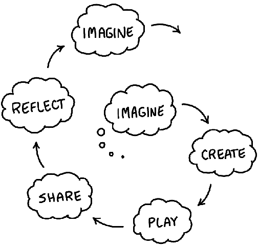

---
zotero:
  scannable-cite: false # only relevant when your compiling to scannable-cite .odt
  client: zotero # defaults to zotero
  author-in-text: false # when true, enabled fake author-name-only cites by replacing it with the text of the last names of the authors
  csl-style: harvard # pre-fill the style
layout: post
categories: misc
title: Design and Project Approaches in Computing Education
---

In a previous chapter we looked at the value of hands-coding approach to computing education. Asking learners to design and complete computing projects is one way to make learning concrete. This chapter argues that the pedagogies and frameworks that support the creative processes involved in undertaking computing projects in an educational setting have a tremendous potential to deliver transformative learning experiences. In this chapter we explore some of the strategies that can be used to support the delivery of design and project based approaches. To start with I focus on the value of creative communities before tackling the areas of design-based approaches to computing projects and take a broad look at some of the benefits and processes of project-based learning. This chapter then turns to look at some tactics for overcoming limitations in what you can achieve in the classroom.

<!-- Preparing students for exam questions requires skills and practices that are quite different from coding in a real life setting. Because of this computing teachers face a significant challenge to both teach concepts to be reproduced in exam contexts and to unleash the potential of student working on their own projects. -->

<!-- In a professional setting coders will often be working within existing projects that they have not started themselves. They may be patching and remixing existing code and including and adapting external code libraries. All the time they will be adapting to existing practices and patterns used by their colleagues and code communities. GCSE questions attempt to include some elements of peer practices by including tests of code reading and analysis.
The scope of this chapter is large so I have concentrated on picking out details that may help teachers make their classrooms into learning environments that can support students to pick up coding and computing skills useful if they progress into that profession, as well as gaining useful project skills which are potentially useful in many areas of their future professional and personal lives. -->

<!-- We have looked at some of the 12 principles and quick reads promoted by the NCCE both abstract and concrete approaches. The 12 principles include _Make concrete_ and _Get hands-on_. While it is not contradictory to encourage both abstract and concrete approaches, given the tactic moving between the two perspectives via _semantic waves_, the resources provided, perhaps because they are targeted at the classroom, often lead with more formal learning approaches. -->

<!-- There is also danger that this abstract approach to algorithms, while containing the promise of transfer to other domains, has the danger of distracting teachers from other creative ways of representing the learning outcomes of more concrete approaches. -->

<!-- To address wider challenges of implementing PBL approaches we look at what is available to help teachers balancing the requirements of the curriculum and doing hands-on work. To address questions equality I explore how can young people from a wide variety of backgrounds benefit from this approach. -->

## The Power of Communities

A project based approach to learning coding and computing can be be supported by the home environment. For example enthusiastic older family members may take young people to Maker Fairs or engage in other community coding activities. Family members may buy creative computing kits or access resources such as YouTube videos or via online forums for specialist subjects like robotics, games or other forms of digital making. However, access to this kind of computer enthusiast community is not available to all young people. The following initiative aim to address this by providing entry points to community orientated coding.

<!-- This kind of hobbyist forums and communication have been documented as being significant in the evolution of the home computer and Silicon Valley culture. If you put the name "Homebrew Computing Club" into a search engine you will find an interesting history. -->

**Code Clubs** are designed for out of hours school clubs run by teachers and provide inspiration and resources to help build a lunch-time or after school community. A large number of high quality, colourful and attractive resources are supplied free of charge on their website. It was originally an independent organisation which is now part of Raspberry Pi Foundation. https://projects.raspberrypi.org/en/codeclub

**Coder Dojos** are monthly events run by volunteers often at the weekend. They often focus on creative, engaging computing. I have volunteered at some events and been impressed at the dedication and inventiveness of the other volunteers. While some attending the event will use existing resources to support Scratch, others will try out new and experimental work around hacking Minecraft, creating games with code engines and new technologies of physical computing. Often volunteers use their own children who act as guinea pigs testing activities out on their family before bringing it to a Coder Dojo. To find out more visit - https://coderdojo.com/

**The Coolest Project** is another project taken on by the Raspberry Pi Foundation. It takes the form of a competition and online and real-world showcase that individuals or teams apply to take part in. The Coolest Project helps generate maintain project for students allowing them to tackle problems in a radically different way to much classroom teaching. As well as a greater amount of time dedicated to hands-on coding and physical computing challenges projects provide opportunities to engage in authentic coding practices. These include: designing for real users, collaboration with other students, project planning, debugging faulty code and repeated revisions to fine tune the desired result. https://online.coolestprojects.org/

<!-- While the Raspberry Pi Foundation have created and collected an impressive collection of resources - it is vital to also appreciate the work of volunteers and teachers volunteering out of class time to create the opportunities to code creatively. This is more than about the creation of stand alone resources, it is about creating authentic goals for learners and setting up systems involving adults, teen helpers and in the case of Coder Dojo other family members to support the skills and sustain the interest of learners. -->

<!-- Explain this more?  
how to bring this into the classroom
most pedagogies are still around behaviourist approaches.
-->
Coder Dojos are family-focused and thus less easy for teachers to engage with. But they are a good source of inspiration for teachers looking for creative project ideas for their classroom. In contrast, both Code Clubs and the Coolest Project are suitable to run inside schools by computing teachers. Running lunchtime or after-school projects, while not reaching all pupils, can be a great way to showcase the engaging and creative nature of hobbyist computing projects.

### Communities in Educational Theory

The power of communities has been highlighted by academics as part of what is known as the "social turn" in educational. This is a turn away from more individualised ways of learning which focus on efficient transfer of knowledge from the teacher to the pupil. Instead the focus is on how learning happens through participation in communities and culture, in other words a socio-cultural approach.

Community in this educational context can motivate and provide support for participation in a creative process. Barbara Rogoff [-@rogoff_developing_1994], a researcher of socio-cultural approaches to education, has described an educational process she calls _Communities of Learners_ - http://tiny.cc/communityoflearners. Rogoff sees this approach as radically different from both instruction based models of learning and pure discovery learning (where learners are left to their own devices). In this model participants have different levels of expertise and varied roles in a learning system working towards an authentic goal. Rogoff notes that observing this kind of learning can be confusing to teachers and parents used to more instruction-based approaches. Such a learning community in full swing can seem chaotic. However, complex and productive learning is happening in ways that we, as teachers, may be unused to. This chapter helps unpick some of these practices and explore ways that educators have structured their learning environments to take advantage of this powerful approach.

### Activity - Applying a Community Approach in the Classroom

Are you making the most of the power of communities in your classroom? Before you start your next unit of work ask yourself some of the following questions.

- Are there regular opportunities for learners to work together during your unit of work? How often will students give and receive peer feedback?
- Are there examples of similar work from other students available for your students to examine and perhaps build upon?
- Can you draw on the roles or identities that students have adopted in their previous school or home activities? Are they able to reflect on the specifics of those roles to contribute to the effectiveness of their engagement in teamwork?
- Can you help your learners make connections between their computing activities and other professional or enthusiast communities outside of the classroom?

<!--
And SINGPOSTING to the rest of the chapter
 -->
 <!-- In another chapter in this book I look at how to apply a project and inclusive approach to game making as a coding and computing project. -->
 <!-- ### UDL as Learning Framework -->

## Design-based Approaches in Computing Education

Designing as a discipline involves both a community of producers and users. Design-based approaches have been adopted widely in software production, creative industries and wider business contexts. These design principles and practices are also relevant to education. As educators we may be used to seeing students motivated by producing something for a real audience. Design projects allow students to develop important 21st Century Skills like problem solving and communication, and creatively responding to real life contexts. In the following sections I will explore the design-based approaches of iteration, design patterns and the Use-Modify-Create model.

<!-- These range from exploring cultural contexts to role playing scenarios. For some suitable resources see http://tiny.cc/design_resources -->
<!-- For some suitable resources see INSERT  
https://www.stem.org.uk/resources/community/collection/449826/design-challenges  
https://www.edutopia.org/topic/design-thinking
https://www.mantleoftheexpert.com/resources/reading/
https://www.mantleoftheexpert.com/resources/contexts/
-->

### Iterative Design Techniques
<!-- In the Scratch community, by default there is a remix button on every project allowing views to alter it and make it their own. The process of being not only inspired by but given access to the mechanics of others creations helps support craft and community approaches to learning code in a child-friendly environment. The ability to view peer's coding and to remix it in this way supports a very interesting pedagogical approach called Use-Modify-Create. -->

Iterative design involves coming back to reflect on the initial outcomes of creative goals and revising them based on results. The process involves: goal setting, creating quick prototypes, user testing and evaluation, revision and reflection. The process is iterative in that testing and revision of the prototype design can be repeated until the desired result is achieved. Iteration is also a key part of a more general scientific method of testing a hypothesis and revision based on your analysis of results. The idea of a repeated (iterative) spiral approach which both deepens understanding and improves the end results is popular both in education and industry. In software and design industries it is often referred to as Design Thinking and Agile approaches. In education this approach is referred to in concepts like the spiral curriculum and promoting student mastery.

<!-- Michel Resnick was instrumental in the Scratch development team and a pioneer of constructivist learning approaches. We have already seen his work in the development of his take on Computational Thinking. That interpretation is drawn from work creating and observing the use of Scratch and similar tools as a programs suitable for novices to use code to create design projects. One of the principles behind the design of Scratch are to make more concrete some of the more abstract principles of coding through design decisions about the program's interface. -->

<!-- Tools too - Design processes need appropriate tools  -->
<!-- There are many languages and interfaces which have been created with similar principles, Agent Sheets, Alice and various implementations MakeCode to support physical computing and game making etc. -->

Researchers involved in the Scratch project at MIT illustrate an approach to design-based education through an creative cycle that adapts an simplifies an industry approach for the context of educational outreach.

_Diagram of five circular stages; Imagine - Create - Play - Share - Reflect - Imagine - NEEDS REPRODUCING OR REMOVAL_

The five circular stages are; Imagine, Create, Play, Share, Reflect and returning to Imagine once more. The model encourages both parents and teachers to create a supportive environment for creativity. See http://tiny.cc/creativespiral. Resnick [-@resnick_scratched_2012] describes the foundations of the design-based approaches in education as; engaging in design activities, exploring personally meaningful topics, collaborating with others, and deepening understanding through reflection. The key reason to adopt these principles is to increase engagement with sustained participation in computing projects from a broad range of learners. One of the sources for sustained engagement is when, as part of the iterative process, learners are able to test and then revise their creation or experiment based on their own evaluation. Another factor is the importance of a community in the design process, as a real audience for creations, as a source of inspiration and as peer evaluators in the testing process.

The above principle embody key elements of inclusive practices contained in Universal Design for Learning (UDL) including: allowing students to demonstrate their knowledge in a multitude of ways and of allowing students to follow their own interests and motivations [@capp_effectiveness_2017].

<!-- The following section describes some of the features of the online Scratch community as a way of exploring the benefits and motivations of the creators. The purpose here is not just to advertise that community as a resource, but also to draw out factors that you can try to use when creating or using communities when you engage your learners in design activities. -->

### Worked Examples and Design Patterns as Educational Tools

Design patterns are most commonly used for computing students at higher education to teach object oriented computing but they are also useful for all levels of learners. Design patterns are solutions to problems or common scenarios in design areas. Design patterns are rooted in real-life incidences of problems that are often solved in a particular way. They are concretes example of coding principles in context. Design patterns can help the development of coding communities if more experiences coders take the time to document the patterns they use in an accessible way for novice coders.

<!-- HOW? -->

<!-- They originate from the discipline of architecture but are perhaps most commonly used in software design. -->

<!--
The term design pattern is used in slightly different ways depending on the context. Normally when students meet them it will be as part of a set of patterns which include the following elements, the name and description of the pattern, the need for the pattern, related patterns and one or two examples of the pattern in code or psuedo-code format. -->
<!-- CONTRASTED TO? -->

There are similarities between design patterns and a technique called _worked examples_. The National Center for Computing Education (NCCE) promote worked examples as a classroom activity. They have created a Quick Read document for teachers on worked examples here - http://tiny.cc/worked-examples. Both worked examples and design patterns act as a way to demonstrate underlying principles in practice. For both approaches showing working code used in a particular context helps students to analyse what makes it work and why it is a suitable solution.

For educators the use of design patterns and worked examples can help support learners develop coding proficiency by providing scaffolding and modelling good design decisions. However, one of the challenges for teachers of using worked examples and design patterns is how to integrate them into student-led design challenges. You may be able to create a menu of printed or online patterns or examples that students can draw on as needed. Perhaps particularly common examples can be modelled to the whole class when it is clear that many students will benefit from that approach.

<!-- If students choose their own projects then it is not clear that any particular worked example or design pattern with be relevant to their work. -->
<!-- Sign post to following chapter on Game Making using design patterns. -->
<!-- My own journey in computing has very much been as a modifier of code. In the early days of the web I was able code many database driven websites with code that were very far from elegant representation of CT concepts but very functional for the communities they served. Like concrete coders that Papert and Turkle celebrated, I revelled in this hands-on approach and found tutorial resources dealing with first principles extremely confusing. -->

### The Use-Modify-Create model
<!-- THIS WOULD BE THE POINT TO INTRODUCE PHIL BAGGE'S CASE STUDY -->

The iterative design cycle the Use-Modify-Create (UMC) model is designed both to limit learner anxiety for novice coders and to scaffold the acquisition of coding and computational thinking concepts [@lee_computational_2011].

**Use:** In the _Use_ stage, coders build a familiarity with coding interfaces and code structures and syntax through scaffolded approaches.

**Modify:** In the _Modify_ stage learners progress to working on real projects created by others. Learners deepen their knowledge of coding structures and practices by altering existing projects and templates to suit their own aims.

**Create:** Progressing to the _Create_ stage - is not an immediate process. After novices become more familiar with patterns of code design in use in the modify stage, they can progress to replicate such patterns in other code that they create from scratch.

A study involving five hundred 9 to 14 year-olds found that the UMC approach can balance a structured approach with more student-led exploration [@franklin_analysis_2020]. The researchers also found that the students enjoyed UMC approach as they had more choice and agency in the process. This is supported by other research which compared a UMC with a starting-from-scratch approach and found higher student engagement for those in the UMC group [@lytle_use_2019]. The researchers found that because students had more time to play around with code, they were able to add their own personal touches and that that ownership over the code sustained their continued engagement.  

Kafai and Burke [-@kafai_social_2013] argue that a shift from writing programs from scratch to modifying and remixing them is inline with socio-cultural teaching approaches. They coin the term computational participation to reflect this change of focus. They also note that such remixing is helped by online coding communities that may be either semi-professional or come from more of a DIY or youth culture perspective. They encourage educators to avoid focusing solely on technical possibilities of coding environments but to also embrace the potential of associated coding communities.

However, the researchers also acknowledge the challenges of teachers embracing remixing practices, which look a lot like copying, and participation in online communities which require learners to concurrently build both technical and participatory skills. The following case study examines ways in which the online Scratch community is facilitating design-based learning. It makes a strong case for the value of these approaches and asks how some of these benefits can be made more inclusive for learners who would struggle to take part in such a community independently.

<!-- social turn Kafai-
https://dl.acm.org/doi/pdf/10.1145/2445196.2445373?casa_token=cvROG9VFSQkAAAAA:l8ze0hPFQq5zAVlacNuNq9bx3in2XzH26lXsiHSjPvAWgVXoGCy2IuHrKHZU9KA1hZlSZd4rB4c -->
<!--
An Analysis of Use-Modify-Create Pedagogical Approach’s
Success in Balancing Structure and Student Agency
https://dl.acm.org/doi/pdf/10.1145/3372782.3406256?casa_token=cBoF48cWKN0AAAAA:R2ZKcg52OtgVx4D8k545hLnviFgHvjgJg5-DQUP3cfTux1BDj0dDB7lXuC5M3RZfmjXqNUkoD1Y
 -->
<!-- Could ask Phil Bagge or use this case study on Scratch Encore.
https://dl.acm.org/doi/pdf/10.1145/3372782.3406256?casa_token=cBoF48cWKN0AAAAA:R2ZKcg52OtgVx4D8k545hLnviFgHvjgJg5-DQUP3cfTux1BDj0dDB7lXuC5M3RZfmjXqNUkoD1Y -->

<!--
#### Studio Thinking PERHAPS DROP? TOO SIMILAR TO PBL AND UDL

Research of on the design approaches in artistic architecture studios has described them as Studio Thinking and described as 8 studio habits of mind. A framework was arrived at though ethnographic observation, and each of these habits was supported by teachers through stages of lecture/demonstration, hands on making, and critique/reflection.

Too large to describe in detail (see illustration / table for details) but it is useful to look at some of the key aspects. These include the importance of craft approaches, the process of learning to use the production tools, familiarising yourself with the materials and hands on reality of creating something.

<!-- Image from below

and good summary of use in schools below.

Narey, M. (Ed.), 2009. Making meaning: constructing multimodal perspectives of language, literacy, and learning through arts-based early childhood education, Educating the Young Child. Springer, New York, NY.
chapter 4
Sheridan, K., 2009. Studio thinking in early childhood, in: Making Meaning. Springer, pp. 71–88.

Below is Sawyer, R., 2012. Learning how to create: Toward a learning sciences of art and design [WWW Document]. undefined. URL /paper/Learning-how-to-create%3A-Toward-a-learning-sciences-Sawyer/1bbb67c532198cd6e664e848926e44fe44f1f1bb (accessed 12.28.20).

 researchers have drawn on the process that emerged from art education community of practice in a studio and have proposed it as a good learning process for STEM. Sawyer argues for a reduced formulation of studio practice in STEM outlining the following aspects.

-   Complex, authentic, real-world projects
-   Guided problem solving
-   Curriculum design
-   Externalization and reflection

He argues this approach is more suited to the learning sciences than the instruction based or apprentice oriented ones often in place. He cites these approaches as two sides of a spectrum. Studio practice is a third approach, open but guided. Sawyer also makes a link with PBL, an approach that is explored later in this chapter. -->

### CASE STUDY - How the Online Scratch Community supports Design-based Learning

<!-- As mentioned, the creative spiral model is an accessible way to communicate tips and techniques to teachers and parents to support this process. In line with the social theme of this chapter, many of these tips require participation in some kind of community be it in real life or online. Indeed, where  -->

Scratch (available at https://scratch.mit.edu/) is educational software which uses block based coding approach and a set of tools to develop and integrate audio and graphical assets to help the creation of multimedia coding projects. Scratch as a project excels in its user community. There are over 75 million users of the site who have created 80 million projects. Activity increased during COVID restrictions in 2020 and 2021 with over 20 million user comments in the month of March 2021 alone. The online community allows young creators to connect with others to share and get feedback on their work. Such community interaction can help learners sustain the kind of repeated effort that builds a mastery which shows itself as a fluency in the design and coding process. Here are some of they key features of the online Scratch community with tips to integrate these into your computing teaching.

<!-- As educators using Scratch and similar tools in the classroom it is easy to overlook this aspect in favour of a more individual progress understanding computing concepts. However, if but we do so at the potential detriment to our students. When you are learning to code or create digital work, the challenge of maintaining and sustaining interest and the creative process is huge. It's one thing to be inspired by your interests to start a project, but such projects are often tricky. It's easy to get stuck. If young creators can connect with others to share and get feedback on their work it can really help to sustain the kind of repeated effort and revisions to existing work that build mastery. -->

**High diversity of creations:** The process of keeping such a large community up and running and safe for young people requires a lot of resources. However, the effort is justified as it has become an extremely rich source of inspiration for young creators. A simple search of the site for projects like games, creative greeting cards, storytelling projects and pretty much any digital product you can imagine will yield multitude of results. As teachers we can draw on this resource to demonstrate diverse creation and encourage our learners to adapt existing work based on their one interests.

**Diverse ways to participate:** There is a great variety of forms of engagement with the online community. Your students may just play others' games, or just comment. They may use it to create their own projects but not engage in the more social elements of the creative process. They may like a smaller section of the community become extremely active in creating and collaborating with others on shared projects.

**Encouraging project iteration:** Scratch encourages remixing of others projects and makes it easy to create different versions of your own projects. This encourages sharing drafts for feedback via peer comments which have been shown to encourage the development of new features. Teachers may need to balance the more disruptive possibilities in the classroom this feature offers with the clear benefits to build student autonomy and reflection.

**Supportive and authentic audience of fellow creators:** Due to high numbers involved in this community there is a good chance of finding peers who are also interested in specific subject matter and proficient in coding techniques. Collaboration between community users as peers is motivated by these shared interests. The potential and depth of collaboration of this community can be impressive. Roque and colleagues [-@cress_supporting_2016] have described this in detail (see - http://tiny.cc/scratch-community). The researchers describe how individuals find each other and group together by forming  _studios_ and then recruiting other members to work on joint projects. This is sophisticated behaviour which mimics real production processes. It is carried out by young people with a high degree of independence. Researchers also note that such collaborative production  is only carried out by a very small proportion of the online creators.

Teachers should be aware of a key challenge identified by the researchers, namely how to replicate the benefits of collaborative community activity for young people who have less experience or confidence. In response Roque [-@roque_family_2016] went on to develop related programmes which including online project exhibitions, competitions and off-line family-based programmes to engage under-represented groups - (http://familycreativelearning.org). As educators, we can take inspiration from this process of replicating the highly engaged, organic feedback and support of the chaotic online community into a more offline and structured design-based environment. The second half of this chapter addresses ways you may be able to rise to this challenge using project-based approaches.  

<!--
What these projects and features have in common is that they create communities which support the different stages creative spiral. The importance of creating and facilitating different forms of participation in communities and for that community to function a motivating factor and reflective tool for young producers is key to the socio-cultural and constructionist schools of educational research. This line of thinking can be traced back to to Papert's early focus on objects to think with and creating shareable concrete artefacts. -->

### ACTIVITY - USING DESIGN-BASED APPROACHES IN THE CLASSROOM

You can ask you self the following questions to try to check if you can use some of the beneficial aspects of design-based approaches in your classroom.

- Are learners able to explore exemplar materials to inspire and shape their creative ideas?
- As they plan, are learners able to think about and articulate the perspective of the real or imagined users of the designed projects?
- Are learners helped to come up with ideas through ideation techniques that scaffold the creative process?

**Follow-up Resources:** I have created several online courses which explore hands on ways to use design thinking in education and community work. https://rise.mmu.ac.uk/category/enterprise/design-thinking/ - At the time of publishing resources are open to all you just need to log in to access the courses.

<!-- Question about access and URL -->

## Projects and Project Based Learning

Project-based learning is a wide set of approaches that seeks to facilitate learning though undertaking practical projects. Students often complete project in groups. Students develop target knowledge and skills in the context of a real or simulated problem that they must solve. Project-based learning (PBL) is one of the 12 teach computing principles advocated by NCCE. In the next section I cover the characteristics and potential of PBL.

<!-- We will see that PBL has strong parallels with design based approaches and UDL (Universal Design for Learning explored in another chapter) particularly in the promotion of student choice and authenticity in projects.  -->

Computing education is an excellent vehicle for a project-based approach to learning. The nature of digital making and the many flavours that are available provide a wide-range of choices of project outputs. Websites, games, wearable technology, phone apps, robotics and other physical computing projects are all familiar products. Researchers Blumenfeld and colleagues [-@blumenfeld_motivating_1991] argue that school disengagement is caused by work that bores students. They found that project work incorporating learner choice and involving real outputs is more motivating and can sustain student engagement. They also concede that implementing PBL in classrooms is not straightforward. I cover barriers to PBL and ways to overcome them in the final part of this chapter.

<!-- As PBL has been adopted by higher education and become the focus of academic study then frameworks have emerged as a way of helping practitioners to help students squeeze as much learning as they can from the process and to recognise the complexity of some of the learning happening. This is important as sometimes some of the learning is tacit/hidden learning which is hard to assess in traditional ways. As a way of quickly communicating the kind of learning that PBL promotes we can represent them in a visual form followed by a table to briefly describe these elements. -->

Academics have worked with expert practitioners to create PBL frameworks to help teachers to plan and deliver projects, and also to recognise the complexity of some of the learning that takes place. The following outline of PBL elements is a synthesis of several of these frameworks with additional commentary on how this may apply to computing projects.

<!-- FLESH OUT A BIT?  -->

**Challenge:** The focus of the project should be a relatable problem or question that is does not have one straightforward solution. Software and electronics projects fit this brief are thus very suitable candidates.

**Authenticity:** Real-life relevance of projects helps engage student as they make connections to their interests and communities. As mentioned in the section above, many forms of coding projects from phone apps, websites and games meet this need well.

**Sustained and Collaborative Work:** Adequate time must be allocated. Students should work together and be given the chance to revise projects. This is perhaps one of the greatest challenges to delivering computing projects in a secondary school setting.

**Public Project:** The creation of a shareable, public object helps learners focus and to design for others. It can also act as a focus for discussion within the classroom. Sharing of computing projects within the classroom could be supplemented by presentation on the web to a wider audience.

**Student Voice and Choice** Giving students choice over the focus of their project increases their engagement and participation in open discussions about project direction builds student autonomy. The high level saturation of digital products into the experience of many young people's day-to-day lives can help shape student's interests.

**Reflection and Critique** Self-reflection may be informal at times but also guided by class processes like learning journals. It can also involve peer feedback or input beyond the classroom to bring authentic perspectives. Reflection could also happen in a digital form via an online journal or templated digital document.  

###  Stages and Resources to Support PBL in Computing Classrooms

PBL is aligned with design-based approaches and UDL in many ways. They all require or benefit from a collaborative community and a real or imagined audience which learners create a public product for. Community-driven participation, motivation and feedback underpin the socio-cultural nature of the student's learning.

One critique of project-based learning, especially where it involves student experimentation and student discovery, is that it can is chaotic and more challenging to communicate high-level concepts. It also requires skills, support and planning that are very different from traditional teaching and therefore may be difficult for teaching staff to implement. For example, practitioners must build their ability to switch between facilitating students operating freely to then guiding them in the process of revision and critique. Having resources and clear stages to your project plan to help this process is vital. This section outlines the typical stages of PBL and how to adapt it to a computing context.

The following  questions can help you prepare to deliver a project with your students.

<!-- Based on this break down
https://www.edutopia.org/project-based-learning-guide-implementation -->

<!-- Include more computing examples - and relate to inclusion when possible -->

**Start with a driving question or mission:** The project goal for computing projects is often to create a digital product in response to a need or design brief with has a specific audience in mind. Add in detail and sense of linking to real world problems at this stage to maximise learner engagement. Decide the limits for students projects and outline these clearly from the start to avoid having to dampen down their enthusiasm. For example, if creating a 2D game instead of a 3D one is better suited to technical limits then be clear about that from the start of the project.

**Designing a plan and resources for the project:** Decide what part of the curriculum the project work will develop. Use a deep knowledge of the curriculum to put resources in place to support the learners as they undertake the project. Not everything needs to be explicitly taught if you can signpost your learners to those resources. Having an online repository that is for student to access and navigate can be extremely useful.

**Monitor pupil's progress:** As the project unfolds, keep students on track by having a realistic schedule for project stages. Check that you are consistently signposting students to the relevant resources for the project choices they have made and the stage that they are currently undertaking.

**Assess emerging project processes and outcomes:** Ongoing feedback and assessment is vital. Building in opportunities for reflection, peer feedback and revision. Can students share prototypes of their digital products? Can you support then to recognise if they are working effectively as a team? How can you support them to make connections to the underlying curriculum knowledge?

**Evaluation:** You may evaluate both the end piece of work created by the student but also the way they have worked together and the skills used to undertake different stages of the project. You can validate what the students have learned and areas for future development.   

If you would like more detailed information and case studies on this topic there are online resources provided by numerous PBL organisations including Edutopia, PBLworks and the UK-based Edge Foundation. This link provides a good overview. https://my.pblworks.org/

<!-- ## Authentic Approaches to Projects -->

<!-- It is rare in today's coding environment to approach a coding project using a top down / abstract approach and then code everything from scratch. Instead for many coders the first stage will be to mess around with the tools, and then to research what code frameworks will help your job and what already written modules can be incorporated. Teachers can support students to develop this kind of pragmatic, authentic approach. For example the PRIMM approach which is explored in another chapter is very helpful to build students ability to read other people's code. Also the Use-Modify-Create model, explored in the chapter on game making in another chapter, is valuable to build familiarity with code environments through small changes that get progressively more ambitious.    -->

## Creatively Overcoming Limitations to PBL

This section looks barriers to PBL and tips and strategies that have been used by other educators and researchers to overcome these barriers in the context of computing and cross-curricular activities.
<!-- Based on this blog post.
https://www.ictineducation.org/home-page/2013/10/9/9-challenges-of-project-based-learning.html -->

**Sustaining the effort - Time challenges:** In research on barriers to undertaking projects in schools, teacher commonly cite time restrictions due to curriculum pressures. Resnick and Rusk [-@resnick_coding_2020] suggest that if possible, double lessons are helpful for hands-on work and to allow the design process some time to unfold. They also advocate that at times a whole term should be devoted to undertaking a project. This lets pupils return to tweak and improve trickier coding and design challenges, thus supporting a sustained and iterative approach. In addition, cross-curricular projects may free up more time by linking with other subjects which are allocated more time, especially in KS3. For example, you could link a computing project with mathematics by asking students to create a game that teaches mathematical concepts. This could both deepen students' learning of particular mathematical concepts and allow for the kind of repeated hands-on practice that builds coding fluency.

<!-- FIND SOURCE.  
https://www.edutopia.org/article/future-coding-schools
CODING AT CROSS ROADS
-->

**Advocating the Value of PBL for Inclusion:** As with design-based approaches, PBL aligns well with UDL, specifically in the was students can bring their own interests in their creation of a public project of their on choice and in the frameworks teachers provide to guide project work and ongoing feedback. As educators, we can highlight importance of creating inclusive classroom environments to our line managers to advocate for the time, training and resources needed to undertake project-based learning.

**Artefact-based Assessment:** The tension between rote-learning approaches often used to prepare students to reproduce knowledge in written exam questions and the need for more fluid programming experiences raises an important question. How can some of the more flexible techniques for observing and assessing learner progress be brought into exam practice to reduce the gap between exam and real life coding practices? As a possible response, the NCCE promote the use of Artefact-Based Questions (ABQs) to assess project work. Questions based on the digital or physical artefacts that students create as part of their projects allow teachers and students to identify the requirements of the computing curriculum to the problems students have encountered and solved in their computing projects. Teachers can focus in on specific areas of the programme and ask about details of the code structure and implementation. Questions can also address design issues and processes. For example, how the project outcomes compare to the original goals, how feedback was implemented, about group work and overcoming challenges and the design challenges.

**Authenticity of Project:** As mentioned before, computing is blessed with the potential to create digital and physical projects that are recognised or relevant to young people. However, sometimes the process of finding authentic audiences and processes to motivate learners within a school setting is not simple. The following activity may help you address this in your classroom.

<!-- A bit more here on the value of it or research - link back to community  -->

### ACTIVITY - MEETING THE CHALLENGE OF AUTHENTICITY IN THE CLASSROOM

Here are some tactics you may be able to use linking projects to real issues beyond the classroom.

- Draw on community members to set a local challenge that resonates with your learners.
- Use other members of staff in other subject areas to pose a school-based problem. This could be subject-specific or a pastoral or cross-curriculum issue.
- Establish links with industry or social enterprises to set an authentic challenge within a work context.

If you draw on experts, staff or community members they do not need to be there for the full term of the project. You can use visits or video calls at the start and end of the project. Most importantly, be sure to draw on the experience of students and use their ideas to shape possible responses to the challenge in early stages.  

<!-- It is reassuring that research supports some of the following popular areas as outlined ;
- Physical Computing - makes the computing experience tangible and shareable
- Game Making - can build on existing knowledge of game structure from authentic home experiences
- Media Projects in Scratch - draws on home interests and importance of designing for an audience -->

## Conclusion

<!-- - Supporting the Development of Learning Communities -->

In much of the research surrounding motivation, participation and peer learning we see that learning does not happen in a vacuum. In computing, there is a clear value of creating a learning community of coders working on projects that are both authentic and linked to their own interests. To help this to happen, we can draw on some of the rich research and resources that are available from different streams of practice including project-based learning, UDL and design-based approaches. What many design and project-based approaches have in common is their focus on learner choice, sustained hands-on making and frameworks for facilitation, observation and assessment. For an accessible and convincing summary of project based approaches and their adoption in a classroom setting the review by Barron and Darling Hammond [-@barron2008teaching] is inspiring- http://tiny.cc/pbl-summary.

<!-- More on inclusion
jointing the dots
missing sections on Inclusion
 -->

We have explored the tension between creative processes involving learner choice and teaching to the more prescriptive requirements of the computing curriculum. To help bridge this gap the NCCE have created resources drawing on socio-cultural research to offer guidance on PBL, observation and pair programming. These resources are supported by articles from teachers, researchers and other practitioners in blogs and the computing education magazine Hello World. We are still in the relatively early stages of sharing our practices and resources as a community of computing educators. I hope that this chapter has encouraged you to keep exploring more authentic coding practices in schools and to share your experiences with others. To continue this journey there are many forums where teachers share practice; these include CAS forums, blogs, twitter posts and so on. To fully explore the potential of projects let's share and encourage others to share how we have used design and PBL approaches in our work.

INCORPORATE SOMETHING FEISTY?

As teachers we have a responsibility to integrate such methods and evaluate teh and the importance of closing an achievement gap between the higher and lower achieving students.
 evaluate how effective these methods are for our learners with diverse educational needs.

<!-- Let's also look for other community-building opportunities like Cooler Project and perhaps build new regional ways of allowing our learners to share and showcase the fruits of their projects. -->
