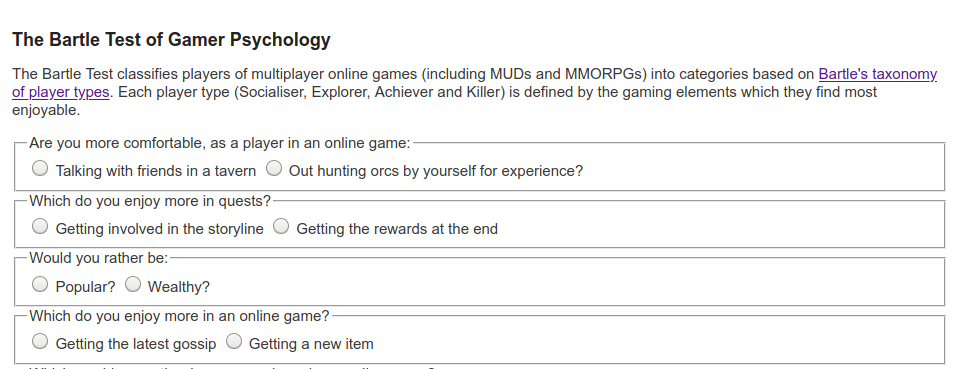

---
# all the regular stuff you have here
zotero:
  scannable-cite: false # only relevant when your compiling to scannable-cite .odt
  client: zotero # defaults to zotero
  author-in-text: false # when true, enabled fake author-name-only cites by replacing it with the text of the last names of the authors
  csl-style: harvard # pre-fill the style
layout: post
categories: misc
title: 3M Framework for Game Making
---

## Abstract

MORE ON CHALLENGE OF TEACHING CODING
"The challenge to create tools and pedagogies to allow younger learners to start to engage with coding as a creative design practice is one which ... "

In this chapter I outline a case study and model for game making designed with to align with project-based and inclusive pedagogies. I identify and describe design tensions emerging from the exploratory stages of my PhD study on families making games together.

I share a learning design incorporate that seeks to help resolve and explore these tensions in detail. While I share initial findings in response, the research is still in progress. As such, this early reporting of results seeks to put into focus, and explore in details tensions in the particular context of family making and in primary school classroom, use of game making as a creative medium and the affordances and limits of game making particular tools.

Summary of key points I want to make;
- navigation
- motivation
- design patterns and authenticity.

<!-- ## Notes
Indicative chapter structure (about 5000 words, less if you have tables/figures - see the T1 template)

1 -Abstract/Keywords
2 Introduction - An example problem in this domain: Global perspectives on the skill set needed
3 Local research vignette or literature synthesis
4-6 Key findings from research and examples of applying these in schools
7 Evidence for assessing mastery of achievement
8 Facilitating diagram and links/2 sentence descriptions of three supporting resources (embodying the research findings).
9-10 References (we will be using Springer’s SocPsych Style – Page 16. It is based on APA7.)

notes 31 12 21

context - include pbl
Have makecode as main focus of study / tools section - integrate with methodology part
Mot sure on order or tensions and tools
Findings main parts
- game design patterns to help navigation - missions_
- maps -
- drama process as a reflective frame
 -->

### A & T Context Background (Change from just UK but still include UK)

Research on the educational value of computer games can be divided into studies on playing games and those on making games. In the UK the influential report "Next Gen: Transforming the UK into the world’s leading talent hub for the video games and visual effects industries" was focused was on providing the UK games and animation industry with the talent needed to succeed @livingstone_next_2011. The three top recommendations school level were to include computer science in core curriculum, introduce a new computing GCSE, bursaries for computing teachers and extensive and well supported use of games and visual animation in the school curriculum as a way to attract more young people to the subject.

On a global scale there have been many developments in software and programs researching game making.

- Constructionist researchers and programs.
- Value of Scratch for game making and associated research.
-  middle ground of commercial games which have a creative element to it.

While there has been a large body of research on the value and practice of game making for educational purposes, it is a dynamic landscape which has many areas which still deserve additional research. New software tools to make games emerge regularly which offer new pedagogical possibilities. Game playing practices also continue to evolve. For example, casual games played by both adults and children continue to become increasingly available via smart phones and home consoles. The cultural impact of nostalgic retro games which are played by young people and families is also significant. The aesthetics of cuteness and nostalgia around retro games creates a potential for connection between younger and older players and a possible entry point for more casual game players in to game making cultures. The reduced complexity of retro themed games also reduces technical barriers for enthusiasts to create games either for the Indy Game market or for free distribution via games enthusiast websites like itch.io [@garda_nostalgia_2013].  

### Motivations of Game Making as Education

This section is a brief summary of some of the key areas of potential for learners an area explored in depth in a review by Kafia and Burke [-@kafai_constructionist_2015].

<!-- Design patterns are an important factor in learning to code in a professional community  [-@denner_using_2014] the use of Design Patterns outside of professional communities has a great deal of promise to increase accessibility for learners into coding due to its more concrete and relatable approach. -->

 <!-- Werner, L., Denner, J., Campe, S., 2014. Children Programming Games: A Strategy for Measuring Computational Learning. ACM Transactions on Computing Education 14, 1–22. https://doi.org/10.1145/2677091 -->
 <!-- * Games are perfect projects. Thus game making suits project-based learning. -->

MOVE THIS TO INTRO IF ABOVE CHANGES?
INSERT MORE REFERENCES?

The most prominent learning objective of making games in educational setting is to develop _coding and computing skills_. There are extensive studies on _game making to learn other subjects_ common subjects include maths, biology and chemistry but diverse examples exist. The potential benefits of collaborative game making align closely with a concept called _21st Century Skills_ which include social skills, self reflection, cultural awareness and a range of technical abilities that allow participation in information society. An area that merits particular attention is that that of Games to explore systems and systems thinking. Games are in essence rule-based systems. _Games for change_ is a concept that invites game makers to make games to explore social and environmental issues. Such issues often involve a systems based understanding of then world, and as games are themselves interactive systems themselves, they are a powerful vehicle for exploring a complex problems involving race, sex, social issues.

### Literature on Creative Computing in UK Context

The benefits of game making aligns with those of wider creative computing projects. There has been extensive publication on computing education and techniques aimed to support teachers often new to the subject. These include a new website with materials, including quick guides and writing around a set of 12 computing principles.

A lot of this literature is aimed at helping teachers in a classroom context and with a focus of explaining and exploring computing context.

MORE ON THIS - OTHER TIPS FROM NCCE AND LINKS TO RESOURCES.
BUT NOT TOO MUCH

While projects are mentioned as a principle that allows learners to deepen their understanding on computing concepts by putting them into practice. There is less on specifics of how teachers can support project work or indeed how to best develop resources to support project work in schools.

<!-- Some of the research looks at abstract and concrete approaches, advising teachers to use both and to monitor their instruction using concepts of semantic profiles   -->

### Game Making, Project Based Learning and Inclusion

IS THIS NEEDED - WORK ON OTHER STUFF FIRST - FOCUS ON MOTIVATION INSTEAD AND EXPLORE PBL AND INCLUSION IN RELATION TO THAT?

Recent studies study the use of games and playful techniques to overcome exclusion from the culture of computing [@kafai_diversifying_2017; @kafai_beyond_2014].
<!-- REVISE TO INCLUDE ROQUE? MORE SPECIFIC?  -->
Contemporary understandings of inclusion go beyond SEN issues to include cultural exclusion. If students feel excluded from the school cultures then making bridges to home cultures is vital. One way to make those connections to home cultures is to allow for more choice of what can be incorporated into computing projects.

The inclusive possibilities of design and project-focused computing  include; more learner choice in projects increases motivation, authentic and shareable project outcomes encourage peer feedback and reflection project iterative support and a mastery approach, supporting challenging goals encouraging self regulation and structured guidance for goal setting.

FIND SUPPORT HERE

<!-- We previous saw that Waite's review for RSA also highlighted the importance of social and cultural approaches to game making including the roles of gender.
ADD LINKS HERE -  OR MOVE TO ANOTHER SECTION -->

<!-- However, the research surrounding differences in participation and attitudes to game playing and video game cultures is complex. We should be cautious when working with video games. It is important to be sensitive to learners attitudes that video games are just "not my thing". -->

Work on NCCE aligning with that of Connectivist Educators and Researchers. Can be supported by use of PBL frameworks. Project based learning and science base inquiry learning is more mature than integration of design thinking and agile design into the classroom.

REVISE THIS - SOCIO CULTURAL IDEAS

Family Game Experience as an inclusive Fund of Knowledge - Knowledge of a games and gaming culture is sometimes drawn upon by teachers as a concrete example of a coding concepts. More research is needed on ways to draw out attitudes and knowledge of game cultures and bring them into the learning environment in an inclusive way.

My own research into strategies to do this is explored in the second half of this chapter.

There are significant challenges to adopting project-based approaches in the UK schooling context that are likely to be share with other traditional schooling context. Specifically, lack of time for sustained an iterative project approaches, and teachers who lack experience with in delivery project-based approaches especially where student choice is involved and the complexities this brings to supporting learners in that context.

I propose, there is potential to draw on family experience in the classroom and that working with families to make games together is a fertile research base to jointly create learning activities with a wider focus.  

## Research Vignette - Evolution of Design

In my own research I have taken a design-based approach. Design based research  It was originally developed as a response to the importance of context in educational research as part of the social turn of social science research [@brown_design_1992] .

DPR is a varied discipline which can take a multitude of forms. The core elements include: research as an intervention, iteration, involvement of participants in the evolution of designs, a flexibility of research outcome based on how events unfold [@easterday_design-based_2014]. One of the key motivations of this approach is to produce educational research that has a high utility for practitioners in that it which develops theory that is rooted in contextual practice.

I have been guided by the approach of design experiments and mutual appropriation as outlined by Cole and colleagues in the 5th Dimension project. The processes both X and Y,  
The advantages of this

To address my research interests of engagement, autonomy in the design of the experiment I started from a very open starting position. The main intervention was to lead a workshop with participants challenged to make a simple computer game. Beyond this little was decided in in advance with the goal being to respond to the context of the learning environment.

My current game making designs have emerged from several iterations of experimentation. The main experimental team consisted of Home Educating families. The designs that emerged where then also trialled in a local primary classroom of Year 6 (10-11 year old). For some iterations of the design I also worked with undergraduate students who acted to support the game-making workshops. Through informal responses, direct feedback, and structured evaluation all participants acted as research partners as I acted on their reactions to design the next iteration of the game making program.

## Tensions around Game Making (Tools) - in general -

ALTER - DRAW ON LITERATURE IF POSSIBLE  AND revise down - OR MOVE LATER
THERE IS A LOT OF THIS ON THE CONSTRUCTIVIST LITERATURE ON TOOLS / SOFTWARE PRINCIPLES. WIDE WALLS ETC
WHAT IS SPECIAL ABOUT GAME MAKING  - PERHAPS MORE RESEARCH ON LIT?
PERHAPS PRECURSOR OF LATER OBSERVATIONS?

Tensions around use of tools in creative computing projects have been explored extensively by academics in the constructionist school of research.
For example low walls, high ceilings.
INCLUDE RELEVANT READING HERE.

In the following paragraphs , emerging significant design elements are expressed as tensions on terms of the tools used that address the specific opportunities and challenges of Game Making tools.

These tensions are explored in relation to existing research and my own experience. I outline quick proposed resolutions that set the parameters of the 3M design are detailed.

Awareness of these tensions may be useful to educators when making decisions about appropriate tools in your game making, especially to avoid overscoping a project by being too ambitious.

In the final section of the chapter contains a more detailed exploration of the learning design that emerged, it explores other areas beyond tool use, learning

**Tensions around Authenticity of Tool**

How authentic and professional a tool do you wish to use?

For example,
Phaser is a framework used by professional web game creators. Using this authentic tool was potentially motivating. The online forums are supportive. However, it may not be realistic for young learners to be part of a community of professional game makers.  

What authenticity means in a context of young people making games is also debatable. Given their motivation, another definition of authenticity is how realistic it is for them to make games for peers and share them.  

**Asset Creation vs Hands-on Coding**

A tension exists between time spent creating graphical and sounds assets verses time working on code related to game play and mechanics. Many tools allow a large amount of choice and a very rich creative landscape. Students can get stuck in asset creation.

FIND A REFERENCE OR MERGE WITH BELOW

**Tensions around Technical Scope of Projects**
<!-- Some hobbyist or professional game making tools like GameMaker Studio, Construct or Unity abstract away the hands-on coding of games with graphical interfaces and include structures to help organise game design as it becomes more complex. The scope of choices may be overwhelming. Also, while code can often be accessed behind these menus, the focus is on getting the game done rather than on learning how to code per se. -->

Thus there is a tension in tool choice balancing the directness of code editing and of the code constructs available with the scope and flexibility of the game that can be created.

<!-- This is a tension that has been recognised by researchers working on a more stripped down version of Scratch. Scratch  -->

**Tensions related to Community and Tool Use**

Research on the value of scratch community to seed ideas, provide inspiration and direct peer support is convincing. The ability for students to choose from different kinds of games that appeal to them, to remix projects and to reuse community assets increases the personal connection students feel to their creations.  

However, much of this research as been from self-directed home learners who are able to dedicate a lot of their free time unlike classroom learners. Time factors may impact your choice of tool and how much you encourage your students to engage with a wider community.

How much choice over you give students about type of game they create and how they design it is also an important learning design factor. You may prioritise engagement over peer learning over specific targets. Alternatively you may wish to maximise the time your students spend on certain learning outcomes, e.g. coding and system design. To do this you it may be effective to then creating your own resources which

If students are working on similar projects. This may also have the effect of increasing possibilities for peer support and to reducing teacher stress in a classroom setting. It is very tricky to support students to introduce unknown or untested features.

## Describing two Game Making Tools

After research two tools emerged as significant based on the opportunities provided. These were MakeCode Arcade a specialised block based programming and Phaser.js an authentic web game making framework used in a browser-based programming environment (code playground)

While, this report of the 3M model focuses on the second of the tools chosen. describing the affordances of two tools is useful to help explore some of the tensions outlined above.

### MakeCode Arcade - specialised block based programming

**MakeCode Arcade** is a block based programming environment similar to Scratch but with some interesting features which are tailored to game making like gravity, lives and a game over block. In addition, the multi-media making abilities are very stripped down, you can download the games to hand held devices or run them easily.  

Another advantage is that the MakeCode system is also used to code the popular Microbit micro controller. So this may be familiar to you as a teacher or to your students.

There some fantastic example games and tutorials at
https://arcade.makecode.com/

FROM THE ABOVE

The MakeCode Arcade interface, like scratch has the ability to edit sprite characters. Unlike Scratch it is very limited in terms of what can be created. The simplicity of a tool like MakeCode Arcade can help address issues around the scope of projects. They intentionally limit the toolset provided to its graphical interface and this simplicity can be an asset to support our students to build familiarity and fluency of use of code constructs. Thus the tension may still exist by be sidelined by the limits of the software.

#### Phaser.js in a Code Playground - an authentic web game making framework

**Phaser** is my own tool of choice when it comes to authentic javascript game-making.  To teach it I ask learners to code games an online coding environment called a code playground. Code playgrounds are a tool used by both expert and novice coders to share examples of code that can be edited and preview online. The killer feature is the ability to make changes and quickly see the new results appear. The concept is also very useful for learners and exists for block coding in tools like Scratch and for text coding in Trinket. Many text based code playgrounds exist and I tried a few and settled on Glitch.com - although the process also works well in Trinket. I love this approach due to the authenticity of the tools. Phaser is used by professional game makers and Glitch is the test bed of choice of many code developers. If learners do take to this way of working they can be creating genuine indy-games, dynamic websites and flexible web applications.

The drawbacks of this approach is the potential complexity of using real web technology. While it is possible to hide the elements of html and css away from the user, many mistakes are possible which break the game completely. Luckily Glitch has the ability rewind and undo your changes via a easy to use timeline of your project.

### Research Findings resulting from implementing the 3M Game Making Model

In the _3M game making model_ - (made up of Missions, Maps and Motivations) -learners start by playing and remixing a broken and incomplete game of a particular genre, for example platform, maze or shoot-em-up. They are given and/or choose certain missions to improve their game or to make it in a certain way. They use maps to help navigate their next choices and what they have learned. Finally, facilitators use particular methods in line with project-based and inclusive approaches to motivate and support learners' engagement and learning. This section describes the model in brief and describes several key findings from its implementation.

<!-- in particular reference to some of the tensions of Game Making outlined above. -->

<!-- You would think from the glowing potential of game making from the reviews of the literature that this would be a normal part of computing education, and well supported in terms of how to teach it.

Of course, real life is more complicated than that. Rather than there being one pedagogy that maximises the potential of using game making in the classroom, it is important to recognise the diversity of objectives of both teachers and learners in the process of making games.

In the last section we look out one learning design and how that aimed to overcome those tensions. But in this section rather than trying to solve problems -- I am highlighting them and you can draw your own conclusions. -->

<!-- My work is inspired in part by the pioneering computing education project called the 5th Dimension project which involved undergraduate students in an after school. It has also been made possible by the similar EdLab programme at Manchester Met University, which also involves students in service learning projects. The mix of student helpers, local young people and in this case their parents gives a rich mix of perspectives which may not be possible for your setting but which has helped evolve a learning design. Weaknesses in the approach were made visible in the responses by young people and adults, and then addressed in the next session or next iteration of the program. -->

<!-- This learning design could can be applied using any of the tools above. -->

<!-- You may have particular curriculum or other learning goals. This iteration of the 3M design focuses on making games to learning the craft of coding, to build meta-cognitive skills (goal setting and reflection) and systems concepts. It could be adapted to highlight other key learning goals. -->

<!-- In my description of the 3M model below, I draw on project based learning and design based terms and principles that are explored in another chapter. Later in the chapter I share ideas on how to adapt this version of the 3M framework to suit your own needs. -->
<!-- CHECK THIS LATER TO MAKE SURE I DO -->

### Missions a way to Help Learner Motivation and Navigation

Many open world games have a concept of a main mission and then optional side missions. The guiding challenge or main mission of this design was to create a playable game around a theme (environmental in my case) for a real or imagined audience. In addition to this main mission, other 3M missions addressed game design patterns, systems thinking, social learning and reflection.

**Main Mission - Fix a Half-Baked game**

CITATION
REALLY REVISE THIS SECTION DOWN
PERHAPS LINK TO LEVELS OF ABSTRACTION?

Main mission, design missions, support in implementation via code

In 3M, learners start by playing a familiar but incomplete template of a 2D game. For my study we used a platform game. The overall mission is to fix the broken game and then to make it your own. Learners then fix, adapted and extend the game template in an increasingly sophisticated way.

Due to the challenging nature of coding a game from first principles, learners start by reading and altering existing code. Such practices which are documented as the Use-Modify-Create model.

The main mission fits the Use-Modify-Create model.

In the **Use** stage learners engage with a starting template of a few games playing them and then opening the code to see if they could guess what any of the code did. This use stage allows learners to gain some familiarity with the coding environment and to recognise some features of the language being used.

Then we quickly asked learners to **Modify** a broken game with very simple changes which they could choose from a set of printed cards. These small changes to variables or swapping out media assets with their own builds confidence, gives a greater sense of ownership over the project and is a fun and challenging experience.

In my **Create** stage learners we asked to choose from a menu of different game design patterns to add to the game. In early stages learners patch or copy code examples into their existing code. As they do this gain familiarity with a wider variety of coding constructs and concepts. Later makers can take up extra challenges which involve them making additions to the code with no direct support from the materials.

<!--
 Expored later - FICTIONAL / DRAMA FRAMEWORKS

 In the 3M model participant code as part of a role play story. They are given a scenario where have to complete a mission. Making a game for a real or imagined audience is a part of that mission. You can choose your own real or imagined situations.
 It could be an external game making competition, or a fiction.

In one version we made games for a group of Aliens coming to earth to help us save the planet, in another it was a dystopian, hunger games like future where we had to make a game to save our lives. The purpose here is to increase engagement, motivation and the sense of designing for another audience. -->

The concept of a working with Half Baked games describes the process of starting with a deliberately incomplete or inappropriate game to provoke students to change it. This draw on research on the value of remixing and altering the code of others. ADD IN CITATIONS FROM KNOGIOS AND UMC

However, a half-baked game approach is different from remixing of complete games. The incompleteness allows learners to start from a shared code base but to develop the game in their own direction, driven by their own choices. This approach helps to reduce some of the leaner and teacher confusion caused if everyone was working on completely different types of games and code structures.

In early stages, learners alter key variables, change level designs and add in new graphical and audio assets. Simple changes that are relatively easy and build familiarity with the code. For example I often start with a handful of printed card missions. Each suggests a small changes to the code that results in big impact on the game being played.

MORE ON THIS - Bullet points?
OR- BRING THIS INTO RESEARCH NARRATIVE OF HOW THIS EVOLVED

However as students still have to add and alter their game, as teachers we must still find a balance between providing too much choice and struggle to support learners as they get stuck with a huge variety of diverse problems and conversely offering not enough choice to be able enthuse learners through their personalisation of the project.

<!-- Should I make this above bit into a story - learners getting stuck - an evolution -->

How then to resolve this tension best? We can look at the concept of open world games for inspiration. Open world games provide the player with a series of choices but also to have some restrictions to the wide extent of the world/choices. The feeling is of freedom, but there is an acceptance of bounds; for example player accept that they don't have choice over their starting point. The following section outlines the use of a restricted menu of design patterns as a way of help deal with this tension in the 3M model.

SHIFT THIS? - RESEARCH ELEMENTS HOW INTEGRATED
After minimal hands on coding time we played a matching game which helped to analyse the template code line by line. One participant wrote "that was a great moment - when after struggling to alter the code, after several sessions, we looked again and we realised how much we had actually picked up that process". Adding onto the template had helped the participant to read and understand code.

<!-- Getting participants up and running from ideas, to a design to then starting to code too a long time when starting from first principles. In order to reduce the test of their patience I adopted the use of a template to help them to get to grips with coding. -->

**Design Patterns as Missions to Support Learner Choice**

<!-- INSERT IMAGE of incomplete platformer with annotations -->

<!-- After making quick alterations to an incomplete platform game.  -->

A standard way to progress from an incomplete game would be to follow a step-by-step tutorial which covered adding new game features in a pre-set order. In the 3M model learners choose the order then implement new features. I asked my family learners what they would like to add to this project.  They came up with a list of features including; moving hazards, jumping on enemies, finding a door or flag to progress to the next level. We can describe these features as game design patterns. Design patterns have an important role in the way that professional coders learn their trade. They are part of the craft approach to coding. The craft in this case involves building a knowledge of patterns that occur in a particular genre.

Game design patterns come in different forms but at the most user-oriented level as illustrated in the examples above they have the advantage of being immediate and concrete to learners. Game design patterns are used as a relatable way for student to choose their paths and to structure  support via coding concepts linked to these patterns.

<!-- DO I NEED TO GO INTO THE FORMAT OF A DESIGN PATTERN HERE? -->

  _Sample Game Design Pattern_
  PERHAPS A MORE CODE ORIENTED DESIGN PATTERN EXAMPLES

<!-- When learners choose the pattern they want to work on they can take a physical card on-line help to support them implement the code needed to add the pattern to the game. I originally started off with printed supporting documents but then help learners to transition to online resources. The digital format is particularly useful if learners are copying and pasting code. Having supporting resources can help resolve tensions around groups getting stuck and needing facilitator. But creates another tension around how much guidance to give learners in the code examples provided. How much support you give to this process is up to you. I work with relatively young coders, thus  I chose to provide almost complete code help. This design helps build familiarity with code and the code environment. -->

Having supporting resources can help resolve tensions around groups getting stuck and needing facilitator. How much support you give to this process is up to you. I work with relatively young coders, thus I normally provide significant coding scaffolding. Once learners have built familiarity with code structures, processes and the coding environment then I provide less complete code examples. In my research I found that providing limited options but allowing student to choose their own pathway had a immediate positive effect on the motivation and general energy level of learners. I would describe the class environment as a kind of creative, productive chaos. As mentioned the break down involves creating help resources to support a menu of game design patterns. If teachers want to take on doing this work themselves then the amount work is significant but manageable especially if collaboration with other educators is involved. I found the process of creating the resources invaluable in helping students solve their coding problems.

<!--

_Diagram of Possible Missions on a Web Page Menu_

CHANGE THIS TO MORE TEXT ORIENTED BREAK DOWN. -->

In my research providing these limited options but allowing student to choose their own pathway had a immediate positive effect on the motivation and general energy level of the coding classroom. I would describe result of this approach is a kind of creative, productive chaos.

As mentioned the break down involves creating help resources to support a menu of game design patterns. This work is significant but manageable especially if community collaboration between teachers and other educators is involved. I invite other educators to adopt this approach and share resources for Pygame, p5.play and other suitable platforms. The resources I have created for MakeCode and Phaser are free and open source and available online and available at the following URLs.
Phaser & Glitch- https://glitch-game-makers-manual.glitch.me/  
MakeCode - https://mickfuzz.github.io/makecode-platformer-101/

**Game Maker Types and Social Missions**

As digital and online games became more complicated Richard Bartle proposed that players to get different things out of them. He created a test to finds out what kind of game player you are. https://matthewbarr.co.uk/bartle/. One of my favourite warm up activities is to get game making participants to take the Bartle test as a group. I converted the quiz in to an interactive physical game. Personal and ethical choices are explored in real time and it's a lot of fun.

The Bartle model holds that there are four different kinds of player styles: Griefers (Killers), Achievers, Explorers, and Socialisers. Achievers get satisfaction by progressing by playing by the rules of the game's missions. Explorers discover the systems governing the operation of the game world. Socializers form relationships with other players by telling stories within the game world. Griefers interfere with the functioning of the game world or the play experience of other players. Open world games that allow you to choose how you play the game. If you want to stick to the main missions you can follow guidance to do that but if you just want to explore or be social or mess around you have the chance to do that too.

 
 
 _Bartle Game Player Type Test_

I propose that as well as different Game Player types there are also different styles of Game Maker.  Planners like to study to get a full knowledge of the tools and what is possible before they build up their game step-by-step. Social makers form relationships with other game makers and players by finding out more about their work and telling stories in their game. Magpie makers like trying out lots of different things and happy to borrow code, images and sound from anywhere for quick results. Glitchers mess around with the code trying to see if they can break it interesting ways and cause a bit of havoc.

<!-- I don't propose that people fall neatly into any one category. Instead these categories are mostly aimed at educators to help them plan their game making sessions. After some of my own sessions I wondered if some of the frustration and confusion surrounding learners on-going participation was due to the diversity of the different approaches. -->

I noticed that sometimes parents would get frustrated at their kids messing around and creating tricky or impossible games. I could hear them struggling to bring their kids back into line with what they thought was the right way to go about making games. At the same time when I reviewed the tapes of what they were doing these young people were often exploring the code, making many changes, and inviting others to play their game for feedback very activity - which are excellent coding practices.

To address this issue I created some extra missions to suit these Glitcher game makers who enjoyed playing against the game. While I guessed planners wouldn't need them, for magpie makers, and social makers I created other extra missions that might encourage or legitimise their favoured activity. Thus some of the missions were social in nature (Find out who plays the most computer games per week in your group), others were more anti-social in nature (add an usual sound to someone else’s project) and some exploratory missions that encourage feature sharing. These extra missions are available here - https://mickfuzz.github.io/makecode-platformer-101/missions.
Also while many learners appreciated the quick progress and immediate feedback of patching code to add game design features, other learners wanted to know the full detail of the underlying template code. These planners appreciated having step by step tutorials that explained the code piece by piece. One of the things all game maker types can benefit from are resources to help support learner navigation, this brings us to the next M - **Maps**.

<!--
These extra missions are available here - https://mickfuzz.github.io/makecode-platformer-101/missions -->

 <!-- The process of having this feedback from users was good to get over my initial bias towards chaotic learning -->

### Maps

I kept a journal and recorded sessions to identify learning tensions that blocked progress.  Some of these tensions can be summarised as learner confusion about what they should do next or at the other extreme being overwhelmed at choices available, getting stuck or being unsure of what coding progress was being made. To try to resolve some of these tension I drew on the use of another technique from open world adventure games that of Maps.

In more traditional project based learning the kinks of support would involve learning journals, structured student reports or templated check in points. I wanted to avoid this kind of more formal approach for a couple of reasons. Firstly, it felt like a huge shift moving from the mechanics of coding to then writing up the report and one that was hard to fit into the end of busy sessions. Secondly, my study involved a lot of students from whom writing was not a strong point so I wanted to explore other methods.

#### Physical Maps of Missions

The first step was to try to address issues of being unsure what to do next or jumping around from one thing to another without completing them. I printed out a large scale map of the different kinds of game pattern missions represented as different islands. When learners selected their next mission, they moved their counter onto that spot. Thus learners had to be intentional about their next steps. They also kept a track of the missions that they had completed by tracing a trail as they progressed. Having a physical map in my family setting this process was particularly useful to help the parents encourage goal setting and progressing from one task to another rather than getting stuck in a loop of asset design.

<!--  -->

<!-- 

_Missions as Islands_ -->

In addition this chaotic, colourful and visual representation served to encourage peer knowledge of what other people were up to, build a sense of community and to encourage reflection as each design pattern was completed.  

<!-- Working with learner stress and confusion was something that I struggled with for some time. One source of frustration started from giving learners clear pathway. The freedom to choose what game to create was liberating but then conversations about what was possible with the time and technical ability we had were hard and we did lose some families in this process. Starting with a template and creating resources to help common patterns helped resolve this tension. However having this menu of choices also created another issue. Having them all mapped out meant. -->
<!-- Is this better in Missions?   -->

Maps can also be used retrospectively to help learners to reflect on their progress. I asked student to create a physical character that could move around the large scale print out of the islands. When they chose a new pattern to work on they moved their counter and drew a trail of where they had been. When moving the counter on the map they can be prompted to look at the coding concepts or other learning dimensions that they have been working with when implementing their game patterns.

#### Learning Dimensions Map

The has been a growing tendency in socio-cultural research to look at the learning that is happening in any given activity from an observational perspective. That is to say that rather than deciding what you want to teach and planning around that, you choose an existing authentic activity and map the learning that actually happens in reality.

This is the approach adopted in an interesting research program which looked at hands on tinkering with Science exhibits in a museum setting. In an article called -- It looks like fun but what are they learning --Bevan and Petrich worked with educators to examine video footage of families interacting with exhibits. The resulting map of learning dimensions is notable as not only are the underlying science concepts explored but, more general skills and attributes and helping behaviour common to an exploratory process is also present.

While this is an informal way of using maps the are other approaches that are more formal including one called a concept map which is a visual representation of target specialised knowledge. There is a section on concept maps as part of the teach computing website here. https://blog.teachcomputing.org/how-we-teach-computing/

I created an online map of the different learning dimensions that learners were most likely to pick up through game making.

#### Navigating Learning Dimensions

<!-- DROP THIS SECTION AS NOT AS RELEVANT - AND EMERGING - AND COVERED BY NCCE
OR INCORPORATE INTO ABOVE - MENTION NCCE WORK - SAY THIS IS DIFFERENT AS IT'S LEARNER CONTROLLED MOVEMENT
RATHER THAN CONTROLLED BY THE TEACHER  -->

This process also helped me to understand the kind of learning experience I was hoping the game makers would be having.

_Navigate Dimensions_

The journey that the learners started to have is reminiscent of the semantic waves with ocillations between more concrete and more abstract learning dimensions.

###  Motivational Methods

The third M in this 3M framework stand for motivational methods, these are broadly speaking educational, design and drama methods to support to help engage and sustain learners in a project-based approach to game making.

The _3M game making model_ - (made up of Missions, Maps and Methods) - is the result of several years of exploratory, collaborative game making with home educating families and a local Primary School. Learners start by playing and remixing a broken and incomplete game of a particular genre, for example platform, maze or shoot-em-up. They are given and/or choose certain missions to improve their game or to make it in a certain way. They use maps to help navigate their next choices and what they have learned. Finally, facilitators use particular methods in line with project-based and inclusive approaches to motivate and support learners engagement and learning.

This section describes the model in brief and describes several key findings from its implementation in particular reference to some of the tensions of Game Making outlined above. The next section outlines two methods of that align particularly well with game making.

<!-- These may help with participation and to maximise some of the potential benefits of game making explored in the first part of this chapter. -->

<!-- Methods Using Missions

- Player and Maker types & Specialised missions
- Limits to the Mission based approach - meeting your self in the middle

Methods Using the Learning Map / Design Process

  - Circle / Physical Reflection Games:
  -  Guidance on Running Creative Design Sessions: imagined audience,

Other Methods
    Using Hardware and Playtesting to focus on Imagined Audience
    Predicting Code Outcomes via Games
    Coding Concepts via step by step tutorials - moved (MEETING IN THE MIDDLE )
    Supporting Debugging -->

<!-- **Playful Starter Games and physical activities** - You may love or hate the kind of warm-up games that are common in drama circles. Either way they are good ways to help focus learner's attention and get them ready for new experiences. Making games lends itself well to creating a fun and welcoming classroom environment with links to the learning happening later in the session. In a family learning setting I was able to make the most of this by playing physical warm up games, playing video games on arrival leading to then analysing what made them challenging.

Most computing teachers will be familiar with some of the positive impacts of Unplugged activities. -->

**Physical Computing and Game Making**

There has been a progression in hardware which has made physical computing more accessible @blikstein_gears_2013. The use of physical computing to create concrete and tangible activities has been show to increase engagement of diverse groups of learners @roque_family_2016; @rusk_new_2008.

Making the digital physical aligns with the inclusive practice of representing knowledge in multiple forms. The embodied concepts that learners engage with supplement code and other knowledge representations. Game making projects can provide opportunities for physical making.

The process of level design suits the use of creative materials to scaffold and transfer planning from on screen to a more easily collaborative, physical format. In outreach work I have used textile sheets with cut out shapes in a multitude of colours to represent platforms, hazards and characters. Learners map out in small teams and share back to a larger group.

I made some very simple arcade cabinets out of wood which housed second hand laptops. Connecting arcade buttons to the computer via a Makey Makey, arduino (leonardo) or custom break out USB joystick adaptor is a relatively simple electronics project which can be completed quickly. So optionally the outsides of cabinets also could be made from cardboard materials and decorated to suit the theme of the game being played.

Creating a customised physical object that allows the playing of   their own arcade cabinets was a very engaging activity and a fantastic target to work towards as they made their games.

While it can be time consuming I highly recommend, this method of involving some kind of physical making or tangible product if at all possible. The results in terms of learner engagement can be transformational.

**Drama / Fictional Frameworks**

One methods I use to increase learner and parent engagement is the concept of using a fictional scenario or simulation to increase the perceived authenticity of a project. A fictional community which while less authentic than a professional community, can still provide some of the benefits.

I have worked with practitioners of Drama Education department at Manchester Met to work on a several process dramas with families, students and staff. But you don't have to be a trained drama practitioner draw on key techniques to increase learner engagement. I asked trainee teachers to devise a scenario to support a series of sessions. In brief, we used a fiction of making games for a alien race coming to destroy the earth. This helped us;

- explore issues of gaming cultures, and hostility to them from a naive alien view point
- asking learners to step into a role. "As game designers, we will do Y"
- create a sense of 'jeopardy' increasing their commitment to the process
- encourage reflection in learners - as they shared their games with the alien audience, they talked through their design decisions and challenges.

<!-- ## Challenges - and how they may link to a classroom setting

MOVE SOME TO THE TENSIONS MIDDLE SECTION - AS THEN IT IS RESOLVED
MOVE OTHERS TO THE CONCLUSION

<!-- As such this section uses data drawn from the wider research -- I also cross reference this with my own observations from my game making studies. -->
<!--
We also look at the resulting understanding of the emerging tensions. This is a good place to start as you may find similar tensions in your teaching environments (be they formal classroom settings or more informal club or out of school projects). -->
<!--
#### Prioritising Learning Dimensions

The potential dimensions of learning in Kafai and Burke's review of research is very diverse including; 21st Century Skills, developing coding and information technology skills and teaching other subjects through cross curriculum projects. This potential put a responsibility on teachers to prioritise and promote certain learning outcomes over others.

Teaching in more formal environments
For my study, I ended up de-prioritising more general communications skills (21st C skills) and highlighting coding concepts and systems concepts. --> -->

<!-- If you are promoting teamwork, then coding concepts may have to be de-prioritised -- if you choose to deepen subject knowledge of maths by making a fractions game then something else may need to go.

This is borne out by Kafai and Peppler - can't find this - who say ""the diversity of learning and that there is more than one learning outcome is something teachers need to be aware of. -->

<!-- ### Time considerations and classroom culture

Project-based approaches are often explored in after-school clubs or other informal settings, as the time needed to run authentic projects is often scarce due to competing curriculum demands. However they are successfully integrated into core school activities by many educators. Some of the ways to overcome this are explore in previous chapter.
CROSS REFERENCE OTHER CHAPTERS

### Starting a community from scratch

Finally, one of the most challenging but rewarding aspects of making games together was the building of a community of learners. As explored previously the benefits of sharing code, playtesting games and the value of the encouragement of peer learners are significant.

In all the programs I ran only one parent and one student had experience of coding. This process of starting up such a community from scratch is challenging. In the previous sections I have shared my tips to help build a small game making community. These include encouraging peer sharing with diversity of learner paths, narratives and activities to encourage group reflection, starting activities which build a team spirit.

At times I felt these community building activities took away from coding and problem solving. A frustration, it felt as if we were just getting going and time was up. However I leave this to you as educators to resolve. And don't forget one last ingredients raw enthusiasm. -->

## Summary / Synthesis of Findings, Limitations Areas for Further Study

In this section I extract findings from the sections above and finding similarities for analysis.

There is a diversity of behaviours and roles - see research by Barron and Roque - which parents take on to support the participation and learning of their child in creating collaborative digital projects.  
Parents were able to use various forms of the framework above to do undertake these roles and strategies to greater or lesser efficacy in a game making context.

For example the use of the names of the design patterns were used by some parents to bring the focus to their child. Parents were able to identify and remind children of their commitment to finish one pattern before progressing to the next. This kind of negotiation by parents was common in my recordings.

**3M to build coding identities:** There is evidence that the process of building identities as game makers and coders was impacted by certain elements of the design ...

(By what?
Iterative play testing?
Familiarity of the Game Design patterns - Key / door person ...s
)

There is some evidence of a separation of identities and roles into children enjoying and adopting the role of leading the level-design and graphical asset creation which would have a high impact during play testing to peers. Meanwhile parents would take on more structural work in applying new patterns via adding new sections of code. One this more methodical work had been done, young people would take back the reins. This is potentially a kind of scaffolding for young people to overcome limits in attention and confidence. In further research I would like to examine more closely transitions in these patterns to see what progression happens in young people and how parents and the learning design can support progression in increased learner autonomy in implementing new patterns.

**More on Maps:** While the process of mapping progression on a physical map was one technique that was attempted in two iterations of the design, take up by participants was patchy which is likely to do with my patchy promotion of that.

In many parts of the 3M design I take inspiration from the design of open world games to scaffold learner / user experiences. How can the process of using a map to orientate learner experience be improved? How could tension of making versus reflection on learning and self-documentation be eased? Making meta-cognition a fun part of the experience is sometimes explored via gamification techniques and has been used in this context in Game Star Mechanic. With this more open approach what is most suitable? A physical game making passport which can be kept close at hand and stamped with stamps representing progress? Could an online map, pictorial journal or reward system be integrated into the game making tool as it is in the dashboards of open world games? How can facilitators be guided to use these moments to encourage reflections and reconnection between concrete practices and underlying abstract concepts? These are all questions I would like to focus in on in further iterations or related research.  

**Meeting in the Middle:** Through reflecting on my journal entries, I came to realise that one of my motivations was to provide an alternative for learners who prefer a ground up, piece meal approach to learning coding. This resonated with my own experience of learning and is often against the tradition of learning computer science [@papert_epistemological_1990]. However, push back from parents showed that many are comfortable with more structured approaches, building up from a moe solid foundations. While I was able to structure learning resources to support both approaches which learners could complete outside of sessions, I would be interested to adapt sessions to more explicitly allow of a choice of path within workshops. What impact would this increase diversity of learner experience provoke?

## Recommendations

While the findings above are more easily relevant to after-school settings and other extra-curricular activities.

Learning happening outside of the classroom offers the possility for teachers to leverage ideas, practices and projects outcomes for use inside the classroom.

Teachers should highlight ways for family members and linked youth services to get involved with programes like Coder Dojo and code club. Where possible links between these opportunities and the classroom should be increased.

Teacher can create Peer programs to replicate the support provided by parents or volunteers using learners or other scaffolding.

## Conclusion

<!-- Move some of the above section here
Upbeat elements -
Also words of caution
Acceptance of tensions - hopeful but realistic -->

In this chapter we have looked at game making as one example of the kind of design and project focused approach explored in other chapters. It is important to acknowledges the complexity and diversity of classroom situations and the challenges of project-based game making within the constraints of the curriculum. We have uncovered particular tensions involved in undertaking project-based, educational game making with young people. I hope that the detailed case study of the use of the 3M model to try to resolve some of these tensions may be helpful to adapt game making to your classroom.
