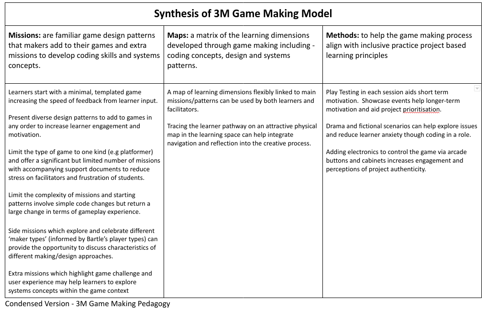
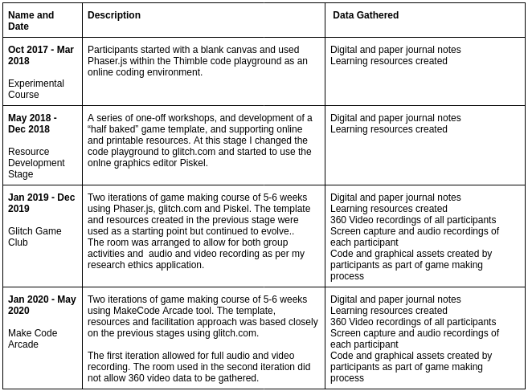

---
zotero:
  scannable-cite: false # only relevant when your compiling to scannable-cite .odt
  client: zotero # defaults to zotero
  author-in-text: false # when true, enabled fake author-name-only cites by replacing it with the text of the last names of the authors
  csl-style: harvard-manchester-metropolitan-university # pre-fill the style
layout: post
categories: other
title: Annual Review - Year 3 (part-time PhD) - Mick Chesterman
---

The primary aims of this review document is give to a short update on activities surrounding my PhD and on the progress of my thesis.

## Part One -  Review of Context of Research

While there has been a large body of research on the value and practice of game making for educational purposes, it is a dynamic landscape which has many areas which merit additional research [-@kafai_constructionist_2015]. New software tools which make games offering new pedagogical possibilities emerge regularly. Game playing practices and the opportunities provided by participation in wider communities also continue to evolve. For example, casual and retro games played by both adults and children are increasingly available via smart phones and home consoles. The nostalgia around such games and the associated aesthetics of cuteness creates a potential for connection between younger and older players [@boyle_retro-futurism_2017]. My study, in part, asks how the motivational and navigational affordances of enthusiast game making communities can be brought into more structured educational environments.  

## Summary of Wider Activity since RD2

My RD2 was in December 2019. Due to COVID studies stopped in Summer 2020 and restarted in June 2022. This section is a brief summary of some of the activities that I have managed to undertake in this time frame.

### Early Dissemination of Results via Presentations

- **Online Mozilla Conference 2021:** I presented an overview of the key features of the game making learning model that has emerged from my PhD research during an online conference organised by Mozilla (pioneers of in informal digital learning and associated tools [@sefton-green_mapping_2013]).
-  **Online Presentation at Manchester Games Network:** a 90 minute presentation and interactive session.
- **Informal Participation on Playful Learning conference 2022:** The use of games consoles loaded with games created by participants is an engaging way to talk about my research.

This early dissemination of results prompted a deeper analysis of my existing data in terms of the overarching themes. A pedagogical model which I called the 3M Game Making Model emerged from this process. As this has become a key output of my research I will outline the model briefly before continuing this report.

BOX BEGINS

### Summary of 3M Game Making Model

The key features of the 3M Game Making Model are outlined below.

{ width=80% }

{ width=80% }

BOX ENDS

### Book Chapters

I have completed three book chapters this year of which pre-publisher versions are available online[^1]. Two chapters were for an audience of teachers as part of a proposed collection _Inclusive practice and theory in computing education, Alternative perspectives on curriculum and classrooms_. One chapter analysed abstract and concrete approaches to computing education. The other covered design and project approaches in this subject. I will be able to include material from this writing into my introductory thesis chapters.

I completed a draft chapter for an internation collection on teaching coding. In this chapter named _Game Making and Coding Fluency in a Primary Computing Context_, I outlined the 3M game making model and described the accompanying resources for learners that I have created during the course of my research. I also described the implementation of game design patterns as missions by learners as a core unit of activity of the model. This chapter is the most up-to-date and extensive overview of my research design and findings to date and is available online linked as an appendix.

### Creation of Resources for Learners & Educators

At RD2 stage I explained that a new software tool had been launched called MakeCode Arcade (MCA) with allowed the use of common game design framework patterns within a block-coding tool. I adapted the resources created for the Glitch environment to be suitable for use with MCA.

**Phaser and Glitch.com:** The following resources exist for text-based coding using the Phaser javascript framework.

-  A splash page for Phaser / Glitch.com resources. This contains links to print outs, tutorials and activities [^2].  
-  An interactive starting template and grid of game design patterns that learners can add to the incomplete template[^3].

**3M & MakeCode Arcade:**  The application of the 3M model applied using the MakeCode Arcade software is available online as part of a collaborative online documentation repository. The resource includes a template of a broken game to fix, printable cards offering quick changes to core design patterns, printable documents which describe game design patterns and steps of how to implement them, a map of learning dimensions that learners are likely to encounter when making games, and an adaptable five-week course of activities[^4].

##  Part Two - Progress towards Thesis Completion

### Evolution of Research Methodology

The foundation of this research is a design-based research approach which is underlined by Activity Theory (AT) as a conceptual framework. At RD2 stage analysis of results slated to use Engeström's -@engestrom_activity_2006 detailed framework of third generation Activity Theory (3GAT). However my attempts to write up emerging results within this extensive  framework were cumbersome. This may be due to the prescriptive nature of 3GAT as a formative, developmental framework rather than simply an analytical tool [@bakhurst_reflections_2009; @spinuzzi_trying_2020]. Instead, I have been returned to design-based research as a core methodology with Cultural Historical Activity Theory (CHAT) retained as an underlying conceptual framework. To reflect this, I am using Rogoff's [-@rogoff_observing_1995-1] three planes / foci of personal, social and community as an analytical tool. The model is promising as it problematises the dichotomy of learner led, teacher led approaches [@mascolo_beyond_2009] in a way which suits the space between formal and informal learning that this community based model of game making occupies.

<!-- Possible reasons for this seeming mismatch include the disconnection of my learning environment from the workplace siting often assumed in that model when paired with the suggested methodology of formative interventions. The process of trying to map the different levels of activity happening in the formation and evolution of a community and the temptation to write something about each of the axes was overwhelming. -->

### Data Gathering - Additional Material and Summary

In early 2020 I ran two additional courses on game making using the MakeCode Arcade tool and my own resources. A summary of data gathering stages is included as a table below.

{ width=96% }

### Data Analysis

CHAT relies on analysis of systemic tensions in activity and culture [@barab_using_2002]. Initial results relied on data analysis of my journal entries, informal interactions and formal interviews with participants, selection of key vignettes from video recordings and identification of the key features of the supporting resources and learning strategies that I created in response to emerging tensions. While the process of analysing tensions is still underway, I have included a link to emerging observations and responses in the appendix [^5].

#### Coding of Video Data in Nvivo

When coding I started with some preset codes from the literature for examples Barron and colleagues' on parent roles when helping digital projects [-@barron_parents_2009]. As coding progressed, I have modified and extended these roles into codes to better match my recorded data. I have also drawn on design stages, modes of interaction do guide coding. The coding structure is still being revised as I continue to analyse data. I am exploring alternatives to coding video data in the Nvivo software package due to its limitations in playing and reviewing video data.

#### Challenges and Opportunities of Detailed Data Analysis

The quality of the video data collected was high and, put simply, there is a lot of it. This study presents significant challenges in regards to analysis of data, some foreseen and some unexpected. The challenges include;

- The length of time required to analyse data collected from multiple sessions on each participants computers is even longer than anticipated.
- Curating and processing 360 data from significantly after the date presents issues of incomplete file transfers / other data integrity challenges.
- The breadth of possible avenues of study provided by the data make deeper coding and analysis impossible before an additional focusing of aims

However, the depth of data gathered provides opportunities. The data from 360 camera allows clarification and gesture analysis to be added to a transcription and description of what was happening on the laptop screens of the pair of participants in questions. It is possible to process video data in a way which allows a near complete picture of the individual, small group and community actions and interactions in a potential novel way. I will aim to demonstrate this technique and the potential richness of this technique of data processing and reviewing in my presentation for the annual review.

#### Other Thoughts on Data Analysis

The process of a more systematic triangulation of that data with video data analysis is underway. The material gathered proved to be very rich in terms of both social interactions between team making participants and community interactions happening on a wider scale. I am looking at restricting detailed analysis of data to that gathered in 2019 as these sessions of data gathering are very rich in terms of social and community design activity. These interpersonal and cultural aspects stand out to me as potentially the most fruitful due to lack of similar, social approaches in the context of game making for this age range. It was this observation that has prompted the examination of Rogoff's [-@rogoff_observing_1995-1] three foci model described above.

## Next Goals

I include a brief description of my next stages in this thesis.

 - **Write up one chapter of results:** I am focusing on the use of Design Patterns by learners as a primary unit of activity as the basis for a chapter of results. I am writing a draft of this chapter currently.
 - **Ongoing coding and analysis of video data:** I will continue to analyse video data in depth and search for key moments of interaction.
 - **Exploration of emerging concepts in existing research:** As concepts and practices emerge as being particularly significant, I will focus on those elements in existing research and practice and compare and contrast my findings.
- **Explore how to present 3M framework within results chapters:** While the 3M framework is suitable for dissemination in practice, there is still work to be done to frame it in relation to existing knowledge in the field.
- **Revision of Research questions: **As I began coding, the need to focus research questions became apparent. My current RQs are below.

## Appendices

1. Current Research Questions
2. Summary of Data Gathering as Table
3. Annual Review Presentation
4. Tensions emerging and evolving from 3M model
5. Key Features of 3M Game Making Model
6. Book Chapter - Game Making and Coding Fluency in a Primary Computing Context

### Current Research Questions
 - RQ1 - What game making pedagogies exist?
 - RQ2 - How can educators support the development of a community of game makers?
 - RQ3 - How do game patterns support the development of coding practices with novices?
 - RQ4 - What effect does a pedagogical model focused on the development of a community of game makers have on parent and child learner experiences of digital game making?

### Summary of Data Gathering as Table

Online at  http://tiny.cc/data-stages

### Annual Review Presentation

Online at http://tiny.cc/annual2022-pres

### Tensions emerging and evolving from 3M model
Online at  http://tiny.cc/3m-tensions

### Key Features of 3M Game Making Model

Online at http://tiny.cc/3m-12s

| **Missions**         | **Maps**             | **Methods**          |
|----------------|-----------|------------|
| Simple code changes yield quick feedback  | A map of learning dimensions flexibly linked to main missions/patterns can be used by both learners and facilitators       | Play Testing in each session aids short term motivation.  Showcase events help longer-term motivation and aid project prioritisation   |
| Free choice of Patterns increases learner engagement and ownership   | Tracing the learner pathway on an attractive physical map in the learning space can help integrate navigation and reflection into the creative process | Drama and fictional scenarios can help explore issues and reduce learner anxiety though coding in a role          |
| Restrict Game Type and number of Patterns to reduce Facilitator stress       |                      | Adding electronics to control the game via arcade buttons and cabinets increases engagement and perceptions of project authenticity |
| Limit  complexity of patterns. Some are simple but cause a large change in the game       |    |        |
| Side missions which explore and celebrate different ‘maker types’ (from  Bartle’s player types)          |        |     |

Table  Key Features of 3M Game Making Model

### Book Chapter - Game Making and Coding Fluency in a Primary Computing Context

Available online at
https://mickfuzz.github.io/phd4/bookchapter/2022/08/08/Game_Making_and_Coding_Fluency_in_Primary_Computing_Context.html

## References

[^1]: https://mickfuzz.github.io/phd4/book_chapters.html
[^2]: https://glitch-game-makers-manual.glitch.me/
[^3]: https://ggc-examples.glitch.me/
[^4]: https://mickfuzz.github.io/makecode-platformer-101/
[^5]: http://tiny.cc/3m-tensions
