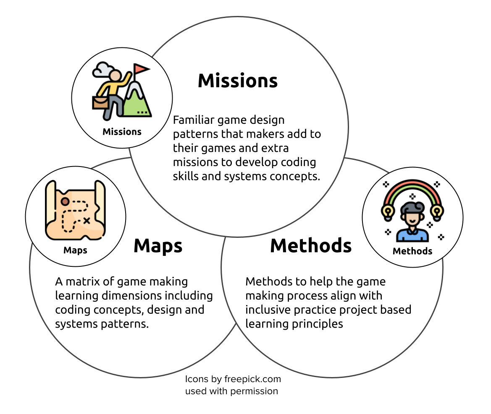

---
zotero:
  scannable-cite: false # only relevant when your compiling to scannable-cite .odt
  client: zotero # defaults to zotero
  author-in-text: false # when true, enabled fake author-name-only cites by replacing it with the text of the last names of the authors
  csl-style: harvard-manchester-metropolitan-university # pre-fill the style
layout: post
categories: other
title: Second Formal Review - Year 4 End (part-time PhD) - Mick Chesterman
---

## Introduction

The review report will give an update on the progress of my thesis and relevant outputs. In creating this report I have been inspired by the patchwork approach of reflective writing in terms of form [@scoggins_patchwork_1999]. My goal here is to try to best utilise the potential guidance and support of the reviewers of the report in a way which does not divert my time resources away

By far the largest patch is a published book chapter [^1] which is included at the start of this work to situate the process and potential relevance of the study.

It also contains the following material:

- updates on context and dissemination of results
- updates on methodology and practical approaches to data
- summaries and links to existing draft chapters of the thesis
- writing on the potential future directions and existing limitations of this study

## Summary of associated activity since the last review

### Dissemination of results via presentations and showcase work

-  **Presentation at Manchester Games Network Conference 2023:** a presentation focusing in the use of game design patterns (explored later in this report).
-  **Presentation at Manchester Met PGR Conference 2023:** a presentation giving an overview of the study and context.  
-  **Partnership showcase with Manchester Science and Industry museam and Manchester Games Network and RISE:** three days of game making and coordinating students in a partnership.  

This early dissemination of results prompted a deeper analysis of my existing data in terms of the overarching themes and the 3M pedagogical model emerged from this process.

### Book chapters in print

Three book chapters have been published / sent for print.

- An extract of the chapter  _Game Making and Coding Fluency in a Primary Computing Context_, is in
DETAILS OF THE COLLECTION

- Two chapters were for an audience of teachers as part of a proposed collection _Inclusive practice and theory in computing education, Alternative perspectives on curriculum and classrooms_. One chapter analysed abstract and concrete approaches to computing education. The other covered design and project approaches in this subject. I will be able to include material from this writing into my introductory thesis chapters.

## Book Chapter -  Game Making and Coding Fluency in a Primary Computing Context

Abstract: This chapter describes digital game making as an inclusive process to develop coding concepts and coding fluency. It outlines research which emerges from my work with young learners of ages 8–11 years which leverages the motivational and navigational affordances of enthusiast game-making communities and adapts them to more structured educational environments. I summarise the features of two game-making tools used in my study. Finally, this chapter contains an overview of the 3 M game-making learning design and links to extensive resources for learners and teachers.

[This is an extract with sections removed to fit this report. A full pre-publisher Word Document of this chapter is available online at https://github.com/mickfuzz/phd4/raw/main/_posts/worddocs/ch_12_3MCF_6.odt](https://github.com/mickfuzz/phd4/raw/main/_posts/worddocs/ch_12_3MCF_6.odt)

#### Keywords: coding games, digital making, design patterns, game elements, digital inclusion

## Abstract

This chapter describes digital game making as an inclusive process to develop coding concepts and coding fluency. It outlines research which emerges from my work with young learners of ages 8-11 which leverages the motivational and navigational affordances of enthusiast game making communities and adapts them to more structured educational environments. I summarise the features of two game making tools used in my study. Finally, this chapter contains an overview of the 3M game making learning design and links to extensive resources for learners and teachers.

## Introduction

The potential of digital game making is explored in depth in a review by Kafai and Burke [-@kafai_constructionist_2015]. The most prominent learning objective of making games in educational setting is to develop _coding and computing skills_. There are extensive studies on _game making to learn other subjects_ including maths, biology and chemistry but diverse examples exist. Game making can also develop social skills, self-reflection, cultural awareness and a range of technical abilities that allow participation in information society. Finally, because, game making involves a systems-based understanding of the world, and as games are themselves interactive systems, they are a powerful vehicle for exploring complex problems involving race, sex and social issues [@tekinbas_quest_2010].

While there has been a large body of research on the value and practice of game making for educational purposes, it is a dynamic landscape which has many areas which merit additional research. New software tools which make games offering new pedagogical possibilities emerge regularly. Game playing practices and the opportunities provided by participation in wider communities also continue to evolve. For example, casual and retro games played by both adults and children are increasingly available via smart phones and home consoles. The nostalgia around such games and the associated aesthetics of cuteness creates a potential for connection between younger and older players [@boyle_retro-futurism_2017]. The sustained popularity of retro games together with easy-to-use game making tools and code frameworks provides an entry point for game players into game making cultures which is reflected in the success of amateur games publishing websites like itch.io [@garda_nostalgia_2014]. My study, in part, asks how the motivational and navigational affordances of enthusiast game making communities can be brought into more structured educational environments.   

In this chapter, I explore the potential of digital game making as an inclusive way of developing coding concepts and coding fluency in the later stages of Primary Education. This chapter begins with a short summary of the United Kingdom (UK) context of coding and inclusion. This is followed by a section on game making as an inclusive, project-based teaching approach. I then describe two game making tools used in my study before outlining the process of the development of a learning design in partnership with participants. I end with an overview of what I provisionally call the 3M game making learning design and offer links to the resulting resources suitable for learners and fellow practitioners.

## Context

## Game Making, Project Based Learning and Inclusion

**Family Game Experience as an inclusive Fund of Knowledge:**
REMOVED FOR BREVITY

**Game Making as an Authentic Activity:** REMOVED FOR BREVITY

**Coding and Computational Fluency:** REMOVED FOR BREVITY

## An Overview of Game Coding Tools

REMOVED FOR BREVITY

## Research Vignette - Evolution of Design

My own research is an experimental approach to create a pedagogy which supports a community learning approach to game making. I have worked with young learners, local families, and undergraduate student helpers to evolve this game making design. A key driver of my research was to explore the potential to draw on family experience in learning activities by working with family members to jointly design games. I propose that this environment is a fertile research base to create learning activities with a wider potential application. To facilitate this goal, I have taken a design-based approach which acknowledges the importance of context in educational research [@brown_design_1992]. Design based research is a varied discipline which can take a multitude of forms [@mckenney_educational_2021]. The core elements include: research as an intervention, iteration, involvement of participants in the evolution of designs, and a flexibility of research outcome based on how events unfold [@easterday_design-based_2014]. One of the key motivations of this approach is to produce educational research that has a high utility for practitioners through developing theory that is rooted in contextual practice and which can produce new pedagogies and resources [@cobb_design_2003-4].  

Barab and Squire [-@barab_design-based_2004] describe the messiness of design-based research and how this creates a challenge to the researcher of how to present results in a coherent way which is of use to other practitioners. There is a tension between sticking closely to the context and specifics of the research and a more general, abstracted view. Here, I try to strike a balance, which stays concrete, but which also pulls from my observations a framework which can apply to other game making and creative project based approaches. Another guiding principle of design-based research - which is present in the techniques of design experiments, mutual appropriation and participatory action research - is that research participants also influence the ongoing design of the research [@barab_critical_2004; @cobb_design_2003-4; @downing-wilson_design_2011]. The design of my research experiment started from a very open position and evolved from several iterations of collaborative work with participants.

One experimental team consisted of Home Educating families. A second programme involved local primary school children in Year 6 (10-11 year old) classes. Given space constraints, in this chapter I focus on the pedagogical results rather than the observational data that has guided them. However, I include a short summary of data collection methods here. I have drawn on multiple methods including ethnographic journaling as a participant observer, participant interviews, and analysis of artefacts used and created. I have also undertaken analysis of participant actions via the videoing of the workshop area with a 360-degree video camera and capture of screen data and audio of the laptops used by participants. While the rich set of data has allowed the cross referencing of the many sources, it also presented a challenge of how to deal effectively with the large amounts of data being gathered. The use of a 360 camera reduced the amount of live video footage of interactions needed. Instead of multiple cameras pointed in different directions to capture participant interaction, participants were arranged in a square pointing inwards towards a central 360-degree camera. When triangulating data from various sources, I prioritised critical moments in depth which illuminated key themes. Analysis of interviews, observation journal notes and screen captures allowed me to identify tensions arising for facilitators and participants in the game making process. Analysis of these tensions allowed me to examine and revise teaching approaches and supporting resources. My approach involved not to remove all tensions - as some may be productive in the learning process - but rather to identify and avoid unproductive blockages. For example, in my journal notes I observed in pair work significant confusion and disputes regarding setting short-term project goals and frustration over lost work and time. As a response, I introduced a variety of tools and processes to aid the self-motivation and navigation of learners. Other examples of tensions include the following: difficulties in getting games ready for play-testing due to being lost in the detail of coding; an ability gap between features that participants wanted to add to the game and their technical abilities; the difficulty of supporting learners' different approaches to coding; and a lack of reflection on progress and appreciation of the complex learning dimensions involved in game making.

When analysing journal notes I drew on observations of strategies and responses that participants and facilitators used to resolve tensions. If effective, I would attempt to incorporate them into future teaching resources. For example, I noticed that many participants would deviate from accepted game making practice and try to create impossible or prank-filled games. This desire from participants to cause frustration in game play sometimes had a productive impact on their level of engagement and the complexity of the game design the coding structures they created. Responses to recognise and encourage this behaviour are outlined below. At the end of the game making programs I analysed journal notes and the changes to teaching resources to collate and code the responses to tensions to find common themes. I synthesised and refined the presentation of the responses using these themes as a way to help both learners and other facilitators to navigate and address similar issues when game making. The final part of this chapter gives an overview of the learning design that has emerged from this participatory design-based approach.

## Overview of The 3M Game Making Learning Design

<!-- MORE OF AN INTRODUCTION TO DESIGN - WHO IS IT FOR -HOW CAN IT BE USED -->
 <!-- Indeed, the process of developing a community of game makers invites a deeper interpretation of learning roles beyond a binary definition to encompass some of the learning from CoP and Commmunities of Learners where X and Y are the case. -->
The result of this analysis and responses is the 3M model which is designed to be of use to both teachers and learners. The section outlines the main features of the 3M model[^11], namely _missions, maps and motivational methods_. I will also explain how the methods involved in the model are informed by inclusive pedagogy principles contained in Universal Design for Learning (UDL) and project-based learning (PBL). This learning design can be applied using a variety of game making software. The resources I have created for MakeCode Arcade[^4] and Phaser[^5] are free and open source and available online. I invite other educators to adopt the 3M approach and share resources for Scratch, Pygame, p5.play and other suitable platforms. In the course of game making some elements of the 3M model are more visible to participants than others. The 3M model is presented below in order of this visibility. Missions are used regularly by learners. Maps are used more occasionally as a reflective tool. Finally methods are used by primarily by facilitators in planning session activities.

### DETAILS IN THIS SECTION OMMITTED FOR BREVITY -

### Missions

Many commercial open world games offer a central challenge consisting of small incremental missions and then optional side missions. Open world games increase user choice and thus give players a greater feeling of agency. To mirror this approach, the main challenge of the 3M model is to create a playable game around a theme for a real or imagined audience with learners given the choice to add many optional features to the game. This approach steers students towards developing their use and understanding of coding structures, debugging practices and systems concepts. In addition, side missions encourage social and playful coding approaches which help develop a community of coders.

**Side Missions:** Bartle proposed that online gamers play games for different reasons and proposed an initial typology of gamers as socialiser, griefers, achievers and explorers [@hamari_player_2014]. You can find out what kind of game player you are with an online test.[^6] I propose there are also different styles of game makers. Some like to develop a full knowledge of the tools and what is possible before they build up their game step-by-step. Some are happy to borrow code, images and sound from anywhere for quick results. More sociable makers like to find out about the games of others or tell stories within games while others mess around with the code to break it interesting ways. To encourage these valuable social coding practices, I created extra missions which are available online.[^7] I avoid any claims of fixed learner types here and offer these interpretations primarily as a way to encourage meta-cognitive reflections and choice of activity in line with UDL principles.

**Game Design Patterns as Main Missions:** Design patterns are most commonly used for computing students at higher education to teach object-oriented computing but they are also useful for all levels of learners. Design patterns are rooted in real-life incidences of problems that are often solved in a particular way. They are concrete examples of coding principles in context. Design patterns can help the development of coding communities if more experiences coders take the time to document the patterns they use in an accessible way for novice coders. For educators the use of design patterns can help support learners develop coding proficiency by providing scaffolding and modelling good design decisions. However, one of the challenges for teachers of using worked examples and design patterns is how to integrate them into student-led design challenges. In the 3M model rather than following a step-by-step tutorial learners start with an incomplete game template and add new features as they choose. Each feature is described as a mission. This approach follows the Use-Modify-Create model to limit learner anxiety for novice coders and to scaffold the acquisition of coding and computational thinking concepts [@lee_computational_2011]. I worked with learners to create a wish list of game features to create a 2D platform game. These features included moving hazards, jumping on enemies, finding a door or flag to progress to the next level. We can describe these features as game design patterns. Driven by the requests of learners, I developed tutorials to support students implement these patterns. This approach aligns with inclusive education principles in that it increases the choices of students, scaffolds the way they can access resources and allows them to keep a track of their own progress.

<!-- You may be able to create a menu of printed or online patterns or examples that students can draw on as needed. Perhaps particularly common examples can be modelled to the whole class when it is clear that many students will benefit from that approach. -->

In my final implementation of the 3M model students picked missions from a choice of printed cards. There were four colour themed categories of missions. _Game mechanics_ are features to do with the actions of the game. _Game space_ patterns address the layout of the game. _Game polish_ patterns involve adding music, backgrounds, graphics and story elements. Finally, _System and Challenge_ patterns look at how different elements interact to create challenge in the game. An example of a game mechanic design pattern follows.

BOX BEGINS

Your mission is to apply the following pattern to your game. There are supporting step-by-step resources available if you need them. When you finish be sure to reflect on how adding this pattern helps your understanding of the computing concepts and similar patterns listed. This concludes your mission.  

* **Name of Game Design Pattern:** Jumping on Enemies to Zap them

* **Type Pattern:** Game Mechanic

* **Description:** If the player is descending from a jump when they touch the enemy the player is zapped and in this case disappears.

* **Need for Pattern:** Enemies create challenge and being able to jump on an enemy is a good way of clearing the area you want to explore.

* **Coding Concepts involved:** Arrays[^8], Change Listener[^9]

* **Links to other Computing Patterns:** Systems Dynamics[^10]

* **Related Game Patterns:** You'll need to have added the **Add Enemies** pattern to your game before you can add this one.

BOX ENDS

In addition to outlines of game patterns, printouts or on-line documents to support learners to implement the code needed are provided. While on-line documents allow learners to copy and paste code thus avoid many syntax errors, printed or incomplete code examples provide a greater level of challenge. Supporting resources help resolve tensions around learners getting stuck and needing a lot of facilitator help. These resources can help teachers deliver game making in a classroom context. Educators can alter resources to vary how much detail is provided in supporting documents to suit the challenge level for students. I work with young coders and so I normally provide significant coding scaffolding. Once learners have built familiarity with code structures, processes, and the coding environment then I provide less complete code examples and thus reduce the scaffolding.

### Maps

**Learning Dimensions Map:** In learning environments where there is a lot of choice assessing learners via observation is beneficial. Rather than deciding what you want to teach and testing students on that area, you can map the learning happening in an authentic activity. When researching hands-on tinkering in Science museums Bevan and Petrich [-@petrich_it_2013] worked with educators to examine video footage of families interacting with exhibits to make a structured list of the learning they observed. The resulting map of learning dimensions included underlying science concepts but also contained more general skills and helping behaviours involved in exploratory learning processes. Another chapter in this collection identified concept maps and observation as methods for teachers and researchers to identify key learning suited to particular computing projects. One of the outcomes of my research was to extract some of the concepts and practices that learners engaged with when making games from hours of recorded material. While some are common to existing Computational Thinking frameworks others, including systems thinking concepts, are more unique to game making. Table 1.1. shows my resulting map of learning dimensions for the 3M game making model.

|      Coding Concepts    | Systems Patterns    | Design Practices|
|--------------|-----------|------------|
| Sequences | Systems Elements      | Goal Setting        |
| Variables      | Systems Dynamics  | Being Incremental and Iterative       |
| Logic | Reinforcing Feedback Loops      | Developing Vocabulary        |
| Loops | Balancing Feedback Loops      | Web Navigation    |
| Arrays |       | Problem Solving        |
| Creating Functions |       | Version Control    |
| Change Listener |    | Debugging   |
| Input Event |   | Reusing and Remixing      |

Table 1.1. Learning Dimensions of the 3M Game Making Model

This process of mapping such frameworks may be overly time-consuming for many full-time teachers. However, teachers may also use and adapt existing maps and frameworks based on their own classroom experience to help their observation of students. Because these frameworks can also help students to navigate their own learning journey the effort serves a double purpose.

**Physical Maps of Missions:**

REMOVED FOR BREVITY

### Motivational Methods

The final M of the 3M framework stands for motivational methods. These methods are inspired by other projects involving a community approach to teaching technology. Here, I share two methods that emerged from feedback and partnership work that proved valuable in the context of game making.

**Physical Computing and Game Making:** The use of physical computing to create concrete and tangible activities can increase the engagement and motivation of learners [@kaloti-hallak_students_2015]. Making the digital concepts physical, and thus allowing exploration via diverse means, also aligns with inclusive learning principles. To support my game making projects, I created simple arcade cabinets out of wood with retro arcade buttons. Connecting arcade buttons to the computer via simple electronics is a project which can be completed quickly. The process of students building their own arcade cabinets for a games showcase increased their perception of the authenticity of their end goal. Some families created low-tech, customised arcade cabinets using cardboard. Although my studies have been small-scale the self-reported effects on learner engagement and motivation of this part of the program were significant.

<!-- For more information on the value of physical computing to increase inclusion you can read this article (RUSK?) -->

**Drama / Fictional Frameworks:** Another method I use to increase learner engagement in game making is the concept of using a fictional scenario or simulation. A fictional community while less authentic than a professional community, can still provide some of the associated benefits of authenticity. I have worked with practitioners of the Drama Education department at Manchester Metropolitan University to develop such fictional dramas, but teachers do not to be a trained drama practitioner to draw on key techniques to increase learner engagement. For example, I asked trainee teachers to devise a scenario to support a series of sessions and they used a fiction of making games for an alien race coming to destroy the earth. The process of using a fictional situation can help with the motivation and reflection of learners in the following ways:

- Asking learners to step into a role can increase identification with participation in the project. For example you may say, "As game designers, we will make this game for a particular audience".
- Fictional situations can help create a sense of imagined jeopardy which can help learners stay on track with their creative timescale and may increase their commitment to the process.
-  When learners share their games with their real or imagined audience, they can talk through their design decisions and challenges, thus creating an opportunity for reflection.
- Drama processes can help explore identification with or hostility to gaming cultures.

## Summary of 3M Game Making Model and Supporting Resources

This section contains links and descriptions of supporting resources that have emerged from the research process. The resources have been created under an open licence (CC-BY-SA) which allows them to be freely used and adapted. A full description of resources created for Make Code is presented below and a summary of those created for Glitch and Phaser.

{ width=80% }

| **Missions**         | **Maps**             | **Methods**          |
|----------------|-----------|------------|
| Simple code changes yield quick feedback  | A map of learning dimensions flexibly linked to main missions/patterns can be used by both learners and facilitators       | Play Testing in each session aids short term motivation.  Showcase events help longer-term motivation and aid project prioritisation   |
| Free choice of Patterns increases learner engagement and ownership   | Tracing the learner pathway on an attractive physical map in the learning space can help integrate navigation and reflection into the creative process | Drama and fictional scenarios can help explore issues and reduce learner anxiety though coding in a role          |
| Restrict Game Type and number of Patterns to reduce Facilitator stress       |                      | Adding electronics to control the game via arcade buttons and cabinets increases engagement and perceptions of project authenticity |
| Limit  complexity of patterns. Some are simple but cause a large change in the game       |    |        |
| Side missions which explore and celebrate different ‘maker types’ (from  Bartle’s player types)          |        |     |

Table 1.2.  Key Features of 3M Game Making Model

### Supporting Resource 1: Phaser and Glitch.com

The following resources exist for text-based coding using the Phaser javascript framework. While other programming environments can be used, these resources are based on learners using the glitch.com code playground website.

* A splash page for Phaser / Glitch.com resources. This contains links to print outs, tutorials and activities - https://glitch-game-makers-manual.glitch.me/
* An interactive starting template and grid of game design patterns that learners can add to the incomplete template - https://ggc-examples.glitch.me/

### Supporting Resource 2: 3M & MakeCode Arcade

The application of the 3M model applied using the MakeCode Arcade software is available online as part of a collaborative online documentation repository. The resource includes a template of a broken game to fix, printable cards offering quick changes to core design patterns, printable documents which describe game design patterns and steps of how to implement them, a map of learning dimensions that learners are likely to encounter when making games, and an adaptable five-week course of activities. All of these resources are available at https://mickfuzz.github.io/makecode-platformer-101

<!-- * A broken game to fix and printable cards offering quick changes to core design patterns. This is the starting activity.[^12]
* An online interactive grid of all game design patterns which link to more detailed step by step implementation instructions.[^13]
* Printable online documents which describe game design patterns detail how to implement them.[^14]
* A map of learning dimensions learners are likely to encounter when making games. These are grouped as coding concepts, systems patterns and design practices.[^15]
* To suit learners who like a methodical approach, a step by step tutorial explaining how to build game code from first principles is available.[^16]
* A five week course adaptable by teachers including activities to support the motivational methods detailed above.[^17] -->

### Supporting Resource 3: Other MakeCode Arcade Tutorials

While the above iteration of the 3M Model applies to a Platformer Game, many other genres of games can be made using the MakeCode Arcade software. Many resources and tutorials are available at https://arcade.makecode.com/

## Conclusion

<!-- Move some of the above section here
Upbeat elements -
Also words of caution
Acceptance of tensions - hopeful but realistic -->

In this chapter I have examined how game making fits an inclusive and project-based approach to computing. I outlined some of the potential that make game making provides in to be an authentic activity and how it allows students to incorporate their own interests and home experience into projects. I described the emergence, through design-based research, of a 3M game making model where each of the three methods align game making project work with inclusive pedagogical approaches. For example, the use of game design patterns as missions helps scaffold the process of goal setting and project navigation. The use of maps helps learners to navigate their progress and can help teachers to facilitate learner-led processes thus increasing student autonomy. Finally, the motivational methods of using a fictional frame and the incorporation on physical computing techniques can help engage learners and to sustain their continued investment in the project work.  

One of the purposes of sharing my resources freely is to invite collaboration with educators and researchers in future work. The next stages of my research will involve a deeper look at how participants use the resources and provided to navigate their learning experience. I am also interested in widening the scope of the research beyond an exploratory, developmental stage to include comparative and quantitative studies that explore how this pedagogy compares to game making via a principles first / instruction-based approach.

## Commentary on book chapter extract and its relationship to teh ongoing thesis

While the book chapter above details two code authoring environments, the thesis concentrates on one of them (phaser and glitch.com).

This was a difficult decision as while the choice of

## On methodology and data analysis

### Evolution of methodology

The foundation of this research is a design-based research approach which is underlined by Activity Theory (AT) as a conceptual framework. At RD2 stage analysis of results slated to use Engeström's -@engestrom_activity_2006 detailed framework of third generation Activity Theory (3GAT).

Presenting emerging results within this extensive framework are complicated if trying to follow the prescriptive nature of 3GAT as a formative, developmental framework [@bakhurst_reflections_2009; @spinuzzi_trying_2020]. However there the use of broader interpretations of Activity theory as an underlying conceptual framework in used together with design-based research methodology and the elements of 3GAT to explore tensions and resolutions in emerging activity.

In addition during data analysis I used Rogoff's [-@rogoff_observing_1995-1] three planes / foci of personal, social and community to help focus and organise observational notes. The model which problematises the dichotomy of learner led, teacher led approaches [@mascolo_beyond_2009] suited the space between formal and informal learning that this community based model of game making occupies.

### Draft Extract from Methodology Chapter

- Tidy up the work on Sannino etc

### Data Analysis

CHAT relies on analysis of systemic tensions in activity and culture [@barab_using_2002]. Initial results relied on data analysis of my journal entries, informal interactions and formal interviews with participants, selection of key vignettes from video recordings and identification of the key features of the supporting resources and learning strategies that I created in response to emerging tensions. While the process of analysing tensions is still underway, I have included a link to emerging observations and responses in the appendix [^5].

#### Coding of Video Data in Nvivo

When coding I started with some preset codes from the literature for examples Barron and colleagues' on parent roles when helping digital projects [-@barron_parents_2009]. As coding progressed, I have modified and extended these roles into codes to better match my recorded data. I have also drawn on design stages, modes of interaction do guide coding. The coding structure is still being revised as I continue to analyse data. I am exploring alternatives to coding video data in the Nvivo software package due to its limitations in playing and reviewing video data.

#### Challenges and Opportunities of Detailed Data Analysis

The quality of the video data collected was high and, put simply, there is a lot of it. This study presents significant challenges in regards to analysis of data, some foreseen and some unexpected. The challenges include;

- The length of time required to analyse data collected from multiple sessions on each participants computers is even longer than anticipated.
- Curating and processing 360 data from significantly after the date presents issues of incomplete file transfers / other data integrity challenges.
- The breadth of possible avenues of study provided by the data make deeper coding and analysis impossible before an additional focusing of aims

However, the depth of data gathered provides opportunities. The data from 360 camera allows clarification and gesture analysis to be added to a transcription and description of what was happening on the laptop screens of the pair of participants in questions. It is possible to process video data in a way which allows a near complete picture of the individual, small group and community actions and interactions in a potential novel way. I will aim to demonstrate this technique and the potential richness of this technique of data processing and reviewing in my presentation for the annual review.

#### Other Thoughts on Data Analysis

The process of a more systematic triangulation of that data with video data analysis is underway. The material gathered proved to be very rich in terms of both social interactions between team making participants and community interactions happening on a wider scale. I am looking at restricting detailed analysis of data to that gathered in 2019 as these sessions of data gathering are very rich in terms of social and community design activity. These interpersonal and cultural aspects stand out to me as potentially the most fruitful due to lack of similar, social approaches in the context of game making for this age range. It was this observation that has prompted the examination of Rogoff's [-@rogoff_observing_1995-1] three foci model described above.

## Commentary on chapter four - Emerging Learning Designs

test
## Commentary on chapter five - Seeding and Nurturing Game Making Communities to Facilitate Learner Agency
Testing

## Commentary on chapter six - The Use of Gameplay Design Patterns "It’s like a project in itself, really"

tested

## Concluding observations

### Potential contribution to knowledge

The key contributions include streams of practical contributions to help the process of learning and teaching coding and potential contributions to the field of understandings of agency in this learning context. Specifically the following concepts:

 - **The utility of game design patterns in this domain:** In particular the process of leaners drawing on game design patterns and learning designers using them to help their learners navigate the design process.
 - **A contribution to understandings of the specifics of family learning dynamics in digital making:** There is rich data to support detailed analysis in this area.
 -

### Limitations of this study

The nature of this study as collaborative, emergent and focused lends itself to the kinds of results and contributions as outlined above rather than to

- While a separate program using a different software authoring tools was conducted, the processes are not compared in this thesis. The limited numbers of participants

- The specifics of the home education learning environment and my own role as a facilitator are not explored in this study to any great extent.

While the danger that the participants are not representative does not detract from the overall potential of this research, it does invite follow up research in different settings and using different methods to select participants.

### Present goals to complete thesis

I include a brief description of my next goals covering the next six months.

 - **Exploration of emerging concepts in existing research:** As concepts and practices emerge as being particularly significant, I will focus on those elements in existing research and practice and compare and contrast my findings.
 - **Continue writing chapter drafts:** In particular the methodology chapter and literature review.

## Appendices

- Current Research Questions
- Summary of Data Gathering as Table  http://tiny.cc/data-stages
-  Tensions emerging and evolving from 3M model
Online at  http://tiny.cc/3m-tensions

## References

[^1]: https://gamesforchange.org/studentchallenge/g4c-resources-hub/
[^2]: https://www.casinclude.org/inclusive-resources/programming
[^3]: https://network23.org/3m-gamemaking/an-overview-of-game-coding-tools/
[^4]: https://mickfuzz.github.io/makecode-platformer-101/
[^5]: https://glitch-game-makers-manual.glitch.me/
[^6]: https://matthewbarr.co.uk/bartle/
[^7]: https://mickfuzz.github.io/makecode-platformer-101/missions
[^8]: https://mickfuzz.github.io/makecode-platformer-101/learningDimensions#arrays
[^9]: https://mickfuzz.github.io/makecode-platformer-101/learningDimensions#change-listener
[^10]: https://mickfuzz.github.io/makecode-platformer-101/learningDimensions#systems-dynamics
[^11]: https://mickfuzz.github.io/makecode-platformer-101
[^12]: https://mickfuzz.github.io/phd4/book_chapters.html
[^13]: https://glitch-game-makers-manual.glitch.me/
[^14]: https://ggc-examples.glitch.me/
[^15]: https://mickfuzz.github.io/makecode-platformer-101/
[^16]: http://tiny.cc/3m-tensions
