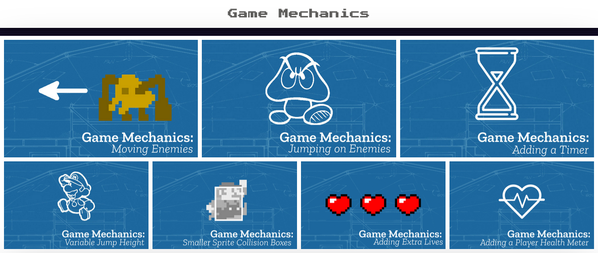
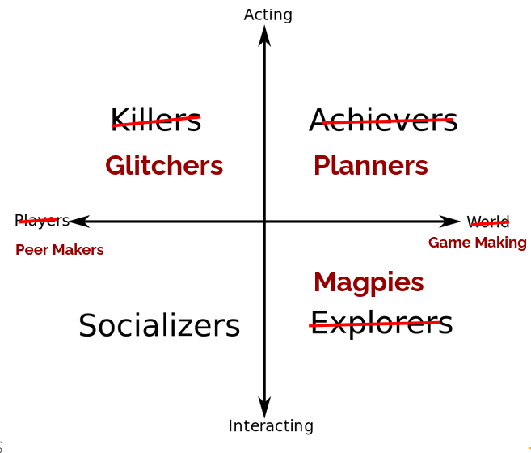

---
zotero:
  scannable-cite: false # only relevant when your compiling to scannable-cite .odt
  client: zotero # defaults to zotero
  author-in-text: false # when true, enabled fake author-name-only cites by replacing it with the text of the last names of the authors
  csl-style: harvard-manchester-metropolitan-university # pre-fill the style
layout: post
categories: other
title: Final review including  TEPA blogpost - Mick Chesterman
---

## Final review commentary

The objectives of this commentary at final review stage is to describe my progress in PhD writing process, to introduce the two draft chapters which are included as appendices, and finally to frame the thesis in a wider discussion of the relevance to communities and my career plans.

My research questions have remained relatively stable since the last review and my supervisors have helped me align them to the chapter structure of the thesis.

1. What contradictions arose in participation in this research’s game coding processes and how were they addressed?
2. How can game design patterns support the development of computational fluency in novices?
3. How can learners build agency in an evolving community of game makers?

My supervision process over the last year has focused on the process of prioritising and clarifying the writing up of my finding in line with existing research conventions. While the use of video data allowed a broad spectrum of analysis including more personal exploration of concepts, I have retained my original focus on the social and cultural elements of the process. Once the prioritisation process was completed I was able to return to the introduction and start drafting more complete chapters from the beginning.

An outline of the stage of completion of the chapters follows.

1. **Introduction - 50% complete:** A  structure and key content is in place which requires updating when other chapters are more complete.  
2. **Literature Review - 75% complete:** A draft is in place which needs some revision currently, and then careful editing to align with other chapters.  
3. **Theoretical Framework - 75% complete:** A draft is in place which will need careful editing to align with other chapters.
4. **Methodology - 25% complete:** A rough draft is in place.
5. **Design narrative (addressing RQ1)- 75% complete:** A draft is in place which needs some revision currently, and then careful editing to align with other chapters and appendices.
6. **Findings on Game Design patterns (addressing RQ2)- 50% complete:** A full draft is in place which needs significant revision and alignment with supporting data in appendices.
7. **Findings on development of participant agency in game making (addressing RQ3)- 50% complete:** A draft is in place which needs significant revision.
8. **Conclusion - 25% complete:** A rough draft is in place.
9. **Appendices - 50% complete:** Drafts of appendices are in place at different stages of completion. Their structure and the scope of needs some careful thought and prioritisation.

To accompany this commentary I will email drafts of Chapters 3 and 5.

If time allows it, I would welcome an informal discussion on _what I do with the PhD_, or in other words how I leverage the completion process to advance my career aims, as part of the review process. To help frame that line of discussion I have included as the second part of the commentary, a draft blog post for the TPEA website. This blog post aims for a concise and approachable summary of the research landscape, the needs that my thesis addresses and the relevance of my research findings within wider contexts. In response to this blog post, have been asked to resubmit a version for the TEPA journal and given a suggestion to share part of my work with the HM Gov curriculum review.

## TPEA blog post -

Game making as a computing pedagogy offers an excellent opportunity to develop students' confidence and fluency in digital skills. However, to fully harness this potential, we must further develop and share effective practices. My research with home-educating families has led to the creation of a game-making pedagogy that incorporates patterns of home behaviours alongside the design principles found in retro platform games. This approach not only aligns with the learning styles of home-educated students but also utilises the engaging elements of retro games to enhance creativity and problem-solving skills. I share these strategies in the spirit of advocating for systemic changes that ensure all students can benefit from this innovative approach.

Before attending the TEPA conference in summer 2024, I had started to doubt whether my hopes of integrating some of the findings and pedagogies into schools or other formal environments would amount to anything. This feeling, based on my experience of teacher training for computing at the secondary level, stemmed from the challenges of completing project work within the context of computing qualifications. My concerns were validated by discussions happening at TEPA,particularly during a panel that outlined the background to the last minute reconfiguration of the computing qualifications guidelines. The focus had shifted towards more abstract knowledge, rather than encouraging hands on creative digital projects.

Even the hands on programming projects that were once part of the GCSE exam, later dropped due to concerns about plagiarism, were narrowly defined, leaving little room for creativity or the incorporation of students' personal interests. It is now possible to sit and pass a computing GCSE without ever touching a computer. I recently spoke with one of my child's friends, an artistic year 8 student, who said she missed the creative multimedia and game projects she had been able to do using Scratch in year 7. When I asked what she does now, she replied, "We write down definitions of routers." This is disappointing on a personal level and also reflects a failure to prepare this student for the future.

At the TPEA conference, while it was acknowledged that good teachers do find ways to introduce creative project work, they do so in spite of, rather than because of, systemic pressures within schools such as the format of computing exams, timetabling and the resources available. Drawing on data from Kemp [-kemp_future_2024] which shows the increasing failure to attract a diverse range of students to take Computing at GCSE, there seemed to be a consensus that it is time for a stronger push to change the qualifications and the broader rhetoric around computing and IT education to bring back digital creativity. I left feeling more optimistic, as the wider application of my research requires a context that allows a project based approach. Therefore, if the situation does change, the game making pedagogy that emerged from my doctoral work will become more widely applicable.

### Summarising my results

The benefits of game making as a process have been well outlined in a book and accompanying papers by Kafai and Burke [@kafai_connected_2016; @kafai_constructionist_2015-1]. The focus of the review draws on a constructionist tradition which includes the work of Papert [-@papert_mindstorms_1980] on LOGO language and the use of drawing robots, and that of Resnick [@resnick_scratch_2009] on block based programming languages. While their work on the diverse benefits of game making is convincing, the review is less thorough concerning pedagogies and approaches that emphasise social and cultural learning. Other reviews and commentaries conclude that more work is needed in this area [@denner_does_2019]. My research contributes to this field by using cultural historical activity theory (CHAT) to examine these areas more systematically.

I adopted an approach that aligns with the increasing convergence of activity theory interventions and design-based research [@penuel_emerging_2014] to collaboratively create a game making pedagogy, drawing on the experiences and working patterns of families, primarily in parent-child pairings. I was also inspired by Stetsenko [@stetsenko_serious_2015], who advocates resisting artificial objectivist approaches and instead taking a transformative activist stance (TAS) to build participants' agency through active interventions.

Through four iterations of research interventions in the form of short game making courses, a pedagogy and set of tools emerged, which I now present as ready for wider testing.

In the early stages of disseminating my research, I outlined the characteristics of the pedagogy as a game making approach I called 3M, reflecting the use of missions, methods, and maps. The maps dimension helps teachers align skills learned in game making with curricular goals and concepts. I have written a chapter detailing this approach, focusing on its adaptation to the primary classroom [@chesterman_game_2023]. Although the mapping dimension has clear potential for utility, the main focus of my research became the development of fluency in the game making and coding process using a mission-based approach, alongside the incorporation of home interests through inclusive pedagogical methods. Given the limited scope of this blog post, I will focus on those aspects here.

#### Missions: leading activities offering both structure and choice

The term missions became a playful way to represent two key aspects of the emerging pedagogy: first, the setting of short-term coding and asset production goals by participants, and second, the inclusion of social side missions that reinforced collaborative working patterns.

**Main Missions (Game Design Patterns)**

Participants' requests to add new features to their games led me to research and develop support materials, drawing on the educational possibilities of design patterns. While design patterns are typically used in higher education to teach object-oriented programming, they are valuable for learners at all levels. Design patterns are based on real-life instances where common problems are solved in specific ways, offering concrete examples of coding principles in context.

Design patterns can foster coding communities when more experienced coders take the time to document the patterns they use in a way that is accessible to novice coders. For educators, design patterns can support learners in developing coding proficiency by providing scaffolding and modelling good design decisions. However, one challenge for teachers is how to effectively integrate worked examples and design patterns into student-led design challenges, ensuring that they support creativity without becoming overly prescriptive.

In the learning design of this research, responding to participants' requests led me to create resources in the form of code examples and snippets based on different gameplay design patterns (GDPs). Unlike the more complex, structural form of traditional object-oriented code design patterns, gameplay patterns focus on the end user's experience. I drew on the work of Schell [-@schell_art_2008] and Salen-Tekinbas [-@tekinbas_rules_2003] to scaffold the creative process for novice game makers, using a categorisation of design patterns derived from professional game development. After several iterations of the game making programme, the result was an online menu or collection of resources organised by gameplay design pattern, which is now available at https://ggc-examples.glitch.me/.

{width=95%}

A selection of the gameplay design patterns themed under the category of Game Mechanics available at https://ggc-examples.glitch.me/,

In addition to being an effective pedagogical approach, the implementation of gameplay design patterns (GDPs), in line with activity theory, emerged as an ideal unit of analysis for understanding the evolving community processes of game making among participants. While some learners carefully used the resources to implement their chosen patterns, others adopted different approaches to game making. I began to observe these varying behaviours and actively sought to encourage them.

<!-- I can remember them being popular and perceived as useful by fellow students when I completed a Computing masters. -->

**Playful Missions (Encouraging Social Repertoires)**

The idea to encourage these diverse approaches emerged from a conversation with a colleague interested in playful learning, John Lean, regarding Bartle's game playing styles [@hamari_player_2014]. Bartle's research explored the various motivations and play styles in digital adventure games. I applied a similar framework to investigate and reflect the different game making styles that began to emerge within the community.

Some families set clear goals and followed resources methodically to achieve them. Others took a more social approach, learning from peers and exchanging ideas and encouragement. Still others engaged in more unconventional ways, creating confusing or unusual games or working against some of the suggested creative practices. A summary of these different game making styles is shown in the image below.

{width=75%}
A revision of Bartle's game player types based on observations of possible game maker types.

I became intrigued by these emerging styles and began to reflect on my observations. In one iteration, I integrated playful side missions into the programme, which validated and legitimised some of the behaviours and repertoires that participants were engaging with in this space. These side missions encouraged participants to explore different approaches, further enriching the game making experience.  

| Your Alien Mission (social)          | Your Secret Alien Mission:              
|----------------|----------------|
| Find out the names of 3 games that are being made.  | Change the variables at the start of someone else’s game to make it play in a funny way.    |
| Make a list of characters in two other games being made.   | Change of the images in someone else’s project to a totally different image and see if they notice.    |
| Find out the favourite computer games of 4 people.   | Change the level design of the first level of someone else’s project to make it impossible but try to change as little as possible to do that.   |

Table -  Examples of playful missions which helped legitimise different making approaches.

In a later phase of my study's learning design, with the support of my school's drama department, I incorporated these playful missions into a drama scenario inspired by the Mantle of the Expert approach. This method of drawing on home styles of interaction, in a way that Gutierrez [@gutierrez2020utopian] would describe as incorporating home and play repertoires of practice, encouraged me to explore additional ways in which *funds of identity* could be integrated into the game making process. My aim was to increase participants' sense of agency through this approach. I briefly explore these ideas in the final section of this post.

### Methods: Inclusive methods to draw on home repertoires of practice and to build participant agency

The term agency here is understood within a socio-cultural framework, where it is not seen as a personal trait but as something that exists within a particular context. Building agency within this emerging community of game makers is a process involving individual learners working as part of a collective, evolving shared practices and applying collective knowledge to develop necessary tools. Due to space constraints, rather than offering a deeper analysis of these evolving processes, I will provide some practical recommendations on inclusive methods for those aiming to support agency development in a new community of game makers.

**Allow learners to draw on their home interests by creating an inclusive creative environment** where they are encouraged to explore their existing knowledge of game conventions and their attitudes towards video game play.

**Start coding with a half-baked game [@kynigos_children_2018]:** Provide learners with a partially completed game template that they can adapt, offering a shared structure that promotes peer learning. This also helps facilitators stay familiar with participants’ evolving code.

**Use emerging learner requests to shape a collection of code examples:** Develop a set of code snippets and supporting documentation based on familiar gameplay design patterns. Encourage learners to use this resource, allowing them to add new features based on their own choices while receiving the necessary technical support.

**Allow flexible working practices and incorporate regular play-testing:** Create an environment where learners can draw on existing learning relationships with family members and develop new ways of working with peers. Regular play-testing helps foster these collaborative practices.

Lastly, **incorporate playful approaches** to build connections with *funds of knowledge* linked to home play practices, as briefly explored earlier. This helps create a more inclusive and engaging learning experience.

### Concluding remarks

In summary, the implications of this research highlight the potential for reframing the primary focus of teaching computing through accessible project-based approaches structured around the application of relatable design patterns. I encourage wider testing of these processes to assess the generalisability of the findings based on several motivations.

Firstly, the overall approach is aligned with solid foundations for using funds of identity as an inclusive and transformational practice for young people engaging with digital technology, as explored in a special issue of Mind, Culture and Activity [@kajamaa_young_2019-3].

Secondly, the process of using games as a medium for expressing these funds of identity remains a valid approach. While research on game making may have waned in popularity, interest from young people endures.

Thirdly, in light of increased concerns about risky online activity and screen time addiction, family involvement in the digital lives of young people remains an ongoing issue. Game making as a joint family activity offers an accessible and inclusive foundation for exploring further digital issues that impact home lives.

Finally, we can hope that the pendulum of digital education in the UK and beyond may swing back from the conservative stance on the power of abstract knowledge, exemplified by Michael Gove's implementation of the computing curriculum and exam structure, towards a more applied approach. This shift would align with Papert's vision of computational thinking, which is grounded in concrete, hands-on computing experiences involving projects that can motivate personal connections to the underlying content knowledge in context.
