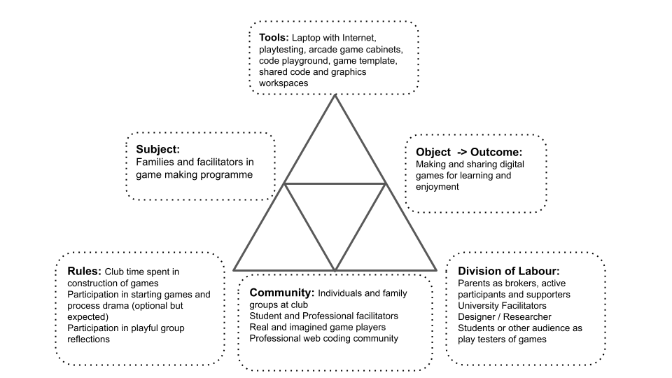

---
zotero:
  scannable-cite: false # only relevant when your compiling to scannable-cite .odt
  client: zotero # defaults to zotero
  author-in-text: false # when true, enabled fake author-name-only cites by replacing it with the text of the last names of the authors
  csl-style: harvard-manchester-metropolitan-university # pre-fill the style
layout: post
categories: chapter
title: 4. Exploration of the Formative Learning Design Process
---
-   [Research Questions - June 2023](#research-questions---june-2023)
-   [Chapter Introduction](#chapter-introduction)
-   [Short vignette illustrating shifts in scope of
    activity](#short-vignette-illustrating-shifts-in-scope-of-activity)
    -   [Vignette 4.1 - An example of game making
        activity](#vignette-4.1---an-example-of-game-making-activity)
        -   [Table of Vignette](#table-of-vignette)
    -   [Description of levels of activity illustrated using the
        vignette](#description-of-levels-of-activity-illustrated-using-the-vignette)
        -   [Environmental factors and
            objectives](#environmental-factors-and-objectives)
        -   [Larger objective - Making games for an
            audience](#larger-objective---making-games-for-an-audience)
        -   [Mid-level objective - Constructing a game feature by
            feature](#mid-level-objective---constructing-a-game-feature-by-feature)
        -   [Smaller objectives and actions - Implementing discrete code
            and design
            structures](#smaller-objectives-and-actions---implementing-discrete-code-and-design-structures)
-   [Summary of design evolution](#summary-of-design-evolution)
    -   [P1: Exploratory stage: Oct 2017 - Dec
        2018](#p1-exploratory-stage-oct-2017---dec-2018)
    -   [P2: Accelerated game making programme (5 weeks): Jan - Feb
        2019](#p2-accelerated-game-making-programme-5-weeks-jan---feb-2019)
    -   [P3: Adding a process drama to the game making programme:
        April - May
        2019](#p3-adding-a-process-drama-to-the-game-making-programme-april---may-2019)
    -   [P4: Adapting to MakeCode Arcade and more formal settings: Jan
        2020 - September
        2020](#p4-adapting-to-makecode-arcade-and-more-formal-settings-jan-2020---september-2020)
-   [Conflicts and design tensions experienced by participants and
    facilitator/s](#conflicts-and-design-tensions-experienced-by-participants-and-facilitators)
-   [1. Conflicts stemming from tensions between privileging participant
    choices or underlying computing and systems
    concepts](#conflicts-stemming-from-tensions-between-privileging-participant-choices-or-underlying-computing-and-systems-concepts)
    -   [Learning Dimensions Map](#learning-dimensions-map)
    -   [The potential of learning and navigational
        maps](#the-potential-of-learning-and-navigational-maps)
-   [2. Conflicts due to identity clashes and dysfunctional group
    work](#conflicts-due-to-identity-clashes-and-dysfunctional-group-work)
-   [3. Tensions due to lack of access and familiarity to game
    programming
    tools](#tensions-due-to-lack-of-access-and-familiarity-to-game-programming-tools)
    -   [Design adaptations to facilitate novice use of a code
        playground](#design-adaptations-to-facilitate-novice-use-of-a-code-playground)
        -   [Addressing code syntax
            errors](#addressing-code-syntax-errors)
        -   [Distributed vs. self-contained approaches to asset
            creation](#distributed-vs.-self-contained-approaches-to-asset-creation)
        -   [Shared community and remix
            ability](#shared-community-and-remix-ability)
    -   [Design choices of the starter game
        template](#design-choices-of-the-starter-game-template)
        -   [Variable editing for player
            movement](#variable-editing-for-player-movement)
        -   [Level design and
            prototyping](#level-design-and-prototyping)
        -   [Background colour and a pixel
            art](#background-colour-and-a-pixel-art)
        -   [Creating a simplified and clear project
            structure](#creating-a-simplified-and-clear-project-structure)
        -   [Observations on design behaviours encouraged through use of
            game
            template](#observations-on-design-behaviours-encouraged-through-use-of-game-template)
-   [4. Participant conflict associated with project navigation and use
    of
    documentation](#participant-conflict-associated-with-project-navigation-and-use-of-documentation)
    -   [Code snippet examples](#code-snippet-examples)
    -   [Stand-alone tutorials](#stand-alone-tutorials)
    -   [Organising tutorials into a linear structure, specifically in
        the form of a
        book](#organising-tutorials-into-a-linear-structure-specifically-in-the-form-of-a-book)
    -   [Structuring and using a collection of game design
        patterns](#structuring-and-using-a-collection-of-game-design-patterns)
-   [Chapter Discussion](#chapter-discussion)
    -   [On the emergent and mutual nature of the design and research
        process](#on-the-emergent-and-mutual-nature-of-the-design-and-research-process)
    -   [Discussion on authenticity and agency concerning tools and
        resources](#discussion-on-authenticity-and-agency-concerning-tools-and-resources)
    -   [Summary of barriers and tensions explored in this
        chapter](#summary-of-barriers-and-tensions-explored-in-this-chapter)
    -   [Link to next chapter](#link-to-next-chapter)

## Research Questions - June 2023

1. What pedagogical tools and processes are available to support novices to overcome barriers to game coding and design?
<!-- - What pedagogical factors are significant to support novices learning coding, particularly in game making contexts? -->
2. How can learners build agency in an evolving community of game makers?
3. How can game design patterns support the development of coding practices with novices?

<!-- ## Notes on structure -->
<!-- NOTE:
Moved impact of software tools here - and overall on templated approach on a micro level  -  which therefore becomes less of this study's focus - and needs less evidence -->

<!-- - drawing mostly on my journal notes and the evolution of the tools and design themselves.   -->

<!-- - **Interviews (and Lit review ):** exposes motivations and barriers to undertaking activity  this domain from interviews with peer practitioners and literature review -->

<!-- However in terms of tensions - there is one on cultural tensions - this may need moving to the next chapter - a more thematic approach. -->

<!-- Also the practitioner interviews - could be a bit disjointed - as they do relate to cultural barriers and tactics. But could say those are explored in other chapters. DONE -->

## Chapter Introduction  

<!-- - exposes motivations, tactics for and barriers to undertaking activity this domain from interviews with peer practitioners (supplementing the literature review) -->

Due to the novel nature of the learning design the detailed outline of the specifics of the participants experience of the design are important to situate findings in the following two chapters. To achieve this aim, this chapter gives an overview of the evolution of the key pedagogical features of the tools of learning design used in my research process. It draws chiefly and on my interpretation of participants reactions recorded in journal notes, these interpretations are also reflected in the evolution in the learning resources which are documented here. To explore emerging tensions in design in a way which communicates relevant context, I outline four conflicts in interrelated activity systems using the terminology of third generation activity theory (3GAT). This chapter discussion begins with an exploration of the tools used through the lens of authenticity. It continues by covering the mutual nature of the evolution of the design, and ends with a synthesis to initial barriers to engaging in game making practices and initial interventions to address them.

<!-- - Introduces the use of design patterns and collections of patterns, as the germ cell of activity which then expands in different directions. -->

<!-- The game making community is not authentic or mature in the practices they are undertaking, the kind of community practices which we can undertake are focused partly on building connections to existing knowledge and practice. -->

<!-- One of my roles as designer here was to uncover and to help participants explore knowledge that they were unaware they possessed. Another was to help support the development of peer learning practices and in order to do that help foster a creative environment which suited that. -->

<!-- **Methodology for exposing tensions**

Tensions in the emerging design and the experience of participant conflict in activity systems served to drive the evolution of this learning design.

The work of Sannino on the use of secondary stimulation in formative interventions informs the analysis of conflicts arising and secondary tools and processes which facilitators use to address them [@sannino_activity_2011]. TADS thus addresses transformative agency.

In addition, work to distinguish type of learner agency including transformative, authorial and instrumental agency are potentially useful tools. -->

<!-- The design description is framed within DBR language and concepts. -->
<!-- Section describing  Game Design Patterns as  the main unit of Activity. See Blunden to frame this and to describe the utility of the idea  [@blundenInterdisciplinaryConceptActivity2009; @blundenGermCellUnit2014]. -->

<!--
There's lots to add in here.
chapters\planning\methodology_chapter\methodology_chapter_late_2020.odt.md
https://drive.google.com/drive/u/1/folders/1D-VhVj-NgN3qgk3YEx4HZEozf_1UOGtE
 -->

<!-- As per Rogoff's analysis of informal learning in museaums [], the process of finding a medium between structured activity and authentic activity can be challenging.

The kinds of exhibits which invite extended play are of interest to this study. Such design indicates that there are affordances that invite revised design, tinkering and ongoing play.
-->

<!-- **Cultural influences on my choice of learning design**
NOTE - MOVE TO INTRO  - NO NEED

I set up the working pattern based on my professional experiences and my own academic and cultural interests. As mentioned in the introduction, DIY culture, remix culture, repair culture, TAZ events are strong influences to the learning design based on the ideals of an autonomous community.

 - a desire to increase engagement based on my experiences in classroom and out of classroom - Home Ed / coder dojo experiences
 - the link to cultural practices of code patching and remixing - the example of the plumber coder potentially being someone who finishes the job rather than elegant coder.
 - other experiences of social coding being important being part of a community working on a joint project (add a quote from Dave?)
 <!-- - A walled garden approach in terms of the GDP and code documentation and examples that are used. Based on my own experience of developer documentation and varied coding approaches.
- Other examples from the interviews with practitioners are relevant to include here. -->

<!-- These sections could follow a pattern of
 - rogoff's description / examples - but likely include a larger breakdown of 3 foci in Methodology Chapter.
 - my model examples
 - other links to PBL frameworks and/or educational concepts and contrast analysis

In the 3 foci model Rogoff refers to apprenticeship as a way of illustrating the process of being inculcated into community practices existing in a cultural plane. AN EXAMPLE .. -->

<!-- At this stage of writing I include a bullet point list of design relevant features to be expanded later.

- Shared repositories of resources - users shared a log in so they could see the work created by others.
- Showcase: At the end of the game making process students asked strangers to play their game in the foyer of my departmental building
- Drama Games: the process of warming up, creates community and sets a tone
- Drama Process: specifically designed ot overcome limits of the classroom.
- Playtesting: the process of playtesting, either self or peer links back to a community purpose
 -->

<!-- __Insert image of code__

The code of the game.
While the code is made up of various elements, only the javascript file is normally altered by participants.
The complexity is hidden away from the end user.

__Insert image of game in browser__

On the screen you can see the game.
Toby then decides he wants to add a new element to his game.
He browses the list of game design patterns.
There is a tension where he is hesitant about where to place code.
Screen shot of the menu of choices. -->

## Short vignette illustrating shifts in scope of activity

<!--
#### Code Playgrounds
Find definition
NOTES ON CODE PLAYGROUNDS
However in its styling it is playful and editorial picks and write up celebrate a playful spirit of creativity and sharing. There are strong parallels in this presentation to that Scratch community and to the sharing ethos integral to the maker-movement (explored in Lit Review). The interplay between play and work via shared experimentation is developed further in a later discussion chapter.
#### Online graphics editors - Piskel -->

### Vignette 4.1 - An example of game making activity

The following vignette, consisting of extracts of participant activity over twenty minutes of a session, is presented as an summary of different scopes of activity. The participant a child Toby who in this session has been working independently on his game design.

<!-- The tool shown in screenshots is the code playground glitch (see chapter 2 and glossary). -->

#### Table of Vignette
https://docs.google.com/document/d/1vYeVxYaRMTWPDOHwC4DEGYAkGPRIDX7wLiz0l8b7LWc/edit

### Description of levels of activity illustrated using the vignette

The following sections outline different scopes of activity to ground the reader in the overall activity and introduce later tensions between system elements. It will use concepts from activity theory to describe elements of the activity system. Activity theory allows researchers to identify intersecting or nested systems of activity with varied goals.

<!-- The following sections describe of the vignette above focusing on the overall activity and its place within evolution of learning design.
Subsequent analysis of the identified activity systems allows both the researcher and practitioner to identifying existing and emerging tensions and to thus observe (spontaneous) or plan (designed) responses. While this chapter focuses primarily on the tools and resources, future chapter also draw on this framework for wider analysis. -->
<!-- ALTERNATIVE SIMPLIER INTRO TO THIS SECTION -->

<!-- Each section follows a pattern: the activity is described in general, then examples of activity at that scope from the vignette above are described, ending with brief analysis or signposting to where the activity in explored in greater depth. -->

<!-- The following descriptions mirror the work of AT researchers who conceptualise scope of activity as concentric circles from Broffennbrenner with "larger" scopes of cultural and societal goals and smaller, narrower, lower scopes of more personal activity [Engestrom][Cole]. -->

<!-- A short description of the activity systems follows the vignette above to help the reader establish a broad understanding of the processes involved before further analysis. I signpost the reader to other chapters when the described activity is explored in more detail there. -->

#### Environmental factors and objectives

As explored in the literature review, there are several wider objectives of the type creative design activity involved in this research. Aligning with my experiences, I have selected several important streams and represented them in an illustration 4.x  below. These include: research goals on the part of the researcher/ participant; desire to create a useful learning experience on the part of student helpers; learning computing skills and concepts as a home education project; and participating with other home educators in a creative environment and thus building team and communication skills; and fun on the part of the children participants.

{width=95%}

<!-- NOTE - CAN ADD THE OBJECTIVES / LEADING ACTIVITIES INTO THE ARROWS ON THE DIAGRAM -->

<!-- While the limited example above of Toby's activity illustrates fun, additional data from interviews with this child and family back the broad goals above. [develop - perhaps an appendix or quotes] -->

<!-- As previously explored this mirrors the Activity, Action and Operation hierarchy. -->

<!-- | **Subject**         | **Objective**             | **Tools & Processes**          |
|------|-------------|------------|
| Community of novice game makers | Creating a game which is fun to play and communicates an environmental theme     | Shared log in to code playground (glitch.com)   |
|   |      | Shared log in to graphic editor (Piskel)    |
|   |      | Instructions from facilitator including the overall mission   |
|   |      | Starting game template    |
|   |      | Group playtesting     |
|        |     |

Table 4.x.  Tools used in larger-scoped objective involving the wider community of notice coders collectively making separate games. -->

#### Larger objective - Making games for an audience

The shared objective of one activity system is to make entertaining and educational games for an audience to play.

<!-- Insert an AT diagram from here - https://docs.google.com/presentation/d/1vR6dzFG6qXIdpB_-s6PbCePiB87qTs6YAXCljxNcb5Y/edit#slide=id.g57b5e8e9ad_0_0 -->

{width=95%}

There are diverse end audiences for the games. The final target audience are students and staff in the Manchester Met Brooks building where their games are shared in arcade cabinets at the end of the course. An additional audience are friends and family who can be send the games to play online. The more immediate audience for the evolving games are peer game makers during the making sessions.

{width=75%}

While the broad aim of making a game to share is tacitly agreed through participation, there are also diverse motivations stemming from environmental factors in the interrelated actors in this activity which bleed into the tensions which emerge at this level. In the vignette and surrounding data, Toby pays close attention to the challenge and variety of the game playing experience for his projected audience of players. A different example of the tension between competing motivations at this larger level of activity is explored in example 1 of this chapter and related analysis is continued in chapter six.

In the vignette above, I draw the participants attention to the showcasing of their games to an external audience. Toby begins the session playing his own game. During the course of this session he invites many other group members to play his game. He initiates and responds to conversations around the difficultly of the game he has designed.

<!-- In the vignette of Toby's activity this wider objective is present in the facilitator orientation at the start which references this audience -  _the Monday after we can play our games and we can share them with students. We can make the students frustrated when they can’t beat our games_. At the end of the vignette text, one of the student helpers also imagines this audience playing the game of Toby.    -->
<!--
NOTE - More on large scope in AT terms? What is needed here? -->

#### Mid-level objective - Constructing a game feature by feature

At this scope of activity, participants work on the game code and and audio and graphical assets to achieve the broad objective is to alter and add new features to the game using tools available in the learning environment.  

<!-- | Subject         | Objective             | Tools & Processes          |
|------|-------------|------------|
| Groups or individual participants | Implementing game elements   | Code editing tool (glitch)   |
|   |   |  Game preview tool (glitch) |
|   |   |  Menu of game patterns at ggc-examples.glitch.me  |
|   |   |  Step by step tutorials on FLOSS manuals  |
|   |   |  Playtesting own game |
|        |     |

Table 4.x.  Tools used in mid-level objectives when selecting and planning implementation of game elements. -->

{width=95%}

<!-- One observation from he experimental course was that without significant support, the process of making a game is complex and there are many possible blockages in the process. -->

<!-- NOTE - THIS IS ANALYSIS  -WHERE TO PLACE IT?
By this stage, the process of collecting a user generated list of features and trying to respond to all of them as a facilitator had been abandoned as unrealistic. -->

<!-- NOTE - how much from p1-4 below to include? -->

<!-- In the example above Toby progresses from playtesting his own game to altering it. The code to change the layout of the platforms of the game is already included in the starting template. Thus is able add a new platform by making simple code changes. Toby retests the game immediately by clicking on the preview element of the code environment.  -->

<!-- However within that wider objective there may be a variety of goals depending on the participant. In this case Toby's goal is addresses the challenge and variety of the game playing experience. -->

<!-- Toby builds his competence in the process of comparing the own code to the code example to work out what code is new and relevant to the desired behaviour. -->

Overall activity at this level was driven by learners setting goals and requesting help to implement game features. By this stage of the process, Toby is able to browse a collection of game design patterns and use diverse of tools, resources and processes. Participants developed preferred approaches and tool choices especially in accessing help when adding a new feature to their game. In the vignette above I outline the two main sources of help at the level of adding a new feature to the game: "Here’s the tutorial and there’s the examples of code". A later section of this chapter details the different supporting documentation as an example of an artefact that guides participation in game making practices. Chapter five then explore activity occurring at this scope in more detail with a greater focus on emerging concepts as tools.

In the course of the vignette above, Toby chose to access only a code example of the desired game behaviour. He did not, as others in the group were doing in this session, use the tutorial which provided more descriptive, step-by-step guidance. In contrast, others participants relied only on direct verbal help from myself or other participants (like Toby) to help them progress.

<!-- While some game patterns were simple to add, e.g. altering the location of platforms, other more complicated features involved several stages and varied tools to implement. The next section describes these stages as discrete code and design structures. -->

<!-- NOTE - Other participants;s motivations - explored later? -->

<!-- Other participants were less proficient using this online resources and used printed out versions of documentation. -->

<!-- In the next section narrower actions still within this system are explored as discreet actions which combine to be come the activity of implementing a game pattern. -->

<!-- | **Subject**         | **Objective**             | **Tools & Processes**         
|----------------|-----------|------------|
| Individuals (mostly)  | Implementing specific code or design tasks   |  Code editing tool (glitch)   |
|   |   |  Code game preview tool (glitch) |
|   |   |  Piskel  online graphics editor   |
|   |   |  Step by step tutorials on FLOSS manuals  |
|   |   |  Stand-alone code examples on glitch.com  |
|        |     | -->

<!-- Table 4.x.  Tools used in lower-level objectives of implementing specific code structures or stages in creating game assets -->

#### Smaller objectives and actions - Implementing discrete code and design structures

<!-- For example, creating a new graphical element in a separate online pixel-art editor called Piskel, exporting and downloading it to the laptop, and uploading it to the glitch code playground and then making code changes in several parts of the code to initialise and implement new behaviour for this element. -->

While the previous section focused on a mid-level scope of implementing game features, more complicated patterns involved several stages and varied tools to implement. Using the terminology of Leontiev [-@leontiev_activity_2009], in the example above Toby undertakes certain chains of processes in a fluid way that shows that actions had become operations. For example, his quick navigation between different areas of the game code, the game preview window and  sources of documentation. In contrast, some tasks are new to Toby and are performed more hesitantly. In the example above Toby is careful is hesitant, checking and rechecking the process of copying and pasting new code into his game from a specially prepared code example which matches the game template he is working on.

<!--NOTE As a facilitator of a community I aim to notice these transitions as I aim to use the proficiency of participants to help distribute the process of helping peers. -->

Identifying shifts in participant activity in terms of scope aids analysis of the complex and interwoven cultural, social and personal actions [@rogoff_observing_1995]. Above Toby shifts between to the wide activity of making a game and sharing it with peers to the narrower action on implementing a concrete code structure. This aspect is developed in chapter five in more detail. In addition to these shifts in scope, analysis of community processes also involves transformation over time.  The next section offers a description of the evolution of tool use in different phases of the study with an aim to situate later analysis of emerging tensions in the use of tools, resources and processes in the subsequent section.

<!-- In this thesis, chapter six has a focus on cultural aspects of making a game together and chapter five explores social organisation around the activity of adding game design patterns chapter five.  -->

<!-- After inserting the code which adds a moving enemy to the game, Toby spends five minutes altering the variables involved to match his design and to create a level of challenge that he is happy with. -->

<!-- Toby makes quick progress. one factor here is willingness to make mistakes. There is a confidence here in undoing mistakes, commenting out new code to return to previous behaviour.

The trial and error approach also yields benefits, a mistake in the values edited creates an unexpected result of the enemy moving vertically instead of horizontally. Toby embraces this mistake and shares his account of this happy accident enthusiastically. -->

<!-- NOTE
Each of these with differing levels of abstraction.
Break down that of GDPs? -->

<!-- In the last chapter, we examined the use of Rogoff's 3 lenses of cultural, social and personal activity. We can see a broad alignment of these lenses and the scopes of the activity systems above.

This has utility to both researcher and learning designer. The observations of the following chapters are based on this approach of using lenses to focus in on relevant activity.

NOTE - Explore how performed in line with other research - e.g. DBR (Barab) and possibly Bevan and Petrich -->

<!-- to highlight possible tensions and contradictions between competing goals of interrelated activity systems. -->
<!-- For example a common contradiction may be an immediate goal of children to mess around, play games and have fun while the goals of parent may be to maximise the acquisition of skills -->

## Summary of design evolution

<!-- [Summary Table of Stages](https://docs.google.com/document/d/1tBoXJWw-aZUcc8EsAvT195CtHLSM468YOCD0sGzOuoA/edit#)
see updated table in tables subdirectory  
-->

The following overview of tool use by stage concisely explore the rationale for their selection or production. Fuller descriptions of the tools used at each stage and links to the online resources created are available as appendix 4.x

<!-- Table from
https://docs.google.com/document/d/1tBoXJWw-aZUcc8EsAvT195CtHLSM468YOCD0sGzOuoA/edit# -->

<!-- | **Phase, Name and Date**| **Description** | **Starting Resources**         
|--------|------------|--------------|
|P1: Oct 2017 - Dec 2018; Experimental Course  | Participants started with no set plan or toolset and were asked to plan and make a game in two larger groups of 5-6 participants of mixed ages. After several weeks, a minimal incomplete starting game code template was introduced in response to student need.  Then One-off workshops at Mozilla and Feral Vector conferences and to PGCE computer students and the creation of a “half baked” game template |  Phaser 2.6.2 javascript library; Thimble code playground; online graphics editor Piskel; audio creation tools  |
| P2: Jan - Feb 2019; Glitch Game Club | First iteration of game making course of 5-6 weeks. The template and resources created in the previous stage were used as a starting point but continued to evolve. |  Phaser; Glitch, Piskel; updated game template; quick start cards; step-by-step tutorials; code examples  |
| P3: May 2019; Glitch Game Club 2| Second iteration of game making course with additional drama and reflective elements |  As per P3; drama scenario; interactive chat page in glitch  |
| P4: Jan 2020 - September 2020; Make Code Arcade | Two iterations of game making course of 5-6 weeks using MakeCode Arcade tool.  |  Make Code Arcade (MCA) tool; MCA Template starting game; MCA quick start cards; MCA game pattern menu; MCA game pattern tutorials; Learning Dimensions Map   |
 -->

### P1: Exploratory stage: Oct 2017 - Dec 2018

<!-- NOTE - The evolution involves phases and then tension - what and how to cover both?  -->
<!-- This phase took place before the official start of this research and relevant ethics application. As such,  -->

Phase one was an extended, exploratory series of game making sessions over several months. This stage was aimed not at collecting user data rather than building my  competency as a facilitator. The process began with no pre-existing supporting materials. In response to need, I adapted a starting code template of a platform game and created various code examples to add functionality requested by participants. This template was base on the game genre of _platformer_ (see glossary), a move which helped to limit expectations of the technical limits of their game.  At the end of this stage participants showcased their games to students in the foyer of the MMU Brooks building. Feedback from participants this stage included; a general consensus that the process was too long and that more guidance in the process of familiarising themselves the coding tools initially before undertaking ideation would be useful. Extracts of feedback notes are included as appendix 4.x

The end of this phase in mid to late 2018 involved responding to this feedback and working together with PGCE computing students and delivery three one-off workshops at conferences and a Manchester library fun day. The requirements of this compressed time frame aligned with feedback to prompt me to design an accelerated process to bump start the game-production process. The new intervention involved a starting template and printable resources that highlighted particular key lines of code and variables that had a high impact on the game experiences. The results in terms of engagement and impact on changing the game were very promising.

<!-- The first phase of delivery in late 2018 was based on initial research stage; I drew on literature to identify factors to consider when designing for collaboration, adopting a project based approach inspired by design thinking.  -->
<!-- To inculcate parents and children in to the culture of retro video games I began initial sessions by inviting participants to older arcade games on laptops. -->
<!-- Game filled laptops.  
Should this be added to the table above
-->
<!-- The tools allow participants to create games using a combination of a free to use online tools.
an online  coding environment
using the phaser javascript game library (glitch.com), a pixel art editor (piskelapp.com), and a sound effect generator (sfbgames.com/chiptone). -->

<!-- Have a look at this document which outlines Structuring and Scaffolding Phaser Activities from Phaser Book
https://docs.google.com/document/d/1lk-8dHFFNbFXFtE5vV6_GHXYRzU7ATWZAIe-hNunyx8/edit#
 -->

<!-- #### The half-baked starting platformer game

NOTE - ALSO EXPLORED IN NEXT CHAPTER - HOW TO ARRANGE?

The use and design characteristics of the starting point of a half-baked game.

- Phaser 2 to avoid complexity of code structure
- 2D platformer - familiar to most - Mario and Sonic
- low-spec graphics
- game of player, platforms, and coins to collect and hazards to avoid.
- graphical level design
- key variables brought to the top
- simple structure of code in terms of aligning with framework and not adding extra functions

**Variable editing effective movement**

Player movement was a key to playtesting feedback as such three  key variables were highlighted at the very start of the game code and given descriptive names to facilitate their editing. When testing the game, the player's jump height was not great enough to allow progression up from the floor to one of the platform thus thwarting the collection of items.

Game progression require altering at least one of the descriptively names variables associated with jump height and then activating a preview window to observer the changes by playing the game in a new browser tab.
<!--FIND  Some evidence of building proficiency with significant work to change these three   

    // Variables that change how the player moves
    var gravity = 500;
    var velocity_x = 100;
    var velocity_y = 300;

While some participants engaged with extensive experimentation to find a player movement feel that seemed just right, others were much less concerted with this aspect of game play, lowering gravity drastically to allow a greater jump size but a more frustrating floaty jump.

**Level design and prototyping**

The starting game template included a minimal amount of platforms, hazards to avoid and golden blocks to collect. Image 4.x above show a printable _quick start_ cards to aid participants to begin the process of changing level design.

As preThe possibility of disturbing the syntax of the  of code in the array. When participant did this it provided a good opportunity for facilitators or parents to outline the importance of correct syntax of and to explain the code structure.

The vignette in the last chapter saw Toby's adding new levels to his  game and undertaking many iterations of changes to the level design. He and several other participants spent extensive time performing level design activity with a goal of making the game extremely challenging but still technically possible. Others played with the convention of the game by removing all hazards and filling the screen with rewards/coins (an example is outlined in the starting vignette of the next chapter).

**Incomplete graphical blocks & Piskel**

The use of blank, coloured blocks of 32 x 32 pixels encouraged participants to change the graphical design and the relatively small size of the sprites encouraged rapid design.

PERHAPS REPLACE THIS WITH SCREEN SHOT OF PISKEL AS A TOOL
{width=50%}

The process of creating a pixel art characters and hazard involved using an online grid design tool called Piskel, creating an design of an appropriate size, saving, exporting as an image, downloading to the hard drive of the laptop in use and finally uploading and incorporating the image into the code project and linking using   code syntax.

**Incomplete graphical blocks & Piskel**

The

PARK FOR NOW - Maybe move to Design
The concept of the feel of the game or the challenges maps to the Dynamics of MDA framework.
 -->

### P2: Accelerated game making programme (5 weeks): Jan - Feb 2019

By the beginning of P2 most of the resources and activities were in place and relatively stable. There were some incremental evolutions in the template that stemmed from participant feedback and my reflections. Key additions at this stage to support the use of a template were a collection of tutorials and code examples illustrating key game features that had been requested by participants. The collection of game patterns were presented in a web page together with the starting template and a link to an online book collecting the process into step-by-step chapter based tutorials. The resources are explored in more depth in sections three and four below. A more complete description of the resources used in P2 and P3 are included in appendix 4.x.

### P3: Adding a process drama to the game making programme: April - May 2019

P3 used the same toolset as P2 however in addition, drew on my previous work with the MMU Faculty of Education drama department [@caldwell_drama_2019] to create a simple drama process to give an external motivation and narrative to the creation of games using for a fictional audience of visiting aliens. The participant activity of these stages and tensions between system elements are discussed in detail in the remainder of this chapter and in following chapters.

### P4: Adapting to MakeCode Arcade and more formal settings: Jan 2020 - September 2020

I also adapted and advanced resources with an aim that they could be used within secondary classrooms to support computing curriculum. To do this I added a learning dimensions map, a process which is explored in a later section of this chapter. In 2019 MakeCode Arcade was launched to make games using for novice coders via the use of a block coding approach. In 2020 I ran two iterations of game making course using MakeCode Arcade. The resources and facilitation approach was based that of P2 [^2] [@chesterman_game_2023].

## Conflicts and design tensions experienced by participants and facilitator/s

This section examines design contradictions between system elements and tensions experience by participants which developed into conflicts which significant in stopping participant progress. The processes here aligns design-based / formative research in that the surfacing of tensions and charting the detail of the evolution of resources and other responses used helps illuminate broader, systemic issues concerns in the overall activity [@barab_using_2002]. The first two tensions address issues of identity, ambition, and attempts to align with curricular concepts. The remaining sections detail responses to key contradictions in the tool set of the early design which stimulate the development of authoring tools and supporting documentation.

<!-- In the process of reflection on sessions I both observed and project tensions between activity system elements and between different scopes of activity. In response, I introduced new tools or processes or removed existing or potential barriers. I observed participants responding to tensions both in expected and novel ways. -->

<!-- As outlined in the table above I carried out four stages of workshops and development with home educator families. I will outline decisions behind the design activities at key stage of activity   -->
<!--
**Summary table of tensions ONLINE HERE**
https://docs.google.com/document/d/18HrRPPx0-fj3PXVJTAf2dzYNTBSYGikpV_U0hu46r2c/edit

**3M Matrix tensions ONLINE HERE**
https://docs.google.com/document/d/1DRgpgIUfq5XIktYy-lX4WlviUDnffNc0v8SOeLGgHho/edit
Matrix of 3M Game Making Model - Pedagogical Features explored through Tensions and Resolutions -->

<!-- 3 foci and 3M element compared - save for the conclusion/ discussion?
https://docs.google.com/document/d/1FIPn2dEB2aCKZi5z05j69cnHgpGNXFh1_SPV6h5l12g/edit#heading=h.kci0lnvn7f60 -->

<!-- NOTE - DEVELOP THIS ASPECT OF INCLUSIVE ENVIRONMENT TO REDUCE STRESS - MOVE FROM NEXT CHAPTER?  -->

## 1. Conflicts stemming from tensions between privileging participant choices or underlying computing and systems concepts

While the focus on this research is informal environment, I wanted to create resources and processes which are of potential value to practitioners in the UK classroom. Chapter two explored ways in which digital game making is commonly aligned with curricular areas [@kafai_connected_2016]. It also surfaced tensions that emerge between the exploration of curricular concepts participants desire to follow activities following learner expression and choice [@hoyles_pedagogy_1992].

This section addresses my interventions to resolve this tension. From my own perspective as a research designer/facilitator, there are two dimensions of contradiction which are explored in the following section: one my perception of the contradiction between curriculum and learner choice; the second a conflict which manifested via my hesitancy to introduce tools and activities designed to address this tension.

<!-- This conflict provoked me to create resources which could serve to pull participants towards more curricular goals. I adapted and extended resources to suit use in more formal learning environments, e.g. particularly a secondary computing classroom. -->

<!-- stylised in a way that mirrored a map used for navigation in a quest-themed computer game.

As learners traced a trail between the different island/missions they had visited, the map prov new tools is also exploredoked learners to reflect on their journey and progress. However, this approach may be too labour and time intensive for many class environments.
-->

#### Learning Dimensions Map

Research on _concept maps_ [@canas2003summary] as methods for teachers and researchers to identify key learning suited to particular computing projects has gained traction in the field of computing education [@keppens_concept_2008; @noauthor_quick_2020; @weinerth_concept_2014]. The value of facilitators presenting concepts  and asking students to create maps of concepts for formative assessment. In addition, there is value in mapping which are likely to occur in project work especially when such concepts are embedded in activity in a way which resists superficial analysis. Research on hands-on tinkering in science museums by Bevan and Petrich [-@petrich_it_2013] together with educators examined video footage of families interacting with exhibits to make a structured list of the learning they observed. The resulting map of learning dimensions included underlying science concepts but also contained more general skills and helping behaviours involved in exploratory learning processes.

<!-- In learning environments where there is a lot of choice assessing learners via observation is beneficial. Rather than deciding what you want to teach and testing students on that area, you can map the learning happening in an authentic activity. -->

<!-- Another chapter in this collection identified concept maps and observation as methods for teachers and researchers to identify key learning suited to particular computing projects.  -->

One of the outcomes of my research was to extract some of the concepts and practices that learners engaged with when making games from hours of recorded material. While some concepts are common to existing computational thinking frameworks others, including systems thinking concepts, are more unique to game making. Table 4.x. shows my resulting map of learning dimensions.
WHY THESE CONCEPTS?

|      Coding Concepts    | Systems Patterns    | Design Practices|
|--------------|-----------|------------|
| Sequences | Systems Elements      | Goal Setting        |
| Variables      | Systems Dynamics  | Being Incremental and Iterative       |
| Logic | Reinforcing Feedback Loops      | Developing Vocabulary        |
| Loops | Balancing Feedback Loops      | Web Navigation    |
| Arrays |       | Problem Solving        |
| Creating Functions |       | Version Control    |
| Change Listener |    | Debugging   |
| Input Event |   | Reusing and Remixing      |

To illustrate these concepts in more depth, I created concise descriptions of the concepts [^5], and cross referenced with examples of the concepts in practice in the application common game features[^6]. This process aimed to be an aid to my existing attempts to highlight relevant concepts in-situ.

In journal notes I note my attempts to find learning relating to abstract concepts happening in-situ. A common example of use of loops or arrays or functions. I would highlight their use by participants and link to their activity. This mirrors the concept of the value of abstract in context for wider application is underlined in the work Davydov of rising to the concrete [@valsiner_cultural-historical_2007].

#### The potential of learning and navigational maps

This process of mapping this framework is potentially of use for teachers and other researchers to help their observation of students in game making activities to align with design, coding and computational concepts. Offering student choice in project work can create stressful demands on a teacher trying to support a diverse design paths [@blumenfeld_motivating_1991; @cole_fifth_2006]. To address this issue practically, rather than students working on varied game types and features, I restricted the genre of game and offered a significant but limited menu of features, a process explored in the next section. The mapping of specific design features to the related concepts, as outlined above, has potential to aid teachers and students to track and correlate the underlying curricular concepts being explored in these divergent learning pathways.

The process of adapting this learning design to the needs of more formal settings can be aligned to existing research on this area. For example the concept of semantic waves is relevant here as a way of visioning the alternation between concrete design experience and communicating the underlying abstract concepts [@curzon_using_2020; @maton_making_2013].   

However, despite this alignment and potential utility in a school setting, I was reluctant to introduce these resources in this informal context, reflecting the lack of external motivation for participants to align with curricular demands driven by exam requirements. Introducing additional mediational tools with the aim of the communicating and reinforcing abstract computing or systems concepts risked effectively establishing a new competing activity system. This perspective validates my reluctance to introduce additional distracting stimulus, instead prioritising time spent in on-going hands on experimentation, peer learning and playful activities.

However, while this approach aligns with situated  understandings of knowledge which problematise the separation of the content to be learned from the embodied social activity itself [@rogoff_observing_1995; @leontev_problem_1974], this alignment did not halt my concern over remaining locked into concrete experience and not noticing repeated abstract concepts which could be of future generalised utility [@maton_making_2013]. My ongoing discomfort surrounding the validity of the learning experience without direct alignment to abstract content, stem from wider concerns around avoiding danger of tacit learning by reinforcing learning and spur metacognition [@gherardi_toward_1998]. Even if generalisable concepts can be explored in the context of an learner-driven activity, they may not be encountered of noticed without guidance from others. Hoyles and Noss term this tension a 'play paradox' [@hoyles_pedagogy_1992, p.46]. This theme is explored in more detail in chapter six concentrating on social processes rather than external documentation.

<!-- Thus, while this aspect and merits further exploration to potential help classroom practice, this is be beyond the scope of this thesis. -->

<!-- This reflection was helpful for me as a researcher in that it helped decided to keep the focus on this study on more informal and organically evolving processes.  -->

<!--
My progress in this study would have been more direct if I had not attempted to resolve the conflict between the informal choice and curriculum alignment. -->

<!-- Despite this, the niggling feeling, it looks like fun but are they learning, remained.  -->

<!-- IS THIS NEEDED / IN THE RIGHT PLACE?
The process of researching conceptions of agency has allowed me to align my intuitive reluctance to steer participants towards the more abstract curricular concepts to interpretations of agency. In particular, Matusov's discussion on the negative impact on authorial agency of processes designed to align with curricular goals resonates. -->

<!-- My experience of the process of adapting the learning design to the needs of more formal settings supports existing research in this area. The following section aims to summarise the alignment of the potential of this work with existing research -->

<!-- NOTE - Reduce this down to text - as too close to the end table. And reduce in significance. -->

<!-- - It may not be clear how teachers can best support the direction of learners - addressed by the map linked to the collection of GDP used to support and identify possible pathways. -->

<!-- Systems concepts are embedded in many games but the process of direct teaching of such systems can be complex and interrupt and distract from other design activities. To address this I identified and highlighted systems related design patterns themed as challenge-related patterns to explore systems concepts within the game context. This approach mirrors work undertaken by Gary on Game Star Mechanic , where -->

<!-- (outlined in Methods chapter -  use Schnell & GSM literature = their terminology is Game elements) -->

<!-- has been is helpful to provide a clearer the focus of this study on the possibilities of informal spaces. - >
<!-- I also de-prioritised learning maps as an area of study in this thesis partly this is due to it well explored in other research []FIND SOURCES, -->
<!-- and partly as the implementation was patchy as I concentrated on more narrative and in person reflection (see later chapter on Methods) -->

<!-- The process of using these resources to align and highlight the design activities to underlying concepts is not explored in this study from the perspective of learners. -->

<!--
While this is an informal way of using maps the are other approaches that are more formal including one called a concept map which is a visual representation of target specialised knowledge. There is a section on concept maps as part of the teach computing website here. https://blog.teachcomputing.org/how-we-teach-computing/. -->
<!-- 

_Map of Learning Dimensions of the 3M Game Making Approach_
 -->

 <!-- **Including Coding Concepts in the Learning Map and including Code Cards with links to online Concepts**

 Recap here the choice of coding concepts rather that CT in more abstract terms.

 - Make Code cards which contained links to game design patterns and the different component concepts
 - (see Eriksson and Bjork)
 - Draw on material and critique in chapter on semantic profiles / waves. -->

<!--
MOVE TO END CHAPTER?
I am currently investigating replicating the use of maps process using online tools to reduce complexity and preparation time. -->

<!-- It explores these tensions in relation to existing research and contains further discussion to inform possible future directions of research. -->

<!-- **Lack of reflection and moments to reinforce what is being learnt.** To support younger coders unsure what to do next or who struggle to stay on task, I sought to create another kind of map to help them navigate their game making journey. -->

<!-- Facilitators may need to justify learning happening and struggle to see this in-situ if unfamiliar with the game making process. This may restrict openness of activities to better assess and support learning. A map of learning dimensions flexibly linked to main missions/patterns can be used by both learners and facilitators. -->

<!-- Challenges adapting resources to a curriculum environment
There were some additional changes in the way that design patterns were presented to learners mirroring design patterns on other domains including: name; need ; related patterns. In addition related concepts in computational thinking and design processes which are promoted as part of the recent computing curriculum were included and linked to a learning dimensions map. -->

<!--
| **Tension identified**| **Commentary**|
|----------------|------------------|
|Facilitator stress if they are not able to support a very diverse set of features demanded by students working on diverse kinds of games.  | Limit the type of game to one kind. Offer a significant but limited menu of missions that users can add. Offer written and visual support documents which learners can access independently of facilitators|
|  Facilitators may need to justify learning happening and struggle to see this in-situ if unfamiliar with the game making process. This may restrict openness of activities to better assess and support learning. | A map of learning dimensions flexibly linked to main missions/patterns can be used by both learners and facilitators.  |   |
|  Challenges adapting resources to a curriculum environment |  There were some additional changes in the way that design patterns were presented to learners mirroring design patterns on other domains including: name; need ; related patterns. In addition related concepts in computational thinking and design processes which are promoted as part of the recent computing curriculum were included and linked to a learning dimensions map. |   
|Systems concepts are embedded in many games but the process of direct teaching of such systems can be complex and interrupt and distract from other design activities.   |  Systems related design patterns were identified and placed in a challenge themed section. Extra missions which highlight game challenge and user experience may help learners to explore systems concepts within the game context. (outlined in Methods chapter -  use Schnell & GSM literature = their terminology is Game elements)|    -->

<!-- NOTE EXPAND IF USEFUL -->

<!-- While the use of these skills is not unique to game making and common to pick up on many making situations, the use of external image and sound asset creation tools which then creates production pipeline process does engender key navigation and importing and exporting skills which are very valuable in online environments. -->

<!-- NOTE - The map could easily be changed to reflect this or other foci of teachers / researchers. -->
<!-- A theme to follow up in the Maps / personal learning chapter is that of picking up on some of the behaviour of participants, especially that of experienced parents, experience either in coding practices of supporting their children. Once identified, how could beneficial interactions be encouraged in the next iteration of design.

Examples include;

- supporting reflection on design and coding concepts / skills.
- navigation / organisational support - use of a physical map.

For example, the use of CT concepts in a framework, listed as part of the initial design pattern card, which could then be discussed, ticked off or otherwise reflected on. -->

## 2. Conflicts due to identity clashes and dysfunctional group work

<!-- **Participants stuck / demotivated : scope of ambition to high,  clashes of identity not hard core coders, no on-going playtesting, collaboration groups too big (transition),** -->

<!-- In an early crisis point, one of the children  was not able to implement a desired feature as the 3D experience was beyond the technical possibilities of the code framework. -->

This conflict involved accumulating tensions which resulted in families feeling anxiety and alienation from the group coding environment and associated peer working dynamics. I illustrate this conflict using the experience of one family who withdrew from P1 three weeks before the end of the programme.

The shared in feedback (see appendix 4.x) the moment that decided their withdrawal. At one point they looked around and just saw people doing hardcore coding and no longer felt at home in the environment. In early sessions the family members had planned design on paper and created digital pixel art. In the end stages of the game production process, due to the dynamic of the larger group, they were reliant on others to implement code changes for their imagined game, unable to contribute fully at this point and found themselves isolated.

To briefly summarise this dynamic using the language of 3GAT we can locate tensions between competing objectives. The shift from paper design stage with its greater freedom of choice and imagination to the technical limits and challenges appears to have created too great a rupture between this families objective to be creative and the technical environment they found themselves in available to them.

This experience aligns with research in this area explored in the literature review which explore pedagogies to address barriers concerning identity and technology-driven practices [@kafai_constructionist_2015-1]. A contributing factor to this families alienation were tensions engendered by the large group size and the seriousness of end stages of coding.

I have shared the crisis of this family in particular, as the process drove me to focus on and further develop inclusive cultural practices which are explored in chapter six. While this conflict is cultural in nature, it is compounded by frustrations stemming from unfamiliarity with tools and processes. In participant feedback, the  parent of this family described in the previous section indicated that it took too long before in the planning stage and called for more hands on play and use of the tools of production before being called on to make creative decisions. The parent likened this to an arts studio approach. The next section explores this related conflict in more detail.

<!-- NOTE - CREATE A LINK IN CHAPTER 6 - around line 300  -->

<!-- NOTE -
DEVELOP THIS IN LIT REVIEW - Start here [@kafai_constructionist_2015-1]

Studies with pedagogies addressing barriers to do with identity and computer cultures
-->

<!-- The value of playfulness is illustrated
The freedom of choice and imagination allowed by designing on paper and via pixel art created compounding tensions. -->

<!-- I had not played customary drama games to create an inclusive environment.

That week I had omitted them as I felt a sense of urgency coming from families to solve their problems. The scarcity in facilitator time drove me to crack on supporting families to debug code errors. -->

<!-- In this emergent design, they had mostly completed asset design and narrative development and the only coding remained. I thus wanted to address the tension between completing the project and alienation from just coding. -->

## 3. Tensions due to lack of access and familiarity to game programming tools

<!-- In P1 I trialled brief class instruction of key coding concepts, e.g. logic statements, that I judged to be relevant to the whole group. Despite trying to limit the time spent on instruction, linking to their experiences and making the process informal, my journal notes reflecting on these interventions were unfavourable. Instead, I was keen to align with the motivational potential of hands-on (learning by experience) approaches to STEM education [@holstermann_hands-activities_2010]. -->

Conflicts arose due to a contradictions between the desire of participants to use the tools to create games and their lack of experience of them. While AT has a broad definition of the concept of tool, including the use of language and concepts, this section focuses on software tools used to create games in this program and technical process needed within those applications.  The process of helping participants build familiarity and competency in tool use was further complicated by my own motivations for working with as authentic as practical game authoring tools. Thus crux of the conflict is that coding games to create a webpage using a text environment is a complex process. While some of the group had some experience, many did not. In early stages, this gulf tension between the need to use the tools and text coding processes often resulted in frustration and paralysis in the activity of game coding. While, tensions stemming from gaps in knowledge and practice are commonly addressed in formal learning environments through forms of instruction, the informal nature of this learning setting allowed for more flexible approaches.

The resulted in a design challenge involved designing a bespoke  game authoring environment by adapting existing tools and embedding where possible affordances within that toolset to facilitate participants to address gaps in their knowledge without needing explicit instruction. The following sections explore the evolution of the tool selection and the tool use of participants in response to this conflict in the game making activity system.

 <!-- namely: an incomplete 2D platformer; pixel graphics; with graphical scaffolding for text-based code; and deliberately incomplete thus inviting improvement. -->

The motivation was to align to authentic web technology due to my previous experience. The reason for working with code this authentic bears exploration. Characteristics of broader dimensions of authenticity of tools and processes in learning environments are explored in the literature review. A brief summary being: similarity to workplace settings; facilitating activity which serves a need of participants; an ability to showcased resulting work to an audience [@shaffer_thick_1999; @warr_bridging_2020]. While my choice of open source digital tools allowed for a high level of aligning with professional practices, it was also potentially complex in terms of use of tools. In part my motivation for choice of code language (Javascript, Phaser) was driven by desire to align with common workplace practices and to be potentially extensible for future student-led web projects.

<!-- As explored in the literature review, an extensive body of research on the design motivations and impact on learners exists for the creative coding tools Scratch.  -->

<!-- A common question for this research is why not use Scratch (see LR / Glossary)? While Scratch, is aimed a broad range of media creation, much of this research involves game making as a popular genre of media of young people. I chose to not use Scratch for this study, partly as it was well researched and partly to prioritise authenticity of tool set.   -->

By P2, learners first experience of the experience of the tools was in the process of playing an incomplete game in a webpage and controlling the character using the computers arrow/ cursor keys which for many was a familiar process. Due to an intentional fault, players needed to click a remix button, and alter the underlying code to progress in the game. The following section outlines responsive design process surrounding two main elements: first, the code playground toolset; and second the starting game template.

These sections contain a highly granular level of detail which is both helps situate the findings of the next chapter and is important, along with resources highlighted in this chapter footnotes, to allow the design by other practitioners and researchers in this area. I am guided in this respect by the lineage of research of constructionism, and in particular the sharing of practice between researchers and teachers regarding the use of LOGO. A seminal example of this practice is Papert and Solomon's publication Twenty things to do with a computer which is replete with code examples and diagrams of their output on the screen [-@papert_twenty_1971]. Many such examples exist from Papert in published memos and grass-roots collaborations with teachers [^7].   

<!-- NOTE INTEGREATE HOW DESIGNING FOR AUTHENITITY IS A CHALLENGE HERE WHICH IS ALIGNED WITH PBL AND EXPERIENTIAL THEORY, FORESHADOW SHARED DIMENTIONS OF AUTHENTICITY WHICH ARE EXPLORED LATER. -->

<!-- I took care to screen participants from processes and tools that were unrealistic for novices to use. -->

<!-- NOTE - PERHAPS EXPLORE COMPLEXITIY OF IDES AS A BARRIER IN RESEARCH - SEE BLUE JAY AND GREEN FOOT TRAINING IDEs -->
<!-- In the activities of study, a high degree of authenticity made possible, in a material sense, by the digital nature of the learning resources. Beyond a general purpose computer, no prohibitive equipment is needed. -->

### Design adaptations to facilitate novice use of a code playground

<!-- Self-contained so many things set up by default,
a default screen size, asset creation tools, online community, comments and friend section.  -->

Code playgrounds, as described in chapter two, are an online environment used to test, share or invite help from online users. My choice to use a text code environment risked maximising barriers to participation by not profiting from design decisions in specialist coding software to help novice coders (previously explored in LR). These elements include steps to reducing syntax errors, shielding complexity, facilitating community commenting, sharing, remixing and other forms of collaboration.

Those principles help address the key tension explored in this section. Learning computer coding presents challenges in part due to unfamiliarity with and potential complexity of code authoring tools and environments [find source]. To shed light on this conflict and to situate later findings, this section surfaces observations from my journal notes and video data on how participants used the tools introduced and my design adaptations.

<!--
These elements include steps to reducing syntax errors, shielding complexity, facilitating community commenting, sharing, remixing and other forms of collaboration. -->

<!-- To address this I explore my own design decisions that and existing features of a code playground align with those key principles. -->

<!-- NOTE - WHERE EXACTLY ARE THEY EXPLORED? -->

<!-- NOTE - DROP - MAKE MORE DIRECT
While the scope of this study is not on the micro-level of tool use, it is useful to collate some broad observations from my journal notes and video data on how participants used the new tools introduced. This is done in relation dimensions of complexity exposed in research on educational coding tools. -->

#### Addressing code syntax errors

Many software projects aimed at for novices use visual coding (block coding) approaches to reduce complexities of code use [@bau_learnable_2017; @resnick_scratch:_2009]. This process reduced possibilities for syntax errors (see glossary) and often provides a limited set of blocks to reduce complexity. While this approach not explored here for reasons previously outlined, there are some features of the glitch code playground which help. For example, the environment can detect the file type as javascript from the file extension and then uses a static analysis tool (linter) scan the code for signs of inconsistencies of code and syntax errors and highlight them [@tomasdottir_why_2017].

In glitch such code syntax errors are highlighted via a red dot provided a quick visual indication of where the error occurred. In addition if the user hovered over the dot would give an error message. In analysis of pair interactions, I frequently [how much from video data]  observed the non-coding peer notice and point out the red dot, thus preventing further errors.

While block coding offers significant advantages (GL)in preventing syntax errors, in a comparison to text coding approaches, Bau and colleagues summarise the inherent disadvantages [@bau_learnable_2017]. These include: block coding can take of a lot of the users screen; making small changes to code can be tricker in blocks than text; block coding can complicate remote collaboration and version control; searching for code structures is simpler using text code. While these disadvantages are more applicable to more advanced users, they remain relevant to my general goal of working with an environment aligned to professional practices.

<!-- In the video data analysed, there were practically no extended blockages to undertaking work related to the use of this environment. While this study does not attempt to quantify this factor, the experience compares very favourably to my experiences of using and teaching coding environments. -->

<!-- In my design the tools set is distinct from tools like Scratch, Logo in that while those tools were designed to be self-contained, the use of a JS library in a web coding environment is more open-ended. -->
<!-- In my design, tools are more authentic and familiar in terms of using a professional framework and a web technology around which the internet browser is based on. -->
<!-- #### Creation and migration of graphical and audio assets. -->

#### Distributed vs. self-contained approaches to asset creation

A key element of game creation is the creation and management of graphical and audio assets. Many coding tools for novices provide a library of prebuilt assets and tools within the environment to alter or creation graphical and audio multimedia assets. While there are practical limits to the audio and graphical authoring capabilities of tools like Scratch [@payne2019music], such self-contained approached reduce possibility for compounding errors and complexity caused by the compatibility of file formats and migration and management of external asset files.

<!-- In Scratch there are tabs which host simplified graphical and audio studios. Design decisions prioritise ease of use and the ability to record audio right into the program.  -->

In P1 I observed participant showing a high motivation to incorporate assets created in a diverse set of graphical and audio tools, often struggling to overcome the technical challenges in the process. Responding to the enthusiasm of participants in asset creation, I had introduced the following tools to participants including:   

- Piskel - a graphical editor used to create pixel art sprite characters;
- Audacity - a desktop based application to record and edit audio using audio effects and filters like delay and echo;
- freesound.org - an open repository of audio files which could be downloaded, used directly or altered using Audacity;
- Sonic Pi - an education music application allowing the creation of music using text coding;
- Bfxr & jsfxr - web based tools to create sound effects aimed at game production;
- Scratch - while scratch was not use for game production, I encouraged participants to use its intuative graphical editor to create backgrounds for the game;

Not all participants would use all of these tools; rather suggested their use responsively based on their immediate need. However, similar patterns of use emerged. Participants would identify the need for an asset in their game. They would then use the separate software to create that asset, and the be supported to save assets to their computer's hard drive in a compatible format. They would then need to upload assets to the code playground environment, discover the text link of the asset, and then insert that link into the main javascript game file at the relevant line of code.

There has been extensive research supporting the motivational value of the ability for young people to bring their interests into multi-media creations via choice of assets and narratives [@kajamaa_digital_2018; @resnick2014give; @peppler_supergoo_2007]. In line with these findings, I observed a palpable a sense of achievement when participants succeeded in seeing and hearing their creations in their game after making the final changes in code. For some, the sense of a achievement appeared magnified by difficulty caused by the unfamiliar environment and processes. The process was successful in many in motivating the acquisition and use of diverse and authentic digital literacy skills.

Despite these benefits, I was concerned that in P1 the diversity of asset related approaches had caused a complexity and distraction from the leading activity of game making. To address this, in P2 I reduced the number of tools suggested when creating assets. The implications of working in this more porous learning space are explored in the later discussion section.
ARE THEY OR DOES IT NEED TO BE HERE?
AUTHENTICITY - RESTRICTED PLAYGROUND

<!-- I began by mirroring social model of learning like CoL and CoP and their propose apprenticeship-based approaches. Specifically, introducing possible code solutions to implement the ideas of participants. However, limits to my time involvement and my technical fluency hindered this process creating stress in myself and frustration and hesitancy on participants to get direct help.

    NOTE - Examples drop?
    For example, to troubleshoot a code error might take between one minute and 10 minutes depending on the complexity of it. To work with participants to identify and then implement a new coding structure could take up to 30 minutes.

    At times I was able to identify a discreet new code construct and to implement an example of this between sessions. At times I would attempt to do this in the group setting with varying results.

    Other interventions were called for directly by parents. Two relevant and relates requests happened at the end of P1.

    One was a call for more hands on play and use of the tools of production before being called on to make creative decisions. The parent likened this to an studio approach. Another was a request for additional supporting resources which explained the coding structures used in accessible but detailed ways. A request which hinted at a more structured, instruction based approach.

    However, interview data from participants placed great value on the flexibility of the approach which allowed participants to choose what they wanted to add to their game next. -->

<!-- Based on group work with adults on creating media projects together I created an email group that all participants could post to to ask for help. However this option was hardly ever used taken up. I was given feedback from one parent that asking on for technical help via an email forum not something that they felt comfortable doing. The same family also gave useful feedback about social norms of not bothering people getting in the way of asking for help.

Thus other ways of addressing this conflict were called for. -->

<!-- The need to get started somewhere emerged - and the template was a response to that.
Just an immediate, intuitive way to bring something to the table as a starting point to develop. The template was based on a prominent tutorial on the phaser website called Making your first game.
https://web.archive.org/web/20180426051205/http://phaser.io/tutorials/making-your-first-phaser-2-game -->

<!-- As preparation for the sessions I had followed the tutorial. When the  and adapted it. I removed out as much code as possible and thus simplifying the structure and readability.
  https://github.com/glitch-game-club/glitch-game-club/blob/master/games
 -->

<!-- ### ORIGINAL SECTION
**Code Playground to overcoming lack of software feedback**

One design principle explored in the literature review [@resnick_designing_2013] in the use of creative coding tools was that of immediate feedback for participants. Code playgrounds provide such immediate feedback. For example, in the code editing interface of glitch.com shown in Fig 4.x, changes made to the code on the left section take immediate effect in the resultant game on the right side of the screen.

{width=85%}

Fig 4.x, Changes made to the code on the left section take immediate effect in the right-hand preview window

The a game template served to remove technical barriers to getting immediate feedback and offered other affordances explored in the next section. -->

#### Remixing and showcasing projects

Another common feature of novice coding tools is the use of a gallery of creations, in a way which aligns with the potential for community-based learning strongly advocated by Gee and Ito [@gee_what_2003; @ito_hanging_2010]. The ability to easily remix community projects, supports the process of becoming familiar with, and using other projects or approaches as a base, thus supporting the use and modify stage of the UMC pedagogy (see glossary). Remixing also informs professional practice [@kotsopoulos_pedagogical_2017-1] in the form of distributed revision control tools such. A practice known as code forking.

As explored in the LT, Code playgrounds address issues of complexity of web coding environment and practices of forking by providing access to a self-contained server structure from within a browser. However for novice  users the web location still also offers friction in terms of digital literacy issues of logging in, remembering passwords, linking to email accounts for password reminders. To circumvent these issues in P2 and P3 all participants and facilitators used a shared account for code playground the graphics editor.

In this program, while participants where not encouraged to browse the creations of a wider web-based community, they were encouraged to view and interact with fellow participants projects.

Practically, in novice coding communities, this is encouraged by the use of community galleries and buttons encouraging. In Scratch this is seen in buttons named see inside and remix when viewing projects. Similarly both the Thimble (used in P1) and Glitch (used in P2 and P3) prominently featured remix buttons and view source buttons in the community interface. The shared community element on the other hand was quite different for glitch due to its very mixed user base and range of different web based projects. In this learning design I took a decision to not promote with existing online communities but to focus instead on internal sharing of projects between the group.

The process of adding a remix button, removes the needs for participants to copy underlying code by hand and set up the parameters of a new project.  This process is especially relevant in reducing barriers to initial participation given the use here of authentic professional text-based coding language and potential alienation from unfamiliar syntax and file structures.

This theme of shielding from complexity is contained in all design choices detailed above and in turn aligns with a constructionist design principle to 'choose black boxes carefully' [@resnick_reflections_2005, p. 119]. A black box here refers to the process of hiding away aspects or functionality of the code or processes. The decisions made in the design each tool shape the skills and concepts the end user is guided towards. While the principle here is applied to software tool use, it also applies to the use of a starter game template, as explored in the next section.

<!-- For example, the design choice in Scratch and Code.org sprite and game labs to create a default canvas screen size of the project. It is already present and visible on the creation of each new project and the user has no choice over the settings.  -->

### Design choices of the starter game template

The initial use of a working structural template was an intuitive response based on my own experience of teaching technology. The choice to pre-select a particular genre was initially a pragmatic response to tensions experienced in P1. When offering feedback to address her family's feeling of isolation from the coding process, the parent of the family described in part two of this section had more hands on play and use of the tools of production before being called on to make creative decision, likening this to an arts studio approach. I realised that to allow for this playful experimentation, a purely structural template was insufficient and that a working game template was preferred. To create the template I drew on the structure of three online tutorials to support create a two-dimensional platformer game [^1].

The following section explores designs decisions relevant to the evolution of this starting template by drawing on UMC approaches, constructionist design heuristics, and the domain of human-computer interaction (HCI) research. In particular, the concept of affordances understood from a socio-cultural perspective as 'technology affordances as possibilities for human actions mediated by cultural means' [@kaptelinin_affordances_2012, p.927].  

**A note on structural design patterns**

A web code project using the chosen game framework
phaser consists of several interlinked files of Javascript, HTML and CSS and image files. Creating the project from first principles is relatively complex both semantically and practically. In the domain of web technology, starter templates consist of pre-built collections of HTML, JavaScript, CSS and other configuration files which allow users to avoid initial configuration and thus accelerate adding features to projects. For example the Next.js web framework comes with a large range of starter templates based on common requirements of web sites [@nelson_best_2023]. Phaser starting templates available from the website share this pattern of files [^17].

Game states and functions to create the game loop (see glossary) are included natively in the phaser framework [@faas_introduction_2017]. Game states allow designers to deconstruct games and game code into collections of sub-units (states)   [@kostolny_digital_2017]. For example a simple arcade games may only had an insert coin state, a play state and a game over state. A game coding framework like phaser shields its users from code complexity by providing a game state manager and associated functions out-of-the-box, meaning that lots of underlying code is already written and hidden from view.

To increase simplicity for my participants the starting template I created had only one game state called Playstate. It followed the following structure  : a beginning section out side of a function declaring variables; a preload function which loads assets into the game; a create function which sets up the initial game; an update function which listens to and responds to user input. The following illustration from the step-based instructions illustrates the structure for participants, including the possibility to create new game states e.g. a game over state.

{width=55%}

4.x - Game states and function structure explained in the Glitch Game Makers manual created for for P2 and P3

While access to HTML and CSS files of the base project was available in the left menu as show in  by default participants would see only the JavaScript file names game.js (See Figure 4.x below)

<!-- The use of template was an immediate, intuitive way to bring something to the table as a starting point to develop.  -->

<!-- Other parents requested additional supporting resources which explained the coding structures used in accessible but detailed ways. A request which hinted at a more structured, instruction based approach.  -->
<!-- In addition, my own motivations to explore research claims which on the engagement value of prioritising modifications to for quick impact on the game and on allowing participants choose over what they wanted to add to their game next. -->

<!-- follow the Use-Modify-Create model to build familiarity with and to scaffold the adaptation and use of coding constructs [@lee_computational_2011]. -->

<!-- In phase one, I noted that any addition to the game in terms of adding new any quantity of code created many potential coding, conceptual and organisational challenges. To counter this I adapted the starting game template to allow changes in code were relatively easy to perform but which resulted in potentially large changes in game behaviour and appearance. -->

<!-- NOTE SOME OF THIS CAN  -->
<!-- I kept the process informal and responsive by allowing participants to choose which one they wanted to work on next. The following sections outline different areas and patterns of activity. -->

<!-- COMMENT OF mOZILLA TOD THAT IT WAS GENTLE FACILITATION -->

<!-- - level design and prototyping: use of
- fluid variable editing effective movement
- The swapping of assets and more complex work with code syntax
- development of simple stories to bump personal expression and narrative -->

<!-- NOTE - All longer or shorter chains of actions , becoming operations - WHERE DOES THIS FIT?
NOTE - Also justify having so emergent results here , delay while accessing help to start 360 recordings
As the end process is visible in fluid behaviour -->

<!-- These tools align with some key design considerations. [Brennan & Resnick]
- Well suited to build a repeated design practice.
- Small changes had big effects.
- Variable changes needed immediate testing.  
- Especially with starting documents, -->

<!-- While the design suits repeated design practice as illustrated by the example above, not all pairs or individuals interacted with GDP in such a neat way.
A later discussion section in this chapter illustrates a more complex interaction with design stages. -->
<!-- The choice of the starting toolset and mission shapes the balance and profile of initial community activity. -->

<!-- Make point that it is hard to separate out tools and communities. In case of Mozilla, code playgrounds, and teach the web, and the culture of developers and teaching communities they are interlinked. Discuss and compare to Kafai in book, the lineage of Logo, Scratch. Instead the more authentic approach of a real language.
-->

#### Variable editing for player movement

To accelerate and support the experimentation of users, I identified changes to the code that were easily recognisable game experience features and where small changes could provoke a high impact on the game experiences. These include changing gravity, altering the player jump height and walking speed.

{width=95%}
4.x glitch coding environment with code structure of left menu, a central code window with code, comments and game preview on the right.

The starting template began with the game in a broken state. The player's maximum jump trajectory was not sufficient to progress via a jump to the first platform. This state invited participants to make changes to fix it. To progress, participants needed to change alter at least one of the key variables were highlighted at the very start of the game code (see Figure above). In their research Kynigos and colleagues [-@kynigos_children_2018] explore this concept as a half-baked games where incompleteness or bugs in behaviour are a provocation to participants to correct or to further modify them.

This process also aligns with the motivations and techniques of the UMC framework explored in the literature review , in particular the guideline to "create choices that show visible and immediate changes" [@lytle_use_2019-1, p. 6]. In this design, the first participant choice and the need to  transition from the _use_ to _modify_ stages is forced at an early stage by the half-baked design. While this design decision compromises the user choice initially, it allows a  carefully scaffolding of early coding experiences and promotes a shared experience for all participants in a way which facilitates and encourages peer learning. After this shared first change, participants next choices varied greatly. While some participants engaged with extensive experimentation to find a player movement feel that seemed just right, others, mostly adults or younger participants, were much less concerned with this aspect of game play, despite sometime frustrating resulting player movement. Data explored in the next chapter supports foundational claims of contructionist computing and UMC advocates  that greater user choice over the design process contributes to participant motivational and a feeling ownership of their projects [@lytle_use_2019, @peppler_computer_2009]

<!-- Descriptions of three design techniques to the template to make quick modification of the game easier follow. -->
<!-- I adapted my design with an aim to increase speed and consistency of feedback from learner input, reduce coding syntax knowledge needed to progress, and thus reduce learner anxiety for novices.  -->
<!-- list of changes
background colour of the game
game layout of the platforms - hazards and food to collect. -->

#### Level design and prototyping

The use of a graphical grid structure to edit level design helped balance concerns of accessibility with the use of authentic code language. Platform games often conform to certain patterns in terms of the elements involved in a level and their affordances. Common elements include the player that you control to movement of, platforms to be jumped on, enemies to be avoided and rewards to be collected. In the templated used in P1 the process of adding game elements was  involved relatively complex process which involved changing parameters of functions to alter to adjust their location. An example of the code needed to add two platforms is included one of my tutorial chapters [^7]. In the preload function the following code would be added.

    game.load.image("grass:4x1", "images/grass_4x1.png");

Then in the create function the following code would be added.

    var platform1 = platforms.create(150, 220, 'grass:4x1');
    platform1.body.immovable = true;

    var platform2 = platforms.create(250, 150, 'grass:4x1');
    platform2.body.immovable = true;

This approach had several disadvantages including: complexity of adding function parameters for screen coordinates and difficultly of troubleshooting location; the need to add code to various places in the code; each platform needs to be added separately; and the difficultly of creating and swapping out different size graphical files when altering the length of a platform. A similar process was also needed for each reward and hazard. While in early stages I took measures to mitigate some of these complexities, the process remained too complex for the immediacy of game modification that I envisaged as desireable. For the template use in P2, I revised the starting template to created game elements was based on a visual design in a grid format(see figure 4.x below). Changes to the text based grid in the code area on the left would be immediately seen in the right hand project preview area.

<!-- OPTIONAL ADD AND APPENDIX ON LOAD LEVEL? -->

{width=95%}
Figure 4.x - Grid based editing of level design with a simple key for hazards, coins, and platforms.

Technically, this approach involves the construction of a data array for each level of 17 blocks which can be one of the following: x (platform); h (hazard); o (coin); or left blank. The end result is that while participants alter a text-based array, the grid structure has a strong visual correlation with the resulting game layout. This design choice allowed alignment with design principles for tools for novice coders stemming from research highlighting the importance of visual approach to facilitate the programming multi-media projects for novices. [@guzdial_programming_2004; @resnick_scratch:_2009].  

This design had a positive impact on engagement in level design in initial stages with many participants spending significant time and effort undertaking many iterations of changes to the level design. As explored in the vignette above, Toby designed many levels making the game very challenging but still technically possible. Participants varied in their approach to level design, some drew on their experiences to mirrors platform game conventions, while others enjoyed working against these conventions, a theme which is explored in more detail in chapter five.

<!-- The vignette in the last chapter saw Toby's adding new levels to his game and undertaking many iterations of changes to the level design.  -->

<!-- The possibility of disturbing the syntax of the  of code in the array. When participant did this it provided a good opportunity for facilitators or parents to outline the importance of correct syntax of and to explain the code structure. -->

#### Background colour and a pixel art

Participants were keen to replace the default coloured block sprites of game elements with their own art of characters and backgrounds. From P2 onwards the one suggeted tool to do this was the online Piskel tool [^19]. A pixel art approach to graphics allowed a balance between the potential for positive engagement with game making and the potential drain of time to this one activity, thus helping resolve one of the tensions emerging in P1. Piskel had proved to be intuative for many younger participants with three main areas: a set of editing tools; a canvas for creation; and a set of tools to export, save and import work (see Figure 4.x).

{width=95%}
Figure 4.x - Interface of Piskelapp tool

One of the complications encountered in P1 was the differing sizes of sprites created using different graphical tools. I helped resolve this for particpants by matching the size of the block in the grid level design structure described above to the default size of sprites created in Piskel (32 x 32 pixels).

Participants spent a widely different length of time creating these graphics for a variety of reasons.
Some took a long time to master the process of using the editing tool while others created images rapidly but would keep redesigning and recreating their game elements. The process of the affordence of game art creation opportunities seeding narrative and artistic creativity is explored in more detail in chapter five.

<!-- _Seeding narrative and art creativity_
As they had been guided to make a game on a broadly environmental theme, participants often redesigned sprites to games involving animals. The following image shows a whale as a player character and plastic bottles.

{width=50%} -->

<!-- MOVE?
The process of creating a pixel art characters and hazard involved using an online grid design tool called Piskel, creating an design of an appropriate size, saving, exporting as an image, downloading to the hard drive of the laptop in use and finally uploading and incorporating the image into the code project and linking using code syntax. -->

<!-- #### Creating a simplified and clear project structure

The following illustration from the step-based instructions illustrates the structure for participants.

{width=95%}

4.x - Structure explained in Manual for P2 and P3

In P1, I found that as I worked with the learners to respond to their requests to add in new elements to the game, I was able to to reference different parts of the template and thus build their familiarity with the code.

At one stage I did a test of that process by printing out different elements of the template and asking them to complete them roughly in order as a jigsaw activity. The participants expressed surprise at how much familiarity they had built up with the code.
INSERT QUOTE FROM SU AND TOBY

Despite building familiarity with code, at this stage event simple game changes or adding new elements still required significant support.
 -->

### Observations on the game template and core tools

<!-- NOTE: FEEDBACK FOCUS from HCI & layer in AT terminology too.  -->

<!-- The templated game was structured to allow changes in code which were relatively easy to perform but which resulted in potentially large changes in game behaviour, appearance and difficulty. This created a large diversity in the games created and in the making activities of participants at this stage despite the small scale of the code changes involved.   -->
<!-- Thus while I highlighted a limited number key code elements and structures to create affordances to facilitate a quick start, the diversity of experience kept some participants extended periods of time. -->

<!-- Games have been part of human–computer interaction (HCI) research since
the first CHI conference in 1982. At that gathering, Tom Malone, then at Xerox
PARC, presented insights from the study of computer games to motivate a set of
design principles for “enjoyable” user interfaces (Malone, 1982).

from [@bernhaupt_introduction_2015]
 -->

The previous sections have outlined changes to the core tool use including the use of a starter game template which I enacted to address the struggles participants had in becoming accustomed to game making. Despite the relative simplicity of the highlighted affordances outlined above, complex and divergent patterns of design behaviour began to emerge. Small code changes resulted in potentially large changes in game behaviour, appearance and difficulty aligns with a long standing concept of HCI research that feedback is motivating for system users [@bernhaupt_introduction_2015; @malone_heuristics_1982]. In addition, the use of revised in starter template in P2 allowed participants to maintained their games in a mainly working, shareable state allowing regular feedback from peers.  

<!-- My reflections as an facilitator are consistent with research showing the value of ongoing feedback in HCI and more domain specific research on showing the process of sharing creations are motivating thus. -->

The use of a starting template was inline with core motivations of UMC technique, namely, to build familiarity with the code structure, and confidence in use of tools in an accelerated way. As explored above, the shift in template design from P1 to P2 involved a much more careful and structured experience for participants in use and modify stages. However, participants still needed help to access and use the relevant affordances in code. In early trials with a limited number of families, I would point out the relevant part of the code and ask open questions like, _I wonder what would happen if you changed that gravity variable?_ However, for larger groups this was not optimal, risking leaving some unsupported. My response was to turn to supporting documentation. In addition, participants soon began to ask how to make additions to the game which needed additional code structures, a development signifying a pivot to the _create_ phase on the UMC model. During the create stage additional support is needed from supporting documentation. This section has described tensions stemming from code and asset authoring tools starting game code template. The next section explores similar tensions related to the role of supporting resources and documentation.

<!-- At the use and modify stage, knowledge of very few coding concepts were essential. It useful to compare this to a typical process of learning to code in a text language from first principles where the learner is met with a great many new concepts in the process of being guided to construct even the most basic of programs.  Thus, while some basic alterations are being made, this stage of learning design aligns most closely with the _Use_ stage of the UMC model (see lit review/ glossary) [@lee_computational_2011].    -->

<!-- The partially working environment and immediate feedback this allowed also gave rapid access access to varied forms of face to face community activity including varied forms of playtesting and social interaction and ways to access help from peers and facilitators.
While Scratch has an extensive online community allowing for remixing and showcasing of games,  the community element of the design are not is explored in this section. See instead chapter six. -->
<!-- While, initially conceived as a starting activity, many learners stuck with those possibilities for a long period of time. -->

<!-- although help was available via in-line text code comments, I noted that to notice and read these comments required a degree of proficiency or code familiarity that not all participants had.
 -->

<!-- NOTE
MOVE? NEXT CHAPTER - ALSO NOT ALL PROGRESSED
A common request was to add a moving enemy to the game. There was a great divergence in the amount of time learners took to want to progress beyond making embedded changes to adding new game design patterns. One parent Molly did not progress beyond this point despite engaging in phase three and phase four, focusing on graphical design and developing narratives. In the feedback session she commented that she was happy to reinforce her existing learning. -->

<!-- While the template has self contained help in the form of text comments Some participant do not pick up all processes, some left behind and need support but that is available. Seeing patterns other peers adopted and creates a reason to ask for help. Peer propagation of patterns explored later. -->

<!-- Perhaps move later after GDP chapter?  -->
<!-- **Limitation of asset work as a GDP**
Note the limits of this interpretation
While the reinterpretation of the MDA framework into a menu of GDP is practical for the elements that they want to change, it is not strictly a pattern to be implemented here.
tension here to be briefly explored or noted to explore later. -->

<!-- #### Circulation of peers and helpers
This often facilitates talk aloud of design decisions and justifications.
Cross reference playtesting -->

<!-- ### Accessing Help and Documentation
In the emerging community there was a variety of help available including;
- Written documentation from the learning design via step by step tutorials
- A series of code examples in working code playgrounds
- Facilitator help through asking for help
- Student Helper attention and help
- Peer support from parents and children -->

<!-- ### Discussion on initial tool use and starting processes
DEVELOP THIS SECTION -->

<!-- These observations can be explore in relation to other research
- This research supports claims that half-baked games invite development []
- This research also supports other research on the attraction (and motivation) of retro, (introduction) on culture and livingstone, sefon-green. -->

## 4. Participant conflict associated with project navigation and use of documentation

This section details a conflict where participants, frequently wanted to add new features or changes to their game but were not clear how to implement them. In P1 this caused delays and participant frustration, as although I could work with people directly to help them I had limited time with each participant or pair. The inability for participants progress due to lack of game and coding practices was compounded in early stages by little or no supporting documentation or supporting resources. This section outlines the evolutions and design choices informing the different forms of supporting documentation used to address this conflict. Before addressing the detail of the learning design it is helpful to contrast both documentation with the use of tools and templates explored previously.  

EXPAND -
Some interpretations of double stimulation see the problem task as the first stimulus, and means based tools as a second stimuli. Lund [-@lund_right_2008-1] stresses the importance of multiple stimuli in the process open to learners outside of lab settings.  Similarly, Sannino highlights the volitional aspect of the process of double stimulation in authentic settings to thus shed light on participants expression of agency. While the affordances built into the code playground are valid secondary stimuli in initial in helping to seed initial activity, supporting documentation can be seen as a form of secondary stimulation more aligned to the process of building agency.

<!-- I wavered between the use of a technical variable name or one more closely linked to the behaviour in the game. For example, I trialled replacing velocity_x and y with playerMoveSpeed and playerJumpSpeed. I returned to velocity x and y as they are important concepts in physics and wider science, here prioritising the more abstract representation based on experiences of participants not getting overwhelmed or stuck on this use of language, quickly forming habits to alter them. I evaluated that more is gained than lost in this design choice. -->

<!--
{width=50%} -->

<!-- As outlined above the starter template and quick activities served to address the _use_ and _modify_ stages of the UMC approach. One seeded into the community, these processes also propagated via peer learning in ways which are explored in chapters five in six. In contrast, the _create_ stage required longer input from my self, to help participants with their individual choices of what to add to the game.-->

<!-- SHIFT? - It is notable that the create stage of this model does not involve starting a totally new game from scratch as is imagined in some interpretations of that model. Due to the complexity of the code base and framework the process of creating a new GDP within the game as a suitable level of challenge. -->

<!-- ##### Linear and stand-alone tutorials and code snippet resources -->

<!-- Longer form step by step tutorials are common in computing education. Examples can be found in Code Academy, and in the education resources of RPi foundation. Many examples talking learners through steps to build a game can be found online with varied amount of explanation of underlying constructs and concepts. I started my journey learning JS games using some provided
by Mozilla and the Phaser developers. -->

#### Quick Start Cards

To support the use of the staring processes outlined above, at the end of P1 I asked trainee computing teachers in my faculty to create printable resources that highlighted the key lines of code in an way that linked to game behaviour. I called these quick start cards (see figure 4.x below).

{width=95%}
4.x - Example of a Quick start card

#### Code snippet examples

To support a hands-on approach and responding the design choices of participants, I began by creating discreet code examples illustrating the requested elements. The use of code examples or snippets in code playgrounds is a common professional problem solving practice [FIND]. These code examples allow users to see the behaviour in context with the code and output side by side. While code examples existed on the Phaser website, their use there, in line with other support sites like stack exchange [@treude_understanding_2017], has limitations inlcuding lack of relevant, consistency and not being structured in a self explanatory way.

I initially encouraged participants to search within these examples, and authentic documentation documentation and help forums  used by both professional and amateur users of the Phaser javascript library [^11]. Unfortunately, when participants began this process significant additional tensions and confusions emerged. As with many developer created documentation, these demonstrated the code constructs in isolation rather than in the context of any particular game.

In P1 I observed participants struggling with confusions about code structures and syntax when trying to apply examples. The competency to overlook the concrete differences in code structure to abstract the principles away and to then apply those principles to the existing structure of their code project seemed too ambitious for this group of novices.

Initially, I responded by creating one off documents with the relevant code which needed to be copied and pasted into their game[^12]. This seemed also unsatisfactory as the documents were disconnected in a google drive document with no navigation to link between the game or between resources. It was not clear at this point how best to signpost how the code listed fit within the existing structure.

<!-- To help students see the code in the correct structure, I began to create code snippets within code playgrounds and distinct project. These projects shared the structure of starter game template and added only the code needed for the additional requested functionality. My rationale was that each pattern added builds familiarity with the code structure. Feedback from P1 and video evidence as in Toby's proficiency supports this observation. -->

#### Structuring step by step, self-contained tutorials

For each code example I created a text based step-by-step documentation. Each guide was printed out for sessions and readers were encouraged to tackle them in any order. The extract outlining the use of physical maps above shows an example of a Roxanne(p) helping a Richie(c) find a code tutorial to follow based on child's interests. As the programme developed I took greater care over the form of the tutorials and started to collect them into a collection of chapters of an online book.

<!-- BELOW Initially I structured the book chapter participants working their way through the online resources. HOW -->

<!-- While writing self-contained tutorials added a challenge to the documentation authouring process, the documents, especially when printed became a vital resource for this community. In chapter 5 I explore the extent to which these resources can scale for use beyond this context. -->

While prioritising a responsive, informal, hands-on approach over pre-teaching concepts, I struggled to resolve how best to provide background concepts and explanations of coding constructs, a need which had arisen from parents in the feedback to P1 (see appendix 4.x). However, as these tutorials took as a starting point the code of the starting template and did not attempt to explain that, they did not however resolve the issue of participants wanting resources that explained these core constructs and underlying concepts.

Thus I created opening chapters of the online manual which were more traditional in format and explained underlying concepts that the starting template had initially abstracted away from the participants. To describe the relationship between the self-contained chapters described above and the process of backtracking to gain foundational knowledge, I used the term _meeting yourself in the middle_. In the supporting chapters this term represented the value of retracing initial steps as a way to explore the computing concepts present in the design.

<!-- An example of parent Sh interaction with long form tutorial follows. Sh engaged with the long form resources. While this process did not involve dialogue, the recording of her screen allows for a detailed description of how the resources was used.
Sh opens browswer to see list of code Examples, navigates to page, sees list of chapters, selects GDP pattern name, then follows along.
FIND THIS EXAMPLE AND WRITE IT UP / SEE WHAT IT ADDS TO THIS SECTION. -->

<!--
MOVE THIS TO THE NEXT BIT?
Interestingly, the online menus was not used by participants in any regular or consistent way. However, it did have a trickle down effect. Some trailblazing participants did either browse it, use it to try to solve problems or were referred to it my the facilitators. The patterns that those learners implemented were then remarked upon by other learners and sometimes adopted via peer teaching. -->

<!-- As explored in the literature review, it is difficult to explore this pedagogical approach relation to other similar programmes due to the lack of data on specifics of the learning materials presented to participants. -->

#### Theming the a collection of game design patterns to aid navigation

<!-- **Tensions and related to navigation of various documentations sources** -->

<!-- The previous stage had created a variety of supporting documents and processes. However at the start of P3 I still had not managed to devise a system to communicate these options consistently and effectively to students. -->

<!-- Thus, there were two main ways of approaching adding a new pattern. One to examine a code example which was built around the same code base. This would involve searching for new code constructs and notes in the code designed to orientate the learner, alerting them to the location and purpose of the relevant code.

 It is this approach that we see the child Toby adopt in the vignette presented in this chapter. The second approach was to use the longer form step by step help.
 -->

I initially listed code examples in a shared google document and printed out self-contained chapters. While the code snippet and text resources were developed in response to the participant conflict described above they introduced new tensions. Specifically, I observed users failing or struggling to find the right resources online. I decided to create a web page using the same technology and hosting systems that housed the template game and remixes of participants to at as a navigational menu for the collection of code examples that had been created. Learning resources linked to game design patterns were presented in a grid format with colour-coded images that focused on the player experience rather than underlying coding constructs.

{width=95%}

My motivations driving this design work were to mitigate potential learner alienation from unfamiliar technical documentation through accessible and attractive design and to relating documentation to participants existing gameplay experience.

<!-- For easy of navigation I also included the starting template and a link to the online book of step-by-step resources. -->

<!-- I addressed this by printing step by step tutorials. However the paper based resources did not allow users to copy and paste code, a  characteristic of online code examples and tutorials which facilitates quick progress. -->

<!--

In trying to organise and represent code examples to participants in a logical way, I experimented with different categories and themes to contains the emerging game elements. I also explored the concept of mapping the different challenges by difficulty on a map via structuring via concentric rings. An example of the kind of grouping sketch used is included below as Figure 4.x.  

{width=85%}

_Fig 4.x. Scan of Journal Sketch of early attempt at dividing features by type and difficulty - Dated 11.3.2019_

The process of sketching, revising and re-sketching the elements led me to connect this process of categorisation with the work of game theorists. For example, I recognised synergies with between _open-world_ game design and my attempts to structure resources and help learners navigate the learning experience based on choosing challenges based on their interests and appropriate difficulty levels [@squire_open-ended_2008]. -->

<!-- NOTE SOME MOVED TO NEXT CHAPTER -->

In grouping the GDP I drew on academic and professional interpretations of game elements [@salen_game_2006; @schell_art_2008; @tekinbas_rules_2003]. Schnell's detailed analysis of tens of game elements presented as design lenses was too complex for this audience. Instead, I adapted a simplified introductory framework developed for use in youth-oriented Game Jams to help novice game makers hack/analysis and then adapt key elements of non-digital games [@cornish_game_2018; @institute_of_play_gamestar_nodate].

- **SPACE:** Where the game takes place.
- **GOAL:** What is the objective of the game? What are you trying to do?
- **COMPONENTS:** What are all the objects or actors in the game?
- **MECHANICS:** What actions take place in the game. What are the verbs involved?
- **RULES:** What can or can’t you do in the game? What defines boundaries? Does play happen in real time or do you take turns?

The developers used the framework youth game jams to help participants develop their implicit knowledge of game design concepts in to explicit share vocabulary before engaging in digital making via collaborative analysis of common games. In P1 asked participants to undertake a similar activity after playing retro arcade games [included in appendix]. I related this simple categorisation the emerging list of requests for game features made by my participants. I noted that some patterns addressed game aesthetics (simplified to  _game polish_) for example; the graphical representation of game characters; adding sounds; and adding background images. Others could be described as _game mechanics_ including: jumping on enemies; finding a door or flag to progress to the next level; and collect all food before progressing to next level. Others concerned aspects of _game space_: the size and shape of game world; and adding new levels the game. In P5 I extended the scheme to included  _system and challenge_ patterns. These explore at how different elements interact to create challenge in the game.

<!-- I then took the existing list of game elements that have been identified by students and categorised them based on a blend of two frameworks. -->

<!-- I made some simplifications and adaption to increase accessibility for non-professional and young people. For example, the term of aesthetics is very wide and suited simplification _game polish_. -->

{width=55%}

In retrospect, I noted that this categorisation aligns with the MDA framework which also focuses on analysis of games based on the user experience [@olsson2014conceptual]. The process of theming the patterns by function and difficulty to help build community game making activity and knowledge aligns with the work by Holopainen and colleagues on the use of pattern collections to help structure game making for adults [@holopainen2007teaching].

While time consuming, the process of aligning documentation, code snippets with more general concepts of game analysis, served to simplify the navigation of documentation. The guiding principle is that key affordances of the  supporting secondary stimuli are designed to closely align with the objectives of leading activity at the predominant scope of activity.

The theme of using professional and technical frameworks in an accessible way to facilitate the creations of novice participants is continued in the chapters five and six.  

<!--
My journal notes see an evolution of attempts to try to build into the program, activities which help build the participants sense of their own identities of game makers or more generally digital designers. In and early tentative attempt to define in broad strokes the types of game maker behaviour and underlying goals. In doing this I have taken inspiration from Bartle's game player types Hamari and Tuunanen, 2014). I translated player types to maker types based on notes in my observation journal and extracts from screen capture data. The following list of *Game Maker *types:

 -   **Social makers:** form relationships with other game makers and players by finding out more about their work and telling stories in their game -   
 - **Planners:** like to study to get a full knowledge of the tools and what is possible before they build up their game step-by-step
 -   **Magpie makers:** like trying out lots of different things and happy to borrow code, images and sound from anywhere for quick results
 -   **Glitchers:** mess around with the code trying to see if they can break it interesting ways and cause a bit of havoc for other userse positioning and if they could give examples of that behaviour.

An additional rationale for this process was to help reduce potential internal bias about the kind of process that a computer programmer should adopt, echoing the call for pluralism in approaches explored earlier in our section on germ cell concept Papert and Turkle, 1990). In short, my message was to participants there are more than one way the skin a cat. When you are learning to code follow your own preferences and try to observe and reflect on what works well for you. -->

## Chapter Discussion

### On the emergent and mutual nature of the design and research process

In line with exploratory research perspectives, the development of the tools and processes used by participants in this study  emerged in response to my analysis of participant experience. The most significant manifestation of this process is in the evolved of the learning design and resources. The trialling of the coding environment and starting templated occurred in various informal settings, over the course of two years and with input and concrete additions from parent volunteers, graduate trainee-teacher students, undergraduate students helpers University colleagues and with more indirect ongoing feedback from participating young people and their guardians.

The perspective from others was helpful to overcome conflicts stemming from my pre-conceptions. As an example the quick start activities created by PGCE students were much more directive than I would have proposed. However, the response of participants still engendered a diversity of experience, from these shared beginnings. The implementation of discreet but potentially shared game elements became a shared pattern of activity. In early stages the mutual work to produce resources, techniques and practices to share and evaluate these shared elements became a primary focus of my work, just as the implementation of game elements was the focus of the work of participants.

<!-- NOTE - INSERT RESPONSE FROM COMMENTS FROM CATHY. -->

<!-- NOTE - NOT REALLY RELEVANT HERE
Affordances within the domain of HCI research -->

The particular nature of the informal setting with the participation of engaged parents is significant is potentially fertile ground in the generation of resources. More broadly my role as a facilitator here was in large part to recognise and support the emergence of a repertoire of varied emergent practices in the responses of participants, and then to support these practices with suitable tools and resources. In this way, I support participants to build agency in their transformation of learning process. While the value of participant input to intervention-based research is well explored in the fields of participatory research [find source/s], design-based approaches [find source/s] and formative interventions [find source/s], I propose that there is a particular potential engendered by the family dynamics in play. I explore the potential of this theme in more detail in the conclusion of this thesis.  

### Discussion on authenticity and agency concerning tools and resources  
<!-- NOTE- This chapter's coverage of tool use is incomplete and the use of physical arcade consoles is explored in chapter six.  -->

This chapter has exposed the tensions that developed in the activity systems and subsequent evolution the tools used include code authoring environment, supporting resources of printed and digital format. This section begins to explore the value and implications of my choice to privilege authenticity of tool choice in this design. The previous section can be viewed from perspective of designing coding tools to increase agency in practical terms by providing affordances to achieve common design aims and thought removing barriers or aspects of negative liberty [@matusov_mapping_2016, p. 433]. In addition, I propose that the process of using more authentic toolsets has the potential for engendering transformative agency [@engestrom2006development; @haapasaari_emergence_2016; @sannino_formative_2016].

<!-- _lifting the hood_ (see LR) -->

The distributed nature of the toolset used helped build authentic digital literacy skills. Analysis of the video data of participants using the more fragmented tool set used, which involve one online tool for coding and others for asset authoring, reveals a large number of broader digital literacy skills. For example, the processes of replacing a block image with a bespoke pixel sprite which comprised: file downloading; file migration using the browser and file manager; browser tab navigation; graphics tool use in Piskel; copying and paste text code; and selecting more than one lines of text code with mouse or keyboard shortcuts. Undertaking the full process involved learning a complex chain of these individual actions. Some participants became remarkably adapt at this, thus transforming this chain of actions into a fluid operation. Learners who had mastered the skills were asked by others for help.

The process of creating a starting template aligns with the motivations and techniques of Microworlds and broader constructionist design principles explored in the Literature review [@resnick_design_2005].
Examples include reducing syntax errors through block coding,  [@resnick_reflections_2005] and creating a Microwold like Mathland where because the turtle speaks only LOGO, children are drawn to speak LOGO to progress. In my design, I mirrored the goal of simplifying the creative process by implementing the following steps: creating the template, pulling up relevant variables to the fore, creating a grid to allow easy level design, and simplifying the syntax and the structure of the game code.

The motivations for creating starter templates are similar for both educators and professional template creators. The goal being to want to shield new users from the complexity of the underlying configuration of interrelated web-technologies and instead highlight design affordances that facilitate creative agency.  This strong alignment with authentic, professional practice may help learners transition to other forms of web coding projects, due to the similarity of as this element of practice.

The emerging design decisions of use of tools and documentation create a kind of border between the participants experience and the open ecology of learning to code in the wild. One built as a shield area within a more genuine ecology of authentic tool use and practices. In outlining constructionist design principles Resnick refers to this process as using black boxes.

As outlined above, to avoid the barriers experienced when searching authentic, developer-focused documentation and the support forums, I created  bespoke code examples in an online collection. Thus creating a pragmatic replica of authentic process of finding and incorporating code snippets. The careful alignment between tools code documentation and the starting template was designed to address barriers to the development skills used in authentic code based game making and professional coding. The impact of this is explored chapter five.

An illustrative design tension emerged surrounding which kind of documentation to prioritise. After initially steering participants directly to code snippets, I subsequently directed them instead to step by step tutorials which also included a link to the code snippets. I shifted between prioritising instruction-based practices and more piecemeal, bricolage inspired (see LR) developer practices. Whilst the process of instruction is problematic in terms of learner agency this vies with the practicality to establish a common understanding and shared framework for production.

Turning to broader, non-instrumental conceptions of agency, conversations between participants showing an inspirational or engaging impact on previously unknown technology. For examples, exchanges among participants that communicated a sense of awe of how much effort and coding must be involved in a professional game based on the relative complexity of the code of their simple game.    

    Pearl: It just shows you what goes into these games.
    Student Helper 3: Think about how much effort goes into.
    Pearl: You just take things for granted don’t you?

In summary, this chapter has explored the complexity of the interacting tools and documentation in relation to their authenticity and impact on participant experiences. While the use of authentic tools and processes, while challenging for novices, can be facilitated by careful alignment of key design principles. However, some barriers involving social and cultural factors suited interventions of other pedagogies. In later chapters I explore the interaction between authenticity and agency in more depth using the emerging pedagogies as an analytical lens.

<!-- Later, chapter six  chapter explores the potential for drama processes to address learner anxiety in this domain. -->

### Summary of barriers and tensions explored in this chapter

The following summary table lists barriers and tensions drawn from the literature review that were significant when reviewing my journal observations, feedback from participants and video data.

The purpose of this summary is to help recap and ground the reader before exploring the experiences of participants in more detail in chapters five and six. It focuses on use of tools but also signposts some social and cultural elements.

<!-- NOTE Perhaps linking to appendix. -->

| **Barrier / Tension**| **Description** | **Related Intervention**         
|--------|------------|--------------|
| Unfamiliarity with language and syntax   | Example: Javascript use of punctuation especially in arrays and in the structuring of functions. |  Use of UMC pedagogy and quick start examples to build familiarity  |
| Unfamiliarity with coding concepts   | Example: the use of if statements and global variables  |  Supporting resources to reinforce previous experimentation with the code base and facilitator explanation when concepts are met in-situ   |
| Barriers to comprehending the overall game code template   | The use of preload, create and update functions   |  Outlining the structure in supporting resources and game to reinforce and test tacit knowledge in a playful way |
| Lack of direct knowledge of game making approaches  | Play states, game design patterns, impact of aesthetics    |  Games and activities to access and surface tacit knowledge, use of a structured GDP collection to reinforce concepts |
| Alienation from culture of computer coding  | As outlined in literature review.     |  Use of games, play testing and other social approaches. Explored in chapter six |
| Professional coding tools increase authenticity at the prices of complexity  | While suitable open source tools exist, they need careful curation by faciliators to reduce cognitive load    |  Design of template to surface key affordances.  |

<!-- NOTE Not included
Social feare, problems of group work
Attention factors, maintaining persistance
Learning concepts via instruction is demotivating -->

NOTE - also return to this table
https://docs.google.com/document/d/1DRgpgIUfq5XIktYy-lX4WlviUDnffNc0v8SOeLGgHho/edit
or this one
https://docs.google.com/document/d/18HrRPPx0-fj3PXVJTAf2dzYNTBSYGikpV_U0hu46r2c/edit

NOTE - PERHAPS INCLUDE ELEMENT OF AUTHENTICITY HERE AND SIGNPOST TO FUTURE WORK?

### Link to next chapter

<!-- This chapter charts the evolution of tools and resources which occupy a middle ground between instruction and free choice creative approaches.  -->

<!-- Retrospective analysis of my design naive approach exposes parallels with the HCI literature, constructionist principles and research on learning programming syntax. DEVELOP

Resnick's design principles are focused on the affordances of tool for creative experimentation and expression via media authoring. -->

<!-- MOVED - SO MERGE - As explored in the literature review, there is a wide gap between instruction based tutorials and unguided project challenges. -->

<!-- Even with the process driven scaffolding that a working knowledge of PBL approaches provides, the domain specific knowledge and practices can be a significant challenge for teachers. Thus project work which can place a high demand on the project facilitator/s.  -->

This chapter has dealt with the evolution of design in initial phases and responses to learner experience to resolve tensions. A key focus of this chapter has been  barriers to computer coding and use of particular software. I have explored alignment with the results of extensive research from the constructionist school. While much the focus of much constructionist research  is on the design of toolsets to facilitate to personal knowledge building and expression via open project work, more recent work from researchers in this school has started to embrace the value of situated, community driven production as a lens [@kafai_theory_2020]. One of my central proposals regarding the methodology of this thesis is that while under-explored in this area, there is great potential in collaborative design based approaches to uncover situated and emergent practices in a way that can help seed community activity by other facilitators.

The following chapters have a focus on this gap. The next chapter explores a potentially fruitful aspect to help guidance for educational practitioners. The use of a design pattern approach. In this study the patterns take the form of working with common game elements game design patterns. In the language of the theoretical framework, I explore the process of working with GPDs as a germ cell of the overall game making activity. Chapter six explores the delivery and start to explore the impact of the process drama used and emerging community processes on cultural dimensions of the game making activity.

<!-- Pivot to next chapter,

  - This chapter is limited in the video data and close exploration of the
  - In analysis of data from video other more social factors were given priority - based on the key interests of this study
  - Returning to Rogoff's 2 lenses, while this as focused on a personal, the next is social and the one after is more cultural in nature. -->

<!--
NOTE - In the following chapters, social and cultural lenses are used to analyse video data. -->

<!-- NOT SURE WHAT TO DO WITH THIS IN THIS CHAPTER
 **Facilitators may have a more linear and limited view of ‘progress’ than learners:**
 Side missions which explore and celebrate different ‘maker types’ (informed by Bartle’s player types) can provide the opportunity to discuss characteristics of different making/design approaches.   -->

<!-- #### Tensions related to choice of pathways -->

<!--
**Tension choosing patterns - resolve via a pattern collection** -->

<!-- How much to write on this here? Or the discussion chapter? -->

<!-- Interactions in the interpersonal plane in this model are described as guided participation. Guided participation in not a prescriptive  pedogogy or set of activities, rather it refers to any activities and interactions between learning community members which contribute towards shared endeavours.

The term expounds a view of learning as happening between the poles of direct instruction and free exploration. A
The core activity of my participants was implementation of chosen game design patterns. -->

<!-- In PBL, UDL and other models - learner choice and building agency is shown to be of value in increasing engagement and ownership over learning.

Howver, in starting experiments I observed that the long time in building the relevant knowledge to identify, agree on and implement game patterns negatively impacted motivation.

In order to accelerate the process of making a game to fit into contextual expectations of an acceptable project timeframe, I pre-chose the genre of game to be made and based on my previous teaching experience, analysis of literature and knowledge of platform games, I pre-prepared a set of coded example and tutorials to implement a range of game design patterns. -->

<!--
MOVED TO DISCUSSION CHAPTER??
### Personal Dimension of the Learning - Personal Appropriation
In line with sociocultural approaches Rogoff points out the limits of an understanding of knowledge which promotes a view of knowledge as transmission from teacher to learner and is thus an individual process. Instead this exploration of knowledge and practices is framed as a mutual process.

While, this is potentially problematic in classroom environments, the mutuality of the process is evident in my responses to tensions via changes in design and spontaneous practices and understandings of knowledge required to make games enacted by participants.  

One significant tension I felt in evolving design was a nagging feeling that learning happening should be documented, or linked to some kind of curriculum. There are elements of the design which suit development of coding concepts and Computational Thinking.
However, I felt reluctance to explicitly teach these links via direct transmission. -->

<!-- #### Tensions related to fundsThe use of a physical map on which GDP were arranged aimed to communicate which patterns were more complicated to implement.  Starting patterns limited the maximum complexity of missions and present patterns to encourage learners to start with ones that involve simple code changes but return a large change in terms of gameplay experience.
 on knowledge / culture -->

<!-- **If it is not recorded, learners and facilitators may lose track of what has been covered in the process of making a game. Thus reducing opportunities for project reflection. However, stopping activity to record formally interrupts the enjoyment of game making.**

Tracing the learner pathway on an attractive physical map in the learning space can help integrate navigation and reflection into the creative process. -->

<!--
PERHAPS INCLUDE ABOVE IN PHASES IN PART
**Learners interact with code primarily using the mouse keyboard and screen which does not take advantage of benefits of physical computing for learner engagement.**
Connecting arcade buttons to the computer via simple electronics is a project which can be completed quickly. The process of students building their own arcade cabinets for a games showcase increased their perception of the authenticity of their end goal
 -->

<!-- MOVE LATER?
**Online resources vs Print outs**
Also a tension of moving online with resources, via having them available in the class.
Try to resolve with a summary as a laminated card, and then online as well - this tension is partly to do with the data gathering process, as it is easier to follow if it is visible on the screen. -->

<!-- ### Using 3 Foci approach to frame data analysis - MOVE AND/OR FIND A PLACE FOR START IN THIS CHAPTER -->

<!-- Draw on this document to give an overview of the framework and approach.
https://docs.google.com/document/d/1FIPn2dEB2aCKZi5z05j69cnHgpGNXFh1_SPV6h5l12g/edit#
Thus setting out a path for the following chapters. -->

<!-- Rogoff's [-@rogoff_observing_1995-1] describes three planes of personal, social and community activity which she advocates as foci for analysis. The model problematises the dichotomy of learner led, teacher led approaches [@mascolo_beyond_2009] in a way which suits the space between formal and informal learning that this community based model of game making occupies.

While the author's original research was on indigenous cultural practices on a village level, the model has been applied in both formal and informal educational settings; including FIND THREE EXAMPLES -

In this research I am interested in the way that facilitators can help nurture community practices and also in the way that participants have co-created the learning design created in this research and how participant practices have evolved. -->

<!--
In this section I outline Rogoff's initial conceptions of activities happening in three planes and related them to emergent activities in the game making community of this research. _I will also bring in critical counterpoints from relevant theory and compare to other "authentic"  teaching frameworks including PBL as a way to widening this analysis._

This document is being fleshed out with examples from video data.
https://docs.google.com/spreadsheets/d/1EvMehUNHIGj0xRyrKgBxj5GwOGHwnTFw9EMBJ3Ot9Kc/edit#gid=0 -->

<!-- Due to the complexity and many moving parts of the design it has been mostly descriptive. -->

<!-- While CHAT provides the technique of highlighting emerging tensions and resolutions, to undertake deeper analysis I will an analytical process proposed by Rogoff which examines learning communities using 3 foci. -->

<!--
## List of appendices for this chapter
### Tensions of the 3M design evolution
https://docs.google.com/document/d/1DRgpgIUfq5XIktYy-lX4WlviUDnffNc0v8SOeLGgHho/edit -->

<!--
[^1]: https://mickfuzz.github.io/makecode-platformer-101/learningDimensions#arrays
[^2]: https://mickfuzz.github.io/makecode-platformer-101/learningDimensions#change-listener
[^3]: https://mickfuzz.github.io/makecode-platformer-101/learningDimensions#systems-dynamics -->

[^1]: https://web.archive.org/web/20180426051205/http://phaser.io/tutorials/making-your-first-phaser-2-game
[^1]: https://network23.org/3m-gamemaking/an-overview-of-game-coding-tools/
[^2]: https://mickfuzz.github.io/makecode-platformer-101/
[^3]: https://glitch-game-makers-manual.glitch.me/
[^4]: map of GDP
[^5]: https://mickfuzz.github.io/makecode-platformer-101/learningDimensions
[^6]: https://mickfuzz.github.io/makecode-platformer-101/addHazard
[^7]: https://dailypapert.com/mit-logo-memos/
[^7]: https://en.flossmanuals.net/phaser-game-making-in-glitch/_full/#create-a-game-space
[^8]: https://mickfuzz.github.io/makecode-platformer-101/learningDimensions#arrays
[^9]: https://mickfuzz.github.io/makecode-platformer-101/learningDimensions#change-listener
[^10]: https://mickfuzz.github.io/makecode-platformer-101/learningDimensions#systems-dynamics
[^11]: https://phaser.io/examples/v2
[^12]:https://docs.google.com/document/d/1zUw4xpWT9p2LIqTaZdVN0JRpShvVFG3UQqmsxRriE6s/edit?pli=1 Example of code in google docs
[^17]: https://phaser.io/sandbox/templates
[^18]: https://mozdevs.github.io/html5-games-workshop/en/guides/platformer/the-game-loop/
[^19]: https://www.piskelapp.com

Gilbert is the worsted name.
