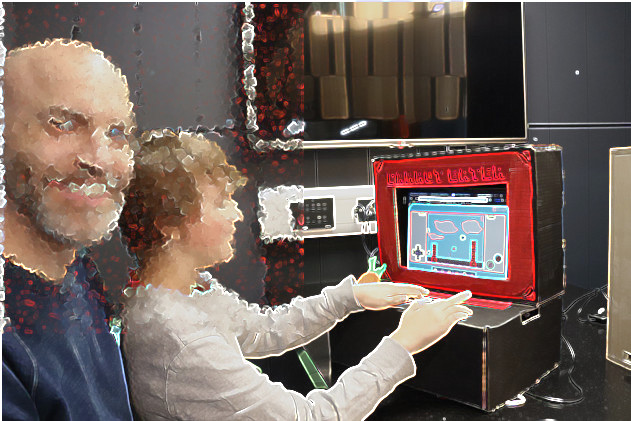

---
zotero:
  scannable-cite: false # only relevant when your compiling to scannable-cite .odt
  client: zotero # defaults to zotero
  author-in-text: false # when true, enabled fake author-name-only cites by replacing it with the text of the last names of the authors
  csl-style: harvard-manchester-metropolitan-university # pre-fill the style
layout: post
categories: chapter
title: 4. Exploration of the Formative Learning Design Process
---

-   [Research Questions - June 2023](#research-questions---june-2023)
-   [Chapter Introduction](#chapter-introduction)
-   [Exploring issues and context from practitioner interviews and
    existing
    research](#exploring-issues-and-context-from-practitioner-interviews-and-existing-research)
-   [Short vignette illustrating shifts in scope of
    activity](#short-vignette-illustrating-shifts-in-scope-of-activity)
    -   [Context of Vignette](#context-of-vignette)
    -   [Commentary on Vignette](#commentary-on-vignette)
        -   [Environmental factors and
            objectives](#environmental-factors-and-objectives)
        -   [Larger objective - Making games for an
            audience](#larger-objective---making-games-for-an-audience)
        -   [Mid-level objective - Implementing game
            elements](#mid-level-objective---implementing-game-elements)
        -   [Smaller objective / actions - Implementing discrete code
            and design
            structures](#smaller-objective-actions---implementing-discrete-code-and-design-structures)
    -   [Using scopes of activity as a tool for
        analysis.](#using-scopes-of-activity-as-a-tool-for-analysis.)
-   [Summary of design evolution](#summary-of-design-evolution)
    -   [P1: Explorations and
        innovations](#p1-explorations-and-innovations)
    -   [P2: The game making using suggested
        patterns.](#p2-the-game-making-using-suggested-patterns.)
    -   [P3: Adding a process drama](#p3-adding-a-process-drama)
    -   [P4: Adapting to MakeCode Arcade and more formal
        settings](#p4-adapting-to-makecode-arcade-and-more-formal-settings)
-   [Conflicts and design tensions experienced by participants and
    facilitator/s](#conflicts-and-design-tensions-experienced-by-participants-and-facilitators)
-   [1. Identity hardcore coding & dysfunctional group
    work](#identity-hardcore-coding-dysfunctional-group-work)
-   [2. Facilitator conflict addressing the Play
    Paradox](#facilitator-conflict-addressing-the-play-paradox)
    -   [Using Physical Maps of Missions as Game Design
        Patterns](#using-physical-maps-of-missions-as-game-design-patterns)
        -   [Learning Dimensions Map](#learning-dimensions-map)
        -   [Observations on tensions which the learning and
            navigational maps have potential to
            address.](#observations-on-tensions-which-the-learning-and-navigational-maps-have-potential-to-address.)
        -   [Resolving the conflict in an informal setting by ignoring
            it](#resolving-the-conflict-in-an-informal-setting-by-ignoring-it)
-   [3. Participant conflict due to lack of access and familiarity to
    tools](#participant-conflict-due-to-lack-of-access-and-familiarity-to-tools)
    -   [Motivations around in choice of
        toolset](#motivations-around-in-choice-of-toolset)
    -   [Code playground (as IDE?)](#code-playground-as-ide)
        -   [Addressing complexity of code environment with code
            playground](#addressing-complexity-of-code-environment-with-code-playground)
    -   [Design choices of the half-baked
        template](#design-choices-of-the-half-baked-template)
        -   [Design behaviours encouraged through use of game
            template](#design-behaviours-encouraged-through-use-of-game-template)
        -   [Introducing the quick start
            cards](#introducing-the-quick-start-cards)
        -   [Observations on design behaviours encouraged through use of
            game
            template](#observations-on-design-behaviours-encouraged-through-use-of-game-template)
-   [4. Participant conflict due to lack of relevant technical
    support](#participant-conflict-due-to-lack-of-relevant-technical-support)
    -   [Linear and stand-alone tutorial and code snippet
        resources](#linear-and-stand-alone-tutorial-and-code-snippet-resources)
    -   [Tensions and related to navigation of various documentations
        sources](#tensions-and-related-to-navigation-of-various-documentations-sources)
    -   [Using of a collection of game design
        patterns](#using-of-a-collection-of-game-design-patterns)
    -   [Tactical structuring of the pattern
        collection](#tactical-structuring-of-the-pattern-collection)
-   [Discussion of design issues](#discussion-of-design-issues)
    -   [Summary of barriers and tensions explored in this
        chapter](#summary-of-barriers-and-tensions-explored-in-this-chapter)
    -   [Discussion on Authenticity of
        Tools](#discussion-on-authenticity-of-tools)
        -   [Analysis in relation to existing research on related design
            toolsets](#analysis-in-relation-to-existing-research-on-related-design-toolsets)
        -   [Comparing my design to Scratch and
            Microworlds](#comparing-my-design-to-scratch-and-microworlds)
        -   [Conclusion on authenticity](#conclusion-on-authenticity)
    -   [On the emergent and mutual nature of the design and research
        process AND link to
        agency](#on-the-emergent-and-mutual-nature-of-the-design-and-research-process-and-link-to-agency)
    -   [Link to next chapter](#link-to-next-chapter)

## Research Questions - June 2023

1. What pedagogical tools and processes are available to support novices to overcome barriers to game coding and design?
<!-- - What pedagogical factors are significant to support novices learning coding, particularly in game making contexts? -->
2. How can learners build agency in an evolving community of game makers?
3. How can game design patterns support the development of coding practices with novices?

<!-- ## Notes on structure -->
<!-- NOTE:
Moved impact of software tools here - and overall on templated approach on a micro level  -  which therefore becomes less of this study's focus - and needs less evidence -->

<!-- - drawing mostly on my journal notes and the evolution of the tools and design themselves.   -->

<!-- - **Interviews (and Lit review ):** exposes motivations and barriers to undertaking activity  this domain from interviews with peer practitioners and literature review -->

<!-- However in terms of tensions - there is one on cultural tensions - this may need moving to the next chapter - a more thematic approach. -->

<!-- Also the practitioner interviews - could be a bit disjointed - as they do relate to cultural barriers and tactics. But could say those are explored in other chapters. DONE -->

## Chapter Introduction  

<!-- - exposes motivations, tactics for and barriers to undertaking activity this domain from interviews with peer practitioners (supplementing the literature review) -->

Due to the novel nature of the learning design the detailed outline of the specifics of the participants experience of the design are important to situate findings in the following two chapters. To achieve this aim, this chapter gives an overview of the evolution of the key pedagogical features of the tools of learning design used in my research process. It draws chiefly and on my interpretation of participants reactions recorded in journal notes, these interpretations are also reflected in the evolution in the learning resources which are documented here. To explore emerging tensions in design in a way which communicates relevant context, I outline four conflicts in interrelated activity systems using the terminology of third generation activity theory (3GAT). This chapter discussion begins with an exploration of the tools used through the lens of authenticity. It continues by covering the mutual nature of the evolution of the design, and ends with a synthesis to initial barriers to engaging in game making practices and initial interventions to address them.

<!-- - Introduces the use of design patterns and collections of patterns, as the germ cell of activity which then expands in different directions. -->

<!-- The game making community is not authentic or mature in the practices they are undertaking, the kind of community practices which we can undertake are focused partly on building connections to existing knowledge and practice. -->

<!-- One of my roles as designer here was to uncover and to help participants explore knowledge that they were unaware they possessed. Another was to help support the development of peer learning practices and in order to do that help foster a creative environment which suited that. -->

<!-- **Methodology for exposing tensions**

Tensions in the emerging design and the experience of participant conflict in activity systems served to drive the evolution of this learning design.

The work of Sannino on the use of secondary stimulation in formative interventions informs the analysis of conflicts arising and secondary tools and processes which facilitators use to address them [@sannino_activity_2011]. TADS thus addresses transformative agency.

In addition, work to distinguish type of learner agency including transformative, authorial and instrumental agency are potentially useful tools. -->

## Exploring issues and context from practitioner interviews and existing research

While the literature on game making and other forms of digital making is extensive, much has a focus on curricula driven, personal knowledge. Research in the domain of informal learning and the resulting characteristics and emerging tensions is less prevalent. In addition the process of writing interview questions and the conversational process of semi-structured interviews helped expose new streams of thought, that which while present in existing researched helped bring them into clearer focus.

**Summary of background of interviewees**

Saskia Leggett is a researcher who was active in the in Creative Family Learning program under direction of Ricarosa Roque. She took a leading role in creating the programme's support resources. Matt Curinga is an academic at Columbia and teaches in educational technology and computer science. He is also active in a non-profit organisation, Zero Day Camp, promoting learning coding and engineering through engaging projects. Dave  Potts is a professional programmer and a parent and volunteer at Coder Dojo which is a volunteer run teaching technology monthly event. James Clegg is PGCE Computing student/teacher and volunteer student helper for the game making programme.

**Summary of themes emerging**

In my analysis, I have proritised data which in forms the first research question and specifically addressing barriers and tensions for both practitioners and participants which exist in this domain of activity.

<!-- NOTE - REVIEW THIS BASED ON THEORETICAL LANGUAGE - PERHAPS OBSTACLES, CONTRADICTIONS, TENSIONS AND INTERVENTIONS. -->

_Table of initial data_

https://docs.google.com/document/d/1aEF0EsZRe-Ovok2VP7ouYH_v-SdepnNnXFhLtj6SseU/edit

<!--
 Convert here.
https://tabletomarkdown.com/convert-spreadsheet-to-markdown/

-->

|Issue                    | Instances |
| --------------------------------------------------------------------------------------------------------------- | -------------- |
| Barrier: Isolation during problems solving increases frustration and inhibits learning                                                      | 3         |
| Tension: the goal for students to be self-directed vs. the advantages of providing a shared collaborative foundation for production         | 4         |
| Tactic: Non-coding activities amd games to increase group connections as a good preparation for coding related challenges and frustrations. | 5         |
| Barrier: students not considering them selves as STEM / coding types of people                                                              |           |
| Barrier: logistical issues of time and equipment in school settings                                                                         |           |

**Additional short commentary**

The themes that emerged above.

One key issue is the clash of cultures. EDIT DOWN AND COMMENT

    There's this idea of a clash of cultures where to learn like the dominant school culture, you have to release some of your self-identity or you need to learn to bridge these worlds. ... (in) the literature, that there's this resistance of seeing yourself as someone who does STEM, as someone who does computer science. It's like we're not people that do that. And I think by doing it with their family, like there's no better way to kind of mitigate that effect and that hesitation, that barrier, because they're all becoming your whole family, like your, your closest identity is becoming people that write code or people that make robots.

This interview references research already explored in the literature review concerning identity and alienation from STEM contexts.  

<!-- The design description is framed within DBR language and concepts. -->
<!-- Section describing  Game Design Patterns as  the main unit of Activity. See Blunden to frame this and to describe the utility of the idea  [@blundenInterdisciplinaryConceptActivity2009; @blundenGermCellUnit2014]. -->

<!--
There's lots to add in here.
chapters\planning\methodology_chapter\methodology_chapter_late_2020.odt.md
https://drive.google.com/drive/u/1/folders/1D-VhVj-NgN3qgk3YEx4HZEozf_1UOGtE
 -->

<!-- As per Rogoff's analysis of informal learning in museaums [], the process of finding a medium between structured activity and authentic activity can be challenging.

The kinds of exhibits which invite extended play are of interest to this study. Such design indicates that there are affordances that invite revised design, tinkering and ongoing play.
-->

<!-- **Cultural influences on my choice of learning design**
NOTE - MOVE TO INTRO  - NO NEED

I set up the working pattern based on my professional experiences and my own academic and cultural interests. As mentioned in the introduction, DIY culture, remix culture, repair culture, TAZ events are strong influences to the learning design based on the ideals of an autonomous community.

 - a desire to increase engagement based on my experiences in classroom and out of classroom - Home Ed / coder dojo experiences
 - the link to cultural practices of code patching and remixing - the example of the plumber coder potentially being someone who finishes the job rather than elegant coder.
 - other experiences of social coding being important being part of a community working on a joint project (add a quote from Dave?)
 <!-- - A walled garden approach in terms of the GDP and code documentation and examples that are used. Based on my own experience of developer documentation and varied coding approaches.
- Other examples from the interviews with practitioners are relevant to include here. -->

<!-- These sections could follow a pattern of
 - rogoff's description / examples - but likely include a larger breakdown of 3 foci in Methodology Chapter.
 - my model examples
 - other links to PBL frameworks and/or educational concepts and contrast analysis

In the 3 foci model Rogoff refers to apprenticeship as a way of illustrating the process of being inculcated into community practices existing in a cultural plane. AN EXAMPLE .. -->

<!-- At this stage of writing I include a bullet point list of design relevant features to be expanded later.

- Shared repositories of resources - users shared a log in so they could see the work created by others.
- Showcase: At the end of the game making process students asked strangers to play their game in the foyer of my departmental building
- Drama Games: the process of warming up, creates community and sets a tone
- Drama Process: specifically designed ot overcome limits of the classroom.
- Playtesting: the process of playtesting, either self or peer links back to a community purpose
 -->

<!-- __Insert image of code__

The code of the game.
While the code is made up of various elements, only the javascript file is normally altered by participants.
The complexity is hidden away from the end user.

__Insert image of game in browser__

On the screen you can see the game.
Toby then decides he wants to add a new element to his game.
He browses the list of game design patterns.
There is a tension where he is hesitant about where to place code.
Screen shot of the menu of choices. -->

## Short vignette illustrating shifts in scope of activity

<!--
#### Code Playgrounds
Find definition
NOTES ON CODE PLAYGROUNDS
However in its styling it is playful and editorial picks and write up celebrate a playful spirit of creativity and sharing. There are strong parallels in this presentation to that Scratch community and to the sharing ethos integral to the maker-movement (explored in Lit Review). The interplay between play and work via shared experimentation is developed further in a later discussion chapter.
#### Online graphics editors - Piskel -->

### Vignette 4.1 - An example of game making activity in P2

The following vignette, consisting of extracts of participant activity over 20 mins of a session, is presented as an summary of different scopes of activity. The participant is the child Toby who in this session has been working independently on his game design. The tool shown in screenshots is the code playground glitch (see chapter 2 and glossary).

#### Table of Vignette
https://docs.google.com/document/d/1vYeVxYaRMTWPDOHwC4DEGYAkGPRIDX7wLiz0l8b7LWc/edit

### Description of levels of activity illustrated using the vignette

The following sections outline different scopes of activity to ground the reader in the overall activity and introduce later tensions between system elements.

<!-- The following sections describe of the vignette above focusing on the overall activity and its place within evolution of learning design.

It will use concepts from activity theory to describe elements of the activity system. Activity theory allows researchers to identify intersecting or nested systems of activity with varied goals.

Subsequent analysis of the identified activity systems allows both the researcher and practitioner to identifying existing and emerging tensions and to thus observe (spontaneous) or plan (designed) responses. While this chapter focuses primarily on the tools and resources, future chapter also draw on this framework for wider analysis. -->

<!-- ALTERNATIVE SIMPLIER INTRO TO THIS SECTION -->

<!-- Each section follows a pattern: the activity is described in general, then examples of activity at that scope from the vignette above are described, ending with brief analysis or signposting to where the activity in explored in greater depth. -->

<!-- The following descriptions mirror the work of AT researchers who conceptualise scope of activity as concentric circles from Broffennbrenner with "larger" scopes of cultural and societal goals and smaller, narrower, lower scopes of more personal activity [Engestrom][Cole]. -->

<!-- A short description of the activity systems follows the vignette above to help the reader establish a broad understanding of the processes involved before further analysis. I signpost the reader to other chapters when the described activity is explored in more detail there. -->

#### Environmental factors and objectives

As explored in the literature review, there are several wider objectives of the type creative design activity involved in this research. Aligning with my experiences, I have selected several important streams and represented them in an illustration 4.x  below. These include: research goals on the part of the researcher/ participant; desire to create a useful learning experience on the part of student helpers; learning computing skills and concepts as a home education project; and participating with other home educators in a creative environment and thus building team and communication skills; and fun on the part of the children participants.

{width=95%}

NOTE - CAN ADD THE OBJECTIVES INTO THE ARROWS ON THE DIAGRAM

<!-- While the limited example above of Toby's activity illustrates fun, additional data from interviews with this child and family back the broad goals above. [develop - perhaps an appendix or quotes] -->

<!-- As previously explored this mirrors the Activity, Action and Operation hierarchy. -->

<!-- | **Subject**         | **Objective**             | **Tools & Processes**          |
|------|-------------|------------|
| Community of novice game makers | Creating a game which is fun to play and communicates an environmental theme     | Shared log in to code playground (glitch.com)   |
|   |      | Shared log in to graphic editor (Piskel)    |
|   |      | Instructions from facilitator including the overall mission   |
|   |      | Starting game template    |
|   |      | Group playtesting     |
|        |     |

Table 4.x.  Tools used in larger-scoped objective involving the wider community of notice coders collectively making separate games. -->

#### Larger objective - Making games for an audience

The shared objective of one activity system is to make entertaining and educational games for an audience to play.

<!-- Insert an AT diagram from here - https://docs.google.com/presentation/d/1vR6dzFG6qXIdpB_-s6PbCePiB87qTs6YAXCljxNcb5Y/edit#slide=id.g57b5e8e9ad_0_0 -->

{width=95%}

There are diverse end audiences for the games. The final target audience are students and staff in the Manchester Met Brooks building where their games are shared in arcade cabinets at the end of the course. An additional audience are friends and family who can be send the games to play online. The more immediate audience for the evolving games are peer game makers during the making sessions.

{width=95%}
REPLACE WITH DIFFERENT IMAGE?

While the broad aim of making a game to share is tacitly agreed through participation, there are also diverse motivations stemming from environmental factors in the interrelated actors in this activity which bleed into the tensions which emerge at this level. In the vignette and surrounding data, Toby pays close attention to the challenge and variety of the game playing experience for his projected audience of players. A different example of the tension between competing motivations at this larger level of activity is explored in example 4.1 of this chapter and related analysis is continued in chapter six.

In the vignette above, I draw the participants attention to the showcasing of their games to an external audience. Toby begins the session playing his own game. During the course of this session he invites many other group members to play his game. He initiates and responds to conversations around the difficultly of the game he has designed.

<!-- In the vignette of Toby's activity this wider objective is present in the facilitator orientation at the start which references this audience -  _the Monday after we can play our games and we can share them with students. We can make the students frustrated when they can’t beat our games_. At the end of the vignette text, one of the student helpers also imagines this audience playing the game of Toby.    -->

<!--
NOTE - More on large scope in AT terms? What is needed here? -->

#### Mid-level objective - Implementing game elements

At this scope of activity, using the terminology of Engestrom in 3GAT, the object of the activity is the game code and the broad objective is to alter and add  new features to the game using tools available in the learning environment.  

<!-- | Subject         | Objective             | Tools & Processes          |
|------|-------------|------------|
| Groups or individual participants | Implementing game elements   | Code editing tool (glitch)   |
|   |   |  Game preview tool (glitch) |
|   |   |  Menu of game patterns at ggc-examples.glitch.me  |
|   |   |  Step by step tutorials on FLOSS manuals  |
|   |   |  Playtesting own game |
|        |     |

Table 4.x.  Tools used in mid-level objectives when selecting and planning implementation of game elements. -->

{width=95%}

<!-- One observation from he experimental course was that without significant support, the process of making a game is complex and there are many possible blockages in the process. -->

<!-- NOTE - THIS IS ANALYSIS  -WHERE TO PLACE IT?
By this stage, the process of collecting a user generated list of features and trying to respond to all of them as a facilitator had been abandoned as unrealistic. -->

<!-- NOTE - how much from p1-4 below to include? -->

<!-- In the example above Toby progresses from playtesting his own game to altering it. The code to change the layout of the platforms of the game is already included in the starting template. Thus is able add a new platform by making simple code changes. Toby retests the game immediately by clicking on the preview element of the code environment.  -->

Overall activity at this level was driven by learners setting goals and requesting help to implement game features. By this stage of the process (see below) Toby is able to browse a collection of game design patterns (see chapter two and glossary) for the chosen game type of a platformer was in place. He selects the pattern named  _moving enemies_.

<!-- However within that wider objective there may be a variety of goals depending on the participant. In this case Toby's goal is addresses the challenge and variety of the game playing experience. -->

<!-- Toby builds his competence in the process of comparing the own code to the code example to work out what code is new and relevant to the desired behaviour. -->

By this stage, participant had access to a diversity of tools, resources and processes. A summary table with short descriptions and links to the resources used are included as an appendix 4.x.  Participants developed preferred approaches and tool choices especially in accessing help when adding a new feature to their game. In the vignette above I outline the two main sources of help at the level of adding a new feature to the game.

    "Mick: So we’ve got two ones. Here’s the tutorial and there’s the examples of code so you can compare what you are doing and see where the new code should be placed."

In the course of the vignette above, Toby chose to access only a code example of the desired game behaviour. He did not, as others in the group were doing in this session, use the tutorial which provided more descriptive, step-by-step guidance. In contrast, others participants relied only on direct verbal help from myself or other participants (like Toby) to help them progress.

<!-- While some game patterns were simple to add, e.g. altering the location of platforms, other more complicated features involved several stages and varied tools to implement. The next section describes these stages as discrete code and design structures. -->

<!-- NOTE - Other participants;s motivations - explored later? -->

<!-- Other participants were less proficient using this online resources and used printed out versions of documentation. -->

<!-- In the next section narrower actions still within this system are explored as discreet actions which combine to be come the activity of implementing a game pattern. -->

<!-- | **Subject**         | **Objective**             | **Tools & Processes**         
|----------------|-----------|------------|
| Individuals (mostly)  | Implementing specific code or design tasks   |  Code editing tool (glitch)   |
|   |   |  Code game preview tool (glitch) |
|   |   |  Piskel  online graphics editor   |
|   |   |  Step by step tutorials on FLOSS manuals  |
|   |   |  Stand-alone code examples on glitch.com  |
|        |     | -->

<!-- Table 4.x.  Tools used in lower-level objectives of implementing specific code structures or stages in creating game assets -->

#### Smaller objectives and actions - Implementing discrete code and design structures

<!-- For example, creating a new graphical element in a separate online pixel-art editor called Piskel, exporting and downloading it to the laptop, and uploading it to the glitch code playground and then making code changes in several parts of the code to initialise and implement new behaviour for this element. -->

While the previous section focused on a mid-level scope of implementing game features, more complicated patterns involved several stages and varied tools to implement. Using the terminology of Leontiev [-@leontiev_activity_2009], in the example above Toby undertakes certain chains of processes in a fluid way that shows that actions had become operations. For example, his quick navigation between different areas of the game code, the game preview window and  sources of documentation.

In contrast, some tasks are new to Toby and are performed more hesitantly. In the example above Toby is careful is hesitant, checking and rechecking the process of copying and pasting new code into his game from a specially prepared code example which matches the game template he is working on.

<!--NOTE As a facilitator of a community I aim to notice these transitions as I aim to use the proficiency of participants to help distribute the process of helping peers. -->

Identifying shifts in participant activity in terms of scope aids analysis of the complex and interwoven cultural, social and personal actions [@rogoff_observing_1995]. Above Toby shifts between to the wide activity of making a game and sharing it with peers to the narrower action on implementing a concrete code structure. DEVELOP?

A key concept in 3GAT is that analysis of community processes must recognise that activity shift and transform over time.  The next section offers a concise description of the evolution of tool use in different phases of the study with an aim to situate later analysis of emerging tensions in the use of tools, resources and processes in the subsequent section.

<!-- In this thesis, chapter six has a focus on cultural aspects of making a game together and chapter five explores social organisation around the activity of adding game design patterns chapter five.  -->

<!-- After inserting the code which adds a moving enemy to the game, Toby spends five minutes altering the variables involved to match his design and to create a level of challenge that he is happy with. -->

<!-- Toby makes quick progress. one factor here is willingness to make mistakes. There is a confidence here in undoing mistakes, commenting out new code to return to previous behaviour.

The trial and error approach also yields benefits, a mistake in the values edited creates an unexpected result of the enemy moving vertically instead of horizontally. Toby embraces this mistake and shares his account of this happy accident enthusiastically. -->

<!-- NOTE
Each of these with differing levels of abstraction.
Break down that of GDPs? -->

<!-- In the last chapter, we examined the use of Rogoff's 3 lenses of cultural, social and personal activity. We can see a broad alignment of these lenses and the scopes of the activity systems above.

This has utility to both researcher and learning designer. The observations of the following chapters are based on this approach of using lenses to focus in on relevant activity.

NOTE - Explore how performed in line with other research - e.g. DBR (Barab) and possibly Bevan and Petrich -->

<!-- to highlight possible tensions and contradictions between competing goals of interrelated activity systems. -->
<!-- For example a common contradiction may be an immediate goal of children to mess around, play games and have fun while the goals of parent may be to maximise the acquisition of skills -->

## Summary of design evolution

<!-- [Summary Table of Stages](https://docs.google.com/document/d/1tBoXJWw-aZUcc8EsAvT195CtHLSM468YOCD0sGzOuoA/edit#)
see updated table in tables subdirectory  
-->

The following overview of tool use by stage concisely explore the rationale for their selection or production. Fuller descriptions of the tools used at each stage and links to the online resources created are available as appendix 4.x

<!-- Table from
https://docs.google.com/document/d/1tBoXJWw-aZUcc8EsAvT195CtHLSM468YOCD0sGzOuoA/edit# -->

| **Phase, Name and Date**| **Description** | **Starting Resources**         
|--------|------------|--------------|
|P1: Oct 2017 - Dec 2018; Experimental Course  | Participants started with no set plan or toolset and were asked to plan and make a game in two larger groups of 5-6 participants of mixed ages. After several weeks, a minimal incomplete starting game code template was introduced in response to student need.  Then One-off workshops at Mozilla and Feral Vector conferences and to PGCE computer students and the creation of a “half baked” game template |  Phaser 2.6.2 javascript library; Thimble code playground; online graphics editor Piskel; audio creation tools  |
| P2: Jan - Feb 2019; Glitch Game Club | First iteration of game making course of 5-6 weeks. The template and resources created in the previous stage were used as a starting point but continued to evolve. |  Phaser; Glitch, Piskel; updated game template; quick start cards; step-by-step tutorials; code examples  |
| P3: May 2019; Glitch Game Club 2| Second iteration of game making course with additional drama and reflective elements |  As per P3; drama scenario; interactive chat page in glitch  |
| P4: Jan 2020 - September 2020; Make Code Arcade | Two iterations of game making course of 5-6 weeks using MakeCode Arcade tool.  |  Make Code Arcade (MCA) tool; MCA Template starting game; MCA quick start cards; MCA game pattern menu; MCA game pattern tutorials; Learning Dimensions Map   |

The following sections briefly outline tools and processes giving a synthesised overview. Later sections explore tools use in more depth.

### P1: Explorations and innovations

<!-- NOTE - The evolution involves phases and then tension - what and how to cover both?  -->
<!-- This phase took place before the official start of this research and relevant ethics application. As such,  -->

Phase one was an extended, exploratory series of game making sessions over several months. This stage was aimed not at collecting user data rather than building my  competency as a facilitator. The process began with no pre-existing supporting materials. In response to need, I adapted a starting code template of a platform game and created various code examples to add functionality requested by participants. This template was base on the game genre of _platformer_ (see glossary), a move which helped to limit expectations of the technical limits of their game.  At the end of this stage participants showcased their games to students in the foyer of the MMU Brooks building. Feedback from participants this stage included; a general consensus that the process was too long and that more guidance in the process of familiarising themselves the coding tools initially before undertaking ideation would be useful. Extracts of feedback notes are included as appendix 4.x

The end of this phase in mid to late 2018 involved responding to this feedback and working together with PGCE computing students and delivery three one-off workshops at conferences and a Manchester library fun day. The requirements of this compressed time frame aligned with feedback to prompt me to design an accelerated process to bump start the game-production process. The new intervention involved a starting template and printable resources that highlighted particular key lines of code and variables that had a high impact on the game experiences. The results in terms of engagement and impact on changing the game were very promising.

<!-- The first phase of delivery in late 2018 was based on initial research stage; I drew on literature to identify factors to consider when designing for collaboration, adopting a project based approach inspired by design thinking.  -->
<!-- To inculcate parents and children in to the culture of retro video games I began initial sessions by inviting participants to older arcade games on laptops. -->
<!-- Game filled laptops.  
Should this be added to the table above
-->
<!-- The tools allow participants to create games using a combination of a free to use online tools.
an online  coding environment
using the phaser javascript game library (glitch.com), a pixel art editor (piskelapp.com), and a sound effect generator (sfbgames.com/chiptone). -->

<!-- Have a look at this document which outlines Structuring and Scaffolding Phaser Activities from Phaser Book
https://docs.google.com/document/d/1lk-8dHFFNbFXFtE5vV6_GHXYRzU7ATWZAIe-hNunyx8/edit#
 -->

<!-- #### The half-baked starting platformer game

NOTE - ALSO EXPLORED IN NEXT CHAPTER - HOW TO ARRANGE?

The use and design characteristics of the starting point of a half-baked game.

- Phaser 2 to avoid complexity of code structure
- 2D platformer - familiar to most - Mario and Sonic
- low-spec graphics
- game of player, platforms, and coins to collect and hazards to avoid.
- graphical level design
- key variables brought to the top
- simple structure of code in terms of aligning with framework and not adding extra functions

**Variable editing effective movement**

Player movement was a key to playtesting feedback as such three  key variables were highlighted at the very start of the game code and given descriptive names to facilitate their editing. When testing the game, the player's jump height was not great enough to allow progression up from the floor to one of the platform thus thwarting the collection of items.

Game progression require altering at least one of the descriptively names variables associated with jump height and then activating a preview window to observer the changes by playing the game in a new browser tab.
<!--FIND  Some evidence of building proficiency with significant work to change these three   

    // Variables that change how the player moves
    var gravity = 500;
    var velocity_x = 100;
    var velocity_y = 300;

While some participants engaged with extensive experimentation to find a player movement feel that seemed just right, others were much less concerted with this aspect of game play, lowering gravity drastically to allow a greater jump size but a more frustrating floaty jump.

**Level design and prototyping**

The starting game template included a minimal amount of platforms, hazards to avoid and golden blocks to collect. Image 4.x above show a printable _quick start_ cards to aid participants to begin the process of changing level design.

As preThe possibility of disturbing the syntax of the  of code in the array. When participant did this it provided a good opportunity for facilitators or parents to outline the importance of correct syntax of and to explain the code structure.

The vignette in the last chapter saw Toby's adding new levels to his  game and undertaking many iterations of changes to the level design. He and several other participants spent extensive time performing level design activity with a goal of making the game extremely challenging but still technically possible. Others played with the convention of the game by removing all hazards and filling the screen with rewards/coins (an example is outlined in the starting vignette of the next chapter).

**Incomplete graphical blocks & Piskel**

The use of blank, coloured blocks of 32 x 32 pixels encouraged participants to change the graphical design and the relatively small size of the sprites encouraged rapid design.

PERHAPS REPLACE THIS WITH SCREEN SHOT OF PISKEL AS A TOOL
{width=50%}

The process of creating a pixel art characters and hazard involved using an online grid design tool called Piskel, creating an design of an appropriate size, saving, exporting as an image, downloading to the hard drive of the laptop in use and finally uploading and incorporating the image into the code project and linking using   code syntax.

**Incomplete graphical blocks & Piskel**

The

PARK FOR NOW - Maybe move to Design
The concept of the feel of the game or the challenges maps to the Dynamics of MDA framework.
 -->

### P2: The game making using suggested patterns.

By the beginning of P2 most of the resources and activities were in place and relatively stable. There were some incremental evolutions in the template that stemmed from participant feedback and my reflections. Key additions at this stage to support the use of a template were a collection of tutorials and code examples illustrating key game features that had been requested by participants.

The collection of game patterns were presented in a web page together with the starting template and a link to an online book collecting the process into step-by-step chapter based tutorials.

The resources are explored in more depth in sections three and four below. A more complete description of the resources used in P2 and P3 are included in appendix 4.x.

### P3: Adding a process drama

P3 used the same toolset as P2 however in addition, drew on my previous work with the MMU Faculty of Education drama department [@caldwell_drama_2019] to create a simple drama process to give an external motivation and narrative to the creation of games using for a fictional audience of visiting aliens.

The participant activity of these stages and tensions between system elements are discussed in detail in the remainder of this chapter and in following chapters.

### P4: Adapting to MakeCode Arcade and more formal settings

I also adapted and advanced resources with an aim that they could be used within secondary classrooms to support computing curriculum. To do this I added a learning dimensions map, a process which is explored in a later section of this chapter.

In 2019 MakeCode Arcade was launched to make games using a shared authoring system to Microbit controller. As that systems was designed to be easy to use by novices

I ran two iterations of game making course of 4-5 weeks using MakeCode Arcade tool. MakeCode Arcade uses block language system. The template, resources and facilitation approach was based that of P2 [^2]. I have included short analysis of the tool and those resources in this book chapter [@chesterman_game_2023].

## Conflicts and design tensions experienced by participants and facilitator/s

This section examines design contradictions between system elements and tensions experience by participants which developed into conflicts which significant in stopping participant progress. The processes here aligns DBR in that the surfacing of tensions and charting the detail of the evolution of resources and other responses used helps illuminate broader, systemic issues concerns in the overall activity [@barab_using_2002].

The first two tensions address issues of identity, ambition, and attempts to align with curricular concepts. The remaining sections detail a responses to key contradictions in the tool set of the early design, specifically addressing authoring tools and supporting documentation.

<!-- In the process of reflection on sessions I both observed and project tensions between activity system elements and between different scopes of activity. In response, I introduced new tools or processes or removed existing or potential barriers. I observed participants responding to tensions both in expected and novel ways. -->

<!-- As outlined in the table above I carried out four stages of workshops and development with home educator families. I will outline decisions behind the design activities at key stage of activity   -->
<!--
**Summary table of tensions ONLINE HERE**
https://docs.google.com/document/d/18HrRPPx0-fj3PXVJTAf2dzYNTBSYGikpV_U0hu46r2c/edit

**3M Matrix tensions ONLINE HERE**
https://docs.google.com/document/d/1DRgpgIUfq5XIktYy-lX4WlviUDnffNc0v8SOeLGgHho/edit
Matrix of 3M Game Making Model - Pedagogical Features explored through Tensions and Resolutions -->

<!-- 3 foci and 3M element compared - save for the conclusion/ discussion?
https://docs.google.com/document/d/1FIPn2dEB2aCKZi5z05j69cnHgpGNXFh1_SPV6h5l12g/edit#heading=h.kci0lnvn7f60 -->

<!-- NOTE - DEVELOP THIS ASPECT OF INCLUSIVE ENVIRONMENT TO REDUCE STRESS - MOVE FROM NEXT CHAPTER?  -->

## 1. Conflicts due to identity clashes and dysfunctional group work

<!-- **Participants stuck / demotivated : scope of ambition to high,  clashes of identity not hard core coders, no on-going playtesting, collaboration groups too big (transition),** -->

This conflict involved accumulating tensions which resulted in families feeling anxiety and alienation from the group coding environment and associated peer working dynamics.

I illustrate this conflict using the experience of one family who withdrew from P1 three weeks before the end of the programme. In an early crisis point, one of the children  was not able to implement a desired feature as the 3D experience was beyond the technical possibilities of the code framework.

The shared in feedback (see appendix 4.x) the moment that decided their withdrawal. At one point they looked around and just saw people doing hardcore coding and no longer felt at home in the environment. In early sessions the family members had planned design on paper and created digital pixel art. However in later sessions, they were reliant on others to implement code changes for their imagined game. In my journal notes I reflect that this experience was in a session where, due to a sense of urgency to complete games, I had omitted warm up activities to immediately support to help some participants debug code errors.

To briefly summarise this dynamic using the language of 3GAT we can locate tensions between competing objectives. The shift from paper design stage with its greater freedom of choice and imagination to the technical limits and challenges appears to have created too great a rupture between this families objective to be creative and an uncompromising technical reality.  

This experience aligns with research in this area explored in the literature review which explore pedagogies to address barriers concerning identity and technology-driven practices [@kafai_constructionist_2015-1]. I have shared the crisis of this family in particular, as the process drove me to focus on and further develop inclusive cultural practices which are explored in chapter six.

<!-- NOTE -
DEVELOP THIS IN LIT REVIEW - Start here [@kafai_constructionist_2015-1]

Studies with pedagogies addressing barriers to do with identity and computer cultures
-->

<!-- The value of playfulness is illustrated
The freedom of choice and imagination allowed by designing on paper and via pixel art created compounding tensions. -->

<!-- I had not played customary drama games to create an inclusive environment.

That week I had omitted them as I felt a sense of urgency coming from families to solve their problems. The scarcity in facilitator time drove me to crack on supporting families to debug code errors. -->

<!-- In this emergent design, they had mostly completed asset design and narrative development and the only coding remained. I thus wanted to address the tension between completing the project and alienation from just coding. -->
## 2. Facilitator conflict addressing tensions between privileging participant choices or underlying computing concepts

In this section I outline key tensions in the design that two interventions involving different forms of mapping have the potential to address in more formal teaching environments.

While the focus on this research is informal environment, I wanted to create resources and processes which are of potential value to practitioners in the UK classroom. The LR briefly explored ways in which digital game making is commonly aligned with curricular areas [@kafai_connected_2016]. For me the challenge was to find a way to support participants to explore these concepts without detracting from the choice oriented learning design.  

Analysis of my journal notes shows that I spent significant time exploring how best to support participant awareness of underlying computational and systems thinking concepts without detracting from their valuable experiential progress. This section addresses my interventions to resolve the tension, previous explored in the literature review, between learner expression and choice and the curricular contents  [@hoyles_pedagogy_1992].

The conflict in this example is from my own perspective. There are two sides of contradiction, one is my perception of the contradiction between curriculum and choice. Later, another conflict which manifested as my hesitancy introducing activities using the new tools is also explored.

<!-- This conflict provoked me to create resources which could serve to pull participants towards more curricular goals. I adapted and extended resources to suit use in more formal learning environments, e.g. particularly a secondary computing classroom. -->

<!-- stylised in a way that mirrored a map used for navigation in a quest-themed computer game.

As learners traced a trail between the different island/missions they had visited, the map provoked learners to reflect on their journey and progress. However, this approach may be too labour and time intensive for many class environments.
-->

#### Learning Dimensions Map

In learning environments where there is a lot of choice assessing learners via observation is beneficial. Rather than deciding what you want to teach and testing students on that area, you can map the learning happening in an authentic activity.

When researching hands-on tinkering in Science museums Bevan and Petrich [-@petrich_it_2013] worked with educators to examine video footage of families interacting with exhibits to make a structured list of the learning they observed. The resulting map of learning dimensions included underlying science concepts but also contained more general skills and helping behaviours involved in exploratory learning processes.

Research on _concept maps_ [@canas2003summary] as methods for teachers and researchers to identify key learning suited to particular computing projects. Has traction for NCCE quick read. The value of facilitators mapping out concept which are likely to occur in project work can help with x, y and z.

The knock on effect on reducing barriers to agency is of particular interest to this study.

<!-- Another chapter in this collection identified concept maps and observation as methods for teachers and researchers to identify key learning suited to particular computing projects.  -->

One of the outcomes of my research was to extract some of the concepts and practices that learners engaged with when making games from hours of recorded material. While some concepts are common to existing computational thinking frameworks others, including systems thinking concepts, are more unique to game making. Table 4.x. shows my resulting map of learning dimensions for the 3M game making model.

|      Coding Concepts    | Systems Patterns    | Design Practices|
|--------------|-----------|------------|
| Sequences | Systems Elements      | Goal Setting        |
| Variables      | Systems Dynamics  | Being Incremental and Iterative       |
| Logic | Reinforcing Feedback Loops      | Developing Vocabulary        |
| Loops | Balancing Feedback Loops      | Web Navigation    |
| Arrays |       | Problem Solving        |
| Creating Functions |       | Version Control    |
| Change Listener |    | Debugging   |
| Input Event |   | Reusing and Remixing      |

This process of mapping this framework is potentially of use for teachers and other researchers to help their observation of students in game making activities to align with design, coding and computational concepts. To further aid practitioners, in P5 I restructured paper and online resources on game design patterns to included links to online descriptions of the concepts in the learning dimensions map. The following boxed section outlines a designed mission card which identifies the more abstract concepts embedded in the more concrete design missions.

BOX BEGINS

Your mission is to apply the following pattern to your game. There are supporting step-by-step resources available if you need them. When you finish be sure to reflect on how adding this pattern helps your understanding of the computing concepts and similar patterns listed. This concludes your mission.  

* **Name of Game Design Pattern:** Jumping on Enemies to Zap them

* **Type Pattern:** Game Mechanic

* **Description:** If the player is descending from a jump when they touch the enemy the player is zapped and in this case disappears.

* **Need for Pattern:** Enemies create challenge and being able to jump on an enemy is a good way of clearing the area you want to explore.

* **Coding Concepts involved:** Arrays[^8], Change Listener[^9]

* **Links to other Computing Patterns:** Systems Dynamics[^10]

* **Related Game Patterns:** You'll need to have added the **Add Enemies** pattern to your game before you can add this one.

BOX ENDS

While the process of creating these cards of game design patterns linked to the underlying framework is labour intensive, the process offers several potential benefits which may merit the effort, including linking curricular concepts to more concrete experience and aid in navigating the learning experience.

<!--
While this is an informal way of using maps the are other approaches that are more formal including one called a concept map which is a visual representation of target specialised knowledge. There is a section on concept maps as part of the teach computing website here. https://blog.teachcomputing.org/how-we-teach-computing/. -->
<!-- 

_Map of Learning Dimensions of the 3M Game Making Approach_
 -->

 <!-- **Including Coding Concepts in the Learning Map and including Code Cards with links to online Concepts**

 Recap here the choice of coding concepts rather that CT in more abstract terms.

 - Make Code cards which contained links to game design patterns and the different component concepts
 - (see Eriksson and Bjork)
 - Draw on material and critique in chapter on semantic profiles / waves. -->

### Using Physical Maps of Missions as Game Design Patterns

I used flip chart paper and print outs to draw a coastal landscape with GDPs represented as different islands.  I asked learners to create and personalise a movable marker representing themselves. When learners selected their next mission, they moved their counter to the relevant island. Thus learners had to be intentional about their next goal and were implicitly encouraged to stick to it.

{width=95%}
{width=95%}
_Missions as Islands_

My motivations for this intervention were that it encourage a sense of community and peer learning, to help learners navigate their design experience and that the process would encourage reflect on the coding concepts or other learning dimensions that they had been working with.

The use of space on the map on which GDP were arranged aimed to communicate which patterns were more complicated to implement.  Starting patterns limited the maximum complexity of missions.

  Mick(f): I'm putting the ones that are hardest further away from our home island. So, because keys and doors is quite tricky, I'm going to put that one over there in the corner, if that's one that you're working on.  ( Mick cuts a out an image from [^4] representing a GDP of key and doors.)     Olivia(c): So I've gone really far away on the map.

The process of mapping the difficulty is something that the child picks up on here. Moments after we see a parent using the map and the resources to help her child fix a goal for the session.

  Rozanne(p): Oh that's something you were wanting to do	(Roxanne points at a cut out that Mick has just stuck down.)
  Richie(c): I like the idea of making the enemies move.
  Roxanne(p): Ok, there's a worksheet here about that. So you don't want to any any heath meter?
  Richie(c): No.
  Roxanne(p): At least not right now. You want to to do this, on a sheet, right here, here you go.	(Roxanne waves sheet and smiles at Mick.)

The new resources seem welcomed by the parent. This is probably as in previous sessions there had been conflict between them about goals. The process of aiding reflection and meta-cognition through the use of visual materials in the form of a map aligns with inclusive pedagogical design principles of UDL in that it aid the use of diverse forms of reflection and navigation. In chapter six, I explore the use of a process drama to achieve similar aims.

While it is beyond the remit of this thesis to examine the impact of these processes in more curricular focused environments, the following section offers a synthesis of the ideas in explored in this chapter and alignment with existing research.

<!--
MOVE TO END CHAPTER?
I am currently investigating replicating the use of maps process using online tools to reduce complexity and preparation time. -->

<!-- It explores these tensions in relation to existing research and contains further discussion to inform possible future directions of research. -->

<!-- **Lack of reflection and moments to reinforce what is being learnt.** To support younger coders unsure what to do next or who struggle to stay on task, I sought to create another kind of map to help them navigate their game making journey. -->

#### Observations on tensions which the learning and navigational maps have potential to address.

My experience of the process of adapting the learning design to the needs of more formal settings supports existing research in this area. The following section aims to summarise the alignment of the potential of this work with existing research.
NOTE - more work to link this succinctly is needed.

<!-- NOTE - Reduce this down to text - as too close to the end table. And reduce in significance. -->

NOTE - Also add the following point.

- It may not be clear how teachers can best support the direction of learners - addressed by the map linked to the collection of GDP used to support and identify possible pathways.

Facilitator stress if they are not able to support a very diverse set of features demanded by students working on diverse kinds of games.
Limit the type of game to one kind. Offer a significant but limited menu of missions that users can add. Offer written and visual support documents which learners can access independently of facilitators

| **Tension identified**| **Commentary**|
|----------------|------------------|
|Facilitator stress if they are not able to support a very diverse set of features demanded by students working on diverse kinds of games.  | Limit the type of game to one kind. Offer a significant but limited menu of missions that users can add. Offer written and visual support documents which learners can access independently of facilitators|
|  Facilitators may need to justify learning happening and struggle to see this in-situ if unfamiliar with the game making process. This may restrict openness of activities to better assess and support learning. | A map of learning dimensions flexibly linked to main missions/patterns can be used by both learners and facilitators.  |   |
|  Challenges adapting resources to a curriculum environment |  There were some additional changes in the way that design patterns were presented to learners mirroring design patterns on other domains including: name; need ; related patterns. In addition related concepts in computational thinking and design processes which are promoted as part of the recent computing curriculum were included and linked to a learning dimensions map. |   
|Systems concepts are embedded in many games but the process of direct teaching of such systems can be complex and interrupt and distract from other design activities.   |  Systems related design patterns were identified and placed in a challenge themed section. Extra missions which highlight game challenge and user experience may help learners to explore systems concepts within the game context. (outlined in Methods chapter -  use Schnell & GSM literature = their terminology is Game elements)|   

While the process of adapting the learning design to the needs of more formal settings supports existing research in this area. The process of using these resources to align and highlight the design activities to underlying concepts is not explored in this study from the perspective of learners. Ultimately, I did not introduce the resources consistently with the learners of this study, instead prioritising time spent in on-going hands on experimentation, peer learning and playful activities. In retrospect, my inaction seems appropriate to the informal context of this environment. It reflects the lack of external motivation for participants and myself to align to curricular concepts.

<!-- NOTE EXPAND IF USEFUL -->

<!-- While the use of these skills is not unique to game making and common to pick up on many making situations, the use of external image and sound asset creation tools which then creates production pipeline process does engender key navigation and importing and exporting skills which are very valuable in online environments. -->

<!-- NOTE - The map could easily be changed to reflect this or other foci of teachers / researchers. -->
<!-- A theme to follow up in the Maps / personal learning chapter is that of picking up on some of the behaviour of participants, especially that of experienced parents, experience either in coding practices of supporting their children. Once identified, how could beneficial interactions be encouraged in the next iteration of design.

Examples include;

- supporting reflection on design and coding concepts / skills.
- navigation / organisational support - use of a physical map.

For example, the use of CT concepts in a framework, listed as part of the initial design pattern card, which could then be discussed, ticked off or otherwise reflected on. -->

## 3. Tensions due to lack of access and familiarity to tools and processes

In the terminology of activity theory, conflicts are conflation of tensions and contradictions which result in paralysis in the activity in question. One conflict, which surfaced in P1, stemmed from unfamiliarity with tools and game making processes and resulted in frustration and ultimately inaction.

While, tensions stemming from gaps in knowledge and practice are commonly addressed in formal learning environments through forms of instruction, the informal nature of this learning setting made direct teaching approaches unappealing. In P1 I trialled brief class instruction of key coding concepts, e.g. logic statements, that I judged to be relevant to the whole group. Despite trying to limit the time spent on instruction, linking to their experiences and making the process informal, my journal notes reflecting on these interventions were unfavourable. Instead, I was keen to align with the motivational potential of hands-on (learning by experience) approaches to STEM education [@holstermann_hands-activities_2010].

The process of helping participants build familiarity and competency in tool use was further complicated by my own motivations for working with as authentic as practical game authoring tools.

The crux of the tension involved designing a bespoke  game authoring environment by adapting existing tools and embedding where possible affordances within the designed environment to facilitate participants to address gaps in their knowledge without needing explicit instruction. The following sections explore the evolution of the tool selection and the tool use of participants in response to this conflict in the game making activity system.

 <!-- namely: an incomplete 2D platformer; pixel graphics; with graphical scaffolding for text-based code; and deliberately incomplete thus inviting improvement. -->

### Motivations around in choice of toolset

One motivation was to align to authentic web technology due to my previous experience. The reason for working with code this authentic bears exploration. Characteristics of broader dimensions of authenticity of tools and processes in learning environments are explored in the literature review. A brief summary being: similarity to workplace settings; facilitating activity which serves a need of participants; an ability to showcased resulting work to an audience. FIND CITATION PBL?

While my choice of open source digital tools allowed for a high level of aligning with professional practices, it was also potentially complex in terms of use of tools.

<!-- As explored in the literature review, an extensive body of research on the design motivations and impact on learners exists for the creative coding tools Scratch.  -->

A common question for this research is why not use Scratch (see LR / Glossary)? While Scratch, is aimed a broad range of media creation, much of this research involves game making as a popular genre of media of young people. I chose to not use Scratch for this study, partly as it was well researched and partly to prioritise authenticity of tool set.  

My motivation for choice of code language (Javascript, Phaser) was driven by desire to be authentic and extensible. The use of glitch.com as a code playground significantly reduced technical barriers for students related to this choice. In terms of first impressions, learners first experience of the experience was in the process of playing a game in a webpage and controlling the character using the computers arrow/ cursor keys which for many was a familiar process.

<!-- I took care to screen participants from processes and tools that were unrealistic for novices to use. -->

<!-- NOTE - PERHAPS EXPLORE COMPLEXITIY OF IDES AS A BARRIER IN RESEARCH - SEE BLUE JAY AND GREEN FOOT TRAINING IDEs -->
<!-- In the activities of study, a high degree of authenticity made possible, in a material sense, by the digital nature of the learning resources. Beyond a general purpose computer, no prohibitive equipment is needed. -->

### Comparative observations on the use of a code playground

Code playgrounds, as described in chapter two, are an online environment used to test, share or invite help from online users.

While the scope of this study is not on the micro-level of tool use, it is useful to collate some broad observations from my journal notes and video data on how participants used the new tools introduced. This is done in relation dimensions of complexity exposed in research on educational coding tools.
NOTE - WHY IS THIS USEFUL?

**Complexity of set up**

Using a code playground removed the process of setting up a server for web development, and the delay and complexity of transferring files to the server. While the game code project consisted of several files of javascript, HTML and CSS, learners were shielded from the complexity of understanding how they were interlinked.

Scratch has many things set up by default, a default screen size, asset creation tools, online community, comments and friend section.  

**Addressing code syntax errors**

Code syntax errors (GL) highlighted via a red dot provided a quick visual indication of where the error occurred. In pair work the non-coding peer would often notice and point out the red dot, thus preventing further errors.

**Addressing access errors**

In my design, issues of access for  participants were mitigated through shared log in details and through help from family members or other peers.
CR Scratch.

**Inspiring creativity**

Scratch has an online community inspiring sharing and remixing. While my design used Glitch community, which had this capacity, the use was much broader, and Glitch less useful. Thus my design was lacking.  

<!-- In the video data analysed, there were practically no extended blockages to undertaking work related to the use of this environment. While this study does not attempt to quantify this factor, the experience compares very favourably to my experiences of using and teaching coding environments. -->

<!-- In my design the tools set is distinct from tools like Scratch, Logo in that while those tools were designed to be self-contained, the use of a JS library in a web coding environment is more open-ended. -->
<!-- In my design, tools are more authentic and familiar in terms of using a professional framework and a web technology around which the internet browser is based on. -->
<!-- #### Creation and migration of graphical and audio assets. -->

**Distributed vs. self-contained approaches to asset creation**

In P1, I used a variety of graphical and audio tools including:  Piskel to create sprite characters; Scratch to create backgrounds; Audacity and freesound.org record and edit audio for effects; Sonic Pi for background music; and Bxr online tool for sound effects. Participants would then save assets in a compatible format, upload them to the code playground, and link the file using a line of code.

In Scratch there are tabs which host simplified graphical and audio studios. Design decisions prioritise ease of use and the ability to record audio right into the program. The self-contained of scratch has this reduces possibility for compounding errors and complexity caused by file formats, migration of data.

While in my design, there is greater friction caused by the process of migrating assets, I observed a palpable a sense of achievement when participants succeeded in seeing and hearing their creations in their game after making the final changes in code. The reward seemed to be greater due to the difficulty caused by the unfamiliar environment and processes.

To find middle ground, in P2 and P3 I reduced the number of tools suggested when creating assets. The implications of working in this more porous learning space are explored in the later discussion section.

<!-- I began by mirroring social model of learning like CoL and CoP and their propose apprenticeship-based approaches. Specifically, introducing possible code solutions to implement the ideas of participants. However, limits to my time involvement and my technical fluency hindered this process creating stress in myself and frustration and hesitancy on participants to get direct help.

    NOTE - Examples drop?
    For example, to troubleshoot a code error might take between one minute and 10 minutes depending on the complexity of it. To work with participants to identify and then implement a new coding structure could take up to 30 minutes.

    At times I was able to identify a discreet new code construct and to implement an example of this between sessions. At times I would attempt to do this in the group setting with varying results.

    Other interventions were called for directly by parents. Two relevant and relates requests happened at the end of P1.

    One was a call for more hands on play and use of the tools of production before being called on to make creative decisions. The parent likened this to an studio approach. Another was a request for additional supporting resources which explained the coding structures used in accessible but detailed ways. A request which hinted at a more structured, instruction based approach.

    However, interview data from participants placed great value on the flexibility of the approach which allowed participants to choose what they wanted to add to their game next. -->

<!-- Based on group work with adults on creating media projects together I created an email group that all participants could post to to ask for help. However this option was hardly ever used taken up. I was given feedback from one parent that asking on for technical help via an email forum not something that they felt comfortable doing. The same family also gave useful feedback about social norms of not bothering people getting in the way of asking for help.

Thus other ways of addressing this conflict were called for. -->

<!-- The need to get started somewhere emerged - and the template was a response to that.
Just an immediate, intuitive way to bring something to the table as a starting point to develop. The template was based on a prominent tutorial on the phaser website called Making your first game.
https://web.archive.org/web/20180426051205/http://phaser.io/tutorials/making-your-first-phaser-2-game -->

<!-- As preparation for the sessions I had followed the tutorial. When the  and adapted it. I removed out as much code as possible and thus simplifying the structure and readability.
  https://github.com/glitch-game-club/glitch-game-club/blob/master/games
 -->

<!-- ### ORIGINAL SECTION
**Code Playground to overcoming lack of software feedback**

One design principle explored in the literature review [@resnick_designing_2013] in the use of creative coding tools was that of immediate feedback for participants. Code playgrounds provide such immediate feedback. For example, in the code editing interface of glitch.com shown in Fig 4.x, changes made to the code on the left section take immediate effect in the resultant game on the right side of the screen.

{width=85%}

Fig 4.x, Changes made to the code on the left section take immediate effect in the right-hand preview window

The a game template served to remove technical barriers to getting immediate feedback and offered other affordances explored in the next section. -->

### Design choices of the half-baked template

The examples above align with constructionist design principles used by the Scratch design team. An relevant design heuristic is - "Be careful about the use of black boxes" FIND SOURCE. This refers to the process of hiding away aspects or functionality of the code or processes. For example, in Scratch the process of setting up a canvas is preset. It is already present and visible on the creation of each new project and the user has no choice over the settings.

In my design, I have made similar decisions to shield participants from unwelcome complexity to reduce cognitive load and alienation from unfamiliar language. However, because of my choice to use authentic tools, while the complexity remains in code view, I decided to use a starter template to deprioritise the impact of the underlying code complexity on the participants experience.

In the domain of web technology, starter templates consist of pre-built collections of HTML, Javascript, CSS and other configuration files which allow users to avoid initial configuration and thus accelerate adding features to projects. For example the Next.js web framework comes with a large range of starter templates based on common requirements of web sites [@nelson_best_2023].

The choice to use a starter template was driven by early experience in the experimental period of the design. In participant feedback for P1, one parent indicated that it took too long before in the planning stage and called for more hands on play and use of the tools of production before being called on to make creative decisions. The parent likened this to an arts studio approach.

Other parents requested additional supporting resources which explained the coding structures used in accessible but detailed ways. A request which hinted at a more structured, instruction based approach. In addition, my own motivations to explore research claims which on the engagement value of prioritising modifications to for quick impact on the game and on allowing participants choose over what they wanted to add to their game next.

To address confusion about how to being coding a game, I introduced a working code example as a starter game template using the phaser library. The use of template was an immediate, intuitive way to bring something to the table as a starting point to develop. The template was based on a prominent tutorial on the phaser website to create a two-dimensional platformer game[^1]. I adapted the final game, removing out code with a focus on simplifying the structure and readability.

The template in this case followed the following structure:
- a beginning section out side of a function declaring variables
- a preload function which loads assets into the game
- a create function which sets up the initial game
- an update function which listens to and responds to user input, e.g. moving a player on the screen

The following illustration from the step-based instructions illustrates the structure for participants.

{width=95%}
4.x - Structure explained in Manual for P2 and P3

In P1, I found that as I worked with the learners to respond to their requests to add in new elements to the game, I was able to to reference different parts of the template and thus build their familiarity with the code.

At one stage I did a test of that process by printing out different elements of the template and asking them to complete them roughly in order as a jigsaw activity. The participants expressed surprise at how much familiarity they had built up with the code.
INSERT QUOTE FROM SU AND TOBY

Despite building familiarity with code, at this stage event simple game changes or adding new elements still required significant support.

<!-- follow the Use-Modify-Create model to build familiarity with and to scaffold the adaptation and use of coding constructs [@lee_computational_2011]. -->

<!-- In phase one, I noted that any addition to the game in terms of adding new any quantity of code created many potential coding, conceptual and organisational challenges. To counter this I adapted the starting game template to allow changes in code were relatively easy to perform but which resulted in potentially large changes in game behaviour and appearance. -->

<!-- NOTE SOME OF THIS CAN  -->
<!-- I kept the process informal and responsive by allowing participants to choose which one they wanted to work on next. The following sections outline different areas and patterns of activity. -->

<!-- COMMENT OF mOZILLA TOD THAT IT WAS GENTLE FACILITATION -->

<!-- - level design and prototyping: use of
- fluid variable editing effective movement
- The swapping of assets and more complex work with code syntax
- development of simple stories to bump personal expression and narrative -->

<!-- NOTE - All longer or shorter chains of actions , becoming operations - WHERE DOES THIS FIT?
NOTE - Also justify having so emergent results here , delay while accessing help to start 360 recordings
As the end process is visible in fluid behaviour -->

<!-- These tools align with some key design considerations. [Brennan & Resnick]
- Well suited to build a repeated design practice.
- Small changes had big effects.
- Variable changes needed immediate testing.  
- Especially with starting documents, -->

<!-- While the design suits repeated design practice as illustrated by the example above, not all pairs or individuals interacted with GDP in such a neat way.
A later discussion section in this chapter illustrates a more complex interaction with design stages. -->
<!-- The choice of the starting toolset and mission shapes the balance and profile of initial community activity. -->

<!-- Make point that it is hard to separate out tools and communities. In case of Mozilla, code playgrounds, and teach the web, and the culture of developers and teaching communities they are interlinked. Discuss and compare to Kafai in book, the lineage of Logo, Scratch. Instead the more authentic approach of a real language.
-->

#### Key Design affordances included in the game template

The initial use of a template was an intuitive response based on my own experience of teaching technology. However, the template included more code than a structural template. At the end of P1, I introduced design elements which highlighted code which altered easily recognisable game experience features in a way which aligned with research on the potential of half-baked games to structure game making. I began to identify simple changes to the code that could provoke a high impact on the game experiences. This section explores these designs decisions with brief analysis of the impact of them. Fuller analysis follows in chapters five and six. To help structure this initial analysis, I draw on HCI theory and in particular the concept of affordances.

<!-- Descriptions of three design techniques to the template to make quick modification of the game easier follow. -->

<!-- I adapted my design with an aim to increase speed and consistency of feedback from learner input, reduce coding syntax knowledge needed to progress, and thus reduce learner anxiety for novices.  -->

<!-- list of changes
background colour of the game
game layout of the platforms - hazards and food to collect. -->

**Variable editing for player movement**

I brought certain variables that had high impact on the game experiences to the very start of the code and named them carefully to highlight the link with the game players experience. These include changing gravity, altering the player jump height and walking speed.

EXAMPLE VIA ILLUSTRATION - side by side.

The starting template began with the game in a broken state. Specifically, the players' avatar could not jump up to the first platform. They were thus stuck. To progress, participants needed to change alter at least one of the key variables were highlighted at the very start of the game code.

After this shared first change, participants next choices varied greatly. While some participants engaged with extensive experimentation to find a player movement feel that seemed just right, others, mostly adults or younger participants, were much less concerned with this aspect of game play, despite sometime frustrating resulting player movement.

**Level design and prototyping**

The starting game template included a minimal amount of platforms, hazards to avoid and golden blocks to collect. Many participants spent significant time and effort on level design both in initial stage and in subsequent sessions, undertaking many iterations of changes to the level design. As explored in the vignette in the previous chapter, Toby and several others designed to make the game challenging but still technically possible. In contrast, two participants played with the convention of the game by removing all hazards and filling the screen with rewards/coins.

<!-- The vignette in the last chapter saw Toby's adding new levels to his game and undertaking many iterations of changes to the level design.  -->

<!-- The possibility of disturbing the syntax of the  of code in the array. When participant did this it provided a good opportunity for facilitators or parents to outline the importance of correct syntax of and to explain the code structure. -->

**Background colour and a pixel art**

One activity that all participants spent some time on was to replace the coloured block of the starting template with pixel art sprites created using the Piskel tool. Participant spent a widely different length of time creating these graphics. Some took a long time to master the process of using the editing tool. Some others struggled with the process of exporting the images to the code editor. Others were relatively rapid in creation but returned to alter their creations.

_Seeding narrative and art creativity_

As they had been guided to make a game on a broadly environmental theme. Participants often redesigned sprites to games involving animals. The following image shows a whale as a player character and plastic bottles.

{width=50%}

<!-- MOVE?
The process of creating a pixel art characters and hazard involved using an online grid design tool called Piskel, creating an design of an appropriate size, saving, exporting as an image, downloading to the hard drive of the laptop in use and finally uploading and incorporating the image into the code project and linking using code syntax. -->

#### Observations on design behaviours encouraged through use of game template

INCLUDE THE AT LANGUAGE

The rationale aligns with the core motivations of UMC technique, to build familiarity with the code structure, and confidence in use of tools in an accelerated way. Also the larger change in the game play experience are motivating [find source], a concept that aligns with the concept of good feedback in HCI literature [find source].  

<!-- While, initially conceived as a starting activity, many learners stuck with those possibilities for a long period of time. -->

At the use and modify stage, knowledge of very few coding concepts were essential. It useful to compare this to a typical process of learning to code in a text language from first principles where the learner is met with a great many new concepts in the process of being guided to construct even the most basic of programs.  Thus, while some basic alterations are being made, this stage of learning design aligns most closely with the _Use_ stage of the UMC model (see lit review/ glossary) [@lee_computational_2011].  

The templated game was structured to allow changes in code which were relatively easy to perform but which resulted in potentially large changes in game behaviour, appearance and difficulty. This created a large diversity in the games created and in the making activities of participants at this stage despite the small scale of the code changes involved.  Thus while I highlighted a limited number key code elements and structures to create affordances to facilitate a quick start, the diversity of experience kept some participants extended periods of time.

While the simple changes to the game dynamics and patterns embedded in the starting template helped motivation and engagement, some participants soon began to ask how to make additions to the game which needed new code structures to be added to the framework of the template. At this stage greater support was needed as explored in the next section. This point marks the pivot to the _create_ phase on the UMC model. The shift in design from P1 to P2 involved a much more careful and structured experience for participants in use and modify stages. While I do not have comparative video and interview evidence between P1 and P2,  alignment with existing research to my journal notes of observations of engagement are useful here to build a picture of the experience.

New participants in P2 all maintained a working game thus able to share at the end of each session. This compares to periods in P1 where there were extensive periods of time when the game was in a broken state and thus not shareable. My reflections as an facilitator align with research that consistent feedback and the process of sharing creations are motivating thus, keeping games in a working / shareable state is optimal for participant engagement.

<!-- The partially working environment and immediate feedback this allowed also gave rapid access access to varied forms of face to face community activity including varied forms of playtesting and social interaction and ways to access help from peers and facilitators.

While Scratch has an extensive online community allowing for remixing and showcasing of games,  the community element of the design are not is explored in this section. See instead chapter six. -->

Participants needed help to access and use the key affordances in code described above. In early trials with a limited number of families, I would point out the relevant part of the code and give and ask questions like, _I wonder what would happen if you changed that gravity variable?_

I was concerned that for larger groups this was not optimal, risking leaving some unsupported. My response was to turn to supporting documentation. While this section has described my design response to tensions stemming from code and asset authoring tools and the resultant use of starting game code template, the next section explores similar tensions related to the role of supporting resources.

<!-- although help was available via in-line text code comments, I noted that to notice and read these comments required a degree of proficiency or code familiarity that not all participants had.
 -->

<!-- NOTE
MOVE? NEXT CHAPTER - ALSO NOT ALL PROGRESSED
A common request was to add a moving enemy to the game. There was a great divergence in the amount of time learners took to want to progress beyond making embedded changes to adding new game design patterns. One parent Molly did not progress beyond this point despite engaging in phase three and phase four, focusing on graphical design and developing narratives. In the feedback session she commented that she was happy to reinforce her existing learning. -->

<!-- While the template has self contained help in the form of text comments Some participant do not pick up all processes, some left behind and need support but that is available. Seeing patterns other peers adopted and creates a reason to ask for help. Peer propagation of patterns explored later. -->

<!-- Perhaps move later after GDP chapter?  -->
<!-- **Limitation of asset work as a GDP**
Note the limits of this interpretation
While the reinterpretation of the MDA framework into a menu of GDP is practical for the elements that they want to change, it is not strictly a pattern to be implemented here.
tension here to be briefly explored or noted to explore later. -->

<!-- #### Circulation of peers and helpers
This often facilitates talk aloud of design decisions and justifications.
Cross reference playtesting -->

<!-- ### Accessing Help and Documentation
In the emerging community there was a variety of help available including;
- Written documentation from the learning design via step by step tutorials
- A series of code examples in working code playgrounds
- Facilitator help through asking for help
- Student Helper attention and help
- Peer support from parents and children -->

<!-- ### Discussion on initial tool use and starting processes
DEVELOP THIS SECTION -->

<!-- These observations can be explore in relation to other research
- This research supports claims that half-baked games invite development []
- This research also supports other research on the attraction (and motivation) of retro, (introduction) on culture and livingstone, sefon-green. -->

## 4. Participant conflict due to lack of relevant technical support

**Nature of conflict - Frustrating delays - Not enough support from facilitator/s:  especially tech help - no dedicated documents, exiting docs not learner focused, coding process frustrating**

A similar conflict in the overall activity system was the inability for participants progress due to lack of game and coding practices. A key aspect of the conflict involved adult participants being aware of the limited time that I could give each group and thus not calling for direct help. This section outlines the evolutions and design choices informing the different forms of supporting documentation used to address this conflict.

To support the use of the staring processes outlined above, at the end of P1 I asked trainee computing teachers in my faculty to create printable resources that highlighted the key lines of code in an way that linked to game behaviour. I called these quick start cards (see figure 4.x below).

{width=95%}
4.x - Example of a Quick start card

<!--
{width=50%} -->

As outlined above the starter template and quick activities served to address the _use_ and _modify_ stages of the UMC approach. One seeded into the community, these processes also propagated via peer learning in ways which are explored in chapters five in six. In contrast, the _create_ stage required longer input from my self, to help participants with their individual choices of what to add to the game. To address this use of time I developed more extensive help files and documentation as there were not enough facilitators. The next section outlines the different forms of documentation created.  

<!-- SHIFT? - It is notable that the create stage of this model does not involve starting a totally new game from scratch as is imagined in some interpretations of that model. Due to the complexity of the code base and framework the process of creating a new GDP within the game as a suitable level of challenge. -->

#### Characteristics of different forms of supporting documentation

<!-- ##### Linear and stand-alone tutorials and code snippet resources -->

<!-- Longer form step by step tutorials are common in computing education. Examples can be found in Code Academy, and in the education resources of RPi foundation. Many examples talking learners through steps to build a game can be found online with varied amount of explanation of underlying constructs and concepts. I started my journey learning JS games using some provided
by Mozilla and the Phaser developers. -->

##### Code snippet examples
To support a hands-on approach and responding the design choices of participants, I began by creating discreet code examples illustrating the requested elements.

As explored in the literature review (check this), the use of code examples or snippets in code playgrounds is a common professional problem solving practice.

These code examples allow users to see the behaviour in context with the code and output side by side. While code examples existed on the Phaser website, their use there is not consistent or structured for novices.

In P1, I had encouraged the use of existing resources via google searches and searching developer resources the Phaser examples [^11]. The introduction of this process caused significant additional tensions and confusions. As with many developer created documentation, focused on demonstrating the code constructs in isolation rather than in the context of any particular game.

On several occasions in P1 I observed participants struggling when faced with code examples illustrating a desired feature but within a different structure of project. The competency to overlook the concrete differences in code structure to abstract the principles away and then apply those principles to the existing structure of their code project seemed too ambitious for this group of novices.

Initially, I responded by creating one off documents with the relevant code which needed to be copied and pasted into their game[^12]. This seemed also unsatisfactory.

Instead I began to create code snippets which shared the structure of starter game template and added only the code needed for the additional requested functionality. .

My rationale was that each pattern added builds familiarity with the code structure. feedback from P1 and video evidence as in Toby's proficiency supports this observation.

##### Stand-alone tutorials

For each code example I created a text based step-by-step documentation. Each guide was printed out for sessions and readers were encouraged to tackle them in any order. The extract outlining the use of physical maps above shows an example of a Roxanne(p) helping a Richie(c) find a code tutorial to follow based on child's interests.

As the programme developed I took greater care over the form of the tutorials and started to collect them into a collection of chapters of an online book.

<!-- BELOW Initially I structured the book chapter participants working their way through the online resources. HOW -->

<!-- While writing self-contained tutorials added a challenge to the documentation authouring process, the documents, especially when printed became a vital resource for this community. In chapter 5 I explore the extent to which these resources can scale for use beyond this context. -->

##### Organising tutorials into a linear structure, specifically in the form of a book

While prioritising a responsive, informal, hands-on approach over pre-teaching concepts, I struggled to resolve how best to provide background concepts and explanations of coding constructs, a need which had arisen from parents in the feedback to P1 (see appendix 4.x). However, as these tutorials took as a starting point the code of the starting template and did not attempt to explain that, they did not however resolve the issue of participants wanting resources that explained these core constructs and underlying concepts.

Thus I created opening chapters of the online manual which were more traditional in format and explained underlying concepts that the starting template had initially abstracted away from the participants. To describe the relationship between the self-contained chapters described above and the process of backtracking to gain foundational knowledge, I used the term _meeting yourself in the middle_. In the supporting chapters this term represented the value of retracing initial steps as a way to explore the computing concepts present in the design.

<!-- An example of parent Sh interaction with long form tutorial follows. Sh engaged with the long form resources. While this process did not involve dialogue, the recording of her screen allows for a detailed description of how the resources was used.
Sh opens browswer to see list of code Examples, navigates to page, sees list of chapters, selects GDP pattern name, then follows along.
FIND THIS EXAMPLE AND WRITE IT UP / SEE WHAT IT ADDS TO THIS SECTION. -->

<!--
MOVE THIS TO THE NEXT BIT?
Interestingly, the online menus was not used by participants in any regular or consistent way. However, it did have a trickle down effect. Some trailblazing participants did either browse it, use it to try to solve problems or were referred to it my the facilitators. The patterns that those learners implemented were then remarked upon by other learners and sometimes adopted via peer teaching. -->

<!-- As explored in the literature review, it is difficult to explore this pedagogical approach relation to other similar programmes due to the lack of data on specifics of the learning materials presented to participants. -->

#### Structuring and using a collection of game design patterns

<!-- **Tensions and related to navigation of various documentations sources** -->

<!-- The previous stage had created a variety of supporting documents and processes. However at the start of P3 I still had not managed to devise a system to communicate these options consistently and effectively to students. -->

<!-- Thus, there were two main ways of approaching adding a new pattern. One to examine a code example which was built around the same code base. This would involve searching for new code constructs and notes in the code designed to orientate the learner, alerting them to the location and purpose of the relevant code.

 It is this approach that we see the child Toby adopt in the vignette presented in this chapter. The second approach was to use the longer form step by step help.
 -->

I initially listed code examples in a shared google document and printed out self-contained chapters. While the code snippet and text resources were developed in response to the participant conflict described above they introduced new tensions.

Specifically, I observed users failing or struggling to find the right resources online. I decided to create a web page using the same technology and hosting systems that housed the template game and remixes of participants to at as a navigational menu for the collection of code examples that had been created.

Learning resources linked to game design patterns were presented in a grid format with colour-coded images that focused on the player experience rather than underlying coding constructs. (MOVE DOWN?)

{width=95%}

My motivations driving this design work were to mitigate potential learner alienation from unfamiliar technical documentation through accessible and attractive design and to relating documentation to participants existing gameplay experience.

<!-- For easy of navigation I also included the starting template and a link to the online book of step-by-step resources. -->

<!-- I addressed this by printing step by step tutorials. However the paper based resources did not allow users to copy and paste code, a  characteristic of online code examples and tutorials which facilitates quick progress. -->

In trying to organise and represent code examples to participants in a logical way, I experimented with different categories and themes to contains the emerging game elements. I also explored the concept of mapping the different challenges by difficulty on a map via structuring via concentric rings. An example of the kind of grouping sketch used is included below as Figure 4.x.  

{width=85%}

_Fig 4.x. Scan of Journal Sketch of early attempt at dividing features by type and difficulty - Dated 11.3.2019_

The process of sketching, revising and re-sketching the elements led me to connect this process of categorisation with the work of game theorists. For example, I recognised synergies with between _open-world_ game design and my attempts to structure resources and help learners navigate the learning experience based on choosing challenges based on their interests and appropriate difficulty levels [@squire_open-ended_2008].

<!-- NOTE SOME MOVED TO NEXT CHAPTER -->

I had previously used collaborative analytical techniques which drawing on academic and professional interpretations of game elements [@salen_game_2006; @schell_art_2008; @tekinbas_rules_2003]. These had been developed for use in youth-oriented Game Jams to help novice game makers hack/analysis and then adapt key elements of non-digital games, and thus build participants use of language of game design concepts before engaging in digital making [@cornish_game_2018; @institute_of_play_gamestar_nodate].

    As part of the introductory activity make sure students are familiar with the 5 parts of a game, or sometimes called the 5 principles of game design:

    **SPACE:** Where the game takes place.
    **GOAL:** What is the objective of the game? What are you trying to do?
    **COMPONENTS:** What are all the objects or actors in the game?
    **MECHANICS:** What actions take place in the game. What are the verbs involved?
    **RULES:** What can or can’t you do in the game? What defines boundaries? Does play happen in real time or do you take turns?

    Be sure to ask students what they already know about these terms or see what educated guesses they may have before giving the answers away.
    Extract from Game Jam Guide [@cornish_game_2018]

I related this simple categorisation the emerging list of requests for game features made by my participants. I noted that some patterns addressed game aesthetics (simplified to  _game polish_) for example; the graphical representation of game characters; adding sounds; and adding background images. Others could be described as _game mechanics_ including: jumping on enemies; finding a door or flag to progress to the next level; and collect all food before progressing to next level. Others concerned aspects of _game space_: the size and shape of game world; and adding new levels the game. In P5 I extended the scheme to included  _System and Challenge_ patterns. These explore at how different elements interact to create challenge in the game.

<!-- I then took the existing list of game elements that have been identified by students and categorised them based on a blend of two frameworks. -->

<!-- I made some simplifications and adaption to increase accessibility for non-professional and young people. For example, the term of aesthetics is very wide and suited simplification _game polish_. -->

{width=95%}

In retrospect, I noted that this categorisation aligns with the MDA framework which also focuses on analysis of games based on the user experience [@olsson2014conceptual]. The process of theming the patterns by function and difficulty to help build community game making activity and knowledge aligns with the work by Holopainen and colleagues on the use of pattern collections to help structure game making for adults [@holopainen2007teaching]. The theme of using professional and technical frameworks in an accessible way to facilitate the creations of novice participants is continued in the next chapter which explores the impact on users of GDPs.  

The section has addressed the complex conflict of participants in accessing help to overcome smaller blocks to the progress.

<!--
My journal notes see an evolution of attempts to try to build into the program, activities which help build the participants sense of their own identities of game makers or more generally digital designers. In and early tentative attempt to define in broad strokes the types of game maker behaviour and underlying goals. In doing this I have taken inspiration from Bartle's game player types Hamari and Tuunanen, 2014). I translated player types to maker types based on notes in my observation journal and extracts from screen capture data. The following list of *Game Maker *types:

 -   **Social makers:** form relationships with other game makers and players by finding out more about their work and telling stories in their game -   
 - **Planners:** like to study to get a full knowledge of the tools and what is possible before they build up their game step-by-step
 -   **Magpie makers:** like trying out lots of different things and happy to borrow code, images and sound from anywhere for quick results
 -   **Glitchers:** mess around with the code trying to see if they can break it interesting ways and cause a bit of havoc for other userse positioning and if they could give examples of that behaviour.

An additional rationale for this process was to help reduce potential internal bias about the kind of process that a computer programmer should adopt, echoing the call for pluralism in approaches explored earlier in our section on germ cell concept Papert and Turkle, 1990). In short, my message was to participants there are more than one way the skin a cat. When you are learning to code follow your own preferences and try to observe and reflect on what works well for you. -->

## Chapter Discussion

### Discussion on Authenticity of Tools and Resources

This chapter has exposed the tensions that developed in the activity systems and subsequent evolution the tools used. The term tools here is used broadly in line with AT's definition to include code authoring environment, supporting resources of printed and digital format, etc. This section begins to explore the value and implications of my choice to privilege authenticity of tool choice in this design.

<!-- NOTE- This chapter's coverage of tool use is incomplete and the use of physical arcade consoles is explored in chapter six.  -->

**Empowerment implications of lifting the hood to expose underlying technology**

An inspirational aspect of _lifting the hood_ (see LR) on previously unknown technology was reflected in a conversation among adult participants. They communicated a sense of awe of how much effort and coding must be involved in a professional game based on the relative complexity of the code of their simple game.  

    Pearl: It just shows you what goes into these games.
    Student Helper3: Think about how much effort goes into.
    Pearl: You just take things for granted don’t you?
    [FIND IN 2019-03-18-ch_pa_TOCODE].

Such finding support the motivations of many youth programs which advocate exploration of the technologies which are normally hidden from view as an tactic for empowerment.

<!-- There are similarities and differences between the use of code playgrounds and templates by novices and professionals. A possible interpretation of the use of a template as scaffolding provided in an educational context is that that support is inconsistent with a work place setting environment. However, the use of starter templates is also a common work place tactic.

The motivations for creating starter templates are similar. Both educators and professional template creators want to shield new users from the complexity of the underlying web-technology and instead highlight design affordances that facilitate creative agency. For the learners of this study, agency is expressed via inclusion of home interests, play with dynamics and game layout. The motivations of the professional would include experimentation to check if the framework will support desired end user features. This work helps analysis if it is worth allocating time learning the details of the framework in question.   -->

**Authenticity of processes and documentation**

From early stages in this design, I stopped encouraging participants to search within authentic documentation and help forum for the professional and amateur users of the Phaser javascript library. Instead, in response to participant need, I created  bespoke code examples in an online collection. Thus creating a pragmatic replica of authentic process of finding and incorporating code snippets. The careful alignment between tools code documentation and the starting template was designed to address barriers to the development skills used in authentic code based game making and professional coding. The impact of this is explored chapter five.

An illustrative design tension emerged surrounding which kind of documentation to prioritise. After initially  steering participants directly to code snippets, I subsequently directed them instead to step by step tutorials which also included a link to the code snippets. In retrospect, my interpretation is that I prioritised the traditional form of instruction over more authentic, bricolage-like (see LR) developer practices. I propose it would be best to rectify this value judgement, in future iterations of the design giving each equal weight.  EXPLAIN WHY

<!-- Research on other toolsets is instructive when exploring learning design tensions involving issues of authenticity and agency. -->
<!-- MOVE TO LR
Existing research on computing projects in the work of Papert [-@papert_mindstorms_1980] on Mircoworlds and subsequent research on programming tools in the constructionist tradition were explored in brief in the literature review. [@kafai_constructionism_1996-1; @kafai_mindstorms_2014]. While, examples of a Microworlds are diverse [@rieber_microworlds_2004], a Turtle drawing world using  LOGO can be used here as an example. In the Mathland of the turtle which speaks only LOGO, children are drawn to speak LOGO to progress. The affordances of the physical turtle provide visible motivation.  -->
**Analysing the use of code playground and templated approach through the lens of authenticity**

The process of creating a starting template in a coding environment that had been selected to remove common barriers to coding aligns with the motivations and techniques of Microworlds and broader constructionist design principles explored in the Literature review [@resnick_design_2005]. In scratch, the ability to reduce syntax errors through block coding was adopted.  [@resnick_reflections_2005]. In my design, I mirrored the goal of simplifying the creative process by implementing the following steps: creating the template, pulling up relevant variables to the fore, creating a grid to allow easy level design, and simplifying the syntax and the structure of the game code. In Papert's Mathland Microworld where the turtle speaks only LOGO, children are drawn to speak LOGO to progress. The affordances of the physical turtle provide visible motivation and the embedded concepts of algebra are experienced by children directly rather than through instruction. A similar process happens in this design. The map of learning dimensions outlined above details some of embedded concepts brought to the fore for students to bump against in their play and experimentation. An additional set of embedded concepts are GDPs which are explore in more details in chapter five.

**Linking authenticity and agency**

These design decisions create a kind of border between the participants experience and the open ecology of learning to code in the wild. One built as a shield area within a more genuine ecology of authentic tool use and practices.

In outlining constructionist design principles Resnick refers to this process as using black boxes.
DUPLICATION - MOVE HERE?

In chapters two and three the concepts of agency in learning settings uncovered varied forms of agency. The forms most related to this study was instrumental agency and authorial agency.  

In later chapters I explore the interaction between authenticity and agency in more depth. In this section I highlight only perspectives form this chapter.  

The previous section can be viewed from perspective of designing coding tools to increase instrumental agency thought removing barriers.

The process of using more authentic toolsets has the potential to increase authorial agency. In the example below, greater diversity of tools set

Analysis of the video data of participants using the more fragmented tool set used, which involve one online tool for coding and others for asset authoring, reveals a large number of broader digital literacy skills.

For example, the processes of replacing a block image with a bespoke pixel sprite which comprised: file downloading; file migration using the browser and file manager; browser tab navigation; graphics tool use in Piskel (a simplified Photoshop including - crop, fill and export tools); copying and paste text code; and selecting more than one lines of text code with mouse or keyboard shortcuts. Undertaking the full process involved learning a complex chain of  these individual actions.

<!-- IS THERE DUPLICATION HERE - OPERATION ALSO ANALYSE VIA AT? -->
Some participants became remarkably adapt at this, thus transforming this chain of actions into a fluid operation. Learners who had mastered the skills were asked by others for help. The rapid adoption and transfer of these processes between community members indicated a high motivational factor for participants of incorporating self-created graphical elements, a topick which is also addressed in the following section.  

<!-- **Future work** MakeCode Arcade shows promise as an easier to use microworld geared to the use of design patterns. While this is beyond the remit of this study I did gather data. However, I would regather to allow for better focus of research questions.   -->

**Summary / Link**
While the use of authentic tools and processes, while challenging for novices, can be facilitated by careful alignment of key design principles and other pedagogies. For example, while the complexity of authentic text code languages and authentic developer focused documentation can be intimidating, a following chapter explores the potential for drama processes to address learner anxiety in this domain.

There is a connection in this process to foundational theories in the area of HCI and computing education.
In particular the term and theory surrounding the design in in affordances to support and guide participant progress  is instructive and is explored in more details in chapter five and six.

My own reluctance to simplify for the sake of authenticity was mitigated by the influence of participants and other collaborators in the design process. For example, the input of trainee teachers whose recent experience of supporting learners creative intitial scaffolding of task in much more detail than I would have.

REHOME which increased the instrumental agency of the participants.

The next section explores the mutual design process in more detail.

<!-- This section compares the designed of this study with learning environment to the design factors of others exposed in research. Recap of constructionist heuristics   low-thresholds, wide-walls, high-ceiling -->
<!-- While early use of microworlds as a "acceptable" authentic-ish a concept endorsed in literature on authentic approaches []. -->

<!-- Scratch's design as a diverse multimedia tool invites experimentation and play but not in a particular field of maths or coding. Instead more general computing and design skills are imagined as outcomes. See Resnick's take on CT. -->

<!-- Recap of constructionist heuristics   low-thresholds, wide-walls, high-ceiling -->

<!-- While Resnick's principles / heuristics provide a useful tool for designers creating tools there was in early research less guidance for practitioners supporting creative coding activities . the goal is more to provide a playground. Much less intrinsic guidance to help seed community practices. -->

<!-- Later research on Scratch also explored the value of the community for feedback and for motivational factors. Research shows the value of the Scratch online community has the potential to x, y and z. -->
<!-- While, there is a potential to engage with wider  community tools like remix, online sharing, and to invite  are part of the glitch code playground community, I did not ask participant to focus their attention in this direction.
- the community as they viewed each others assets and playtested games. -->

<!-- extended by Kafai and Burke to include open windows - can be used to evaluate this design and other designs.   -->
<!-- NOTE - ADD KEY DETAILS OF THE ACCESSIBILITY / CHALLENGE OF THE CORE TOOLS SET -->

<!-- SIGNPOST TO NEXT CHAPTER OR REMOVE
In my design, the use of GDPs in various scope forms this base: quick start activities; GDPs from a menu; novel GDPs/ -->

<!-- The online only nature of the toolset does facilitate certain aspects of community participation by shifting the working space away from a desktop only environment, this facilitating some sharing by default.  -->

### On the emergent and mutual nature of the design and research process AND link to agency

A different dimension of the agency in this learning process was present via the input of participants in the changing design of the program.

As explored in chapter three, the process of this chapter is in line with exploratory research perspectives with an open remit to see what tensions come into focus in a particular setting.

This allows a subsequent refocusing of research to explore these emerging issues in more depth. The most significant manifestation of this process is in the evolved of the learning design and resources.

Resources had with concrete additions from parents, PGCE students, Edlab students, University colleagues and with more indirect ongoing feedback from young people and their parents.

This approach was more prescriptive than I would have adopted, however it worked well. This hesitation overcome by intervention from others can be explored in terms of agency.

The shift of perspective from others and the structure to try it out was very helpful in overcoming conflicts stemming from my pre-conceptions.

<!-- NOTE - INSERT RESPONSE FROM COMMENTS FROM CATHY. -->

Affordances within the domain of HCI research

The particular nature of the informal setting with the participation of engaged parents is significant. It holds promise to generate resources and research more generally. This theme is further explored in conclusion of this thesis.

#### Inactivity illuminating the play paradox

My progress in this study would have been more direct if I had not attempted to resolve the conflict between the informal choice and curriculum alignment.

<!-- has been is helpful to provide a clearer the focus of this study on the possibilities of informal spaces. - >
<!-- I also de-prioritised learning maps as an area of study in this thesis partly this is due to it well explored in other research []FIND SOURCES, -->
<!-- and partly as the implementation was patchy as I concentrated on more narrative and in person reflection (see later chapter on Methods) -->

This reflection was helpful for me as a researcher in that it helped decided to keep the focus on this study on more informal and organically evolving processes. This emerging perspective also developed as I read underlying ontological approaches to the socio cultural understandings of learning which problematise the separate of the content to be learned. The 'play paradox' explored above, which can create tensions around project work was lessened by the home education context.

Despite this, the niggling feeling, it looks like fun but are they learning, remained. This feeling fed my concerns surrounding the validity of the experience and driving alignment to abstract content, stemmed from wider concerns around avoiding danger of tacit learning by reinforcing learning and spur metacognition. In retrospect, analysis of the wider learning experience shows that such opportunities did exist via social processes. This theme is explored in more detail in chapter six.

IS THIS NEEDED / IN THE RIGHT PLACE?
The process of researching conceptions of agency has allowed me to align my intuitive reluctance to steer participants towards the more abstract curricular concepts to interpretations of agency. In particular, Matusov's discussion on the negative impact on authorial agency of processes designed to align with curricular goals resonates.

### Summary of barriers and tensions explored in this chapter

The following summary table lists barriers and tensions drawn from the literature review that were significant when reviewing my journal observations, feedback from participants and video data.

The purpose of this summary is to help recap and ground the reader before exploring the experiences of participants in more detail in chapters five and six. It focuses on use of tools but also signposts some social and cultural elements.

<!-- NOTE Perhaps linking to appendix. -->

| **Barrier / Tension**| **Description** | **Related Intervention**         
|--------|------------|--------------|
| Unfamiliarity with language and syntax   | Example: Javascript use of punctuation especially in arrays and in the structuring of functions. |  Use of UMC pedagogy and quick start examples to build familiarity  |
| Unfamiliarity with coding concepts   | Example: the use of if statements and global variables  |  Supporting resources to reinforce previous experimentation with the code base and facilitator explanation when concepts are met in-situ   |
| Barriers to comprehending the overall game code template   | The use of preload, create and update functions   |  Outlining the structure in supporting resources and game to reinforce and test tacit knowledge in a playful way |
| Lack of direct knowledge of game making approaches  | Play states, game design patterns, impact of aesthetics    |  Games and activities to access and surface tacit knowledge, use of a structured GDP collection to reinforce concepts |
| Alienation from culture of computer coding  | As outlined in literature review.     |  Use of games, play testing and other social approaches. Explored in chapter six |
| Professional coding tools increase authenticity at the prices of complexity  | While suitable open source tools exist, they need careful curation by faciliators to reduce cognitive load    |  Design of template to surface key affordances.  |

<!-- NOTE Not included
Social feare, problems of group work
Attention factors, maintaining persistance
Learning concepts via instruction is demotivating -->

NOTE - also return to this table
https://docs.google.com/document/d/1DRgpgIUfq5XIktYy-lX4WlviUDnffNc0v8SOeLGgHho/edit
or this one
https://docs.google.com/document/d/18HrRPPx0-fj3PXVJTAf2dzYNTBSYGikpV_U0hu46r2c/edit

<!-- Cathy raised an issue of why if tensions are already explored elsewhere in the literature is it relevant to surface them here.
After a discussion, a resolution to this issue in the thesis is to describe the value of approaching research with an open remit to see what tensions come into focus in a particular setting. Then to refocus research to explore these emerging issues in more depth.  -->

### Link to next chapter

This chapter has dealt with the evolution of design in initial phases and responses to learner experience to resolve tensions. A key focus of this chapter has been  barriers to computer coding and use of particular software.

Retrospective analysis of my design naive approach exposes parallels with the HCI literature, constructionist principles and research on learning programming syntax. DEVELOP

Resnick's design principles are focused on the affordances of tool for creative experimentation and expression via media authoring.

MOVED - SO MERGE - As explored in the literature review, there is a wide gap between instruction based tutorials and unguided project challenges. Even with the process driven scaffolding that a working knowledge of PBL approaches provides, the domain specific knowledge and practices can be a significant challenge for teachers. Thus project work which can place a high demand on the project facilitator/s. This chapter charts the evolution of tools and resources which occupy this middle ground between instruction and free choice creative approaches. Following chapters explore the impact and resulting pedagogies in more depth.

The emphasis is on tools that can remove barriers to personal expression, rather than on pedagogic processes than can help teachers facilitate guided production. Viewed from a lens of situated, community driven production, there is a potential critique that these processes are under-explored in the school of constructionism.

The following chapters have a focus on this gap.

The next chapter explores a potentially fruitful aspect to help guidance for educational practitioners. The use of a design pattern approach. In this study the patterns take the form of working with common game elements game design patterns. In the language of the theoretical framework, I explore the process of working with GPDs as a germ cell of the overall game making activity.

<!-- Pivot to next chapter,

  - This chapter is limited in the video data and close exploration of the
  - In analysis of data from video other more social factors were given priority - based on the key interests of this study
  - Returning to Rogoff's 2 lenses, while this as focused on a personal, the next is social and the one after is more cultural in nature. -->

<!--
NOTE - In the following chapters, social and cultural lenses are used to analyse video data. -->

Chapter five explores the use of GDPs by participants in detail using varied data.

Chapter six explores the delivery and start to explore the impact of the process drama used and emerging community processes.

The chapter explores responses to the aspect of identity in more detail.

As explored in literature review the possibility to change and to play with identity is important in the work of Gee and ITO, who explore the role of the design of games and the surrounding communities that build up around games to support an nurture the development of player identities. The process is shown to have beneficial effects in supporting the creative process. In a similar vein, drama processes like the mantle of the expert are designed and enacted by facilitators in ways which allow participants to draw on their existing knowledge and encourages them to put this into practice in fictional scenarios.

<!-- NOT SURE WHAT TO DO WITH THIS IN THIS CHAPTER
 **Facilitators may have a more linear and limited view of ‘progress’ than learners:**
 Side missions which explore and celebrate different ‘maker types’ (informed by Bartle’s player types) can provide the opportunity to discuss characteristics of different making/design approaches.   -->

<!-- #### Tensions related to choice of pathways -->

<!--
**Tension choosing patterns - resolve via a pattern collection** -->

<!-- How much to write on this here? Or the discussion chapter? -->

<!-- Interactions in the interpersonal plane in this model are described as guided participation. Guided participation in not a prescriptive  pedogogy or set of activities, rather it refers to any activities and interactions between learning community members which contribute towards shared endeavours.

The term expounds a view of learning as happening between the poles of direct instruction and free exploration. A
The core activity of my participants was implementation of chosen game design patterns. -->

<!-- In PBL, UDL and other models - learner choice and building agency is shown to be of value in increasing engagement and ownership over learning.

Howver, in starting experiments I observed that the long time in building the relevant knowledge to identify, agree on and implement game patterns negatively impacted motivation.

In order to accelerate the process of making a game to fit into contextual expectations of an acceptable project timeframe, I pre-chose the genre of game to be made and based on my previous teaching experience, analysis of literature and knowledge of platform games, I pre-prepared a set of coded example and tutorials to implement a range of game design patterns. -->

<!--
MOVED TO DISCUSSION CHAPTER??
### Personal Dimension of the Learning - Personal Appropriation
In line with sociocultural approaches Rogoff points out the limits of an understanding of knowledge which promotes a view of knowledge as transmission from teacher to learner and is thus an individual process. Instead this exploration of knowledge and practices is framed as a mutual process.

While, this is potentially problematic in classroom environments, the mutuality of the process is evident in my responses to tensions via changes in design and spontaneous practices and understandings of knowledge required to make games enacted by participants.  

One significant tension I felt in evolving design was a nagging feeling that learning happening should be documented, or linked to some kind of curriculum. There are elements of the design which suit development of coding concepts and Computational Thinking.
However, I felt reluctance to explicitly teach these links via direct transmission. -->

<!-- #### Tensions related to fundsThe use of a physical map on which GDP were arranged aimed to communicate which patterns were more complicated to implement.  Starting patterns limited the maximum complexity of missions and present patterns to encourage learners to start with ones that involve simple code changes but return a large change in terms of gameplay experience.
 on knowledge / culture -->

<!-- **If it is not recorded, learners and facilitators may lose track of what has been covered in the process of making a game. Thus reducing opportunities for project reflection. However, stopping activity to record formally interrupts the enjoyment of game making.**

Tracing the learner pathway on an attractive physical map in the learning space can help integrate navigation and reflection into the creative process. -->

<!--
PERHAPS INCLUDE ABOVE IN PHASES IN PART
**Learners interact with code primarily using the mouse keyboard and screen which does not take advantage of benefits of physical computing for learner engagement.**
Connecting arcade buttons to the computer via simple electronics is a project which can be completed quickly. The process of students building their own arcade cabinets for a games showcase increased their perception of the authenticity of their end goal
 -->

<!-- MOVE LATER?
**Online resources vs Print outs**
Also a tension of moving online with resources, via having them available in the class.
Try to resolve with a summary as a laminated card, and then online as well - this tension is partly to do with the data gathering process, as it is easier to follow if it is visible on the screen. -->

<!-- ### Using 3 Foci approach to frame data analysis - MOVE AND/OR FIND A PLACE FOR START IN THIS CHAPTER -->

<!-- Draw on this document to give an overview of the framework and approach.
https://docs.google.com/document/d/1FIPn2dEB2aCKZi5z05j69cnHgpGNXFh1_SPV6h5l12g/edit#
Thus setting out a path for the following chapters. -->

<!-- Rogoff's [-@rogoff_observing_1995-1] describes three planes of personal, social and community activity which she advocates as foci for analysis. The model problematises the dichotomy of learner led, teacher led approaches [@mascolo_beyond_2009] in a way which suits the space between formal and informal learning that this community based model of game making occupies.

While the author's original research was on indigenous cultural practices on a village level, the model has been applied in both formal and informal educational settings; including FIND THREE EXAMPLES -

In this research I am interested in the way that facilitators can help nurture community practices and also in the way that participants have co-created the learning design created in this research and how participant practices have evolved. -->

<!--
In this section I outline Rogoff's initial conceptions of activities happening in three planes and related them to emergent activities in the game making community of this research. _I will also bring in critical counterpoints from relevant theory and compare to other "authentic"  teaching frameworks including PBL as a way to widening this analysis._

This document is being fleshed out with examples from video data.
https://docs.google.com/spreadsheets/d/1EvMehUNHIGj0xRyrKgBxj5GwOGHwnTFw9EMBJ3Ot9Kc/edit#gid=0 -->

<!-- Due to the complexity and many moving parts of the design it has been mostly descriptive. -->

<!-- While CHAT provides the technique of highlighting emerging tensions and resolutions, to undertake deeper analysis I will an analytical process proposed by Rogoff which examines learning communities using 3 foci. -->

<!--
## List of appendices for this chapter
### Tensions of the 3M design evolution
https://docs.google.com/document/d/1DRgpgIUfq5XIktYy-lX4WlviUDnffNc0v8SOeLGgHho/edit -->

<!--
[^1]: https://mickfuzz.github.io/makecode-platformer-101/learningDimensions#arrays
[^2]: https://mickfuzz.github.io/makecode-platformer-101/learningDimensions#change-listener
[^3]: https://mickfuzz.github.io/makecode-platformer-101/learningDimensions#systems-dynamics -->

[^1]: https://web.archive.org/web/20180426051205/http://phaser.io/tutorials/making-your-first-phaser-2-game
[^1]: https://network23.org/3m-gamemaking/an-overview-of-game-coding-tools/
[^2]: https://mickfuzz.github.io/makecode-platformer-101/
[^3]: https://glitch-game-makers-manual.glitch.me/
[^4]: map of GDP

[^8]: https://mickfuzz.github.io/makecode-platformer-101/learningDimensions#arrays
[^9]: https://mickfuzz.github.io/makecode-platformer-101/learningDimensions#change-listener
[^10]: https://mickfuzz.github.io/makecode-platformer-101/learningDimensions#systems-dynamics
[^11]: https://phaser.io/examples/v2
Example of code in google docs
[^12]:https://docs.google.com/document/d/1zUw4xpWT9p2LIqTaZdVN0JRpShvVFG3UQqmsxRriE6s/edit?pli=1
