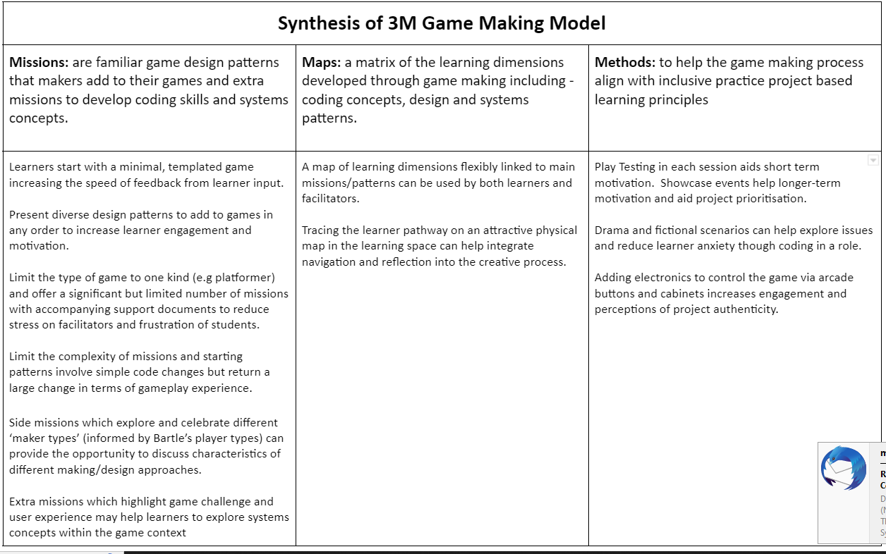

---
zotero:
  scannable-cite: false # only relevant when your compiling to scannable-cite .odt
  client: zotero # defaults to zotero
  author-in-text: false # when true, enabled fake author-name-only cites by replacing it with the text of the last names of the authors
  csl-style: harvard-manchester-metropolitan-university # pre-fill the style
layout: post
categories: chapter
title: Process - Emerging Learning Designs
---

-   [Outline](#outline)
-   [Chapter Introduction](#chapter-introduction)
    -   [Contextual factors from practitioner perspective influencing
        design](#contextual-factors-from-practitioner-perspective-influencing-design)
    -   [Short vignette illustrating shifts in scope of
        activity](#short-vignette-illustrating-shifts-in-scope-of-activity)
    -   [Description of the nested levels of activity via analysis of
        tools
        used.](#description-of-the-nested-levels-of-activity-via-analysis-of-tools-used.)
-   [Overview of 3M pedagogical
    model](#overview-of-3m-pedagogical-model)
    -   [Methods (Inclusive)](#methods-inclusive)
    -   [Missions (Main Missions)](#missions-main-missions)
    -   [Maps - more detailed in this
        chapter](#maps---more-detailed-in-this-chapter)
-   [Evolution of Design](#evolution-of-design)
    -   [Description of Phases](#description-of-phases)
-   [Exploring tensions emerging in
    design](#exploring-tensions-emerging-in-design)
-   [Evolving design of Support Materials and
    Documentation](#evolving-design-of-support-materials-and-documentation)
-   [Learning Dimensions Map](#learning-dimensions-map)
    -   [Overview -](#overview--)
    -   [Limits to this map](#limits-to-this-map)
    -   [Including Coding Concepts in the Learning Map and including
        Code Cards with links to online
        Concepts](#including-coding-concepts-in-the-learning-map-and-including-code-cards-with-links-to-online-concepts)
-   [Using Physical Maps of Missions as Game Design
    Patterns](#using-physical-maps-of-missions-as-game-design-patterns)
    -   [Overview - Physical Maps](#overview---physical-maps)
    -   [Emerging Findings & Discussion on use of Physical
        Maps](#emerging-findings-discussion-on-use-of-physical-maps)
-   [Link to next chapter](#link-to-next-chapter)
-   [List of appendices for this
    chapter](#list-of-appendices-for-this-chapter)
    -   [Tensions of the 3M design
        evolution](#tensions-of-the-3m-design-evolution)

## Outline

- Recap of context and specifics of designing for informal learning
- Vignette showing shifts between scopes
- Identifying units / scopes of activity
- Overview of 3M pedagogical model
- Learning design in stages
- Analysis of Tensions in design and how this guided Evolution
- Docs and Tools
- maps - learning dimensions
- maps - physical

Missing?

## Chapter Introduction  

This chapter charts the evolution of the learning design. It draws on immediate analysis of participants reactions and contributions from journal notes, participant interviews and analysis of changes in the learning resources created.

The first section is a short summary of the phases of the design.

<!-- The design description is framed within DBR language and concepts. -->
<!-- Section describing  Game Design Patterns as  the main unit of Activity. See Blunden to frame this and to describe the utility of the idea  [@blundenInterdisciplinaryConceptActivity2009; @blundenGermCellUnit2014]. -->

<!--
There's lots to add in here.
chapters\planning\methodology_chapter\methodology_chapter_late_2020.odt.md
https://drive.google.com/drive/u/1/folders/1D-VhVj-NgN3qgk3YEx4HZEozf_1UOGtE
 -->

### Contextual factors from practitioner perspective influencing design

NOTE - move some of this to a discussion section?

**Recap of context and specifics of designing for informal learning**

- design based experiments - some factors
- informal learning - recap rogoff and similar - issues of designing for informal settings

I set up the working pattern based on my professional experiences and my own academic and cultural interests. As mentioned in the introduction, DIY culture, remix culture, repair culture, TAZ events are strong influences to the learning design based on the ideals of an autonomous community.

**Cultural influences on my choice of learning design**

 - a desire to increase engagement based on my experiences in classroom and out of classroom - Home Ed / coder dojo experiences
 - the link to cultural practices of code patching and remixing - the example of the plumber coder potentially being someone who finishes the job rather than elegant coder.
 - other experiences of social coding being important being part of a community working on a joint project (add a quote from Dave?)
 <!-- - A walled garden approach in terms of the GDP and code documentation and examples that are used. Based on my own experience of developer documentation and varied coding approaches. -->
- Other examples from the interviews with practitioners are relevant to include here.

It is important to address contextual factors that facilitated and shaped development of some initial creative practices.

- Research and teaching practices, the location at the university and being part of a research project. Eliza effect? If so how relevant?

Availability of resources potentially novel. For example, the ability to have that number of identical computers for this audience in particular, and using this shape of working which was determined by technical reasons but which had an impact nevertheless on the ability for students to move around the room and the absence of a front for the teacher to teach from. After attempts in previous sessions I abandoned attempts to use the screen in the space to do explicit teaching. The process was very disruptive to the emerging group behaviours and practices.

The game making community is not authentic or mature in the practices they are undertaking, the kind of community practices which we can undertake are focused partly on building connections to existing knowledge and practice. One of my roles as designer here was to uncover and to help participants explore knowledge that they were unaware they possessed.

<!-- These sections could follow a pattern of
 - rogoff's description / examples - but likely include a larger breakdown of 3 foci in Methodology Chapter.
 - my model examples
 - other links to PBL frameworks and/or educational concepts and contrast analysis

In the 3 foci model Rogoff refers to apprenticeship as a way of illustrating the process of being inculcated into community practices existing in a cultural plane. AN EXAMPLE .. -->

<!-- At this stage of writing I include a bullet point list of design relevant features to be expanded later.

- Shared repositories of resources - users shared a log in so they could see the work created by others.
- Showcase: At the end of the game making process students asked strangers to play their game in the foyer of my departmental building
- Drama Games: the process of warming up, creates community and sets a tone
- Drama Process: specifically designed ot overcome limits of the classroom.
- Playtesting: the process of playtesting, either self or peer links back to a community purpose
 -->

### Short vignette illustrating shifts in scope of activity

The following vignette, consisting of extracts of participant activity over 20 mins of a session, is presented as an summary of different scopes of activity. The participant is the child Terry who in this session has been working independently.

Terry then starts to test and revise his game. He alternates between two internet browser tabs which hold the code of his game and a working version of the game. He makes small changes to existing code.

__Insert image of code__

The code of the game.

While the code is made up of various elements, only the javascript file is normally altered by participants.

The complexity is hidden away from the end user.

__Insert image of game in browser__

On the screen you can see the game.

Terry then decides he wants to add a new element to his game.

He browses the list of game design patterns.

There is a tension where he is hesitant about where to place code.

Screen shot of the menu of choices.

### Description of the nested levels of activity via analysis of tools used.

<!-- REWRITE THE BELOW - CHANGE FOCUS TO TOOLS /RESOURCES -->

Activity Theory allows researchers to identify intersecting or nested systems of activity with varied goals. Taking a holistic view of goals of the game making activity, we can identify the larger and smaller scale objectives of systems of varied scale.

These include:

- large - creating a game which is fun to play and communicate an environmental theme
- medium - identifying and implementing key game features (Game Design Patterns) to add to the games
- smaller - creating, changing and transporting game assets or changing code constructs to enact or change game elements.

<!-- - larger - learning computing skills and concepts as a home education project
- larger - participating with other home educators in a creative environment and thus building team and communication skills
- larger - learning transferable design skills and processes
- large - creating a game which is fun to play and communicate an environmental theme
- medium - identifying and implementing key game features (Game Design Patterns) to add to the games
- smaller - creating, changing and transporting game assets to enact or change GDPs
- smaller - implementing or changing code constructs to enact or change GDPs -->

**Activity, Actions and Operations**

MOVE TO ANALYSIS DISCUSSION SECTION OF THIS CHAPTER?
Move summary of Activity, actions, operation (as per Barab here), link to GDP as a project / unity of activity.

RECAP - from Lit Review

In my own game making model students picked missions from a choice of printed resources.

There were four colour themed categories of missions. _Game mechanics_ are features to do with the actions of the game. _Game space_ patterns address the layout of the game. _Game polish_ patterns involve adding music, backgrounds, graphics and story elements. Finally _System and Challenge_ patterns look at how different elements interact to create challenge in the game.

In the methodology chapter the concept of activity as a primary unit for analysis to research community activity was outlined. While Blunden makes a pragmatic proposal to use the project as they key unit of activity [-@blunden_interdisciplinary_2010][@blunden_collaborative_2014], there is a strong case to make for the sub-project of implementing GDP as a key unit of analysis for this chapter.

REWRITE THE ABOVE - TALK OF EVOLUTION OF RESOURCES AROUND GAME FEATURES VIA REQUESTS

<!-- DUPLICATION IN GDP CHAPTER CURRENTLY.
From the perspective of participants, the goal of implementing individual game patterns rather than the overall goal of making of a game, took up the majority of their focus. This can be evidenced in the following observations;

- the frequency of GDP language referring to patterns used by pairs in particular in the process of collaborating on their games
- the utility of the smaller unit of analysis in aiding resource creation
- the value of completing something concrete a sense of sustaining achievement.
- the ability to reflect after implementing each sub project,
- any other value for practitioners, parents and young participants - i.e. in navigation and goal setting. -->

<!-- Thus while GDP emerged as a main unit rather than the whole game, in play testing with others the wider focus of making an engaging game came into focus. Particularly the shift to wider sense of game as an enjoyable experience for others AND??? -->

The implementation of GDPs as a unit of analysis for the researcher also has the following utility / validity;

- There is a practicality in terms of defining possible boundaries of what to analyse in depth.
- There is a more frequent iteration present - usually a period of playtesting after each new pattern added.
- This research with a practitioner focus, looks to identify emerging barriers to comprehension, communication and practical barriers to implementing code structures. Thus a smaller unit that allows a large amount of granularity is useful. (compared to broader observations)
- Each GDP can be seen as a project given an interpretation of project as the concrete implementation of a goal
- That concreteness / implementation is particularly valid given the regular play-testing of creations often after each GDP is added in a peer environment.

This sentiment is echoed by something I found in the video data. As one parent Fi expressed when looking at the documentation for implementing one of the GDPs. "It’s like a project in itself really"

Move starting material here for size of scope
Activity as a Project -  
Create a Table? How to align with 3M & 3 dimensions

Use the 3M framework as a guide for MakeCode
Revisit FM book as a guide for Glitch/ Phaser
Use tensions as the base?

## Overview of 3M pedagogical model

The process of developing the learning design happened in tandem with the data gathering. The model was guided by reflection and feedback from ongoing game making sessions.

The following sections outlines resources designed to be practitioners and participants as well as fellow researchers.

<!-- Note: To do this some areas of context are outlined which may end up in the opening chapters. -->
The 3M model is illustrated using supporting resources that have emerged from the research process. The resources have been created under an open licence (CC-BY-SA) which allows them to be freely used and adapted.

{ width=80% }

| **Missions**         | **Maps**             | **Methods**          |
|----------------|-----------|------------|
| Simple code changes yield quick feedback  | A map of learning dimensions flexibly linked to main missions/patterns can be used by both learners and facilitators       | Play Testing in each session aids short term motivation.  Showcase events help longer-term motivation and aid project prioritisation   |
| Free choice of Patterns increases learner engagement and ownership   | Tracing the learner pathway on an attractive physical map in the learning space can help integrate navigation and reflection into the creative process | Drama and fictional scenarios can help explore issues and reduce learner anxiety though coding in a role          |
| Restrict Game Type and number of Patterns to reduce Facilitator stress       |                      | Adding electronics to control the game via arcade buttons and cabinets increases engagement and perceptions of project authenticity |
| Limit  complexity of patterns. Some are simple but cause a large change in the game       |    |        |
| Side missions which explore and celebrate different ‘maker types’ (from  Bartle’s player types)          |        |     |

Table 1.2.  Key Features of 3M Game Making Model

{ width=80% }

### Methods (Inclusive)

Overview - prep for next chapter

### Missions (Main Missions)

<!-- Many commercial open world games offer a central challenge consisting of small incremental missions and then optional side missions. Open world games increase user choice and thus give players a greater feeling of agency. -->

The main challenge of the 3M model is to create a playable game around a theme for a real or imagined audience with learners given the choice to add many optional features to the game.

In addition, side missions encourage social and playful coding approaches which help develop a community of coders. The purpose of mirroring the language of adventure game experience is to create a playful environment, a theme explored in the following chapter.

<!-- This approach steers students towards developing their use and understanding of coding structures, debugging practices and systems concepts.  -->

<!-- In addition, side missions encourage social and playful coding approaches which help develop a community of coders. -->

<!-- Note: TO ADD -  The purpose of mirroring a game experience is to create a playful environment - perhaps to covered in previous chapter -->

<!-- **Side Missions:** Bartle proposed that online gamers play games for different reasons and proposed a initial typology of gamers as socialiser, griefers, achievers and explorers [@hamari_player_2014]. You can find out what kind of game player you are with an online test.[^6] I propose there are also different styles of game makers. Some like to develop a full knowledge of the tools and what is possible before they build up their game step-by-step. Some are happy to borrow code, images and sound from anywhere for quick results. More social makers like to find out about the games of others or tell stories within games while others mess around with the code to break it interesting ways. To encourage these valuable social coding practices I created extra missions which are available online.[^7] I avoid any claims of fixed learner types here and offer these interpretations primarily as a way to encourage meta-cognitive reflections and choice of activity in line with UDL principles. -->

In the 3M model rather than following a step-by-step tutorial learners start with an incomplete game template and add new features as they choose.

Each feature or pattern is described as a mission.

This approach follows the Use-Modify-Create model to limit learner anxiety for novice coders and to scaffold the acquisition of coding and computational thinking concepts [@lee_computational_2011]. I worked with learners to create a wish list of game features to create a 2D platform game. These features included moving hazards, jumping on enemies, finding a door or flag to progress to the next level. We can describe these features as game design patterns. Driven by the requests of learners, I developed tutorials to support students implement these patterns. This approach aligns with inclusive education principles in that it increases the choices of students, scaffolds the way they can access resources and allows them to keep a track of their own progress.

<!-- You may be able to create a menu of printed or online patterns or examples that students can draw on as needed. Perhaps particularly common examples can be modelled to the whole class when it is clear that many students will benefit from that approach. -->

In my final implementation of the 3M model students picked missions from a choice of printed cards. There were four colour themed categories of missions. _Game mechanics_ are features to do with the actions of the game. _Game space_ patterns address the layout of the game. _Game polish_ patterns involve adding music, backgrounds, graphics and story elements. Finally _System and Challenge_ patterns look at how different elements interact to create challenge in the game. An example of a game mechanic design pattern follows.

NOTE - MOVE THIS? GDP CHAPTER? OR LATER?

PRINTED CARD TEXT BEGINS

Your mission is to apply the following pattern to your game. There are supporting step-by-step resources available if you need them. When you finish be sure to reflect on how adding this pattern helps your understanding of the computing concepts and similar patterns listed. This concludes your mission.  

* **Name of Game Design Pattern:** Jumping on Enemies to Zap them

* **Type Pattern:** Game Mechanic

* **Description:** If the player is descending from a jump when they touch the enemy the player is zapped and in this case disappears.

* **Need for Pattern:** Enemies create challenge and being able to jump on an enemy is a good way of clearing the area you want to explore.

* **Coding Concepts involved:** Arrays[^8], Change Listener[^9]

* **Links to other Computing Patterns:** Systems Dynamics[^10]

* **Related Game Patterns:** You'll need to have added the **Add Enemies** pattern to your game before you can add this one.

PRINTED CARD TEXT ENDS

In addition to outlines of game patterns, print-outs or on-line documents to support learners to implement the code needed are provided. While on-line documents allow learners to copy and paste code thus avoid many syntax errors, printed or incomplete code examples provide a greater level of challenge. Supporting resources help resolve tensions around learners getting stuck and needing a lot of facilitator help. These resources can help teachers deliver game making in a classroom context. Educators can alter resources to vary how much detail is provided in supporting documents to suit the challenge level for students. I work with young coders, thus I normally provide significant coding scaffolding. Once learners have built familiarity with code structures, processes and the coding environment, I provide less complete code examples and thus reduce the scaffolding.

### Maps - more detailed in this chapter

Move some of the below here? if it sits right?

## Evolution of Design

### Description of Phases

I have carried out four stages of workshops and development with home educator families. I will outline activities that have taken place at each stage of activity and include some early results.

<!-- - Oct 2017 - Mar 2018: Experimental Course
- May 2018 - Dec 2018: Resource Development Stage
- Jan 2019 - Dec 2019: Glitch Game Club
- (Jan 2020 - May 2020: Make Code Arcade) -->

See [Summary Table of Stages](https://docs.google.com/document/d/1tBoXJWw-aZUcc8EsAvT195CtHLSM468YOCD0sGzOuoA/edit#)
also should reference the resources - in appendix and online.

Table of Tensions & resolutions of 3M design - also should reference the resources - in appendix and online.
https://docs.google.com/document/d/1DRgpgIUfq5XIktYy-lX4WlviUDnffNc0v8SOeLGgHho/edit
NOT SURE WHERE TO PLACE THIS IN THE CHAPTER.

<!-- 3 foci and 3M element compared - save for the conclusion/ discussion?
https://docs.google.com/document/d/1FIPn2dEB2aCKZi5z05j69cnHgpGNXFh1_SPV6h5l12g/edit#heading=h.kci0lnvn7f60 -->

https://docs.google.com/document/d/1tBoXJWw-aZUcc8EsAvT195CtHLSM468YOCD0sGzOuoA/edit#
CREATE THE SUMMARY TABLE FIRST THEN REVISE THE BELOW

#### Phase One

<!-- NOTE - The evolution involves phases and then tension - what and how to cover both?  -->

This phase took place before the official start of this research and relevant ethics application. As such, this stage was initially aimed not at collecting user data rather than building my own background knowledge and competency. Some of methods emerged from the start including play testing of other games, a final public showcase, and the use of drama / warm up games.

The first phase of delivery in late 2018 was based on initial research stage; I drew on literature to identify factors to consider when designing for collaboration. I adopted an open project based approach which integrated drama games to aid group bonding and reflection.

I chose a tool set which drew on relevant design principles explored earlier (Resnick and Rosenbaum, 2013).

The tools allow participants to create games using a combination of a free to use online tools.

an online  coding environment
using the phaser javascript game library (glitch.com), a pixel art editor (piskelapp.com), and a sound effect generator (sfbgames.com/chiptone).

One of the principles that I prioritised in the choice of tools was that of immediate feedback for participants. For example, in the code editing interface of glitch.com shown in Illustration 1, changes made to the code on the left section take immediate effect in the resultant game on the right side of the screen.

In terms of supporting resources, stage one was exploratory and responsive; I had no pre-existing supporting materials and created a starting code framework of a platform game and code examples to add extra functionality to the game as the programme developed.

At the end of this stage participants showed their games to students in the foyer of the MMU Brooks building and gave me feedback on their participation in the programme.

#### Phase Two

**Planning**
As per Rogoff's analysis of informal learning in museaums [], the process of finding a medium between structured activity and authentic activity can be challenging.

The kinds of exhibits which invite extended play are of interest to this study. Such design indicates that there are affordances that invite revised design, tinkering and ongoing play.

My design pivoted to this stage after introducing design patterns based challenge cards and inviting participants into game playing via older arcade games.

This was in response to tension of teaching PGCE students in a smaller time scale but wanting to capture the essessce of the pedagogy. And in the process of preparing for Mozilla conference.

**Delivery**

The delivery of the second phase in early 2019 drew on this participant feedback and detailed reading of relevant literature to bring substantial changes to the programme. While still driven by participant interests, it took a more structured approach. The resources included small scale starting challenges as A5 hand-outs, step-by-step tutorials as print outs, and code examples as online projects illustrating key additions to the game.

I have brought the workshops resources together a book published on the FLOSS Manuals documentation platform (Chesterman, 2019) and an online project-hub linking to all resources (Chesterman and Potts, 2019).

<!-- I also carried out four video-recorded interviews with practitioners who work with creative methods and technology with young people or families. Early analysis of these interviews has helped shape the evolving design of my programme and has brought into focus key areas of interest already identified in journal entries. -->

#### Phase Three

<!-- I also carried out four video-recorded interviews with practitioners who work with creative methods and technology with young people or families. Early analysis of these interviews has helped shape the evolving design of my programme and has brought into focus key areas of interest already identified in journal entries. -->

Second iteration in May 2019 I drew on previous work with the MMU Faculty of Education drama department [@pattersonDramaSTEM2019] to create a simple drama process to give a simple external motivation and narrative to the creation of games for a fictional audience of visiting aliens.

I revised the an online project-hub to link to the project chapters rather than the code examples.

#### Phase Four - MakeCode Arcade
(Jan 2020 - July 2020)

I ran two iterations of game making course of 5-6 weeks using MakeCode Arcade tool. The template, resources and facilitation approach was based closely on the previous stages using glitch.com.

However, there were some additional changes in the way that design patterns were presented to learners. In addition, material which mapped and explained learning dimensions including design skills and computational concepts were included in the participant support resources.

Learning Map design and expression of patterns in modified traditional GDP form.

**Addition of a Game Challenge section**

I wanted to explore the possibility to use this model to explore systems thinking. There is precedent to do this in GSM.

It was driven in a response to meaningful missions which helped guide a focus on game play.

I created such missions (outlined in Methods chapter)
Added game design patterns based on challenge - find source Schnell & GSM literature (their terminology is Game elements)
And then updated the learning map to highlight potential concepts to be learned.

#### Common between Phases

Certain features either common practice, or inspired by research and interviews, were common to all phases.

* Playtesting
* Showcase

<!-- ### Stages of Design

#### Evolution of Template and supporting resources
I'm not sure if this even goes into this chapter - it certainly starts to answer some of the research questions.
Go into more detail than previously on the choice and use of tools.
Use the 3M framework as a guide for MakeCode
Revisit FM book as a guide for Glitch/ Phaser

### Issues Emerging from Evolution of Design
More detailed analysis - thoughts on validity of data -->

## Exploring tensions emerging in design

NOTE - SOME OF THESE TENSION MAY BE BETTER EXPLORED IN OTHER CHAPTERS IF THERE IS OVERLAP - and some in the final discussions - Select 2 or 3 most relevant to this chapter

The following are a list of tensions observed in early game making experiments that I recorded in journal form. More likely have some starting tensions from early design stages, that are then analysed in relation to other sources and data, and other resolutions that are more general or sophisticated emerge.

 - [for a more polished table see here](https://docs.google.com/document/d/1DRgpgIUfq5XIktYy-lX4WlviUDnffNc0v8SOeLGgHho/edit)

#### Tensions related to different learning approaches

 **Facilitators may have a more linear and limited view of ‘progress’ than learners:**

 Side missions which explore and celebrate different ‘maker types’ (informed by Bartle’s player types) can provide the opportunity to discuss characteristics of different making/design approaches.  

 **Systems concepts are embedded in many games but the process of direct teaching of such systems can be complex and interrupt and distract from other design activities.**

 Extra missions which highlight game challenge and user experience may help learners to explore systems concepts within the game context

**Learner disengagement if game coding is taught in an instructionist / from first principles (especially in younger ages)**

Find evidence

In journal notes, I reflect on avoiding stopping making to share points.

- Facilitator avoids demonstrations on the screen.

- Learners start with a minimal game to improve. Using a template to increase speed of feedback from learner input.

#### Tensions related to choice of pathways

**Learner frustration if they are not able to choose what feature they add to the game next:**

- Challenge of personal expression. 3d bee design of one participant which happened when there was no framework.

Present a wide range of different kinds of design patterns that learners can add to their game in the order they choose (with some exceptions).

 This facilitates engagement and motivation.

**Teacher stress if they are not able to support a very diverse set of features demanded by students working on diverse kinds of games.**-  
Limit the type of game to one kind. Offer a significant but limited menu of missions that users can add. Offer written and visual support documents which learners can access independently of facilitators

**Learners take on features which are too advanced or complex for their current coding level**
Limit the maximum complexity of missions and present patterns to encourage learners to start with ones that involve simple code changes but return a large change in terms of gameplay experience.

**Tension choosing patterns - resolve via a pattern collection**

<!-- How much to write on this here? Or the discussion chapter? -->

<!-- Interactions in the interpersonal plane in this model are described as guided participation. Guided participation in not a prescriptive  pedogogy or set of activities, rather it refers to any activities and interactions between learning community members which contribute towards shared endeavours.

The term expounds a view of learning as happening between the poles of direct instruction and free exploration. A
The core activity of my participants was implementation of chosen game design patterns. -->

In PBL, UDL and other models - learner choice and building agency is shown to be of value in increasing engagement and ownership over learning.

Howver, in starting experiments I observed that the long time in building the relevant knowledge to identify, agree on and implement game patterns negatively impacted motivation.

In order to accelerate the process of making a game to fit into contextual expectations of an acceptable project timeframe, I pre-chose the genre of game to be made and based on my previous teaching experience, analysis of literature and knowledge of platform games, I pre-prepared a set of coded example and tutorials to implement a range of game design patterns.

<!--
MOVED TO DISCUSSION CHAPTER??
### Personal Dimension of the Learning - Personal Appropriation
In line with sociocultural approaches Rogoff points out the limits of an understanding of knowledge which promotes a view of knowledge as transmission from teacher to learner and is thus an individual process. Instead this exploration of knowledge and practices is framed as a mutual process.

While, this is potentially problematic in classroom environments, the mutuality of the process is evident in my responses to tensions via changes in design and spontaneous practices and understandings of knowledge required to make games enacted by participants.  

One significant tension I felt in evolving design was a nagging feeling that learning happening should be documented, or linked to some kind of curriculum. There are elements of the design which suit development of coding concepts and Computational Thinking.
However, I felt reluctance to explicitly teach these links via direct transmission. -->

#### Tensions related to funds on knowledge / culture

**Parents may feel a lack of confidence in taking part in coding activities which they have little cultural connection to**.
Side missions which explore and celebrate both Bartle player types and

**Facilitators may need to justify learning happening and struggle to see this in-situ if unfamiliar with the game making process. This may restrict openness of activities to better assess and support learning.**
A map of learning dimensions flexibly linked to main missions/patterns can be used by both learners and facilitators.

**If it is not recorded, learners and facilitators may lose track of what has been covered in the process of making a game. Thus reducing opportunities for project reflection. However, stopping activity to record formally interrupts the enjoyment of game making.**
Tracing the learner pathway on an attractive physical map in the learning space can help integrate navigation and reflection into the creative process.

**Learners may not find coding a project a motivating project if it is only a private activity with no end audience.**
Play Testing - each lesson can help with short term motivation of having a game product ready  for others to play.  Showcase events help longer-term motivation towards and aid prioritisation as learners near the end of their project.

**Learners may feel alienated from coding as a practice and need a way into the process.**
Drama and fictional scenarios can help explore issues and reduce learner anxiety though coding in a role.

**Learners interact with code primarily using the mouse keyboard and screen which does not take advantage of benefits of physical computing for learner engagement.**
Connecting arcade buttons to the computer via simple electronics is a project which can be completed quickly. The process of students building their own arcade cabinets for a games showcase increased their perception of the authenticity of their end goal

**Online resources vs Print outs**
Also a tension of moving online with resources, via having them available in the class.
Try to resolve with a summary as a laminated card, and then online as well - this tension is partly to do with the data gathering process, as it is easier to follow if it is visible on the screen.

## Evolving design of Support Materials and Documentation

<!-- NOTE -
The language used, affordances, 2nd stimulation, practices, needs clarification.
 -->

**_Use of a non-linear menu of Gdp_**

Learning resources were presented in a menu format with graphics focused on the player experience rather than underlying coding constructs. The purpose was to;

- increase learner engagement through accessible design
- make documentation relatable to existing gameplay experience
- develop use of common GPD terminology

There were two main ways of approaching adding a new pattern. One to examing a code example which was built around the same code base.
This would involve searching for new code constructs and notes in the code designed to orientate the learner, alerting them to the location and purpose of the relevant code. The other was longer form step by step help.

**Use of simple code examples which demonstrate the pattern in isolation**

Code examples were initially the starting resource. The idea being it was quick to see the behaviour in context. This was changed after this iteration based on the difficulty of finding the relevant section on step-by-step resources.

These code example are a staple of professional sharing and problem solving practice.
They exist on the Phaser website, however their use there is not consistent and sometimes, as with many developer created documentation, focused on demonstrating the code constructs in isolation rather than in context.

**Non-linear step-by-step instructions**

Longer form step by step tutorials are common in computing education. Examples can be found in Code Academy, and in the education resources of RPi foundation. Many examples talking learners through steps to build a game can be found online with varied amount of explanation of underlying constructs and concepts. I started my journey learning JS games using some provided by Mozilla and the Phaser developers.

The approach used in the step based documentation I created varies from many in that rather than choosing a defined order users can choose which order they want to add game elements. The use of GDP aids the learner navigation of this process. This does add challenges however to the documentation authouring process.

An example of parent Sh interaction with long form tutorial follows. Sh engaged with the long form resources. While this process did not involve dialogue, the recording of her screen allows for a detailed description of how the resources was used.

Sh opens browswer to see list of code Examples, navigates to page, sees list of chapters, selects GDP pattern name, then follows along.
FIND THIS EXAMPLE AND WRITE IT UP / SEE WHAT IT ADDS TO THIS SECTION.

Interestingly, the online menus was not used by participants in any regular or consistent way. However, it did have a trickle down effect. Kay participants did either browse it, use it to try to solve problems or were referred to it my the facilitators. The patterns that those learners implemented were then remarked upon and taught in via peer to peer propagation.

<!-- As explored in the literature review, it is difficult to explore this pedagogical approach relation to other similar programmes due to the lack of data on specifics of the learning materials presented to participants. -->

**_A linear / step-by-step resource_**

While a manual was available, few participants worked their way through it chapter by chapter.

While I created this for the planners suited to this way of working and in response to feedback from parents in early designs that foundation knowledge would be useful, in practice, once their template game was up and running, there was little incentive to do use this resource. In terms of the objectives of making a playable game or adding particular patterns to the game the step by step resources would have involved backtracking. The process would have value to reinforce computing concepts present in the design.

The foundational concept here was that after making the game from a template. The linear resources would explain all underlying concepts that the starting template had initially abstracted away from the participants.

In my journal I named this concept _meeting yourself in the middle_ to represent the possibility of retracing the process of learning from first principles.
Narratively the equivalent of a prequel.   

## Learning Dimensions Map

The results of this chapter are drawn from journal entries and from the reflection on resources design which happens over several iterations of the game making design.

One of the aims of adapting and extending resources to facilitate the use of key techniques that emerged in the early design stages in more restricted and structured environments, e.g. a computing classroom in secondary school.
DEVELOP MOTIVATION - OPEN THIS TO RETURN TO IT LATER IN DISCUSSION.

### Overview -

In learning environments where there is a lot of choice assessing learners via observation is beneficial. Rather than deciding what you want to teach and testing students on that area, you can map the learning happening in an authentic activity. When researching hands-on tinkering in Science museums Bevan and Petrich [-@petrich_it_2013] worked with educators to examine video footage of families interacting with exhibits to make a structured list of the learning they observed. The resulting map of learning dimensions included underlying science concepts but also contained more general skills and helping behaviours involved in exploratory learning processes.

// REWRITE FOLLOWING
Another chapter in this collection identified concept maps and observation as methods for teachers and researchers to identify key learning suited to particular computing projects. One of the outcomes of my research was to extract some of the concepts and practices that learners engaged with when making games from hours of recorded material. While some are common to existing Computational Thinking frameworks others, including systems thinking concepts, are more unique to game making. Table 1.1. shows my resulting map of learning dimensions for the 3M game making model.

|      Coding Concepts    | Systems Patterns    | Design Practices|
|--------------|-----------|------------|
| Sequences | Systems Elements      | Goal Setting        |
| Variables      | Systems Dynamics  | Being Incremental and Iterative       |
| Logic | Reinforcing Feedback Loops      | Developing Vocabulary        |
| Loops | Balancing Feedback Loops      | Web Navigation    |
| Arrays |       | Problem Solving        |
| Creating Functions |       | Version Control    |
| Change Listener |    | Debugging   |
| Input Event |   | Reusing and Remixing      |

Table 1.1. Learning Dimensions of the 3M Game Making Model

This process of mapping such frameworks may be overly time-consuming for many full-time teachers. However, teachers may also use and adapt existing maps and frameworks based on their own classroom experience to help their observation of students. Because these frameworks can also help students to navigate their own learning journey the effort serves a double purpose.

<!--
While this is an informal way of using maps the are other approaches that are more formal including one called a concept map which is a visual representation of target specialised knowledge. There is a section on concept maps as part of the teach computing website here. https://blog.teachcomputing.org/how-we-teach-computing/. -->
<!-- 

_Map of Learning Dimensions of the 3M Game Making Approach_
 -->

### Limits to this map

This map was designed to link with particular conceptions of learning whilst still retaining a sense of the uniqueness of the affordances of this design. The settings are, CT in school curriculums, systems thinking, design approaches. These align broadly with a STEM approach. The rationale behind this is that Game Making commonly aligns with these curriculum areas and they are particularly suited to explore via iterative game making.
NOTE - EXPLAIN WHERE THAT IS EXPLORED IN MORE DETAIL.

However, there are a broad range of other skills and literacies also relevant with evidence emerging in video data.

My own work in this area has been informed by work developing teaching materials for the Mozilla Foundation as part of the Teach the Web programme. This programme introduced a broad set of competencies name Web Literacies [@noauthor_learning/webliteracystandard/legacy/webliteracieswhitepaper_nodate] [@mozilla_foundation_webmaker_2014].

- digital literacy - broad overview
- web literacy - narrower
- webmaker - and more specific affordances of key web based coding and exploring tools

<!-- NOTE EXPAND IF USEFUL -->
Note - while the use of these skills is not unique to game making and common to pick up on many making situations, the use of external image and sound asset creation tools which then creates production pipeline process does engender key navigation and importing and exporting skills which are very valuable in online environments.

NOTE - The map could easily be changed to reflect this or other foci of teachers / researchers.

### Including Coding Concepts in the Learning Map and including Code Cards with links to online Concepts

Recap here the choice of coding concepts rather that CT in more abstract terms.

- Make Code cards which contained links to game design patterns and the different component concepts
- (see Eriksson and Bjork)
- Draw on material and critique in chapter on semantic profiles / waves.

<!-- A theme to follow up in the Maps / personal learning chapter is that of picking up on some of the behaviour of participants, especially that of experienced parents, experience either in coding practices of supporting their children. Once identified, how could beneficial interactions be encouraged in the next iteration of design.

Examples include;

- supporting reflection on design and coding concepts / skills.
- navigation / organisational support - use of a physical map.

For example, the use of CT concepts in a framework, listed as part of the initial design pattern card, which could then be discussed, ticked off or otherwise reflected on. -->

<!-- ### Using 3 Foci approach to frame data analysis - MOVE AND/OR FIND A PLACE FOR START IN THIS CHAPTER -->

<!-- Draw on this document to give an overview of the framework and approach.
https://docs.google.com/document/d/1FIPn2dEB2aCKZi5z05j69cnHgpGNXFh1_SPV6h5l12g/edit#
Thus setting out a path for the following chapters. -->

<!-- Rogoff's [-@rogoff_observing_1995-1] describes three planes of personal, social and community activity which she advocates as foci for analysis. The model problematises the dichotomy of learner led, teacher led approaches [@mascolo_beyond_2009] in a way which suits the space between formal and informal learning that this community based model of game making occupies.

While the author's original research was on indigenous cultural practices on a village level, the model has been applied in both formal and informal educational settings; including FIND THREE EXAMPLES -

In this research I am interested in the way that facilitators can help nurture community practices and also in the way that participants have co-created the learning design created in this research and how participant practices have evolved. -->

<!--
In this section I outline Rogoff's initial conceptions of activities happening in three planes and related them to emergent activities in the game making community of this research. _I will also bring in critical counterpoints from relevant theory and compare to other "authentic"  teaching frameworks including PBL as a way to widening this analysis._

This document is being fleshed out with examples from video data.
https://docs.google.com/spreadsheets/d/1EvMehUNHIGj0xRyrKgBxj5GwOGHwnTFw9EMBJ3Ot9Kc/edit#gid=0 -->

## Using Physical Maps of Missions as Game Design Patterns

Maps in the 3M model were explored partly as a way of representing the personal dimension of learning.

### Overview - Physical Maps

To support younger coders unsure what to do next or who struggle to stay on task, I sought to create another kind of map to help them navigate their game making journey. I printed out a large-scale colour map of a coastal landscape stylised in a way that mirrored a map used for navigation in a quest-themed computer game.

The game pattern missions were represented as different islands . Learners took time to create and personalise a movable marker representing themselves. When learners selected their next mission, they moved their counter to the relevant island. Thus learners had to be intentional about their next goal and were implicitly encouraged to stick to it. They also kept a track of the missions that they had completed by tracing a trail as they progressed. In addition the colourful, physical and visual representation served to encourage a sense of community and peer learning. When moving the counter on the map I prompted them to reflect on the coding concepts or other learning dimensions that they had been working with. As learners traced a trail between the different island/missions they had visited, the map provoked learners to reflect on their journey and progress. However, this approach may be too labour and time intensive for many class environments. I am currently investigating replicating this process using online tools to reduce complexity and preparation time.

### Emerging Findings & Discussion on use of Physical Maps

<!--  -->

_Missions as Islands_

Working with learner stress and confusion was something that I struggled with for some time. One source of frustration started from giving learners clear pathway. The freedom to choose what game to create was liberating but then conversations about what was possible with the time and technical ability we had were hard and we did lose some families in this process.

Starting with a template and creating resources to help common patterns helped resolve this tension. However having this menu of choices also created another issue. Increased confusion.

EXAMPLE - ma & fi

Having GDP mapped out had some of the following possibilities.

Maps as an area seems to be the weakest point in this process. I may have neglected this plane as it is normally well explored in other research based in formal settings, and I was particularly interested in nurturing an organically forming game making community.

This section highlights key tensions in the design that still need to be overcome.

It explores these tensions in relation to existing research and contains further discussion to inform possible future directions of research.

<!-- #### Individuals vs Collective Mapping of Progress & Online / Offline issues.

The move towards a more individual map in MakeCode iteration which is digital and analysis of data showed an emerging tensions. There are benefits of mapping it in a more visual and collaborative way as shown by the attempts to do it with paper and individuals mapping their progress with markers.

A much more collaborative online map which showed other peoples progress would be possible with an investment in time and perhaps more expertise in software development. Perhaps moving towards a gamification league and tactics. This could cause potential issues with a more competitive atmosphere. -->

## Link to next chapter

This chapter has dealt with the evolution of design in initial phases and responses to learner experience to resolve tensions.

Due to the complexity and many moving parts of the design it has been mostly descriptive.

While CHAT provides the technique of highlighting emerging tensions and resolutions, to undertake deeper analysis I will an analytical process proposed by Rogoff which examines learning communities using 3 foci.

This process begins in this chapter with a focus on evolving design and continues in with three following chapters with a greater focus on the learner response to challenges of game making in the recorded sessions.

## List of appendices for this chapter

### Tensions of the 3M design evolution

https://docs.google.com/document/d/1DRgpgIUfq5XIktYy-lX4WlviUDnffNc0v8SOeLGgHho/edit
