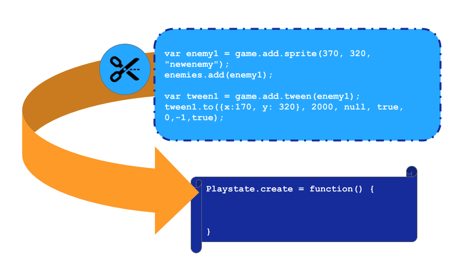

---
# all the regular stuff you have here
zotero:
  scannable-cite: false # only relevant when your compiling to scannable-cite .odt
  client: zotero # defaults to zotero
  author-in-text: false # when true, enabled fake author-name-only cites by replacing it with the text of the last names of the authors
  csl-style: harvard-manchester-metropolitan-university # pre-fill the style
layout: post
categories: chapter
title: Findings Ch 2 - Culturally Inclusive Methods to Kick Start Game Making Communities (with agency in mind)
---
-   [Introduction](#introduction)
-   [Scenarios - drama processes](#scenarios---drama-processes)
    -   [Vignette one - starting a drama
        process](#vignette-one---starting-a-drama-process)
    -   [Commentary on Vignette part
        one](#commentary-on-vignette-part-one)
    -   [Impact of the drama on participant
        affect](#impact-of-the-drama-on-participant-affect)
    -   [Impact of exploring documentation and technical help within the
        drama
        frame](#impact-of-exploring-documentation-and-technical-help-within-the-drama-frame)
    -   [Vignette part two](#vignette-part-two)
    -   [Impact of the drama process on
        reflection](#impact-of-the-drama-process-on-reflection)
    -   [Impact of the drama on encouraging flexible design practices
        via
        missions](#impact-of-the-drama-on-encouraging-flexible-design-practices-via-missions)
    -   [Impact of live chat with the alien
        sessions](#impact-of-live-chat-with-the-alien-sessions)
    -   [Initial discussion of the process drama (focusing on
        authenticity of
        tools)](#initial-discussion-of-the-process-drama-focusing-on-authenticity-of-tools)
-   [The impact of starting tools, documentation and other
    processes](#the-impact-of-starting-tools-documentation-and-other-processes)
    -   [Recap on the importance of tools in an informal setting - (ON
        AGENCY AND
        Authenticity)](#recap-on-the-importance-of-tools-in-an-informal-setting---on-agency-and-authenticity)
    -   [Impact of half baked game
        platformer](#impact-of-half-baked-game-platformer)
    -   [Impact of Code Playgrounds and Phaser and a Javascript
        framework](#impact-of-code-playgrounds-and-phaser-and-a-javascript-framework)
    -   [Narratives and graphics drawing on home funds of
        knowledge](#narratives-and-graphics-drawing-on-home-funds-of-knowledge)
    -   [Discussion on home funds of knowledge INCORPORATE
        ABOVE](#discussion-on-home-funds-of-knowledge-incorporate-above)
    -   [Documentation via code examples and step-by-step
        tutorials](#documentation-via-code-examples-and-step-by-step-tutorials)
    -   [Guided Code Patching Process](#guided-code-patching-process)
-   [Emerging processes and use of
    tools](#emerging-processes-and-use-of-tools)
    -   [Play-testing](#play-testing)
    -   [Building Identities as Game
        Makers](#building-identities-as-game-makers)
    -   [Rapid prototyping](#rapid-prototyping)
    -   [Alternating coding](#alternating-coding)
    -   [Shifting between Facilitator and more active
        partner](#shifting-between-facilitator-and-more-active-partner)
    -   [Code roles and
        experimentation](#code-roles-and-experimentation)
    -   [Accessing online, professional/community
        documentation](#accessing-online-professionalcommunity-documentation)
    -   [Emerging tactics in accessing help from peers and
        facilitators](#emerging-tactics-in-accessing-help-from-peers-and-facilitators)
-   [Discussion](#discussion)
    -   [Discussion - on learner identity, anxiety and implications in
        relation to other
        research.](#discussion---on-learner-identity-anxiety-and-implications-in-relation-to-other-research.)
    -   [Discussion on flexible design
        practices -](#discussion-on-flexible-design-practices--)
    -   [The limits of design cycle
        stages](#the-limits-of-design-cycle-stages)
    -   [Encouraging improvisation in the design
        process.](#encouraging-improvisation-in-the-design-process.)
    -   [Link section to next chapter](#link-section-to-next-chapter)
-   [Appendices of this chapter\_](#appendices-of-this-chapter_)
    -   [Appendix 4.x - On creating narratives and game
        Assets](#appendix-4.x---on-creating-narratives-and-game-assets)
        -   [Appendix 4.x - Extract of interview with Mark and
            Ed.](#appendix-4.x---extract-of-interview-with-mark-and-ed.)
        -   [Appendix 4.x - Extract of interaction between Molly
            and](#appendix-4.x---extract-of-interaction-between-molly-and)

<!-- ## Overview in points

- Introduction
- Scenarios - drama processes -
- The impact of playing games and ongoing play-testing - as a playful inclusive process to coding
  - Remixing / Half-baked - impact, examples (less important? - already covered - need something linked other parts of chapter)
- Personal expression - Funds of Knowledge
  - Working with Assets
  - Narratives   
- Letting flexible design practices emerge
  - Player and Maker Types
    - example of flexible design approaches valued / highlighted by types
  - Creating a _walled garden_ for GDP - an overview from a cultural, community perspective? (NOTE - duplication?) - perhaps a transition

- Discussion / synthesis
  - Agency through lens of double stimulation, explore in relation other research.  
  -  Design stages and Maker types.  Value as TADS?

### PLANNING SECTION - Cross referencing and dependencies - with with lit review and other chapters.

List what is needed / referenced in broad terms to help with planning - e.g.

- Inclusion as Participation [@black-hawkins_achievement_2008; @black-hawkins_classroom_2012] -
- Remixing / Half Baked games []
- Etc -->

## Introduction

This chapter is concerned with examining the impact on participants of the learning design explored in the last chapter. To do this it starts with an examination of a drama process intervention inspired by the work of Heathcote. Examination of this process drama in light of existing theory on the subject is used in addition to activity theory as lenses to examine participants use of tools in the learning design and to explore emerging community practices.

Following Heathcote, the importance and challenges of authenticity in tool use are examined in a learning community context. In addition, learner agency and the ability for learners to develop their identities as designers is also of key interest. For example, in the tension of restricting user choice in order to create more "visible anchor points" to increase potential for increasing the agency of learners. Like swimming in a protected pool rather than in the sea.

<!-- NOTE - DROPPING THE FOCUS ON INCLUSION HERE FOR A MORE FOCUSED APPROACH. -->

**Justifying selection of chapter contents**
The following elements have emerged from many in the learning design as of merit for sharing in this chapter based on the following criteria: key to the learning experience of participant; novel in terms of lack of existing research; supported by recorded data; and of potential wider interest outside this context.

**Link Section - rewrite - move to intro?**

The process of creating assets builds in Molly the identity of a proficient maker. She wants to build on her achievement of being an "expert pixel". As explored in literature review the possibility to change and to play with identity is important in the work of Gee.
FIND RELEVANT LINKS HERE - CALL BACK TO LIT REVIEW

His work explores the role of the design of games and the surrounding communities that build up around games to support an nurture the development of player identities. The process is shown to have beneficial effects in supporting the creative interations with games and play.

In a similar vein, drama processes like the mantle of the expert are designed and enacted by facilitators in ways whic allow participants to draw on their existing knowledge and encourages them to put this into practice in fictional scenarios.

The next section outlines the delivery and start to explore the impact of the process drama used to frame the overall learner objective during phase four.

The previous section examined the impact of a process drama with an aim to establish and nurture community practice. It highlighted the value of introducing almost-real processes, near authentic tools and the possibility of learners developing learning identities within a drama frame.   

This section looks in greater depth at the impact on learners of the tools and suggested design patterns of the learning design explored in the previous chapter.

It then progresses to explore some of the emerging and flexible design processes and tools that evolve from the starting design.

## Scenarios - drama processes

### Vignette one - starting a drama process

This sections starts with a vignette of the start of an game making programme. It takes place during the third iteration of the game making programme. The participants have entered the room and chosen a laptop to work on. Some of the children are playing web-based games or reviewing the games that they have made previously.

The session starts with a game which proceeds with a lot of developments including many false starts, changes of rules, development of tactics, appeals to be serious, full throated laughter and many restarts and which ends in good hearted failure.

<!-- The purpose of the vignette is to situate the reader, give an overview of -->

> Mick: Ok. So I’ve got a surprise. I don’t know if you know but as part of our Home Ed club we did a page of different games. So it’s on glitch.com and it’s called Glitch Game Club and it’s on there, there’s one for Home Ed Winter 2019 and here are all the games that we made. We made a lot of games. 15 games. This has not gone unnoticed because I got a message through this account. This is kind of a story now. We are entering a story. You have to use your imagination. We got a message and it was an audio message. If you guys take your fingers off your keyboards and have a listen to this audio message which is quite unusual as I don’t think it was from anyone on … this ... Earth.

    Greetings Earthlings, we have an important message for the Glitch Game Makers.
    We are the Weean. You would call us an alien lifeforce. We like to think of ourselves as friendly space cousins.
    We can see your Internet from space. We are contacting you because we know you are making games on the Internet.
    We are on our way to the Planet Earth, and we have an important mission for you. We are an Intergalactic Rescue team. We know you have problems on your planet. We can help.
    But we need to find out one thing first. Are you worth it? After we are gone will you also be able to help yourselves? Or are you already doomed to make the same mistakes again?
    You must pass this challenge. Make some games showing problems you have on earth. In the games also include ideas for how to solve them.

    We have some guidelines:

      • Make a game about a big or small problem to solve. If you can let us play it each week as you go along.
      • Give us an update each week by recording a group update.
      • Show you can work on your own but also work as part of a team.
      • We will also send you text messages with some mini-missions sometimes. Be sure to tell us how you do.

    Please now get started and come up with a new game about solving a problem on Earth.

> The recording ends and begins to play again.
> Mick: And it just kept looping. I couldn’t understand all of it but I tried to write it down as best as I can. So from what I’ve work out they’ve looked at our games and they’ve come up with a challenge for us. They are coming to Earth so they need to find out if we are worth saving. And the way that they are going to decide is by playing the games that we come up with. And they are going to set us little challenges. So. yeah, that’s the story. (with heavy irony) I’m pretty sure it’s true. (Mick and others laugh).

> So all they’re asking us to do is to come up with a game. We’ve got four sessions. They want a new game because they’ve already played our old games. It’s got to be something about the problems of the world. I’ve got a lot of problems. It could be big problem or a small problem. It could be about your problems. But also ideas on how to solve them.  
And yeah. That we can work by ourselves but also work as part of a team. So we’ve got to give them a report by the end of it as well. That’s our mission.

### Commentary on Vignette part one

<!-- q: How much to reference back to previous chapter? -->

This transcript is a rare example of extended facilitator input as instruction. The vignette above covers three stages, namely: the use of a drama game; introducing a dramatic scenario to created a fictional audience; and orientation for use of support documentation.

### Impact of the drama on participant affect

The drama game which is served to put participants at their ease, to make communication between peers easier after engaging in play, to decentre the learning environment by creating a circle with more equal participation. As explored in the literature review, the use of such games to help set up informal learning environments is COMPLETE WITH DISCUSSION.

The session progresses from this game to a drama process with

As a facilitator I indicate that we are entering a dramatic process and attempt to draw everyone along with me using the following sentence _"This is kind of a story now. We are entering a story. You have to use your imagination."_
ADD MORE COMMENTARY ON DRAMA PROCESS  

### Impact of exploring documentation and technical help within the drama frame

The final part of this vignette gives an overview of the different kinds of documentation and attempting to shift patterns of working from printed sheets to working online. This was partly to be able to capture how participants interacted with documentation more easily as I would be able to review it on their screen in captured data.

<!-- NOTE-   Is there a graphic somewhere else? in a presentations. Create a figure for this. -->
<!-- Choices
- an overview of Mi's interactions on 2019-03-18 - home interests of art, community help, playtesting and being playtested, use of tools, Molly:as a social coder compared to others.
- Or could look at the whole family unit mi, zi and ne - And their interactions with alien narrative. -->
<!-- Something like the social activity of Vignette Sh and Th - perhaps even that one - as it goes on to
describe the different kinds of interactions. But that is more interpersonal interactions for the most part.
Here we are looking at something cultural?? -->

### Vignette part two

This extract comes from the second session in phase 4. A similar pattern happened for other sessions in the phase with 10 minutes allocated to this kind of reflection in drama.  

### Impact of the drama process on reflection

**My reflections as a practioner from my journal and those emerging from the process of transcribing and analysing the interactions.**

Drama scenarios can facilitate reflection on subject matter both in or out of drama. In their guidebook for practitioners O'Neill and Lambert outline the value of reflection that happens within drama structures, noting that it is "likely to be more powerful than end-of-session discussion, since it allows individual and group insight to be articulated as part of the context" [-@oneill_drama_1982, p. 144]. They propose one way of achieving in-role reflection is to introduce an additional character that acts as an external audience

As a facilitator, I picked this technique from work with the MMU drama department [@caldwell_drama_2019], the vignette above shows

From my perspective, this technique added an additional advantage of distancing myself from the process of giving direct instructions as I was able to use the foil of the Weean.

In my journal notes previously, I noticed that I was often reluctant to shift learners away from making activities to more structured reflective activities. With reference to AT terminology, the game-making objective of one activity system to the larger system of reflecting on progress or on the skills being picked up was jarring. I also worried that the learners would also find it jarring. Time pressure to finish games also compounded this effect.

These reflections are noteworthy as they provoke the following wider observations on the utility of this technique.  

 The drama narrative provided a way to decentre the facilitator from the process of giving boundaries. When listing boundaries to activities it feels similar to outlining the rules of a game. As such less about controlling individuals and more about contracting into a gameful or playful experience.  I am much more relaxed restricting choice in role, or via a proxy of a playful encounter, other facilitators may feel the same. Heathcote's observations on this process posit that learners especially those resitant to authoritarian teaching techniques, appreciate the process of aligning "needs interests" to "object interests" [-@heathcote_dorothy_1984, p. 185].
 SEE THE OBSERVATION ON THE CHAPTER ON AUTHE

- as a way to bring attention to an imagined audience. I reference that the games are online.
``

### Impact of the drama on encouraging flexible design practices via missions

**Motivations of the social challenges / missions**

The missions that were introduced as part of the drama narrative.
In the transcript there is the mention and some examples of some of the missions given by the aliens.

NOTE INCLUDE TABLE OF DRAMA MISSIONS - SECRET AND PUBLIC - IS THERE A TABLE SOMEWHERE?
Secret missions and public missions -
https://drive.google.com/drive/folders/1I8D_axlOUAFIGarrnzGV5mSCe2MDCDso

- My motivations for introducting,
  - result of analysis of interactions during game making,
  - to encourage some practices ignored by solely focusing on implementing code - game maker types (mention in previous design chapter)

NOTE INSERT - Examples of interactions?

- link to drama process theory
- link to side missions of adventure games - zelda - perhaps find motivation there too.

Some kind of coded data? Like out of x participants, y visibly engaged with missions.
The process was not without friction, some participants, notably Toby and Dave who were engaging with coding in a more heads down way, expressed frustration at interference.

### Impact of live chat with the alien sessions

As part of the drama process, a line of communication was opened up with the aliens in the form of a simple web page that could be edited and viewed by

Impact at the final session was significant. The interaction became a celebration of taking part. Something in addition to the main activity.

### Initial discussion of the process drama (focusing on authenticity of tools)

Examine MoE and this process drama through
Turn to authenticity of the tools involved.
Compare Heathcote's approach to tools to this learning design

The next section examines inpact of relatively authentic toolset.

In this sense, there is a high degree of authenticity made possible by the digital nature of the learning resources.
But some shepherding involved, screening from complexities, marshalling towards certain goals to maintain a shared script / experience.

Heathcote often explored issues in the context of making of the workplace. Creating a working model of authentic practice. However, she warns against asking participants to genuinely make items in the process explored, as to do so would expose their inexpertness in the cold light of day.
See interview Bolton and Heathcote
> "if they are makers of things (for example, shoes, ballgowns, or aircraft) they _must never_ (within the fiction, that is) _be asked to create the actual objects_. If they had to do this their _in_ expertness would become immediately apparent."[@heathcote_drama_1994, p. 18]

As an example in a shoe factory, the supporting resources would x, y and z but not actually making the shoes,
In the learning environment of this study there are broad similarties and some key differences in terms of supporting tools and processes.
Some more detail. But the are explored in more detail in the following section.

.

## The impact of starting tools, documentation and other processes

NOTE - TRY ORGANISING CHAPTER THIS WAY - IMPACT OF MY DESIGN - THEN EMERGING TOOLS / PRACTICES

<!--
MOVED TO INTRO
 The previous section examined the impact of a process drama with an aim to establish and nurture community practice. It highlighted the value of introducing almost-real processes, near authentic tools and the possibility of learners developing learning identities within a drama frame.   

This section looks in greater depth at the impact on learners of the tools and suggested design patterns of the learning design explored in the previous chapter.

It then progresses to explore some of the emerging and flexible design processes and tools that evolve from the starting design. -->

### Recap on the importance of tools in an informal setting - (ON AGENCY AND Authenticity)

Above we explored Heathcote's understanding of the importance of authentic tools in the process MoE.
NOTE - HOW MUCH TO INTEGRATE DISCUSSION - LOOK AT CASE BY CASE

The data in this chapter, and the majority of this thesis are drawn from stages 3 and 4. As such, the observations on starting point and subsequent emergent resources are based on that period. See the previous chapter for a recap

<!-- NOTE try to focus on agency as well? -->

<!-- NOTE - research notes include
- how agency can be viewed in this domain,
- increasing persistance / determination due to ownership of game
Gee - projected identity
Papert & Resnick & Kafai - ownership
Papert & Turkle - Turkle closeness to objects
 -->

#### Impact of CORE TOOLS

#### Impact of half baked game platformer

platformer?
retro?
existing research on attraction of retro
on half baked games
on culture and livingstone

PERHAPS KEEP EACH DISCUSSION POINT HERE IN THE SECTIONS ABOVE - OR IF MORE OVERARCHING MOVE TO FINAL DISCUSSION SECTION.

To a great degree the designer of the starting toolset and mission has a large influence on the balance and profile of community activity

Take the example above, through use of pixel art editor, and template with small, retro themed graphics, as a designer, reduce the propensity to spend along time on asset creation as retro pixel art is quicker to make.

In addition, the use of blocks encourages design as does the theme of environmental as steers participants into games involving animals. This is relatively easy to design and bring its own sense of game mechanics potentially.

THIS HAS BEEN MOVED - REDISTRIBUTE

<!-- This section looks at the specifics of community aspects of personal expression in the data collected in this study, dealing specifically with narrative elements, and graphical and audio assets. MOVED  -->
<!-- NOTE - CROSS OVER WITH PREVIOUS CHAPTER? PROBABLY DESIGN
(may need to move?)
Just create a summary here.

Existing research on digital making and creative coding has emphasised the role of personal expression to incentivise the creative process [Scratch roque community]. The creation of personally meaningful object to share with a community is a foundational concept in Papert's constructionism [CITE]. While the 3M design is more limited than a Scratch media project in the potential to incorporate home interests, participants did embrace existing immediately clear possibilities offered by the certain GDPs in the 3M starting design.
-->

<!-- NOTE - add into the design chapter - challenge of personal expression, incoroporating previous gaming interests and unrealistic expectations.
-->

<!-- NOTE IS THE FOLLOWING ALSO FOR THE DESIGN CHAPTER?

Another opportunity involved choice and design of game assets that allowed the expression of identity or a designed element - for example graphics, audio or a written message to appear at various stages of the game.

The incorporation and design of game assets is taken as work on GDP for the purpose of this model.

The core GDP involving game assets already exist in the starting template.
- Objects as a reward to incentivise player exploration
- Objects as a hazard penalising player progress

The starting three assets, player, hazard and reward provide a scaffold to  guide  the choice of game possible themes.

The incorporation of the graphic was relatively quick and easy change to make the game but had a significant factor in the affect towards the game.
So while structured to avoid
-->

<!-- Cultural interactions seem to be able to motivate and sustain other interpersonal activity which may be experienced as work.
This is supported by other research on digital making and motivation. CITATION HERE? - or in cultural discussion?  

**Tangled nature of graphics and narrative in this design**
In the data analysed, young people -->

#### Impact of Code Playgrounds and Phaser and a Javascript framework

<!-- Make point that it is hard to separate out tools and communities. In case of Mozilla, code playgrounds, and teach the web, and the culture of developers and teaching communities they are interlinked.
Discuss and compare to Kafai in book, the lineage of Logo, Scratch.
Instead the more authentic approach of a real language.
 -->

The limits that this imposed and the development of a new technique of patching as a process, and the use of code frameworks. This you can argue is a much more authentic process which could get extended in other directions. In the early selection of tools the use of a framework based on javascript and web technology is driven by authenticity. I can relate this to previous experiences of learning technology in community settings. It evokes in me feelings of agency, motiviation and freedom feeling being part of wide network which opens up diverse pathways.

<!-- Bring out detail from the study to this section.
 - the media literacy practices of transfer between tools - similar to other studies - see guided participation studies -->
<!-- Tensions compared to other more walled garden approaches - see below in tensions / move to make code. -->

#### Rapid prototyping

As per Te and Da - example in previous chapter where the preview window replaced paper prototyping, rapids shifts between code and game are optimal and build a particular fluidity of practice

 - Well suited to build a repeated design practice.
 - Especially with starting documents,
 - Small changes had big effects.
 - Variable changes needed immediate testing.  

While the design suits repeated design practice as illustrated by the example above, not all pairs or individuals interacted with GDP in such a neat way.

A later discussion section in this chapter illustrates a more complex interaction with design stages.

### Narratives and graphics drawing on home funds of knowledge

At all phases of the learning design participants were able to input their own preferences in the narrative elements and themes of games. The design processes involved choice of game characters and objects that allowed the expression of identity or a designed element - for example graphics, audio or a written message to appear at various stages of the game.

The literature review explored existing research on how interests the use of home funds of knowledge facilitate the adoption of design and coding practices.

One pair Ch and Pa the grandparents of Te, included a narrative at the start of their game.

     var starttext = "This is a game which pits a honey bee against a swarm of Asian hornets,  which are alien invaders attacking bee  hives in the UK and which beekeepers are trying to stop spreading  here. Try to guide the bee to collect all the flowers without being caught by the hornets.
     Use the arrow keys to move the bee. Press return to START.";

This did bring their own role as beekeepers into the making space and started interesting conversations with other participants.

<!-- In a noteworthy exchange a young participant Zi asks one of the grandparents of child if they had done any amazing things in their life. This exchange follows

   zi: Have you done amazing things?

The exchange seems to throw Pa but they draw Zi's attention back to the game. Showing that it demonstrates their interest in bees as they are beekeepers.

The source of Pa's hesitancy to share more is not clear. However her willingness to share that part of her personal story via the narrative of the game is shown here as is the willingness of the young participant to ask about the personal experiences of the older participant during the process of peer testing her game. -->

Participants Mark and Ed designed one game around the characters of a
train driver that needed to collect coal. In subsequent post course interview the parent described the impact of the child feeling like they could bring their own identity and interest into the project.
"I know just your eyes lit up when you realised you could expand your interests into gaming."

See fuller extract in Appendix 4.x

<!-- NOTE
NARRATIVE / drama IN PREVIOUS CHAPTER?
how do these two sections work together? remove this one?
 -->
Other participants were able to bring personal expression to the process via the creation of audio but in particular visual game assets.

NOTE - THERE IS A HIGH LINK WITH IDENTITY HERE - ESPECIALL IN MOLLY'S CASE STUDY - CAN THIS COME AS PART OF A DISCUSSION AFTER THE DRAMA SCENARIO SECTION? -

<!-- The incorporation of the graphic was relatively quick and easy change to make the game but had a significant factor in the affect towards the game [erikssonUsingGameplayDesign2019;] BRING ON OTHER LITERATURE HERE ON PERSONAL EXPRESSION, FUNDS OF KNOWLEDGE IN THIS AREA. Roque, Scratch, Kafai, Gee etc. -->

<!-- Ideally look for evidence of sharing in communities, especially developing processes, avoiding traps which sap momentum, -->

<!-- While these aspects are covered in other literature, and are therefore not covered in depth in this chapter, it is important to include their strong presense in the data of study. And to situate them in relation to other chapter contents. HOW EXACTLY. -->

In one exchange we can see the growing sense of ownership and sharing helps develop skills of digital literacy concerning saving ongoing work.

In this exerpt parent Molly has spent time creating a pixel art representation of an alien

    Molly:– We’re finished.  Right what’s next? Now I’m an expert pixel? Now I have to figure out how to get it in there, don’t I? Without losing it. I’ll be very upset.
    Sonia:– Have you saved it?
    Molly:– No I’ve not saved it.
    Sonia:– Save there. (points to relevant button on screen)

The full exchange sees Molly cultivating a sense of ownership over the graphical element that she has created. There is also the development of a growing sense of competency in this area of asset design. She notes she is an "expert pixel". The growing mastering in this area also seems to help drive motivation to complete the next challenge. This ownership also appears to drives another technical process that of saving work. Or rather the identification with the work pushes her fellow parent to preserve her work to prevent a repeat of losing work previously which she had just shared. See fuller extract in Appendix 4.x

The aspect of pattern completion driving technical process adoption is explored in the next chapter.

<!-- #### Different styles of making
PERHAPS IN DESING SECTION - BUT TRY HERE FIRST -->
<!-- #### Circulation of peers and helpers
This often facilitates talk aloud of design decisions and justifications.
Cross reference playtesting -->
<!-- ### Accessing Help and Documentation

In the emerging community there was a variety of help available including;

- Written documentation from the learning design via step by step tutorials
- A series of code examples in working code playgrounds
- Facilitator help through asking for help
- Student Helper attention and help
- Peer support from parents and children -->

<!-- #### Tactical use of in-session support time

Parent Mark made a comment showing that he was aware of the particular value of the in-class sessions to overcome some kinds of blockages. -->

<!-- #### Tactics in accessing help from peers and facilitators

A common teacher tactic is ask three then me.

The family group of Mi, Zi and Ne showed a lot of flexibility and tactical choices when trying to overcome blocks.

Zi more directly and loudly asking for help for faciliator often followed by comment from his mother to leave him alone.

in 2019-03-18 - 18.20 Mi's meets many small blocks and asks for help from a variety of people.
- Student helper to get online,
- Peer parent about use of piskel, and then her son
- Ne daughter
- Mick overall facilitator -->

### Discussion on home funds of knowledge INCORPORATE ABOVE

<!-- As we explored in the introduction and literature review, the ability to incorporate the graphical, audio and narrative assets into created games and playful digital designs allows for personal expression in a way that can be engaging and sustain motivation [papert, roque, kafai etc]; -->

<!-- Recap from Lit Review / Intro -->

While, the personal expression via narrative and asset design can be engage and sustain the motivation of participants, these processes brought tensions identified in the _design chapter_ namely: (edit down into list? )

- time on asset design can detract from systemic and learning code concepts and syntax.
- incorporating familiar or personally meaningful elements can involve challenges including that of unrealistic expectations based on previous game playing experiences
<!-- - tension of a walled garden approach vs responding to freer design choices -->

<!-- As per work on Kafai and Roque who observe the following features of personal expression in a community game making setting.

- propagation of assets..
- pride sharing back?
- value of feedback, asset creation as a speciality -->

<!--
NARROW THIS DOWN
The scope of this chapter is broad compared to the next one covering several related methods for inclusion, some of which have been covered in literature review. -->

<!-- ### Culturally Inclusive Methods to Kick Start Game Making Communities (with agency in mind) -->
<!-- 2022-08-11 - now thinking of putting this chapter first. Fits with narrative. And the progression from broader cultural factors, creating a coding culture, and linking to home interests / cultures.

Thus not dealing with the primary unit of activity yet, giving the cultural context. And exploring barriers to participation and efforts to overcome them. -->

<!--
NOTE - When to put data about TOOLS in this chapter or that of the design chapter.
As interlinked.  Data in design chapter when it is based on journal notes and personal / literature based decisions. -->
<!-- NOTE - PULL FROM ALL SOURCES HERE - JOURNAL, VIDEO, INTERVIEWS -->
<!-- ### Overview of contents of chapter (NOTES) -->

<!-- ### Tools
- Responses to choice of tools & Communities Choice of Coding Tools / Environment / Communities
  - Why not Scratch? Less of a community? So how to replace this? What of time considerations?

- Physical Elements as Tools
  - end boxes used as motivator / engagement
  - extract from interview?

### Creating Community Activity   

- Theortical context
  - Collaration from AT perspective - "collaborative activity" see [@eriksson_using_2019] for an overview

- Peer - side by side coding.
  - Parents coding too. See the comments by Molly:and her interactions / commentary. And the interaction of Ch-Pa and Te - the quiest support there.

- Game Playing and Playtesting
   - Game playing at start of program - no observations but sets context
   - Play testing - and challenge - a culture of "hardness", curiosity about number of levels, as a vehicle for peer support,

- Drama Process
 - differencing attitudes to games and technology
 - a reflective process to avoid distracting from activity & to share goals and process publically

### Drawing on Funds by bridging Norms and Values between activity systems

- Drawing on Funds of Game cultures
   - player and maker types
   - how to support emerging behaviours and give licence to young people  - side / sub missions
   - the sub missions - divergent activities can be productive
   - knowledge of GDP a fund - but one covered in detail in next chapter.

Organic Responses emerging naturally from community
 - problems solving  - navigating limits of facilitator time
 - Fund of Knowledge that
       - Home cultures and interests guiding subject matter for sub missions and character / scenario choice.

NOTE  - THE DISCUSSION HERE ON FUNDS - NEEDS TO BE CLEAR HOW TO SEPARATE OUT FROM GDPS in the next chapter
####  Notes on Discussion
These are quite disparate so probably makes sense to have a separate discussion entwined in each section rather than one section at the ends.
Relevant theory / studies.
- funds of knowledge
- AT theory for sub missions, in preparation for chapter on main mission / unit of activity
This section uses AT's focus on rules / norms and interactions with other activity systems at home. -->

### Documentation via code examples and step-by-step tutorials

<!-- Towards the end of phase 1 I began to create code examples to illustrate of how particular commonly requested game features were implemented. These barebone game projects were hosted on a code playground. An online document in our shared google drive working space linked to these examples. I would help participants access this when they requested a certain feature. This list of game features began to grow. For phase one these code example were not particularly successful at increasing learner independence. There were differences in the code structure of their games and the examples and translation was not intuitive. -->

At this phase there were two main sources of documentation; code examples, and tutorials. The implementation of the same game features but more closely integrated with the new starting code template used. These individual tutorials were directive in nature. The step by step tutorials were available online and also as printed A4 hand outs which were provided on request of the older participants.

NOTE - LIMITS OF THIS DISCUSSION - NOT INCLUDING THE USE OF GDP

### Guided Code Patching Process

QUESTION - KEEP FOCUS ON PATCHING - OR IS IT CODING ROLES?

THERE IS DUPLICATION WITH OTHER CHAPTERS HERE - ANY WITH GDP?
MOVE SOME OF IT - FOCUS HERE ON THE IMPACT NOT DESIGN - OBSERVABLE RESULTS

In response to on-going frustrations of time blockages, where were commonly reflected back by participants, even after step-by-step tutorials were introduced, I added an additional layer of a more systematic structure to the existing resources. Visual aids guided where to cut and paste code patches within their code structure with a greater level of specificity see figure as an example. This addressed a common lack of detailed understanding of the underlying code structure used in the code and the importance to place code extracts in the correct function to maintain the integrity of the syntax.

 {width="16.51cm" height="9.278cm"}

In making decisions like the one to include extra visual scaffolding in step by step documentations. I am balancing here many different factors of concern in the complex learning environment. These include; authenticity of programming environment and language, use of the existing structure of the phaser library, the learning process of participants getting stuck and having to resolve tensions, my time limits providing individual support as a facilitator of a group, and the patience of participants when they encounter incomplete documentation.

During this process of careful documentation I became concerned that over facilitation in this instructional way would remove the possibility for errors and thus reduce the opportunities for learning from resolving failure. However, while each stage of the process of adding game pattern was documented in as complete a fashion as possible, in practice mistakes were still made and additional customisations were made. Thus while the process did reduce dependency on my input as a facilitator there were still opportunities for me to support and resolve coding errors in person. When doing this I or other volunteers were able at times to give wider perspectives on the details of specific coding concepts and wider computational patterns. For example in terms of process, rather than writing code from first principles, this 'code patching' technique and subsequent debugging more closely represents the kinds of skills used by computer professionals on an everyday basis

<!-- Perhaps move later after GDP chapter?  -->
<!-- **Limitation of asset work as a GDP**
Note the limits of this interpretation
While the reinterpretation of the MDA framework into a menu of GDP is practical for the elements that they want to change, it is not strictly a pattern to be implemented here.
 tension here to be briefly explored or noted to explore later. -->

<!-- #### Circulation of peers and helpers
This often facilitates talk aloud of design decisions and justifications.
Cross reference playtesting -->

<!-- ### Accessing Help and Documentation
In the emerging community there was a variety of help available including;
- Written documentation from the learning design via step by step tutorials
- A series of code examples in working code playgrounds
- Facilitator help through asking for help
- Student Helper attention and help
- Peer support from parents and children -->

## Emerging processes and use of tools

The process of facilitating for emerging learner identities and practices, via the processes and tools explored above, opens up flexibility in the way learners approach the design processes.

My role as a facilitator rather than a instructor was key to this process as has been explored in related research (CoP, MoE )
- Heathcote's take

Where the activities, processes in the previous section were imagined, often in response to community need, by myself, the following emerged from community use.

### Play-testing

 <!-- NOTE - Include examples here which do not talk of GDP explicitly - but other cultural aspects. -->

Playtesting was a part of the initial design from the beginning but barely consciously, and certainly under explored in my journal notes. However it became a vital part of the learning process.

By the time video data recording started there were already complex patterns and behaviours at work.

There were a variety of ways in which playtesting happens and how younger and older participants looked to give and take from the experience. Playtesting appeared to be suited to allow a diversity of community-building behaviour.

Older participants often used this as a way of being supportive to both parents and young people. This happened in the following ways:
- praising graphical content
- making links with home interests of participants and building rapport - ( e.g. do you like dogs? )

**emerging cultural norms of playtesting**

Reviewing data around playtesting the games of others in sessions, and discussion around the final play of the external audience at final showcase.
and challenge - a culture of "hardness", curiousity about number of levels, as a vehicle for peer support,

In the last chapter,
Find examples

When explored from wider perspective, the hard is good lens, is very limiting.
The following paragraph explores different perspectives on hardness / challenge.

- arcade games were designed to be hard to extract money from players
- nes games reputation for being brutal as they often had no way to save states
- this developed later for snes games , finding challenge and other forms of ways of maintaining interest for different genres of games_

Other observations
- The process of teaching challenge via balance cards can happen early on
- some participants are resistange - see Molly's interactions - does this matter?

**Play testing - and embodied participation in the games of others**

study the body language of those play testing games.
what is there ? - included

- wrestling for control
- movement around the room between screens
- calling across room
- clustering, remaining on outskirts.

### Building Identities as Game Makers

NOTE - DROP MOST OF THIS FOR NOW - MOVE TO NEW PAPER - OR DISCUSSION LATER

One warm activities that took on a life of its own was a group activity of taking a Bartle test (what kind of game player are you) as extended spectrum line/grid activity [FIND DESCRIPTION SOURCE]. The process of exploring identity in this way surfaced the cheekiness of some young people and the pleasure they took in demonstrating their playful mischievousness. I began to make journal notes on this subject and talk to other games study practioners. I began to ask the question can the surfacing maker types (as per player types) encourage awareness and celebrate the emerging practices that the community was producing.

My journal notes see an evolution of attempts to try to build into the program, activities which help build the participants sense of their own identities of game makers or more generally digital designers. In and early tentative attempt to define in broad strokes the types of game maker behaviour and underlying goals. In doing this I have taken inspiration from Bartle's game player types Hamari and Tuunanen, 2014). I translated player types to maker types based on notes in my observation journal and extracts from screen capture data. The following list of *Game Maker *types:

-   **Social makers:** form relationships with other game makers and players by finding out more about their work and telling stories in their game -   
- **Planners:** like to study to get a full knowledge of the tools and what is possible before they build up their game step-by-step
-   **Magpie makers:** like trying out lots of different things and happy to borrow code, images and sound from anywhere for quick results
-   **Glitchers:** mess around with the code trying to see if they can break it interesting ways and cause a bit of havoc for other users

<!--
### Building Identities as Game Makers  - EXTENDED

PARK THIS FOR NOW IN DESIGN CHAPER

COULD RETURN TO THIS IN A DISCUSSION CHAPTER - AS HAS IMPACT ON GDP TOO.

My journal notes see an evolution of attempts to try to build into the program, activities which help build the participants sense of their own identities of game makers or more generally digital designers. In and early tentative attempt to define in broad strokes the types of game maker behaviour and underlying goals. In doing this I have taken inspiration from Bartle's game player types Hamari and Tuunanen, 2014). I translated player types to maker types based on notes in my observation journal and extracts from screen capture data. The following list of *Game Maker *types:

-   **Social makers:** form relationships with other game makers and players by finding out more about their work and telling stories in their game -   
- **Planners:** like to study to get a full knowledge of the tools and what is possible before they build up their game step-by-step
-   **Magpie makers:** like trying out lots of different things and happy to borrow code, images and sound from anywhere for quick results
-   **Glitchers:** mess around with the code trying to see if they can break it interesting ways and cause a bit of havoc for other users

My journal notes see an evolution of attempts to try to build into the program, activities which help build the participants sense of their own identities of game makers or more generally digital designers. In and early tentative attempt to define in broad strokes the types of game maker behaviour and underlying goals. In doing this I have taken inspiration from Bartle's game player types Hamari and Tuunanen, 2014). I translated player types to maker types based on notes in my observation journal and extracts from screen capture data. The following list of *Game Maker *types:

-   **Social makers:** form relationships with other game makers and players by finding out more about their work and telling stories in their game -   
- **Planners:** like to study to get a full knowledge of the tools and what is possible before they build up their game step-by-step
-   **Magpie makers:** like trying out lots of different things and happy to borrow code, images and sound from anywhere for quick results
-   **Glitchers:** mess around with the code trying to see if they can break it interesting ways and cause a bit of havoc for other users

For examples in the Vignette of S and T's interaction we can see attributes of the child as a Glitcher. In terms of understanding of the game as a dynamic system, this is seen clearly in the parent's alarm at the child's deletion of all elements of hazard. The parent is keen to keep a sense of game balance to ensure a sense of challenge for the imagined player. "It's no fun having a game without any hazards to avoid." The child seems determined to remove all hazards. My understanding is that she is also aware of implications for game balance but is taking pleasure in this seeming destruction of the key challenge of the game as an act of disruptive play. They seem to take pleasure from ignoring concepts of what should be done to maintain game balance and from the sense of shock from their current audience her parent. Going against this convention is a type of playful destruction in this context. The process mirrors play theory concept of playing against the game or dark play Sutton-smith, 2001).

In phase three, to bring an awareness of these playing and making types into the program in a playful way I devised a game of the program which I have included in all subsequent phases. Collectively players took the Bartle test to find out what kind of game player they were.

{width="17cm" height="6.493cm"}

The process was adapted so players moved around the room in response to each question. This allowed them to see how their response differed from that of their parents. The process was very engaging and quite revealing. Parents responded that the process gave them new insight into the digital life and identity of their children.

After the results were revealed, I then proposed as facilitator that my observations were that there different game maker types. I read out the different types and asked them to place themselves in a two-dimensional grid based on their self evaluation of what kind of game maker they were. Other family members were then invited to comment to see if they agreed with the positioning and if they could give examples of that behaviour.

An additional rationale for this process was to help reduce potential internal bias about the kind of process that a computer programmer should adopt, echoing the call for pluralism in approaches explored earlier in our section on germ cell concept Papert and Turkle, 1990). In short, my message was to participants there are more than one way the skin a cat. When you are learning to code follow your own preferences and try to observe and reflect on what works well for you. -->

<!-- NOTE - Preceeding To follow shifts in perspectives bound up in designing for others, and the shift in layers of abstraction,
This section explores what other shifts in design practices -->

<!-- ### On Debugging and Embracing Different Types of Errors

NOTE - THIS SECTION SEEMS QUITE NICHE - PERHAPS DROP OR MOVE TO A LATER DISUSSION - WHAT ARE THE ESSENTIAL POINTS?

 In the context surrounding the interaction outlined in the above vignette, the parent had tried valiantly to overcome a conflict caused by incomplete documentation and her own incomplete knowledge of the computational patterns used in the construction of the game's code. A way to start to normalise the experience of overcoming blocks is to get greater granularity on into the detail and types or errors. In the art of war on errors, we must know our enemy. These include:

 -   **Syntax and Program Errors** are errors in your code which stop the game from functioning at all, often resulting in a blank screen.
 -   **No Behaviour Bugs** are errors which in your code which don't stop the game from functioning but your intended effect is not present when it should be.
 -   **Glitches** don't stop your game from running but as you play you see that there is an unintended effect. The game does something different from what we want it to do.

#### Syntax and Program errors vs No Behaviour

Find examples.

Sh & Th for example gets so frustrated that keeps moving on to create compound errors.
One no behaviour bug can be worked around but a syntax bug stops everything.

#### Examples of Glitch types of errors

Short examples of different types and the affect implications.

Glitch errors can be productive.

**Productive in exploring code / creating new game opportunites**
An interesting one where the x / y axis mix up for Te 2019-03-18 leads to a new challenge in the game.

**Productive in in**

- Glitch - 2019-05-08 - Te and Da  - create moving enemy but it totally leaves the screen. This caused amusement and participants knew how they thought they would follow that up.

 The game making style of some participants -- for the most part young people -- seemed particularly likely to induce glitches and their unintended effects in game play. As a facilitator I began to celebrate these glitches with participants and explore with them the opportunities they provided to understand the related code in a way that was often concrete, engaging and and playful.

#### Discussion on Errors

Further analysis of the different kinds of errors that are likely to arrive and testing different strategies for dealing with them that take into account the zone or proximal development of the participants may provide not only useful input for the participants, but also opportunities to check understandings of processes and game patterns and computational patterns in use.

Question - do more useful / less de-motivating errors result from remixing and game patching?
Question - what impact does the process of being driven by GDPs have on how users deal with errors? PERHAPS EXPLORE LATER?

Perhaps see the above glitch examples. Not fully understanding every line of code can create a fun, unpredictable environment. We can infer from these examples that wrong behaviour may be easier to investigate and to correct than no-behaviour errors.

Aspects of the design encourage this kinds of error. Certainly the process of code patching does.
 -->

### Alternating coding

Sh and Th
The parent cedes the keyboard and mouse and sometimes swaps chairs to allow child to play test the game created.

This follows a pattern of X   

### Shifting between Facilitator and more active partner

At one point the testing process here is quite frustrating as gravity value is very low making any movement very slow with little control. While the child has previously rejected increasing the value, the parent's initial acceptance of this decision is later questioned. The parent who has to do the majority of the testing is more insistent to remove a frustrating part of the testing  process.  

Discussion drawing on more radical attempts to describe the best way to bring young learners into a design practice.
Perhaps in the field of participatory design.

### Code roles  and experimentation

While the parents are the ones doing the majority of the heavily lifting importing new code, children are observering and emulating this behaviour.

In one interaction child Ne visits the page to add a mechanic, starts to scan it, highlights some code, but then seems to change her mind
- perhaps recognising limits - or fearing the process of breaking her game - and returns to more familiar territory of changing game assets and level design.
FIND MORE EXAMPLES OF ROLES HERE - T AND D FOR EXAMPLE - CF OTHER CHAPTER

### Accessing online, professional/community documentation

The provided documetation provided a safe space. However, some participants embraced more authentic sources of documenation and code examples. They risked the additional confusion in a trade off to overcome the limitations of the existing help.

Toby and Dan - Accessing documentation Phaser

The process of modelling the specific practices of accessing developer documents and help forums is a form of apprenticeship and a direct sharing of a professional cultural practice.

Te takes a lead on looking for help on added a new GDP following enemies. He starts with menu, then book, then Da suggests googling and thus taking a step outside of the walled garden.

Discussion. There are pros and cons stepping outside that garden. Confusion, conflicts, complexity. etc. Vs. generating new patterns and personalisation of game content.
NOTE - THIS LINKS WITH DISCUSSION ON CHOICE OF DESIGN MORE GENERALLY.

### Emerging tactics in accessing help from peers and facilitators

A common teacher tactic is ask three then me.
The family group of Mi, Zi and Ne showed a lot of flexibility and tactical choices when trying to overcome blocks.

Zi more directly and loudly asking for help for faciliator often followed by comment from his mother to leave him alone.

in 2019-03-18 - 18.20 Mi's meets many small blocks and asks for help from a variety of people.
- Student helper to get online,
- Peer parent about use of piskel, and then her son
- Ne daughter
- Mick overall facilitator

Other pairs and individuals had other tactics.
Parent Mark made a comment showing that he was aware of the particular value of the in-class sessions to overcome some kinds of blockages.

## Discussion

Deepening from observation, evidence to synthesis in relation to other research.

### Discussion - on learner identity, anxiety and implications in relation to other research.

NOTE - INCLUDE HOME ED CONTEXT TO AN EXTENT TO PRECEED LATER CAVEATS IN CONCLUSION

While home education support practices of families are expressed in this setting, a computing context requires specific support techniques that may be unfamiliar to parents [@roque_engaging_nodate; @roque_becoming_2018].

This chapter has explored barriers to participation in coding project can be mitigated by allowing participants to bring in some of their existing collaborative practices and home interests.

In summary:

<!-- Family game making, of completing projects together with your parents or siblings has potential to remove the **I'm not that sort of person** barrier of cultural identity as participants are surrounded by their people. -->
- the choice of retro games as a medium provokes sharing for older participants while their enduring popularity maintains common ground with younger participants;
- encouraing game playing and discussion of games helps surface positive affect and   

**Discussion on reducing learner anxiety surrounding text coding**

The previous chapter addressed elements of the learning design that aimed to create an welcoming learning environment especially in response to the withdrawl of one family due to hardcore coding and feedback that

I introduced the following:

- adapted my sessions to ensure a consistency of non-digital and playful activities.
- reflection in role
- encouraging flexible making patte
- flexible pathways to making resources and navigating their learning.

This chimes with existing research:

- the importance of managing learner anxiety in second language acquisition [@krashen_principles_1982; @young_language_1992]
- deeper into Heathcote
- something about authenticity of audience, and resulting time constriction creating the right kind of pressure / motivation. Game Jams/ Hackathons

And can be synthesised in this way :

- oh lordy - better write something here!

<!-- Some of these observations and starting points were the continuation of my own work as a facilitator of open making focused training sessions. Especially the use of fun, communicative drama games to create a playful atmosphere for learning. An observation from my journal during phase one of the program underscored the importance of this starting points.  -->

<!-- The challenges of helping participants increase their confidence and commitment in program participation are explored in the the following descriptions detailing specific activities which were added to the program. -->

### Discussion on flexible design practices -

<!--
SHOULD THIS TALK OF DESIGNING FOR LEARNER AGENCY AND FOR DIFFERENT MAKING STYLES BE INCLUDED IN THE PREVIOUS CHAPTER  ON INTERVENTION METHODS? -->
<!-- NOTE - LIMITS OF THIS DISCUSSION - NOT INCLUDING THE USE OF GDP -->

Previously a broad range of observed design practices of participants which involve game design patterns were observed. The overall direction of the section is that it is beneficial to creative a community where there is a diversity of approaches being undertaken but with some underlying shared themes and practices.

 <!-- https://xd.adobe.com/ideas/principles/design-systems/design-thinking-process/ -->

To address this, this section looks as some of the emerging patterns which complexify the emerging norms of design thinking education.  *if that's useful that is - if not just describe complexities*

<!-- #### Vingette -  Describing design stages for Th and Sh pair beyond this interaction -->

 <!-- NOTE - This section may move to a (previous) chapter (provisionally structured around inclusive methods) - of which overall interaction with design stages could be one aspect.
 As such observations are listed in bullet point in case a lot restructuring is needed. -->

 <!-- NOTE -  the chapter is moving towards GDP as main activity unit. or is this already addresAs sed in Methodology / Design
  -->

 <!-- As mentioned in the previous sections, after analysis of this vignette in particular, it seemed promising to investigate behaviour and engagement at different stages of design process for this pair. To do this I have made extensive notes and used a coding structure for two complete sessions of this parent-child pair. The following observations have been made by comparing the codes on stages of design and types of participant interaction. This data was then triangulated participant feedback and my own journal notes. The observations are presented themed by the design stages used in the coding process with some general observations listed at the end of this section. -->

 <!-- NOTE PERHAPS MOVE THE GENERAL OBSERVATIONS TO THE END OF THIS SECTION AS DISCUSSION OR SOME WHERE EVEN LATER. OR ANOTHER Chapter
 REWRITE TO KEEP FOCUSED ON DESIGN PATTERNS.
   -->

<!-- #### Discussion on design stages and GDP for this pair - DROP THIS?

 - This grouping sometimes left early having completed more in code development than others but completed less social activities.
 This parent was much more commonly rooted to the computer than other parents. The parent had indicated that she considered herself a "planner" as a maker/player type (concepts explored in previous chapter). This interpretation seems confirmed by less social interactions compared to may parents. The pair engaged far less in play testing of other games and peer support to overcome barriers. They also followed the stages of design more closely than may other groupings, an observation which is explored in more detail later in this chapter.

 This parent-child pair alternate between use of keyboard and mouse. The parent is keen to give the child hands on experience when possible, noting "I resist the urge to fix things immediately when she struggles." This alternation is driven or facilitated by the different stages of implementing GDPs. The parent may take the driving seat to overcome code blockages early in a create stage but yield to allow the child to input their design choices when more complicated work is complete.

 Using the coded data from nvivo to compare design cycle stages with pair collaboration, it can be observed that the most likely stages for pair collaboration were during the Ask/Imagine stage, Testing and Planning.

 The vignette shows evidence of that the actions of the parent to re-engage the child at different stages of the design cycle helped sustain the child's engagement in the more focused design process happening on the screen. However, an opposing pattern of behaviour may also be valid. When parent problem solving the child is sometimes physically inactive, looking into space, but then explores the space and/or engages in peripheral activity with other groups. Within Rogoff's model of community of learners [-@rogoff_developing_1994], this observation is viewed as valid form of participation. The child's ability to legitimately disengage from pair coding to observe the work and interactions of others in this emerging community of learners may also be sustaining.

 It is of note that when describing the design cycle for this family that this family along with others are working with decomposed smaller design challenges in the form of implementing GDPs. Thus the cycle is repeated for each new pattern that the pair take on. These smaller design iterations can be expressed within the framework of AT as an activity system. -->

 <!-- #### Comparing the activity patterns of this family to others

 NOTE - MOVE / REINTEGRATE? OR REWRITE AS A LINK TO THE NEXT SECTION?
  NOTE - This more general observation may be part of the previous chapter

 We can compare this pairs pattern of activity with other pairs / families.

 - The parent here is much more commonly rooted to the computer than other parents.
 - This meant they engaged far less in play testing of other games and found it harder to gain attention for direct support.
 - This grouping sometimes left early having completed more in code development than others but completed less social activities.

 Discussion

 - The parent had indicated that she considered herself a "planner" as a maker type  which is confirmed by less social Interactions

 The observations above show the importance of recording the whole room. Some participants will roam to observe the work of others, to socialise, to gain attention of others for support or for feedback. When analysing data using 360 recorded video side-by-side with the screen captured data, the participant can be followed around the room and their activity can be noted even when away from their activity. -->

### The limits of design cycle stages

When coding data a design cycle framework was one of the code structures. REFER BACK TO ENGINEERING SOURCE.
Ask / Imagine, Plan, Create, Test, Improve, Share.

While design cycles was not an explicitly part of the game making instruction, certain interventions supported this approach. In particular the use of maps as a planning and reflection tool and the use of playtesting as a social and personal form of evaluation of emerging designs.

When coding I quick became aware of the limits and challenges to coding to this.

For example a lot of time in this informal game-making sessions were spent on activities outside of this cycle.
For example, opening up the right tools, navigating to correct locations and finding past assets involved a fair deal of effort and collaboration.

I have been pragmatic and map elements like this these loosely. Where appropriate I make notes on that activity in free form areas of other documents like spreadsheets.

This limits claims I can make from the coded data. However it raises interesting points which merit discussion.

**Value Faff Time.**
So much of the creative process is faffing. More precisely many creative moments happen in times not neatly represented in the cycle.
For example the navigation to the right location in creative software, finding assets, migrating assets between authoring tools, converting to correct formats, evaluating new tools.

This is something that I do not have a precise name for. I call it digital laundry or digital housekeeping. Things that at times can be low attention span or which can be extremely frustrating like needing to tidy up so you can find your car keys.
There is frustration here, but there are also moments of creativity, and there are bonding moments which are undirected activity but shared.  

For example the process of finding assets in the shared Piskel gallery served to keep indivuals informed in directly of progress being made, and to spark curiousity in the creations of others.

In addition, some of the missions encouraged this kinds of faff time. As examples, Mark toured the other participants and sparked a lively discussion about game playing in response to the mision of "Find out the favourite games of 3 other people". another?

**Improving is Creating and Planning when remixing**

For example when altering jump and move variable for the first time. They are deliberately set low. Thus while technically this is improving the code. As the participant is meeting those variable for the first time we can recategorise in the create category.

CASE - One parent did extensive design and then altered the variables at the end. Molly:-

<!-- Exerpt Molly:- 2019-03-08 - 52 mins -->

**Implication for design**

When mapping the activity to a design cycle. There may not be neat matches and at some stage if the process is very fragmented the researcher or teacher can legitimately ask how valuable the design cycle is as a planning or analytical tool. Other less formulaic theoretical perspectives on creative processes exist including rhizomatic approaches [@de_freitas_classroom_2012]. And some attempts have been made to incorporate design thinking with a rhizomatic approach [@biffi_chasing_2017-1].

### Encouraging improvisation in the design process.

<!-- Pumping up the Jam - -->

In many interactions we see improvisational approaches.

Example from Te and Da - 2019-05-08 -

    Da- use paper to design
    Te - I'm just going with it

The tools, process and the community encourage a jam / improvisational approach. Remixing, chipping away, a shattering of design cycles. More of an informal approach

The concept of Jam is explored in rapid, improvisational events called Game Jams.

Some of the following sections discuss design factors and participant responses which fit this category of informal creative practices.
player types

**Digital Jamming**

This has an example in the use of sound making software Fi & Ma -
The process of tinkering and messing spurs creativity that doesn't map to a design cycle.

They are in an evaluation of tools which could be said to be in planning stage,
However this quickly become creation as they decide the spontaneously created music is preferable to the one created using a different tool at home.

The joint jamming then has created two different soundtracks. This sparks a new thought to create different soundtracks for different levels.
This would fit within the Imagine stage.
Plan then Create then Imagine then Revise all in the space of a minute.

Implication one - When mapping the activity to a design cycle. There may not be neat matches and at some stage if the process is very fragmented the researcher or teacher can legitimately ask how valuable the design cycle is as a planning or analytical tool. Other less formulaic theoretical perspectives on creative processes exist including rhizomatic approaches [@de_freitas_classroom_2012]. And some attempts have been made to incorporate design thinking with a rhizomatic approach [@biffi_chasing_2017-1].

Implication two -when designing a program and thinking of how to present the process to participants, over structuring around a design cycle approach may be not be productive or accurate.
Question? How does this relate to tinkering methodology?
What other framework would be suitable here?

**Fluidity of design practice**

Another example shows an evolving fluidity in response. Ch incorporates a boost to player health after a level after being given feedback during playtesting.

Other participants also demonstrate fluidity of response although to a less sophisticated degree. The process of altering design especially suits a fluid response as makers build their design skills by rapidly altering  

This is participatory appropriation in that it is a new GDP that stems from original thinking on the part of the participant.  

<!--
## Community Aspects of the 3M design -

When reviewing video data. There are lots of interactions, peer and pair, that are influenced by the community focus of the learning design.

A bullet point summary follows

- helpers circulating (2019-03-18-te for example )-  playtesting as a community activity and feedback.
- getting help from all sources possible -->

### Link section to next chapter

We can note tension of restricting user choice in order to create more "visible anchor points" to increase potential for increasing the agency of learners. Like swimming in a protected pool rather than in the sea. This tension is explored more in following chapter.

This chapter has addressed x, the next chapter takes a deeper look at the mechanics of implementing code elements.

## Appendices of this chapter_

### Appendix 4.x  - On creating narratives and game Assets

#### Appendix 4.x  - Extract of interview with Mark and Ed.

    Mick: (17-46) Can you tell me anytime that you felt like you bring your own identities or interests into what you were doing.
    Ma - Oh, definitely. Yeah.
    Mick: Let's ask Fi that as well.
    Mark: Yeah.
    Mick: Can you do feel like in making the games, you're able to bring your own interests or things that you related to into it?
    Ed: Yeah. The Fireman.
    Mark: Yeah, well, tell us about that game. Tell about your interests and stuff?
    Ed: A little fireman, he's going around collecting coal for this train. They lost it. But then there's sheeps on the line.
    ....
    Mark: What is your aspiration for your life?
    Ed: I wanna be a fireman (on a steam train).
    ...
    Ed: I really like trains, since like I was very, very young.

    Mick: Do you think I mean, was that was that like something that helps you a little bit keep your interests go in for the game?
    Mark: I think it excited you to have to build a fireman sprite? Is that right?
    Ed: Yeah.
    Mark: and to have it train themed, didn't that like, keep your interest in the designing part of it up? Is that true?
    Ed:  Yeah.
    Mark: Because the whole theme of it. Just I know just your eyes lit up when you realised you could expand your interests into gaming.

#### Appendix 4.x  - Extract of interaction between Molly and

    Sonia:  That's Good!
    Molly: Oh do you like it?
    Sonia: Yeah
    Molly: Thank you. I'm very proud of it. Concentrated extremely hard. The thing is, you can get quite consumed doing things like this can't you?
    Sonia: Yeah
    Molly: That's the problem at home I get a bit kind of lost. I can't get the knack of some things. It takes me so long to get it. I'm like  so excited.   
    - Both laugh.
    Sonia: So are you going to do bits at home? When the kids are..
    Molly: I tried and I lost it all. And you know when you just completely... And even Ne didn't know so I just ... what a shame..  hours .... (Laughs)

    Molly: Lost time. Never mind.  We live and we learn.   

    Molly: We’re finished. Right what’s next? Now I’m an expert pixel? Now I have to figure out how to get it in there don’t I? Without losing it I’ll be very upset.
    Sonia:– Have you saved it?
    Molly:– No I’ve not saved it.
    Sonia:– Save there. (points to relevant button on screen)
