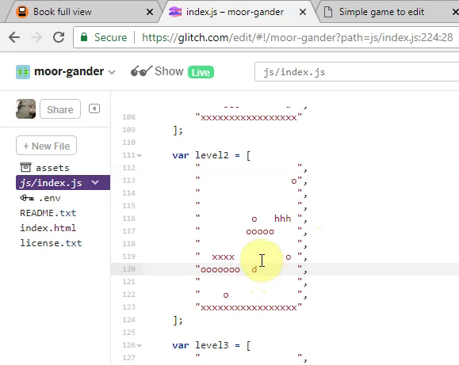

---
# all the regular stuff you have here
zotero:
  scannable-cite: false # only relevant when your compiling to scannable-cite .odt
  client: zotero # defaults to zotero
  author-in-text: false # when true, enabled fake author-name-only cites by replacing it with the text of the last names of the authors
  csl-style: harvard-manchester-metropolitan-university # pre-fill the style
layout: post
categories: chapter
title: Findings Chapter 2 - It’s like a project in itself really
---
-   [Introduction to This Writing](#introduction-to-this-writing)
-   [Chapter introduction](#chapter-introduction)
-   [Study of Vignette A](#study-of-vignette-a)
    -   [Descriptive Commentary on Vignette
        A](#descriptive-commentary-on-vignette-a)
-   [Cultural, Interpersonal & Personal Planes Analysis of use of
    GDPs](#cultural-interpersonal-personal-planes-analysis-of-use-of-gdps)
-   [The use of GDPs explored from a cultural
    focus](#the-use-of-gdps-explored-from-a-cultural-focus)
    -   [Developing a language for informal feedback for peers to
        influence modification of
        games](#developing-a-language-for-informal-feedback-for-peers-to-influence-modification-of-games)
    -   [The propagation of use of GDPs and associated practices
        stemming from
        playtesting](#the-propagation-of-use-of-gdps-and-associated-practices-stemming-from-playtesting)
    -   [GDP used to allow exploration of home and professional funds of
        knowledge and
        practices](#gdp-used-to-allow-exploration-of-home-and-professional-funds-of-knowledge-and-practices)
    -   [GDPs and the role of documentation and supporting
        resources](#gdps-and-the-role-of-documentation-and-supporting-resources)
-   [The use of GDPs examined from an interpersonal
    focus](#the-use-of-gdps-examined-from-an-interpersonal-focus)
    -   [GDPs used to facilitate
        prioritisation](#gdps-used-to-facilitate-prioritisation)
    -   [GDPs aiding the process of division of
        labour](#gdps-aiding-the-process-of-division-of-labour)
    -   [GDPs aiding the process of division of
        labour](#gdps-aiding-the-process-of-division-of-labour-1)
    -   [GDPs used to scaffold ideation
        processes](#gdps-used-to-scaffold-ideation-processes)
    -   [GDPs facilitating designing for
        others](#gdps-facilitating-designing-for-others)
    -   [GDP driving adoption of emerging technical
        processes](#gdp-driving-adoption-of-emerging-technical-processes)
-   [The use of GDPs explored from a personal
    focus](#the-use-of-gdps-explored-from-a-personal-focus)
    -   [GDPs used to support debugging and the product revision
        process](#gdps-used-to-support-debugging-and-the-product-revision-process)
    -   [GDPs as a way to surface and discuss Computational Thinking and
        Systems
        Concepts](#gdps-as-a-way-to-surface-and-discuss-computational-thinking-and-systems-concepts)
    -   [Use of GDPs in personal dimensions of community
        participation](#use-of-gdps-in-personal-dimensions-of-community-participation)
-   [Additional Chapter Discussion](#additional-chapter-discussion)
    -   [Game design patterns as a "middle level" construct to
        facilitate developing coding
        competency](#game-design-patterns-as-a-middle-level-construct-to-facilitate-developing-coding-competency)
    -   [Agency, Autonomy and Walled
        Gardens](#agency-autonomy-and-walled-gardens)
    -   [Tensions between facilitating agency and norming
        practices](#tensions-between-facilitating-agency-and-norming-practices)

## Introduction to This Writing

While this piece of writing contains results, it also contains references to concepts and methodologies which will be included in other chapters in the final thesis. Other emerging chapters are online at - https://mickfuzz.github.io/phd4/thesis_chapters.html

To help the reader understand the data in this chapter the following notes on indicative content of other chapters are included.

- Introduction: Research landscape to develop coding and design practices in line with social understandings of learning. In particular, the intentional development of a communities of designers and coders with an educational aims has been explored paying particular attention strategies that educators can use to aid these processes.
- The study uses mixed methods in methodology. Informed by analysis of journal diary, notes, video data and interviews (Methodology)
- The research design evolved as the game making program was underway based on feedback and reactions of the participants (supported precedent in design-based research) (Methodology)
- A long pilot course and development stage resulted in extensive support materials and activities which I have structured into a learning design called 3M (Methodology + see recent chapter on 3M model)
- Game making is based on remixing code from an existing incomplete game template (half-baked games & scratch community processes) (Literature review and Design)
- A narrow data samples has been used for this study. This prioritises a greater depth of analysis on interactions over generalisation. This is justified in a section on data validity in methodology chapter.  
- Results chapters use Rogoff's 3 planes of analysis (Cultural, Interpersonal and Personal) which aligns well with AT (Methodology)
- The concepts of resolving tensions within activity from Activity Theory are used to explore the evolution of the design of activities and resources. (Design results)
- The working definition of game design patterns (GDPs) is explored in the literature review and enhanced in the design chapter is augmented with analysis of specific examples of their use by participants in practice.

<!-- - A quick summary of how parts of the design address three planes [is here](https://docs.google.com/document/d/1FIPn2dEB2aCKZi5z05j69cnHgpGNXFh1_SPV6h5l12g/edit?usp=sharing) -->

## Chapter introduction

<!-- The working title of this chapter is Missions which aligns with a strand of the 3M game making pedagogical model developed in the course of this study. -->

The purpose of this chapter is to explore how the data gathered informs thinking on two research questions of this study.  

- How can game design patterns support the development of coding practices by novices?
- **New question** - How can learners build agency in an evolving community of game makers?
- How can the experience of fostering community focused digital game making practices inform wider practice in this area? (begun here but mostly in next / discussion chapter)

In the last chapter we explored inclusive pedagogical methods that helped participants become part of an emerging community of game makers. This chapter analyses a sub-activity system to the creation of the whole game, namely the implementation of individual game design patterns (GDPs). In the following sections, I draw on such detailed observations of participants in practice to outline how GDPs are used by participants. This chapter begins with a Vignette of parent child interaction in game making process. The vignette is used to introduce an overview of interactions of that pair generated from analysis of video data. The chapter then focuses on the use of game design patterns by participants in these interactions and then in reference to  cultural, interpersonal and personal planes of activity. Finally a discussion section explores implications and observations from these findings in relation to existing research and concepts.

<!-- In that community-focused analysis, the unit of activity/ analysis was the creation by individuals learners or pairs of an engaging game with an additional goal of exploring an environmental concept.  The implementation of GDPs as a unit of activity allows for a more detailed and granular exploration of the many actions and operations that comprise each pattern.  -->

<!-- ## Other Documents
NOTE MOVE THESE TO THE RELEVANT CHAPTERS SOON
-->
<!-- This chapter builds towards a Matrix that could be included in a concluding chapter.
https://docs.google.com/document/d/1DRgpgIUfq5XIktYy-lX4WlviUDnffNc0v8SOeLGgHho/edit

Also the RQ questions which answered
https://docs.google.com/document/d/1RZnznbR4HKrgL8VFfIqoCrCAJM0mf_sM8iEN4KCGeZ4/edit

And the coding structure here   
https://docs.google.com/document/d/19PafC_w_7uObYL4v86IGeeFZTw2yKxjHfP_k85rHk_s/edit# -->

## Study of Vignette A

To begin more detailed study of participant interactions taken from video recordings I use vignette to give a snapshot of the interactions of one family.

<!--
// On line version is here
https://docs.google.com/document/d/1B7kFl5QsGV-oWtFWHLBIJNpa5GeYMlCntq31BnPAQT4/edit

-->

For the previous five minutes the parent and child dyad have faced a blockage of a glitch in the software which prevents their wider objective of adding game design pattern of adding keys and doors to their game. In short, in this pattern the users must collect a key and then navigate to a door to progress to the next level. The parent Sh has been trying many different things and changing things in the code while the child Th has been expressing boredom. In response, Sh has expressed frustration and irritation. Finally Sh suggests that Th asks the facilitator Mick for help to resolve the coding blockage.

<!--
|**Dialogue**|**Activity**|
|:----|:----|
|S: You can ask him for help again if you want.|S is using laptop. T is nearby|
|T: Why| |
|S: Cos I can’t do it.| |
|T: Ok| |
|Exchange follows with Mick  and S - Problems solving using debugging methods and exchange of information about sequencing of variables.  Ends after several minutes with game exhibiting desired behaviour of moving to next level after collecting a key.| |
|M: Great|(On Screen) Platform game bug is resolved shown by game progressing to the next level.|
|S: Thank you.|
| |
|Did you see T?|(Off Screen) M cedes computer to S.|
|T: Did it do it?| |
|S: Yes| |
|S: I’ll reload it. Here you go|S presses refresh key to reload the game|
|T: Laughs|T moves laptop to point towards her and takes over using the keyboard|
| | |
|T: (Makes excited cat noise)|T is using arrow keys to control game and check desired behaviour of player progressing to level 2 is working. T progresses|
| | |
|T: We need a door in this one.|
| |
|I want to make more levels now.|
| |
|So you can put lots of doors and lots of keys|
| |
|Key Door Key Door Key Door|
| |
|Key Door Level. Key Door Level, Key Door Level|S moves computer back to take over the use of they keyboard. She changes tab and navigates to the section of the code which deals with the design of levels and placement of different game components.|
| | |
|S. Well. Where are you going to put your door in level two?|
| |
|Do you want to change the layout at all?|S gestures to screen|
|T: What’s door?|S doesn’t move laptop but gets closer to take over keyboard|
|S: d| |
|T: Ok| |
|T: d . Door right there.|Inserts a “d” in an array high above a platform|
| | |
|S: And where’s the key going?|
| |
|Must be quite hard through get to that door|
| |
|Key is K| |
|T : (Calmly) Ok just let me do something|T starts to delete multiple characters on a line|
|S: (Alarmed) What are you doing?| |
|T: You’ll see!|
| |
|T: Ah yes| |
| | |continues
|S: What are you.. Ah you’re making a platform. I see.|T starts to add x’s to replace the spaces she has deleted|
| | |
|T: See!| |
|S: So where is the key going?| |
|T: Key, so it’s K?| |
|S: Yes| |
|T: Where's K gone| |
|S: There| S points to the K Key on Keyboard |
|T: Back. K for Key| |
|S: Are you putting one in your third level as well?| |
|T: Yes and then I’m going to make more levels| |
|T: You do this bit| |
|T: And then delete those H’s. And in there.| |
|S: No. No.| |
|T: Then, let me do it.|(off screen) T takes over the keyboard|
|S: It’s no fun having a game with any hazards to avoid| |
|T: Is for me!  \How do you go that way back?|
| |
|So sorry for deleting… They just…|(on screen) T deletes hazards in Level 3 of game|
|Back Back Back|
| |
|Oh Oh Oh.|
| |Rogoff
|(laughs)|
| |
|(replaces another) Back Oh (giggles)|(on screen) T adds three coins to Level 3|
|S: Goodness me what what the point of designing our car with fumes if we’re not going to use it?| |
|T: I don’t know (sighs)|
| |
|T: You put the key and door in this one.|
| |
|T: Go on then. Key - Door - Person.| |
|S: Person?| |
|T: Key Door Person.|(off screen) T indicates that her mother is the person she is referring to|
|T: (laughs)|T start play through of their game again. She progresses past the first level, completes second level. The game then goes back to the first level unexpectedly.|
|S: Is this the first level again| |
|T: I think so| |
|S: OK so our the door for the second level goes back to first level and we want it to go to the third level presumably| |
|T: Yes (laughs) Yes. Why could that be? That’s silly| |
|S: I’m just going to go see something.|S dives into the code to try to troubleshoot the problem. T watches for a short while becomes disengaged. She then leaves mother to explore the wider environment of the room and objects within it.| -->

<!--
#### Summary Commentary on Annotation and Content of Vignette

The vignette including some gesture analysis. This is explore in more detail in a chapter on Methodolgy.

This was particularly valuable in the Key Door Person interchange where meaning was not clear before looking at video.
In previous chapter on methodology we (will) have examined the coding scheme used to code specifics on interactions and participant behaviour and output.

The resulting coding structure is available online here.
https://docs.google.com/document/d/19PafC_w_7uObYL4v86IGeeFZTw2yKxjHfP_k85rHk_s/edit# -->

### Descriptive Commentary on Vignette A
<!-- ## WAS Observations of use of Game Design Patterns in Vignette A -->

<!-- NOTE - COULD AT 3RD GEN TERMS - COMMUNITY, RULES ETC BE USED FOR THIS ACTIVITY SYSTEM IN THIS COMMENTARY - TRY IT?
BUT WHY NOT 3 PLANES - THAT MAY BE BEST FOR CONSISTENCY - TRY ONE -->
<!-- RESPONSE - It may be better even to compress this down and not use too much in the way of concpts.  

Perhaps just mention 3 foci at the end of this section?
NOTE - Commentary on replacing of level of analysis (confusing to some as hierachical ), with the term foci of analysis.

-->

In this section a summary of the interaction observed in the above vignette is described in broad strokes.

 <!-- using the foci of cultural, interpersonal and personal activity [@rogoff_observing_1995-1]. More detailed interpretation and analyis of these interactions follow in later sections.   -->

<!-- Where appropriate I make observations on similar patterns of behaviour from the same pair from outside the scope of this interaction. -->

<!-- **Cultural Focus:**  -->

The parent has taken on the role of solving harder code problems following  instructions carefully. The child is one of the younger participants when blockages occur she explores the room or to dwell on the periphery of other participants interactions. The child wants to add additional levels to the game. It is likely that this stems from observations of other games being made and conversations overheard. As this pattern has been added to other games and has become a popular topic of discourse between participants.

<!-- The process of adding new levels is something that one participant Te has been teaching other children to do via peer support. He has added so many levels to his own game that children and parents in this session are commenting in on it.  -->

<!-- For  Mi and Other Parent - "Have you seen Te's game it has 21 levels." -->
<!-- NOTE - CHECK THE GLITCHING / PLANNING TERMS WITH PREVIOUS CHAPTER -->

For both parent and child there is an explicit awareness of game making patterns, the cultural conventions of a platformer game and concept of the game as a dynamic system. These awarenesses drive their work on the design and coding mechanics of the game.  The target game design pattern Keys and Doors is repeated in a sing song voice by the child along with chivvying .

Understanding of the game as a dynamic system is seen clearly in the parent’s alarm at the child’s deletion of all elements of hazard. This interaction shows the parent guiding the child to imagine the user experience through the use of terms from GDPs. The parent uses GDPs as a prompt that they are designing for others. The child has also thought ahead to this time of playtesting. Both child and parent make reference to the imagined player experiences. In the vignette above Sh mentions "it's no fun if their are no hazards". The response of Th "It is for me." indicates a desire to play against game conventions with a desire to confuse or disorient players.

<!-- Drop tool use here - not specifically GDPs
 One interaction with the facilitator uses the debugging tool of the browser. [Move?] -->

Game making patterns are outlined by both the child and parent. They talk of adding more levels, of the mechanic of keys and doors in this vignette. After a blockage caused by debugging coding is removed, the parent immediately re-engages the child.

The parent says "Did you see Th?" and then prompts the child to play-test the game. The child is keen to both replicate the GDP of keys and doors in the second level and to add a new GDP of adding additional levels to the game.  

Cracking open a this seam allows for new possibilities. The process of working on a new GDP seems to motivate and sustain the child's activity. The child shows high engagement at this stage outlining her plan for adding pattern to make progress in the process of designing their game. The transformation from the period of time when her parent was problem solving code is dramatic. For this child this alternation between higher and lower engagement with the coding processes happening on screen was fairly consistent.  The implementing a new GDP often involves adding new code to the game or a significant change in code which may need debugging. For this pair, larger coding activities were beyond the ability of the child.

The transition from adding one GDP involves playtesting. In this example, the process of playtesting also involves the child speaking and identification of modifications to and new GDPs to implement.

<!-- NOTE - MOVE TO ANOTHER SECTIONS WITH TRIANGULATION? -->
<!-- ### Gdp and motivation -->
<!-- I propose that a contributing factor to this motivation is the ability to replicate a familiar pattern of game play via her own work in construction. It is the ability to translate this home knowledge into her own artefact which gives a sense of mastery over an otherwise foreign environment. -->

<!-- The process of personal development of knowledge is less clear from video data.
NOTE - SOME MORE READING ON AN INTERPRETATION OF THIS THAT I CAN WORK WITH FOR THIS DATA IS PERHAPS NEEDED. -->

The adult is building proficiency in coding practice. This is shown in a variety of ways. Firstly through the process of adding code from documentation, but also in the fluidity of her navigation between advance coding, playtesting and then back to set up the coding environment for more basic coding of her child.

The child uses her concepts of game design patterns in the end of course evaluation. She responded to the question _What would you like to see next time? What would you add?_ with the comment. "Th: I'd add a health bar and lots more levels and keep on changing the characters and background."

<!--
#### TO INTEGRATE - Sustaining Engagement: Parental prompts aligned with ideation stages
The parent navigates this process skilfully and is able to incorporate the child's interests.

The parent struggles to implement quite ambitious code challenges that she takes on but signals clearly when the process returns to ask / imagine stage. The completion of a coding task  
  indicating that she is aware of the greater possibility for effective child input at this stage.

In ask/imagine stages parent and child are able  discuss storytelling, graphical and other aesthetic choices -->

## Cultural, Interpersonal & Personal Planes Analysis of use of GDPs

In the preceding section, a short interchange between participants was analysed using three foci of activity  cultural, interpersonal and personal foci. In this section I present the results of analysis of other video recordings as separate observations on the way GPDs are used by participants and facilitators to further their game making objectives. Acknowledging that these observation do not fall nearly into each of the three planes, I begin with those oriented more to cultural focus before progressing to  observations oriented chiefly to interpersonal activity and  then ending with some observation on GDPs impact on personal knowledge construction.

## The use of GDPs explored from a cultural focus

In the previous chapter the role of cultural activities to engage and sustain engagement in this game making programme were examined. This chapter allows us to focus in on the way design patterns used are by parents, children and facilitators in in this emerging game making community.

<!-- NOTE - ADD QUICK SUMMARY OF PREVIOUS CHAPTERS FINDINGS - IF THIS HELPS GROUND THIS SECTION -->
<!-- - Tools: Specifics on Code Playgrounds and Phaser and a Javascript framework -->
<!-- - the media literacy practices of transfer between tools - similar to other studies - see guided participation papers -->

### Developing a language for informal feedback for peers to influence modification of games

**The concepts of game challenge and game feel evolved through informal feedback during playtesting and served to influence peers to modify their games to increase the enjoyment of peer players.**

The discussion of game challenge, specifically comment about how 'hard' participant games were as the most common interaction during playtesting. The concept of difficulty for most of the participant's games was dependent on the interaction between the feel of the game controls and elements of game challenge associated with placement of hazards and moving enemies. The term _game feel_  has varied interpretation but is generally framed as the responsiveness and feeling of control over the main character during the core movement of the game. In this case, it effects the ability of players to move between platforms and avoid enemies. In this design the jump mechanic is determined by the use of variables controlling gravity, jump velocity and movement velocity. The importance of these variables to is was behind the design decision to place these variable right at the top of the code and to rename them with player centric names rather than mathematical terms like velocity and acceleration.  
<!-- NOTE - BE SURE TO EXPLORE THIS IN SOME DETAIL IN DESIGN CHAPTER -->

The regular playtesting of games allowed participants to give each other feedback regularly and game feel was one of the aspects that young people in particular to gave frequent feedback on. Parent Mi had been focused mostly on completing asset design. She had been made aware by her daughter Ne about the relevant game variables.

PERHAPS INSERT HOW - SCREEN SHOT?

In response, Mi asked for advice but Ne gave none walking away. Mi noted "She's left me to my own devices."

Player jump (y) velocity was set very high but left right (x) velocity was slow. This created a very frustrating game feel. The following is a compilation of feedback comments or reactions over a 15 minute time period.   

    Mi: (Talking to self) No! It's so hard that. (referring to a particular jump in her game.)
    Mick: How are you getting on Mi? It's looking good.
    Mick: (Noting frustrated air of Mi) Have you made it to hard.
    Mi: I don't know. Can you jump from here to here with this.. this.. him? (point to main character)
    Mick: So it look like you bump your head and fall down.
    Mick: One bit of friendly feedback that I would give you is that it's taking a long time to move left and right. And that is something that you can change if you want to.
    Mi: Oh right yeah.direct
    Mick: Yeah.
    Mi: Yeah, actually that's a good idea.
    Mick: If you think about average games. Your average jump time would be about one second in the air. So that can be a bit of guide sometimes.  

I share direct feedback about the frustratingly slow movement time and an indirect feedback on the high velocity jump value. I use quite indirect language when giving feedback and while I reference Mi's frustration rather than giving direct feedback.

Ch likes the look of the game and begins with that as a comment.

    Ch: That looks nice (referring to the graphical look of the game)
    Mi invites Ch to play as she can't progress due to the difficult game controls.

    Ch: It jumps super high but so slow  
    Pause.
    Mi: He has to go slow be### GDPs and the emergence of gameplay concepts and practices through Playtesting
cause he's an astronaut, you see.    

    Ch: It's hard.
    Ch then leaves

    Mi: (to peer parent with proud tone.) It's hard. Wow.

Fi comes to play the game

    Fi: How much jump speed to you have?
    Fi: Your jump speed is massive.

We can see that Mi justifies the game feel of a very high fast jump with a narrative response about the character being spaceman. However, the limited amount of time anyone plays her game and her own frustration in playing it is telling. The game feel is frustrating in the wrong way here. Mi seems to initially misconstrue the feedback she is getting here equating her ability to make the game hard as a positive thing. However, towards the end she notes the frustrating nature of the game. As a caveat, it is hard to be clear about the motives or decisions of Mi in this situation.

Other children come and play the game but only for less than a minute before leaving. While their feedback is non verbal the very short length of time that some of them spend is noticeable.  After the last one leaves Mi comments "It's so frustrating."

In these interactions we can see a consistent message coming from peers in the playtesting process. They praise the look of the game but offer constructive feedback to help improve the GDP of jumping. The same message is delivered in a variety of ways, above we can see feedback from Mick trying to bridge a technical and conversational approach, direct feedback of the personal challenge level and an interpretation of the cause from Ch and then a more specifically technical explanation involving the naming of the variable _jump speed_.

While the players do not, apart from Mi's daughter, tell Mi directly to change the game, these comments appear to direct direction of the design to comply with an emerging community norm of jump feel stemming from the personal experiences of the participants and from tangible feeling of lack of control over the player's character in the game. These norming behaviours some of the informal norming behaviours that are less directive seen in the work of Rogoff and colleagues as explored in Lit review [@rogoff_cultural_2003].
EXPAND EITHER HERE OR IN DISCUSSION.

### The propagation of use of GDPs and associated practices stemming from playtesting

**The implementation of particular GDPs by participant pairs or individuals often spread through peer activity incorporating or emerging from playtesting.**

For example, the work of the child to add 21 levels to their own game served as a way to publicise this possibility. The process was also spread by that child's willingness to help others to add that feature to their game. This shifted dependence on myself as a facilitator, or on the instruction-based support documents. This excerpt shows this more experience child coder Te, agreeing to show another child Ch how to add new levels.

    Ch: Why’s that enemy in every level
    Te: He’s not.
    Ch: Can you show me how you add more levels on to yours?
    Te: Yeah sure.
    Pause
    Te: I’m just going to have one go of beating this (refering to his own game which he is playtesing). It’s 21 levels in it. So .. Yeeeeah.
    Pause
    Ch: It’s like parcours in Minecraft but times. It’s like playing the game Wipeout. Have you ever played Wipeout?
    Te: Er not really.
    Ch: Or seen it?
    Ch: That’s like my second level.
    Te: Ah so hard (Te fails at a high level on his game and starts to move off)

    Te: (To someone else  calling for attention)  No I’m helping (Ch)..
    (Te then follows Ch to his workstation to help him implement more levels.)

When Te moves to Ch's game he playtests it and then looks at the code. He notes that Ch has added a variable for a fourth level but then goes on to demonstrate to to add an array representing the next level, and a conditional statement to select level 4 when level 3 is completed. At Te uses the keyboard completes this work, Ch reads aloud the code which is being typed in by Te.

Exchanges like this allow the propagation of GDPs. The process of playing a game of another and sharing your appreciation of it invites participants to add new patterns to their own game. In this example, the process is very direct with the one asking another to help them directly. It is very likely that Ch has noticed Te helping others add levels to their games and thus this may help him to feel empowered to do the same. The propagation here is emerges from and is completed entirely through peer activity. A different and more common pattern of propagation was that participants notice and comment on a game element or pattern during during playtesting, and then to use supporting resources or facilitator help to implement it. A less frequent pattern involved participants' diligent and deliberate use of supporting resources to identify and implement features without peer influence. Typical examples of propagating patterns include placing hazards in tricky places like a lava pit, the use of moving enemies and changes to jump dynamics.

In addition to the propagation of main game design patterns, sub patterns and related design concepts emerged organically from the community. The concept of safe zone in the game of Ch and Pa arrived as a direct result of after adding a moving enemies GDP, the extensive use of that pattern dominates the game challenge to such an extent that it is essential for players to quickly identify and use 'safe zones'.

For example the emergence of the concept of safe zone in the game of Ch and Pa -
The concept of a safe zone arrives as a direct result of after adding a moving enemies GDP, the extensive use of that pattern dominates the game challenge to such an extent that it is essential for players to quickly identify and use 'safe zones'.

Playtesting also helped propogate emerging practices. For example, after testing Mi's game In the example above after comments on the jump speed Fi continues.

    Fi: How much jump speed to you have?
    Fi: Your jump speed is massive.
    Fi gives advice about tidying up the sprite outlines.
    Fi – for people with background like yours You can use the “cramping tool””
    Ma and Fi – then explain – SEE THEIR RECORDING
    So that the background is clearer.

While Fi has only just been introduced to the ability to "cramp". He is happy and able to share this useful tool with Mi. Theme

FIND THE EXAMPLE BEFORE DEVELOPING.

### GDP used to allow exploration of home and professional funds of knowledge and practices

**GDPs allow participants to share and explore their home funds of knowledge and practices in the emerging learning community.**  

In the previous chapter, the ability for participants to bring home funds of knowledge (as per Lit review) into the new learning community was explored via the use of graphical assets and game narratives. In the previous example we can see a similar process occur as Te self test his game exposes the dominant game experience of timed jumping.

    Ch: It’s like parcours in Minecraft but times. It’s like playing the game Wipeout. Have you ever played Wipeout?
    Te: Er not really.
    Ch: Or seen it?

Parcour in Minecraft and Wipe out are both  game experiences whose main mechanic is about judging jumps to landing accurately. Ch makes links to his existing experience of games making comparisons between Te's game, commercial games and his own. In doing so Ch is able to show his knowledge and analysis of gameplay patterns to this community. While his motivation is not clear, one interpretation is that Ch could be making this contribution not only to openly share experience but also as a offering in return for his request for help which he has just made.

<!-- In addition to the previous chapters observations....
ADD IF RELEVANT - research on funds of knowledge motives or benefits of this behaviour may include: ... -->

In the following example home funds of knowledge are utilised not only in terms of home experiences of games but also in terms of design and problem solving practices. Da and Te are working closely as a pair. Da invites thinking outside of the constraints of the suggested design early in this first session. The following interaction shows a rich interchange where the parent is trying to draw on the game playing experiences to promote innovation in the design of the existing template.

<!--
The following exchange shows how the use of GDPs help participants navigate the professional practice of forking a codebase and the exploration of developer resources. Technically, he has the courage to divert from the existing game paradigm from platform to maze. Practically it brings up issues as many of the dominant game design patterns are different. Thus the first one they identify that of enemy following is not present in the current menu of choices.
-->

    Da: Have you thought about pushing it a bit further and have a different style of game?
    Te: What do you mean?
    Da: Well the previous style of game was a platform (makes shape with hands) game wasn’t it? You went along and there was gravity pushing down (points down). There are other types of games aren’t there?
    Te: Pause. I don’t know what to do thought.
    Da: Well quite but what other games are there?

Te adopts with this suggestion readily once he understands Da's suggestion. He then approaches Mick with a suggestion.  

    Te: You could have a game where every 15 seconds 10 seconds you could add and enemy to such and such a random number between such and such (holds up hands to indicate parameters). You could block it somewhere.
    Da: So instead of.. instead of the world… the world being sideways. We could have the world being looked down on. (reindicates the change of perspective)
    Te: Hmm. How should I do this then?
    Da: That’s a good question. Shall we ask Mick to see if that would mess things up or not?  
    Te: Mick
    Mick: Hi ya.
    Te: Erm. Thinking about what game to do . I was thinking can we make like a Pac-man game kind of thing (indicates movement of character with hands)
    Da: If we had an on the top game rather than a platform game
    Mick: I think it could work. You could kind of adapt that game by, kind of, removing gravity.
    Da: and see what happens?
    Mick: and see what happens.

<!--
Te is implicit in the use of is process, saying "I was thinking can we make like a pacman game kind of thing".
Da is more explicit naming the shift of perspective but also implying
Mick takes this to a different level by making reference to a key change of code that would be involved.
NOTE - LINK THIS TO LOA -
-->

Da expresses his desire to for the pair to try something new by implementing a pattern not in the menu of GDPs provided. Their new choice is a change of perspective which involves a new game pattern of a new movement game mechanic. The specific proposal is to remove a jumping game mechanic and using a 2D top down movement mechanic used in maze and adventure games (e.g. Pac-man and Zelda games). This decision can be triangulated with interview data from Da on the motivation behind his involvement in volunteering at Coder Dojos.  

    Honestly, it's just it's just my hobby and I love it is the main reason. In fact, it's probably the only reason. If I can, if I can persuade / cajole / trick my kids into being involved at the same time, then that's even better. Personally, I think that's about it. I've always been interested in computers. I love, I love, I love programming. I'm no good at pencils and pens drawing or anything like that. But writing software is the closest I get to a creative outlet. So I just love doing that.  

Given this additional perspective, I interpret Da's influence to divert as a way of embracing a creative challenge and bringing his child along for the ride. However, Da is also aware of potential challenges of straying too far from the template. He does not want to "mess things up". This tension has a parallel to a professional practice of "forking" code-bases in open-source code communities. The practice of forking can involve taking a code base in a new direction and the benefits of adaption may be out-weighed by disadvantages including the friction involved in splitting an existing community and duplication of effort. The parent checking with a Mick a guiding community member about the advantages and disadvantages of a major fork in the code structure mirrors this professional tension.

My own positive response to their suggestion was driven partly from knowledge of Da's cultural background a both a professional coding and a volunteer supporting children's coding programmes. While simultaneously checking with other groups that they use the starting template as a base, to avoid overload as previously discussed in design decisions, I encourage this pair to see what happens as a potential learning opportunity. I am conscious that the change of movement may open up different possibilities for new game patterns that this pair may be able to solve. This outweighs the possibility that the pair will get bogged down in complex code problems or structures which may be beyond the capacity of the young person. After all even if they encounter father must solve, the apprentice does not need to understand everything in order to benefit from observing the master at work.

<!--
Article on intangibility of game feel.
 https://www.gamedeveloper.com/design/game-feel-the-secret-ingredient -->
<!-- #### Use of hazards and moving enemies - The placement of hazards as design pattern to increase challenge -->

<!-- GDPs and play-testing interact to allow participants,  to support each other and build community in a diversity of ways. -->

### GDPs and the role of documentation and supporting resources
<!-- NOTE - Keep only the parts specifically on GDP -->

**Participants draw on their cultural experience and access to supporting resources and processes at home and from work contexts to guide interactions with others.**

A broader description of the design and use of supporting documentation is explored in previous chapters. Here I explore the specific use of GDP related resources. I set up the working pattern based on my professional experiences and my own academic and cultural interests. However, my choice of a walled garden approach in terms of limited design patterns and bespoke documentation based on patchable code snippets created a possible tension with the professional practices of some parents with coding experience.

#### Use of simple code examples which demonstrate the pattern in isolation

<!--NOTE DEVELOP THIS EXAMPLE - RELATE TO PRACTICE OF CODE PATCHING (EXPLORED IN PREVIOUS CHAPTER) -->

Code examples were initially the starting resource. The idea being it was quick to see the behaviour in context. The, use of code examples by Te in 2019-05-08 shows the effectiveness of the use of code examples by participants. The following example outlines the process of Te finding a GDP to implement and adding it to his game.  

Insert table from https://docs.google.com/document/d/1fYuwJe4GbbGtZQttIz1mP1wYNPAwaPErr7BNjmbRmBM/edit#

The timings of the process of patching the code show that the learner is hesitant in the process. He checks the code and then checks the game output to test that the code creates the desired behaviour. Once this is verified he progresses to copy and paste the code from the create function of the sample code to the create function of his own source code.

In the next iteration of game making Te works with his father Da.
Te

Convert to  table in https://docs.google.com/document/d/1fYuwJe4GbbGtZQttIz1mP1wYNPAwaPErr7BNjmbRmBM/edit#

    extract from 2019-05-08 - 20 mins
    Te – Right what shall we add next? So it follows?
    Da – yeah that would be interesting wouldn’t it.
    Te – you know like the ghost in pac-man
    Te – I think it’ll be in here. (Looking at menu of Game Mechanics – can’t see it)
    Te- Link to tutorials – goes to the online tutorials on flossmanuals
    Te – we could add some player health
    Da indicates at the moment this work ok.
    Te – shall we try to get Mick for this
    Da – ah we could google it.
    They google "phaser pacman"

Te looks to try replicate a previous pattern of work where he scans the provided menu of patterns to

The pair's process here as they work on adding a pattern of _following enemies_ is very different from previous example of self-directed code patching from code examples.

NOTE - INTEGRATE THE FOLLOWING INTO THE EXAMPLE ABOVE. REDUCE DOWN A LOT
PERHAPS MOVE SOME TO DISCUSSION

#### Example of use of professional practices of accessing professional documentation

To explore the use of of professional practices of accessing professional documentation the previous exchanges between Te and Da can be revisited.

NEED TO DEVELOP THIS WITH AN EXAMPLE

<!-- NOTE - dropping pair programming

These two examples stem from the wider cultural experiences and practices of the pair's home coding style and the parents experience taking part in professional community coding activities.

There are cultural elements here of a family learning culture between these two playing out in this space. This example is typical of other interactions of this pair. Te and Da's design process is more guided and focused than many other participants.

In this example the father starts as a facilitator, and takes on the direction of the child. However, as the dialogue progresses he is more directive, initially by asking leading questions, testing existing knowledge then when reaching the edge of the childs knowledge via more direct instructions. This appears to be influenced by Da's experience as a software engineer and volunteer at Coder Dojo (Glossary).

In interview data De notes his approach involves consciously not taking on the keyboard and mouse use.
This process of active guiding but suggesting and seeking for the right answer appears as intentional from the consistent nature of the interaction and from a supporting interview. The potential tension here between walled garden and the wild west turned up by google searches is over come by the professional experiences of the parent.

In a way opening up a new seam of community activity and family of GDPs associated with a maze
game. There is a parallel here to play theory which identifies the value of playful environments to provide challenge but within some boundaries of safety. Here the pair step outside of the magic circle? to expand the circle? Shifting the tools and norms of the wider activity.
 -->

TRANSITION -
While these examples highlight the use of professional practices and documentation, the interaction of Te and Da could also be studied from an interpersonal foci, one of guided participation. Da is modelling these practices, speaking them aloud and asking  

In the next section, the guided participation of other family pairs and more temporary pairings are explored.

## The use of GDPs examined from an interpersonal focus

This section examines the use of GDPs to facilitate guided participation via interpersonal interactions in game making. Guided participation in this context involved, guidance on organising design activities, various forms of problem solving and help to shift design perspectives. While the primary source of material is from pair interactions between children and parents, at times peer interaction between non-pairs developed into guidance. For example, in the in the example above where Te provides assistance for Ch in adding levels to his game.

<!-- DROP LARGER CATEGORISATION - TOO ARBITRARY
### GDPs for project organisation / coordination -->

### GDPs used to facilitate prioritisation

<!-- informal task division -->

The following exchange between participants Fi and Ma shows GDPs being used to organise future activity.
<!-- Online version as table -  https://docs.google.com/document/d/1wLx8j9djYqJdZHwKJ09mmIDMYO7YqlMDhuHx2hiqpJI/edit -->

    Ma: I’ve brought the music, and also we could just concentrate on one thing and just change that.
    You know, keep working through.
    Fi: Yeah. I think I want to get an enemy in - oh no - my person animated.
    Ma: So you want to get your person animated that’s the main thing.
    Ma: Shall we concentrate on that and changing the platforms into something different?
    Fi: Yeah.
    Ma: Yeah?
    Fi: I also want to make a theme tune.
    Ma: Yeah it’s, that’s what I mean, you can’t just skip around like that.
    Fi: hmmm
    Ma: just cos it gets really overwhelming.
    Ma: Yeah..? So…?
    Long pause
    Ma: Well I’ll have a look at the code and see if I can make sense of that.

At this point the parent engages with a print out of supporting documentation on added an animation to the main character. This example shows the use of the approximate names of a number of game design patterns by the child adult. These are get the person animated, get an enemy in, changing the platforms into something different, make a theme tune. At this stage of their process, some of these patterns have been discussed and sketched out some started but only partially completed. For example, the child has designed different frames of animation but this has not been exported to the right format or implemented in code form. This interchange shows a tension between a more chaotic style of working jumping from one goal to another and a parental motivation to prioritise one work to be done. This tension is outlined when the parent gives an update on progress.  

<!-- Patterns and the multiple actions and operations they entail are referred to briefly using short cut names.   -->

    Mick: Hello
    Ma: Hi Mick
    Ma: So we’ve made quite a lot of progress this week. I think the issue we’re having is that Fi’s super excited so we’re kind of jumping from one thing to another and that’s kinda overwhelming me a bit.

The child's initial listing of features is a brainstorming technique. Such techniques are used to aid a creative process however the parent seems to lack the skill to map these out and then to work together to prioritise them. Instead he appears to be keen to quickly pick one delving into the difficulty of the documentation.

<!--
Discussion later or before??? Maps -
GDP are already being used as a way to set goals, track progress and prioritise but the process seems stressful or unsatisfactory.
Some kind of support help scaffold this process would be potentially productive. Changes to the emerging 3M design to  provide such support are explored in the following chapter. -->

**Other examples of use of GDPs for prioritisation** can be seen in the following participants.
TO COME

<!--

We can compare this drawn out process with a more rapid prioritisation guided by a parent with more experience in software development.
Te and Da are discussing possible features early in the process if ideation.

They thinking of a feature – wrap around like Pac-man
Da – Yeah we can do that. Save that for version 1.1

-->

### GDPs aiding the process of division of labour

In the last section, Fi and Ma used GDPs to attempt to prioritise work. However, following this Ma is engaged puzzling over documentation on how to add animation to a character for some time. This results in Fi being blocked from progressing. In the next exchange, they progress to more successfully divide their labour informally.

    Ma: Quite complicated. But we can do it. But it would mean a lot of mucking around
    Fi: Ah Er
    Ma: Which is difficult to do while we’re here. But it’s doable.
    Ma: It’s like a project in itself really.
    Fi: Project in itself?
    Ma: Yeah! (laughing). I just want to know like. We can get him in. So if I ask about the sizing.
    Fi: Hmmn
    Ma: I think you can edit the size here.
    Fi: Why don’t you go here for a computer and you can do that?
    Ma: Why. What. While you’re doing what?
    Fi: Um making a sound track or something. I could do something like that.
    Ma: Ok. Yeah. I’ll see if there’s any more computers in the cupboard.

<!--
THIS DOESN'T SEEM RIGHT
Or perhaps the parent steers the child into graphical areas as they are able to continue without stressing out the parent. Thus the child's
compliance may be a kind or pragmatic decision to allow smoother progress. -->

The father describes previous lack of prioritisation as 'skipping around like that' or 'jumping all over the place' as 'overwhelming' the child seems happy to takes a more piecemeal approach. The child suggests a possible resolution to the current blockage. He suggests splitting and using one laptop each. He names one of the other pattern. The listing of GDPs in the previous exchange seems to empower the young person to direct an informal division on labour.

### GDPs aiding the process of division of labour

The implementation of some GDP involved the use of different tools and activities. For example, the design of a graphical element suited some learners and they depended on the support of others to implement those changes in code. In this exchange, the child suggests continuing with activities to fit his existing skill set of creating assets in non-code / GUI environments. The child appears to make a tactical decision allowing the father to decipher technical instructions and implement them in the code of their game.

 <!-- both with the familiar graphical asset tool Piskel and exploring new territory by researching an seeking a new tool for creating audio assets, specifically a background theme tune .  -->

The child is able to jump around and work on parallel projects using their existing tools set, or even taking on researching other toolsets, for example independent work to find an online tool to created. This serves the child as it allows them to keep busy and moving different parts of the overall project forward. While the father was keen to prioritise and then complete one pattern, the child takes a more piecemeal approach. Later in the session the father then gets drawn into creating audio assets after observing his son searching for suitable tools. The father becomes distracted from his stated task as he is responsive to help the child when they get stuck on an alternative pathway they have chosen to avoid waiting on the parent. While this may be stressful for the parent, lots of progress in the overall game project can be observed in any particular session and the child seems to be developing useful skills managing the parent.

 <!-- While there was no formal organising of groups in phase 2 and 3, the family bonds between parents and children created similar patterns of seeking validation, sharing planning. Although this was more the case for dyads working side-by-side on the same game, similar patterns existed for other configurations. -->

Different pairs approached division of labour in various ways. Sh and Th also relied on the parent to do the majority of code implementation but shared one computer. The opening vignette shows the child use the name of a GDP as a way to communicate about the shared work of making a game.

     T: Go on then. Key - Door - Person.
     S: Person?
     T: Key Door Person.
     T gestures with her hands to indicate that her mother is the person she is referring to.

The utterance by the child "Key Door Person"  work on the game design pattern called Keys and Doors to the adult. The child appears to consider the level of complexity needed to add a new pattern into the code to be beyond her ability and thus directly delegate the task to her mother. Feedback from the parent indicated that this division of labour was partly due to reading ability.  

    "Th got on better during the coding once the student who was hovering initially left us alone. Because every time Th hesitated, she jumped in to do it for her. Whereas I know her better so can judge how to facilitate more minimally, and I resist the urge to fix things immediately when she struggles.  Plus she can't read yet, so she was recognising the relevant bits of code by matching the individual letters, which takes longer."

The parent outlines her strategies used to address lack of reading ability as a barrier to participation. The design choice of a grid of letters representing different elements of the platform game appears appropriate in the case of a novice learning to code and read at the same time.  After the child has delegated a coding task to her mother she undertakes other activities. At times her activities directly contribute to the main goal of game making. At times the parent asked the child to seek help from facilitator. On another occasion when the child appeared bored of waiting for parent to solve a code problem, she approached the facilitator to ask for help on behalf of the adult without prompting. At other times she engages more peripheral activities such as watching older children playtest each others games, or observing community activity from under the table.
<!-- MORE EXAMPLES  ? -->
<!--
NOTE - check if this fits
Once the code for the new game mechanic has been added, the child is guided to take on challenge of making smaller changes that give rapid feedback.  To aid the process the parent navigates to a particular part of the code for child to alter design. The changes the child makes have a large impact on the end users experience.
 -->

While the child's activity away from the screen and the main objective of coding and creating assets for their game could in a conventional educational model be seen an non-productive, in a community model of learning this can be interpreted differently. For example as legitimate peripheral activity [@lave_situating_1991], or as an observation stage of LOPI model [@rogoff_learning_2014].  The possibility for children to not engage in community activities is seen by Rogoff [-@rogoff_cultural_2003; -@rogoff_organization_2016] as an important characteristics in participation based models of learning.

<!-- COMMENTARY /WITH A FOCUS ON AGENCY -->

This arrangement seems mutually suitable for these participants. For this pair, complex tensions emerged between varied goals of activities. Namely to complete the game, to keep the child involved in different parts of the design process. Study of there interactions show woth the parent and child adopting varied strategies to navigate solutions to these tensions.

<!-- NOTE - LINK TO PREVIOUS CHAPTER ON FLEXIBILITY OF DESIGN -->

**Other examples of division of labour**

In a following example we see child Ne helping her mother to overcome coding blockages.

<!--
A SECTION HERE THAT COULD BE REPLACED.
Mi and Ne had a reverse relationship where the child would reluctantly implement the graphical changes in code but would pointedly not explain them seemingly taking pride in knowing something that her mother didn't.
ADD TRANSCRIPT EXAMPLE FROM  - 49:52.2 - 53:38.0 - 2019-03-18-mi
Here the child has a powerful position but misses a chance to develop useful communication skills.

The parent here takes great pride in the graphical work being done. This allows them a level of participation which is helpful without being stuck on more tricky technical or code related problems.
The design which allows choice of GDPs facilitates this. The process of building an identity as an individual or a family is shown in this families work on graphics.

ADD TRANSCRIPT EXAMPLE FROM  -  2019-03-18-mi
Mi - Oh thank you very much. I'm very proud.
 -->

### GDPs used to scaffold ideation processes

The design chapter explored the tension between reduced choice of genre of game. In my journal notes and observations of the games created, I note that the provision of a graphical menu of GDPs significantly decreased in time spend in ideation phase by providing scaffolding and a restriction of choice. Analysis of participant use of the menu as detailed in the documentation section above Te supports this analysis. Other techniques that leveraged the characteristics of game design patterns to support the ideation process emerged in community design activities.

<!-- The reduction on the length of the course was welcome show by Ma's comment. "It did go on for too long." -->
The use of paper prototypes was one technique used by several parents to support their children to form and develop their design ideas. In our starting vignette the parent notices the child's difficulty in using cursor and delete/backspace keys to edit a matrix allowing level design. The parent provides a book with grid paper to allow the child to replicate the matrix. The parent is then able to transcribe the design to the code example while engaging the child by checking she has interpreted the design correctly.

The way the code is structured has been chosen to allow a graphical analogue between the lines of code in the form of a comma separated array and the appearance of the resulting game output on the screen. The parent uses the graphical representation of design in the code template as a jumping off point to make a connection to home practice of sketching things out in paper. The process of turn the sketched into reality on the screen and sharing with others appears to be transformative in terms of the engagement level of the child.

<!-- NOTE - RETURN TO THIS IN ANALYSIS OF TADS - -->
<!-- - in planning stages the parent provides scaffolding to help the child.
When GDP was completed and participant or pair move to a new phase there is evidence of a reenergising effect.
More on role of parent and child to negotiate approaches which maximise engagement / progress / keep flow .
Somethinkg about more direct link between code and output. - as with block coding - this is an intermediate step.
-->

There are other examples of the use of paper prototyping of GDPs being used by parents to provide scaffolding for their childrens. When invited to share about their design process in a post session interview, Fi and Ma also discuss the use of paper to clarify initial GDP ideas in interview data. When asked if they were able to Ma prompts

    Mi: Tell me a  bit  how you came up with those aims in your game, in terms of coming up with a plan.
    Ma: What for the things that we need to do to it to finish it?
    Mi: Yeah. Oh, just even from the beginning point. How did you plan together as well?
    Ma: Well we started off on paper didn’t we. That's the first thing we did. I think it was a benefit actually. We, we did a lot of sketching didn’t we and a lot of brainstorming ideas and seeing and trying to test out whether it would work.

Later in the interaction, the parent outlines a different use of prototyping, that of sketching directly into software. For this pair, the child appears to prefer sketching directly into software. The father also appreciates potential problems of translating ideas from paper into a digital format.

    Ma: I was very excited by seeing Fi playing with this because it's interesting that everything doesn't have to be a paper and pen.
    It's nice to just for the kids to feel that they can sketch on Piskel straight off the bat without taking a tutorial or being told by an adult.  It's really intuitive and you just go straight into it.

    Mi: That's an interesting thing because in some ways it started off with people working on paper because I thought that would be really accessible. Yeah. And maybe it was through observations of people just going “Do you know what I’m just happy sketching on Piskel”.
    Ma: (Animatedly) The kids, all the kids I saw not just Fi.
    Mi: Digital sketching.
    Ma: Yeah.
    Mi: It seemed to have value in that you were just doing it in the same format that you would use for the game.

    Ma:   Yeah. I think it's really important. I think the pencil and pen thing just didn't work did it. We sketched... It's got its place. But it's, the kids weren't that interested in using the graph paper to block out Piskel. It didn't translate. It was just easier to block it out straight in software.

A similar sentiment is expressed by another pair as use the they ideation helped by GDPs is the following example which shows Te and Da are creating a new tilemap for a maze game. Te is able to map existing knowledge of tools and home knowledge of the kid of game he is imagining to rapidly make revisions.

    Te: Oo. Shall we try to make it (unintelligible). Cos in pac man you can go off the edge.
    Da: and you wrap round the other way?
    Da: Yeah, yeah. We can do that. Save that for version 1.1
    Te continues making changes to the code design.
    Da: What’s the theme? What are you drawing?
    Te: What? I’m trying to make like a pac-man type thing.
    Da: Alright. What if you sketched it on paper first? Or have you got it in your head?
    Te: I’m just kinda going for it it. (laughs)
    Da: Ok go for it, see what you get up to.
    Te: I’ll leave a hole there.

As aligned with the learning design principle of rapid feedback, changes in the code which Te is altering to impact on the new design pattern of a top down game, are immediately apparent in the preview window. As such, Te does not feel the need to prototype on paper.

**Other examples and discussion of GPDs helping the ideation process**

Other examples or To come.
NOTE - are there.

In summary, some GDPs allow the spacial exploration of design in a way that suits being mapped onto paper, or onto graphical software which allows for a similar sketching experience.  

<!-- This pattern completion is mirrored in the work of other pairs. Thus replicating is a kind of participation in an emerging community.
There is also a link made by the parent to previous working practices. Using a paper book to make a sketch of the work to be completed. -->
<!-- These kinds of shifts of activity and cultural practices brought by the participants also feed into the ongoing culture of the game making community. For example the use of paper designs and paper prototyping that for some of the home ed families was a familiar practice was something that I adopted more broadly after observing the families involved. -->

<!--
NOTE - IS THIS ALREADY COVERED IN PREVIOUS CHAPTER - COMPLEX DESIGN PROCESSES? ()

- Well suited to build a repeated design practice.
- Especially with starting documents,
- Small changes had big effects.
- Variable changes needed immediate testing.  

While the design suits repeated design practice as illustrated by the example above, not all pairs or individuals interacted with GDP in such a neat way.

A later discussion section in this chapter illustrates a more complex interaction with design stages. -->

<!-- ### Use of evolving GDP terminology to facilitate working practices - IS THERE ENOUGH HERE FOR A WHOLE SECTION?

**Language which has been introduced facilitator interventions is then modified and used organically through community interaction.**

The following example shows a patchy but evolving use of some of the terminology that has been introduced partly by facilitator interventions and partly emerging organically through community interaction.

As background information on this pair, the mother's focus has been on creating graphics and has expressed pride in this her growing expertise in this area.

The mother wants to export an image from the graphical editing tool and to import this into the game.

    Mi: Right so I don't want this rocket here. I want the rocket to be the yellow thingie.
    Ne – Gold coins.
    Mi - Right so, What are you doing? Do you know what you are doing?
    I want the aliens to be the hazard, the rockets to be the gold coins and the spaceman to be the character.
    Mi: Poop Ping? (alarmed) What are you doing? What's poop ping.
    Where's my spaceman?
    Ne: Wait! What do you want the aliens as?
    Mi: The hazards.
    Mi: Yaaay!
    Mi: And now the rocket thing as the like you know the good thing - the reward.
    Ne: Who wants a rocket for their reward?
    Mi: Because if a spaceman gets to a rocket he can get home. But if he doesn't then the aliens get him.
    Ne: It's a very violent game.
    Mi: What?
    Ne: It's a very violent game.  

The mother develops her proficiency of expressing GDP related concepts and language as this interaction develops. This may be to show her increased level of understanding and participation on overall process after being challenged by daughter about her use of technical language. "Do you even know what export means?". Ne also appears to enjoy using the language and norms of game culture to tease her mother. "Who wants a rocket for their reward?" Here the daughter recognises the GDP of reward after used by her mother but questions the aesthetic choice and its appeal to game players. -->

### GDPs facilitating designing for others

As explored previously, playtesing as a regular practice can shift learners to a perspective of designing for others. This section examines how some GDPs  provoked participants to imagine the experience of end users of their game. Game design patterns focused on gameplay rather than code structure focus on recognisable behaviour. Thus in the same way that visually organised code can aid ideation, designing code framework to help participants alter on a noticeable change in game play can foreground key GDPs. EXPLAIN.    

In the starting vignette of the chapter Th and Sh come into conflict over the imagined experience of future players. The parent is keen to keep a sense of game balance to ensure a sense of challenge for the imagined player. Sh shares _"Must be quite hard to get through that door._" when Sh places the exit door high above a platform. She then continues - _“It’s no fun having a game without any hazards to avoid.”_ The child seems determined to remove all hazards. _"It is for me!"_ the child counters. She may be aware of the implications for game balance but takes pleasure in this destruction of the key challenge of the game as an act of disruptive play (as explored in the previous chapter). This interaction shows the use of terms from GDPs to both explain and negociate a conflict over the imagined user experience.

Later Th interacts with one of the student helpers and outlines her motivations in design.

    H1: Have you enjoyed making the game?
    Th: Yes
    H1- Has it been a lot of fun
    Th: Yes and I like making it frustrating. that other people find it frustrating!
    ...
    Th: You’ve nearly got to mine. Mine’s very hard to get to.
    H1. Is it?
    Th: You’ll like it when you get to it.
    H 1: How many levels do you have?
    Th: Four. Mine’s the last one. And it’s very fun. Do you want to guess about it?
    H1: Erghm. Is there lots of bikes?
    Th: Yes, guess how many there are?
    H1: Is it the whole screen?
    Th: YES! Laughs
    ...
    H1: I will get it to your level
    Th: You seem to not give up. that’s good
    Th turns away to get a hug from her mother.
    H1: I got to your level
    Th: Good! (laughs)
    Th: It’s a secret, special one. (...) If people tried hard they would get to my level.

Th comments that she wants players to bes frustrated when playing the game and that this is a contrast to final level which has only rewards and no hazards. This being a secret, special experience which plays against the norms of platform game design, thus provoking player surprise and fun. She notes the persistence of the student helper who pushes past her frustration to complete the game. Sh remark "If people tried hard they would get to my level" shows her awareness of that not all players will persist in the same way.

<!-- #### Other examples and interpretation on designing for others / shifts of perspective
In interpreting data there were other examples of pair partners and peers either commenting on or suggesting to others that they should imagining others user experience to suggest game design alterations of additions.
PRIORITY HIGH
Find other examples... -->
<!-- Shifts can be described as shifting between levels of activity if viewing activity through an AT lens that encompasses nested levels of activity systems. -->

<!-- There are different levels of designing for others
One is just to make a playable game experience which by design involves an imagined user experience in the abstract. The example above shows a more playful and direct imagining of the experience of other people in the room a more tangible motivation with a more immediate reward. -->

A common proposal of research on professional and participatory design processes is that that ideation is more productive when informed by a realistic sense of the end user experience. (explored in Lit Review) The examples show different forms of designing for others. One is to imagine a user experience and make a playable game in the abstract which matches the mother's approach. Th's playful imagining of the experience of a more immediate audience of fellow game makers and supporting students appears to provide a tangible motivation with rapid rewards.

<!-- NOTE - ANY EVIDENCE FOR THIS BASED ON INTENTIONAL DESIGN OR IS THIS JUST AN OBSERVATION OF ORGANIC BEHAVIOUR?
Designing for others - as a key per.spective in constructionism.
Note: What added insights or tips for practitioners can I bring here?
NOTE - cf Resnick Designing for Tinkerability - and the concepts in that.  -->

GDPs aid the overall process of design for others by providing discreet and clear goals which are nested in the wider goal of making an engaging game. This process involves shifts in perspectives from participants as they engaging with objectives on different scopes of activity. For example, participants may get caught up in a particular design goal on a micro-level, engagement may drive an implementation of a quirky characteristic. When this game is self-tested or playtested, that characteristic may not withstand the shift in perspective to the wider goal of making an engaging game.

<!-- - clear terms to use as a lingua-franca during self testing and playtesting. -->
We have explored in the literature review the value of design as a process, to see surrounding world as a designed experience [@ratto_critical_2011].
AND SO?

#### Other examples and interpretation on designing for others / shifts of perspective
In interpreting data there were other examples of pair partners and peers either commenting on or suggesting to others that they should imagining others user experience to suggest game design alterations.

### GDP driving adoption of emerging technical processes

The emergence of technical processes happens particularly on a pair level. It is at times motivated or sustained by a drive to implement or complete a GDP. The processes are not static but are modified by the community as they are adopted and passed on.  

Sometimes very explicitly as a parent explains, facilitates or guides a process, as in the case of Te & Da in accessing documentation.

HERE FIND TE AND DA -
MORE EXPLICIT GUIDANCE
DIRECTION of DA TO TE IN USE OF DOCS

Sometimes technical processes are shown more implicitly in more casual help interactions.

Ne appears reluctant to help at first and when she does she is mostly non-verbal and makes changes quickly in a way that her mother cannot then follow or replicate.

    Mi continues to do solo design using the Piskel graphical too. She encounters a design problem. When erasing a part of the design she gets rid of background colour.
    Mi asks for help from partner but receives misleading advice which does not help her progress.

    Mi – Oh no it’s not done that has it?

    Mi calls the name of her child across room with theatrical gesture and loud whisper voice
    Mi – “Ne!”
    Mi then makes face, wiggles head and shrugs at parent peer. The other parent laughs.

    Ne arrives to help.
    Mi – I’m trying to delete them but they turn light grey.
    Ne – So you want to get rid of them?
    Mi – What are you doing? You have to tell me what you are doing so I can do it myself.
    Mi – laughs
    Ne – laughs.
    Mi – I’ll just have to keep shouting at you if you don’t tell me.  
    Ne uses the mouse to select the grey background colour with the colour picker tool, then the pen tool to fill in gaps in the design. She then swaps the active colour back from grey to black by clicking the option to swap foreground and background colours.
    Mi - How did you do that so quickly? I’ve got to like, carefully... (makes hand gestures to show a sense of hesitant keyboard use)
    Parent peer laughs
    Ne bounces up in place and smiles broadly.
    Mi- Thanks
    Mi – So am I like back with the black now?  
    Ne – Yeah but if you want to delete it just press X (which switches between foreground and background colours) and then do it.
    Mi – Oh X. Alright Bubs. Thanks.

<!-- Taking a more focused view of the activity here would be implementing a game design pattern - e.g. adding keys and doors pattern in this case. On the level of action, creating a graphical asset of a key and adding this to the level design. The operation would be the exporting the graphical asset as a suitable file format from graphical design tool and uploading it to the code authoring tool. -->

The process of explaining this to her parent would be more time consuming. There may also be a power dynamic happening as well with the child enjoying showing proficiency without sharing the process perhaps as a performative demonstration agency or growing status within this community.  

We can explore this behaviour from the child's perspective using terms from Activity Theory. The process of exporting and importing has become an 'operation' for Ne through repeated practice.

In this interaction the parent is focused on completing the action of creating a graphical asset of a hazard as part of the activity of adding the GDP of including a hazard into the game. We can see that the operation of changing pen colours on the graphical tool is one which the child has been able to translate into a effortless process whereas the parent is still consciously building her competency.

While the final an operation for some participants it would be a more conscious process, for others it has become second nature.

Ne has operationalised the process and it becomes part of the toolset of practices that she can draw on.
Mi also benefits, as she is able to draw on the expertise of her child to undertake that process. She is also keen to develop her own competency as indicated by her asking child to explain the process.

This is seen in a similar example.
As a common example the process of "getting it in the game".

    Mi - Ne!, Ne! Ne.

    Mi: Do you know how to get it in the game?
    Ne: Oh my god!
    Mi: Well . First of all save it to the gallery. How do you save it?
    Ah there you are. Save it.
    Is it saved?
    Right now export it.
    Ne: Do you even know what export means?  
    Mi: I know what export means!
    Ne- Ok then smartie pants.

the interaction also shows positive affect of child.
her role in the community can be explored here.

#### Other examples of GDP driving adoption of technical processes

References to such emerging practices driven by GDPs were present in many exchanges during directed playtesting and pair interactions.

In a previous example Fi commented on Mi's game in terms of giving feedback on the jump speed. He goes on to recommend a way to remove extra space at the edges of sprite design.

    Fi – for people with background like yours You can use the cramping tool.

Fi leads Mi to his workstation and involves his father in the process.

    Ma: Show what? What are we doing?
    Fi: On this one it’s like this.
    Mi: Oh that’s good how did you do that?
    Fi: The cramping tool. (laughs nervously)
    Ma: The what?
    Fi: What… Is it cramping? (gestures with hands as scrunching / clutching motion)
    Ma: For doing what? What did we do? I don’t know what we’ve done.
    Fi: People have used the whole block.
    Ma: Oh yeah. We’ve just cropped it. So it’s got no border around it. So you don’t set things off when you get really close to them.
    Mi: Aaaah. I see yes. Cos the corners actually could have. (makes a small square gesture with fingers)
    Ma: In Piskel. You can crop it to the sprite  - cause it take that area too. (gestures – draws a large square with hands – then gestures to the edges). You approach an enemy if you’re close to it, it’ll trigger it.
    Mi: ‘cause, sometimes you think how am I just sitting on this ledge here?
    Ma: And you’re floating?
    Mi: Yeah. Yeah that’s what’s happening. So..
    Ma: So you can put you’re sprite back in again and you can crop it down.

While Fi has only just been introduced to the ability to "cramp". He is happy and able to share this useful tool with Mi. Theme

FIND THE EXAMPLE BEFORE DEVELOPING

There are many other examples of processes being driven by desire to adopt an new GDP or more frequently to make frequent alterations to one that has a significant impact on player experience.

A fluid navigation to the relevant area of code to make key changes, especially level design is shown in vignette A by Sh.

A similar fluidity of navigation between playing and coding window shown by all younger participants and many adults.

<!-- (NOTE - OPERATION, ACTION, ACTIVITY - explore in aT part of this chapte ) -->

## The use of GDPs explored from a personal focus

In line with conventional schooling approaches, computing education in formal settings has large focus on the acquisition and testing of personal knowledge and skills. However, following Rogoff's interpretation of this personal plane as participatory appropriation [@rogoff_observing_1995-1], knowledge or processes which individuals adopt, reuse and transform fits within this plane. Thus beyond solo activity demonstrating personal knowledge, expressions of personal knowledge or practices when they are shared back into the community activity are also valid here.

This chapters' examples of interaction of the participants shows the development of the effectiveness and confidence in participants personal communication surrounding articulation of characteristics games and vitally the processes involved in their creation. This section explore participants experience of GDPs from a personal focus and in particular an examination of and practices of debugging and product revision.

<!--
 Elements that may resurface here.

#### Expression of evolution of practices
#### Expression of evolution of practices
-->

<!-- #### Expression of evolution of practices
Increase effectiveness and confidence in communication surrounding articulation of characteristics of their and others game
**Example - 2019-03-18 - Sh & Th in the same session as Vignette A.**

We can contrast Th's general lack of confidence in coding and other peer activities (where she remains on the periphery) with her strong ability to share back progress and decisions during the end of session playtesting.  
using language afforded by GDPs?

HERE INCLUDE  excerpt -  1.05 - Looking for Th using GDP language - as well ask drawing on other home interests.
FIND THIS EXCERPT  -->
<!-- NOTE - FOLLOWING IS TOO TECHNICAL - REWORD/ REMOVE
The pattern we see here is less relatable to every day game constructs in the way a game mechanic is. The pattern involved here is a coding pattern and a pattern in process. In code terms you need to add asset in preload, change name in create. In process terms you also need to export in correct format, note location of download, then using the editing tool locate and upload to correct area of the project file structure.

**Discussion on Personal Focus**

NOTE - Sumarise this and shift to another section.
Probably Discussion

The process of being able to map the demonstrations of development of understanding - of ? concrete practices -  can be important for practitioners. Especially true if the learning environment needs to be justified.
In this intervention the justification is partly contextual, coding as a desirable employablabilty skill. In other contexts, the justification may be against more abstract curriculum concepts.

My work on a learning dimensions framework for this intervention was driven by integration with curriculum based learning settings to devise a map - similar to drive of Bevan and colleagues to justify learning happening in science-focused tinkering exhibits in museums [-@bevan_learning_2015; -@petrich_it_2013]
-->
<!-- NOTE - REMOVE THIS. INCORPORATE HERE?
The personal plane is explored in a following chapter (working title Maps).
This will cover findings relating to the value of participatory methods of mapping project progress and potential learning dimensions of activities.
-->
<!-- Provide a link to next chapter - but before that a round up / discussion / to specific elements in relation to GDPs
May need a way to differential this chapters discussion of GDP - and that of the next one.
 -->

<!-- NOTE - perhaps end this section with some observations of personal expression of understanding as per Bevan et al during playtesting. Then link to next chapter / discussion. completes circle? -->

### Use of GDPs to support debugging and the product revision process

Many participants spent significant periods of time improving, testing and fixing coding errors in their games. Analysis of the coding of video data showed that revision and debugging was often a solo effort. (NOTE - I may be able to extract this from coding data).

In a way that mirrors the spread of other creative technical processes, certain revision and debugging practices that were transmitted through interaction with the facilitator that were adopted and used by the community. Some practices were straight-forward, for example the swift navigation between the source code window and a preview window of the live game. Others were more specialist like the use of the developer console of the internet browser to debug Javascript errors or the process of hovering over red dots in the code playground to explore error messages.
PERHAPS PULL UP DETAILS OF DEBUGGING.

In the area of product revision the repeated, solo, incremental changes of the details of implementation of game design patterns indicate a personal appropriation of concepts like game feel and challenge.

The experience of debugging appears to be a particular practice evoking certain feelings. Feelings of frustration alternate with elation at solving a tricky bug. As I built proficiency as a facilitator I began to identify different kinds of errors emerging as explored in the previous chapter. The use of code patching often provoked glitch bugs which where actually behaviour did not match intended behaviour. In analysis of interactions with participants when trying to solve coding blockages, I note different strategies in responding to such errors. For some participants I quickly solve them with short explanation to allow them to continue. For other participants who I judge to be receptive I may celebrate the glitch and explore with them the opportunities they provided to understand the related code in a way that allowed the exploration of more abstract concepts using a concrete example afforded by the mechanics of the game design pattern.

The following section provides an example of this kind of interaction and examines the surfacing of computational thinking concepts in particular.

<!-- While the use of debugging tools and processes are often introduced to solve a particular problem in implementing one GDP. The same process is uses to solve issues that crop up while implementing other patterns. Throughout the recordings, some individuals show an evolution of problem solving knowledge and processes in relation to coding through their independent work.
CAN i FIND ANY KEY EXAMPLES OF THIS?
-->

### GDPs as a way to surface and discuss Computational Thinking and Systems Concepts

<!-- While the contextual factors involved in this learning environment did not require alignment with a particular curriculum or external examination, computing, design and systems concepts have the potential to arise as part of the game making process.  -->

<!-- In particular, the facilitator has the ability to surface and to explore more abstract concepts present in the concrete application of code that have emerged organically from the participants drives to implement particular patterns.    -->

As explored in the last section, the implemenation of GDPs and resulting errors can surface computing concepts present in the concrete application of code that have emerged organically at different stages of the creative process. Taking Wing's more abstract definition of CT, many examples arise in recorded interactions without being explicitly taught.

_Decomposition_ is shown in several of the examples revisions to the agreed overall goal which break a larger problems into more manageable steps. For example Da the parent suggests to his child "Save that for version 1.1".  _Generalisation / pattern recognition_ is present in the work of nearly all participants as The 3M approach lends itself well to exploring pattern recognition as patterns are readily available to participants in starting code and the extra patches that are added.
_Sequencing / algorithms_  are frequently explored in the resolution of errors with participants. In one interaction with Sh, exploring how a bracket placed in the wrong place can effectively break the game yielded a productive discussion on the importance of correct code sequencing.  
PERHAPS INCLUDE AS APPENDIX?

<!--
Te to find patterns and to duplicate them in different situations.
 2019-05-08-te - With prompting from parent the child is able to recognise, duplicate and alter the update code for accepting left and right key input to change character x-axis velocity. After update and test iterations they change this to up and down key input to update y-axis velocity. The 3M approach lends itself well to exploring pattern recognition as patterns are readily available to participants in starting code and the extra patches that are added. -->
<!--
 Also the knowledge of the GDP helps ability to recognise patterns in the code. Left / right -> Up / Down -->

_Abstraction_, identified by Wing as the most vital CT concept, merits a deeper examination. Abstraction can be taught in an applied way using the code structure of functions. In my journal notes and notes following interactions I notice when there is a call for a new function.

LINK
The process of abstraction is present in a tacit way in the process of actions becoming operations.

### Use of GDPs in personal dimensions of community participation

In the previous chapter, the use of a map of learning dimension in the studies design was examined in relation to contextual tensions relating to the motivations surrounding of curriculum concepts. Beyond this broad mapping of systems and computing concepts to aid facilitators to highlight I also sketched out metacognitive activities to explore these concepts on completion of each GDP. Thus, beginning with experience and progressing to analysis in a sway that mirrors reflective professional practice. However analysis of my journal entries show an ongoing reluctance to shift learners away from the practical implementation of repeated game design patterns to focus on more abstract, de-contextualised conceptions of the knowledge.

My concern hinged on the potential disorientation of the learner that imposed shifts of focus may provoke. As learners shift between different stages of creation the object of their activity shifts from the larger goal of making an engaging game to a narrower goal of implementing a game design pattern to narrower still of completing one of several actions to complete the implementation of a GDP. In the language of activity theory the change of objective denotes is a shift in scope of the activity system.

In this respect, it is of value to examine the learning context and the motivations of the learners both children and adults. In formal schooling setting the requirements of teaching to a curriculum and exam.

Different AT scopes allow for different use of volitional TADS. Different affordences are presented.
Instead, learners should take charge,
Also when directing attention back on track GDPs is more linked to main mission
Although the full picture is more nuanced.

When pairs or individuals return from playtesting to pair design work they share comments and the are guided in future design decisions by their interaction with the games of others. The process of playtesting other games allows participants to share their on emerging interpretations of game making concepts like game feel and challenge without being directly taught. Further, the community sense of what is appropriate of fun evolves as mutually and therefore cannot be taught explicitly.

<!--
NOTE - REINTEGRATE IF USEFUL
QUICK SUMMARY - MOVE TO DISCUSSION
 - quick summary of Rogoff's take on participatory appropriation compared to a transmission model of knowledge & that participants re-contribute their experience of knowledge beck into the social mix
- Note on why this section is less important in this research, the expression of personal knowledge back into a community context is covered in part above.
 - Example of mutuality - GDPs used in this research program were mutually created based on feedback from participants
 - While there is a curricular value attached to CT concepts & to some extent design practices, in this context participants can create their own understandings of what is useful to them.
 - While the practices them selves are valid without expressions of underlying concepts, these are surfaced especially in peer problem solving (beyond Guided participation ) and in feedback in playtesting.  

Question, rather than a focus on concepts of personal / transferable knowledge, how much of this section focuses on appropriation of practices.

Situation

  The concept of participatory appropriation refers to how individuals change through their involvement in one or another activity, in the process becoming prepared for subsequent involvement in related activities. With guided participation as the interpersonal process through which people are involved in sociocultural activity, participatory appropriation is the personal process by which, through engagement in an activity, individuals change and handle a later situation in ways prepared by their own participation in the previous situation. This is a process of becoming, rather than acquisition, as I argue later. [@rogoff_observing_1995-1]
-->

## Additional Chapter Discussion

The majority of this chapter has focused on interpretation of observations of participant interactions. A deeper exploration of concepts is present in the following chapter which synthesises the observations of this study in relation to broader research. The remainder of this chapter begins this process with a closer look at the use of game design patterns as a intermediate design construct to facilitate coding education and at learner agency in relation to the user of GDPs in this data.

<!-- A deeper exploration of other concepts may suit another chapter looking at synthesing observations in relation to broader research.  -->

### Wall gardens and playgrounds

Restricted set of patterns.
Play theory - magic circle.

Move towards freedom and agency

#### Use of restricted set of collated GDP patterns

<!-- NOTE: discuss the non-linear resources provided. Link this to Eriksson and collegeagues research. -->

- outlines the advantages to using a restricted set of collaged GDPs which participants cover step by step.
- compares again to instructional tutorials (previously explored in methods chapter)AND to the process of working on a sprawling problem which seems unmanagable
- but which in with participants have to work with facilitators in depth to overcome issues to preserve a totally learner-driven approach (as per first iteration)
- The reduced list of GDPs in a framework in Eriksson's intervention [-@eriksson_using_2019], to suit a younger audience / restricted time frame

**Play testing, playgrounds and a walled garden - impact on agency**

Pair and peer playtesting emerges as a key practice to facilitate learner agency.

In the language of double stimulation, a tension of relative inactivity at times is overcome by invitation to play test and resulting interaction.

<!-- Or is the process of working on a sprawling problem which seems unmanagable,
but which in with participants have to work with facilitators in depth to overcome issues to preserve a totally learner-driven approach.  -->

### Game design patterns as a intermediate-level construct to facilitate developing coding fluency

<!-- NOTE how much to pitch to exploring Abstract concepts or not I'm not sure.
-->

**Summary:** Game design patterns provide learners with a suitable vehicle to engage with coding practices partly due to their position between abstract computational concepts and concrete implementations of code structures.

The use of GDP by practitioners are compared to those of participants and synergigies are explored.

#### The challenge of context

Papert and Turkle celebration of diversity in approaches and in particular concrete coding approaches has influenced the design of popular educational programming software. While Wing's technical approach to CT has merit [@lodi_computational_2021], I agree with the thrush of their interpretation of challenges for inclusivity and motivation of more abstract approaches including a approach to computational thinking from first principles for novice coders.

In this chapter we have encounter examples of the use of GDP as a concrete and relatable construct that facilitates communication, engagement, planning and division of labour. Then enactment of GDP emerged from this exploratory design to be the key unit of activity.

In teaching computing pedagogy the concepts of levels of abstraction is explored in some depth with an aim of  [@statter_teaching_2016; @waite_abstraction_2016; @waite_abstraction_2018-1].

To quickly review LOA, the levels are Problem, Design, Code, Running the Code. And the purpose is, "Levels of abstraction has been interpreted as a hierarchy to enable teachers and learners to describe which level they are working at, rather than as a methodology for programming projects."[@waite_abstraction_2018]

<!-- An alternative take [@perrenet_exploring_nodate-1] looks at abstraction as...
"Abstraction level as a reflection of the so-called processobject duality" -->

In some of the outlined uses of chapter we can see process at play that helps bridge shifts in design perspective including; the use of a graphical representation of a programmatic construct, AND
In addition, the use of code playground abstracts away complexities of a development environment, and the immediacy of feedback facilitates  fluid and rapid interchange between the code view and resulting web output.
<!--
See notes here
https://docs.google.com/document/d/1my3iDjivq64gdcXsmwqKVP0QJMDvfBN3MsD0FoeI4Qs/edit -->

In professional coding programmes design patterns, particularly in object-oriented approaches and in the domains HCI are seen as a useful middle ground between abstract CT concepts and more concrete techniques.

    In order to be useful, patterns must present an abstraction of good practice at a meaningful level of granularity. Formulations that are too abstract will be impractical in real design use; those that are too specific will be difficult to re-use in new scenarios.[@dearden_pattern_2006, p. 20]

In their research Eriksson and colleagues on using gameplay design patterns to collaboratively design games with young people [-@eriksson_using_2019] draw inspiration from the value of design patterns as a form of "intermediate-level concept" as advocated by [@barendregt_intermediate-level_2018].

LINK TO WILENSKYS' DEFINITION OF ABSTRACT AS UNFAMILIAR.
The concept of levels abstraction can also be applied to our analysis of the game making practices with AT concepts.
 - most abstract - Activity - making an engaging game
 - most abstract - Action  - choosing a GDP
 - most concrete - Operation - enacting in code

In this framework, previously abstract concepts or processes become concrete through familiarisation via repeated use. hared design short cuts like "get it in the game" stand in for previously tricky to complete set of actions.  

The observations of this chapter show the advantages of GDP as an intermediate design concept, hovering in the space between too concrete to

The benefits and challenges can be summarised below.

The creation of designed objects and the development of personal knowledge but also the emergence of a community of practice.

#### GDP as concrete enough to be understandable but abstract enough to be replicable

In this context replicable means that once the implementation of one GDP is complete, the process of implementing another shares similar practices, thus building competency of learners.

In this context of novice coders in an informal environment it seems appropriate to introduce some levels of reusable practice whilst initially prioritising individual learner engagement and community participation.

Game design patterns contain elements of more abstract and thus repeatable structures thus fulfilling some of the promise transfer offered by advocates of Computational Thinking. This is explored in more depth in the next chapter.

Game design patterns or their fragments are used as a form of design short cuts. Examples from the above include, _get an enemy in_ , _animate player_ or get it in the game (when referring to transferring an graphical asset from authoring tool to the coding environment). The advantages of such shortcuts are, as discussed to help with the prioritisation and ideation processes, to facilitate peer propagation of ideas, and potentially to inform debugging and improvements to increase game playability.

However, there are challenges of the use of these short cuts. There may be confusion over use of terms to new comers and these GPD related terms may hide more complex patterns within the name. For example, the shortcuts in Fi and Ma's interaction hides a large amount of problems solving which seems "overwhelming".

These issues reflect the nature of the process of operationalising discreet actions that make up the implementation stages of each design pattern. Tensions may be overcome with help from peer group and facilitators.

There is also evidence that the process of technical processes becoming second nature, and the ability to show this to family and other peer groups members in empowering. The next section addresses the development and nature of agency in this learning design.

<!-- ### Use of GDP as communication short cuts (SYNTHESIS)
 **Discussing Game design patterns as a tool to expose and give participants a language to discuss and resolve tensions (Practitioner focus)**

 This section;
 - synthesises examples which highlight the value of developing share language and short cuts
 - explores possible drawbacks
 - looks at restricted

 Examples of short cuts include, "get an enemy in", animate player from Fi and Ma's exerpts.

 The advantages of such shortcuts are, as discussed to help with the prioritisation and ideation processes, to facilitate peer propagation of ideas, and potentially to inform debugging and improvements to increase game playability.

 However, there are challenges of the use of such short cuts including;
 - hiding more complex patterns within the name.
 - confusion over use of terms to new comers

 For example the shortcut of a name for a pattern in Fi and Ma's interaction hides a large amount of problems solving which seems "overwhelming" -->

<!-- ### Call back to design practices
As per last chapter but develop in relation to GDPs -->
<!-- However from the novice designers' perspective, there are elements of patterns involved. -->

**Exploring the grokkable nature of GDPs**

 GDPs if well designed can be accessible in this grokkable way.
The term grok is used here to indicate an embodied, intuitive understanding that mirrors the concept of deep learning. https://en.wikipedia.org/wiki/Grok

Repeated practice is an important part of this process.
Other examples of grokking concepts?

### Emerging concepts of learner agency in the design

This section continues a discussion on the nature and evolution of agency in the practices of the participants in this research. In this section, the varied use of GDPs is examined through the lens on agency in broad terms. The theme is expanded upon in the following chapter.

**On affordances and anchors - swinging on gargoyles**
<!-- NOTE
AT's relationship with affordances more here [@ba_erentsen_activity_2002; @] -->

Affordances have been misused, assigned magical properties, including agency of themselves. However, affordances are originally conceived of as part of activity, not separated from it. [@ba_erentsen_activity_2002]
Give example?

Then can be viewed together with the anchor metaphor as a catching point. Or to use a similar metaphor as a gargoyles for spiderman to shoot his webspinners at so he can swing from them.
[@hopwood_agency_2022].

#### Breaking out - on the organic evolution of the design

**Evolving Peer practices**

- One to one instruction to explain concepts and allow freedom of choice is ideal but unrealistic in classrooms.

Even with a restricted set of patterns not all participants were able to patch in from the documentsation.

Thus the community started to teach each other, and this evolved in some unexpected directions.

The community of learners began to pitch in in their own ways and develop their own practices.
Agency was

**Breaking out**
- Te and Da's decision to explore a different starting point and add uncharded GDPs like following enemies.
A potential tension which was resolved quickly in some ways.
But at the cost of maintaining a working game.

### Tensions between facilitating agency and norming practices

This chapter has explored the use of game design patterns by participants to aid the development of their game making practices. Participants are able to use the affordances of the existing learning design and add their own evolving practice to them as a way of expressing and building agency. Examples of this dynamic agency include the use of graphical code structures, asking for peer or facilitator support etc.

However as a seeming counterpoint to this growing agency is the norming effects of concepts that gain community currency in playtesting. The repeated attempts by participants to make the jumping mechanic of Mi less frustrating can be seen as a potential drag on the agency or autonomy of Mi as a designer. However this may be a false dichotomy. Such norming practices can be seen from a different perspective. The following chapter begins with a deeper exploration of learner agency in relation to existing research in this domain.

<!-- ### Link Paragraph to next chapter

A theme to follow up in the Maps / personal learning chapter is that of picking up on some of the behaviour of participants, especially that of experienced parents, experience either in coding practices of supporting their children. Once identified, how could beneficial interactions be encouraged in the next iteration of design.

Examples include;
- supporting reflection on design and coding concepts / skills.
- navigation / organisational support - use of a physical map.

For example, the use of CT concepts in a framework, listed as part of the initial design pattern card, which could then be discussed, ticked off or otherwise reflected on. -->
<!--
## Disregarded or Next Steps Data

We can also compare the patterns and also the frequency of these interactions with a future session later in the year. COULD DO BUT SIDELINE FOR NOW - ADD TO NEXT STAGES? -->

<!--
rejected notes
- How does this approach compare to PBL -
- How are roles similar or different from Barron -
- Design processes -->
<!--
## Future Work / Omissions

- Further testing of the Maps   -->
