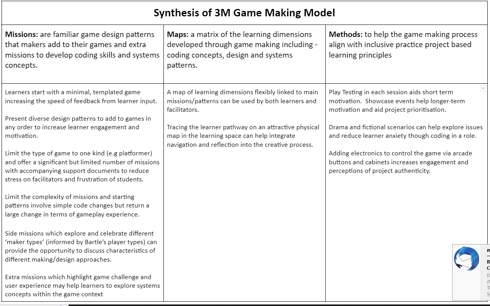

---
# all the regular stuff you have here
zotero:
  scannable-cite: false # only relevant when your compiling to scannable-cite .odt
  client: zotero # defaults to zotero
  author-in-text: false # when true, enabled fake author-name-only cites by replacing it with the text of the last names of the authors
  csl-style: harvard-manchester-metropolitan-university # pre-fill the style
layout: post
categories: chapter
title: Conclusion
---

## Chapter Outline

- Recap discussion around comparing aims of coding for empowerment/ learner agency with STEM pipeline narrative
  - simple duality - critique of CT, pipeline narrative to fill vacancies in job market
  - complexify simple duality interpretation, as authenticity and linking to real practices ARE empowering
- Synthesis of 3M model
- Recap analysis of framework to facilitate designing for an emerging community of coders
  - Explore possibility to extend this to other domains
- Final caveats / reflections on research
  - Advantages and limitations of Home Education context
- Recommendations arising from this research
    - Recommendations for facilitators
    - Recommendations for researchers
- Related next steps for research
  - Directly relevant next steps for research to address limitations
  - Tangential next steps for research  
    - Use of physical computing elements and embodied approaches

## Comparing aims of coding for empowerment/ learner agency with STEM pipeline narrative

- Recap discussion around comparing aims of coding for empowerment/ learner agency with STEM pipeline narrative
  - simple duality - critique of CT, pipeline narrative to fill vacancies in job market
  - complexify simple duality interpretation, as authenticity and linking to real practices ARE empowering

## Overview of 3M pedagogical model

NOTE - PERHAPS MOVE THIS TO A LATER CHAPTER  - PROBABLY

The process of developing the learning design happened in tandem with the data gathering. The model was guided by reflection and feedback from ongoing game making sessions. In summer 2020 I began early dissemination of results and wanted to be able to present the essence of the learning resources and design to fellow practitioners and participants as well as researchers.

To do this I created the frame of a 3M model, the aim being to simplify a complex set of resources and teaching processes. The resources have been created under an open licence (CC-BY-SA) which allows them to be freely used and adapted.

{ width=95% }

| **Missions**         | **Maps**             | **Methods**          |
|----------------|-----------|------------|
| Simple code changes yield quick feedback  | A map of learning dimensions flexibly linked to main missions/patterns can be used by both learners and facilitators       | Play Testing in each session aids short term motivation.  Showcase events help longer-term motivation and aid project prioritisation   |
| Free choice of Patterns increases learner engagement and ownership   | Tracing the learner pathway on an attractive physical map in the learning space can help integrate navigation and reflection into the creative process | Drama and fictional scenarios can help explore issues and reduce learner anxiety though coding in a role          |
| Restrict Game Type and number of Patterns to reduce Facilitator stress       |                      | Adding electronics to control the game via arcade buttons and cabinets increases engagement and perceptions of project authenticity |
| Limit  complexity of patterns. Some are simple but cause a large change in the game       |    |        |
| Side missions which explore and celebrate different ‘maker types’ (from  Bartle’s player types)          |        |     |

Table 4.x.  Key Features of 3M Game Making Model

{ width=80% }

### Methods (Inclusive)

NOTE - CHECK NEXT CHAPTER - Revise this to prep for next chapter

Explore other research that builds on lit review concepts and has a game making context.
<!-- Keep in mind DBR, AT concepts, resolving tensions & agency -->

### Missions

<!-- Many commercial open world games offer a central challenge consisting of small incremental missions and then optional side missions. Open world games increase user choice and thus give players a greater feeling of agency. -->

The main challenge of the 3M model is to create a playable game around a theme for a real or imagined audience with learners given the choice to add many optional features to the game.

In addition, side missions encourage social and playful coding approaches which help develop a community of coders. The purpose of mirroring the language of adventure game experience is to create a playful environment, a theme explored in the following chapter.

<!-- This approach steers students towards developing their use and understanding of coding structures, debugging practices and systems concepts.  -->

<!-- In addition, side missions encourage social and playful coding approaches which help develop a community of coders. -->

<!-- Note: TO ADD -  The purpose of mirroring a game experience is to create a playful environment - perhaps to covered in previous chapter -->

<!-- **Side Missions:** Bartle proposed that online gamers play games for different reasons and proposed a initial typology of gamers as socialiser, griefers, achievers and explorers [@hamari_player_2014]. You can find out what kind of game player you are with an online test.[^6] I propose there are also different styles of game makers. Some like to develop a full knowledge of the tools and what is possible before they build up their game step-by-step. Some are happy to borrow code, images and sound from anywhere for quick results. More social makers like to find out about the games of others or tell stories within games while others mess around with the code to break it interesting ways. To encourage these valuable social coding practices I created extra missions which are available online.[^7] I avoid any claims of fixed learner types here and offer these interpretations primarily as a way to encourage meta-cognitive reflections and choice of activity in line with UDL principles. -->

In the 3M model rather than following a step-by-step tutorial learners start with an incomplete game template and add new features as they choose. Each feature or pattern is described as a mission.

<!-- You may be able to create a menu of printed or online patterns or examples that students can draw on as needed. Perhaps particularly common examples can be modelled to the whole class when it is clear that many students will benefit from that approach. -->

In my final implementation of the 3M model students picked missions from a choice of printed cards or online resources. There were colour themed categories of missions. _Game mechanics_ are features to do with the actions of the game. _Game space_ patterns address the layout of the game. _Game polish_ patterns involve adding music, backgrounds, graphics and story elements. Finally _System and Challenge_ patterns look at how different elements interact to create challenge in the game. An example of a game mechanic design pattern follows.

START TEXT BOX
Your mission is to apply the following pattern to your game. There are supporting step-by-step resources available if you need them. When you finish be sure to reflect on how adding this pattern helps your understanding of the computing concepts and similar patterns listed. This concludes your mission.  

* **Name of Game Design Pattern:** Jumping on Enemies to Zap them
* **Type Pattern:** Game Mechanic
* **Description:** If the player is descending from a jump when they touch the enemy the player is zapped and in this case disappears.
* **Need for Pattern:** Enemies create challenge and being able to jump on an enemy is a good way of clearing the area you want to explore.
* **Coding Concepts involved:** Arrays[^1], Change Listener[^2]
* **Links to other Computing Patterns:** Systems Dynamics[^3]
* **Related Game Patterns:** You'll need to have added the **Add Enemies** pattern to your game before you can add this one.
END TEXT BOX

<!--

NOTE - On supportAing resources - move to relevant section.

In addition to outlines of game patterns, print-outs or on-line documents to support learners to implement the code needed are provided. While on-line documents allow learners to copy and paste code thus avoid many syntax errors, printed or incomplete code examples provide a greater level of challenge.

Supporting resources help resolve tensions around learners getting stuck and needing a lot of facilitator help. These resources can help teachers deliver game making in a classroom context. Educators can alter resources to vary how much detail is provided in supporting documents to suit the challenge level for students. I work with young coders, thus I normally provide significant coding scaffolding. Once learners have built familiarity with code structures, processes and the coding environment, I provide less complete code examples and thus reduce the scaffolding. -->

### Maps -

<!-- Condense this down - keep it analytical - perhaps include this in the phases?
Learning Dimensions - in Phase 5
Physical maps in Phase 3.   -->

## Revisiting framework to facilitate designing for an emerging community of coders
    - Explore possibility to extend this to other domains

## Caveats of / Reflections on research environments

### Advantages and limitations of Home Education context

Comments include:

- Reflecting back on interview there were very highly insightful comments from home educators that did influence the design.
- Thus a very fruitful area for jointly created design research
- However it is important then to not extend all conclusions beyond this setting but to extract the essense and try to seed in other settings using accelerated ways to construct and scaffold the kinds of support that home ed parents can offer.
