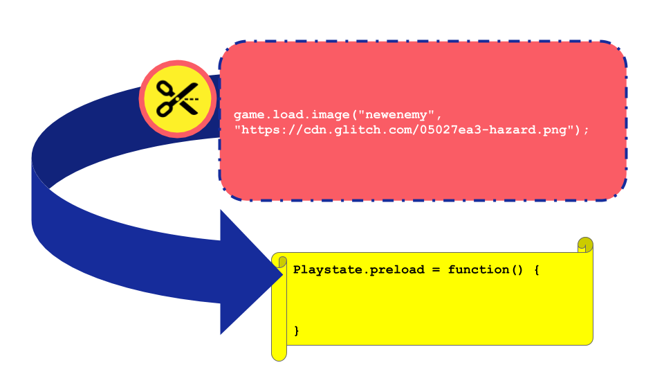

---
# all the regular stuff you have here
zotero:
  scannable-cite: false # only relevant when your compiling to scannable-cite .odt
  client: zotero # defaults to zotero
  author-in-text: false # when true, enabled fake author-name-only cites by replacing it with the text of the last names of the authors
  csl-style: harvard-manchester-metropolitan-university # pre-fill the style
layout: post
categories: chapter
title: Glossary & Appendices
---

## Appendices

## Tables

Full table of tensions?

## Learning Resources  

Full print out of the design pattern cards  - x 4 as samples.

### Drama Process

- Printout of alien drama process
 Missions

## Transcript Excerpts

### 2019-05-08-te-da pt 1

    Da: Have you thought about pushing it a bit further and have a different style of game?
    Te: What do you mean?
    Da: Well the previous style of game was a platform (makes shape with hands) game wasn’t it? You went along and there was gravity pushing down (points down). There are other types of games aren’t there?
    Te: Pause. I don’t know what to do thought.
    Da: Well quite but what other games are there?
    Te: I don’t know er.
    Da: Well I tell you what .. muffled.
    Te: Erm - (navigates to list of GDP for platform game)
    De: So. You played them before didn’t you (indicating grid of games )
    Te: What do you mean?
    Da: The flying game that’s a different kind of game
    Te: Oh like kind of like moving along kind of thing
    Da: Yeah and those where. There are games where you are in a world and you have to move around the world like pac-man (points down and moves an imaginary character around),
    Te: nod
    Da: There are games where things drop down like Tetris
    Te: … game. You could have a game where every 15 seconds 10 seconds you could add and enemy to such and such a random number between such and such (holds up hands to indicate parameters). You could block it somewhere.
    Da: So instead of.. instead of the world… the world being sideways. We could have the world being looked down on. (reindicates the change of perspective)
    Te: Hmm. How should I do this then?
    Da: That’s a good question. Shall we ask Mick to see if that would mess things up or not?  
    Te: Mick
    Mick: Hi ya.
    Te: Erm. Thinking about what game to do . I was thinking can we make like a pacman game kind of thing (indicates movement of character with hands)
    Da: If we had an on the top game rather than a platform game
    Mick: I think it could work. You could kind of adapt that game by kind of removing gravity.
    Da: and see what happens?
    Mick: and see what happens.
    Da: It’s not a bad starting idea is it?
    Te: I suppose make a new one (begins the process of remixing game from the template)

### 2019-05-08 Alien Drama

    > Mick: Ok let’s make a start. Come to the front and I’ll do a super quick….
    I’ll do my favourite game which is where we have to count to 12 but we’re not allowed to go in a particular order of people. We do go in a particular order of people. And if two people say a number at the same time then we have to start again. We’ll give it a go. You’ll get the idea.

    > Molly: Is there a penalty if we do?

    > Mick: There’s no penalty. (Group laugh.)

    The game starts and participants try to complete the challenge to count to 12 without talking over each others. The game proceeds with a lot of funny developments. These are hard to describe but include many false starts, changes of rules, development of tactics, appeals to be serious, full throated laughter and many restarts and entreaties to give it one last go. The game ends in good hearted failure.

    > Mick: That was pretty funny.
    > Mark: It’s brilliant.

    > Mick: Ok. So I’ve got a surprise. I don’t know if you know but as part of our Home Ed club we did a page of different games. So it’s on glitch.com and it’s called Glitch Game Club and it’s on there, there’s one for Home Ed Winter 2019 and here are all the games that we made. We made a lot of games. 15 games. This has not gone unnoticed because I got a message through this account. This is kind of a story now. We are entering a story. You have to use your imagination. We got a message and it was an audio message. If you guys take your fingers off your keyboards and have a listen to this audio message which is quite unusual as I don’t think it was from anyone on … this ... Earth.

        Greetings Earthlings, we have an important message for the Glitch Game Makers.
        We are the Weean. You would call us an alien lifeforce. We like to think of ourselves as friendly space cousins.
        We can see your Internet from space. We are contacting you because we know you are making games on the Internet.
        We are on our way to the Planet Earth, and we have an important mission for you. We are an Intergalactic Rescue team. We know you have problems on your planet. We can help.
        But we need to find out one thing first. Are you worth it? After we are gone will you also be able to help yourselves? Or are you already doomed to make the same mistakes again?
        You must pass this challenge. Make some games showing problems you have on earth. In the games also include ideas for how to solve them.

        We have some guidelines:

          • Make a game about a big or small problem to solve. If you can let us play it each week as you go along.
          • Give us an update each week by recording a group update.
          • Show you can work on your own but also work as part of a team.
          • We will also send you text messages with some mini-missions sometimes. Be sure to tell us how you do.

        Please now get started and come up with a new game about solving a problem on Earth.

    > The recording ends and begins to play again.
    > Mick: And it just kept looping. I couldn’t understand all of it but I tried to write it down as best as I can. So from what I’ve work out they’ve looked at our games and they’ve come up with a challenge for us. They are coming to Earth so they need to find out if we are worth saving. And the way that they are going to decide is by playing the games that we come up with. And they are going to set us little challenges. So. yeah, that’s the story. (with heavy irony) I’m pretty sure it’s true. (Mick and others laugh).

    > So all they’re asking us to do is to come up with a game. We’ve got four sessions. They want a new game because they’ve already played our old games. It’s got to be something about the problems of the world. I’ve got a lot of problems. It could be big problem or a small problem. It could be about your problems. But also ideas on how to solve them.  
    And yeah. That we can work by ourselves but also work as part of a team. So we’ve got to give them a report by the end of it as well. That’s our mission.

    > Do you know what I also wanted to share with you? Last time we were doing different sheets and everything. You were getting good at working through the sheets. And also looking at this page (show splash page on screen of menu of game design patterns)  which is at ggc-examples.glitch.me . And I’ve done some changes to it. There are two different parts. I want to make this better for you guys, I want to make this somewhere you can go so you can click to find out the help that you need. Any ideas you have for making this better would be really good.

    > One thing I can think. You see here (points to moving enemies as an example on screen). If you want moving enemies. If you click on it, it opens an example with the code to make moving enemies but it’s not really obvious how you would to put that into your game. So to find that you’d have to click on this here  link to tutorials. (Mick points to the link to tutorials text/link). Which tells you how you put it in the game. And then you’d scroll down this bit (demonstrates navigating the tutorials menu) and select add moving enemies here. So,  I was showing this to some people yesterday and they couldn’t really work that out.
    So what they suggested is. why don’t I put t so there’s a link so right to the chapter for how to do it right next to that image.
    So that makes sense really so I’m going to to do that.

    > So if you click on that (referring to tutorial link) if you want to add a moving enemy.
    I’ve tried to put a bit like that (referring to illustration below on code patching). What that means is, you’re looking for that bit of code at the top. And you’re going to copy it and paste it into that bit at the bottom. Where it says Playstate.preload. That’s the part of the code that you need to put it into. Just to make it a bit clearer.

    { width=80% }

    > Molly: So you’re not cutting the bit at the top out, in red. You’re using that bit instead of the yellow bit.

    > Mick: Well actually, you’re putting it inside of it. So here you would copy it and in your code example. You then  look for that bit where it says preload. You then put it inside of it at the bottom of that.   

    > Molly: So just insert it somewhere.

    > Mick. Yeah insert it. So here we’ve got different parts of our game. We’ve got preload. We’ve got create. And we get used, we start to get used to finding them. In this one it’s preload that’s the one that its saying we should put it inside of. And then this  next bit. It’s saying, ah, you should put that into your create function.
    So we’re moving in the right direction. But any other things where you think. Ah that could be easier. Let me know and I’ll try to make these resources much easier.

    > Mick: It’s almost like this is our control panel. What do you want to do next and we jump off from there.
    And I’ve put it down on a bit of paper.  It’s just gcc-examples.glitch.com

    > So, I’m going to now leave it to you guys. What do you want your game to be about? What are your characters going to be?
    What do you want to put in your new game what wasn’t in your old game? Yeah, you can start thinking about it.

#### Appendix 4.x  - Addition to vignette 4.1 - documentation in drama

    > Do you know what I also wanted to share with you? Last time we were doing different sheets and everything. You were getting good at working through the sheets. And also looking at this page (show splash page on screen of menu of game design patterns)  which is at ggc-examples.glitch.me . And I’ve done some changes to it. There are two different parts. I want to make this better for you guys, I want to make this somewhere you can go so you can click to find out the help that you need. Any ideas you have for making this better would be really good.

    > One thing I can think. You see here (points to moving enemies as an example on screen). If you want moving enemies. If you click on it, it opens an example with the code to make moving enemies but it’s not really obvious how you would to put that into your game. So to find that you’d have to click on this here  link to tutorials. (Mick points to the link to tutorials text/link). Which tells you how you put it in the game. And then you’d scroll down this bit (demonstrates navigating the tutorials menu) and select add moving enemies here. So,  I was showing this to some people yesterday and they couldn’t really work that out.
    So what they suggested is. why don’t I put it so there’s a link so right to the chapter for how to do it right next to that image.
    So that makes sense really so I’m going to to do that.

    > So if you click on that (referring to tutorial link) if you want to add a moving enemy.
    I’ve tried to put a bit like that (referring to illustration below on code patching). What that means is, you’re looking for that bit of code at the top. And you’re going to copy it and paste it into that bit at the bottom. Where it says Playstate.preload. That’s the part of the code that you need to put it into. Just to make it a bit clearer.

    { width=80% }

    > Molly: So you’re not cutting the bit at the top out, in red. You’re using that bit instead of the yellow bit.

    > Mick: Well actually, you’re putting it inside of it. So here you would copy it and in your code example. You then  look for that bit where it says preload. You then put it inside of it at the bottom of that.   

    > Molly: So just insert it somewhere.

    > Mick. Yeah insert it. So here we’ve got different parts of our game. We’ve got preload. We’ve got create. And we get used, we start to get used to finding them. In this one it’s preload that’s the one that its saying we should put it inside of. And then this  next bit. It’s saying, ah, you should put that into your create function.
    So we’re moving in the right direction. But any other things where you think. Ah that could be easier. Let me know and I’ll try to make these resources much easier.

#### Appendix 4.x  - Addition to vignette 4.1 - community norming in playtesting

Mi: (Talking to self) No! It's so hard that. (referring to a particular jump in her game.)
Mick: How are you getting on Mi? It's looking good.
Mick: (Noting frustrated air of Mi) Have you made it to hard.
Mi: I don't know. Can you jump from here to here with this.. this.. him? (point to main character)
Mick: So it look like you bump your head and fall down.
Mick: One bit of friendly feedback that I would give you is that it's taking a long time to move left and right. And that is something that you can change if you want to.
Mi: Oh right yeah.direct
Mick: Yeah.
Mi: Yeah, actually that's a good idea.
Mick: If you think about average games. Your average jump time would be about one second in the air. So that can be a bit of guide sometime

#### Appendix 5.x  - Addition to vignette 5.1 -  

Molly continues to do solo design using the Piskel graphical too. She encounters a design problem. When erasing a part of the design she gets rid of background colour. Mi asks for help from partner but receives misleading advice which does not help her progress.

Molly:  Oh no it’s not done that has it?

Molly calls the name of her child across room with theatrical gesture and loud whisper voice
Molly: “Nadine!”
Molly then makes face, wiggles head and shrugs at parent peer. The other parent laughs.
Nadine arrives to help.
Molly: I’m trying to delete them but they turn light grey.
Nadine: So you want to get rid of them?
Molly: What are you doing? You have to tell me what you are doing so I can do it myself.
Molly: laughs
Nadine: laughs.
Molly: I’ll just have to keep shouting at you if you don’t tell me.  
Nadine uses the mouse to select the grey background colour with the colour picker tool, then the pen tool to fill in gaps in the design. She then swaps the active colour back from grey to black by clicking the option to swap foreground and background colours.
Molly: How did you do that so quickly? I’ve got to like, carefully... (makes hand gestures to show a sense of hesitant keyboard use)
Parent peer laughs
Nadine bounces up in place and smiles broadly.
Molly: Thanks
Molly: So am I like back with the black now?  
Nadine: Yeah but if you want to delete it just press X (which switches between foreground and background colours) and then do it.
Molly: Oh X. Alright Bubs. Thanks.

## Glossary
NOTE THIS COULD MAKE UP PART OF THE LITERATURE REVIEW AS A MORE CONCISE WAY TO COVER A LOT OF GROUND - AND BOOKMARKED BY A JUSTIFICATION - THE COMPLEXITY IS IN THE MIX OF CONCEPTS AND IN LATER CHAPTERS.

Or perhaps group terms by theme, include references in each description with examples and characteristics. Then have a short complex commentary at the end of each section.  

### Pedagogy

**Pair programming:** Beyond a more general description of two people coding a task side by side, this terms also describes a  

**Use - Modify - Create:** A computing and digital media creation pedagogy that outlines the advantages of starting with working code examples before progressing to writing code structures from first principles. It has been used in the context of game making[find example], web design[find example] and other educational coding projects.

### Context / Community

**Coder Dojo** -
