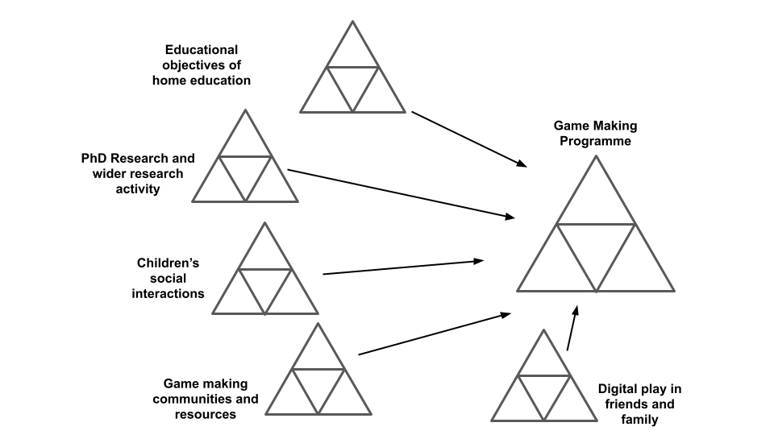
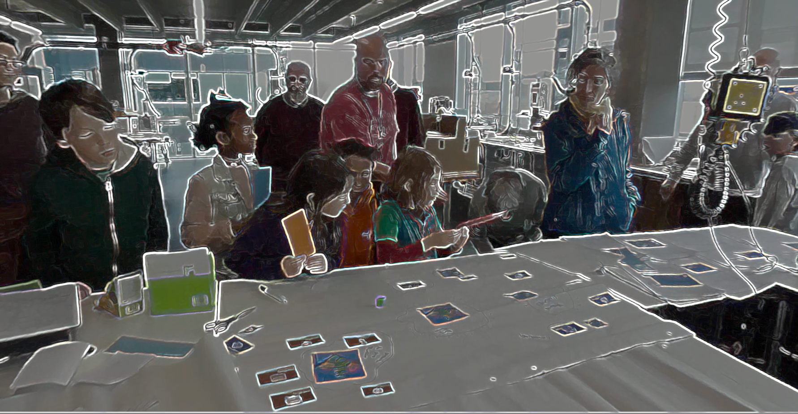

---
zotero:
  scannable-cite: false # only relevant when your compiling to scannable-cite .odt
  client: zotero # defaults to zotero
  author-in-text: false # when true, enabled fake author-name-only cites by replacing it with the text of the last names of the authors
  csl-style: harvard-manchester-metropolitan-university # pre-fill the style
layout: post
categories: chapter
title: 4. Exploration of the Formative Learning Design Process
---

-   [Research Questions - June 2023](#research-questions---june-2023)
-   [Chapter Introduction](#chapter-introduction)
-   [Exploring issues and context from practitioner interviews and
    existing
    research](#exploring-issues-and-context-from-practitioner-interviews-and-existing-research)
-   [Short vignette illustrating shifts in scope of
    activity](#short-vignette-illustrating-shifts-in-scope-of-activity)
    -   [Outline of Game Making Tools used in this vignette - ANY SPACE
        IN LIT
        REVIEW?](#outline-of-game-making-tools-used-in-this-vignette---any-space-in-lit-review)
        -   [Code Playgrounds](#code-playgrounds)
        -   [Online graphics editors -
            Piskel](#online-graphics-editors---piskel)
    -   [Context of Vignette](#context-of-vignette)
-   [Description of the nested levels of activity & tools used - CHANGE
    TO MOSTLY SIGN POSTING - EDIT
    DOWN](#description-of-the-nested-levels-of-activity-tools-used---change-to-mostly-sign-posting---edit-down)
    -   [Environmental Factors and
        Objectives](#environmental-factors-and-objectives)
    -   [Shared larger objective - Making games for an
        audience](#shared-larger-objective---making-games-for-an-audience)
    -   [Smaller objective - Implementing game
        elements](#smaller-objective---implementing-game-elements)
    -   [Exploring game design patterns and germ cell of
        activity](#exploring-game-design-patterns-and-germ-cell-of-activity)
-   [Summary of design evolution](#summary-of-design-evolution)
-   [Commentary on evolution of design by
    Phase](#commentary-on-evolution-of-design-by-phase)
    -   [P1: Explorations and
        innovations](#p1-explorations-and-innovations)
    -   [P2: The game making using suggested
        patterns.](#p2-the-game-making-using-suggested-patterns.)
    -   [P3 adding a process drama](#p3-adding-a-process-drama)
    -   [P4: Adapting to MakeCode Arcade and more formal
        settings](#p4-adapting-to-makecode-arcade-and-more-formal-settings)
-   [Conflicts and design tensions experienced by participants and
    facilitator/s](#conflicts-and-design-tensions-experienced-by-participants-and-facilitators)
    -   [Design tensions experienced as a researcher / designer - HOW
        MUCH TO REFOCUS ON LARGER CONFLICTS - REDUCE THIS DOWN - CHECK
        THE FOCUS AND NEED FOR THIS
        SECTION?](#design-tensions-experienced-as-a-researcher-designer---how-much-to-refocus-on-larger-conflicts---reduce-this-down---check-the-focus-and-need-for-this-section)
        -   [My analysis and concerns around authenticity in choice of
            toolset](#my-analysis-and-concerns-around-authenticity-in-choice-of-toolset)
-   [Participant conflicts /
    contractions](#participant-conflicts-contractions)
-   [1. Identity hardcore coding & dysfunctional group work - P1 -
    COMPRESS AND
    SIGNPOST](#identity-hardcore-coding-dysfunctional-group-work---p1---compress-and-signpost)
-   [2. Participant conflict due to lack of relevant technical
    support](#participant-conflict-due-to-lack-of-relevant-technical-support)
    -   [Notes on structure of this
        section](#notes-on-structure-of-this-section)
        -   [- REWRITE TO FIT IN THIS SECTION The impact of the core
            tools of code playgrounds and templated
            game](#rewrite-to-fit-in-this-section-the-impact-of-the-core-tools-of-code-playgrounds-and-templated-game)
    -   [Code playground](#code-playground)
    -   [Design and observations on the use of the half-baked game
        template](#design-and-observations-on-the-use-of-the-half-baked-game-template)
        -   [Design behaviours encouraged through use of game
            template](#design-behaviours-encouraged-through-use-of-game-template)
        -   [Observations on design behaviours encouraged through use of
            game
            template](#observations-on-design-behaviours-encouraged-through-use-of-game-template)
    -   [Discussion on Authenticity of
        Tools](#discussion-on-authenticity-of-tools)
        -   [Discussion on Authenticity within this conflict and
            playground as
            resolution](#discussion-on-authenticity-within-this-conflict-and-playground-as-resolution)
    -   [ORIGINAL SECTION](#original-section)
        -   [Tensions and related to navigation of various
            documentations
            sources](#tensions-and-related-to-navigation-of-various-documentations-sources)
    -   [3. Facilitator conflict addressing the Play
        Paradox](#facilitator-conflict-addressing-the-play-paradox)
        -   [Using Physical Maps of Missions as Game Design Patterns -
            COMPRESS](#using-physical-maps-of-missions-as-game-design-patterns---compress)
        -   [Learning Dimensions Map](#learning-dimensions-map)
        -   [NOTES ON TENSIONS WHICH THIS LEARNING MAP HAS POTENTIAL TO
            ADDRESS](#notes-on-tensions-which-this-learning-map-has-potential-to-address)
        -   [Resolving the conflict by minimising elements in an
            informal
            setting](#resolving-the-conflict-by-minimising-elements-in-an-informal-setting)
-   [Conclusion](#conclusion)
    -   [Summary of barriers exposed in this study
        -](#summary-of-barriers-exposed-in-this-study--)
    -   [Discussion on the emergent (and mutual) nature of the design
        (and research?)
        process.](#discussion-on-the-emergent-and-mutual-nature-of-the-design-and-research-process.)
    -   [Analysis in relation to existing research on related design
        toolsets](#analysis-in-relation-to-existing-research-on-related-design-toolsets)
        -   [Comparing to Scratch and
            Microworlds](#comparing-to-scratch-and-microworlds)
        -   [Authentic tool use and instrumental
            agency](#authentic-tool-use-and-instrumental-agency)
    -   [Link to next chapter](#link-to-next-chapter)

## Research Questions - June 2023

1. What pedagogical tools and processes are available to support novices to overcome barriers to game coding and design?
<!-- - What pedagogical factors are significant to support novices learning coding, particularly in game making contexts? -->
2. How can learners build agency in an evolving community of game makers?
3. How can game design patterns support the development of coding practices with novices?

<!-- ## Notes on structure -->
<!-- NOTE:
Moved impact of software tools here - and overall on templated approach on a micro level  -  which therefore becomes less of this study's focus - and needs less evidence -->

<!-- - drawing mostly on my journal notes and the evolution of the tools and design themselves.   -->

<!-- - **Interviews (and Lit review ):** exposes motivations and barriers to undertaking activity  this domain from interviews with peer practitioners and literature review -->

<!-- However in terms of tensions - there is one on cultural tensions - this may need moving to the next chapter - a more thematic approach. -->

<!-- Also the practitioner interviews - could be a bit disjointed - as they do relate to cultural barriers and tactics. But could say those are explored in other chapters. DONE -->

## Chapter Introduction  

This chapter

- exposes motivations, tactics for and barriers to undertaking activity this domain from interviews with peer practitioners (supplementing the literature review)
- Introduces the use of design patterns and collections of patterns, as the germ cell of activity which then expands in different directions.
- gives an overview of the evolution of the key pedagogical features of the learning design used in the research process
- draws on immediate analysis of participants reactions and contributions from journal notes, and participant interviews and analysis of changes in the learning resources created to present an exploration of tensions
- outlines 3 key conflicts using the terminology of Saninno in TADS
- Presents a synthesis to initial barriers (and) tactics to overcome them

This chapter has a particular focus on the tools and authenticity in relation to other tools. This focus develops a thread of theoretical inquiry around the impact of authenticity of tools and processes in activity systems of learners experiences of activity systems and particular on building agency in

Due to the novel nature of the learning design the detailed outline of the specifics of the participants experience of the design are important to situate findings in the following two chapters.

**Key questions / motivations in creating a new learning community**

The game making community is not authentic or mature in the practices they are undertaking, the kind of community practices which we can undertake are focused partly on building connections to existing knowledge and practice.

One of my roles as designer here was to uncover and to help participants explore knowledge that they were unaware they possessed. Another was to help support the development of peer learning practices and in order to do that help foster a creative environment which suited that.

As explored in the literature review, there is a wide gap between instruction based tutorials and unguided project challenges. Even with the process driven scaffolding that a working knowledge of PBL approaches provides, the domain specific knowledge and practices can be a significant challenge for teachers. Thus project work which can place a high demand on the project facilitator/s.

This chapter charts the evolution of resources which occupy this middle ground between instruction and free choice creative approaches.

<!-- **Methodology for exposing tensions**

Tensions in the emerging design and the experience of participant conflict in activity systems served to drive the evolution of this learning design.

The work of Sannino on the use of secondary stimulation in formative interventions informs the analysis of conflicts arising and secondary tools and processes which facilitators use to address them [@sannino_activity_2011]. TADS thus addresses transformative agency.

In addition, work to distinguish type of learner agency including transformative, authorial and instrumental agency are potentially useful tools. -->

## Exploring issues and context from practitioner interviews and existing research

While the literature on game making and other forms of digital making is extensive, much has a focus on curricula driven, personal knowledge. Research in the domain of informal learning and the resulting characteristics and emerging tensions is less prevalent. In addition the process of writing interview questions and the conversational process of semi-structured interviews helped expose new streams of thought, that which while present in existing researched helped bring them into clearer focus.

**Summary of background of interviewees**

Saskia Leggett is a researcher who was active in the in Creative Family Learning program under direction of Ricarosa Roque. She took a leading role in creating the programme's support resources. Matt Curinga is an academic at Columbia and teaches in educational technology and computer science. He is also active in a non-profit organisation, Zero Day Camp, promoting learning coding and engineering through engaging projects. Dave  Potts is a professional programmer and a parent and volunteer at Coder Dojo which is a volunteer run teaching technology monthly event. James Clegg is PGCE Computing student/teacher and volunteer student helper for the game making programme.

**Summary of themes emerging**

In my analysis, I have proritised data which in forms the first research question and specifically addressing barriers and tensions for both practitioners and participants which exist in this domain of activity.
NOTE - REVIEW THIS BASED ON THEORETICAL LANGUAGE - PERHAPS OBSTACLES, CONTRADICTIONS, TENSIONS AND INTERVENTIONS.

_Table of initial data_

https://docs.google.com/document/d/1aEF0EsZRe-Ovok2VP7ouYH_v-SdepnNnXFhLtj6SseU/edit

<!--
 Convert here.
https://tabletomarkdown.com/convert-spreadsheet-to-markdown/

-->

|Issue                    | Instances |
| --------------------------------------------------------------------------------------------------------------- | -------------- |
| Barrier: Isolation during problems solving increases frustration and inhibits learning                                                      | 3         |
| Tension: the goal for students to be self-directed vs. the advantages of providing a shared collaborative foundation for production         | 4         |
| Tactic: Non-coding activities amd games to increase group connections as a good preparation for coding related challenges and frustrations. | 5         |
| Barrier: students not considering them selves as STEM / coding types of people                                                              |           |
| Barrier: logistical issues of time and equipment in school settings                                                                         |           |

**Additional short commentary**

The themes that emerged above.

One key issue is the clash of cultures. EDIT DOWN AND COMMENT

    There's this idea of a clash of cultures where to learn like the dominant school culture, you have to release some of your self-identity or you need to learn to bridge these worlds. ... (in) the literature, that there's this resistance of seeing yourself as someone who does STEM, as someone who does computer science. It's like we're not people that do that. And I think by doing it with their family, like there's no better way to kind of mitigate that effect and that hesitation, that barrier, because they're all becoming your whole family, like your, your closest identity is becoming people that write code or people that make robots.

This interview references research already explored in the literature review concerning identity and alienation from STEM contexts.  

<!-- The design description is framed within DBR language and concepts. -->
<!-- Section describing  Game Design Patterns as  the main unit of Activity. See Blunden to frame this and to describe the utility of the idea  [@blundenInterdisciplinaryConceptActivity2009; @blundenGermCellUnit2014]. -->

<!--
There's lots to add in here.
chapters\planning\methodology_chapter\methodology_chapter_late_2020.odt.md
https://drive.google.com/drive/u/1/folders/1D-VhVj-NgN3qgk3YEx4HZEozf_1UOGtE
 -->

<!-- As per Rogoff's analysis of informal learning in museaums [], the process of finding a medium between structured activity and authentic activity can be challenging.

The kinds of exhibits which invite extended play are of interest to this study. Such design indicates that there are affordances that invite revised design, tinkering and ongoing play.
-->

<!-- **Cultural influences on my choice of learning design**
NOTE - MOVE TO INTRO  - NO NEED

I set up the working pattern based on my professional experiences and my own academic and cultural interests. As mentioned in the introduction, DIY culture, remix culture, repair culture, TAZ events are strong influences to the learning design based on the ideals of an autonomous community.

 - a desire to increase engagement based on my experiences in classroom and out of classroom - Home Ed / coder dojo experiences
 - the link to cultural practices of code patching and remixing - the example of the plumber coder potentially being someone who finishes the job rather than elegant coder.
 - other experiences of social coding being important being part of a community working on a joint project (add a quote from Dave?)
 <!-- - A walled garden approach in terms of the GDP and code documentation and examples that are used. Based on my own experience of developer documentation and varied coding approaches.
- Other examples from the interviews with practitioners are relevant to include here. -->

<!-- These sections could follow a pattern of
 - rogoff's description / examples - but likely include a larger breakdown of 3 foci in Methodology Chapter.
 - my model examples
 - other links to PBL frameworks and/or educational concepts and contrast analysis

In the 3 foci model Rogoff refers to apprenticeship as a way of illustrating the process of being inculcated into community practices existing in a cultural plane. AN EXAMPLE .. -->

<!-- At this stage of writing I include a bullet point list of design relevant features to be expanded later.

- Shared repositories of resources - users shared a log in so they could see the work created by others.
- Showcase: At the end of the game making process students asked strangers to play their game in the foyer of my departmental building
- Drama Games: the process of warming up, creates community and sets a tone
- Drama Process: specifically designed ot overcome limits of the classroom.
- Playtesting: the process of playtesting, either self or peer links back to a community purpose
 -->

<!-- __Insert image of code__

The code of the game.
While the code is made up of various elements, only the javascript file is normally altered by participants.
The complexity is hidden away from the end user.

__Insert image of game in browser__

On the screen you can see the game.
Toby then decides he wants to add a new element to his game.
He browses the list of game design patterns.
There is a tension where he is hesitant about where to place code.
Screen shot of the menu of choices. -->

## Short vignette illustrating shifts in scope of activity

<!--
#### Code Playgrounds

Find definition

NOTES ON CODE PLAYGROUNDS
However in its styling it is playful and editorial picks and write up celebrate a playful spirit of creativity and sharing. There are strong parallels in this presentation to that Scratch community and to the sharing ethos integral to the maker-movement (explored in Lit Review). The interplay between play and work via shared experimentation is developed further in a later discussion chapter.

#### Online graphics editors - Piskel -->

### Context of  Vignette

The following vignette, consisting of extracts of participant activity over 20 mins of a session, is presented as an summary of different scopes of activity. The participant is the child Toby who in this session has been working independently on his game design. The tool shown in screenshots is the code playground glitch (see chapter 2 and glossary).

https://docs.google.com/document/d/1vYeVxYaRMTWPDOHwC4DEGYAkGPRIDX7wLiz0l8b7LWc/edit

### Commentary on Vignette

This sections outlines a short description of the vignette above focusing on the overall activity and its place within evolution of learning design. It will use concepts from activity theory to describe elements of the activity system. Activity theory allows researchers to identify intersecting or nested systems of activity with varied goals. Subsequent analysis of the identified activity systems allows both the researcher and practitioner to identifying existing and emerging tensions and to thus observe (spontaneous) or plan (designed) responses. While this chapter focuses primarily on the tools and resources, future chapter also draw on this framework for wider analysis.

<!-- The following descriptions mirror the work of AT researchers who conceptualise scope of activity as concentric circles from Broffennbrenner with "larger" scopes of cultural and societal goals and smaller, narrower, lower scopes of more personal activity [Engestrom][Cole]. -->

<!-- A short description of the activity systems follows the vignette above to help the reader establish a broad understanding of the processes involved before further analysis. I signpost the reader to other chapters when the described activity is explored in more detail there. -->

#### Environmental factors and objectives

There are several wider objectives of activity which may vary  including; parents facilitating coding and design learning for children, the children's motivations of being part of a fun club-like programme, and my own motivation of conducting research.

{width=95%}

NOTE - CAN ADD THE OBJECTIVES INTO THE ARROWS ON THE DIAGRAM

High-level objectives exist including: research goals on the part of the researcher/ participant; desire to create a useful learning experience on the part of student helpers; learning computing skills and concepts as a home education project; and participating with other home educators in a creative environment and thus building team and communication skills; and fun on the part of the children participants.

<!-- As previously explored this mirrors the Activity, Action and Operation hierarchy. -->

<!-- | **Subject**         | **Objective**             | **Tools & Processes**          |
|------|-------------|------------|
| Community of novice game makers | Creating a game which is fun to play and communicates an environmental theme     | Shared log in to code playground (glitch.com)   |
|   |      | Shared log in to graphic editor (Piskel)    |
|   |      | Instructions from facilitator including the overall mission   |
|   |      | Starting game template    |
|   |      | Group playtesting     |
|        |     |

Table 4.x.  Tools used in larger-scoped objective involving the wider community of notice coders collectively making separate games. -->

#### Larger objective - Making games for an audience

The shared objective of one activity system is to make entertaining and educational games for an audience to play.

<!-- Insert an AT diagram from here - https://docs.google.com/presentation/d/1vR6dzFG6qXIdpB_-s6PbCePiB87qTs6YAXCljxNcb5Y/edit#slide=id.g57b5e8e9ad_0_0 -->

{width=95%}

The imagined end users are students and staff in the Manchester Met Brooks building where their games are  shared in arcade cabinets at the end of the course. An additional audience are friends and family who can be send the games to play online.

{width=95%}

<!-- In the vignette of Toby's activity this wider objective is present in the facilitator orientation at the start which references this audience -  _the Monday after we can play our games and we can share them with students. We can make the students frustrated when they can’t beat our games_. At the end of the vignette text, one of the student helpers also imagines this audience playing the game of Toby.    -->

The more immediate audience for the evolving games are peer game makers during the making sessions. In the vignette above, Toby begins the session playing his own game based on a shared template. During the session he invites many other group members to play his game. He initiates and responds to may conversations around the difficultly of the game he has designed.

This scope of activity can be is continued in chapter six.

#### Mid-level objective - Implementing game elements

The process of making a game was driven learners setting goals and requesting help to implement game features. This level of implementing
The process can involves a diversity of tools and resources depending on the feature involved and the preferred approach of the learner. To help ground the reader, the following section describes this scope of the activity using the context of the above vignette.

<!-- | Subject         | Objective             | Tools & Processes          |
|------|-------------|------------|
| Groups or individual participants | Implementing game elements   | Code editing tool (glitch)   |
|   |   |  Game preview tool (glitch) |
|   |   |  Menu of game patterns at ggc-examples.glitch.me  |
|   |   |  Step by step tutorials on FLOSS manuals  |
|   |   |  Playtesting own game |
|        |     |

Table 4.x.  Tools used in mid-level objectives when selecting and planning implementation of game elements. -->

{width=95%}

<!-- One observation from he experimental course was that without significant support, the process of making a game is complex and there are many possible blockages in the process. -->

<!-- NOTE - THIS IS ANALYSIS  -WHERE TO PLACE IT?
By this stage, the process of collecting a user generated list of features and trying to respond to all of them as a facilitator had been abandoned as unrealistic. -->

NOTE - how much from p1-4 below to include?

By this stage, a collection or menu of elements or design patterns (see chapter two and glossary) for the chosen game type of a platformer was in place. From now now these elements are named game design patterns from professional and amateur game coding terminology.

In the example above Toby progresses from playtesting his own game to altering it by adding a new platform to the game. Toby retests immediately by clicking on the preview element of the game. On this page participant can pick missions from a choice of resources.

Toby then browses the web page of a menu of game design patterns and selects moving enemies. At this scope of activity the goal is to increase the challenge and variety of the game experience. It appears probable that his is also guided by the expectations embodies in the page itself. EXPLAIN affordances OF DESIGN HERE.

Other participants were less proficient using this online resources and used printed out versions of documentation.

<!-- In the next section narrower actions still within this system are explored as discreet actions which combine to be come the activity of implementing a game pattern. -->

<!-- | **Subject**         | **Objective**             | **Tools & Processes**         
|----------------|-----------|------------|
| Individuals (mostly)  | Implementing specific code or design tasks   |  Code editing tool (glitch)   |
|   |   |  Code game preview tool (glitch) |
|   |   |  Piskel  online graphics editor   |
|   |   |  Step by step tutorials on FLOSS manuals  |
|   |   |  Stand-alone code examples on glitch.com  |
|        |     | -->

<!-- Table 4.x.  Tools used in lower-level objectives of implementing specific code structures or stages in creating game assets -->

#### Smaller objective / actions - Implementing discrete code and design structures

While some game patterns were simple to add to to alter, other more complicated features involved several stages in implementation. For example, creating a new graphical element in a separate online pixel-art editor called Piskel, exporting and downloading it to the laptop, and uploading it to the glitch code playground and then making code changes in several parts of the code to initialise and implement new behaviour for this element.

Some of these operations are performed by Toby quickly and fluently by Toby indicating that he has performed them many times. One example is the quick navigation between the different tools. However some are new to Toby and are performed more hesitantly. For example, Toby is careful in his checking of the process of copying and pasting new code to his game code.

In this example he is competent in the process of comparing the own code to the code example to work out what code is new and relevant to the desired behaviour. He does not check the step by step tutorials which would provide more extensive, step-by-step help.   

Others in the group did not experiment in this way and used more direct help or detailed written instructions.

<!-- NOTE
Each of these with differing levels of abstraction.
Break down that of GDPs? -->

<!-- In the last chapter, we examined the use of Rogoff's 3 lenses of cultural, social and personal activity. We can see a broad alignment of these lenses and the scopes of the activity systems above.

This has utility to both researcher and learning designer. The observations of the following chapters are based on this approach of using lenses to focus in on relevant activity.

NOTE - Explore how performed in line with other research - e.g. DBR (Barab) and possibly Bevan and Petrich -->

### Exploring game design patterns and germ cell of activity

**Scope of activity:** While other interpretations are possible which view the implementation of each pattern as a form of action with each activity system, I have chosen to privilege this as a sub-activity system. The justification for this mirrors choices by other researchers who see the utility in a more granular exploration of the processes at work in a complex process.

<!-- Explore the dividing line  -->

As explored in the previous chapter, Barab and colleagues, outline the value of a more granular approach to analysis of nested activity systems.

NOTE - Proposed new location to first introduce this idea.  Evaluate

P1 working practices yielded new ways of working and resources. Key elements including working form a template, goal setting around implementing new features, some where held in common with other groups.

Explain - Unit of analysis for upcoming chapters.

The small, quick start activities used to kick start activity  game makers were an evolution from  the full process of adding a game pattern. The proposed code modification instead of new code structures accelerated the process.

The implementation of discreet but potentially shared game elements became a shared pattern of activity. Mutual work to produce resources, testing techniques and practices to share and evaluate these shared elements became a primary focus of work.

**Transition**

It is useful to researchers to highlight possible tensions and contradictions between competing goals of interrelated activity systems.

For example a common contradiction may be an immediate goal of children to mess around, play games and have fun while the goals of parent may be to maximise the acquisition of skills

As a starting point - a description of phases.

## Summary of design evolution

<!-- [Summary Table of Stages](https://docs.google.com/document/d/1tBoXJWw-aZUcc8EsAvT195CtHLSM468YOCD0sGzOuoA/edit#)
see updated table in tables subdirectory  
-->

The following table is provided to give the reader an overview of the stages and tools used. Emerging tensions in activity systems are used to explore the rationale for the creation and selection of these tools.

<!-- Table from
https://docs.google.com/document/d/1tBoXJWw-aZUcc8EsAvT195CtHLSM468YOCD0sGzOuoA/edit# -->

| **Phase, Name and Date**| **Description** | **Starting Resources**         
|--------|------------|--------------|
|P1: Oct 2017 - Dec 2018; Experimental Course  | Participants started with a blank canvas and were asked to plan and make a game in two larger groups of 5-6 participants of mixed ages. A minimal incomplete starting game code template was introduced to support students after the course has started.  Then One-off workshops at Mozilla and Feral Vector conferences and to PGCE computer students and the creation of a “half baked” game template |  Phaser 2.6.2 javascript library; Thimble code playground; online graphics editor Piskel; audio creation tools  |
| P2: Jan - Feb 2019; Glitch Game Club | First iteration of game making course of 5-6 weeks. The template and resources created in the previous stage were used as a starting point but continued to evolve. |  Phaser; Glitch, Piskel; updated game template; quick start cards; step-by-step tutorials; code examples  |
| P3: May 2019; Glitch Game Club 2| Second iteration of game making course with additional drama and reflective elements |  As per P3; drama scenario; interactive chat page in glitch  |
| P4: Jan 2020 - September 2020; Make Code Arcade | Two iterations of game making course of 5-6 weeks using MakeCode Arcade tool.  |  Make Code Arcade (MCA) tool; MCA Template starting game; MCA quick start cards; MCA game pattern menu; MCA game pattern tutorials; Learning Dimensions Map   |

## Commentary on evolution of design by Phase

### P1: Explorations and innovations

<!-- NOTE - The evolution involves phases and then tension - what and how to cover both?  -->
<!-- This phase took place before the official start of this research and relevant ethics application. As such,  -->

Phase one was an extended, exploratory series of game making sessions over several months. This stage was aimed not at collecting user data rather than building my own background knowledge and competency as a facilitator.

<!-- The first phase of delivery in late 2018 was based on initial research stage; I drew on literature to identify factors to consider when designing for collaboration, adopting a project based approach inspired by design thinking.  -->
<!-- To inculcate parents and children in to the culture of retro video games I began initial sessions by inviting participants to older arcade games on laptops. -->
<!-- Game filled laptops.  
Should this be added to the table above
-->
<!-- The tools allow participants to create games using a combination of a free to use online tools.
an online  coding environment
using the phaser javascript game library (glitch.com), a pixel art editor (piskelapp.com), and a sound effect generator (sfbgames.com/chiptone). -->

In terms of supporting resources, stage one was responsive; I had no pre-existing supporting materials and created a starting code framework of a platform game and code examples to add extra functionality to the game as the programme developed.

A final public showcase - At the end of this stage participants showed their games to students in the foyer of the MMU Brooks building and gave me feedback on their participation in the programme. Feedback notes are included as appendix 4.x

Feedback from participants this stage included; a general consensus that the process was too long and that more guidance in the process of familiarising themselves the coding tools initially before undertaking ideation would be useful.

Other emerging tensions and participant conflicts are explored in the next section of this chapter. Phase two comprised one-off workshops at summer conferences and to PGCE computing students.

The requirements of this compressed time frame aligned with feedback to prompt me to design an accelerated process to bump start the game-production process.

The new intervention involved a starting template and printable resources that highlighted particular key lines of code and variables that had a high impact on the game experiences.

<!-- Have a look at this document which outlines Structuring and Scaffolding Phaser Activities from Phaser Book
https://docs.google.com/document/d/1lk-8dHFFNbFXFtE5vV6_GHXYRzU7ATWZAIe-hNunyx8/edit#
 -->

<!-- #### The half-baked starting platformer game

NOTE - ALSO EXPLORED IN NEXT CHAPTER - HOW TO ARRANGE?

The use and design characteristics of the starting point of a half-baked game.

- Phaser 2 to avoid complexity of code structure
- 2D platformer - familiar to most - Mario and Sonic
- low-spec graphics
- game of player, platforms, and coins to collect and hazards to avoid.
- graphical level design
- key variables brought to the top
- simple structure of code in terms of aligning with framework and not adding extra functions

**Variable editing effective movement**

Player movement was a key to playtesting feedback as such three  key variables were highlighted at the very start of the game code and given descriptive names to facilitate their editing. When testing the game, the player's jump height was not great enough to allow progression up from the floor to one of the platform thus thwarting the collection of items.

Game progression require altering at least one of the descriptively names variables associated with jump height and then activating a preview window to observer the changes by playing the game in a new browser tab.
<!--FIND  Some evidence of building proficiency with significant work to change these three   

    // Variables that change how the player moves
    var gravity = 500;
    var velocity_x = 100;
    var velocity_y = 300;

While some participants engaged with extensive experimentation to find a player movement feel that seemed just right, others were much less concerted with this aspect of game play, lowering gravity drastically to allow a greater jump size but a more frustrating floaty jump.

**Level design and prototyping**

The starting game template included a minimal amount of platforms, hazards to avoid and golden blocks to collect. Image 4.x above show a printable _quick start_ cards to aid participants to begin the process of changing level design.

As preThe possibility of disturbing the syntax of the  of code in the array. When participant did this it provided a good opportunity for facilitators or parents to outline the importance of correct syntax of and to explain the code structure.

The vignette in the last chapter saw Toby's adding new levels to his game and undertaking many iterations of changes to the level design. He and several other participants spent extensive time performing level design activity with a goal of making the game extremely challenging but still technically possible. Others played with the convention of the game by removing all hazards and filling the screen with rewards/coins (an example is outlined in the starting vignette of the next chapter).

**Incomplete graphical blocks & Piskel**

The use of blank, coloured blocks of 32 x 32 pixels encouraged participants to change the graphical design and the relatively small size of the sprites encouraged rapid design.

PERHAPS REPLACE THIS WITH SCREEN SHOT OF PISKEL AS A TOOL
{width=50%}

The process of creating a pixel art characters and hazard involved using an online grid design tool called Piskel, creating an design of an appropriate size, saving, exporting as an image, downloading to the hard drive of the laptop in use and finally uploading and incorporating the image into the code project and linking using   code syntax.

**Incomplete graphical blocks & Piskel**

The

PARK FOR NOW - Maybe move to Design
The concept of the feel of the game or the challenges maps to the Dynamics of MDA framework.
 -->

### P2: The game making using suggested patterns.

By P3 most of the resources and activities were in place and relatively stable. There were some incremental evolutions in the supporting resources that stemmed from participant feedback and detailed reading of relevant literature.

One key addition brought to start of P3 was a more coherent list of tutorials and code examples illustrating key game features that had been requested by participants. These were presented in a web page together with the starting template as a collection of game design patterns.

### P3 adding a process drama
P3 used the same toolset as P2 however in addition, drew on my previous work with the MMU Faculty of Education drama department [@caldwell_drama_2019] to create a simple drama process to give an external motivation and narrative to the creation of games using for a fictional audience of visiting aliens.

The participant activity of these stages and tensions between system elements are discussed in detail in the remainder of this chapter and in following chapters.

### P4: Adapting to MakeCode Arcade and more formal settings

I ran two iterations of game making course of 4-5 weeks using MakeCode Arcade tool. MakeCode Arcade uses block language system. The template, resources and facilitation approach was based that of P2.

I also adapted and advanced resources with an aim that they could be used within secondary classrooms to support computing curriculum. To do this I added a learning dimensions map. This is explored in a later section of this chapter.

## Conflicts and design tensions experienced by participants and facilitator/s

<!-- As outlined in the table above I carried out four stages of workshops and development with home educator families. I will outline decisions behind the design activities at key stage of activity   -->
<!--
**Summary table of tensions ONLINE HERE**
https://docs.google.com/document/d/18HrRPPx0-fj3PXVJTAf2dzYNTBSYGikpV_U0hu46r2c/edit

**3M Matrix tensions ONLINE HERE**
https://docs.google.com/document/d/1DRgpgIUfq5XIktYy-lX4WlviUDnffNc0v8SOeLGgHho/edit
Matrix of 3M Game Making Model - Pedagogical Features explored through Tensions and Resolutions -->

<!-- 3 foci and 3M element compared - save for the conclusion/ discussion?
https://docs.google.com/document/d/1FIPn2dEB2aCKZi5z05j69cnHgpGNXFh1_SPV6h5l12g/edit#heading=h.kci0lnvn7f60 -->

<!-- NOTE - DEVELOP THIS ASPECT OF INCLUSIVE ENVIRONMENT TO REDUCE STRESS - MOVE FROM NEXT CHAPTER?  -->

### Design tensions experienced as a researcher / designer - HOW MUCH TO REFOCUS ON LARGER CONFLICTS - REDUCE THIS DOWN - CHECK THE FOCUS AND NEED FOR THIS SECTION?

In the process of reflection on sessions I both observed and project tensions between activity system elements and between different scopes of activity. In response, I introduced new tools or processes or removed existing or potential barriers. I observed participants responding to tensions both in expected and novel ways.

This section is written from my own perspectives to inform discussion on design tensions. The process here is driven not only from user feedback but also on a more intuitive experience as an experienced facilitator in this field. I also draw on the tensions explored in the previous exploration of fellow participants. I  focus on tensions involving authenticity as a precursor to exploring their relationship with participation experience of agency.

#### My analysis and concerns around authenticity in choice of toolset

As explored in the literature review, -INCLUDE SUMMARY -

In the activities of study, a high degree of authenticity made possible, in a material sense, by the digital nature of the learning resources. Beyond a general purpose computer, no prohibitive equipment is needed.

However, in terms of complexity of tools use, careful shepherding is involved to screen participants from overly complex processes and tools.

The use of code playgrounds mirrors that of professionals. The process of creating a microworld with embedded concepts brought to the fore for students to bump against,

While early use of microworlds as a "acceptable" authentic-ish a concept endorsed in literature on authentic approaches [].

- Why not Scratch
- Choice of Thimble initially
- lack of mature community

NOTE - RETURN TO THIS LATER IN LARGER CONFLICT OVER TOOL USE - HOW TO SET THIS UP?

## Participant conflicts / contractions

Beyond the design tensions above that were smaller in scope and addressed relatively quickly, this section examines more extensive contradictions between system elements which developed into conflicts which significant in stopping participant progress.

The first outlines tensions due to clashes of identity and ambition. Responses are  outlined briefly here but explored in more depth in chapter six.

The second (move to last?) covers a range of responses to a key contradiction in early design.  frustrations due to technical processes deals with

The third is details resources created to align the game making programme school and curricular activities.  

## 1. Identity hardcore coding & dysfunctional group work - P1 - COMPRESS AND SIGNPOST

**Participants stuck / demotivated : scope of ambition to high,  clashes of identity not hard core coders, no on-going playtesting, collaboration groups too big (transition),**

For some families and individual participants there were conflicts to do with a sense of anxiety and alienation from the group coding environment and associated peer working dynamics.

One family dropped out and in their exit interview they shared that at one point we looked around and just saw people doing hardcore coding and we no longer felt at home in the environment. In this emergent design, they had mostly completed asset design and narrative development and the only coding remained. I thus wanted to address the tension between completing the project and alienation from just coding.

The value of playfulness is illustrated with one exit interview with a parent where they shared their reasons for leaving the program. At one stage after a week where they had missed a session, their family looked around and saw other groups involved in 'hardcore coding' and no longer felt at home. They compared this previous sessions which had more fun and group oriented activity.

I was struck that his incident happened during a session where I had not played customary drama games to create an inclusive environment. The games had been omitted as I was responding to a sense of urgency coming from families to solve problems. The scarcity in facilitator time drove me to crack on supporting families to debug code errors.

**Gulfs between desires and reality**

While members of this family were able to engage in planing via sketching on paper and in creating pixel art, they were reliant on others to implement code changes. This was in part due to improvised group roles.

The freedom of choice and imagination allowed by desining on paper and via pixel art created compounding tensions. One crisis point involved a frustration of a child who was not able to implement a feature they wanted to add to the game next:

## 2. Participant conflict due to lack of relevant technical support

### Notes on structure of this section

**Nature of conflict - Frustrating delays - Not enough support from facilitator/s:  especially tech help - no dedicated documents, exiting docs not learner focused, coding process frustrating needing**

This conflict, which surfaced in P1, was a  conflation of various tension which stemmed from lack of computer coding ability and lack of access to relevant technical support. While tensions between lack of knowledge in how to undertake activities are common in learning environments, the informal nature of this learning setting made most classroom approaches unsuitable.

I began by mirroring social model of learning like CoL and CoP and their propose apprenticeship-based approaches. Specifically, introducing possible code solutions to implement the ideas of participants. However, limits to my time involvement and my technical fluency hindered this process creating stress in myself and frustration and hesitancy on participants to get direct help.

    NOTE - Examples drop?
    For example, to troubleshoot a code error might take between one minute and 10 minutes depending on the complexity of it. To work with participants to identify and then implement a new coding structure could take up to 30 minutes.

    At times I was able to identify a discreet new code construct and to implement an example of this between sessions. At times I would attempt to do this in the group setting with varying results.

    Other interventions were called for directly by parents. Two relevant and relates requests happened at the end of P1.

    One was a call for more hands on play and use of the tools of production before being called on to make creative decisions. The parent likened this to an studio approach. Another was a request for additional supporting resources which explained the coding structures used in accessible but detailed ways. A request which hinted at a more structured, instruction based approach.

    However, interview data from participants placed great value on the flexibility of the approach which allowed participants to choose what they wanted to add to their game next.

Based on group work with adults on creating media projects together I created an email group that all participants could post to to ask for help. However this option was hardly ever used taken up. I was given feedback from one parent that asking on for technical help via an email forum not something that they felt comfortable doing. The same family also gave useful feedback about social norms of not bothering people getting in the way of asking for help.

Thus other ways of addressing this conflict were called for.

<!-- The need to get started somewhere emerged - and the template was a response to that.
Just an immediate, intuitive way to bring something to the table as a starting point to develop. The template was based on a prominent tutorial on the phaser website called Making your first game.
https://web.archive.org/web/20180426051205/http://phaser.io/tutorials/making-your-first-phaser-2-game -->

<!-- As preparation for the sessions I had followed the tutorial. When the  and adapted it. I removed out as much code as possible and thus simplifying the structure and readability.
  https://github.com/glitch-game-club/glitch-game-club/blob/master/games
 -->

 <!-- NOTE - I am not totally sure it is necessary. Could it be collapsed or presented in another part of this chapter.
 NOTE - Try to summarise exactly what the message is here.  
 NOTE - how can this be more analytical.  -->

#### - REWRITE TO FIT IN THIS SECTION The impact of the core tools of code playgrounds and templated game

<!-- The choice of the starting toolset and mission shapes the balance and profile of initial community activity. -->
<!-- As explored in the literature review, the concept of a Microworld which embodies target concepts has extensive supporting and descriptive research.  -->

<!-- NOTE - USE MICROWORLD OR NOT AS CONCEPT IN THIS CHAPTER? -->

The this section outlines the design characteristics of the coding tools in a face-to-face learning environment, namely: an incomplete 2D platformer; pixel graphics; with graphical scaffolding for text-based code; and deliberately incomplete thus inviting improvement.

NOTE - HOW MUCH ON IMPACT? HOW MUCH IN CH5?

In this section, I draw on my journal notes and past experience and observations from interpretation of video data to share observations on the use of these tools.

<!-- Make point that it is hard to separate out tools and communities. In case of Mozilla, code playgrounds, and teach the web, and the culture of developers and teaching communities they are interlinked. Discuss and compare to Kafai in book, the lineage of Logo, Scratch. Instead the more authentic approach of a real language.
-->

### Code playground

<!--
MOVE
he last chapter outlined the use and design characteristics of the starting point of an incomplete 2D platformer with low-spec graphics, with graphical scaffolding for text-based code, and deliberately broken.
While the following chapter explores the use of game design patterns in detail, this section addresses the impact of the template on participant coding practices, based on video observations of learners directly interaction with the template triangulated with journal notes from phases 2 and 3 and participant feedback from phase one. -->
<!-- THIS NEEDS REVISION - USEFUL BUT WHAT FOCUS - DEBUGGING TOOLS? - DESIGN HEURISTICS - LIKE SCRATCH -->

<!-- NOTE - THEME THIS? COMPLEXITY, APPEARANCE, -->

My motivation for choice of code language (Javascript, Phaser) was driven by desire to be authentic and extensible. The use of glitch.com as a code playground significantly reduced technical barriers for students related to this choice. In terms of first impressions, learners first experience of the experience was in the process of playing a game in a webpage and controlling the character using the computers arrow/ cursor keys which for many was a familiar process.

In terms of technical complexity, using a code playground removed the process of setting up a server for web development, and the delay and complexity of transferring files to the server. While the code project consisted of several files of javascript, HTML and CSS, learners were shielded from the complexity of how they were interlinked. In the video data analysed, there were practically no extended blockages to undertaking work related to the use of this environment. While this study does not attempt to quantify this factor, the experience compares very favourably to my experiences of using and teaching coding environments.

In journal notes and in video data I observed participants developing responses to immediate barriers that the new tool introduced.

 - Issues of access for  participants were mitigated through shared log in details and through help from family members or other peers.
 - Code syntax errors (GL) highlighted via a red dot provided a quick visual indication of where the error occurred. In pair work the non-coding peer would often notice and point out the red dot, thus preventing further errors.  

<!-- NOTE - LINK TO OTHER KINDS OF ERRORS - NEXT CHAPTER -->

### Design and observations on the use of the  half-baked game template

<!-- NOTE SOME OF THIS CAN  -->

At the start of P3 I further adapted a game template used in a Phaser tutorial and other techniques I had encountered in similar resources. Thus, the learning design started to follow the Use-Modify-Create model to build familiarity with and to scaffold the adaptation and use of coding constructs [@lee_computational_2011].

In line with this research, I posited that using a starting template would to increase speed and consistency of feedback from learner input, reduce coding syntax knowledge needed to progress, and thus reduce learner anxiety for novices. This approach responds to the feedback from the participant that greater time allocated to hands-on use of tools before making design decisions would be welcome.

The impact of this starting template in the P3 and P4 sessions is explored in the following chapter in greater detail.

<!-- In phase one, I noted that any addition to the game in terms of adding new any quantity of code created many potential coding, conceptual and organisational challenges. To counter this I adapted the starting game template to allow changes in code were relatively easy to perform but which resulted in potentially large changes in game behaviour and appearance. -->

Brief help was available via in-line text code comments allowing for self-directed or previously proficient learners to progress with minimal support. In addition, supporting cards (see figure 4.x below) suggested possible adaptations  and illustrated the relevant code changes needed.

{width=50%}
4.x - Example of a Quick start card

The templated game was structured to allow changes in code which were relatively easy to perform but which resulted in potentially large changes in game behaviour, appearance and difficulty. This created a large diversity in the games created and in the making activities of participants at this stage despite the small scale of the code changes involved.  Thus while I created these resources and the corresponding code structures to facilitate a _quick start_, the diversity of experience kept some participants extended periods of time.

<!-- I kept the process informal and responsive by allowing participants to choose which one they wanted to work on next. The following sections outline different areas and patterns of activity. -->

<!-- COMMENT OF mOZILLA TOD THAT IT WAS GENTLE FACILITATION -->

<!-- - level design and prototyping: use of
- fluid variable editing effective movement
- The swapping of assets and more complex work with code syntax
- development of simple stories to bump personal expression and narrative -->

<!-- NOTE - All longer or shorter chains of actions , becoming operations - WHERE DOES THIS FIT?
NOTE - Also justify having so emergent results here , delay while accessing help to start 360 recordings
As the end process is visible in fluid behaviour -->

<!-- These tools align with some key design considerations. [Brennan & Resnick]
- Well suited to build a repeated design practice.
- Small changes had big effects.
- Variable changes needed immediate testing.  
- Especially with starting documents, -->

<!-- While the design suits repeated design practice as illustrated by the example above, not all pairs or individuals interacted with GDP in such a neat way.
A later discussion section in this chapter illustrates a more complex interaction with design stages. -->
#### Design behaviours encouraged through use of game template

The following sections are observations on design behaviour  that I encouraged through tool choice and design

####**Variable editing for movement:**

Participants needed to change the code to allow effective player movement. This thus forced all participants to alter at least one of the key variables were highlighted at the very start of the game code. Following this first change however behaviour varied greatly. While some participants engaged with extensive experimentation to find a player movement feel that seemed just right, others, mostly adults or younger participants, were much less concerned with this aspect of game play, despite sometime frustrating resulting player movement.

####**Level design and prototyping:**

The starting game template included a minimal amount of platforms, hazards to avoid and golden blocks to collect. Many participants spent significant time and effort on level design both in initial stage and in subsequent sessions, undertaking many iterations of changes to the level design. As explored in the vignette in the previous chapter, Toby and several others designed to make the game challenging but still technically possible. In contrast, two participants played with the convention of the game by removing all hazards and filling the screen with rewards/coins.

<!-- The vignette in the last chapter saw Toby's adding new levels to his game and undertaking many iterations of changes to the level design.  -->

<!-- The possibility of disturbing the syntax of the  of code in the array. When participant did this it provided a good opportunity for facilitators or parents to outline the importance of correct syntax of and to explain the code structure. -->

####**Use of pixel art to seed narrative and art creativity:**

One activity that all participants spent some time on was to replace the coloured block of the starting template with pixel art sprites created using the Piskel tool. Participant spent a widely different length of time creating these graphics. Some took a long time to master the process of using the editing tool. Some others struggled with the process of exporting the images to the code editor. Others were relatively rapid in creation but returned to alter their creations. As they had been guided to make a game on a broadly environmental theme. Participants often redesigned sprites to games involving animals. The following image shows a whale as a player character and plastic bottles.

{width=50%}

<!-- MOVE?
The process of creating a pixel art characters and hazard involved using an online grid design tool called Piskel, creating an design of an appropriate size, saving, exporting as an image, downloading to the hard drive of the laptop in use and finally uploading and incorporating the image into the code project and linking using code syntax. -->

#### Observations on design behaviours encouraged through use of game template

While the simple changes to the game dynamics and patterns embedded in the starting template were motivation and enagement, some participants soon began to ask how to make additions to the game. A common request was to add a moving enemy to the game. There was a great divergence in the amount of time learners took to want to progress beyond making embedded changes to adding new game design patterns. One parent Molly did not progress beyond this point despite engaging in phase three and phase four, focusing on graphical design and developing narratives. In the feedback session she commented that she was happy to reinforce her existing learning.

At this _quick start_ stage, knowledge of very few coding concepts were essential. It useful to compare this to a typical process of learning to code in a text language from first principles where the learner is met with a great many new concepts in the process of being guided to construct even the most basic of programs.  Thus, while some basic alterations are being made, this stage of learning design aligns mosst closely with the _Use_ stage of the UMC model (see lit review/ glossary) [@lee_computational_2011].  

Instead analysis of the video data of participants reveals a large number of broader digital literacy skills involved in certain processes. For example, the processes of replacing a block image with a bespoke pixel sprite which comprised: file downloading; file migration using the browser and file manager; browser tab navigation; graphics tool use in Piskel (a simplified Photoshop including - crop, fill and export tools); copying and paste text code; and selecting more than one lines of text code with mouse or keyboard shortcuts. Undertaking the full process involved learnign a complex chain of  these individual actions.

<!-- IS THERE DUPLICATION HERE - OPERATION ALSO ANALYSE VIA AT? -->
Some participants became remarkably adapt at this, thus transforming this chain of actions into a fluid operation. Learners who had mastered the skills were asked by others for help. The rapid adoption and transfer of these processes between community members indicated a high motivational factor for participants of incorporating self-created graphical elements, a topick which is also addressed in the following section.  

<!-- While the template has self contained help in the form of text comments Some participant do not pick up all processes, some left behind and need support but that is available. Seeing patterns other peers adopted and creates a reason to ask for help. Peer propagation of patterns explored later. -->

<!-- Perhaps move later after GDP chapter?  -->
<!-- **Limitation of asset work as a GDP**
Note the limits of this interpretation
While the reinterpretation of the MDA framework into a menu of GDP is practical for the elements that they want to change, it is not strictly a pattern to be implemented here.
tension here to be briefly explored or noted to explore later. -->

<!-- #### Circulation of peers and helpers
This often facilitates talk aloud of design decisions and justifications.
Cross reference playtesting -->

<!-- ### Accessing Help and Documentation
In the emerging community there was a variety of help available including;
- Written documentation from the learning design via step by step tutorials
- A series of code examples in working code playgrounds
- Facilitator help through asking for help
- Student Helper attention and help
- Peer support from parents and children -->

<!-- ### Discussion on initial tool use and starting processes
DEVELOP THIS SECTION -->

<!-- These observations can be explore in relation to other research
- This research supports claims that half-baked games invite development []
- This research also supports other research on the attraction (and motivation) of retro, (introduction) on culture and livingstone, sefon-green. -->

### Discussion on Authenticity of Tools

NOTE - Section moved from conclusion.

An inspirational aspect of _lifting the lid_ on previously unknown technology was reflected in a conversation among adult participants. They communicated a sense of awe of how much code must be involved in a professional game based on the relative complexity of the code of their simple game [FIND IN VIGNETTE OF THIS CHAPTER].

The design of the starting template shields learners from much of the complexity of the underlying web-technology and provided potential affordances via embodied elements that facilitated learner agency via expression of home interests, play with dynamics and game layout.

The partially working environment and immediate feedback this allowed also gave rapid access access to varied forms of face to face community activity including varied forms of playtesting and social interaction and ways to access help from peers and facilitators.

These observations support existing research on computing projects in the work of Papert [-@papert_mindstorms_1980] on Mircoworlds and subsequent research on programming tools in the constructionist tradition [@kafai_constructionism_1996-1; @kafai_mindstorms_2014]. In this study, in contrast to the specially created tools of Scratch and Logo, the protected Microworld is built as a shield area within a more genuine ecology of authentic tool use and practices.

While the use of authentic tools and processes, while challenging for novices, can be facilitated by careful alignment of key design principles and other pedagogies. For example, while the complexity of authentic text code languages and authentic developer focused documentation can be intimidating, a following chapter explores the potential for drama processes to address learner anxiety in this domain.

#### Discussion on Authenticity within this conflict and playground as resolution

What does authenticity of tools mean in this context and configuration?
CROSSREF - CALL BACK TO DISCUSSION OF AUTHENTICITY IN LITERATURE REVIEW.

- similar to workplace
- has a real purpose for Participants
- can be showcased in public for an external audience

The process of using coding tools is authentic but challenging.
The creation of a template and mini challenges helped address this.

For example in p1 iteration, code framework is authentic, js. code playground less so aimed at learners, and the process unstrucutred.

While tempting to say that the use of a template is eductional scaffolding and therefore not authentic to a work place setting environment

While, initially conceived as a starting activity, many learners stuck with those possibilities for a long period of time.

### ORIGINAL SECTION
**Code Playground to overcoming lack of software feedback**

One design principle explored in the literature review [@resnick_designing_2013] in the use of creative coding tools was that of immediate feedback for participants. Code playgrounds provide such immediate feedback. For example, in the code editing interface of glitch.com shown in Fig 4.x, changes made to the code on the left section take immediate effect in the resultant game on the right side of the screen.

{width=85%}

Fig 4.x, Changes made to the code on the left section take immediate effect in the right-hand preview window

The a game template served to remove technical barriers to getting immediate feedback and offered other affordances explored in the next section.

**Linear and stand-alone tutorial and code snippet resources**

<!-- Longer form step by step tutorials are common in computing education. Examples can be found in Code Academy, and in the education resources of RPi foundation. Many examples talking learners through steps to build a game can be found online with varied amount of explanation of underlying constructs and concepts. I started my journey learning JS games using some provided by Mozilla and the Phaser developers. -->

I struggled to resolve how best to provide support coherently in a way which met the tension of providing background concepts and explanations of coding constructs to those that wanted it.

I began by creating discreet code examples and then tutorials of how to add new elements to the starting game template. Code examples the first resources created. As explored in the literature review, the use of code examples or snippets is a common professional problem solving practice. They allow users to see the behaviour in context with the code and output side by side. While code examples existed on the Phaser website, their use there is not consistent or structured for novices. As with many developer created documentation, focused on demonstrating the code constructs in isolation rather than in the context of any particular game.

So instead, I began each code snipped with a very stripped down version of the starting 2D platformer game template and added the code examples within this code framework. Ideally each pattern added builds familiarity with the code structure.

For each code example I created a text based step-by-step  documentation.  While the collection of tutorials took the form of chapters of an online book, readers were encouraged to tackle them in any order. In practice each chapter was printed out for participants and linked to from the list of code examples. Thus rather than choosing a defined order readers could choose which order they wanted to add game elements.

While writing self-contained tutorials added a challenge to the documentation authouring process, the documents, especially when printed became a vital resource for this community.

However, as these tutorials took as a starting point the code of the starting template and did not attempt to explain that, they  did not however resolve the issue of participants wanting resources that explained these core constructs and underlying concepts.

**Meeting yourself in the middle**

Thus I created opening chapter of the online manual which were more traditional in format and contained foundational knowledge. I wondered how to best frame the relationship between these chapters and the self-contained ones described above. In practice, as user had started with a template game that is already up and running, to use this resources which would have involved backtracking.

I named this concept _meeting yourself in the middle_ to represent the possibility of retracing the process of learning from first principles. The key concept here was that after making the game from a template, these foundational chapters resources are available at any time to explain all underlying concepts that the starting template had initially abstracted away from the participants. Thus the process would have value to reinforce computing concepts present in the design. Narratively these chapters form the equivalent of a prequel for readers interested in the full story.

<!-- An example of parent Sh interaction with long form tutorial follows. Sh engaged with the long form resources. While this process did not involve dialogue, the recording of her screen allows for a detailed description of how the resources was used.
Sh opens browswer to see list of code Examples, navigates to page, sees list of chapters, selects GDP pattern name, then follows along.
FIND THIS EXAMPLE AND WRITE IT UP / SEE WHAT IT ADDS TO THIS SECTION. -->

<!--
MOVE THIS TO THE NEXT BIT?
Interestingly, the online menus was not used by participants in any regular or consistent way. However, it did have a trickle down effect. Some trailblazing participants did either browse it, use it to try to solve problems or were referred to it my the facilitators. The patterns that those learners implemented were then remarked upon by other learners and sometimes adopted via peer teaching. -->

<!-- As explored in the literature review, it is difficult to explore this pedagogical approach relation to other similar programmes due to the lack of data on specifics of the learning materials presented to participants. -->

#### Tensions and related to navigation of various documentations sources

The previous stage had created a variety of supporting documents and processes. However at the start of P3 I still had not managed to devise a system to communicate these options consistently and effectively to students. My initial attempts were a list of code examples in a shared google document and printed out self-contained chapters.

Thus, there were two main ways of approaching adding a new pattern. One to examine a code example which was built around the same code base. This would involve searching for new code constructs and notes in the code designed to orientate the learner, alerting them to the location and purpose of the relevant code. It is this approach that we see the child Toby adopt in the vignette presented in this chapter. The second approach was to use the longer form step by step help.

**Using of a collection of game design patterns**

while these resources were developed in response to one conflict they introduced new tensions. Specifically, users found the navigation of the resources, finding the right resources online was initially confusing. As such this barrier was in turn mitigated by printing step by step tutorials.

In addition, I decided to create a web page using the same technology and hosting systems that housed the template game and remixes of participants to at as a navigational menu for the collection of code examples that had been created. For easy of navigation I also included the starting template and a link to the online book of step-by-step resources.

Learning resources linked to game design patterns were presented in a grid format with images that focused on the player experience rather than underlying coding constructs.

My motivations driving this design work were to mitigate potential learner alienation from unfamiliar technical documentation through accessible and attractive design and to relating documentation to participants existing gameplay experience.

**Tactical structuring of the pattern collection**

In trying to organise and represent code examples to participants in a logical way I drew on existing frameworks of game elements. Initial design were just in response to grouping participant requests.

I noted that some of these were aesthetic in nature for example; the graphical representation of game characters; adding sounds; and adding background images. Others are described in professional literature as game mechanics including: jumping on enemies; finding a door or flag to progress to the next level; and collect all food before progressing to next level. Others concerned other fundamental aspects concerning game space like the size and shape of game world and adding new levels the game.

I experimented with different categories and themes to contains the emerging game elements. I also explored the concept of mapping the different challenges by difficulty on a map via structuring via concentric rings. In contemporary journal notes I also explored the concept of _open-world_ approaches to structuring resources and helping learners navigate the learning experience based on choosing challenges based on their interests and appropriate difficulty levels.

{width=85%}

_Fig 4.x. Scan of Journal Sketch of early attempt at dividing features by type and difficulty - Dated 11.3.2019_

The process of sketching, revising and re-sketching the elements led me to connect this process of categorisation with the work of game theorists. I had previously used collaborative analytical techniques which drawing on academic and professional interpretations of game elements [@salen_game_2006; @schell_art_2008; @tekinbas_rules_2003]. These had been developed for use in youth-oriented Game Jams to help novice game makers hack/analysis and then adapt key elements of non-digital games, and thus build participants use of language of game design concepts before engaging in digital making [@cornish_game_2018; @institute_of_play_gamestar_nodate].

In my adaptation I had asked participants to do play a number of retro arcade and console games and then to complete created a printable A3 hand out which was given to participant after playing The key elements I are:

- SPACE: Where the game takes place.
- GOAL: What is the objective of the game? What are you trying to do?
- COMPONENTS: What are all the objects or actors in the game?
- MECHANICS: What actions take place in the game. What are the verbs involved?
- RULES: What can or can’t you do in the game? What defines boundaries? Does play happen in real time or do you take turns?

This work also aligns with the MDA framework. I was drawn also to this framework due to the similar focus to the user experience which has potential to make the process of analysis games more accessible [@olsson2014conceptual].. I then took the existing list of game elements that have been identified by students and categorised them based on a blend of these two frameworks. I made some simplifications and adaption to increase accessibility for non-professional and young people. For example, the term of aesthetics is very wide and suited simplification _game polish_.

I introduced the following framework for P3 which we retained for P4. There were three colour themed categories of missions which existed in addition to the core challenges of the _home_ templated game. _Game mechanics_ are features to do with the actions of the game. _Game space_ patterns address the layout of the game. _Game polish_ patterns involve adding music, backgrounds, graphics and story elements.

In P5 I extended the scheme to included  _System and Challenge_ patterns. These explore at how different elements interact to create challenge in the game.

{width=95%}

This section has explored  detail of different themes the game pattern collection.

This structure chosen to present support materials to participants mirrors and potentially reinforces the framework used initially to analyse game elements. While the process of games analysis has limited research for novice game makers, it is not the the field of learning text coding. Similarly this outcome of theming the patterns by function and  and difficulty to help build community game making activity and knowledge aligns with the work by Holopainen and colleagues on the use of pattern collections to help structure game making for adults [@holopainen2007teaching].

<!--
My journal notes see an evolution of attempts to try to build into the program, activities which help build the participants sense of their own identities of game makers or more generally digital designers. In and early tentative attempt to define in broad strokes the types of game maker behaviour and underlying goals. In doing this I have taken inspiration from Bartle's game player types Hamari and Tuunanen, 2014). I translated player types to maker types based on notes in my observation journal and extracts from screen capture data. The following list of *Game Maker *types:

 -   **Social makers:** form relationships with other game makers and players by finding out more about their work and telling stories in their game -   
 - **Planners:** like to study to get a full knowledge of the tools and what is possible before they build up their game step-by-step
 -   **Magpie makers:** like trying out lots of different things and happy to borrow code, images and sound from anywhere for quick results
 -   **Glitchers:** mess around with the code trying to see if they can break it interesting ways and cause a bit of havoc for other userse positioning and if they could give examples of that behaviour.

An additional rationale for this process was to help reduce potential internal bias about the kind of process that a computer programmer should adopt, echoing the call for pluralism in approaches explored earlier in our section on germ cell concept Papert and Turkle, 1990). In short, my message was to participants there are more than one way the skin a cat. When you are learning to code follow your own preferences and try to observe and reflect on what works well for you. -->

### 3. Facilitator conflict addressing the Play Paradox

NOTE - MOVE THIS TO TWO? OR TO ONE? SO END WITH TWO WHICH CREATES A TRANSITION TO THE NEXT CHAPTER EFFECTIVELY.

This section addresses my interventions to resolve the play paradox between learner expression and choice and the curricular contents that teachers may want students to find [@hoyles_pedagogy_1992].

I adapted and extended resources to suit use in more formal learning environments, e.g. particularly a secondary computing classroom.

This conflict provoked me to create resources which could serve to pull participants towards more curricular goals. However, for these learners I did not introduce the resources consistently. This inaction on my part has been is helpful to  provide a clearer the focus of this study on the possibilities of informal spaces.

SIGNPOSTING WHY THIS SECTION IS USEFUL HERE

<!-- stylised in a way that mirrored a map used for navigation in a quest-themed computer game.

As learners traced a trail between the different island/missions they had visited, the map provoked learners to reflect on their journey and progress. However, this approach may be too labour and time intensive for many class environments.

-->

#### Using Physical Maps of Missions as Game Design Patterns - COMPRESS

I used flip chart paper and print outs to draw a coastal landscape with GDPs represented as different islands.  I asked learners to create and personalise a movable marker representing themselves. When learners selected their next mission, they moved their counter to the relevant island. Thus learners had to be intentional about their next goal and were implicitly encouraged to stick to it.

_Missions as Islands_

REPLACE WITH 360 OF MAPS

My motivations for this intervention were that it encourage a sense of community and peer learning that the process would encourage reflect on the coding concepts or other learning dimensions that they had been working with.

**Minimal evidence in this study**

The use of space on the map on which GDP were arranged aimed to communicate which patterns were more complicated to implement.  Starting patterns limited the maximum complexity of missions and present patterns to encourage learners to start with ones that involve simple code changes but return a large change in terms of gameplay experience.

Despite minimal evidence due to a factor later explored, there were some observations.

| **Transcript**| **Description**|
|----------------|------------------|
|Mick(f): I'm putting the ones that are hardest further away from our home island. So, because keys and doors is quite tricky, I'm going to put that one over there in the corner, if that's one that you're working on.  | Mick cuts a out an image representing a GDP of key and doors.   |
|  Olivia(c): So I've gone really far away on the map.     |  Olivia(c) quickly places her marker on that image and grins. Other parents and children to the right and left of her look at her marker.  |
| Mick(f): Yeah.  |  Mick smiles too whilst walking to get and glue another cut out. |
|  Olivia(c): Heh!  | Olivia walks back to her mother and asked to be picked up  |
| Mick(f): There should be some blue tack if you are struggling to make your character stand up.   | Mick walks around the back of the group and sticks another GDP pattern on a different pre-drawn island.  Roxanne(p) notices Agnes's(c) falling character and passes the child blue   |
| Rozanne(p): Oh that's something you were wanting to do |  Roxanne points at a cut out that Mick has just stuck down |
|  Richie(c): I like the idea of making the enemies move |  Roxanne(p): Ok, there's a worksheet here about that. So you don't want to any any heath meter? |
|  Richie(c): No. |   |
|  Roxanne(p): At least not right now. You want to to do this, on a sheet, right here, here you go.  | Roxanne  waves sheet and smiles at Mick and laughs.   |
|  Mick(f): Great that's good. We've got some sheets that I would recommend. That are almost like gateways to other places. One is to make your character move  when it moves around the screen.  | Mick moves hands when saying make your character move, indicating animation.   |
|  Mick(f): Another is to make your enemies move around the screen to make it a bit harder. I know you guys have done that.  | Mick moves a pointed hand to indicate an enemy moving on the screen and then points to Clive and Pearl to indicate you guys.  
|  x | x  |
| x  | x  |

<!-- It explores these tensions in relation to existing research and contains further discussion to inform possible future directions of research. -->

<!-- **Lack of reflection and moments to reinforce what is being learnt.** To support younger coders unsure what to do next or who struggle to stay on task, I sought to create another kind of map to help them navigate their game making journey. -->

I have de-prioritised Maps as an area of study in this thesis partly this is due to it well explored in other research []FIND SOURCES,

and partly as the implementation was patchy as I concentrated on more narrative and in person reflection (see later chapter on Methods)

MOVE LATER? FINAL CHAPTER?
It is of value to out like key tensions in the design that maps have the potential to address in more formal teaching environments. I am currently investigating replicating the use of maps process using online tools to reduce complexity and preparation time. This theme is also explored later in this section.

#### Learning Dimensions Map

In learning environments where there is a lot of choice assessing learners via observation is beneficial. Rather than deciding what you want to teach and testing students on that area, you can map the learning happening in an authentic activity.

When researching hands-on tinkering in Science museums Bevan and Petrich [-@petrich_it_2013] worked with educators to examine video footage of families interacting with exhibits to make a structured list of the learning they observed. The resulting map of learning dimensions included underlying science concepts but also contained more general skills and helping behaviours involved in exploratory learning processes.

Research on _concept maps_ [@canas2003summary] as methods for teachers and researchers to identify key learning suited to particular computing projects. Has traction for NCCE quick read. The value of facilitators mapping out concept which are likely to occur in project work can help with x, y and z.
The knock on effect on reducing barriers to agency is of particular interest to this study.

// REWRITE FOLLOWING
<!-- Another chapter in this collection identified concept maps and observation as methods for teachers and researchers to identify key learning suited to particular computing projects.  -->

One of the outcomes of my research was to extract some of the concepts and practices that learners engaged with when making games from hours of recorded material. While some are common to existing Computational Thinking frameworks others, including systems thinking concepts, are more unique to game making. Table 4.x. shows my resulting map of learning dimensions for the 3M game making model.

|      Coding Concepts    | Systems Patterns    | Design Practices|
|--------------|-----------|------------|
| Sequences | Systems Elements      | Goal Setting        |
| Variables      | Systems Dynamics  | Being Incremental and Iterative       |
| Logic | Reinforcing Feedback Loops      | Developing Vocabulary        |
| Loops | Balancing Feedback Loops      | Web Navigation    |
| Arrays |       | Problem Solving        |
| Creating Functions |       | Version Control    |
| Change Listener |    | Debugging   |
| Input Event |   | Reusing and Remixing      |

This process of mapping such frameworks may be overly time-consuming for many full-time teachers. However, teachers may also use and adapt existing maps and frameworks based on their own classroom experience to help their observation of students. Because these frameworks can also help students to navigate their own learning journey the effort serves a double purpose.

<!--
While this is an informal way of using maps the are other approaches that are more formal including one called a concept map which is a visual representation of target specialised knowledge. There is a section on concept maps as part of the teach computing website here. https://blog.teachcomputing.org/how-we-teach-computing/. -->
<!-- 

_Map of Learning Dimensions of the 3M Game Making Approach_
 -->

 <!-- **Including Coding Concepts in the Learning Map and including Code Cards with links to online Concepts**

 Recap here the choice of coding concepts rather that CT in more abstract terms.

 - Make Code cards which contained links to game design patterns and the different component concepts
 - (see Eriksson and Bjork)
 - Draw on material and critique in chapter on semantic profiles / waves. -->

#### NOTES ON TENSIONS WHICH THIS LEARNING MAP HAS POTENTIAL TO ADDRESS

THIS SECTIONS NEEDS DEVELOPMENT

**Teacher stress if they are not able to support a very diverse set of features demanded by students working on diverse kinds of games.**-  
Limit the type of game to one kind. Offer a significant but limited menu of missions that users can add. Offer written and visual support documents which learners can access independently of facilitators

**Facilitators may need to justify learning happening and struggle to see this in-situ if unfamiliar with the game making process. This may restrict openness of activities to better assess and support learning.**
A map of learning dimensions flexibly linked to main missions/patterns can be used by both learners and facilitators.

**tension adapting resources to a curriculum environment**
There were some additional changes in the way that design patterns were presented to learners mirroring design patterns on other domains including: name; need ; related patterns. In addition related concepts in computational thinking and design processes which are promoted as part of the recent computing curriculum were included and linked to a learning dimensions map.
<!-- .  WHERE TO PUT EXAMPLE? of design pattern current -->

In addition, material which mapped and explained learning dimensions including design skills and computational concepts were included in the participant support resources.

**Addition of a Game Challenge section**

I wanted to explore the possibility to use this model to explore systems thinking. There is precedent to do this in GSM.

It was driven in a response to meaningful missions which helped guide a focus on game play.

I created such missions (outlined in Methods chapter)
Added game design patterns based on challenge - find source Schnell & GSM literature (their terminology is Game elements)
And then updated the learning map to highlight potential concepts to be learned.

**Systems concepts are embedded in many games but the process of direct teaching of such systems can be complex and interrupt and distract from other design activities.**

Systems related missions were designed. (If so not clearly tested) Challenge section in particular mirrors systems concepts.

Extra missions which highlight game challenge and user experience may help learners to explore systems concepts within the game context

#### Resolving the conflict by minimising elements in an informal setting

Ultimately, I gave up on this approach as it did not align with the view of agency that I was trying to create in the learning environment.

Unknowingly aligning with Matusov's discussion on the negative impact on authorial agency of processes designed to align with curricular goals, I put off introducing the learning map in to the informal design process.

**Learning dimensions map**

This map was designed to link with particular conceptions of learning whilst still retaining a sense of the uniqueness of the affordances of this design. The settings are, CT in school curriculums, systems thinking, design approaches. These align broadly with a STEM approach. The rationale behind this is that Game Making commonly aligns with these curriculum areas and they are particularly suited to explore via iterative game making.

The process of developing the learning dimensions map was helpful for me as a researcher in that it helped decided to keep the focus on this study on more informal and organically evolving processes. This emerging perspective also developed as I read underlying ontological approaches to the socio cultural understandings of learning which problematise the separate of the content to be learned

While I attempted to resolve this by adopting Bevan and al's observational approach, the process of making this more relevant and recognisable for UK teachers arguably drew me off course. This theme is explored in detail in the next two chapters.

<!-- NOTE EXPAND IF USEFUL -->

<!-- While the use of these skills is not unique to game making and common to pick up on many making situations, the use of external image and sound asset creation tools which then creates production pipeline process does engender key navigation and importing and exporting skills which are very valuable in online environments. -->

<!-- NOTE - The map could easily be changed to reflect this or other foci of teachers / researchers. -->
<!-- A theme to follow up in the Maps / personal learning chapter is that of picking up on some of the behaviour of participants, especially that of experienced parents, experience either in coding practices of supporting their children. Once identified, how could beneficial interactions be encouraged in the next iteration of design.

Examples include;

- supporting reflection on design and coding concepts / skills.
- navigation / organisational support - use of a physical map.

For example, the use of CT concepts in a framework, listed as part of the initial design pattern card, which could then be discussed, ticked off or otherwise reflected on. -->

## Conclusion

### Summary of barriers exposed in this study -

NOTE - PERHAPS MOVE BACK UP TO INTERVIEW SECTION?

A summary (table or text) of the barriers and tensions exposed in interviews and in journal observations and in feedback from participants. Perhaps linking to appendix.

Return to this table
https://docs.google.com/document/d/1DRgpgIUfq5XIktYy-lX4WlviUDnffNc0v8SOeLGgHho/edit
or this one
https://docs.google.com/document/d/18HrRPPx0-fj3PXVJTAf2dzYNTBSYGikpV_U0hu46r2c/edit

NOTE - THIS IS NEEDED FOR LATER CHAPTERS

### Discussion on the emergent (and mutual) nature of the design (and research?) process.

As explored in chapter three , the process of this chapter is in line with exploratory research perspectives with an open remit to see what tensions come into focus in a particular setting.

This allows a subsequent  refocusing of research to explore these emerging issues in more depth.

The most significant manifestation of this process is in the evolved of the learning design and resources.

Resources had with concrete additions from parents, PGCE students, Edlab students, University colleagues and with more indirect ongoing feedback from young people and their parents.

With guidance, PGCE students created printable resources that highlighted particular key lines of code and variables that had a high impact on the game experiences. These include changing gravity, altering the player speed, background colour of the game and the game layout of the platforms, hazards and food to collect.

This approach was more prescriptive than I would have adopted, however it worked well. This hesitation overcome by intervention from others can be explored in terms of agency. The students, fresh from PGCE training focused on increasing a scaffolded task which increased the instrumental agency of the participants.

There is a connection in this process to foundational theories in the area of HCI and computing education.

  - Affordances
  - UMC literature
  - Game design patterns

<!-- NOTE - INSERT RESPONSE FROM COMMENTS FROM CATHY. -->

The particular nature of the informal setting with the participation of engaged parents is significant. It holds promise to generate resources and research more generally. This theme is further explored in conclusion of this thesis.

<!-- Cathy raised an issue of why if tensions are already explored elsewhere in the literature is it relevant to surface them here.
After a discussion, a resolution to this issue in the thesis is to describe the value of approaching research with an open remit to see what tensions come into focus in a particular setting. Then to refocus research to explore these emerging issues in more depth.  -->

### Analysis in relation to existing research on related design toolsets

#### Comparing design to Scratch and Microworlds

This section compares the designed learning environment to the design factors of others exposed in research. In particular research on Microworlds and the Scratch tool, both tools were explored in brief in the literature review, is examined from the lenses of authenticity and agency.

While, examples of a Microworlds are diverse [@rieber_microworlds_2004], a Turtle drawing world using  LOGO can be used here as an example. In the Mathland of the turtle which speaks only LOGO, children are drawn to speal LOGO to progress. The affordances of the physical turtle provide visible motivation.  

Scratch's design as a diverse multimedia tool invites experimentation and play but not in a particular field of maths or coding. Instead more general computing and design skills are imagined as outcomes. See Resnick's take on CT.

In scratch, the ability to reduce syntax errors through block coding was adopted.

Reducing the complexity of coding environment in one of serveral guidelines ance in the process of designing toolsets to support creative coding [@resnick_reflections_2005]. Other user-friendly design heuristics inclue:  low-thresholds, wide-walls, high-ceiling
NOTE WHY IS THIS METAPHOR USEFUL - CLARIFYs -

<!-- extended by Kafai and Burke to include open windows - can be used to evaluate this design and other designs.   -->
<!-- NOTE - ADD KEY DETAILS OF THE ACCESSIBILITY / CHALLENGE OF THE CORE TOOLS SET -->

**How my design differs in terms of tool set**

In my design the tools set is distinct from tools like Scratch, Logo in that while those tools were designed to be self-contained, the use of a JS library in a web coding environment is more open-ended.

In my design, tools are more authentic and familiar in terms of using a professional framework and a web technology around which the internet browser is based on.

While in P2 and P3 I reduced the number of tools suggested to create graphical assets, there was still the process of transfer from one to the other creating a porous learning environment.

The clear software-based self-containment of scratch has clear advantages of control and reducing possibility for compounding errors. Microworlds also offer practical restriction and containment.

I mirrored the goal of simplifying the creative process by implementing the following steps: creating the template, pulling up relevant variables to the fore, creating a grid to allow easy level design, and simplifying the syntax and the structure of the game code.

These design decisions create a kind of border between the participants experience and the open ecology of learning to code in the wild.

The following issues are relevant to the learner experience- other ways to enclose / protect )
- Issue of the complexity of support and technical documentation
-

**Discussion on design principles / heuristics  community design and guiding community behaviours :**

While Resnick's principles  heuristics provide a useful tool for designers creating tools there was in early research less guidance for practitioners supporting creative coding activities . the goal is more to provide a playground. Much less intrinsic guidance to help seed community practices.

Later research on Scratch also explored the value of the community for feedback and for motivational factors. Research shows the value of the Scratch online community has the potential to x, y and z.

In my design, the use of GDPs in various scope forms this base: quick start activities; GDPs from a menu; novel GDPs/

<!-- The online only nature of the toolset does facilitate certain aspects of community participation by shifting the working space away from a desktop only environment, this facilitating some sharing by default.  -->

The community element of the design is explored in chapter six. While, there is a potential to engage with wider  community tools like remix, online sharing, and to invite  are part of the glitch code playground community, I did not ask participant to focus their attention in this direction.
- the community as they viewed each others assets and playtested games.

LINK -
While Resnick's principles are useful for the designer of the learning experience, they are less accessible to the end user. Resnick's work is heavily focused on the affordances of the tool for the general purposes of media creation. This leaves the responsibility for teachers to fill in how production is guided.

The next chapter explores one element on this guidance for this programme in the use of a pattern approach in adding game elements to add to the design in the form of GDPs.

#### Authentic tool use and instrumental agency

The impact of coding tool use on instrumental agency can be explored here to develop the previous section

**Future work** MakeCode Arcade shows promise as an easier to use microworld geared to the use of design patterns. While this is beyond the remit of this study I did gather data. However, I would regather to allow for better focus of research questions.  

### Link to next chapter

This chapter has dealt with the evolution of design in initial phases and responses to learner experience to resolve tensions. A key focus of this chapter has been relatively micro - barriers to computer coding and use of particular software - drawing on and aligning with the HCI literature and existing work which exposes problems of learning programming syntax.

Pivot to next chapter,

  - This chapter is limited in the video data and close exploration of the
  - In analysis of data from video other more social factors were given priority - based on the key interests of this study
  - Returning to Rogoff's 2 lenses, while this as focused on a personal, the next is social and the one after is more cultural in nature.

<!--
NOTE - In the following chapters, social and cultural lenses are used to analyse video data. -->

Chapter five explores the use of GDPs by participants in detail using varied data.

Chapter six explores the delivery and start to explore the impact of the process drama used and emerging community processes.

The chapter explores responses to the aspect of identity in more detail.

As explored in literature review the possibility to change and to play with identity is important in the work of Gee and ITO, who explore the role of the design of games and the surrounding communities that build up around games to support an nurture the development of player identities. The process is shown to have beneficial effects in supporting the creative process. In a similar vein, drama processes like the mantle of the expert are designed and enacted by facilitators in ways which allow participants to draw on their existing knowledge and encourages them to put this into practice in fictional scenarios.

<!-- NOT SURE WHAT TO DO WITH THIS IN THIS CHAPTER
 **Facilitators may have a more linear and limited view of ‘progress’ than learners:**
 Side missions which explore and celebrate different ‘maker types’ (informed by Bartle’s player types) can provide the opportunity to discuss characteristics of different making/design approaches.   -->

<!-- #### Tensions related to choice of pathways -->

<!--
**Tension choosing patterns - resolve via a pattern collection** -->

<!-- How much to write on this here? Or the discussion chapter? -->

<!-- Interactions in the interpersonal plane in this model are described as guided participation. Guided participation in not a prescriptive  pedogogy or set of activities, rather it refers to any activities and interactions between learning community members which contribute towards shared endeavours.

The term expounds a view of learning as happening between the poles of direct instruction and free exploration. A
The core activity of my participants was implementation of chosen game design patterns. -->

<!-- In PBL, UDL and other models - learner choice and building agency is shown to be of value in increasing engagement and ownership over learning.

Howver, in starting experiments I observed that the long time in building the relevant knowledge to identify, agree on and implement game patterns negatively impacted motivation.

In order to accelerate the process of making a game to fit into contextual expectations of an acceptable project timeframe, I pre-chose the genre of game to be made and based on my previous teaching experience, analysis of literature and knowledge of platform games, I pre-prepared a set of coded example and tutorials to implement a range of game design patterns. -->

<!--
MOVED TO DISCUSSION CHAPTER??
### Personal Dimension of the Learning - Personal Appropriation
In line with sociocultural approaches Rogoff points out the limits of an understanding of knowledge which promotes a view of knowledge as transmission from teacher to learner and is thus an individual process. Instead this exploration of knowledge and practices is framed as a mutual process.

While, this is potentially problematic in classroom environments, the mutuality of the process is evident in my responses to tensions via changes in design and spontaneous practices and understandings of knowledge required to make games enacted by participants.  

One significant tension I felt in evolving design was a nagging feeling that learning happening should be documented, or linked to some kind of curriculum. There are elements of the design which suit development of coding concepts and Computational Thinking.
However, I felt reluctance to explicitly teach these links via direct transmission. -->

<!-- #### Tensions related to fundsThe use of a physical map on which GDP were arranged aimed to communicate which patterns were more complicated to implement.  Starting patterns limited the maximum complexity of missions and present patterns to encourage learners to start with ones that involve simple code changes but return a large change in terms of gameplay experience.
 on knowledge / culture -->

<!-- **If it is not recorded, learners and facilitators may lose track of what has been covered in the process of making a game. Thus reducing opportunities for project reflection. However, stopping activity to record formally interrupts the enjoyment of game making.**

Tracing the learner pathway on an attractive physical map in the learning space can help integrate navigation and reflection into the creative process. -->

<!--
PERHAPS INCLUDE ABOVE IN PHASES IN PART
**Learners interact with code primarily using the mouse keyboard and screen which does not take advantage of benefits of physical computing for learner engagement.**
Connecting arcade buttons to the computer via simple electronics is a project which can be completed quickly. The process of students building their own arcade cabinets for a games showcase increased their perception of the authenticity of their end goal
 -->

<!-- MOVE LATER?
**Online resources vs Print outs**
Also a tension of moving online with resources, via having them available in the class.
Try to resolve with a summary as a laminated card, and then online as well - this tension is partly to do with the data gathering process, as it is easier to follow if it is visible on the screen. -->

<!-- ### Using 3 Foci approach to frame data analysis - MOVE AND/OR FIND A PLACE FOR START IN THIS CHAPTER -->

<!-- Draw on this document to give an overview of the framework and approach.
https://docs.google.com/document/d/1FIPn2dEB2aCKZi5z05j69cnHgpGNXFh1_SPV6h5l12g/edit#
Thus setting out a path for the following chapters. -->

<!-- Rogoff's [-@rogoff_observing_1995-1] describes three planes of personal, social and community activity which she advocates as foci for analysis. The model problematises the dichotomy of learner led, teacher led approaches [@mascolo_beyond_2009] in a way which suits the space between formal and informal learning that this community based model of game making occupies.

While the author's original research was on indigenous cultural practices on a village level, the model has been applied in both formal and informal educational settings; including FIND THREE EXAMPLES -

In this research I am interested in the way that facilitators can help nurture community practices and also in the way that participants have co-created the learning design created in this research and how participant practices have evolved. -->

<!--
In this section I outline Rogoff's initial conceptions of activities happening in three planes and related them to emergent activities in the game making community of this research. _I will also bring in critical counterpoints from relevant theory and compare to other "authentic"  teaching frameworks including PBL as a way to widening this analysis._

This document is being fleshed out with examples from video data.
https://docs.google.com/spreadsheets/d/1EvMehUNHIGj0xRyrKgBxj5GwOGHwnTFw9EMBJ3Ot9Kc/edit#gid=0 -->

<!-- Due to the complexity and many moving parts of the design it has been mostly descriptive. -->

<!-- While CHAT provides the technique of highlighting emerging tensions and resolutions, to undertake deeper analysis I will an analytical process proposed by Rogoff which examines learning communities using 3 foci. -->

<!--
## List of appendices for this chapter
### Tensions of the 3M design evolution
https://docs.google.com/document/d/1DRgpgIUfq5XIktYy-lX4WlviUDnffNc0v8SOeLGgHho/edit -->

<!--
[^1]: https://mickfuzz.github.io/makecode-platformer-101/learningDimensions#arrays
[^2]: https://mickfuzz.github.io/makecode-platformer-101/learningDimensions#change-listener
[^3]: https://mickfuzz.github.io/makecode-platformer-101/learningDimensions#systems-dynamics -->
