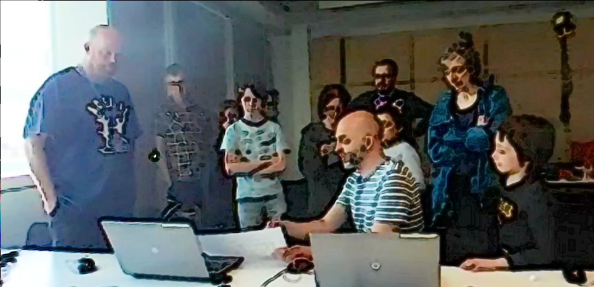
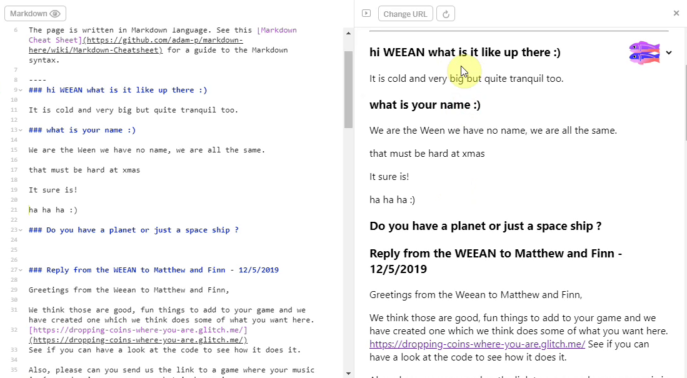

---
# all the regular stuff you have here
zotero:
  scannable-cite: false # only relevant when your compiling to scannable-cite .odt
  client: zotero # defaults to zotero
  author-in-text: false # when true, enabled fake author-name-only cites by replacing it with the text of the last names of the authors
  csl-style: harvard-manchester-metropolitan-university # pre-fill the style
layout: post
categories: chapter
title: 6. Seeding and Nurturing Game Making Communities to Facilitate Learner Agency
---

-   [Research Questions - June 2023](#research-questions---june-2023)
-   [Introduction](#introduction)
    -   [Notes on structure of the
        chapter](#notes-on-structure-of-the-chapter)
-   [Re-examining barriers associated with cultural
    factors](#re-examining-barriers-associated-with-cultural-factors)
    -   [Barriers and tensions associated with authenticity of
        audience - MOVE PERHAPS TO
        PLAYTESTING](#barriers-and-tensions-associated-with-authenticity-of-audience---move-perhaps-to-playtesting)
        -   [Learners may not find coding a project a motivating project
            if it is only a private activity with no authentic
            audience](#learners-may-not-find-coding-a-project-a-motivating-project-if-it-is-only-a-private-activity-with-no-authentic-audience)
        -   [Restricted vs extended community - e.g. why not scratch
            with online community? - MOVE TO DISCUSSION ON
            PLAYTESTING?](#restricted-vs-extended-community---e.g.-why-not-scratch-with-online-community---move-to-discussion-on-playtesting)
    -   [Barriers of identity hardcore coding & dysfunctional group
        work - REALLY COMPRESS UNLESS DATA BECOMES PRESENT - USE AS
        BASIS FOR
        DISCUSSION?](#barriers-of-identity-hardcore-coding-dysfunctional-group-work---really-compress-unless-data-becomes-present---use-as-basis-for-discussion)
        -   [Navigating the conflict](#navigating-the-conflict)
-   [Exploring the impact of a drama
    processes](#exploring-the-impact-of-a-drama-processes)
    -   [Vignette 4.1.a - Introducing a drama
        process](#vignette-4.1.a---introducing-a-drama-process)
    -   [Description of Vignette 4.1.a](#description-of-vignette-4.1.a)
    -   [Vignette 4.1.b - Session reflections and secret
        missions](#vignette-4.1.b---session-reflections-and-secret-missions)
    -   [Description of Vignette 4.1.b](#description-of-vignette-4.1.b)
    -   [Reflecting in role](#reflecting-in-role)
    -   [Observations on written interactions with the alien in the
        drama](#observations-on-written-interactions-with-the-alien-in-the-drama)
        -   [Exploring documentation and accessing technical help within
            the drama
            frame](#exploring-documentation-and-accessing-technical-help-within-the-drama-frame)
        -   [Playful dialogue with the aliens unrelated to game
            making](#playful-dialogue-with-the-aliens-unrelated-to-game-making)
    -   [Use of side missions to encourage varied creative
        practices](#use-of-side-missions-to-encourage-varied-creative-practices)
    -   [Concluding remarks on process
        drama](#concluding-remarks-on-process-drama)
-   [Emerging practices](#emerging-practices)
    -   [Playtesting](#playtesting)
    -   [Emerging use of narratives and graphics which drawing on home
        funds of
        knowledge](#emerging-use-of-narratives-and-graphics-which-drawing-on-home-funds-of-knowledge)
        -   [Summary: Home Funds and RQs](#summary-home-funds-and-rqs)
    -   [The development of divisions of
        labour](#the-development-of-divisions-of-labour)
    -   [Flexible design practices](#flexible-design-practices)
        -   [Supporting Digital/Game
            Jamming](#supporting-digitalgame-jamming)
        -   [The potential of emergent "non-productive"
            activities](#the-potential-of-emergent-non-productive-activities)
-   [Discussion](#discussion)
    -   [COMMENTS ON FORMAT OF Discussions /
        Conclusion](#comments-on-format-of-discussions-conclusion)
    -   [Nurturing agency by creating space for emergent
        practices](#nurturing-agency-by-creating-space-for-emergent-practices)
    -   [Discussion on dimensions of authenticity in in relation to
        Agency](#discussion-on-dimensions-of-authenticity-in-in-relation-to-agency)
        -   [Positive affective space within a drama
            process](#positive-affective-space-within-a-drama-process)
        -   [Extending the metaphor - anchoring in sheltered
            harbours](#extending-the-metaphor---anchoring-in-sheltered-harbours)
        -   [Implications in conceptualisations of forms of
            agency](#implications-in-conceptualisations-of-forms-of-agency)
-   [Conclusion](#conclusion)
    -   [Transition to next chapter](#transition-to-next-chapter)

<!-- ## Overview in points

### PLANNING SECTION - Cross referencing and dependencies - with with lit review and other chapters.

List what is needed / referenced in broad terms to help with planning - e.g.

- Inclusion as Participation [@black-hawkins_achievement_2008; @black-hawkins_classroom_2012] -
- Etc -->

## Research Questions - June 2023

- What pedagogical tools and processes are available to support novices to overcome barriers to game coding and design?
<!-- - What pedagogical factors are significant to support novices learning coding, particularly in game making contexts? -->
- How can learners build agency in an evolving community of game makers?
- How can game design patterns support the development of coding practices with novices?

## Introduction

This chapter explores the development of the emerging game making through the lens of the cultural and community activity.

The chapters have until now discussed tools and processes emerged in response to inferred learner need, in contract, the processes explored in this following section emerged more directly from input from the participants involved.  

### Notes on structure of the chapter

<!-- COMMENT - While there is an overarching theme of, there is still a fair bit of work to do to make the structure of this chapter coherent. -->

The chapter addresses research questions one and two. Thus, a guiding direction of this chapter is on how participants use the created and emerging cultural tools of this game making program, particularly in reference to the building of agency?

Planned activities introduced by myself and those by participants. However the distinction is not so neat, as explored in the last chapter. In later stages, game design patterns were collated into an organised collection with accompanying resources and a navigational menu. However, many of these patterns however, we introduced  initially by participants who recognised them and wanted to add them to their own games.

The distinction between planned and emergent activities is of note and bears exploration.

NOTE - HOW AND WHY - Why because this allows a more detailed analyis of different aspects of agency.

_How does this fit into other findings chapters?_

Chap 4 - overall design context / evolution - Then in greater detail on personal observations on the evolutions and impact of the templated game approach and scaffolding of the code design. (not GDPs)

Chap 5 - zoom out in scale to main focus of the activity as communicated between participants and their impact and appropriation by participants. It

Chap 6 - zoom out in scale to cultural tools and their impact and appropriation by participants. It

The first section examines the impact of a process drama with an aim to establish and nurture community practice. It highlights the value of introducing almost-real processes, near authentic tools and the possibility of learners developing learning identities within a drama frame.

<!-- _Why lead so much on the drama process? How can this be justified?_ -->

The drama process is an example of an introduced cultural tool. The process acts as wrapper to several supporting techniques. the side missions to and to sanction different approaches, the imagined audience encourages reflection and semi-authentic approaches.

It is the most advanced tools of a range that was put into place to create a space suitable for creativity, collaboration and self expression.

Other  section explores the community behaviour of the group of game makers and some of the specifics of their design processes.

The processes include: emerging use of narratives and graphics which drawing on home funds of knowledge; playtesting as a social process; play testing and embodied participation in the games of others; community concepts and norming behaviour emerging during playtesting; the development of flexible divisions of labour;

In the discussion section, the chapter builds on material explored in this chapter in relation to exiting research to explore the development of agency in this learning design.

Particular attention is given to processes which support learners to develop agency in the game making process and the role of different levels of authenticity within these processes.

<!-- Inspired by Heathcote, the importance and challenges of authenticity in tool use are examined, using activity theory concepts, in the context of seeding and nurturing learning community processes. The learner agency and the ability for learners to develop their identities as designers are of key interest.

<!--
REMOVE DUPLICATION
The first section examines the impact of a process drama with an aim to establish and nurture community practice. It highlighted the value of introducing almost-real processes, near authentic tools and the possibility of learners developing learning identities within a drama frame. This section looks in greater depth at the impact on learners of the tools and suggested design patterns of the learning design explored in the previous chapter. -->

<!-- For example, in the tension of restricting user choice in order to create more "visible anchor points" to increase potential for increasing the agency of learners. Like swimming in a protected pool rather than in the sea. -->

<!-- NOTE - DROPPING THE FOCUS ON INCLUSION HERE FOR A MORE FOCUSED APPROACH. -->

<!-- **Justifying selection of chapter contents**
The following elements have emerged from many in the learning design as of merit for sharing in this chapter based on the following criteria: key to the learning experience of participant; novel in terms of lack of existing research; supported by recorded data; and of potential wider interest outside this context.
IS THIS NEEDED OR IS THE CRITERIA ONLY THAT IT ADDRESSES RESEARCH QUESTIONS? -->

## Re-examining barriers associated with cultural factors

In chapter 4 social and cultural barriers were treated in summary alongside other more technical obstacles.

In gdp chapter 5 - more detail on the social interaction in a good level of detail using data analysis from video capture.  

This section explores the obstacles in practice tensions in more depth to give context to looking at impact of subsequent interventions.

### Barriers and tensions associated with authenticity of audience - MOVE PERHAPS TO PLAYTESTING

#### Learners may not find coding a project a motivating project if it is only a private activity with no authentic audience

Making for peers has value but can be amplified and scoped using a fictional or controlled external audience often via scenarios.

<!--
MOVE To LATER DISCUSSION ON AUTHENTICITY IN LATER CHAPTERS?

In line existing PBL research [LIT NEEDED]  with previous iterations of this learning design the process of creating a game for a real audience of university students was motivating [DATA NEEDED].

While the use of a fictional audience in the drama is clearly inauthentic, authenticity is "on a scale" [find support].

In relation to existing literature this is well explored but the use of drama processes to add to this experience is potentially very fruitful to:  increase learner motivation; seed community practice; and  ADDITIONAL (something about learner identities)
-->

Play Testing - each lesson can help with short term motivation of having a game product ready  for others to play.  Showcase events help longer-term motivation towards and aid prioritisation as learners near the end of their project.

The process of starting with a broken but playable template game allowed learners to be able to share their game with others from the start of the coding process.

As a designer I identified this tactic as a way to address learner disengagement if game coding is taught from scratch via a step by step instructions from first principles, especially in younger ages.

Similarly, in my journal notes, I reflect on the difficulty of interrupting the flow of making activities once they are underway. I thus began avoiding stopping making to share points to the whole class and avoid demonstrating key concepts on the screen.

#### Restricted vs extended community - e.g. why not scratch with online community? - MOVE TO DISCUSSION ON PLAYTESTING?

Beyond technical considerations regarding scratch and use of physics etc,
Learning technology in community settings can engender feelings of agency and motivation from part of wide network and the  diverse pathways. [@blunden_interdisciplinary_2009].

Time consideration of the process of being involved in an online community may remove time spent doing real life playtesting.

Also - the diversity of creations available on a online commmunity  could remove the more communal experience of the designed limitations.

<!-- There are examples of the authenticity of the audience being used by participants
- Suzanna uses the imagined audience to norm behaviour.
- Olivia (Th) imagines the impact of her game on real students as a motivational factor and one which drives design decisions. -->

<!-- TENSION OF TIME ALLOCATION OF DRAMA PROCESS.
The tensions associated with the use of time and efforts spent by participants engaging with the drama processes.
The process of bringing people into the culture merit allocating time to address inequalities.

Here, in response to potential alienation from the culture of coding, I have prioritised the introduction of tools and processes which participants can draw on to build agency.  -->

<!-- NOTE - BRING THE DISCUSSION BACK TO THE RQS - -->
<!--
Exploring classroom culture, Engeström [-@engestrom1998reorganizing] notes the challenges of nurturing the motivation of students and tensions which surround the objectives of children of "schoolgoing". (complete this) -->

<!-- NOTE - Find complexity here?  -->

### Barriers of identity hardcore coding & dysfunctional group work - REALLY COMPRESS UNLESS DATA BECOMES PRESENT - USE AS BASIS FOR DISCUSSION?

NOTE DUPLICATION WITH DESIGN CHAPTER.

In chapter 4 I surfaced the conflict experiences by participants in phase one of the process where an alienation from the culture of coding prevented participation. In this section I explore the barriers in more depth

<!-- **Participants stuck / demotivated : scope of ambition to high,  clashes of identity not hard core coders, no on-going playtesting, collaboration groups too big (transition),**

For some families and individual participants there were conflicts to do with a sense of anxiety and alienation from the group coding environment and associated peer working dynamics.

One family dropped out and in their exit interview they shared that at one point we looked around and just saw people doing hardcore coding and we no longer felt at home in the environment. In this emergent design, they had mostly completed asset design and narrative development and the only coding remained. I thus wanted to address the tension between completing the project and alienation from just coding.

The value of playfulness is illustrated with one exit interview with a parent where they shared their reasons for leaving the program. At one stage after a week where they had missed a session, their family looked around and saw other groups involved in 'hardcore coding' and no longer felt at home. They compared this previous sessions which had more fun and group oriented activity.

I was struck that his incident happened during a session where I had not played customary drama games to create an inclusive environment. The games had been omitted as I was responding to a sense of urgency coming from families to solve problems. The scarcity in facilitator time drove me to crack on supporting families to debug code errors. -->

**Gulfs between desires and reality**

While members of this family were able to engage in planing via sketching on paper and in creating pixel art, they were reliant on others to implement code changes. This was in part due to improvised group roles.

The freedom of choice and imagination allowed by designing on paper and via pixel art created compounding tensions. One crisis point involved a frustration of a child who was not able to implement a feature they wanted to add to the game next:

A 3d bee design of one participant which happened when there was no framework.

While personal expression can facilitates engagement and motivation it can lead to conflict if desired changes are not realistic.

In order to accelerate the process of making a game to fit into contextual expectations of an acceptable project timeframe, I pre-chose the genre of game to be made as a two dimensional (2D) platformer game.

<!-- Based on my previous teaching experience, analysis of literature and knowledge of platform games, I pre-prepared a set of coded example and tutorials to implement a range of game design patterns. -->

The incident lead me to greater reflection on ongoing measures needed to prevent participant drop out for due to cultural tensions and negative affect to the working community. These include:

-   An awareness of the danger that those more confident in coding create more involved code problems that need more facilitator time, potentially making others feel less valued.
-   A concern for the fragility of learners positive affect towards the group game making process and thus the need for initial playful starting and closing activities to be continued beyond initial sessions.
-   The value of a stronger buy-in by participants, ideally a greater commitment to the collective making process balanced with the need for low pressure (avoiding a negative sense of obligation).

#### Navigating the conflict

**Via exit**

One way of navigating this was via exit and certain families did drop out at different phases.

**Encouraging peer learning with flexible working practices**

CHECK FOR DUPLICATION WITH FOLLOWING SECTIONS

This tensions was resolved partly by freeing up some patterns of collaboration and interaction and removing others.

The process of parents getting in the way of children's not minding jumping in and invading social space struck me. Together with the frustrations of complexities of larger group work the restrictions created a tension between the suggested community norm of how division of labour was organised.

Thus in the next iteration, rather than the larger groups, smaller groups, allowing some children to work by themselves and others with parents. Avoiding large group fragmentation and encouraging freedom of participation vs benefiting from parental involvement.

These tensions are mirrored in similar research and were highlighted in the practitioner interviews that I conducted.

The fruits of this freedom of participation are explored in chapter five.

**A game encouraging maker / player types**

My journal notes see an evolution of attempts to try to build into the program, activities which help build the participants sense of their own identities of game makers or more generally digital designers.

In and early tentative attempt to define in broad strokes the types of game maker behaviour and underlying goals. In doing this I have taken inspiration from Bartle's game player types [@hamari_player_2014]. I translated player types to maker types based on notes in my observation journal and extracts from screen capture data. The following list of *Game Maker *types:

-   **Social makers:** form relationships with other game makers and players by finding out more about their work and telling stories in their game -   
- **Planners:** like to study to get a full knowledge of the tools and what is possible before they build up their game step-by-step
-   **Magpie makers:** like trying out lots of different things and happy to borrow code, images and sound from anywhere for quick results
-   **Glitchers:** mess around with the code trying to see if they can break it interesting ways and cause a bit of havoc for other users

An additional rationale for this process was to help reduce potential internal bias about the kind of process that a computer programmer should adopt, echoing the call for pluralism in approaches explored in the literature review [@papert_epistemological_1990]. I wanted to try to communicate a message to participants that when you are learning something hard it is of value follow your own working preferences and try to discover a creative style that suits you.

<!-- For examples in the Vignette of S and T's interaction we can see attributes of the child as a Glitcher. In terms of understanding of the game as a dynamic system, this is seen clearly in the parent's alarm at the child's deletion of all elements of hazard. The parent is keen to keep a sense of game balance to ensure a sense of challenge for the imagined player. "It's no fun having a game without any hazards to avoid." The child seems determined to remove all hazards.  -->

This line of thinking developed from a warm-up activity trialled in P3 were participants took the Bartle test (what kind of game player are you).  

}

The process was adapted so players moved
to a different quadrant of the room based on their response to the question. The process allowed young people to see how their response differed from that of their parents. The process was very engaging and quite revealing. Parents responded that the process gave them new insight into the digital identities of their children.

After the results were revealed, I then proposed as facilitator that my observations were that there different game maker types. I read out the different types and asked them to place themselves in a two-dimensional grid based on their self evaluation of what kind of game maker they were. Other family members were then invited to comment to see if they agreed with this interpretation.

The process of exploring identity in this way surfaced the cheekiness of some young people and the pleasure they took in demonstrating their playful mischievousness. I began to make journal notes on this subject and talk to other games study practitioners. I began to ask the question can the surfacing maker types (as per player types) encourage awareness and celebrate the emerging practices that the community was producing.

As an example some layer created impossible or overly easy game levels. They appeared aware of implications for game balance but is taking pleasure in this seeming destruction of the key challenge of the game as an act of disruptive play. They seem to take pleasure from ignoring concepts of what should be done to maintain game balance and from the sense of shock from their current audience her parent. Going against this convention is a type of playful destruction in this context. The process mirrors play theory concept of playing against the game or dark play [@sutton-smith_ambiguity_2001].

**Narrative summary of conflict - TRANSITION TO DRAMA SCENARIO**

The conflict comprised of compounding factors and resulted in a lack of desire to complete coding activities before fully engaging with them.

In the initial stages some families struggled to reconcile the obstacles presented but their active participation in warm up games shows ....

While many families talked of the challenge of coding, one family in particular were s
In reflection on the session that ended their participation

INSERT SOME ANALYSIS HERE BASED ON AGENCY AND AFFORDENCES OFFERED

## Exploring the impact of a drama processes

The introduction of a drama process was introduced in response to a the barriers to participation caused by not identifying with the culture of coding or gaming. This section describes the addition ot the intervention and explores its value as a pedagogical tool to seed game coding practices and to develop learner agency.

### Vignette 4.1.a - Introducing a drama process

The participants have entered the room and chosen a laptop to work on. Some of the children play web-based games or reviewing the games that they have made previously. The session progresses with a warm-up game which includes many false starts, changes of rules, development of tactics, appeals to be serious, full throated laughter and many restarts and which ends in good hearted failure. The transcript below picks up at this point.

<!-- The purpose of the vignette is to situate the reader, give an overview of -->

> Mick: Ok. So I’ve got a surprise. I don’t know if you know but as part of our Home Ed club we did a page of different games. So it’s on glitch.com and it’s called Glitch Game Club and it’s on there, there’s one for Home Ed Winter 2019 and here are all the games that we made. We made a lot of games. 15 games. This has not gone unnoticed because I got a message through this account. This is kind of a story now. We are entering a story. You have to use your imagination. We got a message and it was an audio message. If you guys take your fingers off your keyboards and have a listen to this audio message which is quite unusual as I don’t think it was from anyone on … this ... Earth.

    Greetings Earthlings, we have an important message for the Glitch Game Makers.
    We are the Weean. You would call us an alien lifeforce. We like to think of ourselves as friendly space cousins.
    We can see your Internet from space. We are contacting you because we know you are making games on the Internet.
    We are on our way to the Planet Earth, and we have an important mission for you. We are an Intergalactic Rescue team. We know you have problems on your planet. We can help.
    But we need to find out one thing first. Are you worth it? After we are gone will you also be able to help yourselves? Or are you already doomed to make the same mistakes again?
    You must pass this challenge. Make some games showing problems you have on earth. In the games also include ideas for how to solve them.

    We have some guidelines:

      • Make a game about a big or small problem to solve. If you can let us play it each week as you go along.
      • Give us an update each week by recording a group update.
      • Show you can work on your own but also work as part of a team.
      • We will also send you text messages with some mini-missions sometimes. Be sure to tell us how you do.

    Please now get started and come up with a new game about solving a problem on Earth.

> Mick: I couldn’t understand all of it but I tried to write it down as best as I can. So from what I’ve work out they’ve looked at our games and they’ve come up with a challenge for us. They are coming to Earth so they need to find out if we are worth saving. And the way that they are going to decide is by playing the games that we come up with. And they are going to set us little challenges. So. yeah, that’s the story. (with heavy irony) I’m pretty sure it’s true. (Mick and others laugh).

> Mick: So all they’re asking us to do is to come up with a game. We’ve got four sessions. They want a new game because they’ve already played our old games. It’s got to be something about the problems of the world. I’ve got a lot of problems. It could be big problem or a small problem. It could be about your problems. But also ideas on how to solve them.  
And yeah. That we can work by ourselves but also work as part of a team. So we’ve got to give them a report by the end of each session as well. That’s our mission.

### Description of Vignette 4.1.a
<!-- q: How much to reference back to previous chapter? -->

<!-- The drama game which is served to put participants at their ease, to make communication between peers easier after engaging in play, to decentre the learning environment by creating a circle with more equal participation. As explored in the literature review, the use of such games to help set up informal learning environments is COMPLETE  -->

<!-- After the  excerpt which introduces a dramatic scenario involving a fictional audience I orientate learners in suggested use of support documentation. A full transcript is available in the appendix which outlines that process. -->

The process of introducing a scenario for participant to respond to is common in project based learning in this vignette. Here it is extended using a dramatic element in line with Heathcote on Mantle of the Expert and other process drama techniques (explored in Lit Review). In this section, I describe the vignette using concepts from MoE. Further analysis follows in a later section.

<!--
REMOVED
While inspired by the work on Heathcote on Mantle of the Expert, not all element of the process align directly. For example, the drama does not try to position the participants as expert game makers in a professional context. However, t -->

The following tenets of MoE from Aiken's summary [-@aitken_dorothy_2013] apply. Aitken's and Heathcote's terms follow in italics. Within a _fictional context_ a _responsible team_ is contracted into a _commission_ by a _client_. The facilitator _frames curriculum elements_ as productive tasks and plans for _tensions_ to arise involving: _authentic contexts_, _messiness of learning_, maintaining learner interest and _resilience_ to overcome the _grappling and struggling_ involved. The following sections explore some of these key concepts via the example in vignette.

_Contracting into drama_

As a facilitator, I indicate that we are entering a dramatic process and attempt to draw everyone along with me using the following sentence _"This is kind of a story now. We are entering a story. You have to use your imagination"_. This serves to start the process of contracting in a drama. As a way to introduce the imagined audience, I reference that the games are online and have been noticed by aliens. The use of heavy irony in my voice when concluding the scenario, "I'm pretty sure it's true" and the resulting laughter form an informal collusion that we are playing along with this fiction. The collusion is noted by both parents and children in recorded exchanges. For example, after engaging with a code example provided by myself in the role of the aliens, one pair make the following comment.

> Parent: Look, this is what Mick's showed, what Mick's has done.

> Child: The Weean have done!

> Parent: The Weean, sorry yes.

<!-- NOTE - LIT summary? opening a space for agency / change of roles  -->

_Facilitator activities in role_

My role is a link between the participant and the fictional commissioners of the games. The transcript above (a fuller version is in appendix 4.x) captures a rare example of myself extended facilitator input as instruction. As a practitioner teaching technology, I try to limit teacher talk and being overly directive to prevent learner disengagement. COMPLETE.

<!-- NOTE - support with lit? also is this one tension or two  -->

Balancing leaner choice with over-ambition is a tension explored in the previous chapter. The drama narrative helped resolve some of this personal tension by allowing me to outline boundaries and be directive using the dramatic commission as a foil to help avoid the encounter feeling personally combative or controlling [heathcote_drama_1985].

_Learner activities in role_

Beyond the wider fictional frame of the making activity, learners were also sometimes asked to undertake some activities in role, in particular reflection in role. This and other example are explored via the second vignette.

<!-- Choices
- an overview of Mi's interactions on 2019-03-18 - home interests of art, community help, playtesting and being playtested, use of tools, Molly:as a social coder compared to others.
- Or could look at the whole family unit mi, zi and ne - And their interactions with alien narrative. -->
<!-- Something like the social activity of Vignette Sh and Th - perhaps even that one - as it goes on to
describe the different kinds of interactions. But that is more interpersonal interactions for the most part.
Here we are looking at something cultural?? -->

### Vignette 4.1.b - Session reflections and secret missions

This second extract comes from the following session in phase four. In three of the four session the last 10 minutes of each session involved giving a progress update to the aliens.

> Mick: Ok are you guys ready to share back if you could come to this side of the room we are going to get Mark and Edward to share back first. Everyone can share back using this computer that the Weean are watching if that’s alright.
organiser

<!-- {width=90%} -->

> Mark: All we’ve done today is just get a background in and then we were just working on the one that the Weean had sent us about  dropping the coins in. Now that the Weean have sent us the code we need for basically dropping stuff.

> Mark: The idea is planting trees. about dropping seeds. So we want to drop those and have some enemies that are tweening randomly around and also taking them away. The idea is to have a timer to drop a certain amount in a certain time frame or you can’t go through to the next level. And the next level would be you go around and water all the trees. And the third one is you have to look after them all making sure they are not getting chopped down again by that tweening enemy. So we’ve got the concept and everything now and we’ve got the code So we should be able to make a bit of a jump forward now this week.  It doesn’t look like we’ve got any where but we have. (Mark laughs and others follow). So we’ve got the the background in and we know what we need to do about scrolling as well because we want to scroll across.

> Mick: That’s great.  Is there anything that you think you definitely want to be able to do for next time that you might want help with?

> Mark: Oh yeah. We’ll we’ve got a bit of space where we can work on it before we next come in so we’d like to ask the Weean some more questions. Is that the best way to do it?

> Mick: Yeah for sure and I can see that you guys have been talking to the Weean, Here this project here in your home page called Talking to the Weean allows you to talk to the Weean. So you can go in there, click on Edit Project and if you click on this bit here that says WEEAN and then Markdown you can actually just ask questions in here.

> (Mick reads out the following extract the organiser screen containting a text chat with the fictional alien audience)

> Ed: Weean what’s it like up there?

> Weean: It’s cold and very big but quite tranquil.

> Ed: What is your name?

> Weean: We are are the Weean we have no name, we are all the same.

> Ed:  That must be hard at xmas. (Mark and others laugh and smile.)

> Weean: It is. It sure is.

{width=90%}

>Mark: That’s tickled me that.

> Mick: So there you go. You can have a conversation there with the Weean in there using mark up code you can copy what’s there. Nadine can you talk through what you have added to your game? Is yours called “No Toby Allowed” now.
(Laughs from all)

> Nadine: I’ve not really done much today as I was busy doing stuff with Toby’s

> Dan:  We noticed.

> Nadine: We’ll I’ve changed the platform a bit

> Molly : You had a secret mission though didn’t you

> Nadine: Oh my secret mission was to change someone’s game, their character  or something and see if they noticed. And I think they did notice.

> Dan: We did. We did notice.

> Molly : You couldn’t not notice.

> Mick: It feels like you took the spirit of the mischievous thing and just turned up the volume.
(All laugh.)

> Molly: Sprite!

> Mark: We also had a secret mission.

> Mick: What was that?

> Mark: Ours was to change the sound on somebodies game.

> Nadine: Oh was it?

> Mark: Did you notice?

> Molly: Did you notice?

> Nadine: No (laughing)
(Incomprehensible many people talking or laughing at same time)

> Mark: Play it now!

> Richie: You definitely noticed. (Points to Mark and Ed) You definitely noticed my bit.

> (Nadine  goes to the keyboard and starts to play her game)

> Nadine: I can’t hear anything different
(Everyone laughs)

> Mark: I thought you were going to go- Aaahgh! But you didn’t say anything.

> Mick: So that’s interesting. some people notice some people didn’t.

<!--
RESTATING RQS
 - What pedagogical factors are significant to support novices learning coding, particularly in game making contexts?
- How can learners build agency in an evolving community of game makers? -->

### Description of Vignette 4.1.b

<!-- IS MORE DESCRIPTION NEEDED HERE. ? -->

In this extract participants are invited to take turns showing their game, recapping their progress and outlining next steps to the alien observers. I play the role as a liaison facilitating the process for the fictional, remote audience. I also draw attention to the secret missions that had been distributed to participants (along with social missions - both explore later in this chapter).

### Reflecting in role

**It doesn't look like we've got anywhere but we have!**

<!-- **My reflections as a practorganiser itioner from my journal and those emerging from the process of transcribing and analysing the interactions.** -->

While drama scenarios can aid reflection both in or out of drama, O'Neill and Lambert outline the value of in-drama reflection, noting it is "likely to be more powerful than end-of-session discussion, since it allows individual and group insight to be articulated as part of the context" [-@oneill_drama_1982, p. 144]. In line with this intervention, they propose one way of achieving in-role reflection is to introduce an additional character that acts as an external audience. In this intervention however, main activities happen only weakly in role, whereas the end reflection highlights the fictional frame of the making more strongly.

In my journal notes for phases prior to using the drama process, I documented that the occasional end of session debriefs as _go-rounds_ had limited success in terms of amount and quality of participation compared to these sessions. The video and audio recordings document rich feedback from individuals and pair teams, near complete participation and productive elements of interaction as the feedback progresses.

In previous iterations, my omission of end-reflection in sessions stemmed fomr a lack of time in sessions and reluctance to shift learners away from making activities to reflective activities. I found the need to maintain the drama narrative served as a high motivation factor to complete reflection activities.

To begin the reflection session I ask participants to gather around a particular computer which the aliens are monitoring which helped moving participants closer to each other and stop their coding activity. It is of value to review the grouping of participants in the still image in the vignette above in Fig 5.x. The simple clustering of partfanicipants so they were side by side and talking to a disembodied audience via a computer seemed to make the feedback process less daunting for students. One of the younger participants Richie is participating on the margins but clearly following proceedings as his facial reactions to ongoing contents of feedback. He later participates more actively when reflecting on his process than in previous sessions. Even participants that were initially reluctant to share back and had never shared back publicly before in sessions, chipped in after other family member had started the process for them.  

<!-- MORE DETAILS ON DATA? A QUICK SUMMARY PERHAPS OF
NOTE ON CODING - LIMITED -->

Using the terms of student agency explored in the literature review, here we can see the use of the drama narrative used as a second stimulus both by facilitator to help convene learners and to help them participate in reflection, and project sharing [@sannino_principle_2015].  

<!-- While not all participants engaged with written tutorials. The next chapter explores the process in more detail from the perspective of a participant wanting to implement a particular game design pattern. -->

<!-- This observation is supported by research which encourages varied approaches in addition to instruction-based approaches [@dietz_design_2021; @resnick_coding_2020]. Other studies address barriers to literacy in technical project work  explore written instructions within the drama frame thus providing a greater incentive for participants to engage with the material [@blunden2014seeking]. [SEE LIT REVIEW FOR MORE EXPLORATION]. -->

<!-- The exploration of documentation with the drama frame aimed to disrupt this pattern of identification giving participants a motivation to read in role.  -->
<!-- Evidence for this means of communication is promising however because these processes were brought into the design at a relatively late stage, there is not enough data to make larger claims beyond surfacing this potential. -->

<!-- NOTE - bRING IN A QUOTE FROM ATHENA TO SUPPORT?  -->

<!-- and attempting to shift patterns of working from printed sheets to working online This was partly to be able to capture how participants interacted with documentation more easily as I would be able to review it on their screen in captured data.  -->

### Observations on written interactions with the alien in the drama

#### Exploring documentation and accessing technical help within the drama frame

In the first phase of the project, I had promoted the use of a mailing list to ask technical and code questions of the wider group. This surfaced a conflict where parents were reluctant to bother other participants with such issues.

To address this, as part of the drama process, I encouraged participants to communicate with the aliens to ask help. To do this in a way that encouraged other participants to join in, I created a project in the shared coding project area with a webpage that could be edited and viewed by participants. When in the vignette 4.1.b Mark asks "We’d like to ask the Weean some more questions (to overcome coding blockages), is that the best way to do it?", he is referring to this project webpage. To seed this process, I had entered a question sent by Mark and Ed via email into the page, and written a response on behalf of the aliens.

Dan and Toby also received help from the aliens to implement a pattern of creating random movement in their pac-man clone game. For this pair, the process of reading a code suggestion from the aliens gives the parent opportunity to deconstruct the code in detail to explore coding concepts. In later discussion, Dan uses the fiction of the alien to playfully chastise me for using code syntax which was harder for novices to read.

    "Mick, do you think the aliens would mind if we get rid of the switch statement and replace it with some if-thens? They're just showing off these aliens aren't they?"

Here the text dialogue with the aliens is used as a mediating artefact first by the facilitator to share help in-role, and then by a parent to suggest a modification to the code syntax used and indicating a more general tactic of using readable code structures in novices.  

Thus, in summary, the process of writing down a text request in-role potentially addresses the (previously-explored in Chapter 4) barriers asking for help by de-personalising the process. It also encourages the adoption of professional practice of asking a written question to overcome a coding problem and thus builds experience of using technical terms. While this aspect of the drama process was introduced by the facilitator, in alignment with the understanding of Sannino's concepts of transformative agency through double stimulation (TADS) participants transform the function of the alien conversation to their own purposes. This theme is developed in the next section.

#### Playful dialogue with the aliens unrelated to game making

The process of asking the aliens for technical help within a code project sparked a playful process of informal chatting with the aliens. During in our end of session reflection above, I noted the following ad-hoc encounter that a child initiated on the interactive page while his father was taking a break from coding.

    Ed: hi WEEAN what is it like up there :)
    Weean: It is cold and very big but quite tranquil too.  all the same.
    Ed: What is your name?
    Weean: We are are the Weean we have no name, we are all the same.
    Ed: That must be hard at xmas
    Weean: It is. It sure is.

{width=90%}

Inspired by the positive reaction of participants to this playful engagement with the fictional audience, I asked a student helper to participate remotely to play the part of the alien. The student then gave feedback via live text interaction to participants in the final session. The process started with supportive and celebratory messages posted from the alien. The impact was significant with the young people with 5 out of 7 engaging by writing messages and all mentioning the interactions verbally during the session.

The live chat began to fulfill a function of building  insider rapport, creating a fun atmosphere, celebrating the completion of games in the absence of a public showcase, and signposting the achievements of other participants. For some pairs, while the child interacted in the live chat, parents performed final tweaks to code projects and challenges. Two parents in particular worked hard debugging more complex elements of the game with facilitators and peers. Other parents engaged with the chat and encouraged their children to get feedback from the aliens about their game in particular.

The start of process began when Ed in a moment of free time expanded the use of space initially imagined to address technical needs by initiation a playful interaction which, while in the motivation to support different learner identities, was a novel, volitional action in this context. It is helpful to expore this interaction using AT and TADS terminology. Ed is in conflict, not able or wanting to engage in his existing creative activities while his father has a social break. Using the secondary stimulus of a text chat with fictional aliens, he writes a playful personal question to the aliens as an expression of volitional action to play, casts out an experimental kedging anchor. By co-incidence, I was on a different computer, saw this question, and was able to respond in real time. Thus, by getting a response, Ed's kedging anchor caught onto an anchor point and Ed was able to resolve this conflict of inactivity and in doing so both amuse himself and other other with humorous self-expression, and open-up a novel, child-centred activity for the whole group which could also address potential issues of alienation from the culture of _serious coding_ expressed by other participants.  

<!--
DEVELOP OR FINISH - note on Affordances

To express this using affordance theory, the affordance offered by the medium of communication is repurposed and made more visible by Ed's use of it to ask playful questions.
 -->

<!-- NOTES
- identity of playfulness  
  -->

### Use of side missions to encourage varied creative practices

<!--
Perhaps add back in as an unintended consequence?
The live chat process started unintentionally as one child was left to their own devices as a parent was undertaking a social mission (see below and previous chapter). -->

In addition to the the main mission of given in role to make a game to entertain and inform visiting aliens, and extra social and secret mission were delivered with the frame of a drama process, with an explicit aim to encourage community-focused patterns of behaviour which had emerged in previous iterations of game making. These include social aspect of playtesting and playful interactions, explored in later section in this chapter, which I had identified these behaviours as potentially helpful in maintaining the positive affect and identification with the on-going group process of game making.

<!-- AN EXAMPLE HELPFUL? -->

A table of both social and public missions follows. These mission were printed out on cards and one of each type was given to the participants in the first half of the first two sessions.

<!-- NOTE - PERHAPS MOVE TO APPENDIX OR DESIGN CHAPTER -->
<!-- NOTE ONLINE VERSION Secret missions and public missions -
https://drive.google.com/drive/folders/1I8D_axlOUAFIGarrnzGV5mSCe2MDCDso -->

| Your Alien Mission (social)          | Your Secret Alien Mission:              
|----------------|----------------|
| Find out the names of 3 games that are being made.  | Change the variables at the start of someone else’s game to make it play in a funny way.    |
| Make a list of characters in two other games being made.   | Change of the images in someone else’s project to a totally different image and see if they notice.    |
| Find out the favourite computer games of 4 people.   | Change the level design of the first level of someone else’s project to make it impossible but try to change as little as possible to do that.   |
| Find out who plays the most computer games per week in your group.   | Change of the images in someone else’s project to a very similar but slightly different version and see if they notice.    |
| Find out what other people are planning. Give some friendly feedback to one other person / group. Why don’t you try…   | Add a rude sound to someone else’s project.    |
| Ask 2 different groups if they have thought about what sounds they are going to put in their game.   | Swap over some sounds in someone else’s project and see if they notice.   |
| Find out from three groups if they are going to try any totally new ideas.  | Delete all of the code of someone else as they are editing it and see how they react. Then help them get it back using the Rewind function.   |

 

In the transcript above of vignette 4.1.b we see that in the end-of-session reporting back participants engage in a lively discussion about the secret missions they had been given. Encouraged by her mother Molly, Nadine shares that she has been highly engaged in a disruptive secret mission. Dan and Toby express playful frustration. Mark and Ed contribute by sharing their more subtle disruption and Richie is keen to have his _rude noise_ mission noticed and commented on. Some public missions had a noticeable impact in this session particularly in  stimulating a discussion among parents around which arcade games they played as youths.

These sanctioned non-design activities, designed to reduce participant stress, to encourage the exploration of the games of others are taken up enthusiastically by much of the community. In analysis of one key sessions involving missions from which the transcript was taken. Out of 10 participants, 8 visibly engaged with the secret missions during the session.

<!-- PROVISIONAL BRING accurate FIGURES TO THIS. -->

The process was not without friction. After initially engaging with the process of secret games, Toby and Dave, who were later working on a tricky coding process, expressed frustration at interference. Thus, while promising, limits to this process should be evaluated to avoid overly disruptive behaviour which create barriers to progress. For example, time limits could be in place.  

The positive reaction of young people to the drama process was also picked up in interview data.

    Mark: Tell us about the Weean?
    Ed: er.
    Mark: What did you like about the Weean?
    Ed: Just very silly and I don't know. They answered your questions.
    Mark: Was it, because there was a sense of play, a bit of fun and a bit of anarchy.
    Ed: Yeah.
    Mark: What else can you tell us about the Weean?
    Ed: er.
    Mark: There was the little sabotage things you had to do as well.
    Ed: Yeah
    Mark: So you liked those games where you had to kind of hack somebody else?
    Ed: Yeah
    ...
    Mark: The Weean thing was, I think, a massive hit for everybody because it just brought sense of play and fun. And it took attention away from it being overtly technical. Brought a personal element in and obviously that anarchy. Kids love the absurd.

<!-- WHERE AND HOW TO LINK DISCUSSION?
- link to side missions of adventure games - zelda - perhaps find motivation there too. -->
<!-- NOTE Examine MoE and this process drama in more general terms, then explore a -->
<!-- (using AT theory and other relevant concepts - which are developed further in final discussion). -->
<!-- It is of value to briefly discussion the value of the missions in relation to drama process theory and play theory.  -->
<!-- I first encountered these kinds of secret missions in a session which explored game design theory via creating a game collaboratively. [^1] -->
<!-- The secret missions were part of this workshop
https://playthinklearn.net/blog/ten-steps-to-game-design/ -->

There is more evidence of the impact of the drama process in the vignette above. In the end of session reflection, Richie occupies a peripheral position and continues to interact with his laptop. However, he reacts positively when Ed's questions to the Weean are read out. He later adds to the discussion when it turns to the sabotage based missions set in the drama process. It is probably that the ability to represent his irreverent approach helped his participation in the more formal, collaborative reflection and feedback activity in a way that had not happened in previous sessions.

Side missions or side quests are also used in open world games are used in part to appeal to different kinds of players and are often models on Bartle's taxonomy of game player types [@bartle_hearts_nodate]. In this phase, parents Molly and Mark both used the prompts of the social missions to take a break from their creative work using the software toolset to talk to other parents and children. This supported and encouraged behaviours that I had observed in the previous stage where they had been energised by breaks for coding and interactions with others. This activity helps addresses one of the key barriers to taking part in a coding community that of alienation from the culture of _hardcore coding_.

    Mark: Right we’ve got a background in. Do you. Do you want to reply to the Weean.
    Ed: Yes. (Ed starts to type very slowly)
    Mark: (after some time) While you do that I’m going to go do my mission.
    Ed: What's your mission?
    Mark: To find out about other people's favourite games.
    Ed: Alright.

While the some of the secret missions encouraged forms of disruptive play, griefing of playing against the game [@bakioglu_spectacular_2008; @bartle_hearts_nodate]. While this increases engagement for some learners, the process also suffered the danger that participants transgress levels of cheekiness and play which explores boundaries, to more disruptive ones. In this context this involved frustration and wasted time for other users. The vignette above shows a chance for the parent to express his frustration at the process in a playful way.

The use of missions introduced by facilitator are taken up voluntarily by participants and work to address conflicts caused by identity clashes by recognising and encouraging diverse making approaches and styles of community participation.
A BIT MORE ON AGENCY?

### Concluding remarks on process drama

This section has explored the use of the possibilities of a drama process to support both the leaner expression of agency and as a pedagogical process for facilitators to militate probable conflicts and obstacles for learners in the creative process. The mission-based interventions began as naturally occurring expression of learner agency which became incorporated into the drama process. The next section examines the affordances and impact of the coding environment and starting game template, which in a similar way, evolved in response to participant use of earlier iterations of the toolset. Conversely, examples of more unguided practices and use of tools which served to increase the scope of agency are explored in the final section of this chapter.

<!-- This tallies with observations from journal, interviews and video data of participants. -->
<!-- The impact of time pressure to finish games also compounded tensions involving shifting away from game making to reflective activities. Even with the use of reflection in role, reflection activity was not prioritised in final sessions as time drew short. -->

<!-- OTHER FACTORS
  - result of analysis of interactions during game making,
  - to encourage some practices - AND IDENTITIES - ANY COMMENTS ignored by solely focusing on implementing code - game maker types (mention in previous design chapter) -->
<!-- LINK NOW TO AUTHENTICITY OF PROCESSES / TOOLS -->
 <!-- including exploring adapting Bartle player types to maker types to honour different approaches; the use of social and missions and  -->
 <!-- (NOTE PREVIOUSLY EXPLORED BY RESNICK ), and other pedagogical practices. -->
<!-- The data in this chapter, and the majority of this thesis are drawn from stages 3 and 4. As such, the observations on starting point and subsequent emergent resources are based on that period. -->

<!-- NOTE - TRY ORGANISING CHAPTER THIS WAY - IMPACT OF MY DESIGN - THEN EMERGING TOOLS / PRACTICES -->
<!-- - What pedagogical factors are significant to support novices learning coding, particularly in game making contexts?
- How can learners build agency in an evolving community of game makers? -
NOTE - INPUT A SMALL AMOUNT ABOUT WHAT IS MISSING FROM THIS SECTION DUE TO PARTICULAR FOCUS
<!--
MOVED TO INTRO
 The previous section examined the impact of a process drama with an aim to establish and nurture community practice. It highlighted the value of introducing almost-real processes, near authentic tools and the possibility of learners developing learning identities within a drama frame.   
This section looks in greater depth at the impact on learners of the tools and suggested design patterns of the learning design explored in the previous chapter. It then progresses to explore some of the emerging and flexible design processes and tools that evolve from the starting design. -->

<!-- NOTE try to focus on agency as well? -->
<!-- NOTE - research notes include
- how agency can be viewed in this domain,
- increasing persistance / determination due to ownership of game
Gee - projected identity
Papert & Resnick & Kafai - ownership
Papert & Turkle - Turkle closeness to objects
 -->

<!-- NOTE - BE CLEAR OF THE LINE GDP - -->

<!-- MOVED TO CONCLUSION This section is unfortunately hindered by the logistics of the recording process which began only after this process had happened and may participants had already undertaken one phase. A separate study of a stand-alone group engaging with this starting template and cards would be welcome, and may be a legitimate follow up to this study. -->

<!-- PERHAPS DUPLICATION?
- that knowledge of game tropes can scaffold idiation process (gdps)
- community sharing of tropes (or is this later) -->

<!-- PERHAPS KEEP EACH DISCUSSION POINT HERE IN THE SECTIONS ABOVE - OR IF MORE OVERARCHING MOVE TO FINAL DISCUSSION SECTION. -->
<!-- I used to share keyboard shortcuts as magic tricks
- Copy paste
- Cntl and end
- Page down -->

<!-- This section looks at the specifics of community aspects of personal expression in the data collected in this study, dealing specifically with narrative elements, and graphical and audio assets. MOVED  -->
<!-- NOTE - CROSS OVER WITH PREVIOUS CHAPTER? PROBABLY DESIGN
(may need to move?)
Just create a summary here.

Existing research on digital making and creative coding has emphasised the role of personal expression to incentivise the creative process [Scratch roque community]. The creation of personally meaningful object to share with a community is a foundational concept in Papert's constructionism [CITE]. While the 3M design is more limited than a Scratch media project in the potential to incorporate home interests, participants did embrace existing immediately clear possibilities offered by the certain GDPs in the 3M starting design.
-->

<!-- NOTE - add into the design chapter - challenge of personal expression, incoroporating previous gaming interests and unrealistic expectations.
-->

<!-- NOTE IS THE FOLLOWING ALSO FOR THE DESIGN CHAPTER?

Another opportunity involved choice and design of game assets that allowed the expression of identity or a designed element - for example graphics, audio or a written message to appear at various stages of the game.

The incorporation and design of game assets is taken as work on GDP for the purpose of this model.

The core GDP involving game assets already exist in the starting template.
- Objects as a reward to incentivise player exploration
- Objects as a hazard penalising player progress

The starting three assets, player, hazard and reward provide a scaffold to  guide  the choice of game possible themes.

The incorporation of the graphic was relatively quick and easy change to make the game but had a significant factor in the affect towards the game. So while structured to avoid
-->

<!-- Cultural interactions seem to be able to motivate and sustain other interpersonal activity which may be experienced as work.
This is supported by other research on digital making and motivation. CITATION HERE? - or in cultural discussion?  

**Tangled nature of graphics and narrative in this design**
In the data analysed, young people -->

<!-- Bring out detail from the study to this section.
 - the media literacy practices of transfer between tools - similar to other studies - see guided participation studies -->
<!-- Tensions compared to other more walled garden approaches - see below in tensions / move to make code. -->

<!-- Thus my role as a responsive facilitator rather than a instructor was key to this process.  -->
<!-- opens up flexibility in the way learners approach the design processes. -->
<!-- imagined, often in response to community need, by myself, the following emerged from community use. -->

## Emerging practices

### Playtesting

 <!-- NOTE - Include examples here which do not talk of GDP explicitly - but other cultural aspects. -->

As explored in the literature review and previous chapter, playtesting is a rich and varied learning opportunities which encourages community-building behaviour.

 <!-- By the time video data recording started in phase three there were already complex patterns of playtesting underway. In this section, I review data to describe some of the emerging playtesting behaviours of participants. -->

**Playtesting as a social process**

Participants, particularly older ones, used playtesting as a way of showing support for fellow game makers. Example behaviours included: praising graphical content; making links with home interests of participants through questioning; and building rapport. Molly in particular used playtesting to show her appreciation of the graphical work of others especially in the creation of cute animal characters. In response to one game which featured an image of a dog, other participants asked: _Do you like dogs? Do you have a dog at home?_.

**Playtesting and embodied participation in the games of others**

<!-- By the time phase three and video capture of data was underway, the process of playtesting began to take on interesting characteristics for some younger participants who were working more independently. -->
<!-- Because these interactions were mobile between works is it hard to transcribe interactions. However, description of the physical movement and gestures of the young people is relevant to explore the value of this behaviour which I will call playful playtesting.  -->

 <!-- Examples include.... -->
Some children added additional playful elements to playtesting. Because these interactions were mobile between works is it hard to extract audio and transcribe their speech. However, it is possible to communicate the characteristics of this play via a description of a typical encounter and the gestures of participants.

WATCH MORE CLOSELY AND TRANSCRIBE GESTURES

    Play is initiated by calling across the room as an invitation to play, or as a provocation. When playtesting is underway it is normally undertaken with two or three participants standing around the computer rather than being seated. The core of those involved take turns to play the game, exclaiming frustration or triumph at completing levels or failing. Failure may be extremely performative with a rapid pulling way from the screen and keyboard. This may be followed with a battle to wrestle control of the keyboard to play the game next. This may involving playful pushing, and wrestling of hands and arms and vocalisations. While this play is happening it may attract other participants who remain on outskirts of the activity looking on able to watch what is happening on the screen and respond non-verbally with smiles or laughs.

These changes to the form and function of playtesting by young participants is another example of expression of agency by participants that widens the scope of possibility of actions.

<!-- There may have been a response to draw in one of the younger participants who had on parent partner and who was brought along by another parent. -->
<!-- NOTE - Nadine's play on secret missions mirrors some of her more spontaneous play in the previous phase - thus one informs other -->

**Community concepts and norming behaviour emerging during playtesting**

<!-- THERE IS DOUBLICATION WITH NEXT CHAPTER - REEVALUATE / REFACTOR - ESP CONCEPT OF SAFE ZONE -->

The elements of variables controlling player movement, the ability to place hazards in the layout of the platform game were initial changes that all participants made but the end results greatly varied in terms of the challenge of the games. Discussions on game challenge, specifically comments about how 'hard' participant games were the most common forms of interaction during playtesting.

Through this informal feedback participants sought to influence peers to modify the playability and challenge games to increase the enjoyment of peer players. For example, parent Molly had been focused mostly on completing asset design this had created a very frustrating game experience in terms of the player's movement. Just before this extract, as a facilitator, I shared feedback about using quite indirect technical language when giving feedback (See appendix 4.x).

<!-- PERHAPS TURN THIS INTO A TABLE WITH GESTURE?  -->

    Bertie: That looks nice (referring to the graphical look of the game)

    Molly invites Bertie: to play as she can't progress due to the difficult game controls.

    Bertie: It jumps super high but so slow.  
    Pause
    Molly: He has to go slow because he's an astronaut, you see.    
    Bertie: It's hard.
    (Bertie leaves.)
    Molly: (to peer parent with proud tone.) It's hard. Wow.

    (Ed comes to play the game)
    Ed: How much jump speed to you have?
    Ed: Your jump speed is massive.

Molly initially misconstrues feedback from Bertie that her game is hard as a positive thing. A variety of comments nudge Molly to change her game to align with an emerging community norm of what a sensible jump behaviour should be. Feedback from Mick attempts to bridge a technical and conversational approach. Feedback from Bertie is direct about his player experience as a player. Ed gives a more technical explanation from  involving the naming of the variable _jump speed_.

Other children come and play the game but only for less than a minute before leaving. Towards the end of the playtesting process, as one child leaves, Molly comments "It's so frustrating." This suggests an evolving understanding that her game is frustrating to players rather than pleasantly challenging.

The less directive norming behaviours here mirror observations seen in the work of Rogoff and colleagues[@rogoff_cultural_2003] on learning in  community settings. There is an apparent tension in play here between encouraging individual agency of expression within the game and an evolving community tendency to norm peoples games to be more _playable_, specifically that player movement should conforming to wider expectations.

To better understand this process it is relevant to locate the source of these wider expectations and to evaluate their utility here. This is attempted in the discussion section of the chapter.

What we can draw from the data at this stage is that playtesing provides many leverage points to facilitating learner agency and discuss the limits of designs. IN addition, playtesting is a process that allows participants to demonstrate informed criticality as a player and guide the creations of peers via gameplay feedback.

<!-- PARK FOR NOW - Maybe move to Design
The concept of the feel of the game or the challenges maps to the Dynamics of MDA framework. -->

<!-- The concept of difficulty for most of the participant's games was dependent on the interaction between the feel of the game controls and elements of game challenge associated with placement of hazards and moving enemies. -->

<!-- The term _game feel_  has varied interpretation but is generally framed as the responsiveness and feeling of control over the main character during the core movement of the game. In this case, it effects the ability of players to move between platforms and avoid enemies. In this design the jump mechanic is determined by the use of variables controlling gravity, jump velocity and movement velocity. -->

<!-- The importance of these variables to is was behind the design decision to place these variable right at the top of the code and to rename them with player centric names rather than mathematical terms like velocity and acceleration.   -->

<!-- NOTE - BE SURE TO EXPLORE THIS IN SOME DETAIL IN DESIGN CHAPTER -->

<!-- The regular playtesting of games allowed participants to give each other feedback regularly and game feel was one of the aspects that young people in particular to gave frequent feedback on. -->

<!-- Parent Mi had been focused mostly on completing asset design. She had been made aware by her daughter Ne about the relevant game variables. -->
<!-- In response, Mi asked for advice but Ne gave none walking away. Mi noted "She's left me to my own devices."

Player jump (y) velocity was set very high but left right (x) velocity was slow. This created a very frustrating game feel. The following is a compilation of feedback comments or reactions over a 15 minute time period.   

    Mi: (Talking to self) No! It's so hard that. (referring to a particular jump in her game.)
    Mick: How are you getting on Mi? It's looking good.
    Mick: (Noting frustrated air of Mi) Have you made it to hard.
    Mi: I don't know. Can you jump from here to here with this.. this.. him? (point to main character)
    Mick: So it look like you bump your head and fall down.
    Mick: One bit of friendly feedback that I would give you is that it's taking a long time to move left and right. And that is something that you can change if you want to.
    Mi: Oh right yeah.direct
    Mick: Yeah.
    Mi: Yeah, actually that's a good idea.
    Mick: If you think about average games. Your average jump time would be about one second in the air. So that can be a bit of guide sometimes.   -->

 <!-- The only changes she had made to the deliberately frustrating initial player movement (discussed in design chapter) was to change player jump velocity. Player jump (y) velocity was set very high but left right (x) velocity was slow.  -->

<!-- She had been made aware by her daughter Ne about the relevant game variables.
In response, Mi asked for advice but Ne gave none walking away. Mi noted "She's left me to my own devices." -->

<!-- We can see that Mi justifies the game feel of a very high fast jump with a narrative response about the character being spaceman. However, the limited amount of time anyone plays her game and her own frustration in playing it is telling. The game feel is frustrating in the wrong way here. Mi seems to initially misconstrue the feedback she is getting here equating her ability to make the game hard as a positive thing. However, towards the end she notes the frustrating nature of the game.

Other children come and play the game but only for less than a minute before leaving. While their feedback is non verbal the very short length of time that some of them spend is noticeable.  After the last one leaves Mi comments "It's so frustrating." In these interactions we can see a consistent message coming from peers in the playtesting process. They praise the look of the game but offer constructive feedback to help improve the GDP of jumping.

While the players do not tell Mi directly to change the game, these comments appear to direct direction of the design to comply with an emerging community norm of jump feel stemming from the personal experiences of the participants and from tangible feeling of lack of control over the player's character in the game. The same message is delivered in a variety of ways, above we can see feedback from Mick trying to bridge a technical and conversational approach, direct feedback of the personal challenge level and an interpretation of the cause from Ch and then a more specifically technical explanation involving the naming of the variable _jump speed_. -->

<!-- These norming behaviours some of the informal norming behaviours that are less directive seen in the work of Rogoff and colleagues as explored in literature review [@rogoff_cultural_2003]. -->

<!-- NOTE - NOTES ON THE CULTURE OF HARDNESSS - FIT IN SOMEWHERE IF APPROPRIATE

When explored from game making perspective the hard is good lens, is limiting in terms of building the engagement of players. However, culturally the desire to make games hard for other participants is more understandable in the context of retro games. .

- arcade games were designed to be hard to extract money from players
- nes games reputation for being brutal as they often had no way to save states, and much of the games challenge, due to limitations of number of levels or modes of playing, depended on this 'hardness'
- this developed later for snes games , finding challenge and other forms of ways of maintaining interest for different genres of games_
- retro games are associated therefore with being brutal and frustrating.
- thus in some ways the process of making a hard game is a way of getting your own back at all the games that have frustrated
 -->
<!--
Other observations
- The process of teaching challenge via balance cards can happen early on
- some participants are resistange - see Molly's interactions - does this matter? -->

<!--
### Building Identities as Game Makers  - EXTENDED

PARK THIS FOR NOW IN DESIGN CHAPER

COULD RETURN TO THIS IN A DISCUSSION CHAPTER - AS HAS IMPACT ON GDP TOO.

My journal notes see an evolution of attempts to try to build into the program, activities which help build the participants sense of their own identities of game makers or more generally digital designers. In and early tentative attempt to define in broad strokes the types of game maker behaviour and underlying goals. In doing this I have taken inspiration from Bartle's game player types Hamari and Tuunanen, 2014). I translated player types to maker types based on notes in my observation journal and extracts from screen capture data. The following list of *Game Maker *types:

-   **Social makers:** form relationships with other game makers and players by finding out more about their work and telling stories in their game -   
- **Planners:** like to study to get a full knowledge of the tools and what is possible before they build up their game step-by-step
-   **Magpie makers:** like trying out lots of different things and happy to borrow code, images and sound from anywhere for quick results
-   **Glitchers:** mess around with the code trying to see if they can break it interesting ways and cause a bit of havoc for other users

My journal notes see an evolution of attempts to try to build into the program, activities which help build the participants sense of their own identities of game makers or more generally digital designers. In and early tentative attempt to define in broad strokes the types of game maker behaviour and underlying goals. In doing this I have taken inspiration from Bartle's game player types Hamari and Tuunanen, 2014). I translated player types to maker types based on notes in my observation journal and extracts from screen capture data. The following list of *Game Maker *types:

-   **Social makers:** form relationships with other game makers and players by finding out more about their work and telling stories in their game -   
- **Planners:** like to study to get a full knowledge of the tools and what is possible before they build up their game step-by-step
-   **Magpie makers:** like trying out lots of different things and happy to borrow code, images and sound from anywhere for quick results
-   **Glitchers:** mess around with the code trying to see if they can break it interesting ways and cause a bit of havoc for other users

For examples in the Vignette of S and T's interaction we can see attributes of the child as a Glitcher. In terms of understanding of the game as a dynamic system, this is seen clearly in the parent's alarm at the child's deletion of all elements of hazard. The parent is keen to keep a sense of game balance to ensure a sense of challenge for the imagined player. "It's no fun having a game without any hazards to avoid." The child seems determined to remove all hazards. My understanding is that she is also aware of implications for game balance but is taking pleasure in this seeming destruction of the key challenge of the game as an act of disruptive play. They seem to take pleasure from ignoring concepts of what should be done to maintain game balance and from the sense of shock from their current audience her parent. Going against this convention is a type of playful destruction in this context. The process mirrors play theory concept of playing against the game or dark play Sutton-smith, 2001).

In phase three, to bring an awareness of these playing and making types into the program in a playful way I devised a game of the program which I have included in all subsequent phases. Collectively players took the Bartle test to find out what kind of game player they were.

{width="17cm" height="6.493cm"}

The process was adapted so players moved around the room in response to each question. This allowed them to see how their response differed from that of their parents. The process was very engaging and quite revealing. Parents responded that the process gave them new insight into the digital life and identity of their children.

After the results were revealed, I then proposed as facilitator that my observations were that there different game maker types. I read out the different types and asked them to place themselves in a two-dimensional grid based on their self evaluation of what kind of game maker they were. Other family members were then invited to comment to see if they agreed with the positioning and if they could give examples of that behaviour.

An additional rationale for this process was to help reduce potential internal bias about the kind of process that a computer programmer should adopt, echoing the call for pluralism in approaches explored earlier in our section on germ cell concept Papert and Turkle, 1990). In short, my message was to participants there are more than one way the skin a cat. When you are learning to code follow your own preferences and try to observe and reflect on what works well for you. -->

<!-- NOTE - Preceeding To follow shifts in perspectives bound up in designing for others, and the shift in layers of abstraction,
This section explores what other shifts in design practices -->

<!-- #### Different styles of making
PERHAPS IN DESING SECTION - BUT TRY HERE FIRST -->
<!-- #### Circulation of peers and helpers
This often facilitates talk aloud of design decisions and justifications.
Cross reference playtesting -->
<!-- ### Accessing Help and Documentation

In the emerging community there was a variety of help available including;

- Written documentation from the learning design via step by step tutorials
- A series of code examples in working code playgrounds
- Facilitator help through asking for help
- Student Helper attention and help
- Peer support from parents and children -->

<!-- #### Tactical use of in-session support time

Parent Mark made a comment showing that he was aware of the particular value of the in-class sessions to overcome some kinds of blockages. -->

<!-- #### Tactics in accessing help from peers and facilitators

A common teacher tactic is ask three then me.

The family group of Mi, Zi and Ne showed a lot of flexibility and tactical choices when trying to overcome blocks.
Zi more directly and loudly asking for help for faciliator often followed by comment from his mother to leave him alone.

in 2019-03-18 - 18.20 Mi's meets many small blocks and asks for help from a variety of people.
- Student helper to get online,
- Peer parent about use of piskel, and then her son
- Ne daughter
- Mick overall facilitator -->

<!-- As we explored in the introduction and literature review, the ability to incorporate the graphical, audio and narrative assets into created games and playful digital designs allows for personal expression in a way that can be engaging and sustain motivation [papert, roque, kafai etc]; -->

<!-- Recap from Lit Review / Intro -->

<!-- - tension of a walled garden approach vs responding to freer design choices -->

<!-- As per work on Kafai and Roque who observe the following features of personal expression in a community game making setting.
- propagation of assets..
- pride sharing back?
- value of feedback, asset creation as a speciality -->

<!--
NOTE - When to put data about TOOLS in this chapter or that of the design chapter.
As interlinked.  Data in design chapter when it is based on journal notes and personal / literature based decisions. -->
<!-- NOTE - PULL FROM ALL SOURCES HERE - JOURNAL, VIDEO, INTERVIEWS -->

<!-- ### Tools
- Responses to choice of tools & Communities Choice of Coding Tools / Environment / Communities
  - Why not Scratch? Less of a community? So how to replace this? What of time considerations?

- Physical Elements as Tools
  - end boxes used as motivator / engagement
  - extract from interview?

### Creating Community Activity   

- Theortical context
  - Collaration from AT perspective - "collaborative activity" see [@eriksson_using_2019] for an overview

- Peer - side by side coding.
  - Parents coding too. See the comments by Molly:and her interactions / commentary. And the interaction of Ch-Pa and Te - the quiest support there.

- Game Playing and playtesting
   - Game playing at start of program - no observations but sets context
   - Play testing - and challenge - a culture of "hardness", curiosity about number of levels, as a vehicle for peer support,

- Drama Process
 - differencing attitudes to games and technology
 - a reflective process to avoid distracting from activity & to share goals and process publically

### Drawing on Funds by bridging Norms and Values between activity systems

- Drawing on Funds of Game cultures
   - player and maker types
   - how to support emerging behaviours and give licence to young people  - side / sub missions
   - the sub missions - divergent activities can be productive
   - knowledge of GDP a fund - but one covered in detail in next chapter.

Organic Responses emerging naturally from community
 - problems solving  - navigating limits of facilitator time
 - Fund of Knowledge that
       - Home cultures and interests guiding subject matter for sub missions and character / scenario choice.

NOTE  - THE DISCUSSION HERE ON FUNDS - NEEDS TO BE CLEAR HOW TO SEPARATE OUT FROM GDPS in the next chapter
####  Notes on Discussion
These are quite disparate so probably makes sense to have a separate discussion entwined in each section rather than one section at the ends.
Relevant theory / studies.
- funds of knowledge
- AT theory for sub missions, in preparation for chapter on main mission / unit of activity
This section uses AT's focus on rules / norms and interactions with other activity systems at home. -->

### Emerging use of narratives and graphics which drawing on home funds of knowledge

<!-- While the potential to add graphics was a core affordence of the starting processes of the templated game, the process of designing and sharing and the peer commentary on the process emergered as the sessions evolved. -->

The literature review outlined the potential of home interests as funds of knowledge, especially informal learning. This learning design provided participants with different ways to input and explore their home interests in the narrative and graphical elements of their created games. For example the choice of game characters allowed the expression of identity. Other designed elements for example audio and graphical effects or written messages added to the overall aesthetic or polish of the game.

Video evidence indicated that conflicts involved between learner expectations and their technical abilities are helped by the use of the starting template. The
constraints of provided game elements and implied narrative structure of the template accelerated the initial creative process.

<!-- (like a  musical style from which to jam from, or provided constraints in a drama process which help guide improvisation.) -->

One pair Clive and Pearl, the grandparents of Toby, included a narrative message at the start of their game. This process surfaced the expertise of the family as beekeepers, sparking interesting conversations with other participants.

     var starttext = "This is a game which pits a honey bee against a swarm of Asian hornets,  which are alien invaders attacking bee  hives in the UK and which beekeepers are trying to stop spreading  here. Try to guide the bee to collect all the flowers without being caught by the hornets.
     Use the arrow keys to move the bee. Press return to START.";

<!-- In a noteworthy exchange a young participant Zi asks one of the grandparents of child if they had done any amazing things in their life. This exchange follows

   zi: Have you done amazing things?

The exchange seems to throw Pa but they draw Zi's attention back to the game. Showing that it demonstrates their interest in bees as they are beekeepers.

The source of Pa's hesitancy to share more is not clear. However her willingness to share that part of her personal story via the narrative of the game is shown here as is the willingness of the young participant to ask about the personal experiences of the older participant during the process of peer testing her game. -->

In another example, Mark and Ed designed a game around the character of a train driver that needed to collect coal. In subsequent post course interview Mark describes the impact of the child feeling like they could bring their own identity and interest into the project. "I know just your eyes lit up when you realised you could expand your interests into gaming." See Appendix 4.x (Mark and Ed working with home interests)

<!-- The process of creating assets builds in Molly the identity of a proficient maker. She wants to build on her achievement of being an "expert pixel".  -->

<!-- NOTE
NARRATIVE / drama IN PREVIOUS CHAPTER?
how do these two sections work together? remove this one?
 -->
<!-- The incorporation of the graphic was relatively quick and easy change to make the game but had a significant factor in the affect towards the game [erikssonUsingGameplayDesign2019;] BRING ON OTHER LITERATURE HERE ON PERSONAL EXPRESSION, FUNDS OF KNOWLEDGE IN THIS AREA. Roque, Scratch, Kafai, Gee etc. -->

<!-- Ideally look for evidence of sharing in communities, especially developing processes, avoiding traps which sap momentum, -->

<!-- While these aspects are covered in other literature, and are therefore not covered in depth in this chapter, it is important to include their strong presense in the data of study. And to situate them in relation to other chapter contents. HOW EXACTLY. -->

Other participants expressed pride over their graphical creations. In this excerpt parent Molly has spent time creating a pixel art representation of an alien. The full exchange (see appendix 4.x) sees Molly cultivating a sense of ownership over the graphical element that she has created. There is also the development of a growing sense of competency in this area of asset design. She notes she is an "expert pixel".

    Molly: We’re finished.  Right what’s next? Now I’m an expert pixel? Now I have to figure out how to get it in there, don’t I? Without losing it. I’ll be very upset.
    Sonia: Have you saved it?
    Molly: No I’ve not saved it.
    Sonia: Save there. (points to relevant button on screen)

The growing mastery of this area also seems to help drive motivation to complete the next challenge. The sense of ownership spurs the technical process of saving projects. Her pride in her work and concern surrounding losing it provokes a fellow parent to show her how to save her work.

#### Summary: Home Funds and RQs

This research supports findings of other research which highlight value of incorporating home interests in  games, coding and media projects [@resnick_mothers_2012; @papert_mindstorms:_1980]. It also aligns with PBL literature which advocates the personalisation of projects and the value of exploring concepts using home funds of knowledge [@moje_maestro_2001]

This research indicates that in particular, allowing participants to incorporate home interests can be highly motivating in early stages of the design process. It can also sustain the coding activity later in the process encouraging participants to overcome problems in order to share the personalised object created.

In addition, the tacit knowledge of children as game players gives them access to varied affordances in the process of feeding back.

There is also evidence here that frictions involved in dealing with participant expectations of the genre and professionalism of the game they will create, are helped by the use of a templated game. Both in terms of the technical platform and the implied narrative and creative frame which scaffolds the initial creative process. This supports existing research on the value of constraints in facilitating rapid creative improvisation in the areas of music and drama. The domains of programming, game jams and hackathons also use constraints in a similar way [@gabler2005prototype].
HOW TO EXTEND?

<!-- NOTE - CHECK LITERATURE -->

<!-- This shifts the focus of activity away from emboddied STEM concepts, often maths or computing concepts, to provide a base for creative expression.
 -->

<!-- This shifts the focus of activity away from emboddied STEM concepts, often maths or computing concepts, to provide a base for creative expression. -->
<!-- While, the personal expression via narrative and asset design can be engage and sustain the motivation of participants, these processes brought tensions identified in the _design chapter_ namely: (edit down into list? ) -->

<!-- **Exploring Tension - time spent on task - ALSO EXPLORED IN LAST CHAPTER**
Take the example above, through use of pixel art editor, and template with small, retro themed graphics, as a designer, reduce the propensity to spend along time on asset creation as retro pixel art is quicker to make. -->

<!-- **Expectations- ALSO EXPLORED IN LAST CHAPTER**
- incorporating familiar or personally meaningful elements can involve challenges including that of unrealistic expectations based on previous game playing experiences -->

### The development of divisions of labour

<!-- The parent cedes the keyboard and mouse and sometimes swaps chairs to allow child to play test the game created.  -->

Analysis of video data uncovered flexible way in which the participant divided the process of game making. While these processes were emergent in that they were not in by the facilitator, they show traces of home collaboration practices. For example, Suzanna and Olivia alternated between use of keyboard and mouse to give the child hands on experience when possible. In interview data the parent note "I resist the urge to fix things immediately when she struggles." The parent driving seat to overcome code blockages then allowed the child to input their design choices when more complicated work is complete.

<!-- At one point the testing process Suzanna shows frustration as gravity value is very low making any movement very slow with little control. While the child has previously rejected increasing the value, the parent's initial acceptance of this decision is later questioned. The parent who has to do the majority of the testing is more insistent to remove a frustrating part of the testing  process.   -->

<!-- Discussion drawing on more radical attempts to describe the best way to bring young learners into a design practice.
Perhaps in the field of participatory design. -->

Toby and Dan's pair process of accessing professional documentation also illustrated an aspect of their family learning culture. The pair's process is more guided and focused than many other participants. In several interchanges the father starts as a facilitator taking a lead from the direction of the child. As the child reaches the limits of their ability he begins to be more directive, by asking leading questions and testing existing knowledge. Finally, in order to complete the programming or research tasks beyond of the child's knowledge, the father is more direct in instruction, directing the research and proposing a coding solution for their new game design pattern.

This approach appears to be influenced by Dan's experience as a software engineer and volunteer at Coder Dojo (Glossary). Interview extracts (included as appendices) show a direction to support the novices direction as a facilitator where possible.

    I try never to touch the keyboard of who's there. If they are stuck on something I always tell them what to do. Even if it's then taken me five minutes to explain what a semicolon is. And point. It's that key. Because it was just, I could do it so effortlessly. I think I'm sure I put people off very quickly by "Dave did something really quickly. I don't know what it was.".

This extract from interview data indicates a priority to support the learner to develop independently but to still be very present in the support process.

**Leveraging the possibilities of emerging divisions of labour:**  While the context of the participants as families involved in home education makes any general claims difficult, these observations support  exist in other research in this domain. For example, research shows that children have the potential to help parents as technology brokers [@correa_brokering_2015]. In joint technology work parents can fulfil several,reciprocal roles including, collaborator, resource provider, learner, non-technical consultant and emotional support [@barron_parents_2009].

Thus, in response to the creative support that parents and siblings provide, facilitators should design learning environments to facilitate these possibilities. The work of Roque provides guidance for helpers in the process to support parents to value and feel confident these roles [@roque_im_2016] in a way which mirrors the use of helpers this phase of my study.

### Flexible design practices

As explored in the literature review design stages as a conceptual design tool is common in CS education, e.g. Resnick's creative learning spiral [@resnick_all_2007, p. 2]. While I did not ask learners to follow prescribed design stages, in data analysis I created a coding theme based on a design cycle framework: Ask / Imagine, Plan, Create, Test, Improve, Share. When coding I observed that naturalistic practice rarely matched the progression of the design cycle. The stages were instead fragmented and sometimes happened in parallel. In many interactions I observed improvisational approaches which incorporated ideation, planning, implementation and testing in space of a minute or so. If I had encouraged participants to follow prescribed design stages this may have restrict this flexibility in practice. This concern is echoed in research which critiques a similar, staged approach to creative writing in primary education using a writing cycle approach.  [@kuby_rhizomatic_2016]

In a closer review of key literature claims of of the value for participants of following design cycles are implied but not supported. Instead stages is are proposed as a tool to "discusses strategies for designing new technologies" [@resnick_all_2007, p. 2]. the following writing discusses the value of flexible approach to design processes observated in my research.

#### Supporting Digital/Game Jamming

While the concept of Game Jams are established, the free form flexibility of the Jam process is often left to the skills and evolving practices of the participants.

This section explores the process of jamming in the context of game making. While the processes identified are often improvised, there is a group element of the process where makers pick up techniques from other makers in the group. I propose the value of facilitators noticing and nurturing potentially productive practices.

I propose that this process can have value in other areas of digital making.

Flexible design practices are often present in recorded data. Younger participants in particular developed impressively fluid practice demonstrating extremely rapids shifts between code editing, game testing, authoring assets in online tools and migrating files often while talking with peers. Older participants also showed rapid, responsive creativity. Clive quickly incorporated a boost to player health after a level after being given feedback during playtesting. In exploring sound making software Ed and Mark start a process of tinkering and messing about with the capability of the tools which spurs creativity. The joint jamming created two different soundtracks. This sparks a new proposal to incorporate different soundtracks for different levels. Pairs often adopted a similar spirit of improvisaion. For example parent Dan makes a suggestion - "Use paper to design?" - to which Toby replies "I'm just going with it."

These observations of the value of flexible design processes, invite discssion on how best to conceptualise and support these flexible approaches. Game Jams are accelerated events encouraging creative collaboration and innovation. While the event's premise is to promote collaboration, these events are inconsistent in their support and scaffolding of collaborative approaches [@goddard_playful_2014].

Other relevant perspectives include rhizomatic design approaches  [@de_freitas_classroom_2012]. Research exists on the promise of rhizomatic approaches design thinking in creative educational programmes [@biffi_chasing_2017-1]. However researcher identify significant competencies required including to "identify and synthesize the body of technical and even complex knowledge into a feasible structure" [@biffi_chasing_2017-1, p. 972], which are not well-aligned with the age group of this context.

Instead, I propose that the tools, process and the community in this study mutually encourage an improvisational approach often referred to as jamming.

There are disparate resources available for game jams but due to the adult centric audience and mix of abilities they are less guided in nature than many supported design processes aimed at school age audiences.

NOTE - Explore jamming in relation to lit review concepts and data of the chapter.

**Claim:** The data in this chapter shows the value and further potential of mixing the more mature techniques of MoE and other process drama techniques with the ethos of game jams.

Recent research posits that Game Jams can be profitably used in formal education contexts [@aurava_game_2021], although there is scant guidance on how to address potentially problematic issues (list these). A complementary approach would be to significantly adapt the overall Game Jam format and to add greater scaffolding to the process as in the learning design of this research.

#### The potential of emergent "non-productive" activities

NOTE - Within the concept of jamming, activity which is casual seemingly non-productive can still transmit useful information to guide collaborative practices.

Much time in sessions was spent on activities that did not fit nearly into an accepted design stage, for example: opening software tools; navigating to correct locations; and finding past assets. These processes often  involved significant effort and collaboration between participants. For example the  migrating assets between authoring tools, converting to correct formats, evaluating new tools, and finding previously created assets. These are practices that I am personally familiar with. I call them digital laundry or digital housekeeping. Things that at times can be low attention span. Faff time is even less productive switching on the computer and waiting for the internet to connect, waiting for a family member to finish their rushed lunch or navigating to the right location in creative software.

 <!-- I have been pragmatic and map elements like this these loosely. Where appropriate I make notes on that activity in free form areas of other documents like spreadsheets. -->
 <!-- This limits claims I can make from the coded data. However it raises interesting points which merit discussion. -->

Skills to perform these activities were at often distributed between different family members. For some adult re-enforcing their identities as project managers, and for young participants forming identities as digital specialists. I noted in analysis of data that along with frustration there are also moments of creativity, and there are bonding moments which appear to be helped by this activity which is at times quite unfocused but also shared. In retrospect, many of the social missions explored above encouraged activity outside of established design stages. For example the lively discussion about game playing in response to the mission to _find out the favourite games of 3 other people_.

The process of swapping graphical assets used a shared Piskel gallery and games area which served to keep individuals informed in directly of progress being made, and to spark curiosity in the creations of others.

In addition, I observed that navigating these essential but non-creative tasks in a collaborative and playful way can reduce learner anxiety and help maintain a positive affect to the overall creative digital process. This observation is supported by an example in the next chapter available in appendix 5.x - an extract of which is included below.

| Participant Dialogue          | Participant Gestures & Activities              
|----------------|----------------|
|   |  Nadine has just rapidly demonstrated how to bring a created graphical element into the game |
|      **Molly:** How did you do that so quickly? I’ve got to like, carefully...  |  Molly makes hand gestures to show a sense of hesitant keyboard use)  |
|  | A parent peer next to Molly laughs.           Nadine, the child of Molly bounces up in place and smiles broadly.    |

In summary, it is of value to create spaces to leverage the potential of these in-between moments for participants. This a concept is developed later in this discussion.

<!-- The use of double stimuli by larger groups of participants to break out of contradictions in activity and thus further their agency is conceptualised by Sannino in TADS [@sannino_principle_2015] -->

<!-- ##### Relevant terms and concepts in their relevant scope  / focus

There is not a well-used framework in the area of researching teaching creative technology to undertake  analysis of group coding.

- Tool affordance - in this context
- Process affordance - in this context
 -->

<!--
PERHAPS MOVE TO CONCLUSION

Highlighting and supporting these more naturally emerging roles behaviours may be more useful  (explain - well aligned to creating a game making community?) to facilitators in informal environments that the more prescriptive roles in pedagogies like pair programming.
 -->

<!--
MOVE THIS SOMEHOW INTO A DISCUSSION AREA
#### Helpers supporting supportive community behaviours

While not a key part of this study, it is of value to briefly examine the role of student helpers in this phase.
One of their remits was to support the work of participants and to guide reflection by asking simple questions like "What have you been working on?", What are you working on now. What do you want to add to your game. Beyond this, students also gave feedback between playtestings sessions, connected different participants, supported parental behaviours,   into the design process via debriefing sessions. In journal notes I made observations and gathered feedback, while not fo extensively studied there is potential here.
Especialy in the potential to replicate family supportive behaviours with non-expert facilitators in a volunteering settings, specifically with bespoke guidance to support game making.
DEVELOP IN RELATION TO DISUCSSION BELOW.
 -->

<!--
#### Code roles  and experimentation

While the parents are the ones doing the majority of the heavily lifting importing new code, children are observering and emulating this behaviour.

In one interaction child Ne visits the page to add a mechanic, starts to scan it, highlights some code, but then seems to change her mind
- perhaps recognising limits - or fearing the process of breaking her game - and returns to more familiar territory of changing game assets and level design.
FIND MORE EXAMPLES OF ROLES HERE - T AND D FOR EXAMPLE - CF OTHER CHAPTER -->

<!-- #### Emerging tactics in accessing help from peers and facilitators PARK NOW TO DEVELOP LATER

IN NOTE FORM - Families and individuals showed flexibility and tactical choices when trying to overcome problems. -->

<!-- The family group of Mi, Zi and Ne showed a lot of flexibility and tactical choices when trying to overcome blocks.

Zi more directly and loudly asking for help for facilitator often followed by comment from his mother to leave him alone.

in 2019-03-18 - 18.20 Mi's meets many small blocks and asks for help from a variety of people.
- Student helper to get online,
- Peer parent about use of piskel, and then her son
- Ne daughter
- Mick overall facilitator

Other pairs and individuals had other tactics.
Parent Mark made a comment showing that he was aware of the particular value of the in-class sessions to overcome some kinds of blockages. -->

<!-- In the context surrounding the interaction outlined in the above vignette, the parent had tried valiantly to overcome a conflict caused by incomplete documentation and her own incomplete knowledge of the computational patterns used in the construction of the game's code. -->

<!-- ### On different kinds of snags / blockages

PERHAPS MOVE BACK TO THE GDP CHAPTER IF SPACE?

#### On Debugging and Embracing Different Types of Errors

In analysis of journal notes and recorded screens I began to identify different kinds of problems that blocked participants from progressing. I refer to different kinds of blockages which result from tensions and contradictions between different elements in activity systems.

Some blockages were non-technical including hunger or grumpyness between participants, others were due to lack of access to the right tools or understanding of processes, others were particular types of coding error. I propose that more granular understanding  of different kinds of design blocks can help facilitators and ultimately learners in building agency in their response to them.

For example,  on into the detail and types or errors.  These include:

 -   **Syntax and Program Errors** are errors in your code which stop the game from functioning at all, often resulting in a blank screen.
 -   **No Behaviour Bugs** are errors which in your code which don't stop the game from functioning but your intended effect is not present when it should be.
 -   **Glitches** don't stop your game from running but as you play you see that there is an unintended effect. The game does something different from what we want it to do.
 -->

<!-- #### Examples of Glitch types of errors

Short examples of different types and the affect implications.

Glitch errors can be productive.

**Productive in exploring code / creating new game opportunites**
An interesting one where the x / y axis mix up for Te 2019-03-18 leads to a new challenge in the game.

**Productive in in**

- Glitch - 2019-05-08 - Te and Da  - create moving enemy but it totally leaves the screen. This caused amusement and participants knew how they thought they would follow that up.

 The game making style of some participants -- for the most part young people -- seemed particularly likely to induce glitches and their unintended effects in game play. As a facilitator I began to celebrate these glitches with participants and explore with them the opportunities they provided to understand the related code in a way that was often concrete, engaging and and playful. -->

<!--
SHOULD THIS TALK OF DESIGNING FOR LEARNER AGENCY AND FOR DIFFERENT MAKING STYLES BE INCLUDED IN THE PREVIOUS CHAPTER  ON INTERVENTION METHODS? -->
<!-- NOTE - LIMITS OF THIS DISCUSSION - NOT INCLUDING THE USE OF GDP -->

<!-- Previously a broad range of observed design practices of participants which involve game design patterns were observed. The overall direction of the section is that it is beneficial to creative a community where there is a diversity of approaches being undertaken but with some underlying shared themes and practices. -->

 <!-- https://xd.adobe.com/ideas/principles/design-systems/design-thinking-process/ -->

<!-- #### Vingette -  Describing design stages for Th and Sh pair beyond this interaction -->

 <!-- NOTE - This section may move to a (previous) chapter (provisionally structured around inclusive methods) - of which overall interaction with design stages could be one aspect.
 As such observations are listed in bullet point in case a lot restructuring is needed. -->

 <!-- NOTE -  the chapter is moving towards GDP as main activity unit. or is this already addresAs sed in Methodology / Design
  -->

 <!-- As mentioned in the previous sections, after analysis of this vignette in particular, it seemed promising to investigate behaviour and engagement at different stages of design process for this pair. To do this I have made extensive notes and used a coding structure for two complete sessions of this parent-child pair. The following observations have been made by comparing the codes on stages of design and types of participant interaction. This data was then triangulated participant feedback and my own journal notes. The observations are presented themed by the design stages used in the coding process with some general observations listed at the end of this section. -->

 <!-- NOTE PERHAPS MOVE THE GENERAL OBSERVATIONS TO THE END OF THIS SECTION AS DISCUSSION OR SOME WHERE EVEN LATER. OR ANOTHER Chapter
 REWRITE TO KEEP FOCUSED ON DESIGN PATTERNS.
   -->

<!-- #### Discussion on design stages and GDP for this pair - DROP THIS?

 - This grouping sometimes left early having completed more in code development than others but completed less social activities.
 This parent was much more commonly rooted to the computer than other parents. The parent had indicated that she considered herself a "planner" as a maker/player type (concepts explored in previous chapter). This interpretation seems confirmed by less social interactions compared to may parents. The pair engaged far less in play testing of other games and peer support to overcome barriers. They also followed the stages of design more closely than may other groupings, an observation which is explored in more detail later in this chapter.

 This parent-child pair alternate between use of keyboard and mouse. The parent is keen to give the child hands on experience when possible, noting "I resist the urge to fix things immediately when she struggles." This alternation is driven or facilitated by the different stages of implementing GDPs. The parent may take the driving seat to overcome code blockages early in a create stage but yield to allow the child to input their design choices when more complicated work is complete.

 Using the coded data from nvivo to compare design cycle stages with pair collaboration, it can be observed that the most likely stages for pair collaboration were during the Ask/Imagine stage, Testing and Planning.

 The vignette shows evidence of that the actions of the parent to re-engage the child at different stages of the design cycle helped sustain the child's engagement in the more focused design process happening on the screen. However, an opposing pattern of behaviour may also be valid. When parent problem solving the child is sometimes physically inactive, looking into space, but then explores the space and/or engages in peripheral activity with other groups. Within Rogoff's model of community of learners [-@rogoff_developing_1994], this observation is viewed as valid form of participation. The child's ability to legitimately disengage from pair coding to observe the work and interactions of others in this emerging community of learners may also be sustaining.

 It is of note that when describing the design cycle for this family that this family along with others are working with decomposed smaller design challenges in the form of implementing GDPs. Thus the cycle is repeated for each new pattern that the pair take on. These smaller design iterations can be expressed within the framework of AT as an activity system. -->

 <!-- #### Comparing the activity patterns of this family to others

 NOTE - MOVE / REINTEGRATE? OR REWRITE AS A LINK TO THE NEXT SECTION?
  NOTE - This more general observation may be part of the previous chapter

 We can compare this pairs pattern of activity with other pairs / families.

 - The parent here is much more commonly rooted to the computer than other parents.
 - This meant they engaged far less in play testing of other games and found it harder to gain attention for direct support.
 - This grouping sometimes left early having completed more in code development than others but completed less social activities.

 Discussion

 - The parent had indicated that she considered herself a "planner" as a maker type  which is confirmed by less social Interactions

 The observations above show the importance of recording the whole room. Some participants will roam to observe the work of others, to socialise, to gain attention of others for support or for feedback. When analysing data using 360 recorded video side-by-side with the screen captured data, the participant can be followed around the room and their activity can be noted even when away from their activity. -->

<!-- Or to use a similar metaphor as a gargoyles for spiderman to shoot his webspinners at so he can swing from them. -->
<!--
MOVE to Discussion?
**Breaking out of the walled garden:**

Te and Da's decision to explore a different starting point and add uncharted GDPs like following enemies.
A potential tension which was resolved quickly in some ways.
But at the cost of maintaining a working game. -->

## Discussion

### COMMENTS ON FORMAT OF Discussions / Conclusion

This doesn't seem to hang together well. What about a more quantative approach to justify some of the findings above and below as a big part of the end of this chapter.

NOTE - What about coding based on “processes to develop agency” - as per thematic analysis doc - and chapter 4? This could work as a summary of the chapter and something to put in a table and give some

<!-- ## Discussion on designing for learner agency -->
<!-- I propose that learner agency entails the practice of designing and facilitating effective and engaging creative and technical learning environments.  -->

<!-- This chapter has explored the affordances and potential of selected tools and processes in the context of in-person, family-based, game coding. As explored previously the literature on design for face-to-face communities which encourages community members to develop their own practices is sparse. -->

<!-- This section begins to explore observations in line with conceptions of authenticity and agency and other studies, identify processes to to aid researchers / practitioners replicate practice and understandings of the process. -->

<!-- I will extract observations from this research that extend beyond the process of coding into other domains.   -->

<!-- In this section analysis uses the language and concepts introduces in literature on affordances and transformational agency which in turn draws on concepts of conflicts in activity in activity theory. To help this process a quick recap of relevant concepts in relation to the contents of this chapter follows. -->

<!-- This study follows socio-cultural take that while objects have a forma of agency, affordances are not magic and become interesting to educators as part of activity stemming from human-initiated activity. -->

### Nurturing agency by creating space for emergent practices

<!--
NEEDED: MORE SYNTHESIS / DISCUSSION ON Instrumental agency, TRANFORMATIONAL AGENCY AND AUTHORIAL AGENCY IN LINE WITH PREVIOUS WORK ON METHODOLOGY. -->

THIS SECTION IS STILL UNDER DEVELOPMENT

This section continues to explore tensions surrounding support learner agency, useful conceptions of agency, and starts to explore recommendations for researchers and educators working in this area. As previously explored, varied conceptions of agency exist including: instrumental, authorial and transformative agency [@matusov_mapping_2016]. (See methodology chapter). As a learning designer, design decisions to create a sheltered harbour, increase the instrumental agency of learners allowing them to experience a feeling of control over their creative process.

Adopting analysis which aligns authorial agency and transformative agency, there is a potential tension between instrumental agency and transformative agency. A design which minimises possible conflicts also reduces the potential for participants to solve them both individually and collective responses.

Thus, I propose that key areas of the learning design should be more open in structured to encourage the emergence of participant responses and novel practices. The concepts of affective space and magic circle  previously explored in the context of drama process as a way to encourage participants to improvise from a starting structure are of value to provide guidance to practitioners in the domain of informal digital design.

### Discussion on dimensions of authenticity in in relation to Agency
<!-- #### Authenticity of Problem / Project
Well established in PBL.
Here the challenge is make a game to share, thus well aligned. -->

Returning to the work of drama processes, Heathcote [@heathcote_drama_1994] warns against asking participants to genuinely make items in the processes explored. To do so, she argues, would expose their inexpertness in the cold light of day.

> "if they are makers of things (for example, shoes, ballgowns, or aircraft) they _must never_ (within the fiction, that is) _be asked to create the actual objects_. If they had to do this their _in_ expertness would become immediately apparent."[@heathcote_drama_1994, p. 18]

Authentic tools in settings where students may find their novice skills lacking can negatively impact on experiences of self-efficacy and thus agency. While this is clearly the case in factory-based drama process, the value of digital tools allows students to to work with more authentic practices.

CALL BACK TO AUTHENTICITY OF LAST CHAPTER - LINK TO AGENCY

In chapter four the use of coding tools and the impact on instrumental agency was explored.

<!-- In the learning environment of this study there are broad similarities and some key differences in terms of supporting tools and processes. -->

Authenticity in project approaches can profitably be applied to tools, processes and project goals  [@hung_engaged_2006]. Authenticity in goal here is clear. Participants make a real digital game. The authentic goal of making a game allowed participants to draw on tacit knowledge and navigate within implicit bounds reducing the need for intrusive instruction which might negatively effect feelings of agency.

As explored in this chapter and in chapter four, the authenticity of the tools and processes involved are more complex.

Playtesting processes are authentic and often informed by existing real experience as game players. These observations are in-line with existing research outlining the value of playtesting in game-making [FIND] and to address cultural barriers to coding cultures [@disalvo_glitch_2009].

There are examples of the authenticity of the audience being used by participants

  - Suzanna uses the imagined audience to norm behaviour.
  - Olivia (Th) imagines the impact of her game on real students as a motivational factor and one which drives design decisions.
The use of code playgrounds and js? structured along design principles which align with affordance theory.

THEREFORE - WHAT IS THE KEY POINT HERE?

While authenticity in coding context is potentially off-putting or prohibitive if too complex, it is motivating if linked with real life competencies and culturally relevant activities and outputs. In this context there is an explicit link between participant feelings of self-efficacy and their growing experiences of agency.

Educators should be aware of this tension and help resolve it by developing their competency and using simplified professional tools. The benefits to leaners are increased experience of agency, through x, y and z. And the development of an activity systems which has the following benefits / characteristics.

While this is broadly in line with PBL theories, and constructionism the use of CHAT perpective on agency brings some useful tools to the researcher and practitioner.
CROSSREFF -  list the benefits here.

#### Positive affective space within a drama process

The work in this research around designing and coding _in role_ and creating a playful context and language mirrors work done in learning languages to reduce learner anxiety by leveraging the potential for drama processes to create positive "affective spaces" [@piazzoli_process_2011; @stinson_dol_2006]. The drama process can be viewed as magic circle [@stenros_defence_2012; @whitton_playful_2018]. A magic circle is a concept which transmits the idea that game players enter a loosely bounded play space where they accept arbitrary play rules and enter a social contact to adopt a playful attitude.

<!-- EXPAND - Characteristics associated with the concept include: x; y; and z. -->

<!-- Other processes beyond the social and secret missions discussed were completed in role namely; the wider mission of making a game; the end reflection sessions; and guiding participants in the use of supporting documentation.   -->

<!-- This section aims to explore these observations paying particular attention to their value in the context of computer coding and using AT as a frame. -->

The experience of myself and participants being more comfortable performing some of the activities in role is facilitated by contracted together into a playful agreement where risk of perceived failure is reduced. In my journal notes, I observed, that when listing boundaries to activities within role, it felt similar to outlining the rules of a game rather that constricting their behaviour. Thus, I felt more relaxed restricting choice in role via the proxy of a playful encounter compared to my previously I  concerns surrounding participants feeling overly controlled.  
<!-- Thus less about  and more about contracting into a game-ful or playful experience.  -->

In addition, I believe part of my hesitancy in shifting activity from participant-led game making to reflection, or accessing documentation, stemmed from worrying that the learners would also find this shift in objective, from the organically developing design and play testing activity system to an externally imposed system of reflecting on progress, would be jarring, potentially disorientating and reduce learner engagement and positive affect towards the overall process. In other words, provoking a feeling that the fun's over, it's back to school. I propose that the drama fiction eases friction between competing activity system objectives.

<!--
PARK THE FOLLOWING FOR NOW - RETURN OR MOVE IF MORE COMPLEXITY IS NEEDED.

For example, Heathcote refers to curricula content as an example of object interests, e.g. exploring detail in history, geography and writing accurately or with expression.  -->

<!-- Heathcote posits that learners especially those resistant to authoritarian teaching techniques, appreciate the effort of the facilitator in aligning "needs interests" to "object interests" [-@heathcote_dorothy_1984, p. 185], arguing that it can create a generosity of spirit on the part of learners. -->

#### Extending the metaphor - anchoring in sheltered harbours

This chapter has discussed affordences of a bespoke and mutually designed learning exeriences and their impact on learner agency. At times, Sannino's metaphor of a kedging anchor thrown by participants to pull themselves out of a conflict or blockage in their process has been used. The metaphor is useful to explain the active process of participants seekig to resolve conflicts and problems in their creative processes. However, much research employing this metaphor is often used in less-structured workplace settings. As such, the designed nature of the environment is less relevant. This section proposes an expansion of the metaphor to encompass concerns of a more structured learning design.

In the original metaphor the casting of the anchor is random, experimental. It is unsure if the anchor will catch on anything under the surface. However, in this design, participants aim for affordances as visible anchor points. In the design above such anchor points include: regular play-testing; the use of documentation; and highlighed variables and level structure in the quick start stage.

To aid learners agency, designers notice existing paths of participants and add explicit anchor points and make them visible to learners. The process is on-going and mutual. Additionally, this work happens in an facilitated environment. Design decisions server to clarify common problems areas, thus making the water clearer to better see anchor points. The job of the designer is in part to identify the causes of turbulence and thus create support in a sheltered space of a harbour.

<!-- Similarly, as the process unfold the faciliator may see learners repeatedly run into the same obstacle and not be able to see the anchor points available to them. Perhaps even catching onto snags or other debris, false anchor points. -->

<!-- This my be done by
- defining or reducing the use use of specialised terminology  or
- hiding away un-needed complexity.
- signposting issues like a lighthouse or similar big thing on a rock - don't go there  
- imagining the lines of sight of the learner. try to remove large obstacles to potential anchour points. -->
Many design decisions were made to create a supported, simplified coding environment. Relevant examples from the previous chapter include: using an online code playground; skirting use of specialist terminology; hiding away un-needed complexity in the code template.

While it is important to acknowledge the danger that such support may make learners run into trouble if coding other projects outside of this supported space, the use of authentic code language makes this less of an issues than with specialised coding environments aimed at novices [@hagge_coding_2018]. Thus to make one addition to the metaphor this design is like a sea-harbour, tools like Scratch are like a swimming pool.

#### Implications in conceptualisations of forms of agency

Previous chapters explored varied understandings of agency. To here is a potential tension between instrumental agency and transformative agency. In designing out conflicts the facilitator may reduce the capacity for participants to profitably address them, both as individuals pair or collectively as a group. There is a balance here for the facilitator to take an appropriate position on. The following conclusion explores these tensions in more depth.  

<!-- Transistion - When designing with learner agency in mind. Some of the following may help -->

## Conclusion

### Transition to next chapter

While game making can be seen superficially as the primary activity, I argue that a narrower objective of implementing GDPs and the dependant actions became the most vital unit of activity for participants. From the perspective of participants, the goal of implementing individual game patterns rather than the overall goal of making of a game, took up the majority of their focus. This can be evidenced in the following observations;

- the frequency of GDP language referring to patterns used by pairs in particular in the process of collaborating on their games
- the utility of the smaller unit of analysis in aiding resource creation
- the value of completing something concrete a sense of sustaining achievement.
- the ability to reflect after implementing each sub project,
- any other value for practitioners, parents and young participants - i.e. in navigation and goal setting.

<!-- These include; authenticity of programming environment and language, use of the existing structure of the phaser library, the learning process of participants getting stuck and having to resolve tensions, my time limits providing individual support as a facilitator of a group, and the patience of participants when they encounter incomplete documentation. -->

<!-- While some areas of the design emerged in phase one, became a stable part of the design, (for example template and supporting documentation) other processes remained more flexible to interpretation and direction by participants; , playtesting, division of labour and use of home interests.   -->

A different but relevant challenge is the difficulty of structuring resources in a way which can support the diversity of the directions in which participant want to progress their design. Drawing from authentic resources can be chaotic and create problematic errors.

Participants may also lack the concepts and technical  language needed to find external support materials easily. Some of these challenges are potentially addressed through the combination of possibilities of the starting and a selection of curated code examples. The next chapter explores the use of a collection of game design patterns to help address these issues.

<!-- #### Seeding community practices vs allowing open experimentation

While this has tricky implications for practitioners in more formal settings, there are tactics and tools which can help.  

DEVELOP THE ABOVE AS A SUMMARY OF THE PREVIOUS STAGES -->

<!-- The drama process aligns with particularly the use of a playful, fictional absent character called the Golem or Wizard that both young people and adults collude to keep real.  some of the aspects of the 5th Dimension project [@blunden2014seeking] [@blanton_effects_1997]   -->

<!-- The  marshalling towards certain goals to maintain a shared script / experience. -->

<!-- In Papert's [-@papert_gears_1980] study of his childhood play with gears he celebrated the joy of understanding processes hidden from others by taking apart and playing with technology.  -->

<!-- Because of the common use of design stages as a conceptual design tool.
And a prevalence of research linking design thinking  stages  and coding. I coded data to that. When coding data a design cycle framework was one of the code structures. Ask / Imagine, Plan, Create, Test, Improve, Share. However, when coding I quick became aware that naturalistic practice rarely matched the progression of the design cycle. The stages were instead fragmented and sometimes happened in parallel. -->

<!-- When designing program to prioritise learner engagement on to respond to their interests I found over structuring activity via design stages may be not be productive. The emerging process in this design related more closely to tinkering methodologies (previous explored). -->

<!-- However, while tinkering and improvisational approaches have been advocated in the domains of hands-on STEM exhibits in museums as part of the Maker movement, they have been less adopted in the domain of learning computer coding. -->

<!-- One side effect of coding by design cycle stage was to expose the limits of even an iterative cycle interpretation of the design process of these participants. -->
<!-- There is little data on the effectiveness of value even of explicitly teaching design thinking / engineering stages. -->
<!-- I did not give explicit facilitator input or guidance on the stages which may also have avoided norming participants towards such patterns. -->

<!-- Another cause for a less stuctured was the use of a templated game which contained andauthenticity which invited testing and sharing with after only quick changes. -->

<!-- I propose designing for more chaotic practices can increase agency as it reduces a feeling of prescription that may reduce a feeling of agency. -->

<!-- FIND MORE EVIDENCE FOR THIS. THIS IS LEARNER CHOICE OVER ACTIVITY / AND IN THE ORDER IN WHICH THINGS HAPPEN -->

<!-- While there is limited data as this was not a subject for participant interviews, and there is no comparative data here, this is an area that merits further investigation. There are parallels in existing research.
MOVE TO CONCLUSION THEN -->

<!-- While computer design stages taught using perspective stages approaches [Waterfall etc], there has been a more recent move towards agile, iterative approaches which allow for more flexible and responsive working processes. -->

<!-- In other areas of creative processes the concept of jamming is potentially useful as a grounding. -->

<!-- While design cycles was not an explicitly part of the game making instruction, certain interventions supported this approach. In particular the use of maps as a planning and reflection tool and the use of playtesting as a social and personal form of evaluation of emerging designs. -->
<!--
**Improving is Creating and Planning when remixing**
For example when altering jump and move variable for the first time. They are deliberately set low. Thus while technically this is improving the code. As the participant is meeting those variable for the first time we can recategorise in the create category.

CASE - One parent did extensive design and then altered the variables at the end. Molly:- -->

<!-- Exerpt Molly:- 2019-03-08 - 52 mins -->
<!-- Implication one - When mapping the activity to a design cycle. There may not be neat matches and at some stage if the process is very fragmented the researcher or teacher can legitimately ask how valuable the design cycle is as a planning or analytical tool. Other less formulaic theoretical perspectives on creative processes exist including rhizomatic approaches [@de_freitas_classroom_2012]. A**Observations on design stages**nd some attempts have been made to incorporate design thinking with a rhizomatic approach [@biffi_chasing_2017-1]. -->

<!--## Community Aspects of the 3M design -

When reviewing video data. There are lots of interactions, peer and pair, that are influenced by the community focus of the learning design.
A bullet point summary follows
- helpers circulating (2019-03-18-te for example )-  playtesting as a community activity and feedback.
- getting help from all sources possible -->

<!-- #### Designing to incorporate learner identity

NOTE - INCLUDE HOME ED CONTEXT TO AN EXTENT TO PRECEED LATER CAVEATS IN CONCLUSION

Research on making computing inclusive highlights the value personal expression within the process as a motivational factor [@robertson_making_2012; @robertson_adventure_2007].  

While home education support practices of families are expressed in this setting, a computing context requires specific support techniques that may be unfamiliar to parents [@roque_engaging_nodate; @roque_becoming_2018].

This chapter supports this research and also finds game making as  a suitable medium to support existing collaborative practices and home interests to overcome difficulties in computer coding.

Conceptually, within AT, these interventions and design choices which yield possibilities for self-exploration can be see as potential anchor points to increase learner agency.

In summary:

Family game making, of completing projects together with your parents or siblings has potential to remove the **I'm not that sort of person** barrier of cultural identity as participants are surrounded by their people.

  - the choice of retro games as a medium provokes sharing for older participants while their enduring popularity maintains common ground with younger participants;
- encouraing game playing and discuauthenticityssion of games helps surface positive affect and   
 -->

<!-- **Discussion on reducing learner anxiety surrounding text coding**

 especially in response to the withdrawl of one family due to hardcore coding and feedback that

Elements of the learning design that aimed to create an welcoming learning environment included:

- adapted my sessions to ensure a consistency of non-digital and playful activities.
- reflection in role
- encouraging flexible making patte
- flexible pathways to making resources and navigating their learning.

This chimes with existing research:

- the importance of managing learner anxiety in second kubyacquisition [@krashen_principles_1982; @young_language_1992]
- deeper into Heathcote
- something about authenticity of audience, and resulting time constriction creating the right Onekind of pressure / motivation. Game Jams/ Hackathons

These can be synthesised using TADS metaphor and enriching it with a greater focus on the specificity of what makes the anchor points catchy. Thus developing the metaphor in include the importance of affordences which can be responsively designed into the learning environment. -->

<!-- Some of these observations and starting points were the continuation of my own work as a facilitator of open making focused training sessions. Especially the use of fun, communicative drama games to create a playful atmosphere for learning. An observation from my journal during phase one of the program underscored the importance of this starting points.  -->

<!-- The challenges of helping participants increase their confidence and commitment in program participation are explored in the the following descriptions detailing specific activities which were added to the program. -->

<!-- ### Evolving writing on how the above answer RQS

CHECK THIS MATERIAL TO SEE IF IT HAS BEEN INTEGRATED.
See here for table
https://docs.google.com/document/d/1iULJILpLhfaG4q2jPLuyNSnSrk9xXRA6A6GZC5UesOc/edit# -->

<!-- This chapter was organised in part around starting processes and practices and tool use which  emerged from this starting point. This distinction is fluid as some tools and processes which emerged in community practice, prove to be successful and which are then adopted as a suggested process for the next iteration of the design.

We can note tension of restricting user choice in order to create more "visible anchor points" to increase potential for increasing the agency of learners. Like swimming in a protected pool rather than in the sea. This tension is explored more in following chapter.

This chapter has addressed x, the next chapter takes a deeper look at the mechanics of implementing code elements. -->

<!-- [^1]: https://playthinklearn.net/blog/ten-steps-to-game-design/
[^2]: https://docs.google.com/presentation/d/1fZYko5dL-r3RHF6NZsLyZspBE77K8XIfLgnZ2HFj58Q/ -->
