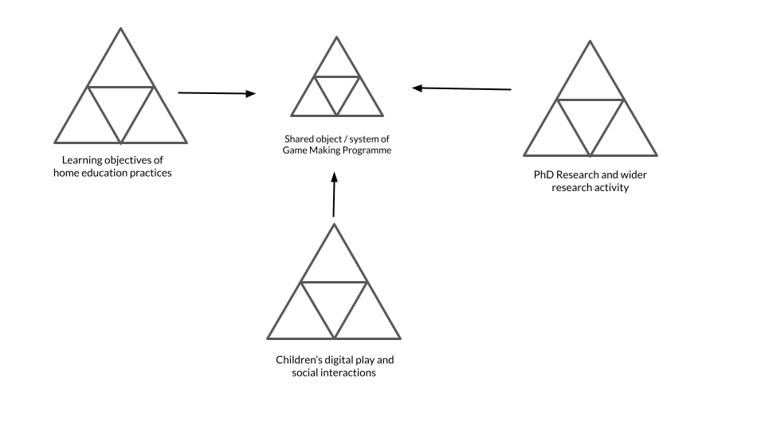
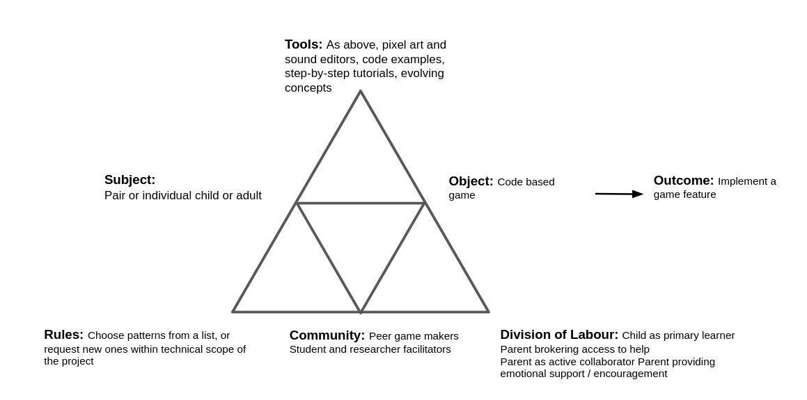
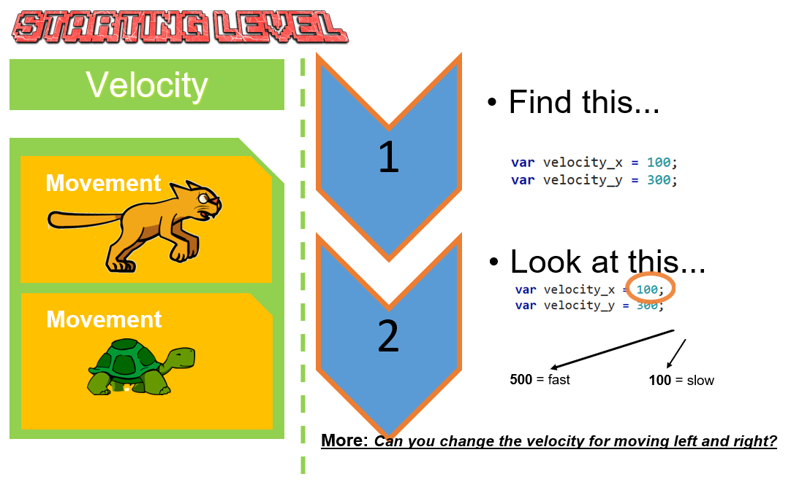

---
# all the regular stuff you have here
zotero:
  scannable-cite: false # only relevant when your compiling to scannable-cite .odt
  client: zotero # defaults to zotero
  author-in-text: false # when true, enabled fake author-name-only cites by replacing it with the text of the last names of the authors
  csl-style: harvard-manchester-metropolitan-university # pre-fill the style
layout: post
number-sections: true
categories: chapter
title: 5. Exploration of the Formative Learning Design Process
---
-   [Exploration of the Formative Learning Design
    Process](#exploration-of-the-formative-learning-design-process)
    -   [Research Questions - April
        2024](#research-questions---april-2024)
    -   [Chapter Introduction](#chapter-introduction)
    -   [Vignette and broad analysis using an analysis of activity
        systems](#vignette-and-broad-analysis-using-an-analysis-of-activity-systems)
    -   [Narrative exploration of
        contradictions](#narrative-exploration-of-contradictions)
        -   [C1 - contradictions involving the use of game programming
            and asset authoring
            tools](#c1---contradictions-involving-the-use-of-game-programming-and-asset-authoring-tools)
            -   [Using a starter game template within a code
                playground](#using-a-starter-game-template-within-a-code-playground)
            -   [Creating key affordances](#creating-key-affordances)
                -   [Use of game assets](#use-of-game-assets)
            -   [Resolution of C1 / LINK](#resolution-of-c1-link)
        -   [C2 - Contradictions associated with project navigation and
            use of
            documentation](#c2---contradictions-associated-with-project-navigation-and-use-of-documentation)
            -   [Description of contradictions related to
                documentation](#description-of-contradictions-related-to-documentation)
            -   [Forms of Documentation which addressed
                contradictions](#forms-of-documentation-which-addressed-contradictions)
                -   [Quick Start Cards](#quick-start-cards)
                -   [Structuring instructional tutorial resources and
                    code
                    snippets](#structuring-instructional-tutorial-resources-and-code-snippets)
            -   [Resolution of C2](#resolution-of-c2)
        -   [C3 - Responding to tensions and barriers in cultural
            aspects of the game making
            activity](#c3---responding-to-tensions-and-barriers-in-cultural-aspects-of-the-game-making-activity)
            -   [Social coding processes](#social-coding-processes)
                -   [Remixing, peer learning, and choice of starting
                    template MERGE
                    UP](#remixing-peer-learning-and-choice-of-starting-template-merge-up)
                -   [Use of side missions to encourage varied creative
                    practices](#use-of-side-missions-to-encourage-varied-creative-practices)
    -   [Chapter Discussion](#chapter-discussion)
        -   [On Affordances, DS and DBR ( using the argumentative
            grammar of 3GAT /
            DBR)](#on-affordances-ds-and-dbr-using-the-argumentative-grammar-of-3gat-dbr)
            -   [Comparing to Microworlds & constructionist design
                priniciples](#comparing-to-microworlds-constructionist-design-priniciples)
            -   [The potentially awesome impact of lifting the lid on
                authentic technologies
                -](#the-potentially-awesome-impact-of-lifting-the-lid-on-authentic-technologies--)
        -   [Rising to the concrete - the emergence of GDPs as a germ
            cell of
            activity](#rising-to-the-concrete---the-emergence-of-gdps-as-a-germ-cell-of-activity)
            -   [Synthesis effect of UMC + collection of
                GDPS](#synthesis-effect-of-umc-collection-of-gdps)
            -   [and what this synthesis has to say about participant
                agency - OR MOVE
                UP?](#and-what-this-synthesis-has-to-say-about-participant-agency---or-move-up)
        -   [Link to next chapter/s](#link-to-next-chapters)
    -   [Parking Lot](#parking-lot)
        -   [Perhaps reintegrate above](#perhaps-reintegrate-above)
            -   [MOVED LINK - Applying activity theory to surface
                contradictions and design tensions experienced by
                participants and
                facilitator/s](#moved-link---applying-activity-theory-to-surface-contradictions-and-design-tensions-experienced-by-participants-and-facilitators)
            -   [Notes from vignette](#notes-from-vignette)
            -   [Notes before C1](#notes-before-c1)
# Exploration of the Formative Learning Design Process

## Research Questions - April 2024

~1. What pedagogical tools and processes are available to support novices to overcome barriers to participation in game coding processes?~

1. What ~barriers~ areas of contradictions arose in participation in this research's game coding processes and what pedagogical tools and processes are available to address these contradictions?
2. How can game design patterns support the development of coding practices with novices?
3. How can learners build agency in an evolving community of game makers?

*A note on style*

This chapter contains a large number of headings in draft form. These will be replaced with introductory sentences when structure is stable.

## Chapter Introduction  

This chapter contains a high level of detail on the evolution of the learning design to situate the findings of the next chapters and to allow the design to be by other practitioners and researchers in this area. The format of this chapter can be conceived as a design narrative [@hoadley_creating_2002-1]. To do to this I include narrative descriptions of shifts between phases of design as it mutually evolved over time. The concept of design narrative emerged within DBR as a way to communicate the important detail of context [@hoadley_creating_2002-1; @brase_knowledge_2024; @bell_theoretical_2004]. In line with discussion of Chapter 3, this process is augmented by adding argumentative grammar of formative interventions prposed by the Helsinki school.

<!-- In particular, the evolution of the key pedagogical features is analysed via  emerging tensions between system elements in learning design. Exploration of the shifts in the design of the intervention is done via a development of a design narrative which explores the driving forces behind changes in the design of each phase. -->

In Chapter 4 I described phases of delivery of the formative intervention in the form of a family game making programme. To begin this chapter I describe activity by identifying activity units/systems, system elements and the complex nature of the object of activity at two scopes of activity using the context of vignette. I then take a wider focus including technical and social observations from my research journal, additional session notes, and analysis of created artefacts of games and documentation to continue the design narrative via an in-depth analysis of three key areas of emerging areas of contradictions in activity and resultant interventions which addressed those contradictions. The three main areas of contradictions are explored in this chapter are as follows: in use of software tool use in P1 and P2, those associated with project navigation and the use of supporting documentation in P2, and finally contradictions surrounding participant identity within the game making activity.

The discussion section of this chapter begins a synthesis of concrete issues arising in the evolution of the learning design drawing on key foci of 3GAT namely, double stimulation and its relation to participant agency, and the process of rising to the concrete through exploration of a germ cell concept (in the form of implementation of gameplay design patterns).

## Vignette and broad analysis using an analysis of activity systems

<!--
[Link to online version here](https://docs.google.com/document/d/1vYeVxYaRMTWPDOHwC4DEGYAkGPRIDX7wLiz0l8b7LWc/edit))

Toby's vignette is online - needs moving
NEED TO MOVE THIS TO MARKDOWN
-->

This section begins analysis of the learning intervention by elements of two scopes of activity system via an illustrative vignette included as an appendix of this chapter as Appendix 5.t. The wider of the two activity systems explored in this section is represented in the two figures below, firstly as an activity stemming from the intersection of wider activity systems in Fig 5.x , and secondly as an activity in its own right in Fig 5.x

<!-- focusing on research goals on the part of the researcher, learning computing skills and concepts as a home education project and finally a broad aim of fun on the part of the children participants. -->

{width=95%}
Figure 5.x - Broad Environmental Activity Systems

The figure above is necessary simplification of the sources of diverse cultural and contextual factors that feed into the new shared activity system.

Addressing the activity system represented below in fig 5.x, the scope of activity takes as a subject the community of individuals in the room during the game making sessions. this includes parents, children, student helpers and myself as a researcher / facilitator.

<!--
Other relevant objectives of re include: a desire to create a useful learning experience on the part of student helpers; participating with other home educators in a creative environment and thus building team and communication skills;. -->

<!-- NOTE
THINK CLARIFY TERMS OF SUBJECT, COMMUNITY AND OBJECT /OBJECTIVE - THINK ALSO DESIGN ARGUMENATION -->

<!-- Within activity system at the scope, while there is a nominal shared object to the main activity to make games together, the community contains diverse actors with multiple objectives. -->

{width=95%}

Fig 4.1 : Activity system 1 - an emerging community of novice game makers community making games as a learning experience

To help situate a description of this system explored, I draw on illustrative extracts from vigette 5.t of game making activty. Before the  description begins, the participant, a child Toby, has been working independently on the design of a platform game for the first 5 minutes of the session. Then, in my role as session facilitator, I make a short opening announcement drawing the participants attention to the showcasing of their games to students in the building's foyer to help focus their attention on completion of their games.
During the course of the session Toby invites many other group members to play his game. He initiates and responds to conversations around the difficultly of the game he has designed. The more immediate audience of his peers is clearly important to him in guiding his design decisions. This immediate and tangible audience for the evolving games as well as the programmes target  showcase event where the created games were shared in arcade cabinets to an audience of university students and staff.

{width=90%}

While the object of activity has been framed via participation in the programme as making a game togther, analyis reveals a mulitifacted object in line with a 3GAT interpretation. Work on the object at this scope involves the use of physical computers and varied software tools to develop a code and varied game assets. The in-session audience and peer group drove some additional motivations, one of which being playful and social interactions between participants became quickly tangible. Additionally, in P1, the object of the activity for the community needed to expand to include a focus of the evolution of a group working process of pedagogy to address tensions in the fledgling design.

<!-- The concept of idioculture is used in this study to deepen the description of the community dimension of 3GAT. -->
<!-- GDPs ( conceptualised here as game design patterns), which while often implemented on an individual or pair scope, were also fed back into community activity.  -->

<!-- IS THIS RELEVANT HERE? -->

<!-- These feed into the contradictions which emerge at this level of activity. -->
<!-- IS THIS NEEDED? While the programme had a shared objective of making a game, there were tensions brought by the cultural factors and other objectives imported from other activity systems. The third contradiction explored in this chapter explores those tensions (including? ....). -->

<!--
NOTE - More on large scope in AT terms? What is needed here? -->

Returning to the vignette, for Toby's his imagined audience of players appears to drive a close attention to the challenge and variety of the game playing experience in the specifics of his level design. Toby's activity in this vignette could be broken to two main actions: one being to alter the existing level design of the game by changing the placement of game elements, the second to add a new game design pattern to his game by add new code structures. Following Barab and colleagues, who justify analysis of smaller activity systems in their study of a technology rich learning environment [@barab_using_2002], I analyse the implemention of these game design patterns as activity systems in their own right, rather than the implementation of features as being interpreted only as sub-actions within the wider activity. At this second smaller-scale activity system the   subject is an individual or parent/child paring and the driving motivation is to change specific features to individual games as represented in  Fig 5.x below.

{width=95%}

Fig 5.2 Activity system 2 - Constructing a game feature by feature

<!-- ( NOTE - or at least as as a key unit of analysis).  -->

By this stage, P2, Toby uses a variety of tools in the process of coding and testing his game including: a web based coding tool (code playground), a game template which he has used as the base of his game project and, a menu of documentation linking to code examples and tutorials.

One benefit analysis at this scope is that it allows detailed examination of contraditions in mediating processes involving tools use by individual or pair work, and the resulting  expansions in the object, further increasing the complextity of the object at the wider community activity scope. This expansion is not limited to technical or software based aspects, but includes diverse element of an emerging idioculture.  The later section of the vignette shows evidence of this evolution including variations in the games created and social patterns of interaction.

Additionally, implementing more complicated gameplay design patterns involved several stages and varied tools. Those stages to be viewed as sub-actions to the motivation of applying a GDP. Using the terminology of Leontiev [-@leontiev_activity_2009], Toby can be seen undertaking certain chains of processes in a fluid way that shows that actions had become operations The commenty of Vignette 5.t provides for specific examples.

Finally, the implemenation of GDPs can be viewed as a germ cell concept, thus meriting this detail of analysis.  

## Narrative exploration of contradictions

Following the summary of activity above the main sections of this chapter explore three main areas of contradictions are explored. Given the novel nature of the learning design and the technical nature of learning to code, the first
area of contradition explores the use of software tool use and their expansion between P1 and P2, the second deals with issues arising associated with project navigation and the use of supporting documentation in P2, while the third explores barriers of participant identity, a topic represented as having high validity in research explored in the first two chapters.

### C1 - contradictions involving the use of game programming and asset authoring tools

In this section, I draw on journal notes to describe emerging tensions in the activity of kickstarting participant coding activity and the subsequent evolution in tool use between P1 and P2. A key motivation driving my initial interaction with participants was to facilitate an inclusive environment to explore the process of making games. To do this, in P1 I used several open, non-coding processes to scaffold a game design process. Early sessions involved, discussion about what makes a good arcade game, brainstorming on game story scenarios, tinkering with pixel-art character making, making craft collages for game backgrounds. I also lent learners a laptop loaded with vintage arcade and console games to help build familiarity with arcade and retro game tropes. As scenes and characters began to emerge we then discussed what game features they would like to add to their games in terms of what their characters should be able to _do_ on screen. It was only in week five of P1 that that I introduced the coding tools and processes. This delay was driven, in part, by my hesitation to intoduce computer coding too early in the process, as I expected tensions between the need of participants to use code and code authoring software to create games and their limited skills and experience in using them. This area was further complicated by my own motivations for working with open source, authentic text language, in the from of JavaScript.

My previous research had explored the use of interactive, personal media creating using webpage languages of HTML, css and JavaScript [@chesterman_webmaking_2015]. I was keen to explore the potential of game authoring within a similar environment. As such, I drew on the documentation of the Mozilla community and selected Phaser as a JavaScript game making framework and Mozilla Thimble as a code playground (concepts explored in the literature review). A fuller technical break down of the tools used in each phase is omitted as it interupts the flow of this narrative but it included as Appendix 5.tech.

While the use of a code playground simplified this the process of publishing and editing, The need to use a text coding processes to enact game changes began to create a set of accululating tensions.

Firstly there was a gulf between the changes participants imagined and their inability to enact them which cause frustration at times. To address this, groups began to specialise with some taking on the process of coding while others worked on graphical game assets (both digital and physical), others planning narratives and gameplay features, some working on sound elements. However, at times participant expectations exceeded a realistc scope for the game making project, a tension explored in more details in Appendix 5.bee

Additionally, the informal nature of this learning setting encouraged me to prioritise approaches which avoided written or to whole class instruction. My initial feeling about this aspect was supported by experiences in P1 documented in my journal. An  attempts to convene attention on a presentation screen for instruction based teaching to class uncomfortable, stemming from my judgement that these interventions to be unwelcome interruptions for the participants making activities.

**input of parents as organisers**

As the sessions continued, with many creatively processes happening simultaneously, and without a clear plan on how to integrate these disparate elements to pull the projects together, I became overwhelmed dealing by the group dynamics and technical demands on my time. Reviewing my notes and email interactions from this time, I note a key exchange between my self and participants after one session where I share my feeling of being out of my depth. In this email (in P1 extended design narrative) and asking parents for support in organising and bringing more order to group and planning processes.

<!-- "It was a bit of a hard session for me on Wednesday as I was a bit low on confidence about how to pull all of your creativity into a finished game! It started to feel like a bit of a fantasy!" -->

<!-- A crisis point developed (despite the input of parents) to help an organisational process. While participants were being supported to develop assets in the form or game characters and ideas for features were being documented via lists, participants  did not have a working either a working knowledge of the tools used, or a process to start to build that knowledge. My own process of self research and informed tinkering drew on years of experience and was therefore not suitable as participants did not share those coding repertoires or familiarity with coding tools. While the suggested tools were theoretically available to the participants online, they were therefore stuck nevertheless.  -->

In terms of a representation in a activity system, we can express this as a developing tension between the tools available to the participants and their objective of actualising their ideas and graphical assets in code form.

{width=95%}

In response to my email, parents made suggestions from parents in P1 include: use of a visible and shared list of game features that are being worked on, documentation to support the implementation their requirements, and more hands on use of tools before beginning the planning process. To address the last point, I worked with groups to help them adapt a game template from phaser tutorial and input their own graphics to at least create a static prototype / sketch of the game.

The group planning process improved, and the self-organisational abilities of parents and tenacity of young people involved developed. Groups creating wish lists of game features and requested support to implement them. I gave this help directly coding with participants and which if I thought the process would be useful to other groups I created a help sheet for that feature which built on the suggested template. However, by this point so many tools and had been introduced that the process also seemed overwhelming for participants, a feeling which is relfected in participant feedack for P1 in in Appendix 5.P1.feedback and in particular Vignette in Appendix 5.bee. As an example, when offering feedback to address her family's feeling of isolation from the coding process, the parent of the family had requested more hands on play and use of the tools of production before being called on to make creative decisions.

<!-- **Summary of design challenge**

 -->
<!-- A starting toolset was needed to start this process.  It should rather than  inventing a simplified code language or inauthentic novice oriented tool,  -->
On completion of P1, I reflected on the design challenge involved to address several areas contradictions that had emerged in my journal observations and participant feedback.

The overall learning design should maintain  positive affect towards to the object being worked on but engage in hands-on coding using authentic tools early in the process to avoid unrealistic expectations. The template should help novices with embedding affordances which helped participants build code familiarity without needing explicit instruction. Supporting documentation was needed but should not interfere with the flow of participants experience. Finally, the overall learning design should encourage appropriate social learning, peer support and reflective practices but again without overly complicating the object of activity or interrupting the flow participant making.

Three sections of this chapter describe different facets of these contradictions and interventions to address them. This, the first, tackles key transformations in use of primary tools, those used to directly achieve the task. The second addresses the area of help resources, documentation. Finally other support process to support emerging social coding processes are examined.

<!-- This challenge was brought sharply into focus by a particular conflict experienced by one family in particular. -->
<!-- As explored in the literature review, an extensive body of research on the design motivations and impact on learners exists for the creative coding tools Scratch.  -->

<!-- NOTE INTEGREATE HOW DESIGNING FOR AUTHENITITY IS A CHALLENGE HERE WHICH IS ALIGNED WITH PBL AND EXPERIENTIAL THEORY, FORESHADOW SHARED DIMENTIONS OF AUTHENTICITY WHICH ARE EXPLORED LATER. -->

<!-- I took care to screen participants from processes and tools that were unrealistic for novices to use. -->

<!-- NOTE - PERHAPS EXPLORE COMPLEXITIY OF IDES AS A BARRIER IN RESEARCH - SEE BLUE JAY AND GREEN FOOT TRAINING IDEs -->
<!-- In the activities of study, a high degree of authenticity made possible, in a material sense, by the digital nature of the learning resources. Beyond a general purpose computer, no prohibitive equipment is needed. -->

#### Using a starter game template within a code playground

Addressing the evolution in design and use of code and asset authoring tools, while the code playground and the code template within in it are two separate tools, from the perspective of the learner, they were experienced jointly. As such, I cover them together in this section.

<!-- **Code playground.** -->

The initial use of a code playground and starting template was based on my previous experience of teaching javascript to novices [@chesterman_webmaking_2015]. Code playgrounds, as described in chapter two, are an online environment used to test, share or invite help from online users on complete or partial code projects or problems. They are used primarily for web-based project involving the technologies of HTML, css and variations of JavaScript (for more detail see Appendix 5.tech).  

The use of code playgrounds by novices can mitigate against some of the initial challenges provided by learning computer coding stemming from  unfamiliarity with and potential complexity of code authoring tools and environments [@guzdial_programming_2004]. Tactics to mitigated against challenging elements include steps to reducing syntax errors, shielding complexity, facilitating community commenting, sharing, remixing and other forms of collaboration.

In D1 I proactively reached out to Mozilla to ask about the future of Thimple, my choice of codeplayground, and was informed that it would soon be _sunsetted_ (discontinued) due to end of funding. Their suggested replacement Gitch.com had a wider user base (beyond educators) and similar functionality.    

<!-- **Starting template** -->

As I moved to Glitch.com I also redesigned the starting code template of a game of the  _platformer_ genre (see glossary). To do this a draw on three online tutorials site and made key changes to make the code more readable to novices, and the structure easier to patch code snippts. The design decisions driving this process is outlined in Appendix 5.tech. The choice to pre-select a particular genre was a pragmatic response to tensions of being overwhelmed by help requests and thus narrowing the range of game features that would be requested. Additionally, to encourage  playful, hands-on experimentation in early stages, a working game template rather purely structural template would be optimal.

UP TO HERE

I draw on a tactic I had used in previous novice coding projects [@chesterman_webmaking_2015], of highlighting to learner easy code changes which would have a large impact on the end project, and which ideally they would be motivated to undertake. Thus for the P2 starting template, when learners tried to play the starting platformer template game, I intentionally set gravity and jump variables so they were able to jump over a hazard but unable to jump up onto the first platform. At this stage, players needed to click a remix button, and alter the underlying code to progress in the game. Kynigos and colleagues [-@kynigos_children_2018] explore this concept as a half-baked games where incompleteness or bugs in behaviour are a provocation to participants to correct or to further modify them. This process also aligns with the motivations and techniques of the UMC framework explored in the literature review, in particular the guideline to "create choices that show visible and immediate changes" [@lytle_use_2019-1, p. 6]. This rapid transition from the _use_ to _modify_ stages forced at an early stage, allows a careful scaffolding of early coding experiences designed to help overcome negative affect towards text code. The shared underlying game structure limits initial user choice over game genre and design, it also promotes a shared experience for all participants in a way which facilitates and encourages peer learning. This initial change and the alignment with UMC and half-baked design approaches, drove me to select other key affordances in the form of simple code changes which I explore after a summary of the structural design of the game template.

<!-- {width=95%} -->
<!--
 -->

{width=95%}

Figure 5.code glitch coding environment

Figure 5.code outlines a typical early view of the starting code project. The project consists of several interlinked files code and asset files (see glossary & appendix 5.tech). The typical view of Glitch.com project that learners interacted with had three main menus. First on the left options to change project settings, an assets link to  manage image and audio files and list of project files listing JavaScript, HTML, css. Second a central code window with code, comments. Thirdly a game preview on the right where changes to the code were immediately updated in the resulting game project.

REPLACE WITH A, B AND C AND ADD TO DIAGRAM?
The main

1. Javascript file which participants alter to make changes to their game
2. Html page within which the game is embeded (not usually altered by participants)
3. Css style sheet (not usually altered by participants)
4. Code editing area
5. Game preview area

While access to HTML and CSS files of the base project was available in the left menu as show in  by default participants would see only the JavaScript file names game.js .

It is of value to restate the positive impact of key design features here which align with extensive constructionist research creating simplified coding environments for novices. Immediate feedback, structured support in managing asset files, the online nature of projects allowing immediate peer testing.

<!-- follow the Use-Modify-Create model to build familiarity with and to scaffold the adaptation and use of coding constructs [@lee_computational_2011]. -->

<!-- In phase one, I noted that any addition to the game in terms of adding new any quantity of code created many potential coding, conceptual and organisational challenges. To counter this I adapted the starting game template to allow changes in code were relatively easy to perform but which resulted in potentially large changes in game behaviour and appearance. -->

<!-- NOTE SOME OF THIS CAN  -->
<!-- I kept the process informal and responsive by allowing participants to choose which one they wanted to work on next. The following sections outline different areas and patterns of activity. -->

<!-- COMMENT OF mOZILLA TOD THAT IT WAS GENTLE FACILITATION -->

<!-- - level design and prototyping: use of
- fluid variable editing effective movement
- The swapping of assets and more complex work with code syntax
- development of simple stories to bump personal expression and narrative -->

<!-- NOTE - All longer or shorter chains of actions , becoming operations - WHERE DOES THIS FIT?
NOTE - Also justify having so emergent results here , delay while accessing help to start 360 recordings
As the end process is visible in fluid behaviour -->

<!-- These tools align with some key design considerations. [Brennan & Resnick]
- Well suited to build a repeated design practice.
- Small changes had big effects.
- Variable changes needed immediate testing.  
- Especially with starting documents, -->

<!-- While the design suiThis took the technical form of  a webpage
ts repeated design practice as illustrated by the example above, not all pairs or individuals interacted with GDP in such a neat way.
A later discussion section in this chapter illustrates a more complex interaction with design stages. -->
<!-- The choice of the starting toolset and mission shapes the balance and profile of initial community activity. -->

<!-- Make point that it is hard to separate out tools and communities. In case of Mozilla, code playgrounds, and teach the web, and the culture of developers and teaching communities they are interlinked. Discuss and compare to Kafai in book, the lineage of Logo, Scratch. Instead the more authentic approach of a real language.
-->

#### Creating key affordances

**Variable editing for player movement**

To accelerate and support the experimentation of users, I identified changes to the code that were easily recognisable game experience features and where small changes could provoke a high impact on the game experiences. These include changing gravity, altering the player jump height and walking speed.

The starting template began with the game in a broken state thus inviting players to modify the game to fix it. The player's maximum jump trajectory was not sufficient to progress via a jump to the first platform. To progress, participants needed to change alter at least one of the key variables were highlighted at the very start of the game code (see Figure above).

The process here began with me imagining what would be a good feature that players would notice and be spurred to change. Here, the deliberately unsuitable game variable is a key affordance of this half-baked game template.

Descriptions of other under-developed features inviting improvement follow including level design and the use of minimalistic graphical assets.

<!-- I adapted my design with an aim to increase speed and consistency of feedback from learner input, reduce coding syntax knowledge needed to progress, and thus reduce learner anxiety for novices.  -->

**Level design and prototyping**

<!-- The possibility of disturbing the syntax of the  of code in the array. When participant did this it provided a good opportunity for facilitators or parents to outline the importance of correct syntax of and to explain the code structure. -->

The use of a graphical grid structure to edit level design helped balance concerns of accessibility with the use of authentic code language.

Platform games often conform to certain patterns in terms of the elements involved commonly including: a player that you control to movement of; platforms to be jumped on; hazards to be avoided; and rewards to be collected.

In P1 the suggested process of adding game elements was relatively complex which involved changing parameters of functions to alter to adjust their location. An example of the code needed is included one of my tutorial chapters / appendix 4.x [^7]. Complexities included: each element needs to be added separately with code elements required in three different areas of the code template, adding x,y coordinates to place each game elements was; difficulties concerning adding graphical elements of different sizes. These complexities created frustrations in the game making activity P1, in particular as project became bigger cod became unwieldy and confusing to alter, causing a negative impact on the testing and revision process in particular.    

Key research on toolsets for novice coders advocates a visual approach to facilitate the coding multi-media projects for novices to address such complexities[@guzdial_programming_2004; @resnick_scratch:_2009]. This is achieved via techiqued which include a drag and drop approach in Scratch or via a concept called tilemaps [@erhard-olsson_procedural_2018] used in GUI oriented game making tools (Unity, Game Maker etc).

While, these tenhiques were not possible in this text-based environment, in P2 I revised the added  the possibility for a visual design approach via the use of a a grid coding format (see figure 4.x below), thus  replicating a tilemap technique within the text code format.

<!-- OPTIONAL ADD AND APPENDIX ON LOAD LEVEL? -->

{width=95%}
Figure 4.x - Grid based editing of level design with a simple key for hazards, coins, and platforms.

**Black boxing the process of placing assets:**

Technically, this approach involves the construction of a data array for each level of 17 blocks which can be one of the following: x (platform); h (hazard); o (coin); or could be left blank (see Figure 4.x above). The grid structure of text-based array, had a strong visual correlation with the resulting game layout. Changes to the text based grid in the code area on the left would be immediately seen in the right hand project preview area.

This solution abstracted away complexity and repetitive nature of asset placement via multiple asset placements  to prioritise ease of use to help sustain participant engagement.

Thus, here a technical approach helped resolve tension between immediacy of feedback and ?

Via quickly adding design possibilities to change levels design.

This adaptation had a positive impact on engagement with level design in initial stages. Many participants spending significant time and effort undertaking many iterations of changes to the level design ((Is this something that can be given figures to? Perhaps for one session?)).  An illustrative example of the impact of
is explored via a vignette in appendix 4.x where child participant Toby designs many levels. The goal seems to be to make the game challenging and to add many levels as a way of making his game distinct from others (include BETTER SUMMARY). Participants varied in their approach to level design, some drew on their experiences to mirrors platform game conventions, while others enjoyed working against these conventions, a theme which is explored in more detail in .

<!-- The possibility of disturbing the syntax of the  of code in the array. When participant did this it provided a good opportunity for facilitators or parents to outline the importance of correct syntax of and to explain the code structure. -->

EDIT DOWN MOVE LATER DISCUSSION
The evolution of the starting template aligned with UMC approaches; constructionist design heuristics; and the concept of affordances understood from a socio-cultural perspective as 'technology affordances as possibilities for human actions mediated by cultural means' [@kaptelinin_affordances_2012, p.927].  

##### Use of game assets

There has been extensive research supporting the motivational value of the ability for young people to bring their interests into multimedia creations via choice of assets and narratives [@kajamaa_digital_2018; @resnick2014give; @peppler_supergoo_2007]. My observations supported these findings. Indeed, I observed a strong palpable a sense of achievement and satisfaction when participants succeeded in seeing and hearing their creations in their game after making the final changes in code. For some, this sense of a achievement appeared magnified by difficulty caused by the unfamiliar environment and processes. As if they almost couldn't believe they had made an impact on the game world via interaction with such an alien language.

I now outline and discuss the evolution of the use of simple block graphics, the use of pixel art  authoring tool, and wider asset creation approaches.

<!-- EVIDENCE? - code for this? -->

<!-- This aligns with educational research of the value of incorporating Funds of Knowledge into technical learning environments [Cole etc]. -->

<!-- While the value of this process seems clear from existing research, it presented challenges and design tensions in this learning design. -->

**Simple block graphics**

In P1 a template based on tutorial used stock graphics of a astronaut collecting stars on platforms resembling earth and grass. In P2 starting graphics consisted of colour blocks. Their size of 32 x 32 corresponded to the default project size of Piskel (the graphical pixel art editor) with an aim to was also design to reduce technical friction. One of the complications encountered in P1 was the differing sizes of sprites created using different graphical tools. I helped resolve this for participants by matching the size of the block in the grid level design structure described above to the default size of sprites created in Piskel (32 x 32 pixels). This is one example of one of the  technical alignments which addressed and helped resolve practical obstacles that participants experienced.

The pixel art tool used, Piskel, proved to be intuitive for many younger participants with three main areas: a set of editing tools; a canvas for creation; and a set of tools to export, save and import work (see Figure 4.x).

{width=95%}
Figure 4.x - Interface of Piskelapp tool

The template's use of minimal starting game assets invited creative addition by participants, again aligned to the half-baked approach. At the same time however, the overall simplification reduced and therefore rebalanced time spent on to this activity compared to other game coding processes, thus helping resolve one of the tensions emerging in P1.

**Distributed approach to asset creation**

Tools like Scratch [@payne2019music] adopt a self-contained to audio and graphical asset creation and provide a library of prebuilt assets and tools within the environment thus reducing possibility for errors and complexity caused by the compatibility of file formats, migration and management of external asset files. While the code playground Glitch provided some tools to help manage files, it could not create or edit audio or graphical files, requiring the use of external asset creation tools.

In line with existing research, in P1 I observed participant showing a high motivation to incorporate assets based on their hope interests. Responding to the enthusiasm of participants in asset creation, I had introduced six software tools to participants including tools for pixel art, sound editing, sound creation, In addition I also encouraged collage creation to create a physical background to the game and then scan that to create a digital image. A table of the different tools and processes is included as appendix 4.x  

I was concerned that in P1 the diversity of asset creation tools approaches was over complicated creating an increased burden of learning different software, reducing the shared experience helpful for peer learning and risking distracting time and attention from coding activities. Thus, in P2 I reduced the number of suggested assets creating tools suggesting Piskel and an online audio effects generator (bxfr ?)

Participants would identify the need for an asset in their game. They would then use the separate software to create that asset, and the be supported to save assets to their computer's hard drive in a compatible format. They would then need to upload assets to the code playground environment, discover the text link of the asset, and then insert that link into the main JavaScript game file at the relevant line of code.  

The forced choice to use a distributed toolset rather than black-boxing asset management and migration led to benefits in developing key digital literacy needed for web creation. The strong motivation to see your assets in the game drove participants to building fluency (aligned with Webmaker ethos) as undertaking the full process involved learning a complex chain of these individual actions. Some participants became remarkably adapt at this, thus transforming this chain of actions into a fluid operation.  

OPERATIONS - WHERE
THIS IS THE PLACE - MOVE OTHER MENTIONS HERE IF POSSIBLE

<!-- For example, the processes of replacing a block image with a bespoke pixel sprite which comprised: file downloading; file migration using the browser and file manager; browser tab navigation; graphics tool use in Piskel; copying and paste text code; and selecting more than one lines of text code with mouse or keyboard shortcuts. -->

MOVE?
Participants spent a widely different length of time creating these graphics for a variety of reasons. Some took a long time to master the process of using the editing tool while others created images rapidly but would keep redesigning and recreating their game elements. The process of game art creation opportunities seeding narrative and artistic creativity is explored in more detail in chapter five.

_Seeding narrative and art creativity_
As they had been guided to make a game on a broadly environmental theme, participants often redesigned sprites to games involving animals. The following image shows a whale as a player character and plastic bottles.

{width=50%}

#### Resolution of C1 / LINK

This section has outlined rationale driving the introduction and initial expansion of the form of primary tools in phases one and two of the game making programme. The in-tool affordances were designed to allow a quicker building of participant familiarity with the toolset via aligning with changes which were familiar from home experience of games and which were simple to change and provoking high feedback from the target game.

The change to a half-baked template also reduced the average working group size thus increasing the number of games being worked on as a whole.
This change addressed issues of some being alienated from the group process if not working on the code changes, and also responded to the suggestion of introduction coding tools early to avoid the mismatch between participant planning and the technical limits of the coding possible at this novice level. However, the positive impact also had unintended consequences. The increased number of projects in play increased the demand on my time as a technical trouble shooter of code problems. The next section addresses this tension and other related to the introduction of supporting forms of documentation.  

### C2 - Contradictions associated with project navigation and use of documentation

#### Description of contradictions related to documentation

<!-- The previous section addresses changes to primary tools used to create game code and assets and response to the emerging tensions experienced by participants in P1. -->

The design of the in-tool scaffolding within primary tool outlined in the previous section aligns with microworld concepts [@laurillard2020significance] of affordances guiding learners towards the exploration of key concepts and reduced reliance on facilitator instruction in the use and modify stage of a UMC approach. However, these design changes did not aid participants wanting to implement new features or add code structures into their game, as aligned with the _Create_ stage of UMC.

However, these design changes did not aid participants wanted to create new features or code structures in their game. In P1 and early in P2 this caused delays and participant frustration, as although I could work with people directly to help them I had limited time with each participant or pair.

Additionally , the piecemeal approach to documentation, especially when combined with the disparate approach to graphical and audio asset creation, had resulted in an overly complex object.

Such complexity could be addressed by step by step instruction to build up experience with tools and concepts in a carefully structured way. However, I was keen to align with the motivational potential of hands-on (learning by experience) and choice driven approaches to project-based, STEM education [@holstermann_hands-activities_2010].  

<!-- DOES THE LR EXPLORE THIS TENSION? -->
<!-- PERHAPS? ILLUSTRATE THIS WITH A TRIANGLE - see notes 23.8.24 -->

**Summary of start of resolution**

In the development period (D1) between P1 and P2 I undertook extensive planning of both the starter template and documentation processes. The tension between learner agency and clarity of instruction and support reoccurs consistently in my notes at this time. My thinking was influenced by trials in P1 of whole class instruction of key coding concepts that I judged to be relevant to the whole group. My journal notes reflecting on these interventions were unfavourable, in that learners were not engaged, perhaps not seeing that instruction as immediately relevant, alien to their favoured hands on style of working, and as an interruption to the  flow of their making activities.

However, there had been a request from some from parents in the feedback to P1 (see appendix 4.x) to provide background concepts and explanations of coding constructs.

To address this I wrote an instruction manual consisting of step-by-step series of instructional chapters detailing the structure of the core template. After completing this, I decided its linear structure, which prevented a learner-led approach, was unsuitable for use in sessions.

LINK SENTENCE

The following section outline three main sources of documentation: quick start cards, written instructions and code snippets.

<!--
{width=50%} -->

<!-- As outlined above the starter template and quick activities served to address the _use_ and _modify_ stages of the UMC approach. One seeded into the community, these processes also propagated via peer learning in ways which are explored in chapters five in six. In contrast, the _create_ stage required longer input from my self, to help participants with their individual choices of what to add to the game.-->

<!-- SHIFT? - It is notable that the create stage of this model does not involve starting a totally new game from scratch as is imagined in some interpretations of that model. Due to the complexity of the code base and framework the process of creating a new GDP within the game as a suitable level of challenge. -->

<!-- ##### Linear and stand-alone tutorials and code snippet resources -->

<!-- Longer form step by step tutorials are common in computing education. Examples can be found in Code Academy, and in the education resources of RPi foundation. Many examples talking learners through steps to build a game can be found online with varied amount of explanation of underlying constructs and concepts. I started my journey learning JS games using some provided
by Mozilla and the Phaser developers. -->

#### Forms of Documentation which addressed contradictions

##### Quick Start Cards

During the development period D1, I used the revised template design in a one-off game making with computer trainee teacher computing students. I ended with a challenge to create an activity for one-off holiday activities around creative game coding for families. In response, three students created printable word documents highlighting key affordances of the design in a way which mirrored my facilitation of their game making session. Specifically, the printed resources highlighted the key lines of code and how they can be altered to impact on game behaviour (see figure 5.x below). These _quick start_ cards supported participants initial interaction with the code in a way strongly aligned with the _use_ and _modify_ stages of the UMC framework [@franklin_analysis_2020].

{width=95%}
4.x - Example of a Quick start card

At this stage the options involved, the game mechanics of movement, jumping, level design, and final challenge to swap out the look of one or more of the characters by designing pixel art, and swapping out the line of code that adds the asset to the game. A current version of the quick start cards are availble online at the online technical repository for this study [^] ADD THE LINK HERE.

##### Structuring instructional tutorial resources and code snippets

<!-- BELOW Initially I structured the book chapter participants working their way through the online resources. HOW -->

<!-- While writing self-contained tutorials added a challenge to the documentation authouring process, the documents, especially when printed became a vital resource for this community. In chapter 5 I explore the extent to which these resources can scale for use beyond this context. -->

The quick start process helped resolved a key tensions concerting the issue of providing documentation with support for users to be able complete coding tasks but also facilitate choice over learner pathways. When revisiting the unsuitability of the step-by-step manual created in the D1 development period, I noted that the process of writing chapters yielded an interesting technique. For each new stage, I illustrated the concepts in practice using a new code playground project for each chapter, one which illustrated the key feature being added in as much isolation as possible but within a working game template.

I created a series of stand alone code playground projects which code snippets which mirrored the simplified approach of the quick start cards. Namely, with project listed the different feature it would add to the game and highlighted the snippets of code in the project needed to do this.

Initially, learners were be directed to these stand alone code projects via a list in google docs. But as I rapidly created new projects I then added chapters to the existing instruction manual to act as stand-alone printable instructions to support the implementation of these code snippets[^9].

Each code snippet linked to a descriptive chapter and vice-versa. To help students see the code in the correct structure, I began to create code snippets within code playgrounds and distinct project. These projects shared the structure of starter game template and added only the code needed for the additional requested functionality. My rationale was that each pattern added builds familiarity with the code structure.

<!-- To address this tension, in addition to self-contained chapter focused on instrumental code changes needed to implement game features, I created opening chapters of the online manual which were more traditional in format and explained underlying concepts that the starting template had initially abstracted away from the participants. -->

I also engaged in extensive ideation on my journal about how to best present these choices of features to learners in an accessible an potential playful way. A process of me introducing these print outs and linking them to a physical map is included as appendix 5.map.

**Creating a hub for the  collection of game design patterns:** As introducing diverse forms of documentation and the resulting over complexity of the shared object of activity on a community level resulted in some users failing or struggling to find the right resources online, I designed and introduced a themed hub for both snippets and tutorial chapters. My aim was to mitigate potential learner alienation from unfamiliar technical documentation through accessible design which, in line with x, oriented access to documentation to participants existing gameplay experience rather than underlying coding constructs.

{width=95%}

The use of code snippets, while a promising authentic practice, presented challenges which this careful curation of examples aimed to overcome. As explored in chapter two, while the use of code examples or snippets in code playgrounds is a common professional problem solving practice [@yang_stack_2017], their use in novice learning has limitations including lack of relevant, consistency, being removed from the domain context, and not being structured in a self explanatory way [@treude_understanding_2017]. While I initially encouraged participants to search within examples from the Phaser website, and authentic documentation and help forums, the resulting confusion and difficulties experienced by participants, prompted me to create other more bespoke documentation.  

**Return to vignette**

Returning to the vignette of the child Toby described earlyer in this chapter we can see him use, rather than the written step-by-step help, jump into the code example, searching for the new code constructs and in-line code comments notes in the code highlighting their purpose.

MORE - Toby carefully scans...

Thus, while not proof of overall efficacy of the use of code snippets the pattern of behaviour of Toby in the implementation of code is promising. IN TERMS OF ...

**Theming the collection of gameplay design patterns**

Chapter 2 explored existing research on the use of collection of game(play) design patterns to aid learning game design [@holopainen2007teaching; @holopainen2011foundations; @eriksson_using_2019; @bjork_patterns_2005]. The process of theming the patterns has the potential to develop the community knowledge of game making concepts [@holopainen2011foundations]. In grouping the game design patterns into categories for the documentation hub page, I drew on academic and professional interpretations of game elements [@salen_game_2006; @schell_art_2008; @tekinbas_rules_2003; @olsson2014conceptual] and the emerging list of requests for game features made by my participants. The final categorisation used in P4 is included as a Table 5.x below.

| **Game Mechanics**| **Game Polish** | **Game Space** | **Challenge Systems**|         
|--------|------------|--------------|----------|
| Add Static Hazard  | Add Graphical Effects | Change Design of Levels | Gain Points when Collecting Food |
| Add an Animated Enemy  | Add Sound Effects | Add More Levels | Add a Timer |
| Jump on Enemy to Zap them  | Add a Sound Track (Music) | Change Shape of Levels | Collect all Food before Progressing |
| Double Jump  | Add a Game Story with Messages | Change the Background Image | Power up - Higher Jump |
| Moving / Patrolling Enemies  | Add a Game Story with Messages | Change the Background Image | Power up - Player Speed |
| Moving / Following Enemies  | Animate your Players Movements | Key and Door | Random Doubling Enemies |    
|   | Make Player Immune |  | |    

Table 5.x Categorisation of game design patterns used in P4.

 The fuller process is explored in the extended design narrative in appendix 5.dn.

#### Resolution of C2

This section has outlined two key forms of secondary supporting tools which were put in place in response to new tensions emerging after the introduction of primary tools described in the previous section. While the code snippets, hands-on instructions and chapters introducing underlying principles still presented problems, as explored in vignette 6.S with Suzanna and T in, the video data explored in the following chapter shows an increase in practical ability to implement game features and thus in instrumental agency. As the motive at the smaller AT2 level of activity, stems from a choice of patterns, this transcends an instrumental agency. At P1 and P2 participants make requests to me as a facilitator that can not be implement using existing documentation which I find them to be suitable (explain how), are added to the menu of game design patterns. This can be expressed as both relational and authorial in the framework of agency explored in Chapter 3.

LINK & MORE SIGNPOSTING?

### C3 - Responding to tensions and barriers in cultural aspects of the game making activity

<!-- ### Design narrative on conflict due to identity clashes and dysfunctional group work -->

**Participants alienated - clash of cultures ,clashes of identity not hard core coders, no on-going playtesting,**

**Participants stuck / demotivated : scope of ambition to high,   collaboration groups too big (transition),**

The example of Toby's coding practice example in P2 is promising, however other varied experienced existed. In P1 there were particular issues of alienation from the process which align with issues of cultural exclusion from coding processes explored in Chapter 2 [SEVERAL REFERENCES] [@kafai_constructionist_2015-1]. As explored in a previous section, in P1 my opening design employed several non-coding techniques to promote positive affect to form an inclusive idioculture to avoid alienation from foreign coding tools.

<!-- These activities including starter games and game playing on entry and sharing of gaming experience of let laptops with games installed on them. -->

While these were noted as positive in P1 feedback, as previously explored above and in Appendix 5.a,  one family chose not to continue in the extended period of P1. Their experience can be presented as a conflict composed of accumulating tensions from alienation from the group coding environment and associated peer working dynamics. While there were technical aspects to the conflict, these were compounded with more social and cultural barriers that also arose.

**Summary of the conflict**

It was the transition from the non-code creative activities to enacting them with code that spurred alienation from a perceived culture of hard core coding at that stage of the process. I had not noted that alienation perhaps as I was busy trying to solve the code issues of others.

Thus, several tensions compounded for this family to create a conflict which they resolved by choosing not to continue with the activity.

Alienation from the group process of building a game

{width=95%}

Fig 5.x - Tensions involving cultural aspects of the game making process

This surfaced some key matters of concern for this design. Firstly, the fragility of learners ongoing positive affect towards the group game making process caused by a transition from planning, sketching phase of the design process to code enactment.  Secondly,  a danger that those more confident in coding create more involved code problems that need more facilitator time, potentially making others feel less valued. Thirdly, it highlighted the limits of what peer support from fellow participants could provide (explored in appendix).  

**3d bee element summary or similar?**

This conflict partly drove one family to not continue and extended period of making in P1.
Members of this family had engaged in planning on paper and in particularly in creating pixel art, however tensions began to emerge when the introduced code framework framework did not support the desired features of one child. The feature they wanted to add to the game was bee design roaming a 3D landscape.  

In participant feedback, the  parent of one  family described in Appendix 5.x indicated that it took too long before in the planning stage and called for more hands on play and use of the tools of production before being called on to make creative decisions. The parent likened this to an arts studio approach.

The feedback given in particular by this family served to underline the importance of motivate several changes in the learning design in the plane of cultural activity. While Chapter 7 analyses the participant reactions to the design in this more cultural dimension, here I (try to) limit exploration to the evolution of key learning design features addressing this aspect, namely the identification and nurturing of social coding processes.

<!--
NOTE MOVE
Chapter 6 analyses the potential of activities which help build the participants sense of their own identities of game makers in more depth, in particular in relation to dimensions of participant agency. -->

#### Social coding processes

While changes in the tools, documentation use were initially designed to solve technical problems, they also impacted the culture of the coding group.
In particular the starting template/ half baked template, had particular impact on division of labour, and a knock on positive impact on general engagement.

DOES THIS GO EARLIER?
Despite relative simplicity of the highlighted affordances, complex and divergent style and feel of games emerged at these early stages and the use of collection of code examples that participants could choose prompted greater diversity still. In particular the starting template had particular impact on division of labour, allowing participants to work by themselves or with a family members, this had a knock on positive impact on general engagement.

The value of peer social experiences which emerged naturally at in P2 was such that for P3 I sought to intervene gently to encourage them.

<!-- In journal notes, I observed that the shift of process in terms of division of labour from  P1 to P2 afforded by the introduction of a _half-baked_ template. The use of a starting template and scaffolded use and modify early activities increased the number of games being made as it reduced the typical working group to individuals or pairs. -->

Starting from a playable if incomplete game and adapting it, greatly increased the amount of time participants spent playtesting their own and other games. I noted my own concern if errors compounded to make the participants game unplayable for any extended time. In video data, participants show frustration if not able to playtest game due to errors (for a clear example see Olivia and Suzanna's frustration in Appendix 5.x.)

My broad observations align with / EXTEND? the supported benefits outlined in research on the Use-Modify-Create (UMC)  [-@lytle_use_2019-1] and particularly the technique of starting with  half baked games [@grizioti_game_2018-1]. IT THIS RIGHT? OR DO THEY ADD ANYTHING?

In P2, while the process of peer playtesting was encouraged it was not explicitly guided. Fortuitously, complex patterns of playtesting emerged rapidly which are explored in chapter 7.

CAN THIS BE A MORE CONSISE VIA A LINK?

##### Remixing, peer learning, and choice of starting template MERGE UP

**Tension of a group remixing from one template rather than feeler community inspiration and interaction**

To address issues of a practical nature to get starting coding, a restriction in game genre and was made in the form of a starting template, thus restricting personal choice, in a way which negatively impacted some families (see appendix 5.bee). In addition no online community was promoted to motivate inspiration from the work of others,  collaboration and peer review via comments [@monroy-hernandez_cooperation_nodate; @cress_supporting_2016]. However some positive aspects inherent to this design choice.

- In practical terms, it simplified the process of supporting code errors,

- it spurred community inspiration and interaction, peer support, sharing and problem solving due to the use of similar code bases.

##### Use of side missions to encourage varied creative practices

In appendix 5.playertypes, I outline the use of a game to explore different game playing types. I then proposed different making types. I used the question "What kind of game maker are you?" as an indicator to participants that one aim of the project was to create a space where different approaches are possible and celebrated.

{width=95%}

To communicate this approach, as well as starting game activity, I incorporated the question into an animation of the resources home page (see illustration 4.x). In P3 the underlying ideas were incorporated into the process drama described in the next section.

One of the activities that participants carried out within the frame of the fictional scenario  was the undertaking of side-missions. The motivations of introducing this drama process and social missions were to reinforce social and cultural elements many of which emerged during semi-structured playtesting. In this section I analyse these missions within the AT concept of dual stimulation.  

These missions encouraged community-focused patterns of behaviour which I had observed in previous iterations of game making and via the game on playing and making types described above. These were activities not directly related to game making process. They were designed to encourage the exploration of the games of others, to encourage a playful approach. I had identified these behaviours as potentially helpful in maintaining the positive affect and identification with the on-going group process of game making. An extract of the table of both social and secret missions follows (a full table is available as Appendix 4.x). These mission were printed out on cards and one of each type was given to the participants in the first half of the first two sessions.

<!-- AN EXAMPLE HELPFUL? -->

<!-- NOTE - PERHAPS MOVE TO APPENDIX OR DESIGN CHAPTER -->
<!-- NOTE ONLINE VERSION Secret missions and public missions -
https://drive.google.com/drive/folders/1I8D_axlOUAFIGarrnzGV5mSCe2MDCDso -->

| Your Alien Mission (social)          | Your Secret Alien Mission:              
|----------------|----------------|
| Find out the names of 3 games that are being made.  | Change the variables at the start of someone elses game to make it play in a funny way.    |
| Make a list of characters in two other games being made.   | Change of the images in someone elses project to a totally different image and see if they notice.    |
| Find out the favourite computer games of 4 people.   | Change the level design of the first level of someone elses project to make it impossible but try to change as little as possible to do that.   |

**Link to discussion**

This is an incomplete picture of the missions and drama process, for reason of space and focus of research questions, I have de-prioritised the detail of the role play element of the intervention of P3, an aspect that I will return to in the conclusion when outlining possible next steps of research.

The impact of social missions and playtesting are described in more detail in chapter 7.

## Chapter Discussion

This chapter has explored the complexity of the interacting tools and documentation in relation to their authenticity and impact on participant experiences.

IS THIS USEFUL HERE? LATER? NEXT CHAPTER?
RQ2 addresses uses the term computational fluency, which as explored in chapter 2, is a better fit for the aims of this study than computational thinking, given the former's increased focus on agency and a more concrete, accessible approach.  

LINK

This chapter has by focusing on first technical and then more social dimensions of the learning design, (re)surfaced the many barriers to achieving computational fluency via the text coding of a multi-media project. The next section begins by discussing how authentic tools and processes, while challenging for novices, can be addressed using existing of key design principles. It then provides a summary of the designs approach to try to address these tensions in relation to existing research, in particular UMC, half-baked games and  constructionist design principles.

In line with discussion of Chapter 3, this process develops a argumentative grammar fusing elements of DBR and CHAT including iterative process, anaysis of emerging tensions between systems elements, focus on affordances and secondary stimuli (particularly in relation to participant agency), and the process of rising to the concrete through exploration of a germ cell concept.

<!-- At some point in this process I realised that I wanted to encourage the growth of computational fluency.

That was not clear, the use of computational thinking also jumped out from a sense of wanting to fit into the common frameworks of this area. But this approach had always seemed too abstract as a form of repertoire to me. More hands on specific repertoires to do with the logistics of more concrete tasks suited the high impact from minimal input approach, made particularly relevant given the difficulty of using a code environment. -->

 <!-- in line with wider conceptions of PBL and UDL.

  - particpant voice and choice
  - peer learning and ongoing sharing of process via product
  - reduced class instructions
  - avoiding stuckness
  - linking to authentic practices and commuities

While computational fluency is a valid of the objectives of the game making activity goal, this chapter has (re)surfaced the many barriers to achieving this via the text coding of a multi-media project. -->

### On Affordances, DS and DBR ( using the argumentative grammar of 3GAT / DBR)

<!-- - Affordances outlined in this learning design  double stimulation, give a quick summary, different types of agency   -->
DBR lacks a single argumentative grammar [@brase_knowledge_2024], a set of concepts and approaches which aid in the posing of questions in a way which helps communicate the essence the design and potential for its replication or generalisation. Brase [-@brase_knowledge_2024] notes the inherent tension between flexibility and coherence in approach. However, in outlining an argumentative grammar of an intervention process aligned with 3GAT,
Sannino and Engestrom [@cole_toward_2014] propose the core principles of formative interventions, namely double stimulation and the process of rising to the concrete via a germ cell concept. In addition they note the importance of transformative agency, analysis of contradictions, expansion and evolution of design, and the importance of concept formation. This chapter uses this approach to aid discussion of the evolution of the learning design and situate the findings and analysis of following chapters.

In returning to the role of 3GAT concepts in outlining the argumentative grammar of this  design, the following section expresses some of the key features of the design narrative.

**Returning to discussion the  emergent and mutual nature of the design - inline with DBR principles**

My role to encourage a learning environment which met the following characteristics via changes in learning design has been explored in this chapter via a detailed exploration of tensions arising, changes and inherrent motivations.

This can be expressed as revising toolsets to effective mediation practices as an iterative process, aligned with even broad definitions of DBR

These strategies can be seen pedagogy built around a sets of design affordances that fit a DBR approach,

MOVE / CALLBACK TO CHAPTER 3.
DBR and affordances explored as networked affordances align with tools not only as technical or perceptual affordnaces but also  mediation using concepts and more social practices or repetoires in CHAT [@barab_curriculum-based_2006].

**agency**

The adaptations of to these tools can be conceived of as increasing instrumental agency by removing the need to understand concepts or use tools which were beyond the skill level of the participants.
IS THIS EXPRESSED ELSE WHERE?

Affordances can be viewed through a 3GAT lens as secondary stimuli.

The meditational strategies, which emerged were not familiar to me before the start of this research, but after some research, exist in relevant research -
e.g.  UMC literature, and half baked games, and constructionst design

Also relational agency developed, supported by playtesting ans social coding processes.

Other tensions were resolved with more fundamental shifts to the overall structure of the activity which can be said to align more closely with the concept of transformative (authorial agency)  agency.

<!-- MOVE TO CH.7?
Participants are able to leave the protective harbour by accessing more authentic documentation and moving beyond existing templates. The experience may be involve choppier waters but the tools and processes remain familiar. -->

<!-- IT FEELS LIKE IT WOULD BE GOOD TO TRY TO SQUEEZE THIS BIT INTO CHAPTER 4 ?
PERHAPS via some ADDITION TO A TABLE AT THE END OF CHATP#### Different black boxes for different goalsER 4 -->

<!-- While these elements of ethos are aligned, the process of supporting novices to use an authentic, text-based language and authoring tools used by professional community required more specific adaptations (o) : creating simplified but extendable starting template; highlighting code variables as key design affordances; using a grid structure to visually facilitate level design; and simplifying the syntax and the structure of the game code. -->

<!-- This is a long-running theme of constructionist research, with roots in Papert concept of Microworlds, typically embodied by the Mathland environment, where participants control a robotic turtle with lines of simplified LOGO code language.  Because the turtle speaks only LOGO, children are drawn to speak LOGO to progress. Thus, Scratch and Mircoworlds can be seen as digital playgrounds with affordances that encourage certain types of play. -->

##### Comparing to Microworlds & constructionist design priniciples

LINK WITH DBR / AFFORDANCES ABOVE

The process of modification of the starter template, foregrounding key affordances, together with the restricted tool choice of a code playground and pixel art editor with the authentic, yet scaffolded approach of both tools can be compared to the constructionism-informed design decisions made in creating a Microworld environment.

MOVED INTEGRATE
While much the focus of much constructionist research  is on the design of toolsets to facilitate to personal knowledge building and expression via open project work, more recent work from researchers in this school has started to embrace the value of situated, community driven production as a lens [@kafai_theory_2020].

Many of the design adaptations described in this chapter align with motivations of constructionist design principles explored in the Literature review [@resnick_design_2005]. Techniques or concepts which are embodied in both the Scratch software and the adaptations to the tool set of this intervention include:

- reducing barriers to entry through techniques to avoid code syntax errors
- increasing engagement with a code authoring environment that provides live feedback of the results of code output
-  supporting immediacy of creative process by providing a library of assets.
- The use of black boxes?

The careful choice of affordances by the microworld designer, to structure user experimentation, which Laurillard notes reduces dependence on instruction or direct facilitator input.

Of particular relevant to the process of this design is the  constructionist design principles, choose black boxes carefully.  Resnick [@resnick_reflections_2005] explains the designing of black boxes as the process of as abstracting away areas potentially problematic areas of the production process. Black boxes allow the learning design to steer participants towards the exploration of certain concepts and away from those that have been hidden.

The _black box_ design decisions of use of tools and documentation create a kind of border between the participants experience with the protective environment of the scaffolded learning experience and a more open ecology of learning from code in the wild; specifically via the use of authentic developer focused tools, processes and documentation. A significant drawback of using a bespoke tool for novices is that attempts to progress by stepping outside of that protective area risk culture shock and alienation from the newly unfamiliar environment.

**tsp**
Additionally, the concept of task specific programming language within that process is relevant as affordances in my design are chosen not only to impact on the game, but also to build familiarity with code structures.

**differences**
There are however notable differences to a Microworld approach, primarily in the use of an authentic coding language in the form of javascript. Thus, the code language has not been simplified, other supporting resources guide the participant to more simple uses.

My design decision to build the toolset as structure on top of authentic tools and languages can be likened to creating a protective harbour to shield new users from the complexity of the underlying configuration of interrelated web-technologies and instead highlight design affordances that facilitate creative agency.

Increased scaffolding of learner resources and tools can increase instrumental agency for novice coders but at the potential cost of reducing access to the tools and processes of authentic creative communities.

#### The potentially awesome impact of lifting the lid on authentic technologies -

One of the differences is in authenticity...

Aligned with the general principles of PBL [@hung_engaged_2006], this design has strived for authenticity in varied forms. Authenticity in terms of activity object here is multiple in dimension, e.g in audience, in tool use and in creative processes. While the impact of the authentic dimensions of the tools and process described in this chapter 7 in depth, this section outlines some of the rationale of design descriptions in relation to existing research.

Lifting the lid on hidden technologies and concepts in hands-on, exploratory processes can be empowering for participants. Ratto explores this via critical making [@ratto_critical_2011], a process which playfully surfaces Latour's [@weibel_making_2005; @latour_cautious_2008] concepts of shifting matters of fact to matters of concern by exposing taken for granted artefacts as objects that have been designed (for better or worse). Conversations between participants showing an inspirational or engaging impact on previously unknown technology. For examples, exchanges among participants that communicated a sense of awe of how much effort and coding must be involved in a professional game based on the relative complexity of the code of their simple game.    

    Pearl: It just shows you what goes into these games.
    Student Helper 3: Think about how much effort goes into.
    Pearl: You just take things for granted dont you?

### Rising to the concrete - the emergence of GDPs as a germ cell of activity

The process of rising to the concrete in CHAT is complex, and not seen as a requirement for formative interventions [Sannino etc]. However, viewed as powerful in potential. To try to acheive it, the researcher engages in an exploration of complex, messy concrete processes is undertaken over time to try to discern overarching concerns which can be expressed as a prototypical abstract germ cell concept.
The resulting utilit of this germ cell is then in its application in different settings, or scopes of activity.

<!-- NOTE Blunden and Engestrom's disagreement about unit of analysis -->

For this learning design, the concept and pedagogy of working with game design patterns emerged not only as an object of activity on a more granular scope than typical, but also as guiding germ cell concept which helps participant and facilitators. In the discussion below, GDPs are noted in their use in step-wise instruction processes, (and are also the topic of Chapter 6.)

**Comparing to Stepwise approaches**

Another alignment to existing research in this area in the move from a design-build-test to a stepwise approach, outline by Denner et al. [@denner_does_2019], in the shift from P1 to P2. As noted in the literature review, while their description of a step-wise approach is not clearly articulated, it comprises broadly of a fundamental coding approach which is introduced in simplistic, proto-typical format for learners to experience and explore, and which is then replaced by a more advanced model or more complicated instance of the task.

This approach is clearly visible in the supporting structures and overall pedagogy outlined in this chapter specifically in the evolution of the use of GDPs, which were introduced as part of several guiding activities. These include:

- GDPs identified via playing games as part of an activity adapted from Moveable Game Jams
- GDPs incorporated as affordances into a starter game template in line with Microworld pedagogical principles
- GDPs as quick start cards designrd to scaffold modification of code template
- GDPs used in response  participant  requests for new features they wanted to add to their games resulting  as a menu of GDPs as documentation and code examples to facilitate creation of new code

EDIT THE FOLLOWING DOWN

For participants the help is conceptual and motivatinal.  

For facilitators, GDPs can help communicate and package useful tools and processes.

The germ cell of GDPs can been seen to be operating at different scopes of activity system as part of linked but varied goals.

The data gathered showed that while many were at a level of making changes to personal code projects others were more to do with interaction in an emerging culture of this community of game makers.

OPEN THE DOOR HERE - AND POINT TO THE NEXT CHAPTER RATHER THAN TACKLING IT ALL.

<!-- NOTE - DROP - MAKE MORE DIRECT
While the scope of this study is not on the micro-level of tool use, it is useful to collate some broad observations from my journal notes and video data on how participants used the new tools introduced. This is done in relation dimensions of complexity exposed in research on educational coding tools. -->

#### Synthesis effect of UMC + collection of GDPS

Small code changes resulted in potentially large changes in game behaviour, appearance and difficulty aligns with a long standing concept of HCI research that feedback is motivating for system users [@bernhaupt_introduction_2015; @malone_heuristics_1982].  The use of a starting template was inline with core motivations of UMC technique, namely, to build familiarity with the code structure, and confidence in use of tools in an accelerated way.

As explored above, the shift in template design from P1 to P2 involved a more structured approach in for participants in use and modify stages where key affordances were highlighted in the code design.

####  and what this synthesis has to say about participant  agency - OR MOVE UP?

And this has a knock on effect on the increase use of social coding processes, as the increased instrumental agency can be seen as the base of a triangular hierarchy of agency. One level may  needs to be built on the other.

MOVE THOSE OBSERVATIONS HERE.
<!-- LATER? My choices balanced the value of positive engagement of asset creating, development of digital literacy skills associated with web production, and a focus on promoting code modification.   -->

Agency in this learning process was present via the input of participants in the changing design of the program. At times through direct requests, at times through my responses to behaviours demonstrating their needs and motivations.

Playtesting as a process and the use of GDPs in varied ways by participants was noticed and I added more affordences designed to facilitate these aspects. Affordances here as a form of delegated agency.

Chapter 7 explores the delivery and start to explore the impact of the and emerging community processes on cultural dimensions of the game making activity on participants development of agency.

### Link to next chapter/s

This chapter has dealt with the evolution of design in initial phases and responses to learner experience to resolve tensions. A key focus of this chapter has been  barriers to computer coding and use of particular software. I have explored alignment with the results research from the constructionist school.

The next chapter explores the varied uses of a gameplay design patterns. In this study the patterns take the form of working with common game elements game design patterns.

MOVE SOMEWHERE
One of my central proposals regarding the methodology of this thesis is that while under-explored in this area, there is great potential in collaborative design based approaches to uncover situated and emergent practices in a way that can help seed community activity by other facilitators.

[^1]: https://mickfuzz.github.io/makecode-platformer-101/
[^2]: https://mickfuzz.github.io/makecode-platformer-101/learningDimensions
[^3]: https://mickfuzz.github.io/makecode-platformer-101/addHazard
[^4]: https://dailypapert.com/mit-logo-memos/
[^5]: https://web.archive.org/web/20180426051205/http://phaser.io/tutorials/making-your-first-phaser-2-game
[^6]: https://glitch.com/~grid-game-template
[^7]: https://en.flossmanuals.net/phaser-game-making-in-glitch/_full/#create-a-game-space
[^8]: https://www.piskelapp.com
[^9]: https://en.flossmanuals.net/phaser-game-making-in-glitch/_full/

Gilbert is the worsted name.

## Parking Lot

### Perhaps reintegrate above

MOVE THIS PART TO CHAPTER 3?

Following Barab's description of nested activity systems [-@barab_using_2002], this shared system, whose objective is to make a games for an audience to play,  can be seen not only as nested within the wider systems but also as a container for  other  activity systems nested with that. While this overall approach is considered valid [FIND OTHER SUPPORT], the danger of fragmenting activity to much is to make matters confusing. The job of the researcher is to prioritise systems to describe and analyse based on the area of study and the concerns of the participants.

This prioritisation in AT is sometimes conceptualised as the process of finding a key units of analysis. In the process of research I have found two units of activity particularly illuminating, one being the shared activity system described above of making a game in a community process. The other, narrower in scope can be described as implementing individual game features.

Beyond these key systems, I draw on the concepts of actions and operations within systems to describe tensions and contradictions which emerge in the research process [-@leontiev_activity_2009].

MOVE THIS TO CHAPTER 7 -
A student helper shares a question -  "Is yours the one where level one is harder than level three?". This is indicative of some of the emerging playful approaches that younger participants in particular are taking to the overall process. This represents an example of the influence of the wider systems of play of on the shared idioculture of the game making community. The complexities of processes to create and to help resolve contradictions as this cultural domain of collective making are explored later in this chapter.

#### MOVED LINK - Applying activity theory to surface contradictions and design tensions experienced by participants and facilitator/s

NOTE - THIS WAS INTERUPTING FLOW - SO MOVED HERE

Identifying shifts in participant activity in terms of scope facilitates analysis of the complex and interwoven cultural, social and personal actions in a communities activity [@rogoff_observing_1995]. Above, Toby shifts between the wider activity of making a game and sharing it with peers and narrower actions implementing concrete code structures. This aspect is developed in chapter five.

In addition  analysis of community processes also involves transformation over time.  The next section offers a description of the evolution of tool use in different phases of the study with an aim to situate analysis of emerging tensions in the use of tools, resources and processes in the following section.

The followings sections use a process of analysis of contradictions between system elements of the activity systems outlined above. The processes is a formative intervention (explored in chapter three) in that the surfacing of tensions due to changes in the learning design over time are examined. As noted in the introduction, this chapter explores the following areas of contradictions: contradictions in the technical tool use of design, contradictions shaping the development of supporting documentation, contradictions to do with issues of identity and the cultural dimension of participation.

<!-- For example a common contradiction may be an immediate goal of children to mess around, play games and have fun while the goals of parent may be to maximise the acquisition of skills -->

<!-- I chart the detail of the evolution of resources and other responses used helps illuminate broader, systemic issues concerns in the overall activity [@barab_using_2002]. -->

#### Notes from vignette

<!-- Objectives at this level also vary between participants with some more straight-forward and others more tricky based on their making style. For example, beyond a purely utilitarian objective, a further objective in implementing a GDP, e.g. a new graphical element may be to increase a sense of personal identification with the game as an vehicle for personal expression. -->

<!-- One observation from he experimental course was that without signific
**Phase one:** In response to need, I adapted a starting code template of a platform game and created various code examples to add functionality requested by participants. This template was adapted from an online tutorial to create a game of the _platformer_ genre  (see glossary), a move which helped to limit expectations of the technical complexity of their game. At the end of this stage participants showcased their games to students in the foyer of the MMU Brooks building.

ant support, the process of making a game is complex and there are many possible blockages in the process. -->

<!-- Contradictions conce
rned with use of core tools and additional documentation and support are explored in two later sections of this chapter. -->

<!-- In the last chapter, we examined the use of Rogoff's 3 lenses of cultural, social and personal activity. We can see a broaChapter five contains more detail on the emergence of game design patterns as shared concepts and the implications for activity in more depth.
d alignment of these lenses and the scopes of the activity systems above.

NOTE - Explore how performed in line with other research - e.g. DBR (Barab) and possibly Bevan and Petrich -->

<!-- to highlight possible tensions and contradictions between competing goals of interrelated activity systems. -->

<!-- In line with the process outlined in chapter three, the following sections outline different scopes of activity to introduce tensions between system elements which are explored in this chapter. -->

<!-- The following descriptions mirror the work of AT researchers who conceptualise scope of activity as concentric circles from Broffennbrenner with "larger" scopes of cultural and societal goals and smaller, narrower, lower scopes of more personal activity [Engestrom][Cole]. -->

<!-- NOTE - Get into difference between object / objective and outcomes -->

<!-- While the limited example above of Toby's activity illustrates fun, additional data from interviews with this child and family back the broad goals above. [develop - perhaps an appendix or quotes] -->

<!-- As previously explored this mirrors the Activity, Action and Operation hierarchy. -->

#### Notes before C1

<!-- ADD THIS FUNCTIONALITY OF ASSET AREA TO DESCRIPTIO OF CODE PLAYGROUND
A key element of game creation is the creation and management of graphical and audio assets.  -->

<!-- I began by mirroring social model of learning like CoL and CoP and their propose apprenticeship-based approaches. Specifically, introducing possible code solutions to implement the ideas of participants. However, limits to my time involvement and my technical fluency hindered this process creating stress in myself and frustration and hesitancy on participants to get direct help.

    NOTE - Examples drop?
    For example, to troubleshoot a code error might take between one minute and 10 minutes depending on the complexity of it. To work with participants to identify and then implement a new coding structure could take up to 30 minutes.

    At times I was able to identify a discreet new code construct and to implement an example of this between sessions. At times I would attempt to do this in the group setting with varying results.

    Other interventions were called for directly by parents. Two relevant and relates requests happened at the end of P1.

    One was a call for more hands on play and use of the tools of production before being called on to make creative decisions. The parent likened this to an studio approach. Another was a request for additional supporting resources which explained the coding structures used in accessible but detailed ways. A request which hinted at a more structured, instruction based approach.

    However, interview data from participants placed great value on the flexibility of the approach which allowed participants to choose what they wanted to add to their game next. -->

<!-- Based on group work with adults on creating media projects together I created an email group that all participants could post to to ask for help. However this option was hardly ever used taken up. I was given feedback from one parent that asking on for technical help via an email forum not something that they felt comfortable doing. The same family also gave useful feedback about social norms of not bothering people getting in the way of asking for help.

Thus other ways of addressing this conflict were called for. -->

<!-- The need to get started somewhere emerged - and the template was a response to that.
Just an immediate, intuitive way to bring something to the table as a starting point to develop. The template was based on a prominent tutorial on the phaser website called Making your first game.
https://web.archive.org/web/20180426051205/http://phaser.io/tutorials/making-your-first-phaser-2-game -->

<!-- As preparation for the sessions I had followed the tutorial. When the  and adapted it. I removed out as much code as possible and thus simplifying the structure and readability.
  https://github.com/glitch-game-club/glitch-game-club/blob/master/games
 -->

 #### Dropped from c1

 After this shared first change, participants next choices varied greatly. While some participants engaged with extensive experimentation to find a player movement feel that seemed just right, others,  were much less concerned with this aspect of game play, despite sometime frustrating resulting player movement.

 Data explored in the next chapter supports foundational claims of constructionist computing and UMC advocates  that greater user choice over the design process contributes to participant motivational and a feeling ownership of their projects [@lytle_use_2019; @peppler_computer_2009]
