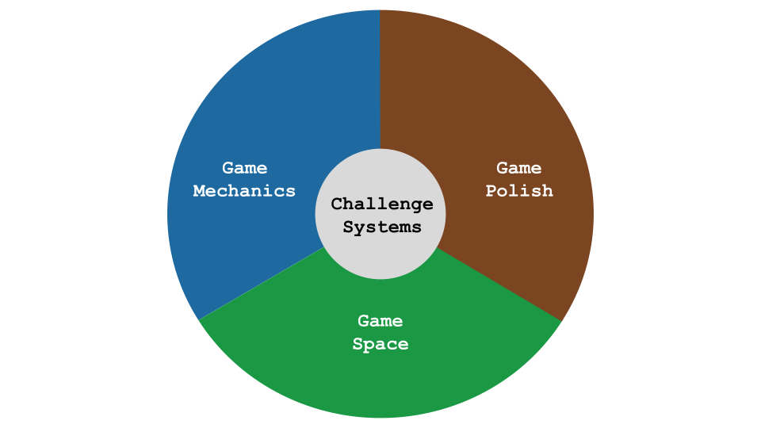

---
# all the regular stuff you have here
zotero:
  scannable-cite: false # only relevant when your compiling to scannable-cite .odt
  client: zotero # defaults to zotero
  author-in-text: false # when true, enabled fake author-name-only cites by replacing it with the text of the last names of the authors
  csl-style: harvard-manchester-metropolitan-university # pre-fill the style
layout: post
number-sections: true
categories: chapter
title: 5. Exploration of the Formative Learning Design Process
---
-   [Exploration of the Formative Learning Design
    Process](#exploration-of-the-formative-learning-design-process)
    -   [Research Questions - April
        2024](#research-questions---april-2024)
    -   [Chapter Introduction](#chapter-introduction)
    -   [Analysis of dimensions of game making activity using 3GAT
        framework](#analysis-of-dimensions-of-game-making-activity-using-3gat-framework)
        -   [Environmental factors and
            objectives](#environmental-factors-and-objectives)
        -   [Activity system 1 - a novice game making community making
            games as a learning
            experience](#activity-system-1---a-novice-game-making-community-making-games-as-a-learning-experience)
            -   [Illustrative vignette on participants activity
                indicating general activity of
                participants](#illustrative-vignette-on-participants-activity-indicating-general-activity-of-participants)
        -   [Activity system 2 - Constructing a game feature by
            feature](#activity-system-2---constructing-a-game-feature-by-feature)
            -   [Illustrative use of tools to mediate activity shown in
                vignette
                4.x](#illustrative-use-of-tools-to-mediate-activity-shown-in-vignette-4.x)
            -   [Operations and actions within the system - Implementing
                discrete code and design
                structures](#operations-and-actions-within-the-system---implementing-discrete-code-and-design-structures)
            -   [Applying activity theory to surface contradictions and
                design tensions experienced by participants and
                facilitator/s](#applying-activity-theory-to-surface-contradictions-and-design-tensions-experienced-by-participants-and-facilitators)
    -   [Narrative exploration of
        contradictions](#narrative-exploration-of-contradictions)
    -   [C1 - contradictions involving the use of game programming and
        asset authoring
        tools](#c1---contradictions-involving-the-use-of-game-programming-and-asset-authoring-tools)
        -   [The 3D flying bee](#the-3d-flying-bee)
    -   [Detail of Tool Evloutio based on resolving
        Conflicts](#detail-of-tool-evloutio-based-on-resolving-conflicts)
        -   [Use of a Code Playground](#use-of-a-code-playground)
        -   [Using a starter game
            template](#using-a-starter-game-template)
            -   [Variable editing for player
                movement](#variable-editing-for-player-movement)
            -   [Level design and
                prototyping](#level-design-and-prototyping)
            -   [Use of game assets](#use-of-game-assets)
            -   [Distributed approach to asset
                creation](#distributed-approach-to-asset-creation)
        -   [Observations and discussion on the game template and core
            tools](#observations-and-discussion-on-the-game-template-and-core-tools)
            -   [Developing Digital Literacy
                skills](#developing-digital-literacy-skills)
            -   [INTEGRAETE ABOVE Tension of a group remixing from one
                template rather than feeler community inspiration and
                interaction](#integraete-above-tension-of-a-group-remixing-from-one-template-rather-than-feeler-community-inspiration-and-interaction)
            -   [Concluding bit](#concluding-bit)
    -   [C2 - Participant conflict associated with project navigation
        and use of
        documentation](#c2---participant-conflict-associated-with-project-navigation-and-use-of-documentation)
        -   [Narrative on the evolution of resources during
            P2](#narrative-on-the-evolution-of-resources-during-p2)
        -   [Quick Start Cards](#quick-start-cards)
        -   [Code snippet examples](#code-snippet-examples)
        -   [Structuring instructional tutorial
            chapters](#structuring-instructional-tutorial-chapters)
        -   [Theming the a collection of game design patterns to aid
            navigation](#theming-the-a-collection-of-game-design-patterns-to-aid-navigation)
    -   [C3 - Responding to tensions and barriers in cultural aspects of
        the game making
        activity](#c3---responding-to-tensions-and-barriers-in-cultural-aspects-of-the-game-making-activity)
        -   [Social coding processes](#social-coding-processes)
        -   [Playtesting as a cultural
            process](#playtesting-as-a-cultural-process)
            -   [Local playtesting rather than participation with a
                wider online
                community](#local-playtesting-rather-than-participation-with-a-wider-online-community)
            -   [Playtesting and the interaction with UMC pedagogy and
                half-baked games
                approaches](#playtesting-and-the-interaction-with-umc-pedagogy-and-half-baked-games-approaches)
            -   [Playtesting facilitating peer
                encouragement](#playtesting-facilitating-peer-encouragement)
            -   [Playtesting and embodied participation in the games of
                others](#playtesting-and-embodied-participation-in-the-games-of-others)
            -   [Community concepts and norming behaviour emerging
                during
                playtesting](#community-concepts-and-norming-behaviour-emerging-during-playtesting)
            -   [What kind of Maker are you - Motivations behind social
                processes (emerging in
                playtesting)](#what-kind-of-maker-are-you---motivations-behind-social-processes-emerging-in-playtesting)
            -   [Use of side missions to encourage varied creative
                practices](#use-of-side-missions-to-encourage-varied-creative-practices)
        -   [Outroduction to this part of exploring Drama process and
            playtesting](#outroduction-to-this-part-of-exploring-drama-process-and-playtesting)
    -   [Chapter Discussion](#chapter-discussion)
        -   [Observations / Discussions on Dimensions of
            Authenticity](#observations-discussions-on-dimensions-of-authenticity)
            -   [The potentially awesome impact of lifting the lid on
                authentic
                technologies](#the-potentially-awesome-impact-of-lifting-the-lid-on-authentic-technologies)
        -   [Discussion on scaffolding, affordences and
            agency](#discussion-on-scaffolding-affordences-and-agency)
            -   [Increased scaffolding of tools can increase
                instrumental agency but at what
                cost?](#increased-scaffolding-of-tools-can-increase-instrumental-agency-but-at-what-cost)
            -   [Returning to discussion the emergent and mutual nature
                of the design and what it has to say about participant
                agency](#returning-to-discussion-the-emergent-and-mutual-nature-of-the-design-and-what-it-has-to-say-about-participant-agency)
            -   [The goal of computational fluency as a form of
                agency](#the-goal-of-computational-fluency-as-a-form-of-agency)
        -   [Summary of barriers and tensions explored in this
            chapter](#summary-of-barriers-and-tensions-explored-in-this-chapter)
            -   [Exploring tensions involving and authentic tool
                use](#exploring-tensions-involving-and-authentic-tool-use)
        -   [Emergence of GDPs as a germ cell of
            activity](#emergence-of-gdps-as-a-germ-cell-of-activity)
        -   [Link to next chapter](#link-to-next-chapter)
    -   [Removed notes from chapter](#removed-notes-from-chapter)

# Exploration of the Formative Learning Design Process

## Research Questions - April 2024

~1. What pedagogical tools and processes are available to support novices to overcome barriers to participation in game coding processes?~

1. What ~barriers~ areas of contradictions arose in participation in this research's game coding processes and what pedagogical tools and processes are available to address these contradictions?
2. How can game design patterns support the development of coding practices with novices?
3. How can learners build agency in an evolving community of game makers?

*A note on style*

This chapter contains a large number of headings in draft form. These will be replaced with introductory sentences when structure is stable.

## Chapter Introduction  

This chapter contains a high level of detail on the evolution of the learning design to situate the findings of the next chapters and to allow the design to be by other practitioners and researchers in this area. The format of this chapter can be conceived as a design narrative [@hoadley_creating_2002-1]. To do to this I include narrative descriptions of shifts between phases of design as it mutually evolved over time. The concept of design narrative emerged within DBR as a way to communicate the important detail of context [@hoadley_creating_2002-1; @brase_knowledge_2024; @bell_theoretical_2004].

In addition, I draw on concepts provided by third generation activity theory (3GAT) (e.g. the analytical lenses of double stimulation and rising to the concrete).

In particular, the evolution of the key pedagogical features is analysed via  emerging tensions between system elements in learning design. Exploration of the shifts in the design of the intervention is done via a development of a design narrative which explores the driving forces behind changes in the design of each phase.

This wider focus requires that I move beyond a merely technical approach to incorporate observations from my reseach journal and additional session notes in a way which comprises an auto-ethnographic process as part of a TAS approach.

In the previous chapter, I described phases of delivery of the formative intervention in the form of a family game making programme.

To begin this chapter I describe activity by identifying activity units/systems, system elements typical at early phases of the design, with a particular focus on the transformations happening in the object of the activity systems.

This narrative is enriched by more in-depth analysis of three key areas of emerging areas of contradictions in activity and resultant interventions which addressed those contradictions. The three main areas of contradictions are explored in this chapter are as follows: in use of software tool use in P1 and P2, those associated with project navigation and the use of supporting documentation in P2, and finally contradictions surrounding participant identity within the game making activity.

The discussion section of this chapter includes a synthesis of key initial barriers to engaging this game making program and the resultant responses. A final section identifies game design patterns (GDPs) as a "germ cell" concept that emerged in several forms in the evolution of the learning design.

## Analysis of dimensions of game making activity using 3GAT framework

In line with the process outlined in chapter three, the following sections outline different scopes of activity to introduce tensions between system elements which are explored in this chapter.

### Environmental factors and objectives

<!-- The following descriptions mirror the work of AT researchers who conceptualise scope of activity as concentric circles from Broffennbrenner with "larger" scopes of cultural and societal goals and smaller, narrower, lower scopes of more personal activity [Engestrom][Cole]. -->

The context of the learning environment situated within wider systems of activity. Three key systems are represented in an illustration 4.x  below. The diagram is necessary simplification of contextual factors and objectives of interacting, focusing on research goals on the part of the researcher, learning computing skills and concepts as a home education project and finally a broad aim of fun on the part of the children participants. Diverse cultural and contextual factors from the original activity systems are played out in a new shared activity system, while there is a nominal shared objective to the main activity, it the community contains diverse actors with different agendas.

<!--
Other relevant objectives of re include: a desire to create a useful learning experience on the part of student helpers; participating with other home educators in a creative environment and thus building team and communication skills;. -->

<!-- NOTE MOVE PREVIOUS Chapter?  -->

{width=95%}

The diagram is in line with Engestrom's concept of expansive learning via a shared object (explored in the chapter three) [@engestrom_expansive_2001]. In this research, I take the approach of treating this shared object as an activity system in its own right. Lecusay [@lecusay_telementoring_2015] applies a similar approach when describing an adaption to an after school program. He describes the shared object as an idiocultural hybrid which develops into its own activity system.
DEVELOP
<!-- NOTE - WHY IS THE CONCEPT OF IDEOCULTURE USEFUL HERE? -->

<!-- The concept of idioculture is used in this study to deepen the description of the community dimension of 3GAT. -->

MOVE THIS PART TO CHAPTER 3?

Following Barab's description of nested activity systems [-@barab_using_2002], this shared system, whose objective is to make a games for an audience to play,  can be seen not only as nested within the wider systems but also as a container for  other  activity systems nested with that. While this overall approach is considered valid [FIND OTHER SUPPORT], the danger of fragmenting activity to much is to make matters confusing. The job of the researcher is to prioritise systems to describe and analyse based on the area of study and the concerns of the participants.

This prioritisation in AT is sometimes conceptualised as the process of finding a key units of analysis. In the process of research I have found two units of activity particularly illuminating, one being the shared activity system described above of making a game in a community process. The other, narrower in scope can be described as implementing individual game features. Beyond these key systems, I draw on the concepts of actions and operations within systems to describe tensions and contradictions which emerge in the research process [-@leontiev_activity_2009].

<!-- GDPs ( conceptualised here as game design patterns), which while often implemented on an individual or pair scope, were also fed back into community activity.  -->

###  Activity system 1 - an emerging community of novice game makers community making games as a learning experience

<!-- NOTE - Get into difference between object / objective and outcomes -->

<!-- While the limited example above of Toby's activity illustrates fun, additional data from interviews with this child and family back the broad goals above. [develop - perhaps an appendix or quotes] -->

<!-- As previously explored this mirrors the Activity, Action and Operation hierarchy. -->

This scope of activity takes as a subject the community of individuals in the room as during the game making sessions. this includes parents, children, student helpers and myself as a researcher / facilitator. As explored in Chapter 3 and 4 the object of the activity shifted in early stages in P1 and P2, as the community at times needed to shift attention not only the construction of a game but also to the evolving group process and pedagogy to enable successful completion of the game coding project(s).

{width=95%}

<!-- IS THIS RELEVANT HERE? -->
The real or perceived audience of the completed games is relevant when considering the motivating objectives of participants at this level of activity. The explicit  target audience were students and staff in the Manchester Met Brooks building at a final showcase event where the created games were shared in arcade cabinets. An additional audience are friends and family who can be send the games to play online. However, a more immediate and tangible audience for the evolving games were peer game makers and facilitators during the making sessions.

{width=90%}

While the object of making a game to share using the suggested tools is tacitly agreed through participation, the in-session audience and peer group appeared to drive some additional motivations and objectives. One of which put simply was play and social interactions between participants.

<!-- These feed into the contradictions which emerge at this level of activity. -->

<!-- IS THIS NEEDED? While the programme had a shared objective of making a game, there were tensions brought by the cultural factors and other objectives imported from other activity systems. The third contradiction explored in this chapter explores those tensions (including? ....). -->

<!--
NOTE - More on large scope in AT terms? What is needed here? -->

### Activity system 2 -  Constructing a game feature by feature

This scope of activity takes an individual or parent/child paring as its subject.

Within the activity system of making a game, in analysis of video data and evolution of course resources from P2 onwards, I identified activity happening at an individual or pair work which emerged with distinctive characteristics.

Activity was driven by learners setting goals, requesting help and then implement code structures based around altering or adding new features to the game using tools available in the learning environment. Participants also worked on audio and graphical assets to achieve this  objective.

While is it possible, aligning with Levontev, to identify the implementation of features as actions within the wider activity, there is value in  treating of implementing each GDP as a sub-project or activity systems in its own right ( NOTE - or at least as as a key unit of analysis). Barab and colleagues justify smaller units in their study observing emerging practices in a technology rich learning environment [@barab_using_2002].
QUOTE?

{width=95%}

<!-- One observation from he experimental course was that without signific

**Phase one:** In response to need, I adapted a starting code template of a platform game and created various code examples to add functionality requested by participants. This template was adapted from an online tutorial to create a game of the _platformer_ genre  (see glossary), a move which helped to limit expectations of the technical complexity of their game. At the end of this stage participants showcased their games to students in the foyer of the MMU Brooks building.

ant support, the process of making a game is complex and there are many possible blockages in the process. -->

<!-- NOTE - THIS IS ANALYSIS  -WHERE TO PLACE IT?
By this stage, the process of collecting a user generated list of features and trying to respond to all of them as a facilitator had been abandoned as unrealistic. -->

<!-- NOTE - how much from p1-4 below to include? -->

<!-- In the example above Toby progresses from playtesting his own game to altering it. The code to change the layout of the platforms of the game is already included in the starting template. Thus is able add a new platform by making simple code changes. Toby retests the game immediately by clicking on the preview element of the code environment.  -->

<!-- However within that wider objective there may be a variety of goals depending on the participant. In this case Toby's goal is addresses the challenge and variety of the game playing experience. -->

<!-- Toby builds his competence in the process of comparing the own code to the code example to work out what code is new and relevant to the desired behaviour. -->

<!-- In the vignette of Toby's activity this wider objective is present in the facilitator orientation at the start which references this audience -  _the Monday after we can play our games and we can share them with students. We can make the students frustrated when they can’t beat our games_. At the end of the vignette text, one of the student helpers also imagines this audience playing the game of Toby.    -->

**Illustrative vignette on participants activity indicating general activity of participants**

The purpose of this vignette is to illustrate some of the key features of the overall game making activity in relation to activity systems and relevant system elements. (included as an appendix of this chapter as Appendix 4.a -

<!--
[Link to online version here](https://docs.google.com/document/d/1vYeVxYaRMTWPDOHwC4DEGYAkGPRIDX7wLiz0l8b7LWc/edit)) -->

The participant, a child Toby, has been working independently on the design of a platform game for several minutes of the session. As a facilitator, I draw the participants attention to the showcasing of their games to an external audience to focus their attention on completion of their games. Toby pays close attention to the challenge and variety of the game playing experience for his imagined audience of players. During the course of the session Toby invites many other group members to play his game. He initiates and responds to conversations around the difficultly of the game he has designed. The more immediate audience of his peers is clearly important to him in guiding his actions.

He uses a variety of tools in the process of coding and testing his game including: a web based coding tool (code playground), a game template which he has used as the base of his game project and,  a menu of documentation linking to code examples and tutorials   

By this stage of the process, Toby is able to browse a collection of game design patterns and use diverse of tools, resources and processes. Participants developed preferred approaches and tool choices especially in accessing help when adding a new feature to their game.

In the vignette 5.T I outline the two main sources of help at the level of adding a new feature to the game: "Here’s the tutorial and there’s the examples of code". In the course of the vignette above, Toby chose to access only a code example of the desired game behaviour. He did not, as some in the group were doing in this session, use the tutorial which provided more descriptive, step-by-step guidance. Other participants relied only on direct verbal help from myself or other participants (like Toby) to help them progress.

While this vignette shows that the participant has developed fluid use of both software tools and documentation and support sources, these are areas where significant contradictions emerged which shaped the path of the support given.

Within the objective of adding or altering game features (also referred to as game design patterns here), implementing more complicated patterns involved several stages and varied tools. Using the terminology of Leontiev [-@leontiev_activity_2009], participants undertakes certain chains of processes in a fluid way that shows that actions had become operations (as explored in chapter three). In vignette 4.x, an example of such an operation is Toby's quick navigation between different areas of the game code, the game preview window and other sources of documentation. In contrast, some tasks are new to Toby and are performed more hesitantly. In the vignette's description, it can be observed that at times Toby is careful and hesitant, checking and rechecking the process of copying and pasting new code into his game from the code example of a design pattern he has chosen.

<!-- Contradictions concerned with use of core tools and additional documentation and support are explored in two later sections of this chapter. -->

The later section of the vignette shows evidence of elements of an emerging idioculture of this group.

<!-- MOVE THIS TO CHAPTER 7 -
A student helper shares a question -  "Is yours the one where level one is harder than level three?". This is indicative of some of the emerging playful approaches that younger participants in particular are taking to the overall process. This represents an example of the influence of the wider systems of play of on the shared idioculture of the game making community. The complexities of processes to create and to help resolve contradictions as this cultural domain of collective making are explored later in this chapter. -->

Game design patterns emerged as a shared object as described by Engestrom in []. The object of activity here is not only the code and game assets which participants are working on. In addition the emerging concept and group understanding of the game design pattern becomes a share understanding on a community level as playtesing, pair work and peer help happens.

{width=95%}

Chapter five contains more detail on the emergence of game design patterns as shared concepts and the implications for activity in more depth.

<!-- DEVELOP THIS IDEA HERE OR MOVE IT TO DISCUSSION WITH SOME KIND OF SIGNPOSTING HERE. -->

Objectives at this level also vary between participants with some more straight-forward and others more tricky based on their making style. For example, beyond a purely utilitarian objective, a further objective in implementing a GDP, e.g. a new graphical element may be to increase a sense of personal identification with the game as an vehicle for personal expression.  

<!-- MOVE OR EXPLAIN IN MORE DETAIL
ALTER THE DIAGRAMS ABOVE TO REFLECT THIS. -->

<!-- While some game patterns were simple to add, e.g. altering the location of platforms, other more complicated features involved several stages and varied tools to implement. The next section describes these stages as discrete code and design structures. -->

<!-- NOTE - Other participants;s motivations - explored later? -->

<!-- Other participants were less proficient using this online resources and used printed out versions of documentation. -->

<!-- For example, creating a new graphical element in a separate online pixel-art editor called Piskel, exporting and downloading it to the laptop, and uploading it to the glitch code playground and then making code changes in several parts of the code to initialise and implement new behaviour for this element. -->

<!--NOTE As a facilitator of a community I aim to notice these transitions as I aim to use the proficiency of participants to help distribute the process of helping peers. -->

<!-- After inserting the code which adds a moving enemy to the game, Toby spends five minutes altering the variables involved to match his design and to create a level of challenge that he is happy with. -->

<!-- Toby makes quick progress. one factor here is willingness to make mistakes. There is a confidence here in undoing mistakes, commenting out new code to return to previous behaviour.

The trial and error approach also yields benefits, a mistake in the values edited creates an unexpected result of the enemy moving vertically instead of horizontallWithin the objective of adding or altering game features (also referred to as game design patterns here), implementing more complicated patterns involved several stages and varied tools. Using the terminology of Leontiev [-@leontiev_activity_2009], participants undertakes certain chains of processes in a fluid way that shows that actions had become operations (as explored in chapter three). In vignette 4.x, an example of such an operation is Toby's quick navigation between different areas of the game code, the game preview window and other sources of documentation. In contrast, some tasks are new to Toby and are performed more hesitantly. In the vignette's description, it can be observed that at times Toby is careful and hesitant, checking and rechecking the process of copying and pasting new code into his game from the code example of a design pattern he has chosen.y. Toby embraces this mistake and shares his account of this happy accident enthusiastically. -->

<!-- In the last chapter, we examined the use of Rogoff's 3 lenses of cultural, social and personal activity. We can see a broad alignment of these lenses and the scopes of the activity systems above.

NOTE - Explore how performed in line with other research - e.g. DBR (Barab) and possibly Bevan and Petrich -->

<!-- to highlight possible tensions and contradictions between competing goals of interrelated activity systems. -->

#### LINK - Applying activity theory to surface contradictions and design tensions experienced by participants and facilitator/s

Identifying shifts in participant activity in terms of scope facilitates analysis of the complex and interwoven cultural, social and personal actions in a communities activity [@rogoff_observing_1995]. Above, Toby shifts between the wider activity of making a game and sharing it with peers and narrower actions implementing concrete code structures. This aspect is developed in chapter five.

In addition to these shifts in scope, analysis of community processes also involves transformation over time.  The next section offers a description of the evolution of tool use in different phases of the study with an aim to situate analysis of emerging tensions in the use of tools, resources and processes in the following section.

The followings sections use a process of analysis of contradictions between system elements of the activity systems outlined above. The processes is a formative intervention (explored in chapter three) in that the surfacing of tensions due to changes in the learning design over time are examined. As noted in the introduction, this chapter explores the following areas of contradictions: contradictions in the technical tool use of design, contradictions shaping the development of supporting documentation, contradictions to do with issues of identity and the cultural dimension of participation.

<!-- For example a common contradiction may be an immediate goal of children to mess around, play games and have fun while the goals of parent may be to maximise the acquisition of skills -->

<!-- I chart the detail of the evolution of resources and other responses used helps illuminate broader, systemic issues concerns in the overall activity [@barab_using_2002]. -->

## Narrative exploration of contradictions

## C1 - contradictions involving the use of game programming and asset authoring tools

This section addresses as area contradiction that arose in early stages of the programme, in particular P1 where because of the novel nature of the programme, there were difficulties in getting the mechanics of coding underway.  I now outline immediate strategies to address this issue and chart an evolution in tool use in the process of coding and game asset creation, charting the resulting tensions before focusing on the introduction of new tools in P2 to address these tensions.

Given the complexities of learning text based languages, significant areas of contradictions arose between the need of participants to use key tools to create games and their limited skills and experience in using them.

**One of my goals for initial stages was to create an inclusive environment**

In P1 I used several open design activities and ongoing processes to support the game design of participants. Early sessions involved, discussion about what makes a good arcade game, brainstorming on game features to add and environmental story, tinkering with pixel-art character making, making craft collages for game backgrounds.

In another stream, I lent learners a laptop loaded with vintage arcade and console games to help build familiarity with arcade and retro game tropes.

<!-- But this aspect was promising but lacked a structured exploration in sessions in a way which conveyed the limits of what our projects could achieve technically. -->

**Tool use**
<!-- This is partly as I did not want to start with code that might alienate, but also as my own game coding skills were also being tested to their limits at this point also and I was working hard to introduce coding at a suitable level. -->

<!-- While activity theory has a broad definition of the concept of tool which would include the use of language, concepts, supporting resources and production processes, this section focuses on software tools and code framework used to create games in this program.  -->

It was only in week five of P1 that that I introduced the coding tools and processes. I had experience of teaching web coding but limited knowledge of how to code games. Thus during these five week that time I had been teaching myself the basics following my own repertoires and practices as a mostly self-taught coder.

<!-- My own motivations for working with open source, authentic game authoring tools (explored in the introduction), steered me to draw on the documentation of the Mozilla community and select Phaser as a framework. -->

Coding games in webpages is a complex technical process  involving several interacting languages and processes (see appendix 5.x for a break down).

<!-- The use of a code playground simplified this the process of publishing and editing (see LR).    -->

<!-- In early stages, this gulf created a tension between the need to use the tools and text coding processes which often resulted in frustration and paralysis in the activity of game coding. -->
<!-- At the end of this stage participants showcased their games to students in the foyer of the MMU Brooks building. -->

My motivations here were also supported by experiences in P1 documented in my journal. I found attempts to convene attention on a presentation screen for instruction based teaching to class uncomfortable, stemming from my judgement that these interventions to be unwelcome interruptions for the participants making activities.  

**input of parents as organisers**

The process was creatively chaotic but I became overwhelmed dealing with group process and my expectation that participants would follow their own interests and as a facilitator I would help groups pull projects together.

Reviewing my notes and email interactions I note honesty about feeling out of depth and asking parents for support in organising and bringing more order to group and planning processes.  

As the process developed I began to increasingly draw on the organisational abilities of parents and tenacity of young people involved rather than structured educational support for the design process (drawing more on a community activist approach rather than teaching).

See appendix 5.x for two examples of suggestions and supporting documentation generated by parents.

**The resulting conflict**

A crisis point developed (despite the input of parents) to help an organisational process.

While participants were being supported to develop assets in the form or game characters and ideas for features were being documented via lists, participants  did not have a working either a working knowledge of the tools used, or a process to start to build that knowledge. My own process of self research and informed tinkering drew on years of experience and was therefore not suitable as participants did not share those coding repertoires or familiarity with coding tools. While the suggested tools were theoretically available to the participants online, they were therefore stuck nevertheless.

In terms of a representation in a activity system, we can express this as a developing tension between the tools available to the participants and their objective of actualising their ideas and graphical assets in code form.

{width=95%}

**3d bee element summary or similar?**

This conflict partly drove one family to not continue and extended period of making in P1.
Members of this family had engaged in planning on paper and in particularly in creating pixel art, however tensions began to emerge when the introduced code framework framework did not support the desired features of one child. The feature they wanted to add to the game was bee design roaming a 3D landscape.  

In participant feedback, the  parent of one  family described in Appendix 5.x indicated that it took too long before in the planning stage and called for more hands on play and use of the tools of production before being called on to make creative decisions. The parent likened this to an arts studio approach.

**short term adaptation**

My resulting adaptations took a short term approach, which guided a longer term intervention.

While the choice of text coding tools, brought additional challenge to the process building competency in tool use compared to using a block-coding approach.

I taught coding at this stage as I learnt it, by adapting a starting code template of a platform game from a tutorial site and adding it to the code playground to remix from

As the weeks passed, I created various code examples to add functionality requested by participants.

**longer term challenge**

The informal nature of this learning setting encouraged me to prioritise approaches which avoided written or to whole class instruction.

Work needed to be done to address participant expectations of an acceptable scope for the game making project .

The wider in a design challenge involved designing a bespoke  game authoring environment by adapting existing tools and embedding where possible affordances within that toolset to facilitate participants to address gaps in their knowledge without needing explicit instruction.

<!-- This challenge was brought sharply into focus by a particular conflict experienced by one family in particular. -->
<!-- As explored in the literature review, an extensive body of research on the design motivations and impact on learners exists for the creative coding tools Scratch.  -->

<!-- A common question for this research is why not use Scratch (see LR / Glossary)? While Scratch, is aimed a broad range of media creation, much of this research involves game making as a popular genre of media of young people. I chose to not use Scratch for this study, partly as it was well researched and partly to prioritise authenticity of tool set.   -->

<!-- NOTE INTEGREATE HOW DESIGNING FOR AUTHENITITY IS A CHALLENGE HERE WHICH IS ALIGNED WITH PBL AND EXPERIENTIAL THEORY, FORESHADOW SHARED DIMENTIONS OF AUTHENTICITY WHICH ARE EXPLORED LATER. -->

<!-- I took care to screen participants from processes and tools that were unrealistic for novices to use. -->

<!-- NOTE - PERHAPS EXPLORE COMPLEXITIY OF IDES AS A BARRIER IN RESEARCH - SEE BLUE JAY AND GREEN FOOT TRAINING IDEs -->
<!-- In the activities of study, a high degree of authenticity made possible, in a material sense, by the digital nature of the learning resources. Beyond a general purpose computer, no prohibitive equipment is needed. -->

**Detail of primary tool evolution based on resolving Conflicts**

The following section describes key transformations in use of primary tools. In this study I use the term primary tools to be those used to directly achieve the task and other tool use in the form of help resources, documentation and other support processes as secondary tools. Specifically this section covers the transformation in constitution and use of code and asset authoring tools and a starting game code template.  

### Using a starter game template within a code playground

While the code playground and the code template within in it are two separate tools, from the perspective of the learner, they were experienced jointly. As such, I cover them together in this section.

#### Code playground.

Code playgrounds, as described in chapter two, are an online environment used to test, share or invite help from online users. Learning computer coding presents challenges in part due to unfamiliarity with and potential complexity of code authoring tools and environments [@guzdial_programming_2004]. The use of code playgrounds by novices can mitigate against some of the complexities of code environments. Tricky elements include steps to reducing syntax errors, shielding complexity, facilitating community commenting, sharing, remixing and other forms of collaboration.

#### Starting template

The initial use of a working structural template was based on my previous experience of teaching javascript to novices [@chesterman_webmaking_2015].

This template was synthesised from several tutorial to create a game of the _platformer_ genre  (see glossary), a move which helped to limit expectations of the technical complexity of their game.

The choice to pre-select a particular genre was initially a pragmatic response to tensions experienced in P1. When offering feedback to address her family's feeling of isolation from the coding process, the parent of the family described in the previous section had requested more hands on play and use of the tools of production before being called on to make creative decisions.

I realised that to allow for this playful experimentation, a purely structural template was insufficient and that a working game template was preferred. To create the template I drew on the structure of online starter templates from several sources to create a minimal template for a two-dimensional platformer game.

Thus in a period of development see D1 Fig 5.x  By P2, learners first experience of the experience of the tools was in the process of playing an incomplete game. and controlling the character using the computers arrow/ cursor keys which for many was a familiar process. Due to an intentional fault, players needed to click a remix button, and alter the underlying code to progress in the game. This took the technical form of a webpage with the coding of game done using a JavaScript file drawing on a JavaScript library called phaser.

In their research Kynigos and colleagues [-@kynigos_children_2018] explore this concept as a half-baked games where incompleteness or bugs in behaviour are a provocation to participants to correct or to further modify them. This process also aligns with the motivations and techniques of the UMC framework explored in the literature review , in particular the guideline to "create choices that show visible and immediate changes" [@lytle_use_2019-1, p. 6]. In this design, the first participant choice and the need to  transition from the _use_ to _modify_ stages is forced at an early stage by the half-baked design. While this design decision compromises the user choice initially, it allows a  carefully scaffolding of early coding experiences and promotes a shared experience for all participants in a way which facilitates and encourages peer learning. After this shared first change, participants next choices varied greatly. While some participants engaged with extensive experimentation to find a player movement feel that seemed just right, others, mostly adults or younger participants, were much less concerned with this aspect of game play, despite sometime frustrating resulting player movement. Data explored in the next chapter supports foundational claims of contructionist computing and UMC advocates  that greater user choice over the design process contributes to participant motivational and a feeling ownership of their projects [@lytle_use_2019; @peppler_computer_2009]

<!-- The following section outlines responsive design process surrounding two main elements: the starting game code template and the code authoring toolset. -->

**Structural design of the game template**

A web code project using the chosen game framework
phaser consists of several interlinked files of Javascript, HTML and CSS and image files. (see glossary & appendix 4.x)

<!-- {width=95%} -->
<!--
 -->

{width=95%}

4.x glitch coding environment with code structure of left menu, a central code window with code, comments and game preview on the right.

1. Javascript file which participants alter to make changes to their game
2. Html page within which the game is embeded (not usually altered by participants)
3. Css style sheet (not usually altered by participants)
4. Code editing area
5. Game preview area

While access to HTML and CSS files of the base project was available in the left menu as show in  by default participants would see only the JavaScript file names game.js .

<!-- Creating the project from first principles is relatively complex both semantically and practically. In the domain of web technology, starter templates consist of pre-built collections of HTML, JavaScript, CSS and other configuration files which allow users to avoid initial configuration and thus accelerate adding features to projects. For example the Next.js web framework comes with a large range of starter templates based on common requirements of web sites [@nelson_best_2023]. Phaser starting templates available from the website share this aim of providing scaffolding by providing a downloadable zip of files which when extracted are already interlinked correctly [^5].
While access to HTML and CSS files of the base project was available in the left menu as show in  by default participants would see only the JavaScript file names game.js .

Game states and functions to create the game loop (see glossary) are included natively in the phaser framework [@faas_introduction_2017]. Game states allow designers to deconstruct games and game code into collections of sub-units (states)   [@kostolny_digital_2017]. For example a simple arcade games may only had an insert coin state, a play state and a game over state. A game coding framework like phaser shields its users from code complexity by providing a game state manager and associated functions out-of-the-box, meaning that lots of underlying code is already written and hidden from view. To increase simplicity for my participants the starting template I created had only one game state called _PlayState_. It followed the following structure: a beginning section out side of a function declaring variables; a preload function which loads assets into the game; a create function which sets up the initial game; an update function which listens to and responds to user input. The following illustration from the step-based instructions illustrates the structure for participants, including the possibility to create new game states e.g. a game over state.

{width=55%}

4.x - Game states and function structure explained in the Glitch Game Makers manual created for for P2 and P3 -->

<!-- The use of template was an immediate, intuitive way to bring something to the table as a starting point to develop.  -->

<!-- Other parents requested additional supporting resources which explained the coding structures used in accessible but detailed ways. A request which hinted at a more structured, instruction based approach.  -->
<!-- In addition, my own motivations to explore research claims which on the engagement value of prioritising modifications to for quick impact on the game and on allowing participants choose over what they wanted to add to their game next. -->

<!-- follow the Use-Modify-Create model to build familiarity with and to scaffold the adaptation and use of coding constructs [@lee_computational_2011]. -->

<!-- In phase one, I noted that any addition to the game in terms of adding new any quantity of code created many potential coding, conceptual and organisational challenges. To counter this I adapted the starting game template to allow changes in code were relatively easy to perform but which resulted in potentially large changes in game behaviour and appearance. -->

<!-- NOTE SOME OF THIS CAN  -->
<!-- I kept the process informal and responsive by allowing participants to choose which one they wanted to work on next. The following sections outline different areas and patterns of activity. -->

<!-- COMMENT OF mOZILLA TOD THAT IT WAS GENTLE FACILITATION -->

<!-- - level design and prototyping: use of
- fluid variable editing effective movement
- The swapping of assets and more complex work with code syntax
- development of simple stories to bump personal expression and narrative -->

<!-- NOTE - All longer or shorter chains of actions , becoming operations - WHERE DOES THIS FIT?
NOTE - Also justify having so emergent results here , delay while accessing help to start 360 recordings
As the end process is visible in fluid behaviour -->

<!-- These tools align with some key design considerations. [Brennan & Resnick]
- Well suited to build a repeated design practice.
- Small changes had big effects.
- Variable changes needed immediate testing.  
- Especially with starting documents, -->

<!-- While the design suiThis took the technical form of  a webpage
ts repeated design practice as illustrated by the example above, not all pairs or individuals interacted with GDP in such a neat way.
A later discussion section in this chapter illustrates a more complex interaction with design stages. -->
<!-- The choice of the starting toolset and mission shapes the balance and profile of initial community activity. -->

<!-- Make point that it is hard to separate out tools and communities. In case of Mozilla, code playgrounds, and teach the web, and the culture of developers and teaching communities they are interlinked. Discuss and compare to Kafai in book, the lineage of Logo, Scratch. Instead the more authentic approach of a real language.
-->

### Creating key affordances

#### Variable editing for player movement

To accelerate and support the experimentation of users, I identified changes to the code that were easily recognisable game experience features and where small changes could provoke a high impact on the game experiences. These include changing gravity, altering the player jump height and walking speed.

The starting template began with the game in a broken state thus inviting players to modify the game to fix it. The player's maximum jump trajectory was not sufficient to progress via a jump to the first platform. To progress, participants needed to change alter at least one of the key variables were highlighted at the very start of the game code (see Figure above).

The process here began with me imagining what would be a good feature that players would notice and be spurred to change. Here, the deliberately unsuitable game variable is a key affordance of this half-baked game template.

Descriptions of other under-developed features inviting improvement follow including level design and the use of minimalistic graphical assets.

<!-- I adapted my design with an aim to increase speed and consistency of feedback from learner input, reduce coding syntax knowledge needed to progress, and thus reduce learner anxiety for novices.  -->

#### Level design and prototyping

<!-- The possibility of disturbing the syntax of the  of code in the array. When participant did this it provided a good opportunity for facilitators or parents to outline the importance of correct syntax of and to explain the code structure. -->

**The use of a graphical grid structure to edit level design helped balance concerns of accessibility with the use of authentic code language.**

Platform games often conform to certain patterns in terms of the elements involved commonly including: a player that you control to movement of; platforms to be jumped on; hazards to be avoided; and rewards to be collected.

In P1 the suggested process of adding game elements was relatively complex which involved changing parameters of functions to alter to adjust their location. An example of the code needed is included one of my tutorial chapters / appendix 4.x [^7]. Complexities included: each element needs to be added separately with code elements required in three different areas of the code template, adding x,y coordinates to place each game elements was; difficulties concerning adding graphical elements of different sizes. These complexities created frustrations in the game making activity P1, in particular as project became bigger cod became unwieldy and confusing to alter, causing a negative impact on the testing and revision process in particular.    

Key research on toolsets for novice coders advocates a visual approach to facilitate the coding multi-media projects for novices to address such complexities[@guzdial_programming_2004; @resnick_scratch:_2009]. This is achieved via techiqued which include a drag and drop approach in Scratch or via a concept called tilemaps [@erhard-olsson_procedural_2018] used in GUI oriented game making tools (Unity, Game Maker etc).

While, these tenhiques were not possible in this text-based environment, in P2 I revised the added  the possibility for a visual design approach via the use of a a grid coding format (see figure 4.x below), thus  replicating a tilemap technique within the text code format.

<!-- OPTIONAL ADD AND APPENDIX ON LOAD LEVEL? -->

{width=95%}
Figure 4.x - Grid based editing of level design with a simple key for hazards, coins, and platforms.

**Black boxing the process of placing assets:**

Technically, this approach involves the construction of a data array for each level of 17 blocks which can be one of the following: x (platform); h (hazard); o (coin); or could be left blank (see Figure 4.x above). The grid structure of text-based array, had a strong visual correlation with the resulting game layout. Changes to the text based grid in the code area on the left would be immediately seen in the right hand project preview area.

This solution abstracted away complexity and repetitive nature of asset placement via multiple asset placements  to prioritise ease of use to help sustain participant engagement.

Thus, here a technical approach helped resolve tension between immediacy of feedback and ?

Via quickly adding design possibilities to change levels design.

This adaptation had a positive impact on engagement with level design in initial stages. Many participants spending significant time and effort undertaking many iterations of changes to the level design ((Is this something that can be given figures to? Perhaps for one session?)).  An illustrative example of the impact of
is explored via a vignette in appendix 4.x where child participant Toby designs many levels. The goal seems to be to make the game challenging and to add many levels as a way of making his game distinct from others (include BETTER SUMMARY). Participants varied in their approach to level design, some drew on their experiences to mirrors platform game conventions, while others enjoyed working against these conventions, a theme which is explored in more detail in .

<!-- The possibility of disturbing the syntax of the  of code in the array. When participant did this it provided a good opportunity for facilitators or parents to outline the importance of correct syntax of and to explain the code structure. -->

EDIT DOWN MOVE LATER DISCUSSION
The evolution of the starting template aligned with UMC approaches; constructionist design heuristics; and the concept of affordances understood from a socio-cultural perspective as 'technology affordances as possibilities for human actions mediated by cultural means' [@kaptelinin_affordances_2012, p.927].  

#### Use of game assets

There has been extensive research supporting the motivational value of the ability for young people to bring their interests into multimedia creations via choice of assets and narratives [@kajamaa_digital_2018; @resnick2014give; @peppler_supergoo_2007]. My observations supported these findings. Indeed, I observed a strong palpable a sense of achievement and satisfaction when participants succeeded in seeing and hearing their creations in their game after making the final changes in code. For some, this sense of a achievement appeared magnified by difficulty caused by the unfamiliar environment and processes. As if they almost couldn't believe they had made an impact on the game world via interaction with such an alien language.

I now outline and discuss the evolution of the use of simple block graphics, the use of pixel art  authoring tool, and wider asset creation approaches.

<!-- EVIDENCE? - code for this? -->

<!-- This aligns with educational research of the value of incorporating Funds of Knowledge into technical learning environments [Cole etc]. -->

<!-- While the value of this process seems clear from existing research, it presented challenges and design tensions in this learning design. -->

##### Simple block graphics

In P1 a template based on tutorial used stock graphics of a astronaut collecting stars on platforms resembling earth and grass. In P2 starting graphics consisted of colour blocks. Their size of 32 x 32 corresponded to the default project size of Piskel (the graphical pixel art editor) with an aim to was also design to reduce technical friction. One of the complications encountered in P1 was the differing sizes of sprites created using different graphical tools. I helped resolve this for participants by matching the size of the block in the grid level design structure described above to the default size of sprites created in Piskel (32 x 32 pixels). This is one example of one of the  technical alignments which addressed and helped resolve practical obstacles that participants experienced.

The pixel art tool used, Piskel, proved to be intuitive for many younger participants with three main areas: a set of editing tools; a canvas for creation; and a set of tools to export, save and import work (see Figure 4.x).

{width=95%}
Figure 4.x - Interface of Piskelapp tool

The template's use of minimal starting game assets invited creative addition by participants, again aligned to the half-baked approach. At the same time however, the overall simplification reduced and therefore rebalanced time spent on to this activity compared to other game coding processes, thus helping resolve one of the tensions emerging in P1.

#### Distributed approach to asset creation

Tools like Scratch [@payne2019music] adopt a self-contained to audio and graphical asset creation and provide a library of prebuilt assets and tools within the environment thus reducing possibility for errors and complexity caused by the compatibility of file formats, migration and management of external asset files. While the code playground Glitch provided some tools to help manage files, it could not create or edit audio or graphical files, requiring the use of external asset creation tools.

In line with existing research, in P1 I observed participant showing a high motivation to incorporate assets based on their hope interests. Responding to the enthusiasm of participants in asset creation, I had introduced six software tools to participants including tools for pixel art, sound editing, sound creation, In addition I also encouraged collage creation to create a physical background to the game and then scan that to create a digital image. A table of the different tools and processes is included as appendix 4.x  

I was concerned that in P1 the diversity of asset creation tools approaches was over complicated creating an increased burden of learning different software, reducing the shared experience helpful for peer learning and risking distracting time and attention from coding activities. Thus, in P2 I reduced the number of suggested assets creating tools suggesting Piskel and an online audio effects generator (bxfr ?)

Participants would identify the need for an asset in their game. They would then use the separate software to create that asset, and the be supported to save assets to their computer's hard drive in a compatible format. They would then need to upload assets to the code playground environment, discover the text link of the asset, and then insert that link into the main JavaScript game file at the relevant line of code.  

The forced choice to use a distributed toolset rather than black-boxing asset management and migration led to benefits in developing key digital literacy needed for web creation. The strong motivation to see your assets in the game drove participants to building fluency (aligned with Webmaker ethos) as undertaking the full process involved learning a complex chain of these individual actions. Some participants became remarkably adapt at this, thus transforming this chain of actions into a fluid operation.  

<!-- For example, the processes of replacing a block image with a bespoke pixel sprite which comprised: file downloading; file migration using the browser and file manager; browser tab navigation; graphics tool use in Piskel; copying and paste text code; and selecting more than one lines of text code with mouse or keyboard shortcuts. -->

ALSO NEEDED TO CHANGE DUE TO THE CHANGE IN GROUP WORK DESCRIBED LATER.

Participants spent a widely different length of time creating these graphics for a variety of reasons. Some took a long time to master the process of using the editing tool while others created images rapidly but would keep redesigning and recreating their game elements. The process of game art creation opportunities seeding narrative and artistic creativity is explored in more detail in chapter five.

_Seeding narrative and art creativity_
As they had been guided to make a game on a broadly environmental theme, participants often redesigned sprites to games involving animals. The following image shows a whale as a player character and plastic bottles.

{width=50%}

<!-- ADD THIS FUNCTIONALITY OF ASSET AREA TO DESCRIPTIO OF CODE PLAYGROUND
A key element of game creation is the creation and management of graphical and audio assets.  -->

<!-- I began by mirroring social model of learning like CoL and CoP and their propose apprenticeship-based approaches. Specifically, introducing possible code solutions to implement the ideas of participants. However, limits to my time involvement and my technical fluency hindered this process creating stress in myself and frustration and hesitancy on participants to get direct help.

    NOTE - Examples drop?
    For example, to troubleshoot a code error might take between one minute and 10 minutes depending on the complexity of it. To work with participants to identify and then implement a new coding structure could take up to 30 minutes.

    At times I was able to identify a discreet new code construct and to implement an example of this between sessions. At times I would attempt to do this in the group setting with varying results.

    Other interventions were called for directly by parents. Two relevant and relates requests happened at the end of P1.

    One was a call for more hands on play and use of the tools of production before being called on to make creative decisions. The parent likened this to an studio approach. Another was a request for additional supporting resources which explained the coding structures used in accessible but detailed ways. A request which hinted at a more structured, instruction based approach.

    However, interview data from participants placed great value on the flexibility of the approach which allowed participants to choose what they wanted to add to their game next. -->

<!-- Based on group work with adults on creating media projects together I created an email group that all participants could post to to ask for help. However this option was hardly ever used taken up. I was given feedback from one parent that asking on for technical help via an email forum not something that they felt comfortable doing. The same family also gave useful feedback about social norms of not bothering people getting in the way of asking for help.

Thus other ways of addressing this conflict were called for. -->

<!-- The need to get started somewhere emerged - and the template was a response to that.
Just an immediate, intuitive way to bring something to the table as a starting point to develop. The template was based on a prominent tutorial on the phaser website called Making your first game.
https://web.archive.org/web/20180426051205/http://phaser.io/tutorials/making-your-first-phaser-2-game -->

<!-- As preparation for the sessions I had followed the tutorial. When the  and adapted it. I removed out as much code as possible and thus simplifying the structure and readability.
  https://github.com/glitch-game-club/glitch-game-club/blob/master/games
 -->

### Narrative on the evolution of resources during P2

The previous section addresses changes to primary tools used to create game code and assets and response to the emerging tensions expereienced by participants in P1. As explored in Chapter 3, understandings of primary and secondary use of tools in the theory of dual stimulation are diverse and inconsistent.

The advantages of designing scaffolding within primary tool use rather than secondary tools, is that the guidance is built into the production process in a way which aligns with microworld concepts. This has the potendial to thus reducing dependancy on facilitator instruction. In this design, affordances were chosen to supporting the Modify stage of UMC.

PRIMARY AND SECONDARY USE OF TOOLS DUAL STIMULATION? SOME DISCUSSION MOVED TO CHAPTER 6 ALREADY - MOVE IT BACK HERE?

However, these design changes did not aid participants wanted to create new features or code structures in their game. In P1 and early in P2 this caused delays and participant frustration, as although I could work with people directly to help them I had limited time with each participant or pair.

The previous stage had created a variety of supporting documents and processes which were created and shared with participants in a responsive way via print outs and online google work format documents. At the at the start of P2 I began to plan a system to present the documentation in a consistent and responsive way.

I also began to try to theme these new requests for features at some point (early stages of P2) in this process, in my notes I begin to frame these new request as game design patterns, and try to theme them.

There were two main ways of approaching adding a new pattern. One to examine a code example which was built around the same code base. This would involve searching for new code constructs and notes in the code designed to orientate the learner, alerting them to the location and purpose of the relevant code.

 It is this approach that we see the child Toby adopt in the vignette presented in this chapter. The second approach was to use the longer form step by step help.

ILLUSTRATE THIS WITH A TRIANGLE - see notes 23.8.24
In the AT illustration we see a tension between community, and objective. In a classroom this may normally be addressed by instruction. (perhaps PRIMM)

However, I was keen to align with the motivational potential of hands-on (learning by experience) approaches to STEM education [@holstermann_hands-activities_2010]m and choice driven approaches to PBL.  
DOES THE LR EXPLORE THIS TENSION?

Additionally, in P1 I trialled brief class instruction of key coding concepts, that I judged to be relevant to the whole group. Despite trying to limit the time spent on instruction, linking to their experiences and making the process informal, my journal notes reflecting on these interventions were unfavourable.

This section outlines the evolutions and design choices informing the different forms of supporting documentation used to address this conflict.

The process of creating documentation which created enough support for users to be able complete coding tasks but also facilitated participants to choose their on path presented significant challenges.

<!--
{width=50%} -->

<!-- As outlined above the starter template and quick activities served to address the _use_ and _modify_ stages of the UMC approach. One seeded into the community, these processes also propagated via peer learning in ways which are explored in chapters five in six. In contrast, the _create_ stage required longer input from my self, to help participants with their individual choices of what to add to the game.-->

<!-- SHIFT? - It is notable that the create stage of this model does not involve starting a totally new game from scratch as is imagined in some interpretations of that model. Due to the complexity of the code base and framework the process of creating a new GDP within the game as a suitable level of challenge. -->

<!-- ##### Linear and stand-alone tutorials and code snippet resources -->

<!-- Longer form step by step tutorials are common in computing education. Examples can be found in Code Academy, and in the education resources of RPi foundation. Many examples talking learners through steps to build a game can be found online with varied amount of explanation of underlying constructs and concepts. I started my journey learning JS games using some provided
by Mozilla and the Phaser developers. -->

### Quick Start Cards

NOTES: Created by students -

After P1 I shared a revised design with computer trainee teacher computing students ( which one? ) as part of a subject knowledge enrichment programme. In response to a challenge to accelerate the design three students created printable word documents which highlighted key affordances of the design.

Narrative of Js cards responding to delivering show case lessons to teacher trainers and in half term activities and more generally sharing the learning design.

To address the limit of one-to-one facilitator support to seed the starting processes outlined in the section above, I used printable resources which highlighted the key lines of code and how they can be altered to impact on game behaviour(see figure 4.x below). These _quick start_ cards provoked a strongly scaffolded initial interaction with the code in a way strongly aligned with the use and modify stages of the UMC framework [@franklin_analysis_2020].

{width=95%}
4.x - Example of a Quick start card

### Code snippet examples

The use of code snippets, while a promising authentic practice, presented initial challenges. To support a hands-on approach and responding the design choices of participants, I began by creating discreet code examples illustrating the requested elements. The use of code examples or snippets in code playgrounds is a common professional problem solving practice [@yang_stack_2017]. These code examples allow users to see the behaviour in context with the code and output side by side. While code examples existed on the Phaser website and support forums, in line with other support sites like stack exchange, their utility has limitations including lack of relevant, consistency, being removed from the domain context, and not being structured in a self explanatory way [@treude_understanding_2017]. Thus, while I initially encouraged participants to search within these examples, and authentic documentation and help forums, the resulting confusion and difficulties experienced by participants, prompted me to create other more bespoke documentation.  

<!-- The competency to overlook the concrete differences in code structure to abstract the principles away and to then apply those principles to the existing structure of their code project seemed too ambitious for this group of novices. -->

Creating a bespoke set of code snippets helped address the challenges described above. In P1 I responded by creating one off documents with the relevant code which were both printed, emailed and shared via google drive. In line with the practice of accessing help via code snippets, the code examples could be to be copied and pasted into the game. This process lacked coherent process for participants to navigation to the resource they need. The process also lacked a consistency in signposting how the code listed fit within the existing structure. To help students see the code in the correct structure, I began to create code snippets within code playgrounds and distinct project. These projects shared the structure of starter game template and added only the code needed for the additional requested functionality. My rationale was that each pattern added builds familiarity with the code structure, a theory supported by observations of Toby's proficiency in the vignette above.

### Structuring instructional tutorial chapters

<!-- BELOW Initially I structured the book chapter participants working their way through the online resources. HOW -->

<!-- While writing self-contained tutorials added a challenge to the documentation authouring process, the documents, especially when printed became a vital resource for this community. In chapter 5 I explore the extent to which these resources can scale for use beyond this context. -->

For each code example I created descriptive step-by-step documentation which in P2 were developed into chapters of an online book [^9]. Each code snippet linked to a descriptive chapter. These chapters attempted to balance an informal, hands-on approach over pre-teaching concepts, with the request from some from parents in the feedback to P1 (see appendix 4.x) to provide background concepts and explanations of coding constructs. To address this tension, in addition to self-contained chapter focused on instrumental code changes needed to implement game features, I created opening chapters of the online manual which were more traditional in format and explained underlying concepts that the starting template had initially abstracted away from the participants.

<!-- As these tutorials took as a starting point the code of the starting template and did not attempt to explain that, they did not however resolve the issue of participants wanting resources that explained these core constructs and underlying concepts.

I created opening chapters of the online manual which were more traditional in format and explained underlying concepts that the starting template had initially abstracted away from the participants.  -->

<!-- To describe the relationship between the self-contained chapters described above and the process of backtracking to gain foundational knowledge, I used the term _meeting yourself in the middle_. In the supporting chapters this term represented the value of retracing initial steps as a way to explore the computing concepts present in the design. -->

<!-- An example of parent Sh interaction with long form tutorial follows. Sh engaged with the long form resources. While this process did not involve dialogue, the recording of her screen allows for a detailed description of how the resources was used.
Sh opens browswer to see list of code Examples, navigates to page, sees list of chapters, selects GDP pattern name, then follows along.
FIND THIS EXAMPLE AND WRITE IT UP / SEE WHAT IT ADDS TO THIS SECTION. -->

<!--
MOVE THIS TO THE NEXT BIT?
Interestingly, the online menus was not used by participants in any regular or consistent way. However, it did have a trickle down effect. Some trailblazing participants did either browse it, use it to try to solve problems or were referred to it my the facilitators. The patterns that those learners implemented were then remarked upon by other learners and sometimes adopted via peer teaching. -->

<!-- As explored in the literature review, it is difficult to explore this pedagogical approach relation to other similar programmes due to the lack of data on specifics of the learning materials presented to participants. -->

### Theming the a collection of game design patterns to aid navigation

Introducing documentation created additional tensions in the learning activity, specifically, I observed users failing or struggling to find the right resources online. This prompted me to design and introduce a themed hub for both snippets and tutorial chapters. My aim was to mitigate potential learner alienation from unfamiliar technical documentation through accessible design and to relating documentation to participants existing gameplay experience rather than underlying coding constructs. While time consuming, the process of aligning documentation, code snippets with more general concepts of game analysis, served to simplify the navigation of documentation. The guiding principle is that key affordances of the supporting secondary stimuli are designed to closely align with the objectives of leading activity at the predominant scope of activity.In the language of the theoretical framework, I explore the process of working with GPDs as a germ cell of the overall game making activity.

{width=95%}

INTRO SENTENCE

The process of theming the patterns has the potential to develop the community knowledge of game making concepts [@holopainen2007teaching]. In grouping the game design patterns into categories for the documentation hub page, I drew on academic and professional interpretations of game elements [@salen_game_2006; @schell_art_2008; @tekinbas_rules_2003]. Schnell's detailed analysis of tens of game elements presented as design lenses was too complex for this audience. Instead, I adapted a simplified introductory framework developed for use in youth-oriented Game Jams to help novice game makers hack/analysis and then adapt key elements of non-digital games [@cornish_game_2018].

- **SPACE:** Where the game takes place.
- **GOAL:** What is the objective of the game? What are you trying to do?
- **COMPONENTS:** What are all the objects or actors in the game?
- **MECHANICS:** What actions take place in the game. What are the verbs involved?
- **RULES:** What can or can’t you do in the game? What defines boundaries? Does play happen in real time or do you take turns?

The framework youth game jams and in the Q2L school to help participants develop their implicit knowledge of game design concepts in to explicit share vocabulary before engaging in digital making via collaborative analysis of common games [@cornish_game_2018; @institute_of_play_gamestar_nodate]. Similarly, in early stages of my design participants completed a similar activity after playing retro arcade games [included in appendix].

I related this simple categorisation the emerging list of requests for game features made by my participants. The final categorisation used in P4 is included as a Table 5.x below.

| **Game Mechanics**| **Game Polish** | **Game Space** | **Challenge Systems**|         
|--------|------------|--------------|----------|
| Add Static Hazard  | Add Graphical Effects | Change Design of Levels | Gain Points when Collecting Food |
| Add an Animated Enemy  | Add Sound Effects | Add More Levels | Add a Timer |
| Jump on Enemy to Zap them  | Add a Sound Track (Music) | Change Shape of Levels | Collect all Food before Progressing |
| Double Jump  | Add a Game Story with Messages | Change the Background Image | Power up - Higher Jump |
| Moving / Patrolling Enemies  | Add a Game Story with Messages | Change the Background Image | Power up - Player Speed |
| Moving / Following Enemies  | Animate your Player’s Movements | Key and Door | Random Doubling Enemies |    
|   | Make Player Immune |  | |    

Table 5.x Categorisation of game design patterns used in P4.

This categorisation, while simplified, is consistent with professional and technical frameworks popular in game making communities including: the MDA framework [@olsson2014conceptual] (which focuses on analysis of games based on the user experience), Elemental Tetrad [@schell_art_2008], and DDE [@korn_design_2017]. The theme of using technical frameworks in an accessible way to facilitate the creations of novice participants is continued in the chapters five and six.  

<!-- I noted that some patterns addressed game aesthetics (simplified to  _game polish_) for example; the graphical representation of game characters; adding sounds; and adding background images. Others could be described as _game mechanics_ including: jumping on enemies; finding a door or flag to progress to the next level; and collect all food before progressing to next level. Others concerned aspects of _game space_: the size and shape of game world; and adding new levels the game. In P5 I extended the scheme to included  _system and challenge_ patterns. These explore at how different elements in
 cxteract to create challenge in the game. -->

<!-- I then took the existing list of game elements that have been identified by students and categorised them based on a blend of two frameworks. -->

<!-- I made some simplifications and adaption to increase accessibility for non-professional and young people. For example, the term of aesthetics is very wide and suited simplification _game polish_. -->

<!-- {width=55%} -->

<!--
My journal notes see an evolution of attempts to try to build into the program, activities which help build the participants sense of their own identities of game makers or more generally digital designers. In and early tentative attempt to define in broad strokes the types of game maker behaviour and underlying goals. In doing this I have taken inspiration from Bartle's game player types Hamari and Tuunanen, 2014). I translated player types to maker types based on notes in my observation journal and extracts from screen capture data. The following list of *Game Maker *types:

 -   **Social makers:** form relationships with other game makers and players by finding out more about their work and telling stories in their game -   
 - **Planners:** like to study to get a full knowledge of the tools and what is possible before they build up their game step-by-step
 -   **Magpie makers:** like trying out lots of different things and happy to borrow code, images and sound from anywhere for quick results
 -   **Glitchers:** mess around with the code trying to see if they can break it interesting ways and cause a bit of havoc for other userse positioning and if they could give examples of that behaviour.

An additional rationale for this process was to help reduce potential internal bias about the kind of process that a computer programmer should adopt, echoing the call for pluralism in approaches explored earlier in our section on germ cell concept Papert and Turkle, 1990). In short, my message was to participants there are more than one way the skin a cat. When you are learning to code follow your own preferences and try to observe and reflect on what works well for you. -->

## C3 - Responding to tensions and barriers in cultural aspects of the game making activity

<!-- ### Design narrative on conflict due to identity clashes and dysfunctional group work -->

**Participants alienated - clash of cultures ,clashes of identity not hard core coders, no on-going playtesting,**

**Participants stuck / demotivated : scope of ambition to high,   collaboration groups too big (transition),**

<!-- The section at the start of this chapter which outlined the evolution of the learning design from P1 to P2 described a high level of challenge in the face of limited support.  

Some of the participants enjoyed this challenge, evidence of which is notable in end of course evalusaion and interviews.  -->

While changes in the tools, documentation use were initially designed to solve technical problems, they also impacted the culture of the coding group.
In particular the starting template/ half baked template, had particular impact on division of labour, and a knock on positive impact on general engagement.  

The example of Toby's coding practice example in P2 is promising, however other varied experienced existed. In P1 there were particular issues of alienation from the process which align with issues of cultural exclusion from coding processes explored in Chapter 2. [SEVERAL REFERENCES]
<!-- This aligns with research addressing barriers concerning identity and technology-driven practices explored in Chapter 2 [@kafai_constructionist_2015-1]. -->

In particular family with withdrew citing alienation from the culture of hard core coding that had emerged, their experience is explored as Appendix 5.a which outlines a conflict composed of accumulating tensions which resulting alienation from the group coding environment and associated peer working dynamics. While there were technical aspects to the conflict, these were compounded with more social and cultural barriers that also arose.

<!-- In research o 5D Cole describes the emergent of ideocultures in afterschool learning environments as highly dependant on context as well as the initial design itself. -->

IS THIS NO LONGER THIS INTRO?
Some attempts of forming a positive an inclusive idioculture to avoid alienation were present in P1 start. These activities including starter games and game playing on entry and sharing of gaming experience of let laptops with games installed on them.

IS THIS NO LONGER THIS INTRO?
However, the experience of this family in particular lead me to greater reflection on the area of conflict and tensions involving cultural factors including:

-   A concern for the fragility of learners ongoing positive affect towards the group game making process to avoid the culture shock experienced by A's family.  
-
-   An awareness of the danger that those more confident in coding create more involved code problems that need more facilitator time, potentially making others feel less valued.
-
- The value of a peer learning balanced with the need for low pressure (avoiding a negative sense of obligation).

<!--
NOTE MOVE
Chapter 6 analyses the potential of activities which help build the participants sense of their own identities of game makers in more depth, in particular in relation to dimensions of participant agency. -->

While Chapter 6 analyses the participant reactions to the design in this more cultural dimension, here I (try to) limit exploration to the evolution of key learning design features addressing this aspect, namely the
identification and nurturing of social coding processes.

### Social coding processes

Some barriers stemming from alienation from participant group working processes were resolved partly by freeing up some patterns of collaboration and interaction and removing others.

The changes in design between P1 and P2, in terms of a templated design, facilitated participants to work by themselves or with only their family.

The shifts encouraged a greater freedom of participation in terms of a flexible approach to division of labour and design process, evidence of which is explored in more detail in Chapter 7, but is summarised here.

This shift way from larger groups also addressed issues of disconnected group work cause by unrealistic and inexperience of dividing labour on a coding project.

This shift helped address one parents' concern expressed in end of P1 feedback, that of parents getting in the way of children's freedom to jumping in to other peoples working processes in order to gain peer learning.

The value of peer social experiences which emerged naturally at this stage was such that for P3 I sought to intervene gently to encourage them. This is explored in the social missions section below.

The process of starting with a half-working prompted more time to be spent on self and peer-playtesting an aspect explored in the next section.

#### Playtesting and the interaction with UMC pedagogy and half-baked games approaches

My broad observations align with the supported benefits outlined in research on the Use-Modify-Create (UMC)  [-@lytle_use_2019-1] and particularly the technique of starging with  half baked games [@grizioti_game_2018-1].

MAKE A SUMMARY OF UMC / HALF BAKED BENEFITS EXPLICIT HERE.
A benefit explored above is the scaffolding and the affordences provided by the code template. These technical supports became manifested in the social and cultural processes primarily through playtesting of the diversity of games created by participants.

In journal notes, I observed that the shift of process from a more open creation in P1 one to the use of a _half-baked_ templated greatly increased the amount of time participants spent playtesting their own and other games. In P2, while the process of peer playtesting was encouraged in the latter third of each two hour session it was not explicitly guided. Quickly complex patterns of playtesting emerged.

I noted my own concern if errors compounded to make the participants game unplayable for any extended time. In video data, participants show frustration if not able to playtest game due to errors (for a clear example see Olivia and Suzanna's frustration in Appendix 5.x.)

#### What kind of Maker are you - Motivations behind social processes (emerging in playtesting)

By the end of P2 most of the tools and main processes were in place. But I still felt tensions around introducing reflective processes and wanted to de-centre myself where possible from a teacher position. My journal notes detail an evolution of attempts to try to build into the program, activities which help build the participants sense of their own identities of game makers or more generally digital designers.

In and early tentative attempt to define in broad strokes the types of game maker behaviour and underlying goals, taking inspiration from Bartle's game player types [@hamari_player_2014], identifying social makers, planners, magpies and glitchers.  

-   **Social makers:** form relationships with other game makers and players by finding out more about their work and telling stories in their game   
- **Planners:** like to study to build knowledge of the tools before they build up their game step-by-step following instructions
-   **Magpie makers:** like trying out lots of different things and happy to borrow code, images and sound from anywhere for quick results
-   **Glitchers:** mess around with the code trying to see if they can break it interesting ways and cause a bit of havoc for other users

I saw potential value here to address the danger internal bias about the kind of process that a computer programmer should adopt, echoing the call for pluralism in approaches [@papert_epistemological_1990]. Thus, in P2 I introduced a starter game in which families moved into different quadrants of the room in answering questions on the Bartle test. This process celebrated different game playing types and allowed a public sharing of previously hidden gaming preferences, although for some non-gaming parents and children I had to ask them to use their imagination. Several parents noted that this process gave them great insight into how their child identified within the cultures of the games they played.

After the process of playing a game I shared my proposition that there different game maker types. I asked participants to evaluate and discuss with peers what kind of game maker they were from the list above. This process was not explicitly used in later reflections however parent Mark made the following comment in post-session P3 interviews.

    We used the instructions, we like to plod.

{width=95%}

I used the question "What kind of game maker are you?" as an indicator to participants that one aim of the project was to create a space where different approaches are possible and celebrated. To communicate this approach, as well as starting game activity, I incorporated the question into an animation of the resources home page (see illustration 4.x). In P3 the underlying ideas were incorporated into the process drama described in the next section.

#### Use of side missions to encourage varied creative practices

<!--
Perhaps add back in as an unintended consequence?
The live chat process started unintentionally as one child was left to their own devices as a parent was undertaking a social mission (see below and previous chapter). -->

One of the activities that participants carried out within the frame of the drama process was the undertaking of side-missions. In this section I outline the motivation behind the development of the missions and begin to analyse a framing of the missions within the AT concept of dual stimulation.  

These missions encouraged community-focused patterns of behaviour which I had observed in previous iterations of game making and via the game on playing and making types described above. These were activities not directly related to game making process. They were designed to encourage the exploration of the games of others, to encourage a playful approach. I had identified these behaviours as potentially helpful in maintaining the positive affect and identification with the on-going group process of game making. An extract of the table of both social and secret missions follows (a full table is available as Appendix 4.x). These mission were printed out on cards and one of each type was given to the participants in the first half of the first two sessions.

<!-- AN EXAMPLE HELPFUL? -->

<!-- NOTE - PERHAPS MOVE TO APPENDIX OR DESIGN CHAPTER -->
<!-- NOTE ONLINE VERSION Secret missions and public missions -
https://drive.google.com/drive/folders/1I8D_axlOUAFIGarrnzGV5mSCe2MDCDso -->

| Your Alien Mission (social)          | Your Secret Alien Mission:              
|----------------|----------------|
| Find out the names of 3 games that are being made.  | Change the variables at the start of someone else’s game to make it play in a funny way.    |
| Make a list of characters in two other games being made.   | Change of the images in someone else’s project to a totally different image and see if they notice.    |
| Find out the favourite computer games of 4 people.   | Change the level design of the first level of someone else’s project to make it impossible but try to change as little as possible to do that.   |

 

<!-- In the transcript above of vignette 4.1.b we see that in the end-of-session reporting back participants engage in a lively discussion about the secret missions they had been given. Encouraged by her mother Molly, Nadine shares that she has been highly engaged in a disruptive secret mission. Dan and Toby express playful frustration. Mark and Ed contribute by sharing their more subtle disruption and Richie is keen to have his _rude noise_ mission noticed and commented on. Some public missions had a noticeable impact in this session particularly in  stimulating a discussion among parents around which arcade games they played as youths. -->

<!-- OTHER FACTORS
  - result of analysis of interactions during game making,
  - to encourage some practices - AND IDENTITIES - ANY COMMENTS ignored by solely focusing on implementing code - game maker types (mention in previous design chapter) -->
<!-- LINK NOW TO AUTHENTICITY OF PROCESSES / TOOLS -->
 <!-- including exploring adapting Bartle player types to maker types to honour different approaches; the use of social and missions and  -->
 <!-- (NOTE PREVIOUSLY EXPLORED BY RESNICK ), and other pedagogical practices. -->
<!-- The data in this chapter, and the majority of this thesis are drawn from stages 3 and 4. As such, the observations on starting point and subsequent emergent resources are based on that period. -->

<!-- NOTE - TRY ORGANISING CHAPTER THIS WAY - IMPACT OF MY DESIGN - THEN EMERGING TOOLS / PRACTICES -->
<!-- - What pedagogical factors are significant to support novices learning coding, particularly in game making contexts?
- How can learners build agency in an evolving community of game makers? -
NOTE - INPUT A SMALL AMOUNT ABOUT WHAT IS MISSING FROM THIS SECTION DUE TO PARTICULAR FOCUS
<!--
MOVED TO INTRO
 The previous section examined the impact of a process drama with an aim to establish and nurture community practice. It highlighted the value of introducing almost-real processes, near authentic tools and the possibility of learners developing learning identities within a drama frame.   
This section looks in greater depth at the impact on learners of the tools and suggested design patterns of the learning design explored in the previous chapter. It then progresses to explore some of the emerging and flexible design processes and tools that evolve from the starting design. -->

<!-- NOTE try to focus on agency as well? -->
<!-- NOTE - research notes include
- how agency can be viewed in this domain,
- increasing persistance / determination due to ownership of game
Gee - projected identity
Papert & Resnick & Kafai - ownership
Papert & Turkle - Turkle closeness to objects
 -->

<!-- NOTE - BE CLEAR OF THE LINE GDP - -->

<!-- MOVED TO CONCLUSION This section is unfortunately hindered by the logistics of the recording process which began only after this process had happened and may participants had already undertaken one phase. A separate study of a stand-alone group engaging with this starting template and cards would be welcome, and may be a legitimate follow up to this study. -->

<!-- PERHAPS DUPLICATION?
- that knowledge of game tropes can scaffold idiation process (gdps)
- community sharing of tropes (or is this later) -->

<!-- PERHAPS KEEP EACH DISCUSSION POINT HERE IN THE SECTIONS ABOVE - OR IF MORE OVERARCHING MOVE TO FINAL DISCUSSION SECTION. -->
<!-- I used to share keyboard shortcuts as magic tricks
- Copy paste
- Cntl and end
- Page down -->

<!-- This section looks at the specifics of community aspects of personal expression in the data collected in this study, dealing specifically with narrative elements, and graphical and audio assets. MOVED  -->
<!-- NOTE - CROSS OVER WITH PREVIOUS CHAPTER? PROBABLY DESIGN
(may need to move?)
Just create a summary here.

Existing research on digital making and creative coding has emphasised the role of personal expression to incentivise the creative process [Scratch roque community]. The creation of personally meaningful object to share with a community is a foundational concept in Papert's constructionism [CITE]. While the 3M design is more limited than a Scratch media project in the potential to incorporate home interests, participants did embrace existing immediately clear possibilities offered by the certain GDPs in the 3M starting design.
-->

<!-- NOTE - add into the design chapter - challenge of personal expression, incoroporating previous gaming interests and unrealistic expectations.
-->

<!-- NOTE IS THE FOLLOWING ALSO FOR THE DESIGN CHAPTER?

Another opportunity involved choice and design of game assets that allowed the expression of identity or a designed element - for example graphics, audio or a written message to appear at various stages of the game.

The incorporation and design of game assets is taken as work on GDP for the purpose of this model.

The core GDP involving game assets already exist in the starting template.
- Objects as a reward to incentivise player exploration
- Objects as a hazard penalising player progress

The starting three assets, player, hazard and reward provide a scaffold to  guide  the choice of game possible themes.

The incorporation of the graphic was relatively quick and easy change to make the game but had a significant factor in the affect towards the game. So while structured to avoid
-->

<!-- Cultural interactions seem to be able to motivate and sustain other interpersonal activity which may be experienced as work.
This is supported by other research on digital making and motivation. CITATION HERE? - or in cultural discussion?  

**Tangled nature of graphics and narrative in this design**
In the data analysed, young people -->

<!-- Bring out detail from the study to this section.
 - the media literacy practices of transfer between tools - similar to other studies - see guided participation studies -->
<!-- Tensions compared to other more walled garden approaches - see below in tensions / move to make code. -->
### Observations and discussion on the game template and core tools

<!-- NOTE: FEEDBACK FOCUS from HCI & layer in AT terminology too.  -->

<!-- The templated game was structured to allow changes in code which were relatively easy to perform but which resulted in potentially large changes in game behaviour, appearance and difficulty. This created a large diversity in the games created and in the making activities of participants at this stage despite the small scale of the code changes involved.   -->
<!-- Thus while I highlighted a limited number key code elements and structures to create affordances to facilitate a quick start, the diversity of experience kept some participants extended periods of time. -->

<!-- Games have been part of human–computer interaction (HCI) research since
the first CHI conference in 1982. At that gathering, Tom Malone, then at Xerox
PARC, presented insights from the study of computer games to motivate a set of
design principles for “enjoyable” user interfaces (Malone, 1982).

from [@bernhaupt_introduction_2015]
 -->

<!-- The previous sections have outlined changes to the core tool use including the use of a starter game template which I enacted to address the struggles participants had in becoming accustomed to game making. -->

**Synthesis effect of UMC + collection of GDPS**

ADD IN THE EFFECT OF THE TWO ASPECTS, CHOICE AND STRUCTURE.

Small code changes resulted in potentially large changes in game behaviour, appearance and difficulty aligns with a long standing concept of HCI research that feedback is motivating for system users [@bernhaupt_introduction_2015; @malone_heuristics_1982].  The use of a starting template was inline with core motivations of UMC technique, namely, to build familiarity with the code structure, and confidence in use of tools in an accelerated way.

Despite relative simplicity of the highlighted affordances, complex and divergent patterns of game design emerged. (evidence?)

As explored above, the shift in template design from P1 to P2 involved a more structured approach in for participants in use and modify stages where key affordances were faciliated highlighted in the code design.

This can be seen as a move from a design-build-test to a stepwise approach in the terms broadly explored by Denner et al. [@denner_does_2019].    

As described above, this decision was based on journal observations and participant feedback  

The use of revised in starter template in P2 allowed participants to maintain their games in a mainly working, shareable state allowing regular feedback from peers a process explored in later section and Chapter 7.
SIGNPOST TO LATER FINDINGS HERE?

The process of modification of the starter template, foregrounding key affordances, together with the restricted tool choice of a code playground and pixel art editor with the authentic, yet scaffolded approach of both tools can be compared to the design decisions made in creating a Microworld environment. DEVELOP THIS WITH LAURILARD AND RESNICKS THEORY.

THE IDEA BEING HOW CAN THE IDEAS OF CONSTRUCTIONIST TOOL KITS INTO THIS TOOL SET -

    <!-- Task-specific programming (TSP) aims to provide the same easy-to-
    understand operations for a microworld, but with a language and envi-
    ronment designed for a particular purpose. The task-specific programming
    language (TSPL) is purposefully limited in the abstractions and concepts
    needed for the tasks or explorations in the microworld so that program-
    ming becomes much easier to learn than a complete programming lan-
    guage.
    [@kong_providing_2022] -->

<!-- NOTE - DROP - MAKE MORE DIRECT
While the scope of this study is not on the micro-level of tool use, it is useful to collate some broad observations from my journal notes and video data on how participants used the new tools introduced. This is done in relation dimensions of complexity exposed in research on educational coding tools. -->

#### Developing Digital Literacy skills / Fluency

The process of creating a pixel art characters and hazard involved using an online grid design tool called Piskel, creating an design of an appropriate size, saving, exporting as an image, downloading to the hard drive of the laptop in use and finally uploading and incorporating the image into the code project and linking using code syntax.

Perhaps play paradox here? Not a tension but something to design for? And thus backgrounding the aspects of computational thinking in favour of a more accessible experience using authentic technology. A reflection as a facilitator.

<!-- This tension can be described as a play paradox. WHERE IS THIS FIRST INTRODUCED I was looking to avoid too much time spent in asset creation at the expense of other processes which would develop coding concepts and practices. It also increased the possibility of peer learning as less tools were being used. -->

**Tension of a group remixing from one template rather than feeler community inspiration and interaction**

To facilitate community inspiration and interaction, rather than engaging with an online community which encourages remixing, collaboration and peer review via comments [ @monroy-hernandez_cooperation_nodate; @cress_supporting_2016], one code base was promoted in order to simplify the process of supporting code errors, and promote peer support, sharing and problem solving due to the use of similar code bases. In journal entries I noted this choice as a tension between, freedom of community inspiration and practicalities of supporting complex coding errors.

Sharing of ideas and inspiration did happen both on the playtesting (explored later and more extensively Chapter 7) of each others games and via incidental exposure to the online graphical creations of others via a shared account to Piskel.

#### Concluding bit
My choices balanced the value of positive engagement of asset creating, development of digital literacy skills associated with web production, and a focus on promoting code modification.  

With the modifications to the template in place, participants still only minimal support to find use the key affordances in to make impactful game changes. Simple card prompts were introduced to do help accelerate the process to facilitate working with large groups. Supporting participants in adding new game features changes was more time consuming, particularly when participants wanted to make modifications to the game requiring additional code structures. My response was to turn to more extensive documentation. The next section explores the role of supporting resources and documentation and resulting contractions that emerged.

<!-- Thus my role as a responsive facilitator rather than a instructor was key to this process.  -->
<!-- opens up flexibility in the way learners approach the design processes. -->
<!-- imagined, often in response to community need, by myself, the following emerged from community use. -->

### Outroduction to this part of exploring Drama process and playtesting

Behaviours related to playtesting have been described here with support from data.

The motivations of introducing drama process and social missions were to reinforce social and cultural elements many of which emerged during semi-structured playtesting.

LINKING SECTION HERE PRECEEDING LATER CONCEPTUAL EXPLORATION OF DUAL STIMUATION AND PLAY SPACE THEORY.

Evidence of the potential of those on the drama process are explored in chapter 7. In the next section I collate a summary picture of significant barriers experienced and key responses in design to them.

## Chapter Discussion

<!-- As an example the quick start activities created by PGCE students were much more directive than I would have proposed. However, the response of participants still engendered a diversity of experience, from these shared beginnings.The implementation of discreet but potentially shared game elements became a shared pattern of activity. In early stages the mutual work to produce resources, techniques and practices to share and evaluate these shared elements became a primary focus of my work, just as the implementation of game elements was the focus of the work of participants. -->

<!-- NOTE - INSERT RESPONSE FROM COMMENTS FROM CATHY. -->
<!-- NOTE - NOT REALLY RELEVANT HERE
Affordances within the domain of HCI research -->

In summary, this chapter has explored the complexity of the interacting tools and documentation in relation to their authenticity and impact on participant experiences. While the use of authentic tools and processes, while challenging for novices, can be facilitated by careful alignment of key design principles. However, some barriers involving social and cultural factors suited interventions of other pedagogies. In later chapters I explore the interaction between authenticity and agency in more depth using the emerging pedagogies as an analytical lens.

<!-- Later, chapter six  chapter explores the potential for drama processes to address learner anxiety in this domain. -->

### Observations and discussion on the game template and core tools

<!-- NOTE: FEEDBACK FOCUS from HCI & layer in AT terminology too.  -->

<!-- The templated game was structured to allow changes in code which were relatively easy to perform but which resulted in potentially large changes in game behaviour, appearance and difficulty. This created a large diversity in the games created and in the making activities of participants at this stage despite the small scale of the code changes involved.   -->
<!-- Thus while I highlighted a limited number key code elements and structures to create affordances to facilitate a quick start, the diversity of experience kept some participants extended periods of time. -->

<!-- Games have been part of human–computer interaction (HCI) research since
the first CHI conference in 1982. At that gathering, Tom Malone, then at Xerox
PARC, presented insights from the study of computer games to motivate a set of
design principles for “enjoyable” user interfaces (Malone, 1982).

from [@bernhaupt_introduction_2015]
 -->

The previous sections have outlined changes to the core tool use including the use of a starter game template which I enacted to address the struggles participants had in becoming accustomed to game making.

Small code changes resulted in potentially large changes in game behaviour, appearance and difficulty aligns with a long standing concept of HCI research that feedback is motivating for system users [@bernhaupt_introduction_2015; @malone_heuristics_1982].  The use of a starting template was inline with core motivations of UMC technique, namely, to build familiarity with the code structure, and confidence in use of tools in an accelerated way.

Despite relative simplicity of the highlighted affordances, complex and divergent patterns of game design emerged. (evidence?)

As explored above, the shift in template design from P1 to P2 involved a more structured approach in for participants in use and modify stages where key affordances were faciliated highlighted in the code design.

This can be seen as a move from a design-build-test to a stepwise approach in the terms broadly explored by Denner et al. [@denner_does_2019].    

As described above, this decision was based on journal observations and participant feedback  

The use of revised in starter template in P2 allowed participants to maintain their games in a mainly working, shareable state allowing regular feedback from peers a process explored in later section and Chapter 7.
SIGNPOST TO LATER FINDINGS HERE?

The process of modification of the starter template, foregrounding key affordances, together with the restricted tool choice of a code playground and pixel art editor with the authentic, yet scaffolded approach of both tools can be compared to the design decisions made in creating a Microworld environment. DEVELOP THIS WITH LAURILARD AND RESNICKS THEORY.

THE IDEA BEING HOW CAN THE IDEAS OF CONSTRUCTIONIST TOOL KITS INTO THIS TOOL SET -

    Task-specific programming (TSP) aims to provide the same easy-to-
    understand operations for a microworld, but with a language and envi-
    ronment designed for a particular purpose. The task-specific programming
    language (TSPL) is purposefully limited in the abstractions and concepts
    needed for the tasks or explorations in the microworld so that program-
    ming becomes much easier to learn than a complete programming lan-
    guage.
    [@kong_providing_2022]

<!-- NOTE - DROP - MAKE MORE DIRECT
While the scope of this study is not on the micro-level of tool use, it is useful to collate some broad observations from my journal notes and video data on how participants used the new tools introduced. This is done in relation dimensions of complexity exposed in research on educational coding tools. -->

#### Developing Digital Literacy skills

The process of creating a pixel art characters and hazard involved using an online grid design tool called Piskel, creating an design of an appropriate size, saving, exporting as an image, downloading to the hard drive of the laptop in use and finally uploading and incorporating the image into the code project and linking using code syntax.

####  INTEGRAETE ABOVE Tension of a group remixing from one template rather than feeler community inspiration and interaction

To facilitate community inspiration and interaction, rather than engaging with an online community which encourages remixing, collaboration and peer review via comments [ @monroy-hernandez_cooperation_nodate; @cress_supporting_2016], one code base was promoted in order to simplify the process of supporting code errors, and promote peer support, sharing and problem solving due to the use of similar code bases. In journal entries I noted this choice as a tension between, freedom of community inspiration and practicalities of supporting complex coding errors. Sharing of ideas and inspiration did happen both on the playtesting (explored later and more extensively Chapter 7) of each others games and via incidental exposure to the online graphical creations of others via a shared account to Piskel.

#### Concluding bit
My choices balanced the value of positive engagement of asset creating, development of digital literacy skills associated with web production, and a focus on promoting code modification.  

With the modifications to the template in place, participants still only minimal support to find use the key affordances in to make impactful game changes. Simple card prompts were introduced to do help accelerate the process to facilitate working with large groups. Supporting participants in adding new game features changes was more time consuming, particularly when participants wanted to make modifications to the game requiring additional code structures. My response was to turn to more extensive documentation. The next section explores the role of supporting resources and documentation and resulting contractions that emerged.

### Observations / Discussions on Dimensions of Authenticity - MOVE
IF THINGS ARE TO STAY IT MUST BE DIRECTLY RELEVANT TO AGENCY

<!-- NOT SURE HOW MUCH OF THIS SHOULD BE HERE
AND HOW MUCH IS NEEDED FOR THEISIS RQS.
MOVE ALL HERE AND EVALUATE LATER -->

As explored in the LR (recap for reader here )

IF THIS IS REALLY NEEDED IT WOULD NEED TO BE IN LR
Authenticity in project approaches can profitably be applied to tools, processes and project goals  .

Aligned with the general principles of PBL [@hung_engaged_2006], authenticity in terms of activity object here is multiple in dimension. The object of the coders
Authenticity is also present int eh

In terms of authenticity of audience, participants make a shareable digital game. The authentic goal of making a game allowed participants to draw on tacit knowledge and navigate within implicit bounds reducing the need for intrusive instruction which might negatively effect feelings of agency.

PERHAPS EXPLORE PLAYTESTING HERE AS AUTHENTICITY OF AUDIENCE.
In addition, playtesting processes are authentic and often informed by existing real experience as game players.

MOVE TO CHAPTER 7?
These observations on authenticity and playtesting are in-line with existing research outlining the value of playtesting in game-making [FIND] and to address cultural barriers to coding cultures [@disalvo_glitch_2009].
Playtesting is explored in more detail in relation agency in Chapter 7.

There are examples of the authenticity of the audience being used by participants

  - Suzanna uses the imagined audience to norm behaviour.
  - Olivia (Th) imagines the impact of her game on real students as a motivational factor and one which drives design decisions.

The use of code playgrounds and js? structured along design principles which align with affordance theory.

THEREFORE - WHAT IS THE KEY POINT HERE?

While authenticity in coding context is potentially off-putting or prohibitive if too complex, it is motivating if linked with real life competencies and culturally relevant activities and outputs. In this context there is an explicit link between participant feelings of self-efficacy and their growing experiences of agency.

Educators should be aware of this tension and help resolve it by developing their competency and using simplified professional tools. The benefits to leaners are increased experience of agency, through x, y and z. And the development of an activity systems which has the following benefits / characteristics.

While this is broadly in line with PBL theories, and constructionism the use of CHAT perpective on agency brings some useful tools to the researcher and practitioner.
CROSSREFF -  list the benefits here.

#### The potentially awesome impact of lifting the lid on authentic technologies   

Lifting the lid on hidden technologies and concepts in hands-on, exploratory processes can be empowering for participants. Ratto explores this via critical making [@ratto_critical_2011], a process which playfully surfaces Latour's [@weibel_making_2005; @latour_cautious_2008] concepts of shifting matters of fact to matters of concern by exposing taken for granted artefacts as objects that have been designed (for better or worse). Conversations between participants showing an inspirational or engaging impact on previously unknown technology. For examples, exchanges among participants that communicated a sense of awe of how much effort and coding must be involved in a professional game based on the relative complexity of the code of their simple game.    

    Pearl: It just shows you what goes into these games.
    Student Helper 3: Think about how much effort goes into.
    Pearl: You just take things for granted don’t you?

### Discussion on scaffolding, affordences and agency

#### Increased scaffolding of tools can increase instrumental agency but at what cost? REDUCE THIS DOWN A LOT - OR DROP

<!-- EXPLORE AS TENSION
EXPLORE Mircoworlds USING AFFORDANCE THEORY WITHIN CHAT. And talking of Delegated Agency in HCI -->

My design decision to build the toolset as structure on top of authentic tools and languages can be likened to creating a protective harbour to shield new users from the complexity of the underlying configuration of interrelated web-technologies and instead highlight design affordances that facilitate creative agency.

Participants are able to leave the protective harbour by accessing more authentic documentation and moving beyond existing templates. The experience may be involve choppier waters but the tools and processes remain familiar.

Increased scaffolding of learner resources and tools can increase instrumental agency for novice coders but at the potential cost of reducing access to the tools and processes of authentic creative communities. Many of the design adaptations described in this chapter align with motivations of constructionist design principles explored in the Literature review [@resnick_design_2005]. Techniques or concepts which are embodied in both the Scratch software and the adaptations to the tool set of this intervention include:

- reducing barriers to entry through techniques to avoid code syntax errors
- increasing engagement with a code authoring environment that provides live feedback of the results of code output
-  supporting immediacy of creative process by providing a library of assets.
- The use of black boxes?

<!-- IT FEELS LIKE IT WOULD BE GOOD TO TRY TO SQUEEZE THIS BIT INTO CHAPTER 4 ?
PERHAPS via some ADDITION TO A TABLE AT THE END OF CHATP#### Different black boxes for different goalsER 4 -->

While these elements of ethos are aligned, the process of supporting novices to use an authentic, text-based language and authoring tools used by professional community required more specific adaptations (o) : creating simplified but extendable starting template; highlighting code variables as key design affordances; using a grid structure to visually facilitate level design; and simplifying the syntax and the structure of the game code.

Of particular relevant to the process of this design is the  constructionist design principles, choose black boxes carefully.  Resnick [@resnick_reflections_2005] explains the designing of black boxes as the process of as abstracting away areas potentially problematic areas of the production process. Black boxes allow the learning design to steer participants towards the exploration of certain concepts and away from those that have been hidden.

The _black box_ design decisions of use of tools and documentation create a kind of border between the participants experience with the protective environment of the scaffolded learning experience and a more open ecology of learning from code in the wild; specifically via the use of authentic developer focused tools, processes and documentation. A significant drawback of using a bespoke tool for novices is that attempts to progress by stepping outside of that protective area risk culture shock and alienation from the newly unfamiliar environment.

<!-- This is a long-running theme of constructionist research, with roots in Papert concept of Microworlds, typically embodied by the Mathland environment, where participants control a robotic turtle with lines of simplified LOGO code language.  Because the turtle speaks only LOGO, children are drawn to speak LOGO to progress. Thus, Scratch and Mircoworlds can be seen as digital playgrounds with affordances that encourage certain types of play. -->

#### Returning to discussion the  emergent and mutual nature of the design and what it has to say about participant  agency

My role to encourage a learning environment which met the following characteristics via changes in learning design has been explored in this chapter via a detailed exploration of tensions arising, changes and inherrent motivations.

Agency in this learning process was present via the input of participants in the changing design of the program. At times through direct requests, at times through my responses to behaviours demonstrating their needs and motivations.

Playtesting as a process and the use of GDPs in varied ways by participants was noticed and I added more affordences designed to facilitate these aspects. Affordances here as a form of delegated agency.

#### SOMETHING ABOUT The goal of computational fluency in relation to the research question.

**as a form of agency**

RQ2 addresses the use of GDPs to develop computational fluency.

At some point in this process I realised that I wanted to encourage the growth of computational fluency. That was not clear, the use of computational thinking also jumped out from a sense of wanting to fit into the common frameworks of this area. But this approach had always seemed too abstract as a form of repertoire to me. More hands on specific repertoires to do with the logistics of more concrete tasks suited the high impact from minimal input approach, made particularly relevant given the difficulty of using a code environment.

I did so in part by exploring these dimensions of the learning design in line with wider conceptions of PBL and UDL.

  - particpant voice and choice
  - peer learning and ongoing sharing of process via product
  - reduced class instructions
  - avoiding stuckness
  - linking to authentic practices and commuities

While computational fluency is a valid of the objectives of the game making activity goal, this chapter has (re)surfaced the many barriers to achieving this via the text coding of a multi-media project.

The next section provides a summary of those barriers via a rough analysis as part of the process of sufacing tensions and supported by the thematic analysis of video data.

<!-- This approach was more prescriptive than I would have adopted, however it worked well.
This hesitation overcome by intervention from others can be explored in terms of agency.

The shift of perspective from others and the structure to try it out was very helpful in overcoming conflicts stemming from my pre-conceptions. -->

<!-- The students focused on increasing a scaffolded task which increased the instrumental agency of the participants. -->

#### DBR / FI implications, Design narrative argumentative grammar, etc

While DBR uses varied  _language of argumentation_ [@brase_knowledge_2024], with the aim of posing questions in a way which helps communicate the essence the design and potential for its replication or generalisation AND WHAT ELSE?,  in a recent MooC led by Sannino presented the core of the formative intervention  germ cell and double stimulation as AT's argumentative grammar of an intervention process. Thus to achieve this aim  this chapter use the terms provided by third generation activity theory (3GAT) (e.g. the analytical lenses of double stimulation and rising to the concrete).

NOTE - PENUEL TALKS OF THIS IN A YOUTUBE VIDEO - WHERE ELSE DOES HE WRITE ABOUT IT?

In summary.

  - Affordances outlined in this learning design  double stimulation, give a quick summary, different types of agency  

  - UMC literature, and half baked games, emerged, concepts which were not well known before the start of this research. These pedagogies can be seen pedagogy built around a sets of design affordances that fitting a DBR approach,

  - Design patterns - a scope of activity, but in that also an affordances, a germ cell concept which helps participant and facilitators communicate and package useful tools and processes.

### Summary of barriers and tensions explored in this chapter

MOVE THE TABLE TO AN APPENDIX AS A FINDING

The following summary table lists barriers and tensions drawn from the literature review that were significant when reviewing my journal observations, feedback from participants and video data. The purpose of this summary is to help recap and ground the reader before exploring the experiences of participants in more detail in chapters five and six. It focuses on use of tools but also signposts some social and cultural elements.

Different areas of contradictions between different elements in activity systems emerged in journal notes and retropective analysis of evolution of the design. Some blockages were non-technical including hunger or grumpyness between participants, others were due to lack of access to the right tools or understanding of processes, others were particular types of coding error. I propose that more granular understanding of different kinds of design blocks can help facilitators and ultimately learners in building agency in their response to them.

*Additional tensions to integrate*

There's a tension of not wanting to jump in to teach CT concepts, or to force reflection on progress. Understandable not to want to interupt flow. It is not needed in terms of testing or curriculum here. This is an adaption where I project into the experience of participants and pick up on reluctance to step away from the ongoing coding and creative or playful tasks at hand. I adapted to end of session reflection on most sessions. I also did not draw attention to extra resources outlining formal frameworks. Although step by step instructions which did outline them in situ were available.
Here I worked to remove barriers to accessing CT as a framework   via resource creation which aligned to experience. But their agency is expressed through disinterest and reluctance in participation. This transform conceptions of the activity as I give up CT as a framework which guides the objective. Instead using GDPS as one more aligned with their interests and need to develop fluency in non-conceptual coding practices.

Also, the drama frame was able to address of of the tensions which emerge - but these are mention only in summary here as they are explored in more depth in discussion in chater six.

#### Exploring tensions involving and authentic tool use

<!-- NOTE IS THERE OBVIOUS SPACE FOR THIS OR SOMETHING TO SURFACE IN Discussion -->

Some barriers outlined were addressed in a way which created adaptions to the design which facilitated participation by making the process more supported. These include ; unfamiliarity with coding concepts,

The adaptations of to these tools can be conceived of as increasing instrumental agency by removing the need to understand concepts or use tools which were beyond the skill level of the participants.

Other tensions were resolved with more fundamental shifts to the overall structure of the activity which can be said to align more closely with the concept of transformative (authorial agency)  agency. IS THIS TRUE - NOT MUCH IS IN THE TABLE ABOVE - WHAT ARE EXAMPLES?
EXAMPLES ALIGN BETTER WITH EMERGENT USE OF GDP CODED IN NEXT CHAPTER - SO PERHAPS CONTRAST THIS AND USE AS THE TRANSITION.

### Emergence of GDPs as a germ cell of activity

In Chapter 3 the AT concept of germ cell was described as a developmental aspect of activity which may manifest at different scopes of activity. This chapter described the evolution of a learning design to collaboratively make digital games in which GDPs were introduced as part of several guiding activities. These include:

- GDPs identified via playing games as part of an activity adapted from Moveable Game Jams
- GDPs incorporated as affordances into a starter game template in line with Microworld pedagogical principles
- GDPs as quick start cards designrd to scaffold modification of code template
- GDPs used in response  participant  requests for new features they wanted to add to their games resulting  as a menu of GDPs as documentation and code examples to facilitate creation of new code

The germ cell of GDPs can been seen to be operating at different scopes of activity system as part of linked but varied goals. The data gathered showed that while many were at a level of making changes to personal code projects others were more to do with interaction in an emerging culture of this community of game makers.

### Link to next chapter

Chapter 7 explores the delivery and start to explore the impact of the and emerging community processes on cultural dimensions of the game making activity on participants development of agency.

This chapter has dealt with the evolution of design in initial phases and responses to learner experience to resolve tensions. A key focus of this chapter has been  barriers to computer coding and use of particular software. I have explored alignment with the results research from the constructionist school.

The next chapter explores the varied uses of a gameplay design patterns. In this study the patterns take the form of working with common game elements game design patterns.

INTEGRATE WITH A PREVIOUS SECTION - SUMMARISE HERE IF NEEDED
While much the focus of much constructionist research  is on the design of toolsets to facilitate to personal knowledge building and expression via open project work, more recent work from researchers in this school has started to embrace the value of situated, community driven production as a lens [@kafai_theory_2020].

MOVE SOMEWHERE
One of my central proposals regarding the methodology of this thesis is that while under-explored in this area, there is great potential in collaborative design based approaches to uncover situated and emergent practices in a way that can help seed community activity by other facilitators.

[^1]: https://mickfuzz.github.io/makecode-platformer-101/
[^2]: https://mickfuzz.github.io/makecode-platformer-101/learningDimensions
[^3]: https://mickfuzz.github.io/makecode-platformer-101/addHazard
[^4]: https://dailypapert.com/mit-logo-memos/
[^5]: https://web.archive.org/web/20180426051205/http://phaser.io/tutorials/making-your-first-phaser-2-game
[^6]: https://glitch.com/~grid-game-template
[^7]: https://en.flossmanuals.net/phaser-game-making-in-glitch/_full/#create-a-game-space
[^8]: https://www.piskelapp.com
[^9]: https://en.flossmanuals.net/phaser-game-making-in-glitch/_full/

Gilbert is the worsted name.
