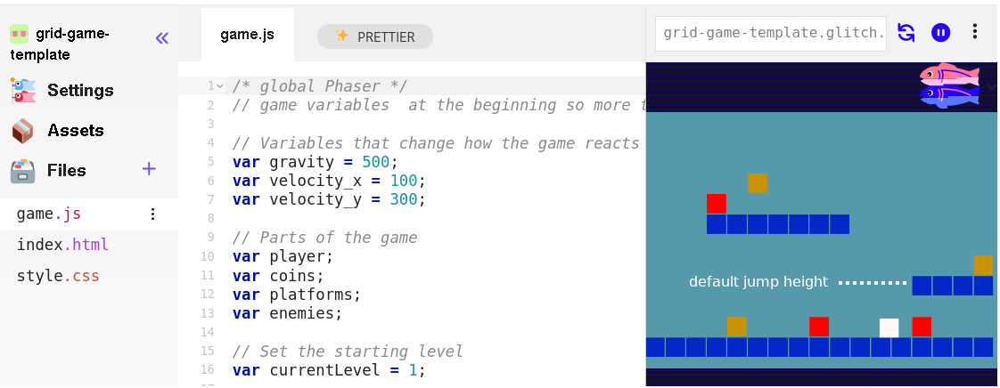
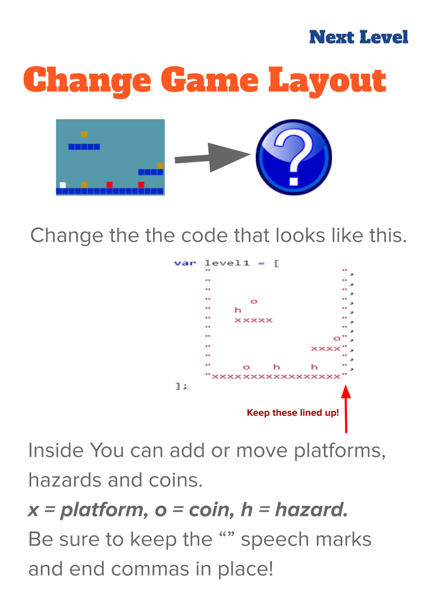
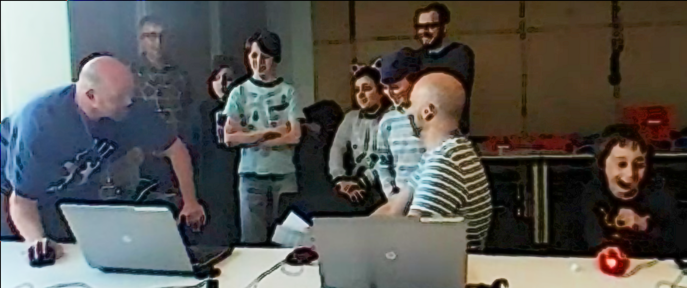
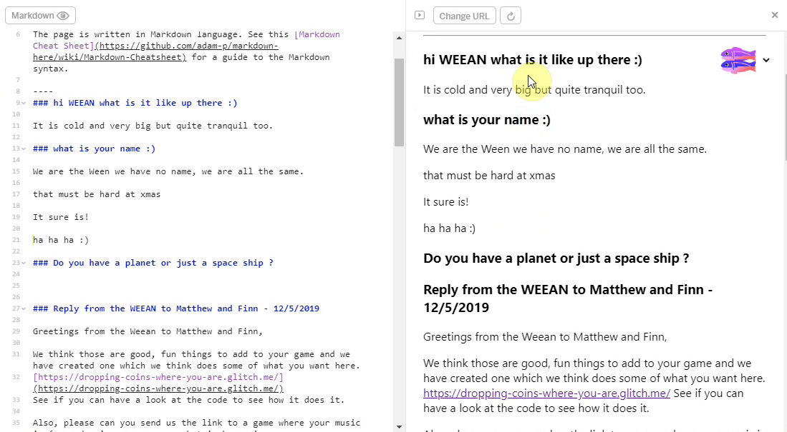

---
zotero:
  scannable-cite: false # only relevant when your compiling to scannable-cite .odt
  client: zotero # defaults to zotero
  author-in-text: false # when true, enabled fake author-name-only cites by replacing it with the text of the last names of the authors
  csl-style: harvard-manchester-metropolitan-university # pre-fill the style
layout: post
categories: chapter
title: 4. Exploration of the Formative Learning Design Process
---
-   [Exploration of the Formative Learning Design
    Process](#exploration-of-the-formative-learning-design-process)
    -   [Research Questions - Feb 2024](#research-questions---feb-2024)
    -   [A note on style](#a-note-on-style)
    -   [Chapter Introduction](#chapter-introduction)
    -   [Detailed description of dimensions of game making
        activity](#detailed-description-of-dimensions-of-game-making-activity)
        -   [Illustrative vignette one participants activity indicating
            general activity of
            participants](#illustrative-vignette-one-participants-activity-indicating-general-activity-of-participants)
        -   [Description of interacting systems of activity illustrated
            using the
            vignette](#description-of-interacting-systems-of-activity-illustrated-using-the-vignette)
            -   [Environmental factors and
                objectives](#environmental-factors-and-objectives)
            -   [Making games for an
                audience](#making-games-for-an-audience)
            -   [Constructing a game feature by
                feature](#constructing-a-game-feature-by-feature)
            -   [Smaller objectives and actions - Implementing discrete
                code and design
                structures](#smaller-objectives-and-actions---implementing-discrete-code-and-design-structures)
    -   [Conflicts and design tensions experienced by participants and
        facilitator/s](#conflicts-and-design-tensions-experienced-by-participants-and-facilitators)
        -   [Tensions due to lack of access and familiarity to game
            programming
            tools](#tensions-due-to-lack-of-access-and-familiarity-to-game-programming-tools)
            -   [Design choices of the starter game
                template](#design-choices-of-the-starter-game-template)
            -   [Observations on the game template and core
                tools](#observations-on-the-game-template-and-core-tools)
        -   [Design adaptations to facilitate novice use of a code
            playground](#design-adaptations-to-facilitate-novice-use-of-a-code-playground)
            -   [Addressing code syntax
                errors](#addressing-code-syntax-errors)
            -   [Distributed vs. self-contained approaches to asset
                creation](#distributed-vs.-self-contained-approaches-to-asset-creation)
            -   [Remixing and showcasing
                projects](#remixing-and-showcasing-projects)
        -   [Participant conflict associated with project navigation and
            use of
            documentation](#participant-conflict-associated-with-project-navigation-and-use-of-documentation)
            -   [Quick Start Cards](#quick-start-cards)
            -   [Code snippet examples](#code-snippet-examples)
            -   [Structuring instructional tutorial
                chapters](#structuring-instructional-tutorial-chapters)
            -   [Theming the a collection of game design patterns to aid
                navigation](#theming-the-a-collection-of-game-design-patterns-to-aid-navigation)
        -   [Conflicts due to identity clashes and dysfunctional group
            work](#conflicts-due-to-identity-clashes-and-dysfunctional-group-work)
    -   [Exploring the impact of a drama
        processes](#exploring-the-impact-of-a-drama-processes)
        -   [Vignette 4.1.a - Introducing a drama
            process](#vignette-4.1.a---introducing-a-drama-process)
        -   [Description of Vignette
            4.1.a](#description-of-vignette-4.1.a)
        -   [Vignette 4.1.b - Session reflections and secret
            missions](#vignette-4.1.b---session-reflections-and-secret-missions)
        -   [Description of Vignette
            4.1.b](#description-of-vignette-4.1.b)
        -   [Relevant observations on side missions and drama from the
            data](#relevant-observations-on-side-missions-and-drama-from-the-data)
        -   [Reflecting in role](#reflecting-in-role)
        -   [Observations on written interactions with the alien in the
            drama](#observations-on-written-interactions-with-the-alien-in-the-drama)
            -   [Exploring documentation and accessing technical help
                within the drama
                frame](#exploring-documentation-and-accessing-technical-help-within-the-drama-frame)
            -   [Playful dialogue with the aliens unrelated to game
                making](#playful-dialogue-with-the-aliens-unrelated-to-game-making)
        -   [Concluding remarks on process
            drama](#concluding-remarks-on-process-drama)
    -   [Results on key interventions of the design concerning
        agency](#results-on-key-interventions-of-the-design-concerning-agency)
        -   [Using Physical Maps of Missions as Game Design
            Patterns](#using-physical-maps-of-missions-as-game-design-patterns)
        -   [A game encouraging maker / player
            types](#a-game-encouraging-maker-player-types)
        -   [Use of side missions to encourage varied creative
            practices](#use-of-side-missions-to-encourage-varied-creative-practices)
    -   [Chapter Discussion](#chapter-discussion)
        -   [Summary of barriers and tensions explored in this
            chapter](#summary-of-barriers-and-tensions-explored-in-this-chapter)
        -   [Link to next chapter](#link-to-next-chapter)

# Exploration of the Formative Learning Design Process

## Research Questions - Feb 2024

~1. What pedagogical tools and processes are available to support novices to overcome barriers to participation in game coding processes?~
1. What ~barriers~ contradictions in participation in game coding processes emerged in the research processes and what were the resulting responses?
2. How can learners build agency in an evolving community of game makers?
3. How can game design patterns support the development of coding practices with novices?

## A note on style

This chapter contains a large number of headings in draft form. These will be replaced with introductory sentences when structure is stable.

<!-- ## Notes on structure -->
<!-- NOTE:
Moved impact of software tools here - and overall on templated approach on a micro level  -  which therefore becomes less of this study's focus - and needs less evidence -->

<!-- - drawing mostly on my journal notes and the evolution of the tools and design themselves.   -->

<!-- - **Interviews (and Lit review ):** exposes motivations and barriers to undertaking activity  this domain from interviews with peer practitioners and literature review -->

<!-- However in terms of tensions - there is one on cultural tensions - this may need moving to the next chapter - a more thematic approach. -->

<!-- Also the practitioner interviews - could be a bit disjointed - as they do relate to cultural barriers and tactics. But could say those are explored in other chapters. DONE -->

## Chapter Introduction  

<!-- - exposes motivations, tactics for and barriers to undertaking activity this domain from interviews with peer practitioners (supplementing the literature review) -->

Due to the novel nature of the learning design, a detailed outline of the specifics of the participants experience of the design helps readers situate  the findings of the following two chapters.
<!-- NOTE  - CHAPTERS ON WHAT? -->

This chapter contains a high level of detail on the technical elements of the learning design to both both helps situate the findings of the next chapter and to allow the design by other practitioners and researchers in this area. The motivation here is that the processes of this research should be understandable and replicable by other practitioners and researchers.

<!-- I am guided in this respect by the lineage of research of constructionism, and in particular the sharing of practice between researchers and teachers regarding the use of LOGO. A seminal example of this practice is Papert and Solomon's publication Twenty things to do with a computer which is replete with code examples and diagrams of their output on the screen [-@papert_twenty_1971]. Many such examples exist from Papert in published memos and grass-roots collaborations with teachers [^4]. -->

---
NOTE
---

I originally structured the chapter around observations structured in the phases described in chapter three. This approach proved over-complicated, mixing the description of tensions which often spanned multiple phases.

---

In line with key techniques of third generation activity theory (3GAT), this chapter addresses the evolution of the key pedagogical features of the tools of learning design used in my research process using analysis of elements of nested activity systems and emerging tensions in learning design.

Firstly, I describe activity systems at different scopes, focusing on the objective of participants.

Following this, I explore emerging tensions in design in a way which communicates relevant context through the analysis of three conflicts in interrelated activity systems.

This chapter discussion begins with an exploration of the tools used through the lens of authenticity and ends with a synthesis to initial barriers to engaging in game making practices and initial interventions to address them.

<!-- - Introduces the use of design patterns and collections of patterns, as the germ cell of activity which then expands in different directions. -->

<!-- The game making community is not authentic or mature in the practices they are undertaking, the kind of community practices which we can undertake are focused partly on building connections to existing knowledge and practice. -->

<!-- One of my roles as designer here was to uncover and to help participants explore knowledge that they were unaware they possessed. Another was to help support the development of peer learning practices and in order to do that help foster a creative environment which suited that. -->

<!-- **Methodology for exposing tensions**

Tensions in the emerging design and the experience of participant conflict in activity systems served to drive the evolution of this learning design.

The work of Sannino on the use of secondary stimulation in formative interventions informs the analysis of conflicts arising and secondary tools and processes which facilitators use to address them [@sannino_activity_2011]. TADS thus addresses transformative agency.

In addition, work to distinguish type of learner agency including transformative, authorial and instrumental agency are potentially useful tools. -->

<!-- The design description is framed within DBR language and concepts. -->
<!-- Section describing  Game Design Patterns as  the main unit of Activity. See Blunden to frame this and to describe the utility of the idea  [@blundenInterdisciplinaryConceptActivity2009; @blundenGermCellUnit2014]. -->

<!--
There's lots to add in here.
chapters\planning\methodology_chapter\methodology_chapter_late_2020.odt.md
https://drive.google.com/drive/u/1/folders/1D-VhVj-NgN3qgk3YEx4HZEozf_1UOGtE
 -->

<!-- As per Rogoff's analysis of informal learning in museaums [], the process of finding a medium between structured activity and authentic activity can be challenging.

The kinds of exhibits which invite extended play are of interest to this study. Such design indicates that there are affordances that invite revised design, tinkering and ongoing play.
-->

<!-- **Cultural influences on my choice of learning design**
NOTE - MOVE TO INTRO  - NO NEED

I set up the working pattern based on my professional experiences and my own academic and cultural interests. As mentioned in the introduction, DIY culture, remix culture, repair culture, TAZ events are strong influences to the learning design based on the ideals of an autonomous community.

 - a desire to increase engagement based on my experiences in classroom and out of classroom - Home Ed / coder dojo experiences
 - the link to cultural practices of code patching and remixing - the example of the plumber coder potentially being someone who finishes the job rather than elegant coder.
 - other experiences of social coding being important being part of a community working on a joint project (add a quote from Dave?)
 <!-- - A walled garden approach in terms of the GDP and code documentation and examples that are used. Based on my own experience of developer documentation and varied coding approaches.
- Other examples from the interviews with practitioners are relevant to include here. -->

<!-- These sections could follow a pattern of
 - rogoff's description / examples - but likely include a larger breakdown of 3 foci in Methodology Chapter.
 - my model examples
 - other links to PBL frameworks and/or educational concepts and contrast analysis

In the 3 foci model Rogoff refers to apprenticeship as a way of illustrating the process of being inculcated into community practices existing in a cultural plane. AN EXAMPLE .. -->

<!-- At this stage of writing I include a bullet point list of design relevant features to be expanded later.

- Shared repositories of resources - users shared a log in so they could see the work created by others.
- Showcase: At the end of the game making process students asked strangers to play their game in the foyer of my departmental building
- Drama Games: the process of warming up, creates community and sets a tone
- Drama Process: specifically designed ot overcome limits of the classroom.
- Playtesting: the process of playtesting, either self or peer links back to a community purpose
 -->

<!-- __Insert image of code__

The code of the game.
While the code is made up of various elements, only the javascript file is normally altered by participants.
The complexity is hidden away from the end user.

__Insert image of game in browser__

On the screen you can see the game.
Toby then decides he wants to add a new element to his game.
He browses the list of game design patterns.
There is a tension where he is hesitant about where to place code.
Screen shot of the menu of choices. -->

## Detailed description of dimensions of game making activity

<!--
#### Code Playgrounds
Find definition
NOTES ON CODE PLAYGROUNDS
However in its styling it is playful and editorial picks and write up celebrate a playful spirit of creativity and sharing. There are strong parallels in this presentation to that Scratch community and to the sharing ethos integral to the maker-movement (explored in Lit Review). The interplay between play and work via shared experimentation is developed further in a later discussion chapter.
#### Online graphics editors - Piskel -->

The purpose of this vignette is to illustrate some of the key features of the overall game making activity in context. The following vignette, consisting of extracts of participant activity over twenty minutes of a session in P2 (see below), shows activity happening at different scopes of activity. The participant, a child Toby, has been working independently on the design of a platform game for the first fifteen minutes of the session. Some specialist terms are used in the vignette which are explained in more detail in this chapter and in the glossary.

<!-- The tool shown in screenshots is the code playground glitch (see chapter 2 and glossary). -->

#### Illustrative vignette one participants activity indicating general activity of participants

The vignette is included as a principle appendix.

https://docs.google.com/document/d/1vYeVxYaRMTWPDOHwC4DEGYAkGPRIDX7wLiz0l8b7LWc/edit

### Description of interacting systems of activity illustrated using the vignette

In line with the process outlined in chapter 3, the following sections outline different scopes of activity, at times using detail from the vignette above, to describe the activity of participants and to introduce tensions between system elements which are explored in this chapter.

<!-- I use concepts from activity theory to describe elements of the activity system and identify intersecting or nested systems of activity and their differing goals. -->

<!-- The following sections describe of the vignette above focusing on the overall activity and its place within evolution of learning design.
Subsequent analysis of the identified activity systems allows both the researcher and practitioner to identifying existing and emerging tensions and to thus observe (spontaneous) or plan (designed) responses. While this chapter focuses primarily on the tools and resources, future chapter also draw on this framework for wider analysis. -->
<!-- ALTERNATIVE SIMPLIER INTRO TO THIS SECTION -->

<!-- Each section follows a pattern: the activity is described in general, then examples of activity at that scope from the vignette above are described, ending with brief analysis or signposting to where the activity in explored in greater depth. -->

<!-- The following descriptions mirror the work of AT researchers who conceptualise scope of activity as concentric circles from Broffennbrenner with "larger" scopes of cultural and societal goals and smaller, narrower, lower scopes of more personal activity [Engestrom][Cole]. -->

<!-- A short description of the activity systems follows the vignette above to help the reader establish a broad understanding of the processes involved before further analysis. I signpost the reader to other chapters when the described activity is explored in more detail there. -->

#### Environmental factors and objectives

In socio-cultural approaches is it important to situate the context of the learning environment within wider systems of activity. In line with Engestrom's concept of shared object explored in the previous chapter [@engestrom_expansive_2001], I have selected several relevant systems and represented them in an illustration 4.x  below.

These include: research goals on the part of the researcher/ participant; desire to create a useful learning experience on the part of student helpers; learning computing skills and concepts as a home education project; participating with other home educators in a creative environment and thus building team and communication skills; and finally a broad aim of fun on the part of the children participants.

<!-- NOTE THERE IS A MISMATCH BETWEEN DIAGRAM AND THE OBJECTIVES - CHOOSE ONE - AND MAKE IT CLEAR -->

{width=95%}

In this research I take the approach of treating this shared object as an activity system in its own right.

<!-- NOTE MOVE PREVIOUS Chapter?  -->
Lecusay takes a similar approach [@lecusay_telementoring_2015]  and describes the shared object as an ideocultural hybrid which develops into its own activity system.

<!-- NOTE - CAN ADD THE OBJECTIVES / LEADING ACTIVITIES INTO THE ARROWS ON THE DIAGRAM -->
<!-- While the limited example above of Toby's activity illustrates fun, additional data from interviews with this child and family back the broad goals above. [develop - perhaps an appendix or quotes] -->

<!-- As previously explored this mirrors the Activity, Action and Operation hierarchy. -->

<!-- | **Subject**         | **Objective**             | **Tools & Processes**          |
|------|-------------|------------|
| Community of novice game makers | Creating a game which is fun to play and communicates an environmental theme     | Shared log in to code playground (glitch.com)   |
|   |      | Shared log in to graphic editor (Piskel)    |
|   |      | Instructions from facilitator including the overall mission   |
|   |      | Starting game template    |
|   |      | Group playtesting     |
|        |     |

Table 4.x.  Tools used in larger-scoped objective involving the wider community of notice coders collectively making separate games. -->

#### Making games for an audience

The broader activity system whose object was the game making programme had a shared objective of making entertaining and educational games for an audience to play.  

<!-- NOTE - what is the difference between objective and outcome -->

<!-- Insert an AT diagram from here - https://docs.google.com/presentation/d/1vR6dzFG6qXIdpB_-s6PbCePiB87qTs6YAXCljxNcb5Y/edit#slide=id.g57b5e8e9ad_0_0 -->

{width=95%}

There are diverse end audiences for the games. The final target audience are students and staff in the Manchester Met Brooks building where the created games are shared in arcade cabinets at the end of the programme. An additional audience are friends and family who can be send the games to play online. The more immediate audience for the evolving games are peer game makers during the making sessions.

{width=75%}

While the broad aim of making a game to share is tacitly agreed through participation, there are also diverse motivations stemming from environmental factors in the interrelated actors in this activity which bleed into the tensions which emerge at this level. In the vignette and surrounding data, Toby pays close attention to the challenge and variety of the game playing experience for his projected audience of players. In the vignette above, I draw the participants attention to the showcasing of their games to an external audience. Toby begins the session playing his own game. During the course of this session he invites many other group members to play his game. He initiates and responds to conversations around the difficultly of the game he has designed.

While the programme had a shared objective of making a game, there were tensions brought by the cultural factors and other objectives imported from other activity systems. This chapter explores those tensions.

<!-- In the vignette of Toby's activity this wider objective is present in the facilitator orientation at the start which references this audience -  _the Monday after we can play our games and we can share them with students. We can make the students frustrated when they can’t beat our games_. At the end of the vignette text, one of the student helpers also imagines this audience playing the game of Toby.    -->
<!--
NOTE - More on large scope in AT terms? What is needed here? -->

#### Constructing a game feature by feature

Within the activity system of making a game

There is a strong case to make for the sub-projects of implementing GDP as a key unit of analysis. Barab and colleagues justify smaller units in their study observing emerging practices in a technology rich learning environment [@barab_using_2002].

At this scope of activity, participants work on the game code and and audio and graphical assets to achieve the broad objective is to alter and add new features to the game using tools available in the learning environment.  

<!-- | Subject         | Objective             | Tools & Processes          |
|------|-------------|------------|
| Groups or individual participants | Implementing game elements   | Code editing tool (glitch)   |
|   |   |  Game preview tool (glitch) |
|   |   |  Menu of game patterns at ggc-examples.glitch.me  |
|   |   |  Step by step tutorials on FLOSS manuals  |
|   |   |  Playtesting own game |
|        |     |

Table 4.x.  Tools used in mid-level objectives when selecting and planning implementation of game elements. -->

{width=95%}

<!-- One observation from he experimental course was that without significant support, the process of making a game is complex and there are many possible blockages in the process. -->

<!-- NOTE - THIS IS ANALYSIS  -WHERE TO PLACE IT?
By this stage, the process of collecting a user generated list of features and trying to respond to all of them as a facilitator had been abandoned as unrealistic. -->

<!-- NOTE - how much from p1-4 below to include? -->

<!-- In the example above Toby progresses from playtesting his own game to altering it. The code to change the layout of the platforms of the game is already included in the starting template. Thus is able add a new platform by making simple code changes. Toby retests the game immediately by clicking on the preview element of the code environment.  -->

<!-- However within that wider objective there may be a variety of goals depending on the participant. In this case Toby's goal is addresses the challenge and variety of the game playing experience. -->

<!-- Toby builds his competence in the process of comparing the own code to the code example to work out what code is new and relevant to the desired behaviour. -->

In addition game design patterns emerged as a shared object. DEVELOP THIS IDEA HERE OR IN DISCUSSION.

{width=95%}

Overall activity at this level was driven by learners setting goals and requesting help to implement game features. By this stage of the process, Toby is able to browse a collection of game design patterns and use diverse of tools, resources and processes. Participants developed preferred approaches and tool choices especially in accessing help when adding a new feature to their game. In the vignette above I outline the two main sources of help at the level of adding a new feature to the game: "Here’s the tutorial and there’s the examples of code". In the course of the vignette above, Toby chose to access only a code example of the desired game behaviour. He did not, as some in the group were doing in this session, use the tutorial which provided more descriptive, step-by-step guidance. Other participants relied only on direct verbal help from myself or other participants (like Toby) to help them progress. A later section of this chapter details the different supporting documentation guiding participation in game making practices. Chapter five then explores activity occurring at this scope in more detail with a greater focus on emerging concepts as tools.

<!-- While some game patterns were simple to add, e.g. altering the location of platforms, other more complicated features involved several stages and varied tools to implement. The next section describes these stages as discrete code and design structures. -->

<!-- NOTE - Other participants;s motivations - explored later? -->

<!-- Other participants were less proficient using this online resources and used printed out versions of documentation. -->

<!-- In the next section narrower actions still within this system are explored as discreet actions which combine to be come the activity of implementing a game pattern. -->

<!-- | **Subject**         | **Objective**             | **Tools & Processes**         
|----------------|-----------|------------|
| Individuals (mostly)  | Implementing specific code or design tasks   |  Code editing tool (glitch)   |
|   |   |  Code game preview tool (glitch) |
|   |   |  Piskel  online graphics editor   |
|   |   |  Step by step tutorials on FLOSS manuals  |
|   |   |  Stand-alone code examples on glitch.com  |
|        |     | -->

<!-- Table 4.x.  Tools used in lower-level objectives of implementing specific code structures or stages in creating game assets -->

#### Smaller objectives and actions - Implementing discrete code and design structures

<!-- For example, creating a new graphical element in a separate online pixel-art editor called Piskel, exporting and downloading it to the laptop, and uploading it to the glitch code playground and then making code changes in several parts of the code to initialise and implement new behaviour for this element. -->

While the previous section focused on a mid-level objective of adding or altering game features (also referred to as game design patterns here), implementing more complicated patterns involved several stages and varied tools. Using the terminology of Leontiev [-@leontiev_activity_2009], in the example above Toby undertakes certain chains of processes in a fluid way that shows that actions had become operations. An example of such an operation is his quick navigation between different areas of the game code, the game preview window and other sources of documentation. In contrast, some tasks are new to Toby and are performed more hesitantly. At times in extract above, Toby is careful and hesitant, checking and rechecking the process of copying and pasting new code into his game from a specially prepared code example.

<!--NOTE As a facilitator of a community I aim to notice these transitions as I aim to use the proficiency of participants to help distribute the process of helping peers. -->

Identifying shifts in participant activity in terms of scope facilitates analysis of the complex and interwoven cultural, social and personal actions in a communities activity [@rogoff_observing_1995]. Above, Toby shifts between the wider activity of making a game and sharing it with peers and narrower actions implementing concrete code structures. This aspect is developed in chapter five. In addition to these shifts in scope, analysis of community processes also involves transformation over time.  The next section offers a description of the evolution of tool use in different phases of the study with an aim to situate analysis of emerging tensions in the use of tools, resources and processes in the following section.

<!-- In this thesis, chapter six has a focus on cultural aspects of making a game together and chapter five explores social organisation around the activity of adding game design patterns chapter five.  -->

<!-- After inserting the code which adds a moving enemy to the game, Toby spends five minutes altering the variables involved to match his design and to create a level of challenge that he is happy with. -->

<!-- Toby makes quick progress. one factor here is willingness to make mistakes. There is a confidence here in undoing mistakes, commenting out new code to return to previous behaviour.

The trial and error approach also yields benefits, a mistake in the values edited creates an unexpected result of the enemy moving vertically instead of horizontally. Toby embraces this mistake and shares his account of this happy accident enthusiastically. -->

<!-- NOTE
Each of these with differing levels of abstraction.
Break down that of GDPs? -->

<!-- In the last chapter, we examined the use of Rogoff's 3 lenses of cultural, social and personal activity. We can see a broad alignment of these lenses and the scopes of the activity systems above.

This has utility to both researcher and learning designer. The observations of the following chapters are based on this approach of using lenses to focus in on relevant activity.

NOTE - Explore how performed in line with other research - e.g. DBR (Barab) and possibly Bevan and Petrich -->

<!-- to highlight possible tensions and contradictions between competing goals of interrelated activity systems. -->
<!-- For example a common contradiction may be an immediate goal of children to mess around, play games and have fun while the goals of parent may be to maximise the acquisition of skills -->

## Conflicts and design tensions experienced by participants and facilitator/s

This section examines design contradictions between system elements and tensions experience by participants which developed into conflicts which significant in stopping participant progress.

The term conflict here is used to describe a more serious break down of activity due to an accumulation of contradictions and tensions.

The processes here aligns with AT approach of formative interventions in that the surfacing of tensions due to changes in the learning design over time are examined. I chart the detail of the evolution of resources and other responses used helps illuminate broader, systemic issues concerns in the overall activity [@barab_using_2002].

These tensions are outlined from a cultural perspective,

It explores areas of tensions and barriers.  
NOTE - (be clearer on terms still)

- contradictions in the tool set of the early design.

- contradictions which stimulated the development of authoring tools and supporting documentation.

- issues of identity and interventions designed to mitigate cultural barriers of participation.

<!-- In the process of reflection on sessions I both observed and project tensions between activity system elements and between different scopes of activity. In response, I introduced new tools or processes or removed existing or potential barriers. I observed participants responding to tensions both in expected and novel ways. -->

<!-- As outlined in the table above I carried out four stages of workshops and development with home educator families. I will outline decisions behind the design activities at key stage of activity   -->
<!--
**Summary table of tensions ONLINE HERE**
https://docs.google.com/document/d/18HrRPPx0-fj3PXVJTAf2dzYNTBSYGikpV_U0hu46r2c/edit

**3M Matrix tensions ONLINE HERE**
https://docs.google.com/document/d/1DRgpgIUfq5XIktYy-lX4WlviUDnffNc0v8SOeLGgHho/edit
Matrix of 3M Game Making Model - Pedagogical Features explored through Tensions and Resolutions -->

<!-- 3 foci and 3M element compared - save for the conclusion/ discussion?
https://docs.google.com/document/d/1FIPn2dEB2aCKZi5z05j69cnHgpGNXFh1_SPV6h5l12g/edit#heading=h.kci0lnvn7f60 -->

<!-- NOTE - DEVELOP THIS ASPECT OF INCLUSIVE ENVIRONMENT TO REDUCE STRESS - MOVE FROM NEXT CHAPTER?  -->

<!-- IS THIS NEEDED / IN THE RIGHT PLACE?
The process of researching conceptions of agency has allowed me to align my intuitive reluctance to steer participants towards the more abstract curricular concepts to interpretations of agency. In particular, Matusov's discussion on the negative impact on authorial agency of processes designed to align with curricular goals resonates. -->

<!-- My experience of the process of adapting the learning design to the needs of more formal settings supports existing research in this area. The following section aims to summarise the alignment of the potential of this work with existing research -->

<!-- NOTE - Reduce this down to text - as too close to the end table. And reduce in significance. -->

<!-- - It may not be clear how teachers can best support the direction of learners - addressed by the map linked to the collection of GDP used to support and identify possible pathways. -->

<!-- Systems concepts are embedded in many games but the process of direct teaching of such systems can be complex and interrupt and distract from other design activities. To address this I identified and highlighted systems related design patterns themed as challenge-related patterns to explore systems concepts within the game context. This approach mirrors work undertaken by Gary on Game Star Mechanic , where -->

<!-- (outlined in Methods chapter -  use Schnell & GSM literature = their terminology is Game elements) -->

<!-- has been is helpful to provide a clearer the focus of this study on the possibilities of informal spaces. - >
<!-- I also de-prioritised learning maps as an area of study in this thesis partly this is due to it well explored in other research []FIND SOURCES, -->
<!-- and partly as the implementation was patchy as I concentrated on more narrative and in person reflection (see later chapter on Methods) -->

<!-- The process of using these resources to align and highlight the design activities to underlying concepts is not explored in this study from the perspective of learners. -->

<!--
While this is an informal way of using maps the are other approaches that are more formal including one called a concept map which is a visual representation of target specialised knowledge. There is a section on concept maps as part of the teach computing website here. https://blog.teachcomputing.org/how-we-teach-computing/. -->
<!-- 

_Map of Learning Dimensions of the 3M Game Making Approach_
 -->

 <!-- **Including Coding Concepts in the Learning Map and including Code Cards with links to online Concepts**

 Recap here the choice of coding concepts rather that CT in more abstract terms.

 - Make Code cards which contained links to game design patterns and the different component concepts
 - (see Eriksson and Bjork)
 - Draw on material and critique in chapter on semantic profiles / waves. -->

<!--
MOVE TO END CHAPTER?
I am currently investigating replicating the use of maps process using online tools to reduce complexity and preparation time. -->

<!-- It explores these tensions in relation to existing research and contains further discussion to inform possible future directions of research. -->

<!-- **Lack of reflection and moments to reinforce what is being learnt.** To support younger coders unsure what to do next or who struggle to stay on task, I sought to create another kind of map to help them navigate their game making journey. -->

<!-- Facilitators may need to justify learning happening and struggle to see this in-situ if unfamiliar with the game making process. This may restrict openness of activities to better assess and support learning. A map of learning dimensions flexibly linked to main missions/patterns can be used by both learners and facilitators. -->

<!-- Challenges adapting resources to a curriculum environment
There were some additional changes in the way that design patterns were presented to learners mirroring design patterns on other domains including: name; need ; related patterns. In addition related concepts in computational thinking and design processes which are promoted as part of the recent computing curriculum were included and linked to a learning dimensions map. -->

<!--
| **Tension identified**| **Commentary**|
|----------------|------------------|
|Facilitator stress if they are not able to support a very diverse set of features demanded by students working on diverse kinds of games.  | Limit the type of game to one kind. Offer a significant but limited menu of missions that users can add. Offer written and visual support documents which learners can access independently of facilitators|
|  Facilitators may need to justify learning happening and struggle to see this in-situ if unfamiliar with the game making process. This may restrict openness of activities to better assess and support learning. | A map of learning dimensions flexibly linked to main missions/patterns can be used by both learners and facilitators.  |   |
|  Challenges adapting resources to a curriculum environment |  There were some additional changes in the way that design patterns were presented to learners mirroring design patterns on other domains including: name; need ; related patterns. In addition related concepts in computational thinking and design processes which are promoted as part of the recent computing curriculum were included and linked to a learning dimensions map. |   
|Systems concepts are embedded in many games but the process of direct teaching of such systems can be complex and interrupt and distract from other design activities.   |  Systems related design patterns were identified and placed in a challenge themed section. Extra missions which highlight game challenge and user experience may help learners to explore systems concepts within the game context. (outlined in Methods chapter -  use Schnell & GSM literature = their terminology is Game elements)|    -->

<!-- NOTE EXPAND IF USEFUL -->

<!-- While the use of these skills is not unique to game making and common to pick up on many making situations, the use of external image and sound asset creation tools which then creates production pipeline process does engender key navigation and importing and exporting skills which are very valuable in online environments. -->

<!-- NOTE - The map could easily be changed to reflect this or other foci of teachers / researchers. -->
<!-- A theme to follow up in the Maps / personal learning chapter is that of picking up on some of the behaviour of participants, especially that of experienced parents, experience either in coding practices of supporting their children. Once identified, how could beneficial interactions be encouraged in the next iteration of design.

Examples include;

- supporting reflection on design and coding concepts / skills.
- navigation / organisational support - use of a physical map.

For example, the use of CT concepts in a framework, listed as part of the initial design pattern card, which could then be discussed, ticked off or otherwise reflected on. -->

### Tensions due to lack of access and familiarity to game programming tools

MOVE THIS WHOLE SECTION BEFORE DESIGN ADAPTATION / CODE PLAYGROUND

<!-- In P1 I trialled brief class instruction of key coding concepts, e.g. logic statements, that I judged to be relevant to the whole group. Despite trying to limit the time spent on instruction, linking to their experiences and making the process informal, my journal notes reflecting on these interventions were unfavourable. Instead, I was keen to align with the motivational potential of hands-on (learning by experience) approaches to STEM education [@holstermann_hands-activities_2010]. -->

Conflicts arose due to a contradictions between the desire of participants to use the tools to create games and their lack of experience of them.
FINESSE THIS WITH MORE DETAIL - accumulation

The process of helping participants build familiarity and competency in tool use was further complicated by my own motivations for working with as authentic as practical game authoring tools.

<!-- While AT has a broad definition of the concept of tool, including the use of language and concepts, this section focuses on software tools used to create games in this program and technical process needed within those applications.   -->

Thus crux of the conflict is that coding games to create a webpage using a text environment is a complex process. While some of the group had some experience, many did not. In early stages, this gulf created a tension between the need to use the tools and text coding processes which often resulted in frustration and paralysis in the activity of game coding. While, tensions stemming from gaps in knowledge and practice are commonly addressed in formal learning environments through forms of instruction, the informal nature of this learning setting allowed for more flexible approaches.

The resulted in a design challenge involved designing a bespoke  game authoring environment by adapting existing tools and embedding where possible affordances within that toolset to facilitate participants to address gaps in their knowledge without needing explicit instruction. The following sections explore the evolution of the tool selection and the tool use of participants in response to this conflict in the game making activity system.

 <!-- namely: an incomplete 2D platformer; pixel graphics; with graphical scaffolding for text-based code; and deliberately incomplete thus inviting improvement. -->

The motivation was to align to authentic web technology due to my previous experience. The reason for working with code this authentic bears exploration. Characteristics of broader dimensions of authenticity of tools and processes in learning environments are explored in the literature review. A brief summary being: similarity to workplace settings; facilitating activity which serves a need of participants; an ability to showcased resulting work to an audience [@shaffer_thick_1999; @warr_bridging_2020]. While my choice of open source digital tools allowed for a high level of aligning with professional practices, it was also potentially complex in terms of use of tools. In part my motivation for choice of code language (Javascript, Phaser) was driven by desire to align with common workplace practices and to be potentially extensible for future student-led web projects.
<!-- As explored in the literature review, an extensive body of research on the design motivations and impact on learners exists for the creative coding tools Scratch.  -->

<!-- A common question for this research is why not use Scratch (see LR / Glossary)? While Scratch, is aimed a broad range of media creation, much of this research involves game making as a popular genre of media of young people. I chose to not use Scratch for this study, partly as it was well researched and partly to prioritise authenticity of tool set.   -->

By P2, learners first experience of the experience of the tools was in the process of playing an incomplete game in a webpage and controlling the character using the computers arrow/ cursor keys which for many was a familiar process. Due to an intentional fault, players needed to click a remix button, and alter the underlying code to progress in the game. The following section outlines responsive design process surrounding two main elements: first, the code playground toolset; and second the starting game template.

<!-- NOTE INTEGREATE HOW DESIGNING FOR AUTHENITITY IS A CHALLENGE HERE WHICH IS ALIGNED WITH PBL AND EXPERIENTIAL THEORY, FORESHADOW SHARED DIMENTIONS OF AUTHENTICITY WHICH ARE EXPLORED LATER. -->

<!-- I took care to screen participants from processes and tools that were unrealistic for novices to use. -->

<!-- NOTE - PERHAPS EXPLORE COMPLEXITIY OF IDES AS A BARRIER IN RESEARCH - SEE BLUE JAY AND GREEN FOOT TRAINING IDEs -->
<!-- In the activities of study, a high degree of authenticity made possible, in a material sense, by the digital nature of the learning resources. Beyond a general purpose computer, no prohibitive equipment is needed. -->

#### Design choices of the starter game template

FOCUS ON THE TENSION FIRST AND SHIFT FROM P1 -> P2

The initial use of a working structural template was an intuitive response based on my own experience of teaching technology. The choice to pre-select a particular genre was initially a pragmatic response to tensions experienced in P1. When offering feedback to address her family's feeling of isolation from the coding process, the parent of the family described in part two of this section had more hands on play and use of the tools of production before being called on to make creative decision, likening this to an arts studio approach. I realised that to allow for this playful experimentation, a purely structural template was insufficient and that a working game template was preferred. To create the template I drew on the structure of online tutorials [^5] to support create a two-dimensional platformer game [^6]. The following section describes designs decisions relevant to the evolution of this starting template by drawing on concepts explored in the literature review, namely: UMC approaches; constructionist design heuristics; and the domain of human-computer interaction (HCI) research. In particular, I explore the concept of affordances understood from a socio-cultural perspective as 'technology affordances as possibilities for human actions mediated by cultural means' [@kaptelinin_affordances_2012, p.927].  

##### Structural design of the game template

A web code project using the chosen game framework
phaser consists of several interlinked files of Javascript, HTML and CSS and image files. Creating the project from first principles is relatively complex both semantically and practically. In the domain of web technology, starter templates consist of pre-built collections of HTML, JavaScript, CSS and other configuration files which allow users to avoid initial configuration and thus accelerate adding features to projects. For example the Next.js web framework comes with a large range of starter templates based on common requirements of web sites [@nelson_best_2023]. Phaser starting templates available from the website share this aim of providing scaffolding by providing a downloadable zip of files which when extracted are already interlinked correctly [^5].

Game states and functions to create the game loop (see glossary) are included natively in the phaser framework [@faas_introduction_2017]. Game states allow designers to deconstruct games and game code into collections of sub-units (states)   [@kostolny_digital_2017]. For example a simple arcade games may only had an insert coin state, a play state and a game over state. A game coding framework like phaser shields its users from code complexity by providing a game state manager and associated functions out-of-the-box, meaning that lots of underlying code is already written and hidden from view. To increase simplicity for my participants the starting template I created had only one game state called _PlayState_. It followed the following structure: a beginning section out side of a function declaring variables; a preload function which loads assets into the game; a create function which sets up the initial game; an update function which listens to and responds to user input. The following illustration from the step-based instructions illustrates the structure for participants, including the possibility to create new game states e.g. a game over state.

{width=55%}

4.x - Game states and function structure explained in the Glitch Game Makers manual created for for P2 and P3

While access to HTML and CSS files of the base project was available in the left menu as show in  by default participants would see only the JavaScript file names game.js (See Figure 4.x below)

<!-- The use of template was an immediate, intuitive way to bring something to the table as a starting point to develop.  -->

<!-- Other parents requested additional supporting resources which explained the coding structures used in accessible but detailed ways. A request which hinted at a more structured, instruction based approach.  -->
<!-- In addition, my own motivations to explore research claims which on the engagement value of prioritising modifications to for quick impact on the game and on allowing participants choose over what they wanted to add to their game next. -->

<!-- follow the Use-Modify-Create model to build familiarity with and to scaffold the adaptation and use of coding constructs [@lee_computational_2011]. -->

<!-- In phase one, I noted that any addition to the game in terms of adding new any quantity of code created many potential coding, conceptual and organisational challenges. To counter this I adapted the starting game template to allow changes in code were relatively easy to perform but which resulted in potentially large changes in game behaviour and appearance. -->

<!-- NOTE SOME OF THIS CAN  -->
<!-- I kept the process informal and responsive by allowing participants to choose which one they wanted to work on next. The following sections outline different areas and patterns of activity. -->

<!-- COMMENT OF mOZILLA TOD THAT IT WAS GENTLE FACILITATION -->

<!-- - level design and prototyping: use of
- fluid variable editing effective movement
- The swapping of assets and more complex work with code syntax
- development of simple stories to bump personal expression and narrative -->

<!-- NOTE - All longer or shorter chains of actions , becoming operations - WHERE DOES THIS FIT?
NOTE - Also justify having so emergent results here , delay while accessing help to start 360 recordings
As the end process is visible in fluid behaviour -->

<!-- These tools align with some key design considerations. [Brennan & Resnick]
- Well suited to build a repeated design practice.
- Small changes had big effects.
- Variable changes needed immediate testing.  
- Especially with starting documents, -->

<!-- While the design suits repeated design practice as illustrated by the example above, not all pairs or individuals interacted with GDP in such a neat way.
A later discussion section in this chapter illustrates a more complex interaction with design stages. -->
<!-- The choice of the starting toolset and mission shapes the balance and profile of initial community activity. -->

<!-- Make point that it is hard to separate out tools and communities. In case of Mozilla, code playgrounds, and teach the web, and the culture of developers and teaching communities they are interlinked. Discuss and compare to Kafai in book, the lineage of Logo, Scratch. Instead the more authentic approach of a real language.
-->

##### Variable editing for player movement

To accelerate and support the experimentation of users, I identified changes to the code that were easily recognisable game experience features and where small changes could provoke a high impact on the game experiences. These include changing gravity, altering the player jump height and walking speed.

{width=95%}
4.x glitch coding environment with code structure of left menu, a central code window with code, comments and game preview on the right.

The starting template began with the game in a broken state thus inviting players to modify the game to fix it. The player's maximum jump trajectory was not sufficient to progress via a jump to the first platform. To progress, participants needed to change alter at least one of the key variables were highlighted at the very start of the game code (see Figure above). In their research Kynigos and colleagues [-@kynigos_children_2018] explore this concept as a half-baked games where incompleteness or bugs in behaviour are a provocation to participants to correct or to further modify them. This process also aligns with the motivations and techniques of the UMC framework explored in the literature review , in particular the guideline to "create choices that show visible and immediate changes" [@lytle_use_2019-1, p. 6]. In this design, the first participant choice and the need to  transition from the _use_ to _modify_ stages is forced at an early stage by the half-baked design. While this design decision compromises the user choice initially, it allows a  carefully scaffolding of early coding experiences and promotes a shared experience for all participants in a way which facilitates and encourages peer learning. After this shared first change, participants next choices varied greatly. While some participants engaged with extensive experimentation to find a player movement feel that seemed just right, others, mostly adults or younger participants, were much less concerned with this aspect of game play, despite sometime frustrating resulting player movement. Data explored in the next chapter supports foundational claims of contructionist computing and UMC advocates  that greater user choice over the design process contributes to participant motivational and a feeling ownership of their projects [@lytle_use_2019, @peppler_computer_2009]

<!-- Descriptions of three design techniques to the template to make quick modification of the game easier follow. -->
<!-- I adapted my design with an aim to increase speed and consistency of feedback from learner input, reduce coding syntax knowledge needed to progress, and thus reduce learner anxiety for novices.  -->
<!-- list of changes
background colour of the game
game layout of the platforms - hazards and food to collect. -->

##### Level design and prototyping

ILLUSTRATE BLOCK HERE WHICH BECOMES A TENSION - IN P1 OF PARTICIPANTS WANTING TO DO THINGS THEY COULDN'T -

The use of a graphical grid structure to edit level design helped balance concerns of accessibility with the use of authentic code language. Platform games often conform to certain patterns in terms of the elements involved in a level and their affordances. Common elements include the player that you control to movement of, platforms to be jumped on, enemies to be avoided and rewards to be collected. In the templated used in P1 the process of adding game elements was  involved relatively complex process which involved changing parameters of functions to alter to adjust their location. An example of the code needed to add two platforms is included one of my tutorial chapters [^7]. In the preload function the following code would be added.

    game.load.image("grass:4x1", "images/grass_4x1.png");

Then in the create function the following code would be added.

    var platform1 = platforms.create(150, 220, 'grass:4x1');
    platform1.body.immovable = true;

    var platform2 = platforms.create(250, 150, 'grass:4x1');
    platform2.body.immovable = true;

Using this technique to add level design elements had several disadvantages which introduced tensions into the game making activity. These including: complexity of adding function parameters for screen coordinates and difficultly of troubleshooting location; the need to add code to various places in the code; each platform needs to be added separately; and the difficultly of creating and swapping out different size graphical files when altering the length of a platform. A similar process was also needed for each reward and hazard. While in early stages I took measures to mitigate some of these complexities, the process remained too complex for the immediacy of game modification that I envisaged as desirable. For the template use in P2, I revised the starting template to created game elements was based on a visual design in a grid format(see figure 4.x below). Changes to the text based grid in the code area on the left would be immediately seen in the right hand project preview area.

<!-- OPTIONAL ADD AND APPENDIX ON LOAD LEVEL? -->

{width=95%}
Figure 4.x - Grid based editing of level design with a simple key for hazards, coins, and platforms.

I adopted a different solutions which abstracted away complexity to prioritise ease of use to help sustain participant engagement. Technically, this approach involves the construction of a data array for each level of 17 blocks which can be one of the following: x (platform); h (hazard); o (coin); or could be left blank (see Figure 4.x above). The end result was that while participants altered a text-based array, the grid structure had a strong visual correlation with the resulting game layout. This design choice allowed alignment with design principles for tools for novice coders, in particular the importance of visual approach to facilitate the programming multi-media projects for novices [@guzdial_programming_2004; @resnick_scratch:_2009]. This adaptation had a positive impact on engagement with level design in initial stages. Many participants spending significant time and effort undertaking many iterations of changes to the level design. As explored in the vignette above, Toby designed many levels making the game very challenging but still technically possible. Participants varied in their approach to level design, some drew on their experiences to mirrors platform game conventions, while others enjoyed working against these conventions, a theme which is explored in more detail in chapter five.

<!-- The vignette in the last chapter saw Toby's adding new levels to his game and undertaking many iterations of changes to the level design.  -->

<!-- The possibility of disturbing the syntax of the  of code in the array. When participant did this it provided a good opportunity for facilitators or parents to outline the importance of correct syntax of and to explain the code structure. -->

##### Background colour and a pixel art

START WITH SHIFT FROM P1 DIVERSITY TO P2 FOCUSED & OVERCOMING PRACTICAL BARRIERS.

Participants were keen to replace the default coloured block sprites of game elements with their own art of characters and backgrounds. From P2 onwards the one suggested tool to do this was the online Piskel tool [^8]. A pixel art approach to graphics allowed a balance between the potential for positive engagement with game making and the potential drain of time to this one activity, thus helping resolve one of the tensions emerging in P1. Piskel had proved to be intuitive for many younger participants with three main areas: a set of editing tools; a canvas for creation; and a set of tools to export, save and import work (see Figure 4.x).

{width=95%}
Figure 4.x - Interface of Piskelapp tool

One of the complications encountered in P1 was the differing sizes of sprites created using different graphical tools. I helped resolve this for participants by matching the size of the block in the grid level design structure described above to the default size of sprites created in Piskel (32 x 32 pixels). This is one example of many small technical alignments which addressed and helped resolve practical obstacles that participants experienced.

Participants spent a widely different length of time creating these graphics for a variety of reasons. Some took a long time to master the process of using the editing tool while others created images rapidly but would keep redesigning and recreating their game elements. The process of game art creation opportunities seeding narrative and artistic creativity is explored in more detail in chapter five.

<!-- _Seeding narrative and art creativity_
As they had been guided to make a game on a broadly environmental theme, participants often redesigned sprites to games involving animals. The following image shows a whale as a player character and plastic bottles.

{width=50%} -->

<!-- MOVE?
The process of creating a pixel art characters and hazard involved using an online grid design tool called Piskel, creating an design of an appropriate size, saving, exporting as an image, downloading to the hard drive of the laptop in use and finally uploading and incorporating the image into the code project and linking using code syntax. -->

<!-- #### Creating a simplified and clear project structure

The following illustration from the step-based instructions illustrates the structure for participants.

{width=95%}

4.x - Structure explained in Manual for P2 and P3

In P1, I found that as I worked with the learners to respond to their requests to add in new elements to the game, I was able to to reference different parts of the template and thus build their familiarity with the code.

At one stage I did a test of that process by printing out different elements of the template and asking them to complete them roughly in order as a jigsaw activity. The participants expressed surprise at how much familiarity they had built up with the code.
INSERT QUOTE FROM SU AND TOBY

Despite building familiarity with code, at this stage event simple game changes or adding new elements still required significant support.
 -->

#### Observations on the game template and core tools

<!-- NOTE: FEEDBACK FOCUS from HCI & layer in AT terminology too.  -->

<!-- The templated game was structured to allow changes in code which were relatively easy to perform but which resulted in potentially large changes in game behaviour, appearance and difficulty. This created a large diversity in the games created and in the making activities of participants at this stage despite the small scale of the code changes involved.   -->
<!-- Thus while I highlighted a limited number key code elements and structures to create affordances to facilitate a quick start, the diversity of experience kept some participants extended periods of time. -->

<!-- Games have been part of human–computer interaction (HCI) research since
the first CHI conference in 1982. At that gathering, Tom Malone, then at Xerox
PARC, presented insights from the study of computer games to motivate a set of
design principles for “enjoyable” user interfaces (Malone, 1982).

from [@bernhaupt_introduction_2015]
 -->

The previous sections have outlined changes to the core tool use including the use of a starter game template which I enacted to address the struggles participants had in becoming accustomed to game making. Despite the relative simplicity of the highlighted affordances outlined above, complex and divergent patterns of design behaviour began to emerge. Small code changes resulted in potentially large changes in game behaviour, appearance and difficulty aligns with a long standing concept of HCI research that feedback is motivating for system users [@bernhaupt_introduction_2015; @malone_heuristics_1982]. In addition, the use of revised in starter template in P2 allowed participants to maintain their games in a mainly working, shareable state allowing regular feedback from peers. The use of a starting template was inline with core motivations of UMC technique, namely, to build familiarity with the code structure, and confidence in use of tools in an accelerated way. As explored above, the shift in template design from P1 to P2 involved a much more careful and structured experience for participants in use and modify stages.

Despite these modifications, participants still needed help to access and use the relevant affordances in code template. In early trials with a limited number of families in late P1, I would point out the relevant part of the code and ask open questions e.g. '_I wonder what would happen if you changed that gravity variable?_' However, for larger groups this was not optimal, risking leaving some unsupported. My response was to turn to supporting documentation. In addition, participants soon began to ask how to make modifications to the game which needed additional code structures, a development signifying a pivot to the _create_ phase on the UMC model. The next section explores similar tensions related to the role of supporting resources and documentation.  

<!-- My reflections as an facilitator are consistent with research showing the value of ongoing feedback in HCI and more domain specific research on showing the process of sharing creations are motivating thus. -->

<!-- At the use and modify stage, knowledge of very few coding concepts were essential. It useful to compare this to a typical process of learning to code in a text language from first principles where the learner is met with a great many new concepts in the process of being guided to construct even the most basic of programs.  Thus, while some basic alterations are being made, this stage of learning design aligns most closely with the _Use_ stage of the UMC model (see lit review/ glossary) [@lee_computational_2011].    -->

<!-- The partially working environment and immediate feedback this allowed also gave rapid access access to varied forms of face to face community activity including varied forms of playtesting and social interaction and ways to access help from peers and facilitators.
While Scratch has an extensive online community allowing for remixing and showcasing of games,  the community element of the design are not is explored in this section. See instead chapter six. -->
<!-- While, initially conceived as a starting activity, many learners stuck with those possibilities for a long period of time. -->

<!-- although help was available via in-line text code comments, I noted that to notice and read these comments required a degree of proficiency or code familiarity that not all participants had.
 -->

<!-- NOTE
MOVE? NEXT CHAPTER - ALSO NOT ALL PROGRESSED
A common request was to add a moving enemy to the game. There was a great divergence in the amount of time learners took to want to progress beyond making embedded changes to adding new game design patterns. One parent Molly did not progress beyond this point despite engaging in phase three and phase four, focusing on graphical design and developing narratives. In the feedback session she commented that she was happy to reinforce her existing learning. -->

<!-- While the template has self contained help in the form of text comments Some participant do not pick up all processes, some left behind and need support but that is available. Seeing patterns other peers adopted and creates a reason to ask for help. Peer propagation of patterns explored later. -->

<!-- Perhaps move later after GDP chapter?  -->
<!-- **Limitation of asset work as a GDP**
Note the limits of this interpretation
While the reinterpretation of the MDA framework into a menu of GDP is practical for the elements that they want to change, it is not strictly a pattern to be implemented here.
tension here to be briefly explored or noted to explore later. -->

<!-- #### Circulation of peers and helpers
This often facilitates talk aloud of design decisions and justifications.
Cross reference playtesting -->

<!-- ### Accessing Help and Documentation
In the emerging community there was a variety of help available including;
- Written documentation from the learning design via step by step tutorials
- A series of code examples in working code playgrounds
- Facilitator help through asking for help
- Student Helper attention and help
- Peer support from parents and children -->

<!-- ### Discussion on initial tool use and starting processes
DEVELOP THIS SECTION -->

<!-- These observations can be explore in relation to other research
- This research supports claims that half-baked games invite development []
- This research also supports other research on the attraction (and motivation) of retro, (introduction) on culture and livingstone, sefon-green. -->

### Design adaptations to facilitate novice use of a code playground

<!-- Self-contained so many things set up by default,
a default screen size, asset creation tools, online community, comments and friend section.  -->

Code playgrounds, as described in chapter two, are an online environment used to test, share or invite help from online users. My choice to use a text code environment risked maximising barriers to participation by not profiting from design decisions in specialist coding software to help novice coders (previously explored in LR). These elements include steps to reducing syntax errors, shielding complexity, facilitating community commenting, sharing, remixing and other forms of collaboration. Learning computer coding presents challenges in part due to unfamiliarity with and potential complexity of code authoring tools and environments [@guzdial_programming_2004]. To shed light on this conflict and to situate later findings, this section surfaces observations from my journal notes and video data on how participants responded the tools introduced and my design adaptations.

<!-- NOTE - is this true? -->
<!--
These elements include steps to reducing syntax errors, shielding complexity, facilitating community commenting, sharing, remixing and other forms of collaboration. -->

<!-- To address this I explore my own design decisions that and existing features of a code playground align with those key principles. -->

<!-- NOTE - WHERE EXACTLY ARE THEY EXPLORED? -->

<!-- NOTE - DROP - MAKE MORE DIRECT
While the scope of this study is not on the micro-level of tool use, it is useful to collate some broad observations from my journal notes and video data on how participants used the new tools introduced. This is done in relation dimensions of complexity exposed in research on educational coding tools. -->

#### Addressing code syntax errors

COMPRESS AND LINK TO ABOVE PARAGRAPH

Many software projects aimed at for novices use visual coding (block coding) approaches to reduce complexities of code use [@bau_learnable_2017; @resnick_scratch:_2009]. This process reduced possibilities for syntax errors (see glossary) and often provides a limited set of blocks to reduce complexity. While this approach not explored here for reasons previously outlined, there are some features of the glitch code playground which help. For example, the environment can detect the file type as javascript from the file extension and then uses a static analysis tool (linter) scan the code for signs of inconsistencies of code and syntax errors and highlight them [@tomasdottir_why_2017].

In glitch such code syntax errors are highlighted via a red dot provided a quick visual indication of where the error occurred. In addition if the user hovered over the dot would give an error message. In analysis of pair interactions, I frequently [how much from video data]  observed the non-coding peer notice and point out the red dot, thus preventing further errors.

While block coding offers significant advantages (GL)in preventing syntax errors, in a comparison to text coding approaches, Bau and colleagues summarise the inherent disadvantages [@bau_learnable_2017]. These include: block coding can take of a lot of the users screen; making small changes to code can be tricker in blocks than text; block coding can complicate remote collaboration and version control; searching for code structures is simpler using text code. While these disadvantages are more applicable to more advanced users, they remain relevant to my general goal of working with an environment aligned to professional practices.

<!-- In the video data analysed, there were practically no extended blockages to undertaking work related to the use of this environment. While this study does not attempt to quantify this factor, the experience compares very favourably to my experiences of using and teaching coding environments. -->

<!-- In my design the tools set is distinct from tools like Scratch, Logo in that while those tools were designed to be self-contained, the use of a JS library in a web coding environment is more open-ended. -->
<!-- In my design, tools are more authentic and familiar in terms of using a professional framework and a web technology around which the internet browser is based on. -->
<!-- #### Creation and migration of graphical and audio assets. -->

#### Distributed vs. self-contained approaches to asset creation

SHIFT FROM P1-> P2 IMPORTANT, TENSION OF A NEAT APPROACH WITH LESS FRICTION > AUTHENTIC SKILLS

A key element of game creation is the creation and management of graphical and audio assets. Many coding tools for novices provide a library of prebuilt assets and tools within the environment to alter or creation graphical and audio multimedia assets. While there are practical limits to the audio and graphical authoring capabilities of tools like Scratch [@payne2019music], such self-contained approached reduce possibility for compounding errors and complexity caused by the compatibility of file formats and migration and management of external asset files.

<!-- In Scratch there are tabs which host simplified graphical and audio studios. Design decisions prioritise ease of use and the ability to record audio right into the program.  -->

In P1 I observed participant showing a high motivation to incorporate assets created in a diverse set of graphical and audio tools, often struggling to overcome the technical challenges in the process. Responding to the enthusiasm of participants in asset creation, I had introduced the following tools to participants including:   

- Piskel - a graphical editor used to create pixel art sprite characters;
- Audacity - a desktop based application to record and edit audio using audio effects and filters like delay and echo;
- freesound.org - an open repository of audio files which could be downloaded, used directly or altered using Audacity;
- Sonic Pi - an education music application allowing the creation of music using text coding;
- Bfxr & jsfxr - web based tools to create sound effects aimed at game production;
- Scratch - while scratch was not use for game production, I encouraged participants to use its intuative graphical editor to create backgrounds for the game;

Not all participants would use all of these tools; rather suggested their use responsively based on their immediate need. However, similar patterns of use emerged. Participants would identify the need for an asset in their game. They would then use the separate software to create that asset, and the be supported to save assets to their computer's hard drive in a compatible format. They would then need to upload assets to the code playground environment, discover the text link of the asset, and then insert that link into the main javascript game file at the relevant line of code.

There has been extensive research supporting the motivational value of the ability for young people to bring their interests into multi-media creations via choice of assets and narratives [@kajamaa_digital_2018; @resnick2014give; @peppler_supergoo_2007]. In line with these findings, I observed a palpable a sense of achievement when participants succeeded in seeing and hearing their creations in their game after making the final changes in code. For some, the sense of a achievement appeared magnified by difficulty caused by the unfamiliar environment and processes. The process was successful in many in motivating the acquisition and use of diverse and authentic digital literacy skills.

Despite these benefits, I was concerned that in P1 the diversity of asset related approaches had caused a complexity and distraction from the leading activity of game making. To address this, in P2 I reduced the number of tools suggested when creating assets. The distributed nature of the toolset used helped build authentic digital literacy skills. Analysis of the video data of participants using the more fragmented tool set used, which involve one online tool for coding and others for asset authoring, reveals a large number of broader digital literacy skills. For example, the processes of replacing a block image with a bespoke pixel sprite which comprised: file downloading; file migration using the browser and file manager; browser tab navigation; graphics tool use in Piskel; copying and paste text code; and selecting more than one lines of text code with mouse or keyboard shortcuts. Undertaking the full process involved learning a complex chain of these individual actions. Some participants became remarkably adapt at this, thus transforming this chain of actions into a fluid operation.

<!-- I began by mirroring social model of learning like CoL and CoP and their propose apprenticeship-based approaches. Specifically, introducing possible code solutions to implement the ideas of participants. However, limits to my time involvement and my technical fluency hindered this process creating stress in myself and frustration and hesitancy on participants to get direct help.

    NOTE - Examples drop?
    For example, to troubleshoot a code error might take between one minute and 10 minutes depending on the complexity of it. To work with participants to identify and then implement a new coding structure could take up to 30 minutes.

    At times I was able to identify a discreet new code construct and to implement an example of this between sessions. At times I would attempt to do this in the group setting with varying results.

    Other interventions were called for directly by parents. Two relevant and relates requests happened at the end of P1.

    One was a call for more hands on play and use of the tools of production before being called on to make creative decisions. The parent likened this to an studio approach. Another was a request for additional supporting resources which explained the coding structures used in accessible but detailed ways. A request which hinted at a more structured, instruction based approach.

    However, interview data from participants placed great value on the flexibility of the approach which allowed participants to choose what they wanted to add to their game next. -->

<!-- Based on group work with adults on creating media projects together I created an email group that all participants could post to to ask for help. However this option was hardly ever used taken up. I was given feedback from one parent that asking on for technical help via an email forum not something that they felt comfortable doing. The same family also gave useful feedback about social norms of not bothering people getting in the way of asking for help.

Thus other ways of addressing this conflict were called for. -->

<!-- The need to get started somewhere emerged - and the template was a response to that.
Just an immediate, intuitive way to bring something to the table as a starting point to develop. The template was based on a prominent tutorial on the phaser website called Making your first game.
https://web.archive.org/web/20180426051205/http://phaser.io/tutorials/making-your-first-phaser-2-game -->

<!-- As preparation for the sessions I had followed the tutorial. When the  and adapted it. I removed out as much code as possible and thus simplifying the structure and readability.
  https://github.com/glitch-game-club/glitch-game-club/blob/master/games
 -->

<!-- ### ORIGINAL SECTION
**Code Playground to overcoming lack of software feedback**

One design principle explored in the literature review [@resnick_designing_2013] in the use of creative coding tools was that of immediate feedback for participants. Code playgrounds provide such immediate feedback. For example, in the code editing interface of glitch.com shown in Fig 4.x, changes made to the code on the left section take immediate effect in the resultant game on the right side of the screen.

{width=85%}

Fig 4.x, Changes made to the code on the left section take immediate effect in the right-hand preview window

The a game template served to remove technical barriers to getting immediate feedback and offered other affordances explored in the next section. -->

#### Remixing and showcasing projects

REDUCE THE IMPORTANCE OF THIS PARAGRAPH - NO REALLY STRONG DATA SO SUMMARISE TENSIONS

Another common feature of novice coding tools is the use of a gallery of creations, in a way which aligns with the potential for community-based learning strongly advocated by Gee and Ito [@gee_what_2003; @ito_hanging_2010]. The ability to easily remix community projects, supports the process of becoming familiar with, and using other projects or approaches as a base, thus supporting the use and modify stage of the UMC pedagogy (see glossary). Remixing also informs professional practice [@kotsopoulos_pedagogical_2017-1] in the form of distributed revision control tools such. A practice known as code forking.

As explored in the LT, Code playgrounds address issues of complexity of web coding environment and practices of forking by providing access to a self-contained server structure from within a browser. However for novice  users the web location still also offers friction in terms of digital literacy issues of logging in, remembering passwords, linking to email accounts for password reminders. To circumvent these issues in P2 and P3 all participants and facilitators used a shared account for code playground the graphics editor.

In this program, while participants where not encouraged to browse the creations of a wider web-based community, they were encouraged to view and interact with fellow participants projects.

Practically, in novice coding communities, this is encouraged by the use of community galleries and buttons encouraging. In Scratch this is seen in buttons named see inside and remix when viewing projects. Similarly both the Thimble (used in P1) and Glitch (used in P2 and P3) prominently featured remix buttons and view source buttons in the community interface. The shared community element on the other hand was quite different for glitch due to its very mixed user base and range of different web based projects. In this learning design I took a decision to not promote with existing online communities but to focus instead on internal sharing of projects between the group.

The process of adding a remix button, removes the needs for participants to copy underlying code by hand and set up the parameters of a new project.  This process is especially relevant in reducing barriers to initial participation given the use here of authentic professional text-based coding language and potential alienation from unfamiliar syntax and file structures.

This theme of shielding from complexity is contained in all design choices detailed above and in turn aligns with a constructionist design principle to 'choose black boxes carefully' [@resnick_reflections_2005, p. 119]. A black box here refers to the process of hiding away aspects or functionality of the code or processes. The decisions made in the design each tool shape the skills and concepts the end user is guided towards. While the principle here is applied to software tool use, it also applies to the use of a starter game template, as explored in the next section.

<!-- For example, the design choice in Scratch and Code.org sprite and game labs to create a default canvas screen size of the project. It is already present and visible on the creation of each new project and the user has no choice over the settings.  -->

### Participant conflict associated with project navigation and use of documentation

PERHAPS INCLUDE TIMELINE OF DOCUMENTATION IN HERE

This section details a conflict where participants, frequently wanted to add new features or changes to their game but were not clear how to implement them. In P1 this caused delays and participant frustration, as although I could work with people directly to help them I had limited time with each participant or pair. The inability for participants progress due to lack of game and coding practices was compounded in early stages by little or no supporting documentation or supporting resources. This section outlines the evolutions and design choices informing the different forms of supporting documentation used to address this conflict.

<!-- Before addressing the detail of the learning design it is helpful to contrast both documentation with the use of tools and templates explored previously.   -->

The process of creating documentation which created enough support for users to be able complete coding tasks but also facilitated participants to choose their on path presented significant challenges.

<!-- I wavered between the use of a technical variable name or one more closely linked to the behaviour in the game. For example, I trialled replacing velocity_x and y with playerMoveSpeed and playerJumpSpeed. I returned to velocity x and y as they are important concepts in physics and wider science, here prioritising the more abstract representation based on experiences of participants not getting overwhelmed or stuck on this use of language, quickly forming habits to alter them. I evaluated that more is gained than lost in this design choice. -->

<!--
{width=50%} -->

<!-- As outlined above the starter template and quick activities served to address the _use_ and _modify_ stages of the UMC approach. One seeded into the community, these processes also propagated via peer learning in ways which are explored in chapters five in six. In contrast, the _create_ stage required longer input from my self, to help participants with their individual choices of what to add to the game.-->

<!-- SHIFT? - It is notable that the create stage of this model does not involve starting a totally new game from scratch as is imagined in some interpretations of that model. Due to the complexity of the code base and framework the process of creating a new GDP within the game as a suitable level of challenge. -->

<!-- ##### Linear and stand-alone tutorials and code snippet resources -->

<!-- Longer form step by step tutorials are common in computing education. Examples can be found in Code Academy, and in the education resources of RPi foundation. Many examples talking learners through steps to build a game can be found online with varied amount of explanation of underlying constructs and concepts. I started my journey learning JS games using some provided
by Mozilla and the Phaser developers. -->

#### Quick Start Cards

To address the limit of one-to-one facilitator support to seed the starting processes outlined in the section above, I used printable resources which highlighted the key lines of code and how they can be altered to impact on game behaviour(see figure 4.x below). These _quick start_ cards provoked a strongly scaffolded initial interaction with the code in a way strongly aligned with the use and modify stages of the UMC framework [@franklin_analysis_2020].

{width=95%}
4.x - Example of a Quick start card

The quick start cares were created at the end of P1 by trainee computing teachers in my faculty who volunteered to support a holiday outreach event for young people. I developed them by theming them into starting level, next level and boss level. Participants were encouraged to pick a card based on their interest and difficulty level.  

#### Code snippet examples

The use of code snippets, while a promising authentic practice, presented initial challenges. To support a hands-on approach and responding the design choices of participants, I began by creating discreet code examples illustrating the requested elements. The use of code examples or snippets in code playgrounds is a common professional problem solving practice [@yang_stack_2017]. These code examples allow users to see the behaviour in context with the code and output side by side. While code examples existed on the Phaser website and support forums, in line with other support sites like stack exchange, their utility has limitations including lack of relevant, consistency, being removed from the domain context, and not being structured in a self explanatory way [@treude_understanding_2017]. Thus, while I initially encouraged participants to search within these examples, and authentic documentation and help forums, the resulting confusion and difficulties experienced by participants, prompted me to create other more bespoke documentation.  

<!-- The competency to overlook the concrete differences in code structure to abstract the principles away and to then apply those principles to the existing structure of their code project seemed too ambitious for this group of novices. -->

Creating a bespoke set of code snippets helped address the challenges described above. In P1 I responded by creating one off documents with the relevant code which were both printed, emailed and shared via google drive. In line with the practice of accessing help via code snippets, the code examples could be to be copied and pasted into the game. This process lacked coherent process for participants to navigation to the resource they need. The process also lacked a consistency in signposting how the code listed fit within the existing structure. To help students see the code in the correct structure, I began to create code snippets within code playgrounds and distinct project. These projects shared the structure of starter game template and added only the code needed for the additional requested functionality. My rationale was that each pattern added builds familiarity with the code structure, a theory supported by observations of Toby's proficiency in the vignette above.

#### Structuring instructional tutorial chapters

<!-- BELOW Initially I structured the book chapter participants working their way through the online resources. HOW -->

<!-- While writing self-contained tutorials added a challenge to the documentation authouring process, the documents, especially when printed became a vital resource for this community. In chapter 5 I explore the extent to which these resources can scale for use beyond this context. -->

For each code example I created descriptive step-by-step documentation which in P2 were developed into chapters of an online book [^9]. Each code snippet linked to a descriptive chapter. These chapters attempted to balance an informal, hands-on approach over pre-teaching concepts, with the request from some from parents in the feedback to P1 (see appendix 4.x) to provide background concepts and explanations of coding constructs. To address this tension, in addition to self-contained chapter focused on instrumental code changes needed to implement game features, I created opening chapters of the online manual which were more traditional in format and explained underlying concepts that the starting template had initially abstracted away from the participants.

<!-- As these tutorials took as a starting point the code of the starting template and did not attempt to explain that, they did not however resolve the issue of participants wanting resources that explained these core constructs and underlying concepts.

I created opening chapters of the online manual which were more traditional in format and explained underlying concepts that the starting template had initially abstracted away from the participants.  -->

<!-- To describe the relationship between the self-contained chapters described above and the process of backtracking to gain foundational knowledge, I used the term _meeting yourself in the middle_. In the supporting chapters this term represented the value of retracing initial steps as a way to explore the computing concepts present in the design. -->

<!-- An example of parent Sh interaction with long form tutorial follows. Sh engaged with the long form resources. While this process did not involve dialogue, the recording of her screen allows for a detailed description of how the resources was used.
Sh opens browswer to see list of code Examples, navigates to page, sees list of chapters, selects GDP pattern name, then follows along.
FIND THIS EXAMPLE AND WRITE IT UP / SEE WHAT IT ADDS TO THIS SECTION. -->

<!--
MOVE THIS TO THE NEXT BIT?
Interestingly, the online menus was not used by participants in any regular or consistent way. However, it did have a trickle down effect. Some trailblazing participants did either browse it, use it to try to solve problems or were referred to it my the facilitators. The patterns that those learners implemented were then remarked upon by other learners and sometimes adopted via peer teaching. -->

<!-- As explored in the literature review, it is difficult to explore this pedagogical approach relation to other similar programmes due to the lack of data on specifics of the learning materials presented to participants. -->

#### Theming the a collection of game design patterns to aid navigation

<!-- **Tensions and related to navigation of various documentations sources** -->

<!-- The previous stage had created a variety of supporting documents and processes. However at the start of P3 I still had not managed to devise a system to communicate these options consistently and effectively to students. -->

<!-- Thus, there were two main ways of approaching adding a new pattern. One to examine a code example which was built around the same code base. This would involve searching for new code constructs and notes in the code designed to orientate the learner, alerting them to the location and purpose of the relevant code.

 It is this approach that we see the child Toby adopt in the vignette presented in this chapter. The second approach was to use the longer form step by step help.
 -->

Introducing documentation created additional tensions in the learning activity, specifically, I observed users failing or struggling to find the right resources online. This prompted me to design and introduce a themed hub for both snippets and tutorial chapters. My aim was to mitigate potential learner alienation from unfamiliar technical documentation through accessible design and to relating documentation to participants existing gameplay experience rather than underlying coding constructs. While time consuming, the process of aligning documentation, code snippets with more general concepts of game analysis, served to simplify the navigation of documentation. The guiding principle is that key affordances of the supporting secondary stimuli are designed to closely align with the objectives of leading activity at the predominant scope of activity.

{width=95%}

<!-- For easy of navigation I also included the starting template and a link to the online book of step-by-step resources. -->
<!-- I addressed this by printing step by step tutorials. However the paper based resources did not allow users to copy and paste code, a  characteristic of online code examples and tutorials which facilitates quick progress. -->

<!--
In trying to organise and represent code examples to participants in a logical way, I experimented with different categories and themes to contains the emerging game elements. I also explored the concept of mapping the different challenges by difficulty on a map via structuring via concentric rings. An example of the kind of grouping sketch used is included below as Figure 4.x.  

{width=85%}

_Fig 4.x. Scan of Journal Sketch of early attempt at dividing features by type and difficulty - Dated 11.3.2019_

The process of sketching, revising and re-sketching the elements led me to connect this process of categorisation with the work of game theorists. For example, I recognised synergies with between _open-world_ game design and my attempts to structure resources and help learners navigate the learning experience based on choosing challenges based on their interests and appropriate difficulty levels [@squire_open-ended_2008]. -->

<!-- NOTE SOME MOVED TO NEXT CHAPTER -->

INTRO SENTENCE

The process of theming the patterns has the potential to develop the community knowledge of game making concepts [@holopainen2007teaching]. In grouping the game design patterns into categories for the documentation hub page, I drew on academic and professional interpretations of game elements [@salen_game_2006; @schell_art_2008; @tekinbas_rules_2003]. Schnell's detailed analysis of tens of game elements presented as design lenses was too complex for this audience. Instead, I adapted a simplified introductory framework developed for use in youth-oriented Game Jams to help novice game makers hack/analysis and then adapt key elements of non-digital games [@cornish_game_2018].

- **SPACE:** Where the game takes place.
- **GOAL:** What is the objective of the game? What are you trying to do?
- **COMPONENTS:** What are all the objects or actors in the game?
- **MECHANICS:** What actions take place in the game. What are the verbs involved?
- **RULES:** What can or can’t you do in the game? What defines boundaries? Does play happen in real time or do you take turns?

The framework youth game jams and in the Q2L school to help participants develop their implicit knowledge of game design concepts in to explicit share vocabulary before engaging in digital making via collaborative analysis of common games [@cornish_game_2018; @institute_of_play_gamestar_nodate]. Similarly, in early stages of my design participants completed a similar activity after playing retro arcade games [included in appendix].

I related this simple categorisation the emerging list of requests for game features made by my participants.

| **Game Mechanics**| **Game Polish** | **Game Space** | **Challenge Systems**|         
|--------|------------|--------------|----------|
| Jumping on Enemies  | polish. |  New levels | New levels |

This categorisation, while simplified, is consistent with professional and technical frameworks popular in game making communities including: the MDA framework [@olsson2014conceptual] (which focuses on analysis of games based on the user experience), Elemental Tetrad [@schell_art_2008], and DDE [@korn_design_2017]. The theme of using technical frameworks in an accessible way to facilitate the creations of novice participants is continued in the chapters five and six.  

<!-- I noted that some patterns addressed game aesthetics (simplified to  _game polish_) for example; the graphical representation of game characters; adding sounds; and adding background images. Others could be described as _game mechanics_ including: jumping on enemies; finding a door or flag to progress to the next level; and collect all food before progressing to next level. Others concerned aspects of _game space_: the size and shape of game world; and adding new levels the game. In P5 I extended the scheme to included  _system and challenge_ patterns. These explore at how different elements interact to create challenge in the game. -->

<!-- I then took the existing list of game elements that have been identified by students and categorised them based on a blend of two frameworks. -->

<!-- I made some simplifications and adaption to increase accessibility for non-professional and young people. For example, the term of aesthetics is very wide and suited simplification _game polish_. -->

<!-- {width=55%} -->

<!--
My journal notes see an evolution of attempts to try to build into the program, activities which help build the participants sense of their own identities of game makers or more generally digital designers. In and early tentative attempt to define in broad strokes the types of game maker behaviour and underlying goals. In doing this I have taken inspiration from Bartle's game player types Hamari and Tuunanen, 2014). I translated player types to maker types based on notes in my observation journal and extracts from screen capture data. The following list of *Game Maker *types:

 -   **Social makers:** form relationships with other game makers and players by finding out more about their work and telling stories in their game -   
 - **Planners:** like to study to get a full knowledge of the tools and what is possible before they build up their game step-by-step
 -   **Magpie makers:** like trying out lots of different things and happy to borrow code, images and sound from anywhere for quick results
 -   **Glitchers:** mess around with the code trying to see if they can break it interesting ways and cause a bit of havoc for other userse positioning and if they could give examples of that behaviour.

An additional rationale for this process was to help reduce potential internal bias about the kind of process that a computer programmer should adopt, echoing the call for pluralism in approaches explored earlier in our section on germ cell concept Papert and Turkle, 1990). In short, my message was to participants there are more than one way the skin a cat. When you are learning to code follow your own preferences and try to observe and reflect on what works well for you. -->

### Conflicts due to identity clashes and dysfunctional group work
<!-- **Participants stuck / demotivated : scope of ambition to high,  clashes of identity not hard core coders, no on-going playtesting, collaboration groups too big (transition),** -->

<!-- In an early crisis point, one of the children  was not able to implement a desired feature as the 3D experience was beyond the technical possibilities of the code framework. -->
MAKE MORE OF THE P1 -> P2 SHIFT AT START

EXTEND THIS ALSO
-  SIGNPOST THE INTERVENTION OF dRAMA
- AND THE DYSFUNCTIONAL GROUP WORK - WITH PEOPLE BLOCKED FROM PROGRESSING DUE TO SPECIALISATION WHICH WAS RESOLVED WITH SMALLER GROUPS.

This conflict involved accumulating tensions which resulted in families feeling anxiety and alienation from the group coding environment and associated peer working dynamics.

I illustrate this conflict using the experience of one family who withdrew from P1 three weeks before the end of the programme. They shared in feedback (see appendix 4.x) the moment that decided their withdrawal. At one point they looked around and just saw people doing hardcore coding and no longer felt at home in the environment. In early sessions the family members had planned design on paper and created digital pixel art. In the end stages of the game production process, due to the dynamic of the larger group, they were reliant on others to implement code changes for their imagined game, unable to contribute fully at this point and found themselves isolated.

To briefly summarise this dynamic using the language of 3GAT we can locate tensions between competing objectives. The shift from paper design stage with its greater freedom of choice and imagination to the technical limits and challenges appears to have created too great a rupture between this families objective to be creative and the technical environment they found themselves in available to them.

This experience aligns with research in this area explored in the literature review which explore pedagogies to address barriers concerning identity and technology-driven practices [@kafai_constructionist_2015-1]. A contributing factor to this families alienation were tensions engendered by the large group size and the seriousness of end stages of coding.

I  shared the crisis of this family in particular, as the process drove me to focus on and further develop inclusive cultural practices which are explored in chapter six. While this conflict is cultural in nature, it is compounded by frustrations stemming from unfamiliarity with tools and processes. In participant feedback, the  parent of this family described in the previous section indicated that it took too long before in the planning stage and called for more hands on play and use of the tools of production before being called on to make creative decisions. The parent likened this to an arts studio approach. The next section explores this related conflict in more detail.

#### Barriers of identity, coding & dysfunctional group work

NOTE - REALLY COMPRESS - MOVED FROM CH 6 BACK HERE
question if DATA BECOMES PRESENT - USE AS BASIS FOR DISCUSSION /

In chapter 4 I surfaced the conflict experiences by participants in phase one of the process where an alienation from the culture of coding prevented participation.

This conflict was articulated clearly by one family in particular. In this section I explore the emerging tensions / barriers in more depth (and responses) to provide context for the following chapters sections.

NOTE - MENTION SOURCE OF FAMILY FROM THE DIGITAL BRAVES ACTIVITY?
While speculative, it may be of significance that this family had also attended an open workshop for families before this programme which used drama processes to begin to explore issues of digital tracking and give hands on coding experiences. It is possible that it was this combination of tech and non-tech activities which gave them the confidence to attend a program based around coding.  When the family withdrew, in my journal notes I reflected that the they shared of alienation from the group process occurred in a session where, due to a sense of urgency to complete games, I had omitted drama-based warm up activities. Instead as participant entered I began to support to help some participants debug some pressing code errors.

<!-- **Participants stuck / demotivated : scope of ambition to high,  clashes of identity not hard core coders, no on-going playtesting, collaboration groups too big (transition),**

For some families and individual participants there were conflicts to do with a sense of anxiety and alienation from the group coding environment and associated peer working dynamics.

One family dropped out and in their exit interview they shared that at one point we looked around and just saw people doing hardcore coding and we no longer felt at home in the environment. In this emergent design, they had mostly completed asset design and narrative development and the only coding remained. I thus wanted to address the tension between completing the project and alienation from just coding.

The value of playfulness is illustrated with one exit interview with a parent where they shared their reasons for leaving the program. At one stage after a week where they had missed a session, their family looked around and saw other groups involved in 'hardcore coding' and no longer felt at home. They compared this previous sessions which had more fun and group oriented activity.

I was struck that his incident happened during a session where I had not played customary drama games to create an inclusive environment. The games had been omitted as I was responding to a sense of urgency coming from families to solve problems. The scarcity in facilitator time drove me to crack on supporting families to debug code errors. -->

**Gulfs between desires and reality**

While members of this family were able to engage in planing via sketching on paper and in creating pixel art, they were reliant on others to implement code changes. This was in part due to improvised group roles.

The freedom of choice and imagination allowed by designing on paper and via pixel art created compounding tensions. One crisis point involved a frustration of a child who was not able to implement a feature they wanted to add to the game next:

A 3d bee design of one participant which happened when there was no framework.

While personal expression can facilitates engagement and motivation it can lead to conflict if desired changes are not realistic.

In order to accelerate the process of making a game to fit into contextual expectations of an acceptable project timeframe, I pre-chose the genre of game to be made as a two dimensional (2D) platformer game.

<!-- Based on my previous teaching experience, analysis of literature and knowledge of platform games, I pre-prepared a set of coded example and tutorials to implement a range of game design patterns. -->

The incident lead me to greater reflection on ongoing measures needed to prevent participant drop out for due to cultural tensions and negative affect to the working community. These include:

-   An awareness of the danger that those more confident in coding create more involved code problems that need more facilitator time, potentially making others feel less valued.
-   A concern for the fragility of learners positive affect towards the group game making process and thus the need for initial playful starting and closing activities to be continued beyond initial sessions.
-   The value of a stronger buy-in by participants, ideally a greater commitment to the collective making process balanced with the need for low pressure (avoiding a negative sense of obligation).

**Narrative summary of conflict - TRANSITION TO DRAMA SCENARIO**

The conflict comprised of compounding factors and resulted in a lack of desire to complete coding activities before fully engaging with them.

In the initial stages some families struggled to reconcile the obstacles presented but their active participation in warm up games shows ....

While many families talked of the challenge of coding, one family in particular were s
In reflection on the session that ended their participation

INSERT SOME ANALYSIS HERE BASED ON AGENCY AND AFFORDENCES OFFERED

<!-- NOTE - CREATE A LINK IN CHAPTER 6 - around line 300  -->

<!-- NOTE -
DEVELOP THIS IN LIT REVIEW - Start here [@kafai_constructionist_2015-1]

Studies with pedagogies addressing barriers to do with identity and computer cultures
-->

<!-- The value of playfulness is illustrated
The freedom of choice and imagination allowed by designing on paper and via pixel art created compounding tensions. -->

<!-- I had not played customary drama games to create an inclusive environment.

That week I had omitted them as I felt a sense of urgency coming from families to solve their problems. The scarcity in facilitator time drove me to crack on supporting families to debug code errors. -->

<!-- In this emergent design, they had mostly completed asset design and narrative development and the only coding remained. I thus wanted to address the tension between completing the project and alienation from just coding. -->

## Exploring the impact of a drama processes

The introduction of a drama process was introduced in response to a the barriers to participation caused by not identifying with the culture of coding or gaming. This section describes the addition ot the intervention and explores its value as a pedagogical tool to seed game coding practices and to develop learner agency.

### Vignette 4.1.a - Introducing a drama process

The participants have entered the room and chosen a laptop to work on. Some of the children play web-based games or reviewing the games that they have made previously. The session progresses with a warm-up game which includes many false starts, changes of rules, development of tactics, appeals to be serious, full throated laughter and many restarts and which ends in good hearted failure. The transcript below picks up at this point.

<!-- The purpose of the vignette is to situate the reader, give an overview of -->

> Mick: Ok. So I’ve got a surprise. I don’t know if you know but as part of our Home Ed club we did a page of different games. So it’s on glitch.com and it’s called Glitch Game Club and it’s on there, there’s one for Home Ed Winter 2019 and here are all the games that we made. We made a lot of games. 15 games. This has not gone unnoticed because I got a message through this account. This is kind of a story now. We are entering a story. You have to use your imagination. We got a message and it was an audio message. If you guys take your fingers off your keyboards and have a listen to this audio message which is quite unusual as I don’t think it was from anyone on … this ... Earth.

    Greetings Earthlings, we have an important message for the Glitch Game Makers.
    We are the Weean. You would call us an alien lifeforce. We like to think of ourselves as friendly space cousins.
    We can see your Internet from space. We are contacting you because we know you are making games on the Internet.
    We are on our way to the Planet Earth, and we have an important mission for you. We are an Intergalactic Rescue team. We know you have problems on your planet. We can help.
    But we need to find out one thing first. Are you worth it? After we are gone will you also be able to help yourselves? Or are you already doomed to make the same mistakes again?
    You must pass this challenge. Make some games showing problems you have on earth. In the games also include ideas for how to solve them.

    We have some guidelines:

      • Make a game about a big or small problem to solve. If you can let us play it each week as you go along.
      • Give us an update each week by recording a group update.
      • Show you can work on your own but also work as part of a team.
      • We will also send you text messages with some mini-missions sometimes. Be sure to tell us how you do.

    Please now get started and come up with a new game about solving a problem on Earth.

> Mick: I couldn’t understand all of it but I tried to write it down as best as I can. So from what I’ve work out they’ve looked at our games and they’ve come up with a challenge for us. They are coming to Earth so they need to find out if we are worth saving. And the way that they are going to decide is by playing the games that we come up with. And they are going to set us little challenges. So. yeah, that’s the story. (with heavy irony) I’m pretty sure it’s true. (Mick and others laugh).

> Mick: So all they’re asking us to do is to come up with a game. We’ve got four sessions. They want a new game because they’ve already played our old games. It’s got to be something about the problems of the world. I’ve got a lot of problems. It could be big problem or a small problem. It could be about your problems. But also ideas on how to solve them.  
And yeah. That we can work by ourselves but also work as part of a team. So we’ve got to give them a report by the end of each session as well. That’s our mission.

### Description of Vignette 4.1.a
<!-- q: How much to reference back to previous chapter? -->

<!-- The drama game which is served to put participants at their ease, to make communication between peers easier after engaging in play, to decentre the learning environment by creating a circle with more equal participation. As explored in the literature review, the use of such games to help set up informal learning environments is COMPLETE  -->

<!-- After the  excerpt which introduces a dramatic scenario involving a fictional audience I orientate learners in suggested use of support documentation. A full transcript is available in the appendix which outlines that process. -->

The process of introducing a scenario for participant to respond to is common in project based learning in this vignette. Here it is extended using a dramatic element in line with Heathcote on Mantle of the Expert and other process drama techniques (explored in Lit Review). In this section, I describe the vignette using concepts from MoE. Further analysis follows in a later section.

<!--
REMOVED
While inspired by the work on Heathcote on Mantle of the Expert, not all element of the process align directly. For example, the drama does not try to position the participants as expert game makers in a professional context. However, t -->

The following tenets of MoE from Aiken's summary [-@aitken_dorothy_2013] apply. Aitken's and Heathcote's terms follow in italics. Within a _fictional context_ a _responsible team_ is contracted into a _commission_ by a _client_. The facilitator _frames curriculum elements_ as productive tasks and plans for _tensions_ to arise involving: _authentic contexts_, _messiness of learning_, maintaining learner interest and _resilience_ to overcome the _grappling and struggling_ involved. The following sections explore some of these key concepts via the example in vignette.

_Contracting into drama_

As a facilitator, I indicate that we are entering a dramatic process and attempt to draw everyone along with me using the following sentence _"This is kind of a story now. We are entering a story. You have to use your imagination"_. This serves to start the process of contracting in a drama. As a way to introduce the imagined audience, I reference that the games are online and have been noticed by aliens. The use of heavy irony in my voice when concluding the scenario, "I'm pretty sure it's true" and the resulting laughter form an informal collusion that we are playing along with this fiction. The collusion is noted by both parents and children in recorded exchanges. For example, after engaging with a code example provided by myself in the role of the aliens, one pair make the following comment.

> Parent: Look, this is what Mick's showed, what Mick's has done.

> Child: The Weean have done!

> Parent: The Weean, sorry yes.

<!-- NOTE - LIT summary? opening a space for agency / change of roles  -->

_Facilitator activities in role_

My role is a link between the participant and the fictional commissioners of the games. The transcript above (a fuller version is in appendix 4.x) captures a rare example of myself extended facilitator input as instruction. As a practitioner teaching technology, I try to limit teacher talk and being overly directive to prevent learner disengagement. COMPLETE.

<!-- NOTE - support with lit? also is this one tension or two  -->

Balancing leaner choice with over-ambition is a tension explored in the previous chapter. The drama narrative helped resolve some of this personal tension by allowing me to outline boundaries and be directive using the dramatic commission as a foil to help avoid the encounter feeling personally combative or controlling [heathcote_drama_1985].

_Learner activities in role_

Beyond the wider fictional frame of the making activity, learners were also sometimes asked to undertake some activities in role, in particular reflection in role. This and other example are explored via the second vignette.

<!-- Choices
- an overview of Mi's interactions on 2019-03-18 - home interests of art, community help, playtesting and being playtested, use of tools, Molly:as a social coder compared to others.
- Or could look at the whole family unit mi, zi and ne - And their interactions with alien narrative. -->
<!-- Something like the social activity of Vignette Sh and Th - perhaps even that one - as it goes on to
describe the different kinds of interactions. But that is more interpersonal interactions for the most part.
Here we are looking at something cultural?? -->

### Vignette 4.1.b - Session reflections and secret missions

This second extract comes from the following session in phase four. In three of the four session the last 10 minutes of each session involved giving a progress update to the aliens.

> Mick: Ok are you guys ready to share back if you could come to this side of the room we are going to get Mark and Edward to share back first. Everyone can share back using this computer that the Weean are watching if that’s alright.
organiser

<!-- {width=90%} -->

> Mark: All we’ve done today is just get a background in and then we were just working on the one that the Weean had sent us about  dropping the coins in. Now that the Weean have sent us the code we need for basically dropping stuff.

> Mark: The idea is planting trees. about dropping seeds. So we want to drop those and have some enemies that are tweening randomly around and also taking them away. The idea is to have a timer to drop a certain amount in a certain time frame or you can’t go through to the next level. And the next level would be you go around and water all the trees. And the third one is you have to look after them all making sure they are not getting chopped down again by that tweening enemy. So we’ve got the concept and everything now and we’ve got the code So we should be able to make a bit of a jump forward now this week.  It doesn’t look like we’ve got any where but we have. (Mark laughs and others follow). So we’ve got the the background in and we know what we need to do about scrolling as well because we want to scroll across.

> Mick: That’s great.  Is there anything that you think you definitely want to be able to do for next time that you might want help with?

> Mark: Oh yeah. We’ll we’ve got a bit of space where we can work on it before we next come in so we’d like to ask the Weean some more questions. Is that the best way to do it?

> Mick: Yeah for sure and I can see that you guys have been talking to the Weean, Here this project here in your home page called Talking to the Weean allows you to talk to the Weean. So you can go in there, click on Edit Project and if you click on this bit here that says WEEAN and then Markdown you can actually just ask questions in here.

> (Mick reads out the following extract the organiser screen containting a text chat with the fictional alien audience)

> Ed: Weean what’s it like up there?

> Weean: It’s cold and very big but quite tranquil.

> Ed: What is your name?

> Weean: We are are the Weean we have no name, we are all the same.

> Ed:  That must be hard at xmas. (Mark and others laugh and smile.)

> Weean: It is. It sure is.

{width=90%}

>Mark: That’s tickled me that.

> Mick: So there you go. You can have a conversation there with the Weean in there using mark up code you can copy what’s there. Nadine can you talk through what you have added to your game? Is yours called “No Toby Allowed” now.
(Laughs from all)

> Nadine: I’ve not really done much today as I was busy doing stuff with Toby’s

> Dan:  We noticed.

> Nadine: We’ll I’ve changed the platform a bit

> Molly : You had a secret mission though didn’t you

> Nadine: Oh my secret mission was to change someone’s game, their character  or something and see if they noticed. And I think they did notice.

> Dan: We did. We did notice.

> Molly : You couldn’t not notice.

> Mick: It feels like you took the spirit of the mischievous thing and just turned up the volume.
(All laugh.)

> Molly: Sprite!

> Mark: We also had a secret mission.

> Mick: What was that?

> Mark: Ours was to change the sound on somebodies game.

> Nadine: Oh was it?

> Mark: Did you notice?

> Molly: Did you notice?

> Nadine: No (laughing)
(Incomprehensible many people talking or laughing at same time)

> Mark: Play it now!

> Richie: You definitely noticed. (Points to Mark and Ed) You definitely noticed my bit.

> (Nadine  goes to the keyboard and starts to play her game)

> Nadine: I can’t hear anything different
(Everyone laughs)

> Mark: I thought you were going to go- Aaahgh! But you didn’t say anything.

> Mick: So that’s interesting. some people notice some people didn’t.

<!--
RESTATING RQS
 - What pedagogical factors are significant to support novices learning coding, particularly in game making contexts?
- How can learners build agency in an evolving community of game makers? -->

### Description of Vignette 4.1.b

<!-- IS MORE DESCRIPTION NEEDED HERE. ? -->

In this extract participants are invited to take turns showing their game, recapping their progress and outlining next steps to the alien observers. I play the role as a liaison facilitating the process for the fictional, remote audience. I also draw attention to the secret missions that had been distributed to participants (along with social missions - both explore later in this chapter).

### Relevant observations on side missions and drama from the data

The positive reaction of young people to the drama process was also picked up in interview data.

    Mark: Tell us about the Weean?
    Ed: er.
    Mark: What did you like about the Weean?
    Ed: Just very silly and I don't know. They answered your questions.
    Mark: Was it, because there was a sense of play, a bit of fun and a bit of anarchy.
    Ed: Yeah.
    Mark: What else can you tell us about the Weean?
    Ed: er.
    Mark: There was the little sabotage things you had to do as well.
    Ed: Yeah
    Mark: So you liked those games where you had to kind of hack somebody else?
    Ed: Yeah
    ...
    Mark: The Weean thing was, I think, a massive hit for everybody because it just brought sense of play and fun. And it took attention away from it being overtly technical. Brought a personal element in and obviously that anarchy. Kids love the absurd.

<!-- WHERE AND HOW TO LINK DISCUSSION?
- link to side missions of adventure games - zelda - perhaps find motivation there too. -->
<!-- NOTE Examine MoE and this process drama in more general terms, then explore a -->
<!-- (using AT theory and other relevant concepts - which are developed further in final discussion). -->
<!-- It is of value to briefly discussion the value of the missions in relation to drama process theory and play theory.  -->
<!-- I first encountered these kinds of secret missions in a session which explored game design theory via creating a game collaboratively. [^1] -->
<!-- The secret missions were part of this workshop
https://playthinklearn.net/blog/ten-steps-to-game-design/ -->

There is more evidence of the impact of the drama process in the vignette above. In the end of session reflection, Richie occupies a peripheral position and continues to interact with his laptop. However, he reacts positively when Ed's questions to the Weean are read out. He later adds to the discussion when it turns to the sabotage based missions set in the drama process. It is probably that the ability to represent his irreverent approach helped his participation in the more formal, collaborative reflection and feedback activity in a way that had not happened in previous sessions.

### Reflecting in role

**It doesn't look like we've got anywhere but we have!**

<!-- **My reflections as a practorganiser itioner from my journal and those emerging from the process of transcribing and analysing the interactions.** -->

While drama scenarios can aid reflection both in or out of drama, O'Neill and Lambert outline the value of in-drama reflection, noting it is "likely to be more powerful than end-of-session discussion, since it allows individual and group insight to be articulated as part of the context" [-@oneill_drama_1982, p. 144]. In line with this intervention, they propose one way of achieving in-role reflection is to introduce an additional character that acts as an external audience. In this intervention however, main activities happen only weakly in role, whereas the end reflection highlights the fictional frame of the making more strongly.

In my journal notes for phases prior to using the drama process, I documented that the occasional end of session debriefs as _go-rounds_ had limited success in terms of amount and quality of participation compared to these sessions. The video and audio recordings document rich feedback from individuals and pair teams, near complete participation and productive elements of interaction as the feedback progresses.

In previous iterations, my omission of end-reflection in sessions stemmed fomr a lack of time in sessions and reluctance to shift learners away from making activities to reflective activities. I found the need to maintain the drama narrative served as a high motivation factor to complete reflection activities.

To begin the reflection session I ask participants to gather around a particular computer which the aliens are monitoring which helped moving participants closer to each other and stop their coding activity. It is of value to review the grouping of participants in the still image in the vignette above in Fig 5.x. The simple clustering of participants so they were side by side and talking to a disembodied audience via a computer seemed to make the feedback process less daunting for students. One of the younger participants Richie is participating on the margins but clearly following proceedings as his facial reactions to ongoing contents of feedback. He later participates more actively when reflecting on his process than in previous sessions. Even participants that were initially reluctant to share back and had never shared back publicly before in sessions, chipped in after other family member had started the process for them.  

<!-- MORE DETAILS ON DATA? A QUICK SUMMARY PERHAPS OF
NOTE ON CODING - LIMITED -->

Using the terms of student agency explored in the literature review, here we can see the use of the drama narrative used as a second stimulus both by facilitator to help convene learners and to help them participate in reflection, and project sharing [@sannino_principle_2015].  

<!-- While not all participants engaged with written tutorials. The next chapter explores the process in more detail from the perspective of a participant wanting to implement a particular game design pattern. -->

<!-- This observation is supported by research which encourages varied approaches in addition to instruction-based approaches [@dietz_design_2021; @resnick_coding_2020]. Other studies address barriers to literacy in technical project work  explore written instructions within the drama frame thus providing a greater incentive for participants to engage with the material [@blunden2014seeking]. [SEE LIT REVIEW FOR MORE EXPLORATION]. -->

<!-- The exploration of documentation with the drama frame aimed to disrupt this pattern of identification giving participants a motivation to read in role.  -->
<!-- Evidence for this means of communication is promising however because these processes were brought into the design at a relatively late stage, there is not enough data to make larger claims beyond surfacing this potential. -->

<!-- NOTE - bRING IN A QUOTE FROM ATHENA TO SUPPORT?  -->

<!-- and attempting to shift patterns of working from printed sheets to working online This was partly to be able to capture how participants interacted with documentation more easily as I would be able to review it on their screen in captured data.  -->

### Observations on written interactions with the alien in the drama

#### Exploring documentation and accessing technical help within the drama frame

In the first phase of the project, I had promoted the use of a mailing list to ask technical and code questions of the wider group. This surfaced a conflict where parents were reluctant to bother other participants with such issues.

To address this, as part of the drama process, I encouraged participants to communicate with the aliens to ask help. To do this in a way that encouraged other participants to join in, I created a project in the shared coding project area with a webpage that could be edited and viewed by participants. When in the vignette 4.1.b Mark asks "We’d like to ask the Weean some more questions (to overcome coding blockages), is that the best way to do it?", he is referring to this project webpage. To seed this process, I had entered a question sent by Mark and Ed via email into the page, and written a response on behalf of the aliens.

Dan and Toby also received help from the aliens to implement a pattern of creating random movement in their pac-man clone game. For this pair, the process of reading a code suggestion from the aliens gives the parent opportunity to deconstruct the code in detail to explore coding concepts. In later discussion, Dan uses the fiction of the alien to playfully chastise me for using code syntax which was harder for novices to read.

    "Mick, do you think the aliens would mind if we get rid of the switch statement and replace it with some if-thens? They're just showing off these aliens aren't they?"

Here the text dialogue with the aliens is used as a mediating artefact first by the facilitator to share help in-role, and then by a parent to suggest a modification to the code syntax used and indicating a more general tactic of using readable code structures in novices.  

Thus, in summary, the process of writing down a text request in-role potentially addresses the (previously-explored in Chapter 4) barriers asking for help by de-personalising the process. It also encourages the adoption of professional practice of asking a written question to overcome a coding problem and thus builds experience of using technical terms. While this aspect of the drama process was introduced by the facilitator, in alignment with the understanding of Sannino's concepts of transformative agency through double stimulation (TADS) participants transform the function of the alien conversation to their own purposes. This theme is developed in the next section.

#### Playful dialogue with the aliens unrelated to game making

The process of asking the aliens for technical help within a code project sparked a playful process of informal chatting with the aliens. During in our end of session reflection above, I noted the following ad-hoc encounter that a child initiated on the interactive page while his father was taking a break from coding.

    Ed: hi WEEAN what is it like up there :)
    Weean: It is cold and very big but quite tranquil too.  all the same.
    Ed: What is your name?
    Weean: We are are the Weean we have no name, we are all the same.
    Ed: That must be hard at xmas
    Weean: It is. It sure is.

{width=90%}

Inspired by the positive reaction of participants to this playful engagement with the fictional audience, I asked a student helper to participate remotely to play the part of the alien. The student then gave feedback via live text interaction to participants in the final session. The process started with supportive and celebratory messages posted from the alien. The impact was significant with the young people with 5 out of 7 engaging by writing messages and all mentioning the interactions verbally during the session.

The live chat began to fulfill a function of building  insider rapport, creating a fun atmosphere, celebrating the completion of games in the absence of a public showcase, and signposting the achievements of other participants. For some pairs, while the child interacted in the live chat, parents performed final tweaks to code projects and challenges. Two parents in particular worked hard debugging more complex elements of the game with facilitators and peers. Other parents engaged with the chat and encouraged their children to get feedback from the aliens about their game in particular.

The start of process began when Ed in a moment of free time expanded the use of space initially imagined to address technical needs by initiation a playful interaction which, while in the motivation to support different learner identities, was a novel, volitional action in this context. It is helpful to expore this interaction using AT and TADS terminology. Ed is in conflict, not able or wanting to engage in his existing creative activities while his father has a social break. Using the secondary stimulus of a text chat with fictional aliens, he writes a playful personal question to the aliens as an expression of volitional action to play, casts out an experimental kedging anchor. By co-incidence, I was on a different computer, saw this question, and was able to respond in real time. Thus, by getting a response, Ed's kedging anchor caught onto an anchor point and Ed was able to resolve this conflict of inactivity and in doing so both amuse himself and other other with humorous self-expression, and open-up a novel, child-centred activity for the whole group which could also address potential issues of alienation from the culture of _serious coding_ expressed by other participants.  

<!--
DEVELOP OR FINISH - note on Affordances

To express this using affordance theory, the affordance offered by the medium of communication is repurposed and made more visible by Ed's use of it to ask playful questions.
 -->

<!-- NOTES
- identity of playfulness  
  -->

### Concluding remarks on process drama

This section has explored the use of the possibilities of a drama process to support both the leaner expression of agency and as a pedagogical process for facilitators to militate probable conflicts and obstacles for learners in the creative process. The mission-based interventions began as naturally occurring expression of learner agency which became incorporated into the drama process. The next section examines the affordances and impact of the coding environment and starting game template, which in a similar way, evolved in response to participant use of earlier iterations of the toolset. Conversely, examples of more unguided practices and use of tools which served to increase the scope of agency are explored in the final section of this chapter.

<!-- This tallies with observations from journal, interviews and video data of participants. -->
<!-- The impact of time pressure to finish games also compounded tensions involving shifting away from game making to reflective activities. Even with the use of reflection in role, reflection activity was not prioritised in final sessions as time drew short. -->

<!-- OTHER FACTORS
  - result of analysis of interactions during game making,
  - to encourage some practices - AND IDENTITIES - ANY COMMENTS ignored by solely focusing on implementing code - game maker types (mention in previous design chapter) -->
<!-- LINK NOW TO AUTHENTICITY OF PROCESSES / TOOLS -->
 <!-- including exploring adapting Bartle player types to maker types to honour different approaches; the use of social and missions and  -->
 <!-- (NOTE PREVIOUSLY EXPLORED BY RESNICK ), and other pedagogical practices. -->
<!-- The data in this chapter, and the majority of this thesis are drawn from stages 3 and 4. As such, the observations on starting point and subsequent emergent resources are based on that period. -->

<!-- NOTE - TRY ORGANISING CHAPTER THIS WAY - IMPACT OF MY DESIGN - THEN EMERGING TOOLS / PRACTICES -->
<!-- - What pedagogical factors are significant to support novices learning coding, particularly in game making contexts?
- How can learners build agency in an evolving community of game makers? -
NOTE - INPUT A SMALL AMOUNT ABOUT WHAT IS MISSING FROM THIS SECTION DUE TO PARTICULAR FOCUS
<!--
MOVED TO INTRO
 The previous section examined the impact of a process drama with an aim to establish and nurture community practice. It highlighted the value of introducing almost-real processes, near authentic tools and the possibility of learners developing learning identities within a drama frame.   
This section looks in greater depth at the impact on learners of the tools and suggested design patterns of the learning design explored in the previous chapter. It then progresses to explore some of the emerging and flexible design processes and tools that evolve from the starting design. -->

<!-- NOTE try to focus on agency as well? -->
<!-- NOTE - research notes include
- how agency can be viewed in this domain,
- increasing persistance / determination due to ownership of game
Gee - projected identity
Papert & Resnick & Kafai - ownership
Papert & Turkle - Turkle closeness to objects
 -->

<!-- NOTE - BE CLEAR OF THE LINE GDP - -->

<!-- MOVED TO CONCLUSION This section is unfortunately hindered by the logistics of the recording process which began only after this process had happened and may participants had already undertaken one phase. A separate study of a stand-alone group engaging with this starting template and cards would be welcome, and may be a legitimate follow up to this study. -->

<!-- PERHAPS DUPLICATION?
- that knowledge of game tropes can scaffold idiation process (gdps)
- community sharing of tropes (or is this later) -->

<!-- PERHAPS KEEP EACH DISCUSSION POINT HERE IN THE SECTIONS ABOVE - OR IF MORE OVERARCHING MOVE TO FINAL DISCUSSION SECTION. -->
<!-- I used to share keyboard shortcuts as magic tricks
- Copy paste
- Cntl and end
- Page down -->

<!-- This section looks at the specifics of community aspects of personal expression in the data collected in this study, dealing specifically with narrative elements, and graphical and audio assets. MOVED  -->
<!-- NOTE - CROSS OVER WITH PREVIOUS CHAPTER? PROBABLY DESIGN
(may need to move?)
Just create a summary here.

Existing research on digital making and creative coding has emphasised the role of personal expression to incentivise the creative process [Scratch roque community]. The creation of personally meaningful object to share with a community is a foundational concept in Papert's constructionism [CITE]. While the 3M design is more limited than a Scratch media project in the potential to incorporate home interests, participants did embrace existing immediately clear possibilities offered by the certain GDPs in the 3M starting design.
-->

<!-- NOTE - add into the design chapter - challenge of personal expression, incoroporating previous gaming interests and unrealistic expectations.
-->

<!-- NOTE IS THE FOLLOWING ALSO FOR THE DESIGN CHAPTER?

Another opportunity involved choice and design of game assets that allowed the expression of identity or a designed element - for example graphics, audio or a written message to appear at various stages of the game.

The incorporation and design of game assets is taken as work on GDP for the purpose of this model.

The core GDP involving game assets already exist in the starting template.
- Objects as a reward to incentivise player exploration
- Objects as a hazard penalising player progress

The starting three assets, player, hazard and reward provide a scaffold to  guide  the choice of game possible themes.

The incorporation of the graphic was relatively quick and easy change to make the game but had a significant factor in the affect towards the game. So while structured to avoid
-->

<!-- Cultural interactions seem to be able to motivate and sustain other interpersonal activity which may be experienced as work.
This is supported by other research on digital making and motivation. CITATION HERE? - or in cultural discussion?  

**Tangled nature of graphics and narrative in this design**
In the data analysed, young people -->

<!-- Bring out detail from the study to this section.
 - the media literacy practices of transfer between tools - similar to other studies - see guided participation studies -->
<!-- Tensions compared to other more walled garden approaches - see below in tensions / move to make code. -->

<!-- Thus my role as a responsive facilitator rather than a instructor was key to this process.  -->
<!-- opens up flexibility in the way learners approach the design processes. -->
<!-- imagined, often in response to community need, by myself, the following emerged from community use. -->

## Results on key interventions of the design concerning agency

### Using Physical Maps of Missions as Game Design Patterns

I used flip chart paper and print outs to draw a coastal landscape with GDPs represented as different islands.  I asked learners to create and personalise a movable marker representing themselves. When learners selected their next mission, they moved their counter to the relevant island. Thus learners had to be intentional about their next goal and were implicitly encouraged to stick to it.

{width=95%}
{width=95%}
_Missions as Islands_

My motivations for this intervention were that it encourage a sense of community and peer learning, to help learners navigate their design experience and that the process would encourage reflect on the coding concepts or other learning dimensions that they had been working with. The use of space on the map on which GDP were arranged aimed to communicate which patterns were more complicated to implement.  Starting patterns limited the maximum complexity of missions.

The following excerpts of dialogue are from a fuller transcription in appendix 4.x

  Mick(f): I'm putting the ones that are hardest further away from our home island. So, because keys and doors is quite tricky, I'm going to put that one over there in the corner, if that's one that you're working on.  ( Mick cuts a out an image from [^4] representing a GDP of key and doors.)     Olivia(c): So I've gone really far away on the map.

The process of mapping the difficulty is something that the child picks up on here. Moments after we see a parent using the map and the resources to help her child fix a goal for the session.

  Rozanne(p): Oh that's something you were wanting to do	(Roxanne points at a cut out that Mick has just stuck down.)
  Richie(c): I like the idea of making the enemies move.
  Roxanne(p): Ok, there's a worksheet here about that. So you don't want to any any heath meter?
  Richie(c): No.
  Roxanne(p): At least not right now. You want to to do this, on a sheet, right here, here you go.	(Roxanne waves sheet and smiles at Mick.)

The new resources seem welcomed by the parent. This is probably as in previous sessions there had been conflict between them about goals. The process of aiding reflection and meta-cognition through the use of visual materials in the form of a map aligns with inclusive pedagogical design principles of UDL in that it provides means of action and expression. In chapter six, I explore the use of a process drama to achieve similar aims.

While it is beyond the remit of this thesis to examine the impact of these processes in more curricular focused environments, the following section offers a synthesis of the ideas in explored in this chapter and alignment with existing research.

### A game encouraging maker / player types

My journal notes see an evolution of attempts to try to build into the program, activities which help build the participants sense of their own identities of game makers or more generally digital designers.

In and early tentative attempt to define in broad strokes the types of game maker behaviour and underlying goals. In doing this I have taken inspiration from Bartle's game player types [@hamari_player_2014]. I translated player types to maker types based on notes in my observation journal and extracts from screen capture data. The following list of *Game Maker *types:

-   **Social makers:** form relationships with other game makers and players by finding out more about their work and telling stories in their game -   
- **Planners:** like to study to get a full knowledge of the tools and what is possible before they build up their game step-by-step
-   **Magpie makers:** like trying out lots of different things and happy to borrow code, images and sound from anywhere for quick results
-   **Glitchers:** mess around with the code trying to see if they can break it interesting ways and cause a bit of havoc for other users

An additional rationale for this process was to help reduce potential internal bias about the kind of process that a computer programmer should adopt, echoing the call for pluralism in approaches explored in the literature review [@papert_epistemological_1990]. I wanted to try to communicate a message to participants that when you are learning something hard it is of value follow your own working preferences and try to discover a creative style that suits you.

<!-- #### Building Identities as Game Makers (dropped) -->

<!-- NOTE - MAY NEED TO REWRITE to clearly precursor next chapter -->

<!-- One warm activities that took on a life of its own was a group activity of taking a Bartle test (what kind of game player are you) as extended spectrum line/grid activity [FIND DESCRIPTION SOURCE]. The process of exploring identity in this way surfaced the cheekiness of some young people and the pleasure they took in demonstrating their playful mischievousness. I began to make journal notes on this subject and talk to other games study practioners. I began to ask the question can the surfacing maker types (as per player types) encourage awareness and celebrate the emerging practices that the community was producing. -->
<!--
My journal notes see an evolution of attempts to try to build into the program, activities which help build the participants sense of their own identities of game makers or more generally digital designers. In and early tentative attempt to define in broad strokes the types of game maker behaviour and underlying goals.

In doing this I have taken inspiration from Bartle's game player types [@hamari_player_2014].
EXPLAIN HOW.  
Side missions or side quests are also used in open world games are used in part to appeal to different kinds of players [@bartle_hearts_nodate].

I translated player types to maker types based on notes in my observation journal and extracts from screen capture data. The following list of *Game Maker *types:

 -   **Social makers:** form relationships with other game makers and players by finding out more about their work and telling stories in their game -   
 - **Planners:** like to study to get a full knowledge of the tools and what is possible before they build up their game step-by-step
 -   **Magpie makers:** like trying out lots of different things and happy to borrow code, images and sound from anywhere for quick results
 -   **Glitchers:** mess around with the code trying to see if they can break it interesting ways and cause a bit of havoc for other users -->

<!-- there's a limit here as the drama scenario is done on people already engaged
so there's a problem in getting any data from this
however the rationale is intact and  -->

<!-- For examples in the Vignette of S and T's interaction we can see attributes of the child as a Glitcher. In terms of understanding of the game as a dynamic system, this is seen clearly in the parent's alarm at the child's deletion of all elements of hazard. The parent is keen to keep a sense of game balance to ensure a sense of challenge for the imagined player. "It's no fun having a game without any hazards to avoid." The child seems determined to remove all hazards.  -->

This line of thinking developed from a warm-up activity trialled in P3 were participants took the Bartle test (what kind of game player are you).  

}

The process was adapted so players moved
to a different quadrant of the room based on their response to the question. The process allowed young people to see how their response differed from that of their parents. The process was very engaging and quite revealing. Parents responded that the process gave them new insight into the digital identities of their children.

After the results were revealed, I then proposed as facilitator that my observations were that there different game maker types. I read out the different types and asked them to place themselves in a two-dimensional grid based on their self evaluation of what kind of game maker they were. Other family members were then invited to comment to see if they agreed with this interpretation.

The process of exploring identity in this way surfaced the cheekiness of some young people and the pleasure they took in demonstrating their playful mischievousness. I began to make journal notes on this subject and talk to other games study practitioners. I began to ask the question can the surfacing maker types (as per player types) encourage awareness and celebrate the emerging practices that the community was producing.

As an example some layer created impossible or overly easy game levels. They appeared aware of implications for game balance but is taking pleasure in this seeming destruction of the key challenge of the game as an act of disruptive play. They seem to take pleasure from ignoring concepts of what should be done to maintain game balance and from the sense of shock from their current audience her parent. Going against this convention is a type of playful destruction in this context. The process mirrors play theory concept of playing against the game or dark play [@sutton-smith_ambiguity_2001].

### Use of side missions to encourage varied creative practices

<!--
Perhaps add back in as an unintended consequence?
The live chat process started unintentionally as one child was left to their own devices as a parent was undertaking a social mission (see below and previous chapter). -->

In addition to the the main mission of given in role to make a game to entertain and inform visiting aliens, and extra social and secret mission were delivered with the frame of a drama process, with an explicit aim to encourage community-focused patterns of behaviour which had emerged in previous iterations of game making. These include social aspect of playtesting and playful interactions, explored in later section in this chapter, which I had identified these behaviours as potentially helpful in maintaining the positive affect and identification with the on-going group process of game making.

<!-- AN EXAMPLE HELPFUL? -->

A table of both social and public missions follows. These mission were printed out on cards and one of each type was given to the participants in the first half of the first two sessions.

<!-- NOTE - PERHAPS MOVE TO APPENDIX OR DESIGN CHAPTER -->
<!-- NOTE ONLINE VERSION Secret missions and public missions -
https://drive.google.com/drive/folders/1I8D_axlOUAFIGarrnzGV5mSCe2MDCDso -->

| Your Alien Mission (social)          | Your Secret Alien Mission:              
|----------------|----------------|
| Find out the names of 3 games that are being made.  | Change the variables at the start of someone else’s game to make it play in a funny way.    |
| Make a list of characters in two other games being made.   | Change of the images in someone else’s project to a totally different image and see if they notice.    |
| Find out the favourite computer games of 4 people.   | Change the level design of the first level of someone else’s project to make it impossible but try to change as little as possible to do that.   |
| Find out who plays the most computer games per week in your group.   | Change of the images in someone else’s project to a very similar but slightly different version and see if they notice.    |
| Find out what other people are planning. Give some friendly feedback to one other person / group. Why don’t you try…   | Add a rude sound to someone else’s project.    |
| Ask 2 different groups if they have thought about what sounds they are going to put in their game.   | Swap over some sounds in someone else’s project and see if they notice.   |
| Find out from three groups if they are going to try any totally new ideas.  | Delete all of the code of someone else as they are editing it and see how they react. Then help them get it back using the Rewind function.   |

 

In the transcript above of vignette 4.1.b we see that in the end-of-session reporting back participants engage in a lively discussion about the secret missions they had been given. Encouraged by her mother Molly, Nadine shares that she has been highly engaged in a disruptive secret mission. Dan and Toby express playful frustration. Mark and Ed contribute by sharing their more subtle disruption and Richie is keen to have his _rude noise_ mission noticed and commented on. Some public missions had a noticeable impact in this session particularly in  stimulating a discussion among parents around which arcade games they played as youths.

These sanctioned non-design activities, designed to reduce participant stress, to encourage the exploration of the games of others are taken up enthusiastically by much of the community. In analysis of one key sessions involving missions from which the transcript was taken. Out of 10 participants, 8 visibly engaged with the secret missions during the session.

<!-- PROVISIONAL BRING accurate FIGURES TO THIS. -->

The process was not without friction. After initially engaging with the process of secret games, Toby and Dave, who were later working on a tricky coding process, expressed frustration at interference. Thus, while promising, limits to this process should be evaluated to avoid overly disruptive behaviour which create barriers to progress. For example, time limits could be in place.  

Side missions or side quests are also used in open world games are used in part to appeal to different kinds of players and are often models on Bartle's taxonomy of game player types [@bartle_hearts_nodate]. In this phase, parents Molly and Mark both used the prompts of the social missions to take a break from their creative work using the software toolset to talk to other parents and children. This supported and encouraged behaviours that I had observed in the previous stage where they had been energised by breaks for coding and interactions with others. This activity helps addresses one of the key barriers to taking part in a coding community that of alienation from the culture of _hardcore coding_.

    Mark: Right we’ve got a background in. Do you. Do you want to reply to the Weean.
    Ed: Yes. (Ed starts to type very slowly)
    Mark: (after some time) While you do that I’m going to go do my mission.
    Ed: What's your mission?
    Mark: To find out about other people's favourite games.
    Ed: Alright.

While the some of the secret missions encouraged forms of disruptive play, griefing of playing against the game [@bakioglu_spectacular_2008; @bartle_hearts_nodate]. While this increases engagement for some learners, the process also suffered the danger that participants transgress levels of cheekiness and play which explores boundaries, to more disruptive ones. In this context this involved frustration and wasted time for other users. The vignette above shows a chance for the parent to express his frustration at the process in a playful way.

The use of missions introduced by facilitator are taken up voluntarily by participants and work to address conflicts caused by identity clashes by recognising and encouraging diverse making approaches and styles of community participation.
A BIT MORE ON AGENCY?

## Chapter Discussion

NOTE - MOVED A SECTION ON THE EMERGENT DESIGN TO METHODOLOGY

<!-- As an example the quick start activities created by PGCE students were much more directive than I would have proposed. However, the response of participants still engendered a diversity of experience, from these shared beginnings.The implementation of discreet but potentially shared game elements became a shared pattern of activity. In early stages the mutual work to produce resources, techniques and practices to share and evaluate these shared elements became a primary focus of my work, just as the implementation of game elements was the focus of the work of participants. -->

<!-- NOTE - INSERT RESPONSE FROM COMMENTS FROM CATHY. -->
<!-- NOTE - NOT REALLY RELEVANT HERE
Affordances within the domain of HCI research -->

In summary, this chapter has explored the complexity of the interacting tools and documentation in relation to their authenticity and impact on participant experiences. While the use of authentic tools and processes, while challenging for novices, can be facilitated by careful alignment of key design principles. However, some barriers involving social and cultural factors suited interventions of other pedagogies. In later chapters I explore the interaction between authenticity and agency in more depth using the emerging pedagogies as an analytical lens.

<!-- Later, chapter six  chapter explores the potential for drama processes to address learner anxiety in this domain. -->

### Summary of barriers and tensions explored in this chapter

The following summary table lists barriers and tensions drawn from the literature review that were significant when reviewing my journal observations, feedback from participants and video data. The purpose of this summary is to help recap and ground the reader before exploring the experiences of participants in more detail in chapters five and six. It focuses on use of tools but also signposts some social and cultural elements.

<!-- NOTE Perhaps linking to appendix. -->

| **Barrier / Tension**| **Description** | **Related Intervention**         
|--------|------------|--------------|
| Alienation from culture of computer coding  | As outlined in literature review.     |  Use of games, play testing and other social approaches. Explored in chapter six |
| Unfamiliarity with group project management  | Tensions arising through group miscommunication in P1     |  Avoiding large groups from P2 onwards, and starting with a half-baked game template which individuals or pair used as a base. |   
| Unfamiliarity with language and syntax   | Example: Javascript use of punctuation especially in arrays and in the structuring of functions. |  Use of UMC pedagogy and quick start examples to build familiarity  |
| Unfamiliarity with coding concepts   | Example: the use of if statements and global variables  | A starting template with much of the needed code in place, facilitator explanation when concepts are met in-situ, supporting documentation to reinforce previous experimentation   |
| Lack of direct knowledge of game making conventions and experience of game analysis  | e.g. common game programming patterns    |  Games and activities to access and surface tacit knowledge, use of a structured GDP collection to reinforce concepts |
| Tension between pre-choosing game genre and allowing for flexible choice of participants   | Example of the family wanting to make a 3D exploration game, but my in ability to support that   |  Introduction of the templated 2D platformer in a half-baked stage to create an engaging first impression, and ability to quickly personalise the game to increase participants' feelings of ownership over it|
| Tension between teaching the programming of game states and the complexity it introduced  | e.g. play state, settings page, welcome screen, game over screen    |  Introducing one state in the game code thus allowing extension, but not drawing attention to it |
| Tension between engagement value of providing a wide range distributed we production tools and complexity and disunity it induced   | e.g. move from diverse tools used in P1 to one raphical editor and one audio tool in P2  |  Restriction prioritised to encourage group work, as engagement was already high |
| Tension between the use of professional coding tools which increase authenticity at the prices of greater learning curve in adoption  | While suitable open source tools exist, they need careful curation by facilitators to reduce cognitive load    |  Design of template to surface key affordances to mitigate barriers to use and start usage patterns.   |
| Tension between producing extensive and varied documentation to support the different design choices of users and the increased complexity of navigation of the learning experience this brings  | The process of finding and following documentation was patchy   |  Resources were provided in a menu form linking to both code snippets and instructions |

<!-- | Barriers to comprehending the complexity of game code template   | The use of preload, create and update functions   |  Outlining the structure in supporting resources and game to reinforce and test tacit knowledge in a playful way | -->

<!-- NOTE Not included
Social feare, problems of group work
Attention factors, maintaining persistance
Learning concepts via instruction is demotivating -->

<!-- NOTE - also return to this table
https://docs.google.com/document/d/1DRgpgIUfq5XIktYy-lX4WlviUDnffNc0v8SOeLGgHho/edit
or this one
https://docs.google.com/document/d/18HrRPPx0-fj3PXVJTAf2dzYNTBSYGikpV_U0hu46r2c/edit -->

### Link to next chapter

<!-- This chapter charts the evolution of tools and resources which occupy a middle ground between instruction and free choice creative approaches.  -->

<!-- Retrospective analysis of my design naive approach exposes parallels with the HCI literature, constructionist principles and research on learning programming syntax. DEVELOP

Resnick's design principles are focused on the affordances of tool for creative experimentation and expression via media authoring. -->

<!-- MOVED - SO MERGE - As explored in the literature review, there is a wide gap between instruction based tutorials and unguided project challenges. -->

<!-- Even with the process driven scaffolding that a working knowledge of PBL approaches provides, the domain specific knowledge and practices can be a significant challenge for teachers. Thus project work which can place a high demand on the project facilitator/s.  -->

This chapter has dealt with the evolution of design in initial phases and responses to learner experience to resolve tensions. A key focus of this chapter has been  barriers to computer coding and use of particular software. I have explored alignment with the results of extensive research from the constructionist school. While much the focus of much constructionist research  is on the design of toolsets to facilitate to personal knowledge building and expression via open project work, more recent work from researchers in this school has started to embrace the value of situated, community driven production as a lens [@kafai_theory_2020]. One of my central proposals regarding the methodology of this thesis is that while under-explored in this area, there is great potential in collaborative design based approaches to uncover situated and emergent practices in a way that can help seed community activity by other facilitators.

The following chapters have a focus on this gap. The next chapter explores a potentially fruitful aspect to help guidance for educational practitioners. The use of a design pattern approach. In this study the patterns take the form of working with common game elements game design patterns. In the language of the theoretical framework, I explore the process of working with GPDs as a germ cell of the overall game making activity. Chapter six explores the delivery and start to explore the impact of the process drama used and emerging community processes on cultural dimensions of the game making activity.

<!-- Pivot to next chapter,

  - This chapter is limited in the video data and close exploration of the
  - In analysis of data from video other more social factors were given priority - based on the key interests of this study
  - Returning to Rogoff's 2 lenses, while this as focused on a personal, the next is social and the one after is more cultural in nature. -->

<!--
NOTE - In the following chapters, social and cultural lenses are used to analyse video data. -->

<!-- NOT SURE WHAT TO DO WITH THIS IN THIS CHAPTER
 **Facilitators may have a more linear and limited view of ‘progress’ than learners:**
 Side missions which explore and celebrate different ‘maker types’ (informed by Bartle’s player types) can provide the opportunity to discuss characteristics of different making/design approaches.   -->

<!-- #### Tensions related to choice of pathways -->

<!--
**Tension choosing patterns - resolve via a pattern collection** -->

<!-- How much to write on this here? Or the discussion chapter? -->

<!-- Interactions in the interpersonal plane in this model are described as guided participation. Guided participation in not a prescriptive  pedogogy or set of activities, rather it refers to any activities and interactions between learning community members which contribute towards shared endeavours.

The term expounds a view of learning as happening between the poles of direct instruction and free exploration. A
The core activity of my participants was implementation of chosen game design patterns. -->

<!-- In PBL, UDL and other models - learner choice and building agency is shown to be of value in increasing engagement and ownership over learning.

Howver, in starting experiments I observed that the long time in building the relevant knowledge to identify, agree on and implement game patterns negatively impacted motivation.

In order to accelerate the process of making a game to fit into contextual expectations of an acceptable project timeframe, I pre-chose the genre of game to be made and based on my previous teaching experience, analysis of literature and knowledge of platform games, I pre-prepared a set of coded example and tutorials to implement a range of game design patterns. -->

<!--
MOVED TO DISCUSSION CHAPTER??
### Personal Dimension of the Learning - Personal Appropriation
In line with sociocultural approaches Rogoff points out the limits of an understanding of knowledge which promotes a view of knowledge as transmission from teacher to learner and is thus an individual process. Instead this exploration of knowledge and practices is framed as a mutual process.

While, this is potentially problematic in classroom environments, the mutuality of the process is evident in my responses to tensions via changes in design and spontaneous practices and understandings of knowledge required to make games enacted by participants.  

One significant tension I felt in evolving design was a nagging feeling that learning happening should be documented, or linked to some kind of curriculum. There are elements of the design which suit development of coding concepts and Computational Thinking.
However, I felt reluctance to explicitly teach these links via direct transmission. -->

<!-- #### Tensions related to fundsThe use of a physical map on which GDP were arranged aimed to communicate which patterns were more complicated to implement.  Starting patterns limited the maximum complexity of missions and present patterns to encourage learners to start with ones that involve simple code changes but return a large change in terms of gameplay experience.
 on knowledge / culture -->

<!-- **If it is not recorded, learners and facilitators may lose track of what has been covered in the process of making a game. Thus reducing opportunities for project reflection. However, stopping activity to record formally interrupts the enjoyment of game making.**

Tracing the learner pathway on an attractive physical map in the learning space can help integrate navigation and reflection into the creative process. -->

<!--
PERHAPS INCLUDE ABOVE IN PHASES IN PART
**Learners interact with code primarily using the mouse keyboard and screen which does not take advantage of benefits of physical computing for learner engagement.**
Connecting arcade buttons to the computer via simple electronics is a project which can be completed quickly. The process of students building their own arcade cabinets for a games showcase increased their perception of the authenticity of their end goal
 -->

<!-- MOVE LATER?
**Online resources vs Print outs**
Also a tension of moving online with resources, via having them available in the class.
Try to resolve with a summary as a laminated card, and then online as well - this tension is partly to do with the data gathering process, as it is easier to follow if it is visible on the screen. -->

<!-- ### Using 3 Foci approach to frame data analysis - MOVE AND/OR FIND A PLACE FOR START IN THIS CHAPTER -->

<!-- Draw on this document to give an overview of the framework and approach.
https://docs.google.com/document/d/1FIPn2dEB2aCKZi5z05j69cnHgpGNXFh1_SPV6h5l12g/edit#
Thus setting out a path for the following chapters. -->

<!-- Rogoff's [-@rogoff_observing_1995-1] describes three planes of personal, social and community activity which she advocates as foci for analysis. The model problematises the dichotomy of learner led, teacher led approaches [@mascolo_beyond_2009] in a way which suits the space between formal and informal learning that this community based model of game making occupies.

While the author's original research was on indigenous cultural practices on a village level, the model has been applied in both formal and informal educational settings; including FIND THREE EXAMPLES -

In this research I am interested in the way that facilitators can help nurture community practices and also in the way that participants have co-created the learning design created in this research and how participant practices have evolved. -->

<!--
In this section I outline Rogoff's initial conceptions of activities happening in three planes and related them to emergent activities in the game making community of this research. _I will also bring in critical counterpoints from relevant theory and compare to other "authentic"  teaching frameworks including PBL as a way to widening this analysis._

This document is being fleshed out with examples from video data.
https://docs.google.com/spreadsheets/d/1EvMehUNHIGj0xRyrKgBxj5GwOGHwnTFw9EMBJ3Ot9Kc/edit#gid=0 -->

<!-- Due to the complexity and many moving parts of the design it has been mostly descriptive. -->

<!-- While CHAT provides the technique of highlighting emerging tensions and resolutions, to undertake deeper analysis I will an analytical process proposed by Rogoff which examines learning communities using 3 foci. -->

<!--
## List of appendices for this chapter
### Tensions of the 3M design evolution
https://docs.google.com/document/d/1DRgpgIUfq5XIktYy-lX4WlviUDnffNc0v8SOeLGgHho/edit -->

[^1]: https://mickfuzz.github.io/makecode-platformer-101/
[^2]: https://mickfuzz.github.io/makecode-platformer-101/learningDimensions
[^3]: https://mickfuzz.github.io/makecode-platformer-101/addHazard
[^4]: https://dailypapert.com/mit-logo-memos/
[^5]: https://web.archive.org/web/20180426051205/http://phaser.io/tutorials/making-your-first-phaser-2-game
[^6]: https://glitch.com/~grid-game-template
[^7]: https://en.flossmanuals.net/phaser-game-making-in-glitch/_full/#create-a-game-space
[^8]: https://www.piskelapp.com
[^9]: https://en.flossmanuals.net/phaser-game-making-in-glitch/_full/

<!-- [^1]: https://network23.org/3m-gamemaking/an-overview-of-game-coding-tools/
[^3]: https://glitch-game-makers-manual.glitch.me/
[^4]: map of GDP

[^8]: https://mickfuzz.github.io/makecode-platformer-101/learningDimensions#arrays
[^9]: https://mickfuzz.github.io/makecode-platformer-101/learningDimensions#change-listener
[^10]: https://mickfuzz.github.io/makecode-platformer-101/learningDimensions#systems-dynamics
[^18]: https://mozdevs.github.io/html5-games-workshop/en/guides/platformer/the-game-loop/ -->

Gilbert is the worsted name.
