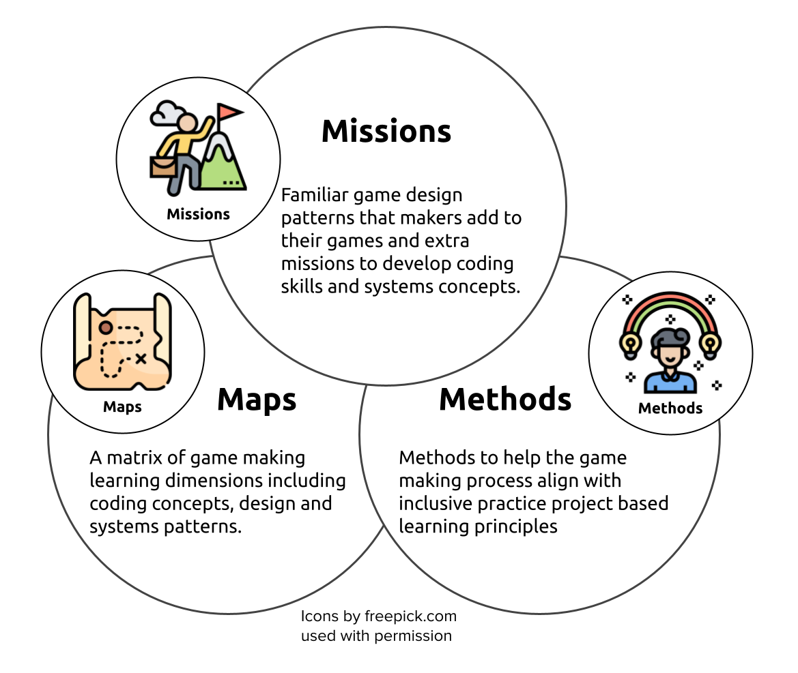

---
# all the regular stuff you have here
zotero:
  scannable-cite: false # only relevant when your compiling to scannable-cite .odt
  client: zotero # defaults to zotero
  author-in-text: false # when true, enabled fake author-name-only cites by replacing it with the text of the last names of the authors
  csl-style: harvard-manchester-metropolitan-university # pre-fill the style
layout: post
categories: chapter
title: 8. Discursive Conclusion
---

-   [Discursive Conclusion](#discursive-conclusion)
    -   [Research Questions - March
        2024](#research-questions---march-2024)
    -   [Outline notes](#outline-notes)
        -   [Initial Discussion Outline](#initial-discussion-outline)
        -   [Initial Conclusion Outline](#initial-conclusion-outline)
    -   [Introduction](#introduction)
        -   [Revisiting potential audiences for the research outputs of
            this study and how contexual factors may impact
            relevancy](#revisiting-potential-audiences-for-the-research-outputs-of-this-study-and-how-contexual-factors-may-impact-relevancy)
        -   [Initial Conclusion Outline](#initial-conclusion-outline-1)
    -   [Research outputs & discussion on
        outputs](#research-outputs-discussion-on-outputs)
        -   [Research output: 3M game making (Meta) model of pedagogical
            elements of the learning
            design](#research-output-3m-game-making-meta-model-of-pedagogical-elements-of-the-learning-design)
        -   [Research Output - Learning dimensions
            map](#research-output---learning-dimensions-map)
            -   [Evolution of the Learning dimensions
                map](#evolution-of-the-learning-dimensions-map)
        -   [PRIMM and Semantic Waves in relation to use of Learning
            Dimensions
            map](#primm-and-semantic-waves-in-relation-to-use-of-learning-dimensions-map)
            -   [Backgroud on learning Dimensions Map - background -
                COMPRESS?](#backgroud-on-learning-dimensions-map---background---compress)
            -   [The potential of learning and navigational
                maps](#the-potential-of-learning-and-navigational-maps)
            -   [Practical or Abstract Framework - CT as a practical
                skill or a more abstract
                concept.](#practical-or-abstract-framework---ct-as-a-practical-skill-or-a-more-abstract-concept.)
        -   [Research Output - MoE
            approach](#research-output---moe-approach)
            -   [Side missions, Maker Types to address identity
                issues.](#side-missions-maker-types-to-address-identity-issues.)
        -   [Research Output - Toolsets of template and Code playground
            (RQ1 and impact on
            RQ3)](#research-output---toolsets-of-template-and-code-playground-rq1-and-impact-on-rq3)
    -   [Answering RQ3 on agency - synthesis and limitations of this
        research](#answering-rq3-on-agency---synthesis-and-limitations-of-this-research)
        -   [Specific 3M - techniques through the lens of agency
            (RQ3)](#specific-3m---techniques-through-the-lens-of-agency-rq3)
            -   [TADS - interventions and affordances as double
                stimulation -
                DROP](#tads---interventions-and-affordances-as-double-stimulation---drop)
        -   [Coding impact on design/ processes on learner agency - OF
            WHAT?](#coding-impact-on-design-processes-on-learner-agency---of-what)
    -   [Implications and recommendations for
        practitioners](#implications-and-recommendations-for-practitioners)
        -   [The value and processes of creating space for emergent
            practices.](#the-value-and-processes-of-creating-space-for-emergent-practices.)
            -   [Supporting different game making approaches via
                scaffolding within choice with
                limits.](#supporting-different-game-making-approaches-via-scaffolding-within-choice-with-limits.)
        -   [Design patterns as a teaching
            aid](#design-patterns-as-a-teaching-aid)
        -   [Exploring CT development via the use of
            GDPs](#exploring-ct-development-via-the-use-of-gdps)
        -   [Game Design Patterns vs CT and more established
            "knowledge"](#game-design-patterns-vs-ct-and-more-established-knowledge)
            -   [GDP, CT & Transfer](#gdp-ct-transfer)
            -   [Technical of 3M concepts suiting
                transfer](#technical-of-3m-concepts-suiting-transfer)
            -   [Strengths and Weaknesses of the GDP construct /
                terminology](#strengths-and-weaknesses-of-the-gdp-construct-terminology)
            -   [On CTs and CTs emerging in the
                wild.](#on-cts-and-cts-emerging-in-the-wild.)
            -   [Compare formal teaching of CT and CS with an approach
                based on a freer choice of
                patterns.](#compare-formal-teaching-of-ct-and-cs-with-an-approach-based-on-a-freer-choice-of-patterns.)
            -   [abstact vs applied framworks - Comparing aims of coding
                for empowerment/ learner agency with STEM pipeline
                narrative](#abstact-vs-applied-framworks---comparing-aims-of-coding-for-empowerment-learner-agency-with-stem-pipeline-narrative)
    -   [Synthesis of reflections on designing for learner
        agency](#synthesis-of-reflections-on-designing-for-learner-agency)
    -   [Limitations of this research](#limitations-of-this-research)
        -   [Gender based issues of
            inclusion](#gender-based-issues-of-inclusion)
    -   [Potential areas for future
        work](#potential-areas-for-future-work)
        -   [Advantages and limitations of Home Education
            context](#advantages-and-limitations-of-home-education-context)
        -   [Using game design to explore games as a design artefact for
            empowerment
            purposes](#using-game-design-to-explore-games-as-a-design-artefact-for-empowerment-purposes)
        -   [How can the use of design patterns map to other computing
            educational
            domains?](#how-can-the-use-of-design-patterns-map-to-other-computing-educational-domains)
    -   [Final Conclusion](#final-conclusion)
        -   [Synthesising the characteristics and potential of the 3M
            pedagogy](#synthesising-the-characteristics-and-potential-of-the-3m-pedagogy)
    -   [Holding Zone or DROP](#holding-zone-or-drop)
        -   [Thoughts Log - things that may end up
            here.](#thoughts-log---things-that-may-end-up-here.)
        -   [GDPs that are already in the
            template](#gdps-that-are-already-in-the-template)
        -   [Breaking out of the walled
            garden:](#breaking-out-of-the-walled-garden)
        -   [Synergies of use of GDP by practioners and learners in
            research
            designs](#synergies-of-use-of-gdp-by-practioners-and-learners-in-research-designs)
        -   [On transfer of gdps -
            debates](#on-transfer-of-gdps---debates)
        -   [Physical Computing and Game
            Making:](#physical-computing-and-game-making)
        -   [Missing data on starting game / quick start cards (Limit -
            but drop
            )](#missing-data-on-starting-game-quick-start-cards-limit---but-drop)
        -   [How does this fit into other domain specific research -
            Constructionism, Computer supported collaborative learning
            CSCL](#how-does-this-fit-into-other-domain-specific-research---constructionism-computer-supported-collaborative-learning-cscl)

<!--
## Starting thoughts on writing up results.

The 3M model as a pedagogical model which aligns with PBL principles and more general social approach to learning coding.
A start here of mapping in a Matrix that could be included in a concluding chapter.
https://docs.google.com/document/d/1DRgpgIUfq5XIktYy-lX4WlviUDnffNc0v8SOeLGgHho/edit -->

# Discursive Conclusion

## Research Questions - March 2024

1. What pedagogical tools and processes are available to support novices to overcome barriers to participation in game coding processes?
2. How can game design patterns support the development of coding practices with novices?
3. How can learners build agency in an evolving community of game makers?

## Outline notes

The working draft of this chapter now merges a proposed discussion chapter with the conclusion.

### Initial Discussion  Outline

- Analyse 3M design with this lens of agency
  - Game design to understanding games as a design artefact for empowerment purposes
  - Tension between walled garden and wider choice
- sCompare key elements of 3M other studies in comping coding domain , primm, umc,

      - shifts in levels of abstraction
 Compare key elements of 3M - Then other more general frameworks , pbl, udl, cop, col - These differ in scope and specificity, and thus utility for practitioners

  - address transfer?
-
   Synthesis of conceptions of designing for learner agency in an emerging community of coders
  - compare Resnick / Paperts features of 'designing for tinkerability', with TADS and creating hooking points for double stimulation (warping anchors)
  - note different emphasis on the agency of the learner to one focusing on curriculum knowledge and resulting reccommendations
  - also compare concept of computational fluency of Resnick.
  - differing focus on the role of the designer
  - similarities in process - iterative, empowerment

### Initial Conclusion  Outline

  - Recap discussion around comparing aims of coding for empowerment/ learner agency with STEM pipeline narrative
    - simple duality - critique of CT, pipeline narrative to fill vacancies in job market
    - complexify simple duality interpretation, as authenticity and linking to real practices ARE empowering
  - Recap analysis of framework to facilitate designing for an emerging community of coders
    - Explore possibility to extend this to other domains
    - Advantages and limitations of Home Education context

## Introduction

This chapter synthesises answers to the RQs 1-3 in the following way.

Firstly by examining the research outputs of the study and discussion how they embody answers to the RQs.

### Revisiting potential audiences for the research outputs of this study and how contexual factors may impact relevancy

Here I return to the material of introduction and contextual factors which impact utility of this research.

- school settings
- home and hobby environments
- non-formal and third spaces

### Perhaps a summary of 3M motivations here?

MOVE MATERIAL ?

## Research outputs & discussion on outputs

<!-- **Diagrams / Illustrations**

3 foci and 3M element compared - save for the conclusion/ discussion?
  https://docs.google.com/document/d/1FIPn2dEB2aCKZi5z05j69cnHgpGNXFh1_SPV6h5l12g/edit#heading=h.kci0lnvn7f60   -->

### Research output: 3M game making (Meta) model of pedagogical elements of the learning design

NOTE - KEEP THIS HERE OR MOVE AFTER THE OTHER ROS.?

In summer 2020 I began early dissemination of results and wanted to be able to present the essence of the learning resources and design to fellow practitioners and participants as well as researchers. To do this I created the frame of a 3M model.

3M model is to create a playable game around a theme for a real or imagined audience with learners given the choice to add many optional features to the game. In addition, side missions encourage social and playful coding approaches which help develop a community of coders. The mirroring of the language of adventure game experience created a playful environment.
ANOTHER QUICK SUMMARY

Thus one aim was to simplify a complex set of resources and teaching processes. The resources have been created under an open licence (CC-BY-SA) which allows them to be freely used and adapted.

A recap of the key features of the model and the motivations behind them.

{ width=80% }

| **Missions**         | **Maps**             | **Methods**          |
|----------------|-----------|------------|
| Simple code changes yield quick feedback  | A map of learning dimensions flexibly linked to main missions/patterns can be used by both learners and facilitators       | Play Testing in each session aids short term motivation.  Showcase events help longer-term motivation and aid project prioritisation   |
| Free choice of Patterns increases learner engagement and ownership   | Tracing the learner pathway on an attractive physical map in the learning space can help integrate navigation and reflection into the creative process | Drama and fictional scenarios can help explore issues and reduce learner anxiety though coding in a role          |
| Restrict Game Type and number of Patterns to reduce Facilitator stress       |                      | Adding electronics to control the game via arcade buttons and cabinets increases engagement and perceptions of project authenticity |
| Limit  complexity of patterns. Some are simple but cause a large change in the game       |    |        |
| Side missions which explore and celebrate different ‘maker types’ (from  Bartle’s player types)          |        |     |

Table 1.2.  Key Features of 3M Game Making Model

Some of these element and their impact have been discussed in previous chapters. This conclusion synthesises these elements and brings additional analysis

### Research Output - Collection of GDPS with supporting resources (including  Learning dimensions map)

<!-- Many commercial open world games offer a central challenge consisting of small incremental missions and then optional side missions. Open world games increase user choice and thus give players a greater feeling of agency. -->

#### Evolution of the Learning dimensions map

**Conflicts stemming from tensions between privileging participant choices or underlying computing and systems concepts**

In P4 I wanted to create resources and processes which are of potential value to practitioners in the UK classroom. At this stage I noted a contradiction between aligning activities to curriculum or following learner choice and expression [@hoyles_pedagogy_1992].

<!-- Chapter two explored ways in which digital game making is commonly aligned with curricular areas [@kafai_connected_2016]. It also surfaced tensions that emerge between the exploration of curricular concepts participants desire to follow activities following learner expression and choice [@hoyles_pedagogy_1992]. -->

<!-- The second was a conflict which manifested via my hesitancy to introduce tools and activities designed to address
 this tension. -->

#### Backgroud on learning Dimensions Map - background - COMPRESS?

Research on _concept maps_ [@canas2003summary] as methods for teachers and researchers to identify key learning suited to particular computing projects has gained traction in the field of computing education [@keppens_concept_2008; @noauthor_quick_2020; @weinerth_concept_2014]. The value of facilitators presenting concepts  and asking students to create maps of concepts for formative assessment. In addition, there is value in mapping which are likely to occur in project work especially when such concepts are embedded in activity in a way which resists superficial analysis. Research on hands-on tinkering in science museums by Bevan and Petrich [-@petrich_it_2013] together with educators examined video footage of families interacting with exhibits to make a structured list of the learning they observed. Their resulting map of learning dimensions included underlying science concepts but also contained more general skills and helping behaviours involved in exploratory learning processes.

Similarly, one of the outcomes of my research was to extract from hours of recorded material some of the concepts and practices that learners engaged with when making games. Table 4.x. shows my resulting map of learning dimensions. While some concepts are common to existing computational thinking frameworks others, including systems thinking concepts, are more unique to game making. The choice to include some elements over others is based on a synthesis of the experience of participants, existing frameworks in this domain (previously explored in the LR), and my own interpretation which privileged under explored elements like systems patterns. Due to the dominance personal input, this framework is offered as starting point which could benefit from the type of collaborative analysis undertaken in Bevan and Petrich's process.

<!-- In learning environments where there is a lot of choice assessing learners via observation is beneficial. Rather than deciding what you want to teach and testing students on that area, you can map the learning happening in an authentic activity. -->

<!-- Another chapter in this collection identified concept maps and observation as methods for teachers and researchers to identify key learning suited to particular computing projects.  -->

<!-- NOTE WHY THESE CONCEPTS? -->

|      Coding Concepts    | Systems Patterns    | Design Practices|
|--------------|-----------|------------|
| Sequences | Systems Elements      | Goal Setting        |
| Variables      | Systems Dynamics  | Being Incremental and Iterative       |
| Logic | Reinforcing Feedback Loops      | Developing Vocabulary        |
| Loops | Balancing Feedback Loops      | Web Navigation    |
| Arrays |       | Problem Solving        |
| Creating Functions |       | Version Control    |
| Change Listener |    | Debugging   |
| Input Event |   | Reusing and Remixing      |

To illustrate these concepts in more depth, I created concise descriptions of the concepts [^2], and cross referenced with examples of the concepts in practice in the application common game features[^3]. This process aimed to be an aid to my existing attempts to highlight relevant concepts in-situ.

In journal notes I note my attempts to find learning relating to abstract concepts happening in-situ. A common example of use of loops or arrays or functions. I would highlight their use by participants and link to their activity. This mirrors the concept of the value of abstract in context for wider application is underlined in the work Davydov of rising to the concrete [@valsiner_cultural-historical_2007].

#### The potential of learning and navigational maps

This process of mapping this framework is potentially of use for teachers and other researchers to help their observation of students in game making activities to align with design, coding and computational concepts. Offering student choice in project work can create stressful demands on a teacher trying to support a diverse design paths [@blumenfeld_motivating_1991; @cole_fifth_2006]. To address this issue practically, rather than students working on varied game types and features, I restricted the genre of game and offered a significant but limited menu of features, a process explored in the next section. The mapping of specific design features to the related concepts, as outlined above, has potential to aid teachers and students to track and correlate the underlying curricular concepts being explored in these divergent learning pathways.

The process of adapting this learning design to the needs of more formal settings can be aligned to existing research on this area. For example the concept of semantic waves is relevant here as a way of visioning the alternation between concrete design experience and communicating the underlying abstract concepts [@curzon_using_2020; @maton_making_2013].   

However, despite this alignment and potential utility in a school setting, I was reluctant to introduce these resources in this informal context, reflecting the lack of external motivation for participants to align with curricular demands driven by exam requirements. Introducing additional mediational tools with the aim of the communicating and reinforcing abstract computing or systems concepts risked effectively establishing a new competing activity system. This perspective validates my reluctance to introduce additional distracting stimulus, instead prioritising time spent in on-going hands on experimentation, peer learning and playful activities. Additionally, while this approach aligns with situated  understandings of knowledge which problematise the separation of the content to be learned from the embodied social activity itself [@rogoff_observing_1995; @leontev_problem_1974], this alignment did not halt my concern over remaining locked into concrete experience and not developing awareness of repeated abstract concepts which could be of future generalised utility [@maton_making_2013]. My ongoing discomfort surrounding the validity of the learning experience without direct alignment to abstract content, stem from wider concerns around avoiding danger of tacit learning by reinforcing learning and spur metacognition [@gherardi_toward_1998]. Even if generalisable concepts can be encountered in the context of an learner-driven activity, they may not be explored without guidance from others. Hoyles and Noss term this tension a 'play paradox' [@hoyles_pedagogy_1992, p.46]. This theme is explored in more detail in chapter six concentrating on social processes rather than external documentation.

#### PRIMM and Semantic Waves in relation to use of Learning Dimensions map and GDP use

<!-- not sure how much to put in about this in LIT REVIEW  -->

<!-- Da and Te - In these interaction the parent seems keen for the child to be able to express and demonstrate their personal knowledge of coding, games and maths concepts. -->

A limit of the The PRIMM and Semantic Waves pedagogies, suggested for classroom use, it that they do not come with a pre-set of concepts.

Thus one adaptation was the Learning Dimensions map.

<!-- However to do it in the way demonstrated by this pair would involve a level of coding familiarity, and ongoing familiarity with the structure and thinking of the participant which would be difficult to achieve in many classrooms. -->

In a later section, we compare PRIMM once more with UMC. UMC here matches the more informal, iterative game making of this study.

<!-- This conflict provoked me to create resources which could serve to pull participants towards more curricular goals. I adapted and extended resources to suit use in more formal learning environments, e.g. particularly a secondary computing classroom. -->

<!-- stylised in a way that mirrored a map used for navigation in a quest-themed computer game.

As learners traced a trail between the different island/missions they had visited, the map prov new tools is also exploredoked learners to reflect on their journey and progress. However, this approach may be too labour and time intensive for many class environments.
-->

<!-- Thus, while this aspect and merits further exploration to potential help classroom practice, this is be beyond the scope of this thesis. -->

<!-- This reflection was helpful for me as a researcher in that it helped decided to keep the focus on this study on more informal and organically evolving processes.  -->

<!--
My progress in this study would have been more direct if I had not attempted to resolve the conflict between the informal choice and curriculum alignment. -->

<!-- Despite this, the niggling feeling, it looks like fun but are they learning, remained.  -->

#### Practical or Abstract Framework  - CT as a practical skill or a more abstract concept.

A general discussion of varied views and my own based on data of this study.

Exploring the tactic of reflective practices to back up CTs being found in the wild. Both for practitioner and participants as per [@petrich_it_2013].

<!-- This approach steers students towards developing their use and understanding of coding structures, debugging practices and systems concepts.  -->

<!-- In addition, side missions encourage social and playful coding approaches which help develop a community of coders. -->

<!-- Note: TO ADD -  The purpose of mirroring a game experience is to create a playful environment - perhaps to covered in previous chapter -->

<!-- **Side Missions:** Bartle proposed that online gamers play games for different reasons and proposed a initial typology of gamers as socialiser, griefers, achievers and explorers [@hamari_player_2014]. You can find out what kind of game player you are with an online test.[^6] I propose there are also different styles of game makers. Some like to develop a full knowledge of the tools and what is possible before they build up their game step-by-step. Some are happy to borrow code, images and sound from anywhere for quick results. More social makers like to find out about the games of others or tell stories within games while others mess around with the code to break it interesting ways. To encourage these valuable social coding practices I created extra missions which are available online.[^7] I avoid any claims of fixed learner types here and offer these interpretations primarily as a way to encourage meta-cognitive reflections and choice of activity in line with UDL principles. -->

<!-- In the 3M model rather than following a step-by-step tutorial learners start with an incomplete game template and add new features as they choose. Each feature or pattern is described as a mission. -->

<!-- You may be able to create a menu of printed or online patterns or examples that students can draw on as needed. Perhaps particularly common examples can be modelled to the whole class when it is clear that many students will benefit from that approach. -->

<!--

NOTE - On supportAing resources - move to relevant section.

In addition to outlines of game patterns, print-outs or on-line documents to support learners to implement the code needed are provided. While on-line documents allow learners to copy and paste code thus avoid many syntax errors, printed or incomplete code examples provide a greater level of challenge.

Supporting resources help resolve tensions around learners getting stuck and needing a lot of facilitator help. These resources can help teachers deliver game making in a classroom context. Educators can alter resources to vary how much detail is provided in supporting documents to suit the challenge level for students. I work with young coders, thus I normally provide significant coding scaffolding. Once learners have built familiarity with code structures, processes and the coding environment, I provide less complete code examples and thus reduce the scaffolding. -->

### Research Output - MoE approach

While the drama framework is basic here, the advantage is that it can be easily adapted to diverse settings with little experise needed.

#### Side missions, Maker Types to address identity issues.

The interaction with barriers to participation in diverse settings is partciularly valid in the multitude of settings.

### Research Output - Toolsets of template and Code playground (RQ1 and impact on RQ3)

Some of the recommendations that this research makes have already been implemented over the lifespan of the research which were not in place at the start of the process.

- Code playgrounds are now common and suggested by CS

However phaser while authentic has mismatches. Exposed by Belen, as I am using version 2 instead of 3.
Thus the resources available are harder to navigate.

Alternative exist using the same 3M approach.

However, here are some more possible directions.

Make-code arcade has been created and adopted by educators. I developed this over lock down and gathered data on use which is available for further study.

P5.js perhaps provides a better base which is more aligned with learners needs.
Recreating resources in P5.js is a strong possibility to mnake this approach more familiar and less porous / daunting.

## Answering RQ3 on agency - synthesis and limitations of this research

HOlding?

### Specific 3M - techniques through the lens of agency (RQ3)

In this section I summarises the potential for learners  the concepts and techniques of achieving agency in the 3M design.

In PBL, UDL and other models - learner choice and building agency is shown to be of value in increasing engagement and ownership over learning. However, building the relevant knowledge to identify, agree on and implement game patterns from scratch takes time and without relevant scaffolding too so long that it negatively impacted motivation.

In a similar way to the play paradox [hoyles_pedagogy_1992], there is a tension between structure and freedom. However, the issue here relates to tensions between different forms of agency, instrumental, authorial and transformative.

#### TADS - interventions and affordances as double stimulation - DROP

Revisiting terms; The term intervention and affordances do not nearly align with the broad conceptual framework of this study infering a duality between subject and object. FIND REFERENCE

Backwards and warping anchors.  

How does the process of offering out ledging points where anchors can catch, as a form of learning design match with conceptions of agency?

<!-- ### Relational Agency - Edwards

Look at use of tools at the boundaries to construct new knowledge [cite - Building common knowledge at the boundaries between professional practices: Relational agency and relational expertise in systems of distributed expertise - Edwards] -->

###  Coding impact on design/ processes on learner agency - OF WHAT?

<!-- NOTE  I would say  too complex for coding -->

Answering RQ - on pedagogical resources / agency / use of GDPs

THIS IMAGINED FOR CONCLUSION BUT ALSO CODE TO IT? OR ABOVE?

- learners developing agency through personal expression of home and other Identities
- agency through choice over pathway via GDPS
- agency through flexible design cycle pathways, especially via community playtesting
- developing agency through celebration of different game maker styles
- authenticity of tool use, especially docs and access to Community
- authenticity of audience - and role of drama to facilitate reflection

This summary can be explored using conceptions of agency explored in previous chapters including instrumental, effortful and authorial agency. In particular the use of TADS and other conceptions of agency to shed light on the role of the designer /facilitator can be highlighted at this point.

## Implications and recommendations for practitioners

This section is specifically oriented towards teaching coding in informal settings but also potential in classroom contexts.

### The value and processes of creating space for emergent practices.

In the last chapter there was discussion on
- metaphors for creating space, harbours, walled gardens

These metaphorical ideas have implications for practitioners that can be framed perhaps best as tensions.

- know the territory but don't pre-plan the route for your learners
-

#### Supporting different game making approaches via scaffolding within choice with limits.

A different strokes commentary. Depending on aims of the practitioner and context of the game making different tactics may be applicable.

At this point it is of value to return to one of the key challenge of a more bricolage approach to making and undertaking projects. How can you balance an approach based on choice of what to implement next, and the difficultly of participants navigating and overcoming blocks.

In chapter four and five we explored the value of a menu of tutorials and code snippets to support participant choice and a more active approach to learning which still contained the needed technical information.

This can be framed as Just-in-time learning [@riel1998education] but with certain modifications which offer additional scaffolding to reduce learner confusion.

### Design patterns as a teaching aid

TO DEVELOP OR MOVE back TO GDP CHAPTER

See journal notes and contrast with existing research with GDP and informal / formal coding programming debates.
Asking what does this research add to these debates?

Some of the following may be relevant;

- Learner choice and levels of abstraction techniques
- From the literature what are complexities involving the practitioner practicalities surrounding creating communities of coders
- What is special about the use of GDP in this 3M model?
- How is this model different from Game Jams in particular.
- Whereas Game Jams focus on x, 3m has a focus on y.
- Exploring GDP and different kinds of types of coding errors?

### Exploring CT development via the use of GDPs

**Brief commentary on the enduring value of CT concepts and how they could be studied in relation to GDP pattern implementation.**

Developing understanding of CT concepts in isolation is a potentially weak point of the 3M approach in comparison to from first principles approach. However the process of patching into different areas of the code and creating functions does address this. The following transcript of Sh's interaction with myself shows that the process of copying patterns in the template code and patching in new lines from the supporting documentation gives ample opportunity for sequencing mistakes to be made. The process of working with students on their existing code is valuable to explain why and how the order of lines of code and when functions are called.

The comparison raises a potential discussion point on what the practical value of this CT concept is.

### Game Design Patterns vs CT and more established "knowledge"

My end design highlights game patterns as a starting point for user interest and to draw participants in to other elements of learning dimensions. More abstract dimensions like systems thinking, and more concrete like coding concepts.

- Compare formal teaching of CT and CS with an approach based on a freer choice of patterns.
- Discuss the use of gdps as a gateway to other concepts as explored in CS in a more abstract, and more concrete direction [@eriksson_using_2019] .

- Leading with GDP as a way to explore other Learning Dimensions
<!-- Draw on discussion in https://drive.google.com/drive/u/1/folders/1D-VhVj-NgN3qgk3YEx4HZEozf_1UOGtE -->

- Discussion - The use of GDPs hits a sweet spot as a "middle" level construct, (see Eriksson and Bjork)
- Discussion -  Rising to the concrete - as a key AT concept - how does this fit?

#### GDP, CT & Transfer
The heart of the matter here is how transferable knowledge is without a contextual meaning attached.  This is a contested area.
Firstly how wide should reuse be imagined? To other coding projects? Or wider claims as with Wing's interpretation of CT.

#### Technical of 3M concepts suiting transfer

Learning maps - additional discussion on learning dimensions - or conclusion / next steps.

While there are technical elements of transfer that were identified and included in the learning map I sidelined the study of them.

Specifically in examining the concrete implementation of GDPs there are transferrable concepts and practice involving practice which include;

- Use of levels as a array which is parsed by a loop to create layout
- Logic statements of varied degrees of complexity
- Functions - code patching into the right area

#### Strengths and Weaknesses of the GDP construct / terminology

PERHAPS MOVE TO DESIGN?
The interpretation of GDP that this thesis adopts contains some weaknesses. The specificity of the term is weak in that in seeking to categorise a wide diversity of features that participants would want to add to the game to fulfil a pedagogical motivation of providing guidance and inspiration to the novice designers. The pragmatic nature of this interpretation can be contrasted to more formal definitions of say Game Mechanics related to user actions in the game [@sicart_defining_2008].

<!-- NOTE -  THIS CAN BE EXPANDED
more n Game Mechanics etc
-->
The term is particularly week in the area of Game Polish which involved were more aesthetic and narrative choices.

[]

These choices do not fall neatly in to the argument being constructed around the potential of GDPs to unlock repeatable, transferable practices. For example, some participants, specifically one who came as a friend of of others and didn't have direct parental help, spent a majority of time working on these patterns especially if assets are being replaced.

It is perhaps the term _pattern_ that is problematic here. It may imply a repeatable structural element rather than an aesthetic choices. Other academics have given a wider name of game elements [@tekinbas_gaming_2014] or lenses [@schell_art_2008].

#### On CTs and CTs emerging in the wild.

As explored in a previous chapter, the 3M design leads with concrete game design patterns chosen by participants. This approach can be compared to others which lead with more abstract computational thinking concepts which are introduced and explicitly taught from first principles.

However, while not explicitly taught, the CT concepts are contained within the learning dimensions of the 3M model allowing participants and especially facilitators to be aware of examples of practice allowing for development of these skills. This section explores examples of CT in action that emerge from video data of game making.  

NOTE - A quick summary of examples?

#### Compare formal teaching of CT and CS with an approach based on a freer choice of patterns.

The design choice of leading with GDP was based on increasing the agency of participants over the pathway of their design activities.
LINK TO LITERATURE ON CHOICE AND ENGAGEMENT.

It is problematic to compare participants engagement with this learning design with another fictional game where they learn CT concepts first and then put them into practice.

However, it is helpful to identify key characteristics of the design which run counter to a principles first approach and describe how participants experienced these elements.

Elements of contrast with 3M include;

- The remix element of code (explored in previous methods chapter perhaps) - which allows participants to add new features quickly. They can also see and replicate existing patterns in the  code. This could compare to many hours writing from scratch and many abstract concepts explained before getting to anything looking like a game.
- Lack of value placed on CT as overarching knowledge. No posters, no curriculum content, no tests on concepts, no lesson objectives and end tests,
- Code patching from existing code examples, as previously explored, allows for participants to take code and add it into their game without full knowledge of the syntactical complexities of each line they use.

#### abstact vs applied framworks -  Comparing aims of coding for empowerment/ learner agency with STEM pipeline narrative

- Recap discussion around comparing aims of coding for empowerment/ learner agency with STEM pipeline narrative
  - simple duality - critique of CT, pipeline narrative to fill vacancies in job market
  - complexify simple duality interpretation, as authenticity and linking to real practices ARE empowering
- Recap limitations and contextual factors of computing in schools and diverse environments

<!-- By coding the activity of the child and the adult for this session in depth the following representation of how the child spent their time is available.

- time under table
- time in control of Keyboard
- time actively directing parent's activity
- time actively observing parent's activity
- time discussing game features with parent -->

<!-- For more information on the value of physical computing to increase inclusion you can read this article (RUSK?) -->
## Synthesis of reflections on designing for learner agency

Pulling all together with recommendations from research . add in from notes

- learners developing agency through personal expression of home and other Identities
- agency through choice over pathway via GDPS
- agency through flexible design cycle pathways, especially via community Playtesting
- developing agency through celebration of different game maker styles
- authenticity of tool use, especialy docs and access to Community
- authenticity of audience - and role of drama to facilitate reflection

## Limitations of this research

### Gender based issues of inclusion

This research did not address gender or racial issues directly. But further research would suit that.

The possibilities align with similar research, home interests etc.
How will this  impact pedagogies?

## Potential areas for future work

### Advantages and limitations of Home Education context

Comments include:

- Reflecting back on interview there were very highly insightful comments from home educators that did influence the design.
- Thus a very fruitful area for jointly created design research
- However it is important then to not extend all conclusions beyond this setting but to extract the essense and try to seed in other settings using accelerated ways to construct and scaffold the kinds of support that home ed parents can offer.

### Using game design to explore games as a design artefact for empowerment purposes

Bruno advocates process that expose that are surrounded by designed objects. This process of making lifts the lid on that process.

See example between helper and Pa in 2019-03-18 at the end. "It makes you think" . They marvel at the complexity of code needed to create even a simple game.

The motivation to allow participants to get under the hood of new technology is a foundation of many technical programs built on empowerment. We can take Mozilla, mouse, etc.

It is also present in design programs which take care to convey ethical perspectives as part of the design process as a way to counteract the possible effects of unindended side effects. This is especially relevant in the age of big data and highly powerful corporations.

Yet this approach is not without critique.

"Battle not with monsters, lest ye become a monster, and if you gaze into the abyss, the abyss gazes also into you.”  Friedrich Nietzsche

This expression, conveys a perspective that the medium is the message. By engaging with the technology its influences may permeate the subject.

This raises an additional question.
How can we help learners build agency in technological environmental without becoming monsters.

### How can the use of design patterns map to other computing educational domains?

HCI and webdesign already share a similar process at times.
What about physical computing / electronics.

Can the same process help unearth accessible design patterns.

## Final Conclusion

###  Synthesising the characteristics and potential of the 3M pedagogy

BE CONVINCING HERE OF POTENTIAL OF THIS APPROACH.

3m This is a domain specific framework for teaching , can it have wider applications?  

If so how can characteristics be abstracted?

And if so are they distinct from existing frameworks explored in literature review?   

- Walled garden of limited design patterns
- Playful methods of community creation
- Drama narrative to create audience a la heathcote
- Regular informal feedback and chances to discuss evolving designs

## Holding Zone or DROP

### Thoughts Log - things that may end up here.

### GDPs that are already in the template

Some GDPs were not made a part of the menu of options as they were already in the template.
For example Reward.

Is this a missed opportunity to surface and discuss those patterns? cf [@eriksson_using_2019]

### Breaking out of the walled garden:

Te and Da's decision to explore a different starting point and add uncharted GDPs like following enemies.
A potential tension which was resolved quickly in some ways.
But at the cost of maintaining a working game.

### Synergies of use of GDP by practioners and learners in research designs

The use of GDP by practitioners are compared to those of participants and synergies are explored.

### On transfer of gdps - debates
In this context of novice coders in an informal environment it seems appropriate to introduce some levels of reusable practice whilst initially prioritising individual learner engagement and community participation.
Game design patterns contain elements of more abstract and thus repeatable structures thus fulfilling some of the promise transfer offered by advocates of Computational Thinking. This is explored in more depth in the next chapter.

### Physical Computing and Game Making:

- There is scant evidence for this in the video data.
- I can make observations from journal notes and try to find mention of it in interviews.

(Imported Writing)
**Physical Computing and Game Making:** The use of physical computing to create concrete and tangible activities can increase the engagement and motivation of learners [@kaloti-hallak_students_2015]. Making the digital concepts physical, and thus allowing exploration via diverse means, also aligns with inclusive learning principles. To support my game making projects, I created simple arcade cabinets out of wood with retro arcade buttons. Connecting arcade buttons to the computer via simple electronics is a project which can be completed quickly. The process of students building their own arcade cabinets for a games showcase increased their perception of the authenticity of their end goal. Some families created low-tech, customised arcade cabinets using cardboard. Although my studies have been small-scale the self-reported effects on learner engagement and motivation of this part of the program were significant.

### Missing data on starting game / quick start cards (Limit - but drop )

Study on the use of templated starting cards was unfortunately hindered by the logistics of the recording process which began only after this process had happened and may participants had already undertaken one phase.

A separate study of a stand-alone group engaging with this starting template and cards would be welcome, and may be a legitimate follow up to this study.

### How does this fit into other domain specific research - Constructionism, Computer supported collaborative learning CSCL

This section follows up on gaps in the reserach exposed in the introduction

Attempt to show differences and possible lines of inquiry that have been neglected in other areas.
