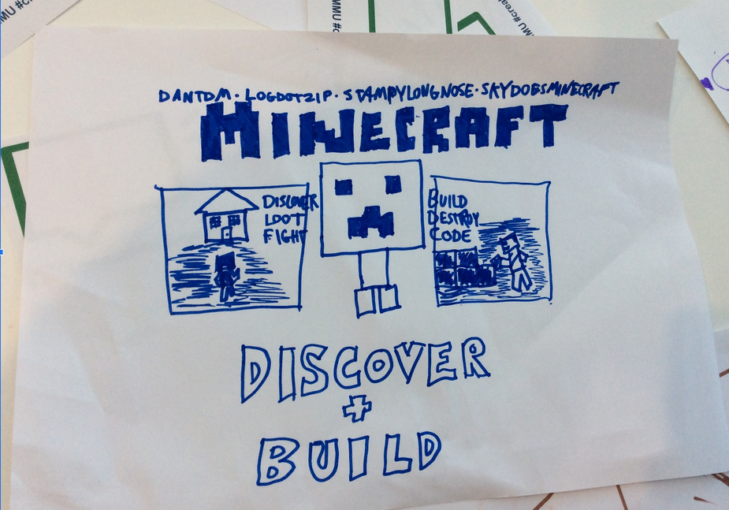

---
# all the regular stuff you have here
zotero:
  scannable-cite: false # only relevant when your compiling to scannable-cite .odt
  client: zotero # defaults to zotero
  author-in-text: false # when true, enabled fake author-name-only cites by replacing it with the text of the last names of the authors
  csl-style: harvard-manchester-metropolitan-university # pre-fill the style
layout: post
categories: chapter
title: 3. Theoretical Framework
---
-   [Theoretical Framework](#theoretical-framework)
    -   [Research Questions - July
        2024](#research-questions---july-2024)
    -   [Introduction](#introduction)
    -   [Socio-cultural approach](#socio-cultural-approach)
        -   [Communities of Practice and
            Learners](#communities-of-practice-and-learners)
            -   [Community of practices](#community-of-practices)
            -   [Community of learners](#community-of-learners)
        -   [Link to next section - DOESN'T SEEM
            RIGHT.](#link-to-next-section---doesnt-seem-right.)
    -   [The foundational concepts of activity
        theory](#the-foundational-concepts-of-activity-theory)
        -   [History in brief](#history-in-brief)
        -   [Core AT concepts](#core-at-concepts)
        -   [Object / objective in activity and varied
            interpretations](#object-objective-in-activity-and-varied-interpretations)
        -   [The hierarchical structure of
            activity](#the-hierarchical-structure-of-activity)
            -   [Activity, Actions and
                Operations](#activity-actions-and-operations)
            -   [Selecting activity systems as units of
                analysis](#selecting-activity-systems-as-units-of-analysis)
        -   [On Mediation and internalisation and externalisation of
            concepts](#on-mediation-and-internalisation-and-externalisation-of-concepts)
            -   [Mutual process via internalisation and
                externalisation](#mutual-process-via-internalisation-and-externalisation)
            -   [Tools as a propagation of
                cultures](#tools-as-a-propagation-of-cultures)
            -   [Double stimulation and
                Affordances](#double-stimulation-and-affordances)
        -   [Development and design](#development-and-design)
    -   [Third generation activity theory (3GAT) and Expansive
        Learning](#third-generation-activity-theory-3gat-and-expansive-learning)
        -   [The value of surfacing areas of
            contradictions](#the-value-of-surfacing-areas-of-contradictions)
            -   [Disambiguating terminology - Conflicts, tensions,
                contradictions,
                dilemmas](#disambiguating-terminology---conflicts-tensions-contradictions-dilemmas)
            -   [Double stimulation and its interaction with
                contradiction in joint activity through method of double
                stimulation](#double-stimulation-and-its-interaction-with-contradiction-in-joint-activity-through-method-of-double-stimulation)
        -   [Expansive learning](#expansive-learning)
        -   [An operationalised example of Activity Theory concepts in
            context](#an-operationalised-example-of-activity-theory-concepts-in-context)
        -   [Critiques and alternatives to Activity
            theory.](#critiques-and-alternatives-to-activity-theory.)
    -   [Putting AT to work via interventionist research via formative
        interventions and
        DBR](#putting-at-to-work-via-interventionist-research-via-formative-interventions-and-dbr)
        -   [On formative interventions](#on-formative-interventions)
        -   [What is DBR and why and how do I use it in this
            study?](#what-is-dbr-and-why-and-how-do-i-use-it-in-this-study)
        -   [Outline of the guiding principles of DBR and formative
            interventions](#outline-of-the-guiding-principles-of-dbr-and-formative-interventions)
            -   [Principle : Researcher take and active interventionist
                approach](#principle-researcher-take-and-active-interventionist-approach)
            -   [Principle: Mutuality - LINKED TO THE ABOVE POINT
                TOO](#principle-mutuality---linked-to-the-above-point-too)
            -   [Principle: The importance of
                context](#principle-the-importance-of-context)
            -   [Principle : Utility of research - overcoming the
                tension between the rich context and generalisation of
                results](#principle-utility-of-research---overcoming-the-tension-between-the-rich-context-and-generalisation-of-results)
            -   [Ongoing alignments between DBR and the CHAT community /
                ethos](#ongoing-alignments-between-dbr-and-the-chat-community-ethos)
    -   [Concepts of agency within
        CHAT](#concepts-of-agency-within-chat)
        -   [Addressing and disambiguating definitions of agency in
            education](#addressing-and-disambiguating-definitions-of-agency-in-education)
            -   [Instrumental and relational
                agency](#instrumental-and-relational-agency)
            -   [Authorial and transformative
                agency](#authorial-and-transformative-agency)
        -   [Conceptual tools associated with
            agency](#conceptual-tools-associated-with-agency)
            -   [Specifically, TAS, TADS](#specifically-tas-tads)
        -   [Affordances](#affordances)
            -   [Third spaces, idiocultures and designed systems as a
                research
                method](#third-spaces-idiocultures-and-designed-systems-as-a-research-method)
    -   [Conclusion / Synthesis.](#conclusion-synthesis.)
        -   [Summary of Justification of choice - and how the RQs align
            with different
            concepts](#summary-of-justification-of-choice---and-how-the-rqs-align-with-different-concepts)
            -   [Signposting where concepts are used in the thesis (in
                relation to
                RQs)](#signposting-where-concepts-are-used-in-the-thesis-in-relation-to-rqs)
            -   [The role of AT in the analysis of HCI -
                MOVE?](#the-role-of-at-in-the-analysis-of-hci---move)
    -   [Parked to replace or remove or
        rework](#parked-to-replace-or-remove-or-rework)

# Theoretical Framework

<!-- Also see this writing.
chapters/planning/methodology_chapter/methodology_chapter_late_2020.odt.md -->

### Research Questions - July 2024

1. What contradictions arose in participation in this research's game coding processes and what pedagogical tools and processes are available to address these contradictions?
2. How can game design patterns support the development of computational fluency in novices?
3. How can learners build agency in an evolving community of game makers?

<!-- ### Coding based on chapter 4 -->

<!-- NOTE  I would say no - too complex -->

<!--

By Design
- 4.b.1 Half baked template & code playgrouds and phaser - (hard to code for as quite constant) cf rapid prototyping
- 4.b.2 Use of home narratives & personal expression via graphics (separate?)
- 4.b.3. Documentation
  - via code examples
  - step-by-step tutorials online
  - step-by-step tutorials printed out
- 4.b.4. Guided code patching - design - n

Emergent
- 4.c.1. Rapid prototyping
- 4.c.2. Alternate coding between participants
- 4.c.3. Parent shifting role between facilitor and more directive
- 4.c.4. Accessing out of scope documentation from professional circles
- 4.c.5. Playtesting emergent elements
  - discussing challenge
  - the play around the playtesting -->

## Introduction

This chapter describes the guiding theoretical framework and key concepts which are relevant to the discussion of the thesis. Specifically, activity theory, the concepts of  formative interventions as a form of design based research (DBR).

A brief justification of the use of the framework can be given due to the importance of context, transformation and the development of participant agency to this study.

  - Social turn / socio cultural approach
  - AT is explored via x, y z,
  - In order to operationalise AT concepts DBR is compared to formative interventsions  
  - Finally concetions of  agency within AT are explored

The second part of the chapter looks specifically at theoretical framework for understanding the development of agency.

<!-- The underlying approach of this chapter is closely aligned with the activity theory concept of expansive learning within formative interventions. It also uses methods widely adopted in design based research (DBR) -->

<!-- My own research in game making is an experimental approach to create a new learning design. I have worked with young learners, local families and undergraduate student helpers to evolve a game making design. A key driver of my research was to explore the potential to draw on family experience in learning activities by working with families to make games together. -->

## Socio-cultural approach

The focus of this study is on the construction of shared meaning and practices as part of an emerging community of game makers. To do this I adopt a sociocultural approach and specifically cultural historical activity theory CHAT in the form of design-based research.

Socio-cultural research and perspectives can be broadly described as...[@barnett_ecosystem_2019]

An assumption underlying the approach  is " abstraction of ‘content’ from its ecological functioning   (e.g., use within a particular situation) is likely to undermine its perceived value for any situation (Bransford, Brown, & Cocking, 2000; Nathan, 2012) or   the learners’ belief that they are likely to do something meaningful with that which they are learning."[@barnett_ecosystem_2019]
REWRITE.

The social _turn_ in psychology, was a turn away from assumptions in congitivism that studying human mental activity in isolated, context free methods [@stetsenko_activity_2005].

This primacy of context described above underlies much of the social turn of educational and psychological research. As my study seeks to address cultural factors which act as barriers to participation in digital making, it requires a method of research which allows the detailed description and evaluation of complex, emergent learning environments.

### Communities of Practice and Learners

RQx addresses the of a game-making community. This process is co-constituted by planners, facilitators, parents and children.

Rogoff's concept of communities of learners and Lave and Wegner's community of practice are helpful illustrations of the social turn

#### Community of practices
- Applied often in work settings to address questions of how learning happens.
- nature of activity between outsider status into insider status
- Idea of legitimate peripheral participation and transfer of

Communities of practice - legitimate peripheral participation boundaries and barriers to participation

#### Community of learners
the messyness from outside.
the process of guided participation
the element of non/passive

(Continue to) refute or problematise  dichotomy of learner led, teacher led approaches [@mascolo_beyond_2009].

Participation on community activities as a valid approach.

Cultural and social factors are vital to development process even if hidden in as school setting.
Guided participation as a middle ground between instruction and discovery.

Teachers benefit from the concept of scaffolding, and designing learning environments and interventions to support learners to enter into a pattern of activity.

<!-- This has been applied in various forms, PBL, apprenticeship models, for example have guided participation as a base via different forms of scaffolding.  -->

**3 planes - perhaps just guided participation? or 3 aspects and 3 planes next chapter**
Following the approach of Morcom [@morcom_scaffolding_2014] Rogoff's  [-@rogoff_observing_1995] three planes of sociocultural activity used to help understand activity in a Community of Learners.
This is drawn on as a method in a way explained in Chapter 4.

### Link to next section - DOESN'T SEEM RIGHT.

There are a range of valid methodological approaches suited to this study. These include participatory design Muller, 2007), ethnography and guided participation,  communities of practice , Activity Theory .
 [@laveSituatedLearningLegitimate1991]

I have chosen to use activity theory as a base for the the theoretical framework of this study as it is a sociocultural approach which goes beyond a conception of transmission model of learning and embraces learning in context.

## The foundational concepts of activity theory

Before outlining these concepts a short history places them in context.

 <!-- NOTE USE THIS AS A BASE - kaptelinin_activity_nodate Activity Theory: Basic Concepts and Applications A summary of a tutorial given at the East West HCI 95 Conference
 -->

<!-- NOTE - Brief history before going into detail? -->

### History in brief

Vygotsky drew on Marxist conceptions of activity to describe the importance of mediation via objects and concepts by the learning subject to active an objective or object [@luriia1976cognitive].
Human endeavour and change is based on activity and the subject of that activity is understood as the person or people driving it.

Vygotsky formulated the conception of the relation between subject, object and tools into a triadic relationship.

Vygotsky also held context as vital to development,
For even individual activities take place in the context of a culture. (objectives can be )

For example the use of tools as objects, concepts which facilitate and constituent cultural participation.

The role of cultural mediation in development, and role of objects to study human culture [@cole_beyond_1996-1; @cole_culture_1995].

Of particular relevance to this study is the situating of pedagogies as a meditational strategy.

<!-- {width=90%} -->

Vygotsky's student Leontiev developed to extend the triadic conception of activity to include  key cultural aspects of the activity in question, specifically those of a characterisation later represented as an extended trianle shown in Fig 5.x [@engestrom_learning_1987]

{width=90%}

Fig. 5.x Leontiev's conception of Activity [@engestrom_learning_1987]

Historically AT had limited take up in western academia before Cole's translations of Vygotsky and work to bring some of the foundational concepts into an educational psychology setting, aligning them with a broader social turn in psychology, explored as cultural psychology [@cole_cultural_1996]. The work in this field by scholars such as Wertsch and Cole places community and context as vital in studies of learning. The vital role of cultural mediation in development [@cole_beyond_1996-1] situating learning pedagogies as form of meditational strategy.

SIGN POST IF AND HOW THESE ARE EXPLORED LATER.

### Core AT concepts

Nardi and Kaptelinin outline the activity theory (AT) as a series of foundational concept which form the base for wider theories [@kaptelinin_acting_2009; @wertsch_concept_1981], namely: object-orientedness, tool mediation, hierarchical structure of activity, ongoing development of activity  development, and psychological internalisation and externalisation.

While this study is on community activity, some of the concepts and tools of AT inherit meaning from a tradition of exploring personal psychology and thus a clarification of the terms used in a community setting is helpful. To help make this process more concrete, at times I will give examples related to the context of this study.

### Object / objective in activity and varied interpretations

While the materialist language of Marxism has led some descriptions to focus on the object as the physical object that is being worked on and transformed by the activity, conceptual objects are also included in this concepts. Thus an object can comprise a physical object but is best understood within the context of wider motivation, for in many complex environments when more than one physical or conceptual object is at play.

<!-- Because of the complexity of objects being acted on in this study, I use favour the second interpretation by default in this writing.  In other words using the purpose or driving goal of the activity as synonym for object.  -->

Paying attention to the objective of AT systems is important as it helping to differentiate the scope of activity systems. Example?

It also helps identify conflicts between the stated objective of the system and the actual objective of participants.

This concepts is also helped by understanding activity as a hierarchy.

### The hierarchical structure of activity

#### Activity, Actions and Operations

To describe these wider activity systems with greater granularity,  Leontiev [-@leontiev_activity_2009], used terms and concepts of actions and operations happening which consitue the broader units of actity. Kutti [@kuutti_activity_1995]. describes actions in the following way.  

  "...actions consist of chains of operations, which are well-defined habitual routines used as answers to conditions faced during the performing of the action. Initially each operation is a conscious action, consisting of both the orientation and execution phases, but when the corresponding model is good enough and the action has been practiced long enough, the orientation phase will fade and the action will be collapsed into an operation, which is much more fluent."

The concept of fluency is key to this study, as such it is important to be able to locate and describe these chains of operations and actions in detail. While game making as a community learning project  is clearly as an important activity system in this study, to answer alll the research questions of this thesis, it is important to also examine interpersonal activity in more detail. In order to do this an activity system of even smaller scope is examined in greater detail in Chapter 6 on the use of game design patterns by participants.

#### Selecting activity systems as units of analysis

The process of finding a germ cell/ unit of analysis is seen as a productive technique of explorative activity theory research (with what aim?). The work of Blunden [@blundenInterdisciplinaryConceptActivity2009; @blundenGermCellUnit2014] provides as comprehensive justification the utility of the process. He describes the germ cell of activity and the unit of activity as two similar concepts with slightly different foci.

<!-- Mid-level construct of design / patterns heuristics [] -->

    ... the germ-cell and the unit of analysis are one and the same thing, but in one case the developmental aspect is emphasised and in the other case the analytical aspect is emphasised. [@blunden_unit_2020]

In this thesis, as a designer / researcher and practitioner both aspects are relevant. Examining the analytical aspect, the process of seeking and defining a key activity scope/unit for analysis helps define useful boundaries of what to analyse in depth. RQ2 of this thesis addresses the potential role of game design patterns (GDPs) as a guiding process in varied forms. To do this Ch. 6 has a narrow focus on the implementation of gameplay design patterns (GDPs) allowing for the identification and analysis of patterns of participant behaviour and introduced and emerging community practices to do with GDPs. While this concept of germ cell / unit of analysis is typically used in a larger scope of activity, the principles apply this smaller scope. While game making can as an overarching activity system, a narrower activity whose objective is implementing GDPs became a significant unit of activity for this study.

Turning to the developmental aspect, a granular exploration of the tensions and processes at work in a complex educational environment can via identifying emerging barriers and responses to comprehension, communication and practical barriers to implementing design challenges facilitates replicability of research and supports its potential value to other practitioners [@barab_using_2002].

**Concl?**
In Chapters 5 and 6 GDPs are explored as a developmental, germ cell concept in practical terms.

<!-- #### TO MERGE UP - Principle: Finding suitable dimensions and units of analysis by focusing on objects of activity

**Scopes of analysis, three planes approaches and other learning community methods** -->

<!-- EXPLAIN IN JUST ENOUGH DETAIL HERE.
IS THIS NOT COVERED IN CHAPTER 5 - SIGNPOST?
-->

<!-- This concept of shifting focus from individual activity to that of an expanded and shared object has parallels with more observational research on collective activity [@ rogoff_observing_1995]. -->

<!-- The key difference is the intervention of the researcher to create space, time and circumstances to facilitate the shift and production of new understandings of the activity in question. -->

<!-- When mapping onto AT in a practical purpose of data analysis these planes can be seen as manifestations in different scopes of activty. -->

While units of analysis are often chosen on an broad scope to allow for sociological concepts to emerge, Blunden makes a pragmatic proposal to use projects as they key unit of analysis [-@blunden_interdisciplinary_2010; -@blunden#### Development and design

Link to next section
Check overlap with methodology chaper._collaborative_2014] . His rationale is INCLUDE SUMMARY OF RATIONALE HERE

IS THE RATIONALE ALIGNED WITH THE IMPORTANCE OF OBJECTIVE?

<!-- In the case of this study, activity can be seen as different planes; wider educational context and the culture of the whole program; guided activity; specific actions and operations carried out on a personal level. -->

<!-- Here the term project here communicates a concrete implementation of a planned goal and also a sense that all elements of key activity are present at this level e.g. all stages of the design cycle (and another example?).  This sentiment is echoed by a parent when noticing that the documentation on one GDPs involved several distinct stages - "It’s like a project in itself really!" -->

<!-- At this scope, for participants implementing . -->

### On Mediation and internalisation and externalisation of concepts

The concept of tools here is broad including language, physical tools and representational concepts.  The overall view of learning is seen as highly mediated by these cultural tools.

#### Mutual process  via internalisation and externalisation

The process of mediation through the use of conceptual tools is seen as mutual through the process of in  .  

Learners are actively processing and make sense of the world by both appropriating cultural learning and by contributing back into shared cultural understandings of the world.

#### Tools as a propagation of cultures

Tools are a product of adaptation and hold within them an evolution of culture.

#### Double stimulation and Affordances

There is a link between double stimulation and affordances [@romero_analysing_2022]

### Development and design

<!-- Check overlap with methodology chaper. -->

Activity theory is based on the concept that activity in context should be understood as in a state of ongoing transformation. The foundation of the theory builds on understandings of Marxist dialectical materialism, in which activity is a dynamic system best analysed through its transformations [@ilyenkov1960dialectics].

Engeström's work on what he termed a  third generation includes theory of expansive learning which charts changes and expansion of the object being worked on, often due to tensions beyond a single activity system to encompass others thus but through acknowledging the impact of movement of actors between systems [@engestrom_expansive_2001]. This along with the work of Cole, is vital to move beyond a limited view of activity to engage with cross cultural understandings of learning [@cole_cross-cultural_1988]

As part of a the broader social turn of psychology explored, these authors and their colleagues also forged new research approaches and concepts which I draw on in this study and which are explored in the next section. These include expansive learning, design based research, formative interventions, double stimulation, ideocultures and mutual appropriation.  

The next section explores these concepts and their utility to this study.

NOTE - THE CONCEPTS LISTED ABOVE ARE NOT THE SAME AS THE DBR PRINCIPLES BUT SEE MORE IMPORTANT - DOES THIS NEED RESTRUCTURING?

## Third generation activity theory (3GAT) and Expansive Learning

An important development of conceptual tools to apply activity to authentic learning settings takes the form of a formulation knows as third generation activity theory (3GAT).

As mentioned in the section above, the recognised the importance of interacting activity systems, the movement of subjects between systems and the possibility for joint work on a shared object. These concepts are represented via an extension of Engeström's triangular representation of key cultural aspects of the activity in question, now also include a second triable representing other cultural factors including, norms and rules, division of labour and community [@engestrom_learning_1987; @engestrom_expansive_2001]

{width=90%}
Figure 3. x - Engeström's concept of expansive learning via a shared object

The recognition of wider activity systems and the bleed of motivations of actors into new systems is represented in Engeström's view of AT as a foundation for interventionist and participatory processes on [@spinuzzi_trying_2020-1]

### The value of surfacing areas of contradictions

In activity theory tensions and contradictions are a vital source of change and evolution of new and ongoing activity systems.

While the concept of tensions and contradictions exists in foundational concepts of dialectal materialism, the work of Engeström addressed this in more granular details and also vitally created more detailed understandings, more specific methods of description and analysis, and representations of these contradictions.

Engeström [@engestrom_expansive_2001] explains the role of contradictions as build up of tensions between different elements of the activity system. His detailed analysis of work based activity identifies the role of contradictions in systems is the source of "change and development" [@engestrom_expansive_2001]
 <!-- [@lave_developmental_1993] -->

Conflicts and tensions between participant motives and different parts of activity system are sometimes revolved quickly through change, or remain more persistent and can be referred to as blockages.

While much of the literature focuses on larger systems of workplace analysis happening over years, the role of analysis of tensions in shorter interventions is also  present in diverse research. [@barab_developing_2002; @barab_using_2002]

Unresolved contradictions develop into impasses or conflicts. These can serve as more urgent  motivational factor driving an agentic response from participants in disfunctional systems. In particular work by Sannino on agency from a chat perspective frames the potential of such conflicts positively as a source of activist transformation. A later section explores agency in more detail.

#### Disambiguating terminology - Conflicts, tensions, contradictions, dilemmas

Even within schools of CHAT, terms are not set. To avoid the dangers of the vague use of the terms tensions and contractions [@karanasios_exploring_2017], this section outlines my interpretation based on the scope of this study.   

While guided by the concept of analysing manifestations of systemic contradictions, [@cakir_contradictions_2022; @engestrom_discursive_2011] this study does not use that detailed framework.

NOTE - there is also the concept of congruencies - or strengths within activity systems. Where appropriate these systems strengths and positive alignments are helpful to note [@kamanga_contradictions_2021].

On a smaller scale, design tensions exist. These do not block progress completely but may disrupt some activities. Combinations of tensions can compound to create longer lasting and more serious conflicts if not resolved [Engeström early]. The concept of levels of contradictions are helpful [@sannino_cultural-historical_2018] the forth being a conflict.

In Sannino's later work on transformational agency TADS conflicts are examined - greater scope than tensions - thus larger shifts are implied.

Instrumental agency is relevant here to help examine and the work of learning designers to remove  barriers, Transformational and authorial agency serves to explore the potential for learners to address and overcome tensions and conflicts in their own way.

<!-- (Relational agency?) -->

**The definition used in this study**

Instead of a more technical definition [@engestrom_discursive_2011], following Kuuti [-@kuutti_activity_1995], this study adopts  contradictions as a broader definition encompassing concepts of tensions, barriers, breakdowns, conflicts.

In the following chapters I focus on tensions which help explore the research questions and which help inform the findings of later chapters. In particular I draw out more visible conflicts which threaten more serious disruption of activities.

#### Double stimulation  and its interaction with contradiction in joint activity through method of double stimulation

Link to next section
Check overlap with methodology chaper.

Double stimulation refers to the use of tools and processes to overcome such conflicts. Engeström's early work on formative interventions sets out the importance the concept of double stimulation  [@valsiner_cultural-historical_2007].

While Sannino's [@sannino_principle_2015] work on the volitional aspect of the process of double stimulation cautions 'double stimulation cannot be subsumed to the general idea of mediation by symbolic tools' [-@sannino_principle_2015, p.2], it shares the a perspective that there is value in exploring the process to explore participants development of agency in professional and educational settings [@sannino_formative_2016].

One example in an educational settings is the use of a Change Laboratory methodology [@engestrom_putting_2007] to  intervene in kindergarten educational process and organising structure [@rajala_utopian_2023].

In research on the use of wiki technology by students Lund and Ramussen [-@lund_right_2008-1] caution against mismatches between the first and second stimulus; interpreting project tasks or objectives as the first stimuli, and the tools used to the as secondary stimuli. They also outline the importance of awareness of the likelihood of multiple stimuli in modern technical working environments.

### Expansive learning

**The concept of the expanding learning can be applied via formative interventions.**

The broad AT principle of the need to analyse activity through its transformation can be seen in several

[@sannino_formative_2016; @engestrom_methodological_2014]

{width=90%}

Figure 3. x - Engeström's concept of expansive learning via a shared object

Expansive learning leads to the formation of a new, expanded object and pattern of activity oriented to the object. This process, known as ascending from the abstract to the concrete, involves the formation of a theoretical concept of the new activity, based on grasping and modeling the initial simple relationship, the “germ cell,” that gives rise to the new activity and generates its diverse concrete manifestations Davydov 1990.
[@engestrom_design_2011]

REWRITE THE ABOVE? FOCUS ON EXPANDED OBJECT and the the role of the unit of activity in rising to the concrete and thus expanding learning
 [@sannino_formative_2016; @engestrom_methodological_2014]

### An operationalised example of Activity Theory concepts in context

These concepts are used in later analysis in findings chapters. However, to situate the learner at this stage I include a diagram .

{width=90%}
Fig 3.x - a wide scope of activity

The concepts above are now used in context.

The objective of activity is to make a game to share, that process is mediated by tool use. The tools themselves have been created by a wider community including the facilitator (drawing on the product of a wider on-line community)

<!-- EXAMPLE WITHIN CONTEXT OF THIS STUDY.
IS THIS REALLY NEEDED HERE? IF NOT WHERE?
As an example based on the overall study we can include the following diagram and description.

 -->

### Critiques and alternatives to Activity theory.

It's complex and unwieldy when putting into practice.

While examples like formative interventions, in the form of Change Laboratory and 5th D are available, they are highly context dependent and not easily replicable.

There are also other critiques.
- Such as

Alternative which are less theoretically heavy include DBR &

However more recent conception of DBR and AT process such as formative interventions are working to align these , an aspect which

## Putting AT to work via interventionist research via formative interventions and DBR

This section covers a summary of how the theoretical framework of AT can be operationalised. It compares the approaches of formative interventions and design based research.  

### On formative interventions

**This section explains the CHAT method of formative interventions and proposes this study as an example of a formative intervention.**

Penuel [-@penuel_emerging_2014] proposes the formative interventions as a useful term to encapsulate a CHAT process closely aligned with DBR.

<!-- It is widely used within CHAT circles, specific enough to capture the ethos of this research bur broad enough not to require complex clarifications on how it differs from more descriptive methods.   -->

A key text here is Cole and Engeström's exploration of two models  of formative interventions, namely Change Laboratory and 5th Dimension, designed to align with principles of AT [@valsiner_cultural-historical_2007]

A model of formative intervention that has been addressed by much research is Engeström's implementation of expansive learning in workplace environments, a set of processes applied in a workplace setting called Change Laboratory (CL) [@engestrom_putting_2007]. The CL processes suits a formal workplace where there are existing concepts of Community and Division of Labour and Norms that have resulted in contradictions to be explored and resolved.

EXPAND THIS WITH EXAMPLES? kindergarten one below?

### What is DBR and why and how do I use it in this study?

Design based research (DBR) is a varied discipline which can take a multitude of forms [@mckenney_educational_2021]. The core elements include: research as an intervention, iteration, involvement of participants in the evolution of designs, and a flexibility of research outcome based on how events unfold [@easterday_design-based_2014].

Hay describes DBR thus "learning occurs within a context of use, learning is frequently collaborative, learning as authentic, learning as inquiry-based not transmission-based" [@hay_constructivism_2001] p. 3. Thus the broad claims are in alignment with wider socio cultural approaches.

Penuel [-@penuel_emerging_2014] describes design based researchers as an eclectic in approach but that there are calls for more formalisation.

The critique reflects different strands of DBR some of which holder closer to the lab based approaches that DBR was initially conceived of to transcend [@brown_design_1992]

Sandoval notes critique from some of the diverse methods at use [-@sandoval_conjecture_2014], but notes the alignment of approaches namely, "the joint pursuit of practical improvement and theoretical refinement; cycles of design, enactment, analysis, and revision; and attempts to link processes of enactment to outcomes of interest"

Indeed, there is a strength in the flexibility if approach, for the purposes of this study. Allowing me to draw on useful techniques used in relevant context, and to align the process with underlying guiding theory of AT.

One of the key motivations of this approach is to produce educational research that has a high utility for practitioners through developing theory that is rooted in contextual practice and which can produce new pedagogies and resources [@cobb_design_2003].  

### Outline of the guiding principles of DBR and formative interventions

**This section addresses concepts common to DBR, and interventions of CHAT. The aim is to identify a working definition and terminology suitable for this study.**

The broad alignment of DBR and the CHAT in terms of ethos and processes has been explored, including in special editions of journals[-@penuel_emerging_2014]

One of the key differences is that while DBR is more flexible in underlying theoretical framework, formative interventions are more perscriptively based on AT.

The following sections explore key similarities and disctinctions in the application of principles shared by both design based research and formative interventions using CHAT.

 Namely:

- iterative and responsive design process
- the research process creates new forms of activity and associated resources
- the mutuality of the process: aligned with research ethic of participation rather than extraction
- generating both theoretical understanding and practical educational interventions suitable for sharing  with other communities, be this via tools, process or a guiding pedagogy

To help explore these principles, this section describes some of the fault-lines in the theoretical debates surrounding the methods of DBR and formative interventions.

#### Principle : Researcher take and active interventionist approach

In both DBR and formative interventions, the researchers take an active role, a stance which has been critique from the perspective of traditional psychological experimental researchers.

**Designed systems:** Learning environments are understood as designed systems with accumulated culture of tools and artefacts [@barnett_ecosystem_2019; @cole_design-based_2016].

However, in a situation where working in a new context or with new technology, learning designers often starting from a blank canvas. For example, in the context of this study on game making the activity is novel there are few if any established community or working processes.

Formative interventions rarely work with new educational design, favouring existing systems within

DBR however is more comfortable with new designs that are introduced fully by the researcher but with feedback from participants for ongoing iterations.

Different  approaches are needed depending on if the activity and context of that activity is already  established an on-going or if it is a new venture created by researchers / participants.

#### Principle: Mutuality - LINKED TO THE ABOVE POINT TOO

One principle of DBR advanced by many researchers is that that research participants also influence the ongoing design of the research [@barab_critical_2004; @cobb_design_2003; @downing-wilson_design_2011]. However in application this not a key part of all definitions [@easterday_design-based_2014]. Thus Cole critiques (CHECK) [@cole_design-based_2016]. In addition, lack of adaptability and mutuality in terms of taking on board the suggested adaptations of learners.

Engeström has been critical of DBR for lack of mutuality within its linear approach and lack of rigour more generally [@engestrom_design_2011].

This bears examination on two levels.

Firstly, it is of note that the formal approach of formative interventions is often used in stable institutional systems of work environments in European contexts where there are more stable understandings of stakeholders involved compared to less formal learning environments [@spinuzzi_trying_2020-1]. The author notes the impact of this context on they types of mutuality possible based on unstable stakeholders as a critique of 3GAT and formative interventions.

Secondly, it is out of date, see Penuel [-@penuel_emerging_2014] for an more updated take on alignment of formative interventions and DBR. More recently Engeström and colleagues [-@cakir_contradictions_2022] have advocated the advantages of incorporating more rigour of formative interventions to add to DBR, rather that critiquing it wholesale.   

<!--
From [@cakir_contradictions_2022]

In the last decade, learning scientists, psychologists, and education researchers using design-based research (DBR) engaged in a paradigm expansion and focused on research-community partnership in knowledge production and design activities (Bang & Vossoughi, 2016; Barajas-López and Ishimaru, 2020; Coburn & Penuel, 2016; Collins et al., 2018; Gutiérrez et al., 2020; Ishimaru et al., 2019; Zavala, 2016). The new generation of DBR studies typically involves multiple stakeholders, including researchers, practitioners, and other community members, as co-designers in developing possible new solutions for changing educational environments (Gutiérrez et al., 2020; Ishimaru et al., 2019; Penuel, 2020). Formative interventions can contribute to the new generation of DBR by providing a robust theory and methodology for systemic transformation, collective agency, and expansive learning (Bal, 2016; Bal et al., 2021; Gutiérrez & Penuel, 2014; O'Neill, 2016; Penuel, 2014; Rajala, 2019). -->

#### Principle: The importance of context

One of Engeström's critiques of DBR [@engestrom_learning_2009] is that it lacks rigorous examination of the dynamic nature of context with CHAT conceptions of Activity.

For example, the context of experiments, particularly viewing the classroom as a controlled environment [@cole_design-based_2016].

<!-- Critique of DBR often stems from limits in application. This section addresses some of this critique and introduces additional proposals to remedy early limits. This section identifies broad alignments in direction for CHAT perspective on DBR. -->
<!-- which is present in the techniques of design experiments, mutual appropriation and participatory action research - -->

<!-- Work on agency in change labs and more wider concepts of formative interventions are important to this study. -->

<!--
There are some areas that broadly align; the use of second stimulus, a thorny problem that requires a new solution, the move from individual action to a collective object and process. -->
<!--
Other areas are less aligned with existing models proposed by Engeestrom, CL, etc.
The specific drive for participants to identify new tools, -->

<!-- Comparing Engeström's focus of research with that of Cole surrounding the 5th Dimension is a valid approach to shed light on the emergent nature of the experiment and the similar setting of the study in an informal after-school environment. -->

#### Principle : Utility of research - overcoming the tension between the rich context and generalisation of results

Barab and Squire [@barab_design-based_2004] describe the messiness of design-based research and that this creates a challenge to the researcher of how to present results in a coherent way which is of use to other practitioners. There is a tension between sticking closely to the context of the research and the concrete specifics or stepping back to generalise and being lost in abstraction.

####  Ongoing alignments between  DBR  and the CHAT community / ethos

Adaptations including mutual appropriation from Cole's work [@downing-wilson_design_2011] and formative interventions from Engeström's work
<!--
NOTE PROBLEM REFERNCE for pandoc
 [@engestrom_design_2011] -->

Mutual appropriation highlighted the importance that researchers adapt to contextual factors including the practicalities of the setting.

Later work on DBR applied from a CHAT perspective has addressed limitations in this methodology [@oneill_understanding_2016].

Cakir  and colleagues [-@cakir_contradictions_2022] draw on DBR but also include the wider constellations of activity systems working together on shared project.

Rajala and Cole echo limits [@rajala_utopian_2023] and argues for the use of FoK in design experiments in the form of funds of identity (FoI). The identity objects here be likened to the creation of artefacts in the game making process, and the evocative objects of Turkle and work of Papert.

## Concepts of agency within CHAT

### Addressing and disambiguating definitions of agency in education

To effectively answer RQ2 the concept of agency needs disambiguating.  

Agency and autonomy have disputed, often inter-related definitions or are often ill defined in studies [@huang_autonomy_2013; @matusov_mapping_2016].

See also feminist reconceptualisations of autonomy as agency[@abrams_autonomy_1998].

Concepts of agency are explored in more depth in chapter three, however a brief definition of agency in relation to informal education and this study is useful to ground the findings of the literature review.

Concepts of facilitating the development of agency in education have diverse threads [@matusov_mapping_2016]. These include: instrumental agency with a focus on developing capacities; effortful agency which enhances motivation and commitment; and authorial agency which involves agentic changes to the learning environment.

Matusov and colleagues critique effortful agency in education as focusing only on achieving goals predefined by educational establishments. Thus this summary focuses deepening an analysis on instrumental and authorial agency in relation to other research on the subject.

Matusov and colleagues (USEFUL BUT COMPLEX) outline many forms of agency to educational concepts.  [@matusov_mapping_2016]

The concept of instrumental agency to aid learner control is also useful as a way to reduce friction in learning designs. This more limited conception of agency as a way of getting things done is an attractive concept in designing for learners by designing out obstacles.

#### Instrumental and relational agency

Instrumental agency reflects a concept of agency as the ability to get things done. Conceptually these practical dimension involve removing aspects of negative liberty caused by technical barriers [@matusov_mapping_2016, p. 433].

In this sometimes technological view of educational environments teachers or facilitators can to increase agency by removing individual barriers to use. However, a more social view of instrumental agency also includes relational aspects where leaners are able to offer and request support [@edwards_steps_2005].

#### Authorial and transformative agency

Other takes of socio cultural school of research focus less on the individual and more on broader conceptions of activity. Stetsenko places agency in a socio-cultural theory between conceptions of humans as chiefly individualistic or instead as helpless bodies in wider cultural phenomenon   
[@stetsenko_critical_2020; @matusov_mapping_2016].

Matusov proposes authorial agency [@matusov_mapping_2016] as the concept of agency most aligned with x

DEFINE

As well as the work on Lave and Wegner on community based conceptions of agency,
Matusov bases much of the definition of authorial agency on existing work on transformational agency.

Hopwood's [-@hopwood_agency_2022] exploration of agency also focuses primarily on transformational agency and relational agency.

### Conceptual tools associated with agency

#### Specifically, TAS, TADS
TAS from Stetsenko addresses grand ideas of agency directly.
However the authour also grounds these grand ideas in concrete explorations, including play [@stetsenko_serious_2015]

Similarly while TADS addresses lofty ideas of "quote" they can be played out in smaller situations.

In exploring their differences Hopwood x and y.

Transformative agency [@engestrom2006development; @haapasaari_emergence_2016; @sannino_formative_2016].

For the purposes of this study, I agree with the view that the nature of agency as situated in context. Thus we do not say learners have or lack agency, as it is not a learner property independent of context  [@nieminen_what_2022].

### Affordances

<!-- [@ba_erentsen_activity_2002] -->

Affordances can be explored within the AT concept of mediation.

There is a link between double stimulation and affordances [@romero_analysing_2022]

A good summary of affordances related to HCI is here [@galliers_affordance_2017]

Other researchers have found the the scope and focus of affordances important to clarify [@wolff-piggott_activity_2016-1].

They focus particularly in terms of who the affordance is for.

Affordances have been misused, assigned magical properties, including agency of themselves [SUPPORT].

This study follows socio-cultural take that while objects have a forma of agency, affordances are not magic and become interesting to educators as part of activity stemming from human-initiated activity.

Nardi and colleagues give an overview regrounding Gibson's concept of affordances as action possibilities in line with activity theory concepts of mediated action [@kaptelinin_affordances_2012]. Their focus is primarily on individual action.

While there is a The wealth of HCI literature in line with activity which discusses and applies concetps of affordances, the focus is often on the individual rather than on collective action [@kaptelinin_affordances_2012].

However, affordances are originally conceived of as part of activity, not separated from it [@ba_erentsen_activity_2002].

NOTE - more on affordances here from Nardi

**Link with TADS?**
TADS and the associated metaphor of warping anchors is normally applied in settings of group action.

<!--
DROP CONTENT ON CHANGE LAB

One of the most striking set of practical techniques are those used in Engeström's take on Expansive Learning, specifically set of processes applied in a workplace setting called Change Laboratory (CL) [@engestrom_putting_2007]. The CL processes suits a formal workplace where there are existing concepts of Community and Division of Labour and Norms that have resulted in contradictions to be explored and resolved.
EXPAND THIS WITH EXAMPLES?

I am guided by the concepts behind the use of the models rather than drawn to an off the shelf application of CL processes or similar interventions. While some of the material used in CL and the fictional device of the 5D supports their primary tasks, others could be said to be support secondary considerations of navigating learning, establishing shared concepts and communities and reflecting on transformations in practices or understandings. These dimensions are sometimes explored in CHAT using the term of secondary stimuli used to facilitate and complement the primary task as part of the concept double stimulation.

In addition the concept of diversion from the primary task are relevant to the more playful approaches of participants and facilitators to make the learning process attractive [@engestrom_expansive_2013]. -->

<!-- The concept of the importance of project is used to encompass and engender a sense of commitment from participants Blunden, 2009), (explored in earlier sections).  -->

<!-- Here, I try to strike a balance which stays concrete but which also pulls from my observations a framework which may translate in to other game-making and creative project based approaches. -->

<!-- DROP THIS - NOT NEEDED
REWRITE THE ABOVE - TALK OF EVOLUTION OF RESOURCES AROUND GAME FEATURES VIA REQUESTS -->

<!-- DUPLICATION IN GDP CHAPTER CURRENTLY.
From the perspective of participants, the goal of implementing individual game patterns rather than the overall goal of making of a game, took up the majority of their focus. This can be evidenced in the following observations;

- the frequency of GDP language referring to patterns used by pairs in particular in the process of collaborating on their games
- the utility of the smaller unit of analysis in aiding resource creation
- the value of completing something concrete a sense of sustaining achievement.
- the ability to reflect after implementing each sub project,
- any other value for practitioners, parents and young participants - i.e. in navigation and goal setting. -->

<!-- Thus while GDP emerged as a main unit rather than the whole game, in play testing with others the wider focus of making an engaging game came into focus. Particularly the shift to wider sense of game as an enjoyable experience for others AND??? -->

<!-- (see blunden for more on project as unit of Activity
https://www.activityanalysis.net/andy-blundens-vision-of-activity-theory/ )  -->

<!-- NOTE - Thus GDP can be seen as a sub-activities of the wider overall goal of making a game. Which invites discussion on why GDP were chosen as the primary unit of analysis. -->

<!-- NOTE - DISCUSS THE THEORETICAL INPUT IN RELATION TO THE ABOVE POINTS.
NOTE MORE THEORETICAL INPUT - DRAW ON TERMINOLOGY - WHY IS IT IMPORTANT TO IDENTITY KEY UNITS OF ACTIVITY / ANALYSIS (AND WHAT IS THE DISTINCTION BETWEEN UNIT OF ACTIVITY AND ANALYSIS) -->

<!-- review this video to develop
https://www.youtube.com/watch?v=BMi56ZBSows -->

<!-- We have also looked at the other studies which look at game design patterns as a useful tool for advanced and less frequently for notice coders.  -->

<!-- In the following sections, I draw on observations of participants in practice to outline how game design patterns are used in the making of games.  -->
<!-- #### LOA in Computing pedagogy
Call back to PRIMM and Waite Sentence's work here -->

##### TADS - On double stimulation and agency

The active use of secondary stimulus can facilitate agency [@sannino_principle_2015]. While many studies have examined the process in professional settings there is a paucity of study in the area of "student-centered contexts of learning" [@isaac_cultural_2021, p. 93].

Blockages caused by contradictions are also analysed the fields of design and HCI with an aim of revising designs to remove them [@karanasios_moving_2021].

#### Third spaces, idiocultures and designed systems as a research method

This study aligns with concepts of how home discourses or and FoK can be drawn on as a resource by participants to facilitate learning in new environments [@moje_working_2004] .

The process of merging the knowledge and discourses of  first space (home life) with the process of of the second space (school or institution) into a new third space has been explored in many studies [@moje_working_2004; @gutierrez_developing_2008; @gutierrez_developing_2008; @bryant_academic_2009].

Cole notes that the creation of idiocultures by researchers [@cole_idiocultural_2017], the created allowing researchers to be present from the beginning of the process.

This can be compared to methods addressing existing existing activities like the change laboratory.

However, [@downing_wilson_sociogenesis_2011] notes that even novel idiocultures are not created from nothing but encompass cultural traits of other systems in which participant engage with.

##### Funds of Knowledge within ideocultures

Cole's recent work address the use of FoK to form ideocultures in educational interventions [@rajala_utopian_2023]

The work problematises the possible superficial use of FoK and FoI in a ways which may perpetuate status quo negatively [@rajala_utopian_2023]

## Conclusion / Synthesis.

Synthesis of different concepts as they are applied to the context of this study.

- DBR vs AT?
- Role of 3 planes?

### Summary of Justification of choice - and how the RQs align with different concepts

For the focus of this study on developing game coding abilities particular aspects of importance are of understanding of the importance of context, and the ongoing development of cultural artefacts.
NOTE - Thus in the next chapter particular attention is paid to the development of the artefacts and processes developed as part of the learning design.

<!-- Barab and Squire [@barab_design-based_2004] -->

<!--
As we have seen in the literature review on game making, context is explored in the three main streams of research into tools and processes to support game coding namely: schools environments, professional contexts; and informal spaces. -->

#### Signposting where concepts are used in the thesis (in relation to RQs)

The concept of germ cell is explore later in more detail in Chapter 5.  

#### The role of AT in the analysis of HCI - MOVE?

NOTE BE SURE TO USE THE RIGHT TERMS HERE.

It is of note that the work of Kaptelinin and Nardi on conceptualising activity theory happens in the context of Human Computer Interaction (HCI). The link of concepts of mediation and affordances are of note [@kaptelinin_acting_2009, p.71].

## Parked to replace or remove or rework

##### Situating this study using third space and FoK terminology and processes

In the context of this study we can conceptualise the learning context as a third space mixing home learning and culture and the context of university research and outreach work.  

It draws on cultural processes of cultures of  family learning, coding cultures and informal science clubs. Of particular relevance is retro Gaming framed as a fund of identity. A process that emerged from early consultation with home educating families.

{width=90%}

Retro gaming cultures emcompass broad media and practices beyond the games themselves. The image above shows now only a sketch of the Minecraft game, but also the names of YouTubers making videos about games.

<!-- Retro gaming and associated nostalgia can provoke a positive reaction from both parents and children. This can be used to leverage interest in creative projects. -->

This study positions this interest and identification as a fund of knowledge which designers should be aware of and utilise to help address some of the affective barriers to taking part in coding processes.

This study contributes to work which explores the potential does that give to developing game coding practices as per RQ3.

<!-- #### Summary statement

MOVE ?
I propose that this environment is a fertile research base to jointly create learning activities with a wider potential application. To facilitate this goal I have taken a design-based approach which acknowledges the importance of context in educational research [@brown_design_1992].
MOVED FROM ANOTHER SECTION SEE IF IT FITS.

AGAIN MOVED
**Active stance of research:**  There is an increasing stream of research work which places the researcher as an agent of change in a complex world where the need for systemic change is apparent and urgent. -->

<!-- NOTE Investigate more
https://dspace.mit.edu/handle/1721.1/131022/discover?query=constructionism&submit=Go&filtertype_0=department&filter_relational_operator_0=authority&filter_0=845e039612ff85b8394b5ef42a7f3aa7 -->

<!-- While noting the focus "individualist" approach of many studies from constructionist researchers, [@barab_practice_2000], Barab notes following alignmentS with . -->

<!-- They draw on Papert's constructionist approach which extends a piagetian take to propose that construction of personal knowledge happens best where learners can experiment and manipulate  [@ackermann_piagets_2001] .  -->

<!-- Much of the foundational literature on game making focuses on personal dimensions of learning (Harel and Papert, 1991; Kafai and Burke, 2015; Kafai and Resnick, 1996). They draw on Papert's constructionist approach which extends a piagetian take to propose that construction of personal knowledge happens best where learners can experiment and manipulate  [@ackermann_piagets_2001] . Such a focus on individual learning is problematic from perspective of sociocultural approaches due to a tendency to ignore both contextual factors influencing the learning setting and the evolving use of resources, processes and shared understandings by emergent communities of learners
oloughlin_rethinking_1992 -->

<!-- Notably, later work from Kafai incorporates broader social approaches and attempts to bring them into the constructionist fold @kafaiConstructionistGamingUnderstanding2015. Kafai and Burke draw on the conceptions of Rogoff [-@rogoffObservingSocioculturalActivity1993] of personal, social and community learning planes to advocate the wide-ranging benefits of 'constructionist gaming'. -->

 <!-- Some of the specifics of these processes have already been named in the section above looking at collaboration.  -->

<!-- Other concepts of value include Vygotsky's concept of mediated action Wertsch, 1994); Rogoff's [-@rogoffObservingSocioculturalActivity1993] take on guided participation within a community of learners; and more detailed analysis of roles community-based transfer of knowledge in practice Lave and Wenger [-@laveSituatedLearningLegitimate1991]. -->

<!-- [@rogoffObservingSocioculturalActivity1993; -@rogoffGuidedParticipationCultural1993] -->

<!-- There are particular limitations in the kind of empirical research that characterises many studies involving. -->

<!-- Many of these limitations involve research in to background cultures of participants and how they can be involved into making activities and a focus on creating and sustaining an authentic learning environment. -->
