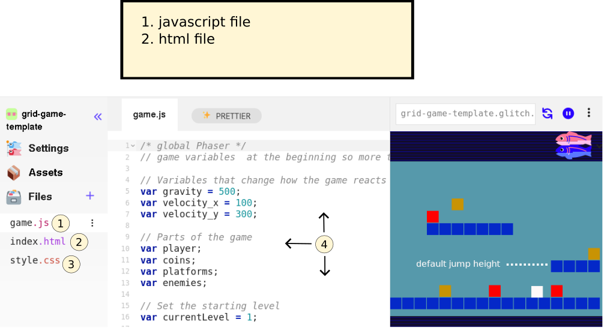
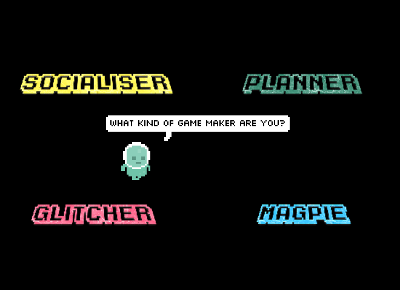

---
# all the regular stuff you have here
zotero:
  scannable-cite: false # only relevant when your compiling to scannable-cite .odt
  client: zotero # defaults to zotero
  author-in-text: false # when true, enabled fake author-name-only cites by replacing it with the text of the last names of the authors
  csl-style: harvard-manchester-metropolitan-university # pre-fill the style
layout: post
number-sections: true
categories: chapter
title: 5. Exploration of the Formative Learning Design Process
---
-   [Exploration of the Formative Learning Design
    Process](#exploration-of-the-formative-learning-design-process)
    -   [Research Questions - April
        2024](#research-questions---april-2024)
    -   [Chapter Introduction](#chapter-introduction)
    -   [Narrative exploration of
        contradictions](#narrative-exploration-of-contradictions)
    -   [C1 - contradictions involving the use of game programming and
        asset authoring
        tools](#c1---contradictions-involving-the-use-of-game-programming-and-asset-authoring-tools)
        -   [Narrative descriptions of shifts of tool
            use](#narrative-descriptions-of-shifts-of-tool-use)
        -   [Using a starter game
            template](#using-a-starter-game-template)
        -   [Observations on the game template and core
            tools](#observations-on-the-game-template-and-core-tools)
    -   [C2 - Participant conflict associated with project navigation
        and use of
        documentation](#c2---participant-conflict-associated-with-project-navigation-and-use-of-documentation)
        -   [Narrative on the evolution of resources during
            P2](#narrative-on-the-evolution-of-resources-during-p2)
        -   [Quick Start Cards](#quick-start-cards)
        -   [Code snippet examples](#code-snippet-examples)
        -   [Structuring instructional tutorial
            chapters](#structuring-instructional-tutorial-chapters)
        -   [Theming the a collection of game design patterns to aid
            navigation](#theming-the-a-collection-of-game-design-patterns-to-aid-navigation)
    -   [C3 - Responding to tensions and barriers in cultural aspects of
        the game making
        activity](#c3---responding-to-tensions-and-barriers-in-cultural-aspects-of-the-game-making-activity)
        -   [Social coding processes](#social-coding-processes)
        -   [Playtesting as a cultural
            process](#playtesting-as-a-cultural-process)
        -   [Outroduction to this part of exploring Drama process and
            playtesting](#outroduction-to-this-part-of-exploring-drama-process-and-playtesting)
    -   [Chapter Discussion](#chapter-discussion)
        -   [Summary of barriers and tensions explored in this
            chapter](#summary-of-barriers-and-tensions-explored-in-this-chapter)
        -   [Link to next chapter](#link-to-next-chapter)

# Exploration of the Formative Learning Design Process

## Research Questions - April 2024

~1. What pedagogical tools and processes are available to support novices to overcome barriers to participation in game coding processes?~

1. What ~barriers~ areas of contradictions arose in participation in this research's game coding processes and what pedagogical tools and processes are available to address these contradictions?
2. How can game design patterns support the development of coding practices with novices?
3. How can learners build agency in an evolving community of game makers?

*A note on style*

This chapter contains a large number of headings in draft form. These will be replaced with introductory sentences when structure is stable.

<!-- ## Notes on structure -->
<!-- NOTE:
Moved impact of software tools here - and overall on templated approach on a micro level  -  which therefore becomes less of this study's focus - and needs less evidence -->

<!-- - drawing mostly on my journal notes and the evolution of the tools and design themselves.   -->

<!-- - **Interviews (and Lit review ):** exposes motivations and barriers to undertaking activity  this domain from interviews with peer practitioners and literature review -->

<!-- However in terms of tensions - there is one on cultural tensions - this may need moving to the next chapter - a more thematic approach. -->

<!-- Also the practitioner interviews - could be a bit disjointed - as they do relate to cultural barriers and tactics. But could say those are explored in other chapters. DONE -->

## Chapter Introduction  

<!-- - exposes motivations, tactics for and barriers to undertaking activity this domain from interviews with peer practitioners (supplementing the literature review) -->

<!-- I am guided in this respect by the lineage of research of constructionism, and in particular the sharing of practice between researchers and teachers regarding the use of LOGO. A seminal example of this practice is Papert and Solomon's publication Twenty things to do with a computer which is replete with code examples and diagrams of their output on the screen [-@papert_twenty_1971]. Many such examples exist from Papert in published memos and grass-roots collaborations with teachers [^4]. -->

<!-- ---
NOTE
---

I originally structured the chapter around observations structured in the phases described in chapter three. This approach proved over-complicated, mixing the description of tensions which often spanned multiple phases.

--- -->
<!-- Due to the novel nature of the learning design, a detailed outline of the specifics of the participants experience of the design helps readers situate  the findings of the following two chapters. -->

This chapter contains a high level of detail on the technical elements of the learning design to situate the findings of the next chapter and to allow the design to be by other practitioners and researchers in this area. The format of this chapter can be conceived as a design narrative [@hoadley_creating_2002]. To do to this I include narrative descriptions of shifts between phases of design as it mutually evolved over time. The concept of design narrative emerged within DBR as a way to communicate the important detail of context [@hoadley_creating_2002; @brase_knowledge_2024; @bell_theoretical_2004;]. While DBR has its own language of argumentation [@brase_knowledge_2024] in this chapter augments design narrative using the rich set of descriptive and analytical tools provided by third generation activity theory (3GAT).

In the previous chapter, I described phases of delivery of the formative intervention in the form of a family game making programme and I described activity by identifying activity units/systems, system elements,

This chapter and addresses the evolution of the key pedagogical features used in my research process using analysis of emerging tensions between system elements in learning design. Exploration of the shifts in the design of the intervention is done via a development of a design narrative which explores the driving forces behind changes in the design of each phase.

This narrative is enriched by more in-depth analysis of three key areas of emerging areas of contradictions in activity and resultant interventions which addressed those contradictions. The three main areas of contradictions are explored in this chapter are as follows: in use of software tool use in P1 and P2, those associated with project navigation and the use of supporting documentation in P2, and finally contradictions surrounding identity in of the game making activity.

The discussion section of this chapter includes a synthesis of key initial barriers to engaging this game making program and the resultant responses. A final section identifies  game design patterns (GDPs) as a "germ cell" concept that emerged in several forms in the evolution of the learning design.

## Narrative exploration of contradictions

## C1 - contradictions involving the use of game programming and asset authoring tools

As outlined in Chapter 4, in P1 I invited home education families to take part in a course of game making.  This section addresses contradictions arising in use of tool use in the process of coding and game asset creation focusing on the transition from P1 to P2.

While activity theory has a broad definition of the concept of tool which would include the use of language, concepts, supporting resources and production processes, this section focuses on software tools and code framework used to create games in this program.    

I started with experience of teaching web coding but limited knowledge of how to code games. My own motivations for working with open source, authentic game authoring tools (explored in the introduction), steered me to draw on the documentation of the Mozilla community and select Phaser as a framework. Coding games in webpages is a complex technical process (see appendix 5.x for a break down) involving several interacting languages and processes.

While the choice of open source text coding tools, brought additional challenge to the process building competency in tool use compared to using a block-coding approach, the use of Thimble as a code playground simplified this the process of publishing and editing (see LR).   

Details online HERE of call out.
https://docs.google.com/document/d/119S3Q7QTplF1hw1MiK02IHO3XvyvxgUsAObw0pWMXhU/edit#heading=h.ilc3cz3teyb6
And as a publicallly available archive of thr email list.
https://groups.google.com/g/mozilla-html5-gamemaking-mcr/

The process I started relied greatly on the organisational abilities of parents and tenacity of young people involved rather than structured educational support for the design process (drawing more on a community activist approach rather than teaching).

In P1 I used several open design activities and ongoing processes to support the game design of participants. Early sessions involved, discussion about what makes a good arcade game, brainstorming on game features to add and environmental story, tinkering with pixel-art character making, making craft collages for game backgrounds. The process was creatively chaotic but I became overwhelmed dealing with group process and my expectation that participants would follow their own interests and as a facilitor I would help groups pull projects together. This open and collaborative process was inspired my participation in the Mozilla open leaders programme. However, while the process worked for this iteration, it was not optimal or scalable.  

Reviewing my notes and email interactions I note honesty about feeling out of depth and asking parents for support in organising and bringing more order to group and planning processes.  

Given the complexities of learning text based languages, significant areas of contradictions arose between the need of participants to use key tools to create games and their limited skills and experience in using them.

It was only five weeks into the process that we turned to the coding tools and processes.

This is partly as I did not want to start with code that might alienate, but also as my own game coding skills were also being tested to their limits at this point also and I was working hard to introduce coding at a suitable level.

I taught coding at this stage as I learnt it, by adapting a starting code template of a platform game from a tutorial site and adding it to the code playground to remix from

As the weeks passed, I created various code examples to add functionality requested by participants.

In another stream, I lent learners a laptop loaded with vintage arcade and console games to help build familiarity with arcade and retro game tropes. But this aspect was promising but lacked a structured exploration in sessions in a way which conveyed the limits of what our projects could achieve technically.

<!-- In early stages, this gulf created a tension between the need to use the tools and text coding processes which often resulted in frustration and paralysis in the activity of game coding. -->
<!-- At the end of this stage participants showcased their games to students in the foyer of the MMU Brooks building. -->

The informal nature of this learning setting encouraged me to prioritise approaches which avoided written or to whole class instruction.

My motivations here were also supported by experiences in P1 documented in my journal. I found attempts to convene attention on a presentation screen for instruction based teaching to class uncomfortable, stemming from my judgement that these interventions to be unwelcome interruptions for the participants making activities.  

The resulted in a design challenge involved designing a bespoke  game authoring environment by adapting existing tools and embedding where possible affordances within that toolset to facilitate participants to address gaps in their knowledge without needing explicit instruction.

Work needed to be done to address participant expectations of an acceptable scope for the game making project .

This challenge was brought sharply into focus by a particular conflict experienced by one family in particular.

#### The 3D flying bee

One family in P1 chose not to continue with most other families after the Xmas break.

Members of this family had engaged in planning on paper and in particularly in creating pixel art, however tensions began to emerge when the introduced code framework framework did not support the desired features of one child. The feature they wanted to add to the game was bee design roaming a 3D landscape.  

in later stages they were reliant on others to implement code changes.

When the family withdrew, they shared in feedback (see appendix 4.x) that at one point the family looked around and just saw people doing "hardcore coding" and no longer felt that they belonged". In the end stages of the game production process, due to the dynamic of the larger group, they were reliant on others to implement code changes for their imagined game, unable to contribute fully at this point and found themselves isolated. Thus a contributing factor to this families alienation were tensions engendered by the large group size and compounded by frustrations stemming from unfamiliarity with tools and processes. In participant feedback, the  parent of this family described in the previous section indicated that it took too long before in the planning stage and called for more hands on play and use of the tools of production before being called on to make creative decisions. The parent likened this to an arts studio approach. This feedback contributed to choices outlined in other sections of this chapter. (WHICH ONES)

<!--
When the family withdrew, in my journal notes I reflected that the they shared of alienation from the group process occurred in a session where, due to a sense of urgency to complete games, I had omitted drama-based warm up activities. Instead as participant entered I began to support to help some participants debug some pressing code errors. -->

 <!-- namely: an incomplete 2D platformer; pixel graphics; with graphical scaffolding for text-based code; and deliberately incomplete thus inviting improvement. -->

<!-- As explored in the literature review, an extensive body of research on the design motivations and impact on learners exists for the creative coding tools Scratch.  -->

<!-- A common question for this research is why not use Scratch (see LR / Glossary)? While Scratch, is aimed a broad range of media creation, much of this research involves game making as a popular genre of media of young people. I chose to not use Scratch for this study, partly as it was well researched and partly to prioritise authenticity of tool set.   -->

<!-- NOTE INTEGREATE HOW DESIGNING FOR AUTHENITITY IS A CHALLENGE HERE WHICH IS ALIGNED WITH PBL AND EXPERIENTIAL THEORY, FORESHADOW SHARED DIMENTIONS OF AUTHENTICITY WHICH ARE EXPLORED LATER. -->

<!-- I took care to screen participants from processes and tools that were unrealistic for novices to use. -->

<!-- NOTE - PERHAPS EXPLORE COMPLEXITIY OF IDES AS A BARRIER IN RESEARCH - SEE BLUE JAY AND GREEN FOOT TRAINING IDEs -->
<!-- In the activities of study, a high degree of authenticity made possible, in a material sense, by the digital nature of the learning resources. Beyond a general purpose computer, no prohibitive equipment is needed. -->

## Detail of Tool Evloutio based on resolving Conflicts

Intro to different sections

### Use of a Code Playground

Code playgrounds, as described in chapter two, are an online environment used to test, share or invite help from online users. Learning computer coding presents challenges in part due to unfamiliarity with and potential complexity of code authoring tools and environments [@guzdial_programming_2004]. The use of code playgrounds by novices can mitigate against some of the complexities of code environments. Tricky elements include steps to reducing syntax errors, shielding complexity, facilitating community commenting, sharing, remixing and other forms of collaboration.
FIND OR REFERENCE SUPPORT

There was a shift from Thimble to Glitch in the shift from p1 to p2 provoked by Mozilla choice to discontinue which happened concurrently to and of funding of Webmaker programme. The shift brought some new functionality which was incorporated into the learning design. In this section I link code playground design features that I have used with any existing research on the value of Code Playgrounds. I draw on these affordences in later discussion (linking with constructionist theory)

DROPPED THE REMIXING / SHOWCASE - COMMENT / SUMMARISE?

Turning to reducing code syntax errors, it is of value to compare approaches briefly.

While some  software projects aimed at for novices use visual coding (block coding) approaches to reduce complexities of code use [@bau_learnable_2017; @resnick_scratch:_2009]. This process reduced possibilities for syntax errors (see glossary) and often provides a limited set of blocks to reduce complexity. While this approach not explored here for reasons previously outlined, there are some features of the glitch code playground which help. For example, the environment can detect the file type as javascript from the file extension and then uses a static analysis tool (linter) scan the code for signs of inconsistencies of code and syntax errors and highlight them [@tomasdottir_why_2017].

In glitch such code syntax errors are highlighted via a red dot provided a quick visual indication of where the error occurred. In addition if the user hovered over the dot would give an error message. In analysis of pair interactions, I frequently [how much from video data]  observed the non-coding peer notice and point out the red dot, thus preventing further errors.

ADD IN HOW FREQUENTLY THE PARTICIPANTS DID USE THIS.

DESCRIPTION OF MY INTERVENTION. At times when addressing code snags experienced by participants I would scan the code looking for the red dots and drawing attention to them.

If this was not helpful I would also use the console of the in-built developer tools of the browser [@collins_crossfire_2011-1].

<!--
MOVE TO LITERATURE REVIEW IF NEEDED

While block coding offers significant advantages (GL)in preventing syntax errors, in a comparison to text coding approaches, Bau and colleagues summarise the inherent disadvantages [@bau_learnable_2017]. These include: block coding can take of a lot of the users screen; making small changes to code can be tricker in blocks than text; block coding can complicate remote collaboration and version control; searching for code structures is simpler using text code. While these disadvantages are more applicable to more advanced users, they remain relevant to my general goal of working with an environment aligned to professional practices. -->

<!-- In the video data analysed, there were practically no extended blockages to undertaking work related to the use of this environment. While this study does not attempt to quantify this factor, the experience compares very favourably to my experiences of using and teaching coding environments. -->

<!-- In my design the tools set is distinct from tools like Scratch, Logo in that while those tools were designed to be self-contained, the use of a JS library in a web coding environment is more open-ended. -->
<!-- In my design, tools are more authentic and familiar in terms of using a professional framework and a web technology around which the internet browser is based on. -->

### Using a starter game template

The following section describes designs decisions relevant to the evolution of this starting template by drawing on concepts explored in the literature review, namely: UMC approaches; constructionist design heuristics; and the concept of affordances understood from a socio-cultural perspective as 'technology affordances as possibilities for human actions mediated by cultural means' [@kaptelinin_affordances_2012, p.927].  

The initial use of a working structural template was based on my previous experience of teaching javascript to novices [@chesterman_webmaking_2015].

This template was synthesised from several tutorial to create a game of the _platformer_ genre  (see glossary), a move which helped to limit expectations of the technical complexity of their game.

The choice to pre-select a particular genre was initially a pragmatic response to tensions experienced in P1. When offering feedback to address her family's feeling of isolation from the coding process, the parent of the family described in the previous section had requested more hands on play and use of the tools of production before being called on to make creative decisions.

By P2, learners first experience of the experience of the tools was in the process of playing an incomplete game in a webpage and controlling the character using the computers arrow/ cursor keys which for many was a familiar process. Due to an intentional fault, players needed to click a remix button, and alter the underlying code to progress in the game. The following section outlines responsive design process surrounding two main elements: the starting game code template and the code authoring toolset.

I realised that to allow for this playful experimentation, a purely structural template was insufficient and that a working game template was preferred. To create the template I drew on the structure of online starter templates from several sources  to create a minimal template for a two-dimensional platformer game.

**Structural design of the game template**

A web code project using the chosen game framework
phaser consists of several interlinked files of Javascript, HTML and CSS and image files. (see glossary & appendix 4.x)

<!-- {width=95%} -->
<!--
 -->

{width=95%}

4.x glitch coding environment with code structure of left menu, a central code window with code, comments and game preview on the right.

1. Javascript file which participants alter to make changes to their game
2. Html page within which the game is embeded (not usually altered by participants)
3. Css style sheet (not usually altered by participants)
4. Code editing area
5. Game preview area

While access to HTML and CSS files of the base project was available in the left menu as show in  by default participants would see only the JavaScript file names game.js .

<!-- Creating the project from first principles is relatively complex both semantically and practically. In the domain of web technology, starter templates consist of pre-built collections of HTML, JavaScript, CSS and other configuration files which allow users to avoid initial configuration and thus accelerate adding features to projects. For example the Next.js web framework comes with a large range of starter templates based on common requirements of web sites [@nelson_best_2023]. Phaser starting templates available from the website share this aim of providing scaffolding by providing a downloadable zip of files which when extracted are already interlinked correctly [^5].
While access to HTML and CSS files of the base project was available in the left menu as show in  by default participants would see only the JavaScript file names game.js .

Game states and functions to create the game loop (see glossary) are included natively in the phaser framework [@faas_introduction_2017]. Game states allow designers to deconstruct games and game code into collections of sub-units (states)   [@kostolny_digital_2017]. For example a simple arcade games may only had an insert coin state, a play state and a game over state. A game coding framework like phaser shields its users from code complexity by providing a game state manager and associated functions out-of-the-box, meaning that lots of underlying code is already written and hidden from view. To increase simplicity for my participants the starting template I created had only one game state called _PlayState_. It followed the following structure: a beginning section out side of a function declaring variables; a preload function which loads assets into the game; a create function which sets up the initial game; an update function which listens to and responds to user input. The following illustration from the step-based instructions illustrates the structure for participants, including the possibility to create new game states e.g. a game over state.

{width=55%}

4.x - Game states and function structure explained in the Glitch Game Makers manual created for for P2 and P3 -->

<!-- The use of template was an immediate, intuitive way to bring something to the table as a starting point to develop.  -->

<!-- Other parents requested additional supporting resources which explained the coding structures used in accessible but detailed ways. A request which hinted at a more structured, instruction based approach.  -->
<!-- In addition, my own motivations to explore research claims which on the engagement value of prioritising modifications to for quick impact on the game and on allowing participants choose over what they wanted to add to their game next. -->

<!-- follow the Use-Modify-Create model to build familiarity with and to scaffold the adaptation and use of coding constructs [@lee_computational_2011]. -->

<!-- In phase one, I noted that any addition to the game in terms of adding new any quantity of code created many potential coding, conceptual and organisational challenges. To counter this I adapted the starting game template to allow changes in code were relatively easy to perform but which resulted in potentially large changes in game behaviour and appearance. -->

<!-- NOTE SOME OF THIS CAN  -->
<!-- I kept the process informal and responsive by allowing participants to choose which one they wanted to work on next. The following sections outline different areas and patterns of activity. -->

<!-- COMMENT OF mOZILLA TOD THAT IT WAS GENTLE FACILITATION -->

<!-- - level design and prototyping: use of
- fluid variable editing effective movement
- The swapping of assets and more complex work with code syntax
- development of simple stories to bump personal expression and narrative -->

<!-- NOTE - All longer or shorter chains of actions , becoming operations - WHERE DOES THIS FIT?
NOTE - Also justify having so emergent results here , delay while accessing help to start 360 recordings
As the end process is visible in fluid behaviour -->

<!-- These tools align with some key design considerations. [Brennan & Resnick]
- Well suited to build a repeated design practice.
- Small changes had big effects.
- Variable changes needed immediate testing.  
- Especially with starting documents, -->

<!-- While the design suits repeated design practice as illustrated by the example above, not all pairs or individuals interacted with GDP in such a neat way.
A later discussion section in this chapter illustrates a more complex interaction with design stages. -->
<!-- The choice of the starting toolset and mission shapes the balance and profile of initial community activity. -->

<!-- Make point that it is hard to separate out tools and communities. In case of Mozilla, code playgrounds, and teach the web, and the culture of developers and teaching communities they are interlinked. Discuss and compare to Kafai in book, the lineage of Logo, Scratch. Instead the more authentic approach of a real language.
-->

#### Variable editing for player movement

To accelerate and support the experimentation of users, I identified changes to the code that were easily recognisable game experience features and where small changes could provoke a high impact on the game experiences. These include changing gravity, altering the player jump height and walking speed.

The starting template began with the game in a broken state thus inviting players to modify the game to fix it. The player's maximum jump trajectory was not sufficient to progress via a jump to the first platform. To progress, participants needed to change alter at least one of the key variables were highlighted at the very start of the game code (see Figure above).

In their research Kynigos and colleagues [-@kynigos_children_2018] explore this concept as a half-baked games where incompleteness or bugs in behaviour are a provocation to participants to correct or to further modify them. This process also aligns with the motivations and techniques of the UMC framework explored in the literature review , in particular the guideline to "create choices that show visible and immediate changes" [@lytle_use_2019-1, p. 6]. In this design, the first participant choice and the need to  transition from the _use_ to _modify_ stages is forced at an early stage by the half-baked design. While this design decision compromises the user choice initially, it allows a  carefully scaffolding of early coding experiences and promotes a shared experience for all participants in a way which facilitates and encourages peer learning. After this shared first change, participants next choices varied greatly. While some participants engaged with extensive experimentation to find a player movement feel that seemed just right, others, mostly adults or younger participants, were much less concerned with this aspect of game play, despite sometime frustrating resulting player movement. Data explored in the next chapter supports foundational claims of contructionist computing and UMC advocates  that greater user choice over the design process contributes to participant motivational and a feeling ownership of their projects [@lytle_use_2019; @peppler_computer_2009]

The process here began with me imagining what would be a good feature that players would notice and be spurred to change. Here, the deliberately unsuitable game variable is a key affordance of this half-baked game template.

Descriptions of other under-developed features inviting improvement follow including level design and the use of minimalistic graphical assets.

<!-- I adapted my design with an aim to increase speed and consistency of feedback from learner input, reduce coding syntax knowledge needed to progress, and thus reduce learner anxiety for novices.  -->

#### Level design and prototyping

**The use of a graphical grid structure to edit level design helped balance concerns of accessibility with the use of authentic code language.**

Platform games often conform to certain patterns in terms of the elements involved commonly including: a player that you control to movement of; platforms to be jumped on; hazards to be avoided; and rewards to be collected.

In P1 the suggested process of adding game elements was relatively complex which involved changing parameters of functions to alter to adjust their location. An example of the code needed is included one of my tutorial chapters / appendix 4.x [^7]. Complexities included: each element needs to be added separately with code elements required in three different areas of the code template, adding x,y coordinates to place each game elements was; difficulties concerning adding graphical elements of different sizes. These complexities created frustrations in the game making activity P1, in particular as project became bigger cod became unwieldy and confusing to alter, causing a negative impact on the testing and revision process in particular.    

Key research on toolsets for novice coders advocates a visual approach to facilitate the coding multi-media projects for novices to address such complexities[@guzdial_programming_2004; @resnick_scratch:_2009]. This is achieved via techiqued which include a drag and drop approach in Scratch or via a concept called tilemaps [@erhard-olsson_procedural_2018] used in GUI oriented game making tools (Unity, Game Maker etc).

While, these tenhiques were not possible in this text-based environment, in P2 I revised the added  the possibility for a visual design approach via the use of a a grid coding format (see figure 4.x below), thus  replicating a tilemap technique within the text code format.

<!-- OPTIONAL ADD AND APPENDIX ON LOAD LEVEL? -->

{width=95%}
Figure 4.x - Grid based editing of level design with a simple key for hazards, coins, and platforms.

**Black boxing the process of placing assets:**

Technically, this approach involves the construction of a data array for each level of 17 blocks which can be one of the following: x (platform); h (hazard); o (coin); or could be left blank (see Figure 4.x above). The grid structure of text-based array, had a strong visual correlation with the resulting game layout. Changes to the text based grid in the code area on the left would be immediately seen in the right hand project preview area.

This solution abstracted away complexity and repetitive nature of asset placement via multiple asset placements  to prioritise ease of use to help sustain participant engagement.

Thus, here a technical approach helped resolve tension between immediacy of feedback and ?

Via quickly adding design possibilities to change levels design.

This adaptation had a positive impact on engagement with level design in initial stages. Many participants spending significant time and effort undertaking many iterations of changes to the level design ((Is this something that can be given figures to? Perhaps for one session?)).  An illustrative example of the impact of
is explored via a vignette in appendix 4.x where child participant Toby designs many levels. The goal seems to be to make the game challenging and to add many levels as a way of making his game distinct from others (include BETTER SUMMARY). Participants varied in their approach to level design, some drew on their experiences to mirrors platform game conventions, while others enjoyed working against these conventions, a theme which is explored in more detail in .

<!-- The possibility of disturbing the syntax of the  of code in the array. When participant did this it provided a good opportunity for facilitators or parents to outline the importance of correct syntax of and to explain the code structure. -->

#### Use of game assets

This section conversation: simple block graphics as a half-baked affordences, the use of pixel art and authoring tool, distributed asset creation approaches  

##### Simple block graphics

A further way in which the template aligned with the concept of half-baked game concept as in how the use of minimal starting game assets invited creative addition by participants in the form of graphical asset creation and game story.

In P1 a template based on tutorial used stock graphics of a astronaut collecting stars on platforms resembling earth and grass. In P2 starting graphics consisted of colour blocks. Their size of 32 x 32 corresponded to the default project size of Piskel (the graphical pixel art editor) with an aim to was also design to reduce technical friction.

A pixel art approach to graphics allowed a balance between the potential for positive engagement with game making and the potential drain of time to this one activity, thus helping resolve one of the tensions emerging in P1. Piskel had proved to be intuitive for many younger participants with three main areas: a set of editing tools; a canvas for creation; and a set of tools to export, save and import work (see Figure 4.x).

{width=95%}
Figure 4.x - Interface of Piskelapp tool

One of the complications encountered in P1 was the differing sizes of sprites created using different graphical tools. I helped resolve this for participants by matching the size of the block in the grid level design structure described above to the default size of sprites created in Piskel (32 x 32 pixels). This is one example of one of the  technical alignments which addressed and helped resolve practical obstacles that participants experienced.

NOTE - INTEGRADE DISTRIBUTED ASSET CREATION AND NOT BLACK BOXING EXPORTING ETC AS A DIGITAL LITERACY SKILL.

#### Distributed approach to asset creation

<!-- _Seeding narrative and art creativity_
As they had been guided to make a game on a broadly environmental theme, participants often redesigned sprites to games involving animals. The following image shows a whale as a player character and plastic bottles.

{width=50%} -->

<!-- #### Creating a simplified and clear project structure

The following illustration from the step-based instructions illustrates the structure for participants.

{width=95%}

4.x - Structure explained in Manual for P2 and P3

In P1, I found that as I worked with the learners to respond to their requests to add in new elements to the game, I was able to to reference different parts of the template and thus build their familiarity with the code.

At one stage I did a test of that process by printing out different elements of the template and asking them to complete them roughly in order as a jigsaw activity. The participants expressed surprise at how much familiarity they had built up with the code.
INSERT QUOTE FROM SU AND TOBY

Despite building familiarity with code, at this stage event simple game changes or adding new elements still required significant support.
 -->

#### Distributed vs. self-contained approaches to asset creation - INTEGRATE IN GRAPHICS SECTION ABOVE

A key element of game creation is the creation and management of graphical and audio assets. Many coding tools for novices provide a library of prebuilt assets and tools within the environment to alter or creation graphical and audio multimedia assets to facilitate and accelerate the creation of games and coding projects. While there are practical limits to the audio and graphical authoring capabilities of tools like Scratch [@payne2019music], such self-contained approached reduce possibility for compounding errors and complexity caused by the compatibility of file formats and migration and management of external asset files.

There has been extensive research supporting the motivational value of the ability for young people to bring their interests into multi-media creations via choice of assets and narratives [@kajamaa_digital_2018; @resnick2014give; @peppler_supergoo_2007]. In line with these findings, I observed a palpable a sense of achievement when participants succeeded in seeing and hearing their creations in their game after making the final changes in code. For some, the sense of a achievement appeared magnified by difficulty caused by the unfamiliar environment and processes.
EVIDENCE?

THE BENEFITS OF ASSET CREATION AS A WAY TO INCORPORATE FUNDS OF KNOWLEDGE - WHERE IS THIS EXPLORED.

<!-- In Scratch there are tabs which host simplified graphical and audio studios. Design decisions prioritise ease of use and the ability to record audio right into the program.  -->

In P1 I observed participant showing a high motivation to incorporate assets. Responding to the enthusiasm of participants in asset creation, I had introduced six additional software tools to participants including tools for pixel art, sound editing, sound creation. A table of the different tools is included as appendix 4.x  

Similar patterns of use emerged. Participants would identify the need for an asset in their game. They would then use the separate software to create that asset, and the be supported to save assets to their computer's hard drive in a compatible format. They would then need to upload assets to the code playground environment, discover the text link of the asset, and then insert that link into the main JavaScript game file at the relevant line of code. Undertaking the full process involved learning a complex chain of these individual actions. Some participants became remarkably adapt at this, thus transforming this chain of actions into a fluid operation. Thus, the distributed nature of the toolset used helped build authentic digital literacy skills.

<!-- For example, the processes of replacing a block image with a bespoke pixel sprite which comprised: file downloading; file migration using the browser and file manager; browser tab navigation; graphics tool use in Piskel; copying and paste text code; and selecting more than one lines of text code with mouse or keyboard shortcuts. -->

Despite this benefits, I was concerned that in P1 the diversity of asset creation tools approaches was over complicated and risked distracting time and attention from other code-based actions involved in the activity of game making. Thus, in P2 I reduced the number of suggested assets creating tools.  

This tension can be described as a play paradox. WHERE IS THIS FIRST INTRODUCED I was looking to avoid too much time spent in asset creation at the expense of other processes which would develop coding concepts and practices. It also increased the possibility of peer learning as less tools were being used.

ALSO NEEDED TO CHANGE DUE TO THE CHANGE IN GROUP WORK DESCRIBED LATER.

Participants spent a widely different length of time creating these graphics for a variety of reasons. Some took a long time to master the process of using the editing tool while others created images rapidly but would keep redesigning and recreating their game elements. The process of game art creation opportunities seeding narrative and artistic creativity is explored in more detail in chapter five.

<!-- I began by mirroring social model of learning like CoL and CoP and their propose apprenticeship-based approaches. Specifically, introducing possible code solutions to implement the ideas of participants. However, limits to my time involvement and my technical fluency hindered this process creating stress in myself and frustration and hesitancy on participants to get direct help.

    NOTE - Examples drop?
    For example, to troubleshoot a code error might take between one minute and 10 minutes depending on the complexity of it. To work with participants to identify and then implement a new coding structure could take up to 30 minutes.

    At times I was able to identify a discreet new code construct and to implement an example of this between sessions. At times I would attempt to do this in the group setting with varying results.

    Other interventions were called for directly by parents. Two relevant and relates requests happened at the end of P1.

    One was a call for more hands on play and use of the tools of production before being called on to make creative decisions. The parent likened this to an studio approach. Another was a request for additional supporting resources which explained the coding structures used in accessible but detailed ways. A request which hinted at a more structured, instruction based approach.

    However, interview data from participants placed great value on the flexibility of the approach which allowed participants to choose what they wanted to add to their game next. -->

<!-- Based on group work with adults on creating media projects together I created an email group that all participants could post to to ask for help. However this option was hardly ever used taken up. I was given feedback from one parent that asking on for technical help via an email forum not something that they felt comfortable doing. The same family also gave useful feedback about social norms of not bothering people getting in the way of asking for help.

Thus other ways of addressing this conflict were called for. -->

<!-- The need to get started somewhere emerged - and the template was a response to that.
Just an immediate, intuitive way to bring something to the table as a starting point to develop. The template was based on a prominent tutorial on the phaser website called Making your first game.
https://web.archive.org/web/20180426051205/http://phaser.io/tutorials/making-your-first-phaser-2-game -->

<!-- As preparation for the sessions I had followed the tutorial. When the  and adapted it. I removed out as much code as possible and thus simplifying the structure and readability.
  https://github.com/glitch-game-club/glitch-game-club/blob/master/games
 -->

<!-- ### ORIGINAL SECTION
**Code Playground to overcoming lack of software feedback**

One design principle explored in the literature review [@resnick_designing_2013] in the use of creative coding tools was that of immediate feedback for participants. Code playgrounds provide such immediate feedback. For example, in the code editing interface of glitch.com shown in Fig 4.x, changes made to the code on the left section take immediate effect in the resultant game on the right side of the screen.

{width=85%}

Fig 4.x, Changes made to the code on the left section take immediate effect in the right-hand preview window

The a game template served to remove technical barriers to getting immediate feedback and offered other affordances explored in the next section. -->

<!--
### Remixing and showcasing projects

REDUCE THE IMPORTANCE OF THIS PARAGRAPH - NO REALLY STRONG DATA SO SUMMARISE TENSIONS

Another common feature of novice coding tools is the use of a gallery of creations, in a way which aligns with the potential for community-based learning strongly advocated by Gee and Ito [@gee_what_2003; @ito_hanging_2010]. The ability to easily remix community projects, supports the process of becoming familiar with, and using other projects or approaches as a base, thus supporting the use and modify stage of the UMC pedagogy (see glossary). Remixing also informs professional practice [@kotsopoulos_pedagogical_2017-1] in the form of distributed revision control tools such. A practice known as code forking.

As explored in the LT, Code playgrounds address issues of complexity of web coding environment and practices of forking by providing access to a self-contained server structure from within a browser. However for novice  users the web location still also offers friction in terms of digital literacy issues of logging in, remembering passwords, linking to email accounts for password reminders. To circumvent these issues in P2 and P3 all participants and facilitators used a shared account for code playground the graphics editor.

In this program, while participants where not encouraged to browse the creations of a wider web-based community, they were encouraged to view and interact with fellow participants projects.

Practically, in novice coding communities, this is encouraged by the use of community galleries and buttons encouraging. In Scratch this is seen in buttons named see inside and remix when viewing projects. Similarly both the Thimble (used in P1) and Glitch (used in P2 and P3) prominently featured remix buttons and view source buttons in the community interface. The shared community element on the other hand was quite different for glitch due to its very mixed user base and range of different web based projects. In this learning design I took a decision to not promote with existing online communities but to focus instead on internal sharing of projects between the group.

The process of adding a remix button, removes the needs for participants to copy underlying code by hand and set up the parameters of a new project.  This process is especially relevant in reducing barriers to initial participation given the use here of authentic professional text-based coding language and potential alienation from unfamiliar syntax and file structures.

This theme of shielding from complexity is contained in all design choices detailed above and in turn aligns with a constructionist design principle to 'choose black boxes carefully' [@resnick_reflections_2005, p. 119]. A black box here refers to the process of hiding away aspects or functionality of the code or processes. The decisions made in the design each tool shape the skills and concepts the end user is guided towards. While the principle here is applied to software tool use, it also applies to the use of a starter game template, as explored in the next section.

<!-- For example, the design choice in Scratch and Code.org sprite and game labs to create a default canvas screen size of the project. It is already present and visible on the creation of each new project and the user has no choice over the settings.  -->

### Observations and discussion on the game template and core tools

<!-- NOTE: FEEDBACK FOCUS from HCI & layer in AT terminology too.  -->

<!-- The templated game was structured to allow changes in code which were relatively easy to perform but which resulted in potentially large changes in game behaviour, appearance and difficulty. This created a large diversity in the games created and in the making activities of participants at this stage despite the small scale of the code changes involved.   -->
<!-- Thus while I highlighted a limited number key code elements and structures to create affordances to facilitate a quick start, the diversity of experience kept some participants extended periods of time. -->

<!-- Games have been part of human–computer interaction (HCI) research since
the first CHI conference in 1982. At that gathering, Tom Malone, then at Xerox
PARC, presented insights from the study of computer games to motivate a set of
design principles for “enjoyable” user interfaces (Malone, 1982).

from [@bernhaupt_introduction_2015]
 -->

The previous sections have outlined changes to the core tool use including the use of a starter game template which I enacted to address the struggles participants had in becoming accustomed to game making.

Small code changes resulted in potentially large changes in game behaviour, appearance and difficulty aligns with a long standing concept of HCI research that feedback is motivating for system users [@bernhaupt_introduction_2015; @malone_heuristics_1982].  The use of a starting template was inline with core motivations of UMC technique, namely, to build familiarity with the code structure, and confidence in use of tools in an accelerated way.

Despite relative simplicity of the highlighted affordances, complex and divergent patterns of game design emerged. (evidence?)

As explored above, the shift in template design from P1 to P2 involved a more structured approach in for participants in use and modify stages where key affordances were faciliated highlighted in the code design.

This can be seen as a move from a design-build-test to a stepwise approach in the terms broadly explored by Denner et al. [@denner_does_2019].    

As described above, this decision was based on journal observations and participant feedback  

The use of revised in starter template in P2 allowed participants to maintain their games in a mainly working, shareable state allowing regular feedback from peers a process explored in later section and Chapter 7.
SIGNPOST TO LATER FINDINGS HERE?

The process of modification of the starter template, foregrounding key affordances, together with the restricted tool choice of a code playground and pixel art editor with the authentic, yet scaffolded approach of both tools can be compared to the design decisions made in creating a Microworld environment. DEVELOP THIS WITH LAURILARD AND RESNICKS THEORY.

THE IDEA BEING HOW CAN THE IDEAS OF CONSTRUCTIONIST TOOL KITS INTO THIS TOOL SET -

    Task-specific programming (TSP) aims to provide the same easy-to-
    understand operations for a microworld, but with a language and envi-
    ronment designed for a particular purpose. The task-specific programming
    language (TSPL) is purposefully limited in the abstractions and concepts
    needed for the tasks or explorations in the microworld so that program-
    ming becomes much easier to learn than a complete programming lan-
    guage.
    [@kong_providing_2022]

<!-- NOTE - DROP - MAKE MORE DIRECT
While the scope of this study is not on the micro-level of tool use, it is useful to collate some broad observations from my journal notes and video data on how participants used the new tools introduced. This is done in relation dimensions of complexity exposed in research on educational coding tools. -->

#### Developing Digital Literacy skills

The process of creating a pixel art characters and hazard involved using an online grid design tool called Piskel, creating an design of an appropriate size, saving, exporting as an image, downloading to the hard drive of the laptop in use and finally uploading and incorporating the image into the code project and linking using code syntax.

####  INTEGRAETE ABOVE Tension of a group remixing from one template rather than feeler community inspiration and interaction

To facilitate community inspiration and interaction, rather than engaging with an online community which encourages remixing, collaboration and peer review via comments [ @monroy-hernandez_cooperation_nodate; @cress_supporting_2016], one code base was promoted in order to simplify the process of supporting code errors, and promote peer support, sharing and problem solving due to the use of similar code bases. In journal entries I noted this choice as a tension between, freedom of community inspiration and practicalities of supporting complex coding errors. Sharing of ideas and inspiration did happen both on the playtesting (explored later and more extensively Chapter 7) of each others games and via incidental exposure to the online graphical creations of others via a shared account to Piskel.

#### Concluding bit
My choices balanced the value of positive engagement of asset creating, development of digital literacy skills associated with web production, and a focus on promoting code modification.  

With the modifications to the template in place, participants still only minimal support to find use the key affordances in to make impactful game changes. Simple card prompts were introduced to do help accelerate the process to facilitate working with large groups. Supporting participants in adding new game features changes was more time consuming, particularly when participants wanted to make modifications to the game requiring additional code structures. My response was to turn to more extensive documentation. The next section explores the role of supporting resources and documentation and resulting contractions that emerged.

<!-- In early trials with a limited number of families in late P1, I would point out the relevant part of the code and ask open questions e.g. '_I wonder what would happen if you changed that gravity variable?_' -->

<!-- My reflections as an facilitator are consistent with research showing the value of ongoing feedback in HCI and more domain specific research on showing the process of sharing creations are motivating thus. -->

<!-- At the use and modify stage, knowledge of very few coding concepts were essential. It useful to compare this to a typical process of learning to code in a text language from first principles where the learner is met with a great many new concepts in the process of being guided to construct even the most basic of programs.  Thus, while some basic alterations are being made, this stage of learning design aligns most closely with the _Use_ stage of the UMC model (see lit review/ glossary) [@lee_computational_2011].    -->

<!-- The partially working environment and immediate feedback this allowed also gave rapid access access to varied forms of face to face community activity including varied forms of playtesting and social interaction and ways to access help from peers and facilitators.
While Scratch has an extensive online community allowing for remixing and showcasing of games,  the community element of the design are not is explored in this section. See instead chapter six. -->
<!-- While, initially conceived as a starting activity, many learners stuck with those possibilities for a long period of time. -->

<!-- although help was available via in-line text code comments, I noted that to notice and read these comments required a degree of proficiency or code familiarity that not all participants had.
 -->

<!-- NOTE
MOVE? NEXT CHAPTER - ALSO NOT ALL PROGRESSED
A common request was to add a moving enemy to the game. There was a great divergence in the amount of time learners took to want to progress beyond making embedded changes to adding new game design patterns. One parent Molly did not progress beyond this point despite engaging in phase three and phase four, focusing on graphical design and developing narratives. In the feedback session she commented that she was happy to reinforce her existing learning. -->

<!-- While the template has self contained help in the form of text comments Some participant do not pick up all processes, some left behind and need support but that is available. Seeing patterns other peers adopted and creates a reason to ask for help. Peer propagation of patterns explored later. -->

<!-- Perhaps move later after GDP chapter?  -->
<!-- **Limitation of asset work as a GDP**
Note the limits of this interpretation
While the reinterpretation of the MDA framework into a menu of GDP is practical for the elements that they want to change, it is not strictly a pattern to be implemented here.
tension here to be briefly explored or noted to explore later. -->

<!-- #### Circulation of peers and helpers
This often facilitates talk aloud of design decisions and justifications.
Cross reference playtesting -->

<!-- ### Accessing Help and Documentation
In the emerging community there was a variety of help available including;
- Written documentation from the learning design via step by step tutorials
- A series of code examples in working code playgrounds
- Facilitator help through asking for help
- Student Helper attention and help
- Peer support from parents and children -->

<!-- ### Discussion on initial tool use and starting processes
DEVELOP THIS SECTION -->

<!-- These observations can be explore in relation to other research
- This research supports claims that half-baked games invite development []
- This research also supports other research on the attraction (and motivation) of retro, (introduction) on culture and livingstone, sefon-green. -->

## C2 - Participant conflict associated with project navigation and use of documentation

**- Contradictions associated with project navigation and the use of supporting documentation - interpreted here through the lens of guided participation**

In addition to the description of the tools in the section previously, there is a full description of tools and processes used in the phases included as table in appendix 3.x.

### Narrative on the evolution of resources during P2

This section details a conflict where participants, frequently wanted to add new features or changes to their game but were not clear how to implement them. In P1 this caused delays and participant frustration, as although I could work with people directly to help them I had limited time with each participant or pair. The inability for participants progress due to lack of game and coding practices was compounded in early stages by little or no supporting documentation or supporting resources. This section outlines the evolutions and design choices informing the different forms of supporting documentation used to address this conflict.

<!-- Before addressing the detail of the learning design it is helpful to contrast both documentation with the use of tools and templates explored previously.   -->

The process of creating documentation which created enough support for users to be able complete coding tasks but also facilitated participants to choose their on path presented significant challenges.

MENTION HERE THE DISTINCTION BETWEEN PRIMARY AND SECONDARY USE OF TOOLS DUAL STIMULATION?
SOME DISCUSSION MOVED TO CHAPTER 6 ALREADY - MOVE IT BACK HERE?

<!-- I wavered between the use of a technical variable name or one more closely linked to the behaviour in the game. For example, I trialled replacing velocity_x and y with playerMoveSpeed and playerJumpSpeed. I returned to velocity x and y as they are important concepts in physics and wider science, here prioritising the more abstract representation based on experiences of participants not getting overwhelmed or stuck on this use of language, quickly forming habits to alter them. I evaluated that more is gained than lost in this design choice. -->

<!--
{width=50%} -->

<!-- As outlined above the starter template and quick activities served to address the _use_ and _modify_ stages of the UMC approach. One seeded into the community, these processes also propagated via peer learning in ways which are explored in chapters five in six. In contrast, the _create_ stage required longer input from my self, to help participants with their individual choices of what to add to the game.-->

<!-- SHIFT? - It is notable that the create stage of this model does not involve starting a totally new game from scratch as is imagined in some interpretations of that model. Due to the complexity of the code base and framework the process of creating a new GDP within the game as a suitable level of challenge. -->

<!-- ##### Linear and stand-alone tutorials and code snippet resources -->

<!-- Longer form step by step tutorials are common in computing education. Examples can be found in Code Academy, and in the education resources of RPi foundation. Many examples talking learners through steps to build a game can be found online with varied amount of explanation of underlying constructs and concepts. I started my journey learning JS games using some provided
by Mozilla and the Phaser developers. -->

### Quick Start Cards

NOTES: Created by students -

In summer 2028 during I shared the fledging design with computer trainee teacher computing students as part of a subject knowledge enrichment programme. In response to a challenge to improve the design three students created printable word documents which highlighted key affordances of the design.

Narrative of Js cards responding to delivering show case lessons to teacher trainers and in half term activities and more generally sharing the learning design.

To address the limit of one-to-one facilitator support to seed the starting processes outlined in the section above, I used printable resources which highlighted the key lines of code and how they can be altered to impact on game behaviour(see figure 4.x below). These _quick start_ cards provoked a strongly scaffolded initial interaction with the code in a way strongly aligned with the use and modify stages of the UMC framework [@franklin_analysis_2020].

{width=95%}
4.x - Example of a Quick start card

### Code snippet examples

The use of code snippets, while a promising authentic practice, presented initial challenges. To support a hands-on approach and responding the design choices of participants, I began by creating discreet code examples illustrating the requested elements. The use of code examples or snippets in code playgrounds is a common professional problem solving practice [@yang_stack_2017]. These code examples allow users to see the behaviour in context with the code and output side by side. While code examples exis                                                                                                                                                                                                                                                                                                                                                                                                                                                                                         69+ted on the Phaser website and support forums, in line with other support sites like stack exchange, their utility has limitations including lack of relevant, consistency, being removed from the domain context, and not being structured in a self explanatory way [@treude_understanding_2017]. Thus, while I initially encouraged participants to search within these examples, and authentic documentation and help forums, the resulting confusion and difficulties experienced by participants, prompted me to create other more bespoke documentation.  

<!-- The competency to overlook the concrete differences in code structure to abstract the principles away and to then apply those principles to the existing structure of their code project seemed too ambitious for this group of novices. -->

Creating a bespoke set of code snippets helped address the challenges described above. In P1 I responded by creating one off documents with the relevant code which were both printed, emailed and shared via google drive. In line with the practice of accessing help via code snippets, the code examples could be to be copied and pasted into the game. This process lacked coherent process for participants to navigation to the resource they need. The process also lacked a consistency in signposting how the code listed fit within the existing structure. To help students see the code in the correct structure, I began to create code snippets within code playgrounds and distinct project. These projects shared the structure of starter game template and added only the code needed for the additional requested functionality. My rationale was that each pattern added builds familiarity with the code structure, a theory supported by observations of Toby's proficiency in the vignette above.

### Structuring instructional tutorial chapters

<!-- BELOW Initially I structured the book chapter participants working their way through the online resources. HOW -->

<!-- While writing self-contained tutorials added a challenge to the documentation authouring process, the documents, especially when printed became a vital resource for this community. In chapter 5 I explore the extent to which these resources can scale for use beyond this context. -->

For each code example I created descriptive step-by-step documentation which in P2 were developed into chapters of an online book [^9]. Each code snippet linked to a descriptive chapter. These chapters attempted to balance an informal, hands-on approach over pre-teaching concepts, with the request from some from parents in the feedback to P1 (see appendix 4.x) to provide background concepts and explanations of coding constructs. To address this tension, in addition to self-contained chapter focused on instrumental code changes needed to implement game features, I created opening chapters of the online manual which were more traditional in format and explained underlying concepts that the starting template had initially abstracted away from the participants.

<!-- As these tutorials took as a starting point the code of the starting template and did not attempt to explain that, they did not however resolve the issue of participants wanting resources that explained these core constructs and underlying concepts.

I created opening chapters of the online manual which were more traditional in format and explained underlying concepts that the starting template had initially abstracted away from the participants.  -->

<!-- To describe the relationship between the self-contained chapters described above and the process of backtracking to gain foundational knowledge, I used the term _meeting yourself in the middle_. In the supporting chapters this term represented the value of retracing initial steps as a way to explore the computing concepts present in the design. -->

<!-- An example of parent Sh interaction with long form tutorial follows. Sh engaged with the long form resources. While this process did not involve dialogue, the recording of her screen allows for a detailed description of how the resources was used.
Sh opens browswer to see list of code Examples, navigates to page, sees list of chapters, selects GDP pattern name, then follows along.
FIND THIS EXAMPLE AND WRITE IT UP / SEE WHAT IT ADDS TO THIS SECTION. -->

<!--
MOVE THIS TO THE NEXT BIT?
Interestingly, the online menus was not used by participants in any regular or consistent way. However, it did have a trickle down effect. Some trailblazing participants did either browse it, use it to try to solve problems or were referred to it my the facilitators. The patterns that those learners implemented were then remarked upon by other learners and sometimes adopted via peer teaching. -->

<!-- As explored in the literature review, it is difficult to explore this pedagogical approach relation to other similar programmes due to the lack of data on specifics of the learning materials presented to participants. -->

### Theming the a collection of game design patterns to aid navigation

<!-- **Tensions and related to navigation of various documentations sources** -->

<!-- The previous stage had created a variety of supporting documents and processes. However at the start of P3 I still had not managed to devise a system to communicate these options consistently and effectively to students. -->

<!-- Thus, there were two main ways of approaching adding a new pattern. One to examine a code example which was built around the same code base. This would involve searching for new code constructs and notes in the code designed to orientate the learner, alerting them to the location and purpose of the relevant code.

 It is this approach that we see the child Toby adopt in the vignette presented in this chapter. The second approach was to use the longer form step by step help.
 -->

Introducing documentation created additional tensions in the learning activity, specifically, I observed users failing or struggling to find the right resources online. This prompted me to design and introduce a themed hub for both snippets and tutorial chapters. My aim was to mitigate potential learner alienation from unfamiliar technical documentation through accessible design and to relating documentation to participants existing gameplay experience rather than underlying coding constructs. While time consuming, the process of aligning documentation, code snippets with more general concepts of game analysis, served to simplify the navigation of documentation. The guiding principle is that key affordances of the supporting secondary stimuli are designed to closely align with the objectives of leading activity at the predominant scope of activity.In the language of the theoretical framework, I explore the process of working with GPDs as a germ cell of the overall game making activity.

{width=95%}

<!-- For easy of navigation I also included the starting template and a link to the online book of step-by-step resources. -->
<!-- I addressed this by printing step by step tutorials. However the paper based resources did not allow users to copy and paste code, a  characteristic of online code examples and tutorials which facilitates quick progress. -->

<!--
In trying to organise and represent code examples to participants in a logical way, I experimented with different categories and themes to contains the emerging game elements. I also explored the concept of mapping the different challenges by difficulty on a map via structuring via concentric rings. An example of the kind of grouping sketch used is included below as Figure 4.x.  

{width=85%}

_Fig 4.x. Scan of Journal Sketch of early attempt at dividing features by type and difficulty - Dated 11.3.2019_

The process of sketching, revising and re-sketching the elements led me to connect this process of categorisation with the work of game theorists. For example, I recognised synergies with between _open-world_ game design and my attempts to structure resources and help learners navigate the learning experience based on choosing challenges based on their interests and appropriate difficulty levels [@squire_open-ended_2008]. -->

<!-- NOTE SOME MOVED TO NEXT CHAPTER -->

INTRO SENTENCE

The process of theming the patterns has the potential to develop the community knowledge of game making concepts [@holopainen2007teaching]. In grouping the game design patterns into categories for the documentation hub page, I drew on academic and professional interpretations of game elements [@salen_game_2006; @schell_art_2008; @tekinbas_rules_2003]. Schnell's detailed analysis of tens of game elements presented as design lenses was too complex for this audience. Instead, I adapted a simplified introductory framework developed for use in youth-oriented Game Jams to help novice game makers hack/analysis and then adapt key elements of non-digital games [@cornish_game_2018].

- **SPACE:** Where the game takes place.
- **GOAL:** What is the objective of the game? What are you trying to do?
- **COMPONENTS:** What are all the objects or actors in the game?
- **MECHANICS:** What actions take place in the game. What are the verbs involved?
- **RULES:** What can or can’t you do in the game? What defines boundaries? Does play happen in real time or do you take turns?

The framework youth game jams and in the Q2L school to help participants develop their implicit knowledge of game design concepts in to explicit share vocabulary before engaging in digital making via collaborative analysis of common games [@cornish_game_2018; @institute_of_play_gamestar_nodate]. Similarly, in early stages of my design participants completed a similar activity after playing retro arcade games [included in appendix].

I related this simple categorisation the emerging list of requests for game features made by my participants.

| **Game Mechanics**| **Game Polish** | **Game Space** | **Challenge Systems**|         
|--------|------------|--------------|----------|
| Jumping on Enemies  | polish. |  New levels | New levels |

This categorisation, while simplified, is consistent with professional and technical frameworks popular in game making communities including: the MDA framework [@olsson2014conceptual] (which focuses on analysis of games based on the user experience), Elemental Tetrad [@schell_art_2008], and DDE [@korn_design_2017]. The theme of using technical frameworks in an accessible way to facilitate the creations of novice participants is continued in the chapters five and six.  

<!-- I noted that some patterns addressed game aesthetics (simplified to  _game polish_) for example; the graphical representation of game characters; adding sounds; and adding background images. Others could be described as _game mechanics_ including: jumping on enemies; finding a door or flag to progress to the next level; and collect all food before progressing to next level. Others concerned aspects of _game space_: the size and shape of game world; and adding new levels the game. In P5 I extended the scheme to included  _system and challenge_ patterns. These explore at how different elements in
 cxteract to create challenge in the game. -->

<!-- I then took the existing list of game elements that have been identified by students and categorised them based on a blend of two frameworks. -->

<!-- I made some simplifications and adaption to increase accessibility for non-professional and young people. For example, the term of aesthetics is very wide and suited simplification _game polish_. -->

<!-- {width=55%} -->

<!--
My journal notes see an evolution of attempts to try to build into the program, activities which help build the participants sense of their own identities of game makers or more generally digital designers. In and early tentative attempt to define in broad strokes the types of game maker behaviour and underlying goals. In doing this I have taken inspiration from Bartle's game player types Hamari and Tuunanen, 2014). I translated player types to maker types based on notes in my observation journal and extracts from screen capture data. The following list of *Game Maker *types:

 -   **Social makers:** form relationships with other game makers and players by finding out more about their work and telling stories in their game -   
 - **Planners:** like to study to get a full knowledge of the tools and what is possible before they build up their game step-by-step
 -   **Magpie makers:** like trying out lots of different things and happy to borrow code, images and sound from anywhere for quick results
 -   **Glitchers:** mess around with the code trying to see if they can break it interesting ways and cause a bit of havoc for other userse positioning and if they could give examples of that behaviour.

An additional rationale for this process was to help reduce potential internal bias about the kind of process that a computer programmer should adopt, echoing the call for pluralism in approaches explored earlier in our section on germ cell concept Papert and Turkle, 1990). In short, my message was to participants there are more than one way the skin a cat. When you are learning to code follow your own preferences and try to observe and reflect on what works well for you. -->

## C3 - Responding to tensions and barriers in cultural aspects of the game making activity

<!-- ### Design narrative on conflict due to identity clashes and dysfunctional group work -->

<!-- **Participants stuck / demotivated : scope of ambition to high,  clashes of identity not hard core coders, no on-going playtesting, collaboration groups too big (transition),** -->

<!-- In an early crisis point, one of the children  was not able to implement a desired feature as the 3D experience was beyond the technical possibilities of the code framework. -->

The experience of the family with withdrew outlined in C1  The story is an example of a conflict composed of accumulating tensions which resulting alienation from the group coding environment and associated peer working dynamics. While there were technical aspects to the conflict, these were compounded with more social and cultural barriers that also arose.

This aligns with research addressing barriers concerning identity and technology-driven practices [@kafai_constructionist_2015-1]. SUMMARISE HOW.

The incident lead me to greater reflection on ongoing measures needed to prevent participant drop out for due to cultural tensions and negative affect towards the working community. These include:

-   An awareness of the danger that those more confident in coding create more involved code problems that need more facilitator time, potentially making others feel less valued.
-   A concern for the fragility of learners positive affect towards the group game making process and thus the need for initial playful starting and closing activities to be continued beyond initial sessions.
-   The value of a stronger buy-in by participants, ideally a greater commitment to the collective making process balanced with the need for low pressure (avoiding a negative sense of obligation).

My journal notes detailed an evolution of attempts during P2 and P3 to try to build into the program, a variety of activities which help build the participants sense of their own identities of game makers or more generally digital designers. While chapter six examines these aspects in more depth, the evolution of key design features are summarised in this section, namely nurturing social coding processes and the particular role of playtesting.

### Social coding processes

Some barriers stemming from alienation from participant group working processes were resolved partly by freeing up some patterns of collaboration and interaction and removing others.

The changes in design between P1 and P2, in terms of a templated design, facilitated participants to work by themselves or with only their family.

The shifts encouraged a greater freedom of participation in terms of a flexible approach to division of labour and design process, evidence of which is explored in more detail in Chapter 7, but is summarised here.

This shift way from larger groups also addressed issues of disconnected group work cause by unrealistic and inexperience of dividing labour on a coding project.

This shift helped address one parents' concern expressed in end of P1 feedback, that of parents getting in the way of children's freedom to jumping in to other peoples working processes in order to gain peer learning.

The value of peer social experiences which emerged naturally at this stage was such that for P3 I sought to intervene gently to encourage them. This is explored in the social missions section below.

The process of starting with a half-working prompted more time to be spent on self and peer-playtesting an aspect explored in the next section.

<!-- **Participants stuck / demotivated : scope of ambition to high,  clashes of identity not hard core coders, no on-going playtesting, collaboration groups too big (transition),**

For some families and individual participants there were conflicts to do with a sense of anxiety and alienation fr
om the group coding environment and associated peer working dynamics.

One family dropped out and in their exit interview they shared that at one point we looked around and just saw people doing hardcore coding and we no longer felt at home in the environment. In this emergent design, they had mostly completed asset design and narrative development and the only coding remained. I thus wanted to address the tension between completing the project and alienation from just coding.

The value of playfulness is illustrated with one exit interview with a parent where they shared their reasons for leaving the program. At one stage after a week where they had missed a session, their family looked around and saw other groups involved in 'hardcore coding' and no longer felt at home. They compared this previous sessions which had more fun and group oriented activity.

I was struck that his incident happened during a session where I had not played customary drama games to create an inclusive environment. The games had been omitted as I was responding to a sense of urgency coming from families to solve problems. The scarcity in facilitator time drove me to crack on supporting families to debug code errors. -->

<!-- NOTE - CREATE A LINK IN CHAPTER 7 - around line 300  -->

<!-- NOTE -
DEVELOP THIS IN LIT REVIEW - Start here [@kafai_constructionist_2015-1]

Studies with pedagogies addressing barriers to do with identity and computer cultures
-->

<!-- The value of playfulness is illustrated
The freedom of choice and imagination allowed by designing on paper and via pixel art created compounding tensions. -->

<!-- I had not played customary drama games to create an inclusive environment.

That week I had omitted them as I felt a sense of urgency coming from families to solve their problems. The scarcity in facilitator time drove me to crack on supporting families to debug code errors. -->

<!-- In this emergent design, they had mostly completed asset design and narrative development and the only coding remained. I thus wanted to address the tension between completing the project and alienation from just coding. -->

<!-- ### REMOVED
COMPLETELY REMOVED SECTION ON PHYSICAL MAPS -->

### Playtesting as a cultural process

As explored in the literature review, playtesing is a process common to game making which corresponds to the evaluation phase of design thinking cycles.
BE SURE TO CHECK THAT IT IS!

In this section, I review data to describe some of the emerging playtesting behaviours of participants in relation to the introduced learning design.

#### Local playtesting rather than participation with a wider online community

While there is convincing research on on how online community  can engender feelings of agency and motivation [ROQUE AND ITO AND GEE], I chose not to connect with existing online communities in this learning design. Online communities can serve as a form of authentic feedback as explored in the Scratch and New Grounds community websites. However, the process of being involved in an online community and in addition learning the processes of participation diverts time and focus from other activities including real life playtesting. In addition, given the use in the design of an authentic web technology coding environment, a suitable online community pitched at children or even at novices was not apparent.

In addition, the diversity of creations available on a online community may also have detracted from the more shared experience of the template used. Not offering a choice of starting game helped this shared technical and cultural base.     

#### Playtesting and the interaction with UMC pedagogy and half-baked games approaches

My broad observations align with the supported benefits outlined in research on the Use-Modify-Create (UMC)  [-@lytle_use_2019-1] and particularly the technique of starging with  half baked games [@grizioti_game_2018-1].

MAKE A SUMMARY OF UMC / HALF BAKED BENEFITS EXPLICIT HERE.
A benefit explored above is the scaffolding and the affordences provided by the code template. These technical supports became manifested in the social and cultural processes primarily through playtesting of the diversity of games created by participants.

In journal notes, I observed that the shift of process from a more open creation in P1 one to the use of a _half-baked_ templated greatly increased the amount of time participants spent playtesting their own and other games. In P2, while the process of peer playtesting was encouraged in the latter third of each two hour session it was not explicitly guided. Quickly complex patterns of playtesting emerged.

I noted my own concern if errors compounded to make the participants game unplayable for any extended time. In video data, participants show frustration if not able to playtest game due to errors (for a clear example see Olivia and Suzanna's frustration in Appendix 5.x.)

#### Playtesting facilitating peer encouragement

Participants, particularly older ones, used playtesting as a way of showing support for fellow game makers. Example behaviours included: praising graphical content; making links with home interests of participants through questioning; and building rapport.

Molly in particular used playtesting to show her appreciation of the graphical work of others especially in the creation of cute animal characters. In response to one game which featured an image of a dog, other participants asked: _Do you like dogs? Do you have a dog at home?_.

#### Playtesting and embodied participation in the games of others

<!-- By the time phase three and video capture of data was underway, the process of playtesting began to take on interesting characteristics for some younger participants who were working more independently. -->
<!-- Because these interactions were mobile between works is it hard to transcribe interactions. However, description of the physical movement and gestures of the young people is relevant to explore the value of this behaviour which I will call playful playtesting.  -->

 <!-- Examples include.... -->

Some children added additional playful elements to playtesting. Because these interactions were mobile between workstations is it hard to extract audio and transcribe their speech. However, it is possible to communicate the characteristics of this play via a description of a typical encounter and the gestures of participants.

WATCH MORE CLOSELY AND TRANSCRIBE GESTURES

    Play is initiated by calling across the room as an invitation to play, or as a provocation. When playtesting is underway it is normally undertaken with two or three participants standing around the computer rather than being seated. The core of those involved take turns to play the game, exclaiming frustration or triumph at completing levels or failing. Failure may be extremely performative with a rapid pulling way from the screen and keyboard. This may be followed with a battle to wrestle control of the keyboard to play the game next. This may involving playful pushing, and wrestling of hands and arms and vocalisations. While this play is happening it may attract other participants who remain on outskirts of the activity looking on able to watch what is happening on the screen and respond non-verbally with smiles or laughs.

These changes to the form and function of playtesting by young participants is another example of expression of agency by participants that widens the scope of possibility of actions.

<!-- There may have been a response to draw in one of the younger participants who had on parent partner and who was brought along by another parent. -->
<!-- NOTE - Nadine's play on secret missions mirrors some of her more spontaneous play in the previous phase - thus one informs other -->

The process of play testing as a cultural process is explored in more depth in chapter six.

#### Community concepts and norming behaviour emerging during playtesting

<!-- THERE IS DOUBLICATION WITH NEXT CHAPTER - REEVALUATE / REFACTOR - ESP CONCEPT OF SAFE ZONE -->

<!-- The elements of variables controlling player movement, the ability to place hazards in the layout of the platform game were initial changes that all participants made but the end results greatly varied in terms of the challenge of the games. Discussions on game challenge, specifically comments about how 'hard' participant games were the most common forms of interaction during playtesting.

Through this informal feedback participants sought to influence peers to modify the playability and challenge games to increase the enjoyment of peer players. For example, parent Molly had been focused mostly on completing asset design this had created a very frustrating game experience in terms of the player's movement. Just before this extract, as a facilitator, I shared feedback about using quite indirect technical language when giving feedback (See appendix 4.x). -->

<!-- PERHAPS TURN THIS INTO A TABLE WITH GESTURE?  -->

<!-- Bertie: That looks nice (referring to the graphical look of the game)

Molly invites Bertie: to play as she can't progress due to the difficult game controls.

Bertie: It jumps super high but so slow.  
Pause
Molly: He has to go slow because he's an astronaut, you see.    
Bertie: It's hard.
(Bertie leaves.)
Molly: (to peer parent with proud tone.) It's hard. Wow.

(Ed comes to play the game)
Ed: How much jump speed to you have?
Ed: Your jump speed is massive.

Molly initially misconstrues feedback from Bertie that her game is hard as a positive thing. A variety of comments nudge Molly to change her game to align with an emerging community norm of what a sensible jump behaviour should be. Feedback from Mick attempts to bridge a technical and conversational approach. Feedback from Bertie is direct about his player experience as a player.  -->

NOTE THERE IS SOMETHING HERE ABOUT ME STEPPING BACK AND LETTING THE COMMUNITY EVOLVE.

Ed gives a more technical explanation from  involving the naming of the variable _jump speed_.

Other children come and play the game but only for less than a minute before leaving. Towards the end of the playtesting process, as one child leaves, Molly comments "It's so frustrating." This suggests an evolving understanding that her game is frustrating to players rather than pleasantly challenging.

The indirect norming behaviours described in appendix 5.Norm.x mirror observations seen in the work of Rogoff and colleagues [@rogoff_cultural_2003] on learning in  community settings.

There is an apparent tension in play here between encouraging individual agency of expression within the game and an evolving community tendency to norm peoples games to be more _playable_, specifically that player movement should conforming to wider expectations.

What we can draw from the data at this stage is that playtesing provides many leverage points to facilitating learner agency and discuss the limits of designs. IN addition, playtesting is a process that allows participants to demonstrate informed criticality as a player and guide the creations of peers via gameplay feedback.

This process is an example of an emerging process where cultural concepts are mutually constituted by all actors involved in the game making activity system. While the concepts of hardness and challenge that emerge and not concrete examples of GDPS, they are the results of changed GDPs. The next chapter explores similar data on the use of GDP related concepts by participants and the resultant potential impact on participant agency.

<!-- #### A game encouraging maker / player types

The drama process work in P3 to develop ways to encourage diverse and playful approaches to making had its roots in a game introduced in P2 where participants took part in an interactive the Bartle test. The Bartle test draws on work which ...

The full process and rationale and initial reactions are detailed in appendix 4.x . In summary,

The process was very engaging, parents responded that the process gave them new insight into the digital identities of their children. As part of the process I then proposed that there different game maker types and asked participants to evaluate and discuss with peers what kind of game maker they were. From the following list.

-   **Social makers:** form relationships with other game makers and players by finding out more about their work and telling stories in their game -   
- **Planners:** like to study to get a full knowledge of the tools and what is possible before they build up their game step-by-step
-   **Magpie makers:** like trying out lots of different things and happy to borrow code, images and sound from anywhere for quick results
-   **Glitchers:** mess around with the code trying to see if they can break it interesting ways and cause a bit of havoc for other users

DATA REQUIRED FROM VIDEO!?

This self evaluation helped confirm my own observations of different motivations driving different participation behaviours. Fuller discussion follows in chapter six.

The success of activity spurred the creation of the creation of side-missions to be carried out in from of a dramatic process.

AND - link more -->

#### What kind of Maker are you - Motivations behind social processes (emerging in playtesting)

By the end of P2 most of the tools and main processes were in place. But I still felt tensions around introducing reflective processes and wanted to de-centre myself where possible from a teacher position. My journal notes detail an evolution of attempts to try to build into the program, activities which help build the participants sense of their own identities of game makers or more generally digital designers.

In and early tentative attempt to define in broad strokes the types of game maker behaviour and underlying goals, taking inspiration from Bartle's game player types [@hamari_player_2014], identifying social makers, planners, magpies and glitchers.  

-   **Social makers:** form relationships with other game makers and players by finding out more about their work and telling stories in their game   
- **Planners:** like to study to build knowledge of the tools before they build up their game step-by-step following instructions
-   **Magpie makers:** like trying out lots of different things and happy to borrow code, images and sound from anywhere for quick results
-   **Glitchers:** mess around with the code trying to see if they can break it interesting ways and cause a bit of havoc for other users

I saw potential value here to address the danger internal bias about the kind of process that a computer programmer should adopt, echoing the call for pluralism in approaches [@papert_epistemological_1990]. Thus, in P2 I introduced a starter game in which families moved into different quadrants of the room in answering questions on the Bartle test. This process celebrated different game playing types and allowed a public sharing of previously hidden gaming preferences, although for some non-gaming parents and children I had to ask them to use their imagination. Several parents noted that this process gave them great insight into how their child identified within the cultures of the games they played.

After the process of playing a game I shared my proposition that there different game maker types. I asked participants to evaluate and discuss with peers what kind of game maker they were from the list above. This process was not explicitly used in later reflections however parent Mark made the following comment in post-session P3 interviews.

    We used the instructions, we like to plod.

{width=95%}

I used the question "What kind of game maker are you?" as an indicator to participants that one aim of the project was to create a space where different approaches are possible and celebrated. To communicate this approach, as well as starting game activity, I incorporated the question into an animation of the resources home page (see illustration 4.x). In P3 the underlying ideas were incorporated into the process drama described in the next section.

#### Use of side missions to encourage varied creative practices

<!--
Perhaps add back in as an unintended consequence?
The live chat process started unintentionally as one child was left to their own devices as a parent was undertaking a social mission (see below and previous chapter). -->

One of the activities that participants carried out within the frame of the drama process was the undertaking of side-missions. In this section I outline the motivation behind the development of the missions and begin to analyse a framing of the missions within the AT concept of dual stimulation.  

These missions encouraged community-focused patterns of behaviour which I had observed in previous iterations of game making and via the game on playing and making types described above. These were activities not directly related to game making process. They were designed to encourage the exploration of the games of others, to encourage a playful approach. I had identified these behaviours as potentially helpful in maintaining the positive affect and identification with the on-going group process of game making. An extract of the table of both social and secret missions follows (a full table is available as Appendix 4.x). These mission were printed out on cards and one of each type was given to the participants in the first half of the first two sessions.

<!-- AN EXAMPLE HELPFUL? -->

<!-- NOTE - PERHAPS MOVE TO APPENDIX OR DESIGN CHAPTER -->
<!-- NOTE ONLINE VERSION Secret missions and public missions -
https://drive.google.com/drive/folders/1I8D_axlOUAFIGarrnzGV5mSCe2MDCDso -->

| Your Alien Mission (social)          | Your Secret Alien Mission:              
|----------------|----------------|
| Find out the names of 3 games that are being made.  | Change the variables at the start of someone else’s game to make it play in a funny way.    |
| Make a list of characters in two other games being made.   | Change of the images in someone else’s project to a totally different image and see if they notice.    |
| Find out the favourite computer games of 4 people.   | Change the level design of the first level of someone else’s project to make it impossible but try to change as little as possible to do that.   |

 

<!-- In the transcript above of vignette 4.1.b we see that in the end-of-session reporting back participants engage in a lively discussion about the secret missions they had been given. Encouraged by her mother Molly, Nadine shares that she has been highly engaged in a disruptive secret mission. Dan and Toby express playful frustration. Mark and Ed contribute by sharing their more subtle disruption and Richie is keen to have his _rude noise_ mission noticed and commented on. Some public missions had a noticeable impact in this session particularly in  stimulating a discussion among parents around which arcade games they played as youths. -->

<!-- OTHER FACTORS
  - result of analysis of interactions during game making,
  - to encourage some practices - AND IDENTITIES - ANY COMMENTS ignored by solely focusing on implementing code - game maker types (mention in previous design chapter) -->
<!-- LINK NOW TO AUTHENTICITY OF PROCESSES / TOOLS -->
 <!-- including exploring adapting Bartle player types to maker types to honour different approaches; the use of social and missions and  -->
 <!-- (NOTE PREVIOUSLY EXPLORED BY RESNICK ), and other pedagogical practices. -->
<!-- The data in this chapter, and the majority of this thesis are drawn from stages 3 and 4. As such, the observations on starting point and subsequent emergent resources are based on that period. -->

<!-- NOTE - TRY ORGANISING CHAPTER THIS WAY - IMPACT OF MY DESIGN - THEN EMERGING TOOLS / PRACTICES -->
<!-- - What pedagogical factors are significant to support novices learning coding, particularly in game making contexts?
- How can learners build agency in an evolving community of game makers? -
NOTE - INPUT A SMALL AMOUNT ABOUT WHAT IS MISSING FROM THIS SECTION DUE TO PARTICULAR FOCUS
<!--
MOVED TO INTRO
 The previous section examined the impact of a process drama with an aim to establish and nurture community practice. It highlighted the value of introducing almost-real processes, near authentic tools and the possibility of learners developing learning identities within a drama frame.   
This section looks in greater depth at the impact on learners of the tools and suggested design patterns of the learning design explored in the previous chapter. It then progresses to explore some of the emerging and flexible design processes and tools that evolve from the starting design. -->

<!-- NOTE try to focus on agency as well? -->
<!-- NOTE - research notes include
- how agency can be viewed in this domain,
- increasing persistance / determination due to ownership of game
Gee - projected identity
Papert & Resnick & Kafai - ownership
Papert & Turkle - Turkle closeness to objects
 -->

<!-- NOTE - BE CLEAR OF THE LINE GDP - -->

<!-- MOVED TO CONCLUSION This section is unfortunately hindered by the logistics of the recording process which began only after this process had happened and may participants had already undertaken one phase. A separate study of a stand-alone group engaging with this starting template and cards would be welcome, and may be a legitimate follow up to this study. -->

<!-- PERHAPS DUPLICATION?
- that knowledge of game tropes can scaffold idiation process (gdps)
- community sharing of tropes (or is this later) -->

<!-- PERHAPS KEEP EACH DISCUSSION POINT HERE IN THE SECTIONS ABOVE - OR IF MORE OVERARCHING MOVE TO FINAL DISCUSSION SECTION. -->
<!-- I used to share keyboard shortcuts as magic tricks
- Copy paste
- Cntl and end
- Page down -->

<!-- This section looks at the specifics of community aspects of personal expression in the data collected in this study, dealing specifically with narrative elements, and graphical and audio assets. MOVED  -->
<!-- NOTE - CROSS OVER WITH PREVIOUS CHAPTER? PROBABLY DESIGN
(may need to move?)
Just create a summary here.

Existing research on digital making and creative coding has emphasised the role of personal expression to incentivise the creative process [Scratch roque community]. The creation of personally meaningful object to share with a community is a foundational concept in Papert's constructionism [CITE]. While the 3M design is more limited than a Scratch media project in the potential to incorporate home interests, participants did embrace existing immediately clear possibilities offered by the certain GDPs in the 3M starting design.
-->

<!-- NOTE - add into the design chapter - challenge of personal expression, incoroporating previous gaming interests and unrealistic expectations.
-->

<!-- NOTE IS THE FOLLOWING ALSO FOR THE DESIGN CHAPTER?

Another opportunity involved choice and design of game assets that allowed the expression of identity or a designed element - for example graphics, audio or a written message to appear at various stages of the game.

The incorporation and design of game assets is taken as work on GDP for the purpose of this model.

The core GDP involving game assets already exist in the starting template.
- Objects as a reward to incentivise player exploration
- Objects as a hazard penalising player progress

The starting three assets, player, hazard and reward provide a scaffold to  guide  the choice of game possible themes.

The incorporation of the graphic was relatively quick and easy change to make the game but had a significant factor in the affect towards the game. So while structured to avoid
-->

<!-- Cultural interactions seem to be able to motivate and sustain other interpersonal activity which may be experienced as work.
This is supported by other research on digital making and motivation. CITATION HERE? - or in cultural discussion?  

**Tangled nature of graphics and narrative in this design**
In the data analysed, young people -->

<!-- Bring out detail from the study to this section.
 - the media literacy practices of transfer between tools - similar to other studies - see guided participation studies -->
<!-- Tensions compared to other more walled garden approaches - see below in tensions / move to make code. -->

<!-- Thus my role as a responsive facilitator rather than a instructor was key to this process.  -->
<!-- opens up flexibility in the way learners approach the design processes. -->
<!-- imagined, often in response to community need, by myself, the following emerged from community use. -->

### Outroduction to this part of exploring Drama process and playtesting

Behaviours related to playtesting have been described here with support from data.

The motivations of introducing drama process and social missions were to reinforce social and cultural elements many of which emerged during semi-structured playtesting.

LINKING SECTION HERE PRECEEDING LATER CONCEPTUAL EXPLORATION OF DUAL STIMUATION AND PLAY SPACE THEORY.

Evidence of the potential of those on the drama process are explored in chapter 7. In the next section I collate a summary picture of significant barriers experienced and key responses in design to them.

## Chapter Discussion

NOTE - MOVED A SECTION ON THE EMERGENT DESIGN TO METHODOLOGY

<!-- As an example the quick start activities created by PGCE students were much more directive than I would have proposed. However, the response of participants still engendered a diversity of experience, from these shared beginnings.The implementation of discreet but potentially shared game elements became a shared pattern of activity. In early stages the mutual work to produce resources, techniques and practices to share and evaluate these shared elements became a primary focus of my work, just as the implementation of game elements was the focus of the work of participants. -->

<!-- NOTE - INSERT RESPONSE FROM COMMENTS FROM CATHY. -->
<!-- NOTE - NOT REALLY RELEVANT HERE
Affordances within the domain of HCI research -->

In summary, this chapter has explored the complexity of the interacting tools and documentation in relation to their authenticity and impact on participant experiences. While the use of authentic tools and processes, while challenging for novices, can be facilitated by careful alignment of key design principles. However, some barriers involving social and cultural factors suited interventions of other pedagogies. In later chapters I explore the interaction between authenticity and agency in more depth using the emerging pedagogies as an analytical lens.

<!-- Later, chapter six  chapter explores the potential for drama processes to address learner anxiety in this domain. -->

### Summary of barriers and tensions explored in this chapter

The following summary table lists barriers and tensions drawn from the literature review that were significant when reviewing my journal observations, feedback from participants and video data. The purpose of this summary is to help recap and ground the reader before exploring the experiences of participants in more detail in chapters five and six. It focuses on use of tools but also signposts some social and cultural elements.

<!-- NOTE Perhaps linking to appendix. -->

| **Barrier / Tension**| **Description** | **Related Intervention**         
|--------|------------|--------------|
| Alienation from culture of computer coding  | As outlined in literature review.     |  Use of games, play testing and other social approaches. Explored in chapter six |
| Unfamiliarity with group project management  | Tensions arising through group miscommunication in P1     |  Avoiding large groups from P2 onwards, and starting with a half-baked game template which individuals or pair used as a base. |   
| Unfamiliarity with language and syntax   | Example: Javascript use of punctuation especially in arrays and in the structuring of functions. |  Use of UMC pedagogy and quick start examples to build familiarity  |
| Unfamiliarity with coding concepts   | Example: the use of if statements and global variables  | A starting template with much of the needed code in place, facilitator explanation when concepts are met in-situ, supporting documentation to reinforce previous experimentation   |
| Lack of direct knowledge of game making conventions and experience of game analysis  | e.g. common game programming patterns    |  Games and activities to access and surface tacit knowledge, use of a structured GDP collection to reinforce concepts |
| Tension between pre-choosing game genre and allowing for flexible choice of participants   | Example of the family wanting to make a 3D exploration game, but my in ability to support that   |  Introduction of the templated 2D platformer in a half-baked stage to create an engaging first impression, and ability to quickly personalise the game to increase participants' feelings of ownership over it|
| Tension between teaching the programming of game states and the complexity it introduced  | e.g. play state, settings page, welcome screen, game over screen    |  Introducing one state in the game code thus allowing extension, but not drawing attention to it |
| Tension between engagement value of providing a wide range distributed we production tools and complexity and disunity it induced   | e.g. move from diverse tools used in P1 to one raphical editor and one audio tool in P2  |  Restriction prioritised to encourage group work, as engagement was already high |
| Tension between the use of professional coding tools which increase authenticity at the prices of greater learning curve in adoption  | While suitable open source tools exist, they need careful curation by facilitators to reduce cognitive load    |  Design of template to surface key affordances to mitigate barriers to use and start usage patterns.   |
| Tension between producing extensive and varied documentation to support the different design choices of users and the increased complexity of navigation of the learning experience this brings  | The process of finding and following documentation was patchy   |  Resources were provided in a menu form linking to both code snippets and instructions |

Different areas of contradictions between different elements in activity systems emerged in journal notes and retropective analysis of evolution of the design. Some blockages were non-technical including hunger or grumpyness between participants, others were due to lack of access to the right tools or understanding of processes, others were particular types of coding error. I propose that more granular understanding of different kinds of design blocks can help facilitators and ultimately learners in building agency in their response to them.

*Additional tensions to integrate*

There's a tension of not wanting to jump in to teach CT concepts, or to force reflection on progress. Understandable not to want to interupt flow. It is not needed in terms of testing or curriculum here. This is an adaption where I project into the experience of participants and pick up on reluctance to step away from the ongoing coding and creative or playful tasks at hand. I adapted to end of session reflection on most sessions. I also did not draw attention to extra resources outlining formal frameworks. Although step by step instructions which did outline them in situ were available.
Here I worked to remove barriers to accessing CT as a framework   via resource creation which aligned to experience. But their agency is expressed through disinterest and reluctance in participation. This transform conceptions of the activity as I give up CT as a framework which guides the objective. Instead using GDPS as one more aligned with their interests and need to develop fluency in non-conceptual coding practices.

Also, the drama frame was able to address of of the tensions which emerge - but these are mention only in summary here as they are explored in more depth in discussion in chater six.

<!-- | Barriers to comprehending the complexity of game code template   | The use of preload, create and update functions   |  Outlining the structure in supporting resources and game to reinforce and test tacit knowledge in a playful way | -->

<!-- NOTE Not included
Social feare, problems of group work
Attention factors, maintaining persistance
Learning concepts via instruction is demotivating -->

<!-- NOTE - also return to this table
https://docs.google.com/document/d/1DRgpgIUfq5XIktYy-lX4WlviUDnffNc0v8SOeLGgHho/edit
or this one
https://docs.google.com/document/d/18HrRPPx0-fj3PXVJTAf2dzYNTBSYGikpV_U0hu46r2c/edit -->

#### Exploring tensions involving and authentic tool use

<!-- NOTE IS THERE OBVIOUS SPACE FOR THIS OR SOMETHING TO SURFACE IN Discussion -->

Some barriers outlined were addressed in a way which created adaptions to the design which facilitated participation by making the process more supported. These include ; unfamiliarity with coding concepts,

The adaptations of to these tools can be conceived of as increasing instrumental agency by removing the need to understand concepts or use tools which were beyond the skill level of the participants.

Other tensions were resolved with more fundamental shifts to the overall structure of the activity which can be said to align more closely with the concept of transformative (authorial agency)  agency. IS THIS TRUE - NOT MUCH IS IN THE TABLE ABOVE - WHAT ARE EXAMPLES?
EXAMPLES ALIGN BETTER WITH EMERGENT USE OF GDP CODED IN NEXT CHAPTER - SO PERHAPS CONTRAST THIS AND USE AS THE TRANSITION.

### Emergence of GDPs as a germ cell of activity

In Chapter 3 the AT concept of germ cell was described as a developmental aspect of activity which may manifest at different scopes of activity. This chapter described the evolution of a learning design to collaboratively make digital games in which GDPs were introduced as part of several guiding activities. These include:

- GDPs identified via playing games as part of an activity adapted from Moveable Game Jams
- GDPs incorporated as affordances into a starter game template in line with Microworld pedagogical principles
- GDPs as quick start cards designrd to scaffold modification of code template
- GDPs used in response  participant  requests for new features they wanted to add to their games resulting  as a menu of GDPs as documentation and code examples to facilitate creation of new code

The germ cell of GDPs can been seen to be operating at different scopes of activity system as part of linked but varied goals. The data gathered showed that while many were at a level of making changes to personal code projects others were more to do with interaction in an emerging culture of this community of game makers.

### Link to next chapter

Chapter 7 explores the delivery and start to explore the impact of the and emerging community processes on cultural dimensions of the game making activity on participants development of agency.

This chapter has dealt with the evolution of design in initial phases and responses to learner experience to resolve tensions. A key focus of this chapter has been  barriers to computer coding and use of particular software. I have explored alignment with the results research from the constructionist school.

The next chapter explores the varied uses of a gameplay design patterns. In this study the patterns take the form of working with common game elements game design patterns.

<!-- This chapter charts the evolution of tools and resources which occupy a middle ground between instruction and free choice creative approaches.  -->

<!-- Retrospective analysis of my design naive approach exposes parallels with the HCI literature, constructionist principles and research on learning programming syntax. DEVELOP

Resnick's design principles are focused on the affordances of tool for creative experimentation and expression via media authoring. -->

<!-- MOVED - SO MERGE - As explored in the literature review, there is a wide gap between instruction based tutorials and unguided project challenges. -->

<!-- Even with the process driven scaffolding that a working knowledge of PBL approaches provides, the domain specific knowledge and practices can be a significant challenge for teachers. Thus project work which can place a high demand on the project facilitator/s.  -->

INTEGRATE WITH A PREVIOUS SECTION - SUMMARISE HERE IF NEEDED
While much the focus of much constructionist research  is on the design of toolsets to facilitate to personal knowledge building and expression via open project work, more recent work from researchers in this school has started to embrace the value of situated, community driven production as a lens [@kafai_theory_2020].

MOVE SOMEWHERE
One of my central proposals regarding the methodology of this thesis is that while under-explored in this area, there is great potential in collaborative design based approaches to uncover situated and emergent practices in a way that can help seed community activity by other facilitators.

<!-- Pivot to next chapter,

  - This chapter is limited in the video data and close exploration of the
  - In analysis of data from video other more social factors were given priority - based on the key interests of this study
  - Returning to Rogoff's 2 lenses, while this as focused on a personal, the next is social and the one after is more cultural in nature. -->

<!--
NOTE - In the following chapters, social and cultural lenses are used to analyse video data. -->

<!-- NOT SURE WHAT TO DO WITH THIS IN THIS CHAPTER
 **Facilitators may have a more linear and limited view of ‘progress’ than learners:**
 Side missions which explore and celebrate different ‘maker types’ (informed by Bartle’s player types) can provide the opportunity to discuss characteristics of different making/design approaches.   -->

<!-- #### Tensions related to choice of pathways -->

<!--
**Tension choosing patterns - resolve via a pattern collection** -->

<!-- How much to write on this here? Or the discussion chapter? -->

<!-- Interactions in the interpersonal plane in this model are described as guided participation. Guided participation in not a prescriptive  pedogogy or set of activities, rather it refers to any activities and interactions between learning community members which contribute towards shared endeavours.

The term expounds a view of learning as happening between the poles of direct instruction and free exploration. A
The core activity of my participants was implementation of chosen game design patterns. -->

<!-- In PBL, UDL and other models - learner choice and building agency is shown to be of value in increasing engagement and ownership over learning.

Howver, in starting experiments I observed that the long time in building the relevant knowledge to identify, agree on and implement game patterns negatively impacted motivation.

In order to accelerate the process of making a game to fit into contextual expectations of an acceptable project timeframe, I pre-chose the genre of game to be made and based on my previous teaching experience, analysis of literature and knowledge of platform games, I pre-prepared a set of coded example and tutorials to implement a range of game design patterns. -->

<!--
MOVED TO DISCUSSION CHAPTER??
### Personal Dimension of the Learning - Personal Appropriation
In line with sociocultural approaches Rogoff points out the limits of an understanding of knowledge which promotes a view of knowledge as transmission from teacher to learner and is thus an individual process. Instead this exploration of knowledge and practices is framed as a mutual process.

While, this is potentially problematic in classroom environments, the mutuality of the process is evident in my responses to tensions via changes in design and spontaneous practices and understandings of knowledge required to make games enacted by participants.  

One significant tension I felt in evolving design was a nagging feeling that learning happening should be documented, or linked to some kind of curriculum. There are elements of the design which suit development of coding concepts and Computational Thinking.
However, I felt reluctance to explicitly teach these links via direct transmission. -->

<!-- #### Tensions related to fundsThe use of a physical map on which GDP were arranged aimed to communicate which patterns were more complicated to implement.  Starting patterns limited the maximum complexity of missions and present patterns to encourage learners to start with ones that involve simple code changes but return a large change in terms of gameplay experience.
 on knowledge / culture -->

<!-- **If it is not recorded, learners and facilitators may lose track of what has been covered in the process of making a game. Thus reducing opportunities for project reflection. However, stopping activity to record formally interrupts the enjoyment of game making.**

Tracing the learner pathway on an attractive physical map in the learning space can help integrate navigation and reflection into the creative process. -->

<!--
PERHAPS INCLUDE ABOVE IN PHASES IN PART
**Learners interact with code primarily using the mouse keyboard and screen which does not take advantage of benefits of physical computing for learner engagement.**
Connecting arcade buttons to the computer via simple electronics is a project which can be completed quickly. The process of students building their own arcade cabinets for a games showcase increased their perception of the authenticity of their end goal
 -->

<!-- MOVE LATER?
**Online resources vs Print outs**
Also a tension of moving online with resources, via having them available in the class.
Try to resolve with a summary as a laminated card, and then online as well - this tension is partly to do with the data gathering process, as it is easier to follow if it is visible on the screen. -->

<!-- ### Using 3 Foci approach to frame data analysis - MOVE AND/OR FIND A PLACE FOR START IN THIS CHAPTER -->

<!-- Draw on this document to give an overview of the framework and approach.
https://docs.google.com/document/d/1FIPn2dEB2aCKZi5z05j69cnHgpGNXFh1_SPV6h5l12g/edit#
Thus setting out a path for the following chapters. -->

<!-- Rogoff's [-@rogoff_observing_1995-1] describes three planes of personal, social and community activity which she advocates as foci for analysis. The model problematises the dichotomy of learner led, teacher led approaches [@mascolo_beyond_2009] in a way which suits the space between formal and informal learning that this community based model of game making occupies.

While the author's original research was on indigenous cultural practices on a village level, the model has been applied in both formal and informal educational settings; including FIND THREE EXAMPLES -

In this research I am interested in the way that facilitators can help nurture community practices and also in the way that participants have co-created the learning design created in this research and how participant practices have evolved. -->

<!--
In this section I outline Rogoff's initial conceptions of activities happening in three planes and related them to emergent activities in the game making community of this research. _I will also bring in critical counterpoints from relevant theory and compare to other "authentic"  teaching frameworks including PBL as a way to widening this analysis._

This document is being fleshed out with examples from video data.
https://docs.google.com/spreadsheets/d/1EvMehUNHIGj0xRyrKgBxj5GwOGHwnTFw9EMBJ3Ot9Kc/edit#gid=0 -->

<!-- Due to the complexity and many moving parts of the design it has been mostly descriptive. -->

<!-- While CHAT provides the technique of highlighting emerging tensions and resolutions, to undertake deeper analysis I will an analytical process proposed by Rogoff which examines learning communities using 3 foci. -->

<!--
## List of appendices for this chapter
### Tensions of the 3M design evolution
https://docs.google.com/document/d/1DRgpgIUfq5XIktYy-lX4WlviUDnffNc0v8SOeLGgHho/edit -->

## Removed notes from chapter

<!-- In this section, I examine the impact of a process drama with an aim to establish and nurture community practice, exploring the value of introducing almost-real processes, near authentic tools and the possibility of learners developing learning identities within a drama frame. -->

<!-- In the process of reflection on sessions I both observed and project tensions between activity system elements and between different scopes of activity. In response, I introduced new tools or processes or removed existing or potential barriers. I observed participants responding to tensions both in expected and novel ways. -->

<!-- In the process of reflection on sessions I both observed and project tensions between activity system elements and between different scopes of activity. In response, I introduced new tools or processes or removed existing or potential barriers. I observed participants responding to tensions both in expected and novel ways. -->

<!-- As outlined in the table above I carried out four stages of workshops and development with home educator families. I will outline decisions behind the design activities at key stage of activity   -->
<!--
**Summary table of tensions ONLINE HERE**
https://docs.google.com/document/d/18HrRPPx0-fj3PXVJTAf2dzYNTBSYGikpV_U0hu46r2c/edit

**3M Matrix tensions ONLINE HERE**
https://docs.google.com/document/d/1DRgpgIUfq5XIktYy-lX4WlviUDnffNc0v8SOeLGgHho/edit
Matrix of 3M Game Making Model - Pedagogical Features explored through Tensions and Resolutions -->

<!-- 3 foci and 3M element compared - save for the conclusion/ discussion?
https://docs.google.com/document/d/1FIPn2dEB2aCKZi5z05j69cnHgpGNXFh1_SPV6h5l12g/edit#heading=h.kci0lnvn7f60 -->

<!-- NOTE - DEVELOP THIS ASPECT OF INCLUSIVE ENVIRONMENT TO REDUCE STRESS - MOVE FROM NEXT CHAPTER?  -->

<!-- IS THIS NEEDED / IN THE RIGHT PLACE?
The process of researching conceptions of agency has allowed me to align my intuitive reluctance to steer participants towards the more abstract curricular concepts to interpretations of agency. In particular, Matusov's discussion on the negative impact on authorial agency of processes designed to align with curricular goals resonates. -->

<!-- My experience of the process of adapting the learning design to the needs of more formal settings supports existing research in this area. The following section aims to summarise the alignment of the potential of this work with existing research -->

<!-- NOTE - Reduce this down to text - as too close to the end table. And reduce in significance. -->

<!-- - It may not be clear how teachers can best support the direction of learners - addressed by the map linked to the collection of GDP used to support and identify possible pathways. -->

<!-- Systems concepts are embedded in many games but the process of direct teaching of such systems can be complex and interrupt and distract from other design activities. To address this I identified and highlighted systems related design patterns themed as challen**Phase one:** In response to need, I adapted a starting code template of a platform game and created various code examples to add functionality requested by participants. This template was adapted from an online tutorial to create a game of the _platformer_ genre  (see glossary), a move which helped to limit expectations of the technical complexity of their game. At the end of this stage participants showcased their games to students in the foyer of the MMU Brooks building.

ge-related patterns to explore systems concepts within the game context. This approach mirrors work undertaken by Gary on Game Star Mechanic , where -->

<!-- (outlined in Methods chapter -  use Schnell & GSM literature = their terminology is Game elements) -->

<!-- has been is helpful to provide a clearer the focus of this study on the possibilities of informal spaces. - >
<!-- I also de-prioritised learning maps as an area of study in this thesis partly this is due to it well explored in other research []FIND SOURCES, -->
<!-- and partly as the implementation was patchy as I concentrated on more narrative and in person reflection (see later chapter on Methods) -->

<!-- The process of using these resources to align and highlight the design activities to underlying concepts is not explored in this study from the perspective of learners. -->

<!--
While this is an informal way of using maps the are other approaches that are more formal including one called a concept map which is a visual representation of target specialised knowledge. There is a section on concept maps as part of the teach computing website here. https://blog.teachcomputing.org/how-we-teach-computing/. -->
<!-- 

_Map of Learning Dimensions of the 3M Game Making Approach_
 -->

 <!-- **Including Coding Concepts in the LearninThe later section of the vignette shows evidence of elements of an emerging ideoculture of this group. A student helper shares a question -  "Is yours the one where level one is harder than level three?". This is indicative of some of the emerging playful approaches that younger participants in particular are taking to the overall process. This represents an example of the influence of the wider systems of play of on the shared ideoculture of the game making commmunity. The complexities of processes to create adn to help resolve contradictions as this cultural domain of collective making are explored later in this chapter.
g Map and including Code Cards with links to online Concepts**

 Recap here the choice of coding concepts rather that CT in more abstract terms.

 - Make Code cards which contained links to game design patterns and the different component concepts
 - (see Eriksson and Bjork)**Phase one:** In response to need, I adapted a starting code template of a platform game and created various code examples to add functionality requested by participants. This template was adapted from an online tutorial to create a game of the _platformer_ genre  (see glossary), a move which helped to limit expectations of the technical complexity of their game. At the end of this stage participants showcased their games to students in the foyer of the MMU Brooks building.

 - Draw on material and critique in chapter on semantic profiles / waves. -->

<!--
MOVE TO END CHAPTER?
I am currently investigating replicating the use of maps process using online tools to reduce complexity and preparation time. -->

<!-- It explores these tensions in relation to existing research and contains further discussion to inform possible future directions of research. -->

<!-- **Lack of reflection and moments to reinforce what is being learnt.** To support younger coders unsure what to do next or who struggle to stay on task, I sought to create another kind of map to help them navigate their game making journey. -->

<!-- Facilitators may need to justify learning happening and struggle to see this in-situ if unfamiliar with the game making process. This may restrict openness of activities to better assessThe later section of the vignette shows evidence of elements of an emerging ideoculture of this group. A student helper shares a question -  "Is yours the one where level one is harder than level three?". This is indicative of some of the emerging playful approaches that younger participants in particular are taking to the overall process. This represents an example of the influence of the wider systems of play of on the shared ideoculture of the game making commmunity. The complexities of processes to create adn to help resolve contradictions as this cultural domain of collective making are explored later in this chapter.
 and support learning. A map of learning dimensions flexibly linked to main missions/patterns can be used by both learners and facilitators. -->

<!-- Challenges adapting resources to a curriculum environment
There were some additional changes in the way that design patterns were presented to learners mirroring design patterns on other domains including: name; need ; related patterns. In addition related concepts in computational thinking and design processes which are promoted as part of the recent computing curriculum were included and linked to a learning dimensions map. -->

| **Tension identified**| **Commentary**|
|----------------|------------------|
|Facilitator stress if they are not able to support a very diverse set of features demanded by students working on diverse kinds of games.  | Limit the type of game to one kind. Offer a significant but limited menu of missions that users can add. Offer written and visual support documents which learners can access independently of facilitators|
|  Facilitators may need to justify learning happening and struggle to see this in-situ if unfamiliar with the game making process. This may restrict openness of activities to better assess and support learning. | A map of learning dimensions flexibly linked to main missions/patterns can be used by both learners and facilitators.  |   |
|  Challenges adapting resources to a curriculum environment |  There were some additional changes in the way that design patterns were presented to learners mirroring design patterns on other domains including: name; need ; related patterns. In addition related concepts in computational thinking and design processes which are promoted as part of the recent computing curriculum were included and linked to a learning dimensions map. |   
|Systems concepts are embedded in many games but the process of direct teaching of such systems can be complex and interrupt and distract from other design activities.   |  Systems related design patterns were identified and placed in a challenge themed section. Extra missions which highlight game challenge and user experience may help learners to explore systems concepts within the The later section of the vignette shows evidence of elements of an emerging ideoculture of this group. A student helper shares a question -  "Is yours the one where level one is harder than level three?". This is indicative of some of the emerging playful approaches that younger participants in particular are taking to the overall process. This represents an example of the influence of the wider systems of play of on the shared ideoculture of the game making commmunity. The complexities of processes to create adn to help resolve contradictions as this cultural domain of collective making are explored later in this chapter.
game context. (outlined in Methods chapter -  use Schnell & GSM literature = their terminology is Game elements)|   

<!-- NOTE EXPAND IF USEFUL -->

While the use of these skills is not unique to game making and common to pick up on many making situations, the use of external image and sound asset creation tools which then creates production pipeline process does engender key navigation and importing and exporting skills which are very valuable in online environments.

**MOVE SOMEWHERE?**
In P1 I trialled brief class instruction of key coding concepts, e.g. logic statements, that I judged to be relevant to the whole group. Despite trying to limit the time spent on instruction, linking to their experiences and making the process informal, my journal notes reflecting on these interventions were unfavourable. Instead, I was keen to align with the motivational potential of hands-on (learning by experience) approaches to STEM education [@holstermann_hands-activities_2010].

<!-- NOTE - The map could easily be changed to reflect this or other foci of teachers / researchers. -->
<!-- A theme to follow up in the Maps / personal learning chapter is that of picking up on some of the behaviour of participants, especially that of experienced parents,

**Phase one:** In response to need, I adapted a starting code template of a platform game and created various code examples to add functionality requested by participants. This template was adapted from an online tutorial to create a game of the _platformer_ genre  (see glossary), a move which helped to limit expectations of the technical complexity of their game. At the end of this stage participants showcased their games to students in the foyer of the MMU Brooks building.

 experience either in coding practices of supporting their children. Once identified, how could beneficial interactions be encouraged in the next iteration of design.

Examples include;

- supporting reflection on design and coding concepts / skills.
- navigation / organisational support - use of a physical map.

For example, the use of CT concepts in a framework, listed as part of the initial design pattern card, which could then be discussed, ticked off or otherwise reflected on. -->

[^1]: https://mickfuzz.github.io/makecode-platformer-101/
[^2]: https://mickfuzz.github.io/makecode-platformer-101/learningDimensions
[^3]: https://mickfuzz.github.io/makecode-platformer-101/addHazard
[^4]: https://dailypapert.com/mit-logo-memos/
[^5]: https://web.archive.org/web/20180426051205/http://phaser.io/tutorials/making-your-first-phaser-2-game
[^6]: https://glitch.com/~grid-game-template
[^7]: https://en.flossmanuals.net/phaser-game-making-in-glitch/_full/#create-a-game-space
[^8]: https://www.piskelapp.com
[^9]: https://en.flossmanuals.net/phaser-game-making-in-glitch/_full/

<!-- [^1]: https://network23.org/3m-gamemaking/an-overview-of-game-coding-tools/
[^3]: https://glitch-game-makers-manual.glitch.me/
[^4]: map of GDP

[^8]: https://mickfuzz.github.io/makecode-platformer-101/learningDimensions#arrays
[^9]: https://mickfuzz.github.io/makecode-platformer-101/learningDimensions#change-listener
[^10]: https://mickfuzz.github.io/makecode-platformer-101/learningDimensions#systems-dynamics
[^18]: https://mozdevs.github.io/html5-games-workshop/en/guides/platformer/the-game-loop/ -->

Gilbert is the worsted name.
