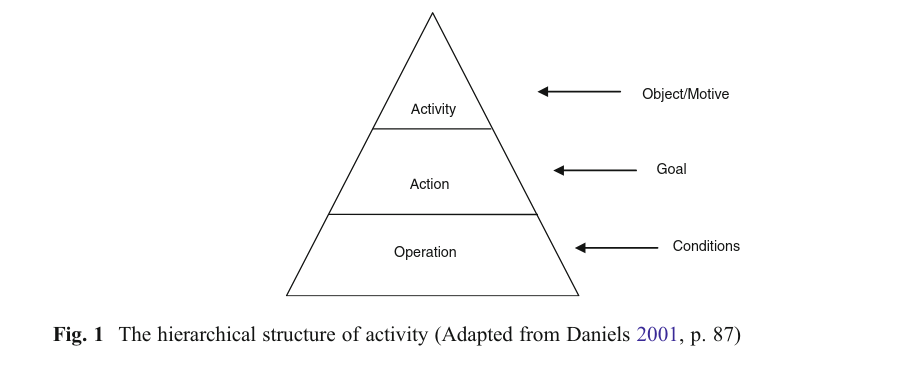
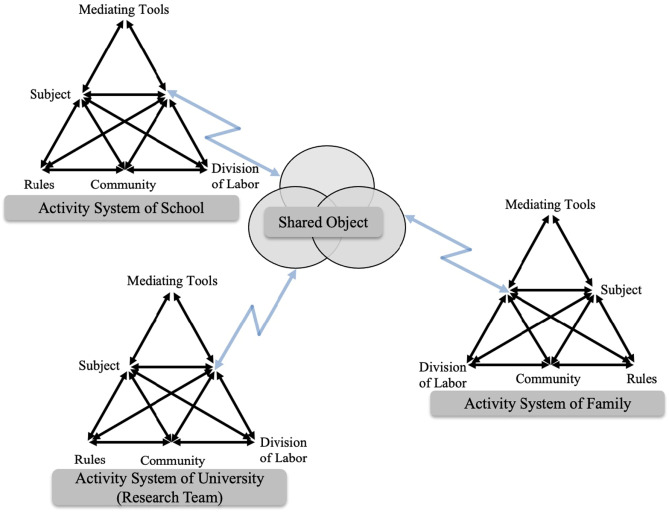
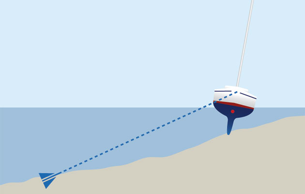

---
# all the regular stuff you have here
zotero:
  scannable-cite: false # only relevant when your compiling to scannable-cite .odt
  client: zotero # defaults to zotero
  author-in-text: false # when true, enabled fake author-name-only cites by replacing it with the text of the last names of the authors
  csl-style: harvard-manchester-metropolitan-university # pre-fill the style
layout: post
categories: chapter
title: 3. Theoretical Framework
---
-   [Theoretical Framework](#theoretical-framework)
    -   [Research Questions - July
        2024](#research-questions---july-2024)
    -   [Introduction](#introduction)
    -   [The foundational concepts of activity
        theory](#the-foundational-concepts-of-activity-theory)
    -   [Strands of emerging variations of Activity
        Theory](#strands-of-emerging-variations-of-activity-theory)
        -   [3GAT and Expansive learning](#gat-and-expansive-learning)
        -   [Applying 3GAT via formative
            interventions](#applying-3gat-via-formative-interventions)
        -   [Theoretical concepts used emerging from the LCHC and the
            Fifth Dimension
            interventions](#theoretical-concepts-used-emerging-from-the-lchc-and-the-fifth-dimension-interventions)
            -   [Mutual appropriation in 5D
                settings](#mutual-appropriation-in-5d-settings)
            -   [Third spaces, idiocultures and funds of
                knowledge](#third-spaces-idiocultures-and-funds-of-knowledge)
    -   [Putting AT to work, variations in interventionist CHAT
        research](#putting-at-to-work-variations-in-interventionist-chat-research)
        -   [Theoretical concepts of DBR used in this
            study](#theoretical-concepts-of-dbr-used-in-this-study)
    -   [Concepts of agency within
        CHAT](#concepts-of-agency-within-chat)
        -   [Instrumental and relational
            agency](#instrumental-and-relational-agency)
        -   [Dynamically emergent agency](#dynamically-emergent-agency)
        -   [Authorial and transformative
            agency](#authorial-and-transformative-agency)
            -   [Transformative activist stance
                TAS](#transformative-activist-stance-tas)
            -   [Transformation agency through double stimulation
                (TADS) - On double stimulation and
                agency](#transformation-agency-through-double-stimulation-tads---on-double-stimulation-and-agency)
    -   [Conclusion / Synthesis.](#conclusion-synthesis.)
    -   [Parked to replace or remove or
        rework](#parked-to-replace-or-remove-or-rework)
    -   [Sections on DBR and AT](#sections-on-dbr-and-at)
        -   [Principle : Researcher take and active interventionist
            approach](#principle-researcher-take-and-active-interventionist-approach)
        -   [Principle: Mutuality](#principle-mutuality)
        -   [On DBR and AT](#on-dbr-and-at)
    -   [New Parking Lot](#new-parking-lot)

# Theoretical Framework

<!-- Also see this writing.
chapters/planning/methodology_chapter/methodology_chapter_late_2020.odt.md -->

### Research Questions - July 2024

1. What contradictions arose in participation in this research's game coding processes and what pedagogical tools and processes are available to address these contradictions?
2. How can game design patterns support the development of computational fluency in novices?
3. How can learners build agency in an evolving community of game makers?

<!-- ### Coding based on chapter 4 -->

<!-- NOTE  I would say no - too complex -->

<!--

By Design
- 4.b.1 Half baked template & code playgrouds and phaser - (hard to code for as quite constant) cf rapid prototyping
- 4.b.2 Use of home narratives & personal expression via graphics (separate?)
- 4.b.3. Documentation
  - via code examples
  - step-by-step tutorials online
  - step-by-step tutorials printed out
- 4.b.4. Guided code patching - design - n

Emergent
- 4.c.1. Rapid prototyping
- 4.c.2. Alternate coding between participants
- 4.c.3. Parent shifting role between facilitor and more directive
- 4.c.4. Accessing out of scope documentation from professional circles
- 4.c.5. Playtesting emergent elements
  - discussing challenge
  - the play around the playtesting -->

###  MOVE THESE BITS

<!-- - Affordances outlined in this learning design  double stimulation, give a quick summary, different types of agency   -->
MOVE THIS TO THEORETICAL FRAMEWORK
DBR lacks a single argumentative grammar [@brase_knowledge_2024], a set of concepts and approaches which aid in the posing of questions in a way which helps communicate the essence the design and potential for its replication or generalisation. Brase [-@brase_knowledge_2024] notes the inherent tension between flexibility and coherence in approach. However, in outlining an argumentative grammar of an intervention process aligned with 3GAT,  Sannino and Engestrom [@cole_toward_2014] propose the core principles of formative interventions, namely double stimulation and the process of rising to the concrete via a germ cell concept. In addition they note the importance of transformative agency, analysis of contradictions, expansion and evolution of design, and the importance of concept formation.

## Introduction

The focus of this study is on the construction of shared meaning and practices as part of an emerging community of game makers. As such, the research questions address cultural factors which act as barriers to participation in digital making, and therefore require a method of research which allows the detailed analysis of complex, emergent learning environments. To achieve this, I adopt cultural historical activity theory (CHAT) as a guiding framework, which is operationalised through a formative intervention approach, incorporating adaptations from design-based research (DBR). This chapter explores these theoretical frameworks and key concepts relevant to the development of the thesis.

Activity Theory (AT) emerged as part of a movement known as the social turn in psychology  [@sugiman_social_2008], marking a shift from a purely psychological approach towards a more social understanding of learning and human behaviour. While this shift has influenced various disciplines, the focus here is on its impact on learning. The rationale behind moving away from the assumption that human mental activity should be studied in isolated, context-free settings  [@stetsenko_activity_2005], concerns not only the validity of results [@brown_design_1992], but also the relevance of the research for both designers and participants [@barnett_ecosystem_2019]. This perspective transcends traditional transmission models of learning and embraces the value of group-based, participatory processes. The work of Brown [@brown_design_1992], a prominent psychology researcher advocating the importance of context within experimental design, helped legitimise this focus and facilitated its broad adoption across diverse fields. The growing work in these varied fields, sometimes grouped by the term _learning sciences_, reflects a move away from randomised control trials and their attempt to sever context, shifting from a behaviourist view of learning as an internal psychological process to a more interdisciplinary approach. This new approach draws on cognitive and cultural psychology [@hoadley_learning_2011]. While this fragmentation promotes pluralism and knowledge-sharing across fields as diverse as education, anthropology, and computer science, it has also been criticised for lacking conceptual coherence in understanding learning and human activity on a deeper level [@hoadley_learning_2011].

<!-- My own research in game making is an experimental approach to create a new learning design. I have worked with young learners, local families and undergraduate student helpers to evolve a game making design. A key driver of my research was to explore the potential to draw on family experience in learning activities by working with families to make games together. -->

This chapter outlines the theoretical frameworks that shape the methodology and underlying ethos of this study. It begins by introducing the foundational concepts of AT and then explores its evolution into CHAT and third-generation activity theory (3GAT), developed by Engeström and the Helsinki school. In order to enhance the 3GAT approach, several key concepts from the work of the Laboratory of Comparative Human Cognition (LCHC) in San Diego are discussed. To demonstrate how CHAT is applied in research, the chapter also examines DBR and various forms of formative interventions. While AT forms the basis of this study, elements from other theoretical approaches within the learning sciences, particularly DBR, are incorporated to address the utility and practical application of the research [@hoadley_creating_2002-1; @barnett_ecosystem_2019]. To address the study’s focus on designing an intervention aimed at fostering participant agency within the game-making process, the final section of the chapter explores key conceptions of agency within CHAT, specifically in the form of activist and transformative approaches. The chapter concludes by justifying the synthesis of these theoretical choices and provides a brief description of how these concepts are operationalised within the context of this study.

<!-- I take a broad approach to applying activity theory, drawing on third-generation activity theory (3GAT) with its focus on systemic analysis and understandings of agency, Cole’s emphasis on institutional mutuality, and Rogoff’s work on linguistic and cultural-historical repertoires [@rogoff_cultural_2003]. -->

<!-- The unifying factor in these approaches is the acceptance of unit of analysis being activity, a unit between the learner their objective and their surrounding context [@rogoff_childrens_1993]. -->

<!-- ### Other cultural historical approaches Communities of Practice and Learners Before

Qx addresses the of a game-making community. This process is co-constituted by planners, facilitators, parents and children.

Rogoff's concept of communities of learners and Lave and Wegner's community of practice are helpful illustrations of the social turn

#### Community of practices
- Applied often in work settings to address questions of how learning happens.
- nature of activity between outsider status into insider status
- Idea of legitimate peripheral participation and transfer of

Communities of practice - legitimate peripheral participation boundaries and barriers to participation
 -->
<!-- This has been applied in various forms, PBL, apprenticeship models, for example have guided participation as a base via different forms of scaffolding.  -->

<!-- ### Link to next section - -->
<!-- While there are a range of valid theoretical approaches suited to this study. These include participatory design Muller, 2007), ethnography and guided participation,  communities of practice , Activity Theory .
 [@lave_situated_1991] -->

## The foundational concepts of activity theory

<!-- For more history also see [@sannino_learning_2009, p. 5] -->
Before outlining the core concepts driving Activity Theory (AT), a brief historical overview helps to contextualise them. For Marx, human endeavour and change are based on activity, with the subject of that activity being the individual or group driving it [@marx1975marx; @blunden_interdisciplinary_2009]. Vygotsky built upon Marxist ideas, emphasising the importance of human activity as a socially mediated process, and applied these core concepts to the broader understanding of learning [@blunden_interdisciplinary_2010]. While Vygotsky's student Leontiev developed Vygotsky's work into a prototypical Activity Theory (AT), AT had stagnated in the repressive context of the USSR [@blunden_interdisciplinary_2010] and saw limited uptake in Western academia until Cole translated Vygotsky's work [@cole_mind_1978]. Cole's efforts brought these foundational ideas into the realm of educational psychology during the broader _social turn_ in the discipline.

In this emerging field of cultural psychology, scholars such as Wertsch [@wertsch_vygotsky_1985] and Cole [@cole_cultural_1996] explored the critical role of cultural mediation in human development, particularly in relation to learning communities and contexts. They positioned learning pedagogies as forms of mediational strategies. Before turning to Cole's work and others in this context, it is valuable to examine the core concepts of Activity Theory. Nardi and Kaptelinin outline AT as a series of foundational principles that underpin broader theories [@kaptelinin_acting_2009; @wertsch_concept_1981], specifically: object-orientedness, tool mediation, hierarchical structure of activity, the ongoing development of activity, and the psychological processes of internalisation and externalisation.

<!-- This use of objects, concepts which facilitate and constituent cultural participation. The role of cultural mediation in development, and role of objects to study human culture [@cole_beyond_1996; @cole_culture_1995]. -->
<!-- ### Core concepts in activity theory (AT) -->

<!-- While this study is on community activity, some of the concepts and tools of AT inherit meaning from a tradition of exploring personal psychology and thus a clarification of the terms used in a community setting is helpful. To help make this process more concrete, at times I will give examples related to the context of this study. -->

<!-- ### Object / objective in activity and varied interpretations -->

A useful starting point to explore key concepts in AT is Vygotsky’s formulation of the relationship between subject, object, and tools. Activity Theory is object-oriented, meaning that human behaviour and learning are driven by the goals or objectives of the individual or collective subject [@engestrom_learning_1987-1]. Kaptelinin and colleagues [@kaptelinin_activity_1995] note that while the materialist roots of AT, stemming from Marxist theory, have led some interpretations to focus on the object as the physical entity being worked on and transformed by activity, conceptual objects are also included in Leontiev’s conception of Activity Theory [@leontev_problem_1974]. Thus, the term object is best understood within the context of a broader motivation or objective. To represent the subject-object relationship in a way that addresses Vygotsky's resolution of the subject-object, mind-body, and Cartesian dualism problems [@still1991mutual], this relationship was developed by Leontiev into a triadic model that includes tools which mediate the activity [@engestrom_learning_1987-1]. See fig 3.x below.

{width=90%}
Fig. 3.x essential conception of Activity

<!-- It also helps identify conflicts between the stated objective of the system and the actual objective of participants. -->

<!-- Indeed, in many complex environments more than one physical or conceptual object is at play. Paying attention to the objective of AT systems is important as it helping to differentiate the scope of activity systems [barab? / blunden].   -->

<!-- ### Mediation -->

Turning to mediation via tools, Vygotsky's concept of tools is broad, encompassing language, physical tools, and representational concepts [@cole_mind_1978]. Mediation is particularly relevant to this study, as the learning environment involves diverse and dynamic forms of tool use. Physical, digital, and conceptual tools evolve as products of the experiences of others in society, containing evidence of cultural adaptation and evolution. This study positions pedagogies as forms of mediational strategy that can be employed by both facilitators and learners [@donato_sociocultural_1994; @gutierrez_re-mediating_2009].

<!-- NEEDS DEVELOPMENT -->
<!-- **Internalisation and externalisation** -->
For Vygotsky, mediation via conceptual tools involves the interconnected processes of internalisation and externalisation of activity [@kaptelinin_activity_1995-1].  Learners are actively processing and make sense of the world by both appropriating cultural learning from cultural practices and then by contributing back into shared cultural understandings of the world. This reciprocal process is well described in learning context by Rogoff via a personal process she calls participatory appropriation [@rogoff_observing_1995].  This reciprocity is crucial as it challenges traditional transmission-based models of learning. Rogoff further identifies this appropriation as consisting of three key planes, the analysis of which is essential for understanding community activity, a topic that will be explored in a later section of this chapter.

"Inherent to the participatory appropriation view is the mutual constitution of personal, interpersonal, and cultural processes." [@rogoff_observing_1995, p.154].

To describe activity systems with greater granularity, Leontiev [-@leontiev_activity_2009] employed the concepts of actions and operations, which together constitute a vertical hierarchy of activity structure. At the highest level, activity is driven by an overall motive, while actions represent smaller sub-goals necessary to achieve this broader objective. As we move down this hierarchy, we encounter a series of unconscious operations that are performed fluently during the execution of actions. See the figure below from [@daniels_vygotsky_2001, p.87].

{width=90%}

Figure 3. x -  hierarchical structure of activity (adpated from  [@daniels_vygotsky_2001, p.87])

The concept of fluency is key to this study, making it essential to locate and describe the chains of operations and actions involved in the activity. Kuutti [@kuutti_activity_1995] articulates the transition from actions to operations as follows:

    Initially each operation is a conscious action, consisting of both the orientation and execution phases, but when the corresponding model is good enough and the action has been practiced long enough, the orientation phase will fade and the action will be collapsed into an operation, which is much more fluent." [@kuutti_activity_1995]

Additionally, activity systems can be viewed as nested within broader activity systems. For instance, the development and teaching of a series of lessons may occur within the larger activity of a school or university [@lewin_developing_2018-1; @barab_using_2002]. Therefore, the process of selecting which activity system to analyze in depth involves identifying an appropriate unit of analysis [@blunden_germ_2014].

For example, in Barab et al.'s [-@barab_using_2002] research on changes to a university course, the use of varied scopes and different framings of activity are used, at times focusing in on the specifics of evolving tool use or participant interaction as an object of activity, to build up a detailed examination of the tensions and processes within a complex educational environment. This level of detail not only enhances replicability but also provides utility to other practitioners, illustrating and justifying the use of a smaller activity system than what is typically represented in Engeström's approach [@engestrom_learning_1987-1; @lave_developmental_1993; @barab_using_2002]. Similarly, in this thesis, while game making is studied as a community project within a larger system, interpersonal activity is also examined through an activity system of a smaller scope. This aspect is explored in more detail in Chapter 4.

<!-- . is employed to identify emerging barriers and responses related to comprehension and communication.  -->

<!-- Also [@lecusay_telementoring_2015]  -->

<!-- #### TO MERGE UP - Principle: Finding suitable dimensions and units of analysis by focusing on objects of activity

**Scopes of analysis, three planes approaches and other learning community methods** -->

<!-- EXPLAIN IN JUST ENOUGH DETAIL HERE.
IS THIS NOT COVERED IN CHAPTER 5 - SIGNPOST?
-->

<!-- This concept of shifting focus from individual activity to that of an expanded and shared object has parallels with more observational research on collective activity [@ rogoff_observing_1995]. -->

<!-- The key difference is the intervention of the researcher to create space, time and circumstances to facilitate the shift and production of new understandings of the activity in question. -->

<!-- When mapping onto AT in a practical purpose of data analysis these planes can be seen as manifestations in different scopes of activty. -->

<!-- DROP? r
While units of analysis are often chosen on an broad scope to allow for sociological concepts to emerge, Blunden makes a pragmatic proposal to use projects as they key unit of analysis [-@blunden_interdisciplinary_2010; -@blunden#### Development and design -->

<!-- In the case of this study, activity can be seen as different planes; wider educational context and the culture of the whole program; guided activity; specific actions and operations carried out on a personal level. -->

<!-- Here the term project here communicates a concrete implementation of a planned goal and also a sense that all elements of key activity are present at this level e.g. all stages of the design cycle (and another example?).  This sentiment is echoed by a parent when noticing that the documentation on one GDPs involved several distinct stages - "It’s like a project in itself really!" -->

<!-- At this scope, for participants implementing . -->

In terms of development, activity theory perceives activity as constantly evolving within its context. The theory is rooted in Marxist dialectical materialism, which posits that activity is a dynamic system best understood through its transformations [@ilyenkov1960dialectics]. A significant driver of transformation in activity is the emergence and resolution of contradictions and conflicts that arise from the accumulation of tensions within the activity itself [@ilyenkov1960dialectics; @blunden_activity_2023]. Engeström’s work on what he termed the third generation of activity theory includes the theory of expansive learning, which traces the changes and growth of the object being worked on. This transformation often occurs as tensions extend beyond a single activity system to involve multiple systems, acknowledging the influence of actors moving between them [@engestrom_expansive_2001]. Alongside Cole’s contributions, this framework is essential for broadening the understanding of activity and engaging with cross-cultural perspectives on learning [@cole_cross-cultural_1988]. These concepts are explored further in the section on expansive learning below.

## Further developments in activity theory

As activity theory (AT) has been adopted and developed beyond its Soviet origins, researchers have developed new concepts within varied schools of practice. Given the variation in the use of terms, the following disambiguation aims to clarify their meanings in the context of this study. Activity theory (AT) refers to the core principles of the approach discussed earlier. The cultural-historical approach and cultural-historical activity theory (CHAT) denote the broader application of these principles, which may also integrate related concepts from sociocultural frameworks. These include approaches like communities of learners [@rogoff_developing_1994], communities of practice [@lave_situated_1991], and social design experiments [@gutierrez2020utopian]. When a distinction is necessary, the term third generation activity theory (3GAT) will be used to refer specifically to Engeström and the Helsinki school's interpretation of AT. This section begins by exploring key concepts in third generation activity theory (3GAT) and their application through formative interventions. It then examines concepts derived from CHAT, as articulated by Michael Cole and his colleagues, such as funds of knowledge, idiocultures, and legitimate peripheral participation, which are especially relevant to this study.

<!-- uch of this research has been conducted within the context of funding programmes and publications in the learning sciences, and  -->

<!-- The second strand comprises a more loosely grouped collection of researchers who draw from both the Soviet tradition of activity theory and American pragmatism, particularly the ideas of John Dewey. -->

### 3GAT and Expansive learning

Addressing the first strand, third generation activity theory (3GAT) represents an important development of conceptual tools for applying activity theory to authentic learning settings. Engeström's concept of the activity system model extends Leontiev's work through a triangular representation that highlights key cultural aspects of the activity in question. Engeström adds a new tier to the model to visually represent Leontiev's focus on issues of cultural factors[@engestrom_learning_1987-1]. Specifically, these cultural factors include the wider community, which encompasses those involved in the activity beyond the subjects themselves, the division of labour, which may occur through either the distribution of tasks among community members or a more vertical power structure, and the emergence of rules or norms that guide evolving community behaviours [@sannino_cultural-historical_2018].

{width=90%}
  Figure 3. x - Engeström's representation of community concepts an activity system

<!-- The emergence of divisions of labour and rules can be linked to Rogoff's concepts of cultural repertoires [@rogoff_cultural_2003].
LATER? -->

<!-- #### Expansive learning and expanded object -->
While these visual representations are novel, the main advances of third generation activity theory (3GAT) lie in its expanded focus on the role of interacting activity systems, the movement of subjects between systems, and the potential for collaborative work on a shared object. The recognition of broader activity systems and the transfer of motivations and practices of actors into new systems encapsulates Engeström's perspective on activity theory [@spinuzzi_trying_2020-1]. This shared, or expanded, object being worked on by more than one activity system is illustrated in Figure 3.x below.

{width=90%}

Figure 3. x - Engeström's concept of expansive learning via a shared object, from [@sannino_formative_2016] [@engestrom_methodological_2014]

To clarify this relationship further, an example in context is beneficial. In research on a joint activity involving schools, Cakir and colleagues [-@cakir_contradictions_2022] depict the joint activity as an objective shared between the school, family, and researchers.

{width=90%}
Figure 3. x - An object shared between different activity systems

<!-- Also [@lecusay_telementoring_2015] - justifiying examining joint object as  system in itself.  -->

This conception emphasises the importance of the roles of researchers and other stakeholders within these interventionist and participatory processes. Analysing activity through its transformation, particularly in relation to the contradictions and tensions among system elements, draws on Marxist conceptions of dialectics and forms the foundation for the concepts of expansive learning. In 3GAT, this view of transformation through collaborative work between activity systems on a new, expanded object is termed expansive learning [@engestrom_design_2011].

<!-- "Expansive learning leads to the formation of a new, expanded object and pattern of activity oriented to the object. This process, known as ascending from the abstract to the concrete, involves the formation of a theoretical concept of the new activity, based on grasping and modeling the initial simple relationship, the “germ cell,” that gives rise to the new activity and generates its diverse concrete manifestations Davydov 1990."" -->

<!-- #### The value of surfacing areas of contradictions (dialectics) -->

Drawing on concepts of tensions and contradictions existing in foundational concepts of dialectal materialism, the 3GAT allows for a granular exploration of tensions and contradictions are a vital source of change and evolution of new and ongoing activity systems [@engestrom_expansive_2001]. 3GAT achieves this through careful of description, analysis, and representation of system elements, the interaction between systems, and the resulting contradictions. Some tensions arising between participant motives and different parts of activity system may be revolved quickly through change, while others may persist and can be referred to as conflicts [@sannino_cultural-historical_2018]. These unresolved contradictions which develop into impasses or conflicts which may serve as motivational factors driving agentic responses from participants. A later section explores Sannino's perspective on such conflicts as a source of transformative agency in greater depth.

In this study, rather than analysing larger workplace systems over extended periods, the focus is on the analysis of systemic tensions within the context of shorter interventions, as seen in diverse research [@barab_developing_2002; @barab_using_2002; @lewin_developing_2018]. Following Kuutti's approach [@kuutti_activity_1995], this study adopts the term contradictions to encompass concepts of tensions, barriers, and misalignments. Engeström states that such sub-terms can be "understood as manifestations of contradictions" [@engestrom_discursive_2011, p. 340]. Additionally, Kamanga emphasises the value of identifying system congruencies or strengths within activity systems [@kamanga_contradictions_2021]. For a comprehensive analysis of systemic contradictions, see the work of Engeström and Cakir [@cakir_contradictions_2022; @engestrom_discursive_2011].
<!-- In the following chapters I focus on tensions which help explore the research questions and which help inform the findings of later chapters. In particular I draw out more visible conflicts which threaten more serious disruption of activities. -->

<!-- ##### Disambiguating terminology - Conflicts, tensions, contradictions, dilemmas - CHAT, AT and 3GAT -->
<!-- Even within schools of CHAT, terms are not set. To avoid the dangers of the vague use of the terms tensions and contractions [@karanasios_exploring_2017], this section outlines my interpretation based on the scope of this study.    -->
<!-- Instrumental agency is relevant here to help examine and the work of learning designers to remove  barriers, Transformational and authorial agency serves to explore the potential for learners to address and overcome tensions and conflicts in their own way. -->
<!-- (Relational agency?) -->

### Applying 3GAT via formative interventions

The term formative intervention (FI) has its roots in Cole and Engeström's exploration of two models of CHAT based interventionist research [@valsiner_cultural-historical_2007]. While both interventions, namely Change Laboratory (from Helsinki school) and 5th Dimension (Cole's intervention carried out in partnership with wider sociocultural researchers), were designed to align with principles of AT and termed formative interventions in early publications, it is Engeström who has used the term most consistently and who has defended its specific application against more flexible interpretations [@engestrom_methodological_2014]. In this section, I explore the Helsinki school's narrower interpretation of formative interventions as an application of 3GAT theory. In the following section, I turn to wider applications of interventionist approaches within a CHAT framework.

A model of formative intervention that has been extensively researched is Engeström's implementation of expansive learning in workplace environments, specifically a set of processes applied in a workplace setting known as Change Laboratory (CL) [@engestrom_putting_2007]. The CL interventions take the form of a series of workshops involving stakeholders important to the workplace setting, with researchers acting as facilitators of the process. The structural model of 3GAT is used as a tool to identify, analyse, and provoke reflection on current workplace practices and dynamics, facilitating discussion on possible actions to enact change. The CL processes suit formal, relatively stable workplaces where existing concepts of community, division of labour, and norms can be readily identified. Another form of FI relevant to this study is that of the Learning Lab[@cakir_contradictions_2022; @bal2011culturally], the overall environmental structure of which is represented above in Fig.3.x.  While the Learning Lab takes place in a school environment, interventions retain the form of stakeholder workshops. For more on formative interventions that have taken other forms used or endorsed by Engeström's team in Helsinki, see  [@engestrom_expansive_2022].

Cole and Engeström's exploration of two models of formative interventions [@valsiner_cultural-historical_2007] concludes that while the methodology aligns with key principles of AT, there are practical challenges in aligning with perceived rigour of social science, given the variation in environmental factors and lack of standardised tests in the research process. The paper also notes the challenges of financing lengthy and repeated interventions within the experimental process, as well as the potential to disrupt the status quo of research settings by developing the agency of workers and learners. This disruption may, in turn, impact the direction of the research, steering it away from the objectives initially supported by the funders.  

Cole highlights the need to align research interventions with the ongoing aims of educational or community partners to maximise their sustainability beyond the research period  [@valsiner_cultural-historical_2007; @cole_fifth_2006]. To illustrate this point, he describes a model of formative intervention in the form of an after-school programme called the 5th Dimension. In a following section, this case study is used as a starting point for comparing different approaches to interventions based on CHAT.  Penuel [-@penuel_emerging_2014] proposes the _formative intervention research_ as a useful term to encapsulate a variation of FI closely aligned with CHAT, including those drawing on elements of design-based research. In reply, Engeström [-@engestrom_methodological_2014] initially resists this proposition, insisting that formative interventions should contain a clear articulation of _double stimulation_ and the process of _rising to the concrete_ within the framework of Engeström and Sannino's understanding of these concepts [@sannino_formative_2016; @engestrom_methodological_2014; @engestrom_discursive_2011]. The following sections explain and addresses the importance of these terms.

<!-- #### Rising to the Concrete -->

The concept of rising to the concrete through a germ cell of activity (or unit of analysis) can be traced through the works of Vygotsky and Leontiev back to Hegelian and Marxist ideas of holistic understandings of phenomena [@blunden_activity_2023]. Forms of activity are viewed as concrete instances and iterations of underlying germ cell concepts, which exist in an abstract form. For example, Marx's analysis identifies complex and diverse patterns of economic activity within the capitalist system as stemming from an underlying, prototypical concept of commodity exchange in pre-industrial economies. The works of Blunden and Davydov [@blunden_interdisciplinary_2010; @blunden_germ_2014; @blunden_activity_2023; @davydov_problems_2008] provide comprehensive justification for the utility of identifying a germ cell or unit of analysis in relation to collaborative and learning projects. Blunden describes the germ cell of activity and the unit of activity as two similar concepts with slightly different foci.

<!-- Mid-level construct of design / patterns heuristics [] -->

    ... the germ-cell and the unit of analysis are one and the same thing, but in one case the developmental aspect is emphasised and in the other case the analytical aspect is emphasised. [@blunden_unit_2020]

In this thesis, my role as both researcher and practitioner makes both aspects relevant. Examining the analytical dimension, the process of seeking and defining key activities as units for analysis helps to delineate the boundaries of what to analyse in depth. One challenge in applying this approach is the duration and relative stability required to identify these germ cells. In their critique of Penuel, Engeström and Sannino [@engestrom_methodological_2014] provide no suggestions for adapting their models to more rapidly changing situations where actors come from different activity systems.  The developmental aspect will be addressed in the following chapters, which explore the evolution and analysis of the learning design, highlighting the process of applying of game design patterns by participants as a germ-cell concept that both shapes and facilitates practice.

<!-- In Chapters 5 and 6 I outline how the process of developing activities for the community of learners is also -->

<!-- It appears valid to question how applicable is Engeström application of this concepts to all research based on AT, given the consistency of application in AT papers,
 -->
<!-- #### Double stimulation (DS)   -->

<!-- While the core concept stems from object based psychological experiments, the "extension of this idea to collective behaviour with adults indicates how the basic logic of the method can be extended as a tool of intervention research". [@valsiner_cultural-historical_2007, p.492].   -->

<!-- Engeström's initial description of DS, which does appear to be a series on introduced meditational stimuli evolves based on initial research.  -->

Double stimulation refers to a process involving the use of tools to overcome contradictions that emerge in joint activity. Engeström's early work on formative interventions frames the first stimulus as "the problem itself", while a potential series of secondary stimuli can be introduced as part of the intervention [@valsiner_cultural-historical_2007, p.492]. Engeström and Sannino describe that the process of double stimulation is active and goes beyond simple mediation via existing tools. The stimuli, whether presented by researchers as suggested tools or discovered in the environment by participants, are actively imbued with meaning and transformed by the participants through their use [@engestrom_methodological_2014].  

    "Most likely the initially given potential second stimuli are rejected or reshaped by the participants, and the participants typically pick up or invent devices of their own, often as if behind the back of the interventionist." [@engestrom_methodological_2014, p.121]

<!-- This research depicts wider constellations of activity systems working together on shared project [@cakir_contradictions_2022]. -->

<!-- Thus Sannino cautions 'double stimulation cannot be subsumed to the general idea of mediation by symbolic tools' [-@sannino_principle_2015, p.2], -->

For example, in the Change Laboratory model, the first stimulus would be mirror data derived from ethnographic video recordings, which helps to identify a problem that needs addressing. The second stimulus, more accurately a series of stimuli, comprises techniques designed to provoke, shape, record, and reflect on the emerging discussion [@engestrom_putting_2007]. Sannino's work on the volitional aspect of the double stimulation process views auxiliary stimuli as triggers for will and agency in participants [@sannino_principle_2015]. The exploration of these concepts, as discussed by Hopwood [@hopwood2023motives], is addressed in greater detail later in this chapter.

<!-- In research on the use of wiki technology by students Lund and Ramussen [-@lund_right_2008-1] caution against mismatches between the first and second stimulus; interpreting project tasks or objectives as the first stimuli, and the tools used to the as secondary stimuli. They also outline the importance of awareness of the likelihood of multiple stimuli in modern technical working environments. -->

<!-- EXAMPLES MOVE LATER?
One example in an educational settings is the use of a Change Laboratory methodology [@engestrom_putting_2007] t

Another to  intervene in kindergarten educational process and organising structure [@rajala_utopian_2023].
USE AS A CHANCE TO COMPARE? -->

<!-- The focus there, as with Cole's work is on the emergence of culture, tracing the historicity of it, and on equity in the process. -->

### Theoretical concepts used emerging from the LCHC and the Fifth Dimension interventions

<!-- in the Fifth Dimension, a formative intervention drawing on broader sociocultural concepts -->

One strand of activity theory is best typified by the pioneering work of Michael Cole and colleagues at the Laboratory of Comparative Human Cognition (LCHC). While a full exploration of the themes in this work is beyond the remit of this chapter (see [@cole_mind_1997] for a summary), this section focuses on key concepts related to the development and analysis of culture through joint activity [@valsiner_cultural-historical_2007].

Cole's approach in this area is often examined through the case study of a series of after-school interventions known as the Fifth Dimension. The programme emphasised sustainability, mutuality, and a utopian ideal of creating a new activity system, insulated from some of the more debilitating aspects of mainstream schooling and broader societal forces [@blunden_formative_2023]. The following theoretical concepts, beneficial to this thesis, have been developed or utilised by various researchers associated with LCHC: mutual appropriation, third spaces, idiocultures, funds of knowledge, and communities of learners.

<!-- Here describing the  approach to culture as hybrid of American anthropological approaches and those of USSR researchers. -->
#### Mutual appropriation in 5D settings

The setting of the Fifth Dimension (5D) interventions predominantly consisted of after-school clubs run by community partners, guided by university researchers and supported by undergraduate student volunteers. The main activities were playful tasks aimed at providing fun, along with additional objectives of building literacy. The concept of mutual appropriation has been utilised by Cole to explain and explore the development of the practicalities and structure of the research programme. Cole noted that for an activity to be sustainable, the goals of researchers, student volunteers, funders, and local partners needed, as much as possible, to align [@cole_fifth_2006]. To achieve this, Cole and colleagues describe a mutual process of adaptation in joint activities between institutions, which not only reforms activities to make them suitable for ongoing partnership but also leaves a historical trace of evolving activities that serve as a valuable basis for cultural analysis [@downing-wilson_design_2011].

A key distinction between the 5D approach and that of Change Laboratories is that, in the early stages of the 5D intervention, activity goals are not fully formed and are still in a state of evolution. I will return to this point later in this chapter.    

#### Third spaces, idiocultures and funds of knowledge

Cole describes the value of researchers being involved in early evolution of interventions in their observations in adaptations of the 5D programme based on the culture of the host partners and young participants. Following Fine [@fine_boys_1987], Cole employs the term _idioculture_ [@cole_fifth_2006, p.32] to highlight the evolution of a novel, micro culture within the 5D programme. In line with Downing-Wilson [-@downing_wilson_sociogenesis_2011], novel idiocultures do not emerge from thin air; rather they encompass the traits of the diverse cultural systems of stakeholders [@cole_idiocultural_2017]. Cole describes the utility of idiocultures as concrete ways of studying the dynamics of cultural variability between different sites, as well as practical means to shape the programme's activities based on participants' previous experiences [@cole_idiocultural_2017].

This interpretation of the practical utility of idiocultures resonates with the concepts of third spaces and funds of knowledge. Funds of knowledge (FoK), a term popularised by one of the research partners of the 5D, Luis Moll [@moll_funds_1992], locates home discourses and practices as resources that can be drawn upon by teachers and participants to facilitate learning in school or other environments, thereby achieving more equitable and inclusive learning experiences. This approach is particularly valuable for learners whose home life is culturally distant from school discourses. Moje and colleagues [@moje_working_2004] explore the use of FoK in the context of interventions outside of school, aiming to develop content literacy. The process of blending the knowledge and discourses of the first space (home life) with the motivations of the second space (school or institution) into a new third space has been explored in various studies [@moje_working_2004; @gutierrez_developing_2008; @gutierrez_developing_2008; @bryant_academic_2009].

Rajala and colleagues [@rajala_utopian_2023] problematise the use of FoK in third spaces. They critique the superficial application of FoK, which may perpetuate cultural stereotypes and thus maintain the existing negative status quo [@rajala_utopian_2023]. Additionally, the practical challenge of gathering sufficient relevant data on home cultures to inform a more nuanced use of FoK would be very time-consuming. To address these issues, they advance the concept of funds of identity, which allows for an exploration of home cultures within the scope of the intervention through the creation of identity artefacts with participants [@subero_mediation_2018].

<!-- The work problematises the possible superficial use of FoK and FoI in a ways which may perpetuate status quo negatively [@rajala_utopian_2023] -->

The work of Rogoff and Gutiérrez on linguistic and cultural-historical repertoires [@rogoff_cultural_2003] also aims to prevent cultural-historical practices of participation from being misrepresented as innate behaviours, a misrepresentation they identify as particularly problematic in relation to race. They emphasise that both educators and researchers should avoid designing interventions based on assumed traits of learners. Instead, they advocate for researching and verifying existing repertoires of practice that may be incorporated and then extended within joint work. This perspective builds on Rogoff's pioneering approach to analysing complex group activities through three planes of observation: personal, social, and community activity. A key motivation driving the analysis of behaviours on the social plane is Rogoff's desire to transcend the dichotomy between learner-led and teacher-led approaches [@rogoff_childrens_1993; @mascolo_beyond_2009]. Rogoff's concept of guided participation and the role of emerging repertoires of practice within that process, serving as a middle ground between instruction and discovery, are explored in more detail in Chapter 6.

<!-- The development of the cultural repertoires in group work  continues of the work of Gutiérrez on social design
experiments [@gutierrez_social_2016-1; @gutierrez_social_2020]. -->

<!-- While the author's original research was on indigenous cultural practices on a village level, the model has been applied in both formal and informal educational settings.

For example, in a primary school setting, Morcom [@morcom_scaffolding_2014] applies Rogoff's  [-@rogoff_observing_1995] three planes of activity to help understand the development of classroom activity. In this interpretation, teachers design learning environments and interventions to support learners to enter into a pattern of activity, in this case focusing on those beneficial to student's positive affect. -->

## Putting AT to work, variations in interventionist CHAT research

While there is broad agreement among researchers regarding the theoretical understanding of concepts in activity theory, there is greater disparity in their application within research settings. One way to explore the variations and fault lines between these approaches, which are relevant to this thesis, is to compare interpretations of CHAT interventions with variants of design experimentation, design research, or design-based research (which I will henceforth refer to as DBR).

<!-- In line with the overall importance of context above, this section continues to explore the application theoretical partly as a product of geographically separate schools of research, with differing contextual forces operating on them. The intention here is not to create a history of these schools, which I am not qualified to do, it is rather to use the differing contexts as way of exposing synergies and fault lines in their approaches which are relevant to this thesis. -->

<!-- Notable synergies include; the value of interventionist approaches, a focus on utility of research, and  ??

Emerging fault lines include; attitudes towards design based research, variations in initial genesis of interventions and the mutuality of that process,   -->

The process of comparing formative intervention (FI) and design-based research (DBR) is complicated by the wide application of DBR and its diverse interpretations, which extend beyond a set of generally agreed principles [@penuel_emerging_2014; @mckenney_educational_2021]. Easterday characterises the core elements of DBR as: research as a form of intervention, iteration, involvement of participants in the evolution of designs, and flexibility in research outcomes based on how events unfold [@easterday_design-based_2014]. Cobb and colleagues summarise the characteristics of design-based approaches as "extended (iterative), interventionist (innovative and design-based), and theory-oriented enterprises whose 'theories' do real work in practical educational contexts" [@cobb_design_2003, p.13]. For more detailed definitions of DBR, see Sandoval [-@sandoval_conjecture_2014] and Hay [-@hay_constructivism_2001, p. 3].

While this broad approaches are in alignment with CHAT, Penuel [-@penuel_emerging_2014], in an attempt to summarise differences between DBR and CHAT interventions, notes that DBR is more common in the domain of learning sciences, particularly in advancing practice and theory related to innovative learning tasks.

In contrast, CHAT interventions concentrate more on transformations in activity and the increasing agency of those involved. initially outlined several criticisms of DBR when compared to CHAT in educational contexts: it is vague in its description of systemic elements in analysis, and it tends to be overly focused on a linear approach to refining the researcher's learning design, which limits the input and agency of participants. O'Neill [-@oneill_understanding_2016] echoes these concerns and extends them, urging DBR researchers to apply CHAT methodology to address the limitations of current DBR practices in the learning sciences community. He emphasises that DBR researchers often fail to invest sufficient time in familiarising themselves with the existing learning practices of the contexts they study, an oversight that runs counter to the more contextually focused approaches encouraged by CHAT.  

Bakker [@bakker_design_2018] challenges Engeström's characterisation of DBR as having closed goals, particularly critiquing Engeström's portrayal of the work of Collins and colleagues [@collins_design_2004] as a misrepresentation. Bakker argues that these researchers did "not want to fix variables or educational goals upfront" [@bakker_design_2018, p.17]. He echoes the call of Penuel, Cole, and O’Neill for more dialogue and greater recognition of the shared traditions between CHAT and design research [@cole_cultural-historical_2018]. Penuel [-@penuel_emerging_2014] emphasises the eclectic methodological approach in design-based research as a necessary means of responding flexibly to context. Bakker also views this flexibility as a strength of DBR, resisting calls for greater formalisation of the design process [@ormel_researchpractice_2012; @mckenney_systematic_2013].

Engeström's view of DBR [@engestrom_learning_2009] is that it lacks rigorous examination of the dynamic nature of context with CHAT conceptions of Activity. O'Neill offers contextual factors which help explain this deficit, including the pressures on researchers using DBR [@oneill_understanding_2016]. The result is a challenge for DBR in producing in-depth analyses of context, which are often required in CHAT-based approaches.

An additional challenge is the context in which formative interventions are often applied. These interventions are frequently used in stable, institutional work environments, particularly in European contexts, where stakeholder roles and systemic structures are more predictable. In contrast, learning environments associated with DBR, especially in less formal or rapidly evolving contexts, do not share the same stability [@spinuzzi_trying_2020-1]. This difference may limit the utility of formative interventions like the Change Laboratory in more fluid settings.  

Recent work by Engeström, Sannino, and colleagues suggests a shift toward a more collaborative stance on DBR, recognising its value rather than critiquing it outright. In particular, they acknowledge that formative interventions can enrich DBR by offering a robust framework for systemic transformation, collective agency, and expansive learning [@cakir_contradictions_2022]. This shift highlights a growing consensus on the potential benefits of incorporating cultural-historical concepts into DBR approaches.

    "Formative interventions can contribute to the new generation of DBR by providing a robust theory and methodology for systemic transformation, collective agency, and expansive learning". [@cakir_contradictions_2022]

The study in this thesis, which applies CHAT principles to a novel and relatively unstable learning context, presents a useful case study in this ongoing endeavour to integrate the strengths of both formative interventions and DBR.

<!-- O'Neill [-@oneill_understanding_2016] also outlines The causes of this state of affairs. In particular, he outlines the myth of the heroic researcher/ designer who drives change and updates the proposed learning design in the face of adversity stems from a need to report successes within the time span of research funding awards. -->

<!-- "In CHAT/DBR, innovations for learning are ideally historicized, meaning that the designs leverage recognized practices in partner communities. At the risk of stating the obvious, historicizing design in this way demands a degree of knowledge of and legitimacy within the partner community that design-based researchers in the learning sciences/DBR tradition do not always take time to develop."  [@oneill_understanding_2016, p.499] -->

#### Theoretical concepts of DBR used in this study

This section outlines key concepts used in DBR which I draw on in later chapters.

**On utility - overcoming the tension between the rich context and generalisation of results**

Barab and Squire [@barab_design-based_2004] describe the inherent _messiness_ of design-based research  which presents a challenge for researchers when attempting to present results in a coherent manner that is useful for other practitioners. There is an ongoing tension between staying closely aligned with the specific, rich context of the research, and stepping back to generalise findings without becoming lost in abstraction. This balance is crucial to ensure that the research is both contextually meaningful and practically applicable to broader settings.

Hoadley and Campos [@hoadley_design-based_2022] further explore the outcomes of DBR, including the development of design processes, the creation of domain theories, the formulation of design principles or patterns, the introduction of ontological innovations, the generation of new hypotheses, and the transformative learning experienced by researchers themselves. These varied outcomes highlight the broad applicability of DBR and the importance of ensuring that design processes and theoretical insights are communicated clearly to enhance the utility of research findings.

**Design narratives**

One solution to the challenge of balancing utility and generalisation, as well as representing the research process in an accessible format, is through the use of design narratives. Bakker [@bakker_design_2018] notes the difficulties of conveying the richness of the design process within the constraints of traditional journal formats, where space restrictions may hinder detailed explanations. Design narratives, as proposed by Hoadley [@hoadley_creating_2002-1], address these limitations by providing a detailed account of the learning design process. They document the problems encountered during the intervention, the iterative changes made, and the rationale behind those revisions [@hoadley_creating_2002-1; @brase_knowledge_2024; @bell_theoretical_2004].

In this study, a design narrative is particularly valuable in conveying the intricate details of the learning design. This thesis format allows for a fuller exploration of these aspects, notably in Chapter 5. I argue that design narratives could further enhance the alignment between DBR and Cultural-Historical Activity Theory (CHAT) interventions. By incorporating systemic and analytical concepts from activity theory, design narratives can provide a more holistic account of the intervention process. An example of such a narrative, using CHAT techniques, is found in Cole and colleagues’ work on the Fifth Dimension [@cole_fifth_2006].

**Rapid iteration of learning resources**

A key aspect of DBR is its emphasis on the rapid iteration of educational resources based on continuous feedback rooted in practice. This process helps produce pedagogies and resources that respond to the needs of learners [@cobb_design_2003]. This emphasis on rapid iteration aligns with the aims of this thesis, where the ongoing feedback from participants informed the development of a novel learning design via phases of delivery. The iterative nature of DBR, with its focus on refining learning materials in response to feedback, supports the dynamic, practice-based approach explored in the following chapters. By integrating these DBR concepts, this thesis leverages the strengths of design-based approaches while aligning them with the systemic insights offered by CHAT. This flexible approach addresses both the complexities of real-world learning contexts and the need for practical, and ideally replicable outcomes.

<!-- The next sections address this with relevant concepts. -->
<!-- **Germ cell and analysis**
RQ2 of this thesis addresses the potential role of game design patterns (GDPs) as a guiding process in varied forms.

While this concept of germ cell / unit of analysis is typically used in a larger scope of activity, the principles apply this smaller scope. While game making can as an overarching activity system, a narrower activity whose objective is implementing GDPs became a significant unit of activity for this study. The justification for this is explored in more depth in Ch.4

Later in Ch. 6 I employ a narrow focus on the implementation of gameplay design patterns (GDPs) allowing for the identification and analysis of patterns of participant behaviour and introduced and emerging community practices to do with GDPs. -->

## Concepts of agency within CHAT

Before addressing Research Question 2, which asks how participants develop agency in an evolving community of game makers, it is important to clarify the concept of agency, particularly in the context of learning environments. The question of who or what has agency is a philosophical one with practical applications in designing learning settings. Agency and autonomy are often either vaguely defined or have contested, interconnected definitions in studies [@huang_autonomy_2013; @matusov_mapping_2016]. For this thesis, in line with a cultural-historical approach, agency is viewed as a cultural phenomenon experienced by individuals in relation to their peers and their learning environment. To situate this view within the varied and evolving concepts of agency in educational settings, I draw on the work of Matusov and colleagues [@matusov_mapping_2016]who categorise agency into several genres: instrumental agency focused on developing capacities, effortful agency related to motivation and commitment, dynamically emergent agency involving affordances and actor-network theory, and authorial agency, which entails agentic changes to the learning environment. Given Matusov and colleagues’ critique of effortful agency in education, which primarily focuses on achieving goals predefined by educational institutions, this summary instead emphasises an analysis of instrumental, dynamically emergent, and authorial agency within the framework of Activity Theory. These forms of agency offer a broader perspective, including an exploration of how individuals navigate and transform their learning environments, extending beyond merely fulfilling institutionally set objectives.

<!-- See also affordences in hci [@kaptelinin_affordances_2012] -->

<!-- ### Addressing and disambiguating definitions of agency in education -->

<!-- Engeström and Sannino see this slipperiness as a deficit in understanding of the underlying mechanism [@engestrom_methodological_2014]. -->
<!-- See also feminist reconceptualisations of autonomy as agency[@abrams_autonomy_1998]. -->

### Instrumental and relational agency

Instrumental agency reflects a concept of agency as the ability to get things done, thus, a view of agency as a set of capacities [@edwards_steps_2005]. Matusov and colleagues highlights an often technological view of educational environments where educators seek to increase instrumental agency by building the individual capacity of learners to achieve relevant tasks [@matusov_mapping_2016]. Many DBR studies which aim to develop and study the use of new tools especially in the area of education technology, would aim to increase instrumental learner agency, designing away problems.

Edwards' concept of relational agency is framed (by Matusov?) as an extension to the concept of instrumental agency to include a more social dimension where leaners are able to offer and request support [@edwards_steps_2005].  While this view of relational, instrumental agency in an school setting is laudable, Edwards [-@edwards_steps_2005] notes it is often restricted by curricular and institutional norms.  

Explored within a CHAT framework this type of agency can also be understood as increasing fluidity of practice using objects and people as tools within mediated activity. Using the terms of Leontiev, through practice actions which initial require concentration and careful effort become fluid operations. Understanding of these aspects of agency with an understanding of AT should also be rooted in understanding of mediation.

### Dynamically emergent agency

Matusov and colleagues' interpretation of a dynamically emergent dimension of agency is complex and diverse allowing agency to be recognised in distributed forms such as 'emerging collective agency, agency of bureaucracy, non-human agency of animals, agency of distributed machine-human network, agency of Internet, and so on' [@matusov_mapping_2016, p. 432]. The authours recognise the value of this framing of agency to explore and address constraints and designing support in the form of affordances in the learning environment. As this study involves the use of computer systems to learn computer coding, it is of value Affordances are well  of human computer interaction (HCI), there is value in exploring agency in this context. Work by Bærentsen and Trettvik [@ba_erentsen_activity_2002] linking the use of affordances in HCI to a foundation in activity theory highlights, following Gibson [@gibson2014theory], that affordances exist as opportunities provided by the environment and objects within it, either natural or culturally created, to organisms within that environment. The authors also note that the distinction between the intended (designed) use of affordances and their possible use, an important distinction in the field of HCI, is one best explored via activity theory's study of the interaction of humans and artefacts as joint activity, thus preventing the view that that affordances have magical powers outside of a cultural context.

The work of Nardi and Kaptelinin is also helpful here to examine the concept of designed affordance in learning environments through a lens of activity theory [@kaptelinin_activity_2012]. The authors also reframe Gibson's concept of affordances as possibilities in line with activity theory concepts of mediated action [@kaptelinin_affordances_2012]. They situate the creation of affordances in designed systems as a form of delegated agency [@kaptelinin_activity_2012]. Artefacts or tools used in mediated activity may be given a form of delegated agency through designed affordances, e.g. a phone may prompt its user to charge its battery via notifications. However, unlike Latour's [@lemonnier_ethnography_2013] concept of agency in actor network theory, objects would not delegate agency to a human [@kaptelinin_activity_2012, p.42]. This is not to say that non-human objects have no impact on others as once the artefacts are placed in context may have unintended consequences creating what Engeström calls _runaway objects_ [@spinuzzi_losing_2011]. Thus, not withstanding, the original volition or motivations stem from human-initiated activity. In the following section, an authorial concept of agency is therefore not experienced as delegated but rather created.

<!-- For the purposes of this study, I agree with the view that the nature of agency as situated in context. Thus we do not say learners have or lack agency, as it is not a learner property independent of context  [@nieminen_what_2022]. -->

<!-- There is a link between double stimulation and affordances [@romero_analysing_2022] -->
<!-- A good summary of affordances related to HCI is here [@galliers_affordance_2017] -->
<!-- Other researchers have found the the scope and focus of affordances important to clarify [@wolff-piggott_activity_2016-1]. -->

### Authorial and transformative agency

Matusov proposes authorial agency [@matusov_mapping_2016] as the concept of agency, as the most active and best aligned with an ideal form of education, in doing so drawing on existing work from CHAT researchers on and transformational concepts of agency. This section focuses on the work on Stetsenko in the form of transformative activist stance (TAS) [@martin_theory_2015; @stetsenko2014transfromative] and Sannino in the form of TADS [@sannino_transformative_2022]

####  Transformative activist stance TAS

While there is a wealth of research  which discusses and applies concepts of affordances and dynamic agency, often in the field of HCI, the focus is often skewed towards individual rather than on collective action [@kaptelinin_affordances_2012]. Additionally, while Stetsenko's [@stetsenko2020radical] critique of relational approaches to agency, both outside and within CHAT circles, invites us to resist the marginalisation of the role of the individual. Stetsenko critiques both conceptions of human agency an individual attribute or a negation of human agency which views individuals as helpless bodies in wider cultural phenomenon [@stetsenko_critical_2020; @matusov_mapping_2016]. Instead, agency involves both contextual tensions and human volition. Thus, Stetsenko proposes a transformative activist stance (TAS) to  address the societal urgency of agency with a direct focus on political dimensions. For Stetsenko the stakes are high given ecological and military crises caused by late stage capitalism, but there is still everything to play for [@hall_marxism_2023]. Thus, Stetsenko advocates a _flagrantly partisan_ approach for researchers, as a reaction to a perceived pose of neutrality or distancing present post-modern and post-human approaches [@stetsenko_hope_2020; @stetsenko_critical_2020].

While the overall focus being societal change, TAS has been applied to smaller scale concrete explorations, including play [@stetsenko_serious_2015], transformation in a group home for adolescents [@vianna_connecting_2011] (MORE?). The second example in group home used a case study of an individual to gain an in-depth picture of transformations concerning identity and learning contexts. In TAS aspects of conceptual understandings of agency and specifics of methodology are less explored than the motivational dimensions. While the urgent call to research community for partisan involvement is not accompanied by suggested means to undertake this process, the method of auto-ethnography is used in several studies [@vianna_connecting_2011].  Thus TAS can be seen primarily as a conceptual approach in contradiction to TADS which is presented together with Change Laboratory as a suggested methodology, thus more closely linked to an applied approach.

#### Transformation agency through double stimulation (TADS) - On double stimulation and agency

The Helsinki school's focus on transformative agency also advocates the importance of intervention and transformation as a desirable aspect of research, [@engestrom2006development; @haapasaari_emergence_2016; @sannino_formative_2016]. The vehicle for this in recent years has been the concept of transformation agency through double stimulation (TADS). Similarly to TAS, the objective of TADS is increased agency of participants in research interventions. In addition, TADs researchers articulate a desire to understand a broad picture of agency from a CHAT perspective. As outlined above double stimulation describes additional stimuli beyond the first stimulus understood as the motivation of the activity. In the Change Lab (CL) interventions for example, the active use of secondary stimulus can both analyse and facilitate agency by provoking reflection [@sannino_principle_2015].

Studies of transformative agency, for example within CL, often involve a significant longitudinal aspect. However, the TADS concepts has been applied in research over much shorter time frames and in more naturalistic settings such as hospital practice [@hopwood_forward_2022; @hopwood_volitional_2022], higher education [@grant_double_2022], and digital education [@aagaard_teacher_2022]. The concept of volitional action by subjects as a foundation for transformation is used in these shorter term studies to explore the processes of decision forming and implementation [@virkkunen_dilemmas_2006; @sannino_double_2015]. Here the secondary stimuli are used by participants as a spur and then as leverage in volitional acts. To address this aspect, Sannino augments the concept of transformative agency by double stimulation (TADS) with a metaphor of a sea vessel warping using kedging anchors.

    We may think of the second stimulus as an anchor. Anchors are commonly understood as stabilising devices to prevent a vessel from moving. However, not all anchors have this function. Beside the heavy-weight anchors, there are also kedge anchors serving the purpose of ‘warping,’ that is, pulling the anchor once it has settled on the ground, for moving the vessel away from a problem area. [@sannino_transformative_2022, p. 4]

{width=90%}

Figure 3. x - Warping using a kedging anchor

This metaphor highlights the active effort of participants to overcome tensions and dilemmas in their activities, which can leave them stuck, much like being stranded on a sandbank. In an educational intervention, learners might "throw a kedge anchor" into the learning environment, symbolizing an intentional action to pull themselves out of the impasse they are facing.

While not all attempts, such as directly asking a peer or teacher for help, will succeed, some will take hold and lead to transformation for the student. This may also trigger a broader shift in the educational environment itself. This idea is particularly relevant to the setting of this study, where the learning environment is co-created by both participants and researchers.

<!-- By contrast the work on  idioculture by Cole and colleagues explores this more actively via design narratives and similar techniques. -->

## Conclusion / Synthesis.

In this chapter I have outlined the foundational concepts and current strands of interest of CHAT and explored how the field is becoming increasing aligned with that of design-based research. The complementary elements identified can be operationalised by utilising both CHAT's comprehensive framework for understanding human activity and DBR's practical focus on more rapidly iterative cycles of designed interventions.

<!-- THIS IS DONE IN MORE DEPTH AT OTHER STAGES?
IS THIS WELCOME IN THIS CHAPTER. TO WHAT EXTEND?
WHERE ELSE SHOULD THIS BE COVERED? THERE ARE MENTIONS CURRENTLY IN CHAPTER 4 AND 5. -->

To situate the learner at this stage, concept related to activity systems approach explored in this chapter are briefly outlined in the context of this study. The figure below represent a broader picture of the activity within the context of other activity systems as seen in the work of Cakir and colleagues represened above in Fig 3.  [@cakir_contradictions_2022].

{width=90%}
Fig 3.x - environmental positioning with game making activity mediating the interactions between stakeholders.

The representation above allows for a conception that funds of knowledge and existing repertoires of communication from the activity systems of different stakeholders and learning contribution to the new, emerging system. Following an approach taken by Lecusay [-@lecusay_telementoring_2015], the processes at work in the emerging shared object are extensive enough merits examination as activity system in their own rights from the point of view of the game making community as a whole (including facilitators) as a subject, and from a narrower scope of an individual or pair subject. These systems are outlined in more depth in in chapter five. At this stage, it is of value to briefly explore the object of the activity, while the complexity of understanding of the object of activity is fresh in our minds. In this study, in line with AT understandings, there is some expansion in terms of the scope and understanding of the object. While the object of activity for learners was to make a game, in early stages the learning process was experimental. As such, the main object shared by both family and university participants was to develop an effective pedagogy and working processes to allow the joint creation of games.

The hybrid of AT and DBR is particularly valuable for this study which involves the development of game coding abilities (IS THIS THE RIGHT TERM?), as it allows exploration of the contextual factors and influences from other activity systems contributing to the new shared object of activity. These include the ongoing development of cultural artefacts used, home interests and repertoires, as well as my own motivations. I am encouraged by the activist stance advocated by Stetsenko [@stetsenko_critical_2020], which rejects the abstraction of oneself from the processes participants engage in and promotes immersion in the struggle. This aligns with my own motivations in this study, resonating with my past experiences, as I position myself as an activist advocating for improved access to game-making through computer coding, a process currently hindered by educational contexts and classroom practices. To achieve this, rather than following an established applied CHAT methodology like the Change Laboratory, I synthesise different concepts outlined in this chapter. The next chapter, which describes the methodology in more detail, will explain how I draw on CHAT, DBR, and Rogoff's concept of the three foci of analysis. In the analysis, I focus on the tensions between system elements, the iterative processes used to address these tensions, and transformational concepts of agency.

In chapter 4 particular attention is paid to the development of the artefacts and processes developed as part of the learning design as a form of evidence of these transformations. The more rapid iterations of design align to a greater extent to DBR process of than that of Change Laboratory, Despite this, this study does aim for a full application of a the stricter interpretation of the term formative intervention as outlined by Engeström and Sannino [-@engestrom_methodological_2014]. This hybrid approach address a key critique of the Helsinki school's implementation of third-generation activity theory (3GAT) via formative interventions such as the Change Laboratory, specifically that it is time-consuming and requires stable stakeholders [@spinuzzi_trying_2020-1]. However, while this hybrid process has proven fruitful in some areas, it has also posed challenges during the analysis stage. The implications of both successes and challenges are explored in the thesis conclusion.

Turning to a similar issue regarding conceptions of agency, TADS (transformative agency by double stimulation) is most commonly explored in relation to Change Laboratory and professional settings. Despite its potential in less structured contexts, there is a paucity of studies in the area of "student-centered contexts of learning"  [@isaac_cultural_2021, p. 93]. However, the broader concept of participants actively overcoming blockages caused by contradictions is well-explored in the fields of Human-Computer Interaction (HCI) and DBR. These fields often focus on revising educational tool designs to address conflicts, while still recognising the agency and input of participants [@karanasios_moving_2021] In line with Hopwood [@hopwood_agency_2022], I see significant potential in the application of TADS in varied, real-world learning environments, using a diverse range of in-situ data sources as learning practices evolve.

<!-- ADDRESS THE RESEARCH QUESTIONS HERE?  -->

To conclude this chapter, it is helpful to situate this synthesised theoretical framework as one that has the potential to make a valuable contribution through an applied case study. This case study aims to engage with current theoretical advances in the field of agency studies, particularly within the implementation of smaller-scale formative interventions. The framework outlined in this chapter informs the specific methodology described in the following chapter, where methods of data collection and stages of data analysis evolve in an iterative process, while remaining structured to incorporate the underlying concepts of CHAT and DBR.  

<!-- ### Summary of Justification of choice - and how the RQs align with different concepts -->

<!-- This insistence on a strict interpretation of formative interventions may limit its uptake. The instance may prevent someone who could benefit from other AT concepts in a DBR approach to improve and codesign a learning environment.   -->

<!-- It is of note that the work of Kaptelinin and Nardi on conceptualising activity theory happens in the context of Human Computer Interaction (HCI). The link of concepts of mediation and affordances are of note [@kaptelinin_acting_2009, p.71]. -->

<!-- Some elements of synthesis are emerging which address some of the existing gaps and incorporate some of the processes of alternatives. -->

<!-- More recent conception of DBR and AT process such as formative interventions are working to align the approaches and mitigate against Engeström's initial critiques in a way which is explored in next section. -->

<!-- Barab and Squire [@barab_design-based_2004] -->
<!--
As we have seen in the literature review on game making, context is explored in the three main streams of research into tools and processes to support game coding namely: schools environments, professional contexts; and informal spaces. -->

<!-- #### Signposting where concepts are used in the thesis (in relation to RQs)

The concept of germ cell is explore later in more detail in Chapter 5.   -->

## Parked to replace or remove or rework

##### Situating this study using third space and FoK terminology and processes

In the context of this study we can conceptualise the learning context as a third space mixing home learning and culture and the context of university research and outreach work.  

It draws on cultural processes of cultures of  family learning, coding cultures and informal science clubs. Of particular relevance is retro Gaming framed as a fund of identity. A process that emerged from early consultation with home educating families.

{width=90%}

Retro gaming cultures emcompass broad media and practices beyond the games themselves. The image above shows now only a sketch of the Minecraft game, but also the names of YouTubers making videos about games.

<!-- Retro gaming and associated nostalgia can provoke a positive reaction from both parents and children. This can be used to leverage interest in creative projects. -->

This study positions this interest and identification as a fund of knowledge which designers should be aware of and utilise to help address some of the affective barriers to taking part in coding processes.

This study contributes to work which explores the potential does that give to developing game coding practices as per RQ3.

<!-- #### Summary statement

<!-- NOTE Investigate more
https://dspace.mit.edu/handle/1721.1/131022/discover?query=constructionism&submit=Go&filtertype_0=department&filter_relational_operator_0=authority&filter_0=845e039612ff85b8394b5ef42a7f3aa7 -->

<!-- While noting the focus "individualist" approach of many studies from constructionist researchers, [@barab_practice_2000], Barab notes following alignmentS with . -->

<!-- They draw on Papert's constructionist approach which extends a piagetian take to propose that construction of personal knowledge happens best where learners can experiment and manipulate  [@ackermann_piagets_2001] .  -->

<!-- Much of the foundational literature on game making focuses on personal dimensions of learning (Harel and Papert, 1991; Kafai and Burke, 2015; Kafai and Resnick, 1996). They draw on Papert's constructionist approach which extends a piagetian take to propose that construction of personal knowledge happens best where learners can experiment and manipulate  [@ackermann_piagets_2001] . Such a focus on individual learning is problematic from perspective of sociocultural approaches due to a tendency to ignore both contextual factors influencing the learning setting and the evolving use of resources, processes and shared understandings by emergent communities of learners
oloughlin_rethinking_1992 -->

<!-- Notably, later work from Kafai incorporates broader social approaches and attempts to bring them into the constructionist fold @kafaiConstructionistGamingUnderstanding2015. Kafai and Burke draw on the conceptions of Rogoff [-@rogoffObservingSocioculturalActivity1993] of personal, social and community learning planes to advocate the wide-ranging benefits of 'constructionist gaming'. -->

 <!-- Some of the specifics of these processes have already been named in the section above looking at collaboration.  -->

<!-- Other concepts of value include Vygotsky's concept of mediated action Wertsch, 1994); Rogoff's [-@rogoffObservingSocioculturalActivity1993] take on guided participation within a community of learners; and more detailed analysis of roles community-based transfer of knowledge in practice Lave and Wenger [-@laveSituatedLearningLegitimate1991]. -->

<!-- [@rogoffObservingSocioculturalActivity1993; -@rogoffGuidedParticipationCultural1993] -->

<!-- There are particular limitations in the kind of empirical research that characterises many studies involving. -->

<!-- Many of these limitations involve research in to background cultures of participants and how they can be involved into making activities and a focus on creating and sustaining an authentic learning environment. -->

<!--
DROP CONTENT ON CHANGE LAB

One of the most striking set of practical techniques are those used in Engeström's take on Expansive Learning, specifically set of processes applied in a workplace setting called Change Laboratory (CL) [@engestrom_putting_2007]. The CL processes suits a formal workplace where there are existing concepts of Community and Division of Labour and Norms that have resulted in contradictions to be explored and resolved.
EXPAND THIS WITH EXAMPLES?

I am guided by the concepts behind the use of the models rather than drawn to an off the shelf application of CL processes or similar interventions. While some of the material used in CL and the fictional device of the 5D supports their primary tasks, others could be said to be support secondary considerations of navigating learning, establishing shared concepts and communities and reflecting on transformations in practices or understandings. These dimensions are sometimes explored in CHAT using the term of secondary stimuli used to facilitate and complement the primary task as part of the concept double stimulation.

In addition the concept of diversion from the primary task are relevant to the more playful approaches of participants and facilitators to make the learning process attractive [@engestrom_expansive_2013]. -->

<!-- The concept of the importance of project is used to encompass and engender a sense of commitment from participants Blunden, 2009), (explored in earlier sections).  -->

**Change labs**

<!-- Here, I try to strike a balance which stays concrete but which also pulls from my observations a framework which may translate in to other game-making and creative project based approaches. -->

<!-- DROP THIS - NOT NEEDED
REWRITE THE ABOVE - TALK OF EVOLUTION OF RESOURCES AROUND GAME FEATURES VIA REQUESTS -->

<!-- DUPLICATION IN GDP CHAPTER CURRENTLY.
From the perspective of participants, the goal of implementing individual game patterns rather than the overall goal of making of a game, took up the majority of their focus. This can be evidenced in the following observations;

- the frequency of GDP language referring to patterns used by pairs in particular in the process of collaborating on their games
- the utility of the smaller unit of analysis in aiding resource creation
- the value of completing something concrete a sense of sustaining achievement.
- the ability to reflect after implementing each sub project,
- any other value for practitioners, parents and young participants - i.e. in navigation and goal setting. -->

<!-- Thus while GDP emerged as a main unit rather than the whole game, in play testing with others the wider focus of making an engaging game came into focus. Particularly the shift to wider sense of game as an enjoyable experience for others AND??? -->

<!-- (see blunden for more on project as unit of Activity
https://www.activityanalysis.net/andy-blundens-vision-of-activity-theory/ )  -->

<!-- NOTE - Thus GDP can be seen as a sub-activities of the wider overall goal of making a game. Which invites discussion on why GDP were chosen as the primary unit of analysis. -->

<!-- NOTE - DISCUSS THE THEORETICAL INPUT IN RELATION TO THE ABOVE POINTS.
NOTE MORE THEORETICAL INPUT - DRAW ON TERMINOLOGY - WHY IS IT IMPORTANT TO IDENTITY KEY UNITS OF ACTIVITY / ANALYSIS (AND WHAT IS THE DISTINCTION BETWEEN UNIT OF ACTIVITY AND ANALYSIS) -->

<!-- review this video to develop
https://www.youtube.com/watch?v=BMi56ZBSows -->

<!-- We have also looked at the other studies which look at game design patterns as a useful tool for advanced and less frequently for notice coders.  -->

<!-- In the following sections, I draw on observations of participants in practice to outline how game design patterns are used in the making of games.  -->
<!-- #### LOA in Computing pedagogy
Call back to PRIMM and Waite Sentence's work here -->

## Sections on DBR and AT

#### Principle : Researcher take and active interventionist approach

In both DBR and formative interventions, the researchers take an active role, a stance which has been critique from the perspective of traditional psychological experimental researchers CLARIFY.

Despite the generally agreed importance of context and the need to therefore intervene, some strands of DBR hold closer to the positivist approaches that DBR was initially conceived of to transcend [@brown_design_1992].

Learning environments are understood as designed systems with accumulated culture of tools and artefacts [@barnett_ecosystem_2019; @cole_design-based_2016]. Cobb and colleagues note a common goal of DBR in education is to study a new form of learning and that in order to do that naturalistic, existing learning environments may need to be disrupted [@cobb_design_2003].

While the process of intervention in a real learning context is present in broad interpretations of DBR [FIND SOURCES], when compared to CHAT there is debate surrounding the extent to which original designs should originate from researchers. Formative interventions running close to Engeström's model rarely work with entirely new design, favouring existing systems within relativelyDifferent  approaches are needed depending on if the activity and context of that activity is already  established an on-going or if it is a new venture created by researchers / participants. stable groups of stakeholders [@spinuzzi_trying_2020-1].

However, within DBR there is an understanding for the need for new interventions as the context may involve working in a new partnership or with new technology. Thus learning designers may need to start from a relatively blank canvas, as is the case in my study on game making, where there are little in the way of established community or working processes. Different  approaches are needed depending on if the activity and context of that activity is already established an on-going or if it is a new venture created by researchers / participants.

Engeström critiques the starting process of an introduced design stemming from the researcher rather than a community process [@engestrom_design_2011]. DBR however is more comfortable with new designs that are introduced fully by the researcher but with feedback from participants for ongoing iterations. To address issues of mutuality, early stages are often suggested to be rough prototypes which, so that if they are changed radically by participants, less time and resources are expended [@easterday_design-based_2014]. Issues of intervention lead to questions of mutuality in other ways.

<!-- This bears examination on two levels.
Firstly, it is of note that the formal approach of formative interventions is often used in stable institutional systems of work environments in European contexts where there are more stable understandings of stakeholders involved compared to less formal learning environments [@spinuzzi_trying_2020-1]. The author notes the impact of this context on they types of mutuality possible based on unstable stakeholders as a critique of 3GAT and formative interventions.

Secondly, it is out of date, see Penuel [-@penuel_emerging_2014] for an more updated take on alignment of formative interventions and DBR. More recently Engeström and colleagues [-@cakir_contradictions_2022] have advocated the advantages of incorporating more rigour of formative interventions to add to DBR, rather that critiquing it wholesale.   -->

#### Principle: Mutuality

Engeström critique of DBR for lack of mutuality within its _linear_ approach [@engestrom_design_2011] negates a wide uptake of concepts of mutuality in DBR. For example, the principle of DBR advanced by many researchers is that that research participants also influence the ongoing design of the research [@barab_critical_2004; @cobb_design_2003; @downing-wilson_design_2011].

Indeed the DBR and its link with participatory design provides a wealth of methods which invite participants to input into the design process. FIND HOW HOW.

ADD MUTUALITY FORM 5D PERSPECTIVE BEGINNING ON AN INSTITUTIONAL NEGOTIAON BASIS.

<!--
From [@cakir_contradictions_2022]

In the last decade, learning scientists, psychologists, and education researchers using design-based research (DBR) engaged in a paradigm expansion and focused on research-community partnership in knowledge production and design activities (Bang & Vossoughi, 2016; Barajas-López and Ishimaru, 2020; Coburn & Penuel, 2016; Collins et al., 2018; Gutiérrez et al., 2020; Ishimaru et al., 2019; Zavala, 2016). The new generation of DBR studies typically involves multiple stakeholders, including researchers, practitioners, and other community members, as co-designers in developing possible new solutions for changing educational environments (Gutiérrez et al., 2020; Ishimaru et al., 2019; Penuel, 2020). Formative interventions can contribute to the new generation of DBR by providing a robust theory and methodology for systemic transformation, collective agency, and expansive learning (Bal, 2016; Bal et al., 2021; Gutiérrez & Penuel, 2014; O'Neill, 2016; Penuel, 2014; Rajala, 2019). -->

<!-- Critique of DBR often stems from limits in application. This section addresses some of this critique and introduces additional proposals to remedy early limits. This section identifies broad alignments in direction for CHAT perspective on DBR. -->
<!-- which is present in the techniques of design experiments, mutual appropriation and participatory action research - -->

<!-- Work on agency in change labs and more wider concepts of formative interventions are important to this study. -->

<!--
There are some areas that broadly align; the use of second stimulus, a thorny problem that requires a new solution, the move from individual action to a collective object and process. -->
<!--
Other areas are less aligned with existing models proposed by Engeestrom, CL, etc.
The specific drive for participants to identify new tools, -->

<!-- Comparing Engeström's focus of research with that of Cole surrounding the 5th Dimension is a valid approach to shed light on the emergent nature of the experiment and the similar setting of the study in an informal after-school environment. -->

### On DBR and AT

<!-- Penuel [-@penuel_emerging_2014]
For example, learning scientists today employ design experiments primarily to develop theory related to how children learn disciplinary core ideas by engaging with innovative curricular tasks, often supported by technology (e.g., Cobb, Confrey, diSessa, Lehrer, & Schauble, 2003; Design-Based Research Collective, 2003; Kelly, Lesh, & Baek, 2008; Sandoval, 2013). By contrast, CHAT intervention research focuses on transforming activity and expanding the agency of participants -->

<!-- Penuel [-@penuel_emerging_2014] charts a shared foundations and of AT and wider research intervention in education including DBR and proposes greater dialogue between CHAT and DBR researchers on alignment of processes.

This stance was taken in response to Engeström's critique of design experiments and DBR more widely [@engestrom_design_2011]. It is of value to explore this debate to highlight similarities and differences.
WITH WHAT AIM? -->

<!-- Penuel [-@penuel_emerging_2014] notes a difference in focus with DBR focusing on developing and innovative curricular tasks with technological aspects rather than broader concerns of participant agency. -->

<!-- Hay describes DBR thus "learning occurs within a context of use, learning is frequently collaborative, learning as authentic, learning as inquiry-based not transmission-based" [@hay_constructivism_2001, p. 3].

Sandoval notes diverse methods at use [-@sandoval_conjecture_2014], but notes the alignment of approaches within DBR namely, "the joint pursuit of practical improvement and theoretical refinement; cycles of design, enactment, analysis, and revision; and attempts to link processes of enactment to outcomes of interest". -->

<!--

Engeström and Sannino consistently argue for the concepts of double stimulation and rising to the concrete to be applied to research interventions in this domain. These concepts are explored shortly. However, before doing so, t -->

<!-- **This section addresses concepts common to DBR, and interventions of CHAT. The aim is to identify a working definition and terminology suitable for this study.** -->
<!-- For a summary of DBR approaches well aligned to a sociocultural approach see Hoadley and Campos THAT IS NOT THE FOCUS OF THE ARTICLE [@hoadley_design-based_2022] -->

<!-- COMMENT ON UTILITY - NEED TO BE CLEAR AND PERHAPS MOVED.
Indeed, there is a strength in the flexibility if approach, for the purposes of this study. Allowing me to draw on useful techniques used in relevant context, and to align the process with underlying guiding theory of AT. -->
<!-- The broad alignment of DBR and the CHAT in terms of ethos and processes has been explored, including in special editions of journals[-@penuel_emerging_2014] -->

<!-- The following section explores key similarities and distinctions in the application of principles shared by both design based research and formative interventions using CHAT. To help explore these principles, this section describes some of the fault-lines in the theoretical debates surrounding the methods of DBR and formative interventions. -->

<!-- PERHAPS THESE SECTIONS CAN GO - BE COMPRESSED OR SOMETHING
 Namely:

- iterative and responsive design process
- the research process creates new forms of activity and associated resources
- the mutuality of the process: aligned with research ethic of participation rather than extraction
- generating both theoretical understanding and practical educational interventions suitable for sharing  with other communities, be this via tools, process or a guiding pedagogy -->
<!-- For example, the context of experiments, particularly viewing the classroom as a controlled environment [@cole_design-based_2016]. -->

## New Parking Lot

The work of Michael Cole at the Laboratory of Comparative Human Cognition (LCHC) [@cole_comparative_1981] is key to this discussion. In his narrative account of his own shift towards a social understanding of learning in _Cultural Psychology_, Cole [@cole_cultural_1996] critiques the behaviourist and cognitive psychology trends that reduce the mind to an information-processing unit, rather than seeing it as one component in complex cultural activity. While various schools have been influenced by this shift towards studying learning in context, Cole's articulation of activity theory stands out for its coherence and its ability to address both the broader cultural impacts on activity and the specific details of narrower actions.
