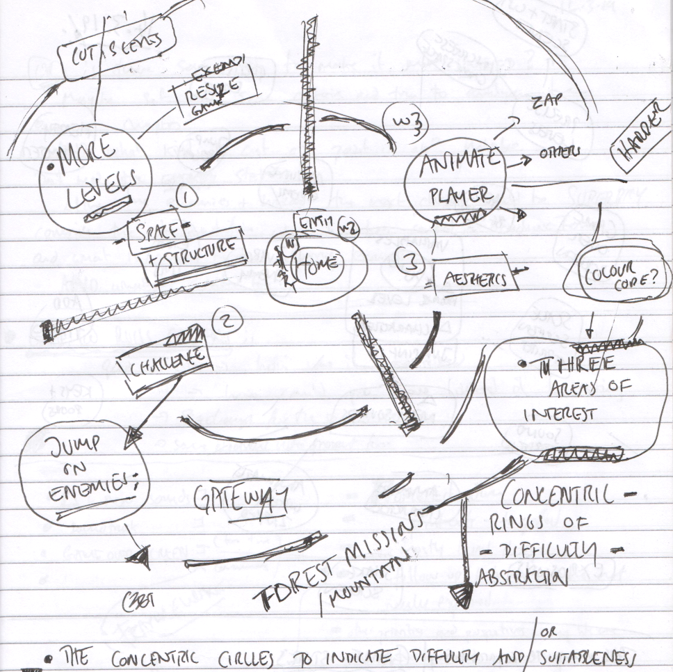

---
# all the regular stuff you have here
zotero:
  scannable-cite: false # only relevant when your compiling to scannable-cite .odt
  client: zotero # defaults to zotero
  author-in-text: false # when true, enabled fake author-name-only cites by replacing it with the text of the last names of the authors
  csl-style: harvard-cite-them-right # pre-fill the style
layout: post
number-sections: true
categories: chapter
title: 9. Appendices
---

-   [Appendices](#appendices)
    -   [List of Vignettes](#list-of-vignettes)
    -   [Extended design narrative for
        P1](#extended-design-narrative-for-p1)
        -   [Email to participants in mid-P1 - Never mind the bees. I
            need your help
            too!](#email-to-participants-in-mid-p1---never-mind-the-bees.-i-need-your-help-too)
        -   [Appendix.5.bee - Contextual Vignette on the conflict
            experienced by one family & the 3D
            Bee](#appendix.5.bee---contextual-vignette-on-the-conflict-experienced-by-one-family-the-3d-bee)
        -   [Appendix.feedback - Feedback from P1 participants
            (extracts)](#appendix.feedback---feedback-from-p1-participants-extracts)
        -   [Appendix.themeing - Themeing
            GDPs](#appendix.themeing---themeing-gdps)
            -   [Appendix 5.R.x - Sketching towards a map to help
                navigation.](#appendix-5.r.x---sketching-towards-a-map-to-help-navigation.)
            -   [Appendix 7.makertypes - DUPLICATED LATER - ALSO WHAT
                ABOUT CHAPTER
                7](#appendix-7.makertypes---duplicated-later---also-what-about-chapter-7)
            -   [What kind of Maker are you - Motivations behind social
                processes (emerging in
                playtesting)](#what-kind-of-maker-are-you---motivations-behind-social-processes-emerging-in-playtesting)
            -   [Commentary on side
                missions](#commentary-on-side-missions)
        -   [Appendix.drama - Drama process
            -](#appendix.drama---drama-process--)
            -   [Exploring documentation and accessing technical help
                within the drama
                frame](#exploring-documentation-and-accessing-technical-help-within-the-drama-frame)
            -   [Playful dialogue with the aliens unrelated to game
                making](#playful-dialogue-with-the-aliens-unrelated-to-game-making)
        -   [Appendix.bartle - Summary of interactive Bartle
            test](#appendix.bartle---summary-of-interactive-bartle-test)
        -   [Appendix.learningmap - Tension emerging in the Learning
            Design regarding Computational Thinking
            concepts](#appendix.learningmap---tension-emerging-in-the-learning-design-regarding-computational-thinking-concepts)
        -   [Appendix.recommendations - for
            practitioners.](#appendix.recommendations---for-practitioners.)
            -   [Additional commentary from chapter
                6.](#additional-commentary-from-chapter-6.)
            -   [Practitioners can use GDPs to foster of culture, home
                interests and evolving participation in an
                idioculture](#practitioners-can-use-gdps-to-foster-of-culture-home-interests-and-evolving-participation-in-an-idioculture)
            -   [GDPs again - Move some of this to Chapter 2 if
                helpful?](#gdps-again---move-some-of-this-to-chapter-2-if-helpful)
    -   [Technical Appendix One - On technical aspects of the decision
        regarding the learning
        design](#technical-appendix-one---on-technical-aspects-of-the-decision-regarding-the-learning-design)
        -   [Tools used in different phases of
            activity](#tools-used-in-different-phases-of-activity)
        -   [Appendix 5.tech - Summary of the tools and processes used
            in P1, P2 and
            P3.](#appendix-5.tech---summary-of-the-tools-and-processes-used-in-p1-p2-and-p3.)
            -   [Description of tools used](#description-of-tools-used)
            -   [Description of types of activities involved in game
                making and the tools used to do
                them](#description-of-types-of-activities-involved-in-game-making-and-the-tools-used-to-do-them)
        -   [Appendix.tech.samplechapter - Extract of supporting
            resources - Sample chapter on Keys and Doors gameplay design
            chapter](#appendix.tech.samplechapter---extract-of-supporting-resources---sample-chapter-on-keys-and-doors-gameplay-design-chapter)
            -   [Game Space: Keys and Doors](#game-space-keys-and-doors)
        -   [Appendix.tech.gameframework - Framework to support game
            analysis via game elements
            -](#appendix.tech.gameframework---framework-to-support-game-analysis-via-game-elements--)
        -   [Design decisions in the technical decisions of the template
            design in
            P2](#design-decisions-in-the-technical-decisions-of-the-template-design-in-p2)
            -   [Using a structural
                template](#using-a-structural-template)
            -   [Summary of motivations and sources of P2
                template](#summary-of-motivations-and-sources-of-p2-template)
            -   [Appendix.tech.prototyping Use of visual
                prototyping](#appendix.tech.prototyping-use-of-visual-prototyping)
            -   [Using Phaser 2 not 3 & Game
                States](#using-phaser-2-not-3-game-states)
    -   [Technical Appendix Two - On reaction to
        tech](#technical-appendix-two---on-reaction-to-tech)
        -   [GDPs used to nurture tactical responses to coding
            errors](#gdps-used-to-nurture-tactical-responses-to-coding-errors)
        -   [Concluding remarks on debugging and
            revision](#concluding-remarks-on-debugging-and-revision)
    -   [Unplaced - but needed.](#unplaced---but-needed.)
    -   [Perhaps delete?](#perhaps-delete)
        -   [Appendix 5.x - Community norming in playtesting - DROP THIS
            ONE
            PERHAPS](#appendix-5.x---community-norming-in-playtesting---drop-this-one-perhaps)
        -   [5.dn - Expanded Design
            Narrative](#dn---expanded-design-narrative)
        -   [Shared object as GDP move to Ch
            5](#shared-object-as-gdp-move-to-ch-5)
            -   [On Template / Documentation
                use](#on-template-documentation-use)
            -   [Email on list for P1 - regarding the use of a
                template](#email-on-list-for-p1---regarding-the-use-of-a-template)
            -   [Additional commentary and analysis of Toby's vignette -
                MOVE TO EXTERNAL
                DOCUMENT](#additional-commentary-and-analysis-of-tobys-vignette---move-to-external-document)
            -   [Developing a collection of GDPs and code
                snippets](#developing-a-collection-of-gdps-and-code-snippets)
        -   [Not sure if useful](#not-sure-if-useful)
            -   [Developing Digital Literacy skills / Fluency -
                OPERATIONS](#developing-digital-literacy-skills-fluency---operations)
        -   [Tensions in tool use emerging between agency and
            authenticity](#tensions-in-tool-use-emerging-between-agency-and-authenticity)

# Appendices

**On Structure of Appendices & Vignettes**

Vignette are presented first and given a separate name based on when they appear in the thesis. In the interim before for a final appendix is completed they use descriptive names.

Technical appendices follow. They contain some overlap with chapter material in order to be self contained. The

Other Appendices will be organised by chapter. Thus AP 5.1 is is the first mentioned in Chapter 5. In the interim before for a final appendix is completed they use descriptive names.

The following summary list of appendices my help orientate the reader.
MOVE LIST ABOVE HERE WHEN STABLE ENOUGH  

**Vignettes:**  Vignettes contain extended transcription of discourse and when possible participant gestures and inline commentary. Vignettes are contained in another chapter / document (due currently to the need for more complicated tables that writing in markdown allows)

## List of Vignettes

    Special Appendix - Participant Vignettes	1
    Vignette 1: An extract of Toby and Veronica’s coding activity	2
    Vignette 1 Analysis	7
    Part Two - Toby and Bertie and propagation of GDPs.	8
    Vignette 2 – Suzanne and Tehillah	9
    Context	9
    Transcript and Activity Log	9
    Commentary on Interaction	14
    Discussion and Links to other Observations	15
    Awareness of and disparity between perespectives on designing for otthers	15
    Home interests	16
    Game Making Patterns and Systems Concepts	16
    Vignette 3 Mark and Ed’s use of GDPs within their organisation	1
    Vignette 4 - Feedback on the dynamics of Molly’s player movement	6
    Vignette 5 - Molly and Nadine working with graphics and stories as funds of knowledge and identity and emerging specialism	8
    5.a - Specialism emerging in interaction between Molly and Nadine	8
    5.b - Extract of interaction between Molly and Sonia	9
    5.c - Developing shared language	9
    5.d - Using technical language - DoL and technical processes	10
    Vignette 6 – Mark and Ed working with home interests	12
    Use of game graphics and funds of identies in Interview data	12
    The use of technical language within the application of GDPs	12
    Vignette 7 Dan and Toby – Home experiences of Gameplay design patterns.	13
    2019-05-08-te-da pt 1 - Transcript of interaction between Dan and Toby	13
    Interview extract and observations of technical process of finding documentation	16
    Vignette 8 - .alien - Transcription of the introducing a drama process in P3	16
    Vignette 9 - Vignette.documentation - Introducing documentation in drama frame	18
    Vignette 10 - Session reflections and secret missions in P3	20
    Vignette 11 - .map - Dialogue of use of physical maps at the start of session X	23

## Extended design narrative for P1

As my ex-neighbour Barry once said to me, _there are a million ways to start a conversation_. There are probably just as many to start the process of designing and making a game using code as well. In choosing how to present the appendices of this study I try to do so in an accessible narrative which draws on my extensive facilitation and design journal notes to contextualise the findings from video data. I justify this partial approach in line with Stetsenko's activist stance described in Chapter 4.

This section augments the brief narrative of P1 in Chapter 5 outline my motivations and observations driving learning design decisions.  

I did not want to start with coding processes that might alienate, but also as my own game coding skills were also being tested to their limits at this point also and I was working hard to introduce coding at a suitable level. I had experience of teaching web coding but limited knowledge of how to code games. Thus during these five week that time I had been teaching myself the basics following my own repertoires and practices as a mostly self-taught coder.

Thus for initial weeks I engaged with the following activities.

In phase one, I noted that any addition to the game in terms of adding new any quantity of code created many potential coding, conceptual and organisational challenges.

Chapter 5 outlines how this culminated in a crisis which involved me reaching out to parents for help in the organisation of the game making sessions via the  following email.

### Email to participants in mid-P1 -  Never mind the bees. I need your help too!

Mick Chesterman<M.Chesterman@mmu.ac.uk>
Nov 15, 2017, 1:20:31 PM
to mozilla-html5-gamemaking-mcr@googlegroups.com

Hi there,

Never mind the bees. I need your help too!

I really appreciate all your energy going into the game making club over the last weeks. This is an experimental process and you guys are really going for it.

Also special thanks to J* for doing the Sonic Pi session on Tuesday that was great, and I learned some useful things for doing that one in the future.

It was a bit of a hard session for me on Wednesday as I was a bit low on confidence about how to pull all of your creativity into a finished game! It started to feel like a bit of a fantasy!

So I think I realised something. I said in the past that the idea of the club is for you to follow your interests and I’ll do the job of pulling together that creativity into a game.

But I realised that I can’t do it alone!

So I think part of the work we have to do is to visually map somehow what we have now at the start of every session. Via prints outs, or sheets where we map what we have and what we are missing.

I’m happy to give it a go at the start of next session to try to explore one way of doing it.

But ideas via email would be very useful too.

And let’s also have a break out group at the end to work out a bit more of a team approach as I need your help!

Thanks loads for reading this far…
Mick

ps: I guess the challenge is to do this so that it’s a map, with different learning directions and possibilities, but that we are all still on the same map in our groups.

So supporting autonomous learning but also team work.

### Appendix.5.bee - Contextual Vignette on the conflict experienced by one family & the 3D Bee

One family in P1 chose not to continue with most other families after the Xmas break.

Members of this family had engaged in planning on paper and in particularly in creating pixel art, however tensions began to emerge when the introduced code framework framework did not support the desired features of one child. The feature they wanted to add to the game was bee design roaming a 3D landscape.  

When the family withdrew, they shared in feedback (see appendix 4.x) that at one point the family looked around and just saw people doing "hardcore coding" and no longer felt that they belonged".

In the end stages of the game production process, due to the dynamic of the larger group, they had been reliant on others to implement code changes for their imagined game, unable to contribute fully at this point and found themselves isolated.

Thus a contributing factor to this families alienation were tensions engendered by the large group size and compounded by frustrations stemming from unfamiliarity with tools and processes.

In participant feedback, the  parent of this family described in the previous section indicated that it took too long before in the planning stage and called for more hands on play and use of the tools of production before being called on to make creative decisions. The parent likened this to an arts studio approach. This feedback contributed to choices outlined in other sections of this chapter. (WHICH ONES)

When the family withdrew, in my journal notes I reflected that the they shared of alienation from the group process occurred in a session where, due to a sense of urgency to complete games, I had omitted drama-based warm up activities. Instead as participant entered I began to support to help some participants debug some pressing code errors.

For some families and individual participants there were conflicts to do with a sense of anxiety and alienation from the group coding environment and associated peer working dynamics.

One family dropped out and in their exit interview they shared that at one point we looked around and just saw people doing hardcore coding and we no longer felt at home in the environment. In this emergent design, they had mostly completed asset design and narrative development and the only coding remained. I thus wanted to address the tension between completing the project and alienation from just coding.

The value of playfulness is illustrated with one exit interview with a parent where they shared their reasons for leaving the program. At one stage after a week where they had missed a session, their family looked around and saw other groups involved in 'hardcore coding' and no longer felt at home. They compared this previous sessions which had more fun and group oriented activity.

I was struck that his incident happened during a session where I had not played customary drama games to create an inclusive environment. The games had been omitted as I was responding to a sense of urgency coming from families to solve problems. The scarcity in facilitator time drove me to crack on supporting families to debug code errors.

**Limits of peer support**

In feedback the parent shared they didn't want to bother other families with probems via the email list, and also noted the hesitancy caused by parental involvement compared to the kids ability to jump in and learn from each other less self-consciously.

Thus this surfaced a tension, the value of a peer learning balanced with the need for low pressure. In other words avoiding a negative sense of obligation.

<!-- The value of playfulness is illustrated
The freedom of choice and imagination allowed by designing on paper and via pixel art created compounding tensions. -->

<!-- I had not played customary drama games to create an inclusive environment.

That week I had omitted them as I felt a sense of urgency coming from families to solve their problems. The scarcity in facilitator time drove me to crack on supporting families to debug code errors. -->
<!-- In this emergent design, they had mostly completed asset design and narrative development and the only coding remained. I thus wanted to address the tension between completing the project and alienation from just coding. -->

### Appendix.feedback  - Feedback from P1 participants (extracts)

This is included to show evidence of the emergent process and that the direction of the program was influenced by participants input.

**End of course evaluation at show case for  P 1.**

Find extracts from here
https://docs.google.com/document/d/1VL8FPnrBUbcpwL1nmGLCsF1t2JjkitQV_3N8DYeFcoM/edit

**Journal Notes from P1**

Find extract from my journal notes for P1 period

### Appendix.themeing -  Themeing GDPs

In grouping the game design patterns into categories for the documentation hub page, I drew on academic and professional interpretations of game elements [@salen_game_2006; @schell_art_2008; @tekinbas_rules_2003]. Schnell's detailed analysis of tens of game elements presented as design lenses was too complex for this audience. Instead, I adapted a simplified introductory framework developed for use in youth-oriented Game Jams to help novice game makers hack/analysis and then adapt key elements of non-digital games [@cornish_game_2018].

- **SPACE:** Where the game takes place.
- **GOAL:** What is the objective of the game? What are you trying to do?
- **COMPONENTS:** What are all the objects or actors in the game?
- **MECHANICS:** What actions take place in the game. What are the verbs involved?
- **RULES:** What can or can’t you do in the game? What defines boundaries? Does play happen in real time or do you take turns?

The framework youth game jams and in the Q2L school to help participants develop their implicit knowledge of game design concepts in to explicit share vocabulary before engaging in digital making via collaborative analysis of common games [@cornish_game_2018; @institute_of_play_gamestar_nodate]. Similarly, in early stages of my design participants completed a similar activity after playing retro arcade games [included in appendix].

I related this simple categorisation the emerging list of requests for game features made by my participants. The final categorisation used in P4 is included as a Table 5.x below.

| **Game Mechanics**| **Game Polish** | **Game Space** | **Challenge Systems**|         
|--------|------------|--------------|----------|
| Add Static Hazard  | Add Graphical Effects | Change Design of Levels | Gain Points when Collecting Food |
| Add an Animated Enemy  | Add Sound Effects | Add More Levels | Add a Timer |
| Jump on Enemy to Zap them  | Add a Sound Track (Music) | Change Shape of Levels | Collect all Food before Progressing |
| Double Jump  | Add a Game Story with Messages | Change the Background Image | Power up - Higher Jump |
| Moving / Patrolling Enemies  | Add a Game Story with Messages | Change the Background Image | Power up - Player Speed |
| Moving / Following Enemies  | Animate your Player’s Movements | Key and Door | Random Doubling Enemies |    
|   | Make Player Immune |  | |    

Table 5.x Categorisation of game design patterns used in P4.

This categorisation, while simplified, is consistent with professional and technical frameworks popular in game making communities including: the MDA framework [@olsson2014conceptual] (which focuses on analysis of games based on the user experience), Elemental Tetrad [@schell_art_2008], and DDE [@korn_design_2017]. The theme of using technical frameworks in an accessible way to facilitate the creations of novice participants is continued in the chapters five and six.  
I noted that some patterns addressed game aesthetics (simplified to  _game polish_) for example; the graphical representation of game characters; adding sounds; and adding background images. Others could be described as _game mechanics_ including: jumping on enemies; finding a door or flag to progress to the next level; and collect all food before progressing to next level. Others concerned aspects of _game space_: the size and shape of game world; and adding new levels the game. In P5 I extended the scheme to included  _system and challenge_ patterns. These explore at how different elements in
 cxteract to create challenge in the game.

I then took the existing list of game elements that have been identified by students and categorised them based on a blend of two frameworks.

I made some simplifications and adaption to increase accessibility for non-professional and young people. For example, the term of aesthetics is very wide and suited simplification _game polish_.

{width=55%}

#### Appendix 5.R.x - Sketching towards a map to help navigation.

In trying to organise and represent code examples to participants in a logical way, I experimented with different categories and themes to contains the emerging game elements. I also explored the concept of mapping the different challenges by difficulty on a map via structuring via concentric rings. An example of the kind of grouping sketch used is included below as Figure 4.x.  

{width=85%}

_Fig 4.x. Scan of Journal Sketch of early attempt at dividing features by type and difficulty - Dated 11.3.2019_

The process of sketching, revising and re-sketching the elements led me to connect this process of categorisation with the work of game theorists. For example, I recognised synergies with between _open-world_ game design and my attempts to structure resources and help learners navigate the learning experience based on choosing challenges based on their interests and appropriate difficulty levels [@squire_open-ended_2008].

### Appendix 7.makertypes - DUPLICATED LATER - ALSO WHAT ABOUT CHAPTER 7

#### What kind of Maker are you - Motivations behind social processes (emerging in playtesting)

By the end of P2 most of the tools and main processes were in place. But I still felt tensions around introducing reflective processes and wanted to de-centre myself where possible from a teacher position. My journal notes detail an evolution of attempts to try to build into the program, activities which help build the participants sense of their own identities of game makers or more generally digital designers. Participants, particularly older ones, used playtesting as a way of showing support for fellow game makers. Example behaviours included: praising graphical content; making links with home interests of participants through questioning; and building rapport.

Molly in particular used playtesting to show her appreciation of the graphical work of others especially in the creation of cute animal characters. In response to one game which featured an image of a dog, other participants asked: _Do you like dogs? Do you have a dog at home?_.

In and early tentative attempt to define in broad strokes the types of game maker behaviour and underlying goals, taking inspiration from Bartle's game player types [@hamari_player_2014], identifying social makers, planners, magpies and glitchers.  

-   **Social makers:** form relationships with other game makers and players by finding out more about their work and telling stories in their game   
- **Planners:** like to study to build knowledge of the tools before they build up their game step-by-step following instructions
-   **Magpie makers:** like trying out lots of different things and happy to borrow code, images and sound from anywhere for quick results
-   **Glitchers:** mess around with the code trying to see if they can break it interesting ways and cause a bit of havoc for other users

I saw potential value here to address the danger internal bias about the kind of process that a computer programmer should adopt, echoing the call for pluralism in approaches [@papert_epistemological_1990]. Thus, in P2 I introduced a starter game in which families moved into different quadrants of the room in answering questions on the Bartle test. This process celebrated different game playing types and allowed a public sharing of previously hidden gaming preferences, although for some non-gaming parents and children I had to ask them to use their imagination. Several parents noted that this process gave them great insight into how their child identified within the cultures of the games they played.

After the process of playing a game I shared my proposition that there different game maker types. I asked participants to evaluate and discuss with peers what kind of game maker they were from the list above. This process was not explicitly used in later reflections however parent Mark made the following comment in post-session P3 interviews.

    We used the instructions, we like to plod.

{width=95%}

I used the question "What kind of game maker are you?" as an indicator to participants that one aim of the project was to create a space where different approaches are possible and celebrated. To communicate this approach, as well as starting game activity, I incorporated the question into an animation of the resources home page (see illustration 4.x). In P3 the underlying ideas were incorporated into the process drama described in the next section.

#### Appendix.playtestingtypes

The maker types listed above were in particular played out in the playtesting process.

**Playful playtesting**

Some children added additional playful elements to playtesting. Because these interactions were mobile between workstations is it hard to extract audio and transcribe their speech. However, it is possible to communicate the characteristics of this play via a description of a typical encounter and the gestures of participants.

WATCH MORE CLOSELY AND TRANSCRIBE GESTURES

    Play is initiated by calling across the room as an invitation to play, or as a provocation. When playtesting is underway it is normally undertaken with two or three participants standing around the computer rather than being seated. The core of those involved take turns to play the game, exclaiming frustration or triumph at completing levels or failing. Failure may be extremely performative with a rapid pulling way from the screen and keyboard. This may be followed with a battle to wrestle control of the keyboard to play the game next. This may involving playful pushing, and wrestling of hands and arms and vocalisations. While this play is happening it may attract other participants who remain on outskirts of the activity looking on able to watch what is happening on the screen and respond non-verbally with smiles or laughs.

These changes to the form and function of playtesting by young participants is another example of expression of agency by participants that widens the scope of possibility of actions.

#### Commentary on side missions

Full table of side missions.

| Your Alien Mission (social)          | Your Secret Alien Mission:              
|----------------|----------------|
| Find out the names of 3 games that are being made.  | Change the variables at the start of someone else’s game to make it play in a funny way.    |
| Make a list of characters in two other games being made.   | Change of the images in someone else’s project to a totally different image and see if they notice.    |
| Find out the favourite computer games of 4 people.   | Change the level design of the first level of someone else’s project to make it impossible but try to change as little as possible to do that.   |
| Find out who plays the most computer games per week in your group.   | Change of the images in someone else’s project to a very similar but slightly different version and see if they notice.    |
| Find out what other people are planning. Give some friendly feedback to one other person / group. Why don’t you try…   | Add a rude sound to someone else’s project.    |
| Ask 2 different groups if they have thought about what sounds they are going to put in their game.   | Swap over some sounds in someone else’s project and see if they notice.   |
| Find out from three groups if they are going to try any totally new ideas.  | Delete all of the code of someone else as they are editing it and see how they react. Then help them get it back using the Rewind function.   |

In the transcript above of vignette 4.1.b we see that in the end-of-session reporting back participants engage in a lively discussion about the secret missions they had been given. Encouraged by her mother Molly, Nadine shares that she has been highly engaged in a disruptive secret mission. Dan and Toby express playful frustration. Mark and Ed contribute by sharing their more subtle disruption and Richie is keen to have his _rude noise_ mission noticed and commented on. Some public missions had a noticeable impact in this session particularly in  stimulating a discussion among parents around which arcade games they played as youths.

Side missions or side quests are also used in open world games are used in part to appeal to different kinds of players and are often models on Bartle's taxonomy of game player types [@bartle_hearts_nodate]. In this phase, parents Molly and Mark both used the prompts of the social missions to take a break from their creative work using the software toolset to talk to other parents and children.

    Mark: Right we’ve got a background in. Do you. Do you want to reply to the Weean.
    Ed: Yes. (Ed starts to type very slowly)
    Mark: (after some time) While you do that I’m going to go do my mission.
    Ed: What's your mission?
    Mark: To find out about other people's favourite games.
    Ed: Alright.

### Appendix.drama - Drama process -

#### Exploring documentation and accessing technical help within the drama frame

To do this in a way that encouraged other participants to join in, I created a project in the shared coding project area with a webpage that could be edited and viewed by participants. When in the vignette 4.1.b Mark asks "We’d like to ask the Weean some more questions (to overcome coding blockages), is that the best way to do it?", he is referring to this project webpage. The process of writing down a text request encourages the adoption of professional practice of asking a written question to overcome a coding problem and thus builds experience of using technical terms. Undertaking it in-role potentially addresses the barrier of asking for help by de-personalising the process.

Dan and Toby also received written help from the aliens to implement a pattern of creating random movement in their pac-man clone game. For this pair, the process of following a code suggestion from the aliens gives the parent opportunity to deconstruct the code in detail to explore coding concepts. In later discussion, Dan uses the fiction of the alien when asking a clarifying question.

    "Mick, do you think the aliens would mind if we get rid of the switch statement and replace it with some if-thens? They're just showing off these aliens aren't they?"

Here the text dialogue with the aliens is used as a mediating artefact first by the facilitator to share help in-role, and then by a parent to suggest a modification to the code syntax to create more readable code structure for novices.  

While this aspect of the drama process was introduced by the facilitator, in alignment with the understanding of Sannino's concepts of transformative agency through double stimulation (TADS) participants transform the function of the alien conversation to their own purposes. This theme is developed in the next section.

#### Playful dialogue with the aliens unrelated to game making

The process of asking the aliens for technical help within a code project sparked a playful process of informal chatting with the aliens.

This chat began to fulfil a function of building  insider rapport, creating a fun atmosphere, celebrating the completion of games in the absence of a public showcase, and signposting the achievements of other participants. For some pairs, while the child interacted in the live chat, parents performed final tweaks to code projects and challenges. Two parents in particular worked hard debugging more complex elements of the game with facilitators and peers. Other parents engaged with the chat and encouraged their children to get feedback from the aliens about their game in particular.

The process started with supportive and celebratory messages posted from the alien. The impact was significant with the young people with 5 out of 7 engaging by writing messages and all mentioning the interactions verbally during the session.

### Appendix.bartle -  Summary of interactive Bartle test

As part of attempts to try to build into the program, activities which help build the participants sense of their own identities of game makers or more generally digital designers.

I introduce a warm-up activity trialled in P2 where participants took part in an interactive the Bartle test (what kind of game player are you).  

A Bartle test is ...

}

It took the form of an as extended spectrum line/grid activity [FIND DESCRIPTION SOURCE]. The process of exploring identity in this way surfaced the cheekiness of some young people and the pleasure they took in demonstrating their playful mischievousness. I began to make journal notes on this subject and talk to other games study practioners. I began to ask the question can the surfacing maker types (as per player types) encourage awareness and celebrate the emerging practices that the community was producing.

The process was adapted so players moved
to a different quadrant of the room based on their response to the question. The process allowed young people to see how their response differed from that of their parents. The process was very engaging and quite revealing. Parents responded that the process gave them new insight into the digital identities of their children.

After the results were revealed, I then proposed as facilitator that my observations were that there different game maker types. I read out the different types and asked them to place themselves in a two-dimensional grid based on their self evaluation of what kind of game maker they were. Other family members were then invited to comment to see if they agreed with this interpretation.

The process of exploring identity in this way surfaced the cheekiness of some young people and the pleasure they took in demonstrating their playful mischievousness. I began to make journal notes on this subject and talk to other games study practitioners. I began to ask the question can the surfacing maker types (as per player types) encourage awareness and celebrate the emerging practices that the community was producing.

As an example some players created impossible or overly easy game levels. They appeared aware of implications for game balance but is taking pleasure in this seeming destruction of the key challenge of the game as an act of disruptive play. They seem to take pleasure from ignoring concepts of what should be done to maintain game balance and from the sense of shock from their current audience her parent. Going against this convention is a type of playful destruction in this context. The process mirrors play theory concept of playing against the game or dark play [@sutton-smith_ambiguity_2001].

Below I outline how I designed to encourage this behaviour.

In and early tentative attempt to define in broad strokes the types of game maker behaviour and underlying goals. In doing this I have taken inspiration from Bartle's game player types [@hamari_player_2014]. I translated player types to maker types based on notes in my observation journal and extracts from screen capture data. The following list of *Game Maker *types:

-   **Social makers:** form relationships with other game makers and players by finding out more about their work and telling stories in their game -   
- **Planners:** like to study to get a full knowledge of the tools and what is possible before they build up their game step-by-step
-   **Magpie makers:** like trying out lots of different things and happy to borrow code, images and sound from anywhere for quick results
-   **Glitchers:** mess around with the code trying to see if they can break it interesting ways and cause a bit of havoc for other users

My rationale for this process was to promote awareness of pluralistic programming process [@papert_epistemological_1990]. I wanted to try to communicate a message to participants that when you are learning something hard it is of value follow your own working preferences and try to discover a creative style that suits you.

<!-- #### Building Identities as Game Makers (dropped) -->

<!-- NOTE - MAY NEED TO REWRITE to clearly precursor next chapter -->

<!--
in open world games are used in part to appeal to different kinds of players [@bartle_hearts_nodate].
 -->

<!-- For examples in the Vignette of S and T's interaction we can see attributes of the child as a Glitcher. In terms of understanding of the game as a dynamic system, this is seen clearly in the parent's alarm at the child's deletion of all elements of hazard. The parent is keen to keep a sense of game balance to ensure a sense of challenge for the imagined player. "It's no fun having a game without any hazards to avoid." The child seems determined to remove all hazards.  -->

### Appendix.learningmap - Tension emerging in the Learning Design regarding Computational Thinking concepts

This appendix outlines the evolution of a map of learning dimensions which is referenced in Chapter 6. A section section contains reflections on the aspect of the learning design which suit curricular approaches to computing and computational thinking.

|      Coding Concepts    | Systems Patterns    | Design Practices|
|--------------|-----------|------------|
| Sequences | Systems Elements      | Goal Setting        |
| Variables      | Systems Dynamics  | Being Incremental and Iterative       |
| Logic | Reinforcing Feedback Loops      | Developing Vocabulary        |
| Loops | Balancing Feedback Loops      | Web Navigation    |
| Arrays |       | Problem Solving        |
| Creating Functions |       | Version Control    |
| Change Listener |    | Debugging   |
| Input Event |   | Reusing and Remixing      |

Table 1.1. Learning Dimensions of the 3M Game Making Model

#### Evolution of the map

The inspiration is that of Bevan and Petrich's  [-@bevan_learning_2015; -@petrich_it_2013] work to bring a similar learning map to a seemingly chaotic tinkering and making process in museum contexts.

IS THIS IN LR?

#### Tensions involving explicit teaching of curricular concepts or not

There's a tension of not wanting to jump in to teach CT concepts, or to force reflection on progress. Understandable not to want to interupt flow. It is not needed in terms of testing or curriculum here. This is an adaption where I project into the experience of participants and pick up on reluctance to step away from the ongoing coding and creative or playful tasks at hand. I adapted to end of session reflection on most sessions. I also did not draw attention to extra resources outlining formal frameworks. Although step by step instructions which did outline them in situ were available.

Here I worked to remove barriers to accessing CT as a framework   via resource creation which aligned to experience. But their agency is expressed through disinterest and reluctance in participation. This transform conceptions of the activity as I give up CT as a framework which guides the objective. Instead using GDPS as one more aligned with their interests and need to develop fluency in non-conceptual coding practices.

Facilitators can use a prepared collection of GDPs to facilitate participants to surface chosen computational, design and systems concepts embedded in games.
SEE BOOK CHAPTER FOR recommendations FOR TEACHERS - AND INCLUDE HERE.
DROP?

I also noted my own caution about overloading learners with shifting and competing goals. My concern hinged on the potential disorientation of the learner that imposed shifts of focus may provoke. As learners shift between different stages of creation the object of their activity shifts from the larger goal of making an engaging game to a narrower goal of implementing a game design pattern to narrower still of completing one of several actions to complete the implementation of a GDP.

The map of learning dimensions created, reflects the tensions explored in this section on which element of personal knowledge to privilege.

While the contextual factors involved in this learning environment did not require alignment with a particular curriculum or external examination, computing, design and systems concepts have the potential to arise as part of the game making process.

In particular, the facilitator has the ability to surface and to explore more abstract concepts present in the concrete application of code that have emerged organically from the participants drives to implement particular patterns.   

2019-05-08-te -

Toby to find patterns and to duplicate them in different situations.

With prompting from parent the child is able to recognise, duplicate and alter the update code for accepting left and right key input to change character x-axis velocity. After update and test iterations they change this to up and down key input to update y-axis velocity. The 3M approach lends itself well to exploring pattern recognition as patterns are readily available to participants in starting code and the extra patches that are added.

Also the knowledge of the GDP helps ability to recognise patterns in the code. Left / right -> Up / Down

I could trust my instincts as a facilitator to not detract attention from participants following an organic and flexible pattern of implementation, self-testing, improvement and playtesting.
In the language of activity theory the change of objective denotes is a shift in scope of the activity system.

Even, taking Wing's more abstract definition of CT, many examples arise in recorded interactions without being explicitly taught.

_Decomposition_: example of parents helping children break a larger problems into more manageable steps e.g one parent suggests to his child "Save that for version 1.1".  
_Generalisation / pattern recognition_ is present in the majority of participants as patterns are readily available to participants in starting code and the extra patches that are added. The process is repeated.
_Sequencing / algorithms_ are frequently explored in the resolution of errors with participants. This exploration focuses on the potential of the 3M learning design rather than making claims on the suitability to develop CT via game making which is explored extensively in other research. Conceptions of personal appropriation should not be limited to only the curricular concepts included in the learning map, the many of the behaviours explored above show both the appropriation and feeding back of varied understandings of game design patterns and related concepts and skills. The process of reusing and modify code to create a computer game can surface both abstract and concrete computing concepts present in the concrete application of code that have emerged organically at different stages of the creative process. While the design of this study does not suit full exploration of the personal plane of activity, the repeated, solo, incremental changes of the details of implementation of game design patterns indicate a personal appropriation of concepts like game feel and challenge and design processes.
In one interaction with Sh, exploring how a bracket placed in the wrong place can effectively break the game yielded a productive discussion on the importance of correct code sequencing (PERHAPS INCLUDE AS APPENDIX?). _Abstraction_, identified by Wing as the most vital CT concept, merits a deeper examination and is covered in a later section of this chapter.

Beyond this broad mapping of systems and computing concepts to aid facilitators to highlight I also sketched out metacognitive activities to explore these concepts on completion of each GDP. As explored in the design chapter, later revisions of the design of supporting materials for each GDP included links to online descriptions of design, systems and computational concepts. Thus, beginning with experience and progressing to analysis in a sway that mirrors reflective professional practice. However analysis of my journal entries show an ongoing reluctance to shift learners away from the practical implementation of repeated game design patterns to focus on more abstract, de-contextualised conceptions of the knowledge.

My intuitive reluctance to impose shifts in the scope of activity systems, can be interpreted through the lens of TADS. For me to prompt a shift to a  activities to reinforce recognitions and connection of learner generated code to computing and systems concepts, would impose a objective (first stimulus) and expose a new set of secondary stimuli for learners to draw on.
THIS SECTION NEEDS DEVELOPMENT AND COMPLEXIFICATION IN RELATION TO EXISTING RESEARCH.

#### Reflection on personal appropriation of concepts

**Interview data**

Transcript of S and J
The testing of the jigsaw activity

While the flexible / non-testing nature of the environment makes claims here difficult, a reflection by a parent interview data on a testing activity in P1 is relevant. S parent of J and T on completion of a jigsaw test, celebrated seeing that her family were able to recognise and order the code structures presented as validation of the experiential, non-instructional approach (see appendix.learningmap).

Also move some of the above down here.

### Appendix.digitalliteracy

The process of collating these skill aligned to curricular concepts above or those explored in computing research as desirable in a manageable list involved excluding a large number of relevant skills that were being developed as part of the game making activities. In particular key digital literacy and basic skills associated with using a desktop personal computer which were developed are listed below.

- Keyboard use: in particular use of shortcuts including Cntl + C, Cntl + V and the use of Shift and arrow keys to highlight text
- Mouse use: building proficiency with accurate mouse use and the process of clicking and dragging
- File management: downloading and locating digital files on a desktop environment
- Exporting graphical assets: locating the proceedure for exporting files from applications for use on other applications in the correct (interchangeable) format.
- Using web browser tabs: creating new tabs and navigating between different browser tabs as part of a iterative design process.
- Use of graphical editing tool sets: for example drawing pencils, fill buckets, eraser tools.
-  

### Appendix.recommendations - for practitioners.

#### Additional commentary from chapter 6.

#### Practitioners can use GDPs to foster of culture, home interests and evolving participation in an idioculture

The link to home interests and funds of knowledge is demonstrated in varied ways which enrich the development of a community idioculture which is inclusive and productive in terms of the practicalities of learning how to make games.

The work of Rogoff and Wegner and Lave has guided the surfacing activity in the such as legitimate peripheral participation, community norming and taking on roles of specialism.

At times, activity crosses between cultural and pair guided processes  - DEVELOP HOW
- the role of playtesting as a medium for cultural exchange and a ground in which culture grows in of note
- individual requests and implementations can spread via playtesting
- the immediacy of designing for other is used by parents or children to norm behaviour in inter-personal interactions.  

Recalling that cite one of the challenges of learning coding

#### GDPs again - Move some of this to Chapter 2 if helpful?

Both the GDPs and the sub-actions of the wider activity design become short-cuts which stand in for previously tricky to complete set of actions.

Rather than promising the transfer abstract concepts to other domains, we see learners build competency in participation in replicable processes. These processes which aid future iterations of the GDP implementation design cycle. The process of operationalisation of these sets of actions contributes to the creation of an informal, complex networked resource of operations which complement the more visible curated catalogue of GDPs.

Game design patterns or their fragments are used as a form of design short cuts. Examples from the above include, _get an enemy in_ , _animate player_ or _get it in the game_ (when referring to transferring an graphical asset from authoring tool to the coding environment). The advantages of such shortcuts are, as discussed, to help with the prioritisation and ideation processes, to facilitate peer propagation of ideas, and potentially to inform debugging and improvements to increase game playability.

There are challenges of the use of these short cuts and at a more general the design choice to lead with a menu of intermediate-level constructs in the form of a menu of GDPs. There may be confusion over use of terms to new comers and these GPD related terms may hide more complex patterns within the name. For example, the shortcuts in Mark and Ed's interaction hides a large amount of problems solving which seems "overwhelming". GDPs can limit the ideation process through an accelerated approach. Also as the menus themselves are not all used by students, and while GDPs do propagate from student to student, which risk further constraints on the process of asking questions about user experience and exploring ideas before committing to implementation.

**The concept of a restricted activity helps us understand the value a GDP collection for participants**
&  **Design Pattern collections can help structure a learning design into an inclusive pedagogy**

The process of creating a learning design where students were able to choose from a curated set of game design patterns, evolved from open approach in P1 and can be seen as a form of restricting possible activity. The positive impact of restricted choice of activities are outlined in varied educational concepts including Bruner's reducing degrees of freedom [@wood_role_1976]. In the 3M design the process of offering a choice of games patterns emerged to counter a previous open design process of which many learners found too challenging. The patterns emerged chiefly in response to requests from learners and partly from facilitator decision making which broadly matched the criteria of the other study. However, in Eriksson's study the authors selected from an extensive, pre-existing pattern collections [@bjork_patterns_2005].

Design patterns have been explored as a form of scaffolding [@ertmer_scaffolding_2019] for project based learning experiences. Research on design online experiences shows value in interrelated scenarios, features and underlying patterns and principles [@mor_assessing_2014; @kali_collaborative_2006].

In its engagement with participant choice over which patterns to implement, and varied approaches to making facilitated by varied uses of GDPs, this chapter has begun a process of exploration of the nature and evolution of agency in the practices of the participants, which is continued in the next chapter.

## Technical Appendix One - On technical aspects of the decision regarding the learning design

### Tools used in different phases of activity

### Appendix 5.tech  - Summary of the tools and processes used in P1, P2 and P3.

#### Description of tools used

- Piskel - a graphical editor used to create pixel art sprite characters;
- Audacity - a desktop based application to record and edit audio using audio effects and filters like delay and echo;
- freesound.org - an open repository of audio files which could be downloaded, used directly or altered using Audacity;
- Sonic Pi - an education music application allowing the creation of music using text coding;
- Bfxr & jsfxr - web based tools to create sound effects aimed at game production;
- Scratch - while scratch was not use for game production, I encouraged participants to use its intuative graphical editor to create backgrounds for the game;

#### Description of types of activities involved in game making and the tools used to do them
Table - or short entries with screenshots.

Phaser 2.6.2 javascript library
Glitch code playground
Incomplete game template
Print out of cards with simple coding missions
Online graphics editor Piskel.
Audio editors, audacity,
Updated incomplete game template
Piskel online graphics editor
Step by step tutorials on FLOSS manuals
Drama scenario
Interactive chat page in glitch

**Mapping skills used.**
See this attempt at a map of skills used in P1 - very extensive but not the focus of this study.

https://docs.google.com/spreadsheets/d/1Zu7bTMmQRj_Kgt6k6cI9nECdBtwgfnUAVd3OGruqoko/edit?gid=1216831858#gid=1216831858

### Appendix.tech.samplechapter  - Extract of supporting resources - Sample chapter on Keys and Doors gameplay design chapter

This chapter, used as an example in Chapter 6 was being accessed online by Susanna in Vignette 2.

The full manual is available here.
https://3m.flossmanuals.net/

#### Game Space: Keys and Doors

The game mechanic of collecting keys to be able to open doors to enter other spaces is well used in platform games to increase a sense of adventure. Let's look at one way to do this. We draw on the code of a similar tutorial here by Belen Albeza.

Check the code: what we need to know and do

There is some background knowledge in this book that will be useful for us in getting this mechanic to work - adding More levels - Game Mechanic: Adding Levels
Going over the code:

The code for a minimal example of the Keys and Doors game mechanic is shown here - https://glitch.com/edit/#!/key-and-doors-grid?path=js

Make sure you have or add these variables at the start of our code that are located outside of any one function as they are needed by more than one function.

  var hasKey = false;
  var key;
  var door;

In the playState.preload function we will need to load some images for our keys and doors. Here are two lines which you can copy and use while testing. You can replace these images with your own.

  game.load.image("key", "https://cdn.glitch.com/5d318c12-590d-47a1-b471-92a5dc0aae9d%2Fkey.png");
  game.load.spritesheet("door2, "https://cdn.glitch.com/5d318c12-590d-47a1-b471-92a5dc0aae9d%2Fdoor.png", 42, 66);

Then we will create a key and door for our first level. Add the following code to our if statement in the playState.create function which controls which level is loaded.

  if (!currentLevel || currentLevel === 1) {
    loadLevel(level1);
    // add extra code for just level one here
    key = game.add.sprite(100,25,"key");
    door = game.add.sprite(20,260,"door");
    door.animations.add("open", [1, 2], 8); // 8fps

Then when the play is happening. We want to set up overlap conditions in our playState.update function for player and keys and doors.

  game.physics.arcade.overlap(player, key, hitKeys);
  game.physics.arcade.overlap(player, door, hitDoors);

We then create new functions mentioned in these overlap statements. Create these functions after your update function in your code.

In hitKeys we want to kill off the key and set our hasKey variable to true, ready to open the door.

var hitKeys = function (player, key) {
    key.kill();
    hasKey = true;
};

For the hitDoor function we need to check to see if the player has already picked up the key, as we don't want anything to happen if that is not the case, or if they haven't collected all the coins yet too.

var hitDoors = function (player, door) {
    if (hasKey === true && coins.total === 0){
      door.animations.play("open");
      hasKey = false;
      player.kill();
      game.time.events.add(1000, nextLevel, this);
    }
};

If the player does have the key then we want to play the animation of the door opening, then reset the value of hasKey as we don't want that to continue to the next level, make the player disappear, and then call the next level function after one second so that we get to see the door opening.

We also need to comment out the code which would allow the player to progress to the next level if they have just collected all the coins.

    // MAKE SURE TO COMMENT OUT OR REMOVE THE FOLLOWING CODE
    //if the player has collected all the coins move them on to the next level
    // if (coins.total === 0) {
    //     nextLevel();
    // }

That's it. We hope you enjoy adding this game space element to your game to allow the use of keys and doors to encourage exploration.

### Appendix.tech.gameframework - Framework to support game analysis via game elements -

Include also the powerpoint sheet or link to it.
Perhaps a completed one with children's writing on it.

Extract from Game Jam Guide [@cornish_game_2018]

---

As part of the introductory activity make sure students are familiar with the 5 parts of a game, or sometimes called the 5 principles of game design:

**GOAL:** What is the objective of the game? What are you trying to do?
**COMPONENTS:** What are all the objects or actors in the game?
**MECHANICS:** What actions take place in the game. What are the verbs involved?
**RULES:** What can or can’t you do in the game? What defines boundaries? Does play happen in real time or do you take turns?

Be sure to ask students what they already know about these terms or see what educated guesses they may have before giving the answers away.

---

Extract from Game Jam Guide [@cornish_game_2018]

### Design decisions in the technical decisions of the template design in P2

#### Using a structural template

**Not creating from first principles**

Creating the project from first principles is relatively complex both semantically and practically.

In the domain of web technology, starter templates consist of pre-built collections of HTML, JavaScript, CSS and other configuration files which allow users to avoid initial configuration and thus accelerate adding features to projects. For example the Next.js web framework comes with a large range of starter templates based on common requirements of web sites [@nelson_best_2023]. Phaser starting templates available from the website share this aim of providing scaffolding by providing a downloadable zip of files which when extracted are already interlinked correctly [^5].
While access to HTML and CSS files of the base project was available in the left menu as show in  by default participants would see only the JavaScript file names game.js .

#### Summary of motivations and sources of P2 template

Chapter 5 gives a summary of the motivations of the structure of the P2 starting template. The code is available at the following link -  https://glitch.com/edit/#!/grid-game-template?path=game.js%3A242%3A25

Original source of grid template
https://web.archive.org/web/20170606010908/http://www.lessmilk.com/tutorial/2d-platformer-phaser

Phaser tutorial
https://phaser.io/tutorials/making-your-first-phaser-2-game/
https://web.archive.org/web/20170601000000*/https://phaser.io/tutorials/making-your-first-phaser-game

#### Appendix.tech.prototyping Use of visual prototyping

MOVE FOLLOWING TO AN APPENDIX ON PAPER PROTOTYPING ?

In Chapter 6 the use of visual prototyping was explored in relation Vignette 7 with Dan and Toby.

By way of contrast, in Vignette 2, the Susanna(p) notices the child's difficulty in using cursor and delete/backspace keys to edit a matrix allowing level design. The parent provides a book with grid paper to allow the child to replicate the matrix. The parent is then able to transcribe the design to the code example while engaging the child by checking she has interpreted the design correctly.

The use of paper prototypes was one technique used by several parents to support their children to form and develop their design ideas. In our starting vignette the matrix helped the child design with little coding or literacy ability. The way the code is structured has been chosen to allow a graphical analogue between the lines of code in the form of a comma separated array and the appearance of the resulting game output on the screen. The parent uses the graphical representation of design in the code template as a jumping off point to make a connection to home practice of sketching things out in paper. The process of turn the sketched into reality on the screen and sharing with others appears to be transformative in terms of the engagement level of the child.

There are other examples of the use of paper prototyping of GDPs being used by parents to provide scaffolding for their children. When invited to share about their design process in a post session interview, Ed and Mark  also discuss the use of paper to clarify initial GDP ideas in interview data. When asked if they were able to Mark  prompts

    Mick: Tell me a  bit  how you came up with those aims in your game, in terms of coming up with a plan.
    Mark: What for the things that we need to do to it to finish it?
    Mick: Yeah. Oh, just even from the beginning point. How did you plan together as well?
    Mark: Well we started off on paper didn’t we. That's the first thing we did. I think it was a benefit actually. We, we did a lot of sketching didn’t we and a lot of brainstorming ideas and seeing and trying to test out whether it would work.

Later in the interaction, the parent outlines a different use of prototyping, that of sketching directly into software. For this pair, the child appears to prefer sketching directly into software. The father also appreciates potential problems of translating ideas from paper into a digital format.

    Mark: I was very excited by seeing Ed playing with this because it's interesting that everything doesn't have to be a paper and pen.
    It's nice to just for the kids to feel that they can sketch on Piskel straight off the bat without taking a tutorial or being told by an adult.  It's really intuitive and you just go straight into it.
    Mick: That's an interesting thing because in some ways it started off with people working on paper because I thought that would be really accessible. Yeah. And maybe it was through observations of people just going “Do you know what I’m just happy sketching on Piskel”.
    Mark: (Animatedly) The kids, all the kids I saw not just Ed.
    Mick: Digital sketching.
    Mark: Yeah.
    Mick: It seemed to have value in that you were just doing it in the same format that you would use for the game.

    Mark:   Yeah. I think it's really important. I think the pencil and pen thing just didn't work did it. We sketched... It's got its place. But it's, the kids weren't that interested in using the graph paper to block out Piskel. It didn't translate. It was just easier to block it out straight in software.

#### Using Phaser 2 not 3 & Game States

The process of using JavaScript was challenging. At one stage I contacted a developer of JS who had written a tutorial for Mozilla. Her response was why use JS over scratch, and why not use Phaser 3.

These are fair questions the first of which I address in the introduction of the thesis. The technical question of why to not use Phaser 3, a more recent version, raises a point of interest surrounding the complexity of the code syntax used and the initial appearance of the code project to novices.

**Object structure and use of this keyword**
A key decision to keep using Phaser 2 in the development period between P1 and P2 was to avoid the use of the object structure needed to initialise a game state.

<!-- DROP? To illustrate this point on a technical code level it is of value to compare the code needed to creating a world statement of the two libraries. -->

The move from Phaser 2 to 3 structure was in part to integrate with other modern JavaScript frameworks but a side effect is to introduce an object structure requiring greater complexity of syntax and the use of this as an object orientated concept.

While a useful programming concept, the this keyword which can refer to a contextual parent object regardless of the context of which function it is called withing, is potentially confusing to explain to novice coders. Instead I judged that referring explicitly to the GameState object was preferable.

To do this, I used global variables in the code in a way which in another context would be problematic, say if interacting with other code libraries.

An alternative would be to use template based on Phaser 3 but use this construct to avoid the use of this via assigning it the name of the state.

https://codepen.io/samme/pen/JjYreex
    function init() {
      // You do need to *read* `this`, once:
      state = this;

**Structure of Game States**

One change that was needed between P1 and P2 was the addition of an initial game state into the starting code.

We can compare the code structure of the Phaser 2 tutorial with the starting template of the P2 starting game.

**Phaser.com Phaser 2 tutorial**

    var game = new Phaser.Game(800, 600, Phaser.AUTO, '', { preload: preload, create: create, update: update });

    function preload() {
    }

**P2 starting game extract**

    // Initialize the game at a certain size
    var game = new Phaser.Game(550, 400, Phaser.AUTO, "game-div", "", false, false);

    // The following javascript object called playState contains all the active code for this simple game.
    // You can add other states like, win, lose, start etc
    var playState = {};

    playState.preload = function () {}

The motivation to add game states was driven by the requests of participants to As this was allow the addition of a game over screen, or a starting splash screen to introduce the topic and instructions to play the game.

The decision to introduce this in the starting template was motivated by an experience in P1 of one group who  and J - to change the code structure to do this was jarring and reduced the familiarity that they had built up with the existing code structure. This was borne out in a comment in the end of project interview. "Once we had got over x"

Game states and functions to create the game loop (see glossary) are included natively in the phaser framework [@faas_introduction_2017]. Game states allow designers to deconstruct games and game code into collections of sub-units (states)   [@kostolny_digital_2017]. For example a simple arcade games may only had an insert coin state, a play state and a game over state. A game coding framework like phaser shields its users from code complexity by providing a game state manager and associated functions out-of-the-box, meaning that lots of underlying code is already written and hidden from view. To increase simplicity for my participants the starting template I created had only one game state called _PlayState_. It followed the following structure: a beginning section out side of a function declaring variables; a preload function which loads assets into the game; a create function which sets up the initial game; an update function which listens to and responds to user input. The following illustration from the step-based instructions illustrates the structure for participants, including the possibility to create new game states e.g. a game over state.

{width=55%}

4.x - Game states and function structure explained in the Glitch Game Makers manual created for for P2 and P3

##### Template structure and asset placement - Add in Chapter tutorial example extract here too

In P1 the suggested process of adding game elements was relatively complex which involved changing parameters of functions to alter to adjust their location. An example of the code needed is included one of my tutorial chapters / appendix 4.x [^7].

Complexities included: each element needs to be added separately with code elements required in three different areas of the code template, adding x,y coordinates to place each game elements was; difficulties concerning adding graphical elements of different sizes. These complexities created frustrations in the game making activity P1, in particular as project became bigger cod became unwieldy and confusing to alter, causing a negative impact on the testing and revision process in particular.    

**Grid structure for graphical assets**
I had previously set the dimensions of the matrix above based on this size to create a resulting game size of 550, 400, in line with a retro game style.

## Technical Appendix Two - On reaction to tech

#### Appendix.debugging GDPs used to nurture tactical responses to coding errors

COPIED FROM GDP CHAPTER

**Solving / Debuggging code problems that responses are helped by the high level of context present in the use of GDP as a structural design framework.**

In critique of online tutorials researchers note few provide common errors [@kim_pedagogical_2017]. While it seems reasonable not to include all possible errors, the challenge of supporting participants to build skills and effective repertoires involving debugging is widely recognised [SUPPORT]. My observations suggest that the close coupling of code implementation and target behaviour aids participants in debugging and also be profitably can be drawn on by facilitators.

In analysis of journal notes and recorded screens I began to identify different kinds of coding problems that blocked participants from progressing and build proficiency and flexibility in addressing them. Reflections on participant experiences of kinds of errors are explored in Appendix.tech.2. In the appendix I reflect on syntax errors which stopped the game from working entirely, bugs where code changes had no effect on the game and glitches which don't crash the game instead creating an unintended effect. Glitches merit a summary here as a particularly interesting site of guided participation. In my reflective notes I propose that glitches are more motivating to correct than other errors.

Aspects of the design, use of a starting template and supporting resources based on code snippets and thus code patching process increased appear to encourage glitch bugs. See Vignette 1 for an example of a glitch bug which provoked further investigation and hand on tinkering. A diversity of helping strategies evolved, my own and those of others, in response to errors. For my part, these altered when I judged when participants to be receptive to different forms of input. Glitch errors were often embraced as curiosities and as a learning opportunity to understand the related code and associated abstract concepts using a concrete example afforded by the mechanics of the game design pattern. Mirroring the proposition of half baked games theory that a incomplete / templated game are motivates initial participation, my observation support a position that glitch bugs, which move game into a broken state also provide motivation. Additionally, as the bug relates to a targeted GDP which is closely coupled with a suggested code solution and tutorial, this process incorporates the benefits of a just-in-time approach to supporting documentation

This area opens some interesting lines of questioning which are beyond the full remit of this research but are included in Appendix.tech.2 as promising areas for future work. When addressing issues of motivation and efficacy a different research methodology would be needed.

----

This section highlights different possible errors and notes that responses are helped by the high level of context present in the use of GDP as a structural design framework.

**On Patching**

More on patching and interaction with debugging.

and interaction with UMC process.

**On different kinds of errors**

In analysis of journal notes and recorded screens I began to identify different kinds of coding problems that blocked participants from progressing.

In critique of online tutorials researchers note  few provide common errors[@kim_pedagogical_2017]. This lack of problem solving techniques communicated in online tutorials may addressed through use of GDPs.

Professionals build up this sense through experience. While some practices are taught many others become ad-hoc rules of thumb that are difficult to communicate in abstract ways.

More research would be welcome on how to help learners pick up these understandings.
Further analysis of the different kinds of errors that are likely to arrive and testing different strategies for dealing with them that take into account the zone or proximal development of the participants may provide not only useful input for the participants, but also opportunities to check understandings of processes and game patterns and computational patterns in use.

For example,  on into the detail and types or errors.  These include:

  -   **Syntax and Program Errors** are errors in your code which stop the game from functioning at all, often resulting in a blank screen.
  -   **No Behaviour Bugs** are errors which in your code which don't stop the game from functioning but your intended effect is not present when it should be.
  -   **Glitches** don't stop your game from running but as you play you see that there is an unintended effect. The game does something different from what we want it to do.

NOTE - Perhaps explore glitch examples.

<!-- #### Examples of Glitch types of errors
Short examples of different types and the affect implications.
Glitch errors can be productive.
**Productive in exploring code / creating new game opportunites**
An interesting one where the x / y axis mix up for Te 2019-03-18 leads to a new challenge in the game.

**Productive in in**
- Glitch - 2019-05-08 - Te and Da  - create moving enemy but it totally leaves the screen. This caused amusement and participants knew how they thought they would follow that up.

 The game making style of some participants -- for the most part young people -- seemed particularly likely to induce glitches and their unintended effects in game play. As a facilitator I began to celebrate these glitches with participants and explore with them the opportunities they provided to understand the related code in a way that was often concrete, engaging and and playful. -->

This area show potential but is under explored. However, just surfacing the issue feels valid in terms of useful stream of facilitator practice to explore.

### Concluding remarks on debugging and revision

Many participants spent significant periods of time improving, testing and fixing coding errors in their games. Analysis of the coding of video data showed that revision and debugging was often a solo effort. In a way that mirrors the spread of other creative technical processes, certain revision and debugging practices that were transmitted through interaction with the facilitator that were adopted and used by the community. Some practices were straight-forward, for example the swift navigation between the source code window and a preview window of the live game. Others were more specialist like the use of the developer console of the internet browser to debug JavaScript errors or the process of hovering over red dots in the code playground to explore error messages.

<!-- PERHAPS PULL UP DETAILS OF DEBUGGING. -->

The experience of debugging appears to be a particular practice evoking certain feelings. Feelings of frustration alternate with elation at solving a tricky bug.

As I built proficiency as a facilitator I began to identify different kinds of errors. The use of code patching often provoked glitch bugs which where actually behaviour did not match intended behaviour. In analysis of interactions with participants when trying to solve coding blockages, I note different strategies in responding to such errors. For some participants I quickly solve them with short explanation to allow them to continue. For other participants who I judge to be receptive I may celebrate the glitch and explore with them the opportunities they provided to understand the related code in a way that allowed the exploration of more abstract concepts using a concrete example afforded by the mechanics of the game design pattern.

The following example provides an illustration of this kind of interaction and examines the surfacing of computational thinking concepts in particular.
FIND EXAMPLE IF POSSIBLE.

This area opens some interesting lines of questioning which are beyond the full remit of this research

- Question - do more useful / less de-motivating errors result from remixing and game patching?
- Question - what impact does the process of being driven by GDPs have on how users deal with errors?
  - For example does the closely paired code structure and game output help with motivation?
  - How do you develop a more granular sense of the kinds of blocks, errors and how to overcome them.

<!-- While the use of debugging tools and processes are often introduced to solve a particular problem in implementing one GDP. The same process is uses to solve issues that crop up while implementing other patterns. Throughout the recordings, some individuals show an evolution of problem solving knowledge and processes in relation to coding through their independent work.
CAN i FIND ANY KEY EXAMPLES OF THIS?
-->

## Unplaced - but needed.

place here

NOTE HOW MUCH OF THIS SHOULD GO IN CHAPTER 7 ?

## Perhaps delete?

place here

### Appendix 5.x  - Community norming in playtesting - DROP THIS ONE PERHAPS

Mi: (Talking to self) No! It's so hard that. (referring to a particular jump in her game.)
Mick: How are you getting on Mi? It's looking good.
Mick: (Noting frustrated air of Mi) Have you made it too hard?
Mi: I don't know. Can you jump from here to here with this.. this.. him? (point to main character)
Mick: So it look like you bump your head and fall down.
Mick: One bit of friendly feedback that I would give you is that it's taking a long time to move left and right. And that is something that you can change if you want to.
Mi: Oh right yeah.direct
Mick: Yeah.
Mi: Yeah, actually that's a good idea.
Mick: If you think about average games. Your average jump time would be about one second in the air. So that can be a bit of guide sometime

### 5.dn - Expanded Design Narrative

{width=95%}
The diagram is in line with Engestrom's concept of expansive learning via a shared object (explored in the chapter three) [@engestrom_expansive_2001]. In this research, I take the approach of treating this shared object as an activity system in its own right. Lecusay [@lecusay_telementoring_2015] applies a similar approach when describing an adaption to an after school program. He describes the shared object as an idiocultural hybrid which develops into its own activity system.
DEVELOP

### Shared object as GDP move to Ch 5

Chapter five contains more detail on the emergence of game design patterns as shared concepts and the implications for activity in more depth.

Game design patterns emerged as a shared object as described by Engestrom in []. The object of activity here is not only the code and game assets which participants are working on. In addition the emerging concept and group understanding of the game design pattern becomes a share understanding on a community level as playtesing, pair work and peer help happens.

{width=95%}

#### On Template / Documentation use

Other parents requested additional supporting resources which explained the coding structures used in accessible but detailed ways. A request which hinted at a more structured, instruction based approach.

In addition, my own motivations to explore research claims which on the engagement value of prioritising modifications to for quick impact on the game and on allowing participants choose over what they wanted to add to their game next.

#### Email on list for P1 - regarding the use of a template

Hi there,

Great session this week!

We didn't get on to phaser this week but here are some games to remix in
phaser and the tutorials

You could try a similar approach to the one we did in scratch, upload
our own images from piskel to replace the ones here.

Phaser Platform Game Tutorial from Richard and Alvin
https://thimbleprojects.org/piratepete/334344/
tutorial
https://phaser.io/tutorials/making-your-first-phaser-2-game/

#### Additional commentary and analysis of Toby's vignette - MOVE TO EXTERNAL DOCUMENT

By this stage, the process of collecting a user generated list of features and trying to respond to all of them as a facilitator had been abandoned as unrealistic. Instead a collection of GDPs had been created.

Other participants were less proficient using this online resources and used printed out versions of documentation.

After inserting the code which adds a moving enemy to the game, Toby spends five minutes altering the variables involved to match his design and to create a level of challenge that he is happy with.

Toby makes quick progress. one factor here is willingness to make mistakes. There is a confidence here in undoing mistakes, commenting out new code to return to previous behaviour.

The trial and error approach also yields benefits, a mistake in the values edited creates an unexpected result of the enemy moving vertically instead of horizontally. Within the objective of adding or altering game features (also referred to as game design patterns here), implementing more complicated patterns involved several stages and varied tools. Using the terminology of Leontiev [-@leontiev_activity_2009], participants undertakes certain chains of processes in a fluid way that shows that actions had become operations (as explored in chapter three). In vignette 4.x, an example of such an operation is Toby's quick navigation between different areas of the game code, the game preview window and other sources of documentation. In contrast, some tasks are new to Toby and are performed more hesitantly. In the vignette's description, it can be observed that at times Toby is careful and hesitant, checking and rechecking the process of copying and pasting new code into his game from the code example of a design pattern he has chosen.y. Toby embraces this mistake and shares his account of this happy accident enthusiastically.

<!-- In the example above Toby progresses from playtesting his own game to altering it. The code to change the layout of the platforms of the game is already included in the starting template. Thus is able add a new platform by making simple code changes. Toby retests the game immediately by clicking on the preview element of the code environment.  -->

<!-- However within that wider objective there may be a variety of goals depending on the participant. In this case Toby's goal is addresses the challenge and variety of the game playing experience. -->

<!-- Toby builds his competence in the process of comparing the own code to the code example to work out what code is new and relevant to the desired behaviour. -->

<!-- In the vignette of Toby's activity this wider objective is present in the facilitator orientation at the start which references this audience -  _the Monday after we can play our games and we can share them with students. We can make the students frustrated when they can’t beat our games_. At the end of the vignette text, one of the student helpers also imagines this audience playing the game of Toby.    -->

#### Developing a collection of GDPs and code snippets

These code examples allow users to see the behaviour in context with the code and output side by side. While code examples existed on the Phaser website and support forums, in line with other support sites like stack exchange, their utility

<!-- The competency to overlook the concrete differences in code structure to abstract the principles away and to then apply those principles to the existing structure of their code project seemed too ambitious for this group of novices. -->

<!-- Creating a bespoke set of code snippets helped address the challenges described above. In P1 I responded by creating one off documents with the relevant code which were both printed, emailed and shared via google drive. In line with the practice of accessing help via code snippets, the code examples could be to be copied and pasted into the game. This process lacked coherent process for participants to navigation to the resource they need. The process also lacked a consistency in signposting how the code listed fit within the existing structure.  -->

<!-- a theory supported by observations of Toby's proficiency in the vignette above. -->

<!-- As these tutorials took as a starting point the code of the starting template and did not attempt to explain that, they did not however resolve the issue of participants wanting resources that explained these core constructs and underlying concepts.

I created opening chapters of the online manual which were more traditional in format and explained underlying concepts that the starting template had initially abstracted away from the participants.  -->

<!-- To describe the relationship between the self-contained chapters described above and the process of backtracking to gain foundational knowledge, I used the term _meeting yourself in the middle_. In the supporting chapters this term represented the value of retracing initial steps as a way to explore the computing concepts present in the design. -->

An example of parent Sh interaction with long form tutorial follows. Sh engaged with the long form resources. While this process did not involve dialogue, the recording of her screen allows for a detailed description of how the resources was used.
Sh opens browswer to see list of code Examples, navigates to page, sees list of chapters, selects GDP pattern name, then follows along.
FIND THIS EXAMPLE AND WRITE IT UP / SEE WHAT IT ADDS TO THIS SECTION.

MOVE THIS TO THE NEXT BIT?
Interestingly, the online menus was not used by participants in any regular or consistent way. However, it did have a trickle down effect. Some trailblazing participants did either browse it, use it to try to solve problems or were referred to it my the facilitators. The patterns that those learners implemented were then remarked upon by other learners and sometimes adopted via peer teaching.

<!-- As explored in the literature review, it is difficult to explore this pedagogical approach relation to other similar programmes due to the lack of data on specifics of the learning materials presented to participants. -->

<!-- While time consuming, the process of aligning documentation, code snippets with more general concepts of game analysis, served to simplify the navigation of documentation.  -->

IS THIS NEEDED?
The guiding principle is that key affordances of the supporting secondary stimuli are designed to closely align with the objectives of leading activity at the predominant scope of activity.In the language of the theoretical framework, I explore the process of working with GPDs as a germ cell of the overall game making activity.

### Not sure if useful

#### Developing Digital Literacy skills / Fluency - OPERATIONS

- MOVE TO CHAP 7 > AS A TACTIC TO PROMOTE AGENCY - A TENSION?

The process of creating a pixel art characters and hazard involved using an online grid design tool called Piskel, creating an design of an appropriate size, saving, exporting as an image, downloading to the hard drive of the laptop in use and finally uploading and incorporating the image into the code project and linking using code syntax.

Perhaps play paradox here? Not a tension but something to design for? And thus backgrounding the aspects of computational thinking in favour of a more accessible experience using authentic technology. A reflection as a facilitator.

<!-- This tension can be described as a play paradox. WHERE IS THIS FIRST INTRODUCED I was looking to avoid too much time spent in asset creation at the expense of other processes which would develop coding concepts and practices. It also increased the possibility of peer learning as less tools were being used. -->

### Tensions in tool use emerging between agency and authenticity

IF THINGS ARE TO STAY IT MUST BE DIRECTLY RELEVANT TO AGENCY
IF THIS IS REALLY NEEDED IT WOULD NEED TO BE IN LR

The object of the coders

In terms of authenticity of audience, participants make a shareable digital game. The authentic goal of making a game allowed participants to draw on tacit knowledge and navigate within implicit bounds reducing the need for intrusive instruction which might negatively effect feelings of agency.

PERHAPS EXPLORE PLAYTESTING HERE AS AUTHENTICITY OF AUDIENCE.
In addition, playtesting processes are authentic and often informed by existing real experience as game players.

MOVE TO CHAPTER 7?
These observations on authenticity and playtesting are in-line with existing research outlining the value of playtesting in game-making [FIND] and to address cultural barriers to coding cultures [@disalvo_glitch_2009].
Playtesting is explored in more detail in relation agency in Chapter 7.

There are examples of the authenticity of the audience being used by participants

  - Susanna uses the imagined audience to norm behaviour.
  - Tehillah (Th) imagines the impact of her game on real students as a motivational factor and one which drives design decisions.

The use of code playgrounds and js? structured along design principles which align with affordance theory.

THEREFORE - WHAT IS THE KEY POINT HERE?

While authenticity in coding context is potentially off-putting or prohibitive if too complex, it is motivating if linked with real life competencies and culturally relevant activities and outputs. In this context there is an explicit link between participant feelings of self-efficacy and their growing experiences of agency.

Educators should be aware of this tension and help resolve it by developing their competency and using simplified professional tools. The benefits to leaners are increased experience of agency, through x, y and z. And the development of an activity systems which has the following benefits / characteristics.

While this is broadly in line with PBL theories, and constructionism the use of CHAT perpective on agency brings some useful tools to the researcher and practitioner.
CROSSREFF -  list the benefits here.

**Summary of barriers and tensions explored in this chapter**

Different areas of contradictions between different elements in activity systems emerged in journal notes and retropective analysis of evolution of the design. Some blockages were non-technical including hunger or grumpyness between participants, others were due to lack of access to the right tools or understanding of processes, others were particular types of coding error.

I propose that more granular understanding of different kinds of design blocks can help facilitators and ultimately learners in building agency in their response to them.
