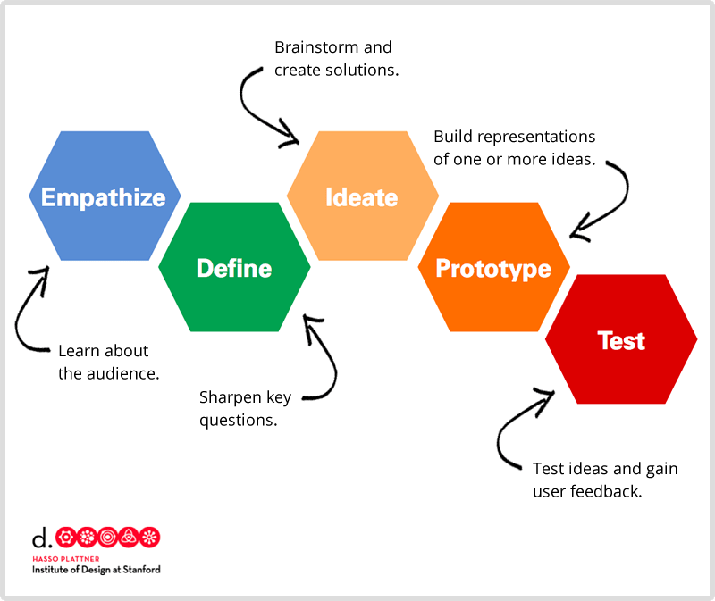
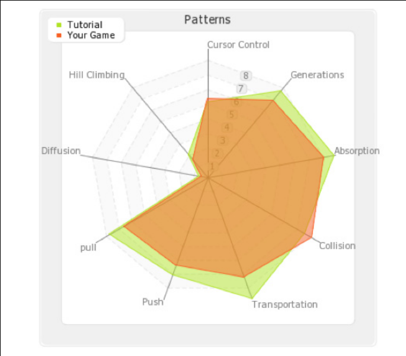

---
# all the regular stuff you have here
zotero:
  scannable-cite: false # only relevant when your compiling to scannable-cite .odt
  client: zotero # defaults to zotero
  author-in-text: false # when true, enabled fake author-name-only cites by replacing it with the text of the last names of the authors
  csl-style: harvard-manchester-metropolitan-university # pre-fill the style
layout: post
categories: chapter
title: 2. Literature Review

---
-   [Literature Review](#literature-review)
    -   [Research Questions - July
        2024](#research-questions---july-2024)
    -   [Introduction](#introduction)
    -   [Context of game making and digital projects at home and other
        informal
        settings](#context-of-game-making-and-digital-projects-at-home-and-other-informal-settings)
    -   [A review of relevant research informing computer game design
        and programming
        (CGD&P)](#a-review-of-relevant-research-informing-computer-game-design-and-programming-cgdp)
        -   [Barriers to participation in game
            making](#barriers-to-participation-in-game-making)
        -   [Exploring pedagogies of constructionist
            gaming](#exploring-pedagogies-of-constructionist-gaming)
        -   [Papert, Resnick & Constructionism and overlaps with in a
            socio-cultural approaches to
            pedagogy](#papert-resnick-constructionism-and-overlaps-with-in-a-socio-cultural-approaches-to-pedagogy)
            -   [Socio-cultural approaches within constructionism and
                their
                limits](#socio-cultural-approaches-within-constructionism-and-their-limits)
            -   [(Why not use
                constructionism)](#why-not-use-constructionism)
        -   [Creative Family Learning - A constructionist case study in
            non-formal learning
            environment](#creative-family-learning---a-constructionist-case-study-in-non-formal-learning-environment)
    -   [Pedagogies to support game making via
        coding](#pedagogies-to-support-game-making-via-coding)
        -   [Design frameworks using
            stages](#design-frameworks-using-stages)
        -   [Project-based learning (PBL)](#project-based-learning-pbl)
        -   [Pair programming & social/collaborative
            coding](#pair-programming-socialcollaborative-coding)
        -   [Use Modify Create](#use-modify-create)
        -   [Curricular concepts, semantic waves,
            LOA](#curricular-concepts-semantic-waves-loa)
            -   [Semantic Profiles and
                Waves](#semantic-profiles-and-waves)
        -   [PRIMM](#primm)
        -   [Limits of the Sociocultural ideas in UK computing research
            (above)](#limits-of-the-sociocultural-ideas-in-uk-computing-research-above)
        -   [Half-baked games as
            Microworlds](#half-baked-games-as-microworlds)
        -   [Design patterns](#design-patterns)
        -   [Game(play) design patterns](#gameplay-design-patterns)
    -   [Programmes working to address
        challenge](#programmes-working-to-address-challenge)
        -   [Coding club(houses) & Grass Roots community
            responses](#coding-clubhouses-grass-roots-community-responses)
            -   [UK coding clubs: Code Club, Coder Dojo and Raspberry
                Jam](#uk-coding-clubs-code-club-coder-dojo-and-raspberry-jam)
        -   [Game competitions](#game-competitions)
        -   [Educational Game Jams](#educational-game-jams)
        -   [The Fifth Dimension](#the-fifth-dimension)
        -   [A final reflection](#a-final-reflection)
    -   [Synthesis of chapter / discussion / problem
        statement](#synthesis-of-chapter-discussion-problem-statement)
        -   [The problem statement of the
            thesis](#the-problem-statement-of-the-thesis)
            -   [pedagogies exist but more are
                needed](#pedagogies-exist-but-more-are-needed)
        -   [Link to the next chapter](#link-to-the-next-chapter)
    -   [Holding Zone / For the Chop?](#holding-zone-for-the-chop)
    -   [Barriers to participation in game making practices (explored in
        contextual
        settings)](#barriers-to-participation-in-game-making-practices-explored-in-contextual-settings)
        -   [Institutional Barriers - related to UK School
            context](#institutional-barriers---related-to-uk-school-context)
        -   [Technical Barriers - Difficulties in learning to
            program](#technical-barriers---difficulties-in-learning-to-program)
        -   [Cultural / Identity barriers to participation in
            ...](#cultural-identity-barriers-to-participation-in)
            -   [Barrier - Identity and computer
                cultures](#barrier---identity-and-computer-cultures)
        -   [Barrier - unfamiliarity with support
            practices](#barrier---unfamiliarity-with-support-practices)
        -   [Outlining cultural barriers / aspects of game
            making](#outlining-cultural-barriers-aspects-of-game-making)
    -   [Game making and coding and in schools and formal
        education](#game-making-and-coding-and-in-schools-and-formal-education)
        -   [Coding and Computing as a School Subject in the
            UK](#coding-and-computing-as-a-school-subject-in-the-uk)
    -   [Context of game making and wider digital making and culture
        home and informal
        settings](#context-of-game-making-and-wider-digital-making-and-culture-home-and-informal-settings)
        -   [On games as a home and informal
            culture](#on-games-as-a-home-and-informal-culture)
        -   [Context of Home Education and family
            learning](#context-of-home-education-and-family-learning)
    -   [Game making and maker culture in non-formal learning contexts
        and third
        spaces](#game-making-and-maker-culture-in-non-formal-learning-contexts-and-third-spaces)
        -   [Physical spaces which suit non-formal
            approaches](#physical-spaces-which-suit-non-formal-approaches)
            -   [An area of tension to address - limited leaner choice
                in process if driven by
                curriculum.](#an-area-of-tension-to-address---limited-leaner-choice-in-process-if-driven-by-curriculum.)
        -   [Sketchy pedagogies](#sketchy-pedagogies)
        -   [Funds of knowledge and third
            space](#funds-of-knowledge-and-third-space)
        -   [Third spaces and the context of this
            study](#third-spaces-and-the-context-of-this-study)
        -   [Game making as a fund of
            knowledge](#game-making-as-a-fund-of-knowledge)
            -   [Play circles and MOE as a third
                space](#play-circles-and-moe-as-a-third-space)
        -   [Work in non-formal settings drawing on home
            interests](#work-in-non-formal-settings-drawing-on-home-interests)
        -   [Mozilla - Teach the Web as context and
            community](#mozilla---teach-the-web-as-context-and-community)
            -   [Code playgrounds - TOO SPECIFIC? MOVE OR SUMMARISE AND
                MERGE
                UP](#code-playgrounds---too-specific-move-or-summarise-and-merge-up)
        -   [Mantle of the Expert - processes drama used in teaching
            technology](#mantle-of-the-expert---processes-drama-used-in-teaching-technology)
        -   [Situating Computational thinking within curricular
            concerns](#situating-computational-thinking-within-curricular-concerns)
        -   [Studies exploring CT as an pedagogical framework to support
            learning computer
            coding](#studies-exploring-ct-as-an-pedagogical-framework-to-support-learning-computer-coding)
    -   [To perhaps add to Lit REVIEW](#to-perhaps-add-to-lit-review)
        -   [Game making studies addressing gender and
            race](#game-making-studies-addressing-gender-and-race)
    -   [Project Based Learning (PBL)](#project-based-learning-pbl-1)
        -   [Project Based Learning as an inclusive
            pedagogy](#project-based-learning-as-an-inclusive-pedagogy)
        -   [Complications with Project Based
            Learning](#complications-with-project-based-learning)
        -   [Game making and Project / Problem Based
            Learning](#game-making-and-project-problem-based-learning)
        -   [PBL and Authenticity in the domain of teaching
            programming](#pbl-and-authenticity-in-the-domain-of-teaching-programming)
        -   [Issues of Inclusion and PBL addressed through UDL
            principles](#issues-of-inclusion-and-pbl-addressed-through-udl-principles)
        -   [MDA and conceptual game elements
            framework](#mda-and-conceptual-game-elements-framework)
    -   [Synthesis of chapter / discussion - PREVIOUS
        VERSION](#synthesis-of-chapter-discussion---previous-version)
        -   [Problematising distinctions between instruction-based
            tutorials and unguided approaches - towards guided
            participation - FOR
            DISCUSSION](#problematising-distinctions-between-instruction-based-tutorials-and-unguided-approaches---towards-guided-participation---for-discussion)
        -   [Deficit of cultural processes & appropriate frameworks to
            support community-based coding for
            beginners](#deficit-of-cultural-processes-appropriate-frameworks-to-support-community-based-coding-for-beginners)
            -   [Supporting roles and social practices to support
                learners](#supporting-roles-and-social-practices-to-support-learners)
        -   [Tensions surrounding authenticity of tool
            use](#tensions-surrounding-authenticity-of-tool-use)
        -   [Sythetis of current Responses to challenges presented -
            MOVE
            LATER?](#sythetis-of-current-responses-to-challenges-presented---move-later)
        -   [Synthesis and analysis of models of responses to address
            the
            problem](#synthesis-and-analysis-of-models-of-responses-to-address-the-problem)
            -   [Financial challenges](#financial-challenges)
        -   [Removed](#removed)

# Literature Review

### Research Questions - July 2024

1. What contradictions arose in participation in this research's game coding processes and what pedagogical tools and processes are available to address these contradictions?
2. How can game design patterns support the development of computational fluency in novices?
3. How can learners build agency in an evolving community of game makers?

## Introduction

<!-- **Specifics of structure**

- contextrs
  - Why make games for education?
    - a review of the literature
    - motivation for making games
  - informal (vs formal) context of game making
    - barriers in general - and especially to informal
  - Programs working to address challenges - and house informal pedagogies (move up?)
- Pedagogies & Relevant Game Making Studies

  - Design (thinking) stages
  - Semantic waves and Primm
  - umc
  - Microworlds / Half baked games as constructionist Environments
  - Pair programming
  - Game Design patterns
- Existing responses
  - supporting digital projects - Kemp
  - Resource provision & cpd
  - Connected learning -
  - RL Community Responses
- Conclusion
    - Summary
    - Problem statement  
    - Link  -->

This chapter reviews the literature to summarise research  addressing the aims of this study. It explores several broad themes to establish a comprehensive understanding of the field. Firstly, I examine the findings of research and reviews in the areas of computer game design and programming. Following this, I outline key barriers to participation to game making identifying factors of technical, cultural, and practical dimensions. The review then delves into key pedagogies of game making and digital making. A significant focus is placed on the use of game design patterns (GDPs), where I highlight their use in computing education. This includes analysis of a strand of research investigating the use of collections of GDPs by novice game designers. Additionally this chapter examines the learning characteristics of informal settings for game making such as, code clubs, competitions and game jams. Subsequently, I explore how this review has informed the proposed problem statement of this thesis, emphasising the need for developing novel and robust pedagogies in this area which support learner agency. This sets the stage for subsequent exploration of agency in Chapter 3, which outlines the the theoretical framework of the study. By addressing these themes, the literature review not only situates the current study within the broader academic discourse but also underscores the importance of innovative pedagogical approaches in fostering inclusive game making communities.

## Context of game making and digital projects at home and other informal settings

The processes and motivations driving of home education are varied [@fensham-smith_invisible_2021]. These motivations are often categorized into two broad streams: pedagogy and ideology [@galen_home_1991; @rothermel_can_2003]. Addressing ideology, some families choose home education to limit their children’s exposure to mainstream values, such as religious beliefs or consumerist ideals. In terms of pedagogy, popular concepts within home education circles include unschooling and deschooling. Holt’s concept of unschooling [@gray_challenges_2013] emphasises facilitating learning by drawing out children's interests through everyday activities. Illich’s work on deschooling promotes the idea of _webs of learning_ [@illich_deschooling_1971], where learners access educational experiences in varied contexts based on their interests and needs, rather than relying on a single educational institution as the sole source of knowledge. Many home-educating families actively seek and establish networks, using friendships, social networking groups, and email lists to share opportunities and collaborate on learning activities [@doroudi_relevance_2023]. The game-making club that forms the basis of this research can be viewed as one node within the complex web of learning that participating families engage with.

The term informal is examined briefly here using two dimensions: setting and educational structure. While definitions of informal education are complex, the term generally refers to learning that occurs outside a traditional school environment  [@erstad_identity_2012]. However, as Sefton-Green [@sefton-green_literature_2006] notes, formally structured learning can take place in informal settings, and vice-versa. Others writers [@eshach_bridging_2007, p. 173; @werquin_recognition_2009] use the term "non-formal" describe learning that happens outside of formal institutions,  which may involve little instruction but still comprises a carefully planned learner experience, contrasting with both formal and unstructured (informal) learning. This study uses the term "non-formal" in this way, while "informal" is used more loosely to indicate learning activities happening outside a classroom lesson.

Turning to the structural dimension of education, there is also a lack of a clear division between formal and informal approaches  [@rogoff_organization_2016]. Rogoff outline a false dichotomy between _children-led_ (based on free exploration), and _adult-led_ (focused on direct instruction) approaches [@rogoff_observing_1995, p.211], proposing instead a more complex community-based understanding of learning that includes concepts of guided participation and apprenticeship [@rogoff_developing_1994]. These concepts are explored in more detail in the following chapter. For now, it is sufficient for the discussion of this chapter, to introduce guided participation as a process of active involvement in cultural and social activities, under the guidance of more experienced individuals under the guidance of more experienced members, offering an alternative to the simplistic children-led/adult-led spectrum.

## A review of relevant research informing computer game design and programming (CGD&P)

Before addressing studies directly focused on computer game design and programming (CGD&P), it is relevant to examine an area that in part stimulated the interest and motivation to explore the area of game making as a potential vehicle for diverse learning outcomes: specifically digital media and game making, and meta-gaming in informal communities. Observations of young people's enthusiastic involvement in online communities discussing gaming culture and related creative activities sparked questions on how to leverage this interest for other educational aims [@gee_what_2004; @papert_mindstorms_1980]. Gee [@gee_what_2004] frames these informal, often online communities as _affinity spaces_ where activities and culture created around games are termed _meta-gaming_. He examines how shared discourses and emerging identities develop within these spaces. Researcher Mizuko Ito's ethnographic approach to studies of informal digital consumption and making in the home [@ito2013connected; @ito_hanging_2010; @ito_living_2009], charts a progression in proficiency of young makers of digital products within online communities.  This approach, connecting the affordances of new online tools with the sociocultural view of learning as embedded within social and cultural contexts, is well represented via case studies and is framed a pedagogical approach described as _Connected Learning_ in a book of the same name [@ito2013connected]. One of the contributors, Sefton Green [@sefton-green_mapping_2013] explores the wider context of digital making including anxieties around the use of digital technology by young people and and it's alignment with valued digital skills required by the workforce. He notes both the potential and current lack of research on the transfer of learning opportunities and learner trajectories between informal experiences, formal learning settings and professional destinations.  

<!--
@erstad_identity_2012
The practical and and cultural difficulties of undertaking a project-based approach within the curriculum are significant. Factors of difficulties associated with technology projects compound difficulties.
SUPPLEMENT THIS WIHT POINTS FROM SEFTON GREEN. -->
<!--
    David Buckingham’s (2003) review of media education described a long history of how making can support critical understanding, and how this can encourage a more critical and contextualised understanding of production and the making process. This additionally meshes with constructivist beliefs in how making is a better way of understanding than simple instruction (Papert, 1993), and lies at the heart of some of the new orthodoxies about critical participation (Jenkins et al, 2007) [@sefton-green_mapping_2013]-->
<!-- SF mentions Mozilla webmaker tools, computer club house, physical computing, hacking a pedagogy - in chap3 on informal approaches.   -->
<!-- Gee also investigate a learning experiences is founded on his understanding of  -->
<!-- Barron and Livingstone have outlined the advantages and processes involved in family involvement of technology use and learning in the home. -->

<!-- ### A review of studies on computer game design and programming (CGD&P) -->

<!-- ### Potential benefits of computer game design and programming (CGD&P) -->

Turning more specifically to studies on computer game design and programming (CGD&P), several notable reviews explore the motivations, processes, and impacts of making games for learning  [@denner_does_2019; @earp_game_2015; @hayes_making_2008; @kafai_constructionist_2015-1; @gee_video_2016]. While Gee and Tran [-@gee_video_2016] discuss the diverse tools available for game design, Hayes and Games [-@hayes_making_2008] take a broader approach, identifying four main motivations for CGD&P: learning computer programming skills, deepening subject knowledge of other curricular subjects, involving more girls in computer programming, and using game design to understand design concepts. Kafai and Burke's review [-@kafai_constructionist_2015-1] , which synthesises 55 relevant papers within the framework of constructionist gaming, largely maintains these categories but adds new dimensions. These include studies addressing race-related barriers to participation and social dimensions such as pair programming, social skills, self-reflection, cultural awareness, and a range of technical abilities that facilitate participation in the information society. Collectively, these competencies are framed as 21st Century Skills [@bermingham_approaches_2013]. A review by Denner and colleagues [@denner_does_2019] focuses on computer science learning, breaking this broader concept into subcategories of programming knowledge and problem specification and design.

The narrative and celebratory nature of Kafai and Burke’s review contrasts with the systematic approach of Denner et al. [@denner_does_2019], who make more modest claims. However, Denner et al.'s finding are also positive about the the effectiveness of CGD&P to develop computing science learning and motivation. While Kafai and Burke’s review highlights the broad potential of CGD&P and the barriers to participation (explored in the next section of this chapter), their discussion of pedagogies is limited and expressed in general terms [@illingworth_review_2017]. Denner et al. [@denner_does_2019] outline three strands of pedagogical interest: design-build-test, stepwise instruction, and social pedagogical approaches. However, these strands are described only in vague terms, which is frustrating given their stated intent to provide a systematic review and the lack of similar breakdowns in other reviews. Later in this chapter, I explore these strands and analyse the pedagogies used in this field in more detail.

<!-- THIS COULD BE A GOOD CHANCE TO GO INTO THIS MORE - ADN THEN DROP DESIGN STAGES ALTOGETHER FROM THIS THESIS!!! -->
<!-- Similarly, while studies on the community use of game making, in after-school and online settings exist [@kafai2012collaborative; @peppler_computer_2009; @luther_leadership_2011], details of pedagogies to develop community participation, as explored later in this chapter, are often scant.  -->

<!--
WHAT ABOUT FLUENCY?
In their project-based intervention, Girls Creating Games, Denner and Werner focused on pair programming of games to develop IT fluency, contrasting it to IT literacy [@werner_middle_2005-1] -->

<!-- Significantly, the review is structured around key areas of knowledge and skill development. The primary area involves of building subject knowledge in educational settings in particular to develop coding and computing skiWhile the focus of lls and STEM subjects. -->

<!-- Of particular interest to this study are studies exploring the social and cultural dimensions of CGD&P. While studies on pair programming techniques in CGD&P [@denner_computer_2007; @werner_can_2009] yield positive results, including increased confidence in coding and articulation of problems arising,  -->

<!-- This deficit in addressing and assessing pedagogies used, is reflective of a comparatively weakness of concepts of pedagogy within the wider constructionist theory, a dimension which is explored after the next section barriers to participation. -->

<!-- In related work, Robertson's drew on storytelling games, to access participant knowledge in accessible ways []] -->
<!-- What is missing?
Other studies show games as a potential vehicle for exploring issues involving race, sex, social issues. -->

### Barriers to participation in game making

This section explores relevant studies to outline the barriers to participation in CGD&P, addressing three key areas: technical barriers, access to suitable technology and environments, and issues related to identity and values.

CGD&P inherits some of the intrinsic difficulties associated with computer programming [@sentance_teaching_2019; @gomes2007learning; @joao_cross-analysis_2019]. These difficulties include the complexity of programming syntax, the challenge of understanding abstract concepts, and problems with transferring skills between different contexts [@gomes2007learning; @rahmat_major_2012]. To address these issues, specialist coding tools, such as block-based coding environments, have been developed for novice coders, particularly younger audiences. These tools aim to simplify coding syntax, project organisation, and the overall complexity of the coding environment [@yu_survey_2018]. However, this simplification creates a tension between using more authentic programming languages and relying on scaffolded, specialised approaches  [@joao_cross-analysis_2019]. Sefton-Green [-@sefton-green_mapping_2013] explores this tension in the context of digital making, contrasting Mozilla Webmaker tools (which use web languages like HTML, CSS, and JavaScript) with block-based systems like Scratch, which can obscure learners from authentic code languages.

<!-- Through a literature review on this topic, we aim to organize and   systematize the main difficulties into four dimensions of analysis: (i) subject and complexity of languages; (ii) technologies and applications; (iii) teachers and teaching methodologies; and (iv) pupils’ skills[@joao_cross-analysis_2019] -->

<!-- #### Access to  CGD&P -->

Regarding access to CGD&P, one significant barrier is the inequality of access to participatory culture communities. Historically, the lack of access to the necessary technology, such as high-cost computers, was a major issue [@resnick_computer_1996]. While equipping community centres with computers may have addressed some of these concerns, technological access is only one dimension of the problem. Sefton-Green [-@sefton-green_mapping_2013] argues that motivated and capable facilitators are crucial for enabling participation, suggesting that even with improved access to equipment, many young people still face barriers. The full potential of online metagaming communities, as described by Ito and Gee [-@ito_hanging_2010; -@gee_what_2004], remains largely inaccessible to the majority. Among those who do participate, creative activities that result in finished digital products are rare, with studies such as Luther et al. [-@luther_why_2010] revealing an 80 percent failure rate in collaborative media projects within the New Grounds community.

Addressing barriers linked to identity and values, a key theme in CGD&P is the potential for games to increase inclusivity for those traditionally excluded from computing cultures [@kafai_beyond_2014]. There is significant potential to leverage home interests in computer games to bridge into more structured computing activities. The widespread appeal of casual and retro gaming, alongside the proliferation of retro games in popular culture, offers a rich repository of knowledge that can be utilised in various educational contexts [@moje_working_2004]. However, Kafai and Burke balance this potential with complex issues of the gender representation associated with gaming culture [@kafai_diversifying_2017].

Addressing gender-based barriers to participation, Papert and Turkle [@papert_epistemological_1990] identified some girls' alienation from abstract computing approaches. They emphasised the need for diverse teaching and learning styles to address issues surrounding the early socialisation of women and girls, advocating for the inclusion of personal and concrete working styles. Denner and colleagues [@denner_what_2008; @angelides_beyond_2014] highlighted that inclusive gender practice in game making involve allowing participants choice over both the content of their games and the dominant mode of play (game mechanics). Their findings present a nuanced view of girls' interests in game genres and support research cautioning against gender stereotyping and rigid identities in this area [@pelletier_gaming_2008]. Kafai and Burke [@kafai_beyond_2014] address gender identities within game design by advocating for the creation of new communities and learning environments that align with participants' values, rather than attempting to draw girls into existing, male-dominated spaces. Similarly, Buechley et al. [@buechley_lilypad_2008, p. 431]question, “How can we integrate computer science with activities and communities that girls and women are already engaged in?”

Margolis et al. [@margolis_stuck_2008;] outlined barriers contributing to a racial gap in computing participation and achievement in the US, including feelings of isolation, limited access to computing opportunities, and a lack of social support. DiSalvo and colleagues investigated these barriers within a game testers programme, examining how an interest in computer games could motivate access to computing education [@disalvo_saving_2014; @disalvo_glitch_2009-1; @disalvo_learning_2008]. Their findings indicated that activities should not only be engaging but also align with the underlying values of the programme’s young, African American male participants. Vossoughi et al. [-@vossoughi_making_2016] critique digital making cultures, stressing the need to integrate not only the values but also the cultural experiences of working-class students and students of colour into the making process.

<!-- To address issues of confidence interacting in online communities, Roque's FCL study aimed to move online community interaction into a face to face settings [-@roque_family_2016]. The use of facilitators who were trained to recognise the helping behaviours of parents. -->

### Exploring pedagogies of constructionist gaming

<!-- Before turning to a more detailed exploration of distinct pedagogies used in or appropriate for CGD&P,  -->

<!-- Turning first to how games are special.
However, while the inclusion games clearly favour these elements, the  use of home interests and the use of a playful approach are not unique to game making.
Kafai and Burke

also note the benefits to exploring games over other types of media projects, including their inherent interactivity and rules based systems, which facilitate the exploration of systems thinking and design approaches [@games_gamestar_2010; @tekinbas_gaming_2014; @games_design_2008]. However, in order to foreground those elements, programming is dropped from the tool to reduce complexity. -->

This section explores Kafai and Burke’s framing of constructionist gaming as a dominant voice in the field, situating the concerns of this thesis within the existing body of research. To achieve this, I will examine criticisms of constructionism, particularly its perceived lack of a specific pedagogical approach.

Laurillard provides a clear summary of constructionism as a distinctive and productive pedagogy but notes that ‘theoretical underpinnings of constructionism are difficult to pin down in most of its literature’ [@laurillard2020significance, p.29]. Her definition is based on Papert’s vision of a publicly shareable project within a microworld environment (a concept explored later in this chapter), designed to foreground specific concepts. However, this narrow and clear definition contrasts with the broader use of the concept by Resnick [-@resnick2014give]  and other constructionist researchers, particularly in their advocacy for software and hardware tools that promote an open-ended, child-led approach to designing engaging and relatable objects of interest.

Research on constructionism as an educational approach has increasingly centred on the design affordances of researcher-created toolkits and communities that facilitate personal understandings of knowledge  [@vossoughi_making_2016]. When pedagogy is addressed in recent constructionist studies, it generally takes the form of broad principles of design and project-based approaches [@resnick_scratched_2012; @resnick_lifelong_2017], which will be explored further in this chapter. Recently, Kafai has revisited the topic to emphasise the importance of a situated and critical approach to coding practices [@kafai_revaluation_2022; @kafai_theory_2020]. However, this work remains broad, and specifics on pedagogical scaffolding are still lacking.  Vossoughi's [-@vossoughi_making_2016] critique of constructionism from a socio-cultural and egalitarian perspective highlights this absence of _intentional forms of pedagogy_. She attributes this gap to a focus on tools rather than on sociocultural contexts and the development of social relationships as part of the making process.

<!-- Denner and colleagues' review of this area, using the term CGD&P rather than constructionist gaming, uses a broad categorisation of pedagogies used in studies . -->

Vossoughi and other researchers also highlight political and social concerns associated with constructionism
[@thumlert2018learning; @vossoughi_making_2016]. They argue that a constructionist approach can implicitly favour coding as a pathway to joining the computer programming industry and developing employability skills in young people. Thumlert and colleagues caution against the appropriation of skills such as creativity and 'design thinking', which they argue are increasingly co-opted by market-driven agendas rather than being used for critical and emancipatory purposes [@thumlert2018learning, p.4]. They also warn that this positioning could lead to the integration of constructionist approaches into instruction-based models that are narrowly focused on curricular concerns, rather than fostering the development of computational fluency, which supports learners’ expression within a community [@thumlert2018learning].

Given the importance of more intentional pedagogical approaches in this area and the lack of detail in the reviews of CGD&P described above, the following sections will detail several key pedagogies used in this area.

### INTEGRATE ABOVE - Papert, Resnick & Constructionism and overlaps with in a socio-cultural approaches to pedagogy

#### Socio-cultural approaches within constructionism and their limits

Look the potential of at constructopedia samplers
[@papert_technological_1995], an attempt using the computer clubhouse to make this happen using the potential of the internet [@chapman_pearls_2006].

Finally the remix element of Scratch serves this purpose, but in an embedded way distinct from the original purpose of the  constructopedia.

This is missing from the reviews of CGD&P

Roque in Family Creative Learning, addressed learning types, but limited in conceptual approaches.

Computational Fluency,

#### (Why not use constructionism)

Constructionism is a popular guiding theory in game making studies, illustrated in particular, by Kafai and colleagues outlining the value of making _constructionist_ games [kafai_constructionist_2015]. Despite the value of these contributions to this domain of research, this section explains why I have chosen activity theory as a better fit for the aims of this thesis. I have been inspired by Papert and colleagues celebration of concrete approaches to creating digital project bricolage approaches and pioneering work of the resulting constructionist school, centred around MIT media lab, in design software and tools for students to learn in exploratory, project oriented ways.

While constructionism has been used as a "epistemological paradigm, a learning theory and a design framework" [@kynigos_constructionism:_2015], it is the latter that I find most productive due to its comparative weakness as a more general theoretical framework.  

Instead, Activity theory as a theoretical framework provides tools to study the impact of past cultural activity of participants on present, emergent activity. CHAT also provides powerful concepts to explore a complex and dynamic picture of participant agency. Key characteristics of constructionist design principles are explored in Chapter 2 where I acknowledge their significant contribution to the evolution of the learning design outlined in Chapter 4. In these chapters, I also compare these principles with similar concepts used by sociocultural research in HCI studies, for example Nardi and Kaptelin's interpretation of affordances as a from of mediated action [@kaptelinin_affordances_2012].

<!--
In their review and a critique constructionist approaches to game making, Thumlert et al agree with the potential of a constructionist approach to develop 21st century skills, -->

<!-- It is important, in the interests of balance, to separate out some of the positives from the limits here. The school has done good work (tools, design principles) that can be built on. -->

<!-- A key advantage of viewing the domain from a contextual point of view is allowing a more nuanced exploration of the motivations for participating or not participating in game making. There is a danger that lack of participation in computer science can be viewed from a deficit perspective, e.g. what skills or confidence to students lack. Studies from a sociocultural perspective allow for a deeper exploration of interests, values, and practices from outside of the immediate learning environment. -->

<!-- **Returning to developing Computational Fluency**
PERHAPS NOT - MORE OF A BRIDGE TO NEXT SECTION PERHAPS

To refocus this review, let's return to focus of computational fluency as the focus for one of the research questions. Why choose this concept rather that broader 21 Century skills? -->

<!-- In their project-based intervention, Girls Creating Games, Denner and Werner focused on pair programming of games to develop IT fluency, contrasting it to IT literacy [@werner_middle_2005-1] -->

### Creative Family Learning - A constructionist case study in non-formal learning environment

MOVED UP TO CONSTRUCTIONIST ABOVE?

<!-- There is limited research on how to create learning communities making games for educational purposes. Existing research [@xiao_fostering_2007] has close parallels with project approaches and has a focus on fostering online collaboration and resources sharing. Many popular and well researched online communities exist [scratch, itch.io, new grounds](Bruckman).  -->

Correa (2015), explores the role of children as brokers of technology in family environments.

The work of Roque in Family Creative Learning program is of note in the way that family members are brought directly into the making process to overcome barriers to computer coding. In response to the limitations of accessibility of online participatory culture  [@roque_family_2016]  CHECK THIS AND SAY HOW, Roque [@roque_family_2016]  FCL study addressed it with face to face session with help from family members. In asking is how can facilitators help develop participation in community activities [@roqueBecomingFacilitatorsCreative2018], Roque operationalises Barron's work on parental roles in a making environment [-@barron_parents_2009]. The research team created a detailed guide to replicate the programme [@leggett_family_2017].

Roque makes a convincing case for the unpicking of the supportive and collaborative roles of parents and facilitators to build this capacity and awareness of family learning roles. However, while the design of the FCL programme was effective to build parental confidence and to increase overall accessibility to the process , it left questions unanswered about the effectiveness of the process to enable further learning at home after the programme end. In addition, similar to the computer clubhouse model, it is noteable that there are potential difficulties of scaling this hybrid approach (FCL) in terms of the expert facilitator help needed.

To compare with learning in more formal structured, and more naturalistic learning environments, it best matches a more optimal approach to game making with families. It is a shame that FCL is not described in more detail with sociocultural concepts.

## Pedagogies to support game making via coding

One of the main themes of this review is to explore the pedagogies available to support coding, particularly in relation to Research Question 1 (RQ1). In the context of activity theory, pedagogy can be framed as pedagogical tools and processes, functioning as a type of mediational strategy. The following discussion focuses on pedagogies that are especially relevant to digital making, specifically game making, in informal, real-life (as opposed to online) communities. Denner's [-@denner_does_2019] systematic review of game making studies, identifies three main pedagogical streams: design frameworks (Design-Build-Test), step-based pedagogies, and social approaches. This section will broadly follow these streams. First, I will review design thinking approaches and project-based learning. Next, I will outline pedagogies centred around scaffolding game production through progressive steps, such as the Use, Modify, and Create (UMC) framework. Finally, I will examine the social and cultural aspects of coding clubs and informal programmes that serve as venues for CGD&P.

<!-- ## Project-based learning / Social approach / Communities of Learners.

- Key features of PBL - from academic sources up to date.
- Benefits of PBL, autonomy / agency /
- Creating a community of learners
- Examples of how this has been applied in game making or creative coding case studies. (RQ2) -->

### Design frameworks using stages

Many design frameworks exist in diverse areas of production with varied degrees of adoption. One stream in CS stems from engineering and design thinking [@resnick_all_2007; @winarno_steps_2020-1].

Resnick [-@resnick_scratched_2012] describes the foundations of the design-based approaches in education as; engaging in design activities, exploring personally meaningful topics, collaborating with others, and deepening understanding through reflection. The key reason to adopt these principles is to increase engagement via sustained participation in computing projects for a broad range of learners.  To illustrate this design-based approach Resnick advocates a _creative cycle model_ [@resnick_lifelong_2017]. The five circular stages are; Imagine, Create, Play, Share, Reflect and returning to Imagine once more. This model is a more adapted from many similar expressions of iterative design stages in the domain design thinking to focus on more individual ideas of creativity. See figure 2.x for one example from the Stanford dschool  [@dam_5_2024].

{width=90%}

Figure 2.x. Design thinking via design stages model from Stanford dschool

<!-- {width=90%}
Figure 8.1. Diagram of five circular stages; Imagine - Create - Play - Share - Reflect - Imagine  
Diagram [@resnick_lifelong_2017] -->

One of the sources for sustained engagement is when, as part of the iterative process, learners are able to test and then revise their creation or experiment based on their own evaluation. Another factor is the importance of a community in the design process, as a real audience for creations, as a source of inspiration and as peer evaluators in the testing process.

<!--
A typical framework from teach engineering website [@noauthor_engineering_nodate], takes the form of
 -->

While the value of design thinking stages for educators planning sessions seems clear, and elements of this framework are included in early literature to help adoption of new computing curriculum in UK [@csizmadia_computational_2015],  there is little research exploring how the stages could be used by learners to scaffold their own design process when engaging in making digital products. Resnick and Brennan [@mouza_imagining_2013] focus on the affordances of tools and communities to support all aspects of students work on design stages without suggesting any processes from a teacher of student perspective. One exception is the work of Zainal et al [@zainal_review_2021], using the Stanford dschool design thinking framework [@dam_5_2024] to structure the work on students in undertaking IoT project work.
The authors, note the lack of research investigating the  potential of this approach and call for more work to be done in this area.
ADD TO THE PROBLEMS STATEMENT.  

The model is similar to the ADDIE model from instructional system design: Analysis, Design, Development, Implementation and Evaluation. The discipline of teaching engineering also has a similar design stage cycle with many contesting variations [@winarno_steps_2020]. Engineering is Elementary project adapted from the ABET (Accreditation Board for Engineering and Technology) guidelines [@syukri_impact_2018] involves the following steps; Ask, Imagine, Plan, Create, Test, Improve, Share [@hester_engineering_2007]. It has been adopted by the area of computing is one used in a recent book on coding by Bers [@bers_coding_2021]. HOW IS THIS USED? AS A PEDAGOGY?

Thus, while the ethos and benefits of this approach are convincing RESNICK'S TAKE, what is not clear however is who this framework is for (either for designers, facilitators or participants) or how it can be activated in the process of facilitating project work.  

### Project-based learning (PBL)

<!-- As outlined in the introduction, this thesis, while guided by constructionism as a design approach, uses AT as a theoretical framework.
In addition, this section outlines the value of PBL as a more developed framework as well. -->

**PBL provides a wide scope of research detailing pedagogical approaches aligned with the aims of this research.**

<!-- There is a clear alignment between the potential of making games and other media products as an educational activity and the agenda of project-based learning, particularly in the to develop skills suited to the modern workplace (21st Century skills).  -->

The educational strategy of learning how to code games in a informal setting lends itself to a project based learning (PBL) approach. The following section explores relevant elements of PBL pedagogies, where possible making alignments with existing game making studies. In broad terms, PBL is an educational strategy which advocates: learner choice in projects which increases motivation; authentic and shareable project outcomes and learning environments to encourage peer feedback and reflection;  iterative projects work supporting student mastery; and challenging goals and guidance in goal setting aiding self-regulation in learners [@barron_doing_1998; @hernandez_aalborg_2015].

PBL requires learning environment and activities that allow for an active construction of knowledge by learners rather than one dominated by instruction [@kokotsaki_project-based_2016]. PBL pedagogy aligns with AT concepts of learning in that change happens via the use of artefacts use in a community [@gibbes_project-based_2014; @hung_activity_2000].

    <!-- Encourage Student Choice: Darling-Hammond et al. (2008), Larmer and Mergen- doller (2015a), Ravitz (2010), and Thomas (2000) all noted the importance of student choice, autonomy, and authority. [@kokotsaki_project-based_2016, p. 9] -->

Critics of PBL often wrongly conflate it with unstructured, _pure-discovery_ approaches [@kirschner_why_2006; @hmelo-silver_scaffolding_2007]. In formal education, contextual factors hinder the adoption of PBL challenge creative approaches in general. These include challenges of teaching to an exam-based curriculum, time allocated and other timetabling factors. While these are less applicable to informal settings, other challenges still exist including, lack of frameworks, expertise, confidence in facilitation [@ertmer_essentials_2015-1]. In addition, the range of applications and situated nature of the learning via PBL creates significant challenges in representation of practice, including communicating specific details of scaffolding used.

<!-- This alignment of approach also extends to some of the limits of PBL approach. The critique of PBL as 'pure discovery' learning is often misjudged, missing some of the less visible scaffolds often in place to support learner to access learning, and to reflect on learning that has taken place. -->

Studies and supporting resources advocating PBL articulate various procedural forms of scaffolding which facilitators can adopt, including those to aid group work, support reflection, and to structure knowledge sharing via project outcomes [@ertmer_essentials_2015-1; @pitot_establishing_2024]. An additional form of of PBL scaffolding, the restriction of choice of participants to reduce the possibilities for learners being overwhelmed, can expose a tension in relation to the value of student choice over project work [@ertmer_essentials_2015-1].

PBL can be effective in diverse fields of practice including: inclusive pedagogies [@leggett_impact_2021], and the use of appropriate "learning scaffolds" [@kokotsaki_project-based_2016, p. 8], language learning [@gibbes_project-based_2014], and digital making [@weng_characterizing_2022].  However, due to the difficulty of generalising and abstracting frameworks linked to domain specific knowledge and processes, a gap exists in PBL literature regarding kind of scaffolding that might support the develop CGD&P more specifically.

<!-- It is of value to examine PBL literature detailing structure and pedagogical approaches in the area of digital product production and language learning. -->

<!-- Research in the area of digital media production using a PBL methodology exists

Gibbes et al's review of PBL in language learning from an activity theory perspective provides good foundational material for this study [@gibbes_project-based_2014]. -->

<!-- Given then broad benefits of PBL to make media, and returning to the claims around Kafai on constructionist games, it invites the question, is there anything particularly special about the use of games as a project? -->
<!-- **Returning to developing Computational Fluency**
PERHAPS NOT - MORE OF A BRIDGE TO NEXT SECTION PERHAPS

To refocus this review, let's return to focus of computational fluency as the focus for one of the research questions. Why choose this concept rather that broader 21 Century skills? -->

<!-- Elements of this framework are included in early literature to help adoption of new computing curriculum in UK [@csizmadia_computational_2015]. However little guidance is provide and not stream really followed up unlike the focus on computational thinking [@sentance_teachers_2015] -->

<!-- A wider review of design framework in STEM settings details discussion of varied definitions of stages themselves but less relating to the impact of the pedagogical use of design stages on learners [@winarno_steps_2020-1]. -->

### Pair programming & social/collaborative coding

In their review of the potential of CGD&P to encourage collaboration, Earp and colleagues found that "analysis of collaboration is mainly restricted to peer review and providing feedback" [@earp_learner_2013].

Pair programming, a common industry practice has recieved attention in educational contexts [@hanks_pair_2011]. Pair Programming groups students in pairs and divide coding two into two roles. One student undertakes hands-on coding while the other is free to think about more the abstract design of the overall program. A benefit of pair programming is to increase coding confidence as students build their experience of the different roles involved in coding. To help novice coders teachers should model and break down the processes involved.

Werner and colleagues [@werner_pair_2009; denner_computer_2007] investigate pair programming as way to adress gender gap and extending research on collaborative problem solving in computer coding.

They cite research challenging the gender aspect of bricolage / abstract duality, but propose a need for more research on programming styles and strategies [@denner_computer_2007] Their own research underlies that while pair programming is an inclusive strategy beneficial to all but in particular to narrow participation gaps due to gender and socio-economic factors [@werner_pair_2009, p.31].

In Denner's research, pair programming involved social learning elements and can model a greater choices for students in they way they solve problems and opportunities to develop identities. The process of building an identity in a community with the help of peers is key to a socio-cultural understanding of how learners pick up coding in a classroom (or other settings).

<!-- A summary of pair programming roles and tips on how teachers can help learners to adopt them in present in a Quick Read document from NCCE.[^6] -->

Werner et al draw on existing research on collaborative   'social reality or joint problem solving space' to scaffold the process of ideation [@omalley_construction_1995] and the role of friendly relations to develops these productive and sustained interactions [@mcdowell_pair_2006].

Bring in limits  and extension of research on pair programming to wider groups / more flexible processes [@preston_using_2006] -
- resource interdependence from Preston

Links to other pedagogies in this work.
UMC
and Use of game design patterns [@werner_computational_2020]

### Use Modify Create

The 'Use-Modify-Create' approach proposed by Lee and colleagues [-@lee_computational_2011] is particularly promising to counter issue of user anxiety and demotivation surrounding the difficulty of coding games. UMC evolved from research involving the use of game making and robotics to support computational thinking [@denner_computer_2012; @denner_using_2014; @werner_pair_2013; @werner_children_2014]. The model advocates the remixing of existing games to act as a scaffold to build the competence of the beginner coder. Learners are guided to progress in the complexity of their modifications, thus becoming increasing proficient in the recognition and use of computational concepts and structures [-@lee_computational_2011]

In the _Use_ stage, coders build a familiarity with coding interfaces, code structures and syntax through scaffolded approaches which involve interacting with the program code and what it produces. In the _Modify_ stage learners progress to working on real projects created by others. Learners deepen their knowledge of coding structures and practices by altering existing projects and templates to suit their own aims. _Create:_ After novice coders become more familiar with patterns of code design in use in the modify stage, they can progress to replicate such patterns in other code that they create from scratch.

A study involving five hundred 9 to 14 year-olds found that the UMC approach can balance a structured approach with more student-led exploration [@franklin_analysis_2020]. The researchers also found that the students enjoyed the UMC approach as they had more choice and agency in the process. This is supported by other research which compared UMC with a starting-from-scratch approach and found higher student engagement for those in the UMC group [@lytle_use_2019]. The researchers found that because students using UMC had more time to play around with code, they were able to add their own personal touches and that this ownership over the code sustained their continued engagement. While the scope of the study is limited, observations support motivation of UMC that this pattern of creation maintains higher level of engagement through reducing technical barriers to participation, and affording greater sense of learner's ownership over end project through greater choice over the final outcome.

**Research on UMC which develops learner choice**

<!-- NOTE - This may be moved to design chapter -->

UMC has been developed to be end with scaffolded set of choices.
In a study where students use a block based language to develop simulations - the authors note limits of study but are enthusiastic about providing a limited set of choices for final exploration within a limited time frame [@lytle_use_2019-1; @lytle_use_2019]

- Scaffold Students and Teachers- Providing the necessary programming blocks students need to complete a choice
- Differentiate Choices by Difficulty - create choice systems that have varying difficulty
- Create Choices that Show Visible and Immediate Changes
- Make things Complex, not Complicated
- Draw from Student Desires - students will engage more with the material, feeling like the creations are their own.

**LINK**
The main concept of UMC is remixing a game to build. Scratch has been instrumental in bringing this methodology into clubs and classrooms as an explicit feature of its online community. FIND SOURCE

<!--
  - Scaffold Students and Teachers- Providing the necessary pro-gramming blocks students need to complete a choice ala a Par-son’s Problem greatly reduces cognitive load, especially in activitieswhere lots of choices means lots of blocks. Similarly, giving teachers a “Cheat Sheet" of answers for each choice, scaffolds their abilityto act as a facilitator and debugger.

  Differentiate Choices by Difficulty- This time, challenge came from adding morec hoices, but each choice was relatively the samedifficulty. In the future, we wish to create choice systems that havevarying difficulty to give targeted tasks for each student skill level.

- Create Choices that Show Visible Change
  - Prioritize choicesthat produce immediate changes in the run of the simulation (e.g. anew animal appearing in the environment).Create Choices that Promote Content Inquiry- Our decisionto primarily focus on adding more animals came from the fact thateach new animal made the Food Web more complex.

  - Make things Complex, not Complicated- As demonstrated in Figure 2, each animal had relatively the same set of code blocks. In this way, a lot of choices were available without adding many additional necessary blocks for students.

- Draw from Student Desires- Some of the choice ideas (e.g. bear)came from responses from students in the ‘Fox-Only’ -->

### Curricular concepts, semantic waves, LOA

A common pedagogical strategy is to align learning activities with knowledge and competencies outlined by a curriculum. A common line of game making research follows this logic to align game making with curricular contents, in particular computational thinking concepts.  

Tedre and Denning's [-@tedre_long_2016] review of CT cautions against a too narrow definition of CT that highlights formal abstractions as represented by Wing's take on CT [-@wing_computational_2008]. This is not to argue that Wing's approach to CT is without technical merit [@lodi_computational_2021], rather that its adoption by educational bodies like CAS in the UK and similar bodies internationally has risks. The inclusion of formal CT frameworks in curriculum and formal testing has provoked mechanistic teaching of decontextualised concepts via formal teaching methods to the detriment of hands-on exploration and creation of personally meaningful projects [@resnick_coding_2020].

In teaching computing pedagogy the concept of levels of abstraction can be taught to students to help them understand the level of abstraction that they are working at [@statter_teaching_2016; @waite_abstraction_2016; @waite_abstraction_2018-1]. To quickly review LOA, the levels are Problem, Design, Code, Running the Code. And the purpose is, "Levels of abstraction has been interpreted as a hierarchy to enable teachers and learners to describe which level they are working at, rather than as a methodology for programming projects."[@waite_abstraction_2018]

#### Semantic Profiles and Waves

Introduction to semantic waves.  
[@maton_making_2013]

SWs - PICKED UP IN UK OFSTED report [@ofsted_research_2022]
https://www.gov.uk/government/publications/research-review-series-computing/research-review-series-computing

CT instruction can be aided with a focus of teachers on semantic profiles and waves.

Semantic profiles chart the use of more concrete (high semantic gravity) language and more abstract (high semantic density) concepts and patterns as they emerge in classroom situations [@macnaught_jointly_2013]. Exploring semantic profiles is being promoted by NCCE  an aid to teachers wanting to plan their lessons in a way that communicates the key abstract curriculum knowledge that students will need for exams, and to also allow them to put the concepts into practice to build real coding skills and to make valuable connections to personal experience. A Quick Read on semantic profiles is available on the NCCE website.[^2]

Research carried out by Curzon and colleagues [-@curzon_using_2020] in a computing education context outlines the value of semantic profiles in wave shape as opposed to a flatline which remains too much in concrete examples or more abstract concepts. This research highlights the value of unpacking, exploring and then repacking ideas during the course of a lesson. A student's understanding of a concept may deepen a little bit each time it is applied in practice and then reconnected with the abstract.

<!-- start with activities that allow the use of more concrete (high semantic gravity) language and then explore more abstract (high semantic density) concepts and patterns as they emerge in these authentic situations. -->

Figure 3.1 A Semantic Profile with Semantic Waves

Examples showing semantic wave profiles usually start with the process beginning with the abstract or with high semantic density. See Figure 1.1 for an example. The advice of starting with more abstract terminology and concepts may seem to be in opposition to the approach of Concreteness Fading as explained with the CRA method outlined above. However, on examination of the research example carried out in the research above, the process of starting with concepts may only involve giving a short outline of the concept that is being explored and saying that this will be illustrated in a following concrete activity.

### PRIMM

**PRIMM uses concepts of semantic profile to try to align instruction based approaches with a sociocultural approach (or at least some hands-on approaches)**

In proposing PRIMM Sentence et al highlights a debate in this field of a proposed deficit of exploration based, constructionism approaches by Grover [-@sentance_teaching_2019, p. 5], proposing greater instruction and guidance. To address this without fully embracing an instruction, expert-led approach, the author propose PRIMM model, signifying Predict, Run, Investigate, Modify and Make.

Thus, PRIMM extends the UMC model, Modify, adding three stages to the start. Learners are presented with a providing a concrete code example and predicting what it will do, checking the results against they running it. With guidance learners investigate possible changes that can be made to the code before modifying it. The final, Make stage (as with Create in UMC) suggests students creating programs or larger elements of code structures from scratch.

Noting recent calls align computing education with sociocultural approaches [@tenenberg_out_2014], the authors draw on concepts, of mediation and ZPD.
These principles are put into action, in part, through drawing on _carefully selected content_ from the social plane [-@sentance_teaching_2019, p. 2].

PRIMM has been developed with the the computing classroom in mind, drawing on concepts such as
differentiation to make concepts _accessible by all learners in a class_. Prediction of a code allows a whole class of learners to unpack and repack the  key computational concepts or process.

<!-- in a restricted time scale. -->
<!-- This process that supports formal problem solving, paper-based questions of the GCSE exams.  -->

While the importance of explicit instruction of concepts is outlined, there is no guidance on what concepts should be best explored via this pedagogy. Given the context of of computing, there may be an implicit assumption that teachers turn to the UK curriculum perhaps for guidance. To illustrate this, PRIMM has been implemented, in resources aimed at UK teachers, in a way that explicitly links to curriculum concepts.
https://www.barefootcomputing.org/resources/crystal-flowers-primm-1

Data from research, response of teachers .

PRIMM while suitable to schools, is not incompatable with informal environments, PRIMM process does not need to happen as whole group activity. For example teachers adapted the process, so quicker students did more than one.
In addition, the authors use the metaphor of learning coding as a multi-layered and faceted process like a patch work quilt. As learners develop coding practices then built up patches, each one making the participants' knowledge less _holey_.  (Clear, 2012) in [@sentance_teaching_2019, p.5].  The middle ground PRIMM aims for between instruction and free experimentation may align well with non-formal approaches in non-classroom settings.

PERHAPS IN SYNTHESIS - MOVE?
As a critique of PRIMM, while the authors do link to some sociocultural concepts, it is limited in the extent to which the learning environment is addressed, compared to some of the other approaches of this chapter, particularly  PBL which has a shared driving question on challenge that the learning community addresses together.

<!-- The use of code examples and a structured set of varied activities aligns well to UDL principle of representing knowledge in a variety of means. -->
<!-- DEVELOP THIS DEFICIT AND THE ASSUMPTIONS PRESENT IN A CRITICAL WAY ABSTRACT VS CONCRETE -->

### Limits of the Sociocultural ideas in UK computing research (above)

MOVE?
Waite et al. [@sentance_teaching_2019] cite the Block Model, [@schulte_block_2008] as potential in helping teacher structure lessons. Within this structure design patterns can be considered as??? Is this useful?

While attending to socio cultural approaches [@sentance_teaching_2019; @hwang_using_2023], there are limits in what is covered. Less in the way of identity formation and support for that process.

Signpost later discussion.

### Half-baked games as Microworlds

The concept of 'half-baked' games and microworlds, proposed by Kynigos and colleagues outlines which are incomplete or somehow deficient in a way which motivates learners to delve into the code and improve it. Half-baked games can be designed in a way which encourages malleability of the code in directions that the learner may find interesting [@kynigos_half-baked_2007; @kynigos_children_2018]. Thus the original game designer makes complex decisions which highlight certain affordances of the game in a way which encourages the exploration of key concepts.

This concept of builds on Papert's concept of _microworlds_, simplified computer simulations or models that were conceived as controlled environments in which students can explore and experiment with maths or physics concepts in a concrete way [@harel_constructionism:_1991; @papert_mindstorms:_1980; @papert_childrens_1993]. While Kynigos' design promoted the acquisition of computational thinking, Microworlds can facilatate the exploration of diverse concepts [@rieber_microworlds_2004].

Today, microworlds are used in a variety of educational settings, from primary schools, afterschool clubs and universities. However, the use of microworlds in traditional school settings is not unproblematic [@papert_turtles_2002]. There is a danger that the potential is 'trivialised'[@hoyles_microworldsschoolworlds_1993] into a vehicle for instruction based processes aimed narrowed to teacher chosen curricular concepts.  

Kynigos and Yiannoutsou identify a progression in the type of CT skills being used as the processing of modifying the game progresses as part of the Use-Modify-Create model moving from elements like pattern recognition associated with reading of code to ones like a creating abstracted structures and sequencing their own algorithms. Kynigos also highlights the possibilities of half-baked artefacts to build learner dialogue around the problems at hand as as 'a communicational tool to shape a common language within the community' 2007, p. 336).

Similarly the concept of  task specific programming language [@kong_providing_2022], in research on Microworlds, has a similar motivation.

    "The task-specific programming language (TSPL) is purposefully limited in the abstractions and concepts needed for the tasks or explorations in the microworld so that programming becomes much easier to learn than a complete programming language.[@kong_providing_2022]"

<!-- Task-specific programming (TSP) aims to provide the same easy-to-
understand operations for a microworld, but with a language and envi-
ronment designed for a particular purpose. The task-specific programming
language (TSPL) is purposefully limited in the abstractions and concepts
needed for the tasks or explorations in the microworld so that program-
ming becomes much easier to learn than a complete programming lan-
guage.
[@kong_providing_2022] -->

<!-- Constructionist design principles emerge in tandem with the frequent revision of the tools in question in response to the direction and interest of the community. This form of praxis is illustrated in a good level of detail in Papert's extensive pedagogical writings and the community of researchers and educators clustered around development of scratch and associated pedagogies. -->

<!-- Mircoworlds can be seen as the germ from which constructionist principles came in to focus  [@kafai_constructionism_1996-1; @kafai_mindstorms_2014]. -->

<!-- Papert believed that microworlds were an effective tool for promoting computational thinking. His take on CT however, should be contrasted to a abstracted later take from Wing [@lodi_computational_2021]. -->

<!-- Instead here CT concepts are heuristics developed from concrete experience.  This concept of CT as a set of heuristics or design behaviours continues in practitioner-focused interpretations of CT. -->

<!-- Papert argued that microworlds could help students develop computational thinking skills by providing them with concrete objects and opportunities to experiment with computational processes and to reflect on their own thinking. Via microworlds, students  engage in hands-on learning, to develop a deeper and more meaningful understanding of the concepts they were studying. -->

<!-- In addition to the software based tool of the microworld, the social context is key to the whole process. -->
<!--
The work of Papert and the concept of microworlds continue to be influential in the field of educational technology [@kafai_constructionism_1996-1]. -->
<!-- Resnick's work on constructionist design principles via software and tinkering tools merits summary here. CF - introduction. -->

### Design patterns

<!-- onal Sophicistication - using game patterns as a higher level which learners construct from scratch. -->

Design patterns are most commonly used for computing students at higher education to teach object oriented computing but they are also useful for all levels of learners. Design patterns are rooted in real-life incidences of problems that are often solved in a particular way. They are concrete examples of coding principles in context. Design patterns can help the development of coding communities if more experiences coders take the time to document the patterns they use in an accessible way for novice coders. For educators the use of design patterns can help support learners develop coding proficiency by providing scaffolding and modelling good design decisions. However, one of the challenges for teachers of using worked examples and design patterns is how to integrate them into student-led design challenges.

<!-- This mirrors work done to automatically analyse Scratch project to assess levels of Computational Thinking Hoover et al., 2016). Here by contrast, analysis is undertaken using framework of use of computer language syntax and data types rather than game mechanic concepts and other code pattern usage. -->

The concept of computational design patterns is well explored in the professional literature of computer programming and design [@gamma_design_1995], and has also been adopted by game designers [@bjork_patterns_2005]. Design patterns are well thought out solutions to common issues faced by computer programmers and system designers.

Research in this area points to challenges of teaching the abstract nature of traditionally shared design patterns related to object oriented coding languages but points to visual methods and games as promising tactics [@azimullah_evaluating_2020; @da_cruz_silva_fostering_2019]

### Using design patterns

<!-- Indeed players may become very familiar with these GDPs as they build their literacy as players about what they like or dislike about game they play.  -->

Werner and Denner built an ambitious assessment elements into a two year programme using Alice to make games. They built a software tool to quantify the levels of computational thinking, using a structure of thinking algorithmically [@werner_fairy_2012].
The results - a limited use of standard CT concepts by students - led them to also investigate the use of students of game mechanics as well as more traditional CS constructions [@werner_children_2012]. They began to identify use of design patterns and then combination of those patterns into large game mechanics.

#### Scalable game design

USEFUL WIKI
https://web.archive.org/web/20181119014430/https://sgd.cs.colorado.edu/wiki/Scalable_Game_Design_wiki

Given the similarity in use of design patterns in game making using coding, it valuable to examine the context, aims and tools of the Scalable Game Design (SGD) programme carried out by Repenning and Basawapatna [-@repenning_scalable_2010; -@basawapatna_using_2010].

SGD is an extensive computing education program designed and delivered by Colorado University with extensive support from external funders aligned with computing / STEM in schools. This partnership work allowed extensive data collection with some studies involving data from thousands of school students.

The researchers use the term Computational Thinking Patterns (CPTs) to describe patterns present in computer games which they support learners to code.

It is the familiarity and understandability, and the ability to link to specific learning outcomes which which drew the SCG researchers towards a pattern-based approach compared to limitations of more abstract interpretations of computational thinking. This was driven by their interactions with teachers is to foreground concepts that have potential to transfer to the area of science simulations [@basawapatna_recognizing_2011] .

<!-- Both concepts of patterns can be identified by participants through their familiarity with software as users. Patterns are also shared within communities of established and novice designers as a way of saving time, encouraging code reuse and developing a shared vocabulary of concepts that enriches computational practice of the community participants. -->

Example patterns are shown in the following diagram which is part of the assessment of individuals taking part in the programme.

{width="12.349cm" height="10.816cm"}

The authors give examples of computational thinking patterns:  *generation* and *absorbtion* in predator / prey relationships, *transportation *of oxygen by red blood cells and mosquitoes *hill climbing* (seeking the highest value) of human scent.

The focus on transfer to science simulations concepts explains the increased distancing of language from transferable coding principles in both abstract and concrete forms.

The authors refer to a project first rather than principles  first approach to implementing coding, principles being taught just in time. Computational thinking concepts, for example, loops, lists, logic and variables are recommended to be taught as learner require them to be used.

In SGD the concept of proximal flow links flow theory and the vital importance of engagement, via scaffolding to the ZPD and the social and environmental nature of that support [@basawapatna_zones_2013].

This proximal flow theory developed into a particular tutorial format [@basawapatna_zones_2019].

While there are links with socio-cultural concept of ZPD, there are limits in the approach and in the framing of the results.

The concept of just in time instruction aims to reduce boredom and increase engagement with strong linking between the instruction needed and the goal to achieve a tangible goal linked a game. However there design elements that may negatively impact engagement, the pedagogy remain instruction based and follows, to a great extent, one route. Thus the danger of limited engagement with rote instructions explored above [@resnick_coding_2020]

Beyond the following of instructions, the process by which students return to flow are not discussed. Given the social nature of the process this seems to neglect the possible uses of design pattern in peer learning.  

A practical consideration is that it is specialist science software which can be problematic to maintain in the long term.

**Resources SGD**

Searches on proximal flow
https://scholar.google.com/scholar?start=10&q=+%22Proximal+Flow%22&hl=en&as_sdt=2005&sciodt=0,5&cites=16245535416906420559&scipsc=1

How just in time are these resources really?

Teacher plan
https://web.archive.org/web/20210308074719/https://wiki.computationalthinkingfoundation.org/wiki/images/a/ac/Frogger_Master_v2.0.pdf

Student pages.
https://wiki.computationalthinkingfoundation.org/wiki/images/5/5b/ACO_Frogger_Student_v1.0.pdf

Teacher plan
https://wiki.computationalthinkingfoundation.org/wiki/images/f/f9/T3_5_ACO_Pacman_Master_v3.0.pdf

<!-- NOTE - follow this up - can email - why was this not adopted?
What could have been different?-->

<!-- NOTE - RETURN TO THEIR EXTENSIVE LIST OF ERIKSSON - AND THE DESIGN CHOICE OF HOW BIG A LIST TO MAKE ESPECIALLY FOR NOVICE CODERS -->
<!-- From Eriksson article - explore in more depth in Lit Review..

Could move some of this to the results discussion -
"- Problem-Solving for Game Interaction Design: Patterns can contain various potential solutions for designers which have identified problems with specific interaction parts a game concept.
- Inspiration: Pattern collections embed gameplay concepts found useful in other games, and can therefore serve as a knowledge source for new game designs or redesigns of existing ones.
- Structured Design Tool: Both by enumerating concepts as individual patterns and by providing relations between patterns, a pattern collection can help designers to work through different levels of abstraction in a design in a structured fashion.
- Communication: The patterns offer the possibility to describe the design in a standardized format to make the understanding and comparison of different designs easier. This can be designers communicating with other designers but can also be participants discussing with other participants. The offering of a standardized format for concepts can potentially also increase the likelihood of members of heterogeneous groups being able to see each other as peers since they can communicate in a common way." -->

<!--
In my own game making model students picked missions from a choice of printed resources. There were four colour themed categories of missions. _Game mechanics_ are features to do with the actions of the game. _Game space_ patterns address the layout of the game. _Game polish_ patterns involve adding music, backgrounds, graphics and story elements. Finally _System and Challenge_ patterns look at how different elements interact to create challenge in the game. An example of a game mechanic design pattern follows. -->

#### Using collections of patterns

The use of a collection of design patterns, while primarily used in professional settings, can help barriers faced by novice coders.

To help revolve the play paradox - of learner choice vs subject exploration [@hoyles_pedagogy_1992] Franklin and friends suggest the use of the UMC framework [@franklin_analysis_2020].
Other work from UMC proponent Lytle suggests a list of extensions to choose from swapping create for choose [@lytle_use_2019-1]. Based partly on the cause of teacher stress caused by the open ended nature of the "Create" part of the model.   

Other researchers  used to scaffold creation of coding projects by novices [@wang_novices_2021] and note barriers students encoutered including, mapping barriers, other

#### Using collections of Game(play) design patterns

The term game design patterns (GDP) is used in different ways. Kreimeier [@kreimeier_case_nodate] distinguishes content patterns from software engineering patterns.

Thus structural game design patterns may be common ways of programming a game but may not be familiar to end-users. A common example would be that of the game loop.
https://gameprogrammingpatterns.com/game-loop.html

By way of contrast, content patterns describe common patterns of design that are visible to the end user.  In the context of programming a game these could involve elements of game play.  For the purposes of this study game play design patterns would be a subset of game design patterns, and refers to those that would be recognisable to the player as features of the game.

<!-- Software engineering patterns are used to structure code and keep it architecturally neat thus facilitating code sharing and extension. These patterns would be invisible to the end player of the game. Content patterns describe common patterns of game play and design that are visible to the player. -->

**Using Game Design pattern collections and code examples to help novice students.**

**GSM as example**

GSM created a supporting pack for teachers which used challenges themed around categorisation of game design patterns.

The normal practice is geared towards prompts within the software with specific missions.

There is little research published on how the cards were used in practice. Limitations include

Thus while existing research show the promise of GDPs in exploring systems thinking and developing an overall sense of game design, there is a gap in the research landscape in how GDP pattern collections could be used to support novices and young people to program computer games.
ADD TO PROBLEM STATEMENT

**String force**

MOVE SOME OF CHAPTER 7 HERE

Eriksson and colleagues [-@eriksson_using_2019] use the second interpretation rephrasing slightly as gameplay design patterns, thus placing emphasis on the exposure to the user via playing the game.

Their research, which involved young people, builds on related research with adults with the explicit goal of learning game design. One product of this research is a list of GDP patterns as a public collection (available at http://virt10.itu.chalmers.se/) [@bjork_patterns_2005].

In a design education intervention working with 11-12 year olds Eriksson and colleagues [@eriksson_using_2019] used a collection of curated patterns to prompt learners to analyse and then propose changes to an existing collaborative game
The principle goals to is to address the perceived "challenge how to make results from research work related to this within Child-Computer Interaction (CCI) field easily transferable to future CCI research." [@baykal_using_2019]
The study involved learner analysis of games, the ability to change level design via graphical (not code based) editor and co-design of proposed conceptual changes to existing games.

The process of curating patterns involve selected only 14 from a list of over 100? [CHECK]. Their selection criteria for patterns to include in co-design stages included the following concerns; concrete patterns were favoured over more abstract ones to aid the learner comprehension, patterns chosen matched the learners' capabilities, patterns that were game mechanics were also prioritised as were pattern suggested by the learners.

Results

They described the utility of games design patterns as a _lingua franca_ for game developers. Other benefits cited are GDP as a source of creative inspiration and as an aid to problem-solving.

## Programmes working to address challenge

This section addresses programmes which address barriers  to participation in informal settings.

As such, it leaves to one side extensive programmes which provide instruction based resources online  and those providing CPD to teachers as detailed in the introduction [Barefoot, NCCE, CAS].

To reflect the nature of the research questions and the existing gaps in the research in this domain, the following descriptions are particularly concerned with the development of learner identity, and structures of pedagogy used.

### Coding club(houses) & Grass Roots community responses

It of interest to make a link between early influnce of the constructionist school founded by Papert and this thesis. In Mindstorms Papert makes a commentary of community organising of the learning environment in a commentary about Samba schools as "settings that are real, socially cohesive, and where experts and novices are all learning" [@papert_mindstorms:_1980]. In the same book, Papert talks about LOGO environments and LOGO culture in extravagant and idealised terms, although with little detail on how to replicate them.

Additionally, Bruckman notes "tools are not enough... Tools are effectively constructionist only when they are embedded in a constructionist culture." (Bruckman, 1998, pp. 51-52)

Bruckman and Zagal, also studying at MIT, take from this mention an opportunity to formally study the components of a Samba school [@zagal_samba_2005] and to compare it,  to a Computer clubhouse, an MIT initiative designed inspired in party by Papert's vision [@resnick_computer_1996; @peppler_computer_2009]. To do this Bruckman and Zagal draw on the socio-cultural concept of communities of practice and other social practices including the importance of showcase events share created work and flexibility of ways of participating and a diversity of skill levels and backgrounds of participants.

<!-- PERHAPS SAVE A SLICE OF BRUCKMAN TO END - AFTER THE  FORM OF CODE CLUBS. -->
<!-- FCL worked to expose limits to the online resources and communities. -->

####  UK coding clubs: Code Club, Coder Dojo and Raspberry Jam

Three similar but distinct strands of volunteer based projects started around the hot zone of 2012-2014 explored in the introduction.  While, it is beyond the remit to explore all three similar models in detail, that would be interesting.

They share: a grass roots approach drawing on enthusiasts.

A large take up of enthusiastic community activity in response to a model encouraging others to organise their own events. But have struggled to maintain the skilled volunteer input imagined at the start of the program (SO what?)
All three projects have been subsumed into the RPI foundation raising issues of how much it is optimal for support to be concentrated in one organisation.

They were not extensively researched during the point of more grass roots

Although research shows that only a small number of code club respondents used the resources provided to support clubs,  are nearly exclusively instructional in design. resources [@aivaloglou_how_2019], presumably preferring an less-structured approach, which is not centrally supported or seemingly documented locally.

<!-- Coder dojo network was more grass roots and included a wiki. CHECK THE ARCHIVES.
As a former volunteer, I confess I didn't share my learning resources beyond local network of voluteers onto that wikis. -->

### Game competitions

Competitions or challenges can be used to bridge to worlds of work and expertise outside of the classroom or beyond the bounds of the informal space.

This is present in a UK context in computing domain via Coolest project.  

It is also available in specialist coding websites and communities like Scratch, although not on an on going basis.
- Research on competitions in Scratch community, [@kafai_motivating_2014; @kafai2011collaboration]
- Games for change https://gamesforchange.org/studentchallenge/

And themed games for change competitions.
And via

Critique of competitions [@thumlert2018learning] is that the values of the competitions are largely embraced uncritically rather than developing and transforming practices of the learning site itself. Also there is a danger of inequality of access explored above.

### Educational Game Jams

Game Jams are accelerated events encouraging creative collaboration and innovation. While the event's premise is to promote collaboration, these events are inconsistent in their support and scaffolding of collaborative approaches [@goddard_playful_2014]. Game jams often prize innovation and originality. Recent research posits that Game Jams can be profitably used in formal education contexts [@aurava_game_2021], although there is scant guidance on how to address potentially problematic issues (list these).

Educational Game Jams share share similar motivations to game competitions. Game Jams are an accelerated production methods, like code sprint or Hackathons, they characterise by a time constrained, accelerated production ethos. Game jams draw on rapid prototyping processes, and from  hackathons they add constraints to accelerate creativity [@arya_international_2013; @gabler2005prototype]. participants create games individually or in teams in a time-constrained period, typically 24 or 48 hours. Team events often take place in physical venues which may be part of a wider global Jams [@arya_international_2013]. Eberhardt [-@eberhardt_no_2016, p. 3], identifies potentially incompatible strands of Game Jams, specifically citing commercialised events and professional Game Jammers contrasted to those Jams with a social purpose with a more diverse, less target driven audience . Goddard et al have analysed the key aspects of Game Games including tools, organisational processes and rewards systems [-@goddard_playful_2014], using a playful vs. gameful spectrum from Caillois [-@caillois_man_2001].

The Moveable Game Jam [@games_for_change_get_2017], a process created a collective of New York educators, can be situated on the playful side of the spectrum. To address some of the inclusivity concerns with the format adaptations have been made. MGJ can be applied in a shorter time-frame, emphasises low-cost and both digital and analogue offline game production. It uses loosely structured activities and broad goals allowing for significant learner agency. Conversely, there are element of a more structured approaches in the steering of game outputs towards particular social goals.  The motivation is to communicate fundamentals concepts of game design process to participants, in particular, the following interrelated game elements; space, goal, components, mechanics and rules.  [LOCATE THIS SOURCE],  To achieve this there is periodic facilitator checking of the fundamental concepts previously mentioned and the use of extensive playtesting in the process.

<!-- Relevant design factors include; allowing teams to register before the event or enforcing a more playful team creation process, varied award categories which encourage diverse outcomes rather than technically structured awards and the culture of the Jam which may encourage risk taking and experimental process over commercially viable products.
 -->

<!-- These are broken down into; space, goal,components, mechanics and rules.  -->
<!-- The educational motivation is design and systems thinking for young people aligned with the Framework for 21st Century Learning (Gilbert,2016). -->

<!-- Play testing is the process of involving other participants to try out a prototype of a game early the creation process [@eladhari_design_2012]. It has a particular value in forcing an iterative approach. -->

<!-- Jamming, a term common in music and theatre, describes responsive, improvised, rapid and fluid responses to collaborators ideas and audience reactions [@pinheiro2011creative; @sawyer_group_2003]. The area of improvisation is under explored in game jam context compared to that of music and theatre [@jaffurs_impact_2004-1; @merilainen_game_2020]. -->

<!-- The alignment here with foundational game theory of the magic circle CITE []. The value of setting up playful learning environments has been explored in the context of bringing value of informal learning to environments of higher education WHITTON []. Benefits include, the reduction of learner stress, and creating a no wrong answer environment. -->

### The Fifth Dimension

<!-- COLE AND GUTIERREZ -->

The work of Cole and Gutiérrez bears investigation due to its similarity in context and aim to this study. Specifically the grouping of similar 5D interventions were focused on addressing equity in a technology rich environment in a non-formal setting.

A case study from a socio-cultural perspective is exemplified by the 5th Dimension (5D) project led by Michael Cole [@cole_design-based_2016]. This educational intervention used University support of volunteers, equipment and technical support in after-school settings in the San Diego area.

The intervention introduced a fictional narrative to create a shared 'project' for the different participants involved to promote a shared understanding of the work via intentional goal setting [@brown_cultural_2008].

In the 5D intervention, a narrative fiction of a 'wizard' to rapidly construct a shared sense of the guiding activities. In similar approach to Heathcote's Mantle of the Expert, roles are created and breathed into life by the facilitator and affordances of the learning design to accelerate an adoption of principles of practice.

In addition to important similarities of context, the goal of the 5th D in terms of diversity and inclusion is significant. It is also significant that different formulations and local cultures with settings (described as idiocultures [@valsiner_cultural-historical_2007]), in a way which is responsive to the interests and needs of different settings.

Originally to address reading deficits [@cole2014designing], also addressing alienation of women and girls from STEM subjects [@cole1987contextual], the importance of designing intervention to nurture participants formation of identities in evolving idiocultures became an important aspect of the work.

This strand on culture formation was continued by Gutiérrez  who led a 5D interventions called Las Redes[@scott_nixon_digital_2012], and  El Pueblo Mágico [@gutierrez_learning_2019-1] contributed in the line of understandings of idioculture. In Las Redes, the multi-lingual cultrual environment was important.

Play as a leading activity in El Pueblo Mágico [@gutierrez_learning_2019-1]

Horizontal expertise [@gutierrez2014integrative]

Reconnecting to connected learning alliance in intro. See case study  [@ito2013connected]

The 5D approach  also highlight important elements of the theoretical framework to be treated in the following chapter.  
Specifically, the site of research as joint activity with mutual but differing aims, the multi-generational and mutual nature of the learning of participants, the design of the compexities of the pedagogy. These characteristics provoked a the need for a methodology to capture and analyse activity in an ecological and evolutionary way.

However, while this line of research was rich in case studies, but general in nature.
A wider questions, how to operationalise this broader approach of connected learning and movement between learning spaces as a specific pedagogy in a code club, non-formal environment.  

This line of thought invites a turn to address to gaps in research / problem statement.

Also explored in SDBEs

### A final reflection

In the following section, I summarise the chapters findings and clarify the problem statement of this thesis.

<!-- In this book we have considered how mathematics might be learned in settings that resemble the Brazilian samba school, in settings that are real, socially cohesive, and where experts and novices are all learning. The samba school, although not ‘exportable’ to an alien culture, represents a set of attributes a learning environment should and could have. (Seymour Papert, Mindstorms, 1980)1 -->

## Synthesis of chapter / discussion / problem statement

A shorter summary leading up to the detailed problem statement of the thesis.  

Including some of the following elements

- **Guided participation: **There is a stream in the research which critiques not-only instruction-based approaches but also child-led discovery within magically designed  tools and communities. Rogoff's take on guided participation as between these poles informs this study.
- **Tensions surrounding authenticity of tool use:** my desire to link with developer communities and the world of open sources introduces tensions.
- **Lack of specific pedagogies in this zone not exclusive to this domain:** given Rogoff's perspective, and research on PBL approaches , (flexible - explain) frameworks are useful. While this review has identifies some, more are useful.
- **Structural challenges continue but the stuggle continues:** schools, curriculum etc, financial sustainability, limits of sustained volunteer activities, - however change is possible, this research provides a possible avenue.  

Regarding game design patters, in the  work of Werner et al [-@werner2014using], game mechanics are seen as a higher end of a computational sophistication framework, due to skill needed to assemble the component elements.  My research instead asks how the similar packaging up of components into GDPs can be used as a navigational and content delivery mechanism.

### The problem statement of the thesis

<!-- - Discussion of implications of synthesis of the Literature review
- Description on  how the RQs frame the problem to help an investigation via the data gathered. -->

This section gives a further overall synthesis of the problems of the area based on Lit review that this study aims to address via the RQs.

From the reviews of the field above, it is clear that game making processes in informal settings can benefit from more research involving novel pedagogies designed to develop learner agency and identity as game makers.

In addition, the lack of pedagogical detail in existing research, particularly of which are communicated in a detailed and robust way, suggests that the research process should be outlined in a way which allows replication. This need aligns with my own commitment to and experience in documenting learning processes and facilitation materials in an open source way.

My final research questions involves the development of agency. This focus guides both the way in which I review current research on game making pedagogies, and how I describe current responses to current limits to the potential of game making in the final part of the chapter.

####  pedagogies exist but more are needed

**Lack of specific pedagogies (for informal spaces) - via a case study / research ?**

The lack of pedagogies for informal spaces should be addressed.

While the very open ended approach of build a space and response to the interests of people that come is attractive [see Denner], it presents challenges.

Similarly vehicle like competitions come with some support but also with issues []

These are explored in the next section of the LR

There is a missing

### Link to the next chapter

Having explored the remit of the problem statement, and the body of literature relevant to this domain, we can see that a research approach which allows for a detailed exploration of both context, pedagogy and learner agency is required. In the following chapter I outline the approach of the study to achieve these goals based on the principle theoretical framework of activity theory.

## Holding Zone / For the Chop?

## Barriers to participation in game making practices (explored in contextual settings)

This section review existing research on digital making to identify barriers to participation in digital making and in particular coding practices in key contexts.

While the primary focus of this thesis is on an emerging coding community in a non-formal learning environment, the wider implications and learners should be applicable in school settings. There are however existing institutional barriers to this happening in traditional school classrooms. To address this,  the next section explores these barriers in a UK context of computing and digital skills school-based education.

### Institutional Barriers - related to UK School context

- Change of exam in to computing in 2014

A change driven by x

A section on the promise of the curriculum, and the hobby based activities created by individuals and non-profits to support project based work. However, in 201X, the coursework element of GSCE exam, which allowed students to engage with hands on coding, was rapidly removed due to student accessing 'worked examples' of code solutions online and incorporating them into their.

As students are able to write in psuedo code this means

### Technical Barriers -  Difficulties in learning to program

Summary here [@gomes2007learning] [@joao_cross-analysis_2019]. and here

    <!-- Through a literature review on this topic, we aim to organize and   systematize the main difficulties into four dimensions of analysis: (i) subject and complexity of languages; (ii) technologies and applications; (iii) teachers and teaching methodologies; and (iv) pupils’ skills[@joao_cross-analysis_2019] -->

In particular, the dilemma between more authentic languages and block based approaches [@joao_cross-analysis_2019].

More literature which examines the complexity of language and development environments should be found here.

Complexity of syntax and problem of leading with syntax [@gomes2007learning]

Issues of needing levels of abstraction in learning programming [@gomes2007learning].

*Specialist coding tools and computational kits*

There may software and hardware kits aimed at novice coders and in particular younger audience [@yu_survey_2018].

This section briefly summarises some of the adaptation in particular, that software has undergone to adapt to this audience.

Much work has been taken out by MIT family developing Papert's ideas on constructionism in tool use

 - Block coding vs text coding, syntax
 - Design principles for game making tools, [@kafai_connected_2016; @resnick_reflections_2005] ()
 - Barriers in using support material for code examples- mapping, understanding, [@wang_novices_2021]

Scratch and GSM merit particular examination as mini-case studies. The  

- Scratch and community element.
- Remix as a feature: [@amanullah_evaluating_2019]
- Online log in
- library of assets to speed up creation
- In built asset authoring tools.

Game star Mechanic added quest ability, and a narrative set in a steam punk aesthetic. Of interest to this study are the motivational use of narrative, and accompanying resources which help analysis of game design patterns and systems based challenges.

NOTE - referenced in design chapter - the alignment with the use of code playground and template.

Computing syntax
Lack of knowledge of what to design..
 which they call “sandbox games,” that integrates the worlds"

### Cultural / Identity barriers to participation in ...

**Barriers to participation**

Develop from introduction, move to a overview of literature which addresses  barriers in participation in coding communities from literature.

The focus of this review is to identify broad streams and currents in research.

#### Barrier - Identity and computer cultures

Early work from Papert and Turkle addresses cultural barriers to computing culture [-@papert_epistemological_1990]. The distinction between hard and soft approaches to learning is explored particularly in studies refuting conceptions that there is a right way to do computer coding. In this context, the hard approach infers a top-down perspective, highlighting advance planning and logical deconstruction of large problems. Papert and Turkle identify the privileging of abstract thinking over concrete approaches in classroom teaching a tendency which is mirrored by recent conceptions and advancement of computational thinking as teaching ideology [@wing_computational_2008].

Paper and Turkle locate different, softer but equally effective coding strategies. Soft coding suggests a more immediate and learner-directed connection with the materials or digital artefacts involved. The learner is presented as adapting a familiar set of concepts and processes to new situations and challenges as they arise as a 'tinker' might use well worn tools to skilfully bodge a repair job [@papert_childrens_1993, p. 143].

Kafai and Peppler also address the issues of gender identities and game design [@kafai_beyond_2014] asking how to create new communities and learning environments which align with values of participants rather than aiming to break into existing ones. They propose that we ask not *How can we bring girls into the game making clubhouse* but rather *How can we build new clubhouses suitable for the interests of girls*. Two of the playful elements they suggest are textiles related technology and the promotion of more collaborative online spaces as opposed to technology competitions.

<!-- #### Barrier - Unfamiliarity with design process due to instruction based schooling systems

When faced with choice learners are sometimes unsure how to start creating.
Design scaffolds have been created to support this. -->

### Barrier - unfamiliarity with support practices

While home education support practices of families are expressed in this setting, a computing context requires specific support techniques that may be unfamiliar to parents [@roque_engaging_nodate; @roque_becoming_2018].

### Outlining  cultural barriers / aspects of game making

The following studies are explored future in LR. Here I surface cultural barriers experienced by participants.

**Gender  related identities**
- Important to caution against gender stereo-typing and identity in relation to computers [@pelletier_gaming_2008]
- study by Fisher and Jenson critically explored diverse themes through a summer game making programme 2017). Emerging issues included pinkification, marginalisation and exclusions of women from game cultures, sexualisation and harassment.

<!-- were explored by Pelletier as part of the Making Games project using the Mission Maker software 2008). Data was recorded from two UK schools in an 18 month after school programme. Pelletier draws on the work of Butler 1988) to caution against overdue influence of a set conception of gender or cultural stereotypes, seeing gender as a personal and flexible product of continuing activities and interactions. In this study, she explored the promise of the process of game design and the analysis of gaming habits as a platform and set of tools for young participants to explore and construct their gender identity over time. This area is a rich seam to explore and a more recent study by Fisher and Jenson critically explored diverse themes through a summer game making programme 2017). Emerging issues included pinkification, marginalisation and exclusions of women from game cultures, sexualisation and harassment. -->

**Race related identities**

In study by Thayter and Ko [@thayer_barriers_2017] the work of Margolis et al is analysed using concepts from communities of practice, type of barriers, and personal obstacles [@margolis_stuck_2008;]

    Stuck in the Shallow End: Education, Race and Computing by Margolis, Estrella, et al. [ 12] examined the racial gap in high school CS, finding barriers that included lack of access to classes (formal boundary), cultural expectations on who the classes were for, feelings of isolation in classes, divisions within classes between those who “have it or don’t have it” (informal boundaries), and lack of social support(personal obstacle). Additional studies found participation and success in computing programs depended on background experience [ 2, 27 ], comfort level [ 27 ], sense of belonging and stereotypes (dis proportionately negatively affecting women) [ 2 , 5, 10, 16 ], view of self as an “insider” [21], and believed role of luck [27]

Glitch game testers [@disalvo_saving_2014; @disalvo_glitch_2009-1; @disalvo_learning_2008]

**Outro**

Illingworth critique's Kafai and Burke's book due to lack of specificity in the game making techniques outlined. This is particularly the case in chapter x which explores cultural elements of game making research. In recent years the constructionist school has taken care to start to describe cultural elements of learning environments [EVIDENCE]. Other approaches exist - AT etc .

## Game making and coding and in schools and formal education

The most prominent learning objective of making games in educational setting is to develop _coding and computing skills_. There are extensive studies on _game making to learn other subjects_ including maths, biology and chemistry but diverse examples exist. Game making can also develop social skills, self-reflection, cultural awareness and a range of technical abilities that allow participation in information society.

They are also a powerful vehicle for exploring issues involving race, sex, social issues [@tekinbas_quest_2010].

While there has been a large body of research on the value and practice of game making for educational purposes, it is a dynamic landscape which has many areas which merit additional research.

The context of many studies of game making to learning either computer science or other subject knowledge in curricular for the most part happens in a school or after school environment.

### Coding and Computing as a School Subject in the UK

The influential report "Next Gen: Transforming the UK into the world’s leading talent hub for the video games and visual effects industries" was focused on providing the UK games and animation industry with the talent needed to succeed [@livingstone_next_2011]. The top recommendations were to include computer science in core curriculum, introduce a new Computing GCSE (a general exam for 16 year olds before they progress to more specialised study) exam, offer bursaries for computing teachers and to implement well-supported use of games and visual animation in the school curriculum as a way to attract more young people to the subject.

- New curriculum
- bursaries
- CPD
- CAS and community responses
- tapping into the enthusiast maker culture

**Finance models for promoting Computing in Schools**

STEM Learning NCCE - teachcomputing.org - How did this develop?  

Reduction in grass roots responses. And less of a focus on directly teaching pedagogy. More meta in approaches.

CAS are supported by BCS and direct help from gov? The grass roots resource creation .

Raspberry Pi foundation have incorporated previously independent organisations Code Club and Coder Dojo and Raspberry Jam which mobilised volunteers to devliver a grass-roots enthusiast events.

Financial elements in general, lack of specialist funding addressed by training CPD funding for schools.
But the effectiveness of this  is limited in teh following ways. Time, enthusiasm,  

**Games in Schools**

The After the Reboot report [@waite_pedagogy_2017], returned to the subject of game making as a way of increasing engagement in the process of coding. The review highlighted several areas of promise which needed more research: using games for engagement, use of design patterns - a term explored later in this chapter - and the involvement of girls in coding and social and cultural aspects of coding. The "After the Reboot" report also contained concerning observations. The report found that girls, ethnic minorities, and students of lower socio-economic status were all less likely to take computing as a subject at GCSE level. Game making aligns well with the principles of inclusive practices and project-based learning (PBL). It provides: learner choice in projects which increases motivation; authentic and shareable project outcomes to encourage peer feedback and reflection;  iterative projects work supporting student mastery; and challenging goals and guidance in goal setting aiding self-regulation in learners.

<!-- The benefits of game making aligns with those of wider creative computing projects. There has been extensive publication on computing education and techniques aimed to support teachers often new to the subject. These include a new website with materials, including quick guides and writing around a set of 12 computing principles.
A lot of this literature is aimed at helping teachers in a classroom context and with a focus of explaining and exploring computing context.
MORE ON THIS - OTHER TIPS FROM NCCE AND LINKS TO RESOURCES.
BUT NOT TOO MUCH
While projects are mentioned as a principle that allows learners to deepen their understanding on computing concepts by putting them into practice. There is less on specifics of how teachers can support project work or indeed how to best develop resources to support project work in schools. -->
<!-- One of the recommended strategies is a Game Jam which focuses on real life issues.
https://www.gamesforchange.org/blog/2017/08/02/get-your-copy-of-the-the-game-jam-guide/
-->

## Context of game making and wider digital making and culture home and informal settings

The context of informal communities is important to situate in summary.

Making games that will be played by audience of friends and family and using tools used beyond the scope of education, professional communities.  

In this study the focus on historical and cultural artefacts and practices brought by Rogoff, and in particular the concept of guided participation, originated in non-school settings, is helpful.   

<!-- However, the concept has been used to analyse participation in non-formal and formal settings.
The following studies are relevant:

- guided participation framed in media literacy @aarsand_appropriation_2016. -->

### On games as a home and informal culture

The work of Livingstone is foundational in the area of home learning of digital technologies [@livingstone_digital_2018] uncovering a rich repertoire concepts and practices that families may bring into a non-formal game making process.

Retro gaming has a place in our society's public memory [@heineman2014public]. For this study I use a definition of early arcade games from the 1970s and early 1980s and early generation of home consoles before the advent of 3D graphics. Retro games have a particular aesthetic driven by graphical limitations and the simplified game mechanics which are due to the limited capabilities of the hardware and storage space involved.

<!-- One of the reasons that I was interested to shift to game making was the potential that seemed to be present for intergenerational work based around retro gaming based on its place in public memory [@heineman_public_nodate]. The place in public memory of retro games is complex but for older participants, the effect of nostalgia is significant. -->

Ito's work on  and naturalistic studies of digital use and creativity in the home including the value of informal playing around [@ito_connected_2013-1; @ito_hanging_2010], and Gee and the process of tapping into affinity groups and affinity spaces [@gee_what_2004].  Gee's (2004b) work on games and associated culture as learning experiences is founded on his understanding of how the engender a shared discourse and emerging identities.

In addition, maker culture more generally is relevant due to the alignment with tinkering as educational practice in stem education, supported by family involvement and brokering of experiences. The details of tinkering as a pedagogical practice are explored in more detail in the literature review of this thesis.

Casual and retro games played by both adults and children are increasingly available via smart phones and home consoles. The nostalgia around such games and the associated aesthetics of cuteness creates a potential for connection between younger and older players [@boyle_retro-futurism_2017]. The sustained popularity of retro games together with easy-to-use game making tools and code frameworks provides an entry point for game players into game making cultures which is reflected in the success of amateur games publishing websites like itch.io [@garda_nostalgia_2014].

Building on the concept of participatory culture [@jenkins_confronting_2009], where x and y, there are several streams of activity that are important to reference as foundational context for this study.

### Context of Home Education and family learning

NOTE SEE THIS SUMMARY - WHICH MUST BE IN HERE SOMEWHERE TOO - https://docs.google.com/document/d/1grMat_sXRLdlRSDtR17Lyxf1OAg3ZpOxTWfnDZ3kkIU/edit

The move to family learning as a context suited the trajectory of my interests and the opportunities available as part of University context.

Many professional programmers began with support provided by family.

Barron and Livingstone have outlined the advantages and processes involved in family involvement of technology use and learning in the home.

There is clearly an inequality of access to these well paid profession that the development of the computing curriculum and the skills based and creative process focus that was part of the initial narrative is laudable the aims of equality.

However the practical and and cultural difficulties of undertaking a project-based approach within the curriculum are significant. Factors of difficulties associated with technology projects compound difficulties.

In this research I made the decisions not to focus on the adaptation of a  informal club approach to the restrictions of in-school classes but rather instead to embrace key elements of it and to explore processes in situ
My involvement with home ed networks stemmed from University outreach work.  

While the context of home education is not a core to the goals of this research it is important to situate this study accurately.

**Outline of the home eduction context of this study:** The processes and motivations driving of home education are varied [@fensham-smith_invisible_2021]. Classic ideas of reasons for HE include pedagogy and ideology [@galen_home_1991] [@rothermel_can_2003], and often both.
- Unschooling, Holt, drawing out interests of children in everyday activities and facilitating learning around that [@gray_challenges_2013]
- Webs of learning Illich - home ed families active in identifying networks to tap into [@doroudi_relevance_2023] has a relevance with social networking groups and email lists used by home educators to share and align activities.

## Game making and maker culture in non-formal learning contexts and third spaces

### Physical spaces which suit non-formal approaches

Much research on game making focused on non-class room settings.

For example Papert's work

Digital learning in IILP (GLAM settings) is fertile [@degner_digital_2022; @schwan_understanding_2014]

#### An area of tension to address - limited leaner choice in process if driven by curriculum.

Authors note that UMC and the value of project based exploration can clash with classroom culture driven by curriculum goals.

    "Constructionist learning experiences are often designed to give the learner agency in the activity, encouraging exploration throughout the process of constructing public and shareable artifacts [16, 26]. The open-endedness can be difficult to adhere to when used in a context where there are specific learning objectives or when trying to introduce new conceptual material or practices. Noss & Hoyles [24] call this the Play Paradox, an inherent tension between supporting a freedom of exploration while constraining the activity to ensure specific concepts or practices are encountered."
    Quote from [@franklin_analysis_2020]

 <!-- To address this Summary of what is in Ch.3 -->

<!-- While RQ3 is necessarily limited in the extent it directly addresses forms of agency. The surfacing of my conflicted understandings of the experimental change need to acknowledged here for context as they do emerge in the way I locate the findings in relation to other research in later chapters. -->

### Sketchy pedagogies

The messiness and sketchiness of my preferred  learning experience were also somehow important for me to preserve and to investigate as part of this study. This is present in the mutually evolving nature of the methodology of the study, as represented in design based learning.  

The process of launching into the unknown with project involving a group of people hoping to collectively make some kind of progress towards a sketchy goal was something familiar to me but under-explored.  Dave Gray's Gamestorming resource [gray_gamestorming_2010] (which became a guiding principle of EdLab project work) outlined a principle of fuzzy goals adapted from Blackwell's work [blackwell_radical_2009]

The process aligns with mutuality of design work and acknowledgement that while the process can seem a bit sketchy the results which incorporate ideas from diverse participants, also build a collective understanding of the problem area among participants which is as valuable as the proposed solution. It can also avoid unforeseen consequences by a more rapid adjustment in the course of a project.

In addition, recent work on transformative agency within socio-cultural frameworks offers promising theoretical support.
A special issue of Mind and Culture [@kajamaa_young_2019] focuses on young people, digital mediation, and transformative agency.

RECAP ON THE PROMISE HERE - AND SIGNPOST TO LATER CHATPERS.

SUMMARY OF PROMISE OF DBR TO REFLECT SKETCHYNESS

<!-- I also problematise educational projects beyond the sometimes superficial take on educational project in schools with wider concepts derived from the socio cultural tradition. -->

<!-- This process links back to my own feelings of entrapment, powerlessness and guilt after being involved with wider activist movements and projects. I want to be able to give detailed tools of critically analysis that do not paralyse but also do not unthinkingly evangelise social change in ways which may be unsafe or unrealistic. -->

### Funds of knowledge and third space

The concept of funds of knowledge (FoK) emerged from research within United States Latino communities. FoK refers to knowledge that household members have gained as part of their lived experience and social practices [@moll_funds_1992].

In the original study home visits were carried out to better inform design of after-school activities.

However there limits to this approach, including only some families were visited, and adult focused nature of process [@rajala_utopian_2023].  

The term addresses the use of knowledge and skills from participation in activities outside school that teachers can build on to help classroom work and to support the motivation of learners. Researchers found that Latino home cultures, skills and traditions were hardly visible in mainstream school cultures. This resulted in a form of deficit thinking about the performance of these communities [@moll_funds_1992].

### Third spaces and the context of this study

The concept of third space is helpful in the context of this study in particular as a space between home life and formal education.

It also is rooted in a sociocultural understanding of learning that is challenging to traditional classroom environments.

### Game making as a fund of knowledge

Research by the UK National Literacy Trust [-@picton_video_2020] of 11-16 year olds found that 96% percent of boys and 65.2% of girls play video games. This study shows that while there remains a disparity between genders, game playing is still very widespread and young people are unlikely to be part of a household where no games are played.

Game making allows children to draw on funds of knowledge in various ways, perhaps in the choice of the kind of game that is to be made, in the setting or subject matter or the style and aesthetics of audio and visual elements of the game.

Teachers can also draw out attitudes and knowledge of game cultures and bring them into the learning environment in an inclusive way. In addition, knowledge of game design conventions can be used by teachers to exemplify coding concepts. For example, consider conditional coding constructs. If Pac-Man touches a ghost, then a player life is lost. Such structures are described as a game design patterns. Werner and colleagues [-@denner_using_2014] found that the use of design patterns and game mechanics when teaching novice coders can increase accessibility for learners due the concrete and relatable approach.

#### Play circles and MOE as a third space

The concept arose in research of this PhD, however it resonated with my past work on forum theatre, art activism and performant art.

A foundation of link between between play theory, MOE and third space theory.

A detailed analysis is beyond remit of this review but broad alignments include:
- use of concept of a new creative space for all participants
- use of mediated strategies to reduce learner stress
- ability to bring self identify to share in a scaffolded and protected way

### Work in non-formal settings drawing on home interests

The work aligns with STEM work on tinkering which mobilises home interests in non-formal settings.

The practices of code patching and remixing are authentic skills used by professional coders who find and combine existing code libraries rather than coding everything from scratch.

### Mozilla - Teach the Web as context and community

A Mozilla white paper [@mozilla_foundation_webmaker_2014] outlines the power of exploring web technology as an empowering activity.

In 2011 I co-wrote an open web collaboratively with other authors as part of a collaborative writing process called Book Sprint (model on code sprints and other corroborative  processes). One of the co-writer Michelle Thorne went on to work with Mozilla as part of their teach the web and web literacy programme. One of her posts is a good illustration of the kinds of activities drawing on home interests to explore authentic web technologies, and some of the digital literacy elements needed to be an effective citizen of the web. https://michellethorne.cc/2015/03/clubs-web-literacy-basics-curriculum/

The tools created by Mozilla to investigate and to remix HTML pages scaffolded the experiences of new learners and paralleled my own early experiences of self-expression through hacking a new technology.

Like Michelle, my path had shifted towards a younger audience.  

As part of my PGCE studies I developed some teaching materials for the Mozilla Foundation as part of the Teach the Web programme. I write a course called Quacking Javascript. My report on the underlying pedagogical approach outlines the following possibilities; playful approach, use of online games, use of popular culture references to increase engagement [@chesterman_webmaking_2015].

My work on teach the web for Mozilla was motivated in part in the extensibility of this choice of language which can be compared to block based environments or game specific making tools like game-star mechanics and Scratch.

 <!-- This programme introduced a broad set of competencies name Web Literacies including; digital literacy
- web literacy - narrower
- webmaker - and more specific affordances of key web based coding and exploring tools -->

DILUTED
### Authentic web technology & Code playgrounds
<!-- Javascript is an authentic language, core the web. Phaser is a professional and enthusiast framework.  -->

<!-- Glitch is a code playground which while used for learning and which was chosen by Mozilla as a replacement tool for the education focused Thimble, is also used by professionals. -->

<!-- Aligning with the activities of Nicola Whitton exploring the rules and components of games in a playful way. -->

Later in this thesis I problematise the use of the work authentic in learning [@lee_none_2016].

In the early selection of tools the use of a framework based on javascript and web technology is driven by authenticity. The motivation was to align to authentic web technology due to my previous experience. The reason for working with code this authentic bears exploration. Characteristics of broader dimensions of authenticity of tools and processes in learning environments are explored in the literature review. A brief summary being: similarity to workplace settings; facilitating activity which serves a need of participants; an ability to showcased resulting work to an audience [@shaffer_thick_1999; @warr_bridging_2020]. While my choice of open source digital tools allowed for a high level of aligning with professional practices, it was also potentially complex in terms of use of tools. In part my motivation for choice of code language (Javascript, Phaser) was driven by desire to align with common workplace practices and to be potentially extensible for future student-led web projects.

#### Code playgrounds - TOO SPECIFIC? MOVE OR SUMMARISE AND MERGE UP

Glitch is a code playground which while used for learning and which was chosen by Mozilla as a replacement tool for the education focused Thimble, is also used by professionals. In the early selection of tools the use of a framework based on javascript and web technology is driven by authenticity and thus an ability . My work on teach the web for Mozilla was motivated in part in the extensibility of this choice of language which can be compared to block based environments or game specific making tools like game-star mechanics.

MOVE TO LR.
The process of running web code can be complicated by setting up a server environment locally to test and then finding a live webserver and the complexity of transferring files to the server via FTP/SSH processes. . Code playground allow users to circumvent such problems. While originally designed more for problem solving, a service more recent code playgrounds provide is to act as a more permanent host for web projects.  

In their brand style and selected  picks of projects, many code playgrounds celebrate and encourage a playful spirit of creativity and sharing.

<!-- NOTE  - I loved FTP and feel nostalgic? perhaps rfer back to that in conclusion? -->

<!-- DROPPED -  There are strong parallels in this presentation to that Scratch community and to the sharing ethos integral to the maker-movement (explored in Lit Review). The interplay between play and work via shared experimentation is developed further in a later discussion chapter. -->

<!-- #### Other online asset creation tools

There are other ways to create assets online. Piskel is a pixel graphics editor, audio creation of assets. These tools are provided by a mix of enthusiast coders and communities of game makers. ### Mozilla, Webmaking and code playgrounds

#### Phaser.js

While the Webmaker program was discontinued and the end of a funding cycle, ongoing core work of Mozilla to provide resources for webdevelopers. One strand of this is game development using javascript  https://developer.mozilla.org/en-US/docs/Games

Mozilla chose phaser as a javascript library/ framework (see Glossary). Phaser is a javascript framework embedded in html page. Unlike many game making tools this tools set can be extended to other kinds of projects and is a professional and foundational toolset used to build the majority of websites and many phone applications.

#### Summary of authenticity- COMMENT OR MOVE

Javascript as coding language, Phaser as a game making framework and Glitch as a code environment, are highly authentic and used by both professional coders and enthusiasts alike. -->

### Mantle of the Expert - processes drama used in teaching technology

A way of leveraging some of the processes outline above in a schooling context.

The salient features of MoE.
    Broadly speaking, Mantle of the Expert draws on three teaching modalities: inquiry learning; drama for learning (closely related to dramain-education, or, as it is sometimes called, process drama); and what we might call “expert framing” [@aitken_dorothy_2013].

Heathcote discusses authenticity in detail in her writings [@heathcote_dorothy_1984].
The focus on authenticity,  to align  needs interest and object interests - see notes - and the creative work of the facilitator to align them
In an illustrative case study on computing the needs interests are to respond to the percieved authentic need of a scenario, and the object interest was the subject matter of learning to the computer system to carry out a task.

Writing in role or writing in action is a technique used in MoE [@hinton_workplace-focused_nodate]

Rainer and Bolton explore some of the rigidity of the MoE approach in terms of time allocated and other factors. Rainer outlines a wider scope of a process drama [-@rainer_drama_2012].

**Other forms of process dramas and STEM education**

MoE is one form of  other process drama. Others exist. They share similar aims. MoE can be seen as formulaic [@rainer_drama_2012], or prohibitively time consuming [@heathcote_drama_1994].

Rainer chapter [@rainer_drama_2012] also highlights authenticity in different phases, both in activity and in assessment to aid metacognition.

Existing research shows value in STEM education to address barriers associated with identity issues [@fields_picking_2013; @gill_process_2012].

My own work with Manchester Met University drama education department explored the value of coding in role.  [@caldwell_drama_2019]

### Situating Computational thinking within curricular concerns

The promotion of Computational Thinking (CT) has been a key factor in the development of the UK's computing curriculum. However, the claims of early advocates that CT skills could be applied widely in subjects beyond computing are now advanced more cautiously to avoid the danger of over-promising [@tedre_long_2016]. We can use the distinction between concrete and abstract to examine the differences between two popular interpretations of Computational Thinking (CT). The first is an influential take from Jeanette Wing. "The most important and high-level thought process in computational thinking is the abstraction process. Abstraction is used in defining patterns, generalizing from instan#ces, and parameterization" [@wing2011research]. Many learning resources designed to support the computing curriculum present this principle as four key pillars of CT: decomposition, pattern recognition, abstraction and algorithmic thinking [@bbc_bitesize_introduction_nodate]. The essence here is to deal with concepts and principles as abstract and separate from the context of coding.

Another widely used definition of CT by Brennan and Resnick [-@brennan_new_2012] was developed in response to a thought experiment "How do we describe what Tim, Shannon, and Renita are learning as they participate as designers of interactive media with Scratch?". The researchers took a grounded / situated approach to mapping the potential learning dimensions of students designing and coding collaborative, creative computing projects. The resulting map they created includes computational concepts, computational practices and computational perspectives.

This interpretation of CT, based on observation of learners in action, is more accessible to teachers and learners as they can more easily recognise their own practice than in the more abstract interpretations of CT. To give a specific example, rather than decomposition, the applied framework outlines taking an iterative, incremental approach to problem solving and arranging code in modules.

This broader, process driven definition of CT has been used and adapted by many organisations seeking to support the new computing curiculum may be familiar from websites, posters and other supporting material created by groups like Barefoot computing. Lye's extensive review of teaching Computational Thinking [@lye_review_2014] used Resnick and Brennan's definition as the basis for the review, which points to the widespread use of this more applied approach. The wider definition of CT here assumes an environment where learners are engaged in the collaborative coding of a computing project. The review above and the influential framework used by Computing at School [@csizmadia_computational_2015-1]  have included elements of this applied framework as well as other more abstract CT concepts.

### Studies exploring CT as an pedagogical framework to support learning computer coding

The term abstraction has varied interpretation even within the field of computer science education [@hazzan_reducing_2002]. Papert and Turkle's [-@papert_epistemological_1990] encourage a of diversity in approaches to teaching coding beyond a formal, abstract approach "that emphasizes control and through structure and planning". Their celebration of concrete coding approaches, including the use of tangible physical and digital objects, and more piecemeal, bricolage approach has influenced the design of popular educational programming software and pedagogy through the constructionist school and maker movements (as explored in the literature review). In a challenge to this article Wilensky [-@wilensky1991abstract] questions the nature of abstract in this context arguing that all objects and concepts are abstract until familiarity makes them more concrete to the user.

Tedre and Denning's [-@tedre_long_2016] review of CT cautions against a too narrow definition of CT that highlights formal abstractions as represented by Wing's take on CT [-@wing_computational_2008]. This is not to argue that Wing's approach to CT is without technical merit [@lodi_computational_2021], rather that its adoption by educational bodies like CAS in the UK and similar bodies internationally has risks. The inclusion of formal CT frameworks in curriculum and formal testing has provoked mechanistic teaching of decontextualised concepts via formal teaching methods to the detriment of hands-on exploration and creation of personally meaningful projects [@resnick_coding_2020].

In teaching computing pedagogy the concept of levels of abstraction can be taught to students to help them understand the level of abstraction that they are working at [@statter_teaching_2016; @waite_abstraction_2016; @waite_abstraction_2018-1]. To quickly review LOA, the levels are Problem, Design, Code, Running the Code. And the purpose is, "Levels of abstraction has been interpreted as a hierarchy to enable teachers and learners to describe which level they are working at, rather than as a methodology for programming projects."[@waite_abstraction_2018]

| **Level**            | **Focus** | **Example** |
|----------------------|----------|-------------|
| **Conceptual Level**  | Thinking about the problem **without programming** | Task -  what is needed |
| **Design Level**  | Structuring / designing a solution | What it should do. |
| **Code Level**  | Writing the actual code  | How it is done |
| **Execution Level**  | Understanding how the computer processes the code on a low-level (e.g memory use), or in a k5 context the outputs | What it does. |

Table. 2.x Breakdown or Table of levels of abstraction. [@waite_abstraction_2018]

## To perhaps add to Lit REVIEW

- Hands on Education - what is it? Examples in STEM context[@holstermann_hands-activities_2010].

#### Game making studies addressing gender and race

The introduction gave a summary of some of the barriers associated with culture and identity. This section addresses those studies in more detail, extracting some of the pedagogical approaches.

**Studies exploring identity and barriers to participation**

Issues of identities and barriers have been explored in relation to gender in terms of game making in several studies.

REWRITE WITH CORRECT CITATIONS - ALSO INCLUDE THE GAME TESTERS OF BLACK STUDENTS.   

**Gender related identities**

The Girls Creating Games programme which asked similar questions concerning the impact of a Flash-based game programme on computer proficiency and desire to continue with computer studies Denner, 2007). Findings were again mixed but encouraging in some areas. While there was no increase in desire to persue computing, there were marked increases in computer related confidence, ability and a decrease in gender stereo typing around computer use.

The issues of gender stereo-typing and identity in relation to computers were explored by Pelletier as part of the Making Games project using the Mission Maker software 2008).

Data was recorded from two UK schools in an 18 month after school programme. Pelletier draws on the work of Butler 1988) to caution against overdue influence of a set conception of gender or cultural stereotypes, seeing gender as a personal and flexible product of continuing activities and interactions. In this study, she explored the promise of the process of game design and the analysis of gaming habits as a platform and set of tools for young participants to explore and construct their gender identity over time. This area is a rich seam to explore and a more recent study by Fisher and Jenson critically explored diverse themes through a summer game making programme 2017). Emerging issues included pinkification, marginalisation and exclusions of women from game cultures, sexualisation and harassment.

Kafai and Burke also address the issues of gender identities and game design 2014). They propose that we ask not *How can we bring girls into the game making clubhouse* but rather *How can we build new clubhouses suitable for the interests of girls*. Two of the playful elements they suggest are textiles related technology and the promotion of more collaborative online spaces as opposed to technology competitions.

  - girl's low self-confidence in the area of computing compared to their ability [@beyer_gender_2003; @margolis_unlocking_2002]

**Research**
Extensive research by Roberson on game making in schools measured gender differences in performance and attitudes to game making and computing in pre post tests [@robertson_making_2012; @robertson_influence_2013].  

The findings were mixed as while girls outperformed boys in use of computational structures, neither gender ended the programme with a greater desire to learn more about computers in the future.

The Girls Creating Games programme which asked similar questions concerning the impact of a Flash-based game programme on computer proficiency and desire to continue with computer studies [@denner_girls_2007] . Findings were again mixed but encouraging in some areas. While there was no increase in desire to persue computing, there were marked increases in computer related confidence, ability and a decrease in gender stereo typing around computer use.

Research on making computing inclusive highlights the value personal expression within the process as a motivational factor [@robertson_making_2012; @robertson_adventure_2007].  

**Addressing Race related identities**
Glitch game testers [@disalvo_saving_2014; @disalvo_glitch_2009-1; @disalvo_learning_2008]

**Other Non-dominant identities**

Shift to other tactics like Family Connect

##  Project Based Learning (PBL)

The educational strategy of learning how to code games lends itself to a project based learning (PBL) approach. The following section explores common elements of PBL and summarises links with game making approaches and the legacy of game making studies.

In broad terms, PBL is an educational strategy which x,y and z

For game making the following aspects are particularly relevant: authenticity of audience, student choice and voice, etc

Project-approaches are widely advocated by Papert via constructionism school and taken up by MIT researchers and programmes, especially the outreach work of Mitchell Resnick surrounding Scratch and other creative computing project.

PBL also aligns with a much broader progressive approach to education. The broad benefits can be summarised as such;

- Student choice

**Cautionary note**
While the above claims are widely supported, the wide nature of the definition complicates any broad claims of replicability.

It is also of value to explore PBL as an inclusive pedagogy - WHY?

#### Project Based Learning as an inclusive pedagogy

The term inclusion in education no longer addresses solely children with special educational needs and disabilities (SEND) but also examines barriers of race, culture and other exclusionary elements of the school environment and discourse [@black-hawkins_achievement_2008]. The issue of alienation from the culture of computing in schools has been identified as an issue of concern especially for girls and some ethnic minorities [@the_royal_society_after_2017].  

Recent studies study the use of games and playful techniques to overcome exclusion from the culture of computing [@kafai_diversifying_2017; @kafai_beyond_2014]. If students feel excluded from school culture then making bridges to home cultures is vital.

One way to make those connections to home cultures is to allow for more choice of what can be incorporated into computing projects. The benefits of game making as a form of project-based learning (PBL) also align with a teaching framework focused on inclusion called Universal Design for Learning (UDL)[@basham_understanding_2013]. While an analysis of the synergies between PBL and UDL is beyond the remit of this chapter, key characteristics of game making as an educational activity align well with both UDL and project-based approaches. The following sections give three examples.

#### Complications with Project Based Learning

PBL should reconcile some of the tension and challenges outlined above in learning coding in formal settings.

Resnick, advocate for Scratch software, in particular is vocal in promotion of PBL approaches in his projects, play and passion - lifelong kindergarten pedagogy.

However there are addition al challenges of delivering PBL

Lack of frameworks, expertise, confidence etc.

These challenges are often compounded by contextual factors of formal education which challenge creative approaches in general. These include challeges of exam pressure, time factors.

Specific techniques of PBL and digital making are explored in more depth in chapter two and example of practice are also present in the following case studies.

<!-- The next section deals with inclusive
Web-based or software activities include game making, meme creation, hobby website creation or making storytelling adventures. Incorporating materials from narrative forms like books, films, games and social media content into computing projects increases the ability for learners to bring their own interests into the mix. However, while the range of materials and possible creative projects is exciting and full for promise for computing teachers, it is not always clear how to best approach these opportunities from an educational point of view. This chapter will explore teaching and learning approaches to increase learner engagement with computing, firstly by defining and exploring concrete approaches, and then by sharing useful classroom tactics.
 pedagogy but Florian and BH make a distinction with other similar terms does this need to be explored?  -->

<!-- Researchers Black-Hawkins and Florian [-@black-hawkins_classroom_2012] note that many teachers report lacking the knowledge to effectively teach children with SEND issues.  -->

#### Game making and Project / Problem Based Learning

Game making can be seen as an example of the kind of wicked problem favoured in project-oriented problem based learning (referred to from now on as PBL) (Mateas and Stern, 2005). PBL has a variety of forms, an exploration of which is beyond the scope of this study (Aditomo et al., 2013). The most pertinent areas of PBL of to this study are the over-arching focus on authentic learning environments and the process of building learner autonomy within a structured and supportive approach [@hernandez_aalborg_2015]

When learners undertake real life projects with relevance for, or with a direct link to, environments outside of the learning space, there are strong parallels to the models of peripheral participation in communities of practice (Wenger, 1998).

FOR THE CONCLUSION / Recommendations?

A PBL game making process would do well to foster participation by highlighting playful paths into community participation to maximise group identification and sustainability (Thorsted et al., 2015). Fictional tasks and roles can also impact learner engagement (Heathcote and Herbert, 1985).

The structuring of the learning involved in PBL is highlighted by those wishing to defend it from dismissal as unsupported, pure discovery learning (Hmelo-Silver et al., 2007; Kirschner et al., 2006).

We can see parallels in PBL programme design to that tinkering tools and environments in that decisions are made to support specific areas of learner discovery deemed of particular value by carefully obscuring other potentially distracting aspects behind ‘black box’ processes (Resnick and Silverman, 2005).
OTHER HEURISTICS OF CONSTRUCTIONISM

I propose that there guidance and tactics in area of discovery based learning to help balance between learner choice and engaging, open experimentation verses steering towards useful shared concepts is often under explored in research leaving a documentation gap that .   

Why does this gap exist? Partly due to the compressed form of academic papers, partly due to the privileging of abstract analysis over more domain specific observations on practice.

#### PBL and Authenticity in the domain of teaching programming

The goal of authenticity of expression, assessment and the motivation of a real audience aligns PBL with the kind of learning that happens when people take part in work-place or other authentic activities.

There are overlapping dimensions and spectrum of authenticity in learning environments including; hands-on experimentation (as opposed to text-book sources); proximity to workplace practices and professional tools; personal relevance to learners.

While PBL has the potential to address all of these factors there is some ambiguity in much of the literature on PBL. EXAPAND WITH CRITICALITY. There is a lack of clear advice on how to ensure authenticity

In the domain of computer programming,

The next section deals with pedagogical approaches that are rooted in professional or non-educational settings.  

#### Issues of Inclusion and PBL addressed through UDL principles

One way to address SEND issues is to use differentiation to adapt a the standard lesson plan for learners needing special support. However this view of a standard, optimal learner pathway is not supported by recent research in neurodiversity, which suggests there is no one optimal way for students to learn. Inclusive pedagogies take a different approach to differentiation which places more power in the hands of learners to choose the path that is most appropriate for them. All students are given a greater choice of materials and activities from the start suiting the varied needs of all students. This has the benefit of removing stigmatisation of some learners having to undertake work that seen to be created for _low-achieving_ students. These principles - among others - are presented in a framework called Universal Design for Learning (UDL).

Rather than designing separate activities and support for learners with different educational needs in the classroom - often labelled accommodations for disability - UDL facilitates learners to choose a learning pathway that suits their individual abilities and learning strategies.

UDL places great value on the personal relevance, choice and authenticity of learning experiences. As a way to encourage engagement UDL suggests setting choices of concrete learning goals that are relevant to the learners. This learner-led approach is very different to a traditional-instruction based, directive approach to teaching. The diverse learning pathways offered can be unfamiliar for both teachers and for students. The UDL guidelines recognise this and provide information to support teachers to implement them. As educators, we may need to build our own abilities and familiarity with learner-led approaches as well as growing the autonomy of our students.  

<!-- Students can then be supported in the discovery and recording of the underlying concepts after undertaking activities. -->
<!-- ### Case Study - Exploring Universal Design for Learning in Context -->
One area of UDL that teachers can implement straightforwardly is to represent concepts in the classroom in a diversity of ways. In a related study, researchers Cook and colleagues [@cook_using_2016] explored the alignment of UDL with another framework, CRA, which consists of a three stage model to support learners to develop concepts [@fyfe_concreteness_2014].

The researchers outline how the three stages of CRA (Concrete, Representational and Abstract) align with key UDL principles, most specifically multiple ways to represent knowledge to aid learner perception and comprehension. In short, first teachers introduce a physical, concrete model of the concept, then progress to iconic forms, for example graphics or pictures; finally learners work with more abstract models of the concept. The CRA framework is an example of concept popular in Mathematics research and practice called Concreteness Fading where concepts are introduced in concrete examples and then learners are supported to understand and represent them in more abstract ways.

When reading about different approaches to teaching computing the terms concrete and abstract are used commonly. For example the concrete practice of coding is a good way for learners to work with more abstract computing concepts. The following section explores the utility of these terms to explore inclusive approaches to teaching especially in relation to an understanding of Computational Thinking.

#### MDA and conceptual game elements framework

The MDA framework has been created from games research with an aim to help define

The Mechanics element of the framework has much in common with GDPs. The different is explored by researchers [@olsson2014conceptual].

The common element is the utility of the concepts to designers. Although the process of formalising such patterns and mechanics is also noted.
The levels of abstraction of

## Synthesis of chapter / discussion - PREVIOUS VERSION

**Building learner identities to address Inequalities**

One significant element of in this process is learner perception of their own limits.
EXPLORE RESEARCH HERE.

### Problematising distinctions between instruction-based tutorials and unguided approaches - towards guided participation - FOR DISCUSSION

ROGOFF AND THIRD WAY - EXISTING ACTIVITY

Even with access to resources and critiques of pure discovery learning are  valid [@mayer_should_2004].

On the other end of the spectrum, tutorials are a common way of learning coding and exist in many forms and formats [@head_composing_2020; @kim_pedagogical_2017].

Code snippets are often interwoven with text explaining the function of the code constructions.

The variety of audience and motivations of writer can account for the variation in form. Researcher also point out the limits of online coding tutorials namely that: "few explain when and why a particular concept is useful in programming; and few provide guidance for common errors" [@kim_pedagogical_2017, p. 325].

Critique of instruction...

In short there are concerns with reproduction of information as a goal for varied reason but authenticity of experience and resulting negative on effects on motivation and participant agency are of particular relevance to this study.  

### Deficit of cultural processes & appropriate frameworks to support community-based coding for beginners  

There is a lack of knowledge of cultural processes & appropriate frameworks to structure a project / community based approach  

There is no consensus of what abstract concepts support development of coding practices

There is a also a need for concrete frameworks for novices in initial stages, that is understandable and relatable.

Thus, not wanting to detract from abstract frameworks, or set up a false dichotomy between approaches, there is still a need for more concrete frameworks that work in tandem with PBL methods.

These framweorks can be useful for diverse reasons: providing useful navigation in terms of pedagogy pedagogy, supporting positive affect in crucial early stages, building positive identity as a code creator, and aligning with UDL framework and recommendations for inclusive practice.

#### Supporting roles and social practices to support learners

The tension between autonomous participation in a naturalistic on structured facilitated support is one that is also explored in the extensive literature exploring project based approaches. Here advocates of this approach promote the value of open-ended, authentic projects while critics highlight that without support that collaboration is difficult between learners and thus needs to be scaffolded with structured activities and taught input
[@kirschner_why_2006; @kollar_collaboration_2006]

<!-- I mention this as the literature surrounding the mature field of Project Based Learning may be a good source of inspiration for tactics to address issues of scaling -->

Roque makes a convincing case for the unpicking of the supportive and collaborative roles of parents and facilitators to build this capacity and awareness of family learning roles. However, while the design of the FCL programme was effective to build parental confidence and increase overall accessibility, it left questions about the effectiveness of the process to enable learning at home.

We can compare the difficulties of scaling of this hybrid setting (FCL) with more structured, and more naturalistic learning environments. It can be tempting to see the process of hanging out line in the frame of Ito's online and social participation in informal communities as infinitely replicable. Such online communities are out there. It is up to learner to navigate and extract learning and skills as they see fit.

### Tensions surrounding authenticity of tool use

**Key message: authentic tools and processes can increase agency but facilitators should use them with careful curation - as there are negative effects too**

Rainer, Bolton and other practitioner-researchers agree on the potential and value of exploring other subject matter - e.g.  literacy, maths, science and history -  and undertaking authentic project work within a drama frame [-@rainer_drama_2012].

This authenticity has several relevant dimensions in this study including: audience; toolset; and supportive processes / documentation. This section explores the these dimensions of authenticity and the resulting relationships with agency of the learners.

PBL is adapted to schools in many settings thus, authenticity is "on a scale" in PBL  The concept of an authentic-as-possible project is a key tool for educators to support game making via project based learning [find support]. One advantage of working with digital tools is that if issues of complexity and cost can be addressed access to laptops and the internet allow learners to use very similar production tools to professionals.

<!-- - audience
- tools
- processes (professional and peers ?)
- shared concepts - link to GDPs as a big one -->
  <!-- An unusual approach so why?
  - involvement with mozilla / teach the web
  - authenticity - link between developer community and education, global in scope
  - can use a cut and paste, remix, irreverant approach - link to media activist / hacktivist pirate cultures.
  other unexpected Benefits
  - could bring in other web creation resource, piskel, -->

Research on project based learning using technology supports the motivational and inspirational factors of authentic tools in the fields of STEM computing [@garneli_computing_2015-1; @humble_use_nodate], media making and STEM in general. [IF SO FIND THIS ]

<!-- The inspirational factor of _lifting the lid_ was reflected in a conversation among participants communicating a sense of awe of how much code must be involved in a professional game based on the relative complexity of the code of their simple game. -->

### Sythetis of current Responses to challenges presented - MOVE LATER?

- New curriculum
- bursaries
- CPD
- CAS and community responses
- tapping into the enthusiast maker culture

### Synthesis and analysis of models of responses to address the problem

- Foundations support innovation and therefore are difficult to maintain
- Enthusiast responses are hard to maintain in face of conflicting Factors
- CPD, and supporting in this case has been offered but focus is on the curriculum, little resources support

STEM Learning NCCE - teachcomputing.org - How did this develop?  

Reduction in grass roots responses. And less of a focus on directly teaching pedagogy. More meta in approaches.

CAS are supported by BCS and direct help from gov? The grass roots resource creation .

Raspberry Pi foundation have incorporated previously independent organisations Code Club and Coder Dojo and Raspberry Jam which mobilised volunteers to devliver a grass-roots enthusiast events.

Financial elements in general, lack of specialist funding addressed by training CPD funding for schools.
But the effectiveness of this  is limited in teh following ways. Time, enthusiasm,  

#### Financial challenges

**Research / University context**

- University partnership context. Service learnings.
- Examples like Scratch with MiT. Barefoot computing which was Kent?
- Service learning to support code clubs

**Civil society  context**

Charitable foundations funding provides a great deal of funding in this area.

Scratch and MIT labs benefit from x.

Mozilla as benefit for the teach the web.

Corporate funding code.org. (Google)

### Removed

- Tinkering -Design-based & Tinkering / Exploratory - Bevan et al
-hci and affordance theory, technical barriers ,
solved by design - link with contructionism

MOVE - chapter 2? COMPRESS?
In Papert's research, detailed study of young coders evolving code creations and accompanying interview data allowed a close study of the personal appropriation, including elements of understanding, application and sharing back this knowledge via created and shared digital projects.
