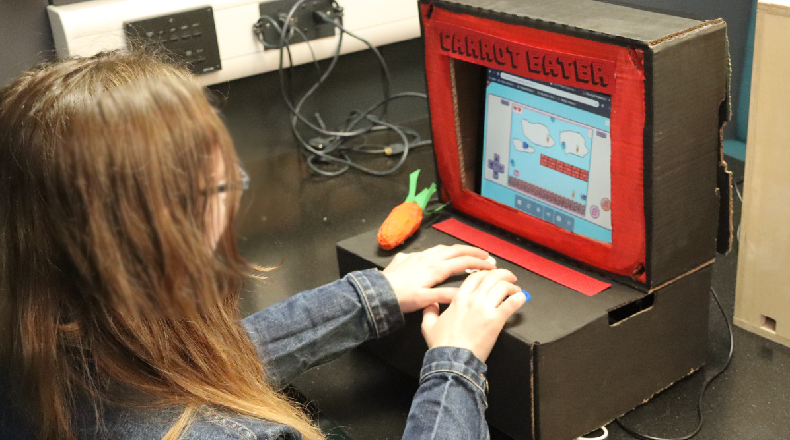
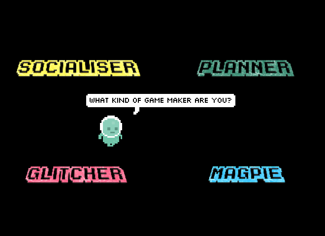

---
# all the regular stuff you have here
zotero:
  scannable-cite: false # only relevant when your compiling to scannable-cite .odt
  client: zotero # defaults to zotero
  author-in-text: false # when true, enabled fake author-name-only cites by replacing it with the text of the last names of the authors
  csl-style: harvard-manchester-metropolitan-university # pre-fill the style
layout: post
number-sections: true
categories: chapter
title: 5. Exploration of the Formative Learning Design Process
---
-   [Exploration of the Formative Learning Design
    Process](#exploration-of-the-formative-learning-design-process)
    -   [Research Questions April 2025](#research-questions-april-2025)
    -   [Additional information to help
        reviewers](#additional-information-to-help-reviewers)
    -   [Chapter Introduction](#chapter-introduction)
    -   [Vignette and broad analysis using an analysis of activity
        systems](#vignette-and-broad-analysis-using-an-analysis-of-activity-systems)
    -   [Narrative exploration of key contradictions emerging in the
        game-making learning
        design](#narrative-exploration-of-key-contradictions-emerging-in-the-game-making-learning-design)
        -   [C1 - contradictions involving the use of game programming
            and asset authoring
            tools](#c1---contradictions-involving-the-use-of-game-programming-and-asset-authoring-tools)
            -   [Using a starter game template within a code
                playground](#using-a-starter-game-template-within-a-code-playground)
        -   [C2 - Contradictions associated with project navigation and
            use of
            documentation](#c2---contradictions-associated-with-project-navigation-and-use-of-documentation)
            -   [The use of documentation to address
                contradictions](#the-use-of-documentation-to-address-contradictions)
                -   [Structuring instructional tutorial resources and
                    code
                    snippets](#structuring-instructional-tutorial-resources-and-code-snippets)
        -   [C3 - Responding to tensions and barriers in cultural
            aspects of the game making
            activity](#c3---responding-to-tensions-and-barriers-in-cultural-aspects-of-the-game-making-activity)
            -   [Social coding processes](#social-coding-processes)
                -   [Use of side missions to encourage varied creative
                    practices](#use-of-side-missions-to-encourage-varied-creative-practices)
    -   [Chapter Discussion](#chapter-discussion)
        -   [Comparing to UMC, Microworlds & constructionist design
            principles](#comparing-to-umc-microworlds-constructionist-design-principles)
        -   [Authenticity Discussion](#authenticity-discussion)
        -   [The position of GDPs in Activity Systems as the germ cell
            of this
            research](#the-position-of-gdps-in-activity-systems-as-the-germ-cell-of-this-research)
        -   [Outlining the key stages of GDP use in the structural
            learning
            design.](#outlining-the-key-stages-of-gdp-use-in-the-structural-learning-design.)
        -   [Summary and link to next
            chapter/s](#summary-and-link-to-next-chapters)
    -   [Parking Lot](#parking-lot)
        -   [Perhaps reintegrate above](#perhaps-reintegrate-above)
            -   [MOVED LINK - Applying activity theory to surface
                contradictions and design tensions experienced by
                participants and
                facilitator/s](#moved-link---applying-activity-theory-to-surface-contradictions-and-design-tensions-experienced-by-participants-and-facilitators)
            -   [Notes from vignette](#notes-from-vignette)
            -   [Notes before C1](#notes-before-c1)
            -   [Dropped from Discussion](#dropped-from-discussion)
        -   [Moved from Graphical Assets
            above](#moved-from-graphical-assets-above)
        -   [Removed from Docs - add to appendix
            .tech](#removed-from-docs---add-to-appendix-.tech)

# Exploration of the Formative Learning Design Process

## Research Questions April 2025

**Principle question:** How can pedagogies to support CGD&P be enriched using socio-cultural approaches (CHAT more specifically)?

1. What contradictions arose in this research’s evolving design process and how were they addressed in the resulting CGD&P pedagogy?

2. How can the use of a collection of game design patterns support CGD&P, in particular in relation to abstract and concrete dimensions of existing pedagogies?

3. How can varied dimensions of agency be identified and nurtured in an evolving community of game makers? (and thus what subsequent implications does this have on understandings of pedagogy design)

<!--
*A note on style*

This chapter contains a large number of headings in draft form. These will be replaced with introductory sentences when structure is stable. -->

## Additional information to help reviewers

I am including some brief extracts and diagrams from Chapter 4 - Methodology to help clarify this chapter.   

{width=90%}

Fig. 4.x Summary of delivery phases and development periods

This chapter contains the names of figures, tables and appendices headings in draft form. These will be replaced with numerical format when the editing process is more complete. This chapter makes extensive references to appendices. While these are still in progress, I will forward a work in progress of the collection of vignettes in particular before the week of the review meeting.

## Chapter Introduction  

<!-- MOVE TO INTRODUCTION  
This chapter uses the argumentative grammar of DBR and CHAT  approaches to aid discussion of the evolution of the learning design and situate the findings and analysis of following chapters. -->

<!-- In particular, the evolution of the key pedagogical features is analysed via  emerging tensions between system elements in learning design. Exploration of the shifts in the design of the intervention is done via a development of a design narrative which explores the driving forces behind changes in the design of each phase. -->

This chapter uses the theoretical concepts explored in Chapter 3 to analyse and describe the transformations between the phases of research outlined in Chapter 4. To do this, I draw upon and adapt a technique from the design-based research community known as *design narrative* [@hoadley_creating_2002-1]. A design narrative is effective in communicating important design and contextual details, helping to situate the findings of this thesis in a way that allows the design to be understood or replicated by other practitioners and researchers [@hoadley_creating_2002-1; @brase_knowledge_2024; @bell_theoretical_2004]. In line with the discussion in Chapter 3, this process is augmented by incorporating an argumentative grammar of formative interventions within the Helsinki School's interpretation of third-generation activity theory (3GAT).

In the first section, this is achieved by identifying and analysing activity systems at different levels of granularity, specifically examining their system elements and providing a detailed interpretation of the objects of activity at each scope. To ground the reader in concrete detail, this process is illustrated using the context of a vignette included in Appendix 5.toby. Three sections follow, containing in-depth analysis of key areas of contradictions in the emergent activity. The three sections describe different facets of these contradictions and interventions to address them. The first, tackles key transformations in use of primary tools, e.g. those used to directly achieve the task in phase one (P1) and phase two (P2). The second addresses contradictions associated with project navigation and the use help resources and documentation. Finally, other support process to support emerging social coding processes are examined to explore contradictions surrounding participant identity within the game-making activity. Each section advances the design narrative by drawing on technical and social observations from my research journal, additional session notes, and analysis of the created artefacts, including games and documentation. The discussion section of this chapter begins synthesising concrete issues arising in the evolution of the learning design using 3GAT and DBR concepts, specifically: an iterative and mutual design process; double stimulation and its relation to participant agency; and the process of rising to the concrete through the exploration of a germ cell concept in the form of the use of gameplay design patterns.

INTEGRATE IN TO THE ABOVE

To do this it employs an argumentative grammar fusing elements of DBR and CHAT concepts: specifically iterative processes, analysis of emerging tensions between systems elements, a focus on affordances and secondary stimuli (particularly in relation to participant agency), and the process of rising to the concrete through exploration of a germ cell concept.

The concept of affordances, commonly used in DBR, is present in this design through the careful selection of technical tools and non-technical pedagogical strategies. The term affordances has also been extensively explored in the literature of human-computer interaction (HCI) from a CHAT perspective, defined as “possibilities for human actions mediated by cultural means” [@kaptelinin_affordances_2012, p.927].

## Vignette and broad analysis using an analysis of activity systems

<!--
[Link to online version here](https://docs.google.com/document/d/1vYeVxYaRMTWPDOHwC4DEGYAkGPRIDX7wLiz0l8b7LWc/edit))

Toby's vignette is online - needs moving
NEED TO MOVE THIS TO MARKDOWN
-->

This section begins analysis of the learning design intervention via the exploration of two scopes of activity system using an illustrative vignette (included as Appendix 5.toby).

At this stage, to ground the reader, we can locate the over-arching object of the activity in broad terms as collectively making a game to share. This is expressed via sharing a photograph of P3 end showcase where learners share their games in the foyer of the university building in which the activity took place.

{width=90%}

The broader of the two activity systems explored in this section is represented in two figures below, firstly as a joint activity stemming from the intersection of wider activity systems in Fig 5.x, and secondly as an activity in its own right in Fig 5.x

<!-- focusing on research goals on the part of the researcher, learning computing skills and concepts as a home education project and finally a broad aim of fun on the part of the children participants. -->

{width=95%}
Figure 5.broad - Broad environmental activity systems

The figure above is necessary simplification of the sources of diverse cultural and contextual factors that feed into the new shared activity system of the game making community. Using concepts explored in Chapter 2, the new activity can been seen as a boundary object where different motivations are negociated via a process of mutual appropriation. Examples of the influence of those wider systems in the game making activity including playful interactions, the supportive practices of parents, and guidance in practical coding practices from facilitators are explored in Chapters 6 and 7.

Using a 3GAT approach, the component parts of this new activity system are represented below in Figure 5.large, the scope of activity here takes as a subject the community of individuals in the room during the game making sessions, namely parents, children, student helpers and myself as a researcher / facilitator.

<!--
Other relevant objectives of re include: a desire to create a useful learning experience on the part of student helpers; participating with other home educators in a creative environment and thus building team and communication skills;. -->

<!-- NOTE
THINK CLARIFY TERMS OF SUBJECT, COMMUNITY AND OBJECT /OBJECTIVE - THINK ALSO DESIGN ARGUMENATION -->

<!-- Within activity system at the scope, while there is a nominal shared object to the main activity to make games together, the community contains diverse actors with multiple objectives. -->

{width=95%}

Relevant component elements are labeled in the Figure above however to more naratively situate a description of this system, I draw on illustrative extracts from vignette 5.toby. Before the vignette begins, Toby, a child participant, has been working independently on his emerging platform game for the first five minutes of the session. He is seated next to his two grandparents who are modifying their own games. At the start of the vignette, in my role as session facilitator, I make a brief opening announcement, drawing the participants' attention to the upcoming showcasing of their games to students in the building’s foyer. This announcement serves to focus their attention on the completion of their games. The imagined audience of players seems to contribute to Toby’s careful attention to the challenge and variety of the game-playing experience, particularly in the specifics of his level design, which is documented in the screenshots and descriptions provided in the vignette. It becomes clear that the more immediate audience of his peers plays an important role in guiding his design decisions. During the session, Toby invites other group members to play his game, initiating and responding to conversations about the difficulty of his game design

<!-- This immediate and tangible audience for the evolving games as well as the programmes target  showcase event where the created games were shared in arcade cabinets to an audience of university students and staff.  -->

HOW TO FRAME THE USE OF THE VIGNETTE DATA HERE? RESTRUTURE - DO INCLUDE END INTERACTION AS A TABLE.

While my session announcement broadly frames the object of activity as participation in a community endeavour to create a game for an external audience, a 3GAT interpretation reveals several interrelated facets of the object. The object encompasses both digital and physical aspects. Specifically, it includes the use of varied software tools to develop code and game assets, the use of physical computers for coding, and the eventual incorporation of self-made arcade cabinets during the showcase stage. At the community level of activity, the object also includes the complex interaction of motivations driving all members of the community. These motivations, particularly playful and social interactions, became quickly tangible and evident as the session progressed. Participants’ engagement with each other, as well as with the task itself, played a significant role in shaping their individual and collective experiences. In addition, during Phase 1 (P1), the object of activity for the community had to expand to include a focus on the evolution of a group working process. This expansion addressed tensions in the fledgling design, highlighting the pedagogical considerations and adjustments necessary to support participants in the process of game development. These collaborative pedagogical advances and how they contributed to the joint understanding of the joint object of activity are explored later in this chapter.

<!-- The concept of idioculture is used in this study to deepen the description of the community dimension of 3GAT. -->
<!-- GDPs ( conceptualised here as game design patterns), which while often implemented on an individual or pair scope, were also fed back into community activity.  -->
<!-- IS THIS RELEVANT HERE? -->
<!-- These feed into the contradictions which emerge at this level of activity. -->
<!-- IS THIS NEEDED? While the programme had a shared objective of making a game, there were tensions brought by the cultural factors and other objectives imported from other activity systems. The third contradiction explored in this chapter explores those tensions (including? ....). -->

<!--
NOTE - More on large scope in AT terms? What is needed here? -->

By P2, at the point when this vignette occurs, the implementation of game design patterns had become an important organising principle for myself and participants. Toby's activity in this vignette could be broken into two main actions: one being to alter the existing level design of the game by changing the placement of game elements, the second to add a new game design pattern to his game by adding a new code structure to the starting project.

Following Barab and colleagues [@barab_using_2002], who justify the analysis of smaller activity systems in their study of technology-rich learning environments, I analyse the implementation of these game design patterns as activity systems in their own right, rather than as mere sub-actions within the broader activity. At this smaller-scale activity system, the subject is either an individual or a parent/child pairing, with the driving motivation being to modify specific features within their individual games, as represented in Fig. 5.feature below.

ADD IN A RECAP OF TERMS / AREA OF CONFLICT, TENSIONS, CONGRUENCIES AND BLOCKAGES - PERHAPS EVEN A TABLE (OR TABLE IN CH.3)
One benefit of analysing at this smaller scope is that it allows for a detailed examination of contradictions in the mediating processes involving tool use by individual participants or pairs. These contradictions can lead to expansions in the object of activity, which increases the complexity of the object at the broader community activity scope. This shift moves beyond technical perspective to encompass the diverse cultural elements of the emerging idioculture within the group. The vignette provides evidence of this evolution, demonstrating how variations in the games created correspond with shifts in social patterns of interaction. By analysing these game design pattern implementations as distinct activity systems, it is possible to trace how the changes made at the individual level feed back into the broader community practices, influencing both the technical and social aspects of the learning environment.

{width=95%}

<!-- ( NOTE - or at least as as a key unit of analysis).  -->
WHEN TO INTRODUCE GERM CELL?
The significance of activity at this scope is reflected in my proposal of the implementation of GDPs as a germ cell concept within the theoretical framework of this thesis. A more granular exploration of this scope of activity helps explore both the developmental and analytical aspects of the germ cell concept. The object of activity at this level is less complex, as the primary motivation is to implement or alter a design pattern in the participant’s game on a pair or individual level and therefore incorporates less cultural and social factors.

THIS COULD INCLUDE AN EXTRACT OF VIGNETTE 1 - EDITED DOWN. GIVING AN OVERVIEW OF TOOLS IN USE AND SOME SOCIAL ELEMENTS. SCREEN SHOTS COULD BE FULL SCREEN, AND DESCRIPTIVE ELEMENTS INLINE - THEN SOME TABLE OF INTERACTION / GESTURE ETC.

In the course of the vignette, Toby uses a variety of tools to achieve this goal: a web-based coding tool (code playground), a game template that serves as the base for his game project, and a menu of documentation linking to code examples and tutorials. Implementing more complicated gameplay design patterns (GDPs) involved several stages and varied tools, which can be viewed as sub-actions contributing to the broader goal of applying a GDP. Using the terminology of Leontiev [-@leontiev_activity_2009], Toby can be seen undertaking chains of processes in a fluid way, indicating that these actions had become operations. The commentary in Vignette 5.toby provides a more detailed description of this process.

## Narrative exploration of key areas of contradictions emerging in the game-making learning design (in P1 /P2?)

The following sections of this chapter examine three main areas of contradictions within the framework of 3GAT. The first area of contradiction addresses the novel and technical aspects of the learning design, focusing on the shifts in software tool use between P1 and P2. The second section investigates issues related to project navigation and the use of supporting documentation in P2. The third area explores contradictions concerning participant identity, a topic highlighted in research reviewed in the first two chapters as presenting significant barriers to learning to code.

### C1 - Area of contradictions involving organisational issues and the use of game programming and asset authoring tools

FIRST THE NEED AND THE GAP VIA NARRATIVE.
ORGANISED INTO THREE TENSONS
 - T1 - mismatch of ability and desire
 - T2 - facilitator time to support
 - T3 - authenticity of tools (also explored in discussion)

THEN THE DESIGN TO ADDRESS NEED / TENSIONS

THEN THE RESULT / IMPACT

#### Narrative description of the needs and tensions of design  

In this section, I draw on journal notes to describe emerging tensions in kickstarting participant game design activity and the subsequent evolution in tool use between P1 and P2. MAKE SURE THIS IS CLEAR.

My initial focus in the early stages of P1 was to create a welcoming, low-pressure environment for introducing and exploring the process of making games. To achieve this, I used several activities unrelated to computer coding to scaffold the game design process. Early sessions included playing and discussing retro arcade games, analysing their components, brainstorming game story scenarios, creating pixel-art characters on paper, and making craft collages for game backgrounds. I also provided learners with a laptop they could take home loaded with vintage arcade and console games to help build familiarity with arcade and retro game tropes through home play. Scenes (?) and characters began to take shape during these relatively unstructured planning sessions, with three, mixed age groups of roughly five participants forming. We then discussed, in simple terms, the game features they wanted to include. An example would be to add a bee as the main character, for it to be able to fly around the screen, and for it to collecting honey. Coding tools and processes were introduced in week five, a delay driven by my concern about the potentially alienating effect of engaging with the unfamiliar experience of computer code. My own motivation to build on prior research into novice use of authentic web text languages, such as JavaScript [@chesterman_webmaking_2015], rather than simplified block-based code, likely heightened this concern. Four weeks into P1, I drew on documentation to create and introduce a structural JavaScript game making template. For a fuller technical breakdown of the tools used in each phase, see Appendix 5.tech.

<!-- My previous research had explored the use of interactive, personal media creating using webpage languages of HTML, css and JavaScript [@chesterman_webmaking_2015]. I was keen to explore the potential of game authoring within a similar environment. As such, I drew on the documentation of the Mozilla community and selected Phaser as a JavaScript game making framework and Mozilla Thimble as a code playground (concepts explored in the literature review). A fuller technical break down of the tools used in each phase is omitted as it interrupts the flow of this narrative but it included as  
MOVE SOME OF THIS TO INTRODUCTION
-->

{width=95%}

This figure is presented to illustrate this area of contradiction as an accumulation of tensions between systems elements. There were tensions between tools at use and the objective of participants including: a lack of supporting documentation, a tension between the introduced authentic code language and novice level, and occasional mismatches between features requested by the community and the limits of the code library. In addition tensions emerged between the organising process at a community level and the object of effectively working on the game code including: a systemic misalignment between the lack of digital project management and the barrier of lack of facilitator time to support learners.

The introduction of textual programming with JavaScript into the game-making process contributed to a range of accumulating tensions. These are initially described in broad terms before focusing on those related to tool use. The gap between participants’ desired game features and their inability to implement them in code led groups to specialise. Some participants with greater confidence or experience took on coding tasks, while others worked on graphical game assets (both digital and physical), narrative planning, or sound elements.

T1 - At times, participant expectations exceeded what was realistically achievable within the scope of the game-making project, a tension explored further in Appendix 5.bee. While it was clear that participants needed to develop their coding abilities, the emerging, informal, experimental nature of the learning environment seemed to me to not suit whole-class instruction. This intuition was supported by my reflections on two attempts to deliver whole group presentations of key coding concepts, which I judged in my journal, based on visual cues of engagement, to be unwelcome interruptions to participants’ making activities. Instead, I addressed problems on an individual basis. However, as  more issues arose, I became overwhelmed by the group dynamics and technical demands on my time. After one session, I emailed participants (see Appendix.narrative2), expressing that I felt daunted by the task of facilitating the integration of the disparate creative elements being produced into a cohesive project. I asked parents for ideas and support in organising and bringing more order to group and planning processes. These developing tensions can be framed as contradictions between the tools available to participants and the object of actualising their ideas and graphical assets in code form. Additionally, my limited time as a facilitator highlights a dysfunctional relationship between the division of labour and the object.

<!-- This observation aligning with other research which advocates just in time approaches to STEM instruction. FIND / DEVELOP  -->
<!-- **input of parents as organisers**

As the sessions continued, with many creatively processes happening simultaneously, and without a clear plan on how to integrate these disparate elements to pull the projects together, .  Reviewing my notes and email interactions from this time, I note a key exchange between my self and participants  -->

<!-- "It was a bit of a hard session for me on Wednesday as I was a bit low on confidence about how to pull all of your creativity into a finished game! It started to feel like a bit of a fantasy!" -->

<!-- A crisis point developed (despite the input of parents) to help an organisational process. While participants were being supported to develop assets in the form or game characters and ideas for features were being documented via lists, participants  did not have a working either a working knowledge of the tools used, or a process to start to build that knowledge. My own process of self research and informed tinkering drew on years of experience and was therefore not suitable as participants did not share those coding repertoires or familiarity with coding tools. While the suggested tools were theoretically available to the participants online, they were therefore stuck nevertheless.  -->

<!-- To address the last point, I worked with groups to help them adapt a game template from phaser tutorial and input their own graphics to at least create a static prototype / sketch of the game. -->

In response to my email, parents made suggestions including: use of a visible and shared list of game features that are being worked on, documentation to support the implementation their requirements, and more hands on use of tools before beginning the planning process. The group planning process improved, and the self-organisational abilities of parents and tenacity of young people involved developed. Groups expanded their activity by creating wish lists of game features, which acted as mediating tools to coordinate between different team members and to request facilitator support to implement them via code structures. In addition to helping directly via coding with participants, I began to create short stand-alone instruction documents if I thought the requested code  would be useful to other groups. Despite these changes which helped to address the area of contradiction outlined above, by this point so many tools and processes and had been introduced, complicating the object of activity at the group process level to such an extent that participants were disorientated and even overwhelmed (see Appendix 5.P1.feedback & Appendix 5.bee.).

On completion of P1, I reflected on the design challenge involved to address the areas of contradiction. The overall learning design should maintain positive motivation towards to the object being worked on and facilitate hands-on coding using authentic tools early in the process to avoid unrealistic expectations. An initial coding activity should help novices build code familiarity without needing explicit instruction. Supporting documentation was needed but should not interfere with the flow of participants game making experience. Finally, the overall learning design should encourage appropriate social learning, peer support and reflective practices but without overly complicating the object of activity or interrupting participant making.

<!-- As an example, when offering feedback to address her family's feeling of isolation from the coding process, the parent of the family had requested more hands on play and use of the tools of production before being called on to make creative decisions. -->
<!-- A starting toolset was needed to start this process.  It should rather than  inventing a simplified code language or inauthentic novice oriented tool,  -->

<!-- This challenge was brought sharply into focus by a particular conflict experienced by one family in particular. -->
<!-- As explored in the literature review, an extensive body of research on the design motivations and impact on learners exists for the creative coding tools Scratch.  -->

<!-- NOTE INTEGREATE HOW DESIGNING FOR AUTHENITITY IS A CHALLENGE HERE WHICH IS ALIGNED WITH PBL AND EXPERIENTIAL THEORY, FORESHADOW SHARED DIMENTIONS OF AUTHENTICITY WHICH ARE EXPLORED LATER. -->

<!-- I took care to screen participants from processes and tools that were unrealistic for novices to use. -->

<!-- NOTE - PERHAPS EXPLORE COMPLEXITIY OF IDES AS A BARRIER IN RESEARCH - SEE BLUE JAY AND GREEN FOOT TRAINING IDEs -->
<!-- In the activities of study, a high degree of authenticity made possible, in a material sense, by the digital nature of the learning resources. Beyond a general purpose computer, no prohibitive equipment is needed. -->

#### Design description: Using a starter game template within a code playground, and graphical asset authoring tools

<!-- Addressing the evolution in design and use of code and asset authoring tools, While the code playground and the code template within in it are two separate tools, from the perspective of the learner, they were experienced jointly. As such, I cover them together in this section. -->

DESIGN SECTION - TO ADDRESS THE TENSIONS

A - VARIABLES & STRUCTURE
B - GRAPHICS IN PISKEL & BACKGROUND IMAGES / COLOURS.
C - LEVEL DESIGN

This section describes key design features with an aim to show how they addressed the needs and tensions explored above.These include the coding environment, the structure of a starting template and as a starting affordance within it including: highlighting movement variables, the replacement of the deliberately simple colour block graphics with pixel art, and  scaffolded changes to the platformer level design.

MOVE THIS SECTION AFTER? OR KEEP SOME BEFORE AS AN OVERALL INTRO?
To encourage playful, hands-on experimentation in the early stages, I opted to use a working game template rather than a purely structural approach through the application of a pedagogical technique used in a previous study [@chesterman_webmaking_2015], which involved highlighting easily alterable code changes that had a significant impact on the final project. Participants were introduced to the starting template game by playing it, but they were unable to jump onto the first platform. To progress, they needed to alter at least one of the key variables highlighted at the very beginning of the game code (see Figure 5.code below). The underlying game structure initially limited user choice, guiding a shared experience for all participants and facilitating peer learning. Kynigos and colleagues [-@kynigos_children_2018] describe this concept as *half-baked games*, where incompleteness or bugs in behaviour provoke participants to correct or modify them. This approach aligns with the motivations and techniques of the UMC framework explored in the literature review [@lee_computational_2011], particularly the guideline to "create choices that show visible and immediate changes" [@lytle_use_2019-1, p. 6]. Forcing a rapid transition from the _use_ to _modify_ stages at an early stage allowed for careful scaffolding of initial coding experiences, aimed at overcoming negative affect towards text-based coding. This alignment with UMC and half-baked design approaches also informed the selection of other key affordances, implemented through simple code changes, which are explored after a summary of the structural design of the game template.

0 - ENVIRONMENT

The use of a code playground and starting template, while technically two separate tools, were experienced by participants as a holistic experience. Code playgrounds, as described in Chapter 2, are online environments used to test, share or invite help from online users on complete or partial code projects or problems, primarily for web-based project involving the technologies of HTML, CSS and variations of JavaScript (for more detail see Appendix 5.tech). The use of code playgrounds by novices can mitigate against some of the initial challenges provided by learning computer coding stemming from  unfamiliarity with and potential complexity of code authoring tools and environments [@guzdial_programming_2004]. Tactics to address challenging elements include steps to reduce syntax errors, shielding complexity, facilitating community commenting, sharing, remixing and other forms of collaboration.

The project consists of several interlinked code and asset files (see glossary & Appendix 5.tech).

{width=95%}

Figure 5.code : Summary of the features of the glitch code playground environment and game template - APOLOGIES THIS IS INCOMPLETE CURRENTLY

1. Javascript file which participants alter to make changes to their game
2. Html page within which the game is embeded (not usually altered by participants)
3. Css style sheet (not usually altered by participants)
4. Code editing area
5. Game preview area

 The Glitch.com code editing tool had three main areas. First, on the left, there were options to change project settings, an assets link to manage image and audio files, and a list of project files, including JavaScript, HTML, and CSS. Second, in the central code window, participants could view and edit the code and comments. Third, on the right, a game preview displayed the immediate updates resulting from changes made to the code in the central window.

<!-- MOVE - In D1 I proactively reached out to Mozilla to ask about the future of Thimble, the code playground used in P1 and was informed that it would soon be discontinued due to end of funding. Their suggested replacement Glitch.com had a wider user base (beyond educators) and similar functionality.     -->

<!-- **Starting template** -->

A - VARIABLES & STRUCTURE

In P1, after delays caused by lack of coding knowledge, I had guided participants to begin their games by using a very partial template based on an online tutorial. As the process continued, it became apparent that the starting template greatly shaped the following design possibilities. To address this, in the development period between P1 and P2, I redesigned the starting code template of a game with a greater attention to pedagogical concerns in the following ways: I made changes to the code to reduce obscure syntax where possible increasing code readability and simplifying the structure of inter-related functions to facilitate the process of adding new code structures and code snippets. The choice to pre-select a particular genre, specifically a _platformer_ game (see glossary), was a pragmatic response to reducing the tension caused by diverse help requests, which narrowed the range of game features that would be requested. A summary of how these concerns were implemented in the design process follows (see Appendix 5.tech. for a fuller description).

C - GRAPHICAL ASSET SCAFFOLDING

Turning to the use of graphical assets, the starting template was altered to facilitate and encourage the process of adding designs created by participants. Initial graphical assets consisted of colour blocks, a design choice inviting learners to develop game characters from a clean slate (see Figure 5.px). To help resolve the overly complicated use of multiple asset creation tools, I prioritised the use of the pixel art tool Piskel, as I evaluated it to be intuitive for many younger participants. In P2, participants were guided to make a game on a broadly environmental theme, participants often redesigned sprites to games involving animals. Figure 5.fish shows a whale as a player character and plastic bottles as a hazard and fish as an item to collect.

{width=95%}

The process of game art and audio creation opportunities seeding narrative and artistic creativity is explored in more detail - IN AN APPENDIX?

{width=95%}

<!-- DROP shift to appendix? I had previously set the dimensions of the matrix above based on this size to create a resulting game size of 550, 400, in line with a retro game style.  -->

While I made several technical adjustments to facilitate the swapping of participant graphical designs (outlined in Appendix 5.tech), the process still required a series of potentially tricky operations. While some novice code authoring tools offer self-contained solutions for audio and graphical asset creation by providing in-built authoring tools and libraries of assets, the code playground Glitch provided neither, thus requiring the use of Piskel as an external asset creation tool, complicating the process. However, this forced choice to use a distributed toolset, rather than a self-contained approach to asset management, led to benefits in developing key digital literacy skills needed for web creation. Some participants became remarkably adept at the complex process of migrating assets from Piskel into their games, transforming the chain of actions involved into fluid operations. This section has focused on the rationale behind the introduction and initial expansion of the design's primary tools, rather than evidencing their subsequent impact on participants, which is explored in Chapter 6.

C - LEVEL DESIGN

Addressing level design, in P1 the process was relatively complex involving changing parameters of functions to change asset location, and spiralling code complexity (see Appendix 5.chapter). Instead, to align with research on the value of a visual approach to coding multi-media projects for novices [@guzdial_programming_2004; @resnick_scratch:_2009],  in the P2 starting template the use of a graphical grid structure to edit level design shown in Fig 5.grid. A minimal choice of level design elements were represented specifically; platforms to be jumped on; hazards to be avoided; and rewards to be collected.

{width=95%}
Figure 5.grid - Grid based editing of level design with a simple key for hazards, coins, and platforms.

Technically, each level is a JavaScript object consisting of a data array of 12 entries containing 17 characters which representing a matrix layout of the game. Each grid entry can be either black or one of the following: x (platform); h (hazard); o (coin). The structure of text-based array has a strong visual correlation with the resulting game layout and changes to the text based grid in the code area on the left would be immediately seen in the right hand project preview area. This solution abstracts away complexity and repetitive nature of asset placement mirroring a technique called tilemaps [@erhard-olsson_procedural_2018] used in GUI oriented game making tools (see glossary and Appendix.tech).

#### Brief section on Impact

INCLUDE SOME INTERVIEW DATA IF USEFUL.
IF NOT THEN DO SOME SIGNPOSTING AS TO WHERE THE IMPACT IS EXPLORED IN LATER CHAPTERS. ETC.

WHICH DESIGN AIM / FEATURE?
While my design aim was in part to reduce coding syntax errors and thus reduce learner anxiety, I did not wish not to remove the possibility of learners making mistakes entirely. While even these small changes involved potential syntax errors, as these simple expressions were surrounded by other lines modelling the correct syntax, they could often be corrected by the participants without facilitator support. This chapter's vignette (Appendix 5.toby), where Toby designs many levels as a way of making his game distinct from others, illustrates the impact of this technical adaptation on the evolution of social coding processes a theme which is explored in more detail in a following section.

The introduction of a half-baked template and the UMC approach had the unintended consequence of reducing the average working group size and also helped by introducing coding tools early, thus avoiding the mismatch between participants' planning and the technical limits of their novice abilities. The ability for individuals and pairs to make quick changes to the games templates via in terms of the affordances described in the previous section appeared to build their ownership over these fledgling games and set a path of working in a smaller group. A negative consequence of smaller group sizes and thus having more games being worked on was the increased demand on my time as a technical troubleshooter for code problems. The following section addresses this tension and others related to the introduction of supporting forms of documentation.

<!-- {width=95%} -->
<!--
 -->

<!-- MOVE
While access to HTML and CSS files of the base project was available in the left menu as show in  by default participants would see only the JavaScript file names game.js . -->

<!-- IS IT? OR MOVE
It is of value to restate the positive impact of key design features here which align with extensive constructionist research creating simplified coding environments for novices. Immediate feedback, structured support in managing asset files, the online nature of projects allowing immediate peer testing. -->

<!-- #### Creating key affordances -->

<!-- - level design and prototyping: use of
- fluid variable editing effective movement
- The swapping of assets and more complex work with code syntax
- development of simple stories to bump personal expression and narrative -->

<!-- Returning to the creation of key starting affordances to support the half-baked / UMC approach, the placement of three key variables (changing gravity, altering the player jump height and walking speed) that impacted player movement at the very top of the game.js file accelerated and support the experimentation of users. The process here began with me imagining what would be a good feature that players would notice and be spurred to change. For example an annoying slow horizontal movement speed.  -->

<!-- The possibility of disturbing the syntax of the  of code in the array. When participant did this it provided a good opportunity for facilitators or parents to outline the importance of correct syntax of and to explain the code structure. -->

<!-- OPTIONAL ADD AND APPENDIX ON LOAD LEVEL? -->
<!-- The possibility of disturbing the syntax of the  of code in the array. When participant did this it provided a good opportunity for facilitators or parents to outline the importance of correct syntax of and to explain the code structure. -->

<!-- ##### Design tensions in the authoring and incorporation of game assets -->

<!-- My observations supported these findings. Indeed, I observed a strong palpable a sense of achievement and satisfaction when participants succeeded in seeing and hearing their creations in their game after making the final changes in code.
For some, this sense of a achievement appeared magnified by difficulty caused by the unfamiliar environment and processes. As if they almost couldn't believe they had made an impact on the game world via interaction with such an alien language. -->

<!-- EVIDENCE? - code for this? -->
<!-- This aligns with educational research of the value of incorporating Funds of Knowledge into technical learning environments [Cole etc]. -->
<!-- While the value of this process seems clear from existing research, it presented challenges and design tensions in this learning design. -->

<!-- **Simple block graphics** -->

<!-- In P1 a template based on tutorial used stock graphics of a astronaut collecting stars on platforms resembling earth and grass. -->
<!-- The overall simplification reduced and therefore rebalanced time spent on to this activity compared to other game coding processes, thus helping resolve one of the tensions emerging in P1. -->

<!-- JUSTIFY BELOW - via appendix / via data?
The motivation to see their assets in the game drove participants to building fluency as undertaking the full process involved learning a complex chain of these individual actions (a clam supp).  -->

<!-- This section has outlined the rationale driving the introduction and initial expansion of the form of primary tools in P1 and P2.  -->
 <!-- thus reducing possibility for errors and complexity caused by the compatibility of file formats, migration and management of external asset files. While  -->

<!-- MOVE? CHAPTER 5?
Participants spent a widely different length of time creating these graphics for a variety of reasons. Some took a long time to master the process of using the editing tool while others created images rapidly but would keep redesigning and recreating their game elements.  -->

<!-- In line with existing research, in P1 I observed participant showing a high motivation to incorporate assets based on their hope interests. Responding to the enthusiasm of participants in asset creation, I had introduced six software tools to participants including tools for pixel art, sound editing, sound creation, In addition I also encouraged collage creation to create a physical background to the game and then scan that to create a digital image. A table of the different tools and processes is included as appendix 4.x   -->

<!-- I was concerned that in P1 the diversity of asset creation tools approaches was over complicated creating an increased burden of learning different software, reducing the shared experience helpful for peer learning and risking distracting time and attention from coding activities. Thus, in P2 I reduced the number of suggested assets creating tools suggesting Piskel and an online audio effects generator (bxfr ?) -->

<!-- For example, the processes of replacing a block image with a bespoke pixel sprite which comprised: file downloading; file migration using the browser and file manager; browser tab navigation; graphics tool use in Piskel; copying and paste text code; and selecting more than one lines of text code with mouse or keyboard shortcuts. -->

<!-- #### Resolution of C1 / re-framing using key terminology /  LINK -->

<!-- The in-tool affordances were designed to allow a quicker building of participant familiarity with the toolset via aligning with changes which were familiar from home experience of games and which were simple to change and provoking high feedback from the target game. -->

### C2 - Contradictions associated with project navigation and use of documentation

<!-- The previous section addresses changes to primary tools used to create game code and assets and response to the emerging tensions experienced by participants in P1. -->
<!-- Before outlining tensions related to technical demands on facilitator time in this section and the subsequent introduction of supporting forms of documentation, some brief observations on impact are useful.  -->
<!-- The in-tool scaffolding within primary tool outlined in the previous section aligns with microworld concepts  of affordances guiding learners towards the exploration of key concepts and reduced reliance on facilitator instruction [@laurillard2020significance], an alignment explored in more detail in this chapters' discussion. -->

While the in-tool scaffolding within the code template outlined in the previous section reduced reliance on facilitator instruction [@laurillard2020significance] for most learners, it did not assist participants in implementing new features or adding code structures to their games (e.g., the _Create_ stage of UMC). In P1 and early in P2, my guidance and often direct help was needed at this stage, causing delays and participant frustration due to my limited time with each participant or pair.
EXAMPLE?

During the development period after P1, I reflected on the tension between learner agency, particularly the role of divergent participant learning paths, and the role of facilitator-led instruction and support, which reappeared consistently in my notes at this time. My reflection was partly driven by two attempts in P1 to deliver whole-class instruction on key coding concepts that I judged to be relevant to the wider group. My reflection on these interventions noted that learner engagement was low, and I surmised that this might be because learners viewed the instruction as not immediately relevant, alien to their favoured hands-on style of working, or as an interruption to the flow of their making activities. This observation aligns with the concept of just-in-time learning approaches within project-based learning [@riel1998education], where access to supporting documentation is provided based on learner need. During this development period, I struggled to reconcile my desire to support this responsive approach with requests from some parents in the feedback on P1, asking for background concepts and explanations of coding constructs.

DESIGN 
The design and implementation of supporting resources continued to evolve at a frantic pace at the start of P2, and I finally created three main sources of documentation: quick start cards, written instructions, and code snippets, which are outlined in the following section.

<!-- or a nagivational , especially when combined with the disparate approach to graphical and audio asset creation, had resulted in an overly complex object. -->
<!-- DOES THE LR EXPLORE THIS TENSION? -->
<!-- PERHAPS? ILLUSTRATE THIS WITH A TRIANGLE - see notes 23.8.24 -->

<!-- REWORD
While step-by-step instruction could build up experience with tools and concepts in a carefully structured way, I wanted to preserve the choice driven approach and motivational potential of hands-on  project-based approaches employed in P1 [@holstermann_hands-activities_2010].   -->

<!-- ##### Linear and stand-alone tutorials and code snippet resources -->

<!-- Longer form step by step tutorials are common in computing education. Examples can be found in Code Academy, and in the education resources of RPi foundation. Many examples talking learners through steps to build a game can be found online with varied amount of explanation of underlying constructs and concepts. I started my journey learning JS games using some provided
by Mozilla and the Phaser developers. -->

#### The use of documentation to address contradictions

This section explores the introduction of quick start cards, written instructions, and code snippets to address some of the contradictions in the learning design outlined above. _Quick start cards_, simple printouts highlighting the key affordances of the template involving: game mechanics such as movement, jumping, level design, and the final challenge of swapping out the look of one or more characters by designing pixel art and replacing the line of code that adds the asset to the game. These printed resources which highlighted key lines of code and demonstrated how they could be altered to impact game behaviour (see Figure 5.cards below), became a crucial resource for participants to get started with the starting template game from P2 onwards.

<!--
MOVE TO APPENDIX
During the development period, I used the revised template design in a one-off game-making session with trainee computing students. This session culminated in a challenge to create an activity for a holiday event focused on creative game coding for families. In response, three students produced printable Word documents that highlighted key affordances of the design, mirroring my facilitation of their game-making session. Specifically,  -->

{width=95%}
5.cards - Example of a Quick start card

A version of the quick start cards is available online and as part of Appendix.tech. These _quick start cards_ supported participants' initial interaction with the code in a way that strongly aligned with the use and modify stages of the UMC framework [@franklin_analysis_2020]. The starting process addressed the tension of providing documentation to support users in completing coding tasks while also facilitating choice over learner pathways.

##### Structuring instructional tutorial resources and code snippets

<!-- BELOW Initially I structured the book chapter participants working their way through the online resources. HOW -->

<!-- While writing self-contained tutorials added a challenge to the documentation authouring process, the documents, especially when printed became a vital resource for this community. In chapter 5 I explore the extent to which these resources can scale for use beyond this context. -->
To meet participants' requests for foundational coding knowledge, in the development period after P1, I developed an online manual with step-by-step chapters guiding users to code a core game template structure from first principles. While this linear format did not fully align with my choice-driven, face-to-face sessions, I envisioned it as supplementary reinforcement for learning outside of sessions. Writing these chapters revealed a technique that helped balance structured guidance with choice-driven learning. Each chapter demonstrated a code feature or principle through a playable game project based on the core game template, hosted in an online code playground. While the use of code examples or *snippets* is a common professional practice in problem-solving [@yang_stack_2017], their use by novice learners presents challenges related to relevance, consistency, and accessibility [@treude_understanding_2017]. Initially, I had encouraged participants to use code snippets from the Phaser website, but their difficulties understanding and applying these abstracted examples prompted me to create more tailored resources.

I later extended this approach by creating stand-alone code snippets that illustrated requested game features as gameplay design patterns, such as *jumping on an enemy to zap it* and *making a moving enemy* (see Appendix.toby for an applied example). In the early stages of P2, learners accessed these projects through a simple Google document with links and brief descriptions. I continued developing new projects and producing printable instructions to support these code snippets, ensuring that each snippet linked to a descriptive chapter and vice versa. To help learners situate the code within the correct structure, all projects used the core game template and included only the new code required for each feature. I also experimented with ways to present these feature choices in an accessible, engaging format, which I describe in detail in Appendix 5.map. Recognising that multiple documentation formats sometimes led to confusion, I created a centralised hub to host both snippets and tutorial chapters, making navigation more intuitive and orienting documentation towards participants' gameplay experience.

<!-- My rationale was that each pattern added builds familiarity with the code structure. -->

<!-- To address this tension, in addition to self-contained chapter focused on instrumental code changes needed to implement game features, I created opening chapters of the online manual which were more traditional in format and explained underlying concepts that the starting template had initially abstracted away from the participants. -->

{width=95%}

Figure 5.patterns : a screenshot of the hub of GDPs pointing to code snippets and instructional chapters

<!-- **Return to vignette**

Returning to the vignette of the child Toby described earlyer in this chapter we can see him use, rather than the written step-by-step help, jump into the code example, searching for the new code constructs and in-line code comments nov1.tes in the code highlighting their purpose.

Thus, while not proof of overall efficacy of the use of code snippets the pattern of behaviour of Toby in the implementation of code is promising.
IN TERMS OF ... -->

Chapter 2 reviewed research on using collections of gameplay design patterns to support learning in game design [@holopainen2007teaching; @holopainen2011foundations; @eriksson_using_2019; @bjork_patterns_2005]. Thematic organisation of these patterns shows potential to foster a shared understanding of game-making concepts within a coding community [@holopainen2011foundations]. For the documentation hub described above, I grouped game design patterns into categories based on academic and professional interpretations of game elements [@salen_game_2006; @schell_art_2008; @tekinbas_rules_2003; @olsson2014conceptual], as well as participants’ evolving requests for game features. The final categorisation used in P4 is shown below in Table 5.x.

| **Game Mechanics**| **Game Polish** | **Game Space** | **Challenge Systems**|         
|--------|------------|--------------|----------|
| Add Static Hazard  | Add Graphical Effects | Change Design of Levels | Gain Points when Collecting Food |
| Add an Animated Enemy  | Add Sound Effects | Add More Levels | Add a Timer |
| Jump on Enemy to Zap them  | Add a Sound Track (Music) | Change Shape of Levels | Collect all Food before Progressing |
| Double Jump  | Add a Game Story with Messages | Change the Background Image | Power up - Higher Jump |
| Moving / Patrolling Enemies  | Add a Game Story with Messages | Change the Background Image | Power up - Player Speed |
| Moving / Following Enemies  | Animate your Player’s Movements | Key and Door | Random Doubling Enemies |    
|   | Make Player Immune |  | |    

Table 5.x Categorisation of game design patterns used in P4.

These elements were themed in a way which aligned with the MDA (mechanics, dynamics, and aesthetics) game element framework explored in Chapter 2. The evolution and of this theming is outlined in more detail in Appendix.tech.gameframework.
NOTE - DEVELOP THIS A BIT AS IT IS EXPLORED IN CHAPTER 6.

This section outlined two key types of secondary support tools developed in response to tensions arising after introducing the primary tools discussed in the previous section. While the code snippets, practical instructions, and chapters on core principles continued to pose some challenges (as seen in Vignette 6.1), the video data analysed in the following chapter shows an increase in participants’ practical ability to implement game features, suggesting an enhancement in their instrumental agency. In addition, participants' increase in agency extends beyond just instrumental application. In both P1 and P2, participants made specific requests for new features, which, when deemed suitable by me as the facilitator, were added to the menu of game design patterns. This choice-driven approach can be seen as both relational and authorial agency within the framework discussed in Chapter 3.

<!-- LINK & MORE SIGNPOSTING? -->

### C3 - Responding to tensions and barriers in cultural aspects of the game making activity

<!-- ### Design narrative on conflict due to identity clashes and dysfunctional group work -->

<!-- **Participants stuck / demotivated : scope of ambition to high,   collaboration groups too big (transition),** -->
<!-- These activities including starter games and game playing on entry and sharing of gaming experience of let laptops with games installed on them. -->

Restructuring this section

- physical computing elements - arcade boxes
- use of playing games and identifying game elements (Moveable Game Jams (ensure this is described or linked to) to build language and concepts used to then  list of features serving as a mediating planning tool.
-

Some participants experienced alienation during the transition to coding, stemming not only from challenges with tools but also from a sense of exclusion from the culture of coding. This aligns with research on cultural barriers in coding processes, as discussed in Chapter 2 [@kafai_constructionist_2015-1]. In P1, as described above, I incorporated several non-coding techniques to foster positive affect and create an inclusive idioculture, aiming to reduce alienation from unfamiliar coding tools. While participant feedback on these techniques was positive, accumulated tensions led one family, described in the case study Appendix 5.bee, to disengage. Members of this family actively engaged in planning on paper and creating pixel art. However, tensions arose when the introduced coding framework did not support a desired feature, which was a bee design roaming a 3D landscape. During participant feedback, the parent expressed a preference for more hands-on play and exploration of the tools of production before being required to make creative decisions. This case study highlighted several key concerns for the design. Firstly, it underscored the fragility of learners’ positive affect during the transition from the planning and sketching phase to the coding phase of the game-making process. Secondly, it revealed the limitations of peer support, as fellow participants were often unable to address more complex issues independently. Lastly, it highlighted a potential imbalance in facilitator attention, as participants more confident in coding sometimes created complex problems requiring significant facilitator time, potentially leaving others feeling less valued.

Though technical challenges related to the use of tools played a role, this area of conflict was compounded by social and cultural factors, ultimately leading to the family's decision to step away from the activity. The tensions arising from the expectation to transition from non-coding creative activities to coding tools are depicted in Fig. 5.x below. This figure illustrates how the family’s positioning and alienation from the coding environment, perceived as a space for _hardcore coding_ (participants phrase), represent a tension between the division of labour and the object of activity.

{width=95%}

Fig 5.x - Tensions involving cultural aspects of the game making process

My reflections on this conflict prompted several changes in the learning design to address factors situated within the plane of cultural activity. While Chapter 7 focuses on analysing participant reactions to the design from a more cultural perspective in greater depth, this section is limited to exploring the evolution of key learning design features addressing these issues, particularly the identification and fostering of social coding processes.
<!-- MORE SIGNPOSTING? -->

<!--
NOTE MOVE
Chapter 6 analyses the potential of activities which help build the participants sense of their own identities of game makers in more depth, in particular in relation to dimensions of participant agency. -->

#### Physical computing elements

- physical computing elements - arcade boxes

#### Playing games and identifying game elements

- use of playing games and identifying game elements (Moveable Game Jams (ensure this is described or linked to) to build language and concepts used to then  list of features serving as a mediating planning tool.

#### Social coding processes

The introduction of a partially completed, half-baked game template had a notable effect on the division of labour within the group. This adjustment led to the formation of smaller, more autonomous group thus ameliorating some of the systemic conditions that contributed to the conflicts observed in P1.  The case study explored in Appendix.bee illustrates this highlighting a problematic division of labour alienated non-coding team members from the overall process. By allowing participants to work individually or with family members, these barriers to engagement were substantially reduced.
ROLE OF PLAYTESTING IN THIS? AND A'S COMMENT ON PARENTS GETTING IN THE WAY?

<!-- The changes in tools and documentation introduced in P2, as described earlier, were initially implemented to address technical issues but also had a significant impact on the cultural dynamics of the game-making group.  -->

The highlighted affordances of the template and the accompanying collection of code examples, as outlined in earlier sections, proved impactful. Despite their relative simplicity, these tools facilitated the creation of games with diverse and complex styles and themes, even at early stages. The provision of a functioning starter game significantly increased the amount of time participants spent playtesting both their own and others' games. Video data captured instances where participants expressed frustration when errors rendered their games unplayable (see Vignette 6.1 for a clear example).

In response, I prioritised supporting participants in resolving these issues to ensure their games were functional and playable. By P2, playtesting had evolved into a source of rich, productive peer social interactions. Observing this, I recognised the potential of these interactions and, in preparation for P3, aimed to intervene more strategically and gently to nurture and encourage these emergent patterns of peer collaboration and engagement.

<!-- SHIFT? - It is notable that the create stage of this model does not involve starting a totally new game from scratch as is imagined in some interpretations of that model. Due to the complexity of the code base and framework the process of creating a new GDP within the game as a suitable level of challenge. -->

<!-- ##### Remixing, peer learning, and choice of starting template MERGE UP

**Tension of a group remixing from one template rather than feeler community inspiration and interaction**

To address issues of a practical nature to get starting coding, a restriction in game genre and was made in the form of a starting template, thus restricting personal choice, in a way which negatively impacted some families (see appendix 5.bee). In addition no online community was promoted to motivate inspiration from the work of others,  collaboration and peer review via comments [@monroy-hernandez_cooperation_nodate; @cress_supporting_2016]. However some positive aspects inherent to this design choice.

- In practical terms, it simplified the process of supporting code errors,

- it spurred community inspiration and interaction, peer support, sharing and problem solving due to the use of similar code bases.

 -->

##### Use of side missions to encourage varied creative practices

<!--
MOVE TO CHAPTER 7

In appendix 5.playertypes, I outline the use of a game to explore different game playing types. I then proposed different making types. I used the question "What kind of game maker are you?" as an indicator to participants that one aim of the project was to create a space where different approaches are possible and celebrated.

{width=95%}

To communicate this approach, as well as starting game activity, I incorporated the question into an animation of the resources home page (see illustration 4.x). In P3 the underlying ideas were incorporated into the process drama described in the next section.
 -->

In P3, I introduced a drama-based scenario to guide the game creation process. This scenario revolved around an alien making contact with the group to request the creation of games as a means to judge the worth of the human race (see Vignette 5.alien). Within this fictional framework, participants engaged in side-missions, some of which were public while others remained secret (see Table 5.sidemissions). The introduction of this drama and the accompanying social missions aimed to reinforce the social and cultural dimensions of the activity, building on patterns observed during semi-structured playtesting in earlier phases. These missions were designed to encourage behaviours that fostered community-focused interactions. They included activities not directly related to the game-making process but rather centred on exploring and engaging with others' games and adopting a playful, exploratory approach. I had previously identified such behaviours as crucial for sustaining positive affect and fostering identification with the ongoing group game-making process.  The missions were printed on cards, and participants were given one of each type during the first half of the initial two sessions. An sample of the social and secret missions is provided below, with the full table available in Vignette 5.alien.

<!-- AN EXAMPLE HELPFUL? -->

<!-- NOTE - PERHAPS MOVE TO APPENDIX OR DESIGN CHAPTER -->
<!-- NOTE ONLINE VERSION Secret missions and public missions -
https://drive.google.com/drive/folders/1I8D_axlOUAFIGarrnzGV5mSCe2MDCDso -->

| Your Alien Mission (social)          | Your Secret Alien Mission:              
|----------------|----------------|
| Find out the names of 3 games that are being made.  | Change the variables at the start of someone else’s game to make it play in a funny way.    |
| Make a list of characters in two other games being made.   | Change of the images in someone else’s project to a totally different image and see if they notice.    |
| Find out the favourite computer games of 4 people.   | Change the level design of the first level of someone else’s project to make it impossible but try to change as little as possible to do that.   |

Table 5.sidemissions - an extract of side missions given as part of the drama scenario

While this provides an incomplete picture of the missions and drama process, due to space limitations, these side missions are presented in this chapter to offer an overview of the varied tools used. A more detailed exploration of the development of participant agency in relation to these social missions and playtesting is provided in Chapter 7. Within the framework of 3GAT, these missions can be understood as tools used by participants to develop agency through the process of double stimulation, a theme which is continued in the discussion section of this chapter.

<!-- I have de-prioritised the detail of the drama process element of the intervention of P3, an aspect that  -->
<!-- I will return to in the conclusion of this thesis when outlining possible next steps of research. -->
<!-- -->

## Chapter Discussion

CREATE A NEW SUMMARY OF DISCUSSION HERE.

- Table of tensions etc , See vignette doc
- alignment with UMC, and other pedagogies (retrospectively found),
  - authenticity and blackboxing in particular as a constructionist approach
- DBR -> germ cell
- use of collection of GPD a as a alignement with Hook and Repenning

---

This chapter has explored the complexity of the interacting tools and documentation in relation to their evolution in different phases of the formative intervention process. The contradictions explored initially focused on technical and then more social dimensions of the learning design, a process which has surfaced some of the barriers to achieving the varied competencies needed to complete the text coding of a multi-media project. The following table begins a process of synthesis of design factors. It is limited at this stage in analysis in relation to other research. Thus a discussion section follows which begins such analysis.

TABLE OF THE DESIGN FACTORS.

The subsequent sections synthesises the features of the design narrative and the summative table above, underpinned by existing research, specifically UMC, constructionist design principles.

#### Exploring systemic tensions in relation to existing research

<!-- The alignment of the underlying principles of the learning design with research constructionist design heuristics, half-baked designs, and the use-modify-create (UMC) process merits deeper exploration.  -->

<!-- MOVED INTEGRATE
While much the focus of much constructionist research  is on the design of toolsets to facilitate to personal knowledge building and expression via open project work, more recent work from researchers in this school has started to embrace the value of situated, community driven production as a lens [@kafai_theory_2020]. -->

<!-- This chapter has described my responsive design process which provoked me to introduce strategies in P1, which I then identified in relevant research in D1 used to develop the design further in later stages.  -->

**UMC & half baked**

DOES THIS LIVE HERE OR ABOVE?

Key observations outlined in the table above align with the supported benefits outlined in research on the Use Modify Create (UMC) pedagogy [@lytle_use_2019-1] and the specific technique of starting with a half baked game template [@grizioti_game_2018-1].

The work of Kynigos et al. [@kynigos_children_2018] on the concept of half-baked microworlds and games helped me focus on the motivational aspect of incomplete game affordances to drive initial engagement with the _use_ and _modify_ stages of the UMC approach. Small code changes resulted in potentially large changes in game behaviour, appearance and difficulty aligns with a long standing concept of HCI research that feedback is motivating for system users [@bernhaupt_introduction_2015; @malone_heuristics_1982]. The careful design work on the P2 starting game template facilitated participants in building familiarity with the code structures and use of tools in an accelerated way.

REVISE THIS PART
Kynigos [-@kynigos_black-and-white_2004-1] explores the tension between more targeted/restrictive and more adaptable technology toolsets using a white-box, black-box distinction (explored in the literature review), noting the difficulty of communicating the value of non-commodified, adaptable toolsets despite their exploratory potential. The design of this research's learning template can be seen as a half-baked Microworld [@kynigos_half-baked_2007], with the varied affordances of the design interpreted as invitations to contribute to an improvable boundary object [@kynigos_half-baked_2007, p.336]. This focus thus motivates and facilitates a discussion on a shared experience in a way that aligns with the sociocultural focus of this study.

THIS IS EXPLORED LATER.
In addition, the framework of UMC highlights the benefits of a stepped, stage-based design. In this design, this staged approach is enacted through the interaction of participants with code via increasingly sophisticated documentation.

KEEP AS SIGNPOSTING?
My observations, supported in the following chapter, indicate that the combination of the use of a template and a collection of GDPs accelerates the use of certain coding fluency practices, which, in turn, had a subsequent impact on the increased use of social coding processes.

<!-- ON AGENCY - MOVE
This instrumental proficiency was required before the rich set of  interaction based on peer learning, and other social coding processed could emerge in playtesting practices. While a simple point, Matusov's typology of agency, omits to state that instrumental agency can be seen as the base of a triangular hierarchy of agency, in other words that other dimensions of agency may needs to be built on this one. Relational agency developed via Playtesting as a process and the use of GDPs in varied ways by participants was noticed and I added more affordances designed to facilitate these aspects.
In addition, design  affordances here as a form of delegated agency. Authorial Agency in this learning process was present via the input of participants in the overall design of the program. -->

<!-- LATER? My choices balanced the value of positive engagement of asset creating, development of digital literacy skills associated with web production, and a focus on promoting code modification.   -->

**Microworlds & constructionist design principles**

Turning to constructionist research, a more extensive set of design heuristics is evident in studies of decisions made in creating microworld environments and in the development of Scratch (see Chapter 2 for a summary). Techniques or concepts present in constructionist design research, embodied in this intervention's toolset, include a simplified code authoring environment with live feedback in a preview window, techniques to avoid and correct syntax errors via the linting capabilities of the code playground (see glossary), and the use of a GDP menu to encourage creative but scaffolded design. A detailed description of these elements is explored in Appendix.tech. Of particular relevance to this design process is the principle _choose black boxes carefully_ [@resnick_reflections_2005]. Resnick et al.[-@resnick_reflections_2005] describe black boxes as abstractions that remove potentially problematic areas of the production process, creating a protective, scaffolded learning experience while maintaining a boundary with the authentic challenges of coding in the wild. Black box decisions steer learners toward exploring preferred concepts. Papert's [-@papert_mindstorms_1980] work on Turtle control in LOGO exemplifies this approach, using abstraction to focus on powerful mathematical ideas. The use of black boxes is also widespread in professional coding practices, particularly through code libraries and frameworks. These tools provide pre-written, self-contained sections of code to simplify complex operations. In my design, the Phaser game-making code library framework serves this purpose by managing underlying structures for gravity and physics calculations necessary for object collisions. In addition, my starting game template further simplified these processes by allowing participants to modify gravity settings through a single variable, thus combining professional coding language use with an accessible learning experience. Based on Laurillard's [-@laurillard2020significance] interpretation of the constructionist design of microworlds as being driven by affordances that structure user experimentation to enable exploration and concept formation without reliance on direct instruction, I propose this design as a form of microworld. When compared to other game coding programs using text languages this learning design can be seen as tightly structured.

However, when compared to a constructionist microworld, the structure of my learning design is compromised by its relatively porous borders between this controlled environment and other, more authentic coding ecosystems.

**tension: the intrigue of lifting the lid compared to additional complexity involved**

Addressing authenticity in more detail, it is valuable to re-examine the factors driving my choice of JavaScript and Phaser, a professional, open-source game-making framework. Specifically, this choice relates to the potentially empowering impact of exposing participants to authentic technologies and concepts in hands-on, exploratory processes. Ratto [-@ratto_critical_2011] discusses this through critical making, a process that playfully brings forward Latour's [-@weibel_making_2005; -@latour_cautious_2008] ideas of shifting from matters of fact to matters of concern by revealing taken-for-granted artefacts as deliberately designed objects. This was evident in conversations between participants where they expressed a sense of inspiration or engagement with previously unknown technologies. For instance, exchanges demonstrated a growing appreciation for the complexity behind professional games, based on their perception of the effort required for their own simple game projects:  

    Pearl: It just shows you what goes into these games.
    Student Helper 3: Think about how much effort goes into.
    Pearl: You just take things for granted don’t you?

ADDITION MADIHA's reflection in interview data.

A possible drawback of using a professional tool for novice learners is the risk of culture shock when participants encounter the unfamiliar and potentially alienating aspects of a professional coding ecosystem. The learning design outlined in this chapter helps address at least the beginning of this process by providing a protective, scaffolded learning environment.

In summary, I argue that increased scaffolding of learner resources and tools can enhance instrumental agency REEXAMINE THIS for novice coders but potentially at the cost of limiting access to the tools and processes of authentic creative communities. The relationship between authentic and scaffolded processes can be understood as an inherent dialectical tension that learning designers should account for rather than attempt to eliminate.

<!-- My design decision to shield new users from the complexity of the underlying configuration of interrelated web-technologies and authentic tools and by abstracting away complexity and highlight design affordances that facilitate creative agency, -->

<!-- MOVE TO CHAPTER 7
However, the use of an authentic coding language in the form of javascript, and developer tool in glitch.com has not been simplified, thus  the barriers is more porous, like a  protective harbour still connected to the wilder sea. -->
<!-- These game-specific aspects are more complex to implement. in the broader multi-media focused Scratch tool despite its . The choice of black boxes are different.    -->

<!-- **tsp**
Additionally, the concept of task specific programming language within that process is relevant as affordances in my design are chosen not only to impact on the game, but also to build familiarity with code structures. -->

#### DBR, CHAT & GDPs as the germ cell concept (unit of analysis)

<!-- ON THE PROCESS OF THIS Study
HOW THIS IS A USEFUL PRODUCT -> AS PER dbr
HOW ALSO AN EMERGENT GERM CELL. An experiment, open ended. -->

The emergent and mutual nature of this design process aligns with both DBR and CHAT principles. In this chapter and the previous one, I have described my active role in motivating and supporting an emerging community through iterative phases. The design approach was open and risky, requiring me to rapidly generate new tools in response to changing needs. I was fortunate that the tenacious character of the participants in P1 helped mitigate the challenges posed by the incomplete design. I return to the generative potenial of home education stageholders in the conclusion of this thesis. In line with understandings of DBR research outputs, the identification of guiding principles to address tension in the table above, would be expressed as a set of "tentative generalisations" in the form of design heuristics drawn from the analysis of the concrete practices observed [@hoadley_design-based_2022, p.215].

For this learning design, the concept and pedagogy of working with game design patterns (GDPs) emerged not only as an object of activity on a more granular scope than is typical but also as a germ cell concept valuable to both participants and facilitators. The process of rising to the concrete is a powerful analytical and developmental tool [-@engestrom_embodied_2012]. In seeking a germ cell or unit of analysis, the researcher explores complex, messy concrete processes over time to discern overarching concerns. 3GAT makes a distinction between empirical abstraction, described as a form of categorisation based on observation of activity (e.g. the collating of game features outlined in P1 above) and more theoretical abstractions which can to generate "concrete manifestations and developmental forms" of the core concept, hence the use of the term _germ cell_ [@sannino_activity_2011, p.590].

CLARIFY THIS BETTER - WHAT EXACTLY IS THE GERM CELL / UNIT OF ANALYSIS  
The theoretical abstraction that emerged from the process of facilitation the implementation and observing the varied use of these gameplay features as socio-cultural concepts was a guiding conception is the pedagogical utility of conceiving of such game features as gameplay design patterns.

Particularly relevant, is a structural feature (from research on design patterns), of the utility of a strongly coupled link between observable game features, a description of the design structure and resources to facilitate implementation in the target code environment.

Thus having identifitied this germ cell.  I continue the analysis of the orienting practice of GDPs as a germ cell concept in the following chapter.

MOVE THIS TO CHAPTER 6?
The position of GDPs in Activity Systems is complex. As framed as the start of the chapter the use of GDPs form is a part of an emerging object of activity. At the narrower level of activity, the implementation of the GDP into the code acts a a prinicple an objective and motivation. In addition, video observations showed GDP concepts being used as mediational strategies in varied ways.

#### Outlining the key stages of GDP use in the structural learning design.

PERHAPS THIS DOESN'T LIVE IN THIS CHAPTER / SPOT?

In the learning design outlined in this chapter, GDPs drive stage-based instructional processes.

The shift from P1 to P2 represents a move from a design-build-test to a stepped, stage-based approach. This graduated approach introduce code structures and challenges in an initially simplistic, prototypical format for learners to experience and explore, which are subsequently replaced by more advanced models or complex instances of the task.

GDPs were encountered through the game playing and analysis activity explored in the section above. GDPs were incorporated as affordances into a starter game template, initially highlighted via facilitator interaction and later as the guiding principle of _quick start cards_ to scaffold modifications to the code template.

The structure of supporting resources, created in response to participant requests for adding new GDPs to their games, evolved into a menu of GDPs in the format of name, description and both detailed step by step implementation instruction including code snippets, and stand alone code projects / snippets.

NOTE / MOVE - It could be seen as a progression to move from more scaffolded use of instructions to the use of code snippets alone with practice although data of Toby may not support that progression suggesting instead it may be a matter of preference.

Finally, in line with UMC, the final stage of the stepped approach would be the choice to imagine, design and implement a GDP not included in the menu provided, a process that Dan and Toby take on in P3 (see Vignette 7).

THIS STEPPED PROGRESSION COULD BE EXPRESSED AS A TABLE.  

This stepped approach which increases complexity of the objective of activity, while not identified in any key review [@kafai_constructionist_2015, Denner , etc],  is found in some CGD&P research. The work of Repenning on SGD operationalises this concepts through guiding learners to undertake projects which are progressively more complex.
This work differs in a core template is provided allowing for less instruction following and the progression does not involve starting from stratch each time.
This is notable as I found in P1 that changes to the underlying code structure were stressful and unwelcome for learners one had built familiarity with it (add this in as appendix using interview data).

ADD LINK.  

<!--
REMOVED - ADD BACK IN LATER?
 Conversely, a significant drawback of using a professional tool for novice learners is the risk of culture shock when participants attempt to step outside the protective, scaffolded learning environment and encounter the unfamiliar and potentially alienating aspects of a professional coding ecosystem. -->

<!-- Aligned with the general principles of PBL [@hung_engaged_2006], this design has strived for authenticity in varied forms. Authenticity in terms of activity object here is multiple in dimension, e.g in audience, in tool use and in creative processes. While the impact of the authentic dimensions of the tools and process described in this chapter 7 in depth, this section outlines some of the rationale of design descriptions in relation to existing research. -->

### Summary and link to next chapter/s

  - What contradictions arose in this research’s evolving design process and how were they addressed in the resulting CGD&P pedagogy?

<!-- Previous versions  -
https://docs.google.com/document/d/18HrRPPx0-fj3PXVJTAf2dzYNTBSYGikpV_U0hu46r2c/edit?tab=t.0

https://docs.google.com/document/d/1DRgpgIUfq5XIktYy-lX4WlviUDnffNc0v8SOeLGgHho/edit?tab=t.0

Chart evolution.
-->

This chapter has explored the iterative development of the learning design, focusing on resolving barriers to coding and aligning with existing research principles, particularly the use-modify-create (UMC) process and constructionism. It emphasized the potential and challenges of leveraging professional tools within scaffolded environments, underscoring the pivotal role of learner-led design decisions in motivating coding practices and fostering social collaboration.
It also described the emergence of GDP use as a reoccurring feature guiding goal formation and  structuring of supporting resources and advanced this as a germ cell of the emerging pegagogy.

I have designed, introduced and revised a technology based set of tools in a process aligned with broad definitions of DBR. Using the techniques  DBR in the focus of documenting the learning desing via a design narrative and of AT in analysis of tensions and congruencies between systemic elements and attempts to resolve those tensions.

DEVELOP THIS A BIT IN TERMS OF LIMITS OF 3GAT? FORESHADOW LATER WORK ON MOVEMENT.
DBR and affordances explored as networked affordances align with tools not only as technical or perceptual affordances but also mediation using concepts and more social practices or repertoires in CHAT [@barab_curriculum-based_2006].

As expressed in the discussion, the role of GDPs within activity is complex. The next chapter employs video data to describe and analyse the diverse applications of GDPs.

<!-- This analysis further illuminates in particular the cultural and social dimensions of game-making as a collaborative activity. -->

<!--

[^1]: https://mickfuzz.github.io/makecode-platformer-101/
[^2]: https://mickfuzz.github.io/makecode-platformer-101/learningDimensions
[^3]: https://mickfuzz.github.io/makecode-platformer-101/addHazard
[^4]: https://dailypapert.com/mit-logo-memos/
[^5]: https://web.archive.org/web/20180426051205/http://phaser.io/tutorials/making-your-first-phaser-2-game
[^6]: https://glitch.com/~grid-game-template
[^7]: https://en.flossmanuals.net/phaser-game-making-in-glitch/_full/#create-a-game-space
[^8]: https://www.piskelapp.com
[^9]: https://en.flossmanuals.net/phaser-game-making-in-glitch/_full/ -->

Gilbert is the worsted name.

## Parking Lot

### Perhaps reintegrate above

MOVE THIS PART TO CHAPTER 3?

Following Barab's description of nested activity systems [-@barab_using_2002], this shared system, whose objective is to make a games for an audience to play,  can be seen not only as nested within the wider systems but also as a container for  other  activity systems nested with that. While this overall approach is considered valid [FIND OTHER SUPPORT], the danger of fragmenting activity to much is to make matters confusing. The job of the researcher is to prioritise systems to describe and analyse based on the area of study and the concerns of the participants.

This prioritisation in AT is sometimes conceptualised as the process of finding a key units of analysis. In the process of research I have found two units of activity particularly illuminating, one being the shared activity system described above of making a game in a community process. The other, narrower in scope can be described as implementing individual game features.

Beyond these key systems, I draw on the concepts of actions and operations within systems to describe tensions and contradictions which emerge in the research process [-@leontiev_activity_2009].

MOVE THIS TO CHAPTER 7 -
A student helper shares a question -  "Is yours the one where level one is harder than level three?". This is indicative of some of the emerging playful approaches that younger participants in particular are taking to the overall process. This represents an example of the influence of the wider systems of play of on the shared idioculture of the game making community. The complexities of processes to create and to help resolve contradictions as this cultural domain of collective making are explored later in this chapter.

#### MOVED LINK - Applying activity theory to surface contradictions and design tensions experienced by participants and facilitator/s

NOTE - THIS WAS INTERUPTING FLOW - SO MOVED HERE

Identifying shifts in participant activity in terms of scope facilitates analysis of the complex and interwoven cultural, social and personal actions in a communities activity [@rogoff_observing_1995]. Above, Toby shifts between the wider activity of making a game and sharing it with peers and narrower actions implementing concrete code structures. This aspect is developed in chapter five.

In addition  analysis of community processes also involves transformation over time.  The next section offers a description of the evolution of tool use in different phases of the study with an aim to situate analysis of emerging tensions in the use of tools, resources and processes in the following section.

The followings sections use a process of analysis of contradictions between system elements of the activity systems outlined above. The processes is a formative intervention (explored in chapter three) in that the surfacing of tensions due to changes in the learning design over time are examined. As noted in the introduction, this chapter explores the following areas of contradictions: contradictions in the technical tool use of design, contradictions shaping the development of supporting documentation, contradictions to do with issues of identity and the cultural dimension of participation.

<!-- For example a common contradiction may be an immediate goal of children to mess around, play games and have fun while the goals of parent may be to maximise the acquisition of skills -->

<!-- I chart the detail of the evolution of resources and other responses used helps illuminate broader, systemic issues concerns in the overall activity [@barab_using_2002]. -->

#### Notes from vignette

<!-- Objectives at this level also vary between participants with some more straight-forward and others more tricky based on their making style. For example, beyond a purely utilitarian objective, a further objective in implementing a GDP, e.g. a new graphical element may be to increase a sense of personal identification with the game as an vehicle for personal expression. -->

<!-- One observation from he experimental course was that without signific
**Phase one:** In response to need, I adapted a starting code template of a platform game and created various code examples to add functionality requested by participants. This template was adapted from an online tutorial to create a game of the _platformer_ genre  (see glossary), a move which helped to limit expectations of the technical complexity of their game. At the end of this stage participants showcased their games to students in the foyer of the MMU Brooks building.

ant support, the process of making a game is complex and there are many possible blockages in the process. -->

<!-- Contradictions conce
rned with use of core tools and additional documentation and support are explored in two later sections of this chapter. -->

<!-- In the last chapter, we examined the use of Rogoff's 3 lenses of cultural, social and personal activity. We can see a broaChapter five contains more detail on the emergence of game design patterns as shared concepts and the implications for activity in more depth.
d alignment of these lenses and the scopes of the activity systems above.

NOTE - Explore how performed in line with other research - e.g. DBR (Barab) and possibly Bevan and Petrich -->

<!-- to highlight possible tensions and contradictions between competing goals of interrelated activity systems. -->

<!-- In line with the process outlined in chapter three, the following sections outline different scopes of activity to introduce tensions between system elements which are explored in this chapter. -->

<!-- The following descriptions mirror the work of AT researchers who conceptualise scope of activity as concentric circles from Broffennbrenner with "larger" scopes of cultural and societal goals and smaller, narrower, lower scopes of more personal activity [Engestrom][Cole]. -->

<!-- NOTE - Get into difference between object / objective and outcomes -->

<!-- While the limited example above of Toby's activity illustrates fun, additional data from interviews with this child and family back the broad goals above. [develop - perhaps an appendix or quotes] -->

<!-- As previously explored this mirrors the Activity, Action and Operation hierarchy. -->

#### Notes before C1

<!-- ADD THIS FUNCTIONALITY OF ASSET AREA TO DESCRIPTIO OF CODE PLAYGROUND
A key element of game creation is the creation and management of graphical and audio assets.  -->

<!-- I began by mirroring social model of learning like CoL and CoP and their propose apprenticeship-based approaches. Specifically, introducing possible code solutions to implement the ideas of participants. However, limits to my time involvement and my technical fluency hindered this process creating stress in myself and frustration and hesitancy on participants to get direct help.

    NOTE - Examples drop?
    For example, to troubleshoot a code error might take between one minute and 10 minutes depending on the complexity of it. To work with participants to identify and then implement a new coding structure could take up to 30 minutes.

    At times I was able to identify a discreet new code construct and to implement an example of this between sessions. At times I would attempt to do this in the group setting with varying results.

    Other interventions were called for directly by parents. Two relevant and relates requests happened at the end of P1.

    One was a call for more hands on play and use of the tools of production before being called on to make creative decisions. The parent likened this to an studio approach. Another was a request for additional supporting resources which explained the coding structures used in accessible but detailed ways. A request which hinted at a more structured, instruction based approach.

    However, interview data from participants placed great value on the flexibility of the approach which allowed participants to choose what they wanted to add to their game next. -->

<!-- Based on group work with adults on creating media projects together I created an email group that all participants could post to to ask for help. However this option was hardly ever used taken up. I was given feedback from one parent that asking on for technical help via an email forum not something that they felt comfortable doing. The same family also gave useful feedback about social norms of not bothering people getting in the way of asking for help.

Thus other ways of addressing this conflict were called for. -->

<!-- The need to get started somewhere emerged - and the template was a response to that.
Just an immediate, intuitive way to bring something to the table as a starting point to develop. The template was based on a prominent tutorial on the phaser website called Making your first game.
https://web.archive.org/web/20180426051205/http://phaser.io/tutorials/making-your-first-phaser-2-game -->

<!-- As preparation for the sessions I had followed the tutorial. When the  and adapted it. I removed out as much code as possible and thus simplifying the structure and readability.
  https://github.com/glitch-game-club/glitch-game-club/blob/master/games
 -->

 #### Dropped from c1

 After this shared first change, participants next choices varied greatly. While some participants engaged with extensive experimentation to find a player movement feel that seemed just right, others,  were much less concerned with this aspect of game play, despite sometime frustrating resulting player movement.

 Data explored in the next chapter supports foundational claims of constructionist computing and UMC advocates  that greater user choice over the design process contributes to participant motivational and a feeling ownership of their projects [@lytle_use_2019; @peppler_computer_2009]

#### Dropped from Discussion

<!-- This is a long-running theme of constructionist research, with roots in Papert concept of Microworlds, typically embodied by the Mathland environment, where participants control a robotic turtle with lines of simplified LOGO code language.  Because the turtle speaks only LOGO, children are drawn to speak LOGO to progress. Thus, Scratch and Mircoworlds can be seen as digital playgrounds with affordances that encourage certain types of play. -->

<!-- The next section begins by discussing how authentic tools and processes, while challenging for novices, can be addressed using existing of key design principles. -->

<!-- IS THIS USEFUL HERE? LATER? NEXT CHAPTER?
RQ2 addresses uses the term computational fluency, which as explored in chapter 2, is a better fit for the aims of this study than computational thinking, given the former's increased focus on agency and a more concrete, accessible approach.   -->

<!-- At some point in this process I realised that I wanted to encourage the growth of computational fluency.

That was not clear, the use of computational thinking also jumped out from a sense of wanting to fit into the common frameworks of this area. But this approach had always seemed too abstract as a form of repertoire to me. More hands on specific repertoires to do with the logistics of more concrete tasks suited the high impact from minimal input approach, made particularly relevant given the difficulty of using a code environment. -->

 <!-- in line with wider conceptions of PBL and UDL.

  - particpant voice and choice
  - peer learning and ongoing sharing of process via product
  - reduced class instructions
  - avoiding stuckness
  - linking to authentic practices and commuities

While computational fluency is a valid of the objectives of the game making activity goal, this chapter has (re)surfaced the many barriers to achieving this via the text coding of a multi-media project. -->

<!-- MOVE TO CH.7?
Participants are able to leave the protective harbour by accessing more authentic documentation and moving beyond existing templates. The experience may be involve choppier waters but the tools and processes remain familiar. -->

### Moved from Graphical Assets above

This technical solution had a positive impact on engagement with game coding and allowed social elements of coding processes to evolve

MOVE THIS PART SOMEWHERE ELSE
This adaptation is one example of how a technical solution had a positive impact on engagement with game coding and allowed social elements of coding processes to evolve.

Many participants spending significant time and effort undertaking many iterations of changes to the level design .  

An illustrative example of the impact of is explored via a vignette in appendix 5.toby where child participant Toby designs many levels as a way of making his game distinct from others (include BETTER SUMMARY).

Participants varied in their approach to level design, some drew on their experiences to mirrors platform game conventions, while others enjoyed working against these conventions, a theme which is explored in more detail in a following section  - SIGNPOST

MOVE
My observations in P1 aligned with research on the motivational value of the ability for young people to bring their interests into multimedia creations via choice of assets and narratives [@kajamaa_digital_2018; @resnick2014give; @peppler_supergoo_2007].

MOVE
A full table of the tools used and their purposes created to help orientate participants in P1 are outlined in 5.tech. The use of many production processes and asset creation tools in P1 complicated the object of activity in a way which I evaluated as negatively impacting the leading activity and motivation of making a game to share. Thus in P2 I reduced the number of suggested tool address this overcomplication. I now outline and discuss the use of simple block graphics, the use of pixel art authoring tool, and wider asset creation approaches.

MMOVE TO APPENDIX.TECH
with three main areas: a set of editing tools; a canvas for creation; and a set of tools to export, save and import work . The size of the colour block in the starter template were  32 x 32 to align with the default project size of Piskel to reduce technical friction when designing and swapping in new graphical resources. This standardisation also helped resolve a complications encountered in P1 due to differing sizes of sprites created using different graphical tools.

MOVED
Participants would identify the need for an asset in their game. They would then use the separate software to create that asset, and the be supported to save assets to their computer's hard drive in a compatible format. They would then need to upload assets to the code playground environment, discover the text link of the asset, and then insert that link into the main JavaScript game file at the relevant line of code.

### Removed from Docs - add to appendix .tech

<!-- My rationale was that each pattern added builds familiarity with the code structure. -->

<!-- To address this tension, in addition to self-contained chapter focused on instrumental code changes needed to implement game features, I created opening chapters of the online manual which were more traditional in format and explained underlying concepts that the starting template had initially abstracted away from the participants. -->

As introducing diverse forms of documentation and the resulting over complexity of the shared object of activity on a community level resulted in some users failing or struggling to find the right resources online, I designed and introduced a themed hub for both snippets and tutorial chapters. My aim was to mitigate potential learner alienation from unfamiliar technical documentation through accessible design which, in line with x, oriented access to documentation to participants existing gameplay experience rather than underlying coding constructs.

{width=95%}

The use of code snippets, while a promising authentic practice, presented challenges which this careful curation of examples aimed to overcome. As explored in chapter two, while the use of code examples or snippets in code playgrounds is a common professional problem solving practice [@yang_stack_2017], their use in novice learning has limitations including lack of relevant, consistency, being removed from the domain context, and not being structured in a self explanatory way [@treude_understanding_2017]. While I initially encouraged participants to search within examples from the Phaser website, and authentic documentation and help forums, the resulting confusion and difficulties experienced by participants, prompted me to create other more bespoke documentation.  

### Remove 20th April 25

MOVE?
In 3GAT terminology, the affordances of my design can be framed as a series of secondary stimuli. Sannino [@sannino_principle_2015] highlights the intersection of the use of secondary stimuli by participants and their volitional action or agency.

IS THIS NEEDED HERE? PROBABLY NOT.
While subsequent chapters explore shifts in the overall structure of participant activity in alignment with concepts of relational and transformative agency, the evolution of these tools, based on the novice status of the participants, also led to an increase in instrumental agency.  This instrumental proficiency was required before the rich set of interactions based on peer learning and other social coding processes could emerge in playtesting practices. Instrumental agency can be seen as the base of a hierarchy of agency, in other words, that other dimensions of agency may need to be built on this one. This foundational agentic level is further explored in relation to other research in the following section.

DOES IT?
There is a parallel between the utility of germ cell concepts and so-called strong concepts or intermediate knowledge in design theory [@hook_strong_2012; @barendregt_intermediate-level_2018].
