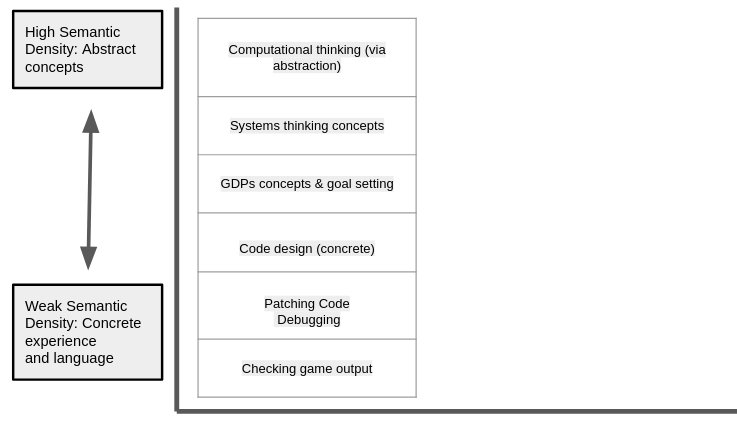
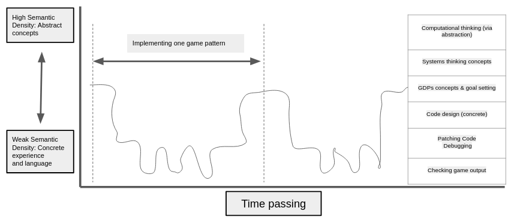
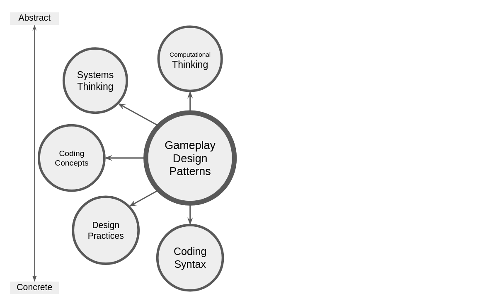

---
# all the regular stuff you have here
zotero:
  scannable-cite: false # only relevant when your compiling to scannable-cite .odt
  client: zotero # defaults to zotero
  author-in-text: false # when true, enabled fake author-name-only cites by replacing it with the text of the last names of the authors
  csl-style: harvard-manchester-metropolitan-university # pre-fill the style
layout: post
categories: chapter
title: 7. Seeding and Nurturing Community Game Making Practices to Facilitate Learner Agency
---
-   [Seeding and Nurturing Community Game Making Practices to Facilitate
    Learner
    Agency](#seeding-and-nurturing-community-game-making-practices-to-facilitate-learner-agency)
    -   [Research Questions April 2025](#research-questions-april-2025)
    -   [Introduction](#introduction)
    -   [Part one - Exploring concepts of abstract and concrete
        knowledge frameworks in relation to Game Design
        Patterns](#part-one---exploring-concepts-of-abstract-and-concrete-knowledge-frameworks-in-relation-to-game-design-patterns)
        -   [Conceptions of abstraction in the research
            field](#conceptions-of-abstraction-in-the-research-field)
        -   [Comparing to pedagogies explicitly teaching abstraction,
            computational thinking and
            LOA](#comparing-to-pedagogies-explicitly-teaching-abstraction-computational-thinking-and-loa)
            -   [Exploring data using concepts of Levels of Abstraction
                (LOA) &
                PRIMM](#exploring-data-using-concepts-of-levels-of-abstraction-loa-primm)
            -   [Summary of structural components of applied pedagogy -
                REEPP](#summary-of-structural-components-of-applied-pedagogy---reepp)
        -   [Link to next section - limits of this personal dimension
            approach](#link-to-next-section---limits-of-this-personal-dimension-approach)
    -   [Part Two - Agency, and re-mediation of repertoires in third
        spaces](#part-two---agency-and-re-mediation-of-repertoires-in-third-spaces)
        -   [Instrumental and transformational
            agency](#instrumental-and-transformational-agency)
            -   [Tensions related to transformational
                agency](#tensions-related-to-transformational-agency)
        -   [Relational agency](#relational-agency)
    -   [Reframing findings using socio-cultural understandings of
        agency and repertoire
        blending](#reframing-findings-using-socio-cultural-understandings-of-agency-and-repertoire-blending)
        -   [Revisiting understandings of relational agency and
            repertoires](#revisiting-understandings-of-relational-agency-and-repertoires)
        -   [A - Repertoire importation into the the game making
            community](#a---repertoire-importation-into-the-the-game-making-community)
        -   [B - The process of blending of repertoires in a third
            space](#b---the-process-of-blending-of-repertoires-in-a-third-space)
            -   [Prototypical specialism and proficiency via material
                feedback and guided
                participation](#prototypical-specialism-and-proficiency-via-material-feedback-and-guided-participation)
            -   [Playtesting as a suitable medium for emerging
                activities creating third spaces via blending of
                repertoires](#playtesting-as-a-suitable-medium-for-emerging-activities-creating-third-spaces-via-blending-of-repertoires)
                -   [Different styles of playtesting- conditions for
                    playtesting & resulting ways of being - abd
                    Relational expertise in
                    playtesting](#different-styles-of-playtesting--conditions-for-playtesting-resulting-ways-of-being---abd-relational-expertise-in-playtesting)
                -   [(RE)Translation into relational
                    agency](#retranslation-into-relational-agency)
        -   [C - Supporting emerging identity formation and
            specialisation through interventions to support relational
            repertoire
            blending](#c---supporting-emerging-identity-formation-and-specialisation-through-interventions-to-support-relational-repertoire-blending)
            -   [Helping styles and
                helpers](#helping-styles-and-helpers)
            -   [The introduction of side missions & maker types to make
                visible emerging repertoires as cultural affordances of
                my pedagogy to increase and legitimise diversity /
                hybridity](#the-introduction-of-side-missions-maker-types-to-make-visible-emerging-repertoires-as-cultural-affordances-of-my-pedagogy-to-increase-and-legitimise-diversity-hybridity)
    -   [Implications for design and summative design
        frameworks](#implications-for-design-and-summative-design-frameworks)
        -   [Designing for relational agency by repertoire blending
            (RARB)](#designing-for-relational-agency-by-repertoire-blending-rarb)
            -   [What is RARB](#what-is-rarb)
            -   [Narrative descriptive of a proposed procedure for
                facilitation relational agency by repertoire blending
                (RARB)](#narrative-descriptive-of-a-proposed-procedure-for-facilitation-relational-agency-by-repertoire-blending-rarb)
            -   [Summary of discussion on designing for agency -
                INTEGRATE ABOVE /
                BELOW](#summary-of-discussion-on-designing-for-agency---integrate-above-below)
            -   [Summative table illustrating stages of facilitating
                RARB in this
                study](#summative-table-illustrating-stages-of-facilitating-rarb-in-this-study)
        -   [Metaphors as a way to communication dimensions of agency
            design
            concerns](#metaphors-as-a-way-to-communication-dimensions-of-agency-design-concerns)
            -   [Harbours as both protective and
                authentic](#harbours-as-both-protective-and-authentic)
            -   [Spaces to play - playgrounds and jam
                sessions](#spaces-to-play---playgrounds-and-jam-sessions)
    -   [Part Three : Synthesis & contributions to the field = EDITING
        DOWN OR MOVING TO CHAP
        8](#part-three-synthesis-contributions-to-the-field-editing-down-or-moving-to-chap-8)
        -   [CCRREEPP & GDPs as a gateway pedagogical
            framework](#ccrreepp-gdps-as-a-gateway-pedagogical-framework)
        -   [GDPs used as a gateway pedagogical framework aligned with
            RARB
            process](#gdps-used-as-a-gateway-pedagogical-framework-aligned-with-rarb-process)
            -   [Summary of the potential utility of GDPs for wider
                stakeholders](#summary-of-the-potential-utility-of-gdps-for-wider-stakeholders)
    -   [Conclusion](#conclusion)
    -   [TO MOVE OR DROP FROM CHAPTER](#to-move-or-drop-from-chapter)
        -   [On planned and emergent
            activity)](#on-planned-and-emergent-activity)
    -   [Notes - MOVED TO THE END FOR
        REVIEW](#notes---moved-to-the-end-for-review)
        -   [On Fluency](#on-fluency)
        -   [Removed in December - perhaps
            rehome](#removed-in-december---perhaps-rehome)
    -   [Removed in Jan - find home](#removed-in-jan---find-home)
        -   [MoE](#moe)
        -   [**An example of mini TADS - use of secondary
            resources**](#an-example-of-mini-tads---use-of-secondary-resources)
    -   [Move to next chapter
        Conclusion](#move-to-next-chapter-conclusion)
        -   [Questions and Conceptual challenges to dissemination - MOVE
            PERHAPS TO NEXT
            CHAPTER?](#questions-and-conceptual-challenges-to-dissemination---move-perhaps-to-next-chapter)
        -   [6. The impact of constraints in design on agency - NOT SURE
            -MOVE to
            concluson?](#the-impact-of-constraints-in-design-on-agency---not-sure--move-to-concluson)
        -   [MOVED FROM CHAPTER 6](#moved-from-chapter-6)

# Seeding and Nurturing Community Game Making Practices to Facilitate Learner Agency   

## Research Questions April 2025

**Principle question:** How can research on and pedagogies to support CGD&P be enriched using socio-cultural approaches?

1. What contradictions arose in this research’s evolving design process and how were they addressed in the resulting CGD&P pedagogy?

2. How can the use of a collection of game design patterns support CGD&P, in particular in relation to abstract and concrete dimensions of existing pedagogies?

3. How can varied dimensions of agency be identified and nurtured in an evolving community of game makers? (and thus what subsequent implications does this have on understandings of pedagogy design)

<!-- Principle question: How can understandings of pedagogies to support CGD&P be deepened using socio-cultural perspectives?  

2. How does CHAT theory help us understand how game design patterns can be used in an evolving community of novice game makers? (Evidence Ch.6 - Data Ch.7)
3. How can learners build agency in an evolving community of game makers, and what subsequent implications does this have on understandings of pedagogy design? (Evidence Ch.6 - Data Ch.7) -->

<!-- ## Research Questions Jan 2025

1. What contradictions arose in participation in this research’s game coding processes and how were they addressed?
2. How does CHAT theory help us understand how game design patterns  can be used in an evolving community of novice game makers?
3. How can learners build agency in an evolving community of game makers? REVISE
 -->

<!-- The chapters have until now discussed tools and processes emerged in response to inferred learner need, in contrast, the processes explored in this following section emerged more directly from input from the participants in2024-8-7-Culturevolved.   -->
<!-- _How does this fit into other findings chapters?_

Chap 4 - overall design context / evolution - Then in greater detail on personal observations1. What pedagogical tools and processes are available to support novices to overcome barriers to participation in game coding processes?
2. How does CHAT theory help us understand how game design patterns x  can be used in an evolving community of novice game makers?
3. How can learners build agency in an evolving community of game makers? on the evolutions and impact of the templated game approach and scaffolding of the code design. (not GDPs)

Chap 5 - zoom out in scale to main focus of the activity as communicated between participants and their impact and appropriation by participants. It

Chap 6 - zoom out in scale to cultural tools and their impact and appropriation by participants. It -->

<!-- **Justifying selection of chapter contents**
The following elements have emerged from many in the learning design as of merit for sharing in this chapter based on the following criteria: key to the learning experience of participant; novel in terms of lack of existing research; supported by recorded data; and of potential wider interest outside this context.
IS THIS NEEDED OR IS THE CRITERIA ONLY THAT IT ADDRESSES RESEARCH QUESTIONS? -->

<!--
DROPPED - THIS IS JUST PART OF DBR -
 ## Observations on emergent elements of agency within cultural activity
This section describes and discusses some of the emergent, flexible and adaptive design practices that I observed in video data. -->

<!-- I also discuss these findings in line with existing research in relevant areas. -->

## Introduction

PURPOSE & GAPS - ADD IN EACH SECTION.

This chapter deepens the analysis and discussion on RQ2 regarding the potential uses of gameplay design patterns (GDP) and concludes with an analysis and discussion on RQ3, addressing reflections on participant agency. Chapter 6 presented findings on the different uses of gameplay design patterns (GDP) using three foci of analysis: personal, social, and cultural activity. To begin, this chapter discusses these findings in relation to existing relevant research. Part one specifically addresses the complexities of the abstract and concrete dimensions of computing education using a concept from design research that explores the value of gameplay design patterns as an intermediate-level, pedagogical framework.  

Part two shifts focus away from individual conceptions of knowledge and skill to examine the broader empowerment-related motivations driving this study. The goal here is to address gaps in the existing landscape of CGD&P research via an application of socio-cultural conceptions of agency. To begin this process, I undertake an interpretation of shifting forms of agency grounded in the data explored in the last chapter.

<!-- The purpose here is to ground this discussion of the study's emergent cultural and interpersonal activity within the context of ongoing explorations into theoretical and practical applications of agency in socio-cultural research circles.  -->

To achieve this, I begin with an exploration of the study’s findings in relation to instrumental and transformative agency and the concept of mediation in CHAT. As a way to address cultural development in more depth, particularly the development of learner identities within the research activities, I develop an interpretation of relational agency drawing on Rogoff and Gutiérrez's [@gutierrez_cultural_2003] concept of learner repertoires. To present a holistic picture of the complex cultural activity recorded in the research data, this discussion briefly addresses the wider aspects of the learning design.  However, it concludes with a proposed contribution suggesting that a collection of GDPs can help participants and facilitators as both as component features of emerging game making repertoires and as a orienting framework to increase the inclusive characteristics of the learning environment.  

The final part of this chapter returns to gaps in the research landscape and outlines an applied computing pedagogy structured around the use of GDPs.

An exploration of metaphors that synthesise significant features of the learning design which influence dimensions of agency.

As framework is developed via a utopian and utilitarian approach to design-based research and formative interventions. As such, it communicates insights  for equity and diversity via practical concerns to inform future recommendations for practice.  

<!-- This chapter has three main sections:

1. Rising to concrete ; Conceptions of abstract and concrete present in computing and digital making research: ultimately, proposing design patterns as a intermediate-level, pedagogical framework compared to computational thinking.

- explore potential implications for facilitators and researchers on how to design for inclusion and agency - e.g. use of GDP collection as an  intermediate pedagogical construct. -->

<!-- further discussion on this use GDPs ,
particularly in reference to the building of agency. -->

<!-- - propose that GDPs provide a suitable way to engage with coding practices partly due to their position between abstract computational concepts and concrete implementations of code structures. -->

<!-- - MOVE TO CONCLUSION? metaphors / frameworks to envisage affordences and particpant agency in CHAT framework. and why this is useful for facilitators and as an accessibel way to share findings. -->

<!-- **more intro material**

The chapter contains a discussion on wider concerns of designing for learner agency. Here I synthesise analysis on processes which support learners to develop agency in this game making community
(and the role of different levels of authenticity?)

This section takes a step back to explore the wider perspectives of the findings beyond the immediate context to digital making and project based approaches and understandings of design patterns in educational contexts.

An underlying proposal of this thesis is the development of  learner agency can be facilitated by designing effective learning environments. To do this I draw on key forms of developmental agency explored in Chapter 3.

This section synthesises findings learner agency in relation to existing conceptions of agency in other research.

This section explores these academic conceptions in a playful way using relatable metaphors from related research. The aim of this playful/relatable approach is to aid the situation of later recommendations for researchers and educators working in this area in an accessible way. -->

---

## Part one - Exploring concepts of abstract and concrete knowledge frameworks in relation to Game Design Patterns

<!-- 1. Recap  concepts of abstraction  
2. Link to data
3. Then begin practical use of this take - tinkering pedagogy
4. core proposals / model as proto-contributions -->

<!-- 1. Recap, GDPs as a Germ cell, Exploring CHAT concepts of abstraction  
2. Locating TADS in this perspective, via 3GAT concept of expansion via double stimulation and TADS
3. Papert - pluralism & the concrete
4. then Waite Levels of abstraction - & observations
5. Then begin practical use of this take - tinkering pedagogy -->

<!-- **Intro to section** -->

The tension between abstract and concrete dimension of the process of learning to program runs as a theme through the literature of the domain of computer game design and programming (CGD&P) (see Chapter 2). Yet, the field is still lacking in depth in terms of specific pedagogies which explore the complexities of conceptions of abstraction. Complexities which include areas of... computational thinking; the role of levels of abstraction for teachers and learners; and the value of epistemological pluralism as a way to value concrete approaches. To address this this chapter explores these characteristics in relation to the data surfaced in Chapters 5 and 6 of this thesis. The section concludes with a proposal of GDPs as pedagogical constructs located between abstract and concrete poles of the learning experience and an exploration of their utility for educational designers, researchers and for participants. Finally, a technical pedagogical structure is advanced and given an term of _remix enabled elective pattern patching_ (REEPP)

<!-- omputing curricular concerns, provoked careful reflection on abstract-concrete dimensions of emerging knowledge happening in the game making and digital making more generally. -->

<!-- **drop or make more important in this section**
Chapter 2 began to explore, through the lens of personal appropriation, a variety of concepts and practices suitable for development via this learning design in the form of a map of learning dimensions. -->

<!-- surfacing a distinction between curricular contents commonly associated with a more abstract understandings of personal knowledge, including more abstract elements of computation thinking.  -->

### Conceptions of abstraction in the research field

<!-- CHECK THE TRAJECTORY OF THIS CONCEPT IN THESIS. -->

Before exploring dimensions of abstraction and concreteness in the use of GDPs within context of computing education by revisiting relevant pedagogies outlined in Chapter 2, it is of value to revisit relevant framings which justify the utility of such exploration. Firstly, following Hook [-@hook_strong_2012], Eriksson et al. [-@eriksson_using_2019], in their use of a curated collection of GDPs to structure game design, framed design patterns as a form of intermediate-level concept, between the detail of concrete implementation and more general theories. The value of the intermediate nature of the knowledge generated is to serve the replicability and generalisation of research work. Similarly, in activity theory, specifically in formative interventions, the research process and the evolving design involve a process of _rising to the concrete_. This analytical process involves identifying from concrete data an abstraction of interest and utility and leveraging the power of this concept to generate distinct concrete instantiations of it. Thus this research advances the use of GDPs as both a form on intermediate learning design principle (explored in Chapter 5) and as an analytical germ cell which is manifested in varied motivational and mediational forms (Chapter 6).

**Revisiting concepts of abstraction in foundational computing education research**

Chapter 2 explores definitions of computational thinking varying in degrees of abstraction or application. Two notably interpretations include Wing's [-@wing_computational_2006] focus on abstraction encompassing as overarching computing principles and high level structural design approaches, and Resnick and Brennan's [-@brennan_new_2012] more applied approach including _computational practices_ and perspectives. This applied approach draws on the legacy of Papert and Turkle's [-@papert_epistemological_1990] research on diversity in coding approaches to counter potentially alienating abstract approaches. Framed as bricolage, concrete coding approaches included an iterative approach, proximity to the code and strong links between function and form, and maintaining closer contact with a concrete sense of the outcomes even at the expense of programming efficiency or neatness of code.

<!-- This concept becomes the root of the varied approaches and forms of support outlined in Chapter 5 and in the resulting uses of GDPs in Chapter  -->

<!-- MISSING SOMETHING ON DIALECTICS AND GERM CELL? -->

<!-- Some instances based on this kernel concept were created by myself in response to user requests in varied forms of support documentation outlined in Chapter 5 ( e.g. quick start card -->

 <!-- Design patterns as a intermediate-level, pedagogical framework (compared to computational thinking) -->

<!-- While understanding the process is more obviously useful for faciliators - it may be helpful to participants as well as they build familiarity with frameworks of features of multimedia projects. -->

<!-- Through this lens the most abstract activity system is the larger one who's objective, to make an engaging game that tells an environmental story, aligns with the problem level of LOA. The level between abstract and concrete is that of choosing, implementing and testing game design patterns, which aligns with design. The most concrete in this interpretation is then the implementation of different lines of code or creation and migration of digital assets. -->

### Comparing to pedagogies explicitly teaching abstraction, computational thinking and LOA

<!-- The term abstraction has varied interpretation even within the field of computer science education [@hazzan_reducing_2002]. -->
<!-- To ground this in GCSE examples.
Iteration and Selection are in the gcse example, tick examples of them. Just recognise. -->

<!-- The authors' exploration of the types of coders as either Planners or Bricoleurs can be used to begin analysis of aspects of the making styles explored briefly in Chapter 5. The author's perspective, aligns with my own which is that abstraction is clearly useful in computing projects but can be a barrier to participation. -->

<!-- and invites discussion on how best to teach this abstract approach to computation thinking. Grover [@grover_computational_2017; @grover_computational_2013] and Guzdial [@guzdial_learner-centered_2015] offer explicit techniques linked using the application of computer programming as the driving mechanism. Bell and colleagues [@bell2019constructing] explore the process of unplugged activities, exploring abstract CT concepts without using computers or coding. -->

<!-- The more concrete elements of CT definition [@brennan_new_2012], which exist on a more applied level, are readily observed in the data are explored in the appendix on learning map, -->
<!-- What has this research got to say about the relationship between the two? -->
<!-- **In terms of recommendations for researchers / practitioners of an intermediate framework:** -->
<!-- As such this research has only more theoretical propositions rather than participant data. -->

<!-- MOVED
The concepts and legacy of Papert and Turkle's [-@papert_epistemological_1990] exploration of diversity in coding approaches are introduced through what they call epistemological pluralism. The focus here is on their championing of approaches beyond the dominant formal, abstract approach that "emphasizes control through structure and planning" [@papert_epistemological_1990, p.134]. This approach can be characterised by the following: a top-down design process involving extensive planning prior to coding, explicit teaching of language principles and syntax, and coding from scratch rather than altering existing products. To counter this dominance, Papert and Turkle [-@papert_epistemological_1990] highlighted the value of a more concrete computing pedagogy, likening the process to bricolage, a craft-based approach where participants become very familiar with their tools and materials.  -->

<!-- Wing's CT framework is applicable some of the code creation processes I have undertaken as a learning designer, but is less relevant to participants. -->

#### Exploring data using concepts of Levels of Abstraction (LOA) & PRIMM

<!-- In their PRIMM pedagogy the researchers also incorporate the UMC model and draw parallels with LOA. In the Use stage of the UMC model [@lee_computational_2011] (explored in Chapter 5 in relation to this research's learning design), participants would be aware of the goal of the program, and the results. Subsequently, in the Modify stage they would become familiar with the design and code levels. -->

The use of the concept of levels of abstraction (LOA) and semantic profiles within the PRIMM pedagogy was explained as pedagogies in Chapter 2, the common value being in alternating between abstract and concrete levels of project structure and semantic concepts. The pedagogies are advanced to help teachers design learning experiences which allow for participant shifts in perspectives and thus deepen knowledge by packing and unpacking abstracted concepts via concrete experiences. In this thesis, there are two principle dimensions of abstraction at play. The first has the abstraction and generalisation concepts present Wing's definition of computational thinking at one pole and concrete code implementation at the other. The second dimension present in the LOA framework is a hierarchy of elements: namely goal-design-code-results. The goal here being the most abstract element (see Table 7.x for more details). Addressing interpretations of LOA [@waite_abstraction_2018] in video data we can map the levels of abstraction to shifts between conceptions of goals, implementation in code structures, and observations of results in my findings. While the teaching of the theories levels of abstraction is not explicit, movement is clearly happening, as demonstrated by the table below.

<!-- It is relevant to distinguish the interpretations of different dimension abstraction described above: specifically Wing's and Papert's conceptions of abstraction, which can be described as present in top-down planning processes, and generalisable beyond context and abstraction present in the LOA framework is be characterised instead as a goal-design-code-results hierarchy, with the goal being the most abstract.   -->

| **Level**            | **Focus** | **Example** |
|---------------|--------------|---------------|
| **Conceptual Level**  | Thinking about the GDPs to be added to the game | Goal formation, prioritisation |
| **Design Level**  | GDP supporting documentation scaffolds this process  | What it should do is to a large extent preset via documentation. |
| **Code Level**  | Writing the actual code, is supported via code patching  | is supported via code patching, and a structure which encourages modification. Debugging of code also happens at this level. |
| **Execution Level**  | Understanding the outputs | A strong correlation between goal and outcome, as playing the game product is very immediate. |

Table. 2.x Breakdown or Table of levels of abstraction. [@waite_abstraction_2018]

**Semantic Profiles**

The navigation between abstract and concrete poles in semantic profiles is different from that of LOA in that if we follow the guidance to place concepts of higher semantic density (for this read abstraction), in the  the upper scale, this would suggest Wing's interpretation of abstract CT concepts. For the purposes of this analysis, it is appropriate to place the LOA in the lower half of the profile (See Figure 7.x below)

{width=75%}

As such, GDPs would be situated between abstract CT processes and concrete implementation. Thus, returning to the framing the design element of the use of GDPs as intermediate-level concept [@eriksson_using_2019], the interpretation of the data of this study using semantic profiles above supports this intermediate positioning.

The following diagram is an approximate representation of the scope of movement using typical behaviour seen in Vignette 2. In this vignette, as exploration of abstract CT concepts and explicit use of systems concepts are rarely present, the resulting of semantic profiles show movement in the lower areas of the gradation of semantic density. This shallow semantic wave above is typical in describing the data of other participants in analysed session recordings.

{width=95%}

Each time the participants imagine and choose a design pattern, implement it code patching, test it and then debug it .

MORE DETAIL ALIGNED TO FIGURE - ANNOTATIONS ?

This profile mirrors the description of Papert and Turkle's [@papert_epistemological_1990] bricoleur maker styles. The data of Chapter 5 details the development of a learning pedagogy which aligns primarily to the more concrete applied approach as a way of ameliorating barriers of conceptual complexity. Observations show most participants operating as bricoleurs, feeling their way through their game-making via smaller-scale iterations rather than extensive periods of planning followed by implementation.

With this focus, we can analyse my learning design where movement between layers of abstraction and concrete is happening. Shifts do occur between participants goal formation and the concrete implementation using design practices and specific code structures. Examples pervade the data of Vignettes, and descriptions of fluency in Chapter 6 in part stem from the fluid shifts in these levels. The level of detail in Vignette 2 for example is a good indication of rapid shifts.

<!-- nd processes are present in data, but only when adults with relevant knowledge facilitator, either myself or parents, do point them out and during the process of code implementation. More implicit use of coding constructs is more common. -->

GDPs are relevant in this process as they provide a tangible level of feedback in the most concrete level, and games provide high motivation to adjust code to get the result feeling just right (as seen in Chapter 6). For example the alternation between checking game level and debugging level in Vignette 2 data results from Toby wanting to get the positioning of the moving enemy correct and making several changes to achieve the desired behaviour.

**Description of impact of blackboxing on semantic profile of learners**

This relatively typical semantic profile shows rapid iterations of project changes and navigation between the upper and lower poles but little activity at the  code design activity. This pattern is due the black-boxing of more complex and abstract element of the starting template and the carefully structured menu of GDPs and closely coupled documentation supporting implementation as explored in Chapter 5. These black-boxing decisions were initially in response to barriers present to abstract approaches explored in Chapter 2 in order to prioritise accessibility and flow experience, inline with a bricolage approach and constructionist design heuristics [@resnick_reflections_2005] (see Appendix.tech for fuller details). The process of scaffolding this abstraction allowed greater focus on more relational and affective elements of the learning design, processes which are described in more depth later.

<!-- however subsequent analysis showed an alignment with constructionist design heuristics [@resnick_reflections_2005]   -->
<!-- A bricolage approach in at that level would avoid abstract design structures which detract from a close relationship between the code and the desired results. -->
<!-- For other participants, see Vignette (Ed and Mark) shift are often more chaotically structured reflecting a _jumping around_ in the process.
In addition the observations in the discussion section of Chapter 6, which reject design stages, in favour of more chaotic improvisational approach. -->
<!-- Examples include: use of code playground and existing template to simplify the use of the interacting web technologies; structural and syntactical template design decisions,     -->

Thus as a facilitator I undertook some code template design and implementation that would have been a potentially valuable learning experience requiring more generalisable computational thinking skills.
These can be summarised using Wing's CT concepts namely:

- Code decomposition via the pre-existing functions in the code template
- Abstraction via the structuring of the template with key variables moved to the start of the code
- Abstraction again in template via the graphical design tool in the form of a grid matrix in an array data structure.
- Decomposition and generalisation (pattern recognition) were present in the structuring of the collection of GDPs  

One framing of this approach is that over-scaffolding here deprives learners or the chance to learn and practice these valuable CT practices.
WHERE IS MY JUSTIFICATION?

HOW TO PHRASE THIS CORRECTLY BELOW.

Given the limits of bricolage approach in exploration of more abstract concepts, is it of value to ask how if the learning design is at odds with previously explored advocacy for alternating between abstract and concrete dimensions in semantic waves[@curzon_using_2020], and LOA research [@waite_abstraction_2018]. For example, The close coupling between design and code structure levels in my design may not align with LOA principles given the statement from Waite and colleagues [@waite_abstraction_2018-1, p.21] that "1:1 mapping between the design/algorithm and the code may lead to confusion between the levels".  Given that lack of explicit teaching of either LOA or more abstract concepts in my bricolage-like approach, it is likely participants would not be aware of the level at they are working.  In addition, while systems concepts are being explored concrete level they are not surfaced explicitly in this learning design. It follows that the authors would cite this as problematic limitation in approach or at the least missed opportunities to _unpack and repack_ concepts.

However, while LOA and PRIMM imply an explicit teaching of abstract concepts or processes, the authors [-@waite_abstraction_2018-1, p.21] acknowledge that rationale and evidence to support this is not clear for younger coders. In addition, related research does not include examples of activity explicitly teaching abstraction [@sentance_teachers_2019; @sentance_teaching_2019]. Certainly, the difficultly in explicitly teaching abstraction rather than implicit approaches of appropriation [@kramer_abstraction_2003], while contested by  [@statter_teaching_2016], and based on work of Hazzan [-@hazzan_reflections_2008], underlying concerns are not fully addressed.
CLARIFY THIS WHOLE SECTION.  

In conclusion, the authors also state that the overall utility of LOA as a useful tool for younger participants is an open question, and that more research is needed on claims that it can help "use of design as a self-regulation tool to develop independence"

Turning instead to the value for designers and facilitators, Waite and colleagues [@waite_abstraction_2018-1, p.21] state "the LOA hierarchy may be a useful tool for improving and reviewing teaching and learning in programming", my reflections own on research data support this proposition more clearly.

The processes outline above support a position that there is utility for facilitators to be aware of the level of abstraction present in the participants learning experience in order to design to increase accessibility for participants. Specifically, this research suggests that GDPs are a more suitable accessible leading pedagogical framework than computational thinking.

<!-- This coupling bears examination in relation to the positioning of GDPs as a leading activity, as illustrated by my decision to treat the implementation of each GDP as an activity system in itself. While the previous chapter explored the use of GDPs in various facets, this section turns to their utility for learners in this abstract/concrete domain.   -->

**Reframing GDPs from intermediate-level concept or gateway concept**

While this research has avoided of explicit teaching of concepts, it has conversely surfaced a mechanism, via the use of GDPs which allows this in an accessible way. I propose that the use of GDPs concepts as a primary object of activity allows them to open up exploration of both abstract and concrete concepts for examples those contained within the learning map (see appendix.learningmap for an example in P4), or more aligned to curricular concerns. This  is represented conceptually in Figure 7.x below.

<!-- SIMPLIFY THIS PARAGRAPH OR DROP
While, the table of uses of GDPs in Chapter 6 focuses primarily on value for learners there are aspects which are relevant to facilitators or teachers in either non-formal or formal settings. One such motivation is the ability for implementation of GDPs to open up exploration of other concepts.  -->

{width=95%}

<!-- Given this shift to include the utility for participants and the problematisation of the term intermediate, I propose a change in terminology. Instead of an _intermediate framework_,  -->

To help imagine how this could be operationalised in the context of this research. A possible alternative profile is represented in the illustration below. Given a different focus or motivation, say that of a need to explore concepts due to curricular or exam pressures, an alternative pathway involving the exploration of abstract elements of computational thinking would have been possible.

QUESTION HOW WOULD THE USE OF THIS CONCEPT WORK WITH PRIMM.

{width=95%}

An example would be via facilitator intervention. Say Tehillah has made an error altering level design and has made changes to the array comprising graphical matrix. The error which compromising the the structure of the array could be used to draw attention to that coding construct, and the more theoretical construct of nested objects, a form of abstraction in CT terms. Interventions of these kind were not uncommon and could easily form an intentional part of a facilitation strategy when I judged it appropriate or welcome.

Thus, while in my research, the use of in time personal instruction or documentation is used to provoke reflection on abstract concepts while code is being worked on, the value of explicit teaching of more abstract dimension of computational thinking, is not challenged here.

In different contexts, the process of supporting students to follow the dotted path into areas of more abstract concepts could have been scaffolded further through more explicitly guided reflective processes. As explored in Chapter 5, I explored modifications to the documentation to include candidate of the map of learning map dimensions in the initial descriptions of GDPS ( see Appendix.learningDimensions.)

A process to encourage this would be a gamification of the process of reflection, perhaps by attributing badges or points to the a successful reflection of different elements of learning dimension. The extrinsic nature of the process of gamification matches here the extrinsic contextual factors of examination-driven education. While this is a potentially fruitful area for future work, given the core context of non-formal learning of this study it was de-prioritised in this thesis.

<!-- MOVE OR DROP..
At this stage, it is valuable to look past a potentially arbitrary placing of these levels within a hierarchy to investigate instead the core value of the relational nature of the framework to other concepts in the context of my research. To help with this analysis of utility,  -->

<!-- Their celebration of concrete coding approaches, including the use of tangible physical and digital objects, and more piecemeal, bricolage approach has influenced the design of popular educational programming software and pedagogy through the constructionist school and maker movements (as explored in the literature review). -->

<!--

move to lit review?
However, Wilensky [-@wilensky1991abstract] questions the nature of abstract in this context arguing that all objects and concepts are abstract until familiarity makes them more concrete to the user. -->

<!-- #### In SUMMARY

Thus in summary conceptions of abstraction above explored above include:

- Wing's take on computational thinking: abstraction, decomposition, generalisation / pattern recognition, implementation via an algorithmic process.
- A more holistic practice-based definition from Resnick, Brennan -
- Waite's LOA - abstract here drawing on levels within the problem or product  - navigation between levels, explicit teaching of such navigation. -->

<!-- To explore the findings of last chapter in relation to this exploration of the nature and purpose of abstraction in guiding frameworks in learning programming, I return to research on the use of gameplay design patterns. -->

<!-- Thus
This is the motivational aspect of framework?
a. As a research framework - Eriksson et al.
b. A facilitator / design framework -
c. as a participant framework for navigation and goal formation as explored in the previous chapter. -->

<!-- Addressing the first aspect, the process of rising the concrete outlined above is helpful not just for analysis (a) but also for ongoing pedagogical design (b).

The third aspect c, can be returned to, but where and when in this chapter? Points follow:
- the link with the experienced feature of the game / product as a framework increases inclusive nature of process (later?)

PERHAPS MOVE THIS TO NEXT SECTION
What about semantic waves and movement. How explicit does the understanding of the motion between poles need to be? For example in my design, it is not very explicit of guided towards. However, this may be different in different UK computing settings.

This potential non-alignment with UK non-formal may be a limitation in the take up of this research.   -->

<!-- #### Addressing utility for participants -->
<!-- One of the more developed work in GDP as such a framework is in Eriksson et al. The context of their GDP study is distinct in that whereas the young people in the Stringforce study are making design suggestions to alter a game they are not making their own games by modifying computer code. -->
<!-- In my design by contrast there is strong coupling between the role, description and implementation as illustrated by the structure of the supporting resources outlined in Chapter 5. -->

<!-- Reflections in progression of design in P4 showed my reluctance to lead with or explicitly teach abstract concepts with CT. Further discussion on the dilemma of how explicit teaching of computational concepts should be in taken up in the following section addressing the perspective for designers / teachers. -->
<!-- #### Turning to the utility for designers, reearcher and facilitators,  -->

<!-- If a knowledge of CT is needed by the learning context then it could be profitably explored in other ways. For example, developing resources suitable for such reflection,  for instance a learning map to be used by participants and teachers as explred in P4 . Linking from docs to descriptions of the characteristics. Thus not a leading pedagogical framework but a map of possible skills and concepts made possible by the leading activity. -->

<!--
My own notes and reflections (see appendix.learning in particular) map cautioned me against explicit teaching of abstraction and imposing shifts in perspectives for fear of interrupting the flow of participant making. In this context I judged the imposition of an additional goal of understanding abstract curricular concepts as potentially counter productive to the overall aim of acculturation to game making tools and processes and developing an inclusive idioculture.

IS THIS DOUBLED / DUPLICATED?
However this research contends that GDPs are a more suitable accessible  framework than that of computational thinking when making games and as such should be the leading  and guiding pedagogical framework. If a knowledge of CT is needed by the learning context then it could be profitably explored in other ways. For example, developing resources suitable for such reflection,  for instance a learning map to be used by participants and teachers as explred in P4 . Linking from docs to descriptions of the characteristics. Thus not a leading pedagogical framework but a map of possible skills and concepts made possible by the leading activity. -->

<!-- Route-based activities with a 1:1 mapping between the design/algorithm and the code may lead to confusion between the levels. -->
<!-- I had a reluctance to shift learners away from the practical implementation of repeated game design patterns to focus on more abstract, de-contextualised conceptions of the knowledge. My concern also reflected potential disorientation and reduced experiences of agency from imposed shifts of focus rather than self-initiated ones. I also propose that to further research to would be needed to justify the utility take the time to interrupt flow to explicitly teach abstraction, and abstract CT concepts, apart from if understanding of such concepts are required by curriculum constraints. -->

<!-- BUT WHAT ABOUT LEARNERS? HERE THE PERSPECTIVE IS BLURRED IF TEACHERS ARE STEERING TOWARDS A CURRICULUM. -->

<!-- As synthesis, in terms of semantic waves, the movement between abstract and concrete is helpful to address some of the issues concerning inclusion and accessibility of overly abstract approaches [@papert_epistemological_1990].
 -->

#### Summary of structural components of applied pedagogy - REEPP

The use of conceptual and practical frameworks to scaffold domain specific working practices can help ameliorate the dialectical tension between engagement via tinkering and requirements to promote "principled understanding" [@barron_doing_1998, p.63]. Broadening the focus of this chapter beyond an exploration of abstract and concrete elements of the learning design, I now return to the gap in research on project-based approaches to digital making, in finding appropriate level of scaffolding [@waite_teaching_2021; @quintana_scaffolding_2004].

The identification of structural use of GDPs as a germ cell concept, this break through facilitated the development of different progressively graded objectives (recognition, use and modification), as a concrete instance of UMC principles, which helps address the tension between freedom of choice of learner pathway, and expression of interest within a manageable technical structure (with relevant supporting documentation).

Similar to SGD a progressively stepped approach is taken here.
These varied forms of documentation, and their varied adoption and propagation represent different approaches to  scaffolding the process of becoming familiar with and then modifying to the code in often increasingly ambitious ways.

While SGD was limited in participant pathway choice, my design is not. Following the rationale of choice limitation as a strategy to reduce facilitator stress [@lytle_use_2019], this design  using a limited menu of GDPs as a structural and navigational framework.

This technical structure synthesises use of a code playground, game library, a half-baked game template, UMC pedagogy, and the use of a collection of game design patterns. While similar approaches exist this pedagogical structure is innovative in the way systemic tensions have been resolved and congruencies introduced. I propose that key elements of this pedagogy constitute a replicable approach which is a valuable contribution to coding education. To communicate the essence of this structural, technical model I propose an acronym remix enabled, elective, progressive, pattern patching (REEPPP).

| REEPPP Letter            | REEPPP Term  | Description |
|---------------|--------------|---------------|
| **RE**  | **R**emix **E**nabled | Project formation is accelerated, limited and scaffolded through the use of a structural starting template in a recognisable project genre with easily discoverable affordances strongly coupled with object output, providing immediate feedback. |
| **E**  | **E**lective | Participants have choices over their learning pathways in dimensions of content and design patterns to be added. |
| **P**  | **P**rogressive | The processes involves progressive steps. In this case pattern recognition through exploration/play, quick start activities involving minimal changes with high impact on the project outcomes, using progressively more challenging documented patterns, finally implementing patterns without support |
| **P**  | **P**attern | The process has at its core the use of recognisable design patterns which are presented together with suggested design solutions and concrete code snippets. |
| **P**  | **P**atching | The authentic technical process of code patching accelerates production and creates errors suitable for debugging at a novice level. |

The above summary has been written to be applicable to projects beyond the use of games.

<!-- NOTE - THERE'S ANOTHER SECTION IN CH.8. -->

<!-- NOTE (If applies collaboratively, it becomes CREEPP) -->
<!--
NOTE DROPPED -
this break through facilitated the development of different "stepped" progressively graded project briefs which build one upon the other as a flexible scaffold (HOW?) -->

<!-- The use of a menu / collection of resources can be considered an inclusive educational practice and offer a rich description of a concrete example which aims to align to inclusive, practice-based frameworks like UDL and PBL. While this may involve more work in advance, the benefits to inclusive practice merit it. -->

### Link to next section - limits of this personal dimension approach

In the first part of this chapter, I have proposed that while explicit teaching of abstraction is not necessary or even optimal at this stage of learning coding, this research has surfaced a method which facilitates a _principles second_ approach using GDPs as a gateway concept to dimensions of abstract practice based on reflection of completed activity.

My research data shows the value of the REEPPP approach, structured around the use of GDPs, to access and facilitate dimensions of game making associated with both concrete and abstract knowledge and practices.

Broad descripton - SUMMARY OF UTILITY - DOES THIS LIVE HERE?
For participants, the GDPs facilitates goal formation. Once engaged with this goal, participants can use the affordances of the design to traverse different LOA without explicit instruction in the process of playtesting.

This analysis of the use of GDPs through the lens of research on the abstract and concrete dimensions in computing education, there is an alignment with the personal dimension of knowledge highlighted in the previous chapter.
This line of research also opens up other dimensions

The scaffolding provided by the template and the close coupling of the purpose, description and implementation of each GDP accelerates and supports the making process which in turn allows for greater possibilities of social and cultural making via playtesting outlined in the following section.

Thus the structural elements of this design facilitate the kind of relational pedagogies originally advocated by Papert and but which have too often been missing from research in this field.

The following section develops an analysis of the findings from the last chapter, outlining the potential of GDP concepts, especially within playtesting, to support these participant shifts in perspective. The following section addresses the social and cultural aspects of this study, using the development of varied forms of participant agency as an analytical lens.

<!-- in P4, with a diagram expressed which drew on the concept of semantic waves DROP OR REVISE?. This is an strong candidate for further research. -->

<!-- PERHAPS BRING UP UP TO DATE ISSUE OF TRANSFER. - BUT PERHAPS LEAVE FOR CONCLUSION. NOTE ALSO THE BALANCE BETWEEN CT CONCRETE SKILLS AND TRANSFER IN [@kynigos_modifying_2020] -->

<!-- However this does not detract from the value of learners navigating different LOA in following their interests.
Leading with GDPs as a framework appears to support this  navigation, and at times in this research it is undertaken fluently and joyfully. -->

<!-- While I address areas for future research in the conclusion, a proposed benefit of this research is While understanding the process is more obviously useful for facilitators - it may be helpful to participants as well as they build familiarity with frameworks of features of multimedia projects. To underscore the potential and to uncover a starting point for pedagogies that can be transferred to diverse design projects. -->

<!-- How then does this impact on conceptions of valuable pedagogies to help the development of coding fluency (NOTE THIS IS NOW MISSING FROM THE RQs) -->
<!-- The final section of this chapter returns to a guiding question of pedagogies that can support the development of computational fluency and within that participant agency. -->

## Part Two - Agency, and re-mediation of repertoires in third spaces

<!-- ### 2.a Affordances, Mediation, TADS,

1. recap on germ cell as common focus point for mediation (some designed or apporpirated)
2. When novel forms of mediation present, gdps sometimes used - thus as double stimulation
3. This is a transformation / expansion in 3GAT terms, recap as a resolution of tensions, and a manifestation of agency
4. Give a summary of examples of transformational agency
5. Briefly touch on the job of the learning designer within concept of F.I
6. The dilemma here of transformational happening most for participants in P1, and you can design OUT transformational agency, hence sketchy pedagogies. -->

<!-- 5. DROP /MOVE TO CH.3? The kedging metaphor and the climbing wall metaphor - in relation to agency and design -  explore them, kedging is a bit flailing , wall less so -->

**Revisiting - Motivation and gaps in research:**

The motivation of this study transcends concepts of efficacy of how to support the technical aspects of coding process.

At this point we can readdress one of the gaps addressed by the problem statement of the thesis: The lack of studies using socio-cultural perspectives to facilitate an agency based approach.

As noted in Chapter 2 [@kafai_constructionist_2015]. Despite Papert's [@lodi_computational_2021] foundational focus on the community application of created projects continues in legacy of constructionism. For example, the articulation of Resnick on computational fluency, addresses the limitations of research focusing too narrowly on technical approaches and toolsets rather than their expressive potential (and thus within a community)  and focused on toolsets rather than pedagogies [@resnick_seeds_2020; @resnick_coding_2020].

In a UK computing education context, while the work of Waite and Sentence begins to address sociocultural aspects of teaching programming [@sentance_teaching_2019; @hwang_using_2023], but as explored in Chatper 2 this work is limited in scope and invites further exploration.

**Why agency in particular revisit / gaps**

Given that a guiding motivation of this study to explore the process of designing and facilitating for participant empowerment in learning to program, it is valuable to explore terms.

Chapter 2 examined varied concepts and characteristics of fluency in constructionist research, and concepts of flow. Chapter 6 explored these concepts in relation to the data of this study and found agency to be better aligned to a socio-cultural approach.

**Setting out pathway - & thread for reader**

Firstly, an exploration of evolving expressions of agency emerging from the research data, specifically instrumental, transformational and relational agency, is undertaken.  

The second section is an exploration of the key characteristics of  participants agency using concepts from the work of Rogoff, Cole and Gutiérrez to re-examine the evolution of participant agency as a utopian process of blending or even patching of repertoires of different types and sources.

CHANGE THIS
It concludes by proposing that understandings of CGD&P pedagogies can be enriched in two dimensions, firstly in design and secondly in a deeper theoretical understanding of concepts of agency development.  

<!-- emerging from the Fifth Dimension (5D) strand of research, which while not specifically concerning computer programming, is aligned with the socio-cultural ethos of this thesis.
  -->
<!-- This section analyses the findings of the previous chapters using varied conceptions of agency aligned to the sociocultural theoretical framework of this study. -->

<!-- Chapter 5  exposed the tensions that developed in the activity systems and subsequent evolution the tools used include code authoring environment, supporting resources of printed and digital format. -->

<!-- ### Justifying the use of Metaphors in these FINDINGS - CONCLUSION?

A mixed readership for this research is hoped for as relevant to pracitioners and some of the break down of agency is quite academic in tone and potentialy opaque.

There is a good tradition of metaphors in this space with Papert's low thresholds, high ceilings and wide walls concept. INSERT IN LR, PERHAPS IN TRANSITION FROM MICROWORLDS TO SCRATCH AND DESIGN BUILD TEST GAME MAKING.  

Metaphors are another vehicle to explore concepts, and different means of representation are a valid from of inclusive communication [UDL link]   -->

<!-- This section explores these conceptions using the core AT concepts of mediation and dual stimulation explored in Chapter 3 to illuminate pedagogical development related to the interaction of designed and emergent tools and processes, shedding light on dimensions of participant agency. -->

<!-- Hopwood [@hopwood_agency_2022] explores varied interpretations between mediation and double stimulation, exposing varied interpretations of mediation and ds's special interpretation by Sannino, and the difficulties of then comparing the models of agency.     -->

<!-- DROP?
While the affordances built into the code playground are valid secondary stimuli in initial in helping to seed initial activity,
supporting documentation can be seen as a form of secondary stimulation more aligned to the process of building agency. -->

<!-- RETURNING TO THE TENSIONS OF AUTHENCITY IN CH.5 AND TABLE AND IMPACT ON AGENCY. -->
<!-- Other tensions were resolved with more fundamental shifts to the overall structure of the activity which can be said to align more closely with the concept of transformative (authorial agency) agency.
In many cases design decisions were driven by the response and interest of the participants.

Research on  engendering authorial and transformative agency [@engestrom2006development; @haapasaari_emergence_2016; @sannino_formative_2016]. -->

<!-- REMOVE THIS DUPLICATE EXAMPLE .
For example in my design:
Introducing additional tools in the form of documentation to the initial coding environment and template provided in early stages introduced tensions between the opportunities for independent development and the additional complexity of the process. -->

### Instrumental and transformational agency

The exploration of tensions in Chapter 5 summary, design decisions of tool use can to increase agency in practical terms by providing affordances or by removing barriers to use. Conceptually these practical dimension can be framed as instrumental agency or removing aspects of negative liberty caused by technical barriers [@matusov_mapping_2016, p. 433].

Instrumental agency in education can be viewed as an uncomplicated view of mediation as a means to achieve pre-set goals. Thus designing for instrumental agency is often framed within an instruction or school setting.

EXAMPLES IN THIS SETTING NEEDED. REFERENCE CHAPTER 5.

A distinction can be made with and a transformative agency   [@isaac_cultural_2022], in that expression of instrumental agency are unlikely to provoke environment changes in the activity system at hand.

Transformational agency may stem from transcending individual motivation  but also involves a transformation to systemic constraints [@hopwood_agency_2022]. Participant acts of volition which aims overcome conflicts blocking activity progress may serve to surface previously unknown forms of mediation and use of tools.

Examples of this process in the research process were prevalent in P1 where participants had access to little in terms of supporting resources. Thus emergence, via interaction between participants and myself, of the P2 pedagogy is a result of transformational agency. For more details using TADS terminology see (Appendix.design.p1)

<!-- Examples of designed attempts to facilitate instrumental agency would include steps taken the resolution of tensions surrounding authenticity of coding web development language, coding environment and documentation associated with the concept of black boxing above. -->

<!-- Illustrative attempts of TADS are present in . For example, email correspondence from myself to participants asking for help in organising project work resulting in the emergence of list of proto-typical GDPs.  -->

<!-- Additionally the process of leading with exploration of a half-baked template was an experimental response from feedback from participants requesting more hand-on work with the tools before beginning planning.  -->

<!-- As outlined in chapter 3, Sannino explains TADS using a metaphor of a using a kedging anchors [@hopwood_agency_2022]. In this metaphor the act of casting out the anchor is a visible act of volition which aims overcome conflicts blocking activity progress. -->

<!-- While affordances for mediation in conceptions of instrumental agency may be visible within the learning community, this metaphor encompasses a sense of the exploratory nature of the transformation, and that the leverage or catching point for change may not be immediately visible to activity participants in the activity system. The process may serve to surface previously unknown forms of mediation and use of tools not only for those undertaking this volitional activity but also others in the learning community. -->

<!-- **Engendering transformative agency**

As a designer I began to noticed acts of volition to adapt the game making process, for example in adapting the game to add sound and characters of interest. In preparation for P2, to aid learners evolving activity, and then tried to add explicit affordances and make them visible to learners. -->

<!-- The process is on-going and mutual. Additionally, this work happens in an facilitated environment. Design decisions server to clarify common problems areas, thus making the water clearer to better see anchor points.
Integrate research on engendering authorial and transformative agency [@engestrom2006development; @haapasaari_emergence_2016; @sannino_formative_2016]. -->

#### Tensions related to transformational agency

<!-- In the introduction I outlined that a driving motivation of this research was to better understand chaotic learning environments, of which P1 is an example.

To engender transformative agency, a suitable starting point should be sketchy, half-baked or incomplete pedagogy and tools set. -->

In early stages I propose one of the roles of the facilitator to make available a variety of affordances in terms of types of activities and materials available for facilitate the process of double stimulation. Then after noticing volitional attempts by participant to access affordance in novel ways via TADS, the facilitator should then incorporate learning design decisions to increase visibility and ease of use of such affordances with an aim to increase feelings of control over their creative process.

This raises a question, does adapting designs to increase affordances and instrumental agency reduces opportunities for transformational agency. And therefore, if it is advantageous to keep some key areas of the learning design should be kept incomplete to encourage the emergence of participant responses and novel practices thus retain the potential for transformational agency. In practice, there were still spaces for transformation once the core pedagogy is in place. For example, in Vig. Tody and Dan the break out of the template to create a different genre.

<!-- reduce practical tensions, increase the instrumental agency of learners allowing them to experience a feeling of control over their creative process.  -->

An additional challenge as a facilitator in this regard is how to balance the transformative potential of an incomplete learning environments with the potential for participant, confusing and stress. In this research this tension was ameliorated via the use of play and other processes to create an inclusive, low-stress environment. These were  beneficial to participant feeling able to experiment with new forms of mediational strategies and thus enact transformational agency. Another relevant concern is how to best incorporate new affordances and processes that emerge from TADS processes back into the learning community. This questions is explored in the following section on relational agency.

### Relational agency

The complex relations between participants outlined in the vignettes and data of the last chapter, in particular that in guided participation and cultural activity, demonstrate  interdependence characteristic of relational agency. Edwards [@edwards2009systemic] explores relational agency within a CHAT framework as transcending individuals capacity to encompass collective problems solving via specialisation and diversity of approaches within activity systems. As a collective participants can overcome systemic contradictions via expansive learning, rearranging working relationships and thus forging new forms of helping and learning strategies.

<!-- PARK FOR NOW
This concept is illustrated by the importance of feedback in community making activities leading to increased "relational expertise" in partipants [@digiacomo_relational_2016-1 , p.144], -->

<!-- ### Shifting forms of agency

This interpretation highlights possible shifts in forms of agency and an emerging dilemma in the evolving learning design. Initial blocks are solved by transformative agency, patterns and tools become established in the community, and agency shifts to and more instrumental.

| **Name** | Transformative Agency | Instrumental Agency | Relational Agency |
|----|-------------|----------------|---------------|
|**Characteristics:**|  When participants are blocked from progressing or what to move their work in an new direction | Instrumental agency is present in the straight-forward mediational use of existing written instructions and in-template affordances. | Relational agency is present in the interactions between participants asking for help, sharing developing expertise, and via incorporation of home interests in new repertoires of practice  |
| **When shown:** |  In P1 before written instructions were available. Also in P3 when diverting from the existing template paradigm (V?). | Present from P2 onwards.  | Relational agency is present in P2 where forms of it emerge organically during playtesting and in P3 where it is also structured by introduced activities  |
| **Examples:** | In P1 participants suggest the use of lists of features as a key organising tool, a process culminating in a collection of GDPs.  In P3 Toby and Dan make a maze game instead of a platformer game (V?). | Examples: in use of quick start activities, and in V2 Toby use of written instructions | In the following vignettes  |

Table. 2.x Characterisation of types of agency in the design

NOT SURE ABOUT THIS TABLE - I'VE KEPT IT IN AS A POSSIBILITY IF SUPERVISORS THINK IT COULD BE USEFUL -->

<!-- It concludes by proposing that understandings of CGD&P pedagogies can be enriched in two dimensions, firstly in design and secondly in a deeper theoretical understanding of concepts of agency development.   -->

<!-- Straight forward individual use of documentation by Tony and Susanna in V1 and V2. -->

<!-- **Affordances as points on a climbing wall to support understandings of instrumental agency - MOVE**

In this design, at participants aim for affordances allowing a mediation process as visible points.
A suitable metaphor may be a climbing wall use for rock-climbing training.
The job of a facilitator may be to highlight certain affordances, attaching colours to a particular route designed to suit a particular skill level.
For example the bringing to the top of variable to impact game play in the quick start activities.

GDPs were one of the main vehicles of mediation here

This my be done by
- defining or reducing the use of specialised terminology  or
- hiding away un-needed complexity.
- signposting issues    -->

<!-- - imagining the lines of sight of the learner. try to remove large obstacles to potential anchour points. -->
<!-- To incorporate the utility of  previously used affordances within the community,  we can imagine a climbing rock-face metaphor of a lead climber leaving a trail for others behind.  -->

<!-- Similarly, as the process unfold the faciliator may see learners repeatedly run into the same obstacle and not be able to see the anchor points available to them. Perhaps even catching onto snags or other debris, false anchor points. -->

<!-- The role of the faciliator in this metaphor is to structure the climber journey to the top.

This my be done by
- defining or reducing the use use of specialised terminology  or
- hiding away un-needed complexity.
- signposting issues   
- imagining the lines of sight of the learner. try to remove large obstacles to potential anchour points.

LINK TO EXISTING WORK ON AFFORDENCES FROM SOCIAL CULTURAL PERSPECTIVE.
LINK TO AT theory
NARDI ON AFFORDENCES AND TECH FOR EXAMPLE
AND ROUND UP THE CONSTRUCTIONIST UNDERSTANDING OF AFFORDANCES AND BLACK BOXING -->

<!--
NEEDED: MORE SYNTHESIS / DISCUSSION ON Instrumental agency, TRANFORMATIONAL AGENCY AND AUTHORIAL AGENCY IN LINE WITH PREVIOUS WORK ON METHODOLOGY. -->

<!-- The job of the designer is in part to identify the causes of turbulence and thus create support in a sheltered space of a harbour. -->

<!-- Thus affordances in the learning design can be viewed in this frame as a catching point for these anchors [@hopwood_agency_2022].

An effective learning environment provides a sea bed with many rocks (affordances) for warping anchors (volitional acts of participant agency to transform learning) [@aagaard_teacher_2022].
TADS and the associated metaphor of warping anchors is normally applied in settings of group action.
 -->

## Reframing findings using socio-cultural understandings of agency and repertoire blending

<!-- **Structuring this section:**

1. Overview / recap of relational agency and repertoires in theory
 2. 3rd space, as a space and Playtesting a space  
3. Movement between spaces, repertoires in practice (FOk) practices, Dol and helping styles  
4. Identity formation
  - Summary of Blending as a process,
  - via specialism
  - via variations in playtesting, playful example
5. interventions
  - to encourage maker styles
  - to maximise potential of playtesting as a process - -->

<!-- 1. Overview / recap of relational agency and repertoires, equity and diversity
2. Playtesting as the medium (perhaps swap with 2. )
3. Examples, Fok in v.6. DOL, and more in the data (not all playtesting)
4. Variations in playtesting styles
5. Intervention to encourage player styles -->

<!-- In the last section using TADS and mediation helps analyse findings in personal (and guided participation) aspects of Chapter 6.  -->
<!-- POSSIBLY?
This helps inform a distinction between FI and SDE,
Whereas FI do x, SDE do y? <- too much.. -->

### Revisiting understandings of relational agency and repertoires

DOES THIS LIVE AT THE START OF PART TWO?

The discussion section of  chapter 6 we examined the complexity of the expanded object in this research, noting both the diversity in terms of motivations and mediational strategies present and the limitations of 3GAT to clearly represent the important interactions between activity systems [@engestrom_development_1996]. This section draws on diverse conceptions of agency to undertake an ecological analysis of the cultural plane of activity. To do this, it works with findings from Chapter 6 regarding GDP use and introduces new data from interviews with participants. It (re)frames these findings using concepts of repertoires and third space via attention to issues of participant identity and movement of practices between learning settings.

KEEP RECAP FOR NOW.
Third spaces for Gutiérrez are collective zones of proximal development, which can be both an specific environment and/ or a process within existing contexts supporting a hybrid approach where diverse repertoires are re-mediated or blended in collaborative work on an expanded object [@gutierrez_developing_2008]. To augment this setting related concept, Rogoff and Gutiérrez [@gutierrez_cultural_2003; @gutierrez_youth_2019-1] use repertoires as a lens to contribute to discussion of expansive learning in CHAT as a positive enacted demonstration of diversity and equity.

THERE IS ALSO A LINK TO MUTUAL APPROPRIATION HERE.

MAKE CLEARER
The overall goal is of this section is to

-  explore the source of diverse participant repertoires   [@gutierrez_rethinking_1999]
 - explore the development of mediational tactics  in learning contexts

with a wider aim of understanding and facilitating the development of agency and other socio-cultural aspects of this research relevant to the field of CGD&P as addressed in research questions RQP AND RQ3.

<!-- The following section builds on the foundation of 3GAT in terms of conceptions of interacting activity systems [@engestrom_development_1996] using concepts of repertoires of practice and third spaces. -->

<!-- While the data in the last chapter focused on the diverse mediational use of GDPs, this chapter widens the focus of data examined to include relevant element of practices. -->

<!-- COME BACK TO THIS - WHAT IS THE GOAL IN DEPTH. -->

<!-- data on activity on the cultural plane exposed elements of transfer between different activity systems in a way which provides a strong case study detailing the use of external repertoires and their re-mediation into new repertoires via playtesting as a third space.  -->

<!-- is relevant to this research as a pathway into an exploration of the competing alternate goals within the overall motivation of making a game to share, and component goals of implementing GDPs to do this. -->

<!-- GDPs are used both as a useful tactic of navigation and as a bridging strategy to wider repertoires, then this can inform process of supporting the development participants to assemble their own repertoires of practice in this new setting. -->

<!-- This section contends that relational agency is the closest fit to match the development of these three elements but will complexify this via comparative analysis with transformational agency in the final section. -->

<!-- This section explores the findings of previous chapters using three of these concepts of that or third spaces, idiocultures and repertoires of practice. Specifically positioning the idioculture of the game making program as a sum of emerging repertoires of practice of participants and practitioners happening in a third space. -->

<!-- While this framings includes concepts already explored in sociocultural field including CoP, CoL,  -->

<!-- 1. Intro  Gutierrez - 3rd space and Fok + examples in this research, this view of agency has a greater focus on participant identity - and relational agency [@digiacomo_relational_2016-1]
2. value of different Metaphors - types of spaces,  habour, playground / sandbox - used for different reasons but all about ecological aspects
3. Harbour, walled garden, restrictions  and authenticity in tool use

4. Examples in relation to the role of playtesting / playground to develop identity in a safe space, reduced stress, but with an important aspect of social interaction and norming -->

<!-- What are repertoires and why are they so important to this study?: -->

<!-- In the context of my study the role of forllowing design features of the learning environment bear greater exploration.

- the use of GDPs in the development of new  repertoires?
- the role playtesting in development of relational agency  
- analysis of additional activities helping the development of learner identities -->

### A - Repertoire importation into the the game making community

Following Gutiérrez's [-@gutierrez_developing_2008; -@gutierrez_learning_2019-1] concept of learning as movement between spaces, we can locate participant repertoires in the data of this study that are imported into a new activity happening in an emerging third space from other activity systems. This section draws mostly on interview data which allows a greater precision in locating the repertoires as pre-existing in other settings rather than being rapidly developed in the new setting. Two key themes of repertoires emerged, those repertoires involving funds of knowledge and repertoires involving divisions of labour.

<!-- Based on this table
https://docs.google.com/spreadsheets/d/1EvMehUNHIGj0xRyrKgBxj5GwOGHwnTFw9EMBJ3Ot9Kc/edit?gid=1243995712#gid=1243995712 -->

Addressing first repertoires involving **divisions of labour**, Barron's helping roles [@barron_parents_2009] in technology use (teacher, project collaborator, learning broker, nontechnical consultant and learner) are present from initial stages. These these roles are illustrated in observed practice or in interview data. EXAMPLES

In video data and interview data with Susanna and Tehillah, the parent details how she is able to support her child based on her home knowledge of working styles and the use of paper to help the child sketch (see Vignette 2). The paper prototyping as a home practice imported to this space is also cited by Mark and Ed in interview data (see Interview.2.a )

<!-- WHERE IS THIS SHOWN? HOW RELEVANT? JUSTIFY LEVEL IT IS EXPLORED. -->

In addition, other divisions of labour which highlight the emerging roles of young people are present the data. For example, Mark(p) describes he and Ed's(c) styles of working through documentaiton carefully at home as plodding - "we are plodders". In Interview.1.c Madiha(p) describes Nasrin(c)'s strong preference for independent working which her mother Madiha respects and accommodates. This game making program set an expectation parents to get involved with the game coding as well as young people. Maggie shares her thoughts on the changing nature of Home Education communities, that parents are now more passive and think of their roles as arranging tutoring for their childrens, whereas she is more aligned with a DIY approach, and keen to get involved. Anastasia(p) (P1.debrief) also shared reflections on the issues of family and home education dynamics, suggesting that parents may get in the way of young people's ability to move into other's spaces to learn things, and that parental helping roles may therefore be a hindrance.

ANY MORE/ PERHAPS NORMS

Turning to funds of knowledge and interest, present in the areas of game playing interests, art, environmental and other global concerns and professional knowledge. For example, some adults imported knowledge from professional communities or previous studies, for example Maggie had studied Pascal previously and Dan brought practices from work and from volunteering at Coder Dojo.

Movement of repertoires was also well illustrated in the mobilisation of game related knowledge. From P2 onward the use of a half-baked game as a starting point also allowed FoK to be mobilised in several ways. The knowledge of what was normal in such a platform game, the use of gravity as a known concept in variables. And motivation to change such a game and personalise it via the graphical matrix. In Interview.2.a Nasrin shares some of the links between Minecraft practices and graphical asset authoring in the Piskel software.
AS AN ADDITIONAL BENEFIT?.. Madiha shared that via joint game making she was now more aware of an involved in Nasrin's gaming activity.

Early in the P1 and P2 process participants were able to incorporate some of their concerns about wider ecological and global issues in the planning of their game narrative. In interview data Madiha (Interview.2.b) describes her own choice to address social media, Nasrin's choice to make a game on sea pollution and Xavier's topic of AI robots taking over the world. On a smaller scale some participant chose their hobbies or fan interests as game subjects: Ed choosing trains and Maggie, Pearl and Grandad choosing beekeeping. Interview data surfaced the identification with art as a hobby practice by Ed, Nasrin and Madiha. This was echoed in video data where both Madiha and Nasrin appeared to favour working with graphical elements and bringing characters to the game. Madiha created a collage which she brought in to use as the game's background.

This section is not an attempt to exhaustively list initial imported uses of FoK and DoL, rather it details an important stage in a longer process. At times the practice of blending with either GDP concepts or technical tools is very rapid. For some participants the process of blending their interests with those of the game making program began immediately and intuitively as illustrated by  Mark(p)'s comments on Ed(c)'s use of the Piskel graphical art editor (Interview.2). Other processes took longer to emerge, requiring more time or active effort to incorporate as described in the following section.

<!-- Table of imported repertoires
https://docs.google.com/spreadsheets/d/1EvMehUNHIGj0xRyrKgBxj5GwOGHwnTFw9EMBJ3Ot9Kc/edit?gid=1243995712#gid=1243995712 -->

### B - The process of blending of repertoires in the third space of this research (playtesting in particular)

<!-- NOTE - ADD ANYTHING MORE IN THIS BIT SECTION B?
Section B - is more personal and guided participant with parents. Not fully tbf

But C is more cultural, emerging visible identities, specialism and making styles and interventions to support that process. -->

<!-- It is of note to make a distinction between the leverage of existing competencies and interests as repertoires (explored above ) and the emergence of new ones. -->

<!--
NOT YET In line with relational agency, these were the result of collective work on the object of activity. -->

#### Playtesting as a suitable medium for emerging activities creating third spaces via blending of repertoires

<!-- The process of new identity formation via repertoire blending is explored here via the concept of specialism. -->

The process of playtesting, beyond a technical evaluation phase of design thinking and  user testing in HCI [@fullerton_game_2018], took on a role in surfacing and amplifying opportunities for new repertoires, specialism and associated identities to propagate  via wider group playtesting of the games of others which was more social in nature. The work of DiGiacomo and Gutiérrez [-@digiacomo_relational_2016-1, p.144] (see Chapter 3) explored social making in a similar context highlighted the importance of (a) feedback from making activities to nurture relational expertise in the form of emerging specialisms in activity and of (b) social feedback to increase relational agency between participants. Playtesing can thus be seen a both a process and a (third) space suited to both the re-mediation of mediational strategies in response to the diverse practices, and thus organic and introduced development of hybrid practices which blend existing repertoires of young people, parents and facilitators [@gutierrez_lifting_2010].  In addition, group playtesting unlocks the relational aspects of both expertise and wider agency, a process are explored in this section using the data of this thesis.  

<!-- To be sure, the idea that feedback is beneficial for learning is not new (Barron et al., 1998; Bransford et al., 1999; Wagster, Tan, Biswas, & Schwartz, 2007); however, it is our aim to broaden the discussion of feedback to attend to both activity and the context within the design of a learning environment. Through subsequent analysis of illustrative M & T interactions at EPM, we aim to show (a) how consistent feedback from the social organization of the M & T activities led to increased relational agency among participants and (b) how immediate feedback from the M & T activities itself led to the emergence of relational expertise in activity (Edwards, 2011). The emergence of these two phenomena, we argue, supported preservice teachers in taking up and valuing the diverse “repertoires of practice” (Gutierrez & Rogoff, 2003) that the elementary age youth brought to EPM—and supported the development of more symmetrical relations among teachers and learner -->

##### Different styles of playtesting-  conditions for playtesting  & resulting ways of being  - abd  Relational expertise in playtesting

The development of different styles of being in playtesting represented new forms of re-mediated strategies incorporating home practices and new introduced repertoires.

Some participants refrained from extensive testing of other games, waiting for others to test their games and carefully observing their responses.

Some children added additional playful elements to playtesting (see Appendix.playtestingtypes). Some in particular brought a physicality to the process, clustering in a particular zone of the class, referencing the game play elements, acting them out, attempting to change the games of others and playful tussling as part of resistance to those changes.

Some participants were very social in their playtesting approach and used playtesting interactions to build affective relationships in a variety of ways. Some via kind and supportive feedback and personal identification with created characters. Madiha for example often said how cute the characters created were. Some participants used playtesting as a way to gain idea of what to add to their game next and to ask for direct help in that process (see x in Chapter 6).  

Others embraced a playfully disruptive stance. Playtesting for some participants provided a chance to break conventions game design norms of the genre, as a way to cause frustration or confusion, illustrated by Tehillah's behaviour in (V2).

**Beyond playtesing styles to visible repertoires sharing other repertoires involving expertise**

MOVE THE PREVIOUS SECTION HERE?  
##### The sharing of specialism and proficiency via material feedback and guided participation
<!-- Several facilitator suggested repertoires served general and technical purposes: namely goal formation using a menu of GDPs, code patching, following documentation and debugging.  -->

<!-- In the previous example, we understood the youth and undergraduate to have been (a) working together to expand the object of activity (e.g., creating a butterfly whose wings light up, requiring problem solving around how to conduct a circuit) and (b) aligning one’s own responses to new interpretations in activity (e.g., the youth spend a few minutes talking about previous successful or failed attempts), after which they made repairs that allowed their designs to work. -->

Beyond general playtesting styles,  playtesting exposed  specialisms related to growing participant proficiency as explored findings of Chapters 5 and Chapter 6. Playtesting made expanded, transformational learning visible, thus guiding other participants to know exactly what they were designing for, and therefore what kinds of technical specialisms to develop.

For example in relation to the implementation of GDPs including, via material feedback and guided participation.

EXAMPLES EXAMPLES EXAMPLES!

<!-- Self-playtesting by individuals and pairs allowed immediate feedback from the material affordances of the learning design (as explored in Chatper 5. -->

As explored in Chapters 6, the structuring of GDP collection around the MDA game framework drawing on aesthetics, dynamics and mechanics of the game, reflected initial participant interests.

Some participants responded by developing their initial interests into areas of specialism. Some decided to focus extensively on the creation and implementation of graphical assets and level design being motivated by narrative placement in the game via GDPs.

In addition, in response to the evolving learning design, participants began to shape an emerging idioculture with community norms and practices.

Some approached game making objectives in a methodical manner (see Vignette V3.c), picking up technical processes from documentation.

Others relied on trial and error or interaction with facilitator.

MORE EXAMPLES NEEDED HERE.

##### Re-mediation into relational agency

The specialisations contributes to possibilities of relational agency for the learning environment as a whole. It exists as a form of identity within an individuals repertoire and for others to draw on as an affordance of the learning system.

RELATIONAL AGENCY IE THE ABILITY FOR WORKING WITH OTHERS TO EXPAND THE OBJECT OF ACTIVITY  AND TO BE RESPONSIVE

<!--  FROM EDWARDS ][@edwards_building_2011]

(i) working with others to expand the ‘object of activity’ or task being worked on by recognising the motives and the resources that others bring to bear as they, too, interpret it; and (ii) aligning one’s own responses to the newly enhanced interpretations with the responses being made by the other professionals while acting on the expanded object. -->

The previous section addressed initial relational development via guided participation and response to material feedback in the learning design.

DiGiacomo and Gutiérrez [-@digiacomo_relational_2016-1] using emerging relational expertise help develop relational agency.

Finding of the last chapter show that this happens

Findings here show that this happens organically via playtesting.  

The technical repertoires which are developed through game making may be social motivated via to prepare for playtesting and then once shared publicly may influence the idioculture providing relational affordances for others.  

An example of this is Tehillah's innovation to disrupt level design norms (see Vignette 2). While Tehillah's attempts to communicate the rationale behind here  does not display

<!--
FROM [@digiacomo_relational_2016-1, p.144]
In doing so, the context created room for relational expertise (the capacity to recognize and respond to what others offer in local systems of distributed expertise) to be leveraged toward relational agency (the capacity for working with others to solve problems) in joint activit -->

**Link from noticing in playtesting to then supporting**

Returning to the importance of feedback in playtesting, recognising and valuing the merging areas of specialisation and expertise helped the development of diverse practices, both technical and social in nature (with overlap?).

The diversity in playtesting behaviours drove my reflection on the relationship between developing effective repertoires and an affective relationship to the activity relies on the participants being able to identify with the ongoing activity (thus informing a processes of inclusion)

The role of playtesting aligns here creating a helpful system congruency.

MAKE A NOTE OF THAT ALIGNMENT AS A CONGRUENCY FOR FACILITATE BLENDING

There is potential for identity formation within the idioculture to address barriers participation in programming communities explored in Chapter 2.

As, the area of explicit cultural creation of spaces is under explored in existing research in CGD&P, it is of value to explore the process of explicit learning design for identity development within via repertoire blending.

### C - Supporting emerging identity formation and specialisation through interventions to support relational repertoire blending

Drawing on the concept of zones of proximal development, Stone and Gutiérrez [-@stone_problem_2007-2, p.51] underline the importance of explicit creation of "zones of competency" where learner's identities can develop.

The observations above prompted me to ask if suitable affordances be added to the design to encourage their further growth in line with Gutiérrez's valuing of the diverse properties of hybridity in practices as a way to increase the inclusive potential in non-formal, educational third spaces [@gutierrez_rethinking_1999].

<!-- NOTE AND the additional motivations flowing into this system from other activity systems. HOW AND WHY? MOTIVATIONS IN PARTICULAR? -->

#### Helping styles and helpers

Rogoff and Gutierrez's initial motivation in their exploration of repertoires was to challenge simplistic, overgeneralising approaches regarding learning styles especially if applied to non-dominant communities [@gutierrez_cultural_2003]. The researchers highlight the value of identifying potential funds of knowledge framed as "linguistic and cultural-historical repertoires" that learners bring to learning environments [@gutierrez_cultural_2003, p.22].

Roque [@roque_family_2016; @roque_im_2016] employed Barron's helping roles [@barron_parents_2009] in guidance for supporting facilitators to highlight and celebrate the helping processes parents used to support children in a making environment.

Similarly I guided student helpers to support emerging practices.

**Student helpers as vectors and reflectors**

One of their remits of student helpers in P2 and P3 was to support the work of participants and to guide reflection during making and playtesting by asking simple questions like "What have you been working on?", What are you working on now. What do you want to add to your game.
MOVE? Beyond this, students also gave feedback between playtestings sessions, connected different participants, and input into the design process via debriefing sessions.

Especially in the potential to replicate family supportive behaviours with non-expert facilitators in a volunteering settings, specifically with bespoke guidance to support game making.

#### The introduction of side missions & maker types to make visible emerging repertoires as cultural affordances of my pedagogy to increase and legitimise diversity / hybridity

While Roque's  
[@roque_family_2016; @roque_im_2016] interventions focused on supporting the helping repertoires of parents, I intoduced activities to develop identity development for all participants, with a similar aim to engender a feeling of domain competency. Acknowledgeing that data here is limited, I propose that awareness of maker styles and the side-missions created in this research are potentially powerful tools to support cultural dimensions of learning proramming.  

**Maker types**

As explored in Chapter 5, to aid group reflection on, I grouped and shared a loose typology of participant approaches to  playtesting and game making approaches in to  social makers, planners, magpie makers and glitchers.

This grouping was explored via a playful incorporation of Bartle's player types. (see Appendix .makertypes for fuller detail).

This typology extends the styles of planners and bricoleurs [@papert_epistemological_1990] and broadens the focus to include playtesting as well as coding behaviours.

Beyond analytical validity, it serves as a boundary object to surface discussion validity of different approaches.

<!-- ####  Specialism - INTEGRATE ABOVE

It is of value to examine specialisation as a form of agency and new identity formation.

It can be seen through the lens of double stimulation. The choice to specialise, marks a form of transformative agency. Participants craft for themselves a specialist status which becomes shared and celebrated by the group.

Thus transformation is happening here but not in a revolutionary way. It is more of a blend of practices. In my data this happens in vignette data we can see elements of personal interest of young people, of home education collaborative work patterns, and of practices introduced by the facilitator from professional and educational contexts.   -->

**Side missions within a drama process**

Side missions were described in Chapter.5 and in more detail in Appendix.maker types?

AND ADD IN INTERVIEW DATA TOO.

The process contextualises and legitimises the previously peripheral activities with the groups conceptions of the idioculture of the wider activity. This recognition of the hybridity of possible modes of participation increases conceptions of enacted diversity of the community.

This strand of thought also invites an theoretical examination of the value of identify formation via the blending of repertoires of play and design approaches.

The role of play as leading activity is explored by Gutierrez [@gutierrez_learning_2019-1] to facilitate movement between sites of learning (Addressing issues of motivation and positive affect, ).

The invitation to play, can be seen as a familiar  affordance leading to more unfamiliar territory. A helping process in blending through opening a door to a new collaborative zone of proximal development.

<!-- -   **Social makers:** form relationships with other game makers and players by finding out more about their work and telling stories in their game   
- **Planners:** like to study to build knowledge of the tools before they build up their game step-by-step following instructions
-   **Magpie makers:** like trying out lots of different things and happy to borrow code, images and sound from anywhere for quick results
-   **Glitchers:** mess around with the code trying to see if they can break it interesting ways and cause a bit of havoc for other users. -->

<!-- ---
The examples of the previous chapter, particularly in the cultural plane show the value and means of developing participant identities.
and extends the research in the area of non-formal exploration of tech by providing a guiding framework using design patterns.

Example of alignment.

Example of how extending with DPs as a framework could be fruitful, developing and synthesising last chapter arguments.
--
In this design, as outlined in Chapter 5 and Appendix.drama I used a drama narrative, with side missions and the concept of player types to do this. -->

<!-- By the time phase three and video capture of data was underway, the process of playtesting began to take on interesting characteristics for some younger participants who were working more independently. -->
<!-- Because these interactions were mobile between works is it hard to transcribe interactions. However, description of the physical movement and gestures of the young---
The examples of the previous chapter, particularly in the cultural plane show the value and means of developing participant identities.

and extends the research in the area of non-formal exploration of tech by providing a guiding framework using design patterns.

Example of alignment.

Example of how extending with DPs as a framework could be fruitful, developing and synthesising last chapter arguments.
---

In this design, as outlined in Chapter 5 and Appendix.drama I used a drama narrative, with side missions and the concept of player types to do this. people is relevant to explore the value of this behaviour which I will call playful playtesting.  -->

## Implications for design and summative design frameworks

<!-- DO I? IS THIS NOT PART OF CHAPTER 6? -->

<!-- #### on alien chatmes shared and celebrated by the group.

Thus transformation is happening here but not in a revolutionary way. It is more of a blend of practices. In my data this happens in vignette data we can see elements of personal interest of young people, of home education collaborative work patterns, and of practices introduced by the facilitator from professional and educational contexts.  
Perhaps add back in as an unintended consequence?
The live chat process started unintentionally as one child was left to their own devices as a parent was undertaking a social mission (see below and previous chapter). -->

### Designing for relational agency by repertoire blending (RARB)

#### What is RARB

Relational agency by repertoire blending (RARB) is a term that I advance to describe a process happening in this study. I advance it as there is no real equivalent to TADS (transformative agency by double stimulation) as a concept in the work of Rogoff and Gutiérrez upon which the second half of this chapter is based. RARB is a process which in this study can be best described via three stages.

<!-- - Stage One - Facilitating participants to import existing repertoires of practice
- Stage Two - Engendering blending of repertoires
- Stage Three - Recognising and encouraging emerging specialism and identity behaviours -->

#### Narrative descriptive of a proposed procedure for facilitation relational agency by repertoire blending (RARB)

In stage one the motivation is to create an inclusive learning environment where participants are able to import existing repertoires from other spaces in the form of competencies and interest. For some participants this may involve the use of designed affordances in pre-planned (by the learning designer) ways via instrumental agency, or they may cast around to find novel uses of affordances present in a process of TADS. As participants load their existing repertoires in the use of new tools a process of blending is already in process.

Stage two involves both a natural slow stewing of these repertoires in the melting pot of new third space (e.g. the game making sessions) into new repertoires. In this research the repertoires blending process leading  was facilitated by the favourable conditions provided by regular playtesting and other playful elements of the programme. These emerging making behaviours and specialisms involving interests and helping behaviours resulting from manifestations of instrumental and transformative agency may start to propagate via playtesting and other social and cultural interactions in the space.

In stage three facilitators can recognise the use of novel and begin to help other participants to use that same processes by incorporating them into the learning design or in some way highlighting the possibilities they offer. The role of the facilitator here involves adding yeasts or other accelerants to allow the body of the emerging idioculture grow faster by making relational, socio-cultural affordances more visible to all participants. The culture should be kept warm by checking that such processes are not overwhelming, that they are optional, and maintaining a playful environment at this stage to allow this form relational agency to flourish.

#### Summary of discussion on designing for agency - INTEGRATE ABOVE / BELOW

INTEGRATE IN THE RARB TABLE

Agency in this in game making community is seen as multi-dimensional and as a process located in community participation rather than an individualised property.

A straight forward manifestation of agency stems from the importance of the collection of GDPS as a guiding activity. The  resulting choice over learner pathway helps transcend  limitations typical in instruction based approaches.

Beyond that element of choice, development of relational agency is a part of the social and cultural aspects of repertoires development, which can be aided by the use of techniques including:
- explicit structuring of playtesting with side missions
- implicit pedagogy of supporting maker types
- and parental helping roles.

<!-- some existing material here
https://docs.google.com/document/d/1gouCAV1krGeR1zVBJ2FgHH1YqatK4GndaZWXKWaVHgE/edit?tab=t.0 -->

#### Summative table illustrating stages of facilitating RARB in this study

In Chapter 5 a summary table outlined tensions and congruencies.
In Chapter 6 a summary table of the varied uses of GDPs

The purpose of this table is geared more towards synthesis of approach in relation to creating relational agency through repertoire blending. As such characteristics and descriptions are more decontextualised.

| Characteristics of design   | Design example and description    |
| ------------| --------- |
| **Stage One - Facilitating participants to import existing repertoires of practice**                                                 |                                                                      |
|  Allow quick demonstrations of game knowledge  |  Quick start activities scaffold learners to alter game players allow learners to show competency |
| Encourage early use of art and music abilities via scaffolded tool use   | Learners interested in art can use an intuitive pixel art and music editors to quickly integrate their home interests in digital creations. |
|   |   |
| **Stage Two - Engendering blending of repertoires**  |   |
| Protection from complexity via technical limitations | Participants benefit from more relaxed making environment as key design complexities are baked into template design |
| Try to create a level playing field between generations  | The use of an unfamiliar text coding process for both YP and adults created a more horizontal power relationship  |
|  example 1 |   example 2 |  
| **Stage Three - Recognising and encouraging emerging specialism and identity behaviours**  |
|  example 1 |   example 2 |

_Table 7.x - Summative table illustrating stages of facilitating RARB in this study_

### Metaphors as a way to communication dimensions of agency design concerns

The previous sections have explored a complex and multi-faceted view of participant agency in this learning design. Before undertaking a fuller summary in the final section of this chapter, this section reinterprets some of these aspects using a metaphorical approach. The use of metaphor here has two functions. The first is to help deepen my analysis via a move to the abstract, searching for communicable generalisations. Secondly, given the multi-faceted nature of the pedagogy, and bearing in mind previous reflections on the value of an utopian approach to communicating the future possibilities of findings [@rajala_utopian_2023; @gutierrez2020utopian], I draw on metaphors as a framing tool to present an initially simplified viewpoint for further discussion. The discussion will draw from the core principles in Table 7.x to aid the accessibility of this research for an audience of practitioners as well as researchers.

<!-- In this case metaphors concerning learning spaces and movement between spaces are often found in existing research including: walled gardens, playgrounds, sandboxes, harbours. -->

<!-- **Complexity of the findings and emerging pedagogy** -->

<!-- Beyond practical aspects of dissemination, a further challenge associated with the overall goal of bringing a complex, flexible, learner-driven pedagogy to bear, is addressed by Kynigos , in articulating the limitation of uptake of ideas surrounding Microworlds. -->

<!-- There are a lot of moving parts in the final pedagogy and while I have put in work to address foundational aspects using relatable metaphors, the target audience in terms of coding enviroment designers, represents challenges in terms of complexity.   -->

<!-- I do brand it , and provide useful contributions in concrete instances of work -->

#### Harbours as both protective and authentic

The intrigue of opening up previously mysterious areas and seeing or experimenting with what makes them tick, often referred to as looking under the hood, applies here in the early stages of the learning experience. The process of clicking remix to fix a broken, half-baked game involves entering unfamiliar and potentially exciting waters. However, the motivational impact of an authentic process and set of tools must be balanced by possible accompanying complexity [@nachtigall_authenticity_2024].

Harbours are protective spaces suitable for docking ships. They may be natural or designed. If designed, protection is offered by artificially created harbour walls extending out into the sea, creating a sheltered space, preventing large waves from entering but also allowing movement out into the open sea. Harbours provide the possibility for refuelling or maintaining sea vessels and infrastructure to connect to rail or road links for transport inland. The term harbour is used metaphorically to indicate a space of safety, nurturing, and a gathering space f

<!-- SUMMARISE - MOVE EXTRA / EXAMPLES UP TO THE FIRST SECTION - FIND A GOOD PLACE FOR IT. -->

While this design uses an authentic, professional text-coding language with its inherent challenges, many other design decisions in this study were made to create a supported, simplified coding environment. Relevant examples from the previous chapter include: using an online code playground; shielding learners from the underlying configuration of interrelated web technologies; removing or obscuring structural code complexity in the code template.

<!--
My design decision to build the toolset as structure on top of authentic tools and languages can be likened to creating a protective harbour to shield new users from the complexity of the underlying configuration of interrelated web-technologies and instead highlight design affordances that facilitate creative agency. -->

The practice of starting from a template mirrors professional practice. The goal being to shield new users from the complexity of the underlying configuration of interrelated web technologies and instead highlight design affordances that facilitate creative agency. This strong alignment with authentic, professional practice may help learners transition from a supported harbour to venture out into the open seas of less supported research and practice.

An example of this being Toby and Dan in Vignette X. who, in their choice to change the game genre from platformer to maze game, leave the safety of a set of design patterns and paired support documentation. Instead, Toby must develop his code patching skills in choppier waters by accessing more authentic documentation and charting their own patterns in the open sea of internet-based resources. This is made possible by having an experienced navigator with him, in the form of a parent with relevant skills. I propose that the curated replication of authentic processes of finding and incorporating code snippets into the starting template supported the development of skills used in the authentic waters of professional coding communities.

In terms of agency and choice over learner pathway, we can see that the safe nature of the harbour encourages free exploration within its area. There are limits to the rhizomatic nature of this exploration. The boundaries of the harbour walls represent the restrictive decisions in terms of the genre of end product, and simplifications in code structures used. The following section explores the restrictions (e.g. in genre) from a perspective of the creative potential of such limitations [@rosso_creativity_2014].

<!-- This alignment with a rhizomatic approach within a structure has been explored in this thesis using a metaphor of a harbour in terms of the conceptualisation of the design from a facilitator / designers point of view. The habour walls represent the restrictive decisions in terms of the genre of end product, and simplifications in code structures participants must understand or create to make progress. -->

<!-- to other forms of web coding projects, due to the similarity of as this element of practice.
CH.5 -->
<!-- While it is important to acknowledge the danger that such support may make learners run into trouble if coding other projects outside of this supported space, the use of authentic code language makes this less of an issues than with specialised coding environments aimed at novices [@hagge_coding_2018]. Thus to make one addition to the metaphor this design is like a sea-harbour, tools like Scratch are like a swimming pool. -->

#### Spaces to play - playgrounds and jam sessions

<!-- The freedoms and restrictions of playgrounds -->

A similar metaphorical dimension of protection is present in metaphors of play spaces, a link which is immediately present in this design in the use of code playgrounds (web-based environments which reduce the complexity of web development and provide immediate feedback and community). Additionally, the process of checking the performance of games is called play-testing, with connotations of a playful, and therefore social space. Similarly, the term sandbox is used extensively in web development to indicate a safety in terms of non-critical space to trial new code and make mistakes. As with harbours, a space of play space evokes protection within designed limitations [@rosso_creativity_2014], but beyond that they provide affordances to encourage learners to evolve their own play processes as a form of transformational and relational agency. The concept of musical play within jam sessions is a productive way to explore this tension between freedom and structure.

In the previous chapter, I explored the flexible nature of emerging design behaviours and proposed them as a form of improvisation or jamming. Jamming, a term common in music and theatre, describes responsive, improvised, rapid and fluid responses to collaborators' ideas and audience reactions [@pinheiro2011creative; @sawyer_group_2003]. The area of improvisation is underexplored in the game jam context compared to that of music and theatre [@jaffurs_impact_2004-1; @merilainen_game_2020]. The following section makes a closer parallel in the context of the data of this study.

On a macro-level, at a jam event, infrastructure in terms of drums, microphones and amps are provided often by established regulars of the process. A jam on a micro-level is an introduced, familiar framework, restricted in that it is based on a familiar, popular song (often referred to as standards), within agreed genres (most often blues and jazz). The short structure of a song and the key in which it is performed form a base guiding improvisation. Within a jam process, bringing your own style to build on that structure is welcomed. The process is augmented by the group element of the musical jam, where music makers pick up techniques from others in the process. Visual and verbal encouragement is often present in successful jam nights to encourage newcomers. If a jam session is regular, local popular standard songs emerge. This provides opportunities to hear them played regularly, allows potential participants to hear them versioned before entering, a useful form of peripheral participation.

Several parallels to the design and processes in my research exist. The half-baked game template can be seen as a shared song framework that participants build on in idiosyncratic ways. The value of a process that incorporates an authentic audience made up partly of peer makers is important for the development of repertoires of practice in both contexts. The value of the possibility to blend established repertoires with those brought by new players is a shared contextual motivation.

ADD MORE HERE IF RELEVANT.

The following table serves as a visual summary of some of the relevant space/place based characteristics relevant to the importance of this research.

<!-- THIS TABLE NEEDS TO BE COMPLETED - FEEDBACK IS APPRECIATED AS TO HOE USEFUL IT WILL /MAY BE -->

<!-- |  | Harbour as a 3rd space | Jamming in a music session |
|----|-------------|----------------|
|**Characteristics:**|  Protection from complexity  | Restrictions in genre explored
| **Exampled designing for** |  Example one | Example two.  |

Table 7.x Metaphors to explore characteristics of designing for participant agency -->

<!-- Some young participants became remarkably swift and adapt at thus transforming chains of actions into a fluid operation. -->

<!-- While the distributed nature of the toolset, hindered peer learning in P1 as too many tools were introduced, in P2 it helped build authentic digital literacy skills.  -->

 <!-- and the presence of affordances suggesting a particular form of action. For example a roundabout, or climbing frame in a playground invites a certain kind of interaction.

Thus in the design of this study

- template affordences,
- GDP menu as affordences

Other affordances of the design would encourage greater authorial (and relational agency), for example those designed to build user's sense of belonging in the game making community.

In this research, similar metaphors have emerged in the pedagogical and technical process surrounding the concept of playgrounds and gardens. In the previous section the use of a curated set of design patterns can be thought of as play areas or equipemtn inviting interaction.
 -->

<!-- **Games and play spaces**

These metaphors invite a connection to play theories concept of as the magic circle. Play theorist outline the value of stepping into a more controlled area of voluntary experimentation where the fear of failure is reduced. Game rules are norms which seed participation in community processes.

The concepts of affective space and magic circle  as a way to encourage participants to improvise from a starting structure are of value to provide guidance to practitioners in the domain of informal digital design.
or examples see the book , a
The playful context of the game's magic circle can facilitate participants to adapt norms and rules to their own playing styles. Through this lens, the interaction of playtesting, code playgrounds and a sandbox of game patterns emerge as a key practices to facilitate and maintain learner agency. The discussion of the next chapter explores the intersection of these elements in more detail. -->

## Part Three : Synthesis & contributions to the field = EDITING DOWN OR MOVING TO CHAP 8

<!-- TO INTEGRATE?

The role of the emerging culture and identity of the idioculture  is developed in this chapter in the following ways:

- the impact / if any of the social missions and player types to help the development of learner identities.

- the emergence and nurturing of flexible and complex design behaviours (beyond player types) -->

### CCRREEPP &  GDPs as a gateway pedagogical framework

This chapter contend that the underlying structure of the learning design in addition to support the social and cultural processes described above, is a valid contribution to the field as a technical pedagogical structure.

There is a value of attempting to integrate the holistic approach outlined in this research by unifying the strands of part one and part two of this chapter. To do this the structural element of the REEPP framework would need to be augmented with the socio-cultural elements explored in part two. To do this, I propose the lengthy but logical acronym: collaborative, culturally responsive, remix enabled, elective, progressive pattern patching (CCRREEPPP).

<!-- In this cultural context the process of patching also references the process of repertoire blending outlined above. -->

### GDPs used as a gateway pedagogical framework aligned with RARB process

ADDING IN DETAIL FOR RARB - INTEGRATE - EXPLAIN RELATIONSHIP

The work of Quintana et al contains useful guidelines for checking the suitability of a framework to support science education [@quintana_scaffolding_2004]. In particular guideline x, and y can be identified in the use of GDPS in this research.

I propose that providing a menu of GDPs can, as with accessing more abstract concepts, act as a framework to facilitate to process of development of social and cultural repertoires of practice.

I suggest  a change in terminology. Instead of interpreting design patterns here as _intermediate_ constructs, I propose the term _gateway pedagogical framework_ to communicate potential utility in opening up exploration of different dimensions of learning.

{width=95%}

The shift from intermediate to gateway also addresses the issue of how to present the dimensions of abstract and concrete. Abstract concepts are often positioned as higher in a spacial representation. This is present in semantic profiling diagrams above, in y example, and even the phrase top-down planning from Papert and Turkle in their challenging of this privileging of abstract approaches communicates an implied superiority of approach. By way of contrast, the Mark's phrase _rising to the concrete_ reverses this polarity. Similarly, as a small attempt to challenge this convention I reverse the polarity placing concrete dimension at the top of the illustration.

#### Summary of the potential utility of GDPs for wider stakeholders

The evidence and examples surfaced in Chapter 6 and the previous section support a view that the GDPs can form the basis of productive research and pedagogical frameworks.

While the work of Eriksson et al. explored the utility of GDP concepts in several dimensions the focus was on utility for the research community. Instead this research  outlines potential uses of GDPs participants and facilitators/ learning designers.

The value **for facilitators** is best explored by returning to the narrative of RARB in this research above.

Addressing utility **for participants**, in computing education, design pattern-based approaches have benefits in making complex problems more modular and concrete [@muller_almost_2004-1; @waite_teaching_2021].

GDPs are particularly helpful in participant goal formation, as explored in Chapter 6 in the sections on ideation and prioritisation. GDPs also help with the division of labour between collaborators, which is relevant here as when tackling more abstract processes, concepts, and terminology, these roles are often taken on by a more competent partner.

<!-- - Addressing gaps in the research - The work of Resnick is convincing but lacks theoretical foundations as Papert's ideas were before their time. It is of value to align them with more contemporary socio-cultural conceptions, in particular the lens of agency.
- Also, as agency is seen beyond a individualised property, as participation in a community - as such computational fluency should also be challenged as a individualised approach.
- agency as choice over learner pathway potential is present in the potential of the menu of GDPs
- But beyond that simplistic element of choice, Development of relational agency is a part of the social and cultural aspects of repertoires development, which can be aided by the use of techniques like the explicit structuring of playtesting with side missions and implicit pedagogy of supporting maker types and parental helping roles.
- because of the DBR approach, agency here can be conceived  is ideally part of a utopian process, and thus as equity [Gutierrez], where there limitation in my approach, there are the essential conditions present. Thus it is transformational (which may not scale)
- More broadly this research can be developed beyond agency to encompass, equity, diversity, enacted, concrete, thus towards inclusion. -->

<!-- Given this challenge, the process of presenting the main elements of the learning design as a whole are challenging [@kynigos_half-baked_2007; @kynigos_black-and-white_2004-1], and bearing in mind that there are already a good degree of complexity in the pedagogy summarised above, it begs the question is it tactical to attempt such a synthesis in terms of the specifics of the learning design. -->

## Conclusion

NOTE - As this chapter is ongoing this conclusion is in draft form. Feedback on what to include in this chapter conclusion is welcome.

- the place of this chapter in the narrative of the thesis
- the limitations or questions arising that may be addressed in the following chapter.

**limitations/ further work**

This work invites exploration of related issues of
- inclusion as a lens

The final chapters aims to address this with  recommendations for facilitators and researchers. The scope of the applicability is addressed as the findings of this thesis can inform the wider debate of how to best support project based learning in wider domains. Specifically the use of concrete design frameworks and step-based iterative project in scaffolding PBL.

<!-- Chapter four outlined a design narrative where tools were chosen and adapted by myself and Participants in response to local context. Chapter five explored the emerging organisational unit of GDPs, and how they were used as meditational strategies.   -->

<!-- This chapter has explored emergent cultural and community activity, and deepened discussion on interpersonal activity, and then returned to discuss implications for dimensions of concrete tool use on learner agency. -->

<!-- The methodology chapter outlined some of the challenges of this approach, particularly in the thick description of context, and the challenge of then satisfying the goal of generalisability / and overall utitlity. -->

<!-- [^1]: https://playthinklearn.net/blog/ten-steps-to-game-design/
[^2]: https://docs.google.com/presentation/d/1fZYko5dL-r3RHF6NZsLyZspBE77K8XIfLgnZ2HFj58Q/ -->

## TO MOVE OR DROP FROM CHAPTER

### On planned and emergent activity)

MOVE TO A DISCUSSION SECTION?
COMPRESS FOR INTRO?
THIS IS PART OF DBR - REFERENCE THAT IF IT IS STILL NEEDED FOR THE CHAPTER.

The previous chapters have described interventions in design that can be characterised on a spectrum between those planned and introduced by myself as a facilitator and those which were emergent, i.e. invented or adopted by participants as a response to the contradictions covered in chapter four.  

The distinction between planned and emergent activities became blurred as practices merged. In Chapter 6 outlines that while  I tool a lead to collate game design patterns into an organised collection with accompanying resources and a navigational menu, many of these patterns, were introduced  initially by participants who recognised them and wanted to add them to their own games.

This aligns with a key characteristic of formative intervention and DBR. Namely that elements of the introduced design changed responsive to learner need as the design evolved through iterations. Some introduced  processes outlined in this chapter were very minimal in embryonic form but extended significantly by participants.

AT theory emphasises that the process of activity does not start in a vacuum. This helps justify the formative intervention process which is active in intervention and in the initial shaping of activity. In an educational context, this can involve introduction of tasks as starting activities to shape. This is justified conceptually from a view of not restricting participant agency in that some form of activity should be suggested in order for them to make a rational choice as to weather to participate. It follows that this activity should encourage the communication that participant choice is significant in the design.

## Notes - MOVED TO THE END FOR REVIEW

<!-- NOTE - CHECK LITERATURE -->

<!-- This shifts the focus of activity away from emboddied STEM concepts, often maths or computing concepts, to provide a base for creative expression.
 -->

<!-- This shifts the focus of activity away from emboddied STEM concepts, often maths or computing concepts, to provide a base for creative expression. -->
<!-- While, the personal expression via narrative and asset design can be engage and sustain the motivation of participants, these processes brought tensions identified in the _design chapter_ namely: (edit down into list? ) -->

<!-- **Exploring Tension - time spent on task - ALSO EXPLORED IN LAST CHAPTER**
Take the example above, through use of pixel art editor, and template with small, retro themed graphics, as a designer, reduce the propensity to spend along time on asset creation as retro pixel art is quicker to make. -->

<!-- **Expectations- ALSO EXPLORED IN LAST CHAPTER**
- incorporating familiar or personally meaningful elements can involve challenges including that of unrealistic expectations based on previous game playing experiences -->

<!-- NOTE - NOTES ON THE CULTURE OF HARDNESSS - FIT IN SOMEWHERE IF APPROPRIATE

When explored from game making perspective the hard is good lens, is limiting in terms of building the engagement of players. However, culturally the desire to make games hard for other participants is more understandable in the context of retro games. .

- arcade games were designed to be hard to extract money from players
- nes games reputation for being brutal as they often had no way to save states, and much of the games challenge, due to limitations of number of levels or modes of playing, depended on this 'hardness'
- this developed later for snes games , finding challenge and other forms of ways of maintaining interest for different genres of games_
- retro games are associated therefore with being brutal and frustrating.
- thus in some ways the process of making a hard game is a way of getting your own back at all the games that have frustrated
 -->
<!--
Other observations
- The process of teaching challenge via balance cards can happen early on
- some participants are resistange - see Molly's interactions - does this matter? -->

<!--
### Building Identities as Game Makers  - EXTENDED

PARK THIS FOR NOW IN DESIGN CHAPER

COULD RETURN TO THIS IN A DISCUSSION CHAPTER - AS HAS IMPACT ON GDP TOO.

In phase three, to bring an awareness of these playing and making types into the program in a playful way I devised a game of the program which I have included in all subsequent phases. Collectively players took the Bartle test to find out what kind of game player they were.

{width="17cm" height="6.493cm"}

The process was adapted so players moved around the room in response to each question. This allowed them to see how their response differed from that of their parents. The process was very engaging and quite revealing. Parents responded that the process gave them new insight into the digital life and identity of their children.

After the results were revealed, I then proposed as facilitator that my observations were that there different game maker types. I read out the different types and asked them to place themselves in a two-dimensional grid based on their self evaluation of what kind of game maker they were. Other family members were then invited to comment to see if they agreed with the positioning and if they could give examples of that behaviour.

An additional rationale for this process was to help reduce potential internal bias about the kind of process that a computer programmer should adopt, echoing the call for pluralism in approaches explored earlier in our section on germ cell concept Papert and Turkle, 1990). In short, my message was to participants there are more than one way the skin a cat. When you are learning to code follow your own preferences and try to observe and reflect on what works well for you. -->

<!-- NOTE - Preceeding To follow shifts in perspectives bound up in designing for others, and the shift in layers of abstraction,
This section explores what other shifts in design practices -->

<!-- #### Different styles of making
PERHAPS IN DESING SECTION - BUT TRY HERE FIRST -->
<!-- #### Circulation of peers and helpers
This often facilitates talk aloud of design decisions and justifications.
Cross reference playtesting -->
<!-- ### Accessing Help and Documentation

In the emerging community there was a variety of help available including;

- Written documentation from the learning design via step by step tutorials
- A series of code examples in working code playgrounds
- Facilitator help through asking for help
- Student Helper attention and help
- Peer support from parents and children -->

<!-- #### Tactical use of in-session support time

Parent Mark made a comment showing that he was aware of the particular value of the in-class sessions to overcome some kinds of blockages. -->

<!-- #### Tactics in accessing help from peers and facilitators

A common teacher tactic is ask three then me.

The family group of Mi, Zi and Ne showed a lot of flexibility and tactical choices when trying to overcome blocks.
Zi more directly and loudly asking for help for faciliator often followed by comment from his mother to leave him alone.

in 2019-03-18 - 18.20 Mi's meets many small blocks and asks for help from a variety of people.
- Student helper to get online,
- Peer parent about use of piskel, and then her son
- Ne daughter
- Mick overall facilitator -->

<!-- As we explored in the introduction and literature review, the ability to incorporate the graphical, audio and narrative assets into created games and playful digital designs allows for personal expression in a way that can be engaging and sustain motivation [papert, roque, kafai etc]; -->

<!-- Recap from Lit Review / Intro -->

<!-- - tension of a walled garden approach vs responding to freer design choices -->

<!-- As per work on Kafai and Roque who observe the following features of personal expression in a community game making setting.
- propagation of assets..
- pride sharing back?
- value of feedback, asset creation as a speciality -->

<!--
NOTE - When to put data about TOOLS in this chapter or that of the design chapter.
As interlinked.  Data in design chapter when it is based on journal notes and personal / literature based decisions. -->
<!-- NOTE - PULL FROM ALL SOURCES HERE - JOURNAL, VIDEO, INTERVIEWS -->

<!-- ### Tools
- Responses to choice of tools & Communities Choice of Coding Tools / Environment / Communities
  - Why not Scratch? Less of a community? So how to replace this? What of time considerations?

- Physical Elements as Tools
  - end boxes used as motivator / engagement
  - extract from interview?

### Creating Community Activity   

- Theortical context
  - Collaration from AT perspective - "collaborative activity" see [@eriksson_using_2019] for an overview

- Peer - side by side coding.
  - Parents coding too. See the comments by Molly:and her interactions / commentary. And the interaction of Ch-Pa and Te - the quiest support there.

- Game Playing and playtesting
   - Game playing at start of program - no observations but sets context
   - Play testing - and challenge - a culture of "hardness", curiosity about number of levels, as a vehicle for peer support,

- Drama Process
 - differencing attitudes to games and technology
 - a reflective process to avoid distracting from activity & to share goals and process publically

### Drawing on Funds by bridging Norms and Values between activity systems

- Drawing on Funds of Game cultures
   - player and maker types
   - how to support emerging behaviours and give licence to young people  - side / sub missions
   - the sub missions - divergent activities can be productive
   - knowledge of GDP a fund - but one covered in detail in next chapter.

Organic Responses emerging naturally from community
 - problems solving  - navigating limits of facilitator time
 - Fund of Knowledge that
       - Home cultures and interests guiding subject matter for sub missions and character / scenario choice.

NOTE  - THE DISCUSSION HERE ON FUNDS - NEEDS TO BE CLEAR HOW TO SEPARATE OUT FROM GDPS in the next chapter
####  Notes on Discussion
These are quite disparate so probably makes sense to have a separate discussion entwined in each section rather than one section at the ends.
Relevant theory / studies.
- funds of knowledge
- AT theory for sub missions, in preparation for chapter on main mission / unit of activity
This section uses AT's focus on rules / norms and interactions with other activity systems at home. -->

<!-- ##### Relevant terms and concepts in their relevant scope  / focus

There is not a well-used framework in the area of researching teaching creative technology to undertake  analysis of group coding.

- Tool affordance - in this context
- Process affordance - in this context
 -->

<!--
PERHAPS MOVE TO CONCLUSION

Highlighting and supporting these more naturally emerging roles behaviours may be more useful  (explain - well aligned to creating a game making community?) to facilitators in informal environments that the more prescriptive roles in pedagogies like pair programming.
 -->

<!--
MOVE THIS SOMEHOW INTO A DISCUSSION AREA
#### Helpers supporting supportive community behaviours

While not a key part of this study, it is of value to briefly examine the role of student helpers in this phase.
One of their remits was to support the work of participants and to guide reflection by asking simple questions like "What have you been working on?", What are you working on now. What do you want to add to your game. Beyond this, students also gave feedback between playtestings sessions, connected different participants, supported parental behaviours,   into the design process via debriefing sessions. In journal notes I made observations and gathered feedback, while not fo extensively studied there is potential here.
Especialy in the potential to replicate family supportive behaviours with non-expert facilitators in a volunteering settings, specifically with bespoke guidance to support game making.
DEVELOP IN RELATION TO DISUCSSION BELOW.
 -->

<!--
#### Code roles  and experimentation

While the parents are the ones doing the majority of the heavily lifting importing new code, children are observering and emulating this behaviour.

In one interaction child Ne visits the page to add a mechanic, starts to scan it, highlights some code, but then seems to change her mind
- perhaps recognising limits - or fearing the process of breaking her game - and returns to more familiar territory of changing game assets and level design.
FIND MORE EXAMPLES OF ROLES HERE - T AND D FOR EXAMPLE - CF OTHER CHAPTER -->

<!-- #### Emerging tactics in accessing help from peers and facilitators PARK NOW TO DEVELOP LATER

IN NOTE FORM - Families and individuals showed flexibility and tactical choices when trying to overcome problems. -->

<!-- The family group of Mi, Zi and Ne showed a lot of flexibility and tactical choices when trying to overcome blocks.

Zi more directly and loudly asking for help for facilitator often followed by comment from his mother to leave him alone.

in 2019-03-18 - 18.20 Mi's meets many small blocks and asks for help from a variety of people.
- Student helper to get online,
- Peer parent about use of piskel, and then her son
- Ne daughter
- Mick overall facilitator

Other pairs and individuals had other tactics.
Parent Mark made a comment showing that he was aware of the particular value of the in-class sessions to overcome some kinds of blockages. -->

<!-- In the context surrounding the interaction outlined in the above vignette, the parent had tried valiantly to overcome a conflict caused by incomplete documentation and her own incomplete knowledge of the computational patterns used in the construction of the game's code. -->

<!-- ### On different kinds of snags / blockages
 -->

<!-- #### Examples of Glitch types of errors

Short examples of different types and the affect implications.

Glitch errors can be productive.

**Productive in exploring code / creating new game opportunites**
An interesting one where the x / y axis mix up for Te 2019-03-18 leads to a new challenge in the game.

**Productive in in**

- Glitch - 2019-05-08 - Te and Da  - create moving enemy but it totally leaves the screen. This caused amusement and participants knew how they thought they would follow that up.

 The game making style of some participants -- for the most part young people -- seemed particularly likely to induce glitches and their unintended effects in game play. As a facilitator I began to celebrate these glitches with participants and explore with them the opportunities they provided to understand the related code in a way that was often concrete, engaging and and playful. -->

<!--
SHOULD THIS TALK OF DESIGNING FOR LEARNER AGENCY AND FOR DIFFERENT MAKING STYLES BE INCLUDED IN THE PREVIOUS CHAPTER  ON INTERVENTION METHODS? -->
<!-- NOTE - LIMITS OF THIS DISCUSSION - NOT INCLUDING THE USE OF GDP -->

<!-- Previously a broad range of observed design practices of participants which involve game design patterns were observed. The overall direction of the section is that it is beneficial to creative a community where there is a diversity of approaches being undertaken but with some underlying shared themes and practices. -->

 <!-- https://xd.adobe.com/ideas/principles/design-systems/design-thinking-process/ -->

<!-- #### Vingette -  Describing design stages for Th and Sh pair beyond this interaction -->

 <!-- NOTE - This section may move to a (previous) chapter (provisionally structured around inclusive methods) - of which overall interaction with design stages could be one aspect.
 As such observations are listed in bullet point in case a lot restructuring is needed. -->

 <!-- NOTE -  the chapter is moving towards GDP as main activity unit. or is this already addresAs sed in Methodology / Design
  -->

 <!-- As mentioned in the previous sections, after analysis of this vignette in particular, it seemed promising to investigate behaviour and engagement at different stages of design process for this pair. To do this I have made extensive notes and used a coding structure for two complete sessions of this parent-child pair. The following observations have been made by comparing the codes on stages of design and types of participant interaction. This data was then triangulated participant feedback and my own journal notes. The observations are presented themed by the design stages used in the coding process with some general observations listed at the end of this section. -->

 <!-- NOTE PERHAPS MOVE THE GENERAL OBSERVATIONS TO THE END OF THIS SECTION AS DISCUSSION OR SOME WHERE EVEN LATER. OR ANOTHER Chapter
 REWRITE TO KEEP FOCUSED ON DESIGN PATTERNS.
   -->

<!-- #### Discussion on design stages and GDP for this pair - DROP THIS?

 - This grouping sometimes left early having completed more in code development than others but completed less social activities.
 This parent was much more commonly rooted to the computer than other parents. The parent had indicated that she considered herself a "planner" as a maker/player type (concepts explored in previous chapter). This interpretation seems confirmed by less social interactions compared to may parents. The pair engaged far less in play testing of other games and peer support to overcome barriers. They also followed the stages of design more closely than may other groupings, an observation which is explored in more detail later in this chapter.

 This parent-child pair alternate between use of keyboard and mouse. The parent is keen to give the child hands on experience when possible, noting "I resist the urge to fix things immediately when she struggles." This alternation is driven or facilitated by the different stages of implementing GDPs. The parent may take the driving seat to overcome code blockages early in a create stage but yield to allow the child to input their design choices when more complicated work is complete.

 Using the coded data from nvivo to compare design cycle stages with pair collaboration, it can be observed that the most likely stages for pair collaboration were during the Ask/Imagine stage, Testing and Planning.

 The vignette shows evidence of that the actions of the parent to re-engage the child at different stages of the design cycle helped sustain the child's engagement in the more focused design process happening on the screen. However, an opposing pattern of behaviour may also be valid. When parent problem solving the child is sometimes physically inactive, looking into space, but then explores the space and/or engages in peripheral activity with other groups. Within Rogoff's model of community of learners [-@rogoff_developing_1994], this observation is viewed as valid form of participation. The child's ability to legitimately disengage from pair coding to observe the work and interactions of others in this emerging community of learners may also be sustaining.

 It is of note that when describing the design cycle for this family that this family along with others are working with decomposed smaller design challenges in the form of implementing GDPs. Thus the cycle is repeated for each new pattern that the pair take on. These smaller design iterations can be expressed within the framework of AT as an activity system. -->

 <!-- #### Comparing the activity patterns of this family to others

 NOTE - MOVE / REINTEGRATE? OR REWRITE AS A LINK TO THE NEXT SECTION?
  NOTE - This more general observation may be part of the previous chapter

 We can compare this pairs pattern of activity with other pairs / families.

 - The parent here is much more commonly rooted to the computer than other parents.
 - This meant they engaged far less in play testing of other games and found it harder to gain attention for direct support.
 - This grouping sometimes left early having completed more in code development than others but completed less social activities.

 Discussion

 - The parent had indicated that she considered herself a "planner" as a maker type  which is confirmed by less social Interactions

 The observations above show the importance of recording the whole room. Some participants will roam to observe the work of others, to socialise, to gain attention of others for support or for feedback. When analysing data using 360 recorded video side-by-side with the screen captured data, the participant can be followed around the room and their activity can be noted even when away from their activity. -->

<!-- Or to use a similar metaphor as a gargoyles for spiderman to shoot his webspinners at so he can swing from them. -->
<!--
MOVE to Discussion?
**Breaking out of the walled garden:**

Te and Da's decision to explore a different starting point and add uncharted GDPs like following enemies.
A potential tension which was resolved quickly in some ways.
But at the cost of maintaining a working game. -->

<!-- This chapter has explored the affordances and potential of selected tools and processes in the context of in-person, family-based, game coding. As explored previously the literature on design for face-to-face communities which encourages community members to develop their own practices is sparse. -->

<!-- This section begins to explore observations in line with conceptions of authenticity and agency and other studies, identify processes to to aid researchers / practitioners replicate practice and understandings of the process. -->

<!-- I will extract observations from this research that extend beyond the process of coding into other domains.   -->

<!-- In this section analysis uses the language and concepts introduces in literature on affordances and transformational agency which in turn draws on concepts of conflicts in activity in activity theory. To help this process a quick recap of relevant concepts in relation to the contents of this chapter follows. -->

<!-- This study follows socio-cultural take that while objects have a forma of agency, affordances are not magic and become interesting to educators as part of activity stemming from human-initiated activity. -->

<!-- These include; authenticity of programming environment and language, use of the existing structure of the phaser library, the learning process of participants getting stuck and having to resolve tensions, my time limits providing individual support as a facilitator of a group, and the patience of participants when they encounter incomplete documentation. -->

<!-- While some areas of the design emerged in phase one, became a stable part of the design, (for example template and supporting documentation) other processes remained more flexible to interpretation and direction by participants; , playtesting, division of labour and use of home interests.   -->

<!-- #### Seeding community practices vs allowing open experimentation

While this has tricky implications for practitioners in more formal settings, there are tactics and tools which can help.  

DEVELOP THE ABOVE AS A SUMMARY OF THE PREVIOUS STAGES -->
<!-- The drama process aligns with particularly the use of a playful, fictional absent character called the Golem or Wizard that both young people and adults collude to keep real.  some of the aspects of the 5th Dimension project [@blunden2014seeking] [@blanton_effects_1997]   -->

<!-- The  marshalling towards certain goals to maintain a shared script / experience. -->

<!-- In Papert's [-@papert_gears_1980] study of his childhood play with gears he celebrated the joy of understanding processes hidden from others by taking apart and playing with technology.  -->

<!-- Because of the common use of design stages as a conceptual design tool.
And a prevalence of research linking design thinking  stages  and coding. I coded data to that. When coding data a design cycle framework was one of the code structures. Ask / Imagine, Plan, Create, Test, Improve, Share. However, when coding I quick became aware that naturalistic practice rarely matched the progression of the design cycle. The stages were instead fragmented and sometimes happened in parallel. -->

<!-- When designing program to prioritise learner engagement on to respond to their interests I found over structuring activity via design stages may be not be productive. The emerging process in this design related more closely to tinkering methodologies (previous explored). -->

<!-- However, while tinkering and improvisational approaches have been advocated in the domains of hands-on STEM exhibits in museums as part of the Maker movement, they have been less adopted in the domain of learning computer coding. -->

<!-- One side effect of coding by design cycle stage was to expose the limits of even an iterative cycle interpretation of the design process of these participants. -->
<!-- There is little data on the effectiveness of value even of explicitly teaching design thinking / engineering stages. -->
<!-- I did not give explicit facilitator input or guidance on the stages which may also have avoided norming participants towards such patterns. -->

<!-- Another cause for a less stuctured was the use of a templated game which contained andauthenticity which invited testing and sharing with after only quick changes. -->

<!-- I propose designing for more chaotic practices can increase agency as it reduces a feeling of prescription that may reduce a feeling of agency. -->

<!-- FIND MORE EVIDENCE FOR THIS. THIS IS LEARNER CHOICE OVER ACTIVITY / AND IN THE ORDER IN WHICH THINGS HAPPEN -->

<!-- While there is limited data as this was not a subject for participant interviews, and there is no comparative data here, this is an area that merits further investigation. There are parallels in existing research.
MOVE TO CONCLUSION THEN -->

<!-- While computer design stages taught using perspective stages approaches [Waterfall etc], there has been a more recent move towards agile, iterative approaches which allow for more flexible and responsive working processes. -->

<!-- In other areas of creative processes the concept of jamming is potentially useful as a grounding. -->

<!-- While design cycles was not an explicitly part of the game making instruction, certain interventions supported this approach. In particular the use of maps as a planning and reflection tool and the use of playtesting as a social and personal form of evaluation of emerging designs. -->
<!--
**Improving is Creating and Planning when remixing**
For example when altering jump and move variable for the first time. They are deliberately set low. Thus while technically this is improving the code. As the participant is meeting those variable for the first time we can recategorise in the create category.

CASE - One parent did extensive design and then altered the variables at the end. Molly:- -->

<!-- Exerpt Molly:- 2019-03-08 - 52 mins -->
<!-- Implication one - When mapping the activity to a design cycle. There may not be neat matches and at some stage if the process is very fragmented the researcher or teacher can legitimately ask how valuable the design cycle is as a planning or analytical tool. Other less formulaic theoretical perspectives on creative processes exist including rhizomatic approaches [@de_freitas_classroom_2012]. A**Observations on design stages**nd some attempts have been made to incorporate design thinking with a rhizomatic approach [@biffi_chasing_2017-1]. -->

<!--## Community Aspects of the 3M design -

When reviewing video data. There are lots of interactions, peer and pair, that are influenced by the community focus of the learning design.
A bullet point summary follows
- helpers circulating (2019-03-18-te for example )-  playtesting as a community activity and feedback.
- getting help from all sources possible -->

<!-- #### Designing to incorporate learner identity

NOTE - INCLUDE HOME ED CONTEXT TO AN EXTENT TO PRECEED LATER CAVEATS IN CONCLUSION

Research on making computing inclusive highlights the value personal expression within the process as a motivational factor [@robertson_making_2012; @robertson_adventure_2007].  

While home education support practices of families are expressed in this setting, a computing context requires specific support techniques that may be unfamiliar to parents [@roque_engaging_nodate; @roque_becoming_2018].

This chapter supports this research and also finds game making as  a suitable medium to support existing collaborative practices and home interests to overcome difficulties in computer coding.

Conceptually, within AT, these interventions and design choices which yield possibilities for self-exploration can be see as potential anchor points to increase learner agency.

In summary:

Family game making, of completing projects together with your parents or siblings has potential to remove the **I'm not that sort of person** barrier of cultural identity as participants are surrounded by their people.

  - the choice of retro games as a medium provokes sharing for older participants while their enduring popularity maintains common ground with younger participants;
- encouraing game playing and discuauthenticityssion of games helps surface positive affect and   
 -->

<!-- **Discussion on reducing learner anxiety surrounding text coding**

 especially in response to the withdrawl of one family due to hardcore coding and feedback that

Elements of the learning design that aimed to create an welcoming learning environment included:

- adapted my sessions to ensure a consistency of non-digital and playful activities.
- reflection in role
- encouraging flexible making patte
- flexible pathways to making resources and navigating their learning.

This chimes with existing research:

- the importance of managing learner anxiety in second kubyacquisition [@krashen_principles_1982; @young_language_1992]
- deeper into Heathcote
- something about authenticity of audience, and resulting time constriction creating the right Onekind of pressure / motivation. Game Jams/ Hackathons

These can be synthesised using TADS metaphor and enriching it with a greater focus on the specificity of what makes the anchor points catchy. Thus developing the metaphor in include the importance of affordences which can be responsively designed into the learning environment. -->

<!-- Some of these observations and starting points were the continuation of my own work as a facilitator of open making focused training sessions. Especially the use of fun, communicative drama games to create a playful atmosphere for learning. An observation from my journal during phase one of the program underscored the importance of this starting points.  -->

<!-- The challenges of helping participants increase their confidence and commitment in program participation are explored in the the following descriptions detailing specific activities which were added to the program. -->

<!-- ### Evolving writing on how the above answer RQS

CHECK THIS MATERIAL TO SEE IF IT HAS BEEN INTEGRATED.
See here for table
https://docs.google.com/document/d/1iULJILpLhfaG4q2jPLuyNSnSrk9xXRA6A6GZC5UesOc/edit# -->

<!-- This chapter was organised in part around starting processes and practices and tool use which  emerged from this starting point. This distinction is fluid as some tools and processes which emerged in community practice, prove to be successful and which are then adopted as a suggested process for the next iteration of the design.

We can note tension of restricting user choice in order to create more "visible anchor points" to increase potential for increasing the agency of learners. Like swimming in a protected pool rather than in the sea. This tension is explored more in following chapter.

This chapter has addressed x, the next chapter takes a deeper look at the mechanics of implementing code elements. -->

<!-- #### A game encouraging maker / player types

The drama process work in P3 to develop ways to encourage diverse and playful approaches to making had its roots in a game introduced in P2 where participants took part in an interactive the Bartle test. The Bartle test draws on work which ...

The full process and rationale and initial reactions are detailed in appendix 4.x . In summary,

The process was very engaging, parents responded that the process gave them new insight into the digital identities of their children. As part of the process I then proposed that there different game maker types and asked participants to evaluate and discuss with peers what kind of game maker they were. From the following list.

-   **Social makers:** form relationships with other game makers and players by finding out more about their work and telling stories in their game -   
- **Planners:** like to study to get a full knowledge of the tools and what is possible before they build up their game step-by-step
-   **Magpie makers:** like trying out lots of different things and happy to borrow code, images and sound from anywhere for quick results
-   **Glitchers:** mess around with the code trying to see if they can break it interesting ways and cause a bit of havoc for other users

DATA REQUIRED FROM VIDEO!?

This self evaluation helped confirm my own observations of different motivations driving different participation behaviours. Fuller discussion follows in chapter six.

The success of activity spurred the creation of the creation of side-missions to be carried out in from of a dramatic process.

AND - link more -->

### On Fluency

For example, creating a new graphical element in a separate online pixel-art editor called Piskel, exporting and downloading it to the laptop, and uploading it to the glitch code playground and then making code changes in several parts of the code to initialise and implement new behaviour for this element.

NOTE As a facilitator of a community I aim to notice these transitions as I aim to use the proficiency of participants to help distribute the process of helping peers.

### Removed in December - perhaps rehome

These tensions of allocated roles and dysfunctional group work are mirrored in similar research  - FIND THIS ON PAIR PROGRAMMING

These tensions were were highlighted in the end of P1 feedback and in some practitioner interviews that I conducted. FIND THIS IF SO

In contrast in P2 and P3 there is flexibility of interaction  which suits informal moments of playtesting.

## Removed in Jan - find home

<!-- #### Why prioritise local playtesting rather than participation with a wider online community - and how are they different in character? PERHAPS DROP IF NOT NEEDED OR KEEP REALLY SHORT. AND MERGE UP.

While a lot of other research has focused on community as an online phenomenon, in this research that aspect has not been explored.

This section explores my decision to prioritise local playtesting rather than participation with a wider online community as well as  how are they different in character.

One reason was practical,  a suitable online community pitched at children or even at novices was not apparent using the chosen tools set.

The advantages of this decision is that interactions play out off the screen, the limited games available increase community interaction, as participants drew only from a small pool of locally created games.

While there is convincing research on on how online community  can engender feelings of agency and motivation [ROQUE AND ITO AND GEE], I chose not to connect with existing online communities in this learning design. Online communities can serve as a form of authentic feedback as explored in the Scratch and New Grounds community websites. However, the process of being involved in an online community and in addition learning the processes of participation diverts time and focus from other activities including real life playtesting.

In addition, the diversity of creations available on a online community may also have detracted from the more shared experience of the template used. Not offering a choice of starting game helped this shared technical and cultural base.      -->

####  MoE

One area of research which was explored in this learning design but which has needed to be deprioritise is that of Mantle of the Expert and the permission to play and experiment which the drama process advocates.

While a fuller exploration of how this was put into practice in P3 via a narrative which wrapped around the making activity, it is relevant to the use of side missions, and the possibility for character exploration in terms of a maker type.

NOTE
Link to other research on permisison structures, confidence, inclusion, permission to play

#### **An example of mini TADS - use of secondary resources**
 <!-- REFLECTION ON BRICOLAGE? -->
An illustrative design tension emerged surrounding which kind of documentation to prioritise. After initially steering participants directly to code snippets, I subsequently directed them instead to step by step tutorials which also included a link to the code snippets. I shifted between prioritising instruction-based practices and more piecemeal, bricolage inspired (see LR) developer practices. Whilst the process of instruction is problematic in terms of learner agency this vies with the practicality to establish a common understanding and shared framework for production.

a theme explored in more detail in chapter five
Traditional, printed, instruction-based software manuals are in decline partly due online documentation but also due to the increased intuitive nature of their design [@pogue_user_2017].
CH 5.

vThe careful alignment between navigational documentation and the participants driving objectives of the mid-level activity system of implementing a game element, also helped avoid mismatch between task and tools described above as mismatch between primary and secondary stimuli.
The process aligns with the concept of just-in-time instruction.

## Move to next chapter Conclusion

### Questions and  Conceptual challenges to dissemination - MOVE PERHAPS TO NEXT CHAPTER?

**How broadly can the principles be applied?**

The general use of design patterns to guide digital creation are widely replicable, that of coupling documentation. The UMC methodology applies more broadly to design based education via prototyping. which could take other formats. Thus it is potentially applicable to other domains. And example of such is in PBL work using a campaign template and characteristics ads design patters, and a Poster, and elevator pitch feedback before creating then a stall [blog post].

<!-- I start o. A low concrete level in supporting game making Fluency
And get wider in application to broader approaches of pbl  and research processes (if found) -->

<!-- NOTE- This chapter's coverage of tool use is incomplete and the use of physical arcade consoles is explored in chapter six.  -->

<!-- PIVOT -->

<!-- This decreased need for secondary documentation minimises the possibility for task / tool mismatch.  As outlined above, to avoid the barriers experienced when searching authentic, developer-focused documentation and the support forums, I created  bespoke code examples in an online collection. -->

### 6. The impact of constraints in design on agency - NOT SURE  -MOVE to concluson?

CONSTRAINTS IN DESIGN?
While supporting a flexible learner pathway is vital to this approach, the value of restrictions to creativity are also important here. The restricted genre, pixel art format and templated approach act not only as technical  scaffolds but also aligns with research on the value of constraints in facilitating rapid creative improvisation in the areas of music and drama.

The domains of programming, game jams and hackathons also use constraints in a similar way [@gabler2005prototype]. Thus, I now explore the tools, process and the community in this study mutually encourage an flexible approach often referred to as _jamming_. As explored in Chapter 2 existing research suggests that Game Jams can be profitably used in education contexts [@aurava_game_2021], although there is no agreement on the characteristics game jam pedagogy, and scant guidance on how to address potentially problematic issues (list these),

MOVE LATER / CONCLUSION
The characteristics described above offer a contribution to the literature on Game Jam pedagogy and learning design of this study offers greater scaffolding to the process to facilitate the process of jamming as a way of encouraging co-development of practices and making styles as proposed by Gutiérrez and Rogoff [@gutierrez_cultural_2003]. This strand is developed in the following chapter.

### MOVED FROM CHAPTER 6

**Peripheral activities** MOVE TO NEXT CHAPTER IF SPACE / PLACE FOR IT.

This chapter has demonstrated that these behaviours could be undertaken in many ways, including those requiring little commitment.

this form of activity can be seen as legitimate peripheral participation (EXPLAIN?) [@lave_situated_1991; @guzdial_imagineering_2006], and thus a helpfuls practice contributing to the emerging ecosystem of the learning community.

Observation on T's part, still legitimate

For example, even if participants only noticed the use of GDPs and used approximate terminology to comment on them during playtesting,
