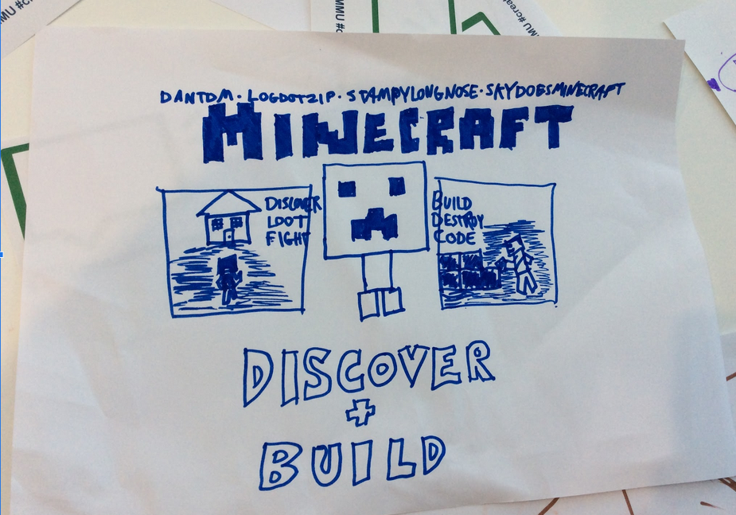

---
# all the regular stuff you have here
zotero:
  scannable-cite: false # only relevant when your compiling to scannable-cite .odt
  client: zotero # defaults to zotero
  author-in-text: false # when true, enabled fake author-name-only cites by replacing it with the text of the last names of the authors
  csl-style: harvard-manchester-metropolitan-university # pre-fill the style
layout: post
categories: chapter
title: 1. Introduction - Games for a Read-Write world.
---
-   [Introduction - "Games for a Read / Write
    World."](#introduction---games-for-a-read-write-world.)
    -   [1. Introduction to the thesis](#introduction-to-the-thesis)
    -   [2. Context / Background](#context-background)
        -   [Background of informal settings / non-formal and home
            education
            context](#background-of-informal-settings-non-formal-and-home-education-context)
        -   [Context of digital making](#context-of-digital-making)
        -   [Context of school-based computing
            education](#context-of-school-based-computing-education)
        -   [Context of digital game
            making](#context-of-digital-game-making)
            -   [Broad Motivations for undertaking
                CGD&P](#broad-motivations-for-undertaking-cgdp)
            -   [The context of family
                gaming](#the-context-of-family-gaming)
        -   [Barriers to participation in programming and specifically
            CGD&P](#barriers-to-participation-in-programming-and-specifically-cgdp)
    -   [3. Rationale for the Study:](#rationale-for-the-study)
        -   [Personal context](#personal-context)
        -   [Connecting my experience to broader contextual
            themes](#connecting-my-experience-to-broader-contextual-themes)
        -   [Rationale of home education settings as a site of
            research](#rationale-of-home-education-settings-as-a-site-of-research)
        -   [Ratinale for a new design (is this
            objectives?)](#ratinale-for-a-new-design-is-this-objectives)
        -   [Summary problem statement of the
            thesis](#summary-problem-statement-of-the-thesis)
    -   [4. Theoretical framework, research objectives, and
        questions](#theoretical-framework-research-objectives-and-questions)
        -   [Summary of the theoretical framework of this
            thesis](#summary-of-the-theoretical-framework-of-this-thesis)
        -   [Research Questions (RQs)](#research-questions-rqs)
        -   [Research objectives](#research-objectives)
        -   [Justification of limitations in scope of the
            thesis](#justification-of-limitations-in-scope-of-the-thesis)
    -   [5. Significance of the study](#significance-of-the-study)
    -   [6. Chapter outline of the study](#chapter-outline-of-the-study)
        -   [7. Summary and link to next
            chapter](#summary-and-link-to-next-chapter)
    -   [To integrate above](#to-integrate-above)
        -   [Barriers to participation in game making practices
            (explored in contextual
            settings)](#barriers-to-participation-in-game-making-practices-explored-in-contextual-settings)
        -   [Institutional Barriers - related to UK School
            context](#institutional-barriers---related-to-uk-school-context)
        -   [Technical Barriers - Difficulties in learning to
            program](#technical-barriers---difficulties-in-learning-to-program)
        -   [Cultural / Identity barriers to participation in
            ...](#cultural-identity-barriers-to-participation-in)
            -   [Barrier - Identity and computer
                cultures](#barrier---identity-and-computer-cultures)
        -   [Barrier - unfamiliarity with support
            practices](#barrier---unfamiliarity-with-support-practices)
        -   [Outlining cultural barriers / aspects of game
            making](#outlining-cultural-barriers-aspects-of-game-making)
    -   [TO DROP OR MERGE UP.](#to-drop-or-merge-up.)
    -   [Existing responses to
        challenges](#existing-responses-to-challenges)
        -   [Digital projects as an inclusive pedaogogy - MOVE TO
            INTRODUCTION](#digital-projects-as-an-inclusive-pedaogogy---move-to-introduction)
        -   [Resource provision and CPD](#resource-provision-and-cpd)
            -   [Computing at schools](#computing-at-schools)
        -   [Open source, online responses to the
            challenge](#open-source-online-responses-to-the-challenge)
            -   [Mozilla, an open source
                toolset](#mozilla-an-open-source-toolset)
    -   [4-DROP MERGE. Introduction to theoretical framework &
        agency](#drop-merge.-introduction-to-theoretical-framework-agency)
        -   [Theoretical framework](#theoretical-framework)
        -   [On agency and cultural historical activity theory /
            socio-cultural
            approach](#on-agency-and-cultural-historical-activity-theory-socio-cultural-approach)
        -   [On utility and Design-based
            research](#on-utility-and-design-based-research)
    -   [PARKED](#parked)

# Introduction - “Games for a Read / Write World.”

**A study of the cultural and interpersonal dimensions and evolving tool use of an emerging community of families coding digital games together.**

<!-- Author Mick Chesterman

## Abstract
https://stummuac-my.sharepoint.com/:w:/r/personal/55120089_ad_mmu_ac_uk/_layouts/15/Doc.aspx?sourcedoc=%7B813EF50F-3400-4E1E-8105-698B756CAB7C%7D&file=Simulation%202025%20-%20test%20project.docx&action=default&mobileredirect=true&wdOrigin=OFFICE-OFFICE-METAOS.FILEBROWSER.FILES-HOME
To come - for now see outline of thesis at the end of chapter -->

## 1. Introduction to the thesis

We live in a society where digital technology is increasingly used in work, education and home life, providing diverse opportunities. These opportunities are balanced with potential costs at both a societal and individual level. This study addresses the creation of interactive, online media in the form of the production of web-browser based games for the purposes of education. Over the lifespan of this thesis there has been significant developments in narratives concerning digital media and participation in knowledge production. At the start of my work in this area, a concern around deficit of computer literacy workforce was prevalent, particularly in the area of lack of computer programming [@livingstone_next_2011]. The underlying narrative was generally optimistic, new technologies are providing diverse opportunities and the challenge is to ensure opportunities of access for diverse stakeholders. By way of contrast, present narratives surrounding the concerns surround impact of generative artificial intelligence and social media on young people are less optimistic. Specific concerns include: the risk that convenience and automation of tasks, in the form of generative AI and related software services, diminish critical thinking skills making individuals overly reliant on technology;  sophisticated media production and delivery systems which driven by algorithmically generated suggestions can foster passive consumption of media in a way which amplifies divisions within society; and the impact on young people of increased screen time and subsequent impact of reduced real life  interactions. Participation of young people within areas of social media and online gaming in particular reflect ongoing tensions related to the opportunities for self-expression and the dangers of identity formation within digital spaces that are hard for parents to participant in for governments to effectively regulate.  

In response there are increasing calls for digital and resistance often taking the form of reduced participation in online communities or consumption of digital media from corporate sources [@syvertsen_digital_2020]. However, for young people with their working life ahead of them non-participation in the digital landscape as a strategy may be a limiting and potentially alienating strategy. Also, given that digital non-participation may remove critical voices from important debates on our futures, a more  tactical and participatory approach may be more productive both on an individual level and for society. An alternative strategy is a more active and critical engagement with media production. A diverse set of stakeholders from educators [@resnick_coding_2020], cultural commentators [@rushkoff_program_2010], media theorists [@ito_hanging_2010] have have called for a broader approach to digital education that includes media literacy and hands-on coding experiences via creative digital projects. The unifying ethos is that to benefit from the expressive and empowering potential offered by digital media products like websites, games, videos, music and podcast learners should be able to write as well as read digital formats [@resnick2002rethinking].

<!-- This would therefore encourage a more active and critical engagement with technology in a way that would potentially benefit wider society. -->

<!-- AND? The picture is complex reflecting online choices by young people which may have longer terms negative impact on wider agency and diversity. ? Something like this.   -->

The research process of this thesis brings families together in a new learning environment to learn how to create video games based on early arcade and platform games. As such this thesis addresses diverse elements including the development of skills needed to participate in computer game design and programming (CGD&P), the process of self-expression and identity development within an emerging community, and possibilities to structure the learning experience to help overcome inherent barriers to participation.

This chapter is structured to give an overview of the context, rationale, process, objectives and significance of this study. While the setting of this study is non-formal in nature, because CGD&P is present and relevant in contexts of both formal and non-formal computing education, the following section outlines the changing contextual features of both areas. Following this, I outline key barriers to participation to game making. The rationale driving this work is then outlined by connecting with my personal context with broader motivations. The next section briefly addresses the theoretical framework, research questions and subsequent research objectives. Finally, the potential and significance are outlined.

<!-- THIS I THINK IS NOT REALLY ADDRESSED IN THIS THESIS - THE LATTER PART IS ON AGENCY

However, my experiences highlight the barriers to undertaking practical project-based learning (PBL) projects, particularly in a UK computing context, a theme which is explored further in the literature review. The process of being involved in short-term systemic change only to suffer later backlash has guided me to help others explore a more critical understanding of their own place within wider systems.  -->

<!-- A special issue of Mind and Culture [@kajamaa_young_2019] focuses on young people, digital mediation, and transformative agency. This theme is explored by RQ3 and becomes the guiding principle of Chapter 7. -->

<!-- Rogoff reflection on the seemingly chaotic processes happening in a community of learners [].   -->

<!-- The process of launching into the unknown with project involving a group of people hoping to collectively make some kind of progress towards a sketchy goal was something familiar to me but under-explored.  Dave Gray's Gamestorming resource [gray_gamestorming_2010] (which became a guiding principle of EdLab project work) outlined a principle of fuzzy goals adapted from Blackwell's work [blackwell_radical_2009]

The process aligns with mutuality of design work and acknowledgement that while the process can seem a bit sketchy the results which incorporate ideas from diverse participants, also build a collective understanding of the problem area among participants which is as valuable as the proposed solution. It can also avoid unforeseen consequences by a more rapid adjustment in the course of a project. -->

## 2. Context / Background

This introduction begins an exploration of key contextual factors. The immediate context of the core activities of this research was a new learning community involving of home-educating families attending a series of game-making sessions in the setting of my University campus. Sessions involved families, myself (as both a researcher and teaching facilitator), and for most sessions, volunteer student helpers. This section situates this research within key contextual themes. This section begins with the context of non-formal home education setting before addressing digital making as a more general educational activity in formal and informal settings before addressing on game making as a subset of digital making.

<!-- MOTIVATION DRIVING THIS ? SITUATE READER - SURFACE RELEVANT THEMES? -->
<!-- A more detailed exploration continues in the literature review of Chapter 2. -->

### Background of informal settings / non-formal and  home education context

The setting of this research within a non-formal activity attended by families is needs clarifying at this stage. The nature of formality in learning is examined briefly here using two dimensions: setting and educational structure. While definitions of informal education are complex, the term generally refers to learning that occurs outside a traditional school environment  [@erstad_identity_2012]. However, as Sefton-Green [@sefton-green_literature_2006] notes, formally structured learning can take place in informal settings, and vice-versa. Others writers [@eshach_bridging_2007, p. 173; @werquin_recognition_2009] use the term "non-formal" describe learning that happens involves less direct instruction than a typical classroom experience but which still comprises an organised learner experience, existing therefore between both formal and unstructured learning on a spectrum. This study uses the term _non-formal_ learning in this way, while _informal_ learning is used more loosely to indicate activities happening outside a classroom context.

Similarly the context of home educating families merits attention here. The processes and motivations driving of home education are varied [@fensham-smith_invisible_2021]. These motivations are often categorized into two broad streams: pedagogy and ideology [@galen_home_1991; @rothermel_can_2003]. Addressing ideology, some families choose home education to limit their children’s exposure to mainstream values, such as religious beliefs or consumerist ideals. In terms of pedagogy, popular concepts within home education circles include unschooling and deschooling. Holt’s concept of unschooling [@gray_challenges_2013] emphasises facilitating learning by drawing out children's interests through everyday activities. Illich’s work on deschooling promotes the idea of _webs of learning_ [@illich_deschooling_1971], where learners access educational experiences in varied contexts based on their interests and needs, rather than relying on a single educational institution as the sole source of knowledge. Many home-educating families actively seek and establish networks, using friendships, social networking groups, and email lists to share opportunities and collaborate on learning activities [@doroudi_relevance_2023]. The game-making club that forms the basis of this research can be viewed as one node within the complex web of learning that participating families engage with. Some parents withdraw children from school due to a judgement that they are not able to meet their particular educational needs. This may be particularly the case for less visible disabilities including dyslexia, ADHD, autism. In a review of experience of parents home educating children with autism, motivations for withdraw from school identified included the exclusionary nature of mainstream school, lack of knowledge from teachers, and subsequent lack of inclusive educational practices [@ohagan_what_2021].

### Context of digital making

<!-- Before addressing studies directly focused on computer game programming in Chapter 2,  -->

The process of digital game making is located within a wider setting of digital making and its associated culture. Gee [@gee_what_2004] describes the process of learning in informal environments and the resulting opportunities for participants to follow their own interests and to group together with others that share similar aims, framing the communities as _affinity spaces_. Gee's research [@gee_what_2004] on young people's participation and learning in digital and on-line communities in part addresses the domain of computer games. He describes the activity and culture created around games as _meta-gaming_. Examples of meta-gaming include: fan websites and fiction, sharing of tips, creation of imitation games or related artwork. Gee examines how shared discourses and emerging identities develop within these spaces. In a similar vein, researcher Mizuko Ito's ethnographic approach to studies of informal digital consumption and making in the home [@ito_hanging_2010; @ito_living_2009], charts a progression in proficiency of young makers of digital products within online communities. Her approach connects the affordances of new online tools with a sociocultural view of learning as embedded within social and cultural contexts [@ito2013connected]. Sefton Green [@sefton-green_mapping_2013] also explores salient themes in digital making including: its alignment with valued digital skills required by the workforce, anxieties around the use of digital technology by young people, and the role of diverse learning settings. He notes both the potential and current lack of research on the transfer of learning opportunities and learner trajectories between informal experiences, formal learning settings and professional destinations.

<!-- ETHOS AND MOTIVATION -->

Observations of young people's enthusiastic involvement in digital making, media and game making, and meta-gaming in informal communities have sparked questions on how to leverage this interest as funds for other educational aims [@gee_what_2004; @papert_mindstorms_1980]. This underlying question in part informs the ethos of this thesis.

Digital making it itself a subset of a long tradition of a broader maker movement within education, of which the underlying ethos can be described as a complex mix of practitioner enthusiasm, industry participation and progressive educational approaches [@de_vries_maker_2018]. Reduced cost and technical barriers to hardware tools such as 3D printers and microcontrollers and software provided by free open source software [^a] were characteristic that contributed to their widespread adoption by enthusiasts at home and increasingly in education.

The engagement of many teachers and enthusiastic volunteers in these initiatives these is documented the proliferation of articles, videos, blog posts, and other resources sharing novel practice [^b]. This ground swell of activity was also present in community events with a multi-generational audience e.g. the annual Liverpool MakeFest and a proliferation monthly Raspberry Jam events in different regions in the UK [@shea2016hacker]. These grassroots events brought together teachers, professionals, young people and their families to engage with diverse new technologies in playful, empowering and technically challenging ways.

Evolutions in web technology brought new possibilities to making within the internet browser.  In early 2013, MIT released a new version of their educational Scratch software, a block-coding tool for beginners [^c]. This brought new features of an online editor with the default ability to save projects online and therefore accessible in different locations; the ability to comment on and to remix the projects led to a significant increase in volume and forms of community interaction.

For more advanced learners, free web-based courses on authentic, text-based programming languages like Python and JavaScript added interactive elements to online coding tools to scaffold and motivate the acquisition of coding concepts and practical coding skills [^d]..

A Mozilla white paper [@mozilla_foundation_webmaker_2014] outlines the power of exploring web technology as an empowering activity. As part of their teach the web and web literacy programme, Mozilla created internet browser based tools to support of novices investigate,remix and create their own pages within simple browser interfaces. One tool of particular significance was Thimble a _code playground_ [^e], which allowing scaffolded use of the web technologies, and a social platform and community on which to publish web page projects. Thimble became a hub for online activity linked to real-life educational communities and approaches called Mozilla webmaker clubs. Important features of these webmaker clubs included activities drawing on home interests to encourage creation and sharing of outputs, and exploration of the digital literacy elements needed to be an effective citizen [@thorne_clubs_2015]. In 2015 I contributed an online course called Quacking Javascript to the webmaker curriculum. In my report on the underlying pedagogical approaches [@chesterman_webmaking_2015], I outlined the following possibilities to increase participant engagement; playful approaches, use of games, and the ability for participants to incorporate popular culture and home interests into their work.

COULD MOVE TO FOOTNOTES?
Educators have adapted creative 'sandbox' games like Minecraft to develop design skills in a playful environment.

Other accessible hardware, such as Makey Makey and Microbit, combine web-based block coding with simple physical computing.

<!-- The desire to complete a particular project and self-motivated access to the resources to achieve it is the stuff of computing mythology, recalling the kind of garage innovation that created Apple computer and early hacker computing culture [@fuller_garage_2015]. -->

<!-- These tools and practices were mostly free both in terms of cost and through the use of open copyright licences,  -->
<!-- The Arduino board and the affordable, compact, and hackable Raspberry Pi computer opened new avenues for physical computing . -->

### Context of school-based computing education

<!-- The most prominent learning objective of making games in educational setting is to develop _coding and computing skills_. There are extensive studies on _game making to learn other subjects_ including maths, biology and chemistry but diverse examples exist. Game making can also develop social skills, self-reflection, cultural awareness and a range of technical abilities that allow participation in information society. There are also a powerful vehicle for exploring issues involving race, sex, social issues [@tekinbas_quest_2010]. -->

<!-- While there has been a large body of research on the value and practice of game making for educational purposes, it is a dynamic landscape which has many areas which merit additional research. -->

The changing shape of provision on UK digital-focused education in schools can be profitably examined through several key developments. The first is Google leader Eric Schmidt's speech as a MacTaggart lecture in Edinburgh in 2011,  critiquing current computing provision, "Your IT curriculum focuses on teaching how to use software, but gives no insight into how it’s made" [@schmidt_eric_2011, p.8]. The second was a report "Shut Down or Restart?" by the Royal Society (RSA) [the_royal_society_shut_2012] released in early 2012. The report recommended steering the ICT curriculum towards computer science and programming, providing funding professional development and a greater inclusivity in computing education, and increased partnership work with computing professionals. In the same week Michael Gove [@-gove_michael_2012] announced the scrapping the ICT curriclum. Finally, the new _computing_ curriculum was released in 2013 to a mixed response [@dfe2013national]. However, while community responses were collected via a consultation, a clear consensus to avoid removal of too much digital literacy and creative project work was ignored in the final curriculum [@twining_we_2013]. Preston [@preston_re-engineering_2013] shares Twining's perspective that Gove and Schmidt's critique of previous ICT provision was misjudged, sharing a perspective that the ICT had been caught up in decisions that were more political  than pedagogical in nature.

<!--
In the intervening years, there have been extensive programmes which provide instruction based resources online  and those providing CPD to teachers as detailed in the introduction [Barefoot, NCCE, CAS]. -->

A recent report by Kemp and colleagues [@kemp_considerations_2024] on the future of computing education confirms some of these initial concerns about the 2013 computing curriculum and related exams. The authors note the decreasing take up of computing by girls and those in lower socio-economic areas and an increasingly unequal offer of digital-based exams to students. One of the recommendations of this report is to offer more informal digital making and project work involving coding as an inclusive practice. A previous report, "After the Reboot" [@waite_pedagogy_2017], found that girls, ethnic minorities, and students of lower socio-economic status were all less likely to take computing as a subject at the GCSE level, in part due to cultural barriers and the relative difficulty of the subject. The review highlighted several areas of promise that needed more research that are relevant to this study including: game making as a way of increasing engagement in coding, use of design patterns to scaffold coding processes, and a greater focus on social and cultural aspects of coding. However, despite the report's advocacy for game making and other digital projects to mitigate issues of exclusion, the structural limitations of the curriculum and computing exams remain. These ongoing challenges within UK computing education highlight a mismatch between the curriculum and the opportunities provided by  developments in digital making. These factors have led may practitioners and researchers to investigate game making in more informal settings.

<!-- NOTE - DEVELOP -
The value of these informal spaces and approaches -->

<!-- - Scratch new version really accessible and large uptake in broad age range.
- Launch of Raspberry Pi , building on the sucess of Arduino and extending it

- Makey Makey as a tool with Scratch as a very accessible physical computing too.
- Code Bug, later Microbit
- Other online tools for learning programming like Code Academy, interactive, and effective. Including the use of Code playgrounds, simplifying
- Minecraft, a sandbox game, educational potential, and an online community -->

<!-- Other contextual factors regarding home and informal learning environments and digital making are explored in Chapter 2. -->

### Context of digital game making

In this thesis, I explore digital game making and participation in coding community practices by home educating families. This section begins by outlining broad contextual motivations for undertaking CGD&P, progresses to briefly describe context of game culture within families before a fuller summary of potential barriers to undertaking CGD&P.

<!-- The participants in this study are small groups of home educating families undertaking short, informally-structured game making courses.  -->
<!-- This study stands as a small contribution to a more inclusive approach to technology development, moving beyond a future dictated by a technological elite to one shaped by a broadly informed society. -->

<!-- REFRAME AS EMPOWERMENT -->

#### Broad Motivations for undertaking CGD&P

While much research on digital game making focuses on its educational benefits for subjects like mathematics and science, and computer science (via programming in particular) [@kafai_constructionist_2015], there are also a diverse range of motivations behind game making, including supporting a stem-pipeline into industry [@holmes_role_2023; @edwards_stem_2023], developing communication, creativity and  digital literacy (a grouping often framed broadly as 21st Century skills) [@bermingham_approaches_2013; @robertson_adventure_2007], or exploring social and ethical issues [@peppler_collaborative_2013]. An underlying theme to many of these motivations, and one prevalent in advocacy for digital game making, concerns the potential of the overall expressive value of digital media [@resnick_computational_2018]. For Resnick [-@resnick_lifelong_2017], developing fluency, whether with writing or coding, helps develop your thinking, voice, and identity. This point gains a particular salience given the increase attention on game playing as an educational strategy compared to game making [@kafai_connected_2016]. An exploration of computational fluency and the wider concept agency are undertaken in more detail in Chapters 2 and 3.

<!-- Withing digital making and serves as a counter point to formulaic and instruction-based computing education [@resnick_coding_2020].  -->

<!-- MOVE LATER? CH. 2
The term communicates 'not only an understanding of computational concepts and problem-solving strategies, but also the ability to create and express oneself with digital technologies' . -->

#### The context of family gaming
<!-- DROP OR MOVE THIS? WHERE AGENCY?
To answer this question, theoretical and practical understandings of the development of agency in the participation in informal community-based projects are of value. -->

Turning to the context of game making in a family context, the wider context of game playing is relevant.
While both adult and child novice game makers have the potential draw on their experience of game playing knowledge in their creations, their experiences may vary widely. Game-playing practices and the opportunities provided by participation in wider communities continue to evolve shifting from a marginal activity to a place within more mainstream culture [@engelstatter_video_2022]. For example, casual and retro games played by both adults and children are increasingly available via smartphones and home consoles [@juul_casual_2012]. Thus increasing numbers of parents are gamers or have past gaming experience.  
Studies of varied parental mediation strategies for children's gaming identifying restrictive mediation involving limiting access; active mediation via discussion and negotiation; and co-playing of games as a form of mediation [@eklund_parental_2013; @nikken_parental_2006]. Some classic or retro games have achieved cult status reflected in recent blockbuster films involving Mario, Pac-man, and Sonic the Hedgehog [^f].  Nostalgia around such games and the associated aesthetics of cuteness create a potential for connection between younger and older players [@boyle_retro-futurism_2017]. The sustained popularity of retro games together with easy-to-use game making tools and code frameworks, provides an entry point for game players into game making cultures, a factor reflected in the popularity of projects based on retro games on game-publishing websites which allow amateurs to share their self-made games [@garda_nostalgia_2014] [^g].    

The process of making retro games with families lies at a confluence of diverse contexts, motivations, and possibilities. However, while these contexts and related processes clearly offer significant potential there are also significant barriers in play which are explored in the following section.

<!-- While the motivational and navigational affordances of enthusiast game making communities can be brought into more structured educational environments. -->

<!-- The next section begins to explain my personal interest in this dimension of the study through a brief exploration of my involvement in project-based approaches in digital media education and campaigning contexts. -->

### Barriers to participation in programming and specifically CGD&P

<!-- NOTE BARRIERS FROM CH 2 MOVED HERE -->

This section explores relevant studies to outline the barriers to participation in CGD&P, addressing the following areas: technical barriers, difficulties in structuring and accessing learning experiences, and issues related to identity and values.

CGD&P inherits some of the intrinsic difficulties associated with computer programming [@sentance_teaching_2019; @gomes2007learning; @joao_cross-analysis_2019]. These difficulties include the complexity of programming syntax, the challenge of understanding abstract concepts, and problems with transferring skills between different contexts [@gomes2007learning; @rahmat_major_2012]. To address these issues, specialist coding tools, such as block-based coding environments, have been developed for novice coders, particularly younger audiences. These tools aim to simplify coding syntax, project organisation, and the overall complexity of the coding environment [@yu_survey_2018]. However, this simplification creates a tension between using more authentic programming languages and relying on scaffolded, specialised approaches  [@joao_cross-analysis_2019]. Sefton-Green [-@sefton-green_mapping_2013] explores this tension in the context of digital making, contrasting Mozilla Webmaker tools (which use web languages like HTML, CSS, and JavaScript) with block-based systems like Scratch, which can obscure learners from authentic code languages. Papert and Turkle's [-@papert_epistemological_1990, p.134]] identify exclusionary potential in the dominant formal, abstract approach to computer programming that "emphasizes control through structure and planning". They characterise this approach as including: a top-down design process involving extensive planning prior to coding, explicit teaching of language principles and syntax, and coding from scratch rather than altering existing products. Papert's [-@papert_mindstorms_1980] foundational work in programming education addressed these barriers through the careful design of both tools and learning environments [^h].

<!-- Through a literature review on this topic, we aim to organize and   systematize the main difficulties into four dimensions of analysis: (i) subject and complexity of languages; (ii) technologies and applications; (iii) teachers and teaching methodologies; and (iv) pupils’ skills[@joao_cross-analysis_2019] -->

<!-- #### Access to  CGD&P -->

<!-- For example, the importance of reducing barriers to learning coding through structural abstraction and thus the simplification of learning environments. -->

A further area of barriers to participation in CGD&P is the lack are those regarding difficulties in structuring and accessing learning experiences in informal and collaborative settings. For example a key review exposed a lack of specific pedagogical approaches to undertake social approaches in CGD&P [@kafai_constructionist_2015]. As existing approaches are explored in depth in Chapter 2, for now it is sufficient to outline broad approaches and some inherent challenges.

A brief exploration of the process of _tinkering_ as an education practice helps situation a challenge associated with how to support creative practices. Tinkering in this context refers to the use of more immediate and learner-directed connection with the materials or digital artefacts together with the possibility for changes to be rapidly fed back to learners via visible results [@vossoughi_making_2015]. The learner is presented as adapting a familiar set of concepts and processes to new situations and challenges as they arise as a 'tinker' might use well worn tools to skilfully improvise a repair job [@papert_childrens_1993, p. 143]. While such open-ended and exploratory approaches drive engagement [@sheridan_learning_2014], they may present challenges in completing project work if in sufficient modelling or support in problem solving and access to resources are not provided [@bevan_tinkering_2014]. Concerning this structural dimension of education, the work of Rogoff [@rogoff_organization_2016] also addresses distinctions between formal and informal approaches to structuring learning in community settings. Rogoff proposes that there is a false dichotomy between framing of _children-led_ (based on free exploration), and _adult-led_ (focused on direct instruction) approaches [@rogoff_observing_1995, p.211]. Instead, she proposes instead a more complex community-based understanding of learning that includes concepts of guided participation and apprenticeship [@rogoff_developing_1994]. Rogoff refers to a process of guided participation which she defines as active involvement in cultural and social activities, under the guidance of more experienced individuals [^h]. The ramifications implicit in the limitations Rogoff cites are crucial to this study as this deficit makes the documentation and dissemination of community learning strategies both less likely and problematic given the unfamiliarity of many practitioners.
<!-- This alternative to the simplistic children-led/adult-led spectrum. -->

Another significant barrier is the inequality of access to digital making communities and practices. Historically, the lack of access to the necessary technology, such as high-cost computers, was a major issue [@resnick_computer_1996]. While lower costs of equipment and equipping school and  community centres have addressed some of these concerns, technological access is only one dimension of the problem. Sefton-Green [-@sefton-green_mapping_2013] suggests that even with improved access to equipment, many young people still face barriers. Among those who do participate, creative activities that result in finished digital products are rare, with studies such as Luther et al. [-@luther_why_2010] revealing an 80 percent failure rate in collaborative media projects within the New Grounds community. Thus Sefton-Green [-@sefton-green_mapping_2013] argues that motivated and capable facilitators are crucial for enabling participation. In addition, the appeal of online digital making communities, as described by Ito and Gee [-@ito_hanging_2010; -@gee_what_2004], is inconsistent due to more cultural barriers of participation.

<!-- This perspective continues to drive constructionist design approaches supporting creative computing [@resnick_design_2005; @resnick_scratch_2009; @kafai_constructionism_1996; @kafai_constructionism_1996; @kafai_minds_1994; @lee_playing_2014; @peppler_makeology:_2016]. -->

Addressing barriers linked to identity and values, a key theme in CGD&P is the potential for games to increase inclusivity for those traditionally excluded from computing and digital making cultures [@kafai_beyond_2014]. While  digital making  provides many opportunities to some young learners, Vossoughi et al. [-@vossoughi_making_2016] critique the culture of digital making, underlining the need to integrate not only the values but also the cultural experiences of working-class students and students of colour into the making process. Other researchers also highlight political a concerns associated with the often close alignment with maker culture and makers spaces with STEM industry [@thumlert2018learning; @vossoughi_making_2016]. They caution against approaches and environments that can implicitly favour the impression that digital making is primarily a pathway to joining the computer programming industry through developing employability skills in young people. Thumlert and colleagues [@thumlert2018learning, p.4] caution against the ongoing appropriation of the framing of skills such as creativity and _design thinking_, which they argue are increasingly co-opted by market-driven agendas rather than being used for critical and emancipatory purposes . They also warn that this positioning could lead to a return to instruction-based models that are narrowly focused on curricular concerns, rather than fostering the development of learners’ expression within a community [@thumlert2018learning].

While the widespread appeal of casual and retro gaming, alongside the proliferation of retro games in popular culture, offers a rich repository of knowledge that can be utilised in various educational contexts [@moje_working_2004],, Kafai and Burke [-@kafai_diversifying_2017] balance this potential with complex issues of the gender representation associated with gaming culture. Addressing gender-based barriers to participation, Papert and Turkle [@papert_epistemological_1990] identified some girls' alienation from abstract computing approaches. They emphasised the need for diverse teaching and learning styles to address issues surrounding the early socialisation of women and girls, advocating for the inclusion of personal and concrete working styles. Denner and colleagues [@denner_what_2008; @angelides_beyond_2014] highlighted that inclusive gender practice in game making involve allowing participants choice over both the content of their games and the dominant mode of play (game mechanics). Their findings present a nuanced view of girls' interests in game genres and support research cautioning against gender stereotyping and rigid identities in this area [@pelletier_gaming_2008]. Kafai and Burke [@kafai_beyond_2014] address gender identities within game design by advocating for the creation of new communities and learning environments that align with participants' values, rather than attempting to draw girls into existing, male-dominated spaces. Similarly, Buechley et al. [@buechley_lilypad_2008, p. 431] ask, “How can we integrate computer science with activities and communities that girls and women are already engaged in?”

Margolis et al. [@margolis_stuck_2008] outlined barriers contributing to a racial gap in computing participation and achievement in the US, including feelings of isolation, limited access to computing opportunities, and a lack of social support. DiSalvo and colleagues investigated these barriers within a game testers programme, examining how an interest in computer games could motivate access to computing education [@disalvo_saving_2014; @disalvo_glitch_2009-1; @disalvo_learning_2008]. Their findings indicated that activities should not only be engaging but also align with the underlying values of the programme’s young, African American male participants.

<!-- To address issues of confidence interacting in online communities, Roque's FCL study aimed to move online community interaction into a face to face settings [-@roque_family_2016]. The use of facilitators who were trained to recognise the helping behaviours of parents. -->

## 3. Rationale for the Study:

### Personal context

<!-- In 1995, as  recent graduate and new editor of a fanzine on the fledling electronic music scene centred around the Hulme venues of the Nia centre and New Adri, I was directed to this centre as it had the software Abiword which had the ability to print out rounded text boxes, a feature I thought would look pretty snazzy cut and pasted over over-photocopied backgrounds from 2000AD. No physical place in the UK seemed to better live out the counter-cultural, dystopian, cyberpunk ethic popularised by 2000AD and the author William Gibson. -->

<!-- In the middle of regenerated Hulme on the corner opposite the Birley fields campus is a squat unassuming building called the church of the Ascension. It is notable Apart from being  a site of sanctuary for the political refugee Viraj Mendis in a notable anti-deportation campaign of the 1980s, it was also the site of one of Europe's first electronic village halls, Hulme Community
##  Computing Centre. Here a encouraged me to make a website a music fanzine I edited, giving me a print out on how to write HTML web pages and offering free space as part the projects website. This spirit of peer-learning combined with my desire to share the ethos of the DIY music scene fuelled many years of using the internet to promote unlicensed music events. In 1995, the internet, like Hulme, seemed to be a corporate free space, a space for oddballs, niche enthusiasts and more importantly activists. This period saw increasing alignment with the growth of the internet to link up activities of disparate political and cultural groups around gatherings international finance institution (IFIs). For me this culminated in helping to organise and promote an event for June 18th 1999. Similar carnival-themed events drew on the blue print of reclaim the streets mixing street blockaded by outdoor sound systems. While the site of street party and protests as a chaotic and inspirational environment has been explored [@carmo_reclaim_2012; @jordan_notes_2005]. -->

The role of this thesis regarding the use of technology for self-expression is one reflected in my personal and professional trajectory. My journey into the world of technology and education began in the 1990s via my participation in organising and promoting unlicensed music events, free festivals and related campaigning activity. In the _party and protest culture_ which emerged from the 1994 campaign against the Criminal Justice Bill [@mckay_diy_1998], email lists and websites became important outreach and organising tools. I was an enthusiast early adopter of these technologies for the purpose of social change. In the 2000s, my focus shifted towards environmental activism, migrant rights and left-libertarian protests challenging the unaccountability of international finance institutions including the WTO, IMF, and G8 [^1]. Self-made media and cultural activity was an important part of this movement. The advent of the relatively affordable, Hi8 and subsequently MiniDV domestic camcorders and PC based editing software began to remove financial and barriers to video production [^2]. In 2000 I began work with Undercurrents [^3], a _video activism_ magasine [@heritage2008video] to run their website and to begin digitising their VHS content for online distribution. My role also involved organising film screenings and music events for outreach. This work culminated in involvement with a broad network of media and internet activists associated with the Indymedia project [@pickard_united_2006]. Indymedia was an volunteer-run coalition of anti-capitalist media activist which was notable for pioneering work in free software and open source (FLOSS) [^4] technology and non-hierarchical volunteer organising to enable a federated system of open publishing news websites spanning hundreds of cities and regions.

These decentralised organising and production principles, important to both non-hierarchical protest movements and free software also began to impact broader low-cost, participatory digital culture. In particular, the repurposable nature of digital content and alternative approaches to attribution challenging copyright gave rise to widespread _remixing_ as a creative process [@lessig_remix_2009]. Lessig [-@lessig_free_2004] describes the possibilities and resulting activity using the terms as _free culture_. I later co-authored _A Open Web_ [^5], a book which celebrated the opportunities provided by open source and decentralised web technology to create a more egalitarian environment of digital participation, and importantly noted emerging risks to this mode of participation. I shared relevant approaches with local organisations by undertaking internet and media creation training and community development in Manchester and Salford [^6]. I also undertook writing and later organisational work with FLOSS Manuals [^7], and the Mozilla community [^8]  writing documentation and online learning resources for media creation and collaborative processes aimed at individuals and informal educators.

Discussion around the launch of a new UK computing curriculum in 2013 championed the possibilities of creative digital production within the classroom [@livingstone_next_2011]. In that year I undertook a Masters in Computing and in the following year a PGCE in Computing. As part of my PGCE dissertation, I designed and delivered a pilot scheme to teach JavaScript in playful ways. The learning materials were made available as open educational resources (OER) as part of Mozilla's online teaching resources [^9]. Unfortunately, the constraints of the school context and the new curriculum hindered the kind of authentic activities that first attracted me to teaching in Computing in schools. Instead, after completing my PGCE, I joined Manchester Metropolitan University in a role focusing on community education partnerships as part of the EdLab project [^10]. This work provided opportunities to pur_free culture_sue creative, project based approaches to teaching technology to young people and families. Building on the success of this work, I applied to undertake this PhD study with the Education and Social Research Institute of Manchester Metropolitan University (ESRI).

<!-- As I used these terms in an academic context there was push back from colleagues - seeing choice as a term tainted by market driven trends in education.  -->

<!-- This motivation has guided me towards existing research reflect on experiences of developing agency within a non-formal communities.   -->

<!-- This complexity is important to this thesis as it allows a full exploration of contextual factors at play, especially initial and emerging barriers to participation to undertaking project work. -->

<!-- MOVE? WHERE?
One research question of thesis addresses the process of developing agency within a community. While agency and autonomy have disputed, often inter-related definitions [@huang_autonomy_2013; @matusov_mapping_2016]. In chapter 3, this study explores the following terms to guide later analysis: instrumental agency; relational agency ; and authorial agency. -->

### Connecting my experience to broader contextual themes

<!-- This research aims in part to explore to what extent my own interest in chaotic, community-based pedagogies and some of the tensions associated with issues of bringing dimensions of authenticity of processes and tool use from informal and professional communities into more guided non-formal settings.  -->

My experience above informs the broad rationale of this thesis is several ways including: to explore pedagogical structures facilitating collaborative production, to investigate dimensions of learning agency, and to explore the formations community based learning experiences in ways which are sustainable and resilient.   This section briefly explores connections between my experience and these themes in turn.

Addressing pedagogies, the theme of tacit knowledge of practitioners, knowledge which is embedded in practice but hard to articulate, is a common challenge in education [@kratka_tacit_2015]. Bruner [-bruner1999folk] calls these practices _folk pedagogies_. Rogoff [-@rogoff_developing_1994, p. 219] reflects that initial first impressions of a 'chaotic' environment of learning happening in non-formal settings are misleading stem from a lack of understanding of the underlying structure of the mutual activities at play. We can see that this aspect is relevant to a wider rationale of this study to addresses issues of structuring learning to address barriers to facilitating CGD&P. As such, the research process requires precision in both reflection on and communication of process which I have observed in myself and others working in this field.

Turning to outcomes for participants, early in the research process I reflected that while I had an intuitive sense of what a successful group session felt like within creative media project work, I lacked clear language to communicate this. In activist and community development settings the motivations of social change, autonomy and a broad sense of empowerment seemed appropriate as an end goal for learners. As this research progressed, informed by existing research, my interests have coalesced around development of varied dimensions of agency within learning communities. To help reflect on this issue, this thesis engages with a complex and dynamic picture of participant agency (see Chapter 3 in particular).

<!-- The processes of building agency in a fledgling community can be seen as important acts of community participation. -->

This thesis also continues a strand in my work of advocating for community-based, replicable and sustainable approaches to learning. Much of my previous work has revolved around community approaches to learning be it at a festivals, social centres, arts centres or community workshops. Within these varied communities I had fulfilled a role of outreach events and communications with an aim of bringing more people into community activities. Underlying this activity is a personal commitment that the process would be beneficial to both the communities involved and the people I was recruiting [^11]. This research addresses an inequality of access to digital participatory culture with the understanding that such access has the potential for significant benefits for participant. I have made decisions to ensure that learning resources created as part of the research process are freely available, replicable, and sustainable OERs [^12]. These factors, along with a desire to use an authentic web technology coding language and process, drove my rationale to create an novel toolset for the purposes of this study rather than to adopt or adapt existing game making tools.

<!-- While the question of if building a agency within the collaborative work of this activity offers potential to address important contemporary challenges is beyond the scope of this study, it remains a guiding rationale. -->
<!-- If participants can develop agency and experience collective change at this scale, they may subsequently possess greater potential to address problems in other contexts. -->

<!-- Drawing on learners' interests and creating authentic products is a foundational approach of PBL and is explored in game-making context in convincing research. -->

<!-- The importance of participation within seemingly chaotic processes as a way of building a collective understanding of the problem area among participants stands out to me a one with great potential to address important contemporary challenges. -->

<!-- In the 2000s, my focus shifted towards environmental activism, migrant rights and left-libertarian protests against unaccountable global institutions like the WTO, IMF, and G8.  I used film screenings and music events for outreach and email lists, websites and wikis as organising tools. My work with Undercurrents, a video activism magasine, involved digitising their VHS content for online distribution [@heritage2008video]. Through Undercurrents, I connected with a broader network of media and internet activists associated with the Indymedia project [@pickard_united_2006]. These experiences exposed me to non-hierarchical organising approaches and the decentralised organising principles, which are also an important guidelines for the free software and free culture movements [@lessig_free_2004]. Inspired by these potential of the tools and organising processes, I began to share relevant approaches with local organisations by specialising in internet and media creation training and community development. -->

<!--
In 2011, it was revealed that an undercover police officer named Mark Kennedy, operating under the alias Mark Stone, had infiltrated several activist groups I had been part of [@lewis_undercover_2013]. My role in outreach for this movement became very uncomfortable, as it became clear to the extent to which our participation in this movement came with hidden risks. Our attempts to create systemic change were being countered with a response from the state who were far better resourced than our movement. The momentum of this movement had been in part driven by new uses of technology and grassroots organising processes. However, the open web’s potential for egalitarian and non-corporate publishing was undermined through the “embrace, extend, and extinguish” tactic [@jason_strategic_2011]. Concurrently, the open-posting Indymedia news network suffered from extensive publishing of misinformation and ad hominem attacks from suspicious sources targeting community activism on social media.    -->

<!-- In response to growing discomfort around involvement in political and environmental activism and the need to support myself financially, I shifted my focus increasingly towards community development.   -->
<!-- The FLOSS Manuals project also connected me to diverse international networks whose work was informed by participatory production and decision-making methods.  -->

### Rationale of home education settings as a site of research

<!-- While home education is not a core focus of this thesis, it is a significant contextual factor in the research process. As such, I address key contextual factors that impact this study here. THIS IS ABOVE.  -->

The involvement of home educating families as the primary participants of this study is a result of both practical and wider factors. My engagement with game creation rather than media or web co-production as an educator marked a significant shift in personal practice. This new direction originated from a consultation with home educators as part of my university outreach and partnership work with the EdLab project. At the consultation parents and children at the consultation asked if we could lead activities which drew on the children's interest in digital games. Parents asked if we could find a way to teach computer coding using this interest. Minecraft was a named example of a computer game which involved some elements of creative processes. Figure 1.x shows one of the products of this consultation. The names at the top of the image are those of YouTubers making content around Minecraft.

{width=90%}

The contextual features outlined above align with practical factors to make home educators a good fit for this thesis. Research in schools settings is sometimes hampered by practical issues such as timetable considerations and lack of time for project work outside of the subject curriculum. These factors are largely absent when working with home educating families. In addition, the alignment with the needs of participants was also a relevant factor in this work with home educators, allowed for reciprocity in the research process.

<!-- NOTES - could also link with after school club as a similar site. And the value of third spaces (check cross over with Ch.2) -->

### Ratinale for a new design (is this objectives?)

<!-- The more specific of these go in the more detailed problems statement in the final section of Chapter 2 after a review of existing literature.

The general areas of perceived need are as follows.

- Less than clear exploration of the goal of social approaches to coding - variations on Fluency
- Specific pedagogies for social / cultural approaches
- understandings of how to mobilise funds of knowledge -->

<!-- In Chapter  I propose that this aim of fluency can be profitably augmented using socio-cultural concepts of agency. -->

<!-- Given the importance of more intentional pedagogical approaches in this area and the lack of detail in the reviews of CGD&P described above, the following sections will detail several key pedagogies used in this area. -->

### Summary problem statement of the thesis

Despite the growing recognition of CGD&P's educational potential, effective pedagogies, particularly those suitable for informal learning environments, remain under-explored. Existing approaches may not fully leverage the social and cultural dynamics inherent in these settings, potentially limiting opportunities for rich participation and the development of potentially value aspects like learner agency, existing knowledge of games, and a understanding of game design principles. Furthermore, the abstract nature of programming concepts can pose a significant barrier, and there is a need for pedagogical strategies that effectively bridge these abstract dimensions with concrete design practices in CGD&P. This research addresses the gap in understanding how socio-cultural approaches can enrich CGD&P pedagogies to foster more inclusive, engaging, and effective learning experiences that nurture agency and facilitate the application of game design knowledge.

<!-- I have been inspired by Papert and colleagues celebration of concrete approaches to creating digital project bricolage approaches and pioneering work of the resulting constructionist school, centred around MIT media lab, in design software and tools for students to learn in exploratory, project oriented ways.

While constructionism has been used as a "epistemological paradigm, a learning theory and a design framework" [@kynigos_constructionism:_2015], it is the latter that I find most productive due to its comparative weakness as a more general theoretical framework.   -->

<!-- Key characteristics of constructionist design principles are explored in Chapter 2 where I acknowledge their significant contribution to the evolution of the learning design outlined in Chapter 4. In these chapters, I also compare these principles with similar concepts used by sociocultural research in HCI studies, for example Nardi and Kaptelin's interpretation of affordances as a from of mediated action [@kaptelinin_affordances_2012]. -->

## 4. Theoretical framework, research objectives, and questions

### Summary of the theoretical framework of this thesis

<!-- #### (Why not use constructionism) - EDIT DOWN -->

In choosing a theoretical approach which aligned with the goals of the research questions and my role as both a practitioner and a researcher, it was vital to select a framework that could address potential complications within the research process. Constructionism is a foundational guiding theory in game making studies [@papert_mindstorms_1980], illustrated in particular, by Kafai and colleagues outlining the value of making _constructionist_ games [kafai_constructionist_2015]. Despite the value of these contributions to this domain of research, I am in agreement with Ang et al. [-@ang_case_2011, p.539] who see value in constructionist framings of the pedagogical value of constructing tangible products in a community setting but locate the deficit of "a systematic framework for analysing the construction activities within a learning community".

<!-- ANG CHOOSE AT TOO BUT INCLUDE SOME THEORY HERE. -->
The focus of the research required a framework containing concepts able to the following: analyse the evolution of participant agency in the learning process, accommodate authentic learning contexts, conceptualise barriers to participation, and support a mutual approach to involving the community in design changes. To meet these needs I have chosen cultural historical activity theory (CHAT) and supplemented it with specific techniques of design-based research (DBR). Activity theory as a theoretical framework provides tools to study the impact of past cultural activity of participants on present, emergent activity. CHAT also provides powerful concepts to explore a complex and dynamic picture of participant agency which aligns with the context of undertaking CGD&P for motivations of participant empowerment within broader contexts. Chapter 3 explores the use of activity theory and DBR in more depth in relation to these needs.

<!-- (e.g., explore family game making, analyse coding interactions, identify factors influencing empowerment). -->

### Research Questions (RQs)

This research explores how socio-cultural approaches, particularly Cultural-Historical Activity Theory (CHAT), can inform Computer Game Design and Programming (CGD&P) pedagogies. The study aims to enhance inclusive, engaging, and effective learning experiences within non-formal settings, with findings intended for broader application.

The overall aim of this study is best represented via the primary research question (PRQ) of this thesis: **How can pedagogies to support CGD&P be enriched using socio-cultural approaches to foster inclusive learning in non-formal contexts?**

To achieve this aim three sub-questions follow.

- RQ1. What contradictions emerged during participation in CGD&P activities and how were they addressed via an innovative pedagogy?
- RQ2. How can the use of a collection of game design patterns support CGD&P, in particular in relation to abstract and concrete dimensions of existing pedagogies?
- RQ3. How do learner agency and game-maker identity develop within CGD&P communities of practice, and what pedagogical strategies best support this evolution across diverse learning contexts?

### Research  objectives

<!-- The sub-questions are explored in greater details at the end of Chapter 2 in relation to the problem statement of the thesis. -->
<!-- MAKE THESE MORE SPECIFIC -->
<!-- & motivation (is motivation right here? how different from rationale and significance?) - IS THIS THE PROBLEM STATEMENT -->

This study is structured around three core objectives that align with its sub-questions and overarching aim to enrich pedagogical approaches to CGD&P using activity theory as a socio-cultural approach.

Addressing RQ1, the objective is to create a novel toolset and pedagogy that responds to gaps in the current research landscape and the limited resources available to practitioners. The study adapts my existing practice in facilitating web production to a new context: game-making using text-based code with families. This includes the use of FLOSS (Free/Libre and Open Source Software) and industry-standard web technologies, with the aim of enhancing the longevity, authenticity, and extensibility of the game-making toolset. Through a design-based research approach, the study will identify and analyse the manifestations of contradictions within evolving CGD&P activities and explore their role in driving learning and innovation.

In relation to RQ2, the objective is to develop a clear yet flexible pedagogy informed by gameplay design patterns (GDPs) [^13]. Given that few studies provide detailed accounts of pedagogical approaches to supporting learners in the game design process, this research explores how GDPs can function as mediating tools. In particular, it investigates their role in supporting the development of learner agency and in facilitating the appropriation of complex game design knowledge within CGD&P learning environments.

<!-- NOTE MAY NEED TO EXPLAIN GDPS A BIT MORE -->

Addressing RQ3, the research seeks to bring greater conceptual clarity to social and cultural motivations underpinning novice participants' engagement in CGD&P. The focus here is on understanding the development of learner agency through the lens of activity theory, and on examining how game-maker identities emerge within the context of a novel community of practice. This objective explores how these identities are nurtured and sustained across different learning communities, and what pedagogical strategies support this developmental process.

<!-- An additional objective here is to explore the potential of the resulting activities to for in empowerment within technology use more generally. -->

<!-- The guiding principle unifying these terms is being self expression & the following are relevant.

- via instrumental coding competency needed to make changes effectively with or without supporting documentation -->

### Justification of limitations in scope of the thesis

<!-- Clearly define what your thesis will and will not address.
Acknowledge any limitations or constraints of your research.
Briefly mention the challenge of maintaining focus during the PhD process (optional, but shows self-awareness). -->

<!-- #### What this thesis will and will not address  -->

The scope of this thesis is on game making as a practice rather than the broader scopes of game-based learning or playful learning. This presents some challenges as the process of game making undertaken in this research drew on those related areas. This is true in particular of a line of inquiry exploring a playful drama process introduced in a later stage of the research process design. To address this limitation, at times relevant information is included in appendices or footnotes. As will be outlined in Chapter 4, while this study used two distinct toolsets to undertake game making, I focus only on the design utilising text-based coding rather than the one which used block based coding approaches. This decision is due both to the necessity to reduce the breadth of scope to fit within the focus of a targeted PhD dissertation and due to the practicalities of analysis of a large amount of data gathered. Finally, despite the potential of online collaborative making offered by internet based communities, this research retains a focus on in-person community. This decision is informed by a lack of similar research and my interest in the potential of community formation in real-life spaces.

<!-- DROP / MOVE ?
Creating a design experiment with several iterations created not only large amounts of research materials. This presented not only challenges of how to prioritise data gathered (Chapter 4), but in addition the rich set of experiences and educational tools created made it difficult to disentangle the interplay of contributing elements to choose a focus suitable for a targeted PhD dissertation. -->

<!-- I did prioritise key elements of the experience.

Instead, the main prioritisation is represented in the research questions: that being, the use of gameplay design patterns, and their relationship with emerging participant agency.

Even this more limited focus, still contains a rich interplay of diverse tool use, varied of and a study of different dimensions of agency shown by participants. -->

<!-- While, at times, this diversity may ask a lot of the reader to follow, it is justifiable due to the complex nature of the learning experiences involved.   -->

<!-- Thus proposed motivations for supporting coding and game making should be analysed alongside the financial models which support activities.  -->
<!-- Thus proposed motivations for supporting coding and game making are analysed alongside the financial models which support activities. I am guided by the work of Vossoughi and colleagues  [@vossoughi_making_2016] whose see critique of maker movement shows the potentially negative impact of the positivist, industry-focused STEM agenda on inclusive practice. -->

## 5. Significance of the study

<!-- ### Wider implications and applications of the research -->

<!-- To further understand research objectives it is important to situate the potential relevance of the outcomes of this research by exploring its potential audience and impact. -->
This section examines the significance of the study by exploring the wider implications and potential contribution of this research. While there has been a large body of research on the value and practice of game making for educational purposes, it remains a dynamic field with many avenues for further investigation. This study introduces a novel approach by utilising an accessible code playground environment with a modern game development library specifically suited for novice learners. This has the potential to lower the barrier to entry for individuals new to game development and programming, providing a more intuitive and engaging starting point, which in turn can foster greater participation and a more diverse range of learners in this field. The research process has yielded practical resources for educators in the form of freely available software and open-licensed educational materials. This provision of tangible tools that can be directly implemented in educational settings and by independent learners, potentially broadens access to game making as a learning activity.

Another key area of contribution is the development of a pedagogical approach which enhances the diverse benefits and motivations associated with engaging in CGD&P. The promotion of computational thinking (CT) has been a key factor in the development of the UK's computing curriculum. However, the claims of early advocates that CT skills could be applied widely in subjects beyond computing are now advanced more cautiously to avoid the danger of over-promising [@tedre_long_2016]. In contrast, the specific pedagogy which emerged from this research, based on participants' flexible use of game design patterns, aligns with the broad ethos of this study to prioritise learner agency within a non-formal setting. This focus offers a potentially more inclusive and motivating approach to learning, allowing this study to contribute to understanding practices that address barriers to participation associated with more formal or industry-focused learning or making environments [@vossoughi_making_2016]. The emphasis on learner agency is directly supported by the accessible toolset, allowing novices more control over their creative process.

To effectively capture and analyse the social and cultural development within this emerging community, and to understand how these factors influence the implementation and impact of the pedagogical approach, this research employed a unique combination of data collection and analysis methods that may offer valuable insights for the field. The methodology, detailed later in this thesis, involved the concurrent analysis of participants' on-screen activities and 360-degree video recordings of their interactions. This innovative methodological approach can provide a rich, holistic understanding of collaborative digital making, capturing both the technical processes and the crucial social dynamics that influence learning and participation, thereby offering a more nuanced perspective on how pedagogical approaches are enacted and experienced in a community setting.

Furthermore, this thesis contributes to ongoing discussions about disseminating pedagogical practices in game making, an area often lacking detailed description in existing studies [@kafai_constructionist_2015-1]. The detailed description of the learning design in Chapter 5 facilitates the communication of specific workshop practices and pedagogical approaches to both researchers and practitioners, addressing the challenge of abstract or context-bound findings [@hoadley_creating_2002-1]. This careful documentation of process makes the findings of this thesis more accessible and replicable, fostering a stronger connection between research and practice and potentially informing the adoption and adaptation of the pedagogical approach in diverse contexts. To this end, the study is guided by research processes that aim to share design heuristics in a format accessible to a broad audience, potentially informing the design of future learning experiences and tools that further promote learner agency.

Finally, this thesis contributes to emerging socio-cultural interpretations of agency through the analysis of this community game-making context. While not presenting an entirely novel theoretical framework, this situated analysis offers valuable empirical insights into the nuanced ways in which agency develops within a collaborative digital making environment, adding to the growing body of work in this area and potentially informing future research on learner empowerment in technology-rich settings, particularly in relation to how pedagogical choices and the design of learning environments can foster or hinder agency.

<!-- Finally, while the kind of media making activity suits non-formal environments either within or outside of schools, there are numerous structural challenges faced by practitioners regarding  financial sustainability, limits of sustained volunteer activities,
Better rationale and for what makes non-formal settings beneficial is therefore useful in advocacy to fund and motivate activity. -->

<!-- **Diverse audience and formats of findings**

Given the overall direction of this thesis, there are several possible audiences to which this is relevant including families and facilitators in non-formal, settings and researchers in the field of in computing, and media production and education more generally.

These audiences require the findings in different formats. To address this potential a concrete and detailed approach to describing the research is taken to allow for the communication of specifics of workshop practices and pedagogical approaches. -->
<!--
Turning to the issue of dissemination, the process of sharing details of pedagogical practice for and audience of researchers and practitioners is complicated. Many game making studies mentioned also omit descriptions of pedagogies used [@kafai_constructionist_2015].

Given the overall direction of this thesis, there are several possible audiences to which this is relevant including families and facilitators in non-formal, settings and researchers in the field of in computing, and media production and education more generally.

These audiences require the findings in different formats. To address this potential a concrete and detailed approach to describing the research is taken to allow for the communication of specifics of workshop practices and pedagogical approaches.

Even when processes are described, results are often too abstract to be useful or easily understood by practitioners or too bound up with contextual factors to be replicable [@hoadley_creating_2002-1]

To this end, this study is guided by research processes which share, design heuristics in a format that is accessible by researchers and practitioners.

Practitioners may find the narrative description of the design in Chapter 4 an accessible starting point for this work.

The promotion of computational thinking (CT) has been a key factor in the development of the UK's computing curriculum. However, the claims of early advocates that CT skills could be applied widely in subjects beyond computing are now advanced more cautiously to avoid the danger of over-promising [@tedre_long_2016].

As a contrast, the specific pedagogy which emerged centred around participants flexible use of game design patterns. On the other hand, the  process which surfaced guiding design heuristics has greater potential for more diverse application. This theme is explored, along with other avenues of future potential in the concluding chapter.
 -->

<!-- However, the developing of computational fluency in learners is of broad utility to varied streams and motivations. As such, the pedagogy and toolset to facilitate game making should be used broadly.   -->

<!-- **contribution: broader understandings of developing  agency via a grounded case study**

In Chapter 7 I employ recent advances in sociocultural interpretations of collective agency, transformative agency in particular, to analyse this community game making context. As such, while not theoretically novel, this work may form a useful, situated contribution to emerging work in this area.   -->

<!-- To return to the pedagogical outputs, to find out who may benefit from the proposed inclusive game making pedagogy it is of use to ask _who benefits from the success of the Game Making Movement?_ The term Game Making Movement has not been widely applied, but its use by some writers indicates that a significant amount of research has been carried out as part of funded programs, not to mention extensive and creative efforts by professionals and volunteers alike to incorporate this game making into educational experiences.   -->

<!-- ### Contribution to knowledge of this thesis -->

<!-- While the theme of collaborative pedagogies and social practices are well explore in literature on game making, the process of creating a game making community are under-represented. Few addressing an explicit intention to nurture a community of game makers or details how the process of community formation occurred. While this wider community formation is not the main focus of this study, it is a thread which is explored here through the lens of collective agency.  -->
<!-- **Contribution: 360 camera methodology**

In order to capture and analyse the process of social and cultural development happening in the fledgling community I have used methods of data collection and analysis which I feel may be useful to share as a contribution to the field. Chapter 4 details the methodology of recording a dynamic picture of  cultural interactions. Of particular novel interest may be the use of concurrent, side-by-side analysis of capture of what was happening on participants computer screens and 360 video recordings of the room interactions. -->

<!-- TOO SPECIFIC? MAKE MORE GENERAL?
An example of which is the work of Brennan and Silverman [@resnick_reflections_2005], and Brennan and  Petrich in tinkering studios. As a result, my research proposes as a design heuristic, the use of a collection of game design patterns.  -->

<!-- While some existing research on this approach exists [@holopainen2007teaching], this work contributes significantly to this area in the following ways: specifically by researching the use of a GDP collection by novice coders to make games using code, and through the an analysis of emerging  pedagogical uses of gameplay design patterns which are explored in detail in chapter 5. -->

<!-- How much of this research is applicable beyond the domain of game making for educational purposes? The promise of computational thinking was in part based on such claims that it was a powerful way of thinking that could be transfered from the domain of computing to other subjects [@wing_computational_2006-1; @the_royal_society_shut_2012]. Sociocultural and situated understandings of learning view such transmission of knowledge as problematic, a view indeed shared by many advocates of computational thinking [@tedre_long_2016; @guzdial_learner-centered_2015-1]. -->

<!-- This shows a legacy of Papert's work on maths concepts explored in computing microworlds.    -->

<!-- Instead, this thesis is inspired to a larger extent by the work of CHAT researcher to examine community participation within an evolving culture that involves digital creation and coding. For an example of this genre of research we can examine the work of  Cole and colleagues on the 5D project...

This study addresses this in part with a detailed exploration on the learning design in Chapter 5 a design narrative and  Chapter 7 which explores cultural elements of game making research. -->

## 6. Chapter outline of the study

This introduction has covered key contextual, motivational, and theoretical considerations relevant to this study. This section now outlines the structure and indicative content of the chapters of this thesis. The literature review begins the exploration of the key themes and threads that are integral to the findings of this study. One of the challenges of this work is to explore the details for a non-expert audience. While the literature review will begin to disambiguate some of the terms used in the thesis, there is in addition a glossary which outlines short definitions of technical terms used. The glossary is included as an appendix to this study and as a summary table is in the literature review. Key strands of the literature review include: a review of existing studies on game making; an overview of the impact of constructionism on the field; the value of project-based learning approaches; a detailed exploration of varied game making pedagogies including in particular those that used design patterns as a basis; and a summary of game making programmes. The chapter ends by revisiting the problem statement of this thesis in line with gaps in existing research.

<!-- In doing so I explore the direction of travel of 3GAT and increasing synergies with DBR as methodologies whichIn summary, this introduction has established the core motivations for this study and outlined the key contextual factors that have shaped my inquiry into the facilitation of media and digital product creation. By exploring the nuances of informal coding environments and reflecting on my own experiences as a facilitator, the study seeks to address broader questions about nurturing creative and technical skills in novice learners. The introduction also highlighted the importance of making complex coding processes accessible to a non-expert audience and introduced the structure of the thesis, including a focus on key themes such as authenticity, barriers to participation, and inclusive pedagogical strategies. As we transition to the literature review, the next section will provide a detailed examination of relevant research and theoretical concepts that inform this study. This review will serve to clarify the foundational ideas and frameworks essential for understanding the study’s objectives and research questions, setting the stage for a deeper exploration of how design-based research and third-generation activity theory offer innovative approaches to the challenges identified in the introduction. suit both intervention by researchers into the learning environment being studies and corresponding input by research participants in the resulting design. -->

Chapter 3 details the theoretical framework used for this study, taking as its base the use of activity theory. I also explain how the design based research (DBR) aligns well with the aims of the research questions and the use of concepts and the leading approach of third generation activity theory (3GAT). This separate chapter allows for discussion of concepts aligned with the theoretical framework, including: the iterative, mutual, and emergent nature of the resources and processes; the process of identifying units of analysis; and transformative conceptions of agency. Chapter 4 describes the methodology of the study. I describe and justify the process of data gathering using computer screen capture and 360 cameras and other varied means. I explore the challenge of processing and analysing large amounts of research data and justify the resulting prioritisation of data. I also begin to describe the phases of learning delivery.  

Chapter 5 takes the form of a process within design-based research, a design narrative, to provide a detailed description of the tools and pedagogies that emerged from the development process. To explore emerging tensions in design in a way which communicates relevant context, I outline key conflicts in interrelated activity systems using the terminology of third generation activity theory (3GAT). The chapter discussion begins by exploring themes of authenticity of tool use, the mutual nature of the evolution of the design, and initial barriers and corresponding interventions. Chapter 6 focuses on the implementation of individual game design patterns (GDPs) and in doing so addresses how data gathered informs thinking on RQ2. The chapter undertakes a systematic analysis of the use of game design patterns by participants, drawing on detailed observations of practice from video recordings in three planes of personal, interpersonal, and community activity. A discussion section explores implications and observations from these findings in relation to existing research and concepts.

Chapter 7 continues the discussion of the findings of Chapter 6 in relation to existing research on programming pedagogies in relation to abstract and concrete dimensions of computing education. The chapter then addresses gaps in the existing landscape of CGD&P research through examining participants' development of agency via game making, thus addressing RQ3. It discusses the characteristics of an inclusive pedagogical environment that helped participants become part of an emerging community of game makers. The chapter explores in particular the role of design interventions to support and nurture the expression of learner identities. It concludes by summarising findings for a broad audience, addressing in particular processes facilitating relational agency. Chapter 8 concludes the thesis with a final discussion on the significance of my findings in line with other research and discusses the limitations of this research and identifies areas for future work.

 <!-- This chapter begins by re-examining of game design patterns and game play design patterns in the context of a community of novice coders. Following this a vignette of parent child interaction in game making process introduces an overview of interactions of that pair to help contextualise findings. -->

### 7. Summary and link to next chapter

This introduction has outlined the core motivations for this study and summarised key, relevant contextual domains. It has also highlighted the complexities of and introduced the structure of the thesis, emphasizing central strands such as authenticity, barriers to participation, and inclusive pedagogical strategies. The subsequent chapter will provide a detailed examination of pertinent research on effective pedagogies and essential theoretical concepts needed to follow this study. This review, in particular, clarifies crucial frameworks underpinning the study’s first research question and lays the groundwork for a later exploration of how design-based research and third-generation activity theory are employed to address the research questions.

## To integrate above

### Barriers to participation in game making practices (explored in contextual settings)

This section review existing research on digital making to identify barriers to participation in digital making and in particular coding practices in key contexts.

While the primary focus of this thesis is on an emerging coding community in a non-formal learning environment, the wider implications and learners should be applicable in school settings. There are however existing institutional barriers to this happening in traditional school classrooms. To address this,  the next section explores these barriers in a UK context of computing and digital skills school-based education.

### Institutional Barriers - related to UK School context

- Change of exam in to computing in 2014

A change driven by x

A section on the promise of the curriculum, and the hobby based activities created by individuals and non-profits to support project based work. However, in 201X, the coursework element of GSCE exam, which allowed students to engage with hands on coding, was rapidly removed due to student accessing 'worked examples' of code solutions online and incorporating them into their.

As students are able to write in psuedo code this means

### Technical Barriers -  Difficulties in learning to program

Summary here [@gomes2007learning] [@joao_cross-analysis_2019]. and here

    <!-- Through a literature review on this topic, we aim to organize and   systematize the main difficulties into four dimensions of analysis: (i) subject and complexity of languages; (ii) technologies and applications; (iii) teachers and teaching methodologies; and (iv) pupils’ skills[@joao_cross-analysis_2019] -->

In particular, the dilemma between more authentic languages and block based approaches [@joao_cross-analysis_2019].

More literature which examines the complexity of language and development environments should be found here.

Complexity of syntax and problem of leading with syntax [@gomes2007learning]

Issues of needing levels of abstraction in learning programming [@gomes2007learning].

*Specialist coding tools and computational kits*

There may software and hardware kits aimed at novice coders and in particular younger audience [@yu_survey_2018].

This section briefly summarises some of the adaptation in particular, that software has undergone to adapt to this audience.

Much work has been taken out by MIT family developing Papert's ideas on constructionism in tool use

 - Block coding vs text coding, syntax
 - Design principles for game making tools, [@kafai_connected_2016; @resnick_reflections_2005] ()
 - Barriers in using support material for code examples- mapping, understanding, [@wang_novices_2021]

Scratch and GSM merit particular examination as mini-case studies. The  

- Scratch and community element.
- Remix as a feature: [@amanullah_evaluating_2019]
- Online log in
- library of assets to speed up creation
- In built asset authoring tools.

Game star Mechanic added quest ability, and a narrative set in a steam punk aesthetic. Of interest to this study are the motivational use of narrative, and accompanying resources which help analysis of game design patterns and systems based challenges.

NOTE - referenced in design chapter - the alignment with the use of code playground and template.

Computing syntax
Lack of knowledge of what to design..
 which they call “sandbox games,” that integrates the worlds"

### Cultural / Identity barriers to participation in ...

**Barriers to participation**

Develop from introduction, move to a overview of literature which addresses  barriers in participation in coding communities from literature.

The focus of this review is to identify broad streams and currents in research.

#### Barrier - Identity and computer cultures

Early work from Papert and Turkle addresses cultural barriers to computing culture [-@papert_epistemological_1990]. The distinction between hard and soft approaches to learning is explored particularly in studies refuting conceptions that there is a right way to do computer coding. In this context, the hard approach infers a top-down perspective, highlighting advance planning and logical deconstruction of large problems. Papert and Turkle identify the privileging of abstract thinking over concrete approaches in classroom teaching a tendency which is mirrored by recent conceptions and advancement of computational thinking as teaching ideology [@wing_computational_2008].

Kafai and Peppler also address the issues of gender identities and game design [@kafai_beyond_2014] asking how to create new communities and learning environments which align with values of participants rather than aiming to break into existing ones. They propose that we ask not *How can we bring girls into the game making clubhouse* but rather *How can we build new clubhouses suitable for the interests of girls*. Two of the playful elements they suggest are textiles related technology and the promotion of more collaborative online spaces as opposed to technology competitions.

<!-- #### Barrier - Unfamiliarity with design process due to instruction based schooling systems

When faced with choice learners are sometimes unsure how to start creating.
Design scaffolds have been created to support this. -->

### Barrier - unfamiliarity with support practices

While home education support practices of families are expressed in this setting, a computing context requires specific support techniques that may be unfamiliar to parents [@roque_engaging_nodate; @roque_becoming_2018].

### Outlining  cultural barriers / aspects of game making

The following studies are explored future in LR. Here I surface cultural barriers experienced by participants.

**Gender  related identities**
- Important to caution against gender stereo-typing and identity in relation to computers [@pelletier_gaming_2008]
- study by Fisher and Jenson critically explored diverse themes through a summer game making programme 2017). Emerging issues included pinkification, marginalisation and exclusions of women from game cultures, sexualisation and harassment.

<!-- were explored by Pelletier as part of the Making Games project using the Mission Maker software 2008). Data was recorded from two UK schools in an 18 month after school programme. Pelletier draws on the work of Butler 1988) to caution against overdue influence of a set conception of gender or cultural stereotypes, seeing gender as a personal and flexible product of continuing activities and interactions. In this study, she explored the promise of the process of game design and the analysis of gaming habits as a platform and set of tools for young participants to explore and construct their gender identity over time. This area is a rich seam to explore and a more recent study by Fisher and Jenson critically explored diverse themes through a summer game making programme 2017). Emerging issues included pinkification, marginalisation and exclusions of women from game cultures, sexualisation and harassment. -->

**Race related identities**

In study by Thayter and Ko [@thayer_barriers_2017] the work of Margolis et al is analysed using concepts from communities of practice, type of barriers, and personal obstacles [@margolis_stuck_2008]

    Stuck in the Shallow End: Education, Race and Computing by Margolis, Estrella, et al. [ 12] examined the racial gap in high school CS, finding barriers that included lack of access to classes (formal boundary), cultural expectations on who the classes were for, feelings of isolation in classes, divisions within classes between those who “have it or don’t have it” (informal boundaries), and lack of social support(personal obstacle). Additional studies found participation and success in computing programs depended on background experience [ 2, 27 ], comfort level [ 27 ], sense of belonging and stereotypes (dis proportionately negatively affecting women) [ 2 , 5, 10, 16 ], view of self as an “insider” [21], and believed role of luck [27]

Glitch game testers [@disalvo_saving_2014; @disalvo_glitch_2009-1; @disalvo_learning_2008]

**Outro**

Illingworth critique's Kafai and Burke's book due to lack of specificity in the game making techniques outlined. This is particularly the case in chapter x which explores cultural elements of game making research. In recent years the constructionist school has taken care to start to describe cultural elements of learning environments [EVIDENCE]. Other approaches exist - AT etc .

## TO DROP OR MERGE UP.

## Existing responses to challenges

<!-- The scope of this section needs clarifying. While this study takes place in a non-formal setting, the overall scope of the research questions address, in particular the development of computational fluency, is also relevant to formal settings. Thus, some of the following sections do then address formal provision. -->

Several reports have produced recommendation for school practice. Some of which are particularly relevant to this study's focus on supporting a project-based approach to making a digital game. These recommendations and evaluation of their uptake is integrated in the following sections.

### Digital projects as an inclusive pedaogogy - MOVE TO INTRODUCTION

Livingstone's [@livingstone_next_2011] report focused on providing the UK games and animation industry with new talent, recommended that to implement well-supported use of games and visual animation in the school curriculum as a way to attract more young people to take digital-related subjects.

The After the Reboot report [@waite_pedagogy_2017], suggested game making as a way of increasing engagement in the process of coding. The review highlighted several areas of promise which needed more research: using games for engagement, use of design patterns - a term explored later in this chapter - and the involvement of girls in coding and social and cultural aspects of coding.

<!-- WHERE FOR THIS??
Game making aligns well with the principles of inclusive practices and project-based learning (PBL). It provides: learner choice in projects which increases motivation; authentic and shareable project outcomes to encourage peer feedback and reflection;  iterative projects work supporting student mastery; and challenging goals and guidance in goal setting aiding self-regulation in learners. -->

Research on inclusive approaches to digital media production explored,  highlights the value of authentic projects, end products which incorporate personal creativity, and processes which incorporate a building of sense of community participation. While there is a broad consensus on how to address these issue of exclusion from computing cultures which align with the techniques of project-based learning (PBL) project work, there are contextual challenges to applying these in schools contexts.  Resnick and Rusk outline key significant challenges [-@resnick_coding_2020] including the lack of meaningful contexts, lack of time allocated preventing project approaches, and an over-reliance on rote instruction. ADD ANOTHER SOURCE HERE.

### Resource provision and CPD

The benefits of game making aligns with those of wider creative computing projects. There has been extensive publication on computing education and techniques aimed to support teachers often new to the subject. These include a new website with materials, including quick guides and writing around a set of 12 computing principles.
A lot of this literature is aimed at helping teachers in a classroom context and with a focus of explaining and exploring computing context.

MORE ON THIS - OTHER TIPS FROM NCCE AND LINKS TO RESOURCES. BUT NOT TOO MUCH

While projects are mentioned as a principle that allows learners to deepen their understanding on computing concepts by putting them into practice. There is less on specifics of how teachers can support project work or indeed how to best develop resources to support project work in schools.

#### Computing at schools

While based on formal education. It is worth returning to this community and the challenge of computing in schools.

Coding, new for many teachers, a great response from those involved.

### Open source, online responses to the challenge

The promise of Connected Learning -
See work of Ito and partners.

This was part of the narrative of Gove in 2014, it's all online, and while he was right in part, access to these resources addresses few of the key barriers to participation.

#### Mozilla, an open source toolset

One of the challenges of a foundation-based approach is the sustainability of the programs involved. One counter to this is using open source toolsets and a community based, and decentralised approach to creating resources.  

ADD IN HERE WHAT IS WEB LITERACY AND DIFFERENT FROM DIGITAL LIT . SEE END OF LIT REVIEW

Mozilla, acted as a broker between the open source community, and community educators who all chipped in to create teach the web.

A Mozilla white paper [@mozilla_foundation_webmaker_2014] outlines the power of exploring web technology as an empowering activity. As part of their teach the web and web literacy programme, Mozilla created internet browser based tools to support of novices investigate and to remix HTML pages. They also created several online and real-life communities sharing activities drawing on home interests to explore authentic web technologies, and the digital literacy elements needed to be an effective citizen. [@thorne_clubs_2015].

In 2015 I contributed a short line course called Quacking Javascript to this webmaker curriclum. In my report on the underlying pedagogical approaches [@chesterman_webmaking_2015],  I outlined the following possibilities to increase participant engagement; playful approaches, use of games, and the ability for participants to incorporate popular culture and home interests into their work.

There were limits to the take up of the curriclum but the Thimble community was active while it lasted and created some good resources.

<!-- NOTE SEE THIS SUMMARY - WHICH MUST BE IN HERE SOMEWHERE TOO - https://docs.google.com/document/d/1grMat_sXRLdlRSDtR17Lyxf1OAg3ZpOxTWfnDZ3kkIU/edit -->

## 4-DROP MERGE. Introduction to theoretical framework & agency

Given the overall concerns and motivations of the study this section addresses the following in terms of the current state of research.

- why not constructionism? given dominance in CDG&P? (intro followed in Ch2. )
- what are we designing for in the context of this study
- what is agency in the context of this study

### Theoretical framework

TOO DETAILED TO EARLY - SUMMARISE BASED ON THE ABOVE MOTIVATIONS.

Choosing a theoretical framework which aligns with the goals of the research questions is an important decision in undertaking a PhD study. In my role as both a practitioner and a researcher, it was vital to select a framework that could incorporate potential complications within the research process. The focus of the research required a framework containing concepts able to the following: analyse the evolution of participant agency in the learning process, accommodate authentic learning contexts, conceptualise barriers to participation, and support a mutual approach to involving the community in design changes. To meet these needs I have chosen cultural historical activity theory (CHAT) and supplemented it with specific techniques of design-based research (DBR). The following sections give a short overview of these frameworks in relation to these needs. They are explored in depth in Chapter 3.

<!-- For a sociocultural critique of constructionism see Vossoughi et al [-@vossoughi_making_2016]. -->

### On agency and cultural historical activity theory / socio-cultural approach

<!-- - explores tensions
- is optimistic but realistic about change
- rich concepts for agency
- aligns with dbr -->

PERHAPS SOMEBACKGROUND ON STUDIES IN THIS AREA THAT TAKE A SOCIO CULTURAL APPROACH. WAITE / SENTENCE?

GIVE A WORKING DEFINITION OF AGENCY HERE AND THE IMPORTANCE OF THAT CONCEPT TO THE STUDY.

In the interests of evaluation the pedagogical possibilities of new software, hardware and coding environments, researchers frequently adopt a position as a practitioner or co-facilitator of a novel learning design a researcher of the process. Thus a concept of learning or processes that is dynamic and open to change is needed. In addition, this study, in part, explores ways in which how the motivational characteristics and navigational affordances of enthusiast and home based game making can be brought into more structured educational environments. CHAT provides an appropriate means to achieve this through its perspective of interacting systems of activity where the values and actions of one system can impact activity in another.

CHAT's rich vocabulary to describe barriers, resolutions and online going tensions in on-going project work is potentially productive in this study. The focus of barriers to participation and strategies to address them is covered by RQ1 using the phrase '_what contradictions arose in participation_'. The term contradiction is a significant in the school of research known as cultural historical activity theory (CHAT),  encompassing a variety of concepts including barriers, contextual drivers and drags, interventions for change, and tensions which emerge between different elements of the activity in question.

CHAT is optimistic but realistic in its focus on change. It approaches activity in a systemic way and contains tools to address and discuss issues of unintended consequences and push back against interventions. This is of particular relevance to the domain of technology use which is a feature of this study. As these new technologies can provide communities with tools to leverage new opportunities in a way which gives participants greater agency, a research framework which contains a toolset of concepts to describe and analyse varied dimensions of agency is beneficial. As agency and autonomy have disputed, often inter-related definitions [@huang_autonomy_2013; @matusov_mapping_2016], in Chapter 3 I explore dimensions and terms related to agency more precisely within the wider framework of activity theory.

<!-- DEVELOP HOW?
instrumental agency, relational agency and authorial agency. - use quick examples like, overcoming technical barriers could be instrumenatl agency, etc  -->

**High level overview of why not constructionism?:** Given that Papert, etc why not constructionism as a theoretical framework?
I contend that there are useful tools in socio-cultural CHAT approaches that can enrich studies in this area. Additionally, in Chapter x I explore important limitations in constructionism that activity theory approaches can address.  

In addition, due to value of and importance of participants home use of technologies and experiences of learning, it is useful to adopt a research process in which involves participants in the evolving learning design then are engaging with and in turn the overall direction of the research process. This study outlines ways in which working with participants has yielded important contributions of novel ideas. To achieve this, I have supplemented the use of activity theory with the use of design based research (DBR) techniques.

<!--
SAVE FOR CONCLUSION?
 My personal context illustrates the 'risky' process of collective agency working on objectives that may run away to involve unforeseen outcomes [@edwards2009systemic, p. 200]. On a personal level, I take a more balanced approach to be wary unintended effects of embracing possibilities for social change offered new technologies. -->

### On utility and Design-based research

Design based research is not a uniform practice with set methodology but there is a general consensus in guiding principles. For Sandoval [-@sandoval_conjecture_2014], these involve joint work on a project and theoretical refinement, iterative design process involving phases of planning delivery, evaluation working towards outcomes of interest. While DBR is explored in a more nuanced way in Chapter 3, it is worth noting at this stage that it provides practical tools which are complementary with CHAT, to undertake and to represent complex learning designs taking place in authentic learning environments. In particular, DBR provides means to fulfil a key motivation of this research, to guide and to represent the evolution of a useful game making pedagogy. As remarked earlier, the format of academic research papers, even those focused on practice, often eschews methodological detail in favour of analysis and results. Hoadley notes "the usual study presents a technology fully formed as if it had risen from the oceans like Venus herself" [@hoadley_creating_2002-1]. To address this issue Chapter 4 of this thesis incorporates a design narrative, a process adopted from DBR, which I explain and justify in Chapters 3.

## PARKED

To counter this dominance, Papert and Turkle [-@papert_epistemological_1990] highlighted the value of a more concrete computing pedagogy, likening the process to bricolage, a craft-based approach where participants become very familiar with their tools and materials.

The celebration here is of pluralism rather than the culturally prevalent perspective privileging abstraction. Abstraction is not seen as undesirable, and indeed, is present in much of Papert's work. For example, the importance of reducing barriers to learning coding through structural abstraction and thus the simplification of learning environments.

[^a]: Micro conrollers are x, 3d printers are y.
[^b]: Make magasine founded in 2005 became a conduit initially for this movement, website like hackaday  
[^c]: Block coding differs from traditional text coding in that text code is replaced by inter-locking coloured blocks representing code syntax which users can drag from a menu into a coding area. For a fuller summary see:  [@resnick_scratch_2009].
[^d]: A notable example is Code Academy which featured a structured, interactive environment to scaffold coding via code playground approach.
[^e]: Code playgrounds are online environments used to test, share or invite help from online users on complete or partial code projects or problems, primarily for web-based project involving the technologies of HTML, CSS and variations of JavaScript [@queiros_user_2021]
[^f:]: https://js13kgames.com/p/nostalgia-rebooted-2025.html
[^g]: See itch.io
[^h:]  For example, Papert created a simplified text programming language LOGO. He created learning environments where students could explore abstract mathematical concepts in  concrete ways through exploratory play using drawing robots controlled LOGO.
[^i]: The concept of guided participation and how it relates to other dimentions of learning in a community is explored in more detail in Chapter 3.

[^1]: WTO - World Trade Organisation, IMF - International Monetary Fund, and G8 an organisation of leading economic countries.
[^2]: This revolution in technology is well documented here - https://ebrary.net/287067/sociology/emergence_video_activism
[^3]: Undercurrents is still active and has a huge archive of party and protest culture footage. http://undercurrents.org
[^4]: While there are distinction beween open source and free software FLOSS is the inclusive term encopassing both.
[^5]: http://archive.flossmanuals.net/an-open-web/
[^6]: I helped establish a media lab and refugee film festival with the support of Sara Domville at Community Arts North West. I co-founded a political social centre cafe and art gallery in the Northern Quarter called the Basement. I ran up a network of open access internet cafe computers and organised film nights there. I also was employed to set a Social Media Centre in Salford Innovation Centre
[^7]: I joined FLOSS Manuals in 2006 as a writer collaborating on a project to create documentation for media low-cost production. I took over a project leader in 2012 and while the project is less active I maintain to keeping documentation online at https://www.flossmanuals.net/
[^8]: Mozilla both creates open source tools such as the Firefox browser and is an educational foundation advocating the open web and ethical use of technologies
[^9]: OER are made available under a licence which allows others to reuse and repurpose them. My Mozilla course called  Quacking JavaScript is online here. https://mozilla.github.io/webmaker-curriculum/QuackingJavascript/
[^10]: Edlab was set up as a partnership programme between Manchester Metropolitan University and local educators as a way to give students experience of authentic community educations setting and to create innovative practice and shared knowledge  https://web.archive.org/web/20200423162826/http://edlab.org.uk/
[^11]: This understanding led in part to me stepping back from an active role in direct action politics. In 2011, it was revealed that an undercover police officer named Mark Kennedy, operating under the alias Mark Stone, had infiltrated several activist groups I had been part of [@lewis_undercover_2013]. My role in outreach for this movement became very uncomfortable, as it became clear to the extent to which our participation in this movement came with additional risks.  
[^12]: Many of the technologies used in past studies are no longer practical to use. Some based on outdated browser technology (Adobe's Flash), or made for older versions of Windows operating system. Instead I chose to use HTML and JavaScript. The toolset is explored in more depth in Chapter 4.
[^13]: Gameplay design Patterns refer to features of a game experienced by players, a concept continued in Chapter 2.  

<!-- [^5]: https://communityreporter.net/story/internet-and-evolution-manchester-communities -->
