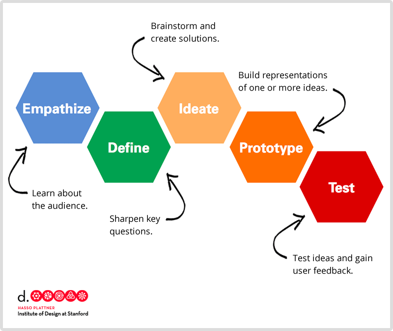

---
# all the regular stuff you have here
zotero:
  scannable-cite: false # only relevant when your compiling to scannable-cite .odt
  client: zotero # defaults to zotero
  author-in-text: false # when true, enabled fake author-name-only cites by replacing it with the text of the last names of the authors
  csl-style: harvard-manchester-metropolitan-university # pre-fill the style
layout: post
categories: chapter
title: 2. Literature Review

---
-   [Research Questions April 2025](#research-questions-april-2025)
-   [Introduction](#introduction)
    -   [Addressing terms used](#addressing-terms-used)
        -   [Pedagogy - a working definition of
            pedagogy.](#pedagogy---a-working-definition-of-pedagogy.)
-   [A review of relevant research informing computer game design and
    programming
    (CGD&P)](#a-review-of-relevant-research-informing-computer-game-design-and-programming-cgdp)
    -   [The benefits of computer game design and programming
        (CGD&P)](#the-benefits-of-computer-game-design-and-programming-cgdp)
-   [An overview of constructionist
    approaches](#an-overview-of-constructionist-approaches)
    -   [Constructionist design
        heuristics](#constructionist-design-heuristics)
    -   [Microworlds as Pedagogy](#microworlds-as-pedagogy)
    -   [Tools with community assets](#tools-with-community-assets)
    -   [Coding club(houses) & Family Creative
        Learning](#coding-clubhouses-family-creative-learning)
    -   [Constructionist framing of computational thinking
        (CT)](#constructionist-framing-of-computational-thinking-ct)
    -   [Constructionist pedagogies - Project-based rather than
        instruction-based](#constructionist-pedagogies---project-based-rather-than-instruction-based)
    -   [Limitations within constructionist approaches and the related
        field of CGD&P
        research](#limitations-within-constructionist-approaches-and-the-related-field-of-cgdp-research)
        -   [Fluency and agency as relevant learner
            outcomes](#fluency-and-agency-as-relevant-learner-outcomes)
        -   [On Pedagogy & limitations](#on-pedagogy-limitations)
-   [Pedagogies to support game making via
    coding](#pedagogies-to-support-game-making-via-coding)
    -   [Explicit teaching of computational thinking - Principles
        first](#explicit-teaching-of-computational-thinking---principles-first)
    -   [Design frameworks using stages &
        PBL](#design-frameworks-using-stages-pbl)
        -   [Project-based learning (PBL)](#project-based-learning-pbl)
    -   [Pair programming & social/collaborative coding
        -](#pair-programming-socialcollaborative-coding--)
    -   [Use Modify Create](#use-modify-create)
        -   [Levels of Abstraction](#levels-of-abstraction)
        -   [Semantic Profiles and PRIMM](#semantic-profiles-and-primm)
            -   [PRIMM](#primm)
-   [GAME SPECIFIC -](#game-specific--)
    -   [Half-baked games as
        Microworlds](#half-baked-games-as-microworlds)
    -   [Design patterns](#design-patterns)
        -   [Using collections of Game(play) design patterns within
            design
            education](#using-collections-of-gameplay-design-patterns-within-design-education)
    -   [Game design patterns in programming
        education](#game-design-patterns-in-programming-education)
        -   [Scalable game design](#scalable-game-design)
-   [Programmes working to address
    challenge](#programmes-working-to-address-challenge)
    -   [Game competitions](#game-competitions)
    -   [UK coding clubs: Code Club, Coder Dojo and Raspberry
        Jam](#uk-coding-clubs-code-club-coder-dojo-and-raspberry-jam)
    -   [Educational Game Jams](#educational-game-jams)
    -   [The Fifth Dimension](#the-fifth-dimension)
-   [Synthesis of chapter / discussion / problem
    statement](#synthesis-of-chapter-discussion-problem-statement)
    -   [Recapping this study's motivations - both broad and my
        motivations](#recapping-this-studys-motivations---both-broad-and-my-motivations)
    -   [Returning to gaps in the CGD&P research
        landscape](#returning-to-gaps-in-the-cgdp-research-landscape)
    -   [The problem statement of the
        thesis](#the-problem-statement-of-the-thesis)
        -   [Pedagogies exist but more are needed that are specific,
            aligned with non-formal spaces, x and
            y.](#pedagogies-exist-but-more-are-needed-that-are-specific-aligned-with-non-formal-spaces-x-and-y.)
        -   [Research Questions](#research-questions)
    -   [Link to the next chapter](#link-to-the-next-chapter)

# Literature Review

## Research Questions April 2025

- **Primary research question (RQP):** How can understandings of how to design and facilitate CGD&P be enriched using socio-cultural approaches (used in this study)?

- **Sub-question 1 (RQ1):** What contradictions arose in this research’s evolving design process and how were they addressed in the resulting CGD&P pedagogy?

- **Sub-question 2 (RQ2):** How can the use of a collection of game design patterns support CGD&P, in particular in relation to abstract and concrete dimensions of existing pedagogies?

- **Sub-question 3 (RQ3):** How can varied dimensions of agency be identified and nurtured in an evolving community of game makers?

## Introduction

<!-- **Specifics of structure**

- contextrs
  - Why make games for education?
    - a review of the literature
    - motivation for making games
  - informal (vs formal) context of game making
    - barriers in general - and especially to informal
  - Programs working to address challenges - and house informal pedagogies (move up?)
- Pedagogies & Relevant Game Making Studies

  - Design (thinking) stages
  - Semantic waves and Primm
  - umc
  - Microworlds / Half baked games as constructionist Environments
  - Pair programming
  - Game Design patterns
- Existing responses
  - supporting digital projects - Kemp
  - Resource provision & cpd
  - Connected learning -
  - RL Community Responses
- Conclusion
    - Summary
    - Problem statement  
    - Link  -->

This chapter reviews the literature to summarise research  addressing the aims of this study. It explores several broad themes to establish a comprehensive understanding of the field. Firstly, I examine the findings of research and reviews in the areas of computer game design and programming. Then I outline key concerns of the work of constructionist researchers in the broader field of supporting programming education and more specifically within CGD&P as a way of highlighting promising areas for future research.

The review then addresses pedagogical approaches that are pertinent to the research concerns of this thesis beginning with wider field of computer programming adn focusing in on those specifically addressing game making. A significant focus is placed on the use of game design patterns (GDPs), where I highlight their use in computing education. This includes analysis of a strand of research investigating the use of collections of GDPs by novice game designers. Due to the sociocultural focus of this study, attention is also paid to the research on the potential and characteristics of non-formal learning programmes where game making may take place. Specifically, I summarise relevant research on code clubs, competitions and game jams.

Subsequently, I explore how this review has informed the proposed problem statement of this thesis, emphasising the need for developing novel and robust pedagogies in this area which support learner agency. This sets the stage for subsequent exploration of agency in Chapter 3, which outlines the the theoretical framework of the study. By addressing these themes, the literature review not only situates the current study within the broader academic discourse but also underscores the importance of innovative pedagogical approaches in fostering inclusive game making communities.

Given that this literature review aims to explore existing relevant pedagogies within the research field, a working definition of pedagogy is appropriate given the socio-cultural focus of this study. The following definition aligns with the socio-cultural approach of this study.  "Pedagogy refers to that set of instructional techniques and strategies which enable learning to take place and provide opportunities for the acquisition of knowledge, skills, attitudes and dispositions within a particular social and material context." [@siraj-blatchford_researching_2002]

<!-- In the context of activity theory, pedagogy can be framed as pedagogical tools and processes, functioning as a type of mediational strategy.

**There is an overall differential in specificity.**
Used in broad terms pedagogy encompasses both the domain of teaching and broad theoretical understandings instruction.
https://www.iosrjournals.org/iosr-jrme/papers/Vol-11%20Issue-1/Ser-2/B1101020629.pdf

In more specific terms it can a pedagogy, a more particular approach or technique.

- Specific as well as theoretical - involving praxis.

Resisting an dichotomy it can be understool from a practitioner perspective as a dialectical process alternating beteen experiecne and theory .

Related to context as well as instructive teaching. -->

<!-- The work of Quintana et al contains useful guidelines for checking the suitability of a framework to support science education [@quintana_scaffolding_2004]. In particular guideline x, and y can be identified in the use of GDPS in this research.
NOTE - IM NOT SURE HOW HELPFUL THIS ACTUALLY IS. -->

## A review of relevant research informing computer game design and programming (CGD&P)

<!-- ### Potential benefits of computer game design and programming (CGD&P) -->
EXPLAIN WHY THIS IS FIRST NOT AFTER GENERAL CODING PEDAGOGIES

This section begins by addressing studies on computer game design and programming (CGD&P) before progressing to give an overview of constructionist research in this area.

<!-- Before addressing specific pedagogies to programming in general and game making in particular, it is of value to examine the broad context of motivations for undertaking -->

### The benefits of computer game design and programming (CGD&P)

Several notable reviews explore the motivations, processes, and benefits of making games for learning  [@denner_does_2019; @earp_game_2015; @hayes_making_2008; @kafai_constructionist_2015-1; @gee_video_2016]. While Gee and Tran [-@gee_video_2016] discuss the diverse tools available for game design. For Bermingham and colleagues CGD&P competencies are framed as 21st Century Skills [@bermingham_approaches_2013], a focus echoed in  a wider review on digital making encompassing game making [@lamas_making_2019]. In their review of the potential of CGD&P to encourage collaboration, Earp and colleagues found that "analysis of collaboration is mainly restricted to peer review and providing feedback" [@earp_learner_2013]. Hayes and Games [-@hayes_making_2008] take a broader approach, identifying four main motivations for CGD&P: learning computer programming skills, deepening subject knowledge of other curricular subjects, involving more girls in computer programming, and using game design to understand design concepts.

Kafai and Burke's [-@kafai_constructionist_2015-1] review synthesises 55 relevant papers within the framework of constructionist gaming focuses on varied strands of the potential of CGD&P and the barriers to participation (explored in Chapter 1). The most developed section is on the benefits and motivations of CGD&P research to address the development of personal dimensions of knowledge and skills. Strong areas within that are computer science knowledge and programming, maths and science and a range of technical abilities that facilitate participation in the information society. Additionally, social dimensions such as pair programming, social skills, self-reflection, cultural awareness are addressed. The authors note limitations in the presentation of may findings in terms of detail regarding the  discussion of pedagogies used, however what studies do detail pedagogies are not shared in the review [@illingworth_review_2017].

A review of CGD&P by Denner and colleagues [@denner_does_2019] is positive about the the effectiveness of CGD&P to develop computing science learning and motivation. Denner et al.'s finding focus on computer science learning, breaking this broader concept into subcategories of programming knowledge and problem specification and design. Importantly, Denner et al. [@denner_does_2019] also outline three strands of pedagogical interest: design-build-test, step-based instruction, and social pedagogical approaches. However, these strands are described only in general terms. Later in this chapter, these strands and related pedagogies are addressed in more detail.

Given the limitations of the reviews outline above to address an more detailed overview of pedagogical approaches used (to build agency?), this chapter will address research which does describe pedagogies in more detail drawing first on wider computing pedagogies for novices before exploring those related to game design and programming in more details. Before undertaking this more detailed review it is also of value to describe the breadth of innovations and subsequent research by the constructionist school both to acknowledge the significance of this research and to give a broad overview of themes that will be developed subsequently.

<!-- THIS COULD BE A GOOD CHANCE TO GO INTO THIS MORE - ADN THEN DROP DESIGN STAGES ALTOGETHER FROM THIS THESIS!!! -->
<!-- Similarly, while studies on the community use of game making, in after-school and online settings exist [@kafai2012collaborative; @peppler_computer_2009; @luther_leadership_2011], details of pedagogies to develop community participation, as explored later in this chapter, are often scant.  -->

<!--
@erstad_identity_2012
The practical and and cultural difficulties of undertaking a project-based approach within the curriculum are significant. Factors of difficulties associated with technology projects compound difficulties.
SUPPLEMENT THIS WIHT POINTS FROM SEFTON GREEN. -->
<!--
    David Buckingham’s (2003) review of media education described a long history of how making can support critical understanding, and how this can encourage a more critical and contextualised understanding of production and the making process. This additionally meshes with constructivist beliefs in how making is a better way of understanding than simple instruction (Papert, 1993), and lies at the heart of some of the new orthodoxies about critical participation (Jenkins et al, 2007) [@sefton-green_mapping_2013]-->
<!-- SF mentions Mozilla webmaker tools, computer club house, physical computing, hacking a pedagogy - in chap3 on informal approaches.   -->
<!-- Gee also investigate a learning experiences is founded on his understanding of  -->
<!-- Barron and Livingstone have outlined the advantages and processes involved in family involvement of technology use and learning in the home. -->

<!--
WHAT ABOUT FLUENCY?
In their project-based intervention, Girls Creating Games, Denner and Werner focused on pair programming of games to develop IT fluency, contrasting it to IT literacy [@werner_middle_2005-1] -->

<!-- Significantly, the review is structured around key areas of knowledge and skill development. The primary area involves of building subject knowledge in educational settings in particular to develop coding and computing skiWhile the focus of lls and STEM subjects. -->

<!-- Of particular interest to this study are studies exploring the social and cultural dimensions of CGD&P. While studies on pair programming techniques in CGD&P [@denner_computer_2007; @werner_can_2009] yield positive results, including increased confidence in coding and articulation of problems arising,  -->

<!-- This deficit in addressing and assessing pedagogies used, is reflective of a comparatively weakness of concepts of pedagogy within the wider constructionist theory, a dimension which is explored after the next section barriers to participation. -->

<!-- In related work, Robertson's drew on storytelling games, to access participant knowledge in accessible ways []] -->
<!-- What is missing?
Other studies show games as a potential vehicle for exploring issues involving race, sex, social issues. -->

### An overview of constructionist approaches

<!-- Before turning to a more detailed exploration of distinct pedagogies used in or appropriate for CGD&P,  -->

<!-- Turning first to how games are special.
However, while the inclusion games clearly favour these elements, the  use of home interests and the use of a playful approach are not unique to game making.
Kafai and Burke

also note the benefits to exploring games over other types of media projects, including their inherent interactivity and rules based systems, which facilitate the exploration of systems thinking and design approaches [@games_gamestar_2010; @tekinbas_gaming_2014; @games_design_2008]. However, in order to foreground those elements, programming is dropped from the tool to reduce complexity. -->

The work of constructionist researchers is foundation in the field programming education. Examples include the work of Papert pioneering LOGO, programmable LEGO drawing turtles [@papert_mindstorms; @papert_childrens_1993; @papert_turtles_2002], early research by Kafai on game programming by children [@kafai_minds_1994], and  innovations in creative computing by Resnick in the areas of physical computing [@resnick_digital_1998] and a more generalised multi-media authoring tool (called Scratch)[@resnick_reflections_2005].  Kafai and Burke’s framing of CGD&P as _constructionist gaming_ reflects the dominance of this voice  within the field with many of the researchers undertaking work in this area identifying their work as following constructionist principles [@harel_caperton_toward_2010; @repenning_scalable_2010; ].
COMPLETE LATRE 

The ethos and theoretical underpinning of constructionism are difficult to locate precisely [@laurillard2020significance, p.29]. Over time, different foci have emerged.  Papert's early focus on objects to think with was interpreted as an expansion to Piaget's constructivism [@ackermann_piagets_2001]. Resnick [-@resnick2014give] and other constructionist researchers have advocated for software and hardware tools that promote an open-ended, child-led approach to designing relatable objects of interest. The framing of Kafai and Burke of CGD&P as constructionist gaming widens the scope still further.

This section situates the concerns of this thesis within the existing body of constructionist research before widening the focus explore the principle strands within it. To achieve this, I will examine analysis of constructionism, via its design principles and pedagogical approaches and engagement with social approaches to learning (ADD IN).  

#### Constructionist design heuristics

Research on constructionism as an educational approach has increasingly centred on the design affordances of researcher-created toolkits and communities that facilitate personal understandings of knowledge  [@vossoughi_making_2016]. When pedagogy is addressed in recent constructionist studies, it generally takes the form of broad principles of design and project-based approaches [@resnick_scratched_2012; @resnick_lifelong_2017].

Most relevant to the domain of this study are constructionist design principles articulated by Resnick and Rosenbaum [-@resnick_designing_2013] in the form of designing for tinkerability in terms of allowing immediate feedback and fluid experimentation and open experimentation.

In earlier work focused on creative coding environments similar concepts of  low floors, wide walls and high ceilings [@resnick_reflections_2005, @resnick_scratch:_2009]. DEVELOP.  

#### Microworlds as Pedagogy

Laurillard provides a clear summary of constructionism as a distinctive and productive pedagogy [@laurillard2020significance]. Her definition is based on Papert’s vision of a publicly shareable project within a microworld environment (a concept explored later in this chapter+), designed to foreground specific concepts.

This concept of builds on Papert's concept of _microworlds_, simplified computer simulations or models that were conceived as controlled environments in which students can explore and experiment with maths or physics concepts in a concrete way [@harel_constructionism:_1991; @papert_mindstorms:_1980; @papert_childrens_1993]. While Kynigos' design promoted the acquisition of computational thinking, Microworlds can facilatate the exploration of diverse concepts [@rieber_microworlds_2004].

Today, microworlds are used in a variety of educational settings, from primary schools, afterschool clubs and universities. However, the use of microworlds in traditional school settings is not unproblematic [@papert_turtles_2002]. There is a danger that the potential is 'trivialised'[@hoyles_microworldsschoolworlds_1993] into a vehicle for instruction based processes aimed narrowed to teacher chosen curricular concepts.  

The concept of  task specific programming language [@kong_providing_2022], in research on Microworlds, has a similar motivation.

    "The task-specific programming language (TSPL) is purposefully limited in the abstractions and concepts needed for the tasks or explorations in the microworld so that programming becomes much easier to learn than a complete programming language.[@kong_providing_2022]"

<!--
THIS IS IS FROM

Low floors: a tool that is intuitive enough to allow new users to acclimate to it gradually and with a degree of confidence.
High ceilings: a tool that also allows more experienced users to create constructs (in this case, video games) that can grow increasingly complex and nuanced as one’s own proficiency increases.
Wide walls: a tool that—in addition to low floors and high ceilings—allows its users to create a wide range a constructs, letting users tap into elements of personal experience as well as popular culture to design and develop something entirely unique and representative of their own interests and backgrounds.
We added a fourth principle to emphasize the equally important social dimension of construction tools:11

Open windows: a tool to facilitate the sharing of digital media. The creation of digital communities represents the new frontier in terms of making computer programming a more accessible skill for youths. -->

<!-- Denner and colleagues' review of this area, using the term CGD&P rather than constructionist gaming, uses a broad categorisation of pedagogies used in studies . -->

#### Tools with community assets

While many toolsets have emerged from constructionist school, Scratch as an example is of note due to its explemplificaiton of the design heuristics and as a tool used in many CGD&P programmes.

One area of scaffolding is in the provision of a library of assets.

Another is in the online community and the design decision to make all created products remixable by others by default.

The remixing of  Scratch projects is complicated by the an embedded nature of the features. The process of extracting them and implementing them is neither straightforward or guided.

One concept advanced to address this in constructionist research is that of a Constructopedia [@papert_technological_1995], an encyclopedia of design elements and resources to implement acting as bother a practical resources and source inspiration. While instances have come and gone [@nichols2007idea] none remain an idea perhaps limited by the broadness of its scope.

<!-- Look the potential of at constructopedia samplers
[@papert_technological_1995], an attempt using the computer clubhouse to make this happen using the potential of the internet [@chapman_pearls_2006]. -->

#### Coding club(houses) &  Family Creative Learning

It of interest to make a link between early influnce of the constructionist school founded by Papert and this thesis. In Mindstorms Papert makes a commentary of community organising of the learning environment in a commentary about Samba schools as "settings that are real, socially cohesive, and where experts and novices are all learning" [@papert_mindstorms:_1980].

Bruckman notes "tools are not enough... Tools are effectively constructionist only when they are embedded in a constructionist culture." (Bruckman, 1998, pp. 51-52)

Bruckman and Zagal, also studying at MIT, take from this mention an opportunity to formally study the components of a Samba school [@zagal_samba_2005] and to compare it,  to a Computer clubhouse, an MIT initiative designed inspired in party by Papert's vision [@resnick_computer_1996; @peppler_computer_2009]. To do this Bruckman and Zagal draw on the socio-cultural concept of communities of practice and other social practices including the importance of showcase events share created work and flexibility of ways of participating and a diversity of skill levels and backgrounds of participants.

<!-- There is limited research on how to create learning communities making games for educational purposes. Existing research [@xiao_fostering_2007] has close parallels with project approaches and has a focus on fostering online collaboration and resources sharing. Many popular and well researched online communities exist [scratch, itch.io, new grounds](Bruckman).  -->

<!-- Correa (2015), explores the role of children as brokers of technology in family environments. MOVE LATER? WITHIN 5D? BARRON?  -->

<!-- In response to the limitations of accessibility of online participatory culture  [@roque_family_2016]  CHECK THIS AND SAY HOW,  -->

SAY HOW EXPLICITLY CONSTRUCTIONIST?
The work of Roque in Family Creative Learning program is of note in the way that family members are brought directly into the making process to overcome barriers to computer coding.

Roque [@roque_family_2016]  FCL study addressed it with face to face session with help from family members.

In asking is how can facilitators help develop participation in community activities [@roqueBecomingFacilitatorsCreative2018], Roque operationalises Barron's work on parental roles in a making environment [-@barron_parents_2009].

Barron et al. [-@barron_parents_2009] identified social and cultural behaviours of parents in settings of informal technology uses. The authors coalesced these behaviours into roles, the most notable being teacher, project collaborator, learning broker, non-technical consultant and learner.  

Roque makes a convincing case for the unpicking of the supportive and collaborative roles of parents and facilitators to build this capacity and awareness of family learning roles.

The research team created a detailed guide to replicate the programme [@leggett_family_2017]. MORE DETAIL ON THIS?

<!-- To compare with learning in more formal structured, and more naturalistic learning environments, it best matches a more optimal approach to game making with families. -->

FCL draws on the underlying  sociocultural approaches within Barron's foundational work. In the following literature review sections I will examine sociocultural approaches and concepts that may be used in wider contexts but also applicable to CGD&P.

<!-- However, while the design of the FCL programme was effective to build parental confidence and to increase overall accessibility to the process , it left questions unanswered about the effectiveness of the process to enable further learning at home after the programme end. In addition, similar to the computer clubhouse model, it is noteable that there are potential difficulties of scaling this hybrid approach (FCL) in terms of the expert facilitator help needed. -->

#### Constructionist framing of computational thinking (CT)

A key strand of computing education research involves variations in approaches to dealing with abstract concepts within the computing programming.

This strand is present in early constructionist research via Papert and Turkle's [-@papert_epistemological_1990] work on diversity in approaches to teaching coding. The authors examined behaviours and attitudes of young novice coders and found approach other that that dominant in contemporary research which they described as a formal, abstract approach "that emphasizes control and through structure and planning". They described alternative, concrete coding approaches.   Techniques which facilitated concrete approaches include the use of tangible physical and digital objects, particularly those which could be shared within communities.

We can use the distinction between concrete and abstract to examine the differences between two interpretations of computational thinking (CT) popular in the field of computing education. The first is an influential take from Jeanette Wing focusing on varied elements of abstraction processes [@wing2011research]. Many learning resources aimed at teachers present the underlying principle as four key pillars of CT: decomposition, pattern recognition, abstraction and algorithmic thinking [@bbc_bitesize_introduction_nodate; @dong_prada_2019]. The essence here is to deal with concepts and principles as abstract and separate from the context of coding.

<!-- was developed in response to a thought experiment "How do we describe what Tim, Shannon, and Renita are learning as they participate as designers of interactive media with Scratch?".  -->

Tedre and Denning's [-@tedre_long_2016] review of CT cautions against a too narrow definition of CT that highlights formal abstractions as represented by Wing's take on CT [-@wing_computational_2008].
YES BUT WHY?

Constructionist researchers Brennan and Resnick [-@brennan_new_2012]  took a grounded / situated approach to mapping the potential learning dimensions of students designing and coding collaborative, creative computing projects. The resulting map of computational thinking includes computational concepts, computational practices and computational perspectives. This mapping assumes an application where learners are engaged in the collaborative coding of a computing project.

Lye's extensive review of teaching Computational Thinking [@lye_review_2014] used Resnick and Brennan's definition as the basis for the review, indicating the widespread use of this more applied approach.

As such, from the perspectives of critics of Wings abstract framing of computational thinking [@denning_remaining_2017], the uptake of the more applied definition can be seen as beneficial (to who? to do what?)

#### Constructionist pedagogies - Project-based rather than instruction-based

While the goal of varied forms of fluency and agency is in line with the approaches outlined above, there is a potential gap in constructionist research regarding pedagogical approaches. This section examines wider and more specific recommendations from key constructionist researchers.

Addressing broad approaches, Kafai has emphasised the importance of a situated and critical approach to coding practices [@kafai_revaluation_2022; @kafai_theory_2020]. However, this work remains broad, and specifics on pedagogical scaffolding are still lacking.

Another broad approach is that of design cycles within a project-based approach advanced by Resnick. A later section addresses this in more detail.

#### Limitations within constructionist approaches and the related field of CGD&P research

##### Fluency and agency as relevant learner outcomes

INTEGRATE? SEPARATE SECTION?

Constructionism places importance on self-expression within a community of peers features. Encapsulating this ethos as an learner attribute which constructionist approaches serve to facilitate receives broad attention in constructionist literature. A candidate for such an attribute present in several strands of constructionist research is that of varied forms of fluency, described in different contexts as technical fluency [@papert_technological_1995], digital fluency [@resnick_scratch_2009], gaming fluency [@a_peppler_gaming_2009; @kafai201221] or computational fluency [@resnick_computational_2018]. The literature on these forms of fluency within constructionist research comprises a blend of features including: technical skills needed to complete projects and the importance of self-expression both as a motivational factor via valuing of personal expression as a form of participation within a community of peers.

<!-- An additional limitation in constructionism approach to digital making in varied forms is lack of of an underlying consistency in terminology regarding the motivation for undertaking the work. -->

In the work of Kafai and colleagues [-@kafai_connected_2017] FIND OTHERS on game making and similar media projects is the idea of collaborative agency. This concept which draws on the work of S and B,  to communicate the value of the sharing of created projects. Specifically, collaborative agency refers to  "learners’ efforts for searching out, organizing and distributing responsibilities in collaborations with others as they create collaborative artifacts"

##### On Pedagogy & limitations

ALSO ADDRESSING BROADER LIMITATIONS WITHIN THE FIELD OF CGD&P

Vossoughi's [-@vossoughi_making_2016] critique of constructionism from a socio-cultural and egalitarian perspective highlights this absence of _intentional forms of pedagogy_. She attributes this gap to a focus on tools rather than on sociocultural contexts and the development of social relationships as part of the making process.

While this is broadly true, it is ironic given the stance against tools first approaches of Kafai.
In even in Kafai's review of CGD&P, specific pedagogies were lacking.

It raises a question why, given this perspective are underpinning pedagogies lacking. I propose that this deficit may be due to a deficit in analytical processes and theoretical concepts particularly visible within concepts of agency development, and mediational strategies. It follows that these limitation of constructionism are also present in the research landscape of CGD&P which has been significantly guided by it.  

This relates to the primary research question of this thesis. And brings us to the next section.  

<!-- but notes that ‘theoretical underpinnings of constructionism are difficult to pin down in most of its literature’ [@laurillard2020significance, p.29] -->

<!-- This more concrete interpretation of CT, based on observation of learners in action, is more accessible to teachers and learners as they can more easily recognise their own practice than in the more abstract interpretations of CT. To give a specific example, rather than decomposition, the applied framework outlines taking an iterative, incremental approach to problem solving and arranging code in modules. -->
<!-- This broader, process driven definition of CT has been used and adapted by many organisations seeking to support the new computing curriculum may be familiar from websites, posters and other supporting material created by groups like Barefoot computing.  -->
<!-- The review above and the influential framework used by Computing at School [@csizmadia_computational_2015-1]  have included elements of this applied framework as well as other more abstract CT concepts. -->
<!-- This is not to argue that Wing's approach to CT is without technical merit [@lodi_computational_2021], rather that its adoption by educational bodies like CAS in the UK and similar bodies internationally has risks. The inclusion of formal CT frameworks in curriculum and formal testing has provoked mechanistic teaching of decontextualised concepts via formal teaching methods to the detriment of hands-on exploration and creation of personally meaningful projects [@resnick_coding_2020]. -->
<!-- In a challenge to this article Wilensky [-@wilensky1991abstract] questions the nature of abstract in this context arguing that all objects and concepts are abstract until familiarity makes them more concrete to the user. -->

<!--
In their review and a critique constructionist approaches to game making, Thumlert et al agree with the potential of a constructionist approach to develop 21st century skills, -->

<!-- It is important, in the interests of balance, to separate out some of the positives from the limits here. The school has done good work (tools, design principles) that can be built on. -->

<!-- A key advantage of viewing the domain from a contextual point of view is allowing a more nuanced exploration of the motivations for participating or not participating in game making. There is a danger that lack of participation in computer science can be viewed from a deficit perspective, e.g. what skills or confidence to students lack. Studies from a sociocultural perspective allow for a deeper exploration of interests, values, and practices from outside of the immediate learning environment. -->

<!-- **Returning to developing Computational Fluency**
PERHAPS NOT - MORE OF A BRIDGE TO NEXT SECTION PERHAPS

To refocus this review, let's return to focus of computational fluency as the focus for one of the research questions. Why choose this concept rather that broader 21 Century skills? -->

<!-- In their project-based intervention, Girls Creating Games, Denner and Werner focused on pair programming of games to develop IT fluency, contrasting it to IT literacy [@werner_middle_2005-1] -->

## Pedagogies to support game making via coding

One of the main themes of this review is to explore the pedagogies available to support coding). The following sections focus on pedagogies that are relevant to first general programming, and then more specifically  game making.

<!-- It also focuses on those mo non-formal, real-life (as opposed to online) communities. -->

First, I will review design thinking approaches and project-based learning. Next, I will outline pedagogies centred around scaffolding game production through progressive steps, such as the Use, Modify, and Create (UMC) framework.

MOVE? TO INTRO OR LATER SECTION
Finally, I will examine the social and cultural aspects of coding clubs and informal programmes that serve as venues for CGD&P.

<!-- ## Project-based learning / Social approach / Communities of Learners.

- Key features of PBL - from academic sources up to date.
- Benefits of PBL, autonomy / agency /
- Creating a community of learners
- Examples of how this has been applied in game making or creative coding case studies. (RQ2) -->

#### Explicit teaching of computational thinking - Principles first

<!-- NOTE KEEP THIS BRIEF -  -->

Wing's emphasis on the importance of the explicit teaching of skills of decomposition, pattern recognition, abstraction, and algorithmic thinking, contribution on computational thinking is  more theoretical than applied and invites discussion on how best to teach this abstract approach to computation thinking. Grover [@grover_computational_2017; @grover_computational_2013] and Guzdial [@guzdial_learner-centered_2015] offer explicit techniques linked using the application of computer programming as the driving mechanism. Bell and colleagues [@bell2019constructing] explore the process of unplugged activities, exploring abstract CT concepts without using computers or coding. Other research explores the challenges teaching of computational thinking principles in subjects other than computing [@dong_prada_2019].

While the remit of this literature review does not encompass a full critique of the validity Wing's strand of computational thinking either within computer science or other subject (see the following for an overview [@denning_remaining_2017]), what these approaches have in common is a principles first approach to problem solving. While the concept of understanding foundational concepts before engaging with the practice seems logical, in practice when dealing with obtuse material it can aggravate barriers to participation such as those outlined in Chapter 1. Thus, the following sections of this review of pedagogies relevant to the concerns of this study primarily focus on practices which lead with forms of concrete exploration rather than a principles first approach.

### Design frameworks using stages & PBL

MAKE A LINK TO PBL BEFORE THE LIMITATIONS - ALSO THERE PROBABLY IS RESEARCH ON THIS - SO BE CAREFUL.

INTRODUCTION SENTENCE.

Many design frameworks exist in diverse areas of production with varied degrees of adoption. One stream in CS stems from engineering and design thinking [@resnick_all_2007; @winarno_steps_2020-1].

Resnick [-@resnick_scratched_2012] describes the foundations of the design-based approaches in education as; engaging in design activities, exploring personally meaningful topics, collaborating with others, and deepening understanding through reflection. The key reason to adopt these principles is to increase engagement via sustained participation in computing projects for a broad range of learners.  To illustrate this design-based approach Resnick advocates a _creative cycle model_ [@resnick_lifelong_2017]. The five circular stages are; Imagine, Create, Play, Share, Reflect and returning to Imagine once more. This model is a more adapted from many similar expressions of iterative design stages in the domain design thinking to focus on more individual ideas of creativity. See figure 2.x for one example from the Stanford dschool  [@dam_5_2024].

{width=90%}

Figure 2.x. Design thinking via design stages model from Stanford dschool

<!-- {width=90%}
Figure 8.1. Diagram of five circular stages; Imagine - Create - Play - Share - Reflect - Imagine  
Diagram [@resnick_lifelong_2017] -->

One of the sources for sustained engagement is when, as part of the iterative process, learners are able to test and then revise their creation or experiment based on their own evaluation. Another factor is the importance of a community in the design process, as a real audience for creations, as a source of inspiration and as peer evaluators in the testing process.

While the value of design thinking stages for educators planning sessions seems clear, and elements of this framework are included in early literature to help adoption of new computing curriculum in UK [@csizmadia_computational_2015],  there is little research exploring how the stages could be used by learners to scaffold their own design process when engaging in making digital products.

Resnick and Brennan [@mouza_imagining_2013] focus on the affordances of tools and communities to support all aspects of students work on design stages without suggesting any processes from a teacher of student perspective.

One exception is the work of Zainal et al [@zainal_review_2021], using the Stanford dschool design thinking framework [@dam_5_2024] to structure the work on students in undertaking IoT project work.
The authors, note the lack of research investigating the  potential of this approach and call for more work to be done in this area.
ADD TO THE PROBLEMS STATEMENT.  

<!--
The model is similar to the ADDIE model from instructional system design: Analysis, Design, Development, Implementation and Evaluation. The discipline of teaching engineering also has a similar design stage cycle with many contesting variations [@winarno_steps_2020]. Engineering is Elementary project adapted from the ABET (Accreditation Board for Engineering and Technology) guidelines [@syukri_impact_2018] involves the following steps; Ask, Imagine, Plan, Create, Test, Improve, Share [@hester_engineering_2007]. It has been adopted by the area of computing is one used in a recent book on coding by Bers [@bers_coding_2021]. HOW IS THIS USED? AS A PEDAGOGY? -->

Thus, while the ethos and benefits of this approach are convincing RESNICK'S TAKE, what is not clear however is who this framework is for (either for designers, facilitators or participants) or how it can be activated in the process of facilitating project work.  

#### Project-based learning (PBL)

<!-- As outlined in the introduction, this thesis, while guided by constructionism as a design approach, uses AT as a theoretical framework.
In addition, this section outlines the value of PBL as a more developed framework as well. -->

**PBL provides a wide scope of research detailing pedagogical approaches aligned with the aims of this research.**

<!-- There is a clear alignment between the potential of making games and other media products as an educational activity and the agenda of project-based learning, particularly in the to develop skills suited to the modern workplace (21st Century skills).  -->

The educational strategy of learning how to code games in a informal setting lends itself to a project based learning (PBL) approach. The following section explores relevant elements of PBL pedagogies, where possible making alignments with existing game making studies. In broad terms, PBL is an educational strategy which advocates: learner choice in projects which increases motivation; authentic and shareable project outcomes and learning environments to encourage peer feedback and reflection;  iterative projects work supporting student mastery; and challenging goals and guidance in goal setting aiding self-regulation in learners [@barron_doing_1998; @hernandez_aalborg_2015].

PBL requires learning environment and activities that allow for an active construction of knowledge by learners rather than one dominated by instruction [@kokotsaki_project-based_2016]. PBL pedagogy aligns with AT concepts of learning in that change happens via the use of artefacts use in a community [@gibbes_project-based_2014; @hung_activity_2000].

    <!-- Encourage Student Choice: Darling-Hammond et al. (2008), Larmer and Mergen- doller (2015a), Ravitz (2010), and Thomas (2000) all noted the importance of student choice, autonomy, and authority. [@kokotsaki_project-based_2016, p. 9] -->

Critics of PBL often wrongly conflate it with unstructured, _pure-discovery_ approaches [@kirschner_why_2006; @hmelo-silver_scaffolding_2007]. In formal education, contextual factors hinder the adoption of PBL challenge creative approaches in general. These include challenges of teaching to an exam-based curriculum, time allocated and other timetabling factors. While these are less applicable to informal settings, other challenges still exist including, lack of frameworks, expertise, confidence in facilitation [@ertmer_essentials_2015-1]. In addition, the range of applications and situated nature of the learning via PBL creates significant challenges in representation of practice, including communicating specific details of scaffolding used.

<!-- This alignment of approach also extends to some of the limits of PBL approach. The critique of PBL as 'pure discovery' learning is often misjudged, missing some of the less visible scaffolds often in place to support learner to access learning, and to reflect on learning that has taken place. -->

Studies and supporting resources advocating PBL articulate various procedural forms of scaffolding which facilitators can adopt, including those to aid group work, support reflection, and to structure knowledge sharing via project outcomes [@ertmer_essentials_2015-1; @pitot_establishing_2024]. An additional form of of PBL scaffolding, the restriction of choice of participants to reduce the possibilities for learners being overwhelmed, can expose a tension in relation to the value of student choice over project work [@ertmer_essentials_2015-1].

PBL can be effective in diverse fields of practice including: inclusive pedagogies [@leggett_impact_2021], and the use of appropriate "learning scaffolds" [@kokotsaki_project-based_2016, p. 8], language learning [@gibbes_project-based_2014], and digital making [@weng_characterizing_2022].  However, due to the difficulty of generalising and abstracting frameworks linked to domain specific knowledge and processes, a gap exists in PBL literature regarding kind of scaffolding that might support the develop CGD&P more specifically.

THE CHALLENGE OF FINDING APPROPRIATE LEVEL OF SCAFFOLDING AND HOW TO COMMUNICATE SPECIFIC PBL APPROACHES / PEDAGOGIES.

SOMETHING GENERAL ABOUT THIS BEING AN UNSOLVABLE PROBLEM - A WICKED PROBLEM WITH ALWAYS SUITS REVISITING WITH NEW, CONTEXTUALLY APPROPRIATE SOLUTIONS AND APPROACHES.

<!-- It is of value to examine PBL literature detailing structure and pedagogical approaches in the area of digital product production and language learning. -->

<!-- Research in the area of digital media production using a PBL methodology exists

Gibbes et al's review of PBL in language learning from an activity theory perspective provides good foundational material for this study [@gibbes_project-based_2014]. -->

<!-- Given then broad benefits of PBL to make media, and returning to the claims around Kafai on constructionist games, it invites the question, is there anything particularly special about the use of games as a project? -->
<!-- **Returning to developing Computational Fluency**
PERHAPS NOT - MORE OF A BRIDGE TO NEXT SECTION PERHAPS

To refocus this review, let's return to focus of computational fluency as the focus for one of the research questions. Why choose this concept rather that broader 21 Century skills? -->

<!-- Elements of this framework are included in early literature to help adoption of new computing curriculum in UK [@csizmadia_computational_2015]. However little guidance is provide and not stream really followed up unlike the focus on computational thinking [@sentance_teachers_2015] -->

<!-- A wider review of design framework in STEM settings details discussion of varied definitions of stages themselves but less relating to the impact of the pedagogical use of design stages on learners [@winarno_steps_2020-1]. -->

### Pair programming & social/collaborative coding -

Role of community feedback within playtesting

Pair programming, a common industry practice has recieved attention in educational contexts [@hanks_pair_2011]. Pair Programming groups students in pairs and divide coding two into two roles. One student undertakes hands-on coding while the other is free to think about more the abstract design of the overall program. A benefit of pair programming is to increase coding confidence as students build their experience of the different roles involved in coding. To help novice coders teachers should model and break down the processes involved.

Werner and colleagues [@werner_pair_2009; denner_computer_2007] investigate pair programming as way to address gender gap and extending research on collaborative problem solving in computer coding.

They cite research challenging the gender aspect of bricolage / abstract duality, but propose a need for more research on programming styles and strategies [@denner_computer_2007] Their own research underlies that while pair programming is an inclusive strategy beneficial to all but in particular to narrow participation gaps due to gender and socio-economic factors [@werner_pair_2009, p.31].

In Denner's research, pair programming involved social learning elements and can model a greater choices for students in they way they solve problems and opportunities to develop identities. The process of building an identity in a community with the help of peers is key to a socio-cultural understanding of how learners pick up coding in a classroom (or other settings).

<!-- A summary of pair programming roles and tips on how teachers can help learners to adopt them in present in a Quick Read document from NCCE.[^6] -->

Werner et al draw on existing research on collaborative   'social reality or joint problem solving space' to scaffold the process of ideation [@omalley_construction_1995] and the role of friendly relations to develops these productive and sustained interactions [@mcdowell_pair_2006].

Bring in limits  and extension of research on pair programming to wider groups / more flexible processes [@preston_using_2006] -
- resource interdependence from Preston

Links to other pedagogies in this work.
UMC
and Use of game design patterns [@werner_computational_2020]

### Use Modify Create

The 'Use-Modify-Create' approach proposed by Lee and colleagues [-@lee_computational_2011] is particularly promising to counter issue of user anxiety and demotivation surrounding the difficulty of coding games. UMC evolved from research involving the use of game making and robotics to support computational thinking [@denner_computer_2012; @denner_using_2014; @werner_pair_2013; @werner_children_2014]. The model advocates the remixing of existing games to act as a scaffold to build the competence of the beginner coder. Learners are guided to progress in the complexity of their modifications, thus becoming increasing proficient in the recognition and use of computational concepts and structures [-@lee_computational_2011]

In the _Use_ stage, coders build a familiarity with coding interfaces, code structures and syntax through scaffolded approaches which involve interacting with the program code and what it produces. In the _Modify_ stage learners progress to working on real projects created by others. Learners deepen their knowledge of coding structures and practices by altering existing projects and templates to suit their own aims. _Create:_ After novice coders become more familiar with patterns of code design in use in the modify stage, they can progress to replicate such patterns in other code that they create from scratch.

A study involving five hundred 9 to 14 year-olds found that the UMC approach can balance a structured approach with more student-led exploration [@franklin_analysis_2020]. The researchers also found that the students enjoyed the UMC approach as they had more choice and agency in the process. This is supported by other research which compared UMC with a starting-from-scratch approach and found higher student engagement for those in the UMC group [@lytle_use_2019]. The researchers found that because students using UMC had more time to play around with code, they were able to add their own personal touches and that this ownership over the code sustained their continued engagement. While the scope of the study is limited, observations support motivation of UMC that this pattern of creation maintains higher level of engagement through reducing technical barriers to participation, and affording greater sense of learner's ownership over end project through greater choice over the final outcome.

**Research on UMC which develops learner choice**

<!-- NOTE - This may be moved to design chapter -->

Giving learners agency via their choice over the design of created public code products has the potential to motivate ad sustain programming activity [@papert_mindstorms_1980; @kafai_constructionism_1996-1], but brings with it the potential for both facilitator stress in supporting diverse activity, and the potential for diversion for students away from target areas of subject exploration (a tension Noss and Hoyles call the play paradox [@hoyles_pedagogy_1992])

Addressing these tensions work by Franklin and friends suggest the use of the UMC framework [@franklin_analysis_2020].

Other work from UMC proponent Lytle suggests a list of extensions to choose from, swapping create for choose [@lytle_use_2019-1]. Based partly on the cause of teacher stress caused by the open ended nature of the "Create" part of the model.   

UMC has been developed to be end with scaffolded set of choices.
In a study where students use a block based language to develop simulations - the authors note limits of study but are enthusiastic about providing a limited set of choices for final exploration within a limited time frame [@lytle_use_2019-1; @lytle_use_2019]

- Scaffold Students and Teachers- Providing the necessary programming blocks students need to complete a choice
- Differentiate Choices by Difficulty - create choice systems that have varying difficulty
- Create Choices that Show Visible and Immediate Changes
- Make things Complex, not Complicated
- Draw from Student Desires - students will engage more with the material, feeling like the creations are their own.

**LINK**
The main concept of UMC is remixing a game to build. Scratch has been instrumental in bringing this methodology into clubs and classrooms as an explicit feature of its online community. FIND SOURCE

<!--
  - Scaffold Students and Teachers- Providing the necessary pro-gramming blocks students need to complete a choice ala a Par-son’s Problem greatly reduces cognitive load, especially in activitieswhere lots of choices means lots of blocks. Similarly, giving teachers a “Cheat Sheet" of answers for each choice, scaffolds their abilityto act as a facilitator and debugger.

  Differentiate Choices by Difficulty- This time, challenge came from adding morec hoices, but each choice was relatively the samedifficulty. In the future, we wish to create choice systems that havevarying difficulty to give targeted tasks for each student skill level.

- Create Choices that Show Visible Change
  - Prioritize choicesthat produce immediate changes in the run of the simulation (e.g. anew animal appearing in the environment).Create Choices that Promote Content Inquiry- Our decisionto primarily focus on adding more animals came from the fact thateach new animal made the Food Web more complex.

  - Make things Complex, not Complicated- As demonstrated in Figure 2, each animal had relatively the same set of code blocks. In this way, a lot of choices were available without adding many additional necessary blocks for students.

- Draw from Student Desires- Some of the choice ideas (e.g. bear)came from responses from students in the ‘Fox-Only’ -->

#### Levels of Abstraction

<!-- The term abstraction has varied interpretation even within the field of computer science education [@hazzan_reducing_2002].   -->

In teaching computing pedagogy the concept of levels of abstraction can facilitate both teachers and students to help them understand the level of abstraction that they are working at [@statter_teaching_2016; @waite_abstraction_2016; @waite_abstraction_2018]. While the term abstraction has varied interpretations within the field of computer science [@hazzan_reducing_2002], here it reflects a spectrum between overarching concepts and the concrete results (see Table 2.x).

<!-- To quickly review LOA, the levels are Problem, Design, Code, Running the Code. And the purpose is, "Levels of abstraction has been interpreted as a hierarchy to enable teachers and learners to describe which level they are working at, rather than as a methodology for programming projects."[@waite_abstraction_2018] -->

| **Level**            | **Focus** | **Example** |
|----------------------|----------|-------------|
| **Conceptual Level**  | Thinking about the problem **without programming** | Task -  what is needed |
| **Design Level**  | Structuring / designing a solution | What it should do. |
| **Code Level**  | Writing the actual code  | How it is done |
| **Execution Level**  | Understanding how the computer processes the code on a low-level (e.g memory use), or in a k5 context the outputs | What it does. |

Table. 2.x Breakdown or Table of levels of abstraction. [@waite_abstraction_2018]

<!-- their approach to abstraction [@waite_abstraction_2018-1] is distinct from Wing's in that it is grounded in an operationalised computational model distinguishing levels of abstraction: specifically, in descending order of abstraction, the goal or problem to be solved, the designed structure of the program, the actual coding of that design, and at the most concrete level, the running of the code and its outputs [@waite_abstraction_2018-1] (see Table 7.1). Wing's CT concepts within the LOA model would lie at the design level.  -->

Guided by research indicating potential efficacy in supporting learning programming practices [@cutts2012abstraction; @statter_teaching_2016], Waite and colleagues investigated the utility of awareness of abstraction, to primary school aged learners [@waite_abstraction_2016]. While the process initially lacked a guiding pedagogy, the authors saw potential in movement between the levels as a form of self regulation and more specifically activity the design level facilitating realistic judgement concerning code implementation given the time and ability of the novice coders [@waite_abstraction_2018].

<!-- In conclusion, the authors [-@waite_abstraction_2018-1, p.21] also state that the overall utility of LOA as a useful tool for younger participants is an open question, and that more research is needed on claims that it can help "use of design as a self-regulation tool to develop independence". -->

<!-- This work highlights the potential role of alternating between abstract and concrete concepts in semantic waves aimed at helping teachers design learning experiences which in part allow for participant shifts in LOA perspectives. -->

<!-- A common pedagogical strategy is to align learning activities with knowledge and competencies outlined by a curriculum. A common line of game making research follows this logic to align game making with curricular contents, in particular computational thinking concepts.   -->

<!-- Tedre and Denning's [-@tedre_long_2016] review of CT cautions against a too narrow definition of CT that highlights formal abstractions as represented by Wing's take on CT [-@wing_computational_2008]. This is not to argue that Wing's approach to CT is without technical merit [@lodi_computational_2021], ratheSOMETHING GENERAL ABOUT THIS BEING AN UNSOLVABLE PROBLEM - A WICKED PROBLEM WITH ALWAYS SUITS REVISITING WITH NEW, CONTEXTUALLY APPROPRIATE SOLUTIONS AND APPROACHES.
r that its adoption by educational bodies like CAS in the UK and similar bodies internationally has risks. The inclusion of formal CT frameworks in curriculum and formal testing has provoked mechanistic teaching of decontextualised concepts via formal teaching methods to the detriment of hands-on exploration and creation of personally meaningful projects [@resnick_coding_2020]. -->

#### Semantic Profiles and PRIMM

Later work by Waite and Sentance [@sentance_primm_2017] combines LOA with a concept of semantic profiles [@macnaught_jointly_2013] to create an applied pedagogy (PRIMM) for computing education. Semantic profiles chart the use of more concrete (high semantic gravity) language and more abstract (high semantic density) concepts and patterns as they emerge in classroom situations [@macnaught_jointly_2013].

{width=75%}

Research carried out by Curzon and colleagues [-@curzon_using_2020] in a computing education context outlines the value of semantic profiles in wave shape as opposed to a flatline which remains too much in concrete examples or more abstract concepts. This research highlights the value of unpacking, exploring and then repacking ideas during the course of a lesson. A student's understanding of a concept may deepen a little bit each time it is applied in practice and then reconnected with the abstract.

<!-- Introduction to semantic waves.  
[@maton_making_2013] -->
<!-- start with activities that allow the use of more concrete (high semantic gravity) language and then explore more abstract (high semantic density) concepts and patterns as they emerge in these authentic situations. -->

<!-- Examples showing semantic wave profiles usually start with the process beginning with the abstract or with high semantic density. See Figure 1.1 for an example. The advice of starting with more abstract terminology and concepts may seem to be in opposition to the approach of Concreteness Fading as explained with the CRA method outlined above. However, on examination of the research example carried out in the research above, the process of starting with concepts may only involve giving a short outline of the concept that is being explored and saying that this will be illustrated in a following concrete activity. -->

##### PRIMM

<!-- **PRIMM uses concepts of semantic profile to try to align instruction based approaches with a sociocultural approach (or at least some hands-on approaches)** -->

In proposing PRIMM Sentence et al highlights a debate in this field of a proposed deficit of exploration based, constructionism approaches by Grover [-@sentance_teaching_2019, p. 5], proposing greater instruction and guidance. To address this without fully embracing an instruction, expert-led approach, the author propose PRIMM model, signifying Predict, Run, Investigate, Modify and Make.

Thus, PRIMM extends the UMC model, Modify, adding three stages to the start. Learners are presented with a providing a concrete code example and predicting what it will do, checking the results against they running it. With guidance learners investigate possible changes that can be made to the code before modifying it. The final, Make stage (as with Create in UMC) suggests students creating programs or larger elements of code structures from scratch.

GIVE AN EXAMPLE? AND USE SEMANTIC PROFILE TOO

By starting with predicting based on existing code,  student start with the concrete code and then be.
However, PRIMM not explored via semantic profiles.

PRIMM has been developed with the the computing classroom in mind, drawing on concepts such as
differentiation to make concepts _accessible by all learners in a class_. Prediction of a code allows a whole class of learners to unpack and repack the  key computational concepts or process.

**Data from research, response of teachers , application and take up of SW and PRIMM**

Exploring semantic profiles is being promoted by NCCE  an aid to teachers wanting to plan their lessons in a way that communicates the key abstract curriculum knowledge that students will need for exams, and to also allow them to put the concepts into practice to build real coding skills and to make valuable connections to personal experience. .[^2]

SWs - PICKED UP IN UK OFSTED report [@ofsted_research_2022]
https://www.gov.uk/government/publications/research-review-series-computing/research-review-series-computing

PRIMM has been implemented, in resources aimed at UK teachers, in a way that explicitly links to curriculum concepts.
https://www.barefootcomputing.org/resources/crystal-flowers-primm-1

PRIMM while suitable to schools, is not incompatible with informal environments, PRIMM process does not need to happen as whole group activity. For example teachers adapted the process, so quicker students did more than one.

<!-- in a restricted time scale. -->
<!-- This process that supports formal problem solving, paper-based questions of the GCSE exams.  -->

<!-- In addition, the authors use the metaphor of learning coding as a multi-layered and faceted process like a patch work quilt. As learners develop coding practices then built up patches, each one making the participants' knowledge less _holey_.  (Clear, 2012) in [@sentance_teaching_2019, p.5].  -->

<!-- The middle ground PRIMM aims for between instruction and free experimentation may align well with non-formal approaches in non-classroom settings. -->

<!-- PERHAPS IN SYNTHESIS - MOVE?
As a critique of PRIMM, while the authors do link to some sociocultural concepts, it is limited in the extent to which the learning environment is addressed, compared to some of the other approaches of this chapter, particularly  PBL which has a shared driving question on challenge that the learning community addresses together. -->

<!-- The use of code examples and a structured set of varied activities aligns well to UDL principle of representing knowledge in a variety of means. -->
<!-- DEVELOP THIS DEFICIT AND THE ASSUMPTIONS PRESENT IN A CRITICAL WAY ABSTRACT VS CONCRETE -->

**Limitations of LOA and PRIMM and more work?**

<!-- Certainly, the difficultly in explicitly teaching abstraction rather than implicit approaches of appropriation [@kramer_abstraction_2003], while contested by  [@statter_teaching_2016], and based on work of Hazzan [-@hazzan_reflections_2008], underlying concerns are not fully addressed.
CLARIFY THIS WHOLE SECTION - OR DROP OR MOVE?  -->

PRIMM is built on an underlying premise that explicit teaching of abstract concepts or processes complements concrete exploration within programming activities [@sentance_teachers_2019]. However, research lacks data on the process of such explicitly teaching or what abstract concepts should be best explored via this pedagogy. This may be a practical approach given the different curricular and requirement that teachers face. For example in the UK context there may be an implicit assumption that teachers turn to the computing curriculum for guidance.

Noting recent calls align computing education with sociocultural approaches [@tenenberg_out_2014], the creation of PRIMM by Sentence and colleagues drew on concepts, of mediation and ZPD [-@sentance_teaching_2019, p. 2].
DEVELOP AND COME BACK TO THIS IN THE PROBLEM STATEMENT OF THE THESIS.
The authors acknowledge limits of the research, particularly in the form of differentiation of work and the use of wider concepts of the sociocultural theoretical framework used.  

<!-- Limits of the Sociocultural ideas in UK computing research (above) NOT NEEDED?

MOVE?
Waite et al. [@sentance_teaching_2019] cite the Block Model, [@schulte_block_2008] as potential in helping teacher structure lessons. Within this structure design patterns can be considered as??? Is this useful?

While attending to socio cultural approaches [@sentance_teaching_2019; @hwang_using_2023], there are limits in what is covered. Less in the way of identity formation and support for that process.

Signpost later discussion. -->

## GAME SPECIFIC -

### Half-baked games as Microworlds

Research by Holbert and w focused on the use of a driving mechanic to draw out personal knowledge linking concepts of driving video games with scientific concepts of velocity and graph-based representations [@holbert_constructible_2014-1]
Kafai and Burke call this a sandbox game [@holbert_constructible_2014-1], linking with core microworld concepts.

The concept of 'half-baked' games and microworlds, proposed by Kynigos and colleagues outlines which are incomplete or somehow deficient in a way which motivates learners to delve into the code and improve it. Half-baked games can be designed in a way which encourages malleability of the code in directions that the learner may find interesting [@kynigos_half-baked_2007; @kynigos_children_2018]. Thus the original game designer makes complex decisions which highlight certain affordances of the game in a way which encourages the exploration of key concepts.

This concept of builds on Papert's concept of _microworlds_, simplified computer simulations or models that were conceived as controlled environments in which students can explore and experiment with maths or physics concepts in a concrete way [@harel_constructionism:_1991; @papert_mindstorms:_1980; @papert_childrens_1993]. While Kynigos' design promoted the acquisition of computational thinking, Microworlds can facilatate the exploration of diverse concepts [@rieber_microworlds_2004].

Kynigos and Yiannoutsou identify a progression in the type of CT skills being used as the processing of modifying the game progresses as part of the Use-Modify-Create model moving from elements like pattern recognition associated with reading of code to ones like a creating abstracted structures and sequencing their own algorithms. Kynigos also highlights the possibilities of half-baked artefacts to build learner dialogue around the problems at hand as as 'a communicational tool to shape a common language within the community' 2007, p. 336).

<!-- Task-specific programming (TSP) aims to provide the same easy-to-
understand operations for a microworld, but with a language and envi-
ronment designed for a particular purpose. The task-specific programming
language (TSPL) is purposefully limited in the abstractions and concepts
needed for the tasks or explorations in the microworld so that program-
ming becomes much easier to learn than a complete programming lan-
guage.
[@kong_providing_2022] -->

<!-- Constructionist design principles emerge in tandem with the frequent revision of the tools in question in response to the direction and interest of the community. This form of praxis is illustrated in a good level of detail in Papert's extensive pedagogical writings and the community of researchers and educators clustered around development of scratch and associated pedagogies. -->

<!-- Mircoworlds can be seen as the germ from which constructionist principles came in to focus  [@kafai_constructionism_1996-1; @kafai_mindstorms_2014]. -->

<!-- Papert believed that microworlds were an effective tool for promoting computational thinking. His take on CT however, should be contrasted to a abstracted later take from Wing [@lodi_computational_2021]. -->

<!-- Instead here CT concepts are heuristics developed from concrete experience.  This concept of CT as a set of heuristics or design behaviours continues in practitioner-focused interpretations of CT. -->

<!-- Papert argued that microworlds could help students develop computational thinking skills by providing them with concrete objects and opportunities to experiment with computational processes and to reflect on their own thinking. Via microworlds, students  engage in hands-on learning, to develop a deeper and more meaningful understanding of the concepts they were studying. -->

<!-- In addition to the software based tool of the microworld, the social context is key to the whole process. -->
<!--
The work of Papert and the concept of microworlds continue to be influential in the field of educational technology [@kafai_constructionism_1996-1]. -->
<!-- Resnick's work on constructionist design principles via software and tinkering tools merits summary here. CF - introduction. -->

### Design patterns

<!-- onal Sophicistication - using game patterns as a higher level which learners construct from scratch. -->

Design patterns, a concept originated in architecture [@alexand], are structural solutions to common design problem rooted illustrated via concrete examples of design principles in context. Design patterns can help the development of design communities when experienced coders document the patterns they for novices. The concept of computational design patterns is well explored in the professional literature of computer programming and design [@gamma_design_1995] and commonly used for computing students at higher education to teach object oriented computing providing scaffolding via the modelling of community-based design decisions. Design pattern-based approaches have benefits in making complex problems more modular and concrete [@muller_almost_2004-1; @waite_teaching_2021].

<!-- Research in this area points to challenges of teaching the abstract nature of traditionally shared design patterns related to object oriented coding languages but points to visual methods and games as promising tactics [@azimullah_evaluating_2020; @da_cruz_silva_fostering_2019] -->

Eriksson et al. [-@eriksson_using_2019], draw on the work of Höök and Löwgren [-@hook_strong_2012] to frame design patterns within games as a form of intermediate-level knowledge between the detail of concrete implementation and general theories. The value of the intermediate nature of the knowledge generated is to serve the replicability and generalisation of research work. Similarly Dearden [@dearden_pattern_2006, p. 20] advises caution in choosing the appropriate scope of pattern formulation noting that if that if they those "too abstract will be impractical in real design use; those that are too specific will be difficult to re-use in new scenarios."

<!-- Höök and Löwgren [@hook_strong_2012] illustrate this _midway_ concepts as heuristics or design patterns between concrete instances of products and more general theories e.g. constructivism [@stolterman_concept-driven_2010]. -->
<!-- This research strand originates in the field of human-computer interaction [@eriksson_using_2019; @hook_strong_2012; @barendregt_intermediate-level_2018]; however, in most of these studies, the nature of the general theories is not clearly articulated. -->
<!-- MOVED HERE SO CLARIFY THE POINT OF THE ABOVE. SOMETHING TO DO WITH PLAY PARADOX? -->

**Turning specifically to the the use of game design patterns**

Turning specifically to the the use of game design patterns within games, the use of design patterns and has also been adopted by game designers and educators working with games in varied ways [@bjork_patterns_2005].  In professional context of game programming collections of structural game design patterns are used to share coding practice and to develop a shared language of game design [@bjork_games_2006]. Thus, the term game design patterns (GDP) is used in different ways with Kreimeier  distinguishing between content patterns and structural software engineering patterns [@kreimeier_case_nodate]. Content patterns describe common patterns of design that are visible to the end user.

Following the work of Bergström et al. [@bergstrom_exploring_2010], for the purposes of this study the term GDP refers to game play design patterns a subset of game design patterns referring to to content patters that would be recognisable or at least experienced by the game player as features of the game.

<!-- Indeed players may become very familiar with these GDPs as they build their literacy as players about what they like or dislike about game they play.  -->
<!-- Recalling the issues of learners stress and the play paradox addressed above collections of patterns have been used to structure learners choice in the create or choose stage of project work [@franklin_analysis_2020].   -->

<!-- Other researchers  used to scaffold creation of coding projects by novices [@wang_novices_2021] and note barriers students encoutered including, mapping barriers, other -->

#### Using collections of Game(play) design patterns within design education

<!-- Thus structural game design patterns may be common ways of programming a game but may not be familiar to end-users. A common example would be that of the game loop.
https://gameprogrammingpatterns.com/game-loop.html
By way of contrast,  -->
<!-- Software engineering patterns are used to structure code and keep it architecturally neat thus facilitating code sharing and extension. These patterns would be invisible to the end player of the game. Content patterns describe common patterns of game play and design that are visible to the player. -->

The following two examples draw on collections of GDPs to help design process (not involving programming) of games as an educational activity.

**Using Game Design pattern collections and code examples to help novice students.**

**String force**

In a design education intervention working with 11-12 year olds Eriksson and colleagues [@eriksson_using_2019] used a collection of curated patterns to prompt learners to analyse and then propose changes to an existing collaborative game

Their research, which involved young people, builds on ra strand of research with adults with the explicit goal of learning game design [ADD ALL IN]. One product of this strand research is a list of GDPs made available as as a public collection [@bjork_patterns_2005].

The process of structuring these patterns drew on wider work on game theory, most directly the work on the MDA framework [@bergstrom_exploring_2010],

The Mechanics element of the framework has much in common with GDPs. The difference is explored by researchers [@olsson2014conceptual]. The common element is the utility of the concepts to designers. Although the process of formalising such patterns and mechanics is also noted.
THIS NEEDS CLARIFYING - ? BUT NOT TOO MUCH

The study involved learner analysis of games, the ability to change level design via graphical (not code based) editor and co-design of proposed conceptual changes to existing games.

The process of curating patterns involve selected only 14 from a list of over 100? [CHECK]. Their selection criteria for patterns to include in co-design stages included the following concerns; concrete patterns were favoured over more abstract ones to aid the learner comprehension, patterns chosen matched the learners' capabilities, patterns that were game mechanics were also prioritised as were pattern suggested by the learners.

<!-- The principle goals to is to address the perceived "challenge how to make results from research work related to this within Child-Computer Interaction (CCI) field easily transferable to future CCI research." [@baykal_using_2019] -->

**Results:**

The work explored the utility of GDP concepts in several dimensions the focus as a lingua franca between researchers and participants; to aid the framing of analysis; and to inspire participants. However, the focus was primarily benefits to researchers, advancing GDPs as a form of intermediate knowledge as a contribution to the field of child computer interaction research (CCI).
As such the potential for participants  was under explored and the potential for teachers not explored at all. Also participants did not modify computer code leaving a gap in research concerning addressing the utility of a collection of GDPs to support novice programmers.

#### Game Star Mechanic and related work by Institute of Play

The use of the the of game design theory also played a prominent role in the approach of the Institute of Play within the design motivation of a game design software package called Game Star Mechanic (GSM). GSM is an online software specifically designed to communicate and build systems thinking and design thinking through the process of making video games [@games_design_2008].

Research on GSM outlines the benefits to exploring games over other types of media projects, including their inherent interactivity and rules based systems, which facilitate the exploration of systems thinking and design approaches [@games_gamestar_2010; @tekinbas_gaming_2014]. However, in order to foreground those elements, programming as a practice is dropped from the tool to reduce complexity.

Ivan Games [-@games_design_2008] describes in depth how the design of the product allowed the use of learners background knowledge of game design patterns to facilitate complex forms of collaborative design and discourse between novice designers.

To facilitate this process further, the GSM team created a supporting pack for teachers which used challenges themed around categorisation of game design patterns.
There is little research published on how the cards were used in practice. Limitations include

Thus while existing research show the promise of GDPs in exploring systems thinking and developing an overall sense of game design, there is a gap in the research landscape in how GDP pattern collections could be used to support novices and young people to program computer games.
ADD TO PROBLEM STATEMENT

### Game design patterns in programming  education

In the work of Werner et al [-@werner2014using], game mechanics are seen as a higher end of a computational sophistication framework, due to skill needed to assemble the component elements.  

Werner and Denner built an ambitious assessment elements into a two year programme using Alice to make games. They built a software tool to quantify the levels of computational thinking, using a structure of thinking algorithmically [@werner_fairy_2012].
The results - a limited use of standard CT concepts by students - led them to also investigate the use of students of game mechanics as well as more traditional CS constructions [@werner_children_2012]. They began to identify use of design patterns and then combination of those patterns into large game mechanics.

#### Scalable game design

<!-- USEFUL WIKI
https://web.archive.org/web/20181119014430/https://sgd.cs.colorado.edu/wiki/Scalable_Game_Design_wiki -->

Given the similarity in use of design patterns in game making using coding, it valuable to examine the context, aims and tools of the Scalable Game Design (SGD) programme carried out by Repenning and Basawapatna [-@repenning_scalable_2010; -@basawapatna_using_2010]. SGD is an extensive computing education program designed and delivered by Colorado University with extensive support from external funders aligned with computing / STEM in schools. This partnership work allowed extensive data collection with some studies involving data from thousands of school students.

The researchers use the term Computational Thinking Patterns (CPTs) to describe patterns present in computer games which they support learners to code. It is the familiarity and understandability, and the ability to link to specific learning outcomes which which drew the SCG researchers towards a pattern-based approach compared to limitations of more abstract interpretations of computational thinking. This was driven by their interactions with teachers is to foreground concepts that have potential to transfer to the area of science simulations [@basawapatna_recognizing_2011] .

<!-- Both concepts of patterns can be identified by participants through their familiarity with software as users. Patterns are also shared within communities of established and novice designers as a way of saving time, encouraging code reuse and developing a shared vocabulary of concepts that enriches computational practice of the community participants. -->

<!-- {width="12.349cm" height="10.816cm"} -->

The authors give examples of computational thinking patterns:  *generation* and *absorbtion* in predator / prey relationships, *transportation *of oxygen by red blood cells and mosquitoes *hill climbing* (seeking the highest value) of human scent.

The authors refer to a project first rather than principles first approach to implementing coding. Computational concepts, for example, loops, lists, logic and variables are recommended to be taught as learner require them to be used. To do this they advocate use of _just in time_ instruction, via a clear links between the instruction needed and the motivation to achieve a tangible goal within game design to keep learners in a zone of engagement [@basawapatna_zones_2013].

Another important concept in the SGD pedagogy is that of student ownership, present chiefly in the participants ability to design their own characters and backgrounds [@repenning_scalable_2015]. One of the limitation of the pedagogy is the _heavy scaffolding_ [@repenning_scalable_2015. P.11.10] needed via step-by-step instructions due to complexity of the game authoring process. While the authors suggest letting the students create there own games, this is included as an optional activity at the end of a unit of work.

**Resources of SGD and limitations in practice**

A practical consideration is that it is specialist science software which can be problematic to maintain in the long term.

How just in time are these resources really?

<!-- Example patterns are shown in the following diagram which is part of the assessment of individuals taking part in the programme. -->

<!-- The focus on transfer to science simulations concepts explains the increased distancing of language from transferable coding principles in both abstract and concrete forms. -->

<!-- In SGD the concept of proximal flow links flow theory and the vital importance of engagement, via scaffolding to the ZPD and the social and environmental nature of that support [@basawapatna_zones_2013].

This proximal flow theory developed into a particular tutorial format [@basawapatna_zones_2019].
The concept of just in time instruction aims to reduce boredom and increase engagement with strong linking between the instruction needed and the goal to achieve a tangible goal linked a game. -->

<!-- This characteristic may negatively impact engagement, due to danger of limited engagement with rote instructions explored above [@resnick_coding_2020] -->

<!-- While there are links with socio-cultural concept of ZPD, there are limits in the approach and in the framing of the results. -->

<!-- Beyond the following of instructions, the process by which students return to flow are not discussed. Given the social nature of the process this seems to neglect the possible uses of design pattern in peer learning.   -->

<!-- Teacher plan
https://web.archive.org/web/20210308074719/https://wiki.computationalthinkingfoundation.org/wiki/images/a/ac/Frogger_Master_v2.0.pdf

Student pages.
https://wiki.computationalthinkingfoundation.org/wiki/images/5/5b/ACO_Frogger_Student_v1.0.pdf

Teacher plan
https://wiki.computationalthinkingfoundation.org/wiki/images/f/f9/T3_5_ACO_Pacman_Master_v3.0.pdf -->

<!-- NOTE - follow this up - can email - why was this not adopted?
What could have been different?-->

<!-- NOTE - RETURN TO THEIR EXTENSIVE LIST OF ERIKSSON - AND THE DESIGN CHOICE OF HOW BIG A LIST TO MAKE ESPECIALLY FOR NOVICE CODERS -->
<!-- From Eriksson article - explore in more depth in Lit Review..

Could move some of this to the results discussion -
"- Problem-Solving for Game Interaction Design: Patterns can contain various potential solutions for designers which have identified problems with specific interaction parts a game concept.
- Inspiration: Pattern collections embed gameplay concepts found useful in other games, and can therefore serve as a knowledge source for new game designs or redesigns of existing ones.
- Structured Design Tool: Both by enumerating concepts as individual patterns and by providing relations between patterns, a pattern collection can help designers to work through different levels of abstraction in a design in a structured fashion.
- Communication: The patterns offer the possibility to describe the design in a standardized format to make the understanding and comparison of different designs easier. This can be designers communicating with other designers but can also be participants discussing with other participants. The offering of a standardized format for concepts can potentially also increase the likelihood of members of heterogeneous groups being able to see each other as peers since they can communicate in a common way." -->

<!--
In my own game making model students picked missions from a choice of printed resources. There were four colour themed categories of missions. _Game mechanics_ are features to do with the actions of the game. _Game space_ patterns address the layout of the game. _Game polish_ patterns involve adding music, backgrounds, graphics and story elements. Finally _System and Challenge_ patterns look at how different elements interact to create challenge in the game. An example of a game mechanic design pattern follows. -->

<!-- They described the utility of games design patterns as a _lingua franca_ for game developers. Other benefits cited are GDP as a source  creative inspiration and as an aid to problem-solving. -->

## Programmes working to address challenge

This section addresses programmes which
- promote coding of projects of which games can be apart
  - in particular address barriers  to participation in non-formal communities (rather than online programmes)

As such, it leaves to one side extensive programmes which provide instruction based resources online  and those providing CPD to teachers as detailed in the introduction [Barefoot, NCCE, CAS].

To reflect the nature of the research questions and the existing gaps in the research in this domain, the following descriptions are particularly concerned with the development of learner identity, and structures of pedagogy used.

<!-- PERHAPS SAVE A SLICE OF BRUCKMAN TO END - AFTER THE  FORM OF CODE CLUBS. -->
<!-- FCL worked to expose limits to the online resources and communities. -->

### Game competitions

Competitions or challenges can be used to bridge to worlds of work and expertise outside of the classroom or beyond the bounds of the informal space.

This is present in a UK context in computing domain via Coolest project.  

It is also available in specialist coding websites and communities like Scratch, although not on an on going basis.
- Research on competitions in Scratch community, [@kafai_motivating_2014; @kafai2011collaboration]
- Games for change https://gamesforchange.org/studentchallenge/

And themed games for change competitions.
And via

ADD THE KAFAI REVIEW ASPECT - GLOBALORIA ETC.

Critique of competitions [@thumlert2018learning] is that the values of the competitions are largely embraced uncritically rather than developing and transforming practices of the learning site itself. Also there is a danger of inequality of access explored above.

###  UK coding clubs: Code Club, Coder Dojo and Raspberry Jam

Drawing on early legacy of the computer clubhouse work by Papert in Boston described above...

Three similar but distinct strands of volunteer based projects started around the hot zone of 2012-2014 explored in the introduction.  While, it is beyond the remit to explore all three similar models in detail, that would be interesting.

They share: a grass roots approach drawing on enthusiasts.

A large take up of enthusiastic community activity in response to a model encouraging others to organise their own events. But have struggled to maintain the skilled volunteer input imagined at the start of the program (SO what?)

All three projects have been subsumed into the RPI foundation raising issues of how much it is optimal for support to be concentrated in one organisation. MORE CONTEXT THAN PEDAGOGY

They were not extensively researched during the point of more grass roots

Although research shows that only a small number of code club respondents used the resources provided to support clubs,  are nearly exclusively instructional in design. resources [@aivaloglou_how_2019], presumably preferring an less-structured approach, which is not centrally supported or seemingly documented locally.

<!-- Coder dojo network was more grass roots and included a wiki. CHECK THE ARCHIVES.
As a former volunteer, I confess I didn't share my learning resources beyond local network of voluteers onto that wikis. -->

### Educational Game Jams

Game Jams are accelerated events encouraging creative collaboration and innovation. While the event's premise is to promote collaboration, these events are inconsistent in their support and scaffolding of collaborative approaches [@goddard_playful_2014]. Game jams often prize innovation and originality. Recent research posits that Game Jams can be profitably used in formal education contexts [@aurava_game_2021], although there is scant guidance on how to address potentially problematic issues (list these).

Educational Game Jams share share similar motivations to game competitions. Game Jams are an accelerated production methods, like code sprint or Hackathons, they characterise by a time constrained, accelerated production ethos. Game jams draw on rapid prototyping processes, and from  hackathons they add constraints to accelerate creativity [@arya_international_2013; @gabler2005prototype]. participants create games individually or in teams in a time-constrained period, typically 24 or 48 hours. Team events often take place in physical venues which may be part of a wider global Jams [@arya_international_2013]. Eberhardt [-@eberhardt_no_2016, p. 3], identifies potentially incompatible strands of Game Jams, specifically citing commercialised events and professional Game Jammers contrasted to those Jams with a social purpose with a more diverse, less target driven audience . Goddard et al have analysed the key aspects of Game Games including tools, organisational processes and rewards systems [-@goddard_playful_2014], using a playful vs. gameful spectrum from Caillois [-@caillois_man_2001].

The Moveable Game Jam [@games_for_change_get_2017], a process created a collective of New York educators, can be situated on the playful side of the spectrum. To address some of the inclusivity concerns with the format adaptations have been made. MGJ can be applied in a shorter time-frame, emphasises low-cost and both digital and analogue offline game production. It uses loosely structured activities and broad goals allowing for significant learner agency. Conversely, there are element of a more structured approaches in the steering of game outputs towards particular social goals.  The motivation is to communicate fundamentals concepts of game design process to participants, in particular, the following interrelated game elements; space, goal, components, mechanics and rules.  [LOCATE THIS SOURCE],  To achieve this there is periodic facilitator checking of the fundamental concepts previously mentioned and the use of extensive playtesting in the process.

The area of improvisation is underexplored in the game jam context compared to that of music and theatre [@jaffurs_impact_2004-1; @merilainen_game_2020].

<!-- Relevant design factors include; allowing teams to register before the event or enforcing a more playful team creation process, varied award categories which encourage diverse outcomes rather than technically structured awards and the culture of the Jam which may encourage risk taking and experimental process over commercially viable products.
 -->

<!-- These are broken down into; space, goal,components, mechanics and rules.  -->
<!-- The educational motivation is design and systems thinking for young people aligned with the Framework for 21st Century Learning (Gilbert,2016). -->

<!-- Play testing is the process of involving other participants to try out a prototype of a game early the creation process [@eladhari_design_2012]. It has a particular value in forcing an iterative approach. -->

<!-- Jamming, a term common in music and theatre, describes responsive, improvised, rapid and fluid responses to collaborators ideas and audience reactions [@pinheiro2011creative; @sawyer_group_2003]. The area of improvisation is under explored in game jam context compared to that of music and theatre [@jaffurs_impact_2004-1; @merilainen_game_2020]. -->

<!-- The alignment here with foundational game theory of the magic circle CITE []. The value of setting up playful learning environments has been explored in the context of bringing value of informal learning to environments of higher education WHITTON []. Benefits include, the reduction of learner stress, and creating a no wrong answer environment. -->

### The Fifth Dimension

<!-- COLE AND GUTIERREZ -->

The work of Cole and Gutiérrez bears investigation due to its similarity in context and aim to this study. Specifically the grouping of similar 5D interventions were focused on addressing equity in a technology rich environment in a non-formal setting.

A case study from a socio-cultural perspective is exemplified by the 5th Dimension (5D) project led by Michael Cole [@cole_design-based_2016]. This educational intervention used University support of volunteers, equipment and technical support in after-school settings in the San Diego area.

The intervention introduced a fictional narrative to create a shared 'project' for the different participants involved to promote a shared understanding of the work via intentional goal setting [@brown_cultural_2008].

In the 5D intervention, a narrative fiction of a 'wizard' to rapidly construct a shared sense of the guiding activities. In similar approach to Heathcote's Mantle of the Expert, roles are created and breathed into life by the facilitator and affordances of the learning design to accelerate an adoption of principles of practice.

In addition to important similarities of context, the goal of the 5th D in terms of diversity and inclusion is significant. It is also significant that different formulations and local cultures with settings (described as idiocultures [@valsiner_cultural-historical_2007]), in a way which is responsive to the interests and needs of different settings.

Originally to address reading deficits [@cole2014designing], also addressing alienation of women and girls from STEM subjects [@cole1987contextual], the importance of designing intervention to nurture participants formation of identities in evolving idiocultures became an important aspect of the work.

This strand on culture formation was continued by Gutiérrez  who led a 5D interventions called Las Redes[@scott_nixon_digital_2012], and  El Pueblo Mágico [@gutierrez_learning_2019-1] contributed in the line of understandings of idioculture. In Las Redes, the multi-lingual cultrual environment was important.

Play as a leading activity in El Pueblo Mágico [@gutierrez_learning_2019-1]

Horizontal expertise [@gutierrez2014integrative]

Reconnecting to connected learning alliance in intro. See case study  [@ito2013connected]

The 5D approach  also highlight important elements of the theoretical framework to be treated in the following chapter.  
Specifically, the site of research as joint activity with mutual but differing aims, the multi-generational and mutual nature of the learning of participants, the design of the compexities of the pedagogy. These characteristics provoked a the need for a methodology to capture and analyse activity in an ecological and evolutionary way.

Gutiérrez [@gutierrez_developing_2008] identifies the vital role of learning designers to facilitate th  the movement of identity between settings' repertoires of practice  the “cultural mediation of thinking” (Moll, 1998), cited in [@digiacomo_seven_2017] p.44. is via responsive learning design.

However, while this line of research was rich in case studies, but general in nature.
A wider questions, how to operationalise this broader approach of connected learning and movement between learning spaces as a specific pedagogy in a code club, non-formal environment.  

This line of thought invites a turn to address to gaps in research / problem statement.

Also explored in SDBEs

<!-- In this book we have considered how mathematics might be learned in settings that resemble the Brazilian samba school, in settings that are real, socially cohesive, and where experts and novices are all learning. The samba school, although not ‘exportable’ to an alien culture, represents a set of attributes a learning environment should and could have. (Seymour Papert, Mindstorms, 1980)1 -->

## Synthesis of chapter / discussion / problem statement

In the following section, I summarise the chapters findings and clarify the problem statement of this thesis.

<!-- - **Guided participation:** There is a stream in the research which critiques not-only instruction-based approaches but also child-led discovery within magically designed  tools and communities. Rogoff's take on guided participation as between these poles informs this study.
- **Tensions surrounding authenticity of tool use:** my desire to link with developer communities and the world of open sources introduces tensions.
- **Lack of specific pedagogies in this zone not exclusive to this domain:** given Rogoff's perspective, and research on PBL approaches , (flexible - explain) frameworks are useful. While this review has identifies some, more are useful.
- **Structural challenges continue but the stuggle continues:** schools, curriculum etc, financial sustainability, limits of sustained volunteer activities, - however change is possible, this research provides a possible avenue.   -->

**Short problem statement PLANNING SECTION**

- Motivation: Given the context explored in Chapter 1, it is essential that we understand how to support empowerment and inclusion in the field of CGD&P. Despite the extensive and broad scope of existing research limitations remain.
- Gaps in research: Specifically, while the broad importance of socio-cultural dimensions are explored in the framing of reviews of research  of CGD&P
- Problem statement: This research will address

### Recapping this study's motivations - both broad and my motivations

This research aims in part to explore to what extent my own interest in chaotic, community-based pedagogies and some of the tensions associated with issues of bringing dimensions of authenticity of processes and tool use from informal and professional communities into more guided non-formal settings.

This motivation aligns with structural challenges faced by practitioners in schools and volunteer-supported settings regarding curriculum, financial sustainability, limits of sustained volunteer activities, - however change is possible, this research provides a possible avenue.  

**Addressing issues of motivation in existing research**

There is another gaps conceptually in a clarity in terms of what we are undertaking (CGD&P) for, i.e. the motivation, what we are developing.

MOVE LATER? A GAP?
Given my particular interest in empowerment within technology education, one promising concept within relevant research is that of  fluency in constructionst reseach on digital making.

PATCHED IN INTEGRATE
As noted in Chapter 2 [@kafai_constructionist_2015]. Despite Papert's [@lodi_computational_2021] foundational focus on the community application of created projects continues in legacy of constructionism. For example, the articulation of Resnick on computational fluency, addresses the limitations of research focusing too narrowly on technical approaches and toolsets rather than their expressive potential (and thus within a community)  and focused on toolsets rather than pedagogies [@resnick_seeds_2020; @resnick_coding_2020].

In a UK computing education context, while the work of Waite and Sentence begins to address sociocultural aspects of teaching programming [@sentance_teaching_2019; @hwang_using_2023], but as explored in Chatper 2 this work is limited in scope and invites further exploration.

In this chapter I have agued that while innovative  Papert's constructionism lack theoretical foundations, a deficit which can be addressed by integrating the motivations, in particular that of varied concepts of fluency [@papert_technological_1995; @resnick_computational_2018; @kafai201221] and design heuristics [@resnick_reflections_2005] with more contemporary socio-cultural concepts.

This research locates particular potential in the use of is a socio cultural intepreational of agency. In RQ3 and tackled in more detail in Chapter 3.

The next section addresses gaps specific to CGD&P

<!-- The latest iteration compuational fluency, is described in broad strokes as both technical competency and an ability to for self-expression within digital code mediums [@resnick_computational_2018].

If viewed from a wider socio-cultural perspective what potential does games making have in increasing this fluency, what in particular about games is relevant to this potential, how can the characteristics of such fluency in more depth using socio-cultural concepts. Finally, what is the potential role of a open ended, socio-cultural research process help develop a pedagogy which encourages this fluency.    -->

### Returning to gaps in the CGD&P research landscape
<!-- In Chapter x, I outlined in broad strokes areas of the landscape of computer game design and programming (CGD&P) -->

**In general**
Overall, Kafai and Burke identify a gap in research on making games compared to playing them.
Even with in CGD&P research there is a lack of those focusing on social and cultural aspects, and in particuar lack of specific pedagogies to address how to support these dimensions, in particular limited understanding on the formation of making identities.

**abstract/concrete elements**
While research from Waite and Sentance on LOA and PRIMM pedagogies addresses alternation between concrete and abstract dimentions, its focus on curricular concerns in classroom context limits its applicability. The motivation of fluency as a target skill or behaviour in contructionism aligns with its early advocacy for more concrete learning approaches driven by personal projects.

**Lack of specific pedagogies aligned with socio-cultural approaches**
While some suitable and inclusive pedagogies exists, pair programming [@werner2014using], UMC [@lee_computational_2011] and remixing approaches in their potential to leverage social sharing, what else?,
given Rogoff's and PBL research's advocacy of guided participation, frameworks existing between instruction and pure discoverary processes, more are useful. In particular domain specific ones.

The use of design patterns in K12 age students is promising, however it is currently limited to the use of game mechanics use in assessing computational sophistication [@werner2014using], of computational design patterns to help motivation and structure documentation [@repenning_scalable_2015], the use of gameplay design patterns to structure feedback process in a non-coding co-design process [@eriksson_using_2019] and has a focus on benefits for researchers.

One premise driving my exploration of the use of gameplay features in pedagogy is that the tacit knowledge of gaming conventions among most family members is extensive, even if they are not avid gamers, due to the extensive influence of video game culture in mainstream culture, including contexts of family life [@ito_hanging_2010; @livingstone_digital_2018], particularly retro gaming [@heineman2014public]. As such, the process of facilitating ways to surface and work with such tacit knowledge can support Moll's [@moll_funds_1992] concept of the potential funds of knowledge and funds of identity [@fasso_identity_2020; @esteban-guitart_funds_2014].

### The problem statement of the thesis

<!-- - Discussion of implications of synthesis of the Literature review
- Description on  how the RQs frame the problem to help an investigation via the data gathered. -->

This section gives a further overall synthesis of the problems of the area based on Lit review that this study aims to address via the RQs.

From the reviews of the field above, it is clear that game making processes in informal settings can benefit from more research involving novel pedagogies designed to develop learner agency and identity as game makers.

#### Pedagogies exist but more are needed that are specific, aligned with non-formal spaces, x and y.

**Lack of specific pedagogies (for informal spaces) - via a case study / research ?**

Specifically the lack of pedagogies for non-formal spaces should be addressed.

While open ended approaches responding to participants interests have potential to address barriers of x and y  [see Denner], challenges exist.

Stress of facilitators, technical barriers, lack of frameworks to chart agency development, confusion over what the goal is.  

**A specific and replicable pedagogy**
Given that few studies communicate pedagogical detail in a way which allows replication, in this study I leverage my own commitment to and experience in documenting learning processes and facilitation materials via openly-licenced, accessible documenation and description to address this deficit.  

**Gdps in particular** are promising which is not explored in terms of what it can offer in particular to participants and facilitators in a learning design orientated to a socio cultural approach.  
ADD IN SOME THING ABOUT CONCRETE APPROACHES

Following from the use of  a collection of design patterns to support collaborative design decisions outlined above, it appears a promising area to address challenges faced by facilitators supporting novice coders.

**Focusing on Agency is valid because**  it is a way to address relevant concepts of fluency in this domain with greater theoretical rigour.

As outline in Chapter one, these elements are address using the following research questions.

#### Research Questions

**Principle question:** How can pedagogies to support CGD&P be enriched using socio-cultural approaches (CHAT more specifically)?

1. What contradictions arose in participation in this research’s CGD&P processes and how were they addressed?

2. How can the use of a collection of game design patterns support CGD&P, in particular in relation to abstract and concrete dimensions of existing pedagogies?

3. How can varied dimensions of agency be identified and nurtured in an evolving community of game makers? (and thus what subsequent implications does this have on understandings of pedagogy design)

### Link to the next chapter

Having explored the remit of the problem statement, and the body of literature relevant to this domain, we can see that a research approach which allows for a detailed exploration of both context, pedagogy and learner agency is required. In the following chapter I outline the approach of the study to achieve these goals based on the principle theoretical framework of activity theory.
