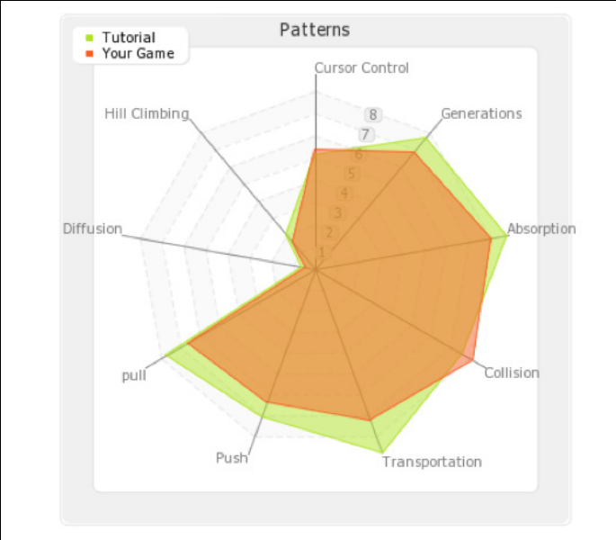

---
# all the regular stuff you have here
zotero:
  scannable-cite: false # only relevant when your compiling to scannable-cite .odt
  client: zotero # defaults to zotero
  author-in-text: false # when true, enabled fake author-name-only cites by replacing it with the text of the last names of the authors
  csl-style: harvard-manchester-metropolitan-university # pre-fill the style
layout: post
categories: chapter
title: 2. Literature Review

---
-   [Literature Review](#literature-review)
    -   [Introduction](#introduction)
    -   [A review of research on CGD&P and constructionist approaches to
        learning computer
        coding](#a-review-of-research-on-cgdp-and-constructionist-approaches-to-learning-computer-coding)
        -   [A summary of research on of computer game design and
            programming
            (CGD&P)](#a-summary-of-research-on-of-computer-game-design-and-programming-cgdp)
        -   [An overview of constructionist
            approaches](#an-overview-of-constructionist-approaches)
            -   [Constructionist pedagogies: Microworlds, heuristics and
                resulting
                toolsets](#constructionist-pedagogies-microworlds-heuristics-and-resulting-toolsets)
            -   [Coding clubhouses and cultural
                programmes](#coding-clubhouses-and-cultural-programmes)
            -   [Constructionist framing of relevant learning outcomes -
                computational thinking and dimensions of fluency and
                agency](#constructionist-framing-of-relevant-learning-outcomes---computational-thinking-and-dimensions-of-fluency-and-agency)
            -   [Limitations within constructionist approaches and the
                related field of CGD&P
                research](#limitations-within-constructionist-approaches-and-the-related-field-of-cgdp-research)
    -   [Pedagogies to support game making via
        coding](#pedagogies-to-support-game-making-via-coding)
        -   [Explicit teaching of computational thinking - Principles
            first](#explicit-teaching-of-computational-thinking---principles-first)
        -   [Design frameworks using stages & project based learning
            (PBL)](#design-frameworks-using-stages-project-based-learning-pbl)
        -   [Use Modify Create & Half Baked
            games](#use-modify-create-half-baked-games)
            -   [Levels of abstraction & semantic
                profiles](#levels-of-abstraction-semantic-profiles)
            -   [PRIMM](#primm)
    -   [Social approaches and cultural
        programmes](#social-approaches-and-cultural-programmes)
        -   [Game competitions and coding
            clubs](#game-competitions-and-coding-clubs)
        -   [Educational Game Jams](#educational-game-jams)
        -   [Fifth Dimension interventions & Connected Learning
            approaches](#fifth-dimension-interventions-connected-learning-approaches)
    -   [Design patterns](#design-patterns)
        -   [Game Star Mechanic and Scalable Game
            Design](#game-star-mechanic-and-scalable-game-design)
    -   [Synthesis of chapter / discussion / problem
        statement](#synthesis-of-chapter-discussion-problem-statement)
        -   [Returning to gaps in the CGD&P research
            landscape](#returning-to-gaps-in-the-cgdp-research-landscape)
            -   [Gaps in structural and technical
                approaches](#gaps-in-structural-and-technical-approaches)
            -   [Gaps in research on the potential of
                GDPs](#gaps-in-research-on-the-potential-of-gdps)
            -   [Addressing agency and cultural
                factors](#addressing-agency-and-cultural-factors)
        -   [Link to the next chapter](#link-to-the-next-chapter)
    -   [Parked](#parked)

# Literature Review

<!-- ## Research Questions April 2025

- **Primary research question (RQP):** How can understandings of how to design and facilitate CGD&P be enriched using socio-cultural approaches (used in this study)?

- **Sub-question 1 (RQ1):** What contradictions arose in this research’s evolving design process and how were they addressed in the resulting CGD&P pedagogy?

- **Sub-question 2 (RQ2):** How can the use of a collection of game design patterns support CGD&P, in particular in relation to abstract and concrete dimensions of existing pedagogies?

- **Sub-question 3 (RQ3):** How can varied dimensions of agency be identified and nurtured in an evolving community of game makers? -->

## Introduction

<!-- **Specifics of structure**

- contextrs
  - Why make games for education?
    - a review of the literature
    - motivation for making games
  - informal (vs formal) context of game making
    - barriers in general - and especially to informal
  - Programs working to address challenges - and house informal pedagogies (move up?)
- Pedagogies & Relevant Game Making Studies

  - Design (thinking) stages
  - Semantic waves and Primm
  - umc
  - Microworlds / Half baked games as constructionist Environments
  - Pair programming
  - Game Design patterns
- Existing responses
  - supporting digital projects - Kemp
  - Resource provision & cpd
  - Connected learning -
  - RL Community Responses
- Conclusion
    - Summary
    - Problem statement  
    - Link  -->

This chapter reviews relevant literature to summarise research addressing the aims of this study. It explores several themes to establish a broad understanding of the field of computer game design and programming (CGD&P). Firstly, I summarise the findings of reviews of research on CGD&P. Then, due both to its prominence in the field and the utility of the work, I outline key concerns of the work of constructionist researchers in the broader field of supporting programming education and more specifically within CGD&P. The review then addresses pedagogical approaches that are pertinent to the research concerns of this thesis. For the purposes of this chapter, I draw on a definition of pedagogy aligned with the socio-cultural approach of this study from Siraj-Blatchford and colleagues [-@siraj-blatchford_researching_2002] [^1]. I begin with structural pedagogies first from the wider field of computer programming before focusing on those specifically addressing game making. Then follows a review of research on the potential and characteristics of social and cultural approaches to game making covering: pair and peer coding, coding clubs, competitions, and game jams. This section ends by exploring the development of novel and robust pedagogies which support learner agency via a summary of the Fifth Dimension (5thD) interventions and those outlined in the Connected Learning research programme. Finally, a significant focus is placed on the use of game design patterns (GDPs), where I highlight their use in computing education. By addressing these themes, the literature review will situate the current study within the broader academic discourse. In particular, given the underlying rationale of the thesis, it explores pedagogical approaches which have the potential to foster inclusive practices within game making communities for novice coders.
<!-- Subsequently, I explore how this review has informed the proposed problem statement of this thesis, emphasising the need for developing novel and robust pedagogies in this area which support learner agency.  -->

<!-- In the context of activity theory, pedagogy can be framed as pedagogical tools and processes, functioning as a type of mediational strategy.

**There is an overall differential in specificity.**
Used in broad terms pedagogy encompasses both the domain of teaching and broad theoretical understandings instruction.
https://www.iosrjournals.org/iosr-jrme/papers/Vol-11%20Issue-1/Ser-2/B1101020629.pdf

In more specific terms it can a pedagogy, a more particular approach or technique.

- Specific as well as theoretical - involving praxis.

Resisting an dichotomy it can be understool from a practitioner perspective as a dialectical process alternating beteen experiecne and theory .

Related to context as well as instructive teaching. -->

<!-- The work of Quintana et al contains useful guidelines for checking the suitability of a framework to support science education [@quintana_scaffolding_2004]. In particular guideline x, and y can be identified in the use of GDPS in this research.
NOTE - IM NOT SURE HOW HELPFUL THIS ACTUALLY IS. -->

<!-- ### Potential benefits of computer game design and programming (CGD&P) -->

 <!-- In addition, given the influential nature of constructionist framings of research within the field, it is productive to examine this influence critically. -->

<!-- Before addressing specific pedagogies to programming in general and game making in particular, it is of value to examine the broad context of motivations for undertaking -->

### A summary of research on computer game design and programming (CGD&P)

<!-- NOTE Set out the path here.
- reviews first
- specific studies?
- general gaps? -->

In order to give a broad perspective of overarching concerns in this area, this section begins by addressing studies on computer game design and programming (CGD&P). Several reviews explore the motivations, processes, and benefits of making games for learning [@denner_does_2019; @earp_game_2015; @hayes_making_2008; @kafai_constructionist_2015-1; @gee_video_2016]. Kafai and Burke's [-@kafai_constructionist_2015-1] review synthesises 55 relevant papers within the framework of constructionist gaming, focusing on varied strands of the potential of CGD&P and the barriers to participation (explored in Chapter 1). The most developed section concerns the benefits and motivations of CGD&P research to address the development of personal dimensions of knowledge and skills. Strong areas within that include computer science knowledge and programming, maths and science, and a range of technical abilities that facilitate participation in the information society. Additionally, social dimensions such as pair programming, social skills, self-reflection, and cultural awareness are addressed. The authors note limitations in the presentation of many findings in terms of detail regarding the discussion of pedagogies used; however, what studies do detail pedagogies are not shared in the review [@illingworth_review_2017].

Hayes and Games [-@hayes_making_2008] also take a broad approach in their review, identifying four main motivations for CGD&P: learning computer programming skills, deepening subject knowledge of other curricular subjects, involving more girls in computer programming, and using game design to understand design concepts. Other reviews focus more closely on other strands. While Gee and Tran [-@gee_video_2016] discuss the diverse tools available for game design, Bermingham and colleagues frame CGD&P competencies as 21st Century Skills [@bermingham_approaches_2013], a focus echoed in a wider review on digital making encompassing game making [@lamas_making_2019]. In their review of the potential of CGD&P to encourage collaboration, Earp and colleagues [-@earp_learner_2013] found that analysis of collaboration was for the most part limited to peer review and other forms of feedback.

A review of CGD&P by Denner and colleagues [@denner_does_2019] focuses on the effectiveness of CGD&P to develop computing science learning and motivation, in the process breaking this broader concept into subcategories of programming knowledge and problem specification and design, is cautiously optimistic but notes limitations of existing studies in terms of clarity of motivations involved, details of the research process, and specifics of demographics of participants. While Denner et al. [@denner_does_2019] outline three emerging strands of pedagogical interest: design-build-test, step-based instruction, and social pedagogical approaches, due to limitations in source research, these strands are described only in general terms. Given these limitations and others identified within the reviews outlined above, this chapter will undertake a review of CDG&P research which does describe pedagogies in more detail. This review will also draw on wider computing and digital making pedagogies. Before undertaking this more detailed review, it is of value to describe the breadth of innovations and subsequent research by the constructionist school both to acknowledge the significance of this research and to give a broad overview of themes that will be developed subsequently.

<!-- ADD A PARAGRAPH ON KEY STUDIES, Roberson, Denner, Pepler,
And add a critical framing? -->

<!-- THIS COULD BE A GOOD CHANCE TO GO INTO THIS MORE - ADN THEN DROP DESIGN STAGES ALTOGETHER FROM THIS THESIS!!! -->
<!-- Similarly, while studies on the community use of game making, in after-school and online settings exist [@kafai2012collaborative; @peppler_computer_2009; @luther_leadership_2011], details of pedagogies to develop community participation, as explored later in this chapter, are often scant.  -->

<!--
@erstad_identity_2012
The practical and and cultural difficulties of undertaking a project-based approach within the curriculum are significant. Factors of difficulties associated with technology projects compound difficulties.
SUPPLEMENT THIS WIHT POINTS FROM SEFTON GREEN. -->
<!--
    David Buckingham’s (2003) review of media education described a long history of how making can support critical understanding, and how this can encourage a more critical and contextualised understanding of production and the making process. This additionally meshes with constructivist beliefs in how making is a better way of understanding than simple instruction (Papert, 1993), and lies at the heart of some of the new orthodoxies about critical participation (Jenkins et al, 2007) [@sefton-green_mapping_2013]-->
<!-- SF mentions Mozilla webmaker tools, computer club house, physical computing, hacking a pedagogy - in chap3 on informal approaches.   -->
<!-- Gee also investigate a learning experiences is founded on his understanding of  -->
<!-- Barron and Livingstone have outlined the advantages and processes involved in family involvement of technology use and learning in the home. -->

<!--
WHAT ABOUT FLUENCY?
In their project-based intervention, Girls Creating Games, Denner and Werner focused on pair programming of games to develop IT fluency, contrasting it to IT literacy [@werner_middle_2005-1] -->

<!-- Significantly, the review is structured around key areas of knowledge and skill development. The primary area involves of building subject knowledge in educational settings in particular to develop coding and computing skiWhile the focus of lls and STEM subjects. -->

<!-- Of particular interest to this study are studies exploring the social and cultural dimensions of CGD&P. While studies on pair programming techniques in CGD&P [@denner_computer_2007; @werner_can_2009] yield positive results, including increased confidence in coding and articulation of problems arising,  -->

<!-- This deficit in addressing and assessing pedagogies used, is reflective of a comparatively weakness of concepts of pedagogy within the wider constructionist theory, a dimension which is explored after the next section barriers to participation. -->

<!-- In related work, Robertson's drew on storytelling games, to access participant knowledge in accessible ways []] -->
<!-- What is missing?
Other studies show games as a potential vehicle for exploring issues involving race, sex, social issues. -->

## An overview of constructionist approaches

<!-- Before turning to a more detailed exploration of distinct pedagogies used in or appropriate for CGD&P,  -->

<!-- Turning first to how games are special.
However, while the inclusion games clearly favour these elements, the  use of home interests and the use of a playful approach are not unique to game making.
Kafai and Burke

also note the benefits to exploring games over other types of media projects, including their inherent interactivity and rules based systems, which facilitate the exploration of systems thinking and design approaches [@games_gamestar_2010; @tekinbas_gaming_2014; @games_design_2008]. However, in order to foreground those elements, programming is dropped from the tool to reduce complexity. -->

The work of constructionist researchers is foundational to the research landscape in both the field CGD&P and in wider programming education. As such, many of the themes relevant to this literature review originate in constructionist research often centred originating from the activity of the MIT media lab [@semenov_seymour_2017]. Examples include the pioneering work of Papert on LOGO [^2], programmable LEGO drawing turtles [@papert_mindstorms_1980; @papert_turtles_2002; @papert_childrens_1993], early research by Kafai on game programming by children [@kafai_minds_1994], innovations in creative computing by Resnick in the areas of physical computing [@resnick_digital_1998], and Scratch (a more generalised multi-media authoring tool) [@resnick_reflections_2005]. Kafai and Burke’s [-@kafai_constructionist_2015] framing of CGD&P as _constructionist gaming_ reflects the dominance of this voice within the field. Consequently, many of the researchers undertaking work in this area identifying their work as following constructionist principles [@harel_caperton_toward_2010; @repenning_scalable_2010; @weintrop_computational_2016; @kynigos_children_2018].
Despite this influence, the ethos and theoretical underpinning of constructionism are difficult to locate precisely [@laurillard2020significance, p.29]. This may in part be due to the varied interpretation of the constructionism as an "epistemological paradigm, a learning theory and a design framework" [@kynigos_constructionism:_2015]. The following sections situate the concerns of this thesis within the existing body of constructionist research before widening the focus to explore the principle strands within it.
<!-- In addition, the focus has shifted Papert's early focus on objects to think with was interpreted as an expansion to Piaget's constructivism [@ackermann_piagets_2001]. Resnick [-@resnick2014give] and other constructionist researchers have advocated for software and hardware tools that promote an open-ended, child-led approach to designing relatable objects of interest. The framing of Kafai and Burke of CGD&P as constructionist gaming widens the scope still further. -->

#### Constructionist pedagogies: Microworlds, design principles and resulting toolsets

Early constructionist research by Papert and Turkle[-@papert_epistemological_1990] addresses on diversity in coding approaches to counter potentially alienating abstract approaches. The authors describe an alternative approach, a more concrete computing pedagogy they call _bricolage_, a craft-based approach where participants become very familiar with their tools and materials. Bricolage approaches involve an iterative process, proximity to the code, strong links between function and form, and maintaining close contact with a concrete sense of the outcomes, even at the expense of programming efficiency or neatness of code. It suits the use of tangible physical and digital objects, particularly those which can be shared within communities [@kafai_constructionism_1996-1].

Laurillard [-@laurillard2020significance] describes constructionism as a distinctive pedagogy based on Papert’s vision of a carefully scaffolded code environments (Microworlds) to create a publicly shareable project. Microworlds are simplified computer simulations or models where students can explore and experiment with previously abstract  concepts (e.g. maths or physics) in a concrete way [@rieber_microworlds_2004; @harel_constructionism_1991; @papert_mindstorms_1980]. Specialised, task specific programming languages limit the complexity of code needed compared to a complete programming language [@kong_providing_2022]. The use of Microworlds within traditional school settings is not unproblematic as there is a danger that the potential is trivialised into a vehicle for instruction based processes aimed narrowed to teacher chosen curricular concepts [@hoyles_microworldsschoolworlds_1993]. Papert [-@papert_turtles_2002, p.17] also caution against an institutional dilution which can threaten their potential to retain qualities as "exploratory, playful, personally meaningful".

<!-- #### Constructionist design heuristics -->

Also based within the MIT media lab, Resnick and Rosenbaum [-@resnick_designing_2013] articulate key constructionist design principles which facilitate  a process of _designing for tinkerability_. Fundamental characteristics include: allowing immediate feedback, fluid experimentation, and open exploration. The principle of simplifying complex and obscure processes in digital production tools with an aim to allow learners to rapidly engage in creative processes is described metaphorically as _low floors_. Other principles include _high ceilings_ reflecting a need that projects are not limited in terms of complexity if learners want to create more ambitious projects and that of _wide walls_ to represent the advantage of creations being able to create a diversity of media genres, projects types and approaches [@resnick_reflections_2005; @resnick_scratch_2009].

<!-- ##### Scratch as a more general toolset, remixing, and community elements -->

A concern particularly relevant to this study are tensions resulting from structural support or scaffolding put in place to support the principles of wide walls [@bruner1974communication]. Take for example, the constructionist concept _Constructopedia_  advanced to provide choice based support for diverse project pathways [@papert_technological_1995]. Constructopedias act as small scale, online encyclopedias of design elements and resources facilitating concrete implement which serve as both a practical resources and sources of inspiration. Nichols [-@nichols2007idea] outlines challenges in practical attempts to created resource repositories based on Constructopedia principles which include; the limitations in context of some repositories [@carbonaro2004using], the lack of ability for participants to contribute their own resources and subsequent reduction in sense of ownership, and the overly broad scope of some repositories [@nichols2007idea]. The principles of the Constructopedia concept are partially present within Scratch, the MIT media lab multi-media authoring tools for novice coders. The wide walls principle is supported via the provision of a large library of assets accessible within the Scratch authoring tool. In addition, all created products on the online community are remixable by others. However, the process of extracting particular features from existing projects via remixing not straightforward, complicated by the an embedded nature of the features [@amanullah_evaluating_2019]. The two approaches of remixing and Constructopedias surface a tension between providing inspiration, and the necessary technical detail needed for learners to implement relevant approaches in their own projects.

<!--
THIS IS IS FROM

Low floors: a tool that is intuitive enough to allow new users to acclimate to it gradually and with a degree of confidence.
High ceilings: a tool that also allows more experienced users to create constructs (in this case, video games) that can grow increasingly complex and nuanced as one’s own proficiency increases.
Wide walls: a tool that—in addition to low floors and high ceilings—allows its users to create a wide range a constructs, letting users tap into elements of personal experience as well as popular culture to design and develop something entirely unique and representative of their own interests and backgrounds.
We added a fourth principle to emphasize the equally important social dimension of construction tools:11

Open windows: a tool to facilitate the sharing of digital media. The creation of digital communities represents the new frontier in terms of making computer programming a more accessible skill for youths. -->

<!-- Denner and colleagues' review of this area, using the term CGD&P rather than constructionist gaming, uses a broad categorisation of pedagogies used in studies . -->

<!-- Look the potential of at constructopedia samplers
[@papert_technological_1995], an attempt using the computer clubhouse to make this happen using the potential of the internet [@chapman_pearls_2006]. -->

#### Coding clubhouses and cultural programmes

Constructionist research is often carried out in community settings [@resnick_computer_1996], a key example being the first Computer Clubhouse, an after school club in a Boston's computer museum [@resnick_computer_1998;  @peppler_computer_2009]. Constructionism's founder Seymour Papert [-@papert_mindstorms_1980, p.149] was influenced by his observational research on community organising within Samba schools as form of mutual learning environments describing the value of settings that are "real, socially cohesive, and where experts and novices are all learning". Bruckman [@bruckman_community_1998, p 51-52] notes the importance of a _constructionist culture_ to support experimental processes enabled by technological tools. Bruckman and Zagal [-@zagal_samba_2005] later formally compared the cultural learning components of a Samba school to activity within a computer clubhouse. To do this, the researchers drew on the socio-cultural research on communities practices [@lave_situating_1991] to describe social practices including the importance of showcase events share created work, flexibility of ways of participating, and the value of diversity within the skill levels and backgrounds of participants.

<!-- There is limited research on how to create learning communities making games for educational purposes. Existing research [@xiao_fostering_2007] has close parallels with project approaches and has a focus on fostering online collaboration and resources sharing. Many popular and well researched online communities exist [scratch, itch.io, new grounds](Bruckman).  -->

<!-- Correa (2015), explores the role of children as brokers of technology in family environments. MOVE LATER? WITHIN 5D? BARRON?  -->

<!-- In response to the limitations of accessibility of online participatory culture  [@roque_family_2016]  CHECK THIS AND SAY HOW,  -->

MIT researcher Roque [-@roque_family_2016] brought family members  directly into the making process to help overcome barriers to computer coding as part of the Family Creative Learning (FCL) program. To do this FCL draws on both constructionist and socio-cultural ideas within a face-to-face sessions, creative making programme using Scratch and playful physical processes and materials. Roque utilises the work of Barron and colleagues [-@barron_parents_2009] on parental roles in a digital making environment to guide facilitators to help parents and children develop their participation within community activities [@roque_becoming_2018]. Barron et al. [-@barron_parents_2009] had identified social and cultural behaviours of parents in settings of informal technology uses which the authors coalesced these into roles, including: teacher, project collaborator, learning broker, non-technical consultant and learner. Roque makes a convincing case for the value of exploring the collaborative roles of parents and facilitators and of creating social, collaborative and reflective activities to complement the more technological aspects of the making activities. The research team created a detailed guide to replicate the programme [@leggett_family_2017] [^3].

<!-- In the following literature review sections I will examine sociocultural approaches and concepts that may be used in wider contexts but also applicable to CGD&P. -->

<!-- To compare with learning in more formal structured, and more naturalistic learning environments, it best matches a more optimal approach to game making with families. -->

<!-- However, while the design of the FCL programme was effective to build parental confidence and to increase overall accessibility to the process , it left questions unanswered about the effectiveness of the process to enable further learning at home after the programme end. In addition, similar to the computer clubhouse model, it is noteable that there are potential difficulties of scaling this hybrid approach (FCL) in terms of the expert facilitator help needed. -->

#### Constructionist framings of computational thinking and dimensions of fluency and agency

Constructionist research has contributed important understandings of computational thinking (CT) and dimensions of fluency and agency within digital making. Addressing computational thinking, Tedre and Denning [-@tedre_long_2016] note the foundational work of Papert's applied understandings of computational thinking and caution against newer definitions of CT that highlight formal abstractions [@wing_computational_2008]. A distinction between concrete and abstract approaches is helpful to examine the differences between these two interpretations of computational thinking (CT) within in the field of computing education.  Wing's [-@wing2011research]  influential take on CT focusing on varied elements of abstraction processes has been adopted by numerous learning resources aimed at teachers [@bbc_bitesize_introduction_nodate; @dong_prada_2019]. It presents four key pillars of CT, specifically: decomposition, pattern recognition, abstraction and algorithmic thinking. The implication is that there is a value in understanding the underlying principles as separate from the context of coding to better apply then in areas beyond computing. This rationale of broader applicability was used by many computer science educators to advocate for the CS to be mainstreamed into education [@guzdial_paving_2008].

<!-- was developed in response to a thought experiment "How do we describe what Tim, Shannon, and Renita are learning as they participate as designers of interactive media with Scratch?".  -->

Constructionist researchers Brennan and Resnick [-@brennan_new_2012] addressed the limited approach of Wing's definition of computational thinking (see [@cuny_demystifying_2010]) by taking a grounded, situated approach create a map of the potential learning dimensions of students designing and coding collaborative, creative computing projects. The resulting description of computational thinking includes computational concepts, computational practices and computational perspectives. Examples include concrete code concepts (e.g. loops, conditionals, and sequences) and practices (e.g. debugging, iterative practice, reusing and remixing). The greater role of community reflected third category of computational perspectives, including: expressing (creating project which allow self-expression within a community of peers), connecting and questioning (involving critical approach to technology). Lye's extensive review of teaching Computational Thinking [@lye_review_2014] used Resnick and Brennan's definition as the basis for the review, indicating the widespread use of this more applied approach. This work reconnecting with Papert's vision of the potential of computing projects within a community setting can be seen as an important reclamation of a situated, grounded and flexible perspective on computational thinking [@tedre_long_2016; @denning_remaining_2017].

The applied framework of Resnick and Brennan develops previous work by Papert and Resnick [-@papert_technological_1995] concerning technology fluency. Fluency as an attribute is present in several strands of constructionist research described in different contexts as technical fluency [@papert_technological_1995], digital fluency [@resnick_scratch_2009], gaming fluency [@peppler_gaming_2009-1; @kafai201221] or computational fluency [@resnick_computational_2018]. Similarly, the work of Kafai and colleagues on collective agency [@kafai_learning_2008] or later collaborative agency [@kafai_collaborative_2011; @kafai2012collaborative] examines collective work in after school computer clubs and the online Scratch community. The researchers utilise the theoritical concepts of communities of practice [@wenger_communities_1998] and agency formation during collaborative knowledge production [@scardamalia_higher_1991-1]. While the researchers use these broad concepts to describe manifestations of collaborative agency. The researchers note learners distributing responsibilities as they create collaborative projects. However, their discussion of the process in relation to the underlying theory is brief and focused on general online collaboration in the Scratch community rather than face to face settings. Unfortunately, Kafai's later work reviewing game making does not develop this promising strand of exploration of agency.

<!-- IS A TABLE USEFUL HERE? OR GLOSSARY ELEMENTS -->
<!-- As such, from the perspectives of critics of Wings abstract framing of computational thinking [@denning_remaining_2017], the uptake of the more applied definition can be seen as beneficial (to who? to do what?) -->

<!-- An additional limitation in constructionism approach to digital making in varied forms is lack of of an underlying consistency in terminology regarding the motivation for undertaking the work. -->

#### Limitations within constructionist approaches and the related field of CGD&P research

Gaps remain in constructionist research regarding pedagogical approaches. Despite Kafai's emphasises on the importance of a situated and critical approach to coding practices [@kafai_revaluation_2022; @kafai_theory_2020].
Vossoughi's [-@vossoughi_making_2016] critique of constructionism from a socio-cultural and egalitarian perspective highlights this absence of _intentional forms of pedagogy_. Similarly while the importance of self-expression within a community of peers in broad terms as forms of fluency (see above), constructionist framings frequently lacks a conceptual underpinning. Vossoughi [-@vossoughi_making_2016] attributes these gap to in part to constructionism problematic educational approach which has increasingly centred on the design affordances of researcher-created toolkits and communities that facilitate personal understandings of knowledge [@vossoughi_making_2016]. When pedagogy is addressed in recent constructionist studies, it often takes the form of broad principles of design thinking or general project-based approaches [@resnick_scratched_2012; @resnick_lifelong_2017]. A later section addresses these pedagogies in more detail.

It appears probable that that this deficit is driven more by omission than intentional design given the almost identical critiques by constructionist researchers of approaches which focusing too narrowly on technical approaches and toolsets rather than their expressive potential and thus within a community [@resnick_seeds_2020; @resnick_coding_2020], and Kafai and Burke's call for greater research on social and cultural dimensions of game making. These gaps in the research landscape of CGD&P, which has been significantly influenced by constructionism, may stem from limitations within the analytical processes and theoretical concepts used by constructionist researchers. In line with the primary research question, which concerns ways in which CGD&P research be enriched using socio-cultural approaches, the next section explores varied pedagogies which offer the potential to contribute to this line of inquiry.

<!-- This is particularly visible within concepts of agency development, and mediational strategies.   -->
<!-- but notes that ‘theoretical underpinnings of constructionism are difficult to pin down in most of its literature’ [@laurillard2020significance, p.29] -->

<!-- This more concrete interpretation of CT, based on observation of learners in action, is more accessible to teachers and learners as they can more easily recognise their own practice than in the more abstract interpretations of CT. To give a specific example, rather than decomposition, the applied framework outlines taking an iterative, incremental approach to problem solving and arranging code in modules. -->
<!-- This broader, process driven definition of CT has been used and adapted by many organisations seeking to support the new computing curriculum may be familiar from websites, posters and other supporting material created by groups like Barefoot computing.  -->
<!-- The review above and the influential framework used by Computing at School [@csizmadia_computational_2015-1]  have included elements of this applied framework as well as other more abstract CT concepts. -->
<!-- This is not to argue that Wing's approach to CT is without technical merit [@lodi_computational_2021], rather that its adoption by educational bodies like CAS in the UK and similar bodies internationally has risks. The inclusion of formal CT frameworks in curriculum and formal testing has provoked mechanistic teaching of decontextualised concepts via formal teaching methods to the detriment of hands-on exploration and creation of personally meaningful projects [@resnick_coding_2020]. -->
<!-- In a challenge to this article Wilensky [-@wilensky1991abstract] questions the nature of abstract in this context arguing that all objects and concepts are abstract until familiarity makes them more concrete to the user. -->

<!--
In their review and a critique constructionist approaches to game making, Thumlert et al agree with the potential of a constructionist approach to develop 21st century skills, -->

<!-- It is important, in the interests of balance, to separate out some of the positives from the limits here. The school has done good work (tools, design principles) that can be built on. -->

<!-- A key advantage of viewing the domain from a contextual point of view is allowing a more nuanced exploration of the motivations for participating or not participating in game making. There is a danger that lack of participation in computer science can be viewed from a deficit perspective, e.g. what skills or confidence to students lack. Studies from a sociocultural perspective allow for a deeper exploration of interests, values, and practices from outside of the immediate learning environment. -->

<!-- **Returning to developing Computational Fluency**
PERHAPS NOT - MORE OF A BRIDGE TO NEXT SECTION PERHAPS

To refocus this review, let's return to focus of computational fluency as the focus for one of the research questions. Why choose this concept rather that broader 21 Century skills? -->

<!-- In their project-based intervention, Girls Creating Games, Denner and Werner focused on pair programming of games to develop IT fluency, contrasting it to IT literacy [@werner_middle_2005-1] -->

## Pedagogies to support game making via coding

One of the main themes of this review is to explore the pedagogies available to support CGD&P. The following sections focus on pedagogies that are relevant to first general programming, and then more specifically game making.

<!-- It also focuses on those mo non-formal, real-life (as opposed to online) communities. -->

<!-- First, I will review design thinking approaches and project-based learning. Next, I will outline pedagogies centred around scaffolding game production through progressive steps, such as the Use, Modify, and Create (UMC) framework. -->

<!-- MOVE? TO INTRO OR LATER SECTION
Finally, I will examine the social and cultural aspects of coding clubs and informal programmes that serve as venues for CGD&P. -->

<!-- ## Project-based learning / Social approach / Communities of Learners.

- Key features of PBL - from academic sources up to date.
- Benefits of PBL, autonomy / agency /
- Creating a community of learners
- Examples of how this has been applied in game making or creative coding case studies. (RQ2) -->

#### Explicit teaching: step-by-step instruction and principles first teaching of computational thinking

<!-- NOTE KEEP THIS BRIEF -  -->

In Denner et. al's [@denner_does_2019] review of CGD&P the use of stepwise learning approaches was found in 40 out of 68 studies [^4]. Within step-by-step based instruction or tutorials, educators typically describe how to use the tools to achieve pre-set goals incorporating underlying principles of computational thinking and concepts within this instruction which learners ideally absorb by following along. An alternative instructional strategy is a principles first approach [@repenning_scalable_2015] informed by  Wing's [@wing_computational_2008] advocacy for the value of the explicit teaching of skills of decomposition, pattern recognition, abstraction, and algorithmic thinking. Given the more abstract nature of the CT principles applies to varied domains of coding. Wing's contribution concerning computational thinking is more theoretical than applied and invites discussion on how best to deliver principles first approaches. Grover [@grover_computational_2017; @grover_computational_2013] and Guzdial [@guzdial_learner-centered_2015] offer explicit techniques linked using the application of computer programming as the driving mechanism. Bell and colleagues [@bell2019constructing] explore the process of unplugged activities, exploring abstract CT concepts without using computers or coding. Other research explores the challenges teaching of computational thinking principles in subjects other than computing [@dong_prada_2019].

The remit of this literature review does not encompass a full critique of the validity Wing's strand of computational thinking either within computer science or other subject [^5]. However, while a principles first approach of understanding foundational concepts before engaging with the practice may appear logical, in practice when dealing with obtuse material it can aggravate foundational barriers to participation such as those outlined above [@papert_epistemological_1990] and in Chapter 1. Thus, the following sections of this review of pedagogies relevant to the concerns of this study primarily focus on practices which lead with or incorporate forms of concrete exploration of coding processes.

### Design frameworks using stages & project based learning (PBL)

As identified by the systemic review of CGD&P [@denner_does_2019], the design-built-test pedagogy is common in this field found in 30 out of 68 studies. The design-build-test exemplar cited in that review highlighted the approach of Globaloria programme. Globaloria structures project work around an iterative cycle of design stages namely: Play, Plan, Prototype, Program, and Publish. Many similar frameworks exist in diverse areas of production including computer science [@pereira_design_2018], engineering [@winarno_steps_2020-1], design processes [@dam_5_2024] and project based learning. Addressing the domain of design thinking, Figure 2.x includes a graphical representation of design thinking stages from the Institute of Design at Stanford dschool [@dam_5_2024]. The stages are be described in the following way: Empathise - learn about the audience; Define - sharpen key questions; Ideate - Brainstorm and create solutions; Prototype - build representations of one or more ideas; Test - test ideas and gain user feedback.

<!-- {width=90%} -->

{width=100%}

<!-- One stream in CS stems from engineering and design thinking [@resnick_all_2007; @winarno_steps_2020-1]. -->

Similarly, to illustrate the iterative nature and importance of community in of a design approaches to making Resnick advocates the use of a _creative cycle model_ for educators [@resnick_lifelong_2017]. The five circular stages are; Imagine, Create, Play, Share, Reflect and returning to Imagine once more.
Within the context of computing education Resnick [-@resnick_scratched_2012] describes the foundations of the design-based approaches in education as; engaging in design activities, exploring personally meaningful topics, collaborating with others, and deepening understanding through reflection. While research on the use of design thinking in education is broadly supportive, finding promise to develop varied forms of creative planning and collaborative skills [@luka_design_2019; @lor2017design], there are limitations within the field of design thinking and education that stem from lack of clarity regarding terms, information on how to implement design stages, and vague theoretical justification of the overall process [@micheli_doing_2019]. To address these limitations we can turn now to the fields of project based learning which shares the stage based characteristics of design thinking but which has been developed and analysed in line with socially constructed theories of learning [^6].

<!-- To illustrate this design-based approach Resnick advocates a _creative cycle model_ [@resnick_lifelong_2017]. The five circular stages are; Imagine, Create, Play, Share, Reflect and returning to Imagine once more.  -->

<!-- {width=90%}
Figure 8.1. Diagram of five circular stages; Imagine - Create - Play - Share - Reflect - Imagine  
Diagram [@resnick_lifelong_2017] -->

<!-- While the value of design thinking stages for educators planning sessions seems clear, and elements of this framework are included in early literature to help adoption of new computing curriculum in UK [@csizmadia_computational_2015],  there is little research exploring how the stages could be used by learners to scaffold their own design process when engaging in making digital products. -->

<!-- Resnick and Brennan [@mouza_imagining_2013] focus on the affordances of tools and communities to support all aspects of students work on design stages without suggesting any processes from a teacher of student perspective. -->

<!-- One exception is the work of Zainal et al [@zainal_review_2021], using the Stanford dschool design thinking framework [@dam_5_2024] to structure the work on students in undertaking IoT project work.
The authors, note the lack of research investigating the  potential of this approach and call for more work to be done in this area.
ADD TO THE PROBLEMS STATEMENT.  BUT I DON'T THINK THIS IS TRUE  -->

<!-- Thus, while the ethos and benefits of this approach are convincing RESNICK'S TAKE, what is not clear however is who this framework is for (either for designers, facilitators or participants) or how it can be activated in the process of facilitating project work.   -->

<!--
The model is similar to the ADDIE model from instructional system design: Analysis, Design, Development, Implementation and Evaluation. The discipline of teaching engineering also has a similar design stage cycle with many contesting variations [@winarno_steps_2020]. Engineering is Elementary project adapted from the ABET (Accreditation Board for Engineering and Technology) guidelines [@syukri_impact_2018] involves the following steps; Ask, Imagine, Plan, Create, Test, Improve, Share [@hester_engineering_2007]. It has been adopted by the area of computing is one used in a recent book on coding by Bers [@bers_coding_2021]. HOW IS THIS USED? AS A PEDAGOGY? -->

<!-- #### Project-based learning (PBL) -->

<!-- As outlined in the introduction, this thesis, while guided by constructionism as a design approach, uses AT as a theoretical framework.
In addition, this section outlines the value of PBL as a more developed framework as well. -->

<!-- There is a clear alignment between the potential of making games and other media products as an educational activity and the agenda o f project-based learning, particularly in the to develop skills suited to the modern workplace (21st Century skills).  -->

<!-- The following section explores relevant elements of PBL pedagogies, where possible making alignments with existing game making studies.  -->

The field of project based learning (PBL) encompasses a wide scope of research in educational contexts detailing pedagogical approaches aligned with the focus on social learning research of this thesis. PBL approaches also employ an iterative design approach [@jia2023design] and existing research provides a depth of analysis on the processes and rationale involved at each stage. In broad terms, PBL is an educational strategy which advocates: learner choice in projects which increases motivation [@darling-hammond_powerful_2008]; authentic and shareable project outcomes and learning environments to encourage peer feedback and reflection [@gibbes_project-based_2014; @hung_activity_2000];  iterative projects work supporting student mastery; and challenging goals and guidance in goal setting aiding self-regulation in learners [@barron_doing_1998; @hernandez_aalborg_2015].

<!--
To align with the focus of this study I will focus on the following dimensions of PBL:

- driving questions / challenge - involving chi
- facilitation of group creativity
- authenticity of processes
 -->

Significant challenges exist in undertaking PBL including: practicalities of timetabling and time pressures within formal settings [@marx_enacting_1997], limitations in access to authentic resources [@thomas_review_2000], and expertise and confidence in facilitation [@ertmer_essentials_2015-1]. A key challenge for educators stems from the shift in perspective required from a traditional role of teacher instructing subject knowledge directly to a role of facilitator allowing students to take a greater role directing activities.  Due perhaps in part to the use of learning environments and activities that promote an active construction of knowledge by learners rather than ones dominated by instruction [@kokotsaki_project-based_2016], PBL is often incorrectly conflated  with unstructured, _pure-discovery_ approaches [@kirschner_why_2006]. However, while there is no unified structural approach to scaffolding, contextually relevant support constitutes a vital component of PBL [@hmelo-silver_scaffolding_2007].

Ertmer and Simons [-@ertmer_scaffolding_2005] describe the potential of delineating varied forms of scaffolding to support teachers to effectively deliver PBL. Saye and Brush [-@saye_scaffolding_2002] describe _hard_ and _soft_ forms of scaffolding: harder forms being structural, static support in place to help learners organise planning and content knowledge and softer supports addressing relational strategies involving responsive questioning and support for collaboration happening between learners. In a STEM learning context, Pitot and colleagues [-@pitot_establishing_2024] draw on a popular project design rubric developed by the PBL Works organisation [^7] which they analyse as including the following elements: supporting the formation of challenging project challenges, sustained inquiry (relating to sustained time on the task and an iterative approach), authenticity (in both context and the use of tools within project work), student choice, critique and revision, reflection, and public product. Ertmer and Glazewski [@ertmer_essentials_2015-1, p.97] outline similar a categorisation of scaffolding and highlight the value of processes to aid group work, support reflection, and to structure _discipline-based argumentation_  where project work helps learners explore knowledge categories which exist in with the domain being explored. The authors note a tension in PBL design relating to the value of student choice over project work to sustain engagement compared to practical requirements to restrict of choice of participants to reduce the possibilities for facilitators being overwhelmed due to the breadth of support needed. Leat [-@leat_enquiry_2017-1] in an analysis of schools-based PBL using a sociocultural lens notes and highlights the value of incorporating what Moll [-@moll_funds_1992] refers to as funds of knowledge, resources which learners can draw on in either formal or informal settings [^8]. However the process of undertaking the incorporation of such funds can be challenging for teachers who may lack detailed knowledge on the relevant communities that their learners are involved in [@gonzalez_funds_2007]. Leat [-@leat_enquiry_2017-1] notes the value of activity theory as a sociocultural process to analyse such tensions within ecological contexts of learning.

Project based learning often involve challenges to students which are framed as _wicked problems_. These problems are in some ways are unsolvable in that their dynamic and complex nature require regular revisiting to find updated, contextually appropriate approaches [@kleczek_wicked_2020]. Similarly, the process of providing relevant scaffolding to support PBL also meet the definition of a wicked problem, requiring new approaches as background context and use of novel tools. As such, while the general approaches of structuring project work outlined above are relevant to this research, literature regarding kind of scaffolding that might support the develop CGD&P more specifically is often limited not only by acknowledged gaps in the landscape concerning sociocultural approaches [@kafai_constructionist_2015], but also by this dynamic context.

Despite these this limitation, it remains relevant to examine studies outlining the use of PBL and design stages to structure game making. To do this this section now analyses a selection of some of the studies referenced in both Kafai and Burke's review [@kafai_constructionist_2015], and that of Denner et al. [@denner_does_2019] which use a design-build-test approach. Simmons et al. [-@simmons_using_2012] briefly outline the use of a five stage design process to help structure the planning process of students. Reynolds and colleagues [-@reynolds_formal_2013-1] briefly include a description of a similar design phase process present in the Globaloria game making programme supported by extensive resources for teachers. However, most studies cited by Denner et al. as illustrating a design-build-test approach show significant limitation of details either the the students design process or suggested scaffolding of that process communicated to teachers or facilitators [@wang_relationships_2011; @wang_learning_2010-1; @robertson_influence_2013;  @ke_implementation_2014]. This may be in part due to limitations of the publication format, but may also reflect genuine limitation. For example, the online supporting resources of Adventure Author research by Robertson focuses primarily on software use rather than facilitating design process [^9].

Despite this deficit, general reflection on studies of on gaming making reveal underlying characteristics which clearly align with a project based learning (PBL) approaches and provide structural support. For example, the end goal of making a game provides an readily understandable driving challenge which can be shared publicly via a playable game to an authentic audience, either in person or online [@pitot_establishing_2024].  Returning to the example of Globaloria example [@reynolds_formal_2013-1], researchers found the  to sustain engagement through the intrinsic motivation to test and then revise their game creations based on their own evaluation. In addition to these more general uses of PBL support, more structural and specific forms of scaffolding exist in the domain of CGD&P as distinct, compatible pedagogies which are addressed directly in the following sections.

<!-- Kolodoner [@kolodner_problem-based_2003] - on building culture of collaborating and supporting development of rituals.
Although this research based on constructivism, and stems from scenario based computer modelling of cognition [@kolodner_case-based_2004], it is strongly aligned  sociocultural concepts. -->

<!-- The Aalborg PBL model at higher education level [@hernandez_aalborg_2015] -->
<!-- Due to the difficulty of generalising and abstracting frameworks linked to domain specific knowledge and processes, a gap exists in PBL literature regarding kind of scaffolding that might support the develop CGD&P more specifically. -->
<!-- Link to microworlds. -->

<!-- In addition, the range of applications and situated nature of the learning via PBL creates significant challenges in representation of practice, including communicating specific details of scaffolding used. -->

<!-- In formal education, contextual factors hinder the adoption of PBL challenge creative approaches in general. These include challenges of teaching to an exam-based curriculum, time allocated and other timetabling factors. While these are less applicable to informal settings,  -->
<!-- This alignment of approach also extends to some of the limits of PBL approach. The critique of PBL as 'pure discovery' learning is often misjudged, missing some of the less visible scaffolds often in place to support learner to access learning, and to reflect on learning that has taken place. -->

<!-- PBL can be effective in diverse fields of practice including: inclusive pedagogies [@leggett_impact_2021], and the use of appropriate "learning scaffolds" [@kokotsaki_project-based_2016, p. 8], language learning [@gibbes_project-based_2014], and digital making [@weng_characterizing_2022].   -->

<!-- It is of value to examine PBL literature detailing structure and pedagogical approaches in the area of digital product production and language learning. -->

<!-- Research in the area of digital media production using a PBL methodology exists

Gibbes et al's review of PBL in language learning from an activity theory perspective provides good foundational material for this study [@gibbes_project-based_2014]. -->

<!-- Given then broad benefits of PBL to make media, and returning to the claims around Kafai on constructionist games, it invites the question, is there anything particularly special about the use of games as a project? -->
<!-- **Returning to developing Computational Fluency**
PERHAPS NOT - MORE OF A BRIDGE TO NEXT SECTION PERHAPS

To refocus this review, let's return to focus of computational fluency as the focus for one of the research questions. Why choose this concept rather that broader 21 Century skills? -->

<!-- Elements of this framework are included in early literature to help adoption of new computing curriculum in UK [@csizmadia_computational_2015]. However little guidance is provide and not stream really followed up unlike the focus on computational thinking [@sentance_teachers_2015] -->

<!-- A wider review of design framework in STEM settings details discussion of varied definitions of stages themselves but less relating to the impact of the pedagogical use of design stages on learners [@winarno_steps_2020-1]. -->

### Use Modify Create & Half Baked games

The 'Use-Modify-Create' approach proposed by Lee and colleagues [-@lee_computational_2011] is particularly promising to counter issue of user anxiety and demotivation surrounding the difficulty of coding games. UMC evolved from research involving the use of game making and robotics to support computational thinking [@denner_computer_2012; @denner_using_2014; @werner_pair_2013; @werner_children_2014]. The model advocates the remixing of existing games to act as a scaffold to build the competence of the beginner coder. Learners are guided to progress in the complexity of their modifications, thus becoming increasing proficient in the recognition and use of computational concepts and structures [-@lee_computational_2011]. In the _Use_ stage, coders build a familiarity with coding interfaces, code structures and syntax through scaffolded approaches which involve interacting with the program code and what it produces. In the _Modify_ stage learners progress to working on real projects created by others. Learners deepen their knowledge of coding structures and practices by altering existing projects and templates to suit their own aims. _Create:_ After novice coders become more familiar with patterns of code design in use in the modify stage, they can progress to replicate such patterns in other code that they create from scratch.

A study involving five hundred 9 to 14 year-olds found that the UMC approach can balance a structured approach with more student-led exploration [@franklin_analysis_2020]. The researchers also found that the students enjoyed the UMC approach as they had more choice and agency in the process. This is supported by other research which compared UMC with a starting-from-scratch approach and found higher student engagement for those in the UMC group [@lytle_use_2019]. The researchers found that because students using UMC had more time to play around with code, they were able to add their own personal touches and that this ownership over the code sustained their continued engagement. While the scope of the study is limited, observations support motivation of UMC that this pattern of creation maintains higher level of engagement through reducing technical barriers to participation, and affording greater sense of learner's ownership over end project through greater choice over the final outcome.

<!-- NOTE - This may be moved to design chapter -->

Giving learners agency via their choice over the design of created public code products has the potential to motivate ad sustain programming activity [@kafai_constructionism_1996], but brings with it the potential for both facilitator stress in supporting diverse activity, and the potential for diversion for students away from target areas of subject exploration (a tension Noss and Hoyles call the play paradox [@hoyles_pedagogy_1992]). In order to address this tension between choice and potential teacher stress caused by the open ended nature of the "Create" part of the model, Lytle and colleagues suggest a list of extensions to choose from, swapping create for choose [@lytle_use_2019-1].

<!--
the authors note limits of study but are enthusiastic about providing a limited set of choices for final exploration within a limited time frame [@lytle_use_2019-1; @lytle_use_2019] -->

<!-- Addressing these tensions work by Franklin and friends suggest the use of the UMC framework [@franklin_analysis_2020]. -->

<!-- In a study where students use a block based language to develop simulations -  -->

<!-- - Scaffold Students and Teachers- Providing the necessary programming blocks students need to complete a choice
- Differentiate Choices by Difficulty - create choice systems that have varying difficulty
- Create Choices that Show Visible and Immediate Changes
- Make things Complex, not Complicated
- Draw from Student Desires - students will engage more with the material, feeling like the creations are their own. -->

<!-- **LINK**
The main concept of UMC is remixing a game to build. Scratch has been instrumental in bringing this methodology into clubs and classrooms as an explicit feature of its online community. FIND SOURCE -->

<!--
  - Scaffold Students and Teachers- Providing the necessary pro-gramming blocks students need to complete a choice ala a Par-son’s Problem greatly reduces cognitive load, especially in activitieswhere lots of choices means lots of blocks. Similarly, giving teachers a “Cheat Sheet" of answers for each choice, scaffolds their abilityto act as a facilitator and debugger.

  Differentiate Choices by Difficulty- This time, challenge came from adding morec hoices, but each choice was relatively the samedifficulty. In the future, we wish to create choice systems that havevarying difficulty to give targeted tasks for each student skill level.

- Create Choices that Show Visible Change
  - Prioritize choicesthat

 produce immediate changes in the run of the simulation (e.g. anew animal appearing in the environment).Create Choices that Promote Content Inquiry- Our decisionto primarily focus on adding more animals came from the fact thateach new animal made the Food Web more complex.

  - Make things Complex, not Complicated- As demonstrated in Figure 2, each animal had relatively the same set of code blocks. In this way, a lot of choices were available without adding many additional necessary blocks for students.

- Draw from Student Desires- Some of the choice ideas (e.g. bear)came from responses from students in the ‘Fox-Only’ -->
<!-- ### Half-baked games -->

The half-baked (incomplete) game concept builds on Papert's work on Microworlds [@harel_constructionism_1991; @papert_mindstorms_1980], and is closely related to the stages of the UMC approach. Half-baked games,  proposed by Kynigos and colleagues [@kynigos_half-baked_2007; @kynigos_children_2018], are unfinished and deficient in a way which motivates learners to alter the design or code and improve it. Like Microworlds half-baked games are designed to encourage malleability in directions that the learner may find interesting [@kynigos_children_2018], and the learning designer intends to be educationally productive. To do this the originator of the half-baked game makes complex decisions which highlight certain affordances of the game in a way which encourages the exploration of key concepts [^e]. Kynigos and Yiannoutsou  [-@kynigos_children_2018, p.2] provided "tools affording them (13-15 year olds) with the role of game hackers" to alter existing game code. The researchers identify a progression in the type of CT skills being used as the processing of modifying the game progresses. Specifically, they identify a progression from elements including pattern recognition associated with reading of code to more advanced examples including creating abstracted structures and sequencing their own algorithms. In previous work Kynigos describes the possibilities of half-baked artefacts to build learner dialogue around the problems at hand as as 'a communicational tool to shape a common language within the community' [@kynigos_half-baked_2007, p. 336].

SOME KIND OF SUMMARY OR LINK HERE.
- perhaps on concrete language - return to microworld theory - but more open media making

<!-- Research by Holbert and w focused on the use of a driving mechanic to draw out personal knowledge linking concepts of driving video games with scientific concepts of velocity and graph-based representations [@holbert_constructible_2014-1]
Kafai and Burke call this a sandbox game [@holbert_constructible_2014-1], linking with core microworld concepts. -->

#### Levels of abstraction & semantic profiles

<!-- The term abstraction has varied interpretation even within the field of computer science education [@hazzan_reducing_2002].   -->

In teaching computing pedagogy the concept of levels of abstraction can facilitate both teachers and students to help them understand the level of abstraction that they are working at [@statter_teaching_2016; @waite_abstraction_2016; @waite_abstraction_2018]. While the term abstraction has varied interpretations within the field of computer science [@hazzan_reducing_2002], here it reflects a spectrum between overarching concepts and the concrete results (see Table 2.x).

<!-- To quickly review LOA, the levels are Problem, Design, Code, Running the Code. And the purpose is, "Levels of abstraction has been interpreted as a hierarchy to enable teachers and learners to describe which level they are working at, rather than as a methodology for programming projects."[@waite_abstraction_2018] -->

| **Level**            | **Focus** | **Example** |
|----------------------|----------|-------------|
| **Conceptual Level**  | Thinking about the problem **without programming** | Task -  what is needed |
| **Design Level**  | Structuring / designing a solution | What it should do. |
| **Code Level**  | Writing the actual code  | How it is done |
| **Execution Level**  | Understanding how the computer processes the code on a low-level (e.g memory use), or in a k5 context the outputs | What it does. |

Table. 2.x Breakdown or Table of levels of abstraction. [@waite_abstraction_2018]

<!-- their approach to abstraction [@waite_abstraction_2018-1] is distinct from Wing's in that it is grounded in an operationalised computational model distinguishing levels of abstraction: specifically, in descending order of abstraction, the goal or problem to be solved, the designed structure of the program, the actual coding of that design, and at the most concrete level, the running of the code and its outputs [@waite_abstraction_2018-1] (see Table 7.1). Wing's CT concepts within the LOA model would lie at the design level.  -->

Guided by research indicating potential efficacy in supporting learning programming practices [@cutts2012abstraction; @statter_teaching_2016], Waite and colleagues investigated the utility of awareness of abstraction, to primary school aged learners [@waite_abstraction_2016]. While the process initially lacked a guiding pedagogy, the authors saw potential in movement between the levels as a form of self regulation and more specifically activity the design level facilitating realistic judgement concerning code implementation given the time and ability of the novice coders [@waite_abstraction_2018].

<!-- In conclusion, the authors [-@waite_abstraction_2018-1, p.21] also state that the overall utility of LOA as a useful tool for younger participants is an open question, and that more research is needed on claims that it can help "use of design as a self-regulation tool to develop independence". -->

<!-- This work highlights the potential role of alternating between abstract and concrete concepts in semantic waves aimed at helping teachers design learning experiences which in part allow for participant shifts in LOA perspectives. -->

<!-- A common pedagogical strategy is to align learning activities with knowledge and competencies outlined by a curriculum. A common line of game making research follows this logic to align game making with curricular contents, in particular computational thinking concepts.   -->

<!-- Tedre and Denning's [-@tedre_long_2016] review of CT cautions against a too narrow definition of CT that highlights formal abstractions as represented by Wing's take on CT [-@wing_computational_2008]. This is not to argue that Wing's approach to CT is without technical merit [@lodi_computational_2021], ratheSOMETHING GENERAL ABOUT THIS BEING AN UNSOLVABLE PROBLEM - A WICKED PROBLEM WITH ALWAYS SUITS REVISITING WITH NEW, CONTEXTUALLY APPROPRIATE SOLUTIONS AND APPROACHES.
r that its adoption by educational bodies like CAS in the UK and similar bodies internationally has risks. The inclusion of formal CT frameworks in curriculum and formal testing has provoked mechanistic teaching of decontextualised concepts via formal teaching methods to the detriment of hands-on exploration and creation of personally meaningful projects [@resnick_coding_2020]. -->

Later work by Waite and Sentance [@sentance_primm_2017] combines LOA with a concept of semantic profiles [@macnaught_jointly_2013] to create an applied pedagogy (PRIMM) for computing education. Semantic profiles chart the use of more concrete (high semantic gravity) language and more abstract (high semantic density) concepts and patterns as they emerge in classroom situations [@macnaught_jointly_2013].

{width=75%}

Research carried out by Curzon and colleagues [-@curzon_using_2020] in a computing education context outlines the value of semantic profiles in wave shape as opposed to a flatline which remains too much in concrete examples or more abstract concepts. This research highlights the value of unpacking, exploring and then repacking ideas during the course of a lesson. A student's understanding of a concept may deepen a little bit each time it is applied in practice and then reconnected with the abstract.

<!-- Introduction to semantic waves.  
[@maton_making_2013] -->
<!-- start with activities that allow the use of more concrete (high semantic gravity) language and then explore more abstract (high semantic density) concepts and patterns as they emerge in these authentic situations. -->

<!-- Examples showing semantic wave profiles usually start with the process beginning with the abstract or with high semantic density. See Figure 1.1 for an example. The advice of starting with more abstract terminology and concepts may seem to be in opposition to the approach of Concreteness Fading as explained with the CRA method outlined above. However, on examination of the research example carried out in the research above, the process of starting with concepts may only involve giving a short outline of the concept that is being explored and saying that this will be illustrated in a following concrete activity. -->

#### PRIMM

PRIMM is a structured pedaogy drawing one UMC and  concepts of LOA to try to combine elements of concept driven approaches with a sociocultural ethos[@sentance_primm_2017]. In proposing PRIMM Sentence et al [-@sentance_teaching_2019, p. 5] highlights a debate in this field of a proposed deficit of exploration-based approaches by Grover, proposing greater instruction and guidance. The PRIMM model (signifying Predict, Run, Investigate, Modify and Make) addresses critique this without fully embracing an instruction, expert-led approach. The approach is also motivated by calls to align computing education with sociocultural approaches [@tenenberg_out_2014], drawing on concepts, of mediation and ZPD [-@sentance_teaching_2019, p. 2]. PRIMM extends the UMC model, by adding two additional stages before modifying and making, advocating that learners should begin with a concrete code example that they should predicting the outcome of. They then check their predictions against the results of running the code and with guidance learners investigate possible code changes before modifying it. The final, Make stage (as with Create in UMC) suggests students creating programs or larger elements of code structures from scratch. Prediction of a code learners to unpack and repack the key computational concepts or process aligning with the concepts underpinning the value of semantic profiling.

<!-- **Data from research, response of teachers , application and take up of SW and PRIMM** -->

The adoption and discussion of PRIMM in learning contexts has been significant [@martin_extending_2020; @parry_investigating_2020; @ofsted_research_2022; @barefoot_computing_crystal_nodate], perhaps due to its concrete applicability in classroom settings and the inclusion in a range of pedagogies promoted by the National Centre for Computer Education (NCCE) via resources on computing pedagogies [@ncce_using_2020]. While nothing within the PRIMM pedagogies makes it  incompatible with non-formal environments, there is a gap in research in this area. Sentence et al. [@sentance_teaching_2019] acknowledge other limitations of the research proposing future work addressing the areas of co-production of possibilities for differentiation together with teachers based on sociocultural approaches, and more careful alignment between the planning of sessions using LOA concepts and delivery using the PRIMM approach.

<!-- GIVE AN EXAMPLE? AND USE SEMANTIC PROFILE TOO -->
<!-- By starting with predicting based on existing code,  student start with the concrete code and then be.
However,  While PRIMM not explored
Thus in relation to via semantic profiles in the work o -->
<!-- This related stream of work expores ways in which learners can be supported to explore and m -->
<!-- **Limitations of LOA and PRIMM and more work?**
PRIMM is built on an underlying premise that explicit teaching of abstract concepts or processes complements concrete exploration within programming activities [@sentance_teachers_2019]. However, research lacks data on the process of such explicitly teaching or what abstract concepts should be best explored via this pedagogy. This may be a practical approach given the different curricular and requirement that teachers face. For example in the UK context there may be an implicit assumption that teachers turn to the computing curriculum for guidance. -->
<!-- an aid to teachers wanting to plan their lessons in a way that communicates the key abstract curriculum knowledge that students will need for exams

 drawing on concepts such as differentiation to make concepts _accessible by all learners in a class_ [],
It has been reused in  -->

<!-- Exploring semantic profiles is being promoted by NCCE  an aid to teachers wanting to plan their lessons in a way that communicates the key abstract curriculum knowledge that students will need for exams, and to also allow them to put the concepts into practice to build real coding skills and to make valuable connections to personal experience. .[^2] -->

<!-- SWs - PICKED UP IN UK OFSTED report [@ofsted_research_2022]
https://www.gov.uk/government/publications/research-review-series-computing/research-review-series-computing -->

<!--
PRIMM has been implemented, in resources aimed at UK teachers, in a way that explicitly links to curriculum concepts.
https://www.barefootcomputing.org/resources/crystal-flowers-primm-1 -->

<!-- in a restricted time scale. -->
<!-- This process that supports formal problem solving, paper-based questions of the GCSE exams.  -->

<!-- In addition, the authors use the metaphor of learning coding as a multi-layered and faceted process like a patch work quilt. As learners develop coding practices then built up patches, each one making the participants' knowledge less _holey_.  (Clear, 2012) in [@sentance_teaching_2019, p.5].  -->

<!-- The middle ground PRIMM aims for between instruction and free experimentation may align well with non-formal approaches in non-classroom settings. -->

<!-- PERHAPS IN SYNTHESIS - MOVE?
As a critique of PRIMM, while the authors do link to some sociocultural concepts, it is limited in the extent to which the learning environment is addressed, compared to some of the other approaches of this chapter, particularly  PBL which has a shared driving question on challenge that the learning community addresses together. -->

<!-- The use of code examples and a structured set of varied activities aligns well to UDL principle of representing knowledge in a variety of means. -->
<!-- DEVELOP THIS DEFICIT AND THE ASSUMPTIONS PRESENT IN A CRITICAL WAY ABSTRACT VS CONCRETE -->

<!-- Certainly, the difficultly in explicitly teaching abstraction rather than implicit approaches of appropriation [@kramer_abstraction_2003], while contested by  [@statter_teaching_2016], and based on work of Hazzan [-@hazzan_reflections_2008], underlying concerns are not fully addressed.
CLARIFY THIS WHOLE SECTION - OR DROP OR MOVE?  -->

<!-- Limits of the Sociocultural ideas in UK computing research (above) NOT NEEDED?

MOVE?
Waite et al. [@sentance_teaching_2019] cite the Block Model, [@schulte_block_2008] as potential in helping teacher structure lessons. Within this structure design patterns can be considered as??? Is this useful?

While attending to socio cultural approaches [@sentance_teaching_2019; @hwang_using_2023], there are limits in what is covered. Less in the way of identity formation and support for that process.

Signpost later discussion. -->

<!-- Task-specific programming (TSP) aims to provide the same easy-to-
understand operations for a microworld, but with a language and envi-
ronment designed for a particular purpose. The task-specific programming
language (TSPL) is purposefully limited in the abstractions and concepts
needed for the tasks or explorations in the microworld so that program-
ming becomes much easier to learn than a complete programming lan-
guage.
[@kong_providing_2022] -->

<!-- Constructionist design principles emerge in tandem with the frequent revision of the tools in question in response to the direction and interest of the community. This form of praxis is illustrated in a good level of detail in Papert's extensive pedagogical writings and the community of researchers and educators clustered around development of scratch and associated pedagogies. -->

<!-- Mircoworlds can be seen as the germ from which constructionist principles came in to focus  [@kafai_constructionism_1996-1; @kafai_mindstorms_2014]. -->

<!-- Papert believed that microworlds were an effective tool for promoting computational thinking. His take on CT however, should be contrasted to a abstracted later take from Wing [@lodi_computational_2021]. -->

<!-- Instead here CT concepts are heuristics developed from concrete experience.  This concept of CT as a set of heuristics or design behaviours continues in practitioner-focused interpretations of CT. -->

<!-- Papert argued that microworlds could help students develop computational thinking skills by providing them with concrete objects and opportunities to experiment with computational processes and to reflect on their own thinking. Via microworlds, students  engage in hands-on learning, to develop a deeper and more meaningful understanding of the concepts they were studying. -->

<!-- In addition to the software based tool of the microworld, the social context is key to the whole process. -->
<!--
The work of Papert and the concept of microworlds continue to be influential in the field of educational technology [@kafai_constructionism_1996-1]. -->
<!-- Resnick's work on constructionist design principles via software and tinkering tools merits summary here. CF - introduction. -->

## Social approaches and cultural programmes

This section addresses collaborative pedagogies and social programme. To reflect the nature of the research questions and the existing gaps in the research in this domain, the following descriptions are particularly concerned with the development of learner identity and the development of a collaborative culture which foundational for exploratory project-based approaches [@kolodner_problem-based_2003] .

<!-- - promote coding of projects of which games can be apart
- in particular address barriers  to participation
- and focus on in person communities rather than online programmes -->

<!-- JUST MOVE TO INTRO
As such, it leaves to one side extensive programmes which provide instruction based resources online  and those providing CPD to teachers as detailed in the introduction [Barefoot, NCCE, CAS]. -->

**Pair programming**

One pedagogy relatively well explored in CGD&P research is that of pair programming, a common industry practice which is also applied in educational contexts [@hanks_pair_2011]. Pair programming groups students in pairs and perscribes two coding roles. One student undertakes hands-on coding while the other is free to think about more the abstract design of the overall program. A benefit of pair programming is to increase coding confidence as students build their experience of the different roles involved in coding. To help novice coders teachers should model and break down the processes involved.

Werner and colleagues [@werner_pair_2009; @denner_computer_2007] investigate pair programming as way to address gender gap and extending research on collaborative problem solving in computer coding. They cite research challenging the gender aspect of bricolage / abstract duality, but propose a need for more research on programming styles and strategies [@denner_computer_2007] Their own research underlies that while pair programming is an inclusive strategy beneficial to all but in particular to narrow participation gaps due to gender and socio-economic factors [@werner_pair_2009, p.31]. In Denner's research, pair programming involved social learning elements and can model a greater choices for students in they way they solve problems and opportunities to develop identities. The process of building an identity in a community with the help of peers is key to a socio-cultural understanding of how learners pick up coding in a classroom (or other settings).

<!-- A summary of pair programming roles and tips on how teachers can help learners to adopt them in present in a Quick Read document from NCCE.[^6] -->

Werner et al draw on existing research on collaborative  'social reality or joint problem solving space' to scaffold the process of ideation [@omalley_construction_1995] and the role of friendly relations to develops these productive and sustained interactions [@mcdowell_pair_2006]. The value of these approaches is clearly not limited to pair work and Waite and Sentance explore the possibilities of peer instruction in a computing education context both as a specific pedagogy [^f] and as a more general collaborative approaches to learning programming [@waite_teaching_2021].

Popat and Starkey [@popat_learning_2019-1] note that collaboration and sharing of code as a way to help peers often emerges as a helpful bi-product rather than a planned element of learning designs.  Earp and colleagues [-@earp_learner_2013] note the surprising deficit in studies which explore collaboration as a process and learning outcome given that the diverse roles in game making suit such activity.

<!-- Bring in limits  and extension of research on pair programming to wider groups / more flexible processes [@preston_using_2006] -
- resource interdependence from Preston -->

<!-- Links to other pedagogies in this work.
UMC
and Use of game design patterns [@werner_computational_2020] -->

<!-- PERHAPS SAVE A SLICE OF BRUCKMAN TO END - AFTER THE  FORM OF CODE CLUBS. -->
<!-- FCL worked to expose limits to the online resources and communities. -->

<!-- started around the 2012-2014  namely,  Code Club, Coder Dojo and Raspberry Jam. They share: a grass roots approach drawing on enthusiasts. -->

<!-- A large take up of enthusiastic community activity in response to a model encouraging others to organise their own events. But have struggled to maintain the skilled volunteer input imagined at the start of the program (SO what?) -->

<!-- Three
Some limited research exists on three sim Code Club, Coder Dojo and Raspberry Jam. They share: a grass roots approach drawing on enthusiasts.
Research shows that only a small number of code club respondents used the resources provided to support clubs,  are nearly exclusively instructional in design. resources [@aivaloglou_how_2019],
This may indicate that volunteers use a more responsive, less-structured approach. -->

<!-- These provide more structured resources and guidance may be linked ot showcase sites or challenges and competitions. -->

<!-- raising issues of how much it is optimal for support to be concentrated in one organisation.  -->
<!-- Coder dojo network was more grass roots and included a wiki. CHECK THE ARCHIVES.
As a former volunteer, I confess I didn't share my learning resources beyond local network of voluteers onto that wikis. -->

### Game competitions and coding clubs

Coding clubs are addressed above  via the constructionist strand of research drawing on early legacy of the computer clubhouse work by Papert.  In a UK context, despite extensive volunteer led activity only limited research exists on three Code Club, Coder Dojo and Raspberry Jam [^g]. This research covers the use of code club resources [@aivaloglou_how_2019], on general approaches to facilitation and a lack of an overall conceptual model at Coder Dojos [@alsheaibi_teaching_2020].
One strategy used to  address the lack of focus of mostly unguided interactions identified is to encourage entry in wider competitions [@aivaloglou_how_2019].  

The role of competitions or challenges to design for an external audience can motivate students [@kafai_what_2012; @kafai_motivating_2014] and may to bridge to worlds of work and expertise outside of the classroom or beyond the bounds of the informal space. From 2010 to the present day there have been a variety of coordinated online CGD&P competitions either from entrepreneurial organisations like the Globey award from Globaloria, from foundations  or public bodies (e.g. Games for Change and the STEM Video Game Design Challenge sponsored by the White House in the US) [@kafai_social_2013]. A well researched example is that of the Collab challenge as part of the Scratch online communities  community, [@kafai_motivating_2014; @kafai2011collaboration]. In the UK context the Coolest Project competition works in partnership with Coder Dojos and Code Clubs. Research by Quinlan and colleagues [@quinlan_how_2018; @quinlan2020ideas] on the Coolest Project competition in 2018 explores themes emerging from case study interviews with participants. The research identified different entry points for project engagement, some focusing initially on technology, some on the idea/problem and some on skills involved.

The research also identifies broad benefits of such competitions which are echoed in wider research including: the inspirational and motivational value of seeing the work of others, development of varied forms of confidence, the development of team work skills and collaborative problem solving, and the valuable influence of adults in the process in particular the logistical support of parents [@quinlan_how_2018]. The final consideration here also forms the basis of a critique of competition regarding inequality of access [@thumlert2018learning]. A further concerns is that the values underlying computing competitions are largely embraced uncritically  [@thumlert2018learning], a concern inherited from the wider maker movement [@vossoughi_making_2016].

<!-- Beyond this guide, the challenge provides structure in the use of themed categories which guide participation for example in the Coolest Project the themes of 2025 were: Scratch, Games, Web, Mobile apps, Hardware, Advanced  programming, Artificial Intelligence. And
Another format of challenge which also provides support is that of the game jam. -->

<!-- Some game making competitions draw on the wider concept of a game jam to help structure the process of making a game. -->

### Educational Game Jams

Game Jams are an accelerated production methods, like code sprint or Hackathons, they characterise by an accelerated production ethos, creative collaboration and innovation [@arya_international_2013; @gabler2005prototype].  Participants create games individually or in teams in a time-constrained period, typically 24 or 48 hours. While the premise game jams is to promote collaboration, events are inconsistent in their support and scaffolding of collaborative approaches although a frequent feature is the use of constraints to accelerate creativity (e.g subject or procedural themes for the games to be created) [@goddard_playful_2014]. Team events often take place in physical venues which may be part of a wider global Jams [@arya_international_2013]. Meriläinen [-@merilainen_first-timer_2019] notes the potential of game jams but also lack of research on learning mechanism at play in jam events. Aurava and colleagues [-@aurava_game_2021] follow this work with research exploring the use of Game Jams can be in formal education contexts confirming the potential but also noting the need for outside tutoring and links with existing game jam communities. Arya and colleagues [@@arya_ggj-next_2019] note the limits of the Global Game Jam in terms of the participation of young people and outline the development of the more supported approach of the Global Game Jam Next (GGJN) and a youth programme launched in 2018 targetting the next generation of game designers.

GGJN drew on the education process of a programme called the Moveable Game Jam (MGJ) and its guide [@games_for_change_get_2017], created by a collective of New York educators and educational foundations [^1]. The jam guide employ playful methods to increase inclusivity of the process.  To address some of the inclusivity concerns of adult game jams format adaptations have been made. MGJ can be applied in a shorter time-frame, emphasises low-cost and both digital and analogue offline game production. It uses loosely structured activities and broad goals allowing for significant learner agency.  The MGJ process communicate fundamentals concepts of game design process to participants. To achieve this there is periodic facilitator checking of participant projects the use of extensive playtesting in the process. MGJ appears to be the one of the first resources to focus on using game elements as a pedagogical approach; space, goal, components, mechanics and rules [@games_for_change_get_2017], one which has been adopted by other game jams and competitions.    Other key techniques which have been adopted into the later iterations of the GGJN, G4C and wider educational game jam programmes use a diversity of educational tactics beyond this analysis of component parts of games are: the use of non-digital games, the use of playful roles within game making, and inspiration from interaction with professional game designers and communities [@fowler_there_2023; @kultima_pikku_2024].  Kultima and colleagues [-@fowler_there_2023] discuss the challenges of game jam processes even with adaptations to suit educational setting. These include the need for careful planning and expectations setting to align the experiences of novice and more experienced game designers and the challenges of time management in more formal settings. In addition, Eberhardt [-@eberhardt_no_2016] notes tensions related to commercialised approaches to game jamming. In summary, while this strand of research on Game Jams in educational settings touches on the pedagogical potential including elements of social capacity building, tangible outcomes,  engagement and play and soft skills, much of the present research has a focus on the potential and practicalities rather than a more detailed view of the pedagogical processes at play.  

<!-- Recently  Global Games Jam Next programme the has partnered with the Game for Change game making competition. Both organisations have updated documentation based on the MGJ ethos, to help educators to run a game jam or to support novice makers take part in competitions. -->

<!-- Eberhardt [-@eberhardt_no_2016, p. 3], identifies potentially incompatible strands of Game Jams, specifically citing commercialised events and professional Game Jammers contrasted to those Jams with a social purpose with a more diverse, less target driven audience . Goddard et al have analysed the key aspects of Game Games including tools, organisational processes and rewards systems [-@goddard_playful_2014], using a playful vs. gameful spectrum from Caillois [-@caillois_man_2001]. -->

<!-- The area of improvisation is underexplored in the game jam context compared to that of music and theatre [@jaffurs_impact_2004-1; @merilainen_game_2020]. -->

<!-- Relevant design factors include; allowing teams to register before the event or enforcing a more playful team creation process, varied award categories which encourage diverse outcomes rather than technically structured awards and the culture of the Jam which may encourage risk taking and experimental process over commercially viable products.
 -->

<!-- These are broken down into; space, goal,components, mechanics and rules.  -->
<!-- The educational motivation is design and systems thinking for young people aligned with the Framework for 21st Century Learning (Gilbert,2016). -->

<!-- Play testing is the process of involving other participants to try out a prototype of a game early the creation process [@eladhari_design_2012]. It has a particular value in forcing an iterative approach. -->

<!-- Jamming, a term common in music and theatre, describes responsive, improvised, rapid and fluid responses to collaborators ideas and audience reactions [@pinheiro2011creative; @sawyer_group_2003]. The area of improvisation is under explored in game jam context compared to that of music and theatre [@jaffurs_impact_2004-1; @merilainen_game_2020]. -->

<!-- The alignment here with foundational game theory of the magic circle CITE []. The value of setting up playful learning environments has been explored in the context of bringing value of informal learning to environments of higher education WHITTON []. Benefits include, the reduction of learner stress, and creating a no wrong answer environment. -->

### Fifth Dimension interventions & Connected Learning approaches

<!-- COLE AND GUTIERREZ -->
<!-- **WHAT** -->

While this chapter has covered many promising pedagogies and studies involving strategies relevant to enhance CGD&P, a common thread of limitations has been the limits of theoretical perspectives  addressing social and cultural aspects of the learning process. To address this deficit, this section examines the characteristics and impact a collection of educational partnerships called 5th Dimensions (5thD) which took place in technology-rich, non-formal setting, often in after-school clubs within lower income communities [@cole_design-based_2016]. Initial iterations, led by Michael Cole a leading a sociocultural researcher, and took place around San Diego University with the support of volunteers, equipment and technical support to design and help deliver a creative series of computer-based playful activities.

<!-- **why** -->

Cole [@cole2009designing] describes the two leading motivations driving the 5thD activity as addressing ongoing need for provision of activities in after-school settings and as a vehicle to provide relevant experiences to students to connect their academic learning of child development to real life experience. The choice to use new computer communication technology of games and email addressed both a chance to address reading deficits [@cole2009designing; @cole2014designing], and potential alienation of women and girls from STEM subjects [@cole1987contextual]. The 5thD programme  also highlighted the importance, the site of research as joint activity with mutual but differing aims, the multi-generational and mutual nature of the learning of participants, the design of the complexities of the pedagogy. These characteristics provoked a the need for a methodology to capture and analyse activity in an ecological and evolutionary way. The intervention, employed a narrative fiction of a wizard with whom young people interacted via email. This motivated and orientated young people to undertake both digital and/or play-based activities that also developed their written and computer literacy [@brown_cultural_2008]. The ongoing nature of the project resulted in regular young attendees helping new cohorts of student volunteers to understand how the ongoing activity functioned on technical and social levels in a way that developed a sense of expertise for young people as well as important understandings for student helpers about the mutual learning processes at play  [@cole2009designing].

<!-- The goal of the 5th D in terms of diversity and inclusion is significant. -->
<!-- **how** -->
The importance of designing interventions to nurture participants formation of identities in the evolving cultures of the site of learning became an important aspect of the ongoing work [@cole1987contextual] [^1b]. It is significant that varied formulations and local cultures emerged within different settings, in a way which is responsive to the interests and needs of different settings [@valsiner_cultural-historical_2007]. This strand on culture formation was developed further by researcher Kris Gutiérrez who led two 5thD interventions, Las Redes [@scott_nixon_digital_2012], and El Pueblo Mágico  [@gutierrez_learning_2019-1]. In both sites the researchers developed understandings of the value of the multi-lingual cultural environment in how it contributed to the development of site specific culture. In related work Gutiérrez and Digiacomo [-@gutierrez_developing_2008; -@digiacomo_seven_2017] identify the vital role of learning designers to facilitate the use of movement of identity between settings by responsive learning design which allows learners to draw on  funds of knowledge [@moll_funds_1992; @moll1998turning] [^2]. Gutiérrez and colleagues [-@gutierrez_learning_2019-1] also clarified an implicit design motivation driving previous 5thD interventions that the experience should be fun for young people. Fun was needed not only for purposes of engagement  but also to allow for greater expressions of competence and agency through the process of drawing on previous expertise of play in other settings [^2b].

<!-- In addition these ideas have been incorporated in a the connected learning approach described below.  -->

<!-- roles are created and breathed into life by the facilitator and affordances of the learning design to accelerate an adoption of principles of practice. -->

<!-- The intervention introduced a fictional narrative to create a shared project for the different participants involved to promote a shared understanding of the work via intentional goal setting . -->
<!-- #### Connected Learning Programme -->

Some of the ideas emerging from the 5thD programme were amplified through their incorporation within an approach called _connected learning_, from a  project to which Gutiérrez contributed  called  the Connected Learning Network (CLRN) [@ito2013connected]. CLRN addressed _education for the digital age_ drawing on the underlying ethnographic work of Gee and Ito explored in Chapter 1. CLRN proposed specific principles to help operationalise a broader approach of connected learning via movement between different digital and non-digital learning spaces. Principles included: learning should be socially embedded (through peers and communities), interest-driven, and oriented toward opportunity (e.g. able to connect to pathways for educational advancement, career success, and civic engagement). The project aimed to broaden access to such (WHAT EXACTLY? ) learning opportunities, particularly for under-served youth, by leveraging the potential of digital media and fostering connections across different learning environments like home, school, and community.

This work via case studies, and more detailed reports of pedagogical strategies, has been a helpful and influential contribution to the field. In particular, x /y. SOMETHING specific, POSITIVE AND CONCRETE.
However, while this line of research included one case study which addressed the potential of game design using a non-coding tool [@rafalow_connected_2014], no specific advice exists within this extensive body of research addressing how to operationalise the broader principles of connected learning as a specific pedagogy to support CGD&P in either formal or informal settings.  

<!-- It's less about a specific curriculum or tool and more about sharing wider principles and case studies showing principles in practice. -->

<!-- In this book we have considered how mathematics might be learned in settings that resemble the Brazilian samba school, in settings that are real, socially cohesive, and where experts and novices are all learning. The samba school, although not ‘exportable’ to an alien culture, represents a set of attributes a learning environment should and could have. (Seymour Papert, Mindstorms, 1980)1 -->

## Design patterns

<!-- onal Sophicistication - using game patterns as a higher level which learners construct from scratch. -->

Design patterns, a concept originated in architecture , are structural solutions to common design problem rooted illustrated via concrete examples of design principles in context [@alexander1977pattern]. Design patterns can help the development of design communities when experienced coders document the patterns they for novices. The use of computational design patterns has been applied to computer programming and design [@gamma_design_1995]. A design pattern approach is commonly used for computing students at higher education to teach object oriented computing providing scaffolding via the modelling of community-based design decisions [@fojtik_design_2014-2]. Design pattern-based approaches have benefits in making complex problems more modular and concrete [@muller_almost_2004-1; @waite_teaching_2021]. Eriksson et al. [-@eriksson_using_2019], draw on the work of Höök and Löwgren [-@hook_strong_2012] to frame design patterns within games as a form of intermediate-level knowledge between the detail of concrete implementation and general theories. The value of the intermediate nature of the knowledge generated is to serve the replicability and generalisation of research work. Similarly Dearden [@dearden_pattern_2006, p. 20] advises caution in choosing the appropriate scope of pattern formulation noting that if that if they those "too abstract will be impractical in real design use; those that are too specific will be difficult to re-use in new scenarios."

<!-- Research in this area points to challenges of teaching the abstract nature of traditionally shared design patterns related to object oriented coding languages but points to visual methods and games as promising tactics [@azimullah_evaluating_2020; @da_cruz_silva_fostering_2019] -->

<!-- Höök and Löwgren [@hook_strong_2012] illustrate this _midway_ concepts as heuristics or design patterns between concrete instances of products and more general theories e.g. constructivism [@stolterman_concept-driven_2010]. -->
<!-- This research strand originates in the field of human-computer interaction [@eriksson_using_2019; @hook_strong_2012; @barendregt_intermediate-level_2018]; however, in most of these studies, the nature of the general theories is not clearly articulated. -->
<!-- MOVED HERE SO CLARIFY THE POINT OF THE ABOVE. SOMETHING TO DO WITH PLAY PARADOX? -->

<!-- **Turning specifically to the the use of game design patterns** -->

Turning specifically to the the use of game design patterns within games, the use of design patterns and has also been adopted by game designers and educators working with games in varied ways [@bjork_patterns_2005].  In professional context of game programming collections of structural game design patterns are used to share coding practice and to develop a shared language of game design [@bjork_games_2006]. Thus, the term game design patterns (GDP) is used in different ways with Kreimeier  distinguishing between content patterns and structural software engineering patterns [@kreimeier_case_2002]. Content patterns describe common patterns of design that are visible to the end user. Following the work of Bergström et al. [@bergstrom_exploring_2010], for the purposes of this study the term GDP refers to game play design patterns a subset of game design patterns referring to to content patters that would be recognisable or at least experienced by the game player as features of the game.

<!-- **Game design patterns in programming education Wernder etc** -->

<!-- In the work of Werner et al [-@werner2014using], game mechanics are seen as a higher end of a computational sophistication framework, due to skill needed to assemble the component elements.   -->

<!-- Werner and Denner built an ambitious assessment elements into a two year programme using Alice to make games. They built a software tool to quantify the levels of computational thinking, using a structure of thinking algorithmically [@werner_fairy_2012].
The results - a limited use of standard CT concepts by students - led them to also investigate the use of students of game mechanics as well as more traditional CS constructions [@werner_children_2012]. They began to identify use of design patterns and then combination of those patterns into large game mechanics. -->

<!-- Indeed players may become very familiar with these GDPs as they build their literacy as players about what they like or dislike about game they play.  -->
<!-- Recalling the issues of learners stress and the play paradox addressed above collections of patterns have been used to structure learners choice in the create or choose stage of project work [@franklin_analysis_2020].   -->

<!-- Other researchers  used to scaffold creation of coding projects by novices [@wang_novices_2021] and note barriers students encoutered including, mapping barriers, other -->

<!-- Thus structural game design patterns may be common ways of programming a game but may not be familiar to end-users. A common example would be that of the game loop.
https://gameprogrammingpatterns.com/game-loop.html
By way of contrast,  -->
<!-- Software engineering patterns are used to structure code and keep it architecturally neat thus facilitating code sharing and extension. These patterns would be invisible to the end player of the game. Content patterns describe common patterns of game play and design that are visible to the player. -->

<!-- The following two examples draw on collections of GDPs to help design process (not involving programming) of games as an educational activity. -->

Collections of game design pattern have been used as pedagogical structures in research to help novices contribute to game design processes. In a design education intervention working with 11-12 year olds Eriksson and colleagues [@eriksson_using_2019] used a collection of curated patterns to prompt learners to analyse and then propose changes to an existing collaborative game called Stringforce. The stringforce study involved learner analysis of games, the ability to change level design via graphical (not code based) editor and co-design of proposed conceptual changes to existing games. Their research drew on an existing collection of over 200 GDPs created in a related research project aimed at facilitating game production for novice adult game designers available as as a public collection [@bjork_patterns_2005] [^3]. The process of structuring these patterns drew on wider work on game theory, most directly the work on the MDA framework which outlines the value of framing GDPs into strands of game mechanics, dynamics and aesthetics [@bergstrom_exploring_2010]. Game mechanics are the rules and systems that govern gameplay. Game dynamics are the emergent behaviors resulting from these mechanics in player interaction. Game aesthetics invoke emotional responses in the player by gameplay elements like graphics, story and sound design.

The process of curating patterns for Stringforce involved selected only 14 from the full collection [@eriksson_using_2019]. The selection criteria for patterns to include in co-design stages included the following concerns; concrete patterns were favoured over more abstract ones to aid the learner comprehension, patterns chosen matched the learners' capabilities, patterns that were game mechanics were also prioritised as were pattern suggested by the learners. The Stringforce study surfaced several dimensions of utility of GDPs. GDP concepts were used in the following ways as lingua franca between researchers and participants; to aid the framing of analysis; and as a starting point to guide participants design suggestions [@eriksson_using_2019]. Overall, the primary focus of the results address benefits to researchers, advancing GDPs as a form of intermediate knowledge as a contribution to the field of child computer interaction research (CCI).

<!-- The Mechanics element of the framework has much in common with GDPs. The difference is explored by researchers [@olsson2014conceptual]. The common element is the utility of the concepts to designers. Although the process of formalising such patterns and mechanics is also noted.
THIS NEEDS CLARIFYING - ? BUT NOT TOO MUCH -->

<!-- The principle goals to is to address the perceived "challenge how to make results from research work related to this within Child-Computer Interaction (CCI) field easily transferable to future CCI research." [@baykal_using_2019] -->

### Game Star Mechanic and Scalable Game Design

This section reviews Game Star Mechanic and Scalable Game Design which are two notable and well-researched educational programmes using GDPs. Game Star Mechanic (GSM) is an online software based on sociocultural understandings of learning, designed to develop systems thinking, design thinking and media literacy within games as a multimodal text [@salen_gaming_2007]. In GSM the process of making video games using a simplified block system to modify existing game and  does not require programming [@games_design_2008]. Design choices were driven by research outlining the benefits to exploring games over other types of media projects, including their inherent interactivity and rules based systems, which facilitate the exploration of systems thinking and design approaches [@games_gamestar_2010; @tekinbas_gaming_2014; @torres_learning_2009].

The pedagogy surrounding the GSM software drew on game theory by the Institute of Play founders [@salen_gaming_2007]. This work also fed into the process underlying the Moveable Game Jam outlined above. The guiding pedagogy is present in an extensive supporting pack for teachers [^4]. This guide used challenges themed around categorisation of game elements (space, components, mechanics, goals and rules. In evaluative reviews Games [-@games_design_2008 ; @games_gamestar_2010] describes how the design of the product allowed the use of learners background knowledge of game design patterns to facilitate complex forms of collaborative design and discourse between novice designers. Games also outlines the role of community elements of the surrounding pedagogy to help develop participants sense of an audience, and active critical roles within a design community [@gee_situated_2004].

<!-- Thus while existing research show the promise of GDPs in exploring systems thinking and developing an overall sense of game design, there is a gap in the research landscape in how GDP pattern collections could be used to support novices and young people to program computer games.
ADD TO PROBLEM STATEMENT -->

<!-- USEFUL WIKI
https://web.archive.org/web/20181119014430/https://sgd.cs.colorado.edu/wiki/Scalable_Game_Design_wiki -->

Scalable Game Design (SGD) is an computing education program designed and delivered by Colorado University WHICH like GSM, created a software tool (AgentSheets) allowing game creation and supporting teaching and learning resources and training. Agent sheets used a block based, drag and drop programming approach. Extensive partnership work led by Repenning and Basawapatna [-@repenning_scalable_2010; -@basawapatna_using_2010], allowed large scale data collection from thousands of school students. The researchers use the term Computational Thinking Patterns (CPTs) to describe patterns present in computer games which they support learners to code. It is the familiarity and understandability, and the ability to link to specific learning outcomes which which drew the SCG researchers towards a pattern-based approach compared to limitations of more abstract interpretations of computational thinking. This was driven by their interactions with teachers is to foreground concepts that have potential to transfer to the area of science simulations [@basawapatna_recognizing_2011]. The authors give examples of computational thinking patterns:  *generation* and *absorbtion* in predator / prey relationships, *transportation *of oxygen by red blood cells and mosquitoes *hill climbing* (seeking the highest value) of human scent.

A driving pedagogical approach was the use of a _project first_ rather than _principles first_ approach to learning programming [@repenning_scalable_2015]. Computational concepts, for example, loops, lists, logic and variables are recommended to be taught as learner require them to be used. To do this they advocate use of _just in time_ instruction, via a clear links between the instruction needed and the motivation to achieve a tangible goal within game design to keep learners in a zone of engagement [@basawapatna_zones_2013].

Another important concept in the SGD pedagogy is that of student ownership, present chiefly in the participants ability to design their own characters and backgrounds [@repenning_scalable_2015]. One of the limitation of the pedagogy is the _heavy scaffolding_ [@repenning_scalable_2015. P.11.10] needed via step-by-step instructions due to complexity of the game authoring process. While the authors suggest letting the students create there own games, this is included as an optional activity at the end of a unit of work and one which many schools were not able to adopt due to time restrictions. This may account for relatively low figures for student ownership over projects. From 700 responses, only 139 (20%) indicated aspects of student ownership [@repenning_scalable_2015. P.11.10]. Other limitations in the overall approach is that the programme use bespoke software created by the team which can be problematic to maintain in the long term. In additions while the resources used were classified as being just in time, a review of the supporting website shows quite lengthy instruction based resources which would be a barrier to such claims [^5].

<!-- Both concepts of patterns can be identified by participants through their familiarity with software as users. Patterns are also shared within communities of established and novice designers as a way of saving time, encouraging code reuse and developing a shared vocabulary of concepts that enriches computational practice of the community participants. -->

<!-- {width="12.349cm" height="10.816cm"} -->

<!-- Example patterns are shown in the following diagram which is part of the assessment of individuals taking part in the programme. -->

<!-- The focus on transfer to science simulations concepts explains the increased distancing of language from transferable coding principles in both abstract and concrete forms. -->

<!-- In SGD the concept of proximal flow links flow theory and the vital importance of engagement, via scaffolding to the ZPD and the social and environmental nature of that support [@basawapatna_zones_2013].

This proximal flow theory developed into a particular tutorial format [@basawapatna_zones_2019].
The concept of just in time instruction aims to reduce boredom and increase engagement with strong linking between the instruction needed and the goal to achieve a tangible goal linked a game. -->

<!-- This characteristic may negatively impact engagement, due to danger of limited engagement with rote instructions explored above [@resnick_coding_2020] -->

<!-- While there are links with socio-cultural concept of ZPD, there are limits in the approach and in the framing of the results. -->

<!-- Beyond the following of instructions, the process by which students return to flow are not discussed. Given the social nature of the process this seems to neglect the possible uses of design pattern in peer learning.   -->

<!-- Teacher plan
https://web.archive.org/web/20210308074719/https://wiki.computationalthinkingfoundation.org/wiki/images/a/ac/Frogger_Master_v2.0.pdf

Student pages.
https://wiki.computationalthinkingfoundation.org/wiki/images/5/5b/ACO_Frogger_Student_v1.0.pdf

Teacher plan
https://wiki.computationalthinkingfoundation.org/wiki/images/f/f9/T3_5_ACO_Pacman_Master_v3.0.pdf -->

<!-- NOTE - follow this up - can email - why was this not adopted?
What could have been different?-->

<!-- NOTE - RETURN TO THEIR EXTENSIVE LIST OF ERIKSSON - AND THE DESIGN CHOICE OF HOW BIG A LIST TO MAKE ESPECIALLY FOR NOVICE CODERS -->
<!-- From Eriksson article - explore in more depth in Lit Review..

Could move some of this to the results discussion -
"- Problem-Solving for Game Interaction Design: Patterns can contain various potential solutions for designers which have identified problems with specific interaction parts a game concept.
- Inspiration: Pattern collections embed gameplay concepts found useful in other games, and can therefore serve as a knowledge source for new game designs or redesigns of existing ones.
- Structured Design Tool: Both by enumerating concepts as individual patterns and by providing relations between patterns, a pattern collection can help designers to work through different levels of abstraction in a design in a structured fashion.
- Communication: The patterns offer the possibility to describe the design in a standardized format to make the understanding and comparison of different designs easier. This can be designers communicating with other designers but can also be participants discussing with other participants. The offering of a standardized format for concepts can potentially also increase the likelihood of members of heterogeneous groups being able to see each other as peers since they can communicate in a common way." -->

<!--
In my own game making model students picked missions from a choice of printed resources. There were four colour themed categories of missions. _Game mechanics_ are features to do with the actions of the game. _Game space_ patterns address the layout of the game. _Game polish_ patterns involve adding music, backgrounds, graphics and story elements. Finally _System and Challenge_ patterns look at how different elements interact to create challenge in the game. An example of a game mechanic design pattern follows. -->

<!-- They described the utility of games design patterns as a _lingua franca_ for game developers. Other benefits cited are GDP as a source  creative inspiration and as an aid to problem-solving. -->

## Synthesis of chapter / discussion / problem statement

In the following section, I summarise the chapters findings and clarify the problem statement of this thesis.

<!-- - **Guided participation:** There is a stream in the research which critiques not-only instruction-based approaches but also child-led discovery within magically designed  tools and communities. Rogoff's take on guided participation as between these poles informs this study.
- **Tensions surrounding authenticity of tool use:** my desire to link with developer communities and the world of open sources introduces tensions.
- **Lack of specific pedagogies in this zone not exclusive to this domain:** given Rogoff's perspective, and research on PBL approaches , (flexible - explain) frameworks are useful. While this review has identifies some, more are useful.
- **Structural challenges continue but the stuggle continues:** schools, curriculum etc, financial sustainability, limits of sustained volunteer activities, - however change is possible, this research provides a possible avenue.   -->

<!-- **Short problem statement PLANNING SECTION - now a reacap**

- Motivation: Given the context explored in Chapter 1, it is essential that we understand how to support empowerment and inclusion in the field of CGD&P. Despite the extensive and broad scope of existing research limitations remain.

- Gaps in research: Specifically, while the broad importance of socio-cultural dimensions are explored in the framing of reviews of research  of CGD&P -->

<!-- The latest iteration compuational fluency, is described in broad strokes as both technical competency and an ability to for self-expression within digital code mediums [@resnick_computational_2018].

If viewed from a wider socio-cultural perspective what potential does games making have in increasing this fluency, what in particular about games is relevant to this potential, how can the characteristics of such fluency in more depth using socio-cultural concepts. Finally, what is the potential role of a open ended, socio-cultural research process help develop a pedagogy which encourages this fluency.    -->

### Returning to gaps in the CGD&P research landscape
<!-- In Chapter x, I outlined in broad strokes areas of the landscape of computer game design and programming (CGD&P) -->
<!-- While the work of Waite and Sentence begins to address sociocultural aspects of teaching programming [@sentance_teaching_2019; @hwang_using_2023], this work is limited in scope and invites further exploration. -->

Chapter 1, outlined needs of the study within a problem framing which addressed barriers to participation of technical, guided pedagogies and cultural apsects.  This chapter has outlined some promising pedagogical approaches in research in CGD&P and digital making more broadly but also located gaps meriting more investigation.

This section returns to the guiding research questions in relation to the existing gaps in the research landscape which invite further study.

<!--
**RECAP OF POTENIAL?** -->

<!-- One premise driving my exploration of the use of gameplay features in pedagogy is that the  -->

#### Gaps in structural and technical approaches

While there are several existing game making tools available, my focus on authentic use of tools and communities, led me to select a tool set of a code playground and a professional JavaScript game library, an approach barely addressed in related research, thus inviting further investigation. Chapter 5 will outline my approach and some of the barriers that arise. Given that few studies communicate pedagogical detail in a way which allows replication, in this study I leverage my own commitment to and experience in documenting learning processes and facilitation materials via openly-licenced, accessible documenation and description to address this deficit.  

UMC [@lee_computational_2011] offer a general structure to organise a remix-ed based approaches as a way to leverage social sharing, and the related work on half-baked games places this with a game making context underlining the importance of game features as motivating factors [@kynigos_children_2018].

The gaps are addressed in this thesis in part via the RQ1: _What contradictions emerged during participation in CGD&P activities and how were they addressed via an innovative pedagogy?_ To do this I describe the developmed of a new pedagogy via a design based research process and analysis using activity theory concepts.

#### Gaps in research on the potential of GDPs

The use of design patterns in this context is promising to help motivation and structure documentation [@repenning_scalable_2015] and to structure feedback process in a  co-design process [@eriksson_using_2019]. However these existing studies have limitations. In the SGD [@repenning_scalable_2015], there were limitations in participant pathways and resulting reduction in student ownership. Addressing Stringforce [@eriksson_using_2019], the potential use of GDPs for participants and teachers is under-explored. Additionally as participants did not modify computer code this invites research to assess the utility of a collection of GDPs to support programming.

The promise of design patterns an an intermediate construct between abstract theories and concrete practice appears to have potential to help guide practioners in the ongoing aspect of navigation these spectrum, as articulate above via the concept of semantic profiles. RQ2 deals directly with this aspect: _How can the use of a collection of game design patterns support CGD&P, in particular in relation to abstract and concrete dimensions of existing pedagogies?_.

#### Addressing agency and cultural factors

This literature review has identifies a lack of specific pedagogical appraoches to address how to support the dimensions of formation of making identities, peer interaction beyond feedback, inclusive induction into community activities.

In broad terms the review and surrounding work of Kafai and Burke [@kafai_constructionist_2015; @kafai_connected_2016] cite a relative deficit in research addressing game making compared to game making and within that a relative dearth of studies addressing social and cultural pedagogies. The second point is confirmed in Denner et al's later systemic review [@denner_does_2019].

Pair and peer programming show promise but (what are limits?) [@werner2014using].

Tacit knowledge of gaming conventions among most family members is extensive, even if they are not avid gamers, due to the extensive influence of video game culture in mainstream culture, including contexts of family life [@ito_hanging_2010; @livingstone_digital_2018], particularly retro gaming [@heineman2014public]. As such, the process of facilitating ways to surface and work with such tacit knowledge can support Moll's [@moll_funds_1992] concept of the potential funds of knowledge and funds of identity [@fasso_identity_2020; @esteban-guitart_funds_2014].

While varied concepts addressing the empowerment of particants pervade relevant research, related concepts of fluency and agency are for the most part under-develloped. In addition,  processes informing and facilitating the formation of agency of fluency are under-theorised in a way which presents challenges to further researchers in this area.

Hence RQ3: How do learner agency and game-maker identity develop within CGD&P communities of practice, and what pedagogical strategies best support this evolution across diverse learning contexts?

### Link to the next chapter

NOT A GREAT SUMMARY..
Thus, in summary, while some suitable and inclusive pedagogies exists, more are needed that are specific, aligned with non-formal spaces, facilitate agency development, and development of learner identity drawing on funds on knowledge.

Having explored the gaps in the body of literature relevant to this domain, we can see that a research approach which allows for a detailed exploration of both context, tool use, guiding pedagogical processes and learner agency is required. In the following chapter I outline the approach of the study to achieve these goals based on the principle theoretical framework of activity theory.

[^1]:  "Pedagogy refers to that set of instructional techniques and strategies which enable learning to take place and provide opportunities for the acquisition of knowledge, skills, attitudes and dispositions within a particular social and material context." [@siraj-blatchford_researching_2002]

[^2]: LOGO was a simplified text based computer language developed to help novice coders.  

[^3]: Available at https://web.archive.org/web/20220901000000*/https://www.familycreativelearning.org/s/Family-Creative-Learning-Guide-2017.pdf

[^4]: Stepwise approaches as used in the study refer to both step-by-step instructions and incremental project challenges which increase in difficulty or scope.

[^5]: See the the work of Denning for an overview of critique of Wing's computational thinking [@denning_remaining_2017]

[^6]: Constructivist and sociocultural schools of research which underpin research on PBL are addressed in Chapter 3.

[^7]: The role of organisations like PBL Works and Edutopia have been significant in sharing accessible, educator focused support for teachers and facilitators. The design rubric from PBL Works mentioned is available here. https://my.pblworks.org/resource/document/project_design_rubric

[^8]: Funds of knowledge are resources which learners can draw on in either formal or informal settings. These may be home practices learned from family members, special hobby interests or broader cultural practices [@moll_funds_1992]

[^9]: A good example of supporting resources which outline use of resources for teachers and learners is the work around Adventure Author.   https://web.archive.org/web/20120511180037/http://judyrobertson.typepad.com/adventure_author/teaching-materials.html

[^e]: Here the concept of affordances is to express the delegated intention of designers to create features for users that encourage certain desired behaviours [@mcgrenere_affordances_2000].

[^f]: Peer instruction is also a specific, perspective technique as well as a general product of collaborative learning environments. [@crouch_peer_2001].

[^g]: Grass roots approach characterised by a  large take up of enthusiastic community activity in response to a model encouraging others to organise their own events. All three projects have been subsumed into the RPI foundation, which offers mostly instruction based support via their website which disappointingly may well indicate a lost opportunity to study innovative practice.

[^1]: Global Game Jam Next is an educational sub-project of the adult focused Global Game Jam. It has supporting resources for facilitators. https://ggjnext.org/curriculum/. It is partnered with Games 4 Change which also has a game jam guide
https://gamesforchange.org/studentchallenge/wp-content/uploads/2025/02/G4C-STUDENT-CHALLENGE-GAME-JAM-GUIDE_updated-1-13-25.pdf. The emergence of the experimental process between NYC Hive and other partners and individuals is documented via a blog post on the games for change website. https://web.archive.org/web/20180212051341/https://gamesforchange.org/studentchallenge/2016/11/21/10569/

[^1b]: Idioculture is a term used to describe these micro-cultures by Cole and other 5thD researchers. It is explored in Chapter 3.

[^2b]: Gutiérrez [-@gutierrez_when_2020-1; -@gutierrez2014integrative] has developed the concept of horizontal movement of practice between between sites of learning rather than a vertical top-down transmission model of learning in ways that are discussed in Chapter 3 within the theoretical framework of this thesis.

[^3]: A collection of over 200 patterns organised by diverse themes are online here.  http://virt10.itu.chalmers.se/index.php/Category:Patterns

[^4]: A comprehensive guide has been created for GSM aimed at practitioners supporting the use of software with structured sessions.  https://web.archive.org/web/20131220180134/https://sites.google.com/a/elinemedia.com/gsmlearningguide/home

[^5]: An example of a worksheet created is availble from the supporting resource site for the Scalable Game Design programme.  https://web.archive.org/web/20220331110501/https://wiki.computationalthinkingfoundation.org/wiki/images/5/5b/ACO_Frogger_Student_v1.0.pdf
