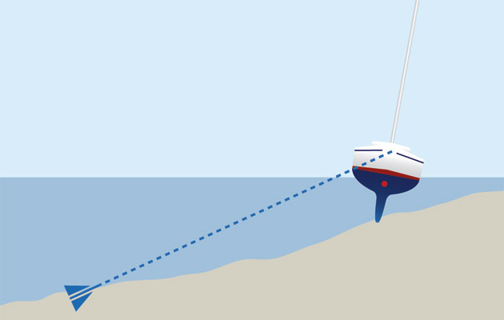

---
# all the regular stuff you have here
zotero:
  scannable-cite: false # only relevant when your compiling to scannable-cite .odt
  client: zotero # defaults to zotero
  author-in-text: false # when true, enabled fake author-name-only cites by replacing it with the text of the last names of the authors
  csl-style: harvard-manchester-metropolitan-university # pre-fill the style
layout: post
categories: chapter
title: 3. Theoretical Framework
---
-   [Introduction](#introduction)
-   [The foundational concepts of activity
    theory](#the-foundational-concepts-of-activity-theory)
    -   [3GAT and Expansive learning](#gat-and-expansive-learning)
        -   [Double stimulation](#double-stimulation)
        -   [Rising to the concrete](#rising-to-the-concrete)
-   [Formative Interventions](#formative-interventions)
-   [The work of Laboratory of Comparative Human Cognition (LCHC) and
    DBR](#the-work-of-laboratory-of-comparative-human-cognition-lchc-and-dbr)
    -   [Formative interventions based on mutual
        appropriation](#formative-interventions-based-on-mutual-appropriation)
        -   [Mutual appropriation](#mutual-appropriation)
    -   [Design based research (DBR) as formative
        interventions](#design-based-research-dbr-as-formative-interventions)
        -   [Comparing and critiquing DBR and CHAT / formative
            interventions](#comparing-and-critiquing-dbr-and-chat-formative-interventions)
-   [Concepts of agency within CHAT](#concepts-of-agency-within-chat)
    -   [Instrumental](#instrumental)
        -   [Transformation agency through double stimulation (TADS) -
            On double stimulation and
            agency](#transformation-agency-through-double-stimulation-tads---on-double-stimulation-and-agency)
        -   [Transformative Activist Stance
            (TAS)](#transformative-activist-stance-tas)
    -   [Relational Agency](#relational-agency)
        -   [Feedback and relational agency and specialism in context of
            making](#feedback-and-relational-agency-and-specialism-in-context-of-making)
-   [An overview of CHAT concepts relevant to this
    study](#an-overview-of-chat-concepts-relevant-to-this-study)
    -   [Third spaces and funds of
        knowledge](#third-spaces-and-funds-of-knowledge)
    -   [Repertoires of practice within three planes of
        activity](#repertoires-of-practice-within-three-planes-of-activity)
-   [Variations and synthesis in interventionist CHAT and DBR
    research](#variations-and-synthesis-in-interventionist-chat-and-dbr-research)
    -   [Examining specific models of formative interventions and DBR
        processes](#examining-specific-models-of-formative-interventions-and-dbr-processes)
        -   [Change Lab and Living labs](#change-lab-and-living-labs)
        -   [Design Narratives](#design-narratives)
        -   [Design-Based Implementation Research - DBIR
            -](#design-based-implementation-research---dbir--)
            -   [Iterative approach - KEEP SOME HERE AMD MOVE REST UP OR
                TO
                CH.3](#iterative-approach---keep-some-here-amd-move-rest-up-or-to-ch.3)
        -   [Social design-based experiments
            (SDBEs)](#social-design-based-experiments-sdbes)
-   [Conclusion / Synthesis.](#conclusion-synthesis.)

## Introduction

The focus of this study is on the construction of shared meaning and practices as part of an emerging community of game makers. As such, the research questions address cultural factors which act as barriers to participation in digital making, and therefore require a method of research which allows the detailed analysis of complex, emergent learning environments. To achieve this, I adopt cultural historical activity theory (CHAT) as a guiding framework, which is operationalised through a formative intervention approach, incorporating adaptations from design-based research (DBR). This chapter explores these theoretical frameworks and key concepts relevant to the development of the thesis.

This chapter outlines the theoretical frameworks that shape the methodology and underlying ethos of this study. It begins by introducing the foundational concepts of AT and then explores its evolution into CHAT and third-generation activity theory (3GAT), developed by Engeström and the Helsinki school. In order to enhance the 3GAT approach, several key concepts from the work of the Laboratory of Comparative Human Cognition (LCHC) in San Diego are discussed. To demonstrate how CHAT is applied in research, the chapter also examines DBR and various forms of formative interventions. While AT forms the basis of this study, elements from other theoretical approaches within the learning sciences, particularly DBR, are incorporated to address the utility and practical application of the research [@hoadley_creating_2002-1; @barnett_ecosystem_2019]. To address the study’s focus on designing an intervention aimed at fostering participant agency within the game-making process, the final section of the chapter explores key conceptions of agency within CHAT, specifically in the form of activist and transformative approaches. The chapter concludes by justifying the synthesis of these theoretical choices and provides a brief description of how these concepts are operationalised within the context of this study.

## The foundational concepts of activity theory

Activity Theory (AT) emerged as part of a movement known as the social turn in psychology [@sugiman_social_2008], marking a shift from a purely psychological approach towards a more social understanding of learning and human behaviour. While this shift has influenced various disciplines, the focus here is on its impact on learning. The rationale behind moving away from the assumption that human mental activity should be studied in isolated, context-free settings  [@stetsenko_activity_2005], concerns not only the validity of results [@brown_design_1992], but also the relevance of the research for both designers and participants [@barnett_ecosystem_2019]. This perspective transcends traditional transmission models of learning and embraces the value of group-based, participatory processes.

Before outlining the core concepts driving Activity Theory (AT), a brief historical overview helps to contextualise them. For Marx, human endeavour and change are based on activity, with the subject of that activity being the individual or group driving it [@marx1975marx; @blunden_interdisciplinary_2009]. Vygotsky built upon Marxist ideas, emphasising the importance of human activity as a socially mediated process, and applied these core concepts to the broader understanding of learning [@blunden_interdisciplinary_2010]. While Vygotsky's student Leontiev developed Vygotsky's work into a prototypical activity theory (AT), AT had stagnated in the repressive context of the USSR [@blunden_interdisciplinary_2010] and saw limited uptake in Western academia until Cole translated Vygotsky's work [@cole_mind_1978]. Cole's efforts brought these foundational ideas into the realm of education and psychology during the broader _social turn_ in the discipline.

The work of Brown [-@brown_design_1992], a prominent psychology researcher advocating the importance of context within experimental design, helped legitimise this focus and facilitated its broad adoption across diverse fields. The growing work in these varied fields, sometimes grouped by the term _learning sciences_, reflects a move away from randomised control trials and their attempt to sever context, shifting from a behaviourist view of learning as an internal psychological process to a more interdisciplinary approach. This new approach draws on cognitive and cultural psychology [@hoadley_learning_2011]. While this fragmentation promotes pluralism and knowledge-sharing across fields as diverse as education, anthropology, and computer science, the field of learning sciences has been criticised for lacking conceptual coherence in understanding learning and human activity on a deeper level [@hoadley_learning_2011].

TRANSITION - TO ADDRESS THIS DEFICIT? ...
In this emerging field of cultural psychology, scholars such as Wertsch [-@wertsch_vygotsky_1985] and Cole [-@cole_cultural_1996] explored the critical role of cultural mediation in human development, particularly in relation to learning communities and contexts.  Nardi and Kaptelinin outline AT as a series of foundational principles that underpin broader theories [@kaptelinin_acting_2009; @wertsch_concept_1981], specifically: object-orientedness, tool mediation, hierarchical structure of activity, the ongoing development of activity, and the psychological processes of internalisation and externalisation.
CHECK THIS LIST

A useful starting point to explore key concepts in AT is Vygotsky’s formulation of the relationship between subject, object, and tools. Activity Theory is object-oriented, meaning that human behaviour and learning are driven by the goals or objectives of the individual or collective subject [@engestrom_learning_1987-1]. Kaptelinin and colleagues [-@kaptelinin_activity_1995] note that while the materialist roots of AT, stemming from Marxist theory, have led some interpretations to focus on the object as the physical entity being worked on and transformed by activity, conceptual objects are also included in Leontiev’s conception of Activity Theory [@leontev_problem_1974]. Thus, the term object is best understood within the context of a broader motivation or objective. To represent the subject-object relationship in a way that addresses Vygotsky's resolution of the subject-object, mind-body, and Cartesian dualism problems [@still1991mutual], this relationship was developed by Leontiev into a triadic model that includes tools which mediate the activity [@engestrom_learning_1987-1]. See fig 3.x below.

{width=60%}

Fig. 3.x Essential components of activity outlined by Vygotsky

Turning to mediation via tools, Vygotsky's concept of tools is broad [-@cole_mind_1978], encompassing language, physical tools, and representational concepts. Mediation is particularly relevant to this study, as the learning environment involves diverse and dynamic forms of tool use. Physical, digital, and conceptual tools evolve as products of the experiences of others in society, containing evidence of cultural adaptation and evolution. This study positions pedagogies as forms of mediational strategy that can be employed by both facilitators and learners [@donato_sociocultural_1994; @gutierrez_re-mediating_2009].

For Vygotsky, mediation via conceptual tools involves the interconnected processes of internalisation and externalisation of activity [@kaptelinin_activity_1995-1].  Learners are actively processing and make sense of the world by both appropriating cultural learning from cultural practices and then by contributing back into shared cultural understandings of the world. This reciprocal process is well described in learning context by Rogoff via a personal process she calls participatory appropriation [@rogoff_observing_1995].  This reciprocity is crucial as it challenges traditional transmission-based models of learning. Rogoff further identifies this appropriation as consisting of three key planes, of _personal, interpersonal, and cultural processes_ [@rogoff_observing_1995, p.154], the analysis of which is essential for understanding community activity, a topic that will be explored in a later section of this chapter.

To describe activity systems with greater granularity, Leontiev [-@leontiev_activity_2009] employed the concepts of actions and operations, which together constitute a vertical hierarchy of activity structure. At the highest level, activity is driven by an overall motive, while actions represent smaller sub-goals necessary to achieve this broader objective. As we move down this hierarchy, we encounter a series of unconscious operations that are performed fluently during the execution of actions. See the figure below from [@daniels_vygotsky_2001, p.87].

{width=80%}

Figure 3. x - Hierarchical structure of activity adapted from  [@daniels_vygotsky_2001, p.87].

The concept of fluency is key to this study, making it essential to locate and describe the chains of operations and actions involved in the activity. Kuutti [-@kuutti_activity_1995] articulates the transition from actions to operations as follows:

_Initially each operation is a conscious action, consisting of both the orientation and execution phases, but when the corresponding model is good enough and the action has been practiced long enough, the orientation phase will fade and the action will be collapsed into an operation, which is much more fluent._ [@kuutti_activity_1995]

Additionally, activity systems can be viewed as nested within broader activity systems. For instance, the development and teaching of a series of lessons may occur within the larger activity of a school or university [@lewin_developing_2018-1; @barab_using_2002]. Therefore, the process of selecting which activity system to analyze in depth involves identifying an appropriate unit of analysis [@blunden_germ_2014].

For example, in Barab et al.'s [-@barab_using_2002] research on changes to a university course, the use of varied scopes and different framings of activity are used, at times focusing in on the specifics of evolving tool use or participant interaction as an object of activity, to build up a detailed examination of the tensions and processes within a complex educational environment. This level of detail not only enhances replicability but also provides utility to other practitioners, illustrating and justifying the use of a smaller activity system than what is typically represented in Engeström's approach [@engestrom_learning_1987-1; @lave_developmental_1993; @barab_using_2002]. Similarly, in this thesis, while game making is studied as a community project within a larger system, interpersonal activity is also examined through an activity system of a smaller scope. This aspect is explored in more detail in Chapter 4.

In terms of development, activity theory perceives activity as constantly evolving within its context. The theory is rooted in Marxist dialectical materialism, which posits that activity is a dynamic system best understood through its transformations [@ilyenkov1960dialectics]. A significant driver of transformation in activity is the emergence and resolution of contradictions and conflicts that arise from the accumulation of tensions within the activity itself [@ilyenkov1960dialectics; @blunden_activity_2023].

WORK ON THIS LINK - SIGNPOST BOTH 3GAT AND LCHC
Engeström’s work on what he termed the third generation of activity theory includes the theory of expansive learning, which traces the changes and growth of the object being worked on. This transformation often occurs as tensions extend beyond a single activity system to involve multiple systems, acknowledging the influence of actors moving between them [@engestrom_expansive_2001].

Alongside Cole’s contributions, this framework is essential for broadening the understanding of activity and engaging with cross-cultural perspectives on learning [@cole_cross-cultural_1988]. These concepts are explored further in the section on expansive learning below.

###  3GAT and Expansive learning

As activity theory (AT) has been adopted and developed beyond its Soviet origins, researchers have developed new concepts within varied schools of practice. The cultural-historical approach and cultural-historical activity theory (CHAT) denote the broader application of these principles, which may also integrate related concepts from sociocultural frameworks. The term third generation activity theory (3GAT) has emerged from the work of  Engeström and the Helsinki school's interpretation of CHAT. This section begins by exploring key concepts in third generation activity theory (3GAT) and their application through formative interventions.

<!-- Given the variation in the use of terms, the  disambiguation of these terms and context on schools of AT  in the context of this study is useful here.
Activity theory (AT) refers to the core principles of the approach discussed earlier.  -->

Third generation activity theory (3GAT) represents an important development of conceptual tools for applying activity theory to authentic learning settings. Engeström's concept of the activity system model extends Leontiev's work through a triangular representation that highlights key cultural aspects of the activity in question. Engeström adds a new tier to the model to visually represent Leontiev's focus on issues of cultural factors  [@engestrom_learning_1987-1]. Specifically, these cultural factors include the wider community, which encompasses those involved in the activity beyond the subjects themselves, the division of labour, which may occur through either the distribution of tasks among community members or a more vertical power structure, and the emergence of rules or norms that guide evolving community behaviours [@sannino_cultural-historical_2018].

{width=60%}
  Figure 3. x - Engeström's representation of community concepts an activity system

While these visual representations are novel, the main advances of third generation activity theory (3GAT) lie in its expanded focus on the role of interacting activity systems, the movement of subjects between systems, and the potential for collaborative work on a shared object. The recognition of broader activity systems and the transfer of motivations and practices of actors into new systems encapsulates Engeström's perspective on activity theory [@spinuzzi_trying_2020-1]. This shared, or expanded, object being worked on by more than one activity system of expansive learning forms an important base for formative in [@sannino_formative_2016] [@engestrom_methodological_2014].

<!-- {width=90%}

Figure 3. x - Engeström's concept of expansive learning via a shared object, from [@sannino_formative_2016] [@engestrom_methodological_2014] -->

To clarify this relationship , an example in context is beneficial. In research on a joint activity involving schools, Cakir and colleagues [-@cakir_contradictions_2022] depict the joint activity as an objective shared between the school, family, and researchers.

{width=90%}

Figure 3.cakir - An object shared between different activity systems

The conception of joint activity emphasises the importance of the roles of researchers and other stakeholders within these interventionist and participatory processes. ADD LECUSAY TOO HERE?
Analysing activity through its transformation, particularly in relation to the contradictions and tensions among system elements, draws on Marxist conceptions of dialectics and forms the foundation for the concepts of expansive learning. In 3GAT, this view of transformation through collaborative work between activity systems on a new, expanded object is termed expansive learning [@engestrom_design_2011].

Drawing on concepts of tensions and contradictions existing in foundational concepts of dialectal materialism, the 3GAT allows for a granular exploration of tensions and contradictions are a vital source of change and evolution of new and ongoing activity systems [@engestrom_expansive_2001]. 3GAT achieves this through careful of description, analysis, and representation of system elements, the interaction between systems, and the resulting contradictions. Some tensions arising between participant motives and different parts of activity system may be resolved quickly through change, while others may persist and can be referred to as conflicts [@sannino_cultural-historical_2018]. These unresolved contradictions which develop into impasses or conflicts which may serve as motivational factors driving agentic responses from participants. A later section explores Sannino's perspective on such conflicts as a source of transformative agency in greater depth.

In this study, rather than analysing larger workplace systems over extended periods, the focus is on the analysis of systemic tensions within the context of shorter interventions, as seen in diverse research [@barab_developing_2002; @barab_using_2002; @lewin_developing_2018]. Following Kuutti's approach [-@kuutti_activity_1995], this study adopts the term contradictions to encompass concepts of tensions, barriers, and misalignments. Engeström states that such sub-terms can be "understood as manifestations of contradictions" [@engestrom_discursive_2011, p. 340]. Additionally, Kamanga emphasises the value of identifying system congruencies or strengths within activity systems [@kamanga_contradictions_2021]. For a comprehensive analysis of systemic contradictions, see the work of Engeström and Cakir [@cakir_contradictions_2022; @engestrom_discursive_2011].

#### Double stimulation

Double stimulation refers to a process involving the use of tools to overcome contradictions that emerge in joint activity. Engeström's early work on formative interventions frames the first stimulus as "the problem itself", while a potential series of secondary stimuli can be introduced as part of the intervention [@valsiner_cultural-historical_2007, p.492]. Engeström and Sannino [-@engestrom_methodological_2014] explain that the process of double stimulation is active and goes beyond simple mediation via existing tools. The stimuli, whether presented by researchers as suggested tools or discovered in the environment by participants, are actively imbued with meaning and transformed by the participants through their use.  

"Most likely the initially given potential second stimuli are rejected or reshaped by the participants, and the participants typically pick up or invent devices of their own, often as if behind the back of the interventionist." [@engestrom_methodological_2014, p.121]

#### Rising to the concrete

The concept of rising to the concrete through a germ cell of activity (or unit of analysis) can be traced through the works of Vygotsky and Leontiev back to Hegelian and Marxist ideas of holistic understandings of phenomena [@blunden_activity_2023]. Forms of activity are viewed as concrete instances and iterations of underlying germ cell concepts, which exist in an abstract form. For example, Marx's analysis identifies complex and diverse patterns of economic activity within the capitalist system as stemming from an underlying, prototypical concept of commodity exchange in pre-industrial economies. The works of Blunden and Davydov [@blunden_interdisciplinary_2010; @blunden_germ_2014; @blunden_activity_2023; @davydov_problems_2008] provide comprehensive justification for the utility of identifying a germ cell or unit of analysis in relation to collaborative and learning projects. Blunden describes the germ cell of activity and the unit of activity as two similar concepts with slightly different foci.

_... the germ-cell and the unit of analysis are one and the same thing, but in one case the developmental aspect is emphasised and in the other case the analytical aspect is emphasised._ [@blunden_unit_2020]

In this thesis, my role as both researcher and practitioner makes both aspects relevant. Examining the analytical dimension, the process of seeking and defining key activities as units for analysis helps to delineate the boundaries of what to analyse in depth. One challenge in applying this approach is the duration and relative stability required to identify these germ cells. In their critique of Penuel, Engeström and Sannino [-@engestrom_methodological_2014] provide no suggestions for adapting their models to more rapidly changing situations where actors come from different activity systems. The developmental aspect will be addressed in the following chapters, which explore the evolution and analysis of the learning design, highlighting the process of applying of game design patterns by participants as a germ-cell concept that both shapes and facilitates practice.

## Formative Interventions
 <!-- namely Change Laboratory (from Helsinki school) and 5th Dimension (Cole's intervention carried out in partnership with wider sociocultural researchers). -->

The term formative intervention (FI) has its roots in Cole and Engeström's exploration of two models of CHAT based interventionist research [@valsiner_cultural-historical_2007],

Cole and Engeström [-@valsiner_cultural-historical_2007] outline characteristics of formative interventions that represent with key principles of CHAT,

WHAT ARE THEY?
They are base  

Cole and Engeström [-@valsiner_cultural-historical_2007]
outline practical challenges in aligning with perceived rigour of social science, given the variation in environmental factors in the research process [EXPLAIN].

They also note the challenges of financing lengthy and repeated interventions within the experimental process, as well as the potential to disrupt the status quo of research settings by developing the agency of workers and learners.

Examples of specific instances of formative interventions are examined in the final section of chapter.

<!-- This disruption may, in turn, impact the direction of the research, steering it away from the objectives initially supported by the funders.   -->

### DBR and the formative interventions from the Laboratory of Comparative Human Cognition (LCHC)

 based on mutual appropriation

The work of Michael Cole and colleagues Laboratory of Comparative Human Cognition (LCHC) in San Diego

was influenced by approaches like communities of learners [@rogoff_developing_1994], communities of practice [@lave_situated_1991],

LCHC's approach to formative interventions is  iterative, responsive and flexible. It shares characteristics and some common lineage with design based research.

The chapter later explores  concepts derived from this school, such as funds of knowledge, idiocultures, third space which are especially relevant to this study.

#### Mutual appropriation

Cole highlights the need to align research interventions with the ongoing aims of educational or community partners to maximise their sustainability beyond the research period [@valsiner_cultural-historical_2007; @cole_fifth_2006].

The concept mutual appropriation has been utilised by Cole to explain and explore the development of the practicalities and structure of the research programme The setting of 5D interventions predominantly consisted of after-school clubs run by community partners, guided by university researchers and supported by undergraduate student volunteers. The main activities were playful tasks aimed at providing fun, along with additional objectives of building literacy.  Cole noted that for an activity to be sustainable, the goals of researchers, student volunteers, funders, and local partners needed, as much as possible, to align [@cole_fifth_2006]. To achieve this, Cole and colleagues describe a mutual process of adaptation in joint activities between institutions, which not only reforms activities to make them suitable for ongoing partnership but also leaves a historical trace of evolving activities that serve as a valuable basis for cultural analysis [@downing-wilson_design_2011]. A key distinction between the 5D approach and that of Change Laboratories is that, in the early stages of the 5D intervention, activity goals are not fully formed and are still in a state of evolution. I will return to this point later in this chapter.    

### Design based research (DBR) as formative interventions

<!-- 5thD interventions and related LCHC approaches incorporate, and have contributed to design based approaches in research. -->

Brown's provocation on the importance of context [@brown_design_1992] foreshadowed the evolution in the conceptual diversity and practical application of what has become known as design based research (DBR).

DBR has diverse interpretations, which stem from a set of generally agreed principles [@penuel_emerging_2014; @mckenney_educational_2021]. Easterday and colleagues [-@easterday_design-based_2014] characterise the core elements of DBR as: research as a form of intervention, iteration, involvement of participants in the evolution of designs, and flexibility in research outcomes based on how events unfold . Cobb and colleagues [-@cobb_design_2003, p.13] summarise the characteristics of design-based approaches as "extended (iterative), interventionist (innovative and design-based), and theory-oriented enterprises whose 'theories' do real work in practical educational contexts" .
DBR is common in the domain of learning sciences, particularly in advancing practice and theory related to innovative learning tasks [@penuel_emerging_2014]. For more detailed definitions of DBR and its place within a socio economic funding structure, see Sandoval [-@sandoval_conjecture_2014] and Hay [-@hay_constructivism_2001, p. 3].

Barab and Squire [-@barab_design-based_2004] describe the inherent _messiness_ of design-based research  which presents a challenge for researchers when attempting to present results in a coherent manner that is useful for other practitioners. There is an ongoing tension between staying closely aligned with the specific, rich context of the research, and stepping back to generalise findings without becoming lost in abstraction. This balance is crucial to ensure that the research is both contextually meaningful and practically applicable to broader settings. Hoadley and Campos [-@hoadley_design-based_2022] further explore the outcomes of DBR, including the development of design processes, the creation of domain theories, the formulation of design principles or patterns, the introduction of ontological innovations, the generation of new hypotheses, and the transformative learning experienced by researchers themselves. These varied outcomes highlight the broad applicability of DBR and the importance of ensuring that design processes and theoretical insights are communicated clearly to enhance the utility of research findings.

A key aspect of DBR is its emphasis on the rapid iteration of resources based on continuous feedback rooted in practice. In an educational context, this process helps produce pedagogies and resources that respond to the needs of learners [@cobb_design_2003].

**DBR and affordances  -  INSERTED**
While there is a wealth of research which discusses and applies concepts of affordances and dynamic agency, often in the field of HCI, the focus is often skewed towards individual rather than on collective action [@kaptelinin_affordances_2012].

<!-- While starting from similar roots, and sharing key concerns regarding ecological validity, there has been a degree of contestation in attempts to compare formative intervention with design based research. -->

<!-- CHAT interventions concentrate more on transformations in activity and the increasing agency of those involved COMPARED TO DBR? EVIDENCE? PENUEL? -->

#### Comparing and critiquing DBR and CHAT / formative interventions

Penuel [-@penuel_emerging_2014]  links FI and DBR explicitly  through proposing and defining a term _formative intervention research_ as a useful term to encapsulate a variation of FI closely aligned with CHAT, including those drawing on elements of design-based research. Engeström [-@engestrom_methodological_2014] initially resists this proposition, insisting that formative interventions should contain a clear articulation of _double stimulation_ and the process of _rising to the concrete_ within the framework of Engeström and Sannino's understanding of these concepts [@sannino_formative_2016; @engestrom_methodological_2014; @engestrom_discursive_2011].

Engeström's view of DBR [-@engestrom_learning_2009] is that it lacks rigorous examination of the dynamic and historic nature of context with CHAT conceptions of activity and it tends to be overly focused on a linear approach to refining the researcher's learning design, which limits the input and agency of participants. O'Neill, in advocating for great use of CHAT approaches within DBR, offers contextual factors which help explain this deficit, including the time scales and wider priorities of using DBR within the funded research environment of the learning sciences [@oneill_understanding_2016]. The result is a challenge for DBR in producing in-depth analyses of context, which are often required in CHAT-based approaches.

<!-- WHO? initially outlined several criticisms of DBR when compared to CHAT in educational contexts: it is vague in its description of systemic elements in analysis,  -->

O'Neill [-@oneill_understanding_2016] echoes these concerns and extends them, urging DBR researchers to apply CHAT methodology to address the limitations of current DBR practices in the learning sciences community. He emphasises that DBR researchers often fail to invest sufficient time in familiarising themselves with the existing learning practices of the contexts they study, an oversight that runs counter to the more contextually focused approaches encouraged by CHAT.  

Bakker [-@bakker_design_2018] challenges Engeström's characterisation of DBR as having closed goals, particularly critiquing Engeström's portrayal of the work of Collins and colleagues [-@collins_design_2004] as a misrepresentation. Bakker [-@bakker_design_2018, p.17] argues that these researchers did "not want to fix variables or educational goals upfront" . He echoes the call of  Cole, Penuel and O’Neill for more dialogue and greater recognition of the shared traditions between CHAT and design research [-@cole_cultural-historical_2018]. Penuel [-@penuel_emerging_2014] emphasises the eclectic methodological approach in design-based research as a necessary means of responding flexibly to context. Bakker also views this flexibility as a strength of DBR, resisting calls for greater formalisation of the design process [@ormel_researchpractice_2012; @mckenney_systematic_2013].

An additional challenge is the context in which formative interventions are often applied. These interventions are frequently used in stable, institutional work environments, particularly in European contexts, where stakeholder roles and systemic structures are more predictable. In contrast, learning environments associated with DBR, especially in less formal or rapidly evolving contexts, do not share the same stability [@spinuzzi_trying_2020-1]. This difference may limit the utility of formative interventions like the Change Laboratory in more fluid settings.  

Recent work by Engeström, Sannino, and colleagues suggests a shift toward a more collaborative stance on DBR, recognising its value rather than critiquing it outright. In particular, they acknowledge that formative interventions can enrich DBR by offering a robust framework for systemic transformation, collective agency, and expansive learning [@cakir_contradictions_2022]. This shift highlights a growing consensus on the potential benefits of incorporating cultural-historical concepts into DBR approaches. Certainly, the discussion of the previous paragraphs show close alignment in most details.

In Chapter 4 I will outline the use in this thesis of formative intervention using both 3GAT concepts and those from the overlap between DBR and the descendent flexible design experiments approach of LCHC.  

Element of the research design also draw on more specific methods later in the chapter; specifically:  Change lab, living lab,

The study in this thesis, which applies CHAT principles to a novel and relatively unstable learning context, presents a useful case study in this ongoing endeavour to integrate the strengths of both formative interventions and DBR.

A guiding principles within, mutuality of the process, and joint activity is that examining development of varied expression of  agency.

<!-- While x  resisted a formalisation, this naming and description of process is a welcome way of sharing practice. -->
<!-- More recently, Engeström has defended its specific application against more flexible interpretations [@engestrom_methodological_2014]. In this section, I explore the Helsinki school's narrower interpretation of formative interventions as an application of 3GAT theory. -->

## Concepts of agency within CHAT

To help later exploration of RQ3 which which asks how participants develop agency in an evolving community of game makers, it is important to clarify the concept of agency, particularly in the context of learning environments. The question of who or what has agency is a philosophical one with practical applications in designing learning settings. Agency and autonomy are often either vaguely defined or have contested, interconnected definitions in studies [@huang_autonomy_2013; @matusov_mapping_2016]. For this thesis, in line with a cultural-historical approach, agency is viewed as a cultural phenomenon experienced by individuals in relation to their peers and their learning environment.

To situate this view within the varied and evolving concepts of agency in educational settings, I use concepts of instrumental, transformational and relational agency within the framework of Activity Theory. These forms of agency offer a broad perspective on how individuals navigate and transform their learning environments which extends beyond merely fulfilling institutionally set objectives.
<!--
I draw on the work of Matusov and colleagues [-@matusov_mapping_2016] who categorise agency into several genres: instrumental agency focused on developing capacities, effortful agency related to motivation and commitment, dynamically emergent agency involving affordances and actor-network theory, and authorial agency, which entails agentic changes to the learning environment. Matusov and colleagues’ critique effortful agency in education, which primarily focuses on achieving goals predefined by educational institutions. -->

### Instrumental

Instrumental agency reflects a concept of agency as the ability to get things done, thus, a view of agency as a set of capacities [@edwards_steps_2005]. Matusov and colleagues [-@matusov_mapping_2016] highlight an often technological view of educational environments where educators seek to increase instrumental agency by building the individual capacity of learners to achieve relevant tasks. Many DBR studies which aim to develop and study the use of new tools especially in the area of education technology, would aim to increase instrumental learner agency, designing away problems.

Within a CHAT framework, this type of agency can be seen as enhancing the fluidity of practice, with learners using both objects and people as tools within mediated activities. According to Leontiev, actions that initially require concentration and effort may evolve into fluid operations through practice. Thus, understanding these dimensions of agency within an AT framework should be grounded in a solid comprehension of mediation principles.

#### Transformation agency through double stimulation (TADS) - On double stimulation and agency

The Helsinki school's focus on transformative agency also advocates the importance of intervention and transformation as a desirable aspect of research, [@engestrom2006development; @haapasaari_emergence_2016; @sannino_formative_2016]. The vehicle for this in recent years has been the concept of transformation agency through double stimulation (TADS). Similarly to TAS, the objective of TADS is increased agency of participants in research interventions. In addition, TADs researchers articulate a desire to understand a broad picture of agency from a CHAT perspective. As outlined above double stimulation describes additional stimuli beyond the first stimulus understood as the motivation of the activity. In the Change Lab (CL) interventions for example, the active use of secondary stimulus can both analyse and facilitate agency by provoking reflection [@sannino_principle_2015].

Studies of transformative agency, for example within CL, often involve a significant longitudinal aspect. However, the TADS concepts has been applied in research over much shorter time frames and in more naturalistic settings such as hospital practice [@hopwood_forward_2022; @hopwood_volitional_2022], higher education [@grant_double_2022], and digital education [@aagaard_teacher_2022]. The concept of volitional action by subjects as a foundation for transformation is used in these shorter term studies to explore the processes of decision forming and implementation [@virkkunen_dilemmas_2006; @sannino_double_2015]. Here the secondary stimuli are used by participants as a spur and then as leverage in volitional acts.

ENCHANCE WITH AN EXAMPLE?
To address this aspect, Sannino augments the concept of transformative agency by double stimulation (TADS) with a metaphor of a sea vessel warping using kedging anchors. This metaphor highlights the active effort of participants to overcome tensions and dilemmas in their activities through intentional action to pull themselves out of the impasse they are facing.

<!-- {width=60%}

Figure 3.warping - Warping using a kedging anchor -->

While not all attempts, such as directly asking a peer or teacher for help, will succeed, some will take hold and lead to transformation for the student. This may also trigger a broader shift in the educational environment itself. This idea is particularly relevant to the setting of this study, where the learning environment is co-created by both participants and researchers.

<!-- , which can leave them stuck, much like being stranded on a sandbank. In an educational intervention, learners might "throw a kedge anchor" into the learning environment, symbolising an intentional action to pull themselves out of the impasse they are facing. -->

<!-- _We may think of the second stimulus as an anchor. Anchors are commonly understood as stabilising devices to prevent a vessel from moving. However, not all anchors have this function. Beside the heavy-weight anchors, there are also kedge anchors serving the purpose of ‘warping,’ that is, pulling the anchor once it has settled on the ground, for moving the vessel away from a problem area._ [@sannino_transformative_2022, p. 4] -->

<!-- {width=90%}

Figure 3.warping - Warping using a kedging anchor -->

#### Transformative Activist Stance (TAS)

Stetsenko’s transformative activist stance (TAS) presents a politicised view of agency that challenges both individualist and overly structural conceptions. She critiques views of agency that reduce it to either personal traits or render individuals as powerless within wider cultural systems [@stetsenko_critical_2020]. Instead, TAS positions agency as a dynamic interplay between social tensions and human volition, grounded in an urgent call to transform unjust conditions. From this perspective, Stetsenko advocates a deliberately partisan approach to research—rejecting the detachment and neutrality often associated with postmodern or post-humanist positions [@stetsenko_hope_2020].

This framing is relevant to the ethical commitments of this study, particularly in its alignment with activist research that aims to reshape the learning conditions of participants, not simply observe them.

### Relational Agency

Relational agency has multiple interpretations, some of which pose challenges for a politically engaged analysis. Stetsenko [@stetsenko2020radical] critiques ecological and sociomaterial theories of agency advanced by scholars such as Latour [@latour_reassembling_2005], Barad [@barad_meeting_2007], and Giddens [@giddens_constitution_1984]. While these approaches usefully explore distributed activity across human and material systems, Stetsenko argues they often omit attention to power, political struggle, and the transformative potential of human action. By contrast, Edwards and Mackenzie’s [@edwards_steps_2005] conception of relational agency builds on activity theory and retains a focus on historical and political dimensions. Relational agency extends instrumental agency by recognising the social capacity to interpret and respond to others’ actions, particularly through collaboration. It involves individuals working with others to expand a shared object of activity with evolving goals. In educational contexts, this form of agency is often constrained by institutional routines, yet still offers a useful lens for analysing participation in community-based learning environments.

For Edwards [@edwards_building_2011, p.34], relational agency involves collaborating with others to extend the shared understanding of an activity's object, and adjusting one's own actions in response to others' evolving interpretations of that object. In many educational settings, feedback is an important part of this process. Chapter 2 examined the work of Gutiérrez and colleagues in 5thD interventions [-@digiacomo_relational_2016-1; -@gutierrez_developing_2008;-@digiacomo_seven_2017] in addressing identity formation in an after school educational context. The focus of Gutierrez on equity, and diversity within agency in noteable. Within one key study, the researchers explored the role of feedback within that learning environment to increase relational agency and a form of specialism they term _relational expertise_ [-@digiacomo_relational_2016-1]. This case study is helpful to illustrated an example of a practical educational process involving feedback. DEVELOP / DESCRIBE

The researchers, "argue that these relational and material feedback elements of the activity helped to create an environment with relational agency"

The next section on CHAT concepts, in part, develops related concepts of third spaces and emerging repertoires within these communites.

<!-- Both TAS and relational agency are relevant to this thesis: the former informs the researcher’s stance, while the latter helps describe how learners negotiate support and meaning through joint activity. -->

<!-- For Stetsenko the stakes are high given ecological and military crises caused by neo-liberal capitalist economic, but there is still everything to play for [@hall_marxism_2023]. -->
<!-- While the overall focus is societal change, TAS has been applied to smaller scale concrete explorations, including play [@stetsenko_serious_2015], transformation in the setting of adolescents looked after in residential care [@vianna_connecting_2011]. In TAS aspects of conceptual understandings of agency and specifics of methodology are less explored than the motivational dimensions, the methods of auto-ethnography and case studies are used in several studies which draw on this concept [@vianna_connecting_2011]. -->

<!-- **The role of feedback and and identity formation within relational agency** -->

<!-- From [-@digiacomo_relation
al_2016-1]

    We argue that these relational and material feedback elements of the activity helped to create an environment with relational agency—a “capacity for working with others to strengthen purposeful responses to complex problems” [@edwards_building_2011, p.34] (Edwards, 2011, p.34). According to Edwards (2011), relational agency arises from (a) working with others to expand the object of activity and (b) aligning one’s own responses to new interpretations being made by the others while acting on the expanded object. -->

## An overview of CHAT concepts relevant to this study

BETTER LINK FROM LAST SECTION.

This section outlines key CHAT concepts  relevant to this study which have emerged from the process of undertaking formative interventions. Most of the concepts treated emerged from the work of the Laboratory of Comparative Human Cognition (LCHC); in particular the research on the after-school intervention Fifth Dimension (5thD) [@cole_mind_1997], has provided  useful concepts related to the development and analysis of culture through joint activity [@valsiner_cultural-historical_2007]; namely: design based approaches, mutual appropriation, third spaces, idiocultures, funds of knowledge, and communities of learners.

### Third spaces and funds of knowledge

Cole's approach in this area  The programme emphasised sustainability, mutuality, and a utopian ideal of creating a new activity system, insulated from some of the more debilitating aspects of mainstream schooling and broader societal forces [@blunden_formative_2023].

**third spaces**

The concept of third space is helpful in the context of this study in particular as a space between home life and formal education rooted in a sociocultural understandings of learning.

Look at how Moje opertationalised third spaces too.
See dissertation on third space here [@bellocchi_learning_nodate]

The process of blending the knowledge and discourses of the first space (home life) with the motivations of the second space (school or institution) into a new third space has been explored in various studies [@moje_working_2004; @gutierrez_developing_2008; @gutierrez_developing_2008; @bryant_academic_2009].

**fok**

Funds of knowledge (FoK), a term popularised by one of the research partners of the 5D, Luis Moll [@moll_funds_1992], locates home discourses and practices as resources that can be drawn upon by teachers and participants to facilitate learning in school or other environments, thereby achieving more equitable and inclusive learning experiences. This approach is particularly valuable for learners whose home life is culturally distant from school discourses. Moje and colleagues [@moje_working_2004] explore the use of FoK in the context of interventions outside of school, aiming to develop content literacy.

The term addresses the use of knowledge and skills from participation in activities outside school that teachers can build on to help classroom work and to support the motivation of learners. Researchers found that Latino home cultures, skills and traditions were hardly visible in mainstream school cultures. This resulted in a form of deficit thinking about the performance of these communities [@moll_funds_1992].

The concept of funds of knowledge (FoK) emerged from research within United States Latino communities. FoK refers to knowledge that household members have gained as part of their lived experience and social practices [@moll_funds_1992].

In the original study home visits were carried out to better inform design of after-school activities. However there limits to this approach, including only some families were visited, and adult focused nature of process [@rajala_utopian_2023].  

Rajala and colleagues [-@rajala_utopian_2023] problematise the use of FoK in third spaces. They critique the superficial application of FoK, which may perpetuate cultural stereotypes and thus maintain the existing negative status quo [@rajala_utopian_2023]. Additionally, the practical challenge of gathering sufficient relevant data on home cultures to inform a more nuanced use of FoK would be very time-consuming. To address these issues, they advance the concept of funds of identity, which allows for an exploration of home cultures within the scope of the intervention through the creation of identity artefacts with participants [@subero_mediation_2018].

### Repertoires of practice within three planes of activity

INSERT Repertoires AS A MORE APPLIED CONCEPTS OF USE IN THE OBSERVATION OF AND DESIGNING FOR BUILD OF idiocultureS

Rogoff and Gutierrez's initial motivation in their exploration of repertoires was to challenge simplistic, overgeneralising approaches regarding learning styles especially if applied to non-dominant communities [@gutierrez_cultural_2003]. The researchers highlight the value of identifying potential funds of knowledge framed as "linguistic and cultural-historical repertoires" that learners bring to learning environments [@gutierrez_cultural_2003, p.22].

Following Fine [@fine_boys_1987], Cole employs the term _idioculture_ [@cole_fifth_2006, p.32] to highlight the evolution of a novel, micro culture within the 5D programme. In line with Downing-Wilson [-@downing_wilson_sociogenesis_2011], novel idiocultures do not emerge from thin air; rather they encompass the traits of the diverse cultural systems of stakeholders [@cole_idiocultural_2017]. Cole describes the utility of idiocultures as concrete ways of studying the dynamics of cultural variability between different sites, as well as practical means to shape the programme's activities based on participants' previous experiences [@cole_idiocultural_2017].

<!-- Cole describes the value of researchers being involved in early evolution of interventions in their observations in adaptations of the 5D programme based on the culture of the host partners and young participants. -->

The work of Rogoff and Gutiérrez on linguistic and cultural-historical repertoires [@rogoff_cultural_2003] also aims to prevent cultural-historical practices of participation from being misrepresented as innate behaviours, a misrepresentation they identify as particularly problematic in relation to race. They emphasise that both educators and researchers should avoid designing interventions based on assumed traits of learners. Instead, they advocate for researching and verifying existing repertoires of practice that may be incorporated and then extended within joint work. This perspective builds on Rogoff's pioneering approach to analysing complex group activities through three planes of observation: personal, social, and community activity. A key motivation driving the analysis of behaviours on the social plane is Rogoff's desire to transcend the dichotomy between learner-led and teacher-led approaches [@rogoff_childrens_1993; @mascolo_beyond_2009].

In addition the importance of identity is highlighted but in a way which requires complex and multi-layered research approaches based on situated historicity rather than cultural stereotypes.

This is important for this thesis as it
allows x, thus transcending a  instruction and discovery differences,
Y is explored in more depth in Chapter 6, in particular via the varied use of game design patterns, .

<!-- Rogoff's concept of guided participation and the role of emerging repertoires of practice within that process, serving as a middle ground between instruction and discovery, are explored in more detail, through the lens of participants use of game design patterns, in Chapter 6. -->

## Variations and synthesis in interventionist CHAT and DBR research

While there is broad agreement among researchers regarding the theoretical understanding of concepts in activity theory, there is greater disparity in their application within research settings.

It then explores the variations between key approaches, relevant to this thesis. Specifically it describes applications of DBR, Change Labs and Living Labs, and social design based experiments (SDBEs).

### Examining specific models of formative interventions and DBR processes

The aim here is to look at the general approach of different specific approaches. Element of which will be used in my own methodology described in the following chapter.

#### Change Lab and Living labs

The Change Laboratory (CL) is Engeström's key implementation of expansive learning in workplace environment [@engestrom_putting_2007]. CL interventions take the form of a series of workshops involving stakeholders important to the workplace setting, with researchers acting as facilitators of the process. The structural model of 3GAT is used as a tool to identify, analyse, and provoke reflection on current workplace practices and dynamics, facilitating discussion on possible actions to enact change. The CL processes suit formal, relatively stable workplaces where existing concepts of community, division of labour, and norms can be readily identified. Another form of FI relevant to this study is that of the Learning Lab [@cakir_contradictions_2022; @bal2011culturally], the overall environmental structure of which is represented above in Fig.3.x.  While the Learning Lab takes place in a school environment, interventions retain the form of stakeholder workshops. For more on formative interventions that have taken other forms used or endorsed by Engeström's team in Helsinki, see  [@engestrom_expansive_2022].

Returning the concept of double stimulation....

For example, in the Change Laboratory model, the first stimulus would be data derived from ethnographic video recordings, which if _mirrored_ back to participants to help to identify a problem that needs addressing. The second stimulus, more accurately a series of stimuli, comprises techniques designed to provoke, shape, record, and reflect on the emerging discussion [@engestrom_putting_2007]. Sannino's work on the volitional aspect of the double stimulation process views auxiliary stimuli as triggers for will and agency in participants [@sannino_principle_2015]. The exploration of these concepts, as discussed by Hopwood [@hopwood2023motives], is addressed in greater detail later in this chapter.

#### Design Narratives

Some more on the challenge of overcoming the tension between the rich context and generalisation of results (moved up),

One solution to the challenge of balancing utility and generalisation, as well as representing the research process in an accessible format, is through the use of _design narratives_. Bakker [-@bakker_design_2018] notes the difficulties of conveying the richness of the design process within the constraints of traditional journal formats, where space restrictions may hinder detailed explanations. Design narratives, as proposed by Hoadley [-@hoadley_creating_2002-1], address these limitations by providing a detailed account of the learning design process. They document the problems encountered during the intervention, the iterative changes made, and the rationale behind those revisions [@hoadley_creating_2002-1; @brase_knowledge_2024; @bell_theoretical_2004].

In this study, a design narrative is particularly valuable in conveying the intricate details of the learning design. This thesis format allows for a fuller exploration of these aspects, notably in Chapter 5 where I use the depth of description possible to illuminate evolving tensions in the learning activity. I argue that design narratives can further enhance the alignment between DBR and Cultural-Historical Activity Theory (CHAT) interventions. By incorporating systemic and analytical concepts from activity theory, design narratives can provide a more holistic account of the intervention process. An example of such a narrative, using CHAT techniques, is found in Cole's [-@cole_fifth_2006] work on the Fifth Dimension.

#### Design-Based Implementation Research  - DBIR -

Design-based implementation research was Penuel's [@penuel_design-based_2021] follow up to formative interventions which had met resistance.

The research on support inquiry learning
finds xx an uses the following methods, approaches.
[@penuel

##### Iterative approach - KEEP SOME HERE AMD MOVE REST UP OR TO CH.3

A key aspect of DBR is its emphasis on the rapid iteration of educational resources based on continuous feedback rooted in practice. This process helps produce pedagogies and resources that respond to the needs of learners [@cobb_design_2003].

This emphasis on rapid iteration aligns with the aims of this thesis, where the ongoing feedback from participants informed the development of a novel learning design via phases of delivery. The iterative nature of DBR, with its focus on refining learning materials in response to feedback, supports the dynamic, practice-based approach explored in the following chapters. By integrating these DBR concepts, this thesis leverages the strengths of design-based approaches while aligning them with the systemic insights offered by CHAT. This flexible approach addresses both the complexities of real-world learning contexts and the need for practical, and ideally replicable outcomes.

#### Social design-based experiments (SDBEs)

The work of 5D has led Gutiérrez to develop a methodology called Social design-based experiments (SDBEs). SDBEs draw on FI and DBR and extend it with several useful techniques and perspectives.

SDBE draw on the work of DBR.

and include the following

- A focus on equality
- diversity
- historical actors and movement between spaces
- linked with transformative agency [@gutierrez_social_2016-1, p3]
- non hierarchical - horizontal concepts of institutional and everyday knowledge [@gutierrez_social_2016-1, p4]

For shadows work on abstract and concrete in the future.

## Conclusion / Synthesis.

In this chapter I have outlined the foundational concepts and current strands of interest of CHAT and explored how the field is becoming increasing aligned with that of design-based research. The complementary elements identified can be operationalised by utilising both CHAT's comprehensive framework for understanding human activity and DBR's practical focus on more rapidly iterative cycles of designed interventions.

To situate the reader at this stage, concepts related to an activity systems approach explored in this chapter are briefly outlined in the context of this study. Figure 3.broad below presents a broader picture of the activity within the context of other activity systems as seen in the work of Cakir and colleagues represented above in Fig 3.cakir [-@cakir_contradictions_2022].

{width=90%}

Fig 3.broad - environmental positioning with game making activity mediating the interactions between stakeholders.

The representation above shows a relation between systems which allows transmission of funds of knowledge and existing repertoires of communication from the existing   activity systems of different stakeholders and learning contribution to a new, emerging system. Following an approach taken by Lecusay [-@lecusay_telementoring_2015], the processes at work in the emerging shared object merits examination as an activity system in their own rights a process tackled in chapter five.

The use of concepts from both of CHAT and DBR is particularly valuable for this study, as it allows exploration of the contextual factors and influences from other activity systems contributing to the new shared object of activity. These include the ongoing development of cultural artefacts used, home interests and repertoires, as well as my own motivations.

MOVE THIS UP OR DROP IT?
While TAS can be seen primarily as a conceptual approach in comparison to TADS which more closely linked to an applied approach of formative interventions, I am encouraged by the activist stance advocated by Stetsenko [-@stetsenko_critical_2020], which rejects the abstraction of oneself from the processes participants engage in and promotes immersion in the struggle. This aligns with my own motivations in this study, resonating with my past experiences, as I position myself as an activist advocating for improved access to game-making through computer coding, a process currently hindered by educational contexts and classroom practices as explored in Chapters 1 and 2.  

KEEP THIS?
To achieve this, rather than following an established applied CHAT methodology like the Change Laboratory, I synthesise different concepts outlined in this chapter. Chapter 4, which describes the methodology in more detail, will explain how I draw on CHAT, DBR, and Rogoff's concept [-@rogoff_observing_1995] of the three foci of analysis. In the analysis, I focus on the tensions between system elements, the iterative processes used to address these tensions, and transformational concepts of agency.

In chapter 5 particular attention is paid to the development of the artefacts and processes developed as part of the learning design as a form of evidence of these transformations. The more rapid iterations of design align to a greater extent to DBR process of than that of Change Laboratory. Despite this, this study does aim for a full application of the stricter interpretation of the term formative intervention as outlined by Engeström and Sannino [-@engestrom_methodological_2014]. This hybrid approach addresses a key critique of the Helsinki school's implementation of third-generation activity theory (3GAT) via formative interventions such as the Change Laboratory, specifically that it is time-consuming and requires stable stakeholders [@spinuzzi_trying_2020-1]. However, while this hybrid process has proven fruitful in some areas, it has also posed challenges during the analysis stage. The implications of both successes and challenges are explored in the thesis conclusion.

Turning to a similar issue regarding conceptions of agency, TADS (transformative agency by double stimulation) is most commonly explored in relation to Change Laboratory and professional settings. Despite its potential in less structured contexts, there is a paucity of studies in the area of "student-centered contexts of learning"  [@isaac_cultural_2021, p. 93]. However, the broader concept of participants actively overcoming blockages caused by contradictions is well-explored in the fields of Human-Computer Interaction (HCI) and DBR. These fields often focus on revising educational tool designs to address conflicts, while still recognising the agency and input of participants [@karanasios_moving_2021] In line with Hopwood [-@hopwood_agency_2022], I see significant potential in the application of TADS in varied, real-world learning environments, using a diverse range of in-situ data sources as learning practices evolve.

To conclude this chapter, it is helpful to situate this synthesised theoretical framework as one that has the potential to make a valuable contribution through an applied case study. This case study aims to engage with current theoretical advances in the field of agency studies, particularly within the implementation of smaller-scale formative interventions. The framework outlined in this chapter informs the specific methodology described in the following chapter, where methods of data collection and stages of data analysis evolve in an iterative process, while remaining structured to incorporate the underlying concepts of CHAT and DBR.
