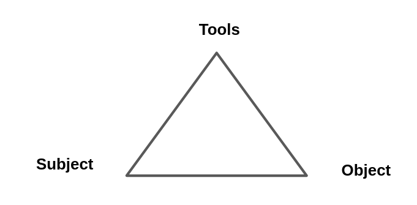
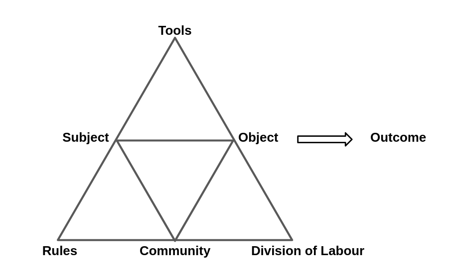
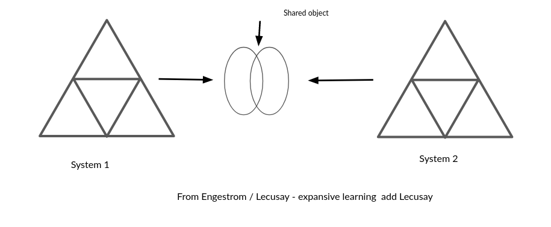

---
# all the regular stuff you have here
zotero:
  scannable-cite: false # only relevant when your compiling to scannable-cite .odt
  client: zotero # defaults to zotero
  author-in-text: false # when true, enabled fake author-name-only cites by replacing it with the text of the last names of the authors
  csl-style: harvard-manchester-metropolitan-university # pre-fill the style
layout: post
categories: chapter
title: 3. Theoretical Framework
---

-   [Introduction](#introduction)
-   [The foundational concepts of activity
    theory](#the-foundational-concepts-of-activity-theory)
    -   [3GAT and Expansive learning](#gat-and-expansive-learning)
    -   [Formative Interventions](#formative-interventions)
-   [CHAT concepts emerging from the Laboratory of Comparative Human
    Cognition
    (LCHC)](#chat-concepts-emerging-from-the-laboratory-of-comparative-human-cognition-lchc)
    -   [Mutual appropriation](#mutual-appropriation)
    -   [Third spaces and funds of
        knowledge](#third-spaces-and-funds-of-knowledge)
    -   [Repertoires of practice within three planes of
        activity](#repertoires-of-practice-within-three-planes-of-activity)
-   [Design-based research (DBR) in relation to formative
    intervention](#design-based-research-dbr-in-relation-to-formative-intervention)
    -   [Tensions and alignments between DBR and formative
        intervention](#tensions-and-alignments-between-dbr-and-formative-intervention)
-   [Concepts of agency within CHAT](#concepts-of-agency-within-chat)
    -   [Instrumental Agency](#instrumental-agency)
        -   [Transformation agency through double stimulation (TADS) -
            On double stimulation and
            agency](#transformation-agency-through-double-stimulation-tads---on-double-stimulation-and-agency)
        -   [Transformative Activist Stance
            (TAS)](#transformative-activist-stance-tas)
    -   [Relational agency](#relational-agency)
-   [Variations and synthesis in interventionist CHAT and DBR
    research](#variations-and-synthesis-in-interventionist-chat-and-dbr-research)
-   [Variations and synthesis in interventionist CHAT and DBR
    research](#variations-and-synthesis-in-interventionist-chat-and-dbr-research-1)
    -   [The Change Laboratory model](#the-change-laboratory-model)
    -   [Learning Labs](#learning-labs)
    -   [Design narratives](#design-narratives)
    -   [Designing for equity and transformation: from DBIR to
        SDBEs](#designing-for-equity-and-transformation-from-dbir-to-sdbes)
-   [Conclusion / Synthesis.](#conclusion-synthesis.)

## Introduction

The focus of this study is on the construction of shared meaning and practices as part of an emerging community of game makers. As such, the research questions address cultural factors which act as barriers to participation in digital making, and therefore require a method of research which allows the detailed analysis of complex, emergent learning environments. To achieve this, I adopt cultural historical activity theory (CHAT) as a guiding framework, which is operationalised through a formative intervention approach, incorporating adaptations from design-based research (DBR). This chapter explores these theoretical frameworks and key concepts relevant to the development of the thesis.

This chapter outlines the theoretical frameworks that shape the methodology and underlying ethos of this study. It begins by introducing the foundational concepts of AT and then explores its evolution into CHAT and third-generation activity theory (3GAT), developed by Engeström and the Helsinki school. In order to enhance the 3GAT approach, several key concepts from the work of the Laboratory of Comparative Human Cognition (LCHC) in San Diego are discussed. To demonstrate how CHAT is applied in research, the chapter also examines DBR and various forms of formative interventions. While AT forms the basis of this study, elements from other theoretical approaches within the learning sciences, particularly DBR, are incorporated to address the utility and practical application of the research [@hoadley_creating_2002-1; @barnett_ecosystem_2019]. To address the study’s focus on designing an intervention aimed at fostering participant agency within the game-making process, the final section of the chapter explores key conceptions of agency within CHAT, specifically in the form of activist and transformative approaches. The chapter concludes by justifying the synthesis of these theoretical choices and provides a brief description of how these concepts are operationalised within the context of this study.

## The foundational concepts of activity theory

Activity Theory (AT) emerged as part of a movement known as the social turn in psychology [@sugiman_social_2008], marking a shift from a purely psychological approach towards a more social understanding of learning and human behaviour. While this shift has influenced various disciplines, the focus here is on its impact on learning. The rationale behind moving away from the assumption that human mental activity should be studied in isolated, context-free settings  [@stetsenko_activity_2005], concerns not only the validity of results [@brown_design_1992], but also the relevance of the research for both designers and participants [@barnett_ecosystem_2019]. This perspective transcends traditional transmission models of learning and embraces the value of group-based, participatory processes.

Before outlining the core concepts driving Activity Theory (AT), a brief historical overview helps to contextualise them. For Marx, human endeavour and change are based on activity, with the subject of that activity being the individual or group driving it [@marx1975marx; @blunden_interdisciplinary_2009]. Vygotsky built upon Marxist ideas, emphasising the importance of human activity as a socially mediated process, and applied these core concepts to the broader understanding of learning [@blunden_interdisciplinary_2010]. While Vygotsky's student Leontiev developed Vygotsky's work into a prototypical activity theory (AT), AT had stagnated in the repressive context of the USSR [@blunden_interdisciplinary_2010] and saw limited uptake in Western academia until Cole translated Vygotsky's work [@cole_mind_1978]. Cole's efforts brought these foundational ideas into the realm of education and psychology during the broader _social turn_ in the discipline.

The work of Brown [-@brown_design_1992], a prominent psychology researcher advocating the importance of context within experimental design, helped legitimise this focus and facilitated its broad adoption across diverse fields. The growing work in these varied fields, sometimes grouped by the term _learning sciences_, reflects a move away from randomised control trials and their attempt to sever context, shifting from a behaviourist view of learning as an internal psychological process to a more interdisciplinary approach. This new approach draws on cognitive and cultural psychology [@hoadley_learning_2011]. While this fragmentation promotes pluralism and knowledge-sharing across fields as diverse as education, anthropology, and computer science, the field of learning sciences has been criticised for lacking conceptual coherence in understanding learning and human activity on a deeper level [@hoadley_learning_2011].

TRANSITION - TO ADDRESS THIS DEFICIT? ...
In this emerging field of cultural psychology, scholars such as Wertsch [-@wertsch_vygotsky_1985] and Cole [-@cole_cultural_1996] explored the critical role of cultural mediation in human development, particularly in relation to learning communities and contexts.  Nardi and Kaptelinin outline AT as a series of foundational principles that underpin broader theories [@kaptelinin_acting_2009; @wertsch_concept_1981], specifically: object-orientedness, tool mediation, the psychological processes of internalisation and externalisation, hierarchical structure of activity, and the ongoing development of activity.

A useful starting point to explore key concepts in AT is Vygotsky’s formulation of the relationship between subject, object, and tools. Activity Theory is object-oriented, meaning that human behaviour and learning are driven by the goals or objectives of the individual or collective subject [@engestrom_learning_1987-1]. Kaptelinin and colleagues [-@kaptelinin_activity_1995] note that while the materialist roots of AT, stemming from Marxist theory, have led some interpretations to focus on the object as the physical entity being worked on and transformed by activity, conceptual objects are also included in Leontiev’s conception of Activity Theory [@leontev_problem_1974]. Thus, the term object is best understood within the context of a broader motivation or objective. To represent the subject-object relationship in a way that addresses Vygotsky's resolution of the subject-object, mind-body, and Cartesian dualism problems [@still1991mutual], this relationship was developed by Leontiev into a triadic model that includes tools which mediate the activity [@engestrom_learning_1987-1]. See fig 3.x below.

{width=60%}

Fig. 3.x Essential components of activity outlined by Vygotsky

Turning to mediation via tools, Vygotsky's concept of tools is broad [-@cole_mind_1978], encompassing language, physical tools, and representational concepts. Mediation is particularly relevant to this study, as the learning environment involves diverse and dynamic forms of tool use. Physical, digital, and conceptual tools evolve as products of the experiences of others in society, containing evidence of cultural adaptation and evolution. This study positions pedagogies as forms of mediational strategy that can be employed by both facilitators and learners [@donato_sociocultural_1994; @gutierrez_re-mediating_2009].

For Vygotsky, mediation via conceptual tools involves the interconnected processes of internalisation and externalisation of activity [@kaptelinin_activity_1995-1].  Learners are actively processing and make sense of the world by both appropriating cultural learning from cultural practices and then by contributing back into shared cultural understandings of the world. This reciprocal process is well described in learning context by Rogoff via a personal process she calls participatory appropriation [@rogoff_observing_1995].  This reciprocity is crucial as it challenges traditional transmission-based models of learning. Rogoff further identifies this appropriation as consisting of three key planes, of _personal, interpersonal, and cultural processes_ [@rogoff_observing_1995, p.154], the analysis of which is essential for understanding community activity, a topic that will be explored in a later section of this chapter.

To describe activity systems with greater granularity, Leontiev [-@leontiev_activity_2009] employed the concepts of actions and operations, which together constitute a vertical hierarchy of activity structure. At the highest level, activity is driven by an overall motive, while actions represent smaller sub-goals necessary to achieve this broader objective. As we move down this hierarchy, we encounter a series of unconscious operations that are performed fluently during the execution of actions. See the figure below from [@daniels_vygotsky_2001, p.87].

{width=80%}

Figure 3. x - Hierarchical structure of activity adapted from  [@daniels_vygotsky_2001, p.87].

The concept of fluency is key to this study, making it essential to locate and describe the chains of operations and actions involved in the activity. Kuutti [-@kuutti_activity_1995] articulates the transition from actions to operations as follows:

_Initially each operation is a conscious action, consisting of both the orientation and execution phases, but when the corresponding model is good enough and the action has been practiced long enough, the orientation phase will fade and the action will be collapsed into an operation, which is much more fluent._ [@kuutti_activity_1995]

Additionally, activity systems can be viewed as nested within broader activity systems. For instance, the development and teaching of a series of lessons may occur within the larger activity of a school or university [@lewin_developing_2018-1; @barab_using_2002]. Therefore, the process of selecting which activity system to analyze in depth involves identifying an appropriate unit of analysis [@blunden_germ_2014].

For example, in Barab et al.'s [-@barab_using_2002] research on changes to a university course, the use of varied scopes and different framings of activity are used, at times focusing in on the specifics of evolving tool use or participant interaction as an object of activity, to build up a detailed examination of the tensions and processes within a complex educational environment. This level of detail not only enhances replicability but also provides utility to other practitioners, illustrating and justifying the use of a smaller activity system than what is typically represented in Engeström's approach [@engestrom_learning_1987-1; @lave_developmental_1993; @barab_using_2002]. Similarly, in this thesis, while game making is studied as a community project within a larger system, interpersonal activity is also examined through an activity system of a smaller scope. This aspect is explored in more detail in Chapter 4.

In terms of development, activity theory perceives activity as constantly evolving within its context. The theory is rooted in Marxist dialectical materialism, which posits that activity is a dynamic system best understood through its transformations [@ilyenkov1960dialectics]. A significant driver of transformation in activity is the emergence and resolution of contradictions and conflicts that arise from the accumulation of tensions within the activity itself [@ilyenkov1960dialectics; @blunden_activity_2023].

WORK ON THIS LINK - SIGNPOST BOTH 3GAT AND LCHC

Engeström’s work on what he termed the third generation of activity theory includes the theory of expansive learning, which traces the changes and growth of the object being worked on. This transformation often occurs as tensions extend beyond a single activity system to involve multiple systems, acknowledging the influence of actors moving between them [@engestrom_expansive_2001].

Alongside Cole’s contributions, this framework is essential for broadening the understanding of activity and engaging with cross-cultural perspectives on learning [@cole_cross-cultural_1988]. These concepts are explored further in the section on expansive learning below.

###  3GAT and Expansive learning

As activity theory (AT) has been adopted and developed beyond its Soviet origins, researchers have developed new concepts within varied schools of practice. The cultural-historical approach and cultural-historical activity theory (CHAT) denote the broader application of these principles, which may also integrate related concepts from sociocultural frameworks. The term third generation activity theory (3GAT) has emerged from the work of  Engeström and the Helsinki school's interpretation of CHAT. This section begins by exploring key concepts in third generation activity theory (3GAT) and their application through formative interventions: specifically, a community layer of activity, contradictions and tensions between system elements, double stimulation, and rising to the concrete.

<!-- Given the variation in the use of terms, the  disambiguation of these terms and context on schools of AT  in the context of this study is useful here.
Activity theory (AT) refers to the core principles of the approach discussed earlier.  -->

Third generation activity theory (3GAT) represents an important development of conceptual tools for applying activity theory to authentic learning settings. Engeström's concept of the activity system model extends Leontiev's work through a triangular representation that highlights key cultural aspects of the activity in question. Engeström adds a new tier to the model to visually represent Leontiev's focus on issues of cultural factors  [@engestrom_learning_1987-1]. Specifically, these cultural factors include the wider community, which encompasses those involved in the activity beyond the subjects themselves, the division of labour, which may occur through either the distribution of tasks among community members or a more vertical power structure, and the emergence of rules or norms that guide evolving community behaviours [@sannino_cultural-historical_2018].

{width=60%}

Figure 3. x - Engeström's representation of community concepts an activity system

While these visual representations are novel, the main advances of third generation activity theory (3GAT) lie in its expanded focus on the role of interacting activity systems, the movement of subjects between systems, and the potential for collaborative work on a shared object. The recognition of broader activity systems and the transfer of motivations and practices of actors into new systems encapsulates Engeström's perspective on activity theory [@spinuzzi_trying_2020-1]. This shared, or expanded, object being worked on by more than one activity system of expansive learning forms an important base for formative in [@sannino_formative_2016] [@engestrom_methodological_2014].

<!-- {width=90%}

Figure 3. x - Engeström's concept of expansive learning via a shared object, from [@sannino_formative_2016] [@engestrom_methodological_2014] -->

To clarify this relationship , an example in context is beneficial. In research on a joint activity involving schools, Cakir and colleagues [-@cakir_contradictions_2022] depict the joint activity as an objective shared between the school, family, and researchers.

{width=90%}

Figure 3.cakir - An object shared between different activity systems

The conception of joint activity emphasises the importance of the roles of researchers and other stakeholders within these interventionist and participatory processes. ADD LECUSAY TOO HERE?

Analysing activity through its transformation, particularly in relation to the contradictions and tensions among system elements, draws on Marxist conceptions of dialectics and forms the foundation for the concepts of expansive learning. In 3GAT, this view of transformation through collaborative work between activity systems on a new, expanded object is termed expansive learning [@engestrom_design_2011].

Drawing on concepts of tensions and contradictions existing in foundational concepts of dialectal materialism, the 3GAT allows for a granular exploration of tensions and contradictions are a vital source of change and evolution of new and ongoing activity systems [@engestrom_expansive_2001]. 3GAT achieves this through careful of description, analysis, and representation of system elements, the interaction between systems, and the resulting contradictions. Some tensions arising between participant motives and different parts of activity system may be resolved quickly through change, while others may persist and can be referred to as conflicts [@sannino_cultural-historical_2018]. These unresolved contradictions which develop into impasses or conflicts which may serve as motivational factors driving agentic responses from participants. A later section explores Sannino's perspective on such conflicts as a source of transformative agency in greater depth. Following Kuutti's approach [-@kuutti_activity_1995], this study adopts the term contradictions to encompass concepts of tensions, barriers, and misalignments. Engeström states that such sub-terms can be "understood as manifestations of contradictions" [@engestrom_discursive_2011, p. 340]. Additionally, Kamanga emphasises the value of identifying system congruencies or strengths within activity systems [@kamanga_contradictions_2021]. For a comprehensive analysis of systemic contradictions, see the work of Engeström and Cakir [@cakir_contradictions_2022; @engestrom_discursive_2011].

MOVE THIS? APPLICATION?
In this study, rather than analysing larger workplace systems over extended periods, the focus is on the analysis of systemic tensions within the context of shorter interventions, as seen in diverse research [@barab_developing_2002; @barab_using_2002; @lewin_developing_2018].

<!-- #### Double stimulation -->

Double stimulation refers to a process involving the use of tools to overcome contradictions that emerge in joint activity. Engeström's early work on formative interventions frames the first stimulus as "the problem itself", while a potential series of secondary stimuli can be introduced as part of the intervention [@valsiner_cultural-historical_2007, p.492]. Engeström and Sannino [-@engestrom_methodological_2014] explain that the process of double stimulation is active and goes beyond simple mediation via existing tools. The stimuli, whether presented by researchers as suggested tools or discovered in the environment by participants, are actively imbued with meaning and transformed by the participants through their use. Engeström [-@engestrom_methodological_2014, p.121] notes that it is likely that such stimuli are "ejected or reshaped by the participants, and the participants typically pick up or invent devices of their own".

<!-- #### Rising to the concrete -->

The concept of a germ cell of activity (or unit of analysis) can be traced through the works of Vygotsky and Leontiev back to Hegelian and Marxist ideas of holistic understandings of phenomena [@blunden_activity_2023]. Forms of activity are viewed as concrete instances and iterations of underlying germ cell concepts, which exist in an abstract form. For example, Marx's analysis identifies complex and diverse patterns of economic activity within the capitalist system as stemming from an underlying, prototypical concept of commodity exchange in pre-industrial economies. The works of Blunden and Davydov [@blunden_interdisciplinary_2010; @blunden_germ_2014; @blunden_activity_2023; @davydov_problems_2008] provide comprehensive justification for the utility of identifying a germ cell or unit of analysis in relation to collaborative and learning projects. Blunden describes the germ cell of activity and the unit of activity as two similar concepts with slightly different foci.

_... the germ-cell and the unit of analysis are one and the same thing, but in one case the developmental aspect is emphasised and in the other case the analytical aspect is emphasised._ [@blunden_unit_2020]

In this thesis, my role as both researcher and practitioner makes both aspects relevant. Examining the analytical dimension, the process of seeking and defining key activities as units for analysis helps to delineate the boundaries of what to analyse in depth. One challenge in applying this approach is the duration and relative stability required to identify these germ cells. The developmental aspect will be addressed in the following chapters, which explore the evolution and analysis of the learning design.

<!-- highlighting the process of applying of game design patterns by participants as a germ-cell concept that both shapes and facilitates practice.  -->

MOVE THIS?
In their critique of Penuel, Engeström and Sannino [-@engestrom_methodological_2014] provide no suggestions for adapting their models to more rapidly changing situations where actors come from different activity systems.

### Formative Interventions

 <!-- namely Change Laboratory (from Helsinki school) and 5th Dimension (Cole's intervention carried out in partnership with wider sociocultural researchers). -->

Cole and Engeström [@valsiner_cultural-historical_2007] use the term formative intervention to describe their interventionist research based on the  principles of CHAT
and overcome practical challenges in aligning with perceived rigour of social science, given the variation in environmental factors in the research process. Engeström and Sannino in the Helsinki school highlight the importance of double stimulation and identifying a germ cell that can be applied more widely through a process of rising to the concrete [@sannino_formative_2016; @engestrom_discursive_2011], defends this more narrow interpretation against attempts to use the term formative intervention more broadly [@engestrom_methodological_2014]. Examples of specific instances of formative interventions from the Helsinki school are examined in the final section of chapter.

By way of contrast, Cole [- @valsiner_cultural-historical_2007] bases his initial interpretation for formative interventions on the concept of mutual appropriation. The following sections locate this concept within a wider ecology of formative interventions, design experiments emerging from the Laboratory of Comparative Human Cognition (LCHC) in San Diego.

<!-- [EXPLAIN] -->
<!-- They also note the challenges of financing lengthy and repeated interventions within the experimental process, as well as the potential to disrupt the status quo of research settings by developing the agency of workers and learners. -->
<!-- This disruption may, in turn, impact the direction of the research, steering it away from the objectives initially supported by the funders.   -->

## CHAT concepts emerging from the Laboratory of Comparative Human Cognition (LCHC)

This section outlines key CHAT concepts  relevant to this study which have emerged from the process of undertaking formative interventions. Most of the concepts treated emerged from the work of the Laboratory of Comparative Human Cognition (LCHC); in particular the research on the after-school intervention Fifth Dimension (5thD) [@cole_mind_1997], has provided  useful concepts related to the development and analysis of culture through joint activity [@valsiner_cultural-historical_2007]; namely:  mutual appropriation, third spaces, idiocultures, funds of knowledge, and design based approaches.

The work of Michael Cole and colleagues Laboratory of Comparative Human Cognition (LCHC) in San Diego

was influenced by approaches like communities of learners [@rogoff_developing_1994], communities of practice [@lave_situated_1991],

LCHC's approach to formative interventions is  iterative, responsive and flexible. It shares characteristics and some common lineage with design based research.

<!-- The chapter later explores  concepts derived from this school, such as funds of knowledge, idiocultures, third space which are especially relevant to this study. -->

### Mutual appropriation

Cole highlights the need to align research interventions with the ongoing aims of educational or community partners to maximise their sustainability beyond the research period [@valsiner_cultural-historical_2007; @cole_fifth_2006].

The concept mutual appropriation has been utilised by Cole to explain and explore the development of the practicalities and structure of the research programme The setting of 5D interventions predominantly consisted of after-school clubs run by community partners, guided by university researchers and supported by undergraduate student volunteers. The main activities were playful tasks aimed at providing fun, along with additional objectives of building literacy.  Cole noted that for an activity to be sustainable, the goals of researchers, student volunteers, funders, and local partners needed, as much as possible, to align [@cole_fifth_2006]. To achieve this, Cole and colleagues describe a mutual process of adaptation in joint activities between institutions, which not only reforms activities to make them suitable for ongoing partnership but also leaves a historical trace of evolving activities that serve as a valuable basis for cultural analysis [@downing-wilson_design_2011]. A key distinction between the 5D approach and that of Change Laboratories is that, in the early stages of the 5D intervention, activity goals are not fully formed and are still in a state of evolution. I will return to this point later in this chapter.    

### Third spaces and funds of knowledge

<!--
**third spaces** -->

The concept of third space is helpful in the context of this study in particular as a space between home life and formal education rooted in a sociocultural understandings of learning. Cole's approach to formative interventions involved creating educational programmes founded on motivations of sustainability, mutuality, and a utopian ideal of creating a new activity system. This new system would thus be insulated from some of the more debilitating aspects of mainstream schooling and broader societal forces [@blunden_formative_2023]. Drawing on Homi Bhabha’s [@bhabha_location_2012] postcolonial concept of the third space as a site of hybridity and negotiation between cultural meanings, Gutiérrez [@gutierrez_rethinking_1999] recontextualised the term within education to theorise learning environments that bridge students’ everyday knowledge with academic practices. This process of blending the knowledge and discourses of the first space (home life) with the expectations and norms of the second space (school or institution) into a new third space has been explored in various studies [@moje_working_2004; @gutierrez_developing_2008; @bryant_academic_2009]. The work of Moje [@moje_working_2004] in particular helps to demonstrate how the concept of third space can be operationalised within educational settings. She examined how home-based discourses might be productively integrated with school-based literacies, while also highlighting the challenges and tensions involved in constructing truly hybrid learning environments.

<!-- Moje and colleagues [@moje_working_2004] explore the use of FoK in the context of interventions outside of school, aiming to develop content literacy. -->
<!-- See also dissertation on third space here [@bellocchi_learning_nodate] -->

Funds of knowledge (FoK), a term popularised by Luis Moll, one of the research partners in the 5th Dimension (5D) project [@moll_funds_1992], positions home-based discourses and practices as valuable resources that educators can draw upon to support learning in school and other educational settings. This approach aims to foster more equitable and inclusive learning experiences, particularly for students whose home cultures are significantly different from the dominant school discourse. FoK refers to the knowledge and skills acquired through participation in everyday activities outside formal schooling, which teachers can use to enhance classroom learning and support learner motivation. Moll and colleagues found that the cultural practices, skills, and traditions of Latino families were largely absent from mainstream school curricula, contributing to deficit views of these communities [@moll_funds_1992].

The concept emerged from research conducted in Latino communities in the United States, where Moll [@moll_funds_1992] defined FoK as the knowledge household members acquire through lived experience and social practice. In the original study, researchers conducted home visits to inform the design of after-school programmes. However, limitations of this approach included its adult-focused design and the fact that only a subset of families were visited [@rajala_utopian_2023]. Rajala and colleagues [@rajala_utopian_2023] critique the application of FoK in third space pedagogies, arguing that superficial uses risk reinforcing cultural stereotypes and reproducing deficit narratives. They also highlight practical barriers, such as the time-intensive nature of gathering meaningful data on students’ home cultures. In response, they advocate for the concept of funds of identity, which supports the co-construction of identity artefacts with participants as a means of representing and engaging with home cultures in more dynamic and participant-led ways [@subero_mediation_2018].

### Repertoires of practice within three planes of activity

This section explores how concepts such as linguistic and cultural-historical repertoires and idiocultures have been used to understand and support culturally responsive learning environments. Rogoff and Gutiérrez's [@gutierrez_cultural_2003] initial motivation in their exploration of repertoires was to challenge reductive and overgeneralised notions of learning styles, particularly when applied to non-dominant communities. The researchers highlight the value of identifying potential funds of knowledge, framed as “linguistic and cultural-historical repertoires”, that learners bring to educational settings [@gutierrez_cultural_2003, p.22].  Following Fine [@fine_boys_1987], Cole employs the term _idioculture_ [@cole_fifth_2006, p.32] to describe the emergence of a novel, localised micro-culture within the 5th Dimension (5D) programme. In line with Downing-Wilson [@downing_wilson_sociogenesis_2011], these idiocultures do not emerge in isolation; rather, they reflect the intersecting traits of diverse cultural systems represented by programme stakeholders [@cole_idiocultural_2017]. Cole emphasises the utility of idiocultures both as a means of examining cultural variability across sites and as a practical basis for adapting programme activities to participants' lived experiences [@cole_idiocultural_2017].

The work of Rogoff and Gutiérrez on linguistic and cultural-historical repertoires [@rogoff_cultural_2003] also seeks to prevent misrepresentation of cultural practices as innate traits, a pattern they identify as especially damaging when linked to racial assumptions. They stress that researchers and educators should avoid designing interventions based on presumed characteristics of learners. Instead, they call for contextualised inquiry into existing repertoires of practice, which can then be extended through collaborative activity. This position builds on Rogoff’s foundational framework for analysing participation across three interconnected planes: personal, social, and community [@rogoff_childrens_1993].

A central aim of analysing behaviour on the social plane is Rogoff’s effort to move beyond the binary between teacher-led and learner-led approaches, as also noted by Mascolo [@mascolo_beyond_2009]. In addition, identity is highlighted as a key factor, but one that requires complex, multi-layered inquiry grounded in situated historicity rather than reliance on cultural stereotypes. This is important for this thesis as it allows for an approach that transcends binary distinctions between instruction and discovery, supporting a more nuanced view of participation. This theme is explored in more depth in Chapter 6, particularly through the varied use of game design patterns.

<!-- Cole describes the value of researchers being involved in early evolution of interventions in their observations in adaptations of the 5D programme based on the culture of the host partners and young participants. -->

<!-- Rogoff's concept of guided participation and the role of emerging repertoires of practice within that process, serving as a middle ground between instruction and discovery, are explored in more detail, through the lens of participants use of game design patterns, in Chapter 6. -->

## Design-based research (DBR) in relation to formative intervention

<!-- 5thD interventions and related LCHC approaches incorporate, and have contributed to design based approaches in research. -->

This section introduces the theoretical foundations of design-based research (DBR), exploring its characteristics, critiques, and points of overlap with formative interventions grounded in cultural-historical activity theory (CHAT). Brown’s provocation on the importance of context [@brown_design_1992] anticipated the growth in conceptual diversity and practical applications that characterise what is now referred to as design-based research (DBR).

DBR has diverse interpretations, which stem from a set of generally agreed principles [@penuel_emerging_2014; @mckenney_educational_2021]. Easterday and colleagues [-@easterday_design-based_2014] characterise the core elements of DBR as: research as a form of intervention, iteration, involvement of participants in the evolution of designs, and flexibility in research outcomes based on how events unfold. Cobb and colleagues [-@cobb_design_2003, p.13] summarise the characteristics of design-based approaches as "extended (iterative), interventionist (innovative and design-based), and theory-oriented enterprises whose 'theories' do real work in practical educational contexts".

DBR is common in the domain of learning sciences, particularly in advancing practice and theory related to innovative learning tasks [@penuel_emerging_2014]. For more detailed definitions of DBR and its place within a socio economic funding structure, see Sandoval [-@sandoval_conjecture_2014] and Hay [-@hay_constructivism_2001, p. 3].

Barab and Squire [-@barab_design-based_2004] describe the inherent _messiness_ of design-based research, which poses a challenge for researchers attempting to present results in a coherent and usable form. There is an ongoing tension between staying closely aligned with the specific, rich context of the research, and stepping back to generalise findings without becoming lost in abstraction. This balance is crucial for ensuring that research remains both contextually grounded and broadly applicable. Hoadley and Campos [-@hoadley_design-based_2022] further explore DBR outcomes beyond design refinement. These include the development of design processes, domain theories, design principles or patterns, and ontological innovations. They also identify new hypotheses and transformative learning experienced by researchers themselves. These varied outcomes highlight the broad applicability of DBR and the importance of ensuring that design processes and theoretical insights are communicated clearly to enhance the utility of research findings.

A key aspect of DBR is its emphasis on the rapid iteration of resources based on continuous feedback rooted in practice. In an educational context, this process helps produce pedagogies and resources that respond to the needs of learners [@cobb_design_2003]. This iterative responsiveness is also visible in how participants navigate the design environment itself. A further lens through which to view design-based research is the concept of affordances, commonly used in HCI and educational technology design to describe the perceived possibilities for action provided by a tool or environment [@kaptelinin_affordances_2012]. While affordances have often been analysed at the level of individual tool-user interaction, recent scholarship has expanded this to consider collective and sociocultural dimensions of affordance. In both HCI and DBR, there is a shared interest in how participants respond to contradictions in activity by appropriating or modifying tools to suit emergent needs. As Karanasios and Allen [@karanasios_moving_2021] suggest, users often engage with digital tools in creative ways to overcome obstacles or redesign workflows, an idea echoed in DBR’s emphasis on iterative refinement and participant agency. In this thesis, learners’ responses to design tensions, for instance, how they adapted or misused templates, reshaped their digital tools, or requested changes to the learning environment, can be understood through this sociocultural framing of affordance. Such moments serve as evidence of agency, aligning with the CHAT principle that contradictions can act as drivers of transformation when supported by responsive design. These overlapping features and tensions provide a useful basis for comparing DBR and formative intervention more directly.

<!-- While starting from similar roots, and sharing key concerns regarding ecological validity, there has been a degree of contestation in attempts to compare formative intervention with design based research. -->

<!-- CHAT interventions concentrate more on transformations in activity and the increasing agency of those involved COMPARED TO DBR? EVIDENCE? PENUEL? -->

<!-- While x  resisted a formalisation, this naming and description of process is a welcome way of sharing practice. -->
<!-- More recently, Engeström has defended its specific application against more flexible interpretations [@engestrom_methodological_2014]. In this section, I explore the Helsinki school's narrower interpretation of formative interventions as an application of 3GAT theory. -->

#### Tensions and alignments between DBR and formative intervention

Penuel [-@penuel_emerging_2014]  links FI and DBR explicitly  through proposing and defining a term _formative intervention research_ as a useful term to encapsulate a variation of FI closely aligned with CHAT, including those drawing on elements of design-based research. Engeström [-@engestrom_methodological_2014] initially resists this proposition, insisting that formative interventions should contain a clear articulation of _double stimulation_ and the process of _rising to the concrete_ within the framework of Engeström and Sannino's understanding of these concepts [@sannino_formative_2016; @engestrom_methodological_2014; @engestrom_discursive_2011].

Engeström's view of DBR [-@engestrom_learning_2009] is that it lacks rigorous examination of the dynamic and historic nature of context with CHAT conceptions of activity and it tends to be overly focused on a linear approach to refining the researcher's learning design, which limits the input and agency of participants. O'Neill, in advocating for great use of CHAT approaches within DBR, offers contextual factors which help explain this deficit, including the timescales and institutional priorities that shape DBR in funded research environments [@oneill_understanding_2016]. The result is a challenge for DBR in producing in-depth analyses of context, which are often required in CHAT-based approaches.

<!-- WHO? initially outlined several criticisms of DBR when compared to CHAT in educational contexts: it is vague in its description of systemic elements in analysis,  -->

O'Neill [-@oneill_understanding_2016] echoes these concerns and extends them, urging DBR researchers to apply CHAT methodology to address the limitations of current DBR practices in the learning sciences community. He emphasises that DBR researchers often fail to invest sufficient time in familiarising themselves with the existing learning practices of the contexts they study, an oversight that runs counter to the more contextually focused approaches encouraged by CHAT.  

Bakker [-@bakker_design_2018] challenges Engeström's characterisation of DBR as having closed goals, particularly critiquing Engeström's portrayal of the work of Collins and colleagues [-@collins_design_2004] as a misrepresentation. Bakker [-@bakker_design_2018, p.17] argues that these researchers did "not want to fix variables or educational goals upfront" . He echoes the call of  Cole, Penuel and O’Neill for more dialogue and greater recognition of the shared traditions between CHAT and design research [-@cole_cultural-historical_2018]. Penuel [-@penuel_emerging_2014] emphasises the eclectic methodological approach in design-based research as a necessary means of responding flexibly to context. Bakker also views this flexibility as a strength of DBR, resisting calls for greater formalisation of the design process [@ormel_researchpractice_2012; @mckenney_systematic_2013].

An additional challenge is the context in which formative interventions are often applied. These interventions are frequently used in stable, institutional work environments, particularly in European contexts, where stakeholder roles and systemic structures are more predictable. In contrast, learning environments associated with DBR, especially in less formal or rapidly evolving contexts, do not share the same stability [@spinuzzi_trying_2020-1]. This difference may limit the utility of formative interventions like the Change Laboratory in more fluid settings.  Recent work by Engeström, Sannino, and colleagues suggests a shift toward a more collaborative stance on DBR, recognising its value rather than critiquing it outright. In particular, they acknowledge that formative interventions can enrich DBR by offering a robust framework for systemic transformation, collective agency, and expansive learning [@cakir_contradictions_2022]. This shift highlights a growing consensus on the potential benefits of incorporating cultural-historical concepts into DBR approaches. The discussion in the previous paragraphs show close alignment in most details.

This study draws on overlapping principles from design-based research and formative intervention, combining their strengths to support collaborative learning in a dynamic, informal setting. While the discussion so far has explored how these traditions align and diverge, the next section turns to concepts of agency that underpin the study’s analytical focus. These ideas offer a bridge between theory and practice, helping to explain how learners navigated the intervention and how the research design evolved in response. The chapter then closes by examining how selected approaches have operationalised these concepts, informing the flexible methodology developed in Chapter 4.

## Concepts of agency within CHAT

To help later exploration of RQ3, which asks how participants develop agency in an evolving community of game makers, it is important to clarify the concept of agency, particularly in the context of learning environments. The question of who or what has agency is a philosophical one with practical applications in designing learning settings. Agency and autonomy are often either vaguely defined or have contested, interconnected definitions in studies [@huang_autonomy_2013; @matusov_mapping_2016]. For this thesis, in line with a cultural-historical approach, agency is viewed as a cultural phenomenon experienced by individuals in relation to their peers and their learning environment.

This study builds on perspectives from activity theory and design-based traditions that emphasise the development of agency through participation, contradiction, and collaboration. In this view, agency is not a fixed trait but something that emerges dynamically within activity systems. To situate this view within the varied and evolving concepts of agency in educational settings, I draw on notions of instrumental, transformational and relational agency within the framework of activity theory. These forms of agency offer a broad perspective on how individuals navigate and reshape their learning environments, extending beyond the fulfilment of institutionally set objectives. While this section outlines the theoretical framing of agency, a more detailed exploration of how agency developed in practice is provided in Chapter 7.

<!--
I draw on the work of Matusov and colleagues [-@matusov_mapping_2016] who categorise agency into several genres: instrumental agency focused on developing capacities, effortful agency related to motivation and commitment, dynamically emergent agency involving affordances and actor-network theory, and authorial agency, which entails agentic changes to the learning environment. Matusov and colleagues’ critique effortful agency in education, which primarily focuses on achieving goals predefined by educational institutions. -->

### Instrumental Agency

Instrumental agency reflects a concept of agency as the ability to get things done, thus, a view of agency as a set of capacities [@edwards_steps_2005]. Matusov and colleagues [-@matusov_mapping_2016] highlight an often technological view of educational environments where educators seek to increase instrumental agency by building the individual capacity of learners to achieve relevant tasks. Many DBR studies which aim to develop and study the use of new tools especially in the area of education technology, would aim to increase instrumental learner agency, designing away problems.

Within a CHAT framework, this type of agency can be seen as enhancing the fluidity of practice, with learners using both objects and people as tools within mediated activities. According to Leontiev, actions that initially require concentration and effort may evolve into fluid operations through practice. Thus, understanding these dimensions of agency within an AT framework should be grounded in a solid comprehension of mediation principles.

#### Transformation agency through double stimulation (TADS) - On double stimulation and agency

The Helsinki school's focus on transformative agency also advocates the importance of intervention and transformation as a desirable aspect of research, [@engestrom2006development; @haapasaari_emergence_2016; @sannino_formative_2016]. The vehicle for this in recent years has been the concept of transformation agency through double stimulation (TADS). Similarly to TAS, the objective of TADS is increased agency of participants in research interventions. In addition, TADs researchers articulate a desire to understand a broad picture of agency from a CHAT perspective. As outlined above double stimulation describes additional stimuli beyond the first stimulus understood as the motivation of the activity. In the Change Lab (CL) interventions for example, the active use of secondary stimulus can both analyse and facilitate agency by provoking reflection [@sannino_principle_2015].

Studies of transformative agency, for example within CL, often involve a significant longitudinal aspect. However, the TADS concepts has been applied in research over much shorter time frames and in more naturalistic settings such as hospital practice [@hopwood_forward_2022; @hopwood_volitional_2022], higher education [@grant_double_2022], and digital education [@aagaard_teacher_2022]. The concept of volitional action by subjects as a foundation for transformation is used in these shorter term studies to explore the processes of decision forming and implementation [@virkkunen_dilemmas_2006; @sannino_double_2015]. Here the secondary stimuli are used by participants as a spur and then as leverage in volitional acts.

ENCHANCE WITH AN EXAMPLE?
To address this aspect, Sannino augments the concept of transformative agency by double stimulation (TADS) with a metaphor of a sea vessel warping using kedging anchors. This metaphor highlights the active effort of participants to overcome tensions and dilemmas in their activities through intentional action to pull themselves out of the impasse they are facing.

<!-- {width=60%}

Figure 3.warping - Warping using a kedging anchor -->

While not all attempts, such as directly asking a peer or teacher for help, will succeed, some will take hold and lead to transformation for the student. This may also trigger a broader shift in the educational environment itself. This idea is particularly relevant to the setting of this study, where the learning environment is co-created by both participants and researchers.

<!-- , which can leave them stuck, much like being stranded on a sandbank. In an educational intervention, learners might "throw a kedge anchor" into the learning environment, symbolising an intentional action to pull themselves out of the impasse they are facing. -->

<!-- _We may think of the second stimulus as an anchor. Anchors are commonly understood as stabilising devices to prevent a vessel from moving. However, not all anchors have this function. Beside the heavy-weight anchors, there are also kedge anchors serving the purpose of ‘warping,’ that is, pulling the anchor once it has settled on the ground, for moving the vessel away from a problem area._ [@sannino_transformative_2022, p. 4] -->

<!-- {width=90%}

Figure 3.warping - Warping using a kedging anchor -->

#### Transformative Activist Stance (TAS)

Stetsenko’s transformative activist stance (TAS) presents a politicised view of agency that challenges both individualist and overly structural conceptions. She critiques views of agency that reduce it to either personal traits or render individuals as powerless within wider cultural systems [@stetsenko_critical_2020]. Instead, TAS positions agency as a dynamic interplay between social tensions and human volition, grounded in an urgent call to transform unjust conditions. From this perspective, Stetsenko advocates a deliberately partisan approach to research—rejecting the detachment and neutrality often associated with postmodern or post-humanist positions [@stetsenko_hope_2020].

This framing is relevant to the ethical commitments of this study, particularly in its alignment with activist research that aims to reshape the learning conditions of participants, not simply observe them.

### Relational agency

Relational agency has multiple interpretations. Stetsenko [@stetsenko2020radical] critiques ecological and sociomaterial theories of agency, including those of Latour [@latour_reassembling_2005], Barad [@barad_meeting_2007], and Giddens [@giddens_constitution_1984]. While these approaches usefully explore distributed activity across human and material systems, she argues they often neglect power, political struggle, and the transformative potential of human action.

By contrast, Edwards and Mackenzie’s [@edwards_steps_2005] conception of relational agency builds on activity theory and retains a focus on the historical and political dimensions of practice. Relational agency extends instrumental agency by recognising the social capacity to interpret and respond to others’ actions, particularly through collaboration. It involves individuals working with others to expand a shared object of activity, where goals may shift and evolve. In educational contexts, this form of agency is often constrained by institutional routines but remains a valuable lens for analysing participation in community-based learning environments.

For Edwards [@edwards_building_2011, p.34], relational agency involves developing a shared understanding of an activity’s object and adjusting one's actions in response to others’ evolving interpretations of that object. Feedback is often a key part of this process. As explored in Chapter 2, Gutiérrez and colleagues' work on 5thD interventions [@digiacomo_relational_2016-1; @gutierrez_developing_2008; @digiacomo_seven_2017] offers a compelling example of relational agency in practice, particularly in after-school learning contexts concerned with identity and equity. Their analysis highlights how relational and material forms of feedback contributed to what they term _relational expertise_, a shared capacity to engage purposefully in joint activity. In the context of this intervention, the researchers argue that “relational and material feedback elements of the activity helped to create an environment with relational agency” [@digiacomo_relational_2016-1]. This example illustrates how specific educational design features, such as structured opportunities for reflection and feedback, can support forms of agency that are both social and developmental.

This framing positions agency as a socially situated and evolving capacity, shaped by participation in collective activity and the tensions that arise within it. It highlights the importance of learners not only acting within a designed environment, but also adapting and reshaping it through joint activity. While this chapter establishes the conceptual groundwork for understanding agency in the study, Chapter 7 returns to this theme in greater depth, examining how different expressions of agency emerged and developed across the intervention.

<!-- Both TAS and relational agency are relevant to this thesis: the former informs the researcher’s stance, while the latter helps describe how learners negotiate support and meaning through joint activity. -->

<!-- For Stetsenko the stakes are high given ecological and military crises caused by neo-liberal capitalist economic, but there is still everything to play for [@hall_marxism_2023]. -->
<!-- While the overall focus is societal change, TAS has been applied to smaller scale concrete explorations, including play [@stetsenko_serious_2015], transformation in the setting of adolescents looked after in residential care [@vianna_connecting_2011]. In TAS aspects of conceptual understandings of agency and specifics of methodology are less explored than the motivational dimensions, the methods of auto-ethnography and case studies are used in several studies which draw on this concept [@vianna_connecting_2011]. -->

<!-- **The role of feedback and and identity formation within relational agency** -->

<!-- From [-@digiacomo_relation
al_2016-1]

    We argue that these relational and material feedback elements of the activity helped to create an environment with relational agency—a “capacity for working with others to strengthen purposeful responses to complex problems” [@edwards_building_2011, p.34] (Edwards, 2011, p.34). According to Edwards (2011), relational agency arises from (a) working with others to expand the object of activity and (b) aligning one’s own responses to new interpretations being made by the others while acting on the expanded object. -->

## Variations and synthesis in interventionist CHAT and DBR research

Despite shared interests in transformation and participation, activity theory and design-based research have produced divergent methodological models, reflecting different assumptions about agency, scale, and systemic change. This section outlines key approaches relevant to this study, including the Change Laboratory, Learning Labs, design narratives and social design-based experiments (SDBEs), each of which offers a distinct take on interventionist research.

The aim is not to provide an exhaustive review, but to highlight methodological features that inform the design of this study. Elements from these traditions are integrated into the approach developed in the following chapter.

## Variations and synthesis in interventionist CHAT and DBR research

While there is broad agreement among researchers regarding the theoretical understanding of concepts in activity theory, there is greater disparity in their application within research settings. This section explores the variations between key approaches, relevant to this thesis. Specifically it describes applications of Change Labs and Living Labs, and social design based experiments (SDBEs).

The aim here is to look at the general approach of different specific approaches. Element of which will be used in my own methodology described in the following chapter.

### The Change Laboratory model

The Change Laboratory (CL) is Engeström’s key implementation of expansive learning in workplace environments [@engestrom_putting_2007]. CL interventions typically involve a series of workshops with key stakeholders, facilitated by researchers. The structural model of third-generation activity theory (3GAT) is used to identify and reflect on contradictions in current practices, with the goal of collectively envisioning and enacting change. This model is well suited to relatively stable work environments where roles, tools, and community structures are clearly defined.

In the CL model, the mechanism of double stimulation plays a central role. The first stimulus is often empirical data, such as video or observational artefacts, that help participants surface contradictions. The second stimulus takes the form of conceptual tools or mediational artefacts introduced to support reflection and reorganisation of the activity. Double binds are particularly important in this process. They mark moments where the constraints of the existing system become intolerable, creating a space for participants to take up new tools or concepts and reframe the situation. Sannino [@sannino_principle_2015] highlights how these auxiliary stimuli can support volitional engagement, enabling the emergence of transformative agency.

### Learning Labs

A related approach is the Learning Lab [@cakir_contradictions_2022; @bal2011culturally], which adapts similar workshop structures to school and educational contexts. While it shares core features with the CL model, the Learning Lab is often used to study how educational innovations emerge and unfold, rather than to directly produce them. As such, it tends to operate at a more analytical level, focusing on how learning environments evolve through participation and reflection. This meta-level positioning means that Learning Lab studies are particularly attentive to how tensions and shifts play out, often through linguistic analysis of interactions between diverse stakeholders in bespoke reflective workshops.

One key contribution of this tradition is its detailed treatment of tension and contradiction as productive elements of change. In particular, Engeström and Sannino [@engestrom_discursive_2011] offer a typology of four forms of discursive contradiction observed in participant dialogue: dilemma, conflict, critical conflict, and double bind. These categories describe different ways that participants express and work through tensions in activity settings. For example, dilemmas involve expressions of uncertainty or mixed evaluations; conflicts feature direct disagreement; critical conflicts often include emotional or moral struggle; and double binds occur when all available options seem inadequate, prompting the need for a new direction.

This typology aligns closely with the earlier discussion of double stimulation. While the model was introduced through CLs, the same explanatory framework can be applied to Learning Labs. The presence of discursive tensions, particularly double binds, helps explain how expansive learning unfolds in real time, especially when participants are given tools to articulate, confront, and work through contradictions. This framing is foundational to the present study’s approach to both design and analysis, and informs how agency, innovation, and tool use are interpreted in the chapters that follow.

### Design narratives

Design narratives emerged in the learning sciences as a response to the limitations of communicating design-based research (DBR) within traditional journal formats, where space and context are often constrained [@hoadley_creating_2002]. They offer a way to bridge the tension between richly situated accounts and the need for generalisable insights. Hoadley [-@hoadley_creating_2002-1] introduced design narratives as a means of providing detailed, reflective accounts of the learning design process. These narratives document the problems encountered, the iterative changes made, and the reasoning behind key decisions [@hoadley_creating_2002-1; @brase_knowledge_2024; @bell_theoretical_2004]. Bakker [-@bakker_design_2018] similarly notes the challenge of representing the full complexity of design work within conventional publishing formats. In this study, a design narrative is particularly valuable in conveying the intricate details of the learning design. This thesis format allows for a fuller exploration of these aspects, notably in Chapter 5, where I use extended description to examine how tensions emerged and were responded to during the activity. I argue that design narratives can help further align DBR with CHAT-informed interventions. By incorporating systemic concepts from activity theory, they offer a more holistic account of both the practical and analytical development of an intervention.

A key influence on this approach is the Fifth Dimension project, described in Cole’s work [@cole_fifth_2006]. The 5thD programme exemplifies a CHAT-informed design narrative situated in informal, community-based settings [@nicolopoulou_design_2009; @downing-wilson_design_2011]. It shows how both educational and research designs were shaped by feedback from participants, student volunteers, and educators. Design adaptations emerged in response to concrete tensions and local cultural practices, rather than being fixed in advance. As discussed in Chapter 2, 5D also offers a model of thick description and negotiated meaning across institutional and everyday contexts. Researchers did not impose a static design but remained responsive to the lived activity of the site. This underscores the idea that design narratives are not only retrospective records but also cultural tools that shape and are shaped by the learning activity itself.

### Designing for equity and transformation: from DBIR to SDBEs

Efforts to scale context-sensitive educational innovation have led to methodological developments that extend core principles of design-based research (DBR). One such development is design-based implementation research (DBIR), which emerged from Penuel and colleagues' work [@penuel_design-based_2021] and seeks to address the challenge of producing change that is both sustainable and equitable across institutional systems. DBIR retains DBR’s emphasis on iteration and collaboration but explicitly prioritises long-term implementation, practitioner partnership, and system-level coordination. It offers a pragmatic orientation to research, foregrounding organisational learning and equity from the outset, especially in contexts like inquiry-based learning where resources may be constrained.

The methodological and political aims of DBIR share a strong resemblance with social design-based experiments (SDBEs), a related approach developed by Gutiérrez and colleagues [@gutierrez_social_2016-1]. SDBEs build on traditions of formative intervention and DBR but reorient the work around questions of identity, power, and social justice. While DBIR often operates in more formal institutional settings, SDBEs are typically situated in informal or hybrid learning environments where learners' repertoires and cultural histories are central to the design process.

This study draws on these overlapping traditions, but given its focus on a fluid, co-designed learning space involving multiple stakeholder voices, the approach aligns most closely with the logic of SDBEs. In particular, SDBEs support the creation of third spaces where community and institutional knowledge intersect, and where feedback functions not just as an instructional device but as a material and relational element in cultivating *relational expertise* and *relational agency* [@digiacomo_relational_2016-1]. These concerns echo the aims of DBIR but are more explicitly addressed in the analytical and practical toolkit of SDBEs, making them especially relevant to the intervention context explored in this thesis.

## Conclusion: from theory to intervention

This chapter has outlined the theoretical foundation for the study, combining concepts from design-based research (DBR) and cultural-historical activity theory (CHAT) to support an interventionist methodology. I have traced how their overlapping concerns with participation, iteration, and transformation provide a productive framework for the study’s design. At the same time, attention has been paid to their distinct theoretical commitments. DBR foregrounds flexible design processes in learning environments, while CHAT centres the systemic analysis of contradictions and the development of agency.

A central focus has been the treatment of agency, particularly through concepts of relational and transformative agency. These offer tools for analysing how participants engage with and reshape the learning environment. The role of contradictions, double stimulation, and expansive learning has been emphasised as a mechanism through which new forms of activity and identity emerge. The chapter also examined specific interventionist models including the Change Laboratory, Learning Lab, and social design-based experiments (SDBEs), to identify methodological approaches relevant to the present study.

The thesis draws on elements from across these approaches, particularly the emphasis on iterative design, analysis of contradictions, and joint activity. The intervention explored in this study did not adopt a single model wholesale, but instead developed a hybrid approach tailored to the demands of a fluid, informal setting. In doing so, it reflects the tradition of CHAT-informed research that treats interventions not only as means of change but also as analytical lenses through which learning and development can be understood.

The next chapter outlines the methodological design of the study, including how the theoretical concepts introduced here were operationalised through collaborative practices, data collection, and analysis.

<!-- Turning to a similar issue regarding conceptions of agency, TADS (transformative agency by double stimulation) is most commonly explored in relation to Change Laboratory and professional settings. Despite its potential in less structured contexts, there is a paucity of studies in the area of "student-centered contexts of learning"  [@isaac_cultural_2021, p. 93].  -->
