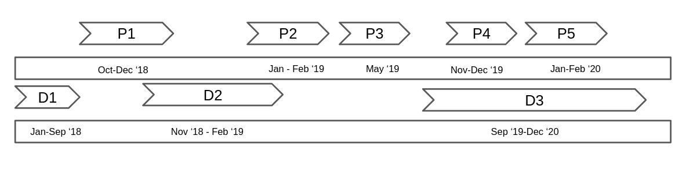

---
# all the regular stuff you have here
zotero:
  scannable-cite: false # only relevant when your compiling to scannable-cite .odt
  client: zotero # defaults to zotero
  author-in-text: false # when true, enabled fake author-name-only cites by replacing it with the text of the last names of the authors
  csl-style: harvard-manchester-metropolitan-university # pre-fill the style
layout: post
categories: chapter
title: 4. Methodology
---
-   [Methodology](#methodology)
    -   [Introduction](#introduction)
        -   [Outline of chapter (move up?)](#outline-of-chapter-move-up)
    -   [Introductory themes from the theoretical framework and
        RQs](#introductory-themes-from-the-theoretical-framework-and-rqs)
        -   [Defining the scope and approach of the methodology of this
            research as qualitative, general and
            exploratory](#defining-the-scope-and-approach-of-the-methodology-of-this-research-as-qualitative-general-and-exploratory)
        -   [Exploratory Nature - not set
            goals](#exploratory-nature---not-set-goals)
            -   [Iterative process with participant
                input](#iterative-process-with-participant-input)
        -   [Authentic and ecological nature of
            research](#authentic-and-ecological-nature-of-research)
        -   [General utility (Rich descriptions & holistic data
            collection)](#general-utility-rich-descriptions-holistic-data-collection)
        -   [Dual Role research and facilitator and resulting challenges
            and
            opportunities](#dual-role-research-and-facilitator-and-resulting-challenges-and-opportunities)
    -   [Project delivery phases and data
        collection](#project-delivery-phases-and-data-collection)
        -   [Recruitment and data on
            participants](#recruitment-and-data-on-participants)
        -   [Summary of phases and resources of the study
            -](#summary-of-phases-and-resources-of-the-study--)
            -   [On mutuality of design and practicalities of collection
                during
                phases](#on-mutuality-of-design-and-practicalities-of-collection-during-phases)
        -   [Table of methods of data
            collection](#table-of-methods-of-data-collection)
        -   [Data collection of journal notes and facilitation
            artefacts](#data-collection-of-journal-notes-and-facilitation-artefacts)
        -   [Use of Video data - 360 and Screen
            capture](#use-of-video-data---360-and-screen-capture)
        -   [Practicalities of data collection and
            processing](#practicalities-of-data-collection-and-processing)
            -   [360 Video Processing](#video-processing)
        -   [Collection of interview
            data](#collection-of-interview-data)
    -   [Data Analysis](#data-analysis)
        -   [Iterative approach of data
            analysis](#iterative-approach-of-data-analysis)
        -   [Summary table of data analysis - HERE OR AT
            END?](#summary-table-of-data-analysis---here-or-at-end)
        -   [S1 (stage one) - expansive stage of data
            analysis](#s1-stage-one---expansive-stage-of-data-analysis)
            -   [S1 Journal analysis (and evolving resources)
                data](#s1-journal-analysis-and-evolving-resources-data)
            -   [S1 Practitioner
                interviews](#s1-practitioner-interviews)
            -   [S1 - Initial video analysis - dipping a toe
                in](#s1---initial-video-analysis---dipping-a-toe-in)
            -   [s1 - Initial description of video data using a
                spreadsheet and 3 planes
                approach](#s1---initial-description-of-video-data-using-a-spreadsheet-and-3-planes-approach)
        -   [S2 (stage two) - exploratory phase data
            analysis](#s2-stage-two---exploratory-phase-data-analysis)
            -   [S2a - The original plan regarding quantitive thematic
                analysis](#s2a---the-original-plan-regarding-quantitive-thematic-analysis)
                -   [S2b - Defining of thematic analysis and video
                    coding - via an iterative approach to thematic
                    analysis.](#s2b---defining-of-thematic-analysis-and-video-coding---via-an-iterative-approach-to-thematic-analysis.)
            -   [S2a Prioritisation of sessions meriting deeper analysis
                (10?
                )](#s2a-prioritisation-of-sessions-meriting-deeper-analysis-10)
                -   [s2b Trail process of coding and Nvivo / Vlc
                    use](#s2b-trail-process-of-coding-and-nvivo-vlc-use)
            -   [s2b - Clustering of themes and later change of
                direction away from close thematic
                analysis](#s2b---clustering-of-themes-and-later-change-of-direction-away-from-close-thematic-analysis)
            -   [S2c - What actually happened - Revisiting the research
                questions and thematic analysis process based on initial
                clustering](#s2c---what-actually-happened---revisiting-the-research-questions-and-thematic-analysis-process-based-on-initial-clustering)
                -   [s2 Video analysis - ongoing thematic
                    clustering](#s2-video-analysis---ongoing-thematic-clustering)
                -   [S2 On trying to create a quantitive schema - case
                    study - e.g. participant roles and
                    interactions](#s2-on-trying-to-create-a-quantitive-schema---case-study---e.g.-participant-roles-and-interactions)
            -   [s2 abandon a quantitive coding /thematic analysis
                -](#s2-abandon-a-quantitive-coding-thematic-analysis--)
            -   [s2 Continuing a 3 planes
                approach](#s2-continuing-a-3-planes-approach)
        -   [S3 (stage three) - Consolidation stage of data
            analysis](#s3-stage-three---consolidation-stage-of-data-analysis)
            -   [s3 - Selection of vignettes for deeper
                analysis](#s3---selection-of-vignettes-for-deeper-analysis)
            -   [s3 Use of participant interview data & importance of
                process of
                triangulation](#s3-use-of-participant-interview-data-importance-of-process-of-triangulation)
            -   [s3 - Clustering and deepening the analysis of GDPs (as
                mediational
                strategies)](#s3---clustering-and-deepening-the-analysis-of-gdps-as-mediational-strategies)
                -   [s3 - Clustering and deepening the analysis of
                    design/ processes on learner agency / including
                    learning as
                    movement](#s3---clustering-and-deepening-the-analysis-of-design-processes-on-learner-agency-including-learning-as-movement)
            -   [s3 - Evolution of a conceptual model of
                learning](#s3---evolution-of-a-conceptual-model-of-learning)
    -   [Ethical considerations, validity &
        reliablity](#ethical-considerations-validity-reliablity)
        -   [Ethical considerations and
            processes](#ethical-considerations-and-processes)
            -   [Data validity, reliability](#data-validity-reliability)
            -   [Limits of / problems with video data
                analysis](#limits-of-problems-with-video-data-analysis)
            -   [Limits of interview data\_](#limits-of-interview-data_)
        -   [Generalisation of Research](#generalisation-of-research)
            -   [Data Replicability](#data-replicability)
            -   [Generalisation of
                Research](#generalisation-of-research-1)
    -   [Discussion on Methodology](#discussion-on-methodology)
        -   [How does this methodology relate to existing models of
            Change Laboratory & DBR and what does that add
            potentially](#how-does-this-methodology-relate-to-existing-models-of-change-laboratory-dbr-and-what-does-that-add-potentially)
        -   [Potential of this approach](#potential-of-this-approach)
            -   [Recap on the emergent and mutual nature of the design
                and research
                process](#recap-on-the-emergent-and-mutual-nature-of-the-design-and-research-process)
    -   [Limitations - MOVE MORE HERE](#limitations---move-more-here)
        -   [Limitation of demographics of
            participants.](#limitation-of-demographics-of-participants.)
    -   [Chapter conclusion and link](#chapter-conclusion-and-link)
    -   [Parked to replace or remove or
        rework](#parked-to-replace-or-remove-or-rework)
        -   [How Research Questions Evolved - JUSTIFICATION FOR CHANING
            FOCUS.](#how-research-questions-evolved---justification-for-chaning-focus.)
    -   [Parked - tables on data
        collection](#parked---tables-on-data-collection)
        -   [Phases and data Gathering](#phases-and-data-gathering)
    -   [Footnotes](#footnotes)

# Methodology

## Introduction

This chapter builds on the theoretical concepts explored in the previous chapter to explain how they are put into practice using a specific methodology to study the evolution of a game making community and the mutual creation of a new community-based pedagogy. In this chapter I cover the use of video recordings, participant interviews, and analysis of observational journal entries and resulting learning resources to achieve the systemic analysis previously outlined as typical of activity theory and CHAT-aligned design based reasearch (DBR).

The methodology of the data collection and analysis process is informed by cultural historical approaches.

### Outline of chapter (move up?)

this chapter describes:

- an overview of the design stages of the study
- data gathering and processing
- data analysis explored in stages
- comments on data validity, replicability and ethical considerations
- analysis of broad AT system (MOVE?)

First, an overview of activity use by phase briefly detailing the evolution of tools and processes.

A following section outlines the data gathering processes used at each stage before turn to the process of data analysis.

I will explore how this diversity helps triangulate findings.

<!-- As previously explored, the research questions invite a broad spectrum of analysis - cultural and social factors. -->
<!-- The depth justifies smaller data size and depth of analysis. -->

## Defining Scope & Approach

<!-- Following the more general demands of the process of studying a novel, emerging non-formal learning process addressed in the previous chapter and the research questions some key themes merit attention in this chapter.

While the are addressed in specific terms in data collection and analysis, they are summarised at the start in relation to the theoretical framework of Chapter 3. -->

In terms of a research process, this chapter describes a methodological approach based on the general principles of formative intervention, design based research and more specific techniques from social design based experiments  SDBE and Design-Based Implementation Research (DBIR) [@penuel_design-based_2021].

INCLUDE CITATIONS?

Without restating the full research objectives that the research questions address, the following simplified summary of the RQs in relation to the overall approach will help frame the contents of this chapter.

 | **Research Question (RQ)** | **Data Collection Methods** | **Data Analysis Approach** | **Theoretical Framing** |
 |----------------------------|----------------------------|----------------------------|-------------------------|
 | **RQ1: What contradictions emerged during participation in CGD&P activities, and how were they addressed via an innovative pedagogy?** | Video observations, participant & practitioner interviews, facilitator reflections, gameplay interactions | Systemic analysis of tensions, activity system analysis (contradictions as drivers of changes in learning resources), | CHAT (third-generation activity theory), expansive learning, contradictions as sources of transformation |
 | **RQ2: How can a collection of game design patterns support CGD&P, particularly regarding abstract and concrete dimensions of existing pedagogies?** | Gameplay documentation, screen capture analysis, participant reflections on GDP use | Coding gameplay interactions, thematic analysis of GDP mediation, comparison of abstract/concrete learning patterns | Mediational tools in CHAT, pedagogical scaffolding through GDPs, DBR iterative refinement |
 | **RQ3: How do learner agency and game-maker identity develop within CGD&P communities of practice, and what pedagogical strategies best support this evolution across diverse learning contexts?** | Longitudinal observations, interview data on identity formation & movement of FoK, community interactions | Thematic clustering of learner agency development, relational mapping of participant engagement, narrative analysis | CHAT (identity within activity systems), DBR (participant-driven refinement), communities of practice framework |

### Defining the scope and approach of the methodology of this research as qualitative, general and exploratory

This study is qualitative, general, and exploratory in nature, guided by design based research (DBR) and cultural historical activity theory (CHAT). By prioritising iterative, context-sensitive inquiry, it investigates learning environments in CGD&P without imposing rigid experimental constraints. The methodology is designed to capture contradictions, pedagogical tensions, and learner agency, using qualitative analysis to develop inclusive and adaptive pedagogies. Findings aim to enhance educational practices, rather than produce universally generalisable conclusions.

### Exploratory Nature - not set goals

Generally auth-ethnographic, uncertain aims, evolving research objectives,

The limitation of studies here from Denner et al?

In relation to the limitations, I embrace more detail on means, over ends.

This is justifible, as the evolution of a new methodology would have been hampered by setting end goals and strict evaluation, also the setting did not suit that.

Also to do with my practice, which can be resistant to self observations (see later section on challenges of dual role)

Some things have remained constant.

#### Iterative process with participant input

**Mutuality and evolving process**

MOVE SOME TO DISCUSSION OF THE CHAPTER?

I worked with young learners, local families and undergraduate student helpers to co-create a game making design via iterative phases of rapidly evolving interventions. The value of participant input to intervention-based research in the domain of technology use is well explored via participatory research  [@iversen_computational_2018-1; @iivari_critical_2017], design-based approaches [@papavlasopoulou_exploring_2019; @barab_design-based_2004] and formative interventions [@cole_fifth_2006; @blunden_formative_2023]. In line with these research perspectives, the development of the tools and processes used by participants in this study emerged in response to my analysis of participant experience and their direct feedback.

This process is evident in the evolution of the learning design and resources. For example, the trialling of the coding environment and starting templated occurred over the course of two years and with input and concrete additions from parent volunteers, graduate trainee-teacher students, undergraduate students helpers University colleagues and with more indirect ongoing feedback from participating young people and their guardians. Input took varied forms. Direct input was through help requests made by participants and feedback and structured end-of-course interviews. Indirect input came from research data in the form on the games participants created, my research journal entries on my interactions with and observations of participants and recorded audio and video data of the participants and their computer screen capture.

My role as a facilitator included recognising and supporting the emergence of a repertoire of varied emergent practices in the responses of participants, and then to support these practices with suitable tools and resources. In this way, I support participants to build agency in their transformation of learning process. The following three chapters of research findings in part describe these transformations and emerging repetoires in more detail.

### Authentic and ecological nature of research

The importance of context, historicity and cultural factors are particularly relevant for this intervention in a non-formal educational context with diverse stakeholder.

<!--
IS THIS NOT COVERED IN CHAPTER 3 - UNDER JUSTIFICATION OF APPROACH / THEORETICAL FRAMEWORK? -->

Barab and colleagues discuss the importance of creating value in the world in their ecosystem approach [@barnett_ecosystem_2019].
 This mirrors authenticity in applied social approaches - PBL as applied method of - situated learning ontology.

This impacts on recruitment, and on what data is gathered.

This impacted recruitment of participants and the nature of the session that ran. fitting in to an general pattern of external home ed provision, aligning with half terms.

The process of describing the varied sources of influence on the evolving design, learning as movements, horizontal etc.

This study, guided by DBR and CHAT frameworks,  embraces an authentic and ecological approach to research. The motivation for embedding pedagogical interventions within a real-world CGD&P learning environment, is to produce findings are contextually valid and socially relevant.

### General utility  (Rich descriptions & holistic data collection)

MAKE REESARCH WIDELY USEFUL... and replicable

THIS IS A BIT OF ASHIFT FROM THE ORIGINAL INTENT OF THIS SECTION, RICH DESCRIPTIONS OF X AND Y.

**utility of rich descriptions of Of levels of activity**

3 planes, following the close nature of activty that Rogoff described in CoL research.

requiring community and  individual capturing via video. Which also bring challenges explored in this chapter .

**Of Tool use and pedagogy**

Design narrative of Chapter 5, explore the rationale for the selection, creation and adaptation of both existing and novel tools and processes in each stage in line with the driving research questions.

**Guiding technical rationale guiding software use**

A guiding principle here is to use an ideally FLOSS toolset or if not practical to use non-specialist software available within or outside the university and free or low cost. This in line with the principle of software sustainability principles [@crouch_software_2013] in general, and in particular to allow the replicability of research not only by fellow researchers but by practitioners [@bonneel_code_2020]. Thus applying to two dimensions of replication of research methodology here, that of research and facilitation of project sessions.

### Dual Role research and facilitator and resulting challenges and opportunities

Driven by my dual role as a researcher and learning facilitator the process described here incorporates both research methodology and an overall structure of the evolving learning design.

TAS relevant, activist stance.

While my dual role presented challenges, such as balancing intervention with observation and mitigating positionality biases, it also created opportunities for deep engagement and pedagogical innovation. This dual role enables the exploration of tensions and contradictions in CGD&P while ensuring that pedagogical interventions evolve dynamically alongside participant needs.

Work on bias, or needs of the research process, addressed particularly by Cole in 5thD work.

Each data gathering session was also a 2 hour workshop with varied participants with diverse learning needs requiring planning and delivery.

## Data collection within project delivery phases

This section addresses both the phases of delivery of the game making programme to families and the data collection that occurred at each phase.

As the next chapter outlines the evolution of the learning intervention as a design narrative, discussion of learning design will be brief here and concerned with overall methodology of collection and analysis.

A summary of the delivery phases and one key development period are outlined in a graphical representation below in Fig 4.x. to help situate the following descriptions and discussion.

{width=98%}

Fig. 4.x Summary of delivery phases and development periods

<!-- Revise diagram here https://docs.google.com/presentation/d/1vR6dzFG6qXIdpB_-s6PbCePiB87qTs6YAXCljxNcb5Y/edit?slide=id.g360e8ce46fa_0_0#slide=id.g360e8ce46fa_0_0 -->

### Recruitment and data on participants

<!-- Home education groups operate in varied ways, and in my experience are characterised by loose ties rather than strong formal bonds. -->

In early 2016 I had carried out an exploratory workshop with home educators to explore future partnerships with the enrichment programme of the Faculty of Education [^el]. The process of recruiting was facilitated by the running of on going one off workshops which were similar in scope via the EdLab funologists strand of playful technology project. Specifically, half term events at Manchester Libraries and in the University and at Coder Dojo week end events.

This work meant I was in regular contact with some home educators and posting opportunities on their forum contributed to an ongoing relationship within the three existing home education communications networks used to share information and experiences [he]. To recruit participant I circulated a simple text to participants asking them to get in touch via email. When participants got in touch I emailed adults the relevant participation sheet and asked them to confirm their interest.

This process is covered in the ethics later in this chapter below.

<!-- WHAT IS THE FOUNDATION FOR ANALYSIS ?
CERTAINLY FINDING AND RESOLVING TENSIONS.

There is a framework for looking at tensions here.
https://onlinelibrary.wiley.com/doi/full/10.1002/sce.21254?casa_token=cBrHq4V42XUAAAAA:qLvlA17sLIGDHnxN_XqTgZpBDP39phmbLXVzu6QFn89LzBtXshp-y4hFVmi2CvmWTYdj50XNe2qSqg -->

### Summary of phases and resources of the study -

The following section  provides an overview of activity use by phase briefly detailing the evolution of tools and processes.

<!-- [Summary Table of phases](https://docs.google.com/document/d/1tBoXJWw-aZUcc8EsAvT195CtHLSM468YOCD0sGzOuoA/edit#) -->

| Name | Number of sessions | Number of participants [key] | Description of participant activities generating data  |
| ---- | ------------------ | --------------------------------------------------- | ----------------------------------------------------------------------------------------------------------------------- |
| P1   | 10                 | 5 (p) + 8 (c)                                       |  Exploratory phase, 3 larger groups of 4-5 participants of mixed ages,  paper planning notes from early weeks, basic text based coding tool set, data from asset creation tools collected with game code . See Appendix t.x  |
| P2   | 6   | 8 (p) + 11 (c) + 4 (sh) | Using game code template, smaller groups encouraged, more limited asset creating toolset, extensive supporting documentation used. See Appendix t.x  |
| P3   | 5 | 4 (p) + 8 (c) + 1 (sh)    | same toolset as P2 in addition a drama process and side missions . See Appendix t.x  |
| P4   | 6   | 4 (p) + 7 (c)  | MakeCode block based toolset introduced, . See Appendix t.x  |
| P5   | 5  | 3 (p) + 3 (c)  | More limited participants, MakeCode block based toolset introduced, . See Appendix t.x  |

#### On mutuality of design and practicalities of  collection during phases

APPENDIX LINK OUT

The process of creating resources also occurred in phases which had input from participants.

**Types of input by Participants**

Direct input was through requests and informal feedback and structured end-of-course interviews.

Indirect input was also at play in the form on the games participants created, my research journal entries on my interactions with and observations of participants.

<!-- D1 and D2:

D1 Before engaging with families in P1 I followed tutorials on Mozilla's developer community website on writing games in javascript. I had used Mozilla's Thimble code playground tool in earlier work teaching javascript, a snapshot of which is available as PGCE dissertation [@chesterman_webmaking_2015].

D2 - One-off workshops at Mozilla, Feral Vector and Manchester libraries events and to PGCE computer students helped focus and the creation of a game template and supporting resources. -->

<!--
P2, A game making course of 6 weeks. The template and resources created D2 were used as a starting point but still under rapid development based on informal participant feedback and my journal reflections.

Direct input was through requests and informal feedback and structured end-of-course interviews. Indirect input came from research data in the form on the games participants created, my research journal entries on my interactions with and observations of participants and recorded audio and video data of the participants and their computer screen capture.

P3 used the same toolset as P2 however in addition, drew on my previous work with the MMU Faculty of Education drama department [@caldwell_drama_2019] to create a simple drama process to give an external motivation and narrative to the creation of games using for a fictional audience of visiting aliens. The participant activity of these stages and tensions between system elements are discussed in detail in the remainder of this chapter and in following chapters.

The last iterations of the learning design adopted the MakeCode Arcade tool as a new game authoring tool [mc].
I adapted and advanced resources with an aim that they could be used within secondary classrooms to support computing curriculum.
The facilitation techniques and approach were adapted from those of P2 to facilitate the use of the block coding language . Tool use at this stage is also explored in a chapter in a collection on K-12 computing education [@chesterman_game_2023]. -->

### Table of methods of data collection

<!-- Online version here
https://docs.google.com/document/d/1jSE4UCEC7IleHi-tNfPwmVNTLUpzY5H5-do3bkHcLvo/edit
 -->

| Name                        | Details                                                   | Description                                                                                                                                                                          | Used in which Phases                                                                                   |
| --------------------------- | --------------------------------------------------------- | ------------------------------------------------------------------------------------------------------------------------------------------------------------------------------------ | ------------------------------------------------------------------------------------------------------------------------------------- |
| Screen capture data         | 72 recordings from 12 sessions                            | Captured in Flashback pro and stored as fbr                                                                                                                                          | P2, P3, P4 , P5                                                                |
| 360 Video Data              | 9 recordings from 9 sessions in P2 and P3                 | Captured in 360 Gear camera on mini SD card                                                                                                                                          | P2, P3, P4                                         |
| Journal entries             | 3 journals in  book form and 50 pages of electronic notes | Books journals contained planning, immediate reflections on sessions. Electronics documents focused more on evaluation of evolving sessions and problems encountered by participants | All Phases                                                                                                                  |
| Programme resources created | Diverse resources (see Ch. 4)                             | Evolved during each phase - kept in online spaces                                                                                                                                    | All Phases                                                 |
| Practitioner Interviews     | 4 x 90 min (average) interviews                           | Video and audio data recorded via a zoom meeting. Data stored as mp4 video files.                                                                                                    | After P3   |
| Participant Interviews      | 4 x 90 min (average)  interviews                          | One collected via zoom meeting and stored as mp4 files. Three recorded via flashback pro with screen capture to capture exploration of games and assets created.                     | After P3 |

### Data collection of journal notes and facilitation artefacts

Auto-ethnographic data collection

I used journal notes extensively in a notebook format and in electronic format within chronologically categorised word processing documents. These notes involved a mix of session planning, resource planning, immediate reflections on sessions, and notes on links with existing literature.

In addition, I also carefully collected the session resources themselves in terms of the tools used and supporting documentation and activities.

The games and artefacts themselves also are data of a sort.

**Rationale**

Principle of double stimulation, and adoption of tools for different purposes than originally intended.

Allowing movement, and mutuality,

link to 5thD and other studies guided by

Also introduce the process of Chapter 5 design narrative

**Practicalities and Challenges**

_Journal data formats_

- Book Journal pages
- Digital journal entries directly in response to teaching sessions
- Other subject specific journal notes.

**A challenge of data collection of artefacts**

In terms of the sustainability of the data collected. This was tested in the final stages of writing when the site on which the games and images were stored glitch.com announced it would stop hosting in July 2025. The data was migrated by downloading html, javascript, css and image files as a bulk download and reuploading to a git repository [gm].

Projects created in piskel were lost, but exported data remains.

_game data_

The process of keeping game data created within  online and available is tricky.
However, as files were HTML, js and css. Offline archives were created for later use. Helpful in case of Thimble as the project was discontinued.

WRONG!
As of the time of writing Glitch.com, the replacement remains. A selection of games created remain here [gg].

### Video data collection via 360 and screen capture

**Summary**

Screen capture is a process which allows the recording of data of what is happening on the screen of computers. It optionally allows the audio being played

I chose the software flashback pro primarily as it was installed on and available at low cost on home computers. No FLOSS equivalent was available. Flashback saves data in a format. This include audio, video screen capture, learner keystrokes, mouse movements and optionally one or more webcams. I decided not to record on webcams for the following reasons:

- intrusive feel - having the webcam on and the resulting red light on the screen, I felt was less conducive to feeling comfortable than one 360 camera in the middle of the room.
- less resources - recording webcam on the laptop
- reduced video file size of final data file
- less complexity when processing data -

It not possible to code the natively created files directly. Thus need to be converted to mp4 to import into coding software like Nvivo. In this process the keyboard and mouse data is lost.

**Rationale**

Video "rich" data collections

Environmental - i.e. in situ - and as a form of activity that fit within the pattern of home ed families existing activities.

### Practicalities of data collection and processing

While the rich set of data invites the cross referencing of the many sources, it also presents challenge on how to deal effectively with the large amounts of data being gathered. The use of a 360 camera reduces the amount of live video footage of interactions needed. Instead of multiple cameras pointed in different directions to capture participant interaction, participants are arranged in a square pointing inwards towards a central 360 degree camera.

Check viability of data at each stage of processing and movement.

<!-- I use a software sustainability approach also influenced by a personal modification of permaculture computing ideas and ideas of free software and open document approaches. The very nature of working with video is time consuming. -->
<!-- There is sometimes a danger of imagining how a new data gathering tool could be useful but then not being aware of all of the potential pitfalls which can make processing the data time consuming. Also  -->
<!-- On a personal note, I sometimes like the challenges involved and sometimes find them infuriating. It can be like a specialist knowledge which you can use as a currency, or as a hidden knowledge that you take pride in sharing. -->

<!-- I use a software sustainability approach also influenced by a personal modification of permaculture computing ideas and ideas of free software and open document approaches.

- Data portability and interoperability
- Software sustainability, in particular longevity
- Licencing - FLOSS licence ?
- If proprietary - then what is the business model?
- Is batch processing of files possible?
- It it a cross platform approach - in particular can I use it on debian based linux systems?

I also take a more practical approach which takes into account working with peers and that such advocacy is not a core part of my job or this research.

Such an attitude may involve compromises or hacking systems, software or processes -->

#### 360 Video Processing

The processing of video and audio data of both captured screens and 360 video data and high quality audio data involved several stages yielding advantages in capturing the gestures and facial expressions of potentially all participants in one recording. It does however present challenges. While this merits further exploration a brief summary of challenges is presented here.

The process involves large video files that are easily corrupted in transfer. While the files are split into 8 minute segments  but also can be confusing
- time navigation - also confusing - sometimes put up on the screen - but inconsistently
- moving and keeping a track of data from week to week and over years is complex.
- processing data requires special software - from samsung
- viewing data on a normal vlc player - needs extra processing using spatial media

<!-- Tech details are logged here - https://docs.google.com/document/d/1p6m20wehYkTeevj9QucpzKCR4NioELndg2rZeLWFK-c/edit# -->

This whole process is so demanding in terms of careful file management. Making me create a linux command line toolbox which is included as a technical appendix. [A draft of which is here](https://docs.google.com/document/d/1Y7MsZDY8ofvls5XO7tztSu8KFdClJo09o3qpWOdkb2M/edit?usp=drive_web&ouid=11432580350275268987)

<!-- Thus original files have been retained in order to cross reference that data if it is useful. It also presents other options for analysis which are similar to much more in depth analysis of HCI research of professional set ups. While this is beyond the remit of this study, certain uses do present themselves strongly for future investigation. Particularly the study of such data to identify common mistakes or frustrations when interacting with the user interface. Such misconceptions could be addressed in direct teaching at the start of the next session. -->

### Collection of interview data

Interview data collected for participants and for practitioners as the end of P3
- using Zoom as an online way, practical, and needed for the COVID restrictions.

Full transcription was not undertaken

<!-- AI versions are now much better, but present difficulities  -->

**Summary of background of interviewees**

Saskia Leggett is a researcher who was active in the in Creative Family Learning program under direction of Ricarosa Roque. She took a leading role in creating the programme's support resources. Matt Curinga is an academic at Columbia and teaches in educational technology and computer science. He is also active in a non-profit organisation, Zero Day Camp, promoting learning coding and engineering through engaging projects. Dave  Potts is a professional programmer and a parent and volunteer at Coder Dojo which is a volunteer run teaching technology monthly event. James Clegg is PGCE Computing student/teacher and volunteer student helper for the game making programme.

## Data analysis process

My study draws on traditional ethnographic methods of my journal as participant observer, participant interviews and analysis of artefacts used and created.

One of the challenges of adopting a naturalistic research approach is to work with material gathered to find and describe patterns of behaviour.

### Iterative  approach of data analysis

Video data analysis involved description and transcription of video data and thematic analysis of the contents.

Due to the exploratory nature of the research, and the openness to new directions, the process of analysis of the data gathered was  carried out in an iterative approach over several stages. The process is presented here in three stages, which are a simplified slightly in terms of categorisation into distinct stages. Progression through the different stages of analysis involved increasing granularity and focus, and to achieve this different forms of analysis were used. The use of stages was particularly needed in order to deal with the large amount of video data gathered for the different sessions.

<!-- THERE IS A CROSS OVER WITH THE GENERAL SECTION ABOVE HERE.
The process aligns with  -->
<!--
**Iterative approach to analysis** -->

<!-- NOTE - Import more from the post of 2024- 05 - 08 - in diary. -->

### Summary table  of data analysis - HERE OR AT END?

There is a table online here to summarise data analysis types

<!-- https://docs.google.com/document/d/1jSE4UCEC7IleHi-tNfPwmVNTLUpzY5H5-do3bkHcLvo/edit#heading=h.hpqiq8h52efk -->

<!-- LEANING TOWARDS KEEPING IT HERE.
BUT ADD IN STAGES IN WHICH IT HAPPNED
AND SIMPLIFY THE TOOL USE -->

<!-- Keep for formatting of tables
| ----- | ----------- | ------------------ | ------------------------ |

-->

Outer pipes Cell padding

| Stage | Technique                                                                      | Description                                                                                                                                                                                                                                                                                                                                                                                                                        |
| ----- | ------------------------------------------------------------------------------ | ---------------------------------------------------------------------------------------------------------------------------------------------------------------------------------------------------------------------------------------------------------------------------------------------------------------------------------------------------------------------------------------------------------------------------------- |
| 1 &2  | Making observations of activity based on 3 planes approach ( & practicalities) | Dipping into screen capture and 360 footage (VLC player) helped inform the smaller subsequent selection of data.     Observations stored in an excel spreadsheet, separate word documents on tensions and barriers in activity.                                                                                                                                                                                |
| 2     | Transcription of activity and conversations                                    | Simultaneous view of  screen capture and 360 footage. Actions and extracts of conversations Recorded into a word document   For the individual / pair their activity split into 5 minute sections and recorded in a word document time coded via a grid table format.                                                                                                                                                      |
| 2     | Exploratory Thematic Clustering                                                | Video capture data and 360 data in Nvivo   8 screen capture / 360 files from 5 group sessions analysed  This process was made complicated by the format of the data in video files and their extended length. During this period activity was coded based on an evolving schema which included design cycle stages, types of participant interactions and which game elements were being worked on by participants. |
| 3     | Revised Thematic Clustering                                                    | Video capture data and 360 data in Nvivo   12 screen capture / 360 files from 5 group sessions analysed  A revised thematic analysis driven by the different use of game design patterns GDPs and dimensions of participant agency.                                                                                                                                                                                    |
| 3     | Choosing and transcribing Vignettes                                            | Simultaneous view of  screen capture and 360 footage in VLC player. Practitioner interviews in VLC player  4 vignettes chosen and transcribed  A full transcription for a limited period of time with description and commentary on non-verbal aspects of movement and gesture.   Getting deeper into the pair processes at play and a deep sense of what an individual may be experiencing.                  |

### S1 (stage one) - expansive stage of data analysis

<!-- These interviews are not explored greatly in the course of the analysis thesis as the key emergent themes were not explored in depth by those participants as while they were working in similar areas, they did not address game making explicitly.  -->

The overall rationale of data analysis at S1 was to

  - check suitability of data to answer RQs and ROs
  - identify which data to analyse in depth to achieve this
  - check the mechanical and analytical processes for the next stage of analysis

Stage one of data analysis was designed as an expansive review, focusing on the suitability of collected data in answering the research questions and research objectives. This phase aimed to determine which datasets merited deeper analysis and refine the methodological processes for subsequent analytical stages.

The exploratory nature of this stage aligns with approaches of to iterative refinement in design-based research (DBR) [@bikner-ahsbahs_introduction_2015-1],

Also open encouraging methodological flexibility based on emerging insights rather than rigid initial coding structures.

#### S1 Journal analysis (and evolving resources) data

The process was driven by the requirement to create a summary of the facilitation process and some of the initial contextual tensions for a book chapter  [@chesterman_game_2023], and for a map of learning dimensions created during the D3 development period for online resources [^lm].

**Journal notes**

My journal entries contain notes and initial analysis of workshop sessions and resulting reflections on experimental design and facilitation.

The process of analysis of journal notes and resulting resources required a different approach from that of video data.

Journal Notes were used in the following ways: (perhaps code this)

- as a reflective tool after sessions
- as a note pad to plan resource creation
- as a sketch pad to explore the relationship between Concepts being explored and existing game making frameworks

The quantity of data prevented extensive and detailed coding using thematic analysis.

Instead, observations are triangulated with data from lit review to expose key themes and tensions.

My journal entries contain notes and initial analysis of workshop sessions and resulting reflections on experimental design and facilitation. Post-workshop participant interviews will gather information to support analysis of specifics of in-session interactions and relevant detail of wider activity systems of home digital use and other relevant interests.

**Resources created as part of game making**

Digital artefacts created as part of the game making process include text-based games, pixel art, digital audio sound effects and background music.

There were two main types of resources created.

 - supporting teaching / facilitation RESOURCES
 - games and game and assets created

The documentation and other forms of support evolved during each phase -

Chapter four explores the evolution of these documentation and learning resources created in response to participant need using AT as a tool for analysis of the existing and emerging contradictions in activity.

Examples?
<!-- - Linear support book and print outs to support participants in sessions
- Additional 3M model resources to help navigation and reflection and gameful approaches -->

**RQS**

The journal notes contributed to understandings of all research questions but in particular the sketching out of evolving tensions in workshops sessions and frequently revised resources.

The principle RQ addresses the formation of a game-making community.

This process is co-constituted by planners, facilitators, parents and children. The scope is broad, but a unifying factor is my own role as a facilitator and researcher. Thus journal notes are limited in terms of reliability and bias, they were vital in this first stage to set the overall direction for subsequent analysis.

<!-- AT allows an exploration these diverse sources of information as mediating artefacts which are the enabler and product of the shifting goals and outcomes of the programmes participants. -->

#### S1 Practitioner interviews

Practitioner data used in stage one of analysis along with themes from the literature review to identify themes for possible analysis.

The process of writing interview questions and the conversational process of semi-structured interviews helped expose new streams of thought, that which while present in existing researched helped bring them into clearer focus.

The interviews were semi-structured allowing me to ask follow up questions to gain more detail on areas of interest.  

The chosen interviewees represented a certain diversity in audience however as these interview are limited in number, resulting data are also explore in relation to existing research and no broad claims are made from this data alone.

Interview data from participants was particularly helpful to inform analysis of  barriers and tensions for both practitioners and participants which exist in this domain of creative coding projects.

- helped develop and deepen my reflection on key issues, to develop lines of thinking and to expose and explore barriers to participation in projects, tactics to address them and tensions

Themes included: agency as a focus came in part from reflections from Dave Potts in particular the value of surfacing and valuing the interests of participants in digital making,  the value and tensions surrounding competitions in non-formal settings from Matt C, the importance of the helping roles of parents in digital technology from Saskia Leggett, and reflections of the affordances of toolkits and use of game mechanics as a meditational strategy from James C

**RQS**
The practitioner interview data helped inform the broad themes of RQ1 and RQ3.

<!-- In my analysis, I have prioritised data which in forms the first research question and specifically addressing barriers and tensions for both practitioners and participants which exist in this domain of activity. -->

<!--
**Table of initial data addressing tensions included at end of Ch.5**
https://docs.google.com/document/d/1aEF0EsZRe-Ovok2VP7ouYH_v-SdepnNnXFhLtj6SseU/edit -->

#### S1 - Initial video analysis - dipping a toe in

Stage one involved initial broad analysis of the  video recording observations. The rationale was to get a sense of the quality and characteristics of the data and to begin evaluation of how much video data to examine in what level of detail.  

To begin the process I sampled video data of sessions selecting sessions in P2, P3 and P4. The 360 video proved most valuable at this stage to give a more holistic view of the activity on a community  level. Including, instructions and orientation to the whole group from me as a facilitator, movement of people around room, phases of session from intro, to pair working to peer interaction, Advantages included gestures, which at times helped disambiguate speech.

Disadvantages included a lack of clarity of audio.

Thus, at times I when some interactions were interesting, I would open up the screen capture file of particular participants. This allowed display of what was happening on their computer  

At this stage I took notes in my data analysis diary on the practical issues arising.

<!-- - Transcription and annotation of video capture footage in parallel with 360 data
- Coding of sections of video to both emergent themes and themes relating to the research questions. -->

Evaluation at this stage confirmed that full transcription of video data of all sessions was beyond the remit of the study.

And that P2 and P3 contained the most useful data to inform the research objectives.

Some initial observations and analysis of participant behaviour was recorded in a spreadsheet format (using the FLOSS libre office tool and MS office equivalent).
(LINK TO 3 PLANES)

#### s1 -  Initial description of video data using a spreadsheet and 3 planes approach

**This data was analysed, at a broad scale at this stage by noting tensions and behaviours, and in particular meditational strategies**

This was undertaking within a spreadsheet noted activity and tensions and meditational strategies as a list that emerged in initial review.

To help categorise these entries I using 3 planes of sociocultural activity.  Following the approach of Morcom [@morcom_scaffolding_2014] I drew on Rogoff's  [-@rogoff_observing_1995] three planes of sociocultural activity used to help understand activity in a Community of Learners.

<!-- SHOW AN EXTRACT OF AN EXCEL FILE - DATA - TIME - BROAD DESCRIPTION - WHY NOT GROUNDED? OR TO WHAT EXTENT WAS IT GROUNDED? IN THE AREA OF INTERPERSONAL ACTIVITY. -->

<!-- https://docs.google.com/document/d/1vpAIqHPg_Z0S5MWeS0rBTvxCL1N9NQButam4Ozq39Ek/edit# -->

While the three planes provided a higher level framework, specifics of the data gave greater granularity and formed I imagined / planned that later themes informed by LR would be used in the next stage of analysis.

<!-- Rather than taking a grounded approach this data was analysed using 3 planes of sociocultural activity. The existing relevant framework saves time, especially as a more emergent approach was  (in part ) in coding video data. -->

<!-- The process aligns with AT analysis in the scope of the activity - and in the separation out of the community level of the triangle added by Engestrom . -->

<!-- While more complex, the plane of more individual participatory appropriation, allows for alignment and then transfer to more formal learning environments. This then makes this research more relevant to class room and guided sessions. -->

### S2 (stage two) - exploratory phase data analysis

- original plan for quant thematic analysis
- choosing 10 sessions
- trialling nvvo
- coding schema , via clustering
- continue work on  spreadsheet 3 planes, breaking out into separate word documents

#### S2a - The original plan regarding quantitive thematic analysis

The imagined end point for the process was a full coding of as much data as possible using full transcription of session and a coding scheme which emerged from thematic analysis using the Nvivo software.

This would involve a mixed methods approach, with some quantitive data involved created by a systematic thematic coding of video data allowing time spend.

My initial plan concerning analysis of both forms of video data and participant interview data was to undertake a process of thematic analysis and subsequent coding. Thematic analysis is a process of discovering underlying themes within data and can be carried out in varied ways. Coding involves applying the themes emerging into a set taxonomy which can be applied to the data. In the case of both textual and video data I proposed to do this using the NVIVO software [nv]

This section will outline the rationale behind a shift to drop such the quantitative approach, thus signifying a shift from mixed methods to a purely qualitative approach.

**What themes were was considered but then excluded at s2**

A candidate schema for initial thematic analysis had emerged from s1 from literature review, early analysis of journal entries, participant interviews, and dipping in to video data.

This schema included the following broad categories.

The following themes  emerged as potential themes from LR, interview data and from initial clustering of data in Stage 1.

- Elements of Computational Thinking
- Systems Thinking Concepts
- Design cycle stages
- Participant roles and interactions
- Types of Gameplay Design Patterns (MDA)

Some of the themes were discarded relatively early in the clustering process, other remained for an extended time until a larger shift in thinking occurred.

Computational thinking and systems thinking were discarded relatively quickly in this process for the following reasons.
There is other extensive or focused work in these fields (previously explored in the literature review) on CT which this study which this study does not need to replicate. Systems thinking was promising however the data in P2 and P3 which became a chief focus of this study was not as rich in this area as later P4 and P5 data.

These themes which reflected possible learning outcomes in the emerging pedagogy, were dropped partly following a decision to de-prioritise the applicability of this research to formal settings, allowing a greater focus on non-formal settings and processes.

The following section examines this shift in thinking through one of those themes, that of roles and modes of interaction between participants.

##### S2b - Defining of thematic analysis and video coding - via an iterative approach to thematic analysis.

Thematic analysis is commonly done in stages, each revision building on insights of the previous one.

What it is in a nutshell. And what are the common stages.

Reasons to undertake thematic analysis and subsequent coding of  data include: to surface issue of relevance within data, to discover relationships and causality or at least correlation, and to organise instances of themes or behaviours so that the researcher can come back to get a summary of where that has been identified in the data.

<!--
from - https://docs.google.com/document/d/1p6m20wehYkTeevj9QucpzKCR4NioELndg2rZeLWFK-c/edit?tab=t.0#bookmark=id.k9kvu0182p6u -->

The practical process of running queries on data gathered via video requires selecting parts of that video and coding to a coding schema that has emerged from previous process of thematic clustering, revision and then formalisation into a schema. There is a possibility that the process may evolve understanding which may subsequently evolve schema and thus require re-coding.

While grounded analysis involves starting with no preset themes, the kind of analysis I undertook began with some themes that had emerged from interviews with practitioners and subsequent research which is summarised in the literature of  Chapter 2.
This decision was guided by x, who said y.

The advantage of using a coding software like Nvivo is the possibilities to compare and contrast different coding schema using coding comparison queries.
These queries within Nvivio are a potential powerful tool to identify x and y.

<!-- NEXT WORK ON THEMATIC ANALYSIS
Summary of thematic analysis - https://www.plymouth.ac.uk/uploads/production/document/path/18/18247/Kiger_and_Varpio__2020__Thematic_analysis_of_qualitative_data_AMEE_Guide_No_131.pdf

Search this for keywords and find relevant journal articles.
 -->

#### S2a Prioritisation of sessions meriting deeper analysis (10? )

**initial stage**

S1 process had indicated that full analysis of all sessions not possible. A first step was to prioritise some of the session to trial a S2 process.

To inform **prioritisation** of the video data at this early stage I began to formulate some guidelines to help prioritise sessions which included:  a wide sampling of different sessions, more in depth previewing of a few promising sessions.

**justification of selecting sessions and sections for more detailed analysis**

A word document containing a table of broad evaluation of the characteristics each sessions  helped to shape that decision on what sessions merited closer attention

Criteria  for inclusion included both practical and theoretical considerations, including: quality of recording, how much activity, richness of interactions, a range of different kinds of participant interactions.

MERGE UP
- Good quality recording
- Diversity of kinds of participants, ages especially
- Diversity of participant actions in terms of tasks being worked on
- Diversity of kinds of pair and peer interactions

The two last 2 sessions in particular in P2 jumped out at being rich in community interaction as well as focused work.  I coded 2 screen capture videos of  from each of those  in more depth.
(Mark and Ed and Susanna and Tehillah)

**Later stage**

Increasing number of sessions based on capactity

I also sampled p3 work as well which could be characterised as more calm and focused with extensive pair work happening.

##### s2b Trail process of coding and Nvivo / Vlc use

I first attempted to undertake a trial process of coding screen captured sessions within Nvivo using a initial candidate of themes (which ones?)

However I came into issues regarding the use of Nvivo to work with video files [vf]. Issue of video playback prevented a detailed granularity of coding. In addition the  

To counter these issues, I trailed a process of creating 5 min sections as a text transcript.
The large amount of video data in each session forced a partial transcription process which was in part descriptive and in other parts involved a closer transcription of the words spoken by participants.

This trail was in part successful, word document created in the correct format could be imported into Nvivo for coding and query.
Another reason prevented the further use of Nvivo.

Driven by a requirement to cross reference the video data of 360 footage with screen capture video, I researched a process to syncronise and display both sources of video side by side on the same screen. Vlc player has the ability to play multiple files simultaneously. VLC also had flexible (and configurable) playback controls of which in comparison to Nvivo made the process of transcription much less frustrating.

**Practicalities**

I some sessions I attempted to have a clock displayed within view of the 360 camera. However, this was not always practical.

Prioritise displaying time - have an old school clock under the 360 camera. For example.

**Implications**

The complications of video data coding in terms of granularity forced a reevaluation in imagined procedure.

Given that a systematic and granular process would be difficult, how necessary would  complex queries using multiple coding schema within Nvivo be. In other words would the gain justify the pain?

#### s2b - Clustering of themes and later change of direction away from close thematic analysis

I began clustering of potential themes for analysis using 10 selected sessions and transcribing them.

The process of initial clustering helped to get closer to the data and to :

- start identify to  thematic analysis of the stages of design with other learning models
- to identify roles through repeated patterns of interactions, and contrast to Barron's work
- to reflect and revise on the thesis questions

The process also allowed for a re-evaluation fo the original plan for coding.

<!-- **Original plan for a fuller coding of data**

I had planned  previous transcripts with notes were  imported data into nvivo and coded each of the 5 minute sections to the final thematic analysis. -->

<!-- A key driver of my research was to explore the potential to draw on family experience in learning activities by working with families to make games together. As the study evolved, the family dimension of interaction was only one of several which emerged as significant. However, it would be challenging to separate out the family elements from others as the social resource created by families working together proved to be significant. Thus additional behaviours between young people and supporting behaviours from student helpers may have evolved in a sense benefiting from this base platform. Thus it makes sense to  -->

<!-- BE SPECIFIC? -->

#### S2c - What actually happened - Revisiting the research questions and thematic analysis process based on initial clustering

<!-- SEE IF THIS FITS BETTER AT THE END OF CH.3.
BUT WRITE FOR HERE FOR NOW -->

Bakker offers guidance in the formulation of research questions in DBR studies which are relevant to this thesis [@bakker_design_2018]. He promotes HOW and WHAT CONSIDERATIONS formulation of question to be represent the exploratory nature of DBR approaches and to increase the possibility of possible generalisation without over promising in terms of projecting beyond the embedded nature of the findings as embedded in the context of the study.

Because the process of both formative intervention and DBR is exploratory with no set starting hypothesis, the process of formulation of RQs necessary one which is revisited as the process unfolds.

**RQ2 & 3 - Importance of GDPs already present and shift to agency**

The hybrid of DBR and formative methodology was chosen for its iterative, collaborative approach, which aligns with the study’s ethos of a detailed and systemic exploration of the expansion of the object of the game making pedagogy in an authentic and complex context. The Object of research here being in part the widening and clarifying research objectives.

GDPs were clearly emerging as an important meditational strategy and one which merited more attention due to gaps in research landscape.  

How can learners build agency in an evolving community of game makers?

This widening of  the scope of one of the research questions beyond impact of family involvement on a game making process to instead to focus on a diverse and complex picture of the development of agency as a community

##### s2 Video analysis - ongoing thematic clustering

I returned to the  partially transcription of the video capture segments in word documents using the 5 minute segments originally created for importation into Nvivo.

This had pros and cons. Pros include:

-  opening up lines of initial questioning which can be explored in future studies or triangulated with other data in this study.
- some sections clearly suited being transcribed in more details based on themes of interest, and the value of detail on gesture analysis also added. I kept a note of these time period and later used them as vignettes.
- Notes on the emerging themes could be kept in a sketchy text form within sections of word documents, and in tandem, notes could be added to a word document which outlines emerging thoughts on coding schema from themes and existing framworks which could inform coding process.

Doc of thematic analysis evolution -    https://docs.google.com/document/d/19PafC_w_7uObYL4v86IGeeFZTw2yKxjHfP_k85rHk_s/edit

Cons of this approach in general include:
-  breaking up video timescales into 5 minute sections lessens the ability to make exact claims
- not using either a predefined schema or a smaller data set and grounded approach was difficult
- trying this with a large amount of data was overwhelming at times.

##### S2 On trying to create a quantitive schema - case study - e.g. participant roles and interactions

I took evolving notes on coding of roles and interactions are in an online document here.

Roles are different from interactions existing on a higher order of anaysis.
Repeated patterns of interactions can be seen to develop into roles.
Thus a more grounded approach may concentrate initially on interactions and develop this to become roles through analysis. However, many roles exist in other similar domains.

For example, the work of my own staring point when coding was guided by Barron and colleagues work on the roles of parents as learning partners [-@barron_parents_2009]. The roles are as follows: Teacher, Collaborator, Learning Broker, Resource Provider, Nontechnical Consultant, Employer, and Learner.

I made adaptations which were significant in guiding later analysis . The process of adaptation involved two significant shifts

- mutual nature of interaction, not focused on parental roles exclusively
- the value of peer interaction of the community
-
The drawback of this approach was the fracturing of the categories which felt to me to detracted from an ability to analyse what was particularly significant about the experience in terms of the research objectives.

The wider helping interactions, again while useful had drawbacks. Firsly, they were so numerous. Secondly, given the existing work of a general scope of digital making by Barron, it was not clear what I would add in terms of contribution to knowledge beyond broadly confirming it in the scope of digital game making.

This led to two things
- revising the research process to return to a more holistic approach using 3 planes
- revisiting the research questions and objectives to reflect the emerging sense of what was important.

#### s2 abandon a quantitive coding /thematic analysis -

**developing clustering  via examples and consolidation**

By abandoning strict coding, I de-prioritised the comparative approach possible by Nvivo queries.

This is justified by wanting to cover a greater amount of data, to surface novel themes and describe them in detail using a high granular approach (vignettes)

Dropping design stages as a schema, for justification and implications see discussion in chapter six.

While I did not progress to a systematic coding of video data of  emerging themes. The process of clustering themes in preparation was essential to surface the themes which did emerge for closer observations. Requiring changes to RQs and ROs

Thus categories of new uses of GDP and patterns of agency development in this domain were identified in S2 via 3 planes analysis .

and then described via word docs which categorised the uses of GDPs and exposed tensions in designing for learner agency (which I had not fully explored before analysis began)

**An example of a case where complexities that resisted coding**

Take for example the process of Da in 2019-05-08 - where he was leading some fairly advanced work on researching and reading developer documentation and the constructing a new design pattern.

There are competing and overlapping intention and foci here for the participants.
 - Solve immediate problem - add new pattern
 - communicate cultural practice of finding, reading and adapting developer level documentation and help from forums.
 - give hands on experience to the notice coder

Most clearly there is an overlap here between the interpersonal working on a code problem collaboratively for educational purposes and the interactions with the wider cultural artefacts and practices from a professional environment.

In addition the personal plane was perhaps the most problematic to address given the data gathered.
Even when participants were demonstrating their personal knowledge by sharing back or directly altering game code, this was as part of a social and cultural practice.
Thus my interpretation involved ....

#### s2 Continuing a 3 planes approach

As the process of transcription continued, I added to the document outlining meditational strategies.

The advantages of drawing on funds of knowledge, and the activities that I used to do this, as well as connecting to wider communities are address well with the plane of culture, in the concept of Apprenticeship.

<!-- when coding I started with some preset codes from the literature for examples Barron's codes on parent roles when helping digital projects. However, as coding progressed, I modified and extended these codes to better match the data I was working with

Specifically, the following were removed from Barron's typology, parent as employer, non-technical consultant. Learning broker and resource provider were merged as some of the detail of those roles involve take place outside of the learning environment being analysed in coded video.

I judged it appropriate to and less complex to analyse and code the interaction between participants rather than code the behaviours by participant type. -->

### S3 (stage three) - Consolidation stage of data analysis

Stage three progressed to a finer level of analysis with data selected for a greater granularity of

Some sections chosen as exemplars for broader themes emerging in the data at S2.

Thus serving two purposes, a greater level of examination, in particular to inform thinking on use of GDPs and  development of participant agency; and as a source of evidence to support the findings of the following chapters.  

Final clustring, and GDP categoriesation, Use of vignettes, and triangulated with interview data.

#### s3 - Selection of vignettes for deeper analysis

- Full transcription of key moments: and description of participant activity, activity on screen including simple gesture analysis

Used in chapters to orient the reader

**Incorporating  movement around the room in analysis**

The 360 camera allowed for side by side analyis of the group, pair or individual working. Due to the layout these were cluster often around a laptop.

In the initial stages of transcription and description having this data was extremely useful to disambiguate spoken statements.

As a personal experience of describing and transcribing even thought it was a significant amount of work to synchronise and then to play both video sources side by side, the additional information really aided the description process in adding detail to the interpretations of motivations of participants.  

For an example see the vignette in appendix 6.x (Suzanna and Olivia) chapter 6 which details the movement and behaviours of the child away from the computer as an example of legitimate peripheral activity.

**Simple gesture analysis**

Feedback from a Ricardo Nemirovsky a review at the RD2 stage in response to the sharing of a prototypical vignette prompted a greater incorporation of gesture analysis[@nemirovsky_gesture_2012; @nemirovsky_conversations_2021]

It is limited here to broad scope and therefore does not address x and y

At times gestures helped clarify some things that were unclear from audio and screen capture data.

In some exchanges, 360 data was vital to disambiguate spoken word interactions. In particular, in deictic verbal referencing, where unclear statements were clarified with pointing or other gestures was common.

Gestures were also used often to communicate planned  game movements on screen, or for other on-screen actions or procedures, e.g in Vignette x, indication of action of cropping an image.

<!-- Notes
A start of a framework here from Salen
https://docs.google.com/document/d/1pK-m0Ecymixw6YhH1FdwS1ZlnFoYhLmQojDnnnxDysY/edit
more notes Here - including MDA framework.
https://docs.google.com/document/d/1bLsRf2wjdKYVmiB8W7f0XYTikBOxMDIY2rAEGK0dPmw/edit#heading=h.4nad7a137op4
-->
 <!-- The analysis of these resources using the three planes involved a choice of some of the following
- using a spread sheet and putting categories and notes in to columns
- using a table in word to record notes on data in-situ -->

<!-- The video data explored in nvivo is very time consuming, and given this and the factor that the transforming reflections into  learning resources, already involves a process of filtering, a much courser level of data analysis. -->

<!-- However, using a static text only approach such as describing data in prose or using a table in a word document does not allow for filtering based on themes which is potentially useful as an analytical too.   -->

<!-- Thus using MS Excel as a simple way to collate data without translation seems appropriate. -->

#### s3 Use of participant interview data  & importance of process of triangulation

Participant interview data mostly used to confirm and triangulate with video data from making sessions

Post-workshop participant interviews gathered information to support analysis of specifics of in-session interactions and relevant detail of wider activity systems of home digital use.

ANALYSIS  - NOT SURE ON THIS YET IN TERMS OF ORDER OF THINGS - PERHAPS REFLECT THAT.

These interviews took place at the end of P3

At times the resources that were created were brought up on the screen during capture.

Interviews surfaced important data about home use of games and learning relationships.

These interviews allowed triangulation and confirmation of data observed in video recordings.

They were important to confirm initial researcher conclusions before a final process of closer video data analysis.

**Limitations in interview data**

In retrospect, shorter interviews at more regular intervals with participants would have been useful to answer

#### s3 - Clustering and deepening the analysis of GDPs (as mediational strategies)

This is not strictly , instead the process followed these stages

 - identification of GDP as an important theme
 - listing of GDP mediational uses in 3 planes doc, and in 10 transcriptions
 - collation in S3 of those themes and identification in vignettes for closer study,
 - triangulation with interview data & games created

The resulting data and analysis is explored in chapter 6,

In addition additional analysis using the model of PRIMM, semantic waves and LOA  developed  in Ch.7

<!--
I'm not sure how to introduce this.
Perhaps don't. Instead go with overall themes in three planes.

      - in personal appropriation of concepts
- assisting project navigation
- scaffolding ideation processes
- aiding division of labour
- GDPs in technical processes
- facilitating designing for others
- GDPs used as concepts in playtesting
- playtesting used to propagate GDPs
- facilitating use of home knowledge via GDPS -->

##### s3 - Clustering and deepening the analysis of design/ processes on learner agency / including learning as movement

<!-- NOTE  I would say no - too complex for coding  -->

REMOVED AS PROPOSAL BUT INSTEAD HOW TO ADDRESS THIS?

FIND ANOTHER FRAMEWORK FOR AGENCY AND CODE TO THAT.

Answering RQ - on pedagogical resources / agency / use of GDPs

THIS IMAGINED FOR CONCLUSION BUT ALSO CODE TO IT? OR ABOVE?

- learners developing agency through personal expression of home and other Identities
- agency through choice over pathway via GDPS
- agency through flexible design cycle pathways, especially via community playtesting
- developing agency through celebration of different game maker styles
- authenticity of tool use, especially docs and access to Community
- authenticity of audience - and role of drama to facilitate reflection

<!-- In this process, tensions emerged which impacted my framing and understandings of the research questions.
HOW?  -->
<!-- These tensions were driven by practicalities, the needs and interests of participants, and my interests my needs / interests of myself as a researcher. -->

 <!-- See the thesis by Digital Game Education: Designing interventions to encourage players’ informed reflections on their digital gaming practices Rafael Marques de Albuquerque
 As this is done very methodically
 -->

<!-- 1.  What pedagogical tools and processes are available to support novices to overcome barriers to game coding and design?
2. How can learners build agency in an evolving community of game makers?
3. How can game design patterns support the development of coding practices with novices? -->

#### s3 - Evolution of a conceptual model of learning

Analysis also involved developing a conceptual model for learning with agency development and movement between learning spaces at its root.

This is developed and advanced in Ch.7

## Ethical considerations and validity

### Ethical approval process

<!-- The design of the research experiment and learning I started from a very open position and has evolved from several iterations of collaborative work with participants. -->
<!-- Recruitment details online HERE of call out.  
https://docs.google.com/document/d/119S3Q7QTplF1hw1MiK02IHO3XvyvxgUsAObw0pWMXhU/edit#heading=h.ilc3cz3teyb6
And as a publicallly available archive of thr email list.
https://groups.google.com/g/mozilla-html5-gamemaking-mcr/ -->

Ethical approval for this study was obtained from ESRI ethics process using the ETHOS system to ensure that all research activities comply with the guidelines for research involving human participants. Inclusion criteria included being part of a family (including guardians) unit with the ability to travel to the Manchester Metropolitan university campus campus. Younger family members will be between 7 and 13 years of age. All participants will have an interest in learning to make digital games together as an educational project. The project requires that they have literacy abilities to be able to read and write English.

Participants were be identified by involvement in activities linked to Manchester Met's EdLab programme and that of Coder Dojo activities via an open call on email to interested parties. In addition to address a wider diversity of participants in terms of  to Alternative arrangements may involve an open call to the Greater Manchester Home Education Network internet forum. In the ethics application I noted that participants may be excluded from studies if there is a over-representation of one gender or ethnicity over another. In practice all applicants were accommodated as the gender and ethnicity balance was broadly representative of the home education groups in the local area.

Given the involvement of three different participant groups of university students, parents, and children, I adapted assent forms, participant information sheets and processes to requirements of each group. For parents, a detailed assent form explained the study’s purpose, how data from children would be collected and managed, and the rights of parents, including their ability to withdraw themselves and their child at any time. For children, a simplified assent form was created using age-appropriate language. This form explained the study in simple terms, emphasising that participation was voluntary and that they could withdraw at any time without negative consequences. Written assent from the children was obtained as part of an informal discussion involving both children and parents. University students were also provided with a assent form explaining the study’s purpose, their rights (including voluntary participation and the right to withdraw without consequence), and data usage. They were given the opportunity to review the form and ask questions before providing written consent.

To ensure respect for the autonomy of all participants, particularly children, alternative activities were offered as part of the recruitment process for those who did not wish to participate in the study. This was important in settings where families may have felt a pressure to take part in research in order to benefit from the social or educational opportunities.  

It was not possible to anonymise video, audio recordings at the point of collection, however is has been anonymised in the process of data analysis through the use of pseudonyms.  The raw video data and additional data from the project has been stored on a password protected external computer drive, separate from the research data. Only the lead researcher had direct access although the ethics approval process gave project supervisors may be given access on request. I took care to not allow any personal data into the public realm as part of the research on analysis process.

As the study involved children additional safeguards were in place. All university students assisting with the study, as well as myself as the primary facilitator, had undergone Disclosure and Barring Service (DBS) checks as part of the EdLab studies programme. Activities involving children were conducted under the supervision of a parent or guardian, who could withdraw the child from the study at any time. Children were reminded, in terms they could understand, that they could opt out at any time.

<!-- Motivating or other effect of being part of a research project (Eliza) may be present. However, this study does not make comparative claims. -->

<!-- **Practical factors**
Key contextual factors have facilitated and shaped development of the research design including:

- Impact of research practicalities
- The location at the university -->

<!-- Eliza effect? If so how relevant? -->

<!-- For example, the ability to have that number of identical computers for this audience in particular drove participipation to be in a university setting.   -->

<!-- and using this shape of working which was determined by technical reasons but which had an impact nevertheless on the ability for students to move around the room and the absence of a front for the teacher to teach from. -->

<!--
Generalisation is covered in this thesis.
https://docs.google.com/document/d/1GQf0OvKs07tY-VKDnB7K94F_kHVW7M1Vz0NlLm1t1WE/edit
Imagining a constructionist game-based pedagogical model: Using tabletop role-playing game creation to enhance literature education in high school English classes -->

#### Data validity, reliability

<!-- **and decisions of what to not analyse** -->

The issues addressed in this section relate not only to the guidance methodology receives from the theoretical underpinnings explored in the last chapter but also the concerns of the driving researcher questions.

Issues of reliability and validity in research are significantly complicated when viewed through a post-objectivist critical stance, as exemplified in the previous chapter by Stetsenko's transformative activist stance, which challenges positivist paradigms of research as a neutral endeavour in terms of values of those undertaking it [@stetsenko2014transfromative]. While, a full investigation of the Stetsenko and other's rejection of an objectivist research approach is beyond the remit of this chapter, it supports the inclusion of my own auto-ethnographic journal as a valid source of data.

In general terms data validity refers to match between the findings of the study and what is happening in in practice.  Turning to a more established exploration of data validity,  Bakker's [-@bakker_design_2018, p.88] exploration of the issues of data validity in DBR is well suited to the diverse data gathering methods of this study.

<!-- While Bakker notes need for different approaches for qualitative approaches  [@lincoln1985naturalistic] - he uses conventional terms of validity and reliability -= rather than specialist terms of Lincoln and Grub  -->

The strategies in this study are broadly, data triangulation, the use of rich descriptions, and a process of checking your interpretations of activities with participants (member checking)

**Use of rich descriptions**

Hoadley calls for rich descriptions of the learning design, a process which is applied in this thesis as a design narrative in Chapter 5.

Similarly, rich descriptions of the interactions of participants with the learning design, their own project creations and each other are included in the data results in small extracts, or where appropriate more extended vignettes. These allow for a fuller exploration of the learning processes in a richer context. Some details of interaction are needed to give other scholars and practitioners a full picture of interactions. The descriptions of facial reactions or body language in the vignette descriptions serve this end.

**Data triangulation**
<!-- Draw on other chapters to represent overcoming of weaknesses of design-based approach. -->

Having a wide based on data allowed data triangulation at the analysis stage. When

One form of triangulation is member checking where participants are asked to confirm and share information which supplement video data.

As an example, in interview data a participant who expressed frustration in the moment about a form of disruptive practice of another participant, was able to place that frustration in context.

### Generalisation of Research

#### Data Replicability

The elements of the design are online and included in appendices.

This study faces an issue of being culturally embodies, thus think descriptions of context are needed here [@hoadley_creating_2002].

The final chapter addresses the need to replicate this study in different contexts and the challenges involved in replicating the spontaneous emergent elements of specifics of this study.

As such chapter four can be conceptualised as a design narrative (see [@hoadley_creating_2002]) to address the common deficit of detail of the designed product and process. "the usual study presents a technology fully formed as if it had risen from the oceans like Venus herself"

" Would that all interventional research included this kind of rich description of the “treatment” so that one might infer whether the results were applicable elsewhere."

#### Generalisation of Research

Generalisation is one of the guiding principles of DBR. While results are intertwined with context, designs should be assessed for generalisation to other settings.

Explore this in more detail - draw out a debate on how situated learning in this context - and wider debate is.

- More than one iteration.
- In different settings
- Using different with different software

This is potentially complex to describe but worth it if wanting to talk about generalisation.

NOTE - This could be dropped or picked up again in the limitations section

The process of exploring this guided the development of the research questions.

### Limitations of interview and video data

The choice of the videos to code more fully is rather skewed towards finding interesting data. Thus it may not be fully representative of the experience of all participants.

Choosing in a different way - around less interaction - would expose more barriers to participation to game making using the 3M model.

<!-- For example in
https://docs.google.com/document/d/1GQf0OvKs07tY-VKDnB7K94F_kHVW7M1Vz0NlLm1t1WE/edit
Imagining a constructionist game-based pedagogical model: Using tabletop role-playing game creation to enhance literature education in high school English classes -->

Only suitable pairs were chosen. This removes a lot of validity from any generalisation of claims that could be made.

Breaking of data into 5 min sections is practical but does not allow for some of the finer interactions and changes of behaviour to be accurately coded.  There may be some value is coding some key interactions more carefully in more granular detail.

<!-- The game elements / design patterns categories which are presented are created as a design guide rather than on exact principles.
It is possible to code drilling down into another level. This might yield more results. -->

In summary, the coding process is more valuable as a tool to allow more qualitative reflection and analysis rather than a quantitative process as attempted above.

To make a quantitative approach work better X,Y and Z would need to be in place which was not suitable for this study because of A and B.

<!-- How much emphasis to place on the Thematic Analysis is questionable. The process served to help answer the research questions in general way as an additional interpretive tools to aid researcher reflection and to help get close to the data. -->

<!-- I am guided by approaches which use video to develop both in-depth thematic analysis and broader narratives such as case studies [@derry_conducting_2010]. I use a variant of discourse analysis to explore interactions of participants captured on video recordings. Mercer and colleagues identify discourse analysis as a loose associations of methods to support linguistic analysis of interactions to identify emergent patterns [@mercer_methods_2004]. While a common pattern in classroom interactions is that of IRF, initiation (teacher), response (student) and follow up (teacher) [@sinclair_towards_1975] , the inherent assumption that a teacher will be leading an activity will not consistently be appropriate for my study; although at times a parent may take this role. Other discourse analysis frameworks that take a sociocultural approach [@lyle_investigation_1993; @phillips_beyond_1985], and specifically those from project focused studies [@hmelo-silver_facilitating_2008; @moje_maestro_2001] allow more detailed treatment of the incorporation of tools and cultural artefacts into a collective discourse. -->

<!-- To avoid distraction from AT as my principle analytical framework I am in agreement with Wells (1999, p. 172) who proposes the use of AT's concepts to situate 'spoken discourse \... as one, but only one, of the semiotic tools that participants use to achieve the goals of action'. Thus Wells proposes that analysis of dialogue should take place in combination with other action not involving talk and in relation to wider activity goals. -->

#### Limits of interview data_

The chief limit is the lack of repeated and regular interview data.

The reason are mostly practical, fitting in additional interviews with families withing a busy schedule.

It was depriorisited and less interviews were conducted than anticipated, and not as regularly.

This reduces factors of reliability as it reduces possibilities for

And prioritising more hands on work which was perceived as more benefitial and welcome by myself.

## Discussion and limitations

### How does this methodology relate to existing models of Change Laboratory & DBR and what does that add potentially

Keep this brief.

The smaller time frame of iterations, and more direct intervention in the ongoing / leading activity distiguishes this approach from a Change Laboratory. However, the analysis of tensions, and thus double stimulation to provoke evolutions of agency are alike.

### Potential of this approach

NOTE - WHAT KIND OF DISCUSSION WOULD BE NEEDED HERE?
A RETURN TO POSSIBLE BARRIERS THAT THE METHODOLOGY AIMS TO OVER COME

#### Recap on the emergent and mutual nature of the design and research process

The experimental team consisted of home educating partents, young people families, students. All inputted into subsequent iterations of the game making program both directly and indirectly.

The presence of parents in particulary, adds significant opportunities. I propose that this informal and exploratory setting with the participation of engaged parents, young people and their access to family learning dynamics and wider expertise provides potentially fertile ground in the generation of resources and domain practices. I explore the potential of this theme in more detail in the conclusion of this thesis.  

## Limitations of overall methodology

Address limitations of methodology and RQs here so that I don't have to in the conclusion.

- Ethnicity

Denner et al. [-@denner_does_2019]  identified several general points of limitation in studies within their review of CGD&P specifically.
FIND LIST -  demographics, pedagogy, etc  

This study does not aim to address all of these limitations. Indeed it shares many of them.

Thus while limitation are acknowledged, they are justified by the exploratory nature of this study. Possibilities for follow up research to address these limitations are discussed in the concluding Chapter 8.

**Limitation of space to describe technical decisions**
Fuller technical descriptions of the tools and supporting resources used at each stage are beyond the scope of those questions and the limits of the structure of this thesis, fuller technical descriptions to and links to the online resources created are available as appendix 4.x.

#### Limitation of demographics of participants.

In gathering data, I adapted a process from partnership work with more experiences professors.

This did not gather details of demographics. Thus no data was gathered on the age of participants, any details of specific learning difficulties.
- Details of neuro-diversity

While this was an oversight, but it also aligns with the aims of this study which are exploratory and investigate potential rather than making claims of efficacy and generalisability. This is explored in a later section.

## Chapter conclusion and link

The next chapter focuses in more depth of the mutual evolution of the learning design in a way which aligns with the design narative technique of DBR (hoadley? - find others!)

In line the ethos of formative interventions and DBR this chapter has outlined a methodology which aknowledges the roles of my own input as a scholar/activist and that of participants. The process of working with participant input to the design of the learning intervention served several functions including: access to novel technical approaches proposed by parents and university volunteers; the surfacing of systemic conflicts hidden from my initial perception stemming from my pre-conceptions; observation of participant conflicts spurred the introduction of new tools to support development; and parental proficiency in adapting the learning environment to supporting their children leading to community-wide innovations in practice.

This chapter has described a hybrid approach based on the principles of the Helsinki school's interpretation of  formative intervention, supplemented by naturalistic research methods involving gathering data in-situ to find and describe emerging patterns of behaviour via thick decriptions and the more rapid iterations into the working practices common in DBR in the learning sciences and HCI approaches.

My role as a participant facilitator, designer and researcher presents some challenges which this chapter has addressed. While some decisions were to an extent intuative or reflexive based on my past experiences as a facilation of group productive processes involving technology, and for some this would present issues of validity, the process is in line with a TAS approach.  While my auto-ethnographic notes are too extensive to effectively bring into the data analysis process, they chart the complex and iterative process of refining this reflection into learning and teaching resources. Several samples of journal entries are offered as evidence of this process in Appendix. 4.x

LINK

While the phases and overall structure of the learning design have been presented here, the following chapter, using the a technique of design narrative, explores the evolving areas of contradictions that drive these changes to the evolvling and expanding object of the group game making process.

<!-- Barab and Squire [-@barab_design-based_2004] describe the messiness of design-based research and that this creates a challenge to the researcher of how to present results in a coherent way which is of use to other practitioners. There is a tension between sticking closely to the context of the research and the concrete specifics or stepping back to generalise and being lost in abstraction. Here, I try to strike a balance which stays concrete but which also pulls from my observations a framework which may translate in to other game-making and creative project based approaches.

Another guiding principle of design-based research - which is present in the techniques of design experiments, mutual appropriation and participatory action research - is that research participants also influence the ongoing design of the research [@barab_critical_2004; @cobb_design_2003; @downing-wilson_design_2011]. The design of the research experiment and learning I started from a very open position and has evolved from several iterations of collaborative work with participants. One experimental team consisted of Home Educating families another involved local primary schools with Year 6 (10-11 year old) classes. Learners acted as researcher participants to guide the next iteration of the game making program both directly and indirectly. Direct input was through requests and informal feedback and structured end-of-course interviews. Indirect input came from research data in the form on the games participants created, my research journal entries on my interactions with and observations of participants and recorded audio and video data of the participants and their computer screen capture. -->

<!-- I have carried out six phases of pilot workshops with home educator families. I will outline the core activities that have taken place including only the most basic detail on tools used. In following sections, the development of toolsets are analysed in greater depth. The core of the game making programme, which emerged in the first phase and has remained, is a starting template of a simple platform game which participants alter to make their own. The evolution of different versions and locations of this starting template has proven to be a key marker of the progress of the programme. The timeline of phases of activities is outlined in the following table.

 Phase   Date                       
 Game Template / Making Tool                                                                                           Type of Data Gathering

  1       Oct 2017-Mar 2018          At start - No template to start\                                                                                                                                                                                                                                                                                                                           Journal notes on design, informal participant evaluation                                      At end - [Th](https://codepen.io/mrmick/pen/dZwKZd)[is](https://codepen.io/mrmick/pen/dZwKZd)[P](https://codepen.io/mrmick/pen/dZwKZd)[haser ](https://codepen.io/mrmick/pen/dZwKZd)[tutorial](https://codepen.io/mrmick/pen/dZwKZd)[ template.](https://codepen.io/mrmick/pen/dZwKZd) (in Thimble.mozilla.org)   

  2       Summer 2018                Simple Game to Edit v.1 ([Code Pen](https://codepen.io/mrmick/pen/wXMMXR))                                                                                                                                                                                                  -----------------------                                                                                Journal notes on design

  3       Jan-March 2019             Simple Game to Edit v. 2 ([Glitch.com](https://glitch.com/edit/#!/simple-game-to-edit?path=js/game.js:1:0))                                                                                                                                              Extensive journal notes on participation and evolving design, some screen capture data, participant interviews, one session 360 camera

  4       May 2019                   
  Grid Game Template [(Glitch.com)](https://grid-game-template.glitch.me)                                                                                              
  Journal notes on participation, screen capture data, participant interviews, all but one sessions 360 camera

  5       October -- December 2019   
  Make Code Platform Duck Run ([madecode)](http://tinyurl.com/runduckrun)                                                                                                                                                                           Journal notes on participation, extensive screen capture data, participant interviews, all sessions 360 camera

  6       Jan-March 2020             
  Make Code Platform Duck Run ([madecode)](http://tinyurl.com/runduckrun)                                                                                                                                                                               -->

## Parked to replace or remove or rework

<!--
#### Why not use constructivism / constructionism

COMPRESS THIS - ALMOST DROP TOTALLY - NOTE THE GENERAL ALIGNMENT OF CONSTRUCTIONISM WITH DBR METHODS

Hay describes DBR thus "learning occurs within a context of use, learning is frequently collaborative, learning as authentic, learning as inquiry-based not transmission-based" [@hay_constructivism_2001] p. 3. Thus the broad claims are in alignment with wider socio cultural approaches.

Cobb [-@cobb_where_1994] identifies two broad schools of constructivism, one focusing more on individual cognitive processes which follows the work of Piaget and the other drawing on the academic lineage of Vygotsky which locates knowledge formation as a cultural activity.

NOTE - THERE IS IMPORTANT WORK HERE ON AUTENTICITY- and the potential tensions with agency - ie if authenticity is working a the elbows of professionals, students have less ownership over the process.  [@hay_constructivism_2001, p. 34]

**Constructionism as applied learning and design  theory**

Much of the foundational literature on game making names constructionism as a guiding theory  (Harel and Papert, 1991; Kafai and Burke, 2015; Kafai and Resnick, 1996).

Constructionism as a movement has done important work in creating design guidelines but much weaker as either an underlying theoretical or analytical framework.

Some PhD studies, many from MIT,  use it as a guiding theory [Roque]

It can be viewed as a design technique based on constructivist roots [@kynigos_constructionism]

Constructionism is also described as  a theory of learning by Noss [@noss2015reconstructing] rather than a methodology. -->

### How Research Questions Evolved - JUSTIFICATION FOR CHANING FOCUS.

was driven by

Possible themes that had potential but which were disguarded included;

- Computation thinking & systems thinking
- Aligning with Project based learning

Themes emerging include the alternation of abstract and concrete as a suggested learning journey, explored in my journal. However this seems to be explored in research on semantic waves with studies of more breadth so it did not seem a good idea to follow that thread in my thesis.

There was something about the formalisation of this process into graph form which put me off. I also realised that the frameworks that I spent a while trying to make accessible and gameful in the design, grouping and theming of their presentation, had strong similarities to concepts of abstract curriculum if explored through a semantic waves lens. Curriculum seemed too well a well trod path for a PhD thesis.  

Instead the community elements of the learning experience regained focus during the process of coding. There were particularly interesting elements of the learning environment which contributed to notable behaviours.

The area of in-depth study of learning and wider behaviours in the development of coding. Work on roles by Barron  and developed by Roque showed promise identifying helpful roles and reflecting them back to participants. Such reflection sessions were not always replicable with a general home education group or other non-formal setting.  Could this implemented in the design, in the way reflective techniques were implemented in to games. Thus making it more playful/ gameful.

## Parked - tables on data collection

### Phases and data Gathering

<!-- Table from

https://docs.google.com/document/d/1tBoXJWw-aZUcc8EsAvT195CtHLSM468YOCD0sGzOuoA/edit#

-->

| Name and Date                                  | Description | Data Gathered |
| ---------------------------------------------- | ---------------------------------------------------- | -------------------------------------------------------|
| Phase 1  Oct 2017 - Mar 2018           | Experimental Course: 13 participants started with a blank canvas and were asked to plan and make a game in two  groups of mixed ages. A minimal incomplete starting game code template was introduced to support students after the course has started. | Digital and paper journal notes: Learning resources created                                                                                                                                                                                            |
| Phase 2  Jan - Feb 2019;        | Glitch Game Club: 20 participants attend for 6 weeks. A new template are resources were introduced.                                                                                                                                                  | Digital and paper journal notes; Learning resources created; 360 Video recordings of all participants; Screen capture and audio recordings of each participant; Code and graphical assets created by participants as part of game making process |
| Phase 3  May 2019                  | Glitch Game Club 2: Second iteration of game making course of 4 weeks using Phaser.js and Glitch.com                                                                                                                                                 | Digital and paper journal notes;Learning resources created; 360 Video recordings of all participants; Screen capture and audio recordings of each participant; Code and graphical assets created by participants as part of game making process |
| Phase 4  Jan 2020 - May 2020    | Rebel Game Makers (Make Code Arcade); Two iterations of game making course of 5-6 weeks using MakeCode Arcade tool. The template, resources and facilitation approach was based closely on the previous stages.                          | Digital and paper journal notes; Learning resources created; 360 Video recordings of all participants; Screen capture and audio recordings of each participant; Code and graphical assets created by participants as part of game making process |

## Footnotes

[^key]: Key of participants: Parents (p) denotes a parent of adult guardian, (c) denotes children, (sh) is a student helping with facilitation.
[gm]: Glitch migration was needed after glitch.com announced it would top hosting in July 2025. This is common with free services, but the process of downloading files and reuploading them was made easier by the use of web technology. It was just a matter of finding a new place to store them. They are now online here: https://github.com/glitch-game-club/ggcp
[^mc]:  Make code is a block based programming environment.
[^el]: Edlab website archive has a record of this event. https://mickfuzz.github.io/edlab/index.html_p=903.html
[^he]: Home Education Greater Manchester (Facebook group) https://www.facebook.com/groups/313791918658167, Greater Manchester Home Educators (Facebook group) https://www.facebook.com/groups/164014243270, MADCOW (Email group) a large invite only email group.
[nv]: Nvivo software is proprietary and costly, but is provided by my University which also provides training which I attended.
[vf]: The process was tricky due to the deficit of fine control of video playback within Nvivo. This became intolerable and clearly unsustainable for a full process.
[lm]: In appendix and online as part of the D3 Make code resources here. https://mickfuzz.github.io/makecode-platformer-101/learningDimensions
[gg]: Glitch games and manual page - https://glitch.com/@glitch-game-club
