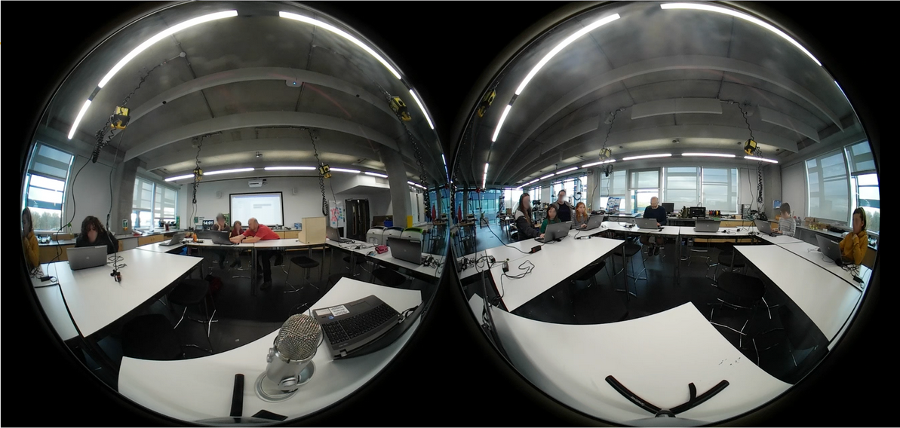

---
# all the regular stuff you have here
zotero:
  scannable-cite: false # only relevant when your compiling to scannable-cite .odt
  client: zotero # defaults to zotero
  author-in-text: false # when true, enabled fake author-name-only cites by replacing it with the text of the last names of the authors
  csl-style: harvard-manchester-metropolitan-university # pre-fill the style
layout: post
categories: chapter
title: 4. Methodology
---

-   [Methodology](#methodology)
    -   [Introduction](#introduction)
        -   [Describing a broad overview of the
            approach](#describing-a-broad-overview-of-the-approach)
        -   [An overview of how this study applies theoretical
            principles](#an-overview-of-how-this-study-applies-theoretical-principles)
            -   [A qualitative and exploratory
                approach](#a-qualitative-and-exploratory-approach)
            -   [The use of holistic data and rich
                descriptions](#the-use-of-holistic-data-and-rich-descriptions)
        -   [Utility and replicability](#utility-and-replicability)
        -   [Authentic and ecological orientation and my
            researcher--facilitator dual
            role](#authentic-and-ecological-orientation-and-my-researcherfacilitator-dual-role)
    -   [Data collection within project delivery
        phases](#data-collection-within-project-delivery-phases)
        -   [Table: Summary of delivery
            phases](#table-summary-of-delivery-phases)
    -   [Data analysis process](#data-analysis-process)
        -   [Stage 1 -- Exploratory
            analysis](#stage-1-exploratory-analysis)
        -   [Stage 2 -- Thematic
            Refinement](#stage-2-thematic-refinement)
        -   [Stage 3 -- Interpretive
            Consolidation](#stage-3-interpretive-consolidation)
            -   [Design narrative as interpretive
                structure](#design-narrative-as-interpretive-structure)
            -   [GDPs as a germ cell in design and
                analysis](#gdps-as-a-germ-cell-in-design-and-analysis)
            -   [Analysing learner agency](#analysing-learner-agency)
    -   [Broader methodological
        considerations](#broader-methodological-considerations)
        -   [Ethical considerations and
            validity](#ethical-considerations-and-validity)
        -   [Generalisability and
            replication](#generalisability-and-replication)
        -   [Methodological and practical
            limitations](#methodological-and-practical-limitations)
        -   [Wider limitations](#wider-limitations)
    -   [Chapter conclusion](#chapter-conclusion)
    -   [Footnotes](#footnotes)

# Methodology

## Introduction

This chapter sets out the methodological approach underpinning this study, building directly from the theoretical commitments explored in Chapter 3. Drawing on the principles of activity theory and design-based research (DBR), this research was designed as an iterative process embedded in a real-world, non-formal learning environment. Rather than applying a preset method to a controlled setting, the study developed responsively, shaped by the complex interplay of context, participant input, and pedagogical experimentation.

Chapter 3 introduced the conceptual foundations shaping this approach: learning as socially and historically situated, agency as emergent and distributed, and design as a driver of transformation. These principles are now translated into methodological commitments, especially a focus on mutuality with participants, flexibility in design, and responsiveness to the evolving dynamics of the setting. The chapter begins by establishing the scope of the research as qualitative and exploratory. It then discusses the authenticity of the context, the significance of my dual role as researcher-facilitator, and the rationale for a method that privileges a rich approach to detail. Following this, the chapter details how the project was delivered in practice, including the recruitment process, session formats, and the diverse forms of data collected such as journal entries, artefacts, video and screen recordings.

The main section of this chapter describes an analytical process developed over three broad stages. In the first stage, journal reflections, interviews and preliminary video reviews helped surface initial patterns and contradictions. This was followed by a deeper exploratory period of theme clustering and iterative coding, including attempts at both quantitative and qualitative analysis. The final stage involved selecting key vignettes for closer analysis, integrating participant voices and triangulating across data sources to refine conceptual insights into learner agency, tool use, and learning processes. The chapter concludes with reflections on ethical considerations, validity  of the data analysis, returning to the methodological frameworks of activity theory and DBR, considering how this study both draws from and contributes to those evolving traditions. In this final section the limitations of the thesis are also examined.

### Describing a broad overview of the approach

In summary the research process was oriented around a series of weekly digital game making workshops for home educating young people and their parents or guardians. These sessions were clustered into runs of between 5-10 weeks at the end of which a game was created to share publicly. The process of both educational facilitation and data collection was led by myself, and supported by student helpers. This chapter outlines a methodological approach grounded in the general principles of formative interventions and design-based research (DBR). To do this it will draw on techniques from those disciplines including specifically social design-based experiments (SDBE) and design-based implementation research (DBIR) [@penuel_design-based_2021].

While the previous chapters have established the theoretical framework and research questions, this chapter connects those questions more directly to methods. To provide an overview to ground the reader, an outline how the research questions informed data collection, analysis, and theoretical framing follows:

**RQ1**: *What contradictions emerged during participation in CGD&P activities, and how were they addressed via an innovative pedagogy?*  
Data were drawn from facilitator reflections,  participant and practitioner interviews, and video observations. These were analysed through systemic tension mapping and activity system analysis, using cultural-historical activity theory (CHAT) to frame contradictions as drivers of expansive transformation.

**RQ2**: *How can a collection of game design patterns support CGD&P, particularly regarding abstract and concrete dimensions of existing pedagogies?*  
Data included screen capture analysis,  documentation emerging from the research intervention, and participant interviews reflecting on game design pattern use. Thematic analysis focused on mediation through game design patterns and how these related to shifts in learning activity. The framing of the findings drew on the mediational lens of CHAT and the pedagogical scaffolding emphasis of DBR.

**RQ3**: *How do learner agency and game-maker identity develop within CGD&P communities of practice, and what pedagogical strategies best support this evolution across diverse learning contexts?*  
A dataset spanning phases of community interactions and design development, interviews, and field notes was analysed through thematic clustering, relational mapping, and narrative analysis. This was informed by DBR’s emphasis on iterative refinement and 3GAT’s view of expansive learning in situated activity which draws on practices from interconnected activity systems.

### An overview of how this study applies theoretical principles

The following section gives an overview of how this thesis puts the theoretical principles explored in Chapter 3 into practice.
CREATE LIST?  

#### A qualitative and exploratory approach

This study is qualitative, general, and exploratory in nature, shaped by DBR and CHAT. It adopts an iterative, context-sensitive approach to understanding learning environments in CGD&P, avoiding rigid experimental constraints. In terms of educational objectives, the goal is to generate situated knowledge that can inform responsive educational practices rather than to produce more universally generalisable outcomes [@cobb_design_2003]. However, the methodology of this research also seeks to reveal pedagogical tensions, contradictions, and shifts in learner agency and develop understandings which have potential for a broader application.

Rather than starting with fixed aims, the inquiry evolved through mutual engagement with participants and an openness to emergent goals. This orientation is justified both by the nature of the setting (non-formal, collaborative, and often resistant to conventional evaluation [@rogoff_observing_1995]) and by the desire to avoid prematurely deciding on what kinds of pedagogical or methodological innovations might arise. While certain pedagogical features remained consistent throughout, the process was fundamentally shaped by what unfolded during iterative cycles of engagement. The process of rapid and responsive iteration allowed refinement of learning materials in response to participant feedback and my systemic analysis in a way which leveraged the strengths of design-based approaches while aligning them with the insights offered by CHAT. This flexible approach addresses both the complexities of real-world learning contexts and the need for practical, and ideally replicable outcomes.

Pedagogical elements of the research design were  co-developed through collaboration with young learners, their families, and undergraduate student helpers. Over time, iterative design phases were informed by participant feedback, emergent needs, and reflection on practice. This collaborative shaping of both tools and pedagogy reflects established principles in participatory research [@iversen_computational_2018-1; @iivari_critical_2017], DBR [@barab_design-based_2004], and formative interventions [@cole_fifth_2006; @blunden_formative_2023].

Participant input took multiple forms: direct feedback in interviews and structured activities, observations of gameplay and design behaviour, and artefacts produced in workshops. The ongoing trialling and adjustment of software environments, templates, and resources took place over an extended period and, involved undergraduate trainees, colleagues, and parent volunteers. These iterative changes are documented throughout the study and explored further in Chapters 5 to 7.

<!-- Bakker offers guidance in the formulation of research questions in DBR studies which are relevant to this thesis [@bakker_design_2018]. He promotes HOW and WHAT CONSIDERATIONS formulation of question to be represent the exploratory nature of DBR approaches and to increase the possibility of possible generalisation without over promising in terms of projecting beyond the embedded nature of the findings as embedded in the context of the study. -->

#### The use of holistic data and rich descriptions  

This study provide _thick_, descriptive accounts of learning in CGD&P across multiple levels of activity [@maxwell_qualitative_2013]. Informed by Rogoff’s [-@rogoff_observing_1995] three planes of analysis in communities of learners, data collection included both individual and group-level video capture, journal notes, screen recordings, and design artefacts. These layered sources enabled analysis of how learning processes unfolded across time, tools, and interactions. This approach also brought challenges, particularly in managing and interpreting complex video data, which are discussed later in this chapter.

### Utility and replicability  

The commitment to rich description is not just analytical rigour but also driven by my desire to make this research useful for follow researchers and practitioners. Following Ann Brown’s original call for design experiments to align with the needs of real-world learning contexts [@brown_design_1992]. Later guidance by Bakker [@bakker_design_2018] and Penuel [@penuel_design-based_2021] positions utility for future practice to be at the heart of the design based research process. As such, my research process has prioritised design decisions that allow for replicability in both academic and diverse educational contexts. While the process of describing practice and resource use to achieve this aim is  is addressed in in more detail later in this chapter, the importance of and influence of research on software sustainability and open educational resources (OER) are now addressed.

The principle of utility and replicability within research, when applied to software use within research more generally using the concept of  software sustainability [@crouch_software_2013] [^1]. Similarly, given the context home education and a wider  target audience of informal settings, an important contextual factor is that participants have a limited budget to spend on educational resources. As such, educational software  tools to be replicable and sustainable, ideally at free or low cost tools were prioritised [^2]. To achieve this, FLOSS or freely available tools were used wherever feasible. Applying these principles to  software used in both analysis and delivery, ensuring that both the pedagogical design and research methodology can be adopted or adapted by others [@bonneel_code_2020].

### Authentic and ecological orientation and my  researcher–facilitator dual role

To produce findings are contextually valid and socially relevant, pedagogical interventions took place within a real-world CGD&P learning programme in a non-formal educational context shaped by home education practices, local community logistics, and varied participant demographics. This ecological embeddedness shaped recruitment, session scheduling, and the kinds of learning interactions that were possible (covered in a following section). These factors also brought an authenticity that aligns with ecosystem models of learning design [@barnett_ecosystem_2019]  where value is created through contextually relevant pedagogical engagement. My role as both researcher and facilitator was central to achieving this embeddedness within an authentic context and the broader methodological design of the study. I designed each session to serve a dual purpose of data collection and an educational workshop planned and adapted to meet the varied needs of participants. While this dual role introduced challenges such as balancing the requirements of pedagogical intervention with challenged of recognising positionality within observation, it also provided opportunities for sustained engagement, flexible design, and a clearer view of pedagogical evolution in action. The researcher-practitioner stance invites critical reflection on the ethics, logistics, and value of practice-based inquiry. In achieving this balance, I found the detailed descriptions of the motivational and the practical interventions of Fifth Dimension programme research by Cole and others [-@cole_sustaining_2001; -@cole_fifth_2006; -@cole2009designing] particularly valuable.

<!-- AND Stetsenko HERE? -->

Throughout the process, I aimed to recognise and support emergent participant practices, using tools and scaffolds that could adapt dynamically. These choices are revisited across the following findings chapters, which trace how participants responded to, reshaped, and extended the learning environment.

## Data collection within project delivery phases

This section outlines both the delivery of the game-making programme and the data collection activities embedded within each phase. As the next chapter presents the evolution of the intervention as a design narrative, the focus here is primarily on methods of data collection and the analytical approaches they supported. The project was delivered over five distinct phases, along with a development period. Each phase involved changes to tools, group sizes, and facilitation practices. These shifts reflected both planned redesign and more responsive adaptations to participant needs. Figure 4.x shows a summary of these phases.

<!-- From https://docs.google.com/presentation/d/1vR6dzFG6qXIdpB_-s6PbCePiB87qTs6YAXCljxNcb5Y/edit?slide=id.g2e34c54339d_0_0#slide=id.g2e34c54339d_0_0 -->

{width=98%}

Fig. 4.x Summary of delivery phases and development periods

<!-- **Development and recruitment** -->

The first development process of this study (D1) drew on a background context of my involvement in community-based technology education as outlined in Chapter 1. My involvement in previous work through the EdLab programme [^3] and its playful technology strand meant that I had already built relationships with the home-educating community. Between 2016 and the start of this study, I had run various workshops in libraries, the university, and through CoderDojo events. To promote these events I had used three established home education communication networks[^4]. The recruitment process of this study followed this previous pattern. I shared a invitation to participant to those three groups which asking interested families to contact me by email [^5]. Once contacted by potential participants, I sent them a participation sheet and asked for confirmation of attendance [^6].

The following table gives an overview of participant numbers, number of sessions, and key learning activities by phase. These changes in focus and activity shaped the kinds of data generated, and also influenced the form and feasibility of collection.

### Table: Summary of delivery phases

| Phase | Sessions | Participants | Activities and data highlights |
|-------|----------|--------------|-------------------------------|
| **P1** | 10 | 5 parents, 8 children | **Exploratory group phase.** Mixed-age groups engaged in paper-based planning, introductory coding with a text-based tool, and asset creation. Game files and design artefacts were collected. |
| **P2** | 6  | 8 parents, 11 children, 4 student helpers | **Smaller group development.** Participants used a shared coding template and printed guides. Asset creation was less central to the process. |
| **P3** | 5  | 4 parents, 8 children, 1 student helper | **Drama-integrated learning.** Continued with the same coding setup, enriched by side missions and drama-based activities. |
| **P4** | 6  | 4 parents, 7 children | **Toolset shift.** MakeCode (block-based) was introduced [^7]. Sessions became more modular and self-paced. |
| **P5** | 5  | 3 parents, 3 children | **Personalised learning.** A smaller group continued using MakeCode, with a focus on individual and pair-based game projects. |

<!--
| Phase | Sessions | Participants | Key learning activities and data generated |
|-------|----------|--------------|--------------------------------------------|
| P1    | 10       | 5 (p) + 8 (c) | Exploratory phase with three larger groups of mixed ages. Data includes paper-based planning, basic coding using a text-based toolset, and early asset creation. Game files and code were collected. See Appendix t.x. |
| P2    | 6        | 8 (p) + 11 (c) + 4 (sh) | Groups became smaller and more focused. A shared template supported game development. Asset creation was more limited, but participants used printed guides extensively. [^3] |
| P3    | 5        | 4 (p) + 8 (c) + 1 (sh) | Same coding environment as in P2. Additional drama activities and side missions were introduced. See Appendix t.x. |
| P4    | 6        | 4 (p) + 7 (c) | MakeCode, a block-based toolset[^4], was introduced and used throughout. Sessions became more modular. See Appendix t.x. |
| P5    | 5        | 3 (p) + 3 (c) | A smaller cohort continued to use MakeCode, focusing on individual and pair-based work. See Appendix t.x. | -->

The development of learning resources took place alongside delivery, and participants influenced this process in various ways. Some changes were shaped by direct input, such as help requests, informal conversations, and interviews. Others were shaped by more indirect means, including the games participants made, my journal entries reflecting on interactions, and video or screen capture data from sessions.

The table below outlines the types of data collected and where they occurred across the phases.

| Name                        | Details                             | Description                                                                                          | Used in which phases |
|-----------------------------|-------------------------------------|------------------------------------------------------------------------------------------------------|----------------------|
| Screen capture data         | 72 recordings from 12 sessions      | Recorded using Flashback Pro. Included video, audio, mouse activity, and keystrokes.                 | P2, P3, P4, P5        |
| 360 video data              | 9 recordings from 9 sessions        | Captured using a Samsung Gear 360-degree camera on SD card.                                                       | P2, P3, P4            |
| Journal entries             | 3 paper journals and 50 pages digital | Reflections, session planning, design sketches, and notes on challenges and evaluation.              | All phases            |
| Programme resources created | Varied (see Chapter 5)              | Materials evolved through participant feedback and facilitator experimentation. Stored digitally.    | All phases            |
| Practitioner interviews     | 4 interviews, around 90 minutes each | Conducted via Zoom. Recorded and stored as video and audio files.                                              | Post P3 workshops              |
| Participant interviews      | 4 interviews, around 90 minutes each | One via Zoom, three captured using screen recording to prompt reflection on games and artefacts. All stored as stored as video and audio files.  | Post P3 workshops              |

Journal notes were kept throughout the process in both paper-based journals and chronologically organised Word documents. These notes included session reflections, notes on challenges of the design of resources, and reflections on emerging themes from relevant, existing research. Alongside this, I archived the digital resources used in each phase, including templates, guides, and materials created by the young participants. The games themselves were treated as a form of data. This was partly informed by activity theory's emphasis on tools as culturally mediated artefacts, and by the principle of double stimulation, where learners appropriate and repurpose tools for their own ends. This adaptation beyond expected use became an important data point.

There were practical challenges in collecting and maintaining access to these digital artefacts. In 2025, the platform Glitch.com announced it would no longer host user projects [^8].  A similar process occurred related to Piskel graphical editing tool [^9].  

Video data played a key role in capturing situated activity: both 360 video data and screen capture data were recorded [^10]. Regarding computer screen capture, the software Flashback Pro was chosen for screen capture due to its accessibility and low cost. The software recorded user input and screen activity including data of mouse clicks and keyboard events [^11].

The use of 360° camera footage stemmed from two main considerations. Firstly, I wanted a fixed approach rather than a roaming attached device to avoid possible disorientation [@caton2019methodological], and I wanted to try to capture as little video data as practicable due to the high overhead of processing and interpreting it. Given this motivation, I avoided using individual webcams of the computers or several static cameras positioned in several locations in the room. Instead, I arranged the tables in a square with chairs on the outside facing inwards and positioned a 360 camera in the centre of this arrangement. This approach allowed capturing whole-group interaction using only one camera source. A still of the 360 footages (before processing) is shown in Figure 4.x.

{width=98%}

Figure 4.x - 360 footage from the central camera (before processing)

Managing both set of video data involved careful planning. The large video files required consistent naming and regular backups. The 360 recordings were particularly complex, sometimes split into segments that made time navigation difficult. Specialised software from the camera manufacturer was needed to process the raw footage. To address these challenges, I developed a Linux-based workflow for organising and processing video and audio data, which is included in the technical appendix [^12].

Participant and practitioner interviews took place after Phase 3. These were semi-structured and conducted online due to practical and, at times, COVID-related constraints. While the interviews were not fully transcribed, key sections were reviewed and analysed in combination with other data. To help participants recall information, during the interview process a laptop was on hand to allow them to revisit their created games games and assets to support their reflection on design choices and problem-solving strategies.

Turning to interviews of fellow practitioners and researchers in the area of creating digital making, interviewees included Saskia Leggett, a researcher involved in the Creative Family Learning programme; Matt Curinga, an academic and educator active in community-based coding projects; Dave Potts, a professional programmer and long-term CoderDojo volunteer; and James Clegg, a PGCE computing student who had also supported sessions in person.

## Data analysis process

The analysis was structured in three stages to reflect the evolving relationship between the data and the research questions. This approach supported an iterative process: beginning with exploratory review, progressing through thematic refinement and methodological adjustment, and concluding with interpretive consolidation. Each stage responded to emerging insights and practical constraints, forming a strategy for examining how learning, agency, and contradiction unfolded within the CGD&P interventions.

Given the exploratory nature of the study and its openness to emergent directions, the analysis evolved across multiple stages. For clarity, it is presented here in three simplified phases that mark broad shifts in focus and method. Each stage involved increasing analytical granularity, using strategies suited to the evolving demands of the research. This structure also helped manage the substantial volume of video and screen capture data generated during the game-making sessions.

### Stage 1 – Exploratory analysis

Stage 1 served as an exploratory review of the dataset to assess data quality, relevance, and initial themes. This included reviewing researcher journals, practitioner interviews, and preliminary video footage to develop a sense of the emerging pedagogical and methodological issues. The goal was to understand the types of contradictions and learning behaviours present, and to inform the next steps for more focused analysis. This phase aimed to determine which datasets merited deeper analysis and to refine the methodological processes for subsequent analytical stages, aligning with approaches of iterative refinement in DBR [@bikner-ahsbahs_introduction_2015-1].

The process was initially driven by the need to produce a summary of the facilitation process and to surface contextual tensions for a book chapter [@chesterman_game_2023], as well as to contribute to a mapping of learning dimensions developed during the D3 phase [^13] for online resource design. Journal analysis provided a foundational perspective on facilitation and early thematic tensions. Given the breadth of journal data, a comprehensive thematic analysis and exhaustive coding were impractical; instead, insights were triangulated with findings from the literature review to expose key themes and contradictions in the evolving pedagogy. Rogoff’s [-@rogoff_observing_1995] three planes of sociocultural activity were particularly useful here, allowing reflections on facilitation to be categorised across personal, interpersonal, and institutional dimensions, a technique further refined by Morcom [-@morcom_scaffolding_2014]. Alongside journal entries, evolving teaching resources, participant-created games, and assets were examined to provide insight into how learners engaged with design elements, navigated constraints, and appropriated resources for their own purposes. The use of these materials informed subsequent iterations of facilitation and resource development, and contributed to the emergent facilitation strategy.

Practitioner interviews were used alongside journal reflections to identify key pedagogical concerns, barriers to participation, and evolving priorities within the learning design. Four extended interviews (averaging 90 minutes each) were conducted with professionals and collaborators from overlapping fields. The semi-structured format allowed for responsive dialogue, helping to surface themes such as learner identity, creative constraint, scaffolding strategies, and the design tensions in non-formal learning contexts. Themes included: agency as a focus, which emerged from Dave Potts’ reflections on the value of surfacing and supporting participants’ own interests in digital making; the value and tensions surrounding competition in non-formal settings, raised by Matt Curringa; the helping roles played by parents in young people's engagement with technology, highlighted by Saskia Leggett; and the affordances of online toolkits and game mechanics as mediational strategies, discussed by James Clegg. These interviews also helped focus subsequent cycles of video analysis by informing early coding directions and the refinement of the research questions.

Finally, video data was explored through a broad review of selected screen capture and 360-degree recordings from P2, P3, and P4. This initial dip into the video archive was used to assess both the quality and analytic potential of the recordings. This approach provided an initial sense of the rhythms of sessions, the emergence of roles, and the unfolding of mediational practices. At this stage, full transcription was not attempted; instead, time-stamped observations helped determine which sessions might warrant deeper analysis in subsequent stages. To help contextualise and disambiguate screen capture data, I would cross-reference it with 360° video data.

This first stage set the foundation for the later interpretive work by clarifying the practical constraints of the data, surfacing early thematic directions, and testing the viability of a multi-source, iterative approach.

### Stage 2 – Thematic Refinement

The second stage of analysis began with the intention of developing a structured coding schema that could support both quantitative and qualitative approaches. Inspired by a desire to systematically compare themes across video data, interviews, and journals, the original plan involved using NVivo (a qualitative-first data analysis software that also supports mixed-methods queries) to apply a consistent thematic structure, combining insights from the literature, practitioner interviews, and preliminary analysis. NVivo allows researchers to apply codes across datasets and run queries, for example to examine how much time participants spent on specific tasks or how often particular behaviours occurred [^14].

However, a number of challenges arose. Technically, NVivo was unable to import 360 footage effectively in a way that allowed the cross-referencing of data. NVivo has limitations in allowing precise playback and selection of video segments for coding. Trials of applying several schema to even short extracts of video proved excessively cumbersome [^15].

I planned and trialled a workaround to these limitations. Using VLC Player allowed for dual playback, and coded observations were made using a limited granularity of five-minute segments. Partial transcription, annotation, and thematic coding were recorded within Word tables and then imported into NVivo to allow queries and coding comparisons.

The process of creating these documents for video files of approximately two hours was still time consuming but productive. The use of 360° video data to contextualise the screen capture data became significant enough to support a more holistic understanding of the processes at hand. This led to the development of a consistent co-viewing procedure, achieved using VLC Player’s ability to view and control two video files side by side [^16].

{width=98%}

Figure 4.x - 360 footage and screen capture side by side (after processing)

To manage the scope of analysis, eight full sessions and three partial sessions were selected for deeper review. Criteria included clarity of audio and visuals, richness of peer and facilitator interaction, and representation of different phases of the intervention. In practice, most of the analysis focused on data from phase P2, as these contained the richest examples of interaction. One session from the end of P2, in particular, stood out due to the complexity of collaboration and the variety of participant roles observed. Transcripts were created in five-minute intervals, pairing 360° footage with screen recordings. These were not fully coded line by line, but were annotated descriptively with researcher memos noting tensions, tool use, gestures, and participant roles. An indicative example of these notes, including observations, reflections, and extracts of dialogue, is included as a table below.

| Timespan           | Content |
|--------------------|---------|
| 15:00.0 - 20:00.0 | Fok -  Ed is looking for an animation frame already created  Mark still reading documentation on how to add animation to a character.  Mark: Quite complicated. But we can do it. But it would mean a lot of mucking around Ed: Ah Er Mark: Which is difficult to do while we’re here. But it’s doable. Mark: It’s like a project in itself really. Ed: Project in itself? Mark: Yeah! (laughing). I just want to know like. We can get him in. So if I ask about the sizing. Ed: Hmmn Mark: I think you can edit the size here. Ed: Why don’t you go here for a computer and you can do that? Mark: Why. What. While you’re doing what? Ed: Um making a sound track or something. I could do something like that. Mark: Ok. Yeah. I’ll see if there’s any more computers in the cupboard.  Plan – Polish  Child Solo – creating assets – |
| 20:00.0 - 25:00.0 | Ed then creates a head – struggling Seems a bit stuck – not able to recreate work  Making noises to indicate stuckness after 10 mins  Create – Polish  Child Solo – creating assets – Pair – navigating to assets |

<!-- In addition the spreadsheet of analysis structured using Rogoff’s three planes proved useful to document novel instances of activity and in particular emerging tensions in activity as they were documented within. -->

<!-- In this context, the term refers to a segment of recorded participant activity captured via screen recording, typically involving one learner or a pair working at a laptop during a broader workshop session. -->

As this process continued and generated a wealth of potentially useful observations, I began to question the value of transferring data into NVivo as originally anticipated.

The technical questions and frustrations with the limitations of NVivo were compounded by more conceptual questions regarding the utility of the quantitative approach it would enable. It became clear that the process of working towards a fixed coding frame risked distracting from a more holistic understanding of the learning environment, particularly the emergent, improvisational, and tool-mediated aspects of learner agency.

Already by this stage some candidate codes, such as computational and systems thinking, had been de-prioritised due to either their conceptual overlap with existing literature or a lack of richness in the recorded data of this study. Other categories, such as game design stages, became harder to apply consistently across groups and sessions. A rigid schema, in this case, risked missing what was most interesting: the improvised and evolving use of resources, peer scaffolding, and ongoing negotiation of meaning within the making process.

The shift from planned coding to a more interpretive, emergent strategy was not clear cut; it evolved through repeated attempts to organise, code, and revisit earlier transcripts. The process of creating the session annotation documents also informed a selection of shorter episodes within each session which were flagged for deeper treatment in later vignette analysis. The use of Rogoff’s [-@rogoff_observing_1995] three planes of analysis (personal, interpersonal, and cultural) continued to be helpful as a scaffolding framework. I continued to add to the spreadsheet of analysis structured using three foci, documenting in it novel instances of activity, in particular emerging tensions in activity.

Instead of developing a strict taxonomy, the process evolved into analytical thematic clustering via note-taking, sketching of visual models, and consolidation within tabular form in Word documents. These techniques allowed a more flexible process of interpretation in response to the complexity of participant behaviour, tool use, and social interaction. This shift reflected a broader methodological commitment: staying close to the activity as it unfolded, rather than forcing it into predefined analytic categories. The process of trying, adapting, and discarding coding strategies also mirrored the study’s broader design ethos, where tools and structures evolved in response to emergent practice instead of being imposed from above.

This flexibility helped me identify new themes within the data, such as the significance of game design patterns in shaping learner trajectories or the role of peers and parents in scaffolding complex actions. The original research questions were refined. This phase helped surface key areas for Stage 3, including clusters of agency, mediational strategies, and participant repertoires. It also clarified which transcripts and artefacts were most appropriate for deeper interpretation as vignettes. By the end of this stage, the goal had shifted away from quantifying learning behaviours and toward richly describing how learners appropriated tools and reshaped their participation.

### Stage 3 – Interpretive Consolidation

The third and final stage of analysis focused on consolidating insights through detailed, interpretive work. Building on the broad mapping of Stage 1 and the thematic refinement of Stage 2, this phase returned to key segments of data selected for their richness, complexity, and relevance to the evolving research questions. The goal was to generate grounded, contextualised understandings of learner agency, design mediation, and pedagogical interaction. This stage centred on six key vignettes drawn from screen capture and 360-degree video recordings. These were chosen for their representation of diverse learner roles, visible design decision-making, and interactional dynamics. Full transcriptions were produced for these segments, integrating verbal dialogue, on-screen activity, and embodied communication such as gestures and movement within the learning space. At my second formal review, my supervisor Ricardo Nemirovsky encouraged a more deliberate integration of gesture analysis. Viewing the 360 footage alongside the screen capture recordings proved essential in several cases, especially where participants referenced their physical environment or used gesture to support peer explanation. Gestures were also used often to communicate planned  game movements on screen, or for other on-screen actions or procedures, e.g in Vignette x, indication of action of cropping an image.

These vignettes were not designed to be representative in a statistical sense, but to offer rich accounts of how specific learners or pairs navigated their tools, peers, and task structures. Each vignette was treated as an episode that could inform the research questions, including how learners asserted agency, interpreted guidance, or adapted resources. Where possible, these micro-analyses were triangulated with post-session interview data, artefacts (such as games created), and reflective journal entries made immediately after facilitation.

The chapters that follow present the findings of the study in relation to the use of gameplay design patterns and the development of learner agency within an evolving design context. Rather than separating findings and discussion into distinct chapters, the analysis interweaves data, interpretation and design reflection. While this is not a conventional format, it is increasingly common in design-based and sociocultural research, where interventions and insights emerge together in practice. This approach supports closer alignment between evidence and interpretation, allows theoretical ideas to develop alongside real-time analysis, and reflects the iterative and situated nature of the research process. Chapter 5 presents the development of the learning design across phases of delivery via a design narrative. Chapter 6 explores the mediating role of GDPs in shaping participant experience, while Chapter 7 focuses on the development of agency and identity within the learning community.

#### Design narrative as interpretive structure

This stage of analysis was informed by a design narrative approach, which shaped how patterns of contradiction, adaptation, and response were identified across the CGD&P intervention. Rather than organising interpretation strictly by theme or data type, the analysis followed the evolving arc of the learning design, structured around key shifts in practice, tool use, and facilitation across the delivery phases. This approach aligned with the pedagogical logic of the intervention and was supported by journal notes and triangulated with interview data. The narrative structure reflects the ethos of design-based research by documenting iterative, context-responsive design decisions that may be useful to others working in similar settings.

#### GDPs as a germ cell in design and analysis

A key focus during this stage was to examine the ways game design patterns (GDPs) user employed as mediational strategies. A spreadsheet of thematic codes, begun in Stage 2, was extended to cluster GDP use more systematically across planes of activity (individual, interpersonal, and cultural). Patterns of adaptation and reinterpretation were particularly salient, as learners often modified a pattern’s purpose or linked it to emergent gameplay goals. These shifts were interpreted through a CHAT lens as evidence of agency enacted through tool transformation and appropriation. The findings of this process are described in Chapter 6.

This study identifies gameplay design patterns (GDPs) as a germ cell concept within its methodological and analytical framework. Chapter 4 outlines the development of this concept and its structuring role in the design; Chapter 5 traces how GDPs were introduced and iteratively embedded in response to practical contradictions; and Chapter 6 explores how they mediated participation, creativity, and collaboration across different episodes of activity.

Drawing on principles from third-generation activity theory and design-based research, the process of rising to the concrete is used both analytically and pedagogically. In seeking a germ cell or unit of analysis, the researcher attends to complex, evolving activity to identify a minimal yet generative concept that can support expansive development. 3GAT distinguishes between empirical abstraction, such as categorising observed features of activity, and theoretical abstraction, which helps explain or guide transformation. The identification of GDPs as a germ cell falls into the latter category [@sannino_activity_2011, p.590]. In line with understandings of DBR research outputs, the identification of guiding principles to address tension in the table above, would be expressed as a set of "tentative generalisations" in the form of design heuristics drawn from the analysis of the concrete practices observed [@hoadley_design-based_2022, p.215].

GDPs are understood here not only as practical design elements but also as conceptual tools that link participant action, shared language, and the structure of the learning environment. Their recurring role in shaping trajectories of participation positioned them as an increasingly central organising feature. As the learning environment evolved, pedagogical structures were developed around progressively more complex engagements with GDPs. These supported varied forms of learner participation while maintaining coherence and a manageable technical scope.

Rather than introducing entirely new materials at each phase, the learning design was structured to allow for deepening engagement with GDPs over time. This enabled participants to recognise, use, and eventually adapt or create gameplay patterns, supported by different forms of documentation. From a methodological perspective, the germ cell framing helped interpret how tools and resources mediated activity at different levels of granularity, from individual design actions to broader shifts in the object of community practice.

As later chapters show, GDPs were not fixed instructional tools but mutable artefacts shaped in and through practice. Their value lay not only in the structures they provided but in how they were interpreted, adapted, and occasionally resisted by participants. This reinforced the germ cell’s analytical utility—not as a static unit, but as a dynamic mediator of developmental possibility. Framing GDPs in this way helped make visible the shifting relationship between individual action, shared artefacts, and the broader activity system over time.

#### Analysing learner agency

In parallel, the concept of learner agency was developed through close engagement with participant action across different learning contexts. Several vignettes focused on how learners collaborated, made design decisions, and used material and digital tools to shape their contributions. Through this process, my understanding of agency shifted and deepened. It became clear that agency was not a fixed trait but something that emerged through interaction, support, and opportunities to make meaningful choices. These actions were shaped by learners’ prior experiences, the roles they took on, and the changing structure of the sessions.

The later stages of analysis paid close attention to how participants influenced their own learning paths, how they supported each other, and how they responded when things were difficult or unclear. Agency was interpreted as something that could take different forms, such as trying out new ideas, helping others, changing direction, or asserting creative control. To understand this, I looked at humour, spatial positioning, narrative framing, and the use of gesture to support communication and identity.

This view of agency developed gradually through the analysis process, rather than being applied from the start. It was shaped by what was visible in the data and by ongoing questions about how power, choice, and participation played out in practice. These observations provided a way of seeing agency not only in terms of individual skill or autonomy, but also as something built together and shaped by the design itself.

Chapter 7 builds on this analysis in more depth. It focuses on how agency took different forms across the group, and how learners moved between different roles, styles, and strategies. That chapter also links this to wider ideas about identity, collaboration, and the kinds of opportunities that design-based learning can create.

This interpretive work aimed to clarify not only how the learning environment supported certain forms of agency and design fluency, but also what constraints remained. In some vignettes, learners struggled to access tools or articulate their ideas, prompting reflections on inclusion and the role of facilitation. These observations informed both the final conceptual model, developed in Chapter 7, and ongoing questions about how pedagogical environments can be designed to support participation across multiple modes and identities.

By the end of this stage, the analysis had shifted from mapping general trends to closely engaging with specific examples that showed tensions, possibilities, and shifts in learner participation. These vignettes became the foundation for articulating the study’s contributions to both theory and practice.

## Broader methodological considerations

### Ethical considerations and validity

Ethical approval for this study was obtained through the ESRI ethics process using the ETHOS system. Participants were recruited via outreach to home education networks, coding events and community meet-ups. Inclusion criteria included being part of a family unit (including guardians) with the ability to travel to the Manchester Metropolitan University campus. Participating families included children aged approximately 7 to 13, and all participants needed to have sufficient English literacy to engage with written materials and communication. An expressed interest in learning to make digital games together as an educational project was also required.

Consent and assent processes were tailored to suit different participant groups, including home-educating families, children and university students. For children, assent was negotiated through informal discussion followed by a simple written agreement, and parents remained nearby or directly involved throughout. DBS-checked adult facilitators and volunteers supported sessions, and alternative activities were always available so that children could opt out at any time. These steps aimed to protect participant autonomy while recognising the relational dynamics of informal learning settings.

While data collection involved video and screen recordings that could not be fully anonymised at source, all analytic materials and outputs used pseudonyms, removed or obscured identifying visuals. The raw video data was stored on a password-protected external computer drive, separate from other working research data. Only the lead researcher had direct access to this material, although the ethics approval process stated that project supervisors could be given access on request.

Addressing validity of data interpretation, the analysis of this research has prioritised ecological validity by studying interactions that emerged in authentic, practice-based contexts, rather than in controlled or experimental conditions. In addition this study adopted a critical stance on objectivist notions of validity, drawing on DBR and activity theory traditions that position the researcher as an active participant in meaning-making. Validity was approached through triangulation across media data formats such as video, interviews, journals and supporting resources, and supported by ongoing reflection and iterative analysis. Following the transformative activist stance [@stetsenko2020radical], validity in this study is grounded in my ethical and practical engagement with participants, and in the co-construction of knowledge aimed at transforming learning relationships and tools. In this process, autoethnographic reflections played an important role. While not directly analysed alongside participant data, these notes informed the design of resources and facilitation strategies. Selected of journal notes  are included in Appendix 4.x [^17] as evidence of the evolving researcher-practitioner role.

### Generalisability and replication

This study does not aim to measure the efficacy of the intervention or to generalise findings in a statistical sense. Instead, it supports the transferability of insights and the replication of tools and design elements. Project artefacts, including template resources, facilitation guides, and open-source tools, are included in the appendices and online repositories. These were created with adaptability in mind, particularly for informal learning contexts or community-led education.

In terms of methodological contribution, the blend of methods and ethos outlined in this chapter offers a potential return to both the DBR and CHAT research communities. Rather than following a predefined applied CHAT methodology such as the Change Laboratory, this study draws on DBR techniques but meets many of the key criteria for formative intervention as articulated by Engeström and Sannino [-@engestrom_methodological_2014]. The process involved tracing systemic tensions, supporting participants in reconfiguring their activity, and attending to signs of transformative agency across phases.

This hybrid approach responds to a key critique of the Helsinki school’s implementation of third-generation activity theory (3GAT). Formative interventions are often seen as time-consuming and dependent on stable, institutionalised stakeholder groups [@spinuzzi_trying_2020-1]. While my approach operated under more flexible, time-bound, and community-led conditions, it still maintained a generative orientation. It focused on identifying contradictions, surfacing agency, and generating change through iterative design cycles. These cycles align more closely with DBR than with the structured protocols of the Change Laboratory, but they are consistent with formative intervention understood more broadly.

This methodology also places particular emphasis on the development of artefacts and facilitation processes as evidence of learning and transformation. Templates, heuristics, and workflows were refined in practice, reflecting ongoing negotiation between design intent and emergent use. In this sense, the artefacts were not only outputs but tools of inquiry and change. Chapter 5 extends the idea of replication through a design narrative, outlining how tools, materials, and pedagogical structures evolved in response to emerging contradictions.

In addition, the study contributes a practical methodology for working with complex video data across screen capture and 360° formats. Conventional qualitative analysis software (e.g. NVivo) proved cumbersome, prompting the development of a custom workflow using open-source tools, manual transcription, and thematic clustering structured by Rogoff’s three planes of analysis. This adaptive process, shaped by the constraints and richness of the data, may offer value to other researchers navigating similarly situated, tool-mediated learning environments. A summary of the video analysis workflow is included in Appendix X.

Taken together, this approach offers both replicable tools and a flexible, generative methodology that supports the kinds of situated, iterative transformation valued within both DBR and CHAT traditions.

### Methodological and practical limitations

Several limitations shaped the scope of this research. Interview data was limited in number and timing due to logistical constraints and the emphasis on supporting live sessions. More regular or follow-up interviews might have added further depth. Similarly, while significant video data was collected, only a subset was transcribed or coded in detail, reflecting a necessary trade-off between depth and breadth of analysis.

Demographic information was not formally collected, which limited opportunities to analyse learning in relation to categories such as class, neurodiversity, or ethnicity. This reflected a deliberate effort to avoid over-formalising informal learning contexts, but it also constrained the interpretation of inclusion and representation.

Formal analysis began only after all intervention phases were complete. In retrospect, conducting interim analysis between phases may have enabled more responsive adaptation of the facilitation design. This sequencing choice reflected the project's structure and the intensive nature of facilitation, but it may have reduced opportunities to iteratively refine based on early patterns in the data.

The role of the researcher as facilitator, designer, and analyst brought both opportunities and risks. Some decisions were intuitive, shaped by prior experience in digital learning facilitation. While this raises questions of objectivity, the Transformative Activist Stance frames such positioning not as bias but as part of a legitimate commitment to utilitarian change. Autoethnographic materials trace the development of the intervention and the researcher’s own evolving perspective. These are included to support transparency rather than as direct data sources.

Plans for comprehensive coding using NVivo were revised (see Stage 2). Several predefined categories were collapsed or removed, and the process became increasingly interpretive and inductive. This was in line with the study’s broader DBR orientation, where analytical strategies were refined in response to the needs and limitations of the data and context.

The methodological approach combined principles from the Helsinki School’s interpretation of formative intervention with naturalistic methods of observing practice in situ. Although the study draws on DBR techniques, it also meets many of Engeström and Sannino’s criteria for formative intervention, including attention to systemic tensions, participant reconfiguration of activity, and the surfacing of agency. While not all research decisions can be justified as systematic, they reflect an evolving effort to understand learning as a complex, socially situated process. The design and delivery of the learning intervention itself served as both a context and a method for exploring agency, contradiction, and tool use.

### Wider limitations

Following the guidance of Thomson [@thomson_category_2024], wider limitations are included in this chapter rather than the concluding chapter, in order to avoid disrupting the narrative flow and interpretive focus of those final reflections.
The most substantial limitation is the lack of analytic focus on the efficacy or learning impact of the intervention in relation to specific conceptual goals such as computational thinking, systems thinking, or learners’ use of coding structures. Such a focus would have required either a deeper dive into the existing dataset or the collection of new data, accompanied by additional methods to triangulate learners’ conceptual development. For example, questions such as *to what extent did participants demonstrate systems thinking in their game design?* or *how effectively did specific GDPs support creative problem-solving?* were not explored directly in this phase of the study.

The decision to avoid this direction was shaped by early and sustained guidance from multiple supervisors and aligns with Bakker’s position on the formulation of DBR research questions [@bakker_design_2018]. He argues for the use of exploratory “how” and “what” questions that suit the adaptive, embedded nature of DBR, offering generative insight without overpromising generalisation.

Limitations of the data collected in P4 and P5 were practical in scope, due to space constraints in the room being used and the large volume of existing data from earlier phases. Although not pursued here, a comparative analysis of the different toolsets used across phases could offer further insight into how tool affordances shape learner agency and design trajectories. This may be a useful direction for future work.

## Chapter conclusion

This chapter has outlined the methodological framework underpinning the study, combining a staged analytical process with a reflexive, practice-based approach. The research design evolved iteratively, with analysis, tool development, and facilitation treated as overlapping components of a continuous inquiry. Insights emerged through repeated cycles of observation, reflection, and design response. The approach enabled attention to contradictions, the development of learner agency, and the role of mediating tools, supporting analysis at both individual and community levels. The next chapter builds on this foundation by tracing the development of the CGD&P programme over time. Using a design narrative approach [@hoadley_creating_2002-1], Chapter 5 explores how tensions in the learning environment prompted shifts in goals, tools, and shared practices, and how these changes were introduced and refined across different phases of delivery.

## Footnotes

[^1]: The Software Sustainability Institute (SSI)  defines software sustainability as enabling research software to remain useful and usable over time through good practices, community support, and institutional recognition.

[^2]: One consideration in terms of the longevity of tools being used is to what extent they are controlled by one organisation and if they have a long term commitment to maintaining educational resources.

[^3]: The Funologists strand of the EdLab programme involved playful, tinkering approach to learning coding and other forms of digital production. The EdLab website archive has a record of this event: https://mickfuzz.github.io/edlab/index.html_p=903.html

[^4]: Home Education Greater Manchester (Facebook group) https://www.facebook.com/groups/313791918658167, Greater Manchester Home Educators (Facebook group) https://www.facebook.com/groups/164014243270, MADCOW (Email group) a large invite-only email group.

[^5]: This message and summaries of the participant information sheets are included within Appendix A.

[^6]: Glitch games and manual page: https://glitch-game-club.github.io/ggcp/ggc-examples/ https://glitch-game-club.github.io/ggcp/manual/ - See Appendix t.x for full description of learning resources

[^7]: MakeCode is a block-based programming environment created by Microsoft that enables coding through graphical blocks and JavaScript or Python extensions.

[^8]: Glitch migration was needed after glitch.com announced it would stop hosting in July 2025. I responded by downloading HTML, JavaScript, and CSS files for each game, and archiving them in a Git repository. The process of downloading files and reuploading them was made easier by the use of web technology. They are now online here: https://github.com/glitch-game-club/ggcp

[^9]: While some projects created in Piskel were lost, many had been incorporated within existing games and were thus preserved in this way. The choices of this intervention and how they compared to the wider aims of software sustainability are outlined in Appendix T.

[^10]: 360° video captures activity in all directions, offering a full view of group interactions and spatial dynamics. Screen capture video records on-screen actions, allowing analysis of digital tool use and participant choices during game making.

[^11]: To make the files usable in coding software like NVivo, they had to be converted from `.fbr` to `.mp4` format. This conversion process removed some data, such as mouse and keyboard events.

[^12]: This whole process is so demanding in terms of careful file management. Making me create a linux command line toolbox which is included as a technical appendix. [A draft of which is here](https://docs.google.com/document/d/1Y7MsZDY8ofvls5XO7tztSu8KFdClJo09o3qpWOdkb2M/edit?usp=drive_web&ouid=11432580350275268987)

[^13]: In appendix and online as part of the D3 Make code resources here: https://mickfuzz.github.io/makecode-platformer-101/learningDimensions

[^14]: Nvivo software is proprietary and costly, but is provided by my University which also provides training which I attended.

[^15]: The process was tricky due to the deficit of fine control of video playback within Nvivo. This became intolerable and clearly unsustainable for a full process.

[^16]: The process involved a syncronisation process involving adding front padding for the video file that started second chronologically. It is detailed in Appendix X.

[^17]: Sample journal notes scans are available in Appendix 4.x.
