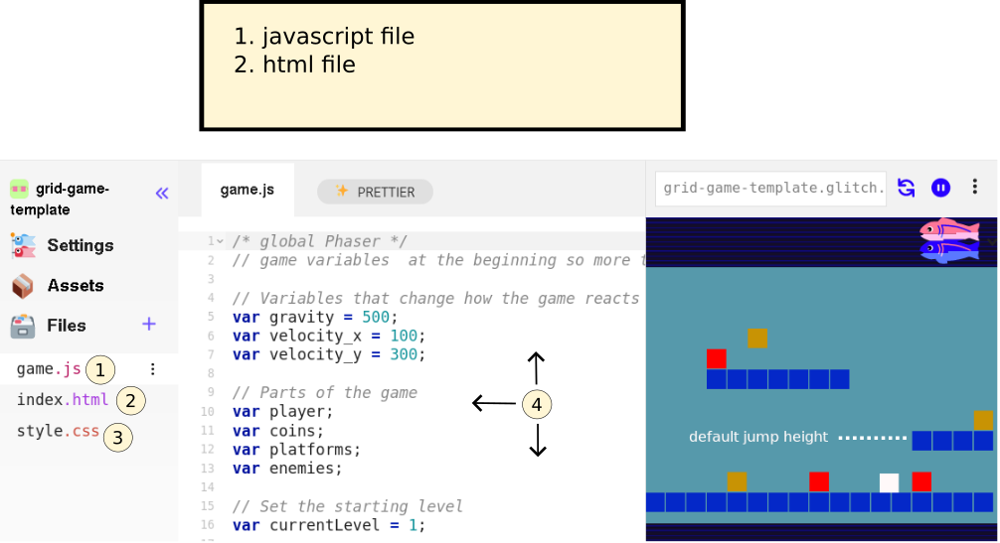
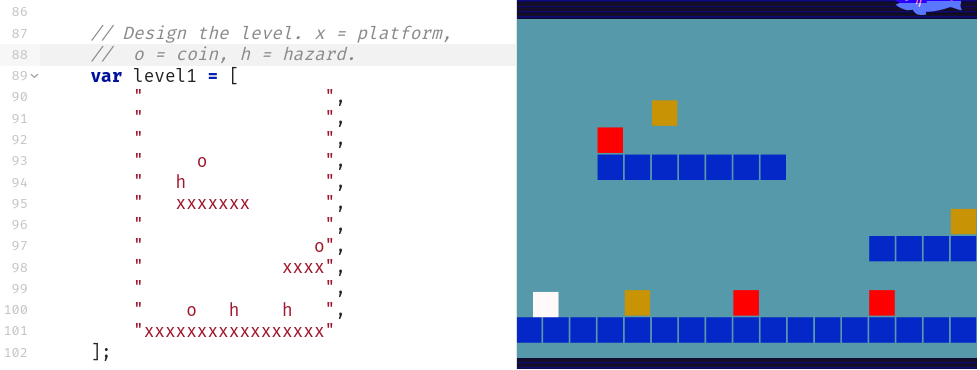

---
# all the regular stuff you have here
zotero:
  scannable-cite: false # only relevant when your compiling to scannable-cite .odt
  client: zotero # defaults to zotero
  author-in-text: false # when true, enabled fake author-name-only cites by replacing it with the text of the last names of the authors
  csl-style: harvard-manchester-metropolitan-university # pre-fill the style
layout: post
number-sections: true
categories: chapter
title: 5. Findings - Design Narrative
---
-   [Findings: Design Narrative](#findings-design-narrative)
    -   [Chapter introduction](#chapter-introduction)
    -   [Vignette and activity system
        analysis](#vignette-and-activity-system-analysis)
    -   [Narrative exploration of key areas of contradictions emerging
        in the game-making learning design (in P1
        /P2?)](#narrative-exploration-of-key-areas-of-contradictions-emerging-in-the-game-making-learning-design-in-p1-p2)
        -   [Contradiction area 1: involving organisational issues and
            the use of game programming and asset authoring
            tools](#contradiction-area-1-involving-organisational-issues-and-the-use-of-game-programming-and-asset-authoring-tools)
            -   [Description of what
                happened](#description-of-what-happened)
            -   [Surfaced tensions and framed
                contradiction](#surfaced-tensions-and-framed-contradiction)
            -   [Design response](#design-response)
        -   [Technical description of the core
            toolset](#technical-description-of-the-core-toolset)
            -   [Code playground
                environment](#code-playground-environment)
            -   [Code variables and
                structure](#code-variables-and-structure)
            -   [Graphical asset
                scaffolding](#graphical-asset-scaffolding)
            -   [Level design](#level-design)
            -   [Brief section on Impact](#brief-section-on-impact)
        -   [Contradiction area 2: contradictions associated with
            project navigation and use of
            documentation](#contradiction-area-2-contradictions-associated-with-project-navigation-and-use-of-documentation)
            -   [Description of what
                happened](#description-of-what-happened-1)
            -   [Surfaced tensions and framed
                contradiction](#surfaced-tensions-and-framed-contradiction-1)
            -   [Design response](#design-response-1)
                -   [Quick Start Cards](#quick-start-cards)
                -   [Structuring instructional tutorial resources and
                    code
                    snippets](#structuring-instructional-tutorial-resources-and-code-snippets)
            -   [Brief observations on
                impact](#brief-observations-on-impact)
        -   [Contradiction area 2: contradictions associated with
            project navigation and use of
            documentation](#contradiction-area-2-contradictions-associated-with-project-navigation-and-use-of-documentation-1)
            -   [Description of what
                happened](#description-of-what-happened-2)
            -   [Surfaced tensions and framed
                contradiction](#surfaced-tensions-and-framed-contradiction-2)
        -   [Design response](#design-response-2)
            -   [Quick start cards](#quick-start-cards-1)
            -   [Structuring instructional tutorial resources and code
                snippets](#structuring-instructional-tutorial-resources-and-code-snippets-1)
        -   [Brief observations on
            impact](#brief-observations-on-impact-1)
        -   [C3 - Responding to tensions and barriers in cultural
            aspects of the game making
            activity](#c3---responding-to-tensions-and-barriers-in-cultural-aspects-of-the-game-making-activity)
            -   [Playing games, identifying game elements & the use of
                physical
                materials](#playing-games-identifying-game-elements-the-use-of-physical-materials)
            -   [Social coding processes - MIX OF NEED AND DESIGN AND
                RESULT?](#social-coding-processes---mix-of-need-and-design-and-result)
            -   [SUMMARY AND LINK](#summary-and-link)
    -   [Chapter Discussion](#chapter-discussion)
        -   [TABLE OF THE DESIGN
            FACTORS.](#table-of-the-design-factors.)
            -   [Exploring systemic tensions in relation to existing
                research](#exploring-systemic-tensions-in-relation-to-existing-research)
            -   [DBR, CHAT & GDPs as the germ cell concept (unit of
                analysis)](#dbr-chat-gdps-as-the-germ-cell-concept-unit-of-analysis)
            -   [Outlining the key stages of GDP use in the structural
                learning
                design.](#outlining-the-key-stages-of-gdp-use-in-the-structural-learning-design.)
        -   [Summary and link to next
            chapter/s](#summary-and-link-to-next-chapters)
    -   [Footnotes](#footnotes)

# Findings: Design Narrative

## Chapter introduction

This chapter presents a design narrative that traces the evolution of the learning environment developed in this research, focusing on how the design responded to emergent tensions across different phases of implementation. The narrative approach adopted here is informed by design-based reabove search (DBR) traditions and supported by the analytical tools of third-generation activity theory (3GAT), as outlined in Chapter 3. Through this framing, the chapter aims to demonstrate how changes in tools, documentation, and pedagogical strategies were shaped by iterative analysis of contradictions and participant need.

Design narratives are particularly useful in DBR for describing situated, context-sensitive changes to an intervention over time [@hoadley_creating_2002-1; @bell_theoretical_2004]. Here, the narrative is grounded in the concrete details of the research setting and practices, and attends closely to how formative redesigns emerged in response to barriers encountered by participants. The approach is also underpinned by an argumentative grammar that draws together key concepts from DBR and CHAT: iterative cycles of transformation, the surfacing of tensions between systemic elements, the role of secondary stimuli and affordances in mediating participant agency, and the developmental process of rising to the concrete through exploration of a germ cell.

The chapter begins with a situated vignette that introduces the activity and its participants at a particular moment in Phase 2 (P2), drawing attention to layered systems of activity and to the shifting object of the intervention. This is followed by three major sections, each focused on a cluster of contradictions identified during the analysis. These cover tensions related to technical tools and accessibility, issues of navigation and documentation, and cultural or identity-based challenges in the coding process. Each section presents a sequence of problem identification, design response, and analysis of outcome or change, drawing on session notes, participant feedback, artefact analysis, and observations from the researcher’s journal.

A key outcome of the design process was the introduction and later development of gameplay design patterns (GDPs) as both a practical scaffold and a conceptual structuring tool. Emerging first as a response to contradictions in Phase 1, GDPs became increasingly central to the learning design and the coordination of documentation, gameplay, and peer support practices. This chapter begins to trace their role in structuring agency and framing activity, positioning them as a germ cell concept within the intervention. Their varied use by participants, and their role in shaping trajectories of action and interaction, are taken up in greater detail in Chapter 6, which draws on video data and transcript analysis.

By narrating the emergence and evolution of the learning design, this chapter contributes to the overall methodological and theoretical project of the thesis: to understand how participatory, tool-mediated environments can be iteratively developed through a synthesis of CHAT and DBR. It also begins the task of articulating the design heuristics that emerged from this process, which are revisited and synthesised in later chapters.

## Vignette and activity system analysis

To open this chapter, I present a short vignette from Phase 2 that captures the atmosphere and dynamic character of the learning environment. Rather than serving as a formal analysis, it grounds the reader in the evolving design by showing how learner motivation, intergenerational collaboration, and playful tool use unfolded in context. These themes are developed in later sections, but this scene offers a humanising and situated entry point into the wider project. Only a short extract is included below due to space limitations, but readers are encouraged to consult the full vignette in Appendix 5.toby for a richer account of the episode.

Toby, a child participant, has been working independently on his emerging platform game for the first five minutes of the session. He is seated next to his two grandparents who are modifying their own games. At the start of the vignette, in my role as session facilitator, I make a brief opening announcement, drawing the participants' attention to the upcoming showcasing of their games to students in the building’s foyer [^sa]. Toby pays careful attention to the challenge and variety of the game-playing experience, particularly in the specifics of his level design (see Vignette 1 extract). It becomes clear that the immediate audience of his peers plays an important role in guiding his design decisions. During the session, Toby invites other group members to play his game, initiating and responding to conversations about the difficulty of his game design.

INSERT SHORTER TABLE OF ACTIVITY

In the longer vignette, Toby undertakes two key actions: refining his level layout and adding a new gameplay design pattern. These required him to navigate multiple tools [^tt]. He did so in a fluid, self-directed way. The sections that follow explore how such individual actions were scaffolded and how they contributed to the evolving activity system.

To frame the scene within the broader analytic structure of the thesis, the following diagrams represent the layered activity systems in which this vignette is situated.

{width=90%}

The activity system can be seen as a joint activity stemming from the intersection of wider activity systems in Figure 5.broad. This figure is a necessary simplification of the diverse cultural and contextual factors that fed into the shared activity system of the game-making community. As explored in Chapter 3, this activity functioned as a shared object through which different motivations were negotiated through mutual appropriation [@lecusay_telementoring_2015]. Examples of the influence of these wider systems, including playful interactions, parental support, and practical guidance from facilitators, are explored further in Chapters 6 and 7.

{width=95%}

Using a 3GAT lens, the component parts of this shared activity system are represented again in Figure 5.full. This narrower scope takes as its subject the individuals present in the room during the sessions: children, parents, student helpers, and myself as researcher-facilitator.

{width=95%}

A 3GAT interpretation reveals the object of activity as a complex, multi-faceted construct, encompassing digital, physical and conceptual elements. It includes the use of software tools to develop code and assets, physical computers for coding, and the varied motivations of participants. These motivations, particularly social and playful, became quickly evident as the session progressed. Interaction with the task and with others shaped both individual and group experiences. In Phase 1 (P1), the object expanded to include the development of collaborative processes. These changes, and their role in building shared understanding, are explored later in the chapter.

As the design progressed, it became useful to analyse smaller units of activity. Following Barab and colleagues [@barab_using_2002], who justify the analysis of nested systems in technology-rich environments, I treat the implementation of GDPs as activity systems in their own right (see Figure.5.feature below). At this level, the subject might be an individual or a parent-child pair working to modify a specific feature within their game. One advantage of this scale is the ability to closely examine the mediating role of tools and the shifts in object of activity that arise from contradiction. By analysing these game design pattern implementations as distinct activity systems, it is possible to trace how the changes made at the individual level feed back into the broader community practices, influencing both the technical and social aspects of the learning environment.

{width=95%}

The significance of activity at this scope underpins my proposal of GDPs as a germ cell concept within the theoretical framework of the thesis. At this level, the object of activity is more concrete. Participants are focused on implementing or adapting a design pattern in their own game. This allows for analytical clarity and supports the argument that GDPs served not only as pedagogical scaffolds but also as conceptual anchors for the intervention's iterative development.

<!-- Integrate LATER
Using the terminology of Leontiev [-@leontiev_activity_2009], Toby can be seen undertaking chains of processes in a fluid way, indicating that these actions had become operations. The following sections extend this analysis by exploring three core areas of contradiction that shaped the evolving learning design. -->

## Narrative exploration of key areas of contradictions emerging in the game-making learning design (in P1 /P2?)

In line with the theoretical framing established in Chapter 3, contradictions are understood as historically and structurally embedded misalignments between elements of an activity system, often made visible during periods of change or innovation . Following Kuutti [-@kuutti_activity_1995] and Engeström [-@engestrom_activity_1999], tensions, barriers, and disruptions in practice are treated as surface-level manifestations of deeper contradictions within and between activity systems [@engestrom_discursive_2011]. These may take the form of technical difficulties, motivational conflicts, or mismatches between participant expectations and the tools or rules shaping the activity. The following sections of this chapter examine three key areas of contradiction within this 3GAT framework. The first addresses tensions arising from the introduction and evolution of technical tools in the learning design, particularly the shift in software practices between P1 and P2. The second focuses on contradictions related to navigation and supporting documentation during P2. The third explores cultural and identity-based tensions in coding participation, an area highlighted in earlier chapters as a persistent barrier to inclusion.

### Contradiction area 1: involving organisational issues and the use of game programming and asset authoring tools

#### Description of what happened

As a recap from Chapter 4, Phase 1 (P1) was exploratory, while Phase 2 (P2) marked the first full implementation using introduced resources. In this section, I draw on journal notes and participant feedback to describe the emergence of key tensions in kickstarting participant game design activity and the subsequent evolution in tool use across these phases.

My initial focus in the early stages of P1 was to create a welcoming, low-pressure environment for introducing and exploring the process of making games. To achieve this, I used several activities unrelated to computer coding to scaffold the game design process. Early sessions included playing and discussing retro arcade games, analysing their components, brainstorming game story scenarios, creating pixel-art characters on paper, and making craft collages representing game levels. These multimodal and low-tech activities helped surface ideas, supported collaborative group dynamics, and eased participants into the creative space without the pressure of unfamiliar digital tools.

Groups formed organically, often along family lines, and began to define their game ideas. Each group had access to a laptop with vintage games installed and a custom URL pointing to a basic JavaScript game template. I postponed introducing code editing tools until around week five, prompted by concerns about overwhelming participants and creating early barriers to engagement. When introduced, the JavaScript editor exposed learners to raw code, without the abstraction or constraint of block-based interfaces. This decision reflected my wariness of oversimplified tools and desire to support authentic engagement with real code [@chesterman_webmaking_2015].

#### Surfaced tensions and framed contradiction

When participants began engaging with code, several tensions quickly surfaced. Many learners had ambitious ideas for their projects including AI-driven enemies and 3D landscapes that were beyond realistic scope of the novice programme. Some became frustrated when their expectations did not align with what was technically possible or comprehensible (INPUT EVIDENCE). Others shifted focus away from programming altogether, contributing instead through narrative or asset design.

At the same time, my own ability to support participants became a limiting factor. While I had prepared a structural starter code in P1, learners frequently needed one-to-one help to make even minor edits. Whole-group demonstrations were largely ineffective: attention drifted, and groups progressed at different speeds and needed different support at different stages. As a result, support bottlenecks emerged, and some participants became stalled early in their projects. My journal notes describe these sessions as increasingly difficult to manage. The use of authentic text code rather than a block coding approach aggravated this tension. Without in-tool help or the supporting structure provided by block coding environments participants had no external supports to draw upon. They relied on me as the primary source of information, further exacerbating the facilitator workload.  While some learners began copying each other's code snippets, misunderstandings remained widespread.

{width=95%}

These tensions reveal a primary contradiction in the activity system between the object of creating expressive, technically functioning games and the mediating means available to support that object. The use of authentic text-based code was intended to foster real engagement with programming, but in practice it created a misalignment between participants’ ambitions, their actual skill levels, and the support structures in place. Tool mediation fell short of enabling meaningful progression, particularly for novices unfamiliar with syntax or programming logic. At the same time, the informal division of labour, based on a single facilitator and loosely defined group roles, proved insufficient to sustain progress across diverse learner needs. Rather than enabling expansive learning, the interaction between tools, subject, and division of labour produced friction and delay. This contradiction pointed to the need for redesigned scaffolding in P2 that could better support the object of creative game development.

#### Design response

These tensions shaped a series of design adaptations between P1 and P2. Recognising the need for scaffolding without over-prescription, I developed a more structured **starter game template**. This included a basic working game with editable values and visible parameters for player movement, enemy speed, and image and sound assets. I also embedded comments in the code and highlighted lines intended for modification. This template was introduced by myself or other facilitators prompted learners to play the game, work out how it was broken and then to make changes to progress, building on the foundational concept of “half-baked” games [@kynigos_children_2018]. This approach also drew on the motivations and techniques of the UMC framework explored in the literature review [@lee_computational_2011], particularly the guideline to "create choices that show visible and immediate changes" [@lytle_use_2019-1, p. 6]. My approach, through a careful scaffolding of initial coding experiences, forced a rapid and early transition from the _use_ to _modify_ stages, the motivation being to address possible negative affect towards text-based coding.

Alongside technical simplification, I revised facilitation practices. Rather than attempting to teach coding processes to the whole group, I encouraged peer showcasing of working solutions via extensive periods of playtesting [^pt]. These moves helped to reposition my facilitation role from central control to one encouraging distributed peer support. Some learners who had struggled in P1 became sources of informal guidance for others in P2. Overall, these changes aimed to realign the activity system by mediating the contradiction between technical ambition and available support in the form of core tools used.

<!-- THIS IS ALSO COVERED IN C3? -->

### Technical description of the core toolset

The following section outlines a technical description of the toolset that emerged from the tensions and contradictions of Phase 1 and which was implemented in Phase 2. This is included with a significant level of detail within the chapter to allow for replicability and to allow a more situated understanding of the activities being carried out.

ADD - Signposting sentence for the following sections  at the start

#### Code playground environment

The use of a code playground and starting template, while technically two separate tools, were experienced by participants as a holistic experience [^cp].  The use of code playgrounds by novices can mitigate against some of the initial challenges provided by learning computer coding stemming from  unfamiliarity with and potential complexity of code authoring tools and environments [@guzdial_programming_2004].

SIMPLIFY OR DEVELOP - Tactics to address challenging elements include steps to reduce syntax errors, shielding complexity, facilitating community commenting, sharing, remixing and other forms of collaboration.

The project consists of several interlinked code and asset files (see glossary & Appendix 5.tech).

{width=95%}

Figure 5.code : Summary of the features of the glitch code playground environment and game template - APOLOGIES THIS IS INCOMPLETE CURRENTLY

1. Javascript file which participants alter to make changes to their game
2. Html page within which the game is embeded (not usually altered by participants)
3. Css style sheet (not usually altered by participants)
4. Code editing area
5. Game preview area

The Glitch.com code editing tool had three main areas. First, on the left, there were options to change project settings, an assets link to manage image and audio files, and a list of project files, including JavaScript, HTML, and CSS. Second, in the central code window, participants could view and edit the code and comments. Third, on the right, a game preview displayed the immediate updates resulting from changes made to the code in the central window.

#### Code variables and structure

In P1, after delays caused by lack of coding knowledge, I had guided participants to begin their games by using a very partial template based on an online tutorial. As the process continued, it became apparent that the starting template greatly shaped the following design possibilities. To address this, in the development period between P1 and P2, I redesigned the starting code template of a game with a greater attention to pedagogical concerns in the following ways: I made changes to the code to reduce obscure syntax where possible increasing code readability and simplifying the structure of inter-related functions to facilitate the process of adding new code structures and code snippets. The choice to pre-select a particular genre, specifically a _platformer_ game (see glossary), was a pragmatic response to reducing the tension caused by diverse help requests, which narrowed the range of game features that would be requested. A summary of how these concerns were implemented in the design process follows (see Appendix 5.tech. for a fuller description).

#### Graphical asset scaffolding

Turning to the use of graphical assets, the starting template was altered to facilitate and encourage the process of adding designs created by participants. Initial graphical assets consisted of colour blocks, a design choice inviting learners to develop game characters from a clean slate (see Figure 5.px). To help resolve the overly complicated use of multiple asset creation tools, I prioritised the use of the pixel art tool Piskel, as I evaluated it to be intuitive for many younger participants. In P2, participants were guided to make a game on a broadly environmental theme, participants often redesigned sprites to games involving animals. Figure 5.fish shows a whale as a player character and plastic bottles as a hazard and fish as an item to collect.

{width=95%}

The process of game art and audio creation opportunities seeding narrative and artistic creativity is explored in more detail - IN AN APPENDIX?

{width=95%}

While I made several technical adjustments to facilitate the swapping of participant graphical designs (outlined in Appendix 5.tech), the process still required a series of potentially tricky operations. While some novice code authoring tools offer self-contained solutions for audio and graphical asset creation by providing in-built authoring tools and libraries of assets, the code playground Glitch provided neither, thus requiring the use of Piskel as an external asset creation tool, complicating the process. However, this forced choice to use a distributed toolset, rather than a self-contained approach to asset management, led to benefits in developing key digital literacy skills needed for web creation. Some participants became remarkably adept at the complex process of migrating assets from Piskel into their games, transforming the chain of actions involved into fluid operations. This section has focused on the rationale behind the introduction and initial expansion of the design's primary tools, rather than evidencing their subsequent impact on participants, which is explored in Chapter 6.

#### Level design

Addressing level design, in P1 the process was relatively complex involving changing parameters of functions to change asset location, and spiralling code complexity (see Appendix 5.chapter). Instead, to align with research on the value of a visual approach to coding multi-media projects for novices [@guzdial_programming_2004; @resnick_scratch:_2009],  in the P2 starting template the use of a graphical grid structure to edit level design shown in Fig 5.grid. A minimal choice of level design elements were represented specifically; platforms to be jumped on; hazards to be avoided; and rewards to be collected.

{width=95%}
Figure 5.grid - Grid based editing of level design with a simple key for hazards, coins, and platforms.

Technically, each level is a JavaScript object consisting of a data array of 12 entries containing 17 characters which representing a matrix layout of the game. Each grid entry can be either black or one of the following: x (platform); h (hazard); o (coin). The structure of text-based array has a strong visual correlation with the resulting game layout and changes to the text based grid in the code area on the left would be immediately seen in the right hand project preview area. This solution abstracts away complexity and repetitive nature of asset placement mirroring a technique called tilemaps [@erhard-olsson_procedural_2018] used in GUI oriented game making tools (see glossary and Appendix.tech).

#### Brief section on Impact

The scope of this section is to summarise some of the ways in which the design helped address the tensions described above. The aim is not to prove efficacy of the intervention rather than to explain its role in the iteration.

<!-- INCLUDE SOME INTERVIEW DATA IF USEFUL.
IF NOT THEN DO SOME SIGNPOSTING AS TO WHERE THE IMPACT IS EXPLORED IN LATER CHAPTERS. ETC.
A BIT MOE OF A SUMMARY.. -->

The use of a template aligned with half-baked approach helped by introducing coding tools early, thus avoiding the mismatch between participants' planning and the technical limits of their novice abilities.

It addressed the desire for more hands on play earlier in the process outlined by one family in P1 feedback. CHECK THIS FOR DUPLICATION AND SUPPORT

The ability for individuals and pairs to make quick changes to the games templates via in terms of the affordances described in the previous section appeared to build their ownership over these fledgling games and set a path of working in a smaller group.

While my design aim was in part to reduce coding syntax errors and thus reduce learner anxiety, I did not wish not to remove the possibility of learners making mistakes entirely. While even these small changes involved potential syntax errors, as these simple expressions were surrounded by other lines modelling the correct syntax, they could often be corrected by the participants without facilitator support.

This chapter's vignette (Appendix 5.toby), where Toby designs many levels as a way of making his game distinct from others, illustrates the impact of this technical adaptation on the evolution of social coding processes a theme which is explored in more detail in the section contradiction area 3.

### Contradiction area 2: contradictions associated with project navigation and use of documentation

#### Description of what happened

This section outlines a contradiction associated with the introduction of supporting documentation to scaffold the game-making process.

In P1 my overall aim was to explore the process and to encourage personal creativity using a diversity of tools. The previous section, outlined the process of arriving at a reduced toolset to help address potential overload and fracturing of experience, thus reducing the possibility for peer exchange of skills and knowledge.

Similarly, in terms of the creative process, the exploratory nature of P1 led to divergent creative pathways, but at a cost of a sense of an overall coherence and shared understanding of the process. In short, it felt like time to reign in the chaos.

After one session in P1, I emailed participants , expressing that I felt daunted by the task of helping the integration of the disparate creative elements being produced into cohesive game projects, a process which I felt responsible to facilitate [^em]. I asked parents for ideas and support in organising and bringing more order to group and planning processes.  In response to my email, parents made suggestions including: use of a visible and shared list of game features that are being worked on, documentation to support the implementation their requirements. The group planning process improved, and the self-organisational abilities of parents and tenacity of young people involved developed. Groups expanded their activity by creating wish lists of game features, which acted as mediating tools to coordinate between different team members and to request facilitator support to implement them via code structures. In addition to helping directly via coding with participants, I began to create short stand-alone instruction documents if I thought the requested code  would be useful to other groups.

In the development period following P1, I reflected on the tension between learner agency, especially the role of creative autonomy, and the need for shared reference points that could support progress without constant facilitator intervention. In P1, resources to support implementation were minimal and often tied to a specific code challenge, making them unsuitable for reuse. My direct input was often needed at this stage, leading to delays and participant frustration due to the limited time I could offer each group.

In response, I developed several new artefacts intended to scaffold project navigation and reduce the bottleneck of real-time technical support.

The introduction of a game template approach had the unintended consequence of reducing the average size of working groups thus increasing individual coding project  projects, which in turn increased demand on my time as a technical troubleshooter. While the in-tool scaffolding provided by the code template accelerated production for most learners [@laurillard2020significance], participants still required support when adding new code structures, particularly during the _Create_ stage of UMC.

#### Surfaced tensions and framed contradiction

In P1, I struggled reconcile a responsive approach to providing support and documentation with requests from some parents in the feedback on P1, asking for background concepts and explanations of coding constructs.

Another recurring tension noted in my journal during this period concerned the clash between divergent participant learning paths and the need for facilitator-led instruction and support. This was compounded by resistance to whole-class input, which consistently yielded low engagement. I surmised that participants saw these attempts as class teaching as not immediately relevant, misaligned with learners’ preferred hands-on working styles, and disruptive to the flow of their making. Repenning et al. [@repenning_scalable_2015], as discussed in Chapter 2, frame this as a barrier arising from a principles-first approach. The challenge became how to support progress given my limited facilitator time, without resorting to step-by-step instructional documentation.

Together, these challenges surfaced a contradiction between the object of the activity (learner-led game creation using flexible tools) and the evolving rules and mediating artefacts intended to support that process. The activity system lacked a shared, structured way for participants to orient themselves in the process to develop or to reuse successful code patterns without facilitator mediation. The flexibility of the environment became a source of friction, not just a space for exploration.
CLARIFY THIS FURTHER - TRY A DOUBLE BIND ANALYSIS?

#### Design response

The design and implementation of supporting resources evolved rapidly pace at the start of P2, resulting created three main sources of documentation: quick start cards, written instructions, and code snippets to address some of the contradictions in the learning design outlined above.

##### Quick Start Cards

_Quick start cards_ (see Figure 5.cards below) developed during P2, were A5 sized printouts highlighting the key affordances of the template involving: game mechanics such as movement, jumping, level design, and the final challenge of swapping out the look of one or more characters by designing pixel art and replacing the line of code that adds the asset to the game. These printed resources highlighted key lines of code and demonstrated how they could be altered to impact game behaviour [^qs].

{width=95%}

The cards supported participants' initial interaction with the code in a way that further developed the use and modify stages of the UMC framework [@franklin_analysis_2020]. They allowed  participants to get started with the starting template game with less in person support from facilitators to the strongly scaffolded interaction with the code and the relatively minimal changes needed to the code. The result of quick start cards in one-off sessions allowed very rapid creation of games with participants able to choose a level of difficulty and an area of interest. Thus in early stages, this process addressed the tension of providing documentation to support users in completing coding tasks while also facilitating choice over learner pathways. This style of intervention aligns with the concept of just-in-time learning approaches within project-based learning [@riel1998education], where access to supporting documentation is provided based on learner need.

<!-- Also aligning with low floors principle.
VERY LIMITED ANALYSIS HERE - SIGNPOST LATER EXPLORATION?
 -->

##### Structuring instructional tutorial resources and code snippets

The process of creating supporting documentation underwent several iterations which build on top of each other and served varied purposes.

In P1, I had encouraged participants to use code snippets from the Phaser documentation website. While the use of code examples or *snippets* is a common professional practice in problem-solving [@yang_stack_2017], their use by novice learners presents challenges related to relevance, consistency, and accessibility [@treude_understanding_2017]. Indeed  difficulties experienced by participants in P1 understanding and applying these abstracted examples prompted me to create more tailored resources. To do this I created stand-alone code project that illustrated requested game features as gameplay design patterns, such as *jumping on an enemy to zap it* and *making a moving enemy*  demonstrated a code feature or principle through a playable game project based on the core game template, hosted in an online code playground. This allowed participants to copy and paste the relevant code sections needed into their project.  I developed this approach further in a way which reduced dependence on my time as a facilitator. I wrote supporting documentation in a step by step format for each code example. In the early stages of P2, learners accessed these document through  a Google document with links and brief descriptions. I continued developing new projects and producing printable instructions to support these code snippets, ensuring that each snippet linked to a descriptive chapter and vice versa. To help learners situate the code within the correct structure, all projects used the core game template and included only the new code required for each feature.

To meet participants' requests for foundational coding knowledge, I created step-by-step chapter resources guiding users to code a core game template structure from first principles [^ss]. While this linear format did not fully align with my choice-driven approach, I envisioned it as supplementary reinforcement for learning outside of sessions, which indeed some participants did take up [^pl]. Writing these chapters revealed a technique that helped balance structured guidance with choice-driven learning.

I also experimented with ways to present these feature choices in an accessible, engaging format, which I describe in detail in Appendix 5.map. Recognising that multiple documentation formats sometimes led to confusion, I created a centralised hub to host both snippets and tutorial chapters, making navigation more intuitive and orienting documentation towards participants' gameplay experience.

{width=95%}

Figure 5.patterns : a screenshot of the hub of GDPs pointing to code snippets and instructional chapters

Chapter 2 reviewed research on using collections of gameplay design patterns to support learning in game design [@holopainen2007teaching; @holopainen2011foundations; @eriksson_using_2019; @bjork_patterns_2005]. Thematic organisation of these patterns shows potential to foster a shared understanding of game-making concepts within a coding community [@holopainen2011foundations]. For the documentation hub described above, I grouped game design patterns into categories based on academic and professional interpretations of game elements [@salen_game_2006; @schell_art_2008; @tekinbas_rules_2003; @olsson2014conceptual], as well as participants’ evolving requests for game features. The final categorisation used in P4 is shown below in Table 5.x.

| **Game Mechanics**| **Game Polish** | **Game Space** | **Challenge Systems**|         
|--------|------------|--------------|----------|
| Add Static Hazard  | Add Graphical Effects | Change Design of Levels | Gain Points when Collecting Food |
| Add an Animated Enemy  | Add Sound Effects | Add More Levels | Add a Timer |
| Jump on Enemy to Zap them  | Add a Sound Track (Music) | Change Shape of Levels | Collect all Food before Progressing |
| Double Jump  | Add a Game Story with Messages | Change the Background Image | Power up - Higher Jump |
| Moving / Patrolling Enemies  | Add a Game Story with Messages | Change the Background Image | Power up - Player Speed |
| Moving / Following Enemies  | Animate your Player’s Movements | Key and Door | Random Doubling Enemies |    
|   | Make Player Immune |  | |    

Table 5.x Categorisation of game design patterns used in P4.

These elements were themed in a way which aligned with the MDA (mechanics, dynamics, and aesthetics) game element framework explored in Chapter 2 [^mda].  

<!-- NOTE - DEVELOP THIS A BIT AS IT IS EXPLORED IN CHAPTER 6. -->

#### Brief observations on impact

The highlighted affordances of the template and the accompanying collection of code examples, as outlined in earlier sections, proved impactful. Despite their relative simplicity, these tools facilitated the creation of games with diverse and complex styles and themes, even at early stages.

While the code snippets, practical instructions, and chapters on core principles continued to pose some challenges (as seen in Vignette 6.1), the video data analysed in the following chapter shows an increase in participants’ practical ability to implement game features. The impact of the of choice-driven pathway and the ability for participants to input into the learning design through requests for new features is discussed in more detail in relation to the development of participant agency in Chapter 7.

LINK TO NEXT SECTION?

### Contradiction area 3: tensions and barriers in cultural aspects of the game-making activity

#### Description of what happened

Some participants experienced alienation during the transition to coding, stemming not only from challenges with tools but also from a sense of exclusion from the culture of coding. This aligns with research on cultural barriers in coding processes, as discussed in Chapter 2 [@kafai_constructionist_2015-1]. In P1, I had incorporated several non-coding techniques to foster positive affect and create an inclusive idioculture, aiming to reduce alienation from unfamiliar technical tools.

MORE ON THIS LINKED WITH RESEARCH SUPPORTING DECISIONS, ABILITY TO USE GRAPHICS, DIVERSITY OF TOOLS.

While participant feedback on these techniques was broadly positive, accumulated tensions ultimately caused one family to disengage.

Members of this family actively participated in planning on paper and creating pixel art. However, tensions emerged when the introduced coding framework did not support a key gameplay idea: a bee avatar exploring a 3D landscape [^ab].

While the family

In addition,
Previous divisions between coders and art creators no longer functioned in this stage of making.

During participant feedback, the parent shared that in one session they had arrived, sat down and seen other participants grappling with the text code needed to enact planned changes. They felt alienated from this process of _hardcore coding_ (participants phrase)

This episode was not isolated with this family,

It is also present in other data points of research [S saying we neglected T in the first ]

Second, it revealed the limitations of peer processes of division, since fellow participants were often unable to collectively address more complex coding issues independently. A feeling

These reflections underscored conceptions of the fragility of learners’ positive affect during the transition from the planning and sketching phase to the coding phase. This reflects existing research on difficulty of coding and alienation.

<!-- Finally, it highlighted a potential imbalance in facilitator attention, as participants more confident in coding sometimes created complex problems requiring significant time, which could leave others feeling less supported or valued. -->

Although technical challenges played a role in this disengagement, the conflict was compounded by social and cultural dimensions. The shift in the object of activity, from playful design to more technical production, exposed a misalignment between participants' creative goals and the community norms forming around coding.

#### Surfaced tensions and framed contradiction

This case exemplifies a contradiction between the object of the activity, inclusive game-making allowing diverse creative contributions, and the emerging norms that required an engagement with the technical aspects of coding. As participants moved from early-stage ideation to working with the game code template, the division of labour shifted. The flexible, multimodal practices gave way to a narrower set of expected competencies, placing pressure on all participants to engage with text-based code regardless of their preferred working style. This shift introduced a double bind: to participate fully, individuals had to take up roles they may not have chosen or felt prepared for as well as giving up activities

the tensions arising from the expectation to transition from non-coding creative activities to hands-on coding are illustrated in Figure 5.x. This diagram shows how the family’s perceived exclusion from the dominant activity structure, framed by the term “hardcore coding”  became a source of contradiction.

{width=95%}

Fig 5.x – A contradiction between subject experience and the evolving involving cultural layer of the game-making activity - CHANGE TO A CONTRADICTION BETWEEN DOL AND SUBJECT

A's family displayed the internal manifestations of this contradiction externally during the game making sessions and later during participant feedback [add footnote?].

The coding tool and the template mediated the activity in ways that introduced new community norms, contributing to a cultural tension between the inclusive intentions of the design and the exclusive signals sent by the technical tools. This contradiction reflects a misalignment within the activity system between the tools, division of labour, and object, resulting in alienation for some participants. Addressing these tensions required rethinking not only the technical scaffolds but also the broader cultural framing of participation to adequately accommodate alternative contributions such as visual design or narrative development.

#### Design response

As part of feedback, the parent expressed a preference for more hands-on exploration with the tools of production before being required to make creative decisions, driving the design decisions outlined in C1 above.  EXPLORED EARLIER

The following design interventions were introduced in Phases 2 and 3 to respond to these tensions. While originally developed to address practical and technical barriers, these strategies also served to realign cultural dimensions of the activity system, supporting more inclusive and flexible forms of participation.

##### Social coding processes

As previously outlined, the introduction of a half-baked game template in Phase 2 allowed participants to work with a functioning starter game, which could be modified with minimal code changes. This significantly reduced early technical demands and opened up more varied points of entry into the activity. This change had a notable impact on the division of labour from Phase 2 onwards. Participants were increasingly able to work either individually or in small groups, often alongside family members. This helped to reduce the kind of role-based exclusions seen in the case described above, where non-coding contributions had become marginalised.

The highlighted affordances of the template and the accompanying collection of code examples proved impactful. Despite their simplicity, these resources facilitated the creation of games with diverse and complex styles and themes. The provision of a working base project also increased the time participants spent playtesting both their own and others’ games. Video data captured instances where participants expressed frustration when errors rendered their games unplayable (see Vignette 6.1), and these moments became triggers for collaboration. In response, I prioritised timely support to ensure games remained functional and playable. By the middle of P2, playtesting had evolved into a key site of peer exchange, prompting spontaneous sharing of advice, assets, and fixes. Observing this, I recognised the potential of these interactions and, in preparation for P3, began to intervene more gently and strategically to nurture these emergent practices of social coding and mutual aid.

##### Use of side missions to encourage varied creative practices

In P3, I introduced a light narrative framework to scaffold participant engagement. This took the form of a fictional scenario in which an alien contacted the group and asked for games to assess the worth of the human race (see Vignette 5.alien). Within this scenario, participants were assigned printed side missions — some social and some secret — that encouraged interaction, exploration, and humour. These missions often involved behaviours not directly related to game creation, such as observing others’ games or making subtle, playful changes to someone else’s project.

| **Your Alien Mission (social)** | **Your Secret Alien Mission** |
|--------------------------------|-------------------------------|
| Find out the names of 3 games that are being made | Change the variables at the start of someone else’s game to make it play in a funny way |
| Make a list of characters in two other games | Replace the images in someone else’s project with something unexpected |
| Find out the favourite computer games of 4 people | Change the level design of someone else’s game to make it impossible using minimal edits |

**Table 5.sidemissions – an extract of side missions given as part of the drama scenario**

The side missions were designed to support playful social dynamics and to foster a sense of shared community. By encouraging participants to engage with others’ work in imaginative ways, they helped shift the focus away from individual technical mastery and towards relational creativity. In line with third-generation activity theory, these missions acted as secondary stimuli that restructured the activity context and opened up new pathways for agency development. They positioned observation, playfulness, and curiosity as legitimate ways of participating, helping to validate roles beyond that of the coder.

While this section presents only a partial account of the missions and the drama-based approach, their inclusion in the design was a response to the contradictions described above. A more detailed exploration of how these elements contributed to the development of agency is provided in Chapter 7. Within the broader CHAT–DBR framework of this thesis, these missions can be understood as design artefacts that mediated both cultural and affective engagement, making space for diverse learners to see themselves as legitimate participants in the evolving game-making community.

### C3 - Responding to tensions and barriers in cultural aspects of the game making activity

Some participants experienced alienation during the transition to coding, stemming not only from challenges with tools but also from a sense of exclusion from the culture of coding, including cultural barriers to coding processes, as discussed in Chapter 2 [@kafai_constructionist_2015-1]. Issues of alienation from the coding process were particularly visible in P1 in my journal reflections and feedback interview data from P1 end reflections.

In P1 accumulated tensions to do with alienation led one family to a crisis point. While a fuller description of this case study is available as Appendix 5.bee, a brief summary follows to illustrate key elements of this area of contradiction. Members of this family actively engaged in planning on paper and creating pixel art. However, tensions arose when the process turned to implementing planned changes via the code framework. Though technical challenges related to the use of tools played a role, this area of conflict was compounded by social and cultural factors, ultimately leading to the family's decision to step away from the activity.

During participant feedback, the parent shared that in one session they had arrived, sat down and seen other participants grappling with the text code needed to enact planned changes. They felt alienated from this process of _hardcore coding_ (participants phrase). In addition one of they younger child's key ideas for game play, to control a bee avatar to explore a 3D landscape was not possible within the introduced 2D coding framework. In other feedback the parent, expressed a preference for more hands-on play and exploration of the tools of production before being required to make creative decisions.

The tensions arising from the expectation to transition from non-coding creative activities to coding tools are depicted in Fig. 5.x below. This figure illustrates how the family’s positioning and alienation from the hardcore coding stage of the activity, is represented as tension.

{width=95%}

The division of labour conflicted with the object of activity as previous divisions between coders and art creators no longer functioned in this stage of making. This then impacted on a tension between the community norms of hardcore coding their objective of a creative activity. A particular tension involved the coding tool introduced clashing with the goal to create a 3d roaming bee

This case study highlighted a key concern for the design, that of the fragility of learners’ positive affect in early stages and in the transition from the planning and sketching phase to the coding phase of the game-making process.

My reflections on this conflict prompted several changes in the learning design to address factors situated within the plane of cultural activity. This following section describes key learning design features addressing these issues, particularly the use of non-coding process and the fostering of social coding processes.

#### Playing games, identifying game elements & the use of physical materials

In P1, I had incorporated several non-coding techniques to foster positive affect and create an inclusive idioculture, aiming to reduce alienation from unfamiliar coding tools.

The use of playing games and identifying game elements was adapted from a resource created for a New York youth program Moveable Game Jams to build language and concepts used to then  list of features serving as a mediating planning tool. This process, explored in Chapter 2 via the description of the process of GSM? or similar, served to build language and understandings of game design patterns. This later proved to be helpful in supporting a variety of mediational uses of GDP concepts which are explored in Chapter 6.

IS THIS IN AN APPENDIX - IS THERE A SCAN OF A A3 SHEET AVAILABLE?
OR TABLE OF SPACE, MECHANICS ETC. ?

The process of using physical element of art i.e. collages

Physical computing elements in the form of the arcade boxes

#### Social coding processes - MIX OF NEED AND DESIGN AND RESULT?

As explored above, from P2 onwards the use of a half-baked game template  led to the formation of smaller, more autonomous group in a way which ameliorated the a problematic division of labour outlined in the example above. The process also incorporated feedback suggesting on early hands on use of tools, thus both these barriers to engagement were substantially reduced.

In addition, the parent A's also share other reflections on divisions of labour and working community norms in P1 feedback
ROLE OF PLAYTESTING IN THIS? AND A'S COMMENT ON PARENTS GETTING IN THE WAY?

The provision of a functioning starter game significantly increased the amount of time participants spent playtesting both their own and others' games.

Video data captured instances where participants expressed frustration when errors rendered their games unplayable (see Vignette 6.1 for a clear example).

In response, I prioritised supporting participants in resolving these issues to ensure their games were functional and playable.

By P2, playtesting had evolved into a source of rich, productive peer social interactions. Observing this, I recognised the potential of these interactions and, in preparation for P3, aimed to intervene more strategically and gently to nurture and encourage these emergent patterns of peer collaboration and engagement.

**Use of drama narrative and side missions to encourage varied creative practices**

In P3, I introduced a drama-based scenario to guide the game creation process. This scenario revolved around an alien making contact with the group to request the creation of games as a means to judge the worth of the human race (see Vignette 5.alien). Within this fictional framework, participants engaged in side-missions, some of which were public while others remained secret (see Table 5.sidemissions). The introduction of this drama and the accompanying social missions aimed to reinforce the social and cultural dimensions of the activity, building on patterns observed during semi-structured playtesting in earlier phases. These missions were designed to encourage behaviours that fostered community-focused interactions. They included activities not directly related to the game-making process but rather centred on exploring and engaging with others' games and adopting a playful, exploratory approach. I had previously identified such behaviours as crucial for sustaining positive affect and fostering identification with the ongoing group game-making process.  The missions were printed on cards, and participants were given one of each type during the first half of the initial two sessions. An sample of the social and secret missions is provided below, with the full table available in Vignette 5.alien.

| Your Alien Mission (social)          | Your Secret Alien Mission:              
|----------------|----------------|
| Find out the names of 3 games that are being made.  | Change the variables at the start of someone else’s game to make it play in a funny way.    |
| Make a list of characters in two other games being made.   | Change of the images in someone else’s project to a totally different image and see if they notice.    |
| Find out the favourite computer games of 4 people.   | Change the level design of the first level of someone else’s project to make it impossible but try to change as little as possible to do that.   |

Table 5.sidemissions - an extract of side missions given as part of the drama scenario

#### SUMMARY AND LINK

While this provides an incomplete picture of the missions and drama process, due to space limitations, these side missions are presented in this chapter to offer an overview of the varied tools used. A more detailed exploration of the development of participant agency in relation to these social missions and playtesting is provided in Chapter 7.

MORE SIGNPOSTING? Chapter 7 focuses on analysing participant reactions to the design from a more cultural perspective in greater depth,

## Chapter Discussion

<!-- MERGED FROM 2024 -11 -6 VERSION -  -->

This chapter has explored the complexity of the interacting tools and documentation in relation to their evolution in different phases of the formative intervention process. The contradictions explored initially focused on technical and then more social dimensions of the learning design, a process which has surfaced some of the barriers to achieving the varied competencies needed to complete the text coding of a multi-media project.

The section begins with a table which begins a process of synthesis of design factors. The subsequent discussion explores features of the design narrative and the summative table section synthesises aspects of systemic contradictions and highlights how elements of the design process contribute to the research landscape,  specifically UMC, half-baked approach and constructionist design principles.

<!-- - alignment with UMC, and other pedagogies (retrospectively found),
  - authenticity and blackboxing in particular as a constructionist approach
- DBR -> germ cell & use of collection of GPD  -->

INSERT TABLE OF THE DESIGN FACTORS.

<!-- To do this it employs an argumentative grammar fusing elements of DBR and CHAT concepts: specifically iterative processes, analysis of emerging tensions between systems elements, a focus on affordances and secondary stimuli (particularly in relation to participant agency), and the process of rising to the concrete through exploration of a germ cell concept. -->

<!-- DROP?
The emergent and mutual nature of this design process aligns with both DBR and CHAT principles. In this chapter and the previous one, I have described my active role in motivating and supporting an emerging community through iterative phases. The design approach was open and risky, requiring me to rapidly generate new tools in response to changing needs. I was fortunate that the tenacious character of the participants in P1 helped mitigate the challenges posed by the incomplete design.  -->

<!-- DROP?
The concept of affordances, commonly used in DBR, is present in this design through the careful selection of technical tools and non-technical pedagogical strategies. The term affordances has also been extensively explored in the literature of human-computer interaction (HCI) from a CHAT perspective, defined as “possibilities for human actions mediated by cultural means” [@kaptelinin_affordances_2012, p.927]. -->

<!-- In 3GAT terminology, the affordances of my design can be framed as a series of secondary stimuli. Sannino [@sannino_principle_2015] highlights the intersection of the use of secondary stimuli by participants and their volitional action or agency. While subsequent chapters explore shifts in the overall structure of participant activity in alignment with concepts of relational and transformative agency, the evolution of these tools, based on the novice status of the participants, also led to an increase in instrumental agency. This instrumental proficiency was required before the rich set of interactions based on peer learning and other social coding processes could emerge in playtesting practices. Instrumental agency can be seen as the base of a hierarchy of agency, in other words, that other dimensions of agency may need to be built on this one. This foundational agentic level is further explored in relation to other research in the following section. -->

Key observations outlined in the table above align with the supported benefits outlined in research on the Use Modify Create (UMC) pedagogy [@lytle_use_2019-1] and the specific technique of starting with a half baked game template [@grizioti_game_2018-1].

The alignment of the underlying principles of the learning design with research constructionist design heuristics, in particular half-baked designs process merits deeper exploration. A CONTRIBUTION?

The work of Kynigos et al. [@kynigos_children_2018] on the concept of half-baked microworlds and games helped me focus on the motivational aspect of incomplete game affordances to drive initial engagement with the use and modify stages of the UMC approach. Small code changes resulted in potentially large changes in game behaviour, appearance and difficulty aligns with a long standing concept of HCI research that feedback is motivating for system users [@bernhaupt_introduction_2015; @malone_heuristics_1982]. The careful design work on the P2 starting game template facilitated participants in building familiarity with the code structures and use of tools in an accelerated way. In addition, the framework of UMC highlights the benefits of a stage-based design. In this design, this staged approach is enacted through the interaction of participants with code via increasingly sophisticated documentation. My observations, supported in the following chapter, indicate that the combination of the use of a template and a collection of GDPs accelerates the use of certain coding fluency practices, which, in turn, had a subsequent impact on the increased use of social coding processes.

Turning to constructionist research, a more extensive set of design heuristics is evident in studies of decisions made in creating microworld environments and in the development of Scratch (see Chapter 2 for a summary). Techniques or concepts present in constructionist design research, embodied in this intervention's toolset, include a simplified code authoring environment with live feedback in a preview window, techniques to avoid and correct syntax errors via the linting capabilities of the code playground (see glossary), and the use of a GDP menu to encourage creative but scaffolded design. A detailed description of these elements is explored in Appendix.tech. Of particular relevance to this design process is the principle choose black boxes carefully [@resnick_reflections_2005]. Resnick et al.[-@resnick_reflections_2005] describe black boxes as abstractions that remove potentially problematic areas of the production process, creating a protective, scaffolded learning experience while maintaining a boundary with the authentic challenges of coding in the wild. Black box decisions steer learners toward exploring preferred concepts. Papert's [-@papert_mindstorms_1980] work on Turtle control in LOGO exemplifies this approach, using abstraction to focus on powerful mathematical ideas. The use of black boxes is also widespread in professional coding practices, particularly through code libraries and frameworks. These tools provide pre-written, self-contained sections of code to simplify complex operations. In my design, the Phaser game-making code library framework serves this purpose by managing underlying structures for gravity and physics calculations necessary for object collisions. In addition, my starting game template further simplified these processes by allowing participants to modify gravity settings through a single variable, thus combining professional coding language use with an accessible learning experience. Based on Laurillard's [-@laurillard2020significance] interpretation of the constructionist design of microworlds as being driven by affordances that structure user experimentation to enable exploration and concept formation without reliance on direct instruction, I propose this design as a form of microworld. When compared to other game coding programs using text languages this learning design can be seen as tightly structured. However, when compared to a constructionist microworld, the structure of my learning design is compromised by its relatively porous borders between this controlled environment and other, more authentic coding ecosystems. I argue that increased scaffolding of learner resources and tools can enhance instrumental agency for novice coders but potentially at the cost of limiting access to the tools and processes of authentic creative communities. The relationship between authentic and scaffolded processes can be understood as an inherent dialectical tension that learning designers should account for rather than attempt to eliminate.

Addressing authenticity in more detail, it is valuable to re-examine the factors driving my choice of JavaScript and Phaser, a professional, open-source game-making framework. Specifically, this choice relates to the potentially empowering impact of exposing participants to authentic technologies and concepts in hands-on, exploratory processes. Ratto [-@ratto_critical_2011] discusses this through critical making, a process that playfully brings forward Latour's [-@weibel_making_2005; -@latour_cautious_2008] ideas of shifting from matters of fact to matters of concern by revealing taken-for-granted artefacts as deliberately designed objects. This was evident in conversations between participants where they expressed a sense of inspiration or engagement with previously unknown technologies. For instance, exchanges demonstrated a growing appreciation for the complexity behind professional games, based on their perception of the effort required for their own simple game projects:

    Pearl: It just shows you what goes into these games.
    Student Helper 3: Think about how much effort goes into.
    Pearl: You just take things for granted don’t you?

ADDITION MADIHA's reflection in interview data.

A possible drawback of using a professional tool for novice learners is the risk of culture shock when participants encounter the unfamiliar and potentially alienating aspects of a professional coding ecosystem. The learning design outlined in this chapter helps address at least the beginning of this process by providing a protective, scaffolded learning environment.

In the learning design outlined in this chapter, GDPs drive stage-based instructional processes. Using terminology from Denner et al. [-@denner_does_2019], the shift from P1 to P2 represents a move from a design-build-test to a stage-based approach which introduces code structures and challenges in an initially simplistic, prototypical format for learners to experience and explore, which are subsequently replaced by more advanced models or complex instances of the task. The structure of documentation, created in response to participant requests for adding new GDPs to their games, evolved from a piecemeal format in P1 to, by the end of P2, a menu of GDP code snippets accompanied by detailed instructional documentation.

THIS STEPPED PROGRESSION COULD BE EXPRESSED AS A TABLE.  

This stepped approach which increases complexity of the objective of activity, is present only in limited  CGD&P research. The work of Repenning on SGD operationalises this concepts through guiding learners to undertake projects which are progressively more complex.
This work differs in a core template is provided allowing for less instruction following and the progression does not involve starting from stratch each time.
This is notable as I found in P1 that changes to the underlying code structure were stressful and unwelcome for learners one had built familiarity with it (add this in as appendix using interview data).

In line with UMC, an advanced stage of the stage based approach would be the choice to imagine, design and implement a GDP not included in the menu provided, a process that Dan and Toby take on in P3 (see Vignette 7).

<!-- MOVE OR SUMMARISE
GDPs were first identified through playing games in an activity adapted from Moveable Game Jams (ensure this is described or linked to) and were used as a list of features serving as a mediating planning tool.  -->

<!-- In P2, GDPs were incorporated as affordances into a starter game template, initially highlighted via facilitator interaction and later as the guiding principle of quick start cards to scaffold modifications to the code template.
The structure of documentation, created in response to participant requests for adding new GDPs to their games, evolved from a piecemeal format in P1 to, by the end of P2, a menu of GDP code snippets accompanied by detailed instructional documentation. -->

<!-- The shift from P1 to P2 represents a move from a design-build-test to a stepped, stage-based approach. This graduated approach introduce code structures and challenges in an initially simplistic, prototypical format for learners to experience and explore, which are subsequently replaced by more advanced models or complex instances of the task. -->

<!-- GDPs were encountered through the game playing and analysis activity explored in the section above. GDPs were incorporated as affordances into a starter game template, initially highlighted via facilitator interaction and later as the guiding principle of _quick start cards_ to scaffold modifications to the code template. -->

<!-- The structure of supporting resources, created in response to participant requests for adding new GDPs to their games, evolved into a menu of GDPs in the format of name, description and both detailed step by step implementation instruction including code snippets, and stand alone code projects / snippets. -->

<!-- NOTE / MOVE - It could be seen as a progression to move from more scaffolded use of instructions to the use of code snippets alone with practice although data of Toby may not support that progression suggesting instead it may be a matter of preference. -->

<!-- LINK  -->
This chapter has explored the iterative development of the learning design, focusing on resolving barriers to coding and aligning with existing research principles, particularly the use-modify-create (UMC) process and constructionism. It emphasized the potential and challenges of leveraging professional tools within scaffolded environments, underscoring the pivotal role of learner-led design decisions in motivating coding practices and fostering social collaboration. Two key lines of inquiry which illuminate the cultural and social dimensions of game-making are explored in subsequent chapters. Chapter 7 examines the impact of emerging community processes on participants’ agency, while the Chapter 6 employs video data to describe and analyse the diverse applications of GDPs.

Gilbert is the worsted name.

## Footnotes

[^tt]: these tools are explored in a following section and include: a web-based coding tool (code playground), a game template that serves as the base for his game project, and a menu of documentation linking to code examples and tutorials.
[^cp]: Code playgrounds, as described in Chapter 2, are online environments used to test, share or invite help from online users on complete or partial code projects or problems, primarily for web-based project involving the technologies of HTML, CSS and variations of JavaScript (for more detail see Appendix 5.tech)

[^qs]: A version of the quick start cards and a fuller description of their development by trainee teacher student helpers is available online and as part of Appendix.tech.
[^pl]: Mark and Ed described themselves as plodding throught that step by step documentations in Vignette ?
[^ss]: See opening chapters of https://3m.flossmanuals.net/
[^mda]: The evolution and of this theming is outlined in more detail in Appendix.tech.gameframework.
[^pt]: Playtesting is described in Chapter 2 as
[^sa]: From V.1.3 in Vignette 1 in Appendix.V I make the following opening announcement "We’ve got this one final making session next and then, if you can make it, the Monday after we can play our games and we can share them with students. We can make the students frustrated when they can’t beat our games. It’s usually quite fun. So, if we can do that - same time next week let me know. So, we’ll keep trying to help you and yes good luck everyone!"

[^em]: This email included in Appendix.email is pivotal to my understanding of the limits of my role as facilitator of an open process and the need to impose limitation. At the end of the email I say "I guess the challenge is to do this so that it’s a map, with different learning directions and possibilities, but that we are all still on the same map in our groups."

[^ab]: More detail of the engagement and disengagement of A's family is described in the case study Appendix 5.bee,

[^1]: https://mickfuzz.github.io/makecode-platformer-101/
[^2]: https://mickfuzz.github.io/makecode-platformer-101/learningDimensions
[^3]: https://mickfuzz.github.io/makecode-platformer-101/addHazard
[^4]: https://dailypapert.com/mit-logo-memos/
[^5]: https://web.archive.org/web/20180426051205/http://phaser.io/tutorials/making-your-first-phaser-2-game
[^6]: https://glitch.com/~grid-game-template
[^7]: https://en.flossmanuals.net/phaser-game-making-in-glitch/_full/#create-a-game-space
[^8]: https://www.piskelapp.com
[^9]: https://en.flossmanuals.net/phaser-game-making-in-glitch/_full/
