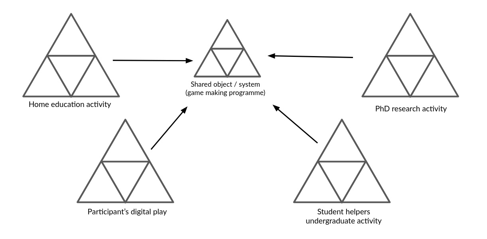
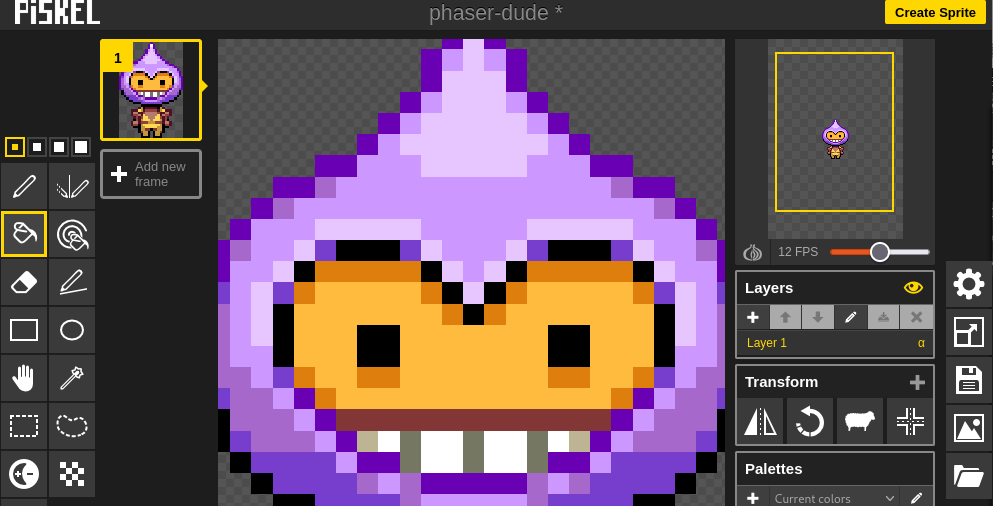
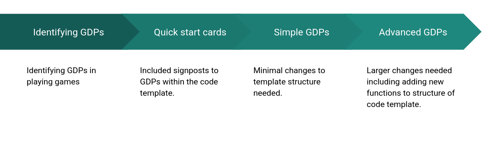

---
# all the regular stuff you have here
zotero:
  scannable-cite: false # only relevant when your compiling to scannable-cite .odt
  client: zotero # defaults to zotero
  author-in-text: false # when true, enabled fake author-name-only cites by replacing it with the text of the last names of the authors
  csl-style: harvard-manchester-metropolitan-university # pre-fill the style
layout: post
number-sections: true
categories: chapter
title: 5. Findings - Design Narrative
---
-   [Findings: Design Narrative](#findings-design-narrative)
    -   [Chapter introduction](#chapter-introduction)
    -   [Vignette and activity system
        analysis](#vignette-and-activity-system-analysis)
    -   [Narrative exploration of key areas of contradictions emerging
        in the game-making learning design (in P1
        /P2?)](#narrative-exploration-of-key-areas-of-contradictions-emerging-in-the-game-making-learning-design-in-p1-p2)
        -   [Contradiction area 1: involving organisational issues and
            the use of game programming and asset authoring
            tools](#contradiction-area-1-involving-organisational-issues-and-the-use-of-game-programming-and-asset-authoring-tools)
            -   [Description of what
                happened](#description-of-what-happened)
            -   [Surfaced tensions and framed
                contradiction](#surfaced-tensions-and-framed-contradiction)
            -   [Design response](#design-response)
        -   [Technical description of the core
            toolset](#technical-description-of-the-core-toolset)
            -   [Code playground
                environment](#code-playground-environment)
            -   [Code variables and
                structure](#code-variables-and-structure)
            -   [Graphical asset
                scaffolding](#graphical-asset-scaffolding)
            -   [Level design](#level-design)
            -   [Brief analysis](#brief-analysis)
        -   [Contradiction area 2: contradictions associated with
            project navigation and use of
            documentation](#contradiction-area-2-contradictions-associated-with-project-navigation-and-use-of-documentation)
            -   [Description of what
                happened](#description-of-what-happened-1)
            -   [Surfaced tensions and framed
                contradiction](#surfaced-tensions-and-framed-contradiction-1)
            -   [Design response](#design-response-1)
                -   [Quick Start Cards](#quick-start-cards)
                -   [Structuring instructional tutorial resources and
                    code
                    snippets](#structuring-instructional-tutorial-resources-and-code-snippets)
            -   [Brief observations on
                impact](#brief-observations-on-impact)
        -   [Contradiction area 3: tensions and barriers in cultural
            aspects of the game-making
            activity](#contradiction-area-3-tensions-and-barriers-in-cultural-aspects-of-the-game-making-activity)
            -   [Description of what
                happened](#description-of-what-happened-2)
            -   [Surfaced tensions and framed
                contradiction](#surfaced-tensions-and-framed-contradiction-2)
            -   [Design response](#design-response-2)
                -   [Social coding processes](#social-coding-processes)
            -   [PERHAPS DROP? SHIFT FROM THIS
                SECTION?](#perhaps-drop-shift-from-this-section)
                -   [Use of side missions to encourage varied creative
                    practices](#use-of-side-missions-to-encourage-varied-creative-practices)
            -   [SUMMARY AND LINK](#summary-and-link)
    -   [Chapter Discussion](#chapter-discussion)
        -   [Analysis and discussion in relation to exising research -
            UMC, half-baked, and constructionist
            heuristics](#analysis-and-discussion-in-relation-to-exising-research---umc-half-baked-and-constructionist-heuristics)
            -   [Harbour metaphor](#harbour-metaphor)
    -   [Footnotes](#footnotes)

# Findings: Design Narrative

## Chapter introduction

This chapter presents a design narrative that traces the evolution of the learning environment developed in this research, focusing on how the design responded to emergent tensions across different phases of implementation. The narrative approach adopted here is informed by design-based reabove search (DBR) traditions and supported by the analytical tools of third-generation activity theory (3GAT), as outlined in Chapter 3. Through this framing, the chapter aims to demonstrate how changes in tools, documentation, and pedagogical strategies were shaped by iterative analysis of contradictions and participant need.

Design narratives are particularly useful in DBR for describing situated, context-sensitive changes to an intervention over time [@hoadley_creating_2002-1; @bell_theoretical_2004]. Here, the narrative is grounded in the concrete details of the research setting and practices, and attends closely to how formative redesigns emerged in response to barriers encountered by participants. The approach is also underpinned by an argumentative grammar that draws together key concepts from DBR and CHAT: iterative cycles of transformation, the surfacing of tensions between systemic elements, the role of secondary stimuli and affordances in mediating participant agency, and the developmental process of rising to the concrete through exploration of a germ cell.

The chapter begins with a situated vignette that introduces the activity and its participants at a particular moment in Phase 2 (P2), drawing attention to layered systems of activity and to the shifting object of the intervention. This is followed by three major sections, each focused on a cluster of contradictions identified during the analysis. These cover tensions related to technical tools and accessibility, issues of navigation and documentation, and cultural or identity-based challenges in the coding process. Each section presents a sequence of problem identification, design response, and analysis of outcome or change, drawing on session notes, participant feedback, artefact analysis, and observations from the researcher’s journal.

A key outcome of the design process was the introduction and later development of gameplay design patterns (GDPs) as both a practical scaffold and a conceptual structuring tool. Emerging first as a response to contradictions in Phase 1, GDPs became increasingly central to the learning design and the coordination of documentation, gameplay, and peer support practices. This chapter begins to trace their role in structuring agency and framing activity, positioning them as a germ cell concept within the intervention. Their varied use by participants, and their role in shaping trajectories of action and interaction, are taken up in greater detail in Chapter 6, which draws on video data and transcript analysis.

By narrating the emergence and evolution of the learning design, this chapter contributes to the overall methodological and theoretical project of the thesis: to understand how participatory, tool-mediated environments can be iteratively developed through a synthesis of CHAT and DBR. It also begins the task of articulating the design heuristics that emerged from this process, which are revisited and synthesised in later chapters.

## Vignette and activity system analysis

To open this chapter, I present a short vignette from Phase 2 that captures the atmosphere and dynamic character of the learning environment. Rather than serving as a formal analysis, it grounds the reader in the evolving design by showing how learner motivation, intergenerational collaboration, and playful tool use unfolded in context. These themes are developed in later sections, but this scene offers a humanising and situated entry point into the wider project. Only a short extract is included below due to space limitations, but readers are encouraged to consult the full vignette in Appendix 5.toby for a richer account of the episode.

Toby, a child participant, has been working independently on his emerging platform game for the first five minutes of the session. He is seated next to his two grandparents who are modifying their own games. At the start of the vignette, in my role as session facilitator, I make a brief opening announcement, drawing the participants' attention to the upcoming showcasing of their games to students in the building’s foyer [^1]. Toby pays careful attention to the challenge and variety of the game-playing experience, particularly in the specifics of his level design (see Vignette 1 extract). It becomes clear that the immediate audience of his peers plays an important role in guiding his design decisions. During the session, Toby invites other group members to play his game, initiating and responding to conversations about the difficulty of his game design.

INSERT SHORTER TABLE OF ACTIVITY

Table 5.1 - A shorter extract of Vignette 1 focusing on an overview of the use of tools.

In the longer vignette, Toby undertakes two key actions: refining his level layout and adding a new gameplay design pattern. These required him to navigate multiple tools [^2]. He did so in a fluid, self-directed way. The sections that follow explore how such individual actions were scaffolded and how they contributed to the evolving activity system. To frame the scene within the broader analytic structure of the thesis, the following diagrams represent the activity systems in which this vignette is situated.

{width=90%}

The activity system can be seen as a joint activity stemming from the intersection of wider activity systems in Figure 5.broad. This figure is a necessary simplification of the diverse cultural and contextual factors that fed into the shared activity system of the game-making community. As explored in Chapter 3, this activity functioned as a shared object through which different motivations were negotiated through mutual appropriation [@lecusay_telementoring_2015]. Examples of the influence of these wider systems, including playful interactions, parental support, and practical guidance from facilitators, are explored further in Chapters 6 and 7.

{width=95%}

Using a 3GAT lens, the component parts of this shared activity system are represented again in Figure 5.full. This narrower scope takes as its subject the individuals present in the room during the sessions: children, parents, student helpers, and myself as researcher-facilitator.

{width=95%}

A 3GAT interpretation reveals the object of activity as a complex construct, encompassing digital, physical and conceptual elements. It includes the use of software tools to develop code and assets, physical computers for coding, and the varied motivations of participants. These motivations, particularly social and playful, became quickly evident as the session progressed. Interaction with the task and with others shaped both individual and group experiences. In Phase 1 (P1), the object expanded to include the development of collaborative processes. These changes, and their role in building shared understanding, are explored later in the chapter.

As the design progressed, it became useful to analyse smaller units of activity. Following Barab and colleagues [@barab_using_2002], who justify the analysis of nested systems in technology-rich environments, I treat the implementation of GDPs as activity systems in their own right. At this level, the subject might be an individual or a parent-child pair working to modify a specific feature within their game. One advantage of this scale is the ability to closely examine the mediating role of tools and the shifts in object of activity that arise from contradiction. By analysing these game design pattern implementations as distinct activity systems, it is possible to trace how the changes made at the individual level feed back into the broader community practices, influencing both the technical and social aspects of the learning environment.

I HAVE DROPED THE IMAGE - I DESCRIBED IN MUCH MORE DETAILS IN THE CHAPTER - I SHOULD STATE HOW I DO THIS AS SIGNPOSTING -

<!-- DROP THIS IMAGE - IT IS DESCRIBED IN MUCH MORE DETAILS IN THE CHAPTER.

{width=95%} -->

The significance of activity at this scope underpins my proposal of GDPs as a germ cell concept within the theoretical framework of the thesis. At this level, the object of activity is more concrete. Participants are focused on implementing or adapting a design pattern in their own game. This allows for analytical clarity and supports the argument that GDPs served not only as pedagogical scaffolds but also as conceptual anchors for the intervention's iterative development.

<!-- Integrate LATER
Using the terminology of Leontiev [-@leontiev_activity_2009], Toby can be seen undertaking chains of processes in a fluid way, indicating that these actions had become operations. The following sections extend this analysis by exploring three core areas of contradiction that shaped the evolving learning design. -->

## Narrative exploration of key areas of contradictions emerging in the game-making learning design (in P1 /P2?)

In line with the theoretical framing established in Chapter 3, contradictions are understood as historically and structurally embedded misalignments between elements of an activity system, often made visible during periods of change or innovation . Following Kuutti [-@kuutti_activity_1995] and Engeström [-@engestrom_activity_1999], tensions, barriers, and disruptions in practice are treated as surface-level manifestations of deeper contradictions within and between activity systems [@engestrom_discursive_2011]. These may take the form of technical difficulties, motivational conflicts, or mismatches between participant expectations and the tools or rules shaping the activity. The following sections of this chapter examine three key areas of contradiction within this 3GAT framework. As the phases of design are referred to frequently Figure 5.x is included as a reminder.

{width=98%}

Figure. 5.x Reminder of delivery phases and development periods

The first section addresses tensions arising from the introduction and evolution of technical tools in the learning design, particularly the shift in software practices between P1 and P2. The second focuses on contradictions related to navigation and supporting documentation during P2. The third explores cultural and identity-based tensions in coding participation, an area highlighted in earlier chapters as a persistent barrier to inclusion.

### Contradiction area 1: involving organisational issues and the use of game programming and asset authoring tools

#### Description of what happened

In this section, I analyse journal notes, participant feedback, and the changes in the tools and resources used between P1 and P2 [] (P1 was exploratory, while P2 marked the first full implementation using introduced resources) to describe the emergence of key tensions in the process of game design activity. Initial expectations had been set via email communication inviting participation and describing the proposed workshop activities [^ie].

In the early stages of P1, groups formed organically, often along family lines, with three, mixed age groups of roughly five participants forming. These groups began to define their game ideas during these early relatively unstructured planning sessions. My initial focus was to create a welcoming, low-pressure environment for introducing and exploring the process of making games in a way which allowed participants to follow their own interests [^ap]. To achieve this, I used several activities unrelated to computer coding to scaffold the game design process [^nc]. Each family had access to a laptop with vintage games installed and early sessions included time to play and discussing retro arcade games, describing their component parts in particular. Other activities included: brainstorming game story scenarios, creating pixel-art characters on paper, and making craft collages for game backgrounds.

CHOICE OF PHASER AND JavaScript

I postponed introducing code editing tools until around week five, prompted by concerns about overwhelming participants and my own ability to support unstructured coding from first principles [^fp]. At this stage I introduced a simplified game template including just a character, ground, a hazard to avoid and a star to collect, illustrating some of the common tropes of a simple retro platform game [^cp].

{width=95%}

Figure 5.x - Simple breakdown of code playground areas.

The code playground tool proved initially productive in scaffolding the beginning coding experience of participants of HTML5 games [^ht]. Both code playground tools in P1-3 shared a similar layout which is common to code playgrounds in general. The three areas shown in Figure 5.x represent a visual and technical structuring of a web project with the ability to create and upload files as assets in area a, to see and edit the code of the project at hand in area b, and a preview of the resulting web page (in this case in the form or a game) in area c [^cpl].

The decision to use a code playground was guided by a need to provide assistance for participants given my motivation to support authentic engagement with real code [@chesterman_webmaking_2015]. While the affordances of the code playground ameliorated some of the barriers associated with text coding [^bb], challenges remained for P1 participants.

When participants began engaging with code, several tensions quickly surfaced. The gap between participants’ desired game features and their inability to implement them in code led groups to specialise. Some participants with greater confidence or experience took on coding tasks, while others worked on graphical game assets (both digital and physical), narrative planning, or sound elements [^sp]. At this point, my ability to support participants undertaking coding activities became a limiting factor. Given the limitations of the structural starter code, learners frequently needed one-to-one help to make even minor additions to their game. Whole-group demonstrations were largely ineffective: attention drifted, and groups progressed at different speeds and needed different support at different stages. Without in-tool help or the supporting affordances provided by block coding environments participants had no  supports to draw upon. They relied on me as the primary source of information, further exacerbating the facilitator workload. As a result, support bottlenecks emerged, and some participants became stalled early in their projects. My journal notes describe these sessions as increasingly difficult to manage.

#### Surfaced tensions and framed contradiction

The use of professional text-code language and framework, rather than a block coding approach was a contributing factor to emerging tensions. While simplified, the structure of the starting template  still relatively complex for novices and offered no easy way into experimentation as advocated by a tinkering or bricolage approach [^br]. Many learners had ambitious ideas for their projects including that were either beyond the scope of the code framework or not realistic given the novice coding level of participants [^ab]. Regarding peer learning, while some learners became aware of each other's programming work, it was difficult to adapt the bespoke code additions from one project to another.

{width=75%}

These tensions reveal an underlying contradiction in the activity system between the object of creating expressive, technically functioning games and the mediating means available to support that objective shown in Figure 5.x. In summary, the use of authentic text-based code environment, aggravated a misalignment between participants’ ambitions, their actual skill levels, and the support structures in place within the software toolset. At the same time, the mediational role of a single facilitator proved insufficient to sustain a good level progress within project work and to support diverse learner needs, resulting in friction and delay. This contradiction pointed to the need for redesigned tool scaffolding before P2 that could better support the object of creative game development.

#### Design response

The first response to this conflict was a non-technical one. After one session in P1, I emailed participants , expressing that I felt daunted by the task of helping the integration of the disparate creative elements being produced into cohesive game projects, a process which I felt responsible to facilitate [^7]. I asked parents for support in organising and bringing more order to group and planning processes. The group planning process improved, and the self-organisational abilities of parents and tenacity of young people involved developed freeing up more of my time to support technical issues in the remaining sessions.

In addition, these tensions outlined above shaped a series of design adaptations between P1 and P2. Recognising the need for scaffolding without over-prescription, I developed a **starter game template** with greater scaffolding including putting key variables at the start of the game code, and embedding comments in the code highlighting lines intended for modification.

<!-- THE INITIAL EXPERIENCE. -->

The process involved close attention to the initial participant experience of the game code. This game template was introduced by a facilitators prompted learners to play a _broken_ game in a web page. They were asked to work out in what way the game was broken and then invited to look at the code to try to _fix_ the game (e.g to make changes to progress). Participants would try to jump up to the platforms in the game but find that they could not jump high enough ot progress. Figure 5.x below shows a white square as a player, red squares are hazards to be avoided, and yellow squares are rewards which must be collected to progress to the next level. A white line is shows indicating how high the player character can jump.

{width=95%}

<!-- THIS IS ALSO COVERED IN C3? -->

### Technical description of the core toolset used for P2 and P3

The following section outlines summary a technical description of the toolset that emerged from the tensions and contradictions of Phase 1 and which was implemented in Phase 2. While P1 had been exploratory and had use a large set of tools, In P2 I reduced the number of tools suggested significantly [^tt].

An Appendix with a greater level of detail allow this design approach to be replicated by other practitioners. I offer this overview to allow the reader a greater situated understanding of the activities being carried out [^str].

<!-- ADD - Signposting sentence for the following sections  at the start

THAT COULD BE A TABLE (OR DEVELOPED) for Chapter -->

**Code playground:** The use of the code playground helped by providing the following: a place the starting template could be viewed and played. A remix button, which when clicked created a new version of the project that could be adapted.

**Simplified file structure:** The overall file structure was simplified so that participants only needed to alter the game.js file. Within that file, an older version of Phaser.js was used allowing simplified syntax in object and functions construction [^this].

**Variables at the start of the document:** Small changes in variables at the start of the JavaScript game file created rapid feedback responses and large changes in the game. The starter game templates included the following elements: editable values and visible parameters for player movement, enemy speed, and image and sound assets.

**Blocks graphics and use of Piskel:** Generic colour blocks in the starting template and encourage the process of adding designs created by participants graphics created in the Piskel tool [^piskel]. The template was altered to facilitate importation of blocks of 32x32 pixels, the default project size of Piskel aiding migration. The use of this tool external to the code playground led to benefits in developing key digital literacy skills as participants needed to migrating assets from Piskel into their games via downloading to their computer and reuploading.

{width=95%}

**Graphical structuring of the level design using text code:** to align with research on the value of a visual approach to coding multi-media projects for novices [@guzdial_programming_2004; @resnick_scratch_2009], changes to level design were highly scaffolded to mimic a tile map approach using text code arrays and regular block graphics.
in the P2 starting template the use of a graphical grid structure to edit level design shown in Fig 5.grid.

{width=95%}

A greater level of detail of these design issues related to the structure of the template is included as Appendix D.1.? - and as a technical blog post [^bg1].

<!--
EDITED THESE SECTIONS DOWN - MOVED TO APPENDIX

Names in Appendix

- Code variables and structure
-   Level design
- Graphical asset scaffolding
 -->

##### Brief Analysis

COMPRESS AND SIGNPOST THIS NEXT BIT -
This chapter discusses this design in relation to existing research on learning to programme through the use of supporting code templates.

STRUCTURE - PERSONAL - INTER - CULTURAL?

The scope of this section is to summarise and analyse some of the ways in which the design helped address the tensions described above. The aim is not to prove efficacy of the intervention rather than to explain its role in the iteration.

<!-- INCLUDE SOME INTERVIEW DATA IF USEFUL.
IF NOT THEN DO SOME SIGNPOSTING AS TO WHERE THE IMPACT IS EXPLORED IN LATER CHAPTERS. ETC.
A BIT MOE OF A SUMMARY.. -->

In P1 my overall aim was to explore the process and to encourage personal creativity using a diversity of tools. The process of selecting a reduced toolset in P2 helped address potential overload and fracturing of experience, thus reducing the possibility for peer exchange of skills and knowledge.

The template design is an example of a “half-baked” games [@kynigos_children_2018], and aligns broadly with the UMC framework [@lee_computational_2011].

THIS SHOULD BE COVERED BY LATER DISCUSSION - COMPRESS & SIGNPOST

In particular, the guideline to "create choices that show visible and immediate changes" [@lytle_use_2019-1, p. 6]. My approach, through a careful scaffolding of initial coding experiences, forced a rapid and early transition from the _use_ to _modify_ stages, the motivation being to address possible negative affect towards text-based coding.

The use of a template aligned with half-baked game/microworld approach [@kynigos_children_2018] helped by introducing hands on use of coding tools early, thus avoiding the mismatch between participants' planning and the technical limits of their novice abilities, a tension explored in a later section [^5].

<!-- FOOTNOTE SIGNPOSTS CH.6 - ADD AS TENSION IN TABLE TOO? -->

While my design aim was in part to reduce coding syntax errors and thus reduce learner anxiety, I did not wish not to remove the possibility of learners making mistakes entirely. While even these small changes involved potential syntax errors, as these simple expressions were surrounded by other lines modelling the correct syntax, they could often be corrected by the participants without facilitator support [^6].

Vignette 1 shows Toby designing many levels as a way of making his game distinct from others. This technical adaptation thus had a knock-on impact ton the cultural aspects of the coding processes.

The ability for individuals and pairs to make quick changes to the games templates via in terms of the affordances described in the previous section appeared to build their ownership over these fledgling games and set a path of working in a smaller group.

SIGN POST

### Contradiction area 2: contradictions associated with project navigation and use of documentation

#### Description of what happened

<!--
from previous version

While it was clear that participants needed to develop their coding abilities, the emerging, informal, experimental nature of the learning environment seemed to me to not suit whole-class instruction. This intuition was supported by my reflections on two attempts to deliver whole group presentations of key coding concepts, which I judged in my journal, based on visual cues of engagement, to be unwelcome interruptions to participants’ making activities. Instead, I addressed problems on an individual basis. However, as  more issues arose, I became overwhelmed by the group dynamics and technical demands on my time. After one session, I emailed participants (see Appendix.narrative2), expressing that I felt daunted by the task of facilitating the integration of the disparate creative elements being produced into a cohesive project. I asked parents for ideas and support in organising and bringing more order to group and planning processes. These developing tensions can be framed as contradictions between the tools available to participants and the object of actualising their ideas and graphical assets in code form. Additionally, my limited time as a facilitator highlights a dysfunctional relationship between the division of labour and the object. -->

This section outlines a contradiction associated with the introduction of supporting documentation to scaffold the game-making process.

Firstly, recapping from C1,

In terms of the creative process, the exploratory nature of P1 led to divergent creative pathways, but at a cost of a sense of an overall coherence and shared understanding of the process. In response I reflected on the tension between learner agency, especially the role of creative autonomy, and the need for shared reference points that could support progress without constant facilitator intervention.

The changes in software tools above had been one response. TO WHAT?  In P2, the introduction of a game template approach had the unintended consequence of reducing the average size of working groups thus increasing individual coding project  projects, which in turn increased demand on my time as a technical troubleshooter. While the in-tool scaffolding provided by the code template accelerated production for  learners significantly [@laurillard2020significance], participants still required support when adding new code structures, particularly during the _Create_ stage of UMC.  My direct input was often needed at this stage, thus delays and participant frustration due to the limited time I could offer each group.

Early in P2 resources to support implementation were still often driven by specific participants request, however due to a higher similarity in underlying code structure, they  now became suitable for reuse. As such, in addition to direct coding help, a small library of short stand-alone instruction documents began to accumulate.

Groups expanded their activity by creating wish lists of game features, which acted as mediating tools to coordinate between different team members and to request facilitator support to implement them via code structures.

ADD IN A TIMELINE -

By the start of P2 while the new structural template was in place, the supporting documentation was still evolving.

<!--
CHECK BACK FOR DUPLICATION
After one session in P1, I emailed participants , expressing that I felt daunted by the task of helping the integration of the disparate creative elements being produced into cohesive game projects, a process which I felt responsible to facilitate [^7]. I asked parents for ideas and support in organising and bringing more order to group and planning processes.  In response to my email, parents made suggestions including: use of a visible and shared list of game features that are being worked on, documentation to support the implementation their requirements. The group planning process improved, and the self-organisational abilities of parents and tenacity of young people involved developed. -->

#### Surfaced tensions and framed contradiction

A recurring tension noted in my journal during this period concerned the clash between divergent participant learning paths and the need for facilitator-led instruction and support. This was compounded by resistance to whole-class input, which consistently yielded low engagement. I surmised that participants saw these attempts as class teaching as not immediately relevant, misaligned with learners’ preferred hands-on working styles, and disruptive to the flow of their making. Repenning et al. [@repenning_scalable_2015], as discussed in Chapter 2, frame this as a barrier arising from a principles-first approach. The challenge became how to support progress given my limited facilitator time, without resorting to step-by-step instructional documentation.

I struggled reconcile a responsive approach to providing support and documentation with requests from some parents asking for background concepts and explanations of coding constructs.

Together, these challenges surfaced a contradiction between the object of the activity (learner-led game creation) and the evolving rules and mediating artefacts intended to support that process. The activity system lacked a shared, structured way for participants to orient themselves in the process to develop or to reuse successful code patterns without the input of facilitator mediation. The flexibility of the environment became a source of friction.

This contradiction appeared to be a double bind [@Engeström], how could I provide greater support via documentation detailing implementation and a underlying principles without compromising the responsiveness to the learner pathways that was foundational to the ethos of my approach? This contradiction drove extensive revision in the learning design.

#### Design response

<!-- INTERGRATE?
In response, I developed several new artefacts intended to scaffold project navigation and reduce the bottleneck of real-time technical support. -->

Recalling my organisational crisis in P1 outlined in the section above, in response to my email asking for help, parents made suggestions including: use of a visible and shared list of game features that are being worked on, and documentation to support the implementation their requirements. The suggestion of the list of game features used as both an shared organisational tool, became relevant in addressing the contradiction outlined above.

Early in P2 I returned to this concept to begin  design and implementation of supporting resources oriented around a list of game features which users could choose from allowing them take on features in the order that they chose.

Resources evolved rapidly pace at the start of P2, resulting created three main sources of documentation: quick start cards, written instructions, and code snippets to address some of the contradictions in the learning design outlined above. I now describe the process of creating these varied supporting documentation and the purposes they served.

##### Quick Start Cards

The resource I call _quick start cards_ was initially developed to support one-off sessions to allow rapid experimentation with the starter games [^qs]. They were designed to let participants choose challenged based on area of interest and difficulty. _Quick start cards_ (see Figure 5.cards below) were A5 sized printouts highlighting the key affordances of the template involving: game mechanics such as movement, jumping, level design, and the final challenge of swapping out the look of one or more characters by designing pixel art and replacing the line of code that adds the asset to the game. These printed resources highlighted key lines of code and demonstrated how they could be altered to impact game behaviour [^8].

{width=95%}

The cards supported participants' initial interaction with the code in a way that further developed the use and modify stages of the UMC framework [@franklin_analysis_2020]. They allowed  participants to get started with the starting template game with less in person support from facilitators to the strongly scaffolded interaction with the code and the relatively minimal changes needed to the code.

Thus in early stages, this process addressed the tension of providing documentation to support users in completing coding tasks while also facilitating choice over learner pathways.

<!-- Also aligning with low floors principle.
VERY LIMITED ANALYSIS HERE - SIGNPOST LATER EXPLORATION?
 -->

##### Structuring instructional tutorial resources and code snippets

MAKE CLEARER

While quick start cards scaffolded existing affordances within the game code, an innovative structure of documentation and support to add new features were need to address the contradiction outlines above. This section deals with the introduction of code snippets and self-contained instruction based on game design patterns, and their containment within a manual with a more linear structure.

While the use of code examples or *snippets* [^csn] is a common professional practice in problem-solving [@yang_stack_2017], their use by novice learners presents challenges related to relevance, consistency, and accessibility [@treude_understanding_2017].  Indeed  difficulties experienced by participants in P1 understanding and applying these  abstracted code snippets from the Phaser documentation website prompted me to create more tailored resources for P2. To do this I created stand-alone code projects that illustrated requested game features as gameplay design patterns; including: *jumping on an enemy to zap it*, and *making a moving enemy*. These project demonstrated annotated code features and within a playable game project based on the starter game template, allowing participants to copy and paste the relevant code sections needed into their project.  

To reduced dependence on my time as a facilitator, I wrote supporting documentation in a step by step format for each code example. In the early stages of P2, learners accessed these document through  a Google document with links and brief descriptions. I continued developing new projects and producing printable instructions to support these code snippets, ensuring that each snippet linked to a descriptive chapter and vice versa. To help learners situate the code within the correct structure, all projects used the core game template and included only the new code required for each feature.

To meet participants' requests for foundational coding knowledge, I created step-by-step chapter resources guiding users to code a core game template structure from first principles [^9]. While this linear format did not fully align with my choice-driven approach, I envisioned it as supplementary reinforcement for learning outside of sessions, which indeed some participants did take up [^10]. Writing these chapters revealed a technique that helped balance structured guidance with choice-driven learning.

I also experimented with ways to present these feature choices in an accessible, engaging format, which I describe in detail in Appendix 5.map. Recognising that multiple documentation formats sometimes led to confusion, I created a centralised hub to host both snippets and tutorial chapters, making navigation more intuitive and orienting documentation towards participants' gameplay experience.

{width=95%}

Figure 5.patterns : a screenshot of the hub of GDPs pointing to code snippets and instructional chapters

These patterns were themed in a way which aligned with the MDA (mechanics, dynamics, and aesthetics) game element framework explored in Chapter 2 [^11]. The final categorisation used in P4 is shown below in Table 5.x.

| **Game Mechanics**| **Game Polish** | **Game Space** | **Challenge Systems**|         
|--------|------------|--------------|----------|
| Add Static Hazard  | Add Graphical Effects | Change Design of Levels | Gain Points when Collecting Food |
| Add an Animated Enemy  | Add Sound Effects | Add More Levels | Add a Timer |
| Jump on Enemy to Zap them  | Add a Sound Track (Music) | Change Shape of Levels | Collect all Food before Progressing |
| Double Jump  | Add a Game Story with Messages | Change the Background Image | Power up - Higher Jump |
| Moving / Patrolling Enemies  | Add a Game Story with Messages | Change the Background Image | Power up - Player Speed |
| Moving / Following Enemies  | Animate your Player’s Movements | Key and Door | Random Doubling Enemies |    
|   | Make Player Immune |  | |    

Table 5.x Categorisation of game design patterns used in P4.

NOTE - DEVELOP THIS A BIT AS IT IS EXPLORED IN CHAPTER 6. CHANGE GRAPHIC TO A TABLE IN CH.6 - AND REVISIT IT'S PLACE IN THE OVERALL ARGUMENT.

#### Brief analysis

Chapter 2 reviewed research on using collections of gameplay design patterns to support learning in game design [@holopainen2007teaching; @holopainen2011foundations; @eriksson_using_2019; @bjork_patterns_2005]. Thematic organisation of these patterns shows potential to foster a shared understanding of game-making concepts within a coding community [@holopainen2011foundations]. For the documentation hub described above, I grouped game design patterns into categories based on academic and professional interpretations of game elements [@salen_game_2006; @schell_art_2008; @tekinbas_rules_2003; @olsson2014conceptual], as well as participants’ evolving requests for game features.

The structuring of the collection of code examples, as outlined in were developed in response to requests for new features from participants, aligning with a shared motivation to encourage diverse learner pathways. This style of intervention aligns with the concept of just-in-time learning approaches within project-based learning [@riel1998education], where access to supporting documentation is provided based on learner need.

Video data collected documents the creation of games with diverse and complex styles and themes [^11a]. These issues are discussed in more detail in relation to the development of participant agency in Chapter 7. Discussion on how the development of these supporting resources interacted with the core template contributes to research on Microworld environments and the UMC framework is continued in the final discussion section of this chapter.

<!-- While the code snippets, practical instructions, and chapters on core principles continued to pose some challenges (as seen in Vignette 6.1),
the video data analysed in the following chapter shows an increase in participants’ practical ability to implement game features.  -->

### Contradiction area 3: tensions and barriers in cultural aspects of the game-making activity

#### Description of what happened

At times in the interventions, in line with existing research [^12], some participants experienced alienation from the process of coding. This section explores this process through the lens of a key transition in Phase 1.  Early in Phase 1, I had incorporated several non-coding techniques to foster positive affect and create an inclusive idioculture. These included: playing and analysing retro arcade and console games, drama games as session warm ups, a process drama [^13], sketching pixel art on paper, digital pixel art creation, loosely structured ideation sessions to decide on themes, and sessions on music making and audio effects creation using accessible tools. While this wide diversity of activities was later streamlined for later phases [^14], the initial impact of these more accessible creative on the general culture of the group appeared positive in line with existing research [^14b].  

<!-- MOVEDEarly sessions included playing and discussing retro arcade games, analysing their components, brainstorming game story scenarios, creating pixel-art characters on paper, and making craft collages representing game levels. These multimodal and low-tech activities helped surface ideas, supported collaborative group dynamics, and eased participants into the creative space without the pressure of unfamiliar digital tools. -->

Some participants experienced a sense of exclusion from the culture of the group during the transition from these initial activities to coding: a process now illustrated using a case study of one family. The family consisted of Anastasia, the mother, and her two daughters, one at the lower end of our 8-12 age range and one at the upper end. Members of this family actively participated in non-coding activities, tensions emerged when the introduced coding framework was introduced and the limitations became clearer. The framework of a two dimensional game did not support a key gameplay idea that the younger child had imagined in the previous ideation stage: specifically a exploring a three dimensional landscape from the point of view of a bee avatar [^15]. This realisation was very upsetting to the child and required extensive negotiation with Anastasia leading and myself contributing to a process of explaining the limitations of our beginners coding course.  At a later stage of Phase 1 the whole family experienced alienation. As the phase had progressed, an organic division of labour had occurred with some members sticking with graphical and audio asset creation and others working on incorporating these assets and ideas into the code framework. As session progressed there was progressively less for the non-coders to do. During participant feedback, Anastasia shared that in one session they had arrived a little late, and after observing other participants around them immersed in problem solving using text code tools, felt like they were surrounded by a process of _hardcore coding_ (participants phrase) that felt disconnected from.

As participants moved from early-stage ideation, and asset creation, the flexible, diverse, and decentralised working practices gave way to a narrower set of expected competencies.  This experience was not isolated with this family.  In interview data parent Maggie noted that "I was worried we (her and other son John) neglected Toby" in relations to this stage where smaller clusters of the group grappled with code implementation of graphical, audio elements and other design element created by the wider group.

In my journal, I noted that group work at this stage felt disjointed with non-coders left with little to do  and a feeling that the previously playful culture was transforming into something more serious. I reflected on the fragility of learners’ positive affect and the possibility of alienation during the transition from the planning and sketching phase to the coding phase.

<!-- Finally, it highlighted a potential imbalance in facilitator attention, as participants more confident in coding sometimes created complex problems requiring significant time, which could leave others feeling less supported or valued. -->

#### Surfaced tensions and framed contradiction

These reflection show two strands of tension between activity system elements.  
One tension is between the object of working together and the emerging norms requiring a close engagement with the technical aspects of coding and a shift in division of labour prioritising these aspects.

Another tension concerned division of labour. To participate fully in later design stages, participants would need to engage with text-based code regardless of their previous (and perhaps preferred) working practices.  In addition,  given that coding activities were on going by others attempts to incorporate these team members at this stage would be disruptive to those existing divisions of labour.

These tensions combined with previously explored cultural barriers to coding to explose a contradiction between the object of the activity, inclusive game-making allowing diverse creative contributions, and the cultural layer of activity [@engestrom_activity_1999]. The accumulated contradiction is illustrated in Figure 5.x.

{width=95%}

Fig 5.x – A contradiction between subject experience and the evolving involving cultural layer of the game-making activity - CHANGE TO A CONTRADICTION BETWEEN DOL AND SUBJECT

The contradiction and subsequent feeling of alienation occurred despite a learning environment which included diverse and inclusive elements informed by previous research. The process of introducing accessible non-coding activities served to help acculturation to game making process in general, but as text coding was required later, the process only delayed alienation for some participants. Indeed, the process potentially heightens frustration if participants have invested into a process which they are later alienated from.  As such, addressing this contradiction required rethinking not only the technical scaffolds, as outline above, but also the broader cultural framing of participation to accommodate the contributions involving visual design, sound production, and narrative development in an on-going fashion, and a process to involve all participants in coding earlier on.

<!-- Although issues of mediation of technical tools played a role in this disengagement, this section has tensions address cultural dimensions.  The shift in the object of activity, from playful design to more technical production, exposed a misalignment between participants' creative goals and the community norms forming around coding. -->

<!-- A's family displayed the internal manifestations of this contradiction externally during the game making sessions and later during participant feedback [add footnote?]. -->
<!-- The coding tool and the template mediated the activity in ways that introduced new community norms, contributing to a cultural tension between the inclusive intentions of the design and the exclusive signals sent by the technical tools. This contradiction reflects a misalignment within the activity system between the tools, division of labour, and object, resulting in alienation for some participants.  -->

#### Design response

The responses outlined in C1 and C2 above concerning software tools and documentation addressed some aspects of this contradiction. For examples, in P1 feedback, the parent Anastasia suggested more hands-on exploration with the tools of production before being required to make creative decisions [^apb].

As previously outlined, the introduction of a half-baked game template in Phase 2 allowed participants to work with a functioning starter game, which could be modified with minimal code changes. This significantly reduced early technical demands and opened up more varied points of entry into the activity. This change had a notable impact on the division of labour from Phase 2 onwards. Participants were increasingly able to work either individually or in small groups, often alongside family members. This helped to reduce the kind of role-based exclusions seen in the case described above, where non-coding contributions became marginalised as the process continued.

In addition, the structuring of resources around an episodic process of applying one GDP after another, shifted the pattern of the design process away from a design-build-test progression in a way which allowed for more ongoing balance between coding and non-coding activities.

The following design interventions were introduced in P2 and P3 to respond to these tensions via these strategies also served to realign cultural dimensions of the activity system, supporting more inclusive and flexible forms of participation.

##### Social coding processes via playtesting

WHERE ELSE IS PLAYTESTING COVERED? HOW TO LINK - CONCEPTS OF FLOW AND ENGAGEMENT

The structural changes of starting template meant that players starting with a game in a working state. Thus if changes were carried out in small iterations each change could be self-tested and shared with others via group / social playtesting. This increased the time participants spent playtesting both their own and others’ games dramatically. The process of playtesting became increasingly significant in P2 in a way which transcended an instrumental design process of revision. It took on important social and cultural value.

Video data captured instances where participants expressed frustration when errors rendered their games unplayable (see Vignette 6.1), and these moments became triggers for collaboration. In response, I prioritised timely support to ensure games remained functional and playable.

SIGNPOST MRE IN CH.6?

By the middle of P2, playtesting had evolved into a key site of peer exchange, prompting spontaneous sharing of advice, assets, and fixes. Observing this, I recognised the potential of these interactions and, in preparation for P3, began to intervene more gently and strategically to nurture these emergent practices of social coding and mutual aid.

##### Use of side missions to encourage varied creative practices

CROSS REFERENCE THIS WITH APPENDIX AND CHAPTER 7 - IDENTITIES IN PARTICULAR

In P3, I introduced a light narrative framework to scaffold participant engagement. This took the form of a fictional scenario in which an alien contacted the group and asked for games to assess the worth of the human race (see Vignette 5.alien). Within this scenario, participants were assigned printed side missions — some social and some secret — that encouraged interaction, exploration, and humour. These missions often involved behaviours not directly related to game creation, such as observing others’ games or making subtle, playful changes to someone else’s project.

| **Your Alien Mission (social)** | **Your Secret Alien Mission** |
|--------------------------------|-------------------------------|
| Find out the names of 3 games that are being made | Change the variables at the start of someone else’s game to make it play in a funny way |
| Make a list of characters in two other games | Replace the images in someone else’s project with something unexpected |
| Find out the favourite computer games of 4 people | Change the level design of someone else’s game to make it impossible using minimal edits |

**Table 5.sidemissions – an extract of side missions given as part of the drama scenario**

The side missions were designed to support playful social dynamics and to foster a sense of shared community. By encouraging participants to engage with others’ work in imaginative ways, they helped shift the focus away from individual technical mastery and towards relational creativity. In line with third-generation activity theory, these missions acted as secondary stimuli that restructured the activity context and opened up new pathways for agency development. They positioned observation, playfulness, and curiosity as legitimate ways of participating, helping to validate roles beyond that of the coder.

icipants in the evolving game-making community.

<!-- #### SUMMARY AND LINK

While this provides an incomplete picture of the missions and drama process, due to space limitations, these side missions are presented in this chapter to offer an overview of the varied tools used.

A more detailed exploration of the development of participant agency in relation to these social missions and playtesting is provided in Chapter 7. -->

#### Brief Analysis

While this section presents only a partial account of the missions and the drama-based approach [footnote & appendix ], their inclusion in the design was a response to the contradictions described above. A more detailed exploration of how these elements contributed to the development of agency is provided in Chapter 7. Within the broader CHAT–DBR framework of this thesis, these missions can be understood as design artefacts that mediated both cultural and affective engagement, making space for diverse learners to see themselves as legitimate part

MORE SIGNPOSTING? Chapter 7 focuses on analysing participant reactions to the design from a more cultural perspective in greater depth,

Therefore, while this section has shown the importance of cultural factors in the activity, and thus in responsive design decisions, for the remainder of this chapter I return to discuss the findings in relation to existing research addressing technical / structural elements of the learning design to do with software tool use and supporting documentation.  

## Chapter Discussion

<!-- MERGED FROM 2024 -11 -6 VERSION -  -->

This chapter has explored the complexity of the interacting tools and documentation in relation to their evolution in different phases of the formative intervention process. The contradictions explored initially focused on technical and then more social dimensions of the learning design, a process which has surfaced some of the barriers to achieving the varied competencies needed to complete the text coding of a multi-media project.

This discussion explores features of the design narrative and the summative table section synthesises aspects of systemic contradictions and highlights how elements of the design process contribute to the research landscape, specifically:

- UMC, half-baked approach and constructionist design principles
- stage based approach, as a guiding pedagogy

 The section ends with a table which begins a process of synthesis of design factors.

<!-- - alignment with UMC, and other pedagogies (retrospectively found),
  - authenticity and blackboxing in particular as a constructionist approach
- DBR -> germ cell & use of collection of GPD  -->

### Analysis of the process so far with CHAT and DBR

This chapter has described three contradictions that occurred during an iterative, phase-based approach using a methodology guided by techniques of DBR and CHAT. The use of a design narrative from DBR allows a detailed and replicable approach [^16].

Table 5.2 above shows a summary of some of the tensions and design resolutions that emerged from the process.

INSERT TABLE OF THE DESIGN FACTORS.

Table 5.2- Table of emerging tensions and design responses

NOTE -  Table of learning dimensions - IS MENTIONED IN TABLE BUT covered in Chapter 6 - so signpost

At this point it is useful to describe a process here briefly  in relation to the three contradictions explored above [^17]. The evolution of these tools and documentation outlined in C1 and C2  was driven by a need to increase in instrumental agency due to the novice status of participants. As instrumental proficiency increased for some participants it allowed the development of peer learning and other social coding processes to emerge as described in C3.  

The emergent and mutual nature of this design process aligns with both DBR principles and CHAT concepts of transformational agency by double stimulation (TADS). Specifically, transformation in tool use based on explicit and implicit feedback.

The design approach that followed the moments of contraction outlined above  was responsive and uncertain. The process requiring me to rapidly generate and adapt software, documentation and processes in response to rapid identification and analysis of manifestations of emerging conflicts.  

The descriptions of this chapter also show the process to be demanding on participants. I was fortunate that the tenacious character of the participants in P1 helped mitigate the challenges posed by the challenges introduced incomplete design.

The design narrative above has acknowledges my active input into the direction of the process in line with an activist stance in terms of steering the design towards collaborative learning opportunities [@stetsenko2020radical]. My reflective analysis within journal entries show that While this general direction was present from early stages, my this on-going process served a purpose to divine a deeper understanding of my own guiding motivations driving the design changes [^18].

<!-- In 3GAT terminology, the affordances of my design can be framed as a series of secondary stimuli. Sannino [@sannino_principle_2015] highlights the intersection of the use of secondary stimuli by participants and their volitional action or agency. While subsequent chapters explore shifts in the overall structure of participant activity in alignment with concepts of relational and transformative agency,  -->

<!-- Instrumental agency can be seen as the base of a hierarchy of agency, in other words, that other dimensions of agency may need to be built on this one. This foundational agentic level is further explored in relation to other research in the following section. -->

<!-- To do this it employs an argumentative grammar fusing elements of DBR and CHAT concepts: specifically iterative processes, analysis of emerging tensions between systems elements, a focus on affordances and secondary stimuli (particularly in relation to participant agency), and the process of rising to the concrete through exploration of a germ cell concept. -->

<!-- DROP?
The emergent and mutual nature of this design process aligns with both DBR and CHAT principles. In this chapter and the previous one, I have described my active role in motivating and supporting an emerging community through iterative phases. The design approach was open and risky, requiring me to rapidly generate new tools in response to changing needs. I was fortunate that the tenacious character of the participants in P1 helped mitigate the challenges posed by the incomplete design.  -->

<!-- DROP?
The concept of affordances, commonly used in DBR, is present in this design through the careful selection of technical tools and non-technical pedagogical strategies. The term affordances has also been extensively explored in the literature of human-computer interaction (HCI) from a CHAT perspective, defined as “possibilities for human actions mediated by cultural means” [@kaptelinin_affordances_2012, p.927]. -->

<!-- In 3GAT terminology, the affordances of my design can be framed as a series of secondary stimuli. Sannino [@sannino_principle_2015] highlights the intersection of the use of secondary stimuli by participants and their volitional action or agency. While subsequent chapters explore shifts in the overall structure of participant activity in alignment with concepts of relational and transformative agency, the evolution of these tools, based on the novice status of the participants, also led to an increase in instrumental agency. This instrumental proficiency was required before the rich set of interactions based on peer learning and other social coding processes could emerge in playtesting practices. Instrumental agency can be seen as the base of a hierarchy of agency, in other words, that other dimensions of agency may need to be built on this one. This foundational agentic level is further explored in relation to other research in the following section. -->

### Analysis and discussion in relation to existing research - UMC, half-baked, and constructionist heuristics

Key observations outlined in the table above align with the supported benefits outlined in research on the Use Modify Create (UMC) pedagogy [@lytle_use_2019-1] and the specific technique of starting with a half baked game template [@grizioti_game_2018-1].

The alignment of the underlying principles of the learning design with research constructionist design heuristics, in particular half-baked designs process merits deeper exploration. A CONTRIBUTION?

The work of Kynigos et al. [@kynigos_children_2018] on the concept of half-baked microworlds and games helped me focus on the motivational aspect of incomplete game affordances to drive initial engagement with the use and modify stages of the UMC approach. Small code changes resulted in potentially large changes in game behaviour, appearance and difficulty aligns with a long standing concept of HCI research that feedback is motivating for system users [@bernhaupt_introduction_2015; @malone_heuristics_1982].

The careful design work on the P2 starting game template facilitated participants in building familiarity with the code structures and use of tools in an accelerated way. In addition, the framework of UMC highlights the benefits of a stage-based design. In this design, this staged approach is enacted through the interaction of participants with code via increasingly sophisticated documentation. My observations, supported in the following chapter, indicate that the combination of the use of a template and a collection of GDPs accelerates the use of certain coding fluency practices, which, in turn, had a subsequent impact on the increased use of social coding processes.

Turning to  design heuristics proposed by constructionist research for creative computing environments [^19], of particular relevance to this design process is the principle choose black boxes carefully [@resnick_reflections_2005]. Resnick et al.[-@resnick_reflections_2005] describe black boxes as abstractions that remove potentially problematic areas of the production process, creating a protective, scaffolded learning experience while maintaining a boundary with the authentic challenges of coding in the wild.

Black box decisions steer learners toward exploring preferred concepts. Papert's [-@papert_mindstorms_1980] work on Turtle control in LOGO exemplifies this approach, using abstraction to focus on powerful mathematical ideas.

Techniques or concepts present in constructionist design research, embodied in this intervention's toolset, include a simplified code authoring environment with live feedback in a preview window, techniques to avoid and correct syntax errors via the linting capabilities of the code playground (see glossary), and the use of a GDP menu to encourage creative but scaffolded design. A detailed description of these elements is explored in Appendix.tech.

The use of black boxes is also widespread in professional coding practices, particularly through code libraries and frameworks. These tools provide pre-written, self-contained sections of code to simplify complex operations. In my design, the Phaser game-making code library framework serves this purpose by managing underlying structures for gravity and physics calculations necessary for object collisions. In addition, my starting game template further simplified these processes by allowing participants to modify gravity settings through a single variable, thus combining professional coding language use with an accessible learning experience. Based on Laurillard's [-@laurillard2020significance] interpretation of the constructionist design of microworlds as being driven by affordances that structure user experimentation to enable exploration and concept formation without reliance on direct instruction, I propose this design as a form of microworld. When compared to other game coding programs using text languages this learning design can be seen as tightly structured. However, when compared to a constructionist microworld, the structure of my learning design is compromised by its relatively porous borders between this controlled environment and other, more authentic coding ecosystems. I argue that increased scaffolding of learner resources and tools can enhance instrumental agency for novice coders but potentially at the cost of limiting access to the tools and processes of authentic creative communities. The relationship between authentic and scaffolded processes can be understood as an inherent dialectical tension that learning designers should account for rather than attempt to eliminate.

Addressing authenticity in more detail, it is valuable to re-examine the factors driving my choice of JavaScript and Phaser, a professional, open-source game-making framework. Specifically, this choice relates to the potentially empowering impact of exposing participants to authentic technologies and concepts in hands-on, exploratory processes. Ratto [-@ratto_critical_2011] discusses this through critical making, a process that playfully brings forward Latour's [-@weibel_making_2005; -@latour_cautious_2008] ideas of shifting from matters of fact to matters of concern by revealing taken-for-granted artefacts as deliberately designed objects. This was evident in conversations between participants where they expressed a sense of inspiration or engagement with previously unknown technologies. For instance, exchanges demonstrated a growing appreciation for the complexity behind professional games, based on their perception of the effort required for their own simple game projects:

    Pearl: It just shows you what goes into these games.
    Student Helper 3: Think about how much effort goes into.
    Pearl: You just take things for granted don’t you?

ADDITION MADIHA's reflection in interview data.

A possible drawback of using a professional tool for novice learners is the risk of culture shock when participants encounter the unfamiliar and potentially alienating aspects of a professional coding ecosystem. The learning design outlined in this chapter helps address at least the beginning of this process by providing a protective, scaffolded learning environment.

#### A staged based approach structured around a germ cell concept of GDPs

In the learning design outlined in this chapter, GDPs drive stage-based instructional processes. Using terminology from Denner et al. [-@denner_does_2019], the shift from P1 to P2 represents a move from a design-build-test to a stage-based approach which introduces code structures and challenges in an initially simplistic, prototypical format for learners to experience and explore, which are subsequently replaced by more advanced models or complex instances of the task. The structure of documentation, created in response to participant requests for adding new GDPs to their games, evolved from a piecemeal format in P1 to, by the end of P2, a menu of GDP code snippets accompanied by detailed instructional documentation.

<!-- THIS STEPPED PROGRESSION COULD BE EXPRESSED AS A TABLE - OR A GRAPHIC .   -->

{width=95%}

Figure 5.x - Staged processes

This stepped approach which increases complexity of the objective of activity, is present only in limited  CGD&P research. The work of Repenning on SGD operationalises this concepts through guiding learners to undertake projects which are progressively more complex.

This work differs in a core template is provided allowing for less instruction following and the progression does not involve starting from scratch each time. This is notable as I found in P1 that changes to the underlying code structure were stressful and unwelcome for learners one had built familiarity with it  [^20].

In line with UMC, an advanced stage of the stage based approach would be the choice to imagine, design and implement a GDP not included in the menu provided, a process that Dan and Toby take on in P3 (see Vignette 7).

### Summary table and metaphorical conceptual model

#### Harbour metaphor

The process of supporting students and designing a bespoke template can be seen through a metaphor of a harbour. In this metaphor the microworld is a vehicle for exploration forming the base of the learning experience and designed to allow input from the technical community through the lens of the facilitator's design experiences. In addition, other learning design choices create a sheltered learning environment, shielded but not cut off from the complexity of online documentation and support.

{width=95%}

Figure 5.x - Harbour metaphor

Harbours are protective spaces, artificial or naturally occurring, used primarily as suitable places for docking ships. If designed, protection is offered by artificially created harbour walls extending out into the sea, creating a sheltered space. Harbour walls prevent large waves from entering but also provide gaps allowing movement out into the open sea. Harbours provide opportunities for loading, refuelling, or maintaining sea vessels. In addition, harbour transport infrastructures may be present to provide connections to inland rail or road links. The term harbour is also used metaphorically to indicate a space of safety, nurturing, or a gathering space for a community.

Harbours are a transitional space between the land and the sea, built to facilitate transport of goods and people between the two domains. Various structures exist, such as gang planks, gantries, and cranes to assist the importing of goods, vehicles, and people onto the ships. This chapter has highlighted  mechanisms for participants to onboard their existing home interests into the new learning space so they can feel more accommodated. (NOT CURRENTLY IN DIAGRAM)

In terms of agency and choice over learner pathway, Harbours are also safe places of play and learning. The safe nature of the harbour encourages free exploration within the protective walls. The boundaries of the harbour walls represent the restrictive decisions in terms of the genre of end product, and simplifications in code structures used. However, these restrictions may be productive through the creative potential of limitations [@rosso_creativity_2014].

But harbours can be evocative and intriguing, inviting the possibility to travel beyond the walls to unexplored realms. In early stages, the process of clicking remix to expose the underlying code and try to fix and improve an incomplete game exposes a new frontier language of text code which for many will involves entering unfamiliar waters. The motivational impact of an authentic process and set of tools exists in tension with the accompanying complexity [@nachtigall_authenticity_2024]. Thus, while this design uses an authentic, professional text-coding language with its inherent challenges, many design choices were made to shield new users from the complexity of the underlying configuration of interrelated web technologies and to instead highlight design affordances that facilitate creative agency. The use of authentic tools and alignment with professional practice makes it easier for learners to transition from a supported harbour of this learning design and venture out into the open seas of less supported practice. An example of this being Toby and Dan (in Vignette 7.a) who, in their choice to change the game genre from platformer to maze game, leave the safety of a set of design patterns and paired support documentation.

<!-- MOVE OR SUMMARISE
GDPs were first identified through playing games in an activity adapted from Moveable Game Jams (ensure this is described or linked to) and were used as a list of features serving as a mediating planning tool.  -->

<!-- In P2, GDPs were incorporated as affordances into a starter game template, initially highlighted via facilitator interaction and later as the guiding principle of quick start cards to scaffold modifications to the code template.
The structure of documentation, created in response to participant requests for adding new GDPs to their games, evolved from a piecemeal format in P1 to, by the end of P2, a menu of GDP code snippets accompanied by detailed instructional documentation. -->

<!-- The shift from P1 to P2 represents a move from a design-build-test to a stepped, stage-based approach. This graduated approach introduce code structures and challenges in an initially simplistic, prototypical format for learners to experience and explore, which are subsequently replaced by more advanced models or complex instances of the task. -->

<!-- GDPs were encountered through the game playing and analysis activity explored in the section above. GDPs were incorporated as affordances into a starter game template, initially highlighted via facilitator interaction and later as the guiding principle of _quick start cards_ to scaffold modifications to the code template. -->

<!-- The structure of supporting resources, created in response to participant requests for adding new GDPs to their games, evolved into a menu of GDPs in the format of name, description and both detailed step by step implementation instruction including code snippets, and stand alone code projects / snippets. -->

<!-- NOTE / MOVE - It could be seen as a progression to move from more scaffolded use of instructions to the use of code snippets alone with practice although data of Toby may not support that progression suggesting instead it may be a matter of preference. -->

<!-- LINK  -->
This chapter has explored the iterative development of the learning design, focusing on resolving barriers to coding and aligning with existing research principles, particularly the use-modify-create (UMC) process and constructionism. It emphasized the potential and challenges of leveraging professional tools within scaffolded environments, underscoring the pivotal role of learner-led design decisions in motivating coding practices and fostering social collaboration. Two key lines of inquiry which illuminate the cultural and social dimensions of game-making are explored in subsequent chapters. Chapter 7 examines the impact of emerging community processes on participants’ agency, while the Chapter 6 employs video data to describe and analyse the diverse applications of GDPs.

Gilbert is the worsted name.

## Footnotes

[^1]: From V.1.3 in Vignette 1 in Appendix.V I make the following opening announcement "We’ve got this one final making session next and then, if you can make it, the Monday after we can play our games and we can share them with students. We can make the students frustrated when they can’t beat our games. It’s usually quite fun. So, if we can do that - same time next week let me know. So, we’ll keep trying to help you and yes good luck everyone!"

[^2]: these tools are explored in a following section and include: a web-based coding tool (code playground), a game template that serves as the base for his game project, and a menu of documentation linking to code examples and tutorials.

[^ie]: The invite email is included within Appendix A and included an invitation broadly for "families to take part in a Game Making club to learn how to make video games together". The expectation of parent being involved in the making process was revisited in the first session.

[^ap]: At this early stage, I termed this process following _affinity paths_, imagining some would be drawn to artwork, some to music creation and others to code problems solving.

[^nc]: These low-tech activities involving diverse non-coding processes helped surface ideas, supported collaborative group dynamics, and eased participants into the creative space without the pressure of unfamiliar digital tools. They are described in more detail in section C3 later in this chapter.

[^fp]: Reflections on this delay are included in Appendix D.1.a and reflect a convergence of my own tacit expectations to begin from first principles and my relative inexperience working in this area.

[cp:] As of October 2025 it is still available to view and play - https://codepen.io/mrmick/pen/jaXzxw?editors=0010.

[^ht]: The term HTML5 games is included here as it was relevant at the time. HTML5 became a buzzword for modern webpages which included dynamic content due to the presence of JavaScript and css technology.

[^cpl]: A fuller breakdown of the features of code playgrounds is included in Appendix D.1.?

[^bb:] See Chapter 2 for a full summary of the challenges of text coding and the ways code playground address them. Appendix D.1 gives more detail of my evaluation of the advantages of code playgrounds.

[^sp]: While I wanted participants to be able to follow their interests, this total dis-enagement with coding was not optimal as we will see in section C3.

[^br]: See Chapter 2 for outlines of tinkering [@] or bricolage approaches [@bevan_learning_2015; @papert_epistemological_1990].

[^ab]: See appendix bee for an example.

[^tt]: Tools used in P1 included several audio and music making tools, Scratch as a graphical editor, and varied non software tools. See Appendix D.1.?  

[^str]: The structural decisions to support the use of a code playground are expanded with greater technical detail in Appendix D.1.?

[^this]: While a technical consideration beyond the scope of a non-technical reader this issue is significant for the participants experience. See Appendix D.1 game state for a technical exploration.

[^piskel]: Piskel is a pixel art graphical editor which participant both young and old appeared to find enjoyable and intuitive. See interview ? with Mark and Ed.

[^bg1]: A break down of the starter code design structure decisions and adaptations as a contribution to applied half-baked / UMC research.

[^3]: Playtesting is described in Chapter 2 as

[^4]: Code playgrounds, as described in Chapter 2, are online environments used to test, share or invite help from online users on complete or partial code projects or problems, primarily for web-based project involving the technologies of HTML, CSS and variations of JavaScript (for more detail see Appendix 5.tech)

[^5]: This tension is explored  in full in Appendix.bee and analysed in the C3 section of this chapter.

[^6]: Debugging in relation to the use of GDPs is explored in more detail in Chapter 6.

[^7]: This email included in Appendix.email is pivotal to my understanding of the limits of my role as facilitator of an open process and the need to impose limitation. At the end of the email I say "I guess the challenge is to do this so that it’s a map, with different learning directions and possibilities, but that we are all still on the same map in our groups."

[^qs]: The time limitations one-off events at Mozilla conference (for technology educators), Feral Vector (for grass-roots game developers), and Manchester Libraries (local families) and for trainee computing teachers  helped me distil the essence of the affordances into an accelerated process of getting started with the design process.

[^8]: A version of the quick start cards is available as part of Appendix.tech.

[^csn]: Code snippets and their co-location within code playground tools are explained in Chapter 2. In short they are code examples extracted from context in a way designed to facilitate reuse and often shared online as a community resource.

[^9]: See opening chapters of https://3m.flossmanuals.net/

[^10]: Mark and Ed described themselves as plodding throught that step by step documentations in Vignette ?

[^11]: The evolution and of this theming is outlined in more detail in Appendix 5.theming

[^11a]: Evidence of this diversity is present in Chapter 6 and in the Vignette data in Appendix.V.

[^12]: The introduction gave an outline of cultural barriers to CGD&P.

[^13]: A process drama is a drama activity which engages participants in a scenario in which they engage with a wider activity in role. The process drama of Phase one is explored in Appendix X.

[^14b]: Research  particular on varied approaches to address alienation to coding games has been explored in Chapters 1 and 2. In particular see the work of by Kafai, Burke and Peppler [@kafai_constructionist_2015; @peppler_gaming_2009-1].

[^14]: The immediate tension that the diverse tool set brought was in how much time playing with such a diverse set of non-coding practices took. In addition the greater diversity reduced the possibility or at least the fluency of peer learning that happened in later phases.

[^15]: More detail of the engagement and disengagement of Anastasia's family is described in the case study Appendix 5.bee,

[^apb]: Fuller feedback is described in the Appendix 5.bee

[^16]: A design summary which links to downloadable, and adaptable resources is available as an open educational resources is included as Appendix.resources and is available online here.

[^17]: The process of developing shifting forms of agency is explored in more depth in Chapter 7

[^18]: These reflections on my own deeper motivations are explored in the discussion section of Chapter 6 in relations to the complex and expanded object of activity of this research.

[^19] These design heuristics present in decisions made in creating microworld environments, the development of Scratch software, and constructionist gaming research include: principles of low floors, wide walls, high ceilings, open windows and choosing black boxes carefully (see Chapter 2 for a summary).

[^20]: The process of having to change the underlying strcuture of the template in P1 was something that one group found particularly jarring. An experience outlined in interview data (Maggie 1) and in Appendix.tech

<!-- [^1]: https://mickfuzz.github.io/makecode-platformer-101/
[^2]: https://mickfuzz.github.io/makecode-platformer-101/learningDimensions
[^3]: https://mickfuzz.github.io/makecode-platformer-101/addHazard
[^4]: https://dailypapert.com/mit-logo-memos/
[^5]: https://web.archive.org/web/20180426051205/http://phaser.io/tutorials/making-your-first-phaser-2-game
[^6]: https://glitch.com/~grid-game-template
[^7]: https://en.flossmanuals.net/phaser-game-making-in-glitch/_full/#create-a-game-space
[^8]: https://www.piskelapp.com
[^9]: https://en.flossmanuals.net/phaser-game-making-in-glitch/_full/ -->
