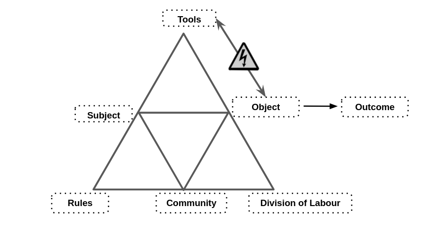

---
# all the regular stuff you have here
zotero:
  scannable-cite: false # only relevant when your compiling to scannable-cite .odt
  client: zotero # defaults to zotero
  author-in-text: false # when true, enabled fake author-name-only cites by replacing it with the text of the last names of the authors
  csl-style: harvard-manchester-metropolitan-university # pre-fill the style
layout: post
number-sections: true
categories: chapter
title: 5. Findings - Design Narrative
---
-   [Exploration of the Formative Learning Design
    Process](#exploration-of-the-formative-learning-design-process)
    -   [Research Questions April 2025](#research-questions-april-2025)
    -   [Additional information to help
        reviewers](#additional-information-to-help-reviewers)
    -   [Chapter Introduction](#chapter-introduction)
    -   [Vignette and broad analysis using an analysis of activity
        systems](#vignette-and-broad-analysis-using-an-analysis-of-activity-systems)
    -   [Narrative exploration of key contradictions emerging in the
        game-making learning
        design](#narrative-exploration-of-key-contradictions-emerging-in-the-game-making-learning-design)
        -   [C1 - contradictions involving the use of game programming
            and asset authoring
            tools](#c1---contradictions-involving-the-use-of-game-programming-and-asset-authoring-tools)
            -   [Using a starter game template within a code
                playground](#using-a-starter-game-template-within-a-code-playground)
        -   [C2 - Contradictions associated with project navigation and
            use of
            documentation](#c2---contradictions-associated-with-project-navigation-and-use-of-documentation)
            -   [The use of documentation to address
                contradictions](#the-use-of-documentation-to-address-contradictions)
                -   [Structuring instructional tutorial resources and
                    code
                    snippets](#structuring-instructional-tutorial-resources-and-code-snippets)
        -   [C3 - Responding to tensions and barriers in cultural
            aspects of the game making
            activity](#c3---responding-to-tensions-and-barriers-in-cultural-aspects-of-the-game-making-activity)
            -   [Social coding processes](#social-coding-processes)
                -   [Use of side missions to encourage varied creative
                    practices](#use-of-side-missions-to-encourage-varied-creative-practices)
    -   [Chapter Discussion](#chapter-discussion)
        -   [Comparing to UMC, Microworlds & constructionist design
            principles](#comparing-to-umc-microworlds-constructionist-design-principles)
        -   [Authenticity Discussion](#authenticity-discussion)
        -   [The position of GDPs in Activity Systems as the germ cell
            of this
            research](#the-position-of-gdps-in-activity-systems-as-the-germ-cell-of-this-research)
        -   [Outlining the key stages of GDP use in the structural
            learning
            design.](#outlining-the-key-stages-of-gdp-use-in-the-structural-learning-design.)
        -   [Summary and link to next
            chapter/s](#summary-and-link-to-next-chapters)
    -   [Parking Lot](#parking-lot)
        -   [Perhaps reintegrate above](#perhaps-reintegrate-above)
            -   [MOVED LINK - Applying activity theory to surface
                contradictions and design tensions experienced by
                participants and
                facilitator/s](#moved-link---applying-activity-theory-to-surface-contradictions-and-design-tensions-experienced-by-participants-and-facilitators)
            -   [Notes from vignette](#notes-from-vignette)
            -   [Notes before C1](#notes-before-c1)
            -   [Dropped from Discussion](#dropped-from-discussion)
        -   [Moved from Graphical Assets
            above](#moved-from-graphical-assets-above)
        -   [Removed from Docs - add to appendix
            .tech](#removed-from-docs---add-to-appendix-.tech)

# Findings: Design Narrative

## Chapter introduction

This chapter presents a design narrative that traces the evolution of the learning environment developed in this research, focusing on how the design responded to emergent tensions across different phases of implementation. The narrative approach adopted here is informed by design-based reabove search (DBR) traditions and supported by the analytical tools of third-generation activity theory (3GAT), as outlined in Chapter 3. Through this framing, the chapter aims to demonstrate how changes in tools, documentation, and pedagogical strategies were shaped by iterative analysis of contradictions and participant need.

Design narratives are particularly useful in DBR for describing situated, context-sensitive changes to an intervention over time [@hoadley_creating_2002-1; @bell_theoretical_2004]. Here, the narrative is grounded in the concrete details of the research setting and practices, and attends closely to how formative redesigns emerged in response to barriers encountered by participants. The approach is also underpinned by an argumentative grammar that draws together key concepts from DBR and CHAT: iterative cycles of transformation, the surfacing of tensions between systemic elements, the role of secondary stimuli and affordances in mediating participant agency, and the developmental process of rising to the concrete through exploration of a germ cell.

The chapter begins with a situated vignette that introduces the activity and its participants at a particular moment in Phase 2 (P2), drawing attention to layered systems of activity and to the shifting object of the intervention. This is followed by three major sections, each focused on a cluster of contradictions identified during the analysis. These cover tensions related to technical tools and accessibility, issues of navigation and documentation, and cultural or identity-based challenges in the coding process. Each section presents a sequence of problem identification, design response, and analysis of outcome or change, drawing on session notes, participant feedback, artefact analysis, and observations from the researcher’s journal.

A key outcome of the design process was the introduction and later development of gameplay design patterns (GDPs) as both a practical scaffold and a conceptual structuring tool. Emerging first as a response to contradictions in Phase 1, GDPs became increasingly central to the learning design and the coordination of documentation, gameplay, and peer support practices. This chapter begins to trace their role in structuring agency and framing activity, positioning them as a germ cell concept within the intervention. Their varied use by participants, and their role in shaping trajectories of action and interaction, are taken up in greater detail in Chapter 6, which draws on video data and transcript analysis.

By narrating the emergence and evolution of the learning design, this chapter contributes to the overall methodological and theoretical project of the thesis: to understand how participatory, tool-mediated environments can be iteratively developed through a synthesis of CHAT and DBR. It also begins the task of articulating the design heuristics that emerged from this process, which are revisited and synthesised in later chapters.

## Vignette and activity system analysis

This vignette introduces the activity system at both community and individual levels, illustrating how emerging tensions shaped later design responses. A fuller version of this episode is provided in  Appendix.5.toby. From a 3GAT perspective, the activity can be understood across two nested levels. At the community level, the overarching object is the collaborative production of a game to share with others. This goal is illustrated by the following photograph from the P3 showcase, in which learners present their games in the foyer of the university building where the activity took place.

{width=90%}

The activity system can be seen as a joint activity stemming from the intersection of wider activity systems in Fig 5.broad. This figure is a necessary simplification of the sources of diverse cultural and contextual factors that feed into the new shared activity system of the game making community.

{width=95%}
Figure 5.broad - Broad environmental activity systems

As explored in Chapter 3, this new activity functions as a boundary object through which different motivations are negotiated via mutual appropriation [@lecusay_telementoring_2015]. Examples of the influence of those wider systems in the game making activity including playful interactions, the supportive practices of parents, and guidance in practical coding practices from facilitators are explored in Chapters 6 and 7.

Using a 3GAT approach, the component parts of this new activity system are represented below in Figure 5.large, the scope of activity here takes as a subject the community of individuals in the room during the game making sessions, namely parents, children, student helpers and myself as a researcher / facilitator.

{width=95%}

To analyse this moment more precisely, Figure 5.full maps the activity system. To narratively situate the system, I draw on illustrative extracts from Vignette 5.toby, included in Appendix.v. Before the vignette begins, Toby, a child participant, has been working independently on his emerging platform game for the first five minutes of the session. He is seated next to his two grandparents who are modifying their own games. At the start of the vignette, in my role as session facilitator, I make a brief opening announcement, drawing the participants' attention to the upcoming showcasing of their games to students in the building’s foyer. This announcement serves to focus their attention on the completion of their games. The imagined audience of players seems to contribute to Toby’s careful attention to the challenge and variety of the game-playing experience, particularly in the specifics of his level design, which is documented in the screenshots and descriptions provided in the vignette. It becomes clear that the more immediate audience of his peers plays an important role in guiding his design decisions. During the session, Toby invites other group members to play his game, initiating and responding to conversations about the difficulty of his game design. This moment illustrates how tool use and peer interaction coalesced around a newly stabilised object of activity.

While my session announcement broadly frames the object of activity as participation in a community endeavour to create a game for an external audience, a 3GAT interpretation reveals several interrelated facets of the object. The object encompasses both digital and physical aspects. Specifically, it includes the use of varied software tools to develop code and game assets, the use of physical computers for coding, and the eventual incorporation of self-made arcade cabinets during the showcase stage. At the community level of activity, the object also includes the complex interaction of motivations driving all members of the community. These motivations, particularly playful and social interactions, became quickly tangible and evident as the session progressed. Participants’ engagement with each other, as well as with the task itself, played a significant role in shaping their individual and collective experiences. In addition, during Phase 1 (P1), the object of activity for the community had to expand to include a focus on the evolution of a group working process. This expansion addressed tensions in the fledgling design, highlighting the pedagogical considerations and adjustments necessary to support participants in the process of game development. These collaborative pedagogical advances and how they contributed to the joint understanding of the joint object of activity are explored later in this chapter.

By P2, at the point when this vignette occurs, the implementation of game design patterns had become an important organising principle for myself and participants. Toby's activity in this vignette could be broken into two main actions: one being to alter the existing level design of the game by changing the placement of game elements, the second to add a new game design pattern to his game by adding a new code structure to the starting project.

Following Barab and colleagues [@barab_using_2002], who justify the analysis of smaller activity systems in their study of technology-rich learning environments, I analyse the implementation of these game design patterns as activity systems in their own right, rather than as mere sub-actions within the broader activity. At this smaller-scale activity system, the subject is either an individual or a parent/child pairing, with the driving motivation being to modify specific features within their individual games, as represented in Fig. 5.feature below.

ADD IN A RECAP OF TERMS / AREA OF CONFLICT, TENSIONS, CONGRUENCIES AND BLOCKAGES - PERHAPS EVEN A TABLE (OR TABLE IN CH.3)
One benefit of analysing at this smaller scope is that it allows for a detailed examination of contradictions in the mediating processes involving tool use by individual participants or pairs. These contradictions can lead to expansions in the object of activity, which increases the complexity of the object at the broader community activity scope. This shift moves beyond technical perspective to encompass the diverse cultural elements of the emerging idioculture within the group. The vignette provides evidence of this evolution, demonstrating how variations in the games created correspond with shifts in social patterns of interaction. By analysing these game design pattern implementations as distinct activity systems, it is possible to trace how the changes made at the individual level feed back into the broader community practices, influencing both the technical and social aspects of the learning environment.

{width=95%}

WHEN TO INTRODUCE GERM CELL?
The significance of activity at this scope is reflected in my proposal of the implementation of GDPs as a germ cell concept within the theoretical framework of this thesis. A more granular exploration of this scope of activity helps explore both the developmental and analytical aspects of the germ cell concept. The object of activity at this level is less complex, as the primary motivation is to implement or alter a design pattern in the participant’s game on a pair or individual level and therefore incorporates less cultural and social factors.

INCLUDE AN EXTRACT OF VIGNETTE 1 - EDITED DOWN.

GIVING AN OVERVIEW OF TOOLS IN USE AND SOME SOCIAL ELEMENTS. SCREEN SHOTS COULD BE FULL SCREEN, AND DESCRIPTIVE ELEMENTS INLINE
THEN SOME TABLE OF INTERACTION / GESTURE ETC.

In the course of the vignette, Toby uses a variety of tools to achieve this goal: a web-based coding tool (code playground), a game template that serves as the base for his game project, and a menu of documentation linking to code examples and tutorials. Implementing more complicated gameplay design patterns (GDPs) involved several stages and varied tools, which can be viewed as sub-actions contributing to the broader goal of applying a GDP. Using the terminology of Leontiev [-@leontiev_activity_2009], Toby can be seen undertaking chains of processes in a fluid way, indicating that these actions had become operations. The following sections extend this analysis by exploring three core areas of contradiction that shaped the evolving learning design.

## Narrative exploration of key areas of contradictions emerging in the game-making learning design (in P1 /P2?)

In line with the theoretical framing established in Chapter 3, contradictions are understood as historically and structurally embedded misalignments between elements of an activity system, often made visible during periods of change or innovation . Following Kuutti [-@kuutti_activity_1996] and Engeström [-@engestrom_activity_1987], tensions, barriers, and disruptions in practice are treated as surface-level manifestations of deeper contradictions within and between activity systems [@engestrom_discursive_2011]. These may take the form of technical difficulties, motivational conflicts, or mismatches between participant expectations and the tools or rules shaping the activity. The following sections of this chapter examine three key areas of contradiction within this 3GAT framework. The first addresses tensions arising from the introduction and evolution of technical tools in the learning design, particularly the shift in software practices between P1 and P2. The second focuses on contradictions related to navigation and supporting documentation during P2. The third explores cultural and identity-based tensions in coding participation, an area highlighted in earlier chapters as a persistent barrier to inclusion.

### Contradiction area 1: involving organisational issues and the use of game programming and asset authoring tools

#### Description of what happened

As a recap from Chapter 4, Phase 1 (P1) was exploratory, while Phase 2 (P2) marked the first full implementation using introduced resources. In this section, I draw on journal notes and participant feedback to describe the emergence of key tensions in kickstarting participant game design activity and the subsequent evolution in tool use across these phases.

My initial focus in the early stages of P1 was to create a welcoming, low-pressure environment for introducing and exploring the process of making games. To achieve this, I used several activities unrelated to computer coding to scaffold the game design process. Early sessions included playing and discussing retro arcade games, analysing their components, brainstorming game story scenarios, creating pixel-art characters on paper, and making craft collages representing game levels. These multimodal and low-tech activities helped surface ideas, supported collaborative group dynamics, and eased participants into the creative space without the pressure of unfamiliar digital tools.

Groups formed organically, often along family lines, and began to define their game ideas. Each group had access to a laptop with vintage games installed and a custom URL pointing to a basic JavaScript game template. I postponed introducing code editing tools until around week five, prompted by concerns about overwhelming participants and creating early barriers to engagement. When introduced, the JavaScript editor exposed learners to raw code, without the abstraction or constraint of block-based interfaces. This decision reflected my wariness of oversimplified tools and desire to support authentic engagement with real code [@chesterman_webmaking_2015].

#### Surfaced tensions and framed contradiction

When participants began engaging with code, several tensions quickly surfaced. Many learners had ambitious ideas for their projects including AI-driven enemies and 3D landscapes that were beyond realistic scope of the novice programme. Some became frustrated when their expectations did not align with what was technically possible or comprehensible (INPUT EVIDENCE). Others shifted focus away from programming altogether, contributing instead through narrative or asset design.

At the same time, my own ability to support participants became a limiting factor. While I had prepared a structural starter code in P1, learners frequently needed one-to-one help to make even minor edits. Whole-group demonstrations were largely ineffective: attention drifted, and groups progressed at different speeds and needed different support at different stages. As a result, support bottlenecks emerged, and some participants became stalled early in their projects. My journal notes describe these sessions as increasingly difficult to manage. The use of authentic text code rather than a block coding approach aggravated this tension. Without in-tool help or the supporting structure provided by block coding environments participants had no external supports to draw upon. They relied on me as the primary source of information, further exacerbating the facilitator workload.  While some learners began copying each other's code snippets, misunderstandings remained widespread.

{width=95%}

These tensions reveal a primary contradiction in the activity system between the object of creating expressive, technically functioning games and the mediating means available to support that object. The use of authentic text-based code was intended to foster real engagement with programming, but in practice it created a misalignment between participants’ ambitions, their actual skill levels, and the support structures in place. Tool mediation fell short of enabling meaningful progression, particularly for novices unfamiliar with syntax or programming logic. At the same time, the informal division of labour, based on a single facilitator and loosely defined group roles, proved insufficient to sustain progress across diverse learner needs. Rather than enabling expansive learning, the interaction between tools, subject, and division of labour produced friction and delay. This contradiction pointed to the need for redesigned scaffolding in P2 that could better support the object of creative game development.

#### Design response

These tensions shaped a series of design adaptations between P1 and P2. Recognising the need for scaffolding without over-prescription, I developed a more structured **starter game template**. This included a basic working game with editable values and visible parameters for player movement, enemy speed, and sprite swaps. I also embedded comments in the code and highlighted lines intended for modification. This template was introduced via a short scenario that prompted learners to make changes to progress, drawing on the concept of “half-baked” games [@kynigos_children_2018]. This approach aligns with the motivations and techniques of the UMC framework explored in the literature review [@lee_computational_2011], particularly the guideline to "create choices that show visible and immediate changes" [@lytle_use_2019-1, p. 6]. Forcing a rapid transition from the _use_ to _modify_ stages at an early stage allowed for careful scaffolding of initial coding experiences, aimed at overcoming negative affect towards text-based coding.

I also prioritised accessible third-party tools for asset creation, particularly Piskel, an online pixel art editor. Piskel allowed learners to design characters and levels visually, which could then be easily inserted into the game engine.

Alongside technical simplification, I revised facilitation practices. Rather than leading code walkthroughs, I offered small-group check-ins and encouraged peer showcasing of working solutions. These moves helped to reposition facilitation from central control to distributed support. Some learners who had struggled in P1 became sources of informal guidance for others in P2.

Overall, these changes aimed to realign the activity system by mediating the contradiction between technical ambition and available supports. They also laid the groundwork for the GDP concept, which emerged as a way of sharing and reusing structured code patterns—a development taken up more fully in the next section and in Chapter 6.

### Technical description of the core toolset

The following section outlines a technical description of the toolset that emerged from the tensions and contradictions of Phase 1 and which was implemented in Phase 2. This is included with a significant level of detail within the chapter and with a greater level of detail in technical appendix to allow for replicability and to allow a more situated understanding of the activities being carried out.

0 - ENVIRONMENT

The use of a code playground and starting template, while technically two separate tools, were experienced by participants as a holistic experience. Code playgrounds, as described in Chapter 2, are online environments used to test, share or invite help from online users on complete or partial code projects or problems, primarily for web-based project involving the technologies of HTML, CSS and variations of JavaScript (for more detail see Appendix 5.tech). The use of code playgrounds by novices can mitigate against some of the initial challenges provided by learning computer coding stemming from  unfamiliarity with and potential complexity of code authoring tools and environments [@guzdial_programming_2004]. Tactics to address challenging elements include steps to reduce syntax errors, shielding complexity, facilitating community commenting, sharing, remixing and other forms of collaboration.

The project consists of several interlinked code and asset files (see glossary & Appendix 5.tech).

{width=95%}

Figure 5.code : Summary of the features of the glitch code playground environment and game template - APOLOGIES THIS IS INCOMPLETE CURRENTLY

1. Javascript file which participants alter to make changes to their game
2. Html page within which the game is embeded (not usually altered by participants)
3. Css style sheet (not usually altered by participants)
4. Code editing area
5. Game preview area

The Glitch.com code editing tool had three main areas. First, on the left, there were options to change project settings, an assets link to manage image and audio files, and a list of project files, including JavaScript, HTML, and CSS. Second, in the central code window, participants could view and edit the code and comments. Third, on the right, a game preview displayed the immediate updates resulting from changes made to the code in the central window.

A - VARIABLES & STRUCTURE

In P1, after delays caused by lack of coding knowledge, I had guided participants to begin their games by using a very partial template based on an online tutorial. As the process continued, it became apparent that the starting template greatly shaped the following design possibilities. To address this, in the development period between P1 and P2, I redesigned the starting code template of a game with a greater attention to pedagogical concerns in the following ways: I made changes to the code to reduce obscure syntax where possible increasing code readability and simplifying the structure of inter-related functions to facilitate the process of adding new code structures and code snippets. The choice to pre-select a particular genre, specifically a _platformer_ game (see glossary), was a pragmatic response to reducing the tension caused by diverse help requests, which narrowed the range of game features that would be requested. A summary of how these concerns were implemented in the design process follows (see Appendix 5.tech. for a fuller description).

C - GRAPHICAL ASSET SCAFFOLDING

Turning to the use of graphical assets, the starting template was altered to facilitate and encourage the process of adding designs created by participants. Initial graphical assets consisted of colour blocks, a design choice inviting learners to develop game characters from a clean slate (see Figure 5.px). To help resolve the overly complicated use of multiple asset creation tools, I prioritised the use of the pixel art tool Piskel, as I evaluated it to be intuitive for many younger participants. In P2, participants were guided to make a game on a broadly environmental theme, participants often redesigned sprites to games involving animals. Figure 5.fish shows a whale as a player character and plastic bottles as a hazard and fish as an item to collect.

{width=95%}

The process of game art and audio creation opportunities seeding narrative and artistic creativity is explored in more detail - IN AN APPENDIX?

{width=95%}

While I made several technical adjustments to facilitate the swapping of participant graphical designs (outlined in Appendix 5.tech), the process still required a series of potentially tricky operations. While some novice code authoring tools offer self-contained solutions for audio and graphical asset creation by providing in-built authoring tools and libraries of assets, the code playground Glitch provided neither, thus requiring the use of Piskel as an external asset creation tool, complicating the process. However, this forced choice to use a distributed toolset, rather than a self-contained approach to asset management, led to benefits in developing key digital literacy skills needed for web creation. Some participants became remarkably adept at the complex process of migrating assets from Piskel into their games, transforming the chain of actions involved into fluid operations. This section has focused on the rationale behind the introduction and initial expansion of the design's primary tools, rather than evidencing their subsequent impact on participants, which is explored in Chapter 6.

C - LEVEL DESIGN

Addressing level design, in P1 the process was relatively complex involving changing parameters of functions to change asset location, and spiralling code complexity (see Appendix 5.chapter). Instead, to align with research on the value of a visual approach to coding multi-media projects for novices [@guzdial_programming_2004; @resnick_scratch:_2009],  in the P2 starting template the use of a graphical grid structure to edit level design shown in Fig 5.grid. A minimal choice of level design elements were represented specifically; platforms to be jumped on; hazards to be avoided; and rewards to be collected.

{width=95%}
Figure 5.grid - Grid based editing of level design with a simple key for hazards, coins, and platforms.

Technically, each level is a JavaScript object consisting of a data array of 12 entries containing 17 characters which representing a matrix layout of the game. Each grid entry can be either black or one of the following: x (platform); h (hazard); o (coin). The structure of text-based array has a strong visual correlation with the resulting game layout and changes to the text based grid in the code area on the left would be immediately seen in the right hand project preview area. This solution abstracts away complexity and repetitive nature of asset placement mirroring a technique called tilemaps [@erhard-olsson_procedural_2018] used in GUI oriented game making tools (see glossary and Appendix.tech).

#### Brief section on Impact - INTEGRATE ABOVE SOMEHOW?

INCLUDE SOME INTERVIEW DATA IF USEFUL.
IF NOT THEN DO SOME SIGNPOSTING AS TO WHERE THE IMPACT IS EXPLORED IN LATER CHAPTERS. ETC.

WHICH DESIGN AIM / FEATURE?

A BIT MOE OF A SUMMARY..

The use of a template aligned with half-baked approach helped by introducing coding tools early, thus avoiding the mismatch between participants' planning and the technical limits of their novice abilities.

The ability for individuals and pairs to make quick changes to the games templates via in terms of the affordances described in the previous section appeared to build their ownership over these fledgling games and set a path of working in a smaller group.

While my design aim was in part to reduce coding syntax errors and thus reduce learner anxiety, I did not wish not to remove the possibility of learners making mistakes entirely. While even these small changes involved potential syntax errors, as these simple expressions were surrounded by other lines modelling the correct syntax, they could often be corrected by the participants without facilitator support. This chapter's vignette (Appendix 5.toby), where Toby designs many levels as a way of making his game distinct from others, illustrates the impact of this technical adaptation on the evolution of social coding processes a theme which is explored in more detail in a following section.

### Contradiction area 2: contradictions associated with project navigation and use of documentation

#### Description of what happened

This section outlines a contradiction associated with the introduction of supporting documentation to scaffold the game-making process.

After one session in P1, I emailed participants (see Appendix.narrative2), expressing that I felt daunted by the task of facilitating the integration of the disparate creative elements being produced into a cohesive project. I asked parents for ideas and support in organising and bringing more order to group and planning processes.  In response to my email, parents made suggestions including: use of a visible and shared list of game features that are being worked on, documentation to support the implementation their requirements. The group planning process improved, and the self-organisational abilities of parents and tenacity of young people involved developed. Groups expanded their activity by creating wish lists of game features, which acted as mediating tools to coordinate between different team members and to request facilitator support to implement them via code structures. In addition to helping directly via coding with participants, I began to create short stand-alone instruction documents if I thought the requested code  would be useful to other groups.

The previous section outlined the introduction of a half-baked template and the UMC (Use–Modify–Create) approach had the unintended consequence of reducing the average size of working groups. One result of this shift was a rise in individual projects, which in turn increased demand on my time as a technical troubleshooter.

While the in-tool scaffolding provided by the code template accelerated production for most learners [@laurillard2020significance], participants still required support when adding new code structures, particularly during the _Create_ stage of UMC. In P1, resources to support implementation were minimal and often tied to a specific code challenge, making them unsuitable for reuse. My direct input was often needed at this stage, leading to delays and participant frustration due to the limited time I could offer each group.

In the development period following P1, I reflected on the tension between learner agency, especially the role of creative autonomy, and the need for shared reference points that could support progress without constant facilitator intervention. In response, I developed several new artefacts intended to scaffold project navigation and reduce the bottleneck of real-time technical support.

#### Surfaced tensions and framed contradiction

In P1, I struggled reconcile a responsive approach to providing support and documentation with requests from some parents in the feedback on P1, asking for background concepts and explanations of coding constructs. Another recurring tension noted in my journal during this period concerned the clash between divergent participant learning paths and the need for facilitator-led instruction and support. This was compounded by resistance to whole-class input, which consistently yielded low engagement. I surmised that participants saw these attempts as class teaching as not immediately relevant, misaligned with learners’ preferred hands-on working styles, and disruptive to the flow of their making. Repenning et al. [@repenning_scalable_2015], as discussed in Chapter 2, frame this as a barrier arising from a principles-first approach. The challenge became how to support progress given my limited facilitator time, without resorting to step-by-step instructional documentation.

Together, these challenges point to a contradiction between the object of the activity (learner-led game creation using flexible tools) and the evolving rules and mediating artefacts intended to support that process. The activity system lacked a shared, structured way for participants to orient themselves in the development process or to reuse successful code patterns without facilitator mediation. The flexibility of the environment became a source of friction, not just a space for exploration.

#### Design response

The design and implementation of supporting resources evolved rapidly pace at the start of P2, resulting created three main sources of documentation: quick start cards, written instructions, and code snippets to address some of the contradictions in the learning design outlined above.

##### Quick Start Cards

_Quick start cards_ (see Figure 5.cards below) developed during P2, were A5 sized printouts highlighting the key affordances of the template involving: game mechanics such as movement, jumping, level design, and the final challenge of swapping out the look of one or more characters by designing pixel art and replacing the line of code that adds the asset to the game. These printed resources highlighted key lines of code and demonstrated how they could be altered to impact game behaviour [^qs].

{width=95%}

The cards supported participants' initial interaction with the code in a way that further developed the use and modify stages of the UMC framework [@franklin_analysis_2020]. They allowed  participants to get started with the starting template game with less in person support from facilitators to the strongly scaffolded interaction with the code and the relatively minimal changes needed to the code. The result of quick start cards in one-off sessions allowed very rapid creation of games with participants able to choose a level of difficulty and an area of interest. Thus in early stages, this process addressed the tension of providing documentation to support users in completing coding tasks while also facilitating choice over learner pathways. This style of intervention aligns with the concept of just-in-time learning approaches within project-based learning [@riel1998education], where access to supporting documentation is provided based on learner need.

<!-- Also aligning with low floors principle.
VERY LIMITED ANALYSIS HERE - SIGNPOST LATER EXPLORATION?
 -->

##### Structuring instructional tutorial resources and code snippets

The process of creating supporting documentation underwent several iterations which build on top of each other and served varied purposes.

In P1, I had encouraged participants to use code snippets from the Phaser documentation website. While the use of code examples or *snippets* is a common professional practice in problem-solving [@yang_stack_2017], their use by novice learners presents challenges related to relevance, consistency, and accessibility [@treude_understanding_2017]. Indeed  difficulties experienced by participants in P1 understanding and applying these abstracted examples prompted me to create more tailored resources. To do this I created stand-alone code project that illustrated requested game features as gameplay design patterns, such as *jumping on an enemy to zap it* and *making a moving enemy*  demonstrated a code feature or principle through a playable game project based on the core game template, hosted in an online code playground. This allowed participants to copy and paste the relevant code sections needed into their project.  I developed this approach further in a way which reduced dependence on my time as a facilitator. I wrote supporting documentation in a step by step format for each code example. In the early stages of P2, learners accessed these document through  a Google document with links and brief descriptions. I continued developing new projects and producing printable instructions to support these code snippets, ensuring that each snippet linked to a descriptive chapter and vice versa. To help learners situate the code within the correct structure, all projects used the core game template and included only the new code required for each feature.

To meet participants' requests for foundational coding knowledge, I created step-by-step chapter resources guiding users to code a core game template structure from first principles [^ss]. While this linear format did not fully align with my choice-driven approach, I envisioned it as supplementary reinforcement for learning outside of sessions, which indeed some participants did take up [^pl]. Writing these chapters revealed a technique that helped balance structured guidance with choice-driven learning.

I also experimented with ways to present these feature choices in an accessible, engaging format, which I describe in detail in Appendix 5.map. Recognising that multiple documentation formats sometimes led to confusion, I created a centralised hub to host both snippets and tutorial chapters, making navigation more intuitive and orienting documentation towards participants' gameplay experience.

{width=95%}

Figure 5.patterns : a screenshot of the hub of GDPs pointing to code snippets and instructional chapters

Chapter 2 reviewed research on using collections of gameplay design patterns to support learning in game design [@holopainen2007teaching; @holopainen2011foundations; @eriksson_using_2019; @bjork_patterns_2005]. Thematic organisation of these patterns shows potential to foster a shared understanding of game-making concepts within a coding community [@holopainen2011foundations]. For the documentation hub described above, I grouped game design patterns into categories based on academic and professional interpretations of game elements [@salen_game_2006; @schell_art_2008; @tekinbas_rules_2003; @olsson2014conceptual], as well as participants’ evolving requests for game features. The final categorisation used in P4 is shown below in Table 5.x.

| **Game Mechanics**| **Game Polish** | **Game Space** | **Challenge Systems**|         
|--------|------------|--------------|----------|
| Add Static Hazard  | Add Graphical Effects | Change Design of Levels | Gain Points when Collecting Food |
| Add an Animated Enemy  | Add Sound Effects | Add More Levels | Add a Timer |
| Jump on Enemy to Zap them  | Add a Sound Track (Music) | Change Shape of Levels | Collect all Food before Progressing |
| Double Jump  | Add a Game Story with Messages | Change the Background Image | Power up - Higher Jump |
| Moving / Patrolling Enemies  | Add a Game Story with Messages | Change the Background Image | Power up - Player Speed |
| Moving / Following Enemies  | Animate your Player’s Movements | Key and Door | Random Doubling Enemies |    
|   | Make Player Immune |  | |    

Table 5.x Categorisation of game design patterns used in P4.

These elements were themed in a way which aligned with the MDA (mechanics, dynamics, and aesthetics) game element framework explored in Chapter 2 [^mda].  

<!-- NOTE - DEVELOP THIS A BIT AS IT IS EXPLORED IN CHAPTER 6. -->

#### Brief observations on impact

The highlighted affordances of the template and the accompanying collection of code examples, as outlined in earlier sections, proved impactful. Despite their relative simplicity, these tools facilitated the creation of games with diverse and complex styles and themes, even at early stages.

While the code snippets, practical instructions, and chapters on core principles continued to pose some challenges (as seen in Vignette 6.1), the video data analysed in the following chapter shows an increase in participants’ practical ability to implement game features. The impact of the of choice-driven pathway and the ability for participants to input into the learning design through requests for new features is discussed in more detail in relation to the development of participant agency in Chapter 7.

LINK TO NEXT SECTION?

### Contradiction area 2: contradictions associated with project navigation and use of documentation

#### Description of what happened

This section outlines a contradiction associated with the introduction of supporting documentation to scaffold the game-making process.

After one session in P1, I emailed participants (see Appendix.narrative2), expressing that I felt daunted by the task of facilitating the integration of the disparate creative elements being produced into a cohesive project. I asked parents for ideas and support in organising and bringing more order to group and planning processes. In response, parents made suggestions including: the use of a visible and shared list of game features being worked on, and documentation to support the implementation of these features. The group planning process improved, and the self-organisational abilities of parents and the tenacity of young people involved developed. Groups expanded their activity by creating wish lists of game features, which acted as mediating tools to coordinate between different team members and to request facilitator support to implement them via code structures. In addition to helping directly with coding, I began to create short, stand-alone instructional documents when I thought the requested code would be useful to other groups.

The previous section outlined how the introduction of a half-baked template and the UMC (Use–Modify–Create) approach had the unintended consequence of reducing the average size of working groups. One result of this shift was a rise in individual projects, which in turn increased demand on my time as a technical troubleshooter.

While the in-tool scaffolding provided by the code template accelerated production for most learners [@laurillard2020significance], participants still required support when adding new code structures, particularly during the _Create_ stage of UMC. In P1, resources to support implementation were minimal and often tied to a specific code challenge, making them unsuitable for reuse. My direct input was often needed at this stage, leading to delays and participant frustration due to the limited time I could offer each group.

In the development period following P1, I reflected on the tension between learner agency, especially the role of creative autonomy, and the need for shared reference points that could support progress without constant facilitator intervention. In response, I developed several new artefacts intended to scaffold project navigation and reduce the bottleneck of real-time technical support.

#### Surfaced tensions and framed contradiction

In P1, I struggled to reconcile a responsive approach to providing support and documentation with feedback from some parents asking for background concepts and explanations of coding constructs. Another recurring tension noted in my journal during this period concerned the clash between divergent participant learning paths and the need for facilitator-led instruction and support. This was compounded by resistance to whole-class input, which consistently yielded low engagement. I surmised that participants saw these attempts at class teaching as not immediately relevant, in conflict with their preferred hands-on working styles, and disruptive to the flow of their making. Repenning et al. [@repenning_scalable_2015], as discussed in Chapter 2, frame this as a barrier arising from a principles-first approach. The challenge became how to support progress given my limited facilitator time, without resorting to step-by-step instructional documentation.

Together, these challenges point to a contradiction between the object of the activity (learner-led game creation using flexible tools) and the evolving rules and mediating artefacts intended to support that process. The activity system lacked a shared, structured way for participants to orient themselves in the development process or to reuse successful code patterns without facilitator mediation. The flexibility of the environment became a source of friction, not just a space for exploration.

### Design response

The design and implementation of supporting resources evolved rapidly at the start of P2, resulting in three main sources of documentation: quick start cards, written instructions, and code snippets to address some of the contradictions in the learning design outlined above.

#### Quick start cards

Quick start cards (see Figure 5.cards below), developed during P2, were A5-sized printouts highlighting key affordances of the template: game mechanics such as movement, jumping, level design, and the final challenge of swapping out the look of one or more characters by designing pixel art and replacing the line of code that adds the asset to the game. These printed resources highlighted key lines of code and demonstrated how they could be altered to impact game behaviour [^qs].

The cards supported participants' initial interaction with the code in a way that further developed the Use and Modify stages of the UMC framework [@franklin_analysis_2020]. They allowed participants to get started with the template game with less in-person support from facilitators, due to the strongly scaffolded interaction and minimal changes needed to the code. In one-off sessions, this approach enabled rapid game creation, with participants choosing a level of difficulty and an area of interest. This early-stage intervention addressed the tension of providing documentation to support coding tasks while maintaining learner choice. This style aligns with just-in-time learning within project-based learning [@riel1998education], where documentation is accessed based on learner need.

#### Structuring instructional tutorial resources and code snippets

The process of creating supporting documentation underwent several iterations which built on one another and served varied purposes.

In P1, I had encouraged participants to use code snippets from the Phaser documentation website. While the use of code examples is a common professional practice in problem-solving [@yang_stack_2017], their use by novice learners presents challenges around relevance, consistency, and accessibility [@treude_understanding_2017]. Indeed, difficulties experienced by participants in P1 prompted me to create more tailored resources. I created stand-alone code projects illustrating requested game features as gameplay design patterns, such as jumping on an enemy to zap it or making a moving enemy. These projects demonstrated a principle through a playable game based on the core template, hosted in an online code playground. Participants could copy and paste the relevant sections into their projects.

I developed this further to reduce dependence on my time as a facilitator. I wrote step-by-step documentation for each code example. In early P2, learners accessed these through a Google document with links and brief descriptions. I continued developing new projects and printable instructions, ensuring each snippet linked to a descriptive chapter and vice versa. To help learners situate the code correctly, all projects used the core template and included only the new code needed for that feature.

To meet requests for foundational coding knowledge, I created step-by-step chapter resources guiding users through coding a core game structure from first principles [^ss]. While this linear format did not fully align with my choice-driven approach, I envisioned it as a supplementary resource for learning outside sessions, which some participants did take up [^pl]. Writing these chapters revealed a technique that helped balance structured guidance with learner agency.

I also experimented with ways to present feature choices in an accessible format (see Appendix 5.map). Recognising that multiple formats sometimes caused confusion, I created a centralised hub hosting both snippets and chapters, improving navigation and orienting documentation toward the gameplay experience.

{width=95%}

Figure 5.patterns: a screenshot of the hub of GDPs pointing to code snippets and instructional chapters

Chapter 2 reviewed research on gameplay design patterns as learning support in game design [@holopainen2007teaching; @holopainen2011foundations; @eriksson_using_2019; @bjork_patterns_2005]. Thematic organisation shows potential for fostering shared understanding within a coding community [@holopainen2011foundations]. For the documentation hub, I grouped patterns into categories based on academic and professional frameworks [@salen_game_2006; @schell_art_2008; @tekinbas_rules_2003; @olsson2014conceptual], as well as participants’ evolving feature requests. The final categorisation used in P4 is shown in Table 5.x.

| Game Mechanics             | Game Polish              | Game Space               | Challenge Systems                     |
|---------------------------|--------------------------|--------------------------|---------------------------------------|
| Add Static Hazard         | Add Graphical Effects    | Change Design of Levels  | Gain Points when Collecting Food      |
| Add an Animated Enemy     | Add Sound Effects        | Add More Levels          | Add a Timer                           |
| Jump on Enemy to Zap them | Add a Sound Track        | Change Background Image  | Collect all Food before Progressing   |
| Double Jump               | Add a Game Story         | Change Background Image  | Power up – Higher Jump                |
| Moving / Patrolling Enemies | Animate Player Movement | Key and Door             | Power up – Player Speed               |
| Moving / Following Enemies |                          |                          | Random Doubling Enemies               |
| Make Player Immune        |                          |                          |                                       |

Table 5.x: Categorisation of game design patterns used in P4.

These elements were themed to align with the MDA (mechanics, dynamics, aesthetics) framework discussed in Chapter 2 [^mda].

### Brief observations on impact

The highlighted affordances of the template and supporting code examples proved impactful. Despite their relative simplicity, these tools enabled the creation of diverse and complex games, even at early stages.

While some challenges remained (see Vignette 6.1), video data in the next chapter shows increased participant ability to implement game features. The shift from facilitator dependency to tool-mediated progression marks an early instance of learners shaping their own pathways, a theme further explored in Chapter 7.

### C3 - Responding to tensions and barriers in cultural aspects of the game making activity

Some participants experienced alienation during the transition to coding, stemming not only from challenges with tools but also from a sense of exclusion from the culture of coding, including cultural barriers to coding processes, as discussed in Chapter 2 [@kafai_constructionist_2015-1]. Issues of alienation from the coding process were particularly visible in P1 in my journal reflections and feedback interview data from P1 end reflections.

In P1 accumulated tensions to do with alienation led one family to a crisis point. While a fuller description of this case study is available as Appendix 5.bee, a brief summary follows to illustrate key elements of this area of contradiction. Members of this family actively engaged in planning on paper and creating pixel art. However, tensions arose when the process turned to implementing planned changes via the code framework. Though technical challenges related to the use of tools played a role, this area of conflict was compounded by social and cultural factors, ultimately leading to the family's decision to step away from the activity.

During participant feedback, the parent shared that in one session they had arrived, sat down and seen other participants grappling with the text code needed to enact planned changes. They felt alienated from this process of _hardcore coding_ (participants phrase). In addition one of they younger child's key ideas for game play, to control a bee avatar to explore a 3D landscape was not possible within the introduced 2D coding framework. In other feedback the parent, expressed a preference for more hands-on play and exploration of the tools of production before being required to make creative decisions.

The tensions arising from the expectation to transition from non-coding creative activities to coding tools are depicted in Fig. 5.x below. This figure illustrates how the family’s positioning and alienation from the hardcore coding stage of the activity, is represented as tension.

{width=95%}

The division of labour conflicted with the object of activity as previous divisions between coders and art creators no longer functioned in this stage of making. This then impacted on a tension between the community norms of hardcore coding their objective of a creative activity. A particular tension involved the coding tool introduced clashing with the goal to create a 3d roaming bee

This case study highlighted a key concern for the design, that of the fragility of learners’ positive affect in early stages and in the transition from the planning and sketching phase to the coding phase of the game-making process.

My reflections on this conflict prompted several changes in the learning design to address factors situated within the plane of cultural activity. This following section describes key learning design features addressing these issues, particularly the use of non-coding process and the fostering of social coding processes.

#### Playing games, identifying game elements & the use of physical materials

In P1, I had incorporated several non-coding techniques to foster positive affect and create an inclusive idioculture, aiming to reduce alienation from unfamiliar coding tools.

The use of playing games and identifying game elements was adapted from a resource created for a New York youth program Moveable Game Jams to build language and concepts used to then  list of features serving as a mediating planning tool. This process, explored in Chapter 2 via the description of the process of GSM? or similar, served to build language and understandings of game design patterns. This later proved to be helpful in supporting a variety of mediational uses of GDP concepts which are explored in Chapter 6.

IS THIS IN AN APPENDIX - IS THERE A SCAN OF A A3 SHEET AVAILABLE?
OR TABLE OF SPACE, MECHANICS ETC. ?

The process of using physical element of art i.e. collages

Physical computing elements in the form of the arcade boxes

#### Social coding processes - MIX OF NEED AND DESIGN AND RESULT?

As explored above, from P2 onwards the use of a half-baked game template  led to the formation of smaller, more autonomous group in a way which ameliorated the a problematic division of labour outlined in the example above. The process also incorporated feedback suggesting on early hands on use of tools, thus both these barriers to engagement were substantially reduced.

In addition, the parent A's also share other reflections on divisions of labour and working community norms in P1 feedback
ROLE OF PLAYTESTING IN THIS? AND A'S COMMENT ON PARENTS GETTING IN THE WAY?

The provision of a functioning starter game significantly increased the amount of time participants spent playtesting both their own and others' games.

Video data captured instances where participants expressed frustration when errors rendered their games unplayable (see Vignette 6.1 for a clear example).

In response, I prioritised supporting participants in resolving these issues to ensure their games were functional and playable.

By P2, playtesting had evolved into a source of rich, productive peer social interactions. Observing this, I recognised the potential of these interactions and, in preparation for P3, aimed to intervene more strategically and gently to nurture and encourage these emergent patterns of peer collaboration and engagement.

**Use of drama narrative and side missions to encourage varied creative practices**

In P3, I introduced a drama-based scenario to guide the game creation process. This scenario revolved around an alien making contact with the group to request the creation of games as a means to judge the worth of the human race (see Vignette 5.alien). Within this fictional framework, participants engaged in side-missions, some of which were public while others remained secret (see Table 5.sidemissions). The introduction of this drama and the accompanying social missions aimed to reinforce the social and cultural dimensions of the activity, building on patterns observed during semi-structured playtesting in earlier phases. These missions were designed to encourage behaviours that fostered community-focused interactions. They included activities not directly related to the game-making process but rather centred on exploring and engaging with others' games and adopting a playful, exploratory approach. I had previously identified such behaviours as crucial for sustaining positive affect and fostering identification with the ongoing group game-making process.  The missions were printed on cards, and participants were given one of each type during the first half of the initial two sessions. An sample of the social and secret missions is provided below, with the full table available in Vignette 5.alien.

| Your Alien Mission (social)          | Your Secret Alien Mission:              
|----------------|----------------|
| Find out the names of 3 games that are being made.  | Change the variables at the start of someone else’s game to make it play in a funny way.    |
| Make a list of characters in two other games being made.   | Change of the images in someone else’s project to a totally different image and see if they notice.    |
| Find out the favourite computer games of 4 people.   | Change the level design of the first level of someone else’s project to make it impossible but try to change as little as possible to do that.   |

Table 5.sidemissions - an extract of side missions given as part of the drama scenario

#### SUMMARY AND LINK

While this provides an incomplete picture of the missions and drama process, due to space limitations, these side missions are presented in this chapter to offer an overview of the varied tools used. A more detailed exploration of the development of participant agency in relation to these social missions and playtesting is provided in Chapter 7.

MORE SIGNPOSTING? Chapter 7 focuses on analysing participant reactions to the design from a more cultural perspective in greater depth,

## Chapter Discussion

CREATE A NEW SUMMARY OF DISCUSSION HERE.

- Table of tensions etc , See vignette doc
- alignment with UMC, and other pedagogies (retrospectively found),
  - authenticity and blackboxing in particular as a constructionist approach
- DBR -> germ cell
- use of collection of GPD a as a alignement with Hook and Repenning
- STEPPED STAGES DESIGN

---

This chapter has explored the complexity of the interacting tools and documentation in relation to their evolution in different phases of the formative intervention process. The contradictions explored initially focused on technical and then more social dimensions of the learning design, a process which has surfaced some of the barriers to achieving the varied competencies needed to complete the text coding of a multi-media project. The following table begins a process of synthesis of design factors. It is limited at this stage in analysis in relation to other research. Thus a discussion section follows which begins such analysis.

### TABLE OF THE DESIGN FACTORS.

This discussion begins with a table  which synthesises aspects of systemic contradictions.

INSERT TABLE OF THE DESIGN FACTORS.

The subsequent sections synthesises the features of the design narrative and the summative table above, underpinned by existing research, specifically UMC, constructionist design principles.

#### Exploring systemic tensions in relation to existing research

**UMC & half baked**

DOES THIS LIVE HERE OR ABOVE?

Key observations outlined in the table above align with the supported benefits outlined in research on the Use Modify Create (UMC) pedagogy [@lytle_use_2019-1] and the specific technique of starting with a half baked game template [@grizioti_game_2018-1].

The work of Kynigos et al. [@kynigos_children_2018] on the concept of half-baked microworlds and games helped me focus on the motivational aspect of incomplete game affordances to drive initial engagement with the _use_ and _modify_ stages of the UMC approach. Small code changes resulted in potentially large changes in game behaviour, appearance and difficulty aligns with a long standing concept of HCI research that feedback is motivating for system users [@bernhaupt_introduction_2015; @malone_heuristics_1982]. The careful design work on the P2 starting game template facilitated participants in building familiarity with the code structures and use of tools in an accelerated way.

REVISE THIS PART
Kynigos [-@kynigos_black-and-white_2004-1] explores the tension between more targeted/restrictive and more adaptable technology toolsets using a white-box, black-box distinction (explored in the literature review), noting the difficulty of communicating the value of non-commodified, adaptable toolsets despite their exploratory potential. The design of this research's learning template can be seen as a half-baked Microworld [@kynigos_half-baked_2007], with the varied affordances of the design interpreted as invitations to contribute to an improvable boundary object [@kynigos_half-baked_2007, p.336]. This focus thus motivates and facilitates a discussion on a shared experience in a way that aligns with the sociocultural focus of this study.

THIS IS EXPLORED LATER.
In addition, the framework of UMC highlights the benefits of a stepped, stage-based design. In this design, this staged approach is enacted through the interaction of participants with code via increasingly sophisticated documentation.

KEEP AS SIGNPOSTING?
My observations, supported in the following chapter, indicate that the combination of the use of a template and a collection of GDPs accelerates the use of certain coding fluency practices, which, in turn, had a subsequent impact on the increased use of social coding processes.

**Microworlds & constructionist design principles**

Turning to constructionist research, a more extensive set of design heuristics is evident in studies of decisions made in creating microworld environments and in the development of Scratch (see Chapter 2 for a summary).

The design aligns with key element of constructionist design principles articulated by Resnick and Rosenbaum [-@resnick_designing_2013] in terms of allowing immediate feedback and fluid experimentation.

Techniques or concepts present in constructionist design research, embodied in this intervention's toolset, include a simplified code authoring environment with live feedback in a preview window, techniques to avoid and correct syntax errors via the linting capabilities of the code playground (see glossary), and the use of a GDP menu to encourage creative but scaffolded design. A detailed description of these elements is explored in Appendix.tech.

Of particular relevance to this design process is the principle _choose black boxes carefully_ [@resnick_reflections_2005]. Resnick et al.[-@resnick_reflections_2005] describe black boxes as abstractions that remove potentially problematic areas of the production process, creating a protective, scaffolded learning experience while maintaining a boundary with the authentic challenges of coding in the wild. Black box decisions steer learners toward exploring preferred concepts. Papert's [-@papert_mindstorms_1980] work on Turtle control in LOGO exemplifies this approach, using abstraction to focus on powerful mathematical ideas. The use of black boxes is also widespread in professional coding practices, particularly through code libraries and frameworks. These tools provide pre-written, self-contained sections of code to simplify complex operations. In my design, the Phaser game-making code library framework serves this purpose by managing underlying structures for gravity and physics calculations necessary for object collisions. In addition, my starting game template further simplified these processes by allowing participants to modify gravity settings through a single variable, thus combining professional coding language use with an accessible learning experience. Based on Laurillard's [-@laurillard2020significance] interpretation of the constructionist design of microworlds as being driven by affordances that structure user experimentation to enable exploration and concept formation without reliance on direct instruction, I propose this design as a form of microworld. When compared to other game coding programs using text languages this learning design can be seen as tightly structured.

However, when compared to a constructionist microworld, the structure of my learning design is compromised by its relatively porous borders between this controlled environment and other, more authentic coding ecosystems.

**tension: the intrigue of lifting the lid compared to additional complexity involved**

Addressing authenticity in more detail, it is valuable to re-examine the factors driving my choice of JavaScript and Phaser, a professional, open-source game-making framework. Specifically, this choice relates to the potentially empowering impact of exposing participants to authentic technologies and concepts in hands-on, exploratory processes. Ratto [-@ratto_critical_2011] discusses this through critical making, a process that playfully brings forward Latour's [-@weibel_making_2005; -@latour_cautious_2008] ideas of shifting from matters of fact to matters of concern by revealing taken-for-granted artefacts as deliberately designed objects. This was evident in conversations between participants where they expressed a sense of inspiration or engagement with previously unknown technologies. For instance, exchanges demonstrated a growing appreciation for the complexity behind professional games, based on their perception of the effort required for their own simple game projects:  

    Pearl: It just shows you what goes into these games.
    Student Helper 3: Think about how much effort goes into.
    Pearl: You just take things for granted don’t you?

ADDITION MADIHA's reflection in interview data.

A possible drawback of using a professional tool for novice learners is the risk of culture shock when participants encounter the unfamiliar and potentially alienating aspects of a professional coding ecosystem. The learning design outlined in this chapter helps address at least the beginning of this process by providing a protective, scaffolded learning environment.

In summary, I argue that increased scaffolding of learner resources and tools can enhance instrumental agency REEXAMINE THIS for novice coders but potentially at the cost of limiting access to the tools and processes of authentic creative communities. The relationship between authentic and scaffolded processes can be understood as an inherent dialectical tension that learning designers should account for rather than attempt to eliminate.

#### DBR, CHAT & GDPs as the germ cell concept (unit of analysis)

The emergent and mutual nature of this design process aligns with both DBR and CHAT principles. In this chapter and the previous one, I have described my active role in motivating and supporting an emerging community through iterative phases. The design approach was open and risky, requiring me to rapidly generate new tools in response to changing needs. I was fortunate that the tenacious character of the participants in P1 helped mitigate the challenges posed by the incomplete design. I return to the generative potenial of home education stageholders in the conclusion of this thesis. In line with understandings of DBR research outputs, the identification of guiding principles to address tension in the table above, would be expressed as a set of "tentative generalisations" in the form of design heuristics drawn from the analysis of the concrete practices observed [@hoadley_design-based_2022, p.215].

For this learning design, the concept and pedagogy of working with game design patterns (GDPs) emerged not only as an object of activity on a more granular scope than is typical but also as a germ cell concept valuable to both participants and facilitators. The process of rising to the concrete is a powerful analytical and developmental tool [-@engestrom_embodied_2012]. In seeking a germ cell or unit of analysis, the researcher explores complex, messy concrete processes over time to discern overarching concerns. 3GAT makes a distinction between empirical abstraction, described as a form of categorisation based on observation of activity (e.g. the collating of game features outlined in P1 above) and more theoretical abstractions which can to generate "concrete manifestations and developmental forms" of the core concept, hence the use of the term _germ cell_ [@sannino_activity_2011, p.590].

CLARIFY THIS BETTER - WHAT EXACTLY IS THE GERM CELL / UNIT OF ANALYSIS  
The theoretical abstraction that emerged from the process of facilitation the implementation and observing the varied use of these gameplay features as socio-cultural concepts was a guiding conception is the pedagogical utility of conceiving of such game features as gameplay design patterns.

Particularly relevant, is a structural feature (from research on design patterns), of the utility of a strongly coupled link between observable game features, a description of the design structure and resources to facilitate implementation in the target code environment.

Thus having identifitied this germ cell.  I continue the analysis of the orienting practice of GDPs as a germ cell concept in the following chapter.

MOVE THIS TO CHAPTER 6?
The position of GDPs in Activity Systems is complex. As framed as the start of the chapter the use of GDPs form is a part of an emerging object of activity. At the narrower level of activity, the implementation of the GDP into the code acts a a prinicple an objective and motivation. In addition, video observations showed GDP concepts being used as mediational strategies in varied ways.

#### Outlining the key stages of GDP use in the structural learning design.

---

PATCHED IN INTEGRATE

The identification of structural use of GDPs as a germ cell concept, facilitated the development of different progressively graded objectives (recognition, use and modification), as a concrete instance of UMC principles, which helps address the tension between freedom of choice of learner pathway, and expression of interest within a manageable technical structure (with relevant supporting documentation).

Similar to SGD a progressively stepped approach is taken here.
These varied forms of documentation, and their varied adoption and propagation represent different approaches to  scaffolding the process of becoming familiar with and then modifying to the code in often increasingly ambitious ways.

While SGD was limited in participant pathway choice, my design is not. Following the rationale of choice limitation as a strategy to reduce facilitator stress [@lytle_use_2019], this design  using a limited menu of GDPs as a structural and navigational framework.

---  

The shift from P1 to P2 represents a move from a design-build-test to a stepped, stage-based approach. This graduated approach introduce code structures and challenges in an initially simplistic, prototypical format for learners to experience and explore, which are subsequently replaced by more advanced models or complex instances of the task.

GDPs were encountered through the game playing and analysis activity explored in the section above. GDPs were incorporated as affordances into a starter game template, initially highlighted via facilitator interaction and later as the guiding principle of _quick start cards_ to scaffold modifications to the code template.

The structure of supporting resources, created in response to participant requests for adding new GDPs to their games, evolved into a menu of GDPs in the format of name, description and both detailed step by step implementation instruction including code snippets, and stand alone code projects / snippets.

NOTE / MOVE - It could be seen as a progression to move from more scaffolded use of instructions to the use of code snippets alone with practice although data of Toby may not support that progression suggesting instead it may be a matter of preference.

Finally, in line with UMC, the final stage of the stepped approach would be the choice to imagine, design and implement a GDP not included in the menu provided, a process that Dan and Toby take on in P3 (see Vignette 7).

THIS STEPPED PROGRESSION COULD BE EXPRESSED AS A TABLE.  

This stepped approach which increases complexity of the objective of activity, while not identified in any key review [@kafai_constructionist_2015, Denner , etc],  is found in some CGD&P research. The work of Repenning on SGD operationalises this concepts through guiding learners to undertake projects which are progressively more complex.
This work differs in a core template is provided allowing for less instruction following and the progression does not involve starting from stratch each time.
This is notable as I found in P1 that changes to the underlying code structure were stressful and unwelcome for learners one had built familiarity with it (add this in as appendix using interview data).

ADD LINK.  

### Summary and link to next chapter/s

  - What contradictions arose in this research’s evolving design process and how were they addressed in the resulting CGD&P pedagogy?

This chapter has explored the iterative development of the learning design, focusing on resolving barriers to coding and aligning with existing research principles, particularly the use-modify-create (UMC) process and constructionism. It emphasized the potential and challenges of leveraging professional tools within scaffolded environments, underscoring the pivotal role of learner-led design decisions in motivating coding practices and fostering social collaboration.
It also described the emergence of GDP use as a reoccurring feature guiding goal formation and  structuring of supporting resources and advanced this as a germ cell of the emerging pegagogy.

I have designed, introduced and revised a technology based set of tools in a process aligned with broad definitions of DBR. Using the techniques  DBR in the focus of documenting the learning desing via a design narrative and of AT in analysis of tensions and congruencies between systemic elements and attempts to resolve those tensions.

DEVELOP THIS A BIT IN TERMS OF LIMITS OF 3GAT? FORESHADOW LATER WORK ON MOVEMENT.
DBR and affordances explored as networked affordances align with tools not only as technical or perceptual affordances but also mediation using concepts and more social practices or repertoires in CHAT [@barab_curriculum-based_2006].

As expressed in the discussion, the role of GDPs within activity is complex. The next chapter employs video data to describe and analyse the diverse applications of GDPs.

Gilbert is the worsted name.

## Footnotes

[^qs]: A version of the quick start cards and a fuller description of their development by trainee teacher student helpers is available online and as part of Appendix.tech.
[^pl]: Mark and Ed described themselves as plodding throught that step by step documentations in Vignette ?
[^ss]: See opening chapters of https://3m.flossmanuals.net/
[^mda]: The evolution and of this theming is outlined in more detail in Appendix.tech.gameframework.

[^1]: https://mickfuzz.github.io/makecode-platformer-101/
[^2]: https://mickfuzz.github.io/makecode-platformer-101/learningDimensions
[^3]: https://mickfuzz.github.io/makecode-platformer-101/addHazard
[^4]: https://dailypapert.com/mit-logo-memos/
[^5]: https://web.archive.org/web/20180426051205/http://phaser.io/tutorials/making-your-first-phaser-2-game
[^6]: https://glitch.com/~grid-game-template
[^7]: https://en.flossmanuals.net/phaser-game-making-in-glitch/_full/#create-a-game-space
[^8]: https://www.piskelapp.com
[^9]: https://en.flossmanuals.net/phaser-game-making-in-glitch/_full/
