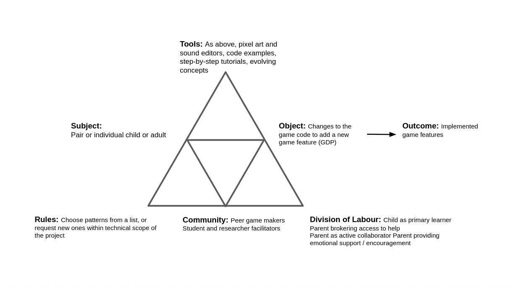
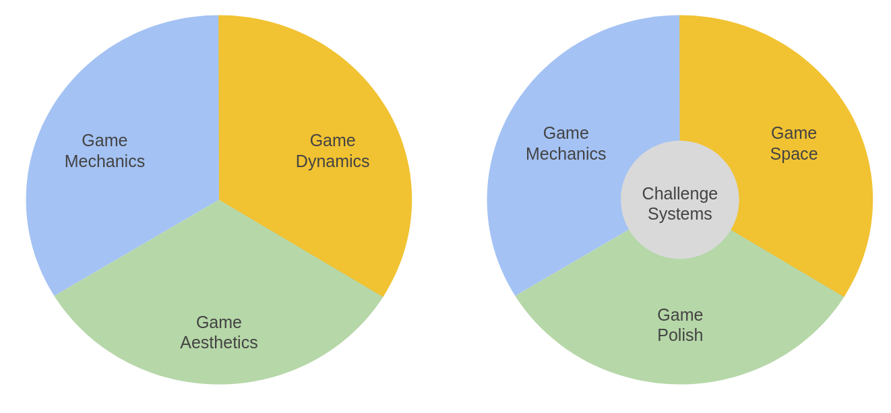
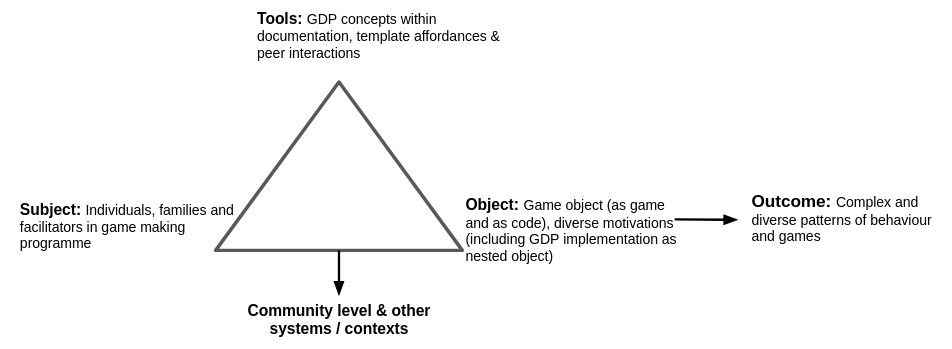

---
# all the regular stuff you have here
zotero:
  scannable-cite: false # only relevant when your compiling to scannable-cite .odt
  client: zotero # defaults to zotero
  author-in-text: false # when true, enabled fake author-name-only cites by replacing it with the text of the last names of the authors
  csl-style: harvard-cite-them-right # pre-fill the style
layout: post
number-sections: true
categories: chapter
title:  6. Findings - Game Design Patterns
---
-   [Findings: Game Design Patterns](#findings-game-design-patterns)
    -   [Introduction](#introduction)
        -   [Framing GDPs within activity theory
            concepts](#framing-gdps-within-activity-theory-concepts)
    -   [The role of GDPs in the personal appropriation of concepts and
        processes](#the-role-of-gdps-in-the-personal-appropriation-of-concepts-and-processes)
        -   [The interrelationship of GDPs and the development of
            personal appropriation of skills and
            processes](#the-interrelationship-of-gdps-and-the-development-of-personal-appropriation-of-skills-and-processes)
        -   [Summary of section](#summary-of-section)
    -   [GDPs used in the process of guided
        participation](#gdps-used-in-the-process-of-guided-participation)
        -   [Use of a menu of GDPs to assist project navigation and use
            of
            documentation](#use-of-a-menu-of-gdps-to-assist-project-navigation-and-use-of-documentation)
        -   [GDPs used to scaffold ideation and prioritisation
            processes](#gdps-used-to-scaffold-ideation-and-prioritisation-processes)
        -   [GDPs aiding the process of division of
            labour](#gdps-aiding-the-process-of-division-of-labour)
    -   [Use of GDPs in the cultural plane / community level of
        activity](#use-of-gdps-in-the-cultural-plane-community-level-of-activity)
        -   [The role of GDPs to facilitate learners to design for
            others](#the-role-of-gdps-to-facilitate-learners-to-design-for-others)
        -   [GDPs can facilitate the use of wider funds of knowledge and
            interest](#gdps-can-facilitate-the-use-of-wider-funds-of-knowledge-and-interest)
        -   [The propagation and evolution of GDPs
            concepts](#the-propagation-and-evolution-of-gdps-concepts)
    -   [Discussion](#discussion)
        -   [Addressing the use of GDPs in relation to understanding
            representing the processes of mediation
            process](#addressing-the-use-of-gdps-in-relation-to-understanding-representing-the-processes-of-mediation-process)
        -   [Expanded object in terms of motivation - fluency towards
            agency](#expanded-object-in-terms-of-motivation---fluency-towards-agency)
    -   [Conclusion](#conclusion)
    -   [MOVED FROM INTRODUCTION](#moved-from-introduction)
        -   [MOVED FROM GUIDED
            PARTICIPATION](#moved-from-guided-participation)
        -   [Future work on abstraction, layers of abstraction GDPs and
            the MDA
            framework](#future-work-on-abstraction-layers-of-abstraction-gdps-and-the-mda-framework)
    -   [MOVE FROM cH 7 - ANY SPACE
        HERE?](#move-from-ch-7---any-space-here)
    -   [Impact of Side Missions and Maker Types on playtesting
        behaviours](#impact-of-side-missions-and-maker-types-on-playtesting-behaviours)
        -   [Reflection on impact on my design
            process](#reflection-on-impact-on-my-design-process)
        -   [Limitations of observations and careful statements of
            potential](#limitations-of-observations-and-careful-statements-of-potential)
        -   [Emerging use of narratives and graphics which drawing on
            home funds of knowledge - AVOID OVERLAP AND CHANGE FOCUS TO
            AGENCY FROM
            START](#emerging-use-of-narratives-and-graphics-which-drawing-on-home-funds-of-knowledge---avoid-overlap-and-change-focus-to-agency-from-start)
            -   [MOVE LATER/ JUST A SIGNPOST TO LATER - PARK, FOR
                NOW?](#move-later-just-a-signpost-to-later---park-for-now)
        -   [Implications for practitioners - MOVE
            LATER?](#implications-for-practitioners---move-later)
    -   [Recently Dropped from
        chapter.](#recently-dropped-from-chapter.)
    -   [Footnotes](#footnotes)

# Findings: Game Design Patterns

## Introduction

In the previous chapter, I outlined the evolution of tool use across the project, emphasising emerging tensions in activity. One key outcome of this process was the role of gameplay design patterns (GDPs), which initially emerged through participant suggestions in P1 and were subsequently integrated into a range of scaffolding strategies. These included quick-start activities, instructional tutorials, and code snippet examples, forming graded steps of practice.

This chapter shifts focus to the perspectives of participants, using recorded video data and transcript analysis to interpret their varied uses and adaptations of GDPs. In doing so, it addresses RQ2: *How can the use of a collection of game design patterns support CGD&P, in particular in relation to abstract and concrete dimensions of existing pedagogies?*

To support this analysis, GDPs are here framed as a form of germ cell, a concept drawn from activity theory to describe a unit of practice that holds the potential for expansive transformation [@blunden_collaborative_2014]. In this context, GDPs function as small but generative design elements that can be reappropriated, extended, and combined in ways that support both individual learning and wider shifts in community activity. Their varied use by participants, and their role in shaping trajectories of action and interaction, are examined in this chapter through video data and transcript analysis.

The chapter draws on Rogoff’s three planes of analysis (personal, interpersonal, and cultural) to structure its argument. It begins by examining the role of GDPs in individual appropriation of key game making practices. It then moves to examine their interpersonal use within shared documentation, guided participation, and evolving division of labour. Finally, it considers the cultural dimensions of GDP use, including the propagation of patterns, norming of community practices, and the embedding of cultural repertoires. A discussion section follows, connecting these findings to existing research and conceptual debates.

While software design patterns typically group a description of intended behaviour with a suggested structural solution, often accompanied by worked code examples (see Chapter 2, their educational application remains under-explored. Existing studies have considered game design patterns as tools for co-design [@eriksson_using_2019] or as scaffolds for simulation-based transfer of conceptual knowledge [@repenning_scalable_2015; @basawapatna_using_2010]. However, little research has examined their potential to support emerging communities of text-based game creators, particularly in overcoming structural and cultural barriers to creative coding. This chapter addresses that gap.

### Framing GDPs within activity theory concepts

Activity theory sees the object of activity as a complex construct: in this case encompassing digital, physical and conceptual elements. It includes the use of software tools to develop code and assets, physical computers for coding, and the varied motivations of participants. The role of game design patterns within the overall activity plays a role in this object of activity, as a goal to be implemented and as a meditational strategy.  While the concept of germ cell / unit of analysis a is more typically used in a larger scope of societal or institutional activity, the principles driving its utility apply at a smaller scope.  

<!-- For a study of this nature, too broad an analysis risks insufficient detail to allow replication, too narrow risks being overly context dependant and limiting the potential for wider application. -->
<!-- As the design progressed, it became useful to analyse smaller units of activity.  -->

Following Barab and colleagues [@barab_using_2002], who justify the analysis of nested systems in technology-rich environments, I treat the implementation of GDPs as activity systems in their own right. At this level, the subject might be an individual or a parent-child pair working to modify a specific feature within their game. One advantage of this scale is the ability to closely examine the mediating role of tools and the shifts in object of activity that arise from contradiction. By analysing these game design pattern implementations as distinct activity systems, it is possible to trace how the changes made at the individual level feed back into the broader community practices, influencing both the technical and social aspects of the learning environment.

{width=95%}

At this level, the object of activity is more concrete. Participants are focused on implementing or adapting a design pattern in their own game. This allows for analytical clarity and supports the argument that GDPs served not only as pedagogical scaffolds but also as conceptual anchors for the intervention's iterative development.

The analysis that follows is organised using Rogoff’s three planes of analysis [@rogoff_observing_1995] [^r3]. Table 6.1 provides a summary of how GDPs function across these planes, acting as mediational tools that support individual game making  ability, shared practice, and broader community development. Each theme will be developed in turn using examples from participant activity [^3p].

<!-- MORE DETAIL - DIFFERENT COLUMNS - NAME ON RIGHT.
MOVE LATER  -->

| **GDP usage in game making**               | **Description (using CHAT concepts)**                                 |
| ------------------------------------------ | --------------------------------------------------------------------- |
| Personal appropriation:                    | GDPs used in appropriation of personal knowledge.                     |
| Guided Participation / Interpersonal focus | GDPs as a framework for supporting resources and navigation|
|    | GDPs used to scaffold ideation and prioritisation processes    |
|                                            | GDPs used to aid the process of division of labour
          |
| Cultural activity focus          | GDPs can encourage learners to design for others|
|                                            | GDPs facilitate the use of wider funds of knowledge (FoK)|
|                                            | GDPs are propagated into the community through playtesting            |
|                                            | GDPs as components of emerging repertoires in an evolving idioculture |

Table 6.1: Summary of varied GDP use within the activity of this research

<!-- The approach of this chapter underpinned by an argumentative grammar that draws together key concepts from DBR and CHAT: iterative cycles of transformation, the surfacing of tensions between systemic elements, the role of secondary stimuli and affordances in mediating participant agency, and the developmental process of rising to the concrete through exploration of a germ cell. -->

<!-- A key outcome of the design process was the introduction and later development of gameplay design patterns (GDPs) as both a practical scaffold and a conceptual structuring tool. Emerging first as a response to contradictions in Phase 1, GDPs became increasingly central to the learning design and the coordination of documentation, gameplay, and peer support practices. -->

<!-- INCLUDE A MERGED DIAGRAM IF THIS IS REALLY HELPFUL BELOW. -->

<!--
_extending the use of GDPs beyond the initial use to diverse mediational uses and component parts of emerging making repertoires & Identifying GDPs as a germ cell/ unit of analysis_ -->

<!-- NOTE - IN CHAPTER 4 - OR HERE - MAKE THE LINK BETWEEN THE THREE PLANES AND THE UNITS OF ANALYIS . -->

<!-- The following sections explore the variety of uses. A final section of this chapter analysis how this proposition of GDP as germ cell fits within a CHAT analysis.    -->

<!-- These include: use as part of meditational strategies by participants and facilitators and as shared objects between participants, facilitators and peers -->

<!-- While these approaches are  distinct in their pedagogical use, they stemmed from the same germ-cell activity of altering the game through the use of game design patterns via varied means.  -->

<!-- -  design patterns in learning design which exist at different scopes of activity [@mcandrew_patterns_2006].(CHECK THIS) -->
  <!-- - how design patterns interplay with design principles and how the process relates to design based research  [@linn_science_2006]. -->

<!-- While this concept of germ cell / unit of analysis a is more typically used in a larger scope of societal activity, the principles apply this smaller scope.  -For a study of this nature, too broad an analysis risks insufficient detail to allow replication, too narrow risks being overly context dependant and limiting the potential for wider application. -->

<!-- ### Descriptive Commentary on Vignette 2  IT WAS EXTENSIVE - REMOVED FROM V2-->

<!-- Integrate LATER
Using the terminology of Leontiev [-@leontiev_activity_2009], Toby can be seen undertaking chains of processes in a fluid way, indicating that these actions had become operations. The following sections extend this analysis by exploring three core areas of contradiction that shaped the evolving learning design. -->

## The role of GDPs in the personal appropriation of concepts and processes

<!-- As such, the design of this study does not fully address the exploration of the personal appropriation plane of activity.  -->

<!-- In a classroom setting, group activity would likely incorporate a structural motivation to understand and utilise knowledge related to computational thinking concepts or similar curricular content.   -->

<!-- To avoid duplication with community processes and given the overall focus on social and cultural domains in thesis given the deficit in this aspect compared to studies exploring , this section follows -->

Kafai and Burke's review [-@kafai_constructionist_2015] notes the greater number of studies focus on personal dimensions of learning programming and curricular knowledge compared to the deficit regarding social and cultural aspects. Personal appropriation is described in of Kafai and Burke's [-@kafai_constructionist_2015, p.4] review of CGD&P  as "knowledge appropriation and transformation that is instantiated in the process of making games". Rogoff's interpretation of personal appropriation is more complex communicating the bi-directional nature of the process where individual interpretations of community gained knowledge is remediated and fed back into the community. The evolving  learning design process resulted in activities which align well with the exploration of computational thinking, systems concepts and other computing concepts and procedures.

I was inspired by the the process and rationale of Bevan and Petrich's [-@bevan_learning_2015; -@petrich_it_2013] work who created a map of learning dimensions to a seemingly chaotic tinkering and making process in museum contexts. As such, during early data analysis, with the potential to adapt this learning design to a more formal environment in mind, I mapped out curriculum-oriented concepts that suited exploration via  in the game making process of this research. This process resulted in a learning map of curricular concepts included here as Table 6.x. For brief definitions of these terms see the Glossary of this thesis.

| Computational Thinking  | Coding Concepts    | Systems Patterns    | Design and Technical Practices|
|--------------|--------------|-----------|------------|
| Abstraction | Sequences | Systems Elements      | Goal Setting        |
| Decomposition | Variables      | Systems Dynamics  | Being Incremental and Iterative       |
| Pattern Recognition | Logic | Reinforcing Feedback Loops      | Developing Vocabulary        |
| Algorithmic Thinking | Loops | Balancing Feedback Loops      | Web Literacy (as a subset of digital literacy)  [^moz] |
|  | Arrays |       | Code patching       |
| | Creating Functions |       | Version Control    |
| | Change Listener |    | Debugging   |
| | Input Event |   | Reusing and Remixing      |

Table 6.x. Learning dimensions facilitated by this study's game making process

The map of learning dimensions above includes a balance of skills, concrete and more abstract aspects of coding concepts [^ld].

KEEP THIS MOTIVATION HERE? - OR MOVE - iT IS IN chap 7 - AND AN APPENDIX ?

The mapping of learning dimensions aims to address tensions in the integration of concepts into an informal context, specifically, a tension or paradox common in project-based approaches in more formal settings, between the an exploratory learning approach and a possibility or need to align with curricular concepts [@hoyles_pedagogy_1992]. I propose that the play paradox [@hoyles_pedagogy_1992] can be addressed by orienting the learning map to follow a leading activity of the learning design aligned with the  goals of the participants, in this case to add GDPs to the game.  The following examples show examples of this within the data of the study.

<!-- RECALL END OF CH.5  - I THINK THIS IS IN CH.7
It is of value to compare the observational process of creating the learning map to the more intentional, concept-driven design approach described in research on Microworlds, which foregrounds the role of learning designers in shaping the affordances of (playful) learning environments to steer learners toward exploring curricular concepts. -->

<!--
RECALL END OF CH.5
In much of the Microworlds research, these are often scientific or mathematical concepts: take, for example, geometry in Turtle computing with the LOGO language [@ernest_whats_1988]. T

his design has used several structural constructionist techniques involved in designing Microworlds [@laurillard2020significance], however, as the principal motivation of this study is acculturation within a game-making community, my focus has prioritised procedural skills that facilitate community participation over underlying subject related concepts. -->

<!-- DEVELOP THIS -  
For example, In Vignette 5, the goal is to get the image created into the game. -->

In this informal learning context, the overall motivation of participants was on having fun while making an engaging game together rather than explicitly developing to knowledge linked to the computing curriculum, reflected in the overall orientation of this thesis.

In this context, the play paradox is less extreme and  my approach to the learning design, facilitation and to the methodology of this study reflects this.   

Given this focus and acknowledging the broad coverage of existing research covering this aspect of CGD&P, this section is limited in scope and aims to contribute through a narrow focus on code patching and subsequent debugging, and the development of digital literacy skills. I have chosen these areas as there were a subject of several observations provoked by the innovative characteristics of the learning design of this research.

<!-- Specifically there was no testing involved and the interview focus was on socio-cultural aspects.  -->

<!-- In P4 aGiven the potential to adapt this learning design to a more formal environment to address the needs outlined in the introductory chapter, from P2 onwards I began to augment the learning design to suit curriculum-oriented teaching and assessment of computational thinking concepts and skills,  -->

<!-- I return to this subject in Chapter 7.  -->
<!-- RETURN TO THIS TO REPRESENT SOME OF THE CHALLENGES AND DIFFICULTY OF SWIMMING AGAINST THE STREAM IN TERMS OF COMMODIFICIATION OF TOOLS -->

<!-- One area in particular stand out: code patching technique and debugging types of coding errors. This is chosen as an under-researched inclusive practice which merits further investigation (include in Chapter 2). -->

<!-- Evidence of personal appropriation in video data was not be limited  to those suited to a curricular purpose outline in the table,  many of the behaviours explored in this chapter show both the appropriation and feeding back of varied understandings of game design patterns and design practices and skills.  -->

<!-- MOVE?
A summary of a book chapter [@chesterman_game_2023] exploring these issues with recommendations for practitioners is included in Appendix.learningmap. -->
<!-- NOTE - (Additional examples may be included in Appendix.learning) -->

### The interrelationship of GDPs and the development of personal appropriation of skills and processes

<!-- Due to limited scope of this section I prioritise an analysis here of the technical practices of web literacy,code patching and debugging.  -->

<!-- While the above learning map is relevant to the overall process of game making. The main focus of this chapter is the exploration of diverse uses of GDPs within this activity, as such I now explore the motivational and mediational uses of GDPs in this personal plane.  -->
<!-- These processes were sometimes introduced in a basic form through scaffolded activities, supporting documentation, or informal interactions between peers. The following observations illustrate how introduced processes were adapted and modified by the community. -->
<!-- In line with Rogoff's understanding of personal appropriation as a bi-directional process, where the appropriation of personal knowledge is shaped by and contributes to a broader sociocultural context, participants actively contributed their interpretations of knowledge back into the communities they belonged to. -->
_Addressing digital and web literacies first,_ to integrate new gameplay design patterns or adapt existing ones in their games, participants needed to develop foundational digital skills related to using a desktop personal computer and use of internet browser and online tool ( see Chapter 1 and  Appendix C.dliteracy)

The the following vignette extract features a mother Madiha and daughter Nasrin [^v5].

    Madiha has just finished created a pixel art sprite of an alien and comment, "We’re finished. Right what’s next? Now I’m an expert pixel? Now I have to figure out how to get it in there don’t I? Without losing it I’ll be very upset." Madiha's emotional investment in her creative prompts Sonia, a fellow parent, to comment: "Have you saved it?" Unsure of how to transfer the image from the online image editor the glitch coding environment, Madiha seeks assistance from her daughter:   

    Madiha: Nasrin! Nasrin! Nasrin! Do you know how to get it in the game?
    Nasrin: Oh my god!
    Madiha: Well . First of all save it to the gallery. How do you save it? Ah there you are. Save it. Is it saved? Right now export it.
    Nasrin: Do you even know what export means?
    Madiha: I know what export means!
    Nasrin: Ok then, smarty-pants.

<!-- In another example, changing pen colours in the graphical tool is a process that Nasrin(c) has already internalised and performs effortlessly, whereas Madiha(p) is still deliberately working to build her competency. Nasrin(p) has fully operationalised the process, incorporating it into her repertoire of practices. -->

The implementation of Madiha of the GDPs of adding g a new hazard element into her game drives the development of these technical processes, and facilitates a process of accessing help to do so.  Thus, in this process, GDPs functioned as both a motivational and conceptual tools facilitating a the application of a technical processes. More broadly, video data showed, participants developing fluency in areas such as browser tab use, creating, uploading, and integrating graphical and audio assets, and proficiency in keyboard and mouse use for text manipulation [^op].

<!-- Similarly, in section V5.d, Madiha receives help from a peer, Ed, in using the cropping tool to remove redundant space at the edges of sprite characters after he playtests her game. -->

<!-- GDPs also functioned a container for structured project stages, facilitating the initial use of procedures as illustrated in this section using the example of code patching.  -->

This section now turns to the role of  GDPs in relation to the practice of _code patching_ and tactical responses to coding errors. Code patching is a professional technical process to scaffold the application of new features in computer programming [^ccp]. This patching process became an important technique of the learning design and supporting resources documentation. The following extract from Vignette 1 shows an example of code patching in practice [^v1].  

<!-- MOVE?
Video evidence and observational journal notes highlight the potential of coupling code implementation with target behaviour, structured within a framework of GDPs. -->

<!-- INSERT SHORTER VIGNETTE HERE. ADD ONE WITH TIMED DETAIL? -->

    Toby finishes playtesting and navigates to the page containing a menu of game design patterns [^ggcm]. He navigates to a code snippet project illustrating a game mechanic of a moving enemy. He takes time to examine the start of code carefully. Toby then clicks on the tab of his own game code and examines how it is different. He returns to the example code and scrolls down and examines the code needed to patch into his game and after hesitation he returns to copy the full code needed from the example. He then navigates to the same section of his own code project template. Carefully pasting the code into the right area and check the result, correctly showing a new enemy moving back and forth horizontally. Toby playtests his game and struggles to get past this new enemy. He tentatively alters parameters of the code and seemingly inadvertently changes the direction of the  movement of the hazard to vertical. He laughs and comments to his family: "Mine's just going up and down! Granny! I've got mine to up and down." Later iterations to his code over the next 30 minutes include changes to allow different moving enemies for each level, and changes to the movement parameters of the enemy of level 2, as seen in Figure 6.x below.

{width=95%}

<!-- at the following location https://glitch.com/edit/#!/sgte-example-moving-enemy?path=js%2Fgame.js%3A1%3A0
and the documentation is here
https://3m.flossmanuals.net/#game-mechanic-add-moving-enemies
-->
Toby shows great increasing fluidity in the process of navigation of between documentation, code and game preview windows. By way of contrast his use of supporting documentation to undertake the code patching process is still hesitant and intentional.

Debugging is both motivated and facilitated by the participants strong understanding driven of what the desired GDP should provoke in the target behaviour of the games. The need to get both the starting and ending position of the movement of the imported enemy provokes several iterations of debugging [^db].  

Although code was provided, mistakes occurred in practice and additional customisations were introduced. The process of code patching process often provoked project errors in the form of  _glitches_ [^gl]. As a facilitator I mobilised participants existing knowledge of their chosen GDP behaviour to compare with the erroneous behaviour of the glitch. I would try to use humour when pointing out the glitch within this process as a strategy to mitigate the potentially frustrating process of debugging.

DEVELOP GLITCHES / ERROR TYPES TO MAKE STRONGER IF NEEDED?

<!-- As a facilitator (see Appendix.patching), I made explicit the path between choosing a pattern to work on and the mechanics of accessing documentation and the code patching process.  -->

### Summary of section

**Summary**

In addition to the use of new techniques being  driven by the implementation of GDPs, the following observations reveal a complex, interdependent relationship between GDP concepts and emergent technical processes.

**Signposting to fuller exploration of resolving play paradox in Appendix D.? and in Chapter 7.**

  <!-- Madiha also benefits, the expertise of her child to undertake that process is added to her distributed toolset. However, she is also keen to develop her own competency as indicated by her asking child to explain the process. -->

  <!--
  NOTE - IS THERE ARE GOOD PLACE FOR THIS IN APPENDIX?
  Some examples contain processes that are linked to the language and the concepts and player experience of GDPs, for example the use of GDP language of hazards and rewards (see extract).

  Other examples are more secondary where the emerging processes and adoption of language concern more to do with more general digital design,  which are needed due to the process of implementing game features - which are in this case structured via GDPs. -->
  <!-- by making a distinction between primary and secondary involvement of GDPS in technical processes. -->
  <!-- Thus while the concepts of GDPs are some times useful to explain a technical concepts directly, especially where direct / immediate feedback involving concrete example of experience are relevant, at times the process in more indirect. -->

  <!--
  MOVE TO TECHNICAL IF NOT ALREADY HTERE
  Playtesting also helped propogate emerging practices. For example, after testing Mi's game In the example above after comments on the jump speed Ed continues.

     Ed: How much jump speed to you have?
     Ed: Your jump speed is massive.
     Ed gives advice about tidying up the sprite outlines.
     Ed: for people with background like yours You can use the “cramping tool””
     Mark  and Ed then explain – SEE THEIR RECORDING
     So that the background is clearer.

  While Ed has only just been introduced to the ability to "cramp". He is happy and able to share this useful tool with Mi. Theme -->

  <!-- NOTE - In vignette 4.a.5 -->

<!-- This is not to say future iterations of this design could not facilitate the exploration of abstract concepts more explicitly. For example, there is significant potential to explore systems thinking concepts (see appendix.map). Indeed, similar work using the Game Start Mechanic software takes such an approach. -->

<!-- NOTE Check is there  STILL material to  INTEGRATE FROM Appendix.debugging -->

<!-- - Question - do more useful / less de-motivating errors result from remixing and game patching?
- Question - what impact does the process of being driven by GDPs have on how users deal with errors?
  - For example does the closely paired code structure and game output help with motivation?
  - How do you develop a more granular sense of the kinds of blocks, errors and how to overcome them. -->
<!--
#### Link to next section -->

<!-- **GDPs encouraging sharing of technical practices:** References to such emerging technical practices were present in many exchanges during playtesting of implementations of GDPs. -->

<!-- This exploration focuses on the potential of the 3M learning design rather than making claims on the suitability to develop CT via game making which is explored extensively in other research. -->

<!-- The process of reusing and modify code to create a computer game can surface both abstract and concrete computing concepts present in the concrete application of code that have emerged organically at different stages of the creative process. -->

<!-- The ongoing reflection provoked by the process of privileging social and cultural aspects of the game making activity has yielded more philosophical questions in relation to the learning process which are explored in the following discussion section. -->

<!-- Here learner agency is transformative not only of personal dimensions of learning but also the cultural setting, practices and tools available to learners. The process of playtesting other games allowed participants to share their on emerging interpretations of game making concepts like game feel and challenge without being directly taught. Further, the community sense of what is appropriate of fun evolves as mutually and therefore cannot be taught explicitly. -->

<!-- As explored in the design chapter, later revisions of the design of supporting materials for each GDP included links to online descriptions of design, systems and computational concepts. Thus, beginning with experience and progressing to analysis in a sway that mirrors reflective professional practice. However analysis of my journal entries show  -->

<!--
SHIFT LATER?
As previously explored I had a reluctance to shift learners away from the practical implementation of repeated game design patterns to focus on more abstract, de-contextualised conceptions of the knowledge. My concern hinged on the potential disorientation of imposed shifts of focus between different stages of creation the object of their activity shifts from the larger goal of making an engaging game to a narrower goal of implementing a game des, would require ign pattern and the technical actions and operations needed to complete it. -->

<!-- The varied use of the collection and individuals gameplay patterns and concepts, can be examined using the lenses of the MDA framework.  
- Home knowledge of mechanics drove many of the requests for GDPs from popular medium of retro games  
- The norming practices often focus on the game feel, which relates most directly to the dynamics lens.  
- Aesthetics and the end user experience motivated some users greatly, while it is not clear if this game code changes in this dimensions fully constitute a gameplay design pattern, they are an important inclusive element of the design. -->

## GDPs used in the process of guided participation

This section explores how GDPs feature in interpersonal interactions, particularly as tools that support guided participation in collaborative tasks. Drawing on video data, I examine how GDPs mediate shared activity, especially in exchanges between children and parents. Three categories are highlighted: the use of the provided GDP menu and documentation, GDPs as tools for project ideation and prioritisation, and their role in shaping the division of labour.
<!--
This section examines data on the use of GDPs from the perspective of interpersonal interaction. Here, the process of being guided into planned activities or peer collaboration is exploratory, contributing to interpersonal processes that facilitate the completion of tasks. As outlined in the previous section, personal understandings of knowledge can be observed within these interpersonal interactions, particularly in exchanges between parents and children. Based on observations of video data, I describe how GDPs are employed in diverse mediational strategies.

I focus on three key categories of interaction that incorporate GDPs: the use of a provided menu of GDPs and supporting documentation, the role of GDPs in project ideation and prioritisation, and their function within the division of labour.

NOTE - MENTION THE MENU GUIDED BY  ME - THUS MY INPUT INTO GUIDED PARTICIPATION . -->

<!-- In particular how , ideation, division of labour and prioritisation, and the adoption of technical processes intersect with the use of GDPs. -->

<!--
NOTE THIS HAS BEEN REMOVED
## The use of GDPs examined from an interpersonal focus
This section examines the use of GDPs to facilitate guided participation via interpersonal interactions in game making. Guided participation in this context involved, guidance on organising design activities, various forms of problem solving and help to shift design perspectives. While the primary source of material is from pair interactions between children and parents, at times peer interaction between non-pairs developed into guidance. For example, in the in the example above where Toby provides assistance for Bertie  in adding levels to his game
. -->
### Use of a menu of GDPs to assist project navigation and use of documentation

<!-- STRUCTURE VIA THIS MINI TEMPLATE

Mini-intro: What’s being explored and why it matters
Empirical evidence: Table or vignette extract
Interpretation: What it shows (use, affect, interaction)
Variation: What didn’t happen or where it differed
Commentary: Brief theoretical reflection or methodological note
Bridge or close: One-line takeaway or link to next section -->

In this section, I outline findings on the use of the use of GDPs within the group to mediate the process of accessing and using project project documentation.

Chapter 5 described the introduction of a curated collection (menu) of gameplay design patterns to address the tension between participants' choice and the need for documentation to support the technical implementation of code structures. My design input here can be seen through the lens of Rogoff's  [@rogoff_observing_1995] three planes interpretation as a form of guided participation [^cgp]. (DEVELOP SLIGHTLY OR DROP)

The following extract from Vignette 2 concerns a family that had taken a methodical approach to accessing documentation. In the minutes leading up to extract, Susanna (parent) attempting to implement a key and door mechanic to the game. Meanwhile Tehillah (child), unable to do such coding or debugging, expressed boredom [^kd]. Susanna(p) [^ip] had been following the step-by-step written instructions but when Susanna had not been able to progress, she sent Tehillah(c) to get my help and I worked with her to find the problem.

| **Dialogue** | **Activity** |
|--------------|--------------|
| Susanna(p): Thank you. Did you see Tehillah? Tehillah(c): Did it do it? Susanna: Yes | Mick has just ceded computer to Susanna after solving a problem which had occurred due to |
| Susanna: I’ll reload it. Here you go | Susanna presses refresh key to reload the game |
| Tehillah: (Laughs) | Tehillah moves laptop to point towards her and takes over using the keyboard |
| Tehillah: (Makes excited cat noise) | Tehillah uses arrow keys to control the game and checks if player progression to level 2 is working. She reaches level 2, where there is no door or key. |
| Tehillah: We need a door in this one. I want to make more levels now. So you can put lots of doors and lots of keys. (in a rhythmic voice) Key Door Key Door Key Door (in a sing song voice) Key Door Level. Key Door Level, Key Door Level |  |
|  | Susanna moves computer back to take over the keyboard. She changes browser tab and navigates to the code section for level and component design. |
| S: Well. Where are you going to put your door in level two? Do you want to change the layout at all? | Susanna gestures to screen |
| Tehillah: What’s door? Susanna: d Tehillah: Ok | Susanna doesn’t move the laptop but gets closer to take over the keyboard |
| Tehillah: d. Door right there. | Tehillah inserts a “d” in an array high above a platform |
| Susanna: And where’s the key going? Must be quite hard to get to that door. Key is K |  |

ADD IN IMAGE  

**Table 6.x** – Extract of Vignette 2 showing interpersonal interaction and documentation use.

Vignette 2 follows the parent Susanna's use of a tutorial to address the goal of implementing her child's chosen GDPs. Susanna, is limited in her programming skills but avoids seeking facilitator or peer help [^fh]. As such, she  independently accesses written step-by-step instructions as a preferred working approach. Susanna leads the process implementing code changes of patterns chosen by her daughter [^si]. In this way the pair are able to use the concept of the key and door pattern to help coordinate their project organisation access relevant documentation.

To prioritise participant engagement, supporting documentation avoided a principles-first instruction approach (either to the whole group or to individuals). The use of shorter, just-in-time tutorials was in responses to barriers associated with more extensive instruction-based approaches, particularly those related to literacy [@dietz_design_2021; @resnick_coding_2020].

This choice provided over which pattern to implement appears to have a positive impact on affect. Tehillah(c)'s choice over which GDPs they tackle has helped create a personal connection to the game. Her positive reaction in the vignette above, including the naming and rhythmical chanting of “key” and “door,” indicates affective engagement closely tied to her interaction with the GDP concept. There is also evidence of affective engagement in Toby's laughter and calling out to his Granny when getting unexpected results.

While both forms of documentation following the structure of close coupling between impact and that is core to the use of design patterns in computing education [@gamma_design_1995], this decision resulted in varied patterns of use.  I provided participants with a choice of supporting documentation in the form of both step-by-step instructions and code snippets. In the Vignette 1 extract above, Toby uses the graphical menu of patterns as a starting point to help him to choose, find and implement a GDP feature using supporting code snippets directly. Thus in contrast to Vignette 2, he does not access the step by step instructions.

<!-- Later Toby is able to assist others in adding GDPs to their games [^rc2]. POTENTIALLY DROP THIS / MOVE -->
**Commentary**

While the evidence outlined supports the potential of a menu of GDPs to address the tensions between choice-based approaches and the danger of a lack of relevant scaffolding, there are some important clarifications to make at this point. Firstly, not all participants engaged with the menu of . For example, some participants learn to implement GDPs from peers, a process explored in a later section. Additionally, in Vignette 3, we see Ed lets his father take the lead in accessing documentation.  Secondly, because the GDP menu (and concepts) were introduced by myself as a navigational and organisational tool for use by participants, it seems logical that participants should use them for that purpose. The danger here is of circular reasoning in methodology which needs to be borne in mind when assessing the scope of this research [^gp]. Despite these clarifications, the data clearly shows the utility of the menu of GDPs to directly help some participants, a clear example of just-in-time documentation supporting participant-led learning and as a foundational source for the later propagation and evolution of GDP practices by participants.

These observations extends current research in this area in relation to the promising work on computational thinking patterns within the scalable game design (SGD) programme. The structure of SGD and supporting resources was oriented around  the motivation of transferability of science simulation concepts (in pattern form) to other science disciplines. By way of contrast, in my research the motivation is to align the structure documentation to the choices of desired game features made by earlier iterations of participants. In this way project navigation increasing the relatability of the patterns at play. The use of gameplay design patterns [^gpdp] facilitates a tangible coupling between the participant experience of the pattern and the process of implementing it.

### GDPs used to scaffold ideation and prioritisation processes

<!-- Other techniques that leveraged the characteristics of game design patterns to support the ideation process emerged in community design activities. -->
<!-- NOTE - ADD MORE ON GESTURING  -->

This section outlines how the use of GDP concepts and supporting tools were used in ideation and project organisation. The impact of the provision of the starter game template and menu of GDPs outlined in Chapter 5 changed the nature of the ideation phase by providing scaffolding and restricting choice.

An exchange from Vignette 3 between participants Ed(c) and Mark(p) shows the use of GDP concepts to help resolve a tension between a more chaotic style of working jumping from one goal to another and a parental motivation to prioritise work more systematically. The pair's initial listing of features is a brainstorming technique using the approximate names of game design patterns (_get the person animated_, _get an enemy in_, _changing the platforms_, _make a theme tune_). Mark becomes _overwhelmed_ with the child's lack of focus on one pattern "_that’s what I mean, you can’t just skip around like that_." [^v3]

This use of GDPs to allow the spacial exploration of design in a visual and intuitive way suits being mapped onto paper, or onto graphical software which allows for a similarly rapid prototyping. In a session in P3, Toby uses the code based tilemap tool to design a maze game instead of a platformer game drawing on existing knowledge of tools and home knowledge of the target game genre to rapidly make revisions without extensive planning [^v6].

Other pairs take advantage of paper prototyping. For example, Susanna notices her child's difficulty in using cursor and delete/backspace keys to edit a matrix allowing level design. The parent provides a book with grid paper to allow the child to replicate the matrix. The parent is then able to transcribe the design to the code example while engaging the child by checking she has interpreted the design correctly. Interview data with Mark and Ed uncovers complexities in the use of both digital and paper prototyping of related to GDPs [^pp].

The following exchange (Table 6.x) captures a moment where the GDP concepts are used to structure a ideation proposing a more radical change of underlying game genre.

| **Dialogue** | **Activity / Notes / Gestures** |
|--------------|----------------------------------|
| Dan (p): Have you thought about pushing it a bit further and have a different style of game? Toby(c): What do you mean? |  |
| Dan: Well the previous style of game was a platform game wasn’t it? You went along and there was gravity pushing down. There are other types of games aren’t there? | Dan makes shape with hands to indicate a platform. Then points downwards to indicate gravity pushing on that platform. Mimics player jumping between platforms. |
| Toby: Pause. I don’t know what to do though. Dan: Well quite, but what other games are there? Toby: I don’t know er. Dan: Well I tell you what... (muffled) Toby: Erm | Toby navigates to webpage menu of GDPs. |
| Dan: So. You played them before didn’t you? Toby: What do you mean? Dan: The flying game, that’s a different kind of game. Toby: Oh, like kind of like moving along kind of thing. | Toby moves hand left to right. |
| Dan: Yeah, and there are games where you are in a world and you have to move around the world like Pac-Man. | Dan points down and moves finger around like an imaginary character moving at right angles. Toby nods. |
| Dan: There are games where things drop down like Tetris. Toby: …game. You could have a game where every 15 seconds, 10 seconds, you could add an enemy to such and such, a random number between such and such. You could block it somewhere. | Dan makes a shape with hand and moves it up and down. Toby holds up hands to indicate a range of parameters as he says “between such and such.” |
| Dan: So instead of... instead of the world… the world being sideways, we could have the world being looked down on. | Dan re-indicates the change of perspective with hand gestures. |
| Toby: Hmm. How should I do this then? Dan: That’s a good question. Shall we ask Mick to see if that would mess things up or not? |  |

**Commentary**

In the vignette extract above, home-based knowledge of GDP mechanics is utilised on an interpersonal plane, with Dan(p) helping Toby(c) via guided facilitation to provoke and shape new design ideas. Dan draws on the game playing experiences to promote innovation in the design of the existing template: _"the previous style of game was a platform (makes shape with hands) game wasn't it? You went along and there was gravity pushing down. There are other types of games aren't there?"_ The pair use their knowledge of game play patterns and genre conventions to break out of the genre constraints of starting template.  Here they are charting new territory beyond the curated choices of GDPs and as such may not have vocabulary to express concepts. Both Dan and Toby make extensive use of gestures in their interaction reinforces their spoken references to GDP concepts.

The use of GDPs as a lingua franca as proposed by Erickson [-@erickson_lingua_2000] and Erikisson [-@eriksson_using_2019] (two different researchers) who detail the verbal use of GDP terms by participants in a collaborative design process. The observations of this section support the proposals of the  utility of collective, emergent use of pattern languages within communities working on projects. Here, they show specfically the potential for GDPs to be within ideation, prioritisation and clarification. In addition they show that as well as a verbal lingua franca, GDPs can be a valuable component of gestural interaction, and visually-oriented prototyping tools, be they digital or paper based.

<!-- IS SOME SYNTHESIS NEEDED TO END THIS SECTION? -->

<!--
GET A BETTER SCREEN SHOT OF THE CHANGED DESIGN TOBY ETC IF NEEDED.

 -->

<!-- NOTE - RETURN TO THIS IN ANALYSIS OF TADS - -->
<!-- - in planning stages the parent provides scaffolding to help the child.
When GDP was completed and participant or pair move to a new phase there is evidence of a reenergising effect.
More on role of parent and child to negotiate approaches which maximise engagement / progress / keep flow .
Somethinkg about more direct link between code and output. - as with block coding - this is an intermediate step.
-->

<!-- THIS IS MORE ON A COMMUNITY LEVEL - AND TECHNICAL PERHAPS MOVE
In Vignette 5.d, where the parent Madiha wants to export an image from the graphical editing tool and to import this into the game, shows an evolving use of some of the terminology that has been introduced partly by facilitator interventions and partly emerging organically through community interaction. the terms here are used first to request help, and then to discuss emerging community norms. -->

<!-- OTHER DATA ON GDP AS LINGUA FRANCA AT VARIOUS STAGES. -->
<!-- In this interaction above which was used to illustrate Madiha and Nasrin's division of labour, the parent is focused on completing the action of creating a graphical asset of a hazard as part of the activity of adding the GDP of including a hazard into the game. -->

<!-- Mark: I’ve brought the music, and also we could just concentrate on one thing and just change that. You know, keep working through.
Ed: Yeah. I think I want to get an enemy in - oh no - my person animated.
Mark: So you want to get your person animated that’s the main thing.
Mark: Shall we concentrate on that and changing the platforms into something different? -->

### GDPs aiding the process of division of labour

<!-- NOTE - DIVISION OF LABOUR IS IN THE NEXT CHAPTER TOO - REWRITE BASED ON GDP ONLY CONTENT
CHECK FOR OVERLAP-->

<!-- NOTE  dol and identities.
Skills to perform these activities were at often distributed between different family members. For some adult re-enforcing their identities as project managers, and for young participants forming identities as digital specialists.  -->

Addressing division of labour on an interpersonal plane, participants worked mostly as pairs or individuals, alternating between community playtesting and pair/individual design work. An overarching feature of the use of GDPs at this level, in line with existing research on design patterns [@erickson_lingua_2000; @eriksson_using_2019], was a lingua franca. The use of GDP concepts to construct shared language and understanding was found in video data in varied forms related in particular to division of labour between participants.

In addition, the use of GDPs as an organisational strategy, structuring work processes through implementing modular sub-projects in the form of GDPs can aid division of labour. GDPs feature in processes division of labour in a variety of ways: working knowledge of different types of GDPs can help participants to divide work by working on different patterns or taking on project elements within patterns.

The examples below illustrate part of some of the varied strategies to divide labour adopted by participants at times involving complex tensions in activity. Data uncovered  ways in which the participant divided the process of game making, in ways which uncovered traces of home collaboration practices. For example, In Vignette 2, Susanna(p) and Tehillah(c) relied on the parent to do the majority of code implementation but shared one computer. The parent took a lead on many activities but took care that they alternated between use of keyboard and mouse to give the child hands on experience when possible, particularly in level design activities and playtesting (see V2.7). In interview data (see V2.b), the parent notes _"I resist the urge to fix things immediately when she struggles."_  In another exchange (see), Tehillah (c) uses the name of a GDP within a request for her parent to take on a specific task within their making process, "Go on then. Key-Door person." When the parent expresses confusion Tehillah gestures with her hands to indicate that her mother is the person she is referring to. The child appears to consider the level of complexity needed to add a new pattern into the code to be beyond her ability and thus directly delegate the task to her mother. At times Susanna(p) asked Tehillah(c) to seek help from facilitator (V2.1). On another occasion when the child appeared bored of waiting for parent to solve a code problem, she approached the facilitator to ask for help on behalf of the adult without prompting. At other times Tehillah(c) engages more peripheral activities such as watching older children playtest each others games, or observing community activity from under the table.

Madiha's(p) family Nasrin(c) and Zidane(c) are all working on separate games on different computers. While Madiha sits next to Zidane who needs closer support, Nasrin often sits close by but next to a friend. In Vignette 5, as part of her process of building an emerging identity as a graphical asset designer (see V5.b), Madiha calls across the room to draw on Nasrin's help to correct a design mistake. Nasrin affects reluctance in her support of her mother (see V5.a), but at other times shows that she enjoys her status of technical supporter (see V5.d). Nasrin appears reluctant to explain the technical processes she uses to help her mother:  

*"Madiha (to Nasrin): What are you doing? You have to tell me what you are doing so I can do it myself."* This may be driven by a desire to preserve this specialist status and utility to her mother. Madiha and Nasrin reversed the traditional helping relationship, and the child would reluctantly implement the parent's requested technical elements of GDPs but would pointedly not explain the changes made, seemingly taking pride in knowing something that her mother didn't.

<!-- (CHECK INTERVIEW DATA) -->

<!-- Toby and Dan's pair process of accessing professional documentation also illustrated an aspect of their family learning culture.  -->

Toby adopts different working arrangements dependent on which family members he attends with. While in P2 when supported by grandparents Toby had worked mostly alone (see V1), in P3, he works as a pair with his father (Dan) in closely guided practice (see V7.b). In several interchanges, the father starts as a facilitator, taking a lead from the direction of the child. As the child reaches the limits of their ability, he begins to be more directive, by asking leading questions and testing existing knowledge. Finally, in order to complete the programming or research tasks beyond the child's knowledge, the father is more direct in instruction, directing the research and proposing a coding solution for their new game design pattern. Dan's experience as a software engineer and volunteer at Coder Dojo (see glossary) is relevant as a fund of knowledge he draws on (see V7.a and later section).

<!-- **Leveraging the possibilities of emerging divisions of labour** -->

While the context of the participants as families involved in home education makes any general claims difficult, these observations support findings in other research in this domain. For example, research shows that children have the potential to help parents as technology brokers [@correa_brokering_2015]. In joint technology work, parents can fulfil several reciprocal roles including collaborator, resource provider, learner, non-technical consultant, and emotional support [@barron_parents_2009].

Thus, in response to the creative support that parents and siblings provide, facilitators should design learning environments to facilitate these possibilities. The work of Roque provides guidance for helpers in the process to support parents to value and feel confident in these roles [@roque_im_2016] in a way which mirrors the use of helpers in this phase of my study (see Chapter 4).

The variety of repertoires of helping practice depends in part on the different funds of knowledge the parent has access to. The helping pattern of researching and accessing technical documentation is not available to all pairs, due to the level of skill and experience involved.

Toby and Dan's pair process is more guided and focused than many other participants and includes accessing professional documentation and exploration of computational thinking concepts.

While Tehillah's activity away from the screen  while non-productive within the scope of technical progress, can be characterised as legitimate peripheral activity of observation of community activity [@lave_situating_1991 ; @rogoff_learning_2014].  Indeed the possibility for children to _not_ engage in community activities is seen by Rogoff [-@rogoff_cultural_2003; -@rogoff_organization_2016] as an important characteristics in participation based models of learning.

In Vignette 3 (V3.a), Mark(p) repeatedly steers Ed(c) to pick one GDP to allow them to carefully work through the associated documentation together, a process he later refers to in interview data (Interview ) as _plodding_ . Early in that session Mark takes a significant amount of time puzzling over documentation on how to add animation to a character. This results in Ed being blocked from progressing and to address this tension child proposes dividing their labour and workig on two separate computer (see V3.9 _"Why don’t you go there for a computer and you can do that?"_). Ed appears to make a tactical decision allowing the father to specialise in GDPs that involve deciphering technical instructions, whilst he engages with a pattern that involves creating audio and graphical assets in a less technical, more exploratory process.

MOVED - INTEGRATE IN
In Vignette 3 (see 3.c in particular), we see Ed(c) break out of the more restrictive approach of plodding that Mark(p) advocated for to engage in experimental, improvised design processes with no clear end goal. Mark (p) later joins in Ed(c)'s exploration of sound-making software. They start a process of tinkering and messing about with the capability of music-making tools in a way that spurs creativity. In this case, the joint improvised process sparks a new proposal to incorporate the two soundtracks they create in distinct levels.

<!-- While these following observations are more generally inked to the overall design process rather than the specific note they are of value to RQ2 on developing agency. -->

<!-- Nasrin uses the mouse to select the grey background colour with the colour picker tool, then the pen tool to fill in gaps in the design. She then swaps the active colour back from grey to black by clicking the option to swap foreground and background colours.
Madiha - How did you do that so quickly? I’ve got to like, carefully... (makes hand gestures to show a sense of hesitant keyboard use)
Parent peer laughs
Nasrin bounces up in place and smiles broadly.
Madiha(p): Thanks
Madiha(p): So am I like back with the black now?
Nasrin : Yeah but if you want to delete it just press X (which switches between foreground and background colours) and then do it.
Madiha(p): Oh X. Alright Bubs. Thanks. -->

<!-- NOTE - this is a secondary examples - where GDPs as a concept are not vital. -->

<!-- NOTE - DIVISION OF LABOUR IS IN THE PREVIOUS CHAPTER TOO - REWRITE BASED ON GDP ONLY CONThTENT -->

<!-- The parent cedes the keyboard and mouse and sometimes swaps chairs to allow child to play test the game created.  -->

<!-- At one point the testing process Susanna shows frustration as gravity value is very low making any movement very slow with little control. While the child has previously rejected increasing the value, the parent's initial acceptance of this decision is later questioned. The parent who has to do the majority of the testing is more insistent to remove a frustrating part of the testing  process.   -->

<!-- Discussion drawing on more radical attempts to describe the best way to bring young learners into a design practice.
Perhaps in the field of participatory design. -->

 <!-- While there was no formal organising of groups in phase 2 and 3, the family bonds between parents and children created similar patterns of seeking validation, sharing planning. Although this was more the case for dyads working side-by-side on the same game, similar patterns existed for other configurations. -->

<!-- MORE EXAMPLES  ? -->
<!--
NOTE - check if this fits
Once the code for the new game mechanic has been added, the child is guided to take on challenge of making smaller changes that give rapid feedback.  To aid the process the parent navigates to a particular part of the code for child to alter design. The changes the child makes have a large impact on the end users experience.
 -->

 <!-- The implementation of some GDP involved the use of different tools and activities. As learners build the familiarity with the component actions needed to implement design patterns, some start to specialise as they divide labour between pairs or Rather than promising the transfer abstract concepts to other domains, we see learners build competency in participation in replicable processes. These processes which aid future iterations of the GDP implementation design cycle. The process of operationalisation of these sets of actions contributes to the creation of an informal, complex networked resource of operations which complement the more visible curated catalogue of GDPs.
 peers. -->

 <!-- Structuring code implementation on relatively small code stages of GDP implementation steers the production process towards relatively frequent iterations of design cycle. Specifically the design stages here typically involve; ideation, planning, implementation, testing and modification and sharing via playtesting. THIS IS EXPLORED IN THE NEXT CHAPTER SO DROP OR ONLY BRIEFLY REFERENCE. -->

  <!-- from other activity systems are incorporated into new practices. -->

## Use of GDPs in the cultural plane / community level of activity

Continuing the three planes approach to analysis [@rogoff_observing_1995], the following section explores the use of GDPs at the community plane of activity. Rogoff's [-@rogoff_observing_1995] initial analysis of activity on a cultural plane focused on existing communities emphasising the metaphor of apprenticeship. In later later work with Gutiérrez [@gutierrez_cultural_2003], there is a greater work on places greater emphasis on cultural activity as dynamic. This perspective examines existing and emerging norms and repertoires, adapted from participants’ engagement in other communities and contexts. Gutiérrez [-@gutierrez_developing_2008] continued this line of reasoning to advance the concept of third spaces in education as a space where the repertoires of the repertoires of home meet and can mix with those of more formal schooling. This section explores the findings of existing and emerging cultural activity within this conceptual framework.

### The role of GDPs to facilitate learners to design for others

The use of GDPs, particularly during playtesting, can support the process of imagining end-user experiences. This section examines how the concept of, and experience with, implementing GDPs encouraged participants to envision the experience of end users of their games. Chapter 2 explored the proposition from professional and participatory design processes that design should be informed by end-user experience [@redstrom_towards_2006], as well as the challenges involved in undertaking such an *"operationalization of empathy"* [@surma-aho_conceptualization_2022, p.1]. From a CHAT interpretation, this process involves shifts in perspective by participants as they engage with objectives across different scopes of activity.

In the extract of Vignette 2, Tehillah (c) pursues a quirky design goal during her paired design work, which Susanna (p) resists. Imagining a shift in perspective to the intended audience at a community level of interaction, the parent aims to ensure a sense of challenge for the imagined player.

|**Dialogue**|**Activity**|
|:----|:----|
| Susanna Are you putting one in your third level as well?                                                                                | Susanna is referring to the putting in news "keys" into the level design which is possible after implementing the Key and Door pattern in code.      |
| Tehillah: Yes and then I’m going to make more levels                                                                                    | Tehillah Smiles at Susanna and then looks away for a short while                                            |
| Tehillah: You do this bit  |    |
| Tehillah: And then delete those H’s. And in there.  | The H's refer to hazards in the level design matrix.  |
| Susanna No! No!    Tehillah: Then, let me do it.      | (off screen) Tehillah takes over the keyboard.    |
| Susanna It’s no fun having a game with any hazards to avoid.  Tehillah: It is for me!   |     |
| Tehillah:How do you go that way back? So sorry for deleting… They just…                                         | Tehillah indicates that she wants to delete characters before teh cursor. Then on screen Tehillah deletes all hazards in Level 3 of the game     |
| Back Back Back O O O. Back O    | Tehillah laughs.  On screen Tehillah adds three coins to Level 3 by inserting o characters in the level design matrix |
| Susanna: Goodness me what was the point of designing our car with fumes if we’re not going to use it? Tehillah: I don’t know.  |  Susanna's tone of voice indicates frustration. After speaking Tehillah sighs deeply.    |

Susanna(p)'s alarm at the child's deletion of all elements of hazard shows she has a sense of game balance to ensure a sense of challenge for the imagined player. "It's no fun having a game without any hazards to avoid." However, Tehillah (c) seems determined to remove all hazards. *"It is for me!"* she counters. My understanding is that she is may be aware of the implications for game balance but takes pleasure in this destruction of the key challenge of the game as an act of disruptive play. A later interaction with a peer shows that Tehillah (child) is indeed imagining the experience of the audience. *"I like making it frustrating. That other people find it frustrating!"* Tehillah (child) notes the persistence of a student helper who pushes past her frustration to complete the game. Her remark, *"If people tried hard they would get to my level,"* shows her awareness that not all players will persist in the same way to reach her final level, which has only rewards and no hazards. This being a *"secret, special"* experience, which plays against the norms of platform game design, is thus intended to provoke player surprise.

In contrast other participants created extremely challenging or impossible game levels that frustrated other players.
DEVELOP THIS A BIT MORE WITH QUICK EXAMPLES.

This example serve to highlight two dimensions of the use of GDP concepts to facilitate the process of designing for others. The first is the influence of making in a cultural setting where regular playtesting by peers occurs on the making process. The second is through either direct advice by pair partners and peers in playtesting to imagining others' user experience, or indirectly by gameplay feedback or suggesting alterations to GDP implementations. This research is in line with the interpretation within computer supported collaborative learning of the value of the  of tangible, public digital products as both a motivating and focusing factor in computer-supported collaborative learning (CSCL) [@xambo_experience_2017; @fields_programmers_2015]. The results here are valuable as a contribution help address a deficit of results in the use of CSCL to support computer programming [@silva_computer-supported_2020].

<!-- While Susanna(p) imagine a user experience and make a playable game conforming to her perception of norms, Tehillah's(c) playful imagining of the experience of a more immediate audience of fellow game makers and supporting students appears to provide a tangible motivation with rapid rewards.
wider goal of making an engaging game if it interferes with the engagement of the test users. -->
<!-- We have explored in the literature review the value of design as a process, to see surrounding world as a designed experience [@ratto_critical_2011].
AND SO? -->
<!-- There are different levels of designing for others
One is just to make a playable game experience which by design involves an imagined user experience in the abstract. The example above shows a more playful and direct imagining of the experience of other people in the room a more tangible motivation with a more immediate reward. -->

<!--
NOTE #### GDP concepts and language used in informal feedback for peers to influence modification of games (developing community norms) - -->

<!-- OTHER DATA? INSERT VIDEO DATA SUPPORT
E.g. The use of GDPs to facilitate learners to design for others was present in 6 of the 12 video capture sessions analysed. -->

<!-- children come and play Madiha's game but only for less than a minute before leaving. While their feedback is non verbal the very short length of time that some of them spend is noticeable.  After the last one leaves Madiha comments "It's so frustrating."  -->

<!-- **Ending / Transition - Other examples and interpretation on designing for others / shifts of perspective** -->

### GDPs can facilitate the use of wider funds of knowledge and interest

<!-- THIS NEEDS TO BE MUCH MORE GROUNDED IN DATA - MOVE THEORY OUT -->

Existing research outlines the motivations for social making incorporating cultural knowledge of gaming within non-formal making activities [@ito_hanging_2010; @gee_what_2003]. Similarly, the ability to make personalised game assets and narratives and sustain engagement in digital making projects [@sefton-green_mapping_2013].

Existing constructivist research in CGD&P also highlight the motivating potential of incorporating home interests in games, coding and media projects [@kafai_constructionist_2015; @resnick_mothers_2012; @papert_mindstorms:_1980]]

Cocio-cultural research on the tactical use of FoK to overcome barriers to technical environments [@gutierrez_learning_2019-1; @moje2001maestro].

Research related to project based learning (PBL) benefits of working with participants' home interests with project work include to motivate participants in initial stages [@swirski_does_2018-1; @penuel_connecting_2022], sustain activity and overcome problems in order to share the personalised object created [@barron_conceptualizing_2010; @barron_interest_2006-1].

In Chapter 5 and Appendix.tech.gameframework I outlined the use of the MDA (mechanics, dynamics, and aesthetics) framework to theme the presentation of GDPs.
In the following section I use the MDA themes to explore different examples of use of repertoires of home interests by participants.

<!-- {width=95%}

PERHAPS CHANGE THE GRAPHIC TO A TABLE HERE.
DVELOP THIS A BIT OR LINK TO ANOTHER BIT EXPLORING THIS -->

Some participants focused their game making on the aesthetics of their projects. Madiha in the vignette extract above show identification (as an _expert pixel_) with the graphical-making process. Many examples of session data (see Vignette 5) confirm this preference for both Madiha(p) and her daughter Nasrin(c) and interview data shows that this art is also an interest that they pursue at home. Beyond their internal family interaction, the process of bringing that aspect of creativity into their games allows them to share this artistic flair and attention to detail with the emerging learning community. In another example, Mark and Ed designed a game around the character of a train driver that needed to collect coal. In interview data Mark describes the impact of the child feeling like they could bring their own identity and interest into the project. "I know just your eyes lit up when you realised you could expand your interests into gaming." (see Appendix 4.x). Clive(p) and Pearl(p), the grandparents of Toby(c), included a narrative message at the start of their game surfacing the interest and expertise of the family as beekeepers (see Vignette 6) in a way that sparked interest and conversations with other participants.

Addressing game dynamics, Vignette 4 gives several examples of participant feedback on the dynamics of Madiha's game in the level of the challenge experienced by players. Community norms of gameplay began to develop, some of which were influenced by home experience of game playing.  The discussion of game challenge, specifically comments about how 'hard' participant games were, was a particularly common interaction during playtesting. Vignette 4 (V4.a) outlines the community norming of Madiha(p)'s game to conform to expected standards of a platform game. The vignette shows varied attempts to influence Madiha to change the game variables to make controlling her player avatar less frustrating.  The indirect norming behaviours described in Vignette 4 mirror observations seen in the work of Rogoff and colleagues [@rogoff_cultural_2003] on learning in community settings.

Turning to the area game mechanics, In see V1.b Bertie(c) comments on Toby(c)'s game, which has a dominant game experience of timed jumping: *"It’s like parkour in Minecraft but timed. It’s like playing the game Wipeout. Have you ever played Wipeout?"*. Parkour in Minecraft and Wipeout are both game experiences whose main gameplay mechanic is about judging jumps and landing accurately. Bertie makes links to his existing experience of games, making comparisons between Toby's game, commercial games, and his own. In doing so, Bertie is able to show his knowledge and analysis of gameplay patterns. Additionally, the guidance of Dan(p) for Toby(c) explored above in Vignette 7, saw the parent explicitly drawing out the child's home knowledge of games to enable an exploration of a different set of game mechanics. Thus, the tacit knowledge of GDPs of children and adults as game players serves them in knowledge-brokers roles in the process of feeding back and ideation [@wenger_communities_1998].

The previous examples have outlined varied was that  participants used GDPs in incorporating elements of home funds of knowledge and interest into their games. I observed that families and individuals those less intrinsically interested in the gaming often engaged with the aesthetics elements of the graphical or audio design or the cast of characters the narrative of the game.

In summary, GDP concepts allow participants to share and explore funds of knowledge and interest [@fasso_identity_2020; @esteban-guitart_funds_2014] related to gaming culture [@ito_hanging_2010; @livingstone_digital_2018] in the emerging learning community. While existing work on computational design patterns by Repenning et al. [-@repenning_scalable_2015] addresses the motivational value of working with known games types, and the patterns as a way of scaffolding the process of programming, it does not address any aspect of choice when of drawing on FoK when creating games. In contrast, the different types of GDPs available to participants to choose from in the menu of GDP documentation and code snippets allowed for a choice in participant making paths, enabling alignment with home interests. As a contribution this area of research,  I propose that the diversity and subdivision of a menu of GDPs aligned with the MDA framework can help participants to elect to follow varied learning pathways based on their home interests in a way which aligns with characteristics of the inclusive pedagogy [@sanger_inclusive_2020]. Specifically, this is achieved by providing scaffolding and resources which allow exploration of concepts which providing multiple means of engagement with the learning process [@capp_effectiveness_2017].

<!-- A wider exploration of use of FOK in the programme related to art and narrative is explored in chapting behaviourser six.
IS THIS NOW REALLY NEED - OR MOVE TO APPENDIX?   -->

<!-- _Summary_
LINK TO STATS from coding. -->

<!-- _Funds of knowledge from professional communities_

DROP? MENTION IF USEFUL
A potential similar specialism was evident from Dan's guidance of Toby to access professional documentation, and engage in debugging processes using the developer tools section of the web browser. (See appendix 5.x). As a facilitator, this aligned with my previous work with Mozilla web clubs. The enthusiastic sharing of for messing around with technical web tools for learning and fun.

This could have been picked up on and integrated into the design. While I did not do this, the confidence brought to the process to find resources from outside of teh walled garden of the provided resources prompted a change of game paradigm for another family who also made a top down / maze game in P3. -->

<!-- In addition to the previous chapters observations....
ADD IF RELEVANT - research on fThe process of exploring identity in this way surfaced the cheekiness of some young people and the pleasure they took in demonstrating their playful mischievousness. I began to make journal notes on this subject and talk to other games study practitioners. I began to ask the question can the surfacing maker types (as per player types) encourage awareness and celebrate the emerging practices that the community was producing.unds of knowledge motives or benefits of this behaviour may include: ... -->

<!--
Article on intangibility of game feel.2025-1-8-DiscussionConclusion
 https://www.gamedeveloper.com/design/game-feel-the-secret-ingredient -->

### The propagation  and evolution of GDPs concepts

<!-- NOTE NOT PLAYTESTING THAT IS IMPORTANT HERE - INSTEAD THE ROLE AND NATURE OF GDPS TO AID PROPAGATION -->
<!-- NOTE THIS includes NON TEMPLATED GDPs? -->

<!-- While GDPs were often demanded by pairs or individuals, and then in P2 a menu of suggested GDPs introduced by had a role, there is a community dimension in the way participants worked with the concepts and the concrete implementation of GDPs.   -->
<!-- In addition to the names of patterns as a lingua franca to comment on games during the process of playtesting, participants also    -->

The implementation of popular or novel GDPs by participant pairs or individuals often spread through peer activity. Both documented (those part of provided resources) and novel GDPs (those introduced by participants) were transmitted between participants, enriching the games of participants. At times, participants were influenced by playing the games of others, and at times, they would request the direct help of peers to implement GDPs in their own games.

<!-- Other examples of propagating patterns include placing hazards in tricky places like a lava pit, the use of moving enemies and changes to jump dynamics. -->

<!-- EVIDENCE? PRESENCE / FREQUENCY?   -->
<!-- NOTE ADD MORE EVIDENCE? -->

<!-- ADD IN FREQUENCY IF POSSIBLE - A ROUGH APPROXIMATION OF WORKING PATTERNS IN P2. -->

<!-- A different pattern of propagation was that participants notice and comment on a game element or pattern during during playtesting, and then to use supporting resources or facilitator help to implement it. A less frequent pattern involved participants' diligent and deliberate use of supporting resources to identify and implement features without peer influence. -->

<!-- **New GDPs emerged from existing patterns through peer activity during playtesting** -->
<!-- DEVELOP -->

In Vignette 1b, Toby's work adding 21 levels to his game is noticed by Bertie who then asks Toby, _"Can you show me how you add more levels onto yours?"_ The full exchange shows an example of the propagation of GDPs emerging from the process of community playtesting through a direct request. It is possible that Bertie's request to Toby is prompted by Bertie noticing Toby helping Nasrin and Harper add levels to their games. Toby's emerging role as a specialist that the community can draw on for practical help, and similar examples (see also that of Nasrin in Vignette 5), were welcomed by me as a way to reduce dependence on myself as a facilitator, or to provide an alternative to the instruction-based support documents.

Turning to evolution of patterns, the concept of a safe zone in the game of Pearl and Clive arrived as a direct result of adding many _moving enemies_ in a way that it became essential for players to quickly identify and use 'safe zones' where enemies did not reach. This novel  concept, became used as lingua franca in the playtesting of that game and that of others with moving enemies. Once concepts like safe zone or bonus level enters the linguistic and coding repertoire of this community of game makers, either from documentation, home gaming knowledge or genuine innovation,  it became available for propagation for take up by other participants.

The data shows other examples of organic emergence of novel GDPs and related design concepts  beyond those offered in the menu of supporting documentation. Tehillah's concept of a kind of bonus level that eschews challenge and offers only rewards (see Vignette 2) emerged through playful experimentation. While this idea exists in popular games, it was experimental and novel for the child.

DEVELOP THIS OR MOVE
In contrast other participants created extremely challenging or impossible game levels that frustrated other players.

They seem to take pleasure from ignoring concepts of what should be done to maintain game balance and from the sense of shock from their current audience her parent. Going against this convention is a type of playful destruction in this context. The process mirrors play theory concept of playing against the game or dark play [@sutton-smith_ambiguity_2001].

The preferences shown by some for peer learning and convention breaking became a part of the emerging culture of the game making sessions.

**GDPs as components of emerging repertoires in an evolving idioculture**

The term idioculture [@cole_design-based_2016], a local, non-geographical, non-demographic community where culture emerges via valued behaviours [@lecusay_telementoring_2015], can be applied to the role of GDPs as component parts in the emergence of a community culture.

To help foster an inclusive environment I led by warm up games at the start of sessions in early sessions of phases one two ad there. From phase two onwards I encourages playtesting time in the second half or each session. This playtesting time was open in scope allowed for natural play to emerge. While hard to quantify, phase two and three in particular can be characterised as having a playful and social atmosphere.

Other characteristics and norms of the emerging idioculture stemming which stem from the GDP use have already been described above. Elements of peer learning, incorporation of home interests and behaviours, concepts of appropriate challenge. These examples are emerging process where cultural concepts are mutually constituted by different actors involved in the game making activity system. They emerge not solely due to their embedded mediational potential within GDPs use, but as products of an expanded shared object of activity.
<!-- The playful elements of the revised process with greater playtesting time helped remove system tensions and moreover introduced system congruencies. -->

<!-- they are the results of changed GDPs. The next chapter explores similar data on the use of GDP related concepts by participants and the resultant potential impact on participant agency. -->

## Discussion

This discussion section discusses the complexity of the expanded object of activity and the diverse mediational uses of GDPs using a activity theory as a framework. It summarises the different uses of GDPs and notes the limitations of 3GAT to represent such diversity of mediational strategies.  

This discussion begins to address the challenge of communicating the diverse mediational strategies and the movement of repertoires between activity systems.

I then turn to the motivations and a synthesis  of an expanded concept of the object of activity involved. My attention returns to concepts of flow and computational fluency present in CGD&P research, suggesting an extension to include developing concepts of agency in the process.

### Addressing the use of GDPs in relation to understanding representing the processes of mediation process

Chapter 5, via a design narrative of the pedagogical design used, exposed tensions where existing mediational strategies or tools were insufficient, and thus innovative forms of mediation were needed.

This chapter has developed analysis of activity by focusing on the germ cell concept of GDPs used in a variety of ways, a summary of which has been represented in table form at the start of this chapter. GDPs are used in diverse ways by participants, peers and facilitators, as principle or supporting parts of mediational strategies including as as a lingua franca, as a motivational element, or as a way of structuring the learning experience and supporting resources. GDPS, are used not just mediation as a tool, but also as a concept, so much so that it merits it's own activity system.
REVISIT AND CLARIFY.

A fuller table summarising this chapter's interpretation of the diverse roles of GDPs in the game-making activity using CHAT concepts and linking to supporting evidence is included in the Appendix WHICH ONE. The table lists example behaviours and notes vignettes or appendices where the behaviour can be found in situ with more detailed analysis.

 <!-- object of each game instance, can be interpreted as a shared object for expanded, interacting processes of activity. -->

Given the complex and shared nature of both the objects of activity represented at the community game making process and the narrower scopes, attempts to represent the variety of uses of GDPs within the technique of triangular visual representations would be problematic. As Engeström and Saninno [@engestrom_mediated_2021] note in discussing challenges of representing new generations of AT, you can't keep adding triangles. In particular, the complexity in terms of the role of GDPs here which act sometimes as mediational strategies and at other times as motivational components of the object at hand would be difficult to communicate. Similarly, representation of the interplay of mediational strategies of tool use with the community level of activity and activity wider systems would also be challenging and unwieldy. As such, Chapter 7 explores novel ways to represent both the learner experience in this design and an overall conception of agency development.

LINK TO EXPLORATION OF COMPLEX OBJECT BELOW?

<!-- The findings expose complex activity which presents challenges in terms of graphical representation using 3GAT methods. The uses of GDPs within the quick-start activities, tutorials, and code snippets as supporting tools, if viewed in isolation, can be seen as a triangular form of mediation involving subject, tool, and object mediation . -->

<!-- {width=95%} -->

### Expanded object in terms of motivation - fluency towards agency

<!-- , a process starting from a point of facilitating a collaborative learning environment. While collaboration was certainly important, it did not summarise my motivations well. -->

<!-- [@biffi_chasing_2017-1; @de_freitas_classroom_2012; @cormier2008rhizomatic],  -->

3GAT guides researchers to describe expansions of the object of activity. To recap the complex nature of the component part of object according to activity theory, includes the physical or digital objects being worked, and the object concept incorporating the motivations of the participants and the overall activity [@blunden_activity_2023]. Part of the process of expansion of the complex object of activity, is driven by the unfixed nature of the motivations of those taking part within this research process [@cormier2008rhizomatic]. Chapter 5 charted shifting motivations via the changing learning design [^sm]. As a learning designer, in P3 I attempted to reduce play paradox outlined above by encouraging and highlighting social and cultural aspect of the object at play. Chapter 2 explored the diversity with in CGD&P research concerning motivations from developing programming skills and computational thinking other subject knowledge, systems thinking, to 21st Century skills. Within this literature, as explored in Chapter 2,  a strand grouped around different forms of technical fluency [@papert_technological_1995]  with common features of domain proficiency, self-expression and identity formation and an experience of flow. The following discussion contributes to this strand within CGD&P research.

One of the motivational factors guiding the evolution of the learning design of this study was to keep participants able to effectively share their social identity within game making and thus remaining or in a state of flow [@mao_optimal_2016] [^fl]. The guiding principle being to build technical proficiency with the relevant technology to to allow the share interests and identity within a community of peers.

It is of value to now identifying manifestations of such fluency and identify (ISN'T THAT THE WHOLE CHAPTER?) the techniques used to design for this behaviour via in the mediational uses of GDPs outlined in this chapter. In other words, what can be observed about the interaction of participants use of GDPs and the experience of participant fluency?

<!-- , and to surface additional socio-cultural concepts useful for an enriched understanding of processes as play.   -->

Observations of participant design behaviour did not align with common design thinking concepts or design cycle frameworks advocated in CGD&P [@resnick_all_2007; @winarno_steps_2020-1; @dam_5_2024]. The stages were instead fragmented and sometimes happened in parallel. In many interactions, I observed improvisational approaches which incorporated ideation, planning, implementation, and testing in the space of a minute or so. Younger participants in particular developed impressively fluid practice demonstrating extremely rapids shifts between code editing, game testing, authoring assets in online tools and migrating files often while talking with peers. Older participants also showed rapid, responsive creativity. Above Toby's increased navigational proficiency was interpreted as  transformation of actions into more fluent operations [@leontiev_activity_2009].

Clive (p) quickly incorporated a boost to player health after a level after being given feedback during playtesting. In exploring sound making software Ed and Mark start a process of tinkering and messing about with the capability of the tools which spurs creativity. The joint improvisation created two different soundtracks. This sparks a new proposal to incorporate different soundtracks for different levels. Pairs often adopted a similar spirit of improvisation. For example parent Dan makes a suggestion - "Use paper to design?" - to which Toby replies "I'm just going with it."

Extending Basawapatna and colleagues [-[@basawapatna_zones_2013]] approach to support  flow SOCIAL FLOW? (see Chapter 2 ) via just in time documentation aligned with participants goal to support participant engagement, adding greater specificity and choice over which game patterns participants implement. This adaptation help greater alignment with research on the interdependence of flow experience and possibilities for social identity development [@mao_optimal_2016].

<!-- In terms of conceptualising the complex object of activity as a whole, the work of Blunden on activity as a project is helpful to this process,  [@blunden_collaborative_2014].
PERHAPS BUT HOW SO? -->

LINK BACK TO NEW MODEL OF DESIGN BUILD TEST IN CHAPTER 5.
Signposting to Chapter 7.

<!-- Returning to the gaps in research outline in Chapter 2 in regarding CGD&P

The limitations here are on detail on how to enact identity formation via specific pedagogical strategies. While Chapter 2. explored the value of pair and peer programming, it also highlighted this area as one needed further development. -->

<!-- The work of the constructionist school is rich in a legacy of designing for fluency, notably including: software microworlds, affordance rich tools sets facilitating open-ended experimentations, accessible multi-media authoring software and community of Scratch. One idea which while present in part in online community of Scratch is that of constructopedia, an evolving resource of inspirational design elements, and accompanying instructions. -->

<!-- - as a means of identity formation in groups and collectives [@gee_chapter_2000]
- Via  more general (non-coding) participation in communities, i.e. well informed feedback  on other projects.   -->

<!-- NOTE CHALLENGE HERE HOW TO EXPLORE IN PART HERE USEFULLY AND MAKE ABRIDGE TO THE NEXT SECTION. -->

<!-- NOTE - IS THIS IN THE NEXT CHAPTER? is this just in relation to GDPs? -->

<!-- The collection of GDPs with linked documentation fulfils this role.    

To extend the concepts of designing for fluidity, it is of value to explore the characteristics of the emerging design practices and potential strategies to support them. These include: a flexible approach to design stages, varied forms of incorporation of external repertoires, and a tension between choice of participant pathway and creative restrictions in the learning design. -->

## Conclusion

On a theoretical plane, this chapter has outlined the evolving use of GDPs as a meditational strategy to develop coding repertoires that are often shared. CHAT frames diverse use of shared resources and concepts, in this case GDPs, as meditational strategies. On a cultural plane, using GDPs can aid the propagation of technical and social processes game making practices within an emerging community of learners. GDPs served both researchers and participants by _providing a common language_ to clarify first learner expression and researcher's analysis of gameplay experience. The observations of this chapter show the diversity and flexibility of uses of GDP as an mediational tool. The next chapter builds on this to propose the potential of GDPs as a relatable navigational framework, occupying a the space between too concrete to be repeated and too theoretical to be grasped by novice game makers.

The findings identified a complex object with a diversity of motivation which pose challenges in communicating in simple terms in terms of what characteristics we are designing learning environments to develop. The candidates of proximal flow and computational fluency were explored in relation to existing research and gaps were identified in there coverage of the importance of learner agency and identify formation. In the next chapter characteristics and processes associated with fluency in this chapter are analysed using the lens of agency, in particular that of relational agency.

<!-- In line with Sannino [@sannino_transformative_2022], this study frames such innovation within CHAT as transformational agency, a discussion of which forms a significant part of the following chapter. -->

<!-- By way of contrast, Gutiérrez's [@gutierrez_developing_2008] focus on the movement of identity between settings' repertoires of practice draws on the importance of a wider cultural focus of the learning process, or the “cultural mediation of thinking” (Moll, 1998), cited in [@digiacomo_seven_2017] p.44. Gutiérrez sees a role for facilitators to facilitate this via learning design. In this chapter, the last section examining activity on the cultural plane exposed elements of transfer between different activity systems, supporting Gutiérrez's [@gutierrez_developing_2008] perspective regarding the importance of transcending borders and linguistic practices between sites of learning. -->

<!-- Several of the observations in vignettes described above, especially those involving interpersonal guided participation, detail the interweaving of novel concepts and practices with existing repertoires. An example being the use of visual prototyping explored above and in more detail in appendix.prototyping. -->

<!-- This section synthesises my observations on video data and my own journal reflections on this topic of designing for flow. Flow is a highly subjective experience, and as such, there is a danger that I privilege my own interests in this analysis, and a tendency that I reflect on in the concluding chapter. -->

<!-- REMOVE OR MOVE TO LR IF NEEDED.
Given the disparate nature of the features of designed and emerging pedagogy, it is of value to address ways of conceptualise the overall learning process. While the chaotic directions possible in design evoke a rhizomatic approach to learning [@biffi_chasing_2017-1; @de_freitas_classroom_2012; @cormier2008rhizomatic], I concur with Biffi et al [ @biffi_chasing_2017-1, p. 972] who identify significant competencies required which are not well-aligned with the age group of this context.  -->

<!-- A DESIGN FOR MENTALISTS BY A MENTALIST -->

<!-- Coming back to my motivations as a facilitator and links in the literature of CoL and Papert's Samba school. -->
<!-- I will cover observations of the characteristics of these emerging design practices, twinned design affordances  and links them with existing  conceptualisation within the literature.  -->

  <!-- - flexibility in design stage, jumping about in design cycles, rapidly responding to Feedback
  - Varied forms of identity incorporation via division of labour, and making styles via incorporation of funds of knowledge, home interests
  - via choice of patterns in the MENU
  - But restrictions on the genre and the template   -->

<!-- These practices includes emerging norms, DoL, and community behaviour. -->

<!-- MOVE TO CHAP 3?
As explored in the literature review design stages as a conceptual design tool is common in CS education, e.g. Resnick's creative learning spiral [@resnick_all_2007, p. 2]. In data analysis I created a coding theme based on a design cycle framework: Ask / Imagine, Plan, Create, Test, Improve, Share. When coding I observed that naturalistic practice rarely matched the progression of the design cycle.  -->

<!-- **Observations and evidence on flexible design stages** -->

<!-- This concern is echoed in research which critiques a similar, staged approach to creative writing in primary education using a writing cycle approach.   -->

<!-- REFLECTION HERE - REFLECTION WITHIN A ROLE OR WITHIN PLAYTESTING.
sTUDENT HELPERS - SEE END - OR VIGNETTE ON REFLECTION
 -->
<!-- **Varied forms of incorporation of external repertoires** -->
<!-- **Tension between choice and restrictions** -->

<!-- One potentially fruitful perspective is that of rhizomatic design approaches [@de_freitas_classroom_2012]. Research exists on the promise of rhizomatic approaches design thinking in creative educational programmes [@biffi_chasing_2017-1]. However researchers identify significant competencies required including to "identify and synthesize the body of technical and even complex knowledge into a feasible structure" [@biffi_chasing_2017-1, p. 972], which are not well-aligned with the age group of this context. -->

<!-- This concern is echoed in research which critiques a similar, staged approach to creative writing in primary education using a writing cycle approach.   -->

<!-- There are disparate resources available for game jams but due to the adult centric audience and mix of abilities they are less guided in nature than many supported design processes aimed at school age audiences. -->

<!-- Within the concept of jamming, activity which is casual seemingly non-productive can still tran. I suggest that such _jamming_ can be facilitatedsmit useful information to guide collaborative practices. As per above and examples in Appedix ? Find. -->

<!-- This section discusses some of the outcomes stemming from interventions and emergent participant responses in the area of peer and individual working practices. -->

<!-- In Chapter 5, one of area of contractions was the dysfunctional group work which was freed up by allowing greater atomisation and greater scaffolding of tool use. -->

<!-- Some barriers stemming from alienation from participant group working processes were resolved partly by freeing up some patterns of collaboration and interaction and removing others.

The process of parents getting in the way of children's not minding jumping in and invading social space struck me. Together with the frustrations of complexities of larger group work the restrictions created a tension between the suggested community norm of how division of labour was organised.

Thus in P2, rather than the larger groups of P1, smaller groups, allowing some children to work by themselves and others with parents. Avoiding large group fragmentation and encouraging freedom of participation vs benefiting from parental involvement.

There is a flexibility here which is encouraged by informal moments of  playtesting

These tensions are mirrored in similar research and were highlighted in the practitioner interviews that I conducted.
 -->

<!-- DROP THIS - NOT CLEAR IF NOT REALLY PROPOSED AS A NAVIGATIONAL STRATEGY FOR YOUNG PEOPLE.
In a closer review of key literature claims of of the value for participants of following design cycles are implied but not supported. Instead stages is are proposed as a tool to "discusses strategies for designing new technologies" [@resnick_all_2007, p. 2]. The following writing discusses the value of flexible approach to design processes observed in my research. -->

<!-- ### Returning to the table of varied GDP use with supporting evidence

The introduction introduced the summary table. I now return with a greater focus on the scope of the claims of this research, implications for facilitators and how the findings link to the contents of the following chapter. -->

<!-- Instead the potential of this learning design is of most value.   -->

<!-- While the design processes directly linked to implementing GDPs were among the most significant in the video data, others were present. -->
<!-- DROP
In the following section I briefly explore some facilitator introduced community interactions as a way to prepare for a discussion in relation to the development of agency in the following chapter -->

<!-- NOTE -  REFRAMING WITH A FOCUS ON AGENCY - IDEALLY THE LATER -->
<!-- Using a choice of patterns when compared to instructional tutorials (previously explored in methods chapter)  -->

<!-- For exa In the language of double stimulation, a tension of relative inactivity at times is overcome by invitations to playtest and resulting interaction. -->

<!-- ### Link Paragraph to next chapter

A theme to follow up in the Maps / personal learning chapter is that of picking up on some of the behaviour of participants, especially that of experienced parents, experience either in coding practices of supporting their children. Once identified, how could beneficial interactions be encouraged in the next iteration of design.

Examples include;
- supporting reflection on design and coding concepts / skills.
- navigation / organisational support - use of a physical map.

For example, the use of CT concepts in a framework, listed as part of the initial design pattern card, which 17th Jan 2025 - Supervisions Notescould then be discussed, ticked off or otherwise reflected on. -->

<!-- This is done in several ways?

-  as participation which can involved into repertoires of practice [@lecusay_telementoring_2015; @gutierrez_learning_2019-1]. -->

<!-- The observations of this chapter show the advantages of GDP as an  relatable design framework, occupying a the space between too concrete to be repeated and too theoretical to be grasped by novice game makers.  -->

<!-- Participants are able to use the affordances of the existing learning design and add their own evolving practice to them as a way of expressing and building agency. -->

<!-- **Practical** -->

 <!-- GDPs functioned as an _inspirational structured design tool_ . -->

<!-- The observations of this chapter show the advantages of GDP as an intermediate, relatable design framework, occupying a the space between too concrete to be repeated and too theoretical to be grasped by novice game makers.  -->

<!-- The use of GDP concepts can create a tangible link between concrete player experience and the affordances of a guided creative process. Learners use of GDP as relatable and flexible constructs that facilitate communication, sustaining engagement, planning and division of labour.  -->

<!-- **What are the limits of the claims of this research?** It is important to recall the purpose and limitation of these figures outlined in Chapter 4, that this is not designed to claim efficacy of the learning design or to be representative of an average participant (which would require follow up studies of different design). -->

<!-- NEXT CHAPTER?  The utility of a patterns and their collection as a form _intermediate-level knowledge_ by both researchers and participants  is shown in part by in a growing sense of mastery towards technical processes becoming second nature and the resulting ability to share them with family and other peer groups. -->

<!-- **Theoretical** -->

<!-- While the development of agency has not been the primary focus of this chapter, the processes of community adaptation of GDP use can be directly linked to conceptions of transformative agency explored in Chapter 4. The next chapter explores cultural aspects in greater detail continuing to explore emergent agency in this research. -->

<!-- **Transition to next chapter on agency** -->

<!-- Examples of this dynamic agency include the use of graphical code structures, asking for peer or facilitator support etc. -->
<!-- While the process of direction may be less totally learner-driven approach than the first iteration of the learning design P1, working with a starting menu of game patterns with support still provides challenges to learners and complexity of working processes. Design blockages still occur, and participants have to work with facilitators in depth to overcome issues. There is the possibility to adapt existing patterns, to add new patterns from outside the curated collection or to shift to new game paradigm requiring a different set of patterns altogether. -->

<!-- THIS PERHAPS IS FOR CONCLUSION? This can be understood in relation to relevant socio cultural theory in the following way, affordences, mutual tool development, FoI, etc. -->

<!-- An alternative take [@perrenet_exploring_nodate-1] looks at abstraction as...
"Abstraction level as a reflection of the so-called processobject duality" -->
<!-- LINK
The process of abstraction is present in a tacit way in the process of actions becoming operations. -->

<!-- In addition, the use of code playground abstracts away complexities of a development environment, and the immediacy of feedback facilitates  fluid and rapid interchange between the code view and resulting web output. -->
<!--
See notes here
https://docs.google.com/document/d/1my3iDjivq64gdcXsmwqKVP0QJMDvfBN3MsD0FoeI4Qs/edit -->

<!-- In this context of novice coders in an informal environment it seems appropriate to introduce some levels of reusable practice whilst initially prioritising individual learner engagement and community participation. -->
<!-- Game design patterns contain elements of more abstract and thus repeatable structures thus fulfilling some of the promise transfer offered by advocates of Computational Thinking. This is explored in more depth in the next chapter. -->

<!-- ### Use of GDP as communication short cuts (SYNTHESIS)
 **Discussing Game design patterns as a tool to expose and give participants a language to discuss and resolve tensions (Practitioner focus)**

 This section;
 - synthesises examples which highlight the value of developing share language and short cuts
 - explores possible drawbacks
 - looks at restricted

 Examples of short cuts include, "get an enemy in", animate player from Ed and Ma's exerpts.

 The advantages of such shortcuts are, as discussed to help with the prioritisation and ideation processes, to facilitate peer propagation of ideas, and potentially to inform debugging and improvements to increase game playability.

 However, there are challenges of the use of such short cuts including;
 - hiding more complex patterns within the name.
 - confusion over use of terms to new comers

 For example the shortcut of a name for a pattern in Ed and Ma's interaction hides a large amount of problems solving which seems "overwhelming" -->

<!-- ### Call back to design practices
As per last chapter but develop in relation to GDPs -->
<!-- However from the novice designers' perspective, there are elements of patterns involved. -->
<!--
**Exploring the grokkable nature of GDPs**

 GDPs if well designed can be accessible in this grokkable way.
The term grok is used here to indicate an embodied, intuitive understanding that mirrors the concept of deep learning. https://en.wikipedia.org/wiki/Grok

Repeated practice is an important part of this process.
Other examples of grokking concepts? -->

<!--
## Disregarded or Next Steps Data

We can also compare the patterns and also the frequency of these interactions with a future session later in the year. COULD DO BUT SIDELINE FOR NOW - ADD TO NEXT STAGES? -->

<!--
rejected notes
- How does this approach compare to PBL -
- How are roles similar or different from Barron -
- Design processes -->
<!--
## Future Work / Omissions

- Further testing of the Maps   -->

## MOVED FROM INTRODUCTION

<!-- In interpreting the results of this chapter it is of value to explore experiences of participant agency in a way which reflects the mutual development of this design. Thus the intersection of the participant agency and use of GDPs both as introduced and adopted processes will be examined in this chapter. -->

<!-- MOVE TO PERSONAL However, despite the value of a micro approach which includes close analysis of implementation of code structures. -->

<!-- The focus on GDP as unit of analysis is supported in the following observations;

- the frequency of GDP language referring to patterns used by pairs in particular in the process of collaborating on their games
- Through observation of GDPs as a germ-cell being used at different phases / scope of the learning design as it evolved.
-->

<!-- The previous chapter explores how I developed these requests into a set of code examples, instruction tutorials, quick start activities which proposed micro level code modification. While these approaches are  distinct in their pedagogical use, they stemmed from the same germ-cell activity of altering the game through transforming GDPs. -->

<!-- In addition the following aspects of the use of GDPs merit attention in this chapter:

NOTE CHECK THESE WITH THE DISCUSSION CONCLUSION.

- the value of completing something concrete a sense of sustaining achievement.

<!-- #### On GDPs as a concept to help analysis -->
<!-- MOVE TO METHODOLOGY - JUST GET ON WITH IT?
Blunden cites the process of identifying a germ cell of activity as a fruitful process for researchers [FIND]. In addition, Engestrom frames expansive learning as instructive for organisational change. While research is more sparse in the field of educational practice, the principles are frequently applied to classroom practice. -->
<!-- My decision to privilege the implementation of each GDP as the main objective  activity system mirrors choices by other researchers valuing  -->

<!-- CHECK AGAINST METHODOLOGY
tie in conceptts of
- leading activity
- repeated activity / iteration
- rising to the concrete - ie different forms of activity.  -->

<!-- MOVED EARLIER HERE - Check it fits? In the literature review and methodology chapter we examined different interpretations of agency used by researchers using activity theory [@hopwood_agency_2022].  -->

<!-- DROP? We can ask where does knowledge of GDPs in participant come from. Good games communicate their affordances, (in the form of GDPs) to the player without the need for extensive additional documentation [@gee_learning_2005]. This process also communicates GDPs implicitly to players, a process borne out by brainstorming sessions early in the process which say participants listing GDPs or variants of them without explicit guidance in this direction. This  goal setting and implementation using GDP as a base developed into a principle activity of P1 with varied results. -->

<!-- In addition to support their identification of the different elements that make up a game I created a sheet which drew on existing work framework (mechanics, space, goals, etc) to scaffold the process. -->

<!-- This study activity covers a wide spectrum of activity, in other chapters,  design stages involving discussion, planning, implementation and playtesting after each new game element. -->
<!-- THERE IS OVERLAP HERE WITH THE LAST CHAPTER - HOW TO REMOVE THAT AND RETAIN CLARITY ?

Thus in this study activity covers a full spectrum including close analysis of implementation of code structures. However these smaller operations are not worthy of being treated as an activity system in full. WHY MAKE THIS POINT. wHAT IS THE OVERALL MOTIVATION HERE?  -->

<!--
#### On GDPs as a germ concept to help practical development -->

<!-- NOTE - removed -  what is the germ cell of the overall game making activity. -->

<!-- around, game mechanics, game space, game polish and game challenges. -->

<!-- LATER?

AT provides a concept of rising to the concrete which invites analysis of how the construct of  GDPs can be be adapted to serve the development of a game making community at different scopes of activity. To illustrate this concept we can use Marx's concept of exchange as a germ-cell for analysis of capitalism.  -->
<!-- The previous chapter described the  key elements of the learning design that were in place by P2 ( remixing from a game template, use of distributed asset creation showcasing and social playtesting).  The shared tools and documentations began to shape goal setting around implementing new features, some where held in common with other groups. -->

### MOVED FROM GUIDED PARTICIPATION

<!-- Patterns and the multiple actions and operations they entail are referred to briefly using short cut names.   -->

<!-- Discussion later or before??? Maps -
GDP are already being used as a way to set goals, track progress and prioritise but the process seems stressful or unsatisfactory. Some kind of support help scaffold this process would be potentially productive. Changes to the emerging 3M design to provide such support are explored in the following chapter. -->

<!--
We can compare this drawn out process with a more rapid prioritisation guided by a parent with more experience in software development. Toby and Dan  are discussing possible features early in the process if ideation.

They thinking of a feature – wrap around like Pac-man
Dave  – Yeah we can do that. Save that for version 1.1
-->

<!-- This pattern completion is mirrored in the work of other pairs. Thus replicating is a kind of participation in an emerging community.
There is also a link made by the parent to previous working practices. Using a paper book to make a sketch of the work to be completed. -->
<!-- These kinds of shifts of activity and cultural practices brought by the participants also feed into the ongoing culture of the game making community. For example the use of paper designs and paper prototyping that for some of the home ed families was a familiar practice was something that I adopted more broadly after observing the families involved. -->

MOVED FROM DISCUSSION
**A tension in use of norming practices and participant choice?**

<!-- MOVE THIS TO NEXT CHAPTER DISCUSSION?
However, as a seeming counterpoint to this growing agency is the norming effects of concepts that gain community currency in playtesting. The repeated attempts by participants to make the jumping mechanic of Madiha less frustrating can be seen as a potential drag on the agency or autonomy of Madiha as a designer. However this may be a false dichotomy. Such norming practices can be seen from a different perspective according to Rogoff, as a productive nudge to get real.
 IS THIS EXPLORED IN THE NEXT CHAPTER? -->

### Future work on abstraction, layers of abstraction GDPs and the MDA framework

**Move to conclusion or appendix? - appendix for now?**

Levels of abstraction and shifting perspectives also exist in formal analysis of game design frameworks [Salen, and MDA].
In the theoretical underpinning, Aesthetics are the first experience of the user, and the designer most closely aligned with mechanics. Could awareness of this their shifts in perspective in relation to this MDA framework be helpful to novices.

Could link between the MDA framework and main areas of GDPs can be used to deepen a possibly profitable connection to professional design lenses theory practices?

This learning design could be a good base to use to answer those questions.

## MOVE FROM cH 7 - ANY SPACE HERE?

## Impact of Side Missions and Maker Types on playtesting behaviours

#### Reflection on impact on my design process

<!-- Thus my role as a responsive facilitator rather than a instructor was key to this process.  -->
<!-- opens up flexibility in the way learners approach the design processes. -->
<!-- imagined, often in response to community need, by myself, the following emerged from community use. -->
START WITH A NARRATIVE?
My role as a learning designer under went some significant evolution.
As an example the quick start activities created by PGCE students were much more directive than I initially proposed in P1. It is not that the structuring was antithetical to my approach, more that the area was unfamiliar in terms of common heuristics, and the interweaving of gameplay features and underlying code structures.

Observations of and reflections on playtesting in p2, showed that participants still engendered a diversity of experience, from these shared beginnings.

An additional reflection on design is that the playtesting of participants revealed evidence of different motivations driving activity in game making sessions.

### Limitations of observations and careful statements of potential

It is important to highlight several aspects of the limitation of the exploration of maker types and side missions designed to support them.

This work is limited, as are other observations by the limited number of participants,. It is also perhaps guided by my own motivations as a researcher to investigate more messy approaches to learning.

However, given the potential of my observations and the link with existing research in other domains. It is reasonable to propose the processes outlines as a potentially fruitful area for further research. I explore potential dimensions of that research in the concluding chapter.

MoE being one of those directions.

<!-- In early stages the mutual work to produce resources, techniques and practices to share and evaluate these shared elements became a primary focus of my work, just as the implementation of game elements was the focus of the work of participants. -->

<!--
MOVE TO CHAPTER 7

In appendix 5.playertypes, I outline the use of a game to explore different game playing types. I then proposed different making types. I used the question "What kind of game maker are you?" as an indicator to participants that one aim of the project was to create a space where different approaches are possible and celebrated.

{width=95%}

To communicate this approach, as well as starting game activity, I incorporated the question into an animation of the resources home page (see illustration 4.x). In P3 the underlying ideas were incorporated into the process drama described in the next section.
 -->

<!-- MOVE THIS CLAIM LATER.
**Claim:** The data in this chapter shows the value and further potential of mixing the more mature techniques of MoE and other process drama techniques with the ethos of game jams. -->

### Emerging use of narratives and graphics which drawing on home funds of knowledge  - AVOID OVERLAP AND CHANGE FOCUS TO AGENCY FROM START

NOT REALLY ONLY TO DO WITH PLAYTESTING.

RECAP WHAT HAS ALREADY BEEN EXPLORED,
In the previous chapter,

**While the potential to add graphics was a core affordence of the starting processes of the templated game, the process of designing and sharing and the peer commentary on the process emergered as the sessions evolved.**

The literature review outlined the potential of home interests as funds of knowledge, especially informal learning. This learning design provided participants with different ways to input and explore their home interests in the narrative and graphical elements of their created games. For example the choice of game characters allowed the expression of identity. Other designed elements for example audio and graphical effects or written messages added to the overall aesthetic or polish of the game.

Video evidence indicated that conflicts involved between learner expectations and their technical abilities are helped by the use of the starting template. The
constraints of provided game elements and implied narrative structure of the template accelerated the initial creative process.

<!-- (like a  musical style from which to jam from, or provided constraints in a drama process which help guide improvisation.) -->

One pair Clive and Pearl, the grandparents of Toby, included a narrative message at the start of their game. This process surfaced the expertise of the family as beekeepers, sparking interesting conversations with other participants.

     var starttext = "This is a game which pits a honey bee against a swarm of Asian hornets,  which are alien invaders attacking bee  hives in the UK and which beekeepers are trying to stop spreading  here. Try to guide the bee to collect all the flowers without being caught by the hornets.
     Use the arrow keys to move the bee. Press return to START.";

<!-- In a noteworthy exchange a young participant Zi asks one of the grandparents of child if they had done any amazing things in their life. This exchange follows

   zi: Have you done amazing things?

The exchange seems to throw Pa but they draw Zi's attention back to the game. Showing that it demonstrates their interest in bees as they are beekeepers.

The source of Pa's hesitancy to share more is not clear. However her willingness to share that part of her personal story via the narrative of the game is shown here as is the willingness of the young participant to ask about the personal experiences of the older participant during the process of peer testing her game. -->

In another example, Mark and Ed designed a game around the character of a train driver that needed to collect coal. In subsequent post course interview Mark describes the impact of the child feeling like they could bring their own identity and interest into the project. "I know just your eyes lit up when you realised you could expand your interests into gaming." See Appendix 4.x (Mark and Ed working with home interests)

<!-- The process of creating assets builds in Madiha the identity of a proficient maker. She wants to build on her achievement of being an "expert pixel".  -->

<!-- NOTE
NARRATIVE / drama IN PREVIOUS CHAPTER?
how do these two sections work together? remove this one?
 -->
<!-- The incorporation of the graphic was relatively quick and easy change to make the game but had a significant factor in the affect towards the game [erikssonUsingGameplayDesign2019;] BRING ON OTHER LITERATURE HERE ON PERSONAL EXPRESSION, FUNDS OF KNOWLEDGE IN THIS AREA. Roque, Scratch, Kafai, Gee etc. -->

<!-- Ideally look for evidence of sharing in communities, especially developing processes, avoiding traps which sap momentum, -->

<!-- While these aspects are covered in other literature, and are therefore not covered in depth in this chapter, it is important to include their strong presense in the data of study. And to situate them in relation to other chapter contents. HOW EXACTLY. -->

#### MOVE LATER/ JUST A SIGNPOST TO LATER - PARK, FOR NOW?

**It is of value to create spaces to leverage the potential of in-between moments for participants - playtesting or non-productive**

<!--
Note Dropped Faff time.  -->
<!-- SO IS THIS IN RELATION TO CHALLENGING DESIGN STAGE PARAGDIM
I noted in analysis of data that along with frustration there are also moments of creativity, and there are bonding moments which appear to be helped by this activity which is at times quite unfocused but also shared.  -->

The process of swapping graphical assets used a shared Piskel gallery and games area which served to keep individuals informed in directly of progress being made, and to spark curiosity in the creations of others.

In addition, I observed that navigating these essential but non-creative tasks in a collaborative and playful way can reduce learner anxiety and help maintain a positive affect to the overall creative digital process. This observation is supported by an example in the next chapter available in appendix 5.x - an extract of which is included below.

In summary, it is of value to create spaces to leverage the potential of these in-between moments for participants.
ALSO TRUE OF PLAYTESTING

The potential impact on agency is as follows; If these tasks can be seen as more than mere barriers to production, and therefore to be designed out to increase instrumental agency, then there is potential to increase relational agency through flexible divisions of labour that allow the incorporation of home roles in to this new learning space. Thus a potential affordance to find identify and specialism here.

### Implications for practitioners - MOVE LATER?
<!--
RETURNING TO WHAT IS FOUND IN THE DATA - A CELEBRATION OF THE CONCRETE - AND UTITILY OF THE MID - LEVEL APPROACH -->

Returning to issues of inclusive approaches to pedagogy, the findings of this chapter resonates with Papert and Turkle's celebration of the process of concrete tinkering. They also suggest that it is potentially augmented, in terms of wider accessibility, with the use of design patterns as a germ cell concept. This approach is flexible and potentially responsive whilst still retaining a unifying pedagogical approach.

In many of the outlined uses of GDPs in chapter we can see processes at play that help bridge shifts in goals between activity systems and navigation between one sub-goal and the next. Any other analysis on the part of the participant can wait until the process becomes more familiar.

This approach is aligned to inductive research processes. Finding useful abstractions only after immersing ones-self in the detail. Previously abstract concepts or processes become concrete through familiarisation via direct use and indirect observations through community participation.

## Recently Dropped from chapter.

<!-- DROP ALL OF THIS?
While much research on teaching coding addresses the benefits of collaborative approaches (see Chapter 2), fewer studies outline strategies to facilitate joint attention [@brennan_scratch-ed_2009]. Thus, it potentially fruitful to align relevant uses of GDPs to existing research on the development of shared language to support joint work and guided participation [@stahl_computer-supported_2006].

Returning to Kynigos's interpretation of the half-baked game as a boundary object facilitating communication [@kynigos_half-baked_2007], we GDP concept themselves can also been seen a _boundary objects_ at a greater level of granularity. The work of Stahl and others [@stahl_computer-supported_2006] within the fields of technology use and collaborative learning is relevant here to highlight the importance of language development and the intersubjective interpretation of visual prototypes and gestures as tools in building mutual understanding in the kind of _joint problem space_ we see in this study.    -->

## Footnotes

[^r3]: See Chapter 4.

[^sm]: In the latter stages of the design process (D3), my motivation shifted to align with curricular concerns. AS FOOTNOTE? SEE WORK IN APPENDIX

[^fl]: The value of flow to enhance motivation, deepen engagement, and improves learning outcomes  stems from my own intuitive practice and is supported  by wider work on flow theory and game based approaches [@whitton_investigation_2007; @perttula_flow_2017].

[^3p]: Recognising that these observations do not neatly align with the three planes, I discuss the use of GDPs across cultural activities, interpersonal activity and personal knowledge in three distinct sections. An analogy can be drawn between these three planes of analysis and the examination of activity systems at varying scopes. Specifically, the cultural plane aligns with the community scope of activity described in Figure 5.x in the previous chapter, while the interpersonal and personal planes correspond to smaller scopes depicted in Figure 5.x.

[^ld]: See  Appendix.D.5 which explores in more detail the evolution of this map

[^op]: In line with CHAT theory, this can be interpreted as the gradual operationalisation of actions that initially required more explicit guidance, as discussed by Leontiev [@leontiev_activity_2009].

[^v5]: See Vignette 5 for fuller transcripts and analysis.

[^ccp]: see Glossary and Chapter 2

[^v1]: This vignette 1 extract is included to show both the technical process of code patching explored here and the process of accessing documentation covered in the following section on guided participation.

[^db]: Toby's eventual success in using the code patching and debugging technique was supported by the high level of contextualisation provided by the structuring of the process around GDPs  https://3m.flossmanuals.net/#game-mechanic-add-moving-enemies

[^gl]: I use the term glitch here to refer to errors which allow the game to continues to function but which provoke an unintended effect. See C.debugging for more information.

[^kd]: The support for the key and door pattern is here. https://3m.flossmanuals.net/#game-mechanic-keys-and-doors

[^cgp]: Clarify guided the form of guided participation.

[^ip]: Where unclear, in this writing, the name of the parent is followd by a (p) and that of the child by a (c). For example, Susanna(p) and Tehillah(c).

[^v6]:  See the reflective commentary in Vignette 6 for a fuller description of this moment.

[^rc2]: See the reflective commentary in the full Vignette 1 named _Peer propagation and community uptake of GDPs_ . This is addressed in a later section of this chapter.

[^fh]: The reflective commentary of Vignette 2 a tension between the child's desire to ask for help to progress and the parent's reluctance is described

[^si]: In this case, her daughter's choice has been influenced by social interactions with the group.  The concept of key and door (a pattern where the player needed to collect a key before progressing through a door in the level) had been discussed as a group previously. In Appendix D.3.map, the key and pattern is also identified in group discussion one of the harder to implement.

[^gp]: My input into the structuring of the menu of GDPs and the supporting documentation is also relevant as a factor in guided participation.

[^v3]: For a fuller transcript and a reflective commentary of this exchange see Vignette 3.

[^gpdp]: See Chapter 2 for a disambiguation of design patterns oriented to code structure or towards resulting behaviours in the end product. Here gameplay design patterns would be recognised by players.

[^pp]: Extracts from this interview and commentary on the use of diverse ways of prototyping game design patterns is explored in more detail in Appendix C.proto .

<!-- STRUCTURE VIA THIS MINI TEMPLATE

Mini-intro: What’s being explored and why it matters
Empirical evidence: Table or vignette extract
Interpretation: What it shows (use, affect, interaction)
Variation: What didn’t happen or where it differed
Commentary: Brief theoretical reflection or methodological note
Bridge or close: One-line takeaway or link to next section -->
