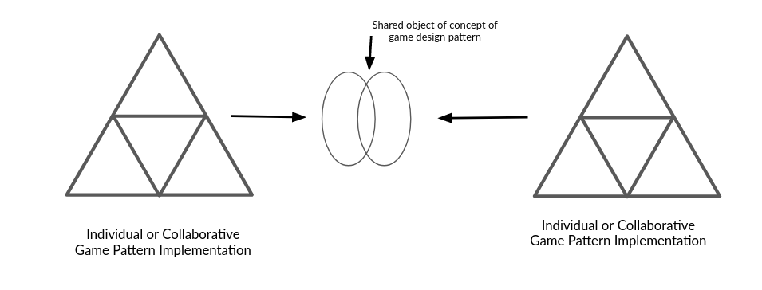

---
# all the regular stuff you have here
zotero:
  scannable-cite: false # only relevant when your compiling to scannable-cite .odt
  client: zotero # defaults to zotero
  author-in-text: false # when true, enabled fake author-name-only cites by replacing it with the text of the last names of the authors
  csl-style: harvard-cite-them-right # pre-fill the style
layout: post
number-sections: true
categories: chapter
title: 9. Appendices
---

-   [Appendices](#appendices)
    -   [Ethics](#ethics)
        -   [Game Making Club and Study Recruitment
            Material](#game-making-club-and-study-recruitment-material)
        -   [Participant Information
            Sheet](#participant-information-sheet)
        -   [Game Making Club follow up
            email](#game-making-club-follow-up-email)
    -   [Interviews](#interviews)
        -   [Practioner interviews](#practioner-interviews)
        -   [Interview.summaries](#interview.summaries)
            -   [Use of helping roles in Interview
                data.](#use-of-helping-roles-in-interview-data.)
        -   [Interview.1 - Madiha, Nasrin and
            Xavier](#interview.1---madiha-nasrin-and-xavier)
            -   [Interview.1.a](#interview.1.a)
            -   [Interview.1.b](#interview.1.b)
            -   [Interview.1.b](#interview.1.b-1)
        -   [Interview.2 - Mark and Ed](#interview.2---mark-and-ed)
            -   [Interview.2.a](#interview.2.a)
            -   [Interview.2.b](#interview.2.b)
            -   [Interview.2.](#interview.2.)
        -   [Interview.3 - Maggie and
            Toby](#interview.3---maggie-and-toby)
            -   [Interview.3.a](#interview.3.a)
            -   [Other extracts](#other-extracts)
        -   [Interview.4 - Dan](#interview.4---dan)
            -   [Interview.4.a](#interview.4.a)
        -   [App.7.fdb - Feedback
            Extracts](#app.7.fdb---feedback-extracts)
            -   [App.fdb.a - Susanna and Tehillah note on starting
                games](#app.fdb.a---susanna-and-tehillah-note-on-starting-games)
            -   [App.fdb.a - P1 end
                evaluation](#app.fdb.a---p1-end-evaluation)
    -   [On Structure of Appendices &
        Vignettes](#on-structure-of-appendices-vignettes)
    -   [Appendix.design.p1](#appendix.design.p1)
        -   [Email to participants in mid-P1 - Never mind the bees. I
            need your help
            too!](#email-to-participants-in-mid-p1---never-mind-the-bees.-i-need-your-help-too)
        -   [Appendix.5.bee - Contextual Vignette on the conflict
            experienced by one family & the 3D
            Bee](#appendix.5.bee---contextual-vignette-on-the-conflict-experienced-by-one-family-the-3d-bee)
        -   [Appendix.themeing - Themeing
            GDPs](#appendix.themeing---themeing-gdps)
            -   [Appendix 5.R.x - Sketching towards a map to help
                navigation.](#appendix-5.r.x---sketching-towards-a-map-to-help-navigation.)
        -   [Appendix 7.makertypes (and social
            missions)](#appendix-7.makertypes-and-social-missions)
            -   [What kind of Maker are you - Motivations behind social
                processes (emerging in
                playtesting)](#what-kind-of-maker-are-you---motivations-behind-social-processes-emerging-in-playtesting)
            -   [Appendix.playtestingtypes (Ch.
                7)](#appendix.playtestingtypes-ch.-7)
            -   [Commentary on side
                missions](#commentary-on-side-missions)
        -   [Appendix.drama - Drama process
            -](#appendix.drama---drama-process--)
            -   [Exploring documentation and accessing technical help
                within the drama
                frame](#exploring-documentation-and-accessing-technical-help-within-the-drama-frame)
            -   [Playful dialogue with the aliens unrelated to game
                making](#playful-dialogue-with-the-aliens-unrelated-to-game-making)
        -   [Appendix.bartle - Summary of interactive Bartle
            test](#appendix.bartle---summary-of-interactive-bartle-test)
        -   [Appendix.learningmap - Tension emerging in the Learning
            Design regarding Computational Thinking
            concepts](#appendix.learningmap---tension-emerging-in-the-learning-design-regarding-computational-thinking-concepts)
            -   [Evolution of the map](#evolution-of-the-map)
            -   [Evolution of the Learning dimensions map - COPIED HERE
                FROM CHAPTER
                8](#evolution-of-the-learning-dimensions-map---copied-here-from-chapter-8)
            -   [Background on learning Dimensions Map - -
                COMPRESS?](#background-on-learning-dimensions-map-----compress)
            -   [The potential of learning and navigational
                maps](#the-potential-of-learning-and-navigational-maps)
            -   [Tensions involving explicit teaching of curricular
                concepts or
                not](#tensions-involving-explicit-teaching-of-curricular-concepts-or-not)
            -   [The more abstract definiton of
                CT](#the-more-abstract-definiton-of-ct)
            -   [Reflection on personal appropriation of
                concepts](#reflection-on-personal-appropriation-of-concepts)
        -   [Appendix.digitalliteracy](#appendix.digitalliteracy)
        -   [Appendix.recommendations - for
            practitioners.](#appendix.recommendations---for-practitioners.)
            -   [Additional commentary from chapter
                6.](#additional-commentary-from-chapter-6.)
            -   [Practitioners can use GDPs to foster of culture, home
                interests and evolving participation in an
                idioculture](#practitioners-can-use-gdps-to-foster-of-culture-home-interests-and-evolving-participation-in-an-idioculture)
            -   [GDPs again - Move some of this to Chapter 2 if
                helpful?](#gdps-again---move-some-of-this-to-chapter-2-if-helpful)
    -   [Technical Appendix One - On technical aspects of the decision
        regarding the learning
        design](#technical-appendix-one---on-technical-aspects-of-the-decision-regarding-the-learning-design)
        -   [Tools used in different phases of
            activity](#tools-used-in-different-phases-of-activity)
        -   [Appendix 5.tech - Summary of the tools and processes used
            in P1, P2 and
            P3.](#appendix-5.tech---summary-of-the-tools-and-processes-used-in-p1-p2-and-p3.)
            -   [Description of tools used](#description-of-tools-used)
            -   [Description of types of activities involved in game
                making and the tools used to do
                them](#description-of-types-of-activities-involved-in-game-making-and-the-tools-used-to-do-them)
        -   [Summary of Phases removed from Chapter
            4.](#summary-of-phases-removed-from-chapter-4.)
            -   [D1: Initial research and development - August and
                September
                2017](#d1-initial-research-and-development---august-and-september-2017)
            -   [P1: A phase of exploratory, co-creative game making -
                October 2017 to March
                2018](#p1-a-phase-of-exploratory-co-creative-game-making---october-2017-to-march-2018)
            -   [D2: Development Stage - May 2018 to December
                2018](#d2-development-stage---may-2018-to-december-2018)
            -   [P2: Accelerated game making programme - 5 weeks in
                January to February
                2019](#p2-accelerated-game-making-programme---5-weeks-in-january-to-february-2019)
            -   [P3: Adding a process drama to the game making
                programme: 5 weeks in May
                2019](#p3-adding-a-process-drama-to-the-game-making-programme-5-weeks-in-may-2019)
            -   [D3: research and development - Make Code - November
                2019 to September
                2020](#d3-research-and-development---make-code---november-2019-to-september-2020)
            -   [P4: MakeCode Arcade 1- November 2019 to DEc
                2020](#p4-makecode-arcade-1--november-2019-to-dec-2020)
            -   [P5: MakeCode Arcade 2](#p5-makecode-arcade-2)
        -   [Appendix.tech.samplechapter - Extract of supporting
            resources - Sample chapter on Keys and Doors gameplay design
            chapter](#appendix.tech.samplechapter---extract-of-supporting-resources---sample-chapter-on-keys-and-doors-gameplay-design-chapter)
            -   [Game Space: Keys and Doors](#game-space-keys-and-doors)
        -   [Appendix.tech.gameframework - Framework to support game
            analysis via game elements
            -](#appendix.tech.gameframework---framework-to-support-game-analysis-via-game-elements--)
        -   [Design decisions in the technical decisions of the template
            design in
            P2](#design-decisions-in-the-technical-decisions-of-the-template-design-in-p2)
            -   [Using a structural
                template](#using-a-structural-template)
            -   [Summary of motivations and sources of P2
                template](#summary-of-motivations-and-sources-of-p2-template)
            -   [Appendix.tech.prototyping Use of visual
                prototyping](#appendix.tech.prototyping-use-of-visual-prototyping)
            -   [Using Phaser 2 not 3 & Game
                States](#using-phaser-2-not-3-game-states)
                -   [Template structure and asset placement - Add in
                    Chapter tutorial example extract here
                    too](#template-structure-and-asset-placement---add-in-chapter-tutorial-example-extract-here-too)
    -   [Technical Appendix Two - On reaction to
        tech](#technical-appendix-two---on-reaction-to-tech)
        -   [Appendix.patching](#appendix.patching)
        -   [Appendix.debugging GDPs used to nurture tactical responses
            to coding
            errors](#appendix.debugging-gdps-used-to-nurture-tactical-responses-to-coding-errors)
        -   [Concluding remarks on debugging and
            revision](#concluding-remarks-on-debugging-and-revision)
    -   [Unplaced - but needed.](#unplaced---but-needed.)
    -   [Perhaps delete?](#perhaps-delete)
        -   [Appendix 5.x - Community norming in playtesting - DROP THIS
            ONE
            PERHAPS](#appendix-5.x---community-norming-in-playtesting---drop-this-one-perhaps)
        -   [5.dn - Expanded Design
            Narrative](#dn---expanded-design-narrative)
        -   [Shared object as GDP move to Ch
            5](#shared-object-as-gdp-move-to-ch-5)
            -   [On Template / Documentation
                use](#on-template-documentation-use)
            -   [Email on list for P1 - regarding the use of a
                template](#email-on-list-for-p1---regarding-the-use-of-a-template)
            -   [Additional commentary and analysis of Toby's vignette -
                MOVE TO EXTERNAL
                DOCUMENT](#additional-commentary-and-analysis-of-tobys-vignette---move-to-external-document)
            -   [Developing a collection of GDPs and code
                snippets](#developing-a-collection-of-gdps-and-code-snippets)
        -   [Not sure if useful](#not-sure-if-useful)
            -   [Developing Digital Literacy skills / Fluency -
                OPERATIONS](#developing-digital-literacy-skills-fluency---operations)
        -   [Tensions in tool use emerging between agency and
            authenticity](#tensions-in-tool-use-emerging-between-agency-and-authenticity)
    -   [Participants Interview questions - semi structured
        -](#participants-interview-questions---semi-structured--)
        -   [Introductory Questions](#introductory-questions)
        -   [Personal Dimensions](#personal-dimensions)
        -   [Material Dimensions](#material-dimensions)
        -   [Social Dimensions](#social-dimensions)
        -   [Cultural Dimensions](#cultural-dimensions)
    -   [Final administrative appendix](#final-administrative-appendix)
        -   [Back up links to short URL
            resources](#back-up-links-to-short-url-resources)

# Appendices

## Appendix A: Ethics and recruitment

This information is to be circulated to Home Education Forums and Email groups.  

### A2: Game Making Club follow up email

My name is Mick Chesterman. I am a tutor and PhD student in the Manchester Met Faculty of Education. I am looking for families to take part in a Game Making club to learn how to make video games together.  

The weekly game making activities start on take place on ___________ and the Manchester Met Brooks campus and will last until __________________.

These activities are part of a study looking at collaboration, creativity and problem solving in a family learning environment. Taking part in the study will involve some of the sessions being recorded and some interviews with you about your experiences. More details will be provided as part of a fuller participant information sheet.  

If you do not wish to be a part of this study that’s not a problem.  You should still apply to take part as one version of the club will not be a part of the study. This version of the club will undertake equivalent activities.  

To register your interest in taking part. Please email me on m.chesterman@mmu.ac.uk

Many Thanks

Mick Chesterman.  

### Appendix A3: Full Participant Information Sheets

_Investigating the Potential of Family Game Making to Support Collaborative Production: Participatory research with Families_

### A3a. Information Sheet for Parents

You and your child/children are being invited to be involved in this research study. Before you decide whether you want your child to take part, it is important for you to understand why the research is being done and what your participation will involve. Please take time to read the following information carefully to help you decide whether you wish to take part. If anything is unclear or if you would like more information please contact Mick Chesterman (email: m.chesterman@mmu.ac.uk)

#### What is the purpose of the study?
The project hopes to understand the process of making digital games. Two or more family members will join a larger group to explore creativity and problem solving in this context. The aim is that this understanding will help inform good practice for wider game making activities as part of family learning projects and venue programmes.

#### What will participation involve?
We would like to observe you and your child/children’s participation in an approximately 8-week (2 hours per week) game making programme. The activities are designed to support participants to review and make your own digital games that can be played on web browsers. Some of the work will involve using paper, pens, textiles, and other materials to make picture prototypes and generate sounds to include in the games created.

These sessions will occur during Autumn 2019 / 2020 at Manchester Metropolitan University (Brooks Building) during school time, facilitated by the researcher. You will be expected to accompany your child/children and participate in the activities.

There are no known risks, inconveniences or direct benefits, although we expect participants may increase their understanding of game making concepts and practices.

All written, drawn and material artefacts produced will be treated as research data. The researcher will make descriptive notes during sessions. Some activities will also be audio and video recorded. These recordings may be used for reflective interviews. These interviews will also be audio recorded, with the content analysed to inform reports or academic publications.

Approximately three weeks after the sessions are complete, each family unit will be invited to a follow-up interview.

Identities will be kept confidential through coding and the use of pseudonyms. Any images used in reports will be altered using Photoshop to create anonymised line art sketches. Video used in research presentations will be edited to maximise anonymity. All data will be stored on a password-protected external drive in a locked office at MMU.

Please note:
- Names will be removed from all data, and information will be anonymised.
- If there is any risk of indirect identification, we will consult with you.
- You and your child can withdraw at any time by emailing Mick Chesterman.
- If you withdraw, your data will not be analysed, and you may still take part in other activities.

#### Who to contact
For questions about the study:
- Mick Chesterman, ESRI, MMU, Room 1.43, Birley Building  
- Email: m.chesterman@mmu.ac.uk  
- Phone: +44 161 124 72060

To raise a concern:
- Prof Ricardo Nemirovsky, Faculty Ethics Committee  
- Email: r.nemirovsky@mmu.ac.uk

---

### A3b. Information Sheet for Young Participants

Dear Student,

We are asking you to take part in a research project called _Investigating the Potential of Family Game Making to Support Collaborative Production_. We’re interested in how young people and their family members can work together to solve problems and create new ideas when making simple video games.

If you agree to join in, you and other students will come to Manchester Metropolitan University with your parent or guardian. You will use fun equipment and technology to explore and make digital games.

These activities will happen over about 8 days. Your parent or guardian will be with you the whole time and take you to and from the university.

We will video and record what happens while you work together and on the computer. When we show or write about the project, we’ll change your name and turn any pictures of you into cartoon-style line drawings, so no one knows it’s you.

If you change your mind, you can stop taking part at any time. Just tell us or let your parent or guardian know.

Questions?  
- Call: +44 161 124 72060  
- Email: Mick Chesterman (m.chesterman@mmu.ac.uk)

### A3c. Information Sheet for Practitioners

You are being invited to take part in a research study. Before you decide, it’s important you understand why the research is being done and what it will involve. If anything is unclear or you want more information, please contact Mick Chesterman (m.chesterman@mmu.ac.uk).

#### What is the purpose of the study?
The project explores how families make digital games together and how this process supports collaboration. The goal is to develop good practice for family learning and public programme delivery.

#### Why have you been chosen?
You have experience working with different age groups in digital game making. Your insights are valuable for the study.

This is a personal academic study. Whether or not you participate will have no bearing on your professional relationship with MMU.

#### What will participation involve?
You will take part in an interview about your experience, held at MMU or another convenient location. The interview will be audio recorded, and notes will be taken. These will be used to inform the researcher’s doctoral thesis and related academic work.

Participation is voluntary. You can withdraw at any time, and any data already collected will be destroyed and excluded from analysis.

#### Who to contact
For questions about the study:
- Mick Chesterman, ESRI, MMU, Room 1.43, Birley Building  
- Email: m.chesterman@mmu.ac.uk  
- Phone: +44 161 124 72060

To raise a concern:
- Prof Ricardo Nemirovsky, Faculty Ethics Committee  
- Email: r.nemirovsky@mmu.ac.uk

## Appendix B - Interview data

These interview extracts are presented sometimes with commentary and sometimes without as they are directly reference from commentary in chapters.

###  Practioner interviews

Saskia Leggett is a researcher who was active in the in Creative Family Learning program under direction of Ricarosa Roque. She took a leading role in creating the programme's support resources. Matt Curinga is an academic at Columbia and teaches in educational technology and computer science. He is also active in a non-profit organisation, Zero Day Camp, promoting learning coding and engineering through engaging projects. Dave  Potts is a professional programmer and a parent and volunteer at Coder Dojo which is a volunteer run teaching technology monthly event. James Clegg is PGCE Computing student/teacher and volunteer student helper for the game making programme.

### Interview.summaries

#### Use of helping roles in Interview data.

Mentioned in Chapter 7

### Interview.1 -   Madiha, Nasrin and Xavier

#### Interview.1.a

#### Interview.1.b  

The involvement of Madiha in Nasrin's gaming

#### Interview.1.b  

The choices to explore issues of social media

### Interview.2 - Mark and Ed

#### Interview.2.a  

- The use of paper prototyping and then progression to digital sketching.
The quick use of digital tools

#### Interview.2.b  
Choice to explore trains as a subject

Mark and Ed designed a game around the character of a train driver that needed to collect coal. In subsequent post course interview Mark describes the impact of the child feeling like they could bring their own identity and interest into the project.

Mick: (17-46) Can you tell me anytime that you felt like you bring your own identities or interests into what you were doing.
Ma - Oh, definitely. Yeah.
Mick: Let's ask Ed that as well.
Mark: Yeah.
Mick: Can you do feel like in making the games, you're able to bring your own interests or things that you related to into it?
Ed: Yeah. The Fireman.
Mark: Yeah, well, tell us about that game. Tell about your interests and stuff?
Ed: A little fireman, he's going around collecting coal for this train. They lost it. But then there's sheeps on the line.map
....
Mark: What is your aspiration for your life?
Ed: I wanna be a fireman (on a steam train).
...
Ed: I really like trains, since like I was very, very young.

Mick: Do you think I mean, was that was that like something that helps you a little bit keep your interests go in for the game?
Mark: I think it excited you to have to build a fireman sprite? Is that right?
Ed: Yeah.
Mark: and to have it train themed, didn't that like, keep your interest in the designing part of it up? Is that true?
Ed:  Yeah.
Mark: Because the whole theme of it. Just I know just your eyes lit up when you realised you could expand your interests into gaming.

#### Interview.2.

Plodding

### Interview.3 - Maggie and Toby

#### Interview.3.a

Choice of home interests bee keeping

#### Other extracts

- Emotional when J. who was dyslexic was able to do the code pattern matching exercise.

### Interview.4 - Dan

#### Interview.4.a

Dan's involvement in Coder Dojo.   

### App.7.fdb - Feedback Extracts

#### App.fdb.a - Susanna and Tehillah note on starting games

Added to vignette 2 also

Tehillah got on better during the coding once the student who was hovering initially left us alone.  Because every time Tehillah hesitated, she jumped in to do it for her.  Whereas I know her better so can judge how to facilitate more minimally, and I resist the urge to fix things immediately when she struggles.  Plus she can't read yet, so she was recognising the relevant bits of code by matching the individual letters, which takes longer.

End of course evaluation at show case for  P 1.
Find extracts from here
https://docs.google.com/document/d/1VL8FPnrBUbcpwL1nmGLCsF1t2JjkitQV_3N8DYeFcoM/edit

#### App.fdb.a - P1 end evaluation

Athena (P1.debrief) also shared reflections on the issues of family and home education dynamics, suggesting that parents may get in the way of young people's ability to move into other's spaces to learn things, and that parental helping roles may therefore be a hindrance.

    The concept of learning from peers is different to family learning

    One perspective, maybe adults keep children back from progressing in their own way.
    Could have worked well if just kids.
    Adults have more social rules.
    Kids don’t mind copying, invading space.
    But adults do. Some lack spontaneous approach.

    In home ed many either observe from the back or go to a separate room
    How is it different at home?
    If parents and kids work together, social rules are stuck to, in that the adults lead a learning process.

## On Structure of Appendices & Vignettes

Vignette are presented first and given a separate name based on when they appear in the thesis. In the interim before for a final appendix is completed they use descriptive names.

Technical appendices follow. They contain some overlap with chapter material in order to be self contained. The

Other Appendices will be organised by chapter. Thus AP 5.1 is is the first mentioned in Chapter 5. In the interim before for a final appendix is completed they use descriptive names.

The following summary list of appendices my help orientate the reader.
MOVE LIST ABOVE HERE WHEN STABLE ENOUGH  

**Vignettes:**  Vignettes contain extended transcription of discourse and when possible participant gestures and inline commentary. Vignettes are contained in another chapter / document (due currently to the need for more complicated tables that writing in markdown allows)

## Appendix.design.p1

As my ex-neighbour Barry once said to me, _there are a million ways to start a conversation_. There are probably just as many to start the process of designing and making a game using code as well. In choosing how to present the appendices of this study I try to do so in an accessible narrative which draws on my extensive facilitation and design journal notes to contextualise the findings from video data. I justify this partial approach in line with Stetsenko's activist stance described in Chapter 4.

This section augments the brief narrative of P1 in Chapter 5 outline my motivations and observations driving learning design decisions.  

I did not want to start with coding processes that might alienate, but also as my own game coding skills were also being tested to their limits at this point also and I was working hard to introduce coding at a suitable level. I had experience of teaching web coding but limited knowledge of how to code games. Thus during these five week that time I had been teaching myself the basics following my own repertoires and practices as a mostly self-taught coder.

Thus for initial weeks I engaged with the following activities.

In phase one, I noted that any addition to the game in terms of adding new any quantity of code created many potential coding, conceptual and organisational challenges.

Chapter 5 outlines how this culminated in a crisis which involved me reaching out to parents for help in the organisation of the game making sessions via the  following email.

### Email to participants in mid-P1 -  Never mind the bees. I need your help too!

Mick Chesterman<M.Chesterman@mmu.ac.uk>

Hi there,

Never mind the bees. I need your help too!

I really appreciate all your energy going into the game making club over the last weeks. This is an experimental process and you guys are really going for it.

Also special thanks to J* for doing the Sonic Pi session on Tuesday that was great, and I learned some useful things for doing that one in the future.

It was a bit of a hard session for me on Wednesday as I was a bit low on confidence about how to pull all of your creativity into a finished game! It started to feel like a bit of a fantasy!

So I think I realised something. I said in the past that the idea of the club is for you to follow your interests and I’ll do the job of pulling together that creativity into a game.

But I realised that I can’t do it alone!

So I think part of the work we have to do is to visually map somehow what we have now at the start of every session. Via prints outs, or sheets where we map what we have and what we are missing.

I’m happy to give it a go at the start of next session to try to explore one way of doing it.

But ideas via email would be very useful too.

And let’s also have a break out group at the end to work out a bit more of a team approach as I need your help!

Thanks loads for reading this far…
Mick

ps: I guess the challenge is to do this so that it’s a map, with different learning directions and possibilities, but that we are all still on the same map in our groups.

So supporting autonomous learning but also team work.

### Appendix.5.bee - Contextual Vignette on the conflict experienced by one family & the 3D Bee

One family in P1 chose not to continue with most other families after the Xmas break.

Members of this family had engaged in planning on paper and in particularly in creating pixel art, however tensions began to emerge when the introduced code framework framework did not support the desired features of one child. The feature they wanted to add to the game was bee design roaming a 3D landscape.  

When the family withdrew, they shared in feedback (see appendix 4.x) that at one point the family looked around and just saw people doing "hardcore coding" and no longer felt that they belonged".

In the end stages of the game production process, due to the dynamic of the larger group, they had been reliant on others to implement code changes for their imagined game, unable to contribute fully at this point and found themselves isolated.

Thus a contributing factor to this families alienation were tensions engendered by the large group size and compounded by frustrations stemming from unfamiliarity with tools and processes.

In participant feedback, the  parent of this family described in the previous section indicated that it took too long before in the planning stage and called for more hands on play and use of the tools of production before being called on to make creative decisions. The parent likened this to an arts studio approach. This feedback contributed to choices outlined in other sections of this chapter. (WHICH ONES)

When the family withdrew, in my journal notes I reflected that the they shared of alienation from the group process occurred in a session where, due to a sense of urgency to complete games, I had omitted drama-based warm up activities. Instead as participant entered I began to support to help some participants debug some pressing code errors.

For some families and individual participants there were conflicts to do with a sense of anxiety and alienation from the group coding environment and associated peer working dynamics.

One family dropped out and in their exit interview they shared that at one point we looked around and just saw people doing hardcore coding and we no longer felt at home in the environment. In this emergent design, they had mostly completed asset design and narrative development and the only coding remained. I thus wanted to address the tension between completing the project and alienation from just coding.

The value of playfulness is illustrated with one exit interview with a parent where they shared their reasons for leaving the program. At one stage after a week where they had missed a session, their family looked around and saw other groups involved in 'hardcore coding' and no longer felt at home. They compared this previous sessions which had more fun and group oriented activity.

I was struck that his incident happened during a session where I had not played customary drama games to create an inclusive environment. The games had been omitted as I was responding to a sense of urgency coming from families to solve problems. The scarcity in facilitator time drove me to crack on supporting families to debug code errors.

**Limits of peer support**

In feedback the parent shared they didn't want to bother other families with probems via the email list, and also noted the hesitancy caused by parental involvement compared to the kids ability to jump in and learn from each other less self-consciously.

Thus this surfaced a tension, the value of a peer learning balanced with the need for low pressure. In other words avoiding a negative sense of obligation.

<!-- The value of playfulness is illustrated
The freedom of choice and imagination allowed by designing on paper and via pixel art created compounding tensions. -->

<!-- I had not played customary drama games to create an inclusive environment.

That week I had omitted them as I felt a sense of urgency coming from families to solve their problems. The scarcity in facilitator time drove me to crack on supporting families to debug code errors. -->
<!-- In this emergent design, they had mostly completed asset design and narrative development and the only coding remained. I thus wanted to address the tension between completing the project and alienation from just coding. -->

### Appendix.themeing -  Themeing GDPs

In grouping the game design patterns into categories for the documentation hub page, I drew on academic and professional interpretations of game elements [@salen_game_2006; @schell_art_2008; @tekinbas_rules_2003]. Schnell's detailed analysis of tens of game elements presented as design lenses was too complex for this audience. Instead, I adapted a simplified introductory framework developed for use in youth-oriented Game Jams to help novice game makers hack/analysis and then adapt key elements of non-digital games [@cornish_game_2018].

- **SPACE:** Where the game takes place.
- **GOAL:** What is the objective of the game? What are you trying to do?
- **COMPONENTS:** What are all the objects or actors in the game?
- **MECHANICS:** What actions take place in the game. What are the verbs involved?
- **RULES:** What can or can’t you do in the game? What defines boundaries? Does play happen in real time or do you take turns?

The framework youth game jams and in the Q2L school to help participants develop their implicit knowledge of game design concepts in to explicit share vocabulary before engaging in digital making via collaborative analysis of common games [@cornish_game_2018; @institute_of_play_gamestar_nodate]. Similarly, in early stages of my design participants completed a similar activity after playing retro arcade games [included in appendix].

I related this simple categorisation the emerging list of requests for game features made by my participants. The final categorisation used in P4 is included as a Table 5.x below.

| **Game Mechanics**| **Game Polish** | **Game Space** | **Challenge Systems**|         
|--------|------------|--------------|----------|
| Add Static Hazard  | Add Graphical Effects | Change Design of Levels | Gain Points when Collecting Food |
| Add an Animated Enemy  | Add Sound Effects | Add More Levels | Add a Timer |
| Jump on Enemy to Zap them  | Add a Sound Track (Music) | Change Shape of Levels | Collect all Food before Progressing |
| Double Jump  | Add a Game Story with Messages | Change the Background Image | Power up - Higher Jump |
| Moving / Patrolling Enemies  | Add a Game Story with Messages | Change the Background Image | Power up - Player Speed |
| Moving / Following Enemies  | Animate your Player’s Movements | Key and Door | Random Doubling Enemies |    
|   | Make Player Immune |  | |    

Table 5.x Categorisation of game design patterns used in P4.

This categorisation, while simplified, is consistent with professional and technical frameworks popular in game making communities including: the MDA framework [@olsson2014conceptual] (which focuses on analysis of games based on the user experience), Elemental Tetrad [@schell_art_2008], and DDE [@korn_design_2017]. The theme of using technical frameworks in an accessible way to facilitate the creations of novice participants is continued in the chapters five and six.  
I noted that some patterns addressed game aesthetics (simplified to  _game polish_) for example; the graphical representation of game characters; adding sounds; and adding background images. Others could be described as _game mechanics_ including: jumping on enemies; finding a door or flag to progress to the next level; and collect all food before progressing to next level. Others concerned aspects of _game space_: the size and shape of game world; and adding new levels the game. In P5 I extended the scheme to included  _system and challenge_ patterns. These explore at how different elements in
 cxteract to create challenge in the game.

I then took the existing list of game elements that have been identified by students and categorised them based on a blend of two frameworks.

I made some simplifications and adaption to increase accessibility for non-professional and young people. For example, the term of aesthetics is very wide and used by suited simplification _game polish_.

{width=55%}

#### Appendix 5.R.x - Sketching towards a map to help navigation.

In trying to organise and represent code examples to participants in a logical way, I experimented with different categories and themes to contains the emerging game elements. I also explored the concept of mapping the different challenges by difficulty on a map via structuring via concentric rings. An example of the kind of grouping sketch used is included below as Figure 4.x.  

{width=85%}

_Fig 4.x. Scan of Journal Sketch of early attempt at dividing features by type and difficulty - Dated 11.3.2019_

The process of sketching, revising and re-sketching the elements led me to connect this process of categorisation with the work of game theorists. For example, I recognised synergies with between _open-world_ game design and my attempts to structure resources and help learners navigate the learning experience based on choosing challenges based on their interests and appropriate difficulty levels [@squire_open-ended_2008].

### Appendix 7.makertypes (and social missions)

MOVED HERE

The process of exploring identity in this way surfaced the cheekiness of some young people and the pleasure they took in demonstrating their playful mischievousness. I began to make journal notes on this subject and talk to other games study practitioners. I began to ask the question can the surfacing maker types (as per player types) encourage awareness and celebrate the emerging practices that the community was producing.

#### What kind of Maker are you - Motivations behind social processes (emerging in playtesting)

By the end of P2 most of the tools and main processes were in place. But I still felt tensions around introducing reflective processes and wanted to de-centre myself where possible from a teacher position. My journal notes detail an evolution of attempts to try to build into the program, activities which help build the participants sense of their own identities of game makers or more generally digital designers. Participants, particularly older ones, used playtesting as a way of showing support for fellow game makers. Example behaviours included: praising graphical content; making links with home interests of participants through questioning; and building rapport.

Madiha in particular used playtesting to show her appreciation of the graphical work of others especially in the creation of cute animal characters. In response to one game which featured an image of a dog, other participants asked: _Do you like dogs? Do you have a dog at home?_.

In and early tentative attempt to define in broad strokes the types of game maker behaviour and underlying goals, taking inspiration from Bartle's game player types [@hamari_player_2014], identifying social makers, planners, magpies and glitchers.  

-   **Social makers:** form relationships with other game makers and players by finding out more about their work and telling stories in their game   
- **Planners:** like to study to build knowledge of the tools before they build up their game step-by-step following instructions
-   **Magpie makers:** like trying out lots of different things and happy to borrow code, images and sound from anywhere for quick results
-   **Glitchers:** mess around with the code trying to see if they can break it interesting ways and cause a bit of havoc for other users

I saw potential value here to address the danger internal bias about the kind of process that a computer programmer should adopt, echoing the call for pluralism in approaches [@papert_epistemological_1990]. Thus, in P2 I introduced a starter game in which families moved into different quadrants of the room in answering questions on the Bartle test. This process celebrated different game playing types and allowed a public sharing of previously hidden gaming preferences, although for some non-gaming parents and children I had to ask them to use their imagination. Several parents noted that this process gave them great insight into how their child identified within the cultures of the games they played.

After the process of playing a game I shared my proposition that there different game maker types. I asked participants to evaluate and discuss with peers what kind of game maker they were from the list above. This process was not explicitly used in later reflections however parent Mark made the following comment in post-session P3 interviews.

    We used the instructions, we like to plod.

{width=95%}

I used the question "What kind of game maker are you?" as an indicator to participants that one aim of the project was to create a space where different approaches are possible and celebrated. To communicate this approach, as well as starting game activity, I incorporated the question into an animation of the resources home page (see illustration 4.x). In P3 the underlying ideas were incorporated into the process drama described in the next section.

#### Appendix.playtestingtypes (Ch. 7)

The maker types listed above were in particular played out in the playtesting process.

**Playful playtesting**

Some children added additional playful elements to playtesting. Because these interactions were mobile between workstations is it hard to extract audio and transcribe their speech. However, it is possible to communicate the characteristics of this play via a description of a typical encounter and the gestures of participants.

WATCH MORE CLOSELY AND TRANSCRIBE GESTURES

    Play is initiated by calling across the room as an invitation to play, or as a provocation. When playtesting is underway it is normally undertaken with two or three participants standing around the computer rather than being seated. The core of those involved take turns to play the game, exclaiming frustration or triumph at completing levels or failing. Failure may be extremely performative with a rapid pulling way from the screen and keyboard. This may be followed with a battle to wrestle control of the keyboard to play the game next. This may involving playful pushing, and wrestling of hands and arms and vocalisations. While this play is happening it may attract other participants who remain on outskirts of the activity looking on able to watch what is happening on the screen and respond non-verbally with smiles or laughs.

These changes to the form and function of playtesting by young participants is another example of expression of agency by participants that widens the scope of possibility of actions.

#### Commentary on side missions

Full table of side missions.

| Your Alien Mission (social)          | Your Secret Alien Mission:              
|----------------|----------------|
| Find out the names of 3 games that are being made.  | Change the variables at the start of someone else’s game to make it play in a funny way.    |
| Make a list of characters in two other games being made.   | Change of the images in someone else’s project to a totally different image and see if they notice.    |
| Find out the favourite computer games of 4 people.   | Change the level design of the first level of someone else’s project to make it impossible but try to change as little as possible to do that.   |
| Find out who plays the most computer games per week in your group.   | Change of the images in someone else’s project to a very similar but slightly different version and see if they notice.    |
| Find out what other people are planning. Give some friendly feedback to one other person / group. Why don’t you try…   | Add a rude sound to someone else’s project.    |
| Ask 2 different groups if they have thought about what sounds they are going to put in their game.   | Swap over some sounds in someone else’s project and see if they notice.   |
| Find out from three groups if they are going to try any totally new ideas.  | Delete all of the code of someone else as they are editing it and see how they react. Then help them get it back using the Rewind function.   |

In the transcript above of vignette 4.1.b we see that in the end-of-session reporting back participants engage in a lively discussion about the secret missions they had been given. Encouraged by her mother Madiha, Nasrin shares that she has been highly engaged in a disruptive secret mission. Dan and Toby express playful frustration. Mark and Ed contribute by sharing their more subtle disruption and Richie is keen to have his _rude noise_ mission noticed and commented on. Some public missions had a noticeable impact in this session particularly in  stimulating a discussion among parents around which arcade games they played as youths.

Side missions or side quests are also used in open world games are used in part to appeal to different kinds of players and are often models on Bartle's taxonomy of game player types [@bartle_hearts_nodate]. In this phase, parents Madiha and Mark both used the prompts of the social missions to take a break from their creative work using the software toolset to talk to other parents and children.

    Mark: Right we’ve got a background in. Do you. Do you want to reply to the Weean.
    Ed: Yes. (Ed starts to type very slowly)
    Mark: (after some time) While you do that I’m going to go do my mission.
    Ed: What's your mission?
    Mark: To find out about other people's favourite games.
    Ed: Alright.

**DISCUSSION**

the lively discussion about game playing in response to the mission to _find out the favourite games of 3 other people_ - from parents is explored here

ADD IN DETAIL FROM P3 -

### Appendix.drama - Drama process -

#### Exploring documentation and accessing technical help within the drama frame

To do this in a way that encouraged other participants to join in, I created a project in the shared coding project area with a webpage that could be edited and viewed by participants. When in the vignette 4.1.b Mark asks "We’d like to ask the Weean some more questions (to overcome coding blockages), is that the best way to do it?", he is referring to this project webpage. The process of writing down a text request encourages the adoption of professional practice of asking a written question to overcome a coding problem and thus builds experience of using technical terms. Undertaking it in-role potentially addresses the barrier of asking for help by de-personalising the process.

Dan and Toby also received written help from the aliens to implement a pattern of creating random movement in their pac-man clone game. For this pair, the process of following a code suggestion from the aliens gives the parent opportunity to deconstruct the code in detail to explore coding concepts. In later discussion, Dan uses the fiction of the alien when asking a clarifying question.

    "Mick, do you think the aliens would mind if we get rid of the switch statement and replace it with some if-thens? They're just showing off these aliens aren't they?"

Here the text dialogue with the aliens is used as a mediating artefact first by the facilitator to share help in-role, and then by a parent to suggest a modification to the code syntax to create more readable code structure for novices.  

While this aspect of the drama process was introduced by the facilitator, in alignment with the understanding of Sannino's concepts of transformative agency through double stimulation (TADS) participants transform the function of the alien conversation to their own purposes. This theme is developed in the next section.

#### Playful dialogue with the aliens unrelated to game making

The process of asking the aliens for technical help within a code project sparked a playful process of informal chatting with the aliens.

This chat began to fulfil a function of building  insider rapport, creating a fun atmosphere, celebrating the completion of games in the absence of a public showcase, and signposting the achievements of other participants. For some pairs, while the child interacted in the live chat, parents performed final tweaks to code projects and challenges. Two parents in particular worked hard debugging more complex elements of the game with facilitators and peers. Other parents engaged with the chat and encouraged their children to get feedback from the aliens about their game in particular.

The process started with supportive and celebratory messages posted from the alien. The impact was significant with the young people with 5 out of 7 engaging by writing messages and all mentioning the interactions verbally during the session.

### Appendix.bartle -  Summary of interactive Bartle test

As part of attempts to try to build into the program, activities which help build the participants sense of their own identities of game makers or more generally digital designers.

I introduce a warm-up activity trialled in P2 where participants took part in an interactive the Bartle test (what kind of game player are you).  

A Bartle test is ...

}

It took the form of an as extended spectrum line/grid activity [FIND DESCRIPTION SOURCE]. The process of exploring identity in this way surfaced the cheekiness of some young people and the pleasure they took in demonstrating their playful mischievousness. I began to make journal notes on this subject and talk to other games study practioners. I began to ask the question can the surfacing maker types (as per player types) encourage awareness and celebrate the emerging practices that the community was producing.

The process was adapted so players moved
to a different quadrant of the room based on their response to the question. The process allowed young people to see how their response differed from that of their parents. The process was very engaging and quite revealing. Parents responded that the process gave them new insight into the digital identities of their children.

After the results were revealed, I then proposed as facilitator that my observations were that there different game maker types. I read out the different types and asked them to place themselves in a two-dimensional grid based on their self evaluation of what kind of game maker they were. Other family members were then invited to comment to see if they agreed with this interpretation.

The process of exploring identity in this way surfaced the cheekiness of some young people and the pleasure they took in demonstrating their playful mischievousness. I began to make journal notes on this subject and talk to other games study practitioners. I began to ask the question can the surfacing maker types (as per player types) encourage awareness and celebrate the emerging practices that the community was producing.

As an example some players created impossible or overly easy game levels. They appeared aware of implications for game balance but is taking pleasure in this seeming destruction of the key challenge of the game as an act of disruptive play. They seem to take pleasure from ignoring concepts of what should be done to maintain game balance and from the sense of shock from their current audience her parent. Going against this convention is a type of playful destruction in this context. The process mirrors play theory concept of playing against the game or dark play [@sutton-smith_ambiguity_2001].

Below I outline how I designed to encourage this behaviour.

In and early tentative attempt to define in broad strokes the types of game maker behaviour and underlying goals. In doing this I have taken inspiration from Bartle's game player types [@hamari_player_2014]. I translated player types to maker types based on notes in my observation journal and extracts from screen capture data. The following list of *Game Maker *types:

-   **Social makers:** form relationships with other game makers and players by finding out more about their work and telling stories in their game -   
- **Planners:** like to study to get a full knowledge of the tools and what is possible before they build up their game step-by-step
-   **Magpie makers:** like trying out lots of different things and happy to borrow code, images and sound from anywhere for quick results
-   **Glitchers:** mess around with the code trying to see if they can break it interesting ways and cause a bit of havoc for other users

My rationale for this process was to promote awareness of pluralistic programming process [@papert_epistemological_1990]. I wanted to try to communicate a message to participants that when you are learning something hard it is of value follow your own working preferences and try to discover a creative style that suits you.

<!-- #### Building Identities as Game Makers (dropped) -->

<!-- NOTE - MAY NEED TO REWRITE to clearly precursor next chapter -->

<!--
in open world games are used in part to appeal to different kinds of players [@bartle_hearts_nodate].
 -->

<!-- For examples in the Vignette of S and T's interaction we can see attributes of the child as a Glitcher. In terms of understanding of the game as a dynamic system, this is seen clearly in the parent's alarm at the child's deletion of all elements of hazard. The parent is keen to keep a sense of game balance to ensure a sense of challenge for the imagined player. "It's no fun having a game without any hazards to avoid." The child seems determined to remove all hazards.  -->

### Appendix.learningmap - Tension emerging in the Learning Design regarding Computational Thinking concepts

This appendix outlines the evolution of a map of learning dimensions which is referenced in Chapter 6. A section section contains reflections on the aspect of the learning design which suit curricular approaches to computing and computational thinking.

|      Coding Concepts    | Systems Patterns    | Design Practices|
|--------------|-----------|------------|
| Sequences | Systems Elements      | Goal Setting        |
| Variables      | Systems Dynamics  | Being Incremental and Iterative       |
| Logic | Reinforcing Feedback Loops      | Developing Vocabulary        |
| Loops | Balancing Feedback Loops      | Web Navigation    |
| Arrays |       | Problem Solving        |
| Creating Functions |       | Version Control    |
| Change Listener |    | Debugging   |
| Input Event |   | Reusing and Remixing      |

Table 1.1. Learning Dimensions of the 3M Game Making Model

#### Evolution of the map

The inspiration is that of Bevan and Petrich's  [-@bevan_learning_2015; -@petrich_it_2013] work to bring a similar learning map to a seemingly chaotic tinkering and making process in museum contexts.

IS THIS IN LR?

#### Evolution of the Learning dimensions map - COPIED HERE FROM CHAPTER 8

**Conflicts stemming from tensions between privileging participant choices or underlying computing and systems concepts**

In P4 I wanted to create resources and processes which are of potential value to practitioners in the UK classroom. At this stage I noted a contradiction between aligning activities to curriculum or following learner choice and expression [@hoyles_pedagogy_1992].

<!-- Chapter two explored ways in which digital game making is commonly aligned with curricular areas [@kafai_connected_2016]. It also surfaced tensions that emerge between the exploration of curricular concepts participants desire to follow activities following learner expression and choice [@hoyles_pedagogy_1992]. -->

<!-- The second was a conflict which manifested via my hesitancy to introduce tools and activities designed to address
 this tension. -->

#### Background on learning Dimensions Map - - COMPRESS?

Research on _concept maps_ [@canas2003summary] as methods for teachers and researchers to identify key learning suited to particular computing projects has gained traction in the field of computing education [@keppens_concept_2008; @noauthor_quick_2020; @weinerth_concept_2014]. The value of facilitators presenting concepts  and asking students to create maps of concepts for formative assessment. In addition, there is value in mapping which are likely to occur in project work especially when such concepts are embedded in activity in a way which resists superficial analysis. Research on hands-on tinkering in science museums by Bevan and Petrich [-@petrich_it_2013] together with educators examined video footage of families interacting with exhibits to make a structured list of the learning they observed. Their resulting map of learning dimensions included underlying science concepts but also contained more general skills and helping behaviours involved in exploratory learning processes.

Similarly, one of the outcomes of my research was to extract from hours of recorded material some of the concepts and practices that learners engaged with when making games. Table 4.x. shows my resulting map of learning dimensions. While some concepts are common to existing computational thinking frameworks others, including systems thinking concepts, are more unique to game making. The choice to include some elements over others is based on a synthesis of the experience of participants, existing frameworks in this domain (previously explored in the LR), and my own interpretation which privileged under explored elements like systems patterns. Due to the dominance personal input, this framework is offered as starting point which could benefit from the type of collaborative analysis undertaken in Bevan and Petrich's process.

<!-- In learning environments where there is a lot of choice assessing learners via observation is beneficial. Rather than deciding what you want to teach and testing students on that area, you can map the learning happening in an authentic activity. -->

<!-- Another chapter in this collection identified concept maps and observation as methods for teachers and researchers to identify key learning suited to particular computing projects.  -->

<!-- NOTE WHY THESE CONCEPTS? -->

|      Coding Concepts    | Systems Patterns    | Design Practices|
|--------------|-----------|------------|
| Sequences | Systems Elements      | Goal Setting        |
| Variables      | Systems Dynamics  | Being Incremental and Iterative       |
| Logic | Reinforcing Feedback Loops      | Developing Vocabulary        |
| Loops | Balancing Feedback Loops      | Web Navigation    |
| Arrays |       | Problem Solving        |
| Creating Functions |       | Version Control    |
| Change Listener |    | Debugging   |
| Input Event |   | Reusing and Remixing      |

To illustrate these concepts in more depth, I created concise descriptions of the concepts [^2], and cross referenced with examples of the concepts in practice in the application common game features[^3]. This process aimed to be an aid to my existing attempts to highlight relevant concepts in-situ.

In journal notes I note my attempts to find learning relating to abstract concepts happening in-situ. A common example of use of loops or arrays or functions. I would highlight their use by participants and link to their activity. This mirrors the concept of the value of abstract in context for wider application is underlined in the work Davydov of rising to the concrete [@valsiner_cultural-historical_2007].

#### The potential of learning and navigational maps

This process of mapping this framework is potentially of use for teachers and other researchers to help their observation of students in game making activities to align with design, coding and computational concepts. Offering student choice in project work can create stressful demands on a teacher trying to support a diverse design paths [@blumenfeld_motivating_1991; @cole_fifth_2006]. To address this issue practically, rather than students working on varied game types and features, I restricted the genre of game and offered a significant but limited menu of features, a process explored in the next section. The mapping of specific design features to the related concepts, as outlined above, has potential to aid teachers and students to track and correlate the underlying curricular concepts being explored in these divergent learning pathways.

The process of adapting this learning design to the needs of more formal settings can be aligned to existing research on this area. For example the concept of semantic waves is relevant here as a way of visioning the alternation between concrete design experience and communicating the underlying abstract concepts [@curzon_using_2020; @maton_making_2013].   

However, despite this alignment and potential utility in a school setting, I was reluctant to introduce these resources in this informal context, reflecting the lack of external motivation for participants to align with curricular demands driven by exam requirements. Introducing additional mediational tools with the aim of the communicating and reinforcing abstract computing or systems concepts risked effectively establishing a new competing activity system. This perspective validates my reluctance to introduce additional distracting stimulus, instead prioritising time spent in on-going hands on experimentation, peer learning and playful activities. Additionally, while this approach aligns with situated  understandings of knowledge which problematise the separation of the content to be learned from the embodied social activity itself [@rogoff_observing_1995; @leontev_problem_1974], this alignment did not halt my concern over remaining locked into concrete experience and not developing awareness of repeated abstract concepts which could be of future generalised utility [@maton_making_2013]. My ongoing discomfort surrounding the validity of the learning experience without direct alignment to abstract content, stem from wider concerns around avoiding danger of tacit learning by reinforcing learning and spur metacognition [@gherardi_toward_1998]. Even if generalisable concepts can be encountered in the context of an learner-driven activity, they may not be explored without guidance from others. Hoyles and Noss term this tension a 'play paradox' [@hoyles_pedagogy_1992, p.46]. This theme is explored in more detail in chapter six concentrating on social processes rather than external documentation.

#### Tensions involving explicit teaching of curricular concepts or not

There's a tension of not wanting to jump in to teach CT concepts, or to force reflection on progress. Understandable not to want to interupt flow. It is not needed in terms of testing or curriculum here. This is an adaption where I project into the experience of participants and pick up on reluctance to step away from the ongoing coding and creative or playful tasks at hand. I adapted to end of session reflection on most sessions. I also did not draw attention to extra resources outlining formal frameworks. Although step by step instructions which did outline them in situ were available.

Here I worked to remove barriers to accessing CT as a framework   via resource creation which aligned to experience. But their agency is expressed through disinterest and reluctance in participation. This transform conceptions of the activity as I give up CT as a framework which guides the objective. Instead using GDPS as one more aligned with their interests and need to develop fluency in non-conceptual coding practices.

Facilitators can use a prepared collection of GDPs to facilitate participants to surface chosen computational, design and systems concepts embedded in games.
SEE BOOK CHAPTER FOR recommendations FOR TEACHERS - AND INCLUDE HERE.
DROP?

I also noted my own caution about overloading learners with shifting and competing goals. My concern hinged on the potential disorientation of the learner that imposed shifts of focus may provoke. As learners shift between different stages of creation the object of their activity shifts from the larger goal of making an engaging game to a narrower goal of implementing a game design pattern to narrower still of completing one of several actions to complete the implementation of a GDP.

The map of learning dimensions created, reflects the tensions explored in this section on which element of personal knowledge to privilege.

While the contextual factors involved in this learning environment did not require alignment with a particular curriculum or external examination, computing, design and systems concepts have the potential to arise as part of the game making process.

In particular, the facilitator has the ability to surface and to explore more abstract concepts present in the concrete application of code that have emerged organically from the participants drives to implement particular patterns.   

<!-- 2019-05-08-te - -->

Toby to find patterns and to duplicate them in different situations.

With prompting from parent the child is able to recognise, duplicate and alter the update code for accepting left and right key input to change character x-axis velocity. After update and test iterations they change this to up and down key input to update y-axis velocity. The 3M approach lends itself well to exploring pattern recognition as patterns are readily available to participants in starting code and the extra patches that are added.

Also the knowledge of the GDP helps ability to recognise patterns in the code. Left / right -> Up / Down

I could trust my instincts as a facilitator to not detract attention from participants following an organic and flexible pattern of implementation, self-testing, improvement and playtesting.
In the language of activity theory the change of objective denotes is a shift in scope of the activity system.

#### The more abstract definiton of CT

In Chapter 7, I outline how design decisions requiring the application of abstract CT concepts based on Wings definition were to a great extent black boxed in the learning design outlined in Chapter 5.

However, the design also allowed people to forge their own path and make diversion from the suggested genre and choice of GDPs.

Even, taking Wing's more abstract definition of CT, many examples arise in recorded interactions without being explicitly taught.

_Abstraction_:  identified by Wing as the most vital CT concept, merits a deeper examination and is covered in a later section of this chapter. The work of Dan and Toby beyond the template?
_Decomposition_: example of parents helping children break a larger problems into more manageable steps e.g one parent suggests to his child "Save that for version 1.1".  
_Generalisation / pattern recognition_ is present in the majority of participants as patterns are readily available to participants in starting code and the extra patches that are added. The process is repeated.
_Sequencing / algorithms_ are frequently explored in the resolution of errors with participants. This exploration focuses on the potential of the 3M learning design rather than making claims on the suitability to develop CT via game making which is explored extensively in other research. Conceptions of personal appropriation should not be limited to only the curricular concepts included in the learning map, the many of the behaviours explored above show both the appropriation and feeding back of varied understandings of game design patterns and related concepts and skills. The process of reusing and modify code to create a computer game can surface both abstract and concrete computing concepts present in the concrete application of code that have emerged organically at different stages of the creative process. While the design of this study does not suit full exploration of the personal plane of activity, the repeated, solo, incremental changes of the details of implementation of game design patterns indicate a personal appropriation of concepts like game feel and challenge and design processes.
In one interaction with Sh, exploring how a bracket placed in the wrong place can effectively break the game yielded a productive discussion on the importance of correct code sequencing (PERHAPS INCLUDE AS APPENDIX?).

Beyond this broad mapping of systems and computing concepts to aid facilitators to highlight I also sketched out metacognitive activities to explore these concepts on completion of each GDP. As explored in the design chapter, later revisions of the design of supporting materials for each GDP included links to online descriptions of design, systems and computational concepts. Thus, beginning with experience and progressing to analysis in a sway that mirrors reflective professional practice. However analysis of my journal entries show an ongoing reluctance to shift learners away from the practical implementation of repeated game design patterns to focus on more abstract, de-contextualised conceptions of the knowledge.

My intuitive reluctance to impose shifts in the scope of activity systems, can be interpreted through the lens of TADS. For me to prompt a shift to a  activities to reinforce recognitions and connection of learner generated code to computing and systems concepts, would impose a objective (first stimulus) and expose a new set of secondary stimuli for learners to draw on.
THIS SECTION NEEDS DEVELOPMENT AND COMPLEXIFICATION IN RELATION TO EXISTING RESEARCH.

#### Reflection on personal appropriation of concepts

**Interview data**

Transcript of S and J
The testing of the jigsaw activity

While the flexible / non-testing nature of the environment makes claims here difficult, a reflection by a parent interview data on a testing activity in P1 is relevant. S parent of J and T on completion of a jigsaw test, celebrated seeing that her family were able to recognise and order the code structures presented as validation of the experiential, non-instructional approach (see appendix.learningmap).

Also move some of the above down here.

### Appendix.digitalliteracy

**Digital / Web Literacy**

Belshaw?

To integrate new gameplay design patterns or adapt existing ones in their games, participants needed to develop unfamiliar technical processes associated with computer coding, as well as foundational digital skills related to using a desktop personal computer. See Appendix: Digital Literacy for further details. One example of a skill developed by many participants was proficiency in keyboard and mouse use. Combined with the ability to navigate internet browser tabs, this facilitated movement between computer code, game prototypes, and supporting web-based documentation.

The process of collating these skill aligned to curricular concepts above or those explored in computing research as desirable in a manageable list involved excluding a large number of relevant skills that were being developed as part of the game making activities. In particular key digital literacy and basic skills associated with using a desktop personal computer which were developed are listed below.

- Keyboard use: in particular use of shortcuts including Cntl + C, Cntl + V and the use of Shift and arrow keys to highlight text
- Mouse use: building proficiency with accurate mouse use and the process of clicking and dragging
- File management: downloading and locating digital files on a desktop environment
- Exporting graphical assets: locating the proceedure for exporting files from applications for use on other applications in the correct (interchangeable) format.
- Using web browser tabs: creating new tabs and navigating between different browser tabs as part of a iterative design process.
- Use of graphical editing tool sets: for example drawing pencils, fill buckets, eraser tools.
-  

### Appendix.recommendations - for practitioners.

#### Additional commentary from chapter 6.

#### Practitioners can use GDPs to foster of culture, home interests and evolving participation in an idioculture

The link to home interests and funds of knowledge is demonstrated in varied ways which enrich the development of a community idioculture which is inclusive and productive in terms of the practicalities of learning how to make games.

The work of Rogoff and Wegner and Lave has guided the surfacing activity in the such as legitimate peripheral participation, community norming and taking on roles of specialism.

At times, activity crosses between cultural and pair guided processes  - DEVELOP HOW
- the role of playtesting as a medium for cultural exchange and a ground in which culture grows in of note
- individual requests and implementations can spread via playtesting
- the immediacy of designing for other is used by parents or children to norm behaviour in inter-personal interactions.  

Recalling that cite one of the challenges of learning coding

#### GDPs again - Move some of this to Chapter 2 if helpful?

Both the GDPs and the sub-actions of the wider activity design become short-cuts which stand in for previously tricky to complete set of actions.

Rather than promising the transfer abstract concepts to other domains, we see learners build competency in participation in replicable processes. These processes which aid future iterations of the GDP implementation design cycle. The process of operationalisation of these sets of actions contributes to the creation of an informal, complex networked resource of operations which complement the more visible curated catalogue of GDPs.

Game design patterns or their fragments are used as a form of design short cuts. Examples from the above include, _get an enemy in_ , _animate player_ or _get it in the game_ (when referring to transferring an graphical asset from authoring tool to the coding environment). The advantages of such shortcuts are, as discussed, to help with the prioritisation and ideation processes, to facilitate peer propagation of ideas, and potentially to inform debugging and improvements to increase game playability.

There are challenges of the use of these short cuts and at a more general the design choice to lead with a menu of intermediate-level constructs in the form of a menu of GDPs. There may be confusion over use of terms to new comers and these GPD related terms may hide more complex patterns within the name. For example, the shortcuts in Mark and Ed's interaction hides a large amount of problems solving which seems "overwhelming". GDPs can limit the ideation process through an accelerated approach. Also as the menus themselves are not all used by students, and while GDPs do propagate from student to student, which risk further constraints on the process of asking questions about user experience and exploring ideas before committing to implementation.

**The concept of a restricted activity helps us understand the value a GDP collection for participants**
&  **Design Pattern collections can help structure a learning design into an inclusive pedagogy**

The process of creating a learning design where students were able to choose from a curated set of game design patterns, evolved from open approach in P1 and can be seen as a form of restricting possible activity. The positive impact of restricted choice of activities are outlined in varied educational concepts including Bruner's reducing degrees of freedom [@wood_role_1976]. In the 3M design the process of offering a choice of games patterns emerged to counter a previous open design process of which many learners found too challenging. The patterns emerged chiefly in response to requests from learners and partly from facilitator decision making which broadly matched the criteria of the other study. However, in Eriksson's study the authors selected from an extensive, pre-existing pattern collections [@bjork_patterns_2005].

Design patterns have been explored as a form of scaffolding [@ertmer_scaffolding_2019] for project based learning experiences. Research on design online experiences shows value in interrelated scenarios, features and underlying patterns and principles [@mor_assessing_2014; @kali_collaborative_2006].

In its engagement with participant choice over which patterns to implement, and varied approaches to making facilitated by varied uses of GDPs, this chapter has begun a process of exploration of the nature and evolution of agency in the practices of the participants, which is continued in the next chapter.

## Technical Appendix One - On technical aspects of the decision regarding the learning design

### Tools used in different phases of activity

### Appendix 5.tech  - Summary of the tools and processes used in P1, P2 and P3.

#### Description of tools used

- Piskel - a graphical editor used to create pixel art sprite characters;
- Audacity - a desktop based application to record and edit audio using audio effects and filters like delay and echo;
- freesound.org - an open repository of audio files which could be downloaded, used directly or altered using Audacity;
- Sonic Pi - an education music application allowing the creation of music using text coding;
- Bfxr & jsfxr - web based tools to create sound effects aimed at game production;
- Scratch - while scratch was not use for game production, I encouraged participants to use its intuative graphical editor to create backgrounds for the game;

#### Description of types of activities involved in game making and the tools used to do them
Table - or short entries with screenshots.

Phaser 2.6.2 javascript library
Glitch code playground
Incomplete game template
Print out of cards with simple coding missions
Online graphics editor Piskel.
Audio editors, audacity,
Updated incomplete game template
Piskel online graphics editor
Step by step tutorials on FLOSS manuals
Drama scenario
Interactive chat page in glitch

**Mapping skills used.**
See this attempt at a map of skills used in P1 - very extensive but not the focus of this study.

https://docs.google.com/spreadsheets/d/1Zu7bTMmQRj_Kgt6k6cI9nECdBtwgfnUAVd3OGruqoko/edit?gid=1216831858#gid=1216831858

### Summary of Phases removed from Chapter 4.

D1 Before engaging with families in P1 I followed tutorials on Mozilla's developer community website on writing games in javascript. I had used Mozilla's Thimble code playground tool in earlier work teaching javascript, a snapshot of which is available as PGCE dissertation [@chesterman_webmaking_2015].

Phase one was an extended, exploratory series of game making sessions over several months. This stage was aimed not at collecting user data rather than building my  competency as a facilitator. The process began with no pre-existing supporting materials or clearly defined limitations. At the end of this stage participants showcased their games to students in the foyer of the MMU Brooks building.

The experimental team consisted of Home Educating families . Learners acted as researcher participants to guide the next iteration of the game making program both directly and indirectly.

D2: One-off workshops at Mozilla, Feral Vector and Manchester libraries events and to PGCE computer students helped focus and the creation of a game template and supporting resources.

P2, A game making course of 6 weeks. The template and resources created D2 were used as a starting point but still under rapid development based on informal participant feedback and my journal reflections.

Direct input was through requests and informal feedback and structured end-of-course interviews. Indirect input came from research data in the form on the games participants created, my research journal entries on my interactions with and observations of participants and recorded audio and video data of the participants and their computer screen capture.

P3 used the same toolset as P2 however in addition, drew on my previous work with the MMU Faculty of Education drama department [@caldwell_drama_2019] to create a simple drama process to give an external motivation and narrative to the creation of games using for a fictional audience of visiting aliens. The participant activity of these stages and tensions between system elements are discussed in detail in the remainder of this chapter and in following chapters.

The last iterations of the learning design adopted the MakeCode Arcade tool as a new game authoring tool [mc].
I adapted and advanced resources with an aim that they could be used within secondary classrooms to support computing curriculum.
The facilitation techniques and approach were adapted from those of P2 to facilitate the use of the block coding language . Tool use at this stage is also explored in a chapter in a collection on K-12 computing education [@chesterman_game_2023].

#### D1: Initial research and development - August and September 2017

Find PhD proposal games for a read write world.

* Phaser
* Thimble

Before engaging with families in P1 I followed tutorials on Mozilla's developer community website on writing games in javascript. I had used Mozilla's Thimble code playground tool in earlier work teaching javascript, a snapshot of which is available as PGCE dissertation [@chesterman_webmaking_2015]. I discovered I could use  Thimble, to house a working javascript based game. Mozilla promoted a professional, open source, javascript library for web game making called Phaser.js. At this time I also evaluated several online pixel graphics editors and chose Piskelapp.com.

#### P1: A phase of exploratory, co-creative game making - October 2017 to March 2018  

<!-- NOTE - The evolution involves phases and then tension - what and how to cover both?  -->
<!-- This phase took place before the official start of this research and relevant ethics application. As such,  -->

**Participants started with no set plan or toolset and were asked to plan and make a game in two larger groups of 5-6 participants of mixed ages. After several weeks, a minimal incomplete starting game code template was introduced in response to student need.**

Phase one was an extended, exploratory series of game making sessions over several months. This stage was aimed not at collecting user data rather than building my  competency as a facilitator. The process began with no pre-existing supporting materials. Several weeks in to the processes, I adapted a starting code template of a platform game and created various code examples to add functionality requested by participants. This template was adapted from an online tutorial to create a game of the _platformer_ genre  (see glossary), a move which helped to limit expectations of the technical complexity of their game. At the end of this stage participants showcased their games to students in the foyer of the MMU Brooks building.

**Tools used:** Phaser javascript library; Thimble code playground; online graphics editor Piskel; a varied set of other graphical and audio asset creation tools.

#### D2: Development Stage - May 2018 to December 2018

One-off workshops at Mozilla, Feral Vector and Manchester libraries events and to PGCE computer students helped focus and the creation of a “half baked” game template and supporting online and printable resources.

<!-- The requirements of this compressed time frame aligned with feedback to prompt me to design an accelerated process to bump start the game-production process. -->

<!-- The first phase of delivery in late 2018 was based on initial research stage; I drew on literature to identify factors to consider when designing for collaboration, adopting a project based approach inspired by design thinking.  -->
<!-- To inculcate parents and children in to the culture of retro video games I began initial sessions by inviting participants to older arcade games on laptops. -->
<!-- Game filled laptops.  
Should this be added to the table above
-->
<!-- The tools allow participants to create games using a combination of a free to use online tools.
an online  coding environment
using the phaser javascript game library (glitch.com), a pixel art editor (piskelapp.com), and a sound effect generator (sfbgames.com/chiptone). -->

<!-- Have a look at this document which outlines Structuring and Scaffolding Phaser Activities from Phaser Book
https://docs.google.com/document/d/1lk-8dHFFNbFXFtE5vV6_GHXYRzU7ATWZAIe-hNunyx8/edit#
 -->

<!-- #### The half-baked starting platformer game
Participants started with no set plan or toolset and were asked to plan and make a game in two larger groups of 5-6 participants of mixed ages. After several weeks, a minimal incomplete starting game code template was introduced in response to student need.  

Then One-off workshops at Mozilla and Feral Vector conferences and to PGCE computer students and the creation of a “half baked” game template |  Phaser 2.6.2 javascript library; Thimble code playground; online graphics editor Piskel; audio creation tools
NOTE - ALSO EXPLORED IN NEXT CHAPTER - HOW TO ARRANGE?

The use and design characteristics of the starting point of a half-baked game.

- Phaser 2 to avoid complexity of code structure
- 2D platformer - familiar to most - Mario and Sonic
- low-spec graphics
- game of player, platforms, and coins to collect and hazards to avoid.
- graphical level design
- key variables brought to the top
- simple structure of code in terms of aligning with framework and not adding extra functions

**Variable editing effective movement**

Player movement was a key to playtesting feedback as such three  key variables were highlighted at the very start of the game code and given descriptive names to facilitate their editing. When testing the game, the player's jump height was not great enough to allow progression up from the floor to one of the platform thus thwarting the collection of items.

Game progression require altering at least one of the descriptively names variables associated with jump height and then activating a preview window to observer the changes by playing the game in a new browser tab.
<!--FIND  Some evidence of building proficiency with significant work to change these three   

    // Variables that change how the player moves
    var gravity = 500;
    var velocity_x = 100;
    var velocity_y = 300;

While some participants engaged with extensive experimentation to find a player movement feel that seemed just right, others were much less concerted with this aspect of game play, lowering gravity drastically to allow a greater jump size but a more frustrating floaty jump.

**Level design and prototyping**

The starting**Glitch Game Club**
First iteration of game making course of 5-6 weeks. The template and resources created in the previous stage were used as a starting point but continued to evolve.
**Tools:**
 Phaser; Glitch, Piskel; updated game template; quick start cards; step-by-step tutorials; code examples   game template included a minimal amount of platforms, hazards to avoid and golden blocks to collect. Image 4.x above show a printable _quick start_ cards to aid participants to begin the process of changing level design.

As preThe possibility of disturbing the syntax of the  of code in the array. When participant did this it provided a good opportunity for facilitators or parents to outline the importance of correct syntax of and to explain the code structure.

The vignette in the last chapter saw Toby's adding new levels to his  game and undertaking many iterations of changes to the level design. He and several other participants spent extensive time performing level design activity with a goal of making the game extremely challenging but still technically possible. Others played with the convention of the game by removing all hazards and filling the screen with rewards/coins (an example is outlined in the starting vignette of the next chapter).

**Incomplete graphical blocks & Piskel**

The use of blank, coloured blocks of 32 x 32 pixels encouraged participants to change the graphical design and the relatively small size of the sprites encouraged rapid design.

PERHAPS REPLACE THIS WITH SCREEN SHOT OF PISKEL AS A TOOL
{width=50%}

The process of creating a pixel art characters and hazard involved using an online grid design tool called Piskel, creating an design of an appropriate size, saving, exporting as an image, downloading to the hard drive of the laptop in use and finally uploading and incorporating the image into the code project and linking using   code syntax.

**Incomplete graphical blocks & Piskel**

The

PARK FOR NOW - Maybe move to Design
The concept of the feel of the game or the challenges maps to the Dynamics of MDA framework.
 -->

#### P2: Accelerated game making programme  - 5 weeks in January to February 2019

**Glitch Game Club**
First iteration of game making course of 5-6 weeks. The template and resources created in the previous stage were used as a starting point but continued to evolve.

**Tools used:** Phaser; Glitch code playground replaces Thimble, Piskel; a starter game template; quick start cards; step-by-step tutorials; code snippet examples.  

<!-- Have a look at this document which outlines Structuring and Scaffolding Phaser Activities from Phaser Book
https://docs.google.com/document/d/1lk-8dHFFNbFXFtE5vV6_GHXYRzU7ATWZAIe-hNunyx8/edit# -->

NOT TRUE SEE LINK IN NOTES
By the beginning of P2 most of the resources and activities were in place and relatively stable. There were some incremental evolutions in the template that stemmed from participant feedback and my reflections. Key additions at this stage to support the use of a template were a collection of tutorials and code examples illustrating key game features that had been requested by participants. The collection of game patterns were presented in a web page together with the starting template and a link to an online book collecting the process into step-by-step chapter based tutorials. The resources are explored in more depth in sections three and four below. A more complete description of the resources used in P2 and P3 are included in appendix 4.x.The experimental team consisted of Home Educating families . Learners acted as researcher participants to guide the next iteration of the game making program both directly and indirectly.

Direct input was through requests and informal feedback and structured end-of-course interviews. Indirect input came from research data in the form on the games participants created, my research journal entries on my interactions with and observations of participants and recorded audio and video data of the participants and their computer screen capture.

#### P3: Adding a process drama to the game making programme: 5 weeks in May 2019

P3 used the same toolset as P2 however in addition, drew on my previous work with the MMU Faculty of Education drama department [@caldwell_drama_2019] to create a simple drama process to give an external motivation and narrative to the creation of games using for a fictional audience of visiting aliens. The participant activity of these stages and tensions between system elements are discussed in detail in the remainder of this chapter and in following chapters.

**Tools used:** As per P2; a drama scenario; side missions; a code project to interact with aliens using markdown code.   

#### D3:  research and development - Make Code - November 2019 to September 2020

#### P4: MakeCode Arcade 1- November 2019 to DEc 2020

The last iterations of the learning design adopted the MakeCode Arcade tool as a new game authoring tool. This block based programming environment reduced participant coding errors allowing a greater focus on game making concepts.

In 2019 MakeCode Arcade was launched to make games using for novice coders via the use of a block coding systems similar to Scratch. I adapted resources with an aim that they could be used within secondary classrooms to support computing curriculum. To do this I added a learning dimensions map, a process which is explored in a later section of this chapter. I ran two iterations of game making course using MakeCode Arcade. The facilitation techniques and approach were adapted from those of P2 to facilitate the use of the block coding language [^1]. Tool use at this stage is also explored in a chapter in a collection on K-12 computing education [@chesterman_game_2023].

I also adapted and advanced resources with an aim that they could be used within secondary classrooms to support computing curriculum. To do this I added a learning dimensions map, a process which is explored in chapter.

**Tools used:** Make Code Arcade (MCA) tool; MCA Template starting game; MCA quick start cards; MCA game pattern menu; MCA game pattern tutorials ; Learning Dimensions Map.  

Include footnote to online resources.

#### P5: MakeCode Arcade 2

<!-- At this stage of writing I include a bullet point list of design relevant features to be expanded later.

- Shared repositories of resources - users shared a log in so they could see the work created by others.
- Showcase: At the end of the game making process students asked strangers to play their game in the foyer of my departmental building
- Drama Games: the process of warming up, creates community and sets a tone
- Drama Process: specifically designed ot  overcome limits of the classroom.
- Playtesting: the process of playtesting, either self or peer links back to a community purpose
 -->

<!-- __Insert image of code__

The code of the game.
While the code is made up of various elements, only the javascript file is normally altered by participants.
The complexity is hidden away from the end user.

__Insert image of game in browser__

On the screen you can see the game.
Toby then decides he wants to add a new element to his game.
He browses the list of game design patterns.
There is a tension where he is hesitant about where to place code.
Screen shot of the menu of choices. -->

### Appendix.tech.samplechapter  - Extract of supporting resources - Sample chapter on Keys and Doors gameplay design chapter

This chapter, used as an example in Chapter 6 was being accessed online by Susanna in Vignette 2.

The full manual is available here.
https://3m.flossmanuals.net/

#### Game Space: Keys and Doors

The game mechanic of collecting keys to be able to open doors to enter other spaces is well used in platform games to increase a sense of adventure. Let's look at one way to do this. We draw on the code of a similar tutorial here by Belen Albeza.

Check the code: what we need to know and do

There is some background knowledge in this book that will be useful for us in getting this mechanic to work - adding More levels - Game Mechanic: Adding Levels
Going over the code:

The code for a minimal example of the Keys and Doors game mechanic is shown here - https://glitch.com/edit/#!/key-and-doors-grid?path=js

Make sure you have or add these variables at the start of our code that are located outside of any one function as they are needed by more than one function.

  var hasKey = false;
  var key;
  var door;

In the playState.preload function we will need to load some images for our keys and doors. Here are two lines which you can copy and use while testing. You can replace these images with your own.

  game.load.image("key", "https://cdn.glitch.com/5d318c12-590d-47a1-b471-92a5dc0aae9d%2Fkey.png");
  game.load.spritesheet("door2, "https://cdn.glitch.com/5d318c12-590d-47a1-b471-92a5dc0aae9d%2Fdoor.png", 42, 66);

Then we will create a key and door for our first level. Add the following code to our if statement in the playState.create function which controls which level is loaded.

  if (!currentLevel || currentLevel === 1) {
    loadLevel(level1);
    // add extra code for just level one here
    key = game.add.sprite(100,25,"key");
    door = game.add.sprite(20,260,"door");
    door.animations.add("open", [1, 2], 8); // 8fps

Then when the play is happening. We want to set up overlap conditions in our playState.update function for player and keys and doors.

  game.physics.arcade.overlap(player, key, hitKeys);
  game.physics.arcade.overlap(player, door, hitDoors);

We then create new functions mentioned in these overlap statements. Create these functions after your update function in your code.

In hitKeys we want to kill off the key and set our hasKey variable to true, ready to open the door.

var hitKeys = function (player, key) {
    key.kill();
    hasKey = true;
};

For the hitDoor function we need to check to see if the player has already picked up the key, as we don't want anything to happen if that is not the case, or if they haven't collected all the coins yet too.

var hitDoors = function (player, door) {
    if (hasKey === true && coins.total === 0){
      door.animations.play("open");
      hasKey = false;
      player.kill();
      game.time.events.add(1000, nextLevel, this);
    }
};

If the player does have the key then we want to play the animation of the door opening, then reset the value of hasKey as we don't want that to continue to the next level, make the player disappear, and then call the next level function after one second so that we get to see the door opening.

We also need to comment out the code which would allow the player to progress to the next level if they have just collected all the coins.

    // MAKE SURE TO COMMENT OUT OR REMOVE THE FOLLOWING CODE
    //if the player has collected all the coins move them on to the next level
    // if (coins.total === 0) {
    //     nextLevel();
    // }

That's it. We hope you enjoy adding this game space element to your game to allow the use of keys and doors to encourage exploration.

### Appendix.tech.gameframework - Framework to support game analysis via game elements -

Include also the powerpoint sheet or link to it.
Perhaps a completed one with children's writing on it.

Extract from Game Jam Guide [@cornish_game_2018]

---

As part of the introductory activity make sure students are familiar with the 5 parts of a game, or sometimes called the 5 principles of game design:

**GOAL:** What is the objective of the game? What are you trying to do?
**COMPONENTS:** What are all the objects or actors in the game?
**MECHANICS:** What actions take place in the game. What are the verbs involved?
**RULES:** What can or can’t you do in the game? What defines boundaries? Does play happen in real time or do you take turns?

Be sure to ask students what they already know about these terms or see what educated guesses they may have before giving the answers away.

---

Extract from Game Jam Guide [@cornish_game_2018]

### Design decisions in the technical decisions of the template design in P2

#### Using a structural template

**Not creating from first principles**

Creating the project from first principles is relatively complex both semantically and practically.

In the domain of web technology, starter templates consist of pre-built collections of HTML, JavaScript, CSS and other configuration files which allow users to avoid initial configuration and thus accelerate adding features to projects. For example the Next.js web framework comes with a large range of starter templates based on common requirements of web sites [@nelson_best_2023]. Phaser starting templates available from the website share this aim of providing scaffolding by providing a downloadable zip of files which when extracted are already interlinked correctly [^5].
While access to HTML and CSS files of the base project was available in the left menu as show in  by default participants would see only the JavaScript file names game.js .

#### Summary of motivations and sources of P2 template

Chapter 5 gives a summary of the motivations of the structure of the P2 starting template. The code is available at the following link -  https://glitch.com/edit/#!/grid-game-template?path=game.js%3A242%3A25

Original source of grid template
https://web.archive.org/web/20170606010908/http://www.lessmilk.com/tutorial/2d-platformer-phaser

Phaser tutorial
https://phaser.io/tutorials/making-your-first-phaser-2-game/
https://web.archive.org/web/20170601000000*/https://phaser.io/tutorials/making-your-first-phaser-game

#### Appendix.tech.prototyping Use of visual prototyping

MOVE FOLLOWING TO AN APPENDIX ON PAPER PROTOTYPING ?

In Chapter 6 the use of visual prototyping was explored in relation Vignette 7 with Dan and Toby.

By way of contrast, in Vignette 2, the Susanna(p) notices the child's difficulty in using cursor and delete/backspace keys to edit a matrix allowing level design. The parent provides a book with grid paper to allow the child to replicate the matrix. The parent is then able to transcribe the design to the code example while engaging the child by checking she has interpreted the design correctly.

The use of paper prototypes was one technique used by several parents to support their children to form and develop their design ideas. In our starting vignette the matrix helped the child design with little coding or literacy ability. The way the code is structured has been chosen to allow a graphical analogue between the lines of code in the form of a comma separated array and the appearance of the resulting game output on the screen. The parent uses the graphical representation of design in the code template as a jumping off point to make a connection to home practice of sketching things out in paper. The process of turn the sketched into reality on the screen and sharing with others appears to be transformative in terms of the engagement level of the child.

There are other examples of the use of paper prototyping of GDPs being used by parents to provide scaffolding for their children. When invited to share about their design process in a post session interview, Ed and Mark  also discuss the use of paper to clarify initial GDP ideas in interview data. When asked if they were able to Mark  prompts

    Mick: Tell me a  bit  how you came up with those aims in your game, in terms of coming up with a plan.
    Mark: What for the things that we need to do to it to finish it?
    Mick: Yeah. Oh, just even from the beginning point. How did you plan together as well?
    Mark: Well we started off on paper didn’t we. That's the first thing we did. I think it was a benefit actually. We, we did a lot of sketching didn’t we and a lot of brainstorming ideas and seeing and trying to test out whether it would work.

Later in the interaction, the parent outlines a different use of prototyping, that of sketching directly into software. For this pair, the child appears to prefer sketching directly into software. The father also appreciates potential problems of translating ideas from paper into a digital format.

    Mark: I was very excited by seeing Ed playing with this because it's interesting that everything doesn't have to be a paper and pen.
    It's nice to just for the kids to feel that they can sketch on Piskel straight off the bat without taking a tutorial or being told by an adult.  It's really intuitive and you just go straight into it.
    Mick: That's an interesting thing because in some ways it started off with people working on paper because I thought that would be really accessible. Yeah. And maybe it was through observations of people just going “Do you know what I’m just happy sketching on Piskel”.
    Mark: (Animatedly) The kids, all the kids I saw not just Ed.
    Mick: Digital sketching.
    Mark: Yeah.
    Mick: It seemed to have value in that you were just doing it in the same format that you would use for the game.

    Mark:   Yeah. I think it's really important. I think the pencil and pen thing just didn't work did it. We sketched... It's got its place. But it's, the kids weren't that interested in using the graph paper to block out Piskel. It didn't translate. It was just easier to block it out straight in software.

#### Using Phaser 2 not 3 & Game States

The process of using JavaScript was challenging. At one stage I contacted a developer of JS who had written a tutorial for Mozilla. Her response was why use JS over scratch, and why not use Phaser 3.

These are fair questions the first of which I address in the introduction of the thesis. The technical question of why to not use Phaser 3, a more recent version, raises a point of interest surrounding the complexity of the code syntax used and the initial appearance of the code project to novices.

**Object structure and use of this keyword**
A key decision to keep using Phaser 2 in the development period between P1 and P2 was to avoid the use of the object structure needed to initialise a game state.

<!-- DROP? To illustrate this point on a technical code level it is of value to compare the code needed to creating a world statement of the two libraries. -->

The move from Phaser 2 to 3 structure was in part to integrate with other modern JavaScript frameworks but a side effect is to introduce an object structure requiring greater complexity of syntax and the use of this as an object orientated concept.

While a useful programming concept, the this keyword which can refer to a contextual parent object regardless of the context of which function it is called withing, is potentially confusing to explain to novice coders. Instead I judged that referring explicitly to the GameState object was preferable.

To do this, I used global variables in the code in a way which in another context would be problematic, say if interacting with other code libraries.

An alternative would be to use template based on Phaser 3 but use this construct to avoid the use of this via assigning it the name of the state.

https://codepen.io/samme/pen/JjYreex
    function init() {
      // You do need to *read* `this`, once:
      state = this;

**Structure of Game States**

One change that was needed between P1 and P2 was the addition of an initial game state into the starting code.

We can compare the code structure of the Phaser 2 tutorial with the starting template of the P2 starting game.

**Phaser.com Phaser 2 tutorial**

    var game = new Phaser.Game(800, 600, Phaser.AUTO, '', { preload: preload, create: create, update: update });

    function preload() {
    }

**P2 starting game extract**

    // Initialize the game at a certain size
    var game = new Phaser.Game(550, 400, Phaser.AUTO, "game-div", "", false, false);

    // The following javascript object called playState contains all the active code for this simple game.
    // You can add other states like, win, lose, start etc
    var playState = {};

    playState.preload = function () {}

The motivation to add game states was driven by the requests of participants to As this was allow the addition of a game over screen, or a starting splash screen to introduce the topic and instructions to play the game.

The decision to introduce this in the starting template was motivated by an experience in P1 of one group who  and J - to change the code structure to do this was jarring and reduced the familiarity that they had built up with the existing code structure. This was borne out in a comment in the end of project interview. "Once we had got over x"

Game states and functions to create the game loop (see glossary) are included natively in the phaser framework [@faas_introduction_2017]. Game states allow designers to deconstruct games and game code into collections of sub-units (states)   [@kostolny_digital_2017]. For example a simple arcade games may only had an insert coin state, a play state and a game over state. A game coding framework like phaser shields its users from code complexity by providing a game state manager and associated functions out-of-the-box, meaning that lots of underlying code is already written and hidden from view. To increase simplicity for my participants the starting template I created had only one game state called _PlayState_. It followed the following structure: a beginning section out side of a function declaring variables; a preload function which loads assets into the game; a create function which sets up the initial game; an update function which listens to and responds to user input. The following illustration from the step-based instructions illustrates the structure for participants, including the possibility to create new game states e.g. a game over state.

{width=55%}

4.x - Game states and function structure explained in the Glitch Game Makers manual created for for P2 and P3

##### Template structure and asset placement - Add in Chapter tutorial example extract here too

In P1 the suggested process of adding game elements was relatively complex which involved changing parameters of functions to alter to adjust their location. An example of the code needed is included one of my tutorial chapters / appendix 4.x [^7].

Complexities included: each element needs to be added separately with code elements required in three different areas of the code template, adding x,y coordinates to place each game elements was; difficulties concerning adding graphical elements of different sizes. These complexities created frustrations in the game making activity P1, in particular as project became bigger cod became unwieldy and confusing to alter, causing a negative impact on the testing and revision process in particular.    

**Grid structure for graphical assets**
I had previously set the dimensions of the matrix above based on this size to create a resulting game size of 550, 400, in line with a retro game style.

## Technical Appendix Two - On reaction to tech

#### Appendix.patching

So if you click on that (referring to tutorial link) if you want to add a moving enemy.

I’ve tried to put a bit like that (referring to illustration below on code patching). What that means is, you’re looking for that bit of code at the top. And you’re going to copy it and paste it into that bit at the bottom. Where it says Playstate.preload. That’s the part of the code that you need to put it into. Just to make it a bit clearer.

{ width=80% }

Madiha: So you’re not cutting the bit at the top out, in red. You’re using that bit instead of the yellow bit.

Mick: Well actually, you’re putting it inside of it. So here you would copy it and in your code example. You then  look for that bit where it says preload. You then put it inside of it at the bottom of that.   

Madiha: So just insert it somewhere.

Mick. Yeah insert it. So here we’ve got different parts of our game. We’ve got preload. We’ve got create. And we get used, we start to get used to finding them. In this one it’s preload that’s the one that its saying we should put it inside of. And then this  next bit. It’s saying, ah, you should put that into your create function.

So we’re moving in the right direction. But any other things where you think. Ah that could be easier. Let me know and I’ll try to make these resources much easier.

Mick: It’s almost like this is our control panel. What do you want to do next and we jump off from there.
And I’ve put it down on a bit of paper.  It’s just gcc-examples.glitch.com

#### Appendix.debugging GDPs used to nurture tactical responses to coding errors

COPIED FROM GDP CHAPTER

Additionally the key affordances of the learning design including the starting template code snippets and the resulting code patching process appear to encourage the creation of glitch errors (Appendix Debugging).

**Solving / Debuggging code problems that responses are helped by the high level of context present in the use of GDP as a structural design framework.**

In critique of online tutorials researchers note few provide common errors [@kim_pedagogical_2017]. While it seems reasonable not to include all possible errors, the challenge of supporting participants to build skills and effective repertoires involving debugging is widely recognised [SUPPORT]. My observations suggest that the close coupling of code implementation and target behaviour aids participants in debugging and also be profitably can be drawn on by facilitators.

In analysis of journal notes and recorded screens I began to identify different kinds of coding problems that blocked participants from progressing and build proficiency and flexibility in addressing them. Reflections on participant experiences of kinds of errors are explored in Appendix.tech.2. In the appendix I reflect on syntax errors which stopped the game from working entirely, bugs where code changes had no effect on the game and glitches which don't crash the game instead creating an unintended effect. Glitches merit a summary here as a particularly interesting site of guided participation. In my reflective notes I propose that glitches are more motivating to correct than other errors.

Aspects of the design, use of a starting template and supporting resources based on code snippets and thus code patching process increased appear to encourage glitch bugs. See Vignette 1 for an example of a glitch bug which provoked further investigation and hand on tinkering. A diversity of helping strategies evolved, my own and those of others, in response to errors. For my part, these altered when I judged when participants to be receptive to different forms of input. Glitch errors were often embraced as curiosities and as a learning opportunity to understand the related code and associated abstract concepts using a concrete example afforded by the mechanics of the game design pattern. Mirroring the proposition of half baked games theory that a incomplete / templated game are motivates initial participation, my observation support a position that glitch bugs, which move game into a broken state also provide motivation. Additionally, as the bug relates to a targeted GDP which is closely coupled with a suggested code solution and tutorial, this process incorporates the benefits of a just-in-time approach to supporting documentation

This area opens some interesting lines of questioning which are beyond the full remit of this research but are included in Appendix.tech.2 as promising areas for future work. When addressing issues of motivation and efficacy a different research methodology would be needed.

----

This section highlights different possible errors and notes that responses are helped by the high level of context present in the use of GDP as a structural design framework.

**On Patching**

More on patching and interaction with debugging.

and interaction with UMC process.

**On different kinds of errors**

In analysis of journal notes and recorded screens I began to identify different kinds of coding problems that blocked participants from progressing.

In critique of online tutorials researchers note  few provide common errors[@kim_pedagogical_2017]. This lack of problem solving techniques communicated in online tutorials may addressed through use of GDPs.

Professionals build up this sense through experience. While some practices are taught many others become ad-hoc rules of thumb that are difficult to communicate in abstract ways.

More research would be welcome on how to help learners pick up these understandings.
Further analysis of the different kinds of errors that are likely to arrive and testing different strategies for dealing with them that take into account the zone or proximal development of the participants may provide not only useful input for the participants, but also opportunities to check understandings of processes and game patterns and computational patterns in use.

For example,  on into the detail and types or errors.  These include:

  -   **Syntax and Program Errors** are errors in your code which stop the game from functioning at all, often resulting in a blank screen.
  -   **No Behaviour Bugs** are errors which in your code which don't stop the game from functioning but your intended effect is not present when it should be.
  -   **Glitches** don't stop your game from running but as you play you see that there is an unintended effect. The game does something different from what we want it to do.

NOTE - Perhaps explore glitch examples.

<!-- #### Examples of Glitch types of errors
Short examples of different types and the affect implications.
Glitch errors can be productive.
**Productive in exploring code / creating new game opportunites**
An interesting one where the x / y axis mix up for Te 2019-03-18 leads to a new challenge in the game.

**Productive in in**
- Glitch - 2019-05-08 - Te and Da  - create moving enemy but it totally leaves the screen. This caused amusement and participants knew how they thought they would follow that up.

 The game making style of some participants -- for the most part young people -- seemed particularly likely to induce glitches and their unintended effects in game play. As a facilitator I began to celebrate these glitches with participants and explore with them the opportunities they provided to understand the related code in a way that was often concrete, engaging and and playful. -->

This area show potential but is under explored. However, just surfacing the issue feels valid in terms of useful stream of facilitator practice to explore.

### Concluding remarks on debugging and revision

Many participants spent significant periods of time improving, testing and fixing coding errors in their games. Analysis of the coding of video data showed that revision and debugging was often a solo effort. In a way that mirrors the spread of other creative technical processes, certain revision and debugging practices that were transmitted through interaction with the facilitator that were adopted and used by the community. Some practices were straight-forward, for example the swift navigation between the source code window and a preview window of the live game. Others were more specialist like the use of the developer console of the internet browser to debug JavaScript errors or the process of hovering over red dots in the code playground to explore error messages.

<!-- PERHAPS PULL UP DETAILS OF DEBUGGING. -->

The experience of debugging appears to be a particular practice evoking certain feelings. Feelings of frustration alternate with elation at solving a tricky bug.

As I built proficiency as a facilitator I began to identify different kinds of errors. The use of code patching often provoked glitch bugs which where actually behaviour did not match intended behaviour. In analysis of interactions with participants when trying to solve coding blockages, I note different strategies in responding to such errors. For some participants I quickly solve them with short explanation to allow them to continue. For other participants who I judge to be receptive I may celebrate the glitch and explore with them the opportunities they provided to understand the related code in a way that allowed the exploration of more abstract concepts using a concrete example afforded by the mechanics of the game design pattern.

The following example provides an illustration of this kind of interaction and examines the surfacing of computational thinking concepts in particular.
FIND EXAMPLE IF POSSIBLE.

This area opens some interesting lines of questioning which are beyond the full remit of this research

- Question - do more useful / less de-motivating errors result from remixing and game patching?
- Question - what impact does the process of being driven by GDPs have on how users deal with errors?
  - For example does the closely paired code structure and game output help with motivation?
  - How do you develop a more granular sense of the kinds of blocks, errors and how to overcome them.

<!-- While the use of debugging tools and processes are often introduced to solve a particular problem in implementing one GDP. The same process is uses to solve issues that crop up while implementing other patterns. Throughout the recordings, some individuals show an evolution of problem solving knowledge and processes in relation to coding through their independent work.
CAN i FIND ANY KEY EXAMPLES OF THIS?
-->

## Unplaced - but needed.

place here

NOTE HOW MUCH OF THIS SHOULD GO IN CHAPTER 7 ?

## Perhaps delete?

place here

### Appendix 5.x  - Community norming in playtesting - DROP THIS ONE PERHAPS

Mi: (Talking to self) No! It's so hard that. (referring to a particular jump in her game.)
Mick: How are you getting on Mi? It's looking good.
Mick: (Noting frustrated air of Mi) Have you made it too hard?
Mi: I don't know. Can you jump from here to here with this.. this.. him? (point to main character)
Mick: So it look like you bump your head and fall down.
Mick: One bit of friendly feedback that I would give you is that it's taking a long time to move left and right. And that is something that you can change if you want to.
Mi: Oh right yeah.direct
Mick: Yeah.
Mi: Yeah, actually that's a good idea.
Mick: If you think about average games. Your average jump time would be about one second in the air. So that can be a bit of guide sometime

### 5.dn - Expanded Design Narrative

{width=95%}
The diagram is in line with Engestrom's concept of expansive learning via a shared object (explored in the chapter three) [@engestrom_expansive_2001]. In this research, I take the approach of treating this shared object as an activity system in its own right. Lecusay [@lecusay_telementoring_2015] applies a similar approach when describing an adaption to an after school program. He describes the shared object as an idiocultural hybrid which develops into its own activity system.
DEVELOP

### Shared object as GDP move to Ch 5

Chapter five contains more detail on the emergence of game design patterns as shared concepts and the implications for activity in more depth.

Game design patterns emerged as a shared object as described by Engestrom in []. The object of activity here is not only the code and game assets which participants are working on. In addition the emerging concept and group understanding of the game design pattern becomes a share understanding on a community level as playtesing, pair work and peer help happens.

{width=95%}

#### On Template / Documentation use

Other parents requested additional supporting resources which explained the coding structures used in accessible but detailed ways. A request which hinted at a more structured, instruction based approach.

In addition, my own motivations to explore research claims which on the engagement value of prioritising modifications to for quick impact on the game and on allowing participants choose over what they wanted to add to their game next.

#### Email on list for P1 - regarding the use of a template

Hi there,

Great session this week!

We didn't get on to phaser this week but here are some games to remix in
phaser and the tutorials

You could try a similar approach to the one we did in scratch, upload
our own images from piskel to replace the ones here.

Phaser Platform Game Tutorial from Richard and Alvin
https://thimbleprojects.org/piratepete/334344/
tutorial
https://phaser.io/tutorials/making-your-first-phaser-2-game/

#### Additional commentary and analysis of Toby's vignette - MOVE TO EXTERNAL DOCUMENT

By this stage, the process of collecting a user generated list of features and trying to respond to all of them as a facilitator had been abandoned as unrealistic. Instead a collection of GDPs had been created.

Other participants were less proficient using this online resources and used printed out versions of documentation.

After inserting the code which adds a moving enemy to the game, Toby spends five minutes altering the variables involved to match his design and to create a level of challenge that he is happy with.

Toby makes quick progress. one factor here is willingness to make mistakes. There is a confidence here in undoing mistakes, commenting out new code to return to previous behaviour.

The trial and error approach also yields benefits, a mistake in the values edited creates an unexpected result of the enemy moving vertically instead of horizontally. Within the objective of adding or altering game features (also referred to as game design patterns here), implementing more complicated patterns involved several stages and varied tools. Using the terminology of Leontiev [-@leontiev_activity_2009], participants undertakes certain chains of processes in a fluid way that shows that actions had become operations (as explored in chapter three). In vignette 4.x, an example of such an operation is Toby's quick navigation between different areas of the game code, the game preview window and other sources of documentation. In contrast, some tasks are new to Toby and are performed more hesitantly. In the vignette's description, it can be observed that at times Toby is careful and hesitant, checking and rechecking the process of copying and pasting new code into his game from the code example of a design pattern he has chosen.y. Toby embraces this mistake and shares his account of this happy accident enthusiastically.

<!-- In the example above Toby progresses from playtesting his own game to altering it. The code to change the layout of the platforms of the game is already included in the starting template. Thus is able add a new platform by making simple code changes. Toby retests the game immediately by clicking on the preview element of the code environment.  -->

<!-- However within that wider objective there may be a variety of goals depending on the participant. In this case Toby's goal is addresses the challenge and variety of the game playing experience. -->

<!-- Toby builds his competence in the process of comparing the own code to the code example to work out what code is new and relevant to the desired behaviour. -->

<!-- In the vignette of Toby's activity this wider objective is present in the facilitator orientation at the start which references this audience -  _the Monday after we can play our games and we can share them with students. We can make the students frustrated when they can’t beat our games_. At the end of the vignette text, one of the student helpers also imagines this audience playing the game of Toby.    -->

#### Developing a collection of GDPs and code snippets

These code examples allow users to see the behaviour in context with the code and output side by side. While code examples existed on the Phaser website and support forums, in line with other support sites like stack exchange, their utility

<!-- The competency to overlook the concrete differences in code structure to abstract the principles away and to then apply those principles to the existing structure of their code project seemed too ambitious for this group of novices. -->

<!-- Creating a bespoke set of code snippets helped address the challenges described above. In P1 I responded by creating one off documents with the relevant code which were both printed, emailed and shared via google drive. In line with the practice of accessing help via code snippets, the code examples could be to be copied and pasted into the game. This process lacked coherent process for participants to navigation to the resource they need. The process also lacked a consistency in signposting how the code listed fit within the existing structure.  -->

<!-- a theory supported by observations of Toby's proficiency in the vignette above. -->

<!-- As these tutorials took as a starting point the code of the starting template and did not attempt to explain that, they did not however resolve the issue of participants wanting resources that explained these core constructs and underlying concepts.

I created opening chapters of the online manual which were more traditional in format and explained underlying concepts that the starting template had initially abstracted away from the participants.  -->

<!-- To describe the relationship between the self-contained chapters described above and the process of backtracking to gain foundational knowledge, I used the term _meeting yourself in the middle_. In the supporting chapters this term represented the value of retracing initial steps as a way to explore the computing concepts present in the design. -->

An example of parent Sh interaction with long form tutorial follows. Sh engaged with the long form resources. While this process did not involve dialogue, the recording of her screen allows for a detailed description of how the resources was used.
Sh opens browswer to see list of code Examples, navigates to page, sees list of chapters, selects GDP pattern name, then follows along.
FIND THIS EXAMPLE AND WRITE IT UP / SEE WHAT IT ADDS TO THIS SECTION.

MOVE THIS TO THE NEXT BIT?
Interestingly, the online menus was not used by participants in any regular or consistent way. However, it did have a trickle down effect. Some trailblazing participants did either browse it, use it to try to solve problems or were referred to it my the facilitators. The patterns that those learners implemented were then remarked upon by other learners and sometimes adopted via peer teaching.

<!-- As explored in the literature review, it is difficult to explore this pedagogical approach relation to other similar programmes due to the lack of data on specifics of the learning materials presented to participants. -->

<!-- While time consuming, the process of aligning documentation, code snippets with more general concepts of game analysis, served to simplify the navigation of documentation.  -->

IS THIS NEEDED?
The guiding principle is that key affordances of the supporting secondary stimuli are designed to closely align with the objectives of leading activity at the predominant scope of activity.In the language of the theoretical framework, I explore the process of working with GPDs as a germ cell of the overall game making activity.

### Not sure if useful

#### Developing Digital Literacy skills / Fluency - OPERATIONS

- MOVE TO CHAP 7 > AS A TACTIC TO PROMOTE AGENCY - A TENSION?

The process of creating a pixel art characters and hazard involved using an online grid design tool called Piskel, creating an design of an appropriate size, saving, exporting as an image, downloading to the hard drive of the laptop in use and finally uploading and incorporating the image into the code project and linking using code syntax.

Perhaps play paradox here? Not a tension but something to design for? And thus backgrounding the aspects of computational thinking in favour of a more accessible experience using authentic technology. A reflection as a facilitator.

<!-- This tension can be described as a play paradox. WHERE IS THIS FIRST INTRODUCED I was looking to avoid too much time spent in asset creation at the expense of other processes which would develop coding concepts and practices. It also increased the possibility of peer learning as less tools were being used. -->

### Tensions in tool use emerging between agency and authenticity

IF THINGS ARE TO STAY IT MUST BE DIRECTLY RELEVANT TO AGENCY
IF THIS IS REALLY NEEDED IT WOULD NEED TO BE IN LR

The object of the coders

In terms of authenticity of audience, participants make a shareable digital game. The authentic goal of making a game allowed participants to draw on tacit knowledge and navigate within implicit bounds reducing the need for intrusive instruction which might negatively effect feelings of agency.

PERHAPS EXPLORE PLAYTESTING HERE AS AUTHENTICITY OF AUDIENCE.
In addition, playtesting processes are authentic and often informed by existing real experience as game players.

MOVE TO CHAPTER 7?
These observations on authenticity and playtesting are in-line with existing research outlining the value of playtesting in game-making [FIND] and to address cultural barriers to coding cultures [@disalvo_glitch_2009].
Playtesting is explored in more detail in relation agency in Chapter 7.

There are examples of the authenticity of the audience being used by participants

  - Susanna uses the imagined audience to norm behaviour.
  - Tehillah (Th) imagines the impact of her game on real students as a motivational factor and one which drives design decisions.

The use of code playgrounds and js? structured along design principles which align with affordance theory.

THEREFORE - WHAT IS THE KEY POINT HERE?

While authenticity in coding context is potentially off-putting or prohibitive if too complex, it is motivating if linked with real life competencies and culturally relevant activities and outputs. In this context there is an explicit link between participant feelings of self-efficacy and their growing experiences of agency.

Educators should be aware of this tension and help resolve it by developing their competency and using simplified professional tools. The benefits to leaners are increased experience of agency, through x, y and z. And the development of an activity systems which has the following benefits / characteristics.

While this is broadly in line with PBL theories, and constructionism the use of CHAT perpective on agency brings some useful tools to the researcher and practitioner.
CROSSREFF -  list the benefits here.

**Summary of barriers and tensions explored in this chapter**

Different areas of contradictions between different elements in activity systems emerged in journal notes and retropective analysis of evolution of the design. Some blockages were non-technical including hunger or grumpyness between participants, others were due to lack of access to the right tools or understanding of processes, others were particular types of coding error.

I propose that more granular understanding of different kinds of design blocks can help facilitators and ultimately learners in building agency in their response to them.

## Participants Interview questions - semi structured -

**Background & Purpose of Interview**

The interview will support my studies of **family game making** through an exploration of the aims, issues faced and types of learning you promote in your program/s.

There’s more info here - [https://docs.google.com/document/d/1qSpeVjLi2CMs2HCWL\_In1WAM-egPXpCLQl3F6wdxNJ8/edit](https://docs.google.com/document/d/1qSpeVjLi2CMs2HCWL_In1WAM-egPXpCLQl3F6wdxNJ8/edit)

### Introductory Questions

-   In a nutshell, can you tell me about what you have done on the game making activities?
-   What are some of the background factors that motivate you taking part in these activities?
-   Is there anything that jumped out as successful
-   Was anything unexpected?

### Personal Dimensions

-   What knowledge or skills are you trying to build by taking part?
-   What about personal attributes / qualities
-   Can you tell me more about any specific activities that did built knowledge or attributes?
-   Tell me about any  times you felt you could bring your own identities or interests into your making processes?
-   Tell me more about how that happened and any impact it had on you.
-   Tell me any times you felt you could choose your next steps or your own path of progression in your activities
-   Tell me more about how that happened and any impact it had on you.

### Material Dimensions

-   Tell me about the software or hardware tools or materials you used
-   How did they impact on how or how much you were able to collaborate?
-   Did they make some of your goals easier or harder?
-   What was your general thinking around these tools or materials, any other reactions?
-   What about the resources used, printed or online? Similar questions to the above.

### Social Dimensions

-   What are your recollections of any  social dimensions of learning you recall from the game making programme? Either Unstructured interaction or more structured, directed interaction
-   Tell me about any specific activities or resources that you think may have supported this social approach to learning?
-   What challenges do you think existed in this area?
-   What are the pros and cons of working with families?
-   What are the pros and cons of working with other families?
-   Do you think the family nature of the programme impacted on how activities evolved?
-   What observations about intergenerational interaction did you made?
-   Are there particular any emerging patterns or roles of collaborative interaction that started to happen? Have barron ones ready to prompt.
-   Is there any other impact that the family learning environment have on the overall programme?

### Cultural Dimensions

-   Were you able to bring in interests of identities from family life to the programme
-   Could you draw on any other activities or groups you are a part of?
-   Did you make any links to any real life groups of people or communities outside the game making programme
-   Are there tensions or challenges or advantages about concerning linking with outside communities?
-   Are there other cultural factors which interacted with the game making programme?

## Final administrative appendix

### Back up links to short URL resources

The short code generator tiny.cc has been used to create more readable links for footnotes and at times in appendices. The following list of short codes used allows readers to follow links if the tiny.cc service is deprecated.
