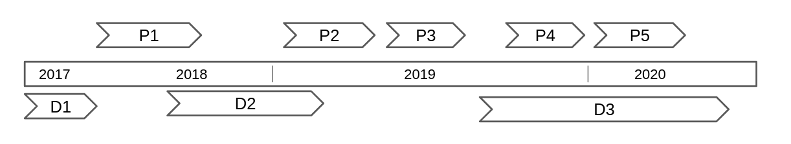
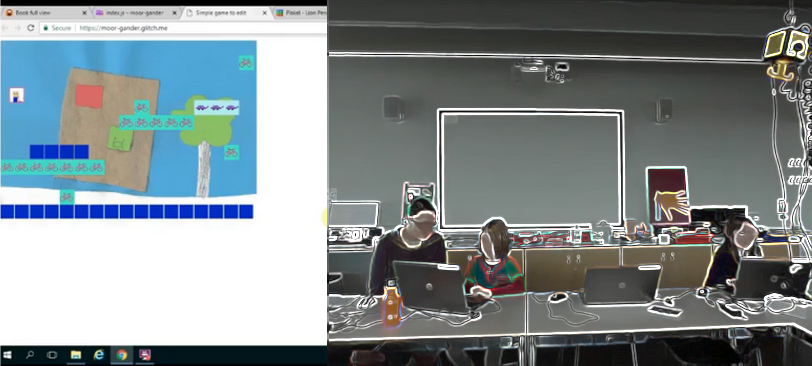
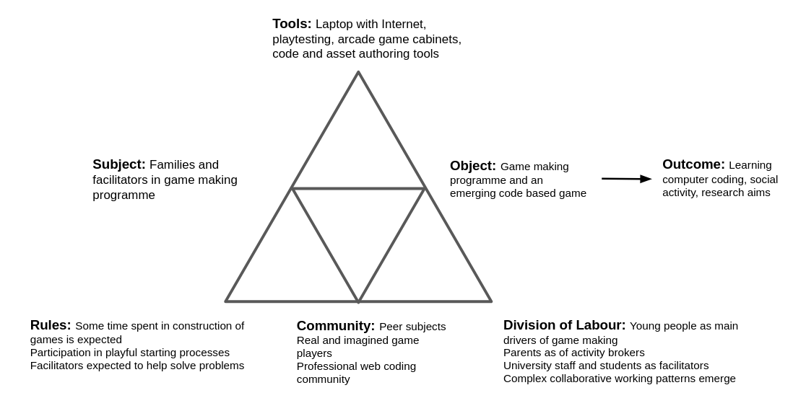

---
# all the regular stuff you have here
zotero:
  scannable-cite: false # only relevant when your compiling to scannable-cite .odt
  client: zotero # defaults to zotero
  author-in-text: false # when true, enabled fake author-name-only cites by replacing it with the text of the last names of the authors
  csl-style: harvard-manchester-metropolitan-university # pre-fill the style
layout: post
categories: chapter
title: 4. Methodology
---
-   [Methodology](#methodology)
    -   [Introduction](#introduction)
        -   [Research design and alignment with
            questions](#research-design-and-alignment-with-questions)
        -   [Reflections on theoretical grounding and research
            design](#reflections-on-theoretical-grounding-and-research-design)
    -   [Data collection within project delivery
        phases](#data-collection-within-project-delivery-phases)
    -   [Reflections on methodological
        approach](#reflections-on-methodological-approach)
        -   [Rich description and practical utility in a responsive
            research
            design](#rich-description-and-practical-utility-in-a-responsive-research-design)
        -   [Ethical considerations](#ethical-considerations)
    -   [Data analysis process](#data-analysis-process)
        -   [Stage 1 -- Exploratory
            analysis](#stage-1-exploratory-analysis)
        -   [Stage 2 -- Thematic
            Refinement](#stage-2-thematic-refinement)
        -   [Stage 3 -- Interpretive
            Consolidation](#stage-3-interpretive-consolidation)
            -   [Use of vignettes as analytic
                episodes](#use-of-vignettes-as-analytic-episodes)
            -   [Interpreting contradictions through design
                narrative](#interpreting-contradictions-through-design-narrative)
            -   [GDPs as a germ cell in design and
                analysis](#gdps-as-a-germ-cell-in-design-and-analysis)
            -   [Analysing learner agency](#analysing-learner-agency)
    -   [Researcher stance and interpretive
        validity](#researcher-stance-and-interpretive-validity)
        -   [Positionality and analytic
            trustworthiness](#positionality-and-analytic-trustworthiness)
        -   [Generalisability and
            replication](#generalisability-and-replication)
        -   [Methodological and practical
            limitations](#methodological-and-practical-limitations)
        -   [Wider limitations](#wider-limitations)
    -   [Chapter conclusion](#chapter-conclusion)
    -   [Footnotes](#footnotes)

# Methodology

## Introduction

This chapter sets out the methodological approach underpinning the study, building on the theoretical commitments explored in Chapter 3. Drawing on activity theory and design-based research (DBR), the research was conducted as an iterative process embedded in a non-formal learning environment via a home education and university partnership. Rather than applying a fixed method to a controlled setting, the study developed responsively, shaped by the interplay of context, participant contributions, and pedagogical experimentation. Chapter 3 introduced the conceptual foundations that informed this approach: learning as socially and historically situated, agency as emergent and distributed, and design as a catalyst for transformation. These ideas are translated here into a methodological approach, particularly through a focus on mutual engagement with participants, flexibility in pedagogical design, and responsiveness to evolving dynamics within the setting.

The chapter begins by situating the study as qualitative and exploratory in character. It outlines the delivery of the intervention and the diverse data collection methods used throughout, including video capture, screen recordings, facilitator journals, interviews, and artefact analysis. These activities are described in relation to the five delivery phases of the programme, showing how participants shaped both the content and direction of the study. This is followed by a discussion of ethical considerations, including recruitment, consent, and the handling of non-anonymisable data such as video recordings.

The next section details the analytical process, which developed across three broad stages: initial exploratory review, thematic refinement, and interpretive consolidation. Each stage is linked to core analytic concepts from DBR and third-generation activity theory, including contradiction mapping, mediational analysis, and learner agency. Particular attention is given to gameplay design patterns (GDPs), which are interpreted as germ cells, small but generative design elements that supported shifts in participation and learning. The chapter concludes with a reflection on researcher stance, interpretive validity, and methodological limitations. These include constraints around generalisability and the challenges of working with large and complex data sets in informal settings.

This chapter uses a combination of in-text references and footnotes. In-text references are used for academic sources, while footnotes provide methodological context, linking to appendices and vignettes, and refer to content from earlier chapters. This referencing approach is intended to support narrative flow while maintaining transparency.

### Research design and alignment with questions

In summary, the research process was oriented around a series of weekly digital game-making workshops for home-educating young people and their parents or guardians. These sessions were organised into runs of between 5–10 weeks, at the end of which a game was created to share publicly. The process of both educational facilitation and data collection was led by myself, and supported by student helpers[^sh]. This chapter outlines a methodological approach grounded in the general principles of formative interventions and design-based research (DBR). While the previous chapters have established the theoretical framework and research questions, this chapter connects those questions more directly to the methods. To provide an overview to ground the reader, an outline of how the research questions informed data collection, analysis, and theoretical framing follows:

<!--
To do this it will draw on techniques from those disciplines including .
specifically social design-based experiments (SDBE) and design-based implementation research (DBIR) [@penuel_design-based_2021]
-->

**RQ1**: *What contradictions emerged during participation in CGD&P activities, and how were they addressed via an innovative pedagogy?*  
Data were drawn from facilitator reflections, participant and practitioner interviews, and video observations. These were analysed through systemic tension mapping and activity system analysis, using cultural-historical activity theory (CHAT) to frame contradictions as drivers of expansive transformation.

**RQ2**: *How can a collection of game design patterns support CGD&P, particularly regarding abstract and concrete dimensions of existing pedagogies?*  
Data included screen capture analysis, documentation emerging from the research intervention, and participant interviews reflecting on game design pattern use. Thematic analysis focused on mediation through game design patterns and how these related to shifts in learning activity. The framing of the findings drew on the mediational lens of CHAT and the pedagogical scaffolding emphasis of DBR.

**RQ3**: *How do learner agency and game-maker identity develop within CGD&P communities of practice, and what pedagogical strategies best support this evolution across diverse learning contexts?*  
A dataset spanning phases of community interactions and design development, interviews, and field notes was analysed through thematic clustering, relational mapping, and narrative analysis. This was informed by DBR’s emphasis on iterative refinement and 3GAT’s view of expansive learning in situated activity, which draws on practices from interconnected activity systems.
### Reflections on theoretical grounding and research design

This study is qualitative, generative, and exploratory in nature, shaped by DBR and CHAT. It adopts an iterative, context-sensitive approach to understanding learning environments in CGD&P, avoiding rigid experimental constraints. In terms of educational objectives, the goal is to generate situated knowledge that can inform responsive educational practices, rather than to produce more universally generalisable outcomes [@cobb_design_2003]. However, the methodology of this research also seeks to reveal pedagogical tensions, contradictions, and shifts in learner agency, and develop understandings with potential for broader application.

In line with DBR approaches, rather than starting with fixed aims, the inquiry evolved through mutual engagement with participants and an openness to emergent goals [@gravemeijer2006design]. This orientation is justified both by the nature of the setting (non-formal, collaborative, and often resistant to conventional evaluation [@rogoff_observing_1995]) and by the desire to avoid prematurely deciding what kinds of pedagogical or methodological innovations might arise. While certain pedagogical features remained consistent throughout, the process was fundamentally shaped by what unfolded during iterative cycles of engagement undertaken by the participants and facilitators within the changing learning environment and resources. The process of rapid and responsive iteration allowed refinement of learning materials in response to participant feedback and my systemic analysis, in a way which leveraged the strengths of design-based approaches while aligning them with the insights offered by CHAT [@gutierrez_relevance_2014]. This flexible approach addresses both the complexities of authentic (as opposed to lab-controlled) non-formal learning contexts and the need for practical, and ideally replicable, outcomes.

Pedagogical elements of the research design were co-developed through collaboration with young learners, their families, and undergraduate student helpers. Over time, iterative design phases were informed by participant feedback, emergent needs, and reflection on practice [@visser_schon_2010; @schon_reflective_1984]. This collaborative shaping of both tools and pedagogy reflects established principles in participatory research [@iversen_computational_2018-1; @iivari_critical_2017], DBR [@barab_design-based_2004], and formative interventions [@cole_fifth_2006; @blunden_formative_2023].

Participant input took multiple forms: direct feedback through interviews and structured activities, observations of gameplay and design behaviour, and artefacts produced during workshops. Interviews and informal feedback were encounters through which participants helped shape the evolving design. This approach aligns with the sociocultural research methodology of Edwards [-edwards_being_2010-2], who frames interviews as potential sites of meaning-making and relational agency, rather than extractive processes. Most specifically, feedback from young participants, education student helpers, and parents contributed to iterative refinements in the software environments, templates, and facilitation strategies used, especially during Phase 1 and Phase 2. These evolving design decisions are documented throughout the study and explored further in Chapters 5 to 7.

<!-- Bakker offers guidance in the formulation of research questions in DBR studies which are relevant to this thesis [@bakker_design_2018]. He promotes HOW and WHAT CONSIDERATIONS formulation of question to be represent the exploratory nature of DBR approaches and to increase the possibility of possible generalisation without over promising in terms of projecting beyond the embedded nature of the findings as embedded in the context of the study. -->

## Data collec### Data collection within project delivery phases

This section outlines both the delivery of the game-making programme and the data collection activities embedded within each phase. As the next chapter presents the evolution of the intervention as a design narrative, the focus here is primarily on methods of data collection and the analytical approaches they supported. In addition to participant-facing methods, a small number of interviews with external creative computing practitioners were also included to contextualise the design process. The project was delivered over five distinct phases, along with three development periods. Each phase involved changes to tools, group sizes, and facilitation practices. Figure 4.x shows a summary of these phases.

<!-- From https://docs.google.com/presentation/d/1vR6dzFG6qXIdpB_-s6PbCePiB87qTs6YAXCljxNcb5Y/edit?slide=id.g2e34c54339d_0_0#slide=id.g2e34c54339d_0_0 -->

{width=98%}

Figure 4.x Summary of delivery phases and development periods

<!-- **Development and recruitment** -->

The first development process of this study (D1) drew on a background context of my involvement in community-based technology education as outlined in Chapter 1. My involvement in previous work in university partnership programmes with informal education settings [^3], using playful technology, meant that I had already built relationships with the home-educating community. Between 2016 and the start of this study, I had run various creative workshops in libraries, the university, and through informal volunteer events [^cdj]. To promote the university-based events, I used three established home education communication networks[^4]. The recruitment process of this study followed this previous pattern. I shared an invitation to participate to those three groups, asking interested families to contact me by email [^5]. Once contacted by potential participants, I sent them a participation sheet and asked for confirmation of attendance [^6].

The following table gives an overview of participant numbers, number of sessions, and key learning activities by phase. These changes in focus and activity shaped the kinds of data generated, and also influenced the form and feasibility of collection.

| Phase | Sessions | Participants | Activities and data highlights |
|-------|----------|--------------|-------------------------------|
| **P1** | 10 | 5 parents, 8 children | **Exploratory group phase.** Mixed-age groups engaged in paper-based planning, introductory coding with a text-based tool, and asset creation. Game files and design artefacts were collected. |
| **P2** | 6  | 8 parents, 11 children, 4 student helpers | **Smaller group development.** Participants used a shared coding template and printed guides. Asset creation was less central to the process. |
| **P3** | 5  | 4 parents, 8 children, 1 student helper | **Drama-integrated learning.** Continued with the same coding setup, enriched by additional missions to encourage social interaction and drama-based narrative. |
| **P4** | 6  | 4 parents, 7 children | **Toolset shift.** MakeCode (block-based) was introduced [^7]. |
| **P5** | 5  | 3 parents, 3 children | **Personalised learning.** A smaller group continued using MakeCode, with additional support from new learning resources created in D3 |

Table 4.x: Summary of delivery phases

<!--
| Phase | Sessions | Participants | Key learning activities and data generated |
|-------|----------|--------------|--------------------------------------------|
| P1    | 10       | 5 (p) + 8 (c) | Exploratory phase with three larger groups of mixed ages. Data includes paper-based planning, basic coding using a text-based toolset, and early asset creation. Game files and code were collected. See Appendix t.x. |
| P2    | 6        | 8 (p) + 11 (c) + 4 (sh) | Groups became smaller and more focused. A shared template supported game development. Asset creation was more limited, but participants used printed guides extensively. [^3] |
| P3    | 5        | 4 (p) + 8 (c) + 1 (sh) | Same coding environment as in P2. Additional drama activities and side missions were introduced. See Appendix t.x. |
| P4    | 6        | 4 (p) + 7 (c) | MakeCode, a block-based toolset[^4], was introduced and used throughout. Sessions became more modular. See Appendix t.x. |
| P5    | 5        | 3 (p) + 3 (c) | A smaller cohort continued to use MakeCode, focusing on individual and pair-based work. See Appendix t.x. | -->
### Data collection summary and sources

The table below provides a consolidated summary of the data collection methods used in this study. It outlines each data source, the mode of collection, the volume and scope of material gathered, and the phases involved.

| **Data source**             | **Details**                         | **Description**                                                                                         | **Used in which phases** |
|----------------------------|-------------------------------------|----------------------------------------------------------------------------------------------------------|---------------------------|
| Screen capture recordings  | 72 recordings from 12 sessions      | Recorded using Flashback Pro, including video, audio, mouse activity, and keystrokes.                    | P2, P3, P4, P5            |
| 360° video recordings       | 9 recordings from 9 sessions        | Captured using a Samsung Gear 360° camera. Stored on SD cards and processed via custom workflow.         | P2, P3, P4                |
| Facilitator journal entries| 3 paper journals and 50 digital pages | Included session planning, design sketches, reflections, and notes on challenges and evaluation.        | All phases                |
| Programme resources         | Varied (see Chapter 5)              | Materials co-developed with participants, including templates, guides, and scaffolds. Stored digitally.  | All phases                |
| Practitioner interviews[^piv]    | 4 interviews (~90 minutes each)    | Conducted via Zoom, recorded as video and audio files.                                                  | Post-P3 workshops         |
| Participant interviews      | 4 interviews (~90 minutes each)    | One via Zoom, three captured using screen recording with games and artefacts as prompts.                 | Post-P3 workshops         |

Journal notes were kept throughout the process in both paper-based journals and chronologically organised Word documents. These notes included session reflections, notes on challenges in the design of resources, and reflections on emerging themes from relevant, existing research. Alongside this, I archived the digital resources used in each phase, including templates, guides, and materials created by the young participants. The games themselves were treated as a form of data. This was informed partly by activity theory's emphasis on tools as culturally mediated artefacts, and by the principle of double stimulation, where learners appropriate and repurpose tools for their own ends. This adaptation beyond expected use became an important data point.

The development of learning resources took place alongside delivery, and participants influenced this process in various ways. Some changes were shaped by direct input, such as help requests, informal conversations, and interviews. Others were shaped by more indirect means, including the games participants made, my journal entries reflecting on interactions, and video or screen capture data from sessions.
There were practical challenges in collecting and maintaining access to these digital artefacts. In 2025, the platform Glitch.com announced it would no longer host user projects [^8]. A similar process occurred with the Piskel graphical editing tool [^9].

Video data played a key role in capturing situated activity: both 360° video data and screen capture data were recorded [^10]. Flashback Pro was chosen for screen capture due to its accessibility and low cost. The software recorded user input and screen activity, including mouse clicks and keyboard events [^11]. The use of 360° camera footage stemmed from two main considerations. Firstly, I wanted a fixed approach rather than a roaming attached device, to avoid possible disorientation [@caton2019methodological]. Secondly, I aimed to capture as little video data as practicable, due to the high overhead of processing and interpreting it. Given this, I avoided using individual webcams or several static cameras positioned in different parts of the room. Instead, I arranged the tables in a square with chairs on the outside facing inwards and positioned a 360° camera in the centre. This approach allowed for the capture of whole-group interaction from a single fixed viewpoint. A still of the 360° footage (before processing) is shown in Figure 4.x.

{width=98%}

Figure 4.x – 360° footage from the central camera (before processing)

While there is little written on the use of 360° video data in research [^36], the use of video cameras to capture social interactions in classroom or non-formal educational settings is well explored through varied lenses, including the practicality of recording and representing video data [@plowman_big_2008], theoretical concerns [@flewitt_using_2006], and ethical issues [@peters_video_2021]. Managing both sets of video data involved careful planning. The large video files required consistent naming and regular backups. The 360° recordings were particularly complex, sometimes split into segments that made time navigation difficult. Specialised software from the camera manufacturer was needed to process the raw footage. To address these challenges, I developed a Linux-based workflow for organising and processing video and audio data, which is included in the technical appendix [^12].

Participant and practitioner interviews took place after Phase 3. These were semi-structured and conducted online due to practical and, at times, COVID-related constraints. While the interviews were not fully transcribed, key sections were reviewed and analysed in combination with other data. To help participants recall information, a laptop was available during interviews so they could revisit their created games and assets to support reflection on design choices and problem-solving strategies.

Turning to interviews with fellow practitioners and researchers in digital making, interviewees included Saskia Leggett, a researcher involved in the Creative Family Learning programme; Matt Curinga, an academic and educator active in community-based coding projects; Dave Potts, a professional programmer and long-term CoderDojo volunteer; and James Clegg, a PGCE computing student who also supported sessions in person.

<!--
#### Summary of data collection methods

### Summary of data collection methods

| **Data source**                                | **Collected through**                                           | **Used to explore**                                               |
|------------------------------------------------|------------------------------------------------------------------|-------------------------------------------------------------------|
| Participant interaction with each other and digital software | 360° video and screen recordings                        | Learning processes, tool use, collaboration, agency              |
| Digital artefacts                              | Code files, resulting games, graphical assets, physical sketches | Participant responses to design tools and creative direction     |
| Facilitator journal                            | Reflexive notes during and after sessions                       | Researcher stance, contradiction surfacing, pedagogical choices  |
| Participant interviews                         | Paired or individual interviews with learners (audio-recorded)  | Reflections on design decisions, perceived agency, collaboration |
| Practitioner interviews                        | Audio-recorded interviews with facilitators from similar non-formal creative coding settings     | Existing facilitation strategies, contexual tensions, participant roles and identities      |

Revised more detail.

| **Data source**           | **Collection method**                                | **Volume / Scope**                              | **Analytic purpose and framing**                                               |
|--------------------------|-------------------------------------------------------|--------------------------------------------------|---------------------------------------------------------------------------------|
| 360° video recordings     | Fixed Samsung Gear 360° camera                        | 9 recordings across P2–P4                        | Group interaction, gesture, peer mediation (Rogoff, CHAT)                      |
| Screen recordings         | Flashback Pro with input/audio capture               | 72 recordings across 12 sessions (P2–P5)         | Tool use, coding navigation, contradiction (CHAT, mediation)                  |
| Facilitator journal       | Paper notes and digital Word docs                    | 3 paper journals + 50 digital pages              | Researcher stance, design changes, contradiction surfacing (DBR, CHAT)         |
| Participant interviews    | Semi-structured with game artefacts for prompting    | 4 interviews (~90 mins each)                     | Perceived agency, collaboration, design reflection (agency theory, CHAT)       |
| Practitioner interviews   | Zoom interviews with informal educators              | 4 interviews (~90 mins each)                     | Facilitation strategies, contextual tensions (DBR, SDBE)                        |
| Digital artefacts         | Games, graphical assets, code files, sketches        | Collected across all phases                      | Creative responses, appropriation, problem-solving (germ cell, mediation)      |
| Programme resources       | Templates, guides, tools created during sessions     | Iteratively developed, stored digitally          | Evolution of scaffolds and pedagogy (design narrative, DBR, formative design)  |
 -->
## Reflections on methodological approach

 This section reflects on key aspects of the study’s methodological approach, including its emphasis on rich description, practical relevance, and ethical practice in a non-formal, participatory learning context.

 ### Rich description and practical utility in a responsive research design

 This study provides _thick_, descriptive accounts of learning in CGD&P across multiple levels of activity [@maxwell_qualitative_2013]. Informed by Rogoff’s [-@rogoff_observing_1995] three planes of analysis in communities of learners, data collection included both individual and group-level video capture, journal notes, screen recordings, and design artefacts. These layered sources enabled analysis of how learning processes unfolded across time, tools, and interactions. This approach also introduced challenges, particularly in managing and interpreting complex video data, which are discussed later in this chapter.

 The use of rich description reflects not only an aim for analytical rigour, but also a desire to make the research relevant and applicable to other practitioners and researchers. This aligns with Brown’s [-@brown_design_1992] original framing of design experiments as tools for addressing learning problems in authentic contexts . More recent work by Bakker [-@bakker_design_2018] and Penuel [-@penuel_design-based_2021] reinforces the idea that utility for future practice should be central to the design-based research process. Accordingly, this study emphasised design choices that supported adaptability and reuse across academic and informal learning settings.

 One important aspect of this was the selection of tools and environments that were freely available or open-source. This was particularly relevant given the home education setting and the intended relevance of the work for other low-cost or under-resourced contexts. These decisions were informed by the concept of software sustainability in research [@crouch_software_2013] [^1] and the principles of open educational resource design [@bonneel_code_2020]. Wherever feasible, FLOSS (Free/Libre and Open Source Software) tools were used across both facilitation and analysis. This allowed the research process and learning design to remain transparent, shareable, and practically applicable beyond the original study site [^2].

 ### Ethical considerations

 Ethical engagement is not only a requirement for doctoral research but a central concern in sociocultural research design. In this tradition, ethics are understood as embedded in relationships and shaped by context. Ethical practice in educational research must take into account issues of power, particularly when working with children and families. In this section, and in line with a responsive approach to research, I outline both broad ethical concerns (approval processes, consent, withdrawal, data handling) as well as more specific issues that emerged during practice, including how participant relationships and reciprocity were navigated throughout the project [@hammersley_ethics_2012].

 Ethical approval for this study was obtained through the ESRI ethics process using the ETHOS system. Participants were recruited via outreach to home education networks, coding events, and community meet-ups. Inclusion criteria included being part of a family unit (including guardians) who were able to travel to the Manchester Metropolitan University campus. Participating families included children aged approximately 7 to 13, and all participants needed sufficient English literacy to engage with written materials and communication. An expressed interest in learning to make digital games together as an educational project was also required.

 Consent, assent, and autonomy were addressed through adapted processes. Consent and assent procedures were tailored for different participant groups, including home-educating families, children, and university students. For children, assent was negotiated through informal discussion followed by a simple written agreement, and parents remained nearby or directly involved throughout. DBS-checked adult facilitators and volunteers supported sessions, and alternative activities were always available to ensure that children could opt out at any time. These steps aimed to protect participant autonomy while recognising the relational dynamics of informal learning settings.

 All video and screen data were stored on a password-protected external drive, separate from working research files [@wiles_anonymisation_2012]. Although the video data could not be fully anonymised at source, all analytic materials used pseudonyms and removed or blurred identifying visuals. Only the lead researcher had access to raw video data, though the approved ethics protocol allowed supervisors to view this material if necessary.

 Withdrawal was handled with care across participant groups. Consent forms for practitioner-facilitators made clear that if they withdrew from the study, all data gathered would be destroyed and not analysed. For family participants, withdrawal procedures noted that data would no longer be analysed, but did not explicitly state that it would be destroyed. This distinction reflected the complex nature of group-based video data and the need to preserve the integrity of multi-participant recordings.

 The challenges of ongoing consent were present in this non-formal, multi-phase project. To support autonomy, consent forms included the wording “You will be able to continue with activities or equivalent activities,” emphasising that withdrawal from research would not mean exclusion from the educational opportunity. While no families withdrew from the research process, two families who participated in the first part of Phase 1 did not continue into the extended period or later phases. I interpreted their withdrawal as an important way of communicating alienation from the game-making process. One family returned to give feedback at the phase end and thus contributed to the research process in this way [^af].

 Additional complexities emerged from the use of 360° video and screen recordings. While no families ultimately withdrew, the protocol specified that if they had, their data would no longer have been analysed. However, it would not have been destroyed — a departure from standard practice for individual data, where withdrawal typically requires deletion in line with ethical guidance from professional organisations [@british_educational_research_association_bera__ethical_2018], which prioritises participant autonomy and control. This adaptation was necessary because it was not possible to fully remove a participant’s presence from 360° recordings that included other individuals. Group-based video data of this kind makes clean removal impractical without compromising the integrity of the dataset and the contributions of others. This limitation was outlined in the consent forms.

 A separate issue arose in relation to missing screen recording data. For one family, end-of-session video captures were regularly absent. In one instance, a short clip showed the young person navigating away from the software. This could suggest a resistance to surveillance or a technical decision, as video capture software sometimes slowed down the game-making tools. Given the family’s ongoing participation in other aspects of the research, their ongoing verbal assent to the research process, and the focus of the study on varied expressions of agency, I chose not to challenge the absence of recorded screen data during ongoing sessions.

 Assessing risk throughout the research process was also essential [@hammersley2012risk]. While the overall activity of game making as a collaborative process was relatively low-risk in a physical or emotional sense, an ethical issue concerning home-educating families was the potential for alienation from learning to programme, or from engaging in a partnership educational setting (in this case at university). I addressed this through strategies aimed at creating an inclusive, welcoming educational environment, aligned with the underlying ethos of the research.

 My approach to ethics was also shaped by values of reciprocity, drawn from prior community and activist work and its intersection with discourse within higher education on open educational practices [@cronin_openness_2017]. My ongoing volunteer participation in local, volunteer-run creative coding events helped to build trust and extend relationships beyond the confines of the study itself. These efforts aimed to support more equitable research relationships and ensure participants gained lasting value from their involvement. This community approach to knowledge generation raises questions regarding researcher positionality and data validity, which are taken up later in this chapter [@schiffer_issues_2020].

 In relation to the tools and resources that emerged from the study, I aimed to embed reciprocity through openness and reuse. Game-making tools used in the project were open-source and freely accessible, enabling families to replicate and continue their projects independently. Supporting documentation and design prompts were shared online under an open educational resource (OER) licence [@wiley_defining_2018; @wiley_access_2014], making the materials broadly usable beyond the research. Diaz Eaton and colleagues [-@diaz_eaton_sustainability_2022] highlight the importance of OER as part of a sustainability-responsive approach from relevant stakeholders within the rapidly evolving landscape of STEM education. Given that the involvement of parents and young people from the home education and informal science education networks contributed to the resources that resulted, it follows that those outputs should be freely available to the same communities [@ivey_open_2024].

 ## Data analysis process

 The analysis was structured in three stages to reflect the evolving relationship between the data and the research questions. This approach supported an iterative process: beginning with exploratory review, progressing through thematic refinement and methodological adjustment, and concluding with interpretive consolidation. Each stage involved increasing analytical granularity, using strategies suited to the shifting demands of the research. This structure also helped manage the substantial volume of video and screen capture data generated during the game-making sessions.

 Before outlining the three stages, I introduce the key analytic concepts that shaped the identification and interpretation of episodes across the dataset. Contradictions within the activity system were treated as potential sources of learning and the expansion of the object of activity in the form of the programme's learning design. Drawing on third-generation activity theory (3GAT), these were identified through tensions between tools, roles, and goals. Mediating artefacts, including digital tools, gestures, and documentation, were examined for how they supported or disrupted emerging patterns of behaviour. Rogoff’s [-@rogoff_observing_1995] model of personal, interpersonal, and cultural planes of analysis provided a framework for connecting individual actions to wider group practices, through spreadsheet annotation and increasingly detailed transcription of selected video data. A complex and shifting view of agency was needed to understand the experience of participants as learners redirected tasks, repurposed tools, or supported peers. Gameplay design patterns (GDPs) were analysed as potential germ cells, understood as small but generative design elements that supported developmental movement. Their uptake and reinterpretation offered insight into how learners engaged with the structure and flexibility of the learning environment. Describing the practical methods involved in the process of applying these strategies is complicated by the process of triangulating data. A summary table including the methods used is outlined below.

<!--
| **Analytic strategy**        | **Based on**                          | **Purpose**                                           | **Theoretical lens**             |
|-----------------------------|---------------------------------------|------------------------------------------------------|----------------------------------|
| Spreadsheet annotation      | Partial transcript of speech and description of screen/room video        | To track episodes of interaction across Rogoff's planes             | Rogoff, CHAT                     |
| Contradiction mapping       | Journals, video data of  episodes & tool use        | To surface tensions and system-level disruptions     | CHAT (more specifically 3GAT)                      |
| Thematic refinement         | Recurring patterns across data types  | To group design tensions, participant strategies     | CHAT, DBR                        |
| Design narrative | Artefacts & journals & vignettes    | To trace learning and role shifts over time          | Expansive learning, germ cell concept  |
| Agency interpretation | Vignettes & journal notes     | To identify shifts in tool use, initiative, role-taking, & identity         | CHAT conceptions of agency       | -->

| **Analytic strategy**       | **Data sources**                                         | **Methods used**                                                      | **Purpose / Theoretical lens**                                  |
|-----------------------------|----------------------------------------------------------|------------------------------------------------------------------------|-----------------------------------------------------------------|
| Spreadsheet annotation      | Partial transcript, screen/room video                    | Spreadsheet logging, annotation, increasingly detailed transcription                | Track interaction across Rogoff's planes [-@rogoff_observing_1995] (Rogoff [-@rogoff_observing_1995], CHAT)         |
| Contradiction mapping       | Journals, video episodes, tool use                       | Identifying affordances within design & mapping tensions across their use as systematic elements                 | To surface systemic tensions as a potential source of change (CHAT, 3GAT)                       |
| Thematic analysis        | Patterns within video and interview data             | Pattern recognition, grouping themes across data sources                           | Identify participant strategies in navigating contradictions (CHAT, DBR)|
| Design narrative            | Artefacts, journals, vignettes                           | Narrative description of evolving learning design artefacts, reflexive journal analysis, triangulation of multiple sources of data    | Trace learning experience of participants including role shifts, allow replication of learning design (DBR, germ cell identification from 3GAT)|
| Agency analysis       | Vignettes, journal notes                                 | Detailed analysis of initiative, role-taking, peer support and development of existing and new repertoires         | Interpret shifts in identity and agency (CHAT interpretations of agency)        |

Table 4.x: Summary of data analysis methods

These concepts guided interpretation throughout the three stages that follow: exploratory analysis, thematic refinement, and interpretive consolidation.

### Stage 1 – Exploratory analysis

Stage 1 served as an exploratory review of the dataset to assess data quality, relevance, and initial themes. This included reviewing researcher journals, practitioner interviews, and preliminary video footage to develop a sense of the emerging pedagogical and methodological issues. The goal was to understand the types of contradictions and learning behaviours present, and to inform the next steps for more focused analysis. This phase aimed to determine which datasets merited deeper analysis and to refine the methodological processes for subsequent analytical stages, aligning with approaches of iterative refinement in DBR [@bikner-ahsbahs_introduction_2015-1]. In line with Saldaña’s [-@saldana_coding_2013] framing of exploratory coding as a process of sense-making and initial theme generation, this early phase was used to surface broad patterns.

Journal analysis provided a foundational perspective on facilitation and early thematic tensions. Given the breadth of journal data, a comprehensive thematic analysis and exhaustive coding were impractical; instead, insights were triangulated with findings from the literature review to expose key themes and contradictions in the evolving pedagogy. Rogoff’s [-@rogoff_observing_1995] three planes of sociocultural activity were particularly useful here, allowing reflections on facilitation to be categorised across personal, interpersonal, and institutional dimensions, a technique further refined by Morcom [-@morcom_scaffolding_2014]. Alongside journal entries, evolving teaching resources, participant-created games, and assets were examined to provide insight into how learners engaged with design elements, navigated constraints, and appropriated resources for their own purposes. The use of these materials informed subsequent iterations of facilitation and resource development, and contributed to the emergent facilitation strategy.

Early-stage video data also played an important role in shaping the direction of analysis. Selected screen capture and 360-degree recordings from P2, P3, and P4 were reviewed to assess both the technical quality and the analytic potential of the recordings. This initial dip into the archive helped establish a sense of session rhythms, emerging roles, and mediational practices. Rather than aiming for full transcription at this point, I made time-stamped observational notes to identify sequences that warranted closer attention in later phases. In some cases, 360° footage was cross-referenced with screen capture data to clarify gesture, spatial positioning, and collaboration dynamics.

Identifying affordances during analysis helped surface how tools and environments invited or constrained different forms of participation. This proved valuable in understanding how learners interpreted resources, negotiated constraints, and appropriated tools creatively. The selection and design of tools was informed by the concept of *affordances*, a term common in DBR and HCI [^hci], which refers to the perceived and actual possibilities for action enabled by an environment or artefact. Drawing on Kaptelinin and Nardi’s [-@kaptelinin_affordances_2012, p. 927] CHAT-informed perspective, affordances were understood here as “possibilities for human actions mediated by cultural means”. This framing supports analysis of how the software, resources, and documentation shaped participant activity, including how learners interpreted constraints, imagined alternatives, and repurposed tools. Notes within early spreadsheet-based analysis of affordances in tool design and selection formed a foundation for understanding how contradictions emerged and were addressed within the unfolding learning activity.

Practitioner interviews were used alongside journal reflections to identify key pedagogical concerns, barriers to participation, and evolving priorities within the learning design. While my broader stance as a researcher-practitioner is discussed later in this chapter, these interviews drew on the experience of a wider community of practitioners, helping to shape early analytic directions and strengthen the thematic framing of the design narrative [@cochran-smith_inquiry_2015]. Four extended interviews (averaging 90 minutes each) were conducted with professionals and collaborators from overlapping fields of creative computing and informal education. The semi-structured format allowed for responsive dialogue and surfaced themes such as learner identity, creative constraint, scaffolding strategies, and tensions specific to non-formal learning contexts. For example, agency emerged as a central concern in Dave Potts’ reflections on supporting participants’ own interests in digital making; Matt Curinga raised questions about the value and risks of entering external competitions; Saskia Leggett highlighted the supporting roles of parents; and James Clegg discussed the affordances of online toolsets and game mechanics as mediational strategies. These conversations also helped guide subsequent cycles of video analysis by informing early coding directions and refining the research questions.

This first stage set the foundation for later interpretive work by clarifying the practical constraints of the data, surfacing early thematic directions, and testing the viability of the use of each data source.

### Stage 2 – Thematic Refinement

The second stage of analysis began with the intention of developing a structured coding schema that could support both quantitative and qualitative approaches. Inspired by a desire to systematically compare themes across video data, interviews, and journals, the original plan involved using NVivo (a qualitative-first data analysis software that also supports mixed-methods queries) to apply a consistent thematic structure, combining insights from the literature, practitioner interviews, and preliminary analysis. NVivo allows researchers to apply codes across datasets and run queries, for example, to examine how much time participants spent on specific tasks or how often particular behaviours occurred [^14].

However, a number of challenges arose. Technically, NVivo was unable to import 360° footage effectively in a way that allowed the cross-referencing of data. NVivo has limitations in allowing precise playback and selection of video segments for coding. Trials of applying several schemata to even short extracts of video proved excessively cumbersome [^15].

I planned and trialled a workaround to these limitations. Using VLC Player allowed for dual playback, and coded observations were made using a limited granularity of five-minute segments. Partial transcription, annotation, and thematic coding were recorded within Word tables and then imported into NVivo to allow queries and coding comparisons.

The process of creating these documents for video files of approximately two hours was still time-consuming but productive. The use of 360° video data to contextualise the screen capture data became significant enough to support a more holistic understanding of the processes at hand. This led me to consistently review both files simultaneously (as demonstrated in Figure 4.x). This process was achieved using VLC Player’s ability to view and control two video files side by side [^16].

{width=98%}

Figure 4.x - 360° footage and screen capture side by side (after processing)

To manage the scope of analysis, eight full sessions and three partial sessions were selected for deeper review. Criteria included clarity of audio and visuals, richness of peer and facilitator interaction, and representation of different phases of the intervention. In practice, most of the analysis focused on data from phase P2, as these contained the richest examples of interaction. One session from the end of P2, in particular, stood out due to the complexity of collaboration and the variety of participant roles observed.

Stage 2 is characterised by a shift away from my initial intention to create a set thematic taxonomy to apply to a subset of data. Early in this stage, my aim had been to prioritise from a growing list of potential coding schema elements to select those most aligned with the focus of the thesis. At the same time, I wanted to be sure that the focus was relevant to the data collected. By this stage, I had deprioritised some schema elements due to either their conceptual overlap with existing literature or a lack of richness in the recorded data of this study [^csc]. To address the tension between wanting to start coding and being unsure of the final coding elements required, I progressed to creating partial transcripts[^tran] using a greatly simplified provisional schema [^reduc]. Transcripts were created in five-minute intervals, pairing 360° footage with screen recordings. Each five-minute segment was annotated via partial transcription of dialogue, descriptions of activity on and off screen, noting tool use, gestures, and participant roles. At the foot of each segment, I made notes on which of the reduced codes were applicable. An indicative example of these notes, including observations, reflections, and extracts of dialogue, is included in Appendix B.x *Methodology – Extract of 5-minute transcripts*.

At this stage, I revisited research questions to check they aligned with this shifting focus of the thesis towards agency. A short commentary on the evolution of research questions is included as Appendix B.Rqs.

As this process continued and generated a wealth of potentially useful observations, I began to question the value of transferring data into NVivo as originally anticipated. The technical questions and frustrations with the limitations of NVivo were compounded by more conceptual questions regarding the utility of the quantitative approach it would enable. It became clear that the process of working towards a fixed coding frame risked distracting from a more holistic understanding of the learning environment [@saldana_coding_2013], particularly the emergent, improvisational, and tool-mediated aspects of learner agency. I wanted to keep focusing on what was most pertinent to the direction of the thesis: the improvised and evolving use of resources, peer scaffolding, and ongoing negotiation of meaning within the making process.

While I struggled to create a fixed coding schema that included these emerging elements, the process of attempting to do so surfaced important questions. The shift from an approach using a pre-set coding schema to a more interpretive, emergent strategy was not clear-cut; it evolved through repeated attempts to organise, code, and revisit earlier transcripts. The process of creating the session annotation documents informed a selection of shorter episodes within each session which I flagged for deeper exploration via the creation of vignettes. The use of Rogoff’s [-@rogoff_observing_1995] three planes of analysis (personal, interpersonal, and cultural) also continued to be helpful as a scaffolding framework during the process of transcription described above. I continued to add to the spreadsheet of analysis structured using three planes, documenting in it novel instances of activity noted in session transcripts.

The process evolved into analytical thematic clustering via note-taking, sketching of visual models, and consolidation within tabular form in Word documents. These techniques allowed a more flexible process of interpretation in response to the complexity of participant behaviour, tool use, and social interaction. This shift reflected a broader methodological commitment: staying close to the activity as it unfolded, rather than forcing it into predefined analytic categories. The process of trying, adapting, and discarding coding strategies also mirrored the study’s broader design ethos, where tools and structures evolved in response to emergent practice instead of being imposed from above.

This flexibility helped me identify new themes within the data, such as the significance of game design patterns in shaping learner trajectories or the role of peers and parents in scaffolding complex actions. The original research questions were refined. This phase helped surface key areas for Stage 3, including varied forms of agency, mediational strategies, and the repurposing and development of participant repertoires. It also clarified which transcripts and artefacts were most appropriate for deeper interpretation as vignettes. By the end of this stage, the goal had shifted away from quantifying learning behaviours and toward richly describing how learners appropriated tools and reshaped their participation.

### Stage 3 – Interpretive Consolidation

The final stage of analysis focused on close interpretive engagement with selected episodes of participant activity. This phase brought together insights from earlier stages into a coherent analytical framework. Central to this process was the use of vignettes, presented as detailed and situated accounts of interaction that captured moments of contradiction, tool use, and emerging forms of agency. This section is structured in four parts. It begins with a rationale for the use of vignettes and how they were constructed. This is followed by three sub-sections, each addressing one of the research questions and outlining how the interpretive analysis links directly to the focus of Chapters 5, 6, and 7.

#### Use of vignettes as analytic episodes

Building on the broad mapping of Stage 1 and the thematic refinement of Stage 2, this phase returned to key segments of data selected for their richness, complexity, and relevance to the evolving research questions. The aim was to generate grounded, contextualised understandings of learner agency, tool mediation, and pedagogical interaction. This stage focused on six selected vignettes drawn from screen capture and 360-degree video recordings.

Vignettes in qualitative research are understood as richly described episodes that help illuminate broader patterns within a study [@barter_i_2000]. The six chosen here reflect a range of learner roles, design decisions, and interactional dynamics. They were not intended to be statistically representative but to offer detailed accounts of how individual learners or pairs navigated tools, social relationships, and task structures [@lemke_documenting_2015-1].

Full transcriptions were created for each episode, integrating verbal dialogue, on-screen actions, and embodied communication such as gesture and movement within the physical learning space. Viewing the 360° footage alongside the screen capture proved essential in several cases, particularly when learners referenced physical objects, used gesture to explain a point, or physically repositioned themselves in response to peers [@nemirovsky_gesture_2012]. Gestures also often served to plan or communicate in-game movements and other actions on screen [^crr].

Each vignette was used as a site of interpretive analysis. It contributed to the research questions by showing how learners asserted agency, responded to guidance, or adapted resources to suit their needs. Where possible, these episodes were triangulated with post-session interviews, learner artefacts such as games or design sketches, and journal entries written immediately after facilitation [@harrits_qualitative_2021].

*NOTE - A smaller sample vignette extract here?*

#### Interpreting contradictions through design narrative

This part of Stage 3 focused on identifying and interpreting contradictions that emerged within and across phases of the CGD&P intervention, addressing Research Question 1. Using a design narrative structure [@hoadley_creating_2002], patterns of barrier, tension, adaptation, and response were traced across evolving tools, roles, and practices. These contradictions were interpreted through a third-generation activity theory (3GAT) lens. To support this analysis, the section illustrates both the scope and the systemic elements involved, using diagrammatic representations of overlapping activity systems.

Rather than organising interpretation strictly by theme or data type, the analysis followed the evolving arc of the learning design, structured around key shifts in practice, tool use, and facilitation across the delivery phases. This approach aligned with the pedagogical logic of the intervention and was supported by journal notes and triangulated with interview data. The narrative structure reflects the ethos of design-based research by documenting iterative, context-responsive design decisions that may be useful to others working in similar settings. The findings of this analysis form the foundation for the design narrative presented in Chapter 5.

Two diagrams are used to contextualise how contradictions arose and were responded to during the learning programme. The first (Figure 5.broad) represents the broader cultural and contextual systems that shaped the shared activity system of the CGD&P environment. As discussed in Chapter 3, this activity functioned as a shared object through which differing motivations were negotiated via mutual appropriation [@lecusay_telementoring_2015], shaped by factors such as parental support, peer collaboration, and non-formal educational norms. The object here can be understood, in general terms, as the game-making programme as a whole.

{width=95%}

The second diagram (Figure 5.full) narrows the focus to the situated activity of workshop sessions, highlighting the participants, mediating tools, and evolving roles present in the immediate learning environment. While many of the tools at play are shared between the two scopes of activity, the key difference lies in the subject, which in the second diagram is typically an individual or pair, and the object, which is the digital game and its underlying code and concept.

{width=95%}

Both scopes of activity are important for understanding the contradictions explored in this study. The broader system shown in Figure 5.broad informs how cultural and contextual factors shaped participation across the programme as a whole. The more situated system in Figure 5.full was used to analyse interaction during specific workshop episodes. Together, these frames underpin the analysis of contradictions presented in Chapter 5. The second scope also becomes central in Chapter 6, which draws on the same unit of analysis to examine how gameplay design patterns were taken up and transformed within learner activity.

#### GDPs as a germ cell in design and analysis

As part of Stage 3 of the analysis, this section addresses Research Question 2 by examining how gameplay design patterns (GDPs) functioned as mediational tools within the situated activity of the CGD&P workshops. Drawing on the second unit of analysis outlined earlier, GDPs were interpreted not only as practical scaffolds, but also as evolving conceptual resources. A spreadsheet of thematic codes, begun in Stage 2, was extended to cluster GDP use across Rogoff’s three planes of activity (individual, interpersonal, and cultural). Patterns of adaptation and reinterpretation were particularly salient, as learners often modified a pattern’s purpose or linked it to emergent gameplay goals. These shifts were interpreted through a CHAT lens as evidence of agency enacted through tool transformation and appropriation. Findings from this process are developed in detail in Chapter 6.

This study identifies gameplay design patterns as a germ cell concept within its methodological and analytical framework. Chapter 4 outlines the development of this concept and its structuring role in the learning design; Chapter 5 traces how GDPs were introduced and iteratively embedded in response to contradictions; and Chapter 6 explores how they mediated participation, creativity, and collaboration across diverse learning contexts.

Drawing on principles from third-generation activity theory and design-based research, the process of rising to the concrete is used both analytically and pedagogically. In seeking a germ cell or unit of analysis, the researcher attends to complex, evolving activity to identify a minimal yet generative concept that can support expansive development. 3GAT distinguishes between empirical abstraction (e.g. listing features of activity) and theoretical abstraction, which offers an explanatory model for transformation. The identification of GDPs as a germ cell falls into the latter category [@sannino_activity_2011, p.590]. In line with DBR outputs, these insights are not presented as universal claims but as “tentative generalisations” in the form of design heuristics emerging from concrete practices [@hoadley_design-based_2022, p.215].

GDPs are understood not only as design elements but as conceptual tools that linked participant action, shared language, and the learning environment. Their recurring role in shaping participation positioned them as a central organising feature of the pedagogy. As the programme developed, GDPs were embedded into pedagogical structures that enabled increasingly complex forms of engagement, while maintaining coherence and a manageable technical scope.

Rather than introducing new tools at each phase, the design was structured to support deepening engagement with GDPs over time. This allowed participants to recognise, use, and eventually adapt or invent gameplay patterns, supported by visual guides and in-session facilitation. From a methodological perspective, the germ cell framing supported analysis across levels of granularity, from individual design choices to broader changes in community practice.

As later chapters show, GDPs were not static instructional elements but mutable artefacts shaped through use. Their significance lay not just in the structure they provided, but in how they were interpreted, adapted, or occasionally resisted by participants. This reinforces their analytical utility—not as fixed units, but as dynamic mediators of developmental possibility. Framing GDPs in this way helped reveal the shifting relationships between individual action, shared artefacts, and broader systems of participation over time.

#### Analysing learner agency

As part of Stage 3 of the analysis, this section addresses Research Question 3 by examining how learner agency developed within the collaborative context of the CGD&P workshops. Drawing on the vignette-based approach established earlier, this stage focused on episodes where participants made decisions, shifted roles, or shaped learning activity in unexpected ways. This analysis laid the foundation for the extended treatment of agency and identity in Chapter 7.

Several vignettes were revisited in detail to explore how learners collaborated, made design decisions, and used both material and digital tools to shape their contributions. These episodes were examined through spreadsheet annotations, reflexive journaling, and triangulation with interviews and artefacts. Attention was paid to how role-based interactions, gestures, playful exchange, and improvised strategies revealed shifts in initiative and learner identity. This process was informed by Rogoff’s planes of analysis and CHAT-based notions of mediated action. In line with CHAT, agency was interpreted not as a fixed trait, but as emergent, shaped through interaction, support, and opportunities to make meaningful choices and reshape the activity [@sannino_transformative_2022]. Through this phase of interpretive consolidation, my own understanding of agency shifted and deepened. It became clear that participants’ actions were shaped by prior experiences, the roles they took on, and the evolving structure of the workshop setting. Learner agency took multiple forms: trying out new ideas, helping peers, resisting tools, reframing tasks, or asserting creative control.

While the agency lens was not predefined in early stages of analysis, it became increasingly central as the vignettes were revisited with attention to the development of participant activity and the expansion of the object of the wider learning programme. This emergent focus aligns with the ethos of design-based research, where analytic categories evolve in dialogue with practice. It also reflects the complexity of agency as it appeared across multiple planes of activity, sometimes visible in persistence, other times in collaboration or resistance to the processes at play.

As with earlier sections, this final strand of Stage 3 analysis moves from close interpretation to practical insight, shaping both the theorisation of agency [@edwards_building_2011; @hopwood_agency_2022] and the design considerations presented later in the thesis. The findings from this interpretive stage informed the design of Chapter 7, which explores agency and identity development in more detail. That chapter examines how learners mobilised roles and repertoires. The final conceptual model in Chapter 7 draws directly on the forms of agency surfaced during this phase of analysis.

<!-- In parallel, this process also illuminated design constraints. In several vignettes, learners struggled to access tools, interpret instructions, or express their intentions. These moments pointed to barriers within the facilitation model, prompting reflection on inclusion and the responsiveness of the learning environment.  -->

<!-- #### Unused sentences

- By the end of this stage, the analysis had shifted from mapping general trends to closely engaging with specific examples that showed tensions, possibilities, and shifts in learner participation. These vignettes became the foundation for articulating the study’s contributions to both theory and practice. -->

<!-- #### Analysing learner agency

GREATER FOCUS ON LITERATURE WITH OUT DUPLICATION.
BE CAREFUL ON WHERE ELSE THIS IS EXPLORE.

REFERENCE RQ3

In parallel, the focus of learner agency was developed through close engagement with participant action across different learning contexts. Several vignettes focused on how learners collaborated, made design decisions, and used material and digital tools to shape their contributions. Through this process, my understanding of agency shifted and deepened. It became clear that agency was not a fixed trait but something that emerged through interaction, support, and opportunities to make meaningful choices. These actions were shaped by learners’ prior experiences, the roles they took on, and the changing structure of the sessions.

The later stages of analysis paid close attention to how participants influenced their own learning paths, how they supported each other, and how they responded when things were difficult or unclear. Agency was interpreted as something that could take different forms, such as trying out new ideas, helping others, changing direction, or asserting creative control. To understand this, I looked at humour, spatial positioning, narrative framing, and the use of gesture to support communication and identity.

This view of agency developed gradually through the analysis process, rather than being applied from the start. It was shaped by what was visible in the data and by ongoing questions about how power, choice, and participation played out in practice. These observations provided a way of seeing agency not only in terms of individual skill or autonomy, but also as something built together and shaped by the design itself.

In line with understandings of  double stimulation intervention, some episodes involved participants generating new mediating elements in response to uncertainty or contradiction.

Chapter 7 builds on this analysis in more depth. It focuses on how agency took different forms across the group, and how learners moved between different roles, styles, and strategies. That chapter also links this to wider ideas about identity, collaboration, and the kinds of opportunities that design-based learning can create.

This interpretive work aimed to clarify not only how the learning environment supported certain forms of agency and design fluency, but also what constraints remained. In some vignettes, learners struggled to access tools or articulate their ideas, prompting reflections on inclusion and the role of facilitation. These observations informed both the final conceptual model, developed in Chapter 7, and ongoing questions about how pedagogical environments can be designed to support participation and identity formation via varied approaches.

WHICH STAGE - HOW DOES IT FIT IN?
By the end of this stage, the analysis had shifted from mapping general trends to closely engaging with specific examples that showed tensions, possibilities, and shifts in learner participation. These vignettes became the foundation for articulating the study’s contributions to both theory and practice. -->

## Researcher stance and interpretive validity

### Positionality and analytic trustworthiness

To produce findings that are contextually valid and socially relevant, in line with the core principles of DBR [@brown_design_1992], pedagogical interventions took place within an authentic learning environment, specifically a CGD&P learning programme in a non-formal educational setting. This setting was shaped by home education practices, local community logistics, and varied participant demographics. This ecological embeddedness shaped the recruitment processes, session scheduling, and the kinds of learning interactions that were possible [^par]. These factors also brought an authenticity that aligns with ecosystem models of learning design [@barnett_ecosystem_2019], where value is created through contextually relevant pedagogical engagement.

My role as both researcher and facilitator was central to achieving this embeddedness within an authentic context and to the broader methodological design of the study. I designed each session to serve a dual purpose: as a site for data collection and as an educational workshop, planned and adapted to meet the varied needs of participants. While this dual role introduced challenges, such as balancing the requirements of pedagogical intervention with the challenges of recognising my positionality within the research process, it also provided opportunities for sustained engagement, flexible design, and an involved perspective of pedagogical evolution in action. The researcher–practitioner stance invites critical reflection on the ethics, logistics, and value of practice-based inquiry [@tickle_opening_2001]. For example, my closeness to the learning design as the designer of the pedagogy could create a positive bias in how participant experience was perceived.

There are two counterpoints to this risk. First, the findings of this study are presented as exploratory and tentative, and would require further testing. Second, as proposed by Stetsenko [-@stetsenko_critical_2020], the positioning of research as objective is not realistic, and risks a disinterested stance. The advantage of Stetsenko’s *activist stance* lies in its potential for a positive, direct influence on the situation at hand. Following the logic of this transformative activist stance, validity in this study is grounded in my ethical and practical engagement with participants, and in the co-construction of knowledge aimed at transforming learning relationships and tools.

This approach to validity shaped the entire analytic process. The analysis of this research has prioritised ecological validity by studying interactions that emerged in authentic, practice-based contexts, rather than in controlled or experimental conditions. In addition, this study adopted a critical stance on objectivist notions of validity, drawing on DBR and activity theory traditions that position the researcher as an active participant in meaning-making. Validity was approached through triangulation across media data formats such as video, interviews, journals, and supporting resources, and supported by ongoing reflection and iterative analysis.

In achieving validity through an interventionist approach, I found the detailed descriptions of the motivational and practical interventions of the Fifth Dimension programme research by Cole and others [-@cole_sustaining_2001; -@cole_fifth_2006; -@cole2009designing] particularly valuable. In particular, the descriptions of mutual negotiation of aims between partners and the sustainability of activity were instructive in shaping my own approach.

<!-- Journal-informed reflection played an important role. While not directly analysed alongside participant data, these journal notes informed the design of resources and facilitation strategies.  -->

<!-- Throughout the process, I aimed to recognise and support emergent participant practices, using tools and scaffolds that could adapt dynamically. These choices are revisited across the following findings chapters, which trace how participants responded to, reshaped, and extended the learning environment. -->

### Generalisability and replication

This section addresses generalisability not in statistical terms, but in terms of methodological contribution and the potential transferability of tools, processes, and practices. The blend of methods and ethos outlined in this chapter offers a potential return to both the DBR and CHAT research communities. Rather than following a predefined applied CHAT methodology such as the Change Laboratory, this study draws on DBR techniques but meets many of the key criteria for formative intervention as articulated by Engeström and Sannino [-@engestrom_methodological_2014]. The process involved tracing systemic tensions, supporting participants in reconfiguring their activity, and attending to signs of transformative agency across phases.

This hybrid approach responds to a key critique of the Helsinki school’s implementation of third-generation activity theory (3GAT): that formative interventions such as Change Laboratories are often seen as time-consuming and suited to stable, institutionalised stakeholder groups [@spinuzzi_trying_2020-1]. While my approach operated under more flexible, time-bound, and community-led conditions, it still maintained a generative orientation. It focused on identifying contradictions, surfacing agency, and generating change through iterative design cycles. These cycles aligned more closely with DBR than with the structured protocols of the Change Laboratory, but they remain consistent with formative intervention understood more broadly.

This approach also placed particular emphasis on artefact development and facilitation processes as means of enabling learning and transformation. Templates, heuristics, and workflows were refined in practice, reflecting ongoing negotiation between design intent and emergent use. In this sense, the artefacts were not only research outputs but tools of inquiry and change. Alongside this theoretical positioning, the study foregrounds practical strategies for replication. Chapter 5 supports potential replication of facilitation practice by offering a design narrative that outlines how tools, materials, and pedagogical structures were used and adapted in response to emerging contradictions.

<!-- #### Home Ed families and the research process

Addressing the replicability of the research process, it is of value here to recap the previous chapters characterision of its nature as as open and risky, and requiring me to rapidly generate new tools in response. Certain factors mitigated against the incomplete design, namely a tenatious group of participants in P1, and my existing relationship with some participants built in previous encounters. The input of families as a responsive testing group and as detailed above, as active inputters to the evolving pedagogical approach was significant. As such, while this aspect is not extensively explored in this study, I propose there is significant potential in the input of home educating families as a consituant part in collaborative design based approaches to  uncover exisiting, situated repetoires in a way that can shape emergent practices in new learning expereiences. Specifically potential to can inform design  to produce tools and pedagogies aims which can help other facilitators seed productive community activity in other learning settings. -->

<!-- ### DBR / FI / SDBE processes to divining authentic frameworks

The process of discovering the framework of GDPs explored in chapter five merits exploration from the perspective of replicability.

Finding intermediate knowledge in the form of learner focused, guiding pedagogical frameworks

Is there is something particular about the format of the game product to be designed that particularly suits this process. What other products does it suit?

What are the broad implication for the use of this frameworks in other domains. -->

In addition, the study contributes a practical methodology for beginning analysis of complex video data across screen capture and 360° formats. Conventional qualitative analysis software (e.g. NVivo) proved unsuitable, prompting the development of a custom workflow using open-source tools, manual transcription, and thematic clustering structured by Rogoff’s [@rogoff_observing_1995] three planes of analysis. While discussed earlier in relation to analytic procedure, this workflow also forms part of the study’s contribution to transferable methodology.

This study does not aim to measure the efficacy of the intervention or to generalise findings in a statistical sense. Instead, it supports the transfer of insights and the replication of tools and design elements. Project artefacts, including template resources, facilitation guides, and open-source tools, are included in the appendices and online repositories. These were created with adaptability in mind, particularly for informal learning contexts or community-led education. While the previous section emphasised how artefacts supported pedagogical responsiveness within sessions, here the focus is on their potential as transferable resources for similarly situated environments. Links to open educational resources (OER) developed across all phases of the process are provided in Chapter 5.

Finally, addressing the generalisability of the research process as a whole, I draw on Gutiérrez and Penuel [-@gutierrez_relevance_2014, p.21], who define generalisability “of findings and theories developed through research as contingent on the uptake of research by local actors who must sustain programs.” As such, the test of these findings lies beyond the scope of this chapter and depends on whether they are taken up and adapted by relevant partners.

<!-- The work of mutual adjustment of powerful interventions and local contexts does not end when the research ends, but sustaining an intervention requires uptake by schools and districts (Coburn, 2003). For us, we define the generalizability of findings and theories developed through research as contingent on the uptake of research by local actors who must sustain programs. Local actors’ productive adaptation of interventions or use of theories from research and the documentation of the work they must do to sustain change are important sources of evidence for generalizability. -->

### Methodological and practical limitations

Several limitations shaped the scope of this research. The number and timing of interview data were limited due to logistical constraints and the emphasis on supporting live sessions. More regular or follow-up interviews might have added further depth. Similarly, while significant video data was collected, only a subset was transcribed or coded in detail, reflecting a necessary trade-off between depth and breadth of analysis.

Demographic information was not formally collected, which limited opportunities to analyse learning in relation to categories such as age, class, neurodiversity, specific learning difficulties, or ethnicity. This initial choice, aligned with the principle of collecting only data directly relevant to the research aims, became complicated as the study’s focus evolved. This resulted in practical constraints when interpreting data related to inclusion and variation in learner response. Given the complexity and volume of the data, this limitation appears appropriate for this study but should be addressed in future research.

Formal analysis began only after all intervention phases were complete. In retrospect, conducting interim analysis between phases may have enabled more responsive adaptation of the facilitation design. This sequencing choice reflected the rapid iteration between project phases, the time needed to develop and adapt learning resources, and the intensive nature of facilitation, but it may have reduced opportunities to iteratively refine based on early patterns in the data.

<!-- **Possible additions**

- **Researcher role and interpretive bias**  
  My dual role as designer and facilitator may have introduced bias into interpretation, particularly in identifying successful outcomes. While reflexive journaling and triangulation aimed to mitigate this, complete neutrality was neither possible nor desirable within the study’s activist stance.

- **Context specificity and limits to transferability**  
  The unique context of community-led, non-formal education shaped the learning environment in ways that may not be easily replicated in school-based or formal settings. This context-boundedness should be considered when interpreting the applicability of findings.

- **Tool constraints and analytic depth**  
  While the use of 360° and screen capture data enabled rich contextual insights, the complexity of processing these formats limited the extent to which they could be coded and analysed in a consistent, scalable way. Technical constraints in NVivo and the manual nature of the workflow placed boundaries on the analytic depth achievable across the dataset.

- **Participant representation and voice**  
  Although participant perspectives were valued, the limited number of interviews and reliance on observational data may have restricted opportunities for participants, especially children, to directly articulate their experiences. Parent perspectives were present but not always consistently integrated into the analytic focus.

- **Scope and thematic saturation**  
  The selective use of six vignettes enabled rich micro-analysis but may have limited the breadth of patterns observed across the full participant group. Further saturation of thematic categories would require additional data episodes or longitudinal follow-up.
 -->

<!-- The role of the researcher as facilitator, designer, and analyst brought both opportunities and risks. Some decisions were intuitive, shaped by prior experience in digital learning facilitation. While this raises questions of objectivity, the Transformative Activist Stance frames such positioning not as bias but as part of a legitimate commitment to utilitarian change. -->

<!-- RE-DO THIS PART.
materials trace the development of the intervention and the researcher’s own evolving perspective. These are included to support transparency rather than as direct data sources. -->

<!-- Plans for comprehensive coding using NVivo were revised (see Stage 2). Several predefined categories were collapsed or removed, and the process became increasingly interpretive and inductive. This was in line with the study’s broader DBR orientation, where analytical strategies were refined in response to the needs and limitations of the data and context. -->

<!-- The methodological approach combined principles from the Helsinki School’s interpretation of formative intervention with naturalistic methods of observing practice in situ. Although the study draws on DBR techniques, it also meets many of Engeström and Sannino’s criteria for formative intervention, including attention to systemic tensions, participant reconfiguration of activity, and the surfacing of agency. While not all research decisions can be justified as systematic, they reflect an evolving effort to understand learning as a complex, socially situated process. The design and delivery of the learning intervention itself served as both a context and a method for exploring agency, contradiction, and tool use. -->
### Wider limitations

Following Thomson’s [-@thomson_category_2024] guidance , wider limitations are included in this chapter rather than the concluding chapter, in order to avoid disrupting the narrative flow and interpretive focus of those final reflections.

The most substantial limitation is the lack of analytic attention to the efficacy or learning impact of the intervention in relation to specific conceptual goals such as computational thinking, systems thinking, or learners’ use of coding structures. While questions such as *to what extent did participants demonstrate or develop systems/computational thinking in their game design?* or *how effectively did specific GDPs support creative problem-solving?* emerged during journal reflections, they were not explored directly in the later analytical phases of the study. Such a focus would have required either a deeper dive into the existing dataset or the collection of quantitative data, accompanied by additional methods to triangulate learners’ conceptual development. The decision to not focus on dimensions of efficacy at this early stage of research in this area aligns with Bakker’s [-@bakker_design_2018] position on the formulation of DBR research questions . He argues for the use of exploratory “how” and “what” questions that suit the adaptive, embedded nature of DBR, offering generative insight without over-promising generalisation.

Limitations of the data collected in P4 and P5 were practical in scope, due to space constraints in the room being used and the large volume of existing data from earlier phases. Although not pursued here, a comparative analysis of the different toolsets used across phases could offer further insight into how tool affordances shape learner agency and design trajectories. This may be a useful direction for future work.

<!-- **Possible additions **

- **Tensions between innovation and comparability**  
  A key limitation of innovative design-based interventions is the difficulty in comparing them to established benchmarks. Because the pedagogical model evolved during the study and was tailored to specific community needs, it is difficult to assess how outcomes align with conventional educational metrics or standards in computing or design learning.

- **Underexplored link to conceptual learning goals**  
  While the study foregrounded learner agency and design practice, it did not systematically map how these practices related to formal computing learning goals, such as understanding algorithms, abstraction, or debugging strategies. Future work could explore how gameplay design processes intersect with these conceptual frameworks in more structured ways.

- **Underrepresentation of certain participant trajectories**  
  The interpretive focus on selected vignettes may have inadvertently underrepresented participants who were less engaged, more sporadic in attendance, or who exited the programme early. These trajectories may hold insight into the constraints or exclusions produced by the learning environment.

- **Ethical trade-offs in informal contexts**  
  The decision not to collect formal demographic data, while aligned with the informal setting and ethical stance of the project, limits opportunities to analyse potential patterns of exclusion or differential engagement. Future work might consider more nuanced approaches to inclusion tracking that respect participant autonomy.

- **Limited exploration of parental mediation**  
  Although parents played an active role in the environment, especially in home-educating families, their pedagogical influence and support strategies were not a central focus of analysis. A deeper examination of intergenerational learning and co-facilitation could offer further insight into family-based learning dynamics.
 -->

 ## Chapter conclusion

 This chapter has outlined the methodological framework underpinning the study, combining a staged analytical process with a reflexive, practice-based approach. The research design evolved iteratively, with analysis, tool development, and facilitation treated as overlapping components of a continuous inquiry. Insights emerged through repeated cycles of observation, reflection, and design response. This approach enabled attention to contradictions, the development of learner agency, and the role of mediating tools, supporting analysis at both individual and community levels.

 The chapters that follow present the findings of the study in relation to the use of gameplay design patterns and the development of learner agency within an evolving design context. Rather than separating findings and discussion into distinct chapters, the analysis interweaves data [@phillips_how_2012], interpretation, and design reflection. While this is not a conventional format, it is increasingly common in design-based and sociocultural research, where interventions and insights emerge together in practice [@cobb_design_2003; @barab_design-based_2004; @bell_theoretical_2004]. This approach supports closer alignment between evidence and interpretation, allows theoretical ideas to develop alongside real-time analysis, and reflects the iterative and situated nature of the research process.

 The next chapter builds on this foundation by tracing the development of the CGD&P programme over time. Using a design narrative approach [@hoadley_creating_2002-1], Chapter 5 explores how tensions in the learning environment prompted shifts in goals, tools, and shared practices, and how these changes were introduced and refined across different phases of delivery. Chapter 6 then e

## Footnotes

[^sh]: The number of helpers varied depending on which phase. Five during phase 2 and one during phase 3. Other phases were delivered by myself only.

[^1]: The Software Sustainability Institute (SSI)  defines software sustainability as enabling research software to remain useful and usable over time through good practices, community support, and institutional recognition.

[^2]: One consideration in terms of the longevity of tools being used is to what extent they are controlled by one organisation and if they have a long term commitment to maintaining educational resources.

[^3]: The Funologists strand of the EdLab programme involved playful, tinkering approach to learning coding and other forms of digital production. The EdLab website archive has a record of this event: https://mickfuzz.github.io/edlab/index.html_p=903.html

[^cdj]: Monthly Coder Dojo events in particular were a valuable testing ground in Manchester. See https://mcrcoderdojo.org.uk/ for more information.

[^4]: Home Education Greater Manchester (Facebook group) https://www.facebook.com/groups/313791918658167, Greater Manchester Home Educators (Facebook group) https://www.facebook.com/groups/164014243270, MADCOW (Email group) a large invite-only email group.

[^5]: This message and summaries of the participant information sheets were part of the ethics process of the study (explored in a later section) are included within Appendix A.

[^6]: Glitch games and manual page: https://glitch-game-club.github.io/ggcp/ggc-examples/ https://glitch-game-club.github.io/ggcp/manual/ - See Appendix t.x for full description of learning resources

[^7]: MakeCode is a block-based programming environment created by Microsoft that enables coding through graphical blocks and JavaScript or Python extensions.

[^8]: Glitch migration was needed after glitch.com announced it would stop hosting in July 2025. I responded by downloading HTML, JavaScript, and CSS files for each game, and archiving them in a Git repository. The process of downloading files and reuploading them was made easier by the use of web technology. They are now online here: https://github.com/glitch-game-club/ggcp. The process has involved the loss of some functionality as described in Appendix.D.1.?

[^9]: While some projects created in Piskel were lost, many had been incorporated within existing games and were thus preserved in this way. The choices of this intervention and how they compared to the wider aims of software sustainability are outlined in Appendix T.

[^10]: 360° video captures activity in all directions, offering a full view of group interactions and spatial dynamics. Screen capture video records on-screen actions, allowing analysis of digital tool use and participant choices during game making.

[^36]: This deficit may be due to the technical challenges in preprocessing the 360 video files.

[^11]: To make the files usable in coding software like NVivo, they had to be converted from `.fbr` to `.mp4` format. This conversion process removed some data, such as mouse and keyboard events.

[^12]: This whole process is so demanding in terms of careful file management. Making me create a linux command line toolbox which is included as a technical appendix. [A draft of which is here](https://docs.google.com/document/d/1Y7MsZDY8ofvls5XO7tztSu8KFdClJo09o3qpWOdkb2M/edit?usp=drive_web&ouid=11432580350275268987)

<!-- [^13]: In appendix and online as part of the D3 Make code resources here: https://mickfuzz.github.io/makecode-platformer-101/learningDimensions -->

[^14]: Nvivo software is proprietary and costly, but is provided by my University which also provides training which I attended.

[^15]: The process was tricky due to the deficit of fine control of video playback within Nvivo. This became intolerable and clearly unsustainable for a full process.

[^16]: The process involved a synchronisation process involving adding front padding for the video file that started second chronologically. It is detailed in Appendix X.

[^csc]: Elements disguarded at this stage include computational thinking  and systems thinking categories. These elements later became a basis of a map of learning dimensions explored in Chapter X and Appendix.map

[^reduc]: Appendix B.Rqs & coding schema - contains the initial schema used at this stage including parent categories of design stages, roles of peer and pair interaction, and varied uses of game design patterns.

[^tran]: taking here the wider use of the term transcript to include descriptive elements as well as spoken word.

<!--
[^17]: Sample journal notes scans are available in Appendix 4.x. -->

[^af]: Anastasia's family's experience is covered in more detail in Chapter 5.

[^crr]: For example in Vignette 4, indication of action of cropping an image using gestures.

[^hci]: HCI (Human–Computer Interaction) refers to the interdisciplinary study of how people interact with digital technologies, focusing on usability, interface design, and the social context of tool use.

[^piv]: These interviewees included informal educators and creative computing practitioners with experience in community-based coding education. They were consulted to understand broader facilitation challenges.

[^par]: The supporting role of parents for example contributed significantly to the process, a theme explored in later chapters.

<!-- ## PARTS FROM OTHER CHAPTER THAT ARE USEFUL -->

<!-- To do this it employs an argumentative grammar fusing elements of DBR and CHAT concepts: specifically iterative processes, analysis of emerging tensions between systems elements, a focus on affordances and secondary stimuli (particularly in relation to participant agency), and the process of rising to the concrete through exploration of a germ cell concept. -->

<!-- In 3GAT terminology, the affordances of my design can be framed as a series of secondary stimuli. Sannino [@sannino_principle_2015] highlights the intersection of the use of secondary stimuli by participants and their volitional action or agency. While subsequent chapters explore shifts in the overall structure of participant activity in alignment with concepts of relational and transformative agency,  -->

<!-- DROP?
The emergent and mutual nature of this design process aligns with both DBR and CHAT principles. In this chapter and the previous one, I have described my active role in motivating and supporting an emerging community through iterative phases. The design approach was open and risky, requiring me to rapidly generate new tools in response to changing needs. I was fortunate that the tenacious character of the participants in P1 helped mitigate the challenges posed by the incomplete design.  -->
