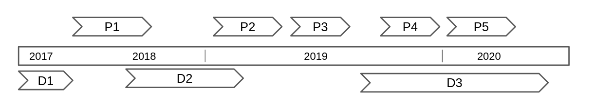
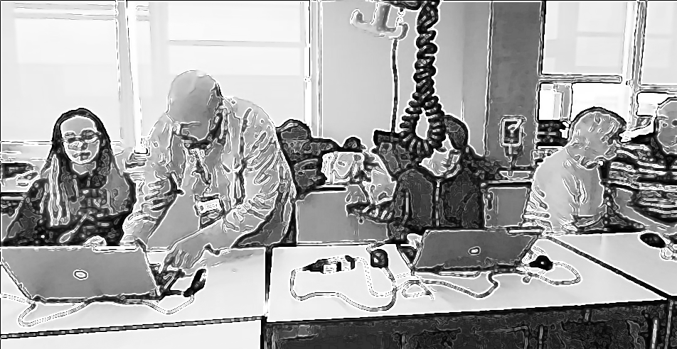
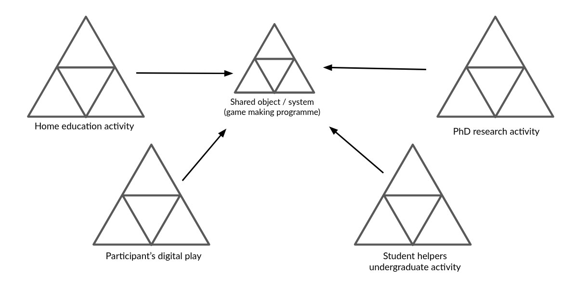
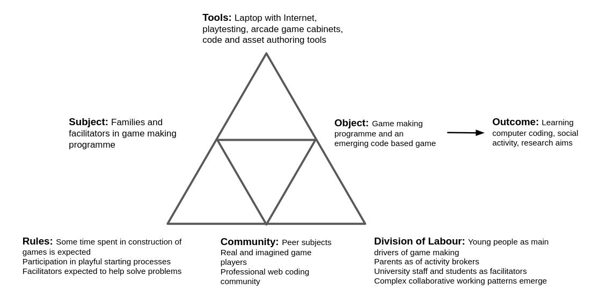
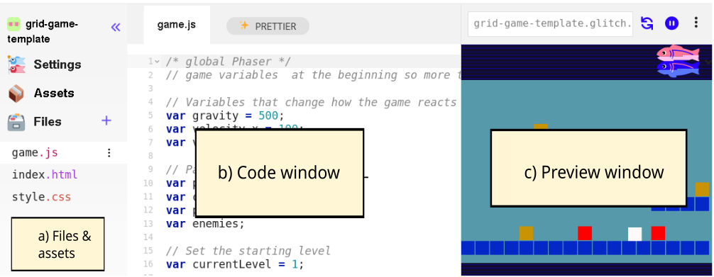
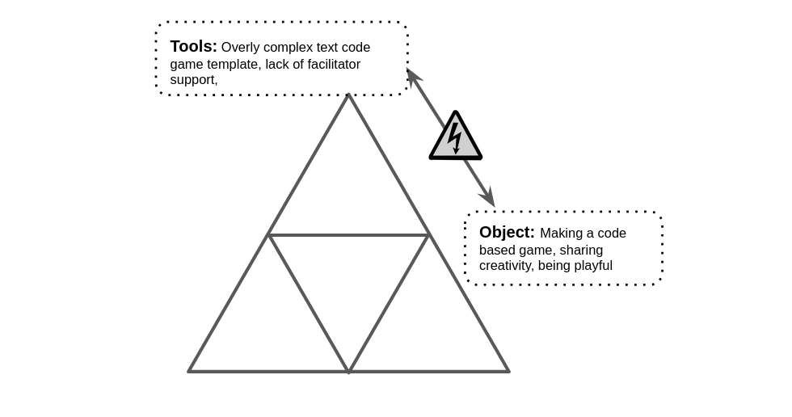
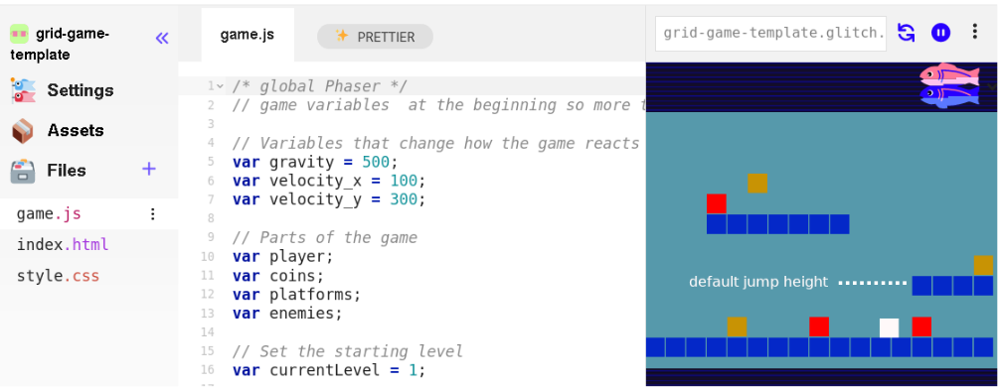
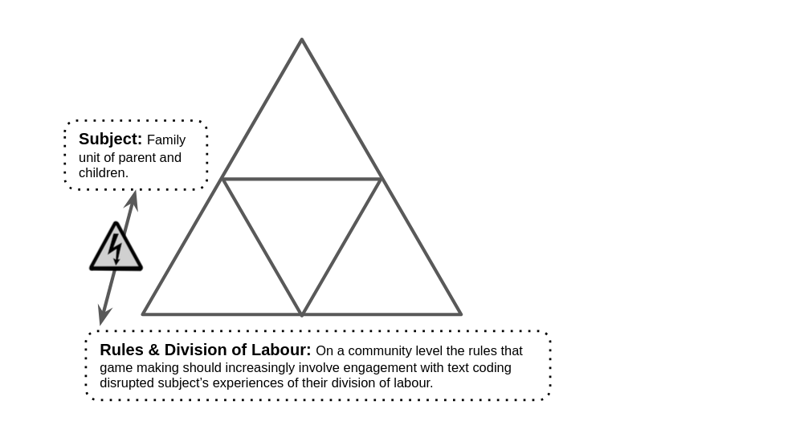
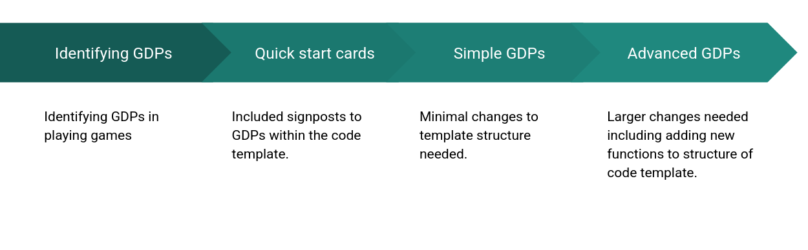
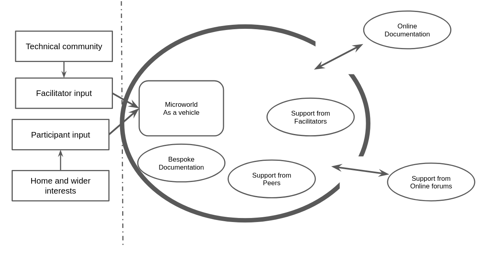

---
# all the regular stuff you have here
zotero:
  scannable-cite: false # only relevant when your compiling to scannable-cite .odt
  client: zotero # defaults to zotero
  author-in-text: false # when true, enabled fake author-name-only cites by replacing it with the text of the last names of the authors
  csl-style: harvard-manchester-metropolitan-university # pre-fill the style
layout: post
number-sections: true
categories: chapter
title: 5. Findings - Design Narrative
---
-   [Findings: Design Narrative](#findings-design-narrative)
    -   [Chapter introduction](#chapter-introduction)
    -   [Vignette locating the game making
        activity](#vignette-locating-the-game-making-activity)
    -   [Narrative exploration of key areas of contradictions emerging
        in the game-making learning
        design](#narrative-exploration-of-key-areas-of-contradictions-emerging-in-the-game-making-learning-design)
        -   [Contradiction area 1: involving organisational issues and
            the use of game programming and asset authoring
            tools](#contradiction-area-1-involving-organisational-issues-and-the-use-of-game-programming-and-asset-authoring-tools)
            -   [Surfaced tensions and framed
                contradiction](#surfaced-tensions-and-framed-contradiction)
        -   [Contradiction area 2: contradictions associated with
            project navigation and use of
            documentation](#contradiction-area-2-contradictions-associated-with-project-navigation-and-use-of-documentation)
            -   [Description of what
                happened](#description-of-what-happened)
            -   [Surfaced tensions and framed
                contradiction](#surfaced-tensions-and-framed-contradiction-1)
            -   [Design response](#design-response)
                -   [Quick Start Cards](#quick-start-cards)
                -   [Structuring instructional tutorial resources and
                    code
                    snippets](#structuring-instructional-tutorial-resources-and-code-snippets)
            -   [Brief analysis](#brief-analysis)
        -   [Contradiction area 3: tensions and barriers in cultural
            aspects of the game-making
            activity](#contradiction-area-3-tensions-and-barriers-in-cultural-aspects-of-the-game-making-activity)
            -   [Description of what
                happened](#description-of-what-happened-1)
            -   [Surfaced tensions, barriers and resulting
                contradiction](#surfaced-tensions-barriers-and-resulting-contradiction)
            -   [Design response](#design-response-1)
                -   [Social coding processes via playtesting (and maker
                    types)](#social-coding-processes-via-playtesting-and-maker-types)
                -   [Use of side missions to encourage varied creative
                    practices](#use-of-side-missions-to-encourage-varied-creative-practices)
            -   [Brief Analysis](#brief-analysis-1)
    -   [Chapter Discussion](#chapter-discussion)
        -   [A staged based approach structured around a germ cell
            concept of
            GDPs](#a-staged-based-approach-structured-around-a-germ-cell-concept-of-gdps)
        -   [Analysis and discussion in relation to existing research -
            half-baked, and constructionist
            heuristics](#analysis-and-discussion-in-relation-to-existing-research---half-baked-and-constructionist-heuristics)
        -   [Synthesis of tensions and
            resolutions](#synthesis-of-tensions-and-resolutions)
        -   [3M game making (Meta) model of pedagogical elements of the
            learning
            design](#m-game-making-meta-model-of-pedagogical-elements-of-the-learning-design)
            -   [Harbour metaphor](#harbour-metaphor)
        -   [Chapter conclusion](#chapter-conclusion)
    -   [Footnotes](#footnotes)

# Findings: Design Narrative

## Chapter introduction

This chapter presents a design narrative that traces the evolution of the learning environment developed in this research across different phases of implementation. The narrative approach adopted here is informed by design-based research (DBR) traditions and the analytical tools of third-generation activity theory (3GAT), as outlined in Chapter 3. This
chapter demonstrate how changes in tools, documentation, and pedagogical strategies were shaped by participant need during phases 1 to 3 of the research [foot - as explained in Ch.4].

Design narratives are a useful DBR technique for describing situated, context-sensitive changes to an intervention over time [@hoadley_creating_2002-1; @bell_theoretical_2004]. Here, the narrative is grounded in the concrete details of the research setting and practices, and attends closely to how formative redesigns emerged in response to barriers encountered by participants. While Hoadley [-@hoadley_creating_2002] covers motivations of design narratives, there are not set forms. My design narrative, is an additive blend of contextual information, facilitator reflections, justifications of design changes and interwoven vignettes drawn from close observations of video data. By narrating the emergence and evolution of the learning design, this chapter contributes to the overall methodological project of the thesis: to develop a participatory, tool-mediated environment informed by a synthesis of CHAT and DBR processes. The narrative also begins the task of articulating the emerging design heuristics.

The chapter begins with a situated vignette that introduces the activity and its participants. This is followed by three major sections, each focused on a cluster of contradictions identified during the analysis. These cover tensions related to technical tools and accessibility, issues of navigation and documentation, and cultural or identity-based challenges in the coding process. Each section presents a sequence of problem identification, design response, and analysis of outcome or change, drawing on session notes, participant feedback, artefact analysis, and observations from the researcher’s journal.

<!-- COULD ADD IN - MY FACILITATOR INPUT IS acknowledgeD - BUT I AM NOT PERFECT - IT'S A STARTING PROCESS - CALL BACK LIMIATIONS IN CH. 4.  -->

## Vignette locating the game making activity

<!-- EXPLAIN WHY GOING BACKWARDS - IE STARTING AT THE END. -->

To open this chapter, I present a summary of Vignette 1. The purpose is to ground the reader in the evolving design through a demonstration of indicative activity from the perspective of a young participant in the process. This scene offers a humanising and situated entry point to a detailed exploration of the wider project. The fuller vignette showing how learner motivation, intergenerational collaboration, and playful tool use unfolded in context, is included the special appendix chapter containing vignettes of activity (see Vignette 1)[^appv]. These themes are developed in later sections.

As the phases of design and tools used are referred to frequently in this chapter Table 5.x is included as a summary [^pp].

<!-- {width=98%}
Figure. 5.x Reminder of delivery phases and development periods - DO SIMPLIFIED IMAGE -->
<!-- - P1 - Disparate non-code tools, Thimble (code playground).
- P2 -  Glitch.com (code playground), Phaser.js (JavaScript game framework), Piskel (online pixel art editor).
- P3 - As per P2 & additional side-missions
- P4 & 5 - Makecode Arcade -->

| Phase     | Brief description     |
|-----------|-----------------------------------------------------------------------------|
| P1        | Exploratory process: with varied non-code tools use, and code playground use as a main coding environment, minimal supporting resources.    |
| P2        | Glitch.com (code playground), Phaser.js (JavaScript game framework), Piskel (online pixel art editor) |
| P3        | This phase used a similar approach to P2, the core toolset was unchanged, additional social missions and a drama narrative was added to the widre process.   |
| P4 & P5   | These phases marke a transition to a block coding approach using MakeCode Arcade tool. Supported resources were developed integrated with computing curricular concepts. |

Table. 5.x Reminder of delivery phases and development periods

The vignette takes place at the start of the session in the latter stages of Phase 2 (P2), shortly after I had made a brief opening announcement, reminding participants' that it was the last coding session before the showcase event [^1].

<!-- Only a short summary is included below due to space limitations, but readers are encouraged to consult the full vignette in Vignette 1 for a richer account of the episode. -->

<!-- An additional motivation is to communicate an atmosphere and dynamic character of the learning environment ->

<!-- INSERT SHORTER TABLE OF ACTIVITY
Table 5.1 - A shorter extract of Vignette 1 focusing on an overview of the use of tools. -->
<!-- DROP TABLE - INCLUDE SHORT SUMMARY. -->

     Toby, a child participant, had been working independently  for around five minutes of the session. On Toby’s right Mick is helping Veronica’s request, demonstrating how to access two different forms of help in the form of code examples and step by step tutorials. On his left grandparents Pearl and Clive and working on their own game (within earshot).

{width=90%}

    Toby tests his game by playing through the many different levels of his game showing fluidity and skill. At times during playtesting, Toby undertakes a process of changing the game code to later his level layout. Toby finishes playtesting and navigates to a web page containing a menu of gameplay design pattern to add to his game he clicks on the entry for adding a moving enemy. He undertakes a careful process of exploring, copying and pasting code from an exemplar document into the correct locations. The resulting change to his game is shown in Figure 5.x. The process required Toby to use and navigate multiple tools [^2], which he undertook  in a self-directed way, occasionally rapidly and fluently, and at times in a more hesitant manner. The immediate audience of his peers appear to influence his design decisions. During the session, Toby invites other group members to play his game, initiating and responding to conversations about the difficulty of his game design. He makes a comment to a peer while self-playtesting his game  "I’m just going to have one go of beating this (his own game). It’s 21 levels in it. So Yeeeah.".  A student helper also notes his distinct level design. "Is yours the one where level one is harder than level three? ... I like that.".

Vignette 1 has elements of activity which occur at intersecting activity systems outlined in Chapter 4. Toby activity is focused sometimes as part as a wider, community scope, and at times on an individual level to make practical changes to his game. Figure 5.x illustrates one aspect of the objective of the wider system,  working towards a game showcasing activity in the foyer of the University building where games are shared with the students in the building. This photo shows a  home made cabinet surrounding a laptop computer.

{width=90%}

<!-- The sections that follow explore how such individual actions were scaffolded and how they contributed to the evolving activity system. DROP THIS? -->

<!-- ### Diagrammatic representations

To frame the scene within the broader analytic structure of the thesis, the following diagrams represent the activity systems in which this vignette is situated. The activity system can be seen as a joint activity stemming from the intersection of wider activity systems in Figure 5.broad. This figure is a necessary simplification of the diverse cultural and contextual factors that fed into the shared activity system of the game-making community. As explored in Chapter 3, this activity functioned as a shared object through which different motivations were negotiated through mutual appropriation [@lecusay_telementoring_2015]. Examples of the influence of these wider systems, including playful interactions, parental support, and practical guidance from facilitators, are explored further in Chapters 6 and 7.

{width=95%}

Using a 3GAT lens, the component parts of this shared activity system are represented again in Figure 5.full. This narrower scope takes as its subject the individuals present in the room during the sessions: children, parents, student helpers, and myself as researcher-facilitator.

{width=95%}

IT FEELS LIKE THIS SECTION  -->

## Narrative exploration of key areas of contradictions emerging in the game-making learning design

In line with the theoretical framing established in Chapter 3, contradictions are understood as historically and structurally embedded misalignments between elements of an activity system, often made visible during periods of change or innovation [@engestrom_activity_1999]. Following Kuutti [-@kuutti_activity_1995] and Engeström [-@engestrom_discursive_2011], tensions, barriers, and disruptions in practice are treated as surface-level manifestations of deeper contradictions within and between activity systems. These manifestations may take the form of technical difficulties, motivational conflicts, or mismatches between participant expectations and other systemic elements shaping the activity. The following sections of this chapter examine three key areas of contradiction.

The first area of contradiction addressed includes tensions arising from the introduction and evolution of technical tools in the learning design, particularly the shift in software practices between P1 and P2. The second focuses on a contradiction related to navigation and supporting documentation during P2. The third explores cultural and identity-based tensions in coding participation, an area highlighted in earlier chapters as a persistent barrier to inclusion.

### Contradiction area 1: involving organisational issues and the use of game programming and asset authoring tools

<!-- MOVE THE PATTERN OF HOW I WRITE ON C1-3 HERE, description, tension, response. -->

In this section, I analyse journal notes, participant feedback, and the changes in the tools and resources used between P1 which was highly experimental and P2  which ended with a fuller implementation of introduced resources. This section (and the subsequent two) begins with is a composite description of activity, summarises key tensions and resulting conflict and outlines the response provoked.

<!-- #### Description of what happened -->

Email communication inviting participation and describing the proposed workshop activities, set an expectation of parent being involved in "families to take part in a Game Making club to learn how to make video games together" and was revisited in the first session [^3]. In the early stages of P1, working groups formed organically, broadly along family lines, with three, mixed age groups of roughly five participants. These groups began to define their game ideas during these early relatively unstructured planning sessions. My initial focus was to create a welcoming, low-pressure environment for introducing and exploring the process of making games in a way which allowed participants to follow their own interests [^4]. To achieve this, I used several activities unrelated to computer coding to scaffold the game design process. Each family had access to a laptop with vintage games installed and early sessions included time to play and discussing retro arcade games, describing their component parts in particular [^5b]. Other activities included: brainstorming game story scenarios, creating pixel-art characters on paper, and making craft collages for game backgrounds [^5].

I postponed introducing code editing tools until around week five, prompted by concerns about overwhelming participants and my own ability to support unstructured coding from first principles [^6]. I had previously chosen a game design framework phaser.js [^6b] and at this stage, I introduced a simplified game template including just a character, ground, a hazard to avoid and a star to collect, illustrating some of the common tropes of a simple retro platform game [^7].

{width=95%}

Figure 5.x - Simple breakdown of code playground areas.

The code playground tool proved initially productive in scaffolding the beginning coding experience of participants of HTML5 games [^8]. Both code playground tools in P1-3 shared a similar layout which is common to code playgrounds in general. The three areas shown in Figure 5.x represent a visual and technical structuring of a web project with the ability to create and upload files as assets in area (a), to see and edit the code of the project at hand in area (b), and a preview of the resulting game in a web page in area (c) [^9]. The decision to use a code playground was guided by a need to provide assistance for participants given my motivation to support authentic engagement with real code rather than a block coding approach  [@chesterman_webmaking_2015]. While the affordances of the code playground ameliorated some of the barriers associated with text coding [^10], predictably challenges in this area remained for participants.

In P1, when participants began engaging with code, several tensions quickly surfaced. The differing levels in  participants’ ability and interest in implementing code led groups to specialise. Some participants with greater confidence or experience took on coding tasks, while others worked on graphical game assets (both digital and physical), narrative planning, or sound elements [^11]. Even so, at this point my ability to support participants undertaking coding activities became a limiting factor. Whole-group demonstrations were largely ineffective: attention drifted, and groups progressed at different speeds and needed different support at different stages. Without in-tool help or the supporting affordances provided by block coding environments participants had no supports to draw upon. Given the relative complexity of the structural starter code, learners frequently needed one-to-one help to make even minor additions to their game. They relied on me as the primary source of information, further exacerbating the facilitator workload. As a result, support bottlenecks emerged, and some participants became stalled early in their projects. My journal notes describe these sessions as increasingly difficult to manage.

#### Surfaced tensions and framed contradiction

The  of professional text-code language and framework was a contributing factor to emerging tensions. While simplified, the structure of the starting template still relatively complex for novices and offered no easy way into experimentation as advocated by a tinkering or bricolage approach [^12]. Many learners had ambitious ideas for their projects including that were either beyond the scope of the code framework or not realistic given the novice coding level of participants [^13]. Regarding peer learning, while some learners became aware of each other's programming work, it was difficult to adapt the bespoke code additions from one project to another.

{width=75%}

These tensions reveal an underlying contradiction in the activity system between the object of creating expressive, technically functioning games and the mediating means available to support that objective shown in Figure 5.x. In summary, the use of authentic text-based code environment, aggravated a misalignment between participants’ ambitions, their actual skill levels, and the support structures in place within the software toolset. At the same time, the mediational role of a single facilitator proved insufficient to sustain a good level progress within project work and to support diverse learner needs, resulting in friction and delay. This contradiction pointed to the need for redesigned tool affordances and wider scaffolding that could better support the object of creative game development.

Turning to the response to this conflict, one initial response  was a non-technical one. After one session in P1, I emailed participants , expressing that I felt daunted by the task of helping the integration of the disparate creative elements being produced into cohesive game projects, a process which I felt responsible to facilitate. In response emailed parents for support in organising and bringing more order to group and planning processes[^14]. The group planning process improved, and the self-organisational abilities of parents and tenacity of young people involved developed freeing up more of my time to support technical issues in the remaining sessions.

The contradiction outlined above also shaped a series of design adaptations to tools used between P1 and P2. Recognising the need for scaffolding without over-prescription, I developed a _starter game template_ with greater scaffolding including putting key variables at the start of the game code, and embedding comments in the code highlighting lines intended for modification. The process of developing the affordances of the starter game involved close consideration to the imagined first encounters with the game and underlying code. This game template was introduced by a facilitators prompted learners to play a _broken_ game in a web page. They were asked to work out in what way the game was broken and then invited to look at the code to try to _fix_ the game (e.g to make changes to progress) [^14b].

{width=95%}

<!-- THIS IS ALSO COVERED IN C3? -->

The following section provides a description and analysis of the toolset that emerged from the tensions and contradictions of Phase 1 and then implemented in Phase 2. While P1 had been exploratory and had use a large set of tools, In P2 I reduced the number of tools suggested significantly [^15]. I offer the following overview to allow the reader a greater situated understanding of the activities being carried out [^16].

<!-- ADD - Signposting sentence for the following sections  at the start

THAT COULD BE A TABLE (OR DEVELOPED) for Chapter -->

**Code playground:** The use of the code playground helped by providing the following: a place the starting template could be viewed and played. A remix button, which when clicked created a new version of the project that could be adapted.

**Simplified file structure:** The overall file structure was simplified so that participants only needed to alter the game.js file. Within that file, an older version of Phaser.js was used allowing simplified syntax in object and functions construction [^17].

**Variables at the start of the document:** Small changes in variables at the start of the JavaScript game file created rapid feedback responses and large changes in the game. The starter game templates included the following elements: editable values and visible parameters for player movement, enemy speed, and image and sound assets.

**Blocks graphics and use of Piskel:** Generic colour blocks in the starting template and encourage the process of adding designs created by participants graphics created in the Piskel tool [^18]. The template was altered to facilitate importation of blocks of 32x32 pixels, the default project size of Piskel aiding migration. The use of this tool external to the code playground led to benefits in developing key digital literacy skills as participants needed to migrating assets from Piskel into their games via downloading to their computer and reuploading.

{width=95%}

**Graphical structuring of the level design using text code:** to align with research on the value of a visual approach to coding multi-media projects for novices [@guzdial_programming_2004; @resnick_scratch_2009], changes to level design were highly scaffolded to mimic a tile map approach using text code arrays and regular block graphics.
in the P2 starting template the use of a graphical grid structure to edit level design shown in Fig 5.grid.

{width=95%}

At this stage I also invite the reader to play the starting game template and view the underlying code [^18a]. An Appendix with a greater level of design issues related to the structure of the template is included as Appendix D.1.? allowing replication by other practitioners.

<!--
EDITED THESE SECTIONS DOWN - MOVED TO APPENDIX
Names in Appendix
- Code variables and structure
-   Level design
- Graphical asset scaffolding
 -->

<!-- ##### Brief Analysis -->

This section now summarises and analyses some of the ways in which the design helped address the tensions described above. The in line with the exploratory rather than quantitive nature of the thesis, the aim is not to prove efficacy of the intervention rather than to explain its role in the iteration. However broad descriptions of impact are included to help situate the later sections.

The staring template reduced the difficultly and time needed to initiate a game project. This contributed to a significant shift in working practices from P2 onwards characterised by smaller working groups, normally pairs or individuals. In addition, the process of starting with a working game and altering existing affordances within the template allowed participants to start to share their emerging games with others immediately, which contributed to the concurrent increase the time spent spent undertaking peer play testing at this phase. The process of selecting a reduced toolset in P2 helped as well as address potential for participants to be overloaded by the diversity of the tools at play also created a greater alignment of participant experience. This appears to be a contributing factor to increased peer exchange of skills and knowledge.

The technical adaptation of the text-based level editing grid had a specific impact on the coding experience and wider environment. The ability for individuals and pairs to make quick changes to the games templates via in terms of the affordances described in the previous section appeared to build their ownership over these fledgling games. Vignette 1 shows Toby designing many levels of varying difficultly in a way which made the experiences of playing his game distinct from others. This individuality is noted and encouraged by a student helper (see Vignette 1 extract in the previous section).

I now discuss this design in relation to existing research on the use of supporting code templates in programming education. The template design is an example of a “half-baked” microworld (in the form of a game) [@kynigos_children_2018; @kynigos_half-baked_2007], and aligns broadly with the UMC framework [@lee_computational_2011]. The work of Kynigos et al. [-@kynigos_children_2018] on the concept of half-baked microworlds and games shares a similar focus on the motivational aspect of incomplete game affordances to drive initial engagement. This motivation spurs and shapes activity here in early making stages of my learning design, aligning with the use and modify stages of the UMC approach [@lee_computational_2011] [see Ch.4]. The use of a template introducing hands on use of coding tools early in the process, thus avoiding the mismatch between participants' planning and the technical limits of their novice abilities. Small code changes resulted in potentially large changes in game behaviour, appearance and difficulty aligns with a long standing concept of HCI research that feedback is motivating for system users [@bernhaupt_introduction_2015; @malone_heuristics_1982].

<!-- FOOTNOTE SIGNPOSTS CH.6 - ADD AS TENSION IN TABLE TOO? -->
Turning to the aspect of authenticity in the learning design, it is valuable to re-examine the factors driving my choice of JavaScript and Phaser, a professional, open-source game-making framework. Specifically, this choice relates to the potentially empowering impact of exposing participants to authentic technologies and concepts in hands-on, exploratory processes. Ratto [-@ratto_critical_2011] discusses this through critical making, a process that playfully brings forward Latour's [-@weibel_making_2005; -@latour_cautious_2008] ideas of shifting from matters of fact to matters of concern by revealing taken-for-granted artefacts as deliberately designed objects. This was evident in conversations between participants where they expressed a sense of inspiration or engagement with previously unknown technologies. For instance, exchanges demonstrated a growing appreciation for the complexity behind professional games, based on their perception of the effort required for their own simple game projects:

    Pearl: It just shows you what goes into these games.
    Student Helper 3: Think about how much effort goes into.
    Pearl: You just take things for granted don’t you?

<!-- ADDITION MADIHA's reflection in interview data. -->

While my design aim was in part to reduce coding syntax errors [^syntax], in part to reduce resulting anxiety and frustration in novice coders [@denny_all_2012], I did not wish not to remove the possibility of learners making mistakes entirely. While even these small changes involved potential syntax errors, as these simple expressions were surrounded by other lines modelling the correct syntax, they could often be corrected by the participants without facilitator support [^20]. Thus, this careful structuring of the template appeared to mitigate against the challenges of syntax errors.

<!-- hi mick SIGN POST -->

### Contradiction area 2: contradictions associated with project navigation and use of documentation

#### Description of what happened

<!--
from previous version

While it was clear that participants needed to develop their coding abilities, the emerging, informal, experimental nature of the learning environment seemed to me to not suit whole-class instruction. This intuition was supported by my reflections on two attempts to deliver whole group presentations of key coding concepts, which I judged in my journal, based on visual cues of engagement, to be unwelcome interruptions to participants’ making activities. Instead, I addressed problems on an individual basis. However, as  more issues arose, I became overwhelmed by the group dynamics and technical demands on my time. After one session, I emailed participants (see Appendix.narrative2), expressing that I felt daunted by the task of facilitating the integration of the disparate creative elements being produced into a cohesive project. I asked parents for ideas and support in organising and bringing more order to group and planning processes. These developing tensions can be framed as contradictions between the tools available to participants and the object of actualising their ideas and graphical assets in code form. Additionally, my limited time as a facilitator highlights a dysfunctional relationship between the division of labour and the object. -->

This section outlines a contradiction associated with the need for and introduction of supporting documentation to scaffold the game-making process. In P1 participants followed divergent creative pathways using a diverse set of tools (see description in following section), but at a cost of a sense of an overall coherence and shared understanding of the process. In P1, groups organisation coalesced around the creation of wish lists of game features, which acted as mediating tools to coordinate between different team members and to request facilitator support to implement them via code structures. In between P1 and P2 I reflected on how this process could be developed to structure of documentation to support this approach to of project organisation.

<!-- , reflecting a tension between learner agency, and the need for shared reference points that could support peer support. -->

In P2, a reduction in the average size of working groups and subsequent increase in the number of game coding projects at play, increased demand on my time as a technical troubleshooter. At this stage, while the in-tool scaffolding provided by the code template accelerated production for  learners significantly [@laurillard2020significance], participants still required direct support from me when adding new code structures causing delays and participant frustration due to the limited time I could offer each group. Early in P2, resources to support implementation were driven by specific participants request, however unlike P1 [^cdiv], due to a higher similarity in underlying code structure, the supporting resources created for one project now became suitable for reuse within others. As such, as P2 progressed, a library of short stand-alone instruction documents began to accumulate.

<!--
CHECK BACK FOR DUPLICATION
After one session in P1, I emailed participants , expressing that I felt daunted by the task of helping the integration of the disparate creative elements being produced into cohesive game projects, a process which I felt responsible to facilitate [^7]. I asked parents for ideas and support in organising and bringing more order to group and planning processes.  In response to my email, parents made suggestions including: use of a visible and shared list of game features that are being worked on, documentation to support the implementation their requirements. The group planning process improved, and the self-organisational abilities of parents and tenacity of young people involved developed. -->

#### Surfaced tensions and framed contradiction

<!-- A TRANSITION. -->

A recurring tension noted in my journal during this period concerned the clash between divergent participant learning paths and the need for technical support. This was compounded by resistance to whole-class teaching input[^input], which consistently yielded low engagement. I surmised that participants saw these attempts as class teaching as not immediately relevant, misaligned with learners’ preferred hands-on working styles, and disruptive to the flow of their making. Repenning et al. [-@repenning_scalable_2015], as discussed in Chapter 2, frame this resistance as a barrier arising from a principles-first approach. The authors describe the risk of such an approach plainly as participant boredom. The challenge became how to support progress given my limited facilitator time, without losing the important pedagogical feature of participant choice over their pathway. I also struggled reconcile an additional tension between this responsive approach to providing documentation and requests from some parents asking for resources involving background concepts and explanations of coding constructs.

Together, these challenges surfaced a contradiction between an important component of the object of the activity (learner-led game creation) and the evolving rules and mediating artefacts intended to support that process. The activity system lacked a shared, structured way for participants to orient themselves in the process to develop or to reuse successful code patterns without the input of facilitator mediation. Thus, the flexibility of the environment became problematic. This contradiction appeared to be a double bind [@engestrom_expansive_2001]; how could I provide greater support via documentation detailing implementation and a underlying principles without compromising the responsiveness to the learner pathways that was foundational to the ethos of my approach? This contradiction drove extensive revision in the learning design concerning methods of technical support.

#### Design response

<!-- INTERGRATE?
In response, I developed several new artefacts intended to scaffold project navigation and reduce the bottleneck of real-time technical support. -->

Recalling my organisational crisis in P1 outlined in the section above, in response to my email asking for help, parents made suggestions including: use of a visible and shared list of game features that are being worked on, and documentation to support the implementation of code which explained underlying principles and foundational code structures. The suggestion of the list of game features used as both an shared organisational tool and as the basis for providing supporting documentation, became relevant in addressing the contradiction outlined above. Thus, early in P2 I used this dual function as a guiding principle to structure and present supporting resources in the form of a themed features [^20b] which users could choose from allowing them take on features in the order that they chose.

From this point onwards, resources which addressed some of the contradictions outlined above evolved rapidly, resulting created three main sources of documentation: quick start cards, written instructions, and code snippets. I now describe the process of creating these varied supporting documentation and the purposes they served.

##### Quick Start Cards

_Quick start cards_ was initially developed to support one-off sessions to allow rapid experimentation with the starter game of P2 [^21]. They were designed to let participants choose challenged based on area of interest and difficulty. _Quick start cards_ (see Figure 5.cards below) were A5 sized printouts highlighting the key affordances of the template involving: game mechanics such as movement, jumping, level design, and the final challenge of swapping out the look of one or more characters by designing pixel art and replacing the line of code that adds the asset to the game. These printed resources highlighted key lines of code and demonstrated how they could be altered to impact game behaviour [^22].

{width=95%}

The cards supported participants' initial interaction with the code in a way that further developed the use and modify stages of the UMC framework [@franklin_analysis_2020] HOW / CALLBACK?. They allowed  participants to get started with the starting template game with less in person support from facilitators to the strongly scaffolded interaction with the code and the relatively minimal changes needed to the code. Thus, this process scaffolded simple coding tasks while also facilitating choice over learner pathways.

<!-- SOME ON IMPACT AT LIBRARY? -->
<!-- Also aligning with low floors principle.
VERY LIMITED ANALYSIS HERE - SIGNPOST LATER EXPLORATION?
 -->

To further reduce dependence on my time as a facilitator, I wrote supporting documentation in a step by step format for each code example. In the early stages of P2, learners accessed these document through a Google document with links and brief descriptions. I continued developing new projects and producing printable instructions to support these code snippets, ensuring that each snippet linked to a descriptive chapter and vice versa.

##### Structuring instructional tutorial resources and code snippets

While the use of code examples or *snippets* [^23] is a common professional practice in problem-solving [@yang_stack_2017], their use by novice learners presents challenges related to relevance, consistency, and accessibility [@treude_understanding_2017].  Indeed  difficulties experienced by participants in P1 understanding and applying these  abstracted code snippets from the Phaser documentation website prompted me to create more tailored resources for P2. These bespoke, stand-alone code projects demonstrated annotated code features and within a playable game project based on the starter game template, allowing participants to copy and paste the relevant code sections needed into their project. Projects illustrated requested game features such as gameplay design patterns; including: *jumping on an enemy to zap it*, and *making a moving enemy*. To help learners situate the code within the correct structure, all projects used the core game template and included only the new code required for each feature.  

This section now addresses the introduction of code snippets and self-contained instruction based on game design patterns, and their containment within a manual with a more linear structure. While quick start cards scaffolded existing affordances within the game code, an innovative structure of documentation was needed to support adding new features.

To meet participants' requests for foundational coding knowledge, I created step-by-step chapter resources guiding users to code a core game template structure from first principles [^24]. While this linear format did not fully align with my choice-driven approach, I envisioned it as supplementary reinforcement for learning outside of sessions, which indeed some participants did take up [^25].

<!-- I also experimented with ways to present these feature choices in an accessible, engaging format, which I describe in detail in Appendix 5.map.  -->

{width=95%}

Figure 5.patterns : a screenshot of the hub of GDPs pointing to code snippets and instructional chapters

I experimented with ways to present these feature choices in an accessible, visually engaging format, see Figure 5.patterns. Cautious that multiple documentation formats could lead to confusion, I created a centralised hub, structured around these graphical representations of the game features, to host both snippets and tutorial chapters, with an aim to make navigation more intuitive and to orienting documentation around participants' gameplay experience [^bro].

| **Game Mechanics**| **Game Polish** | **Game Space** | **Challenge Systems**|         
|--------|------------|--------------|----------|
| Add Static Hazard  | Add Graphical Effects | Change Design of Levels | Gain Points when Collecting Food |
| Add an Animated Enemy  | Add Sound Effects | Add More Levels | Add a Timer |
| Jump on Enemy to Zap them  | Add a Sound Track (Music) | Change Shape of Levels | Collect all Food before Progressing |
| Double Jump  | Add a Game Story with Messages | Change the Background Image | Power up - Higher Jump |
| Moving / Patrolling Enemies  | Add a Game Story with Messages | Change the Background Image | Power up - Player Speed |
| Moving / Following Enemies  | Animate your Player’s Movements | Key and Door | Random Doubling Enemies |    
|   | Make Player Immune |  | |    

Table 5.x Categorisation of game design patterns used in P4.

#### Brief analysis

I now turn to a short analysis of the trajectory of the supporting resources in relation to other research. It is covered only briefly as it is developed more extensively in Chapter 6.

The structuring of the collection of code examples, as outlined in were developed in response to requests for new features from participants, aligning with a shared motivation to encourage diverse learner pathways. This style of intervention aligns with the concept of just-in-time learning approaches within project-based learning [@riel1998education], where access to supporting documentation is provided based on learner need.

Chapter 2 reviewed research on using collections of gameplay design patterns to support learning in game design [@holopainen2007teaching; @holopainen2011foundations; @eriksson_using_2019; @bjork_patterns_2005], including the potential of thematic organisation of these patterns to develop a shared understanding of game-making concepts within a coding community.

For the documentation hub described above, I grouped game design patterns into categories based on academic and professional interpretations of game elements [@salen_game_2006; @schell_art_2008; @tekinbas_rules_2003; @olsson2014conceptual], as well as participants’ evolving requests for game features. Specifically, these patterns were themed in a way which aligned with the MDA (mechanics, dynamics, and aesthetics) game element framework explored in Chapter 2 [^26]. The final categorisation used in P4 is shown  in Table 5.x. It was in this stage of theming the game features that I started to explore in detail existing research of game design patterns in educational contexts.

Video data collected documents the creation of games with diverse and complex styles and themes [^27]. These issues are discussed in more detail in relation to the development of participant agency in Chapter 7. Discussion on how the development of these supporting resources interacted with the core template contributes to research on Microworld environments and the UMC framework is continued in the final discussion section of this chapter.

<!-- DUPLICAITONS WITH CH. 6
CHANGE GRAPHIC TO A TABLE IN CH.6 - AND REVISIT IT'S PLACE IN THE OVERALL ARGUMENT.

WHAT ARE THE LIMITS OF THIS CONCEPTUALLY/ PRACTICALLY?
NOTE - DEVELOP THIS A BIT AS IT IS EXPLORED IN CHAPTER 6. -->

<!-- While the code snippets, practical instructions, and chapters on core principles continued to pose some challenges (as seen in Vignette 6.1),
the video data analysed in the following chapter shows an increase in participants’ practical ability to implement game features.  -->

### Contradiction area 3: tensions and barriers in cultural aspects of the game-making activity

<!-- MOVEDEarly sessions included playing and discussing retro arcade games, analysing their components, brainstorming game story scenarios, creating pixel-art characters on paper, and making craft collages representing game levels. These multimodal and low-tech activities helped surface ideas, supported collaborative group dynamics, and eased participants into the creative space without the pressure of unfamiliar digital tools. -->

<!-- #### Description of what happened -->

This section addresses an area of contradiction related to cultural aspects of the game-making activity, which while covered last in this chapter, is foundational to the thesis. At times in the interventions, in line with existing research [^28], some participants experienced alienation from the process of coding. Early in Phase 1, I had incorporated several non-coding techniques to foster positive affect and create an inclusive learning environment. These included: playing and analysing retro arcade and console games, drama games as session warm ups, a process drama [^29], sketching pixel art on paper, digital pixel art creation, loosely structured ideation sessions to decide on themes, and sessions on music making and audio effects creation using accessible tools. While this wide diversity of activities was later streamlined for later phases [^30], the initial impact of these more accessible creative on the general culture of the group appeared positive in line with existing research [^31]. It was a transition away from a period involving the widespread use of of these non-programming techniques towards one more dominated by text-coding and the use of related tools where some participants experienced a sense of exclusion from the culture of the group.

This alienation is now illustrated using a case study of one family consisting of Anastasia, the mother, and her two daughters, one at the lower end of our 8-12 age range and one at the upper end. Members of this family actively participated in non-coding activities, tensions emerged when the introduced coding framework was introduced and the limitations became clearer. The framework of a two dimensional game did not support a key gameplay idea that the younger child had imagined in the previous ideation stage: specifically a exploring a three dimensional landscape from the point of view of a bee avatar [^32]. This realisation was very upsetting to the child and required extensive negotiation with Anastasia leading and myself contributing to a process of explaining the limitations of our beginners coding course. This episode marks an echo to the previous tensions of C1 related to tool use but amplified by the strong emotions of the child.

Two sessions later, the whole family experienced alienation. As the phase had progressed, an organic division of labour had occurred with some members sticking with graphical and audio asset creation and others working on incorporating these assets and ideas into the code framework. As participants moved from early-stage ideation, and asset creation, the flexible, diverse, and decentralised working practices gave way to a narrower set of expected competencies. As sessions progressed there was progressively less for the non-coders to do. During participant feedback, Anastasia shared that in one session they had arrived a little late, and after observing other participants around them immersed in problem solving using text code tools, felt like they were surrounded bys a process of _hardcore coding_ (participants phrase) that felt disconnected from.

This experience was not isolated with this family.  In interview data parent Maggie noted that "I was worried we (her and other son Jay) neglected Toby" in relations to this stage where smaller clusters of the group grappled with code implementation of graphical, audio elements and other design element created by the wider group. In my journal, I noted that group work at this stage felt disjointed with non-coders left with little to do  and a feeling that the previously playful culture was transforming into something more serious. I reflected on the fragility of learners’ positive affect and the possibility of alienation during the transition from the planning and sketching phase to the coding phase.

<!-- Finally, it highlighted a potential imbalance in facilitator attention, as participants more confident in coding sometimes created complex problems requiring significant time, which could leave others feeling less supported or valued. -->

Turning now to the surfaced tensions, barriers and resulting contradictions: these reflection show two strands of tension between activity system elements. One tension is between the object of working together and the emerging norms requiring a close engagement with the technical aspects of coding and a shift in division of labour prioritising these aspects. Another tension concerned division of labour. To participate fully in later design stages, participants would need to engage with text-based code regardless of their previous (and perhaps preferred) working practices. In addition,  given that coding activities were on going by others attempts to incorporate these team members at this stage would be disruptive to those existing divisions of labour.

{width=95%}

These tensions combined with previously explored cultural barriers to coding to expose a contradiction between the object of the activity, inclusive game-making allowing diverse creative contributions, and the cultural layer of activity [@engestrom_activity_1999]. The accumulated contradiction is illustrated in Figure 5.x.

The contradiction and subsequent feeling of alienation occurred despite a learning environment which included diverse and inclusive elements informed by previous research, suggesting that treating such activities as an "add-on" causes difficulties. The process of introducing accessible non-coding activities served to help acculturation to game making process in general, but as text coding was required later, the process only delayed alienation for some participants. Indeed, the process potentially heightens frustration if participants have invested into a process which they are later alienated from. In P1 feedback, the parent Anastasia suggested more hands-on exploration with the tools of production before being required to make creative decisions [^33]. As such, addressing this contradiction required rethinking not only the technical scaffolds, as outline above, to allow such early interaction with tools, but in addition the accommodations to include the contributions involving visual design, sound production, and narrative development should happen in an on-going, balanced fashion.

<!-- Although issues of mediation of technical tools played a role in this disengagement, this section has tensions address cultural dimensions.  The shift in the object of activity, from playful design to more technical production, exposed a misalignment between participants' creative goals and the community norms forming around coding. -->

<!-- A's family displayed the internal manifestations of this contradiction externally during the game making sessions and later during participant feedback [add footnote?]. -->
<!-- The coding tool and the template mediated the activity in ways that introduced new community norms, contributing to a cultural tension between the inclusive intentions of the design and the exclusive signals sent by the technical tools. This contradiction reflects a misalignment within the activity system between the tools, division of labour, and object, resulting in alienation for some participants.  -->

Addressing the design response: as previously outlined (see C1 and C2), changes in  tools and documentation meant participants had a positive impact. The use of a template and quick start cards facilitated a shareable game from early stages, and varied points of entry into the activity. Participants were increasingly able to work either individually or in small groups, often alongside family members (duplication?). This helped to reduce the kind of role-based exclusions seen in the case described above, where non-coding contributions became marginalised as the process continued. In particular, the structuring of resources around an episodic process of applying one GDP after another, shifted the pattern of the design process away from a design-build-test progression in a way which allowed for greater balance between coding and non-coding activities.

Two key design interventions were introduced in P2 and P3 to respond to tensions outlined above namely: social coding processes within playtesting and more specifically the use of extra/side missions. These strategies served to realign cultural dimensions of the activity system, supporting more inclusive and flexible forms of participation.

<!-- WHERE ELSE IS PLAYTESTING COVERED? HOW TO LINK -
 - BACK INTO CHAPTER 2? VIA REPENNING? FLOW SOCIAL
 CONCEPTS OF FLOW AND ENGAGEMENT - AND Fluency IN cH. 6. -->

Turning first to social coding processes within playtesting, a greater time with the game in a working state, and changes were carried out in small iterations, allowed each change to be self-tested and shared with others via group playtesting.  As well as greater time spent playtesting both their own and others’ games dramatically, playtesting became increasingly significant beyond an instrumental testing process, to encompass important social and cultural dimensions. By the mid-point of P2, playtesting had evolved into a key site of peer exchange, prompting spontaneous sharing of advice, assets, and debugging approaches.

Video data captured instances where participants expressed frustration when errors rendered their games unplayable (see Vignette 2). While this frustration was natural for participants blocked in progression, I also felt urgency in my response. In response, I prioritised support to participants with games in a broken stage to make them and playable again so that they did not miss out the valuable experience of playtesting. This prioritisation was driven in part as it became apparent to me that different people gained different things from the playtesting process, using it not only for practical testing, but also to find out new ideas, and for wider purposes. My journal notes on playtesting behaviour, later confirmed by video and interview data, detail observations on emerging variety in the activities and modes of interaction. Patterns include: playtesting behaviours that helped form social connections (often adopted by parents), playful bordering on raucous clusters of young people, more sneaky behaviour in designing against game conventions [^33a].  These observations show productive chaos at work and participants clearly experiencing flow in their playful playtesting.

The characteristic of flow within a social and cultural settings felt very important and evocative to me as a facilitator. This recalls the work of Basawapatna on proximal flow [-@basawapatna_zones_2013] [^34], however the structure of the design varies that of SDG considerably. Whereas in SDG, instruction was linear in nature, here the choice based approaches allowed a far greater potential for productive peer interaction. Observations on the role of playtesting are explored in relation to the use of GDPs in Chapter 6, through a lens of increasing fluency and agency. To advance the potential of these diverse playtesing interactions, in P3, I began to intervene gently but strategically to nurture these emergent practices of social coding and mutual aid.

<!-- CROSS REFERENCE THIS WITH APPENDIX AND CHAPTER 7 - IDENTITIES IN PARTICULAR -->

<!-- NEW SECTION  -->

The focus now moves to the use of side missions to encourage varied creative practices. The  side missions within a drama frame aimed to encourage varied playtesting practices. In P3, I introduced a narrative framework to scaffold participant engagement in the form of a fictional scenario. An alien civilisation contacted the group after seeing the games published in p2. They demanded participants upload more games to allow the aliens to assess the worth of the human race [^35]. Within this scenario, participants were assigned printed side missions not directly related to game creation [^36], some public and some some secret, that encouraged forms of interaction and exploration with playtesting similar to those described above. Examples of these missions are included in the extract in Table 5.sidemissions.

| **Your Alien Mission (social)** | **Your Secret Alien Mission** |
|--------------------------------|-------------------------------|
| Find out the names of 3 games that are being made | Change the variables at the start of someone else’s game to make it play in a funny way |
| Make a list of characters in two other games | Replace the images in someone else’s project with something unexpected |
| Find out the favourite computer games of 4 people | Change the level design of someone else’s game to make it impossible using minimal edits |

**Table 5.sidemissions – an extract of side missions given as part of the drama scenario**

The side missions, in support playful social dynamics, aimed to shift the focus away from individual technical mastery and towards creativity within a shared community.

<!-- #### SUMMARY AND LINK
 -->

This section concludes by analysing this area of contradiction. While it focuses on a specific set of missions and the drama-based approach used to frame them [^36], these interventions can be interpreted as design artefacts that mediated both cultural and affective engagement, making space for diverse learners to see themselves as legitimate participants in the game making space. In line with theory on formative interventions, these missions acted as secondary stimuli, opening up new pathways for agency development [@hopwood_agency_2022]. They positioned observation, playfulness, and curiosity as valid ways of participating, helping to legitimate roles beyond that of a (_hardcore_) coder.

As discussed in Chapter 2, much of the literature on computing game design and programming (CGD&P) emphasises learners’ personal appropriation of programming concepts, often framed through individual progression or mastery. The learning design presented in this section takes a different approach, foregrounding the cultural and affective dimensions of participation. By integrating narrative framing, varied social missions to enhance playful playtesting, and role-based reflection activities, the design created space for learners to engage on their own terms. This broader framing of legitimate participation responds to critiques of overly individualistic orientations in CGD&P and aligns with sociocultural perspectives on learning as relational and situated. Chapter 7 builds on this by analysing how these design features supported the development of learner agency through cultural repertoires, shared roles, and evolving patterns of participation.

In addition to the elements detailed above, other aspects of the learning design also contributed to cultural and affective engagement but are not analysed in depth here. These included:

- A map of learning dimensions (based on Brennan and Resnick [^37]), developed and refined in P4 and P5 to align more explicitly with MakeCode and national computing curricula [^ldim].
- Reflection activities conducted in role, influenced by Heathcote’s Mantle of the Expert approach [@heathcote_drama_1994].
- A large-scale visual map to aid navigation, used by learners to trace their movement between GDPs over time [^37b].

These design elements further extended the project’s commitment to inclusive participation, emotional responsiveness, and broader concept-mapping across sessions. While they are not examined in detail in the chapters that follow, the cultural and relational themes they reflect, are taken up more fully in Chapter 7, which explores how participants responded to the broader social and cultural affordances of the design and how these contributed to the development of agency within collective activity.

<!--NOTE:  COMMENT - RETURN TO THIS - MAKE MORE ACTIVE  -->

<!--
INTEGRATE ABOVE
This study differs from much of the research in the domain of CGD&P in that cultural and social aspects of the learning design are prioritise over the personal appropriation of computing concepts and practices.

MORE SIGNPOSTING?

Chapter 7 focuses on analysing participant reactions to the design from a more cultural perspective in greater depth and contains a more detailed exploration of how these elements contributed to the development of agency is provided.   -->

<!-- THE TRANSCRIPT OF THE REFLECTION SESSION SEEMS TO ME MISSING FROM APPENDIX TOO. ADD BACK IN? IT'S A TABLE - COMPLEX TO ADD? -->

## Chapter Discussion

<!-- MERGED FROM 2024 -11 -6 VERSION -  -->

This discussion explores features of the design narrative and elements of the design process contribute to the research landscape, specifically: a stage-based approach, as adapted instance of  design-build-test pedagogy is offered as a practical contribution; the learning design is contrasted to UMC and constructionist design principles, highlighting the increased complexity created by trying to use authentic tools and processes; subsequently a harbour metaphor is offered to clarify these conceptual contribution; finally, a summative table section synthesises aspects of systemic contradictions

<!-- - alignment with UMC, and other pedagogies (retrospectively found),
  - authenticity and blackboxing in particular as a constructionist approach
- DBR -> germ cell & use of collection of GPD  -->

#### A staged based approach structured around a germ cell concept of GDPs

In the learning design outlined in this chapter, GDPs drive stage-based instructional processes. Using terminology from Denner et al. [-@denner_does_2019], the shift from P1 to P2 represents a move from a design-build-test to a _stage-based_ approach. By the term _stage-based_ I mean a process which introduces code structures and challenges in an initially simplistic, prototypical format for learners to experience and explore, and which are subsequently replaced by more advanced models or complex instances of the task. This term arose from an initial misunderstanding I had in my reading of the review of Denner et al. [@denner_does_2019]. I was not familiar with the US term step-wise instruction (referring to step-by-step instructions), and misinterpreted it as a _stage-based_ approach, progressively increasing complexity of challenge.  In addition, in this design, this staged approach is enacted through the interaction of participants with increasingly sophisticated documentation and code structures.

The structure of documentation, created in response to participant requests for adding new GDPs to their games, evolved from a piecemeal format in P1 to, by the end of P2, a menu of GDP code snippets accompanied by detailed instructional documentation.

<!-- THIS STEPPED PROGRESSION COULD BE EXPRESSED AS A TABLE - OR A GRAPHIC .   -->

<!-- {width=95%} -->

| Stage   | Pedagogical focus         | Design focus                                                           |
|---------|---------------------------|------------------------------------------------------------------------|
| Stage 1 | Informally identifying GDPs          | Identifying GDPs via an activity playing games [see Appendix D.1.?]                                     |
| Stage 2 | Quick start cards       | The quick start cards included supported rapid ways to change to GDPs highlighted as affordances in the starting game code template                        |
| Stage 3 | Adding simple GDPs to the game          | These additions to the game could be made by making minimal changes to template structure needed                           |
| Stage 4 | Advanced GDPs             | Larger changes including adding new functions to structure of template or making more fundamental underlying changes, or implementing completely unstructured GDPs |

Table 5.x - A representation of the staged processes

This stepped approach outlined in the table above which increases complexity of the objective of activity, is present explicitly only in limited CGD&P research. The work of Repenning on SGD operationalises this gradation through guiding learners to undertake projects which are progressively more complex, thus implementing progressively more complex patterns. It differs, however in that no common template is provided and as such progression to the next stage involves starting from a blank slate each time [@repenning_scalable_2015]. This is notable as I found in P1 that changes to the underlying code structure were stressful and unwelcome for learners once they had built familiarity with it [^38]. T

The four staged-based approach in Table 6.x shares characteristics and benefits outlined in research on the the broader computing pedagogy of Use Modify Create (UMC) pedagogy [@lytle_use_2019-1] [^38b]. Stages 1 based on the playful game analysis as a precursor to game making [@cornish_game_2018]. Stage 2 and the design work on the P2 starting game template facilitated participants in building familiarity with the code structures and use of tools in an accelerated way (as per the Use stage of UMC). . Stage 3 aligns with Modify, with minimal changes causing high resulting impact aligning with UMC the guideline to "create choices that show visible and immediate changes" [@lytle_use_2019-1, p. 6]. The careful scaffolding of initial coding experiences outlined above, forced early, and repeated  transitions from the _use_ to _modify_ stages, addressing the barrier of possible negative affect towards text-based coding. Stage 4 here comprises the most advanced stage of the stage based approach. This could be implementing a more complex GDP from the menu which involves adding new functions, and making more fundamental changes to the code. This decision to _choose_ (and implement) from a restricted set of options, rather than _create_ from scratch, is in line with some adaptations of the UMC model [@lytle_use_2019-1]. A further extension still would be the choice to imagine, design and implement a GDP not included in the menu provided, this is a process that Dan and Toby take on in P3 by adapting the code template to create a Pac-Man like maze game [^pm].

In this chapter the use of a design narrative processes informed by DBR practice [@hoadley_creating_2002] has been employed to share not only the detail of the resulting learning design but also the emerging tensions that drove them and replicable approach. With that aim in mind the following list shares links to currently online and reusable resources [^44].

- P2-3 Starting Game Template: https://codepen.io/mrmick/pen/gbaOEgB?editors=0010
- Menu of GDPs: https://jamm-labs.github.io/ggcp/ggc-examples/
- Manual: http://3m.flossmanuals.net
- Manual Splash page: https://jamm-labs.github.io/ggcp/manual

Given the close alignment in the structural model with UMC, the contribution to the research landscape in relation to this aspect of my thesis is in the guiding use of GDPs as a structural support to guide the development between stages. This aspect of the research is developed in Chapter 6.

<!-- DEVELOP THIS / LINKS/ -->

### Analysis and discussion in relation to existing research - half-baked, and constructionist heuristics

<!-- The use of a broken starting game also aligns with and the more specific technique of starting with a half baked game template [@grizioti_game_2018-1] -->

Similarly, there is a strong alignment of the underlying principles of the learning design described above with research constructionist design heuristics [^39]. This part of the discussion briefly locates the similarities using specific examples and then explores a fundamental difference in approach in regards to key aspects of authenticity in the learning design. Of particular relevance to this design process is the contructionist principle choose black boxes carefully [@resnick_reflections_2005]. Resnick et al.[-@resnick_reflections_2005] describe black boxes as abstractions that remove potentially problematic areas of the production process, creating a protective, scaffolded learning experience while maintaining a boundary with the authentic challenges of coding in the wild [^39a]. Based on Laurillard's [-@laurillard2020significance] interpretation of the constructionist design of microworlds as being driven by affordances that structure user experimentation to enable exploration and concept formation without reliance on direct instruction, this design aligns with these characteristics [^39b].

However, this structure of the learning design should interpreted as an adapted  Microworld, distinguishable in that it offers greater authenticity and connection to professional environments and documentation. When compared to a constructionist Microworld, like the Mathworld of LOGO and drawing turtles, the structure of my learning design is characterised by its relatively porous borders between this controlled environment and other, more authentic coding ecosystems.

A possible drawback of using a professional tool for novice learners is the risk of culture shock when participants encounter the unfamiliar and potentially alienating aspects of a professional coding ecosystem. The learning design outlined in this chapter helps address at least the beginning of this process by providing a scaffolded learning environment as explored in section C1. Following Resnick [-@resnick_reflections_2005], I still "choose black boxes carefully", but my design choices avoid limiting access to the tools and processes of authentic creative communities, instead providing an alternative strategy to the scaffolding process. In summary, the relationship between use of authentic tools and scaffolded processes can be understood in this context as an inherent dialectical tension that learning designers should account for rather than attempt to eliminate. The following section explores this tension further using a metaphorical approach.

<!-- The use of black boxes is also widespread in professional coding practices, particularly through code libraries and frameworks. These tools provide pre-written, self-contained sections of code to simplify complex operations.  -->

<!-- Techniques or concepts present in constructionist design research, embodied in this intervention's toolset, include a simplified code authoring environment with live feedback in a preview window, techniques to avoid and correct syntax errors via the linting capabilities of the code playground (see glossary), and the use of a GDP menu to encourage creative but scaffolded design. A detailed description of these elements is explored in Appendix.tech. -->

### Synthesis of tensions and resolutions

To enable a summative view of the contradictions involved in the resulting learning design, Table 5.2 shows a summary of some of the barriers, congruencies and tensions and design resolutions that emerged from the process.

| **Tension, Barrier or Congruence emerging in Game Making** | **How design addresses this issue [and location of supporting analysis]** |
|------------------------------------------------------------|----------------------------------------------------------------------------|
| **Category One – Tool use for coding and asset creation processes** | |
| Congruence: Learners interested in video games are motivated to create their own game. | The use of a common game format helps address barriers to text coding, providing clear motivation in terms of a recognisable end project goal. |
| Tension: Guidance is needed in order to make changes, but there is potential for learner disengagement if game coding is taught from first principles, especially for younger participants. | Learners start with a half-working minimal game template, which requires only minimal code changes to produce noticeable in-game feedback. |
| Congruence: Learners interested in art want to create digital artwork to replace placeholder graphics. | An intuitive pixel art editor supports rapid character design, with clear code template signposting to help learners incorporate their artwork. |
| **Category Two – Documentation and Navigation** | |
| Barrier: Learners take on game genres or features too complex for their current coding ability. | Game type is limited to a single genre; missions are capped in complexity. GDPs are scaffolded to start with low-threshold/high-impact patterns. |
| Tension: Learners become frustrated when they cannot choose their next feature; facilitator capacity is strained by diverse pathways. | A menu of GDPs enables learners to select additions in a flexible order. This supports autonomy and motivation while keeping complexity manageable. |
| Tension: Facilitators need to justify learning but may struggle to see it in situ if unfamiliar with game making. Formal skills frameworks can restrict flexibility. | A map of learning dimensions flexibly linked to GDPs and missions helps both learners and facilitators trace progress and identify learning. |
| Tension: Reflection and documentation are valuable but interrupt creative flow. | Learner progress is traced on an attractive physical map displayed in the learning space, integrating reflection into the making process. |
| **Category Three – Social and cultural barriers** | |
| Congruence: Designing a game for a real audience is experienced as motivating. | Playtesting within sessions offers short-term motivation; end-of-project showcase events help learners prioritise and reflect on progress. |
| Barrier: Learners may feel alienated from coding culture or the tools themselves. | Relatable code structures and role-based fictional scenarios help reduce anxiety and encourage engagement through role-play. |
| Barrier: Participants may avoid written documentation or lack proactive planning skills. | Side missions and extended playtesting time support peer-to-peer sharing, allowing knowledge of GDPs and implementation techniques to circulate informally. |

Table 5.2- Table of emerging tensions and design responses

### 3M game making (Meta) model of pedagogical elements of the learning design

In summer 2020 I began early dissemination of results in a peer-reviewed book [@keane_teaching_2023]: the resulting chapter  presented the essence of the learning resources and design to fellow practitioners and participants as well as researchers [@chesterman_game_2023]. To do this I  framed key elements of the  process used within the research phases as a pedagogic model I called 3M (Missions, Maps and Methods). This model is shared now as a facilitator-focused summary key features of the model and the motivations behind them.

{ width=80% }

| **Missions**         | **Maps**             | **Methods**          |
|----------------|-----------|------------|
| Simple code changes yield quick feedback  | A map of learning dimensions flexibly linked to main missions/patterns can be used by both learners and facilitators       | Play Testing in each session aids short term motivation.  Showcase events help longer-term motivation and aid project prioritisation   |
| Free choice of Patterns increases learner engagement and ownership   | Tracing the learner pathway on an attractive physical map in the learning space can help integrate navigation and reflection into the creative process | Drama and fictional scenarios can help explore issues and reduce learner anxiety though coding in a role          |
| Restrict Game Type and number of Patterns to reduce Facilitator stress       |                      | Adding electronics to control the game via arcade buttons and cabinets increases engagement and perceptions of project authenticity |
| Limit  complexity of patterns. Some are simple but cause a large change in the game       |    |        |
| Side missions which explore and celebrate different ‘maker types’ (from  Bartle’s player types)          |        |     |

Table 1.2.  Key Features of 3M Game Making Model

#### Harbour metaphor

Building on earlier reflection on the experience of facilitation, a final analogy is offered here to illustrate how the design space balanced constraint and choice, structure and freedom: that of a harbour. Harbours are a transitional space between the land and the sea, built to facilitate transport of goods and people between the two domains [^40].  In this metaphor the Microworld is a vehicle for exploration forming the base of the learning experience and designed to allow input from the technical community through the lens of the facilitator's design experiences. This chapter has highlighted a process of input from professional communities into the Microworld vehicle of the starting template game. In addition, affordances within the template design and additional resources are describe which facilitate participants to import their existing home interests into the new learning space.

{width=95%}

<!-- In addition, other learning design choices create a sheltered learning environment, shielded but not cut off from the complexity of online documentation and support. -->

Figure 5.x shows a simplified representation of a habour (centre) with land of the left of the figure, sea on the right. Harbours are protective spaces, artificial or naturally occurring, used primarily as suitable places for docking ships. If artificial, protection is offered by created harbour walls extending out into the sea, creating a sheltered space [^41]. In this metaphor, the boundaries of the harbour walls represent the restrictive decisions in terms of the genre of end product, and simplifications in code structures used. While this design uses an authentic, professional text-coding language with its inherent challenges, many design choices were made to shield new users from the complexity of the underlying configuration of interrelated web technologies. The safe nature of the harbour encourages free exploration within the protective walls. This exploration involves interaction with peers, accessing bespoke documentation created and input from facilitators.  

Harbour walls prevent large waves from entering but also provide gaps allowing movement out into the open sea [^42]. The motivational impact of an authentic process and set of tools exists in tension with the accompanying complexity [@nachtigall_authenticity_2024].  The use of authentic tools and alignment with professional practice makes it easier for learners to transition from a supported harbour of this learning design and venture out into the open seas of less supported practice, especially the choppy waters represented by the complexity of accessing and interpreting online documentation and support [^43].  This metaphor is offered as an accessible way to represent the design attempts to resolve contradictions explored in this chapter concerning authenticity and to begin to illustrate how careful structural restrictions may produce creative potential of for agency development [@rosso_creativity_2014], a process explored in more detail in Chapter 7.

<!--
IS THIS EXPLORE ELSE WHERE - IF SO LINK FORWARDS.

restrictions may be productive through the creative potential of limitations [@rosso_creativity_2014]. -->

<!--
**Signposting**
IS THE PART ON AGENCY NEEED?

At this point it is useful to describe a process here briefly  in relation to the three contradictions explored above [^45]. The evolution of these tools and documentation outlined in C1 and C2  was driven by a need to increase in instrumental agency due to the novice status of participants. As instrumental proficiency increased for some participants it allowed the development of peer learning and other social coding processes to emerge as described in C3.   -->

<!-- In terms of agency and choice over learner pathway, Harbours are also safe places of play and learning. Harbours can be evocative and intriguing, inviting the possibility to travel beyond the walls to unexplored realms. -->

### Chapter conclusion

<!-- - summary of methodology
- results
- signposting

**methodology** -->

This chapter has explored the complexity of the interacting tools and documentation in relation to their evolution in different phases of the formative intervention process. It has described three contradictions that occurred during an iterative, phase-based approach using a methodology guided by techniques of DBR and CHAT. The contradictions explored initially focused on technical and then more social dimensions of the learning design.

Regarding methodology, the emergent and mutual nature of this design process aligns with both DBR principles and CHAT concepts of transformation in tool use based on explicit and implicit feedback. The descriptions of this chapter also show the process to be demanding on participants. I was fortunate that the tenacious character of the participants in P1 helped mitigate the challenges posed by the challenges of beginning with such an incomplete pedagogy. The design narrative above has acknowledges my active input into the direction of the process in line with an active approach to steering  the design towards collaborative learning opportunities [@stetsenko2020radical]. My reflective analysis within journal entries show that While this general direction was present from early stages, my this on-going process served a purpose to divine a deeper understanding of my own guiding motivations driving the design changes [^46].

<!--
THIS WOUDL GO IN CH. 4
The design approach that followed the moments of contraction outlined above  was responsive and uncertain. The process requiring me to rapidly generate and adapt software, documentation and processes in response to rapid identification and analysis of manifestations of emerging conflicts.   -->

<!-- LINK FROM HERE TO START OF CH.6 GERM CELL / SCOPE -->

My observations, supported in the following chapter, indicate that the combination of the use of a template and a collection of GDPs accelerates the use of certain coding fluency practices, which, in turn, had a subsequent impact on the increased use of social coding processes.

This chapter has explored the iterative development of the learning design, focusing on resolving barriers to coding and aligning with existing research principles, particularly the use-modify-create (UMC) process and constructionism. It emphasized the potential and challenges of leveraging professional tools within scaffolded environments, underscoring the pivotal role of learner-led design decisions in motivating coding practices and fostering social collaboration. Two key lines of inquiry which illuminate the cultural and social dimensions of game-making are explored in subsequent chapters. Chapter 7 examines the impact of emerging community processes on participants’ agency, while the Chapter 6 employs video data to describe and analyse the diverse applications of GDPs.

<!-- Instrumental agency can be seen as the base of a hierarchy of agency, in other words, that other dimensions of agency may need to be built on this one. This foundational agentic level is further explored in relation to other research in the following section. -->

<!-- MOVE OR SUMMARISE
GDPs were first identified through playing games in an activity adapted from Moveable Game Jams (ensure this is described or linked to) and were used as a list of features serving as a mediating planning tool.  -->

<!-- In P2, GDPs were incorporated as affordances into a starter game template, initially highlighted via facilitator interaction and later as the guiding principle of quick start cards to scaffold modifications to the code template.
The structure of documentation, created in response to participant requests for adding new GDPs to their games, evolved from a piecemeal format in P1 to, by the end of P2, a menu of GDP code snippets accompanied by detailed instructional documentation. -->

<!-- The shift from P1 to P2 represents a move from a design-build-test to a stepped, stage-based approach. This graduated approach introduce code structures and challenges in an initially simplistic, prototypical format for learners to experience and explore, which are subsequently replaced by more advanced models or complex instances of the task. -->

<!-- GDPs were encountered through the game playing and analysis activity explored in the section above. GDPs were incorporated as affordances into a starter game template, initially highlighted via facilitator interaction and later as the guiding principle of _quick start cards_ to scaffold modifications to the code template. -->

<!-- The structure of supporting resources, created in response to participant requests for adding new GDPs to their games, evolved into a menu of GDPs in the format of name, description and both detailed step by step implementation instruction including code snippets, and stand alone code projects / snippets. -->

<!-- NOTE / MOVE - It could be seen as a progression to move from more scaffolded use of instructions to the use of code snippets alone with practice although data of Toby may not support that progression suggesting instead it may be a matter of preference. -->

<!-- LINK  -->

Gilbert is the worsted name.

## Footnotes

[^appv]: All Vignettes are located in a special appendix called Appendix V.

[^pp]: Chapter 4 describes the phases in more depth. A summary of the tools used in described in more detail in Appendix 5.1.x.

[^1]:  I make the following opening announcement "We’ve got this one final making session next and then, if you can make it, the Monday after we can play our games and we can share them with students. We can make the students frustrated when they can’t beat our games. It’s usually quite fun. So, if we can do that - same time next week let me know. So, we’ll keep trying to help you and yes good luck everyone!".  See Appendix.V for full context. I CAN'T FIND THIS

[^2]: These tools are explored in a following section and include: a web-based coding tool (code playground), a game template that serves as the base for his game project, and a menu of documentation linking to code examples and tutorials.

[^3]: The invite email is included within Appendix A.

[^4]: At this early stage, I termed this process following _affinity paths_, imagining some would be drawn to artwork, some to music creation and others to code problems solving.

[^5]: These low-tech activities involving diverse non-coding processes helped surface ideas, supported collaborative group dynamics, and eased participants into the creative space without the pressure of unfamiliar digital tools. They are described in more detail in section C3 later in this chapter.

[^5b]: The process of playing games and analysing their component parts, guided by the Moveable Game Jam process is outlined in a way replicable by practitioners in Appendix Appendix D.2? themeing

[^6]: Reflections on this delay are included in Appendix D.1.a and reflect a convergence of my own tacit expectations to begin from first principles and my relative inexperience working in this area.

[^6b]: Choice of phaser.js as a JavaScript framework is outlined in Chapter 1, and explored in more detail in Appendix D.1.?

[^7]: As of October 2025 it is still available to view and play - https://codepen.io/mrmick/pen/jaXzxw?editors=0010.

[^8]: The term HTML5 games is included here as it was relevant at the time. HTML5 became a buzzword for modern webpages which included dynamic content due to the presence of JavaScript and css technology.

[^9]: A fuller breakdown of the features of code playgrounds is included in Appendix D.1.?

[^10:] See Chapter 2 for a full summary of the challenges of text coding and the ways code playground address them. Appendix D.1 gives more detail of my evaluation of the advantages of code playgrounds.

[^11]: While I wanted participants to be able to follow their interests, this total dis-enagement with coding was not optimal as we will see in section C3.

[^12]: See Chapter 2 for outlines of tinkering  or bricolage approaches [@bevan_learning_2015; @papert_epistemological_1990].

[^13]: See appendix bee for an example.

[^14]: This email included in Appendix.email illustrates a pivotal moment in  my understanding of the limits of my role as facilitator of an open process and the need to impose limitation. This aspect is explored later in section C3.

[^14b]: Participants would try to jump up to the platforms in the game but find that they could not jump high enough ot progress. Figure 5.x below shows a white square as a player, red squares are hazards to be avoided, and yellow squares are rewards which must be collected to progress to the next level. A white line is shows indicating how high the player character can jump.

[^15]: Tools used in P1 included several audio and music making tools, Scratch as a graphical editor, and varied non software tools. See Appendix D.1.?  

[^16]: The structural decisions to support the use of a code playground are expanded with greater technical detail in Appendix D.1.?

[^17]: While a technical consideration beyond the scope of a non-technical reader this issue is significant for the participants experience. See Appendix D.1 game state for a technical exploration.

[^18a]: An online version which is easy access both game and code is viewable here as of 29.10.25 https://codepen.io/mrmick/pen/gbaOEgB?editors=0010. For a more long-term link see https://github.com/glitch-game-club/simple-game-to-edit

[^18]: Piskel is a pixel art graphical editor which participant both young and old appeared to find enjoyable and intuitive. See interview ? with Mark and Ed.

[^19]: A break down of the starter code design structure decisions and adaptations as a contribution to applied half-baked / UMC research.

[^20]: The errors made therefore were the right kind of errors. An exploration of the diffent kinds of resulting errors adn the process of debugging in relation to the use of GDPs is explored in more detail in Chapter 6.

[^20b]: While the term GDP has already been used in this thesis, as this stage for me there were still just game elements of features. WHERE TO DEVELOP THIS SHIFT?

[^21]: The time limitations one-off events at Mozilla conference (for technology educators), Feral Vector (for grass-roots game developers), and Manchester Libraries (local families) and for trainee computing teachers  helped me distil the essence of the affordances into an accelerated process of getting started with the design process.

[^22]: A version of the quick start cards is available as part of Appendix.tech.

[^23]: Code snippets and their co-location within code playground tools are explained in Chapter 2. In short they are code examples extracted from context in a way designed to facilitate reuse and often shared online as a community resource.

[^24]: See opening chapters of https://3m.flossmanuals.net/

[^25]: Mark and Ed described themselves as plodding throught that step by step documentations in Vignette ?. Writing these chapters prompted reflection balance structured guidance with choice-driven learning, which I describe within the manual as _meeting yourself in the middle_, reflecting that the starting chapters on foundational concepts were not designed to be read first.

[^26]: The evolution and of this theming is outlined in more detail in Appendix 5.theming

[^27]: Evidence of this diversity is present in Chapter 6 and in the Vignette data in Appendix.V.

[^28]: The introduction gave an outline of cultural barriers to CGD&P.

[^29]: A process drama is a drama activity which engages participants in a scenario in which they engage with a wider activity in role. The process drama of Phase one is explored in Appendix X.

[^30]: The immediate tension that the diverse tool set brought was in how much time playing with such a diverse set of non-coding practices took. In addition the greater diversity reduced the possibility or at least the fluency of peer learning that happened in later phases.

[^31]: TRY TO SUMMARISE IMPACT HERE FOR C1&2? - Research  particular on varied approaches to address alienation to coding games has been explored in Chapters 1 and 2. In particular see the work of by Kafai, Burke and Peppler [@kafai_constructionist_2015; @peppler_gaming_2009-1].

[^32]: More detail of the engagement and disengagement of Anastasia's family is described in the case study Appendix 5.bee,

[^33]: Fuller feedback is described in the Appendix 5.bee

[^33a]: see playful.playtesting

[^34]: In SGD the concept of proximal flow links flow theory and social engagement within the learning  [@basawapatna_zones_2013].

[^35]: The drama scenario was based on the techniques of undertaking a process within drama which I had explored in previous work with Manchester Met Drama education department [@caldwell_drama_2019]. See Appendix D.? for more information. And literature on Mantle of the Expert (website)

[^36]: Side missions or side quests are a concept from video games involving exploration. They complement main missions and offer greater choice over player experience.

[^36]: The drama narrative builds on work of Rebecca Patternson, Alison and myself [@patterson ]. It

[^37]:   The term map of learning dimensions . The map includes: computational thinking, systems thinking, computing concepts and practices. In Chapter 6, I present a framework of concepts.

[^37b]: Using several large sheets of flip chart paper, I created a large scale map charting the different GDPs within an island landscape. Participants created avatars to represent themselves and positioned them on the pattern they were currently working towards. While I reflected in notes that the process was potentially useful for reflection, and peer positioning, the process lacked repeated engagement.

[^38]: The process of having to change the underlying structure of the template in P1 was something that one group found particularly jarring. An experience outlined in interview data (Maggie 1) and in Appendix.tech

[^38b]: These include, greater syntax support, etc. FINISH
For a recap of benefits see Chapter 2.

[^pm]: Pac-Man is a maze game where the decision to break out of the paragdim of the platformer game showed significant participant agency and is detailed in  Vignette 6.

[^39]: These design heuristics present in decisions made in creating microworld environments, the development of Scratch software, and constructionist gaming research include: principles of low floors, wide walls, high ceilings, open windows and choosing black boxes carefully (see Chapter 2 for a summary).

[^39a]: Black box decisions steer learners toward exploring preferred concepts. Papert's [-@papert_mindstorms_1980] work on Turtle control in LOGO exemplifies this approach, using abstraction to focus on powerful mathematical ideas.

[^39b]: In my design, the Phaser game-making code library framework serves this purpose by managing underlying structures for gravity and physics calculations necessary for object collisions. In addition, my starting game template further simplified these processes by allowing participants to modify gravity settings through a single variable, thus combining professional coding language use with an accessible learning experience.

[^40]:Harbours provide opportunities for loading, refuelling, or maintaining sea vessels. In addition, harbour transport infrastructures may be present to provide connections to inland rail or road links. Various structures exist, such as gang planks, gantries, and cranes to assist the importing of goods, vehicles, and people onto the ships.

[^41]: The term harbour is also used metaphorically to indicate a space of safety, nurturing, or a gathering space for a community.

[^42]: In early stages, the process of clicking remix to expose the underlying code and try to fix and improve an incomplete game exposes a new frontier language of text code which for many will involves entering unfamiliar waters.

[^43]: An example of this being Toby and Dan (in Vignette 6) who, in their choice to change the game genre from platformer to maze game, leave the safety of a set of design patterns and paired support documentation. A process explored in more detail in Chapter 6.

[^44]: A fuller design summary which includes the P1 template and previous iterations  is included as Appendix. D.1.a and is available online here.  These resources are freely downloadable, and adaptable in line with the ethos of open educational resources.

[^45]: The process of developing shifting forms of agency is explored in more depth in Chapter 7

[^46]: These reflections on my own deeper motivations are explored in the discussion section of Chapter 6 in relations to the complex and expanded object of activity of this research. ARE THEY?

<!-- [^3]: Playtesting is described in Chapter 2 as -->

[^cp]: Code playgrounds, as described in Chapter 2, are online environments used to test, share or invite help from online users on complete or partial code projects or problems, primarily for web-based project involving the technologies of HTML, CSS and variations of JavaScript (for more detail see Appendix 5.tech)

[^ldim]: While the learning resources of P2 and P3, which is analysed in depth are explored in more detail, those developed in D3 for P4 and P5 are relevant as a more suited to classrooms and therefore greater interplay with the learning map of curricular concepts.

[^syntax]: Syntax errors in computer coding equate to grammatical errors in other languages. They occur when code violates the rules of the programming language, such as missing punctuation, incorrect structure, or misspelled commands, preventing the program from running.

[^cdiv]: In P1 there was a greater diversity in the underlying structure of the code projects as the starting template used at that stage was less developed.

[^input]: This form of teaching input took the form of facilitator-led instruction using a projection screen, powerpoint and demonstrations of coding issues and solutions that I judged were or would be relevant to most participants.  

[^bro]: At this stage I suggest the reader take one minute to browse that experience at - https://jamm-labs.github.io/ggcp/ggc-examples/

<!-- Given the sensitivity to alienation from programming culture shown in this section, and the fruitful nature of the peer playtesting activities. I did not prioritise the introduction of these concepts, or activities to teach or activities to reflect on how they were used retrospectively, adaptations that would suit migration to a computing classroom.  -->
