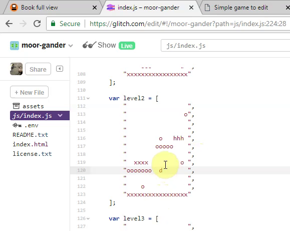

---
# all the regular stuff you have here
zotero:
  scannable-cite: false # only relevant when your compiling to scannable-cite .odt
  client: zotero # defaults to zotero
  author-in-text: false # when true, enabled fake author-name-only cites by replacing it with the text of the last names of the authors
  csl-style: harvard-cite-them-right # pre-fill the style
layout: post
number-sections: true
categories: chapter
title:  6. Findings - Game Design Patterns
---
-   [Findings: Game Design Patterns](#findings-game-design-patterns)
    -   [Introduction](#introduction)
        -   [Recapping the framing of GDPs within activity theory
            concepts](#recapping-the-framing-of-gdps-within-activity-theory-concepts)
    -   [The role of GDPs in the personal appropriation of concepts and
        processes](#the-role-of-gdps-in-the-personal-appropriation-of-concepts-and-processes)
        -   [The role of GDPs in the personal appropriation of concepts
            and
            processes](#the-role-of-gdps-in-the-personal-appropriation-of-concepts-and-processes-1)
    -   [GDPs used in the process of guided
        participation](#gdps-used-in-the-process-of-guided-participation)
        -   [Use of a menu of GDPs to assist project navigation and use
            of
            documentation](#use-of-a-menu-of-gdps-to-assist-project-navigation-and-use-of-documentation)
        -   [GDPs used to scaffold ideation and prioritisation
            processes](#gdps-used-to-scaffold-ideation-and-prioritisation-processes)
        -   [GDPs aiding the process of division of
            labour](#gdps-aiding-the-process-of-division-of-labour)
    -   [Use of GDPs in the cultural plane / community level of
        activity](#use-of-gdps-in-the-cultural-plane-community-level-of-activity)
        -   [The role of GDPs to facilitate learners to design for
            others](#the-role-of-gdps-to-facilitate-learners-to-design-for-others)
        -   [The cultural propagation and evolution of GDPs
            concepts](#the-cultural-propagation-and-evolution-of-gdps-concepts)
        -   [GDPs can facilitate the use of wider repertoires of
            practice, interest and funds of
            knowledge](#gdps-can-facilitate-the-use-of-wider-repertoires-of-practice-interest-and-funds-of-knowledge)
    -   [Discussion](#discussion)
        -   [Developing flexible fluency](#developing-flexible-fluency)
    -   [Conclusion](#conclusion)
    -   [Footnotes](#footnotes)

# Findings: Game Design Patterns

## Introduction

In the previous chapter, I outlined the evolution of tool use across the project, emphasising emerging tensions in activity. One key outcome of this process was the role of gameplay design patterns (GDPs), which initially emerged through participant suggestions in P1 and were subsequently integrated into a range of scaffolding strategies. These included quick-start activities, instructional tutorials, and code snippet examples, providing graded steps into game-making practice.

This chapter shifts focus to the perspectives of participants, using recorded video data and transcript analysis to interpret their varied uses and adaptations of GDPs. In doing so, it addresses RQ2: *How can the use of a collection of game design patterns support CGD&P, in particular in relation to abstract and concrete dimensions of existing pedagogies?* While software design patterns typically group a description of intended behaviour with a suggested structural solution, often accompanied by worked code examples (see Chapter 2), their educational application remains under-explored. Existing studies have considered game design patterns as tools for co-design [@eriksson_using_2019] or as scaffolds for simulation-based transfer of conceptual knowledge [@repenning_scalable_2015; @basawapatna_using_2010]. However, little research has examined their potential to support emerging communities of text-based game creators, particularly in overcoming structural and cultural barriers to creative coding. This chapter addresses that gap.

To support the analytical process of this chapter, GDPs are here framed as a form of germ cell, a concept drawn from activity theory to describe a unit of practice that holds the potential for expansive transformation [@blunden_collaborative_2014]. In this context, GDPs function as small but generative design elements that can be reappropriated, extended, and combined in ways that support both individual learning and wider shifts in community activity. Their varied use by participants, and their role in shaping trajectories of action and interaction, are explored through observational and transcript-based data.

To interrogate the varied use of GDPs, Rogoff’s three planes of analysis (personal, interpersonal, and cultural) are used. This framework informs the structure of this chapter. It begins by examining the role of GDPs in individual appropriation of key game-making practices. It then moves to examine their interpersonal use within shared documentation, guided participation, and evolving division of labour. Finally, it considers the cultural dimensions of GDP use, including the propagation of patterns, norming of community practices, and the embedding of cultural repertoires. A discussion section follows, connecting these findings to existing research and conceptual debates.

### Recapping the framing of GDPs within activity theory concepts

<!-- PICK ONE - EXPLORED IN CH.3 TOO.& CH.4
While the concept of germ cell / unit of analysis a is more typically used in a larger scope of societal or institutional activity, the principles driving its utility apply at a smaller scope.   -->

Activity theory sees the object of activity as a complex construct: in this case, it includes digital, physical, and conceptual elements. It includes the use of software tools to develop code and assets, physical computers for coding, and the varied motivations of participants. The role of game design patterns within the overall activity can be understood as both a design goal to be implemented and a mediational strategy for learning and participation.

In this chapter, as explored in Chapters 3 and 4, I analyse the use of GDPs within both a wider scope of activity systems where participants operate as collective subjects, and at a smaller scope where pairs or individuals are the subjects of activity. However, even within this smaller scope, the object of activity remains complex. To provide additional clarity, the action of implementing a game design pattern is also treated as an important unit of analysis. Participants are focused on implementing or adapting a design pattern in their own game. This allows for analytical clarity and supports the argument that GDPs served not only as pedagogical scaffolds but also as conceptual anchors for the intervention's iterative development.

The analysis that follows is organised using Rogoff’s three planes of analysis [@rogoff_observing_1995] [^r3]. This chapter provides evidence and analysis of how GDPs function across these planes, acting as mediational tools that support individual game-making ability, shared practice, and broader community development. Each theme is developed in turn in sections that begin with examples from participant activity [^3p], followed by further analysis and discussion.

<!-- For a study of this nature, too broad an analysis risks insufficient detail to allow replication, too narrow risks being overly context dependant and limiting the potential for wider application. -->
<!-- As the design progressed, it became useful to analyse smaller units of activity.  -->

<!-- I NOW DON'T DO THIS. - MOVE DISCUSSION OF WHY TO CH.4.  -->
<!-- Following Barab and colleagues [@barab_using_2002], who justify the analysis of nested systems in technology-rich environments,  -->

<!-- IS NOW NO LONGER NEEDED? - At this level, the subject might be an individual or a parent-child pair working to modify a specific feature within their game. One advantage of this scale is the ability to closely examine the mediating role of tools and the shifts in object of activity that arise from contradiction. -->

<!-- By analysing these game design pattern implementations as distinct activity systems, it is possible to trace how the changes made at the individual level feed back into the broader community practices, influencing both the technical and social aspects of the learning environment.
NO - NOT REALLY - IT'S NOT CLEAR HOW TO DO THIS THAT WHY I DROPPED IT.

{width=95%} -->

<!-- MORE DETAIL - DIFFERENT COLUMNS - NAME ON RIGHT.
MOVE LATER  -->

<!-- The approach of this chapter underpinned by an argumentative grammar that draws together key concepts from DBR and CHAT: iterative cycles of transformation, the surfacing of tensions between systemic elements, the role of secondary stimuli and affordances in mediating participant agency, and the developmental process of rising to the concrete through exploration of a germ cell. -->

<!-- A key outcome of the design process was the introduction and later development of gameplay design patterns (GDPs) as both a practical scaffold and a conceptual structuring tool. Emerging first as a response to contradictions in Phase 1, GDPs became increasingly central to the learning design and the coordination of documentation, gameplay, and peer support practices. -->

<!-- INCLUDE A MERGED DIAGRAM IF THIS IS REALLY HELPFUL BELOW. -->

<!--
_extending the use of GDPs beyond the initial use to diverse mediational uses and component parts of emerging making repertoires & Identifying GDPs as a germ cell/ unit of analysis_ -->

<!-- NOTE - IN CHAPTER 4 - OR HERE - MAKE THE LINK BETWEEN THE THREE PLANES AND THE UNITS OF ANALYIS . -->

<!-- The following sections explore the variety of uses. A final section of this chapter analysis how this proposition of GDP as germ cell fits within a CHAT analysis.    -->

<!-- These include: use as part of meditational strategies by participants and facilitators and as shared objects between participants, facilitators and peers -->

<!-- While these approaches are  distinct in their pedagogical use, they stemmed from the same germ-cell activity of altering the game through the use of game design patterns via varied means.  -->

<!-- -  design patterns in learning design which exist at different scopes of activity [@mcandrew_patterns_2006].(CHECK THIS) -->
  <!-- - how design patterns interplay with design principles and how the process relates to design based research  [@linn_science_2006]. -->

<!-- While this concept of germ cell / unit of analysis a is more typically used in a larger scope of societal activity, the principles apply this smaller scope.  -For a study of this nature, too broad an analysis risks insufficient detail to allow replication, too narrow risks being overly context dependant and limiting the potential for wider application. -->

<!-- ### Descriptive Commentary on Vignette 2  IT WAS EXTENSIVE - REMOVED FROM V2-->

<!-- Integrate LATER
Using the terminology of Leontiev [-@leontiev_activity_2009], Toby can be seen undertaking chains of processes in a fluid way, indicating that these actions had become operations. The following sections extend this analysis by exploring three core areas of contradiction that shaped the evolving learning design. -->

## The role of GDPs in the personal appropriation of concepts and processes

<!-- As such, the design of this study does not fully address the exploration of the personal appropriation plane of activity.  -->

<!-- In a classroom setting, group activity would likely incorporate a structural motivation to understand and utilise knowledge related to computational thinking concepts or similar curricular content.   -->

<!-- To avoid duplication with community processes and given the overall focus on social and cultural domains in thesis given the deficit in this aspect compared to studies exploring , this section follows -->

Kafai and Burke's review [-@kafai_constructionist_2015] notes the greater number of studies focus on personal dimensions of learning programming and curricular knowledge compared to the deficit regarding social and cultural aspects. Personal appropriation is described in of Kafai and Burke's [-@kafai_constructionist_2015, p.4] review of CGD&P  as "knowledge appropriation and transformation that is instantiated in the process of making games". Rogoff's interpretation of personal appropriation is more complex communicating the bi-directional nature of the process where individual interpretations of community gained knowledge is remediated and fed back into the community. The evolving  learning design process resulted in activities which align well with the exploration of computational thinking, systems concepts and other computing concepts and procedures.

Acknowledging the broad coverage of existing research covering this aspect of CGD&P, this section is limited in scope and aims to contribute through a narrow focus on code patching and subsequent debugging, and the development of digital literacy skills. I have chosen these areas as there were a subject of several observations provoked by the innovative characteristics of the learning design of this research.

Addressing digital and web literacies first, to integrate new gameplay design patterns or adapt existing ones in their games, participants needed to develop foundational digital skills related to using a desktop personal computer and use of internet browser and online tool ( see Chapter 1 and  Appendix C.dliteracy). The the following vignette extract features a mother Madiha and daughter Nasrin [^v5].

    Madiha has just finished created a pixel art sprite of an alien and comment, "We’re finished. Right what’s next? Now I’m an expert pixel? Now I have to figure out how to get it in there don’t I? Without losing it I’ll be very upset." Madiha's emotional investment in her creative prompts Sonia, a fellow parent, to comment: "Have you saved it?" Unsure of how to transfer the image from the online image editor the glitch coding environment, Madiha seeks assistance from her daughter:   

    Madiha: Nasrin! Nasrin! Nasrin! Do you know how to get it in the game?
    Nasrin: Oh my god!
    Madiha: Well . First of all save it to the gallery. How do you save it? Ah there you are. Save it. Is it saved? Right now export it.
    Nasrin: Do you even know what export means?
    Madiha: I know what export means!
    Nasrin: Ok then, smarty-pants.

<!-- In another example, changing pen colours in the graphical tool is a process that Nasrin(c) has already internalised and performs effortlessly, whereas Madiha(p) is still deliberately working to build her competency. Nasrin(p) has fully operationalised the process, incorporating it into her repertoire of practices. -->
### The role of GDPs in the personal appropriation of concepts and processes

<!-- As such, the design of this study does not fully address the exploration of the personal appropriation plane of activity.  -->

<!-- In a classroom setting, group activity would likely incorporate a structural motivation to understand and utilise knowledge related to computational thinking concepts or similar curricular content.   -->

<!-- To avoid duplication with community processes and given the overall focus on social and cultural domains in thesis given the deficit in this aspect compared to studies exploring , this section follows -->

Kafai and Burke's review [-@kafai_constructionist_2015] notes the greater number of studies focus on personal dimensions of learning programming and curricular knowledge compared to the deficit regarding social and cultural aspects. Personal appropriation is described in of Kafai and Burke's [-@kafai_constructionist_2015, p.4] review of CGD&P  as "knowledge appropriation and transformation that is instantiated in the process of making games". Rogoff's interpretation of personal appropriation is more complex communicating the bi-directional nature of the process where individual interpretations of community gained knowledge is remediated and fed back into the community. The evolving learning design process resulted in activities which align well with the exploration of computational thinking, systems concepts and other computing concepts and procedures.

Acknowledging the broad coverage of existing research covering this aspect of CGD&P, this section is limited in scope and aims to contribute through a narrow focus on code patching and subsequent debugging, and the development of digital literacy skills. I have chosen these areas as there were a subject of several observations provoked by the innovative characteristics of the learning design of this research.

Addressing digital and web literacies first, to integrate new gameplay design patterns or adapt existing ones in their games, participants needed to develop foundational digital skills related to using a desktop personal computer and use of internet browser and online tool ( see Chapter 1 and  Appendix C.dliteracy). The the following vignette extract features a mother Madiha and daughter Nasrin [^v5].

    Madiha has just finished created a pixel art sprite of an alien and comment, "We’re finished. Right what’s next? Now I’m an expert pixel? Now I have to figure out how to get it in there don’t I? Without losing it I’ll be very upset." Madiha's emotional investment in her creative prompts Sonia, a fellow parent, to comment: "Have you saved it?" Unsure of how to transfer the image from the online image editor the glitch coding environment, Madiha seeks assistance from her daughter:   

    Madiha: Nasrin! Nasrin! Nasrin! Do you know how to get it in the game?
    Nasrin: Oh my god!
    Madiha: Well . First of all save it to the gallery. How do you save it? Ah there you are. Save it. Is it saved? Right now export it.
    Nasrin: Do you even know what export means?
    Madiha: I know what export means!
    Nasrin: Ok then, smarty-pants.

The implementation by Madiha of the GDP of adding a new hazard element into her game drives the development of these technical processes, and facilitates a process of accessing help to do so. Thus, in this process, GDPs functioned as both motivational and conceptual tools facilitating the application of technical processes. More broadly, video data showed, participants developing fluency in areas such as browser tab use, creating, uploading, and integrating graphical and audio assets, and proficiency in keyboard and mouse use for text manipulation [^op].

<!-- Similarly, in section V5.d, Madiha receives help from a peer, Ed, in using the cropping tool to remove redundant space at the edges of sprite characters after he playtests her game. -->

<!-- GDPs also functioned a container for structured project stages, facilitating the initial use of procedures as illustrated in this section using the example of code patching.  -->

This section now turns to the role of GDPs in relation to the practice of _code patching_ and tactical responses to coding errors. Code patching is a professional technical process to scaffold the application of new features in computer programming [^ccp]. This patching process became an important technique of the learning design and supporting resources documentation. The following extract from Vignette 1 shows an example of code patching in practice [^v1].  

<!-- MOVE?
Video evidence and observational journal notes highlight the potential of coupling code implementation with target behaviour, structured within a framework of GDPs. -->

<!-- INSERT SHORTER VIGNETTE HERE. ADD ONE WITH TIMED DETAIL? -->

    Toby finishes playtesting and navigates to the page containing a menu of game design patterns [^ggcm]. He navigates to a code snippet project illustrating a game mechanic of a moving enemy. He takes time to examine the start of code carefully. Toby then clicks on the tab of his own game code and examines how it is different. He returns to the example code and scrolls down and examines the code needed to patch into his game and after hesitation he returns to copy the full code needed from the example. He then navigates to the same section of his own code project template. Carefully pasting the code into the right area and check the result, correctly showing a new enemy moving back and forth horizontally. Toby playtests his game and struggles to get past this new enemy. He tentatively alters parameters of the code and seemingly inadvertently changes the direction of the  movement of the hazard to vertical. He laughs and comments to his family: "Mine's just going up and down! Granny! I've got mine to up and down." Later iterations to his code over the next 30 minutes include changes to allow different moving enemies for each level, and changes to the movement parameters of the enemy of level 2 (see Vignette 1 for more detail).

<!-- {width=95%} -->

<!-- at the following location https://glitch.com/edit/#!/sgte-example-moving-enemy?path=js%2Fgame.js%3A1%3A0
and the documentation is here
https://3m.flossmanuals.net/#game-mechanic-add-moving-enemies
-->

Toby shows great increasing fluidity in the process of navigation of between documentation, code and game preview windows. By way of contrast his use of supporting documentation to undertake the code patching process is still hesitant and intentional. Debugging is both motivated and facilitated by the participants strong understanding driven of what the desired GDP should provoke in the target behaviour of the games. The need to get both the starting and ending position of the movement of the imported enemy provokes several iterations of debugging [^db]. Although both starting template code and additional snippet based code was provided, mistakes occurred due to errors in placement and in making additional customisations, as in the example above. The process of code patching process often provoked errors within resulting game output in the form of  _glitches_ [^gl]. In my facilitator role, when this happened, I tried to mobilise participants existing knowledge of their chosen GDP behaviour compared with the erroneous behaviour of the glitch, sometimes using humour when pointing out the glitch within this process as a strategy to mitigate the potentially frustrating process of debugging.

<!-- DEVELOP GLITCHES / ERROR TYPES TO MAKE STRONGER IF NEEDED? -->

Turning to a wider analysis of the process of personal appropriation of knowledge within the game making process, I was inspired by the the process and rationale of Bevan and Petrich's [-@bevan_learning_2015; -@petrich_it_2013] work who created a map of learning dimensions to support facilitation of seemingly chaotic tinkering and making processes in museum contexts. During data analysis, the process of attempting a systematic coding scheme resulted in a growing list of curricular, conceptual and practical constructs. While this list was not used fo systematic coding as explained in Chapter for, I returned to it in later phases of the design process[^p45], when looking to adapt this learning design to a more formal environment in mind. This list formed the basis for a map of curriculum-oriented concepts that suited exploration via in the game making process described in this research. It is included here as Table 6.x.[^ld1]

| Computational Thinking  | Coding Concepts    | Systems Patterns    | Design and Technical Practices|
|--------------|--------------|-----------|------------|
| Abstraction | Sequences | Systems Elements      | Goal Setting        |
| Decomposition | Variables      | Systems Dynamics  | Being Incremental and Iterative       |
| Pattern Recognition | Logic | Reinforcing Feedback Loops      | Developing Vocabulary        |
| Algorithmic Thinking | Loops | Balancing Feedback Loops      | Web Literacy (as a subset of digital literacy)  [^moz] |
|  | Arrays |       | Code patching       |
| | Creating Functions |       | Version Control    |
| | Change Listener |    | Debugging   |
| | Input Event |   | Reusing and Remixing      |

Table 6.x. Learning dimensions facilitated by this study's game making process

The map of learning dimensions above includes a balance of skills, concrete and more abstract aspects of coding concepts [^ld]. The creation of a provision of these learning dimensions aims as a supporting resource aimed to help future teachers and facilitors locate curricular value within the game making process and to to address tensions in the integration of concepts into an complex making process. The approach specifically addresses a paradox common in application project-based approaches in more formal settings, the tension between the an exploratory learning approach and a possibility or need to align with curricular concepts [@hoyles_pedagogy_1992]. I propose that this tension, named the _play paradox_ by Hoyles and colleagues [-@hoyles_pedagogy_1992], can be addressed by orienting the learning map to follow a leading activity of the learning design aligned with the goals of the participants, in this case to add GDPs to the game.  

<!-- COME BACK TO THIS - HOW WHAT DOES THIS MEAN? -->

However, in this informal learning context, the overall motivation of participants was on having fun while making an engaging game together rather than explicitly developing to knowledge linked to the computing curriculum, reflected in the overall orientation of this thesis. In this context, the play paradox is less extreme and my approach to the learning design, facilitation and to the methodology of this study reflects this.   

In summary, this section has provided a selected overview of examples of the personal appropriation of knowledge and processes being driven by the implementation of GDPs. The observations reveal a complex, interdependent relationship between GDP concepts and emergent technical processes. The map of learning dimensions that emerged from inductive and deductive stages of thematic analysis, presented in Table 6.x, contains indications of tensions related to abstract and concrete aspects of knowledge within the implementation of GDPs. These tensions are beyond the remit of this section but are explored in Chapter 7.

<!-- **Signposting to fuller exploration of resolving play paradox in Appendix D.? and in Chapter 7.** -->

<!-- RECALL END OF CH.5  - I THINK THIS IS IN CH.7
It is of value to compare the observational process of creating the learning map to the more intentional, concept-driven design approach described in research on Microworlds, which foregrounds the role of learning designers in shaping the affordances of (playful) learning environments to steer learners toward exploring curricular concepts. -->

<!--
RECALL END OF CH.5
In much of the Microworlds research, these are Acknowledging the broad coverage of existing research covering this aspect of CGD&P, this section is limited in scope and aims to contribute through a narrow focus on code patching and subsequent debugging, and the development of digital literacy skills. I have chosen these areas as there were a subject of several observations provoked by the innovative characteristics of the learning design of this research.often scientific or mathematical concepts: take, for example, geometry in Turtle computing with the LOGO language [@ernest_whats_1988]. T

his design has used several structural constructionist techniques involved in designing Microworlds [@laurillard2020significance], however, as the principal motivation of this study is acculturation within a game-making community, my focus has prioritised procedural skills that facilitate community participation over underlying subject related concepts. -->

<!-- DEVELOP THIS -  
For example, In Vignette 5, the goal is to get the image created into the game. -->

<!-- Specifically there was no testing involved and the interview focus was on socio-cultural aspects.  -->

<!-- In P4 aGiven the potential to adapt this learning design to a more formal environment to address the needs outlined in the introductory chapter, from P2 onwards I began to augment the learning design to suit curriculum-oriented teaching and assessment of computational thinking concepts and skills,  -->

<!-- I return to this subject in Chapter 7.  -->
<!-- RETURN TO THIS TO REPRESENT SOME OF THE CHALLENGES AND DIFFICULTY OF SWIMMING AGAINST THE STREAM IN TERMS OF COMMODIFICIATION OF TOOLS -->

<!-- One area in particular stand out: code patching technique and debugging types of coding errors. This is chosen as an under-researched inclusive practice which merits further investigation (include in Chapter 2). -->

<!-- Evidence of personal appropriation in video data was not be limited  to those suited to a curricular purpose outline in the table,  many of the behaviours explored in this chapter show both the appropriation and feeding back of varied understandings of game design patterns and design practices and skills.  -->

<!-- MOVE?
A summary of a book chapter [@chesterman_game_2023] exploring these issues with recommendations for practitioners is included in Appendix.learningmap. -->
<!-- NOTE - (Additional examples may be included in Appendix.learning) -->

<!-- ### The interrelationship of GDPs and the development of personal appropriation of skills and processes -->

<!-- Due to limited scope of this section I prioritise an analysis here of the technical practices of web literacy,code patching and debugging.  -->

<!-- While the above learning map is relevant to the overall process of game making. The main focus of this chapter is the exploration of diverse uses of GDPs within this activity, as such I now explore the motivational and mediational uses of GDPs in this personal plane.  -->
<!-- These processes were sometimes introduced in a basic form through scaffolded activities, supporting documentation, or informal interactions between peers. The following observations illustrate how introduced processes were adapted and modified by the community. -->
<!-- In line with Rogoff's understanding of personal appropriation as a bi-directional process, where the appropriation of personal knowledge is shaped by and contributes to a broader sociocultural context, participants actively contributed their interpretations of knowledge back into the communities they belonged to. -->

<!-- As a facilitator (see Appendix.patching), I made explicit the path between choosing a pattern to work on and the mechanics of accessing documentation and the code patching process.  -->

  <!-- Madiha also benefits, the expertise of her child to undertake that process is added to her distributed toolset. However, she is also keen to develop her own competency as indicated by her asking child to explain the process. -->

  <!--
  NOTE - IS THERE ARE GOOD PLACE FOR THIS IN APPENDIX?
  Some examples contain processes that are linked to the language and the concepts and player experience of GDPs, for example the use of GDP language of hazards and rewards (see extract).

  Other examples are more secondary where the emerging processes and adoption of language concern more to do with more general digital design,  which are needed due to the process of implementing game features - which are in this case structured via GDPs. -->
  <!-- by making a distinction between primary and secondary involvement of GDPS in technical processes. -->
  <!-- Thus while the concepts of GDPs are some times useful to explain a technical concepts directly, especially where direct / immediate feedback involving concrete example of experience are relevant, at times the process in more indirect. -->

  <!--
  MOVE TO TECHNICAL IF NOT ALREADY HTERE
  Playtesting also helped propogate emerging practices. For example, after testing Mi's game In the example above after comments on the jump speed Ed continues.

     Ed: How much jump speed to you have?
     Ed: Your jump speed is massive.
     Ed gives advice about tidying up the sprite outlines.
     Ed: for people with background like yours You can use the “cramping tool””
     Mark  and Ed then explain – SEE THEIR RECORDING
     So that the background is clearer.

  While Ed has only just been introduced to the ability to "cramp". He is happy and able to share this useful tool with Mi. Theme -->

  <!-- NOTE - In vignette 4.a.5 -->

<!-- This is not to say future iterations of this design could not facilitate the exploration of abstract concepts more explicitly. For example, there is significant potential to explore systems thinking concepts (see appendix.map). Indeed, similar work using the Game Start Mechanic software takes such an approach. -->

<!-- NOTE Check is there  STILL material to  INTEGRATE FROM Appendix.debugging -->

<!-- - Question - do more useful / less de-motivating errors result from remixing and game patching?
- Question - what impact does the process of being driven by GDPs have on how users deal with errors?
  - For example does the closely paired code structure and game output help with motivation?
  - How do you develop a more granular sense of the kinds of blocks, errors and how to overcome them. -->
<!--
#### Link to next section -->

<!-- **GDPs encouraging sharing of technical practices:** References to such emerging technical practices were present in many exchanges during playtesting of implementations of GDPs. -->

<!-- This exploration focuses on the potential of the 3M learning design rather than making claims on the suitability to develop CT via game making which is explored extensively in other research. -->

<!-- The process of reusing and modify code to create a computer game can surface both abstract and concrete computing concepts present in the concrete application of code that have emerged organically at different stages of the creative process. -->

<!-- The ongoing reflection provoked by the process of privileging social and cultural aspects of the game making activity has yielded more philosophical questions in relation to the learning process which are explored in the following discussion section. -->

<!-- Here learner agency is transformative not only of personal dimensions of learning but also the cultural setting, practices and tools available to learners. The process of playtesting other games allowed participants to share their on emerging interpretations of game making concepts like game feel and challenge without being directly taught. Further, the community sense of what is appropriate of fun evolves as mutually and therefore cannot be taught explicitly. -->

<!-- As explored in the design chapter, later revisions of the design of supporting materials for each GDP included links to online descriptions of design, systems and computational concepts. Thus, beginning with experience and progressing to analysis in a sway that mirrors reflective professional practice. However analysis of my journal entries show  -->

<!--
SHIFT LATER?
As previously explored I had a reluctance to shift learners away from the practical implementation of repeated game design patterns to focus on more abstract, de-contextualised conceptions of the knowledge. My concern hinged on the potential disorientation of imposed shifts of focus between different stages of creation the object of their activity shifts from the larger goal of making an engaging game to a narrower goal of implementing a game des, would require ign pattern and the technical actions and operations needed to complete it. -->

<!-- The varied use of the collection and individuals gameplay patterns and concepts, can be examined using the lenses of the MDA framework.  
- Home knowledge of mechanics drove many of the requests for GDPs from popular medium of retro games  
- The norming practices often focus on the game feel, which relates most directly to the dynamics lens.  
- Aesthetics and the end user experience motivated some users greatly, while it is not clear if this game code changes in this dimensions fully constitute a gameplay design pattern, they are an important inclusive element of the design. -->

## GDPs used in the process of guided participation

This section explores how GDPs feature in interpersonal interactions, particularly as tools that support guided participation in collaborative tasks. Drawing on video data, I examine how GDPs mediate shared activity, especially in exchanges between children and parents. Three categories are highlighted: the use of the provided GDP menu and documentation, GDPs as tools for project ideation and prioritisation, and their role in shaping the division of labour.

<!--
This section examines data on the use of GDPs from the perspective of interpersonal interaction. Here, the process of being guided into planned activities or peer collaboration is exploratory, contributing to interpersonal processes that facilitate the completion of tasks. As outlined in the previous section, personal understandings of knowledge can be observed within these interpersonal interactions, particularly in exchanges between parents and children. Based on observations of video data, I describe how GDPs are employed in diverse mediational strategies.

I focus on three key categories of interaction that incorporate GDPs: the use of a provided menu of GDPs and supporting documentation, the role of GDPs in project ideation and prioritisation, and their function within the division of labour.

NOTE - MENTION THE MENU GUIDED BY  ME - THUS MY INPUT INTO GUIDED PARTICIPATION .
-->

<!-- In particular how , ideation, division of labour and prioritisation, and the adoption of technical processes intersect with the use of GDPs. -->

<!--
NOTE THIS HAS BEEN REMOVED
## The use of GDPs examined from an interpersonal focus
This section examines the use of GDPs to facilitate guided participation via interpersonal interactions in game making. Guided participation in this context involved, guidance on organising design activities, various forms of problem solving and help to shift design perspectives. While the primary source of material is from pair interactions between children and parents, at times peer interaction between non-pairs developed into guidance. For example, in the in the example above where Toby provides assistance for Bertie  in adding levels to his game
. -->

### Use of a menu of GDPs to assist project navigation and use of documentation

<!-- STRUCTURE VIA THIS MINI TEMPLATE

Mini-intro: What’s being explored and why it matters
Empirical evidence: Table or vignette extract
Interpretation: What it shows (use, affect, interaction)
Variation: What didn’t happen or where it differed
Commentary: Brief theoretical reflection or methodological note
Bridge or close: One-line takeaway or link to next section -->

In this section, I outline findings on the use of GDPs within the group to mediate the process of accessing and using project documentation. Chapter 5 described the introduction of a curated collection (menu) of gameplay design patterns to address the tension between participants' choice and the need for documentation to support the technical implementation of code structures.

<!-- My design input here can be seen through the lens of Rogoff's  [@rogoff_observing_1995] three planes interpretation as a form of guided participation [^cgp]. (DEVELOP SLIGHTLY OR DROP) -->

The following extract from Vignette 2 concerns a family that had taken a methodical approach to accessing documentation. In the minutes leading up to the extract, Susanna (parent) was attempting to implement a key and door mechanic to the game. Meanwhile, Tehillah (child), unable to do such coding or debugging, expressed boredom [^kd]. Susanna(p) [^ip] had been following the step-by-step written instructions but when she was unable to progress, she sent Tehillah(c) to get my help. I then worked closely with the parent to identify a syntax problem in the code.

| **Dialogue** | **Activity** |
|--------------|--------------|
| Susanna(p): Thank you. Did you see Tehillah? Tehillah(c): Did it do it? Susanna: Yes | Mick has just ceded computer to Susanna after solving a problem which had occurred due to |
| Susanna: I’ll reload it. Here you go | Susanna presses refresh key to reload the game |
| Tehillah: (Laughs) | Tehillah moves laptop to point towards her and takes over using the keyboard |
| Tehillah: (Makes excited cat noise) | Tehillah uses arrow keys to control the game and checks if player progression to level 2 is working. She reaches level 2, where there is no door or key. |
| Tehillah: We need a door in this one. I want to make more levels now. So you can put lots of doors and lots of keys. (in a rhythmic voice) Key Door Key Door Key Door (in a sing song voice) Key Door Level. Key Door Level, Key Door Level |  |
|  | Susanna moves computer back to take over the keyboard. She changes browser tab and navigates to the code section for level and component design. |
| S: Well. Where are you going to put your door in level two? Do you want to change the layout at all? | Susanna gestures to screen |
| Tehillah: What’s door? Susanna: d Tehillah: Ok | Susanna doesn’t move the laptop but gets closer to take over the keyboard |
| Tehillah: d. Door right there. | Tehillah inserts a “d” in an array high above a platform |
| Susanna: And where’s the key going? Must be quite hard to get to that door. Key is K |  |

<!-- ADD IN IMAGE   -->

**Table 6.x** – Extract of Vignette 2 showing interpersonal interaction and documentation use.
Vignette 2 follows the parent Susanna's use of a tutorial to address the goal of implementing her child's chosen GDPs. Susanna is limited in her programming skills but avoids seeking facilitator or peer help[^fh]. As such, she independently accesses written step-by-step instructions as a preferred working approach. Susanna leads the process of implementing code changes for patterns chosen by her daughter[^si]. In this way, the pair are able to use the concept of the key and door pattern to help coordinate their project organisation and access relevant documentation. To prioritise participant engagement, supporting documentation avoided a principles-first instruction approach (either to the whole group or to individuals). The use of shorter, just-in-time tutorials was in response to barriers associated with more extensive instruction-based approaches, particularly those related to literacy [@dietz_design_2021; @resnick_coding_2020].

This choice over which pattern to implement appears to have a positive impact on affect, both in the context of this vignette and more generally. Tehillah(c)'s choice over which GDPs to tackle has helped create a personal connection to the game. Her positive reaction in the vignette above, including the naming and rhythmical chanting of “key” and “door,” indicates affective engagement closely tied to her interaction with the GDP concept. There is also evidence of affective engagement in Toby's laughter and calling out to his Granny when getting unexpected results.

I provided participants with a choice of supporting documentation in the form of both step-by-step instructions and code snippets (see Chapter 5). While both forms of documentation follow a structure of close coupling between impact and result, which is core to the use of design patterns in computing education [@gamma_design_1995], this decision resulted in varied patterns of use. In the Vignette 1 extract above, Toby uses the graphical menu of patterns as a starting point to help him to choose, find and implement a GDP feature using supporting code snippets directly. In contrast to Vignette 2, he does not access the step-by-step instructions.

<!-- Later Toby is able to assist others in adding GDPs to their games [^rc2]. POTENTIALLY DROP THIS / MOVE -->
<!-- **Commentary** -->

While the evidence outlined supports the potential of a menu of GDPs to address the tensions between choice-based approaches and the danger of a lack of relevant scaffolding, there are some important clarifications to make at this point. Firstly, not all participants engaged with the menu at all. For example, some participants learn to implement GDPs from peers, a process explored in a later section. Additionally, in Vignette 3, we see Ed let his father take the lead in accessing documentation. Secondly, because the GDP menu (and concepts) were introduced by myself as a navigational and organisational tool for use by participants, it seems logical that participants should use them for that purpose. The danger here is one of circular reasoning in methodology, which needs to be borne in mind when assessing the scope of this research [^gp]. Despite these clarifications, the data clearly shows the utility of the menu of GDPs to directly help some participants — a clear example of just-in-time documentation supporting participant-led learning and providing a foundational source for the later propagation and evolution of GDP practices by participants.

These observations extend current research in this area in relation to the promising work on computational thinking patterns within the scalable game design (SGD) programme [@repenning_scalable_2015]. The structure of SGD and supporting resources was oriented around the motivation of transferability of science simulation concepts (in pattern form) to other science disciplines. By way of contrast, in my research the motivation is to align the structure of documentation to the choices of desired game features made by earlier iterations of participants. In this way, project navigation increases the relatability of the patterns at play. The use of gameplay design patterns [^gpdp] facilitates a tangible coupling between the participant experience of the pattern and the process of implementing it.

### GDPs used to scaffold ideation and prioritisation processes

<!-- Other techniques that leveraged the characteristics of game design patterns to support the ideation process emerged in community design activities. -->
<!-- NOTE - ADD MORE ON GESTURING  -->

This section outlines how the use of GDP concepts and supporting resources structure around GDPs were used in ideation and project organisation. The impact of the provision of the starter game template and menu of GDPs outlined in Chapter 5 changed the nature of the ideation phase by providing technical scaffolding and a limiting structure to particpant design choices.

An exchange from Vignette 3 between participants Ed(c) and Mark(p) shows the use of GDP concepts to help resolve a tension between a more chaotic style of working jumping from one goal to another and a parental motivation to prioritise work more systematically. The pair's initial listing of features is a brainstorming technique using the approximate names of game design patterns (_get the person animated_, _get an enemy in_, _changing the platforms_, _make a theme tune_). Mark becomes _overwhelmed_ with the child's lack of focus on one pattern "_that’s what I mean, you can’t just skip around like that_."[^v3] This use of GDPs to allow the spacial exploration of design in a visual and intuitive way suits being mapped onto paper, or onto graphical software which allows for a similarly rapid prototyping. In a session in P3, Toby uses the code based tilemap tool to design a maze game instead of a platformer game drawing on existing knowledge of tools and home knowledge of the target game genre to rapidly make revisions without extensive planning [^v6].

Other pairs take advantage of paper prototyping. For example, Susanna notices her child's difficulty in using cursor, delete, and backspace keys to edit a matrix allowing level design. In response, the parent provides a book with grid paper to allow the child to replicate the matrix. The parent is then able to transcribe the design to the code example while engaging the child by checking she has interpreted the design correctly. Interview data with Mark and Ed uncovers complexities in the use of both digital and paper prototyping of related to GDPs [^pp].

The following exchange (Table 6.x) captures a moment where the GDP concepts are used to structure a ideation proposing a more radical change of underlying game genre.

| **Dialogue** | **Activity / Notes / Gestures** |
|--------------|----------------------------------|
| Dan (p): Have you thought about pushing it a bit further and have a different style of game? Toby(c): What do you mean? |  |
| Dan: Well the previous style of game was a platform game wasn’t it? You went along and there was gravity pushing down. There are other types of games aren’t there? | Dan makes shape with hands to indicate a platform. Then points downwards to indicate gravity pushing on that platform. Mimics player jumping between platforms. |
| Toby: Pause. I don’t know what to do though. Dan: Well quite, but what other games are there? Toby: I don’t know er. Dan: Well I tell you what... (muffled) Toby: Erm | Toby navigates to webpage menu of GDPs. |
| Dan: So. You played them before didn’t you? Toby: What do you mean? Dan: The flying game, that’s a different kind of game. Toby: Oh, like kind of like moving along kind of thing. | Toby moves hand left to right. |
| Dan: Yeah, and there are games where you are in a world and you have to move around the world like Pac-Man. | Dan points down and moves finger around like an imaginary character moving at right angles. Toby nods. |
| Dan: There are games where things drop down like Tetris. Toby: …game. You could have a game where every 15 seconds, 10 seconds, you could add an enemy to such and such, a random number between such and such. You could block it somewhere. | Dan makes a shape with hand and moves it up and down. Toby holds up hands to indicate a range of parameters as he says “between such and such.” |
| Dan: So instead of... instead of the world… the world being sideways, we could have the world being looked down on. | Dan re-indicates the change of perspective with hand gestures. |
| Toby: Hmm. How should I do this then? Dan: That’s a good question. Shall we ask Mick to see if that would mess things up or not? |  |

Table 6.x  - Vignette 6 Extract.

{width=95%}

In the vignette extract above, Dan(p) helps Toby(c) via guided facilitation to provoke and shape new design ideas using home-based knowledge of GDP mechanics within this interpersonal plane. Dan draws on the game playing experiences to promote innovation in the design of the existing template: "the previous style of game was a platform (makes shape with hands) game wasn't it? You went along and there was gravity pushing down. There are other types of games aren't there?" The pair use their knowledge of game play patterns and genre conventions to discuss breaking out of the genre constraints of starting template.  Here they are charting new territory beyond the curated choices of GDPs and as such we see them developing a new shared vocabulary to express concepts. Both Dan and Toby make extensive use of gestures in their interaction reinforces their spoken references to GDP concepts.

The  research by Erickson [-@erickson_lingua_2000] and Erikisson [-@eriksson_using_2019] (two different researchers) who detail use of design patterns and GDPs in particular, as a lingua franca to facilitate collaboration within design processes. The observations of this section (and the chapter more generally) support and extend existing research on the utility of collective, emergent use of pattern languages within communities working on projects. Here, data shows this potential for GDPs within ideation, prioritisation and clarification. It indicates that as well as a verbal lingua franca, GDPs can be a valuable component of gestural interaction, and visually-oriented prototyping tools, be they digital or paper based.

<!-- IS SOME SYNTHESIS NEEDED TO END THIS SECTION? -->

<!--
GET A BETTER SCREEN SHOT OF THE CHANGED DESIGN TOBY ETC IF NEEDED.

 -->

<!-- NOTE - RETURN TO THIS IN ANALYSIS OF TADS - -->
<!-- - in planning stages the parent provides scaffolding to help the child.
When GDP was completed and participant or pair move to a new phase there is evidence of a reenergising effect.
More on role of parent and child to negotiate approaches which maximise engagement / progress / keep flow .
Somethinkg about more direct link between code and output. - as with block coding - this is an intermediate step.
-->

<!-- THIS IS MORE ON A COMMUNITY LEVEL - AND TECHNICAL PERHAPS MOVE
In Vignette 5.d, where the parent Madiha wants to export an image from the graphical editing tool and to import this into the game, shows an evolving use of some of the terminology that has been introduced partly by facilitator interventions and partly emerging organically through community interaction. the terms here are used first to request help, and then to discuss emerging community norms. -->

<!-- OTHER DATA ON GDP AS LINGUA FRANCA AT VARIOUS STAGES. -->
<!-- In this interaction above which was used to illustrate Madiha and Nasrin's division of labour, the parent is focused on completing the action of creating a graphical asset of a hazard as part of the activity of adding the GDP of including a hazard into the game. -->

<!-- Mark: I’ve brought the music, and also we could just concentrate on one thing and just change that. You know, keep working through.
Ed: Yeah. I think I want to get an enemy in - oh no - my person animated.
Mark: So you want to get your person animated that’s the main thing.
Mark: Shall we concentrate on that and changing the platforms into something different? -->

### GDPs aiding the process of division of labour

<!-- NOTE - DIVISION OF LABOUR IS IN THE NEXT CHAPTER TOO - REWRITE BASED ON GDP ONLY CONTENT
CHECK FOR OVERLAP-->

<!-- NOTE  dol and identities.
Skills to perform these activities were at often distributed between different family members. For some adult re-enforcing their identities as project managers, and for young participants forming identities as digital specialists.  -->

I now turn to the use of GDPs within processes of division of labour, a process which as in the previous section, involved their use in an emergent form of communication to construct shared language and understanding [@erickson_lingua_2000]. I begin with data in the form of several vignette extracts and additional description in sucession before proceeding to commentary and discussion.
<!-- The examples below illustrate part of some of the varied strategies to divide labour adopted by participants at times involving complex tensions in activity.  -->

Susanna(p) and Tehillah(c) working process relied on the parent to do the majority of code implementation on one shared one computer. The parent took a lead on many activities but took care that the pair alternated between use of keyboard and mouse. This provided the child  with hands-on experience when possible, particularly in level design activities and playtesting [^st1]. In interview data, the parent notes _"I resist the urge to fix things immediately when she (Tehillah(c)) struggles."_  Another exchange from Vignette 2 is described below.  

    Tehillah(c) uses the name of a GDP within a request for her parent to take on a specific task within their making process, "Go on then. Key-Door person." When the parent expresses confusion about what this statement means, Tehillah gestures with her hands to indicate that her mother is the person she is referring to. The child appears to consider the level of complexity needed to add a new pattern into the code to be beyond her ability and thus directly delegate the task to her mother.

At times, Susanna asked Tehillah to seek help from facilitator. On another occasion when the child appeared bored of waiting for parent to solve a code problem, she approached the facilitator to ask for help on behalf of the adult without prompting. Tehillah  also carried out more peripheral activities such as watching older children playtest each others games, or observing community activity from under the table.

Toby adopted different working arrangements dependent on which family members he attended with. In P1, his mother worried she had abandoned him as she worked on the game code while he concentrated on graphical assets (where in evidence?). In P2 Toby had created his own game, coding mostly alone but situated next to his grandparents who provided attention and support (see Vignette 1). In P3, he worked in a pair with his father (Dan) in closely guided practice (see Vignette 6 and shorter extract as Table 6.x above). Toby and Dan's pair process was more guided and focused than many other participants and includes accessing professional documentation and Dan guiding Toby in exploration of computational thinking concepts [^eg6]. Analysis of the interaction in the session of Vingette 6 shows an emerging pattern.

    Dan (p) starts as a facilitator, taking a lead from the direction of the child. As Toby(c) reaches the limits of their ability, he begins to be more directive, by asking leading questions and testing existing knowledge. Finally, in order to complete the programming or research tasks beyond the child's knowledge, the father is more direct in instruction, directing the research and proposing a coding solution for their new game design pattern.

Madiha's(p) family Nasrin(c) and Zidane(c) are all working on separate games on different computers. While Madiha sits next to Zidane who needs closer support, Nasrin often sits close by but next to a friend. The following is and extract from  Vignette 5,

    Madiha calls across the room to draw on Nasrin's help to correct a design mistake.  Nasrin appears reluctant to explain the technical processes she uses to help her mother:  "Madiha (to Nasrin): What are you doing? You have to tell me what you are doing so I can do it myself." Nasrin undertakes a process of using the graphical editing tool. "Madiha: How did you do that so quickly? I’ve got to like, carefully..." As she speaks, Madiha makes hand gestures to show a sense of hesitant keyboard use. In response, Nasrin bounces up in place and smiles broadly.

Madiha(p) and Nasrin(c) at times reversed the parent helping child relationship. On request, Nasrin would reluctantly carry out the required technical elements of GDPs implementation on the parents game code. However, she would not explain the process of the changes needed, seemingly enjoying the power of knowing something that her mother didn't. Vignette 5 shows Madiha(p) building an emerging identity as a graphical asset designer, compared to other coding tasks, this is something that she does want to build her competency in. Nasrin affects reluctance in her support of her mother, but at other times shows that she enjoys her status of technical supporter (see reflective commentary in Vignette).

In Vignette 3, Mark(p) and Ed(c) break out of a dysfunctional division of labour in the penultimate session of P2 [^pl].  

    For much of the first part of the session Mark takes a significant amount of time puzzling over documentation on how to add animation to a character. He reads aloud from documentation. "Mark:. In the create function...". He breaks off to comment on the difficulty involved. "Mark: Quite complicated. But we can do it. But it would mean a lot of mucking around....It’s like a project in itself really."  Ed is left inactive and seemingly address this tension child proposes dividing their labour and working on two separate computers. Ed points to the cupboard in which laptop computers are kept and comments. "Ed(c): Why don’t you go there for a computer and you can do that?"  Mark(p): Why? What? While you’re doing what? Ed: Um making a sound track or something. I could do something like that." Mark fetches a new computer to continue his focused research but soon joins in Ed's exploration of sound-making software. They start a process of tinkering and messing about with the capability of music-making tools in a way that spurs creativity.

**Commentary**

Turning now to commentary and discussion in summary these examples show the use of GDPs as an organisational strategy, structuring work processes in diverse ways. On a structural level, in alignment with the framing outlined at the start of this chapter, the conceptualisation of each GDPs as a object of an activity system nested within the broader activity of game making allows greater understanding and flexibility regarding division of labour at play.

The decision to work on a different GDPs can help participants maintain flow and engagement. In the above example Ed chooses a different GDP to work on to avoid disengagement. Ed appears to make a tactical decision allowing the father to specialise in GDPs that involve deciphering technical instructions, whilst he engages with a pattern that involves creating audio and graphical assets in a less technical, more exploratory process. In doing so Ed(c) break out of the more restrictive approach of _plodding_ that Mark(p) advocated for to engage in experimental, improvised design processes with no clear end goal [^imp].

In contrast some participants took on different roles while working on the same pattern and the same computer. For example, Tehliah designing an enemy, and placing within level design as her mother codes the pattern [^gw].

Similarly, some young people and parents began to take on specialist and distributed roles related to a developing identity. This is present in the example of Nasrin(c) and Madiha(p) in Vignette 5 where both are oriented to developing higher quality graphical assets, but Nasrin also adopts a technical support role for her mother.  

Data also demonstrated ways in which the participant divided the process of game making, in ways which uncovered traces of home collaboration practices. For example, Toby and Dan's pair process of accessing professional documentation also illustrated an aspect of their family learning culture [^cd].

The analysis here contributes grounded examples to existing strands of research addressing division of labour within CGD&P and related learning in informal technology settings.

Tehillah(c)'s activity away from the screen, such as hiding under the tables and observing others, while non-productive within the scope of technical progress, can be characterised as legitimate peripheral activity of observation of community activity [@lave_situating_1991 ; @rogoff_learning_2014]. Indeed the possibility for children to observe and _not_ engage directly in community activities is seen by Rogoff [-@rogoff_cultural_2003; -@rogoff_organization_2016] as an important characteristic in participation-based models of learning. While the value of this process of _messing around_ is explored in informal learning environments by Ito [-@ito_hanging_2010] and Gee [-@gee_situated_2004][^ito], it is less explored in CGD&P research, especially in this non-formal setting [^clar].

NOT CLEAR HOW THIS IS RELATED TO GDPS SPECIFICALLY.
The work on social and secret missions in P3 has potential to support culturally focused activities.(explored later?)

Taken together, the observations above provide a case study suitable to inform practitioners looking to benefit from related research on informal emerging roles within joint technology work. The work of Barron et al. [-@barron_parents_2009], shows parents fulfilling several informal roles including collaborator, resource provider, learner, non-technical consultant, and emotional support. The work of Roque [-@roque_im_2016] provides guidance for helpers in the process to support parents to value and feel confident in these roles. Other research shows the potential children have to help parents as technology brokers [@correa_brokering_2015]. As a relevant contribution, my research shows the potential utility of GDPs to nurture the emergence of organic and flexible divisions of a labour and specialist roles.

As a limitation however, the variety of repertoires of helping practice depends in part on the different funds of knowledge the parent and young people have access to. For example, the helping pattern of researching and accessing technical documentation is a key element of Dan and Toby's working practices. In several interchanges, is not available to all pairs, due to the level of skill and experience involved. Dan's experience as a software engineer and volunteer at informal coding clubs is relevant as a fund of knowledge he draws on[^fk]. Similarly, the context of the participants as families involved in home education makes any general claims difficult. These families are used to learning and working together on projects, they have developed skills and practices which they are able to bring to bear in this activity but which may not be shared by participants in other contexts.

<!-- While these following observations are more generally inked to the overall design process rather than the specific note they are of value to RQ2 on developing agency. -->

<!-- Nasrin uses the mouse to select the grey background colour with the colour picker tool, then the pen tool to fill in gaps in the design. She then swaps the active colour back from grey to black by clicking the option to swap foreground and background colours.
Madiha - How did you do that so quickly? I’ve got to like, carefully... (makes hand gestures to show a sense of hesitant keyboard use)
Parent peer laughs
Nasrin bounces up in place and smiles broadly.
Madiha(p): Thanks
Madiha(p): So am I like back with the black now?
Nasrin : Yeah but if you want to delete it just press X (which switches between foreground and background colours) and then do it.
Madiha(p): Oh X. Alright Bubs. Thanks. -->

<!-- NOTE - this is a secondary examples - where GDPs as a concept are not vital. -->

<!-- NOTE - DIVISION OF LABOUR IS IN THE PREVIOUS CHAPTER TOO - REWRITE BASED ON GDP ONLY CONThTENT -->

<!-- The parent cedes the keyboard and mouse and sometimes swaps chairs to allow child to play test the game created.  -->

<!-- At one point the testing process Susanna shows frustration as gravity value is very low making any movement very slow with little control. While the child has previously rejected increasing the value, the parent's initial acceptance of this decision is later questioned. The parent who has to do the majority of the testing is more insistent to remove a frustrating part of the testing  process.   -->

<!-- Discussion drawing on more radical attempts to describe the best way to bring young learners into a design practice.
Perhaps in the field of participatory design. -->

 <!-- While there was no formal organising of groups in phase 2 and 3, the family bonds between parents and children created similar patterns of seeking validation, sharing planning. Although this was more the case for dyads working side-by-side on the same game, similar patterns existed for other configurations. -->

<!-- MORE EXAMPLES  ? -->
<!--
NOTE - check if this fits
Once the code for the new game mechanic has been added, the child is guided to take on challenge of making smaller changes that give rapid feedback.  To aid the process the parent navigates to a particular part of the code for child to alter design. The changes the child makes have a large impact on the end users experience.
 -->

 <!-- The implementation of some GDP involved the use of different tools and activities. As learners build the familiarity with the component actions needed to implement design patterns, some start to specialise as they divide labour between pairs or Rather than promising the transfer abstract concepts to other domains, we see learners build competency in participation in replicable processes. These processes which aid future iterations of the GDP implementation design cycle. The process of operationalisation of these sets of actions contributes to the creation of an informal, complex networked resource of operations which complement the more visible curated catalogue of GDPs.
 peers. -->

 <!-- Structuring code implementation on relatively small code stages of GDP implementation steers the production process towards relatively frequent iterations of design cycle. Specifically the design stages here typically involve; ideation, planning, implementation, testing and modification and sharing via playtesting. THIS IS EXPLORED IN THE NEXT CHAPTER SO DROP OR ONLY BRIEFLY REFERENCE. -->

  <!-- from other activity systems are incorporated into new practices. -->

## Use of GDPs in the cultural plane / community level of activity

Continuing the three planes approach to analysis [@rogoff_observing_1995], this section explores the use of GDPs at the cultural or community plane of activity. Rogoff’s initial discussion of the cultural plane focused on established communities of practice, using the metaphor of apprenticeship to explain how shared norms and practices are taken up by newcomers [-@rogoff_observing_1995]. In later work with Gutiérrez, she shifted toward a more dynamic interpretation, placing greater emphasis on cultural activity as contested and emergent [@gutierrez_cultural_2003]. This perspective foregrounds the role of participants in shaping new repertoires by drawing on knowledge and practices from other communities. Gutiérrez [-@gutierrez_developing_2008] further extended this view through the concept of *third space*, where the repertoires of home and community can mix with those of formal schooling.  While the previous section focused on guided participation and the interpersonal mediation of learning, the emphasis here shifts toward the development of shared repertoires, community norms, and the propagation of practices across the wider learning environment. Within this conceptual framing, the following sections explore how GDPs were taken up and repurposed within both existing and emerging repertoires, as part of the cultural activity of the learning community.

### The role of GDPs to facilitate learners to design for others

The use of GDPs, particularly during playtesting, can support the process of imagining end-user experiences. This section examines how the concept of, and experience with, implementing GDPs encouraged participants to envision the experience of end users of their games.

In the extract of Vignette 2, Tehillah (c) pursues a quirky design goal during her paired design work, which Susanna (p) resists. Imagining a shift in perspective to the intended audience at a community level of interaction, the parent aims to ensure a sense of challenge for the imagined player.

|**Dialogue**|**Activity**|
|:----|:----|
| Susanna Are you putting one in your third level as well?                                                                                | Susanna is referring to the putting in news "keys" into the level design which is possible after implementing the Key and Door pattern in code.      |
| Tehillah: Yes and then I’m going to make more levels                                                                                    | Tehillah Smiles at Susanna and then looks away for a short while                                            |
| Tehillah: You do this bit  |    |
| Tehillah: And then delete those H’s. And in there.  | The H's refer to hazards in the level design matrix.  |
| Susanna No! No!    Tehillah: Then, let me do it.      | (off screen) Tehillah takes over the keyboard.    |
| Susanna It’s no fun having a game with any hazards to avoid.  Tehillah: It is for me!   |     |
| Tehillah:How do you go that way back? So sorry for deleting… They just…                                         | Tehillah indicates that she wants to delete characters before teh cursor. Then on screen Tehillah deletes all hazards in Level 3 of the game     |
| Back Back Back O O O. Back O    | Tehillah laughs.  On screen Tehillah adds three coins to Level 3 by inserting o characters in the level design matrix |
| Susanna: Goodness me what was the point of designing our car with fumes if we’re not going to use it? Tehillah: I don’t know.  |  Susanna's tone of voice indicates frustration. After speaking Tehillah sighs deeply.    |

Susanna(p)'s alarm at the child's deletion of all elements of hazard shows she has a sense of game balance to ensure a sense of challenge for the imagined player. "It's no fun having a game without any hazards to avoid." However, Tehillah (c) seems determined to remove all hazards. *"It is for me!"* she counters. She appears aware of the implications for game balance but to enjoy in the removal of all challenge within this game level as an act of disruptive play [^fl1].

<!--
MOVE TO THE VIGNETTE?

Her previous levels are difficult due to a lack of player control. A later interaction with a student helper shows that Tehillah is taking account of the experience of the audience. "Tehillah: I like making it frustrating, that other people find it frustrating!"* Tehillah notes the persistence of a student helper who pushes past her frustration to complete the game. Her remark, "Tehillah: If people tried hard they would get to my level," shows her growing awareness that not all players will persist in the same way to reach her final level with no hazards .   -->

Some other participants (Toby, Nasrin and R ) created extremely challenging or impossible game levels that frustrated other players. However not all participants were so aware of participants experience of game dynamic even with community guidance. Vignette 4 outlines several, sequential episodes of participant feedback on the level of the player challenge of Madiha's game. The discussion of game challenge, specifically comments about how 'hard' participant games were, was a particularly common interaction during playtesting. Vignette 4 (V4.a) outlines the community norming of Madiha(p)'s game to conform to expected standards of a platform game. The vignette shows varied attempts to influence Madiha to change the game variables to make controlling her player avatar less frustrating.  

**Commentary**

The indirect norming behaviours described in Vignette 4 mirror observations seen in the work of Rogoff and colleagues [@rogoff_cultural_2003] on learning in community settings. It appears that community norms of gameplay related to challenge began to develop, some of which were influenced by home experience of game playing.  

These examples also serve to highlight two dimensions of the use of GDP concepts to facilitate the process of designing for others. The first is the influence of making in a cultural setting where regular playtesting by peers occurs on the making process. The second is through either direct advice by pair partners and peers in playtesting to imagining others' user experience, or indirectly by gameplay feedback or suggesting alterations to GDP implementations. This research is in line with the interpretation within computer supported collaborative learning of the value of the  of tangible, public digital products as both a motivating and focusing factor in computer-supported collaborative learning (CSCL) [@xambo_experience_2017; @fields_programmers_2015]. The results here are valuable as a contribution help address a deficit of results in the use of CSCL to support computer programming [@silva_computer-supported_2020].

MOVED HERE INTEGREATE UP
Chapter 2 explored the proposition from professional and participatory design processes that design should be informed by end-user experience [@redstrom_towards_2006], as well as the challenges involved in undertaking such an *"operationalization of empathy"* [@surma-aho_conceptualization_2022, p.1]. From a CHAT interpretation, this process involves shifts in perspective by participants as they engage with objectives across different scopes of activity.

<!-- While Susanna(p) imagine a user experience and make a playable game conforming to her perception of norms, Tehillah's(c) playful imagining of the experience of a more immediate audience of fellow game makers and supporting students appears to provide a tangible motivation with rapid rewards.
wider goal of making an engaging game if it interferes with the engagement of the test users. -->
<!-- We have explored in the literature review the value of design as a process, to see surrounding world as a designed experience [@ratto_critical_2011].
AND SO? -->
<!-- There are different levels of designing for others
One is just to make a playable game experience which by design involves an imagined user experience in the abstract. The example above shows a more playful and direct imagining of the experience of other people in the room a more tangible motivation with a more immediate reward. -->

<!--
NOTE #### GDP concepts and language used in informal feedback for peers to influence modification of games (developing community norms) - -->

<!-- OTHER DATA? INSERT VIDEO DATA SUPPORT
E.g. The use of GDPs to facilitate learners to design for others was present in 6 of the 12 video capture sessions analysed. -->

<!-- children come and play Madiha's game but only for less than a minute before leaving. While their feedback is non verbal the very short length of time that some of them spend is noticeable.  After the last one leaves Madiha comments "It's so frustrating."  -->

<!-- **Ending / Transition - Other examples and interpretation on designing for others / shifts of perspective** -->

### The cultural propagation and evolution of GDPs concepts

<!-- NOTE NOT PLAYTESTING THAT IS IMPORTANT HERE - INSTEAD THE ROLE AND NATURE OF GDPS TO AID PROPAGATION -->

<!-- **Intro** -->
The implementation of popular or novel GDPs by participant pairs or individuals often spread through peer activity. Participants game design choices were influenced by playing the games of others, and at times, they would request the direct help from peers to implement a GDPs they had witnessed within their own games.

In Vignette 1, Toby's work adding 21 levels to his game is noticed by Bertie who then asks Toby, _"Can you show me how you add more levels onto yours?"_ The full exchange shows an example of the propagation of GDPs emerging from the process of community playtesting through a direct request. It is possible that Bertie's request to Toby is prompted by Bertie noticing Toby helping Nasrin and Harper add levels to their games. Toby's emerging role as a specialist that the community can draw on for practical help, and similar examples (see also that of Nasrin in Vignette 5), were welcomed by me as a way to reduce dependence on myself as a facilitator, and as an alternative to the instruction-based support documents.

The data shows examples of organic emergence of novel GDPs and related design concepts  beyond those offered in the menu of supporting documentation.  Tehillah's concept of a kind of bonus level that eschews challenge and offers only rewards explored above emerged through playful experimentation. While this idea exists in popular games, it was experimental and novel for the child.  The concept of a safe zone in the game of Pearl and Clive arrived as a direct result of adding many _moving enemies_ in a way that it became essential for players to quickly identify and use 'safe zones' where enemies did not reach. Other participants created extremely challenging or impossible game levels that frustrated other players, as with the example of Tehillah above, applies the game theory concept of playing against the game conventions to the process of game design [@niknejad_level_2024]. They seem to take pleasure from ignoring the convention to created balance within game dynamics and provoking a sense of shock from their audience.

**Commentary**

This section follows logically from the previous one in that designing for others and providing more space for social playtesting within the session then leads to propagating of emerging patterns [^pll]. Once concepts like safe zone or bonus level enters the linguistic and coding repertoire of this community of game makers, either from documentation, home gaming knowledge or genuine innovation,  it became available for propagation for take up by other participants.

The concept of propagation of project features without any intervention from facilitators is explored in research on informal computing clubs [@maloney_programming_2008; @peppler_computer_2009]. In interview data, practitioner Matt Curringa shared
exposed a tension that impacted his practice and decision to orient the focal club activities around  guided and focused processes (e.g Lego  engineering competitions using coding) [^mc].  The contribution here is to propose the use of GDPs in particular their propagation and incorporation into the developing culture of the creative community as a structured way to support that process of self-directed participation.

<!-- Other examples of propagating patterns include placing hazards in tricky places like a lava pit, the use of moving enemies and changes to jump dynamics. -->

<!-- EVIDENCE? PRESENCE / FREQUENCY?   -->
<!-- NOTE ADD MORE EVIDENCE? -->

<!-- ADD IN FREQUENCY IF POSSIBLE - A ROUGH APPROXIMATION OF WORKING PATTERNS IN P2. -->

<!-- A different pattern of propagation was that participants notice and comment on a game element or pattern during during playtesting, and then to use supporting resources or facilitator help to implement it. A less frequent pattern involved participants' diligent and deliberate use of supporting resources to identify and implement features without peer influence. -->

<!-- **New GDPs emerged from existing patterns through peer activity during playtesting** -->
<!-- DEVELOP -->
<!-- The playful elements of the revised process with greater playtesting time helped remove system tensions and moreover introduced system congruencies. -->

### GDPs can facilitate the use of wider repertoires of practice, interest and funds of knowledge

<!-- THIS NEEDS TO BE MUCH MORE GROUNDED IN DATA - MOVE THEORY OUT -->

This section outlines some of the ways GDP concepts are mobilised in the incorporation of participants interests from outside this learning space, and wider repertoires of practice [^rpp]. In Chapter 5  I outlined the use of the MDA (mechanics, dynamics, and aesthetics) framework to theme the presentation of GDPs. In the following section I use the MDA themes to explore different examples of use of repertoires of home interests by participants.

<!-- {width=95%}
PERHAPS CHANGE THE GRAPHIC TO A TABLE HERE.
DVELOP THIS A BIT OR LINK TO ANOTHER BIT EXPLORING THIS -->

Regarding aesthetics, some participants oriented their game making primarily around the aesthetic appeal of their projects. Madiha(p) in the vignette extract above showing identification, as an "expert pixel", with the graphical-making process. Many examples of session data  show an orientation towards graphical design of the visual elements of their games preference for both Madiha and her daughter Nasrin. Supporting interview data with the family confirms that art is shared an interest that they both pursue in their home activities[^mn]. The process of bringing that aspect of creativity into their games allows them to share this artistic orientation and attention to detail with the emerging learning community. In another example, Mark(p) and Ed(c) designed a game around the character of a train driver that needed to collect coal. In interview data Mark describes the impact of Ed feeling like they could bring their own identity and interest into the project. "I know just your eyes lit up when you realised you could expand your interests into gaming."[^hi] Clive and Pearl, the grandparents of Toby, included a narrative message [^cpp] at the start of their game surfacing the interest and expertise of the family as beekeepers in a way that sparked interest and conversations with other participants. I observed that families and individuals who were less intrinsically interested in the gaming at home often engaged with the aesthetics elements of the graphical or audio design or the narrative of the game.

Jumping to game mechanics,  Bertie(c) makes comments on Toby(c)'s game, which has a dominant game experience of timed jumping: "Berie: It’s like parkour in Minecraft but timed. It’s like playing the game Wipeout. Have you ever played Wipeout?"[^vrc]  In this interaction, Bertie makes links to his existing experience of games, making comparisons between Toby's game, commercial games, and his own. In doing so, Bertie is able to show his knowledge and analysis of gameplay patterns. Additionally, the guidance of Dan(p) for Toby(c) explored above in Vignette 7, saw the parent explicitly drawing out the child's home knowledge of games to enable an exploration of a different set of game mechanics.

The process of working with the game dynamics has already been addressed in the examples of the previous section [^gd].  

**Commentary**

The purpose of structuring the ways in which participants around the MDA typology  is to highlight the potential to structure supporting resources in a way which helps participants to elect to follow varied learning pathways based on their home interests in a way which aligns with characteristics of the inclusive pedagogy [@sanger_inclusive_2020].  At this stage, I do no propose that the MDA framework is particularly suited to this task, rather that providing this supporting framework which visually and intuitively allows learners choice over the way they engage with  the game making process  and express themselves within it has beneficial potential to increase participants inclusion [@capp_effectiveness_2017] [^udl].

The examples above give an overview of how participant's tacit knowledge of games and GDPs in particular can be brought into the game making community and used within diverse roles explored in section above, including: providing peer feedback, ideation, and aiding division of labour [@wenger_communities_1998].

To start the process of discussing these findings in relation to relevant research, it bears resituating research, including: socio-cultural research on the tactical use of home repertoires and funds of knowledge  to address barriers to technical environments [@gutierrez_learning_2019-1; @moje2001maestro @fasso_identity_2020; @esteban-guitart_funds_2014]; the motivations for social making incorporating cultural knowledge of gaming within non-formal making activities [@ito_hanging_2010; @gee_what_2003; @sefton-green_mapping_2013; @livingstone_digital_2018]; the ability to make personalised game assets and narratives and sustain engagement in digital making projects and CGD&P in particular [@sefton-green_mapping_2013; @kafai_constructionist_2015; @resnick_mothers_2012; @papert_mindstorms:_1980][^pbl].

The contribution of these findings is to locate and address a gap concerning the potential leverage the utility GDPs, and a learning design oriented around that conceptual germ cell, as a mediational strategy to facilitate the incorporation and development of home repertoires into the digital making process [^rep].

<!-- In contrast, the different types of GDPs available to participants to choose from in the menu of GDP documentation and code snippets allowed for a choice in participant making paths, enabling alignment with home interests. -->

<!-- _Funds of knowledge from professional communities_

DROP? MENTION IF USEFUL
A potential similar specialism was evident from Dan's guidance of Toby to access professional documentation, and engage in debugging processes using the developer tools section of the web browser. (See appendix 5.x). As a facilitator, this aligned with my previous work with Mozilla web clubs. The enthusiastic sharing of for messing around with technical web tools for learning and fun.

This could have been picked up on and integrated into the design. While I did not do this, the confidence brought to the process to find resources from outside of teh walled garden of the provided resources prompted a change of game paradigm for another family who also made a top down / maze game in P3. -->

<!-- In addition to the previous chapters observations....
ADD IF RELEVANT - research on fThe process of exploring identity in this way surfaced the cheekiness of some young people and the pleasure they took in demonstrating their playful mischievousness. I began to make journal notes on this subject and talk to other games study practitioners. I began to ask the question can the surfacing maker types (as per player types) encourage awareness and celebrate the emerging practices that the community was producing.unds of knowledge motives or benefits of this behaviour may include: ... -->

<!--
Article on intangibility of game feel.2025-1-8-DiscussionConclusion
 https://www.gamedeveloper.com/design/game-feel-the-secret-ingredient -->

## Discussion

This discussion draws together the different mediational uses of gameplay design patterns observed across the chapter, positioning GDPs as germ cells that supported both the development of design fluency and, in some cases, the emergence of agency. By tracing their use across individual, interpersonal, and cultural planes of activity, the analysis highlighted the varied ways GDPs structured participation, scaffolded interaction, and enabled learners to engage with the design process.

The discussion now considers how these patterns of use contributed to learners’ capacity to act with increasing flexibility and purpose. It explores the role of GDPs in building fluency through repeated use, how such fluency became a platform for instrumental agency, and how this in turn fed into shifts in the object of activity, a trajectory developed further in Chapter 7. In doing so, the analysis draws on concepts from both  CHAT and broader literature on computational fluency. While the third-generation activity theory (3GAT) framework proved useful in identifying and organising key contradictions and tensions within the activity system, it was at times limited in accounting for the diverse mediational roles GDPs played across activity systems. GDPs acted not only as tools but as shared references, and sources of motivation. Their role in sustaining engagement, supporting ideation, and structuring participation suggests they operated beyond the confines of any single activity system, instead shaping an emergent idioculture grounded in local, evolving repertoires of practice. The role of GDPs in this emerging idioculture is considered more explicitly below, particularly in relation to how cultural norms such as peer collaboration, humour, appropriate challenge, and home-informed interests were mutually constituted through game-making practices. These elements were not always provided within the learning design but evolved dynamically,  co-produced by participants.

<!-- OLD START

I then turn to the motivations and a synthesis  of an expanded concept of the object of activity involved. My attention returns to concepts of flow and computational fluency present in CGD&P research, suggesting an extension to include developing concepts of agency in the process.

ADD THIS IN OR SIGNPOST?
**GDPs as components of emerging repertoires in an evolving idioculture**

The term idioculture [@cole_design-based_2016], a local, non-geographical, non-demographic community where culture emerges via valued behaviours [@lecusay_telementoring_2015], can be applied to the role of GDPs as component parts in the emergence of a community culture.

Other characteristics and norms of the emerging idioculture stemming which stem from the GDP use have  been described above. Elements of peer learning, incorporation of home interests and behaviours, concepts of appropriate challenge. These examples are emerging process where cultural concepts are mutually constituted by different actors involved in the game making activity system. They emerge not solely due to their embedded mediational potential within GDPs use, but as products of an expanded shared object of activity.
 -->

 ### Gameplay design patterns as mediating cultural resources

 <!-- * GDPs were used across individual, interpersonal, and cultural planes of activity, in line with Rogoff’s three planes framework \[@rogoff\_observing\_1995].
 * Their role went beyond surface scaffolding — GDPs served as **cultural tools** that helped learners coordinate ideas, make decisions, and engage with design at multiple levels.
 * Across the project, GDPs travelled flexibly between contexts (e.g. dialogue, sketching, code, planning), demonstrating **versatility as mediational means**.
 * As activity progressed, GDPs took on **new meanings** and applications — they became **germ cells** \[@engelstrom\_studies\_2011], small but generative concepts that seeded more complex understanding and creative action.
 * Rather than following the logic of fixed design stages, GDPs were taken up **opportunistically and recursively**, often re-entering the activity in unplanned ways.
 * This challenges linear design models and supports a **sociocultural view of design** as emergent, fluid, and shaped by shifting objects and mediational tools. -->

 Chapter 5, via a design narrative of the pedagogical design used, highlighted tensions where existing mediational strategies or tools were insufficient, and thus innovative forms of mediation were needed. This chapter has offered further analysis of activity by focusing on the germ cell concept of GDPs used in a variety of ways, a summary of which has been represented in table form at the start of this chapter. GDPs are used in diverse ways by participants, peers and facilitators, as either principle or supporting parts of mediational strategies, including as a shared language, as a motivational element, or as a way of structuring the learning experience and supporting resources. A summary of the diverse uses of GDPs is included within Table 6.x.

 | **GDP usage in game making**               | **Description (using CHAT concepts)**                                 |
 | ------------------------------------------ | --------------------------------------------------------------------- |
 | Personal appropriation                    | GDPs used in appropriation of personal knowledge                     |
 | Guided participation / interpersonal focus | GDPs as a framework for supporting resources and navigation          |
 |                                            | GDPs used to scaffold ideation and prioritisation processes          |
 |                                            | GDPs used to aid the process of division of labour                   |
 | Cultural activity focus                    | GDPs can encourage learners to design for others                     |
 |                                            | GDPs facilitate the use of wider repertoires of practice and funds of knowledge |
 |                                            | GDPs are propagated through the community through playtesting        |
 |                                            | GDPs as components of emerging repertoires in an evolving idioculture |

 Table 6.x: Summary of varied GDP use within the activity of this research

 A fuller table summarising this chapter's interpretation of the diverse roles of GDPs in the game-making activity using CHAT concepts and linking to supporting evidence is included in the Appendix. It lists example behaviours and indicates vignettes or appendices where the behaviour can be found in situ with more detailed analysis.

 <!-- object of each game instance, can be interpreted as a shared object for expanded, interacting processes of activity. -->

 <!-- THIS IS SEEMS COMPLICATED - THE IDEA WAS THAT IT'S HARD TO VISUALLY REPRESENT. SO JUST DESCRIBE -->

 The objects of activity at both community and individual levels are complex in nature and shared between intersecting activity systems. Complexity is particularly evident in the varied role of GDPs, which at different moments functioned as mediational strategies or motivational components of the object at hand. Additional complexity arises from the interplay of mediational strategies of tool use with broader community activity. An example of this is the importation of GDP concepts from professional and home practices, their transformation within individual or pair-driven activity, and subsequent propagation into wider community practices described in this chapter.

 Given this complexity, and the challenges of representing movement across overlapping activity systems, I found attempts to create holistic triangular visualisations to be problematic. As Engeström and Sannino [-@engestrom_mediated_2021] note when discussing the challenges of representing fourth-generation activity theory, you cannot just keep "adding triangles" to show transformations and system movement [^triangle]. Rather than forcing a holistic schema, it seems more productive to develop more focused representational strategies. As such, Chapter 7 explores new ways to visualise these dynamics, with a particular focus on agency development across the design.

<!-- The findings expose complex activity which presents challenges in terms of graphical representation using 3GAT methods. The uses of GDPs within the quick-start activities, tutorials, and code snippets as supporting tools, if viewed in isolation, can be seen as a triangular form of mediation involving subject, tool, and object mediation . -->

<!-- {width=95%} -->
### Developing flexible fluency

<!--
* Repeated, meaningful use of GDPs across diverse tools and contexts led to the development of **design fluency** — not just technical skill, but **confidence, adaptability, and context-sensitive decision-making**.
* This fluency was not just individual; it was **distributed** across social interaction, shared artefacts, and emerging design practices \[@engelstrom\_learning\_2001].
* GDP use reflected **flexibility and improvisation**, with participants remixing, adapting, and sometimes reinterpreting patterns to suit their evolving project needs.
* Learners did not move through a clear sequence of design stages; instead, their GDP use blurred boundaries between ideation, prototyping, and refinement — often within the same session.
* This kind of **responsive, improvisational fluency** is analytically distinct from simply "getting better at using a tool."
* It aligns with **Resnick’s definition of computational fluency** as the capacity to both understand and creatively express ideas through computation \[@resnick\_sowing\_2009].
* GDPs acted as structured supports that enabled learners to shift from replication to **personal and collaborative expression** — revealing fluency as both **procedural and expressive**.
* This form of fluency became a **foundation** for agentic activity — enabling learners to reframe goals, make intentional choices, and signal emerging authorship.
-->

Developing the theme of the complexity of the object of activity, this section discusses the motivational component driving the broad activity of the game-making programme. Chapter 2 explored research on the diversity of motivations for undertaking CGD&P, including developing programming skills, computational thinking, other subject knowledge, systems thinking, and 21st-century skills. Within constructionist research, particular strands exist around different forms of technical fluency [@papert_technological_1995] [^fluency]: see Chapter 2. These strands include computational, digital, and gaming fluency. They share common features of domain proficiency, self-expression and identity formation, and an experience of flow. Constructionist researchers have also promoted processes of design thinking, in particular the work of Resnick on the design spiral to support such fluency [@resnick_all_2007]. The following discussion contributes to this line of thinking within CGD&P research, in part through the use of CHAT concepts.

Returning to my own findings, one of the motivational factors guiding the evolution of the learning design of this study was to support participants to effectively share their social identity within game making and thus remain in a state of engagement and flow [@mao_optimal_2016] [^fl]. The facilitation process involved supporting participants to build technical proficiency with relevant technology, enabling them to share interests and identity within a community of peers. This chapter has identified manifestations of such fluency and identity expression in the mediational uses of GDPs. Younger participants in particular demonstrated impressively fluid practice, with rapid shifts between code editing, game testing, authoring assets in online tools, and migrating files—often while talking with peers. Following CHAT, I interpret this increased proficiency as a transformation of actions into more fluent operations [@leontiev_activity_2009].

For many, this fluency incorporated improvisational characteristics. Clive (p) quickly added a player health boost after a level, following feedback during playtesting. Tehillah’s bonus level idea appeared to emerge spontaneously (Vignette 2). Pairs often adopted a similar spirit of improvisation. For example, parent Dan suggests (Vignette 6), “Use paper to design?”, to which Toby replies, “I’m just going with it.” In exploring sound-making software (Vignette 3), Ed and Mark engage in tinkering and experimentation, which spurs creativity. Their joint improvisation leads to two different soundtracks and a proposal to use different soundtracks for different levels.

The learning design’s emphasis on repeated implementation of GDPs appears to align with an iterative design thinking approach. However, participant behaviour did not align with linear design cycle frameworks advocated in constructionist research [@resnick_all_2007; @winarno_steps_2020-1; @dam_5_2024]. The stages were often fragmented or occurred in parallel. Video data includes many examples of improvisational approaches that combine ideation, planning, implementation, and testing in rapid succession. Using Mark’s phrase from Vignette 3, for many, the process was far from systematic—more a responsive “jumping around.”
While not supported by systematic data analysis, the findings of this chapter suggest a relationship between the fluid, expressive and improvisational behaviour described and the supporting resources which allowed choice over learner pathway, specifically which GDPs to implement and in which order. Certainly, this adaptation aligns with research on the interdependence of flow experience and possibilities for social identity development [@mao_optimal_2016]. Thus, as a contribution to CGD&P research, my findings extending Basawapatna and colleagues [-[@basawapatna_zones_2013] approach to support flow via just in time documentation aligned with participants goal to support participant engagement, by providing  mechanisms, structured around a curated set of GDPs and a stage-based development. The findings of the chapter also offer an alternative to the graceful flow of represented in the creative design spiral (and similar representations design cycles), positioning practice for many as more responsive, messy, and productively chaotic process [@biffi_chasing_2017-1; @de_freitas_classroom_2012; @cormier2008rhizomatic].

While not supported by systematic data analysis, the findings of this chapter suggest a relationship between the fluid, expressive and improvisational behaviour described and the supporting resources which allowed choice over learner pathway, specifically which GDPs to implement and in which order. Certainly, this adaptation aligns with research on the interdependence of flow experience and possibilities for social identity development [@mao_optimal_2016]. Thus, as a contribution to CGD&P research, my findings extending Basawapatna and colleagues [-[@basawapatna_zones_2013] approach to support flow via just in time documentation aligned with participants goal to support participant engagement, by providing  mechanisms, structured around a curated set of GDPs and a stage-based development. The findings of the chapter also offer an alternative to the graceful flow of represented in the creative design spiral (and similar representations design cycles), positioning practice for many as more responsive, messy, and productively chaotic process [@biffi_chasing_2017-1; @de_freitas_classroom_2012; @cormier2008rhizomatic].

Most specifically, the diverse mediational and motivational strategies described in this chapter extend existing studies on the use of GDPs within educational contexts for young people. While Chapter 2 described one study that addressed some aspects of GDP use in a game co-design process [@eriksson_using_2019], it provided limited detail and focused primarily on GDPs as a tool for researchers—as a lingua franca and to structure analytical framing. My study gives greater attention to participant use of GDPs, particularly their importation from other contexts, transformation within the developing idioculture of the game-making context, and the resulting variety of uses. This extends this line of research significantly.

<!-- In terms of conceptualising the complex object of activity as a whole, the work of Blunden on activity as a project is helpful to this process,  [@blunden_collaborative_2014].
PERHAPS BUT HOW SO? -->

<!-- GDPs played layered roles in the learning process: as **scaffolds**, **shared concepts**, and **catalysts for divergence**. -->

<!-- In addition, in Chapter 7 broader conceptual contributions  in relation to abstract and concrete dimensions of knowledge and practice are developed.   -->

<!-- The process of curating patterns for Stringforce involved selecting only 14 from the full collection [@eriksson_using_2019]. The criteria for choosing patterns to include in the co-design stages considered several factors. Concrete patterns were prioritised over more abstract ones to support learner comprehension, selected patterns aligned with the learners' capabilities, and patterns related to game mechanics were favoured, along with those suggested by the learners. The Stringforce study highlighted several aspects of GDP utility. GDP concepts functioned as a common language between researchers and participants, helped structure analytical framing, and served as reference points for participants' design proposals [@eriksson_using_2019]. Overall, the findings primarily emphasise benefits for researchers, advancing GDPs as a form of intermediate knowledge that contributes to the field of child-computer interaction research (CCI) -->

<!--
* GDPs played layered roles in the learning process: as **scaffolds**, **shared concepts**, and **catalysts for divergence**.
* Their mediating function evolved through use, supporting not just understanding but transformation.
* The observed trajectory moves from **mediation** to **fluency**, from **structured repetition** to **flexible improvisation**, laying the groundwork for **emerging agency**.
* While full exploration of agency is the focus of Chapter 7, this chapter has shown how **GDPs seeded shifts in participation and ownership**, contributing to the expanding object of activity. -->

<!-- Returning to the gaps in research outline in Chapter 2 in regarding CGD&P

The limitations here are on detail on how to enact identity formation via specific pedagogical strategies. While Chapter 2. explored the value of pair and peer programming, it also highlighted this area as one needed further development. -->

<!-- The work of the constructionist school is rich in a legacy of designing for fluency, notably including: software microworlds, affordance rich tools sets facilitating open-ended experimentations, accessible multi-media authoring software and community of Scratch. One idea which while present in part in online community of Scratch is that of constructopedia, an evolving resource of inspirational design elements, and accompanying instructions. -->

<!-- - as a means of identity formation in groups and collectives [@gee_chapter_2000]
- Via  more general (non-coding) participation in communities, i.e. well informed feedback  on other projects.   -->

<!-- NOTE CHALLENGE HERE HOW TO EXPLORE IN PART HERE USEFULLY AND MAKE ABRIDGE TO THE NEXT SECTION. -->

<!-- NOTE - IS THIS IN THE NEXT CHAPTER? is this just in relation to GDPs? -->

<!-- The collection of GDPs with linked documentation fulfils this role.    

To extend the concepts of designing for fluidity, it is of value to explore the characteristics of the emerging design practices and potential strategies to support them. These include: a flexible approach to design stages, varied forms of incorporation of external repertoires, and a tension between choice of participant pathway and creative restrictions in the learning design. -->
## Conclusion

On a theoretical plane, this chapter has outlined the evolving use of GDPs as a mediational strategy to develop coding repertoires that are often shared. CHAT frames diverse uses of shared resources and concepts, in this case GDPs, as mediational strategies. On a cultural plane, using GDPs can support the propagation of technical and social game-making practices within an emerging community of learners. GDPs served both researchers and participants by _providing a common language_ to clarify learners’ expressions and researchers’ analysis of gameplay experience. The observations in this chapter highlight the diversity and flexibility of GDPs as mediational tools. The next chapter builds on this by proposing the potential of GDPs as a relatable navigational framework, positioned between being too concrete to be generalised and too abstract to be grasped by novice game makers.

This chapter has begun to address Research Question 2, which asked how a collection of gameplay design patterns can support CGD&P, particularly in relation to the abstract and concrete dimensions of existing pedagogies. The analysis has shown how GDPs helped structure learner activity while also enabling flexible, situated adaptation. The interplay between abstract and concrete dimensions, only briefly touched on here, is taken up more fully in Chapter 7 in relation to how participants shaped and reframed the object of activity over time. The findings identified a complex and evolving object of activity, shaped by diverse participant motivations and not reducible to a single outcome. Rather than framing the design space around fixed goals such as computational fluency or flow, the chapter illustrated how GDPs helped learners navigate this complexity. In the next chapter, these trajectories are examined through the lens of agency, with particular attention to how participants coordinated intentions and roles in shared activity.

## Footnotes

[^r3]: See Chapter 4.

<!-- [^sm]: In the latter stages of the design process (D3), my motivation shifted to align with curricular concerns. AS FOOTNOTE? SEE WORK IN APPENDIX -->

[^fl]: The value of flow to enhance motivation, deepen engagement, and improves learning outcomes  stems from my own reflexive practice and is supported  by wider work on flow theory and game based approaches [@whitton_investigation_2007; @perttula_flow_2017].

[^3p]: Recognising that these observations do not neatly align with the three planes, I discuss the use of GDPs across cultural activities, interpersonal activity and personal knowledge in three distinct sections. An analogy can be drawn between these three planes of analysis and the examination of activity systems at varying scopes. Specifically, the cultural plane aligns with the community scope of activity described in Figure 5.x in the previous chapter, while the interpersonal and personal planes correspond to smaller scopes depicted in Figure 5.x.

[^ld1]: For fuller descriptions are avaiable within the learning resources created for P4 and P5 here. https://mickfuzz.github.io/makecode-platformer-101/learningDimensions

[^ld]: See Appendix.D.5 which explores in more detail the evolution of this map.

[^op]: In line with CHAT theory, this can be interpreted as the gradual operationalisation of actions that initially required more explicit guidance, as discussed by Leontiev [@leontiev_activity_2009].

[^v5]: See Vignette 5 for fuller transcripts and analysis.

[^ccp]: see Glossary and Chapter 2

[^v1]: This vignette 1 extract is included to show both the technical process of code patching explored here and the process of accessing documentation covered in the following section on guided participation.

[^db]: Toby's eventual success in using the code patching and debugging technique was supported by the high level of contextualisation provided by the structuring of the process around GDPs  https://3m.flossmanuals.net/#game-mechanic-add-moving-enemies

[^gl]: I use the term glitch here to refer to errors which allow the game to continues to function but which provoke an unintended effect. See C.debugging for more information.

[^kd]: The support for the key and door pattern is here. https://3m.flossmanuals.net/#game-mechanic-keys-and-doors

<!-- [^cgp]: Clarify guided the form of guided participation. -->

[^ip]: Where unclear, in this writing, the name of the parent is followd by a (p) and that of the child by a (c). For example, Susanna(p) and Tehillah(c).

[^v6]:  See the reflective commentary in Vignette 6 for a fuller description of this moment.

<!-- [^rc2]: See the reflective commentary in the full Vignette 1 named _Peer propagation and community uptake of GDPs_ . This is addressed in a later section of this chapter. -->

[^fh]: The reflective commentary of Vignette 2 a tension between the child's desire to ask for help to progress and the parent's reluctance is described

[^si]: In this case, her daughter's choice has been influenced by social interactions with the group.  The concept of key and door (a pattern where the player needed to collect a key before progressing through a door in the level) had been discussed as a group previously. In Appendix D.3.map, the key and pattern is also identified in group discussion one of the harder to implement.

[^gp]: My input into the structuring of the menu of GDPs and the supporting documentation is also relevant as a factor in guided participation.

[^v3]: For a fuller transcript and a reflective commentary of this exchange see Vignette 3.

[^gpdp]: See Chapter 2 for a disambiguation of design patterns oriented to code structure or towards resulting behaviours in the end product. Here gameplay design patterns would be recognised by players.

[^pp]: Extracts from this interview and commentary on the use of diverse ways of prototyping game design patterns is explored in more detail in Appendix C.proto .

[^st1]: An example of this transfer is in the vignette extract earlier in the chapter  in Table 6.x. A fuller description is in Vignetted 2.

[^pl]: Mark(p) repeatedly steers Ed(c) to pick one GDP to allow them to carefully work through the associated documentation together, a process he later refers to in interview data  as _plodding_ . See interview extract in Vignette 3.

[^eg6]: An example is the use of the console to explore variables, and the use of conditional statements.

[^clar]: To clarify informal and non-formal see Chapter ?, In short non-formal here reflects that these are regular sessions and are structured even if that facilitation is with a light touch.

[^imp]: In this case, the joint improvised process sparks a new proposal to incorporate the two soundtracks they create in distinct levels.

[^gw]: This process differs from the division of labour in P1 in that the graphical design is wrapped within this iteration of applying a GDP

[^cd]: See Vignette 6 for interview data with Dan showing his involvement with coding and supporting informal family coding activities at Coder Dojo events.

[^ito]: Their work is explored in context in the introduction.

[^fk]: see Vignette 6 and the later section of this chapter on repertoire use.

[^pll]: REDUCE  - Chapter 5 outlines some of the processes introduced To help foster an  environment conducive to social interaction. I led by warm up games encourages playtesting time in the second half or each session. This playtesting time was open in scope allowed for natural play to emerge. Phase two and three in particular can be characterised as having a playful and social atmosphere.

[^mc]: Extract from Interview with Matt Curringa. "So, you know, I read, like, the stuff published from Peppler and their group, and the idea that the kids just come in and they work and the projects, and as long as everyone's working on something like, they don't give any instruction. I would love to do that, but when the closer I get to that model, mostly the kids eat snacks and draw on the whiteboards about who's gonna date who.""

[^rpp]: The concept of repertoires of practice and how they move and transform as learners enter different spaces is outlined in Chapter 3 [@gutierrez_cultural_2003].

[^fl1]: Tehillah describes her final level which has only rewards and no hazards as a *"secret, special"* experience. Indicating that she is playing against the norms of platform game design in a way designed to provoke player surprise.

[^mn]: See Vignette 4 for an overview of the use of game dynamic concepts within community interaction.

[^hi]: see Vignette 5

[^cpp]: var starttext = "This is a game which pits a honey bee against a swarm of Asian hornets,  which are alien invaders attacking bee  hives in the UK and which beekeepers are trying to stop spreading  here. Try to guide the bee to collect all the flowers without being caught by the hornets. Use the arrow keys to move the bee.";

[^vrc]: Parkour in Minecraft and Wipeout are both game experiences whose main gameplay mechanic is about judging jumps and landing accurately. See the reflective commentary "Peer propagation and community uptake of GDPs" in Vignette 1.

[^udl]: This aligns with a key tenets of the inclusive pedagogy Universal Design for Learning (UDL). See Chapter 8 for a summary.

[^pbl]: Research related to project based learning (PBL) benefits of working with participants' home interests with project work include to motivate participants in initial stages [@swirski_does_2018-1; @penuel_connecting_2022], sustain activity and overcome problems in order to share the personalised object created [@barron_conceptualizing_2010; @barron_interest_2006-1].

[^rep]: While existing work on computational design patterns by Repenning et al. [-@repenning_scalable_2015] addresses the motivational value of working with known games types, and the patterns as a way of scaffolding the process of programming, it is limited in the way it addresses aspect of choice when of drawing on home interests.

[^p45]: During P4, P5 and D3. See Chapter 4 for clarification.

<!-- STRUCTURE VIA THIS MINI TEMPLATE

Mini-intro: What’s being explored and why S it matters
Empirical evidence: Table or vignette extract
Interpretation: What it shows (use, affect, interaction)
Variation: What didn’t happen or where it differed
Commentary: Brief theoretical reflection or methodological note
Bridge or close: One-line takeaway or link to next section -->
