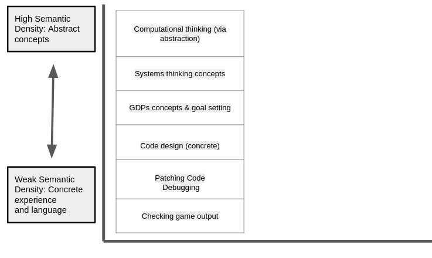
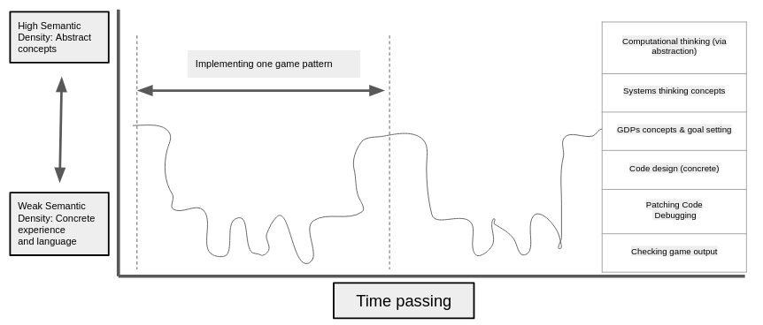
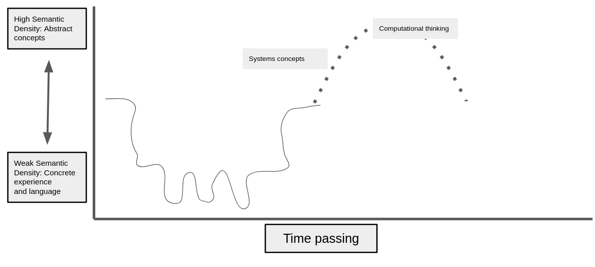
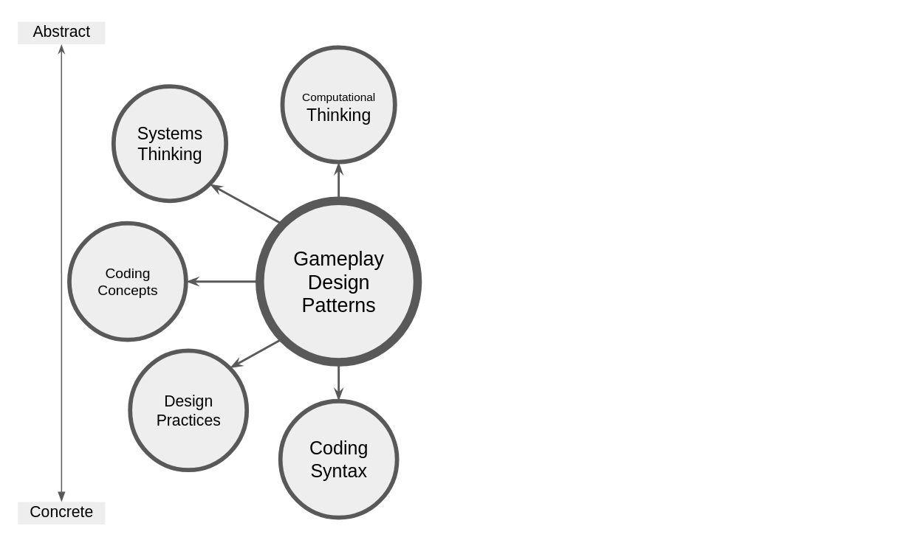
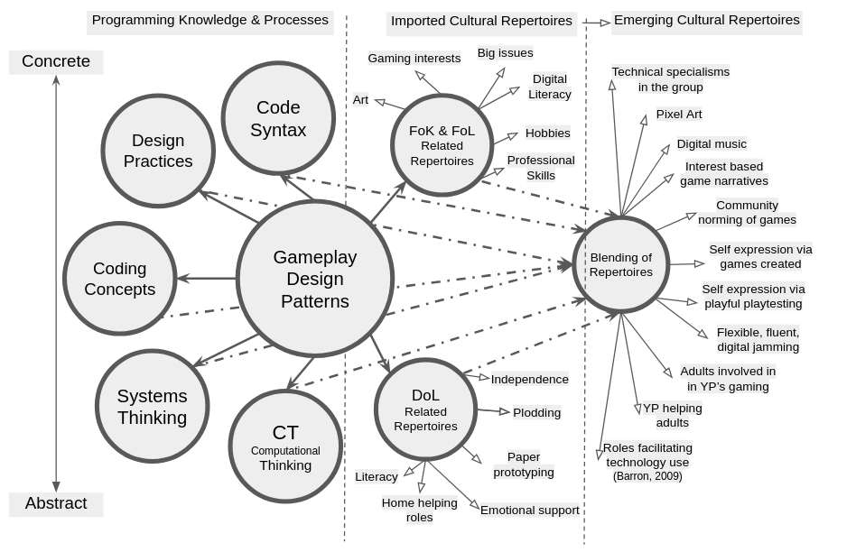

---
# all the regular stuff you have here
zotero:
  scannable-cite: false # only relevant when your compiling to scannable-cite .odt
  client: zotero # defaults to zotero
  author-in-text: false # when true, enabled fake author-name-only cites by replacing it with the text of the last names of the authors
  csl-style: harvard-manchester-metropolitan-university # pre-fill the style
layout: post
categories: chapter
title: 7. Findings on RQ3
---
-   [Findings related to agency](#findings-related-to-agency)
    -   [Introduction](#introduction)
    -   [Part one - Exploring concepts of abstract and concrete
        knowledge frameworks in relation to game design
        patterns](#part-one---exploring-concepts-of-abstract-and-concrete-knowledge-frameworks-in-relation-to-game-design-patterns)
        -   [Conceptions of abstraction in the research
            field](#conceptions-of-abstraction-in-the-research-field)
        -   [Exploring findings in relation to existing
            pedagogies](#exploring-findings-in-relation-to-existing-pedagogies)
            -   [Computational thinking and
                bricolage](#computational-thinking-and-bricolage)
            -   [Exploring findings using concepts of semantic profiles,
                LOA, &
                PRIMM](#exploring-findings-using-concepts-of-semantic-profiles-loa-primm)
            -   [Interpreting GDPs as both intermediate-level knowledge
                and as a gateway pedagogical
                concept](#interpreting-gdps-as-both-intermediate-level-knowledge-and-as-a-gateway-pedagogical-concept)
        -   [Summary of structural components of applied pedagogy -
            REEPP](#summary-of-structural-components-of-applied-pedagogy---reepp)
    -   [Part Two - Agency, and re-mediation of repertoires in third
        spaces](#part-two---agency-and-re-mediation-of-repertoires-in-third-spaces)
        -   [Exploring the learning process of my finding using the lens
            of transformations in
            agency](#exploring-the-learning-process-of-my-finding-using-the-lens-of-transformations-in-agency)
        -   [Reframing findings using socio-cultural understandings of
            agency and repertoire
            blending](#reframing-findings-using-socio-cultural-understandings-of-agency-and-repertoire-blending)
        -   [Repertoire importation into the the game making
            community](#repertoire-importation-into-the-the-game-making-community)
        -   [The process of blending of repertoires in the third space
            of this research (playtesting in
            particular)](#the-process-of-blending-of-repertoires-in-the-third-space-of-this-research-playtesting-in-particular)
        -   [Supporting emerging identity formation and specialisation
            through interventions to support relational repertoire
            blending](#supporting-emerging-identity-formation-and-specialisation-through-interventions-to-support-relational-repertoire-blending)
    -   [Part Three - Synthesising and reframing the findings of this
        research for a broad
        audience](#part-three---synthesising-and-reframing-the-findings-of-this-research-for-a-broad-audience)
        -   [How can varied dimensions of agency be identified and
            nurtured in an evolving community of game
            makers?](#how-can-varied-dimensions-of-agency-be-identified-and-nurtured-in-an-evolving-community-of-game-makers)
            -   [Narrative descriptive of a proposed procedure for
                facilitating relational agency by repertoire blending
                (RARB)](#narrative-descriptive-of-a-proposed-procedure-for-facilitating-relational-agency-by-repertoire-blending-rarb)
            -   [Summative table illustrating stages of facilitating
                RARB in this
                study](#summative-table-illustrating-stages-of-facilitating-rarb-in-this-study)
        -   [Communicate dimensions of agency and related design
            concerns via jamming as a
            metaphor](#communicate-dimensions-of-agency-and-related-design-concerns-via-jamming-as-a-metaphor)
        -   [Conclusion](#conclusion)
    -   [Footnotes](#footnotes)

# Findings related to agency

<!--
## Research Questions April 2025

- **Primary research question (RQP):** How can understandings of how to design and facilitate CGD&P be enriched using socio-cultural approaches (used in this study)?

- **Sub-question 1 (RQ1):** What contradictions arose in this research’s evolving design process and how were they addressed in the resulting CGD&P pedagogy?

- **Sub-question 2 (RQ2):** How can the use of a collection of game design patterns support CGD&P, in particular in relation to abstract and concrete dimensions of existing pedagogies?

- **Sub-question 3 (RQ3):** How can varied dimensions of agency be identified and nurtured in an evolving community of game makers? -->

<!-- Principle question: How can understandings of pedagogies to support CGD&P be deepened using socio-cultural perspectives?  

2. How does CHAT theory help us understand how game design patterns can be used in an evolving community of novice game makers? (Evidence Ch.6 - Data Ch.7)
3. How can learners build agency in an evolving community of game makers, and what subsequent implications does this have on understandings of pedagogy design? (Evidence Ch.6 - Data Ch.7) -->

<!-- ## Research Questions Jan 2025

1. What contradictions arose in participation in this research’s game coding processes and how were they addressed?
2. How does CHAT theory help us understand how game design patterns  can be used in an evolving community of novice game makers?
3. How can learners build agency in an evolving community of game makers? REVISE
 -->

<!-- The chapters have until now discussed tools and processes emerged in response to inferred learner need, in contrast, the processes explored in this following section emerged more directly from input from the participants in2024-8-7-Culturevolved.   -->
<!-- _How does this fit into other findings chapters?_

Chap 4 - overall design context / evolution - Then in greater detail on personal observations1. What pedagogical tools and processes are available to support novices to overcome barriers to participation in game coding processes?
2. How does CHAT theory help us understand how game design patterns x  can be used in an evolving community of novice game makers?
3. How can learners build agency in an evolving community of game makers? on the evolutions and impact of the templated game approach and scaffolding of the code design. (not GDPs)

Chap 5 - zoom out in scale to main focus of the activity as communicated between participants and their impact and appropriation by participants. It

Chap 6 - zoom out in scale to cultural tools and their impact and appropriation by participants. It -->

<!-- **Justifying selection of chapter contents**
The following elements have emerged from many in the learning design as of merit for sharing in this chapter based on the following criteria: key to the learning experience of participant; novel in terms of lack of existing research; supported by recorded data; and of potential wider interest outside this context.
IS THIS NEEDED OR IS THE CRITERIA ONLY THAT IT ADDRESSES RESEARCH QUESTIONS? -->

<!--
DROPPED - THIS IS JUST PART OF DBR -
 ## Observations on emergent elements of agency within cultural activity
This section describes and discusses some of the emergent, flexible and adaptive design practices that I observed in video data. -->

<!-- I also discuss these findings in line with existing research in relevant areas. -->

## Introduction

This discussion chapter draws together the findings of previous chapters to deepen the analysis of the concepts explored and to synthesise observations into formulations that can be communicated in an accessible way. To begin, this chapter continues discusses the findings of Chapter 6 in relation to existing research on programming pedagogies. It specifically addresses the complexities of the abstract and concrete dimensions of computing education.

The second section addresses gaps in the existing landscape related to social and cultural dimensions of CGD&P research through examining participants' development of agency via game making. To achieve this, I begin with an exploration of the study’s findings in relation to instrumental, transformative, and relational agency. I develop an interpretation of relational agency drawing on Rogoff and Gutiérrez's [@gutierrez_cultural_2003] concept of learner repertoires. To do this, the findings of this research are framed within a novel model describing three stages of a process agency development.

A final section summarises findings for a broad audience, addressing the characteristics of the design that support relational agency, a graphical representation of the development of agency, and an exploration of metaphors that synthesise significant features of the learning design.
ADD A LITTLE MORE DETAIL.

<!-- As framework is developed via a utopian and utilitarian approach to design-based research and formative interventions. -->

<!-- The purpose here is to ground this discussion of the study's emergent cultural and interpersonal activity within the context of ongoing explorations into theoretical and practical applications of agency in socio-cultural research circles.  -->

<!-- As a way to address cultural development in more depth, particularly the development of learner identities within the research activities,  -->

 <!-- As such, it communicates insights  for equity and diversity via practical concerns to inform future recommendations for practice.  

deepens the analysis and discussion on RQ2 regarding the potential uses of gameplay design patterns (GDP) and concludes with an analysis and discussion on RQ3, addressing reflections on participant agency. -->

<!-- However, it concludes with a proposed contribution suggesting that a collection of GDPs can help participants and facilitators as both as component features of emerging game making repertoires and as a orienting framework to increase the inclusive characteristics of the learning environment.   -->

<!-- This chapter has three main sections:

1. Rising to concrete ; Conceptions of abstract and concrete present in computing and digital making research: ultimately, proposing design patterns as a intermediate-level, pedagogical framework compared to computational thinking.

- explore potential implications for facilitators and researchers on how to design for inclusion and agency - e.g. use of GDP collection as an  intermediate pedagogical construct. -->

<!-- further discussion on this use GDPs ,
particularly in reference to the building of agency. -->

<!-- - propose that GDPs provide a suitable way to engage with coding practices partly due to their position between abstract computational concepts and concrete implementations of code structures. -->

<!-- - MOVE TO CONCLUSION? metaphors / frameworks to envisage affordences and particpant agency in CHAT framework. and why this is useful for facilitators and as an accessibel way to share findings. -->

<!-- **more intro material**

The chapter contains a discussion on wider concerns of designing for learner agency. Here I synthesise analysis on processes which support learners to develop agency in this game making community
(and the role of different levels of authenticity?)

This section takes a step back to explore the wider perspectives of the findings beyond the immediate context to digital making and project based approaches and understandings of design patterns in educational contexts.

An underlying proposal of this thesis is the development of  learner agency can be facilitated by designing effective learning environments. To do this I draw on key forms of developmental agency explored in Chapter 3.

This section synthesises findings learner agency in relation to existing conceptions of agency in other research.

This section explores these academic conceptions in a playful way using relatable metaphors from related research. The aim of this playful/relatable approach is to aid the situation of later recommendations for researchers and educators working in this area in an accessible way. -->

## Part one - Exploring concepts of abstract and concrete knowledge frameworks in relation to game design patterns

<!-- 1. Recap  concepts of abstraction  
2. Link to data
3. Then begin practical use of this take - tinkering pedagogy
4. core proposals / model as proto-contributions -->

<!-- 1. Recap, GDPs as a Germ cell, Exploring CHAT concepts of abstraction  
2. Locating TADS in this perspective, via 3GAT concept of expansion via double stimulation and TADS
3. Papert - pluralism & the concrete
4. then Waite Levels of abstraction - & observations
5. Then begin practical use of this take - tinkering pedagogy -->

<!-- **Intro to section** -->

The tension between the abstract and concrete dimensions of the process of learning to program runs as a theme through existing research on computer game design and programming (CGD&P). Yet, the field would still benefit from research on novel pedagogies that explicitly address the complexities of abstraction in computing education (see Chapter 2). Areas of complexity relevant to this study include: issues of degrees of abstraction in understandings of computational thinking [@wing_computational_2006; @brennan_new_2012]; the potential benefit of understanding the role of levels of abstraction for teachers and learners [@waite_abstraction_2018]; and epistemological pluralism as a way to value concrete approaches[@papert_epistemological_1990]. This chapter explores these characteristics in relation to the data surfaced in Chapters 5 and 6 of this thesis. This section develops the proposal of GDPs as a construct located between the abstract and concrete poles of the learning experience and examines the utility of this positioning for facilitators and participants. Finally, a technical pedagogical structure is advanced and given the term of _remix-enabled elective pattern patching_ (REEPP).

<!-- THIS IS SORT OF Dropped
gpPS AND  their utility for facilitators for participants. -->

<!-- omputing curricular concerns, provoked careful reflection on abstract-concrete dimensions of emerging knowledge happening in the game making and digital making more generally. -->

<!-- **drop or make more important in this section**
Chapter 2 began to explore, through the lens of personal appropriation, a variety of concepts and practices suitable for development via this learning design in the form of a map of learning dimensions. -->

<!-- surfacing a distinction between curricular contents commonly associated with a more abstract understandings of personal knowledge, including more abstract elements of computation thinking.  -->

### Conceptions of abstraction in the research field

<!-- CHECK THE TRAJECTORY OF THIS CONCEPT IN THESIS. -->

<!-- MOVE THIS TO CHAPTER 2
Following Hook [-@hook_strong_2012], Eriksson et al. [-@eriksson_using_2019], in their use of a curated collection of GDPs to structure game design, framed design patterns as a form of intermediate-level concept, between the detail of concrete implementation and more general theories. The value of the intermediate nature of the knowledge generated is to serve the replicability and generalisation of research work.  -->

This section explores dimensions of abstraction and concreteness in the use of GDPs within the context of computing education by revisiting relevant pedagogies outlined in Chapter 2. In this study, GDPs are conceptualised as both intermediate-level learning design principles (explored in Chapter 5) and as units of analysis (see Chapter 3), as well as analytical germ cells manifested in varied motivational and mediational forms (Chapter 6). In my research process guided by CHAT formative interventions, involved analysis identifying from concrete data GDPS as an abstraction of interest and utility, leveraging the concept to generate distinct concrete instantiations of it within the evolving design: a process refered to within CHAT as _rising to the concrete_.

<!-- This concept becomes the root of the varied approaches and forms of support outlined in Chapter 5 and in the resulting uses of GDPs in Chapter  -->

<!-- MISSING SOMETHING ON DIALECTICS AND GERM CELL? -->

<!-- Some instances based on this kernel concept were created by myself in response to user requests in varied forms of support documentation outlined in Chapter 5 ( e.g. quick start card -->

 <!-- Design patterns as a intermediate-level, pedagogical framework (compared to computational thinking) -->

<!-- While understanding the process is more obviously useful for faciliators - it may be helpful to participants as well as they build familiarity with frameworks of features of multimedia projects. -->

<!-- Through this lens the most abstract activity system is the larger one who's objective, to make an engaging game that tells an environmental story, aligns with the problem level of LOA. The level between abstract and concrete is that of choosing, implementing and testing game design patterns, which aligns with design. The most concrete in this interpretation is then the implementation of different lines of code or creation and migration of digital assets. -->

### Exploring findings in relation to existing pedagogies

<!-- The term abstraction has varied interpretation even within the field of computer science education [@hazzan_reducing_2002]. -->
<!-- To ground this in GCSE examples.
Iteration and Selection are in the gcse example, tick examples of them. Just recognise. -->

<!-- The authors' exploration of the types of coders as either Planners or Bricoleurs can be used to begin analysis of aspects of the making styles explored briefly in Chapter 5. The author's perspective, aligns with my own which is that abstraction is clearly useful in computing projects but can be a barrier to participation. -->

<!-- and invites discussion on how best to teach this abstract approach to computation thinking. Grover [@grover_computational_2017; @grover_computational_2013] and Guzdial [@guzdial_learner-centered_2015] offer explicit techniques linked using the application of computer programming as the driving mechanism. Bell and colleagues [@bell2019constructing] explore the process of unplugged activities, exploring abstract CT concepts without using computers or coding. -->

<!-- The more concrete elements of CT definition [@brennan_new_2012], which exist on a more applied level, are readily observed in the data are explored in the appendix on learning map, -->
<!-- What has this research got to say about the relationship between the two? -->
<!-- **In terms of recommendations for researchers / practitioners of an intermediate framework:** -->
<!-- As such this research has only more theoretical propositions rather than participant data. -->

<!-- MOVED
The concepts and legacy of Papert and Turkle's [-@papert_epistemological_1990] exploration of diversity in coding approaches are introduced through what they call epistemological pluralism. The focus here is on their championing of approaches beyond the dominant formal, abstract approach that "emphasizes control through structure and planning" [@papert_epistemological_1990, p.134]. This approach can be characterised by the following: a top-down design process involving extensive planning prior to coding, explicit teaching of language principles and syntax, and coding from scratch rather than altering existing products. To counter this dominance, Papert and Turkle [-@papert_epistemological_1990] highlighted the value of a more concrete computing pedagogy, likening the process to bricolage, a craft-based approach where participants become very familiar with their tools and materials.  -->

<!-- Wing's CT framework is applicable some of the code creation processes I have undertaken as a learning designer, but is less relevant to participants. -->

#### Computational thinking and bricolage

While computational thinking is not a pedagogy, it has formed the basis of a significant amount of research on diverse pedagogies to support its development. As such, a summary in relation to the findings of this research is relevant here. Chapter 2 explored definitions of computational thinking varying in degrees of abstraction or application. Two notable interpretations include Wing's [-@wing_computational_2006] focus on abstraction encompassing overarching computing principles and high-level structural design approaches, and Resnick and Brennan's [-@brennan_new_2012] more applied approach including _computational practices_ and perspectives. The applied approach of  Resnick and Brennan draws on the legacy of Papert and Turkle's [-@papert_epistemological_1990] research on diversity in coding approaches to counter potentially alienating abstract dominant approach. By way of contrast bricolage approaches maintain strong links between function and form. The findings of this research suggest that participants' practices resembled bricolage, a theme explored further in the following sections.

#### Exploring findings using concepts of semantic profiles, LOA, & PRIMM

<!-- In their PRIMM pedagogy the researchers also incorporate the UMC model and draw parallels with LOA. In the Use stage of the UMC model [@lee_computational_2011] (explored in Chapter 5 in relation to this research's learning design), participants would be aware of the goal of the program, and the results. Subsequently, in the Modify stage they would become familiar with the design and code levels. -->

Concept of levels of abstraction (LOA) and semantic profiles within the PRIMM pedagogy were explored in the pedagogical discussion in Chapter 2 [@waite_abstraction_2016; @sentance_teachers_2019]. A shared feature of both models is the recommendation that learners shift their focus between abstract and concrete levels of project structure and semantic concepts respectively. The pedagogies are advanced to help teachers design learning experiences that allow participant shifts in perspective and thus deepen knowledge by packing and unpacking abstracted concepts via concrete experiences, in line with legitimation code theory [@maton_making_2013].

In this thesis, there are two principal dimensions of abstraction at play. The first follows Wing's definition of computational thinking (centred around decontextualised concepts of abstraction, generalisation, and decomposition) at one pole and concrete code implementation at the other. The second dimension of abstraction is represented in the LOA framework as a hierarchy of elements, namely: goal, design, code, and results. The goal, being the most abstract element, situates GDPs between these levels (see Table 7.x for more details). To represent GDPs on a graded scale of semantic density [@macnaught_jointly_2013][^sd], following Barendregt et al. [-@barendregt_intermediate-level_2017], they would be situated between abstract CT processes and concrete implementation. Thus, for the purposes of this analysis, it is appropriate to place the LOA in the lower half of the profile (see Figure 7.x below), and at levels above GDP place more abstract concepts of systems thinking and computational thinking.

{width=75%}

<!-- It is relevant to distinguish the interpretations of different dimension abstraction described above: specifically Wing's and Papert's conceptions of abstraction, which can be described as present in top-down planning processes, and generalisable beyond context and abstraction present in the LOA framework is be characterised instead as a goal-design-code-results hierarchy, with the goal being the most abstract.   -->

Addressing interpretations of LOA [@waite_abstraction_2018] in video data, we can map the levels of abstraction to shifts between conceptions of goals, code implementation structures, and observations of results in my findings.

| **Level**            | **Focus** | **Example** |
|---------------|--------------|---------------|
| **Conceptual Level**  | Goal formation. | Choosing what features to add to the game in the form of GDPs. |
| **Design Level**  | Design choices involving coding concepts and knowledge of structural organisation of the code project.  | Documentation organised around GDPs scaffolds this process. What needs to be done is to a large extent prescribed. |
| **Code Level**  | Adding, checking and debugging the lines of code. | This process is supported via a template  structure which encourages simple modification, and code patching. Debugging of code also happens at this level. |
| **Execution Level**  | Understanding the outputs. | There is immediate feedback here and a strong correlation between goal and outcome in the self-playing of the game product. |

Table. 7.x - Description of levels of abstraction located in the findings  

MISS MATCH IN LEVELS - CHECK ORIGINGAL SEE CL COMMENT. CLARIFY SENTANCE

This table therefore outlines some of the impact of the design decisions made on the level at which participants are spending time in their game making. To continue this process, the following diagram is an approximate representation of the scope of movement using the scale of semantic density outlined in Figure 7.x above, using participant (Toby) behaviour seen in Vignette 1 (also explored in Chapter 5). In this vignette, an exploration of abstract CT concepts and explicit use of systems concepts are rarely present, and the resulting semantic profiles show movement in the lower areas of the gradation of semantic density. This shallow semantic wave above is typical in describing the data of other participants in analysed session recordings.

{width=95%}

Movement between layers of abstraction and concrete occurs as Toby(c) shifts between goal formation and the concrete implementation using design practices and specific code structures. Toby starts by imagining and choosing a design pattern and navigates to the relevant documentation. He progresses to implement the pattern via patching in code from the code example. He tests it via previewing and playtesting the game. He then revises or debugs it iteratively. For example, when Toby needing to make several changes to get the positioning of the moving enemy correct his activity oscilates between checking game output level and the code debugging level results. Examples pervade the data of Vignettes of similar iterative shifts between these levels. The descriptions of increasing participant fluency via operationalisation in Chapter 6 are interrelated with this repeated movement between levels and perspectives. Games provide high motivation to adjust code to get the result feeling just right. GDPs provide a framework and shared language to help guide and articulate this process to other designers. The is a stong link between the concept of a GDPs and the tangible experience of it during feedback during the process of playing the resulting game (as explored in Chapter 5 and 6). This contributues to a clearer trajectory for participants in navigating levels of abstraction at play within the GGD&P process.

<!-- nd processes are present in data, but only when adults with relevant knowledge facilitator, either myself or parents, do point them out and during the process of code implementation. More implicit use of coding constructs is more common. -->
<!-- **Description of impact of blackboxing on semantic profile of learners** -->

While the semantic profile shows rapid iterations, they are limited in scope with little activity at the code design level or use of more abstract computing concepts. This pattern is due in part to the format of supporting resources structured as design patterns [^gdp]. Additionally, as a learning designer, I had pre-completed aspects of project implementation that required more generalisable computational thinking skills which would have been a potentially valuable learning experience. For example, abstraction was present in the structuring of key variables within the starting template and via the graphical design tool in the form of a grid matrix in an array data structure. Decomposition and generalisation (pattern recognition) were present in the structuring of the collection of GDPs based on the MDA framework. For advocates of the potential of abstract interpretations of computational thinking, this process could be perceived as over-scaffolding, depriving learners of the chance to learn and practice valuable practices [@pea_logo_1987; @curzon_developing_2014].

These scaffolding decisions were initially made to address barriers associated with abstract approaches and conceptual complexity, thus prioritising accessibility and flow experience for participants as explored in chapters 5 and 6. As such, the resulting semantic profile of Figure 7.x above can be aligned with the description of Papert and Turkle's [@papert_epistemological_1990] bricoleur maker styles and constructionist design heuristics [@resnick_reflections_2005] (see Appendix.tech for fuller details). Observations show most participants operating as bricoleurs, feeling their way through smaller-scale iterations rather than extensive planning followed by implementation. The process of scaffolding the design in this way, and thus abstracting away complexity (refered to as created black-boxes by constructionist researchers [@resnick_design_2005]), allowed greater focus on the relational and affective elements of the learning design, processes which are described in more depth in part two of this chapter.

<!-- however subsequent analysis showed an alignment with constructionist design heuristics [@resnick_reflections_2005]   -->
<!-- A bricolage approach in at that level would avoid abstract design structures which detract from a close relationship between the code and the desired results. -->
<!-- For other participants, see Vignette (Ed and Mark) shift are often more chaotically structured reflecting a _jumping around_ in the process.
In addition the observations in the discussion section of Chapter 6, which reject design stages, in favour of more chaotic improvisational approach. -->
<!-- Examples include: use of code playground and existing template to simplify the use of the interacting web technologies; structural and syntactical template design decisions,     -->

<!-- Thus there are limits here to which this research can be said to support claims of LOA and semantic profiling.  -->

As a researcher and designer, mapping  participant experience of learning design  to LOA helps review its accessibility  [@waite_abstraction_2018-1, p.21]. However, there remains the question of the value of participants being explicitly aware of LOA. While systems concepts and computational thinking concepts are being explored at the concrete level, and were included in written instructions, they were not explicitly taught in sessions. These intentional limits in exploration of more abstract concepts, in line with a bricolage approach, appear to be at odds with advocacy for alternating between abstract and concrete dimensions in semantic waves [@curzon_using_2020]. It follows that the authors would cite this as a problematic limitation in the approach, or at the least as missed opportunities to _unpack and repack_ concepts [@maton_making_2013].

While the value of explicit teaching of more abstract dimensions of computational thinking is not challenged here, my findings expose underlying tensions. In my use of just-in-time personal instruction of abstract concepts while code is being worked on, I balanced factors such as how welcome this underpinning knowledge would be to students. Would it interrupt their flow? A tension involving competing demands on the facilitator is also relevant, as there was a high demand on my time and I prioritised getting people unstuck to keep them engaged. Given a different focus or motivation, for example a need to explore concepts due to curricular or exam pressures, the process of supporting students to explore more abstract concepts could have been scaffolded further through more explicitly guided reflective processes. The map of learning dimensions (see Chapter 6 & Appendix.learningDimensions) could assist practitioners and participants to chart and thus facilitate exploration of relevant coding and systems concepts. A semantic profile which pref-figures such a pathway is represented in Figure 7.x.

{width=95%}

The trajectory represented in Figure 7.x can be clarified by describing an imagined facilitator intervention in the context of Vignette 1. After the participant has completed iterative code changes to add a moving enemy and is ready to progress to another goal, the facilitator could initiate joint reflection on the processes and concepts used in the implementation of the pattern. In this example, this would allow the participant and facilitator to explore relevant computing knowledge in context. In Vignette a suitable occasion to do this would be when Toby makes experimental changes to the code settings involving moving enemies which provokes unexpected results [^ld1]. Similarly, when Toby made changes to the graphical level design grid construct, a facilitator could drawing attention to the technical aspects of that coding construct [^arr].  

In order to prompt and support the process of reflection, as well as initial goal formation, in P2 I asked participants to plot their progress by moving self-created avatars on a physical map (see Vignette.map). This encouragement of the process of reflection via playful methods could also be achieved in different ways, perhaps by attributing badges or points to a successful reflection of different elements of learning dimensions. While this aspect has not been prioritised in this thesis, it is an area of future interest which could be explored by adapting the design for use in a more formal setting. The extrinsic nature of the process of gamification would appear to align with contextual factors of examination-driven education.

<!-- ANYTHING ELSE? ADD HERE AFTER REVIEWING LR AND DATA AGAIN
QUESTION HOW WOULD THE USE OF THIS CONCEPT WORK WITH PRIMM.

It is difficult to compare this process with the PRIMM given the different contexts involved with existing PRIMM research which are based in formal environments within the structures of a group lesson format.

While PRIMM alters UMC structure by adding more explicit conceptual scaffolding in early stages (Predict, Investigate) brings back a principles first approach, this approach to avoid the risk of associated student disengagement [SDG] takes a principles second approach. -->

#### Interpreting GDPs as both intermediate-level knowledge and as a gateway pedagogical concept

While this research has avoided focusing on the explicit teaching of concepts, it has, as described in the section above, surfaced a mechanism using of GDPs that allows more accessible access to both abstract and concrete elements present in the learning environment. Eriksson et al. [-@eriksson_using_2019, p.15] frame design patterns as a form of "intermediate-level knowledge" between the detail of concrete implementation and more general theories [@hook_strong_2012]. In addition to this interpretation, I propose that GDPs act as _gateway_ concepts that communicate pedagogical utility to access different dimensions of learning. The use of GDP concepts as a primary object of activity allows them to open up exploration of both abstract and concrete concepts. This is represented conceptually in Figure 7.x below.
<!-- SIMPLIFY THIS PARAGRAPH OR DROP
While, the table of uses of GDPs in Chapter 6 focuses primarily on value for learners there are aspects which are relevant to facilitators or teachers in either non-formal or formal settings. One such motivation is the ability for implementation of GDPs to open up exploration of other concepts.  -->

{width=95%}

<!-- Given this shift to include the utility for participants and the problematisation of the term intermediate, I propose a change in terminology. Instead of an _intermediate framework_,  -->

The framing of design patterns as an intermediate construct [@eriksson_using_2019; @barendregt_intermediate-level_2017; @hook_strong_2012] was originally used as a tool for researchers to surface design concepts and practices. While this remains valid in this research, a similar process is clearly present for purposes beyond research utility. For example, participants in the last chapter outlined the varied uses of GDPs in terms of mediational strategies and as a motivational element, repeated in varied forms as different patterns are implemented. Additionally, for facilitators, GDPs serve functions within the pedagogical approach of this research, including: the ability to structure participant choice within practical limitations, and acting as a unifying construct to aid the packaging of documentation and the support provided to assist project navigation.

<!-- Say Tehillah has made an error altering level design and has made changes to the array comprising graphical matrix. The error which compromising the the structure of the array could be used  -->
<!--
TRY REMOVING THIS

The close coupling between design and code structure levels in my design may not align with LOA principles given the statement from Waite and colleagues [@waite_abstraction_2018-1, p.21] that "1:1 mapping between the design/algorithm and the code may lead to confusion between the levels". -->

<!-- Turning instead to the value for designers and facilitators, Waite and colleagues  state "the LOA hierarchy may be a useful tool for improving and reviewing teaching and learning in programming", my reflections own on research data support this proposition more clearly.

The processes outline above support a position that there is utility for facilitators to be aware of the level of abstraction present in the participants learning experience in order to design to increase accessibility for participants. Specifically, this research suggests that GDPs are a more suitable accessible leading pedagogical framework than computational thinking. -->

<!-- However, while LOA and PRIMM imply an explicit teaching of abstract concepts or processes, the authors [-@waite_abstraction_2018-1, p.21] acknowledge that rationale and evidence to support this is not clear for younger coders. In addition, related research does not include examples of activity explicitly teaching abstraction [@sentance_teachers_2019; @sentance_teaching_2019]. Certainly, the difficultly in explicitly teaching abstraction rather than implicit approaches of appropriation [@kramer_abstraction_2003], while contested by  [@statter_teaching_2016], and based on work of Hazzan [-@hazzan_reflections_2008], underlying concerns are not fully addressed.
CLARIFY THIS WHOLE SECTION.  

In conclusion, the authors also state that the overall utility of LOA as a useful tool for younger participants is an open question, and that more research is needed on claims that it can help "use of design as a self-regulation tool to develop independence" -->

<!-- This coupling bears examination in relation to the positioning of GDPs as a leading activity, as illustrated by my decision to treat the implementation of each GDP as an activity system in itself. While the previous chapter explored the use of GDPs in various facets, this section turns to their utility for learners in this abstract/concrete domain.   -->

<!-- MOVE OR DROP..
At this stage, it is valuable to look past a potentially arbitrary placing of these levels within a hierarchy to investigate instead the core value of the relational nature of the framework to other concepts in the context of my research. To help with this analysis of utility,  -->

<!-- Their celebration of concrete coding approaches, including the use of tangible physical and digital objects, and more piecemeal, bricolage approach has influenced the design of popular educational programming software and pedagogy through the constructionist school and maker movements (as explored in the literature review). -->

<!--

move to lit review?
However, Wilensky [-@wilensky1991abstract] questions the nature of abstract in this context arguing that all objects and concepts are abstract until familiarity makes them more concrete to the user. -->

<!-- #### In SUMMARY

Thus in summary conceptions of abstraction above explored above include:

- Wing's take on computational thinking: abstraction, decomposition, generalisation / pattern recognition, implementation via an algorithmic process.
- A more holistic practice-based definition from Resnick, Brennan -
- Waite's LOA - abstract here drawing on levels within the problem or product  - navigation between levels, explicit teaching of such navigation. -->

<!-- To explore the findings of last chapter in relation to this exploration of the nature and purpose of abstraction in guiding frameworks in learning programming, I return to research on the use of gameplay design patterns. -->

<!-- Thus
This is the motivational aspect of framework?
a. As a research framework - Eriksson et al.
b. A facilitator / design framework -
c. as a participant framework for navigation and goal formation as explored in the previous chapter. -->

<!-- Addressing the first aspect, the process of rising the concrete outlined above is helpful not just for analysis (a) but also for ongoing pedagogical design (b).

The third aspect c, can be returned to, but where and when in this chapter? Points follow:
- the link with the experienced feature of the game / product as a framework increases inclusive nature of process (later?)

PERHAPS MOVE THIS TO NEXT SECTION
What about semantic waves and movement. How explicit does the understanding of the motion between poles need to be? For example in my design, it is not very explicit of guided towards. However, this may be different in different UK computing settings.

This potential non-alignment with UK non-formal may be a limitation in the take up of this research.   -->

<!-- #### Addressing utility for participants -->
<!-- One of the more developed work in GDP as such a framework is in Eriksson et al. The context of their GDP study is distinct in that whereas the young people in the Stringforce study are making design suggestions to alter a game they are not making their own games by modifying computer code. -->
<!-- In my design by contrast there is strong coupling between the role, description and implementation as illustrated by the structure of the supporting resources outlined in Chapter 5. -->

<!-- Reflections in progression of design in P4 showed my reluctance to lead with or explicitly teach abstract concepts with CT. Further discussion on the dilemma of how explicit teaching of computational concepts should be in taken up in the following section addressing the perspective for designers / teachers. -->
<!-- #### Turning to the utility for designers, reearcher and facilitators,  -->

<!-- If a knowledge of CT is needed by the learning context then it could be profitably explored in other ways. For example, developing resources suitable for such reflection,  for instance a learning map to be used by participants and teachers as explred in P4 . Linking from docs to descriptions of the characteristics. Thus not a leading pedagogical framework but a map of possible skills and concepts made possible by the leading activity. -->

<!--
My own notes and reflections (see appendix.learning in particular) map cautioned me against explicit teaching of abstraction and imposing shifts in perspectives for fear of interrupting the flow of participant making. In this context I judged the imposition of an additional goal of understanding abstract curricular concepts as potentially counter productive to the overall aim of acculturation to game making tools and processes and developing an inclusive idioculture.

IS THIS DOUBLED / DUPLICATED?
However this research contends that GDPs are a more suitable accessible  framework than that of computational thinking when making games and as such should be the leading  and guiding pedagogical framework. If a knowledge of CT is needed by the learning context then it could be profitably explored in other ways. For example, developing resources suitable for such reflection,  for instance a learning map to be used by participants and teachers as explred in P4 . Linking from docs to descriptions of the characteristics. Thus not a leading pedagogical framework but a map of possible skills and concepts made possible by the leading activity. -->

<!-- Route-based activities with a 1:1 mapping between the design/algorithm and the code may lead to confusion between the levels. -->
<!-- I had a reluctance to shift learners away from the practical implementation of repeated game design patterns to focus on more abstract, de-contextualised conceptions of the knowledge. My concern also reflected potential disorientation and reduced experiences of agency from imposed shifts of focus rather than self-initiated ones. I also propose that to further research to would be needed to justify the utility take the time to interrupt flow to explicitly teach abstraction, and abstract CT concepts, apart from if understanding of such concepts are required by curriculum constraints. -->

<!-- BUT WHAT ABOUT LEARNERS? HERE THE PERSPECTIVE IS BLURRED IF TEACHERS ARE STEERING TOWARDS A CURRICULUM. -->

<!-- As synthesis, in terms of semantic waves, the movement between abstract and concrete is helpful to address some of the issues concerning inclusion and accessibility of overly abstract approaches [@papert_epistemological_1990].
 -->

### Summary of structural components of applied pedagogy - REEPP

The previous section has shown how, instead of explicit teaching of concepts, the structural support provided by the use of GDPs allows flexible navigation of the abstract and concrete elements of the learning experience, driven by participant choice. This section summarises an approach to facilitate the use of GDPs via a technical structuring of resources. I propose that key elements of this pedagogy constitute a replicable approach, which is a valuable contribution to coding education. To communicate the essence of this structural, technical model, I propose an acronym: remix-enabled, elective, progressive, pattern patching (REEPPP). The summary table outlining the features of the REEPPP approach has been written to be applicable to projects beyond the use within game making, potentially extending to wider digital media making.

| REEPPP Term  | Description |
|--------------|---------------|
| **R**emix **E**nabled | Project formation is accelerated, limited and scaffolded through the use of a structural starting template in a recognisable project genre with easily discoverable affordances strongly coupled with object output, providing immediate feedback. |
| **E**lective | Participants have choices over their learning pathways in dimensions of content and design patterns to be added. |
| **P**rogressive | The processes involves progressive steps. In this case pattern recognition through exploration/play, quick start activities involving minimal changes with high impact on the project outcomes, using progressively more challenging documented patterns, finally implementing patterns without support |
| **P**attern | The process has at its core the use of recognisable design patterns which are presented together with suggested design solutions and concrete code snippets. |
| **P**atching | The authentic technical process of code patching accelerates production and creates errors suitable for debugging at a novice level. |

Table Figure 7.x - REEPPP as a technical structure which synthesises key elements of the learning design

This technical structure synthesises the use of a code playground, a game library, a half-baked game template, UMC pedagogy, and a collection of game design patterns [^umcetc]. While similar approaches exist, this structural pedagogy is innovative in the way systemic tensions have been resolved and congruencies introduced [^tensions].  

<!-- SAY A LITTLE MORE HOW? -->

<!-- **Link to next section - limits of this personal dimension approach** -->

The first part of this chapter has, through an analysis of the characteristics of the learning design related to abstract and concrete elements of computing knowledge, addressed a gap in research in finding an appropriate level of scaffolding [@waite_teaching_2021; @quintana_scaffolding_2004] supporting CGD&P identified in the problem statement of this thesis. The use of conceptual and practical frameworks to scaffold domain-specific working practices can help ameliorate the dialectical tension between engagement via tinkering and requirements to promote "principled understanding" [@barron_doing_1998, p.63]. This research has surfaced a method which facilitates a _principles second_ approach using GDPs as a gateway concept to dimensions of abstract practice based on reflection on completed activity. In addition, findings of Chapter 5 are reframed to communicate the value of a structural approach I call the REEPPP approach, which hinges on the use of design patterns to access and facilitate varied dimensions of game making. While this chapter has so far focused on the personal dimension of knowledge, the scaffolding provided by the REEPPP approach accelerates and supports the making process, which in turn allows for greater possibilities of social and cultural making via playtesting, outlined in the following section.

<!-- NOTE - THERE'S ANOTHER SECTION IN CH.8. -->

<!-- NOTE (If applies collaboratively, it becomes CREEPP) -->
<!--
NOTE DROPPED -
this break through facilitated the development of different "stepped" progressively graded project briefs which build one upon the other as a flexible scaffold (HOW?) -->

<!-- The use of a menu / collection of resources can be considered an inclusive educational practice and offer a rich description of a concrete example which aims to align to inclusive, practice-based frameworks like UDL and PBL. While this may involve more work in advance, the benefits to inclusive practice merit it. -->

<!-- template and the close coupling of the purpose, description and implementation of each GDP accelerates and supports the making process which in turn allows for greater possibilities of social and cultural making via playtesting outlined in the following section. -->

<!-- This analysis of the use of GDPs through the lens of research on the abstract and concrete dimensions in computing education, there is an alignment with the personal dimension of knowledge highlighted in the previous chapter.
This line of research also opens up other dimensions

Thus the structural elements of this design facilitate the kind of relational pedagogies originally advocated by Papert and but which have too often been missing from research in this field.

The following section develops an analysis of the findings from the last chapter, outlining the potential of GDP concepts, especially within playtesting, to support these participant shifts in perspective. The following section addresses the social and cultural aspects of this study, using the development of varied forms of participant agency as an analytical lens. -->

<!-- Broad descripton - SUMMARY OF UTILITY - DOES THIS LIVE HERE?
For participants, the GDPs facilitates goal formation. Once engaged with this goal, participants can use the affordances of the design to traverse different LOA without explicit instruction in the process of playtesting. -->

<!-- in P4, with a diagram expressed which drew on the concept of semantic waves DROP OR REVISE?. This is an strong candidate for further research. -->

<!-- PERHAPS BRING UP UP TO DATE ISSUE OF TRANSFER. - BUT PERHAPS LEAVE FOR CONCLUSION. NOTE ALSO THE BALANCE BETWEEN CT CONCRETE SKILLS AND TRANSFER IN [@kynigos_modifying_2020] -->

<!-- However this does not detract from the value of learners navigating different LOA in following their interests.
Leading with GDPs as a framework appears to support this  navigation, and at times in this research it is undertaken fluently and joyfully. -->

<!-- While I address areas for future research in the conclusion, a proposed benefit of this research is While understanding the process is more obviously useful for facilitators - it may be helpful to participants as well as they build familiarity with frameworks of features of multimedia projects. To underscore the potential and to uncover a starting point for pedagogies that can be transferred to diverse design projects. -->

<!-- How then does this impact on conceptions of valuable pedagogies to help the development of coding fluency (NOTE THIS IS NOW MISSING FROM THE RQs) -->
<!-- The final section of this chapter returns to a guiding question of pedagogies that can support the development of computational fluency and within that participant agency. -->

## Part Two - Agency, and re-mediation of repertoires in third spaces

<!-- ### 2.a Affordances, Mediation, TADS,

1. recap on germ cell as common focus point for mediation (some designed or apporpirated)
2. When novel forms of mediation present, gdps sometimes used - thus as double stimulation
3. This is a transformation / expansion in 3GAT terms, recap as a resolution of tensions, and a manifestation of agency
4. Give a summary of examples of transformational agency
5. Briefly touch on the job of the learning designer within concept of F.I
6. The dilemma here of transformational happening most for participants in P1, and you can design OUT transformational agency, hence sketchy pedagogies. -->

<!-- 5. DROP /MOVE TO CH.3? The kedging metaphor and the climbing wall metaphor - in relation to agency and design -  explore them, kedging is a bit flailing , wall less so -->

<!-- **Revisiting - Motivation and gaps in research:** -->

<!-- At this point we must transcends concepts of efficacy of how to support the  aspects of coding process. -->

A key motivation of this study is to better understand how to mobilise potentially fruitful socio-cultural perspectives via replicable pedagogical strategies to facilitate participant agency during CGD&P. This second part of the chapter is guided by Papert's foundational focus on community-oriented project work [@lodi_computational_2021] and his related articulation of computational fluency as a challenge to research focusing too narrowly on technical approaches rather than expressive dimensions [@resnick_seeds_2020; @resnick_coding_2020]. This section is structured in the following way. Firstly, given that a guiding motivation of this study is to gain understanding of participant empowerment within CGD&P, an exploration of evolving expressions of agency shown in findings is undertaken using the concepts of instrumental, transformational, and relational agency [@hopwood_agency_2022; @matusov_mapping_2016]. Following this is an ecological analysis of the cultural plane of activity emerging from the findings of this research. To do this, I draw on socio-cultural understandings of agency development as a utopian process [@gutierrez2020utopian; @rajala_utopian_2023], using concepts of third spaces, movement of participant repertoires, and the evolving hybridity of repertoires.

<!-- CHANGE THIS
It concludes by proposing that understandings of CGD&P pedagogies can be enriched in two dimensions, firstly in design and secondly in a deeper theoretical understanding of concepts of agency development.   -->

<!-- emerging from the Fifth Dimension (5D) strand of research, which while not specifically concerning computer programming, is aligned with the socio-cultural ethos of this thesis.
  -->
<!-- This section analyses the findings of the previous chapters using varied conceptions of agency aligned to the sociocultural theoretical framework of this study. -->

<!-- Chapter 5  exposed the tensions that developed in the activity systems and subsequent evolution the tools used include code authoring environment, supporting resources of printed and digital format. -->

<!-- ### Justifying the use of Metaphors in these FINDINGS - CONCLUSION?

A mixed readership for this research is hoped for as relevant to pracitioners and some of the break down of agency is quite academic in tone and potentialy opaque.

There is a good tradition of metaphors in this space with Papert's low thresholds, high ceilings and wide walls concept. INSERT IN LR, PERHAPS IN TRANSITION FROM MICROWORLDS TO SCRATCH AND DESIGN BUILD TEST GAME MAKING.  

Metaphors are another vehicle to explore concepts, and different means of representation are a valid from of inclusive communication [UDL link]   -->

<!-- This section explores these conceptions using the core AT concepts of mediation and dual stimulation explored in Chapter 3 to illuminate pedagogical development related to the interaction of designed and emergent tools and processes, shedding light on dimensions of participant agency. -->

<!-- Hopwood [@hopwood_agency_2022] explores varied interpretations between mediation and double stimulation, exposing varied interpretations of mediation and ds's special interpretation by Sannino, and the difficulties of then comparing the models of agency.     -->

<!-- DROP?
While the affordances built into the code playground are valid secondary stimuli in initial in helping to seed initial activity,
supporting documentation can be seen as a form of secondary stimulation more aligned to the process of building agency. -->

<!-- RETURNING TO THE TENSIONS OF AUTHENCITY IN CH.5 AND TABLE AND IMPACT ON AGENCY. -->
<!-- Other tensions were resolved with more fundamental shifts to the overall structure of the activity which can be said to align more closely with the concept of transformative (authorial agency) agency.
In many cases design decisions were driven by the response and interest of the participants.

Research on  engendering authorial and transformative agency [@engestrom2006development; @haapasaari_emergence_2016; @sannino_formative_2016]. -->

<!-- REMOVE THIS DUPLICATE EXAMPLE .
For example in my design:
Introducing additional tools in the form of documentation to the initial coding environment and template provided in early stages introduced tensions between the opportunities for independent development and the additional complexity of the process. -->

### Exploring the learning process of my finding using the lens of transformations in agency

<!-- #### Instrumental and transformational agency -->

Chapter 2 examined the concepts of flow and varied characteristics of fluency in constructionist research. Chapter 6 explored these concepts in relation to the data of this study and proposed the related concept of agency as one more closely aligned to a socio-cultural approach. Many of the decisions outlined in Table 5.x summarising tensions involved in the learning design can be interpreted as increasing agency in practical terms by developing elements within the design which acts as mediational affordances or which help reduce barriers to undertaking programming. Conceptually, these practical dimensions can be framed as addressing instrumental agency, as they remove aspects of negative liberty caused by technical barriers [@matusov_mapping_2016, p. 433]. Instrumental agency in education can be viewed as a relatively uncomplicated view of mediation as a means to achieve pre-set goals [@matusov_mapping_2016]. A distinction can be made between instrumental agency and transformative agency [@isaac_cultural_2022], in that expressions of instrumental agency are unlikely to provoke environmental changes in the activity system at hand. Transformational agency, by way of contrast, may stem from transcending individual motivation but also involves a transformation of systemic constraints [@hopwood_agency_2022]. Sannino [@sannino2015emergence; @sannino_transformative_2022], via the concept of transformative agency via double stimulation (TADS), highlights that participant acts of volition which aim to overcome conflicts blocking activity progress may serve to create or surface previously unutilised forms of mediation and tool use[^tdse].  

The emergence of the pedagogy used in the next phase of activity was informed by observation of acts of volition and the resulting changes. In early stages, as a facilitator, I made available a variety of activities and materials to facilitate the potential for double stimulation [^c3]. After noticing that volitional attempts by participants were reaching for more structured supporting resources, I produced relevant resources and increased their visibility within the design [^detail]. This process raises a question: does adapting designs to increase instrumental agency reduce opportunities for transformational agency in future iterations? If so it would be it advantageous to keep some key areas of the learning design incomplete to encourage the emergence of participant responses and novel practices, thus retaining the potential for transformational agency.

This line of thinking raises an additional challenge as a facilitator in this regard is how to balance the transformative potential of incomplete learning environments with the potential for participant frustration associated with learning programming[^incl]. In this research, this tension was ameliorated via the use of play and other processes to create an inclusive, low-stress environment. These strategies were beneficial to participants feeling able to experiment with new forms of mediational strategies and thus enact transformational agency. Another relevant concern is how to support the incorporation and propagation of strategies that emerge from individual TADS processes into the game making community[^prop]. This concern is explored through the concept of relational agency in the following section.

<!--
NOTE RETURN TO THIS LATER OR DROP THE PARAGRAPH ABOVE.
In practice, there were still spaces for transformation once the core pedagogy is in place. For example, in Vig. Tody and Dan the break out of the template to create a different genre. -->
<!-- reduce practical tensions, increase the instrumental agency of learners allowing them to experience a feeling of control over their creative process.  -->

<!-- Examples of designed attempts to facilitate instrumental agency would include steps taken the resolution of tensions surrounding authenticity of coding web development language, coding environment and documentation associated with the concept of black boxing above. -->

<!-- Illustrative attempts of TADS are present in . For example, email correspondence from myself to participants asking for help in organising project work resulting in the emergence of list of proto-typical GDPs.  -->

<!-- Additionally the process of leading with exploration of a half-baked template was an experimental response from feedback from participants requesting more hand-on work with the tools before beginning planning.  -->

<!-- As outlined in chapter 3, Sannino explains TADS using a metaphor of a using a kedging anchors [@hopwood_agency_2022]. In this metaphor the act of casting out the anchor is a visible act of volition which aims overcome conflicts blocking activity progress. -->

<!-- While affordances for mediation in conceptions of instrumental agency may be visible within the learning community, this metaphor encompasses a sense of the exploratory nature of the transformation, and that the leverage or catching point for change may not be immediately visible to activity participants in the activity system. The process may serve to surface previously unknown forms of mediation and use of tools not only for those undertaking this volitional activity but also others in the learning community. -->

<!-- **Engendering transformative agency**

As a designer I began to noticed acts of volition to adapt the game making process, for example in adapting the game to add sound and characters of interest. In preparation for P2, to aid learners evolving activity, and then tried to add explicit affordances and make them visible to learners. -->

<!-- The process is on-going and mutual. Additionally, this work happens in an facilitated environment. Design decisions server to clarify common problems areas, thus making the water clearer to better see anchor points.
Integrate research on engendering authorial and transformative agency [@engestrom2006development; @haapasaari_emergence_2016; @sannino_formative_2016]. -->

<!-- In the introduction I outlined that a driving motivation of this research was to better understand chaotic learning environments, of which P1 is an example.

To engender transformative agency, a suitable starting point should be sketchy, half-baked or incomplete pedagogy and tools set. -->

Turning to relational agency in the learning design, the complex relations between participants outlined in the vignettes and data of Chapter 6. These relations, particularly evident in the sections addressing guided participation and cultural activity, are characterised interdependence, one of the key characteristics of relational agency [@edwards_relational_2005]. Edwards [-@edwards2009systemic] explores relational agency within a CHAT framework, describing it as transcending individuals' capacity to encompass collective problem-solving via specialisation and diversity of approaches within activity systems. As a collective, participants can overcome systemic contradictions via expansive learning, rearranging working relationships, and thus forging new, mutual forms of helping and learning strategies. In subsequent writing in this chapter, the concepts of instrumental and transformational agency are understood to be incorporated within this wider definition of relational agency.

<!-- NOTE - THIS FEELS LIKE IT NEEDS MORE - ANY CALL BACKS -->

<!-- PARK FOR NOW
This concept is illustrated by the importance of feedback in community making activities leading to increased "relational expertise" in partipants [@digiacomo_relational_2016-1 , p.144], -->

<!-- ### Shifting forms of agency

This interpretation highlights possible shifts in forms of agency and an emerging dilemma in the evolving learning design. Initial blocks are solved by transformative agency, patterns and tools become established in the community, and agency shifts to and more instrumental.

| **Name** | Transformative Agency | Instrumental Agency | Relational Agency |
|----|-------------|----------------|---------------|
|**Characteristics:**|  When participants are blocked from progressing or what to move their work in an new direction | Instrumental agency is present in the straight-forward mediational use of existing written instructions and in-template affordances. | Relational agency is present in the interactions between participants asking for help, sharing developing expertise, and via incorporation of home interests in new repertoires of practice  |
| **When shown:** |  In P1 before written instructions were available. Also in P3 when diverting from the existing template paradigm (V?). | Present from P2 onwards.  | Relational agency is present in P2 where forms of it emerge organically during playtesting and in P3 where it is also structured by introduced activities  |
| **Examples:** | In P1 participants suggest the use of lists of features as a key organising tool, a process culminating in a collection of GDPs.  In P3 Toby and Dan make a maze game instead of a platformer game (V?). | Examples: in use of quick start activities, and in V2 Toby use of written instructions | In the following vignettes  |

Table. 2.x Characterisation of types of agency in the design

NOT SURE ABOUT THIS TABLE - I'VE KEPT IT IN AS A POSSIBILITY IF SUPERVISORS THINK IT COULD BE USEFUL -->

<!-- It concludes by proposing that understandings of CGD&P pedagogies can be enriched in two dimensions, firstly in design and secondly in a deeper theoretical understanding of concepts of agency development.   -->

<!-- Straight forward individual use of documentation by Tony and Susanna in V1 and V2. -->

<!-- **Affordances as points on a climbing wall to support understandings of instrumental agency - MOVE**

In this design, at participants aim for affordances allowing a mediation process as visible points.
A suitable metaphor may be a climbing wall use for rock-climbing training.
The job of a facilitator may be to highlight certain affordances, attaching colours to a particular route designed to suit a particular skill level.
For example the bringing to the top of variable to impact game play in the quick start activities.

GDPs were one of the main vehicles of mediation here

This my be done by
- defining or reducing the use of specialised terminology  or
- hiding away un-needed complexity.
- signposting issues    -->

<!-- - imagining the lines of sight of the learner. try to remove large obstacles to potential anchour points. -->
<!-- To incorporate the utility of  previously used affordances within the community,  we can imagine a climbing rock-face metaphor of a lead climber leaving a trail for others behind.  -->

<!-- Similarly, as the process unfold the faciliator may see learners repeatedly run into the same obstacle and not be able to see the anchor points available to them. Perhaps even catching onto snags or other debris, false anchor points. -->

<!-- The role of the faciliator in this metaphor is to structure the climber journey to the top.

This my be done by
- defining or reducing the use use of specialised terminology  or
- hiding away un-needed complexity.
- signposting issues   
- imagining the lines of sight of the learner. try to remove large obstacles to potential anchour points.

LINK TO EXISTING WORK ON AFFORDENCES FROM SOCIAL CULTURAL PERSPECTIVE.
LINK TO AT theory
NARDI ON AFFORDENCES AND TECH FOR EXAMPLE
AND ROUND UP THE CONSTRUCTIONIST UNDERSTANDING OF AFFORDANCES AND BLACK BOXING -->

<!--
NEEDED: MORE SYNTHESIS / DISCUSSION ON Instrumental agency, TRANFORMATIONAL AGENCY AND AUTHORIAL AGENCY IN LINE WITH PREVIOUS WORK ON METHODOLOGY. -->

<!-- The job of the designer is in part to identify the causes of turbulence and thus create support in a sheltered space of a harbour. -->

<!-- Thus affordances in the learning design can be viewed in this frame as a catching point for these anchors [@hopwood_agency_2022].

An effective learning environment provides a sea bed with many rocks (affordances) for warping anchors (volitional acts of participant agency to transform learning) [@aagaard_teacher_2022].
TADS and the associated metaphor of warping anchors is normally applied in settings of group action.
 -->

<!-- **Structuring this section:**

1. Overview / recap of relational agency and repertoires in theory
 2. 3rd space, as a space and Playtesting a space  
3. Movement between spaces, repertoires in practice (FOk) practices, Dol and helping styles  
4. Identity formation
  - Summary of Blending as a process,
  - via specialism
  - via variations in playtesting, playful example
5. interventions
  - to encourage maker styles
  - to maximise potential of playtesting as a process - -->

<!-- 1. Overview / recap of relational agency and repertoires, equity and diversity
2. Playtesting as the medium (perhaps swap with 2. )
3. Examples, Fok in v.6. DOL, and more in the data (not all playtesting)
4. Variations in playtesting styles
5. Intervention to encourage player styles -->

<!-- In the last section using TADS and mediation helps analyse findings in personal (and guided participation) aspects of Chapter 6.  -->
<!-- POSSIBLY?
This helps inform a distinction between FI and SDE,
Whereas FI do x, SDE do y? <- too much.. -->

### Reframing findings using socio-cultural understandings of agency and repertoire blending

The discussion section of Chapter 6 examined the complexity of the expanded object in this research. It highlighted both the diversity in terms of motivations and mediational strategies present, and the limitations of 3GAT to clearly represent the important interactions between activity systems [@engestrom_development_1996]. To address these limitations, this section draws on techniques used within social design based experiments (SDBE) to reframe these findings using the concepts of repertoires and third space, with attention to issues of participant identity and the movement of practices between learning settings [@gutierrez_social_2016-1]. For Gutiérrez [-@gutierrez_developing_2008], third spaces are collective zones of proximal development, which can be both a specific environment and/or a process within existing contexts supporting a hybrid approach where diverse repertoires are re-mediated or blended in collaborative work on an expanded object. To augment this setting-related concept, Rogoff and Gutiérrez [-@gutierrez_cultural_2003; -@gutierrez_youth_2019-1] use repertoires as a lens to contribute to the discussion of expansive learning in CHAT as a positive, enacted demonstration of diversity and equity. The overall goal of this section is to explore the appropriation of diverse, existing participant repertoires [@gutierrez_rethinking_1999] into the third space of the game-making community and to explore the development of new mediational tactics and other repertoires.

<!-- PROBABLY DROP THIS BIT - MOVED TO CH. 3
Rogoff and Gutierrez's initial motivation in their exploration of repertoires was to challenge simplistic, overgeneralising approaches regarding learning styles especially if applied to non-dominant communities [@gutierrez_cultural_2003]. The researchers highlight the value of identifying potential funds of knowledge framed as "linguistic and cultural-historical repertoires" that learners bring to learning environments [@gutierrez_cultural_2003, p.22]. -->

<!--
DONE THIS BIT
with a wider aim of understanding and facilitating the development of agency and other socio-cultural aspects of this research relevant to the field of CGD&P as addressed in research questions RQP AND RQ3. -->
<!-- The following section builds on the foundation of 3GAT in terms of conceptions of interacting activity systems [@engestrom_development_1996] using concepts of repertoires of practice and third spaces. -->

<!-- While the data in the last chapter focused on the diverse mediational use of GDPs, this chapter widens the focus of data examined to include relevant element of practices. -->

<!-- COME BACK TO THIS - WHAT IS THE GOAL IN DEPTH. -->

<!-- data on activity on the cultural plane exposed elements of transfer between different activity systems in a way which provides a strong case study detailing the use of external repertoires and their re-mediation into new repertoires via playtesting as a third space.  -->

<!-- is relevant to this research as a pathway into an exploration of the competing alternate goals within the overall motivation of making a game to share, and component goals of implementing GDPs to do this. -->

<!-- GDPs are used both as a useful tactic of navigation and as a bridging strategy to wider repertoires, then this can inform process of supporting the development participants to assemble their own repertoires of practice in this new setting. -->

<!-- This section contends that relational agency is the closest fit to match the development of these three elements but will complexify this via comparative analysis with transformational agency in the final section. -->

<!-- This section explores the findings of previous chapters using three of these concepts of that or third spaces, idiocultures and repertoires of practice. Specifically positioning the idioculture of the game making program as a sum of emerging repertoires of practice of participants and practitioners happening in a third space. -->

<!-- While this framings includes concepts already explored in sociocultural field including CoP, CoL,  -->

<!-- 1. Intro  Gutierrez - 3rd space and Fok + examples in this research, this view of agency has a greater focus on participant identity - and relational agency [@digiacomo_relational_2016-1]
2. value of different Metaphors - types of spaces,  habour, playground / sandbox - used for different reasons but all about ecological aspects
3. Harbour, walled garden, restrictions  and authenticity in tool use

4. Examples in relation to the role of playtesting / playground to develop identity in a safe space, reduced stress, but with an important aspect of social interaction and norming -->

<!-- What are repertoires and why are they so important to this study?: -->

<!-- In the context of my study the role of forllowing design features of the learning environment bear greater exploration.

- the use of GDPs in the development of new  repertoires?
- the role playtesting in development of relational agency  
- analysis of additional activities helping the development of learner identities -->

### Repertoire importation into the the game making community

Following Gutiérrez's [-@gutierrez_developing_2008; -@gutierrez_learning_2019-1] concept of learning as movement between spaces, we can locate participant repertoires that are imported from other activity systems into an emerging third space of the game-making activity. To do this, this section draws primarily on interview data, which allows a greater precision in locating the repertoires as pre-existing in other settings rather than being rapidly developed in the new setting. Two key themes of imported repertoires emerged from the data: those involving funds of knowledge and those involving divisions of labour.

<!-- Based on this table
https://docs.google.com/spreadsheets/d/1EvMehUNHIGj0xRyrKgBxj5GwOGHwnTFw9EMBJ3Ot9Kc/edit?gid=1243995712#gid=1243995712 -->

Addressing first repertoires involving divisions of labour, helping roles identified by Barron and colleagues [@barron_parents_2009] in technology use (teacher, project collaborator, learning broker, non-technical consultant, and learner) are present from the initial stages. These roles are illustrated in observed practice or in interview data (see summary in Appendix.helping roles). Some imported practices are parent-led. In video data and interview data with Susanna and Tehillah, the parent details how she is able to support her child based on her home knowledge of working styles and the use of paper to help the child sketch (see Vignette 2). The paper prototyping as a home practice imported to this space is also cited by Mark(p) and Ed(c) in interview data (see Interview.2.a). Mark(p) describes a style of working slowly and methodically as _plodding_ [^plod]. The recruitment process for the game-making program of this research set an expectation for parents to get involved with the game coding as well as young people. Maggie (Interview.3.a) shares her thoughts on the changing nature of Home Education communities, noting that parents are now more passive and think of their roles as arranging tutoring for their children, whereas the adults in her family and others they are aligned with and are also keen to be involved in their children's learning activities where possible. CHECK INTERVIEW / CASE STUDY.

Other divisions of labour, which highlight imported repertoires and roles of young people, are present in the data. In Interview.1.c, Madiha(p) describes Nasrin(c)'s strong preference for independent working, which her mother Madiha respects and accommodates. Anastasia(p) (P1.debrief) also shared reflections on the issues of family and home education dynamics, suggesting that parents may get in the way of young people's ability to move into other people's spaces to learn things, and that parental helping roles may therefore be a hindrance.

<!-- NOTE ANY MORE/ PERHAPS NORMS -->

Turning to funds of knowledge and interest, which are present in the areas of game playing interests, art, environmental and other global concerns and professional knowledge. For example, some adults imported knowledge from professional communities or previous studies, for example Maggie had studied Pascal previously and Dan brought practices from work and from volunteering at Coder Dojo (see Interview 3 & 4). Movement of repertoires was also well illustrated in the mobilisation of game related knowledge. From P2 onward the use of a half-baked game as a starting point also allowed FoK to be mobilised in several ways. The knowledge of what was normal in such a platform game, the use of gravity as a known concept in variables. And motivation to change such a game and personalise it via the graphical matrix. In Interview.1.a Nasrin shares some of the links between Minecraft practices and graphical asset authoring in the Piskel software. This surfacing of home interests into a shared process had an additional benefit for some parents. In Interview.1.b Madiha shared that via joint game making she had developed greater understanding of and had become more involved in Nasrin's gaming activity.

Participants were able to incorporate some of their concerns about wider ecological and global issues in the planning of their game narrative. In interview data Madiha (Interview.1.c) describes her own choice to address social media, Nasrin's choice to make a game on sea pollution and Xavier's topic of AI robots taking over the world. On a smaller scale some participant chose their hobbies or fan interests as game subjects: Ed choosing trains (Interview.2.b) and Maggie, Pearl, Toby and Clive choosing beekeeping (Interview 3.a). Interview data surfaced the identification with art as a hobby practice by Ed, Nasrin and Madiha. This was echoed in video data where both Madiha and Nasrin appeared to favour working with graphical elements and bringing characters to the game. Madiha created a collage which she brought in to use as the game's background.

The purpose of this section is not an attempt to exhaustively list initial imported uses of repertoires of interest and division of labour, rather it serves to highlight an important stage in a longer process of agency development. At times the practice of initial combining of these repertoires with either GDP concepts or technical tools was very rapid. For some participants the process of blending their interests with those of the game making program began immediately and intuitively as illustrated by  Mark(p)'s comments on Ed(c)'s use of the Piskel graphical art editor (Interview.2.a). Other processes took longer to emerge, requiring more time or active effort to incorporate as described in the following section.

<!-- Table of imported repertoires
https://docs.google.com/spreadsheets/d/1EvMehUNHIGj0xRyrKgBxj5GwOGHwnTFw9EMBJ3Ot9Kc/edit?gid=1243995712#gid=1243995712 -->

### The process of blending of repertoires in the third space of this research (playtesting in particular)

<!-- The process of new identity formation via repertoire blending is explored here via the concept of specialism. -->
<!-- #### Playtesting as a suitable medium for emerging activities creating third spaces via blending of repertoires -->

<!-- ##### The sharing of specialism and proficiency via material feedback and guided participation -->

<!-- **Beyond playtesing styles to visible repertoires sharing other repertoires involving expertise** -->

<!-- Several facilitator suggested repertoires served general and technical purposes: namely goal formation using a menu of GDPs, code patching, following documentation and debugging.  -->

<!-- In the previous example, we understood the youth and undergraduate to have been (a) working together to expand the object of activity (e.g., creating a butterfly whose wings light up, requiring problem solving around how to conduct a circuit) and (b) aligning one’s own responses to new interpretations in activity (e.g., the youth spend a few minutes talking about previous successful or failed attempts), after which they made repairs that allowed their designs to work. -->

The work of DiGiacomo and Gutiérrez [-@digiacomo_relational_2016-1, p.144] (see Chapter 3) explored social making in a similar context and highlighted the importance of both material feedback from making activities to nurture relational expertise in the form of emerging specialisms in activity, and of social feedback to increase relational agency between participants. Key designed elements of the learning design afforded immediate feedback during self-playtesting by individuals and pairs. This process was structured to encourage diversity in learner pathways that helped developed specialisms related to growing participant proficiency. As explored in Chapter 6, the structuring of the GDP collection around the MDA game framework, drawing on aesthetics, dynamics, and mechanics of the game, reflected initial participant interests. Some participants developed their imported home interests into areas of game-making specialism. Some focused extensively on the creation and implementation of graphical assets and level design, being motivated by narrative placement in the game via GDPs.

The process of playtesting, beyond an evaluation phase [@fullerton_game_2018], became a community process. Group playtesting of the games of others surfaced existing practices and amplified opportunities for new repertoires, specialisms, and associated identities to propagate. Playtesting can thus be seen as both a process and a (third) space suited to both the re-mediation of mediational strategies in response to the diverse practices, and thus the organic and introduced development of hybrid practices which blend existing repertoires of young people, parents, and facilitators [@gutierrez_lifting_2010]. In addition, group playtesting unlocks the relational aspects of both expertise and wider agency, a process that is explored in this section using the data of this thesis.

<!-- NOTE COULD ADD SDBES HERE  -->

<!-- To be sure, the idea that feedback is beneficial for learning is not new (Barron et al., 1998; Bransford et al., 1999; Wagster, Tan, Biswas, & Schwartz, 2007); however, it is our aim to broaden the discussion of feedback to attend to both activity and the context within the design of a learning environment. Through subsequent analysis of illustrative M & T interactions at EPM, we aim to show (a) how consistent feedback from the social organization of the M & T activities led to increased relational agency among participants and (b) how immediate feedback from the M & T activities itself led to the emergence of relational expertise in activity (Edwards, 2011). The emergence of these two phenomena, we argue, supported preservice teachers in taking up and valuing the diverse “repertoires of practice” (Gutierrez & Rogoff, 2003) that the elementary age youth brought to EPM—and supported the development of more symmetrical relations among teachers and learner -->

<!-- **Different styles of playtesting and the building of relational expertise** -->

<!-- NOTE Ideally contain these in Vignettes not an appendix -->

The development of different styles of being in playtesting represented new forms of re-mediated strategies incorporating home practices and newly introduced repertoires. Some adults who developed new technical processes by working through documentation in a methodical manner (see Vignette V3.c & Vignette 2) refrained from extensive testing of other games, waiting for others to test their games and carefully observing their responses. Some participants were very social in their playtesting approach and used playtesting as a way to gain an idea of what to add to their game next and to ask for direct help in that process (see Vignette 1.b). Others built relationships during playtesting in different ways. For example, some gave feedback via kind and supportive comments. Madiha voiced her personal identification with created characters and often said how cute the characters were (Vignette 5.b). Others embraced a disruptive stance in playtesting which, for some participants, provided a chance to break conventions and game design norms of the genre, as a way to cause frustration or confusion, illustrated by Tehillah's behaviour in (Vignette 2.c). Some children added additional playful elements to playtesting (see Appendix.playtestingtypes). Some, in particular, brought a physicality to the process, clustering in a particular zone of the class, referencing the gameplay elements, acting them out, attempting to change the games of others, and playful tussling as part of resistance to those changes.

<!-- **Re-mediation into relational agency** -->

<!-- NOTE - An observation Supported by interview data?  -->

The re-mediation of hybridisation of existing and new repertoires shows the development of participant interests into game-making specialism. This identity formation alleviates barriers to participation in programming communities explored in the problem statement of this thesis. The role of specialism within playtesting creates helpful system congruencies helping the development of novel and effective repertoires through a positive affective relationship to the overall activity. The diversity in making and playtesting behaviours shows the development of a robust community with a variety of modes of participation echoing Rogoff's characteristics of a community of learners [@rogoff_developing_1994], and the hybrid modes of participation made possible in third spaces [@gutierrez_rethinking_1999].

Importantly, social playtesting made the  specialisations within individual and pair activity[^spec] visible at a community level, thus contributing to possibilities of relational agency within the learning environment as a whole. New expertise exists as a form of identity within an individual's repertoire and can be mobilised by peers as a relational affordance of the learning system. In short, following the logic and terminology of DiGiacomo and Gutiérrez [-@digiacomo_relational_2016-1] the emerging relational expertise helped develop relational agency.

<!-- The process appears to create a positive feedback loop as techincal repertoires motivated by the desire to share them in playtesting add game features to share playtesting and then once shared publicly may propagate (see Chapter 6) providing relational affordances for others.  An example of this is Toby's adding of new levels to his game to make ie more challenging for others in playtesting, an innovation noted by others who then asked Toby to help them implement it (see Vignette 1). -->

<!-- guiding other participants to know exactly what they were designing for, and therefore what kinds of technical specialisms to develop. -->

<!-- An example of this is Tehillah's innovation to disrupt level design norms (see Vignette 2). While Tehillah's attempts to communicate the rationale behind here  does not display -->

<!--  FROM EDWARDS ][@edwards_building_2011]
(i) working with others to expand the ‘object of activity’ or task being worked on by recognising the motives and the resources that others bring to bear as they, too, interpret it; and (ii) aligning one’s own responses to the newly enhanced interpretations with the responses being made by the other professionals while acting on the expanded object. -->

<!--
FROM [@digiacomo_relational_2016-1, p.144]
In doing so, the context created room for relational expertise (the capacity to recognize and respond to what others offer in local systems of distributed expertise) to be leveraged toward relational agency (the capacity for working with others to solve problems) in joint activit -->

### Supporting emerging identity formation and specialisation through interventions to support relational repertoire blending

While the previous examples have focused on relational agency between participants, the role of the designer and facilitators are also relevant. My recognising and valuing the emerging areas of specialisation and expertise, both technical and social in nature, helped the development of diverse practices. Specifically, the responsive design revisions outlined in the first part of this chapter help keep the games in progress in a working state and more time devoted to open playtesting helped reinforce and support the diverse practices of social feedback in playtesting. I reflected on the possibility that the success of some participants in drawing on imported repertoire could be encouraged or accelerated in others if suitable affordances were designed into to the learning environment [^aff]. This is explored in this section via reflection the roles of supporting helpers and the facilitator interventions of side missions.

<!-- happening in playtesting practices in particular, in this non-formal, educational third spaces [@gutierrez_rethinking_1999] -->

<!-- NOTE AND the additional motivations flowing into this system from other activity systems. HOW AND WHY? MOTIVATIONS IN PARTICULAR? -->

The role of supporting student helpers and their helping styles took on a important role in the process of repertoire blending. In phases 2 and 3, I asked students to circulate during making time as a way of replicating some of the features of playtesting with a smaller disruption to game programming time. While it is important to acknowledge the importance of the role of student helpers in the formation of relational agency, given the wealth of existing research on this subject in similar settings [@kafai_mentoring_2008; @roque_family_2016; @roque_im_2016; @barron_parents_2009; @stone_problem_2007-2], only a brief summary of activity is included here. I asked helpers to identify and bring to my attention coding blocks which were preventing participants from progressing, thus overcoming some parent's unwillingness to make demands on facilitator time. Student helpers were asked to prompt descriptive reflection by asking participants what features they were working on and to notice and reflect on any distinctive behaviours emerging in participants' product or practice (see Vignette 1). This parallels a similar study by Stone and Gutiérrez [-@stone_problem_2007-2, p.51] where student helpers highlighted emerging "zones of competency" of learner's identities and relational expertise. While not part of if their given remit, student helpers also communicated to participants innovations in practice made by peers, a reflexive response which helped contribute to relational expertise within the group and thus an increased overall possibility of relational agency.

<!-- Roque [@roque_family_2016; @roque_im_2016] employed Barron's helping roles [@barron_parents_2009] in guidance for supporting facilitators to highlight and celebrate the helping processes parents used to support children in a making environment. -->

<!-- Similarly I guided student helpers to support emerging practices.

**Student helpers as vectors and reflectors**

One of their remits of student helpers in P2 and P3 was to support the work of participants and to guide reflection during making and playtesting by asking simple questions like "What have you been working on?", What are you working on now. What do you want to add to your game.
MOVE? Beyond this, students also gave feedback between playtestings sessions, connected different participants, and input into the design process via debriefing sessions.

Especially in the potential to replicate family supportive behaviours with non-expert facilitators in a volunteering settings, specifically with bespoke guidance to support game making. -->

Turning to address two interventions in P2 and P3 which aimed to accelerate the process of relational expertise and repertoire blending, the introduction of side missions and maker types made visible emerging repertoires as cultural affordances in a way which increased and legitimised diversity of learner pathway and over approach to participation [^mt]. This section is limited in scope as while there are novel and promising elements here[^moe], a detailed exploration is beyond the scope of this thesis. From observation of the emerging specialism and identities explored above, I created a working typology of participant approaches to playtesting and game making approaches. This grouping became a topic of reflection via a playful game exploring Bartle's player types. Subsequently, to support these *maker styles*, I created a selection of side missions and presented these together with a wider mission within a drama frame. In interview data participants shared their positive feelings towards both the shared fictional frame of making a game for an audience of judgemental aliens, and the social and mischievousness of the social missions within that drama [^mt2].

The value of the drama narrative and side missions aligns with work on play theory as a technique giving participants *permission to play* [@walsh_giving_2019], legitimising the previously peripheral activities and bringing them into the shared conceptions of the idioculture. The recognition of the hybridity of possible modes of participation increases conceptions of enacted diversity of the community. This strand of thought invites a theoretical examination of the particular value of identity formation via the blending of repertoires of play and design approaches. The role of play as a leading activity is explored by Gutierrez [@gutierrez_learning_2019-1] to facilitate movement between sites of learning. This invitation to play may be evocative of repertoires already familiar to participants: and thus as a helping process to welcome participant to take part in to a new collaborative zone of proximal development.

<!-- COMMENT - THIS WOULD NEEDS A BIT MORE DEVELOPMENT. -->

<!-- While Roque's  
[@roque_family_2016; @roque_im_2016] interventions focused on supporting the helping repertoires of parents, I intoduced activities to develop identity development for all participants, with a similar aim to engender a feeling of domain competency. -->

<!-- **Maker types**

As explored in Chapter 5, I grouped and shared a loose typology of participant approaches to  playtesting and game making approaches in to  social makers, planners, magpie makers and glitchers.

This grouping was explored via a game which  playful incorporation of Bartle's player types. (see Appendix .makertypes for fuller detail).

This typology extends the styles of planners and bricoleurs [@papert_epistemological_1990] and broadens the focus to include playtesting as well as coding behaviours.

Beyond analytical validity, it serves as a boundary object to surface discussion validity of different approaches. -->

<!-- AND ADD IN INTERVIEW DATA TOO ??? -->

<!-- ####  Specialism - INTEGRATE ABOVE

It is of value to examine specialisation as a form of agency and new identity formation.

It can be seen through the lens of double stimulation. The choice to specialise, marks a form of transformative agency. Participants craft for themselves a specialist status which becomes shared and celebrated by the group.

Thus transformation is happening here but not in a revolutionary way. It is more of a blend of practices. In my data this happens in vignette data we can see elements of personal interest of young people, of home education collaborative work patterns, and of practices introduced by the facilitator from professional and educational contexts.   -->

<!-- -   **Social makers:** form relationships with other game makers and players by finding out more about their work and telling stories in their game   
- **Planners:** like to study to build knowledge of the tools before they build up their game step-by-step following instructions
-   **Magpie makers:** like trying out lots of different things and happy to borrow code, images and sound from anywhere for quick results
-   **Glitchers:** mess around with the code trying to see if they can break it interesting ways and cause a bit of havoc for other users. -->

<!-- ---
The examples of the previous chapter, particularly in the cultural plane show the value and means of developing participant identities.
and extends the research in the area of non-formal exploration of tech by providing a guiding framework using design patterns.

Example of alignment.

Example of how extending with DPs as a framework could be fruitful, developing and synthesising last chapter arguments.
--
In this design, as outlined in Chapter 5 and Appendix.drama I used a drama narrative, with side missions and the concept of player types to do this. -->

<!-- By the time phase three and video capture of data was underway, the process of playtesting began to take on interesting characteristics for some younger participants who were working more independently. -->
<!-- Because these interactions were mobile between works is it hard to transcribe interactions. However, description of the physical movement and gestures of the young---
The examples of the previous chapter, particularly in the cultural plane show the value and means of developing participant identities.

and extends the research in the area of non-formal exploration of tech by providing a guiding framework using design patterns.

Example of alignment.

Example of how extending with DPs as a framework could be fruitful, developing and synthesising last chapter arguments.
---

In this design, as outlined in Chapter 5 and Appendix.drama I used a drama narrative, with side missions and the concept of player types to do this. people is relevant to explore the value of this behaviour which I will call playful playtesting.  -->

<!-- DO I? IS THIS NOT PART OF CHAPTER 6? -->

<!-- #### on alien chatmes shared and celebrated by the group.

Thus transformation is happening here but not in a revolutionary way. It is more of a blend of practices. In my data this happens in vignette data we can see elements of personal interest of young people, of home education collaborative work patterns, and of practices introduced by the facilitator from professional and educational contexts.  
Perhaps add back in as an unintended consequence?
The live chat process started unintentionally as one child was left to their own devices as a parent was undertaking a social mission (see below and previous chapter). -->

<!-- A straight forward manifestation of agency stems from the importance of the collection of GDPS as a guiding activity. The  resulting choice over learner pathway helps transcend  limitations typical in instruction based approaches. -->

<!-- Beyond that element of choice, development of relational agency is a part of the social and cultural aspects of repertoires development, which can be aided by the use of techniques including:
- explicit structuring of playtesting with side missions
- implicit pedagogy of supporting maker types
- and parental helping roles. -->

<!-- some existing material here
https://docs.google.com/document/d/1gouCAV1krGeR1zVBJ2FgHH1YqatK4GndaZWXKWaVHgE/edit?tab=t.0 -->

## Part Three - Synthesising and reframing the findings of this research for a broad audience

Returning to the gaps in existing research driving the question of this study we can see the importance not only of research exploring and analysing the development of socio cultural approaches to CGD&P but also on means to disseminate these practices into an atrophied but still extant grass-roots community, and via remaining channels of dissemination of practice. The following section prioritises key messages arising from this research and with an aim to frame them to be accessible but theoretically consistent with socio-cultural approaches.

<!-- CATHY COMMMENT - Is this referring to formal contexts because you go on to talk about informal ones too -->

<!-- Different part of this thesis have addressed different research questions. This section aims to reframe findings further to communicate to a broad audience including facilitators and teachers. -->

<!-- Part one of this chapter addressed RQ1 ()  by synthesised the findings of Chapter 5 and Chapter 6 regarding a deep analysis of concrete and abstract
In Chapter 6 addressed RQ2 () via a summary table of the varied uses of GDPs -->

### How can varied dimensions of agency be identified and nurtured in an evolving community of game makers?

Returning to address RQ3 directly, and the under-explored area of agency development in existing research in CGD&P, it is of value to re-examine and synthesise the characteristics of the learning design described using agency as a lens. Agency in this game making community is seen as multi-dimensional and as a process located in community participation rather than an individualised property. In this analysis the concept of relational agency represents an end point achieved through building on and incorporating processes of instrumental and transformative agency. It follows that it is advantageous to highlight relational agency as a guiding principle for varied stakeholders. For example, as an objective for participants to develop, for designers to design for, and facilitators to facilitate.

This chapter has explored a process of developing relational agency via analysis of the findings that were framed via a staged approach to re-mediating existing repertoires into new repertoires and an emerging game making idioculture. To help conceptualise this goal and process I propose the term relational agency through repertoire blending (RARB). This term, based on the work of Gutiérrez and others [@gutierrez2020utopian; @stone_problem_2007-2], mirrors Sannino's [@sannino_principle_2015] concept of TADS (transformative agency by double stimulation). It is advanced with a motive to provide an accessible framing and a metaphorical structuring to a complex process.

<!-- - Stage One - Facilitating participants to import existing repertoires of practice
- Stage Two - Engendering blending of repertoires
- Stage Three - Recognising and encouraging emerging specialism and identity behaviours -->

#### Narrative descriptive of a proposed procedure for facilitating relational agency by repertoire blending (RARB)

RARB is a process which, in the context of this study, can be best described via three stages. In stage one, the motivation is to create an inclusive learning environment where participants are able to import existing repertoires from other spaces in the form of competencies and interests. For some participants, this may involve the use of designed affordances in pre-planned (by the learning designer) ways via instrumental agency, or they may cast around to find novel uses of affordances present in a process of TADS. As participants load their existing repertoires through the use of new tools, a process of blending is already in the process.

Stage two involves a natural stewing of these repertoires in the melting pot of a new third space (e.g., the game making sessions) into new repertoires. In this research, the repertoire-blending process leading was facilitated by the favourable conditions provided by regular playtesting and other playful elements of the programme. These emerging making behaviours and specialisms involving interests and helping behaviours resulting from manifestations of instrumental and transformative agency may start to propagate via playtesting and other social and cultural interactions in the space.

In stage three, facilitators can recognise the use of novel processes and begin to help other participants to use those same processes by incorporating them into the learning design or in some way highlighting the possibilities they offer. The role of the facilitator here involves adding yeasts or other accelerants to allow the body of the emerging idioculture to grow faster by making relational, socio-cultural affordances more visible to all participants. The culture should be kept warm by checking that such processes are not overwhelming, that they are optional, and by maintaining a playful environment at this stage to allow this form of relational agency to flourish.

#### Summative table illustrating stages of facilitating RARB in this study

The purpose of this table is geared more towards the synthesis of the approach in relation to creating relational agency through repertoire blending. As such, characteristics and descriptions are more decontextualised.

| Characteristics of design   | Design example and description    |
| ------------| --------- |
| **Stage One - Facilitating participants to import existing repertoires of practice** | |
| Allow quick demonstrations of game knowledge  |  Quick start activities scaffold learners to alter game players allow learners to show competency |
| Encourage early use of art and music abilities via scaffolded tool use   | Learners interested in art can use an intuitive pixel art and music editors to quickly integrate their home interests in digital creations. |
| Facilitate flexible group sizes to allow importation of relational helping and working repertoires.   | Use of a foundational game template helps novices get started without help and facilitates a larger number of groups |
| Use a project theme that is relevant to participants.    | Use of a relevant theme in the project design brief. |
| **Stage Two - Engendering blending of repertoires**  |   |
| Protection from complexity via technical limitations | Participants benefit from more relaxed making environment as key design complexities are baked into template design |
| Provide feedback mechanisms in the materials of making process  | Use of code playground and structuring template with key affordances with high impact on the game |
| Try to create a level playing field between generations  | The use of an unfamiliar text coding process for both YP and adults created a more horizontal power relationship  |
| Provide regular social or community feedback on emerging designs as a way to recognise and engender participant specialisms  |  The use of playtesting allowed for regular feedback  |
| **Stage Three - Recognising and encouraging emerging specialism and identity behaviours**  | |
| Engendering a low stress and playful frame within overall activity with explicit fictional narrative  | Use of a drama process |
| Structuring reflection on relational expertise  | Use of maker styles as a tool to facilitate emerging specialisms, and to communicate a validity of a pluralism of approaches to design and programming |
| Explicit interventions to support the development of new blended helping styles  | Use descriptions of helping styles in digital environments to reinforce adaptation of existing home helping repertoires |

_Table 7.x - Summative table illustrating stages of facilitating RARB in this study_

<!-- | Characteristics of design   | Design example and description    |
| ------------| --------- |
| **Stage One - Facilitating participants to import existing repertoires of practice**                                                 |                                                                      |
|  Allow quick demonstrations of game knowledge  |  Quick start activities scaffold learners to alter game players allow learners to show competency |
| Encourage early use of art and music abilities via scaffolded tool use   | Learners interested in art can use an intuitive pixel art and music editors to quickly integrate their home interests in digital creations. |
| Facilitate flexible group sizes to allow importation of relational helping and working repertoires.   | Use of a foundational game template helps novices get started without help and facilitates a larger number of groups |  
| Use a project theme that is relevant to participants.    | Use of a relevant theme in the project design brief. |
| **Stage Two - Engendering blending of repertoires**  |   |
| Protection from complexity via technical limitations | Participants benefit from more relaxed making environment as key design complexities are baked into template design |
| Try to create a level playing field between generations  | The use of an unfamiliar text coding process for both YP and adults created a more horizontal power relationship  |
|  example 1 |   example 2 |  
| **Stage Three - Recognising and encouraging emerging specialism and identity behaviours**  |
|  example 1 |   example 2 | -->

Having explored the abstract and concrete dimensions of design and facilitation (Part One), and the development of agency through social and cultural processes (Part Two), this final section draws together these strands to consider their relationship to the overarching research question. The discussion moves from analytical interpretation to pedagogical synthesis, offering a conceptual framework that links technical structuring, repertoire blending, and inclusive facilitation. The aim here is not to rehearse each research question in turn, but to present an integrated perspective on how socio-cultural insights can be translated into practical design strategies for CGD&P learning environments.

At this stage, it is also useful to return to the problem statement of the study in Chapter 2. One of the gaps identified in existing research concerned the challenge of communicating a holistic understanding of the learning design that evolved through this project. The following summary addresses this by offering a synthesis of the overall pedagogy, presented in three parts. First, it describes how the REEPP, RARB and GDP elements interrelate within a broader pedagogical framework. Second, a graphical representation is introduced to support communication of this model to varied audiences. Finally, a metaphor drawn from musical jamming is explored as a way to communicate key principles of the design in a more accessible and evocative form. This metaphor serves both as an interpretive device and as a bridge to the concluding chapter’s recommendations for practice.

The structural element of the REEPP approach could be augmented with the socio-cultural elements explored in part two. To do this, I could propose a logical acronym: collaborative, culturally responsive, remix enabled, elective, progressive pattern patching (CCRREEPPP). While this term is logical and playful in approach, I have concerns that it may be perceived as cumbersome. Instead, I will focus here on describing the relationship between REEPP, RARB and the use of GDPs as gateway concepts. The structural scaffolding provided by the REEPP framework facilitates the initial stage of the RARB process where GDPs play a key role as a gateway to abstract / concrete concepts and practices which are available to be blended with imported participant repertoires resulting in new repertoires manifested as relational expertise and relational agency in a new community of learners. While this is difficult to represent in a figure, I have attempted to do so in Figure 7.x, focused on combining the role of GDPs as a gateway concept to facilitate wider remediation of diverse imported and emerging repertoires.

{width=100%}

There are some additions to the previous representation in Figure 7.x of GDPs as a gateway construct. The REEPP structural framework is added as a foundation of the pedagogy. The gateway role of GDPs to access more personal concepts and practices remains, but more social repertoires are represented within the initial stage of RARB (labelled importing of cultural repertoires). The process of relational agency by repertoire blending (RARB) is represented as a nexus of activity where re-mediation of other repertoires occurs and emerging, blended repertoires are represented as a product of that process. Finally, in this version, as a challenge to the convention of placing the abstract dimension at the top of the illustration, I reverse the polarity aligning with the CHAT concept of *rising to the concrete*. Recommendations on how this representation may be helpful for different stakeholders are present in a section in the concluding Chapter 8.

<!-- I propose that providing a menu of GDPs can, as with accessing more abstract concepts, act as a framework to facilitate to process of development of social and cultural repertoires of practice. -->
<!-- Abstract concepts are often positioned as higher in a spacial representation. This is present in semantic profiling diagrams above, in y example, and even the phrase top-down planning from Papert and Turkle in their challenging of this privileging of abstract approaches communicates an implied superiority of approach. By way of contrast, the Mark's  reverses this polarity. Similarly, -->

<!-- - Addressing gaps in the research - The work of Resnick is convincing but lacks theoretical foundations as Papert's ideas were before their time. It is of value to align them with more contemporary socio-cultural conceptions, in particular the lens of agency.
- Also, as agency is seen beyond a individualised property, as participation in a community - as such computational fluency should also be challenged as a individualised approach.
- agency as choice over learner pathway potential is present in the potential of the menu of GDPs
- But beyond that simplistic element of choice, Development of relational agency is a part of the social and cultural aspects of repertoires development, which can be aided by the use of techniques like the explicit structuring of playtesting with side missions and implicit pedagogy of supporting maker types and parental helping roles.
- because of the DBR approach, agency here can be conceived  is ideally part of a utopian process, and thus as equity [Gutierrez], where there limitation in my approach, there are the essential conditions present. Thus it is transformational (which may not scale)
- More broadly this research can be developed beyond agency to encompass, equity, diversity, enacted, concrete, thus towards inclusion. -->

<!-- Given this challenge, the process of presenting the main elements of the learning design as a whole are challenging [@kynigos_half-baked_2007; @kynigos_black-and-white_2004-1], and bearing in mind that there are already a good degree of complexity in the pedagogy summarised above, it begs the question is it tactical to attempt such a synthesis in terms of the specifics of the learning design. -->

### Communicating dimensions of agency and related design concerns via jamming as a metaphor

The previous sections have explored a multi-faceted view of participant agency and the process of repertoire development in this learning design. This section reinterprets some of these aspects, in particular the principles in Table 7.x above, using a metaphorical approach. The use of metaphor here has two functions. The first is to help deepen my analysis via a move to the abstract, searching for communicable generalisations. Secondly, to aid the accessibility of this research for an audience of practitioners as well as researchers. Given the complex nature of the pedagogy, a metaphorical approach allows a simplified but evocative perspective which communicates the future possibilities of findings [@rajala_utopian_2023; @gutierrez2020utopian].

<!-- In this case metaphors concerning learning spaces and movement between spaces are often found in existing research including: walled gardens, playgrounds, sandboxes, harbours. -->

<!-- **Complexity of the findings and emerging pedagogy** -->

<!-- Beyond practical aspects of dissemination, a further challenge associated with the overall goal of bringing a complex, flexible, learner-driven pedagogy to bear, is addressed by Kynigos , in articulating the limitation of uptake of ideas surrounding Microworlds. -->

<!-- There are a lot of moving parts in the final pedagogy and while I have put in work to address foundational aspects using relatable metaphors, the target audience in terms of coding enviroment designers, represents challenges in terms of complexity.   -->

<!-- I do brand it , and provide useful contributions in concrete instances of work -->

<!--
#### Harbours as both protective and authentic

Harbours are protective spaces, artificial or naturally occurring, used primarily as suitable places for docking ships. If designed, protection is offered by artificially created harbour walls extending out into the sea, creating a sheltered space. Harbour walls prevent large waves from entering but also provide gaps allowing movement out into the open sea. Harbours provide opportunities for loading, refuelling, or maintaining sea vessels. In addition, harbour transport infrastructures may be present to provide connections to inland rail or road links. The term harbour is also used metaphorically to indicate a space of safety, nurturing, or a gathering space for a community.

Harbours are a kind of third space between the land and the sea, built to facilitate transport of goods and people between the two domains. Various structures exist, such as gang planks, gantries, and cranes to assist the importing of goods, vehicles, and people onto the ships. This research has outlined the importance of these mechanisms for participants to onboard their existing home repertoires of practice into the new learning space so they can feel more accommodated.

In terms of agency and choice over learner pathway, Harbours are also safe places of play and learning. The safe nature of the harbour encourages free exploration within the protective walls. The boundaries of the harbour walls represent the restrictive decisions in terms of the genre of end product, and simplifications in code structures used. However, these restrictions may be productive through the creative potential of limitations [@rosso_creativity_2014].

But harbours can be evocative and intriguing, inviting the possibility to travel beyond the walls to unexplored realms. In early stages, the process of clicking remix to expose the underlying code and try to fix and improve an incomplete game exposes a new frontier language of text code which for many will involves entering unfamiliar waters. The motivational impact of an authentic process and set of tools exists in tension with the accompanying complexity [@nachtigall_authenticity_2024]. Thus, while this design uses an authentic, professional text-coding language with its inherent challenges, many design choices were made (see REEPPP approach) to shield new users from the complexity of the underlying configuration of interrelated web technologies and to instead highlight design affordances that facilitate creative agency. The use of authentic tools and alignment with professional practice makes it easier for learners to transition from a supported harbour of this learning design and venture out into the open seas of less supported practice. An example of this being Toby and Dan (in Vignette 7.a) who, in their choice to change the game genre from platformer to maze game, leave the safety of a set of design patterns and paired support documentation. -->

<!-- The practice of starting from a template mirrors professional practice. Th
e goal being to shield new users from the complexity of the underlying configuration of interrelated web technologies and instead highlight design affordances that facilitate creative agency. -->
<!--
My design decision to build the toolset as structure on top of authentic tools and languages can be likened to creating a protective harbour to shield new users from the complexity of the underlying configuration of interrelated web-technologies and instead highlight design affordances that facilitate creative agency. -->
<!-- This alignment with a rhizomatic approach within a structure has been explored in this thesis using a metaphor of a harbour in terms of the conceptualisation of the design from a facilitator / designers point of view. The habour walls represent the restrictive decisions in terms of the genre of end product, and simplifications in code structures participants must understand or create to make progress. -->

<!-- to other forms of web coding projects, due to the similarity of as this element of practice.
CH.5 -->
<!-- While it is important to acknowledge the danger that such support may make learners run into trouble if coding other projects outside of this supported space, the use of authentic code language makes this less of an issues than with specialised coding environments aimed at novices [@hagge_coding_2018]. Thus to make one addition to the metaphor this design is like a sea-harbour, tools like Scratch are like a swimming pool. -->

<!-- The freedoms and restrictions of playgrounds -->
<!-- A similar metaphorical dimension of protection is present in metaphors of play spaces, a link which is immediately present in this design in the use of code playgrounds (web-based environments which reduce the complexity of web development and provide immediate feedback and community). Additionally, the process of checking the performance of games is called play-testing, with connotations of a playful, and therefore social space. Similarly, the term sandbox is used extensively in web development to indicate a safety in terms of non-critical space to trial new code and make mistakes.  -->
<!--
In the previous chapter, I explored the flexible nature of emerging design behaviours and proposed them as a form of improvisation or jamming. DID I?  -->

<!-- Once on board, the passengers may entertain themselves through exchanging and celebrating diversity in cultural experiences.One of my favourite scenes of the Titanic movie is the raucous folk music jam below deck.  -->

Jamming, a term common in music and theatre, describes responsive, improvised, rapid, and fluid responses to collaborators' ideas and audience reactions [@pinheiro2011creative; @sawyer_group_2003]. The concept of musical improvisation within jam sessions is a productive way to explore a tension between freedom and structure within the domain of research. As with harbour metaphor of Chapter 5, a jamming process has structure and designed limitations [@rosso_creativity_2014], but beyond that they provide affordances to encourage learners to evolve their own play processes as a form of transformational and relational agency. In a jam session, foundational infrastructure is provided in the form of drums, microphones, and amps. And more established regulars act as facilitators of the process. A jam on a micro level can refer to a musical piece which follows conventions. It may be based on a familiar, popular genre, say a slow blues jam. Common jam genres are folk, blues, rock, funk, and jazz). Jam pieces are often based on variations on a song familiar to the community of musicians (often referred to as standards). The structure, tempo of the piece, and the key in which it is performed form a base guiding improvisation. Within a jam process, bringing your own style to build on that structure is welcomed. The process is augmented by the group interaction present in the musical jam, where music makers pick up techniques from others in the process. Visual and verbal encouragement is often present in successful jam nights to encourage newcomers. If a jam session is regular, local popular standard songs emerge. This provides opportunities to hear them played regularly, allows potential future participants to hear different versions, and even sing along in the audience, a useful form of peripheral participation.

Linking this metaphor to the process of game making, the process of improvisation based on a prototype of a familiar created genre is present in the half-baked platformer game template. This research has outlined the value of an authentic audience made up partly of peer makers to motivate the development of repertoires of practice in a game making context. Additionally, the value of the possibility to blend established repertoires with those brought by peer players is also a motivation in the context of the metaphor and this research.

Parallels between the guiding frameworks advanced in this chapter and the metaphorical description of the jamming process above and the harbour in Chapter 5  help conceptualise and communicate the diverse processes at play. The structural elements, particularly those of the harbour metaphor, are represented in the REEPPP approach. The element of transport links facilitating loading of material aligns with the importation of repertoires stage of the RARB process outlined above. While the overall broad description of the musical jam communicates the essence of the RARB process at work. There are other elements of the jam, including the role of the facilitator to hold an inclusive and welcoming space, which are less explored in this research. This and other broad limitations are now addressed in a concluding section.

### Conclusion

<!-- NOTE - As this chapter is ongoing this conclusion is in draft form. Feedback on what to include in this chapter conclusion is welcome. -->
This chapter has synthesised and reframed findings across three interrelated domains: the structuring of abstract and concrete knowledge in CGD&P, the development of agency through cultural and social processes, and the articulation of a holistic pedagogical framework grounded in socio-cultural theory. Together, these strands form a response to the overarching research aim of understanding how learning environments can be designed to support diverse, interest-driven participation in game making.

The first part of the chapter examined how gameplay design patterns (GDPs) supported shifts between levels of abstraction in computing activity. This was developed through the proposal of the REEPP approach, a structural framework which scaffolds progression while maintaining participant autonomy. The second part reframed earlier findings through the lens of agency, with particular focus on relational and transformative processes supported by repertoire blending and third space dynamics. Drawing on concepts from sociocultural theory, the analysis explored how participants developed new specialisms, identities and helping styles through joint activity, reflection, and playful social feedback. In the third and final part of the chapter, these insights were drawn together into a composite pedagogical model combining the REEPP structure, the RARB process, and the use of GDPs as gateway concepts. A visual representation and metaphorical framing were introduced to support future communication of this model to a range of audiences.

Taken together, these elements offer a theoretically grounded but practically oriented pedagogy that foregrounds participation, identity, and learner agency in CGD&P contexts. Chapter 8 will build on this by identifying the study’s key contributions to theory and practice, summarising its methodological innovations, and outlining directions for future research and application.

<!-- MOVE THIS BIT OR SUMMARISE MORE
GDPs are particularly helpful in participant goal formation, as explored in Chapter 6 in the sections on ideation and prioritisation. GDPs also help with the division of labour between collaborators, which is relevant here as when tackling more abstract processes, concepts, and terminology, these roles are often taken on by a more competent partner. -->

<!-- THIS TABLE NEEDS TO BE COMPLETED - FEEDBACK IS APPRECIATED AS TO HOE USEFUL IT WILL /MAY BE -->

<!-- |  | Harbour as a 3rd space | Jamming in a music session |
|----|-------------|----------------|
|**Characteristics:**|  Protection from complexity  | Restrictions in genre explored
| **Exampled designing for** |  Example one | Example two.  |

Table 7.x Metaphors to explore characteristics of designing for participant agency -->
<!-- Some young participants became remarkably swift and adapt at thus transforming chains of actions into a fluid operation. -->
<!-- While the distributed nature of the toolset, hindered peer learning in P1 as too many tools were introduced, in P2 it helped build authentic digital literacy skills.  -->
<!-- and the presence of affordances suggesting a particular form of action. For example a roundabout, or climbing frame in a playground invites a certain kind of interaction.

Thus in the design of this study

- template affordences,
- GDP menu as affordences

Other affordances of the design would encourage greater authorial (and relational agency), for example those designed to build user's sense of belonging in the game making community.

In this research, similar metaphors have emerged in the pedagogical and technical process surrounding the concept of playgrounds and gardens. In the previous section the use of a curated set of design patterns can be thought of as play areas or equipemtn inviting interaction.
 -->

<!-- **Games and play spaces**

These metaphors invite a connection to play theories concept of as the magic circle. Play theorist outline the value of stepping into a more controlled area of voluntary experimentation where the fear of failure is reduced. Game rules are norms which seed participation in community processes.

The concepts of affective space and magic circle  as a way to encourage participants to improvise from a starting structure are of value to provide guidance to practitioners in the domain of informal digital design.
or examples see the book , a
The playful context of the game's magic circle can facilitate participants to adapt norms and rules to their own playing styles. Through this lens, the interaction of playtesting, code playgrounds and a sandbox of game patterns emerge as a key practices to facilitate and maintain learner agency. The discussion of the next chapter explores the intersection of these elements in more detail. -->
<!-- TO INTEGRATE?
The role of the emerging culture and identity of the idioculture  is developed in this chapter in the following ways:
- the impact / if any of the social missions and player types to help the development of learner identities.
- the emergence and nurturing of flexible and complex design behaviours (beyond player types) -->

<!-- [^1]: https://playthinklearn.net/blog/ten-steps-to-game-design/
[^2]: https://docs.google.com/presentation/d/1fZYko5dL-r3RHF6NZsLyZspBE77K8XIfLgnZ2HFj58Q/ -->

## Footnotes

[^sd]: Chapter 2 contains  a description of semantic density used within computing pedagogy [@curzon_using_2020].

[^gdp]: design pattern resources contain a description of a GDP packaged together with a suggested code design and sample lines of code as a concrete implementation (see Chapter 5).

[^ld1]: Regarding syntax, the use of x and y coordinates as separate parameters of the tween function, and the role of the tween function as an abstracted element provided by the underlying Phaser code library. See appendix ? for clarification.

[^arr]: See Chapter 5 for a description of the grid coding construct. The facilitator could describe the level design matrix variable as an object consisting of an array with an entry for each line of level design. Additionally, if appropriate, the facilitator could highlight the relevant function later in the code which parses each array and component element, applying conditional numerical operations to correctly place game elements in the corresponding area of the game screen.

[^umcetc]: These tools and processes are described in Chapters 2 and 5.

[^tensions]: Chapter 5 describes these innovations in depth and contains a table synthesising the findings.

[^tdse]: Example of TADS are therefore present within Chapter 5's design narrative which outlines transformations in the design driven by contradictions in activity, including the use of restricted toolset, starting code template, structuring of documentation, etc.

[^c3]: See section C3 in Chapter 5 for a summary of how observations of participant behaviour shaped a subsequent reduction of the toolset used.

[^detail]: More details on this process of change informed by the TADS process are included in Chapter 5 and Appendix.design.p1.

[^incl]: This logic follows literature on the difficulties of learning to programme, and subsequent design innovation which address those issues outlined in Chapter 2 and the discussion section of Chapter 5.

[^prop]: Examples of such propagation related to the use of GDPs are present in Chapter 6.

[^plod]: Mark says "we are plodders" within interview data (see Interview.2.b - check) to describe their systematic progression through the step-by-step as documentation created as part of the online manual of P2 and P3 process which the family accesses at home. See http://3m.flossmanuals.net

[^spec]: See chapter 6 for descriptions of emerging specialisms including the focus on game dynamics of Toby in Vignette 1 and on graphical concerns by Mahida in Vignette 5.

[^aff]: Affordances were described in Chapter 4 as "refers to the "perceived and actual possibilities for action enabled by an environment or artefact".

[^mt]: See Chapter 5 and Appendix D.3.x for further description and discussion.

[^mt2]: See  Appendix D.3.x for a discussion involving participant feedback on the process via interview data.

[^moe]: Particularly in the way  participant helping roles are integrated within elements of drama practice via techniques drawn from Heathcote's [-@heathcote_drama_1994] mantle of the expert approach.
